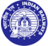
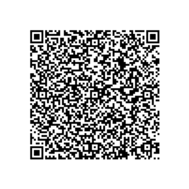
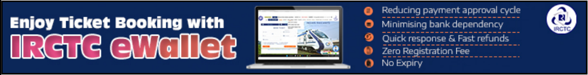
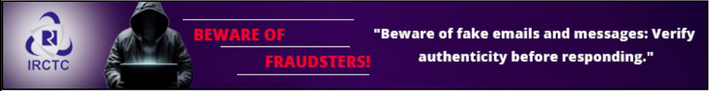

# **<u>Electronic Reservation Slip (ERS)</u>** -Normal User 

**[Image: 2619975596.pdf-0001-01.png (95x118, 10.3KB)]**

**[Image: 2619975596.pdf-0001-02.png (97x94, 13.6KB)]**

**[Image: 2619975596.pdf-0001-03.png (323x58, 22.0KB)]**

|**Booked From**||**To**|
|---|---|---|
|GURGAON (GGN)|**GURGAON (GGN)**|JAIPUR JN (JP)|
|Start Date* 22-Jun-2026|**Departure* 06:58 22-Jun-2026**|Arrival* 10:35 22-Jun-2026|
|**PNR**|**Train No./Name**|**Class**|
|**2619975596**|**12015 / AJMER SHATABDI**|**CHAIR CAR (CC)**|
|**Quota**|**Distance**|**Booking Date**|
|TATKAL (TQ)|277 KM|21-Jun-2026 10:04:42 HRS|

# **<u>Passenger Details</u>** 

||||**Catering**|||
|---|---|---|---|---|---|
|**# Name**|**Age**|**Gender**|**Service**|**Booking Status**|**Current Status**|
||||**Option**|||
|1. GEETA SHARMA|55|F|VEG|CNF/C1/31/NO CHOICE|CNF /C1/31/NO CHOICE|

Acronyms: RLWL: REMOTE LOCATION WAITLIST 

PQWL: POOLED QUOTA WAITLIST 

## **Transaction ID: 100006658175282** 

IR recovers only 57% of cost of travel on an average. 

# **<u>Payment Details</u>** 

|Ticket Fare|₹780.00|
|---|---|
|Catering Charges (Incl. of GST)|₹125.00|
|IRCTC Convenience Fee (Incl. of GST)|₹23.60|
|Travel Insurance Premium (Incl. of GST)|₹0.45|
|Total Fare (all inclusive)|₹929.05|

RSWL: ROAD-SIDE WAITLIST 

**[Image: 2619975596.pdf-0001-14.png (316x316, 29.7KB)]**

PG Charges as applicable (Additional) 

**Beware of fraudulent customer care number. For any assistance, use only the IRCTC e-ticketing Customer care number:14646.** 

**IRCTC Convenience Fee is charged per e-ticket irrespective of number of passengers on the ticket.** 

*** The printed Departure and Arrival Times are liable to change. Please Check correct departure, arrival from Railway Station Enquiry or Dial 139 or SMS RAIL to 139.** 

This ticket is booked on a personal User ID, its sale/purchase is an offence u/s 143 of the Railways Act,1989. Prescribed original ID proof is required while travelling along with SMS/ VRM/ ERS otherwise will be treated as without ticket and penalized as per Railway Rules. 

| **Indian Railways GST Deta**|**ils:**|||
|---|---|---|---|
|Invoice Number:|PS26261997559611|Address:|Indian Railways New Delhi|
|**Supplier Information:**||||
|SAC Code:|996421|GSTIN:|07AAAGM0289C1ZL|
|**Recipient Information:**||||
|GSTIN:|NA|||
|Name:|NA|Address:||
|Taxable Value:|742|||
|CGST Rate:|2.5%|CGST Amount:|0.0|
|SGST/UGST Rate:||SGST/UGST Amount:||
|IGST Rate:|5.0%|IGST Amount:|37.1|
|**Total Tax:**|**37.10**|||
|**Place of Supply:**Haryana|(6) **State Name/Code of S**|**upplier:**Delhi/DL||

### **<u>INSTRUCTIONS:</u>** 

1. Prescribed Original ID proofs are:- Voter Identity Card / Passport / PAN Card / Driving License / Photo ID card issued by Central / State Govt. / Public Sector Undertakings of State / Central Government ,District Administrations , Municipal bodies and Panchayat Administrations which are having serial number / Student Identity Card with photograph issued by recognized School or College for their students / Nationalized Bank Passbook with photograph /Credit Cards issued by Banks with laminated photograph/Unique Identification Card "Aadhaar", m-Aadhaar, e-Aadhaar. /Passenger showing the Aadhaar/Driving Licence from the "Issued Document" section by logging into his/her DigiLocker account considered as valid proof of identity. (Documents uploaded by the user i.e. the document in "Uploaded Document" section will not be considered as a valid proof of identity). 

2. PNRs having fully waitlisted status will be dropped and automatic refund of the ticket amount after deducting the applicable CLERKAGE by Railway shall be credited to the account used for payment for booking of the ticket. Passengers having fully waitlisted e-ticket are not allowed to board the train. However, the names of PARTIALLY waitlisted/confirmed and RAC ticket passenger will appear in the chart. 

3. A clerkage charge of Rs.60 per passenger plus GST for AC Classes and Rs.60 per passenger for Non AC classes will be deducted if the ticket remains Waitlisted at the time of Cancellation/Charting. 

4. Passengers travelling on a fully waitlisted e-ticket will be treated as Ticketless. 

5. Obtain certificate from the TTE /Conductor in case of (a) PARTIALLY waitlisted e-ticket when LESS NO. OF PASSENGERS travel, (b)A.C FAILURE, (c)TRAVEL IN LOWER CLASS. This original certificate must be sent to GGM (IT), IRCTC, Internet Ticketing Centre, 2nd Floor, Tower-D, World Trade Centre, Nauroji Nagar, New Delhi- 110029, after filing TDR online within prescribed time for claiming refund. 

6. In case, on a party e-ticket or a family e-ticket issued for travel of more than one passenger, some passengers have confirmed reservation and others are on RAC or waiting list, full refund of fare, less clerkage, shall be admissible for confirmed passengers also subject to the condition that the ticket shall be cancelled online or online TDR shall be filed for all the passengers upto thirty minutes before the scheduled departure of the train. 

7. In case train is late more than 3 hours, refund is admissible as per railway refund rules only when TDR is filed by the user before the actual departure of the train at boarding station and passenger has not travelled. 

8. In case of train cancellation on its entire run, full refund is granted automatically by the system. However, if the train is cancelled partially on its run or diverted and not touching boarding/destination station, passengers are required to file online TDR within 72 hours of scheduled departure of the train from passengers boarding station. 

9. Never purchase e-ticket from unauthorized agents or persons using their personal IDs for commercial purposes. Such tickets are liable to be cancelled and forfeited without any refund of money, under section (143) of the Indian Railway Act 1989. List of authorized agents are available on www.irctc.co.in under 'Find NGet Agents' option. 

10. For detail, Rules, Refund rules, Terms & Conditions of E-Ticketing services, Travel Insurance facility etc. Please visit www.irctc.co.in 

11. While booking this ticket, you have agreed of having read the Health Protocol of Destination State of your travel. You are again advised to clearly read the Health Protocol advisory of destination state before start of your travel and follow them properly. 

12. The FIR forms are available with on board ticket checking staff, train guard and train escorting RPF/GRP staff. 

13. Variety of meals available in more than 1500 trains. For delivery of meal of your choice on your seat log on to www.ecatering.irctc.co.in or call 1323 Toll Free. For any suggestions/complaints related to Catering services, contact Toll Free No. 1800-111-321 (07.00 hrs to 22.00 hrs) 

14. National Consumer Helpline (NCH) Toll Free Number: 1800-11-400 or 14404 

15. You can book unreserved ticket from UTS APP or ATVMs (Automatic Ticket Vending Machines) located in Railway Stations. 

16. As per RBI guidelines, the refund of Ticket should be given in the same Bank account, which was used for booking. It is necessary that the Bank Account used for booking online ticket should not be closed at least up to 30 days beyond the date of the journey. If accounts are found closed at the time of processing refund, the refund will be regretted by the Bank. 

## **<u>Customer Care:</u>** 

- For e-ticket booking cancellation and refund assistance, please contact us at https://equery.irctc.co.in or call us at 14646 (24X7) (Language: Hindi, English, Punjabi, Bengali, Assamese, Odia, Marathi, Gujarati, Tamil, Telugu, Kannada and Malayalam.) 

- In case a passenger faces any problem in cancelling an E-Ticket online or TDR filing, Write to:etickets@irctc.co.in 

- **Customer Support (Outside India):** 📞 Call: +91-8044647999 / +91-8035734999 

- For Railway Enquiries as well as for giving suggestions/filing complaints on Rail Madad, please contact us at 139 or SMS RAIL to 139. 

- For e-catering, to book and get food delivered on your train berth, please contact us at 1323 (24*7 Hrs Toll Free) or log on to www.ecatering.irctc.co.in. 

**[Image: 2619975596.pdf-0002-23.png (1147x149, 200.4KB)]**

**[Image: 2619975596.pdf-0002-24.png (1147x149, 233.6KB)]**

**<u>Print ERS Without Advertisements [X]</u>** 

---

## Extracted Images

| # | File | Dimensions | Size |
|---|------|------------|------|
| 1 | 2619975596.pdf-0001-01.png | 95x118 | 10.3KB |
| 2 | 2619975596.pdf-0001-02.png | 97x94 | 13.6KB |
| 3 | 2619975596.pdf-0001-03.png | 323x58 | 22.0KB |
| 4 | 2619975596.pdf-0001-14.png | 316x316 | 29.7KB |
| 5 | 2619975596.pdf-0002-23.png | 1147x149 | 200.4KB |
| 6 | 2619975596.pdf-0002-24.png | 1147x149 | 233.6KB |
