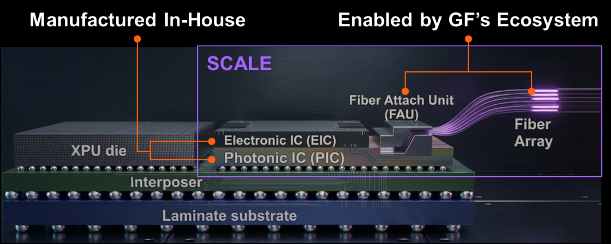
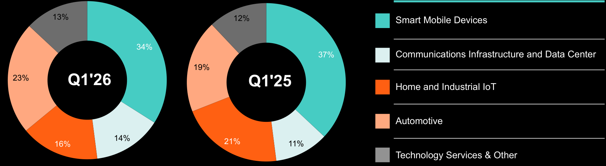

**[Image: GlobalFoundries_1Q_2026_Earnings_Deck_-1-.pdf-0001-00.png (788x155, 21.2KB)]**

**First Quarter 2026 Financial Results** 

(unaudited) May 5, 2026 

1 

###### **Disclaimer - Forward-looking statements and Third-Party Data** 

This presentation and the accompanying oral presentation include “forwardlooking statements” that reflect our current expectations and views of future events. These forward-looking statements are made under the “safe harbor” provisions of the U.S. Private Securities Litigation Reform Act of 1995 and include but are not limited to, statements regarding our financial outlook, future guidance, product development, business strategy and plans, and market trends, opportunities and positioning. These statements are based on current expectations, assumptions, estimates, forecasts, projections and limited information available at the time they are made. Words such as “expect,” “anticipate,” “should,” “believe,” “hope,” “target,” “project,” “goals,” “estimate,” “potential,” “predict,” “may,” “will,” “might,” “could,” “intend,” “shall,” “outlook,” “on track” and variations of these terms or the negative of these terms and similar expressions are intended to identify these forward-looking statements, although not all forward-looking statements contain these identifying words. Forwardlooking statements are subject to a broad variety of risks and uncertainties, both known and unknown. Any inaccuracy in our assumptions and estimates could affect the realization of the expectations or forecasts in these forward-looking statements. For example, our business could be impacted by geopolitical conditions such as the ongoing political and trade tensions with China and the continuation of conflicts in the Middle East and Ukraine; ongoing political developments in the United States, and in particular, any political and policyrelated changes that may impact our industry and the market generally, such as the imposition of trade controls, tariffs and counter-tariffs between the United States and its trade partners and new legislation, the market for our products may develop or recover more slowly than expected or than it has in the past; we may fail to achieve the full benefits of our strategic optimization efforts; our operating results may fluctuate more than expected; there may be significant fluctuations in our results of operations and cash flows related to our revenue recognition or otherwise; a network or data security incident that allows unauthorized access to our network or data or our customers’ data could result in a system disruption, loss of data or damage our reputation; we could experience interruptions or performance problems associated with our technology, including a service outage; global economic conditions could deteriorate, including due to rising inflation and any potential recession; the expected benefits of our announced partnerships may fail to materialize; and we may fail to achieve the anticipated results or benefits from funding received (including awards under the U.S. CHIPS and Science Act and New York State Green CHIPS) and our expected results and planned or further expansions and operations may not proceed as planned if funding we expect to receive is delayed or withheld for any reason. It is not possible for us to predict all risks, nor can we assess the impact of all factors on our business or the extent to which any factor, or combination of factors, may cause actual results or outcomes to differ materially from those contained in any forward-looking statements we may make. Moreover, we operate in a competitive and rapidly changing market, and new risks may emerge from time to time. You should not rely upon forward-looking statements as predictions of future events. These statements are based on our historical performance and on our current plans, estimates and projections in light of information currently available to us, and therefore you should not place undue reliance on them. 

Although we believe that the expectations reflected in our statements are reasonable, we cannot guarantee that the future results, levels of activity, performance or events and circumstances described in the forward-looking statements will be achieved or occur. Moreover, neither we, nor any other person, assumes responsibility for the accuracy and completeness of these statements. Recipients are cautioned not to place undue reliance on these forward-looking statements, which speak only as of the date such statements are made and should not be construed as statements of fact. Except to the extent required by federal securities laws, we undertake no obligation to update any information or any forward-looking statements as a result of new information, subsequent events or any other circumstances after the date hereof, or to reflect the occurrence of unanticipated events. For a discussion of potential risks and uncertainties, please refer to the risk factors and cautionary statements in our 2025 Annual Report on Form 20-F, current reports on Form 6-K and other reports filed with the Securities and Exchange Commission (SEC). Copies of our SEC filings are available on our Investor Relations website, investors.gf.com, or from the SEC website, www.sec.gov. 

This presentation and the accompanying oral presentation also contain estimates and other statistical data made by independent parties and by us relating to market size and growth and other data about our industry and business. This data involves a number of assumptions and limitations, and you are cautioned not to give undue weight to such estimates. We have not independently verified the industry data generated by independent parties and contained in this presentation and, accordingly, we cannot guarantee their accuracy or completeness. In addition, projections, assumptions and estimates of our future performance and the future performance of the markets in which we compete are necessarily subject to a high degree of uncertainty and risk. 

In addition to the financial information presented in accordance with International Financial Reporting Standards ("IFRS"), this press release includes the following Non-IFRS financial measures: Non-IFRS gross profit, Non-IFRS operating profit, Non-IFRS operating expense, Non-IFRS net income, Non-IFRS selling, general and administrative, Non-IFRS research and development, Non-IFRS other income (expense), Non-IFRS income tax benefit (expense),  Non-IFRS diluted earnings per share (“EPS”), Non-IFRS adjusted EBITDA, Non-IFRS adjusted free cash flow, Non-IFRS total capital expenditures net of proceeds from government grants and any related margins. We define each of Non-IFRS gross profit, NonIFRS selling, general and administrative, Non-IFRS research and development, Non-IFRS operating profit, Non-IFRS other income (expense), Non-IFRS income tax benefit (expense) and Non-IFRS net income as gross profit, selling, general and administrative, research and development, operating profit, other income (expense), income tax benefit (expense), and net income, respectively, adjusted for share-based compensation, structural optimization, amortization of acquired intangibles and other acquisition related charges, impairment charges, litigation charges, revaluation of equity investments, restructuring charges, tax matters, and any associated income tax effects. We define Non-IFRS operating expense as Non-IFRS gross profit minus Non-IFRS operating profit. We define Non-IFRS diluted EPS as Non-IFRS net income divided by the diluted shares outstanding. 

We define Non-IFRS adjusted free cash flow as cash flow provided by (used in) operating activities less purchases of property, plant and equipment and intangible assets plus proceeds from government grants related to capital expenditures. We define Non-IFRS total capital expenditures net of proceeds from government grants as purchases of property, plant and equipment and intangible assets less proceeds from government grants. We define Non-IFRS adjusted EBITDA as net income adjusted for the impact of finance expense, finance income, income tax expense (benefit), depreciation and amortization, share-based compensation, restructuring charges, impairment charges, revaluation of equity investments, structural optimization, litigation claims and acquisition related charges. We define each of Non-IFRS gross margin, NonIFRS operating margin, Non-IFRS net income margin, Non-IFRS adjusted free cash flow margin and Non-IFRS adjusted EBITDA margin as Non-IFRS gross profit, Non-IFRS operating profit, Non-IFRS net income, Non-IFRS adjusted free cash flow and Non-IFRS adjusted EBITDA, respectively, divided by net revenue. Any adjustments described above that are zero for a given period are excluded from the “Reconciliation of IFRS to Non-IFRS” table. See "Reconciliation of IFRS to Non-IFRS" section for a detailed reconciliation of Non-IFRS financial measures to the most directly comparable IFRS measure. 

We believe that in addition to our results determined in accordance with IFRS, these Non-IFRS financial measures provide useful information to both management and investors in measuring our financial performance and highlight trends in our business that may not otherwise be apparent when relying solely on IFRS measures. These Non-IFRS financial measures provide supplemental information regarding our operating performance that excludes certain gains, losses and non-cash charges that occur relatively infrequently and/or that we consider to be unrelated to our core operations. Management believes that Non-IFRS adjusted free cash flow as a Non-IFRS measure is helpful to investors as it provides insights into the nature and amount of cash the Company generates in the period. 

Non-IFRS financial information is presented for supplemental informational purposes only and should not be considered in isolation or as a substitute for financial information presented in accordance with IFRS. Our presentation of Non-IFRS measures should not be construed as an inference that our future results will be unaffected by unusual or nonrecurring items. Other companies in our industry may calculate these measures differently, which may limit their usefulness as comparative measures. 

**[Image: GlobalFoundries_1Q_2026_Earnings_Deck_-1-.pdf-0002-08.png (50x45, 0.9KB)]**

**[Image: GlobalFoundries_1Q_2026_Earnings_Deck_-1-.pdf-0003-00.png (682x1125, 96.1KB)]**

**[Image: GlobalFoundries_1Q_2026_Earnings_Deck_-1-.pdf-0003-01.png (81x181, 0.4KB)]**

# **Results and Highlights** 

### **First Quarter 2026 Results** 

**Revenue** 

<mark>$1.63B</mark> 

**↑ 3.1% Y/Y** 

**Non-IFRS Gross Margin****(1)** 29.0% 

**↑ 510bps Y/Y** 

**Non-IFRS Earnings per Share****(1)** $0.40 

**↑ 18% Y/Y** 

**[Image: GlobalFoundries_1Q_2026_Earnings_Deck_-1-.pdf-0004-08.png (1701x407, 1533.9KB)]**

**[Image: GlobalFoundries_1Q_2026_Earnings_Deck_-1-.pdf-0004-09.png (50x45, 0.9KB)]**

(1)  See the Appendix for a detailed reconciliation of Non-IFRS measures to the most directly comparable IFRS measure and for a discussion of why we believe these Non-IFRS measures are useful. 

4 

### **Key First Quarter 2026 Highlights** 

**[Image: GlobalFoundries_1Q_2026_Earnings_Deck_-1-.pdf-0005-01.png (738x738, 730.7KB)]**

###### Quarterly Results 

**»** Q1 2026 results at or above the high end of non-IFRS(1) guidance ranges 

End Market Highlight 

Sixth consecutive quarter of double digit % year-over-year revenue growth in CI&D 

- **»** 

Margin Expansion 

- **»** First quarter saw the largest Y/Y expansion of non-IFRS gross 

- margin(1) in over three years 

###### Shareholder Return 

**»** GF repurchased $400 million of shares in the quarter, out of the $500 million authorization 

(1) See the Appendix for a detailed reconciliation of Non-IFRS measures to the most directly comparable IFRS measure and for a discussion of why we believe these Non-IFRS measures are useful. 

5 

**[Image: GlobalFoundries_1Q_2026_Earnings_Deck_-1-.pdf-0006-00.png (682x1125, 96.1KB)]**

**[Image: GlobalFoundries_1Q_2026_Earnings_Deck_-1-.pdf-0006-01.png (81x181, 0.4KB)]**

# **Key Announcements** 

### **GF & Renesas to Accelerate U.S. Manufacturing** 

**[Image: GlobalFoundries_1Q_2026_Earnings_Deck_-1-.pdf-0007-01.png (726x853, 1239.3KB)]**

**GF and Renesas announced an expanded multi-billion dollar strategic partnership that broadens Renesas' access to GF's technology portfolio, including FDX, BCD and feature-rich CMOS with non-volatile memory.** 

###### **Expected Outcomes:** 

**Support SoCs, power devices and MCUs across a variety applications from auto to data center** 

**Manufacture semiconductors used by the top three automotive MCU players globally** 

**Contribute to the broader effort to onshore essential chip technologies** 

“This expanded partnership enables a stable, long-term supply of semiconductors while ensuring the highest quality and reliability for our products. These capabilities are essential as we deliver advanced solutions, with demand for electrification and connectivity accelerating worldwide.” 

**Hidetoshi Shibata, CEO, Renesas** 

**[Image: GlobalFoundries_1Q_2026_Earnings_Deck_-1-.pdf-0007-09.png (50x45, 0.9KB)]**

7 

### **Introducing SCALE: GF’s CPO Solution** 

**Silicon Photonics Co-packaged Advanced Light Engine** 

**[Image: GlobalFoundries_1Q_2026_Earnings_Deck_-1-.pdf-0008-02.png (1499x601, 1047.4KB)]**

**[Image: GlobalFoundries_1Q_2026_Earnings_Deck_-1-.pdf-0008-03.png (50x45, 0.9KB)]**

8 

### **AutoPro150 eMRAM on FDX for Advanced Auto** 

**[Image: GlobalFoundries_1Q_2026_Earnings_Deck_-1-.pdf-0009-01.png (832x850, 978.9KB)]**

**GF announced the availability of Auto Grade 1 ready eMRAM technology on the ultra-low power FDX™ platform, a key enhancement to GF’s portfolio of eNVM technologies and AutoPro™ platform.** 

**Expected Outcomes:** 

**Deliver proven endurance up to 500k cycles, sub-10 nanosecond read speed, and superior scalability** 

**Enable future-proof Address known designs for selfmagnetic field learning entities, like effects and reliably autonomous operate in harsh vehicles and environments humanoid robots** 

“MRAM is a technology at the edge of automotive innovation, providing speed, endurance and reliability that will help nextgeneration MCUs. We welcome that GF delivers embedded MRAM technology on their FDX platform and creates a new solution that helps scale with the growing demand across the automotive industry.” **Dr. Dominik Erb, VP digital semiconductor roadmaps & operations, Bosch** 

**[Image: GlobalFoundries_1Q_2026_Earnings_Deck_-1-.pdf-0009-07.png (50x44, 0.9KB)]**

9 

**[Image: GlobalFoundries_1Q_2026_Earnings_Deck_-1-.pdf-0010-00.png (682x1125, 96.1KB)]**

**[Image: GlobalFoundries_1Q_2026_Earnings_Deck_-1-.pdf-0010-01.png (81x181, 0.4KB)]**

# **End Markets** 

### **End Market Commentary** 

9 Com 

**Communications Infrastructure and Data Center »** 

**[Image: GlobalFoundries_1Q_2026_Earnings_Deck_-1-.pdf-0011-03.png (417x234, 241.5KB)]**

We now expect to achieve high-30s percent Y/Y growth in CID in 2026, up from expectations of ~30% Y/Y growth last quarter. 

**Automotive »** 

**[Image: GlobalFoundries_1Q_2026_Earnings_Deck_-1-.pdf-0011-06.png (415x234, 208.7KB)]**

We expect Automotive to deliver its sixth consecutive year of double digit percentage growth in 2026. 

**Smart Mobile Home and Devices » Industrial IoT »** 

**[Image: GlobalFoundries_1Q_2026_Earnings_Deck_-1-.pdf-0011-09.png (417x234, 200.6KB)]**

**[Image: GlobalFoundries_1Q_2026_Earnings_Deck_-1-.pdf-0011-10.png (415x234, 149.1KB)]**

We expect SMD to Beyond 2026, we expect gradually benefit from new IoT to be one of the AI-powered form factors, primary beneficiaries of such as smart glasses, the burgeoning physical AI hearables and wearables. revolution. 

**[Image: GlobalFoundries_1Q_2026_Earnings_Deck_-1-.pdf-0011-12.png (50x45, 1.8KB)]**

11 

### **Communications Infrastructure and Data Center** 

**Q1'26 Revenue** $230M 

**↑ 32% Y/Y** 

**End Market Commentary** In the first quarter, we executed additional tape outs for silicon photonics that give us confidence we are on track to roughly double our silicon photonics revenue in 2026. 

Advanced Micro Foundry (GF Science Park) integration is on track and we expect this acquisition to support greater growth and profitability tailwinds in the coming years. 

**[Image: GlobalFoundries_1Q_2026_Earnings_Deck_-1-.pdf-0012-05.png (50x45, 4.5KB)]**

12 

### **Automotive** 

**Q1'26 Revenue** $382M **↑ 24% Y/Y** 

**End Market Commentary** In addition to our strength in MCUs, we are in the early stage of revenue ramps as the result of our accumulated design wins in smart sensors & networking, as well as vehicle infrastructure. 

We are continuing to diversify our offerings within automotive by ramping newly secured sockets in applications such as camera, Ethernet, radar, and power. 

**[Image: GlobalFoundries_1Q_2026_Earnings_Deck_-1-.pdf-0013-04.png (50x45, 2.8KB)]**

13 

### **Smart Mobile Devices** 

**Q1'26 Revenue** 

$558M 

**↓ (5)% Y/Y** 

**End Market Commentary** 

New applications and emerging form factors benefit from the features we offer, such as low power, greater reliability, and superior RF performance. 

In the first quarter, we secured two new design wins on our FDX platform for microLED backplanes used in smart glasses. 

**[Image: GlobalFoundries_1Q_2026_Earnings_Deck_-1-.pdf-0014-07.png (50x45, 1.2KB)]**

14 

### **Home and Industrial IoT** 

**Q1'26 Revenue** 

## $255M 

**↓ (22)% Y/Y** 

**End Market Commentary** 

We expect 2026 to be a growth year for IoT, helped in part by the normalization of core industrial customer inventory. We also secured nearly 50 design wins in the first quarter. 

In the realm of robotics and physical AI, in March GF announced a partnership with Inova Semiconductors to deliver a robotics control reference platform. 

**[Image: GlobalFoundries_1Q_2026_Earnings_Deck_-1-.pdf-0015-07.png (50x45, 1.1KB)]**

15 

**Q1'26 Revenue by End Market** (Unaudited, in millions USD) 

((Unaudited, in millions) 

**[Image: GlobalFoundries_1Q_2026_Earnings_Deck_-1-.pdf-0016-02.png (57x61, 1.8KB)]**

**[Image: GlobalFoundries_1Q_2026_Earnings_Deck_-1-.pdf-0016-03.png (69x63, 2.7KB)]**

**[Image: GlobalFoundries_1Q_2026_Earnings_Deck_-1-.pdf-0016-04.png (67x65, 2.5KB)]**

**[Image: GlobalFoundries_1Q_2026_Earnings_Deck_-1-.pdf-0016-05.png (74x51, 2.5KB)]**

||**Q1'26**|**Q4'25**|**Q1'25**|**Year-ov** **Q1'26 vs**|**er-year** **Q1'25**|**Seq** **Q1'26 v**|**uential** **s Q4'25**|
|---|---|---|---|---|---|---|---|
|Smart Mobile Devices|$ 558|$ 657|$ 586|$ (28)|(5)%|$ (99)|(15)%|
|Communications Infrastructure and Data Center|$ 230|$ 225|$ 174|$ 56|32%|$ 5|2%|
|Home and Industrial IoT|$ 255|$ 303|$ 328|$ (73)|(22)%|$ (48)|(16)%|
|Automotive|$ 382|$ 427|$ 309|$ 73|24%|$ (45)|(11)%|
|Technology Services|$ 209|$ 218|$ 188|$ 21|11%|$ (9)|(4)%|
|**Revenue**|**$ 1,634**|**$ 1,830**|**$ 1,585**|**$** **49**|**3%**|**$ (196)**|**(11)%**|

**[Image: GlobalFoundries_1Q_2026_Earnings_Deck_-1-.pdf-0016-07.png (50x45, 0.9KB)]**

16 

### **Q1'26 Revenue Mix by End Market** 

9 (Unaudited) 

**[Image: GlobalFoundries_1Q_2026_Earnings_Deck_-1-.pdf-0017-02.png (1872x515, 77.8KB)]**

<!-- Start of picture text -->
13% 12% Smart Mobile Devices 34% 37% Communications Infrastructure and Data Center 19% 23% Q1'26 Q1'25 Home and Industrial IoT Automotive 14% 21% 16% 11% Technology Services & Other <!-- End of picture text -->

**[Image: GlobalFoundries_1Q_2026_Earnings_Deck_-1-.pdf-0017-03.png (50x45, 0.9KB)]**

17 

### **Capex and Cash Flow** 

##### **First Quarter 2026** 

▪We are expanding capacity in oversubscribed corridors, such as Silicon Photonics, FDX, and SiGe, to alleviate supply constraints relative to the strong demand. 

▪Even with greater investment in high-growth technology corridors, we remain on track to deliver approximately 10% non-IFRS adjusted free cash flow margin(1) for the full year 2026. 

**[Image: GlobalFoundries_1Q_2026_Earnings_Deck_-1-.pdf-0018-04.png (50x45, 1.7KB)]**

$542M 

**Cash flow from operations** 

$312M (19% of Revenue) 

**Capital expenditures** 

**Non-IFRS Capital expenditures net of government grants****(1)** 

$309 (19% of Revenue) $233M (14% of Revenue) 

**Non-IFRS Adjusted FCF****(1)** 

**Cash, cash equivalent and marketable securities** 

$3.8B at the end of Q1’26 

> (1) See the Appendix for a detailed reconciliation of Non-IFRS measures to the most directly comparable IFRS measure and for a discussion of why we believe these Non-IFRS measures are useful. 

18 

**[Image: GlobalFoundries_1Q_2026_Earnings_Deck_-1-.pdf-0019-00.png (682x1125, 96.1KB)]**

**[Image: GlobalFoundries_1Q_2026_Earnings_Deck_-1-.pdf-0019-01.png (81x181, 0.4KB)]**

# **Outlook** 

19 

#### **Q2’26 Guidance****(1)** 

(Unaudited, in millions USD, except per share amounts) 

||**IFRS**|**Share-Based** **Compensation****(3)**|**Non-IFRS****(2)**|
|---|---|---|---|
|**Net Revenue**|$1,760 ± $25|||
|_Gross Margin__(2)_|_27.4% ± 100bps_|_~110bps_|_28.5% ± 100bps_|
|**Operating Expenses****(2)**|$277 ± $10|~$52|$225 ± $10|
|_Operating Margin__(2)_|_11.7% ± 180bps_|_~400bps_|_15.7% ± 180bps_|
|**Diluted EPS****(2)(4)**|$0.30 ± $0.05|~$0.13|$0.43 ± $0.05|
|**Fully Diluted Share Count**|~555|||

> (1)  The Guidance provided contains forward-looking statements as defined in the U.S. Private Securities Litigation Act of 1995, and is subject to the safe harbors created therein. The Guidance includes management's beliefs and assumptions and is based on information that is available as of the date of this release. 

> (2) Non-IFRS gross margin, Non-IFRS operating expenses, Non-IFRS operating margin and Non-IFRS diluted EPS are Non-IFRS measures and, for purposes of the Guidance only, are defined as gross profit as a percent of revenue, operating expenses, operating profit as a percent of revenue, and diluted EPS, all before share-based compensation, respectively. See "Financial Measures (Non-IFRS)" for further discussion on these Non-IFRS measures and why we believe they are useful. 

> (3)  We expect share-based compensation of $19 million and $52 million in cost of revenue and operating expenses, respectively. The Non-IFRS margin impacts are calculated by dividing share-based compensation by net revenue, and the Non-IFRS diluted EPS impact is calculated by dividing share-based compensation by the fully diluted share count. 

> (4)  Included in IFRS and Non-IFRS diluted EPS is net interest income (expense) and other income (expense) which we estimate will be between ($6) million and $2 million for the second quarter 2026. Also included in IFRS and Non-IFRS diluted EPS is income tax expense which we estimate will be between $28 million and $48 million for the second quarter 2026. 

**[Image: GlobalFoundries_1Q_2026_Earnings_Deck_-1-.pdf-0020-07.png (50x45, 0.9KB)]**

20 

**[Image: GlobalFoundries_1Q_2026_Earnings_Deck_-1-.pdf-0021-00.png (682x1125, 96.1KB)]**

**[Image: GlobalFoundries_1Q_2026_Earnings_Deck_-1-.pdf-0021-01.png (81x181, 0.4KB)]**

# **Appendix: Summary Financials and Reconciliations** 

### **Q1'26 Financial Summary** 

(Unaudited, in millions, except per share data and wafer shipments) 

||**Q1'26**|**Q4'25**|**Q1'25**|**Year-over-year** **Q1'26 vs Q1'25**|**Sequenti** **Q1'26 vs Q**|**al** **4'25**|
|---|---|---|---|---|---|---|
|**Net revenue**|**$** **1,634**|**$** **1,830**|**$** **1,585**|**$** **49** **3%** **$**|**(196)**|**(11) %**|
|**Gross profit**|**$** **451**|**$** **508**|**$** **355**|**$** **96** **27 %** **$**|**(57)**|**(11) %**|
|_Gross margin_|_27.6%_| _27.8%_| _22.4%_| _+520bps_||_(20)bps_|
|**Non-IFRS gross profit****(1)**|**$** **474**|**$** **530**|**$** **379**|**$** **95** **25 %** **$**|**(56)**|**(11) %**|
|_Non-IFRS gross margin__(1)_|_29.0%_| _29.0%_| _23.9%_| _+510bps_||_0bps_|
|**Operating profit**|**$** **180**|**$** **255**|**$** **151**|**$** **29** **19%** **$**|**(75)**|**(29) %**|
|_Operating margin_|_11.0%_| _13.9%_| _9.5%_| _+150bps_||_(290)bps_|
|**Non-IFRS operating profit****(1)**|**$** **271**|**$** **335**|**$** **213**|**$** **58** **27%** **$**|**(64)**|**(19) %**|
|_Non-IFRS operating margin__(1)_|_16.6%_| _18.3%_| _13.4%_| _+320bps_||_(170)bps_|
|**Net income**|**$** **104**|**$** **200**|**$** **211**|**$** **(107)** **(51%)** **$**|**(96)**|**(48) %**|
|_Net income margin_|_6.4%_| _10.9%_| _13.3%_| _(690)bps_||_(450)bps_|
|**Non-IFRS net income****(1)**|**$** **227**|**$** **310**|**$** **189**|**$** **38** **20%** **$**|**(83)**|**(27) %**|
|_Non-IFRS net income margin__(1)_|_13.9%_| _16.9%_| _11.9%_| _+200bps_||_(300)bps_|
|**Diluted earnings per share ("EPS")**|**$** **0.18**|**$** **0.36**|**$** **0.38**|**$** **(0.20)** **(53) %** **$**|**(0.18)**|**(50) %**|
|**Non-IFRS diluted EPS****(1)**|**$** **0.40**|**$** **0.55**|**$** **0.34**|**$** **0.06** **18%** **$**|**(0.15)**|**(27) %**|
|**Non-IFRS adjusted EBITDA****(1)**|**$** **561**|**$** **641**|**$** **558**|**$** **3** **1 %** **$**|**(80)**|**(12) %**|
|_Non-IFRS adjusted EBITDA margin__(1)_|_34.3%_| _35.0%_| _35.2%_| _(90)bps_||_(70)bps_|
|**Cash from operations**|**$** **542**|**$** **374**|**$** **331**|**$** **211** **64 %** **$**|**168**|**45 %**|
|**Wafer shipments (300MM Equivalent) (in thousands)**|**579**|**619**|**543**|**36** **7 %**|**(40)**|**(6) %**|

> (1) See the Appendix for a detailed reconciliation of Non-IFRS measures to the most directly comparable IFRS measure and for a discussion of why we believe these Non-IFRS measures are useful. 

**[Image: GlobalFoundries_1Q_2026_Earnings_Deck_-1-.pdf-0022-04.png (50x45, 0.9KB)]**

22 

### **Statement of Operations** 

(Unaudited, in millions, except per share amounts) 

|||**Three Months Ended**||
|---|---|---|---|
||**March 31, 2026**|**December 31, 2025**|**March 31, 2025**|
|**Net revenue**|**$** **1,634**|**$** **1,830**|**$** **1,585**|
|Cost of revenue|1,183| 1,322| 1,230|
|**Gross profit**|**$** **451**|**$** **508**|**$** **355**|
|Operating expenses:||||
|Research and development|132| 133| 127|
|Selling, general and administrative|139| 120| 77|
|**Operating expenses**|**$** **271**|**$** **253**|**$** **204**|
|**Operating profit**|**$** **180**|**$** **255**|**$** **151**|
|Finance income (expense), net|15| 17| 14|
|Other income (expense), net|(10)| 2| 30|
|Income tax (expense) benefit|(81)|(74)|16|
|**Net income**|**$** **104**|**$** **200**|**$** **211**|
|**EPS:**||||
|Basic|$ 0.19|$ 0.36|$ 0.38|
|Diluted|$ 0.18|$ 0.36|$ 0.38|
|Shares used in EPS calculation:||||
|Basic|555|556|554|
|Diluted|561|560|557|

**[Image: GlobalFoundries_1Q_2026_Earnings_Deck_-1-.pdf-0023-03.png (50x45, 0.9KB)]**

23 

### **Statements of Financial Position** 

(Unaudited, in millions) 

**[Image: GlobalFoundries_1Q_2026_Earnings_Deck_-1-.pdf-0024-02.png (50x45, 0.9KB)]**

||**A** |**s of** |
|---|---|---|
||**March 31, 2026**|**December 31, 2025**|
|**Assets:**|||
|Cash and cash equivalents|$ 1,849|$ 1,809|
|Marketable securities|1,154|1,241|
|Receivables, prepayments and other|1,347|1,578|
|Inventories|1,686|1,577|
|**Current assets**|**6,036**|**6,205**|
|Property, plant, and equipment, net|7,210|7,223|
|Goodwill and intangible assets, net|1,366|1,368|
|Marketable securities|770|939|
|Right-of-use assets|597|569|
|Other assets|918|837|
|**Non-current assets**|**10,861**|**10,936**|
|**Total assets**|**$** **16,897**|**$** **17,141**|
|**Liabilities and equity:**|||
|Current portion of long-term debt|$ 84|$ 86|
|Other current liabilities|2,245|2,282|
|**Current liabilities**|**2,329**|**2,368**|
|Non-current portion of long-term debt|1,063|1,065|
|Non-current portion of lease obligations|511|487|
|Other liabilities|1,246|1,238|
|**Non-current liabilities** |**2,820** |**2,790** |
|**Total liabilities**|**5,149**|**5,158**|
|**Shareholders’ equity:**|||
|Common stock / additional paid-in capital|$ 23,861|$ 24,231|
|Accumulated deficit|(12,278)| (12,381)|
|Accumulated other comprehensive income|110|78|
|Non-controlling interests|55|55|
|**Total liabilities and equity**|**$** **16,897**|**$** **17,141**|

24 

**Statement of Cash Flows** (Unaudited, in millions) 

||**Three Months Ended** **March 31, 2026** **March 31, 2025**|
|---|---|
|**Operating Activities:**||
|Net income|$ 104 $ 211|
|Depreciation and amortization|311 352|
|Finance (income) expense, net and other|7 9|
|Deferred income taxes|67 (64)|
|Net change in working capital|4 (144)|
|Other non-cash operating activities|49 (33)|
|**Net cash provided by operating activities**|$ 542 $ 331|
|**Investing Activities:**||
|Purchases of property, plant and equipment and intangible assets|$ (312) $ (166)|
|Acquisitions, net of cash acquired|— (19)|
|Net sales (purchases) of marketable securities|252 (61)|
|Other investing activities|9 35     |
|**Net cash used in investing activities**|$ (51)$ (211)|
|**Financing Activities:**||
|Proceeds from issuance of equity instruments, net of taxes paid|$ (30) $ 16|
|Purchases of treasury stock|(400) —|
|Proceeds (repayment) of debt, net|(20) (733)|
|**Net cash used in financing activities**|$ (450) $ (717)|
|**Effect of exchange rate changes**|(1) 1|
|Net change in cash and cash equivalents|$ 40 $ (596)|
|Cash and cash equivalents at the beginning of the period|1,809 2,192|
|**Cash and cash equivalents at the end of the period**|$ 1,849 $ 1,596|

**[Image: GlobalFoundries_1Q_2026_Earnings_Deck_-1-.pdf-0025-02.png (50x45, 0.9KB)]**

25 

### **IFRS to Non-IFRS Reconciliations****(1)** 

(Unaudited, in millions, except per share amounts) 

###### **Three Months Ended March  31, 2026** 

||**Gross profit**|**Selling,** **general &** **administrative**|**Research &** **development**|**Operating** **profit**|**Other income** **(expense)**|**Income tax** **(expense)** **benefit**|**Net income**|**Diluted EPS**|
|---|---|---|---|---|---|---|---|---|
|**As Reported**|**$** **451**|**$** **139**|**$** **132**|**$** **180**|**$** **(10) $**| **(81)**|**$** **104**|**$** **0.18**|
|_IFRS margins__(1)_|_27.6%_|||_11.0%_|||_6.4%_||
|Share-based compensation|16|(32)| (15)| 63|—|(2)| 61|0.11|
|Structural optimization(2)|2|(3)| (1)| 6|—|(1)| 5|0.01|
|Amortization of acquired intangibles and other acquisition related charges|5|(15)| (2)| 22|—|(3)| 19|0.03|
|Tax matters(3)|—|—| —| —|—|38|38|0.07|
|**Non-IFRS measures****(1)**|**$** **474**|**$** **89**|**$** **114**|**$** **271**|**$** **(10) $**| **(49)**|**$** **227**|**$** **0.40**|
|**_Non-IFRS margins_****_(1)_**|_29.0%_|||_16.6%_|||_13.9%_||

- (1)  See "Financial Measures (Non-IFRS)" for further discussion on these Non-IFRS measures and why we believe they are useful. 

(2)  Structural optimization represents costs associated with employee workforce reductions, manufacturing footprint alignment and liquidation charges. 

- (3)  Includes $38 million tax impact from foreign exchange revaluation of German deferred taxes. 

**[Image: GlobalFoundries_1Q_2026_Earnings_Deck_-1-.pdf-0026-07.png (50x45, 0.9KB)]**

26 

### **IFRS to Non-IFRS Reconciliations****(1)** 

(Unaudited, in millions, except per share amounts) 

||**Gross profit**|**Selling, general** **&** **administrative**|**Th** **Research &** **development**|**ree Months Ended** **Operating** **profit**|**December 31, 2025** **Other income** **(expense)**|**Income tax** **(expense)** **benefit**|**Net income**|**Diluted EPS**|
|---|---|---|---|---|---|---|---|---|
|**As Reported**|**$** **508**|**$** **120**|**$** **133**|**$** **255**|**$** **2**|**$** **(74)**|**$** **200**|**$** **0.36**|
|_IFRS margins__(1)_|_27.8%_|||_13.9%_|||_10.9%_||
|Share-based compensation|16|(25)| (15)| 56|—|(1)| 55|0.10|
|Structural optimization(2)|4|(2)| (1)| 7|—|1| 8|0.01|
|Amortization of acquired intangibles and other acquisition related charges|2|(13)| (2)| 17|1|(2)| 16|0.03|
|Revaluation of equity investments|—|—| —| —|(4)| —| (4)|(0.01)|
|Tax matters(3)|—|—| —| —|—|35| 35|0.06|
|**Non-IFRS measures****(1)**|**$** **530**|**$** **80**|**$** **115**|**$** **335**|**$** **(1)**|**$** **(41)**|**$** **310**|**$** **0.55**|
|**_Non-IFRS margins_****_(1)_**|_29.0%_|||_18.3%_|||_16.9%_||

(1) See "Financial Measures (Non-IFRS)" for further discussion on these Non-IFRS measures and why we believe they are useful. 

(2)  Structural optimization represents costs associated with employee workforce reductions, manufacturing footprint alignment and liquidation charges. 

(3) Includes  $49 million of non-recurring revaluation of Singapore deferred tax assets and liabilities and nondeductible expenses, offset by $14 million tax impact from foreign exchange revaluation of German deferred taxes. 

**[Image: GlobalFoundries_1Q_2026_Earnings_Deck_-1-.pdf-0027-06.png (50x45, 0.9KB)]**

27 

### **IFRS to Non-IFRS Reconciliations****(1)** 

(Unaudited, in millions, except per share amounts) 

||**Gross profit**|**Selling, general** **&** **administrative**|**Three** **Research &** **development**|**months ende** **Operating** **profit**|**d March 31, 2025** **Other income** **(expense)**|**Income tax** **(expense)** **benefit**|**Net income**|**Diluted EPS**|
|---|---|---|---|---|---|---|---|---|
|**As Reported**|**$** **355**|**$** **77**|**$** **127**|**$** **151**|**$** **30** |**$** **16**|**$** **211**|**$** **0.38**|
|_IFRS margins__(1)_|_22.4%_|||_9.5%_|||_13.3%_||
|Share-based compensation|13|(20)| (7)| 40|**—**|**(2)**|38|0.07|
|Structural optimization(2)|11|(5)| (5)| 21|**—**|**(3)**|18|0.03|
|Amortization of acquired intangibles and other acquisition related charges|—|—|(1)| 1|**(31)**| **6**|(24)|(0.04)|
|Revaluation of equity investments|—|—|—|—|**(6)**| **—**|(6)|(0.01)|
|Tax matters(3)|—|—|—|—|**—**|**(48)**|(48)|(0.09)|
|**Non-IFRS Measures****(1)**|**$** **379**|**$** **52**|**$** **114**|**$** **213**|**$** **(7)**|**$** **(31)**|**$** **189**|**$** **0.34**|
|**_Non-IFRS margins_****_(1)_**|_23.9%_|||_13.4%_|||_11.9%_||

(1) See "Financial Measures (Non-IFRS)" for further discussion on these Non-IFRS measures and why we believe they are useful. 

(2)  Structural optimization represents costs associated with employee workforce reductions, manufacturing footprint alignment and liquidation charges. 

(3) Includes $40 million tax from foreign exchange revaluation of German deferred taxes and $8 million tax on the recognition of German deferred tax assets net of contingencies. 

**[Image: GlobalFoundries_1Q_2026_Earnings_Deck_-1-.pdf-0028-06.png (50x45, 0.9KB)]**

28 

### **IFRS to Non-IFRS Reconciliation Non-IFRS Adjusted Free Cash Flow****(1)** 

a 

(Unaudited, in millions) 

|||**Three Months Ended**||
|---|---|---|---|
||**March 31, 2026**|**December 31, 2025**|**March 31, 2025**|
|**Net cash provided by operating activities**|**$** **542**|**$** **374**|**$** **331**|
|Less: Purchases of property, plant and equipment and intangible assets|(312)|(208)|(166)|
|Add: Proceeds from government grants|3|98|—|
|**Non-IFRS total capital expenditures net of** **proceeds from government grants****(1)**|**$** **(309)**|**$** **(110)**|**$** **(166)**|
|**Non-IFRS adjusted free cash flow****(1)**|**$** **233**|**$** **264**|**$** **165**|
|_Non-IFRS adjusted free cash flow margin__(1)_|**_14 %_**|**_14 %_**|**_10 %_**|

> (1) See "Financial Measures (Non-IFRS)" for further discussion on these Non-IFRS measures and why we believe they are useful. 

**[Image: GlobalFoundries_1Q_2026_Earnings_Deck_-1-.pdf-0029-05.png (50x45, 0.9KB)]**

29 

### **IFRS to Non-IFRS Reconciliation Non-IFRS Adjusted EBITDA****(1)** 

(Unaudited, in millions) 

|||**Three Months Ended**||
|---|---|---|---|
||**March 31, 2026**|**December 31, 2025**|**March 31, 2025**|
|Net revenue|**$** **1,634**|**$** **1,830**|**$** **1,585**|
|Net income|**104**|**200**|**211**|
|_Net income margin_|_6.4 %_| _10.9 %_|_13.3 %_|
|Depreciation and amortization|311|313|352|
|Finance expense|22|23|25|
|Finance income|(37)|(40)|(39)|
|Income tax expense (benefit)|81|74|(16)|
|Share-based compensation|63|56|40|
|Structural optimization|6|7|21|
|Revaluation of equity investments|—|(4)|(6)|
|Other acquisition related charges|11|12|(30)|
|**Non-IFRS adjusted EBITDA****(1)**|**$** **561**|**$** **641**|**$** **558**|
|Non-IFRS adjusted EBITDA margin(1)|_34.3 %_| _35.0 %_|_35.2 %_|

(1)  See "Financial Measures (Non-IFRS)" for further discussion on this Non-IFRS measure and why we believe it is useful. 

**[Image: GlobalFoundries_1Q_2026_Earnings_Deck_-1-.pdf-0030-04.png (50x45, 0.9KB)]**

30 

### **Financial Measures (Non-IFRS)** 

**[Image: GlobalFoundries_1Q_2026_Earnings_Deck_-1-.pdf-0031-01.png (50x45, 0.9KB)]**

In addition to the financial information presented in accordance with International Financial Reporting Standards ("IFRS"), this press release includes the following Non-IFRS financial measures: Non-IFRS gross profit, Non-IFRS operating profit, Non-IFRS operating expense, Non-IFRS net income, Non-IFRS selling, general and administrative, Non-IFRS research and development, Non-IFRS other income (expense), Non-IFRS income tax benefit (expense), Non-IFRS diluted earnings per share (“EPS”), Non-IFRS adjusted EBITDA, Non-IFRS total capital expenditures net of proceeds from government grants, Non-IFRS adjusted free cash flow and any related margins. We define each of Non-IFRS gross profit, Non-IFRS selling, general and administrative, Non-IFRS research and development, NonIFRS operating profit, Non-IFRS other income (expense), Non-IFRS income tax benefit (expense) and Non-IFRS net income as gross profit, selling, general and administrative, research and development, operating profit, other income (expense), income tax benefit (expense), and net income, respectively, adjusted for share-based compensation, structural optimization, amortization of acquired intangibles and other acquisition related charges, impairment charges, litigation charges, revaluation of equity investments, restructuring charges, tax matters, and any associated income tax effects. We define NonIFRS operating expense as Non-IFRS gross profit minus Non-IFRS operating profit. We define Non-IFRS diluted EPS as Non-IFRS net income divided by the diluted shares outstanding. We define Non-IFRS total capital expenditures net of proceeds from government grants as purchases of property, plant and equipment and intangible assets less proceeds from government grants. We define Non-IFRS adjusted free cash flow as cash flow provided by (used in) operating activities less purchases of property, plant and equipment and intangible assets plus proceeds from government grants related to capital expenditures. We define Non-IFRS adjusted EBITDA as net income adjusted for the impact of finance expense, finance income, income tax expense (benefit), depreciation and amortization, share-based compensation, restructuring charges, impairment charges, revaluation of equity investments, structural optimization, litigation claims and acquisition related charges. We define each of Non-IFRS gross margin, Non-IFRS operating margin, Non-IFRS net income margin, Non-IFRS adjusted free cash flow margin and Non-IFRS adjusted EBITDA margin as Non-IFRS gross profit, Non-IFRS operating profit, Non-IFRS net income, Non-IFRS adjusted free cash flow and Non-IFRS adjusted EBITDA, respectively, divided by net revenue. Any adjustments described above that are zero for a given period are excluded from the “Reconciliation of IFRS to Non-IFRS” table. See "Reconciliation of IFRS to Non-IFRS" section for a detailed reconciliation of Non-IFRS financial measures to the most directly comparable IFRS measure. 

We believe that in addition to our results determined in accordance with IFRS, these NonIFRS financial measures provide useful information to both management and investors in measuring our financial performance and highlight trends in our business that may not otherwise be apparent when relying solely on IFRS measures. These Non-IFRS financial measures provide supplemental information regarding our operating performance that excludes certain gains, losses and non-cash charges that occur relatively infrequently and/ or that we consider to be unrelated to our core operations. Management believes that NonIFRS adjusted free cash flow as a Non-IFRS measure is helpful to investors as it provides insights into the nature and amount of cash the Company generates in the period. 

Non-IFRS financial information is presented for supplemental informational purposes only and should not be considered in isolation or as a substitute for financial information presented in accordance with IFRS. Our presentation of Non-IFRS measures should not be construed as an inference that our future results will be unaffected by unusual or nonrecurring items. Other companies in our industry may calculate these measures differently, which may limit their usefulness as comparative measures. 

31 

**[Image: GlobalFoundries_1Q_2026_Earnings_Deck_-1-.pdf-0032-00.png (1473x1125, 1821.0KB)]**

### **Thank You** 

The information contained herein is the property of GlobalFoundries and/or its licensors. 

This document is for informational purposes only, is current only as of the date of publication and is subject to change by GlobalFoundries at any time without notice. 

GlobalFoundries, the GlobalFoundries logo and combinations thereof are trademarks of GlobalFoundries Inc. in the United States and/or other jurisdictions. Other product or service names are for identification only and may be trademarks or service marks of their respective owners. 

© GlobalFoundries Inc. 2026. Unless otherwise indicated, all rights reserved. Do not copy or redistribute except as expressly permitted by GlobalFoundries. 

**For further information, please contact:** 

Investor Relations ir@gf.com 

---

## Extracted Images

| # | File | Dimensions | Size |
|---|------|------------|------|
| 1 | GlobalFoundries_1Q_2026_Earnings_Deck_-1-.pdf-0001-00.png | 788x155 | 21.2KB |
| 2 | GlobalFoundries_1Q_2026_Earnings_Deck_-1-.pdf-0002-08.png | 50x45 | 0.9KB |
| 3 | GlobalFoundries_1Q_2026_Earnings_Deck_-1-.pdf-0003-00.png | 682x1125 | 96.1KB |
| 4 | GlobalFoundries_1Q_2026_Earnings_Deck_-1-.pdf-0003-01.png | 81x181 | 0.4KB |
| 5 | GlobalFoundries_1Q_2026_Earnings_Deck_-1-.pdf-0004-08.png | 1701x407 | 1533.9KB |
| 6 | GlobalFoundries_1Q_2026_Earnings_Deck_-1-.pdf-0004-09.png | 50x45 | 0.9KB |
| 7 | GlobalFoundries_1Q_2026_Earnings_Deck_-1-.pdf-0005-01.png | 738x738 | 730.7KB |
| 8 | GlobalFoundries_1Q_2026_Earnings_Deck_-1-.pdf-0006-00.png | 682x1125 | 96.1KB |
| 9 | GlobalFoundries_1Q_2026_Earnings_Deck_-1-.pdf-0006-01.png | 81x181 | 0.4KB |
| 10 | GlobalFoundries_1Q_2026_Earnings_Deck_-1-.pdf-0007-01.png | 726x853 | 1239.3KB |
| 11 | GlobalFoundries_1Q_2026_Earnings_Deck_-1-.pdf-0007-09.png | 50x45 | 0.9KB |
| 12 | GlobalFoundries_1Q_2026_Earnings_Deck_-1-.pdf-0008-02.png | 1499x601 | 1047.4KB |
| 13 | GlobalFoundries_1Q_2026_Earnings_Deck_-1-.pdf-0008-03.png | 50x45 | 0.9KB |
| 14 | GlobalFoundries_1Q_2026_Earnings_Deck_-1-.pdf-0009-01.png | 832x850 | 978.9KB |
| 15 | GlobalFoundries_1Q_2026_Earnings_Deck_-1-.pdf-0009-07.png | 50x44 | 0.9KB |
| 16 | GlobalFoundries_1Q_2026_Earnings_Deck_-1-.pdf-0010-00.png | 682x1125 | 96.1KB |
| 17 | GlobalFoundries_1Q_2026_Earnings_Deck_-1-.pdf-0010-01.png | 81x181 | 0.4KB |
| 18 | GlobalFoundries_1Q_2026_Earnings_Deck_-1-.pdf-0011-03.png | 417x234 | 241.5KB |
| 19 | GlobalFoundries_1Q_2026_Earnings_Deck_-1-.pdf-0011-06.png | 415x234 | 208.7KB |
| 20 | GlobalFoundries_1Q_2026_Earnings_Deck_-1-.pdf-0011-09.png | 417x234 | 200.6KB |
| 21 | GlobalFoundries_1Q_2026_Earnings_Deck_-1-.pdf-0011-10.png | 415x234 | 149.1KB |
| 22 | GlobalFoundries_1Q_2026_Earnings_Deck_-1-.pdf-0011-12.png | 50x45 | 1.8KB |
| 23 | GlobalFoundries_1Q_2026_Earnings_Deck_-1-.pdf-0012-05.png | 50x45 | 4.5KB |
| 24 | GlobalFoundries_1Q_2026_Earnings_Deck_-1-.pdf-0013-04.png | 50x45 | 2.8KB |
| 25 | GlobalFoundries_1Q_2026_Earnings_Deck_-1-.pdf-0014-07.png | 50x45 | 1.2KB |
| 26 | GlobalFoundries_1Q_2026_Earnings_Deck_-1-.pdf-0015-07.png | 50x45 | 1.1KB |
| 27 | GlobalFoundries_1Q_2026_Earnings_Deck_-1-.pdf-0016-02.png | 57x61 | 1.8KB |
| 28 | GlobalFoundries_1Q_2026_Earnings_Deck_-1-.pdf-0016-03.png | 69x63 | 2.7KB |
| 29 | GlobalFoundries_1Q_2026_Earnings_Deck_-1-.pdf-0016-04.png | 67x65 | 2.5KB |
| 30 | GlobalFoundries_1Q_2026_Earnings_Deck_-1-.pdf-0016-05.png | 74x51 | 2.5KB |
| 31 | GlobalFoundries_1Q_2026_Earnings_Deck_-1-.pdf-0016-07.png | 50x45 | 0.9KB |
| 32 | GlobalFoundries_1Q_2026_Earnings_Deck_-1-.pdf-0017-02.png | 1872x515 | 77.8KB |
| 33 | GlobalFoundries_1Q_2026_Earnings_Deck_-1-.pdf-0017-03.png | 50x45 | 0.9KB |
| 34 | GlobalFoundries_1Q_2026_Earnings_Deck_-1-.pdf-0018-04.png | 50x45 | 1.7KB |
| 35 | GlobalFoundries_1Q_2026_Earnings_Deck_-1-.pdf-0019-00.png | 682x1125 | 96.1KB |
| 36 | GlobalFoundries_1Q_2026_Earnings_Deck_-1-.pdf-0019-01.png | 81x181 | 0.4KB |
| 37 | GlobalFoundries_1Q_2026_Earnings_Deck_-1-.pdf-0020-07.png | 50x45 | 0.9KB |
| 38 | GlobalFoundries_1Q_2026_Earnings_Deck_-1-.pdf-0021-00.png | 682x1125 | 96.1KB |
| 39 | GlobalFoundries_1Q_2026_Earnings_Deck_-1-.pdf-0021-01.png | 81x181 | 0.4KB |
| 40 | GlobalFoundries_1Q_2026_Earnings_Deck_-1-.pdf-0022-04.png | 50x45 | 0.9KB |
| 41 | GlobalFoundries_1Q_2026_Earnings_Deck_-1-.pdf-0023-03.png | 50x45 | 0.9KB |
| 42 | GlobalFoundries_1Q_2026_Earnings_Deck_-1-.pdf-0024-02.png | 50x45 | 0.9KB |
| 43 | GlobalFoundries_1Q_2026_Earnings_Deck_-1-.pdf-0025-02.png | 50x45 | 0.9KB |
| 44 | GlobalFoundries_1Q_2026_Earnings_Deck_-1-.pdf-0026-07.png | 50x45 | 0.9KB |
| 45 | GlobalFoundries_1Q_2026_Earnings_Deck_-1-.pdf-0027-06.png | 50x45 | 0.9KB |
| 46 | GlobalFoundries_1Q_2026_Earnings_Deck_-1-.pdf-0028-06.png | 50x45 | 0.9KB |
| 47 | GlobalFoundries_1Q_2026_Earnings_Deck_-1-.pdf-0029-05.png | 50x45 | 0.9KB |
| 48 | GlobalFoundries_1Q_2026_Earnings_Deck_-1-.pdf-0030-04.png | 50x45 | 0.9KB |
| 49 | GlobalFoundries_1Q_2026_Earnings_Deck_-1-.pdf-0031-01.png | 50x45 | 0.9KB |
| 50 | GlobalFoundries_1Q_2026_Earnings_Deck_-1-.pdf-0032-00.png | 1473x1125 | 1821.0KB |
