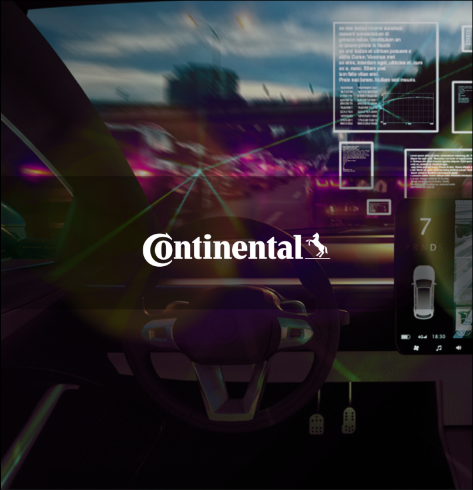
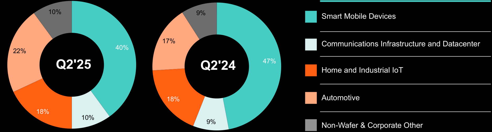

**[Image: GlobalFoundries_2Q_2025_Earnings_Deck_-1-.pdf-0001-00.png (788x155, 21.2KB)]**

**Second Quarter 2025 Financial Results** 

(unaudited) August 5, 2025 

1 

##### **Disclaimer - Forward-looking statements and Third-Party Data** 

This presentation and the accompanying oral presentation include “forwardlooking statements,” that reflect our current expectations and views of future events. These forward-looking statements are made under the “safe harbor” provisions of the U.S. Private Securities Litigation Reform Act of 1995 and include but are not limited to, statements regarding our financial outlook, future guidance, product development, business strategy and plans and market trends, opportunities and positioning. These statements are based on current expectations, assumptions, estimates, forecasts, projections and limited information available at the time they are made. Words such as “expect,” “anticipate,” “should,” “believe,” “hope,” “target,” “project,” “goals,” “estimate,” “potential,” “predict,” “may,” “will,” “might,” “could,” “intend,” “shall,” “outlook,” “on track” and variations of these terms or the negative of these terms and similar expressions are intended to identify these forward-looking statements, although not all forward-looking statements contain these identifying words. Forwardlooking statements are subject to a broad variety of risks and uncertainties, both known and unknown. Any inaccuracy in our assumptions and estimates could affect the realization of the expectations or forecasts in these forward-looking statements. For example, our business could be impacted by geopolitical conditions such as the ongoing political and trade tensions with China and the continuation of conflicts in Ukraine and Israel ;ongoing political developments in the United States, and in particular, any political and policy-related changes that may impact our industry and the market generally; the imposition of trade controls, tariffs and counter-tariffs between the United States and its trade partners; the market for our products may develop or recover more slowly than expected or than it has in the past; we may fail to achieve the full benefits of our restructuring plan; our operating results may fluctuate more than expected; there may be significant fluctuations in our results of operations and cash flows related to our revenue recognition or otherwise; a network or data security incident that allows unauthorized access to our network or data or our customers' data could result in a system disruption, loss of data or damage our reputation; we could experience interruptions or performance problems associated with our technology, including a service outage; global economic conditions could deteriorate, including due to rising inflation and any potential recession; the expected benefits of our announced partnerships may fail to materialize; and our expected results and planned expansions and operations may not proceed as planned if funding we expect to receive (including the planned awards under the U.S. CHIPS and Science Act and New York State Green CHIPS) is delayed or withheld for any reason. It is not possible for us to predict all risks, nor can we assess the impact of all factors on our business or the extent to which any factor, or combination of factors, may cause actual results or outcomes to differ materially from those contained in any forwardlooking statements we may make. Moreover, we operate in a competitive and rapidly changing market, and new risks may emerge from time to time. You should not rely upon forward-looking statements as predictions of future events. These statements are based on our historical performance and on our current plans, estimates and projections in light of information currently available to us, and therefore you should not place undue reliance on them. 

**[Image: GlobalFoundries_2Q_2025_Earnings_Deck_-1-.pdf-0002-02.png (50x45, 0.9KB)]**

Although we believe that the expectations reflected in our statements are reasonable, we cannot guarantee that the future results, levels of activity, performance or events and circumstances described in the forward-looking statements will be achieved or occur. Moreover, neither we, nor any other person, assumes responsibility for the accuracy and completeness of these statements. Recipients are cautioned not to place undue reliance on these forward-looking statements, which speak only as of the date such statements are made and should not be construed as statements of fact. Except to the extent required by federal securities laws, we undertake no obligation to update any information or any forward-looking statements as a result of new information, subsequent events or any other circumstances after the date hereof, or to reflect the occurrence of unanticipated events. For a discussion of potential risks and uncertainties, please refer to the risk factors and cautionary statements in our 2024 Annual Report on Form 20-F, current reports on Form 6-K and other reports filed with the Securities and Exchange Commission ("SEC"). Copies of our SEC filings are available on our Investor Relations website, investors.gf.com, or from the SEC website, www.sec.gov. 

This presentation and the accompanying oral presentation also contain estimates and other statistical data made by independent parties and by us relating to market size and growth and other data about our industry and business. This data involves a number of assumptions and limitations, and you are cautioned not to give undue weight to such estimates. We have not independently verified the industry data generated by independent parties and contained in this presentation and, accordingly, we cannot guarantee their accuracy or completeness. In addition, projections, assumptions and estimates of our future performance and the future performance of the markets in which we compete are necessarily subject to a high degree of uncertainty and risk. 

In addition to the financial information presented in accordance with International Financial Reporting Standards ("IFRS"), this press release includes the following Non-IFRS financial measures: Non-IFRS gross profit, Non-IFRS operating profit, Non-IFRS operating expense, Non-IFRS net income, Non-IFRS selling, general and administrative, Non-IFRS research and development, Non-IFRS other income (expense), Non-IFRS income tax benefit (expense),  Non-IFRS diluted earnings per share (“EPS”), Non-IFRS adjusted EBITDA, Non-IFRS capital expenditure, Non-IFRS adjusted free cash flow and any related margins. We define each of Non-IFRS gross profit, Non-IFRS selling, general and administrative, Non-IFRS research and development, Non-IFRS operating profit, Non-IFRS other income (expense), Non-IFRS income tax benefit (expense) and Non-IFRS net income as gross profit, selling, general and administrative, research and development, operating profit, other income (expense), income tax benefit (expense), and net income, respectively, adjusted for share-based compensation, structural optimization, amortization of acquired intangibles and other acquisition related charges, impairment of long-lived assets, revaluation of equity investments, restructuring charges, tax matters, and any associated income tax effects. We define Non-IFRS operating expense as Non-IFRS gross profit minus Non-IFRS operating profit. We define Non-IFRS diluted EPS as NonIFRS net income divided by the diluted shares outstanding. 

We define Non-IFRS adjusted free cash flow as cash flow provided by (used in) operating activities less purchases of property, plant and equipment and intangible assets plus proceeds from government grants related to capital expenditures. We define Non-IFRS adjusted EBITDA as net income adjusted for the impact of finance expense, finance income, income tax expense (benefit), depreciation and amortization, share-based compensation, restructuring charges, impairment of long-lived assets, revaluation of equity investments, structural optimization, litigation claims and acquisition related charges. We define each of Non-IFRS gross margin, Non-IFRS operating margin, Non-IFRS net income margin, Adjusted Non-IFRS free cash flow margin and Non-IFRS adjusted EBITDA margin as Non-IFRS gross profit, Non-IFRS operating profit, Non-IFRS net income, Adjusted Non-IFRS free cash flow and Non-IFRS adjusted EBITDA, respectively, divided by net revenue. Any adjustments described above that are zero for a given period are excluded from the “Reconciliation of IFRS to Non-IFRS” table. See "Reconciliation of IFRS to Non-IFRS" section for a detailed reconciliation of Non-IFRS financial measures to the most directly comparable IFRS measure. 

We believe that in addition to our results determined in accordance with IFRS, these Non-IFRS financial measures provide useful information to both management and investors in measuring our financial performance and highlight trends in our business that may not otherwise be apparent when relying solely on IFRS measures. These Non-IFRS financial measures provide supplemental information regarding our operating performance that excludes certain gains, losses and non-cash charges that occur relatively infrequently and/or that we consider to be unrelated to our core operations. Management believes that Non-IFRS adjusted free cash flow as a Non-IFRS measure is helpful to investors as it provides insights into the nature and amount of cash the Company generates in the period. 

Non-IFRS financial information is presented for supplemental informational purposes only and should not be considered in isolation or as a substitute for financial information presented in accordance with IFRS. Our presentation of Non-IFRS measures should not be construed as an inference that our future results will be unaffected by unusual or nonrecurring items. Other companies in our industry may calculate these measures differently, which may limit their usefulness as comparative measures. 

**[Image: GlobalFoundries_2Q_2025_Earnings_Deck_-1-.pdf-0003-00.png (682x1125, 96.1KB)]**

**[Image: GlobalFoundries_2Q_2025_Earnings_Deck_-1-.pdf-0003-01.png (81x181, 0.4KB)]**

# **Results and Highlights** 

### **Second Quarter 2025 Results** 

**Revenue Non-IFRS Gross Margin****(1)** <mark>$1.69B</mark> 25.2% **↑ 3% Y/Y Flat Y/Y** 

**Non-IFRS Earnings per Share****(1)** $0.42 

**↑ 11% Y/Y** 

**[Image: GlobalFoundries_2Q_2025_Earnings_Deck_-1-.pdf-0004-04.png (1701x407, 1533.9KB)]**

**[Image: GlobalFoundries_2Q_2025_Earnings_Deck_-1-.pdf-0004-05.png (50x45, 0.9KB)]**

(1)  See the Appendix for a detailed reconciliation of Non-IFRS measures to the most directly comparable IFRS measure and for a discussion of why we believe these Non-IFRS measures are useful. 

4 

### **Key Highlights** 

**[Image: GlobalFoundries_2Q_2025_Earnings_Deck_-1-.pdf-0005-01.png (738x738, 730.7KB)]**

**»** Q2 results topped nonIFRS guided midpoints, with adjusted EPS(1) exceeding the high end of the range 

**»** Third consecutive quarter of double digit % year-over-year revenue growth in Automotive & CID 

**»** ~16% adjusted free cash flow margin(1) in the quarter 

**»** Announced $16B US investment plans supported by Apple, AMD, Qualcomm, NXP, SpaceX & others 

(1) See the Appendix for a detailed reconciliation of Non-IFRS measures to the most directly comparable IFRS measure and for a discussion of why we believe these Non-IFRS measures are useful. 

5 

**[Image: GlobalFoundries_2Q_2025_Earnings_Deck_-1-.pdf-0006-00.png (682x1125, 96.1KB)]**

**[Image: GlobalFoundries_2Q_2025_Earnings_Deck_-1-.pdf-0006-01.png (81x181, 0.4KB)]**

# **Key Announcements** 

#### **Key Announcements** 

**[Image: GlobalFoundries_2Q_2025_Earnings_Deck_-1-.pdf-0007-01.png (805x834, 925.1KB)]**

### **<u>GF Announced as Foundry Partner for Continental</u>** 

**Continental announced the establishment of an Advanced Electronics & Semiconductor Solutions organization, a fabless semiconductor unit which will utilize GF as its manufacturing partner.** 

###### **Expected Outcomes:** 

**Faster Differentiated, Dual sourcing - greater reliance innovation highly reliable, and reduced cycles and safety-certified, geopolitical integrated chip tailored risk development technology** 

“Our silicon-proven portfolio of automotive-qualified process technologies, supported by our resilient global footprint and track record of manufacturing excellence, will enable Continental to deliver innovative solutions for the next generation of safe, connected and autonomous vehicles.” **Niels Anderskouv, President and COO, GF** 

**[Image: GlobalFoundries_2Q_2025_Earnings_Deck_-1-.pdf-0007-07.png (50x45, 0.9KB)]**

7 

#### **Key Announcements** 

**[Image: GlobalFoundries_2Q_2025_Earnings_Deck_-1-.pdf-0008-01.png (815x835, 942.0KB)]**

### **<u>GlobalFoundries to Acquire MIPS</u>** 

**MIPS will expand GF portfolio with cutting-edge RISC-V processor IP and software tools for realtime computing in autonomous mobility, industrial automation, data center and AI applications.** 

###### **Expected Outcomes:** 

**Expand partnerships with customers across critical end markets** 

**Accelerate GF's AI and compute capabilities** 

**Increase GF's customizable IP offerings** 

“MIPS brings a strong heritage of delivering efficient, scalable compute IP tailored for performance-critical applications, which strategically aligns with the evolving demands of AI platforms across diverse markets.” **Niels Anderskouv, President and COO, GF** 

**[Image: GlobalFoundries_2Q_2025_Earnings_Deck_-1-.pdf-0008-09.png (50x45, 0.9KB)]**

The acquisition of MIPS is subject to the satisfaction of customary closing conditions, including the receipt of required regulatory approvals. 

8 

#### **Key Announcements** 

**Chinese Foundry Partner** 

**[Image: GlobalFoundries_2Q_2025_Earnings_Deck_-1-.pdf-0009-02.png (196x92, 13.8KB)]**

**[Image: GlobalFoundries_2Q_2025_Earnings_Deck_-1-.pdf-0009-03.png (235x233, 56.2KB)]**

**[Image: GlobalFoundries_2Q_2025_Earnings_Deck_-1-.pdf-0009-04.png (213x237, 34.6KB)]**

### **<u>GF Establishes</u> - -** **<u>China for China Footprint</u>** 

**GF entered into a definitive agreement with a local Chinese foundry to ensure GF customers will benefit from the combination of GF's Automotive grade process technologies with reliable domestic supply in China.** 

**[Image: GlobalFoundries_2Q_2025_Earnings_Deck_-1-.pdf-0009-07.png (186x162, 4.0KB)]**

**GF Customers** 

**[Image: GlobalFoundries_2Q_2025_Earnings_Deck_-1-.pdf-0009-09.png (218x82, 3.6KB)]**

##### **GF's China-for-China strategy is a multi-pronged approach:** 

- Plan to support demand for a select portfolio of Auto grade Feature-rich CMOS and BCD technologies 

- Positioning GF as a trusted supplier serving all regions with a multi-fab qualification offering to customers 

- Local manufacturing tailored to domestic requirements and maintaining GF's stringent quality standards 

**[Image: GlobalFoundries_2Q_2025_Earnings_Deck_-1-.pdf-0009-14.png (50x45, 0.9KB)]**

9 

**[Image: GlobalFoundries_2Q_2025_Earnings_Deck_-1-.pdf-0010-00.png (682x1125, 96.1KB)]**

**[Image: GlobalFoundries_2Q_2025_Earnings_Deck_-1-.pdf-0010-01.png (81x181, 0.4KB)]**

# **End Markets** 

### **End Market Commentary** 

9 Com 

**Smart Mobile Devices »** 

**[Image: GlobalFoundries_2Q_2025_Earnings_Deck_-1-.pdf-0011-03.png (417x234, 199.4KB)]**

Expect strong commercial traction with new design wins across a broad range of applications in the smartphone and beyond. 

**Automotive »** 

**[Image: GlobalFoundries_2Q_2025_Earnings_Deck_-1-.pdf-0011-06.png (415x234, 208.7KB)]**

Outgrowing the market and capturing share as we expand our breadth of offerings and gain content per vehicle. 

**Home and Industrial IoT »** 

**[Image: GlobalFoundries_2Q_2025_Earnings_Deck_-1-.pdf-0011-09.png (415x234, 149.5KB)]**

Seeing significant design win momentum for ultralow power & connectivity applications across home, industrial and medical. 

**Communications Infrastructure and Datacenter »** 

**[Image: GlobalFoundries_2Q_2025_Earnings_Deck_-1-.pdf-0011-12.png (415x234, 241.7KB)]**

Achieving design win momentum across satcomm, silicon photonics, and wireless infrastructure. 

**[Image: GlobalFoundries_2Q_2025_Earnings_Deck_-1-.pdf-0011-14.png (50x45, 1.8KB)]**

11 

### **Smart Mobile Devices** 

**Q2'25 Revenue** 

## $683M 

**↓ (10)% Y/Y** 

##### **<u>Q2'25 Key Design Wins</u>** 

##### **End Market Commentar** **<u>y</u>** 

**Platform Application** 

**8SW / 9SW** RF Front-End **22FDX** AI processor for smart glasses **40ISP** Camera sensor for Android 

36 design wins in RF front end with 9 of the top 10 industry players and secured committed 5G transceiver FinFET revenue over the next four years with a key customer. 

**[Image: GlobalFoundries_2Q_2025_Earnings_Deck_-1-.pdf-0012-09.png (50x45, 1.2KB)]**

12 

### **Automotive** 

**Q2'25 Revenue** $368M 

**↑ 36% Y/Y** 

**<u>Q2'25 Key Design Wins</u> Platform Application 12LP+** Next gen radar processors **22FDX** 5th generation MCU **130BCD** Battery management systems 

##### **End Market Commentar** **<u>y</u>** 

Accelerated design win traction across our portfolio of diversified applications. In the second quarter alone, we won designs with 25 unique customers. 

**[Image: GlobalFoundries_2Q_2025_Earnings_Deck_-1-.pdf-0013-06.png (50x45, 2.8KB)]**

13 

### **Home and Industrial IoT** 

**Q2'25 Revenue** 

## $300M 

**↑ 2% Y/Y** 

**<u>Q2'25 Key Design Wins</u> End Market Commentary Platform Application** IoT design win momentum in applications where the need to **12LP+** WiFi connectivity acquire, process, and communicate data - securely **22FDX** Bluetooth SoC and at low power - is **22FDX** AI-enabled audio hearing aid paramount. 

IoT design win momentum in applications where the need to acquire, process, and communicate data - securely and at low power - is paramount. 

**[Image: GlobalFoundries_2Q_2025_Earnings_Deck_-1-.pdf-0014-06.png (50x45, 1.1KB)]**

14 

### **Communications Infrastructure and Datacenter** 

**Q2'25 Revenue** $171M **↑ 11% Y/Y** 

**<u>Q2'25 Key Design Wins</u> Platform Application 12LP** Ground terminal infrastructure **22FDX** Digital beamformers **22FDX** Storage ASIC 

##### **End Market Commentar** **<u>y</u>** 

Ramping silicon photonics capabilities to address the need for higher performance solutions to support both pluggable and co-packaged solutions. 

**[Image: GlobalFoundries_2Q_2025_Earnings_Deck_-1-.pdf-0015-05.png (50x45, 4.5KB)]**

15 

**Q2'25 Revenue by End Market** (Unaudited, in millions USD) 

((Unaudited, in millions) 

**[Image: GlobalFoundries_2Q_2025_Earnings_Deck_-1-.pdf-0016-02.png (57x61, 1.8KB)]**

**[Image: GlobalFoundries_2Q_2025_Earnings_Deck_-1-.pdf-0016-03.png (69x63, 2.7KB)]**

**[Image: GlobalFoundries_2Q_2025_Earnings_Deck_-1-.pdf-0016-04.png (67x65, 2.5KB)]**

**[Image: GlobalFoundries_2Q_2025_Earnings_Deck_-1-.pdf-0016-05.png (74x51, 2.5KB)]**

|||||**Year-ov**|**er-year**|**Se**|**quential**|
|---|---|---|---|---|---|---|---|
||**Q2'25**|**Q1'25**|**Q2'24**|**Q2'25 v**|**s Q2'24**|**Q2'25 v**|**s Q1'25**|
|Smart Mobile Devices|$683|$586|$762|($79)|(10)%|$97|17%|
|Communications Infrastructure and Datacenter|$171|$174|$154|$17|11%|$(3)|(2)%|
|Home and Industrial IoT|$300|$328|$295|$5|2%|$(28)|(9)%|
|Automotive|$368|$309|$270|$98|36%|$59|19%|
|Non-Wafer Revenue|$166|$188|$151|$15|10%|$(22)|(12)%|
|**Revenue**|**$ 1,688**|**$ 1,585**|**$ 1,632**|**$56**|**3%**|**$103**|**6%**|

**[Image: GlobalFoundries_2Q_2025_Earnings_Deck_-1-.pdf-0016-07.png (50x45, 0.9KB)]**

16 

### **Q2'25 Revenue Mix by End Market** 

9 (Unaudited) 

**[Image: GlobalFoundries_2Q_2025_Earnings_Deck_-1-.pdf-0017-02.png (1876x507, 76.2KB)]**

<!-- Start of picture text -->
10% 9% Smart Mobile Devices 17% Communications Infrastructure and Datacenter 40% 22% Q2'25 Q2'24 47% Home and Industrial IoT 18% Automotive 18% 10% 9% Non-Wafer & Corporate Other <!-- End of picture text -->

**[Image: GlobalFoundries_2Q_2025_Earnings_Deck_-1-.pdf-0017-03.png (50x45, 0.9KB)]**

17 

### **Capex and Cash Flow** 

#### **Year-to-Date Through Q2'25** 

▪Having already implemented several capacity expansions in a capital-efficient manner, GF continues to deliver robust free cash flow. 

▪GF remains on track to generate over $1 billion of adjusted free cash flow in 2025. 

**[Image: GlobalFoundries_2Q_2025_Earnings_Deck_-1-.pdf-0018-04.png (50x45, 1.7KB)]**

$762M 

**Cash flow from operations** 

$325M (10% of Revenue) $442M (14% of Revenue) 

**Capital expenditures Adjusted FCF****(1)** 

**Cash, cash equivalent and marketable securities** 

$3.9B at the end of Q2’25 

> (1) See the Appendix for a detailed reconciliation of Non-IFRS measures to the most directly comparable IFRS measure and for a discussion of why we believe these Non-IFRS measures are useful. 

18 

**[Image: GlobalFoundries_2Q_2025_Earnings_Deck_-1-.pdf-0019-00.png (682x1125, 96.1KB)]**

**[Image: GlobalFoundries_2Q_2025_Earnings_Deck_-1-.pdf-0019-01.png (81x181, 0.4KB)]**

# **Outlook** 

19 

### **Q3’25 Guidance****(1)** 

(Unaudited, in millions USD, except per share amounts) 

||**IFRS**|**Share-Based** **Compensation****(3)**|**Non-IFRS****(2)**|
|---|---|---|---|
|**Net Revenue**|$1,675 ± $25|||
|_Gross Margin__(2)_|_24.4% ± 100bps_|_~110bps_|_25.5% ± 100bps_|
|**Operating Expenses****(2)**|$228 ± $10|~$38|$190 ± $10|
|_Operating Margin__(2)_|_10.8% ± 180bps_|_~340bps_|_14.2% ± 180bps_|
|**Diluted EPS****(2)(4)**|$0.28 ± $0.05|~$0.10|$0.38 ± $0.05|
|**Fully Diluted Share Count**|~560|||

> (1)  The Guidance provided contains forward-looking statements as defined in the U.S. Private Securities Litigation Act of 1995, and is subject to the safe harbors created therein. The Guidance includes management's beliefs and assumptions and is based on information that is available as of the date of this release. 

> (2)  Non-IFRS gross margin, Non-IFRS operating expenses, Non-IFRS operating margin and Non-IFRS diluted EPS are Non-IFRS measures and, for purposes of the Guidance only, are defined as gross profit as a percent of revenue, operating profit as a percent of revenue, operating expenses and diluted EPS, all before share-based compensation, respectively. See "Financial Measures (Non-IFRS)" for further discussion on these Non-IFRS measures and why we believe they are useful. 

> (3)  We expect share-based compensation of $18 million and $38 million in cost of revenue and operating expenses, respectively. The Non-IFRS margin impacts are calculated by dividing share-based compensation by net revenue, and the Non-IFRS diluted EPS impact is calculated by dividing share-based compensation by the fully diluted share count. 

**[Image: GlobalFoundries_2Q_2025_Earnings_Deck_-1-.pdf-0020-06.png (50x45, 0.9KB)]**

> (4)  Included in diluted EPS is net interest income (expense) and other income (expense) which we estimate will be between $4 million and $12 million for the third quarter 2025. Also included in diluted EPS is income tax expense which we estimate will be between $26 million and $40 million for the third quarter 2025. 

20 

**[Image: GlobalFoundries_2Q_2025_Earnings_Deck_-1-.pdf-0021-00.png (682x1125, 96.1KB)]**

**[Image: GlobalFoundries_2Q_2025_Earnings_Deck_-1-.pdf-0021-01.png (81x181, 0.4KB)]**

# **Appendix: Summary Financials and Reconciliations** 

### **Q2'25 Financial Summary** 

(Unaudited, in millions, except per share data and wafer shipments) 

||**Q2'25**|**Q1'25**|**Q2'24**|**Year-over-y** **Q2'25 vs Q2**|**ear**  **'24**|**Sequenti** **Q2'25 vs Q**|**al** **1'25**|
|---|---|---|---|---|---|---|---|
|**Net revenue**|**$1,688**|**$1,585**|**$1,632**|**$56**|**3%**|**$103**|**6 %**|
|**Gross profit**|**408**|**355**|**395**|**$13**|**3 %**|**$53**|**15 %**|
|_Gross margin_|_24.2%_|_22.4%_|_24.2%_||_0bps_||_+180bps_|
|**Non-IFRS gross profit****(1)**|**$425**|**$379**|**$411**|**$14**|**3 %**|**$46**|**12 %**|
|_Non-IFRS gross margin__(1)_|_25.2%_|_23.9%_|_25.2%_||_0bps_||_+130bps_|
|**Operating profit**|**$196**|**$151**|**$155**|**$41**|**26%**|**$45**|**30 %**|
|_Operating margin_|_11.6%_|_9.5%_|_9.5%_||_+210bps_||_+210bps_|
|**Non-IFRS operating profit****(1)**|**$258**|**$213**|**$212**|**$46**|**22%**|**$45**|**21 %**|
|_Non-IFRS operating margin__(1)_|_15.3%_|_13.4%_|_13.0%_||_+230bps_||_+190bps_|
|**Net income**|**$228**|**$211**|**$155**|**$73**|**47%**|**$17**|**8 %**|
|_Net income margin_|_13.5%_|_13.3%_|_9.5%_||_+400bps_||_+20bps_|
|**Non-IFRS net income****(1)**|**$234**|**$189**|**$211**|**$23**|**11%**|**$45**|**24 %**|
|_Non-IFRS net income margin__(1)_|_13.9%_|_11.9%_|_12.9%_||_+100bps_||_+200bps_|
|**Diluted earnings per share ("EPS")**|**$0.41**|**$0.38**|**$0.28**|**$0.13**|**46%**|**$0.03**|**8 %**|
|**Non-IFRS diluted EPS****(1)**|**$0.42**|**$0.34**|**$0.38**|**$0.04**|**11%**|**$0.08**|**24 %**|
|**Non-IFRS adjusted EBITDA****(1)**|**$585**|**$558**|**$610**|**($25)**|**(4) %**|**$27**|**5 %**|
|_Non-IFRS adjusted EBITDA margin__(1)_|_34.7%_|_35.2%_|_37.4%_||_(270)bps_||_(50)bps_|
|**Cash from operations**|**$431**|**$331**|**$402**|**$29**|**7 %**|**$100**|**30 %**|
|**Wafer shipments (300MM Equivalent) (in thousands)**|**581**|**543**|**517**|**64**|**12 %**|**38**|**7 %**|

> (1) See the Appendix for a detailed reconciliation of Non-IFRS measures to the most directly comparable IFRS measure and for a discussion of why we believe these Non-IFRS measures are useful. 

**[Image: GlobalFoundries_2Q_2025_Earnings_Deck_-1-.pdf-0022-04.png (50x45, 0.9KB)]**

22 

### **Statement of Operations** 

(Unaudited, in millions, except per share amounts) 

||**Three Months Ended** **June 30, 2025** **March 31, 2025** **June 30, 2024**|
|---|---|
|**Net revenue**|**$** **1,688 $** **1,585 $** **1,632**|
|Cost of revenue|1,280 1,230 1,237|
|**Gross profit**|**$** **408 $** **355 $** **395**|
|Operating expenses:||
|Research and development|134 127 121|
|Selling, general and administrative|78 77 114|
|Restructuring charges|— — 5|
|**Total operating expenses**|**$** **212 $** **204 $** **240**|
|**Operating profit**|**$** **196 $** **151 $** **155**|
|Finance income (expense), net|17 14 16|
|Other income (expense)|8 30 (4)|
|Income tax (expense) benefit|7 16 (12)|
|**Net income**|**$** **228 $** **211 $** **155**|
|Attributable to:||
|Shareholders of GlobalFoundries|228 210 155|
|Non-controlling interests|— 1 —|
|**EPS:**||
|Basic|$ 0.41 $ 0.38 $ 0.28|
|Diluted|$ 0.41 $ 0.38 $ 0.28|
|Shares used in EPS calculation:||
|Basic|555 554 554|
|Diluted|557 557 557|

**[Image: GlobalFoundries_2Q_2025_Earnings_Deck_-1-.pdf-0023-03.png (50x45, 0.9KB)]**

23 

### **Statements of Financial Position** 

(Unaudited, in millions) 

**[Image: GlobalFoundries_2Q_2025_Earnings_Deck_-1-.pdf-0024-02.png (50x45, 0.9KB)]**

||**A**|**s of**|
|---|---|---|
||**June 30, 2025**|**December 31, 2024**|
|**Assets:**|||
|Cash and cash equivalents|$ 1,790|$ 2,192|
|Marketable securities|1,305|1,194|
|Receivables, prepayments and other|1,535|1,406|
|Inventories|1,726|1,624|
|**Current assets**|**6,356**|**6,416**|
|Property, plant, and equipment, net|7,505|7,762|
|Marketable securities|823|839|
|Right-of-use assets|495|498|
|Deferred tax assets|270|188|
|Other assets|1,354|1,096|
|**Non-current assets**|**10,447**|**10,383**|
|**Total assets**|**$** **16,803**|**$** **16,799**|
|**Liabilities and equity:**|||
|Current portion of long-term debt|$ 60|$ 753|
|Other current liabilities|2,354|2,291|
|**Current liabilities**|**2,414**|**3,044**|
|Noncurrent portion of long-term debt|1,115|1,053|
|Noncurrent portion of lease obligations|432|424|
|Other liabilities|1,374|1,454|
|**Non-current liabilities** |**2,921** |**2,931** |
|**Total liabilities** |**5,335**|**5,975**|
|**Shareholders’ equity:** |||
|Common stock / additional paid-in capital|$ 24,107|$ 24,025|
|Accumulated deficit|(12,828)| (13,266)|
|Accumulated other comprehensive income|136|17|
|Non-controlling interests|53|48|
|**Total liabilities and equity**|**$** **16,803**|**$** **16,799**|

24 

### **Statement of Cash Flows** 

(Unaudited, in millions) 

||**Three Mon** **June 30, 2025**|**ths Ended** **June 30, 2024**|
|---|---|---|
|**Operating Activities:**|||
|Net income|$ 228|$ 155|
|Depreciation and amortization|335|402|
|Finance (income) expense, net and other|(8)| (28)|
|Net change in working capital|(136)| (168)|
|Other non-cash operating activities|12|41|
|**Net cash provided by operating activities**|$ 431|$ 402|
|**Investing Activities:**|||
|Purchases of property, plant and equipment and intangible assets|$ (159)|$ (101)|
|Net purchases of marketable securities|(23)| (77)|
|Other investing activities|(25)|8|
|**Net cash used in investing activities**|$ (207)|$ (170)|
|**Financing Activities:**|||
|Proceeds from issuance of equity instruments |$ 1|$ — |
|Purchases of treasury stock|—|(200)|
|Proceeds (repayment) of debt, net|(36)|(94)|
|**Net cash used in financing activities**|$ (35)|$ (294)|
|**Effect of exchange rate changes**|5|(1)|
|Net change in cash and cash equivalents|$ 194|$ (63)|
|Cash and cash equivalents at the beginning of the period|1,596|2,247|
|**Cash and cash equivalents at the end of the period**|$ 1,790|$ 2,184|

**[Image: GlobalFoundries_2Q_2025_Earnings_Deck_-1-.pdf-0025-03.png (50x45, 0.9KB)]**

25 

### **IFRS to Non-IFRS Reconciliations** 

(Unaudited, in millions, except per share amounts) 

###### **Three Months Ended June 30, 2025** 

||**Gross profit**|**Selling,** **general &** **administrative**|**Research &** **development**|**Operating** **profit**|**Other** **Income** **(Expense)**|**Income tax** **(expense)** **benefit**|**Net income**|**Diluted EPS**|
|---|---|---|---|---|---|---|---|---|
|**As Reported**|**$** **408**|**$** **78**|**$** **134**|**$** **196**|**$** **8**|**$** **7**|**$** **228**|**$** **0.41**|
|_IFRS margins__(1)_|_24.2%_|||_11.6%_|||_13.5%_||
|Share-based compensation|17|(29)| (8)| 54|—|(2)| 52|0.09|
|Structural optimization(2)|—|(5)| —| 5|(24)| —|(19)|(0.03)|
|Amortization of acquired intangibles and other acquisition related charges|—|(2)| (1)| 3|—|—|3|0.01|
|Litigation claims|—|—| —| —|9|(1)| 8|0.01|
|Tax matters(3)|—|—| —| —|—|(38)| (38)|(0.07)|
|**Non-IFRS measures****(1) **|**$** **425**|**$** **42**|**$** **125**|**$** **258**|**$** **(7)**|**$** **(34)**|**$** **234**|**$** **0.42**|
|**_Non-IFRS margins_****_(1)_**|_25.2%_|||_15.3%_|||_13.9%_||

(1)  See "Financial Measures (Non-IFRS)" for further discussion on these Non-IFRS measures and why we believe they are useful. 

(2)  Structural optimization represents costs associated with employee workforce reductions, manufacturing footprint alignment and liquidation charges 

(3)  Comprised of net deferred tax asset recognition and foreign exchange rate impact. 

**[Image: GlobalFoundries_2Q_2025_Earnings_Deck_-1-.pdf-0026-07.png (50x45, 0.9KB)]**

26 

### **IFRS to Non-IFRS Reconciliations** 

(Unaudited, in millions, except per share amounts) 

###### **Three Months Ended March 31, 2025** 

||**Gross profit**|**Selling,** **general &** **administrative**|**Research &** **development**|**Operating** **profit**|**Other Income** **(Expense)**|**Income tax** **(expense)** **benefit**|**Net income**|**Diluted EPS**|
|---|---|---|---|---|---|---|---|---|
|**As Reported**|**$** **355**|**$** **77**|**$** **127**|**$** **151**|**$** **30**|**$** **16**|**$** **211**|**$** **0.38**|
|_IFRS margins__(1)_|_22.4%_|||_9.5%_|||_13.3%_||
|Share-based compensation|13|(20)| (7)| 40|—| (2)| 38|0.07|
|Structural optimization(2)|11|(5)| (5)| 21|—| (3)| 18|0.03|
|Amortization of acquired intangibles and other acquisition related charges|—|—| (1)| 1|(31)| 6| (24)|(0.04)|
|Revaluation of equity investments|—|—| —| —|(6)| —| (6)|(0.01)|
|Tax matters(3)|—|—| —| —|—| (48)| (48)|(0.09)|
|**Non-IFRS measures****(1)**|**$** **379**|**$** **52**|**$** **114**|**$** **213**|**$** **(7)**|**$** **(31)**|**$** **189**|**$** **0.34**|
|**_Non-IFRS margins_****_(1)_**|_23.9%_|||_13.4%_|||_11.9%_||

(1) See "Financial Measures (Non-IFRS)" for further discussion on these Non-IFRS measures and why we believe they are useful. 

(2)  Structural optimization represents costs associated with employee workforce reductions, manufacturing footprint alignment and liquidation charges 

(3) Comprised of net deferred tax asset recognition and foreign exchange rate impact. 

**[Image: GlobalFoundries_2Q_2025_Earnings_Deck_-1-.pdf-0027-07.png (50x45, 0.9KB)]**

27 

### **IFRS to Non-IFRS Reconciliations** 

(Unaudited, in millions, except per share amounts) 

###### **Three months ended June 30, 2024** 

||**Gross profit**|**Selling,** **general &** **administrative**|**Research &** **development**|**Operating** **profit**|**Other Income** **(Expense)**|**Income tax** **(expense)** **benefit**|**Net income**|**Diluted EPS**|
|---|---|---|---|---|---|---|---|---|
|**As Reported**|**$** **395**|**$** **114**|**$** **121**|**$** **155**|**$** **(4)**|**$** **(12)**|**$** **155**|**$** **0.28**|
|_IFRS margins__(1)_|_24.2%_|||_9.5%_|||_9.5%_||
|Share-based compensation|16|(28)| (8)| 52|**—**| **—**|52|0.09|
|Restructuring charges|—|—| —| 5|**—**| **(1)**|4|0.01|
|**Non-IFRS Measures** **(1)**|**$** **411**|**$** **86**|**$** **113**|**$** **212**|**$** **(4)**|**$** **(13)**|**$** **211**|**$** **0.38**|
|**_Non-IFRS margins_****_(1)_**|_25.2%_|||_13.0%_|||_12.9%_||

(1)  See "Financial Measures (Non-IFRS)" for further discussion on these Non-IFRS measures and why we believe they are useful. 

**[Image: GlobalFoundries_2Q_2025_Earnings_Deck_-1-.pdf-0028-05.png (50x45, 0.9KB)]**

28 

### **IFRS to Non-IFRS Reconciliation Non-IFRS Adjusted Free Cash Flow****(1)** 

a 

(Unaudited, in millions) 

###### **Three Months Ended** 

||**June 30, 2025**|**March 31, 2025**|**June 30, 2024**|
|---|---|---|---|
|**Net cash provided by operating activities**|**$431**|**$331**|**$402**|
|Less: Purchases of property, plant and equipment and intangible assets|(159)|(166)|(101)|
|Add: Proceeds from government grants|5|—|1|
|**Total capital expenditures net of proceeds** **from government grants**|**$(154)**|**$(166)**|**$(100)**|
|**Non-IFRS adjusted free cash flow****(1)**|**$277**|**$165**|**$302**|
|_Non-IFRS adjusted free cash flow margins__(1)_|**_16%_**|**_10%_**|**_19%_**|

> (1) See "Financial Measures (Non-IFRS)" for further discussion on these Non-IFRS measures and why we believe they are useful. 

**[Image: GlobalFoundries_2Q_2025_Earnings_Deck_-1-.pdf-0029-06.png (50x45, 0.9KB)]**

29 

### **IFRS to Non-IFRS Reconciliation Non-IFRS Adjusted EBITDA****(1)** 

(Unaudited, in millions) 

|||**Three Months Ended**||
|---|---|---|---|
||**June 30, 2025**|**March 31, 2025**|**June 30, 2024**|
|Net revenue|**$** **1,688**|**$** **1,585**|**$** **1,632**|
|Net income|**228**|**211**|**155**|
|_Net income margin_|_13.5 %_| _13.3 %_| _9.5 %_|
|Depreciation and amortization|335|352|402|
|Finance expense|22|25|37|
|Finance income|(39)|(39)|(53)|
|Income tax expense (benefit)|(7)|(16)|12|
|Share-based compensation|54|40|52|
|Restructuring charges|—|—|5|
|Structural optimization|(19)|21|—|
|Revaluation of equity investments|—|(6)|—|
|Litigation claims|9|—|—|
|Other acquisition related charges|2|(30)|—|
|**Non-IFRS adjusted EBITDA****(1)**|**$** **585**|**$** **558**|**$** **610**|
|Non-IFRS adjusted EBITDA margin(1)|_34.7 %_| _35.2 %_| _37.4 %_|

**[Image: GlobalFoundries_2Q_2025_Earnings_Deck_-1-.pdf-0030-03.png (50x45, 0.9KB)]**

(1)  See "Financial Measures (Non-IFRS)" for further discussion on this Non-IFRS measure and why we believe it is useful. 

30 

### **Financial Measures (Non-IFRS)** 

In addition to the financial information presented in accordance with International Financial Reporting Standards ("IFRS"), this press release includes the following Non-IFRS financial measures: Non-IFRS gross profit, Non-IFRS operating profit, Non-IFRS operating expense, Non-IFRS net income, Non-IFRS selling, general and administrative, Non-IFRS research and development, Non-IFRS other income (expense), Non-IFRS income tax benefit (expense),  Non-IFRS diluted earnings per share (“EPS”), Non-IFRS adjusted EBITDA, Non-IFRS adjusted free cash flow and any related margins. We define each of Non-IFRS gross profit, Non-IFRS selling, general and administrative, Non-IFRS research and development, Non-IFRS operating profit, Non-IFRS other income (expense), Non-IFRS income tax benefit (expense) and Non-IFRS net income as gross profit, selling, general and administrative, research and development, operating profit, other income (expense), income tax benefit (expense), and net income, respectively, adjusted for share-based compensation, structural optimization, amortization of acquired intangibles and other acquisition related charges, impairment of long-lived assets, revaluation of equity investments, restructuring charges, tax matters, and any associated income tax effects. We define Non-IFRS operating expense as Non-IFRS gross profit minus Non-IFRS operating profit. We define Non-IFRS diluted EPS as Non-IFRS net income divided by the diluted shares outstanding. We define Non-IFRS adjusted free cash flow as cash flow provided by (used in) operating activities less purchases of property, plant and equipment and intangible assets plus proceeds from government grants related to capital expenditures. We define Non-IFRS adjusted EBITDA as net income adjusted for the impact of finance expense, finance income, income tax expense (benefit), depreciation and amortization, share-based compensation, restructuring charges, impairment of long-lived assets, revaluation of equity investments, structural optimization, litigation claims and acquisition related charges. We define each of Non-IFRS gross margin, Non-IFRS operating margin, Non-IFRS net income margin, Non-IFRS adjusted free cash flow margin and Non-IFRS adjusted EBITDA margin as Non-IFRS gross profit, Non-IFRS operating profit, Non-IFRS net income, Non-IFRS adjusted free cash flow and Non-IFRS adjusted EBITDA, respectively, divided by net revenue. Any adjustments described above that are zero for a given period are excluded from the “Reconciliation of IFRS to Non-IFRS” table. See "Reconciliation of IFRS to Non-IFRS" section for a detailed reconciliation of Non-IFRS financial measures to the most directly comparable IFRS measure. 

We believe that in addition to our results determined in accordance with IFRS, these NonIFRS financial measures provide useful information to both management and investors in measuring our financial performance and highlight trends in our business that may not otherwise be apparent when relying solely on IFRS measures. These Non-IFRS financial measures provide supplemental information regarding our operating performance that excludes certain gains, losses and non-cash charges that occur relatively infrequently and/ or that we consider to be unrelated to our core operations. Management believes that NonIFRS adjusted free cash flow as a Non-IFRS measure is helpful to investors as it provides insights into the nature and amount of cash the Company generates in the period. 

Non-IFRS financial information is presented for supplemental informational purposes only and should not be considered in isolation or as a substitute for financial information presented in accordance with IFRS. Our presentation of Non-IFRS measures should not be construed as an inference that our future results will be unaffected by unusual or nonrecurring items. Other companies in our industry may calculate these measures differently, which may limit their usefulness as comparative measures. 

**[Image: GlobalFoundries_2Q_2025_Earnings_Deck_-1-.pdf-0031-04.png (50x45, 0.9KB)]**

31 

**[Image: GlobalFoundries_2Q_2025_Earnings_Deck_-1-.pdf-0032-00.png (1473x1125, 1821.0KB)]**

### **Thank You** 

The information contained herein is the property of GlobalFoundries and/or its licensors. 

This document is for informational purposes only, is current only as of the date of publication and is subject to change by GlobalFoundries at any time without notice. 

GlobalFoundries, the GlobalFoundries logo and combinations thereof are trademarks of GlobalFoundries Inc. in the United States and/or other jurisdictions. Other product or service names are for identification only and may be trademarks or service marks of their respective owners. 

© GlobalFoundries Inc. 2025. Unless otherwise indicated, all rights reserved. Do not copy or redistribute except as expressly permitted by GlobalFoundries. 

**For further information, please contact:** 

Investor Relations ir@gf.com 

---

## Extracted Images

| # | File | Dimensions | Size |
|---|------|------------|------|
| 1 | GlobalFoundries_2Q_2025_Earnings_Deck_-1-.pdf-0001-00.png | 788x155 | 21.2KB |
| 2 | GlobalFoundries_2Q_2025_Earnings_Deck_-1-.pdf-0002-02.png | 50x45 | 0.9KB |
| 3 | GlobalFoundries_2Q_2025_Earnings_Deck_-1-.pdf-0003-00.png | 682x1125 | 96.1KB |
| 4 | GlobalFoundries_2Q_2025_Earnings_Deck_-1-.pdf-0003-01.png | 81x181 | 0.4KB |
| 5 | GlobalFoundries_2Q_2025_Earnings_Deck_-1-.pdf-0004-04.png | 1701x407 | 1533.9KB |
| 6 | GlobalFoundries_2Q_2025_Earnings_Deck_-1-.pdf-0004-05.png | 50x45 | 0.9KB |
| 7 | GlobalFoundries_2Q_2025_Earnings_Deck_-1-.pdf-0005-01.png | 738x738 | 730.7KB |
| 8 | GlobalFoundries_2Q_2025_Earnings_Deck_-1-.pdf-0006-00.png | 682x1125 | 96.1KB |
| 9 | GlobalFoundries_2Q_2025_Earnings_Deck_-1-.pdf-0006-01.png | 81x181 | 0.4KB |
| 10 | GlobalFoundries_2Q_2025_Earnings_Deck_-1-.pdf-0007-01.png | 805x834 | 925.1KB |
| 11 | GlobalFoundries_2Q_2025_Earnings_Deck_-1-.pdf-0007-07.png | 50x45 | 0.9KB |
| 12 | GlobalFoundries_2Q_2025_Earnings_Deck_-1-.pdf-0008-01.png | 815x835 | 942.0KB |
| 13 | GlobalFoundries_2Q_2025_Earnings_Deck_-1-.pdf-0008-09.png | 50x45 | 0.9KB |
| 14 | GlobalFoundries_2Q_2025_Earnings_Deck_-1-.pdf-0009-02.png | 196x92 | 13.8KB |
| 15 | GlobalFoundries_2Q_2025_Earnings_Deck_-1-.pdf-0009-03.png | 235x233 | 56.2KB |
| 16 | GlobalFoundries_2Q_2025_Earnings_Deck_-1-.pdf-0009-04.png | 213x237 | 34.6KB |
| 17 | GlobalFoundries_2Q_2025_Earnings_Deck_-1-.pdf-0009-07.png | 186x162 | 4.0KB |
| 18 | GlobalFoundries_2Q_2025_Earnings_Deck_-1-.pdf-0009-09.png | 218x82 | 3.6KB |
| 19 | GlobalFoundries_2Q_2025_Earnings_Deck_-1-.pdf-0009-14.png | 50x45 | 0.9KB |
| 20 | GlobalFoundries_2Q_2025_Earnings_Deck_-1-.pdf-0010-00.png | 682x1125 | 96.1KB |
| 21 | GlobalFoundries_2Q_2025_Earnings_Deck_-1-.pdf-0010-01.png | 81x181 | 0.4KB |
| 22 | GlobalFoundries_2Q_2025_Earnings_Deck_-1-.pdf-0011-03.png | 417x234 | 199.4KB |
| 23 | GlobalFoundries_2Q_2025_Earnings_Deck_-1-.pdf-0011-06.png | 415x234 | 208.7KB |
| 24 | GlobalFoundries_2Q_2025_Earnings_Deck_-1-.pdf-0011-09.png | 415x234 | 149.5KB |
| 25 | GlobalFoundries_2Q_2025_Earnings_Deck_-1-.pdf-0011-12.png | 415x234 | 241.7KB |
| 26 | GlobalFoundries_2Q_2025_Earnings_Deck_-1-.pdf-0011-14.png | 50x45 | 1.8KB |
| 27 | GlobalFoundries_2Q_2025_Earnings_Deck_-1-.pdf-0012-09.png | 50x45 | 1.2KB |
| 28 | GlobalFoundries_2Q_2025_Earnings_Deck_-1-.pdf-0013-06.png | 50x45 | 2.8KB |
| 29 | GlobalFoundries_2Q_2025_Earnings_Deck_-1-.pdf-0014-06.png | 50x45 | 1.1KB |
| 30 | GlobalFoundries_2Q_2025_Earnings_Deck_-1-.pdf-0015-05.png | 50x45 | 4.5KB |
| 31 | GlobalFoundries_2Q_2025_Earnings_Deck_-1-.pdf-0016-02.png | 57x61 | 1.8KB |
| 32 | GlobalFoundries_2Q_2025_Earnings_Deck_-1-.pdf-0016-03.png | 69x63 | 2.7KB |
| 33 | GlobalFoundries_2Q_2025_Earnings_Deck_-1-.pdf-0016-04.png | 67x65 | 2.5KB |
| 34 | GlobalFoundries_2Q_2025_Earnings_Deck_-1-.pdf-0016-05.png | 74x51 | 2.5KB |
| 35 | GlobalFoundries_2Q_2025_Earnings_Deck_-1-.pdf-0016-07.png | 50x45 | 0.9KB |
| 36 | GlobalFoundries_2Q_2025_Earnings_Deck_-1-.pdf-0017-02.png | 1876x507 | 76.2KB |
| 37 | GlobalFoundries_2Q_2025_Earnings_Deck_-1-.pdf-0017-03.png | 50x45 | 0.9KB |
| 38 | GlobalFoundries_2Q_2025_Earnings_Deck_-1-.pdf-0018-04.png | 50x45 | 1.7KB |
| 39 | GlobalFoundries_2Q_2025_Earnings_Deck_-1-.pdf-0019-00.png | 682x1125 | 96.1KB |
| 40 | GlobalFoundries_2Q_2025_Earnings_Deck_-1-.pdf-0019-01.png | 81x181 | 0.4KB |
| 41 | GlobalFoundries_2Q_2025_Earnings_Deck_-1-.pdf-0020-06.png | 50x45 | 0.9KB |
| 42 | GlobalFoundries_2Q_2025_Earnings_Deck_-1-.pdf-0021-00.png | 682x1125 | 96.1KB |
| 43 | GlobalFoundries_2Q_2025_Earnings_Deck_-1-.pdf-0021-01.png | 81x181 | 0.4KB |
| 44 | GlobalFoundries_2Q_2025_Earnings_Deck_-1-.pdf-0022-04.png | 50x45 | 0.9KB |
| 45 | GlobalFoundries_2Q_2025_Earnings_Deck_-1-.pdf-0023-03.png | 50x45 | 0.9KB |
| 46 | GlobalFoundries_2Q_2025_Earnings_Deck_-1-.pdf-0024-02.png | 50x45 | 0.9KB |
| 47 | GlobalFoundries_2Q_2025_Earnings_Deck_-1-.pdf-0025-03.png | 50x45 | 0.9KB |
| 48 | GlobalFoundries_2Q_2025_Earnings_Deck_-1-.pdf-0026-07.png | 50x45 | 0.9KB |
| 49 | GlobalFoundries_2Q_2025_Earnings_Deck_-1-.pdf-0027-07.png | 50x45 | 0.9KB |
| 50 | GlobalFoundries_2Q_2025_Earnings_Deck_-1-.pdf-0028-05.png | 50x45 | 0.9KB |
| 51 | GlobalFoundries_2Q_2025_Earnings_Deck_-1-.pdf-0029-06.png | 50x45 | 0.9KB |
| 52 | GlobalFoundries_2Q_2025_Earnings_Deck_-1-.pdf-0030-03.png | 50x45 | 0.9KB |
| 53 | GlobalFoundries_2Q_2025_Earnings_Deck_-1-.pdf-0031-04.png | 50x45 | 0.9KB |
| 54 | GlobalFoundries_2Q_2025_Earnings_Deck_-1-.pdf-0032-00.png | 1473x1125 | 1821.0KB |
