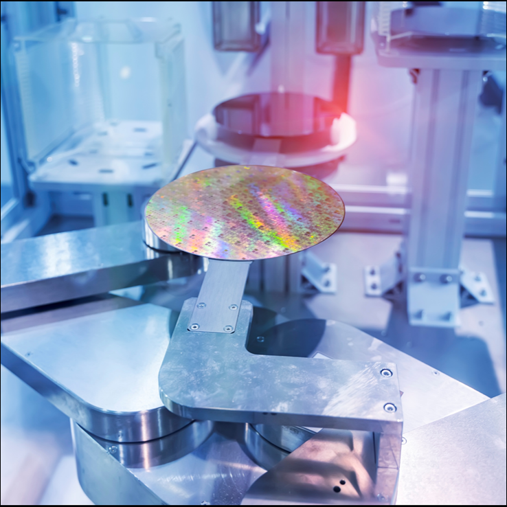
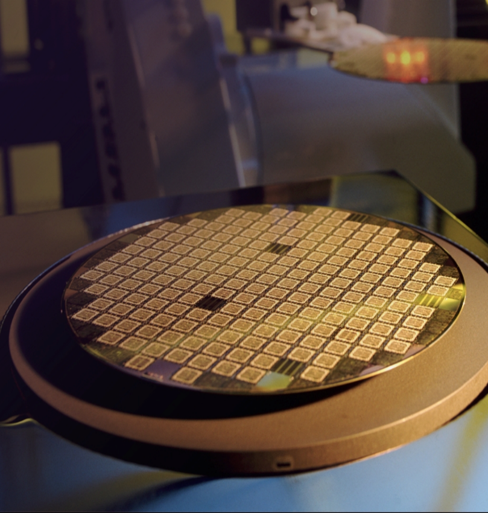
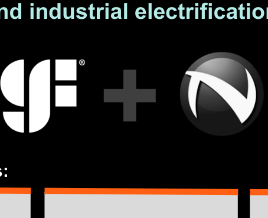
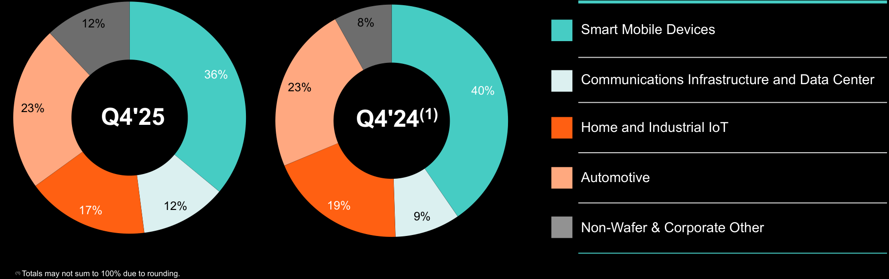
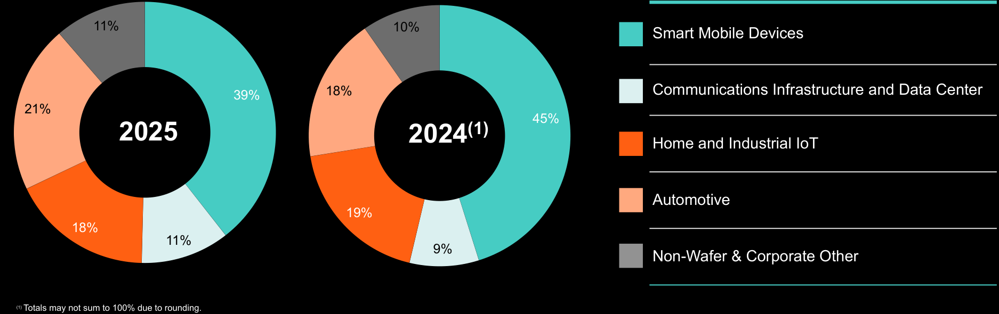

**[Image: GlobalFoundries_4Q_2025_Earnings_Deck_-3-.pdf-0001-00.png (788x155, 21.2KB)]**

**Fourth Quarter and Full-Year 2025 Financial Results** (unaudited) February 11, 2026 

1 

###### **Disclaimer - Forward-looking statements and Third-Party Data** 

This presentation and the accompanying oral presentation include “forwardlooking statements” that reflect our current expectations and views of future events. These forward-looking statements are made under the “safe harbor” provisions of the U.S. Private Securities Litigation Reform Act of 1995 and include but are not limited to, statements regarding our financial outlook, future guidance, product development, business strategy and plans, and market trends, opportunities and positioning. These statements are based on current expectations, assumptions, estimates, forecasts, projections and limited information available at the time they are made. Words such as “expect,” “anticipate,” “should,” “believe,” “hope,” “target,” “project,” “goals,” “estimate,” “potential,” “predict,” “may,” “will,” “might,” “could,” “intend,” “shall,” “outlook,” “on track” and variations of these terms or the negative of these terms and similar expressions are intended to identify these forward-looking statements, although not all forward-looking statements contain these identifying words. Forwardlooking statements are subject to a broad variety of risks and uncertainties, both known and unknown. Any inaccuracy in our assumptions and estimates could affect the realization of the expectations or forecasts in these forward-looking statements. For example, our business could be impacted by geopolitical conditions such as the ongoing political and trade tensions with China and the continuation of conflicts in Ukraine and Israel; ongoing political developments in the United States, and in particular, any political and policy-related changes that may impact our industry and the market generally, such as the imposition of trade controls, tariffs and counter-tariffs between the United States and its trade partners and new legislation, the market for our products may develop or recover more slowly than expected or than it has in the past; we may fail to achieve the full benefits of our restructuring plan; our operating results may fluctuate more than expected; there may be significant fluctuations in our results of operations and cash flows related to our revenue recognition or otherwise; a network or data security incident that allows unauthorized access to our network or data or our customers’ data could result in a system disruption, loss of data or damage our reputation; we could experience interruptions or performance problems associated with our technology, including a service outage; global economic conditions could deteriorate, including due to rising inflation and any potential recession; the expected benefits of our announced partnerships may fail to materialize; and we may fail to achieve the expected results or operations from funding received (including awards under the U.S. CHIPS and Science Act and New York State Green CHIPS) and our expected results and planned or further expansions and operations may not proceed as planned if funding we expect to receive is delayed or withheld for any reason. It is not possible for us to predict all risks, nor can we assess the impact of all factors on our business or the extent to which any factor, or combination of factors, may cause actual results or outcomes to differ materially from those contained in any forward-looking statements we may make. Moreover, we operate in a competitive and rapidly changing market, and new risks may emerge from time to time. You should not rely upon forward-looking statements as predictions of future events. These statements are based on our historical performance and on our current plans, estimates and projections in light of information currently available to us, and therefore you should not place undue reliance on them. 

Although we believe that the expectations reflected in our statements are reasonable, we cannot guarantee that the future results, levels of activity, performance or events and circumstances described in the forward-looking statements will be achieved or occur. Moreover, neither we, nor any other person, assumes responsibility for the accuracy and completeness of these statements. Recipients are cautioned not to place undue reliance on these forward-looking statements, which speak only as of the date such statements are made and should not be construed as statements of fact. Except to the extent required by federal securities laws, we undertake no obligation to update any information or any forward-looking statements as a result of new information, subsequent events or any other circumstances after the date hereof, or to reflect the occurrence of unanticipated events. For a discussion of potential risks and uncertainties, please refer to the risk factors and cautionary statements in our 2024 Annual Report on Form 20-F, current reports on Form 6-K and other reports filed with the Securities and Exchange Commission (SEC). Copies of our SEC filings are available on our Investor Relations website, investors.gf.com, or from the SEC website, www.sec.gov. 

This presentation and the accompanying oral presentation also contain estimates and other statistical data made by independent parties and by us relating to market size and growth and other data about our industry and business. This data involves a number of assumptions and limitations, and you are cautioned not to give undue weight to such estimates. We have not independently verified the industry data generated by independent parties and contained in this presentation and, accordingly, we cannot guarantee their accuracy or completeness. In addition, projections, assumptions and estimates of our future performance and the future performance of the markets in which we compete are necessarily subject to a high degree of uncertainty and risk. 

In addition to the financial information presented in accordance with International Financial Reporting Standards ("IFRS"), this press release includes the following Non-IFRS financial measures: Non-IFRS gross profit, Non-IFRS operating profit, Non-IFRS operating expense, Non-IFRS net income, Non-IFRS selling, general and administrative, Non-IFRS research and development, Non-IFRS other income (expense), Non-IFRS income tax benefit (expense),  Non-IFRS diluted earnings per share (“EPS”), Non-IFRS adjusted EBITDA, Non-IFRS adjusted free cash flow and any related margins. We define each of Non-IFRS gross profit, Non-IFRS selling, general and administrative, Non-IFRS research and development, Non-IFRS operating profit, Non-IFRS other income (expense), Non-IFRS income tax benefit (expense) and Non-IFRS net income as gross profit, selling, general and administrative, research and development, operating profit, other income (expense), income tax benefit (expense), and net income, respectively, adjusted for share-based compensation, structural optimization, amortization of acquired intangibles and other acquisition related charges, impairment charges, litigation charges, revaluation of equity investments, restructuring charges, tax matters, and any associated income tax effects. We define Non-IFRS operating expense as Non-IFRS gross profit minus Non-IFRS operating profit. We define Non-IFRS diluted EPS as Non-IFRS net income divided by the diluted shares outstanding. 

We define Non-IFRS adjusted free cash flow as cash flow provided by (used in) operating activities less purchases of property, plant and equipment and intangible assets plus proceeds from government grants related to capital expenditures. We define Non-IFRS adjusted EBITDA as net income adjusted for the impact of finance expense, finance income, income tax expense (benefit), depreciation and amortization, share-based compensation, restructuring charges, impairment charges, revaluation of equity investments, structural optimization, litigation claims and acquisition related charges. We define each of Non-IFRS gross margin, Non-IFRS operating margin, NonIFRS net income margin, Non-IFRS adjusted free cash flow margin and NonIFRS adjusted EBITDA margin as Non-IFRS gross profit, Non-IFRS operating profit, Non-IFRS net income, Non-IFRS adjusted free cash flow and Non-IFRS adjusted EBITDA, respectively, divided by net revenue. Any adjustments described above that are zero for a given period are excluded from the “Reconciliation of IFRS to Non-IFRS” table. See "Reconciliation of IFRS to Non-IFRS" section for a detailed reconciliation of Non-IFRS financial measures to the most directly comparable IFRS measure. 

We believe that in addition to our results determined in accordance with IFRS, these Non-IFRS financial measures provide useful information to both management and investors in measuring our financial performance and highlight trends in our business that may not otherwise be apparent when relying solely on IFRS measures. These Non-IFRS financial measures provide supplemental information regarding our operating performance that excludes certain gains, losses and non-cash charges that occur relatively infrequently and/or that we consider to be unrelated to our core operations. Management believes that Non-IFRS adjusted free cash flow as a Non-IFRS measure is helpful to investors as it provides insights into the nature and amount of cash the Company generates in the period. 

Non-IFRS financial information is presented for supplemental informational purposes only and should not be considered in isolation or as a substitute for financial information presented in accordance with IFRS. Our presentation of Non-IFRS measures should not be construed as an inference that our future results will be unaffected by unusual or nonrecurring items. Other companies in our industry may calculate these measures differently, which may limit their usefulness as comparative measures. 

**[Image: GlobalFoundries_4Q_2025_Earnings_Deck_-3-.pdf-0002-08.png (50x45, 0.9KB)]**

**[Image: GlobalFoundries_4Q_2025_Earnings_Deck_-3-.pdf-0003-00.png (682x1125, 96.1KB)]**

**[Image: GlobalFoundries_4Q_2025_Earnings_Deck_-3-.pdf-0003-01.png (81x181, 0.4KB)]**

# **Results and Highlights** 

### **Fourth Quarter 2025 Results** 

**Revenue** <mark>$1.83B</mark> **Flat Y/Y** 

**Non-IFRS Gross Margin****(1)** 29.0% 

**↑ 360bps Y/Y** 

**Non-IFRS Earnings per Share****(1)** $0.55 

**↑ 20% Y/Y** 

**[Image: GlobalFoundries_4Q_2025_Earnings_Deck_-3-.pdf-0004-06.png (1701x407, 1533.9KB)]**

**[Image: GlobalFoundries_4Q_2025_Earnings_Deck_-3-.pdf-0004-07.png (50x45, 0.9KB)]**

(1)  See the Appendix for a detailed reconciliation of Non-IFRS measures to the most directly comparable IFRS measure and for a discussion of why we believe these Non-IFRS measures are useful. 

4 

### **Key Fourth Quarter 2025 Highlights** 

**[Image: GlobalFoundries_4Q_2025_Earnings_Deck_-3-.pdf-0005-01.png (738x738, 730.7KB)]**

###### Quarterly Results 

**»** Q4 2025 results at or above the high end of non-IFRS(1) guidance ranges 

End Market Highlight 

**»** Fifth consecutive quarter of double digit % year-over-year revenue growth in CI&D 

Cash Generation 

**»** ~14% Non-IFRS adjusted free cash flow margin(1) in the quarter 

Shareholder Return 

**»** GF's Board of Directors approved a share repurchase authorization of up to $500 million 

(1) See the Appendix for a detailed reconciliation of Non-IFRS measures to the most directly comparable IFRS measure and for a discussion of why we believe these Non-IFRS measures are useful. 

5 

### **Full-Year 2025 Results** 

**Revenue** 

<mark>$6.79B</mark> 

**↑ 1% Y/Y** 

**Non-IFRS Gross Margin****(1)** 26.1% 

**↑ 80bps Y/Y** 

**Non-IFRS Earnings per Share****(1)** $1.72 

**↑ 10% Y/Y** 

**[Image: GlobalFoundries_4Q_2025_Earnings_Deck_-3-.pdf-0006-08.png (1701x407, 1533.9KB)]**

**[Image: GlobalFoundries_4Q_2025_Earnings_Deck_-3-.pdf-0006-09.png (50x45, 0.9KB)]**

(1)  See the Appendix for a detailed reconciliation of Non-IFRS measures to the most directly comparable IFRS measure and for a discussion of why we believe these Non-IFRS measures are useful. 

6 

### **Key Full-Year 2025 Highlights** 

**[Image: GlobalFoundries_4Q_2025_Earnings_Deck_-3-.pdf-0007-01.png (738x738, 1080.7KB)]**

###### Mix Shift Evolution 

**»** Auto and CI&D comprised a record ~1/3 of total revenue in 2025, up from ~27% in 2024 

###### Silicon Photonics 

**»** ~Doubled 2025 silicon photonics revenue to over $200M; expect to nearly double again in 2026 

Deeper Partnerships 

**»** Won a record 500+ designs across the broadest customers and applications in our history 

Global Footprint 

**»** Additional $3B of design wins in 2025 as a result of GF's diversified manufacturing footprint 

7 

**[Image: GlobalFoundries_4Q_2025_Earnings_Deck_-3-.pdf-0008-00.png (682x1125, 96.1KB)]**

**[Image: GlobalFoundries_4Q_2025_Earnings_Deck_-3-.pdf-0008-01.png (81x181, 0.4KB)]**

# **Key Announcements** 

### **GF to Acquire Synopsys’ Processor IP Solutions** 

###### **Expanding our portfolio** 

**ARC-Classic ARC-DSP ARC-AI ARC-V ASIP Designer Proven IP broadly Application-specific for Optimized for AI use Newest solutions built Tools for customers deployed in key markets IoT, vision, radar/LiDAR cases around RISC-V ISA developing their own processors Enabling AI in the Physical World Transportation Industrial Consumer Medical** ex. Autonomous Industrial Humanoid Diagnostic Vehicles Robots Robots Wearables 

**[Image: GlobalFoundries_4Q_2025_Earnings_Deck_-3-.pdf-0009-03.png (50x45, 0.9KB)]**

*Subject to the satisfaction of customary closing conditions, including the receipt of required regulatory approvals, and is expected to be completed in the second half of calendar year 2026. 

9 

### **Accelerating Physical AI for Our Customers** 

**[Image: GlobalFoundries_4Q_2025_Earnings_Deck_-3-.pdf-0010-01.png (1010x377, 235.6KB)]**

###### **Processor IP Business** 

**Enabling customers to drive Physical AI innovation with tailored technology offerings** 

**[Image: GlobalFoundries_4Q_2025_Earnings_Deck_-3-.pdf-0010-04.png (106x106, 6.0KB)]**

**Speed** 

**[Image: GlobalFoundries_4Q_2025_Earnings_Deck_-3-.pdf-0010-06.png (105x105, 17.4KB)]**

**Ecosystem** 

**[Image: GlobalFoundries_4Q_2025_Earnings_Deck_-3-.pdf-0010-08.png (106x106, 9.8KB)]**

**Expertise** 

**Accelerated time-to-market with a complete portfolio** 

**Expanded customer reach and market access** 

**Enhanced compute across critical end markets** 

**[Image: GlobalFoundries_4Q_2025_Earnings_Deck_-3-.pdf-0010-13.png (50x45, 2.3KB)]**

*Subject to the satisfaction of customary closing conditions, including the receipt of required regulatory approvals, and is expected to be completed in the second half of calendar year 2026. 

10 

### **GaN Technology for Critical Power Applications** 

**[Image: GlobalFoundries_4Q_2025_Earnings_Deck_-3-.pdf-0011-01.png (809x850, 1313.3KB)]**

**GF and Navitas will deliver advanced solutions for critical applications that demand the highest efficiency and power density, including AI data centers, performance computing, energy and grid infrastructure and industrial electrification.** 

**[Image: GlobalFoundries_4Q_2025_Earnings_Deck_-3-.pdf-0011-03.png (454x370, 22.3KB)]**

<!-- Start of picture text -->
and industrial electrification. <!-- End of picture text -->

###### **Expected Outcomes:** 

**Next-gen GaN solutions in Manufacture at GF’s development, Burlington, Vermont featuring higher facility, leveraging levels of integration the site’s expertise in and supporting a high-voltage GaN-onbroader set of mid Silicon technology and low voltage applications** 

**Enable customers to achieve a U.S. pathway for GaN, supporting national security and competitiveness** 

**[Image: GlobalFoundries_4Q_2025_Earnings_Deck_-3-.pdf-0011-07.png (50x44, 0.9KB)]**

11 

### **Advancing GF Photonics with InfiniLink Acquisition** 

**[Image: GlobalFoundries_4Q_2025_Earnings_Deck_-3-.pdf-0012-01.png (538x351, 150.9KB)]**

**A Silicon Photonics system design company with expertise in designing complete PIC and EIC solutions, the fundamental building blocks of all optical to electrical solutions across pluggable and CPO form factors.** 

**[Image: GlobalFoundries_4Q_2025_Earnings_Deck_-3-.pdf-0012-03.png (107x107, 4.2KB)]**

##### **Differentiated IP** 

**[Image: GlobalFoundries_4Q_2025_Earnings_Deck_-3-.pdf-0012-05.png (107x107, 2.8KB)]**

**Design Enablement** 

**[Image: GlobalFoundries_4Q_2025_Earnings_Deck_-3-.pdf-0012-07.png (107x110, 3.3KB)]**

**System Support** 

**Engineering talent and IP enhance GF capabilities** 

**Faster innovation cycles with integrated design** 

**Delivery of integrated solutions including advanced packaging and test** 

**[Image: GlobalFoundries_4Q_2025_Earnings_Deck_-3-.pdf-0012-12.png (50x45, 0.9KB)]**

12 

**[Image: GlobalFoundries_4Q_2025_Earnings_Deck_-3-.pdf-0013-00.png (682x1125, 96.1KB)]**

**[Image: GlobalFoundries_4Q_2025_Earnings_Deck_-3-.pdf-0013-01.png (81x181, 0.4KB)]**

# **End Markets** 

### **End Market Commentary** 

9 Com 

**Smart Mobile Devices »** 

**[Image: GlobalFoundries_4Q_2025_Earnings_Deck_-3-.pdf-0014-03.png (417x234, 199.4KB)]**

Continued focus on differentiated applications with wins across camera controllers, RF front-end, and power management. 

**Automotive »** 

**[Image: GlobalFoundries_4Q_2025_Earnings_Deck_-3-.pdf-0014-06.png (415x234, 208.7KB)]**

More than tripled smart sensors and networking revenue in 2025, driven by robust ramps in next-gen ADAS. 

**Home and Industrial IoT »** 

**[Image: GlobalFoundries_4Q_2025_Earnings_Deck_-3-.pdf-0014-09.png (415x234, 149.5KB)]**

Deepened collaboration with a leading MCU supplier for next-gen AI enabled MCUs in various physical AI applications. 

**Communications Infrastructure and Data Center »** 

**[Image: GlobalFoundries_4Q_2025_Earnings_Deck_-3-.pdf-0014-12.png (415x234, 241.7KB)]**

Nearly doubled silicon photonics revenue to over $200 million in 2025, and expect to nearly double again in 2026. 

**[Image: GlobalFoundries_4Q_2025_Earnings_Deck_-3-.pdf-0014-14.png (50x45, 1.8KB)]**

14 

### **Smart Mobile Devices** 

**Q4'25 Revenue** 

## $657M 

**↓ (11)% Y/Y** 

###### **<u>Q4'25 Key Design Wins</u>** 

###### **End Market Commentar** **<u>y</u>** 

**Platform Application CBIC** Low noise amplifier **22UX** Next-gen imaging **FinFET** Camera controller 

Secured a key design win on our UX platform for next-gen imaging in mobile phones and action cameras, with an estimated lifetime revenue of over $500 million. 

**[Image: GlobalFoundries_4Q_2025_Earnings_Deck_-3-.pdf-0015-08.png (50x45, 1.2KB)]**

15 

### **Automotive** 

**Q4'25 Revenue** $427M **↑ 3% Y/Y** 

**<u>Q4'25 Key Design Wins</u> Platform Application ESF3** Microcontroller **BCD** Audio amplifier **FinFET** Smart camera sensor 

###### **End Market Commentar** **<u>y</u>** 

In 2025, we secured over 50% more design wins in Automotive compared to the year prior, which builds upon years of increasing design win momentum. 

**[Image: GlobalFoundries_4Q_2025_Earnings_Deck_-3-.pdf-0016-05.png (50x45, 2.8KB)]**

16 

### **Home and Industrial IoT** 

**Q4'25 Revenue** 

$303M **↓ (15)% Y/Y** **<u>Q4'25 Key Design Wins</u> End Market Commentary Platform Application** In Aerospace and Defense, we **FDX** Next-gen AI enabled MCUs secured new design wins across secure connectivity and **RF** Secure communications RF applications that will begin ramping in our Malta, NY fab. **FinFET** Next-gen WiFi 8 

In Aerospace and Defense, we secured new design wins across secure connectivity and RF applications that will begin ramping in our Malta, NY fab. 

**[Image: GlobalFoundries_4Q_2025_Earnings_Deck_-3-.pdf-0017-04.png (50x45, 1.1KB)]**

17 

### **Communications Infrastructure and Data Center** 

**Q4'25 Revenue** $225M **↑ 32% Y/Y** 

**<u>Q4'25 Key Design Wins</u> Platform Application 9SW** Low noise amplifier + switch **CLO** Co-packaged optics **GaN** Data center power delivery 

###### **End Market Commentar** **<u>y</u>** 

Photonic IC design wins at both endpoints of the scale-up network, marking an important step in the industry’s rollout of CPO. 

**[Image: GlobalFoundries_4Q_2025_Earnings_Deck_-3-.pdf-0018-05.png (50x45, 4.5KB)]**

18 

**Q4'25 Revenue by End Market** (Unaudited, in millions USD) 

((Unaudited, in millions) 

**[Image: GlobalFoundries_4Q_2025_Earnings_Deck_-3-.pdf-0019-02.png (57x61, 1.8KB)]**

**[Image: GlobalFoundries_4Q_2025_Earnings_Deck_-3-.pdf-0019-03.png (69x63, 2.7KB)]**

**[Image: GlobalFoundries_4Q_2025_Earnings_Deck_-3-.pdf-0019-04.png (67x65, 2.5KB)]**

**[Image: GlobalFoundries_4Q_2025_Earnings_Deck_-3-.pdf-0019-05.png (74x51, 2.5KB)]**

||**Q4'25**|**Q3'25**|**Q4'24**|**Year-ov** **Q4'25 vs**|**er-year** **Q4'24**|**Seq** **Q4'25 v**|**uential** **s Q3'25**|
|---|---|---|---|---|---|---|---|
|Smart Mobile Devices|$ 657|$ 752|$ 738|$ (81)|(11)%|$ (95)|(13)%|
|Communications Infrastructure and Data Center|$ 225|$ 175|$ 170|$ 55|32%|$ 50|29%|
|Home and Industrial IoT|$ 303|$ 258|$ 355|$ (52)|(15)%|$ 44|17%|
|Automotive|$ 427|$ 306|$ 414|$ 13|3%|$ 121|40%|
|Non-Wafer Revenue|$ 218|$ 197|$ 153|$ 65|42%|$ 21|11%|
|**Revenue**|**$ 1,830**|**$ 1,688**|**$ 1,830**|**$** **—**|**—%**|**$ 142**|**8%**|

**[Image: GlobalFoundries_4Q_2025_Earnings_Deck_-3-.pdf-0019-07.png (50x45, 0.9KB)]**

19 

### **Full-Year Revenue by End Market** (Unaudited, in millions USD) 

((Unaudited, in millions) 

**[Image: GlobalFoundries_4Q_2025_Earnings_Deck_-3-.pdf-0020-02.png (57x61, 1.8KB)]**

**[Image: GlobalFoundries_4Q_2025_Earnings_Deck_-3-.pdf-0020-03.png (69x63, 2.7KB)]**

**[Image: GlobalFoundries_4Q_2025_Earnings_Deck_-3-.pdf-0020-04.png (67x65, 2.5KB)]**

**[Image: GlobalFoundries_4Q_2025_Earnings_Deck_-3-.pdf-0020-05.png (74x51, 2.5KB)]**

||**2025**|**2024**|**Year-ov** **2025 vs**|**er-year** **2024**|
|---|---|---|---|---|
|Smart Mobile Devices|$ 2,678|$ 3,048|$ (370)|(12)%|
|Communications Infrastructure and Data Center|$ 745|$ 577|$ 168|29%|
|Home and Industrial IoT|$ 1,189|$ 1,267|$ (78)|(6)%|
|Automotive|$ 1,410|$ 1,206|$ 204|17%|
|Non-Wafer Revenue|$ 769|$ 652|$ 117|18%|
|**Revenue**|**$ 6,791**|**$ 6,750**|**$** **41**|**1%**|

**[Image: GlobalFoundries_4Q_2025_Earnings_Deck_-3-.pdf-0020-07.png (50x45, 0.9KB)]**

20 

### **Q4'25 Revenue Mix by End Market** 

9 (Unaudited) 

**[Image: GlobalFoundries_4Q_2025_Earnings_Deck_-3-.pdf-0021-02.png (1876x590, 84.1KB)]**

<!-- Start of picture text -->
12% 8% Smart Mobile Devices 36% Communications Infrastructure and Data Center 23% 40% 23% Q4'25 Q4'24 (1) Home and Industrial IoT Automotive 12% 19% 17% 9% Non-Wafer & Corporate Other (1) Totals may not sum to 100% due to rounding. <!-- End of picture text -->

**[Image: GlobalFoundries_4Q_2025_Earnings_Deck_-3-.pdf-0021-03.png (50x45, 0.9KB)]**

21 

### **Full-Year Revenue Mix by End Market** 

9 (Unaudited) 

**[Image: GlobalFoundries_4Q_2025_Earnings_Deck_-3-.pdf-0022-02.png (1874x590, 82.8KB)]**

<!-- Start of picture text -->
11% 10% Smart Mobile Devices 18% Communications Infrastructure and Data Center 39% 21% 45% 2025 2024 (1) Home and Industrial IoT Automotive 19% 18% 11% 9% Non-Wafer & Corporate Other (1) Totals may not sum to 100% due to rounding. <!-- End of picture text -->

**[Image: GlobalFoundries_4Q_2025_Earnings_Deck_-3-.pdf-0022-03.png (50x45, 0.9KB)]**

22 

### **Capex and Cash Flow** 

###### **Full Year 2025** 

▪2025 Non-IFRS Adjusted Free Cash Flow was a new record and above target set out at the start of the year. 

▪Driven by the multi-year investments made in our diversified capacity footprint, as well as our continuous drive to improve productivity and reduce cost. 

**[Image: GlobalFoundries_4Q_2025_Earnings_Deck_-3-.pdf-0023-04.png (50x45, 1.7KB)]**

$1,731M 

**Cash flow from operations** 

$722M (11% of Revenue) 

**Capital expenditures** 

**Capital expenditures net of government grants** 

$574M (8% of Revenue) $1,157M (17% of Revenue) $4.0B at the end of Q4’25 

**Non-IFRS Adjusted FCF****(1)** 

**Cash, cash equivalent and marketable securities** 

> (1) See the Appendix for a detailed reconciliation of Non-IFRS measures to the most directly comparable IFRS measure and for a discussion of why we believe these Non-IFRS measures are useful. 

23 

**[Image: GlobalFoundries_4Q_2025_Earnings_Deck_-3-.pdf-0024-00.png (682x1125, 96.1KB)]**

**[Image: GlobalFoundries_4Q_2025_Earnings_Deck_-3-.pdf-0024-01.png (81x181, 0.4KB)]**

# **Outlook** 

24 

#### **Q1’26 Guidance****(1)** 

(Unaudited, in millions USD, except per share amounts) 

||**IFRS**|**Share-Based** **Compensation****(3)**|**Non-IFRS****(2)**|
|---|---|---|---|
|**Net Revenue**|$1,625 ± $25|||
|_Gross Margin__(2)_|_26.0% ± 100bps_|_~100bps_|_27.0% ± 100bps_|
|**Operating Expenses****(2)**|$272 ± $10|~$47|$225 ± $10|
|_Operating Margin__(2)_|_9.3% ± 190bps_|_~390bps_|_13.2% ± 180bps_|
|**Diluted EPS****(2)(4)**|$0.23 ± $0.05|~$0.12|$0.35 ± $0.05|
|**Fully Diluted Share Count**|~560|||

> (1)  The Guidance provided contains forward-looking statements as defined in the U.S. Private Securities Litigation Act of 1995, and is subject to the safe harbors created therein. The Guidance includes management's beliefs and assumptions and is based on information that is available as of the date of this release. 

> (2)  Non-IFRS gross margin, Non-IFRS operating expenses, Non-IFRS operating margin and Non-IFRS diluted EPS are Non-IFRS measures and, for purposes of the Guidance only, are defined as gross profit as a percent of revenue, operating profit as a percent of revenue, operating expenses and diluted EPS, all before share-based compensation, respectively. See "Financial Measures (Non-IFRS)" for further discussion on these Non-IFRS measures and why we believe they are useful. 

> (3)  We expect share-based compensation of $16 million and $47 million in cost of revenue and operating expenses, respectively. The Non-IFRS margin impacts are calculated by dividing share-based compensation by net revenue, and the Non-IFRS diluted EPS impact is calculated by dividing share-based compensation by the fully diluted share count. 

> (4)  Included in IFRS and Non-IFRS diluted EPS is net interest income (expense) and other income (expense) which we estimate will be between $2 million and $10 million for the first quarter 2026. Also included in IFRS and Non-IFRS diluted EPS is income tax expense which we estimate will be between $17 million and $35 million for the first quarter 2026. 

**[Image: GlobalFoundries_4Q_2025_Earnings_Deck_-3-.pdf-0025-07.png (50x45, 0.9KB)]**

25 

**[Image: GlobalFoundries_4Q_2025_Earnings_Deck_-3-.pdf-0026-00.png (682x1125, 96.1KB)]**

**[Image: GlobalFoundries_4Q_2025_Earnings_Deck_-3-.pdf-0026-01.png (81x181, 0.4KB)]**

# **Appendix: Summary Financials and Reconciliations** 

### **Q4'25 Financial Summary** 

(Unaudited, in millions, except per share data and wafer shipments) 

||**Q4'25**|**Q3'25**|**Q4'24**|**Year-over-** **Q4'25 vs Q**|**year** **4'24**|**Sequenti** **Q4'25 vs Q3**|**al**  **'25**|
|---|---|---|---|---|---|---|---|
|**Net revenue**|**$** **1,830**|**$** **1,688**|**$** **1,830**|**$** **—**|**—%** **$**|**142**|**8 %**|
|**Gross profit**|**$** **508**|**$** **419**|**$** **449**|**$** **59**|**13 %** **$**|**89**|**21 %**|
|_Gross margin_|_27.8%_|_24.8%_| _24.5%_||_+330bps_||_+300bps_|
|**Non-IFRS gross profit****(1)**|**$** **530**|**$** **439**|**$** **464**|**$** **66**|**14 %** **$**|**91**|**21 %**|
|_Non-IFRS gross margin__(1)_|_29.0%_|_26.0%_| _25.4%_||_+360bps_||_+300bps_|
|**Operating profit (loss)**|**$** **255**|**$** **195**|**$** **(701)**|**$** **956**|**136%** **$**|**60**|**31 %**|
|_Operating margin_|_13.9%_|_11.6%_| _(38.3%)_||_+5,220bps_||_+230bps_|
|**Non-IFRS operating profit****(1)**|**$** **335**|**$** **260**|**$** **285**|**$** **50**|**18%** **$**|**75**|**29 %**|
|_Non-IFRS operating margin__(1)_|_18.3%_|_15.4%_| _15.6%_||_+270bps_||_+290bps_|
|**Net income (loss)**|**$** **200**|**$** **249**|**$** **(729)**|**$** **929**|**127%** **$**|**(49)**|**(20) %**|
|_Net income (loss) margin_|_10.9%_|_14.8%_| _(39.8%)_||_+5,070bps_||_(390)bps_|
|**Non-IFRS net income****(1)**|**$** **310**|**$** **232**|**$** **256**|**$** **54**|**21%** **$**|**78**|**34 %**|
|_Non-IFRS net income margin__(1)_|_16.9%_|_13.7%_| _14.0%_||_+290bps_||_+320bps_|
|**Diluted earnings (loss) per share ("EPS")**|**$** **0.36**|**$** **0.44**|**$** **(1.32)**|**$** **1.68**|**127 %** **$**|**(0.08)**|**(18) %**|
|**Non-IFRS diluted EPS****(1)**|**$** **0.55**|**$** **0.41**|**$** **0.46**|**$** **0.09**|**20%** **$**|**0.14**|**34 %**|
|**Non-IFRS adjusted EBITDA****(1)**|**$** **641**|**$** **573**|**$** **661**|**$** **(20)**|**(3) %** **$**|**68**|**12 %**|
|_Non-IFRS adjusted EBITDA margin__(1)_|_35.0%_|_33.9%_| _36.1%_||_(110)bps_||_+110bps_|
|**Cash from operations**|**$** **374**|**$** **595**|**$** **457**|**$** **(83)**|**(18) %** **$**|**(221)**|**(37) %**|
|**Wafer shipments (300MM Equivalent) (in thousands)**|**619**|**602**|**595**|**24**|**4 %**|**17**|**3 %**|

> (1) See the Appendix for a detailed reconciliation of Non-IFRS measures to the most directly comparable IFRS measure and for a discussion of why we believe these Non-IFRS measures are useful. 

**[Image: GlobalFoundries_4Q_2025_Earnings_Deck_-3-.pdf-0027-04.png (50x45, 0.9KB)]**

27 

### **Full-Year 2025 Financial Summary** 

(Unaudited, in millions, except per share data and wafer shipments) 

||**2025**|**2024**||**Year-over-year** **2025 vs 2024**|
|---|---|---|---|---|
|**Net revenue**|**$** **6,791**|**$** **6,750**|**$**|**41** **1%**|
|**Gross profit**|**$** **1,690**|**$** **1,651**|**$**|**39** **2 %**|
|_Gross margin_|_24.9%_|_24.5%_||_+40bps_|
|**Non-IFRS gross profit****(1)**|**$** **1,773**|**$** **1,709**|**$**|**64** **4 %**|
|_Non-IFRS gross margin__(1)_|_26.1%_|_25.3%_||_+80bps_|
|**Operating profit (loss)**|**$** **797**|**$** **(214)**|**$**|**1,011** **472%**|
|_Operating margin_|_11.7%_|_(3.2%)_||_+1,490bps_|
|**Non-IFRS operating profit****(1)**|**$** **1,066**|**$** **920**|**$**|**146** **16%**|
|_Non-IFRS operating margin__(1)_|_15.7%_|_13.6%_||_+210bps_|
|**Net income (loss)**|**$** **888**|**$** **(262)**|**$**|**1,150** **439%**|
|_Net income (loss )margin_|_13.1%_|_(3.9%)_||_+1,700bps_|
|**Non-IFRS net income****(1)**|**$** **965**|**$** **870**|**$**|**95** **11%**|
|_Non-IFRS net income margin__(1)_|_14.2%_|_12.9%_||_+130bps_|
|**Diluted earnings (loss) per share ("EPS")**|**$** **1.59**|**$** **(0.48)**|**$**|**2.07** **431%**|
|**Non-IFRS diluted EPS****(1)**|**$** **1.72**|**$** **1.56**|**$**|**0.16** **10%**|
|**Non-IFRS adjusted EBITDA****(1)**|**$** **2,357**|**$** **2,475**|**$**|**(118)** **(5) %**|
|_Non-IFRS adjusted EBITDA margin__(1)_|_34.7%_|_36.7%_||_(200)bps_|
|**Cash from operations**|**$** **1,731**|**$** **1,722**|**$**|**9** **1 %**|
|**Wafer shipments (300MM Equivalent) (in thousands)**|**2,345**|**2,124**||**221** **10 %**|

> (1) See the Appendix for a detailed reconciliation of Non-IFRS measures to the most directly comparable IFRS measure and for a discussion of why we believe these Non-IFRS measures are useful. 

**[Image: GlobalFoundries_4Q_2025_Earnings_Deck_-3-.pdf-0028-04.png (50x45, 0.9KB)]**

28 

### **Statement of Operations** 

(Unaudited, in millions, except per share amounts) 

||**Three Months Ended**|**Year Ended**|
|---|---|---|
||**December 31, 2025** **September 30, 2025** **December 31, 2024**|**2025** **2024**|
|**Net revenue**|**$** **1,830 $** **1,688 $** **1,830**|**$** **6,791 $** **6,750**|
|Cost of revenue|1,322 1,269 1,381|5,101 5,099|
|**Gross profit**|**$** **508 $** **419 $** **449**|**$** **1,690 $** **1,651**|
|Operating expenses:|||
|Research and development|133 124 121|518 496|
|Selling, general and administrative|120 100 93|375 427|
|Restructuring charges|— — 1|— 7|
|Impairment charges|— — 935|— 935|
|**Operating expenses**|**$** **253 $** **224 $** **1,150**|**$** **893 $** **1,865**|
|**Operating profit (loss)**|**$** **255 $** **195 $** **(701)**|**$** **797 $** **(214)**|
|Finance income (expense), net|17 18 15|66 56|
|Other income (expense), net|2 8 (1)|48 (12)|
|Income tax expense|(74) 28 (42)|(23) (92)|
|**Net income (loss)**|**$** **200 $** **249 $** **(729)**|**$** **888 $** **(262)**|
|Attributable to:|||
|Shareholders of GlobalFoundries|199 248 (730)|885 (265)|
|Non-controlling interests|1 1 1|3 3|
|**EPS:**|||
|Basic|$ 0.36 $ 0.45 $ (1.32)|$ 1.59 $ (0.48)|
|Diluted|$ 0.36 $ 0.44 $ (1.32)|$ 1.59 $ (0.48)|
|Shares used in EPS calculation:|||
|Basic|556 555 553|555 553|
|Diluted|560 559 553|558 553|

**[Image: GlobalFoundries_4Q_2025_Earnings_Deck_-3-.pdf-0029-03.png (50x45, 0.9KB)]**

29 

### **Statements of Financial Position** 

(Unaudited, in millions) 

**[Image: GlobalFoundries_4Q_2025_Earnings_Deck_-3-.pdf-0030-02.png (50x45, 0.9KB)]**

||**A** |**s of** |
|---|---|---|
||**December 31, 2025**|**December 31, 2024**|
|**Assets:**|||
|Cash and cash equivalents|$ 1,809|$ 2,192|
|Marketable securities|1,241|1,194|
|Receivables, prepayments and other|1,578|1,406|
|Inventories|1,577|1,624|
|**Current assets**|**6,205**|**6,416**|
|Property, plant, and equipment, net|7,223|7,762|
|Goodwill and intangible assets, net|1,368|660|
|Marketable securities|939|839|
|Right-of-use assets|569|498|
|Other assets|837|624|
|**Non-current assets**|**10,936**|**10,383**|
|**Total assets**|**$** **17,141**|**$** **16,799**|
|**Liabilities and equity:**|||
|Current portion of long-term debt|$ 86|$ 753|
|Other current liabilities|2,282|2,291|
|**Current liabilities**|**2,368**|**3,044**|
|Non-current portion of long-term debt|1,065|1,053|
|Non-current portion of lease obligations|487|424|
|Other liabilities|1,238|1,454|
|**Non-current liabilities** |**2,790** |**2,931** |
|**Total liabilities**|**5,158**|**5,975**|
|**Shareholders’ equity:**|||
|Common stock / additional paid-in capital|$ 24,231|$ 24,025|
|Accumulated deficit|(12,381)| (13,266)|
|Accumulated other comprehensive income|78|17|
|Non-controlling interests|55|48|
|**Total liabilities and equity**|**$** **17,141**|**$** **16,799**|

30 

**Statement of Cash Flows** (Unaudited, in millions) 

|,|**Three Months Ended** **December 31, 2025** **Decemb**|**Year Ended** **er 31, 2024** **2025** **2024**|
|---|---|---|
|**Operating Activities:**|||
|Net income (loss)|$ 200 $|(729) $ 888 $ (262)|
|Depreciation and amortization|313|378 1,314 1,568|
|Finance (income) expense, net and other|(10)|(28) 3 (38)|
|Deferred income taxes|117|6 27 72|
|Impairment of long lived assets|—|935 — 935|
|Net change in working capital|(274)|(91) (538) 66|
|Other non-cash operating activities|28|(14) 37 (619)|
|**Net cash provided by operating activities**|$ 374 $|457 $ 1,731 $ 1,722|
|**Investing Activities:**|||
|Purchases of property, plant and equipment and intangible assets|$ (208) $|(135) $ (722) $ (625)|
|Acquisitions, net of cash acquired|(451)|— (682) (69)|
|Proceeds from government grants|98|6 148 10|
|Proceeds from sale of property, plant and equipment and intangible assets|57|24 170 56|
|Net purchases of marketable securities|(28)|14 (128) (496)|
|Other investing activities|5|(1) (60) (1)|
|**Net cash used in investing activities**|$ (527)$|(92)$ (1,274)$ (1,125)|
|**Financing Activities:**|||
|Proceeds from issuance of equity instruments, net of taxes paid|$ (2) $|— $ (5) $ 21|
|Purchases of treasury stock|—|— — (200)|
|Proceeds (repayment) of debt, net|(51)|(452) (840) (606)|
|**Net cash used in financing activities**|$ (53) $|(452) $ (845) $ (785)|
|**Effect of exchange rate changes**|(1)|(7) 5 (7)|
|Net change in cash and cash equivalents|$ (207) $|(94) $ (383) $ (195)|
|Cash and cash equivalents at the beginning of the period|2,016|2,286 2,192 2,387|
|**Cash and cash equivalents at the end of the period**|$ 1,809 $|2,192 $ 1,809 $ 2,192|

**[Image: GlobalFoundries_4Q_2025_Earnings_Deck_-3-.pdf-0031-02.png (50x45, 0.9KB)]**

31 

### **IFRS to Non-IFRS Reconciliations** 

(Unaudited, in millions, except per share amounts) 

###### **Three Months Ended December  31, 2025** 

||**Gross profit**|**Selling,** **general &** **administrative**|**Research &** **development**|**Operating** **profit**|**Other income** **(expense)**|**Income tax** **(expense)** **benefit**|**Net income**|**Diluted EPS**|
|---|---|---|---|---|---|---|---|---|
|**As Reported**|**$** **508**|**$** **120**|**$** **133**|**$** **255**|**$** **2**|**$** **(74)**|**$** **200**|**$** **0.36**|
|_IFRS margins__(1)_|_27.8%_|||_13.9%_|||_10.9%_||
|Share-based compensation|16|(25)| (15)| 56|—|(1)| 55|0.10|
|Structural optimization(2)|4|(2)| (1)| 7|—|1|8|0.01|
|Amortization of acquired intangibles and other acquisition related charges|2|(13)| (2)| 17|1|(2)| 16|0.03|
|Revaluation of equity investments|—|—| —| —|(4)| —|(4)|(0.01)|
|Tax matters(3)|—|—| —| —|—|35|35|0.06|
|**Non-IFRS measures****(1)**|**$** **530**|**$** **80**|**$** **115**|**$** **335**|**$** **(1)**|**$** **(41)**|**$** **310**|**$** **0.55**|
|**_Non-IFRS margins_****_(1)_**|_29.0%_|||_18.3%_|||_16.9%_||

(1)  See "Financial Measures (Non-IFRS)" for further discussion on these Non-IFRS measures and why we believe they are useful. 

(2)  Structural optimization represents costs associated with employee workforce reductions, manufacturing footprint alignment and liquidation charges. 

- (3)  Comprised of net non-cash deferred tax asset recognition and foreign exchange rate impact. 

**[Image: GlobalFoundries_4Q_2025_Earnings_Deck_-3-.pdf-0032-07.png (50x45, 0.9KB)]**

32 

### **IFRS to Non-IFRS Reconciliations** 

(Unaudited, in millions, except per share amounts) 

|||**Selling general**|**Three** |**Months Ended** |**September 30, 2** |**025** **Income tax**|||
|---|---|---|---|---|---|---|---|---|
||**Gross profit**|**,** **&** **administrative**|**Research &** **development**|**Operating** **profit**|**Other income** **(expense)**| **(expense)** **benefit**|**Net income**|**Diluted EPS**|
|**As Reported**|**$** **419**|**$** **100**|**$** **124**|**$** **195**|**$** **8**|**$** **28**|**$** **249**|**$** **0.44**|
|_IFRS margins__(1)_|_24.8%_|||_11.6%_|||_14.8%_||
|Share-based compensation|15|(28)| (12)| 55|—|(2)| 53|0.09|
|Structural optimization(2)|5|(1)| —| 6|—|(2)| 4|0.01|
|Amortization of acquired intangibles and other acquisition related charges|—|(3)| (1)| 4|(1)| —| 3|0.01|
|Revaluation of equity investments|—|—| —| —|(7)| —| (7)|(0.01)|
|Tax matters(3)|—|—| —| —|—|(70)| (70)|(0.13)|
|**Non-IFRS measures****(1)**|**$** **439**|**$** **68**|**$** **111**|**$** **260**|**$** **—**|**$** **(46)**|**$** **232**|**$** **0.41**|
|**_Non-IFRS margins_****_(1)_**|_26.0%_|||_15.4%_|||_13.7%_||

(1) See "Financial Measures (Non-IFRS)" for further discussion on these Non-IFRS measures and why we believe they are useful. 

(2)  Structural optimization represents costs associated with employee workforce reductions, manufacturing footprint alignment and liquidation charges. 

(3) Comprised of net non-cash deferred tax asset recognition and foreign exchange rate impact. 

**[Image: GlobalFoundries_4Q_2025_Earnings_Deck_-3-.pdf-0033-06.png (50x45, 0.9KB)]**

33 

### **IFRS to Non-IFRS Reconciliations** 

(Unaudited, in millions, except per share amounts) 

||**Gross profit**|**Selling, general** **&** **administrative**|**Three** **Research &** **development**|**months ended** **Operating** **profit**|**December 31, 20** **Other income** **(expense)**|**24** **Income tax** **(expense)** **benefit**|**Net income** **(loss)**|**Diluted EPS**|
|---|---|---|---|---|---|---|---|---|
|**As Reported**|**$** **449**|**$** **93**|**$** **121**|**$** **(701)**|**$** **(1)**|**$** **(42)**|**$** **(729)**|**$** **(1.32)**|
|_IFRS margins__(1)_|_24.5%_|||_(38.3%)_|||_(39.8%)_||
|Share-based compensation|15|(22)| (8)| 45|**—**|**—**|45|0.09|
|Structural optimization(2) Amortization of acquired intangibles and other acquisition related charges|— —|(2) —| (1) (2)| 3   2|**—** **—**|**—** **—**|3 2|0.01 —|
|Impairment charges|—|—|—|935|**—**|**—**|935|1.68|
|Restructuring charges|—|—|—|1|**—**|**—**|1|—|
|Income tax effect(3)|—|—|—|—|**—**|**(1)**|(1)|—|
|**Non-IFRS Measures****(1)**|**$** **464**|**$** **69**|**$** **110**|**$** **285**|**$** **(1)**|**$** **(43)**|**$** **256**|**$** **0.46**|
|**_Non-IFRS margins_****_(1)_**|_25.4%_|||_15.6%_|||_14.0%_||

(1) See "Financial Measures (Non-IFRS)" for further discussion on these Non-IFRS measures and why we believe they are useful. 

(2)  Structural optimization represents costs associated with employee workforce reductions, manufacturing footprint alignment and liquidation charges. 

(3) Relates to restructuring charges, structural optimization and amortization of acquired intangibles and other acquisition related charges. 

**[Image: GlobalFoundries_4Q_2025_Earnings_Deck_-3-.pdf-0034-06.png (50x45, 0.9KB)]**

34 

### **IFRS to Non-IFRS Reconciliations** 

(Unaudited, in millions, except per share amounts) 

|||||**2025 Ye**|**ar Ended**||||
|---|---|---|---|---|---|---|---|---|
||**Gross profit**|**Selling, general** **&** **administrative**|**Research &** **development**|**Operating** **profit**|**Other income** **(expense)**|**Income tax** **(expense)** **benefit**|**Net income**|**Diluted EPS**|
|**As Reported**|**$** **1,690**|**$** **375**|**$** **518**|**$** **797**|**$** **48** **$**| **(23)**|**$** **888**|**$** **1.59**|
|_IFRS margins__(1)_|_24.9%_|||_11.7%_|||_13.1%_||
|Share-based compensation|61|(102)| (42)| 205|—|(7)| 198|0.35|
|Structural optimization(2)|20|(13)| (6)| 39|(24)|(4)| 11|0.02|
|Amortization of acquired intangibles and other acquisition related charges|2|(18)| (5)| 25|(31)|4|(2)|—|
|Revaluation of equity investments|—|—| —| —|(17)|—|(17)|(0.03)|
|Litigation claims|—|—| —| —|9|(1)| 8|0.01|
|Tax matters(3)||—| —| —|—|(121)| (121)|(0.22)|
|**Non-IFRS measures****(1)**|**$** **1,773**|**$** **242**|**$** **465**|**$** **1,066**|**$** **(15) $**| **(152)**|**$** **965**|**$** **1.72**|
|**_Non-IFRS margins_****_(1)_**|_26.1%_|||_15.7%_|||_14.2%_||

(1)  See "Financial Measures (Non-IFRS)" for further discussion on these Non-IFRS measures and why we believe they are useful. 

- (2)  Structural optimization represents costs associated with employee workforce reductions, manufacturing footprint alignment and liquidation charges. 

- (3)  Comprised of net non-cash deferred tax asset recognition and foreign exchange rate impact. 

- (4)  Relates to restructuring charges, structural optimization and amortization of acquired intangibles and other acquisition related charges. 

**[Image: GlobalFoundries_4Q_2025_Earnings_Deck_-3-.pdf-0035-07.png (50x45, 0.9KB)]**

35 

### **IFRS to Non-IFRS Reconciliations** 

(Unaudited, in millions, except per share amounts) 

###### **2024 Year Ended** 

||**Gross profit**|**Selling,** **general &** **administrative**|**Research &** **development**|**Operating** **profit**|**Other income** **(expense)**|**Income tax** **(expense)** **benefit**|**Net income**|**Diluted EPS**|
|---|---|---|---|---|---|---|---|---|
|**As Reported**|**$** **1,651**|**$** **427**|**$** **496**|**$** **(214)**|**$** **(12) $**| **(92)**|**$** **(262)**|**$** **(0.48)**|
|_IFRS margins__(1)_|_24.5%_|||_(3.2%)_|||_(3.9%)_||
|Share-based compensation|58|(98)| (31)| 187|—|—|187|0.34|
|Structural optimization(2)|—|(2)| (1)| 3|—|—|3|0.01|
|Amortization of acquired intangibles and other acquisition related charges|—|—| (2)| 2|—|—|2|—|
|Impairment charges|—|—| —| 935|—|—|935|1.68|
|Restructuring Charges|—|—| —| 7|—|—|7|0.01|
|Tax effect(3)|—|—| —| —|—|(2)|(2)|—|
|**Non-IFRS measures****(1)**|**$** **1,709**|**$** **327**|**$** **462**|**$** **920**|**$** **(12) $**| **(94)**|**$** **870**|**$** **1.56**|
|**_Non-IFRS margins_****_(1)_**|_25.3%_|||_13.6%_|||_12.9%_||

(1)  See "Financial Measures (Non-IFRS)" for further discussion on these Non-IFRS measures and why we believe they are useful. 

(2)  Structural optimization represents costs associated with employee workforce reductions, manufacturing footprint alignment and liquidation charges. 

- (3)  Relates to restructuring charges, structural optimization and amortization of acquired intangibles and other acquisition related charges. 

**[Image: GlobalFoundries_4Q_2025_Earnings_Deck_-3-.pdf-0036-07.png (50x45, 0.9KB)]**

36 

### **IFRS to Non-IFRS Reconciliation Non-IFRS Adjusted Free Cash Flow****(1)** 

a 

(Unaudited, in millions) 

||**Three Months Ended**||**Year**|**Ended**|
|---|---|---|---|---|
|**December 31, 2025**|**September 30, 2025**|**December 31, 2024**|**2025**|**2024**|
|**Net cash provided by operating activities** **$** **374**|**$** **595**|**$** **457**|**$** **1,731**|**$** **1,722**|
|Less: Purchases of property, plant and equipment and intangible assets (208)|(189)|(135)|(722)|(625)|
|Add: Proceeds from government grants 98|45|6|148|10|
|**Total capital expenditures net of proceeds** **from government grants****(1)** **$** **(110)**|**$** **(144)**|**$** **(129)**|**$** **(574)**|**$** **(615)**|
|**Non-IFRS adjusted free cash flow****(1)** **$** **264**|**$** **451**|**$** **328**|**$** **1,157**|**$** **1,107**|
|_Non-IFRS adjusted free cash flow margin__(1)_ **_14 %_**|**_27 %_**|**_18 %_**| **_17 %_**|**_16 %_**|

> (1) See "Financial Measures (Non-IFRS)" for further discussion on these Non-IFRS measures and why we believe they are useful. 

**[Image: GlobalFoundries_4Q_2025_Earnings_Deck_-3-.pdf-0037-05.png (50x45, 0.9KB)]**

37 

### **IFRS to Non-IFRS Reconciliation Non-IFRS Adjusted EBITDA****(1)** 

|(Unaudited, in millions)||**Three Months Ended**||**Year**|**Ended**|
|---|---|---|---|---|---|
||**December 31,** **2025**|**September 30,** **2025**|**December 31,** **2024**|**2025**|**2024**|
|Net revenue|**$** **1,830**|**$** **1,688**|**$** **1,830**|**$** **6,791**|**$** **6,750**|
|Net income (loss)|**200**|**249**|**(729)**|**888**|**(262)**|
|_Net income (loss) margin_|_10.9 %_|_14.8 %_|_(39.8) %_|_13.1_|_%_ _(3.9) %_|
|Depreciation and amortization|313|314|378|1,314|1,568|
|Finance expense|23|23|34|93|145|
|Finance income|(40)|(41)|(49)|(159)|(201)|
|Income tax expense (benefit)|74|(28)|42|23|92|
|Share-based compensation|56|55|45|205|187|
|Restructuring charges|—|—|1|—|7|
|Impairment charges|—|—|935|—|935|
|Structural optimization|7|6|3|15|3|
|Revaluation of equity investments|(4)|(7)|—|(17)|—|
|Litigation claims|—|—|—|9|—|
|Other acquisition related charges|12|2|1|(14)|1|
|**Non-IFRS adjusted EBITDA****(1)**|**$** **641**|**$** **573**|**$** **661**|**$** **2,357**|**$** **2,475**|
|Non-IFRS adjusted EBITDA margin(1)|_35.0 %_|_33.9 %_|_36.1 %_|_34.7_|_%_ _36.7 %_|

(1)  See "Financial Measures (Non-IFRS)" for further discussion on this Non-IFRS measure and why we believe it is useful. 

**[Image: GlobalFoundries_4Q_2025_Earnings_Deck_-3-.pdf-0038-03.png (50x45, 0.9KB)]**

38 

### **Financial Measures (Non-IFRS)** 

In addition to the financial information presented in accordance with International Financial Reporting Standards ("IFRS"), this press release includes the following Non-IFRS financial measures: Non-IFRS gross profit, Non-IFRS operating profit, Non-IFRS operating expense, Non-IFRS net income, Non-IFRS selling, general and administrative, Non-IFRS research and development, Non-IFRS other income (expense), Non-IFRS income tax benefit (expense), Non-IFRS diluted earnings per share (“EPS”), Non-IFRS adjusted EBITDA, Non-IFRS adjusted free cash flow and any related margins. We define each of Non-IFRS gross profit, Non-IFRS selling, general and administrative, Non-IFRS research and development, Non-IFRS operating profit, Non-IFRS other income (expense), Non-IFRS income tax benefit (expense) and Non-IFRS net income as gross profit, selling, general and administrative, research and development, operating profit, other income (expense), income tax benefit (expense), and net income, respectively, adjusted for share-based compensation, structural optimization, amortization of acquired intangibles and other acquisition related charges, impairment charges, litigation charges, revaluation of equity investments, restructuring charges, tax matters, and any associated income tax effects. We define Non-IFRS operating expense as Non-IFRS gross profit minus Non-IFRS operating profit. We define Non-IFRS diluted EPS as Non-IFRS net income divided by the diluted shares outstanding. We define Non-IFRS adjusted free cash flow as cash flow provided by (used in) operating activities less purchases of property, plant and equipment and intangible assets plus proceeds from government grants related to capital expenditures. We define Non-IFRS adjusted EBITDA as net income adjusted for the impact of finance expense, finance income, income tax expense (benefit), depreciation and amortization, share-based compensation, restructuring charges, impairment charges, revaluation of equity investments, structural optimization, litigation claims and acquisition related charges. We define each of Non-IFRS gross margin, Non-IFRS operating margin, Non-IFRS net income margin, Non-IFRS adjusted free cash flow margin and Non-IFRS adjusted EBITDA margin as Non-IFRS gross profit, Non-IFRS operating profit, Non-IFRS net income, NonIFRS adjusted free cash flow and Non-IFRS adjusted EBITDA, respectively, divided by net revenue. Any adjustments described above that are zero for a given period are excluded from the “Reconciliation of IFRS to Non-IFRS” table. See "Reconciliation of IFRS to NonIFRS" section for a detailed reconciliation of Non-IFRS financial measures to the most directly comparable IFRS measure. 

We believe that in addition to our results determined in accordance with IFRS, these NonIFRS financial measures provide useful information to both management and investors in measuring our financial performance and highlight trends in our business that may not otherwise be apparent when relying solely on IFRS measures. These Non-IFRS financial measures provide supplemental information regarding our operating performance that excludes certain gains, losses and non-cash charges that occur relatively infrequently and/ or that we consider to be unrelated to our core operations. Management believes that NonIFRS adjusted free cash flow as a Non-IFRS measure is helpful to investors as it provides insights into the nature and amount of cash the Company generates in the period. 

Non-IFRS financial information is presented for supplemental informational purposes only and should not be considered in isolation or as a substitute for financial information presented in accordance with IFRS. Our presentation of Non-IFRS measures should not be construed as an inference that our future results will be unaffected by unusual or nonrecurring items. Other companies in our industry may calculate these measures differently, which may limit their usefulness as comparative measures. 

**[Image: GlobalFoundries_4Q_2025_Earnings_Deck_-3-.pdf-0039-04.png (50x45, 0.9KB)]**

39 

**[Image: GlobalFoundries_4Q_2025_Earnings_Deck_-3-.pdf-0040-00.png (1473x1125, 1821.0KB)]**

### **Thank You** 

The information contained herein is the property of GlobalFoundries and/or its licensors. 

This document is for informational purposes only, is current only as of the date of publication and is subject to change by GlobalFoundries at any time without notice. 

GlobalFoundries, the GlobalFoundries logo and combinations thereof are trademarks of GlobalFoundries Inc. in the United States and/or other jurisdictions. Other product or service names are for identification only and may be trademarks or service marks of their respective owners. 

© GlobalFoundries Inc. 2025. Unless otherwise indicated, all rights reserved. Do not copy or redistribute except as expressly permitted by GlobalFoundries. 

**For further information, please contact:** 

Investor Relations ir@gf.com 

---

## Extracted Images

| # | File | Dimensions | Size |
|---|------|------------|------|
| 1 | GlobalFoundries_4Q_2025_Earnings_Deck_-3-.pdf-0001-00.png | 788x155 | 21.2KB |
| 2 | GlobalFoundries_4Q_2025_Earnings_Deck_-3-.pdf-0002-08.png | 50x45 | 0.9KB |
| 3 | GlobalFoundries_4Q_2025_Earnings_Deck_-3-.pdf-0003-00.png | 682x1125 | 96.1KB |
| 4 | GlobalFoundries_4Q_2025_Earnings_Deck_-3-.pdf-0003-01.png | 81x181 | 0.4KB |
| 5 | GlobalFoundries_4Q_2025_Earnings_Deck_-3-.pdf-0004-06.png | 1701x407 | 1533.9KB |
| 6 | GlobalFoundries_4Q_2025_Earnings_Deck_-3-.pdf-0004-07.png | 50x45 | 0.9KB |
| 7 | GlobalFoundries_4Q_2025_Earnings_Deck_-3-.pdf-0005-01.png | 738x738 | 730.7KB |
| 8 | GlobalFoundries_4Q_2025_Earnings_Deck_-3-.pdf-0006-08.png | 1701x407 | 1533.9KB |
| 9 | GlobalFoundries_4Q_2025_Earnings_Deck_-3-.pdf-0006-09.png | 50x45 | 0.9KB |
| 10 | GlobalFoundries_4Q_2025_Earnings_Deck_-3-.pdf-0007-01.png | 738x738 | 1080.7KB |
| 11 | GlobalFoundries_4Q_2025_Earnings_Deck_-3-.pdf-0008-00.png | 682x1125 | 96.1KB |
| 12 | GlobalFoundries_4Q_2025_Earnings_Deck_-3-.pdf-0008-01.png | 81x181 | 0.4KB |
| 13 | GlobalFoundries_4Q_2025_Earnings_Deck_-3-.pdf-0009-03.png | 50x45 | 0.9KB |
| 14 | GlobalFoundries_4Q_2025_Earnings_Deck_-3-.pdf-0010-01.png | 1010x377 | 235.6KB |
| 15 | GlobalFoundries_4Q_2025_Earnings_Deck_-3-.pdf-0010-04.png | 106x106 | 6.0KB |
| 16 | GlobalFoundries_4Q_2025_Earnings_Deck_-3-.pdf-0010-06.png | 105x105 | 17.4KB |
| 17 | GlobalFoundries_4Q_2025_Earnings_Deck_-3-.pdf-0010-08.png | 106x106 | 9.8KB |
| 18 | GlobalFoundries_4Q_2025_Earnings_Deck_-3-.pdf-0010-13.png | 50x45 | 2.3KB |
| 19 | GlobalFoundries_4Q_2025_Earnings_Deck_-3-.pdf-0011-01.png | 809x850 | 1313.3KB |
| 20 | GlobalFoundries_4Q_2025_Earnings_Deck_-3-.pdf-0011-03.png | 454x370 | 22.3KB |
| 21 | GlobalFoundries_4Q_2025_Earnings_Deck_-3-.pdf-0011-07.png | 50x44 | 0.9KB |
| 22 | GlobalFoundries_4Q_2025_Earnings_Deck_-3-.pdf-0012-01.png | 538x351 | 150.9KB |
| 23 | GlobalFoundries_4Q_2025_Earnings_Deck_-3-.pdf-0012-03.png | 107x107 | 4.2KB |
| 24 | GlobalFoundries_4Q_2025_Earnings_Deck_-3-.pdf-0012-05.png | 107x107 | 2.8KB |
| 25 | GlobalFoundries_4Q_2025_Earnings_Deck_-3-.pdf-0012-07.png | 107x110 | 3.3KB |
| 26 | GlobalFoundries_4Q_2025_Earnings_Deck_-3-.pdf-0012-12.png | 50x45 | 0.9KB |
| 27 | GlobalFoundries_4Q_2025_Earnings_Deck_-3-.pdf-0013-00.png | 682x1125 | 96.1KB |
| 28 | GlobalFoundries_4Q_2025_Earnings_Deck_-3-.pdf-0013-01.png | 81x181 | 0.4KB |
| 29 | GlobalFoundries_4Q_2025_Earnings_Deck_-3-.pdf-0014-03.png | 417x234 | 199.4KB |
| 30 | GlobalFoundries_4Q_2025_Earnings_Deck_-3-.pdf-0014-06.png | 415x234 | 208.7KB |
| 31 | GlobalFoundries_4Q_2025_Earnings_Deck_-3-.pdf-0014-09.png | 415x234 | 149.5KB |
| 32 | GlobalFoundries_4Q_2025_Earnings_Deck_-3-.pdf-0014-12.png | 415x234 | 241.7KB |
| 33 | GlobalFoundries_4Q_2025_Earnings_Deck_-3-.pdf-0014-14.png | 50x45 | 1.8KB |
| 34 | GlobalFoundries_4Q_2025_Earnings_Deck_-3-.pdf-0015-08.png | 50x45 | 1.2KB |
| 35 | GlobalFoundries_4Q_2025_Earnings_Deck_-3-.pdf-0016-05.png | 50x45 | 2.8KB |
| 36 | GlobalFoundries_4Q_2025_Earnings_Deck_-3-.pdf-0017-04.png | 50x45 | 1.1KB |
| 37 | GlobalFoundries_4Q_2025_Earnings_Deck_-3-.pdf-0018-05.png | 50x45 | 4.5KB |
| 38 | GlobalFoundries_4Q_2025_Earnings_Deck_-3-.pdf-0019-02.png | 57x61 | 1.8KB |
| 39 | GlobalFoundries_4Q_2025_Earnings_Deck_-3-.pdf-0019-03.png | 69x63 | 2.7KB |
| 40 | GlobalFoundries_4Q_2025_Earnings_Deck_-3-.pdf-0019-04.png | 67x65 | 2.5KB |
| 41 | GlobalFoundries_4Q_2025_Earnings_Deck_-3-.pdf-0019-05.png | 74x51 | 2.5KB |
| 42 | GlobalFoundries_4Q_2025_Earnings_Deck_-3-.pdf-0019-07.png | 50x45 | 0.9KB |
| 43 | GlobalFoundries_4Q_2025_Earnings_Deck_-3-.pdf-0020-02.png | 57x61 | 1.8KB |
| 44 | GlobalFoundries_4Q_2025_Earnings_Deck_-3-.pdf-0020-03.png | 69x63 | 2.7KB |
| 45 | GlobalFoundries_4Q_2025_Earnings_Deck_-3-.pdf-0020-04.png | 67x65 | 2.5KB |
| 46 | GlobalFoundries_4Q_2025_Earnings_Deck_-3-.pdf-0020-05.png | 74x51 | 2.5KB |
| 47 | GlobalFoundries_4Q_2025_Earnings_Deck_-3-.pdf-0020-07.png | 50x45 | 0.9KB |
| 48 | GlobalFoundries_4Q_2025_Earnings_Deck_-3-.pdf-0021-02.png | 1876x590 | 84.1KB |
| 49 | GlobalFoundries_4Q_2025_Earnings_Deck_-3-.pdf-0021-03.png | 50x45 | 0.9KB |
| 50 | GlobalFoundries_4Q_2025_Earnings_Deck_-3-.pdf-0022-02.png | 1874x590 | 82.8KB |
| 51 | GlobalFoundries_4Q_2025_Earnings_Deck_-3-.pdf-0022-03.png | 50x45 | 0.9KB |
| 52 | GlobalFoundries_4Q_2025_Earnings_Deck_-3-.pdf-0023-04.png | 50x45 | 1.7KB |
| 53 | GlobalFoundries_4Q_2025_Earnings_Deck_-3-.pdf-0024-00.png | 682x1125 | 96.1KB |
| 54 | GlobalFoundries_4Q_2025_Earnings_Deck_-3-.pdf-0024-01.png | 81x181 | 0.4KB |
| 55 | GlobalFoundries_4Q_2025_Earnings_Deck_-3-.pdf-0025-07.png | 50x45 | 0.9KB |
| 56 | GlobalFoundries_4Q_2025_Earnings_Deck_-3-.pdf-0026-00.png | 682x1125 | 96.1KB |
| 57 | GlobalFoundries_4Q_2025_Earnings_Deck_-3-.pdf-0026-01.png | 81x181 | 0.4KB |
| 58 | GlobalFoundries_4Q_2025_Earnings_Deck_-3-.pdf-0027-04.png | 50x45 | 0.9KB |
| 59 | GlobalFoundries_4Q_2025_Earnings_Deck_-3-.pdf-0028-04.png | 50x45 | 0.9KB |
| 60 | GlobalFoundries_4Q_2025_Earnings_Deck_-3-.pdf-0029-03.png | 50x45 | 0.9KB |
| 61 | GlobalFoundries_4Q_2025_Earnings_Deck_-3-.pdf-0030-02.png | 50x45 | 0.9KB |
| 62 | GlobalFoundries_4Q_2025_Earnings_Deck_-3-.pdf-0031-02.png | 50x45 | 0.9KB |
| 63 | GlobalFoundries_4Q_2025_Earnings_Deck_-3-.pdf-0032-07.png | 50x45 | 0.9KB |
| 64 | GlobalFoundries_4Q_2025_Earnings_Deck_-3-.pdf-0033-06.png | 50x45 | 0.9KB |
| 65 | GlobalFoundries_4Q_2025_Earnings_Deck_-3-.pdf-0034-06.png | 50x45 | 0.9KB |
| 66 | GlobalFoundries_4Q_2025_Earnings_Deck_-3-.pdf-0035-07.png | 50x45 | 0.9KB |
| 67 | GlobalFoundries_4Q_2025_Earnings_Deck_-3-.pdf-0036-07.png | 50x45 | 0.9KB |
| 68 | GlobalFoundries_4Q_2025_Earnings_Deck_-3-.pdf-0037-05.png | 50x45 | 0.9KB |
| 69 | GlobalFoundries_4Q_2025_Earnings_Deck_-3-.pdf-0038-03.png | 50x45 | 0.9KB |
| 70 | GlobalFoundries_4Q_2025_Earnings_Deck_-3-.pdf-0039-04.png | 50x45 | 0.9KB |
| 71 | GlobalFoundries_4Q_2025_Earnings_Deck_-3-.pdf-0040-00.png | 1473x1125 | 1821.0KB |
