###### **Godrej Properties Ltd.** 

Godrej One, 5th Floor, Pirojshanagar, Eastern Express Highway, Vikhroli (E), Mumbai- 400 079. India Tel.: +91-22-6169-8500 Fax: +91-22-6169-8888 Website: www.godrejproperties.com CIN: L74120MH1985PLC035308 

August 04, 2026 

###### **BSE Limited** 

Phiroze Jeejeebhoy Towers, Dalal Street, Mumbai – 400 001 

**National Stock Exchange of India Limited** Exchange Plaza, Plot No. C/1, G Block, Bandra Kurla Complex, Bandra (East) Mumbai – 400 051 

###### **Ref: Godrej Properties Limited** 

BSE – Scrip Code: 533150, Scrip ID - GODREJPROP BSE - Security Code – 974951, 975090, 975091, 975856, 975857, 976000 – Debt Segment NSE - GODREJPROP 

**Sub:** **<u>Results’ Presentation – Financial Results for the quarter ended June 30, 2026.</u>** 

Dear Sir/ Madam, 

Please find enclosed a copy of the Results’ Presentation to be made at the conference call for investors and analysts scheduled to be held today, i.e. Tuesday, August 04, 2026, at 4.30 p.m., _inter alia_ , on the Unaudited Financial Results of the Company for the quarter ended, June 30, 2026. 

This is for your information and record. 

Thank you, 

Yours truly, **For Godrej Properties Limited** 

ASHISH Digitally signed by ASHISH SUDHAKAR SUDHAKAR KARYEKAR Date: 2026.08.04 KARYEKAR 11:24:55 +05'30' 

**Ashish Karyekar Company Secretary** 

_Enclosed as above_ 

**[Image: 875646d0-2b70-42ac-a33e-e4dab71ab634.pdf-0001-17.png (992x76, 19.3KB)]**

**[Image: 875646d0-2b70-42ac-a33e-e4dab71ab634.pdf-0002-00.png (3310x2247, 92.3KB)]**

**Results Presentation** First Quarter, Financial Year 2027 

**[Image: 875646d0-2b70-42ac-a33e-e4dab71ab634.pdf-0002-02.png (459x95, 11.0KB)]**

# **Disclaimer** 

Some of the statements in this communication may be 'forward looking statements' within the meaning of applicable laws and regulations. Actual results might differ substantially or materially from those expressed or implied. Important developments that could affect the Company's operations include changes in industry structure, significant changes in political and economic environment in India and overseas, tax laws, import duties, litigation and labor relations 

**Agenda** Overview 01 Q1 FY27 Operational Highlights 02 Q1 FY27 Financial Highlights 03 Annexure 04 

3 | Godrej Properties | Results Presentation Q1 FY27 

# **Godrej Industries Group** 

## Crafting tomorrow since 1897 

#### Value Creation Track Record 

**$7 billion** in annual sales Group companies’ combined market cap over **$20 billion Over 1 billion** people globally use a Godrej Industries Group product1 Amongst India’s most diversified and trusted conglomerates Real estate is the group’s largest business by sales 

|**Particulars**|**25-year CAGR** **in stock price**|**₹ 1 invested in June** **2001 is now worth**|
|---|---|---|
|BSE Sensex|**13%**|**23**|
|Godrej Consumer Products|**24%**|**204**|
|Godrej Industries|**27%**|**393**|

Note: CAGR calculated for opening prices  of 18th June, 2001 when GCPL and GIL were demerged and publicly listed 

1. Godrej Group internal study | 2. The Brand Trust Report 2023 | 3. Interbrand study done in 2023 

4 | Godrej Properties | Results Presentation Q1 FY27 

# **Godrej Properties** 

## **Crafting spaces that spark joy, one community, one family, one home at a time** 

**India’s largest residential real estate developer** by booking value, booking volume, and cash collections in both FY25 and FY26 Successfully delivered **~79 million sq. ft** . of real estate since FY18 

**~258 million sq. ft.** of developable area across India 

Godrej Properties **ranks #1 globally** in the Real Estate and Management (REM) sector on the S&P Global’s Dow Jones Best in class indices for 2025# **Ranked #1 globally** with a score of 100/100 by the Global Real Estate Sustainability benchmark (GRESB) in 2025 **500+ awards** received in the last 5 years 

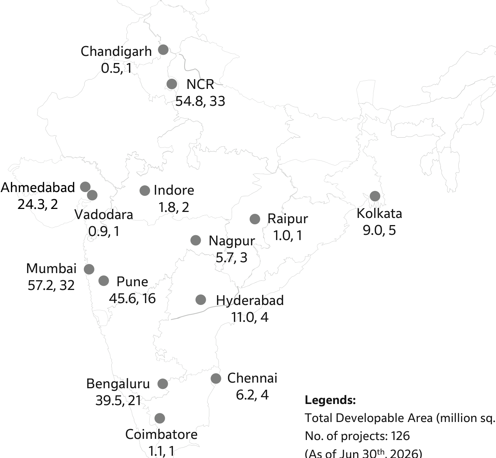

**[Image: 875646d0-2b70-42ac-a33e-e4dab71ab634.pdf-0006-05.png (1319x1221, 173.0KB)]**

<!-- Start of picture text -->
Chandigarh 0.5, 1 NCR 54.8, 33 Ahmedabad Indore 24.3, 2 1.8, 2 Vadodara Kolkata Raipur 0.9, 1 9.0, 5 1.0, 1 Nagpur 5.7, 3 Mumbai Pune 57.2, 32 45.6, 16 Hyderabad 11.0, 4 Chennai Bengaluru 6.2, 4 39.5, 21 Legends: Total Developable Area (million sq. ft.): 258 Coimbatore No. of projects: 126 1.1, 1 th <!-- End of picture text -->

Total Developable Area (million sq. ft.): 258 No. of projects: 126 (As of Jun 30th , 2026) 

# Investors should not use the rating to make investment decisions as per SEBI guidelines 

5 | Godrej Properties | Results Presentation Q1 FY27 

# **Strengths** 

- Over 1 billion people globally use a Godrej Industries Group product1 

- Godrej Brand • GPL brings the Godrej brand’s reputation for trust, quality and corporate governance to the real estate sector 

- • 

- Effective Land Competitive advantage in sourcing and executing outright/joint development projects with higher economic interest 

- • 

- Sourcin Model Capital efficient and high ROE development model <u>g</u> • 

- Strong Project Added 101 residential projects with ~195 million sq. ft. saleable area since FY182 • 

- Pi eline Development Management Agreement with Godrej & Boyce for its large Vikhroli landholding <u>p</u> • India’s largest real estate developer by booking value, booking volume, and cash collections in both FY25 & FY26 

- Sales and Execution • Fastest growing large company across sectors in FY243 

- Capability • Successfully delivered ~79 million sq. ft. of real estate since FY18 

- • Confidence of capital markets demonstrated by sector leading stock performance since IPO 

- • Largest QIP (INR 6,000 crores) ever in Indian real estate in December 2024 

- Access to Capital • Lowest bank fundin rates in the sector <u>g</u> 

- • Godrej Properties ranks #1 globally in the Real Estate and Management (REM) sector on the S&P Global’s Dow Jones Best in class indices for 20254 

- • Ranked #1 globally with a score of 100/100 by the Global Real Estate Sustainability benchmark (GRESB) in 2025 

- • Godrej Properties Limited has been included in the CDP - ‘A’ list in 2025 and also recognized as the supply chain leader in CDP’s Supplier 

- Sustainability Engagement Assessment (SEA). • 

- Leadership GPL has received approval and validation from the SBTi on the near-term goals, long term and Net Zero Goals in Jan 2026. • Godrej Properties ranks #1 in the real estate sector for Business World’s Top Sustainable Companies in India 

- • Godrej Properties was included in TIME World’s Most Sustainable Companies 2026 the only real estate company in India to feature on the list. 

- • GPL committed to have all its projects certified as green buildings by credible green building rating systems like IGBC, LEED etc. in 2010. 

- • GPL is proud to be a carbon Neutral organisation for Scope 1 & 2, water positive and a waste positive organisation by virtue of offsets. 

1. Based on Godrej Group Internal Study | 2. Total saleable area under projects, irrespective of the revenue / profit / area sharing arrangement since FY18 | 3. Comparing BV to reported  sales growth for all companies with sales of more than INR 10,000 crores in FY23 | 4. Investors should not use the rating to make investment decisions as per SEBI guidelines 

6 | Godrej Properties | Results Presentation Q1 FY27 

# **Strategic priorities** 

## **GPL intends to deliver 20% ROE from FY28 while retaining market share leadership** 

## 4 Core Operating Priorities 

##### Superior Product Quality 

##### Strong Execution 

##### Robust Asset Management 

##### Consistent Growth 

- Heavily committed to **superior product design** 

- 100% of GPL’s portfolio is certified or under certification for credible external green building rating systems 

- Ensuring robust construction quality under our **Quality Management System (QMS)** 

- Established Godrej Living, GPL’s community management arm to provide consistent post handover service 

- Best-in-class scalable **execution ecosystem** to enhance the speed of construction. 

   - 54% increase YoY in construction and related outflow in Q1 FY27 

- **Enhanced supply chain** & procurement 

   - Expanding contractor mix and greater mix of Grade-A contractors 

- Industry leading initiatives to establish **long term partnership with execution stakeholders** , while enhancing innovation 

   - Mobilizing labour strength through tech led initiatives. 

- **Robust play book** for critical decision making at product conceptualization stage for holistic asset management driving **capital efficiency** 

- **Fast turnaround** of projects.  51 (out of 52) projects acquired between FY21-FY25 are launched. 7 out of 18 projects acquired in FY26 also launched. 

- Institutionalized scalable **realtime cost management culture** for margin protection 

- FY26 is GPL’s **9****th** in a row **year** 

- of booking value growth and **3****rd** **consecutive year** as India’s largest developer by booking value 

- CY25 was the first time **GPL was #1 or #2 by booking value** amongst listed players in each of the country’s  5 largest real estate markets 

- Steadily expanding presence in new micro-markets within core cities. 

- Testing new markets through **plotted development projects -** entered Indore, Panipat, Raipur, Baroda, and Coimbatore recently. 

7 | Godrej Properties | Results Presentation Q1 FY27 

- **BV of INR 40,000 Crores to be delivered and recognized in P&L by FY28*** 

**>2X increase in scale of booking value recognition expected** 

**Major projects and phases expected to be delivered by FY28** 

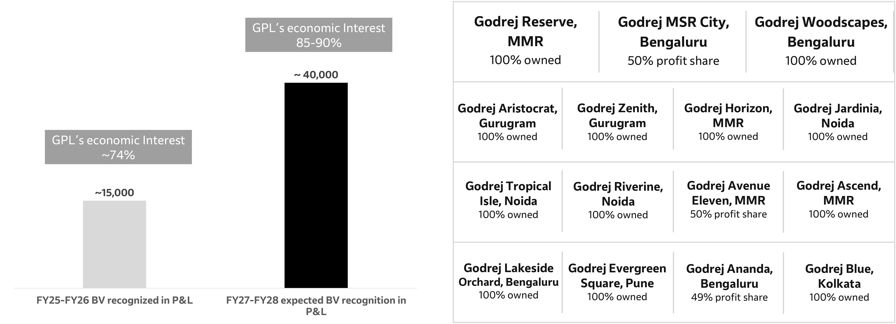

**[Image: 875646d0-2b70-42ac-a33e-e4dab71ab634.pdf-0009-03.png (3599x1305, 217.5KB)]**

<!-- Start of picture text -->
Godrej Reserve,  Godrej MSR City,  Godrej Woodscapes, GPL’s economic Interest 85-90% MMR Bengaluru Bengaluru 100% owned  50% profit share 100% owned ~ 40,000 Godrej Aristocrat,  Godrej Zenith,  Godrej Horizon,  Godrej Jardinia, Gurugram Gurugram MMR Noida 100% owned 100% owned 100% owned 100% owned GPL’s economic Interest ~74% Godrej Tropical  Godrej Riverine,  Godrej Avenue  Godrej Ascend, ~15,000 Isle, Noida Noida Eleven, MMR MMR 100% owned 100% owned 50% profit share 100% owned Godrej Lakeside  Godrej Evergreen  Godrej Ananda,  Godrej Blue, Orchard, Bengaluru Square, Pune Bengaluru Kolkata 100% owned 100% owned 49% profit share 100% owned FY25-FY26 BV recognized in P&L FY27-FY28 expected BV recognition in P&L <!-- End of picture text -->

*Deliveries are dependent on receipt of regulatory approvals and can be delayed beyond initial expectations. Revenue recognition will be basis the respective project work completion, underlying business model, economic interest and accounting method.  The list includes booking value for all structures excluding DM which are accounted for on accrual basis. 

8 | Godrej Properties | Results Presentation Q1 FY27 

- **GPL expects to deliver ~INR 20,000 crores of Operating cash flow between Q2 FY27 and Q4 FY28** 

**GPL expects to deliver INR 52,000-55,000 crores of collections and INR 20,000-22,000 crores of OCF cumulatively for FY27 & FY28. This will enable GPL to be FCF positive by FY28.** 

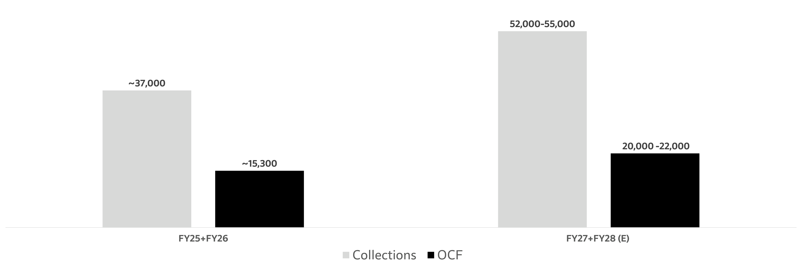

**[Image: 875646d0-2b70-42ac-a33e-e4dab71ab634.pdf-0010-02.png (3546x1184, 53.3KB)]**

<!-- Start of picture text -->
52,000-55,000 ~37,000 20,000 -22,000 ~15,300 FY25+FY26 FY27+FY28 (E) Collections OCF <!-- End of picture text -->

9 | Godrej Properties | Results Presentation Q1 FY27 

# **Stock performance** 

**An investment into GPL’s IPO would be worth ~5X an identical investment into the BSE Realty Index** 

#### Value Creation Track Record 

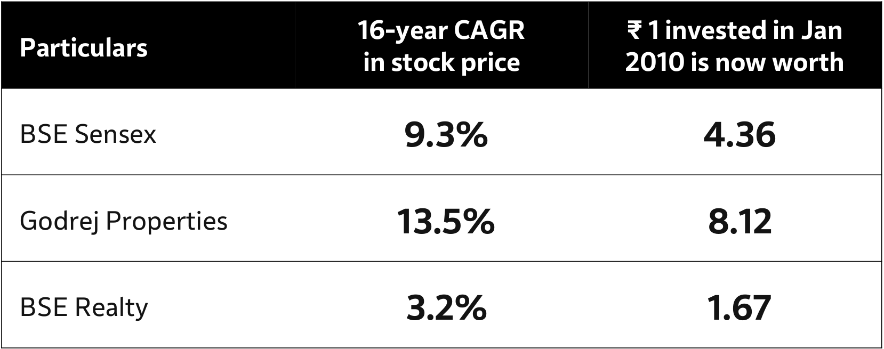

**[Image: 875646d0-2b70-42ac-a33e-e4dab71ab634.pdf-0011-03.png (1658x655, 56.2KB)]**

<!-- Start of picture text -->
16-year CAGR  ₹ 1 invested in Jan Particulars in stock price 2010 is now worth BSE Sensex 9.3% 4.36 Godrej Properties 13.5% 8.12 BSE Realty 3.2% 1.67 <!-- End of picture text -->

Note: CAGR calculated for prices as on 4th January, 2010 (the date of GPL’s public listing) and 30th June, 2026 

10 | Godrej Properties | Results Presentation Q1 FY27 

**Agenda** Overview 01 Q1 FY27 Operational Highlights 02 Q1 FY27 Financial Highlights 03 Annexure 04 

# Q1 FY27 Highlights **Collections INR 4,348 crores ↑ 18% YoY Business Development 3 new projects Saleable Area – 8.0 million sq. ft. Expected BV – INR 9,500 crores** 

### **Booking value** 

**INR 8,651 crores ↑ 22% YoY** 

**3,738 units | 6.2 million sq. ft. Operating Cashflow INR 399 crores Delivery ~0.9 million sq.ft.** 

### **Bookings consistency** 

**6****th** **consecutive quarter >INR 7,000 crores** 

**12****th** **consecutive quarter >INR 5,000 crores Construction and related outflow ↑ 54% YoY Leasing ~35K sq.ft. net area** 

### **Key Launches** 

**Godrej Vanantara (INR 3,237 crores)** 

**Godrej Samaris (INR 1,248 crores)** 

**Godrej Brooklyn Avenue (INR 317 crores) ESG/ CSR Highlight** GPL was included in TIME World’s Most Sustainable Companies 2026 and was the only real estate company in India to feature on the list 

**Awards** GPL received Golden Peacock National Quality Award 2026 

12 | Godrej Properties | Results Presentation Q1 FY27 

# **Sales highlights** 

|**Particulars**|**Q1 FY27**|**Q1 FY26**|**Growth**|**Q4 FY26**|**Growth**|**FY26**|
|---|---|---|---|---|---|---|
|Area Sold (million sq. ft.)|6.2|6.2|0%|7.3|-16%|27.0|
|BookingValue (INR Cr)|8,651|7,082|22%|10,163|-15%|34,171|
|Customer Collections* (INR Cr)|4,348|3,670|18%|7,947|-45%|19,965|

* Net of taxes and includes collections for DM Projects 

#### Strong response to new launches 

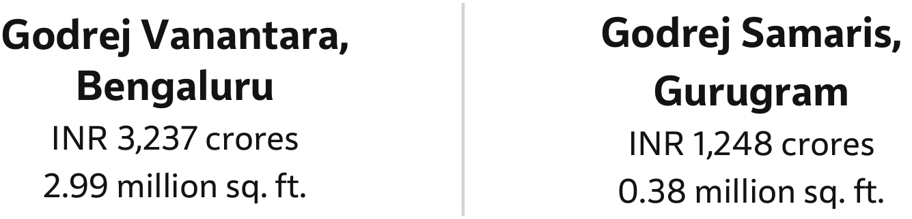

**[Image: 875646d0-2b70-42ac-a33e-e4dab71ab634.pdf-0014-04.png (1335x322, 40.9KB)]**

<!-- Start of picture text -->
Godrej Vanantara,  Godrej Samaris, Bengaluru Gurugram INR 3,237 crores INR 1,248 crores 2.99 million sq. ft. 0.38 million sq. ft. <!-- End of picture text -->

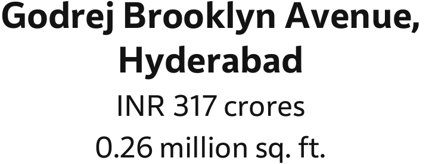

**[Image: 875646d0-2b70-42ac-a33e-e4dab71ab634.pdf-0014-05.png (720x276, 23.7KB)]**

<!-- Start of picture text -->
Godrej Brooklyn Avenue, Hyderabad INR 317 crores 0.26 million sq. ft. <!-- End of picture text -->

#### Strong momentum in sustenance sales 

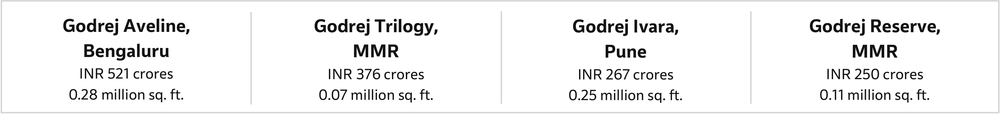

**[Image: 875646d0-2b70-42ac-a33e-e4dab71ab634.pdf-0014-07.png (3378x386, 50.1KB)]**

<!-- Start of picture text -->
Godrej Aveline,  Godrej Trilogy,  Godrej Ivara,  Godrej Reserve, Bengaluru MMR Pune MMR INR 521 crores INR 376 crores INR 267 crores INR 250 crores 0.28 million sq. ft. 0.07 million sq. ft. 0.25 million sq. ft. 0.11 million sq. ft. <!-- End of picture text -->

13 | Godrej Properties | Results Presentation Q1 FY27 

# **Sales highlights (contd.)** 

### **Geographic distribution of sales for Q1 FY27** 

|**City**|**Booking Value**|**Area Sold**|**Units sold**|
|---|---|---|---|
|| **(INR Crores)**|**(million sq. ft.)**||
|**Bengaluru**|3,798|3.3|1,886|
|**MMR**|1,805|0.8|655|
|**NCR**|1,538|0.6|201|
|**Pune**|939|0.9|677|
|**Hyderabad**|410|0.4|173|
|**Others**|161|0.2|146|

14 | Godrej Properties | Results Presentation Q1 FY27 

# **Sales by project details** 

|**Particulars**|**Booking Area** **(mn. sq. ft.)**|**Booking Value** **(INRCr)**|
|---|---|---|
||**Q1 FY27**|**Q1 FY27**|
|Godrej Vanatara, Bengaluru|2.99|3,237|
|Godrej Samaris, Gurugram|0.38|1,248|
|Godrej Aveline, Bengaluru|0.28|521|
|Godrej Trilogy, MMR|0.07|376|
|Godrej Brooklyn Avenue, Hyderabad|0.26|317|
|Godrej Ivara, Pune|0.25|267|
|Godrej Reserve, MMR|0.11|250|
|Godrej Woodsville/ Gale/ Eden Estate/ Greenfront/ Aqua Retreat (MaanHinje), Pune|0.21|207|
|Godrej Elaris, Pune|0.14|162|
|Godrej City, MMR|0.12|143|
|Godrej Avenue Eleven, MMR|0.03|141|
|Godrej Skyshore, MMR|0.04|127|
|Godrej Varanya, MMR|0.07|118|
|Godrej Evergreen Square, Pune|0.13|118|
|Godrej Horizon, MMR|0.04|112|
|Godrej Nirvaan/ Upavan, MMR|0.13|111|
|Godrej Regal Pavilion, Hyderabad|0.11|98|
|Godrej Blue, Kolkata|0.07|98|
|Godrej Nurture, MMR|0.06|95|
|Godrej Arden, Gr. Noida|0.07|91|
|Godrej Vistas, MMR|0.03|82|
| Godrej Sky Terraces, MMR|0.03|76|
|Evora Estate, Panipat|0.05|75|
|Others|0.48|581|
|**TOTAL**|**6.15**|**8,651**|

Notes: 1. Includes sales for the projects where GPL is the development manager | 2. Includes sale of retail area in certain projects | 3. Includes cancellations in certain projects 

15 | Godrej Properties | Results Presentation Q1 FY27 

# **Quarterly sales trend** 

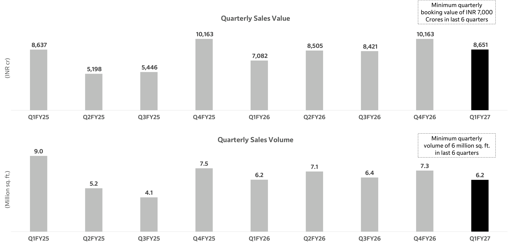

**[Image: 875646d0-2b70-42ac-a33e-e4dab71ab634.pdf-0017-01.png (3546x1698, 177.5KB)]**

<!-- Start of picture text -->
Minimum quarterly booking value of INR 7,000 Quarterly Sales Value Crores in last 6 quarters 10,163  10,163 8,637  8,651 8,505  8,421 7,082 5,446 5,198 Q1FY25 Q2FY25 Q3FY25 Q4FY25 Q1FY26 Q2FY26 Q3FY26 Q4FY26 Q1FY27 Minimum quarterly Quarterly Sales Volume volume of 6 million sq. ft. 9.0 in last 6 quarters 7.5 7.3 7.1 6.4 6.2 6.2 5.2 4.1 Q1FY25 Q2FY25 Q3FY25 Q4FY25 Q1FY26 Q2FY26 Q3FY26 Q4FY26 Q1FY27 (INR cr) (Million sq. ft.) <!-- End of picture text -->

16 | Godrej Properties | Results Presentation Q1 FY27 

# **Business development** 

**Added 3 new projects with an estimated saleable area of ~8.0 million sq. ft. and expected booking value of INR 9,500 crore in Q1FY27** 

**Estimated saleable area Estimated booking Particulars Segment Business Model (Million sq. ft.) value (INR Crores)** Greater Noida DMIC, NCR 5.78 7,000 Group Housing 100% owned Noida Sector 150, NCR 1.09 2,000 Group Housing 100% owned Chennai Plotted-2 (OMR) 1.18 500 Plotted 100% owned **Total 8.05 9,500** 

17 | Godrej Properties | Results Presentation Q1 FY27 

# **Construction highlights** 

## **Delivered 0.9 million sq. ft. in Q1 FY27** 

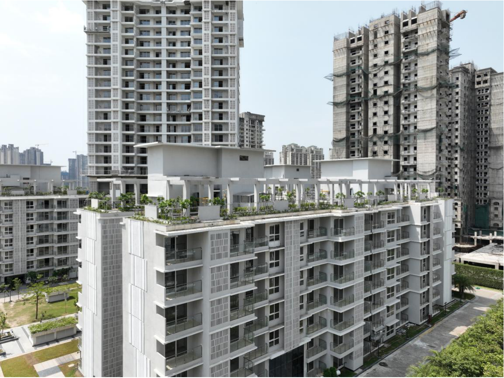

**[Image: 875646d0-2b70-42ac-a33e-e4dab71ab634.pdf-0019-02.png (1156x868, 1869.5KB)]**

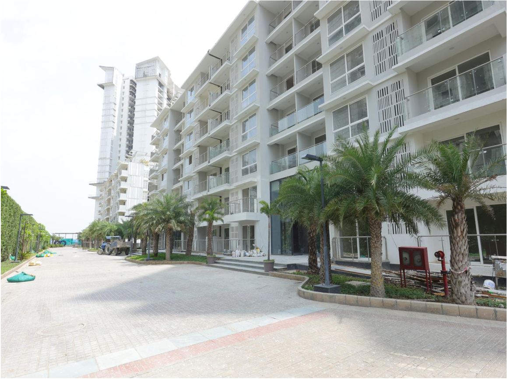

**[Image: 875646d0-2b70-42ac-a33e-e4dab71ab634.pdf-0019-03.png (1158x868, 1714.4KB)]**

**Godrej Palm Retreat, Noida** | 0.91 million sq. ft.| GPL Economic Interest : DM fee – 13% of Revenue 

Delivery represents receipt of occupancy certificate from competent authorities 

18 | Godrej Properties | Results Presentation Q1 FY27 

# **FY27 guidance vs actual** 

|**Particulars**|**FY26 Actual**|**FY27 Guidance**|**FY27 YTD Actual **|**Achievement (%)**|**Updated** **Assessment***|
|---|---|---|---|---|---|
|Launch value (INR Crore)|42,200|48,000|10,500|22%||
|Booking Value (INR Crore)|34,171|39,000|8,651|22%||
|Customer Collections (INR Crore)|19,965|24,000|4,348|18%||
|Deliveries#(Million Sq. Ft.)|12.1|13.5|0.9|7%||
|Business Development (by expected bookingvalue) (INR Crore)|42,100|20,000|9,500|48%||

* Updated management assessment of initial FY27 guidance 

# Represents receipt of occupancy/ completion certificate from competent authorities 

**[Image: 875646d0-2b70-42ac-a33e-e4dab71ab634.pdf-0020-04.png (85x251, 3.9KB)]**

Guidance Met 

On track to meet or exceed guidance 

Not on track to meet guidance 

19 | Godrej Properties | Results Presentation Q1 FY27 

- **Sustainability – ESG performance and CSR impact** 

   - GPL ranks #1 globally in Real Estate and Management (REM) sector on the S&P Global’s Dow Jones Best in class indices for 2025. 

ESG Ratings & Disclosures 

- GPL has been recognized as the Global Sector Leader with #1 ranking globally in the Global Real Estate Sustainability Benchmark with a score of 100/100 for 2025, 5 star rating, and an A rating for its public disclosure. 

- Godrej Properties Limited has been included in the Leadership Index of CDP with an ‘A’ Rating in 2025 and also recognized as the supply chain leader in CDP’s Supplier Engagement Assessment (SEA).# 

- GPL remains a part of FTSE Good Index Series. 

- GPL has received an approval and validation from the Science Based Targets initiative (SBTi) on the near-term goals. GPL has also received an approval on its commitment to long term Net Zero goals by SBTi. 

- Godrej Properties ranks #1 in Business World’s Top Sustainable companies in the real estate sector in 2026. 

- Godrej Properties was included in TIME World’s Most Sustainable Companies 2026, the only real estate company in India to feature on the list. 

Milestone Achievements 

- Awarded the IGBC Green Champion Award for Driving the Net Zero Building Movement in India. 

- Successfully renewed our ISO 14001:2015 certification, an internationally recognized standard for Environment Management System (EMS) across all our operations. 

- • As of FY26, 100% of projects in reporting boundary are certified or under certification for credible external green building rating systems like IGBC and GRIHA. 

On-going CSR projects 

- Through integrated waste management initiatives in Nagpur, Panaji, Chikkaballapur, Doddaballapur, and Indore, GPL diverted **14,052 metric tonnes** of waste from landfills in Q1 FY27, demonstrating a scalable and sustainable waste management model across diverse geographies. (In FY26 - Waste diversion achieved - 60,719 metric tonnes). 

- GPL supported **2,286 workers** through BOCW and non-BOCW registrations, enabling access to government social security schemes and unlocking INR **2.27 crore** in government welfare support. 

- Under the Crop Residue Management project, GPL identified **_310_ villages** covering **76,078 households** across Gurdaspur district in Q1 FY27 to deliver Information, Education and Communication (IEC) interventions aimed at preventing stubble burning across **_40,000_ hectares** . Building on the impact achieved in FY26, the initiative avoided 9,858 tCO₂e emissions and prevented the burning of 1,30,880 tonnes of crop residue. 

# Investors should not use the rating to make investment decisions as per SEBI guidelines 

20 | Godrej Properties | Results Presentation Q1 FY27 

**Agenda** Overview 01 Q1 FY27 Operational Highlights 02 Q1 FY27 Financial Highlights 03 Annexure 04 

20 | Godrej Properties | Results Presentation Q1 FY27 

|**Consolid** |**ated f** |**inan** |**cial st** |**atem** |**ents** |**– P&L**  **(INR Crores)**|
|---|---|---|---|---|---|---|
|**Particulars**|**Q1 FY27**|**Q1 FY26**|**% Change**|**Q4 FY26**|**% Change**|**FY26**|
|Total Income|1,337|1,593|-16%|3,895|-66%|8,374|
|Adjusted EBITDA|557|925|-40%|1051|-47%|2957|
|EBITDA|545|915|-40%|959|-43%|2826|
|Profit before tax|480|861|-44%|871|-45%|2574|
|Net Profit after tax|350|600|-42%|650|-46%|1850|

#### **Total Income for Q1 FY27** 

|**Particulars**|**INR Cr**|
|---|---|
|Godrej Greenview Estate, Indore|64|
|Godrej Reserve, MMR|56|
|Godrej South Estate, NCR|51|
|Evora Estate, Panipat|39|
|Godrej Sunrise Estate, Chennai|21|
|Godrej Woodside Estate, MMR|19|
|Verdania Estate, Indore|17|
|Godrej Golfside Estate, MMR|17|
|Godrej Forest Estate, Nagpur|17|
|Others|206|
|Interest and other Income|839|
|Profit & Loss from Joint Venture|-9|
|**Total Income**|**1,337**|

#### **Profit & Loss from Joint Ventures with Structuring Income** 

|**Particulars**|**INR Crs**|
|---|---|
|Profit &LossforJointVentures asreportedin P&L|-9|
|Add: StructuringIncome||
|DM FeesfromJointVentureProjects|5|
|NetInterestIncomefromJointVenturesProjects|60|
|**Profit & Loss for Joint Ventures including Structuring Income**|**56**|

Notes: 

Total Income = Sales & Operating Income + Other Income + Share of profit/loss in Joint Venture Adjusted EBITDA =  EBITDA + interest  included in cost of sale 

EBITDA = PBT (before exceptional items) + Interest + Depreciation + Share of profit in Joint Venture PBT = PBT (before exceptional items) + share of profit in Joint Venture PAT = Net profit after minority interest Note: All Numbers as per Ind AS 

22 | Godrej Properties | Results Presentation Q1 FY27 

# **Cashflow statement** 

**(INR Crores)** 

|**Notes**|**Particulars**|**Q1 FY27**|
|---|---|---|
||**Operating cashflow**||
||Total operatingcash inflow1|4,998|
||**Operating cash outflow**||
|A|Construction & related outflow|-2,244|
||Otherproject  related outflow|-2,355|
||**Total operating cash outflow**|**-4,599**|
||**Net operating cashflow**|**399**|
||**Financial cashflow**||
|B|Interest, CorporateTaxes&OtherOutflow|-247|
||**Net financial cashflow**|**-247**|
||**Capital cashflow**||
|C|Land,approval & capital outflow|-1,211|
||Advance to JV Partners|-135|
||**Net capital cashflow**|**-1,346**|
|**(A+B+C)**|**Net cashflow**|**-1,193**|
|D|Adjustment for JVprojects**2**|-2|
|**(A+B+C+D)**|**Total net GPL cashflow**|**-1,195**|
|E|Ind AS Adjustments|-28|
|**(A+B+C+D+E)**|**(Increase) / Decrease in Net Debt under Ind AS**|**-1,223**|

Notes: 1. Total operating cash inflow includes gross collection for DM projects and Other project related outflow includes JVP share of collection for DM projects |  2. Adjustment for JV projects represents mainly timing difference in cash collection from customers in respective project SPV and pending transfer to GPL due to non-Availability of RERA Limits and restrictions in respective agreements with JV partners whereby GPL cannot withdraw cash till particular milestones are achieved. 

23 | Godrej Properties | Results Presentation Q1 FY27 

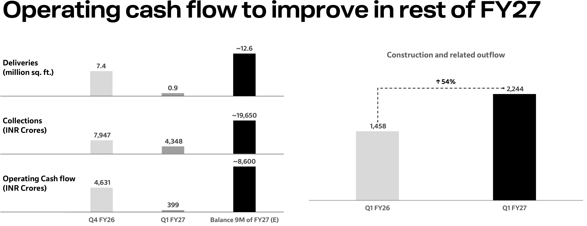

**[Image: 875646d0-2b70-42ac-a33e-e4dab71ab634.pdf-0025-00.png (3695x1428, 154.2KB)]**

<!-- Start of picture text -->
Operating cash flow to improve in rest of FY27 ~12.6 Construction and related outflow Deliveries 7.4 (million sq. ft.) ↑ 54% 0.9 2,244 ~19,650 Collections 1,458 (INR Crores) 7,947 4,348 ~8,600 Operating Cash flow 4,631 (INR Crores) 399 Q1 FY26 Q1 FY27 Q4 FY26 Q1 FY27 Balance 9M of FY27 (E) <!-- End of picture text -->

- Operating cash flow (OCF) will vary on a quarterly basis due to volatility in collections, which is dependent on bookings, construction progress and milestones achieved and deliveries, whereas outflows are largely evenly spread over the year with an increasing trend due to growing scale. 

- Q1 FY27 had deliveries of 0.9 million sq. ft. vis-à-vis 7.4 million sq. ft. in Q4 FY26. Consequently, collections reduced by INR 3,600 crores QoQ, while simultaneously the pace of construction has increased. Collections though continue to grow YoY and OCF will catch-up in rest of the year. 

- There was 54% increase in construction and related outflow on account of increase in pace of execution which is likely to be seen in deliveries in FY28. 

24 | Godrej Properties | Results Presentation Q1 FY27 

# **Consolidated Balance Sheet** 

**(INR Crores)** 

|**SN**|**Particulars**|**As on** **30.06.2026**|**As on** **31.03.2026**|
|---|---|---|---|
|**A**|**ASSETS**|**Unaudited**|**Audited**|
|**1**|**Non-current Assets**|||
|a|Property,Plant andEquipment|1,329.82|1,280.73|
|b|Right-of-UseAsset|252.44|263.32|
|c|Capital Work-In-Progress|161.71|169.40|
|d|InvestmentProperty|148.14|150.51|
|e|Goodwillonconsolidation|0.07|0.07|
|f|Other Intangible assets|13.07|13.72|
|g|IntangibleAssets under Development|2.74|2.61|
|h|Equity accountedinvestees|627.31|625.62|
|i|Financial Assets|||
||Other Investments|2,021.93|2,000.83|
||TradeReceivables|68.29|73.91|
||Loans|117.47|127.72|
||Other Non-CurrentFinancial Assets|671.81|717.07|
|j|DeferredTax Assets (Net)|324.46|304.61|
|k|IncomeTax Assets (Net)|302.81|335.28|
|l|Other Non-CurrentNon Financial Assets|16.85|10.75|
||**Total Non-Current Assets**|**6,058.92 **|**6,076.15**|
|**2**|**Current Assets**|||
|a|Inventories|61,171.73|57,806.91|
|b|Financial Assets|||
||Investments|4,956.41|2,884.23|
||TradeReceivables|461.39|554.07|
||Cashand Cash Equivalents|1,485.54|1,860.74|
||Bank Balances Otherthan Above|4,302.84|3,857.08|
||Loans|2,145.64|2,108.35|
||OtherCurrentFinancial Assets|1,602.45|1,538.03|
|c|OtherCurrentNon Financial Assets|6,133.79|5,208.87|
||**Total Current Assets**|**82,259.79**|**75,818.28**|
||**Total Assets**|**88,318.71**|**81,894.43**|

|||| **(INR Crores)**|
|---|---|---|---|
|**SN**|**Particulars**|**As on** **30.06.2026**|**As on** **31.03.2026**|
|**B**|**Equity and Liabilities**|**Unaudited**|**Audited**|
|1|Equity|||
|a|Equity share capital|150.61|150.60|
|b|Other equity|19,354.43|19,004.94|
|c|Non-controlling interest|198.63|199.35|
||**Total Equity**|**19,703.67**|**19,354.89**|
|**2**|**Liabilities**|||
|**2.1**|**Non Current Liabilities**|||
|a|Financial Liabilities|||
||Borrowings|2,250.00|2,250.00|
||LeaseLiabilities|226.71|234.74|
||Other Non -CurrentFinancial Liabilities|21.09|17.04|
|b|Provisions|72.67|70.62|
|c|DeferredTax Liabilities (Net)|564.82|442.03|
||**Total Non-Current Liabilities**|**3,135.29**|**3,014.43**|
|**2.2**|**Current Liabilities**|||
|a|Financial Liabilities|||
||Borrowings|16,677.65|13,364.87|
||Lease Liabilities|46.28|44.48|
||Trade payables|||
||Total OutstandingDues of Micro and Small Enterprises|858.00|1,002.74|
||Total Outstanding Dues of Creditors other than Micro and Small Enterprises|4,300.31|4,896.94|
||Other Current Financial Liabilities|766.15|951.26|
|b|Other Current Non Financial Liabilities|42,704.49|39,087.42|
|c|Provisions|55.03|51.63|
|d|Current Tax Liabilities(Net)|71.84|125.77|
||**Total Current Liabilities**|**65,479.75**|**59,525.11**|
||**Total Liabilities**|**68,615.04**|**62,539.54**|
||**Total Equity and Liabilities**|**88,318.71**|**81,894.43**|

25 | Godrej Properties | Results Presentation Q1 FY27 

# **Financial Analysis** 

#### **Profitability Indicators** 

|**Particulars**|**Q1 FY27**|**Q1 FY26**|**Q4 FY26**|**FY26**|
|---|---|---|---|---|
|Adjusted EBITDA / Total Income %|41.7%|58.1%|27.0%|35.3%|
|EBITDA / Total Income %|40.8%|57.5%|24.6%|33.7%|
|PBT Margin %|35.9%|54.0%|22.4%|30.7%|
|Net Profit Margin %|26.2%|37.7%|16.7%|22.1%|

#### **Leverage Indicators** 

|**Particulars**|**As on 30****th****Jun 2026**|**As on 31****st****Mar 2026**|**As on 30****th****Jun 2025**|
|---|---|---|---|
|Net Debt (INR Cr)|7,637|6,414|4,637|
|Networth (INR Cr)|19,505|19,156|17,913|
|Net Debt / Equity Ratio|0.39|0.33|0.26|
|Average Borrowing Cost (YTD)|7.15%|7.05%|7.70%|

Note: All Numbers as per Ind AS 

26 | Godrej Properties | Results Presentation Q1 FY27 

**Agenda** Overview 01 Q1 FY27 Operational Highlights 02 Q1 FY27 Financial Highlights 03 Annexure 04 

25 | Godrej Properties | Results Presentation Q1 FY27 

# **A. Residential Projects – Mumbai Zone** 

|**SN** **Project Name**|**Location**|**Business Model**|**Accounting Method**|**Total Estimated** **Saleable Area**  **(mnsq ft)**|**GPL Share Area** **(mn sq ft)**|**PTD Area** **Launched** **(mnsq ft)**|**As on 30****th** **Jun 202** **PTD Area Sold** **(mn sq ft)**|**6** **PTD Booking** **Value** **(INRCr)**|**PTD Collection** **(INR Cr)**|**PTD OC** **Received** **(mnsq ft)**|
|---|---|---|---|---|---|---|---|---|---|---|
|1 Godrej Emerald|Mumbai|Revenue Based – 64% (GPL holds 20% equityin the projectspecific company)|Equity Method|1.32|1.32|1.32|1.29|1,151|1,115|1.32|
|2 GodrejNurture|Mumbai|100% ownedproject|LinebyLine Consolidation|1.27|1.27|0.86|0.39|629|200|-|
|3 GodrejVihaa|Mumbai|DM Fee– 10% of Revenue|Accrual Method|1.30|1.30|0.74|0.72|284|259|0.34|
|4 Godrej City|Mumbai|Profit Based – 71.07%|LinebyLine Consolidation|10.25|10.25|7.08|5.84|4,039|2,356|2.00|
|5 GodrejGolfsideEstate|Mumbai|100% ownedproject|LinebyLine Consolidation|0.41|0.41|0.41|0.40|342|315|0.41|
|6 GodrejVistas|Mumbai|DM Fee– 10% of Revenue|Accrual Method|0.62|0.62|0.62|0.52|1,251|669|-|
|7 G&B,Vikhroli|Mumbai|DM Fee– 10% of Revenue|Accrual Method|1.20|1.20|-|-|-|-|-|
|8 GodrejTranquil|Mumbai|DM Fee– 11% of Revenue |Accrual Method|1.58|1.58|1.29|1.16|1,590|1,220|0.94|
|9 Godrej Edenwoods|Mumbai|Profit Based – 50% (from 85% of revenue for this project)|Equity Method|0.03|0.03|0.03|-|-|-|-|
|10 Bandra|Mumbai|RevenueBased –60%|LinebyLine Consolidation|1.07|1.07|-|-|-|-|-|
|11 Godrej Bayview|Mumbai|Profit Share–60%; SPV to construct space for societyin lieuofsaleablearea|Equity Method|0.56|0.56|0.56|0.34|681|326|-|
|12 Godrej Exquisite|Mumbai|GPL holds 20% equity in the project specific company|Equity Method|0.79|0.79|0.79|0.72|858|627|0.03|
|13 GodrejRKS|Mumbai|100% ownedproject|LinebyLine Consolidation|0.38|0.38|0.38|0.34|857|828|0.38|
|14 GodrejNirvaan|Mumbai|ProfitShare-50%|EquityMethod|2.84|2.42|1.45|1.32|891|714|1.45|
|15 Taloja|Mumbai|Profit Share-55%|EquityMethod|7.50|7.50|-|-|-|-|-|
|16 GodrejAscend|Mumbai|100% owned project|Line byLine Consolidation|1.68|1.65|1.65|1.41|1,667|1,046|0.01|
|17 GodrejTrilogy|Mumbai|Area Share- 73%|Line byLine Consolidation|1.50|1.10|0.81|0.55|3,240|503|-|
|18 Godrej Five Gardens|Mumbai|GPL to construct space for society in lieu of saleable area|Line by Line Consolidation|0.19|0.18|0.18|0.11|438|339|-|
|19 GodrejRiviera|Mumbai|100% owned project|Line byLine Consolidation|2.74|2.69|0.60|0.58|430|182|-|
|20 GodrejEternal Palms|Mumbai|100% owned project |Line byLine Consolidation|0.45|0.45|0.45|0.29|602|158|-|
|21 Godrej Horizon|Mumbai|GPL to construct space for society in lieu of saleable area|Line by Line Consolidation|1.73|1.70|1.70|1.31|3,034|2,079|-|
|22 Godrej Carmichael|Mumbai|100% owned project|Line byLine Consolidation|0.12|0.12|0.09|0.04|434|188|-|
|23 GodrejCountryEstate, Palghar|Mumbai|100% ownedproject|Line byLine Consolidation|1.09|1.09|1.09|0.21|71|66|1.09|
|24 GodrejReserve|Mumbai|100% owned project|Line byLine Consolidation|3.88|3.88|3.24|3.07|6,028|2,955|0.06|
|25 Godrej Avenue Eleven*|Mumbai|GPL owns 50% of equity in the project specific company|Line by Line Consolidation|0.89|0.89|0.89|0.73|2,344|1,600|-|
|26 GodrejHillview Estate|Mumbai|100% owned project|Line byLine Consolidation|1.79|1.79|1.79|1.77|705|694|1.79|
|27 Godrej SkyTerraces|Mumbai|100% owned project|Line byLine Consolidation|0.21|0.21|0.21|0.19|534|348|-|
|28 GodrejWoodsideEstate|Mumbai|100% owned project|Line byLine Consolidation|1.76|1.76|1.76|1.67|738|682|1.76|
|29 GodrejVaranya (Kharghar)|Mumbai|100% owned project|Line byLine Consolidation|1.97|1.97|1.10|0.43|746|116|-|
|30 Godrej Skyshore|Mumbai|Revenue Share-84%for ~86% ofarea|Line byLine Consolidation|0.52|0.45|0.45|0.24|752|173|-|
|31 Thane|Mumbai|Revenue share- 74.5%|Line byLine Consolidation|4.00|4.00|-|-|-|-|-|
|32 Godrej Greenview Estate|Indore|100% owned project|Line byLine Consolidation|1.16|1.16|1.16|0.99|507|335|1.16|
|33 VerdaniaEstate|Indore|100% owned project|Line byLine Consolidation|0.62|0.62|0.42|0.23|188|124|0.62|
|**Total MMR Zone**||||**57.43**|**56.41**|**33.12**|**26.88**|**35,034**|**20,216**|**13.35**|

*Total estimated saleable area represents GPL share of balance area to be sold 

28 | Godrej Properties | Results Presentation Q1 FY27 

# **A. Residential Projects – North Zone** 

||||||||**As on 30****th** **Jun 202**|**6**|||
|---|---|---|---|---|---|---|---|---|---|---|
|**SN** **Project Name**|**Location**|**Business Model**|**Accounting Method**|**Total Estimated** **Saleable Area** **(mnsq ft)**|**GPL Share Area** **(mn sq ft)**|**PTD Area** **Launched** **(mnsq ft)**|**PTD Area Sold** **(mn sq ft)**|**PTD Booking** **Value** **(INR Cr)**|**PTD Collection** **(INR Cr)**|**PTD OC** **Received** **(mnsq ft)**|
|1 Godrej101|Gurugram|Revenue Based – 66.66%|Line byLine Consolidation|1.03|1.03|1.03|1.02|824|528|0.63|
|2 GodrejIcon|Gurugram|100% ownedproject|Line byLine Consolidation|0.80|0.80|0.68|0.66|457|449|0.66|
|3 GodrejNature+|Gurugram|100% ownedproject|Line byLine Consolidation|1.75|1.75|1.75|1.75|1,120|619|0.39|
|4 GodrejAir|Gurugram|Profit Share – 37.5%|EquityMethod|0.99|0.99|0.99|0.98|578|484|0.99|
|5 Godrej Meridien|Gurugram|GPL owns 20% equity in project specific company|Equity Method|1.52|1.52|1.52|1.51|1,358|1,306|1.20|
|6 GodrejHabitat|Gurugram|Revenue Share – 95%|Line byLine Consolidation|0.77|0.77|0.77|0.76|467|251|-|
|7 GodrejZenith|Gurugram|100% ownedproject|Line byLine Consolidation|2.90|2.90|2.90|2.84|4,181|1,924|-|
|8 Godrej Aristocrat|Gurugram|100% owned project, 2.4% area share to landowner|Line by Line Consolidation|1.71|1.67|1.67|1.59|3,161|1,421|-|
|9 GodrejVrikshya|Gurugram|100% ownedproject|Line byLine Consolidation|1.59|1.59|1.59|1.02|1,776|820|-|
|10 GodrejMiraya,GCR|Gurugram|100% ownedproject|Line byLine Consolidation|0.94|0.94|0.61|0.25|896|323|-|
|11 GodrejAstra,GCR|Gurugram|100% ownedproject|Line byLine Consolidation|0.56|0.56|0.51|0.47|1,477|379|-|
|12 GodrejSora,GCR|Gurugram|100% ownedproject|Line byLine Consolidation|0.86|0.86|0.66|0.27|819|194|-|
|13 GodrejAlira|Gurugram|100% ownedproject|Line byLine Consolidation|0.37|0.37|0.37|0.12|286|75|-|
|14 GodrejSamaris,GCR(Sec-53 II)*|Gurugram|100% ownedproject|Line byLine Consolidation|1.78|1.78|0.93|0.38|1,248|73|-|
|15 Sector 63A*|Gurugram|100% ownedproject|Line byLine Consolidation|1.75|1.75|-|-|-|-|-|
|16 GodrejSouth Estate|NCR|100% ownedproject|Line byLine Consolidation|1.01|1.01|0.94|0.81|1,699|1,104|0.71|
|17 Ashok Vihar|NCR|100% ownedproject|Line byLine Consolidation|3.28|3.28|-|-|-|-|-|
|18 Godrej Connaught One|NCR|DM - 10% of Revenue & Profit Share - 50%|Equity Method|0.12|0.12|0.12|0.07|448|208|-|
|19 GodrejGreen Estate|Sonipat|100% ownedproject|Line byLine Consolidation|1.00|1.00|1.00|1.00|842|828|1.00|
|20 GodrejParkland Estate|Kurukshetra|100% ownedproject|Line byLine Consolidation|1.40|1.40|1.40|1.38|629|612|1.40|
|21 Evora Estate|Panipat|100% ownedproject|Line byLine Consolidation|1.02|1.02|0.98|0.93|1,168|388|0.45|
|22 GodrejNest|Noida|DM Fee – 11% of Revenue|Accrual Method|2.20|2.20|1.88|1.87|1,155|986|0.86|
|23 GodrejPalm Retreat|Noida|DM Fee – 13% of Revenue|Accrual Method|1.82|1.82|1.37|1.37|963|907|0.91|
|24 GodrejWoods|Noida|Profit Share – 49%|EquityMethod|2.46|2.46|2.46|2.45|2,907|2,729|2.25|
|25 GodrejTropical Isle|Noida|100% ownedproject|Line byLine Consolidation|1.62|1.62|1.62|1.61|2,215|1,373|-|
|26 GodrejJardinia|Noida|100% ownedproject|Line byLine Consolidation|1.62|1.62|1.62|1.60|2,373|1,168|-|
|27 GodrejRiverine|Noida|100% ownedproject|Line byLine Consolidation|1.48|1.48|1.48|1.24|2,753|689|-|
|28 Noida Sector 151|Noida|100% ownedproject|Line byLine Consolidation|1.09|1.09|-|-|-|-|-|
|29 GodrejGolf Links|Gr. Noida|Profit Share – 40%|EquityMethod|4.59|4.59|3.94|3.70|3,057|2,253|3.32|
|30 GodrejArden|Gr. Noida|100% ownedproject|Line byLine Consolidation|2.16|2.16|1.43|1.24|1,621|313|-|
|31 GodrejMajesty|Gr. Noida|100% ownedproject|Line byLine Consolidation|1.74|1.74|1.50|1.00|1,431|405|-|
|32 Greater Noida DMIC|Gr. Noida|100% ownedproject|Line byLine Consolidation|5.78|5.78|-|-|-|-|-|
|**Total North Zone**||||**53.70**|**53.67**|**37.73**|**33.91**|**41,910**|**22,809**|**14.77**|

*Saleable area has been increased in Godrej Samaris and Sector-63A from 1.70 msf and 1.65 msf respectively on account of design efficiency 

29 | Godrej Properties | Results Presentation Q1 FY27 

|**A. Resid**|**en**|**tial Proje**|**cts –**|**Sou** **l id**|**th Z** |**on** |**e** **As on 30****th** **Jun 202**|**6** **ki**|||
|---|---|---|---|---|---|---|---|---|---|---|
|**SN** **Project Name**|**Location**|**Business Model**|**Accounting Method**|**Tota Estmate** **Saleable Area** **(mnsq ft)**| **GPL Share Area** **(mn sq ft)**|**PTD Area** **Launched** **(mnsq ft)**|**PTD Area Sold** **(mn sq ft)**|**PTD Boong** **Value** **(INRCr)**|**PTD Collection** **(INR Cr)**|**PTD OC** **Received** **(mnsq ft)**|
|1 GodrejMSR City*|Bengaluru|Profit Share – 50%|EquityMethod|6.32|6.32|4.03|4.00|3,796|1,097|-|
|2 GodrejWoodland|Bengaluru|100% ownedproject|Line byLine Consolidation|1.77|1.77|1.49|1.34|456|408|1.49|
|3 Godrej Reflections|Bengaluru|GPL holds 20% equity in the project specific company|Equity Method|0.97|0.97|-|-|-|-|-|
|4 Tumkur Road|Bengaluru|Revenue Based – 78.0% |Line byLine Consolidation|0.79|0.79|-|-|-|-|-|
|5 Godrej Ananda|Bengaluru|DM-4.5% of Revenue & Profit Share- 49%|Equity Method|3.29|3.29|3.29|3.24|1,955|1,662|1.66|
|6 GodrejPark Retreat|Bengaluru|100% ownedproject |Line byLine Consolidation|1.66|1.66|1.66|1.66|1,216|1,185|1.66|
|7 Godrej Splendour|Bengaluru|100% owned project; 5.4% area share to landowner|Line by Line Consolidation|2.57|2.48|2.08|1.99|1,435|1,226|1.10|
|8 GodrejLakeside Orchard|Bengaluru|100% ownedproject|Line byLine Consolidation|1.64|1.64|1.64|1.41|1,557|736|-|
|9 Godrej Vanantara (Bannerghatta Road)*|Bengaluru|100% owned project|Line by Line Consolidation|3.53|3.53|3.53|2.99|3,237|297|-|
|10 GodrejAthena|Bengaluru|100% ownedproject|Line byLine Consolidation|0.57|0.57|0.57|0.50|704|537|-|
|11 Godrej Woodscapes*|Bengaluru|100% owned project; 0.1 msf area share tolandowner|Line by Line Consolidation|4.43|4.32|4.07|4.03|3,803|1,816|-|
|12 GodrejTiara|Bengaluru|100% ownedproject|Line byLine Consolidation|0.84|0.84|0.84|0.83|1,357|522|-|
|13 GodrejWoods|Bengaluru|100% ownedproject|Line byLine Consolidation|0.97|0.97|0.97|0.38|490|123|-|
|14 GodrejAveline|Bengaluru|100% ownedproject|Line byLine Consolidation|1.60|1.60|1.57|1.26|2,093|291|-|
|15 Godrej Parkshire|Bengaluru|100% owned project - ~26% area share tolandowner|Line by Line Consolidation|1.56|1.16|1.16|0.78|802|204|-|
|16 Aravya Estate|Bengaluru|100% ownedproject|Line byLine Consolidation|1.10|1.10|1.10|1.08|479|203|-|
|17 Kada Agrahara|Bengaluru|100% ownedproject|Line byLine Consolidation|3.06|3.06|-|-|-|-|-|
|18 Whitefield|Bengaluru|100% ownedproject |Line byLine Consolidation|1.08|1.05|-|-|-|-|-|
|19 Godrej Palm Grove|Chennai|Area Based – 70% (for 12.57 acres), 68% (for 4.82acres)|Line by Line Consolidation|2.40|2.40|0.65|0.64|264|255|0.65|
|20 GodrejAzure|Chennai|100% ownedproject|Line byLine Consolidation|1.04|1.04|1.04|0.77|420|251|0.47|
|21 GodrejSunrise Estate|Chennai|100% ownedproject|Line byLine Consolidation|1.55|1.55|1.45|1.00|277|256|1.55|
|22 Chennai Plotted 2|Chennai|100% ownedproject|Line byLine Consolidation|1.18|1.18|-|-|-|-|-|
|23 Coimbatore|Coimbatore|100% ownedproject|Line byLine Consolidation|1.10|1.10|-|-|-|-|-|
|24 GodrejRegal Pavilion*|Hyderabad|100% ownedproject|Line byLine Consolidation|4.13|4.13|3.29|2.83|2,425|707|-|
|25 Godrej Madison Avenue|Hyderabad|100% owned project with 0.095 msf area sharewith landowner|Line by Line Consolidation|1.25|1.15|0.96|0.93|1,109|321|-|
|26 Godrej Brooklyn Avenue (Kukatpally)*|Hyderabad|100% owned project|Line by Line Consolidation|3.06|3.06|2.66|0.26|317|20|-|
|27 Neopolis|Hyderabad|100% ownedproject|Line byLine Consolidation|2.55|2.55|-|-|-|-|-|
|**Total South Zone**||||**56.01**|**55.27**|**38.03**|**31.93**|**28,193**|**12,116**|**8.58**|

*Total saleable area changed from 5.60 msf, 3.34 msf, 4.60 msf, 4.00 msf and 2.89 msf in Godrej MSR City, Godrej Vanatara, Godrej Woodscapes, Godrej Regal Pavilion and Godrej Brooklyn Avenue on account of changes in project scope or design efficiency 

30 | Godrej Properties | Results Presentation Q1 FY27 

# **A. Residential Projects – West-East Zone** 

||||||||**As on 30****th****Jun 202**|**6** |||
|---|---|---|---|---|---|---|---|---|---|---|
|||||**Total Estimated**||**PTD Area**||**PTD Bookin**||**PTD OC**|
|**SN** **Project Name**|**Location**|**Business Model**|**Accounting Method**| **Saleable Area**  **(mnsq ft)**|**GPL Share Area** **(mn sq ft)**| **Launched** **(mnsq ft)**|**PTD Area Sold** **(mn sq ft)**|**g** **Value** **(INRCr)**|**PTD Collection** **(INR Cr)**| **Received** **(mnsq ft)**|
|||Phase I to IV: Area Based – 73.6% Phase|||||||||
|1 Godrej Garden City|Ahmedabad|V : Revenue Based – 67.6% Phase VI to X - 17% of Revenue Phase XI onwards - 15.6% of Revenue|Line by Line Consolidation/ Accrual Method|21.00|19.76|9.02|8.84|3,045|2,797|7.86|
|2 Vastrapur|Ahmedabad|100% ownedproject|Line byLine Consolidation|0.90|0.90|-|-|-|-|-|
|3 GodrejHeritage Estate|Vadodara|100% ownedproject|Line byLine Consolidation|0.89|0.89|0.89|0.35|121|77|0.89|
|4 Raipur|Raipur|100% ownedproject|Line byLine Consolidation|0.95|0.95|-|-|-|-|-|
|5 GodrejSeven|Kolkata|100% ownedproject|Line byLine Consolidation|2.70|2.70|2.70|2.43|1,199|815|0.96|
|6 GodrejPrakriti|Kolkata|100% Owned Project|Line byLine Consolidation|2.95|2.95|2.77|2.77|989|982|2.34|
|7 GodrejBlue|Kolkata|100% ownedproject|Line byLine Consolidation|1.00|1.00|1.00|0.74|1,043|376|-|
|8 GodrejZen Estates|Kolkata|100% ownedproject|Line byLine Consolidation|1.33|1.33|1.33|0.18|63|23|0.75|
|9 EM Bypass|Kolkata|100% ownedproject|Line byLine Consolidation|1.03|1.03|-|-|-|-|-|
|10 GodrejOrchard Estate|Nagpur|100% ownedproject|Line byLine Consolidation|1.47|1.47|1.47|1.41|602|583|1.47|
|11 GodrejForest Estate|Nagpur|Profit Share - 40% for 89.75% of area|Line byLine Consolidation|2.48|2.23|2.23|2.23|781|729|2.48|
|12 Nagpur 3|Nagpur|100% ownedproject|Line byLine Consolidation|1.70|1.70|-|-|-|-|-|
|13 Godrej Infinity/ Rejuve/ Aqua Vista (Keshavnagar)|Pune|Profit Share – 58.64%|Equity Method|3.94|3.94|2.79|2.33|1,464|1,309|2.08|
|14 GodrejGreens|Pune|Profit Share – 40%|Line byLine Consolidation|1.05|1.05|0.88|0.87|398|405|0.88|
|15 GodrejPark Greens (Mamurdi)|Pune|100% ownedproject|Line byLine Consolidation|4.18|4.18|3.88|3.67|2,090|1,525|1.56|
|16 MaanHinje|Pune|100% owned project (99% Equity in project SPV)|Line by Line Consolidation|7.59|7.59|6.03|4.93|4,132|2,095|0.41|
|17 Manjari|Pune|100% owned project (99% Equity in project SPV)|Line by Line Consolidation|4.27|4.27|3.99|3.19|2,117|1,579|1.32|
|18 Mahalunge|Pune|100% owned project (99% Equity in project SPV)|Line by Line Consolidation|6.38|6.38|6.38|5.72|3,999|3,408|2.47|
|19 GodrejEmerald Waters|Pune|100% ownedproject|Line byLine Consolidation|1.47|1.47|1.47|1.17|1,177|654|0.08|
|20 GodrejElaris|Pune|100% ownedproject|Line byLine Consolidation|2.02|2.02|1.37|0.61|720|139|-|
|21 Godrej Skyline|Pune|100% owned project with 0.05 msf area sharewith landowner|Line by Line Consolidation|0.79|0.74|0.62|0.34|557|186|-|
|22 GodrejEvergreen Square|Pune|100% ownedproject|Line byLine Consolidation|2.40|2.40|2.00|1.85|1,564|487|-|
|23 GodrejIvara|Pune|100% ownedproject|Line byLine Consolidation|3.70|3.70|1.60|0.58|613|56|-|
|24 Kharadi 2|Pune|100% owned project (99% Equity in project SPV)|Line by Line Consolidation|2.52|2.52|-|-|-|-|-|
|25 Mahalunge 2|Pune|100% ownedproject|Line byLine Consolidation|2.13|2.13|-|-|-|-|-|
|**Total West East Zone**||||**80.84**|**79.30**|**52.42**|**44.20**|**26,673**|**18,224**|**25.55**|
|**Total Residential Projects**||||**247.97**|**244.65**|**161.30**|**136.91**|**1,31,810**|**73,365**|**62.25**|

31 | Godrej Properties | Results Presentation Q1 FY27 

# **B. Commercial Projects** 

##### **i. Commercial Projects (Build to Sale)** 

||||||**As on 30****th****Jun 20**|**26**|**PTD Collection**||
|---|---|---|---|---|---|---|---|---|
|**SN** **Project Name**|**Location**|**Business Model** **Accounting Method**|**Estimated Saleable**|**GPL Share Area** **PT**|**D Area Launch** **PTD Area Sold**| **PTD Booking Value**| **Rid**|**PTD OC Received**|
||||**Area (mn sq ft)**|**(mn sq ft)**|**(mn sq ft)** **(mn sq ft)**|**(INR Cr)**|**eceve** **(INRCr)**|**(mn sq ft)**|
|1 Godrej Garden City*|Ahmedabad Phase I t Revenu 17% of R|o IV: Area Based – 73.6% Phase V : e Based – 67.6% Phase VI onwards -  evenue Line by Line Consolidati Accrual Method|on/ 2.40|2.40|- -|-|-|-|
|2 GodrejEternia|Chandigarh Revenu|eBased –54% LinebyLine Consolidati|on 0.51|0.51|0.51 0.38|322|236|0.51|
|3 Godrej Genesis|Pune Revenu|eBased58% LinebyLine Consolidati|on 0.48|0.48|- -|-|-|-|
|**Total Commercial Projects** **(Build to Sale)**|||**3.39**|**3.39**|**0.51** **0.38**|**322**|**236**|**0.51**|
|*Primarily a residential project wi **ii. Commercial Proje** **SN** **Project Name**|th a portion of comme **cts (Build to L** **Location**|rcial saleable area **ease)** **Business Model**|**Accounting Method**|**Estimated Lea** **Area** **(mnsq ft)**|**sable**  **PTD Area Leased (mn** **sq ft)*** |**Average Lease Rent** **(per sq ft)** |**OC Received (mn sq** **ft)**||
|1 Hebbal|Bangalore|GPL holds 17.5% equity in project specific company|Investment accounting|0.76|0.73|92|0.76||
|2 Indira Nagar|Bangalore|GPL holds 17.5% equity in project specific company|Investment accounting|1.08|0.98|162|1.08||
|3 Hudson Circle|Bangalore|GPL holds 20% equity in project specific company|Investment accounting|0.48|-|-|-||
|4 Godrej Two|Mumbai|GPL holds 45% equity in project specific company|Investment accounting|1.24|1.24|185|1.24||
|5 Golf Course Road|Gurugram|GPL owns 9.5% of equity in project specific company|Investment accounting|1.12|0.71|180|1.12||
|6 Koregaon Park|Pune|GPL holds 17.5% equity in project specific company|Investment accounting|1.66|0.52|100|1.66||
|7 Yerwada|Pune|GPL holds 20% equity in project specific company|Equity Method|0.99|0.21|115|-||
|**Total Commercial Projects** **to Lease)**|**(Build**|||**7.32**|**4.39**|**150**|**5.85**||

*Including LOIs 

##### **iii. Commercial Projects (Build to Operate)** 

|**SN** **Project Name**|**Location**|**Business Model**|**Accounting Method**|**Estimated Area (m** **sq ft)**|**n** **OC Received (mn** **sq ft)**|
|---|---|---|---|---|---|
|1 TheTrees- Hotel|Mumbai|100% owned project|Line byLine Consolidation|0.34|0.34|
|**Total Commercial Projects** **(Build to Operate)**||||**0.34**|**0.34**|

32 | Godrej Properties | Results Presentation Q1 FY27 

# **Thank You** 

For further information, please contact: 

Investor Relations Dept, Godrej Properties Limited Email: GPL.IR@godrejproperties.com 

---

## Extracted Images

| # | File | Dimensions | Size |
|---|------|------------|------|
| 1 | 875646d0-2b70-42ac-a33e-e4dab71ab634.pdf-0001-17.png | 992x76 | 19.3KB |
| 2 | 875646d0-2b70-42ac-a33e-e4dab71ab634.pdf-0002-00.png | 3310x2247 | 92.3KB |
| 3 | 875646d0-2b70-42ac-a33e-e4dab71ab634.pdf-0002-02.png | 459x95 | 11.0KB |
| 4 | 875646d0-2b70-42ac-a33e-e4dab71ab634.pdf-0006-05.png | 1319x1221 | 173.0KB |
| 5 | 875646d0-2b70-42ac-a33e-e4dab71ab634.pdf-0009-03.png | 3599x1305 | 217.5KB |
| 6 | 875646d0-2b70-42ac-a33e-e4dab71ab634.pdf-0010-02.png | 3546x1184 | 53.3KB |
| 7 | 875646d0-2b70-42ac-a33e-e4dab71ab634.pdf-0011-03.png | 1658x655 | 56.2KB |
| 8 | 875646d0-2b70-42ac-a33e-e4dab71ab634.pdf-0014-04.png | 1335x322 | 40.9KB |
| 9 | 875646d0-2b70-42ac-a33e-e4dab71ab634.pdf-0014-05.png | 720x276 | 23.7KB |
| 10 | 875646d0-2b70-42ac-a33e-e4dab71ab634.pdf-0014-07.png | 3378x386 | 50.1KB |
| 11 | 875646d0-2b70-42ac-a33e-e4dab71ab634.pdf-0017-01.png | 3546x1698 | 177.5KB |
| 12 | 875646d0-2b70-42ac-a33e-e4dab71ab634.pdf-0019-02.png | 1156x868 | 1869.5KB |
| 13 | 875646d0-2b70-42ac-a33e-e4dab71ab634.pdf-0019-03.png | 1158x868 | 1714.4KB |
| 14 | 875646d0-2b70-42ac-a33e-e4dab71ab634.pdf-0020-04.png | 85x251 | 3.9KB |
| 15 | 875646d0-2b70-42ac-a33e-e4dab71ab634.pdf-0025-00.png | 3695x1428 | 154.2KB |
