**Godrej Properties Limited Regd. Office:** Godrej One, 5th Floor, Pirojshanagar, Eastern Express Highway, Vikhroli (E), Mumbai – 400 079. India Tel.: + 91-22-6169 8500 Fax: + 91-22-6169 8888 Website: www.godrejproperties.com 

CIN: L74120MH1985PLC035308 

July 03, 2024 

###### **BSE Limited** 

Phiroze Jeejeebhoy Towers, Dalal Street, Mumbai – 400 001 

###### **The National Stock Exchange of India Limited** 

Exchange Plaza, Plot No. C/1, G Block, Bandra Kurla Complex, Bandra (East) Mumbai – 400 051 

###### Ref: **Godrej Properties Limited** 

BSE - Script Code: 533150, Scrip ID - GODREJPROP 

BSE- Security Code – 974950, 974951, 975090, 975091 – Debt Segment NSE - GODREJPROP 

- **Sub: Integrated Annual Report for the financial year 2023-24 and Notice convening the Thirty Ninth Annual General Meeting of Godrej Properties Limited (“the Company”)** 

###### **Ref: Compliance under Regulation 30, 34 and 53 of SEBI (Listing Obligations and Disclosure Requirements) Regulations, 2015** 

Dear Sir/ Madam, 

This is further to our letter dated May 03, 2024, wherein we had, _inter alia_ , informed that the Thirty Ninth Annual General Meeting of the Company would be held on Wednesday, July 31, 2024, at 02.30 p.m. (IST), through Video Conferencing (VC)/ Other Audio-Visual Means (OAVM). 

Pursuant to Regulation 30, 34 and 53 of SEBI (Listing Obligations and Disclosure Requirements) Regulations, 2015, please find attached Integrated Annual Report of the Company for the financial year 2023-24 along with the Notice convening the Thirty Ninth Annual General Meeting, which is being sent through email to those Members and holders of Non-Convertible Debentures whose email addresses are registered with the Company/ Registrar and Transfer Agent/ Depository Participant. 

**[Image: AnnualReport2024.pdf-0001-15.png (195x93, 28.5KB)]**

The Integrated Annual Report of the Company for the financial year 2023-24 along with the Notice of the Thirty Ninth Annual General Meeting is also available on the website of the Company, viz., <u>https://www.godrejproperties.com/investor/annual-reports</u> and is also available on the website of NSDL at www.evoting.nsdl.com. 

Pursuant to Regulation 34(2)(f) of the SEBI (Listing Obligations and Disclosure Requirements) Regulations, 2015, please find enclosed Business Responsibility and Sustainability Report for the financial year 2023-24, which forms part of the Integrated Annual Report for the financial year 2023-24. 

This is for your information and records. 

Thank you, 

Yours truly, 

###### **For Godrej Properties Limited** 

Ashish Digitally signed by Ashish Sudhakar Sudhakar Karyekar Date: 2024.07.03 Karyekar 15:51:44 +05'30' **Ashish Karyekar Company Secretary** 

_Encl: as above_ 

**[Image: AnnualReport2024.pdf-0002-08.png (195x93, 28.5KB)]**

###### ~ I PROPERTIES **INTEGRATED REPORT 2023-24** 

###### **COMPANY INFORMATION** 

**Mr. Adi Godrej** Chairman Emeritus 

###### **DIRECTORS** 

**Mr. Pirojsha Godrej** Executive Chairperson 

**Mr. Nadir Godrej** Non-Independent, Non-Executive Director 

**Mr. Gaurav Pandey** Managing Director & Chief Executive Officer 

**Ms. Sutapa Banerjee** Lead Independent Director 

**Dr. Indu Bhushan** Independent Director 

**Ms. Jayashree Vaidhyanathan** Independent Director 

**Mr. Sumeet Narang** Independent Director 

**Mr. Rajendra Khetawat** Chief Financial Officer 

**Mr. Ashish Karyekar** Company Secretary 

**[Image: AnnualReport2024.pdf-0004-12.png (82x18, 2.8KB)]**

<!-- Start of picture text -->
Godrej Two <!-- End of picture text -->

###### **REGISTERED OFFICE** 

Godrej One, 

5th Floor, Pirojshanagar, Eastern Express Highway, Vikhroli (East) Mumbai, 400079 

**Phone:** 022-61698500 **Website:** www.godrejproperties.com **CIN:** L74120MH1985PLC035308 

###### **REGISTRAR & TRANSFER AGENT** 

Kfin Technologies Limited Selenium, Tower-B, Plot No.31 & 32, Financial District, Nanakramguda, Serilingampally, Hyderabad, Rangareddi, Telengana, India – 500032 

###### **STATUTORY AUDITORS** 

BSR & Co. LLP, 14th Floor, Central B Wing and North C Wing, Nesco IT Park 4, Nesco Center, Western Express Highway, Goregaon (East), Mumbai - 400 063 

###### **BANKERS** 

State Bank of India 

HDFC Bank Ltd. Axis Bank Bank of Baroda Federal Bank IDBI Bank 

###### **FEEDBACK** 

We value your feedback on our sustainability performance. Please reach out to us with questions, comments, or clarifications at sustainability@godrejproperties.com 

###### **DEBENTURES TRUSTEE** 

Catalyst Trusteeship Ltd. 

GRI 2-3 

#### **IN THISREPORT****01** 

###### **INTEGRATING SUSTAINABILITY** 

###### **ABOUT GODREJ PROPERTIES LIMITED** 

###### **WITH OUR BUSINESS** 

About the Report **02** The Godrej Group **08** Sustainability Integration in Business Operations **40** Reporting Boundary **04** Sustainability at Godrej Group **10** Our Value Creation Model **44** Corporate Overview **12** Engaging with Our Stakeholders **48** Our Strategy **14** Materiality Assessment **52** Our Portfolio **16** Materiality Summary Table **56** Awards and Recognitions **20** Our Strategic Risk Management **62** Sustainability in Action **22** Our Commitment to UN SDGs **66** Our Impact **22** Prioritizing Planet Message from the Chairperson **26** and Profit **70** Our Shareholding Pattern **30** Pioneering Processes and Products **114** Governance **32** Propelling People and Partnerships **130** Our Affiliations **208** 

###### **MANAGEMENT DISCUSSION STATUTORY AND ANALYSIS REPORTS** 

Directors’ Report **230** Report on Corporate Governance **254** Business Responsibility Sustainability Report **278** Financial Statements **314** Notice of the Annual General Meeting **496 APPENDIX** <IR> Content Index **511** Mapping CDP and TCFD Framework **512** Mapping GRI Indicators with BRSR, UNGC and SDGs **513** GRI Content Index **514** IFRS S1 Content Index **520** Acronyms **521** External Assurance Statement for BRSR Core **526** 

Global and Indian Economies **214** Real Estate Sector **215** Sector Budget 2024 **216** Impact of Climate Change on the Sector **217** Opportunities, Threats, and Challenges **218** Threats, Risk and concern **225** Outlook **225** Key Financial Ratios **227** 

External Assurance Statement for Integrated Report **531** 

Integrated Report FY 2023-24 

About Godrej Integrating Sustainability Management Discussion Statutory Properties Limited with our Business and Analysis Reports 

###### **OUR INTEGRATED REPORT** 

Godrej Properties Limited’s Integrated Annual Report aims to offer an overview of our financial and non-financial performances, contributing to both short and long-term value creation for stakeholders. Our strategic value drivers involve six capitals: financial, natural, human, intellectual, manufactured, social, and relationship. In line with the <IR> framework, this report focuses on the six capitals. Through this integrated approach, we reinforce our commitment to purpose-driven sustainable business practices, addressing environmental and social challenges with equal priority to financial performance. This report provides insights into material issues, our operational context, governance structure, value creation strategy, performance against key indicators, and the interdependence of key issues, strategies, performance metrics, value creation, financial data, and statutory reports. 

###### **FORWARD-LOOKING STATEMENTS** 

This integrated report includes forward-looking statements that express our current expectations and perspectives on future events. These statements come with inherent risks and uncertainties that may result in actual outcomes differing significantly from those anticipated or implied. Such statements are typically identified by phrases like “anticipate,” “believe,” “estimate,” “expect,” “foresee,” “intend,” “may,” “plan,” “project,” “should,” “will,” and similar expressions. These claims are based on assumptions, which, if incorrect, could lead to discrepancies between predicted outcomes and actual future events. We advise readers not to place excessive reliance on forwardlooking statements. Following the publication of this report, the Company disclaims any obligation to update these forward-looking statements to account for subsequent events or circumstances. 

###### **THIS REPORT IS PREPARED IN ACCORDANCE WITH THE GRI STANDARDS AND WITH REFERENCE TO THE FOLLOWING DISCLOSURE FORMATS** 

###### **OUR REPORTING JOURNEY** 

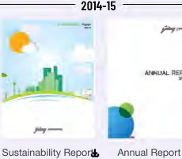

**[Image: AnnualReport2024.pdf-0006-07.png (230x201, 58.6KB)]**

<!-- Start of picture text -->
2014-15 Sustainability Report Annual Report <!-- End of picture text -->

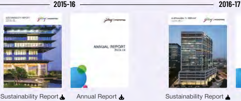

**[Image: AnnualReport2024.pdf-0006-08.png (480x203, 154.0KB)]**

<!-- Start of picture text -->
2015-16 2016-17 ANNI.Ml REPORT ,.,,. I Sustainability Report Annual Report Sustainability Report <!-- End of picture text -->

**2017-18** Sustainability Report Annual Report 

Annual Report 

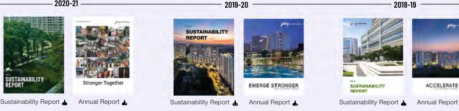

**[Image: AnnualReport2024.pdf-0006-11.png (894x217, 349.6KB)]**

<!-- Start of picture text -->
2020-21 2019-20 2018-19 Stronger Together  - SUSTAINAatLITY REPORT Sustainability Report Annual Report Sustainability Report Annual Report ...  Sustainability Report •  Annual Report <!-- End of picture text -->

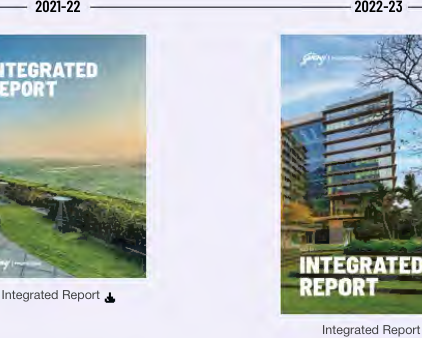

**[Image: AnnualReport2024.pdf-0006-12.png (422x338, 235.2KB)]**

<!-- Start of picture text -->
2021-22 2022-23 Integrated Report Integrated Report <!-- End of picture text -->

**[Image: AnnualReport2024.pdf-0006-13.png (49x13, 1.1KB)]**

<!-- Start of picture text -->
2023-24 <!-- End of picture text -->

**[Image: AnnualReport2024.pdf-0006-14.png (216x45, 7.9KB)]**

<!-- Start of picture text -->
REPORTING PERIOD 01 APR 2023 - 31 MAR 2024 <!-- End of picture text -->

International framework of the Value Reporting Foundation National Voluntary Guidelines on Social, Environmental and Economic Responsibilities of Business (NVGs) 

Indian Accounting Standards Companies Act, 2013 (including the rules made thereunder) 

###### **BOARD RESPONSIBILITY STATEMENT** 

Recognizing our responsibility to stakeholders, the senior leadership of Godrej Properties Limited is committed to presenting a transparent and comprehensive integrated report. We believe this report thoroughly addresses all material matters that could impact our ability to create sustainable value. 

2 GRI 2-3, 2-6 

Godrej Properties Limited 

Integrated Report FY 2023-24 

3 

About Godrej Properties Limited 

Integrating Sustainability Management Discussion Statutory with our Business and Analysis Reports 

###### **DETERMINING THE ESG AND FINANCIAL REPORTING BOUNDARY** 

The scope of this report includes the strategic narrative and focuses on our ongoing project sites in India, developed either directly or through Godrej Properties’ Special Purpose Vehicles. Unless stated otherwise, information and content are consolidated for business purposes. Where appropriate, the reporting boundary also includes significant risks, 

opportunities, that results from entities and stakeholders that affect our ability to create value. These entities and stakeholders may not be directly connected to our financial or non-financial reporting entity, through control or significant influence, but are relevant due to the nature and proximity of the risks, opportunities, and results. 

###### **WEST-EAST** 

###### **MUMBAI** 

HEAD OFFICE 

###### PUNE ZONAL OFFICE 

###### MUMBAI ZONAL OFFICE 

###### SITES 

###### SITES 

- Godrej Greens 

      - Godrej River Greens – Urban Retreat 

   - Godrej Forest Grove 

- Godrej Ascend 

- Godrej Upavan 

   - Godrej Riverhills 

- Godrej Bayview 

- Godrej Avenue Eleven 

- Godrej Woodsville 

   - Green Vistas 

- Godrej City – • Godrej Five Garden The Highlands 

- Godrej Nurture 

   - Godrej Riverhills 

- Godrej Horizon 

- Godrej Park Greens 

   - Hill Retreat 

- Godrej City – Golf Meadows 

- Godrej RKS 

- Godrej River Greens – Park Ridge 

      - Godrej Riverhills 

   - Godrej Urban Park 

- Godrej Emerald 

   - Meadows 

- Godrej Reserve 

   - Godrej River Greens 

- Godrej Exquisite 

   - Godrej Riverhills 

- Godrej Sky Terraces 

   - Park Springs 

- Godrej Nirvaan 

   - Hillside 3 

- Sculpture Park 

   - Godrej River Greens 

- Godrej Riviera 

   - Godrej Emerald Waters 

- Sky Greens 

NAGPUR REGIONAL OFFICE 

###### KOLKATA REGIONAL OFFICE 

AHMEDABAD REGIONAL OFFICE 

###### SITES 

- Godrej Orchard 

- Godrej Retreat 

- Godrej Elevate 

|This report details our environmental performance||||
|---|---|---|---|
|across 50 active project sites, and 8 ofces, including||**Region**|**Project Sites**|
|our headquarters in Mumbai, which are under our direct||North Zone|4|
|operational control. The accuracy of the data and processes||||
|presented in our report has been assured by Grant Thornton|GPL-Owned|South Zone|2|
|Bharat LLP, an independent third-party assurance provider.||West-East Zone|1|
|They have conducted their review according to the limited assurance criteria for the Integrated Report, and reasonable||Mumbai Zone|6|
|assurance criteria for the Business Responsibility and||North Zone|6|
|Sustainability Report (BRSR) Core as outlined in the International Standard on Assurance Engagements (ISAE)|Joint Ventures|South Zone|1|
|3000 (Revised) standard.||West-East Zone|11|
|Please click to view the assurance statement.||Mumbai Zone|5|
|||North Zone|1|
||Subsidiary|South Zone|2|
|||West-East Zone|5|
|||Mumbai Zone|6|

###### **NORTH** 

###### **SOUTH** 

NCR ZONAL OFFICE 

SOUTH ZONAL OFFICE SITES 

###### SITES 

- Godrej Aristocrat 

- Godrej Meridien 

   - Godrej Ananda • Godrej Splendour 

- Godrej Tropical Isle 

- Godrej Nature Plus 

- Godrej Athena 

   - Godrej Eternity 

- Godrej Zenith 

- Godrej South Estate 

   - Godrej Park Retreat 

- Godrej Connaught One 

   - Godrej Woods 

- Godrej Air 

   - Godrej Golf Links 

- Godrej Habitat 

We cover all activities under our operational control and majority ownership in our sustainability disclosure, which includes 100% of our revenue and environmental and social indicators. We fully consolidate all activities for financial purposes. 

###### **General Disclaimer:** 

Godrej Properties has exercised all reasonable precautions to verify the information presented in this report. The responsibility for interpreting and utilizing the material rests with the reader. We have diligently addressed all review points related to inconsistencies and incomplete information. GPL does not assume liability for any damage resulting from the use of this report. The report has undergone external assurance, and necessary edits have been incorporated. We welcome feedback on any further inconsistencies that may be identified. 

4 GRI 2-2 

Godrej Properties Limited 

Integrated Report FY 2023-24 

5 

# **ABOUT GODREJ PROPERTIES LIMITED** 

|The Godrej Group|08|Sustainability in Action|22|
|---|---|---|---|
|Sustainability at Godrej Group|10|Our Impact FY 2023-24|24|
|Corporate Overview|12|Message from the Chairperson|26|
|Our Strategy|14|Our Shareholding Pattern|30|
|Our Portfolio|16|Governance|32|
|Awards and Recognitions|20|||

Godrej Properties Limited 

Integrated Report FY 2023-24 

6 

7 

##### **THE GODREJ GROUP HAS ITS PRESENCE IN THE FOLLOWING COUNTRIES** _l_ 

###### INDIA 

Godrej One (Headquarters) 

###### KENYA 

###### CHILE 

Godrej Chile 

###### NIGERIA 

Godrej Nigeria Ltd. 

Godrej Kenya 

###### BANGLADESH 

###### **AMONGST INDIA’S MOST DIVERSIFIED &TRUSTED CONGLOMERATES** 

USA 

ARGENTINA Godrej Argentina 

###### U.A.E. 

###### SOUTH 

Godrej Consumer Products 

AFRICA Consumer Godrej Products South Africa . ~ I -1 ;.... 

**AFRICA** 1 .......... ! 

Godrej Household Products Bangladesh (Pvt) Ltd. 

INDONESIA Godrej Indonesia 

###### **GODREJ GROUP** 

The Godrej Group was established in 1897 out of a desire to demonstrate economic self-sufficiency and excellence within India in the preindependence decades, the Godrej Group traces its origins to India’s Independence and Swadeshi movement. From safes that withstood fires better than products from international competitors, to one of the world’s first soaps from vegetable oil, and the ballot boxes for independent India’s first general election; the group has a proud tradition of making meaningful products and building businesses 

that serve the country’s interests. Approximately 23% of the promoter stake in Godrej Group is owned by philanthropic trusts that work on environmental, educational and health care issues in India. The Group also brings together a passion and purpose to make a difference through its Good and Green strategy of shared values to create a more employable Indian workforce, build a greener India, and innovative for ‘Good’ and ‘Green’ products. 

The Godrej Group comprises a varied business portfolio that includes real estate development, 

fast-moving consumer goods, advanced engineering, home appliances, lending and financial services, furniture, security, and agri-care. While a large number of the businesses are privately held, the combined market cap of its publicly listed entities is in excess of USD 15 billion. With a revenue of USD 6 billion and an estimated 1.1 billion consumers across the world that use one or another Godrej product every day, the Godrej Group is amongst India’s most diversified and trusted conglomerates. 

REVENUE GENERATED 

**Billion $6** 

ESTABLISHED IN 

###### **1897** 

NUMBER OF CONSUMERS 

**1.1 Billion** 

LEGACY OF EXCELLENCE 

**127Years** 

BRAND VALUATION 

**Billion $2.4** 

**[Image: AnnualReport2024.pdf-0010-00.png (659x35, 45.9KB)]**

<!-- Start of picture text -->
About Godrej   Integrating Sustainability  Management Discussion  Statutory Properties Limited with our Business and Analysis Reports <!-- End of picture text -->

###### **AN EQUITABLE & GREENER WORLD** 

Godrej’s Good and Green Strategy drives its sustainability journey, guiding the value it creates for stakeholders while addressing environmental, social, and governance concerns relevant to the Group’s operations. The Group continuously increases its commitment to environmental sustainability by voluntarily adhering to standards such as the Confederation of Indian Industries (CII) Code for Ecological Sustainable Business and practicing the European Foundation for Quality Management (EFQM) Business Excellence Model. Additionally, the Group actively engages 

in initiatives like, India Business Biodiversity Initiative, green building certifications and GreenCo Ratings, and report sustainability performance across all our businesses using the Global Reporting Initiative framework. 

Incorporating mangrove conservation into these sustainability efforts marked a transition in the organization’s approach from philanthropy to business practice. Godrej Group, the custodian of a large part of Mumbai’s mangrove forests, commits to conservation with a systemic approach. 

**Godrej safeguards, preserves, and manages the largest privately maintained mangrove forest area in Mumbai, which is three times the size of Central Park in New York.** 

10 

###### **ONE OF INDIA’S MOST TRUSTED DEVELOPERS** 

**[Image: AnnualReport2024.pdf-0011-01.png (272x21, 3.4KB)]**

<!-- Start of picture text -->
14-YEAR CAGR IN STOCK PRICE <!-- End of picture text -->

Godrej Properties brings the philosophy of innovation, sustainability, and excellence from the Godrej Group to the real estate sector. Each project by Godrej Properties integrates a 127-year heritage of trust and quality with a dedication to cutting-edge design and technology. Since 1985, Godrej Properties Limited (GPL) has been a leading force in the Indian real estate industry. 

In recent years, Godrej Properties has garnered over 400 awards, including recognition for its environmental and social initiatives at the Euromoney’s Global Real Estate Awards 2023, India Workplace Equality Index 2023, ET Real Estate Awards, and being named ‘The Most Trusted Real Estate Brand’ in 2019 by the Brand Trust Report. Additionally, it received accolades such as ‘Equality and Diversity Champion’ at the 2019 APREA Property Leaders Awards, ‘The Economic Times Best Real Estate Brand 2018’, and ‘Builder of the Year’ at the CNBC Awaaz Real Estate Awards 2018. 

Headquartered in Mumbai, Godrej Properties is present in 11 cities in the country and has a workforce of 3,015 employees. 

###### **LISTING** 

In 2010, Godrej Properties became a publicly listed company following a successful IPO mobilising USD 100 Million. GPL is listed on both the National Stock Exchange of India Limited and the Bombay Stock Exchange Limited, with a market capitalization of ₹63,949.54 Cr. as of March 31, 2024. We are among the select developers in India, holding a substantial presence in all major real estate markets across the country. 

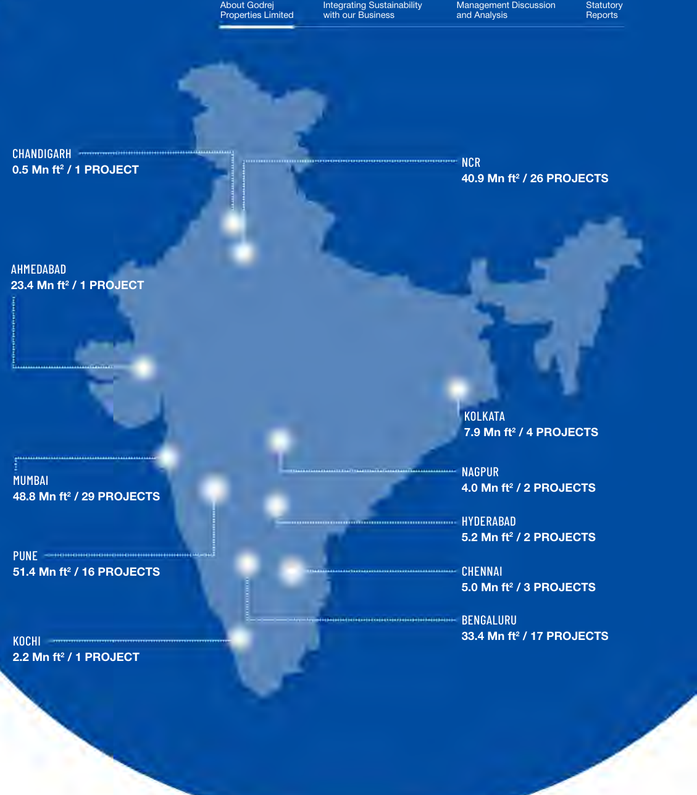

**[Image: AnnualReport2024.pdf-0011-07.png (1129x1287, 911.5KB)]**

<!-- Start of picture text -->
About Godrej   Integrating Sustainability  Management Discussion  Statutory Properties Limited with our Business and Analysis Reports CHANDIGARH ........................................................... 1 r-·········································· NCR 0.5 Mn ft 2  / 1 PROJECT :  :  40.9 Mn ft 2  / 26 PROJECTS AHMEDABAD 23.4 Mn ft 2  / 1 PROJECT ' i·········································~  ' KOLKATA 7.9 Mn ft 2  / 4 PROJECTS i  • NAGPUR MUMBAI 4.0 Mn ft 2  / 2 PROJECTS 48.8 Mn ft i  2  / 29 PROJECTS •••••••••••••••••••••••••  ·®l  '  <t::::::::::::::::::::::::::::::::::::::::::::::::::::::: HYDERABAD 5.2 Mn ft 2  / 2 PROJECTS PUNE •••••••••••••••••••••••••••••••••••••• .!  '•······························· 51.4 Mn ft 2  / 16 PROJECTS CHENNAI 5.0 Mn ft 2  / 3 PROJECTS L ............................................... .  BENGALURU KOCHI ···································································· •  33.4 Mn ft 2  / 17 PROJECTS 2.2 Mn ft 2  / 1 PROJECT <!-- End of picture text -->

###### **OUR PRESENCE** 

As of March 31, 2024, the company had 102 ongoing and forthcoming projects with a combined developable area of 223 million square feet. Our expansion efforts include entering new geographical areas while maintaining our focus on four primary regions: Mumbai Metropolitan Region, National Capital Region, West-East, and South. 

12 GRI 2-1, 2-6 

Godrej Properties Limited 

Integrated Report FY 2023-24 

13 

About Godrej Integrating Sustainability Management Discussion Statutory Properties Limited with our Business and Analysis Reports 

###### **OUR STRATEGY** 

At GPL, we remain committed to our strategy of aiming for high return on equity (ROE). We are the top real estate developer in India by booking value and are present in all key real estate markets such as Mumbai, Bengaluru, Delhi/NCR, and Pune. To achieve disruptive growth, fundamental changes in mindset, processes, belief systems, and business methods are crucial. 

We are confident in our ability to leverage the maximum value through our focus on five strategic pillars. 

###### **QUALITY FOCUS AND CUSTOMER FIRST** 

Ensuring a superior product quality has been the most fundamental priorities for the organization. The aim is to constantly build quality obsession throughout the organization to deliver the best-in-class products for our customers. We have adopted an integrated and structured approach and institutionalized across all projects in FY24. 

###### **INDIVIDUAL CONTRIBUTION TO A STRONG ORGANIZATIONAL CULTURE** 

Transformation requires collaboration and an open mindset from each team member. Despite diverse zones and regions, we prioritize an organizationfirst approach. We have adopted multiple transformative initiatives to boost in-house learning and capability, and to create industry-leading talent pool. 

**[Image: AnnualReport2024.pdf-0012-08.png (295x45, 3.3KB)]**

<!-- Start of picture text -->
OUR PURPOSE <!-- End of picture text -->

WE CREATE SPACES THAT ENABLE EVERYDAY JOYS; ONE COMMUNITY, ONE FAMILY, AND ONE HOME AT A TIME. 

###### **DISRUPTIVE GROWTH** 

We aim to deliver disruptive growth through strong business development, sales, and execution. Our growth strategy has a disproportionate focus on continuous evaluation of market mix, robust land acquisition framework, accelerated pre-launch process, strengthening product proposition, widening distribution channel and establishing an execution capability in commensurate to upcoming scale. 

###### **PROFITABLE GROWTH THROUGH ASSET MANAGEMENT** 

We emphasize on prudent cost and cash flow management translating into stronger profit delivery and capital efficiency. We have institutionalized a bottom-up strategic approach for continuous budget risk monitoring and on-time risk mitigation to protect any value erosion from underwriting stage and drive profit expansion. 

###### **OPERATIONAL EXCELLENCE** 

We focus on innovation-led operational excellence to accelerate execution at scale, with best of quality and delivery within stipulated time and cost. This approach includes investing in newer construction methods, technology, procurement strategies, and execution models to augment healthy Return on Capital Employed (ROCE) and Return on Equity (ROE). 

14 GRI 2-22 

Godrej Properties Limited 

Integrated Report FY 2023-24 

15 

About Godrej Integrating Sustainability Management Discussion Statutory Properties Limited with our Business and Analysis Reports 

###### **OUR PORTFOLIO** 

**[Image: AnnualReport2024.pdf-0013-02.png (349x13, 6.7KB)]**

<!-- Start of picture text -->
RERA No : PRM/KA/RERA/1250/303/PR/200515/003411 <!-- End of picture text -->

###### **PLOTTED DEVELOPMENTS** 

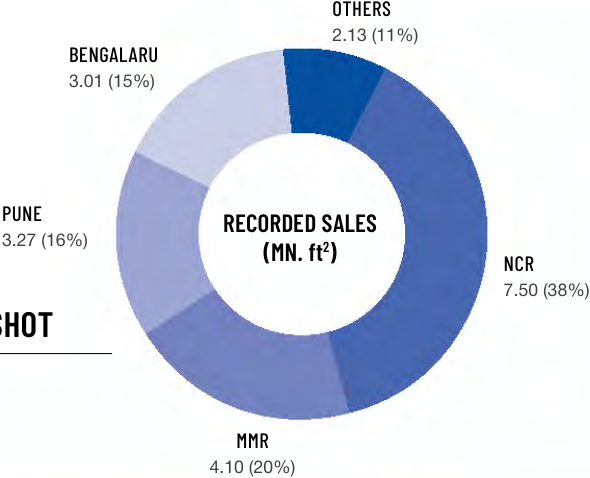

**[Image: AnnualReport2024.pdf-0013-04.png (590x478, 164.3KB)]**

<!-- Start of picture text -->
OTHERS 2.13 (11%) BENGALARU 3.01 (15%) PUNE RECORDED SALES 3.27 (16%) (MN. ft 2 ) NCR 7.50 (38%) MMR 4.10 (20%) <!-- End of picture text -->

**[Image: AnnualReport2024.pdf-0013-05.png (236x26, 3.4KB)]**

<!-- Start of picture text -->
FY2024 SNAPSHOT <!-- End of picture text -->

**[Image: AnnualReport2024.pdf-0013-06.png (348x13, 8.4KB)]**

<!-- Start of picture text -->
RERA No : PRM/KA/RERA/1250/304/PR/210208/003856 <!-- End of picture text -->

Our most recent development format provides home buyers with the opportunity to own land and build homes while being connected to state-of-the-art infrastructure. Our plotted developments are planned and delivered to detailed specifications including a wellplanned street network with provision for service lines (water, sewage, electricity, broadband) sewage treatment plant, rainwater harvesting, etc. 

Godrej Woodland, Bengaluru 

Godrej Royale Woods, Bengaluru 

###### **RESIDENTIAL DEVELOPMENTS** 

We design homes that can be held in trust for future generations. Some of the key themes represented in our approach include creating a sense of belonging, brighter living experience, technological innovation, thoughtful amenities, safety, security, and sustainability. 

**[Image: AnnualReport2024.pdf-0013-12.png (165x13, 3.3KB)]**

<!-- Start of picture text -->
RERA No : P52100026739 <!-- End of picture text -->

###### **MIXED USE & TOWNSHIP DEVELOPMENTS** 

Self-sufficient integrated developments are the future of Indian real estate as prospective homeowners increasingly prioritize and seek proximity to essentials within walking radius. Our focus has been to create a sense of place and a robust framework for multiple asset types including residential, commercial, retail, and civic buildings. Our developments offer different users’ distinct opportunities for social and cultural exchange in a people-centric and innovation-driven sustainable environment. 

Godrej Rivergreens, Pune 

16 GRI 2-6 

Godrej Properties Limited 

Integrated Report FY 2023-24 

17 

About Godrej Integrating Sustainability Management Discussion Statutory Properties Limited with our Business and Analysis Reports 

###### **ECONOMIC VALUE GENERATED** 

In FY 2023-24, Godrej Properties achieved record sales, selling 20 million square feet with a booking value of ₹22,527 Cr., marking a 84% year-on-year growth. The booking value was driven by 4 large projects i.e. Godrej Zenith, Gurugram; 

Godrej Reserve, Mumbai; Godrej Aristocrat, Gurugram; and Godrej Tropical Isle, Noida; with each of them achieving booking value of more than ` 2,000 Cr. and totaling a booking value of ` 10,676 Cr. 

**[Image: AnnualReport2024.pdf-0014-04.png (165x18, 2.3KB)]**

<!-- Start of picture text -->
REVENUE GENERATED <!-- End of picture text -->

**[Image: AnnualReport2024.pdf-0014-05.png (237x16, 3.1KB)]**

<!-- Start of picture text -->
ECONOMIC VALUE DISTRIBUTED <!-- End of picture text -->

**[Image: AnnualReport2024.pdf-0014-06.png (78x168, 8.8KB)]**

<!-- Start of picture text -->
EBITDA 119.00 <!-- End of picture text -->

###### **18.93 million ft****2** 

|Kolkata|1|0.98|
|---|---|---|
|Gurugram|3|2.67|
|Nagpur|1|2.25|
|Bengaluru|2|6.44|
|Hyderabad|2|5.2|
|Noida|1|1.4|
|**Total**|**10**|**18.93**|

OF PROJECTS ADDED ACROSS 6 REGIONS 

**In FY 2023-24, we clocked a booking value of** ₹ **22,527 Cr., representing a year-onyear growth of 84% with highest ever sales by Godrej Properties in a financial year for the 7****th** **consecutive time.** 

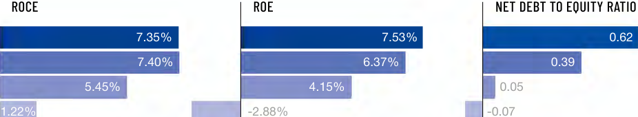

**[Image: AnnualReport2024.pdf-0014-11.png (926x170, 94.7KB)]**

<!-- Start of picture text -->
ROCE ROE NET DEBT TO EQUITY RATIO 7.35% 7.53% 0.62 7.40% 6.37% 0.39 5.45% 4.15% 0.05 1.22% -2.88% -0.07 <!-- End of picture text -->

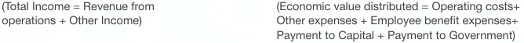

**[Image: AnnualReport2024.pdf-0014-12.png (668x55, 19.7KB)]**

<!-- Start of picture text -->
(Total Income = Revenue from  (Economic value distributed = Operating costs+ operations + Other Income) Other expenses + Employee benefit expenses+ Payment to Capital + Payment to Government) <!-- End of picture text -->

**[Image: AnnualReport2024.pdf-0014-13.png (549x43, 8.0KB)]**

<!-- Start of picture text -->
OPERATING   DEPRECIATION & COST AMORTIZATION EXPENSES <!-- End of picture text -->

**[Image: AnnualReport2024.pdf-0014-14.png (145x43, 3.3KB)]**

<!-- Start of picture text -->
EMPLOYEE WAGES AND BENEFITS <!-- End of picture text -->

**[Image: AnnualReport2024.pdf-0014-15.png (224x26, 3.0KB)]**

<!-- Start of picture text -->
(Employee Benefits Expense (net)) <!-- End of picture text -->

(Expenses = (Cost of materials consumedChange in inventories of finished goods & construction work-in-progress) + Other Expenses) 

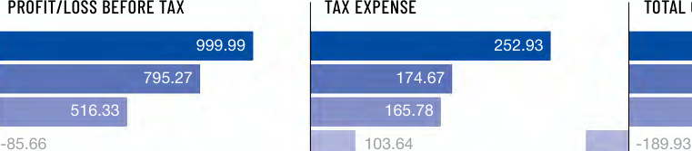

**[Image: AnnualReport2024.pdf-0014-17.png (761x167, 87.0KB)]**

<!-- Start of picture text -->
PROFIT/LOSS BEFORE TAX TAX EXPENSE 999.99 252.93 795.27 174.67 516.33 165.78 -85.66 103.64 -189.93 <!-- End of picture text -->

**[Image: AnnualReport2024.pdf-0014-18.png (244x16, 3.2KB)]**

<!-- Start of picture text -->
TOTAL COMPREHENSIVE INCOME <!-- End of picture text -->

**[Image: AnnualReport2024.pdf-0014-19.png (571x45, 7.9KB)]**

<!-- Start of picture text -->
PAYMENTS TO  PAYMENTS TO GOVERNMENT PROVIDERS OF CAPITAL  OF THE COUNTRY (TAXES) <!-- End of picture text -->

**[Image: AnnualReport2024.pdf-0014-20.png (136x16, 1.8KB)]**

<!-- Start of picture text -->
(Finance Costs (net)) <!-- End of picture text -->

**[Image: AnnualReport2024.pdf-0014-21.png (101x16, 2.0KB)]**

<!-- Start of picture text -->
(Tax Expenses) <!-- End of picture text -->

###### ECONOMIC VALUE RETAINED 

**[Image: AnnualReport2024.pdf-0014-23.png (55x16, 1.2KB)]**

<!-- Start of picture text -->
-53.68 <!-- End of picture text -->

**[Image: AnnualReport2024.pdf-0014-24.png (108x43, 3.3KB)]**

<!-- Start of picture text -->
COMMUNITY INVESTMENTS <!-- End of picture text -->

**[Image: AnnualReport2024.pdf-0014-25.png (130x16, 2.6KB)]**

<!-- Start of picture text -->
(Total CSR Spends) <!-- End of picture text -->

■ FY 2023-24 ■ FY 2022-23 ■ FY 2021-22 ■ FY 2020-21 All values in ₹ Cr. Godrej Golf links, Noida 

About Godrej Integrating Sustainability Management Discussion Statutory Properties Limited with our Business and Analysis Reports 

###### **AWARDS & RECOGNITIONS** 

###### **AON NASSCOM DEI CHAMPIONS AWARD 2023** 

**LGBTQIA+, Non -Tech - Winner - DEI Champion** Godrej Properties 

###### **15****TH** **REALTY +CONCLAVE AWARDS** 

**Landscape Project of the Year- Residential** 

Godrej Riverhills Greens 

**Best Interior Design -Residential** Godrej Hillside 2 Clubhouse 

**Luxury Interiors of the year** Godrej River Royale 

**Plotted Development of the year** Godrej Eden Estate Phase 1 & 2 

**Integrated Township of the year** Godrej Park World **Retail Project of the Year** Godrej Nexus at Emerald Waters 

###### **4****TH** **ANNUAL ESG SUMMIT AND AWARDS 2023** 

**Best Sustainable Waste Management Initiative** GPL 

###### **APEX INDIA OCCUPATIONAL HEALTH SAFETY AWARD 2022** 

**Platinum** Godrej Parkridge 

###### **ASIA MONEY OUTSTANDING COMPANY POLL, 2023** 

###### **BOMBAY CHAMBERS DEI AWARDS 2023** 

**LGBTQIA+ Inclusion Award - Winner** Godrej Properties 

###### **BRITISH SAFETY COUNCIL AWARDS** 

###### **- INTERNATIONAL SAFETY AWARDS** 

###### **Distinction** 

Godrej Urban Park 

###### **Merit** 

Godrej Park Retreat Godrej Meadows **Pass** 

Godrej Country Estate Godrej Hill Retreat Godrej Nest & Nurture Godrej Nest Kandivali Godrej City Panvel Godrej Palm Retreat Godrej Bayview 

###### **BW LEGAL WORLD - 40 UNDER 40** 

**Elite Club of BW Legal World Future Masters 2023** Saurabh Mohindru -Individual Awards 

###### **BW LEGAL WORLD TOP 100** 

###### **GENERAL COUNSEL POWER LIST OF 2022** 

**Recognition** officer, GPL 

Saurabh Mohindru, Chief Legal 

###### **ET REAL ESTATE AWARDS** 

**Architectural Project - Residential** Godrej Tropical Isle 

**Integrated Marketing Campaign** 

**(360 Degree)** Godrej Tropical Isle 

**Iconic Project - Residential** Godrej Aristocrat, Gurugram 

**Residential Project - Theme Based** Godrej Tropical Isle, Noida **Plotted Development Project** Green Estate, Sonipat 

###### **EUROMONEY’S GLOBAL REAL ESTATE AWARDS 2023** 

**Best Residential Developer -India** Godrej Properties 

###### **GLOBAL SAFETY SUMMIT AWARDS** 

**National Safety Award** 

Godrej Horizon Godrej Exquisite Godrej City Godrej Urban Park Godrej Woods 

Godrej South Estate Godrej Habitat Godrej Nature Plus Godrej Nurture Godrej Hill Retreat Godrej Park Springs Godrej Meadows Godrej Royal Woods Godrej Ananda Godrej Park Retreat 

###### **HOTELIER INDIA -GM SUMMIT &** 

###### **ESG EXCELLENCE AWARDS 2024** 

**Winner- Sustainable & Environment Conscious Hotel of the Year** Taj The Trees 

###### **ICC NATIONAL OH&S AWARDS** 

**Platinum Award** 

Godrej Green Cove Vistas **Runner up** 

Godrej Hill Retreat 

**Gold Award** 

Godrej Ananda Godrej Meridien Godrej Sky Greens Godrej Park springs Godrej Park Greens Godrej Palm Retreat Godrej Nest (NCR) Godrej RKS 

**Runner up** 

Godrej Meadows 

**Silver Award** 

Godrej Park Retreat Godrej Habitat Godrej Air 

###### **INDIA WORKPLACE EQUALITY INDEX 2023** 

**Top Employer - Silver** GPL 

**DEI Champion of the year - Winner** Individual award - Zoya, GPL 

###### **NATIONAL SAFETY COUNCIL INDIA** 

**Appreciation Certificate** 

Godrej Woods Noida Godrej Golf link Noida Godrej Palm Retreat Noida Godrej Nest (NCR) Godrej Air Godrej Meridien 

###### **ROSPA INTERNATIONAL SAFETY AWARDS** 

###### **Gold Award** 

Godrej Ananda Godrej Park Greens Godrej Prakriti Godrej Emerald 

###### **Silver Award** 

Godrej Nature Plus Godrej Palm Retreat Godrej Woods Godrej Air Godrej Nurture Godrej Sky Greens 

###### **NATIONAL SAFETY COUNCIL MAHARASHTRA CHAPTER** 

**Merit Certificate** 

Godrej Greens Godrej Meadows Godrej Sky green Godrej Park springs Godrej Hillside Godrej Hill Retreat Godrej Green Cove Godrej Green Cove Vistas Godrej Forest Grove Godrej Nurture Godrej Park Greens Godrej Rejuve Godrej RKS Godrej City Godrej Urban Park Godrej Boulevard Godrej Parkridge 

**Longest Accident-free period** Godrej Nest (Mumbai) 

**Plaque Award- Longest Safe Man-hours** Godrej Nest (Mumbai) 

**India- Outstanding Companies: Real estate category -(tie)Godrej Properties** Godrej Properties 

Godrej Properties Limited 

Integrated Report FY 2023-24 

20 

21 

About Godrej Integrating Sustainability Management Discussion Statutory Properties Limited with our Business and Analysis Reports 

###### **SUSTAINABILITY IN ACTION** 

###### **SCIENCE-BASED TARGETS** 

###### **DOW JONES SUSTAINABILITY INDICES** 

We have achieved a significant milestone aligned with the esteemed Dow Jones Sustainability Indices (DJSI). The DJSI is a widely recognized benchmark that evaluates companies based on economic, environmental, and social criteria, including corporate governance, environmental management, climate strategy, labour practices, human rights, and community engagement. We are included in the leadership index of the emerging markets category. This positions us as leaders in global sustainability, with only three companies in the real estate sector worldwide achieving this milestone. 

Our commitment to environmental stewardship has been strengthened by the approval of our near-term targets by the Science Based Targets initiative (SBTi). This endorsement highlights that our objectives are not only ambitious but also based on scientific evidence, ensuring a significant contribution to global efforts to align with climate actions. 

We have set a clear and impactful target in our journey towards achieving net-zero emissions. By FY 2035, our goal is to reduce scope 1 and 2 Greenhouse Gases (GHG) emissions by 72.6% per square meter of area compared to FY 2021. This translates to a significant absolute reduction of 58.8% in our GHG emissions, establishing a new standard for sustainability in the real estate sector. Our focus goes beyond emission reduction; we aim to transform our operations to be more energy-efficient, resilient, and in line with global climate objectives. 

###### SUSTAINABILITY YEARBOOK MEMBER 

Being listed in the Sustainability Yearbook 2024, among 759 companies out of the 9,400 evaluated, highlights our continued dedication and substantial influence in advancing across multiple facets in sustainability. 

We have committed to ensure that 88.5% of our suppliers by emissions covering those involved in purchased goods and services, set science-based targets by FY 2026. This short-term target is crucial as it establishes the foundation for a sustainable supply chain that aligns with our aspirations for net-zero emissions. 

**At Godrej Properties, our steadfast dedication to enhancing ESG practices and performance, positions us as a leading responsible and sustainable real estate developer, globally.** 

###### **GLOBAL REAL ESTATE SUSTAINABILITY BENCHMARK** 

###### **CDP** 

We regularly submit reports to the CDP and have upheld a ‘B’ rating since our last reporting cycle. GPL was recognised as a Supplier Engagement Leader with ‘A’ rating in 2023 and is among the top 19% assessed for supplier engagement on climate change, based on 2023 CDP disclosure. The CDP, an independent nonprofit, maintains the world’s largest database on corporate climate impacts. Its goal is to normalize environmental reporting and risk management in business, promoting disclosure, insight, and action towards a sustainable economy. 

Since 2013, we’ve been reporting our ESG performance to GRESB. We achieved a 5-star rating in the 2023 GRESB Benchmark Development. 

GRESB, an industry-led organization, transparently provides actionable ESG data to financial markets. This aligns with the global sustainability goal of achieving Net-Zero by 2050. GRESB independently collects, validates, scores, and benchmarks ESG data, offering business intelligence, engagement tools, and regulatory reporting solutions for investors, asset managers, and the industry at large. Founded in 2009, GRESB now has a membership of 170 institutional investors and over 2,200 fund managers, companies, and asset operators. 

At GPL, GRESB’s peer benchmarking has effectively helped us assess and address gaps in our ESG practices. 

##### • 

###### **UNITED NATIONS GLOBAL COMPACT** 

###### **FTSE RUSSELL** 

We are listed in the FTSE India 30/18 Capped Index, which tracks the performance of large and mid-capitalization stocks in India. This index assigns weights to securities based on their free float-adjusted market capitalization and undergoes semi-annual reviews. GPL has been recognized as a Constituent in this index, with an Index Weight of 0.18. 

GPL has been an active participant of UNGC since FY 2023. 

**[Image: AnnualReport2024.pdf-0016-22.png (170x18, 5.1KB)]**

<!-- Start of picture text -->
Godrej Golf links, Noida <!-- End of picture text -->

**[Image: AnnualReport2024.pdf-0016-23.png (169x16, 7.0KB)]**

<!-- Start of picture text -->
Godrej Properties Limited <!-- End of picture text -->

**[Image: AnnualReport2024.pdf-0016-24.png (196x15, 7.8KB)]**

<!-- Start of picture text -->
Integrated Report FY 2023-24 <!-- End of picture text -->

22 

23 

About Godrej Integrating Sustainability Management Discussion Statutory Properties Limited with our Business and Analysis Reports 

###### **OUR IMPACT IN FY 2023-24** 

###### **ECONOMIC** 

AREA SOLD IN VOLUME **20 MILLION ft****2** 

AREA SOLD IN VALUE ` **CR. 22,527** 

**[Image: AnnualReport2024.pdf-0017-05.png (249x85, 5.0KB)]**

<!-- Start of picture text -->
NET WORTH `  CR. 9,992.51 <!-- End of picture text -->

**[Image: AnnualReport2024.pdf-0017-06.png (196x13, 4.0KB)]**

<!-- Start of picture text -->
RERA No : UPRERAPRJ704730 <!-- End of picture text -->

###### **ENVIRONMENT** 

ABSOLUTE GHG EMISSIONS SCOPE 1+2+3 (FY2023-24) **tCO e 1,598,096 2** 

WATER CONSUMPTION 

**SOCIAL** DIVERSITY RATIO **30.84 %** 

CIS-WOMEN (nos.) **868** LGBTQ+ (nos.) 

**55** PWD (nos.) 

**07** 

###### ECONOMIC 

|Booking value|₹ Cr.|**22,527**|12,232|7,861|6,725|84.16|
|---|---|---|---|---|---|---|
|Area sold|million ft2|**20**|15.21|10.84|10.81|31.49|
|EBITDA|₹ Cr.|**1,196.66**|994|705|119|20.39|
|Net worth|₹ Cr.|**9,992.51**|9,264|8,675|8,320|7.86|
|Net Operating Cashfow*|₹ Cr.|**4,334**|3,533|1,761|893|22.67|
|Average Borrowing Cost|%|**7.82**|6.65|5.95|6.75|17.59|
|High Collections|₹ Cr.|**11,436**|8,991|6,359|4,023|27.19|
|Annual Project Deliveries|million ft2|**~12.5**|~10.5|~6.4|~6.5|19.05|
|ENVIRONMENTAL|||||||
|Absolute GHG Emissions Scope 1 + 2|tCO2e|**4,071**|3,905|3,414|3,847|4.25|
|Absolute GHG Emissions Scope 3|tCO2e|**1,594,025**|1,951,267|1,332,075|1,961,251|-18.30|
|Water consumption|Million litres|**352.58**|267.75|309.51|299.1|31.68|
|Green portfolio|%|**100********|94.97|90.23|90.16|5.30|
|Total number of trees planted and retained cumulative|Number|**988,853**|940,956|539,787|248,119|0.05|
|Waste sent to landfll|Tonne|**12,004**|25,297|15,662|10,086|-52.54|
|Percentage of waste recycled/ reused (average)|%|**98**|94.44|95.76|95.78|3.77|
|SOCIAL Number of employees|Number|**3,015**|2,391|1,998|1,933|31.20|
|CIS-Women in total work force|Number|**868**|656|524|511|32.32|
|Diversity ratio|%|**30.84**|28.7#|26.23|26.44|7.46|

###### **352.58 Million litres** 

WASTE SENT TO LANDFILL 

**tonnes 12,004** 

**100% of our project portfolio is certified or under review. 

*Project level total operating cashflow inclusive of JV Partners share and excluding outflow for land, approval, corporate taxes, and other BD outflow. #We restated FY 2022-23 data because only cis women were considered in the diversity ratio. From this reporting period onward, we will include numbers for cis-women, LGBTQ+, and PwD. 

Godrej Properties Limited 

Integrated Report FY 2023-24 

24 

25 

**MESSAGE FROM THE CHAIRPERSON** 

About Godrej Integrating Sustainability Management Discussion Statutory Properties Limited with our Business and Analysis Reports 

**[Image: AnnualReport2024.pdf-0018-02.png (148x36, 5.0KB)]**

###### **NAVIGATING TOWARDS A SUSTAINABLE TOMORROW** 

I hope this message finds you and your loved ones well. FY 24 has been a significant year for Godrej Properties, with remarkable success across different areas. Our strong performance shows our commitment to delivering value while prioritizing environmental sustainability, social responsibility, and good governance. These values have consistently guided us on our journey and continue to define our approach to business. 

at launch. GPL’s bookings in NCR in FY24 grew 180% to ₹10,016 Cr. and GPL’s bookings in MMR grew 114% to over ₹6,545 Cr. The strong sales performance led to record collections of ₹11,436 Cr., a 27% growth from our previous best ever year. 

Our reported financial results were strong, with total income surging by 43% to reach ₹4,334 Cr., and net profit increasing by 27% to ₹725 Cr. for FY 24. This was backed by strong project completions of over 12.5 million ft2 for FY 24. We expect this strong growth momentum to continue in coming years given our FY 2024 sales booking performance, which will be recognised in the P&L in next 3-4 years as the projects which were sold during the year get completed and delivered to customers. The booking value achieved in FY24 is expected to yield over ₹6,000 Cr. EBIT and ₹3,300 Cr. net profit in due course. Additionally, our pursuit of sustained growth was evident through the addition of 10 new projects, with an estimated revenue potential of approximately ~₹21,225 Cr. 

We are proud to announce that Godrej Properties recorded its highest-ever annual sales, cash collections, earnings and project deliveries in FY24. We concluded the year with sales bookings of ₹22,527 Cr., marking an 84% increase compared to the previous year. In fact, the fourth quarter alone achieved a booking value of ₹9,519 Cr. which was more than the booking value we achieved in the entire FY22. FY24 and Q4FY24 were both the best ever annual and quarterly sales achieved respectively by any listed real estate developer in India. This strong outcome was underpinned by substantial volume growth of 31%, translating to 20 million ft2 . of area sold through the sale of over 14,310 homes as well as a change in the project mix with more premium projects being launched during the year. Your company received an extremely strong customer response to some of our new launches during the year. Godrej Zenith in NCR achieved a booking value of `3,008 Cr. and Godrej Reserve in MMR achieved a booking value of ₹2,693 Cr. Both of these projects were the best ever launches for GPL in the respective markets. In FY24, 4 projects including Godrej Aristocrat with a booking value of ₹2,877 Cr. and Godrej Tropical Isle with a booking value of ₹2,098 Cr. crossed ₹2,000 Cr. in value of sales achieved 

We have a strong launch pipeline that will help us build upon the growth momentum achieved in FY24. We believe that the residential real estate sector in India will continue to grow rapidly in the coming years, providing opportunities for leading developers to participate in sectoral growth while also gaining market share. These projects will play a crucial role in ensuring that we meet our goal of growing our sales at 20% per year while also providing us with the opportunity to expand our margin in line with our objective of achieving an ROE of 20%. We expect to achieve the 20%+ ROE goal by FY27. An important focus area for the upcoming year will 

**[Image: AnnualReport2024.pdf-0018-09.png (152x140, 24.6KB)]**

**Our strategic excellence, driven by customercentricity and team** '' **collaboration, paves the way for sustained success in the real estate sector through disruptive growth and operational excellence.** 

**[Image: AnnualReport2024.pdf-0018-11.png (865x1167, 1040.6KB)]**

26 GRI 1, 2-22 

Godrej Properties Limited 

Integrated Report FY 2023-24 

27 

**MESSAGE FROM THE CHAIRPERSON** 

About Godrej Integrating Sustainability Management Discussion Statutory Properties Limited with our Business and Analysis Reports 

be to exceed ₹27,000 Cr. in booking value while continuing to deliver another record year for cash collections and project deliveries. 

Customer satisfaction remains paramount to our success. In FY 24, we achieved an encouraging Net Promoter Score (NPS) of 68%, reflecting an improvement from 65% in FY 23. This reinforces our commitment to delivering quality across all our projects. To further enhance our operational standards, we have implemented an Integrated Quality Management Framework aimed at strengthening our processes and governance standards. 

Our company understands that the world is currently facing climate change risks and environmental degradation. Therefore, we believe that our responsibility to bring joy to our customers extends beyond providing them high-quality homes. We are committed to running a sustainable business and will continue to strengthen our ESG performance 

across our operations to make a positive impact on the environment. Our focus on long-term sustainability is not only good for the planet, but also for our customers’ well-being. We are dedicated to addressing climate change through prioritized measures involving mitigation, resilience, transparency, and collaboration. Our goal is to systematically address climate-related risks and leverage emerging opportunities for the real estate sector. 

Godrej Properties Limited has received approval for our near-term targets from the Science-Based Targets initiative (SBTi). Our commitments include reducing scope 1 and 2 GHG emissions by 72.6% per square meter area by FY2035 (compared to FY2021) and ensuring that 88.5% of our suppliers have science-based targets by FY2026. Moreover, we have reinforced our environmental compliance efforts by implementing the ISO 14001:2015 Environmental Management System (EMS) across all our project locations. We rank among the top 15% in the REM Sector on the 

Dow Jones Sustainability Indices (DJSI) and have earned recognition as a member of the Sustainability Yearbook. 

GPL has successfully utilized 100% of its CSR funds in FY24. Through our Building and Other Construction worker registration programs, 84,743 construction workers benefitted and ₹235 Cr. of Government funds were unlocked. By diverting over 43,000 tonnes of waste from landfill in FY 24 through our solid waste management projects and by recycling 98% of the construction waste at source, GPL is a Net Zero Waste organisation. With our interventions, we’ve already transformed 29 villages by managing 4,929 hectares of land to avoid stubble burning, thereby averting 3,566 tonnes of CO2 emissions, and effectively managing 24,648 tonnes of crop residue. 

We are committed to the health and safety of our employees and all stakeholders. GPL’s Safety Management System is based on a proactive PDCA (plan–do–check–act) cycle with leadership commitment, consultation, and participation 

at all the levels and functions to achieve our ‘Score Zero’ aspiration. All our projects are in compliance with standard safety requirements and are certified with ISO 45001:2018 for Occupational Health and Safety Management System (OH&SMS). 

I am grateful to the team at Godrej Properties for their exceptional resilience, commitment, and ambition. We would like to express our gratitude to our customers, joint venture partners, and business associates for their continued support. Finally, we extend our thanks to our shareholders for their continued confidence in Godrej Properties. 

Best wishes, 

Pirojsha Godrej, Executive Chairperson, Godrej Properties Limited. 

About Godrej Properties Limited 

Integrating Sustainability with our Business 

Management Discussion Statutory and Analysis Reports 

**0.29%** 

NON-RESIDENT INDIANS 

###### **0.65%** 

OTHER BODIES CORPORATE 

###### **2.32%** 

OTHERS 

###### **3.24%** 

MUTUAL FUNDS 

###### **5.36%** 

RESIDENT INDIVIDUALS (PUBLIC) 

###### **29.67%** 

FOREIGN INSTITUTIONAL INVESTORS/ FPI 

**58.48%** PROMOTERS 

Integrated Report FY 2023-24 

31 

About Godrej Integrating Sustainability Management Discussion Statutory Properties Limited with our Business and Analysis Reports 

###### **EQUITY, TRANSPARENCY AND RESPONSIBILITY** 

We advocate for fair and transparent business practices at GPL. Our corporate governance framework ensures robust engagement with all stakeholders, facilitating our adaptation to evolving circumstances. This framework oversees business strategies, ensuring fiscal responsibility, ethical conduct, and fairness to regulators, employees, customers, vendors, investors, and society at large. 

Eight committees, led by board members, oversee key areas of focus, guiding corporate strategy, implementing, and monitoring its effectiveness, and reviewing corporate performance, risk, and other policies. The Board acknowledges the significance of diversity for long-term success and comprises seven Directors with diverse 

**6.53 years** [ 

AVERAGE LENGTH OF THE TERMS OF OFFICE 

###### **94%** 

ATTENDANCE OF BOARD MEMBERS 

geographic backgrounds, ages, genders, races, ethnicities, cultural backgrounds, skills, and industry experiences, thereby maintaining a competitive edge. 

Throughout the financial year, the Board convened four times, following a structured agenda. We aim for a 50% share of independent directors on the board and enforce a 50% attendance requirement for all board members. 

###### **29%** 

**57%** INDEPENDENT DIRECTORS 

WOMEN BOARD MEMBERS 

**54.14 years** [ 

AVERAGE AGE OF DIRECTORS 

**43.67% 62%** 

30-50 YEARS OLD 

>50 YEARS OLD 

###### **NADIR B. GODREJ** 

###### **72Y | M | Non-Independent, Non-Executive Director** 

Mr. Nadir B. Godrej holds the position of chairperson at Godrej Agrovet Ltd. and serves as the managing director of Godrej Industries Ltd. He is a distinguished academic, having earned an MBA from Harvard Business School, a Master of Science in Chemical Engineering from Stanford University, and a Bachelor of Science in Chemical Engineering from the Massachusetts Institute of Technology. Mr. Godrej’s notable contributions include spearheading the development of Godrej’s animal feed business, agricultural inputs, and chemicals businesses, in addition to his directorship roles in various Godrej companies since 1977. Beyond his professional achievements, Nadir also engages in several extracurricular pursuits, such as his presidency at The Alliance Francaise De Bombay, membership in and past chairmanship of the CII National Committee on Chemicals, and previous role as an Independent Director of the Indian Hotels Company Limited and Mahindra & Mahindra Limited. He serves as a valued member of the Harvard Business School’s South Asia Research Centre Advisory Board. With his wealth of expertise, Nadir provides valuable guidance to GPL, particularly in incorporating innovation into the company’s operations. 

###### **PIROJSHA GODREJ** 

**43Y | M | Non-Independent, Executive Chairperson** 

###### **GAURAV PANDEY** 

**40Y | M | Managing Director & Chief Executive Officer** 

**SKILLS** Strategy & Industry • Business • Expertise 

Pirojsha Godrej is the Executive Chairperson of Godrej Properties, Godrej Housing Finance and a Non-Executive Director at Godrej Consumer Products and Godrej Agrovet. Pirojsha graduated from the Wharton School of Business in 2002, completed his Masters in International Affairs from Columbia University in 2004, and an MBA from Columbia Business School in 2008. Pirojsha joined GPL in 2004, became an Executive Director in 2008, and was appointed CEO of Godrej Properties in 2012. He has led the company through a phase of rapid growth. In Financial Year 2016, Godrej Properties for the first time became India’s #1 publicly listed real estate developer by residential sales, a position it has retained for the past 5 years. Under Pirojsha’s leadership, Godrej Properties has been at the forefront of the sustainable development movement; in 2013, GPL received an award from former President of India, APJ Abdul Kalam for being one of the companies in India from across sectors to have driven the green building movement. In 2020, Godrej Properties ranked #1 amongst listed residential developers across the world in the Global Real Estate Sustainability Benchmark, an organization committed to rigorous and independent evaluation of the sustainability performance of real assets across the globe. The Indian Green Building Council (IGBC) has awarded Pirojsha the IGBC Green Champion Award 2016 for his contribution to the sustainability of India’s built environment. 

Market Tech & Governance, People & Talent Diversity • Expertise • Future • Finance & Risk • Understanding • of Perspective 

Mr. Gaurav Pandey has over 18 years of experience in the real estate sector. Previously, as the CEO of the North Zone, he had transformed the P&L of the business and built a high- performing team. In the five years of his leadership, the zone grew by 6X in Booking Value, 4X in Collections, and imputed ROCE to 27%. In fiscal year 2022, PAT for the North Zone was the largest contributor to GPL’s P&L. Before joining Godrej, he the was the CEO of Burman GSC and Senior VP at PropEquity. He has advised stakeholders and has also co-anchored The Property Show on NDTV. Before this, Gaurav was part of the Management Committee of Ascendas India. He is an Economics Honours graduate from the University of Delhi and has completed a postgraduate course from the Indian Institute of Management (IIM) Kozhikode. He is part of the Management Committee of GPL and serves as Co-Chair for Committee on Urban Development & Real Estate. Gaurav was recognised as the ‘Realty Personality of the Year’ by the Economic Times at the 2022 Real Estate Conclave & Awards (North). 

**SKILLS** Strategy & Industry Market Tech & Governance, People & Talent Diversity • Business • Expertise • Expertise • Future • Finance & Risk • Understanding • of Perspective 

32 GRI 2-9, 405-1 

Godrej Properties Limited 

Integrated Report FY 2023-24 

33 

About Godrej Integrating Sustainability Management Discussion Statutory Properties Limited with our Business and Analysis Reports 

###### **SUTAPA BANERJEE 59Y | F | Lead Independent Director** 

Ms. Sutapa Banerjee has 25 years of experience in the financial services sector, Sutapa Banerjee has held key positions at renowned banks including ANZ Grindlays, ABN AMRO and Ambit and played a pivotal role in successfully launching and managing the Private Wealth businesses at ABN AMRO Bank and Ambit Capital. Ms. Banerjee was honored as one of the “Top 20 Global Rising Stars of Wealth Management” by the Institutional Investor Group in 2007, and was one of only two winners from Asia. Under her leadership, Ambit Private Wealth was recognized as the “Best Private Bank in India” in the AsiaMoney polls of 2013. Recognized as one of the “50 Most Powerful Women” by Fortune India in 2012, Ms. Banerjee currently serves as an independent director on the boards of JSW Holdings, JSW Cement, Axis Capital, Polycab India, Camlin Fine Science, Zomato, etc. She co-developed and co-taught a pioneering course on elective and cognitive biases in decision-making with a gender focus at IIM Ahmedabad, the first of its kind across the world. She serves as an adjunct faculty at the Ministry of Corporate Affairs’ IICA and provides wealth consulting services to Gerson Lehrman Group. 

###### **JAYASHREE VAIDHYANATHAN** 

###### **54Y | F | Independent Director** 

Ms. Jayashree Vaidhyanathan is the CEO of BCT Digital, a global Fintech, Regtech, and Cleantech company. She serves as an independent director for PWCIL, PWC India, UTI Asset Management, and Indigrid. She is a three-time Stevie Award winner, including a Lifetime Achievement Award. Recognitions include Global Indian of the Year 2021-2022 by AsiaOne Magazine, India’s Inspirational Leader 2022 by WCRC, Top 50 Women Leaders in Technology 2022 by Women We Admire, Lifetime Achievement Award 2022 by World HRD Congress, Tech Leadership Award 2020 by Fintech Futures, Top 10 Most Influential Women in Technology 2020 by Analyst Insights, and India’s Most Trusted CEO 2020 by WCRC. She was also listed among Fortune’s Most Inspiring Women in 2021. Ms. Vaidhyanathan holds an MBA in Finance and Strategy from Cornell University, a Bachelor’s in Computer Science Engineering from Madras University, and is a CFA Charter Holder. 

**SKILLS** Strategy & Industry Market Tech & Governance, People & Talent Diversity • Business • Expertise • Expertise • Future • Finance & Risk • Understanding • of Perspective 

###### **DR INDU BHUSHAN** 

###### **63Y | M | Independent director** 

Dr. Indu Bhushan, a former IAS officer of the Rajasthan cadre (1983 batch), holds a Master of Health Sciences and a Ph.D. in Health Economics from Johns Hopkins University, a B.Tech from IIT BHU, and a Post Graduate Diploma from IIT Delhi. He is also a Chartered Financial Analyst (CFA). With nearly 40 years of experience, Dr. Bhushan served nine years in the IAS, joined the World Bank as a Senior Economist, and transitioned to the Asian Development Bank (ADB) in 1997. At ADB, he served as Director General of the East Asia Department, overseeing sectors such as energy, environment, agriculture, natural resources and transport. In 2018, Dr. Bhushan became CEO of the National Health Authority (NHA) and Ayushman Bharat - Pradhan Mantri Jan Arogya Yojana (AB-PMJAY), a prominent health assurance program covering over 500 million citizens. He led the implementation of the scheme nationwide and initiated the ambitious National Digital Health Mission, which evolved into the Ayushman Bharat Digital Mission. 

###### **SUMEET NARANG** 

###### **48Y | M | Independent Director** 

Mr. Sumeet Narang is the Founder of Samara Capital, an India focused investment firm with strong focus on growth buyouts. Prior to founding Samara Capital in late 2006, Sumeet briefly worked at Goldman Sachs, New York, in their Principal Investments Group. From 2001-04, he worked with Citigroup India across various functions based out of Delhi and Hyderabad. He has also worked with the Fiat Group in Italy and India. Sumeet earned a Master’s in Business Administration from Harvard Business School, where he graduated as a Baker Scholar and received John Loeb Fellow award. He also holds a post graduate diploma in management (major in finance) from the Indian Institute of Management, Lucknow, where he was an Aditya Birla Scholar, and a Bachelor of Engineering degree in mechanical engineering from the Indian Institute of Technology, Roorkee. Samara Capital has a strong focus in the consumer space and Sumeet has had the opportunity to evaluate and/or invest in multiple companies in the sector across different segments such as retail (including food and grocery retail), quick service restaurants, branded apparel, personal and beauty care, etc. Sumeet sits on the boards of many of these companies and has actively contributed in their growth journeys, some of which have now become market leading companies in their respective segments. 

**SKILLS** Strategy & Industry Market Tech & Governance, People & Talent Diversity • Business • Expertise • Expertise • Future • Finance & Risk • Understanding • of Perspective 

34 GRI 2-9, 405-1 

Godrej Properties Limited 

Integrated Report FY 2023-24 

35 

About Godrej Integrating Sustainability Properties Limited with our Business 

Management Discussion Statutory and Analysis Reports 

###### **GPL COMMITTEES** 

Board governance operates through eight committees that oversee the monitoring of corporate strategy execution, risk, performance, and other policies. 

###### **ALLOTMENT COMMITTEE** 

###### **MANAGEMENT COMMITTEE** 

###### **CORPORATE CODES AND POLICIES** 

At GPL, we uphold a strong commitment to operating our business with integrity, transparency, and ethical practices. To maintain compliance with legal and ethical standards, the company has implemented a range of corporate codes and policies. 

###### **CODE OF CONDUCT** 

- **Mr. Pirojsha Godrej** • **Mr. Pirojsha Godrej** Executive Chairperson Executive Chairperson 

- **Mr. Gaurav Pandey** • **Mr. Gaurav Pandey** Managing Director & Managing Director & Chief Executive Officer Chief Executive Officer 

Code of Conduct for Vendor/Suppliers 

Code of Conduct for Practices and Procedures for Fair Disclosure of Unpublished Price Sensitive Information 

Code of Conduct for the Code of Conduct for Board of Directors and Employees Senior Management 

###### **ENVIRONMENTAL, SOCIAL AND RISK MANAGEMENT GOVERNANCE (ESG) COMMITTEE COMMITTEE** 

- **Mr. Pirojsha Godrej** • **Mr. Pirojsha Godrej** Executive Chairperson Executive Chairperson 

- **Mr. Gaurav Pandey** • **Mr. Gaurav Pandey** Managing Director & Managing Director & Chief Executive Officer Chief Executive Officer 

- **Dr. Indu Bhushan** • **Ms. Sutapa Banerjee** Independent Director Independent Director 

- **Ms. Sutapa Banerjee** • **Dr. Indu Bhushan** Independent Director Independent Director 

   - **Mr. Rajendra Khetawat** Chief financial officer 

###### **CSR COMMITTEE** 

###### **AUDIT COMMITTEE** 

- **Mr. Pirojsha Godrej** Executive Chairperson 

   - **Ms. Sutapa Banerjee** Independent Director 

- **Mr. Gaurav Pandey** Managing Director & Chief Executive Officer 

   - **Dr. Indu Bhushan** Independent Director 

   - **Ms. Jayashree Vaidhyanathan** Independent Director 

- **Dr. Indu Bhushan** Independent Director 

- **Ms. Sutapa Banerjee** Independent Director 

- **Mr. Sumit Narang** Independent Director 

###### **STAKEHOLDERS RELATIONSHIP COMMITTEE** 

###### **NOMINATION AND REMUNERATION COMMITTEE** 

- **Mr. Pirojsha Godrej** Executive Chairperson 

   - **Ms. Sutapa Banerjee** Independent Director 

- **Mr. Gaurav Pandey** Managing Director & Chief Executive Officer 

   - **Dr. Indu Bhushan** Independent Director 

   - **Ms. Jayashree Vaidhyanathan** Independent Director 

- **Ms. Sutapa Banerjee** Independent Director 

- **Mr. Sumit Narang** Independent Director 

WHISTLE BLOWER POLICY 

RISK MANAGEMENT SUSTAINABLE STAKEHOLDER POLICY POLICY PROCUREMENT POLICY ~ _Iii_ Le1 INFORMATION HEALTH AND DATA PRIVACY POLICY SECURITY POLICY SAFETY POLICY 

STAKEHOLDER POLICY 

INFORMATION INFORMATION SYSTEMS USE POLICY SECURITY POLICY 

ENVIRONMENTAL POLICY 

EMPLOYEE POLICY 

POLICY FOR ARCHIVALS 

POLICY ON CORPORATE SOCIAL RESPONSIBILITY 

POLICY ON DIVIDEND DISTRIBUTION-OCT 2016 

POLICY ON DETERMINATION OF MATERIALITY OF EVENTS 

DIVERSITY, ANTIEXECUTIVE HEALTH CHECKDISCRIMINATION AND EQUAL UP POLICY OPPORTUNITIES POLICY 

ANTI-SEXUAL HARASSMENT POLICY 

GPL HUMAN RIGHTS POLICY 

POLICY ON RELATED NOMINATION AND PARTY TRANSACTIONS REMUNERATION POLICY 

GENDER 

POLICY FOR DETERMINING 

TAX POLICY 

AFFIRMATION POLICY 

MATERIAL SUBSIDIARY 

If any policy or Code of Conduct is breached, strict disciplinary action is taken, regardless of the individual’s position. 

Integrated Report FY 2023-24 

37 

###### **INTEGRATING WITH OUR BUSINESS** 

### **SUSTAINABILITY** 

|Sustainability Integration in Business Operations|40|Our commitment to UN SDGs|66|
|---|---|---|---|
|Our Value Creation Model|46|Prioritizing Planet and Profit|70|
|Engaging with our Stakeholders|48|Pioneering Processes and Products|114|
|Materiality Assessment|52|Propelling People and Partnerships|130|
|Materiality Summary Table|56|Our Affiliations|208|
|Our Strategic Risk Management|62|||

Godrej Properties Limited 

Integrated Report FY 2023-24 

38 

39 

About Godrej Integrating Sustainability Management Discussion Statutory Properties Limited with our Business and Analysis Reports 

###### **SUSTAINABILITY INTEGRATION IN BUSINESS OPERATIONS** 

At GPL, our dedication lies in generating value for both our internal and external stakeholders. This commitment is exemplified through our 6P framework, which intricately intertwines sustainability into our operational processes. We have synchronized these 6Ps with the six capitals within the framework, focusing on financial, manufactured, human, natural, intellectual, and social & relationship capitals. 

Our existing 6P framework, which encompasses Product, Partnerships, People, Process, Profit, and Planet, seamlessly aligns with these six capitals. This integration not only caters to the needs of our stakeholders but also correlates with our key material issues, thus aiding in risk mitigation and capitalizing on emerging opportunities. 

**The 6Ps serve as dynamic levers that can be skilfully utilised to foster value-added interconnections and forge mutually beneficial propositions, resulting in win-win outcomes.** 

**[Image: AnnualReport2024.pdf-0025-05.png (107x28, 4.2KB)]**

<!-- Start of picture text -->
   NATURAL - <!-- End of picture text -->

**We create spaces that enable everyday joys; one community, one family, and one home at a time.** 

###### **PROFIT** 

Create economic value through a sustainable business model, facilitating a mutually beneficial proposition for responsible profit generation throughout our value chains. 

###### **PLANET** 

Minimize our environmental footprint and dependency on limited resources. Focus on maintaining water positive status as we scale, expand carbon neutrality aspirations to cover Scope 3 Greenouse Gases (GHG) emissions and reduce waste to landfill. 

###### **PRODUCT** 

Design and build sustainable products and services throughout our development footprint, with a comprehensive understanding of impacts generated by our products throughout their entire life cycle. 

###### **PROCESS** 

###### **PEOPLE** 

###### **PARTNERSHIPS** 

Transform compliance Ensure the health, safety, Influence, collaborate, into opportunities by diversity, equity, inclusion, and co-create with optimizing processes well-being, happiness, partners along the value and allocating resources knowledge, and care for chain to establish a effectively. Implement our employees, customers, resilient ecosystem for a robust risk assessment workers, and communities. sustainable future. and management strategies, particularly to address the challenges posed by climate change. 

Godrej Properties Limited 

Integrated Report FY 2023-24 

40 

41 

About Godrej Integrating Sustainability Management Discussion Statutory Properties Limited with our Business and Analysis Reports 

**[Image: AnnualReport2024.pdf-0026-01.png (96x20, 1.6KB)]**

<!-- Start of picture text -->
FINANCIAL <!-- End of picture text -->

**[Image: AnnualReport2024.pdf-0026-02.png (82x18, 1.6KB)]**

<!-- Start of picture text -->
NATURAL <!-- End of picture text -->

**[Image: AnnualReport2024.pdf-0026-03.png (145x22, 2.6KB)]**

<!-- Start of picture text -->
MANUFACTURED <!-- End of picture text -->

###### **PROFIT** 

###### **Total Revenue** 

` **4,334.22 Cr.** 

` 13.01 cr. spent on Environmental Initiatives during operations 

Achieved 93% of our FY23-24 goals in the third quarter and surpassed our previous sales record for the second time. 

Our Sales Academy within GPL Alchemy sharpens sales skills for Quantum Growth and customer satisfaction. 

###### **PLANET** 

Strategic resource management resulting in decreased capital spending. 

###### **Aim to cut scope 1** 

**and 2 greenhouse gas emissions by 72.6% per square meter area by FY2035, translating to a significant absolute reduction of 58.8% from FY2021 levels.** 

Enhancing circular economy practices to preserve ecological balance. 

Utilising auto-dimmable lights in parking towers for power savings. 

###### **PRODUCT** 

###### **PROCESS** 

###### **PEOPLE** 

###### **PARTNERSHIPS** 

Total developable area Optimizing returns through Average spends per CSR spend – (million ft2 ) -223 million ft2 strategic financing and FTE on Training and ₹ 11.71 Cr. fiscal discipline. Development was ₹ 10,710. Adoption of environment Green Dash, our ESG Alcohol abuse cases Watershed development friendly products across dashboard, uses tech for declined due to programs significantly the entire project lifecycle. data analysis, geo-tagging, increased work and increased surface water and real-time reporting income from our water bodies in Bavi, Zapewadi, by providers. conservation initiatives. and Jamb villages. 

Integrating energy-efficient Demonstrating Customer Satisfaction lighting and water-saving commitment to Score 68% fixtures across projects. registering Building and Other Construction Workers (BOCW). 

**10 new projects added** 

**with a saleable potential of 18.93 million ft****2** 

###### **Commitment to** 

All projects are Zero instances of certified under IGBC, corruption across demonstrating our all operations commitment to delivering sustainability to customers. 

> Integration of an **Commitment to** 

> Environmental **Green Building Rating** 

> Management System **Systems such as IGBC,** 

> following ISO 14001:2015 **LEED, and GRIHA,** 

> standards across all **with membership in** 

> project operations. **one Green Building association, IGBC.** 

###### **INTELLECTUAL** 

**HUMAN** 

**SOCIAL AND RELATIONSHIP** 

Ongoing investment in employee training to increase efficiency at the project level. 

Recognized on 

CDP’s 2023 Supplier Engagement Leaderboard for addressing climate risks and promoting environmental action throughout our supply chain. 

Employee Benefits Collaboration with Expense local communities ₹ 331.32 Cr. for our Watershed Management Projects 

> Deployment of the “People **Our Employee Wellness** ₹ 2.97 Cr. towards social 

> Experience Centre”, **Program provides** protection of workers 

> optimizing processes **24/7 access to expert** 

> through automation. **counsellors for confidential mental, emotional, and physical health support.** 

Prioritizing contractors with 45001:2018 certification. 

Commissioned new CSR Establishing strategic Advocated for the United **More than 84,000** project ‘City-Farmer industry partnerships Nations’ ‘Invest in Women’ **construction workers** Partnership for Solid that enhance our theme consistently over **benefitted with BOCW** Waste Management market positioning. the years. **Schemes through** in Chikkaballapur’. **Social Security programme with NGO Partners** 

Godrej Properties Limited 

Integrated Report FY 2023-24 

42 

43 

About Godrej Integrating Sustainability Management Discussion Statutory Properties Limited with our Business and Analysis Reports 

###### **HOW WE CREATE VALUE** 

At GPL, we believe in an integrated value creation approach across the six capitals. We create value by investing in people to be an employer of choice; focusing on delivering quality products and providing exemplary customer experience; supporting our suppliers and vendors; maintaining a robust balance sheet ensuring cash generation and growth; building strong community relationships to create a positive legacy; and constantly engaging with the Government and municipal bodies to support effective regulation. 

**Our understanding of the interdependence of the capitals is the core to the creation of shared value throughout our business ecosystem.** 

44 

About Godrej Integrating Sustainability Properties Limited with our Business 

Management Discussion Statutory and Analysis Reports 

###### **OUR VALUE CREATION MODEL** 

###### **CAPITALS/ INPUTS** 

###### **HOW WE DO BUSINESS** 

Shareholder Equity= ₹ 9,992.51 Cr. | Net Debt= ₹ 6,197.70 Cr. | **FINANCIAL** Debt Equity Ratio= 0.62 | Net Worth= ₹ 9,992.51 Cr. | Operating **CAPITAL** expenditure=₹ 3,165.30 Cr. | Cash flow Ratio= 0.70 | Working capital= ₹ 9,718.21 Cr. | Paid-up capital= ₹ 139.02 Cr. 

PROFIT Stakeholders **Beyond** Investors and **the triple** shareholders **bottom line** Employees Government bodies 

Total Energy Consumed (Direct)= 25,677 GJ | Total water **NATURAL** withdrawal (Million Litres) = 291.57 | Withdrawal from stressed area **CAPITAL** (Million Litres) = 130.74 | Total Energy Consumption (direct and indirect) = 63,897 GJ | Total GHG Emissions= 1,598,096 tCO2e | Renewable energy consumption= 698.59 GJ | Total expenditure on Environmental Initiatives= ₹ 13.01 Cr. | Incidents of issues with compliance with environmental laws= 2 | No. of Environmental Impact Assessment (EIA) conducted in FY 2023-24= 6 | Total types of construction materials= 14 

PLANET **Replenishing** Community **more than we** Investors **consume** Regulatory Agencies Government Bodies 

Total Developable Area= 223 million ft2 | Cost of Construction for **MANUFACTURED** active projects in FY 2023-24= 2,898 Cr. | Planned Area (forthcoming **CAPITAL (MC)** projects) in FY 2024-25= 18.93 Million ft2 | Percentage of material sourced from local suppliers= 65%-70% | Total area constructed= 9,646,619 | Number of ongoing projects= 102 

PRODUCT **Our focus on** Customers **the home** 

Number of collaborations/ industry partnerships= 8 | Number **INTELLECTUAL** of Green Building memberships= 1 (IGBC) | **CAPITAL** Total Expenditure in Research & Innovation= ₹ 346.94 Lakhs | Sectoral Experience= Real Estate 

PROCESS **Building** Contractors **responsibly** Suppliers **and** Regulatory agencies **sustainably** 

Total no of employees= 3,015 | Total no of Contractual workforce= 1,212 | **HUMAN** No of hours of safety training=440,886 | Total Expenditure on employee **CAPITAL** welfare* = 331.32 Cr | Differently abled permanent and contractual employees (Permanent)= 7 | Average amount spent per FTE on training and development (₹)= 10,710 | 11.3% coverage of employees having KPIs linking ESG performance in their annual goals | Human Rights- focal point for issues; mechanism for grievance redressal; incidents; trainings | No. of trainings in skill development= 17 | No. of trainings in Health & Safety= 35,747 | Ratio of basic salary and remuneration of women to men = 0.83 | Incidents related to Anti-corruption & bribery = 0 

PEOPLE 

**The heart** Employees **of our** Workers **enterprise** Customers Community 

Expenditure on CSR = ` 11.71 Cr. | No of suppliers = 248 | Percentage **SOCIAL AND** of operations implemented with local community engagement = 100%# | **RELATIONSHIP** Number of NGO Partners = 12 | Total Customer Base = 15,000+ | Timely **CAPITAL** engaging with customers and addressing their specific requirements = approx. 4 days (Speed of Resolution) | Number of consumer complaints (data privacy, unethical trade, cyber security, etc) = 0 

PARTNERSHIPS 

**Deep** Joint Venture **partnerships** partners **across the** Consultants **value chain** Contractors Suppliers 

# Basis MOEFCC guidelines for projects where environmental clearance is mandatory, we set up environmental and/ or social investments with local communities as part of Corporate Environment Responsibility norms. 100% of our applicable projects as per MOEFCC have community engagement initiatives. 

###### **OUTPUTS** 

EBITDA= 1,196.66 | Total Revenue= ₹ 4,334.22 Cr. | Net Worth= ₹ 9,992.51 Cr. | Salaries and Bonuses paid= 303.21 | Return on capital Employed (ROCE)= 7.35% | Net Income Margin= 17%| Market Cap= ₹ 63,949.54 Cr. | Asset turnover ratio (Sales/total asset) =0.10 | Revenue generated per employee= ` 1.44 Cr. | Adj EBITDA Margin= 31.61% | ROE= 7.53% | Proposed Dividend= 0 | Dividend paid= 0 

Energy intensity For GPL Offices = 0.05 GJ/ft2 | Water consumption intensity= 4.70 litres per ft2 of total built-up area | Water discharge= Zero liquid discharge | Emissions from purchased raw materials & services= 1,395,340 | Number of trees planted and transplanted= 11,197| Scope 1&2 GHG emissions per employee= 1.35 tCO2e | Waste diverted away from landfill= 43,008 tonnes | Revenue per GJ of energy consumed= 0.066 Cr/ GJ | GHG Emission Intensity (Scope 3)= 0.02 tCO2e/ft2 of total built-up area | Reduction in freshwater use intensity (litres/sqft of constructed area) for construction purposes= 8% | Zero liquid discharge | Non-renewable Energy Intensity=0.001 GJ/ ft2 of total built-up area 

No of units handed over= 7,465 | IGBC green homes (building level certification) = 100%** | Customer satisfaction score= 68% | Coverage of customer satisfaction survey= 14,267 | Total Area Delivered - 12.5 million ft2 | Area handed over= 8,293,477 ft2 | Total Area Sold= 20 million ft2 

Quality audit scores (CQRA)= 74 | GPL integrated technology platforms for compliance (ISO systems/legatrix) and risk | Number of affiliations with trade and industry chambers/ associations= 8 

Diversity ratio %= 30.84% | Employee attrition ratio= 0.2 | No of fatalities = 0 (employees) | Lost Time Injury (LTI) = 2 (incl.1 fatal incident) | Frequency Rate (LTIFR)= 0.03 | Customer Net Promoter Score= 68%, Total respondents=14,267 | Retention rates of permanent employees that took parental leave= 83% | Revenue per employee= ` 1.44 Cr. | Scope 1 & 2 GHG emissions per employee= 1.35 tCO2e | No. of grievances received from employees and workers (sexual harassment, forced labour, child labour, discrimination, and wages) = 0 

No of CSR beneficiaries = 611,944 people | Percentage of input material directly sourced from MSME Suppliers = 58% |  No of Employee volunteering hours= 3,771 | No. of CSR projects undertaken in designated aspirational districts (L) = 4 | Materials sourced within India= 100% 

- Includes GPL Project and its subsidiaries 

- ** All projects in our reporting boundary are green certified or under certification 

###### **OUTCOMES** 

Net worth per employee = ₹ 3.31 Cr. | Direct Economic value retained = ₹ 763.88 Cr. 

Emission intensity (Scope 1+2) = 0.09 (tCO2e/ ft2 ) | Net water consumption (Million Litres) = 352.58 | Water offset via watershed management program (million litres) = 7,656 

100%** of GPL’s portfolio certified under IGBC and GRIHA in FY 2023-24 | Value-added through sustainable delivery (100%homes on daylighting, disable-access etc.) | Revenue per unit handed over (₹ Cr.) = 0.58 Cr. 

Enable informed decision-making for selection of energy efficient material assemblies and improvements in planning, process and implementation of compliances and risk management which are correlated for the company. 

New hires= 1,275 | Equity in gender pay (across all levels)= 83.16% (average) 

% of (Tier 1) suppliers compliant to code of conduct = 100% 

GRI 3-3, 201-1, 303-4, 305-4, 418-1 

Godrej Properties Limited 

Integrated Report FY 2023-24 

46 

47 

About Godrej Integrating Sustainability Properties Limited with our Business 

Management Discussion Statutory and Analysis Reports 

###### **ENGAGING WITH OUR STAKEHOLDERS** 

We identified key challenges that could impact our company’s decision-making, operations, and overall performance. To thoroughly assess our primary risks, we adopted a materiality approach, considering qualitative and quantitative factors related to likelihood and impact across various dimensions. Our materiality assessment aligns with integrated reporting’s six capitals and complies with the latest Global Reporting Initiative (GRI) 2021 Standards. 

###### **STAKEHOLDER ENGAGEMENT PROCESS** 

Identifying our major issues requires contributions from every business unit and function within the organization. This task is a collective responsibility across the company, emphasizing the importance of both formal and informal engagement with our key stakeholders. We follow established debriefing procedures, create training modules, and organize internal conferences where local managers gather to share operational best practices. 

###### **WHY THEY ARE MATERIAL HOW WE ENGAGEMENT IMPORTANT NEEDS RESPOND FREQUENCY** 

###### **EMPLOYEES** 

Employees represent Training; Health Townhall meetings Continuous the core of our and safety; Staff and podcasts, engagement workforce. Their engagement and intranet portal, throughout the year welfare, efficiency, communication - newsletters, cultural and success directly the significance of events, internal contribute to our providing open and surveys, training, company’s growth honest feedback and performance and financial viability. management systems 

###### **WORKERS** 

The labour force at Well-being, our construction health, and safety; sites serve as social benefits the foundation of our operations. 

Engagement Need basis meetings, site-level campaigns 

###### **CUSTOMERS** 

Our customers are the ultimate consumers of our products. Their satisfaction, wellbeing, and happiness are of paramount importance. 

Expectations for excellent customer service; Providing for customers’ needs in terms of products; reliable product supply 

Engagement Continuous workshops, engagement newsletters, customer feedback channels including Net Promoter Scores (NPS) 

###### **COMMUNITIES** 

We are dedicated to meeting the needs of local communities. 

Employment; Workshops and Business engagement meetings development; Service Provision; Environmental Conservation 

Need basis 

###### **INVESTORS** 

Our esteemed investors furnish us with the essential capital to realize our growth ambitions. 

Optimal gearing; clear strategy; growth; sustainability, and operational performance. 

In-person interactions, Periodic (Quarterly) investor meetings 

GRI 2-12, 2-29 

Godrej Properties Limited 

Integrated Report FY 2023-24 

48 

49 

About Godrej Integrating Sustainability Management Discussion Statutory Properties Limited with our Business and Analysis Reports 

###### **WHY THEY ARE MATERIAL HOW WE ENGAGEMENT IMPORTANT NEEDS RESPOND FREQUENCY** 

###### **GOVERNMENT BODIES AND REGULATORY AGENCIES** 

Statutory compliance, 

Government bodies Statutory compliance, and regulatory environmental and agencies play a social compliance, pivotal role in ensuring robust corporate our uninterrupted operations by governance, overseeing compliance tax revenues and sector-specific policy matters in the real estate industry. 

Meetings and Need basis personal interactions 

###### **JOINT VENTURE PARTNERS** 

Our collaborating agencies are vital in supporting crucial aspects of our business, including land acquisition and the development value chain. 

Workshops, Continuous meetings, and engagement personal interactions 

Processes, delivery 

###### **Our dedication to engaging with stakeholders inclusively has been crucial in building trust, which in turn has significantly contributed to our ongoing business expansion.** 

###### **OUR STAKEHOLDER PROCESS** 

###### **STAKEHOLDER PRIORITIZATION:** 

###### **STAKEHOLDER IDENTIFICATION:** 

###### **STAKEHOLDER ENGAGEMENT PLAN:** 

Identify key stakeholders who has Develop an engagement plan tailored influence over or are directly affected to stakeholders’ characteristics, by GPL. needs, and expectations to maximize participation across diverse platforms. 

Prioritize stakeholders according to various criterias such as their dependence, responsibility, influence on GPL, and the impact of GPL’s activities on them. 

###### **CONSULTANTS** 

We collaborate with top-tier consultants for design and engineering, whose expertise is indispensable for our ongoing pursuit of excellence. 

Capacity building, quality 

Workshops, Continuous meetings, and engagement personal interactions 

###### **SUPPLIERS** 

Our vendors and suppliers are the cornerstone of our supply chain, enabling us to construct homes that bring joy to our customers. 

Health and safety, Feedback surveys and Continuous regular capacity personal interactions engagement building, compliance 

###### **CONTRACTORS** 

Much like our suppliers, contractors furnish us with a consistent stream of labour and expertise to facilitate the progress of our work. 

Capacity building, Meetings and Continuous health, and safety personal interactions engagement 

50 GRI 2-12, 2-29 

Godrej Properties Limited 

Integrated Report FY 2023-24 

51 

About Godrej Integrating Sustainability Properties Limited with our Business 

Management Discussion Statutory and Analysis Reports 

###### **MATERIALITY ASSESSMENT** 

We align our material themes with the GRI Universal Standards 2021. In FY2024, we streamlined our material topics into seven key themes impacting the economy, environment, and society. Our materiality assessment and stakeholder engagement follow AA1000 principles, focusing on Materiality, Completeness, and Responsiveness. 

###### **OUR APPROACH** 

###### **MATERIAL THEMES AND TOPICS** 

(as per GRI Universal Standards 2021) 

The table below links our materiality which is categorized under 7 broad themes with 19 topics featuring across the following themes. 

###### **Risk Identification** 

We identify key sustainability and value creation factors across our ventures, operations, and initiatives. We engage external stakeholders to pinpoint significant issues. We evaluate GPL’s financial performance, position, and the impact of climate change and ESG risks. We assess the ESG impact of our operations and their contribution to climate change risks. 

###### **ENVIRONMENT MANAGEMENT** 

Energy Efficiency, GHG Management, Waste Management, Water Management, Environment • Management & Compliance, Air Quality Management 

###### **Analysing Materials and Prioritizing Identified Concerns** 

###### **SOCIAL RESPONSIBILITY** 

Living Wage, Occupational Health and Safety Worker/Labor Practices, Employee Engagement and Development, Diversity, Inclusion & Equal Opportunity 

We identify issues, investigate root causes, collaborate with stakeholders, and assess their business impact. We prioritize topics using the Double Materiality Principle, considering how the company affects the economy, society, and environment (Inside Out), and how external factors affect the company (Outside In). 

###### **STAKEHOLDER ENGAGEMENT** 

Community-Centric Sustainability, Customer Engagement 

###### **Implementation and Validation of Management** 

The Board and Senior Management assess identified issues for effectiveness and adequacy. They approve materiality assessment outcomes, identify required adjustments, and develop an action plan. This process integrates into the Company’s Enterprise Risk Management (ERM). 

**GOVERNANCE ETHICS AND COMPLIANCE** Corporate Governance, Data Privacy & Security **INNOVATION AND TECHNOLOGY** Technology and Innovation **SUPPLY CHAIN AND PRODUCT QUALITY** Sustainable Supply Chain, Product & Service Quality • • • 

###### **Reporting and Monitoring** 

We regularly assess risk alignment with our tolerance levels and address them as needed in our ongoing risk management cycle. We conduct a biennial review of materiality results with data assurance from a designated third-party provider, as detailed in the report. 

**RISK MANAGEMENT AND RESILIENCE** • Resilience & Risk Management 

GPL maintains reporting consistency by following a standardized definition of 'material' across all reports. Our materiality matrix incorporates internal and external criteria, focusing on aspects highly relevant to climate change. We believe that addressing climate change impacts can significantly contribute to sector-specific goals aligned with national commitments. 

Acknowledging the risks and opportunities linked to climate change, we align our assessments and disclosures with globally recognized frameworks like the Task Force on Climate-related Financial Disclosure (TCFD), CDP, and the Science Based Targets Initiative (SBTi). 

###### **MATERIALITY ASSESSMENT MATRIX** 

(in alignment with GRI 2021) 

**[Image: AnnualReport2024.pdf-0031-28.png (20x78, 1.9KB)]**

<!-- Start of picture text -->
Very High <!-- End of picture text -->

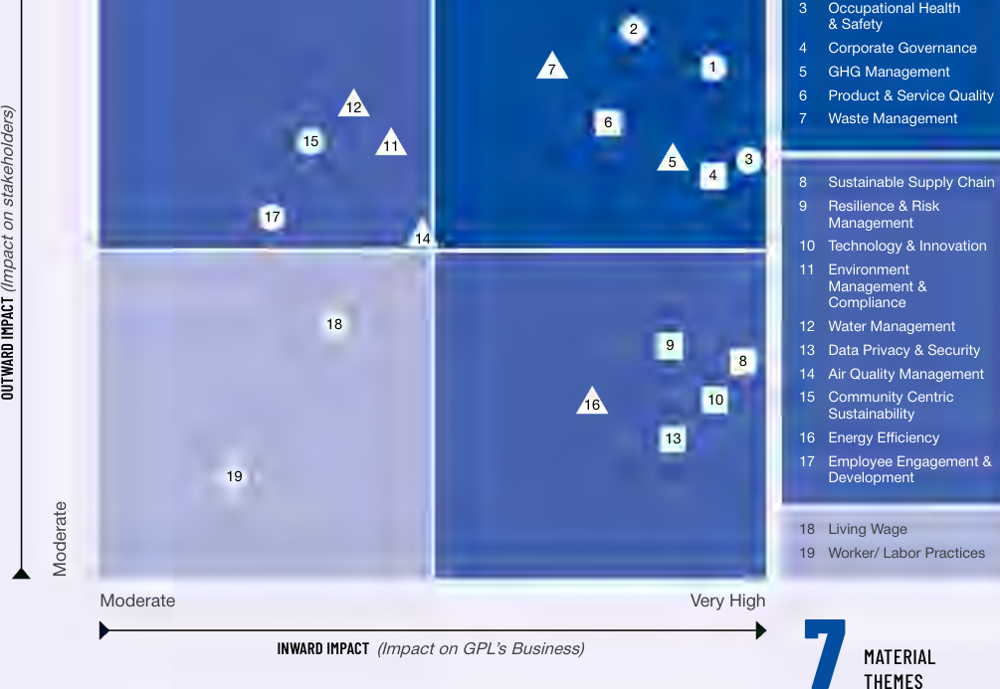

**[Image: AnnualReport2024.pdf-0031-29.png (1005x693, 476.3KB)]**

<!-- Start of picture text -->
3  Occupational Health 2 & Safety 4  Corporate Governance 7 1 5  GHG Management 6  Product & Service Quality 12 6 7  Waste Management 15 11 5 3 4 8  Sustainable Supply Chain 9  Resilience & Risk 17 Management 14 10 Technology & Innovation 11 Environment Management & Compliance 18 12 Water Management 9 13 Data Privacy & Security 8 14 Air Quality Management 16 10 15 Community Centric Sustainability 13 16 Energy Efficiency 17 Employee Engagement & 19 Development 18 Living Wage 19 Worker/ Labor Practices Moderate Very High INWARD IMPACT   (Impact on GPL’s Business) MATERIAL 7 THEMES (Impact on stakeholders) OUTWARD IMPACT Moderate <!-- End of picture text -->

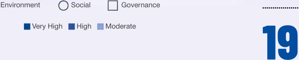

**[Image: AnnualReport2024.pdf-0031-30.png (612x124, 12.1KB)]**

<!-- Start of picture text -->
Environment  0  Social □  Governance ■   Very High    ■   High     Moderate 19 <!-- End of picture text -->

MATERIAL TOPICS 

52 GRI 3-1, 3-2 

Godrej Properties Limited 

Integrated Report FY 2023-24 

53 

About Godrej Integrating Sustainability Properties Limited with our Business 

Management Discussion Statutory and Analysis Reports 

**[Image: AnnualReport2024.pdf-0032-02.png (141x27, 2.3KB)]**

###### **TOP MATERIAL TOPICS** 

**[Image: AnnualReport2024.pdf-0032-04.png (1028x86, 30.8KB)]**

<!-- Start of picture text -->
S.NO. MATERIAL TOPIC DESCRIPTION  PAGE REFERENCES <!-- End of picture text -->

> 1 **CUSTOMER** At GPL, we shape perceptions, adapt, and promote growth to enhance Pages 170-177 **ENGAGEMENT** our market position. We prioritize positive interactions, recognizing their essential role in our success. Effective customer sustainability management yields significant benefits, such as appreciating asset value, increasing satisfaction, reducing costs, and ensuring regulatory compliance. Our strategies involve aligning financial interests, measuring resources, and mandating sustainability requirements. We are dedicated to creating spaces that foster everyday joys, enriching one community, one family, and one home at a time. 

> 2 **DIVERSITY,** At GPL, we broaden our talent pools and increase our market relevance Pages 148-157 **INCLUSION & EQUAL** by cultivating an inclusive workplace. This approach establishes a **OPPORTUNITY** positive corporate reputation, elevates employee engagement, and ensures legal compliance. Our diverse teams drive innovation, aligning with our social responsibility and contributing to long-term success in the competitive real estate industry. Currently, we have a 30.84% diversity ratio, reflecting our commitment to inclusivity. We actively recruit LGBTQ+ individuals and Persons with Disabilities (PwD), and we maintain gender-neutral policies and processes across all operational areas and sites, embracing our "All Are Welcome" theme. 

> 3 **OCCUPATIONAL** At GPL, we prioritize Occupational Health and Safety (OHS), tailoring **HEALTH & SAFETY** it specifically for the real estate sector to emphasize workplace wellbeing and strict adherence to safety standards. Our commitment to employees' physical and mental health is recognized in legal frameworks and reflects our dedication to safety practices and risk mitigation. We have established comprehensive health and safety policies and adhere to IS 3768, 1983 standards for data compilation, guiding us in computing frequency and severity rates for industrial injuries and classifying industrial accidents. Additionally, our Health and Safety Management System (HSMS) ensures systematic implementation of our safety protocols. Our primary focus is to support our employees in managing both personal and work-related concerns, empowering them to navigate sensitive situations effectively, both within and outside the workplace. 

> 4 **CORPORATE** At GPL, we ensure transparency, legal compliance, and stakeholder **GOVERNANCE** trust through effective corporate governance. This approach attracts capital and facilitates project execution. By integrating sustainability and ethical practices, we lay the foundation for long-term success. Our core elements include responsible remuneration policies, anticorruption measures, transparent governance, and grievance redressal mechanisms. These elements foster an ethical culture and uphold our reputation. Our proactive approach to compliance and risk mitigation, grounded in integrity, is vital for sustained success in the competitive real estate industry. With eight specialized committees and professional expertise, our Board operates with integrity and transparency. 

Pages 178-185 

Pages 32-37 

**[Image: AnnualReport2024.pdf-0032-10.png (1028x86, 31.9KB)]**

<!-- Start of picture text -->
S.NO. MATERIAL TOPIC DESCRIPTION  PAGE REFERENCES <!-- End of picture text -->

> 5 **GHG MANAGEMENT** GHG management at GPL encompasses tracking the carbon footprint Pages 84-93 across construction, operation, and maintenance phases. Our focus on emission reduction is integral to meeting sustainability targets, ensuring regulatory compliance, and upholding environmental stewardship. Recognizing the significant impact of 'Purchased Goods and Services' on emissions, we have prioritized collaboration with key suppliers to address emissions potential. Our commitment to reducing emissions aligns with climate science standards, as evidenced by our participation in SBTi. Implementation of strategies like energy-efficient designs and renewable energy adoption further strengthens our environmental responsibility, bolsters our reputation, and appeals to environmentally conscious stakeholders. 

> 6 **PRODUCT & SERVICE** At GPL, we prioritize quality, service, and construction excellence Pages 114-127 **QUALITY** as fundamental pillars of success in the real estate industry. Our commitment to meeting buyer expectations, adhering to codes, and providing strong warranties is aimed at ensuring customer satisfaction and building a positive reputation. We believe that offering highquality properties sets us apart and fosters loyalty among our clients, leading to positive word-of-mouth referrals. Stringent quality control measures are essential to avoid any financial setbacks or legal issues associated with subpar construction practices. Our focus extends to key factors such as location, facilities, construction quality, building durability, business potential, market demand, and local feedback. By continuously enhancing our offerings, we build trust among our customers and maintain a strong brand presence. Effective communication is another aspect we prioritize. We ensure timely updates, announcements, and emergency alerts to keep our residents and customers well-informed. Our community management application plays a crucial role in enhancing residents' quality of life and fostering a safe and efficiently run community. 

> 7 **WASTE MANAGEMENT** We prioritize recycling and efficient waste reduction to minimize our Pages 106-109 environmental impact, demonstrating our commitment to sustainability. Our strict compliance with environmental laws and focus on reducing our ecological footprint not only enhance cost-effectiveness but also improve stakeholder perceptions, aligning us with ethical standards and environmental responsibility. Our proactive measures extend to strict adherence to waste management regulations, supported by a dedicated policy and strategy outlined in our waste management plan. This plan encompasses comprehensive strategies for waste reduction, segregation, collection, recycling, and reuse, along with efficient waste diversion and disposal methods. Moreover, we emphasize compliance, provide training, and ensure continuous monitoring and reporting to gauge our progress in waste management efforts. 

**[Image: AnnualReport2024.pdf-0032-12.png (1028x26, 3.9KB)]**

Godrej Properties Limited 

Integrated Report FY 2023-24 

54 

55 

About Godrej Integrating Sustainability Management Discussion Statutory Properties Limited with our Business and Analysis Reports 

**[Image: AnnualReport2024.pdf-0033-01.png (141x27, 2.3KB)]**

###### **MATERIALITY SUMMARY TABLE** 

**[Image: AnnualReport2024.pdf-0033-03.png (1027x70, 53.1KB)]**

<!-- Start of picture text -->
S.  WHY IS IT MATERIAL  RELEVANT MATERIAL TOPIC  BOUNDARY  OUTCOMES  KPIs  PROGRESS NO. TO GPL  STAKEHOLDERS <!-- End of picture text -->

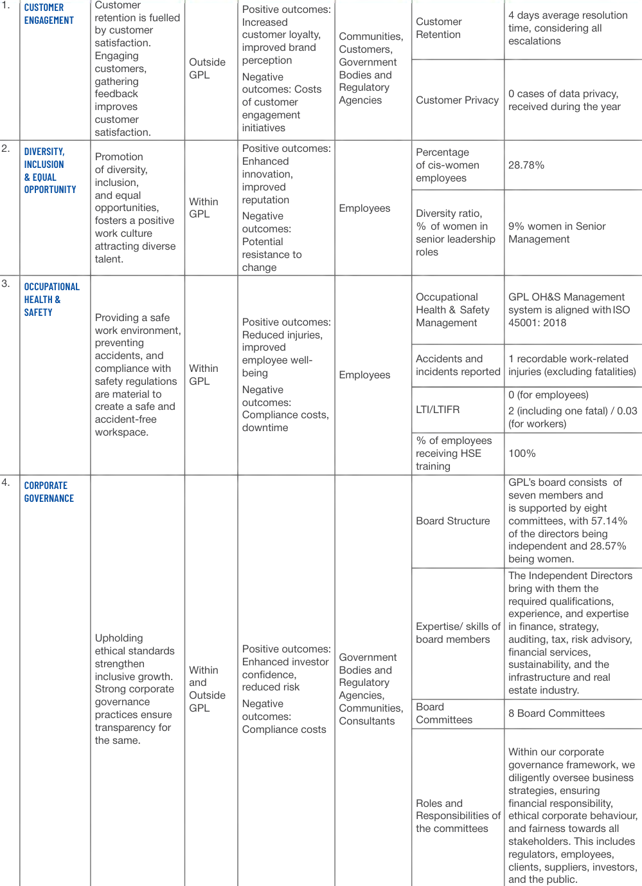

**[Image: AnnualReport2024.pdf-0033-04.png (999x1377, 275.5KB)]**

<!-- Start of picture text -->
1. CUSTOMER  Customer  Positive outcomes: ENGAGEMENT  retention is fuelled  Increased  Customer  4 days average resolution by customer satisfaction.  customer loyalty,  Communities,  Retention  time, considering all escalations improved brand  Customers, Engaging Outside  perception Government customers, GPL  Negative  Bodies and gathering outcomes: Costs  Regulatory feedback of customer  Agencies Customer Privacy  0 cases of data privacy, improves  received during the year customer  engagement initiatives satisfaction. 2. DIVERSITY,  Promotion  Positive outcomes:  Percentage INCLUSION  Enhanced  of cis-women  28.78% & EQUAL  of diversity, inclusion,  innovation,  employees OPPORTUNITY  improved and equal Within  reputation opportunities,  Employees GPL  Negative  Diversity ratio, fosters a positive work culture  outcomes:  %  of women in  9% women in Senior Potential  senior leadership  Management attracting diverse  resistance to  roles talent. change 3. OCCUPATIONAL HEALTH &  Occupational  GPL OH&S Management SAFETY  Health &  Safety  system is aligned with ISO Providing a safe  Positive outcomes:  Management  45001: 2018 work environment, Reduced injuries, preventing improved accidents, and  employee well- Accidents and   1 recordable work-related compliance with  Within  being Employees incidents reported  injuries (excluding fatalities) safety regulations  GPL are material to  Negative  0 (for employees) create a safe and accident-free  outcomes: Compliance costs,  LTI/LTIFR  2 (including one fatal) / 0.03 downtime (for workers) workspace. % of employees receiving HSE  100% training 4. CORPORATE  GPL’s board consists  of GOVERNANCE  seven members and is supported by eight Board Structure committees, with 57.14% of the directors being independent and 28.57% being women. The Independent Directors bring with them the required qualifications, experience, and expertise Expertise/ skills of  in finance, strategy, Upholding  board members  auditing, tax, risk advisory, ethical standards  Positive outcomes:  Government  financial services, strengthen  Within  Enhanced investor  Bodies and  sustainability, and the inclusive growth. Strong corporate  and Outside  confidence, reduced risk Regulatory Agencies,  infrastructure and real estate industry. governance practices ensure  GPL  Negative outcomes:  Communities, Consultants Board Committees  8 Board Committees transparency for  Compliance costs the same. Within our corporate governance framework, we diligently oversee business strategies, ensuring Roles and  financial responsibility, Responsibilities of  ethical corporate behaviour, the committees  and fairness towards all stakeholders. This includes regulators, employees, clients, suppliers, investors, and the public. <!-- End of picture text -->

**[Image: AnnualReport2024.pdf-0033-05.png (1026x70, 55.9KB)]**

<!-- Start of picture text -->
S.  WHY IS IT MATERIAL  RELEVANT MATERIAL TOPIC  BOUNDARY  OUTCOMES  KPIs  PROGRESS NO. TO GPL  STAKEHOLDERS <!-- End of picture text -->

5. **GHG** Absolute Scope **MANAGEMENT** 1+2+3 Emissions 1,598,096 tCO2e Cradle-tograve emission Investors, Deployment of renewable reduction planning Positive outcomes: Employees, energy at site and in real estate Reduced Suppliers, marketing offices, IGBC ensures reduction Within emissions, Customers, Emission health and well-being of greenhouse gas reduction and improved Communities, certification for GPL emissions (e.g.: Initiatives Outside reputation Government regional offices, sustainable global carbon GPL Negative Bodies and procurement of materials, emissions), and implementation of outcomes: Regulatory alignment with Internal Carbon Price. Compliance costs Agencies, regulations, and Consultants mitigation of Electricity, Energy, Water, climate risks. Source of indirect Waste: Consumption and emissions Discharge; Construction Activity; Haulage 6. **PRODUCT** Brand’s credibility Positive outcomes: **& SERVICE** is measured by Increased **QUALITY** quality delivery. customer delivering highsatisfaction, brand quality products Outside Customers, Customer loyalty and services, GPL Investors Satisfaction (NPS)68% Negative meeting customer expectations outcomes: maintain brand Costs of quality reputation. assurance 7. **WASTE** Construction **MANAGEMENT** Construction waste generated 1.24 kg/ft2 activities in Positive outcomes: Investors, (waste to landfill the real estate Reduced waste Employees, intensity) industry generate to ladnfill, thereby Suppliers, Waste significant waste. Within reducing costs Customers, management and Waste to landfill diversion; Sustainable waste and and increasing Communities, waste reduction recycling; reuse at site management Outside environmental Government initiatives ensures proper GPL benefits Bodies and Amount of waste collection, Negative Regulatory disposed to 12,004 tonnes treatment, and outcomes: Initial Agencies, landfills disposal of this setup costs Consultants. Amount of waste waste. diverted from 43,008 tonnes landfill 8. **SUSTAINABLE** Positive **SUPPLY CHAIN** outcomes: Sustainability Reduced Suppliers, Within our Supply across the supply Within supply chain Investors, Vendor Chain Engagement chain minimizes and risks, improved Government management Framework, we incorporate environmental Outside sustainability Bodies and practices supplier screening, gap risks and impact and promote GPL Negative Regulatory implemented identification, and vendor outcomes: Costs Agencies screening processes. ethical sourcing. of sustainable sourcing 9. **RESILIENCE** ESG risks posed Heavy precipitation, **& RISK** by operations temperature, water scarcity, **MANAGEMENT** Risks and carbon pricing mechanisms opportunities Risk assessment Positive outcomes: Risk management The Company has formed makes revenue Reduced risk Investors, framework a Risk Management growth more exposure, Employees, Committee, which confident. It builds resilience, Within and business continuity Communities, Government includes Board members and key executives. This Outside Bodies and committee is accountable manages risks GPL Negative Regulatory for identifying and effectively, and outcomes: Costs Agencies, assessing business risks responds to crises of risk mitigation Consultants Mitigation and opportunities. It also or disruptions. measures strategies oversees key risks by managing tasks such as identification, assessment, monitoring, mitigation, and reporting of various risks 

56 GRI 2-29, 3-3 

Godrej Properties Limited 

Integrated Report FY 2023-24 

57 

About Godrej Integrating Sustainability Management Discussion Statutory Properties Limited with our Business and Analysis Reports 

**[Image: AnnualReport2024.pdf-0034-01.png (141x27, 2.3KB)]**

**[Image: AnnualReport2024.pdf-0034-02.png (1026x71, 54.2KB)]**

<!-- Start of picture text -->
S.  WHY IS IT MATERIAL  RELEVANT MATERIAL TOPIC  BOUNDARY  OUTCOMES  KPIs  PROGRESS NO. TO GPL  STAKEHOLDERS <!-- End of picture text -->

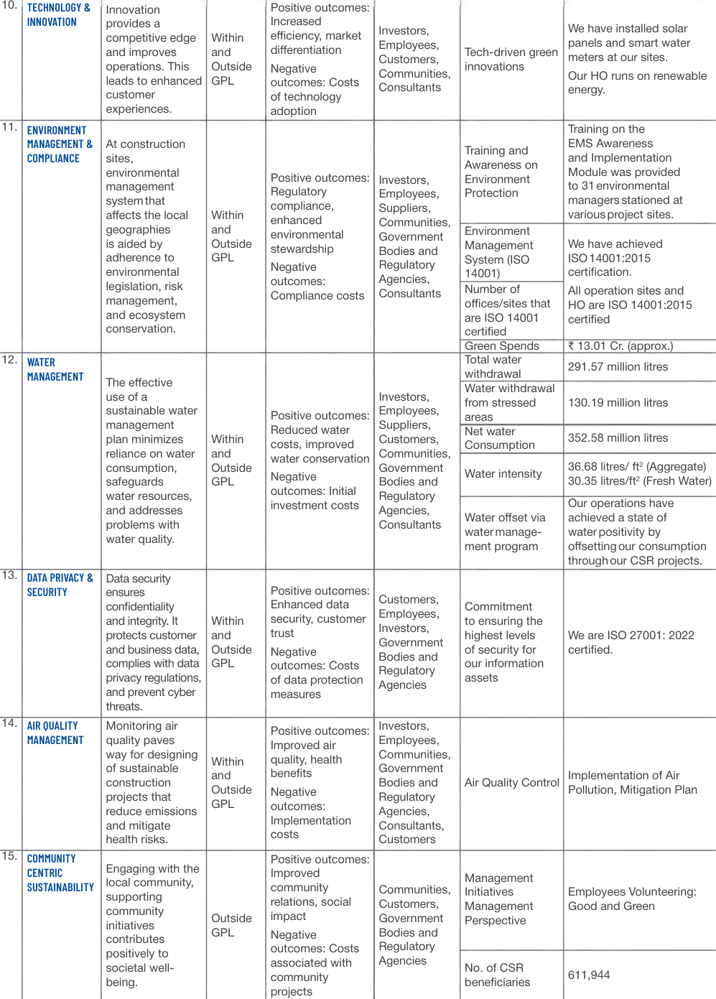

**[Image: AnnualReport2024.pdf-0034-03.png (997x1391, 335.1KB)]**

<!-- Start of picture text -->
10. TECHNOLOGY &  Innovation  Positive outcomes: INNOVATION   provides a  Increased  Investors,  We have installed solar competitive edge  Within  efficiency, market  Employees,  panels and smart water and improves  and  differentiation Customers,  Tech-driven green  meters at our sites. operations. This  Outside  Negative  Communities,  innovations   Our HO runs on renewable leads to enhanced  GPL   outcomes: Costs customer  of technology  Consultants  energy. experiences.  adoption 11. ENVIRONMENT  Training on the MANAGEMENT &  At construction  EMS Awareness Training and COMPLIANCE   sites,  and Implementation Awareness on environmental  Positive outcomes:  Investors,  Environment  Module was provided management  Regulatory  Employees,  Protection  to 31 environmental system that  managers stationed at compliance,  Suppliers, affects the local  Within  enhanced  Communities,  various project sites. geographies  and  environmental  Government  Environment is aided by  Outside  stewardship Bodies and  Management  We have achieved adherence to  GPL   System (ISO  ISO 14001:2015 environmental  Negative outcomes:  Regulatory Agencies,  14001)  certification. legislation, risk  Compliance costs  Consultants  Number of  All operation sites and management,  offices/sites that  HO are ISO 14001:2015 and ecosystem conservation.  are ISO 14001 certified  certified Green Spends  ₹ 13.01 Cr. (approx.) 12. WATER  Total water  291.57 million litres MANAGEMENT   The effective  withdrawal Water withdrawal use of a  Investors,  from stressed  130.19 million litres sustainable water  Positive outcomes:  Employees,  areas management  Reduced water  Suppliers,  Net water plan minimizes  Within  Customers,  352.58 million litres costs, improved  Consumption reliance on water  and  water conservation Communities, consumption,  Outside  Government  36.68 litres/ ft 2  (Aggregate) safeguards  GPL Negative  Bodies and  Water intensity  30.35 litres/ft 2  (Fresh Water) outcomes: Initial water resources,  Regulatory investment costs  Our operations have and addresses  Agencies, problems with  Consultants  Water offset via  achieved a state of water manage- water positivity by water quality. ment program offsetting our consumption through our CSR projects. 13. DATA PRIVACY &  Data security SECURITY   ensures  Positive outcomes: confidentiality  Enhanced data  Customers, Employees,  Commitment and integrity. It  Within  security, customer  to ensuring the protects customer  and  trust Investors,  highest levels  We are ISO 27001: 2022 Government and business data,  Outside  Negative  Bodies and  of security for  certified. complies with data  GPL   outcomes: Costs  our information Regulatory privacy regulations,  of data protection  assets Agencies and prevent cyber  measures threats. 14. AIR QUALITY  Monitoring air  Positive outcomes:  Investors, MANAGEMENT   quality paves  Employees, Improved air way for designing  Communities, Within  quality, health of sustainable  Government construction  and  benefits Bodies and  Air Quality Control   Implementation of Air Outside  Negative  Pollution, Mitigation Plan projects that  Regulatory reduce emissions  GPL  outcomes:  Agencies, and mitigate  Implementation  Consultants, health risks.  costs Customers 15. COMMUNITY  Positive outcomes: CENTRIC  Engaging with the  Improved  Management SUSTAINABILITY  local community,  community  Communities,  Initiatives   Employees Volunteering: supporting  relations, social  Customers,  Management  Good and Green community initiatives  Outside  impact Government  Perspective contributes  GPL  Negative  Bodies and outcomes: Costs  Regulatory positively to associated with  Agencies societal well- No. of CSR community  611,944 being.  beneficiaries projects <!-- End of picture text -->

**[Image: AnnualReport2024.pdf-0034-04.png (1026x71, 53.2KB)]**

<!-- Start of picture text -->
S.  WHY IS IT MATERIAL  RELEVANT MATERIAL TOPIC  BOUNDARY  OUTCOMES  KPIs  PROGRESS NO. TO GPL  STAKEHOLDERS <!-- End of picture text -->

16. **ENERGY** Energy **EFFICIENCY** By embracing Investors, Consumption in 25,677 GJ energy efficiency, Positive outcomes: Employees, GPL Offices carbon footprint of construction Within Lower operational Suppliers, Energy Intensity 0.05 GJ/ft2 projects can be and costs, reduced carbon emissions Communities, Government for GPL Offices reduced, along Outside with operational GPL Negative Bodies and costs and outcomes: Initial Regulatory Clean Energy Reduced reliance on fossil environmental investment costs Agencies, used fuel-based electricity Consultants harm. 17. **EMPLOYEE** We implement **ENGAGEMENT &** Employee programs and training **DEVELOPMENT** engagement initiatives aimed at cultivating the future activities generation of leaders within GPL. New hires 1,275 Engaging and Positive outcomes: Turnover rate 25% developing Increased employees, Employee productivity, talent boosting morale, and retaining Within GPL retention Employees Engagement Score 80/100 Negative talent help in Our employees and outcomes: Training boosting fraternity costs workers have the right to at workplace. reasonable rest breaks, Number of leaves unlimited sick leaves, and holiday leaves in accordance with the legislation. Employee 83% Retention ratio 18. **LIVING WAGE** Positive outcomes: Competitive Improved and industry employee morale, appropriate wages Within reduced turnover Compliance with 100% of our employees Employees for employees GPL Negative requirement receive above living wage promote social outcomes: responsibility. Increased labour costs 19. **WORKER/ LABOR PRACTICES** GPL conducts regular reviews, overseen by the Management Committee, to ensure that its practices align with the principles set forth in the Policy on modern International Bill of Human Slavery Rights, the International Positive outcomes: Upholding fair Enhanced Labour Organization’s labour practices Declaration on employee provide equal Within satisfaction, Fundamental Principles and opportunities and Employees, Rights at Work, as well as and improved ensure ethical Suppliers, with relevant local laws that Outside reputation treatment of Communities pertain to our operations workers to create GPL Negative a culture built on outcomes: When faced with a trust. Increased labor suspected instance of costs child labour, we emphasize Policy on child sensitivity rather than strict labour/ forced or enforcement. Our focus compulsory is to establish a friendly labour interaction with the child, ensuring their comfort and well-being Incidents reported 0 on child labour 

**[Image: AnnualReport2024.pdf-0034-06.png (1026x24, 8.9KB)]**

58 GRI 2-29, 3-3 

Godrej Properties Limited 

Integrated Report FY 2023-24 

59 

About Godrej Integrating Sustainability Management Discussion Statutory Properties Limited with our Business and Analysis Reports 

###### **OUR MATERIAL ISSUES AND METRICS FOR ENTERPRISE VALUE CREATION** 

**GHG MANAGEMENT DIVERSITY, INCLUSION & EQUAL OCCUPATIONAL HEALTH AND SAFETY OPPORTUNITY** Risk Opportunity Risk Effective GHG management Embracing Diversity, Inclusion Effectively managing Occupational is crucial for us to mitigate & Equal Opportunity (DIEO) Health and Safety (OHS) risks is crucial regulatory risks, control isn't just a moral obligation for us at GPL to maintain cost efficiency operational costs, and maintain but also a vital factor in our and operational excellence. Addressing a positive reputation. With business success. In the real workplace accidents, health hazards, stricter environmental regulations estate sector, where innovation, compliance risks, and reputation damage and rising energy costs, we creativity, and collaboration directly impacts our bottom line by reducing must proactively manage our are paramount, cultivating a direct and indirect costs, legal expenses, and emissions to avoid penalties and diverse and inclusive culture reputation-related losses. meet the growing demand for drives better performance, sustainable real estate solutions. smarter decisions, and higher employee involvement. Our dedication to DIEO gives us a competitive edge, drawing top talent, boosting customer satisfaction, and reducing risks linked to discrimination and exclusion. Risk Revenue Cost We comply with GHG regulations, At the Maan Hinje Model We mitigate OHS risks and ensure a safe, invest in energy-efficient Site, we ensure our workforce productive, and financially sustainable work technologies, and implement mirrors the community by environment through proactive measures, robust reporting. We enhance hiring diverse cohorts, aiming compliance efforts, safety investments, efficiency by adopting energyfor a mix of 50% cis-men, and incident response planning. Our GPL efficient designs, integrating 40% cis-women, and 10% Safety Manual clearly outlines roles and renewable energy, and using LGBT + PwD employees. Our responsibilities for all stakeholders, ensuring smart building technologies. "Everyone is Welcome Here" strict adherence to safety protocols during We boost our reputation with theme promotes inclusivity, project execution. We empower workers with transparent sustainability creating a safe and welcoming the right to refuse unsafe work, prioritizing reporting, green certifications, environment for all. At Godrej safety to prevent accidents and injuries. and community outreach. Properties, diversity and Notably, our Carmichael Road inclusion are vital for our project and Godrej One have success, and the Model Site achieved Net Zero Energy status. reflects our commitment to these values. We aim to reduce scope 1 and We aim to have 35% 1. Digitization of GPL Safety Management 2 GHG emissions by 72.6% representation across all System to make paperless system per square meter compared to cohorts of Cis-Women, (except legal related documents) FY 2021, achieving a 58.8% LGBTQIA+, PwD employees by 2. Competency Building for Operations absolute reduction. This will set a the end of FY2025. teams through training / workshops / new sustainability standard in the engagement sessions. 

We aim to reduce scope 1 and 2 GHG emissions by 72.6% per square meter compared to FY 2021, achieving a 58.8% absolute reduction. This will set a new sustainability standard in the real estate sector. 

   3. Online tracking of compliance of Horizontal Deployment process for entire life cycle of the project 

- By FY 2026, 88.5% of our suppliers, especially those involved in purchased goods and services, will set sciencebased targets, laying the groundwork for a sustainable supply chain aligned with our net-zero aspirations. 

4. To identify parameters for selection of safety champion (safety professional) & Safety ambassador (Line management) 

5. To further strengthen GPL Audit Score Process by modifying Element III Scoring criteria to reflect ground level implementation at GPL Projects 

6. To ensure the involvement of key stakeholders in monitoring and implementation of Safety Management System at GPL. 

7. To deploy competent contractors/ vendors to ensure compliance of GPL Safety Management system during project execution. 

8. To ensure 100% Legal compliance at all GPL Projects 

**GHG MANAGEMENT DIVERSITY, INCLUSION & EQUAL OCCUPATIONAL HEALTH AND SAFETY OPPORTUNITY** 2026, 2035 2025 2024 We have reduced our Scope 3 We have achieved a gender Our total recordable work-related injuries emissions by 19% diversity of 30.84% in FY decreased from 4 in FY2023 2023-24. to 1 in FY2024. We commit to enhancing ESG performance by integrating indicators into annual goals, with 16% of employee performance and compensation tied to sustainability targets within functions. Executive remuneration aligns with key material issue targets. Zonal CEOs oversee environment, social, and governance indicators and collaborate on plans to meet targets. 

###### **OUR MATERIAL ISSUES AND METRICS FOR EXTERNAL STAKEHOLDERS** 

###### **WATER MANAGEMENT** 

###### **SUSTAINABLE SUPPLY CHAIN** 

Operations, Products/ Services, Supply Chain 

>50% of business activity 

Environment, Society, Consumers/End-Users, External Employees (Suppliers) 

Society, External Employees (Suppliers, Contractors, Consumers/End-Users, Environment 

Our water management efforts conserve resources, reduce pollution, improve public health, and empower communities. 

Our sustainable supply chain practices support societal well-being, preserve the environment, and strengthen supplier relationships. By mitigating risks, driving innovation, and promoting efficiency, we contribute positively to society while fostering responsible business conduct throughout our supply chain. 

By FY 2026, we aim to ensure that 88.5% of our suppliers, especially those in purchased goods and services, establish science-based targets as part of our commitment. 

Water positivity. 

The UN's FY2023 theme, "Be the Change," highlights the urgent global water and sanitation crisis. India leads in water scarcity, with nearly 120 million households lacking clean water. Smart water management in housing projects under the Smart Cities Mission is crucial. 

We're actively conducting workshops to educate and engage our suppliers in setting science-based targets (SBTi), emphasizing sustainability goals. Moreover, we regularly assess suppliers to ensure they align with our sustainability objectives. Additionally, we've implemented policies for a robust Code of Conduct and ethical procurement practices, enhancing ethical and sustainable sourcing throughout our supply chain. 

At GPL, we pioneer innovative water practices worldwide. We believe in a united approach with policymakers, corporations like us, and individuals driving change. We've upgraded water management with advanced facilities and smart meters. 

Aligned with our commitment, we launched an integrated watershed management program in Maharashtra's Beed district. 

Our initiatives, including workshops and assessments for suppliers to align with sustainability goals, positively impact both suppliers and society. These efforts encourage sustainable practices among suppliers, fostering innovation and efficiency. Implementing robust policies for ethical sourcing enhances ethical practices throughout our supply chain, promoting fair labour and environmental protection while setting a positive example for other industries. 

We positively impact the environment by conserving water through smart management and sustainable practices. These efforts also reduce our energy consumption and carbon emissions, contributing to environmental sustainability. Additionally, our CSR initiatives in three villages enhance community well-being and set a leadership example in environmental stewardship, inspiring broader adoption of sustainable practices in society. 

60 GRI 201-2, 3-3 

61 

Godrej Properties Limited 

Integrated Report FY 2023-24 

About Godrej Integrating Sustainability Management Discussion Statutory Properties Limited with our Business and Analysis Reports 

###### **OUR STRATEGIC RISK MANAGEMENT** 

At GPL, we conduct an annual risk identification and assessment process to improve our decision-making abilities, strengthen our resilience to market changes, enhance investor trust in our risk management expertise, and maintain compliance with regulatory standards. This approach cultivates a proactive risk management culture, builds stakeholder confidence, and supports our long-term sustainability goals. 

###### **OUR RISK GOVERNANCE FRAMEWORK** 

We have a robust risk governance framework with dedicated operational risk management functions: 

- **Operational Risk Ownership (first line):** Our front-line employees and operational roles, such as risk managers and business unit heads, own and manage risks. They assess, evaluate, and monitor risks and the proposed risk treatment plans. 

We understand that risks are potential events or situations that could harm GPL’s operations, finances, reputation, or stakeholders. At GPL, we strategically manage risks by assessing various risk categories like external business factors, operational complexities, finances, and sustainability concerns. This helps us foresee challenges and create effective strategies for risk control. Our proactive approach not only reduces potential negative impacts but also allows us to seize opportunities from understanding risks better. Major of our potential risks arise from different areas such as: 

###### **EXTERNAL ENVIRONMENT RISKS** 

###### **FINANCIAL VOLATILITY** 

These pertain to our financial activities and reporting processes, such as liquidity, interest rates, and credit. Active monitoring and management of these risks are vital for ensuring financial stability. 

These stem from economic changes, market shifts, geopolitical issues, or regulatory adjustments outside our control. We prioritize identifying, analysing, and evaluating these risks to understand their impact and manage them effectively. 

- **Risk Management and Compliance Oversight (second line):** Our Executive Risk Management Committee (ERMC) at the executive level sets control standards and oversees compliance. They review action plans, monitor mitigation progress for Risks That Matter (RTM), and oversee risk identification, assessment, and mitigation strategies. 

- **Independent Audit Unit (third line):** Our Audit Committee provides independent assurance on the effectiveness of risk management and compliance processes. They authorize the Risk Management charter and policy and initiate actions for non-performance of required actions. 

- Our ERMC oversees efficient risk management execution and policy compliance. We’ve implemented an enterprise-wide Risk Management Framework in our Charter, identifying and mitigating risks. The Committee meets semi-annually, or more often if urgent. We appointed a Chief Risk Officer who oversees the risk management process. 

###### **WE ACTIVELY CULTIVATE AN EFFECTIVE RISK CULTURE ACROSS THE ORGANIZATION THROUGH VARIOUS METHODS AND CHANNELS, INCLUDING:** 

###### **SUSTAINABILITY CONCERNS** 

###### **OPERATIONAL CHALLENGES** 

These include the day-to-day management of GPL’s properties, including maintenance, tenant relations, and property processes. Timely addressing of these risks is critical to maintaining smooth operations. 

These encompass environmental, social, and governance factors influencing our operations and reputation. This includes risks related to environmental impact, social responsibility, employee well-being, and community engagement. Integrating sustainability into risk management practices promotes responsible business conduct. 

###### **Awareness** 

- We provide regular risk management education for all non-executive directors. 

- We use multiple channels and formats to raise awareness about key risks, distributing communication products via email and workplace platforms. 

- We provide information on cyber risks, data privacy, and compliance with regulations. 

###### **Performance Metrics/** 

###### **Incentives** 

- We include “risk” as a metric for measuring employee performance and include financial incentives that incorporate risk management metrics. 

###### **Training** 

- We conduct focused 

   - training on risk management principles throughout the organization. 

- We organize workshops 

   - for key functions, such as general managers, to improve their understanding of risk-related issues. 

###### **Stakeholder Communication** 

- We engage with stakeholders 

   - through comprehensive reports to communicate key risks, risk management measures, controls in place, and emerging risks. 

- We ensure stakeholders understand our risk landscape and mitigation efforts. 

###### **Drills and Tests** 

- We conduct periodic crisis management drills to simulate scenarios like fires, sabotage incidents, and falls from height. 

- We test business continuity plans, including information security, at least once a year. 

Please refer our Risk Management Policy for further details. 

62 GRI 2-15, 2-16, 201-2 

Godrej Properties Limited 

Integrated Report FY 2023-24 

63 

About Godrej Integrating Sustainability Management Discussion Statutory Properties Limited with our Business and Analysis Reports 

###### Category 

###### Environmental 

Description Human activities are rapidly and significantly warming the planet, leading to rising sea levels, melting polar ice caps, and more frequent and intense extreme weather events. These changes are affecting ecosystems, biodiversity, and human societies worldwide, causing both local and global impacts. 

Specification Implications for real estate companies: 

- (w.r.t. company) 

1.  Physical risks (Rising sea levels, more frequent and intense extreme weather events, and shifting climate patterns): It can pose direct threats to real estate assets, leading to increased costs for maintenance, repairs, and insurance. 

2.  Regulatory risks (Regulatory policies to adapt to clean fuels etc.): Improve energy efficiency, reduce emissions, and adapt to new building codes and standards restraining finances. 

3.  Market risks (Changing consumer preferences, increased awareness of sustainability issues): Shift in consumer preference (more environmentally friendly, energy-efficient, and resilient to climate change alternatives). 

4.  Reputational risks: Real estate companies that fail to address climate change and sustainability issues may face reputational damage, which can affect their ability to attract investors, customers, and talent. 

###### Societal 

Human development expands people's freedoms, opportunities, and capabilities to lead valued lives, achieve personal well-being, and contribute to societal progress. The main types of human development include physical development (growth and health), cognitive development (learning and mental skills), emotional development (self-awareness and empathy), and social development (relationships and communication skills). 

1.  Skilled workforce: Helps in efficient execution of projects and provide high-quality services to customers. 

2.  Increased demand: People's income levels and living standards raise with human development, leading to a higher demand for quality housing and commercial spaces, thereby benefiting the real estate sector. 

3.  Sustainable communities: Creating 

   - sustainable communities by incorporating essential amenities, green spaces, and social infrastructure, enhances the quality of life and attract potential buyers and tenants. 

4.  Socially responsible investment: Demonstrates social responsibility and aligns with the growing emphasis on Environmental, Social, and Governance (ESG) factors in investment decisions. 

Potential impact 

Mitigation actions 

- Heavy rainfall can lead to flooding, damaging physical assets and disrupting operations, increasing costs for repairs. It induces soil instability, posing safety hazards and decreasing workforce productivity. Property damage, data loss, and construction delays are potential impacts, affecting project timelines and client handover. 

- High temperatures and heatwaves elevate energy costs and workforce wages due to reduced productivity, affecting project expenses. They disrupt ecosystems, potentially lowering property value or increasing operational costs for resilient infrastructure. 

- Water scarcity elevates our water procurement costs, impacting project expenses and sustainability efforts. It raises operational challenges, including health risks and disruptions to water-dependent systems, necessitating costly investments. Prioritizing water conservation is vital for maintaining green certifications and ensuring smooth operations despite limited water availability. 

We conducted an assessment of physical risk scenarios using two Shared Socioeconomic Pathways (SSPs): SSP-1 (aligned with RCP-2.6) and SSP-5 (aligned with RCP-8.5). This assessment included site surveys, peer reviews, and stakeholder consultations, followed by a thorough 4-factor analysis considering likelihood, impact, vulnerability, and onset speed. Our approach prioritized material climate risks in vulnerable locations such as Mumbai, Ahmedabad, Bengaluru, and Delhi-NCR, taking into account temperature, precipitation, water scarcity, and climate hazards. We have enhanced resilience planning for our projects to address risks posed by extreme weather events. During the design and planning phases, we now mandate elevated plinth levels to mitigate the risk of water ingress in building basements. 

###### **1.  Social responsibility:** 

- Failing to address social issues can lead to reputational damage and loss of trust among stakeholders. 

###### **2.  Skill development and** 

###### **technology-driven societies:** 

- Failing to adapt to technological advancements and changing customer preferences can lead to a loss of market share and reduced profitability. 

###### **3.  Revenue generation:** 

- Economic disparities and unaffordable housing prices can limit the customer base and affect revenue stability. 

###### **4.  Sustainable communities:** 

- Neglecting sustainability aspects can result in environmental degradation, health issues, and reduced long-term value of properties. 

At GPL, we support human development through programs like BOCW registration, which has benefitted 84,743 workers. We provide LTFI training to enhance managerial effectiveness for our people managers. We promote inclusivity by appointing LGBTQIA+ individuals and PwD in management positions. To support a healthy and safe workspace, we offer a late-night cab facility and a Caregiver Policy to assist women. We actively invest in ensuring social protection for our workers. 

> 65 • 

About Godrej Integrating Sustainability Management Discussion Statutory Properties Limited with our Business and Analysis Reports 

###### **OUR COMMITMENT TO SUSTAINABLE DEVELOPMENT GOALS** 

To evaluate how our business processes and activities influence the environment and society, GPL undertakes evaluations of significant matters from a sustainability perspective. The 17 Sustainable Development Goals (SDGs) provide a holistic framework that encompasses the social, environmental, and governance dimensions of sustainability. Utilizing this framework, GPL pinpoints the most urgent challenges and formulates practical responses. Our primary areas of emphasis for tackling these challenges include the following data points: 

**Our built portfolio is certified under IGBC Green Homes and IGBC Green Residential Societies enabling a sustainable lifestyle for our customers including thermal comfort, daylighting among other provisions that align our focus on good health, productivity, and well-being for our customers.** 

We have received Platinum, Gold and Silver Ratings for our Green Homes, New Buildings and Green Residential Societies. 

###### **All our offices are IGBC Health and Well-being Certified.** 

Four of our offices at NCR, Bengaluru, Kolkata have been certified under IGBC Health and Well-being 

###### **Capacity building on access to social welfare schemes has improved the well-being for our workers.** 

Access to entitlements and well-being for 200,000 construction workers 

###### **We are committed to a people-centric HR approach, focusing on diversity, rewards, career growth, and learning.** 

We provide LTFI training to improve managerial effectiveness for our people managers 

**We prioritize developing effective people managers as they are vital for a high-performance culture. Our annual structured learning journey enhances their leadership capabilities and team support.** 

2,344 employees received constructive feedback in FY 2023-24. 

###### **We strive to promote equitable representation of women across our workforce. Our policies and programmes are aligned with industry best practices to facilitate growth and progress of our women workforce.** 

By FY 2028, we aim for 50% representation of cis-women, LGBTQIA+ individuals, and Persons with Disabilities (PwD) in all positions. We have implemented systems that support this goal, including a late-night cab facility and a Caregiver Policy specifically designed to assist women. 

**We are committed to sustainable practices, integrating technologies like solar systems, and auto-dimmable lights in parking areas to reduce environmental impact and enhance efficiency across our facilities.** 

65-70% renewable energy, significantly reducing our energy usage, costs, and environmental impact. 

**We promote water conservation by partnering with local communities, minimize groundwater use with efficient fixtures and rainwater harvesting, and reduce irrigation needs using native plants and efficient systems.** 

Our integrated watershed management program in Maharashtra’s Beed district demonstrates our unwavering commitment to maintaining a water-positive stance. 

Godrej Properties Limited 

Integrated Report FY 2023-24 

66 

67 

About Godrej Integrating Sustainability Management Discussion Statutory Properties Limited with our Business and Analysis Reports 

###### **Our partnerships with social action platforms have promoted dignity and equity for industry employed informal workers.** 

84,743 workers benefited through BOCW registration related programs 

###### **We strive to continuously further our commitment towards diversity, equity, and inclusion across our workplaces through our policies, measures, and initiatives with measurement of quantitative impact.** 

Diversity Ratio = 30.84% (Cis-Women – 28.78% LGBTQ+ – 1.82% PWD – 0.23%) 

**We have extended our commitment towards sustainability beyond building certifications (IGBC Green Homes/ equivalent) to include IGBC Green Residential Societies in the product use phase. Our commitment for a green product now spans the entire life cycle (project launch to handover) and beyond (post-handover) and covers our entire development portfolio.** 

Our focus lies in guaranteeing an efficient system for managing waste, optimizing daylighting, reducing power costs by 15-20%, and providing numerous health lifestyle benefits to our home buyers. 

###### **We promote social protection for our workers through our partnerships with NGOs and regulatory bodies. Our focus is on registration under Building and Other Construction Workers (BOCW) and other welfare schemes** 

A sum of ` 2.97 Cr. was spent to ensure the social protection of workers in FY 2023- 24 

**As a sustainable real estate developer, we ensure responsible procurement of materials for construction activities. Through robust supply chain engagement, we are working to systematically improve resource efficiency across construction sites.** 

###### **As on date, we are currently water positive across our operations by offsetting our consumption through our CSR projects.** 

Commitment that 88.5% of our suppliers, specifically, those related to Purchased Goods and Services, adopt Science-based targets by 2026. 

Water Recharged for every litre of water withdrawn making us a water positive group = 7,656 million litres. 

###### **Through responsible management of waste generated on our construction sites, we have been able to input waste into recycling value chains to extract value** 

98% of Waste Recycled/Reused 

**As part of our emissions mitigation plan, we identified significant emission hotspots of purchased goods with the relevant supply chain. We will address this as part of our commitment on climate action through Science Based Targets initiative (SBTi).** 

We commit to reduce Scope 1 and 2 GHG emissions 72.6% per square metre area by 2035 from a 2021 base year, equivalent to an absolute reduction of 58.8%. 

###### **Afforestation and plantation at Akola, Ri-Bhoi, and Ambejogai.** 

36,700 Trees planted 

**We conduct Human Rights Self-Assessments at all our operational project sites and offices. Our Human Rights Policy aligns with the United Nations Human Rights Guidelines, ensuring our commitment to upholding human rights standards.** 

Our company wide Human Rights due diligence is applicable to: Own employees, Women, Children, Contractual Employees, Supply chain. 

Godrej Properties Limited 

Integrated Report FY 2023-24 

68 

69 

About Godrej Integrating Sustainability Properties Limited with our Business 

Management Discussion Statutory and Analysis Reports 

# **PRIORITIZING PLANET AND PROFIT WHILE DELIVERING SUSTAINABLE BUSINESS VALUE** 

**SDGS** ' II ' 1111 **m 11** 

**[Image: AnnualReport2024.pdf-0040-04.png (490x26, 6.8KB)]**

<!-- Start of picture text -->
NATURAL CAPITAL + FINANCIAL CAPITAL <!-- End of picture text -->

###### **MATERIAL THEMES** 

- Environment Management 

- Innovation And Technology 

###### **RISKS IDENTIFIED** 

- Reputation 

- Climate Related Policy Risks 

- Climate Resilience 

- Innovation and Technology 

- Water Availability 

- Sales and Marketing 

###### **LINKING FINANCIAL DISCLOSURES WITH CLIMATE IMPACT** 

###### **HOW WE GOVERN CLIMATE-RELATED RISKS AND OPPORTUNITIES** 

GPL acknowledges the heightened risk posed by climate change and its profound impacts on the environment, society, and the economy. With the real estate sector accounting for 40% of anthropogenic greenhouse gas (GHG) emissions, and international agreements like the Paris Agreement advocating for an urgent transition to a low-carbon economy, there is an increasing expectation for intensified efforts towards decarbonization within this industry. 

Government, investors, and the public are increasingly committed to achieving net-zero emissions by 2050 to mitigate the most severe potential consequences of climate change and limit global warming to 1.5°C above pre-industrial levels. However, the prevalence of severe storms, frequent fires, extreme heat, landslides, and cyclones underscores the urgency of addressing climate-related challenges. 

Moreover, operational disruptions during construction and handover phases are becoming more frequent due to unpredictable weather patterns. Recognizing that 95% of our emissions stem from activities beyond our buildings, achieving net zero emissions solely through our own efforts is practically unfeasible. 

Consequently, we rely on a variety of external factors, such as government policies and regulatory actions, to fulfil our commitments towards a net-zero future. 

We maintain our dedication to enhancing our ESG performance. ESG performance metrics have been incorporated into the company’s annual objectives and associated compensation tied to sustainability objectives within their respective roles, departments, and activities. We persist in integrating climate resilience into our procurement processes, operations, and project transitions. Additionally, executive compensation is now linked to the attainment of critical targets related to material issues. 

Zonal CEOs hold accountability for overseeing all site-related environmental indicators, including energy intensity, across all GPL regional, marketing, and site offices. Each zone is actively collaborating with the central Administration and Human Resources teams to formulate strategies for transitioning to renewable energy sources, aiming to meet the SBTi targets for Scope 1 and Scope 2 greenhouse gas (GHG) emissions. 

**An effective governance structure is vital for seamlessly integrating sustainability within the organization, demanding steadfast leadership, clear guidance, and strategic impact.** 

###### **BOARD MANAGEMENT AND OVERSIGHT** 

###### **Zone Operational Head** 

1. Ensures adherence to the inclusion criteria for qualifying Integrated Report sites. 

2. Provides timely and precise ESG data for active sites. 

3. Conducts quarterly ESG compliance reporting. 

4. Maintains zero non-conformities during EMS (Environmental Management Systems) audits. 

5. Ensures full worker registration under the BOCW (Building and other Construction Workers) scheme. 

6. Manages R&D (Research and Development) and capital investments in environmentally enhancing construction technologies, estimating annual CO2e (carbon dioxide equivalent) savings, cost savings, and water savings. 

###### **Site Environmental Manager** 

1. Provides comprehensive and accurate data punctually, including correct units, comments, and evidence. 

2. Addresses data tracking issues promptly. 

3. Explains significant changes in recorded data compared to previous months. 

4. Implements EMS (ISO 14001) protocols and ensures zero non-conformities at site. 

We’ve established an ESG committee at the board level to oversee ESG and climate matters, focusing on strategic issues material to the business. This committee defines sustainability goals, shapes investor communications, monitors key indicators’ progress, and assesses interventions. Climate issues are integrated into the Board’s agenda and undergo annual evaluation. 

Godrej Properties Limited 

Integrated Report FY 2023-24 

72 GRI 2-12, 2-23, 3-3, 201-2 

73 

About Godrej Integrating Sustainability Management Discussion Statutory Properties Limited with our Business and Analysis Reports 

###### **IDENTIFYING CLIMATE RELATED RISKS & OPPORTUNITIES** 

Our climate scenarios stem from our FY 2022-23 scenario analysis, encompassing an assessment of transition and physical climate risks. We evaluated potential climaterelated risks alongside opportunities for climate mitigation. We firmly believe that a nascent risk such as climate change does not limit its impact to our site operations alone but permeates throughout our entire value chain. 

To fortify our dedication to climate resilience, GPL has incorporated the TCFD’s guidance into the management structure and overall approach to climate change-related risks and opportunities. 

###### PHYSICAL >> CHRONIC 

Energy consumption for HVAC needs 

•• O D 

###### PHYSICAL >> ACUTE 

###### TRANSITIONAL >> REPUTATION 

Disruption in supply chain Depreciation in asset value of buildings U in climate disaster-prone regions • •• O D PHYSICAL >> ACUTE 

###### PHYSICAL >> CHRONIC 

PHYSICAL >> CHRONIC Damage to building components Unavailability of reliable source of water Decreased efficiency (structural & nonstructural of workforce components, energy systems, access infrastructure, security systems) O D O •• • O D •• PHYSICAL >> CHRONIC Increased severity and frequency of extreme weather events such as cyclones and floods ••• U O D**O** **C** BUSINESS-AS USUAL SCENARIO 74 GRI 2-23, 201-2 Godrej Properties Limited 

###### HIGH IMPACT RISK MEDIUM IMPACT RISK LOW IMPACT RISK • • • 

HIGH IMPACT RISK HIGH IMPACT OPPORTUNITY U - UPSTREAM MEDIUM IMPACT RISK MEDIUM IMPACT OPPORTUNITY 0 - OPERATIONS LOW IMPACT RISK LOW IMPACT OPPORTUNITY D - DOWNSTREAM • • • 

###### TRANSITIONAL >> MARKET 

###### TRANSITIONAL>>TECHNOLOGY 

Energy saving/efficiency policies linked to building codes and standards improves consumer preference 

Suppliers unable to meet requirements that align with low-carbon transition 

**[Image: AnnualReport2024.pdf-0042-18.png (909x114, 38.9KB)]**

<!-- Start of picture text -->
U D •  • TRANSITIONAL>>REGULATORY TRANSITIONAL>>REGULATORY <!-- End of picture text -->

Increased recycling rates of Construction & Demolition waste 

Enhanced emission - reporting obligations 

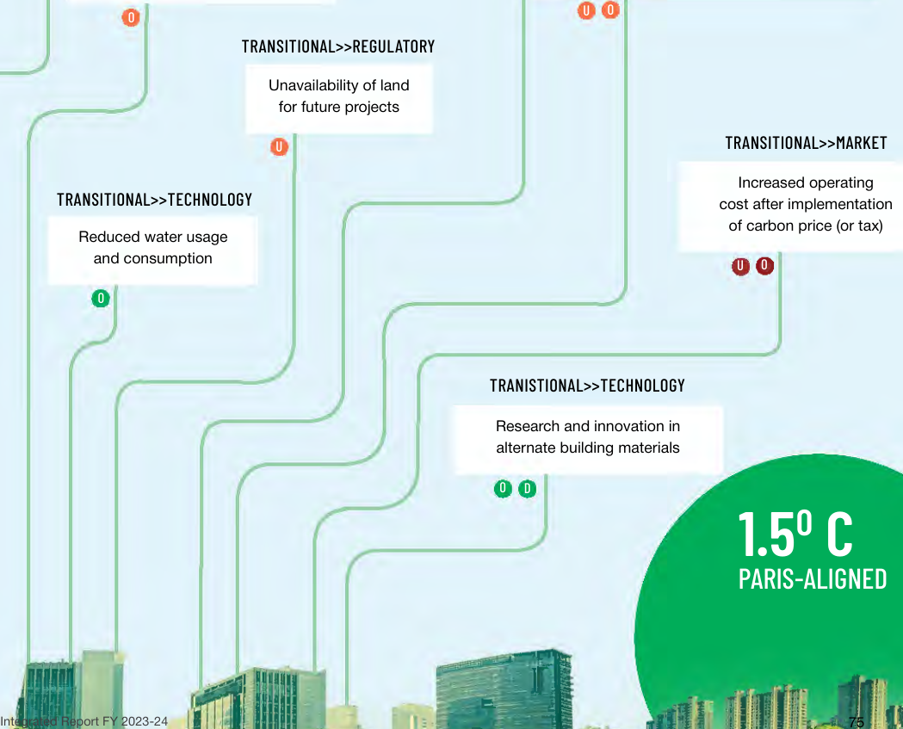

**[Image: AnnualReport2024.pdf-0042-21.png (1049x847, 602.2KB)]**

<!-- Start of picture text -->
U O O • • • TRANSITIONAL>>REGULATORY Unavailability of land for future projects •  U TRANSITIONAL>>MARKET Increased operating TRANSITIONAL>>TECHNOLOGY cost after implementation of carbon price (or tax) Reduced water usage and consumption  ••  U O •  O TRANISTIONAL>>TECHNOLOGY Research and innovation in alternate building materials • •  O D 1.5 O  C PARIS-ALIGNED Integrated Report FY 2023-24 75 <!-- End of picture text -->

About Godrej Integrating Sustainability Management Discussion Statutory Properties Limited with our Business and Analysis Reports 

###### **PRIORITIZED RISKS MAPPED TO CAPITALS** 

Heavy Rainfall can lead to flooding, damaging physical assets, and disrupt operations, building materials and equipment which can lead to increased cost for replacing or repairing the damaged materials, affecting the overall project cost. 

###### **HEAVY PRECIPITATION** 

High temperature and heatwaves lead to higher energy consumption costs along with increase in workforce wages due to loss in productivity, ultimately impacting the project cost. 

###### **TEMPERATURE** 

Water scarcity leads to **WATER** increase in total cost of **SCARCITY** water procurement from third parties, resulting in increase of the overall project cost. 

Increase in operating cost **CARBON PRICING** after implementation of **MECHANISMS** carbon price and overall project cost. 

Heavy precipitation induces soil instability, soil erosion and flooding, damaging the construction site. 

High temperatures can disrupt ecosystems, impacting biodiversity, water sources, and habitats which can lead to reduced property value due to environmental degradation or increased operational costs for climate-resilient infrastructure. 

Real estate is highly water intensive industry. Water scarcity would result in increased procurement cost of water for construction activities. 

Carbon pricing can escalate operational expenses, notably for energy-intensive buildings, influencing financial outcomes and investment strategies. 

**GPL has aligned the climate-related risks with the six capitals in the IR framework, which include financial, natural, human, intellectual, manufactured, and social and relationship capitals.** 

On-site workers can face safety hazards caused by slippery construction sites, elevating the risk of accidents and falls. Furthermore, there can be loss in productivity of the workforce due to heavy rainfall. 

Construction process can 

Substantial impact on timelines of the project, resulting in delay in the handover of the project to the client. 

Heavy precipitation can cause property damage, disrupting operations and potentially leading to data loss, compromising intellectual property integrity. 

be impeded and delayed by heavy rainfall, causing challenges in establishing foundations, pouring concrete and laying asphalt. 

High temperature can Substantial impact on impact the building timelines of the project, materials such as concrete resulting in delay in the that can form cracks due handover of the project to to extreme heat. the client. 

High temperatures can affect tangible assets, leading to operational disruptions and influencing market perception. 

High temperature and heat waves can impact the health and productivity of the workforce, reducing the productivity in the workforce adversely compromising the output. 

Water conservation Disruption in the Substantial impact on and efficiency are production processes due timelines of the project, imperative for obtaining to limited water availability. resulting in delay in the positive ratings in green handover of the project to the client. building certifications. 

Health issues such as dehydration, operational disruptions in waterdependent systems, and the need for costly investments to manage water scarcity impact budget allocation and pose challenges in maintaining a sustainable employer reputation. 

Opportunity: Carbon 

Opportunity: Carbon Carbon pricing mechanism An overall increase in pricing creates can increase the project costs directly opportunities for production costs of carbon affects the expenses collaboration and intensive building materials borne by consumers and partnerships for such as aluminium, has a significant impact. leveraging technologies concrete, bricks and glass for construction. 

Higher energy costs due to carbon pricing can strain budgets, affecting employee benefits, wellness programs, and overall workforce satisfaction. 

Godrej Properties Limited 

Integrated Report FY 2023-24 

76 

77 

About Godrej Integrating Sustainability Properties Limited with our Business 

Management Discussion Statutory and Analysis Reports 

###### **PHYSICAL CLIMATE-RELATED RISK SCENARIO ANALYSIS** 

Climate Change Scenario Analysis is a vital tool for organizations to evaluate potential future risks and opportunities stemming from climate change. It allows them to understand and manage climate-related risks effectively, a critical aspect for investors and stakeholders. 

According to the Task Force on Climate-related Financial Disclosures (TCFD), organizations should explore various scenarios, including one in line with the 2015 Paris Agreement’s goal of limiting global warming to 1.5°C above pre-industrial levels. Additionally, they should assess a 

business-as-usual (BAU) scenario, where physical risks such as flooding, heatwaves, and water scarcity are predominant. 

To evaluate physical risk scenarios, GPL utilized two Shared Socioeconomic Pathways (SSPs): SSP-1 (aligned with RCP2.6) and SSP-5 (aligned with RCP-8.5). This assessment involved site-level surveys, peer reviews, and stakeholder consultations. Each identified risk underwent a thorough 4-factor analysis, considering likelihood, impact, vulnerability, and speed of onset. This comprehensive approach, factoring in adaptability and time dependence, 

is particularly valuable for climate change assessments. Finally, risks were ranked to prioritize material climate risks. 

including shifts in temperature, precipitation patterns, water availability, and associated climate risks. 

Specifically, Mumbai hosts 16 project sites, Bengaluru with 5 project sites, and Delhi-NCR accommodates 11 sites. Although Ahmedabad only houses 1 project site, it too confronts significant vulnerability owing to diverse climate stressors. As GPL expands and relocates projects, we remain attentive to climate vulnerabilities across geographies. 

The assessment focused on locations vulnerable to the overall impacts of climate change, including factors like temperature, precipitation, water scarcity, and climate hazards. It identified Mumbai, Ahmedabad, Bengaluru and Delhi-NCR as four specific locations facing heightened vulnerability to the physical effects of climate change. 

###### **OVERALL CLIMATE CHANGE IMPACT** 

Our analysis delved into the vulnerability of locations to each climate stressor under the scenarios of Shared Socioeconomic Pathways (SSP-1 and SSP-5). A concise summary of our findings is presented in the table below. 

GPL operates multiple project sites across Mumbai, Delhi, and Bangalore. Mumbai and Delhi-NCR are particularly susceptible to the compounded impacts of climate change, 

||Ahmedabad|Ahmedabad|
|---|---|---|
|Temperature|NCR|NCR|
||Kolkata|Pune|
||Bengaluru|Mumbai|
|Precipitation|Mumbai|Kolkata|
||Kolkata|Ahmedabad|
||Mumbai|NCR|
|Wt Sit|NCR|Mumbai|
|aer carcy|Ahmedabad|Ahmedabad|
||Bengaluru|Bengaluru|
||Mumbai||
|Overall Climate Change (incorporating business relevance)|NCR||
||Ahmedabad||

About Godrej Integrating Sustainability Management Discussion Statutory Properties Limited with our Business and Analysis Reports 

**[Image: AnnualReport2024.pdf-0045-01.png (403x88, 31.1KB)]**

<!-- Start of picture text -->
11111---.•  2023  2024 Maturity maintained/ enhanced 2023  2024 Improvement in maturity 11111---.  • <!-- End of picture text -->

9 • • 

Recommended TCFD Disclosures 

Disclosing 

Not disclosing 

###### **LIMITED DISCLOSURES** 

###### **GOVERNANCE** 

Board oversight of climate-related 2023 2024 9 11111---. - risks and opportunities. Management’s role in climate 2023 2024 9 11111---. - risk assessment/management. A published policy or commitment 2023 2024 **11111---.•** statement on climate change. **STRATEGY** 2023 2024 Operational GHG emission reductions. **11111---.** • **RISK MANAGEMENT 11111---.•** 2023 2024 Acknowledgement of need to assess/respond to climate risks. **METRICS & TARGETS** 2023 2024 Scope 1 and Scope 2 GHG emissions - 9 11111---. 

###### **MODERATE DISCLOSURES** 

###### **GOVERNANCE** 

Statement on board’s 2023 2024 **11111---.** • consideration of climate R&O. Measures to increase board 2023 2024 **11111---.•** knowledge on climate R&O. Individual/committee for 2023 2024 **11111---.•** climate change at board level. Consideration of physical, 2023 2024 **11111---.•** transition & liability risks. **STRATEGY** Climate Risks and Opportunities (R&O) 2023 2024 9 11111---. - identified over short/med/long term Impact of Climate R&O on 2023 2024 organisation’s business, strategy, - 9 11111---. & financial planning. Involvement in domestic and 2023 2024 **11111---.** • international climate efforts. 

###### **RISK MANAGEMENT** 

Has processes for identifying & assessing climate risks 

Has processes for managing climate risks. 

###### **FULL DISCLOSURES** 

###### **GOVERNANCE** 

Capacity and competency 2023 2024 of board on climate change. **11111---.** • Climate R&O integrated 2023 2024 **11111---.** • into board agenda. Full consideration of physical, transition & liability risks over **11111---.** 2022 • 2024 time frames & financial incentives for CXOs. 

###### **STRATEGY** 

Potential impact of scenarios (4,2,1.5 DS) on organization’s business, strategy, & financial planning. 

2023 2024 - organization’s business, 911111---. strategy, & financial planning. 2023 2024 Internal carbon pricing strategy. **11111---.** • Climate advocacy and collaboration 2023 2024 **11111---.** • with peers/stakeholders. 

###### **RISK MANAGEMENT** 

How processes for identifying, assessing & managing climate R&O are integrated into organization’s overall risk management. 

###### **METRICS & TARGETS** 

###### **TCFD MATURITY MAP** 

We assessed potential climate-related risks & corresponding opportunities for climate mitigation. Our firm conviction is that an emerging risk like climate change does not confine its impact solely to our site operations; rather it extends across our entire value chain. 

###### **METRICS & TARGETS** 

Metrics used to assess climate R&O in line with strategy and risk management process. 

Scope 1 and Scope 2 GHG and if 2023 2024 in line with strategy and risk 2023 - 2024 appropriate Scope 3 emissions 9 11111---. - management process. 9 11111---. & related risks. 2023 2024 Climate targets include 2023 2024 Recognized methodologies 9 11111---. - **11111---.** • for measurement. 2023 2024 Assurance of reported 2023 2024 Performance for GHG targets. **11111---.** • GHG emissions **11111---.** • 

Climate targets include SBT & performance against targets 

To fortify our dedication to climate resilience, GPL has incorporated the TCFD’s guidance into the management structure and overall approach to climate changerelated risks & opportunities. 

Godrej Properties Limited 

Integrated Report FY 2023-24 

80 

81 

About Godrej Integrating Sustainability Properties Limited with our Business 

Management Discussion Statutory and Analysis Reports 

**We are working diligently to reduce our Scope 1, Scope 2, and Scope 3 GHG emissions footprint and to minimize our waste to landfill.** 

###### **HOW WE MEASURE OUR PROGRESS** 

Our climate-related targets are intricately intertwined with our Environmental, Social, and Governance (ESG) objectives, which are embedded throughout the company, from top-level management to every function. To track progress, we employ robust internal dashboards while ensuring transparent public disclosure, supported by external assurance. 

In bolstering our sustainability endeavors, we’ve implemented a company-wide Occupational Health & Safety (OH&S) Management system and an Environment Management System (EMS). Furthermore, obtaining ISO certifications for our construction sites underscores our dedication to climate responsiveness and resilience. 

Godrej Properties stands as a waterpositive and carbon-neutral entity across its operations, encompassing Scope 1 and Scope 2 greenhouse 

gas (GHG) emissions. Our ongoing efforts focus on reducing Scope 1, Scope 2, and Scope 3 GHG emissions while proactively minimizing our waste footprint across operations. 

Resilience planning for our projects has been enhanced to address risks posed by extreme weather events. During design and planning phases, we now mandate elevated plinth levels to mitigate the risk of water ingress in building basements. 

###### **OUR CLIMATE COMMITMENTS** 

In the FY 2023–2024, we conducted a thorough risk assessment and scenario analysis concerning climate change, adhering to the guidelines provided by the Task Force on Climate-related Financial Disclosures (TCFD) Framework. Throughout this reporting period, we have prioritized addressing the risks associated with climate change. Consistent with the principles of the Paris Agreement, we 

have been actively engaging in the 

Science Based Target (SBT) initiative since 2020. Our targets, aimed at reducing scope 1 and 2 greenhouse gas (GHG) emissions by 72.6% per square meter area by FY2035, have received approval. 

Looking ahead, our dedication to assessing the financial implications of climate change on our business remains unwavering. We are committed to disclosing quantified impacts—both risks and opportunities—across various climate change scenarios during the upcoming Carbon Disclosure Project (CDP) reporting cycle. Moreover, our enterprise risk management framework will systematically integrate actual climate change risks. Finally, in subsequent TCFD-aligned disclosures, we aim to enhance the scenario analysis concerning physical climate risks, particularly at our construction sites. 

|Carbon neutral|For Scope 1 and 2|**Achieved**|
|---|---|---|
|Science Based Targets|Validation of Near-term Targets|**Achieved**|
|Water Positive Operations|Maintain water positivity|**Achieved**|
|Reduction of Waste to Landfll|Minimize waste to landfll|**Achieved**|
|Integration of Climate-Related Risks into Enterprise Risk Framework (ERM)|Integration of climate risks in ERM|**Achieved**|
|Climate-Responsive Designs in our Expanding Green Portfolio|All projects to be Green Building Certifed (minimum Silver)|**Achieved**|
|Climate-Related Public Disclosures and Assurance|Publish assured ESG report (Integrated Report)|**Achieved**|

Integrated Report FY 2023-24 

83 

About Godrej Integrating Sustainability Properties Limited with our Business 

Management Discussion Statutory and Analysis Reports 

**[Image: AnnualReport2024.pdf-0047-02.png (242x20, 4.0KB)]**

<!-- Start of picture text -->
ADDRESING OUR EMISSIONS <!-- End of picture text -->

**[Image: AnnualReport2024.pdf-0047-03.png (37x16, 0.9KB)]**

<!-- Start of picture text -->
P.88 <!-- End of picture text -->

###### **LOW CARBON ECONOMY** 

**[Image: AnnualReport2024.pdf-0047-05.png (186x13, 2.3KB)]**

<!-- Start of picture text -->
INTERNAL CARBON PRICE <!-- End of picture text -->

**[Image: AnnualReport2024.pdf-0047-06.png (34x14, 0.8KB)]**

<!-- Start of picture text -->
P.94 <!-- End of picture text -->

###### **ENSURING A SUSTAINABLE SUPPLY CHAIN** 

**[Image: AnnualReport2024.pdf-0047-08.png (44x14, 0.8KB)]**

<!-- Start of picture text -->
P.188 <!-- End of picture text -->

###### **CHARTING OUR PATH TO EMISSIONS REDUCTION** 

P.90 

###### **CASE STUDY : SOLAR PV** 

P.92 

###### **DRIVING DECARBONIZATION AND ADVANCING TOWARDS ACHIEVING NET ZERO STATUS** 

The real estate sector holds a significant responsibility for the global carbon footprint, contributing to nearly 40% of total emissions. Given these statistics, prioritizing sustainability in real estate isn't just important for addressing climate change; it's essential for creating a greener and more sustainable future. 

India has taken a significant step towards sustainability by committing to achieve net-zero greenhouse gas emissions by 2070 and aiming to derive 50% of its energy  from renewable sources by 2030. In line with this commitment, 

we are dedicated to accelerating the transformation of the built environment towards sustainability through investing in innovative decarbonization solutions. 

We are working towards achieving net zero emissions by 2050. To fulfill this commitment, we have already initiated actions to reduce our emissions in accordance with our SBTi validated targets. We continue to be carbon neutral (for Scope 1 & 2). We are collaborating with our value chain partners, in line with our sustainable procurement policy, to tackle Scope 3 emissions. 

Integrated Report FY 2023-24 

85 

About Godrej Integrating Sustainability Properties Limited with our Business 

Management Discussion Statutory and Analysis Reports 

###### **OUR EMISSIONS PROFILE** 

The operations in our real estate sector have Scope 3 emissions as the majority of all our emissions. 

Our aim is to collaborate with our supply chain partners by emissions covering purchased goods and services which forms a major part of our Scope 3 emissions 

Given our business activities, GPL has identified ‘Purchased Goods and Services’ as the main source of emissions, along with critical suppliers based on emissions potential. We have aligned with climate science by committing to SBTi to reduce these emissions. We have implemented best practices and effective mitigation measures for our critical suppliers, who remain a priority as we strengthen our leadership position as a sustainable real estate developer. 

###### **FOR BASE YEAR FY 2020-21** 

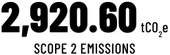

**[Image: AnnualReport2024.pdf-0048-07.png (247x80, 5.8KB)]**

<!-- Start of picture text -->
tC0 e 2,920.60 2 SCOPE 2 EMISSIONS <!-- End of picture text -->

**[Image: AnnualReport2024.pdf-0048-08.png (190x53, 4.1KB)]**

<!-- Start of picture text -->
926.17 tC0 e 2 <!-- End of picture text -->

**[Image: AnnualReport2024.pdf-0048-09.png (146x16, 2.0KB)]**

<!-- Start of picture text -->
SCOPE 1 EMISSIONS <!-- End of picture text -->

tC0 e **1,961,250.82** 2 SCOPE 3 EMISSIONS 

Including our material suppliers who deal with concrete (Ready-Mix Concrete), tiles, steel (ThermoMechanically Treated Reinforcement), and cement within the scope of SBTi emission targets will cover two-thirds of our supply chain, which constitutes 80.45% of our Category 1 emissions. 

**We have achieved carbon neutrality for Scope 1 and Scope 2 greenhouse gas emissions. This year, we have intensified our actions to tackle Scope 3 emissions through our supplier engagement program.** 

Godrej Properties Limited 

86 GRI 3-3 

87 

About Godrej Integrating Sustainability Properties Limited with our Business 

Management Discussion Statutory and Analysis Reports 

###### **ADDRESSING OUR EMISSIONS** 

|Scope 1 (includes emissions from DG sets1and company-owned vehicles1,2) (tCO2e)|542|529.02|447.97|926.17|
|---|---|---|---|---|
|Scope 2 (grid electricity3emissions) (tCO2e)|3,529|3,376|2,966|2,921|
|Total Scope 1 + Scope 2 (tCO2e)|4,071|3,905|3,414|3,847|
|Total Scope 3 (tCO2e)|1,594,025|1,951,267|1,332,075|1,961,251|
|Category 1 - Purchased goods and services6,8|1,395,340|1,449,918|||
|Category 2 - Capital goods10|1,672|116.94|||
|Category 3 - Fuel and energy related activities4|313|859.06|||
|Category 4 - Upstream transportation and distribution5|165,245|472,183|||
|Category 5 - Waste generated in operations6,8|832|24.91|||
|Category 6 - Business travel by air8and Road2|1,996|1,234|||
|Category 7 - Employee commuting7|1,722|2,086|||
|Category 8 - Upstream leased asset3,9|-|4,372.45|||
|Category 11 - Use of sold products11|26,907|20,472|||
|GHG intensity - Scope 1 and 2 (tCO2e/ft2)|0.0087|0.0081|0.0081|0.0015|
|GHG intensity - Scope 3 (tCO2e/ft2) as per constructed area|0.17|0.29|0.15|0.44|
|GHG intensity - Scope 3 (tCO2e/ft2) as per total built-up area|0.02|0.03|0.03|0.04|
|GHG intensity - Scope 3 (tCO2e/ft2) as per total developable area|0.03|0.04|0.03|0.05|

Denominator used to calculate Intensity for FY 2023-24 Scope 1 & 2 = 467,841 ft2* Scope 3 = 9,646,619 ft2 # (Constructed Area) Scope 3 = 75,270,917 ft2 (Total Built-Up Area) Scope 3 = 59,149,975 ft2 (Developable Area) 

1. Emissions estimated using DEFRA 2023 8. Emissions estimated using DEFRA 2023, Vedanta conversion factors Limited Environmental Performance Indicators, EU ETS 2. Emissions estimated using India GHG program  (considering Premium Sedan <2000cc diesel engine) post-2012 methodology for emission allowances, and IEA conversion factors. 

3. Emissions estimated using CEA ver. 18 guide 9. Emissions estimated using IPCC guidelines for National Green House Gas Inventories 4. Emissions estimated using DEFRA 2023 and  CEA ver. 18 guide 10. Emission estimated using US Environmentally-Extended 

Denominator used to calculate Intensity for FY 2022-23 Scope 1 & 2 = 482,757 ft2 * Scope 3 = 6,708,205 ft2 # (Constructed Area) Scope 3 = 60,325,662 ft2 (Total Built-Up Area) Scope 3 = 49,000,000 ft2 (Developable Area) 

   10. Emission estimated using US Environmentally-Extended Input Output (USEEIO) 

5. Emissions estimated using GHG transport tool 

11. Energy Performance Index (EPI) calculated based on 

6. Emissions estimated using expert judgment guidelines from GRIHA and BEE. 

###### **ENABLING EMISSION ABATEMENT** 

Our strategy to mitigate climate change centers on managing emissions. We’ve taken several steps, like using more clean energy, supporting energy efficiency, and offsetting emissions through afforestation and land use projects. Currently, we’ve achieved carbon neutrality for Scope 1 and 2 greenhouse gas emissions. 

We have obtained approval for our Science Based Targets, a joint initiative of CDP, the UN Global Compact, the World Resources Institute, and WWF. This initiative aligns with our commitment to climate action. Our GHG reduction targets have been validated and are consistent with the decarbonization efforts necessary to keep global warming below 1.5 degrees Celsius. 

The Science Based Targets initiative (SBTi) has set standards that are a crucial milestone. It’s the first science-based certification for corporate goals to reduce emissions, aligning with the Paris Agreement’s aim to limit global warming to 1.5 degrees Celsius. These goals give businesses a clear path to reduce greenhouse gas (GHG) emissions and address the severe impacts of climate change. 

###### **GPL’S COMMITMENT TO SBTI** 

Our emission reduction targets to Science Based Targets initiative (SBTi) have been approved. SBTi is a collaborative effort involving CDP, the UN Global Compact, the World Resources Institute (WRI), and World Wide Fund (WWF). 

**GPL has had its emission reduction goals approved by the SBTi, showing our commitment to aligning with scientifically grounded targets.** 

7. Emissions estimated using India GHG program 

Over the years, we have monitored intensity related to our emissions interchangeably using both constructed area and Developable Area. Moving forward, we aim to streamline our approach by using total built up area as the primary metric for a given reporting period. This would allow us to effectively track our operational metrics, both within our operations and throughout our value chain. 

Denominator used to calculate Intensity for FY 2021-22 Scope 1 & 2 = 422,995 ft2 * Scope 3 = 9,112,802 ft2 # (Constructed Area) Scope 3 = 46,682,323 ft2 (Total Built-Up Area) Scope 3 = 40,000,000 ft2 (Developable Area) 

* This comprises the area of GPL’s head office, regional offices and project site & marketing offices 

# This is the total constructed area of active project sites during the reporting year 

Godrej Properties Limited 

88 GRI 3-3, 305-1, 305-2, 305-3, 305-4 

89 

About Godrej Integrating Sustainability Properties Limited with our Business 

Management Discussion Statutory and Analysis Reports 

###### **CHARTING OUR PATH TO EMISSIONS REDUCTION** 

**Through the exploration of these clean energy alternatives, our objective is to broaden our energy sources and substantially diminish our dependency on fossil fuel-based electricity. Our approach will entail a blend of strategies, considering factors such as availability, feasibility, cost-effectiveness, and alignment with our emission reduction objectives.** 

Our Scope 1 & 2 direct emission reduction target for each FY, aligned with a linear reduction rate consistent with the 1.5°C goal, has been approved by the SBTi. 

In our efforts to decrease Scope 1 & 2 emissions from the FY 2020-21 baseline, we have identified various clean energy alternatives for electricity consumption: 

- Utilize 100% green power sourced from the grid. 

- Combining grid electricity with solar power. 

- Utilizing green power from the grid alongside solar energy. 

- Resort to grid electricity if none of the options are viable. 

Our process flow follows these sequential steps: 

###### **EMISSIONS IN BASE YEAR BY OFFICES** 

1. Establish the baseline Scope 1 & 2 emissions from the base year. 

2. Define an absolute emissions reduction target for the designated target year. 

|NCR 1 & 2|1,196|
|---|---|
|Mumbai MMR Ofce|300|
|South (Bengaluru & Chennai)|723|
|Kolkata|251|
|Pune|928|
|Ahmedabad & Nagpur|110|
|Vikhroli|143|
|HO (Corporate Ofce)|196|

3. Determine the necessary office space allocations for Regional, Site, and Marketing Offices for the target year. 

4. Specify the emissions intensity for the target year. 

5. Calculate the requisite emission reduction to achieve the target by the designated year. 

6. Project the expected emissions level for the target year. 

7. Determine the required electricity sourced from green alternatives. Identify applicable energy options for each office type, including Grid Electricity, 100% Green Power, Hybrid (Grid Electricity and Solar), and Green Power from the Grid and Solar. 

###### **CASE STUDY: SOLAR PV SYSTEMS IN PUNE** 

|Capacity (KW)|100|100|120|140|
|---|---|---|---|---|
|Capital Cost Invested (`Lakhs)|46|46|70|64.4|
|Units generated till date (KWh)|25,080|89,365|9,315|3,103|
|Expected Generation till Payback (MWh)|368|270|288|357|
|Emissions Avoided till 2025 (tCO2e)|261|192|204|253|
|Construction Power Rate (`/KWh)|18|18|18|18|
|Amount saved till date (`Lakhs)|4.51|16.09|1.68|0.56|
|Month of Commissioning|Jul-21|Aug-21|Jun-22|Aug-22|
|Expected payback by|Aug-25|Aug-24|Feb-25|Jun-25|

Godrej Properties Limited 

Integrated Report FY 2023-24 

9191 

About Godrej Integrating Sustainability Management Discussion Statutory Properties Limited with our Business and Analysis Reports 

###### **BASE YEAR: FY 20-21** 

###### **TARGET YEAR 2034** 

###### **Total office area: 32,325 sqm Scope 1 & 2 emissions: 3,846.77 tCO2 Emission Intensity: 0.12 tCO2/m****2** **Emission Intensity: 0.012 tCO2/ft****2** 

###### **Emissions Reduction required: 4,200 tCO 2 Emission Intensity: 0.03 tCO2/m****2** **Emission Intensity: 0.003 tCO2/ft****2** 

To attain the target of cutting Scope 1 and Scope 2 GHG emissions by 72.6% per square meter of GPL’s offices by 2035 from the 2021 base year, we must use a mix of tactics such as rooftop solar panels and renewable power from grid. 

###### STRATEGY 1 

###### **ROOFTOP SOLAR (RTS)** 

|Potential capacity (KW)|25.30|77.60|60.50|
|---|---|---|---|
|Expected Captial Cost invested in RTS (`Lakhs)|12.36|37.99|29.61|
|Potential units generated till payback (MWh)|111|285|322|
|Potential emissions avoided till payback (tCO2)|79|202|228|
|Expected annual monetary savings on annual generation (`Lakhs)|4.17|14.82|8.41|
|Expected payback period (Years)|3.00|2.60|3.50|

###### **CUMULATIVE TABLE WITH SUMMARY OF STRATEGY 1 & 2** 

|Total Capital Cost (Rooftop Solar)|79.96|`Lakhs|
|---|---|---|
|Expected Cost for Green Power from Grid|28.43|`Lakhs|
|Potential Emissions Abated till Payback (from RTS)|510|tCO2e|
|Potential Emissions Abated till Payback (from Green Power from grid)|145|tCO2e|
|Total Emissions Abated till Payback (from Green Power and RTS)|655|tCO2e|
|Potential Cost of abatement|0.16|`Lakhs/tCO2e|

**911 tCO e 2** 

` **24,863 /tCO2e** 

TOTAL EMISSIONS ABATED TILL 2026 

COST OF ABATEMENT 

###### STRATEGY 2 **GREEN POWER FROM GRID** 

|Annual Consumption FY 2024 (kWh)|39,362|188,769|30,135|
|---|---|---|---|
|Unit Diference (Annual Consumption - Annual Generation from RTS) in MWh|2|78|-61|
|Potential Emissions avoided from Green Power till payback from RTS (tCO2)|3.70|141.20|0.00|
|Expected Cost of Procuring Green Power till payback from RTS (`lakhs)|0.62|27.82|0.00|

Godrej Properties Limited 

Integrated Report FY 2023-24 

92 GRI 305-5 

93 

About Godrej Integrating Sustainability Management Discussion Statutory Properties Limited with our Business and Analysis Reports 

###### **MITIGATING TRANSITIONAL RISKS IN THE MOVE TO A LOW-CARBON ECONOMY** 

###### **DRIVING LOW CARBON TRANSITION USING ICP** 

###### **REDUCING OUR CARBON FOOTPRINT** 

carbon investments, enhance energy efficiency, encourage internal behavioral changes, and capitalize on low-carbon opportunities. 

Our Internal Carbon Price (ICP) focuses on sustainable material initiatives. Initially, we identified the top emitters within Scope 3, Category 1 construction materials: concrete, cement, tiles, and steel. We are now analyzing alternatives to reduce our carbon footprint, such as using Supplementary Cementitious Materials (SCM) like Granulated Ground Blast Furnace Slag (GGBFS). 

As part of our climate strategy to mitigate transition risks toward a lowcarbon economy, we are establishing our Internal Carbon Price (ICP). According to the TCFD framework, carbon pricing is crucial for scenario analysis, reducing transition risks. Aligning with CDP's ICP objectives, we consider GHG emissions scope, pricing methodology, and impacts. Companies use ICP to drive low- 

Globally, carbon markets like the EU Emission Trading System (ETS) drive ICP implementation. Many Asian countries, including Japan and Korea, have increased ICP disclosure. India's proposed 2022 Energy Conservation Bill aims to establish a domestic carbon market, highlighting ICP's role in the low-carbon transition 

CONCRETE (RMC) 

Our ICP raises awareness about 

Our ICP raises awareness about emissions. Our SBTi Scope 3 target carbon impacts, and as we advance commitment states that 88.5% of our on our low-carbon journey, it will drive suppliers related to Purchased Goods sustainable operations. The ICP is and Services adopt Science-based a dynamic tool, adapting alongside targets by 2026. We foresee that our sustainability strategy to ensure implementing ICP will drive our lowalignment with evolving objectives carbon transition and streamline our and market dynamics. ESG strategy. 

###### **SETTING AN APPROPRIATE ICP** 

Our Internal Carbon Price (ICP) is centered around sustainable materialbased initiatives. The initial phase involved creating an emission profile of the most significant emitters among construction materials within Scope 3, Category 1. Concrete (RMC-Ready Mix Concrete), Cement, Tiles, and Steel emerged as the top emitters. Through a comprehensive material and market analysis, we are currently identifying alternative materials/ products that could contribute to reducing our carbon footprint. For instance, we are exploring the increased use of Supplementary Cementitious Materials (SCM) like Granulated Ground Blast Furnace Slag (GGBFS). 

**STRATEGY AND IMPLEMENTATION The implicit carbon price** As part of our climate strategy to **quantifies the capital** mitigate transition risks to a low- **investment necessary to** carbon economy, we developed a robust methodology to implement ICP **achieve the company’s** during the current reporting year. We **climate-related objectives** are establishing the preliminary ICP **and is derived from** figure of ₹978 per metric tCO2e and reviewing and strengthening the ICP, **the company’s carbon** which we will fully disclose in our next **footprint. It aids in** public reports. **assessing the risk** Since 99.82% of our baseline year (FY 2020-21) emissions are Scope **associated with projects/** 3, with 82.89% from Category 1 of **products by considering** Purchased Goods and Services, **emissions without directly** our sustainability initiatives for setting GPL’s ICP derive from these **impacting cash flows.** 

###### **VISION FOR GPL’S ICP** 

At GPL, we envision a gradual progression of our Internal Carbon Price (ICP) from an implicit carbon price to a carbon fee model. 

Embodied emission of raw materials required for developing finished product 

1 Purchased Goods and services 1,625,810 82.90 

CEMENT 

TILES 

STEEL 

About Godrej Integrating Sustainability Properties Limited with our Business 

Management Discussion Statutory and Analysis Reports 

###### **OPTIMIZING ENERGY EFFICIENCY IN OUR OPERATIONS** 

**Our operations at Godrej City Project have transitioned to utilizing 65-70% green energy, significantly reducing our energy usage, costs, and environmental impact.** 

###### **INTEGRATING ENERGY CONSCIOUSNESS** 

At Godrej Properties Limited, we recognize that the bulk of a building's energy consumption occurs during its occupancy. 

Recognizing that 90% of a building’s total energy consumption occurs while it is occupied, GPL understands the significance of energy usage as a substantial expense. Our long-term economic and environmental sustainability relies on the reduction of energy consumption and associated costs. To achieve this, we integrate energysaving features into the design and construction of our buildings. Furthermore, we implement conservation measures across all aspects of our operations to minimize energy requirements. 

We are dedicated to reducing our operations' carbon footprint by advocating for eco-efficiency and adopting renewable energy sources whenever viable. 

Our energy management system (EnMS) focuses on improving energy efficiency and sustainability. Key components include conducting energy audits to identify improvement opportunities and setting quantified energysaving targets. Implementing targeted actions, such as upgrading HVAC systems, reduces energy use, while regular evaluations ensure effectiveness of these measures. Incorporating clean and green energy sources, investing in R&D, and providing employee training further enhance energy efficiency. 

To ensure continual enhancement in our energy performance and efficiency, we adhere to international benchmarks and standards such as the Energy Conservation Building Code (ECBC) and the Energy Performance Index (EPI) established by the American Society of Heating, Refrigerating, and AirConditioning Engineers (ASHRAE). 

###### **ENERGY TO OPERATE GPL OWNED OFFICES AND GPL OWNED VEHICLES** 

||ENERGY CONSUMED|(GJ) Diesel Grid Electricity ■ ■||ENERGY INTENSITY (GJ/ft2)|
|---|---|---|---|---|
|FY 2023-24|7,225|18,452|25,677|0.05|
|FY 2022-23|7066|17539|24,605|0.05|
|FY 2021-22|6005|13,517|19,522|0.04|
|FY 2020-21|12457|13309|25,766|0.07|

###### **ENERGY UTILIZED FOR CONTRACTOR’S OFFICE AND CONSTRUCTION ACTIVITY** 

||ENERGY CONSUMED|(GJ) Diesel Grid Electricity ■ ■||ENERGY Constructed area (ft2)|INTENSITY (GJ/ Total Built-Up area (ft2)|ft2) as per Developable Area (ft2)|
|---|---|---|---|---|---|---|
|FY 2023-24|11,535|26,690|38,225|0.004|0.001|0.001|
|FY 2022-23|11,508|22,050|33,558|0.005|0.0006|0.001|
|FY 2021-22|20,145|17,696|37,841|0.004|0.001|0.001|
|FY 2020-21|31,604|10,699|42,303|0.01|0.001|0.001|

Denominator used to calculate Intensity for FY 2023-24 For GPL Offices - 467,841 ft2 * Constructed Area - 9,646,619 ft2 # Total Built-Up Area - 75,270,917 ft2 Developable Area - 59,149,975 ft2 

*Energy values for 2019-20 have undergone revision due to improved measurement and record keeping processes GPL operations across regions considered: NCR, Mumbai, South, Kolkata, Pune, Ahmedabad, Nagpur, and Head Office Bifurcation between renewable and non-renewable not highlighted (part of the indicator) Renewal energy consumption for site operations is Zero Assuming company owned vehicles are sedan < 2000cc diesel fueled (Assuming standard to and fro distance traveled by 

respective company owned vehicle users to further arrive at the monthly distance and the same has been aggregated annually.) There has been decrease in diesel consumption on account of: 4 sites have closed - Godrej Avenues, Godrej Reserve, Godrej 24 & Elements Labour camp of Godrej Nurture (Mamurdi) has been switched form Diesel operated gen set to Grid Electricity Denominator used to calculate Intensity for FY 2023-24: Scope 1 & 2 = 467,841.00 ft2 , Scope 3 = 9,646,619 ft2 

Over the years, we have monitored intensity related to our energy interchangeably using both constructed area and Developable Area. Moving forward, we aim to streamline our approach by using total built up area as the primary metric for a given reporting period. This would allow us to effectively track our operational metrics, both within our operations and throughout our value chain. 

Denominator used to calculate Intensity for FY 2022-23  For GPL Offices - 482,757 ft2 * Constructed Area - 6,708,205 ft2 # Total Built-Up Area - 60,325,662 ft2 Developable Area - 49,000,000 ft2 

Denominator used to calculate Intensity for FY 2021-22For GPL Offices - 422,955 ft2 * Constructed Area - 9,112,802 ft2 # Total Built-Up Area - 46,682,323 ft2 Developable Area - 40,000,000 ft2 

Denominator used to calculate Intensity for FY 2020-21 For GPL Offices - 422,984 ft2 Constructed Area - 4,424,004 ft2 # Total Built-Up Area - 45,839,141 ft2 Developable Area - 39,734,390 ft2 

- This comprises the area of GPL's head office, regional office and project site & marketing offices 

- # This is the total constructed area of active project sites during the reporting year 

Godrej Properties Limited 

Integrated Report FY 2023-24 

96 GRI 3-3, 302-5, 302-1, 302-2, 302-3, 302-4 

97 

About Godrej Integrating Sustainability Properties Limited with our Business 

Management Discussion Statutory and Analysis Reports 

###### **CONSERVING WATER** 

Water scarcity is one of today's most pressing global challenges. To improve water management and promote efficiency, we have implemented a comprehensive water management strategy. This strategy helps us address water-related issues, risks, and opportunities while engaging meaningfully with stakeholders. Water stress occurs when water demand exceeds available resources or when poor water quality limits usage. 

India has a baseline water stress score of 3.6, indicating that annual water usage is between 40%-80% of available resources. Among 181 countries, India ranks 41st, placing it in the high-risk category for water stress. 

Our total fresh water consumption rose from 218.17 million litres to 291.57 million litres, marking a 34% increase, in line with our expanded construction activities. Water intensity per unit of constructed area has decreased. The built-up area intensity has slightly increased due to a smaller percentage increase in builtup area as compared to constructed areas, and external factors such as project complexity, geographical and climatic variations, and different construction stages. Water usage fluctuates based on the stage of construction. Early stages such as excavation and foundation laying are particularly water intensive. As we progress to finishing stages, the water requirement per unit area tends to decrease. This fluctuation affects the overall water intensity when averaged across all stages of multiple projects. 

###### **WATER CONSUMPTION INTENSITY (LITRES PER ft****2** **OF BUILT UP AREA CONSTRUCTED)** 

||WATER CONSUMED IN MN LITRES ■|WATER I Constructed area (ft2)|NTENSITY (LITRES/ Total Built-Up area (ft2)|ft2) as per Developable Area (ft2)|
|---|---|---|---|---|
|FY 2023-24|352.58|36.54|4.68|5.96|
|FY 2022-23|267.75|39.91|4.44|5.46|
|FY 2021-22|309.51|33.96|6.63|7.74|
|FY 2020-21|299.10|67.61|6.52|7.53|

Denominator used to calculate Intensity for FY 2023-24 Constructed Area - 9,646,619 ft2 # Total Built-Up Area - 75,270,917 ft2 Developable Area - 59,149,975 ft2 

Denominator used to calculate Intensity for FY 2022-23 Constructed Area - 6,708,205 ft2 # Total Built-Up Area - 60,325,662 ft2 Developable Area - 49,000,000 ft2 

Denominator used to calculate Intensity for FY 2021-22 Constructed Area - 9,112,802 ft2 # Total Built-Up Area - 46,682,323 ft2 Developable Area - 40,000,000 ft2 

Denominator used to calculate Intensity for FY 2020-21 Constructed Area - 4,424,004 ft2 # Total Built-Up Area - 45,839,141 ft2 Developable Area - 39,734,390 ft2 

Over the years, we have monitored intensity related to our water interchangeably using both constructed area and Developable Area. Moving forward, we aim to streamline our approach by using total built up area as the primary metric for a given reporting period. This would allow us to effectively track our operational metrics, both within our operations and throughout our value chain. 

- # This is the total constructed area of active project sites during the reporting year 

###### **TOTAL WATER CONSUMED (352.58 MILLION LITRES)** 

###### **61.01** 

###### **291.57** 

###### **WATER CONSUMPTION** 

|||**QUANTITY (MILL**|**ION LITRES)**||
|---|---|---|---|---|
|**SOURCE**|**FY 2023-24**|**FY 2022-23**|**FY 2021-22**|**FY 2020-21**|
|WATER WITHDRAWN FROM ALL AREAS* Surface water|0|0|0|0.20|
|Ground water|0.79|0.8|0.07|34.20|
|Third-party water (includes municipal, bottled water and tanker water)|290.78|217.36|309.44|264.70|
|**Total water withdrawn**|**291.57**|**218.17**|**309.51**|**299.10**|
|WATER WITHDRAWAL FROM AREAS OF WATER STRES|S (NCR, SOUTH)#||||
|Surface water|0|0|0|0.20|
|Ground water|0.55|0|0|34.20|
|Third-party water (includes municipal, bottled water and tanker water)|130.19|74.98|134.59|54.70|
|Total water withdrawn|130.74|74.98|134.59|88.90|
|**Total water consumed in areas of water** **stress**|**130.74**|**74.98**|**134.59**|**88.90**|

Recycled water consumed for FY 2023-24 is 61.01 Million Litres. Water discharge for FY 2023-24 is Zero as Water withdrawn is equal to water consumed 

- #Determined using WWF Water Risk Filter tool with overall risk rating above 3.8 

For FY 2020-21 & FY 2019-20 third party water was reported under ground water consumption for Godrej Nurture site 

- *Water consumption and withdrawal data is disclosed for water utilized during construction activities at all 50 project sites. It doesn’t include drinking water and water used for GPL’s offices. 

Godrej Properties Limited 

Integrated Report FY 2023-24 

98 

99 

GRI 3-3 

About Godrej Integrating Sustainability Management Discussion Statutory Properties Limited with our Business and Analysis Reports 

###### LIFE-CYCLE STAGE INITIATIVES REFERENCE MATERIALS IMPACT 

**CONSTRUCTION** Water Efficient Plumbing Fixtures to minimize **STAGE** dependence on municipal and bore water. 

Rainwater Harvesting to **OCCUPANCY** enhance ground water **STAGE** table and reduce municipal water demand by harvesting rain water. 

IGBC Green Homes Rating Systems 

Water-efficient plumbing fixtures lower water consumption, reduce operational costs, and achieve sustainability goals, thereby enhancing the project’s value and attracting environmentally conscious buyers. 

Rainwater harvesting offers occupants opportunities for water conservation, cost savings, sustainability, reliability, and improved indoor air quality, making it a valuable and eco-friendly practice. 

About Godrej Properties Limited 

Integrating Sustainability Management Discussion Statutory with our Business and Analysis Reports 

###### **REPLENISHING MORE THAN WE CONSUME** 

At GPL, we are strongly dedicated to minimizing our environmental impact as much as possible. To do this, we’ve adopted sustainable water management practices across our operations to lower water usage. We also support water harvesting and recycling efforts whenever feasible, aiming to reduce our dependence on freshwater resources. During this reporting period, our total water consumption was 352.58 million liters. 

In line with our dedication to water conservation, we initiated an integrated watershed management program in the Beed district of Maharashtra. Through our corporate social responsibility (CSR) endeavors, this initiative has positively impacted three villages, covering a combined area of 3,300 hectares. Our assessments have indicated annual groundwater recharge of 7,656 million litres in the area, significantly surpassing the water consumed within our reporting boundary. We remain resolute in our commitment to maintaining a water-positive stance as we continue to make strides forward. 

About Godrej Integrating Sustainability Management Discussion Statutory Properties Limited with our Business and Analysis Reports 

###### **OPTIMIZING RESOURCE UTILIZATION THROUGH STRATEGIC MAPPING** 

###### **RESPONSIBLE CONSUMPTION OF MATERIALS, FY 2023-24** 

(Material consumption in Tonnes) 

CEMENT 12,137 

READY MIX CONCRETE 1,161,469 

FIRE DOOR 136 

PAINTS 296 

PIPES AAC BLOCKS 869 12,751 

###### **OUR APPROACH** 

We have embraced a targeted strategy aimed at minimizing our direct impact on natural resource consumption and pollution. Through the conservation of natural resources, we aim to make a modest yet significant contribution to the well-being of societies and the environment in which we operate. Recognizing the paramount importance of this endeavour, we have implemented stringent measures to ensure responsible procurement and efficient utilization 

of these resources. Our commitment lies in promoting a circular economy that fosters the preservation of ecological balance. To monitor our progress over time and establish benchmarks, we have conducted a comprehensive mapping of material consumption across various categories. This enables us to track our material usage and measure our progress in this area. 

GYPSUM PLASTER 799 

GLASS 445,084 

TOR STEEL 

56,650 

STRUCTURAL STEEL 3,583 

TILES 29,294 

WOOD 689 

UPVC WINDOWS 91 

ALUMINIUM WINDOWS & PANELS 267 

Tiles include Ceramic and Stone Pipes include GI, MS, CPVC, UPVC Wood includes Engineered Wood and Natural Wood (Frames and Shutters) 

###### **RESPONSIBLE PROCUREMENT** 

###### **RESPONSIBLE UTILIZATION** 

Godrej Properties Limited 

Integrated Report FY 2023-24 

104 GRI 3-3, 301-1 

105 

About Godrej Integrating Sustainability Management Discussion Statutory Properties Limited with our Business and Analysis Reports 

###### **COMMITTING TO CONSTRUCTION WASTE MANAGEMENT** 

We are dedicated to minimizing waste at its source and employ a steadfast approach to ensure safe and sustainable disposal. Our commitment entails strict compliance with waste management regulations, and we adopt a proactive “beyond compliance” stance to mitigate the environmental impact of our waste generation. 

**[Image: AnnualReport2024.pdf-0058-03.png (72x22, 1.2KB)]**

<!-- Start of picture text -->
REDUCE <!-- End of picture text -->

###### **SEGREGATE** 

**[Image: AnnualReport2024.pdf-0058-05.png (59x22, 1.1KB)]**

<!-- Start of picture text -->
REUSE <!-- End of picture text -->

**[Image: AnnualReport2024.pdf-0058-06.png (82x22, 1.2KB)]**

<!-- Start of picture text -->
RECYCLE <!-- End of picture text -->

**[Image: AnnualReport2024.pdf-0058-07.png (70x19, 1.1KB)]**

<!-- Start of picture text -->
OFFSET <!-- End of picture text -->

###### **HAZARDOUS WASTE** 

Hazardous waste encompasses materials such as solvents, and cleaning agents, lead based paints, oils, and electronic waste, posing risks to human health, the environment, or property. GPL prioritizes the proper disposal of all hazardous waste through authorized third-party entities, adhering rigorously to applicable laws and regulations. 

###### **NON-HAZARDOUS (Other Categories)** 

At GPL, non-hazardous waste streams encompass soil, construction waste debris, and metal scrap. Soil is either repurposed for backfilling purposes or directed to authorized landfills. Metal scrap is sent to authorized recyclers for proper processing. Construction waste debris, meanwhile, is routed to municipality-authorized agencies in strict accordance with regulations. 

###### **NON-HAZARDOUS (Organic Waste)** 

GPL conducts composting, and the resulting compost is utilized for project landscaping or in our plant nursery. In certain instances, it is handed over to authorized agencies for appropriate management. 

###### **WASTE DISPOSED (MT)** 

■ FY 2023-24 ■ FY 2022-23 ■ FY 2021-22 ■ FY 2020-21 HAZARDOUS 0 NON-HAZARDOUS 

**[Image: AnnualReport2024.pdf-0058-16.png (90x28, 1.9KB)]**

<!-- Start of picture text -->
DEBRIS <!-- End of picture text -->

###### **ADHESIVES, PAINT CANS** 

TO LANDFILL 

REUSED AT SITE 

**[Image: AnnualReport2024.pdf-0058-20.png (127x167, 15.4KB)]**

<!-- Start of picture text -->
■  1.54 ■  995.14 ■  56.99 ■  14.95 <!-- End of picture text -->

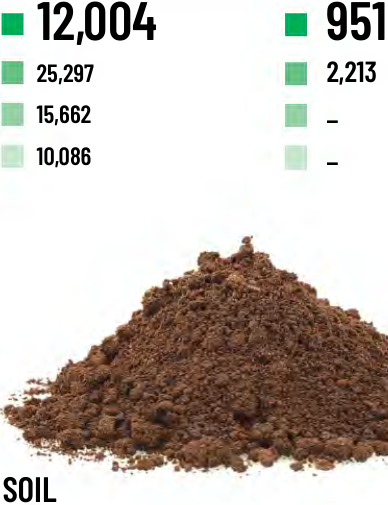

**[Image: AnnualReport2024.pdf-0058-21.png (388x505, 222.7KB)]**

<!-- Start of picture text -->
■  12,004 ■  951 ■  25,297 ■  2,213 ■  15,662 ■  _ ■  10,086 ■  _ SOIL <!-- End of picture text -->

**[Image: AnnualReport2024.pdf-0058-22.png (84x28, 2.1KB)]**

<!-- Start of picture text -->
SCRAP <!-- End of picture text -->

RECYCLED/REUSED AT SITE 

**[Image: AnnualReport2024.pdf-0058-24.png (206x16, 2.8KB)]**

<!-- Start of picture text -->
RECYCLED/REUSED AT SITE <!-- End of picture text -->

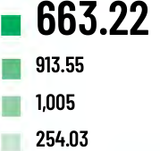

**[Image: AnnualReport2024.pdf-0058-25.png (179x169, 18.0KB)]**

<!-- Start of picture text -->
■  663.22 ■  913.55 ■  1,005 ■  254.03 <!-- End of picture text -->

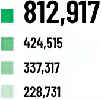

**[Image: AnnualReport2024.pdf-0058-26.png (170x169, 18.9KB)]**

<!-- Start of picture text -->
■ 812,917 ■  424,515 ■  337,317 ■  228,731 <!-- End of picture text -->

**TOTAL:       826,536** ■ ■ **453,934** ■ **354,042 239,086** 

Specific gravity of waste oil taken as 0.93 Density of construction debris taken as 1,663.47 kg/m3 

Godrej Properties Limited 

Integrated Report FY 2023-24 

107 

About Godrej Integrating Sustainability Management Discussion Statutory Properties Limited with our Business and Analysis Reports 

###### **REDUCING, REUSING AND RECYCLING CONSTRUCTION WASTE** 

Reducing, Reusing and Recycling construction waste are key strategies aimed at minimizing the environmental impact of construction activities. These strategies emphasizes on careful planning and design to optimize material use, processing materials that would otherwise be discarded into reusable products and using salvaged or reclaimed materials from one construction project in another. Benefits of these practices include reducing landfill waste, conserving natural resources, lowering construction costs, and reducing energy consumption associated with extracting and processing new materials. 

We have a dedicated policy commitment and strategy for managing construction and demolition waste through our waste management plan. This plan outlines strategies and procedures, including waste reduction, segregation and collection, recycling and reuse programs, efficient waste diversion and disposal, compliance and training, as well as monitoring and reporting. More than 50% of our sites have already implemented waste separation practices. Furthermore, we actively participate in prioritizing the use of recycled products through exchanges, engaging in both the purchase of recycled materials and the sale of recyclable materials. 

Through our research study ‘Waste Matters’, conducted regarding the onsite construction waste management, it is estimated that more than 85% of the waste generated on a construction site is not accounted for and is largely cement, debris, aggregates, soil, gypsum, and other regular waste. Further, we were able to assess that 3.64kg per sq ft of construction waste is generated in a mid-scale residential Mivan construction project in India. 

###### **MATERIAL RECOVERY FACILITY** 

A Material Recovery Facility (MRF) is a recovery or recycling facility which helps in segregating waste into different types so that it can further be recycled. These facilities recover tonnes of waste that would otherwise end up in landfills. The sorted waste is further sent to the recyclers for recycling. 

In order to responsibly address the construction waste, we have diligently taken steps to develop a ‘SOP’ and to install a MRF at our construction sites. MRFs were operationalised on site to separate metals, wood, plastics, and debris and these are segregated and stored efficiently so that all of it can be recycled. 

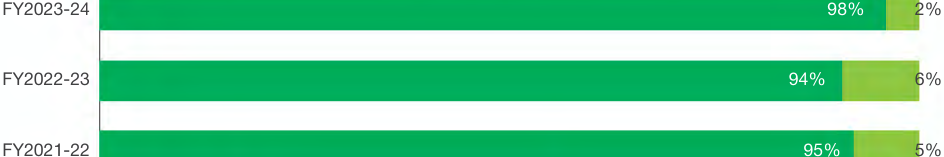

**[Image: AnnualReport2024.pdf-0059-08.png (944x157, 46.4KB)]**

<!-- Start of picture text -->
FY2023-24 98% 2% FY2022-23 94% 6% FY2021-22 95% 5% <!-- End of picture text -->

- % of waste recycled/ reused at site.   waste sent to landfill ■ 

###### **WASTE MANAGEMENT PRACTICES** 

###### **COLLECTION OF VARIOUS C&D WASTE** 

Waste Collection & Segregation at MRF 

**[Image: AnnualReport2024.pdf-0059-13.png (284x45, 4.7KB)]**

<!-- Start of picture text -->
Wet and  Steel Dry Concrete <!-- End of picture text -->

- Use wet concrete for making Paver clocks. 

**[Image: AnnualReport2024.pdf-0059-15.png (528x41, 10.7KB)]**

<!-- Start of picture text -->
Cardboard Wooden waste Plastic / PVC / UPVC <!-- End of picture text -->

   - Reusing at site (Rebar mesh for safety) 

   - Recycling through authorised vendor 

- Use broken AAC block filling sunken area. 

**[Image: AnnualReport2024.pdf-0059-19.png (384x17, 17.2KB)]**

<!-- Start of picture text -->
Paver blocks made out of wste concrete at project site <!-- End of picture text -->

- Dry concrete to recycling plant 

Godrej Properties Limited 

Integrated Report FY 2023-24 

108 GRI 306-2 

109 

About Godrej Integrating Sustainability Properties Limited with our Business 

Management Discussion Statutory and Analysis Reports 

###### **PRESERVING OUR NATURAL ECOSYSTEMS** 

**Total number of sites and the total area used for operational activities** 

**Biodiversity impact assessments conducted for sites used for operational activities in the past five years** 

###### **BIODIVERSITY ASSESSMENTS** 

At GPL, we prioritize the identification and monitoring of protected areas surrounding our project sites to assess our impact on them. To better understand the local ecosystem, including flora, fauna, and ecological dynamics, we conducted comprehensive biodiversity surveys at Maan Hinjewadi, Mahalunge, and Manjari. Specialized stream surveys were also undertaken to document native topology, aiding us in aligning our development activities to minimize habitat disturbance. 

Insights from these surveys guided our selection of native tree species for plantation efforts. Recognizing the importance of preserving and restoring native biodiversity, we’re extending these surveys to all our development sites. This proactive approach underscores our commitment to environmental stewardship and sustainable development practices. 

Environmental Impact Assessments are carried out at each of our sites as required by the Ministry of Environment, Forest, and Climate Change (MOEFCC) regulations. 

- GPL abstains from conducting operational activities within the notified areas, as well as its notified ecosensitive zones, areas of the World Heritage sites, and IUCN (International Union for Conservation of Nature) Category I-IV protected areas. (Applicable for all operations) 

- GPL commits to continuing to practice “No Net Deforestation” throughout all its operations. 

**EIA Assessments in FY 2023-24** 

We at GPL implement a structured approach to mitigate environmental impact, ranging from avoidance and minimization to restoration and offsetting, demonstrating our commitment to responsible environmental management in our projects: 

###### **1. AVOIDANCE** 

- We strictly prohibit operations, construction, and development activities in legally protected areas, including those designated as category Ia, Ib, II, III, or IV by the International Union for Conservation of Nature (IUCN). 

- Technical standards have been established to integrate biodiversity and ecosystem management into decisionmaking processes for both new and existing projects. 

- Standard operating procedures (SOPs) are in place to prevent the introduction of invasive species during vehicle and goods transportation. 

###### **2. MINIMIZATION** 

Environmental Management Plans (EMPs) are utilized to reduce pollution in air, noise, water, and soil. 

Greenbelt development is undertaken to mitigate the impact of pollutants. 

Regular reviews of compliance with Biodiversity Management Plans are conducted across all project sites. 

###### **3. RESTORATION** 

Efforts include replanting native and endangered flora, removal of invasive species, restoration of water bodies, and rehabilitation of disturbed areas to support biodiversity conservation. 

###### **4. OFFSETTING** 

- Initiatives focus on enhancing vegetation in barren lands and establishing medicinal plantations on community grounds to promote biodiversity, engaging local communities in the process. 

- Planting of native species is emphasized to drive ecological progress. 

###### **5. TRANSFORMATION** 

**50** NUMBER OF SITES **75.27** MILLION SQ FT 

**49** NUMBER OF SITES **74.63** MILLION SQ FT 

**6** NUMBER OF SITES 

- Activities encompass protection of endangered wildlife and plant species, establishment of conservation centers for at-risk species, provision of wildlife rescue services, and support for forest fire prevention measures. 

- Engagement with local communities is prioritized for livelihood improvement, backed by public awareness campaigns and training programs for forest personnel. 

- Sustainable practices are encouraged through the usage of eco-certified wood. 

About Godrej Integrating Sustainability Properties Limited with our Business 

Management Discussion Statutory and Analysis Reports 

###### **NURTURING NATURAL ECOSYSTEM** 

As a real estate firm, we prioritize understanding and mitigating our impact on biodiversity. This involves identifying, assessing, and valuing biodiversity dependencies and impacts, leading to the creation of comprehensive action plans for protection and restoration. Prior to construction, environmental impact assessments are routinely conducted at all sites, encompassing considerations of socio-economic, cultural, and human health impacts alongside ecological factors. 

This approach ensures projects conserve between 15% to 20% of the natural topography. None of our project sites are located in ecologically sensitive zones, and there have been no reported adverse effects on biodiversity near World Heritage sites or IUCN Category I-IV protected areas. Furthermore, we’ve engaged in extensive tree planting endeavours, with 47,897 trees planted across our operational regions this year alone. 

**Our projects offer sustainable integrated amenities including rainwater harvesting systems, solar panels, and other green initiatives aimed at reducing carbon emissions, fostering a healthy living environment for residents** 

###### **TARGETS ACHIEVED** 

**36,700** 

SAPLINGS BEING PLANTED AS PART OF CSR PROJECT 

###### **NO OF TREES PLANTED** 

|**In GPL Sites**|||||
|---|---|---|---|---|
|NorthZone|826|115|66|224|
|Mumbai Zone|4,573|3,291|665|0|
|SouthZone|0|4,794|0|1,856|
|West EastZone|5,798|555|557|3,197|
|**In Community through CSR Programmes**|||||
|Pokhari|0|0|0|0|
|Nargol|0|0|120,000|0|
|Kalai|0|0|0|15,750|
|Uttarkashi|0|0|50,400|0|
|Akol|0|35,225|0|0|
|Ri-Bhoi|0|31,799|0|0|
|Ambejogai|0|325,390|0|0|
|Buldhana|36,700||||
|**Total**|**47,897**|**401,169**|**171,688**|**20,831**|

Initiatives 

Regular assessment and maintenance with support from third party partners 

Following Sustainable construction practices. 

Periodic circulation of the survey with the target to assess all sites by 2027. 

IGBC Green Homes Rating Systems 

Reference Materials IGBC Green Homes Rating Systems Preservation of maximum Impact Preservation of biodiversity onsite biodiversity onsite 

we are committed to biodiversity restoration and aspire to achieve a net positive impact on biodiversity. 

We pledge to prevent, alleviate, and counteract biodiversity impacts from new developments and operating assets by rigorously adhering to a thorough process of due diligence and risk assessment. Our approach ensures biodiversity dependencies and risks are assessed within the local context of each asset or operation, considering adjacent areas and activities upstream and downstream. Our commitments to biodiversity are seamlessly integrated into our Environmental Management System (EMS), encompassing the identification of biodiversity risks and opportunities throughout design, construction, and maintenance phases. Guided by our Environmental Policy, 

Key commitments under this policy include: 

- Creating tools to evaluate and document GPL’s biodiversity impacts. 

- Conducting assessments to gauge the biodiversity effects of operations and projects, aiming for a net positive outcome. 

- Improving the biodiversity quality of GPL sites to enrich their ecological diversity. 

Godrej Properties Limited 

Integrated Report FY 2023-24 

112 

113113 

About Godrej Integrating Sustainability Management Discussion Statutory Properties Limited with our Business and Analysis Reports 

## **PIONEERING PROCESSES AND PRODUCTS FOR A RESILIENT FUTURE** 

###### **MATERIAL ISSUES** 

- Supply Chain and Product Quality 

- Environment Management 

###### **RISKS IDENTIFIED** 

- Reputation 

- Cybersecurity and Data Privacy 

- Human Rights 

- Managing Contractors 

- Labor and other Compliance 

- Innovation and Technology 

- Sales and Marketing 

###### **SDGS** 

###### **INTELLECTUAL CAPITAL+ MANUFACTURED CAPITAL** 

- Climate Resilience 

- Occupational Health, Safety and Wellbeing 

**[Image: AnnualReport2024.pdf-0062-17.png (1028x22, 59.0KB)]**

<!-- Start of picture text -->
RERA No : UPRERAPRJ2373|-1 Godrej Golf links, Noida <!-- End of picture text -->

About Godrej Integrating Sustainability Properties Limited with our Business 

Management Discussion Statutory and Analysis Reports 

###### **PROMOTING SUSTAINABILITY THROUGH INCLUSIVE ECOSYSTEMS** 

###### **OUR APPROACH** 

As a founding member of the Indian Green Building Council (IGBC), we at GPL, significantly contribute to empowering real estate experts, promoting green building adoption, and facilitating certification. Our proactive involvement with IGBC and our efforts to enhance our own ratings foster continual improvement and support the overall enhancement of IGBC ratings. We are committed to providing sustainable solutions for our customers. We adopt renowned rating systems such as IGBC, LEED, and GRIHA. Since 2010, we have integrated these systems in most of our projects. In 2016, we elevated our standards by requiring a minimum IGBC Silver certification or its equivalent for all our developments. 100% of our project portfolio* to be certified by FY 2025. 

**[Image: AnnualReport2024.pdf-0063-05.png (201x76, 3.7KB)]**

<!-- Start of picture text -->
100% <!-- End of picture text -->

OF OUR PROJECTS IN OUR REPORTING BOUNDARY ARE GREEN CERTIFIED OR UNDER CERTIFICATION 

**117 million ft****2** 

###### **KEY ENABLERS OF OUR GREEN BUILDING PORTFOLIO** 

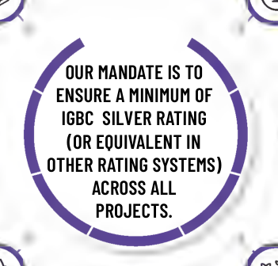

**[Image: AnnualReport2024.pdf-0063-09.png (351x336, 46.7KB)]**

<!-- Start of picture text -->
OUR MANDATE IS TO ENSURE A MINIMUM OF IGBC  SILVER RATING (OR EQUIVALENT IN OTHER RATING SYSTEMS) ACROSS ALL PROJECTS. <!-- End of picture text -->

###### **OUR GREEN PROJECT COMMITMENT** 

GREEN HOMES 

* The following projects are excluded from the portfolio boundary since they have been initiated/developed before our commitment towards delivering green buildings: Godrej 17 (Bengaluru), Godrej Woodsman Estate (Bengaluru), Godrej Alpine (Mangalore), Godrej Sherwood (Pune), Godrej Bayview (Mumbai), Godrej Edenwoods (Mumbai), Godrej Glenelg (Mumbai), Godrej Hill (Mumbai), Godrej Pine (Mumbai), Godrej Riverside (Mumbai), Godrej Sky Garden (Mumbai), Godrej Waldorf (Mumbai), and Planet Godrej (Mumbai). Godrej Palm Grove (Bengaluru), Godrej Gold County (Bengaluru), Godrej Azure (Chennai) are no longer under our operational control. Further, all plotted development projects are excluded as no suitable green building certification is available for such developments. 

###### **10.86 million ft****2** 

GREEN RESIDENTIAL SOCIETIES 

###### **FY 2023-24 HIGHLIGHTS** 

IGBC GREEN HOMES CERTIFICATION 

Project at Carmichael Road - Platinum Rating Godrej Zenith - Gold Rating Godrej Tropical Isle - Gold Rating Godrej Sky Terraces - Gold Rating Godrej Reserve - Gold Rating Godrej Aristocrat - Silver Rating 

###### IGBC GREEN RESIDENTIAL SOCIETIES 

Godrej Air and Air next - Gold Rating Godrej Eternity - Silver Rating 

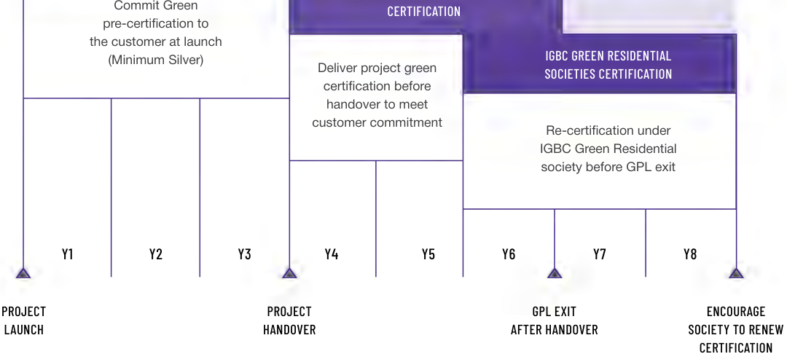

**[Image: AnnualReport2024.pdf-0063-20.png (1080x486, 135.5KB)]**

<!-- Start of picture text -->
Commit Green CERTIFICATION pre-certification to the customer at launch (Minimum Silver) IGBC GREEN RESIDENTIAL Deliver project green  SOCIETIES CERTIFICATION certification before handover to meet customer commitment Re-certification under IGBC Green Residential society before GPL exit Y1 Y2 Y3 Y4 Y5 Y6 Y7 Y8 PROJECT   PROJECT   GPL EXIT   ENCOURAGE LAUNCH HANDOVER AFTER HANDOVER SOCIETY TO RENEW CERTIFICATION <!-- End of picture text -->

Godrej Properties Limited 

Integrated Report FY 2023-24 

116 

117 

About Godrej Integrating Sustainability Management Discussion Statutory Properties Limited with our Business and Analysis Reports 

###### **QUANTIFYING OUR GREEN BUILDING IMPACT** 

###### **REDUCING DEPENDENCY ON OFFSETTING OUR ENERGY WE ENSURE RESPONSIBLE FRESH WATER SOURCES CONSUMPTION FROM THE GRID PROCUREMENT AND WITH ONSITE RENEWABLE EFFICIENT USE ENERGY GENERATION** 

###### **96.30 %** 

###### **17.10 %** 

###### **16 LAKH KWH/YEAR** 

of meeting flushing requirement catered through on-site treated water 

average percentage of total material 

renewable energy component contributes to our energy savings 

cost invested in recycled content. 

**68 %** offset the common area lighting load 

###### **400 KM** 

**42 %** 

ensured procuring materials manufactured within this specific distance from our project sites. 

of water reused on site 

###### **74.30 %** 

**90.10 tCO e 2** estimated total avoided emissions for FY 2023-24 

**50 %** 

of landscaping requirement catered through on-site treated water 

Average percentage of total material cost 

We conducted a study to measure how green building affects crucial resident livability metrics such as daylighting, water, and waste management. This study analyzed 43,242 green homes being developed up to FY 2020-21, outlining the concrete advantages of green homes for our customers. We will repeat this study every 3 years to consistently track the impact. The next study will be conducted in FY 2025. 

###### **WE PROMOTE HEALTH AND WE ENABLE RESPONSIBLE WELL-BEING WASTE MANAGEMENT** 

###### **OUR CONTRIBUTION TO REDUCING GLOBAL WARMING INCLUDES 70.60 MILLION KWH/YEAR** 

###### **100 %** 

###### **MT/YEAR 26,051** 

by handling dry waste (recyclable) generated on-site 

by optimizing the percentage of homes for fresh air ventilation 

energy savings compared to baseline as per IGBC simulation measures 

###### **77.60 %** 

**22 %** 

###### **MT/YEAR 16,277** 

treat organic waste on-site (99.1%) 

of projects across our GPL portfolio that have adopted on-site renewable energy generation 

percent of homes optimized for enhanced fresh air ventilation 

###### **68,000** 

**90.60 %** optimizing average regularly occupied spaces for daylighting 

**MT 4,500** 

annual electricity requirement of houses 

compost generated 

Godrej Properties Limited 

Integrated Report FY 2023-24 

118 

119 

About Godrej Integrating Sustainability Properties Limited with our Business 

Management Discussion Statutory and Analysis Reports 

###### **SUSTAINABLE LIFESTYLES THROUGH GREEN BUILDINGS** 

- We integrate sustainable design and renewable energy to minimize environmental impact. 

- We prioritize eco-conscious infrastructure, including rainwater harvesting and waste management. 

- We foster community engagement through shared green spaces and collaborative initiatives. 

- We emphasize green building certifications to enhance our developments' desirability. 

   - We maintain clear evacuation plans and conduct regular training for tenants and visitors. 

   - We offer educational projects to the local community, such as traineeships. 

   - We provide space for community projects. 

- We promote sustainable transportation with pedestrian-friendly layouts to reduce fossil fuel reliance. 

- We align our projects with government policies for sustainable urban development. 

- We ensure buildings are within a 10-minute walk of transportation hubs. 

Acknowledging the significant opportunity for resource conservation within multi-dwelling residential complexes, the Indian Green Building Council (IGBC) introduced the IGBC Green Residential Societies Rating System. This initiative is designed to offer guidance to residential communities in monitoring and reducing their usage of natural resources. Through this program, residents can access a range of both tangible and intangible benefits. 

###### **KEY BENEFITS DESCRIBED BY IGBC** 

- Water conservation ranging from 30-50% and energy savings of 20-30%. 

- Implementation of effective waste management systems. 

- Optimal daylighting for excellent illumination.15-20% cut of power costs 

- Reduction of power costs by 15-20%. 

- Provision of health and lifestyle benefits for homebuyers. 

By expanding our green building mandate to encompass the usage phase, we offer customers tangible benefits derived from our initiatives. We’re actively integrating a comprehensive facility management strategy into the Green Residential Societies certification process, aiming for a more holistic approach to sustainable living. 

**[Image: AnnualReport2024.pdf-0065-21.png (349x13, 8.6KB)]**

<!-- Start of picture text -->
RERA No : PRM/KA/RERA/1250/303/PR/200515/003411 <!-- End of picture text -->

- We implement energy efficiency schemes to lower energy bills for low-income residents. 

- We adopt low-maintenance design practices and offer affordable pricing for first-time buyers. 

**While we promptly encourage our customers to save energy and reduce waste, our Headquarters, Godrej One has also achieved Net Zero Energy and Net Zero Waste to Landfill.** 

The Trees, Residences 1&2 Platinum rating Godrej Origins, at The Trees Platinum rating Godrej Prakriti Gold Rating Godrej Platinum Silver Rating Godrej Prana Gold Rating Godrej Prime Gold Rating Godrej Aria Platinum Rating Godrej Oasis Platinum Rating Godrej Eternity Silver Rating Godrej Air and Air Next Silver Rating Godrej Avenues Silver Rating Godrej Icon Silver Rating Godrej 101 Silver Rating 

**[Image: AnnualReport2024.pdf-0065-26.png (82x18, 2.4KB)]**

<!-- Start of picture text -->
Godrej One <!-- End of picture text -->

Godrej Properties Limited 

Integrated Report FY 2023-24 

120 GRI 3-3, 413-1 

121 

About Godrej Integrating Sustainability Properties Limited with our Business 

Management Discussion Statutory and Analysis Reports 

###### **TECH-DRIVEN GREEN INNOVATION FOR TOMORROW** 

###### **EMBRACING GREEN ENERGY SOURCES** 

We have introduced a conventional source of electricity to power GPL's offices and project sites in the West-East Zone, leveraging onsite renewable energy options like Solar PV and Wind farms. This initiative, coupled with collaborations for green energy supply, aims to slash fossil fuel consumption, minimize carbon emissions, and contribute significantly to environmental conservation. 

###### **ENHANCING SECURITY WITH WIRELESS CCTV** 

Adoption of Wireless CCTV systems has not only bolstered security but also reduced environmental impact by eliminating cables. This has led to lower installation and maintenance costs, clearer images over time, quicker repairs, and a notable reduction in carbon footprints. The wireless setup offers a sustainable, long-term solution lasting up to 10 years. 

In recent years, the real estate sector has witnessed a remarkable shift towards sustainability and environmental responsibility, catalyzed by technological advancements. These innovations not only reduce carbon footprints but also enhance energy efficiency and foster healthier living environments. At GPL, we are spearheading this transformation with our tech-driven green solutions that revolutionize how we design, manage, and conceptualize real estate assets. 

###### **ADVANCED WASTEWATER MANAGEMENT** 

In Godrej City, we have embraced cutting-edge wastewater treatment technology, specifically the Upflow Anaerobic Sludge Blanket (UASB) with trickling filter Sewage Treatment Plant (STP) system. This innovative system offers exceptional efficiency, with up to 95% effectiveness, and features such as low construction costs and a long service life. By implementing this system, we have reduced energy consumption by 20%, operational costs by 35%, and significantly cut noise and air pollution. This move has resulted in substantial savings of ₹3.45 crore over 18 months, along with a notable reduction in irrigation water usage. 

###### **HARNESSING SMART TECHNOLOGY** 

The installation of Smart Water Meters and solar panels has been pivotal in our sustainability efforts. At Phase-1 of our development, Solar Power Systems have generated 221,543 kWh of clean energy, translating to savings of ₹42 Lakh on electricity costs. These systems are projected to curtail CO2 emissions by 192 to 261 tCO2 per location by 2025, contributing to ₹46.3 Lakh in net savings over two years, inclusive of tax benefits. 

###### **SHIFTING TOWARDS RENEWABLE ENERGY** 

Our Solar Power Systems deployed across various sites have significantly reduced our reliance on conventional energy sources, resulting in substantial savings on electricity costs. For instance, one of our developments has generated 221,543 kWh of clean energy, with plans to exceed 1 million kWh within five years. This transition is expected to lower CO2 emissions and save ₹46.3 Lakh over two years. 

Godrej Properties Limited 

Integrated Report FY 2023-24 

122 

123 

About Godrej Integrating Sustainability Management Discussion Statutory Properties Limited with our Business and Analysis Reports 

###### **TRACKING OUR SUSTAINABILITY PERFORMANCE** 

Our custom-developed ESG dashboard, GREEN DASH, uses AI-based rules to provide transparency, actionable insights, and benchmarking for key ESG parameters. The application: 

- Enables data collection. 

**[Image: AnnualReport2024.pdf-0067-04.png (180x19, 2.3KB)]**

<!-- Start of picture text -->
ESG DATA UNIVERSE <!-- End of picture text -->

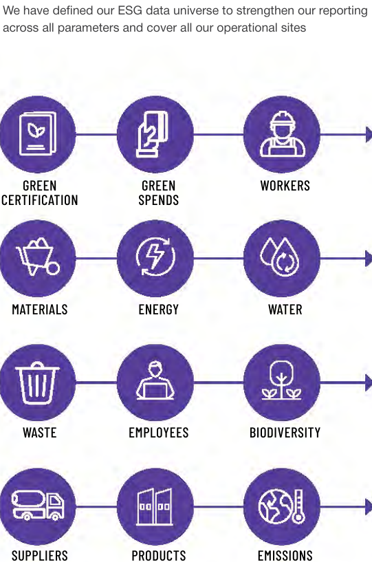

**[Image: AnnualReport2024.pdf-0067-05.png (541x817, 457.7KB)]**

<!-- Start of picture text -->
We have defined our ESG data universe to strengthen our reporting across all parameters and cover all our operational sites GREEN  GREEN WORKERS CERTIFICATION SPENDS MATERIALS ENERGY WATER WASTE EMPLOYEES BIODIVERSITY SUPPLIERS PRODUCTS EMISSIONS <!-- End of picture text -->

- Supports geo-tagging through the system. 

- Facilitates real-time reporting on sites by our data providers. 

- Utilizes intelligent technology to manage employee access based on relevance. 

- Provides transparent and timely data to our assurance providers and insights to our ESG committee for future development. 

**250,000+** DATA POINTS COVERED ANNUALLY 

**370+** EMPLOYEES CONNECTED 

**30+** 

DATA COLLECTION PARAMETERS 

Godrej Properties Limited 

Integrated Report FY 2023-24 

124 

125 

About Godrej Integrating Sustainability Management Discussion Statutory Properties Limited with our Business and Analysis Reports 

###### **ENHANCING OUR ENVIRONMENTAL MANAGEMENT COMMITMENT** 

Our Environmental Management System (EMS) integrates ESG goals across our business value chain. All our GPL sites hold ISO 14001:2015 certification, an international standard for enhancing environmental performance. 

We have integrated our EMS with compliance and risk management systems to ensure a comprehensive ESG strategy, enhancing our ability to identify and address risks and environmental impacts through policy integration, employee training, and specialized performance tracking. 

###### **TRAININGS CONDUCTED:** 

- We conducted EMS Rollout Module Training for 47 environmental managers across project sites. 

In the upcoming financial year, we will continue certifying current and future sites through surveillance audits. We comply with Indian environmental regulations via Environmental Policies and Procedures. 

- We trained 37 environmental managers as EMS internal auditors for ISO 14001:2015 in FY 2023-24. 

- We provided 2-day training on applicable environmental laws in the real estate and construction sector. 

Our goal, per our Environmental Management Policy, is to certify all buildings under recognized green rating systems like IGBC, LEED, and GRIHA, mandating a minimum IGBC Silver rating (or equivalent) for ongoing and upcoming projects. 

- We conducted training for the preparation of Aspect-Impact register, EMS documentation, and monitoring for environmental managers. 

###### **THE KEY OUTPUTS RESULTING FROM THESE EFFORTS INCLUDE:** 

During project planning, we conduct technical due diligence and initial environmental audits, establish baseline performance, and provide training to facility managers and residents. We also perform environmental due diligence for land acquisitions. We promote waste segregation, provide waste bins, and install Organic Waste Converters for organic waste management. 

- GPL EMS Manual – 01 

- GPL SOPs (Procedures) – 14 

- EMS Work Instructions – 01 

- EMS Management Plans & Records – 01 

###### **AUDIT AND MANAGEMENT REVIEW** 

- 2 internal audits across every site. 

- 1 external audit across sample sites. 

- Quarterly management review meetings incorporated into GPL’s Environmental Management System at below levels: 

   - Management Review at GPL Level : (Level I) 

   - Management Review at GPL Regional Level : (Level II) 

   - Management Review at GPL Project Level : (Level III) 

|Documentation|23|
|---|---|
|Physical Verifcation|5|
|Compliance, Consents, Licenses|7|
|Waste Management & Drainage|23|
|Awareness and Training|1|
|Chemical Stores|2|
|Dust Collection|1|
|First Aid Centre|4|
|Housekeeping|4|
|Labour Camp|1|
|Test Records & Monitoring|4|
|Interviews & Incident Investigation Reports|5|
|**Total Number of checklist points**|**80**|

###### **We are ISO 14001:2015 certified across all our operations.** 

Our commitment includes effective waste management in design, construction, and post-handover facilities management, aiming for zero waste to landfill. We review and update our Policy annually, with changes approved by the ESG Committee. 

**[Image: AnnualReport2024.pdf-0068-27.png (346x20, 18.2KB)]**

<!-- Start of picture text -->
Environment Management System training at site <!-- End of picture text -->

**[Image: AnnualReport2024.pdf-0068-28.png (845x19, 40.5KB)]**

<!-- Start of picture text -->
Environment Management System Inspection at site Waste Management Training at Site <!-- End of picture text -->

Godrej Properties Limited 

Integrated Report FY 2023-24 

126 

127 

About Godrej Integrating Sustainability Properties Limited with our Business 

Management Discussion Statutory and Analysis Reports 

###### **PROCUREMENT AND EXECUTION** 

**156** 

` LAKHS SPENT 

We allocate expenditures for material procurement and onsite work execution based on a detailed assessment of re-use, recycling, and optimal resource management practices. 

###### **GREEN SITES** 

**756** 

` LAKHS SPENT 

**179** 

` LAKHS SPENT 

**09** 

` LAKHS SPENT 

**34** 

` LAKHS SPENT 

We invested funds in sitespecific environmental initiatives. These include air monitoring, dust suppression, using curing compounds to reduce water consumption, rainwater harvesting, and adopting renewable energy sources. 

###### **CONSULTANT AND CERTIFICATION FEE** 

All our buildings are green certified from credible and recognized rating agencies. 

###### **WASTE MANAGEMENT** 

We allocate funds for site cleaning and efficiently removing waste materials. 

###### **LABOUR CAMP** 

We invest in labour camps to ensure the well-being of our workers and safeguard the interests of the local population in the area. 

Integrated Report FY 2023-24 

129 

About Godrej Integrating Sustainability Management Discussion Statutory Properties Limited with our Business and Analysis Reports 

# **PROPELLING PEOPLE AND PARTNERSHIPS** 

###### **FOR VIBRANT COMMUNITIES** 

###### **MATERIAL THEMES** 

- Social Responsibility 

- Stakeholder Engagement 

- Supply Chain and Product Quality 

###### **RISKS IDENTIFIED** 

- Talent 

- Occupational, Health and Safety, and Wellbeing 

- Human Rights 

- Managing Contracts 

- Labour and other Compliance 

###### **SDGS** 

**HUMAN CAPITAL + SOCIAL AND RELATIONSHIP CAPITAL** 

**[Image: AnnualReport2024.pdf-0070-15.png (228x16, 4.8KB)]**

<!-- Start of picture text -->
Convocation BLP Batch of 2022 <!-- End of picture text -->

About Godrej Integrating Sustainability Properties Limited with our Business 

Management Discussion Statutory and Analysis Reports 

###### **COMPLIANCE MANAGEMENT SYSTEM** 

###### **FOSTERING ETHICAL EXCELLENCE** 

To ensure effective operations and mitigate future risks, we must integrate ethical behaviour throughout our entire organization. This enhances our reputation, attracts, and retains customers, fosters employee loyalty, and addresses investor concerns. At GPL, we prioritize ethics and values at every level of our business practices. We take pride in our robust governance and efficient risk management. Our philosophy envisions building relationships based on trust with both internal and external stakeholders, where integrity remains at the core of our actions. 

We reinforce our commitment to accountability and transparency through a comprehensive set of policies that guide ethical conduct in all aspects of our business. These policies serve as benchmarks for upholding high moral standards. Our employees and directors embody these policies through their sound actions that lead to positive social, economic, and environmental outcomes. The Board of Directors and Senior Management oversee all business ethics policies and regularly review them to ensure alignment with widely accepted industry standards. 

**Zero Tolerance policy against discrimination, corruption, and bribery** 

**CASES OF** • Corruption • Non-monetary sanction • Non-compliance with social and economic laws • through dispute resolution 0 mechanism 

• Non-compliance with social and economic laws 

- through dispute 

In this financial year, GPDL, promoter of Godrej Horizon Project, has been impleaded in a NGT Matter on the allegation that the RG Plantation is proposed on the 7th floor whereas the factual aspect is to the contrary wherein compulsory RG is provided on mother earth and additional plantation is on the 7th floor podium. The matter is yet to be heard and pending for consideration before the NGT, West Zone. 

At GPL, we recognize the critical importance of legal and regulatory compliance in our operations. To achieve this we are utilizing an advanced IT-enabled legal support service, called Legatrix which provides our management with a centralized dashboard that offers a comprehensive view of our compliance status. Our centralized compliance dashboard provides timely deadline reminders, tracks post-filing compliance documents, maps regulatory requirements, and securely records uploaded documents. We remain committed to social and economic compliance and have not received any reports of Non-compliance with laws concerning social and economic parameters. Our Compliance System is Audited by our Assurance Partner 

Significant fines and non-monetary sanctions for noncompliance with environmental laws in FY 2023-24. 

- ` lakh 

- • Monetary fines - 81.9 

- Non-monetary - 0 

The Environmental Clearance (EC) for Godrej Reflections Project was cancelled by National Green Tribunal (NGT) in February 2020 on account of the alleged non-compliance of the buffer norms of Kaikondrahalli Lake in Bengaluru. The Hon’ble Supreme Court has stayed the NGT Order, and the matter is pending for hearing. 

- Cases brought through dispute resolution mechanisms - 0 

###### **ANTI-CORRUPTION COMPLIANCE PROGRAM** 

Corruption, including bribery in all forms, poses a significant risk with potential detrimental consequences. To address this risk, GPL has established an Anti-Corruption Compliance Program. This program acts as a robust framework to prevent, detect, and address compliance-related issues. It is integral to our efforts against financial crimes. 

KEY ASPECTS OF THE PROGRAM INCLUDE 

• **Honesty Employee and Fairness Training** 

**[Image: AnnualReport2024.pdf-0071-21.png (128x43, 3.2KB)]**

<!-- Start of picture text -->
Prevention and Detection <!-- End of picture text -->

**Legal Compliance** 

The Anti-Corruption We ensure our Our commitment to GPL provides Compliance Program compliance processes honesty and fairness comprehensive antiproactively prevents align with local laws is central, promoting corruption training corrupt practices and regulations, ethical conduct and during employee through regular emphasizing nontransparency in all orientation, ensuring assessments, audits, negotiable adherence to business transactions. understanding of and risk evaluations to legal standards. responsibilities and contributing to a identify vulnerabilities. corruption-free environment. 

**No employees were dismissed or disciplined in FY 2023-24 for corruption because we had 0 incidents reported.** 

Godrej Properties Limited 

Integrated Report FY 2023-24 

132 GRI 2-16, 2-23, 2-26, 2-27, 3-3, 205-1, 205-2, 205-3 

133 

About Godrej Properties Limited 

Integrating Sustainability with our Business 

Management Discussion Statutory and Analysis Reports 

###### **CODE OF CONDUCT: GUIDING OUR ACTIONS** 

At GPL, we understand that ethical conduct is fundamental to our organization's success. Our Code of Conduct (CoC) acts as a guide, directing every employee, board member, and senior leader toward principled behaviour. 

###### **VIOLATION OF CODE OF CONDUCT (COC)** 

All employees, regardless of their employment status (full-time, part-time, or daily wage), including those in permanent, temporary, ad hoc, consultant, probationary, trainee, or intern roles, bear the responsibility of promptly reporting any breach they become aware of whether directly or indirectly to their manager, Business Head, HR department, or designated whistleblowing officer. 

- Upon discovery, any individual found to have violated the Code of Conduct (COC) or engaged in fraudulent activities will be immediately terminated from our organization. 

- In such instances, we will file a First Information Report (FIR) at the local police station and take necessary steps to recover the fraudulent amount. 

- Within GPL, we will communicate the names of the individuals involved through official channels, informing all employees of their termination due to fraudulent activities. 

Furthermore, we will publicly disclose the name(s) of the individual(s) in local newspapers to notify external stakeholders of our disassociation with them. Details will be shared as deemed necessary. 

###### **KEY ELEMENTS OF OUR CODE OF CONDUCT** 

###### **Clarity in Expectations** 

- The CoC sets clear behaviour expectations, serving as more than a document but a roadmap for our conduct. 

- We also follow zero-tolerance approach towards breaches, such as discrimintation, bribery and corruption. 

- It ensures consistency in our actions across all interactions with colleagues, customers, vendors, and investors. 

###### **Aspirational Principles** 

- Our CoC embodies aspirational principles beyond mere compliance, emphasizing doing what's right even in the absence of oversight. 

- We uphold high standards, recognizing integrity as non-negotiable. 

###### **Accessibility and Transparency** 

- The CoC is accessible to all stakeholders, including customers, vendors, and investors, prominently featured on our website. 

- We prioritize transparency, evident in our CoC's accessibility and presentation. 

###### **Connection to Employee Compensation** 

- Adherence to the CoC is not optional; it directly links to employee compensation. 

- Upholding ethical standards influences how we reward our team members. 

###### **Disciplinary Actions** 

- In instances of breaches or violations, we swiftly respond with measures such as warnings, and dismissals. 

- Accountability is key to safeguarding our values. 

###### **Information Security and Cybersecurity** 

###### **WHISTLEBLOWER MECHANISM** 

The whistleblowing mechanism provides a platform where instances of code violations, discrimination, harassment, or safety concerns can be reported anonymously. During the quarterly meetings of the Audit Committee, the Board of Directors is informed about every complaint. 

- Our commitment to ethical behaviour extends to integrating information security and cybersecurity into employee evaluations. 

- Protecting our data and systems is part of our ethical responsibility. 

###### **Performance Integration** 

- CoC compliance isn't separate from performance but integral to it. 

- Our employees understand that ethical conduct contributes significantly to our overall success. 

Integrated Report FY 2023-24 

135 

About Godrej Integrating Sustainability Management Discussion Statutory Properties Limited with our Business and Analysis Reports 

###### **EMPOWERING OUR WORKFORCE** 

Our employees play a pivotal role in propelling our organization forward. Their expertise, unwavering commitment, and well-being significantly impact our operational and financial achievements. We remain steadfast in creating a secure and nurturing work environment, irrespective of geographical location. Our robust framework, including our Code of Conduct, core values, and comprehensive policies, ensures the protection and promotion of human rights across all levels 

of our operations. We actively foster an inclusive culture, encouraging employees to express their concerns through our accessible channels, including an open-door policy and a dedicated whistle-blower policy. 

Our people-centric approach extends to fair compensation, rewards, career growth, continuous learning opportunities, and flexible work arrangements. Notably, any substantial operational changes undergo rigorous board discussions, with employees receiving 15 days' advance notice. 

###### **EMPLOYEE BASE GROWTH** 

**48.4%** GROWTH IN EMPLOYEE BASE IN THE LAST 3 YEARS. 

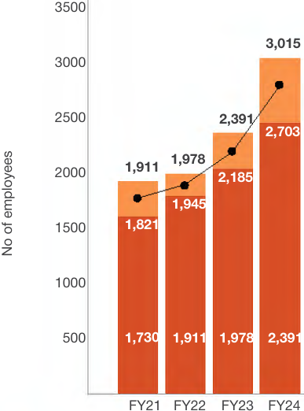

**[Image: AnnualReport2024.pdf-0073-07.png (387x522, 90.6KB)]**

<!-- Start of picture text -->
3500 3,015 3000 2500 2,391 2,703 2000 1,911 1,978 2,185 1,945 1500 1,821 1000 500 2,391 FY21 FY22 FY23 FY24 1,730  1,911 1,978 No of employees <!-- End of picture text -->

###### **PERMANENT EMPLOYEE WORKFORCE BY AGE AND MANAGEMENT LEVEL** 

We offer equal employment opportunities to all individuals, irrespective of their gender, sexual orientation, cultural, ethnic, or racial background. 

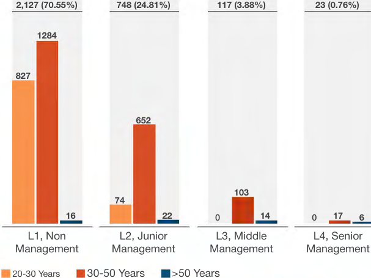

**[Image: AnnualReport2024.pdf-0073-10.png (607x455, 112.9KB)]**

<!-- Start of picture text -->
2,127 (70.55%) 748 (24.81%) 117 (3.88%) 23 (0.76%) 1284 827 652 103 74 16 ■ - 22 0 •- 14 0 - 17 - 6 L1, Non   L2, Junior   L3, Middle   L4, Senior Management Management Management Management ■  20-30 Years       30-50 Years ■     >50 Years ■ <!-- End of picture text -->

###### **PERMANENT EMPLOYEE WORKFORCE BY LOCATION** 

■ Head Office : **231 |   7.7%** ■ Regional Office : **695 | 23.1%** ■ Site Office : **2089 | 69.2%** 

Our operating model embraces decentralization, empowering decision-making at the grassroots level. Each site operates with selfsufficient, cross-functional teams. 

###### **3,015** 

TOTAL NUMBER OF PERMANENT EMPLOYEES 

Currently, 69.2% of our permanent employees are based at site. 

###### **80/100** 

###### EMPLOYEE ENGAGEMENT SCORE 

We introduced Amber a Smart HR assistant which interacts with employees on various touchpoints, to continuously hear feedback from them and same is utilised by our HR team to resolve issues faced by employees in day to day working. 

■ Starting HC    Ending HC ■ Average HC HC: Headcount Our workforce contains 100% of representation of Indian nationality. 

Godrej Properties Limited 

Integrated Report FY 2023-24 

136 GRI 3-3, 401-1, 405-1 

137 

About Godrej Integrating Sustainability Management Discussion Statutory Properties Limited with our Business and Analysis Reports 

###### **PERMANENT EMPLOYEE WORKFORCE BY DIVERSITY** 

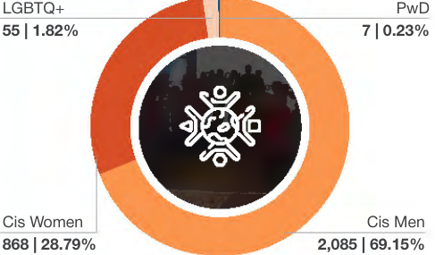

**[Image: AnnualReport2024.pdf-0074-02.png (487x285, 133.6KB)]**

<!-- Start of picture text -->
LGBTQ+  PwD 55 | 1.82% 7 | 0.23% Cis Women  Cis Men 868 | 28.79% 2,085 | 69.15% <!-- End of picture text -->

###### **PERMANENT EMPLOYEE WORKFORCE BY SEX** 

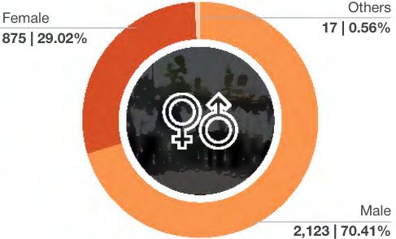

**[Image: AnnualReport2024.pdf-0074-04.png (487x294, 143.0KB)]**

<!-- Start of picture text -->
Others Female 17 | 0.56% 875 | 29.02% Male 2,123 | 70.41% <!-- End of picture text -->

###### **PERMANENT EMPLOYEE WORKFORCE BY ZONE** 

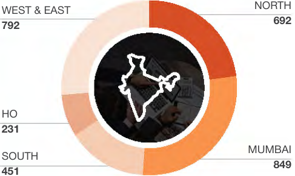

**[Image: AnnualReport2024.pdf-0074-06.png (487x292, 149.5KB)]**

<!-- Start of picture text -->
NORTH WEST & EAST 692 792 HO 231 MUMBAI SOUTH 849 451 <!-- End of picture text -->

###### **PERMANENT EMPLOYEE NEW HIRE & TURNOVER BY GENDER AND AGE** 

|Male 850 ||40% 473 ||25%|20-30 years 559 ||62% 182|| 24%|
|---|---|---|---|---|---|
|Female 415 ||47% 190 ||25%|30-50 years 705 ||34% 471|| 29%|
|Others 10 ||59% 1|| 8%|>50 years 11 ||19% 11|| 20%|

###### **PERMANENT EMPLOYEE NEW HIRE & TURNOVER BY MANAGEMENT LEVEL** 

|L1-Level 1 (Of to AM)|1,023 | 48%|473 | 25%|
|---|---|---|
|L2-LEVEL 2 (MGR TO DGM)|234 | 31%|166| 24%|
|L3-LEVEL 3 (GM & AVP)|15 | 67%|22 | 19.64%|
|L4-LEVEL 4 (GLF)|3 | 13%|3 | 13%|
|**Grand Total**|**1,275 | 42%**|**664 | 25%**|

###### **PERMANENT EMPLOYEE NEW HIRE & TURNOVER BY ZONE** 

As per policy, We give our employees at least 2 months notice for L1 and 3 months notice for L2, L3, and L4 before implementing significant operational changes that may affect them. 

|North Zone|322 ||47%|141 | 24%|
|---|---|---|---|
|Mumbai Zone|381 ||44%|180 | 24%|
|South Zone|192 ||43%|109 | 27%|
|West & East Zone|316 ||40%|179 | 25%|
|HO|64 ||28%|55 | 24%|
|**Grand Total**|**1,275 |**|**42%**|**664 | 25%**|

###### **HUMAN CAPITAL RETURN ON INVESTMENT (HCROI)** 

GPL's focus on Human Capital Return on Investment (HCROI) showcases our dedication to maximizing the value and influence of our workforce. Through HCROI, we actively seek to enhance the efficiency, productivity, and overall performance of our human resources, aligning our efforts with strategic business objectives. 

|Total Revenue|1,333.09|2,585.69|3,039|4,334.22|
|---|---|---|---|---|
|Total Operating Expenses|789.72|1,581.47|1,786.22|2,833.98|
|Total employee-related|299.56|110.25|218.41|331.32|
|expenses (salaries + |||||
|benefts)|||||
|**HCROI**|**2.81**|**10.11**|**6.74**|**5.53**|

Godrej Properties Limited 

Integrated Report FY 2023-24 

138 GRI 3-3, 401-1, 405-1 

139 

About Godrej Integrating Sustainability Management Discussion Statutory Properties Limited with our Business and Analysis Reports 

###### **BUILDING TALENT FOR THE SECTOR** 

At Godrej, our unwavering focus lies in cultivating the next generation of leaders. We make early assessments based on performance and potential, and not just seniority and tenure. 

Out of 7 Management 

Committee positions of the Zonal opened in the Executive Committee last 2 years were is internally filled internally **68%** groomed talent 

of the Management Committee is internally **79%** groomed talent 

**06** 

We continue to invest in fresh talent from campus for the perspective and potential they bring in, at the graduate and postgraduate level. 

functions. We have increased our intake from 15 to 30 at L2 level across Business Development, Strategy, Sales & Marketing, HR, and General Management. 

   - L1 hiring campuses include IITs, NITs, Lady Shri Ram College Delhi, St Xavier’s Kolkata et al. 

- Structured Campus Programs at L1 and L2 to build talent for the sector. 

   - L2 hiring campuses include ISB, XLRI, IIM Indore,  IIM Lucknow, MDI, IIFT, SIBM, SCMHRD et al. 

- With a target to build campus as a strong pipeline of talent, we have increased our intake from 46 to 200 at L1 across Sales, Customer Centricity, Operations, Finance and Legal 

###### **DEVELOPMENT CENTRES** 

We prioritize employee development through our specialized Development Centres. Over 42 GPL employees have participated in these programs, receiving high-quality, actionable feedback. These centres play a crucial role in supporting employees as they transition across levels, gaining deeper insights into their capabilities and preparing them for next-level roles. Specifically: 

###### **MANAGEMENT DEVELOPMENT CENTRE (MDC)** 

**05 07 07 02 00 21** 

21 high-calibre Assistant Managers (Non-Management) underwent MDC, our centre designed for the transition from Level 1 to Level 2. 

###### **ZONES** 

###### **LEADERSHIP DEVELOPMENT CENTRE (LDC)** 

21 high-calibre Deputy General **05 01 05 04 06 21** Managers participated in LDC (Junior Management); our centre focused on the transition from Level 2 to Level 3. 

###### **LEADERSHIP PROGRAMS** 

###### **BUSINESS LEADERSHIP PROGRAM (BLP)** 

Our initiative aims to attract and nurture prospective Profit & Loss (P&L) and Functional leaders. This 1-year Management Trainee (MT) program serves the following key objectives: 

Exposure Performance Across Verticals Evaluation Participants gain GPL evaluates MTs’ exposure across diverse performance and verticals, broadening potential across various their understanding of functions, ensuring a our organization. comprehensive assessment. 

Future Leadership Pipeline BLP actively cultivates a pipeline of future leaders, drawing in top-quality talent to contribute to GPL’s growth. 

###### **ZONAL EXECUTIVE COMMITTEE AND MANAGEMENT COMMITTEE EFFECTIVENESS PROGRAM** 

At GPL, our management team undergoes an integrated leadership journey, designed to foster growth. This journey includes tailored diagnostics, focused development inputs, and executive coaching programs. 

###### **TALENT WAR ROOM** 

At Godrej Properties, our goal is to take an ‘internal-first’ talent acquisition approach, wherein we give first right of applying to open positions to internal talent in the organization. The ‘internal-first’ TA approach not only helps in backfilling vacant positions, but also promotes career development within the organization and results in greater employee satisfaction and engagement. 

We promote internal talent movements and identify “ready-now” talent who are able to take up next-level roles. Talent War Room was organized in all zones and 266 incumbents have been identified with readiness of zero to 24+ months. As we go along, our intent must be to place these candidates into suitable roles as per readiness and other profile details identified during Talent War Room. 

Godrej Properties Limited 

Integrated Report FY 2023-24 

140 GRI 404-1, 404-2, 404-3 

141 

About Godrej Integrating Sustainability Management Discussion Statutory Properties Limited with our Business and Analysis Reports 

###### **At our organization, we've meticulously crafted a robust learning and development strategy. This strategy serves as our guiding compass, ensuring that we effectively nurture and support our employees throughout their journey.** 

###### **TOTAL HOURS OF EMPLOYEE TRAINING** 

**28,842 9.57 17,300 11,262 280** Hours of Average Training Hours (Men) Hours (Women) Hours (Others) Employee Training Hours per Employee 

###### **EMPLOYEE TRAINING HOURS BY GENDER AND MANAGEMENT LEVEL** 

|L1-Level 1 (Of to AM)|8,040 (11.69)|8,572 (6.21)|268 (4.54)|16,880 (7.94)|
|---|---|---|---|---|
|L2-LEVEL 2 (MGR TO DGM)|2,672 (16.49)|5,916 (10.11)|12 (12.00)|8,600 (27.07)|
|L3-LEVEL 3 (GM & AVP)|524 (32.75)|2,644 (26.71)|0 (0.00)|3,168 (8.43)|
|L4-LEVEL 4 (GLF)|26 (13.00)|168 (8.00)|0 (0.00)|194 (8.43)|
|**Grand Total**|**11,262 (12.97)**|**17,300 (8.29)**|**280 (4.51)**|**28,842 (9.57)**|

Note - Average training hours for each category are mentioned in brackets. 

###### **TRANSFORMING TALENT: GPL ALCHEMY** 

At GPL, we actively administer a range of programs aimed at enhancing employee skills across various levels, encompassing both functional and leadership domains. 

Through our in-house learning academy, GPL Alchemy, we provide functional training in Business Development, Design Strategy, General Management, Sales & Marketing, and Customer Centricity. In the upcoming year, we are expanding Alchemy to include Operations, Quality, and Sustainability. 

Additionally, we offer comprehensive leadership programs aligned with our "Building from Within" talent strategy. These programs focus on Leadership Coaching, Leading Teams for Impact, Leading Self, Zonal Leadership Effectiveness, and Early Manager Leadership. In the next fiscal year (FY2025), we plan to broaden our leadership initiatives to encompass managerial effectiveness and introduce a top 25 leaders’ program, among other offerings. 

**[Image: AnnualReport2024.pdf-0076-11.png (97x18, 2.5KB)]**

<!-- Start of picture text -->
GPL Alchemy <!-- End of picture text -->

Since its launch, GPL Alchemy has successfully engaged around 1400 employees within nine months, achieving an impressive cumulative Net Promoter Score (NPS) of 60+. 

Through Alchemy, we deliver a diverse array of learning programs: 

- Profitability Track: Modules covering Financial Acumen, RE Finance, strategic decision-making, benefiting 75 P&L and related functions. 

- Design Track: Includes Product Frameworks standardization and masterclasses with industry-leading faculty. 

- Sales Academy: Focused on enhancing Sales Essentials capabilities. 

- Business Development Track: Collaborating with Simon Horton on Deal Negotiation Mastery. 

- Customer Centricity Track: Launched with essential modules focused on customer-centric approaches. 

###### **LEADING TEAMS FOR IMPACT (LTFI)** 

We recognize that the role of a people manager is pivotal in shaping a high-trust, high-performance culture. An employee's perception of the organization is profoundly influenced by their manager. Consequently, we place substantial emphasis on nurturing and advancing our people managers. In the current year, 34 people managers embarked on a purposeful learning journey, supported by a meticulously designed pre- and post-intervention roadmap. This holistic approach equips them to excel as effective leaders, driving impact across the organization. 

We have crafted a robust learning and development strategy 

which serves as our guiding compass, ensuring that we effectively nurture and support our employees throughout their journey. 

###### **MY LEARNING SPACE** 

At GPL, we leverage My Learning Space, an automated learning management system, to curate and assign 15 learning resources to our employees. These resources align with the development areas identified during their performance and development conversations. 

###### **CATALYZE** 

we’ve introduced our in-house program called Catalyze. This program is specifically designed to nurture the skills of our promising junior talent, preparing them to assume leadership roles in critical projects. The 6-month intensive capability-building journey focuses on strategic thinking, influencing, and team leadership. To enhance their learning experience, we collaborate with both internal and external learning partners. 

This year, 140 Assistant Managers participated in the Catalyze program. Notably, the top 10% rankers will receive personalized one-on-one coaching from our internal coaches for an entire year. Our commitment to talent development ensures a robust leadership pipeline and sustained organizational growth. 

Godrej Properties Limited 

Integrated Report FY 2023-24 

142 GRI 404-1, 404-2, 404-3 

143 

About Godrej Integrating Sustainability Properties Limited with our Business 

Management Discussion Statutory and Analysis Reports 

###### **LEARNING PROGRAMS** 

We believe in fostering employee growth through learning programs, development conversations, and performance reviews to encourage holistic development. 

Catalyze is one of our flagship learning programs that follows a 6-month blended GPL Alchemy: Catalyze 140 4.5% 94% learning journey on the subjects of Strategy, Finance and Leadership. The CC Academy is targeted towards CC team members and team leads for GPL Alchemy: Customer strengthening their functional 564 18.3% NA centricity (CC) Academy expertise in understanding Customers, Trust building, Stakeholder management and Handling Objections Pilot workshop on CTQ GPL Alchemy: Critical to knowledge enhancement for 81 2.6% NA Quality (CTQ) Training Operations team members Learning journey to bring in GPL Alchemy: Design a consistency in the design 188 6.1% 82% Inclusion Framework and product quality in projects across all zones Leadership coaching for senior leaders to assist with GPL Alchemy: identifying opportunity areas 7 0.2% NA Executive Coaching that can further reinforce their leadership style and outcomes. LTFI Workshop is a learning journey designed to help GPL Alchemy: Leading people managers continuously 62 2.0% 93% Teams For Impact (LTFI) improve their ability to drive the performance, development and engagement of their teams The Business Development Track consists of a 4-day GPL Alchemy: negotiation mastery workshop 34 1.1% 18% 

GPL Alchemy: Leading Teams For Impact (LTFI) 

The Business Development Track consists of a 4-day GPL Alchemy: negotiation mastery workshop Negotiation Mastery aimed at enriching the negotiation process for BD team members 

|GPL Alchemy: |||||
|---|---|---|---|---|
|Proftability Track | Project Finance Essentials||70|2.3%||
|GPL Alchemy: Proftability Track | Refreshing the Fundamentals|Proftability Track is a learning journey for P&L leaders and team members from strategy and fnance to strengthen |70|2.3%|54%|
|GPL Alchemy: Proftability Track | Strategic Lenses & Levers to Drive Proftability| strategy and fnancial toolsets and skills to drive and enhance proftability in a project|107|3.5%||
|GPL Alchemy: Proftability Track | Value Creation with Numbers||70|2.3%||
|GPL Alchemy: Sales Academy | Sales Essentials|Sales Academy, learning journey for Sales Managers & their TLs, aims at developing key competencies among this cohort. It intends to enable sales team to increase overall sales turnover and establish a GPL way of selling|265|8.6%|66%|
|GPL Alchemy: ThinkPodx|Learning series to explore the synthesis of digital technology, the design process, impact on the built environment and the future of the architectural industry with a special focus on AI and its applications in this context|273|8.9%|NA|
|GPL Alchemy: ZEC Efectiveness Workshop|Workshop to co-vision the ZEC's strategy and levers to enhance their efectiveness as a cohort.|12|0.4%|NA|
|Your Story - Careers at GPL|Transformative workshop designed to help the participants uncover their purpose, navigate through career aspirations and harness their unique strengths for a fulflling journey at GPL.|32|1.0%|NA|

- L1 - Non-management;  L2 - Junior Management;  L3 - Middle Management 

- Percentage calculations are on the respective gender base 

Godrej Properties Limited 

Integrated Report FY 2023-24 

144 GRI 404-1, 404-2, 404-3 

145 

About Godrej Integrating Sustainability Properties Limited with our Business 

Management Discussion Statutory and Analysis Reports 

###### **ENCOURAGING HIGH PERFORMANCE** 

We believe an organization’s progress is closely tied to its employees' growth. Thus, we prioritize comprehensive employee development, using performance reviews as a key tool. Our focus is on providing constructive feedback and necessary resources for personal success and delivering lasting value to our organization. 

###### **MULTIDIMENSIONAL PERFORMANCE APPRAISAL PROGRAM** 

###### **360-DEGREE FEEDBACK** 

One of our key practices is providing 360-degree feedback to leaders at the Deputy General Manager level and above, twice a year. Through this process, leaders gain a deeper understanding of their strengths and areas for improvement, all aligned with Godrej's competencies. In FY2023-24, a total of 225 employees participated in this comprehensive feedback mechanism, with 44 women among them. Our commitment to continuous improvement drives our leadership effectiveness. 

###### **EMPLOYEE COVERAGE FOR PERFORMANCE REVIEWS ACROSS ZONES (HEADCOUNT)** 

|North Zone|385|| (75%) 136 ||(80%)|3 | (37%)|524|| (76%)|
|---|---|---|---|---|---|---|
|South Zone|237|| (78%) 122 ||(80%)|0 | (0%)|359|| (80%)|
|West-East Zone|453|| (85%) 175 ||(69%)|3 | (75%)|631|| (80%)|
|Mumbai Zone|467|| (75%) 180 ||(80%)|2 | (67%)|649|| (76%)|
|HO|115|| (75%) 65 ||(86%)|1 | (100%)|181|| (78%)|
|**Grand Total**|**1,657 |**|**(78%)** **678 |**|**(77%)**|**9 | (53%)**|**2,344 |**|**(78%)**|

###### **We believe that creating a successful culture requires an open mindset, consistent collaboration, and an organizational-first approach. We are dedicated to acknowledging individual employee contributions.** 

###### **LEVEL WISE TOP PERFORMANCE RATINGS** 

###### **EMPLOYEE COVERAGE FOR PERFORMANCE REVIEWS ACROSS LEVELS (HEADCOUNT)** 

|L1-Level 1 (Of to AM)|1,080|| (78%)|526 | (77%)|8 | (14%)|1,614|| (76%)|
|---|---|---|---|---|---|---|
|L2-LEVEL 2 (MGR TO DGM)|471|| (81%)|134 | (83%)|1 | (100%)|606|| (81%)|
|L3-LEVEL 3 (GM & AVP)|87|| (88%)|16 | (100%)|0 | (0%)|103|| (88%)|
|L4-LEVEL 4 (GLF)|19|| (91%)|2 | (100%)|0 | (0%)|21|| (91%)|
|**Grand Total**|**1657 |**|**(78%)**|**678 | (77%)**|**9 | (53%)**|**2,344 |**|**(78%)**|

|Level 1|23%|22%|25%|30%|28%|29%|34%|32%|
|---|---|---|---|---|---|---|---|---|
|Level 2|32%|35%|41%|43%|43%|40%|45%|53%|
|Level 3|42%|53%|46%|50%|63%|50%|56%|53%|
|Organizational Level|28%|27%|32%|35%|35%|32%|39%|37%|

*Additional 9 employees are identified as ‘Others’, out of which 22.2% have received top performance ratings 

###### **PROMOTION (% PROMOTED)** 

###### **EMPLOYEE WAGES AND BENEFITS (EMPLOYEE BENEFITS EXPENSE IN** ` **CR. (NET))** 

Employee Wages and benefits (Employee 299.56 110.25 218.41 331.32 Benefits Expense (net) 

We ensure all employees and workers are paid above the minimum wage for their respective locations. We do not differentiate wages based on gender. Our reporting boundary, as previously explained, includes our significant locations of operation. 

|Level 1|5%|8%|7%|9%|18%|18%|21%|18%|
|---|---|---|---|---|---|---|---|---|
|Level 2|17%|18%|19%|21%|19%|20%|17%|17%|
|Level 3|21%|16%|35%|62%|22%|10%|18%|13%|
|Organizational Level|10%|11%|13%|14%|19%|18%|19%|17%|

Note: Employees who have joined on or before 30th September 2023 are eligible for FY24 Performance Management System cycle. 100% employees covered who were in the system as on the day of ratings release. 

Godrej Properties Limited 

Integrated Report FY 2023-24 

146 GRI 404-1 

147 

About Godrej Integrating Sustainability Management Discussion Statutory Properties Limited with our Business and Analysis Reports 

###### **BEING DIVERSE & INCLUSIVE** 

At Godrej Properties, we believe that diversity and inclusion (DEI) are essential for fostering innovation, driving growth, and creating a positive work environment. We recognize the immense strength that lies in our diverse workforce. 

###### **GENDER DIVERSITY** 

###### **Recruitment** 

We prioritize diversity by actively recruiting women through campus programs. We identify suitable roles across departments, actively seek out and support qualified female candidates, and target female applicants for specific positions within the first two weeks of the recruitment process. 

###### **Generational Diversity** 

We recognize that our workforce comprises individuals from multiple generations, each with unique needs related to engagement, learning, career development, and workplace environment. By embracing diverse experiences and perspectives, we foster a resilient, innovative, and dynamic organizational culture. 

###### **Diversity, Equity, and Inclusion (DEI) Initiatives** 

In FY 2023-24, we accelerated the hiring of the LGBTQ+ community and made a commitment for the future. 

Our D&I Vision is 

“We want all our employees to contribute, collaborate and ultimately thrive at GPL, irrespective of their race, age, ethnicity, gender, gender identity, sexual orientation, disabilities, or any other factor that makes them a minority. Only when our employees thrive, can GPL create joy for our customers.” 

We celebrate this rich tapestry of experiences, while it enables us to form stronger connections with our customers, navigate a global yet local marketplace, foster innovation, and create a positive impact. 

Inclusion is embedded into our organizational culture, with our value Show Respect. 

- We treat people like we would want to be treated. 

- We embrace and celebrate diversity. 

- We foster collaboration. 

We continuously strive to enhance diversity and inclusivity in our teams. We have undertaken the following goals in Diversity & Inclusion: 

- We aim to have 35% representation across all cohorts of Cis-Women, LGBTQIA+, PwD employees by the end of FY25. 

- Our long-range plan is to end FY28 with 50% representation across all cohorts of Cis-Women, LGBTQIA+, PwD employees. 

###### **FIRST ALL-INCLUSIVE SITE AT MAAN HINJE** 

- Our workforce at this site maintains a balance with 50% representation from cis-men, 40% cis-women and 10% from LGBTQ+, and PwD employees. 

- We provide gender-neutral and PwD-compliant washrooms, equipped with amenities like menstrual hygiene products, alongside designated women's rest areas featuring breastfeeding-friendly spaces. 

- The office embraces an "Everyone is Welcome" theme, marked by a celebratory flag at the entrance and cards at every desk. 

- Better accessibility is ensured with clear, well-lit pathways, non-slip surfaces, visible signage with high colour contrast, and designated parking spaces for persons with disabilities. 

- We've set up a Silent Site for inclusivity and equal job opportunities for those with speech and hearing impairments. An ISL translator ensures smooth communication for our staff. 

###### **Policies** 

We are deeply committed to making our organisation an inclusive workplace. We have many policies and procedures in place that enable us to do the same: 

- Gender-Neutral Anti-Harassment Policy 

- Same-Sex Partner Benefits at par with Married Spouses 

- Gender-Neutral Adoption Benefit & Support 

- Queers & Allies ERG 

**We focus on building for and from the LGBTQ+ community, and we lead in hiring and engaging with this community within our sector.** 

- Gender Transition Support 

- Gender-Neutral Washrooms 

- Transgender Accommodation Assistance Policy 

Godrej Properties Limited 

Integrated Report FY 2023-24 

148 

149 

About Godrej Integrating Sustainability Management Discussion Statutory Properties Limited with our Business and Analysis Reports 

###### **LGBTQ+INCLUSION INITIATIVES: FOSTERING EQUALITY AND COMMUNITY** 

We have undertaken various measures to ensure we can help in building equity and support our LGBTQIA+ employees in succeeding in their careers: 

###### **Use of Taken Name Vis-à-Vis Given Name:** 

- We ensure the use of taken names of the candidates and employees everywhere, and legal names are only used in Form 16 or ticket bookings, where it is necessary. This solves for a major issue of social exclusion. 

###### **Pride Internship** 

We launched the Make Your Mark - Pride Internship, a program designed to increase LGBTQIA+ representation in the real estate sector. 

- Through on-the-job training, mentorship, and a ninemonth internship, we introduce LGBTQIA+ talent to the industry and build a pipeline of diverse professionals. This initiative has increased our LGBTQIA+ workforce and achieved notable conversion rates for interns. 

- 77% of Pride Interns have transitioned from their internships to job opportunities, with 47% becoming Full-Time Employees and 30% joining us in a contractual capacity. 

###### **Testimonials from our Pride Interns** 

What struck me most...the deep commitment to inclusion... It's about understanding that the world isn't designed for everyone to thrive equally and working to change that... I have realised- "When you work in an inclusive organization, you understand it's the world that is in the closet, not you." 

- -A PRIDE Intern at GPL 

For the first time, I felt like I belonged somewhere. I could be myself without the fear of judgment or ridicule. Godrej was a symbol of hope and acceptance... I love it when someone pronounces my chosen name and uses, she/her as my pronouns, something that was missing for 24 years of my life. 

- -A PRIDE Intern at GPL 

###### **Testimonial by employees availing accommodation** 

"I was struggling to find accommodation because people were very reluctant to give me a rental house as I am a transgender woman. So, I requested the HR 

& Admin team to help me, and they shifted me to the Aundh guest house. It has been 3-4 months I have been living here, and I am incredibly happy. All the team members and helpers are incredibly supportive, and it is a pleasant experience for me.” 

###### **Transgender Accommodation Assistance Program** 

- The Transgender Accommodation Assistance Program identified a major equity gap & 

- addresses housing discrimination against transgender individuals in India. 

- Godrej Properties recognizes the importance of safe and inclusive housing for employee well-being and success. 

- The initiative involves renting and subletting company guesthouses to create welcoming and secure living environments for transgender employees. 

- Currently, eight transgender employees are housed in six 

   - guesthouses across India. 

###### **All-Inclusive Practices** 

- We have proactively accommodated specific groups, such as LGBTQ+ individuals, people with disabilities, and nursing mothers. 

- Our marketing/sales office guidelines now provide clear directives for washrooms designed for sites with diverse representation. 

- Currently, we maintain 38 gender-neutral washrooms for trans and non-binary employees across our sites, with our gender-neutral washroom tracker ensuring prompt resolution of any needs. 

- Twelve employees have sought gender affirmation support from GPL, with three already undergoing their transition journey. 

###### **Queers and Allies** 

Queers & Allies marked their first anniversary in October 2023 with a vibrant celebration. The community members gathered for a day-long event that included sessions on "Telling Your Own Story,” an abridged version of "Leading Self." The day concluded with a significant event attended by all the company's MCs. Pirojsha Godrej gave a Chairman's Address, followed by a fireside chat. The event wrapped up with the finale of Spark Tank, where Q&A ERG members presented innovative solutions to business problems. This allowed them to gain leadership support and work on projects they are passionate about. 

###### **POSH Sensitization** 

At GPL, we prioritize a safe and respectful workplace through comprehensive POSH (Prevention of Sexual Harassment) Trainings: 

   - IC Member Training: Annual two-day sessions for Internal Committee (IC) members . 

   - Awareness: Quarterly sessions for all employees, including induction and LGBTQ+ sensitization, covering our Gender Neutral Anti-Sexual Harassment Policy. 

   - E-Learning: Online POSH training module on Godrejite. 

   - Ongoing Communication: Year-round email reminders and standees highlighting our zero-tolerance policy and IC member contacts. 

- -CC, West East Zone 

**[Image: AnnualReport2024.pdf-0080-38.png (314x15, 5.6KB)]**

<!-- Start of picture text -->
Pride Interns with GPL Executive Committee <!-- End of picture text -->

**[Image: AnnualReport2024.pdf-0080-39.png (122x37, 6.4KB)]**

<!-- Start of picture text -->
150 GRI 405-1 • <!-- End of picture text -->

Godrej Properties Limited 

Integrated Report FY 2023-24 

151 

About Godrej Integrating Sustainability Management Discussion Statutory Properties Limited with our Business and Analysis Reports 

###### **ALL-INCLUSIVE GPL SALES AND MARKETING OFFICES GUIDELINES** 

At GPL, we prioritize creating inclusive, welcoming, and supportive environments for all our employees. Our "AllInclusive GPL Sales and Marketing Offices Guidelines" ensure that our offices cater to the well-being and diverse needs of our team. 

###### **Designing Inclusive Spaces** 

Our guidelines provide a comprehensive framework for designers to ensure inclusivity. 

Accessibility: Offices are equipped with ramps, elevators, and accessible restrooms, ensuring ease of access for individuals with disabilities. 

###### **Guidelines for Designers** 

To consistently meet these standards, our designers 

- Conduct thorough assessments to understand office needs. 

- Collaborate with employees for input and feedback. 

- Use inclusive design principles for functional and pleasing spaces. 

- Regularly update designs with new technologies and practices for enhanced inclusivity and sustainability. 

Ergonomic Workstations: We provide adjustable ergonomic furniture, including height-adjustable desks and supportive chairs. 

Flexible Workspaces: We offer a mix of open-plan areas, private offices, and collaborative spaces to accommodate varied work styles. 

Wellness Areas: Dedicated spaces for relaxation and meditation promote mental well-being. 

Inclusive Facilities: Gender-neutral restrooms, prayer rooms, and nursing rooms cater to diverse needs. 

Sustainable Practices: Eco-friendly materials, energyefficient lighting, and recycling programs support a sustainable workplace. 

Cultural Sensitivity: We incorporate cultural elements in artwork and décor to celebrate diversity. 

###### **Enabling Everyday Joys for Everyone** 

At Godrej Properties, inclusivity is a core value. We appreciate every employee's efforts in making GPL more inclusive for women and the LGBTQ+ community, ensuring everyone feels a sense of belonging. 

This year, we are strengthening our teams with the ThisAble Me initiative. This effort aims to raise awareness of the challenges faced by Persons with Disabilities (PwD) and enhance our work environment to be inclusive and accessible for PwD. Currently, 80 People with Disabilities work at GPL as both full-time and off-roll employees. Through ThisAble Me, we continue to build an inclusive workplace for all. 

###### **GPL’s View on Disability** 

We view disability not as a personal trait, but as a result of mismatched interactions between individuals and their environment, leading to social, physical, and cognitive exclusion. As leaders in real estate, we must understand how our spaces impact these interactions. 

The ThisAble Me initiative fosters disability confidence through a multifaceted approach. The program sensitizes employees with impactful stories from colleagues with disabilities. It targets hiring through job analysis and disability mapping to match individuals with suitable roles. The "Silent Site" promotes inclusivity for those with speech and hearing impairments, creating a truly inclusive workplace. 

We introduced 'Super Godrejite & Allies', a video series inspired by Mario Games, showcasing how individuals with different disabilities navigate the workplace: 

We have also shared a comprehensive content booklet to educate and engage our employees. These videos were streamed across sites and offices, with tent cards placed on all desks with a scanner code to access the video and our website on disability, along with information on correct terminologies when addressing a person with a disability. 

**[Image: AnnualReport2024.pdf-0081-26.png (182x44, 5.2KB)]**

<!-- Start of picture text -->
Person with Speech & Hearing Impairment <!-- End of picture text -->

**[Image: AnnualReport2024.pdf-0081-27.png (148x44, 3.7KB)]**

<!-- Start of picture text -->
Person with Visual Impairment <!-- End of picture text -->

**[Image: AnnualReport2024.pdf-0081-28.png (169x44, 4.3KB)]**

<!-- Start of picture text -->
Person with Locomotor Disability <!-- End of picture text -->

Accessibility Guidelines 

**We create a work environment that supports the well-being of all our employees, reflecting our commitment to a positive and productive workplace.** 

Godrej Properties Limited 

Integrated Report FY 2023-24 

152 

153 

About Godrej Integrating Sustainability Properties Limited with our Business 

Management Discussion Statutory and Analysis Reports 

###### **SUPPORTING OUR WOMEN WORKFORCE** 

**We launched the Collective of Real Estate Women (CREW), empowering women in real estate, construction, and related sectors. This national initiative, informed by insights from 500+ women, focuses on inclusive policies, flexibility, and talent development across the career journey.** 

At our organization, we actively cultivate a culture that supports women, emphasizing equality, wellbeing, and trust. Our unwavering focus is on creating a workplace that is not only welcoming and secure but also fosters the professional development of our women employees. To achieve this, we implement a range of programs that undergo regular assessment for measurable impact. Our dedication extends to developing women leaders within our organization. 

###### **Notable Achievements include:** 

- A 1.06% increase in female diversity (from 27.44% to 28.79% in FY 2024). 

- 31.60% hiring diversity in female (added over 654 women in FY2024), an improvement from 30% (270+ women added), in FY2023. 

- An upward trajectory in women’s engagement scores. 

|Senior Management, L4|21|| 91%|2|| 9%|-|-|
|---|---|---|---|---|---|---|
|Middle Management, L3|99|| 85%|16|| 14%|2 | 2%|-|
|Junior Management, L2|585|| 78%|162|| 22%|1 | 0.13%|-|
|Non-Management, L1|1,380|| 65%|688|| 32%|52 | 2%|7 | 0.33%|
|**Total**|**2,085 |**|**69%**|**868 |**|**29%**|**55 | 2%**|**7 | 0.23%**|
|Contract|1,058|| 87%|136|| 11%|13 | 1%|5 | 0.41%|

###### **28.73%** 

of women are in STEM-related positions 

**[Image: AnnualReport2024.pdf-0082-12.png (211x13, 6.3KB)]**

<!-- Start of picture text -->
C.R.E.W. launch event at GPL <!-- End of picture text -->

###### **WOMEN REPRESENTATION ACROSS LEVELS** 

|Senior Management, L4|9.0%|
|---|---|
|Middle Management, L3|14%|
|Junior Management, L2|22%|
|Non-Management, L1|32%|

**Currently, we are proud that 50% of GPL's Independent Directors are women, and 23% of direct reports to CEO are Women.** 

|Business Development|7 || 0.81%|
|---|---|---|
|General Management|14 || 1.61%|
|Marketing & Sales|223  ||25.69%|
|Strategy|9 || 1.04%|

Godrej Properties Limited 

Integrated Report FY 2023-24 

154 

155 

About Godrej Integrating Sustainability Properties Limited with our Business 

Management Discussion Statutory and Analysis Reports 

###### CRECHE FACILITIES 

We are partnering up with day-care facilities across india to extend this benefit to all our women employees. 

e 

###### SAFETY FOR WOMEN EMPLOYEES 

The purpose of the late-night cab facility is to offer a secure transportation option to women who have to work late in the office due to work related emergencies. 

###### EXIT WITH GRACE 

We conduct exit interviews with all women employees leaving the organization to gain insights into their reasons for departure and to obtain feedback for organizational improvement. 

###### WOMEN’S AREA 

We have created a dedicated relaxation space for women in selected offices. 

###### **We continue to strengthen our efforts to bridge the gender pay gap in FY 2024, across all levels, women received at par or a higher increment % than men.** 

|Senior Management Level (Base Salary)|L4 (Excluding Chairperson & MD)|0.80|0.02|1,24,10,000|1,55,11,057|
|---|---|---|---|---|---|
|Senior Management Level (Base Salary + Other Cash Incentives)|L4 (Excluding Chairperson & MD)|0.83|0.11|1,72,50,000|2,08,56,563|
|Middle & Junior Management Level (Base Salary)|L3 & L2|0.83|0.00|25,90,816|31,14,038|
|Middle & Junior Management Level (Base Salary + Other Cash Incentives)|L3 & L2|0.83|-0.01|29,76,316|35,75,924|
|Non-Management Level  (Base Salary)|L1|0.85|-0.02|8,60,092|10,17,321|
|Non-Management Level (Base Salary + Other Cash Incentives|L1|0.85|-0.02|9,53,469|11,21,633|

###### MATERNITY LEAVE 

We offer a fully paid maternity leave of 26 weeks and provide the option to extend the leave as per the employee’s requirements. Additionally, we provide flexible work arrangements to support new mothers. We have specially designed guidelines for Employees on Maternity leave so that they don't miss out on Performance review process 

###### ADOPTION BENEFITS 

We offer employee benefits to parents who have adopted, including a 3-month leave with full pay and benefits for the primary caregiver, and 7 working days for non-primary caregivers. 

###### CAREGIVER TRAVEL POLICY 

This policy allows mothers the comfort of taking their child up to one year of age along with a caretaker (Family member or nanny) for work related travel. 

###### WELCOME BACK 

Our Welcome Back process provides a platform for our Alumni to join us back. 

###### ASSISTANCE PROGRAM 

We have launched a Maternity Assistance Program tailored to support women through major life transitions like maternity, childbirth, childcare, and postpartum adjustments. This program includes access to counselling services, customized flexible work arrangements, informational resources on childcare choices, and guidance for handling any professional challenges that may emerge during these transitions 

Godrej Properties Limited 

Integrated Report FY 2023-24 

156 GRI 405-2 

157 

About Godrej Integrating Sustainability Management Discussion Statutory Properties Limited with our Business and Analysis Reports 

###### **SAFEGUARDING THE WELL-BEING OF OUR EMPLOYEES** 

**We have implemented various policies and programs to promote the overall well-being of our employees, including their mental, emotional, and physical health.** 

###### **EMPLOYEE WELLNESS PROGRAM** 

###### **BENEFITS PROVIDED TO OUR PERMANENT EMPLOYEES** 

At our organization, we greatly value the health and well-being of our employees. To ensure that they are taken care of, we have implemented various policies and initiatives. One such initiative is our Employee Wellness Program. Through this program, our employees have access to expert counsellors who are available 24/7, providing confidential mental wellness support. We take care of the mental, emotional, and physical health of our workforce, and help them manage their stress levels. 

**PATERNITY MATERNITY BENEFITS BENEFITS** 

###### **GROUP PERSONNEL ACCIDENT INSURANCE POLICY** 

**GROUP HEALTH INSURANCE POLICY** 

We have partnered with Inner Hour, a mental health platform, to provide our employees and their families with access to self-help tools and confidential mental wellness sessions. Our aim is to support our employees in managing personal and workrelated concerns, allowing them to deal with sensitive situations outside of work. 

**JOINT GROUP STOCK PERSONNEL ACCIDENT OWNERSHIP POLICY** 

###### **PARENTAL LEAVE AND RETURN TO WORK** 

**875** 

**2,123 875 Employees entitled for Parental leave in FY 2023-24** 

**34 13** 

**Employees that took parental leave in FY 2022-23**** 

**28 06** 

**81 12 Employee that availed parental leave in FY 2023-24** 

**Employees returned to work from parental leave taken in FY 2022-23 (employed for 12 months after return)**** 

**80 06** 

**99% 50%** 

**Employees that returned to work in the reporting period from parental leave taken in FY 2023-24*** 

**Return to work rate in FY 2023-24** 

17 employees are from others category (transgender) 

**86%** 

**82%** 

*We did not include some employees who took parental leave towards the end of FY 2023-24 in the count because their leave did not end during the reporting period. 

**Retention Rate in FY 2023-24** 

- **FY 2022-23 data is restated. 

###### **PATERNITY BENEFITS:** 

We encourage fathers to spend quality time at home with their new-borns. We extend 8 weeks leave with full pay and benefits. We provide employees and their representatives the following notice periods for significant operational changes: 

- During probation (generally 6 months) – 1 month notice period. 

- Post probation confirmation – 3 months for L2 and above, 2 months for L1. 

We also promote sports and fitness activities to facilitate overall physical health of our workforce. 

###### **RETIRE WITH CONFIDENCE** 

In addition, we care about the welfare of our retired employees and offer tax benefits to employees, their spouses, children, and parents under Section 80D. We also provide ongoing medical insurance to ensure their well-being even after they leave the company. 

**RETIREMENT DAY CARE PROVISION FACILITIES** 

**DISABILITY/ INVALIDITY LIFE BENEFITS INSURANCE** 

Godrej Properties Limited 

Integrated Report FY 2023-24 

158 GRI 3-3, 401-2, 401-3 

159 

About Godrej Integrating Sustainability Properties Limited with our Business 

Management Discussion Statutory and Analysis Reports 

###### **ENABLING EMPLOYEE WELL-BEING** 

###### **RECOGNITION** 

We acknowledge employee accomplishments through a variety of recognition programs. These include ongoing Bright Spot awards and Long Service Awards throughout the year. Additionally, we have the Quarterly Be-Live Awards. GPL Legends is our Annual Employee Recognition program. For FY24, we celebrated our top achievers in Paris, along with our Leadership Next conference where senior management discussed about sector & avenues of growth for organization. 

###### **AMBER EMPLOYEE LISTENING PLATFORM** 

Last year in August we decided to introduce the current holistic listening model of Continuous Listening with multiple employee touch points over the entire employee life cycle. This has been done to ensure that we are listening adequately and adopting effective methods of action planning to drive engagement & employee well being 

**aOo** ~ **2500+** employees Interacted **5300+** interactions completed 

###### **Employee Listening is a priority for us** 

###### **ONEGPL TOWNHALL** 

We organise Quarterly Townhalls to address Employee Concerns & strengthen transparency 

Godrej Properties Limited 

Integrated Report FY 2023-24 

160 

161 

About Godrej Integrating Sustainability Management Discussion Statutory Properties Limited with our Business and Analysis Reports 

###### **We take pride in our employee-friendly policies that have been instrumental in creating in a sense of belonging and purpose amongst our workforce.** 

###### **WORK-LIFE BALANCE MEASURES** 

###### HYBRID WORK STRUCTURE 

Our hybrid in-office model, which we implemented post-COVID, upholds our flexible work policy. We recognize that remote work can offer many benefits, including the opportunity for employees to devote more time to their personal lives while also increasing productivity by allowing them to work more efficiently. However, we also understand that some collaborations and conversations are more impactful when conducted in person. 

###### TRUST-BASED SICK LEAVE 

All our employees are eligible to avail of sick leave on a ‘need-to’ basis. Absentee Rate for FY24 is 0.42% and for FY23 is 0.20% 

###### **HARMONY HOURS** 

###### **OBJECTIVE** 

This policy defines Harmony hours – specific hours in the work-day where employees must avoid any kind of two-way official communication (meetings, calls, mails, texts). This will enable individuals to have focused time for themselves and their families. 

The scope of this policy extends to the following: 

- 8 pm to 8 am, on regular working days 

- An employee’s planned/sick leaves 

- Holidays, as defined by the Holiday calendar 

###### **FINANCIAL SUPPORT RELATED MEASURES** 

###### PROVIDENT FUND ADMINISTRATION 

To provide seamless support for the transfer of funds and facilities for incoming and outgoing employees, we have incorporated an in-house support mechanism. This mechanism ensures the smooth transfer of funds and transfer forms to the department through an appointed agency. 

###### TAX-SAVING SESSIONS 

We cover information related to income tax-saving options by way of investments under several heads of Section 80C, home loan, education loan, availability of house rent exemption benefits. 

###### TRANSFER ALLOWANCE 

To encourage diversity in our recruitment practices, we provide a transfer allowance to our employees who are relocating across cities for work. This is to ensure that their financial burden is reduced and they can focus on their work without worrying about the additional expenses. 

###### **INCLUSIVE MEASURES** 

###### INCLUSIVE EMPLOYEE ONBOARDING POLICY 

We at Godrej endorse the adoption of a ‘chosen name’ whenever appropriate and guarantee confidentiality for individuals who choose to keep their identities undisclosed. 

###### PARTNER POLICY 

Godrej acknowledges the importance of partners in the lives of our LGBTQ+ colleagues and extends benefits, including leave travel allowance, maternity/paternity benefits, and hospitalization, to their partners. 

###### INCLUSION OF PARTNER HOSPITALIZATION COVER 

We also include “partner” in the hospitalization cover policy for LGBTQ+ colleagues. 

###### GENDER AFFIRMATION POLICY 

We provide support for the medical expenses that an employee might incur while undergoing gender transition. 

###### SABBATICAL 

To encourage our employees to pursue their personal goals, we provide leave for those who aim to further their studies and return to aspirational roles. 

###### **EMPLOYEE HEALTH, SAFETY, AND WELL-BEING** 

Our commitment towards health and safety covers all our stakeholders. Through constant engagement and feedback, we ensure an effective and efficient safety management system. 

###### INTERNATIONAL SOS 

We partnered with International SOS to ensure that our employees are taken care of in the event of any health and safety risks at their international locations. 

###### MEDICAL SUPPORT 

Our medical benefit scheme offers full support to our employees and their family members during an accident or any other major medical event. We also reimburse all the medical expenditures incurred. 

###### **FAMILY-ORIENTED RELATED MEASURES** 

###### CAREGIVER TRAVEL POLICY 

This policy allows mothers the comfort of taking their child up to one year of age along with a caretaker (family member or nanny) for work-related travel. 

###### PATERNITY LEAVE AND BENEFITS 

We support fathers in spending quality time with their newborns by offering ten working days of paternity leave with full pay and benefits. This leave can be taken in up to two instalments and is available up to six months after the birth of the child. 

###### ADOPTION LEAVE AND BENEFITS 

We offer employee benefits for those who have adopted or are primary caregivers of a child under one year or older than one year. The employee is entitled to three months of leave with full pay and benefits at the beginning. 

We provide equal leaves and benefits to our LGBTQ+ employees, mirroring those offered to employees in heterosexual partnerships. 

###### **HEALTH AND INSURANCE RELATED MEASURES** 

###### LIFE INSURANCE PLAN 

We take care of our employees by providing benefits such as mediclaim, life and accident insurance, across levels. 

###### HEALTH INSURANCE PLAN 

We prioritize the health and well-being of our employees and their dependents by providing a comprehensive health insurance plan at no additional cost to the employee. We also arrange health check-ups and consultations for our managers above the age of 30 every two years and annually for those above 40. The company bears the expenses for these check-ups and consultations 

###### GROUP TERM INSURANCE SCHEME 

We offer insurance coverage to our employees in the unfortunate event of their untimely death. The employee is responsible for paying the insurance premium. In case of accidental death, the amount payable would be one and a half times the sum insured. 

###### HOSPITALIZATION 

In the event of hospitalization of any employee, we continue to offer our full support in ensuring their speedy recovery. This is carried out through various schemes that cover employees, parents, spouse, and children. 

Godrej Properties Limited 

Integrated Report FY 2023-24 

162 GRI 403-3 

163 

About Godrej Integrating Sustainability Management Discussion Statutory Properties Limited with our Business and Analysis Reports 

###### **IMPROVING THE HEALTH AND WELL-BEING OF OUR WORKFORCE** 

We have recently expanded our pledge towards sustainable construction by integrating health and well-being into our efforts. Consequently, we are proud to announce that all our offices have been successfully certified by the IGBC for Health and Well-being. 

###### **WELL-BEING:** 

We encourage occupants to focus on their physical and mental well-being by providing designated recreation areas. 

**We are steadfast in our mission to advance sustainable development while ensuring the safety of our workforce.** 

###### **AIR QUALITY CONTROL:** 

###### **DAYLIGHTING:** 

In 86.5% of regularly used office spaces, we achieve daylight illumination. 

We regularly measure temperature, humidity, and air velocity in frequently used areas during different seasons to ensure high air quality. 

###### **SANITIZATION MEASURES:** 

###### **QUALITY DRINKING WATER:** 

We provide access to sufficient water purifiers based on floor capacity to ensure safe drinking water. 

We follow strict hygiene practices and system cleaning procedures in our workplaces. 

###### **FRESH AIR AND VENTILATION:** 

###### **ERGONOMICS:** 

We utilize HVAC and AHU systems that are designed to provide effective fresh air ventilation. 

The interior design of our spaces and furniture adheres to Time Saver Standards to ensure comfort and productivity. 

###### **PEST MANAGEMENT:** 

We have an Integrated Pest Management system in place to effectively manage pests. 

###### **GREEN CONNECT:** 

We emphasize connecting indoor and outdoor spaces with landscaping, courtyards, and terraces. 

###### **HEALTH AND HYGIENE:** 

We offer a customized cafeteria menu to promote healthier eating habits among our occupants. 

Integrated Report FY 2023-24 

165 

GRI 403-3 

About Godrej Integrating Sustainability Management Discussion Statutory Properties Limited with our Business and Analysis Reports 

###### **Occupational health and safety are the foundation of all our operations. Our offices are IGBC certified for health and wellbeing.** 

The following offices are IGBC Health and Well being Silver rated: 

- GPL NCR regional office 

- GPL Bengaluru regional office 

- GPL Kolkata regional office 

###### **Exclusions:** 

Regional offices for Pune and Ahmedabad which will be taken up in the next FY post relocation 

###### **OCCUPANT SATISFACTION FOR COMFORT LEVELS AT GODREJ ONE** 

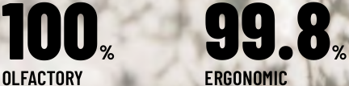

**[Image: AnnualReport2024.pdf-0088-09.png (432x107, 59.3KB)]**

<!-- Start of picture text -->
100% 99.8% OLFACTORY ERGONOMIC <!-- End of picture text -->

**[Image: AnnualReport2024.pdf-0088-10.png (430x106, 48.5KB)]**

<!-- Start of picture text -->
99.8% 97.4% ACOUSTIC THERMAL <!-- End of picture text -->

Godrej Properties Limited 

Integrated Report FY 2023-24 

166 

167 

About Godrej Integrating Sustainability Management Discussion Statutory Properties Limited with our Business and Analysis Reports 

###### **FORTIFYING OUR DIGITAL INFRASTRUCTURE** 

We are proud to announce our achievement of ISO 27001:2022 certification, a globally recognized standard for our Information Security Management System. This certification demonstrates our commitment to ensuring the highest levels of security for our information assets, aligning with industry best practices and international standards. 

|Targeted User|2,615|
|---|---|
|In Progress|239|
|Not Started|1,280|
|Completed|1,096|
|Percentage|42%|

###### workforce with indispensable 

###### Innovation in technology plays a 

###### vital data. Moreover, we employ 

crucial role in optimizing workflows and enhancing efficiency within the property industry. Yet, this technological progression also escalates the need for comprehensive IT frameworks and stronger measures for cybersecurity. Amidst these evolving conditions, maintaining the security, privacy, and accessibility of information is paramount. Godrej Industries Limited and Associated Companies (GILAC) has implemented an Information Security Incident Management Process that details a methodical approach, interconnectedness, and critical metrics for effectively detecting, classifying, reducing, and managing security breaches in a systematic way. This process is mandatory for all GILAC staff and contractors, including those from GPL, who use GPL's resources, networks, and technology for IT-related activities. 

skills and knowledge to fortify our defenses and adeptly mitigate cyber threats. This proactive stance underscores our unwavering dedication to shielding sensitive data and upholding a resilient security posture amidst the ever-shifting digital landscape. 

techniques like data masking and anonymization to add an additional shield against unauthorized entry. These proactive steps showcase our steadfast dedication to safeguarding sensitive data's confidentiality and integrity. 

While safeguarding sensitive data remains our priority, some measures may inadvertently lead to user dissatisfaction, such as extra authentication steps or restricted access to previously available data. To mitigate potential discomfort, we prioritize transparent communication to explain the reasons behind the changes and emphasize the advantages of bolstered data protection. We also provide thorough training to ensure users can adeptly navigate the updated protocols. In cases where necessary, we offer alternative access routes or data sources for those adversely affected by the alterations. Our proactive approach ensures a seamless transition and minimizes any adverse impacts on users. 

Adhering to GILAC's Information Security Policy (ISMS Policy), GPL diligently follows established protocols that outline our information security objectives. This policy undergoes regular scrutiny and updates, occurring at least annually or in response to significant alterations, and is effectively communicated across all user levels. Annually, GPL conducts risk assessment exercises to pinpoint and evaluate various information security risks, gauging their potential impact on the business and likelihood of occurrence, thus enabling us to prioritize necessary control measures. Furthermore, we conduct annual internal audits to gauge the effectiveness of IT general controls, ensuring their efficiency. Comprehensive training and awareness initiatives tailored to address the prevailing Cyber Security Threat Landscape are provided to all employees. Additionally, we have established a clear escalation protocol for employees to follow in case of suspicious observations. 

###### **DATA PROTECTION AND MEASURES TO SECURE SENSITIVE DATA** 

###### **CYBERSECURITY AWARENESS TRAINING** 

Protecting customer information and sensitive data holds utmost importance at GPL. Following GILAC's guidance, we enforce measures to limit bulk downloads and strictly control access, permitting only authorized personnel to reach 

Recognizing the utmost significance of cybersecurity awareness, GILAC orchestrates an annual training regimen, actively involving GPL. Our aim is to cultivate a cybersecurityconscious culture and arm our 

###### **FOR INCIDENT RESPONSES** 

###### **FOR CERTIFICATION** 

**0** INCIDENTS REPORTED (ANNUALLY) 

**[Image: AnnualReport2024.pdf-0089-19.png (198x74, 3.1KB)]**

<!-- Start of picture text -->
100% <!-- End of picture text -->

PERCENTAGE OF IT INFRASTRUCTURE CERTIFIED 

Godrej Properties Limited 

Integrated Report FY 2023-24 

168 

169 

About Godrej Integrating Sustainability Properties Limited with our Business 

Management Discussion Statutory and Analysis Reports 

###### **FOSTERING CUSTOMER CONNECTIONS** 

by incorporating NPS scores from various surveys, including episodic surveys focusing on critical stages like onboarding, registration, site visits, and apartment handover. 

In alignment with our purpose statement - “to create spaces that foster everyday joys; one community, one family, and one home at a time,” we are committed to delivering a holistic customer experience, beginning from the point of sale, and extending through possession. 

In our commitment to sustainability, we have extended our focus beyond building certifications to include IGBC Green Residential Societies during the product use phase. Through handover manuals, sustainability master classes, and targeted site visits, we educate customers on our comprehensive climate-related resilience strategies, ensuring that project-level green building measures translate into tangible customer value. 

Each customer is assigned a dedicated relationship manager, providing a direct point of contact for any inquiries, concerns, grievances, or suggestions. All interactions with customers are meticulously documented within the Service Request Module of our electronic customer relationship management (e-CRM) system. 

Our mobile app empowers customers to efficiently manage all aspects of their investment post-purchase, streamlining site visits, addressing complaints, and facilitating communication. Additionally, the app features a notification system for timely updates, announcements, and emergency alerts, ensuring residents remain well-informed. 

As part of our Net Promoter Score (NPS) surveys, customers are invited to rate the likelihood of recommending Godrej Properties to friends and family on a scale from 0 to 10, facilitating straightforward and insightful feedback on GPL’s products and services. This year, we have enhanced our internal performance measurement system 

###### **OUR CUSTOMER FOCUS IS ESTABLISHED ON THREE MAJOR ASPECTS** 

STANDARD OPERATING PROCESSES (SOPs) 

RELATIONSHIP MANAGER MODEL 

###### TECHNOLOGY APPLICATIONS 

Offering human interaction for customer experience management 

eCRM system for billing, receipt and managing customer relationships at projects 

consistent service quality 

The Godrej Properties mobile app empowers customers to conveniently manage post purchase aspects of their investment at their fingertips. This app streamlines various community site functions, such as addressing complaints, managing visitors, and facilitating communication. With its complaint management feature, residents are empowered to report any issues or grievances to the community management team, who promptly respond and take appropriate actions. Moreover, the visitor management feature ensures that only authorized individuals gain entry, thereby strengthening community security. The app also includes a notification feature for easy and swift communication of essential updates, announcements, and emergency alerts to keep residents well-informed. Ultimately, this community management application enables the management team to enhance residents’ quality of life and cultivate a safe and efficiently run community. 

**The Mobile App delights customers, maintaining a 4.3 rating on the Playstore (with over 1,000 ratings) and a 4.4 rating on the Appstore (with over 300 ratings).** 

These high ratings reflect the satisfaction of 

more than 73% of our existing customers who now use the app. To further enhance convenience, we expanded the app’s payment functionality to include Debit and Credit card payments in addition to Netbanking 

###### **SALIENT FEATURES OF THE GODREJ PROPERTIES MOBILE APP** 

Constant updates on the development of the building project. Customers can look up the development of their tower over the previous six months. Schedule registration and site visits. 

A single location to manage all related to real estate online bill payment and round-the-clock payment reconciliation. 

Support for home loans: Users can get in touch with the banks listed on the app to ask questions about home loans. To help them navigate the legal and regulatory processes, documentation templates, extensive FAQs, and a step-by-step process guide are provided. 

Godrej Properties Limited 

Integrated Report FY 2023-24 

170 GRI 417-1, 418-1, 3-3 

171 

About Godrej Integrating Sustainability Properties Limited with our Business 

Management Discussion Statutory and Analysis Reports 

###### **GUARANTEEING CUSTOMER HEALTH AND WELLBEING** 

**After our customers move into their homes post-possession, GPL implements various initiatives to ensure their continued health and well-being.** 

###### **CUSTOMER SAFETY** 

- Our facilities align with the applicable local rules and regulations to cover all life, fire, and safety aspects in the built environment. 

- The Fire Department conducts building audits to validate safety protocols and firefighting systems. 

- We adhere to IGBC and other green standards, avoiding harmful chemicals and reducing exposure to toxins. 

- Our Facility Management teams prioritize customer well-being, offering hazard awareness and updates on ongoing works. 

- At project handover, we inform customers about health and safety features included in the delivered project. 

- We also provide home safety recommendations to ensure a secure environment for our customers. 

- We have created an internal guideline for accessibility in design, titled “Beyond Barriers,” which outlines the standards to be followed to ensure accessible and safe spaces for all customers during the design process. 

###### **ELEVATING CUSTOMER SATISFACTION** 

**The contentment and delight of our customers are crucial for our ongoing advancement. Hence, achieving customer satisfaction remains an ongoing objective that we consistently pursue.** 

###### **NPS PERFORMANCE** 

As pioneers in the real estate sector, we embraced Net Promoter Score (NPS) early on and leveraged it as a strategic tool to enhance customer advocacy. Since FY 2018-19, we have integrated NPS into employee key result areas (KRAs) to instill a focus on continually enhancing our NPS scores. Utilizing Net Promoter Score (NPS) allows us to assess customer satisfaction and loyalty based on product recommendations. Establishing a benchmark within our industry is crucial for effective metric use. Comparing our NPS with industry averages helps gauge performance, considering factors like geography, industry, survey channels, company size, market dynamics, and customer expectations. 

###### **THIS WIDELY ACCEPTED METRIC ALSO OFFERS THE BENEFITS LISTED BELOW:** 

**1.** Gather valuable customer feedback easily to enhance the customer experience. 

**2.** Evaluate performance upon completion basis customer ratings. 

**3.** Drives design innovation based on customer feedback & insights. 

###### **In FY 2023-24, the relationship survey was sent to 41,634 customers and 14,267 responses were received. The response rate achieved was 34%.** 

###### **DEMONSTRATING AGILITY IN REGISTRATIONS** 

We streamlined Agreement registration for over 12,000 customers. Additionally, during FY 24, we conducted mass registrations across our projects, with over 100 customers per project completing their registrations in a single day. Thanks to our targeted efforts in Agreement registrations over the past two years, we successfully decreased the duration from booking to agreement registration by more than 60%. 

###### **IMPROVING TRANSPARENCY IN CONSTRUCTION PROGRESS** 

We welcomed over 15,000 customers, completed more than 13,000 registrations, and facilitated over 20,000 customer site visits. Our monthly construction newsletters provided detailed updates on the company’s quality initiatives. In FY2023-24, we continued to enhance our systems to ensure a joyful experience during handover and post-possession. 

###### **FOCUSSING ON HANDOVER EXPERIENCE AND LIVING EXPERIENCE** 

The inception of Godrej Living Pvt. Ltd. marks a significant step toward our goal of bringing joy during the handover and post-possession phases. Through our collaboration with Godrej Living, we have introduced two indices: the Handover Index and Liveability Index. These indices systematically evaluate and gauge customers’ experiences during these stages, enabling both teams to collaborate effectively in delivering an exceptional living experience after possession. 

In FY 24, we organized more than 50 events, including celebrations of all Indian festivals, to foster community engagement and connection among residents. 

###### **SERVICE LEVEL ADHERENCE (SLA)** 

We meticulously monitor service level adherence and document all customer interactions via our e-CRM Management System. Any unresolved issues undergo automatic escalation to the Management Committee members at the highest level, utilizing the pre-existing workflow within this module. Through the implementation of a relationship manager model, we have significantly enhanced our responsiveness, ensuring swift and satisfactory resolutions for our customers. 

Relationship NPS Survey Responses 14,267 13,332 8,806 8,857 Combined Relationship NPS 68% 65% 55% 42% 

###### **90%** 

###### **734,990** 

**100%** 

INTERACTIONS RESOLVED WITHOUT ESCALATION TO HIGHER LEVELS 

CUSTOMER INTERACTIONS CAPTURED IN OF CUSTOMER GRIEVANCES CLOSED FOR OUR ECRM SYSTEM IN FY 2023-24 FY2023-24 

Godrej Properties Limited 

Integrated Report FY 2023-24 

174 GRI 2-6, 3-3, 416-1, 416-2 

175 

About Godrej Integrating Sustainability Properties Limited with our Business 

Management Discussion Statutory and Analysis Reports 

###### **RESOLVING CUSTOMER CONCERNS WITH CARE** 

###### **CUSTOMER GRIEVANCE CELL** 

Ensuring customer satisfaction involves addressing their grievances diligently. We have established channels for our valued customers to voice their concerns, allowing us to address their issues promptly and effectively. Each of our project sites is equipped with dedicated nodal officers tasked with handling customer escalations and grievances, ensuring resolution within a timeframe of 6 days. 

Moreover, we always uphold the privacy of our customers’ data, adhering to stringent ethical standards outlined in our Data Privacy Policy. In the FY 2023–24, we received 0 complaints regarding the privacy of customer data and advertising, demonstrating our commitment to safeguarding customer information and maintaining transparency. 

###### **OUR PERFORMANCE IN ADDRESSING CONSUMER GRIEVANCE FOR FY 2023-24** 

**[Image: AnnualReport2024.pdf-0093-07.png (380x35, 9.0KB)]**

<!-- Start of picture text -->
■  >6 days ■  <6 days <!-- End of picture text -->

176 GRI 418-1 

**[Image: AnnualReport2024.pdf-0094-00.png (1217x850, 1241.5KB)]**

<!-- Start of picture text -->
UNLOCKING SAFETY EXCELLENCE THROUGH CONTRACTOR PARTNERSHIPS Construction Activity at The Trees, GPL <!-- End of picture text -->

|**HEALTH & SAFETY PARAMETER (FOR EMPLOYEES & CONTRACTORS)** **FY2023-24** **FY 2022-23** **FY 2021-22** **FY 2020-21**|
|---|

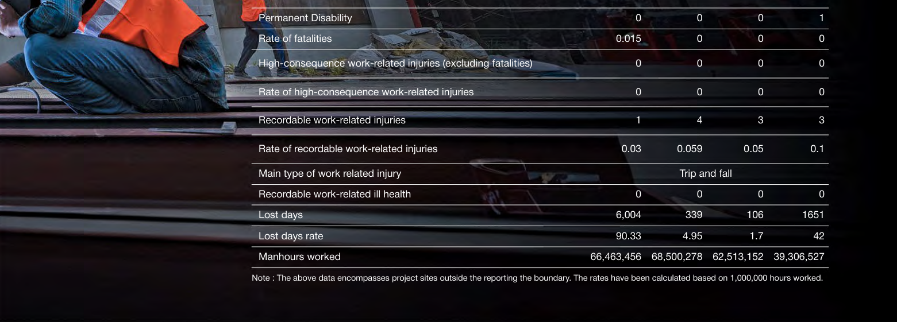

**[Image: AnnualReport2024.pdf-0094-02.png (1561x561, 947.0KB)]**

<!-- Start of picture text -->
Permanent Disability 0 0 0 1 Rate of fatalities 0.015 0 0 0 High-consequence work-related injuries (excluding fatalities) 0 0 0 0 Rate of high-consequence work-related injuries 0 0 0 0 Recordable work-related injuries 1 4 3 3 Rate of recordable work-related injuries 0.03 0.059 0.05 0.1 Main type of work related injury Trip and fall Recordable work-related ill health 0 0 0 0 Lost days 6,004 339 106 1651 Lost days rate 90.33 4.95 1.7 42 Manhours worked 66,463,456 68,500,278 62,513,152 39,306,527 Note : The above data encompasses project sites outside the reporting the boundary. The rates have been calculated based on 1,000,000 hours worked. <!-- End of picture text -->

At GPL, we prioritize the safety and well-being of our workers above all else. We’ve implemented a thorough framework that covers everything from selecting contractors to enforcing Occupational Health & Safety measures at all our sites. This is facilitated through the following strategies: 

- We pre-qualify contractors before awarding contracts. 

- We enforce contract safety rules and regulations. 

- We conduct kick-off meetings for on-boarded contractors. 

- All employees, including contract workers, undergo mandatory safety induction. 

- In addition to induction, we provide job-specific trainings at our locations. 

- Quarterly internal safety audits identify improvement areas. 

- We evaluate and support contractor performance. 

###### **CONTRACTOR PRE-QUALIFICATION** 

We begin by evaluating potential contractors’ Occupational Health & Safety (OH&S) capabilities through a prequalification (PQ) assessment before awarding contracts. This assessment gauges their capacity, resources, management practices, and performance. Based on the PQ score, we develop a mitigation plan to address any identified business risks. Contractors with strong OH&S performance and ISO 45001 certification receive preference during this evaluation process. 

###### **CONTRACT SAFETY RULES & REGULATIONS AND VERIFICATION** 

Occupational Health & Safety requirements are a part of the Contractors Agreement; a legal document signed before work begins. This agreement integrates our robust Contracts and Procurement process, which pre-qualifies contractors and consultants. It involves conducting of health checks for contractor’s employees, and the data is securely preserved with the contractor’s health professional. We meticulously follow this process, making it a prerequisite for every contractor before they are awarded any contract. 

Once contracted, the contractor’s team implements the required safety measures on-site, which includes infrastructure improvements, training programs, wellequipped first aid center staffed by a certified male nurse, and maintaining an emergency vehicle, all in compliance with laws. We also prioritize confidentiality in handling contractor data to ensure data privacy assurance. 

Our Safety Contract rules and regulations are seamlessly integrated into the contract agreement which ensures comprehensive addressing of occupational health and safety (OHS) requirements throughout the project execution. 

Workers are informed of their rights through a comprehensive program such as safety induction sessions and regular toolbox talks. Backed by rigorous site visits and mock drills by GPL. The purpose of this verification is to ensure upholding of the rules and regulations. 

We follow IS 3768, 1983 standards for compiling data, which govern how we compute frequency and severity rates for industrial injuries and classify industrial accidents. Our processes also align with the Building and Other Construction Workers (BOCW) Act to ensure compliance with regulations that are relevant to the safety and well-being of workers. 

###### **CONTRACTOR SUPPORT** 

We start by holding kickoff meetings with all newly on-boarded contractors to ensure they fully grasp our requirements, setting the right tone from the beginning. Following this, contractors submit site safety plans aligned with our agreement for immediate implementation. We also provide specialized training programs tailored to each job to improve safety awareness among contract workers. Additionally, we aid contractors in preparing Hazard Identification and Risk Assessment (HIRA) documents and implementing control measures based on the hierarchy of controls. 

###### **WE SUPPORT OUR WORKERS IN THE FOLLOWING WAYS** 

###### **MEDICAL SUPPORT** 

We maintain on-site medical facilities including a first aid centre, a male nurse, a first aid kit, an ambulance, and regular doctor visits as a part of our emergency preparedness. Additionally, we have agreements with nearby hospitals for emergency situations. 

###### **EQUIPMENT SUPPORT** 

Our safety induction hall is equipped with audio-visual facilities, and all required personal protective equipment (PPE). We conduct job-specific training sessions and toolbox talks to enhance workers’ safety knowledge. 

###### **HEALTH GUIDANCE** 

We ensure all employees and workers undergo health check-ups before starting work and regularly thereafter. We actively encourage them to prioritize their health. For high-risk workers, we conduct medical exams and competency tests upon hiring and periodically to confirm their fitness for the job. 

###### **HEALTH MANAGEMENT SERVICES** 

A medical officer visits each site at least once a week, with designated timings prominently displayed for easy access. We encourage all workers to use this facility for any non-occupational medical issues. 

###### **REGULAR HEALTH AND SAFETY CAMPS** 

We regularly conduct campaigns on smoking and alcohol risks, HIV awareness, and organize medical camps to ensure all workers receive these services. 

Godrej Properties Limited 

Integrated Report FY 2023-24 

178 GRI 3-3, 403-2, 403-3, 403-6, 403-7, 403-9, 403-10 

179 

About Godrej Integrating Sustainability Management Discussion Statutory Properties Limited with our Business and Analysis Reports 

###### **FOCUSING ON WORKPLACE HEALTH AND SAFETY** 

Establishing a healthy and safe workplace is paramount for the sustained success of our company. We adhere to a stringent health management system and consistently provide training to our employees on Occupational Health and Safety (OH&S) practices to safeguard their well-being. 

The framework includes 5 steps: 

- Elimination: Remove hazards 

- Substitution: Find safer alternatives. 

- Engineering: Control isolate hazards 

###### **TRAINING AND ASSESSMENT** 

We have developed comprehensive programs aimed at educating and promoting occupational health and safety among our employees. These initiatives include training sessions, motivational events, and health camps. Additionally, we consistently organize blood donation drives, health lectures, and safety campaigns. 

Moreover, our facilities actively participate in events such as National Safety Day, Road Safety Week, and National Fire Service Day to raise awareness about safety and foster a culture of vigilance and preparedness. 

###### **THE PILLARS OF GPL’S HEALTH & SAFETY MANAGEMENT SYSTEM ARE:** 

Continual improvement in monitoring, audits, and compliance is integral to our operational framework. 

Fostering a safety-centric culture and enhancing capabilities through effective leadership and people development are key priorities for us. 

Implementing and ensuring the effectiveness of our Occupational Health and Safety (OH&S) Management System is a fundamental aspect of our operations. 

- Administrative controls: Implement policies. 

###### **HEALTH AND SAFETY MANAGEMENT SYSTEM (HSMS)** 

At GPL, we prioritize safety of our workers and prevention of accidents through every phase of our projects. We have established a dedicated Occupational Health and Safety (OH&S) Management System to uphold this commitment. This commitment stems from our core values and our recognition of the paramount importance of safeguarding the health and well-being of our employees, contractors, visitors, and the communities in which we operate. Senior management has allocated resources and defined responsibilities to ensure the implementation of safety measures effectively. Our OH&S Management system is underpinned by clear procedures outlined in alignment with our Health & Safety Policy, ensuring consistency across all our sites and applies to all the operational projects and workers within the organization’s scope. 

To address the dynamic nature of health and safety concerns, our OH&S management system follows the principles of the PDCA cycle. We integrate these principles into the planning, design, construction, and delivery of residential townships and commercial complexes in India. Additionally, we have developed specific standard operating procedures (SOPs) GPL P HS 02 for identifying tracking and monitoring hazards, assessing associated risks, implementing controls to mitigate those risks, and identifying opportunities for improving occupational health and safety (OH&S) within our organization. 

- Personal Protective Equipment (PPE): Provide final protection, prioritizing personnel safety. 

As an ISO 45001:2018 certified organization, we regularly review and update our Health and Safety Management system to uphold the highest standards. Furthermore, we have established procedures for investigating incidents, determining root causes, and implementing corrective actions. We actively share these practices with others to foster ongoing improvement in safety across our projects. 

Furthermore, in accordance with the approved procedure, The Hazard Identification, Risk Assessment, and Control (HIRAC) Team is formed, including Project Manager, Project Safety Manager, contractor personnel, and trained worker representatives, ensures quality procedures and competent execution. This comprehensive approach ensures thorough risk evaluation for all project activities.” 

Additionally, to ensure that the quality of these processes, including the competency of persons who carry them out, the Hazard Identification, Risk Assessment, and Control (HIRAC) Team is formed at our projects, as per the established process. It comprises key stakeholders including the Project Manager (PM), Project Safety Manager (PSM), representatives from contractor personnel, as well as other experienced members such as worker representatives, who are also trained for conducting HIRAC. This inclusive approach ensures a comprehensive assessment of potential hazards and risks across all project activities. 

Integrated Report FY 2023-24 

Godrej Properties Limited 

180 GRI 403-1, 403-2, 403-4, 403-9 

181181 

**[Image: AnnualReport2024.pdf-0096-00.png (773x121, 31.9KB)]**

<!-- Start of picture text -->
About Godrej   Integrating Sustainability  Management Discussion  Statutory Properties Limited with our Business and Analysis Reports <!-- End of picture text -->

###### **ENSURING A SECURE WORK ENVIRONMENT FOR OUR EMPLOYEES AND WORKERS** 

Additionally, to investigate work-related incidents and employ corrective actions using the hierarchy of controls, GPL follows a structured incident investigation process (SOP: GPL P HS14) to identify root causes, assess risks, and implement corrective actions. Key steps include incident reporting, forming investigation teams, analyzing incidents, conducting root cause analysis, implementing controls based on the hierarchy of controls, and driving continuous improvement in the OH&S MS. 

###### **COMMITMENT TOWARDS SAFETY:** 

To enforce adherence to safety protocols by contractors across our locations, GPL has instituted Joint Project Safety Committees (JPSC) at each site. These committees, led by a GPL Project Manager, comprise representatives from Project Management Consultants and Contractors who follow predefined Standard Operating Procedures (SOPs). The JPSC conducts regular monitoring and provides support for contractor safety measures. Attendance at monthly meetings is mandatory for all participants to discuss and address any safety issues. 

**[Image: AnnualReport2024.pdf-0096-05.png (61x73, 7.2KB)]**

Workers are recognized and rewarded for their contributions at suitable forums. 

**[Image: AnnualReport2024.pdf-0096-07.png (70x82, 8.7KB)]**

Our OH&S Management system includes a comprehensive procedure for the establishment and operation of safety committees at all our locations. For contractors employing more than 100 workers at our sites, the Contractor Site Safety Committee (CSC) is mandated in compliance with BOCW Central Rules 1998, Chapter XXI, Rule 208. Led by the contractor’s Project Manager, the CSC convenes at least once a month to ensure full compliance with all safety requirements. Importantly, the CSC includes worker representation to facilitate the reporting of any work-related hazards. Workers are encouraged to report any hazardous conditions or concerns to their immediate supervisor or designated safety personnel. 

Comprehensive safety induction trainings are conducted to equip workers with the knowledge to handle potential work-related hazards. 

**[Image: AnnualReport2024.pdf-0096-10.png (70x68, 6.7KB)]**

- Instructions are delivered in the language understood by the majority of workers to ensure clear communication. 

**[Image: AnnualReport2024.pdf-0096-12.png (70x65, 6.7KB)]**

- Workers are provided with toolboxes to instil a safety-oriented mindset. They are empowered to halt or decline work in unsafe conditions that pose a risk to their safety and health. 

**[Image: AnnualReport2024.pdf-0096-14.png (74x73, 8.4KB)]**

To ensure workers’ safety at construction sites at all locations, the right to refuse to work is reserved with the workers. They are encouraged to report any hazardous conditions or concerns to their immediate supervisor or designated safety personnel. 

The GPL Occupational HSMS, as outlined in the Safety Manual, comprehensively delineates the roles and responsibilities of each stakeholder, including workmen. Key elements of the Safety Manual include: 

**[Image: AnnualReport2024.pdf-0096-17.png (74x62, 6.9KB)]**

- Roles and Responsibilities: The manual clearly defines the roles of project stakeholders—management, supervisors, contractors, consultants, and workers— detailing their safety responsibilities and incident prevention guidelines. 

   - The Contractor Site Safety Committee (CSC) is mandatory for contractors with over 100 employees at our facilities, meeting monthly under the contractor’s project manager to ensure compliance with safety regulations. Worker representation aids in reporting work-related hazards. 

- Worker Roles: The Safety Manual underscores workers' authority to refuse unsafe work, prioritizing their safety and enabling prompt hazard mitigation to prevent accidents or injuries. 

**[Image: AnnualReport2024.pdf-0096-21.png (74x74, 8.5KB)]**

Assistance and monitoring from the HIRAC team. 

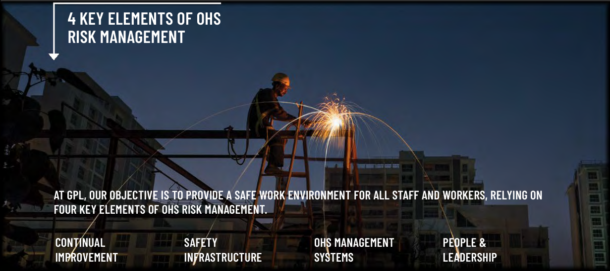

**[Image: AnnualReport2024.pdf-0096-23.png (1231x549, 779.5KB)]**

<!-- Start of picture text -->
4 KEY ELEMENTS OF OHS RISK MANAGEMENT AT GPL, OUR OBJECTIVE IS TO PROVIDE A SAFE WORK ENVIRONMENT FOR ALL STAFF AND WORKERS, RELYING ON FOUR KEY ELEMENTS OF OHS RISK MANAGEMENT. CONTINUAL   SAFETY  OHS MANAGEMENT  PEOPLE & IMPROVEMENT  INFRASTRUCTURE SYSTEMS LEADERSHIP <!-- End of picture text -->

**2023-24 2022-23 2021-22 2020-21** 

###### **PARTICULARS** 

Godrej Properties Limited 

182 GRI 403-2, 403-4 

About Godrej Integrating Sustainability Properties Limited with our Business 

Management Discussion Statutory and Analysis Reports 

###### **EVOLVING WORKPLACE WELLNESS & SAFETY STANDARDS** 

###### **KEY OUTPUTS OF THE PROCESS** 

The implementation process has established various OH&S documents and protocols at GPL: 

- GPL OH&S Manual: 01 

- GPL Standard Operating Procedures (SOPs): 19 

- Occupational Health & Safety Work Instructions: 27 

- Occupational Health & Safety Guidelines: 03 

- Occupational Health & Safety Annexures: 02 

OH&S integration as a cultural concept at GPL has institutionalized three levels for reviewing the OH&S management system: 

- Management Review at Organization Level (Level I) 

- Management Review at Regional Level (Level II) 

- Management Review at Project Level (Level III) 

We uphold the highest Occupational Health & Safety (OH&S) standards across all GPL projects. We have established a robust Safety Management System aligned with the ISO 45001:2018 standard. Our OH&S Management System, supported by the comprehensive Standard Operating Procedure (SOP) detailed in GPL P HS 05, meticulously plans, and executes Health & Safety training across all locations. 

We are pleased to announce that this system has been successfully implemented and verified by a certifying agency during a surveillance audit. Our commitment to maintaining a sustainable safety management system aims to achieve zero harm. 

We identify training needs through a multifaceted process that includes: 

- Accident Investigation: Inputs from past incidents. 

- Safety Observation: Inputs from workforce behavior. 

- Upcoming Activities: Nature of construction activities at project sites. 

- HIRAC Risk Rating: Work activities with higher risk ratings. 

- Health & Safety Updates: Inputs from monthly updates and audit summaries. 

- OH&S Campaigns: Recommended safety campaigns and awareness programs. 

- Internal Customer Demand: Training needs expressed by senior management and Function/Project Heads. 

- General Awareness: OH&S awareness training on general topics such as policy, legal requirements, and other communications. 

Based on these training needs, we prepare and disseminate a monthly Training Calendar to all relevant stakeholders. These training sessions are free of cost and conducted during working hours. We systematically collect feedback from employees using a standardized feedback form (GPL F HS 06) and interactive verbal exchanges at the conclusion of training sessions, maintaining records on attendance sheets. This approach ensures our workforce is equipped with the necessary knowledge and skills to uphold the highest health and safety standards. 

###### **TRAININGS CONDUCTED** 

- Refresher training sessions on ISO 45001 to reinforce understanding and compliance. 

- Sensitization workshops for management to deepen awareness of safety protocols. 

- Workshops for Project Managers and Safety In-charge personnel to enhance safety expertise. 

- Implementation of ‘BSC Online Training & Awareness Module’ programs targeting Occupational Health (OH), Construction Heads (CH), Project Managers (PM), Regional Safety Managers (RSM), and Project Safety Managers (PSM) to improve OH&S competencies. 

**With a vision to establish robust safety processes and foster a safety-oriented culture, all our projects adhere to standard safety requirements and hold ISO 45001:2018 certification.** 

- Change Management: Introduction of new processes, equipment, machinery, or workmen groups. 

Godrej Properties Limited 

Integrated Report FY 2023-24 

184 

185 

GRI 403-5 

About Godrej Integrating Sustainability Properties Limited with our Business 

Management Discussion Statutory and Analysis Reports 

###### **EMBEDDING HUMAN RIGHTS ACROSS OUR VALUE CHAIN** 

**[Image: AnnualReport2024.pdf-0098-03.png (124x18, 5.5KB)]**

<!-- Start of picture text -->
Employee at GPL <!-- End of picture text -->

We prioritize the consideration of human rights in all our interactions with employees, independent contractors, suppliers, clients, and the public. Throughout our value chain, we advocate for safety, diversity, and inclusion, fair compensation, reasonable working hours, and equal opportunities for all individuals. Our labor practices align with our core values, the International Labor Organization’s Declaration on Fundamental Principles and Rights at Work, and other international agreements. Our value chain is designed with a focus on respecting human rights, and we have policies in place to mitigate human 

As per the Universal Declaration of Human Rights we are building mechanisms to ensure our workers wage is sufficient to afford a decent standard of living for all their household members, including nutritious food, clean water, housing, education, healthcare, and other essential needs, such as provision for unexpected events. 

These assessments are obligatory and cover various areas include: 

- Health and Safety 

   - Forced Labor 

   - Child Labor 

- Hours 

- Wages and Leave 

   - Discrimination 

   - Compliance Monitoring 

- Fair Treatment 

- Community Impacts 

- Product Stewardship 

- Freedom of Association 

rights risks. Mandatory training on human rights aspects, such as Prevention of Sexual Harassment (POSH) and anti-discrimination Code of Conduct, is provided to all employees. Additionally, we conduct human rights due diligence for various groups, including our employees, contractual workers, women, children, construction laborers, and supply chain partners. We have conducted Human Rights Self-Assessment (HRSA) across all active Project Sites and GPL offices, following GPL’s Human Rights Policy and the guidelines set forth by the United 

Nations on Human Rights. 

###### **0** 

CASE OF CHILD/FORCED LABOR/INVOLUNTARY LABOR/ DISCRIMINATION EMPLOYMENT 

###### **100%** 

GPL SITES AND OFFICES HAVE UNDERGONE HUMAN RIGHTS SELF-ASSESSMENT FOR FY2023-24 

External third party audits were undertaken across 7 sites on our internal human rights processes and no instances of noncompliance were found across our sites, thereby obviating the necessity for remedial actions. However, minor observations were noted, and efforts are underway to address them promptly. 

###### **THE NUMEROUS HUMAN RIGHTS MEASURES UNDERTAKEN AT GPL CONSISTS OF:** 

###### **DISCRIMINATION AND HARASSMENT PREVENTION** 

###### All Employees 

- In order to protect employees from sexual harassment and mitigate the organization’s liability, we have implemented Policies on Prevention of Sexual Harassment (POSH). Mandatory training in POSH is provided to all new employees. 

- In response to two complaints of sexual harassment, GPL promptly took necessary action. By the end of the financial year, all cases were resolved with appropriate measures. 

- Employees have the option to file complaints with an Internal Complaints Committee (ICC) at both regional and central levels within the organization. 

###### **HUMAN RIGHTS CULTURE BUILDING** 

###### Security Personnel 

- Our security personnel undergo human rights training as part of their contractual agreements with agencies. 

- We structure our operations and investment agreements with stringent human rights clauses and conduct thorough reviews. 

###### Employees 

- Chai-pe-charcha, team huddles, and site events are among the engagement formats we utilize to formally address employee grievances. 

- All employees have the opportunity to connect with our leaders, and the steps to do so are accessible on the company’s intranet. 

###### **COMMUNITY RIGHTS** 

###### Local Communities 

- We protect the land rights of all communities and uphold the principle of free, prior, 

- informed consent. 

###### **FAIR REMUNERATION** 

- We offer competitive employee compensation packages that align with industry standards and the local labour market. 

- The Central Labour Law Compliance Team ensures that contractors adhere to minimum wage requirements. 

###### **HEALTH & SAFETY** 

- Guaranteeing a safe, hygienic, and healthy workplace for our contractor workforce in full compliance with relevant health and safety regulations. 

- Minimizing the likelihood of accidents, injuries, and exposure to health risks by adhering to applicable health and safety laws. 

Godrej Properties Limited 

Integrated Report FY 2023-24 

186 GRI 406-1, 410-1, 412-2, 412-3 

187 

About Godrej Integrating Sustainability Management Discussion Statutory Properties Limited with our Business and Analysis Reports 

###### **ENSURING A SUSTAINABLE SUPPLY CHAIN** 

###### **SUPPLY CHAIN ENGAGEMENT FRAMEWORK** 

###### **ONBOARD SCREENING** 

###### **GAP IDENTIFICATION** 

We identify gaps through the promotion of supplier capability development initiatives, in accordance with requirements as per IGBC or equivalent rating systems 

During the on-boarding process, suppliers must comply with GPL’s Code of Conduct and policies, covering business ethics, human rights, health, and safety. Supplier screening occurs in the pre-construction phase using specified criteria to ensure they meet these standards. We evaluate significant suppliers considering environmental, social, governance, and business relevance factors. Our screening process for significant suppliers also considers, countryspecific, sector-specific, and commodity-specific risks. 

Establishing robust supply chain networks is crucial for fostering sustainable real estate development. This enables us to mitigate supply chain risks that could impact our operations, business continuity, and reputation. We prioritize anti-corruption policies and collaborate with individuals and organizations that uphold these standards. Our approach includes thoroughly assessing joint venture partners, contractors, vendors, and other third parties as part of our anti-corruption due diligence process. We enforce laws pertaining to worker wages, health and safety, and other workplace regulations across all our partnerships. By openly discussing industry best practices with our partners, we contribute to the advancement of the ecosystem. 

vendors adhere to our Human Rights policy, with enhanced scrutiny of principles such as human rights, labor laws, and working conditions. 

We understand the criticality of reducing supply chain risks. significant suppliers considering Our targets, approved by SBTi, mandate that we ensure environmental, social, governance, 88.5% of our suppliers by emissions in FY 2021 adopt and business relevance factors. Our Science-based Targets for emissions related to purchased screening process for significant goods and services by FY2026. In line with the set targets, suppliers also considers, countrywe are developing a supplier engagement strategy. This specific, sector-specific, and involves steps such as assessing and analyzing current commodity-specific risks. suppliers, outlining criteria for supplier selection, designing structured engagement programs, facilitating capacity building workshops, promoting transparency, establishing MATERIAL DESCRIPTION NUMBER OF SUPPLIERS performance metrics and monitoring, conducting audits Steel (TOR) 76 to ensure supply chain compliance and focusing on continual improvement. This demonstrates our strategy at Cement 08 Godrej Properties to manage risks throughout the value Concrete (RMC) 35 chain while motivating suppliers to embrace sustainability autonomously. Tiles 34 AAC Blocks 17 **Total number of Unique Suppliers 164** 

Moreover, we have strengthened GPL’s Vendor Code of Conduct, incorporating minimum requirements that vendors must meet before engaging in business with us. The updated Vendor Code of Conduct now includes provisions for minimum Environmental, Social, and Governance (ESG) requirements, encompassing the monitoring of greenhouse gas emissions, hazardous waste treatment, and resource optimization. This code guarantees that our 

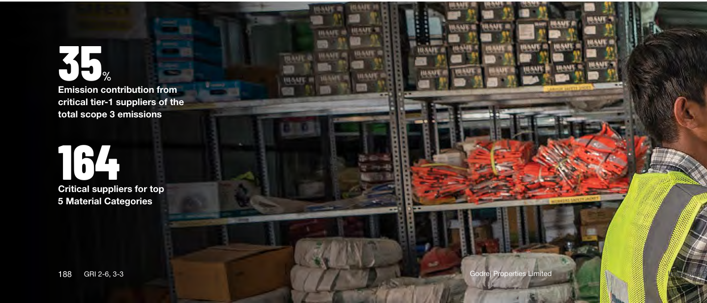

**[Image: AnnualReport2024.pdf-0099-11.png (1438x617, 1666.6KB)]**

<!-- Start of picture text -->
35% Emission contribution from critical tier-1 suppliers of the total scope 3 emissions 164 Critical suppliers for top 5 Material Categories 188 GRI 2-6, 3-3 Godrej Properties Limited <!-- End of picture text -->

###### **VENDOR SCREENING** 

The contract and procurement team at GPL undergoes awareness sessions on the Supply Chain Engagement process and the Supplier Assessment framework. Zonal contract and procurement teams are tasked with conducting vendor assessments within their respective regions. We have a robust vendor ESG screening framework to provide capacity building support to our suppliers 

**14 05** 

**Material Categories** 

**Materials Categories by Emissions** 

**[Image: AnnualReport2024.pdf-0099-17.png (118x17, 3.5KB)]**

<!-- Start of picture text -->
GPL project Site <!-- End of picture text -->

189 

###### **FOSTERING SUSTAINABILITY IN SUPPLIER NETWORKS** 

At GPL, we recognize the significance of responsible procurement. We encourage our suppliers to report on Environmental, Social, and Governance (ESG) parameters to align with our strategic objectives. Additionally, we prioritize nominated human rights initiatives, which involves raising awareness about contractors’ and suppliers’ working conditions and emissions resulting from supply chain operations. By the end of 2026, our goal is to ensure that 88.5% of our suppliers, based on emissions, will have Science-based Targets. 

###### **SUPPLIER ASSESSMENT** 

We acknowledge that Scope 3 emissions accounted for 99.74% of our overall emissions in 2023 and 99.81% in 2024. With our Scope 3 target validated by SBTi, we are committed to further streamlining the procurement process and supporting our suppliers in achieving their independent ESG targets. To achieve this, we conducted a mapping of our Tier 1 suppliers based on their emission profile and business volume, identifying those most relevant to our operations. Subsequently, we prioritized our Tier 1 suppliers for the top 5 material categories based on their emission profile. 

Furthermore, we enhanced our vendor assessment form by incorporating essential ESG parameters such as human rights, safety management systems, emission reduction initiatives, environmental targets (SBTi), internal carbon pricing, and grievance redressal mechanisms. Leveraging our online ESG portal ‘GREEN DASH’, we distributed the Supplier Assessment Questionnaire to our Tier 1 suppliers to evaluate their performance. We have been diligently reviewing the responses received through desk reviews and are currently conducting audits and capacity-building sessions with our suppliers to assist them in achieving their sustainability targets. 

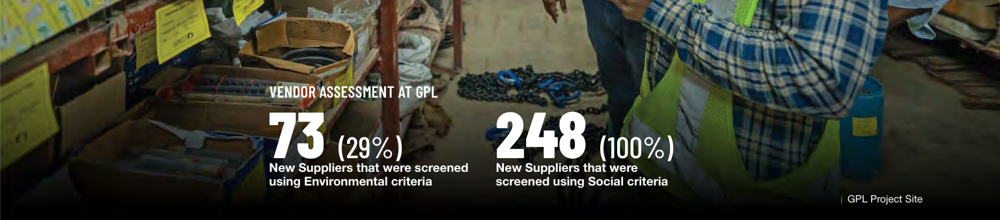

**[Image: AnnualReport2024.pdf-0100-05.png (1536x338, 908.0KB)]**

<!-- Start of picture text -->
VENDOR ASSESSMENT AT GPL 73  (29%) 248  (100%) New Suppliers that were screened  New Suppliers that were using Environmental criteria  screened using Social criteria GPL Project Site <!-- End of picture text -->

###### **HOW WE ENGAGE** 

###### **KEY ASSESSMENT AREAS** 

###### **OUR RESPONSE** 

**GPL was recognized by CDP as a Supplier Engagement Leader in 2023, and is among the top 19% assessed for supplier engagement on climate change, based on 2023 CDP disclosure.** 

   - Sustainable sourcing 

- Map procurement activities, including both direct and indirect procurement categories 

- Environment Management 

- Safety Management 

      - Environmental impact of materials 

      - Screening of suppliers on ESG parameters 

   - Labor & Human Rights 

- Implement a system to track suppliers based on their volume of supplies. 

- Business Ethics & Code of Conduct 

   - Engaging with suppliers to improve ESG performance 

- Quality Management 

- Capacity Utilization 

###### **SUPPLY CHAIN ASSESSMENTS** 

Risk Assessment: Our Technical Standard for Supplier and Contractor Management outlines the core components of our Supplier Risk Management process, offering a uniform method to manage supplier related risks and their impact on our organisation. 

Desk Evaluation: The initial evaluation of suppliers includes a thorough desktop review to identify sustainability concerns linked to the supplier. 

###### **ENVIRONMENT** 

- Existing policies 

- Management Systems 

- Greenhouse Gases 

- Biodiversity 

- Climate Change 

- Water Management 

###### **SOCIAL** 

- Human rights 

- Diversity 

- Management Systems 

- Contributions to Society 

- Reporting and transparency 

###### **GOVERNANCE** 

- Existing policies 

- SDGs 

- Ethics and compliance 

- Sanctions 

- Stakeholders 

- Supply Chain 

Godrej Properties Limited 

Integrated Report FY 2023-24 

190 GRI 308-1, GRI 413-1, GRI 414-1 

191 

**The Supplier ESG assessment evaluates a supplier’s performance across significant attributes, including the identification of objectives aligned with the Sustainable Development Goals (SDGs), management of climate change risks, implementation of a circular economy strategy, human rights due diligence, among others.** 

|Total Tier 1 suppliers|248|
|---|---|
|Total number of signifcant suppliers in Tier 1|164|
|% of total spend on signifcant suppliers in Tier 1|91%|
|Total number of signifcant suppliers in Non-Tier 1|17|
|Total number of signifcant suppliers (Tier 1 and Non Tier 1)|181|

###### **KPIS FOR SUPPLIER ASSESSMENT AND DEVELOPMENT** 

|Total number of suppliers assessed via desk|73|
|---|---|
|assessments/ on-site assessments,||
|% of unique signifcant suppliers assessed*|45%|

*assessed or on-going assessments 

###### **COVERAGE AND PROGRESS OF SUPPLIERS WITH CORRECTIVE ACTION PLANS** 

|Total number of suppliers in corrective action plan and capacity building programs |164|
|---|---|
|% of unique signifcant suppliers in capacity building programs|45%|

###### **SOURCING SUSTAINABLE MATERIALS** 

GPL has consistently aimed to substitute conventional materials with sustainable alternatives that have lower emission profiles. For instance, we have adopted the use of Ground Granulated Blast-furnace Slag (GGBS) and fly ash to reduce use of virgin cement consumption. Similarly, we prioritize sourcing Forest Stewardship Council (FSC) certified renewable wood over virgin wood. 

|Ordinary Portland Cement (OPC) by Blast Furnace Slag (GGBS)|30-40%|
|---|---|
|Ordinary Portland Cement (OPC) by Fly Ash (FA)|15-25%|
|RMC (OPC+GGBS)|17%|
|RMC (OPC+FA)|83%|
|FSC Certifed wood or equivalent|100%|

GPL’s Supplier ESG programs are comprehensive and include key components. We have strong oversight from the Executive Management to ensure commitment and accountability. Our purchasing practices are regularly reviewed to align with our Supplier Code of Conduct and Procurement Policy, promoting ethical and sustainable sourcing. We give priority to suppliers with superior ESG performance, such as those with green certification and local presence, to minimize transportation distances and environmental impact. Additionally, we continue to explore suppliers providing low embodied carbon materials. 

To support these efforts, we conduct training programs for company buyers and internal stakeholders, ensuring they understand their roles in the supplier ESG program and make informed decisions aligned with our sustainability goals. Additionally, we’re engaging with suppliers in concrete (RMC), tiles, steel (TOR), and cement to set SBTi targets by FY 2026. 

Godrej Properties Limited 

Integrated Report FY 2023-24 

192 GRI 204-1 

193 

About Godrej Integrating Sustainability Management Discussion Statutory Properties Limited with our Business and Analysis Reports 

###### **LINKING** 

###### **ESG PERFORMANCE WITH CSR IMPACT** 

Integrating sustainability into core operations, we align our corporate social responsibility initiatives with overarching environmental, social, and governance objectives. Our CSR initiatives are aligned towards Group wide Good and Green goals and focus areas. Through strategic partnerships with non-profits, regulatory bodies, government institutions, and communities, we strive to create measurable positive social and environmental impact, fostering shared value creation and business continuity. 

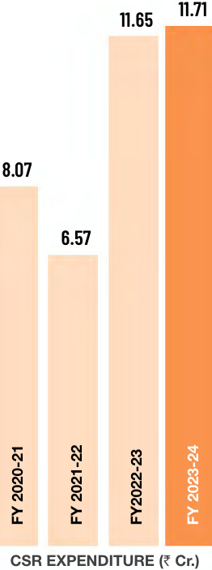

**[Image: AnnualReport2024.pdf-0102-04.png (262x703, 47.5KB)]**

<!-- Start of picture text -->
11.71 11.65 8.07 6.57 CSR EXPENDITURE ( `  Cr.) FY 2020-21  FY 2021-22  FY2022-23  FY 2023-24 <!-- End of picture text -->

**Aspiring to be amongst the world’s most responsible and sustainable real estate developers** 

Godrej Properties Limited 

Integrated Report FY 2023-24 

194 

195 

About Godrej Integrating Sustainability Properties Limited with our Business 

Management Discussion Statutory and Analysis Reports 

###### **SUPPORTING THE WELL-BEING OF CHILDREN** 

###### **COMMUNITY ADOPTION-DAY CARE FACILITY FOR CHILDREN OF LABOURS** 

###### **CHILD AND MATERNAL WELL-BEING THROUGH CRECHES** 

Programmes includes supporting health, Non-formal education (NFE), early child care education (ECCE) formal education and nutrition of children. Additionally it also provides support to pregnant and lactating women at creches in Pune and Gurgaon 

###### **ACHIEVEMENTS** 

**4** 

**Crèches Supported** 

###### **NARRATIVES FROM OUR CRECHES** 

###### **NURTURING DEVANSH: OVERCOMING MALNUTRITION** 

Devansh Sheshrao Umap (World City – 1), aged 2.1 years and weighing 8.40 kg, was admitted to the daycare center due to being underweight and malnourished. Additionally, Devansh showed discomfort in interacting with peers and reluctance to eat meals or drink milk at the center. 

In response, our staff actively encouraged Devansh’s mother to attend mealtimes regularly at the center to feed him. This approach allowed Devansh to gradually adjust to eating alongside other children of his age. Furthermore, after a health check-up, Devansh started receiving regular nutritional supplements as recommended by the doctor. These interventions resulted in a significant improvement in Devansh’s oral food intake, leading to a weight gain of 2 kg, and he now exhibits playful behavior. 

###### **VISIONARY CARE: A TALE OF TWO SISTERS** 

During their first check-up at the center, a visiting doctor referred Mehek Shaikh, aged 3.10 years, and Munafa Shaikh, aged 8.2 years, to H V Desai Eye Hospital for further evaluation due to eyesight issues. At the hospital, both sisters received tailored spectacles. Mehek’s condition required eye surgery, scheduled for a follow-up after April 24th, while Munafa was prescribed eye drops and identified with a minor cataract spot in one eye, requiring a follow-up after two months. The sisters have since returned to their native place and plan to revisit the hospital shortly for ongoing treatment and monitoring of their eye health. 

###### **BRINGING SMILE TO OUR BABY GIRL – KHUSHI** 

###### **1056** 

**Children provided daily crèche support** 

**133** 

**Pregnant and lactating women provided support through crèches** 

**33** 

**Children with SAM/MAM provided with special nutrition** 

**250** 

**Children enrolled in school from crèches** 

Khushi, a resident of Bongai village in Assam state, shows great promise. Due to her parents' strained relationship and subsequent remarriages, Khushi found herself in a vulnerable situation. In Sohna city, Gurugram, Haryana, Khushi's maternal grandmother stepped in to care for her. Khushi, a student in the 2023-2024 session, faces challenges, with her grandmother collecting garbage in the early morning to sustain the household. Despite sometimes having limited food, Khushi's determination remains strong. 

Upon encountering Khushi during their fieldwork, the staff of Parivartan Kendra recognized her potential and persuaded her grandmother to enroll her in school. This decision meant Khushi could receive nutritious meals, stationery, and free education. Through her perseverance, Khushi has begun to speak and understand Hindi, walks long distances to school daily, and has mastered writing skills appropriate for her grade level. She consistently attends school in proper attire, embodying the qualities of a dedicated student. 

Godrej Properties Limited 

Integrated Report FY 2023-24 

196 

197 

About Godrej Integrating Sustainability Properties Limited with our Business 

Management Discussion Statutory and Analysis Reports 

###### **FOSTERING SOCIAL PROTECTION FOR WORKFORCE** 

One of the biggest groups of workers in the unorganized sector is the building and other construction workers (BOCW). Our goal at GPL is to assist these underrepresented yet significant stakeholders. We collaborate with our non-governmental organization partners to unlock government money and grant access to social protection and entitlements. We offer full help and make welfare schemes easier to access. These programmes are specially made with construction workers in mind. 

**For every** ` **1 spent, a construction worker is** ` **25. benefited with** 

**Housing Dream Come true for Construction workers 40 10** applications Houses for BOCW **67,639** WORKERS submitted in Workers approved in FY 23-24 FY 23-24, possession to be received in **84,743** FY 24-25 WORKERS 

**[Image: AnnualReport2024.pdf-0104-06.png (255x160, 39.9KB)]**

<!-- Start of picture text -->
FY 21  6,200 WORKERS FY 22 16,189 WORKERS FY 23 <!-- End of picture text -->

**[Image: AnnualReport2024.pdf-0104-07.png (57x15, 1.4KB)]**

<!-- Start of picture text -->
FY 24 <!-- End of picture text -->

FY 2023-24 CUMULATIVE TILL FY 2023-24 ₹60 Cr (25x) ₹235 Cr (22x) ₹2.43 Cr ₹10.56 Cr 

IMPACT 

Government Funds Unlocked under BOCW Schemes Investment by GPL 

• 

Godrej Properties Limited 

-.v ........... ... 't' .... 2; • _ 

···'"\,i • ~ -!\:~-\. . _:;-~·'_ 

Workers at GPL Project Site 

199 

.. 

Integrated Report FY 2023-24 

198 

###### **IMPACT ASSESSMENT OF THE BEED WATERSHED PROJECT** 

###### **WHEN** 

###### **1. May 2022 (Pre-monsoon)** 

**2. September 2022 (Monsoon)** 

**3. March 2023 (Post Monsoon)** 

###### **WHAT** 

1. 26 wells across the 3 villages 

2. Analysis of: 

   - Water quality and quantity 

   - Changes in vegetation cover 

   - Surface water quantity 

3. More than 286 Households (17% of the total no. of households) for social impact 

###### **TOOLS USED** 

- Remote Sensing and Geographic Information System (GIS) 

- Structured questionnaire for household surveys 

- Focused group discussion (FGD) guide 

- In-depth interview guide 

- **APPROACH TO ESTIMATE CONCLUSION POTENTIAL GROUND WATER** 1. The Potential groundwater 

- **RECHARGE ~3,300** recharge stood at 248.16 Ha-m in 

- 1. Direct groundwater infiltration of Bavi, 263.59 Ha-m Zapewadi, and **Hectares of Integrated** rainwater from land surface with 301.68 Ha-m in Jamb. **Watershed Identified** 

- less than 20% slope. 

- less than 20% slope. 2. There was a significant rise in 

- 2. Groundwater infiltration at surface water bodies such as check dams and other rainwater lakes, streams, water channels harvesting structures that etc. in the pre-monsoon and postallow rainwater sufficient time monsoon seasons, across Jamb, to percolate. Zapewadi and Bavi. 

3. Partial groundwater infiltration of irrigation water in the crop land area. 

Godrej Properties Limited 

Integrated Report FY 2023-24 

200 GRI 303-1 

201 

About Godrej Integrating Sustainability Management Discussion Statutory Properties Limited with our Business and Analysis Reports 

###### **PROMOTING CARBON SEQUESTRATION ON FARM AND COMMUNITY LAND** 

As part of our journey towards carbon neutrality we have instituted ‘Afforestation of Land’ programs across India. We partnered with Sankalptaru Foundation for the implementation of tree plantation project on farmlands. Through our tree plantation project with farmers in Buldhana in Maharashtra, 100% of beneficiaries were benefitted through distribution of saplings in addition to drip irrigation provided to them to maintain the saplings. Through these endeavours, we also hope to contribute towards climate change mitigation and revitalization of local ecosystems and focus on economic growth of farmers. 

Benefited Farmer from Buldhana, Maharashtra 

About Godrej Integrating Sustainability Properties Limited with our Business 

Management Discussion Statutory and Analysis Reports 

###### **MANAGING CROP RESIDUE** 

Cropping cycles have been seriously influenced by changing weather patterns. Farmers in North India are forced to burn crop leftovers on their fields in order to prepare them for the following harvest since the monsoon has been delayed. We started a trial Crop residue management (CRM) initiative last year as part of our CSR commitment, and this year we’ve ramped it up. The project complies with the 2020 criteria for CRM for Punjab, Haryana, Uttar Pradesh, and the National Capital Territory of Delhi as forth by the Indian government. 

Reducing stubble burning was mandated because of its detrimental effects on the NCR’s air pollution levels. We are happy to announce that, as of this year, 4,929 hectares of farmland have been spared from stubble burning, an increase from 2,379 hectares the previous year. Stubble is gathered to make Biomass pellets, used as mulch in soil, and utilized as fuel in sugarcane manufacturers. 

###### **CARBON SEQUESTRATION – CROP RESIDUE MANAGEMENT** 

**ACHIEVEMENTS** 

###### **24,648** 

**Tonnes of stubble managed** 

**For every** ` **1 spent, 1.32 kg of carbon emissions avoided.** 

**IMPACT 4,929 29 1,867** 

**4,929 Hectares of land managed from stubble burning** 

**farmers benefited** 

**Hectares of land managed** 

**Villages impacted in for managing stubble burning** 

**3,566** 

**tCO2e carbon emissions avoided** 

About Godrej Integrating Sustainability Properties Limited with our Business 

Management Discussion Statutory and Analysis Reports 

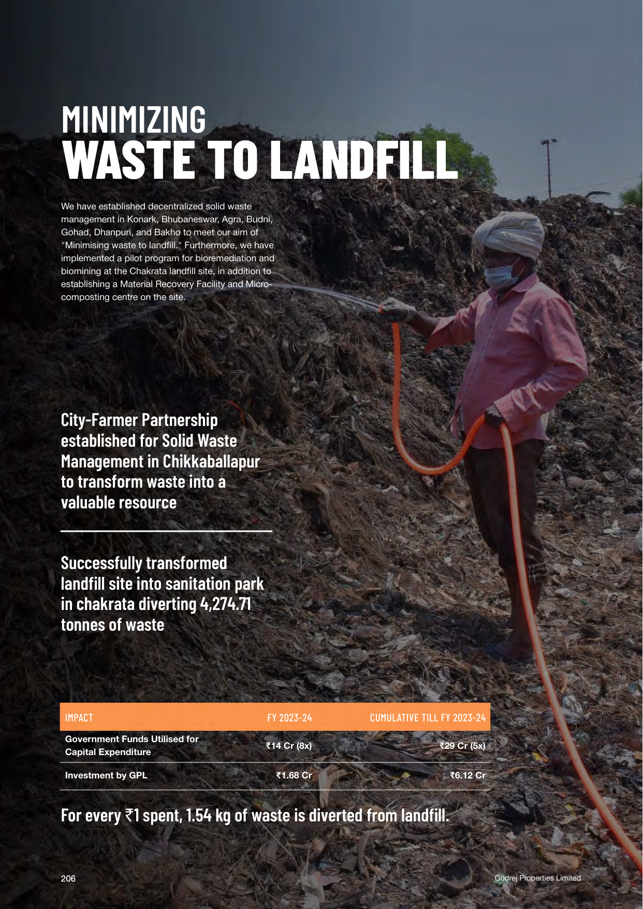

**[Image: AnnualReport2024.pdf-0108-02.png (1242x1754, 3726.7KB)]**

<!-- Start of picture text -->
MINIMIZING WASTE TO LANDFILL We have established decentralized solid waste management in Konark, Bhubaneswar, Agra, Budni, Gohad, Dhanpuri, and Bakho to meet our aim of "Minimising waste to landfill." Furthermore, we have implemented a pilot program for bioremediation and biomining at the Chakrata landfill site, in addition to establishing a Material Recovery Facility and Micro- composting centre on the site. City-Farmer Partnership established for Solid Waste Management in Chikkaballapur to transform waste into a valuable resource Successfully transformed landfill site into sanitation park in chakrata diverting 4,274.71 tonnes of waste IMPACT FY 2023-24 CUMULATIVE TILL FY 2023-24 Government Funds Utilised for ₹14 Cr (8x) ₹29 Cr (5x) Capital Expenditure Investment by GPL ₹1.68 Cr ₹6.12 Cr For every  ` 1 spent, 1.54 kg of waste is diverted from landfill. 206 Godrej Properties Limited <!-- End of picture text -->

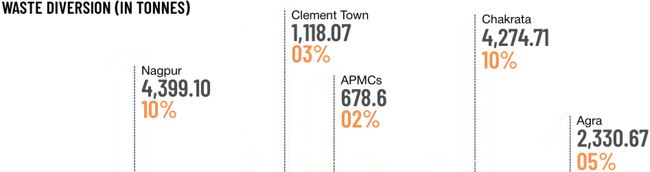

**[Image: AnnualReport2024.pdf-0108-03.png (947x251, 45.1KB)]**

<!-- Start of picture text -->
WASTE DIVERSION (IN TONNES) Clement Town Chakrata 1,118.07 4,274.71 03% 10% Nagpur 4,399.10 APMCs 678.6 10% 02% Agra 2,330.67 05% <!-- End of picture text -->

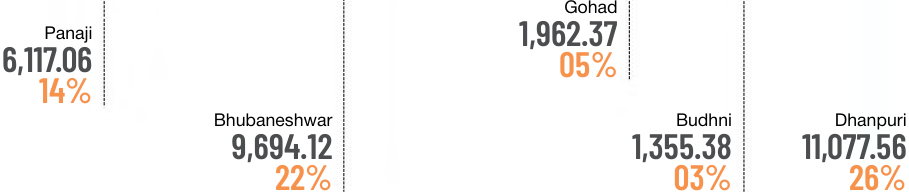

**[Image: AnnualReport2024.pdf-0108-04.png (909x192, 32.3KB)]**

<!-- Start of picture text -->
Gohad Panaji 1,962.37 6,117.06 05% 14% Bhubaneshwar Budhni Dhanpuri 9,694.12 1,355.38 11,077.56 22% 03% 26% <!-- End of picture text -->

Integrated Report FY 2023-24 

207 

About Godrej Integrating Sustainability Properties Limited with our Business 

Management Discussion Statutory and Analysis Reports 

###### **OUR AFFILIATIONS** 

Our provide us avenues to work collaboratively to address sectoral challenges. 

We are members of the following affiliations with trade and industry chambers/ associations: 

###### **GODREJ GROUP** 

###### **CONFEDERATION OF INDIAN INDUSTRY (CII)** 

###### **INDIAN GREEN BUILDING COUNCIL** 

The council provides a diverse range of services that encompass the development of innovative green building rating programs, certification services, and training programs focused on sustainable construction practices. 

CII fosters a conducive environment for India’s development by engaging in advisory and consultative processes, collaborating with industry, government, and civil society. CII fosters a conducive environment for India’s development by engaging in advisory and consultative processes, collaborating with industry, government, and civil society. 

###### **WORLD BANK COUNCIL FOR SUSTAINABLE DEVELOPMENT** 

WBCSD is a global organization comprising over 200 influential businesses, led by CEOs, who collaborate to expedite the shift towards a sustainable world. 

**We prioritize our people’s and shareholders’ interests in public policy discussions on climate change. Recognizing climate risks, we advocate for the Paris Agreement’s goals. Our memberships in trade associations and partnerships with the World Business Council for Sustainable Development and FICCI align with our GHG reduction targets to keep global warming below 1.5°C. Our MD & CEO co-chairs FICCI committee on Urban Development and Real Estate We support decarbonization policies relevant to our operations and welcome incentives for reducing carbon emissions and transitioning to a net-zero future.** 

###### **GODREJ PROPERTIES LIMITED** 

###### **FEDERATION OF INDIAN CHAMBERS OF COMMERCE AND INDUSTRY** 

###### **MAHARASHTRA CHAMBER OF HOUSING INDUSTRY** 

###### **CONFEDERATION OF REAL ESTATE DEVELOPERS ASSOCIATION OF INDIA** 

As a leading organization comprised of members from the Real Estate Industry within the Mumbai Metropolitan Region (MMR), this apex body serves as a unifying platform for real estate developers. It facilitates collaboration among its members, enabling them to collectively address the diverse challenges and issues encountered by the industry. 

FICCI, a non-governmental and not-for-profit organization, serves as the representative voice of India’s business and industry. It actively participates in shaping policies, fostering meaningful discussions, and engaging with policymakers and civil society. By effectively articulating the perspectives and concerns of the industry, FICCI plays a vital role in advocating for the interests of businesses in India. 

Established in 1999 with a focus on housing and habitat providers, CREDAI operates as a knowledge sharing network for its members. It facilitates the exchange of industry data, advancements in technology, and industry benchmarks, empowering its members with the latest insights and best practices. 

###### **NATIONAL SAFETY COUNCIL** 

###### **UNITED NATIONS GLOBAL COMPACT** 

The National Safety Council is dedicated to enhancing capacity and promoting safety, health, and environmental practices. It achieves this by developing materials, methods, and procedures while bolstering the national movement for safety. The council aims to prevent and mitigate the loss of life, minimize human suffering, and reduce economic losses across all sectors, including the unorganized sector. 

The United Nations Global Compact (UNGC) is a voluntary initiative launched in 2000 to promote sustainable and socially responsible policies and practices in businesses worldwide. It provides a framework for companies to align with ten universally accepted principles in areas such as human rights, labor, environment, and anticorruption. The UNGC fosters dialogue, collaboration, and learning among companies, civil society, governments, and stakeholders to drive collective action for a more inclusive and sustainable global economy. 

About Godrej Integrating Sustainability Properties Limited with our Business 

Management Discussion Statutory and Analysis Reports 

**[Image: AnnualReport2024.pdf-0110-02.png (184x27, 2.8KB)]**

###### **MATERIAL TOPICS** 

###### **CHANGE IN MATERIALITY TOPICS** 

|1.|Customer Engagement|1. Water consumption|
|---|---|---|
|2.|Diversity, Inclusion & Equal Opportunity|2. Waste management|
|3.|Occupational Health & Safety|3. Environment management and compliance|
|4.|Corporate Governance|4. Biodiversity conservation and restoration|
|5.|GHG Management|5. Disaster risk mitigation|
|6.|Product & Service Quality|6. GHG management|
|7.|Waste Management|7. Anti-corruption and transparency|
|8.|Sustainable Supply Chain|8. Board oversight|
|9.|Resilience & Risk Management|9. ESG Incident & Risk Management|
|10.|Technology & Innovation|10. Grievance Redressal (employees/ labors/ vendors/ suppliers)|
|11.|Environment Management & Compliance|11. Customer experience|
|12.|Water Management|12. Human Rights Assessment|
|13.|Data Privacy & Security|13. Climate change risk mitigation plan|
|14.|Air Quality Management|14. Supplier environmental assessment|
|15.|Community Centric Sustainability|15. Health, safety, and well-being|
|16.|Energy Efciency|16. Worker/labor practices|
|17.|Employee Engagement & Development|17. Responsible remuneration policy|
|18.|Living Wage|18. Employee diversity and equal opportunity|
|19.|Worker/ Labor Practices|19. Customer satisfaction|
|||20. Employee engagement and empowerment|
|||21. Corporate Social Responsibility|

###### CHANGE IN DENOMINATOR TO CALCULATE INTENSITY 

||**Number of sites**|**Total area**|**Number of sites**|**Total area**|
|---|---|---|---|---|
||**under consideration**|**considered**|**under consideration**|**considered**|
||**including**|**to calculate**|**including**|**to calculate**|
||**Head quarter**|**intensity (ft****2****)**|**Head quarter**|**intensity (ft****2****)**|
|**Scope 1+2**|58|467,841.00|42|482,757.45|
|**Scope 3**|50|9,646,619.03|43|6,708,205.00|

###### CHANGE IN REPORTING BOUNDARY 

||**Scope 1 & 2** |**Scope 1 & 2**|**Scope 3**|**Scope 3 Total**|
|---|---|---|---|---|
||Number of ofces under consideration including Head Ofce|Total Area considered to calculate intensity (ft2)|Number of Sites under consideration|Area considered to calculate intensity (ft2)|
|**NCR**|10|101,964.08|9|2,177,607|
|**MMR**|12|148,378.74|12|610,467|
|**South**|6|48,547.00|5|1,053,669|
|**Pune**|7|102,220.00|13|2,723,177|
|**Ahmedabad**|1|2,308.00|0|0|
|**Kolkata**|2|19,426.00|2|34,085|
|**Vikhroli**|2|9,500.00|2|109,200|
|**Nagpur**|1|10,571|0|0|
|**HO**|1|38,842.63|0|0|
|**Total**|**42**|**482,757.45**|**43**|**6,708,205**|

||**Scope 1 & 2** Number of ofces|**Scope 1 & 2** Total Area considered|**Scope 3** Number of Sites|**Scope 3 Total** Area considered|
|---|---|---|---|---|
||under consideration|to calculate|under consideration|to calculate|
||including Head quarter|intensity (ft2)||intensity (ft2)|
|**NCR**|12|84,705.00|11|1,207,729|
|**MMR**|18|140,960.55|16|2,160,443|
|**South**|6|61,563.33|5|2,336,086|
|**West-East**|21|135,279.49|17|3,942,361|
|**HO**|1|45,332.63|1|0|
|**Total**|**58**|**467,841.00**|**50**|**9,646,619**|

Godrej Properties Limited 

Integrated Report FY 2023-24 

210 

211 

# **MANAGEMENT DISCUSSION AND ANALYSIS** 

|Global and Indian Economies|214|Opportunities, Threats, and Challenges|218|
|---|---|---|---|
|Real Estate|215|Threats, Risks and Concerns|225|
|Sector Budget 2023|216|Outlook|226|
|Impact of Climate Change on the Sector|217|Key Financial Ratios|227|

About Godrej Integrating Sustainability Management Discussion Statutory Properties Limited with our Business and Analysis Reports 

**[Image: AnnualReport2024.pdf-0112-01.png (183x27, 2.7KB)]**

###### **Management Discussion & Analysis** 

but generally stem from reduced core inflation, influenced by ongoing tight monetary policies, softened labor markets, and impacts from lower energy prices. The IMF forecasts a 2.3% decline in oil prices in CY2024, while non-fuel commodity prices are expected to drop by 0.9%. Heightened tensions in the Gaza-Israel region, which accounts for approximately 35% of global oil exports, could lead to supply shocks if the conflict escalates. Continued trade distortions and geopolitical fragmentation are anticipated to persist, exerting pressure on global trade levels. 

###### GLOBAL ECONOMY 

In 2023, the global economy faced a complex scenario characterized by persistent inflation, geopolitical tensions, tightening monetary policies, and ongoing pandemic repercussions, all contributing to a decline in growth. According to the World Economic Output (WEO) update, global growth slowed from 3.5% in CY2022 to 3.0% in CY2023. Central Banks raised interest rates in CY2023 to counter inflationary pressures. Despite challenges such as supply chain disruptions and elevated inflation, major economies received support from fiscal stimulus, monetary policies, trade agreements, international aid, green initiatives, and technological investments. 

The risks to global economic growth are balanced, with potential upside from quicker disinflation, slower withdrawal of fiscal support measures, robust economic expansion in China, and advancements in supply-side reforms. Conversely, downside risks include spikes in commodity prices due to geopolitical or weather-related disruptions, ongoing core inflation necessitating tighter monetary policies, potential slowdowns in Chinese growth, and potential disruptions from abrupt fiscal consolidations. 

The International Monetary Fund (IMF) projects moderate and stable growth for CY2024 & CY2025 at 3.2%, albeit lower than the historical average of 3.1%. This expectation reflects sluggish economic activity, primarily attributed to a slowdown in advanced economies. The growth rate of these economies, which stood at 1.6% in CY2023, is anticipated to remain sluggish at 1.7% to 1.8% over the next two years due to policy tightening, financial sector turmoil, high inflation, the ongoing conflict between Israel and Gaza, and the lingering effects of four years of the COVID pandemic. 

###### INDIAN ECONOMY 

The Indian economy continues to strengthen despite the global headwinds. As per the First Advance Estimates (FAE) released by the National Statistical Office (NSO), real Gross Domestic Product (GDP) is expected to grow by 7.3%, in 

The slow growth rate persists amidst a cost-of-living crisis triggered by disruptions in energy and food markets due to Russia’s conflict in Ukraine, coupled with global monetary tightening to address inflationary pressures and reduced fiscal support. However, the resilience seen in the United States and several significant emerging market economies, along with continued fiscal support in China, will bolster global growth. 

FY2023-24, underpinned by strong investment activity1 . 

For FY2024-25, growth, while still healthy, may see a moderation to 6.8%-7% as per various estimates due to high interest rates and lower fiscal impulse would temper demand and the net tax impact would normalize. Also, the uneven economic growth of some trading partners and escalation of geopolitical uncertainties can drag down exports. 

Inflation rates are declining more rapidly than anticipated across most regions, supported by tight monetary policies. Combined with a modest uptick in economic activity, this sets the stage for a softer-than-expected economic slowdown. 

Support will come from other areas. Household consumption is expected to improve as continued disinflation will prop up the purchasing power of consumers. Secondly, healthy rabi sowing and good kharif output assuming a normal monsoon will support agricultural income. Thirdly, prospects of fixed investment remain bright owing to an upturn in the private capex cycle, improved business sentiments, healthy balance sheets of corporates and banks as well as the government’s continued thrust on capital expenditure. A sustained economic growth will lead India to become the 3rd largest and an upper middle-income economy in years to come. 

In advanced economies, growth rates are forecasted to reach 1.7% in CY2024, improving to 1.8% in CY2025. The US demonstrates resilient consumption and investment, while Euro area activity is expected to remain sluggish. Among emerging markets and developing economies, growth is estimated at 4.2% in CY2025. China faces challenges from its real estate crisis, tax hikes, spending cuts, and weakening confidence, yet it is anticipated to grow at 4.6% in CY2024 due to increased government spending. India is set to maintain its position as the fastest-growing large economy, driven by robust domestic demand. 

Improving the outlook for global trade and increasing integration in the global supply chain will support net external demand. Headwinds from geopolitical tensions, volatility in international financial markets and geoeconomic 

Global inflation is projected to decrease from an estimated 6.8% in CY2023 to 5.9% in CY2024 and further to 4.5% in 2025, primarily due to accelerated disinflation in advanced economies. Declining inflationary pressures vary by country 

1 Press Note, First Advance Estimates of National Income, 2023-24, Released by National Statistical Office 

fragmentation, however, pose risks to the outlook. The Reserve Bank of India (RBI) has kept the Repo Rate unchanged since February 2023 to manage retail inflation within its target range, which has consistently stayed above the 4% mark. In July 2023, Consumer Price Index (CPI) inflation rose to 7.44%, the highest level seen since September 2022. The CPI has since eased and is hovering around 5%. The RBI anticipates a 4.5% inflation for FY2025. Economists expect the RBI MPC to maintain the repo rate at 6.5%, marking the seventh consecutive unchanged rate. Indian banks, with approximately 70% of assets in floating-rate loans, face less exposure to interest rate risks compared to their global counterparts. This arrangement allows them to benefit from rising rates and reduces potential losses on bond holdings as interest rates climb. 

The World Bank expects India to grow by 6.6% in FY2024-25 after an estimated growth of 7.5% in the previous financial year. 

Although the short-term outlook appears challenging due to rising interest rates, external supply shocks, and geopolitical tensions, we believe the government is taking appropriate measures to ensure a sustainable growth trajectory for the country. The union budget presented this year strongly supports the long-term growth of India's real estate sector through its focus on urban infrastructure and the digital economy. The government's significantly expanded capital expenditure target for the year is expected to generate job opportunities and stimulate higher economic activity. 

###### REAL ESTATE SECTOR 

In FY2024, the real estate sector saw remarkable growth, driven by strong housing demand, stable interest rates, and a robust economy. Real estate investments in India reached $5.1 billion, with a substantial portion allocated to land acquisitions, representing 40% of total investments. This trend expanded to tier 2 and tier 3 cities, highlighting real estate’s attractiveness as an investment avenue, including options like direct purchases, Real-Estate-Investment-Trusts (REITs), and Mortgage-backed-Securities (MBS). 

FY2024 was a milestone year for India’s real estate sector, with record-breaking sales and sustained growth. Despite a notable increase in new launches, inventory levels remained stable or decreased in tier-1 cities, highlighting strong demand. The residential segment excelled, driven by stable interest rates, a robust economy, and evolving consumer preferences. The demand for Commercial office space recovered from slowdown induced by remote work trends and global economic slowdown, while the retail real estate sector experienced a robust revival, surpassing pre-pandemic consumption levels. 

###### RESIDENTIAL REAL ESTATE MARKET 

In CY2023, India’s residential real estate sector demonstrated resilience with sustained strong demand. Property sales surged significantly higher than the previous year. This robust performance reflects enduring demand fueled by a robust economic rebound, favorable affordability, and positive macroeconomic conditions. However, challenges like 

soaring raw material costs, consumer inflation, and increased borrowing expenses emerged. 

The lockdown periods led to heightened savings and minimal income disruptions among mid to high-income segments, bolstering sustained demand. Additionally, the real estate sector found relief in the RBI’s decision to maintain the policy repo rate.  The sector experienced notable changes in underlying factors during CY2023, indicating evolving market dynamics, as per property consultant Knight Frank1 . The sales performance in CY2023 demonstrated significant strength. The total value of homes sold in CY2023 rose by 38% compared to the total sales value for all of CY2022. 

The Knight Frank Affordability Index, which monitored the ratio of Equated Monthly Instalment (EMI) to income for households, showed signs of improvement after a brief decline in affordability levels observed in CY2022. This improvement was driven by stronger-than-anticipated economic momentum, and inflation levels remaining within the central bank’s tolerance band. These factors resulted in higher income levels that offset the rise in prices and interest rates. 

Although there was only a marginal overall improvement in affordability, Mumbai remained the only city surpassing the affordability threshold of 50%, with Ahmedabad retaining its position as the most affordable housing market at 21% affordability. Other cities like Pune and Kolkata followed closely at 24% in CY2023. Affordability levels across cities significantly improved compared to pre-pandemic CY2019 levels, with NCR’s affordability index rising from 34% in CY2019 to 27% in CY2023, and Bengaluru increasing from 32% in CY2019 to 26% in CY2023. 

The surge in demand led to a rapid pace of residential development, with annual unit launches reaching nine-year peaks. Despite rising inventory levels, the Quarters to Sell (QTS) metric decreased from 8.7 in H2 CY2020 to 5.9 quarters (less than 18 months) in H2 CY2023, reflecting robust market fundamentals amid growing demand and development activity. 

The real estate market experienced an unprecedented surge in CY2023, surpassing expectations and setting new records. This has created significant opportunities for both domestic and international investors, driving the economy forward. Overall, the residential sector remains a focal point for growth, fueled by sustained demand and stable economic conditions. 

###### NCR 

In CY2023, NCR maintained a steady performance, with robust growth seen in homebuying demand within the primary residential market. The milestone of 60,002 residential units sold was achieved, marking the highest level since CY2013. The year CY2023 witnessed a 3% year-on-year (YoY) increase in residential sales volume compared to CY2022, driven partly by pent-up demand following the pandemic. However, delays in purchasing decisions arose due to a scarcity of ready-to-move-in projects in preferred locations, somewhat hindering sales growth. 

1 Knight Frank report on India Real Estate for H2CY23 

Godrej Properties Limited 

Integrated Report 2023-24 

214 

215 

About Godrej Integrating Sustainability Management Discussion Statutory Properties Limited with our Business and Analysis Reports 

**[Image: AnnualReport2024.pdf-0113-01.png (183x27, 2.7KB)]**

Over the past two years, the share of residential products with ticket sizes > INR 10 mn in the total sales volume consistently surged in the NCR. This category’s share expanded from 37% in CY2021 to 65% in CY2023. Homebuyer preference for products priced upwards of INR 10 mn remained strong, reflecting a trend where spacious homes with high-end amenities are redefining post-pandemic living for high-net-worth individuals. 

In contrast to residential sales, new launches in CY2023 experienced a slight decline of 1% compared to CY2022, dropping from 63,233 units to 62,649 units. Despite this decrease, developers continued to introduce new projects to capitalize on the demand for new homes and prioritized acquiring new land for future project pipelines. 

###### MMR 

In CY2023, the Mumbai real estate market experienced robust growth despite global challenges, retaining its position as the top market with 86,871 units sold, marking the highest sales in eleven years. This surge stemmed from a positive economic outlook, increased disposable income among buyers, a shift towards larger homes, and a fear of missing out on opportunities in the flourishing market amidst rising prices. 

Sales surged during festive seasons like Navratri, Dussehra, and Diwali, which traditionally witness heightened real estate activities due to positive sentiments and developer strategies of introducing new projects with attractive payment plans. 

The momentum in new project launches remained strong, with Mumbai witnessing 93,051 new units introduced in CY2023, the highest since CY2014. The residential market in Mumbai is poised for continued growth, driven by strong consumer demand fueled by ongoing infrastructural developments, rising affluence, and evolving consumer preferences. 

###### Bengaluru 

Bengaluru's residential real estate market in CY2023 showed resilience despite rising borrowing costs and economic challenges from tech sector volatility and funding constraints in the startup ecosystem. The city experienced a nine-year high in residential sales volume, reaching 54,046 units, indicating sustained interest in home ownership. This strong sales performance boosted developer confidence, leading to an increase in large-scale project launches with 51,126 units introduced during the year, marking a multi-year high and attracting both local and non-local developers. 

Residential prices in Bengaluru grew by 9% YoY, with a weighted average price of INR 63,505/sq m. The price growth is primarily driven by demand as the hybrid work structure and return to office are encouraging people, especially those in the IT sector, to move back to the city. To meet this demand, residential supply in the city is also increasing, as seen in the multi-year high launches in 2023. Looking ahead, as supply aligns with demand, price growth is expected to moderate in 2024. Nevertheless, Bengaluru's real estate market is expected to remain vibrant due to the city's growing economic profile. 

###### Pune 

In CY2023, Pune's real estate market experienced significant growth, with 49,266 units sold, marking a 13% YoY increase. This surge was propelled by migrant workers and heightened demand during festive seasons. New project launches also rose by 10% YoY to 42,437 units, indicating a preference for larger homes with dedicated workspaces. The growth was particularly prominent in the West Zone, which accounted for 41% of total sales, driven by Pune's status as an IT hub and focused infrastructure development efforts. This evolution has positioned Pune as a pivotal housing destination, prompting leading developers to actively pursue opportunities in this burgeoning market. 

###### OFFICE MARKET 

The office market across major Indian cities demonstrated resilience in CY2023, despite global challenges. Bengaluru's average rentals grew by 6.6% YoY to INR 930/sq m/month, driven by increased demand in key micro markets like PBD East and ORR. Mumbai's office rents rose by 3.6% YoY, supported by improved infrastructure and new metro lines. The National Capital Region (NCR) saw unprecedented growth in office leasing, reaching a decadal high of 0.9 mn sq m in transaction volume, with a 14% increase over CY2022. 

In Bengaluru, the acceleration of firms returning to office and growth in India-facing businesses boosted demand, while stable inflow from western markets supported Mumbai's rental growth. NCR's office market saw a decline in vacancies to 12.3% due to record leasing in CY2023, indicating a positive trend for market health. Pune's office rents also rose moderately by 2% YoY, reflecting increased transactions amid limited supply. 

###### BUDGET 2024 - TAKEAWAYS 

This year's union budget was supportive to fostering longterm growth in India's real estate sector, emphasizing urban infrastructure development and the digital economy. The Government's heightened emphasis on infrastructure capital expenditure sets a favorable backdrop for real estate opportunities. Key measures in this regard include: 

###### **Inclusive Development** 

Despite COVID-19 challenges, PMAY (Rural) is close to its three crore houses target, with plans for two crores more houses in five years. The PMAY scheme for affordable housing includes PMAY (Urban) and PMAY (Rural), with a total allocation of ₹80,671 crore, of which ₹54,500 crore is for PMAY (Rural). PM-SVANidhi successfully supported 78 lakh street vendors with credit. The government aims for holistic development, envisioning 'Viksit Bharat' by 2047. 

###### **Housing** 

The PM Awas Yojana announced plans for 2 crore houses in the future, but details about the urban wing were lacking. Additionally, a target of 1 crore houses for rooftop solarization was set, offering urban households 300 units of free 

electricity monthly. The Budget highlighted a new scheme for middle-class urban residents in rented housing, slums, chawls, or unauthorized colonies, allowing them to buy or build their own homes. 

###### **Urban Reforms** 

The ongoing municipal reforms featured an incentivization package and a fifty-year loan to states, with a focus on capital project utilization and urban planning reforms to boost municipal bond creditworthiness.1 

###### BUDGET 2024 – KEY TAKEAWAYS FOR CLIMATE CHANGE 

The Union Budget for FY 2024-25 reflects India's resolute stride towards sustainability, harnessing renewable energy, and fostering sustainable development amidst the pressing global climate challenges. Emphasizing "Amrit Kaal," the budget outlines an ambitious pathway to achieve a "Prosperous Bharat in harmony with nature, modern infrastructure, and opportunities for all," aiming for net-zero emissions by 2070. The capital expenditure outlay has been raised by 11.1%, with India's Real GDP expected to expand at a rate of 7.3%. The government's commitment to stimulating growth through infrastructure development is underscored by its decision to expand the PM Awas Yojana (Grameen), aiming to construct an additional two crore homes over the next five years in response to the growing number of households. The fund allocation has risen to ₹80,671 crore, up from the previous year's budget estimate of ₹79,590 crore.  Furthermore, the initiative to provide one crore households with up to 300 units of free electricity each month through rooftop solarization aligns with this strategic focus on bolstering infrastructure and sustainable development. 

The government is set to enhance the electric vehicle infrastructure, supporting the production and expansion of charging stations. It aims to boost the use of electric buses across public transportation systems with the help of a payment security mechanism. Budget allocations reflect this focus: funding for Solar Power (Grid) has risen from ₹4,970 crore in 2023-24 to ₹8,500 crore in 2024-25. In a similar vein, investment in the National Green Hydrogen Mission has increased from ₹297 crore to ₹600 crore. These increases highlight the government’s commitment to advancing renewable energy and fostering eco-friendly practices. Additionally, a systematic integration of compressed biogas with natural gas for vehicles and homes will be initiated.2 

During the 26th session of the Conference of the Parties (COP-26) to the United Nations Framework Convention on Climate Change (UNFCCC) in 2021, India set forth ambitious climate objectives. The country has updated its goals for 2030, aiming to achieve 500 GW of non-fossil fuel energy capacity, meet 50% of its energy needs with renewable resources, cut the carbon intensity of its economy by 45% from 2005 levels, and reach carbon neutrality by 2070. The following COP-27, convened in Sharm El-Sheikh, Egypt, marked a shift from setting goals to implementing them, with 

a spotlight on the adaptation agenda and the integration of technology. Support was garnered for financing the achievement of these climate goals and advancing the development of models for a low carbon transition. The promotion of carbon credits and the establishment of carbon markets to assist in the transition towards low carbon emissions were also emphasized. At COP28, India articulated a stance on climate action, underscoring its achievements, commitments, and the principle of climate justice as central to global efforts. The country highlighted its progress towards its Nationally Determined Contributions (NDCs), including a significant reduction in emission intensity and a substantial increase in non-fossil fuel-based electric capacity ahead of its 2030 targets.  To reach net-zero emissions by 2070, blending compressed biogas with CNG and PNG will be gradually enforced. Moreover, by 2030, there are plans to install coal gasification and liquefaction facilities with a capacity of 100 metric tonnes. In pursuit of India's 'net-zero' goal by 2070, key initiatives include: allocating viability gap funding for 1 GW of offshore wind energy, establishing a 100 MT coal gasification and liquefaction capacity by 2030 to decrease imports, mandating phased blending of CBG with CNG and PNG, and offering financial support for biomass aggregation machinery. 

The 2024-25 Union Budget presents a blueprint that combines technology, environmental sustainability, and economic advancement. It is geared towards creating jobs by investing in renewable energy, eco-friendly fuels, and sustainable farming. The budget's financial provisions are aimed at supporting a green revival and fulfilling climate commitments in a thorough and inclusive manner. 

###### IMPACT OF CLIMATE CHANGE ON REAL ESTATE SECTOR 

In 2022, emissions from buildings, covering both operational (26%) and embodied emissions (7%), made up about a third of total energy system emissions. The emissions intensity of cement production has increased by close to 10% since 2015, which is challenging to decarbonize. The rest stems from direct on-site emissions, predominantly from electricity use for lighting and air conditioning. There's a significant yet unexplored opportunity to reduce emissions, hindered by the ongoing reliance on fossil fuel-driven assets, the absence of potent energy-efficiency mandates, and a deficit in investments towards sustainable buildings3 . 

Due to the nature of business, the real estate sector is a significant contributor to the GDP of India. It is also responsible for nearly one-fifth of the nation’s emissions, and 33% of total energy consumption. Considering India's rigorous climate objectives, including the goal of Net-Zero by 2070, the Indian real estate sector is required to act quickly and effectively. As climate change increasingly affects economies and this sector, there are both physical and transitional risks that could harm assets and the markets they are part of, either directly or indirectly. 

Real estate portfolios are exposed to various risks, including the impact of climate change, which can cause damage to 

- 1 (Key Features of Budget 2024-2025, 2024) 

- 2 (Key Features of Budget 2024-2025, 2024) 3 Buildings – Breakthrough Agenda Report 2023 – Analysis - IEA 

Godrej Properties Limited 

Integrated Report 2023-24 

216 

217 

About Godrej Integrating Sustainability Management Discussion Statutory Properties Limited with our Business and Analysis Reports 

**[Image: AnnualReport2024.pdf-0114-01.png (183x27, 2.7KB)]**

properties through extreme weather events. These impacts can be chronic, reflecting long-term trends, or acute, indicating severe short-term occurrences, and vary by location or in response to efforts to shift towards a low-carbon economy. The urgency for drastic measures is underscored by the observable effects of climate change, such as escalating temperatures, rising sea levels, and increased frequency of extreme weather events. Additionally, environmental hazards adversely affect the ability to provide safe, healthy, and adequate working conditions, alongside job availability. Climate change exacerbates risks to occupational health and safety, with high temperatures already contributing to a 1.4% loss in working hours in 1995. Studies suggest that without addressing climate change, and with an expected temperature increase of 1.3°C by 2030, we could see a productivity loss of 2.2%, equating to 80 million full-time jobs. Recognizing their contribution to climate change, real estate firms must urgently implement innovative strategies to adapt their buildings, operations, workforce, products, and services to these significant and impending changes. 

In recent years, there's been a noticeable uptick in worldwide investments aimed at diminishing the energy consumption of buildings. This move by the real estate sector towards minimizing its environmental footprint marks a positive trend. Governments, policymakers, investors, and the general populace are shifting their views on climate change and are taking bold actions to counteract its effects. The creation of tools that encourage eco-friendly building practices and the widespread acceptance of green building certifications are helping more areas to align their construction activities with the goals of the Paris Agreement. While the surge in investment is indeed encouraging, it also highlights the necessity of engaging with additional external partners to leverage technology effectively, ensuring seamless operations, accountability, and transparency. 

###### OPPORTUNITIES 

###### **Housing Demand** 

A combination of economic growth, increasing income levels, and the perception that housing prices are stabilizing has led to a notable uptick in the demand for homes. This trend is evident as potential buyers, previously on the sidelines, are now entering the market as first-time homeowners or existing homeowners looking for larger spaces. The shift towards remote and hybrid work models is further influencing the desire for more spacious living arrangements. Employers offering flexible work options continue to be a significant factor in this trend, as it allows employees the freedom to live further from the office, thereby boosting demand for residential properties in various segments. 

###### **Sector Consolidation** 

The Indian real estate sector, characterized by its highly fragmented nature, has been undergoing a significant consolidation phase for several years. This consolidation has been accelerated by various factors, including the pandemic, which has effectively sidelined less robust participants. The current environment in the real estate industry poses challenges to the entry of new competitors. With the trend 

leaning towards a smaller number of dominant developers in each region, this period of consolidation offers an attractive chance for current real estate firms to meet the increasing demand for housing. 

###### **Affordable housing** 

The segment of affordable housing remains a pivotal area for developers and a primary focus for the government. As per the new Union budget, a housing for Middle Class scheme is to be launched to encourage the middle class to buy their own houses. The Pradhan Mantri Awas Yojana (PMAY) is close to achieving 3 crore houses, additional 2 crore houses are targeted for the next 5 years, as discussed above. This shows that the affordable housing market is projected to experience a surge in demand, bolstered by an anticipated economic revival and increasing income levels. 

###### **Digital Real Estate Sales** 

Digital marketing has become a key strategy for real estate developers to boost sales and connect with customers. Since the pandemic, their marketing efforts have expanded beyond attracting new customers and building brand awareness to include creating personal connections digitally. Thanks to technology that allows property purchases online, developers have seen strong sales, even during lockdown periods. They're using digital tools to engage with potential buyers, present project details, offer virtual tours, and target Non-Resident Indians (NRIs) to increase sales. Advanced technologies like virtual reality, augmented reality, and AI-driven chatbots are increasingly employed to offer tailored services to potential clients. Moving forward, developers will need to keep up with technological advancements, as the share of real estate transactions conducted online is expected to grow. 

###### THREATS & CHALLENGES 

###### **Regulatory Hurdles** 

The real estate industry is subject to extensive regulation, and any negative adjustments in governmental policies or the regulatory framework can negatively influence the sector's performance. Significant delays in procedures related to acquiring land, determining land use, initiating projects, and obtaining construction approvals are common. Changes in policy applied retrospectively, along with regulatory obstacles, could affect profitability and diminish the appeal of both the sector and the companies active within it. 

###### **Monetary Tightening and Funding Issues** 

In recent years, the landscape of real estate financing has shown a marked divergence. Well-established developers with lower debt levels have continued to secure funding with relative ease, benefiting from the selective approach of lenders, while those with weaker financial standings have encountered challenges in accessing capital. The performance of the real estate sector is intricately connected to the broader economic recovery and the prevailing monetary policies. The RBI has maintained an accommodative stance to bolster economic growth. However, it is anticipated that there will be a shift towards tighter monetary policies as efforts intensify 

to manage persistent inflation. The budding economic revival, coupled with potential increases in interest rates, may pose challenges for the real estate sector shortly. Higher housing loan costs and an escalation in financing costs for developers, who are already contending with margin pressures due to the rising prices of commodities, could have implications. 

###### **Shortage of Manpower & Technology** 

As the country's second-largest employment provider, the real estate sector relies significantly on manual labor. The pandemic severely impacted this sector due to labor shortages, disrupting project completion schedules. Consequently, there's a pressing need for the adoption of alternative construction methods that are less dependent on manual labor and more on technology. 

###### ABOUT GODREJ PROPERTIES LIMITED 

Godrej Properties Limited (GPL), part of the venerable Godrej Group founded in 1897, stands out as a leading entity in India’s real estate sector. Upholding the Group's ethos of innovation, sustainability, and excellence, Godrej Properties has been synonymous with trust and quality for over a century. With a focus on leveraging advanced design and technology, GPL is committed to exceeding stakeholder expectations by crafting exceptional and innovative spaces, rooted in deep consumer understanding. At its core, GPL believes in the power of collaboration to achieve excellence, partnering with premier designers, architects, and contractors both in India and internationally. This approach ensures that every development not only meets the present needs of its residents and communities but is also durable and forward-thinking, reflecting the best the world has to offer in real estate. 

###### **A. Leveraging the Godrej Brand** 

The ‘Godrej’ brand is well-recognized throughout India due to its long history in the market, the diverse sectors the Godrej Group operates in, and the trust it has built over time. This strong brand reputation aids in several business activities, such as establishing joint development agreements, moving into new cities and markets, and forming business partnerships. Godrej Properties Limited (GPL) has also entered the plotted development space in Tier-2 cities, recognizing their sales potential. The brand has been crucial in developing solid relationships with customers, service providers, partners, investors, and lenders, helping us secure a strong position in the industry. Additionally, GPL’s binding arrangements with Godrej & Boyce appointing GPL as the development manager for developing all its lands in Vikhroli further provides an opportunity to enhance the scope of our portfolio. 

###### **B. Sales Momentum** 

This year marks the 7th consecutive year of record annual sales for GPL, underscoring the strength of our brand and the quality of our products. Your company reached INR 22,527 crore booking value in FY24, a growth of 84% year-on-year and 61% above guidance for FY24. This success was driven by an enhanced mix of projects and a significant 31% increase in sales volume. Your company stands as the largest developer in India by sales value in FY24. This surge was the result of launching 26 new projects or phases in FY2023-24. 

Sales momentum significantly increased in the second half of the year, with Q4 FY2023-24 being our most successful quarter ever, contributing ₹9,519 Crore, or 42% of our annual booking value. This was the highest quarterly sales announced to date by any publicly listed real estate developer in India. 

Sales were driven by superlative consumer demand in some key new project launches. 4 projects i.e. Godrej Zenith, Godrej Aristocrat and Godrej Tropical Isle in NCR as well as Godrej Reserve in MMR achieved a booking value of more than INR 2,000 crore. Your company’s bookings in NCR in FY 24 grew 180% to over INR 10,000 crore and in MMR grew 114% to over INR 6,500 crore. 

As the challenges of recent global disruptions begin to recede, we are optimistic that a revival in the real estate sector, coupled with our robust balance sheet and a strong pipeline of projects, will enable us to boost sales momentum in the coming year. Below is a brief on our performance in key markets. 

###### **NCR** 

In FY2023-24, the NCR region remained GPL’s top-performing area, marking yet another year of record-breaking sales driven by enthusiastic responses to new launches and consistent sales performance. The company achieved sales of 7.50 million sq. ft., an increase of 110% year-over-year, and booking value increase of 180% YoY to ₹10,016 Crore. This impressive sales outcome was supported by several successful new projects and phase launches, alongside sustained sales from ongoing developments. 

A significant highlight this year was the outstanding performance of Godrej Zenith, Godrej Aristocrat and Godrej Tropical Isle, each of them achieving a booking value of more than INR 2,000 crore. Godrej Zenith in Sector 89, Gurugram was the best ever launch for your company, achieving a booking value of ₹3,008 Crore across 2.08 million sq. ft. Godrej Aristocrat in Sector 49, Gurugram achieved a booking value of ₹2,877 Crore across 1.46 million sq. ft. while Godrej Tropical Isle in Sector 146 Noida achieved a booking value of ₹2,098 Crore across 1.56 million sq. ft.. Furthermore, Godrej Parkland Estate in sector 41, Kurukshtra reported booking value of ₹627 Crore across 1.39 million sq. ft. and 3 projects, Godrej Woods, Godrej 101 and Godrej South Estate, each reported booking value of more than ₹200 Crore in FY2023-24, driven by sustenance sales and a strong market reception to new phase launches. 

###### **Mumbai** 

Sales in Mumbai reached approximately 4.10 million sq. ft., generating a booking value of ₹6,545 Crore, marking a 114% increase year-over-year. This strong sales figure performance was fueled by the launch of 9 new projects/phases over the year, along with sustained sales momentum from ongoing projects. Notably, Godrej Reserve in Kandivali recorded sales of 1.51 million sq. ft., achieving a booking value of ₹2,693 Crore, positioning it as one of our standout projects for the year. Godrej Avenue Eleven in Mahalaxmi, another standout project, reported sales of 0.24 million sq. ft., with a booking value of ₹755 Crore. Furthermore, Godrej City achieved a booking value of ₹546 Crore across 0.84 million sq. ft., Godrej Horizon achieved a booking value of ₹470 Crore across 0.21 

Godrej Properties Limited 

Integrated Report 2023-24 

218 

219 

About Godrej Integrating Sustainability Management Discussion Statutory Properties Limited with our Business and Analysis Reports 

**[Image: AnnualReport2024.pdf-0115-01.png (183x27, 2.8KB)]**

million sq. ft., Godrej Ascend achieved booking value of ₹468 Crore across 0.39 million sq. ft., Godrej Vistas achieved a booking value of ₹438 Crore across 0.17 million sq. ft. and 2 projects i.e. Godrej Urban Park and Godrej Tranquil achieved booking value of more than ₹200 Crore each in FY2023-24. 

###### **Pune** 

In Pune, total sales reached about 3.27 million sq. ft., with a booking value of ₹2,686 Crore, marking a 26% increase year-over-year. This sales achievement was propelled by the launch of 6 new projects/phases over the year and solid sales performance from ongoing projects.  New project launches in Hinjewadi namely ‘The Gale', led to Maanhinje together with all its phases achieving sales of 1.01 million sq. ft. and a booking value of ₹832 Crore. On the back of 2 new launches, all phases of Mahalunge together achieved sales of 0.81 million sq. ft. and a booking value of ₹652 Crore. Our new project, Godrej Emerald Waters, launched in 3 parts, recorded sales of 0.54 million sq. ft., with a booking value of ₹578 Crore. The combined phases in Manjri accounted for sales of 0.53 million sq. ft., with a booking value of ₹398 Crore. The combined phases in Mamurdi also achieved a booking value of just under ₹200 Crore. 

###### **Bengaluru** 

In Bengaluru, total sales reached around 3.00 million sq. ft., generating a booking value of ₹2,460 Crore, a increase of 10% compared to the previous year. This was driven by the introduction of two new phases over the year in Godrej Ananda and Godrej Park Retreat, along with strong sales from ongoing projects. Godrej Ananda registered sales of 1.40 million sq. ft., with a booking value of ₹998 Crore, while Godrej Park Retreat registered sales of 0.69 million sq. ft., with a booking value of ₹596 Crore. 2 other projects Godrej Splendour and Godrej Athena carried the momentum from last year’s launch and achieved booking value of ₹457 Crore and ₹385 Crore respectively, from sale of 0.59 million sq. ft. and 0.28 million sq. ft. respectively. 

###### **Other Cities** 

Your company also achieved sales of around 2.13 million sq. ft., generating a booking value of ₹820 Crore, a decrease of 33% compared to the previous year, from markets outside of the above. There were 4 project/phase launches in markets of Nagpur, Kolkata and Chennai. Godrej Forest Estate and Godrej Orchard Estate in Nagpur achieved sales of booking value of ₹375 Crore and ₹129 Crore respectively, from sale of 1.12 million sq. ft. and 0.29 million sq. ft. respectively. Godrej Seven in Kolkata reached sales of 0.36 million sq. ft., with a booking value of ₹195 Crore and Godrej Sunrise Estate in Chennai reached sales of 0.24 million sq. ft., with a booking value of ₹63 Crore. 

###### **D. Business Development** 

The financial year FY2023-24 is a landmark year for Godrej Properties as it marked our entry into Hyderabad market with 2 new deals which materialized in the last quarter. During this period, we introduced 10 new residential projects, characterized by a high degree of economic interest. These projects, which cover a saleable area of approximately 

18.93 million sq. ft., carry an anticipated revenue potential of around ₹21,225 Crore. This figure notably exceeds the initial annual forecast of ₹15,000 Crore in estimated booking value. The strategic locations of these projects are poised to bolster our continued rapid growth and significantly enhance our company's margin profile, particularly as most of these projects are entirely owned by us. 

The ongoing consolidation in the real estate sector, accelerated by the pandemic, continues to present significant opportunities for companies like GPL to further their business development. With growth capital at our disposal, we plan to concentrate on opportunistic investments and expand our project portfolio in FY2023-24. Below is the list of residential deals signed by GPL in FY2023-24 

|**Particulars**|**Estimated** **Saleable** **Area (million** **sq. ft.)**|**Expected** **Booking** **Value (₹ Cr)**|
|---|---|---|
|New Alipore, Kolkata|0.98|1,200|
|Gurugram 1|1.53|2,150|
|Gurugram 2|0.59|1,700|
|Gurugram 3|0.55|1,400|
|Godrej Forest Estate|2.25|725|
|(Nagpur Plotted 2)|||
|Yeshwanthpur, Bengaluru|0.84|1,250|
|Rajendra|4.00|3,500|
|Nagar, Hyderabad|||
|Devanhalli*|5.60|5,000|
|Sector 44, Noida|1.40|3,000|
|Kokapet, Hyderabad|1.20|1,300|
|**Total**|**18.93**|**21,225**|

**[Image: AnnualReport2024.pdf-0115-14.png (507x24, 3.8KB)]**

*Original agreement for sale of land was entered into by GPL in 2014, the deal has been revived recently and GPL now expects to launch the first phase of development on this land in the current financial year. 

###### **E. Customer Centricity** 

FY2023-24 demonstrates GPL’s commitment to delivering top-notch customer experience while balancing exponential growth and scale.  Our performance, measured through the Net Promoter System, which we adopted in FY201819, reflects the impact of our customer experience and the customer advocacy it creates. In FY2023-24, we continued our upward trajectory and delivered an all-time high NPS since its inception in 2018. 

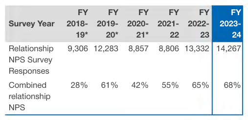

**[Image: AnnualReport2024.pdf-0115-18.png (507x246, 41.6KB)]**

<!-- Start of picture text -->
FY  FY  FY  FY  FY  FY Survey Year 2018-  2019-  2020-  2021-  2022-  2023- 19* 20* 21* 22 23 24 Relationship  9,306 12,283 8,857 8,806 13,332 14,267 NPS Survey Responses Combined  28% 61% 42% 55% 65% 68% relationship NPS <!-- End of picture text -->

- *NPS Scores for FY2018-19, FY2019-20, FY2020-21 are revised to only account for completed responses to the survey and discard any customer response that was filled but not submitted. 

We sharpened our focus towards actualizing our ’Purpose’ to bring Joy to our customers. The major highlights of our efforts for enhanced customer experience in FY2023-24 are as follows: 

1. Improving experiences during key moments of truth: 

- A. Operating at scale: In FY2023-24 

   - a. We welcomed 15000+ customers, 

   - b. Completed 13,000+ registrations, and 

   - c. Handed over 7,400+ homes 

   - d. Facilitated 20,000+ customer site visits 

- B. Quality as a talking point: The monthly construction newsletters were detailed with the company’s initiatives on quality. 

- C. Focus on Handover Experience: In FY2023-24, we continued to strengthen our systems for delivering joy during handover and post-possession. 

2. Technology as a service: 

- A. The Godrej Properties Ltd. Mobile App, launched in FY2021-22, empowers customers to manage all aspects of their purchases at their fingertips.  Continuing customer delight through the App, the Godrej Properties Ltd Mobile App continued to maintain a 4+ rating with 4.3 on Playstore (1000+ ratings) and 4.4 on Appstore (300+ ratings).  The ratings resonate with the voices of over 73%+ of our existing customers, who have started using the App. 

- B. Adding another layer of convenience for the customers, we expanded the payment functionality on the App to allow our customers to make payments using Debit cards and Credit cards in addition to Netbanking. 

###### **F. Global recognition for sustainability initiatives** 

GPL has been included in the leadership index of emerging markets and has secured a place in the sustainability yearbook of the prestigious S&P’s Dow Jones Sustainability Index (DJSI), affirming commitment to ESG excellence. DJSI is globally recognized as a leading benchmark for corporate sustainability, assessing companies based on ESG performance and transparency. GPL’s achievement in the DJSI underscores a proactive approach to sustainability, with strategic enhancements across various dimensions such as climate strategy, human rights, occupational health & safety, and information security/cybersecurity governance. By aligning practices with the rigorous criteria set forth by DJSI, GPL demonstrates leadership in sustainable real estate development. This recognition within the DJSI framework reflects dedication to driving positive change and fostering long-term value creation while meeting evolving expectations of stakeholders in the global sustainability landscape. The DJSI which comprise indices tracking the financial performance of companies recognized as leaders in environmental, social, and governance (ESG) practices. Being included in the DJSI signifies a company’s dedication to sustainability. DJSI selects “global, sustainable stocks” and features indices of world-leading companies known for their exceptional business operations with a strong emphasis on sustainability. S&P Global conducts an annual sustainability 

assessment and ranking based on economic, social, and environmental indicators in alignment with sustainable business development guidelines. 

###### **G. Health and Safety Management System** 

At GPL, safety is our top priority and a critical component for achieving our ambitious business growth goals. We are committed to the health and safety of our employees and all stakeholders, as outlined in the GPL Health & Safety Policy. To ensure a strong safety culture where every employee takes responsibility for safety, GPL has implemented a robust health and safety management system certified to the ISO 45001:2018 international standard. Our safety management system follows a proactive PDCA cycle, emphasizing leadership commitment, consultation, and participation at all levels and functions to achieve a "Score Zero" safety record. We have established predefined safety processes and standard operating procedures (SOPs), including comprehensive safety checks and inspections starting from the contractor prequalification stage. Each location has a dedicated safety team tasked with promoting safety awareness among employees and implementing various training programs as part of our monthly safety activity plan. Additionally, our Health and Safety Management system undergoes regular assessment by certifying agencies through surveillance audits to ensure continual improvement and compliance. 

###### **Visible Safety Leadership** 

Visible Safety Leadership is an essential aspect of GPL's safety management system, as outlined in the GPL Health & Safety Policy. This policy reflects the commitment of top management to implement and monitor occupational health and safety (OH&S) measures within GPL. This commitment includes ensuring a safe workplace, compliance with OH&S regulations, soliciting stakeholder input, and continuously improving safety processes. 

With the objective of making OH&S a business imperative that enables operational excellence, GPL engaged with top management to reinforce safety practices through visible leadership. This initiative involves three levels of Management Review Meetings (MRM) to assess organizational performance and promote a positive safety culture. MRM Level 1, chaired by the COO at the Head Office, is followed by Level 2, chaired by the Operations Head at the regional level, and Level 3, chaired by the Project Manager at the project level. Additionally, GPL has implemented a "Safety Involvement Index" mechanism to encourage active participation of Operations Heads in various OH&S initiatives at project sites. 

###### **Contract Health and Safety Management System** 

The Contract Health and Safety Management System is a proactive approach that begins well before contract awarding. It involves evaluating prospective contractors through a prequalification (PQ) procedure, assessing business risks, and developing mitigation plans based on the contractor's PQ score. Preference is given to contractors who are ISO 45001 certified during the pre-qualification stage. A joint safety kick-off meeting briefs the contractor, and the subsequent mobilization phase is monitored and audited by a safety and health infra tracker. Contractors are required to sign a formal 

Godrej Properties Limited 

Integrated Report 2023-24 

220 

221 

About Godrej Integrating Sustainability Management Discussion Statutory Properties Limited with our Business and Analysis Reports 

**[Image: AnnualReport2024.pdf-0116-01.png (185x26, 3.3KB)]**

undertaking while implementing the site health and safety plan, which includes standard operating procedures (SOPs), work instructions, and guidelines to ensure compliance during work execution on-site. 

###### **Hazard Identification and Risk Assessment (HIRA)** 

One crucial aspect of the GPL Safety System is assessing risks using an approved risk matrix before commencing any activity. At each site, a cross-functional Hazard Identification and Risk Assessment (HIRA) team is formed to identify hazards, evaluate associated risks, and develop control measures following the hierarchy of control. While the main responsibility of this team is conducting a comprehensive HIRA exercise, they also provide workers with training on hazards, risks, and control measures. The implementation of these controls on-site is enforced through the Permit to Work system. 

###### **Training and Awareness Campaign** 

We prioritize skill development, competence building, and awareness as the key pillars of our safety and health management system at GPL. Our focus revolves around conducting awareness campaigns, skill training sessions, motivational initiatives, and health camps. In the current reporting year, we organized safety training for over 34715 safety people across offices and construction sites. All crucial stakeholders received necessary training and awareness programs in preparation for the implementation of ISO 45001:2018. 

We have formalized the process of identifying training needs and creating a training calendar for safety sessions at sites, effectively executing multiple programs to cultivate a robust safety culture across all project sites. National Safety Day, World Environment Day, Road Safety Week, and Fire Service Day are commemorated at our sites, serving as vital platforms for raising awareness about health and safety. Safety communications play a pivotal role in our Safety Management System, promoting safety awareness and fostering a strong safety culture throughout GPL. Additionally, GPL has conducted Safety Assessment exercises to assess the safety awareness levels among the execution team. 

To further enhance safety culture and reinforce operational controls, we conduct safety campaigns on various topics such as the usage of cell phones at construction sites, rope-suspended platforms, fire prevention and control, and safety in-store management. The "horizontal deployment of learnings" initiative aids in developing a positive safety culture and continual improvement across GPL, aimed at preventing the recurrence of any unfortunate incidents. 

###### **Safety Audit** 

The safety audit serves as a regular evaluation of our entire occupational health and safety management system, encompassing policies and programs designed to prevent workplace accidents or incidents. We adhere to a stringent safety audit process in alignment with ISO 45001 requirements, conducting audits quarterly. Our qualified internal safety auditors oversee the audit, while our online safety audit portal efficiently monitors and manages the process. Through analysis of the safety audit findings, we 

pinpoint gaps and areas for enhancement within our health and safety management system. 

###### **External Recognition** 

Achieving third-party recognition and accolades on health and safety systems endorses the organization’s reputation, brand value, and safety system implementation. GPL received over 70 external recognitions and accolades in the reporting year, including international and national safety awards such as the RoSPA (Royal Society for the Prevention of Accidents), British Safety Council International Safety Award, National Safety Council India, Global Safety Summit, and ICC National OH&S. These remarkable recognitions and accolades indicate a well-established and effective health and safety management system. 

###### **Health Surveillance Program** 

As part of our Health Surveillance Programme for workers at project locations, we conduct pre-employment medical examinations. Personnel responsible for operating machinery or driving vehicles undergo comprehensive medical assessments upon joining and at regular intervals thereafter. 

###### **H. Human Capital** 

At GPL, we've experienced significant business growth in the past year and are dedicated to sustaining this momentum. Consequently, our employee count has surged by 26% over the last year, rising from 2391 to 3015 employees. 

We attribute our operational success to our dedicated team of Godrejites, who are instrumental in driving our aspirations for the future. At GPL, we take pride in fostering an inspiring workplace culture characterized by agility and high performance, aimed at attracting, nurturing, and retaining top talent. 

As part of the esteemed 127-year-old Godrej Group, we cherish a legacy founded on strong values of trust, integrity, and respect. Meanwhile, our ambitious growth plans provide exceptional career prospects, even at the early stages of one's professional journey. 

###### **People philosophy** 

Our philosophy stands tall and proud on three principles: 

**[Image: AnnualReport2024.pdf-0116-22.png (103x101, 15.9KB)]**

<!-- Start of picture text -->
0 <!-- End of picture text -->

**[Image: AnnualReport2024.pdf-0116-23.png (101x101, 16.4KB)]**

<!-- Start of picture text -->
0 <!-- End of picture text -->

**[Image: AnnualReport2024.pdf-0116-24.png (99x98, 15.4KB)]**

<!-- Start of picture text -->
0 <!-- End of picture text -->

**Your Canvas** 

**Whole self** 

**Tough Love** 

• **Your Canvas:** “Our organization is growing and we want you to grow with us.” We have an internal talent marketplace and encourage our people to apply for aspirational roles. With our empowering culture, our people get a chance to lead early on. 

• **Tough Love:** “Go ahead and challenge yourself! We’ve got your back.” We believe the race for the future is not for the faint-hearted. We expect a lot from our people and differentiate basis performance and potential through career opportunities and rewards. 

- **Whole self:** “We are selfish about your happiness.” 

- Simply because happier people make for a more fun culture at Godrej. 

###### **Building talent from within** 

We prioritize internal talent development and actively cultivate the next generation of leaders within our organization. Rather than solely considering seniority and tenure, we place emphasis on performance and potential, making early investments in promising individuals. Over the past two years, 6 out of 7 openings on the Management Committee have been filled by internal candidates. Furthermore, 68% of our zonal leadership positions are held by individuals who have been groomed internally. 

###### **Diversity** 

At GPL, our goal is to cultivate an inclusive environment where every employee feels valued, irrespective of their race, ethnicity, gender, gender identity, sexual orientation, or disability. 

Currently, cis-women represent 28.78% of our workforce, positioning us as a leader in the industry in this regard. We celebrate the achievements of our women leaders, with 3 serving on the GPL Management Committee and 6 as Profit & Loss Leaders. In achieving LGBTQIA+ and persons with disabilities (PwD) representation, we are making significant progress. Presently, we have 55 LGBTQIA+ employees and 7 Persons with Disabilities (PwD). 

###### **Cis-Women:** 

In our Graduate Campus Program, we’ve made it a priority to enhance the representation of women in real estate and operations, with over 68% of our entry-level campus hires being women this year. In Operations among campus hiring, we achieved a milestone of 46% diversity representation for the first time ever. Additionally we’ve launched initiatives like EmpowHER, an Employee Resource Group (ERG) aimed at providing networking and professional development opportunities for women within GPL. Our mission is to empower, engage, and retain women employees, with the  aim to have 35% representation across all cohorts of Cis-Women, 

LGBTQIA+, PwD employees by the end of FY25. 

###### **LGBTQ:** 

We continue to support the Pride Internship Program, which has successfully transitioned 23 interns into full-time employees or contract staff. Moreover, we launched Employer Assisted Accommodation Program which ensures safe housing for transgender, genderqueer, and gender non-conforming employees, with 8 guesthouses currently available. 

We celebrated the 1st anniversary of the Queers & Allies ERG that was launched year as our LGBTQ representation doubled over last year. 

In addition to our existing inclusive policies such as a genderneutral anti-harassment policy, same-sex partner benefits, gender-neutral adoption benefits, gender transition support, and gender-neutral washrooms. 

- We launched Queering Workspaces, a project to connect with LGBTQ community to share stories of persons working in the corporate space and celebrate their participation. 

###### **PwD:** 

The ThisAbleMe campaign that we launched this year seeks to enhance awareness, job mapping, accessibility, and representation for persons with disabilities. Through a video series inspired by Super Mario, we showcase employees with disabilities navigating GPL’s environments, fostering understanding and allyship. 

We empower dyslexic thinking by providing reasonable accommodation through providing extra time in our verbal and numerical assessments at time of hiring. 

Our All-Inclusive Model Site in Maan-Hinje, Pune, pioneers a new approach to creating accessible spaces for all user groups, including wheelchair users, visually and hearing impaired individuals, and more. Gender-neutral washrooms, accessible pathways, and ergonomic design features promote inclusivity. Additionally, we have launched an initiative called Silent Site in Pune which focuses on equal employment opportunities for individuals with speech and hearing impairments. We have a sign language interpreter on site to facilitate smooth communication by eliminating any communication barriers. 

Our commitment to Diversity, Equity, and Inclusion (DEI) extends beyond workforce representation; we strive to create a workplace where everyone feels valued, empowered, and heard. 

###### **Agile, decentralized operating model** 

In the last three years, we have made agility a core focus of our operating model. We have designed our operations to be mostly site-based, with 69% of our employees working at the site level. To support this, we have increasingly decentralized decision-making at the last mile. As part of this effort, we have launched detailed RAPIDs this year, which give zonal and site leadership more power in making over 53% of decisions. 

###### **Campus** 

Our company is committed to bringing fresh talent into the industry and Indian corporate world. Every year, we provide employment opportunities to graduates and interns from top B-Schools through our Gallop (BLP) and Gurukul programs, which allow them to work on projects with early impact. In the past year, we have increased our intake from B-School campuses with a  pool of partner campuses including ISB (for P&L roles),XLRI, IIM Indore, and IIM Lucknow. 

Additionally, this year we have relaunched our Graduate Campus Program, which will result in approximately 150+ new hires across various departments including Sales, Operations, Customer Centricity, Legal, and Finance. Furthermore, we have also expanded our recruiting efforts to include premier graduate campuses such as IITs, NITs, Lady Shri Ram College, Hansraj College, Miranda House, St Xaviers Kolkata, NLSIU Bangalore, NLU Delhi, and Christ University. 

Godrej Properties Limited 

Integrated Report 2023-24 

222 

223 

About Godrej Integrating Sustainability Management Discussion Statutory Properties Limited with our Business and Analysis Reports 

**[Image: AnnualReport2024.pdf-0117-01.png (183x27, 2.8KB)]**

###### **Learning & development** 

In FY 2024, we launched “GPL Alchemy,” our in-house learning academy, to amplify and ramp up our organization-wide capabilities in different functional and leadership areas. Our vision is to create a best-in-class in-house learning academy, and we have partnered with leading experts and institutions wherever necessary to leverage outside-in knowledge and best practices while continuing to reinforce it with internal subject matter experts (SMEs). All the learning tracks on GPL Alchemy have been designed through a rigorous diagnostics exercise, and we assure that everyone will have varied constructive takeaways from the programs. 

Our foundation at Alchemy consists of five vital business tracks aligned with our organization’s Long-Range Plan (LRP): Profitability, Growth (Sales & BD), Customer, Design, and Quality. Over the nine months following the launch, GPL Alchemy covered approximately 1400 unique employees in its various learning programs with a cumulative Net Promoter Score (NPS) of 60+. 

What uniquely differentiates GPL Alchemy is the way we design our learning initiatives: 

- We have a 360-degree understanding of training needs for stakeholders across all levels. 

- Our curriculum is designed into Foundational, Strategic, and Advanced levels to bridge the gap between current and future outcomes in line with adult learning principles. 

- We establish training effectiveness through the institutionalization of new ways of working for the target audience. 

Here’s a glimpse of various GPL Alchemy learning initiatives in FY24: 

- The Profitability track, with five modules focusing on Financial Acumen, Real Estate Finance, strategic levers, and lenses to enhance profitability and robust decisionmaking, covered 75 P&L and other allied functions. 

- The Design track, with modules on Product Frameworks to standardize landscapes, clubhouses, facades, also included masterclasses with leading industry faculty. 

- Our Sales Academy was launched with a focus on building Sales Essentials capabilities in Year 1. 

- The Business Development track, in partnership with Simon Horton of Negotiation Mastery, focused on Deal Negotiation. 

- We also launched the Customer Centricity track with Customer Essentials in the first leg. 

###### **Employee well- being** 

###### Hybrid Work 

We have maintained our flexible work policy post-COVID by adopting a hybrid in-office model. We recognize the advantages of remote work, including the ability for individuals to prioritize their holistic well-being and enhance productivity through focused work. However, we also acknowledge the importance of in-person interactions for fostering impactful collaborations and conversations. 

###### Mental Health Support 

Our Employee Assistance Programme provides confidential mental wellness support through a team of expert counselors, available round the clock. Additionally, we have partnered with Inner Hour, a mental health platform, to offer self-help tools and confidential mental wellness sessions for employees and their families. Our focus is on assisting employees in managing personal and work-related concerns, empowering them to navigate sensitive situations both within and outside the workplace effectively. 

###### Unlimited Sick Leave 

We remain committed to offering 100% trust-based sick leave to all employees, allowing them to access sick leave whenever necessary based on their needs. 

###### Harmony Hours 

We introduced specific hours (8PM-8AM) in the workday where employees must avoid any kind of two-way official communication (meetings, calls, mails, texts). This was done to enable individuals to have focused time for themselves and their families. 

###### Amber – Employee Listening 

We introduced Amber, a Smart HR assistant which interacts with employees on various touchpoints with employees to continuously hear feedback from them & same is utilized by HR team to resolve issues faced by employees in day to day working. 

###### Culture of recognition 

We firmly believe in the power of recognition to enhance strategic clarity among our team members. It serves to underscore the organizational significance of key focus areas and exemplary behaviors. Through esteemed platforms such as the Spot Recognition scheme, Quarterly Regional awards, and Annual GPL Legends Awards, we honor and acknowledge employees who consistently demonstrate outstanding performance and embody our core values. 

Recognizing the importance of acknowledgment, we’ve also introduced the OneGPL awards to further motivate our employees. However, it’s worth noting that the GPL Legends Awards stand as our pinnacle national recognition platform. Reserved for celebrating the most significant achievements of the previous fiscal year, this prestigious award honors the exceptional contributions of our top performers. 

###### **I. Internal Control System and their adequacy** 

GPL has implemented an internal control framework aimed at safeguarding and protecting all assets from unauthorized use or disposition, while ensuring that transactions are duly authorized, recorded, and reported accurately. This comprehensive framework encompasses internal controls over financial reporting, which uphold the integrity of the company’s financial statements and mitigate the risk of fraudulent activities. The Corporate Audit & Assurance department meticulously issues well-documented operating procedures and authorities embedded with appropriate controls. These protocols are implemented at the outset of any activity and are continuously monitored throughout the process to identify and address any significant changes. 

As part of their audit procedures, the department conducts thorough reviews of key processes to assess the adequacy of controls in place. Our internal controls undergo rigorous testing for effectiveness across all project sites and functions by the Corporate Audit team. Management periodically reviews the findings to initiate corrective actions where necessary, ensuring continuous improvement and adherence to best practices. 

estate developers. Notably, the regulatory framework varies significantly across different states. At present, several projects within our portfolio are in their initial planning phases, where the timely acquisition of approvals holds paramount importance. Any potential delays in obtaining these approvals may necessitate reevaluation and adjustment of project timelines. 

###### **3. Climate Change- Threats and Challenges for Real Estate Sector** 

###### THREATS, RISKS AND CONCERNS 

The real estate industry in India is currently confronting significant shifts attributed to the impacts of climate change, with expectations of heightened intensity in the forthcoming years. These shifts present a spectrum of challenges and risks, broadly categorized into two main types: Physical and Transitional. Physical risks encompass both acute and chronic effects of climate change, including infrastructure damage at construction sites, disruptions to logistics routes, and decreased workforce efficiency due to heatwaves. On the other hand, transitional risks emerge from the transition towards a low-carbon economy, manifesting across four key categories: reputational, market, technology, and policy. In our management analysis, we have outlined a summary of pertinent physical and transitional risks that bear relevance to our firm’s operations. As extreme weather events increase in frequency and severity, real estate leaders across the globe are ramping up efforts to better understand and mitigate the impact of climate-related hazards on assets.1 

###### **1. Industry Cyclicality** 

The Inherent cyclical nature of the real estate market, which can be influenced by various macroeconomic factors, changes in governmental policies, fluctuations in supply and demand dynamics, availability of consumer financing, and market liquidity. Our company has strategically structured its business model to mitigate these risks by diversifying through owned projects, joint ventures, residential platforms, and development management services across India. However, any future significant downturn in industry and the overall investment climate may adversely impact business. 

###### **2. Statutory Approvals** 

In the operational landscape of the Indian real estate sector, regulatory oversight from central, state, and local governments plays a pivotal role. Compliance with a plethora of laws and regulations, encompassing land acquisition, property transfer, registration, and land usage policies, is imperative for real 

1 2024 Global Sustainability Outlook: Top Five Themes in Real Estate - Urban Land Magazine (uli.org) 

A summary of relevant physical and transitional risks material to the firm are listed below1 

|**Nature of Risk**|**Material Risk**|**Description**|
|---|---|---|
|Transition Risks|Increasing|The sector f|
||regulatory and|stricter build|
||policy pressure|These chan|
||Cost of|making proc Increasing|
||indirect emissions|necessitate|

The sector faces impacts from increasing regulation and new policies, including stricter building standards, carbon pricing, and additional reporting requirements. These changes are expected to shape operational strategies and decisionmaking processes within the industry. 

Increasing costs associated with carbon-intensive building materials will necessitate a revision of our approach to construction, refurbishment, and demolition activities. While we may not have direct control over these emissions, our influence can mitigate their magnitude. As sustainability becomes paramount, we must adapt our strategies to minimize environmental impact and manage construction costs effectively 

Shifting market preferences Change in investor sentiment 

As climate change awareness escalates, tenants and buyers increasingly demand emissions reduction efforts from the real estate sector. This shift in preferences towards high-efficiency buildings with renewable energy sources presents new risks for the industry. 

In striving to align our portfolios with climate objectives, we endeavor to offset emissions within our portfolio, thereby mitigating the impact of high-emitting buildings, while also prioritizing investments in low-emission real estate assets. Failure to take action to decarbonize may lead to increased public scrutiny on the real estate sector's contribution to emissions reduction. 

Reputation risk 

1 https://www.unepfi.org/wordpress/wp-content/uploads/2023/03/Real-Estate-Sector-Risks-Briefing.pdf 

Godrej Properties Limited 

Integrated Report 2023-24 

224 

225 

About Godrej Integrating Sustainability Management Discussion Statutory Properties Limited with our Business and Analysis Reports 

###### **Nature of Risk** 

###### **Material Risk** 

###### **Description** 

As sea levels continue to rise, coastal flooding events will occur with greater frequency and intensity, leading to heightened property damage and elevated expenses for repair and maintenance. 

Physical Risks Sea level rise and coastal flooding (Acute) Inland flooding (Acute) Extreme storms and wind (Acute) 

As sea levels continue to rise, coastal flooding events will occur with greater frequency and intensity, leading to heightened property damage and elevated expenses for repair and maintenance. 

The heightened severity and frequency of extreme storms, such as hurricanes, present significant risks to our commercial real estate portfolio. These events have the potential to cause extensive damage worth billions of dollars and can adversely impact the near-term value of our properties. 

Wildfires (Acute) 

Considering the escalating intensity and severity of wildfires, millions of residential and commercial properties constructed in high-risk areas face an elevated threat of destruction. 

Subsidence (Acute) 

As trajectory of real estate holdings, it is evident that a growing number of properties face an increased risk of subsidence in the coming years. This poses a substantial threat to the structural stability of buildings. 

Heat and water As temperatures continue to rise, buildings will face heightened cooling demands, stress (Chronic) resulting in elevated operational expenses. Additionally, escalating water stress will drive up operating costs through increased water rates, necessitating enhanced water efficiency measures and compliance with stringent water usage regulations. 

operations, such as achieving Zero Waste to Landfill, is paramount for mitigating the adverse effects of our buildings, particularly newer constructions, on local communities and the environment. By fostering symbiotic relationships between our real estate assets and existing ecosystems and communities, we strive for holistic growth within the sector. 

Additionally, climate change also offers some opportunities for the real estate sector to manage these risks and grow in a sustained manner. The most relevant opportunities for GPL are: 

- Energy management of real estate assets:  The longterm strength of any real estate portfolio hinges on effective energy management. The 2022 energy crisis and carbon markets highlight the importance of meticulous energy demand mapping. This approach not only optimizes operational costs but also aligns with evolving regulations, like the government's 2022 Energy Conservation Amendment Bill mandating non-fossil fuel sources for high-consumption buildings. By proactively embracing sustainable energy solutions and exceeding these standards, forward-thinking real estate companies can ensure the long-term value and environmental responsibility of their assets. 

###### OUTLOOK 

In FY2023-24, the real estate sector, including GPL, achieved remarkable milestones, marked by record-high sales, collections, project completions, and successful business development endeavors. 

Post-pandemic, there has been a notable shift in the operational landscape of developers, emphasizing responsiveness to end-user demand and embracing innovation and digital transformation. We anticipate that FY2024-25 will sustain this positive sales momentum, underpinned by a robust structural framework, consistent demand, and housing loan rates that, while somewhat elevated, remain relatively affordable. 

- Sustainable building materials and efficiency measures: To ensure long-term value and environmental responsibility, the company prioritizes sustainable building practices throughout the asset lifecycle. This includes incorporating lower carbon footprint materials and implementing energy-efficient technologies like sensor-operated lighting systems. These actions not only contribute to cost savings but also align with the evolving regulatory landscape. For example, as per Government of India’s provision of the Energy Conservation (Amendment) Bill (2022), the Energy Conservation Building Code has been redefined as Energy Conservation and Sustainable Building Code. National Building code of India 20161 have also included a new and updated chapter on sustainability. 

Amidst ongoing commodity cost inflation, which poses a challenge to operating margins, real estate entities, including GPL, have adeptly managed to absorb price escalations. However, potential interest rate adjustments to curb inflation may raise capital costs, thereby potentially disadvantaging weaker market players while benefiting financially robust developers like GPL. 

GPL's solid financial standing, coupled with its reputation for exemplary execution, positions it favorably to capitalize on the prevailing cyclical upturn. We anticipate continued strong sales and operational performance in FY2024-25, driven by our promising project pipeline, robust balance sheet, and proven expertise in execution. 

- Environmental and social stewardship: Incorporating robust environmental and social practices within our 

###### KEY FINANCIAL RATIOS (BASIS CONSOLIDATED FINANCIAL STATEMENTS) 

In accordance with SEBI (Listing Obligations and Disclosure requirements 2018) (Amendment) Regulations 2018, the Company is required to give details of significant changes (Change of 25% or more as compared to the immediately previous financial year) in key sector specific financial ratios. 

   - I **Ratios 2024 2023 Definition Explanation** Trade 6.79 5.13 Trade Receivables Turnover = Improvement in Trade Receivable Turnover Receivables Revenue from Operations/ Average Ratio is mainly on account of improvement Turnover Trade Receivables in collection cycle during current year as compared to previous year 

   - Inventory 0.10 0.14 Inventory Turnover = (Cost of Material Decrease in Inventory turnover ratio is majorly Turnover Consumed + Changes in inventories of on account of increase in inventory due to finished goods and construction workaddition of new projects during current year in-progress) / Average Inventory 

   - Interest 1.53 2.15 Interest Coverage Ratio - Earning Interest coverage ratio decreased on account Coverage before interest, taxes, depreciation of higher interest outgo due to increase in Ratio and amortisation expenses / Finance debt during current year as compared to Costs (excludes interest accounted on previous year customer advance) 

   - Current Ratio 1.43 1.46 Current Ratio - Current Assets / Current Ratio decreased marginally on account Current Liabilities of increase in current liabilities mainly due to increase in advances received against sale of units 

   - Net Debt0.62 0.39 Net Debt-Equity Ratio = (Current Net Debt Equity Ratio changed mainly due Equity Ratio Borrowing + Non-current Borrowing to increase in debt and utilization of cash - Cash and Bank Balances - Fixed and bank balance for business development Deposits - Liquid Investments) / Total activity during the year Equity (excludes non-controlling interest) 

   - Operating 31.6% 37.3% Earnings before interest, taxes, Decrease in Adjusted EBITDA Margin is mainly Profit Margin depreciation, amortisation expenses on account of change in mix of projects (Adjusted and interest included in cost of sales / which are recognised in revenue, increase in EBITDA Total Income including Share of profit Advertisement & Marketing expense due to Margin) %) / (loss) of joint ventures and associate higher launches done during the year and one(net of tax) time provision made towards structural repair and maintenance and other ancillary expense for Godrej Summit, NCR project during current year as compared to previous year 

   - EBITDA % 27.4% 33.1% Profit before tax + Finance cost + Decrease in EBITDA Margin is mainly on Finance cost included in Cost of account of change in mix of projects which Sales + Depreciation and amortization are recognised in revenue, increase in expense/ Total Income including Share Advertisement & Marketing expense due to of profit / (loss) of joint ventures and higher launches done during the year and oneassociate (net of tax) time provision made towards structural repair and maintenance and other ancillary expense for Godrej Summit, NCR project during current year as compared to previous year 

   - Net Profit 16.6% 19.1% Profit for the year attributable to equity Decrease in Net Profit Margin is mainly on Margin % holders of the parent / Total Income account of change in mix of projects which including Share of profit / (loss) of joint are recognised in revenue, increase in ventures and associate (net of tax) Advertisement & Marketing expense due to higher launches done during the year and onetime provision made towards structural repair and maintenance and other ancillary expense for Godrej Summit, NCR project during current year as compared to previous year 

   - Return on 7.5% 6.4% Profit / (Loss) for the year / Improvement in Return on Net Worth is mainly Net Worth Average Equity on account of increase in profit recognised during the year 

      - Current Ratio decreased marginally on account of increase in current liabilities mainly due to increase in advances received against sale of units 

- 1 National Building Code - Bureau of Indian Standards (bis.gov.in) 

Godrej Properties Limited 

Integrated Report 2023-24 

226 

227 

# **STATUTORY** 

###### **REPORTS** 

DIRECTORS’ REPORT 230 REPORT ON CORPORATE GOVERNANCE 254 BUSINESS RESPONSIBILITY SUSTAINABILITY REPORT 278 FINANCIAL STATEMENTS 314 NOTICE OF THE ANNUAL GENERAL MEETING 496 

About Godrej Integrating Sustainability Management Discussion Statutory Properties Limited with our Business and Analysis Reports 

**[Image: AnnualReport2024.pdf-0120-01.png (82x27, 2.3KB)]**

###### **DIRECTOR’S REPORT** 

###### TO THE MEMBERS 

As of March 31, 2024, the issued, subscribed and paid–up equity share capital of the Company stands at 27,80,41,474 equity shares of ₹5 each. The Company has neither issued shares with differential rights as to dividend, voting or otherwise nor issued shares (including sweat equity shares) to the employees or Directors of the Company under any Scheme, other than GPL ESGS. Your Company has not resorted to any buy back of the equity shares during the financial year under review. 

The Directors have pleasure in presenting the Thirty-Ninth Directors’ Report of Godrej Properties Limited (“Godrej Properties”, “GPL” or “the Company”) along with the audited financial statements for the financial year ended March 31, 2024. 

###### 1. OPERATING RESULTS: 

Certain key aspects of the Company’s performance (on a standalone basis) during the financial year ended March 31, 2024, as compared to the previous financial year are summarized below: 

###### 4. OVERVIEW OF OPERATIONS: 

Godrej Properties delivered another record year in FY2023-24 by achieving the highest sales in its history, surpassing the industry growth. This was driven by continued focus across bringing better products with consumer centric approach, delivering best in class quality consistently and enhancing customer’s trust on the brand. 

|||**(₹ in Cr)**|
|---|---|---|
|**Ptil**|**March**|**March**|
|**arcuars**|**31, 2024**|**31, 2023**|
|Revenue from Operations|1,330.61|1,155.05|
|Other Income|1,195.00|945.00|
|Total Income|2,525.61|2,100.05|
|Proft before Tax |714.25|830.54|
|**Proft after Tax**|**564.35**|**655.67**|
|Other Comprehensive Income|(1.12)|0.93|
|**Total Comprehensive Income**|**563.23**|**656.60**|

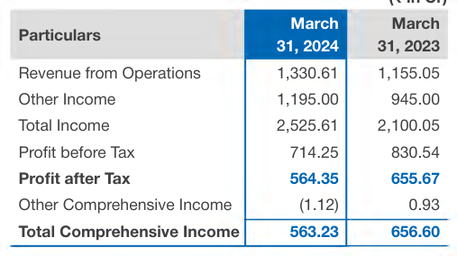

**[Image: AnnualReport2024.pdf-0120-11.png (507x284, 66.4KB)]**

<!-- Start of picture text -->
March  March Particulars 31, 2024 31, 2023 Revenue from Operations 1,330.61 1,155.05 Other Income 1,195.00 945.00 Total Income 2,525.61 2,100.05 714.25 830.54 Profit before Tax 564.35 655.67 Profit after Tax Other Comprehensive Income (1.12) 0.93 Total Comprehensive Income 563.23 656.60 <!-- End of picture text -->

Godrej Properties achieved a sales volume of 20 million square feet and booking value of ₹22,527 Cr in FY2023-24, resulting in a growth of 84% Y-o-Y. This is the highest ever annual sales reported by a listed developer in India until date. 

Godrej Properties launched 26 new projects/ phases in FY2023-24, of which, 4 projects namely Godrej Zenith (NCR), Godrej Reserve (MMR), Godrej Aristocrat (NCR) and Godrej Tropical Isle (NCR), achieved booking value of more than ₹ 2,000 Cr each on launch. These remained amongst the most successful residential project launches for GPL. 

The Company does not propose to transfer any amount to the reserves. 

###### 2. DIVIDEND: 

Godrej Properties added ten new projects with saleable potential of around 18.93 million sq. ft. to its portfolio during the year, 4 in NCR, 2 each in Bengaluru and Hyderabad, 1 in Kolkata and 1 in Nagpur. 

In terms of Regulation 43A of the Securities and Exchange Board of India (Listing Obligations and Disclosure Requirements) Regulations, 2015 (“SEBI LODR Regulations”), the Dividend Distribution Policy of the Company is available on the website of the Company at https://www.godrejproperties. com/investor/corporate-governance 

**[Image: AnnualReport2024.pdf-0120-18.png (258x23, 3.3KB)]**

On the operational front, Godrej Properties successfully delivered ~12.5 million sq.ft across projects. With this, Godrej Properties has now successfully delivered ~47 million sq. ft. since FY2018. The Company’s delivery record demonstrates its ability to operate at a large scale and keep pace with accelerating sales. Separately, Godrej Properties focused on exploring advanced construction technologies, improving Net Promoter Score (NPS) and design standardization. 

**[Image: AnnualReport2024.pdf-0120-20.png (309x22, 3.6KB)]**

The Board of Directors strongly  believes that the current market scenario would offer attractive business development opportunities in the real estate sector and reinvesting the capital in such opportunities would create more wealth and value for the shareholders in the long term. Accordingly, with a view to creating long-term economic value, the Board of Directors have not recommended any dividend for the year ended March 31, 2024. 

Godrej Properties, among the most respected real estate developers in India, received 96 awards in FY 202324. Accolades include Euromoney’s Global Real Estate Awards 2023 (Winner - Best Residential Developer – India), India Workplace Equality Index 2023 (Silver Winner – Top Employer), Asia Money Outstanding Company Poll, 2023 (Joint Winner - Outstanding Companies: Real estate category), Aon NASSCOM DEI Champions Award 2023 (Winner – DEI Champion - LGBTQIA+, Non –Tech), Bombay Chambers DEI Awards 2023 (Winner – LGBTQIA+ Inclusion). 

###### 3. SHARE CAPITAL: 

During the financial year ended March 31, 2024, the Company issued and allotted 20,030 equity shares of ₹5 each to its eligible employees on exercise of options granted under the Godrej Properties Limited Employee Stock Option Scheme, 2011 (“GPL ESGS”). 

For the financial year under review, on a consolidated basis, GPL’s total income stood at ₹4,334 Cr, EBITDA was ₹1,197 Cr and net profit after tax and minority interest of ₹725 Cr. 

###### 5. PROSPECTS AND OUTLOOK: 

Indian residential real estate sector has been witnessing a strong turn-around of the sectoral landscape over the past two to three years. There has been substantial boost in both demand and pricing with higher consumer propensity towards paying a premium for a superior product proposition. With interest rate being stable, the home buying intent and sales momentum remained robust with FY24 being the bestever year in terms of sales booking for the industry. Home buying is long-term asset where a strong affordability and financial strength (which is still better than pre-Covid levels) shall supersede the natural rate-cycle, especially if demand is driven by self-consumptions. 

Consolidation in the residential real estate sector has only accelerated over the last few years amid regulatory changes like demonetisation, RERA apart from NBFC liquidity crisis, leading to an increase in the market share of branded organized players such as your Company. Given the pace of urbanization, rising per capita disposable incomes, and income distribution shifting from pyramid to diamond shape, Godrej Properties remains optimistic about the long-term prospects in real estate. Consumer sentiments have remained robust, which will result in a multi-year residential real estate upcycle, provided price increase is disciplined. Your Company is poised for a high growth trajectory with a strong brand, pan-India presence, demonstrated track record and robust marketing capabilities. 

In post pandemic era, the customer focus on product proposition and quality is strongest ever. Increasingly, there has been disproportionate focus by the large organised developers on better design as per customer preference, best in class experience and superior quality. 

Godrej Properties shall seek to drive profitability, improve customer experience, and continue to adopt digital technologies. Moreover, operational momentum for your company is likely to be sustained by its healthy Balance Sheet and robust project pipeline. 

###### 6. MATERIAL CHANGES AND COMMITMENTS 

###### AFFECTING THE FINANCIAL POSITION OF THE COMPANY: 

There have been no material changes and commitments affecting the financial position of the Company between March 31, 2024, and the date of this Report other than those disclosed in this Report. There has also been no change in the nature of Company’s business. 

###### 7. DEPOSITORY SYSTEM: 

The Company’s equity shares are available for dematerialisation through National Securities Depository Limited (“NSDL”) and Central Depository Services (India) Limited (“CDSL”). As of March 31, 2024, 99.99% of the Company’s equity shares were held in dematerialised form. 

###### 8. ISSUE OF NON-CONVERTIBLE DEBENTURES: 

During the year, the Company has issued following NonConvertible Debentures (“NCDs”): 

1. Series A Debentures: 75,000 Rated Listed Unsecured Redeemable NCDs of the Face Value of ₹ 1,00,000 (Rupees One Lakh Only) each, aggregating to ₹ 750,00,00,000 (Rupees Seven Hundred & Fifty Crore Only); 

Series B Debentures: 75,000 Rated Listed Unsecured Redeemable NCDs of the Face Value of ₹ 1,00,000 (Rupees One Lakh Only) each, aggregating to ₹ 750,00,00,000 (Rupees Seven Hundred and Fifty Crore Only); 

2. 

Series I Debentures: 1,00,000 Rated Listed Unsecured Redeemable NCDs of the Face Value of ₹ 1,00,000 (Rupees One Lakh Only) each, aggregating to ₹ 1000,00,00,000 (Rupees One Thousand Crore Only); and 

3. 

Series II Debentures: 16,000 Rated Listed Unsecured Redeemable NCDs of the Face Value of ₹ 1,00,000 (Rupees One Lakh Only) each, aggregating to ₹ 160,00,00,000 (Rupees One Hundred and Sixty Crore Only) 

4. 

The proceeds of the issue of NCDs were utilised towards the existing and new business development deals including land acquisition, repayment of existing borrowings (including CC / OD / CP / STL) used for business operations and shore up long term working capital requirements for core business of the Company and general corporate purposes. 

###### 9. ANNUAL RETURN: 

As required under Section 92 of the Companies Act, 2013 (the “Companies Act”) the Annual Return for the financial year ended March 31, 2024 is available on the website of the Company and can be accessed at https://www. godrejproperties.com/investors/financials 

**[Image: AnnualReport2024.pdf-0120-48.png (123x23, 2.1KB)]**

**[Image: AnnualReport2024.pdf-0120-49.png (348x24, 3.9KB)]**

###### 10. NUMBER OF MEETINGS OF THE BOARD: 

The Board met 4 (four) times in the financial year ended March 31, 2024 on May 03, 2023, August 02, 2023, November 02, 2023 and February 06, 2024. The details of the attendance of Directors at the Board Meetings during the financial year 2023-24 are given in the Corporate Governance Report. 

###### 11. DIRECTORS’ RESPONSIBILITY STATEMENT: 

Pursuant to the provisions contained in sub-sections (3)(c) and (5) of Section 134 of the Companies Act, 2013, the Directors of your Company, based on the representation received from the Operating Management and after due enquiry confirm that: 

in the preparation of the annual financial statements for the financial year ended March 31, 2024, the applicable accounting standards have been followed along with proper explanation relating to material departures, if any. 

- i. 

- ii. 

they have selected such accounting policies and applied them consistently and made judgments and estimates that are reasonable and prudent so as to give a true and fair view of the state of affairs of the Company as at March 31, 2024 and of the profits of the Company for the financial year ended on March 31, 2024. 

Godrej Properties Limited 

Integrated Report 2023-24 

230 

231 

About Godrej Integrating Sustainability Management Discussion Statutory Properties Limited with our Business and Analysis Reports 

**[Image: AnnualReport2024.pdf-0121-01.png (82x27, 2.3KB)]**

- iii. they have taken proper and sufficient care for the maintenance of adequate accounting records in accordance with the provisions of the Companies Act and rules made thereunder, as amended, for safeguarding the assets of the Company and for preventing and detecting fraud and other irregularities. 

- iv. they have prepared the Annual Financial Statements for financial year ended March 31, 2024 on a ‘going concern’ basis. 

- v. they have laid down internal financial controls to be followed by the Company and that such internal financial controls are adequate and have been operating efficiently. 

- vi. they have devised proper systems to ensure compliance with provisions of all applicable laws and that such systems were adequate and operating effectively. 

###### 12. DIRECTORS AND KEY MANAGERIAL PERSONNEL: 

The Board of Directors at its meeting held on February 06, 2024, upon recommendation of the Nomination and Remuneration Committee approved the re-appointment of and remuneration payable to Mr. Pirojsha Godrej (DIN: 00432983) as the Whole Time Director designated as an Executive Chairperson of the Company for a period of three years with effect from April 01, 2024 (“period of re-appointment”). The Members of the Company have approved the aforementioned re-appointment and remuneration by way of Postal Ballot on March 21, 2024. 

In accordance with the Articles of Association of the Company and the provisions of Section 152 of the Companies Act, Mr. Nadir B. Godrej (DIN: 00066195), will retire by rotation at the ensuing AGM and being eligible, has offered himself for re-appointment. The Board of Directors of the Company has recommended his re-appointment at the ensuing AGM. The resolution seeking Members’ approval for his re-appointment forms part of the AGM Notice. 

Mr. Amitava Mukherjee (DIN: 00003285) Non-Executive Independent Director of the Company passed away on July 03, 2023. The Board while condoling the death of Mr. Amitava Mukherjee records its gratitude for the immense contribution made by him. 

Mrs. Lalita D. Gupte (DIN: 00043559) completed her second term as an Independent Director of the Company at the conclusion of the 38th Annual General Meeting of the Members of the Company held on August 02, 2023. Accordingly, Mrs. Lalita D. Gupte ceased to be the Director of the Company with effect from August 02, 2023. Consequently, she also ceased to be a Member of Audit Committee and Chairperson and Member of the Nomination and Remuneration Committee of the Board. The Board places on record its gratitude for the valuable contribution made by Mrs. Lalita D. Gupte during her tenure as an Independent Director. 

The Board of Directors, upon recommendation of the Nomination and Remuneration Committee, appointed Ms. Jayashree Vaidhyanathan (DIN: 07140297) and Mr. Sumeet Narang (DIN: 01874599) as Independent Directors for a period of five years with effect from August 02, 2023 and August 18, 2023, respectively. The aforementioned 

- appointments were approved by the Members by way of Postal Ballot on September 28, 2023. 

- Mr. Jamshyd Godrej (DIN: 00076250), Non-Executive Non-Independent Director of the Company, tendered his resignation as a director of the Company with effect from January 24, 2024, having attained the age of 75 (seventy five) years. The Board places on record its appreciation for the valuable contribution, guidance and support provided by him during his association of over 33 years as the Director of the Company. 

- Pursuant to the provisions of Section 203 of the Companies Act, the Key Managerial Personnel of the Company as of the date of this Report are Mr. Pirojsha Godrej (DIN: 00432983) – Whole Time Director designated as an Executive Chairperson, Mr. Gaurav Pandey (DIN: 07229661) – Managing Director & Chief Executive Officer, Mr. Rajendra Khetawat – Chief Financial Officer and Mr. Ashish Karyekar – Company Secretary of the Company. 

Save and except the above, there were no changes in the Directors or Key Managerial Personnel of the Company during the year under review. 

###### 13. DECLARATION BY INDEPENDENT DIRECTORS: 

The Independent Directors of the Company have submitted the declaration of independence as required under Section 149(7) of the Companies Act, confirming that they meet the criteria of independence under Section 149(6) of the Companies Act and Regulation 16 of SEBI LODR Regulations. In the opinion of the Board, the Independent Directors fulfil the conditions specified in these regulations and are independent of the management. There has been no change in the circumstances affecting their status as Independent Directors of the Company. 

The Board is also of the opinion that the Independent Directors of the Company possess requisite qualifications, experience and expertise in the field of finance, strategy, auditing, tax, risk advisory, financial services and infrastructure and real estate industry and they hold the highest standards of integrity. 

In compliance with rule 6(1) of the Companies (Appointment and Qualification of Directors) Rules, 2014, all the Independent Directors have included their names in the databank of Independent Directors maintained by the Indian Institute of Corporate Affairs. Since all the Independent Directors of the Company have served as directors in listed companies or are in the pay scale of Director or equivalent in the Ministry of Department of the Central Government for a period not less than three years, they are not required to undertake the proficiency test as per Rule 6(4) of the Companies (Appointment and Qualification of Directors) Rules, 2014. 

###### 14. POLICY ON DIRECTORS’ AND KEY 

###### MANAGERIAL PERSONNEL’S APPOINTMENT AND REMUNERATION: 

The policy on appointment and remuneration including criteria for determining qualifications, positive attributes, independence of directors, Key Managerial Personnel and 

Senior Management and other matters provided under Section 178(3) of the Companies Act, is appended as Annexure I to this Report and also is available on the website of the Company at https://www.godrejproperties.com/investor/ corporate-governance 

**[Image: AnnualReport2024.pdf-0121-24.png (367x23, 4.5KB)]**

**[Image: AnnualReport2024.pdf-0121-25.png (200x24, 3.4KB)]**

###### 15. ANNUAL EVALUATION OF PEFORMANCE OF THE BOARD: 

The Company conducted a formal Board Effectiveness Review as part of its efforts to evaluate, identify improvements and enhance the effectiveness of the Board, its Committees and individual directors. This was in line with the requirements mentioned in the Companies Act and the SEBI LODR Regulations. 

The Corporate HR team of Godrej Industries Limited and Associate Companies (“GILAC”) worked directly with the Executive Chairperson and the Nomination & Remuneration Committee of the Board, to design and execute this process which was adopted by the Board. Each Board Member completed a confidential online questionnaire, providing vital feedback on how the Board currently operates and how it might improve its effectiveness. 

The survey comprised four sections and compiled feedback 

and suggestions on: 

- Board processes (including Board composition, strategic orientation and team dynamics); 

- Individual committees; 

- Individual Board members; and 

- Chairperson’s Feedback Report 

The performance evaluation criteria for independent directors included a check on their fulfillment of the independence criteria and their independence from the management. 

The following reports were created as part of the evaluation: 

- Board’s Feedback Report 

- Individual Board Member’s Feedback Report 

- Chairperson’s Feedback Report 

The overall Board Feedback Report and feedback of Individual Committees was shared and discussed with the Independent Directors. The directors discussed strengths in board’s working and also identified areas that can be strengthened further. The individual feedback report of Board Members was shared separately with respective directors and with the Executive Chairperson. Feedback report for Executive Chairperson’s Feedback Report was also separately compiled and shared. 

###### 16. FAMILIARISATION PROGRAMME FOR INDEPENDENT DIRECTORS: 

The Company conducts familiarization programs for Independent Directors to enable them to understand their roles, rights and responsibilities. The Independent Directors when they are appointed, are given detailed orientation regarding the Company, industry, strategy, policies and Code of Conduct, regulatory matters, business, financial matters, human resource matters and corporate social responsibility 

initiatives of the Company. Presentations are also made at the Board and committee meetings which facilitate them to clearly understand the business of the Company and the environment in which the Company operates. Operational updates are provided for them to have a good understanding of Company’s operations, businesses and the industry as a whole. They are periodically updated on material changes in regulatory framework and its impact on the Company. The Company’s Policy of conducting familiarisation program has been disclosed at the website of the Company at https:// www.godrejproperties.com/investor/corporate-governance 

**[Image: AnnualReport2024.pdf-0121-44.png (486x24, 5.9KB)]**

###### 17. PARTICULARS OF LOANS, GUARANTEES OR INVESTMENTS: 

The details of loans given, investments made, guarantees given and securities provided by the Company during the financial year under review form parts of the notes to the standalone financial statements provided in this Annual Report. 

###### 18. PARTICULARS OF CONTRACTS OR 

###### ARRANGEMENTS WITH RELATED PARTIES: 

The Company has formulated a policy on related party transactions which is also available on the website of the Company at https://www.godrejproperties.com/investor/ corporate-governance. All related party transactions are placed before the Audit Committee for review and approval. Prior omnibus approval is obtained for related party transactions on a quarterly basis for transactions which are of repetitive nature and/ or entered in the ordinary course of business and are at an arm’s length basis. 

**[Image: AnnualReport2024.pdf-0121-50.png (367x22, 5.0KB)]**

**[Image: AnnualReport2024.pdf-0121-51.png (198x24, 4.1KB)]**

All related party transactions entered during the financial year were in the ordinary course of the business and at an arm’s length basis. Accordingly, the disclosure of related party transactions as required under Section 134(3)(h) of the Companies Act and Rule 8(2) of the Companies (Accounts) Rules, 2014 in Form AOC-2 is not applicable to the Company for FY 2023-24. However, in terms of Regulation 23 of SEBI LODR Regulations, the Company had obtained the approval of the Members of the Company by ordinary resolution through postal ballot, the results of which were declared on March 21, 2024, for entering into a material related party transaction with its Special Purpose Vehicle which is considered as its related party. Accordingly, the details of the material related party transaction entered into during the financial year have been reported in Form AOC-2, which is given in Annexure II to this Report. 

The attention of Members is drawn to the disclosures of transactions with related parties set out in Notes to Accounts (Note No. 44) forming part of the standalone financial statements. Transactions with a person or entity belonging to the promoter/ promoter group which holds 10% or more shareholding in the Company as required under Schedule V, Part A (2A) of SEBI LODR Regulations are given as Note No. 44 (on Related Party Transaction) forming part of the standalone financial statements. 

Godrej Properties Limited 

Integrated Report 2023-24 

232 

233 

About Godrej Properties Limited 

Integrating Sustainability with our Business 

Management Discussion Statutory and Analysis Reports 

**[Image: AnnualReport2024.pdf-0122-03.png (82x27, 2.3KB)]**

###### 19. PARTICULARS REGARDING CONSERVATION 

###### OF ENERGY, TECHNOLOGY ABSORPTION AND FOREIGN EXCHANGE EARNINGS AND OUTGO: 

The particulars regarding conservation of energy, technology absorption and foreign exchange earnings and outgo, as required under Section 134(3)(m) of the Companies Act read with the Companies (Accounts) Rules, 2014 are appended as Annexure III to this Report. 

###### 20. BUSINESS RISK MANAGEMENT: 

The Company has constituted a Risk Management Committee consisting of members of the Board and key executives of the Company to identify, assess, monitor and mitigate business risks. The composition of the Committee is in compliance with Regulation 21 of the SEBI LODR Regulations. The business divisions identify the risks at both the enterprise level and project level and address them through mitigating actions on a continual basis. 

The business risks identified are reviewed by the Risk Management Committee and its implementation is monitored. The key risks and mitigation actions are then placed before the Audit Committee of the Company. 

The Risk Management Policy of the Company is available on the website of the Company at https://www.godrejproperties. com/investors/governance-leadership 

**[Image: AnnualReport2024.pdf-0122-11.png (258x23, 4.1KB)]**

**[Image: AnnualReport2024.pdf-0122-12.png (321x24, 4.3KB)]**

###### 21. CORPORATE SOCIAL RESPONSIBILITY: 

A Corporate Social Responsibility (“CSR”) Committee has been constituted in accordance with Section 135 of the Companies Act. The details required under the Companies (Corporate Social Responsibility Policy) Rules, 2014, as amended, with respect to the CSR Committee and an Annual Report on CSR activities undertaken during the financial year ended March 31, 2024 are appended as Annexure IV to this Report. The CSR Policy is available on the website of the Company at https://www.godrejproperties.com/investors/ governance-leadership 

**[Image: AnnualReport2024.pdf-0122-15.png (377x22, 4.1KB)]**

**[Image: AnnualReport2024.pdf-0122-16.png (203x24, 3.2KB)]**

The Company has not participated in any direct or indirect political contributions and/ or charitable contributions/ sponsorships. 

###### 22. SUBSIDIARY AND ASSOCIATE COMPANIES: 

###### **A. Subsidiaries** 

As of March 31, 2024, the Company had 20 unlisted subsidiaries under the Companies Act, namely, Godrej Realty Private Limited, Godrej Garden City Properties Private Limited, Prakritiplaza Facilities Management Private Limited, Godrej Prakriti Facilities Private Limited, Godrej Genesis Facilities Management Private Limited, Godrej Projects Development Limited, Godrej Hillside Properties Private Limited, Godrej Highrises Properties Private Limited, Citystar Infraprojects Limited, Godrej Residency Private Limited, Godrej Home Developers Private Limited, Godrej Skyline Developers Private Limited, Godrej Redevelopers (Mumbai) Private Limited, Godrej Precast Construction Private Limited, Godrej Green 

Woods Private Limited, Godrej Living Private Limited, Ashank Land & Building Private limited, Wonder City Buildcon Limited (formerly known as Wonder City Buildcon Private Limited), Godrej Home Constructions Limited (formerly known as Godrej Home Constructions Private Limited) and Godrej Real Estate Distribution Company Private Limited . 

The audited financial statements of all the subsidiaries are available on the website of the Company at https://www. godrejproperties.com/investors/financials The Company will make these documents available to Members upon their request. 

**[Image: AnnualReport2024.pdf-0122-23.png (123x24, 2.7KB)]**

**[Image: AnnualReport2024.pdf-0122-24.png (350x22, 4.6KB)]**

As of March 31, 2024, Godrej Greenview Housing Private Limited, Wonder Projects Development Private Limited, Godrej Real View Developers Private Limited, Pearlite Real Properties Private Limited, Godrej One Premises Management Private Limited, Godrej Green Homes Private Limited, Godrej Macbricks Private Limited, Vivrut Developers Private Limited, Vagishwari Land Developers Private Limited, Yerwada Developers Private Limited and Madhuvan Enterprises Private Limited are associate companies of the Company. 

During the financial year under review, Godrej Real Estate Distribution Company Private Limited was incorporated on July 20, 2023 as the wholly-owned subsidiary of the Company. Wonder City Buildcon Limited and Godrej Home Constructions Limited became wholly-owned subsidiaries of the Company with effect from May 26, 2023 and June 02, 2023 respectively. Godrej Properties Worldwide INC, the subsidiary of the Company was wound up and dissolved on February 02, 2024. 

###### **B. Limited Liability Partnerships (LLPs)** 

The Company is a partner in the following LLPs as of March 31, 2024: 

1. Godrej Property Developers LLP 

2. Mosiac Landmarks LLP 

3. Dream World Landmarks LLP 

4. Oxford Realty LLP 

5. Godrej SSPDL Green Acres LLP 

6. M S Ramaiah Ventures LLP 

7. Oasis Landmarks LLP 

8. Caroa Properties LLP 

9. Godrej Amitis Developers LLP 

10. Godrej Buildwell Projects LLP (formerly known as “Godrej Construction Projects LLP”) 

11. Godrej Housing Projects LLP 

12. Mahalunge Township Developers LLP 

13. Godrej Developers & Properties LLP 

14. Godrej Highrises Realty LLP 

15. Godrej Project Developers & Properties LLP 

16. A R Landcraft LLP 

17. Godrej Highview LLP 

18. Prakhhyat Dwellings LLP 

19. Godrej Skyview LLP 

###### 20. Godrej Green Properties LLP 

###### 21. Maan - Hinje Township Developers LLP 

22. Godrej Projects (Soma) LLP 

23. Godrej Projects North Star LLP 

24. Godrej Projects North LLP 

25. Godrej Reserve LLP 

26. Godrej Athenmark LLP 

27. Godrej Vestamark LLP 

28. Godrej Irismark LLP 

29. Manjari Housing Projects LLP 

30. Rosebery Estate LLP 

31. Embellish Houses LLP 

32. Godrej City Facilities Management LLP 

33. Suncity Infrastructure (Mumbai) LLP 

34. Godrej Florentine LLP 

35. Godrej Odyssey LLP 

36. Godrej Olympia LLP 

37. Ashank Realty Management LLP 

38. Ashank Facility Management LLP 

39. Manyata Industrial Parks LLP 

40. Universal Metro Properties LLP 

###### **C. Material Unlisted Indian Subsidiary:** 

As of March 31, 2024, Godrej Projects Development Limited and Godrej Vestamark LLP are considered as material unlisted Indian subsidiaries under Regulation 24 of SEBI LODR Regulations. 

###### 23. PERFORMANCE AND FINANCIAL POSITION OF SUBSIDIARIES, ASSOCIATES AND JOINT VENTURE COMPANIES: 

As required under SEBI LODR Regulations and Section 129 of the Companies Act, the consolidated financial statements have been prepared by the Company in accordance with the applicable accounting standards and form part of the Integrated Annual Report. A statement containing the salient features of the Financial Statements of the subsidiaries, joint ventures and associate companies of the Company in Form AOC-1 as required under Rule 5 of the Companies (Accounts) Rules, 2014 form part of the notes to the financial statements. The highlights of the performance of subsidiaries, associates and joint venture companies and their contribution to the overall performance of the Company are given as Annexure A in consolidated financials. 

###### 24. DETAILS RELATING TO DEPOSITS COVERED UNDER CHAPTER V OF THE COMPANIES ACT, 2013: 

During the financial year, the Company has transferred the matured deposits along with interest aggregating to ₹ 251,050 (Rupees Two Lakhs Fifty One Thousand Fifty Only), remaining unpaid for a period of seven years to the Investor Education and Protection Fund in accordance with Section 124 of the Companies Act, 2013. 

Your Company is currently not accepting public deposits and has not accepted any deposits from its Directors during the Financial Year 2023-24. 

###### 25. SIGNIFICANT AND MATERIAL ORDERS PASSED BY THE REGULATORS OR COURTS OR TRIBUNALS: 

There were no significant and material orders passed by the regulators/ courts/ tribunals which would impact the going concern status of the Company and its future operations. 

###### 26. INTERNAL FINANCIAL CONTROL SYSTEM: 

The Company has an internal financial control system commensurate with the size, scale and complexity of its operations. The internal controls over financial reporting have been identified by the management and are checked for effectiveness across all locations and functions by the management and tested by the Auditors on a sample basis. The controls are reviewed by the management periodically and deviations, if any, are reported to the Audit Committee periodically. 

###### 27. AUDIT COMMITTEE OF THE COMPANY: 

The Audit Committee comprises of 4 (four) Independent Directors, viz. Dr. Indu Bhushan (Chairperson), Ms. Sutapa Banerjee, Mr. Sumeet Narang and Ms. Jayashree Vaidhyanathan. The composition of the Audit Committee is in compliance with the requirements of Section 177 of the Companies Act and Regulation 18 of SEBI LODR Regulations. The details of the role and responsibilities of the Audit Committee, the particulars of meetings held and attendance of the members at such meetings are given in the report on Corporate Governance, which forms part of the Integrated Annual report. During the Financial Year under review, the recommendations made by the Audit Committee were accepted by the Board. 

###### 28. VIGIL MECHANISM: 

The Company has established a vigil mechanism for directors, employees and other stakeholders to report their genuine concerns, details of which have been given in the Corporate Governance Report forming part of this Integrated Annual Report. 

###### 29. STATUTORY AUDITORS AND STATUTORY AUDITORS’ REPORT: 

On the recommendation of the Audit Committee and the Board of Directors, the Members at the 37th Annual General Meeting held on August 02, 2022 had re-appointed M/s. BSR & Co. LLP, Chartered Accountants (Firm Registration No. 101248W/W100022), as the Statutory Auditors for the second term of five consecutive years i.e. from the conclusion of the 37th Annual General Meeting till the conclusion of the 42nd Annual General Meeting of the Company to be held in the year 2027. 

The Report issued by M/s. BSR & Co. LLP on the financial statements of the Company for the financial year ended March 31, 2024 forms part of the Integrated Annual Report. There are no qualifications, reservations or adverse remarks or disclaimers made by M/s. BSR & Co. LLP, Statutory Auditors, in their report. 

Godrej Properties Limited 

Integrated Report 2023-24 

234 

235 

About Godrej Integrating Sustainability Management Discussion Statutory Properties Limited with our Business and Analysis Reports 

**[Image: AnnualReport2024.pdf-0123-01.png (82x27, 2.3KB)]**

<!-- Start of picture text -->
- <!-- End of picture text -->

###### 30. COST RECORDS AND COST AUDITORS: 

As required under Rule 8(5)(ix) of the Companies (Accounts) Rules, 2014, the Company confirms that it has prepared and maintained cost records as specified by the Central Government under sub-section (1) of Section 148 of the Companies Act for the financial year ended March 31, 2024. 

Pursuant to Section 148 of the Companies Act, the Board of Directors of the Company has, on the recommendation of the Audit Committee, appointed M/s. R Nanabhoy & Co, Cost Accountants, as Cost Auditors of the Company for the financial year 2024–25 at a remuneration as mentioned in the Notice convening the AGM. The Company has received their written consent that the appointment is in accordance with the applicable provisions of the Companies Act and rules framed thereunder. The Cost Auditors have confirmed that they are not disqualified to be appointed as the Cost Auditors of the Company for the financial year 2024–25. 

As required under the Companies Act, the remuneration payable to Cost Auditors must be placed before the Members at a general meeting for ratification. Hence, a resolution for the same forms part of the Notice of the ensuing AGM. 

###### 31. SECRETARIAL AUDIT REPORT: 

The Board of Directors of the Company has appointed M/s. A K Jain & Co., Practicing Company Secretary, to conduct the Secretarial Audit. Secretarial Audit Report provided by M/s. A K Jain & Co. is appended to this Report as Annexure V. 

There are no qualifications, reservations or adverse remarks or disclaimers made by M/s. A K Jain & Co., Company Secretary in practice, in their Secretarial Audit Report for the financial year 2023-24. 

The Company’s unlisted material subsidiary company – Godrej Projects Development Limited (“GPDL”) undergoes Secretarial Audit. A copy of the Secretarial Audit Report of GPDL is available on the website of the Company. 

The Annual Secretarial Compliance Report as required under Regulation 24A of SEBI LODR Regulations has been submitted to the stock exchanges within 60 days of the end of the financial year. 

The Company has complied with Secretarial Standards on Meetings of the Board of Directors (SS-1) and General Meetings (SS-2) issued by the Institute of Company Secretaries of India and adopted under the Companies Act. 

###### 32. REPORTING OF FRAUDS BY AUDITORS: 

During the financial year under review, the Statutory Auditors, Cost Auditors and Secretarial Auditors have not reported any instances of frauds committed in the Company by its officers or employees to the Audit Committee or to the Central Government under Section 143(12) of the Companies Act, details of which needs to be mentioned in this Report. 

###### 33. MANAGEMENT DISCUSSION AND ANALYSIS REPORT: 

The Management Discussion and Analysis Report for the year under review, as stipulated under Regulation 34(2) of SEBI LODR Regulations, is appended to this Report. 

###### 34. CORPORATE GOVERNANCE: 

The Company is committed to maintaining the highest standards of Corporate Governance and adhering to the Corporate Governance requirements as set out by the Securities and Exchange Board of India (“SEBI”). The Report on Corporate Governance as stipulated under SEBI LODR Regulations forms part of the Integrated Annual Report. A certificate from M/s. B N P & Associates, Company Secretaries in practice, confirming compliance with the conditions of Corporate Governance as stipulated under Schedule V to SEBI LODR Regulations and applicable provisions of the Companies Act forms part of the Corporate Governance Report. 

###### 35. DISCLOSURE AS PER PART G OF THE 

###### SCHEDULE V TO THE SEBI (LISTING OBLIGATIONS AND DISCLOSURE REQUIREMENTS) REGULATIONS, 2015 

The Company has been informed by way of a family letter dated April 30, 2024 issued jointly by Mr. Adi Godrej (ABG), Mr. Nadir Godrej (NBG), Mrs. Smita Vijay Crishna (SVC) and Mr. Jamshyd Godrej (JNG) that the Godrej family members have entered into a family settlement agreement and a brand & non-compete agreement on April 30, 2024. The Company is not a party to these agreements. 

The settlement contemplates a realignment of inter alia the shareholding of Godrej Industries Limited, which is the holding company of the Company, subject to applicable regulatory approvals. Pursuant to the realignment, the management and control of the Company will continue with the ABG / NBG family, and the JNG / SVC family will not be involved in the management and operations of the Company. 

Currently, there are no members of the JNG / SVC Family who are directors on the board of directors of the Company. 

###### 36. INTERNAL COMPLAINTS COMMITTEE: 

The Company has constituted an Internal Complaints Committee as required under the Sexual Harassment of Women at Workplace (Prevention, Prohibition and Redressal) Act, 2013 (“POSH”). The details required to be disclosed under POSH form part of the Corporate Governance Report. 

###### 37. PARTICULARS OF EMPLOYEES: 

Disclosures with respect to the remuneration of directors and employees as required under Section 197(12) of the Companies Act and Rule 5(1) of the Companies (Appointment and Remuneration of Managerial Personnel) Rules, 2014 (“Remuneration Rules”) are appended as Annexure VI to this Report. Details of employee remuneration as required under Section 197(12) of the Companies Act and Rule 5(1) of the Remuneration Rules form part of this Integrated Annual report. As per the second proviso to Section 136(1) of the Companies Act, the Directors’ Report and Financial Statements are being sent to the Members of the Company excluding the statement of particulars of employees under Rule 5(2) and (3) of the Remuneration Rules. If any Member is interested in obtaining a copy thereof, the Member may write to the Company Secretary, whereupon a copy would be sent to such Member. 

###### 38. EMPLOYEES STOCK OPTION SCHEMES: 

As required in terms of the SEBI (Share Based Employee Benefits and Sweat Equity) Regulations, 2021, the disclosure relating to Godrej Properties Limited Employee Stock Grant Scheme, 2011 (“GPL ESGS”) is appended as Annexure VII to this Report. 

###### 39. BUSINESS RESPONSIBILITY & SUSTAINABILITY REPORT: 

The Business Responsibility & Sustainability Report for the financial year ended March 31, 2024 as stipulated under Regulation 34(2) of SEBI LODR Regulations is attached as part of the Integrated Annual Report. 

###### 40. TRANSFER OF UNPAID/UNCLAIMED DIVIDEND/EQUITY SHARES TO INVESTOR EDUCATION AND PROTECTION FUND: 

Pursuant to the provisions of Section 124 of the Companies Act, Investor Education and Protection Fund Authority (Accounting, Audit, Transfer and Refund) Rules, 2016 read with the relevant circulars and amendments thereto, the amount of dividend remaining unpaid or unclaimed for a period of seven years from the due date is transferred to the Investor Education and Protection Fund (“IEPF”). The equity shares in respect of which dividend has remained unpaid/ unclaimed for a period of seven consecutive years are also transferred by the Company to the designated Demat Account of the IEPF Authority. 

41. DETAILS OF APPLICATION MADE OR ANY PROCEEDING PENDING UNDER THE INSOLVENCY AND BANKRUPTCY CODE, 2016 (31 OF 2016) DURING THE YEAR ALONG WITH THEIR STATUS AS AT THE END OF THE FINANCIAL YEAR: 

There are no applications made or any proceedings pending against the Company under Insolvency and Bankruptcy Code, 2016 during the financial year. 

Place: Mumbai Date: May 03, 2024 

###### 42. DETAILS OF DIFFERENCE BETWEEN 

###### AMOUNT OF THE VALUATION DONE AT THE TIME OF ONE TIME SETTLEMENT AND THE VALUATION DONE WHILE TAKING LOAN FROM THE BANKS OR FINANCIAL INSTITUTIONS ALONG WITH THE REASONS THEREOF: 

During the financial year under review, there were no one-time settlement with any Bank or Financial Institution. 

###### 43. CREDIT RATING: 

The details of the credit ratings awarded to the Company are provided in the Corporate Governance Report forming part of the Integrated Annual Report. 

###### 44. INTEGRATED REPORTING: 

The Company has drawn up an Integrated Annual Report that provides both financial and non-financial information, including the organisation’s strategy, governance framework, performance and prospects of value creation based on six forms of capital based on the GRI standards. 

###### 45. AWARDS & RECOGNITIONS: 

The Directors take pleasure in informing the Members that the Company, its people and projects were acknowledged with several awards and ratings during the financial year ended March 31, 2024. The details of the awards received are given in the Integrated Annual Report. 

###### 46. ACKNOWLEDGMENTS: 

The Directors wish to place on record their appreciation and sincere thanks to the customers, joint venture partners, shareholders, banks, financial institutions, fixed deposit holders, vendors and other associates who through their continued support and cooperation, have helped, as partners, in the Company’s progress. The Directors also acknowledge the hard work, dedication and commitment of the employees for the growth of the Company and look forward to their continued involvement and support. 

**For and on behalf of the Board of Directors of Godrej Properties Limited** 

**Pirojsha Godrej Executive Chairperson (DIN: 00432983)** 

Godrej Properties Limited 

Integrated Report 2023-24 

236 

237 

About Godrej Integrating Sustainability Management Discussion Statutory Properties Limited with our Business and Analysis Reports 

**[Image: AnnualReport2024.pdf-0124-01.png (82x27, 2.3KB)]**

<!-- Start of picture text -->
- <!-- End of picture text -->

###### ANNEXURE I 

###### TO THE DIRECTORS’ REPORT 

###### **Nomination and Remuneration Policy** 

###### **(Directors, KMP and Senior Management)** 

###### INTRODUCTION 

- Key Managerial Personnel (KMP) means 

In pursuance of the Company’s philosophy to consider its employees as its invaluable assets, to pay equitable remuneration to all Directors, Key Managerial Personnel (KMP) and employees of the Company, to harmonize the aspirations of human resources consistent with the goals of the Company and, in terms of the provisions of the Companies Act, 2013, this policy on nomination and remuneration of Directors, Key Managerial Personnel and Senior Management has been formulated by the Nomination & Remuneration Committee and approved by the Board of Directors. 

   - i. Executive Chairperson and/ or Managing Director; 

   - ii. Whole-time Director; 

   - iii. Chief Financial Officer; 

   - iv. Company Secretary; 

   - v. Such other officer as may be prescribed under the applicable statutory provisions / regulations. 

- Senior Management means personnel of the Company occupying the position of Chief Executive Officer, Chief Operating Officer, Executive Vice President or Vice President of any unit / division of the Company. Unless the context otherwise requires, words and expressions used in this policy and not defined herein but defined in the Companies Act, 2013 as may be amended from time to time shall have the meaning respectively assigned to them therein. 

###### OBJECTIVE 

The objective and purpose of the Policy are as given below: 

- a. To lay down criteria and terms and conditions with regard to identifying persons who are qualified to become Directors (Executive and Non-Executive) and persons who may be appointed in Senior Management and Key Managerial positions and to determine their remuneration. 

   - This Policy is divided in two parts: Part – A covers the appointment and nomination and Part – B covers remuneration and perquisites etc. 

- b. To carry out evaluation of the performance of Directors, as well as Key Managerial and Senior Management Personnel. 

###### PART – A 

- c. To provide them reward linked directly to their effort, performance, dedication and achievement of Organization’s goals as entrusted on them. 

###### **Policy for Appointment and Removal of Director, KMP and Senior Management** 

- d. To retain, motivate and promote talent and to ensure long term retention of talented managerial persons and create competitive advantage. 

###### Appointment 

- a. The candidate for a position at Director, KMP or Senior Management level is met by the Head HR and the Director to whom the position reports into. The interview is targeted at assessing the candidate on his/ her functional & leadership capabilities and cultural fitment to the organization. 

In the context of the aforesaid objectives the following policy has been framed and recommended by the Nomination & Remuneration Committee jointly with the Human Resources Department of the Company and adopted by the Board of Directors at its meeting held on August 02, 2014. 

- b. The MD assesses the shortlisted candidates. 

###### DEFINITIONS 

   - c. The candidate identified through the above rounds is met by the Group Corporate HR for fitment to the GILAC group values and leadership capability requirements. 

- Board means Board of Directors of the Company. 

- Directors means Directors of the Company. 

The identified candidate’s details and the proposed compensation is recommended by the sub-committee to the Nomination & Remuneration Committee. The Committee has discretion to decide whether the qualification, expertise and experience possessed by the person is sufficient/ satisfactory for the concerned position. The selected candidate’s details is shared with the Board at the next board meeting. 

- Committee means Nomination & Remuneration Committee of the Company as constituted or reconstituted by the Board. 

- Sub-committee consists of Managing Director and the Whole-time Directors 

- Company means Godrej Properties Limited 

###### Term/Tenure 

- Independent Director means a director referred to in Section 149 (6) of the Companies Act, 2013. 

The tenure for Directors shall be Company governed by the terms defined in the Companies Act, 2013. 

###### **Independent Directors:** 

- a. An Independent Director shall hold office for a term up to five consecutive years on the Board of the Company and will be eligible for re-appointment on passing of a special resolution by the Company and disclosure of such appointment in the Board’s report. 

- b. No Independent Director shall hold office for more than two consecutive terms, but such Independent Director shall be eligible for appointment after expiry of three years of ceasing to become an Independent Director. 

Provided that an Independent Director shall not, during the said period of three years, be appointed in or be associated with the Company in any other capacity, either directly or indirectly. 

At the time of appointment of Independent Director it should be ensured that number of Boards on which such Independent Director serves is restricted to seven listed companies as an Independent Director and three listed companies as an Independent Director in case such person is serving as a Whole-time Director of a listed company. 

###### Performance Evaluation 

The performance of the whole-time Director, KMP and Senior Management Personnel is evaluated at regular intervals (half yearly/ yearly) by the whole-time Directors/ Managing Director, as applicable. 

The performance evaluation of Independent Directors shall be done by the Board, excluding the Director being evaluated, basis the contributions made to the Board deliberations on various matters including business strategy, financial strategy, operations, cost and risk management, etc., and suggestions given in this regard. 

###### Removal 

- Due to reasons for any disqualification mentioned in the Companies Act, 2013, rules made thereunder or under any other applicable Act, rules and regulations and Godrej Code of Conduct, the sub-committee may recommend, to the Committee and the Board with reasons recorded in writing, removal of a Director, subject to the provisions and compliance of the said Act, rules and regulations. 

For other KMP or Senior Management Personnel, the removal will be governed by GPL HR policy and the subsequent approval of the sub-committee. 

###### Retirement 

The Director, KMP and Senior Management Personnel shall retire as per the applicable provisions of the Companies Act, 2013 and the prevailing policy of the Company. The Managing Director will have the discretion to retain the Director, KMP, Senior Management Personnel in the same position / remuneration or otherwise even after attaining the retirement age, for the benefit of the Company. 

###### PART – B 

###### **Policy Relating to Evaluation and Remuneration of the Whole-Time Directors, KMP and Senior Management Personnel** 

###### Evaluation Process: 

- A Three Point Rating scale for performance review of Executive Director, KMP, and Senior Management is being followed: 

- a. Rating on Basic Job Responsibilities: indicating whether the basic job responsibilities have been met during the year 

- b. Rating on Goals: Annual rating on each goal on a fivepoint scale. Weighted average of the ratings is calculated to arrive at a ‘Weighted Goal Score’. 

- c. Rating on GCF: The qualitative aspects of the performance is assessed using the Godrej Capabilities Factors (GCF) by the supervisor on a five-point scale. 

Based on a holistic view of the Three Point Rating, the supervisor provides an overall Rating. This rating is reviewed by the Managing Director who does a Qualitative review of the performance based on the efforts put in by the employee, results achieved and impact of the external and internal factors, to arrive at a ‘Final Annual Rating’. 

- The revision in the total remuneration is directly linked to the ‘Final Annual Rating’ for all employees. 

- The remuneration/ compensation/ commission etc. to the Whole-time Director, KMP and Senior Management Personnel will be determined by the subcommittee in accordance with the HR policy, which is based upon the Final Annual Rating, employee potential and market benchmark compensation. The revised remuneration is shared with the Nomination & Remuneration Committee for approval. 

   - The Company stock options granted under the Employee Stock Grant Scheme to the Whole-time Director and Senior Management Personnel will be determined by the Managing Director as per the ESGS guidelines and recommended to the Committee and the Board for approval in the subsequent board meeting. 

- 

- The remuneration/ compensation/ commission etc. shall be subject to the prior/ post approval of the shareholders of the Company and Central Government, wherever required. 

- The remuneration and commission to be paid to the Whole-time Director shall be in accordance with the percentage / slabs / conditions laid down in the Articles of Association of the Company and as per the provisions of the Companies Act, 2013, and the rules made thereunder. 

   - Increments to the existing remuneration/ compensation structure may be recommended by the sub-committee to the Committee and the Board which should be within 

- 

However, the tenure for other KMP and Senior Management Personnel will be governed by GPL HR policy. 

Godrej Properties Limited 

Integrated Report 2023-24 

238 

239 

About Godrej Integrating Sustainability Management Discussion Statutory Properties Limited with our Business and Analysis Reports 

**[Image: AnnualReport2024.pdf-0125-01.png (82x27, 2.3KB)]**

the slabs approved by the Shareholders in the case of Wholetime Director. Increments will be effective from 1st April in respect of a Wholetime Director and other employees of the Company. 

- Where any insurance is taken by the Company on behalf of its Whole-time Director, Chief Executive Officer, Chief Financial Officer, the Company Secretary and any other employee for indemnifying them against any liability, the premium paid on such insurance shall not be treated as part of the remuneration payable to any such personnel. Provided that if such person is proved to be guilty, the premium paid on such insurance shall be treated as part of the remuneration. 

Remuneration to Non-Executive / Independent Director: 

###### **a. Remuneration/ Commission:** 

- The remuneration/ commission shall be fixed as per the slabs and conditions mentioned in the Articles of Association of the Company and the Companies Act, 2013 and the rules made thereunder. 

###### **b. Sitting Fees:** 

The Non- Executive / Independent Director may receive remuneration by way of fees for attending meetings of Board or Committee thereof. Provided that the amount of such fees shall not exceed Rs. One lakh per meeting of the Board or Committee or such amount as may be prescribed by the Central Government from time to time. 

###### **c. Commission** 

Commission may be paid within the monetary limit approved by shareholders, subject to the limit not exceeding 1% of the profits of the Company computed as per the applicable provisions of the Companies Act, 2013. 

###### **d. Stock Options:** 

- An Independent Director shall not be entitled to any stock option of the Company. 

###### ANNEXURE II 

###### TO THE DIRECTORS’ REPORT 

###### **Form No. AOC-2** 

###### **Particulars of Contracts/arrangements made with related parties (Pursuant to clause (h) of sub-section (3) of Section 134 of the Companies Act, 2013 and Rule 8(2) of the Companies (Accounts) Rules, 2014)** 

Form for disclosure of particulars of contracts or arrangements entered into by the Company with related parties referred to in subsection (1) of Section 188 of the Companies Act, 2013 including certain arm’s length transactions under fourth provison thereto: 

1. DETAILS OF CONTRACTS OR ARRANGEMENTS OR TRANSACTIONS NOT AT ARM’S LENGTH BASIS: 

Godrej Properties Limited has entered into contract/ arrangement/ transaction with its related parties, which are in ordinary course of business and at arm’s length during FY 2023-24. 

**[Image: AnnualReport2024.pdf-0125-20.png (1026x24, 3.5KB)]**

|i.|Name(s) of the related party and nature of relationship|NA|
|---|---|---|
|ii.|Nature of contracts/arrangements/transactions|NA|
|iii.|Duration of the contracts/arrangements/transactions|NA|
|iv.|Salient terms of the contracts or arrangements or transactions including the value, if any|NA|
|v.|Justifcation for entering into such contracts or arrangements or transactions|NA|
|vi.|Date(s) of approval by the Board |NA|
|vii.|Date on which the special resolution was passed in general meeting as required under frst proviso to Section 188|NA|

**[Image: AnnualReport2024.pdf-0125-22.png (1026x24, 2.6KB)]**

2. DETAILS OF MATERIAL CONTRACTS OR ARRANGEMENTS OR TRANSACTIONS AT ARM’S LENGTH BASIS: 

Place: Mumbai Date: May 03, 2024 

**For and on behalf of the Board of Directors of Godrej Properties Limited** 

**Pirojsha Godrej Executive Chairperson (DIN: 00432983)** 

**[Image: AnnualReport2024.pdf-0125-27.png (1026x24, 3.4KB)]**

|Name of the related party and nature of relationship|Caroa Properties LLP|
|---|---|
|Nature of contracts/ arrangements/ transactions|Loans and Advances|
|Duration of the contracts/ arrangements/ transactions|FY 2023-24|
|Salient terms of the contracts or arrangements or|In terms of the LLP Deed dated February 27, 2014 and|
|transactions including the value, if any|supplemental agreements entered into thereafter.|
|Date(s) of approval by the Board|February 06, 2024|
|Amount paid as advances, if any|Nil|

**[Image: AnnualReport2024.pdf-0125-29.png (1026x24, 3.3KB)]**

Shareholders of the Company have approved the above transaction by Postal Ballot on March 21, 2024. Please refer note no. 44 of the audited financial for FY 2023-24 for the transaction value. 

**For and on behalf of the Board of Directors of Godrej Properties Limited** 

Place: Mumbai Date: May 03, 2024 

**Pirojsha Godrej Executive Chairperson (DIN: 00432983)** 

Godrej Properties Limited 

Integrated Report 2023-24 

240 

241 

About Godrej Integrating Sustainability Management Discussion Statutory Properties Limited with our Business and Analysis Reports 

**[Image: AnnualReport2024.pdf-0126-01.png (82x27, 2.3KB)]**

<!-- Start of picture text -->
- <!-- End of picture text -->

###### ANNEXURE III 

###### TO THE DIRECTORS’ REPORT 

###### **Information Pursuant to Section 134(3)(m) of the Companies Act, 2013, read with Rule 8(3) of the Companies (Accounts) Rules, 2014 in respect of Conservation of Energy, Technology Absorption and Foreign Exchange Earnings and Outgo** 

###### **A. Conservation of Energy** 

- d. Life Cycle Assessment Study shall be conducted to identify opportunities to further reduce energy consumption and reduce overall environmental footprint; 

###### **1. Steps Taken for Conservation of Energy:** 

Optimum measures have been initiated to reduce energy consumption, as a part of our sustainable development initiatives. With an intent to provide an Energy Efficient final product to customers, the Company develops all its projects as green building projects. As an internal mandate within the Company, it is mandatory to have IGBC Silver rating (or equivalent in other rating systems) for its ongoing and upcoming projects. Currently out of the complete GPL portfolio, 100%* adheres to the green building guidelines and norms laid by the rating systems. 

- e. Installation of LED lamps for common areas and pathways as well as solar street lights for the landscape areas; 

f. Usage of Energy efficient building envelopes for walls and roofs including Low E glass wherever possible; 

- g. Usage of high-efficiency glazing that cuts down the heat ingress and noise while maintaining optimum day lighting levels. 

- h. Adoption of efficient lighting technology including use of timers and/or sensors for operating the light fixtures in certain areas. 

The Company is working towards achieving precertification or certification of all its projects under credible external green rating systems such as the Indian Green Building Council (IGBC), Leadership in Energy and Environmental Design (LEED), Green Rating for Integrated Habitat Assessment (GRIHA) and Excellence in Design for Greater Efficiencies (EDGE). Energy conservation is an integral part of all these prevalent green building rating systems. 

- i. Establishing effective preventive and predictive maintenance system for maintaining all energy intensive equipment i.e. DG sets for energy generation, cranes, hoists, loaders, excavators, trucks and other transport vehicles; 

- j. Focusing on minimizing the lighting load through innovative and effective technologies; 

Through better selection of sites, design, construction, operation, maintenance, i.e. the complete building life cycle, green buildings provide benefits such as: 

   - k. Create awareness and encourage occupants towards greener lifestyle through a formal handover event like use high-efficiency ACs and refrigerators (BEE 5 star rated) and other home appliances. 

- a) increased resource efficiency (energy, water and materials) 

- b) reducing the impact on human health and the environment 

###### **2. Steps Taken by the Company for Utilising Alternate Sources of Energy** 

###### **Steps taken for energy conservation:** 

The Company is actively investing in green technologies to reduce emissions and minimize waste generation. Additionally, it has committed to reducing Scope 1 & 2 GHG emissions by 72.6% per square meter across all offices, with FY20202021 serving as the baseline year, as validated by the Science Based Targets initiative. 

- a. Godrej Properties is advancing its commitment to utilize clean energy for its headquarters, project sites, and marketing offices. Godrej One has obtained IGBC certification as Net Zero Energy for its operations. Similarly, one of the projects at Carmichael Road has received IGBC pre-certification as Net Zero Energy (Design) during the operational phase. This shows our commitment to conserve energy; 

Solar energy is the alternate source of energy integrated into our projects and their operations. As a part of the green building guidelines followed by us, solar energy is utilised to meet the energy demands of the common areas of our developments. At our projects, Godrej City in  Mumbai & Manjari, Mahalunge, Maan Hinjewadi in Pune, we had installed an ON-GRID PV Solar System for the project offices. The installed capacity 200 KW & 460 KW capacity solar plant with an approximate investment of ₹74,68,000 and ₹ 2,20,00,000 respectively. 

- b. Conducting comprehensive energy-modelling during the design stage to achieve energy conservation while meeting the functional requirements for both residential and commercial projects; 

- c. Using high efficiency pumps, motors and other equipments / machineries; 

###### **3. Capital Investment on Energy Conservation Equipment:** 

###### **b. Process Initiatives:** 

The Company has implemented Environment Management System which is as per ISO14001:2015 across all operational sites. As a part of EMS implementation, we will further work to develop site-specific strategy for energy conservation and for increased usage of renewable energy. 

Godrej Properties Limited develops all its projects as green building projects. The Company captures these expenses separately under environmental protection expenditures/ green investments. Total green spending in FY 2023-24 was ₹13.01 Crore. 

###### **2. The Benefits Derived Like Product Improvement, Cost Reduction, Product Development or Import Substitution:** 

###### **B. Technology Absorption** 

These initiatives improve the quality of the product and reduce construction timelines for projects. There is cost reduction in the construction stage through utilization of scheduling and planning, efficient practices, prefabricated components, etc. As our products are certified ‘green’ and it results into cost reduction for the occupants as an outcome of measures undertaken as per the green building guidelines. 

**1. The Efforts Made Towards Technology Absorption** 

###### **a. Technical Initiatives:** 

The Company had evaluated various technologies during design phases of the product to improve quality and project completion timeline. A Cross Functional Team (CFT) studies alternate material, methods and technologies along with the architect and consultants during the design phases to maximize the value engineering potential. 

###### **C. Information Regarding Imported Technology (Imported During Last 3 Years)** 

Some of the initiatives taken are: 

The Company has not imported any energy conservation/ saving technology during last 3 years. 

- Complete or partial automation of activities; 

###### • Using full or partial pre-fabrication at site to increase **D. Expenditure incurred on Research &** reliability and save time; **Development:** 

   - Godrej Properties Limited develops all its projects as green building projects. The Company captures these expenses separately under environmental protection expenditures/ green investments. Total green spendings in FY 2023-24 was ₹13.01 Crore, which comprises expenditure for any research and analytics, consultant and certification fees, procurement and execution, green sites, community developments and waste management, across all GPL project locations. The total R&D expenses for FY 2023-24 is ₹3.46 Crore. 

- Adaptation of new advanced technologies to improve efficiency of operations; 

- Installation of Solar Panels and usage of solar energy for lighting in the common areas,    parking areas and streets and water heating requirements of the residential buildings; 

- Installation of efficient lighting fixtures across office buildings; 

- Installation of low-flow fixtures for reduction of water consumption; 

###### **E. Foreign Exchange Earnings and Outgo** 

During the financial year 2023-24, expenditure in foreign currencies in terms of actual outflow amounted to ₹45.95 crore (previous year ₹52.27 crore) on account of capital expenditure, professional & consultation fees and expenses incurred for business promotion and maintaining offices abroad. The Company has not earned any foreign exchange during the year. 

- Recycling water within the development area to reduce dependency on external water source. 

These initiatives improve the quality of the product and reduce construction timelines for projects. 

**For and on behalf of the Board of Directors of Godrej Properties Limited** 

**Pirojsha Godrej Executive Chairperson (DIN: 00432983)** 

Place: Mumbai Date: May 03, 2024 

* This report is prepared on a consolidated basis. The following projects are excluded from the portfolio boundary since they have been initiated/ developed before our commitment towards delivering green buildings: Godrej 17 (Bangalore), Godrej Woodsman Estate (Bangalore), Godrej Alpine (Mangalore), Godrej Sherwood (Pune), Godrej Bayview (Mumbai), Godrej Edenwoods (Mumbai), Godrej Glenelg (Mumbai), Godrej Hill (Mumbai), Godrej Pine (Mumbai), Godrej Riverside (Mumbai), Godrej Sky Garden (Mumbai), Godrej Waldorf (Mumbai) and Planet Godrej (Mumbai). Godrej Azure (Chennai), Godrej Gold County (Bangalore), Godrej Palm Grove (Bangalore) are excluded since they are no longer in GPL’s operational control. Further, all plotted development projects are excluded as no suitable green building certification is available for such developments. 

Godrej Properties Limited 

Integrated Report 2023-24 

242 

243 

About Godrej Integrating Sustainability Management Discussion Statutory Properties Limited with our Business and Analysis Reports 

**[Image: AnnualReport2024.pdf-0127-01.png (82x27, 2.2KB)]**

###### ANNEXURE IV 

###### TO THE DIRECTORS’ REPORT 

###### **Annual Report on CSR Activities to be included in the Board’s Report for Financial Year 2023-24** 

**1. Brief Outline on CSR Policy of the Company:** At GPL, the CSR policy applies to all activities that are undertaken as part of our Good & Green CSR program hence is titled, “Good & Green CSR Policy for Godrej Properties Limited”. This policy will be further reviewed, developed and updated in accordance to relevant codes of corporate governance, industrial trends and international standards and best practices. 

GPL classifies those projects as CSR, which are over and above our normal course of business. This policy fulfils the requirements of the CSR rules as per the Section 135 of the Companies Act, 2013. 

###### **2. Composition of CSR Committee:** 

###### **e. CSR amount spent or unspent for the Financial Year:** 

|**Total Amount**||**Amo**|**unt Unspent (₹ in Crore)**||
|---|---|---|---|---|
|**Spent for the**|**Total Amount tra**|**nsferred to Unspent**|**Amount transferred to any fund spec**|**ifed under Schedule**|
|**Financial Year**|**CSR Account a**|**s per section 135(6)**| **VII as per second proviso to**| **section 135(5)**|
|**(in ₹ Crore)**|**Amount**|**Date of transfer**|**Name of the Fund** **Amount**|**Date of transfer**|
|10.84|None|NA|None None|NA|

**[Image: AnnualReport2024.pdf-0127-10.png (1025x24, 3.5KB)]**

- **f. Excess amount for set-off, if any:** 

- i. Two percent of average net profit of the company as per sub-section (5) of section 135: ₹10.84 Crore 

- ii. Total amount spent for the Financial Year: ₹10.84 Crore 

iii. Excess amount spent for the Financial Year [(ii)-(i)]: Nil 

|**Sl.** **No. **|**Name of Director**|**Designation / Nature** **of Directorship**|**Number of meetings of** **CSR Committee held** **during the year**|**Number of meetings of** **CSR Committee attended** **during the year**|
|---|---|---|---|---|
|1.|Mr. Pirojsha Godrej|Executive Chairperson|2|2|
|2.|Mr. Gaurav Pandey|Member/ Managing Director & |2|2|
|||Chief Executive Ofcer|||
|3.|Mr. Amitava Mukherjee*|Member/ Independent Director|1|1|
|4.|Ms. Sutapa Banerjee**|Member/ Independent Director|1|1|
|5.|Dr. Indu Bhushan**|Member/ Independent Director|1|1|

**[Image: AnnualReport2024.pdf-0127-16.png (1027x24, 9.9KB)]**

- Mr. Amitava Mukherjee ceased to be a Member of the Committee w.e.f. July 03, 2023 due to his sudden and sad demise. 

- **Ms. Sutapa Banerjee and Dr. Indu Bhushan were appointed as the Members of the Committee w.e.f. August 02, 2023. 

###### **3. Provide the web-link where Composition of CSR committee, CSR Policy and CSR projects approved by the board are disclosed on the website of the company:** 

- CSR Policy can be accessed at https://www.godrejproperties.com/investor/corporate-governance 

**[Image: AnnualReport2024.pdf-0127-21.png (545x22, 4.8KB)]**

- Composition of CSR committee and CSR projects approved by the board are disclosed on the website of the company at https://www.godrejproperties.com/investors/esg-policies 

**[Image: AnnualReport2024.pdf-0127-23.png (472x23, 4.9KB)]**

###### **4. Provide the executive summary along with web-link(s) of Impact Assessment of CSR projects carried out in** 

###### **pursuance of sub-rule (3) of rule 8, if applicable.** 

The Company has conducted the impact assessment of its project “Eradicating hunger and poverty and ensuring environmental sustainability” during the FY 2023-24 on voluntary basis. The impact assessment report is available on website of the Company at https://www.godrejproperties.com/investors/esg-policies 

**[Image: AnnualReport2024.pdf-0127-27.png (473x22, 4.6KB)]**

**5.** a. Average net profit of the company as per section 135(5): ₹542.00 Crore 

- iv. Surplus arising out of the CSR projects or programmes or activities of the previous Financial Year, if any:  Nil 

- v. Amount available for set off in succeeding Financial Year [(iii)-(iv)]: Nil 

###### **7. Details of Unspent Corporate Social Responsibility amount for the preceding three financial years (₹ In Crore):** 

|**SI** **No.**|**Preceding** **fnancial** **year(s)**|**Amount** **transferred** **to Unspent** **CSR** **Account** **under**|**Balance** **Amount in** **Unspent** **CSR** **Account** **under sub-** |**Amount** **spent in the** **Financial Year**|**Amount transferred to a** **fund as specifed under** **Schedule VII as per** **second proviso to sub** **section (5) of Section 135,** **if any.**|**Amount** **remaining to** **be spent in** **succeeding** **fnancial**| **Defciency,** **if any**|
|---|---|---|---|---|---|---|---|
|||**section 135** **(6)**|**section** **(6) of** **section 135**||**Amount in ₹** **Date** **of Transfer**| **years**||
|1.|FY-1|-|-|-|- -|-|-|
||(2022-23)|||||||
|2.|FY-2|-|-|-|- -|-|-|
||(2021-22)|||||||
|3.|FY-3|-|-|-|- -|-|-|
||(2020-21)|||||||
||**TOTAL**|**-**|**-**|**-**|**-** **-**|**-**|**-**|

**[Image: AnnualReport2024.pdf-0127-33.png (1026x24, 2.4KB)]**

**8. Whether any capital assets have been created or acquired through Corporate Social Responsibility amount spent in the Financial Year:** No 

   **9. Specify the reason(s), if the Company has failed to spend two per cent of the average net profit as per sub-section** 

   **(5) of section 135:** Not Applicable 

- b. Two percent of average net profit of the company as per section 135(5): ₹10.84 Crore 

- c. Surplus arising out of the CSR projects or programmes or activities of the previous financial years: Nil 

- d. Amount required to be set off for the financial year, if any: Nil 

###### **For Godrej Properties Limited** 

**For and on behalf of the Board of Directors of Godrej Properties Limited** 

   - e. Total CSR obligation for the financial year (5b+5c-5d): ₹10.84 Crore 

**6.** a. Amount spent on CSR Projects (both Ongoing Project and other than Ongoing Project): ₹10.43 Crore 

   - b. Amount spent in Administrative Overheads: ₹0.32 Crore 

   - c. Amount spent on Impact Assessment, if applicable: ₹0.09 Crore 

**Gaurav Pandey Pirojsha Godrej Managing Director & Chief Executive Officer Chairperson of the Corporate Social Responsibility Committee (DIN: 07229661) (DIN: 00432983)** 

- d. Total amount spent for the Financial Year [(a)+(b)+(c)]: ₹10.84 Crore 

Godrej Properties Limited 

Integrated Report 2023-24 

244 

245 

About Godrej Integrating Sustainability Properties Limited with our Business 

Management Discussion Statutory and Analysis Reports 

**[Image: AnnualReport2024.pdf-0128-02.png (82x27, 2.2KB)]**

###### ANNEXURE V 

TO THE DIRECTORS’ REPORT 

###### **Form No. MR-3** 

###### **SECRETARIAL AUDIT REPORT** 

###### **For The Financial Year Ended on 31st March, 2024** 

###### **[Pursuant to section 204(1) of the Companies Act, 2013 and Rule No.9 of the Companies (Appointment and Remuneration of Managerial Personnel) Rules, 2014]** 

To, 

The Members Godrej Properties Limited Godrej One, 5th Floor Pirojshanagar, Eastern Express Highway Vikhroli (East), Mumbai 400079. 

- b. The Securities and Exchange Board of India (Prohibition of Insider Trading) Regulations, 2015; 

We have conducted the Secretarial Audit of the compliance of applicable statutory provisions and the adherence to good corporate practices by Godrej Properties Limited (CIN: L74120MH1985PLC035308) (hereinafter called “the Company”). Secretarial Audit was conducted in a manner that provided us a reasonable basis for evaluating the corporate conducts/statutory compliances and expressing our opinion thereon. 

- c. The Securities and Exchange Board of India (Issue of Capital and Disclosure Requirements) Regulations, 2018; 

- d. The Securities and Exchange Board of India (Share Based Employee Benefits) Regulations, 2021; 

- e. Securities and Exchange Board of India (Issue and Listing of Non-Convertible Securities) Regulations, 2021; 

Based on our verification of the Company’s books, papers, minute books, forms and returns filed and other records maintained by the Company and also the information provided by the Company, its officers, agents and authorized representatives during the conduct of secretarial audit, we hereby report that in our opinion, the Company has, during the audit period covering the financial year ended on 31st March, 2024 (‘Audit Period’) complied with the statutory provisions listed hereunder and also that the Company has proper Boardprocesses and compliance mechanism in place to the extent, in the manner and subject to the reporting made hereinafter: 

- f. The Securities and Exchange Board of India (Registrars to an Issue and Share Transfer Agents) Regulations, 1993 regarding the Companies Act and dealing with client; 

- g. The Securities and Exchange Board of India (Delisting of Equity Shares) Regulations, 2021 (Not Applicable to the Company during the Audit Period); 

- h. The Securities and Exchange Board of India (Buy-back of Securities) Regulations, 2018 (Not Applicable to the Company during the Audit Period); and 

We have examined the books, papers, minute books, forms and returns filed and other records maintained by the Company for the financial year ended on 31st March, 2024 according to the provisions of: 

- i. The Securities and Exchange Board of India (Listing Obligations and Disclosures Requirements) Regulations, 2015 [SEBI (LODR)]. 

We have also examined compliance with the applicable clauses of the Secretarial Standards issued by The Institute of Company Secretaries of India. 

- (i) The Companies Act, 2013 (the Act) and the rules made thereunder; 

- (ii) The Securities Contracts (Regulation) Act, 1956 (‘SCRA’) and the rules made thereunder; 

During the period under review the Company has complied with the provisions of the Act, Rules, Regulations, Guidelines, standards etc. mentioned above. 

- (iii) The Depositories Act, 1996 and the Regulations and Byelaws framed thereunder; 

We further report that, having regard to the compliance system prevailing in the Company and on examination of the relevant documents and records in pursuance thereof on test-check basis, the Company has complied with following Acts, Laws and Regulations applicable specifically to the Company: 

- (iv) The Foreign Exchange Management Act, 1999 and the Rules and Regulations made thereunder to the extent of Foreign Direct Investment and  Overseas Direct Investment; 

   1. Maharashtra Regional and Town planning Act, 1966 

- (v) The following Regulations and Guidelines prescribed under the Securities and Exchange Board of India Act, 1992 (‘SEBI Act’): 

   2. Development Control and Promotion Regulations 2034. 

   3. The Building and Other Construction Workers (Regulation of Employment and Conditions of Service) Act, 1996 

- a. The Securities and Exchange Board of India (Substantial Acquisition of Shares and Takeovers) Regulations, 2011; 

All decisions at Board Meetings and Committee Meetings are carried out unanimously as recorded in the minutes of the meetings of the Board of Directors and Committees of the Board, as the case may be. 

###### **We further report that** 

The Board of Directors of the Company is duly constituted with proper balance of Executive Directors, Non-Executive Directors and Independent Directors. The changes in the composition of the Board of Directors that took place during the period under review were carried out in compliance with the provisions of the Act. 

We further report that there are adequate systems and processes in the company commensurate with the size and operations of the Company to monitor and ensure compliance with applicable laws, rules, regulations and guidelines. 

Adequate notice is given to all directors to schedule the Board Meetings, agenda and detailed notes on agenda were sent at least seven days in advance, and a system exists for seeking and obtaining further information and clarifications on the agenda items before the meeting and for meaningful participation at the meeting. 

We further report that during the audit period, the specific events/actions having major bearing on the Company’s affairs in pursuance of the above referred laws, rules, regulations, guidelines, standards etc. are mentioned below: 

- **Details of the specific events/ actions bearing on Company’s affairs pursuance of the above referred laws, rules, regulations, guidelines etc.** 

###### **Date of event** 

The Allotment Committee of the Board has allotted (i) 75,000 (Seventy Five Thousand) Rated Listed Unsecured Redeemable Non-Convertible Debentures of Face Value of ₹ 1,00,000/- (Rupees One Lakh Only) each, aggregating to ₹ 750,00,00,000/- (Rupees Seven Hundred and Fifty Crore Only) “Series A Debentures” and (ii) 75,000 (Seventy Five Thousand) Rated Listed Unsecured Redeemable NonConvertible Debentures of the Face Value of ₹ 1,00,000/- (Rupees One Lakh Only) each, aggregating to ₹ 750,00,00,000/- (Rupees Seven Hundred and Fifty Crore Only) “Series B Debentures” to the identified investors on a Private Placement basis, as approved by the Management Committee of the Board of Directors of the Company on June 30, 2023. 

- 03.07.2023 

   - The Company has redeemed 10,000 (Ten Thousand) 7.50% Unsecured, Rated Redeemable, Listed Non-Convertible Debentures of face value ₹ 10,00,000/- (Rupees Ten Lakh Only) each aggregation to ₹ 10,00,00,00,000 (Rupees One Thousand Crore Only). 

- 31.07.2023 

The Allotment Committee of the Board has allotted (I) 1,00,000 (One Lakh) Rated Listed Unsecured Redeemable Non-Convertible Debentures of the Face Value of ₹ 1,00,000/- (Rupees One Lakh Only) each, aggregating to ₹ 10,00,00,00,000 (Rupees One Thousand Crore Only) “Series I Debentures” and (II) 16,000 (Sixteen Thousand) Rated Listed Unsecured Redeemable Non-Convertible Debentures of the Face Value of ₹ 1,00,000/- (Rupees One Lakh Only) each, aggregating to ₹ 160,00,00,000/- (Rupees One Hundred and Sixty Crore Only) “Series II Debentures”, to the identified investors on a Private Placement basis, as approved by the Management Committee of the Board of Directors of the Company on September 18, 2023. 

- 20.09.2023 

   - The Allotment Committee of the Board has allotted during the audit period, 20,030 (Twenty thousand and Thirty) Equity Shares of ₹ 5/- each to the Eligible Employees of the Company under the Godrej Properties Limited Employees Stock Grants Scheme, 2011 (GPL ESGS) on various dates. 

- 

**[Image: AnnualReport2024.pdf-0128-50.png (1026x24, 2.7KB)]**

For **A. K. Jain & Co.** Company Secretaries 

**Ashish Kumar Jain** Proprietor CP No. 6124 Membership No. F6058 UDIN No. F006058F000304840 

Place: Mumbai Date: May 03, 2024 

**Note:** This report is to be read with our letter of even date which is annexed as ‘ANNEXURE A’ and forms an integral part of this report. 

4. Real Estate (Regulation and Development) Act, 2016. 

Godrej Properties Limited 

Integrated Report 2023-24 

246 

247 

About Godrej Integrating Sustainability Management Discussion Statutory Properties Limited with our Business and Analysis Reports 

ANNEXURE A 

**[Image: AnnualReport2024.pdf-0129-02.png (82x27, 2.2KB)]**

###### ANNEXURE VI 

###### TO THE DIRECTORS’ REPORT 

###### To 

The Members Godrej Properties Limited Godrej One, 5th Floor Pirojshanagar, Eastern Express Highway Vikhroli (East), Mumbai 400079. 

Our report of even date is to be read along with this letter. 

1. Maintenance of secretarial record is the responsibility of the management of the Company. Our responsibility is to express an opinion on these secretarial records based on our audit. 

2. We have followed the audit practices and processes as were appropriate to obtain reasonable assurance about the correctness of the contents of the secretarial records. The verification was done on test basis to ensure that correct facts are reflected in secretarial records. We believe that the processes and practices, we followed provide a reasonable basis for our opinion. 

3. We have not verified the correctness and appropriateness of financial records and Books of Accounts of the Company. 

4. Wherever required, we have obtained the Management representation about the compliance of laws, rules and regulations and happening of events etc. 

5. The compliance of the provisions of corporate and other applicable laws, rules, regulations, standards is the responsibility of management. Our examination was limited to the verification of procedures on test basis. 

6. The secretarial audit report is neither an assurance as to the future viability of the Company nor of the efficacy or effectiveness with which the management has conducted the affairs of the Company. 

###### **Details pertaining to remuneration as required under section 197(12) of the companies act, 2013 read with rule 5(1) of the companies (appointment and renumeration of managerial personnel) rules, 2014** 

- i. Ratio of the remuneration of each director to the median remuneration of the employees of the Company for the financial 

- year 2023-24 and the percentage increase in remuneration of each Director, Chief Financial Officer and Company Secretary during the financial year 2023-24 is as under: 

|**Sr.** **No. **|**Name of Directors/KMP & Designation**|**Ratio of Remuneration** **of each Director/KMP** **to median remuneration** **of employees**|**Percentage increase/ decrease in** **Remuneration****$****in the fnancial year** **2023-24 over fnancial year 2022-23**|
|---|---|---|---|
|1.|Mr. Pirojsha Godrej, Executive Chairperson|64.57:1|9%|
|2.|*Mr. Jamshyd Godrej, Non-Executive Director|0.08:1|Not Comparable|
|3.|Mr. Nadir Godrej, Non-Executive Director|4.25:1|116%|
|4.|Mr. Gaurav Pandey, Managing Director & Chief |51.18:1|Not Comparable#|
||Executive Ofcer|||
|5.| **Mr. Amitava Mukherjee, Independent Director|0.27:1|Not Comparable|
|6.|***Mrs. Lalita D Gupte, Independent Director|1.26:1|Not Comparable|
|7.|Ms. Sutapa Banerjee, Independent Director|5.13:1|98%|
|8.|Dr. Indu Bhushan, Independent Director|5.13:1|110%|
|9.|****Ms. Jayashree Vaidhyanathan,|4.41:1|Not Comparable|
||Independent Director|||
|10.|*****Mr. Sumeet Narang, Independent Director|Not Applicable|Not Applicable|
|11.|Mr. Rajendra Khetawat, Chief Financial Ofcer|28.98:1|11%|
|12.|Mr. Ashish Karyekar, Company Secretary|8.13:1|12%|

**[Image: AnnualReport2024.pdf-0129-17.png (1026x24, 4.8KB)]**

- Mr. Jamshyd Godrej resigned as the Non- Executive Director w.e.f. January 24, 2024 

- ** Mr. Amitava Mukherjee ceased to be a Director on July 03, 2023 on account of his sad and sudden demise. 

For **A. K. Jain & Co.** Company Secretaries 

- ***Mrs. Lalita D. Gupte ceased to be an Independent Director w.e.f. August 02, 2023 upon completion of her term in accordance with Section 149(10) of the Companies Act, 2013. 

- **** Ms. Jayashree Vaidhyanathan was appointed as Independent Director with effect from August 02, 2023. 

- ***** Mr. Sumeet Narang was appointed as Independent Director with effect from August 18, 2023. Mr. Sumeet Narang has voluntarily waived the remuneration receivable from the Company. 

Place: Mumbai Date: May 03, 2024 

**Ashish Kumar Jain** Proprietor CP No. 6124 Membership No. F6058 UDIN No. F006058F000304840 

- $ Fixed compensation and target variable pay for the respective financial year. 

- # Mr. Gaurav Pandey was appointed as the Managing Director and Chief Financial Officer of the Company w.e.f. January 01, 2023 

- ii. In the financial year 2023-24, there was an increase of 5% in the median remuneration of employees; 

- iii. There were 3015 permanent employees on the rolls of Company as on March 31, 2024; 

- iv. Average percentile increase already made in the salaries of employees other than the managerial personnel in the last financial year and its comparison with the percentile increase in the managerial remuneration and justification thereof and point out if there are any exceptional circumstances for increase in the managerial remuneration: 

Average percentage increase made in the salaries of employees other than the Managerial Personnel in the financial year i.e. 2023-24 was 15% whereas there was an increase of 9% in the remuneration drawn by the Executive Chairperson. 

It is hereby affirmed that the remuneration paid during the financial year is as per the Remuneration Policy for Directors, Key Managerial Personnel and other Employees. 

**By authority of the Board Directors of Godrej Properties Limited** 

Place: Mumbai Date: May 03, 2024 

**Pirojsha Godrej Executive Chairperson (DIN: 00432983)** 

Godrej Properties Limited 

Integrated Report 2023-24 

248 

249 

About Godrej Integrating Sustainability Management Discussion Statutory Properties Limited with our Business and Analysis Reports 

**[Image: AnnualReport2024.pdf-0130-01.png (82x27, 2.2KB)]**

###### ANNEXURE VII 

###### TO THE DIRECTORS’ REPORT 

- **As per the disclosure requirement specified under SEBI (Share Based Employee Benefits & Sweat Equity) Regulations, 2021 and Section 62(1)(B) of the Companies Act, 2013 read with Rule 12(9) of the Companies (Share Capital & Debentures), Rules, 2014, the following information is disclosed in respect of Employee Stock Benefits:** 

**Details of the ESOPs as per Regulation 14 of SEBI (Share Based Employee Benefits and Sweat Equity) Regulations, 2021 read with SEBI circular dated June 16, 2015** 

- **a. Disclosures in terms of the ‘Guidance Note on Accounting for Employee Share - based Payments’ issued by ICAI or any other relevant Accounting Standards prescribed from time to time:** Refer Note No. 42 forming part of the standalone financial statements and Note No. 41 of the consolidated financial statements for the financial year 2023-24. Please note that the said disclosure is provided in accordance with Indian Accounting Standards (Ind AS) 102 – Share Based Payment. 

- **b. Diluted EPS on issue of shares pursuant to all the schemes covered under the regulations in accordance with ‘Accounting Standard 20 – Earnings Per Share’ issued by ICAI or any other relevant Accounting Standards prescribed from time to time:** Refer Note No. 38 forming part of the standalone financial statements and Note No. 37 of the consolidated 

- financial statements for the financial year 2023-24. Please note that the said disclosure is provided in accordance with Indian Accounting Standards (Ind AS) 33 – Earnings per share. 

- **c. Details of the existing scheme i.e Godrej Properties Limited Employee Stock Grants Scheme, 2011 (“ESGS 2011”) is summarized as under –** 

**Sr. No.****Particulars** 

- **No.****Particulars** **Details of ESGS 2011 I. General terms and conditions of ESGS 2011** 1. Date of Shareholder’s Approval March 18, 2011, April 06, 2015,  August 03, 2021 2. Total Number of Options approved under ESOS 20,00,000 3. Vesting Requirements As specified by Nomination and Remuneration Committee, subject to minimum 1 year from the date of grant 

- 4. Exercise Price or Pricing formula (₹) 5 per share 5. Maximum term of Options granted (years) As may be decided by Nomination and Remuneration Committee as per prevalent regulatory provisions. 

- 6. Source of shares (Primary, Secondary or combination) Primary 7. Variation in terms of options No variation was made in the terms of options during the financial year 2023-24. 

###### **II. Method used to account for ESOS – Intrinsic or fair value** 

The Company has calculated the employee compensation cost using the fair valuation (Black Scholes) method of accounting for the Options granted under the Scheme. 

- III. Where the company opts for expensing of the options using the intrinsic value of the options, the difference between the employee compensation cost so computed and the employee compensation cost that shall have been recognized if it had used the fair value of the options shall be disclosed. The impact of this difference on profits and on EPS of the company shall also be disclosed. 

- The Company has calculated the employee compensation cost using the fair value method. 

- **V.** Weighted average exercise price and weighted average The Exercise Price under ESGS 2011 of ₹5 is less than the fair values of options for options whose exercise price average market price of the Equity Shares of the Company either equals or exceeds or is less than the market price of as on March 31, 2024 the stock 

- **VI.** Employee-wise details of options granted during the year 2023-24 

- (i) Senior managerial personnel as defined under Regulation 16(d) of Securities and Exchange Board of India (Listing Obligations and Disclosure Requirements) Regulations, 2015 

   - Number of Options granted 

   - Name of the Employees Designation Exercise Price (₹) during the year 

Refer Note 1 

- (ii) Employees who were granted, during the year, options amounting to 5% or more of the options granted during that year Number of Options granted 

- Name of the Employees Designation Exercise Price (₹) during the year 

Refer Note 1 

- (iii) Identified employees who were granted option, during the year equal to or exceeding 1% of the issued capital (Excluding outstanding warrants and conversions) of the company at the time of grant. 

Name of the Employees Designation NONE 

**VII.** Description of the method and significant assumptions used during the year to estimate the fair value of options including the following information: 

   - 3.98%-7.02% 

- (a) 1. Risk Free Interest Rate 2. Expected Life 

   - 1 to 3 years 32%-63% 

3. Expected Volatility 

4. Dividend Yield 

###### Nil 

5. Price of the underlying Share in market at time of the option grant 

   - Weighted average market price at the time of grant of option is ₹ 1,354.61 

6. Weighted average market price of Company’s shares on Weighted average market price of Company’s shares on NSE at the time of grant NSE at the time of grant is ₹ 1,336.37 

- The fair value has been calculated using the Black Scholes Option Pricing Model. The assumptions used for calculating the option fair value are as follows: 

- Risk–free Rate of return: Risk-free interest rates are based on the government securities yield in effect at the time of the grant. 

Expected Life of options: Expected Life of options is the period for which the company expects the options to live 

Volatility: The historical volatility over the expected life has been considered to calculate the fair value 

|IV.|Option Movement during the year|ESGS 2011|
|---|---|---|
|1.|Number of Options Outstanding at the beginning of the year (April 1, 2023)|49,485|
|2.|Number of Options Granted during the year 2023-24|36,853|
|3.|Number of Options Forfeited / lapsed during the year 2023-24|16,861|
|4.|Number of Options Vested during the year 2023-24|20,030|
|5.|Number of Options Exercised during of the year 2023-24|20,030|
|6.|Total number of shares arising as a result of exercise of options|20,030|
|7.|Money realised by exercise of options (₹)|1,00,150|
|8.|Number of Options Outstanding at the end of the year|49,447|
|9.|Number of Options exercisable at the end of the year|49,447|

Stock Price: Closing Price on National Stock Exchange on the date of grant has been Considered Exercise Price: Exercise Price of each specific grant has been considered. 

- (b) The method used and the assumptions made to Not applicable incorporate the effects of expected early exercise 

- (c) How expected volatility was determined, including an The calculation of expected volatility is based on historical explanation of the extent to which expected volatility was stock prices. based on historical volatility 

- (d) Whether and how any other features of the option granted Not applicable were incorporated into the measurement of fair value, such as a market condition 

**[Image: AnnualReport2024.pdf-0130-43.png (1026x24, 3.6KB)]**

Godrej Properties Limited 

Integrated Report 2023-24 

250 

251 

About Godrej Integrating Sustainability Properties Limited with our Business 

Management Discussion Statutory and Analysis Reports 

**[Image: AnnualReport2024.pdf-0131-02.png (82x27, 2.2KB)]**

**Note 1-** Employee-wise details of options granted under ESGS 2011 to Senior Managerial Personnel and details of options granted more than 5% in one year. 

|||**Granted in**|**Granted in**|**Granted in**|**Total**|
|---|---|---|---|---|---|
|**Sr.** **No.**|**Name & Designation of Senior Managerial** **Personnel to whom stock options have** **been granted**|**FY 2021-22 and** **outstanding** **as at March** **31, 2024**|**FY 2022-23 and** **outstanding** **as at March** **31, 2024**|**FY 2023-24 and** **outstanding** **as at March** **31, 2024**|**outstanding** **options as** **at March** **31, 2024**|
|1|Mr. Gaurav Pandey, Managing Director & Chief Executive Ofcer|703|1,444|4,045|6,192|
|2|Mr. Rajendra Khetawat, Chief Financial Ofcer|703|1,444|2,634|4,781|
|3| Ms. Mamta Bakshi ,CEO - Godrej Living|402|825|1,505|2,732|
|4|Mr. Vikas Singhal, Chief Operating Ofcer|563|1,155|2,107|3,825|
|5|Mr. Lalit Makhijani, Chief Sales,  Marketing and Customer Centricity Ofcer|703|1,444|2,634|4,781|
|6| Mr. Priyansh Kapoor, Zonal CEO - Mumbai|402|825|2,634|3,861|
|7|Mr. Rohit Mohan, Chief Design & Sustainability Ofcer|0|413|941|1,354|
|8| Ms. Megha Goel, Chief Human Resources Ofcer|242|495|1505|2,242|
|9| Mr. Saurabh Mohindru, Chief Legal and Risk Ofcer|0|692|226|918|
|10|Mr. Pramod Bisht, Zonal CEO - South|0|732|1,881|2,613|
|11|Ms. Geetika Trehan, Zonal CEO - North|0|2,018|659|2,677|
|12|Mr Subhasish Pattanaik, Zonal CEO (East & West)|0|413|925|1,338|
|13|Mr. Rahul Dedhia, Chief Business Development Ofcer|242|495|1,505|2,242|
|14| Mr. Sandipan Pal, Chief Strategy Ofcer|0|495|903|1,398|
|15|Mr. Amitesh Shah, Region Head - Mumbai city|201|413|753|1,367|
|16|Mr. Sukant Somani, Head- Marketing|201|413|753|1,367|
|17|Mr. Krishna Bagaria, Region Head - Pune 1|0|413|753|1,166|
|18|Mr. Hariharan V A, Head - COO - Godrej Living|0|413|753|1,166|
|19|Mr. Vineet Bhardwaj - Chief Information Ofcer|201|413|753|1,367|
|20|Mr. Amit Kumar, Head-Taxation & Treasury|0|0|753|753|
|21|Mr. Chirag Akruwala, Region Head - Ahmedabad & Nagpur|0|0|753|753|
|22|Mr. Madhu Gogula, Head - Customer Centricity|0|0|483|483|
|23|Mr. Ashwini Kalapala, Region Head-South 1|0|0|71|71|
||**Total**|**4,563**|**14,955**|**29,929**|**49,447**|

**[Image: AnnualReport2024.pdf-0131-05.png (1027x22, 2.9KB)]**

This page is intentionally left blank. 

* Option granted was more than 5% of the options granted in 1 year. 

Exercise price for all the options is Rs 5 per share 

###### **For and on behalf of the board of Directors of Godrej Properties Limited** 

**Pirojsha Godrej Executive Chairperson (DIN: 00432983)** 

Place: Mumbai Date: May 03, 2024 

Godrej Properties Limited 

Integrated Report 2023-24 

252 

253 

About Godrej Properties Limited 

Integrating Sustainability Management Discussion Statutory with our Business and Analysis Reports 

**[Image: AnnualReport2024.pdf-0132-02.png (82x27, 2.2KB)]**

###### **Report on Corporate Governance** 

includes the Managing Director & Chief Executive Officer, 1 (one) Executive Director and 5 (five) Non-Executive Directors, of which 4 (four) were Independent Directors including 2 (two) women Independent Directors. The Independent Directors and the Managing Director & Chief Executive Officer are not liable to retire by rotation under law. The profiles of the Directors can be viewed on https://www.godrejproperties.com/ourstory/management. Since the Chairperson of the Board is an Executive Non-Independent Director of the Company, half i.e. 50% of the Board of the Company comprised of Independent Directors pursuant to the Listing Regulations, as on March 31, 2024. The day-to-day management of the Company is entrusted with the Executive Director and the Senior Management Personnel of the Company who function under the overall supervision, direction and control of the Board of Directors. The structure of the Board at the end of the reporting period is as detailed below: 

###### COMPANY’S PHILOSOPHY ON CODE OF GOVERNANCE 

Corporate governance is an ethically driven business process that is committed to values aimed at enhancing an organization’s wealth generating capacity. This is ensured by conducting business with a firm commitment to values, while at the same time, meeting stakeholders’ expectations. 

**[Image: AnnualReport2024.pdf-0132-07.png (331x22, 4.7KB)]**

**[Image: AnnualReport2024.pdf-0132-08.png (171x23, 3.7KB)]**

Strong leadership and effective corporate governance practices have been your Company’s hallmark inheritance from the Godrej group culture and ethos. Godrej Properties Limited (“GPL” or “the Company”) continues to focus its resources, strengths and strategies to be among the nation’s leading real estate companies forever, while continuing to be the most trusted name in the industry. 

At GPL, it is imperative that business is conducted in a fair and transparent manner. The corporate governance framework ensures effective engagement with various stakeholders and helps the Company evolve with changing times. It oversees business strategies and ensures fiscal accountability, ethical corporate behaviour and fairness to all stakeholders comprising of regulators, employees, customers, vendors, investors and society at large. 

|**Category**|**Name of Director**|**DIN**|
|---|---|---|
|Non-Executive|Mr. Jamshyd N. Godrej*|00076250|
|Non-Independent Directors|Mr. Nadir B. Godrej|00066195|
|Non-Executive|Ms. Sutapa Banerjee|02844650|
|Independent |Dr. Indu Bhushan|09302960|
|Directors|Mrs. Lalita D. Gupte**|00043559|
||Mr. Amitava Mukherjee***|00003285|
||Ms. Jayashree Vaidhyanathan#|07140297|
||Mr. Sumeet Narang$|01874599|
|Managing Director & CEO|Mr. Gaurav Pandey|07229661|
|Executive Chairperson|Mr. Pirojsha Godrej|00432983|

The guiding principles and practices are summarised in this Corporate Governance Report. These are articulated through the Company’s Code of Conduct for the Board of Directors and Senior Management, Policies and Charters of various Committees of the Board and Company’s Disclosure Policies. These Policies seek to focus on the enhancement of long term stakeholders’ value without compromising on ethical standards and corporate social responsibilities. 

A report on compliance with the corporate governance provisions as prescribed under the Securities and Exchange Board of India (Listing Obligations and Disclosure Requirements) Regulations, 2015 (“Listing Regulations”), as amended from time to time, is given herein below: 

**[Image: AnnualReport2024.pdf-0132-14.png (504x24, 2.6KB)]**

* Mr. Jamshyd N. Godrej, upon attaining the age of 75 years, resigned from the position of the Non–Executive Non-Independent Director of the Company with effect from January 24, 2024. 

** Mrs. Lalita D. Gupte, upon completion of her tenure of office as Non– Executive Independent Director, ceased to hold such office with effect from the conclusion of 38th Annual General Meeting of the Company held on August 02, 2023. 

###### THE GOVERNANCE STRUCTURE 

###### 1) BOARD OF DIRECTORS 

###### **a) Board Structure:** 

*** Mr. Amitava Mukherjee ceased to be the Non–Executive Independent Director of the Company w.e.f. July 03, 2023 due to his sudden and sad demise. 

The Company has a balanced and diverse mix of Executive and Non-Executive Directors and the composition is in conformity with the requirements of the Companies Act, 2013 (“the Act”) and the Listing Regulations. 

# Ms. Jayashree Vaidhyanathan was appointed as the Non–Executive Independent Director of the Company for a term of five consecutive years w.e.f. August 02, 2023. 

$  Mr. Sumeet Narang was appointed as the Non–Executive Independent Director of the Company for a term of five consecutive years w.e.f. August 18, 2023. 

As of March 31, 2024 (hereinafter referred to as “reporting period”), the Board of Directors of the Company consisted of 7 (seven) Directors drawn from diverse fields/ professions, which 

###### **b) Board Meetings Held and Directors’ Attendance:** 

available to the Board, whenever applicable, for discussion and consideration. 

The Board meets at least once every quarter to review  the Company’s operations and to consider, among other businesses, the quarterly performance and financial results of the Company. During the reporting period, the gap between any two meetings of the Board did not exceed 120 days. Further,   the Company has adopted and adhered to the Secretarial Standards prescribed by the Institute of Company Secretaries of India and notified by the Central Government in relation to the meetings of the Board and Committees, constituted by the Board (“SS-1”) and in respect of General Meetings of Members (“SS-2”). 

The details of Board meetings held during the Financial Year 2023-24 and Directors’ attendance are given in Table 1 and Table 2. 

###### **c) Relationship between Directors inter-se:** 

Save as disclosed below, no Director of the Company is related, in any manner to any other Director on the Board: 

Mr. Pirojsha Godrej is the nephew of Mr. Nadir Godrej, NonExecutive Director. 

Mr. Jamshyd Godrej, who resigned from the position of Nonexecutive Non-independent Director w.e.f January 24, 2024, is the cousin of Mr. Pirojsha Godrej’s father, Mr. Adi Godrej and Mr. Nadir Godrej. 

Agenda papers containing the necessary information/ documents were made available to the Board/ Committees at least seven days in advance to enable the Board/ Committees to discharge its responsibilities effectively and to take informed decisions. Where it was not practicable to attach or send the relevant information as a part of agenda papers, the same were tabled at the meeting or/ and the presentations were made by the concerned managers to the Board/ Committees, subject to compliance with legal requirements. 

**d) Certificate from Company Secretary in** 

###### **practice:** 

A certificate from M/s. A K Jain & Co. Company Secretary  in practice stating that none of the Directors on the Board of the Company have been debarred or disqualified from being appointed or continuing as directors of companies by SEBI/ Ministry of Corporate Affairs or any other statutory authority is annexed to this report. 

Considerable time were spent by the Directors on discussions 

and deliberations at the Board / Committee Meetings. 

The information as specified in Part A of Schedule II read with Regulation 17(7) of the Listing Regulations, are regularly made 

**Table 1:** The details of meetings of the Board held during the financial year 2023-24 are as under: 

|**Sl.** **No. **|**Date of Meeting**|**Total strength of the Board on the date of Meeting**|**No. of Directors present at the Meeting**|
|---|---|---|---|
|1|May 03, 2023|8|7|
|2|August 02, 2023|7|6|
|3|November 02, 2023|8|8|
|4|February 06, 2024|7|7|

**[Image: AnnualReport2024.pdf-0132-42.png (1026x24, 3.0KB)]**

The recommendations of the Board Committees on the proposals requiring approvals were duly accepted by the Board. 

Godrej Properties Limited 

Integrated Report 2023-24 

254 

255 

About Godrej Integrating Sustainability Management Discussion Statutory Properties Limited with our Business and Analysis Reports 

**[Image: AnnualReport2024.pdf-0133-01.png (82x27, 2.2KB)]**

###### **Table 2: Details about the Company’s Directors and meetings attended by the Directors during the Financial Year 2023-24:** 

**Directorships Number of Chairmanships/ held in Memberships in Board Directorships in other Number of Board Number Whether attended companies incorporated Committees as at March 31, 2024 (Including GPL) Listed entities Sl. No. Name of  Director Category Meetings held during the tenure of Board Meetings attended last AGM (held on  August 02, 2023) in India as at March 31, 2024(i)(ii) Chairmanship (excluding Memberships of Memberships (iii) Name of the listed Entity Category (Including Committees) GPL) (iii)** 1 Mr. Jamshyd N. Non-Executive 3 1 No N.A. N.A. N.A. N.A. N.A. Godrej* Director 2 Mr. Nadir B. Non-Executive 4 4 Yes 9 (5) 1 2 Godrej Managing Godrej Director Industries Director Ltd Godrej Non-Executive Agrovet - Non Independent Limited Director Godrej Non-Executive Consumer - Non Independent Products Director Limited Astec Non-Executive Lifesciences - Non Independent Limited Director 3 Mr. Pirojsha A Executive 4 4 Yes 14(4) 1 2 Godrej Non-Executive Godrej Chairperson Consumer - Non Independent Products Director Limited Godrej Non-Executive Agrovet - Non Independent Limited Director Godrej Non-Executive Industries - Non Independent Limited Director 4 Mr. Gaurav Managing 4 4 Yes 1(1) - 1 - - Pandey Director & CEO 5 Mrs. Lalita D. Independent 2 2 Yes N.A. N.A. N.A. N.A. N.A. Gupte** Director 6 Mr. Amitava Independent 1 1 N.A. N.A. N.A. N.A. N.A. N.A. Mukherjee*** Director 7 Ms. Sutapa Independent 4 4 Yes 10(6) 2 9 Polycab Non-Executive Banerjee Director India - Independent Limited Director JSW Non-Executive Holdings - Independent Limited Director Camlin Non-Executive Fine - Independent Sciences Director Limited Zomato Non-Executive Limited - Independent Director Ideaforge Non-Executive Technology Independent Director Limited 8 Dr. Indu Independent 4 4 Yes 6(4) 2 5 ColgateNon-Executive - Bhushan Director Palmolive Independent Director (India) Limited Balrampur Non-Executive Chini Mills - Independent Ltd Director United Non-Executive Spirits - Independent Limited Director 9 Ms. Jayashree Independent 2 2 N.A. 3(2) - 4 UTI Asset Non-Executive Vaidhyanathan Director Management - Independent **** Company Director Limited 10 Mr. Sumeet Independent 2 2 N.A. 4(3) 1 2 Sapphire Non-Executive Narang***** Director Foods - Nominee India Limited Director Godrej Non-Executive Consumer - Independent Products Director Limited 

Non-Executive - Independent Director Non-Executive Independent Director 

Non-Executive - Independent Director 

**[Image: AnnualReport2024.pdf-0133-06.png (1027x22, 2.4KB)]**

- Mr. Jamshyd N. Godrej ceased to be a Director of the Company w.e.f. January 24, 2024. Details are provided for the period for which Mr. Jamshyd N. Godrej held directorship in the Company during FY2023-24. 

- ** Mrs. Lalita D. Gupte ceased to be a Director of the Company w.e.f. August 02, 2023. Details are provided for the period for which Mrs. Lalita D. Gupte held directorship in the Company during FY2023-24. 

- *** Mr. Amitava Mukherjee ceased to be the Non–Executive Independent Director of the Company w.e.f. July 03, 2023 due to his sudden and sad demise. 

- **** Ms. Jayashree Vaidhyanathan was appointed as the Non–Executive Independent Director of the Company for a term of five consecutive years w.e.f. August 02, 2023. She has attended all the Board/ Committee meetings held after her appointment. Details are provided for the period for which Ms. Jayashree Vaidhyanathan held directorship of the Company during FY2023-24. 

***** Mr. Sumeet Narang was appointed as the Non–Executive Independent Director of the Company for a term of five consecutive years w.e.f. August 18, 2023. He has attended all the Board/ Committee meetings held after his appointment. Details are provided for the period for which Mr. Sumeet Narang held directorship of the Company during FY2023-24. 

###### **Notes:-** 

- (i) Directorships in companies incorporated under section 8 of the Companies Act, 2013 and foreign companies are excluded above. 

- (ii) Figures in ( ) denote equity listed companies. 

- (iii) Committees considered above are the Audit Committee and Stakeholders’ Relationship Committee, including that of your Company. Committee Membership(s) includes Chairmanship(s). 

As required under Regulation 17A & 26(1) of the Listing Regulations and as confirmed by the Directors, none of the Directors on the Board  of the Company was a Director (including holding any alternate directorships) in more than 10 (ten) public limited companies (as specified in Section 165 of the Act) and Director in more than 7 (seven) equity listed entities or acted as an Independent Director in more than 7 

(seven) equity listed entities or 3 (three) equity listed entities in case he/she serves as a Whole-time Director/ Managing Director in any listed entity. Further, as on March 31, 2024, none of the Directors on the Board was a Member of more than 10 (ten) Committees and Chairperson of more than 5 (five) Committees, across all the Indian public limited companies in which he/she was a Director. 

###### **Table 3: Number of equity shares held by each of the Directors, options held and dividend paid** 

|**Name of Director**|**Equity Shares held as on** **March 31, 2024**|**Dividend paid by GPL** **during the Financial Year** **2023-24 (in ₹)**|**Number of options held** **under GPL ESGS as on** **March 31, 2024**|
|---|---|---|---|
|Mr. Nadir B. Godrej|^4,65,249|-|-|
|Ms. Jayashree Vaidhyanathan|-|-|-|
|Mr. Sumeet Narang|-|-|-|
|Ms. Sutapa Banerjee|-|-|-|
|Dr. Indu Bhushan|-|-|-|
|Mr. Pirojsha Godrej|^^1,55,075|-|-|
|Mr. Gaurav Pandey|6,945|-|6,192|

**[Image: AnnualReport2024.pdf-0133-20.png (1026x24, 3.3KB)]**

- ^^includes 10 shares held in individual capacity 

^ includes 9 shares held in individual capacity includes 1 share held as one of the trustees of NBG Family Trust includes 1,55,078 shares held as one of the trustees of BNG Family Trust includes 1,55,078 shares held as one of the trustees of SNG Family Trust includes 1,55,078 shares held as one of the trustees of HNG Family Trust includes 1 share held as one of the trustees of BNG Successor Trust includes 1 share held as one of the trustees of BNG Lineage Trust includes 1 share held as one of the trustees of RNG Family Trust includes 1 share held as one of the trustees of SNG Lineage Trust includes 1 share held as one of the trustees of SNG Successor Trust 

includes 1,55,063 shares held as one of the trustees of PG family Trust includes 1 share held as one of the trustees of PG Children Trust includes 1 share held as one of the trustees of PG Lineage Trust 

###### **Directors and Officers Insurance (‘D&O** 

prevent possible conflicts of interest that may emerge in such decision-making. 

###### **Insurance’)** 

In line with the requirements of Regulation 25(10) of the Listing Regulations, the Company has taken D&O Insurance for all its Independent Directors for such quantum and for such risks as determined by the Board of Directors. 

The appointment of Independent Directors is carried out in a structured manner in accordance with the provisions of the Act and the Listing Regulations. The Nomination & Remuneration Committee identifies candidates based on laid down criteria and takes into consideration the balance of skills, knowledge and experience in addition to the need for diversity of the Board and accordingly makes its recommendations to the Board. 

###### **e) Independent Directors:** 

Independent Directors play a significant role in the governance process of the Board. By virtue of their varied expertise and experience, they enrich the Board’s decision-making and 

Mrs. Lalita D. Gupte (DIN: 00043559) ceased to be an Independent Director of the Company with effect from the 

Godrej Properties Limited 

Integrated Report 2023-24 

256 

257 

About Godrej Integrating Sustainability Management Discussion Statutory Properties Limited with our Business and Analysis Reports 

**[Image: AnnualReport2024.pdf-0134-01.png (82x27, 2.2KB)]**

conclusion of 38th Annual General Meeting of the Company held on August 02, 2023, upon completion of her tenure. Mr. Amitava Mukherjee (DIN: 00003285) ceased to be an Independent Director of the Company w.e.f. July 03, 2023 due to his sudden and sad demise. The Board of Directors, upon recommendation of the Nomination and Remuneration Committee, appointed Ms. Jayashree Vaidhyanathan (DIN: 07140297) and Mr. Sumeet Narang (DIN: 01874599) as an Additional Independent Director on the Board of the Company with effect from August 02, 2023 and August 18, 2023, respectively. Their appointment was approved by the Members by means of postal ballot on September 28, 2023 for a period of 5 (five) consecutive years with effect from August 02, 2023 and August 18, 2023, respectively. 

Basis the declarations received from the Independent Directors, the Board of Directors has confirmed that the Independent Directors of the Company meet the criteria of independence as mentioned under Regulation 16(1)(b) of the Listing Regulations read conjointly with Section 149(6) of the Act and that, they are independent of the management. 

As required under Regulation 46(2)(b) of the Listing Regulations, the Company has issued formal letters of appointment to the Independent Directors. The terms and conditions of their appointment are also posted on the Company’s website and can be accessed at https://www.godrejproperties.com/ investors/governance-leadership. In terms of Regulation 25(8) of the Listing Regulations, the Independent Directors have confirmed that they are not aware of any circumstances or situation that exists or may be reasonably anticipated that could impair or impact their ability to discharge their duties. 

**[Image: AnnualReport2024.pdf-0134-05.png (299x23, 5.6KB)]**

**[Image: AnnualReport2024.pdf-0134-06.png (281x24, 4.9KB)]**

Pursuant to the requirement of Regulation 24(1) of the Listing Regulations, the Company has appointed one of its Independent Directors on the Board of its unlisted material subsidiary company - Godrej Projects Development Limited. 

Meeting of Independent Directors: 

During the year under review, the independent directors met on February 06, 2024, inter alia, to discuss, review and assess: 

- the performance of non-independent directors and the board of directors as a whole; 

- the performance of the Chairperson of the Company, taking into account the views of the Executive and NonExecutive Directors; 

- the quality, content and timelines of flow of information between the Management and the Board that is necessary for the Board to effectively and reasonably perform its duties; and 

- other related matters. 

All the Independent Directors were present at the above meeting. 

###### **Familiarization Program for Independent Directors:** 

The Company conducts familiarization programs for Independent Directors to enable them to understand their roles, rights and responsibilities. At the time of appointment of Independent Directors, they are given a detailed orientation 

on the Company, industry, strategy, policies and Code of Conduct, regulatory matters, business, financial matters, human resource matters and Corporate social responsibility initiatives of the Company. Presentations are also made at the Board and Committee meetings which facilitates them to clearly understand the business of the Company and the environment in which the Company operates. Operational updates are provided for them to have a good understanding of Company’s operations, businesses and the industry as a whole. They are periodically updated on material changes in regulatory framework and its impact on the Company.  The Company’s Policy of conducting familiarisation program has been disclosed at the website of the Company at https:// www.godrejproperties.com/investors/governance-leadership 

**[Image: AnnualReport2024.pdf-0134-18.png (501x24, 5.5KB)]**

###### **Annual Evaluation of the Board and Individual Directors:** 

Pursuant to the provisions of the Act and the Listing Regulations, the Board has carried out the annual evaluation of its own performance, as well as the working of its individual Committees. A structured questionnaire was prepared after taking into consideration, inputs received from the Directors, which covered aspects of the Board’s functioning such as adequacy of the composition of the Board and its committees, Board culture, execution and performance of specific duties, obligations and governance. 

A separate exercise was carried out to evaluate the performance of individual directors to obtain an overview of  the functioning of the Board/ Committees, inter alia, on the broad criteria i.e. attendance and level of participation at meetings of the Board/ Committees, independence of judgement exercised by Independent Directors, interpersonal relationship and so on. 

The Independent Directors have expressed their satisfaction at the robustness of the evaluation process, the Board’s freedom to express its views on matters transacted at the meetings and the openness and transparency with which the Management discusses various subject matters specified on the agenda of meetings. The consolidated Evaluation Report of the Board, based on inputs received from the Directors was discussed   at the meeting of the Board held on February 06, 2024 and the action areas identified in the process are being implemented to ensure a better interface at the Board/ Management level. 

###### **f)  Board Skills, Capabilities and Experiences:** 

The Company recognizes the importance of having a Board comprising of directors who have a wide range of experiences, capabilities and diverse points of view. This helps the Company to create an effective and well-rounded Board. The capabilities and experiences sought in the Company’s directors are outlined here: 

- Strategy & Business – The Director is or has been the Chief Executive Officer, Chief Operating Officer or has held any other leadership position in an organization leading to significant experience in strategy or business management. The Director brings the ability to identify and assess strategic opportunities and threats in the context of the business. 

- Industry Expertise – The Director has expertise with • Governance, Finance & Risk – The Director has an respect to the sector in which the Organization operates. understanding of the law and application of corporate The Director has an understanding of the ‘big picture’ governance principles in a commercial enterprise of in the given industry and recognizes the development similar scale. He has the capability to provide inputs for of industry segments, trends, emerging issues and strategic financial planning, assess financial statements opportunities. and oversee budgets for the efficient use of resources. The Director has the ability to identify key risks for the 

- • Market Expertise – The Director has expertise with respect business in a wide range of areas including legal and 

- to the geography in which the Organization operates. The regulatory. 

- Market Expertise – The Director has expertise with respect business in a wide range of areas including legal and 

- to the geography in which the Organization operates. The regulatory. 

- Director understands the macro-economic environment, the nuances of the business, consumers and trade in the • People & Talent Understanding – The Director has geography and has the knowledge of the regulations & experience in human resource management such that legislations of the market in which the business operates. he/she brings in a considered approach to the effective management of people in an organization. 

- Technology & Future Perspective – The Director has expertise with respect to business specific technologies. • Diversity of Perspective – The Director provides a diversity The Director has experience and adds perspective on the of views to the board that is valuable to manage our future ready skills required by the organization such as customers, employees, key stakeholders or shareholders. E-Commerce, Digitalization, Sustainability etc. 

###### **Board membership criteria and list of core skills/ expertise/ competencies identified in the context of the business:** 

The Board of Directors are collectively responsible for selection of a Member on the Board. In terms of requirements of the Listing Regulations, the Board has identified the following core skills/ expertise/ competencies of the Directors in the context of the Company’s business: 

|**Director’s** **Names/** **Skills**|**Gender **|**Strategy &** **Business**|**Industry** **Expertise**|**Market** **Expertise**|**Technology &** **Future** **Perspective**|**Governance,** **Finance** **& Risk**|**People & Talent** **Understanding**|**Diversity of** **Perspective**|
|---|---|---|---|---|---|---|---|---|
|Mr. Pirojsha|M|√|√|√||√|||
|Godrej|||||||||
|Mr. Nadir B. Godrej|M|√||√|√|√||√|
|Mr. Gaurav Pandey|M|√|√|√||√|||
|Ms. Sutapa Banerjee|F|√||√||√|√|√|
|Dr. Indu|M|√||√||√||√|
|Bhushan|||||||||
|Ms. Jayashree Vaidhyanathan|F|√||√||√|√|√|
|Mr. Sumeet Narang|M|√||√|√|√||√|

**[Image: AnnualReport2024.pdf-0134-32.png (1026x24, 2.6KB)]**

All the directors have the required skills /expertise /competence in the areas specified above. 

###### 2) COMMITTEES OF THE BOARD 

The Company has over the years maintained the highest standards of corporate governance processes and has had the foresight to set up corporate governance practices in line with the requirements of Listing Regulations. 

The meetings of each of these Committees are convened by the respective Chairpersons and the minutes of these meetings are placed before the Board for information. The minutes of the Committee meetings are sent to respective Members of the Committee for their approvals/ comments as prescribed in SS-1 and after the minutes are duly approved, these are circulated to the Board of Directors and are presented at the Board meetings. 

The constitution, terms of reference and the functioning of the existing Committees of the Board is explained hereunder. Each Committee demonstrates the highest level of governance standards and has the requisite expertise to handle issues relevant to its field. These Committees spend considerable time and provide focused attention to various issues placed before them and the guidance provided by these Committees lend immense value and support, thus enhancing the quality of the decision-making process of the Board. The Board reviews the functioning of these Committees from time to time. 

###### **A.  AUDIT COMMITTEE** 

The Audit Committee acts as an interface between the Statutory and Internal Auditors, the Management and the Board of Directors. It assists the Board in fulfilling its responsibilities of monitoring financial reporting processes, 

Godrej Properties Limited 

Integrated Report 2023-24 

258 

259 

About Godrej Integrating Sustainability Management Discussion Statutory Properties Limited with our Business and Analysis Reports 

**[Image: AnnualReport2024.pdf-0135-01.png (82x27, 2.3KB)]**

reviewing the Company’s established systems and processes for internal financial controls and governance and reviews the Company’s statutory and internal audit processes. All the Members of the Committee are Independent Directors. The Committee is governed by a Charter, which is in line with the regulatory requirements mandated by the Act and the Listing Regulations. 

During the reporting year, the Committee met 4 (four) times, i.e. on May 03, 2023, August 02, 2023, November 02, 2023 and February 06, 2024. The gap between two meetings did not exceed 120 days. Table 4 below provides the composition and the attendance record for the aforesaid meetings of the Audit  Committee: 

**Table 4: Composition and attendance record of Audit Committee during the Financial year 2023-24** 

|**Sl.** **No. **|**Name of Director**| **meetings** **held during** **the tenure**|**No. of** **meetings** **attended**|
|---|---|---|---|
|1.|Dr. Indu Bhushan (Chairperson)*|4|4|
|2.|Mr. Amitava Mukherjee (Chairperson)**|1|1|
|3.|Mrs. Lalita D. Gupte***|2|2|
|4.|Ms. Sutapa Banerjee|4|4|
|5.|Ms. Jayashree Vaidhyanathan ****|2|2|
|6.|Mr. Sumeet Narang*****|2|2|

- *Dr. Indu Bhushan, Independent Director, was appointed as the Chairperson of the Audit Committee w.e.f. August 02, 2023. 

- ** Mr. Amitava Mukherjee ceased to be Chairperson and Member of the Committee w.e.f. July 03, 2023 due to his sudden and sad demise. 

- *** Mrs. Lalita D. Gupte, upon completion of her tenure as an Independent Director, ceased to be a member of the Audit Committee with effect from the conclusion of 38th Annual General Meeting of the Company held on August 02, 2023. She attended both the meetings of the Committee held during her tenure of office. 

- **** Ms. Jayashree Vaidhyanathan was appointed as the Member of the Audit Committee w.e.f. August 02, 2023. She has attended all the Committee meetings held after her appointment. 

***** Mr. Sumeet Narang was appointed as the Member of the Audit Committee w.e.f. August 18, 2023. He has attended all the Committee meetings held after his appointment. 

Dr. Indu Bhushan, Chairperson of the Committee was present at the Annual General Meeting of the Company held on August 02, 2023 for answering the queries of the Members. 

All the members of the Audit Committee are eminent professionals and draw upon their experience and expertise across a wide spectrum of functional areas such as finance and corporate strategy. Minutes of each of the meetings of the Audit Committee are placed before the Board at its meetings. The executives of the Company viz. Executive Chairperson, Managing Director and Chief Executive Officer, Chief Financial Officer, Head Corporate Audit & Assurance, the partner/ representative of the Statutory Auditors and the Internal Auditors are also called as invitees to the meetings of the Committee. 

During the reporting period, Dr. Indu Bhushan was appointed as the Chairperson of the Audit Committee w.e.f. August 02, 2023 in place of Mr. Amitava Mukherjee who ceased to be the Chairperson and Member of the Committee due to his sudden and sad demise. Mrs. Lalita D. Gupte ceased to be the Member of the Audit Committee and Ms. Jayashree Vaidhyanathan was appointed as the Member of the Audit 

Committee w.e.f. August 02, 2023. Thereafter, Mr. Sumeet Narang was appointed as the Member of the Audit Committee w.e.f. August 18, 2023. 

Mr. Ashish Karyekar, the Company Secretary serves as the Secretary to the Audit Committee. 

The functions of the Audit Committee, inter alia, include: 

###### **Review of financial reporting:** 

• Overview of the Company’s financial reporting process and the disclosure of its financial information to ensure that the financial statements are correct, sufficient and credible. 

• Reviewing with the Management the annual financial statements and auditors’ report before submission to the Board, focusing primarily on: 

• Matters required to be included in the Director’s Responsibility Statement to be included in the Board’s report in terms of clause (c) of sub-section (3) of Section 134 of the Act. 

- Changes, if any, in accounting policies and practices and reasons for the same. 

- Major accounting entries involving estimates based on exercise of judgment by management. 

- Qualifications in the draft audit report, if any. 

- Significant adjustments made in the financial statements arising out of audit findings. 

- The going concern assumption. 

- Compliance with Accounting Standards. 

- Compliance with the requirements of the stock exchanges, if applicable, and legal requirements concerning financial statements. 

- Disclosure of related party transactions. 

• Reviewing the Company’s financial and risk management policies. Scrutiny of inter-corporate loans and investments. 

- Statement of deviations. 

• Quarterly statement of deviations including report of monitoring agency, if applicable, submitted to stock exchanges in the terms of Regulation 32(7) of the Listing Regulations. 

###### **Internal financial controls and governance processes:** 

- Internal audit reports relating to internal control/ weaknesses. 

- Financial statements and draft audit/Limited Review Reports pertaining to quarterly, half yearly and annual financial information. 

• Management discussion   and   analysis   of   financial condition and results of operations. 

• Reports relating to compliance with laws and on risk management. 

- Management letters / letters of internal control weaknesses issued by the Statutory / Internal auditors. 

• Reviewing, with the management, the statement of uses/ application of funds raised through an issue (public issue, rights issue, preferential issue etc.), the statement of funds utilized for purposes other than those stated in 

the offer document/ prospectus/ notice and the report submitted by the monitoring agency monitoring the utilisation of proceeds of a public or rights issue, and making appropriate recommendations to the Board to take up steps in this matter. 

   - Lay down criteria for granting omnibus approval to related party transactions. 

   - Satisfy itself of the need for omnibus approval of related party transactions ensuring that the approval is in the interest of the Company. 

- Reviewing with the Management, External and Internal Auditors, the adequacy of internal control systems. 

      - Grant omnibus approval for related party transactions. 

   - 

   - Review, on a quarterly basis, the details of Related Party Transactions entered into by the Company pursuant to each of the omnibus approvals given. 

- Evaluation of internal financial controls. 

- To oversee and review the functioning of the vigil each of the omnibus approvals given. mechanism (Whistle-Blower Policy) implemented in the Company and to review the findings of investigations into • Recommend the revision in Policy on material related party transactions and also on dealing with related 

- cases of material nature, if any, and the actions taken in party transactions, to align it with the extant applicable 

- respect thereof. provisions. The policy has been modified in line 

- **External and Internal Audit:** with the requirements introduced in the Regulations during the year. 

- Reviewing the Internal Audit Report and action taken thereon. 

###### **Compliance:** 

   - Reviewing the effectiveness of the system for monitoring compliance with laws and regulations and the results of Management’s investigation and follow-up (including disciplinary action) of any instances of non- compliance. 

- Reviewing the adequacy of internal audit function,  including the audit charter, the structure of the internal audit department, approval of the internal audit plan and its execution, staffing and seniority of the official heading the department, reporting structure, coverage • 

- and frequency of internal audit. 

   - Reviewing the findings of any examinations by regulatory agencies, and any auditor observations. 

- Discussing with the Internal Auditors, any significant findings and follow-up thereon. 

   - Reviewing the process for communicating the Code of Conduct to Company personnel, and for monitoring compliance therewith. 

- Reviewing the findings of any internal investigations by the Internal Auditors into matters where there is suspected • 

- fraud or irregularity or a failure of internal control systems of a material nature and reporting the matter to the Board. 

      - Obtaining regular updates from the Management regarding compliance matters. 

   - Looking into the reasons for substantial defaults in the payment to the depositors, debenture holders, shareholders (in case of non-payment of declared dividends) and creditors. 

- Recommending the appointment/ re-appointment and removal/ replacement of external auditors and approval of audit fees and payment for any other services. 

- Discussing with external auditors before the audit commences, the nature and scope of audit as well as post-audit discussions to ascertain any area of concern. 

###### **Reporting Responsibilities:** 

   - The Chairperson of the Audit Committee shall be present at the Annual General Meetings to answer shareholder queries and clarification on matters relating to accounts and audit. 

- Review and monitor the auditor’s independence and performance, and effectiveness of audit process. 

###### **Subsidiary Companies** : 

   - The Annual Report of the Company shall disclose the composition of the Audit Committee, brief description of the scope of the Audit Committee Charter, names of members, chairperson, meetings and attendance. 

- The Audit Committee of the Company shall have access to the minutes of the meetings of the Audit Committees of the subsidiary companies. 

   - The recommendations of the Audit Committee on any matter relating to financial management including the audit report, shall be binding on the Board. 

- The Audit Committee of the Company shall also review the financial statements, in particular, the investments made by the subsidiary companies. 

   - If the Board does not accept the recommendations of the Audit Committee, it shall record the reasons thereof and communicate such reasons to the shareholders. 

- The Audit Committee shall recommend the revision in policy for determining material subsidiaries to align it with the extant applicable provisions. 

###### **Other Responsibilities:** 

- The Audit Committee review the utilization of loans and/ or advances from/ investment by the holding company in the subsidiary exceeding rupees 100 Crore or 10% of the asset size of the subsidiary, whichever is lower including existing loans / advances / investments existing as on the date of coming into force of this provision. 

- Valuation of undertakings or assets of the Company, wherever it is necessary. 

- Performing other activities relating to the Charter as requested by the Board of Directors. 

- Carry out all such additional functions as may be required under the Listing Regulations or other regulatory requirements applicable from time to time. 

###### **Related Party Transactions:** 

- A statement of all transactions with related parties and any subsequent material modification of transactions of the Company with related parties including their basis is placed before the Audit Committee for its prior approval. 

- Reviewing the functioning and compliances with regards to the Company’s Whistle Blower Policy. 

Godrej Properties Limited 

Integrated Report 2023-24 

260 

261 

About Godrej Integrating Sustainability Management Discussion Statutory Properties Limited with our Business and Analysis Reports 

**[Image: AnnualReport2024.pdf-0136-01.png (82x27, 2.3KB)]**

- Instituting and overseeing special investigations as needed. 

- Approval of appointment of CFO (i.e., the whole-time Finance Director or any other person heading the finance function or discharging that function) after assessing the qualifications, experience and background, etc. of the candidate. 

- The appointment, removal and terms of remuneration of the Chief Internal Auditor shall be subject to review by the Audit Committee. 

###### **B. STAKEHOLDERS’ RELATIONSHIP COMMITTEE** 

The Stakeholders’ Relationship Committee looks into redressal of the grievances of the shareholders including investor complaints relating to transfer of shares, issue of duplicate share certificates, non-receipt of annual reports, non-receipt of dividends declared and other matters related to securities of the Company. 

It is also responsible for reviewing the process and mechanism for  redressal of investor complaints and for suggesting measures for improving the existing system of redressal. The Committee is also responsible for approval of transmission of securities, including power to delegate the same to the Registrar and Share Transfer Agents. 

The Committee also reviews the adherence to the service standards adopted by the Company in respect of the services rendered by the Company’s Registrar and Share Transfer Agent. 

The Committee also reviews the various measures and initiatives taken by the Company for reducing the quantum of unclaimed dividends and ensuring timely receipt of dividend warrants/ annual reports /statutory notices by the shareholders of the Company. 

During the reporting period, the Stakeholders’ Relationship Committee held 1 (One) meeting, i.e. on May 02, 2023. 

During the reporting period, Mr. Amitava Mukherjee ceased to be the Chairperson and Member of the Stakeholders’ Relationship Committee w.e.f. July 03, 2023, due to his sudden and sad demise and Ms. Sutapa Banerjee was appointed as the Chairperson of the Stakeholders’ Relationship Committee w.e.f. August 02, 2023. 

The composition of Committee as at March 31, 2024 and the details of participation of members at the meeting of the Committee are as under: 

**Table 5: Composition and attendance record of Stakeholders’ Relationship Committee during the financial year 2023-24** 

|**Sl.** **No. **|**Name of Director**|**.** **meetings** **held during** **the tenure**|**No. of** **meetings** **attended**|
|---|---|---|---|
|1.|Mr. Amitava Mukherjee* (Chairperson)|1|1|
|2.|Ms. Sutapa Banerjee**|0|0|
||(Chairperson)|||
|3.|Mr. Pirojsha Godrej|1|1|
|4.|Mr. Gaurav Pandey|1|1|

- Mr. Amitava Mukherjee, ceased to be the Chairperson and Member of the Stakeholders’ Relationship Committee w.e.f. July 03, 2023, due to his sudden and sad demise. 

- ** Ms. Sutapa Banerjee was appointed as the Chairperson of the Stakeholders’ Relationship Committee w.e.f. August 02, 2023. No meeting 

of the Stakeholders’ Relationship Committee was held during FY 2023-24 after her appointment. 

Ms. Sutapa Banerjee, Chairperson of the Committee was present at the Annual General Meeting of the Company held on August 02, 2023 for answering the queries by the shareholders. 

Mr. Ashish Karyekar, Company Secretary of the Company acts as the Compliance Officer to oversee the redressal of the investor grievances. He is also responsible for ensuring compliances under the SEBI (Prohibition of Insider Trading) Regulations, 2015 and acts as a Compliance Officer under the said Regulations. 

Status of Investor Complaints for the Financial Year ended March 31, 2024: 

Complaints outstanding as on April 01, 2023 0 0 Complaints received during the financial year ended March 31, 2024 0 Complaints resolved during the financial year ended March 31, 2024 Complaints outstanding as on March 31, 2024 0 

###### **C. NOMINATION & REMUNERATION COMMITTEE:** 

The constitution, scope and powers of the Nomination & Remuneration Committee of the Board of Directors, are in accordance with the provisions of Section 178 of the Act and Regulation 19 of the Listing Regulations. The Nomination & Remuneration Committee, inter alia, observes the requirements pertaining  to the appointment and remuneration of the Managing Director & Chief Executive Officer, Executive Directors, Key Managerial Personnel and also administers the employee stock option scheme of the Company i.e. the Godrej Properties Limited Employee Stock Grant Scheme, 2011. 

The composition of the Committee is in line with the provisions of Regulation 19(1)(c) of the Listing Regulations, which requires that at least two thirds of the Committee shall comprise of Independent Directors. 

The Nomination & Remuneration Committee consists of 4 (Four) Independent Directors. During the Financial Year ended March 31, 2024, the Committee met 3 (Three) times, i.e. on May 03, 2023, August 02, 2023 and February 06, 2024. The Quorum for the meeting of the Committee is either two members or one third of the members of the Committee whichever is higher. 

The Committee evaluates the balance of skills, knowledge and experience on the Board and on the basis of such evaluation, prepares a description of the role and capabilities required for Independent Director. The person recommended to the Board for appointment as an Independent Director shall have the capabilities identified in such description. 

During the reporting period, Mr. Amitava Mukherjee ceased to be the Member of the Committee w.e.f. July 03, 2023 due to his sudden and sad demise. Mrs. Lalita D. Gupte ceased to be the Chairperson and Member of the Committee w.e.f. August 02, 2023. Ms. Sutapa Banerjee was appointed as the Chairperson and Ms. Jayashree Vaidhyanathan was appointed as the Member of the Committee w.e.f. August 02, 2023. Mr. Sumeet Narang was appointed as the Member of the Committee w.e.f. August 18, 2023. 

The composition and attendance details of the Nomination & Remuneration Committee are given in Table 6 below: 

**Table 6: Composition and attendance record of Nomination & Remuneration Committee during the Financial year 2023-24** 

|**Sl.** **No. **|**Name of Director**|**.** **meetings** **held during** **the tenure**|**No. of** **meetings** **attended**|
|---|---|---|---|
|1.|Mrs. Lalita D. Gupte (Chairperson)*|2|2|
|2.|Mr. Amitava Mukherjee**|1|1|
|3.|Ms. Sutapa Banerjee (Chairperson)***|3|3|
|4.|Dr. Indu Bhushan|3|3|
|5.|Ms. Jayashree Vaidhyanathan ****|1|1|
|6,|Mr. Sumeet Narang*****|1|1|

- *Mrs. Lalita D. Gupte, upon completion of her tenure as an Independent Director, ceased to be a member of the Nomination and Remuneration Committee with effect from the conclusion of 38th Annual General Meeting of the Company held on August 02, 2023. She attended both the meetings 

- of the Committee held during her tenure of office. 

- ** Mr. Amitava Mukherjee, ceased to be the Member of the Nomination and Remuneration Committee w.e.f. July 03, 2023, due to his sudden and sad demise. 

***Ms. Sutapa Banerjee, Independent Director, was appointed as the Chairperson of the Nomination and Remuneration Committee w.e.f. August 02, 2023. 

- **** Ms. Jayashree Vaidhyanathan was appointed as the Member of the Nomination and Remuneration Committee w.e.f. August 02, 2023. She has attended all the Committee meetings held after her appointment. 

***** Mr. Sumeet Narang was appointed as the Member of the Nomination and Remuneration Committee w.e.f. August 18, 2023. He has attended all the Committee meetings held after his appointment. 

Ms. Sutapa Banerjee, Chairperson of the Committee was present at the last Annual General Meeting of the Members of the Company to answer the queries of shareholders. 

Mr. Ashish Karyekar, Company Secretary of the Company acts as the Secretary to the Nomination & Remuneration Committee. 

Following are the key roles of the Nomination and Remuneration Committee: 

- (1) Review of proposals for the appointment of Directors and Senior Management (employees in Core Management Team - one level below Managing/ Executive Directors) and their recommendation to the Board; 

- (2) Formulation of the criteria for determining qualifications, positive attributes and independence of a Director; 

- (3) To evaluate the balance of skills, knowledge and experience on the Board and on that basis to prepare a description of the role and capabilities required of an independent director; 

- (4) Formulation of the performance evaluation methodology for evaluation of the Board, its committees and individual directors and reviewing the process from time to time; 

- (5) Periodically overseeing the evaluation of the Board, its committees and individual directors and recommending desirable changes in the Board size, composition, committee structure and processes, and other aspects of the Board’s functioning; 

- (6) Recommend to the Board a policy relating to the remuneration for the directors, key managerial personnel and senior management; 

- (7) Recommend to the Board on the appointment and the terms & conditions of appointment of Managing Director(s) and the Whole-time Director(s); 

- (8) Reviewing and recommending the remuneration structure of Managing Director(s) and the Whole-time Director(s), to the Board; 

- (9) To approve and recommend the Employee Stock Option Scheme for the approval of the shareholders; 

- (10) To supervise the implementation of Employee Stock Option Scheme; 

- (11) Recommend to the Board of Directors, the remuneration payable to the Senior Management as defined under the Listing Regulations, as amended or any other law for the time being in force. 

The Performance Evaluation Criteria for Independent Directors is given in the Gorporate Governance Report under point 1(e) 

###### **D. CORPORATE SOCIAL RESPONSIBILITY COMMITTEE:** 

The Company has always been conscious of its obligations vis-à-vis the communities it impacts and has been pursuing various Corporate Social Responsibility (“CSR”) activities long before these were mandated by law. The composition and attendance details of the CSR Committee are given in Table 7 below: 

**Table 7: Composition and attendance record of the CSR Committee during the financial year 2023-24:** 

|**Sl.** **No. **|**Name of Director**|**.** **meetings** **held during** **the tenure**|**No. of** **meetings** **attended**|
|---|---|---|---|
|1.|Mr. Pirojsha Godrej|2|2|
|2.|Mr. Gaurav Pandey|2|2|
|3.|Ms. Sutapa Banerjee**|1|1|
|4.|Dr. Indu Bhushan**|1|1|
|5.|Mr. Amitava Mukherjee*|1|1|

- Mr. Amitava Mukherjee ceased to be the Member of the Committee w.e.f. July 03, 2023 due to his sudden and sad demise. 

- ** Dr. Indu Bhushan and Ms. Sutapa Banerjee were appointed as the Members of the Committee w.e.f. August 02, 2023. 

The Committee met twice during the Financial Year 202324 i.e. on May 02, 2023 and January 30, 2024, inter alia, to review the CSR spends and status of ongoing CSR Projects undertaken by the Company during the financial year 202324. The necessary quorum was present at the meeting. 

Mr. Ashish Karyekar, Company Secretary of the Company acts as the Secretary to the CSR Committee. 

The CSR Committee has formulated and recommended to the Board, a CSR Policy which was subsequently adopted by it and the same is being implemented by the Company. The CSR Policy can be accessed at the Company’s website through the web link https://www.godrejproperties.com/ investors/governance-leadership. . 

**[Image: AnnualReport2024.pdf-0136-61.png (505x45, 10.4KB)]**

<!-- Start of picture text -->
investors/governance-leadership. . <!-- End of picture text -->

The Annual Report on CSR activities undertaken by the Company during the financial year 2023-24, as prescribed 

Godrej Properties Limited 

Integrated Report 2023-24 

262 

263 

About Godrej Integrating Sustainability Management Discussion Statutory Properties Limited with our Business and Analysis Reports 

**[Image: AnnualReport2024.pdf-0137-01.png (82x27, 2.2KB)]**

under Section 135 of the Act and  the Companies (Corporate Social Responsibility Policy) Rules, 2014 as amended have been appended as Annexure IV to Directors Report. 

The role and responsibilities of the CSR Committee includes the following: 

1. To formulate and recommend to the Board, a Corporate Social Responsibility Policy which shall include the activities to be undertaken by the Company as envisaged in the Act; 

2. To recommend to the Board the amount of expenditure to be incurred on the activities as per the Corporate Social Responsibility Policy of the Company; 

3. To monitor the projects and activities as per the Corporate Social Responsibility Policy of the Company; 

4. To review the performance of the Company in the areas of CSR including the evaluation of the impact of the Company’s CSR activities; 

5. To consider other functions, as defined by the Board, or as may be stipulated under any law, rule or regulation including the Listing Regulations and the Act. 

###### **E.  RISK MANAGEMENT COMMITTEE:** 

The Company has in place a Risk Management Committee and the Risk Management Policy much before it was mandated under the Listing Regulations and the Act. 

The Committee is governed by a Charter and its objectives and scope broadly comprises: 

1. To formulate a detailed risk management policy which shall include: 

- A framework for identification of internal and external risks specifically faced by the listed entity, in particular including financial, operational, sectoral, sustainability (particularly, ESG related risks), information, cyber security risks or any other risk as may be determined by the Committee. 

- Measures for risk mitigation including systems and processes for internal control of identified risks. 

- Business continuity plan. 

2. To ensure that appropriate methodology, processes and systems are in place to monitor and evaluate risks associated with the business of the Company; 

3. To monitor and oversee implementation of the risk management policy, including evaluating the adequacy of risk management systems; 

4. To periodically review the risk management policy including by considering the changing industry dynamics and evolving complexity; 

5. To keep the Board of Directors informed about the nature and content of its discussions, recommendations and actions to be taken; 

6. To review the appointment, removal and terms of remuneration of the Chief Risk Officer. 

The Charter of the Committee has been re-aligned to meet the requirements laid down in Para C in Part D forming part of Schedule II to the Listing Regulations. The Risk Management framework concentrates on formalizing a process to deal with most relevant risks, building on existing management practices, knowledge and structures. 

The composition and attendance details of the Risk Management Committee are given in Table 8 below: 

**Table 8: Composition and attendance record of the Risk Management Committee during the financial year 2023-24:** 

|**Sl.** **No. **|**Name of Director**|**.** **meetings** **held during** **the tenure**|**No. of** **meetings** **attended**|
|---|---|---|---|
|1.|Mr. Pirojsha Godrej|2|2|
|2.|Mr. Gaurav Pandey|2|2|
|3.|Ms. Sutapa Banerjee**|2|2|
|4.|Dr. Indu Bhushan**|2|2|
|5.|Mr. Rajendra Khetawat|2|2|
|6.|Mr. Amitava Mukherjee*|NA|NA|

- Mr. Amitava Mukherjee ceased to be the Member of the Committee w.e.f. July 03, 2023 due to his sudden and sad demise. 

- ** Dr. Indu Bhushan and Ms. Sutapa Banerjee were appointed as the Members of the Committee w.e.f. August 02, 2023. 

Mr. Ashish Karyekar, the Company Secretary and Compliance Officer serves the Committee as its Secretary. 

The Committee met twice during the Financial Year 2023-24 i.e. on August 08, 2023 and January 30, 2024, to review the identified risk status and risk assessment exercise undertaken to ascertain the Company’s operations and identify the risk and mitigation measures to help Company prepare against for any such eventualities in the future. 

All Committee members were present at both the meetings held during the Financial Year 2023-24. 

###### **F. ALLOTMENT COMMITTEE:** 

The Allotment Committee has been formed to complete the formalities relating to the allotment of securities. 

The composition and attendance details of the Allotment Committee are given in Table 9 below: 

**Table: 9 Composition and attendance record of the Allotment Committee during the financial year 2023-24:** 

|**Sl.** **No. **|**Name of Director**|**.** **meetings** **held during** **the tenure**|**No. of** **meetings** **attended**|
|---|---|---|---|
|1.|Mr. Pirojsha Godrej|1|1|
|2.|Mr. Gaurav Pandey|1|1|

During the Financial Year 2023-24, the Allotment Committee met once i.e. on February 26, 2024 to allot equity shares arising out of options exercised by the eligible employees under the Godrej Properties Limited Employee Stock Grant Scheme, 2011 (GPL ESGS). All the members attended the meeting. 

- Mr. Ashish Karyekar, the Company Secretary serves the Committee as its Secretary. 

###### **G. ENVIRONMENTAL, SOCIAL AND GOVERNANCE COMMITTEE:** 

The Environmental, Social and Governance (“ESG”) Committee of the Company assist the Board and the Company in discharging its oversight responsibilities related to Environmental, Social and Governance matters, including, but not limited to climate change impacts, energy and natural 

**Table: 10 Composition and attendance record of the ESG Committee during the financial year 2023-24:** 

resources conservation, environmental and supply chain sustainability, human rights, diversity and inclusion, and other ESG issues that are relevant and material to the Company and provide guidance to the Board on the aforementioned matters and perform an oversight role in shaping the Company’s ESG strategy. 

|**Sl.** **No. **|**Name of Director**|**.** **meetings** **held during** **the tenure**|**No. of** **meetings** **attended**|
|---|---|---|---|
|1.|Mr. Pirojsha Godrej|1|1|
|2.|Mr. Gaurav Pandey|1|1|
|3.|Dr. Indu Bhushan|1|1|
|4.|Ms. Sutapa Banerjee**|1|1|
|5.|Mr. Amitava Mukherjee*|NA|NA|

The composition and attendance details of the ESG Committee are given in Table 10 below. 

During the reporting year, the ESG Committee held 1 (One) meeting on January 30, 2024. 

- *Mr. Amitava Mukherjee ceased to be the Member of the Committee w.e.f. July 03, 2023 due to his sudden and sad demise. 

- ** Ms. Sutapa Banerjee was appointed as the Member of the Committee w.e.f. August 02, 2023. 

Mr. Ashish Karyekar, Company Secretary of the Company acts as the Secretary to the ESG Committee. 

###### 3)  SENIOR MANAGEMENT 

The details of the Senior Management of the Company at the end of the reporting period and the change therein during the reporting period are as follows: 

###### **Sl.** 

| **No.**|**Name of the Senior Management**|**Designation** |
|---|---|---|
|1.|Mr. Saurabh Mohindru|Chief Legal and Risk Ofcer |
|2.|Mr. Rajendra Khetawat|Chief Financial Ofcer |
|3.|Mr. Lalit Makhijani|Chief Sales, Marketing and Customer Centricity Ofcer |
|4.|Mr. Vikas Singhal| Chief Operating Ofcer |
|5.|Mr. Rohit Mohan|Chief Design and Sustainability Ofcer |
|6.|Ms. Megha Goel|Chief Human Resource Ofcer|
|7.|Mr. Pramod Bisht|Zonal Head - South|
|8.|Ms. Geetika Trehan|Zonal CEO - NCR|
|9.|Mr. Priyansh Kapoor|Zonal CEO - MMR|
|10.|Mr. Subhasish Pattanaik*|Zonal CEO – East & West |
|11.|Mr. Rahul Dedhia|Chief Business Development Ofcer |
|12.|Mr. Sandipan Pal| Chief Strategy Ofcer|
|13.|Mr. Ashish Karyekar|Company Secretary|
|14.|Mr. Amandeep Singh*|Zonal CEO – East & West|
|15.|Mr. Anubhav Gupta**|CEO - Vikhroli|

* Mr. Amandeep Singh ceased to be the Senior Management Personnel of the Company effective from closure of business hours of August 31, 2023 and Mr. Subhasish Pattanaik was appointed in place of Mr. Amandeep Singh w.e.f. September 01, 2023. 

- ** Mr. Anubhav Gupta ceased to be the Senior Management Personnel of the Company w.e.f. September 09, 2023. 

###### 4) REMUNERATION OF DIRECTORS 

Committee and for the meeting of the Independent Directors and ₹ 20,000 (Twenty Thousand only) for every meeting of the Corporate Social Responsibility Committee and Stakeholders Relationship Committee. 

The Board has formulated the Nomination and Remuneration Policy of Directors, Key Managerial Personnel (KMPs) and Senior Management in terms of the provisions of Section 178 of the Act and Listing Regulations. The said Policy outlines the appointment criteria and qualifications, the term/ tenure of the Directors on the Board and the matters related to remuneration of the Directors, KMPs & Senior Management. The said Policy has been enclosed as an Annexure to Director’s Report included in this Annual Report. 

The remuneration of the Managing Director & Chief Executive Officer and the Executive Chairperson is in consonance with the Company’s size, industry practice and overall performance of  the Company. The Nomination & Remuneration Committee submits its recommendation to the Board, which after considering the recommendation, takes the decision on the remuneration payable to the Managing Director & Chief Executive Officer and the Executive Chairperson (which also includes the annual increments and performance bonus) in accordance with the provisions of the Act subject to the approval of the Members, wherever required. 

During the year under review, the Company had paid sitting fees of ₹ 1,00,000 (Rupees One Lakh only) to its non-executive directors for attending every meeting of the Board, Audit, Nomination & Remuneration Committee, Risk Management Committee, Environmental, Social and Governance 

Godrej Properties Limited 

Integrated Report 2023-24 

264 

265 

About Godrej Integrating Sustainability Management Discussion Statutory Properties Limited with our Business and Analysis Reports 

**[Image: AnnualReport2024.pdf-0138-01.png (82x27, 2.2KB)]**

The details of remuneration of the Directors are given in Table 11 below: 

**Table 11: Remuneration paid/payable to the Directors for the financial year ended March 31, 2024** 

|||||||₹|in Crore|
|---|---|---|---|---|---|---|---|
|**Name of Director**|**Sitting Fees**|**Commission**|**Salary**|**Perquisites**|**Provident Fund**|**Others**|**Total**|
|Mr. Jamshyd N. Godrej*|0.01|-|Nil|Nil|Nil|Nil|0.01|
|(upto January 24, 2024)||||||||
|Mr. Nadir B. Godrej|0.04|0.50|Nil|Nil|Nil|Nil|0.54|
|Mrs. Lalita D. Gupte**|0.06|0.10|Nil|Nil|Nil|Nil|0.16|
|(upto August 02, 2023)||||||||
|Mr. Amitava Mukherjee***|0.03|-|Nil|Nil|Nil|Nil|0.03|
|(upto July 03, 2023)||||||||
|Ms. Sutapa Banerjee|0.15|0.50|Nil|Nil|Nil|Nil|0.65|
|Dr. Indu Bhushan|0.15|0.50|Nil|Nil|Nil|Nil|0.65|
|Ms. Jayashree Vaidhyanathan$|0.06|0.50|Nil|Nil|Nil|Nil|0.56|
|(w.e.f. August 02, 2023)||||||||
|Mr. Sumeet Narang#|Nil|Nil|Nil|Nil|Nil|Nil|Nil|
|Mr. Pirojsha Godrej|Nil|Nil|4.35|1.26|0.44|16.29@|22.34|
|Mr. Gaurav Pandey|Nil|Nil|3.72|0.26|0.23|10.00@|14.21|

**[Image: AnnualReport2024.pdf-0138-05.png (1027x22, 4.4KB)]**

###### **Notes:** 

@ Towards provision made for the Performance Bonus for the financial year 2023-24. 

- *Mr. Jamshyd N. Godrej, upon attaining the age of 75 years, resigned from the position of the Non–Executive Non-Independent Director of the Company with effect from January 24, 2024. 

**Mrs. Lalita D. Gupte, upon completion of her tenure of office as Non–Executive Independent Director, ceased to hold such office with effect from the 

conclusion of 38th Annual General Meeting of the Company held on August 02, 2023. 

- ***Mr. Amitava Mukherjee ceased to be the Non–Executive Independent Director of the Company w.e.f. July 03, 2023 due to his sudden and sad demise. 

$ Ms. Jayashree Vaidhyanathan was appointed as the Non–Executive Independent Director of the Company for a term of five consecutive years w.e.f. August 02, 2023. 

- # Mr. Sumeet Narang has voluntarily waived the remuneration receivable from the Company. 

The service contracts of the Executive Director and Managing Director & Chief Executive Officer of your Company are valid for a period of three years, with a notice period of three months on either side. 

directorship. The attention of the Members is drawn to the disclosures of transactions with related parties set out in Notes to Accounts Note No. 44 of Standalone Financial Statements, forming part of the Annual Report. 

Loans and advances in the nature of loans to firms/ companies in which directors are interested by name and amount 

Except for drawing remuneration, none of the Directors has any other materially significant related party transactions, pecuniary relationship or transaction with the Company. The Company enters into transactions in the ordinary course of business with the companies in which the Directors hold 

The Company has not made any loans and advances in the nature of loans to firms/ companies in which directors are interested by name and amount. 

###### 5) GENERAL BODY MEETINGS 

###### **a) Details of previous three General Meetings of the Company are as under:** 

|**Financial Year**|**Venue**|**Date**|**Time**|
|---|---|---|---|
|2022-23|Through Video Conferencing (“VC”) or Other Audio Visual Means (“OAVM”)|August 02, 2023|2.30 P.M.|
|2021-22|Through Video Conferencing (“VC”) or Other Audio Visual Means (“OAVM”)|August 02, 2022|2.30 P.M.|
|2020-21|Through Video Conferencing (“VC”) or Other Audio Visual Means (“OAVM”)|August 03, 2021|2.30 P.M.|

**[Image: AnnualReport2024.pdf-0138-22.png (1027x22, 4.7KB)]**

###### **b) Details of special resolutions passed in previous three Annual General Meetings of the Company are as under:** 

**Number of Special Date of AGM Details of Special Resolutions Passed Resolutions passed** August 02, 2023 NIL NA August 02, 2022 NIL NA August 03, 2021 4 (i) 

- (i) Re-appointment of Mr. Pirojsha Godrej (DIN: 00432983) as the Whole time Director designated as Executive Chairman of the Company for a further period of three years commencing from April 01, 2021 to March 31, 2024. 

- (ii) Re-appointment of Mr. Mohit Malhotra (DIN: 07074531) as a Managing Director & Chief Executive Officer of the Company for a further period of three years commencing from April 01, 2021 to March 31, 2024. 

- (iii) Waiver of excess Remuneration in the form of provision for long term incentive made in the remuneration to Mr. Mohit Malhotra (DIN:07074531), Managing Director & Chief Executive Officer for financial year 2020-21. 

- (iv) Increase the quantum of options under the Godrej Properties Limited Employees Stock Grant Scheme, 2011. 

**[Image: AnnualReport2024.pdf-0138-29.png (1026x24, 4.1KB)]**

###### **c) Postal Ballot including e-Voting** 

During the year under review, 2 (two) Postal Ballots were conducted by the Company for seeking the approvals of the Members. Mr. Ashish Kumar Jain, a Practising Company Secretary, was appointed as the Scrutinizer to conduct the Postal Ballots and Remote E-voting in a fair and transparent manner and the Company had engaged the services of KFin Technologies Limited (Formerly Known as KFin Technologies Private Limited) as the agency for the purpose of providing e-voting facility. 

The details of the Postal Ballots are as follows: 

###### **(I)** 

|Date of Postal Ballot Notice|: August 18, 2023|
|---|---|
|Voting period|: August 30, 2023 to September 28, 2023|
|Date of Declaration of Results|: September 29, 2023|

###### **Resolution required: (Ordinary/ Special): Special Resolutions** 

|**Sl.** |**Description**|**Votes in favour** |**of the resolution** |**Votes agains** |**t the resolution** |
|---|---|---|---|---|---|
|**No. **||**No. of votes**|**% of total votes**|**No. of votes**|**% of total votes**|
|1|Appointment of Ms. Jayashree Vaidhyanathan|24,12,30,367|99.9423|1,39,297|0.0577|
||(DIN: 07140297) as an Independent Director.|||||
|2|Appointment of Mr. Sumeet Narang (DIN:|24,12,30,778|99.9425|1,38,769|0.0575|
||01874599) as an Independent Director.|||||

**[Image: AnnualReport2024.pdf-0138-37.png (1026x22, 4.1KB)]**

The resolutions were passed with the requisite majority. 

###### **(II)** 

Date of Postal Ballot Notice : February 06, 2024 Voting period : February 21, 2024 to March 21, 2024 Date of Declaration of Results : March 21, 2024 

###### **Resolution required: (Ordinary/ Special): Special for Sr. No. 1 and Ordinary for Sr. No. 2** 

|**Sl.** |**Description**|**Votes in favour** |**of the resolution** |**Votes against** |**the resolution** |
|---|---|---|---|---|---|
|**No. **||**No. of votes**|**% of total votes**|**No. of votes**|**% of total votes**|
|1|Re-appointment of Mr. Pirojsha Godrej|24,41,92,092|99.3597|15,73,599|0.6403|
||(DIN: 00432983) as the Whole time Director designated as Executive Chairperson of the|||||
||Company for a period of three years with efect from April 01, 2024.|||||
|2| Approval of material related party|8,31,97,403|99.9995|415|0.0005|
||transactions with Caroa Properties LLP, a subsidiary of the Company.|||||

**[Image: AnnualReport2024.pdf-0138-43.png (1026x22, 3.7KB)]**

The resolutions were passed with the requisite majority. 

Godrej Properties Limited 

Integrated Report 2023-24 

266 

267 

About Godrej Properties Limited 

Integrating Sustainability Management Discussion Statutory with our Business and Analysis Reports 

**[Image: AnnualReport2024.pdf-0139-02.png (82x27, 2.2KB)]**

###### **d) Special Resolution proposed to be conducted through Postal Ballot** 

No Special Resolution is proposed to be conducted through Postal Ballot as on the date of this Report. 

###### **e) Procedure adopted for Postal Ballot** 

In compliance with Regulation 44 of the Listing Regulations, Sections 108, 110 and other applicable provisions of the Act read with the Rules issued thereunder and the General Circulars issued in this regard by the Ministry of Corporate Affairs (“MCA”), the Company provided electronic voting facility to all its Members. 

The Company engaged the services of KFin Technologies Limited (“KFintech”) for the purpose of providing electronic voting facility to all its Members for the abovementioned postal ballots. 

The Postal Ballot Notices were sent to the Members in electronic form at their email addresses registered with the depositories, Company’s Registrar and Share Transfer Agent i.e. KFintech. The Company also published notice in the newspapers declaring the details of completion of dispatch, e-voting details and other requirements in terms of the Act read with the Rules issued thereunder and the Secretarial Standards issued by the Institute of Company Secretaries of India. Voting rights were reckoned on the paid-up value of shares of the Company registered in the names of the shareholders as on the cut-off date. 

The Scrutinizer submitted his report to the Chairperson of the Company, after the completion of scrutiny and the consolidated results of the voting by postal ballot were then announced by the Company Secretary, as authorised by the Board of Directors of the Company. 

The results were displayed at the registered office of the Company and on the Company’s website at www. godrejproperties.com and were available on the website of the Stock Exchanges and KFintech. 

**[Image: AnnualReport2024.pdf-0139-11.png (66x22, 1.8KB)]**

**[Image: AnnualReport2024.pdf-0139-12.png (192x23, 4.1KB)]**

###### 6) MEANS OF COMMUNICATION 

The Company follows a robust process of communicating with its stakeholders and investors. For this purpose, it provides multiple channels of communications through the dissemination of information on the on-line portal of the Stock Exchanges, Press Releases, the Annual Reports and by placing relevant information on its website. 

The unaudited quarterly results (both standalone and consolidated) are announced within forty-five (45) days of the close of the quarter. The audited annual results are announced within sixty (60) days from the close of the financial year, as required under the Listing Regulations. The aforesaid financial results are disseminated to the Stock Exchanges within thirty (30) minutes from the same being approved by the Board. The quarterly and annual results of the Company’s financial performance are published in leading English and Marathi newspapers like the Financial Express and Loksatta. Further, the annual reports containing audited standalone and consolidated financial statements of the Company together with Directors’ Report, Auditors’ Report and other important information are circulated to the members and others entitled thereto. Due to the liberalized procedure relating to holding of general meetings through virtual mode as per notifications issued by the MCA 

and SEBI, physical copies of the Company’s annual reports are issued only to those members who request for the same. However, soft copies of the Annual Report and the notices for the general meetings are emailed to those shareholders who have registered their email IDs with the Company. 

The Annual Report of the Company, the quarterly/ half- yearly and the annual audited financial statements and the press releases of the Company are also placed on the Company’s website at www.godrejproperties.com and can be downloaded. 

**[Image: AnnualReport2024.pdf-0139-18.png (233x23, 3.5KB)]**

The presentations on the performance of the Company, call transcripts of the analysts call and audio recording of the said calls are placed on the Company’s website for the benefit of the institutional investors and other shareholders as per the requirement of Listing Regulations. 

The Board of Directors has in place a policy for determining materiality of events for the purpose of making disclosure to the stock exchanges. The MD & CEO, the CFO and the Company Secretary have been empowered to decide on the materiality of information for the purpose of making appropriate disclosures to the stock exchanges. 

A separate dedicated section under tab ‘Investors’ – ‘Compliances’ on the Company’s website gives information on unclaimed dividends and details of shares transferred to Investor Education & Protection Fund Authority, Ministry of Corporate Affairs. 

Quarterly Compliance Reports and other relevant information of interest to the Investors are also placed under the tab ‘Investors’ on the Company’s website. 

###### 7) GENERAL SHAREHOLDERS’ INFORMATION 

###### **a) Annual General Meeting** 

**[Image: AnnualReport2024.pdf-0139-25.png (507x24, 4.3KB)]**

**Day & Date** Wednesday, July 31, 2024 **Time Venue** 2.30 p.m. 

The Company is conducting meeting through VC/OAVM pursuant to the MCA General Circular No. 20/2020 dated May 5, 2020, General Circular No. 02/ 2022 dated May 05, 2022, General Circular No. 10/ 2022 dated December 28, 2022 and Circular No. 09/2023 dated September 25, 2023 and as such there is no requirement to have a venue for the AGM. For details please refer to the Notice of this AGM. 

**[Image: AnnualReport2024.pdf-0139-28.png (507x24, 3.7KB)]**

###### **b) Financial Calendar** 

The Company’s accounting year comprises of a 12 months period from April 1 to March 31. 

###### **c) Dividend Payment Date** 

The Board has not recommended any dividend for the financial year ended March 31, 2024. 

###### **d) Listing information** 

###### **Debenture Trustee** 

Pursuant to Regulation 53 of the Listing Regulations, the name and contact details of the Debenture Trustee for the privately placed NCDs  are given below: 

###### **Equity shares:** 

The Company’s equity shares are listed on the BSE Limited (BSE) and the National Stock Exchange of India Limited (NSE). The following are the details of the Company’s shares: 

###### **Catalyst Trusteeship Limited** 

Address: Windsor, 6th floor, Office No.604, C.S.T. Road, Kalina, Santacruz (East), Mumbai- 400098 

###### **Ordinary Equity Shares** 

**Particulars Ordinary Equity Shares** ISIN INE484J01027 BSE – 533150 Stock Code NSE – GODREJPROP Stock Code BSE – Address 25th Floor, P J Towers, Dalal Street, Mumbai 400 001; www.bseindia.com NSE – Address Exchange Plaza, C-1, Block G, Bandra Kurla Complex, Bandra (East), Mumbai 400051; www.nseindia.com CIN of L74120MH1985PLC035308 the Company 

Tel.: 022-49220555. 

E-mail: compliancectl-mumbai@ctltrustee.com 

**[Image: AnnualReport2024.pdf-0139-44.png (331x22, 4.3KB)]**

###### **Vistra ITCL (India) Limited*** 

The IL&FS Financial Center, Plot No C- 22, G Block, 7th Floor, Bandra Kurla Complex, Bandra (East), Mumbai 400 051 Phone: +91 22265 93535 

Email: itclcomplianceofficer@vistra.com 

**[Image: AnnualReport2024.pdf-0139-48.png (282x23, 3.7KB)]**

*Acted as a Debenture Trustee for 10,000 NCDs which were fully redeemed on July 31, 2023. 

**[Image: AnnualReport2024.pdf-0139-50.png (507x23, 2.8KB)]**

###### **Non-Convertible Debentures:** 

The Company has paid the requisite Annual Listing and Custodial Fees to the Stock Exchanges and Depositories viz; CDSL and NSDL, respectively for FY 2024-25. 

As on the end of the reporting year, the Company had 2,66,000 Rated, Listed, Unsecured, Redeemable Non-Convertible Debentures (NCDs) issued on private placement basis and said NCDs are listed on BSE Limited. The following are the details of the Company’s NCDs: 

###### **Commercial papers** 

In accordance with the requirement of the SEBI Circular No. SEBI/HO/DDHS/P/CIR/2021/613 dated August 10, 2021, read with the applicable provisions of the Securities and Exchange Board of India (Issue and Listing of Non-Convertible Securities) Regulations, 2021, the Company has listed its commercial papers on the National Stock Exchange of India Limited. 

|**Particulars**|**Series** **A NCDs**|**Series** **B NCDs**|**Series I** **NCDs**|**Series** **II NCDs**|
|---|---|---|---|---|
|ISIN|**INE484**|**INE484**|**INE484**|**INE484**|
||**J08048**|**J08030**|**J08055**|**J08063**|
|BSE – Stock Code|974950|974951|975090|975091|
|BSE – Address|25thFloor, Mumbai 4|P J Towe 00 001;w|rs, Dalal S ww.bsein|treet, dia.com|

**[Image: AnnualReport2024.pdf-0139-57.png (507x30, 5.4KB)]**

###### **e) Stock Data** 

Table 12 gives the monthly high and low prices and volumes of equity shares of the Company at the BSE and NSE for the financial year ended March 31, 2024. 

**Table 12: Monthly high and low prices and volumes of equity shares traded on BSE and NSE for the financial year ended March 31, 2024:** 

|**Month**|**High (₹)**|**BSE** **Low (₹)**|**Volumes** **Traded (No.** **of equity** **shares)**|**High (₹)**|**NSE** **Low (₹)**|**Volumes** **Traded (No.** **of equity** **shares)**|
|---|---|---|---|---|---|---|
|April, 2023|1,335.00|1,029.50|5,70,942|1,334.10|1,029.00|1,51,36,769|
|May, 2023|1,424.00|1,279.10|6,75,886|1,424.00|1,276.75|1,70,57,088|
|June, 2023|1,595.00|1,390.05|7,21,970|1,595.30|1,393.35|1,79,23,388|
|July, 2023|1,768.80|1,498.25|7,63,073|1,769.00|1,497.60|1,60,75,368|
|August, 2023|1,755.55|1,496.40|5,76,837|1,753.35|1,495.30|1,61,12,156|
|September, 2023|1,707.00|1,533.00|3,04,657|1,707.90|1,532.00|1,08,00,318|
|October, 2023|1,757.00|1,533.70|4,02,645|1,757.90|1,532.85|1,37,77,715|
|November, 2023|1,912.65|1,659.10|5,34,485|1,914.55|1,660.00|1,71,97,620|
|December, 2023|2,074.90|1,854.30|5,82,910|2,075.50|1,854.55|1,39,21,448|
|January, 2024|2,456.85|1,984.50|7,16,613|2,453.70|1,982.50|2,03,01,476|
|February, 2024|2,515.00|2,178.80|6,07,113|2,513.85|2,175.35|1,40,92,725|
|March, 2024|2,541.00|2,095.85|13,64,933|2,541.30|2,097.05|1,21,45,807|

**[Image: AnnualReport2024.pdf-0139-62.png (1026x22, 4.5KB)]**

Note: High and low prices are in rupees per traded equity share derived from the closing prices. Volume is the total monthly volume of trade (in numbers) in equity shares of the Company. The Company’s equity share performance compared to BSE Realty Index is as under: 

Godrej Properties Limited 

Integrated Report 2023-24 

268 

269 

About Godrej Integrating Sustainability Management Discussion Statutory Properties Limited with our Business and Analysis Reports 

**[Image: AnnualReport2024.pdf-0140-01.png (83x27, 2.9KB)]**

The Company’s equity share performance compared to BSE Realty Index is as under: 

###### **GPL Share price has mirrored the BSE Realty Index** 

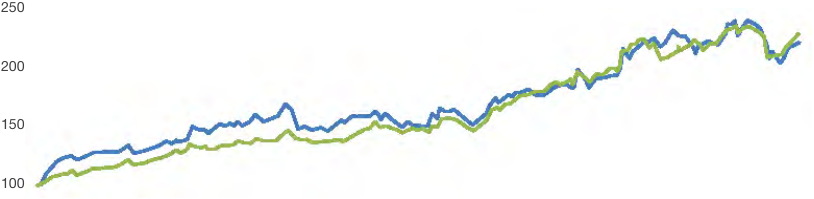

**[Image: AnnualReport2024.pdf-0140-04.png (814x199, 81.2KB)]**

<!-- Start of picture text -->
250 200 150 100 <!-- End of picture text -->

###### **h) Distribution of shareholding as on March 31, 2024** 

|**Category (Amount)**|**No. of Holders**|**% to Holders**|**Total Shares Held**|**Amount (₹)**|**% of Amount**|
|---|---|---|---|---|---|
|1-5000|1,30,094|98.44|58,81,697|2,94,08,485|2.12|
|5001-10000|720|0.54|10,58,446|52,92,230|0.38|
|10001-20000|433|0.33|12,64,886|63,24,430|0.45|
|20001-30000|164|0.12|8,12,870|40,64,350|0.29|
|30001-40000|110|0.08|7,66,083|38,30,415|0.28|
|40001-50000|86|0.07|7,85,795|39,28,975|0.28|
|50001-100000|146|0.11|20,88,633|1,04,43,165|0.75|
|100001 & above|399|0.30|26,53,83,064|1,32,69,15,320|95.45|
|**Total**|**1,32,152**|**100.00**|**27,80,41,474**|**1,39,02,07,370**|**100.00**|

**[Image: AnnualReport2024.pdf-0140-07.png (1027x23, 4.5KB)]**

- **i) Shareholding pattern as on March 31, 2024** 

- i Distribution of equity shareholding: 

###### **Shareholding Pattern as on March 31, 2024** 

**[Image: AnnualReport2024.pdf-0140-11.png (61x25, 1.8KB)]**

**[Image: AnnualReport2024.pdf-0140-12.png (59x26, 1.7KB)]**

GPL Price Share Price movment (Base Rs.100) BSE Realty Movement (Base Rs. 100) 

The Equity Shares of the Company have not been suspended from trading by the SEBI and/ or Stock Exchanges. 

###### **Credit Ratings and any revisions thereto for debt instruments or any fixed deposit programme or any scheme or proposal** 

###### **involving mobilization of funds, whether in India or abroad:** 

The Company does not have any fixed deposit programme or any scheme or proposal involving mobilization of funds in India or abroad during the financial year ended March 31, 2024. The Company continues to have a credit rating which denotes high degree of safety regarding timely servicing of financial obligation. The Company has received the following credit ratings for its Commercial Papers and Non-Convertible Debentures from various credit rating agencies: 

**Sl Rating Credit Rating Agency No****Instrument** 1) Non-Convertible Debentures [ICRA]AA+ (Stable) ICRA Limited IND AA+/Stable India Ratings & Research Private Limited 2) Commercial paper CRISIL A1+ CRISIL Limited [ICRA]A1+ ICRA Limited 

**[Image: AnnualReport2024.pdf-0140-19.png (1027x23, 3.6KB)]**

During the year there has been no downgrading of the above ratings. 

###### **f) Share Transfer Agent** 

###### **g) Share transfer system** 

The Company has outsourced its share transfer function for shares held in physical form to KFin Technologies Limited, which is registered with the Securities and Exchange Board of India having Registration No. INR000000221. 

Investor correspondence should be addressed to: 

###### **For Equity Shares:-** 

###### **KFin Technologies Limited** 

(Formerly known as KFin Technologies Private Limited ) (Unit: Godrej Properties Limited) Selenium Tower-B, Plot No.31 & 32, Financial District, Gachibowli, Nanakramguda, Serilingampally, Hyderabad, Rangareddi, Telengana, India -500 032 Phone: 040-67162222 Fax: 040-23420814 Email ID: einward.ris@kfintech.com Toll Free No.: 18003094001 Contact Person: Mr. Naveen Kiran Logisetti 

As per Regulation 40 of the Listing Regulations, as amended, securities of listed companies can be transferred only in dematerialised form w.e.f. April 01, 2019, except in case of request received for transmission or transposition of securities. Further, SEBI has fixed March 31, 2021 as the cutoff date for re-lodgement of transfer deeds and the shares that are re-lodged for transfer shall be issued only in demat mode. However, Members are not barred from holding shares in physical form. Members who are desirous of transferring shares (which are held in physical form) after April 01, 2019 can do so only after the shares are dematerialized. Transfers of equity shares in electronic form are effected through the depositories with no involvement of the Company. 

###### **For Non-Convertible Debenture (NCDs):** 

###### **Link Intime India Private Limited** 

C 101, 247 Park, LBS Marg, Vikhroli (West) Mumbai – 400 083 Phone: +91 22 4918 6000 Fax: +91 22 4918 6060 Email: mumbai@linkintime.co.in Website: www.linkintime.co.in Contact Person: Mr. Ganesh Jadhav 

|**Category**|**No. of Shareholders**|**No. of shares held**|**% of Shareholding**|
|---|---|---|---|
|Promoters|43|16,25,99,633|58.48|
|Mutual Funds|22|90,07,900|3.24|
|Banks/ NBFC|5|1,050|0.00|
|Foreign Institutional Investors/ FPI|609|8,24,83,811|29.67|
|Other Bodies Corporate|613|17,94,248|0.65|
|Resident Individuals (Public)|1,28,093|1,49,13,317|5.36|
|Non-Resident Indians|2,745|7,93,034|0.29|
|Others|22|64,48,481|2.32|
|**Total**|**1,32,152**|**27,80,41,474**|**100.00**|

**[Image: AnnualReport2024.pdf-0140-33.png (1027x23, 3.9KB)]**

ii. Categories of equity shareholders: 

**[Image: AnnualReport2024.pdf-0140-35.png (29x29, 1.4KB)]**

<!-- Start of picture text -->
■ <!-- End of picture text -->

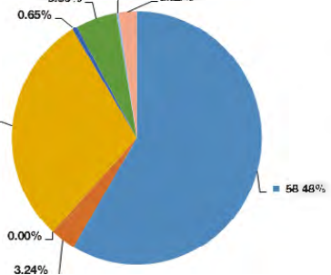

**[Image: AnnualReport2024.pdf-0140-36.png (364x303, 100.2KB)]**

<!-- Start of picture text -->
■  58.48% <!-- End of picture text -->

**[Image: AnnualReport2024.pdf-0140-37.png (107x30, 3.1KB)]**

<!-- Start of picture text -->
■ Mutual  Funds <!-- End of picture text -->

**[Image: AnnualReport2024.pdf-0140-38.png (29x28, 1.5KB)]**

<!-- Start of picture text -->
■ <!-- End of picture text -->

**[Image: AnnualReport2024.pdf-0140-39.png (29x29, 1.5KB)]**

<!-- Start of picture text -->
■ <!-- End of picture text -->

**[Image: AnnualReport2024.pdf-0140-40.png (29x29, 1.4KB)]**

**[Image: AnnualReport2024.pdf-0140-41.png (29x30, 1.4KB)]**

<!-- Start of picture text -->
■ <!-- End of picture text -->

**[Image: AnnualReport2024.pdf-0140-42.png (67x32, 2.3KB)]**

<!-- Start of picture text -->
■ Others <!-- End of picture text -->

**j) Shares held in physical and dematerialized form** 

###### **Break up of physical and dematerialized shares as on March 31, 2024** 

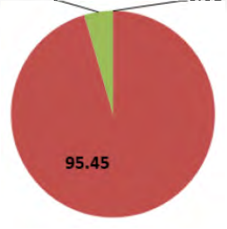

**[Image: AnnualReport2024.pdf-0140-45.png (253x255, 57.7KB)]**

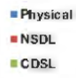

**[Image: AnnualReport2024.pdf-0140-46.png (86x88, 7.3KB)]**

<!-- Start of picture text -->
•  Physical ■ NSDL ■ CDSL <!-- End of picture text -->

Godrej Properties Limited 

Integrated Report 2023-24 

270 

271 

About Godrej Integrating Sustainability Management Discussion Statutory Properties Limited with our Business and Analysis Reports 

**[Image: AnnualReport2024.pdf-0141-01.png (82x27, 2.2KB)]**

###### **k) Dematerialization of shares and liquidity** 

Equity shares of the Company are compulsorily traded in demat form and are available for trading under National Securities Depository Limited (“NSDL”) and Central Depository Services Limited (“CDSL”) from January 05, 2010 onwards. The International Security Identification Number allotted  to the Company, post sub-division of shares, under Depository System is INE484J01027. As of March 31, 2024, 27,80,26,344 equity shares of Rs 5 each, representing 99.99% of the Company’s total paid up share capital, have been held in demat form. 

Pursuant to Regulation 76 of the SEBI (Depositories and Participants) Regulations, 2018, a Company Secretary in Practice carries out Reconciliation of Share Capital Audit to reconcile the total share capital admitted with NSDL and CDSL and held in physical form, with the issued and listed capital. This audit is carried out every quarter and the report thereon is submitted to the Stock Exchanges. The audit confirms that the total listed and paid up/ issued share capital is in agreement with the aggregate of the total number of shares in demat form (held by NSDL and CDSL) and in physical form. 

###### **l) Outstanding GDRs/ ADRs/ warrants/ convertible instruments and their impact on equity** 

During the year under review, the Company has not issued any ADR/GDR/Warrants or any other convertible instruments. 

###### **m) Address for Correspondence** 

Shareholders correspondence should be addressed to: 

###### **KFin Technologies Limited** 

(Formerly known as KFin Technologies  Private Limited)  (Unit: Godrej Properties Limited) 

Selenium Tower-B, Plot No.31 & 32, Financial District, Gachibowli, Nanakramguda, Serilingampally, Hyderabad, Rangareddi, Telangana, India-500 032 

Phone: 040-67162222 

Fax: 040-23420814 

Email ID: einward.ris@kfintech.com Toll Free No.: 18003454001 

**[Image: AnnualReport2024.pdf-0141-15.png (225x23, 3.8KB)]**

Contact Person: Mr. Naveen Kiran Logisetti Compliance Officer: Mr. Ashish Karyekar Godrej One, 5th floor, Pirojshanagar, Eastern Express Highway, Vikhroli (East), Mumbai 400 079 

###### **n) Commodity Price Risk / Foreign Exchange Currency Risk and Commodity Hedging activities** 

The commodity price risk or foreign exchange risk and hedging activities are covered in Management Discussion and Analysis Report. 

###### 8) OTHER DISCLOSURES 

###### **a) Related party transaction** 

The Company has formulated a policy on related party transactions which is also available on the website at https:// www.godrejproperties.com/investors/governance-leadership. . This policy deals with the review and approval of related party transactions. The Board of Directors of the Company has approved the criteria to grant omnibus approval by the Audit Committee within the overall framework of the policy on related party transactions. Prior omnibus approval is obtained for related party transactions which are of repetitive in nature 

**[Image: AnnualReport2024.pdf-0141-22.png (507x45, 14.8KB)]**

<!-- Start of picture text -->
www.godrejproperties.com/investors/governance-leadership. . <!-- End of picture text -->

and entered in the ordinary course of business and at arm’s length. All related party transactions are placed before the Audit Committee for review and approval. 

All related party transactions entered into during the reporting period were in an ordinary course of the business and were at an arm’s length basis and the Company has obtained prior approval of the Audit Committee. 

The Company has sought its members’ approval for the related party transaction that is material within the meaning of Regulation 23 of the Listing Regulations. Attention of Members is drawn to the disclosures of transactions with related parties set out in Notes to Accounts – Note No. 44 forming part of the Standalone financial statements. 

###### **b) Details of non-compliance** 

There has not been any non-compliance by the Company and no penalties or strictures were imposed on the Company by BSE Limited, the National Stock Exchange of India Limited, the Securities and Exchange Board of India or by any other statutory authority, in relation to any matter related to capital markets, during last three years. 

###### **c) Whistle Blower Policy – Vigil Mechanism** 

The Company’s Whistle Blower Policy is in line with the provisions of the sub section 9 and 10 of Section 177 of the Act and as per Regulation 22 of the Listing Regulations. This Policy establishes a vigil mechanism for Directors and employees to report genuine concerns regarding unethical behaviour, actual or suspected fraud or violation of the Company’s Code of Conduct. The said mechanism also provides for adequate safeguards against victimisation of persons who use such mechanism and makes provision for direct access to the chairperson of the Audit Committee in appropriate or exceptional cases. We confirm that during the financial year 2023-24, no employee of the Company was denied access to the Audit Committee. 

The said Whistle-Blower Policy is available on the website of the Company at https://www.godrejproperties.com/investors/ governance-leadership.. 

**[Image: AnnualReport2024.pdf-0141-31.png (507x45, 10.0KB)]**

<!-- Start of picture text -->
governance-leadership.. <!-- End of picture text -->

###### **d) Policy for determining Material Subsidiary** 

As required under the Listing Regulations, the Company has formulated a Policy for determining ‘material’ subsidiaries which has been put up on the website of the Company at https:// www.godrejproperties.com/investors/governance-leadership.. 

**[Image: AnnualReport2024.pdf-0141-34.png (507x46, 11.5KB)]**

<!-- Start of picture text -->
www.godrejproperties.com/investors/governance-leadership.. <!-- End of picture text -->

###### **e) Policy to Prevent Sexual Harassment at** 

###### **the Workplace** 

The Company is committed to creating and maintaining an environment in which employees can work together, without fear of sexual harassment, exploitation or intimidation. Every employee is made aware that the Company is strongly opposed to sexual harassment and that such behavior is prohibited both by law and by the Godrej group. To redress complaints of sexual harassment, an Internal Complaints Committee (ICC) of Godrej Properties Limited has been formed under the Sexual Harassment of Women at Workplace (Prevention, Prohibition and Redressal) Act, 2013 and the rules made thereunder. 

The Company, in line with the Group policy has re-constituted the Internal Complaints Committee (‘ICC’) to include representatives from each region in order  to ensure the better implementation of the Policy. The ICC has formed sub-committees at regional 

which has been put up on the website of the Company at https:// www.godrejproperties.com/investors/governance-leadership.. 

levels by inducting representatives from each regions. The Central Committee at the head office is responsible for decision making. Ms. Raheen Jummani, NGO member, Ms. Divya Jha, Ms. Megha Goel, Mr. Saurabh Mohindru, Ms. Reetu Gupta, Ms. Shivani Khanna, Ms. Sarika Bedi and Mr. Amit Gupta are the members of central Internal Complaints Committee. During the financial year 2023-24, 6 (Six) complaints were received by the Company. These complaints were investigated in accordance with the procedure laid down under the said Act and stand settled as of March 31, 2024. 

**[Image: AnnualReport2024.pdf-0141-41.png (505x45, 12.8KB)]**

<!-- Start of picture text -->
www.godrejproperties.com/investors/governance-leadership.. <!-- End of picture text -->

###### **g) Dividend Distribution Policy** 

As required under the Listing Regulations, the Company has formulated a Policy for dividend distribution which has been put up on the website of the Company at https://www. godrejproperties.com/investors/governance-leadership.. 

**[Image: AnnualReport2024.pdf-0141-44.png (505x46, 12.5KB)]**

<!-- Start of picture text -->
godrejproperties.com/investors/governance-leadership.. <!-- End of picture text -->

###### **h) Code of Conduct on Prevention of Insider Trading** 

No cases of child labour, forced labour, involuntary labour and discriminatory employment were reported during the period. 

As prescribed under SEBI (Prohibition of Insider Trading) Regulations, 2015, the Company has formulated a Code of Conduct for Prevention of Insider Trading which stipulates restrictions while trading in the shares of the Company. 

###### **f) Policy on Determination of Materiality of Events** 

The Company has also adopted Policy on Determination of Materiality of Events and Policy on Archival of Documents 

###### **i) Details of Demat Suspense Account** 

As per Schedule V of Part F of the Listing Regulations the Company reports the following details in respect of equity shares lying in the suspense account which were issued pursuant to the public issue. 

|**Sl.** **No. **|**Particulars (for the Financial Year 2023-24)**|**No. of Cases**|**No. of** **Equity Shares**|
|---|---|---|---|
|1.|Aggregate number of shareholders and the outstanding equity shares in the suspense account lying at the beginning of the year;|1|104|
|2.|Number of shareholders who approached issuer for transfer of equity shares from suspense account during the year;|0|0|
|3.|Number of shareholders to whom equity shares were transferred from suspense account during the year;|0|0|
|4.|Aggregate number of shareholders and the outstanding equity shares in the suspense account lying at the end of the year*.|1|104|

**[Image: AnnualReport2024.pdf-0141-53.png (1026x24, 8.9KB)]**

*The voting rights on the equity shares shall be frozen till the rightful owner claims such shares. 

During the year under review, there were no investors who have lodged the claim with the Company for transfer of shares from Unclaimed Suspense Account maintained by the Company. 

###### **b) NCD issuance of ₹ 1,160 crore in September, 2023:** 

###### **j) Details of utilisation of funds raised through issue of Non-Convertible Debentures on Private Placement Basis:** 

|**Particulars**|**Amount** **(₹ crore)**|
|---|---|
|Amount Received|1,160.00|
||Actual|
|The funds were utilized for the existing and|519.40|
|new business development deals including||
|land acquisition, repayment of existing||
|borrowings (including CC/OD/CP/STL), shore||
|up long-term working capital requirement, for||
|core business of the company and general corporate purpose.||
|Balance to be utilized|640.60|
|**Total**|**1,160.00**|

The details of utilisation of funds raised through issue of NonConvertible Debentures on Private Placement Basis are as follows: 

###### **Non-Convertible Debentures issued on Private Placement** 

**Basis:** The Company has raised the fund of ₹ 1500 crore in July 2023 and ₹ 1,160 crore in September 2023 through the issue of Non-Convertible Debentures on private placement basis. The details of utilization of fund are as follows: 

###### **a) NCD issuance of ₹ 1,500 crore in July, 2023:** 

|**Particulars**|**Amount** **(₹ crore)**|
|---|---|
|Amount Received|1500.00|
||Actual|
|The funds were utilized for repayment of|1500|
|existing borrowings (including CC/OD/CP)||
|used for project development and business||
|operations, and to shore up long-term||
|working capital requirement.||
|Balance to be utilized|0|

**[Image: AnnualReport2024.pdf-0141-64.png (505x24, 3.1KB)]**

**[Image: AnnualReport2024.pdf-0141-65.png (507x24, 3.0KB)]**

**Total 1500.00** 

Godrej Properties Limited 

Integrated Report 2023-24 

272 

273 

About Godrej Integrating Sustainability Management Discussion Statutory Properties Limited with our Business and Analysis Reports 

**[Image: AnnualReport2024.pdf-0142-01.png (82x27, 2.2KB)]**

###### **k) Audit Fees:** 

The fees paid by the Company and its subsidiaries (on a consolidated basis) to the statutory auditors and its network firm during the financial year 2023-24 is as under: 

|**Particulars**|**Amount in crore**|
|---|---|
|Audit Fees|1.94|
|Reimbursement of Expenses|0.16|
|Other Services Fees |-|
|Certifcation and other services|0.35|
| **Total**|**2.45**|

**[Image: AnnualReport2024.pdf-0142-05.png (507x22, 2.4KB)]**

###### **l) Non acceptance of any recommendation of any Committee of the Board which was mandatorily required:** 

During the year, the Board has accepted all recommendation received from its Committees. 

###### **m) Transfer of the ‘shares’ into Investor Education and Protection Fund (IEPF) {in cases where dividend has not been paid or claimed for seven (7) consecutive years or more}** 

In terms of Sections 124 and 125 of the Act read with Investor Education & Protection   Fund   Authority (Accounting, Audit, Transfer and Refund) Rules, 2016 (“IEPF Rules”) as amended, and Notifications issued by the Ministry of Corporate Affairs from time to time, dividends that are unpaid or unclaimed for a period of 7 (seven) consecutive years from the date of their transfer are required to be transferred by the Company to the IEPF, administered by the Central Government. Further, according to the said IEPF Rules, shares in respect of which dividends remain unclaimed by the shareholders for 7 (seven) consecutive years or more shall also be transferred to the demat account of the IEPF Authority. The Company requests all the members to encash/ claim their respective dividends within the prescribed period from IEPF. 

###### **Guidelines for Investors to file claim in respect of the unclaimed dividend or shares transferred to the IEPF** 

Investors/depositors whose unpaid dividends, matured deposits or debentures etc. have been transferred to IEPF under the Companies Act, 1956 and/or the Act, can claim the amounts. In addition, claims can also be made in respect of shares which have been transferred into the IEPF, as per the procedures/guidelines available on the website of the Company at https://www.godrejproperties.com/investors/compliances 

**[Image: AnnualReport2024.pdf-0142-12.png (468x23, 4.6KB)]**

The Members may note that no claims shall lie against the Company in respect of the dividend/ shares so transferred to IEPF. 

###### **n) Plant locations:** 

The Company operates from various offices in India as given in the third cover page of the Annual Report. The details of various project sites of the Company are available on the website of the Company www.godrejproperties.com 

**[Image: AnnualReport2024.pdf-0142-16.png (236x24, 3.6KB)]**

###### **o) Details of material subsidiaries:** 

As at March 31, 2024, Godrej Projects Development Limited (“GPDL”) and Godrej Vestamark LLP are the material unlisted Indian subsidiaries of GPL under Regulation 24 of Listing Regulations. 

GPDL was incorporated as a private limited company under the Companies Act, 1956 on November 22, 2010 in 

Mumbai and was converted into a public limited company on November 22, 2017. GPDL is a wholly owned subsidiary of GPL and is engaged in Real Estate Development and Construction Activities. 

Godrej Vestamark LLP was incorporated on April 20, 2017 and is engaged in the Real Estate Development and Construction Activities. 

M/s. BSR & Co. LLP, Chartered Accountants (Firm Registration No.101248W/W-100022) are appointed as the Statutory Auditors of GPDL for a second term of five consecutive years for the financial years 2022-23 to 2026-27 in the annual general meeting held on September 29, 2022. M/s. BSR & Co. LLP are appointed as the Statutory Auditors of Godrej Vestamark LLP on August 22, 2017. 

###### 9) DETAILS OF COMPLIANCE WITH MANDATORY REQUIREMENTS OF THE LISTING REGULATIONS 

i. The Company has complied with the requirements as mentioned in Schedule V, Para C, sub-paras (2) to (10) of the Listing Regulations. 

ii. The Company has complied with all the requirements as specified in Regulation 17 to 27 and clauses (b) to (i) of subregulation (2) of Regulation 46 of the Listing Regulations. 

###### 10) DISCRETIONARY DISCLOSURES 

The status of compliance with non-mandatory recommendations of the Listing Regulations is as follows: a) Shareholders’ Rights: As the quarterly and half yearly financial results are published in the newspapers and are also posted on the Company’s website, the same are not being sent separately to the shareholders. 

b) Audit Qualifications: The Company’s financial statements for the year 2023-24 do not contain any audit qualification. 

c) Separate posts of Chairman and CEO: The positions of the Chairman and the CEO in the Company are separate. 

d) Reporting of Internal Auditor: The Internal Auditors of the Company directly report to Chairperson of the Audit Committee. 

###### 11) Disclosure as per Part G of the Schedule V to the SEBI (Listing Obligations and Disclosure Requirements) Regulations, 2015 

The Company has been informed by way of a family letter dated April 30, 2024 issued jointly by Mr. Adi Godrej (ABG), Mr. Nadir Godrej (NBG), Mrs. Smita Vijay Crishna (SVC) and Mr. Jamshyd Godrej (JNG) that the Godrej family members have entered into a family settlement agreement and a brand & non-compete agreement on April 30, 2024. The Company is not a party to these agreements. 

The settlement contemplates a realignment of, inter alia, the shareholding of Godrej Industries Limited, which is the holding company of the Company, subject to applicable regulatory approvals. Pursuant to the realignment, the management and control of the Company will continue with the ABG / NBG family, and the JNG / SVC family will not be involved in the management and operations of the Company. 

Currently, there are no members of the JNG / SVC Family who are directors on the board of directors of the Company. 

###### Declaration by Managing Director & CEO 

I, Gaurav Pandey, Managing Director & Chief Executive Officer of Godrej Properties Limited, hereby confirm pursuant to the SEBI (Listing Obligations and Disclosure Requirements) Regulations, 2015 that: 

The Board of Godrej Properties Limited has laid down a Code of Conduct for all Board members and senior management of the Company. The said code of conduct has also been posted on the Company’s website at www.godrejproperties.com. All the Board members and senior management personnel have affirmed their compliance with the said Code of Conduct for the financial year ended March 31, 2024. 

**[Image: AnnualReport2024.pdf-0142-38.png (236x23, 4.3KB)]**

<!-- Start of picture text -->
. <!-- End of picture text -->

**Gaurav Pandey** Managing Director & Chief Executive Officer 

Place: Mumbai Date: May 03, 2024 

Godrej Properties Limited 

Integrated Report 2023-24 

274 

275 

About Godrej Integrating Sustainability Management Discussion Statutory Properties Limited with our Business and Analysis Reports 

**[Image: AnnualReport2024.pdf-0143-01.png (82x27, 2.2KB)]**

###### To, 

The Members, **Godrej Properties Limited** 

###### CERTIFICATE ON CORPORATE GOVERNANCE 

###### CERTIFICATE OF NON-DISQUALIFICATION OF DIRECTORS 

###### **[Pursuant to Regulation 34(3) and Schedule V Para C clause (10) (i) of the SEBI (Listing Obligations and Disclosure Requirements) Regulations, 2015]** 

###### To 

We have examined the compliance of conditions of Corporate Governance, by Godrej Properties Limited (“the company”), for the financial year ended March 31, 2024, as prescribed in the Regulations 17 to 27, 46 (2) (b) to (i), and Paragraphs C, D and E of Schedule V of Chapter IV of SEBI (Listing Obligations and Disclosure Requirements) Regulations, 2015 (the Listing Regulations). 

We state that the compliance of conditions of Corporate Governance is the responsibility of the management, and our examination was limited to the procedures and implementation thereof, adopted by the Company for ensuring the compliance of the conditions of Corporate Governance. It is neither an audit nor an expression of opinion on the financial statements of the Company. 

In our opinion, and to the best of our information and according to the explanations, given to us, we certify that the Company has complied with the conditions of Corporate Governance, as stipulated in the aforesaid provisions of the Listing Regulations. 

We further state that such compliance is neither an assurance as to the future viability of the Company nor the efficiency or the effectiveness with which the management has conducted the affairs of the Company. 

This certificate is issued solely for the purposes of complying with Listing Regulations and may not be suitable for any other purpose. 

For **BNP & Associates** Company Secretaries [Firm Regn. No. P2014MH037400] PR No. 637/2019 

Place: Mumbai Date: May 03, 2024 

**Kalidas Ramaswami** Partner FCS: F2440 / COP: 22856 UDIN: F002440F000303521 

The Members of Godrej Properties Limited Godrej One, 5th Floor, Pirojshanagar Eastern Express Highway Vikhroli (East) Mumbai-400079 

We have examined the relevant registers, records, forms, returns and disclosures received from the Directors of Godrej Properties Limited (CIN:L74120MH1985PLC035308) having its Registered Office at Godrej One, 5th Floor, Pirojshanagar, Eastern Express Highway, Vikhroli (East), Mumbai-400079 (hereinafter referred to as ‘the Company’), produced before us by the Company for the purpose of issuing this Certificate, in accordance with Regulation 34(3) read with Schedule V Para-C Sub clause 10(i) of the Securities Exchange Board of India (Listing Obligations and Disclosure Requirements) Regulations, 2015. 

In our opinion and to the best of our information and according to the verifications (including Directors Identification Number (DIN) status at the portal www.mca.gov.in ) as considered necessary and explanations furnished to us by the Company & its officers, we hereby certify that none of the Directors on the Board of the Company as stated below for the financial year ending on March 31, 2024 have been debarred or disqualified from being appointed or continuing as Directors of companies by the Securities and Exchange Board of India, Ministry of Corporate Affairs, or any such other Statutory Authority. 

|**Sl** **No.**|**Name of the Director**|**DIN**|**Date of appointment**|
|---|---|---|---|
|1)|Mr. Pirojsha Adi Godrej|00432983|25/10/2008|
|2)|Dr. Indu Bhushan|09302960|03/05/2022|
|3)|Mr. Nadir Burjor Godrej|00066195|25/04/1990|
|4)|Ms. Sutapa Banerjee|02844650|05/11/2019|
|5)|Mr. Gaurav Pandey|07229661|01/01/2023|
|6)|Mr. Sumeet Subhash Narang|01874599|18/08/2023|
|7)|Ms. Jayashree Vaidhyanathan|07140297|02/08/2023|

**[Image: AnnualReport2024.pdf-0143-20.png (1026x24, 5.5KB)]**

Ensuring the eligibility of for the appointment/continuity of every Director on the Board is the responsibility of the management of the Company. Our responsibility is to express an opinion on these based on our verification. This certificate is neither an assurance as to the future viability of the Company nor of the efficiency or effectiveness with which the management has conducted the affairs of the Company. 

For **A.K. Jain & Co.** Company Secretaries 

Place: Mumbai Date:  May 03, 2024 

**Ashish Kumar Jain** Proprietor FCS: 6058, CP: 6124 Peer Review Certificate No.1485/2021 UDIN:- F006058F000304697 

Godrej Properties Limited 

Integrated Report 2023-24 

276 

277 

About Godrej Integrating Sustainability Management Discussion Statutory Properties Limited with our Business and Analysis Reports 

**[Image: AnnualReport2024.pdf-0144-01.png (82x27, 2.2KB)]**

###### **BUSINESS RESPONSIBILITY & SUSTAINABILITY REPORT** 

SECTION A: GENERAL DISCLOSURES 

###### **III. Operations** 

###### 18. Number of locations where plants and/or operations/offices of the entity are situated: 

|Location|Number of plants|Number of offces|Total|
|---|---|---|---|
|National|50|8|58|
|International|0|3|3|

**[Image: AnnualReport2024.pdf-0144-07.png (1028x24, 6.6KB)]**

Note: We only have sales offices at international locations. However, no operational activity is carried out internationally. 

###### 19. Markets served by the entity: 

###### a. Number of locations 

###### **I. Details of listed entity** 

**1. Corporate Identity Number (CIN) of the Listed Entity -** L74120MH1985PLC035308 

**2. Name of the Listed Entity -** Godrej Properties Limited 

**3. Year of incorporation -** February 8, 1985 

**4. Registered office address -** Godrej One, 5th Floor, Pirojshanagar, Eastern Express Highway, Vikhroli (East), Mumbai – 400079 

**5. Corporate address -** Godrej One, 5th Floor, Pirojshanagar, Eastern Express Highway, Vikhroli (East), Mumbai – 400079 

**6. E-mail -** secretarial@godrejproperties.com 

**[Image: AnnualReport2024.pdf-0144-18.png (288x23, 3.6KB)]**

**7. Telephone -** 022-61698500 

**8. Website -** http://www.godrejproperties.com/ 

**[Image: AnnualReport2024.pdf-0144-21.png (291x22, 3.3KB)]**

**9. Financial year for which reporting is being done -** FY 2023-24 

**10. Name of the Stock Exchange(s) where shares are listed -** BSE Ltd. (BSE)/ National Stock Exchange of India Ltd. (NSE) 

|Locations|Number|
|---|---|
|National (No. of States)|8 states (Maharashtra, Delhi, Haryana, UP, Karnataka, Tamil Nadu, West Bengal, and Gujarat)|
|International (No. of Countries)|3 Countries (UAE, Singapore, and Qatar)|

**[Image: AnnualReport2024.pdf-0144-25.png (1028x24, 10.3KB)]**

Note: We only have sales offices at international locations. However, no operational activity is carried out internationally 

- b. What is the contribution of exports as a percentage of the total turnover of the entity? 

**Response:** Given the nature of our business, we do not have any exports. 

###### c. A brief on types of customers 

**Response:** Godrej Properties represents the ethos of the Godrej Group by infusing innovation, sustainability, and excellence into the real estate sector. Drawing from a rich legacy of 127 years, each project is a fusion of trusted tradition and contemporary design, embracing advanced technology. With a focus on diverse customer requirements spanning various locations, demographics, budgets, and architectural styles, Godrej Properties consistently strives to meet and exceed expectations. 

**11. Paid-up Capital -** ₹ 139.02 Cr. 

**12.  Name and contact details (telephone, email address) of the person who may be contacted in case of any queries on the BRSR report -** Mr. Ashish Karyekar 

Telephone No.: 022-61698731 

- Email Id: akaryekar@godrejproperties.com 

**[Image: AnnualReport2024.pdf-0144-35.png (284x23, 4.0KB)]**

**13.  Reporting boundary - Are the disclosures under this report made on a standalone basis (i.e. only for the entity) or on a consolidated basis (i.e. for the entity and all the entities which form a part of its consolidated financial statements, taken together). -** Consolidated basis 

**14. Name of assurance provider -** Grant Thornton Bharat LLP 

**15.  Type of assurance obtained -** Reasonable Assurance of BRSR Core Indicators and Limited Assurance of select noncore indicators 

###### **II. Products/Services** 

16. Details of business activities (accounting for 90% of the turnover): 

###### **IV. Employees** 

###### 20. Details as at the end of Financial Year: 

a. Employees and workers (including differently abled): 

|S.|Ptil|Ttl A|Mal|e|Fem|ale|
|---|---|---|---|---|---|---|
||arcuars|oa ()|||||
|No.|||No. (B)|% (B/A)|No. (C)|% (C/A)|
|EMP|LOYEES||||||
|1.|Permanent (D)|3,015*|2,123|70%|875|29%|
|2.|Other than Permanent (Contractual) (E)|1,212**|1,062|88%|137|11%|
|3.|Total employees (D + E)|4,227|3,185|75%|1,012|24%|
|WO|RKERS||||||
|4.|Permanent (F)||||||
|5.|Other than Permanent (G)|||NA|||
|6.|Total workers (F + G)||||||

**[Image: AnnualReport2024.pdf-0144-45.png (1028x24, 5.6KB)]**

Note: *The total headcount of permanent employees is 3,015 which includes 17 employees from ‘Other’ gender. 

   - **The total headcount of Contractual Employee is 1,212 which includes 13 employees from ‘Other’ gender. 

- S. No.Description of Main Activity 

| No.|Description of Main Activity|Description of Business Activity|% of Turnover of the entity|
|---|---|---|---|
|1 7. P|Real Estate Development roducts/Services sold by the entity (ac|Development of Building Projects for sale counting for 90% of the entity’s Turnover):|100%|
|S. No.|Product/Service|NIC Code|% of total Turnover contributed|
|1|Real Estate Development|4100|100%|

**[Image: AnnualReport2024.pdf-0144-50.png (1027x24, 5.2KB)]**

17. Products/Services sold by the entity (accounting for 90% of the entity’s Turnover): 

**[Image: AnnualReport2024.pdf-0144-52.png (1026x24, 6.0KB)]**

###### b. Differently abled Employees and workers: 

|S.|Ptil|Ttl A|Mal|e|Fem|ale|
|---|---|---|---|---|---|---|
|No.|arcuars|oa ()|No. (B)|% (B/A)|No. (C)|% (C/A)|
|DIF|FERENTLY ABLED EMPLOYEES||||||
|1.|Permanent (D)|7|6|86%|1|14%|
|2.|Other than Permanent (E)|5|4|80%|1|20%|
|3.|Total employees (D + E)|12|10|83%|2|17%|
|DIF|FERENTLY ABLED WORKERS||||||
|4.|Permanent (F)||||||
|5.|Other than Permanent (G)|||NA|||
|6.|Total workers (F + G)||||||

**[Image: AnnualReport2024.pdf-0144-55.png (1026x24, 9.2KB)]**

Note: GPL development activity is outsourced. Hence, all the workers are employed under contractors & vendors appointed by GPL. 

Godrej Properties Limited 

Integrated Report 2023-24 

278 

279 

About Godrej Integrating Sustainability Management Discussion Statutory Properties Limited with our Business and Analysis Reports 

**[Image: AnnualReport2024.pdf-0145-01.png (82x27, 2.2KB)]**

###### 21. Participation/Inclusion/Representation of women: 

||Total (A)|No. and percentag No. (B)|e of females % (B/A)|
|---|---|---|---|
|Board of Directors|7|2|29%|
|Key Management Personnel*|2|0|0%|

**[Image: AnnualReport2024.pdf-0145-04.png (1026x24, 6.1KB)]**

*Key Management Personnel (KMP) includes the Executive Chairperson (EC), Chief Executive Officer (CEO), Chief Financial Officer (CFO) and Company Secretary (CS) but as the EC and CEO are included in Board of Directors, KPM here only includes CFO and CS. 

###### 22. Turnover rate for permanent employees and workers 

||F|Y 2023-24||F|Y 2022-23||F|Y 2021-22||
|---|---|---|---|---|---|---|---|---|---|
||Male|Female|Total|Male|Female|Total|Male|Female|Total|
|Permanent Employees|25%|25%|25%|29%|24%|30%|9%|19%|12%|
|Permanent Workers||NA|||NA|||NA||

###### **V. Holding, Subsidiary and Associate Companies (including joint ventures)** 

###### 23. Names of holding / subsidiary / associate companies / joint ventures 

|S.|Name of the holding/subsidiary/associate companies/joint|Indicate whether|% of|Does the entity|
|---|---|---|---|---|
|No.|ventures (A)|holding/ Subsidiary/ Associate/ Joint Venture|shares held by listed entity|indicated in column A participate in the Business Responsibility initiatives of the listed entity? (Yes/No)|
|1|Godrej Industries Limited|Holding|47.34%|No|
|2|Godrej Projects Development Limited|Subsidiary|100%|Yes|
|3|Godrej Garden City Properties Private Limited|Subsidiary|100%|No|
|4|Godrej Hillside Properties Private Limited|Subsidiary|100%|No|
|5|Godrej Home Developers Private Limited|Subsidiary|100%|No|
|6|Godrej Prakriti Facilities Private Limited|Subsidiary|100%|No|
|7|Prakritiplaza Facilities Management Private Limited|Subsidiary|100%|No|
|8|Godrej Highrises Properties Private Limited|Subsidiary|100%|No|
|9|Godrej Genesis Facilities Management Private Limited|Subsidiary|100%|No|
|10|Citystar InfraProjects Limited|Subsidiary|100%|No|
|11| Godrej Residency Private Limited|Subsidiary|50.01%|Yes|
|12|Godrej Property Developers LLP (Subsidiary upto February 29, 2024)|Subsidiary|100%|No|
|13|Godrej Precast Construction Private Limited|Subsidiary|100%|No|
|14|Godrej Green Woods Private Limited|Subsidiary|100%|No|
|15|Godrej Realty Private Limited|Subsidiary|100%|No|
|16|Godrej Living Private Limited|Subsidiary|100%|No|
|17|Ashank Land & Building Private Limited (w.e.f. May 19, 2022)|Subsidiary|100%|No|
|18| Godrej Home Constructions Limited (w.e.f  March 29, 2023)|Subsidiary|100%|Yes|
|19|Wonder City Buildcon Private Limited (w.e.f  March 29, 2023)|Subsidiary|100%|No|
|20|Godrej Skyline Developers Private Limited (w.e.f September 28, 2023)|Subsidiary|93%|Yes|
|21|Godrej Real Estate Distribution Company Private Limited (w.e.f July 20, 2023)|Subsidiary|100%|No|
|22| Godrej Highrises Realty LLP|Subsidiary|100%|No|
|23|Godrej Project Developers & Properties LLP|Subsidiary|100%|No|
|24| Godrej Skyview LLP|Subsidiary|100%|No|
|25|Godrej Green Properties LLP|Subsidiary|100%|No|
|26| Godrej Projects (Soma) LLP|Subsidiary|100%|No|
|27|Godrej Athenmark LLP|Subsidiary|100%|No|
|28| Godrej City Facilities Management LLP|Subsidiary|100%|No|

|S.|Name of the holding/subsidiary/associate companies/joint|Indicate whether | % of|Does the entity|
|---|---|---|---|---|
|No.|ventures (A)|holding/ Subsidiary/ Associate/ Joint Venture|shares held by listed entity|indicated in column A participate in the Business Responsibility initiatives of the listed entity? (Yes/No)|
|29|Godrej Florentine LLP|Subsidiary|100%|No|
|30|Godrej Olympia LLP|Subsidiary|100%|No|
|31|Godrej Buildwell Projects LLP (formerly known as Godrej Construction Projects LLP)|Subsidiary|100%|No|
|32|Oasis Landmarks LLP|Subsidiary|51%|No|
|33|Ashank Facility Management LLP|Subsidiary|100%|No|
|34|Maan-Hinje Township Developers LLP (w.e.f  Mar 29, 2023)|Subsidiary|99%|Yes|
|35| Godrej Reserve LLP (w.e.f Oct 1, 2022)|Subsidiary|99.8%|No|
|36|Ashank Realty Management LLP|Subsidiary|100%|No|
|37|Dream World Landmarks LLP (w.e.f September 30, 2023)|Subsidiary|40%|Yes|
|38| Caroa Properties LLP (w.e.f Mar 28, 2024)|Subsidiary|57.59%|Yes|
|39|Godrej Vestamark LLP (w.e.f June 23, 2023)|Subsidiary|100%|Yes|
|40|Godrej Redevelopers (Mumbai) Private Limited|Joint Venture|51%|No|
|41|Godrej Greenview Housing Private Limited|Joint Venture|20%|Yes|
|42| Wonder Projects Development Private Limited|Joint Venture|20%|No|
|43|Godrej Real View Developers Private Limited|Joint Venture|20%|Yes|
|44|Pearlite Real Properties Private Limited|Joint Venture|49%|No|
|45|Godrej Green Homes Private Limited|Joint Venture|50%|No|
|46| Madhuvan Enterprises Private Limited|Joint Venture|20%|No|
|47|"Godrej Mackbricks Private Limited|Joint Venture|20%|Yes|
||(formerly known as Ashank Macbricks Private Limited)"||||
|48| Munjal Hospitality Private Limited|Joint Venture|12%|No|
|49 |Vivrut Developers Private Limited |Joint Venture |20% |No |
|50|Yerwada Developers Private Limited|Joint Venture|20%|No|
|51|Vagishwari Land Developers Private Limited|Joint Venture|20%|No|
|52|Mosiac Landmarks LLP|Joint Venture|1%|No|
|53|Oxford Realty LLP|Joint Venture|35%|No|
|54|Godrej SSPDL Green Acres LLP|Joint Venture|37%|No|
|55|M S Ramaiah Ventures LLP|Joint Venture|50.05%|No|
|56|Godrej Housing Projects LLP|Joint Venture|50%|No|
|57|Godrej Amitis Developers LLP|Joint Venture|46%|Yes|
||(formerly known as Amitis Developers LLP)||||
|58|A R Landcraft LLP|Joint Venture|40%|Yes|
|59|Prakhhyat Dwellings LLP |Joint Venture|50% |Yes|
|60|Godrej Highview LLP|Joint Venture|40%|Yes|
|61| Godrej Irismark LLP|Joint Venture|50%|No|
|62|Godrej Projects North Star LLP|Joint Venture|55%|No|
|63| Godrej Developers & Properties LLP|Joint Venture|37.50%|Yes|
|64|Roseberry Estate LLP|Joint Venture|49%|Yes|
|65| Suncity Infrastructures (Mumbai) LLP|Joint Venture|60%|Yes|
|66| Mahalunge Township Developers LLP|Joint Venture|40%|Yes|
|67| Manyata Industrial Parks LLP|Joint Venture|1%|No|
|68|Godrej Odyssey LLP|Joint Venture|55%|No|
|69| Universal Metro Properties LLP| Joint Venture|49%|Yes|
|70| Embellish Houses LLP|Joint Venture|50%|No|
|71|Manjari Housing Projects LLP|Joint Venture|40%|Yes|
|72|Godrej Projects North LLP|Joint Venture|50.10%|Yes|
|73| Godrej One Premises Management Private Limited| Associate|30%|No|

Godrej Properties Limited 

Integrated Report 2023-24 

280 

281 

About Godrej Integrating Sustainability Management Discussion Statutory Properties Limited with our Business and Analysis Reports 

**[Image: AnnualReport2024.pdf-0146-01.png (82x27, 2.2KB)]**

###### **VI. CSR Details** 

24. (i) Whether CSR is applicable as per section 135 of Companies Act, 2013: (Yes/No): Yes 

   - (ii) Turnover (in ₹): 3,035.62 Cr. 

   - (iii) Net worth (in ₹): 9,992.51 Cr. 

###### **VII. Transparency and disclosures compliances** 

25.  Complaints/Grievances on any of the principles (Principles 1 to 9) under the National Guidelines on Responsible Business Conduct: 

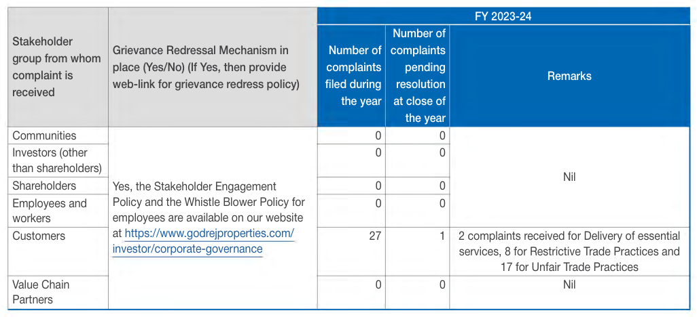

**[Image: AnnualReport2024.pdf-0146-08.png (1026x468, 143.6KB)]**

<!-- Start of picture text -->
FY 2023-24 Number of Stakeholder Grievance Redressal Mechanism in  Number of  complaints group from whom place (Yes/No) (If Yes, then provide  complaints  pending complaint is  Remarks web-link for grievance redress policy) filed during  resolution received the year at close of the year Communities 0 0 Investors (other  0 0 than shareholders) Nil Shareholders Yes, the Stakeholder Engagement  0 0 Employees and  Policy and the Whistle Blower Policy for  0 0 workers employees are available on our website Customers at https://www.godrejproperties.com/ 27 1 2 complaints received for Delivery of essential investor/corporate-governance services, 8 for Restrictive Trade Practices and 17 for Unfair Trade Practices Value Chain  0 0 Nil Partners <!-- End of picture text -->

|Stakeholder group from whom complaint is received|Grievance Redressal Mechanism in place (Yes/No) (If Yes, then provide web-link for grievance redress policy)|Number of complaints fled during the year| complaints pending resolution at close of the year|Remarks|
|---|---|---|---|---|
|Communities||0|0||
|Investors (other||0|0||
|than shareholders)||||Nil|
|Shareholders|Yes, the Stakeholder Engagement|0|0||
|Employees and workers|Policy and the Whistle Blower Policy for employees are available on our website|0|0||
|Customers|athttps://www.godrejproperties.com/ investor/corporate-governance|27|1|2 complaints received for Delivery of essential services, 8 for Restrictive Trade Practices and 17 for Unfair Trade Practices|
|Value Chain||0|0|Nil|
|Partners|||||
|Stakeholder group from whom complaint is received|Grievance Redressal Mechanism in place (Yes/No) (If Yes, then provide web-link for grievance redress policy)|Number of complaints fled during the year|Number of complaints pending resolution at close of the year|FY 2022-23 Remarks|
|Communities||0|0|Nil|
|Investors (other than shareholders)||0|0||
|Shareholders|Y h Skhld E|0|0||
|Employees and workers|es, te taeoer ngagement Policy and the Whistle Blower Policy for emloees are available on our website|0|0||
|Customers|py athttps://www.godrejproperties.com/ investor/corporate-governance|97|30|In FY 2022-23, 54 complaints received for data privacy, 8 for advertising, 33 for delivery of essential services, 1 for unfair trade practices and 1 other.|
|Value Chain Partners||0|0|Nil Nil|

**[Image: AnnualReport2024.pdf-0146-10.png (1027x24, 5.1KB)]**

###### 26. Overview of the entity’s material responsible business conduct issues 

Please indicate material responsible business conduct and sustainability issues pertaining to environmental and social matters that present a risk or an opportunity to your business, rationale for identifying the same, approach to adapt or mitigate the risk along-with its financial implications, as per the following format: 

- Financial implications 

- Indicate of the risk or 

- Material 

- S. whether risk In case of risk, approach to adapt or opportunity Issue Rationale for identifying the risk/opportunity 

- No. Identified or opportunity mitigate (indicate (R/O) positive or negative implications) 

- 1. GHG Risk Real estate assets contribute substantially to 1.  Employ renewable energy systems, Negative Management global emissions through energy consumption achieving IGBC Health and Well-being and waste production. Failure to effectively certifications, and prioritize sustainable manage these emissions exposes the procurement of materials. company to regulatory risks, as governments 2.  Implementing internal carbon worldwide implement stricter climate-related pricing and enhancing energy regulations and carbon pricing mechanisms efficiency through LED lighting, smart technologies, and efficient HVAC systems are crucial steps, along with adopting water-saving measures like low-flow fixtures and rainwater harvesting. 

- 2. Waste Risk Waste management poses a significant risk 1.  We have implemented comprehensive Negative Management to real estate sectors due to the significant strategies focused on waste diversion, waste generated by development, operation, recycling, and reuse. By prioritizing and demolition of properties. As environmental the minimization of construction and regulations become stricter and stakeholders operational waste sent to landfills, demand more sustainable practices, effective we actively reduce our environmental waste management is crucial to ensure impact. compliance, reduce landfill use, and lower 2.  Our initiatives include robust recycling environmental impact. programs and onsite material reuse practice. 3. Additionally, through our corporate social responsibility (CSR) projects, we offset additional waste from landfills, further enhancing our commitment to sustainability 

- 3. Occupational Risk For real estate companies, it is essential 1.  Our OH&S Management system Negative Health & to inherent risks associated with property is aligned with ISO 45001: 2018, Safety management, construction, and maintenance conducting thorough audits and risk activities. Providing a safe work environment assessments. and preventing accidents are paramount 2. Comprehensive training programs to protecting employees, contractors, and ensure staff are versed in safety tenants from potential hazards. protocols. Robust incident reporting Compliance with safety regulations is not only and transparent communication foster a a legal obligation but also a critical factor in safety culture, while regular monitoring mitigating financial risks related to workplace and reviews enhance effectiveness. injuries, liability claims, and potential fines 

- 4. Sustainable Risk Sustainable supply chain management 1.  Our approach encompasses thorough Negative Supply Chain imposes inherent risks for a real estate supplier screening procedures, business in today’s interconnected global designed to assess potential partners economy. As the real estate industry relies based on sustainability criteria and heavily on suppliers for construction materials, compliance with environmental and maintenance services, and operational social standards. necessities, disruptions or unethical practices 2.  Our vendor screening processes within the supply chain can significantly impact ensure that all partners align with our project timelines, costs, and reputation. sustainability objectives, promoting transparency, accountability, and responsible business practices throughout our operations. 

- 5. Product Opportunity At GPL, Our main priority is to create customer Positive & Service joy through best-in-class delivery with a focus Quality on quality by ensuring high-quality products and services. By consistently delivering superior products and services, such as well-maintained properties, efficient property management, and responsive customer support, the company can cultivate positive relationships with tenants, investors, and other stakeholders. 

For further information on material topics, Refer Page No. 56 of the Integrated Report 

Godrej Properties Limited 

Integrated Report 2023-24 

282 

283 

About Godrej Integrating Sustainability Management Discussion Statutory Properties Limited with our Business and Analysis Reports 

**[Image: AnnualReport2024.pdf-0147-01.png (82x27, 2.2KB)]**

###### SECTION B: MANAGEMENT AND PROCESS DISCLOSURES 

- Disclosure Questions P1 P2 P3 P4 P5 P6 P7 P8 P9 I I I I I I I I 

- Policy and management processes 1. a.  Whether your entity’s Yes policy/policies cover each principle and its core elements of the NGRBCs. (Yes/No) 

- b.  Has the policy been Yes approved by the Board? (Yes/No) 

- c.  Web Link of the Policies, ESG Policies: if available https://www.godrejproperties.com/investor/corporate-governance 

**[Image: AnnualReport2024.pdf-0147-04.png (502x24, 5.6KB)]**

###### Risk Management Policy: 

https://delf2iyv2crlj.cloudfront.net/Files/risk-management-policy-WVvfQ6WqYQIgaFPnCg5l.pdf 

**[Image: AnnualReport2024.pdf-0147-07.png (717x23, 7.5KB)]**

Stakeholder Engagement Policy: https://delf2iyv2crlj.cloudfront.net/Files/stakeholder-engagement-policy-jsq2oGWqbQbOJ5DBF8hk.pdf Sustainable Procurement Policy: https://delf2iyv2crlj.cloudfront.net/Files/sustainable-procurement-policy-2ZRdfGMjRy77ODi6D3VU.pdf Anti Sexual Harassment Policy: https://delf2iyv2crlj.cloudfront.net/Files/sustainable-procurement-policy-2ZRdfGMjRy77ODi6D3VU.pdf Health & Safety Policy: https://delf2iyv2crlj.cloudfront.net/Files/gpl-health-and-safety-policy-r02-IGSvvDUASyFKt2LGlT4p.pdf Employee Policy: https://delf2iyv2crlj.cloudfront.net/Files/gpl-health-and-safety-policy-r02-IGSvvDUASyFKt2LGlT4p.pdf Data Privacy Policy: 

**[Image: AnnualReport2024.pdf-0147-09.png (774x24, 8.4KB)]**

**[Image: AnnualReport2024.pdf-0147-10.png (769x22, 7.2KB)]**

**[Image: AnnualReport2024.pdf-0147-11.png (769x22, 7.0KB)]**

**[Image: AnnualReport2024.pdf-0147-12.png (766x24, 8.0KB)]**

**[Image: AnnualReport2024.pdf-0147-13.png (766x24, 8.0KB)]**

https://delf2iyv2crlj.cloudfront.net/Files/gpl-data-privacy-policy-ajbbqmM8ePSktNRhPTeA.pdf GPL Human Rights Policy: 

**[Image: AnnualReport2024.pdf-0147-15.png (708x23, 6.6KB)]**

https://delf2iyv2crlj.cloudfront.net/Files/gpl-data-privacy-policy-ajbbqmM8ePSktNRhPTeA.pdf 

**[Image: AnnualReport2024.pdf-0147-17.png (708x23, 6.1KB)]**

- Environmental Policy: https://delf2iyv2crlj.cloudfront.net/Files/gpl-environmental-policy-one-pager-VBEoNCo4rf1NzPq9VZf. pdf 

**[Image: AnnualReport2024.pdf-0147-19.png (759x43, 9.8KB)]**

<!-- Start of picture text -->
- pdf <!-- End of picture text -->

###### CSR Policy: 

https://delf2iyv2crlj.cloudfront.net/Files/csr-policy1-OZz3CY14ohLyZTd1Rk.pdf 

**[Image: AnnualReport2024.pdf-0147-22.png (598x22, 5.3KB)]**

###### Information Security Policy: 

https://delf2iyv2crlj.cloudfront.net/Files/gpl-information-security-policy-0ohr2PajHowGFd7J0M.pdf 

**[Image: AnnualReport2024.pdf-0147-25.png (741x24, 6.5KB)]**

- Whistleblower Policy: 

https://delf2iyv2crlj.cloudfront.net/Files/gpl-information-security-policy-0ohr2PajHowGFd7J0M.pdf 

**[Image: AnnualReport2024.pdf-0147-28.png (741x23, 6.4KB)]**

###### Code of Conduct – Employees: 

https://delf2iyv2crlj.cloudfront.net/Files/gilac-code-of-conduct-v2-0-OFDJ010mcZ6tpBhNYr3.pdf 

**[Image: AnnualReport2024.pdf-0147-31.png (732x24, 6.5KB)]**

###### Code of Conduct – Vendors/Suppliers: 

https://delf2iyv2crlj.cloudfront.net/Files/code-of-conduct-for-vendors-and-suppliersg6BGhUMWLVhfqHvbEqQS.pdf 

**[Image: AnnualReport2024.pdf-0147-34.png (637x43, 12.1KB)]**

<!-- Start of picture text -->
g6BGhUMWLVhfqHvbEqQS.pdf <!-- End of picture text -->

Code of Conduct for the Board of Directors and Senior Management: 

https://delf2iyv2crlj.cloudfront.net/Files/codeof-conductforthe-boardof-directors-senior-management3le5eacxVQoQNG21hp.pdf 

**[Image: AnnualReport2024.pdf-0147-37.png (771x43, 11.3KB)]**

<!-- Start of picture text -->
le5eacxVQoQNG21hp.pdf <!-- End of picture text -->

2.  Whether the entity has translated the policy into procedures. (Yes / No) 

Yes 

- Disclosure Questions P1 P2 P3 P4 P5 P6 P7 P8 P9 I I I I I I I I 

- 3.  Do the enlisted policies Yes extend to your value chain partners? (Yes/No) 

- 4.  Name of the national All Company’s policies are in alignment with international standards such as: and international codes/ certifications/labels/ ISO 45001:2018 standards (e.g. Forest ISO 14001:2015 Stewardship Council, Fairtrade, Rainforest Green Building Certifications (IGBC, GRIHA) Alliance, Trustea) Forest Stewardship Council standards (e.g. SA 8000, OHSAS, ISO, BIS) adopted UNGC Principles We are still steadfastly committed to the six pillars of our 6P framework—product, by your entity and mapped partnerships, people, process, profit, and planet. At GPL, we also promote use of FSC certified wood to each principle. for gold and platinum level projects. 

- 5.  Specific commitments, We have undertaken the following goals for FY2025-26: goals and targets set by the entity with defined • Social Goals Achieving 35% overall Diversity timelines, if any. • Provide access to entitlements and well-being for 200,000 construction workers Environmental targets 

- • 100% of all products will be mandated IGBC Silver (or equivalent) certified 

- • Target at least one Gold/Platinum project per zone • Improve position in global sustainability indices • Maintain Water Neutrality • Maintain Carbon Neutrality for Scope 1&2, extend reporting to Scope 3 GHG emissions • Minimize Waste to landfill. 

6.  Performance of the entity **Social Goals** against the specific • Achieving 35% overall Diversity - Achieved 30.84% commitments, goals, and targets along-with • Provide access to entitlements and well-being for 200,000 construction workers - Provided reasons in case the same access to 1,74,771 construction workers Environmental targets are not met. **Environmental Goals** 

   - 100% of all products will be mandated IGBC Silver (or equivalent) certified - In progress 

   - • Target at least one Gold/Platinum project per zone - Achieved • Commit to SBTi targets and publish 1.5-degree reduction targets with roadmap - Target approved and validated by SBTi 

   - Improve position in global sustainability indices - Achieved: ESG rating improved in GRESB, DJSI & CDP 

   - Maintain Water Neutrality - Achieved 

   - Maintain Carbon Neutrality for Scope 1&2, extend reporting to Scope 3 GHG emissions - Achieved 

   - • Minimize Waste to landfill - Achieved 

###### **Governance, leadership and oversight** 

7.  Statement by director Response:  Refer Page No. 26  of the Integrated Report. responsible for the business responsibility report, highlighting ESG related challenges, targets and achievements (listed entity has flexibility regarding the placement of this disclosure): 

8.  Details of the highest Mr. Pirojsha Godrej, Executive Chairperson of Godrej Properties Limited, is responsible for decision authority responsible making on sustainability related issues. He is also the chairperson of the ESG Committee. for implementation and oversight of the Business Responsibility policy (ies). 

Godrej Properties Limited 

Integrated Report 2023-24 

285 

284 

About Godrej Integrating Sustainability Management Discussion Statutory Properties Limited with our Business and Analysis Reports 

**[Image: AnnualReport2024.pdf-0148-01.png (82x27, 2.2KB)]**

###### Disclosure Questions P1 P2 P3 P4 P5 P6 P7 P8 P9 

9.  Does the entity have a Yes. At GPL, the ESG Committee consists of four Directors, out of which two are Independent specified Committee Directors and one is GPL’s Executive Chairperson and the fourth is GPL’s Managing Director & CEO. of the Board/ Director The Board of Directors of the Company, from time to time, makes the alterations in the composition responsible for decision of the ESG Committee. The ESG committee at its discretion invites the head of Sustainability making on sustainability function, head of internal audit, head of finance and any other such executives to be present at related issues? (Yes / No). the meetings of the ESG Committee. The Committee meets at least once a year, and as and when If yes, provide details. necessary. Duties and Responsibilities of the Committee: 

   - Spearhead GPL’s overall Sustainability ambition, strategy, and long-term thinking. 

   - Review progress against Sustainability goals across the company. 

   - Review key ESG risks (including changing regulation) faced by GPL in its operations: Water risks Climate risks social risks (Human Rights, Communities) Governance Risk – Integrity of Financial information and systems of risk management are robust. 

   - Agree on materiality of these risks, prioritize specific risks for action, guide strategic initiatives to mitigate and/or adapt basis specific risks. 

   - Identify long term business opportunities based on ESG risks. 

   - Sign off how these risks and their materiality will be disclosed. 

- Review of non-financial KPIs and whether, taken as a whole, it is fair balanced and understandable. 

- Review of the going concern assumption; review of the viability statement 

- Frame key long-term Sustainability opportunities for GPL and align Board of Directors as required. 

- Formulate and recommend to the Board of Directors key ESG policies and/or actions, as required. 

- Performing any other functions and activities related to these terms of reference as requested by the Board of Directors  The ESG Committee updates the Board on ESG progress against goals, risks, and opportunities. 

###### SECTION C: PRINCIPLE WISE PERFORMANCE DISCLOSURE 

###### **PRINCIPLE 1:** 

Businesses should conduct and govern themselves with integrity, and in a manner that is Ethical, Transparent and Accountable 

###### Essential Indicators 

###### 1. Percentage coverage by training and awareness programmes on any of the principles during the financial year: 

|Segment|Total number of training and awareness programmes held|Topics / principles covered under the training and its impact|%age of persons in respective category covered by the awareness programmes|
|---|---|---|---|
|Board of Directors|16|During the year, the Board of Directors and KMPs of the Company invested time on various updates pertaining to the business, regulations, economy and environmental, social and governance matters.|100%|
|Key Managerial Personnel|16|During the year, the Board of Directors and KMPs of the Company invested time on various updates pertaining to the business, regulations, economy and environmental, social and governance matters.|100%|
|Employees other than BoD and KMPs|5,049|Health & safety, Environment, Human Rights, Skill Development|100%|
|Workers*|30,790|Health, safety, Environment & Human Rights|100%|

Note: *GPL development activity is outsourced. Hence, all the workers are employed under contractors & vendors appointed by GPL. 

###### 10. Details of Review of NGRBCs by the Company: 

Indicate whether review was undertaken Frequency (Annually/ Half yearly/ Quarterly/ by Director / Committee of the Board/ Any Subject for review Any other – please specify) other Committee P1 I P2 I P3 I P4 I P5 I P6 I P7 I P8 I P9 P1 I P2 I P3 I P4 I P5 I P6 I P7 I P8 I P9 Performance against above Yes, the review is undertaken by ESG Annual Review policies and follow up action Committee Compliance with statutory Yes, the review is undertaken by ESG Annual Review requirements of relevance Committee to the principles, and, rectification of any noncompliances 11.  Has the entity carried out independent assessment/ evaluation of the P1 I P2 I P3 I P4 I P5 I P6 I P7 I P8 I P9 working of its policies by an external agency? (Yes/No). If yes, provide No name of the agency. 12.  If answer to question (1) above is “No” i.e. not all Principles are covered by a policy, reasons to be stated: The entity does not consider the Principles material to its business (Yes/No) The entity is not at a stage where it is in a position to formulate and implement the policies on specified principles (Yes/No) Not Applicable 

The entity is not at a stage where it is in a position to formulate and implement the policies on specified principles (Yes/No) 

The entity does not have the financial or/human and technical resources available for the task (Yes/No) It is planned to be done in the next financial year (Yes/No) 

Any other reason (please specify) 

2. Details of fines / penalties /punishment/ award/ compounding fees/ settlement amount paid in proceedings (by the entity or by directors / KMPs) with regulators/ law enforcement agencies/ judicial institutions, in the financial year, in the following format (Note: the entity shall make disclosures on the basis of materiality as specified in Regulation 30 of SEBI (Listing Obligations and Disclosure Obligations) Regulations, 2015 and as disclosed on the entity’s website): 

|||Monetary ||||
|---|---|---|---|---|---|
||NGRBC Principle|Name of the regulatory/ enforcement agencies/ judicial institutions|Amount (In ₹)|Brief of the Case|Has an appeal been preferred? (Yes/No)|
|Penalty/Fine|Principle 1|1.  Order passed by Additional Commissioner CGST & Ex, Navi Mumbai against Godrej Landmark Redevelopers Private Limited (“GLRPL”) [Now merged with Godrej Projects Development Limited (‘GPDL’)].|1,293,913,044|The GST department alleged that GST was not paid on fats provided free of cost to the tenants in a redevelopment project.|Yes|
||Principle 1|2.  Order passed by Ofce of Deputy commissioner of State Tax (SGST), Gurugram, ETO- Cum-Proper ofce against Oasis Landmark LLP.|10,504,469|Excess availment of ITC, Short reversal of ITC, Wrong availment of Transitional credit|Yes|
||Principle 1|3 Order passed by Additional Commissioner CGST & Ex, Navi Mumbai against Godrej Redevelopers (Mumbai) Private Limited.|483,106,179|The GST department alleged that GST was not paid on fats provided free of cost to the tenants  in a redevelopment project.|Yes|

Settlement NA Compounding fee NA 

Godrej Properties Limited 

Integrated Report 2023-24 

286 

287 

About Godrej Integrating Sustainability Properties Limited with our Business 

Management Discussion Statutory and Analysis Reports 

**[Image: AnnualReport2024.pdf-0149-02.png (82x27, 2.2KB)]**

Non-Monetary Name of the regulatory/ Has an appeal NGRBC enforcement agencies/ judicial Brief of the Case been preferred? Principle institutions (Yes/No) Imprisonment NA 

###### Punishment 

3. Of the instances disclosed in Question 2 above, details of the Appeal/ Revision preferred in cases where monetary or non-monetary action has been appealed. 

   - Name of the regulatory/ enforcement agencies/ judicial institutions Additional Commissioner of Central Tax (Appeal), Raigarh having office at CGO complex, Belapur 

###### Case Details 

1.  Appeal filed with the Appellate authorities by paying pre-deposit of 10% of tax liability. 

2.  Appeal filed with the Appellate authorities by paying pre-deposit of 10% of tax liability. 

Ld. Appellate Authority,Commissioner Appeals,Gurugram, Haryana 

3.  Appeal filed with the Appellate authorities by Additional Commissioner of Central Tax (Appeal), Raigarh having office paying pre-deposit of 10% of tax liability. at CGO complex, Belapur. 

4. Does the entity have an anti-corruption or anti-bribery policy? If yes, provide details in brief and if available, provide a web-link to the policy. 

   - **Response:** Yes, the Company has an Anti-Bribery and Anti-Corruption Policy as a part of Godrej Code of Conduct. This policy applies to all stakeholders or persons associated with the Company and who may be acting on behalf of the Company and sets out conduct that must be always adhered to. The Policy is placed on the Company’s Website: GILAC Code of Conduct 

**[Image: AnnualReport2024.pdf-0149-14.png (126x22, 2.0KB)]**

**[Image: AnnualReport2024.pdf-0149-15.png (111x24, 2.2KB)]**

5. Number of Directors/KMPs/employees/workers against whom disciplinary action was taken by any law enforcement agency for the charges of bribery/ corruption: 

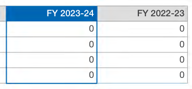

**[Image: AnnualReport2024.pdf-0149-17.png (376x175, 29.4KB)]**

<!-- Start of picture text -->
FY 2023-24 FY 2022-23 0 0 0 0 0 0 0 0 <!-- End of picture text -->

||FY 2023-24|FY 2022-23|
|---|---|---|
|Directors|0|0|
|KMPs|0|0|
|Employees|0|0|
|Workers|0|0|

6. Details of complaints with regard to conflict of interest: 

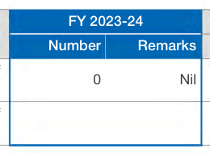

**[Image: AnnualReport2024.pdf-0149-20.png (260x190, 27.6KB)]**

<!-- Start of picture text -->
FY 2023-24 Number Remarks 0 Nil <!-- End of picture text -->

||FY 2023|-24|FY 202|2-23|
|---|---|---|---|---|
||Number|Remarks|Number|Remarks|
|Number of complaints received in relation to issues of Confict of Interest of the Directors|0|Nil|0|Nil|
|Number of complaints received in relation to issues of Confict of|||||
| Interest of the KMPs|||||

7. Provide details of any corrective action taken or underway on issues related to fines/ penalties/ action taken by regulators/ law enforcement agencies/ judicial institutions, on cases of corruption and conflicts of interest. 

   - **Response:** Not Applicable, as there were no such cases reported. 

8. Number of days of accounts payables ((Accounts payable *365) / Cost of goods/services procured) in the following format: 

**[Image: AnnualReport2024.pdf-0149-25.png (201x81, 13.0KB)]**

<!-- Start of picture text -->
FY 2023-24 ~  186.36 <!-- End of picture text -->

FY 2023-24 FY 2022-23 f - - - - - - - - - - j Number of days of accounts payables ~ 186.36 158.66 

###### 9. Open-ness of business 

Provide details of concentration of purchases and sales with trading houses, dealers, and related parties along-with loans and advances & investments, with related parties, in the following format: 

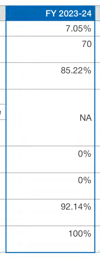

**[Image: AnnualReport2024.pdf-0149-29.png (201x517, 39.5KB)]**

<!-- Start of picture text -->
FY 2023-24 7.05% 70 85.22% NA 0% 0% 92.14% 100% <!-- End of picture text -->

|Parameter|Metrics|FY 2023-24|FY 2022-23|
|---|---|---|---|
|Concentration of |a. Purchases from trading houses as % of total purchases|7.05%|8.76%|
|Purchases|b.  Number of trading houses where purchases are made from|70|50|
||c.  Purchases from top 10 trading houses as % of total purchases from trading houses|85.22%|93.02%|
|Concentration of |a. Sales to dealers / distributors as % of total sales|||
|Sales|b. Number of dealers / distributors to whom sales are made|NA|NA|
||c.  Sales to top 10 dealers / distributors as % of total sales to dealers / distributors|||
|Share of RPTs in|a.  Purchases (Purchases with related parties / Total Purchases)|0%|0%|
||b.  Sales (Sales to related parties / Sale of Real Estate Developments/Land)|0%|0%|
||c.  Loans & advances (Loans & advances given to related parties / Total loans & advances)|92.14%|92.88%|
||d.  Investments (Investments in related parties / Total Investments made excluding treasury investments)|100%|100%|

###### Leadership Indicators 

1. Awareness programmes conducted for value chain partners on any of the principles during the financial year: 

|Total number||%age of value chain partners covered (by|
|---|---|---|
|of awareness|Topics / principles covered under the training|value of business done with such partners)|
|programmes held||under the awareness programmes|
|30,790|Safety trainings, Emergency mock drills, implementation of ISO 45001:2018, National Safety Day, World Environment Day, Road Safety Week, and Fire Service Day are also celebrated, safety communications, safety assessment exercise, Heath Safety & Environment, Human Rights|100%|

**[Image: AnnualReport2024.pdf-0149-34.png (989x24, 4.9KB)]**

2. Does the entity have processes in place to avoid/ manage conflict of interests involving members of the Board? (Yes/No) If Yes, provide details of the same. 

**Response:** Yes, the entity has a code of conduct for Board of Directors, which states that they enrich the Board’s decisionmaking and prevent possible conflicts of interest that may emerge in such decision-making. Refer Page No. 257 of the Corporate Governance. Refer to https://delf2iyv2crlj.cloudfront.net/Files/codeof-conductforthe-boardof-directors-seniormanagement3-le5eacxVQoQNG21hp.pdf. 

**[Image: AnnualReport2024.pdf-0149-37.png (715x23, 5.6KB)]**

**[Image: AnnualReport2024.pdf-0149-38.png (348x24, 4.1KB)]**

<!-- Start of picture text -->
. <!-- End of picture text -->

###### **PRINCIPLE 2:** 

Businesses should provide goods and services in a manner that is sustainable and safe. 

###### Essential Indicators 

1. Percentage of R&D and capital expenditure (capex) investments in specific technologies to improve the environmental and social impacts of product and processes to total R&D and capex investments made by the entity, respectively. FY 2023-24 FY 2022-23 Details of improvements in environmental and social impacts 

R&D 26.66% 23.08% R&D (Research and Development) and capital expenditure Capex 73.34% 76.92% investments in construction technologies aimed at enhancing 

I environmental performance. r:::, 

Godrej Properties Limited 

Integrated Report 2023-24 

288 

289 

About Godrej Integrating Sustainability Management Discussion Statutory Properties Limited with our Business and Analysis Reports 

**[Image: AnnualReport2024.pdf-0150-01.png (82x27, 2.2KB)]**

2. a.   Does the entity have procedures in place for sustainable sourcing? (Yes/No) 

###### **Response:** Yes 

- b. If yes, what percentage of inputs were sourced sustainably? 

**Response:** We have achieved around 90% sustainable procurement across all our sites, adhering to IGBC guidelines for local procurement within 400km of our operations. By prioritizing sustainability, we reduce environmental impact and support local economies. 

3. Describe the processes in place to safely reclaim your products for reusing, recycling, and disposing at the end of life, for (a) Plastics (including packaging) (b) E-waste (c) Hazardous waste and (d) other waste. 

**Response:** Our company is committed to minimizing waste and reducing the extraction of virgin resources through processes focused on reuse and recycling. We actively reuse waste concrete, utilize waste Autoclaved Aerated Concrete (AAC) blocks, and re-utilize aluminium shuttering, promoting responsible disposal practices. We prioritize local sourcing to reduce transportation-related waste and collaborate with recycling agencies to divert construction waste from landfills. To gain a comprehensive understanding of waste generation, we conducted a Construction and Demolition waste study with our developer partners, enabling us to implement effective waste management strategies and contribute to a more sustainable construction industry. 

4. Whether Extended Producer Responsibility (EPR) is applicable to the entity’s activities (Yes / No). If yes, whether the waste collection plan is in line with the Extended Producer Responsibility (EPR) plan submitted to Pollution Control Boards? If not, provide steps taken to address the same. 

**Response:** Not Applicable. 

###### Leadership Indicators 

1. Has the entity conducted Life Cycle Perspective / Assessments (LCA) for any of its products (for manufacturing industry) or for its services (for service industry)? If yes, provide details in the following format: 

###### Boundary 

Boundary Whether Results for which the conducted by communicated Name of % of total Life Cycle independent in public domain. NIC Code product/ Turnover Perspective / external (Yes/No) If yes, service contributed Assessment was agency provide the webconducted (Yes/No) link. No LCA has been conducted in FY 2023-24. 

**[Image: AnnualReport2024.pdf-0150-14.png (1027x24, 3.9KB)]**

2. If there are any significant social or environmental concerns and/or risks arising from production or disposal of your products / services, as identified in the Life Cycle Perspective / Assessments (LCA) or through any other means, briefly describe the same along-with action taken to mitigate the same. 

###### Name of product/service Description of the risk/concern 

###### Action Taken 

We have set the Supply Chain target under Science Based Targets initiative (SBTi) for Scope 3 emissions, aiming to mitigate carbon emissions throughout the supply chain. As a sustainable real estate developer, we prioritize responsible procurement of construction materials. By actively engaging with our supply chain, we are dedicated to enhancing resource efficiency across our project sites. 

New Building Development 

The construction industry has a high embodied carbon footprint due to the materials used. 

**[Image: AnnualReport2024.pdf-0150-21.png (1027x24, 4.5KB)]**

3. Percentage of recycled or reused input material to total material (by value) used in production (for manufacturing industry) or providing services (for service industry). 

Recycled or re-used input material to Indicate input material total material FY 2023-24 FY 2022-23 f - - - j ~ --------------Construction waste 97.92% 94.44% 

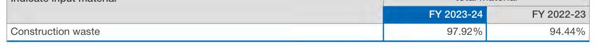

**[Image: AnnualReport2024.pdf-0150-24.png (1024x84, 32.5KB)]**

<!-- Start of picture text -->
FY 2023-24 FY 2022-23 f - - - j ~ --------------- Construction waste 97.92% 94.44% <!-- End of picture text -->

4. Of the products and packaging reclaimed at end of life of products, amount (in metric tonnes) reused, recycled, and safely disposed, as per the following format: 

FY 2023-24 FY 2022-23 Re-Used Recycled Safely Disposed Re-Used Recycled Safely Disposed Plastics (including packaging) E-waste Not Applicable Not Applicable Hazardous waste Other waste 

5. Reclaimed products and their packaging materials (as percentage of products sold) for each product category. 

Indicate product Reclaimed products and their packaging materials as % of total products sold in respective category I category Not Applicable 

**[Image: AnnualReport2024.pdf-0150-29.png (1028x24, 3.4KB)]**

###### PRINCIPLE 3: 

Businesses should respect and promote the well-being of all employees, including those in their value chains. 

###### Essential Indicators 

###### 1. a. Details of measures for the well-being of employees: 

||||||% o|f employe|es covere|d by||||
|---|---|---|---|---|---|---|---|---|---|---|---|
|Category|Total (A)|Health In|surance|Accid Insura|ent nce|Maternity|benefts|Paternity|benefts|Day Care|facilities|
|| |Number (B)|% (B/A)|Number (C)|% (C/A)|Number (D)|% (D/A)|Number (E)|% (E/A)|Number (F)|% (F/A)|
|Permanent|Employees|||||||||||
|Male|2,123|2,123|100%|2,123|100%|0|0|87|4%|2|0.09%|
|Female|875|875|100%|875|100%|17|2%|0|0%|5|0.6%|
|Total|3,015*|3,015|100%|3,015|100%|17|0.6%|87|3%|7|0.2%|
|Other than|Permanent|Employee|s|||||||||
|Male|1,062|1,062|100%|1,062|100%|0|0|1|0.09%|0|0|
|Female|137|137|100%|137|100%|2|1.46%|0|0|0|0|
|Total|1,212**|1,211|100%|1,212|100%|2|0.16%|1|0.08%|0|0|

**[Image: AnnualReport2024.pdf-0150-35.png (1028x26, 12.0KB)]**

Note: *The total headcount of permanent employees is 3,015 which includes 17 employees from ‘Other’ gender. 

**The total headcount of Contractual Employee is 1,212 which includes 13 employees from ‘Other’ gender. 

###### b. Details of measures for the well-being of workers: 

**Response:** GPL ensures that all workers have a “Fit for Work” medical certificate before of induction. Labour welfare facilities e.g., accommodation, food, recreation facilities, rest rooms, drinking water, toilets and urinals and health care facilities e.g., first aid facilities, qualified doctors and nurses, ambulance & emergency care are provided by the company. Regular pest control, fogging, sanitisation is conducted at sites. GPL also motivates workers by recognising and providing safety awards. 

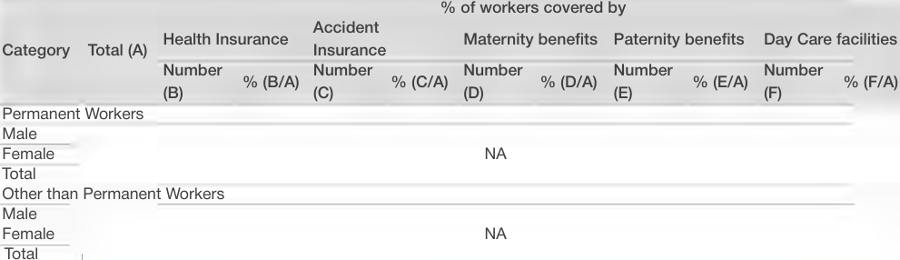

**[Image: AnnualReport2024.pdf-0150-40.png (991x286, 57.1KB)]**

<!-- Start of picture text -->
% of workers covered by Accident Health Insurance Maternity benefits Paternity benefits Day Care facilities Category Total (A) Insurance Number  Number  Number  Number  Number % (B/A) % (C/A) % (D/A) % (E/A) % (F/A) (B) I  (C) I  (D) I  (E) I  (F) I Permanent Workers Male Female NA Total Other than Permanent Workers Male Female NA Total <!-- End of picture text -->

**[Image: AnnualReport2024.pdf-0150-41.png (1028x24, 4.2KB)]**

Godrej Properties Limited 

Integrated Report 2023-24 

290 

291 

About Godrej Integrating Sustainability Management Discussion Statutory Properties Limited with our Business and Analysis Reports 

**[Image: AnnualReport2024.pdf-0151-01.png (82x27, 2.2KB)]**

- c. Spending on measures towards well-being of employees and workers (including permanent and other than permanent) in the following format: 

||FY 2023-24|FY 2022-23|
|---|---|---|
|Cost incurred on well-being measures as a % of total revenue of the company f - - - - - - - - - - - - j~|0.27% -|0.33 %|

2. Details of retirement benefits, for Current FY and Previous Financial Year. 

|||FY 2023-24|||FY 2022-23||
|---|---|---|---|---|---|---|
|Benefts|No. of employees covered as a % of total employees|No. of workers covered as a % of total workers|Deducted and deposited with the authority (Y/N/N.A.)|No. of employees covered as a % of total employees|No. of workers covered as a % of total workers|Deducted and deposited with the authority (Y/N/N.A.)|
|PF|100%|NA|Y|100%|NA|Y|
|Gratuity|100%|NA|Y|100%|NA|Y|
|ESI|-|-|-|-|-|-|
|Others – Insurance|100%|NA|Y|100%|NA|Y|

3. Are the premises / offices of the entity accessible to differently abled employees and workers, as per the requirements of the Rights of Persons with Disabilities Act, 2016? If not, whether any steps are being taken by the entity in this regard. 

   - **Response** : The GPL Head Office in Vikhroli, Mumbai is accessible to differently abled employees and workers. Following steps are being taken: 

   - We provide gender neutral restrooms which are ‘people with disabilities’ (PwD) compliant. 

   - We are doing accessibility audits to identify further modifications required. 

4. Does the entity have an equal opportunity policy as per the Rights of Persons with Disabilities Act, 2016? If so, provide a web-link to the policy. 

**Response** : Yes, Diversity, Anti-Discrimination & Equal Opportunities Policy 

**[Image: AnnualReport2024.pdf-0151-12.png (480x22, 4.1KB)]**

5. Return to work and Retention rates of permanent employees and workers that took parental leave. 

|Gd|Permanent Emp|loyees|Permanent W|orkers|
|---|---|---|---|---|
|ener|Return to work rate|Retention rate|Return to work rate I|Retention rate|
|Male|99%|82%|||
|Female|50%|86%|NA||
|Total|89%|83%|||

**[Image: AnnualReport2024.pdf-0151-15.png (1027x24, 6.4KB)]**

6. Is there a mechanism available to receive and redress grievances for the following categories of employees and worker? If yes, give details of the mechanism in brief. 

###### Yes/No (If yes, then give details of the mechanism in brief) Permanent Workers NA 

Other than Permanent Workers NA Permanent Employees Yes, GPL has policies that allows employees to report concerns without any fear of Other than Permanent Employees retaliation. The policies are – - Whistle Blower Policy - Anti Sexual Harassment Policy - Stakeholder Engagement Policy 

**[Image: AnnualReport2024.pdf-0151-19.png (1027x24, 6.8KB)]**

<!-- Start of picture text -->
- <!-- End of picture text -->

###### 7. Membership of employees and worker in association(s) or Unions recognised by the listed entity: 

FY 2022-23 Total employees No. of employees / / workers in workers in respective % respective category, who are part of (D/C) category (C) association(s) or Union (D) Not Applicable 

|Category|/ workers in respective category (A)|wor categor associati|ers in res y, who are on(s) or U|pective part of nion (B)|% (B/A)|/ worker respect category|s in ive (C)   cate assoc|workers in gory, who iation(s) o|respective are part of r Union (D)|   % (D/C)|
|---|---|---|---|---|---|---|---|---|---|---|
|Total|||||||||||
|Permanent Employees Male|||||||||||
|Female Total||Not Appli|cable||||Not|Applicable|||
|Permanent Workers|||||||||||
|Male|||||||||||
|Female|||||||||||
|8. Details of|training given to e|mployees F|and work Y 2023-2|ers: 4|||F|Y 2022-2|3||
|Category|Total (A)|On Health Safety me|and asures|On skill upgradati|on|Total (D)|On Health Safety me|and asures|On skill upgradatio|n|
|||No. (B)|% (B/A)|No. (C)|% (C/A)||No. (E)|% (E/D)|No. (F)|% (F/D)|
|Employees|||||||||||
|Male|2,123|2,123|100%|814|38.34%|1,727|1,727|100%|1,727|100%|
|Female|875|875|100%|574|65.6%|656|656|100%|656|100%|
|Total|3,015*|3,015|100%|1,403|46.54%|2,391|2,391|100%|2,391|100%|
|Workers|||||||||||
|Male|||||||||||
|Female Total|||NA|||||NA|||

###### 8. Details of training given to employees and workers: 

**[Image: AnnualReport2024.pdf-0151-24.png (857x105, 15.2KB)]**

<!-- Start of picture text -->
NA NA <!-- End of picture text -->

Note: The total headcount of permanent employees is 3,015 which includes 17 employees from ‘Other’ gender. For the employees who were provided skill upgradation trainings, 15 participants are from ‘Other’ gender. 

###### 9. Details of performance and career development reviews of employees and worker: 

**[Image: AnnualReport2024.pdf-0151-27.png (432x75, 21.4KB)]**

<!-- Start of picture text -->
FY 2023-24 Total (A) No. (B) % (B/A) <!-- End of picture text -->

|Ct|F|Y 2023-24||F|Y 2022-23||
|---|---|---|---|---|---|---|
|aegory|Total (A)|No. (B)|% (B/A)|Total (C)|No. (D)|% (D/C)|
|Employees|||||||
|Male|2,123|1,657|78%|1,727|1,332|77.12%|
|Female|875|678|77%|656|523|79.72%|
|Total|3,015**|2,344*|78%|2,391|1,855|77.58%|
|Workers|||||||
|Male|||||||
|Female||NA|||NA||
|Total|||||||

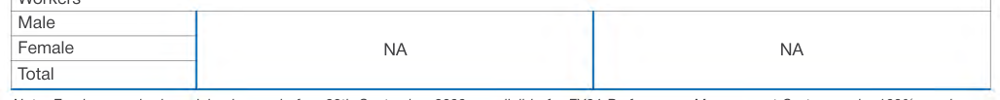

**[Image: AnnualReport2024.pdf-0151-29.png (1028x103, 20.6KB)]**

<!-- Start of picture text -->
Male Female NA NA Total <!-- End of picture text -->

Note: Employees who have joined on or before 30th September 2023 are eligible for FY24 Performance Management System cycle. 100% employees covered who were in the system as on the day of ratings release. 

- *2,344 employees include 17 employees identified as Others, out of which 9 were eligible and underwent the process. 

- **The total headcount of permanent employees is 3,015 which includes 17 employees from ‘Other’ gender 

###### 10. Health and safety management system: 

- a. Whether an occupational health and safety management system has been implemented by the entity? (Yes/ No). If yes, the coverage such system? 

   - **Response** : Yes, at GPL, we prioritize safety through the implementation of a robust Occupational Health and Safety (OH&S) Management system across all our locations. Key components of our safety framework include: 

- Comprehensive Planning: Before any activities commence, we develop Site Safety Plans and conduct thorough Hazard Identification and Risk Assessments to mitigate potential risks effectively. 

Godrej Properties Limited 

Integrated Report 2023-24 

292 

293 

About Godrej Integrating Sustainability Management Discussion Statutory Properties Limited with our Business and Analysis Reports 

**[Image: AnnualReport2024.pdf-0152-01.png (82x27, 2.3KB)]**

- Work Permit System: Our Work Permit System ensures that tasks are performed safely and in accordance with established protocols. 

- nternal Safety Audits: Regular internal safety audits are conducted to evaluate the effectiveness of safety measures and identify areas for improvement. 

- Culture for Safety and Capability Building: We foster a culture of safety and continuously build capabilities among our employees through: 

   - Comprehensive Safety Induction programs for all new hires. 

   - Job-specific trainings to equip employees with the necessary skills for safe task execution. 

   - Motivational programs and safety campaigns to instill a positive safety culture. 

- Regular review meetings, including Contractor Site Safety Committee, Joint Site Safety Committee, and Management review meetings, to address safety concerns and drive improvements. 

   - Health check-ups and toolbox talks to monitor employee well-being and reinforce safety practices. 

- Continual Improvement: Our internal audit mechanism monitors safety performance and identifies areas for ongoing enhancement, ensuring compliance with safety standards and regulations. 

   - These initiatives underscore our unwavering commitment to the safety and well-being of our employees and stakeholders, as well as our dedication to continually improving safety standards across all our operations. 

- b. What are the processes used to identify work-related hazards and assess risks on a routine and non-routine basis by the entity? 

**Response** : As part of our Occupational Health and Safety (OH&S) Management System, SOP GPL P HS 02 has been developed to provide a structured approach for hazard identification, risk assessment, control implementation, and improvement of occupational health and safety (OH&S) within our organization. 

This SOP systematically guides the process for hazard identification for all activities, following the hierarchy of controls framework. This framework includes the following steps: 

- Elimination: Identifying opportunities to remove hazards entirely from the workplace. 

- Substitution: Identifying safer alternatives to hazardous materials, equipment, or processes. 

- Engineering Controls: Implementing physical changes to the work environment to isolate or minimize exposure to hazards. 

- Administrative Controls: Implementing policies, procedures, and training programs to reduce exposure to hazards. 

- Personal Protective Equipment (PPE): Providing appropriate PPE to workers as a final line of defense against identified hazards. 

The goal of this SOP is to prioritize risk control measures that effectively mitigate or eliminate identified hazards. By following this systematic approach, we aim to ensure the safety and well-being of all personnel involved in our operations. 

- c. Whether you have processes for workers to report the work-related hazards and to remove themselves from such risks. (Y/N) 

**Response** : The GPL Occupational Health and Safety (OH&S) Management System, as outlined in the Safety Manual, comprehensively delineates the roles and responsibilities of each stakeholder, including workmen. The manual serves as a guiding document that ensures clear understanding and adherence to safety protocols throughout project execution. 

Key elements of the Safety Manual include: 

Roles and Responsibilities: The manual explicitly outlines the roles and responsibilities of all stakeholders involved in the project, including management, supervisors, contractors, consultants, and workmen. Each stakeholder is provided with clear guidance on their specific duties regarding safety compliance and incident prevention. 

Worker Roles: It is emphasized within the Safety Manual that workers possess full rights to refuse work if they identify any unsafe conditions during project execution. This right empowers workers to prioritize their safety and well-being, ensuring that potential hazards are promptly addressed to prevent accidents or injuries. 

- d. Do the employees/ worker of the entity have access to non-occupational medical and healthcare services? (Yes/ No) 

   - **Response** : GPL’s contract safety rules and regulations encompass a robust procedure for establishing and operating Health Management and Medical Facilities at all our locations. As part of this initiative, a medical officer regularly visits each site at least once a week, with designated timings prominently displayed for easy access. We strongly encourage all workers to utilize this facility for addressing any non-occupational medical issues they may encounter. 

###### 11. Details of safety related incidents, in the following format: 

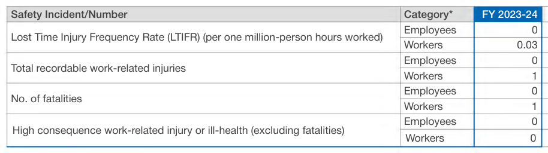

**[Image: AnnualReport2024.pdf-0152-29.png (914x256, 70.0KB)]**

<!-- Start of picture text -->
Safety Incident/Number Category* FY 2023-24 Employees 0 Lost Time Injury Frequency Rate (LTIFR) (per one million-person hours worked) Workers 0.03 Employees 0 Total recordable work-related injuries Workers 1 Employees 0 No. of fatalities Workers 1 Employees 0 High consequence work-related injury or ill-health (excluding fatalities) Workers 0 <!-- End of picture text -->

|Safety Incident/Number|Category*|FY 2023-24|FY 2022-23|
|---|---|---|---|
|Lost Time Inr Freenc Rate (LTIFR) (er one million-erson hors worked)|Employees|0|0|
|juy quy   p  p u|Workers|0.03|0.059|
|Total recordable work-related injuries|Employees|0|0|
||Workers|1|4|
|No of fatalities|Employees|0|0|
|.|Workers|1|0|
|Hih  kltd i  illhlth ldi ftliti|Employees|0|0|
|g consequence wor-reae njury or -ea (excung aaes)|Workers|0|0|

*Includes contractual workforce 

###### 12. Describe the measures taken by the entity to ensure a safe and healthy workplace. 

- **Response** : GPL has implemented a range of measures to ensure a safe and healthy workplace environment for all employees. These initiatives include: 

- Developing Occupational Health and Safety Policy: GPL has developed a comprehensive Occupational Health and Safety (OH&S) policy that outlines the organization’s commitment to providing a safe work environment and adhering to relevant regulations and standards. 

- Conducting Trainings: Regular safety trainings are conducted for employees to ensure they are equipped with the necessary knowledge and skills to identify and mitigate workplace hazards effectively. This includes training on hazard recognition, emergency procedures, and the proper use of personal protective equipment (PPE). 

- Internal Audits: GPL conducts internal audits to assess the effectiveness of safety measures and identify areas for improvement. These audits help ensure compliance with safety regulations and standards and promote continuous improvement in safety performance. 

- Daily Inspections: Daily inspections are carried out to identify and address potential hazards in the workplace promptly. This proactive approach helps prevent accidents and injuries and maintains a safe working environment. 

- Hazard Identification and Risk Assessment: GPL conducts regular hazard identification and risk assessment activities to identify workplace hazards and assess the associated risks. This allows for the implementation of appropriate control measures to minimize risks to employee health and safety. 

- Formation of Safety Committees: Safety committees comprising representatives from various departments are formed to promote employee involvement in safety initiatives. These committees facilitate communication and collaboration on safety matters and help drive continuous improvement in safety performance. 

- Developing Emergency Response Plans (ERP): GPL has developed Emergency Response Plans to effectively respond to accidents, injuries, or other emergencies. This includes conducting regular emergency mock drills to ensure employees are familiar with emergency procedures and can respond appropriately in emergency situations. 

- Developing Health & Safety Plan: A Health & Safety Plan is in place to outline specific measures and strategies aimed at promoting employee health and safety in the workplace. This plan includes initiatives such as safety campaigns, health and wellness programs, and awareness campaigns on issues like smoking cessation, alcohol addiction, and HIV awareness. 

- Health and Wellness Programs: GPL offers health and wellness programs to employees to promote overall well-being. These programs may include initiatives such as smoking cessation programs, alcohol addiction support, HIV awareness campaigns, and other health promotion activities. 

- Meeting Legal Requirements: GPL ensures compliance with all applicable occupational health and safety regulations, standards, and legal requirements. This includes regularly reviewing and updating safety policies and procedures to reflect changes in regulations and industry best practices. 

Godrej Properties Limited 

Integrated Report 2023-24 

294 

295 

About Godrej Integrating Sustainability Management Discussion Statutory Properties Limited with our Business and Analysis Reports 

**[Image: AnnualReport2024.pdf-0153-01.png (82x27, 2.2KB)]**

By implementing these measures, GPL demonstrates its commitment to providing a safe and healthy workplace environment for all employees, promoting employee well-being, and fostering a culture of safety across the organization. 

###### 13. Number of Complaints on the following made by employees and workers: 

||Filed during this year|FY 2023-24 Pending resolution at the end of year|Remarks|Filed during this year|FY 2022-23 Pending resolution at the end of year|Remarks|
|---|---|---|---|---|---|---|
|Working Conditions|0|0|Nil|0|0|Nil|
|Health & Safety|0|0|Nil|0|0|Nil|

###### 14. Assessments for the year: 

||% of your plants and offces that were assessed (by entity or statutory authorities or third parties)|
|---|---|
|Health & Safety practices|100%|
|Working Conditions|100%|

**[Image: AnnualReport2024.pdf-0153-07.png (1027x24, 4.1KB)]**

15.  Provide details of any corrective action taken or underway to address safety-related incidents (if any) and on significant risks / concerns arising from assessments of health & safety practices and working conditions. 

   - **Response** : As per our process, hazard identification is systematically conducted for all activities to pinpoint potential risks. We then prioritize risk control measures in line with the hierarchy of controls, which includes elimination, substitution, engineering controls, administrative controls, and personal protective equipment (PPE). Once the control measures are finalized, we ensure dissemination of these hazards and controls to the execution team, including workers, to proactively eliminate hazards arising in day-to-day work. In addition to risk assessment, we actively share horizontal deployment related to incident case studies across all locations. This ensures the implementation of control measures and fosters a culture of continuous improvement in our safety practices. 

###### 5. Details on assessment of value chain partners 

- % of value chain partners (by value of business done with such partners) that were assessed 

Health and safety practices 100%* Working Conditions 

**[Image: AnnualReport2024.pdf-0153-13.png (1028x24, 5.4KB)]**

Note: *Includes all contractors. 

The general terms of the contract and safety SOP has been agreed and executed by all the contractors working at site which involves maintaining good working conditions at site. Health & safety, including working conditions are evaluated by the Safety team through frequent Audits as spelled out in our EHS SOP. 

6. Provide details of any corrective actions taken or underway to address significant risks / concerns arising from assessments of health and safety practices and working conditions of value chain partners. 

   - **Response** : The general terms of the contract as well as the Supplier’s Code of Conduct require the value chain partners to maintain safe working conditions. Our safety policy applies to all contractors who are working on our project locations. As mentioned in the questions above, the entire project shares all areas of health and safety precautions and working conditions, including risk detection and corrective methods. 

###### **PRINCIPLE 4:** 

Businesses should respect the interests of and be responsive to all its stakeholders. 

###### Essential Indicators 

1. Describe the processes for identifying key stakeholder groups of the entity. 

###### Leadership Indicators 

1. Does the entity extend any life insurance or any compensatory package in the event of death of (A) Employees (Y/N) (B) Workers (Y/N). 

###### **Response** : (A) Yes, (B) Yes 

2. Provide the measures undertaken by the entity to ensure that statutory dues have been deducted and deposited by the value chain partners. 

   - **Response** : Statutory compliances/challans have been submitted by all the contractors during each RA bill from the Contractors. GPL also has monthly compliance audits in place to ensure compliance from the contractors. 

3. Provide the number of employees / workers having suffered high consequence work related injury / ill-health / fatalities (as reported in Q11 of Essential Indicators above), who have been rehabilitated and placed in suitable employment or whose family members have been placed in suitable employment. 

###### **Response** : 

|||No. of employees/workers|that are rehabilitated|
|---|---|---|---|
||Total no. of affected employees/workers|and placed in suitable emp|loyment or whose family|
|||members have been place|d in suitable employment|
||FY 2023-24 FY 2022-23|FY 2023-24|FY 2022-23|
|Employees|0 0|0|0|
|Workers|0 0|0|0|

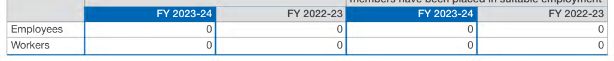

**[Image: AnnualReport2024.pdf-0153-30.png (1027x103, 53.5KB)]**

<!-- Start of picture text -->
FY 2023-24 FY 2022-23 FY 2023-24 FY 2022-23 Employees 0 0 0 0 Workers 0 0 0 0 <!-- End of picture text -->

4. Does the entity provide transition assistance programs to facilitate continued employability and the management of career endings resulting from retirement or termination of employment? (Yes/ No) 

**Response** : No 

   - **Response** : Key stakeholders are individuals, organizations, parties, or entities are who are either impacted by GPL or have the power to influence GPL. They are prioritised based on criteria such as dependence, responsibility, influence on GPL and impact of GPL’s activities on them. 

2. List stakeholder groups identified as key for your entity and the frequency of engagement with each stakeholder group. 

||Whether identifed||Frequency of engagement|Purpose and scopeof|
|---|---|---|---|---|
|Stakeholder group|as Vulnerable & Marginalized Group (Yes/No)|Channels of communication|(Annually/ Half yearly/  Quarterly / others – please specify)|engagement including key topics and concerns raised during such engagement|
|Government Bodies and Regulatory Agencies|No|Meetings and personal interactions|Need Basis|Ensuring statutory compliance, environmental and social responsibility, robust corporate governance practices, and maximizing tax revenues are imperative facets of holistic business management.|
|Joint Venture Partners|No|Workshops, meetings, and personal interactions|Continuous engagement|Addressed through a structured process ensuring efcient delivery.|
|Suppliers|No|Feedback surveys and personal interactions|Continuous engagement|Encompass health and safety initiatives, regular capacity building eforts, and compliance measures|
|Consultants|No|Workshops, meetings, and personal interactions|Continuous engagement|Encompass capacity building and quality enhancement, addressing key topics and concerns raised throughout the consultation process|
|Contractors|No|Meetings and personal interactions|Continuous engagement|Encompass capacity building, health, and safety.|

**[Image: AnnualReport2024.pdf-0153-36.png (1028x24, 6.6KB)]**

Godrej Properties Limited 

Integrated Report 2023-24 

296 

297 

About Godrej Integrating Sustainability Management Discussion Statutory Properties Limited with our Business and Analysis Reports 

**[Image: AnnualReport2024.pdf-0154-01.png (82x27, 2.2KB)]**

###### Leadership Indicators: 

1. Provide the processes for consultation between stakeholders and the Board on economic, environmental, and social topics or if consultation is delegated, how is feedback from such consultations provided to the Board. 

**Response** : At GPL, we carry out frequent interactions with our stakeholder groups. By actively involving the stakeholder groups and collecting their feedback on various topics, including economic, environmental, and social aspects, we ensure that key concerns and responses are effectively communicated to the board members. The Company also has established engagement plan based on stakeholder’s characteristics, needs and expectations. This plan serves as a guide for us to tailor our engagement activities and leverage diverse platforms. 

2. Whether stakeholder consultation is used to support the identification and management of environmental, and social topics (Yes / No). If so, provide details of instances as to how the inputs received from stakeholders on these topics were incorporated into policies and activities of the entity. 

   - **Response** : Yes, we periodically consult with our stakeholders to identify environmental and social topics of importance. We use a materiality lens to evaluate our top risks, considering both qualitative and quantitative likelihood and impact criteria to ensure a thorough evaluation across various dimensions. Our materiality is assessed using the six integrated reporting capitals and the most recent GRI frameworks. The evaluation of our engagement with local stakeholders is conducted by our ESG Committee. This evaluation is subsequently shared with the Board, which includes the Stakeholder Relationship Committee, for discussions, review, and improvement. The members of our ESG Committee, who supervise the outcomes of our materiality assessments, also identify the important issues relevant to our company. For efficient communication with our stakeholders, we have implemented a dedicated intranet site. Additionally, we adhere to standardized debriefing processes, develop training modules, and arrange internal conferences where local managers convene to exchange operational best practices. 

3. Provide details of instances of engagement with, and actions taken to, address the concerns of vulnerable/ marginalized stakeholder groups. 

   - **Response** : We promote social protection for our workers through our partnerships with NGOs and regulatory bodies. Our focus is on registration under Building and Other Construction Workers (BOCW) and other welfare schemes. 

###### **PRINCIPLE 5:** 

Businesses should respect and promote human rights. 

###### Essential Indicators 

1. Employees and workers who have been provided training on human rights issues and policy(ies) of the entity, in the following format: 

**[Image: AnnualReport2024.pdf-0154-13.png (430x123, 32.0KB)]**

<!-- Start of picture text -->
FY 2023-24 No. of Total (A) employees/ %B/A Workers (B) <!-- End of picture text -->

|||FY 2023-24|||FY 2022-23||
|---|---|---|---|---|---|---|
|Category|Total (A)|No. of employees/ Workers (B)|%B/A|Total (C)|No. of employees/ Workers (D)|% D/C|
|Employees|||||||
|Permanent|2,669|2,669|100%|2,391|2,391|100%|
|Other than Permanent|0|0|NA|0|0|NA|
|Total Employees|2,669|2,669|100%|2,391|2,391|100%|
|Workers|||||||
|Permanent|||||||
|Other than Permanent||NA|||NA||
|Total Employees|||||||

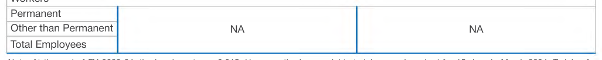

**[Image: AnnualReport2024.pdf-0154-15.png (1027x103, 24.3KB)]**

<!-- Start of picture text -->
Permanent Other than Permanent NA NA Total Employees <!-- End of picture text -->

Note: At the end of FY 2023-24, the headcount was 3,015. However, the human rights training was launched for 15 days in March 2024. Training for permanent employees has been mentioned based on the headcount as of March 2024. 

###### 2. Details of minimum wages paid to employees and workers, in the following format: 

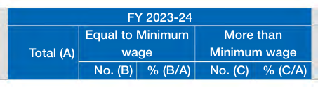

**[Image: AnnualReport2024.pdf-0154-18.png (453x125, 46.0KB)]**

<!-- Start of picture text -->
FY 2023-24 Equal to Minimum  More than Total (A) wage Minimum wage No. (B) % (B/A) No. (C) % (C/A) <!-- End of picture text -->

|||FY|2023-24||||FY|2022-23|||
|---|---|---|---|---|---|---|---|---|---|---|
|Category||Equal to M|inimum|More|than||Equal to|Minimum|More|than|
||Total (A)|wa|ge|Minimu|m wage|Total (D)|wa|ge|Minimum|wage|
|||No. (B)|% (B/A)|No. (C)|% (C/A)||No. (E)|% (E/D)|No. (F)|% (F/D)|
|Employees|||||||||||
|Permanent|3,015*|0|0%|3,015|100%|2,391|0|0%|2,391|100%|
|Male|2,123|0|0%|2,123|100%|1,727|0|0%|1,727|100%|
|Female|875|0|0%|875|100%|656|0|0%|656|100%|
|Other than Permanent|1,211|0|0%|1,211|100%|2,080|0|0%|2,080|100%|
|Male|1,069|0|0%|1,069|100%|1,835|0|0%|1,835|100%|
|Female|142|0|0%|142|100%|240|0|0%|240|100%|
|Workers|||||||||||
|Permanent|||||||||||
|Male|||||||||||
|Female|||||||||||
|Other than|||NA|||||NA|||
|Permanent|||||||||||
|Male|||||||||||
|Female|||||||||||

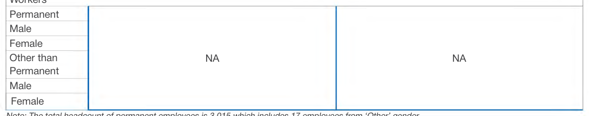

**[Image: AnnualReport2024.pdf-0154-20.png (1026x203, 33.8KB)]**

<!-- Start of picture text -->
Permanent Male Female Other than  NA NA Permanent Male Female <!-- End of picture text -->

Note: The total headcount of permanent employees is 3,015 which includes 17 employees from ‘Other’ gender. 

3. Details of remuneration/salary/wages 

###### a. Median remuneration / wages 

|||Male||Female|
|---|---|---|---|---|
||Number|Median remuneration/ salary/ wages of respective category|Number|Median remuneration/ salary/ wages of respective category|
|Board of directors (BoD)|5|6,520,000|2|6,060,000|
|Key Managerial Personnel|2|57,543,777|0|Nil|
|Employees other than BoD and KMP*|2,110|1,391,697|871|1,000,000|
|Workers||NA|||

**[Image: AnnualReport2024.pdf-0154-25.png (1026x24, 3.6KB)]**

Remuneration includes fixed compensation and target variable pay. 

Note: *This excludes 30 employees from ‘Other’ gender and those who are located in international geographies. 

b. Gross wages paid to females as % of total wages paid by the entity, in the following format 

**[Image: AnnualReport2024.pdf-0154-29.png (1026x79, 32.2KB)]**

<!-- Start of picture text -->
FY 2023-24 FY 2022-23 - - - - - -~ f---------, Gross wages paid to females as % of total wages 21% 20% <!-- End of picture text -->

||FY 2023-24  f|FY 2022-23 |
|---|---|---|
|Gross wages paid to females as % of total wages - - - - -|21% -~ -|20% --------,|

4. Do you have a focal point (Individual/ Committee) responsible for addressing human rights impacts or issues caused or contributed to by the business? 

**Response** : Yes, we have an internal committee and platform at all offices and sites of the company to address human rights issues such as complaints pertaining to sexual harassment and discrimination. Any employee found guilty of any form of harassment may face strong disciplinary action from the company administration. The links to the policies are mentioned in our website at: https://www.godrejproperties.com/investor/corporate-governance. 

**[Image: AnnualReport2024.pdf-0154-33.png (544x23, 5.5KB)]**

<!-- Start of picture text -->
. <!-- End of picture text -->

###### 5. Describe the internal mechanisms in place to redress grievances related to human rights issues. 

**Response** : At GPL, we prioritize human rights in all our operations and investment agreements. We conduct thorough human rights reviews and incorporate stringent human rights clauses into our agreements. In addition to that, human rights training is provided for contractual personnel as part of contractual processes with agencies. To facilitate reporting and address any grievances related to human rights issues, we have established multiple platforms. We have various engagement formats and site events to address any grievances, as well as a provision to connect with leaders on any grievance matter through details available on the company’s intranet. 

Godrej Properties Limited 

Integrated Report 2023-24 

298 

299 

About Godrej Integrating Sustainability Management Discussion Statutory Properties Limited with our Business and Analysis Reports 

**[Image: AnnualReport2024.pdf-0155-01.png (82x27, 2.2KB)]**

###### 6. Number of Complaints on the following made by employees and workers. 

|||FY 2023-24|||FY 2022-23||
|---|---|---|---|---|---|---|
||Filed during the year|Pending resolution at the end of year|Remarks|Filed during the year|Pending resolution at the end of year|Remarks|
|Sexual Harassment|6|0||3|0||
|Discrimination at workplace|0|0||0|0||
|Child Labour|0|0||0|0||
|Forced Labour/Involuntary Labour|0|0|Nil|0|0|Nil|
|Wages|0|0||0|0||
|Other human rights related issues|0|0||0|0||

7. Complaints filed under the Sexual Harassment of Women at Workplace (Prevention, Prohibition and Redressal) Act, 2013, in the following format. 

||FY 2023-24|FY 2022-23|
|---|---|---|
|Total Complaints reported under Sexual Harassment on of Women at Workplace|6|1|
|(Prevention, Prohibition and Redressal) Act, 2013 (POSH)|||
|Complaints on POSH as a % of female employees / workers|0.69%|0.15%|
|Complaints on POSH upheld|6|1|

8. Mechanisms to prevent adverse consequences to the complainant in discrimination and harassment cases. 

**Response:** The complainant’s identity is concealed if they are not comfortable sharing. Also, in case the complainant wants to make a police complaint considering fear of retaliation by the respondent then the POSH IC helps raise the same. POSH IC or HR teams in case of discrimination take interim measures to avoid any interaction between both parties to avoid any adverse consequences during investigation period. 

9. Do human rights requirements form part of your business agreements and contracts? 

**Response:** Yes, the human rights norms and standards followed by GPL also extend to our business agreements and contracts. 

open-door and whistleblower policy. There have been no human rights grievances/complaints resulting in introduction/ modification of business process. 

2. Details of the scope and coverage of any Human rights due diligence conducted. 

**Response** : We have diligently conducted Human Rights Assessments for this year, scrutinizing all our operations, including 100% of GPL’s offices and project sites. These assessments, mandated by GPL’s human rights policy and aligned with the United Nations’ guidelines, comprehensively cover crucial areas such as health and safety, working hours, wages and leave policies, fair treatment practices, community impacts, product stewardship, freedom of association, prevention of forced labor and child labor, discrimination mitigation, and robust compliance monitoring. Additionally, every project and site office has undergone rigorous self-assessment on human rights issues. Furthermore, to ensure a deep understanding and commitment across our workforce, all employees have participated in thorough training sessions focused on human rights awareness. 

3. Is the premise/office of the entity accessible to differently abled visitors, as per the requirements of the Rights of Persons with Disabilities Act, 2016? 

**Response** : Yes. Godrej One, Vikhroli our head office has had accessibility audits done and post that made accessible with usage of accessible elevators, ramps, and screen readers. We currently have accessibility walks and audits being conducted for our sites too basis which adjustments will be made to ensure accessibility for Persons with Disability. 

###### 4. Details on assessment of value chain partners: 

||% of value chain partners (by value of business done with such partners) that were assessed|
|---|---|
|Sexual Harassment|0%|
|Discrimination at workplace Child Labour|0%|
|Child Labour|0%|
|Forced Labour|0%|
|Involuntary Labour Wages|0%|
|Others – please specify|NA|

**[Image: AnnualReport2024.pdf-0155-17.png (1028x24, 5.0KB)]**

5. Provide details of any corrective actions taken or underway to address significant risks / concerns arising from the assessments at Question 4 above. 

**Response** : Not Applicable. 

###### 10. Assessments for the year 

||% of your plants and offces that were assessed (by entity or statutory authorities or third parties)|
|---|---|
|Child Labour|100%|
|Forced/involuntary labour|100%|
|Sexual harassment|100%|
|Discrimination at workplace|100%|
|Wages|100%|
|Others- Health & Safety, Working hours|100%|

**[Image: AnnualReport2024.pdf-0155-22.png (1027x24, 4.9KB)]**

11.  Provide details of any corrective actions taken or underway to address significant risks / concerns arising from the assessments at Question 10 above 

**Response** : We have established several procedures to address human rights risks. Six sample sites have been chosen for assessments, and no instances of non-compliance with human rights have been identified across our sites, eliminating the need for remediation actions. Nonetheless, minor observations were observed during third-party assessments conducted on the selected sample sites for the audit. 

###### Leadership Indicators 

1. Details of a business process being modified / introduced as a result of addressing human rights grievances/complaints. 

   - **Response** : We have put in place a code of conduct, company values, and policies to ensure that human rights are respected and upheld at every level of our operations. To encourage employees to voice their concerns, we have implemented an 

###### PRINCIPLE 6: 

Businesses should respect and make efforts to protect and restore the environment. 

###### Essential Indicators 

###### 1. Details of total energy consumption (in Joules or multiples) and energy intensity, in the following format 

**[Image: AnnualReport2024.pdf-0155-32.png (173x48, 7.7KB)]**

<!-- Start of picture text -->
FY 2023-24 <!-- End of picture text -->

|Parameter|FY 2023-24|FY 2022-23|
|---|---|---|
|**From renewable sources**|||
|Total electricity Consumption (A)|698.58 GJ|542.64 GJ|
|Total Fuel Consumption (B)|0|0|
|Energy consumption through other sources (C)|0|0|
|Total energy consumed from renewable sources (A+B+C)|698.58 GJ|542.64 GJ|
|**From Non-renewable sources**|||
|Total electricity consumption (D)|18,452.1 GJ|17,538.69 GJ|
|Total fuel consumption (E)|7224.5 GJ|7,066.06 GJ|
|Energy consumption through other sources (F)|0|0|
|Total energy consumed from non-renewable sources (D+E+F)|25,676.66 GJ|24,604.75 GJ|
|Total energy consumed (A+B+C+D+E+F)|26,375.24 GJ|25,147.44 GJ|
|Energy intensity per rupee of turnover (Total energy consumed / Revenue from operations)|0.0000008|0.000001|

**[Image: AnnualReport2024.pdf-0155-34.png (24x175, 4.8KB)]**

**[Image: AnnualReport2024.pdf-0155-35.png (24x175, 5.3KB)]**

Godrej Properties Limited 

Integrated Report 2023-24 

300 

301 

About Godrej Integrating Sustainability Management Discussion Statutory Properties Limited with our Business and Analysis Reports 

|Parameter|FY 2023-24|FY 2022-23|
|---|---|---|
|Energy intensity per rupee of turnover adjusted for Purchasing Power Parity (PPP)|0.000019|0.000025|
|(Total energy consumed / Revenue from operations adjusted for PPP) |||
|Energy intensity in terms of physical output  (GJ/sq.ft. built-up area of ofces)|0.055|0.052|
|Energy intensity (optional) – the relevant metric may be selected by the entity|NA|NA|

Note: Indicate if any independent assessment/ evaluation/assurance has been carried out by an external agency. Response: Yes, Grant Thorton Bharat LLP 

2. Does the entity have any sites / facilities identified as designated consumers (DCs) under the Performance, Achieve and Trade (PAT) Scheme of the Government of India? (Y/N) If yes, disclose whether targets set under the PAT scheme have been achieved. In case targets have not been achieved, provide the remedial action taken, if any. 

###### **Response** : Not Applicable 

###### 3. Provide details of the following disclosures related to water, in the following format 

|Parameter|FY 2023-24|FY 2022-23|
|---|---|---|
|**Water withdrawal by source (in kilolitres)**|||
|(i) Surface water|0|0|
|(ii) Groundwater|794.65|802.74|
|(iii) Third party water|290,783.76|217,363.56|
|(iv) Seawater / desalinated water|0|0|
|(v) Others|0|0|
|Total volume of water withdrawal (in kilolitres) (i + ii + iii + iv + v)|291,574.42*|218,166.3|
|Total volume of water consumption (in kilolitres)|352,587.96|267,748.04|
|Water intensity per rupee of turnover (Total water consumption / Revenue from operations)|0.0000115|0.0000118|
|Water intensity per rupee of turnover adjusted for Purchasing Power Parity (PPP)|0.000259|0.000263|
|(Total water consumption / Revenue from operations adjusted for PPP)|||
|Water intensity in terms of physicalOutput (kl/sq.ft. produced)|0.0362|0.0399|
|Water intensity (optional) the relevant metric may be selected by the entity|NA|NA|

Note: Indicate if any independent assessment/ evaluation/assurance has been carried out by an external agency? (Y/N) If yes, name of the external agency: Response: Yes, Grant Thorton Bharat LLP 

*Total water consumption and withdrawal is 291,574.42 KL, however 61,013.55 KL is the water recycled hence total water consumption come out to be 352,587.96. 

###### 4. Provide the following details related to the water discharged. 

5. Has the entity implemented a mechanism for Zero Liquid Discharge? If yes, provide details of its coverage and implementation. 

###### **Response** : Not Applicable 

6. Please provide details of air emissions (other than GHG emissions) by the entity, in the following format 

|Parameter|Please specify unit|FY 2023-24|FY 2022-23|
|---|---|---|---|
|NOx|µg/m3|1,990.96|40|
|SOx|µg/m3|1,083.89|50|
|Particulate Matter (PM)|µg/m3|PM2.5=2,785.99 PM10= 6,217.38|60|
|Persistent organic pollutants (POP)|NA|NA|0|
|Volatile organic compounds (VOC)|NA|NA|0|
|Hazardous air pollutants (HAP)|NA|NA|0|
|Others – please specify|NA|NA||

Note: Indicate if any independent assessment/ evaluation/assurance has been carried out by an external agency? (Y/N) If yes, name of the external agency: Yes, Ambient air monitoring done by Environmental laboratories, Authorised by State pollution Control board. 

###### 7. Provide details of greenhouse gas emissions (Scope 1 and Scope 2 emissions) & its intensity, in the following format. 

|Parameter|Unit|FY 2023-24|FY 2022-23|
|---|---|---|---|
|Total Scope 1 emissions (Break-up of the GHG into CO2, CH4, N2O, HFCs, PFCs, SF6, NF3, if available)|Metric tonnes of CO2 equivalent|541.74|529.02|
|Total Scope 2 emissions (Break-up of the GHG into CO2, CH4, N2O, HFCs, PFCs, SF6, NF3, if available)|Metric tonnes of CO2 equivalent|3,528.69|3,375.6|
|Total Scope 1 and Scope 2 emission intensity per rupee of turnover (Total Scope 1 and Scope 2 GHG emissions / Revenue from operations)|tCO2e/ ₹|0.000000134|0.000000173|
|Total Scope 1 and Scope 2 emission intensity per rupee of turnover adjusted for Power Purchasing Parity (PPP)*|tCO2e/ ₹|0.000003|0.00000384|
|Total Scope 1 and Scope 2 emission intensity in terms of physical output (tCO2e/sq. ft. produced)|tCO2e/sq. ft. produced|0.0087|0.00881|
|Total Scope 1 and Scope 2 emission intensity (optional) – the relevant metric may be selected by the entity|NA|NA|NA|

Note: Indicate if any independent assessment/ evaluation/assurance has been carried out by an external agency? (Y/N) If yes, name of the external agency. Response: Yes, Grant Thorton Bharat LLP 

*Implied PPP conversion rate for India by IMF (International Monetary Fund) is 22.573 for 2022, and 22.167 for 2023. 

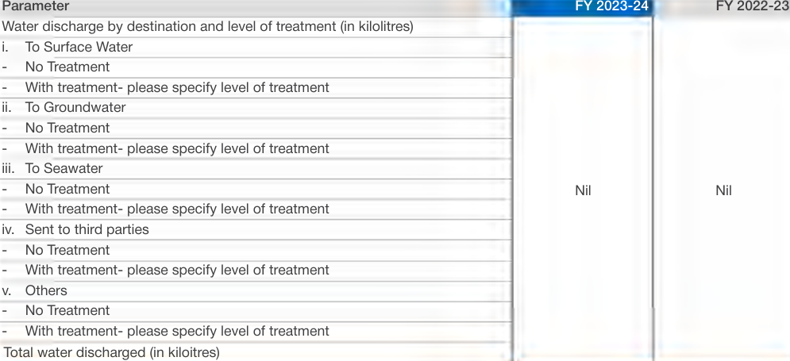

**[Image: AnnualReport2024.pdf-0156-19.png (995x455, 123.1KB)]**

<!-- Start of picture text -->
Parameter FY 2023-24 FY 2022-23 Water discharge by destination and level of treatment (in kilolitres) i.  To Surface Water -  No Treatment -  With treatment- please specify level of treatment ii. To Groundwater -  No Treatment -  With treatment- please specify level of treatment iii. To Seawater -  No Treatment Nil Nil -  With treatment- please specify level of treatment iv. Sent to third parties -  No Treatment -  With treatment- please specify level of treatment v. Others -  No Treatment -  With treatment- please specify level of treatment Total water discharged (in kiloitres) <!-- End of picture text -->

###### 8. Does the entity have any project related to reducing Green House Gas emission? If Yes, then provide details. 

**Response** : Godrej Properties Limited has committed to reduce scope 1 and 2 greenhouse gas (GHG) emissions by 72.6% per square meter of GPL’s offices by FY 2034-35, compared to the base year of FY 2020-21. We have also set a target of achieving science-based targets for 88.5% of our suppliers in the category pertaining to purchased goods and target, we are dedicated to identifying and addressing the major sources of GHG emissions. To effectively reduce net emissions, GPL has adopted a comprehensive and multi-faceted approach. Firstly, we are increasing the adoption of alternative clean energy options to minimize our reliance on fossil fuels. By transitioning to renewable energy sources, such as solar and wind power, we can significantly reduce our carbon footprint. Additionally, we are actively supporting energy efficiency measures such as installation of renewable energy generation system on site across, switching to fuel efficient and low carbon equipment across our operations. To offset any remaining emissions, GPL is undertaking proactive afforestation and land use focused projects. By investing in these initiatives, we contribute to the restoration and preservation of ecosystems, which serve as natural carbon sinks. Through this multi-pronged approach, which encompasses clean energy adoption, energy efficiency measures, and carbon offset projects, GPL is committed to achieving substantial reductions in GHG emissions. By aligning our actions with sustainability goals, we aim to play a significant role in mitigating climate change and creating a more environmentally responsible future. 

Note: Indicate if any independent assessment/ evaluation/assurance has been carried out by an external agency? (Y/N) If yes, name of the external agency. Response: Yes, Grant Thorton Bharat LLP 

Godrej Properties Limited 

Integrated Report 2023-24 

302 

303 

About Godrej Integrating Sustainability Management Discussion Statutory Properties Limited with our Business and Analysis Reports 

**[Image: AnnualReport2024.pdf-0157-01.png (82x27, 2.2KB)]**

###### 9. Provide details related to waste management by the entity, in the following format 

**[Image: AnnualReport2024.pdf-0157-03.png (203x53, 8.9KB)]**

<!-- Start of picture text -->
FY 2023-24 <!-- End of picture text -->

|Parameter|FY 2023-24|FY 2022-23|
|---|---|---|
|**Total waste generated (Tonnes)**|||
|Plastic waste (A)|0|0|
|E-waste (B)|0|0.6045|
|Bio-medical waste (C)|0|0|
|Construction and demolition waste (D)*|12,954.86|27,510.38|
|Battery waste (E)|0|0|
|Radioactive waste (F)|0|0|
|Other hazardous waste. Please specify, if any (G)|1.54|995.14|
|Other Non-hazardous waste generated (H). Please specify, if any. (Break-up by composition i.e. by materials relevant to the sector)|813,579.86|452,939.14|
|Soil|812,916.64|424,515.21|
|Scrap|663.22|913.55|
|Total (A+B + C + D + E + F + G + H)|826,536.27|481,445.26|
|Waste intensity per rupee of turnover (Total waste generated / Revenue from operations)|0.0000272|0.0000213|
|Waste intensity per rupee of turnover adjusted for Purchasing Power Parity (PPP) (Total waste generated / Revenue from operations adjusted for PPP)|0.00061|0.00047|
|Waste intensity in terms of physical output (MT/sq. ft. constructed)|0.0858|0.0718|
|Waste intensity (optional) – the relevant metric may be selected by the entity|NA|NA|
|For each category of waste generated, total waste recovered through recycling, re-using or other recovery operations (in tonnes)|||
|Category of waste|||
|(i) Recycled|664.76|1,908.69|
|(i) Reused|813,867.24|426,728.12|
|(ii) Other recovery options|0|0|
|Total|814,532|428,636.81|
|For each category of waste generated, total waste disposed by nature of disposal me|thod||
|Category of waste|||
|(i) Incineration |0|0|
|(ii) Landflling|12,004.26|25,297.48|
| Total|12,004.26|25,297.48|

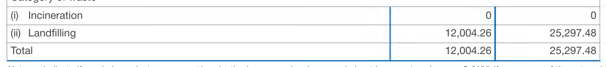

**[Image: AnnualReport2024.pdf-0157-05.png (1024x114, 29.1KB)]**

<!-- Start of picture text -->
(i) Incineration 0 0 (ii) Landfilling 12,004.26 25,297.48 Total 12,004.26 25,297.48 <!-- End of picture text -->

- Note: Indicate if any independent assessment/ evaluation/assurance has been carried out by an external agency? (Y/N) If yes, name of the external agency. Response: Yes, Grant Thorton Bharat LLP 

   - *Construction and Demolition Waste includes debris. 

10.  Briefly describe the waste management practices adopted in your establishments. Describe the strategy adopted by your company to reduce usage of hazardous and toxic chemicals in your products and processes and the practices adopted to manage such wastes. 

**Response** : Appropriate management of waste is of utmost importance to us and hence, we are committed to strictly adhering to waste management regulations. However, we go beyond mere compliance by adopting a proactive approach to minimize the environmental impact of the waste we generate. In line with regulations, we ensure that hazardous waste is disposed of through authorized third-party recyclers. For non-hazardous waste, including metal scraps and construction debris, we also work with authorized recyclers to ensure proper disposal and recycling. This enables us to divert these materials from landfills and promote a circular economy. In the case of non-hazardous organic waste, we have implemented composting methods. By composting organic waste, we can produce high quality manure that is then utilized for project landscaping and in our plant nursery. To further enhance our waste management efforts, GPL has established integrated decentralized solid waste management programs in Konark, Bhubaneshwar, Batala, and Agra. These programs aim to minimize waste sent to landfills by implementing effective waste reduction and recycling strategies. We believe that collective action is crucial for achieving meaningful results. Therefore, we actively partner with various organizations and engage in clean-up drives and campaign rallies. By collaborating with these entities, we can translate innovative waste management practices into tangible on-ground results. Through our comprehensive waste management initiatives and collaborative partnerships, we are committed to minimizing waste to landfill and making a positive environmental impact. 

11.  If the entity has operations/offices in/around ecologically sensitive areas (such as national parks, wildlife sanctuaries, biosphere reserves, wetlands, biodiversity hotspots, forests, coastal regulation zones etc.) where environmental approvals / clearances are required, please specify details in the following format: 

Whether the conditions of environmental approval / clearance are being complied with? (Y/N). If no, the reasons thereof and corrective action taken, if any. 

Location of operations/ S. No. offices Type of operations 

We do not have any operations/offices in/around ecologically sensitive areas. 

**[Image: AnnualReport2024.pdf-0157-14.png (1028x24, 4.0KB)]**

12.  Details of environmental impact assessments of projects undertaken by the entity based on applicable laws, in the current financial year: 

Whether Results Name conducted by communicated and brief independent EIA Notification No. Date in public Relevant Web link details of external domain (Yes/ project agency No) (Yes / No) Godrej SIA/KA/ 2022 Yes Yes https://parivesh.nic.in/newupgrade/#/proposal-summary/ Splendour INFRA2/412100/2022 proposal-document?proposal=2572446&proposal_ no=SIA%2FKA%2FINFRA2%2F414866%2F2023&proposal_ id=2572445 Godrej SIA/KA/ 2023 Yes Yes https://parivesh.nic.in/newupgrade/#/proposal-summary/ Park INFRA2/414866/2023 proposal-document?proposal=2207347&proposal_ Retreat no=SIA%2FKA%2FINFRA2%2F412100%2F2022&proposal_ id=2207346 Godrej IA/KA/ 2023 Yes Yes https://parivesh.nic.in/newupgrade/#/proposal-summary/ Bengal INFRA2/455165/2023 proposal-document?proposal=31225873&proposal_ Lamps no=IA%2FKA%2FINFRA2%2F455165%2F2023&proposal_ id=31225869 Godrej SIA/MH/ 2023 Yes Yes https://parivesh.nic.in/newupgrade/#/proposal-summary/ Reserve INFRA2/453110/2023 proposal-document?proposal=26344506&proposal_ no=SIA%2FMH%2FINFRA2%2F453110%2F2023&proposal_ id=26344505 Godrej SIA/MH/ 2023 Yes Yes https://parivesh.nic.in/newupgrade/#/proposal-summary/ Ascend INFRA2/443582/2023 proposal-document?proposal=9118595&proposal_ no=SIA%2FMH%2FINFRA2%2F443582%2F2023&proposal_ id=9118590 Prakhyat SIA/MH/ 2023 Yes Yes https://parivesh.nic.in/newupgrade/#/proposal-summary/ INFRA2/450660/2023 proposal-document?proposal=20795387&proposal_ 

**[Image: AnnualReport2024.pdf-0157-17.png (431x92, 21.4KB)]**

<!-- Start of picture text -->
proposal-document?proposal=2572446&proposal_ no=SIA%2FKA%2FINFRA2%2F414866%2F2023&proposal_ id=2572445 <!-- End of picture text -->

**[Image: AnnualReport2024.pdf-0157-18.png (431x92, 20.2KB)]**

<!-- Start of picture text -->
proposal-document?proposal=2207347&proposal_ no=SIA%2FKA%2FINFRA2%2F412100%2F2022&proposal_ id=2207346 <!-- End of picture text -->

**[Image: AnnualReport2024.pdf-0157-19.png (422x93, 20.8KB)]**

<!-- Start of picture text -->
proposal-document?proposal=31225873&proposal_ no=IA%2FKA%2FINFRA2%2F455165%2F2023&proposal_ id=31225869 <!-- End of picture text -->

https://parivesh.nic.in/newupgrade/#/proposal-summary/ proposal-document?proposal=26344506&proposal_ no=SIA%2FMH%2FINFRA2%2F453110%2F2023&proposal_ id=26344505 

**[Image: AnnualReport2024.pdf-0157-21.png (435x91, 21.5KB)]**

<!-- Start of picture text -->
proposal-document?proposal=26344506&proposal_ no=SIA%2FMH%2FINFRA2%2F453110%2F2023&proposal_ id=26344505 <!-- End of picture text -->

https://parivesh.nic.in/newupgrade/#/proposal-summary/ proposal-document?proposal=9118595&proposal_ no=SIA%2FMH%2FINFRA2%2F443582%2F2023&proposal_ id=9118590 

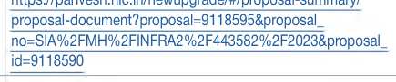

**[Image: AnnualReport2024.pdf-0157-23.png (435x91, 21.7KB)]**

<!-- Start of picture text -->
proposal-document?proposal=9118595&proposal_ no=SIA%2FMH%2FINFRA2%2F443582%2F2023&proposal_ id=9118590 <!-- End of picture text -->

https://parivesh.nic.in/newupgrade/#/proposal-summary/ proposal-document?proposal=20795387&proposal_ no=SIA%2FMH%2FINFRA2%2F450660%2F2023&proposal_ id=20795383 

**[Image: AnnualReport2024.pdf-0157-25.png (1028x96, 40.7KB)]**

<!-- Start of picture text -->
INFRA2/450660/2023 proposal-document?proposal=20795387&proposal_ no=SIA%2FMH%2FINFRA2%2F450660%2F2023&proposal_ id=20795383 <!-- End of picture text -->

13.  Is the entity compliant with the applicable environmental law/ regulations/ guidelines in India such as the Water (Prevention and Control of Pollution) Act, Air (Prevention and Control of Pollution) Act, Environment protection act and rules thereunder (Y/N). If not, provide details of all such non-compliances, in the following format: 

   - **Response** : Yes. We are complaint with all applicable environmental law/regulations/guidelines in India. However, there are three penalties received at our sites as mentioned in the table below against which corrective actions have been taken. 

Godrej Properties Limited 

Integrated Report 2023-24 

304 

305 

About Godrej Integrating Sustainability Management Discussion Statutory Properties Limited with our Business and Analysis Reports 

**[Image: AnnualReport2024.pdf-0158-01.png (82x27, 2.2KB)]**

Any fines / Specify penalties / the law / action taken S. regulation/ Provide details of the nonby regulatory Corrective action taken, if any No. guidelines compliance agencies such as which was not pollution control complied with boards or by courts 1. NGT Godrej Woods, Noida 5,000,000 All obligations form NGT has been met and adhered ` 5,000,000/- paid by to regularly. Along with this project have been us pursuant to the order ensuring air pollution control mitigation measures imposing penalty for nonlike covering of construction material, installation adherence of NGT Ban; of Anti-Smog Guns, availability of sensor based Air monitoring device, water sprinkling etc. Also the compliance to above requirements are regularly verified through internal audits. 2. NGT Godrej South Estate: Fine 2,893,063 NGT Ban: Required Anti-Smog Guns deployed of ` 2,893,063/-imposed for and operational, availability AQI meter & display, Non-adherence instance availability of Fencing, sprinkling of water, installation during NGT Ban, DJB and of dust curtains (Sift & hard). MCD DJB: One-time incident resolved and no further probable risks associated. MCD: Dust control & PHE risks are identified and regular monitoring & actions are being taken. 3. PCMC Godrej Emerald Waters: 297,080 All obligations form PCMC has been met and A penalty of an amount of adhered to regularly. Along with this project have ₹297,080/- was imposed been ensuring air pollution control mitigation by a flying squad of measures like: Installation of anti-smog gun for dust PCMC on 08/11/2023 at suppression, sprinkle water on the road, Construction ICC-Pimpri site, being materials stored at the site are covered properly, All developed by GPL, for debris-transporting vehicles are covered properly carrying out construction with tarpaulin sheets, installed a sensor-based AQI activities without taking machine for air quality monitoring, Material Recovery measures of controlling Facility for C&D waste management, availability of air pollution as per Air wheel washing facility, provided Personal protective Pollution Control Guidelines equipment such as masks and goggles. dated 07/11/2023 issued by Commissioner, PCMC, as per Order of the Hon’ble Bombay High Court passed in PIL/3/2023. 

**[Image: AnnualReport2024.pdf-0158-03.png (1027x24, 5.6KB)]**

###### Leadership Indicators 

1. Water withdrawal, consumption, and discharge in areas of water stress (in kilolitres): 

For each facility / plant located in areas of water stress, provide the following information: 

- (i) Name of the area 

- (ii) Nature of operations 

- (iii) Water withdrawal, consumption, and discharge in the following format 

**[Image: AnnualReport2024.pdf-0158-10.png (201x53, 8.7KB)]**

<!-- Start of picture text -->
FY 2023-24 <!-- End of picture text -->

||FY 2023-24|FY 2022-23|
|---|---|---|
|**Water withdrawal by source (in kilolitres)**|||
|(i) Surface water|0|0|
|(ii) Groundwater|555|0|
|(iii) Third party water|130,187.67|74,975.13|
|(iv) Seawater/desalinated water|0|0|
|(v) Others|0|0|
|Total volume of water withdrawal|130,742.67|74,975.13|
|Total volume of water consumption|130,742.67|74,975.13|
|Water intensity per rupee of turnover (Water consumed / turnover)|0.0000043|0.0000033|
|Water intensity (optional) – the relevant metric may be selected by the entity|NA|NA|
|**Water discharge by destination and level of treatment (in kilolitres)**|||
|(i) Surface water|0|0|
|- No treatment|0|0|
|- With treatment – please specify level of treatment|0|0|
|(ii) Groundwater|0|0|
|- No treatment|0|0|
|- With treatment – please specify level of treatment|0|0|
|(iii) Seawater|0|0|
|- No treatment|0|0|
|- With treatment – please specify level of treatment|0|0|
|(iv) Sent to third parties|0|0|
|- No treatment|0|0|
|- With treatment – please specify level of treatment|0|0|
|(v) Others|0|0|
|- No treatment|0|0|
|- With treatment – please specify level of treatment|0|0|

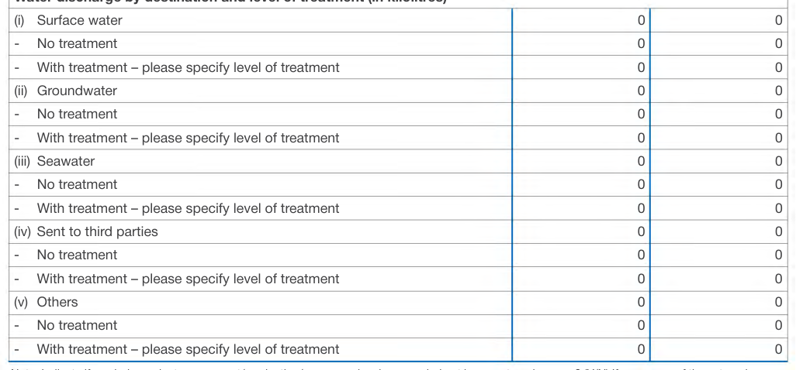

**[Image: AnnualReport2024.pdf-0158-12.png (1026x478, 118.7KB)]**

<!-- Start of picture text -->
(i) Surface water 0 0 -  No treatment 0 0 -  With treatment – please specify level of treatment 0 0 (ii) Groundwater 0 0 -  No treatment 0 0 -  With treatment – please specify level of treatment 0 0 (iii) Seawater 0 0 -  No treatment 0 0 -  With treatment – please specify level of treatment 0 0 (iv) Sent to third parties 0 0 -  No treatment 0 0 -  With treatment – please specify level of treatment 0 0 (v) Others 0 0 -  No treatment 0 0 -  With treatment – please specify level of treatment 0 0 <!-- End of picture text -->

Note: Indicate if any independent assessment/ evaluation/assurance has been carried out by an external agency? (Y/N) If yes, name of the external agency. 

###### 2. Please provide details of total Scope 3 emissions & its intensity, in the following format: 

|Parameter|Unit|FY 2023-24|FY 2022-23|
|---|---|---|---|
|Total Scope 3 emissions (Break-up of the GHG into CO2, CH4, N2O, HFCs, PFCs, SF6, NF3, if available)|Tonnes of CO2 equivalent|1,594,025.04|1,951,267|
|Total Scope 3 emissions per rupee of turnover|tCO2e/₹|0.000052|0.000086|
|Total Scope 3 emission intensity (optional) – the relevant metric may be selected by the entity|tCO2e/sq. ft. Produced|0.16|0.29|

Note: Indicate if any independent assessment/ evaluation/assurance has been carried out by an external agency? (Y/N) If yes, name of the external agency. Response: Yes, Refer IR page number 88-89, GRI 305-3 and Limited assuranceis conducted on IR 

3. With respect to the ecologically sensitive areas reported at Question 11 of Essential Indicators above, provide details of significant direct & indirect impact of the entity on biodiversity in such areas along-with prevention and remediation activities. 

**Response** : Not Applicable. 

Godrej Properties Limited 

Integrated Report 2023-24 

306 

307 

About Godrej Integrating Sustainability Management Discussion Statutory Properties Limited with our Business and Analysis Reports 

**[Image: AnnualReport2024.pdf-0159-01.png (82x27, 2.2KB)]**

4. If the entity has undertaken any specific initiatives or used innovative technology or solutions to improve resource efficiency, or reduce impact due to emissions / effluent discharge / waste generated, please provide details of the same as well as outcome of such initiatives, as per the following format: 

S. Initiative Details of the initiative (Web-link, if any, may be provided along-with No. Undertaken summary) 

Outcome of the initiative 

1. Waste In order to manage and reduce C&D waste at project sites, we 10 Projects has Management implemented on-site material recovery facility (MRF) which enabled successfully setup Material and Waste efficient segregation and management of waste with separate storage Recovery Facility. Total Reduction areas for different waste streams and linking them to authorized vendors 98% of Waste is Recycled Initiative or Reused. for recycling. In first phase as a best practice, GPL has piloted setup of dedicated MRF centers at 10 project sites located in 3 Zones. 

2. Use of Solar energy is the alternate source of energy integrated into our Units generated till Date Renewable projects and their operations. At our projects, Godrej City in Mumbai & (KWh) 512,779 which energy for Manjari, Mahalunge, Maan Hinjewadi in Pune, we had installed an ONeventually reduced temporary GRID PV Solar System for the project offices. The installed capacity 200 emission by approximately structure at KW & 460 KW capacity solar plant. 19,297.77 KgCO2e Projects 

**[Image: AnnualReport2024.pdf-0159-07.png (1027x24, 4.9KB)]**

5. Does the entity have a business continuity and disaster management plan? Give details in 100 words/ web link. 

   - **Response** : Yes, we recognize the importance of business continuity and disaster management in mitigating risks to our operations. With a methodical approach, GPL has developed a comprehensive plan to identify, assess, and minimize potential disasters. Through risk assessments, disaster management plans, and vulnerability analyses, GPL proactively works to reduce risks to both people and property. By implementing long-term action plans, the company ensures preparedness and resilience in the face of potential disasters. GPL’s commitment to business continuity and disaster management demonstrates its dedication to safeguarding its assets and maintaining operational stability even in challenging circumstances. 

6. Disclose any significant adverse impact to the environment, arising from the value chain of the entity. What mitigation or adaptation measures have been taken by the entity in this regard. 

   - **Response** : There has been no significant adverse impact to the environment, arising from the value chain of the entity. 

7. Percentage of value chain partners (by value of business done with such partners) that were assessed for environmental impacts. 

   - **Response** : 29% 

###### **PRINCIPLE 7:** 

Businesses, when engaging in influencing public and regulatory policy, should do so in a manner that is responsible and transparent. 

###### Essential Indicators 

1. a.  Number of affiliations with trade and industry chambers/ associations. 

###### **Response** : 6 

- b. List the top 10 trade and industry chambers/ associations (determined based on the total members of such body) the entity is a member of/ affiliated to. 

S. Reach of trade and industry chambers/ associations No.Name of the trade and industry chambers/ associations (State/National) 1. Confederation of Indian Industry (CII) National 2. Indian Green Building Council (IGBC) National 3. Maharashtra Chamber of Housing Industry State 4. Confederation of Real Estate Developers Association of India National 5. National Safety Council National 6. Federation of Indian Chambers of Commerce and Industry National 

**[Image: AnnualReport2024.pdf-0159-21.png (1027x24, 4.7KB)]**

2. Provide details of corrective action taken or underway on any issues related to anti-competitive conduct by the entity, based on adverse orders from regulatory authorities. 

**Response** : No such cases were reported. 

###### Leadership Indicators 

1. Details of public policy positions advocated by the entity: 

Whether Frequency of Review S. Public policy information by Board (Annually/ Web Link, Method resorted for such advocacy No. advocated available in public Half yearly/ Quarterly / if available domain? (Yes/No) Others – please specify) 1. Promote As one of the founding members of Yes Quarterly NA Green Indian Green Building Council (IGBC), we Building continuously strive to deliver sustainability focused innovation to our customers. In 2010, GPL committed that all of its developments would be third party certified green under credible rating systems such as IGBC, GRIHA, LEED, etc. In 2016 we raised the minimum certification for all our projects to IGBC Silver or equivalent 

**[Image: AnnualReport2024.pdf-0159-27.png (1025x24, 7.9KB)]**

###### **PRINCIPLE 8:** 

Businesses should promote inclusive growth and equitable development. 

###### Essential Indicators 

1. Details of Social Impact Assessments (SIA) of projects undertaken by the entity based on applicable laws, in the current financial year. 

S. SIA Notification Date of Whether conducted by independent Results communicated in Relevant Web No. I No. I notification I external agency (Yes / No) I public domain? (Yes / No) I link Not Applicable. There being no compliance mandate, GPL has voluntarily conducted a Social and Water Impact assessment of the CSR project, ‘Integrated Watershed Development in Beed district of Maharashtra’ 

**[Image: AnnualReport2024.pdf-0159-33.png (1028x24, 3.7KB)]**

2. Provide information on project(s) for which ongoing Rehabilitation and Resettlement (R&R) is being undertaken by your entity, in the following format: 

###### S. 

S. Name of Project for No. of Project Affected % of PAFs Amounts paid to PAFs in State District No. I which R&R is ongoing I I I Families (PAFs) I covered by R&R I the FY (In ₹) Not Applicable 

**[Image: AnnualReport2024.pdf-0159-37.png (1028x24, 2.9KB)]**

3. Describe the mechanisms to receive and redress grievances of the community. 

   - **Response** : As per the stakeholder grievance redressal policy, local communities can file grievances using specific email addresses or phone numbers. For more information, refer to Stakeholder Engagement Policy. 

**[Image: AnnualReport2024.pdf-0159-40.png (273x23, 3.3KB)]**

<!-- Start of picture text -->
. <!-- End of picture text -->

4. Percentage of input material (inputs to total inputs by value) sourced from suppliers: 

||FY 2023-24|FY 2022-23|
|---|---|---|
|Directly sourced from MSMEs/ small producers|58%|22%|
|Directly sourced from within India|100%|100%|

Godrej Properties Limited 

Integrated Report 2023-24 

308 

309 

About Godrej Integrating Sustainability Management Discussion Statutory Properties Limited with our Business and Analysis Reports 

**[Image: AnnualReport2024.pdf-0160-01.png (82x27, 2.2KB)]**

5. Job creation in smaller towns – Disclose wages paid to persons employed (including employees or workers employed on a permanent or non-permanent / on contract basis) in the following locations, as % of total wage cost. 

||FY 2023-24|FY 2022-23|
|---|---|---|
|Rural|0%|0%|
|Semi-urban|0%|0%|
|Urban|1%|17%|
|Metropolitan|99%|83%|

###### Leadership Indicators 

1. Provide details of actions taken to mitigate any negative social impacts identified in the Social Impact Assessments (Reference: Question 1 of Essential Indicators above): 

Details of negative social impact identified Corrective action taken Not Applicable 

**[Image: AnnualReport2024.pdf-0160-07.png (1027x24, 3.1KB)]**

2. Provide the following information on CSR projects undertaken by your entity in designated aspirational districts as identified by government bodies: 

S. State Aspirational District Amount spent (in ₹) No. I 1.    Rajasthan Sirohi 5,38,715 

**[Image: AnnualReport2024.pdf-0160-10.png (1027x24, 4.2KB)]**

3. (a)  Do you have a preferential procurement policy where you give preference to purchase from suppliers comprising marginalized /vulnerable groups? (Yes/No). 

**Response** : Not Applicable 

- (b) From which marginalized /vulnerable groups do you procure? 

**Response** : Not Applicable 

- (c) What percentage of total procurement (by value) does it constitute? 

**Response** : Not Applicable 

4. Details of the benefits derived and shared from the intellectual properties owned or acquired by your entity (in the current financial year), based on traditional knowledge: 

S. Intellectual Property based on traditional Owned/ Acquired Benefit shared (Yes Basis of calculating No. knowledge (Yes/No) / No) benefit share 

Not Applicable 

**[Image: AnnualReport2024.pdf-0160-20.png (1027x24, 3.5KB)]**

5. Details of corrective actions taken or underway, based on any adverse order in intellectual property related disputes wherein usage of traditional knowledge is involved. 

Brief on the case Corrective action taken Not Applicable 

Name of the authority 

**[Image: AnnualReport2024.pdf-0160-24.png (1027x24, 3.1KB)]**

6. Details of beneficiaries of CSR Projects: 

|S. No.|Social Protection for Construction workers|84,743|100%|
|---|---|---|---|
|1|Supporting Community Creches in Pune and Gurgaon|1,056|100%|
|2|Tree plantation project, PAN India|93|100%|
|3|Crop Residue Management, Punjab|33,587|0%|
|4|Decentralised Solid Waste Management, Dhanpuri & Burhar|58,000|1%|
|5|Decentralised Solid Waste Management, Budni and Gohad|88,840|1%|
|6|Bioremediation, Biomining and Decentralised Solid Waste Management, Chakrata|5,000|1%|
|7|Decentralised Dry Waste Management, Panaji|45,000|1%|
|8|Decentralised Dry Waste Management, Nagpur|238,000|1%|
|9|DSWM, Clement Town|43,000|1%|
|10|DSWM, APMCs Bangalore|20,000|1%|
|11|DSWM, APMCs Bangalore|20,000|1%|

**[Image: AnnualReport2024.pdf-0160-27.png (1026x24, 6.4KB)]**

###### **PRINCIPLE 9:** 

Businesses should engage with and provide value to their consumers in a responsible manner 

###### Essential Indicators 

1. Describe the mechanisms in place to receive and respond to consumer complaints and feedback. 

   - **Response** : 1) Each customer is assigned a Relationship Manager through whom the customer can raise complaints, seek clarifications or provide feedback. Each interaction with a customer is tracked in our ECRM through a Service Request Module. 

- 2)   Customers are provided information on the RM assigned, RM coordinates, and mechanism to raise a service request themselves via the GPL Mobile App. 

- 3)   GPL conducts half yearly relationship NPS survey with all its customers, asking them to rate their likelihood of recommendation Godrej Properties to friends and family on a scale of 0 to 10 (0 being lowest; 10 being highest). The survey also provides customers to share objective and qualitative feedback abouts Godrej Properties Ltd’s products and services. 

- 4)   GPL further conducts Episodic NPS surveys during key moments of truth in a customer lifecycle, namely, onboarding, registration of their unit, site visit and handover. These surveys provide customers another opportunity to rate their experience during these critical moments of truth. 

2. Turnover of products and/ services as a percentage of turnover from all products/service that carry information about: 

||As a % of total turnover|
|---|---|
|Environmental and social parameters relevant to the product|100%|
|Safe and responsible usage|100%|
|Recycling and/or safe disposal|100%|

**[Image: AnnualReport2024.pdf-0160-38.png (1026x24, 4.4KB)]**

Godrej Properties Limited 

Integrated Report 2023-24 

310 

311 

About Godrej Integrating Sustainability Management Discussion Statutory Properties Limited with our Business and Analysis Reports 

**[Image: AnnualReport2024.pdf-0161-01.png (82x27, 2.2KB)]**

###### 3. Number of consumer complaints in respect of the following: 

||Received during the year|Pending resolution at end of year|FY 2023-24 Remarks|Received during the year|FY 202 Pending resolution at end of year|2-23 Remarks|
|---|---|---|---|---|---|---|
|Data Privacy|0|0|NA|54|0|NA|
|Advertising|0|0|NA|8|0||
|Cyber- security|0|0|NA|0|0||
|Delivery of essential services|2|1|The said case pertains to one of the customer belonging to Godrej Lake Garden Project on which the pending NGT litigation is going on, due to which the project is stopped and the case is pending before Hon’ble Supreme Court. The customer has fled a case seeking refund of the amount paid by him, in 2021when we gave the customer option to exit the project he had accepted to stay invested with us until the fnal order in the said case pending before Supreme Court, the same contention has been taken by us before RERA and RERA has now adjourned the matter to September as premature as the RERA timeline of Godrej Lake Garden is September and the case before Supreme Court is also pending.|33|30|The 30 Pending resolutions reported for FY22-23 pertain to ongoing litigations regarding the construction of 24 mtr. road at Godrej Summit which is under the purview of the Govt. authorities. The construction of road within the project was completed by GPL and handed over to the RWA. Hence the matter is sub judice.|
|Restrictive Trade Practices|8|0|NA|0|0|NA|
|Unfair Trade Practices|17|0|NA|1|0|NA|
|Other|0|0|NA|1|0|NA|

###### 4. Details of instances of product recalls on account of safety issues: 

||Number|Reasons for recall|
|---|---|---|
|Voluntary Recalls|NA||
|Forced Recalls|NA|NA|

**[Image: AnnualReport2024.pdf-0161-06.png (1026x24, 4.3KB)]**

7. Provide the following information relating to data breaches: 

   - a. Number of instances of data breaches 

###### **Response** : 0 

- b.  Percentage of data breaches involving personally identifiable information of customers 

###### **Response** : 0% 

- c.  Impact, if any, of the data breaches 

###### **Response** : Not Applicable 

###### Leadership Indicators 

1. Channels / platforms where information on products and services of the entity can be accessed (provide web link, if available). 

   - **Response** : All the information about products and services of the entity is available in the public domain on the website. Please refer to https://www.godrejproperties.com/. 

**[Image: AnnualReport2024.pdf-0161-17.png (298x24, 4.1KB)]**

<!-- Start of picture text -->
. <!-- End of picture text -->

2. Steps taken to inform and educate consumers about safe and responsible usage of products and/or services. 

**Response** : Not Applicable. Although during the handing-over of the project, our teams inform and educate customers about safe and responsible usage of products and/or services through various engagement mechanisms including handover manuals, sustainability master classes, and focused site visits. 

3. Mechanisms in place to inform consumers of any risk of disruption/discontinuation of essential services. 

   - **Response** : We have developed an app for our all our customers to help them through their post-possession journey, and the same app is used to share notification and information regarding all crucial matters including service disruption/ discontinuation (if any). 

4. Does the entity display product information on the product over and above what is mandated as per local laws? (Yes/No/ Not Applicable) If yes, provide details in brief. Did your entity carry out any survey with regard to consumer satisfaction relating to the major products / services of the entity, significant locations of operation of the entity or the entity as a whole? (Yes/No). 

**Response** : Yes, external creative communications contain the real estate regulatory authority (RERA) registration number. All projects listed on the website have all project details including the registration number. GPL is one of very few real estate companies that has adopted Net Promoter Score (NPS) as a metric to measure of customer satisfaction. We received encouraging NPS score of 68% an improvement from 65% in FY 2022-23 with over 14,267 of our customers providing us this performance rating. 

GPL is a real estate firm involved in the development of residential properties, commercial properties and townships. The features that we include in our goods, such as rainwater collection systems, sewage treatment plants, solar PV, and resource recovery centres, include safety as a key component. Through the resident assistant, customers are informed about how these features operate and how to use them. Therefore, product recalls do not pertain to our business. 

5. Does the entity have a framework/ policy on cyber security and risks related to data privacy? (Yes/No) If available, provide a web-link of the policy. 

**Response** : Yes, our ISMS policy can be found on our intranet (GPL Information Security Policy). 

**[Image: AnnualReport2024.pdf-0161-27.png (279x24, 3.4KB)]**

<!-- Start of picture text -->
. <!-- End of picture text -->

6. Provide details of any corrective actions taken or underway on issues relating to advertising, and delivery of essential services; cyber security and data privacy of customers; re-occurrence of instances of product recalls; penalty / action taken by regulatory authorities on safety of products / services. 

**Response** : Not Applicable 

Godrej Properties Limited 

Integrated Report 2023-24 

312 

313 

About Godrej Integrating Sustainability Properties Limited with our Business 

Management Discussion Statutory and Analysis Reports 

**[Image: AnnualReport2024.pdf-0162-02.png (82x27, 2.2KB)]**

###### **FINANCIAL STATEMENTS** 

###### **Independent Auditor’s Report** 

**To the Members of Godrej Properties Limited** 

###### **REPORT ON THE AUDIT OF THE STANDALONE FINANCIAL STATEMENTS** 

###### **Opinion** 

We have audited the standalone financial statements of Godrej Properties Limited (the “Company”) which comprise the standalone balance sheet as at 31 March 2024, and the standalone statement of profit and loss (including other comprehensive income), standalone statement of changes in equity and standalone statement of cash flows for the year then ended, and notes to the standalone financial statements, including material accounting policies and other explanatory information in which are incorporated returns from branches in Singapore, Qatar and Dubai (hereinafter referred to as “standalone financial statements”). 

In our opinion and to the best of our information and according to the explanations given to us, the aforesaid standalone financial statements give the information required by the Companies Act, 2013 (“Act”) in the manner so required and give a true and fair view in conformity with the accounting principles generally accepted in India, of the state of affairs of the Company as at 31 March 2024, and its profit and other comprehensive loss, changes in equity and its cash flows for the year ended on that date. 

###### **Basis for Opinion** 

We conducted our audit in accordance with the Standards on Auditing (SAs) specified under Section 143(10) of the Act. Our responsibilities under those SAs are further described in the Auditor’s Responsibilities for the Audit of the Standalone Financial Statements section of our report. We are independent of the Company in accordance with the Code of Ethics issued by the Institute of Chartered Accountants of India together with the ethical requirements that are relevant to our audit of the standalone financial statements under the provisions of the Act and the Rules thereunder, and we have fulfilled our other ethical responsibilities in accordance with these requirements and the Code of Ethics. We believe that the audit evidence we have obtained is sufficient and appropriate to provide a basis for our opinion on the standalone financial statements. 

###### **Key Audit Matters** 

Key audit matters are those matters that, in our professional judgement, were of most significance in our audit of the standalone financial statements of the current period. These matters were addressed in the context of our audit of the standalone financial statements as a whole, and in forming our opinion thereon, and we do not provide a separate opinion on these matters. 

###### **Revenue recognition** 

See Note 30 to the standalone financial statements 

###### **The Key audit matter** 

The Company’s most significant revenue streams involve sale of residential units, commercial units and plotted lands representing 78% of the total revenue from operations of the Company. 

Revenue is recognised post transfer of control to customers for the consideration (transaction price) which the Company expects to receive in exchange for those units / lands. The trigger for revenue recognition is normally completion of the project or receipt of approvals on completion from relevant authorities, post which the contract with customer becomes non-cancellable. 

The Company records revenue, over time till the actual possession to the customers, or on actual possession to the customers, as determined by the terms of contract with customers. 

###### **Measurement of revenue recorded over time which is** 

###### **dependent on the estimates of the costs to complete** 

Revenue recognition involves significant estimates related to measurement of costs to complete for the projects. 

Revenue from projects is recorded based on the Company’s assessment of the work completed, costs incurred and accrued and the estimate of the balance costs to complete. 

Considering the significant estimate involved in measurement of revenue and risk of revenue being recognised in an incorrect period, we have considered measurement of revenue as a key audit matter. 

###### **How the matter was addressed in our audit** 

Our audit procedures included following: 

- Obtaining and understanding revenue recognition process including identification of performance obligations and determination of transfer of control of the asset underlying the performance obligation to the customer. 

- Evaluating the design and implementation and tested operating effectiveness of key internal controls around approvals of contracts, milestone billing, intimation of receipt of occupation certificate, recording of project cost and controls over collection from customers . 

- Evaluating the accounting policies adopted by the Company for revenue recognition to check those are in line with the applicable accounting standards and their consistent application to the significant sales contracts. 

- Testing timeliness of revenue recognition by comparing individual sample sales transactions to underlying contracts. 

- Conducting site visits during the year for selected projects to understand the scope, nature and progress of the projects. 

- Evaluating revenue overstatement by assessing Company’s key judgments in interpreting contractual terms. Determining the point in time at which the control is transferred by evaluating Company’s in-house legal interpretations of the underlying agreements i.e. when contract becomes non-cancellable. 

- Assessing the costs incurred and accrued to date on the balance sheet by examining underlying invoices and signed agreements on a sample basis. Assessing contract costs to check no costs of revenue nature are incorrectly recorded in the balance sheet. 

- Comparing, on a sample basis, revenue transactions recorded during the year with the underlying contracts, invoices raised on customers and collections in bank accounts. Also, checked the related revenue had been recognised in accordance with the Company’s revenue recognition policies. 

- Comparing the costs to complete workings with the budgeted costs and inquiring for variance. 

- Sighting Company’s internal approvals, on sample basis, for changes in budgeted costs along with the rationale for the changes. 

- Scrutinising the revenue journal entries raised throughout the reporting period and comparing details of a sample of these journals, which met certain risk-based criteria, with relevant underlying documentation. 

- Considering the adequacy of the disclosures in the standalone financial statements in respect of the judgments taken in recognising revenue for residential, commercial units and plotted lands units in accordance with Ind AS 115. 

**[Image: AnnualReport2024.pdf-0162-39.png (1026x23, 3.7KB)]**

Godrej Properties Limited 

Integrated Report 2023-24 

314 

315 

About Godrej Integrating Sustainability Management Discussion Statutory Properties Limited with our Business and Analysis Reports 

**[Image: AnnualReport2024.pdf-0163-01.png (82x27, 2.2KB)]**

###### **Investment in subsidiaries, joint ventures and an associate and loans to subsidiaries and joint ventures** 

(See Note 6, 7, 9, 18 to the standalone financial statements) 

###### **The Key audit matter** 

###### **How the matter was addressed in our audit** 

Recoverability of investments in subsidiaries, joint ventures and an associate 

The carrying amount of the investments in subsidiaries, joint ventures and an associate held at cost less impairment represents 9.75 % of the Company’s total assets. The loans to subsidiaries and joint ventures represents 29.42 % of the Company’s total assets. 

###### **Our audit procedures included:** 

- Evaluating design and implementation and testing operating effectiveness of controls over the Company’s process of impairment assessment and approval of forecasts. 

###### **Recoverability of investments in subsidiaries, joint ventures and an associate** 

The Company’s investments in subsidiaries, joint ventures and an associate are carried at cost less any permanent diminution in value. The investments are assessed for impairment at each reporting date. 

- Assessing the valuation methods used, financial position of the subsidiaries, joint ventures and an associate to identify excess of their net assets over their carrying amount of investment by the Company and assessing profit history of those subsidiaries, joint ventures and an associate. 

The impairment assessment involves the use of estimates. The identification of impairment event and the determination of an impairment charge also require the application of significant judgement by the Company. The judgement, in particular, is with respect to the timing and quantity and estimation of projected cash flows of the real estate projects in these underlying entities. 

- For the investments where the carrying amount exceeded the net asset value, understanding from the Company regarding the basis and assumptions used for the projected profitability. 

- Verifying the inputs used in the projected profitability. 

In view of the significance of these investments and above, we consider valuation / impairment of investments in subsidiaries, joint ventures and an associate to be a key audit matter. 

- Testing the assumptions and understanding the forecasted cash flows of subsidiaries, joint ventures and an associate based on our knowledge of the Company and the markets in which they operate. 

###### **Recoverability of loans given to subsidiaries and joint ventures** 

- Assessing the comparability of the forecasts with historical information. 

The Company has extended loans to joint ventures and subsidiaries. 

- Analysing the possible indications of impairment and understanding Company’s assessment of those indications. 

These are assessed for recoverability at each period end. 

Due to the nature of the business in the real estate industry, the Company is exposed to heightened risk in respect of the recoverability of the loans granted to the aforementioned parties. In addition to nature of business, there is also significant judgment involved as to the recoverability of the working capital and project specific loans which depends on property development projects being completed over the time period specified in agreements. 

- Considering the adequacy of disclosures in respect of the investments in subsidiaries, joint ventures and an associate. 

###### **Recoverability of loans to subsidiaries and joint ventures** 

Our procedures included: 

- Evaluating the design and implementation and testing operating effectiveness of key internal controls placed around the impairment assessment process of the recoverability of the loans. 

We have identified measurement of loans to subsidiaries and joint ventures as key audit matter. 

- Assessing the net worth of subsidiaries and joint ventures on the basis of latest available financial statements. 

- Assessing the controls for grant of new loans and sighting the Board approvals obtained. We have tested Company’s assessment of the recoverability of the loans, which includes cash flow projections over the duration of the loans. These projections are based on underlying property development appraisals. 

- Tracing loans advanced / repaid during the year to bank statement. 

- Obtaining independent confirmations to assess completeness and existence of loans given to subsidiaries and joint ventures as on 31 March 2024. 

**[Image: AnnualReport2024.pdf-0163-33.png (1027x24, 4.7KB)]**

###### **Other Information** 

The Company’s Management and Board of Directors are responsible for the other information. The other information comprises the information included in the annual report, but does not include the financial statements and auditor’s report thereon. The annual report is expected to be made available to us after the date of this auditor’s report. 

Our opinion on the standalone financial statements does not cover the other information and we will not express any form of assurance conclusion thereon. 

In connection with our audit of the standalone financial statements, our responsibility is to read the other information identified above when it becomes available and, in doing so, consider whether the other information is materially inconsistent with the standalone financial statements or our knowledge obtained in the audit, or otherwise appears to be materially misstated. 

###### **Management’s and Board of Directors’ Responsibilities for the Standalone Financial Statements** 

The Company’s Management and Board of Directors are responsible for the matters stated in Section 134(5) of the Act with respect to the preparation of these standalone financial statements that give a true and fair view of the state of affairs, profit/ loss and other comprehensive income, changes in equity and cash flows of the Company in accordance with the accounting principles generally accepted in India, including the Indian Accounting Standards (Ind AS) specified under Section 133 of the Act. This responsibility also includes maintenance of adequate accounting records in accordance with the provisions of the Act for safeguarding of the assets of the Company and for preventing and detecting frauds and other irregularities; selection and application of appropriate accounting policies; making judgments and estimates that are reasonable and prudent; and design, implementation and maintenance of adequate internal financial controls, that were operating effectively for ensuring the accuracy and completeness of the accounting records, relevant to the preparation and presentation of the standalone financial statements that give a true and fair view and are free from material misstatement, whether due to fraud or error. 

In preparing the standalone financial statements, the Management and Board of Directors are responsible for assessing the Company’s ability to continue as a going concern, disclosing, as applicable, matters related to going concern and using the going concern basis of accounting unless the Board of Directors either intends to liquidate the Company or to cease operations, or has no realistic alternative but to do so. 

The Board of Directors is also responsible for overseeing the Company’s financial reporting process. 

###### **Auditor’s Responsibilities for the Audit of the** 

###### **Standalone Financial Statements** 

Our objectives are to obtain reasonable assurance about whether the standalone financial statements as a whole are free from material misstatement, whether due to fraud or error, and to issue an auditor’s report that includes our opinion. Reasonable assurance is a high level of assurance, but is not a guarantee that an audit conducted in accordance with SAs will always detect a material misstatement when it exists. Misstatements can arise from fraud or error and are considered material if, individually or in the aggregate, they could reasonably be expected to influence the economic decisions of users taken on the basis of these standalone financial statements. 

As part of an audit in accordance with SAs, we exercise professional judgment and maintain professional skepticism throughout the audit. We also: 

- Identify and assess the risks of material misstatement of the standalone financial statements, whether due to fraud or error, design and perform audit procedures responsive to those risks, and obtain audit evidence that is sufficient and appropriate to provide a basis for our opinion. The risk of not detecting a material misstatement resulting from fraud is higher than for one resulting from error, as fraud may involve collusion, forgery, intentional omissions, misrepresentations, or the override of internal control. 

Obtain an understanding of internal control relevant to the audit in order to design audit procedures that are appropriate in the circumstances. Under Section 143(3) (i) of the Act, we are also responsible for expressing our opinion on whether the company has adequate internal financial controls with reference to financial statements in place and the operating effectiveness of such controls. 

- 

Evaluate the appropriateness of accounting policies used and the reasonableness of accounting estimates and related disclosures made by the Management and Board of Directors. 

- 

Conclude on the appropriateness of the Management and Board of Directors use of the going concern basis of accounting in preparation of standalone financial statements and, based on the audit evidence obtained, whether a material uncertainty exists related to events or conditions that may cast significant doubt on the Company’s ability to continue as a going concern. If we conclude that a material uncertainty exists, we are required to draw attention in our auditor’s report to the related disclosures in the standalone financial statements or, if such disclosures are inadequate, to modify our opinion. Our conclusions are based on the audit evidence obtained up to the date of our auditor’s report. However, future events or conditions may cause the Company to cease to continue as a going concern. 

- 

Godrej Properties Limited 

Integrated Report 2023-24 

316 

317 

About Godrej Integrating Sustainability Management Discussion Statutory Properties Limited with our Business and Analysis Reports 

**[Image: AnnualReport2024.pdf-0164-01.png (82x27, 2.3KB)]**

<!-- Start of picture text -->
- <!-- End of picture text -->

- Evaluate the overall presentation, structure and content of the standalone financial statements, including the disclosures, and whether the standalone financial statements represent the underlying transactions and events in a manner that achieves fair presentation. 

We communicate with those charged with governance regarding, among other matters, the planned scope and timing of the audit and significant audit findings, including any significant deficiencies in internal control that we identify during our audit. 

We also provide those charged with governance with a statement that we have complied with relevant ethical requirements regarding independence, and to communicate with them all relationships and other matters that may reasonably be thought to bear on our independence, and where applicable, related safeguards. 

From the matters communicated with those charged with governance, we determine those matters that were of most significance in the audit of the standalone financial statements of the current period and are therefore the key audit matters. We describe these matters in our auditor’s report unless law or regulation precludes public disclosure about the matter or when, in extremely rare circumstances, we determine that a matter should not be communicated in our report because the adverse consequences of doing so would reasonably be expected to outweigh the public interest benefits of such communication. 

###### **Report on Other Legal and Regulatory Requirements** 

1. As required by the Companies (Auditor’s Report) Order, 2020 (“the Order”) issued by the Central Government of India in terms of Section 143(11) of the Act, we give in the “Annexure A” a statement on the matters specified in paragraphs 3 and 4 of the Order, to the extent applicable. 

- 2 A. As required by Section 143(3) of the Act, we report that: 

   - a. We have sought and obtained all the information and explanations which to the best of our knowledge and belief were necessary for the purposes of our audit. 

   - b. In our opinion, proper books of account as required by law have been kept by the Company so far as it appears from our examination of those books, and proper returns adequate for the purposes of our audit except for the matters stated in the paragraph 2(B)(f) below on reporting under Rule 11(g) of the Companies (Audit and Auditors) Rules, 2014 and that the backup of one accounting software which forms part of the books of account and other relevant ‘books and papers in electronic mode’ has not been kept on the servers physically located in India. 

   - c. The standalone balance sheet, the standalone statement of profit and loss (including other comprehensive income), the standalone statement of changes in equity and the standalone statement of cash flows dealt with by this Report are in agreement with the books of account. 

   - d. In our opinion, the aforesaid standalone financial statements comply with the Ind AS specified under Section 133 of the Act. 

   - e. On the basis of the written representations received from the directors as on 31 March 2024 and 1 April 2024 taken on record by the Board of Directors, none of the directors is disqualified as on 31 March 2024 from being appointed as a director in terms of Section 164(2) of the Act. 

   - f. the modifications relating to the maintenance of accounts and other matters connected therewith are as stated in the paragraph 2(A)(b) above on reporting under Section 143(3)(b) of the Act and paragraph 2(B)(f) below on reporting under Rule 11(g) of the Companies (Audit and Auditors) Rules, 2014. 

   - g. With respect to the adequacy of the internal financial controls with reference to financial statements of the Company and the operating effectiveness of such controls, refer to our separate Report in “Annexure B”. 

- B. With respect to the other matters to be included in the Auditor’s Report in accordance with Rule 11 of the Companies (Audit and Auditors) Rules, 2014, in our opinion and to the best of our information and according to the explanations given to us: 

   - a. The Company has disclosed the impact of pending litigations as at 31 March 2024 on its financial position in its standalone financial statements - Refer Note 29 and 50 to the standalone financial statements. 

   - b. The Company did not have any long-term contracts including derivative contracts for which there were any material foreseeable losses. 

   - c. There has been no delay in transferring amounts, required to be transferred, to the Investor Education and Protection Fund by the Company. 

   - d (i) The management has represented that, to the best of its knowledge and belief, other than as disclosed in the Note 56 to the standalone financial statements, no funds have been advanced or loaned or invested (either from borrowed funds or share premium or any other sources or kind of funds) by the Company to or in any other person(s) or entity(ies), including foreign entities (“Intermediaries”), with the understanding, whether recorded in writing or otherwise, that the Intermediary shall directly or indirectly lend or invest in other persons or entities identified in any manner whatsoever by or on behalf of the Company (“Ultimate Beneficiaries”) or provide any guarantee, security or the like on behalf of the Ultimate Beneficiaries. 

      - (ii)  The management has represented that, to the best of its knowledge and belief, as disclosed in the Note 56 to the standalone financial statements, no funds have been received by the Company from any person(s) or entity(ies), 

including foreign entities (“Funding Parties”), with the understanding, whether recorded in writing or otherwise, that the Company shall directly or indirectly, lend or invest in other persons or entities identified in any manner whatsoever by or on behalf of the Funding Parties (“Ultimate Beneficiaries”) or provide any guarantee, security or the like on behalf of the Ultimate Beneficiaries. 

   - (iii)  Based on the audit procedures performed that have been considered reasonable and appropriate in the circumstances, nothing has come to our notice that has caused us to believe that the representations under sub-clause (i) and (ii) of Rule 11(e), as provided under (i) and (ii) above, contain any material misstatement. 

- e. The Company has neither declared nor paid any 

   - dividend during the year. 

- f. Based on our examination which included test checks, except for instances mentioned below, the Company has used accounting softwares for maintaining its books of accounts, which along with access management tool, as applicable, have a feature of recording audit trail (edit log) facility and the same has operated throughout the year for all relevant transactions recorded in the respective softwares: 

   - i. the feature of recording audit trail (edit log) facility was not enabled for changes performed by privileged users at the application level for the accounting software used for maintaining the books of account for the period from 1 April 2023 to 8 April 2023. 

   - ii. in the absence of an independent auditor’s report in relation to controls at a service organization for an accounting software used for maintaining the books of accounts relating to revenue, trade receivables and other related accounts, which is operated by a third-party software service 

Place: Mumbai Date: May 03, 2024 

provider, we are unable to comment whether audit trail feature for the said software was enabled at the database level and operated throughout the year for all relevant transactions recorded in the software. 

Further, where audit trail (edit log) facility was enabled and operated throughout the year, we did not come across any instance of audit trail feature being tampered with during our course of audit. 

- C. With respect to the matter to be included in the Auditor’s Report under Section 197(16) of the Act: 

In our opinion and according to the information and explanations given to us, the remuneration paid by the Company to its directors during the current year is in accordance with the provisions of Section 197 of the Act. The remuneration paid to any director is not in excess of the limit laid down under Section 197 of the Act. The Ministry of Corporate Affairs has not prescribed other details under Section 197(16) of the Act which are required to be commented upon by us. 

For **B S R & Co. LLP** Chartered Accountants Firm’s Registration No.:101248W/W-100022 

###### **Mansi Pardiwalla** 

Partner Membership No.: 108511 ICAI UDIN:24108511BKEMWR6280 

Godrej Properties Limited 

Integrated Report 2023-24 

318 

319 

About Godrej Integrating Sustainability Management Discussion Statutory Properties Limited with our Business and Analysis Reports 

**[Image: AnnualReport2024.pdf-0165-01.png (82x27, 2.2KB)]**

###### Annexure A to the Independent Auditor’s Report on the Standalone Financial Statements of Godrej Properties Limited for the year ended 31 March 2024 

(Referred to in paragraph 1 under ‘Report on Other Legal and Regulatory Requirements’ section of our report of even date) 

- (i) (a) (A) The Company has maintained proper records showing full particulars, including quantitative details and situation of Property, Plant and Equipment, Right-of-use Assets and Investment Properties. 

      - (b) According to the information and explanations given to us and on the basis of our examination of the records of the Company, the Company has been sanctioned working capital limits in excess of five crore rupees, in aggregate, from a bank on the basis of security of current assets. According to the information and explanations given to us and on the basis of our examination of the records of the Company, the Company has not been sanctioned any working capital limits from financial institutions. In our opinion, the quarterly returns or statements filed by the Company with such bank are in agreement with the books of account of the Company. 

   - (B) The Company has maintained proper records showing full particulars of intangible assets. 

- (i) (b) According to the information and explanations given to us and on the basis of our examination of the records of the Company, the Company has a regular programme of physical verification of its Property, Plant and Equipment by which all property, plant and equipment including investment properties are verified in a phased manner over a period of three years. In accordance with this programme, certain property, plant and equipment were verified during the year. In our opinion, this periodicity of physical verification is reasonable having regard to the size of the Company and the nature of its assets. No discrepancies were noticed on such verification. 

(iii) According to the information and explanations given to us and on the basis of our examination of the records of the Company, the Company has made investments in and granted loans, secured and unsecured, to companies, limited liability partnerships and other parties in respect of which requisite information is as below. The Company has not made investments and granted loans, secured or unsecured, to firms during the year. The Company has not provided any guarantee or security or granted any advances in the nature of loans, secured or unsecured to companies, firms, limited liability partnership or any other parties during the year. 

- (c) According to the information and explanations given to us and on the basis of our examination of the records of the Company, the title deeds of immovable properties (other than immovable properties where the Company is the lessee and the leases agreements are duly executed in favour of the lessee) disclosed in the standalone financial statements are held in the name of the Company. 

   - (a) Based on the audit procedures carried on by us and as per the information and explanations given to us the Company has provided loans to subsidiaries, joint ventures and other parties as below: 

- (d) According to the information and explanations given to us and on the basis of our examination of the records of the Company, the Company has not revalued its Property, Plant and Equipment (including Right of Use assets) or intangible assets or both during the year. 

|**Particulars**|**Loans** **(Rs in crores)**|
|---|---|
|Aggregate amount during the year||
|Subsidiaries*|3,622.00|
|Joint ventures*|1,903.59|
|Associates*|-|
|Others|151.88|
|Balance outstanding as at balance||
|sheet date||
|Subsidiaries*|5,610.05|
|Joint ventures*|2,601.82|
|Associates*|-|
|Others|139.78|

- (e) According to the information and explanations given to us and on the basis of our examination of the records of the Company, there are no proceedings initiated or pending against the Company for holding any benami property under the Prohibition of Benami Property Transactions Act, 1988 and rules made thereunder. 

**[Image: AnnualReport2024.pdf-0165-14.png (498x23, 2.2KB)]**

- (ii) (a) The inventory, except stocks lying with third parties, has been physically verified by the management during the year.For stocks lying with third parties at the year-end, written confirmations have been obtained. In our opinion, the frequency of such verification is reasonable and procedures and coverage as followed by management were appropriate. No discrepancies were noticed on verification between the physical stocks and the book records that were more than 10% in the aggregate of each class of inventory 

**[Image: AnnualReport2024.pdf-0165-16.png (498x24, 2.6KB)]**

*As per the Companies Act, 2013 

According to the information and explanations given to us and based on the audit procedures conducted by us, in our opinion the investments made during the year and the terms and conditions of the grant of loans during the year are prima facie, not prejudicial to the interest of the Company. The Company has not provided guarantee or security or advances in the nature of loans during the year. 

According to the information and explanations given to us and on the basis of our examination of the records of the Company, in the case of secured and unsecured loans given, in our opinion the repayment of principal and payment of interest has been stipulated which is either specific term or repayable on demand. The Company has not given any advance in the nature of loan to any party during the year. Further, the repayment of principal and payment of interest has been stipulated which is either specific term or repayment 

on demand and the repayments or receipts have been regular as per term / demand during the year. 

According to the information and explanations given to us and on the basis of our examination of the records of the Company, there is no overdue amount for more than ninety days in respect of loans given. Further, the Company has not given any advances in the nature of loans to any party during the year. 

According to the information and explanations given to us and on the basis of our examination of the records of the Company, in our opinion following instances of loans falling due during the year were renewed or extended or settled by fresh loans: 

|**Name of the parties**|**Aggregate amount of loans** **or advances in the nature** **of loans granted during the** **year (Rs in crores)**|**Aggregate** **overdue** **amount** **settled by renewal or extension** **or by fresh loans granted to same** **parties (Rs in crores)**|**Percentage** **aggregate** **or advanc** **of loans** **the year**| **of** **to the tota** **es in the** **granted**|**the** **l loans** **nature** **during**|
|---|---|---|---|---|---|
|Akshay Sthapatya Private Limited|51.88|51.88|100%|||

**[Image: AnnualReport2024.pdf-0165-24.png (1026x26, 3.0KB)]**

According to the information and explanations given to us and on the basis of our examination of the records of the Company, in our opinion the Company has not granted loans or advances in the nature of loans either repayable on demand or without specifying any terms or period of repayment except for the following loans to its Promoters and related parties as defined in clause (76) of section 2 of the Companies Act, 2013 (“the Act”) : 

||**All Parties** **(Rs in crores)**|**Promoters**|**Related Parties** **(INR in crores)**|
|---|---|---|---|
|Aggregate of loans/advances in nature of loan||||
|- Repayable on demand (A)|7,528.63|-|7,528.63|
|- Agreement does not specify any terms or period of|-|-|-|
|Repayment (B)||||
|Total (A+B)|7,528.63|-|7,528.63|
|Percentage of loans/advances in nature of loan to the|90.15%|-|90.15%|
|total loans||||

**[Image: AnnualReport2024.pdf-0165-27.png (1026x24, 2.7KB)]**

- (iv) According to the information and explanations given to us and on the basis of our examination of records of the Company, the Company has complied with the provisions of Section 185 of the Companies Act, 2013 (“the Act”) with respect of loans provided by the Company. The Company has not given any guarantees or securities during the year to parties covered under Section 185 of the Act. The provisions of Section 186 of the Act in respect of the loans given, guarantees given or securities provided are not applicable to the Company, since it is covered as a company engaged in business of providing infrastructural facilities. The Company has complied with the provisions of Section 186 of the Act with respect to the investments made. 

of cost records under Section 148(1) of the Act in respect of its goods and services provided by it and are of the opinion that prima facie, the prescribed accounts and records have been made and maintained. However, we have not carried out a detailed examination of the records with a view to determine whether these are accurate or complete. 

   - (vii) (a) The Company does not have liability in respect of Service tax, Duty of excise, Sales tax and Value added tax during the year since effective 1 July 2017, these statutory dues has been subsumed into GST. According to the information and explanations given to us and on the basis of our examination of the records of the Company, in our opinion amounts deducted / accrued in the books of account in respect of undisputed statutory dues including Goods and Service Tax, Provident Fund, Employees State Insurance, Income-Tax, Duty of Customs or Cess or other statutory dues have been regularly deposited by the Company with the appropriate authorities. 

- (v) The Company has not accepted any deposits or amounts which are deemed to be deposits from the public. Accordingly, clause 3(v) of the Order is not applicable. 

- (vi) We have broadly reviewed the books of accounts maintained by the Company pursuant to the rules prescribed by the Central Government for maintenance 

Godrej Properties Limited 

Integrated Report 2023-24 

320 

321 

About Godrej Integrating Sustainability Properties Limited with our Business 

Management Discussion Statutory and Analysis Reports 

**[Image: AnnualReport2024.pdf-0166-02.png (82x27, 2.2KB)]**

(b) According to the information and explanations given to us and on the basis of our examination of the records of the Company, statutory dues relating to Goods and Service Tax, Service Tax, Value Added Tax, Income-Tax or Cess which have not been deposited on account of any dispute are as follows: 

According to the information and explanations given to us and on the basis of our examination of the records of the Company, no undisputed amounts payable in respect of Goods and Service Tax, Provident Fund, Employees State Insurance, Income-Tax, Duty of Customs or Cess or other statutory dues were in arrears as at 31 March 2024 for a period of more than six months from the date they became payable. 

|**Name of the statute**|**Nature of** **the dues**|**Amount** **(INR in** **crores)***|**Period** **to which** **the amount** **relates**|**Forum where dispute** **is pending**|
|---|---|---|---|---|
|MVAT Act, 2002|Value Added Tax|3.30|FY 2008-09|The Joint Commissioner of Sales Tax (Appeals V), Mumbai|
|MVAT Act, 2002|Value Added Tax|0.04|FY 2011-12|The Joint Commissioner of Sales Tax (Appeals V), Mumbai|
|Finance Act, 1994|Service Tax|9.92|FY 2014-15 & FY 2015-16|CESTAT, Mumbai|
|Finance Act, 1994|Service Tax|0.45|Apr-2008 to Mar- 2012|CESTAT, Bangalore|
|Finance Act, 1994|Service Tax|4.39|Period Oct- 2010 to Mar- 2013|CESTAT, Bangalore|
|MVAT Act, 2002|Value Added Tax|4.47|FY 2007-08|The Joint Commissioner of Sales Tax (Appeals |
|||||V), Mumbai|
|MVAT Act, 2002|Value Added Tax|4.92|FY 2009-10|The Joint Commissioner of Sales Tax (Appeals V), Mumbai|
|MVAT Act, 2002|Value Added Tax|0.99|FY 2010-11|The Join Commissioner of Sales Tax (Appeals V), Mumbai|
|Finance Act, 1994|Service Tax|5.53|FY 2016-17 & Apr-2017 to Jun- 2017|CESTAT, Mumbai|
|Finance Act, 1994|Service Tax|0.11|July’2012 to March’2016|CESTAT, Chandigarh|
|CGST Act, 2017|Goods and Service Tax|0.00|Jul-17|Commissioner Appeals|
|Finance Act, 1994|Service Tax|0.33|Period Oct’14 to March’16|CESTAT, Bangalore|
|CGST Act, 2017|Goods and Service Tax|0.21|FY 2017-18|Commissioner Appeals|
|Finance Act, 1994|Service Tax|5.82|FY 2012 - 2015|CESTAT, Mumbai|
|Income Tax Act, 1961|Income Tax|0.39|2006-07|Commissioner of Income Tax (Appeals)|
|Income Tax Act, 1961|Income Tax|0.04|2011-12|Commissioner of Income Tax (Appeals)|
|Income Tax Act, 1961|Income Tax|1.24|2013-14|Income Tax Appellate Tribunal|
|Income Tax Act, 1961|Income Tax|0.59|2014-15|Income Tax Appellate Tribunal|
|Income Tax Act, 1961|Income Tax|0.74|2015-16|Income Tax Appellate Tribunal|
|Income Tax Act, 1961|Income Tax|1.85|2017-18|Income Tax Appellate Tribunal|

**Remarks, if any** 

**[Image: AnnualReport2024.pdf-0166-07.png (1027x23, 6.4KB)]**

|**Name of the statute**|**Nature of** **the dues**|**Amount** **(INR in** **crores)***|**Period** **to which** **the amount** **relates**|**Forum where dispute** **is pending**|**Remarks, if any**|
|---|---|---|---|---|---|
|CGST Act, 2017|Goods and Service Tax|2.94|Jul 2017 to Mar 2020|Commissioner Appeals||
|CGST Act, 2017|Goods and|6.39|2018-2019 to|Commissioner (Appeals)||
||Service Tax||2020-21|Raigad, Mumbai||
|CGST Act, 2017|Goods and|1.75|2018-19|Joint Commissioner||
||Service Tax|||(Appeals-II)||

**[Image: AnnualReport2024.pdf-0166-09.png (1026x24, 6.7KB)]**

*Net of amount paid under protest INR 5.76 crores 

- (vii) According to the information and explanations given to (x) (a) The Company has not raised any moneys by way us and on the basis of our examination of the records of initial public offer or further public offer (including 

- of the Company, the Company has not surrendered or debt instruments). Accordingly, clause 3(x)(a) of the disclosed any transactions, previously unrecorded as Order is not applicable. income in the books of account, in the tax assessments (b) According to the information and explanations under the Income Tax Act, 1961 as income during the year. 

      - (b) According to the information and explanations given to us and on the basis of our examination of the records of the Company, the Company has not made any preferential allotment or private placement of shares or fully or partly convertible debentures during the year. Further, in our opinion, in respect of private placement of equity shares of INR 100.14 crores made during the financial year ended 31 March 2021, the Company has duly complied with the requirements of Section 42 of the Act. The balance proceeds from such issue of equity shares of INR 100.14 crores have been used during the year for the purposes for which the funds were raised. 

- (ix) (a) According to the information and explanations given to us and on the basis of our examination of the records of the Company, the Company has not defaulted in repayment of loans and borrowing or in the payment of interest thereon to any lender. 

   - (b) According to the information and explanations given to us and on the basis of our examination of the records of the Company, the Company has not been declared a wilful defaulter by any bank or financial institution or government or government authority. 

   - (c) In our opinion and according to the information and explanations given to us by the management, term loans including non-convertible debentures were applied for the purpose for which the loans were obtained, other than Rs 640.60 crores which remain unutilised as at 31 March 2024. The Company has temporarily invested such unutilised balance in mutual funds as at 31 March 2024. 

   - (xi) (a) Based on examination of the books and records of the Company and according to the information and explanations given to us, no fraud by the Company or on the Company has been noticed or reported during the course of the audit. 

      - (b) According to the information and explanations given to us, no report under sub-section (12) of Section 143 of the Act has been filed by the auditors in Form ADT-4 as prescribed under Rule 13 of the Companies (Audit and Auditors) Rules, 2014 with the Central Government. 

- (d) According to the information and explanations given to us and on an overall examination of the balance sheet of the Company, we report that no funds raised on short-term basis have been used for longterm purposes by the Company. 

   - (c) We have taken into consideration the whistle blower complaints received by the Company during the year while determining the nature, timing and extent of our audit procedures. 

- (e) According to the information and explanations given to us and on an overall examination of the standalone financial statements of the Company, we report that the Company has not taken any funds from any entity or person on account of or to meet the obligations of its subsidiaries, associate or joint ventures as defined under the Act. 

   - (xii) According to the information and explanations given to us, the Company is not a Nidhi Company. Accordingly, clause 3(xii) of the Order is not applicable. 

   - (xiii) In our opinion and according to the information and explanations given to us, the transactions with related parties are in compliance with Section 177 and 188 of the Act, where applicable, and the details of the related party transactions have been disclosed in the standalone financial statements as required by the applicable accounting standards. 

- (f) According to the information and explanations given to us and procedures performed by us, we report that the Company has not raised loans during the year on the pledge of securities held in its subsidiaries, joint ventures or associate companies (as defined under the Act). 

Godrej Properties Limited 

Integrated Report 2023-24 

322 

323 

About Godrej Integrating Sustainability Management Discussion Statutory Properties Limited with our Business and Analysis Reports 

**[Image: AnnualReport2024.pdf-0167-01.png (82x27, 2.3KB)]**

<!-- Start of picture text -->
- <!-- End of picture text -->

- (xiv) (a) Based on information and explanations provided to us and our audit procedures, in our opinion, the Company has an internal audit system commensurate with the size and nature of its business. 

   - (b) We have considered the internal audit reports of the Company issued till date for the period under audit. 

- (xv) In our opinion and according to the information and explanations given to us, the Company has not entered into any non-cash transactions with its directors or persons connected to its directors and hence, provisions of Section 192 of the Act are not applicable to the Company. 

- (xvi) (a) The Company is not required to be registered under Section 45-IA of the Reserve Bank of India Act, 1934. Accordingly, clause 3(xvi)(a) of the Order is not applicable. 

   - (b) The Company is not required to be registered under Section 45-IA of the Reserve Bank of India Act, 1934. Accordingly, clause 3(xvi)(b) of the Order is not applicable. 

   - (c) The Company is not a Core Investment Company (CIC) as defined in the regulations made by the Reserve Bank of India. Accordingly, clause 3(xvi)(c) of the Order is not applicable. 

   - (d) According to the information and explanations provided to us, the Group (as per the provisions of the Core Investment Companies (Reserve Bank) Directions, 2016) does not have more than one CIC. 

- (xvii) The Company has not incurred cash losses in the current and in the immediately preceding financial year. 

Place: Mumbai Date: May 03, 2024 

- (xviii)There has been no resignation of the statutory auditors during the year. Accordingly, clause 3(xviii) of the Order is not applicable. 

- (xix) According to the information and explanations given to us and on the basis of the financial ratios, ageing and expected dates of realisation of financial assets and payment of financial liabilities, our knowledge of the Board of Directors and management plans and based on our examination of the evidence supporting the assumptions, nothing has come to our attention, which causes us to believe that any material uncertainty exists as on the date of the audit report that the Company is not capable of meeting its liabilities existing at the date of balance sheet as and when they fall due within a period of one year from the balance sheet date. We, however, state that this is not an assurance as to the future viability of the Company. We further state that our reporting is based on the facts up to the date of the audit report and we neither give any guarantee nor any assurance that all liabilities falling due within a period of one year from the balance sheet date, will get discharged by the Company as and when they fall due. 

Also refer to the Other Information paragraph of our main audit report which explains that the other information comprising the information included in Directors’ report is expected to be made available to us after the date of this auditor’s report. 

- (xx) In our opinion and according to the information and explanations given to us, there is no unspent amount under sub-section (5) of Section 135 of the Act pursuant to any project. Accordingly, clauses 3(xx)(a) and 3(xx)(b) of the Order are not applicable. 

###### For **B S R & Co. LLP** 

Chartered Accountants Firm’s Registration No.:101248W/W-100022 

###### **Mansi Pardiwalla** 

Partner 

Membership No.: 108511 ICAI UDIN:24108511BKEMWR6280 

Annexure B to the Independent Auditor’s Report on the standalone financial statements of Godrej Properties Limited for the year ended 31 March 2024 

###### **Report on the internal financial controls with reference to the aforesaid standalone financial statements** 

###### **under Clause (i) of Sub-section 3 of Section 143 of the Act** 

(Referred to in paragraph 2(A)(g) under ‘Report on Other Legal and Regulatory Requirements’ section of our report of even date) 

to financial statements and their operating effectiveness. Our audit of internal financial controls with reference to financial statements included obtaining an understanding of internal financial controls with reference to financial statements, assessing the risk that a material weakness exists, and testing and evaluating the design and operating effectiveness of internal control based on the assessed risk. The procedures selected depend on the auditor’s judgement, including the assessment of the risks of material misstatement of the standalone financial statements, whether due to fraud or error. 

###### **Opinion** 

We have audited the internal financial controls with reference to financial statements of Godrej Properties Limited (“the Company”) as of 31 March 2024 in conjunction with our audit of the standalone financial statements of the Company for the year ended on that date. 

In our opinion, the Company has, in all material respects, adequate internal financial controls with reference to financial statements and such internal financial controls were operating effectively as at 31 March 2024, based on the internal financial controls with reference to financial statements criteria established by the Company considering the essential components of internal control stated in the Guidance Note on Audit of Internal Financial Controls Over Financial Reporting issued by the Institute of Chartered Accountants of India (the “Guidance Note”). 

We believe that the audit evidence we have obtained is sufficient and appropriate to provide a basis for our audit opinion on the Company’s internal financial controls with reference to financial statements. 

###### **Meaning of Internal Financial Controls with Reference to Financial Statements** 

###### **Management’s and Board of Directors’ Responsibilities for Internal Financial Controls** 

A company’s internal financial controls with reference to financial statements is a process designed to provide reasonable assurance regarding the reliability of financial reporting and the preparation of financial statements for external purposes in accordance with generally accepted accounting principles. A company’s internal financial controls with reference to financial statements include those policies and procedures that (1) pertain to the maintenance of records that, in reasonable detail, accurately and fairly reflect the transactions and dispositions of the assets of the company; (2) provide reasonable assurance that transactions are recorded as necessary to permit preparation of financial statements in accordance with generally accepted accounting principles, and that receipts and expenditures of the company are being made only in accordance with authorisations of management and directors of the company; and (3) provide reasonable assurance regarding prevention or timely detection of unauthorised acquisition, use, or disposition of the company’s assets that could have a material effect on the financial statements. 

The Company’s Management and the Board of Directors are responsible for establishing and maintaining internal financial controls based on the internal financial controls with reference to financial statements criteria established by the Company considering the essential components of internal control stated in the Guidance Note. These responsibilities include the design, implementation and maintenance of adequate internal financial controls that were operating effectively for ensuring the orderly and efficient conduct of its business, including adherence to company’s policies, the safeguarding of its assets, the prevention and detection of frauds and errors, the accuracy and completeness of the accounting records, and the timely preparation of reliable financial information, as required under the Act. 

###### **Auditor’s Responsibility** 

Our responsibility is to express an opinion on the Company’s internal financial controls with reference to financial statements based on our audit. We conducted our audit in accordance with the Guidance Note and the Standards on Auditing, prescribed under Section 143(10) of the Act, to the extent applicable to an audit of internal financial controls with reference to financial statements. Those Standards and the Guidance Note require that we comply with ethical requirements and plan and perform the audit to obtain reasonable assurance about whether adequate internal financial controls with reference to financial statements were established and maintained and if such controls operated effectively in all material respects. 

###### **Inherent Limitations of Internal Financial** 

###### **Controls with Reference to Financial Statements** 

Because of the inherent limitations of internal financial controls with reference to financial statements, including the possibility of collusion or improper management override of controls, material misstatements due to error or fraud may occur and not be detected. Also, projections of any evaluation of the internal financial controls with reference to financial statements to future periods are subject to the risk that the internal financial controls with reference to financial statements may become inadequate because of changes in conditions, or that the degree of compliance with the policies or procedures may deteriorate. 

Our audit involves performing procedures to obtain audit evidence about the adequacy of the internal financial controls with reference 

###### For **B S R & Co. LLP** 

Chartered Accountants Firm’s Registration No.:101248W/W-100022 

###### **Mansi Pardiwalla** 

Partner 

Place: Mumbai Date: May 03, 2024 

Membership No.: 108511 ICAI UDIN:24108511BKEMWR6280 

Godrej Properties Limited 

Integrated Report 2023-24 

324 

325 

About Godrej Integrating Sustainability Management Discussion Statutory Properties Limited with our Business and Analysis Reports 

###### Standalone Balance Sheet 

|or the year ended March 31, 2024||(C|urrency in INR Crore)|
|---|---|---|---|
|**Particulars**|**Note**|**As At** |**As At** |
|||**March 31, 2024**|**March 31, 2023**|
|**ASSETS**||||
|**Non-Current Assets**||||
|Property, Plant and Equipment |2 |200.06 |152.61 |
|Right-of-use-Asset Capital Work-in-Progress|43 3|12.90 23186|9.13 9819|
| Investment Property|4|. 30.48|. 32.19|
| Intangible Assets |5 |14.94 |15.18 |
|Intangible Assets Under Development|5|1.20|0.85|
|Financial Assets||||
|Investments in Subsidiaries, Joint Ventures and Associate|6|1,488.21|1,626.53|
|Other Investments |7 |1,232.58 |513.87 |
|Trade Receivables|8|104.04|96.44|
|Loans Other Non-Current Financial Assets|9 10|683.24 33.94|1,117.65 37.11|
|Deferred Tax Assets (Net) |11|71.61 |102.84 |
|Income Tax Assets (Net) Other Non-Current Non Financial Assets|12|100.60 -|21.77 3.01|
|**Total Non-Current Assets**||**4,205.66**|**3,827.37**|
|**Current Assets**||||
|Inventories|13|9,216.98|6,006.13|
|Financial Assets||||
|Investments|14|1,664.57|946.15|
|Trade Receivables |15|160.86|156.65|
|Cash and Cash Equivalents|16|954.95|385.89|
|Bank Balances other than above |17 |1,260.44 |1,230.32 |
|Loans|18|7,668.41|5,314.97|
|Other Current Financial Assets |19 |1,840.76 |1,581.40 |
|Other Current Non Financial Assets|20|938.07|491.23|
|**Total Current Assets** ||**23,705.04** |**16,112.74** |
|**TOTAL ASSETS**||**27,910.70**|**19,940.11**|
|**EQUITY AND LIABILITIES**||||
|**EQUITY**||||
|Equity Share Capital |21|139.02|139.01|
|Other Equity||10,373.26|9,806.12|
| **Total Equity**|| **10,512.28**| **9,945.13**|
|**LIABILITIES** ||||
|**Non-Current Liabilities**||||
|Financial Liabilities ||||
|Borrowings|22|2,660.00|-|
|Lease Liabilities|43|591|636|
| Other Non-Current Financial Liabilities|23|. 10.68|. 5.00|
|Provisions|24|16.71|14.59|
|**Total Non-Current Liabilities**||**2,693.30**|**25.95**|
|**Current Liabilities**||||
|Financial Liabilities||||
|Borrowings|25|7,426.52|6,400.10|
|Lease Liabilities|43|7.77|3.80|
|Trade Payables|26|||
|Total Outstanding Dues of Micro Enterprises and Small Enterprises||48.76|37.26|
| Total Outstanding Dues of Creditors other than Micro Enterprises and Small Enterprises Other Current Financial Liabilities|27|1,532.40 587.08|1,383.22 602.32|
|Other Current Non-Financial Liabilities |28 |5,035.77 |1,487.05 |
|Provisions|29|26.53|26.26|
|Current Tax Liabilities (Net) **Total Current Liabilities**||40.29 **14,705.12**|29.02 **9,969.03**|
|**Total Liabilities**|| **17,398.42**| **9,994.98**|
|**TOTAL EQUITY AND LIABILITIES**||**27,910.70**|**19,940.11**|
| **Material Accounting Policies**|1|||

For the year ended March 31, 2024 

###### Statement of Profit and Loss 

###### (Currency in INR Crore) 

For the year ended March 31, 2024 

|**Particulars**|**Note**|**For the year** **ended March** **31, 2024**|**For the year** **ended March** **31, 2023**|
|---|---|---|---|
|**INCOME**||||
|Revenue from Operations|30|1,330.61|1,155.05|
|Other Income|31|1,195.00|945.00|
|**Total Income**||**2,525.61**|**2,100.05**|
|**EXPENSES**||||
|Cost of Materials Consumed|32|3,952.33|4,169.76|
|Changes in inventories of fnished goods and construction work-in-progress |33|(3,307.04)|(3,682.94)|
| Employee Benefts Expense|34|221.37|178.18|
|Finance Costs|35|380.02|233.13|
|Depreciation and Amortisation Expense|36|24.34|18.96|
|Other Expenses|37|540.34|352.42|
|**Total Expenses**||**1,811.36**|**1,269.51**|
|**Proft before Tax**||**714.25**|**830.54**|
| **Tax Expense Charge**||||
|Current Tax|11(a)|118.29|183.35|
|Deferred Tax ( Credit) / Charge|11(a)|31.61|(8.48)|
|**Total Tax Expense**||**149.90**|**174.87**|
|**Proft for the Year**||564.35|655.67|
| **Other Comprehensive Income** ||||
|**Items that will not be subsequently reclassifed to proft or loss**||||
| Remeasurements of the defned beneft plan|39|(1.50)|1.25|
| Tax on above|11(b)|0.38|(0.32)|
|**Other Comprehensive Income for the Year (Net of Tax)**||**(1.12)**|**0.93**|
|Total Comprehensive Income for the Year||**563.23**|**656.60**|
|**Earnings Per Equity Share (Amount in INR)**||||
|Basic|38|20.30|23.58|
|Diluted|38|20.29|23.58|
|Material Accounting Policies|1|||

The accompanying notes 1 to 61 form an integral part of the Standalone Financial Statements. 

As per our report of even date. 

###### For **B S R & Co. LLP** 

For and on behalf of the Board of Directors of **Godrej Properties Limited** CIN: L74120MH1985PLC035308 

Chartered Accountants Firm's Registration No: 101248W/W-100022 

The accompanying notes 1 to 61 form an integral part of the Standalone Financial Statements. 

As per our report of even date. 

For **B S R & Co. LLP** 

Chartered Accountants Firm's Registration No: 101248W/W-100022 

**Mansi Pardiwalla** Partner 

Membership No: 108511 Mumbai May 03, 2024 

For and on behalf of the Board of Directors of **Godrej Properties Limited** CIN: L74120MH1985PLC035308 

**Pirojsha Godrej** 

**Gaurav Pandey** 

Executive Chairperson Managing Director & CEO DIN: 00432983 DIN: 07229661 Mumbai Mumbai May 03, 2024 May 03, 2024 

**Ashish Karyekar** Company Secretary ICSI Membership No. A11331 Mumbai May 03, 2024 

**Rajendra Khetawat** 

Chief Financial Officer 

Mumbai May 03, 2024 

###### **Mansi Pardiwalla** 

Partner 

Membership No: 108511 Mumbai May 03, 2024 

**Pirojsha Godrej Gaurav Pandey** Executive Chairperson Managing Director & CEO DIN: 00432983 DIN: 07229661 Mumbai Mumbai May 03, 2024 May 03, 2024 

**Ashish Karyekar Rajendra Khetawat** Company Secretary Chief Financial Officer ICSI Membership No. A11331 Mumbai Mumbai May 03, 2024 May 03, 2024 

Godrej Properties Limited 

Integrated Report 2023-24 

326 

327 

About Godrej Integrating Sustainability Management Discussion Statutory Properties Limited with our Business and Analysis Reports 

**[Image: AnnualReport2024.pdf-0169-01.png (82x27, 2.3KB)]**

###### Standalone Statement of Changes in Equity 

(Currency in INR Crore) 

For the year ended March 31, 2024 

###### **a)  Equity Share Capital** 

|**Particulars**|**As At** **March 31, 2024**|**As At** **March 31, 2023**|
|---|---|---|
|Balance at the beginning of the year|139.01|138.99|
|Changes in equity share capital during the year|0.01|0.02|
|Balance at the end of the year (Refer Note 21)|**139.02**|**139.01**|

###### **b)  Other Equity** 

|||**Caital**|**R** **Capital**|**eserves and** **Securities**|**Surplus** **Employee**|**General**|**Retained**||
|---|---|---|---|---|---|---|---|---|
|**Par**|**ticulars**|**p** **Reserve** **(Refer** **Note (a)** **below)**|**Reserve on** **Account of** **Amalgamation** **(Refer Note (b)** **below)**| **Premium** **(Refer** **Note (c)** **below)**|**Stock Grant** **Scheme** **Reserve** **(Refer Note** **(d) below)**| **Reserve** **(Refer** **Note (e)** **below)**| **Earnings** **(Refer** **Note (f)** **below)**|**Total**|
|**Bal**|**ance as at April 01, 2023**|**7.20**|**129.91**|**8,439.18**|**7.25**|**107.79**|**1,114.80**|**9,806.12**|
|Tot|al Comprehensive Income: ||||||||
|i)|Proft for the year|-|-|-|-|-|564.35|564.35|
|ii)|Remeasurements of the defned beneft plan (net of tax) (Refer Note 39)|-|-|-|-|-|(1.12)|(1.12)|
|Adj|ustments:||||||||
|i)|Transfer to securities premium on exercise of stock grants|-|-|3.18|(3.18)|-||-|
|ii)|Share based payments to employees (Refer Note 42)|-|-|-|3.92|-||3.92|
|**Bal**|**ance as at March 31, 2024**|**7.20**|**129.91**|**8,442.36**|**7.99**|**107.79**|**1,678.03**|**10,373.26**|
|**Bal**|**ance as at April 01, 2022**|**7.20**|**129.91**|**8,435.59**|**4.67**|**109.80**|**458.20**|**9,145.37**|
|Tot|al Comprehensive Income: ||||||||
|i)|Proft for the year|-|-|-|-|-|655.67|655.67|
|ii)|Remeasurements of the defned beneft plan (net of tax) (Refer Note 39)|-|-|-|-|-|0.93|0.93|
|Adj|ustments:||||||||
|i)|Transfer to securities premium on exercise of stock grants|-|-|3.58|(1.57)|(2.01)|-|-|
|ii)|Share based payments to employees (Refer Note 42)|-|-|-|4.15|-|-|4.15|
|**Bal**|**ance as at March 31, 2023**|**7.20**|**129.91**|**8,439.18**|**7.25**|**107.79**|**1,114.80**|**9,806.12**|

###### Standalone Statement of Changes in Equity 

(Currency in INR Crore) 

For the year ended March 31, 2024 

###### **(a) Capital Reserve** 

Profit on sale of treasury shares held by the ESOP trust is recognised in Capital Reserve. 

###### **(b)  Capital Reserve on Account of Amalgamation** 

The excess of net assets taken over the cost of consideration paid is treated as Capital Reserve on Account of Amalgamation. 

###### **(c)  Securities Premium** 

Securities Premium is used to record the premium received on issue of shares. It is utilised in accordance with the provisions of the the Companies Act, 2013. 

###### **(d)  Employee Stock Grant Scheme Reserve** 

The fair value of the equity-settled share based payment transactions with employees including key management personnel is recognised in the Standalone Statement of Profit and Loss with corresponding credit to Employee Stock Grant Scheme Reserve. 

###### **(e)  General Reserve** 

The General Reserve is created from time to time to transfer profits from retained earnings for appropriation purposes. 

###### **(f)  Retained Earnings** 

Retained Earnings are the profits that the Company has earned till the balance sheet date, less any transfers to general reserve, debenture redemption reserve, dividends or other distributions paid to shareholders. 

The accompanying notes 1 to 61 form an integral part of the Standalone Financial Statements. 

As per our report of even date. 

For **B S R & Co. LLP** Chartered Accountants Firm's Registration No: 101248W/W-100022 

For and on behalf of the Board of Directors of **Godrej Properties Limited** CIN: L74120MH1985PLC035308 

###### **Pirojsha Godrej Gaurav Pandey** 

###### **Mansi Pardiwalla** 

Executive Chairperson Managing Director & CEO DIN: 00432983 DIN: 07229661 Mumbai Mumbai May 03, 2024 May 03, 2024 

Partner Membership No: 108511 Mumbai May 03, 2024 

**Ashish Karyekar Rajendra Khetawat** Company Secretary Chief Financial Officer ICSI Membership No. A11331 Mumbai Mumbai May 03, 2024 May 03, 2024 

Godrej Properties Limited 

Integrated Report 2023-24 

328 

329 

About Godrej Integrating Sustainability Management Discussion Statutory Properties Limited with our Business and Analysis Reports 

###### Standalone Statement of Cash Flows 

###### (Currency in INR Crore) 

For the year ended March 31, 2024 

|**Particulars**|**For the** **year ended**|**For the** **year ended**|
|---|---|---|
|| **March 31, 2024**| **March 31, 2023**|
|**Cash Flows from Operating Activities**|||
| Proft before Tax|714.25|830.54|
|**Adjustment for:**|||
|Depreciation and amortisation expense|24.34|18.96|
|Finance costs |380.02|233.12|
|Loss / (Proft) on sale of property, plant and equipment and intangible assets (net) |0.27 |(0.33) |
|Share of (Proft) in Limited Liability Partnerships|(66.10)|(94.01)|
| Share based payments to employees|392|415|
| Provision written back|. (20.00)|. (0.04)|
|Interest income Dividend income|(1,003.10) (0.00)|(796.24) (0.00)|
|Proft on Sale of Investments (net)| (93.42)| (127.43)|
| Income from investment measured at FVTPL|(38.59)|(13.91)|
|(Reversal) for Expected Credit Loss on Investment (net)|(35.13)|-|
| Lease rent from investment property| (3.72)|(1.26)|
|Provision / expected credit loss on other assets (net)|11.23|6.40|
| Financial Assets Written of|24.49|28.47|
| (Write down reversal) / Write down of inventories |(19.00)|10.31|
|**Operating (loss)/ proft before working capital changes**|**(120.54)**|**98.73**|
|**Changes in Working Capital:** |||
|Increase in Non-fnancial Liabilities (Decrease) / Increase in Financial Liabilities|3,477.91 163.62|851.86 1,055.11|
|(Increase) in Inventories|(2,722.83)|(3,523.14)|
|(Increase) / Decrease in Non Financial Assets|(480.10)|(53.97)|
|Decrease / (Increase) in Financial Assets (Refer Note 17(b)(i) below)|47.29 |(172.38) |
||**485.89**|**(1,842.52)**|
|Direct Taxes paid (Net)|(185.84)|(150.67)|
| **Net cash fows (used in)/ generated from operating activities** **Cash Flows from Investing Activities**| **179.51**| **(1,894.46)**|
|Acquisition of property, plant and equipment, investment property and intangible|(108.99)|(77.52)|
|assets,including capital creditors and advances and expenditure incurred on capital work in|||
|progress (Refer Note (e) below)|||
| Proceeds from sale of property, plant and equipment and intangible assets|1.80|5.97|
|Sale of investment in mutual funds (net) |(586.41)|2,551.30|
|(Purchase) of investments in fxed deposits (net) (Refer Note 17)|(35.86)|(85.68)|
| Investment in subsidiaries and joint ventures  (Refer Note 44)|187.96|(355.04)|
|Investment in debentures of joint ventures (Refer Note 44)|(736.66)|(17.40)|
|Proceeds from sale of investment in subsidiary|-|0.00|
|Loan given to subsidiaries and joint ventures (net)|(1,319.11)|(1,169.07)|
|Loan received back/ (given) to others (net)|(83.39)|176.47|
|Interest received|227.57|274.92|
|Dividend received|0.00|0.00|
|Lease rent from investment property |3.72|1.26|
|**Net cash fows generated from/ (used in) investing activities**|**(2,449.37)**|**1,305.21**|
|**Cash Flows from Financing Activities**|||
|Proceeds from issue of equity share capital (net of issue expenses)|0.01|0.02|
|Proceeds from long-term borrowings|2,660.00|-|
| Repayment of long-term borrowings Proceeds from short-term borrowings (net)| (1,000.00) 2,109.65|- 1,227.85|
| Interest and other borrowing cost paid| (938.38)| (379.08)|
|Payment of unclaimed dividend Pament of minimum lease liabilities|- (613)|(0.01) (609)|
|y Payment of unclaimed fxed deposits |. (0.03)|. (0.22)|
| **Net cash fows generated from fnancing activities**| **2,825.12**| **842.47**|
|**Net Increase /(Decrease) in Cash and Cash Equivalents**|**555.26**|**253.22**|
|**Cash and Cash Equivalents - Opening Balance**|**385.89**|**132.67**|
|**Cash and Cash Equivalents - Closing Balance (Refer Note 61)**|**941.15**|**385.89**|

###### Standalone Statement of Cash Flows 

(Currency in INR Crore) 

For the year ended March 31, 2024 

###### **Notes :** 

- (a)  The above Standalone Statement of Cash Flows has been prepared under the 'Indirect Method' as set out in the Indian Accounting Standard (Ind AS) -7 "Statement of Cash Flows". 

- (b)  Reconciliation of Cash and Cash Equivalents as per the Standalone Statement of Cash Flows. 

||**For the**|**For the**|
|---|---|---|
|**Particulars**|**year ended**|**year ended**|
||**March 31, 2024**|**March 31, 2023**|
|Cash and Cash Equivalents (Refer Note 16 and 61)|954.95|385.89|
|Less: Bank overdrafts repayable on demand (Refer Note 25)|13.80|-|
|**Cash and Cash Equivalents as per the Standalone Statement of Cash Flows**|**941.15**|**385.89**|

- (c) Changes in liabilities arising from financing activities, including both changes arising from cash flows and non-cash changes: 

||**Reconciliation of lia** |**bilities arising from fnancing activi** |**ties** ||
|---|---|---|---|---|
|**Particulars**|**As at** **April 01, 2023**|**Changes as per the Standalone** **Statement of Cash Flows**|**Non** **Cash Changes**|**As At** **March 31, 2024**|
|Long-term borrowings|-|2,660.00|-|2,660.00|
|Short-term borrowings|6341.57*|1,109.65|-|7,451.22 **|

- *This amount excludes Interest Accrued of INR 58.53 Crore and Bank Overdraft of INR Nil. 

- **This amount excludes Interest Accrued of INR 163.43 Crore and Bank Overdraft of INR 13.80 Crore. 

###### **Reconciliation of liabilities arising from financing activities** 

|**Particulars**|**As at** **April 01, 2023**|**Changes as per the Standalone** **Statement of Cash Flows**|**Non** **Cash Changes** **Fair** **Value Changes**|**As At** **March 31, 2024**|
|---|---|---|---|---|
|Long-term borrowings|1,000.00|-|(1,000.00)|-|
|Short-term borrowings|4113.72**|1,227.85|1,000.00|6341.57**|

- *This amount excludes Interest Accrued of INR 56.11 Crore and Bank Overdraft of INR Nil. 

- **This amount excludes Interest Accrued of INR 58.53 Crore and Bank Overdraft of INR Nil. 

- (d) The above Standalone Statement of Cash Flows include INR 10.84 Crore including unspent amount for previous year spent during the year (Previous Year: INR 11.02 Crore) towards Corporate Social Responsibility (CSR) activities (Refer Note 54). 

- (e) During the year, INR 88.92 Crore (Previous Year: INR NIL Crore) of inventories have been transferred to Capital Work-inProgress.(Refer Note 3) 

- (f) As per para 22 of Ind AS 7, the Company has presented cash receipts and payments for mutual funds, fixed deposits, investment in joint venture and subsidiaries, short-term borrowings and loans and advances on a net basis as the amounts are large and turnover is quick. 

The accompanying notes 1 to 61 form an integral part of the Standalone Financial Statements. As per our report of even date. 

For **B S R & Co. LLP** Chartered Accountants Firm's Registration No: 101248W/W-100022 

For and on behalf of the Board of Directors of **Godrej Properties Limited** CIN: L74120MH1985PLC035308 

###### **Pirojsha Godrej** 

###### **Gaurav Pandey** 

###### **Mansi Pardiwalla** 

Executive Chairperson Managing Director & CEO DIN: 00432983 DIN: 07229661 Mumbai Mumbai May 03, 2024 May 03, 2024 

Partner Membership No: 108511 Mumbai May 03, 2024 

###### **Ashish Karyekar** 

**Rajendra Khetawat** 

Company Secretary Chief Financial Officer ICSI Membership No. A11331 Mumbai Mumbai May 03, 2024 May 03, 2024 

INR 0.00 represents amount less than INR 50,000 

Godrej Properties Limited 

Integrated Report 2023-24 

331 

330 

About Godrej Integrating Sustainability Management Discussion Statutory Properties Limited with our Business and Analysis Reports 

**[Image: AnnualReport2024.pdf-0171-01.png (82x27, 2.3KB)]**

<!-- Start of picture text -->
- <!-- End of picture text -->

###### Notes Forming Part of Standalone Financial Statements 

###### For the year ended March 31, 2024 

(Currency in INR Crore) 

significant effects on the amounts recognized in the financial statements included in the following notes: 

###### Note 1 

###### I. Company overview 

###### **Judgements** 

Godrej Properties Limited (“the Company”) having CIN: L74120MH1985PLC035308 is engaged primarily in the business of real estate construction, development and other related activities. The Company is a public limited company incorporated and domiciled in India having its registered office at Godrej One, 5th Floor, Pirojshahnagar, Eastern Express Highway, Vikhroli, Mumbai - 400079. The Company’s equity shares are listed on The Bombay Stock Exchange Limited (BSE) and The National Stock Exchange of India Limited (NSE). 

- Evaluation of satisfaction of performance obligation for the purpose of revenue recognition 

Determination of revenue under the satisfaction of performance obligation necessarily involves making estimates, some of which are of a technical nature, concerning, where relevant, the timing of satisfaction of performance obligation, costs to completion for the project or activity and the foreseeable losses to completion. Estimates of project income, as well as project costs, are reviewed periodically. The effect of changes, if any, to estimates is recognized in the standalone financial statements for the period in which such changes are determined. 

###### II. Basis of preparation and measurement 

###### **a) Statement of Compliance** 

###### • Recognition of deferred tax assets 

The Standalone Financial Statements of the Company have been prepared in accordance with the Indian Accounting Standards (IND AS) as per the Companies (Indian Accounting Standards) Rules, 2015 notified under the Section 133 of the Companies Act, 2013 (“the Act”) and the relevant provisions and amendments, as applicable. The Standalone Financial Statements have been prepared on accrual and going concern basis. The accounting policies are applied consistently. 

The deferred tax assets in respect of brought forward business losses is recognized based on reasonable certainty of the projected profitability, determined on the basis of approved business plans, to the extent that sufficient taxable income will be available to absorb the brought forward business losses. 

###### **Estimates** 

- Evaluation of Net realizable Value of Inventories 

The Standalone Financial Statements of the Company for the year ended March 31, 2024 were authorized for issue by the Board of Directors on May 03, 2024. 

Inventories comprising of finished goods and constructionwork-in progress are valued at lower of cost and net realizable value. Net Realizable value is based upon the estimates of the management. The effect of changes, if any, to the estimates is recognized in the Statements financial statements for the period in which such changes are determined. 

###### **b) Functional and presentation currency** 

These Standalone Financial Statements are presented in Indian rupees (INR), which is also the functional currency of the Company. All financial information presented in Indian rupees has been rounded to the nearest crore, unless otherwise stated. 

- Useful life and residual value of property, plant and equipment, intangible assets & Investment Property 

Useful lives of tangible, intangible assets and Investment property are based on the life prescribed in Schedule II of the act. In cases, where the useful lives are different from that prescribed in Schedule II of the Act, they are based on internal technical evaluation. Assumptions are also made, when the Group assesses, whether an asset may be capitalized and which components of the cost of the asset may be capitalized. 

###### **c) Basis of measurement** 

These financial statements have been prepared on historical cost basis except certain financial instruments, defined benefit plans and share based payments measured at fair value. 

###### **d) Use of estimates and judgements** 

The preparation of the Standalone Financial Statements in conformity with IND AS requires the use of estimates, judgements and assumptions considered in the reported amounts of assets and liabilities (including contingent liabilities) and the reported income and expenses during the year. Management believes that the estimates made in the preparation of the standalone financial statements are prudent and reasonable. Actual results could differ from those estimates. 

• Recognition and measurement of defined benefit obligations 

The obligation arising from defined benefit plan is determined on the basis of actuarial assumptions. Key actuarial assumptions include discount rate, trends in salary escalation and attrition rate. The discount rate is determined by reference to market yields at the end of the reporting period on government securities. The period to maturity of the underlying securities correspond to the probable maturity of the post-employment benefit obligations. 

Any revision to accounting estimates is recognized prospectively in current, future periods and all periods presented in Standalone Financial Statements. 

- Recognition and measurement of long-term incentive 

- Accrual for long-term incentive scheme liability requires estimates and judgements in respect of achievement of 

Information about judgments in applying accounting policies, as well as estimates and assumptions that have the most 

###### Notes Forming Part of Standalone Financial Statements 

###### For the year ended March 31, 2024 

###### (Currency in INR Crore) 

parameters of individual and business performance, as well as market related parameters. These estimates are based on past performance, approved budgets and plans and forecast of market indicators based on best estimate as at the reporting date. 

amendments did not result in any changes in the accounting policies themselves, they impacted the accounting policy information disclosed in the financial statements. 

The amendments require the disclosure of 'material' rather than 'significant' accounting policies. The amendments also provide guidance on the application of materiality to disclosure of accounting policies, assisting entities to provide useful, entity-specific accounting policy information that users need to understand other information in the financial statements. 

###### • Share based payments 

Estimating fair value for share-based payment transactions requires determination of the most appropriate valuation model, which depends on the terms and conditions of the grant. This estimate also requires determination of the most appropriate inputs to the valuation model including the expected life of the share option, volatility and dividend yield and making assumptions about them. For the measurement of the fair value of equity-settled transactions with employees at the grant date, the Company uses Black-Scholes model. 

###### **g) Measurement of fair values** 

The Company’s accounting policies and disclosures require the measurement of fair values for financial and non-financial assets and liabilities. 

The Company has an established control framework with respect to the measurement of fair values. The management regularly reviews significant unobservable inputs and valuation adjustments. 

The assumptions used for estimating fair value for sharebased payment transactions are disclosed in Note 42 to the Standalone Financial Statements. 

When measuring the fair value of a financial asset or a financial liability, the Company uses observable market data as far as possible. Fair values are categorized into different levels in a fair value hierarchy based on the inputs used in the valuation techniques as follows: 

- Fair value measurement of financial instruments 

When the fair values of the financial assets and liabilities recorded in the balance sheet cannot be measured based on the quoted market prices in active markets, their fair value is measured using valuation technique. The inputs to these models are taken from the observable market where possible, but where this is not feasible, a review of judgement is required in establishing fair values. Any changes in the aforesaid assumptions will affect the fair value of financial instruments. 

Level 1: quoted prices (unadjusted) in active markets for identical assets or liabilities. 

Level 2: inputs other than quoted prices included in Level 1 that are observable for the asset or liability, either directly (i.e. as prices) or indirectly (i.e. derived from prices). 

###### • Expected Credit losses (ECL) and Impairment losses on investment 

Level 3: inputs for the asset or liability that are not based on observable market data (Unobservable inputs) 

Measurement of ECL allowance for trade receivable and Impairment test for Investments: Key assumptions underlying recoverable amounts, weighted-average loss rate and Project cashflows. 

If the inputs used to measure the fair value of an asset or a liability fall into different levels of the fair value hierarchy, then the fair value measurement is categorized in its entirety in the same level of the fair value hierarchy as the lowest level input that is significant to the entire measurement. 

###### • Provisions and contingencies 

The recognition and measurement of other provisions are based on the assessment of the probability of an outflow of resources, and on past experience and circumstances known at the balance sheet date. The actual outflow of resources at a future date may therefore vary from the amount included in other provisions. 

The Company recognizes transfers between levels of the fair value hierarchy at the end of the reporting period during which the change has occurred. 

###### **h) Operating Cycle** 

The normal operating cycle in respect of operation relating to under construction real estate project depends on signing of agreement, size of the project, phasing of the project, type of development, project complexities, approvals needed and realization of project into cash and cash equivalents and range from 3 to 7 years. Accordingly, project related assets and liabilities have been classified into current and noncurrent based on operating cycle of respective projects. All other assets and liabilities have been classified into current and non-current based on a period of twelve months. 

###### **e) Recent pronouncements** 

Ministry of Corporate Affairs (“MCA”) notifies new standards or amendments to the existing standards under Companies (Indian Accounting Standards) Rules as issued from time to time. For the year ended March 31, 2024, MCA has not notified any new standards or amendments to the existing standards applicable to the Company. 

###### **f) Material accounting policy information** 

The Company adopted Disclosure of Accounting Policies (Amendments to Ind AS 1) from 1 April 2023. Although the 

Godrej Properties Limited 

Integrated Report 2023-24 

332 

333 

About Godrej Integrating Sustainability Management Discussion Statutory Properties Limited with our Business and Analysis Reports 

**[Image: AnnualReport2024.pdf-0172-01.png (82x27, 2.3KB)]**

<!-- Start of picture text -->
- <!-- End of picture text -->

###### Notes Forming Part of Standalone Financial Statements 

For the year ended March 31, 2024 

(Currency in INR Crore) 

Useful lives of site equipment’s being not specified in Schedule II are based on internal technical evaluation i.e. 5-8 years representing the best estimate of the period over which such equipment is expected to be used. Site equipment’s consists of shuttering materials used in the construction of the projects. 

###### III. Material Accounting Policies 

###### **a. Property, plant and equipment and depreciation and amortization** 

###### **i) Recognition and Measurement:** 

Items of property, plant and equipment, other than Freehold Land, are recognized and measured at cost less accumulated depreciation and impairment losses, if any. Freehold Land is carried at cost and is not depreciated. The cost of an item of property, plant and equipment comprises: 

Assets costing less than INR 5,000 are depreciated at 100% in the year of acquisition. 

Assets acquired on lease and leasehold improvements are amortized over the period of the lease on straight line basis. 

- its purchase price, including import duties and nonrefundable purchase taxes, after deducting trade discounts and rebates; and 

Depreciation method, useful lives and residual values are reviewed at each financial year-end and adjusted if appropriate. 

- Any costs directly attributable to bringing the asset to the location and condition necessary for it to be capable of operating in the manner intended by management. 

###### **c. Investment property and depreciation** 

###### **i) Recognition and measurement:** 

If significant parts of an item of property, plant and equipment have different useful lives, then they are accounted for as separate items (major components) of property, plant and equipment. 

Investment properties comprises of land and building are measured initially at cost, including transaction costs. Subsequent to initial recognition, investment properties are stated at cost less accumulated depreciation and accumulated impairment loss, if any. 

Property, plant and equipment are derecognized from the Standalone Financial Statements, either on disposal or when no economic benefits are expected from its use or disposal. The gain or loss arising from disposal of property, plant and equipment are determined by comparing the proceeds from disposal with the carrying amount of property, plant and equipment recognized in the Standalone Statement of Profit and Loss in the year of occurrence. 

Though the Company measures investment property using cost based measurement, the fair value of investment property is disclosed in the notes. 

###### **ii) Subsequent Expenditure:** 

Subsequent expenditure is capitalized only if it is probable that the future economic benefits associated with the expenditure will flow to the Group and the cost of the item can be measured reliably. 

Assets under construction includes the cost of property, plant and equipment that are not ready to use at the balance sheet date. Advances paid to acquire property, plant and equipment before the balance sheet date are disclosed under other noncurrent assets. Assets under construction are not depreciated as these assets are not yet available for use. 

###### **iii) Depreciation:** 

Depreciation on Investment Property is provided using the written down value method based on the useful lives specified in Schedule II to the Companies Act, 2013. 

###### **iv) Reclassification from/to investment property:** 

###### **ii) Subsequent expenditure** 

Transfers to (or from) investment property are made only when there is a change in use. Transfers between investment property, owner-occupied property and inventories do not change the carrying amount of the property transferred and they do not change the cost of that property for measurement or disclosure purposes. 

Subsequent expenditure is capitalized only if it is probable that the future economic benefits associated with the expenditure will flow to the Company and the cost of the expenditure can be measured reliably. 

###### **iii) Depreciation and amortization** 

Depreciable amount for assets is the cost of an asset, or other amount substituted for cost, less its estimated residual value. 

###### **d. Intangible assets and amortization** 

###### **i) Recognition and measurement:** 

Depreciation on property, plant and equipment, other than Freehold Land, of the Company has been provided using the written down value method based on the useful lives specified in Schedule II to the Companies Act, 2013. 

Items of Intangible Assets are recognized and measured at cost less accumulated amortization and impairment losses, if any. The cost of intangible assets comprises: 

- its purchase price, including import duties and nonrefundable purchase taxes, after deducting trade discounts and rebates; and 

The useful lives of certain motor vehicles are estimated in the range of 3-8 years. The useful lives of certain furniture and fixtures (artworks) are estimated for 10 years and residual value at 50% of actual cost. These lives are different from those indicated in Schedule II and are based on internal technical evaluation. 

- Any costs directly attributable to bringing the asset to the location and condition necessary for it to be capable of operating in the manner intended by management. 

###### Notes Forming Part of Standalone Financial Statements 

For the year ended March 31, 2024 

(Currency in INR Crore) 

###### **ii) Subsequent expenditure** 

###### **g. Financial instruments** 

Subsequent expenditure is capitalized only if it is probable that the future economic benefits associated with the expenditure will flow to the Company and the cost of the expenditure can be measured reliably. 

###### **I. Financial assets Classification** 

The Company classifies financial assets as subsequently measured at amortized cost, fair value through other comprehensive income or fair value through profit or loss on the basis of its business model for managing the financial assets and the contractual cash flow characteristics of the financial asset. 

###### **iii) Amortization** 

Intangible assets are amortized over their estimated useful life using straight line method. 

Trademark is amortized over a period of 20 years. 

###### **Initial recognition and measurement** 

Intangible assets (other than trademark) are amortized over a period of six years. 

Trade receivables and debt securities issued are initially recognized when they originate and recorded at transaction price. 

Amortization method, useful lives and residual values are reviewed at the end of each financial year and adjusted if appropriate. 

The company recognizes financial assets (other then trade receivables and debt securities) when it becomes a party to the contractual provisions of the instrument. All financial assets (excluding trade receivables that are recorded at transaction price) are recognized initially at fair value, plus in the case of financial assets not recorded at fair value through profit or loss (FVTPL), transaction costs that are attributable to the acquisition of the financial asset. However, trade receivables that do not contain a significant financing component are measured at transaction price. 

###### **e. Impairment of non-financial assets** 

The carrying values of assets / cash generating units at each balance sheet date are reviewed for impairment if any indication of impairment exists. 

If the carrying amount of the assets exceed the estimated recoverable amount, an impairment loss is recognized for such excess amount. The impairment loss is recognized as an expense in the Standalone Statement of Profit and Loss, unless the asset is carried at revalued amount, in which case any impairment loss of the revalued asset is treated as a decrease to the extent a revaluation reserve is available for that asset. 

###### **Subsequent measurement** 

For the purpose of subsequent measurement, the financial assets are classified in three categories: 

The recoverable amount is the greater of the net selling price and the value in use. Value in use is arrived at by discounting the future cash flows to their present value based on an appropriate discount factor. 

   - Debt instruments at amortized cost 

- 

   - Debt instruments at fair value through profit or loss 

- 

- Equity investments 

###### **Debt instruments at amortized cost** 

When there is indication that an impairment loss recognized for an asset (other than a revalued asset) in earlier accounting periods which no longer exists or may have decreased, such reversal of impairment loss is recognized in the Standalone Statement of Profit and Loss, to the extent the amount was previously charged to the Standalone Statement of Profit and Loss. In case of revalued assets, such reversal is not recognized. 

A ‘debt instrument’ is measured at the amortized cost if both the following conditions are met: 

- a) The asset is held within a business model whose objective is to hold assets for collecting contractual cash flows, and 

- b) Contractual terms of the financial asset give rise on specified dates to cash flows that are solely payments of principal and interest (SPPI) on the principal amount outstanding. 

###### **f. Investment in subsidiaries, joint ventures and associate** 

Investments in equity shares of subsidiaries, joint ventures and associate are recorded at cost and reviewed for impairment at each reporting date. Where an indication of impairment exists, the carrying amount of the investment is assessed and written down immediately to its recoverable amount. On disposal of investments in subsidiaries, joint ventures and associate, the difference between net disposal proceeds and the carrying amounts are recognized in the Standalone Statement of Profit and Loss. 

After initial measurement, such financial assets are subsequently measured at amortized cost using the effective interest rate (EIR) method. Amortized cost is calculated by taking into account any discount or premium and fees or costs that are an integral part of the EIR. The EIR amortization is included in Interest income in the Standalone Statement of Profit and Loss. The losses arising from impairment are recognized in the Standalone Statement of Profit and Loss. 

###### **Convertible Debt instruments** 

Debt instruments that are convertible into a fixed number of equity instruments of the issuer do not meet the “solely 

Godrej Properties Limited 

Integrated Report 2023-24 

334 

335 

About Godrej Integrating Sustainability Management Discussion Statutory Properties Limited with our Business and Analysis Reports 

**[Image: AnnualReport2024.pdf-0173-01.png (82x27, 2.3KB)]**

<!-- Start of picture text -->
- <!-- End of picture text -->

###### Notes Forming Part of Standalone Financial Statements 

###### For the year ended March 31, 2024 

(Currency in INR Crore) 

payment of principal and interest” criterion because the return **II. Financial Liabilities** on the debt instrument is inconsistent with a basic lending **Classification** arrangement and reflects the value of the issuer’s equity. The Group classifies such debt instruments at fair value through profit or loss. measured at amortized cost. 

The Company classifies all financial liabilities as subsequently measured at amortized cost. 

Debt instruments included in the fair value through profit or loss (FVTPL) category are measured at fair value with all changes recognized in the Standalone Statement of Profit and Loss. Net gains and losses, including any interest income, if any, are recognized in profit or loss. 

###### **Initial recognition and measurement** 

All financial liabilities are recognized initially at fair value and, in the case of loans and borrowings and payables, net of directly attributable transaction costs. 

###### **Loans and borrowings** 

###### **Equity investments** 

After initial recognition, interest-bearing loans and borrowings are subsequently measured at amortized cost using the Effective Interest Rate (EIR) method. Gains and losses are recognized in the Standalone Statement of Profit and Loss when the liabilities are derecognized. 

All equity investments other than investment in subsidiaries, joint ventures and associate are measured at fair value. Equity instruments which are held for trading are classified as at FVTPL. For all other equity instruments, the Company decides to classify the same either as at fair value through other comprehensive income (FVTOCI) or FVTPL. The Company makes such election on an instrument-by- instrument basis. The classification is made on initial recognition and is irrevocable. 

Amortized cost is calculated by taking into account any discount or premium on acquisition and transactions costs. The EIR amortization is included as finance costs in the Standalone Statement of Profit and Loss. 

This category generally applies to loans and borrowings. 

If the Company decides to classify an equity instrument as at FVTOCI, then all fair value changes on the instrument, excluding dividends, are recognized in other comprehensive income (OCI). There is no recycling of the amounts from OCI to the Standalone Statement of Profit and Loss, even on sale of such investments. 

###### **Derecognition** 

Financial liability is derecognized when the obligation under the liability is discharged or cancelled or expires. When an existing financial liability is replaced by another from the same lender on substantially different terms, or the terms of an existing liability are substantially modified, such an exchange or modification is treated as the derecognition of the original liability and the recognition of a new liability. The difference in the respective carrying amounts is recognized in the Standalone Statement of Profit and Loss. 

Equity instruments included within the FVTPL category are measured at fair value with all changes recognized in the Standalone Statement of Profit and Loss. 

###### **Derecognition** 

A financial asset (or, where applicable, a part of a financial asset) is primarily derecognized when: 

###### **III Offsetting of financial instruments** 

Financial assets and financial liabilities are offset, and the net amount is reported in the balance sheet if there is a currently enforceable legal right to offset the recognized amounts and there is an intention to settle them on a net basis or to realize the assets and settle the liabilities simultaneously. 

- (a) The rights to receive cash flows from the asset have expired, or the Company has transferred substantially all the risks and rewards of the asset, or 

- (b) the Company has neither transferred nor retained substantially all the risks and rewards of the asset, but has transferred control of the asset. 

###### **IV Share Capital** 

###### **Ordinary equity shares** 

###### **Impairment of financial assets** 

Incremental costs directly attributable to the issue of ordinary equity shares are recognized as a deduction from equity. 

The Company applies ‘simplified approach’ measurement and recognition of impairment loss on the following financial assets and credit risk exposure: 

###### **h. Inventories** 

- a) Financial assets that are debt instruments, and are measured at amortised cost e.g., loans, debt securities, deposits, and bank balance. 

###### **Inventories are valued as under:** 

Inventories are measured at lower of cost or net realizable value. The cost of inventory is based on specific identification method for real estate segment . It includes cost of purchase, conversion costs and other costs incurred in bringing them to their present location or condition. 

- b) Trade receivables. 

The application of simplified approach does not require the Company to track changes in credit risk. Rather, it recognizes impairment loss allowance based on lifetime Expected Credit Loss at each reporting date, right from its initial recognition. 

Construction Work-in-Progress/Finished Goods includes cost of land, premium for development rights, construction costs, 

###### Notes Forming Part of Standalone Financial Statements 

For the year ended March 31, 2024 

(Currency in INR Crore) 

allocated interest and expenses incidental to the projects undertaken by the Company. 

**j. Interest income** 

Interest income is accounted on an accrual basis at effective interest rate. Interest on delayed payment and forfeiture income are accounted based upon underlying agreements with customers. 

Net realizable value is the estimated selling price in the ordinary course of business, less estimated costs of completion and estimated costs necessary to make the sale. 

**k. Share of profits/losses in LLP** Share of profits/losses in LLP is recognized when the right to receive/liability to pay the same is established. 

**i. Revenue Recognition** 

The Company derives revenues primarily from sale of properties comprising of commercial/residential units and sale of plotted and other lands and Sale of development management services. 

**l. Leases** 

At the inception of a contract, the Company assesses whether a contract is or contains, a lease. A contract is, or contains a lease if the contract conveys the right to control the use of an identified asset for a period of time in exchange of consideration. To assess whether a contract conveys the right to control the use of an asset the Company assesses whether: 

The Company recognises revenue when it determines the satisfaction of performance obligations at a point in time and subsequently over time when the Company has enforceable right for payment for performance completed to date. Revenue is recognised upon transfer of control of promised products to customer in an amount that reflects the transaction price i.e. consideration which the Company expects to receive in exchange for those products. 

The contract involves the use of an identified asset – this may be specified explicitly or implicitly, and should be physically distinct or represent substantially all of the capability of a physical distinct asset. If the supplier has a substantive substitution right, then the asset is not identified 

- 

In arrangements for sale of units the Company has applied the guidance in IND AS 115, on “Revenue from contracts with customers”, by applying the revenue recognition criteria for each distinct performance obligation. The arrangements with - customers generally meet the criteria for considering sale of units as distinct performance obligations. For allocating the transaction price, the Company has measured the revenue in respect of each performance obligation of a contract at its - relative standalone selling price. The price that is regularly charged for an item when sold separately is the best evidence of its standalone selling price. The transaction price is also adjusted for the effects of the time value of money if the contract includes a significant financing component. Any consideration payable to the customer is adjusted to the transaction price, unless it is a payment for a distinct product or service from the customer. 

The Company has the right to obtain substantially all of the economic benefits from use of the asset throughout the period of use; and 

The Company has the right to direct the use of the asset. The Company has this right when it has the decisionmaking rights that are most relevant to changing how and for what purpose the asset is used. 

###### **As a Lessee** 

###### **Right-of-use Asse** t 

The Company recognizes a right-of-use asset and a lease liability at the lease commencement date. At the commencement date, a lessee shall measure the right-ofuse asset at cost which comprises initial measurement of the lease liability, any lease payments made at or before the commencement date, less any lease incentives received, any initial direct costs incurred by the lessee; and an estimate of costs to be incurred by the lessee in dismantling and removing the underlying asset, restoring the site on which it is located or restoring the underlying asset to the condition required by the terms and conditions of the lease. 

Contract assets are recognised when there is excess revenue earned over billings on contracts. Contract assets are classified as unbilled receivables (only act of invoicing is pending) when there is unconditional right to receive cash, and only passage of time is required, as per contractual terms. 

Contract Liabilities are recognised when there is billing in 

excess revenue earned over billings on contracts. 

The Company enters into Development and Project Management agreements with landowners. Accounting for income from such projects, measured at transaction price, is done on accrual basis as per the terms of the agreement. 

###### **Lease Liability** 

At the commencement date, a lessee shall measure the lease liability at the present value of the lease payments that are not paid at that date. The lease payments shall be discounted using the interest rate implicit in the lease, if that rate can be readily determined. If that rate cannot be readily determined, the lessee shall use the lessee’s incremental borrowing rate. 

The Company receives maintenance amount from the customers and utilizes the same towards the maintenance of the respective projects. Revenue is recognized to the extent of maintenance expenses incurred by the Company towards maintenance of respective projects. The balance amount of maintenance expenses to be incurred is reflected as liability under the head other current non-financial liabilities. 

Godrej Properties Limited 

Integrated Report 2023-24 

336 

337 

About Godrej Integrating Sustainability Management Discussion Statutory Properties Limited with our Business and Analysis Reports 

**[Image: AnnualReport2024.pdf-0174-01.png (82x27, 2.3KB)]**

<!-- Start of picture text -->
- <!-- End of picture text -->

###### Notes Forming Part of Standalone Financial Statements 

For the year ended March 31, 2024 

(Currency in INR Crore) 

The measurement of deferred tax the tax reflects consequences that would follow from the manner in which the Company expects, at the reporting date, to recover or settle the carrying amount of its assets and liabilities. 

###### **Short-term lease and leases of low-value assets** 

The Company has elected not to recognize right-of-use assets and lease liabilities for short- term leases that have a lease term of less than 12 months or less and leases of low-value assets, including IT Equipment. The Company recognizes the lease payments associated with these leases as an expense on a straight-line basis over the lease term. 

###### **Deferred tax assets and liabilities are offset only if:** 

- a) the Company has a legally enforceable right to set off current tax assets against current tax liabilities; and 

The election for short-term leases shall be made by class of underlying asset to which the right of use relates. A class of underlying asset is a grouping of underlying assets of a similar nature and use in Company’s operations. The election for leases for which the underlying asset is of low value can be made on a lease-by-lease basis. 

- b) The deferred tax assets and the deferred tax liabilities relate to income taxes levied by the same taxation authority on the same taxable entity. 

- **n. Employee benefits** 

###### **Short term employee benefits** 

###### **m. Income tax** 

Short-term employee benefits are measured on an undiscounted basis and are expensed as the related service is provided. A liability is recognized for the amount expected to be paid if the Company has a present legal or constructive obligation to pay this amount as a result of past service provided by the employee and the obligation can be estimated reliably. 

Income tax expense comprises current tax and deferred tax. It is recognized in the Standalone Statement of Profit and Loss except to the extent that it relates to items recognized directly in equity or in OCI. 

###### **Current tax** 

Current tax comprises the expected tax payable or receivable on the taxable income or loss for the year and any adjustment to the tax payable or receivable in respect of previous years. It is measured using tax rates enacted or substantively enacted at the reporting date. 

###### **Defined contribution plans** 

Obligations for contributions to defined contribution plans such as Provident Fund and Employee State Insurance Corporations are expensed as the related service is provided. 

Current tax assets and liabilities are offset only if, the Company: 

###### **Defined benefit plans** 

The Company’s net obligation in respect of defined benefit plans is calculated separately for each plan by estimating the amount of future benefit that employees have earned in the current and prior periods, after discounting the same. 

- a) has a legally enforceable right to set off the recognized amounts; and 

- b) intends either to realize the asset and settle the liability on a net basis or simultaneously. 

The calculation of defined benefit obligations is performed annually by an independent qualified actuary using the projected unit credit method. 

###### **Deferred tax** 

Deferred tax is recognized in respect of temporary differences between the carrying amounts of assets and liabilities for financial reporting purposes and the amounts used for taxation purposes. 

Re-measurement of the net defined benefit liability, which comprise actuarial gains and losses are recognized immediately in other comprehensive income (OCI). Re- measurement, if any, are not reclassified to the Standalone Statement of Profit and Loss in subsequent period. Net interest expense (income) on the net defined liability (assets) is computed by applying the discount rate, based on the market yield on government securities as at the reporting date, used to measure the net defined liability (asset). Net interest expense and other expenses related to defined benefit plans are recognized in the Standalone Statement of Profit and Loss. 

Deferred tax assets are recognized for unused tax losses, unused tax credits and deductible temporary differences to the extent that is probable that future taxable profits will be available against which they can be used. Deferred tax assets are reviewed at each reporting date and are reduced to the extent that it is no longer probable that the related tax benefit will be realized; such reductions are reversed when the probability of future taxable profits improves. Deferred tax liabilities are recognized for taxable temporary differences. 

When the benefits of a plan are changed or when a plan is curtailed, the resulting change in benefit that relates to past service or the gain or loss on curtailment is recognized immediately in the Standalone Statement of Profit and Loss. The Company recognizes gains and losses on the settlement of a defined benefit plan when the settlement occurs. 

Unrecognized deferred tax assets are reassessed at each reporting date and recognized to the extent that it has become probable that future taxable profits will be available against which they can be used. 

Deferred tax is measured at the tax rates that are expected to be applied to temporary differences when they reverse, using tax rates enacted or substantively enacted at the reporting date. 

###### Notes Forming Part of Standalone Financial Statements 

For the year ended March 31, 2024 

###### (Currency in INR Crore) 

###### **Other long-term employee benefits** 

###### **Earnings per share** 

###### **r.** 

Basic earnings per share is computed by dividing the profit / (loss) after tax by the weighted average number of equity shares outstanding during the year. Diluted earnings per share is computed by dividing the profit / (loss) after tax as adjusted for dividend, interest and other charges to expense or income (net of any attributable taxes) relating to the dilutive potential equity shares, by the weighted average number of equity shares considered for deriving basic earnings per share and the weighted average number of equity shares which could have been issued on conversion of all dilutive potential equity shares. If potential equity shares converted into equity shares increases the earnings per share, then they are treated as anti-dilutive and anti-dilutive earning per share is computed. 

The Company’s net obligation in respect of long-term employee benefits is the amount of future benefit that employees have earned in return for their service in the current and prior periods. They are therefore measured at the present value of expected future payments to be made in respect of services provided by the employees up to the end of the reporting period using the projected unit credit method. The discount rates used are based on the market yields on government securities as at the reporting date. Remeasurements are recognized in the Standalone Statement of Profit and Loss in the period in which they arise. 

Other long-term benefits include payable in respect of longterm incentive scheme recorded based on arithmetical model estimating the possible cash outflows based on assessment of parameters of the scheme and pro-rated to the completed service period and discounted at present value. 

###### **s. Provisions and contingent liabilities** 

A provision is recognized when the Company has a present legal or constructive obligation as a result of past events and it is probable that an outflow of resources will be required to settle the obligation in respect of which a reliable estimate can be made. Provisions (excluding retirement benefits) are discounted to their present value at a pre-tax rate that reflects current market assessments of the time value of money and the risks specific to the liability and are determined based on the best estimate required to settle the obligation at the Balance Sheet date. These are reviewed at each Balance Sheet date and adjusted to reflect the current best estimates. The unwinding of the discount is recognized as finance cost. 

###### **o. Share-based payment transactions** 

Employees Stock Options Plans (“ESOPs”) and Employee Stock Grant Scheme (“ESGS”): The grant date fair value of options granted to employees is recognized as an employee benefits expense, with a corresponding increase in equity, over the period that the employees become unconditionally entitled to the options. The expense is recorded for each separately vesting portion of the award as if the award was, in substance, multiple awards. The increase in equity recognized in connection with share based payment transaction is presented as a separate component in equity under “Employee stock grant scheme reserve”. The amount recognized as an expense is adjusted to reflect the actual number of stock options that vest. 

Contingent liabilities are disclosed in the notes. Contingent liabilities are disclosed for 

- (1) Possible obligations which will be confirmed only by future events not wholly within the control of the Company or 

(2) Present obligations arising from past events where it is not probable that an outflow of resources will be required to settle the obligation or a reliable estimate of the amount of the obligation cannot be made. 

###### **p. Borrowing costs** 

Borrowing costs are interest and other costs that the Company incurs in connection with the borrowing of funds and is measured with reference to the effective interest rate applicable to the respective borrowing. 

Contingent assets are not recognized in the Standalone Financial Statements. However, the same are disclosed in the Standalone Financial Statements where an inflow of economic benefit is probable. 

Borrowing costs, pertaining to development of long term projects, are transferred to Construction work in progress, as part of the cost of the projects till the time all the activities necessary to prepare these projects for its intended use or sale are complete. 

###### **t. Events after reporting date** 

Where events occurring after the balance sheet date provide evidence of conditions that existed at the end of the reporting period, the impact of such events is adjusted with the Standalone Financial Statements. Otherwise, events after the balance sheet date of material size or nature are only disclosed. 

All other borrowing costs are recognized as an expense in the 

period in which they are incurred. 

###### **q. Cash and cash equivalents** 

Cash and cash equivalents in the balance sheet comprise cash at banks and on hand and short-term deposits with an original maturity of three months or less, which are subject to an insignificant risk of changes in value. 

###### **u. Segment reporting** 

Operating segments are reported in a manner consistent with the internal reporting provided to the chief operating decision maker. 

For the purpose of the Standalone Statement of Cash Flows, cash and cash equivalents consist of cash and short-term deposits, as defined above, net of outstanding bank overdrafts as they are considered an integral part of the Company’s cash management. 

Godrej Properties Limited 

Integrated Report 2023-24 

338 

339 

About Godrej Integrating Sustainability Management Discussion Statutory Properties Limited with our Business and Analysis Reports 

**[Image: AnnualReport2024.pdf-0175-01.png (82x27, 2.2KB)]**

###### Notes Forming Part of Standalone Financial Statements 

For the year ended March 31, 2024 

(Currency in INR Crore) 

###### 2 PROPERTY, PLANT AND EQUIPMENT 

|||GROSS|BLOCK||ACC|UMULATED|DEPRECIATI|ON|NET B|LOCK|
|---|---|---|---|---|---|---|---|---|---|---|
|Particulars|As at April 01, 2023|Additions during the year|Deductions during the year|As at March 31, 2024|As at April 01, 2023|For the Year|Deductions|As at March 31, 2024|As at March 31, 2024|As at March 31, 2023|
|Tangible Assets|||||||||||
|Freehold Land|0.06|-|-|0.06|-|-|-|-|0.06|0.06|
|Buildings (Refer Note (a) below)|74.16|-|-|74.16|23.96|2.46|-|26.42|47.74|50.20|
|Leasehold Improvements|4.85|-|-|4.85|4.43|0.12|-|4.55|0.30|0.42|
|Ofce Equipments|4.04|1.76|0.02|5.78|3.29|0.54|0.02|3.81|1.97|0.75|
|Site Equipments|9.83|5.00|-|14.83|3.62|1.99|-|5.61|9.22|6.21|
|Furniture and Fixtures|88.43|25.42|0.04|113.81|13.99|6.05|0.04|20.00|93.81|74.44|
|Computers|18.87|5.36|6.32|17.91|15.30|3.13|5.98|12.45|5.46|3.57|
|Vehicles|4.07|3.22|1.14|6.15|2.11|2.62|1.06|3.67|2.48|1.96|
|Electrical Installations and Equipments|0.86|1.01|-|1.87|0.66|0.10|-|0.76|1.11|0.20|
|Plant and Machinery|21.28|34.17|4.08|51.37|6.48|9.45|2.47|13.46|37.91|14.80|
|**Total Property, Plant** **and Equipment**|**226.45**|**75.94**|**11.60**|**290.79**|**73.84**|**26.46**|**9.57**|**90.73**|**200.06**|**152.61**|

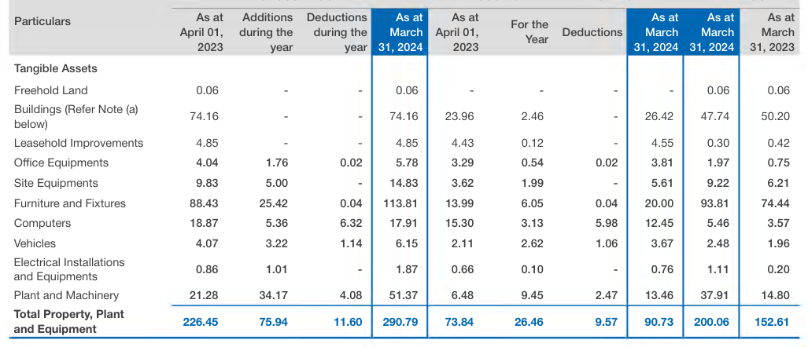

**[Image: AnnualReport2024.pdf-0175-07.png (1027x442, 154.5KB)]**

<!-- Start of picture text -->
Particulars As at  Additions  Deductions  As at  As at  For the   As at   As at   As at April 01,  during the  during the  March  April 01,  Deductions March  March  March Year 2023 year year 31, 2024 2023  31, 2024  31, 2024  31, 2023 Tangible Assets Freehold Land  0.06   -   -   0.06   -   -   -   -   0.06   0.06 Buildings (Refer Note (a)  74.16   -   -   74.16   23.96   2.46   -   26.42   47.74   50.20 below) Leasehold Improvements  4.85   -   -   4.85   4.43   0.12   -   4.55   0.30   0.42 Office Equipments  4.04   1.76   0.02   5.78   3.29   0.54   0.02   3.81   1.97   0.75 Site Equipments  9.83   5.00   -   14.83   3.62   1.99   -   5.61   9.22   6.21 Furniture and Fixtures  88.43   25.42   0.04   113.81   13.99   6.05   0.04   20.00   93.81   74.44 Computers  18.87   5.36   6.32   17.91   15.30   3.13   5.98   12.45   5.46   3.57 Vehicles  4.07   3.22   1.14   6.15   2.11   2.62   1.06   3.67   2.48   1.96 Electrical Installations  0.86   1.01   -   1.87   0.66   0.10   -   0.76   1.11   0.20 and Equipments Plant and Machinery  21.28   34.17   4.08   51.37   6.48   9.45   2.47   13.46   37.91   14.80 Total Property, Plant  226.45   75.94   11.60   290.79   73.84   26.46   9.57   90.73   200.06   152.61 and Equipment <!-- End of picture text -->

|||**GROSS**|**BLOCK**||**ACC**|**UMULATED**|**DEPRECIATI**|**ON**|**NET B**|**LOCK**|
|---|---|---|---|---|---|---|---|---|---|---|
|**Particulars**|**As at** **April 01,** **2022**|**Additions** **during the** **year**|**Deductions** **during the** **year**|**As at** **March** **31, 2023**|**As at** **April 01,** **2022**|**For the** **Year**|**Deductions**|**As at** **March** **31, 2023**|**As at** **March** **31, 2023**|**As at** **March** **31, 2022**|
|Tangible Assets|||||||||||
|Freehold Land|0.06|-|-|0.06|-|-|-|-|0.06|0.06|
|Buildings (Refer Note (a) below)|74.16|-|-|74.16|21.37|2.59|-|23.96|50.20|52.79|
|Leasehold Improvements|5.85|-|1.00|4.85|5.31|0.12|1.00|4.43|0.42|0.54|
|Ofce Equipments|3.66|0.46|0.08|4.04|3.02|0.34|0.07|3.29|0.75|0.64|
|Site Equipments|8.32|1.51|-|9.83|1.46|2.16|-|3.62|6.21|6.86|
|Furniture and Fixtures|48.07|40.42|0.06|88.43|10.42|3.63|0.06|13.99|74.44|37.65|
|Computers|19.06|2.53|2.72|18.87|15.58|2.27|2.55|15.30|3.57|3.48|
|Vehicles|3.01|2.87|1.81|4.07|2.21|1.36|1.46|2.11|1.96|0.80|
|Electrical Installations and Equipments|0.85|0.01|-|0.86|0.59|0.07|-|0.66|0.20|0.26|
|Plant and Machinery|6.86|18.87|4.45|21.28|1.68|6.15|1.35|6.48|14.80|5.18|
|**Total Property, Plant** **and Equipment**|**169.90**|**66.67**|**10.12**|**226.45**|**61.64**|**18.69**|**6.49**|**73.84**|**152.61**|**108.26**|

**[Image: AnnualReport2024.pdf-0175-09.png (1027x24, 3.6KB)]**

(a) Of the above, a Building carrying value INR 41.85 Crore (Previous Year: INR 44.00 Crore) is subject to first charge for secured bank loans (Refer Note 25). 

###### Notes Forming Part of Standalone Financial Statements 

For the year ended March 31, 2024 

(Currency in INR Crore) 

###### 3 CAPITAL WORK-IN-PROGRESS (CWIP) (Continued) 

|Pil|Property, P Equipm|lant and ent|Investment|Property|Tot|al|
|---|---|---|---|---|---|---|
|artcuars|March 31,|March 31,|March 31,|March 31,|March 31,|March 31,|
||2024|2023|2024|2023|2024|2023|
|Opening capital work in progress|27.52|-|70.67|21.25|98.19|21.25|
|Add: Addition during the year|10.55|27.52|41.65|49.42|52.20|76.94|
|Add: Transferred from Inventories|88.92|-|-|-|88.92|-|
|(Refer Note (d) below)|||||||
|Less: Capitalised during the year|7.45|-|-|-|7.45|-|
|Closing capital work in progress|119.54|27.52|112.32|70.67|231.86|98.19|

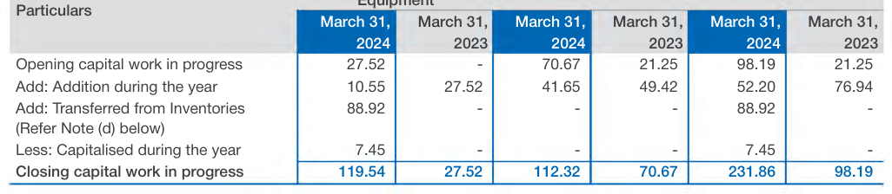

**[Image: AnnualReport2024.pdf-0175-16.png (1026x224, 116.1KB)]**

<!-- Start of picture text -->
Particulars March 31,  March 31,  March 31,  March 31,  March 31,  March 31, 2024  2023 2024 2023 2024 2023 Opening capital work in progress  27.52   -   70.67   21.25   98.19   21.25 Add: Addition during the year  10.55   27.52   41.65   49.42   52.20   76.94 Add: Transferred from Inventories    88.92   -   -   -   88.92   - (Refer Note (d) below) Less: Capitalised during the year  7.45   -   -   -   7.45   - Closing capital work in progress   119.54   27.52   112.32   70.67   231.86   98.19 <!-- End of picture text -->

- (a) Ageing schedule as at March 31, 2024 

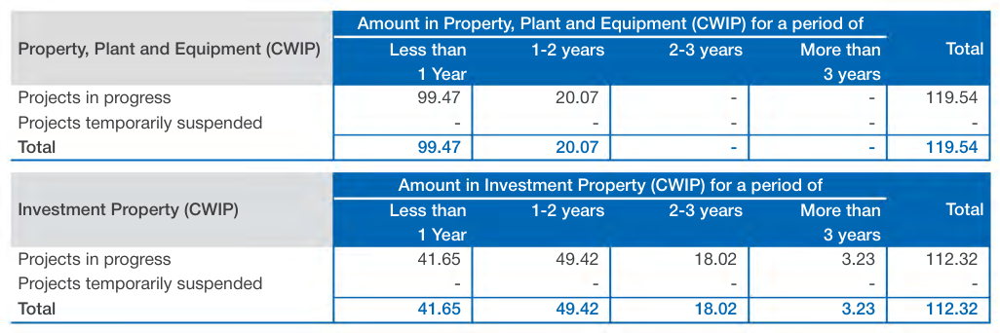

**[Image: AnnualReport2024.pdf-0175-18.png (1026x342, 176.1KB)]**

<!-- Start of picture text -->
Amount in Property, Plant and Equipment (CWIP) for a period of Property, Plant and Equipment (CWIP)  Less than  1-2 years  2-3 years  More than  Total 1 Year  3 years Projects in progress  99.47   20.07   -   -   119.54 Projects temporarily suspended  -   -   -   -   - Total  99.47   20.07   -   -   119.54 Amount in Investment Property (CWIP) for a period of Investment Property (CWIP)  Less than  1-2 years  2-3 years  More than  Total 1 Year  3 years Projects in progress  41.65   49.42   18.02   3.23   112.32 Projects temporarily suspended  -   -   -   -   - Total  41.65   49.42   18.02   3.23   112.32 <!-- End of picture text -->

|Property, Plant and Equipment (CWIP)|Less than 1 Year|1-2 years|2-3 years|More than 3 years|Total|
|---|---|---|---|---|---|
|Projects in progress|99.47|20.07|-|-|119.54|
|Projects temporarily suspended|-|-|-|-|-|
|Total|99.47|20.07|-|-|119.54|
|Investment Property (CWIP)|Amount in In Less than 1 Year|vestment Propert 1-2 years|y (CWIP) for a pe 2-3 years|riod of More than 3 years|Total|
|Projects in progress|41.65|49.42|18.02|3.23|112.32|
|Projects temporarily suspended|-|-|-|-|-|
|Total|41.65|49.42|18.02|3.23|112.32|
|b) Ageing schedule as at March 31, 2023|Amount in Propert|y, Plant and Equi|pment (CWIP) for|a period of||
|Property, Plant and Equipment (CWIP)|Less than|1-2 years|2-3 years|More than|Total|
||1 Year|||3 years||
|Projects in progress|27.52|-|-|-|27.52|
|Projects temporarily suspended|-|-|-|-|-|
|Total|27.52|-|-|-|27.52|
||Amount in In|vestment Propert|y (CWIP) for a pe|riod of||
|Investment Property (CWIP)|Less than|1-2 years|2-3 years|More than|Total|
||1 Year|||3 years||
|Projects in progress|49.42|18.02|3.23|-|70.67|
|Projects temporarily suspended|-|-|-|-|-|
|Total|49.42|18.02|3.23|-|70.67|

- (b) Ageing schedule as at March 31, 2023 

**[Image: AnnualReport2024.pdf-0175-21.png (1026x24, 2.6KB)]**

**[Image: AnnualReport2024.pdf-0175-22.png (1026x24, 3.6KB)]**

- (c) The Company’s investment property under construction consists of some commercial and retail properties in India. 

- (d) Based on the intention and business plans, part of residential property under development in Mumbai, is considered for Company’s own use once completed, rather than for sale. Accordingly, the Company has re-classified the same from Inventories to Capital work in progress. 

- (e) The Company has no restriction on the realisability of its investment property under construction. 

- (f) Though the Company measures investment property under construction using cost based measurement, the fair value of investment property under development is based on valuation performed by an accredited independent valuer who has relevant valuation experience for similar office properties and is a registered valuer as defined under rule 2 of Companies (Registered Valuers and Valuation) Rules, 2017. The main inputs used are location and locality, facilities and amenities, quality of construction, residual life of building, business potential, supply and demand, local nearby enquiry, market feedback of investigation and Ready Reckoner published by the Government. 

Godrej Properties Limited 

Integrated Report 2023-24 

340 

341 

About Godrej Integrating Sustainability Management Discussion Statutory Properties Limited with our Business and Analysis Reports 

Notes Forming Part of Standalone Financial Statements For the year ended March 31, 2024 

**[Image: AnnualReport2024.pdf-0176-02.png (82x27, 2.2KB)]**

###### Notes Forming Part of Standalone Financial Statements 

(Currency in INR Crore) 

###### 3 CAPITAL WORK-IN-PROGRESS (CWIP) (continued) 

- (g) Fair valuation of an investment property under construction is based on Cost method which is INR 112.32 Crore (Previous Year: INR 70.67 Crore). The fair value measurement is categorised in level 3 fair value hierarchy. 

- (h) Refer Note 50 for disclosure of Capital Commitments for acquisition of property, plant and equipment and investment property. 

###### 4 INVESTMENT PROPERTY 

###### Reconciliation of Carrying Amount 

|Particulars||Amount|
|---|---|---|
|Gross Block|||
|As at April 01, 2022||36.27|
|Add: Additions during the year||-|
|Less: Disposals/Adjustments||-|
|As at March 31, 2023||36.27|
|As at April 01, 2023||36.27|
|Add: Additions during the year||-|
|Less: Disposals/Adjustments||-|
|As at March 31, 2024||36.27|
|Accumulated Depreciation|||
|As at April 01, 2022||2.24|
|Add: For the Year||1.85|
|Less: Deductions during the year||-|
|As at March 31, 2023||4.09|
|As at April 01, 2023||4.09|
|Add: For the Year||1.70|
|Less: Deductions during the year||-|
|As at March 31, 2024||5.79|
|Net Block|||
|As at March 31, 2023||32.19|
|As at March 31, 2024||30.48|
|nformation regarding income and expenditure of Investment Property Particulars|March 31, 2024|March 31, 2023|
|Rental Income derived from Investment Property|3.37|1.26|
|Direct Operating Expenses |-|-|
|Proft arising from investment property before depreciation|3.37|1.26|
|Less: Depreciation |1.70|1.85|
|Proft/(Loss) arising from Investment Property|**1.67**|**(0.59)**|

**[Image: AnnualReport2024.pdf-0176-11.png (177x24, 2.1KB)]**

**[Image: AnnualReport2024.pdf-0176-12.png (177x24, 2.1KB)]**

Information regarding income and expenditure of Investment Property 

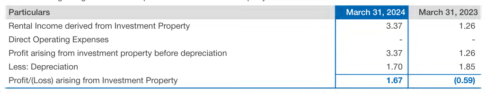

**[Image: AnnualReport2024.pdf-0176-14.png (1027x198, 58.2KB)]**

<!-- Start of picture text -->
Particulars March 31, 2024 March 31, 2023 Rental Income derived from Investment Property  3.37   1.26 Direct Operating Expenses  -   -  3.37   1.26 Profit arising from investment property before depreciation Less: Depreciation  1.70   1.85 Profit/(Loss) arising from Investment Property  1.67   (0.59) <!-- End of picture text -->

For the year ended March 31, 2024 

(Currency in INR Crore) 

###### 4 INVESTMENT PROPERTY (continued) 

- (c)  Though the Company measures investment property using cost based measurement, the fair value of investment property is based on valuation performed by an accredited independent valuer who has relevant valuation experience for similar office properties and is a registered valuer as defined under rule 2 of Companies (Registered Valuers and Valuation) Rules, 2017. The main inputs used are location and locality, facilities and amenities, quality of construction, residual life of building, business potential, supply and demand, local nearby enquiry, market feedback of investigation and Ready Reckoner published by the Government. 

- (d)  Fair valuation of Retail Properties is based on Sales Comparison Method which is INR 30.01 Crore (Previous Year: INR 28.85 Crore) and Commercial Properties is based on Sales Comparison Method, which is INR 30.25 Crore (Previous Year: INR 29.78 Crore). The fair value measurement is categorised in level 3 fair value hierarchy. 

###### 5 INTANGIBLE ASSETS AND INTANGIBLE ASSETS UNDER DEVELOPMENT 

|||GROSS|BLOCK||ACC|UMULATED|AMORTISATI|ON|NET B|LOCK|
|---|---|---|---|---|---|---|---|---|---|---|
|Particulars|As at April 01, 2023|Additions during the year|Deductions during the year|As at March 31, 2024|As at April 01, 2023|For the Year|Deductions|As at March 31, 2024|As at March 31, 2024|As at March 31, 2023|
|Licenses and Software|10.88|2.08|0.75|12.21|7.45|1.12|0.71|7.86|4.35|3.43|
|Trade Mark|20.63|-|-|20.63|8.88|1.16|-|10.04|10.59|11.75|
|Total Intangible Assets|31.51|2.08|0.75|32.84|16.33|2.28|0.71|17.90|14.94|15.18|
|||GROSS|BLOCK||ACC|UMULATED|AMORTISATI|ON|NET B|LOCK|
|Particulars|As at April 01, 2022|Additions during the year|Deductions during the year|As at March 31, 2023|As at April 01, 2022|For the Year|Deductions|As at March 31, 2023|As at March 31, 2023|As at March 31, 2022|
|Licenses and Software|14.54|0.18|3.84|10.88|10.09|1.17|3.81|7.45|3.43|4.45|
|Trade Mark|24.53|-|3.90|20.63|9.45|1.30|1.87|8.88|11.75|15.08|
|Total Intangible Assets|**39.07**|**0.18**|**7.74**|**31.51**|**19.54**|**2.48**|**5.69**|**16.33**|**15.18**|**19.53**|

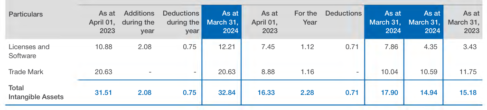

**[Image: AnnualReport2024.pdf-0176-22.png (1026x233, 109.7KB)]**

<!-- Start of picture text -->
Particulars  As at  Additions   Deductions   As at   As at   For the   Deductions   As at   As at   As at April 01,  during the  during the  March 31,  April 01,  Year  March 31,  March 31,  March 31, 2023  year  year  2024 2023  2024  2024  2023 Licenses and   10.88   2.08   0.75   12.21   7.45   1.12   0.71   7.86   4.35   3.43 Software Trade Mark  20.63   -   -   20.63   8.88   1.16   -   10.04   10.59   11.75 Total  31.51   2.08   0.75   32.84   16.33   2.28   0.71   17.90   14.94   15.18 Intangible Assets <!-- End of picture text -->

**[Image: AnnualReport2024.pdf-0176-23.png (1026x24, 2.0KB)]**

###### **Intangible assets under development (Refer Note (a) below)** 

|Particulars|As at March 31, 2024|As at March 31, 2023|
|---|---|---|
|Opening balance|0.85|0.79|
|Add: Addition during the year|0.35|0.06|
|Closing balance|1.20|0.85|

   - (a) Refer Note 50 for disclosure of Capital Commitments for acquisition of intangible assets under development. 

- (a)  The Company’s investment property consists of some commercial and retail properties in India. 

- (b)  The Company has no restriction on the realisability of its investment property and no contractual obligations to purchase, construct or develop investment properties or for repairs, maintenance and enhancements. 

Godrej Properties Limited 

Integrated Report 2023-24 

342 

343 

About Godrej Integrating Sustainability Properties Limited with our Business 

Management Discussion Statutory and Analysis Reports 

###### Notes Forming Part of Standalone Financial Statements 

For the year ended March 31, 2024 

(Currency in INR Crore) 

###### 5 INTANGIBLE ASSETS AND INTANGIBLE ASSETS UNDER DEVELOPMENT (continued) 

###### **(b) Ageing schedule as at March 31, 2024** 

|Intangible assets under development Less than 1 Year 1-2 years|2-3 years|More 3|than years|Total|
|---|---|---|---|---|
|Projects in progress 0.35 0.30|0.55||-|1.20|
|Projects temporarily suspended - -|-||-|-|
|Total 0.35 0.30|0.55||-|1.20|
|c) Ageing schedule as at March 31, 2023 Amount in Intangible assets under|development f|or a period|of||
|Intangible assets under development Less than 1-2 years|2-3 years|More|than|Total|
|1 Year||3|years||
|Projects in progress 0.30 0.55|-||-|0.85|
|Projects temporarily suspended - -|-||-|-|
|Total 0.30 0.55|-||-|0.85|
| INVESTMENT IN SUBSIDIARIES, JOINT VENTURES AND ASSO Particulars|CIATE Marc|h 31, 2024|Marc|h 31, 2023|
|a)  Investment in Equity Instruments  (Fully Paid-up unless stated otherwise) (Unquoted)|||||
|(i) Investment in Subsidiary Companies|||||
|Godrej Projects Development Limited 231,552 (Previous Year: 231,552) Equity Shares of INR 10/- each||248.69||248.69|
|Godrej Garden City Properties Private Limited||0.05||0.05|
|50,000 (Previous Year: 50,000) Equity Shares of INR 10/- each|||||
|Godrej Hillside Properties Private Limited||0.41||0.41|
|410,000 (Previous Year: 410,000) Equity Shares of INR 10/- each|||||
|Godrej Home Developers Private Limited||0.40||0.40|
|400,000 (Previous Year: 400,000) Equity Shares of INR 10/- each|||||
|Godrej Highrises Properties Private Limited||0.01||0.01|
|10,000 (Previous Year: 10,000) Equity Shares of INR 10/- each|||||
|Godrej Prakriti Facilities Private Limited||0.01||0.01|
|10,000 (Previous Year: 10,000) Equity Shares of INR 10/- each|||||
|Prakritiplaza Facilities Management Private Limited||0.01||0.01|
|9,999 (Previous Year: 9,999) Equity Shares of INR 10/- each|||||
|Citystar Infraprojects Limited||0.09||0.09|
|500,000 (Previous Year: 500,000) Equity Shares of INR 1/- each|||||

(c) Ageing schedule as at March 31, 2023 

###### 6 INVESTMENT IN SUBSIDIARIES, JOINT VENTURES AND ASSOCIATE 

###### Notes Forming Part of Standalone Financial Statements 

For the year ended March 31, 2024 

(Currency in INR Crore) 

###### 6 INVESTMENT IN SUBSIDIARIES, JOINT VENTURES AND ASSOCIATE (continued) 

|Particulars M|arch 31, 2024|March 31, 2023|
|---|---|---|
|Godrej Residency Private Limited|0.00|0.00|
|4,901 (Previous Year: 4,901 Equity Shares of INR 10/- each) Equity Shares of INR 1/- each|||
|Godrej Properties Worldwide Inc., USA|-|3.39|
|Dissolved w.e.f February 02, 2024 (Previous Year: 500,000 Equity Shares of USD 1/- each)|||
|Godrej Green Woods Private Limited|64.00|64.00|
|64,000,000 (Previous Year: 64,000,000) Equity Shares of INR 10/- each|||
|Godrej Precast Construction Private Limited 10,000 (Previous Year: 10,000) Equity Shares of INR 10/- each|0.01|0.01|
|Godrej Realty Private Limited 1,734,999  (Previous Year: 1,734,999) Equity Shares of INR 10/- each (Net of Provision for Expected Credit Loss in value of INR 5.52 Crore (Previous Year: INR 5.52 Crore))|-|-|
|Godrej Living Private Limited 990 (Previous Year: 990) Equity Shares of INR 10/- each|0.00|0.00|
|Godrej Home Constructions Limited(classifed as Joint Venture up to March 28, 2023) (Formerly known as Godrej Home Construction Private Limited)|62.49|47.50|
|85,209,950 (Previous Year: 63,055,357) Equity Shares of INR 10/- each (Net of Provision for Expected Credit Loss in value of INR 24.27 Crore (Previous Year: INR 24.27 Crore))|||
|Ashank Land & Building Private Limited(w.e.f. May 19, 2022) 500 (Previous Year: 500) Equity Shares of INR 10/- each|0.00|0.00|
|Wonder City Buildcon Limited(classifed as Joint Venture up to March 28, 2023) (Formerly known as Wonder City Buildcon Private Limited) 111,621,260 (Previous Year: 82,599,726) Equity Shares of INR 10/- each (Net of Provision for Expected Credit Loss in value of INR NIL (Previous Year: INR 32.05 Crore))|33.69|0.85|
|Godrej Skyline Developers Private Limited(classifed as Subsidiary w.e.f. September 28,2023) 647,500 (Previous Year: Nil) Equity Shares of INR 10/- each|0.65|-|
|Godrej Real Estate Distribution Company Private Limited (w.e.f. July 20, 2023) 1,000 (Previous Year: Nil) equity shares of INR 10/- each.|0.00|-|
|INR 0.00 represents amount less than INR 50,000|||

Godrej Properties Limited 

Integrated Report 2023-24 

344 

345 

About Godrej Integrating Sustainability Management Discussion Statutory Properties Limited with our Business and Analysis Reports 

###### Notes Forming Part of Standalone Financial Statements 

For the year ended March 31, 2024 

(Currency in INR Crore) 

###### 6 INVESTMENT IN SUBSIDIARIES, JOINT VENTURES AND ASSOCIATE (Continued) 

|Particulars March 31, 2024|March 31, 2023|
|---|---|
|(ii) Investment in  Joint Ventures||
|Wonder Projects Development Private Limited 5.15|5.15|
|21,401,200 (Previous Year: 21,401,200) Equity Shares of INR 10/- each (Net of Provision for Expected Credit Loss in value of INR 23.85 Crore||
|(PreviousYear: 23.85 Crore))||
|Godrej Real View Developers Private Limited 45.18|27.25|
|41,432,000 (Previous Year: 29,954,000) Equity Shares of INR 10/- each||
|Pearlite Real Properties Private Limited 4.19|4.18|
|3,871,000 (Previous Year: 3,871,000) Equity Shares of INR 10/- each||
|Godrej Greenview Housing Private  Limited 6.07|6.07|
|19,915,200 (Previous Year: 19,915,200) Equity Shares of INR 10/- each (Net of Provision for Expected Credit Loss in value of INR 21.39 Crore (Previous Year: INR 21.39 Crore))||
|Godrej Green Homes Private Limited 83.18|83.18|
|360,813 (Previous Year: 360,813) Equity Shares of INR 10/- each||
|Godrej Macbricks Private Limited 19.80|19.80|
|21,625,000 (Previous Year: 21,625,000) Equity Shares of INR 10/- each (Net of Provision for Expected Credit Loss in value of INR 2.45 Crore (Previous Year: INR 2.45)||
|Madhuvan Enterprises Private Limited 12.78|8.89|
|105,553,183 (Previous Year: 85,240,683) Equity Shares of INR 1/- each||
|Vivrut Developers Private Limited 22.15|22.15|
|20,577,324 (Previous Year: 20,577,324) Equity Shares of INR 10/- each||
|Yerwada Developers Private Limited 15.25|15.25|
|12,863,813  (Previous Year: 12,863,813 ) Equity Shares of INR 10/- each||
|(iii) Investment in Associate||
|Godrej One Premises Management Private Limited 0.00|0.00|
|3,000 (Previous Year: 3,000) Equity Shares of INR 10/- each||

###### Notes Forming Part of Standalone Financial Statements 

For the year ended March 31, 2024 

(Currency in INR Crore) 

|6 INVESTMENT IN SUBSIDIARIES, JOINT VENTURES AND ASSOCIATE|(Continued)||
|---|---|---|
|Particulars|March 31, 2024|March 31, 2023|
|b)  Investment in Preference Shares (Fully paid-up unless stated otherwise) (Unquoted)|||
|(i) Investment in Subsidiary Companies|||
|Godrej Projects Development Limited|0.10|0.10|
|100,999 (Previous Year: 100,999) 7% Redeemable Non-cumulative Preference Shares of INR 10/- each|||
|Godrej Highrises Properties Private Limited|0.01|0.01|
|9,470 (Previous Year: 9,470) 7% Redeemable Non-cumulative Preference Shares of INR 10/- each|||
|Godrej Skyline Developers Private Limited (classifed as Subsidiary w.e.f.|37.00|-|
|September 28, 2023)|||
|37,000,000 (Previous Year: Nil) 0.01% Redeemable, Non-cumulative Preference Shares of INR 10/- each|||
|INR 0.00 represents amount less than INR 50,000|||
|c) Investment In Limited Liability Partnerships|||
|(i) Investment in Subsidiaries|||
|Godrej Highrises Realty LLP|0.00|0.00|
|Godrej Project Developers & Properties LLP|0.00|0.00|
|Godrej Athenmark LLP |0.00|0.00|
|Godrej Vestamark LLP (Classifed as Subsidiary w.e.f  June 23, 2023)|296.50|-|
| Godrej Reserve LLP (Classifed as subsidiary w.e.f. October 01, 2022)|0.01|0.01|
|Godrej Skyview LLP|0.00|0.00|
|Godrej Green Properties LLP|0.00|0.00|
|Godrej Property Developers LLP|-|-|
| (Classifed as Subsidiary from February 07, 2024 to February 29, 2024)|||
|Godrej Projects (Soma) LLP|0.00|0.00|
|Godrej City Facilities Management LLP|0.00|0.00|
|Ashank Realty Management LLP|0.00|0.00|
|Godrej Florentine LLP|0.95|0.95|
|Godrej Olympia LLP|0.00|0.00|
|Ashank Facility Management LLP|0.25|0.00|
|Godrej Construction Projects LLP|0.01|0.01|
|Oasis Landmarks LLP|0.00|0.00|
|Maan-Hinje Township Developers LLP |42.67|336.57|
|(classifed as Joint Venture up to March 28, 2023) |||
|Caroa Properties LLP (Classifed as Subsidiary w.e.f. March 28, 2024)|0.04|-|
|Dream World Landmarks LLP |0.04|-|
|(Classifed as Subsidiary w.e.f. September 30, 2023)|||

Godrej Properties Limited 

Integrated Report 2023-24 

346 

347 

About Godrej Integrating Sustainability Management Discussion Statutory Properties Limited with our Business and Analysis Reports 

###### Notes Forming Part of Standalone Financial Statements 

For the year ended March 31, 2024 

(Currency in INR Crore) 

|6 INVESTMENT IN SUBSIDIARIES, JOINT VENTURES AND ASSOCIATE|(Continued)||
|---|---|---|
|Particulars|March 31, 2024|March 31, 2023|
|(ii) Investment In Joint Ventures|||
|Mosiac Landmarks LLP|0.11|0.11|
|Caroa Properties LLP (Classifed as Subsidiary w.e.f. March 28, 2024)|-|0.04|
|Oxford Realty LLP|0.00|0.00|
|A R Landcraft LLP|0.05|0.05|
|Dream World Landmarks LLP |-|0.04|
|(Classifed as Subsidiary w.e.f. September 30, 2023)|||
|M S Ramaiah Ventures LLP|1.01|1.01|
|Godrej Developers & Properties LLP|0.00|0.00|
|Godrej SSPDL Green Acres LLP|0.05|0.05|
|Godrej Amitis Developers LLP|0.05|0.05|
|Godrej Housing Projects LLP|0.01|0.01|
|Godrej Projects North Star LLP|0.01|0.01|
|Manyata Industrial Parks LLP |0.01|0.01|
|Godrej Property Developers LLP  (Classifed as Subsidiary w.e.f. February 07, 2024)|-|-|
|Manjari Housing Projects LLP|210.00|210.00|
|Prakhhyat Dwellings LLP|0.01|0.01|
|Godrej Highview LLP|4.80|4.80|
|Godrej Irismark LLP|0.01|0.01|
|Roseberry Estate LLP|0.00|0.00|
|Mahalunge Township Developers LLP|240.21|288.81|
|Embellish Houses LLP |0.04|0.04|
|Godrej Vestamark LLP (Classifed as Subsidiary w.e.f  June 23, 2023)|-|196.50|
|Universal Metro Properties LLP|0.00|0.00|
|Godrej Odyssey LLP|0.00|0.00|
|Godrej Projects North LLP|30.00|30.00|
||**1,488.21**|**1,626.53**|
|Aggregate amount of Unquoted Investments|1,488.21|1,626.53|
|Aggregate amount of Provision for expected credit loss on investments|77.48|109.53|
|INR 0.00 represents amount less than INR 50,000|||

7 OTHER INVESTMENTS (NON-CURRENT) 

Particulars March 31, 2024 March 31, 2023 a)  Trade Investments (Unquoted) (i) Investment in Debentures of Subsidiary (Fully paid-up) (at Fair Value through Profit or Loss) Godrej Realty Private Limited - - 5,860,971 (Previous Year: 5,860,971) 1% Secured Redeemable Optionally Convertible Debentures of INR 10/- each (Net of Provision for Expected Credit Loss in value of INR 2.99 Crore (Previous Year: INR 2.99 Crore)) 

###### Notes Forming Part of Standalone Financial Statements 

For the year ended March 31, 2024 

(Currency in INR Crore) 

###### 7 OTHER INVESTMENTS (NON-CURRENT) (Continued) 

|Particulars M|arch 31, 2024|March 31, 2023|
|---|---|---|
|(ii) Investment in Debentures of Subsidiary (Fully paid-up) (at Cost)|||
|Godrej Highrises Properties Private Limited|725.00|-|
|7,250,000 (Previous Year: Nil) 0% Unsecured Optionally convertible debentures of ₹1000/- each|||
|(iii) Investment in Debentures of Joint Ventures (Fully paid-up) (at Fair Value through Proft or Loss)|||
|Godrej Green Homes Private Limited|331.80|331.80|
|3,318,000 (Previous Year: 3,318,000) 12 % Unsecured Optionally Convertible Debentures of INR 1,000/- each|||
|Madhuvan Enterprises Private Limited|38.32|26.62|
|3,835,473 (Previous Year: 2,665,473) 12% Unsecured Optionally Convertible Debentures of INR 1,000/- each|||
|Vivrut Developers Private Limited|66.45|66.45|
|664,500 (Previous Year: 664,500) 12% Unsecured Optionally Convertible Debentures of INR 1,000/- each|||
|Yerwada Developers Private Limited|45.75|45.75|
|4,75,500 (Previous Year: 4,75,500) 12% Unsecured Compulsorily Convertible Debentures of INR 1,000/- each|||
|Godrej Real View Developers Private Limited|3.38|21.06|
|34,200 (Previous Year: 213,560) 12% Unsecured Compulsorily Convertible Debentures of INR 1,000/- each|||
|(179,360 12% Unsecured Compulsorily Convertible Debentures Converted into Equity during the year)|||
|Godrej Macbricks Private Limited|21.88|22.19|
|237,500 (Previous Year: 237,500) 12% Unsecured Compulsorily Convertible Debentures of INR 1,000/- each  (Net of Provision for Expected Credit Loss in value of INR 1.50 Crore (Previous Year: INR 1.50 Crore)|||
|b)  Non trade Investments|||
|Investment in Fully paid-up Equity Instruments (at Fair Value through Proft or Loss)|||
|Quoted Investments|||
|Ansal Buildwell Limited|0.00|0.00|
|100 (Previous Year: 100) Equity Shares of INR 10/- each|||
|Ansal Housing Limited|0.00|0.00|
|300 (Previous Year: 300) Equity Shares of INR 10/-each|||
|Ansal Properties and Infrastructure Limited|0.00|0.00|
|600 (Previous Year: 600) Equity Shares of INR 5/- each|||

Godrej Properties Limited 

Integrated Report 2023-24 

348 

349 

About Godrej Integrating Sustainability Management Discussion Statutory Properties Limited with our Business and Analysis Reports 

###### Notes Forming Part of Standalone Financial Statements 

###### For the year ended March 31, 2024 

(Currency in INR Crore) 

###### 7 OTHER INVESTMENTS (NON-CURRENT) (Continued) 

|Particulars|March 31, 2024|March 31, 2023|
|---|---|---|
|Unitech Limited|0.00|0.00|
|13,000 (Previous Year: 13,000) Equity Shares of INR 2/- each|||
|The Great Eastern Shipping Company Limited|0.00|0.00|
|72 (Previous Year: 72) Equity Shares of INR 10/- each|||
|Radhe Developers (India) Limited|0.00|0.00|
|100 (Previous Year: 100) Equity Shares  of INR 10/- each|||
|United Textiles Limited|0.00|0.00|
|23,700 (Previous Year: 23,700) Equity Shares of INR 10/- each|||
|**Unquoted Investments**|||
|Saraswat Co-operative Bank Limited|0.00|0.00|
|1,000 (Previous Year: 1,000) Equity Shares of INR 10/- each|||
|AB Corp  Limited|0.00|0.00|
|25,000 (Previous Year: 25,000) Equity Shares of INR 10/- each|||
|Lok Housing and Constructions Limited|0.00|0.00|
|100 (Previous Year: 100) Equity Shares of INR 10/- each|||
|Global Infrastructure & Technologies Limited|0.00|0.00|
|100 (Previous Year: 100) Equity Shares of INR 10/- each|||
|Premier Energy and Infrastructure Limited|0.00|0.00|
|100 (Previous Year: 100) Equity Shares of INR 10/- each|||
|D.S. Kulkarni Developers Limited|0.00|0.00|
|100 (Previous Year: 100) Equity Shares of INR 10/- each|||
|GOL Offshore Limited|0.00|0.00|
|18 (Previous Year: 18) Equity Shares of INR 10/- each|||
|Modella Textiles Private Limited|0.00|0.00|
|2 (Previous Year: 2) Equity Shares of INR 100/- each|||
|Lotus Green Construction Private Limited|0.00|0.00|
|1 (Previous Year: 1) Equity Shares of INR 10/- each|||
|Alacrity Housing Limited|0.00|0.00|
|100 (Previous Year: 100) Equity Shares of INR 10/- each|1,232.58|513.87|
|Aggregate amount of Quoted Investments and Market Value thereof|0.00|0.00|
|Aggregate amount of Unquoted Investments|1,232.58|513.87|
|Aggregate amount of Provision for expected credit loss on investments|4.49|4.49|

INR 0.00 represents amount less than INR 50,000 

###### Notes Forming Part of Standalone Financial Statements 

For the year ended March 31, 2024 

(Currency in INR Crore) 

###### 8 TRADE RECEIVABLES (NON-CURRENT) 

|Particulars|March 31, 2024|March 31, 2023|
|---|---|---|
|To related parties|||
|Unsecured, Considered Good|104.04|96.44|
|To parties other than related parties|||
|Unsecured, Considered Good|-|-|
||**104.04**|**96.44**|

###### (a) Trade Receivables ageing schedule as at March 31, 2024 

|Par|ticulars|Not due|Less than 6 months|6 months - 1 year|1-2 years|2-3 years|More than 3 years|Total|
|---|---|---|---|---|---|---|---|---|
|(i)|Undisputed Trade Receivables – considered good|104.04|-|-|-|-|-|104.04|
|(ii)|Undisputed Trade Receivables – which have signifcant increase in credit risk|-|-|-|-|-|-|-|
|(iii)|Undisputed Trade Receivables – credit impaired|-|-|-|-|-|-|-|
|(iv)|Disputed Trade Receivables – considered good*|-|-|-|-|-|-|-|
|(v)|Disputed Trade Receivables – which have signifcant increase in credit risk*|-|-|-|-|-|-|-|
|(vi)|Disputed Trade Receivables – credit impaired*|-|-|-|-|-|-|-|
||Total|**10404**|**-**|**-**|**-**|**-**|**-**|**10404**|
|b) |Trade Receivables ageing schedule |**.** as at Mar | ch 31, 2023 Outstanding | for following | periods fro | m due date o | f payment |**.** |
|Par|iculars|Not due|Less than|6 months -|1-2 years|2-3 years|More than|Total|
||||6 months|1 year|||3 years||
|(i)|Undisputed Trade Receivables – considered good|96.44|-|-|-|-|-|96.44|
|(ii)|Undisputed Trade Receivables – which have signifcant increase in credit risk|-|-|-|-|-|-|-|
|(iii)|Undisputed Trade Receivables – credit impaired|-|-|-|-|-|-|-|
|(iv)|Disputed Trade Receivables – considered good*|-|-|-|-|-|-|-|
|(v)|Disputed Trade Receivables – which have signifcant increase in credit risk*|-|-|-|-|-|-|-|
|(vi)|Disputed Trade Receivables – credit impaired*|-|-|-|-|-|-|-|
||Total|96.44|-|-|-|-|-|96.44|

###### (b) Trade Receivables ageing schedule as at March 31, 2023 

###### 9 LOANS (NON-CURRENT) 

|Particulars|March 31, 2024|March 31, 2023|
|---|---|---|
|Unsecured, Considered Good|||
|To related parties|||
|Loan to Related Parties|683.24|1,117.65|
||683.24|1,117.65|

Godrej Properties Limited 

Integrated Report 2023-24 

350 

351 

About Godrej Integrating Sustainability Management Discussion Statutory Properties Limited with our Business and Analysis Reports 

(Currency in INR Crore) 

###### Notes Forming Part of Standalone Financial Statements 

###### For the year ended March 31, 2024 

(Currency in INR Crore) 

###### 10 OTHER NON-CURRENT FINANCIAL ASSETS 

|Particulars|March 31, 2024|March 31, 2023|
|---|---|---|
|Unsecured, Considered Good|||
|Deposit With Banks (Refer Note (a) below)|13.43|7.70|
|Others (includes settlement proceed) (Refer Note (b) below)|20.51|29.41|
||33.94|37.11|

- (a) Fixed deposits held as margin money and lien marked for issuing bank guarantees amounting to INR 4.78 Crore (Previous Year: INR 7.40 Crore). 

- (b) Includes entity where directors are interested, viz Godrej Projects Development Limited INR 19.46 (Previous Year: INR 28.31 crore). 

###### 11 DEFERRED TAX ASSETS AND TAX EXPENSE 

|a) Amounts recognised in the Standalone Statement of Proft and Loss|||
|---|---|---|
|Particulars|March 31, 2024|March 31, 2023|
|Current Tax|118.29|183.35|
|Current Tax|124.83|178.90|
|Tax Adjustment of Prior Years|(6.54)|4.45|
|Deferred Tax Charge/ (Credit)|31.61|(8.48)|
|Deferred Tax|||
|Origination and reversal of temporary diference|31.61|(8.48)|
|Tax Expense for the year|149.90|174.87|

###### b) Movement in Deferred Tax Balances 

|Particulars|at April 01, 2023|Recognised in Proft or Loss|Recognised in OCI|Recognised in Other Equity|as at March 31, 2024|
|---|---|---|---|---|---|
|Deferred Tax Assets/ (Liabilities)||||||
|Property, Plant and Equipment|0.42|(0.09)|-|-|0.32|
|(including Right-of-use-Asset)||||||
|Inventories|13.14|(2.91)|-|-|10.23|
|Employee Benefts|30.74|(22.71)|0.38||8.41|
|Equity-settled share-based payments|1.83|0.19|-|-|2.02|
|Investments|(1.48)|(6.25)|-|-|(7.73)|
|Provision for doubtful assets|26.60|(0.66)|-|-|25.95|
|Other Items|31.59|0.82|-|-|32.42|
|Deferred Tax Assets/ (Liabilities)|102.84|(31.61)|0.38|-|71.61|

###### Notes Forming Part of Standalone Financial Statements 

For the year ended March 31, 2024 

###### 11 DEFERRED TAX ASSETS AND TAX EXPENSE (Continued) 

||Balance|Movem|ent during the|year||Balance |
|---|---|---|---|---|---|---|
|Particulars|as at April|Recognised in |Recognised|Recognised|i|as at March n|
||01, 2022|Proft or Loss|in OCI|Other Equ|it|31, 2023 y|
|Deferred Tax Assets/ (Liabilities)|||||||
|Property, Plant and Equipment|0.98|(0.56)|-||-| 0.42|
|(including Right-of-use-Asset)|||||||
|Inventories|13.14|0.00|-||-| 13.14|
|Employee Benefts|48.23|(17.17)|(0.32)||-| 30.74|
| Equity-settled share-based payments|1.18|0.65|-||-| 1.83|
|Investments|(21.38)|19.90|-||-| (1.48)|
|Provision for doubtful assets|18.20|8.40|-||-| 26.60|
|Other Items|34.33|(2.74)|-||-| 31.59|
|Deferred Tax Assets/ (Liabilities)|94.68|8.48|(0.32)||-| 102.84|
|c)  Reconciliation of Effective Tax Rate|||||||
|Particulars |||Ma|rch 31, 2024||March 31, 2023|
|Proft Before Tax||||714.25||830.54|
|Tax using the Company's domestic tax rate 25|.168% (Previ|ous Year: 25.168%)||179.76||209.03|
|Tax effect of:|||||||
|Non-deductible expenses||||(3.51)||3.36|
|Tax-exempt income ||||(16.64)||(26.87)|
|Change in recognised deductible temporary d |iferences|||9.05||0.25|
|(Expense) / Income ofered in tax books (net)||||(12.23)||(15.35)|
|Adjustment for tax of prior years||||(6.54)||4.45|
|Tax expense recognised||||149.90||174.87|

- **d)** The Company has recognised deferred tax asset to the extent that the same will be recoverable using the estimated future taxable income based on the approved business plans and budgets of the Company. The Company is expected to generate taxable income in upcoming years. 

- **e)** Deferred tax assets amounting to INR 24.28 Crore (Previous Year: INR 32.99 Crore) have not been recognised in respect of expected credit loss on investments and other assets due to uncertainty as at the current date with respect to future realisation. 

- **f)** As per the Company’s assessment, there are no material income tax uncertainties over income tax treatments during the current and previous financial year. 

###### 12 OTHER NON-CURRENT NON FINANCIAL ASSETS 

|Particulars|March 31, 2024|March 31, 2023|
|---|---|---|
|To parties other than related parties|||
|Unsecured, Considered Good|||
|Capital advance|-|3.01|
||-|3.01|

Godrej Properties Limited 

Integrated Report 2023-24 

352 

353 

About Godrej Integrating Sustainability Management Discussion Statutory Properties Limited with our Business and Analysis Reports 

###### Notes Forming Part of Standalone Financial Statements 

###### For the year ended March 31, 2024 

(Currency in INR Crore) 

###### 13 INVENTORIES (VALUED AT LOWER OF COST AND NET REALISABLE VALUE) 

|Particulars|March 31, 2024|March 31, 2023|
|---|---|---|
|Raw Material|12.27|19.54|
|Finished Goods (Refer note 58)|180.39|199.76|
|Construction Work in Progress (Refer Note 58)|9,024.32|5,786.83|
||9,216.98|6,006.13|
|4 INVESTMENTS Particulars|March 31, 2024|March 31, 2023|
|Unquoted |||
|Investment in Mutual Funds carried at Fair Value through Proft or Loss|1,664.57|946.15|
||1,664.57|946.15|
|Market Value and Aggregate book value of Unquoted Investments|1,664.57|946.15|

###### 14 INVESTMENTS 

###### 15 TRADE RECEIVABLES (CURRENT) 

|Particulars|March 31, 2024|March 31, 2023|
|---|---|---|
|To related parties|||
|Unsecured, Considered Good|65.69|91.78|
|To parties other than related parties|||
|Unsecured, Considered Good |95.17|64.87|
|Unsecured, signifcant increase in credit risk/credit impaired |45.09|57.04|
|Less: Allowance for signifcant increase in credit risk/credit impaired|(45.09)|(57.04)|
||160.86|156.65|

- (a) Includes entity where directors are interested, viz Godrej Redevelopers (Mumbai) Private Limited INR NIL (Previous Year: INR 0.28 crore). 

###### (b) Trade Receivables ageing schedule as at March 31, 2024 

###### Notes Forming Part of Standalone Financial Statements 

For the year ended March 31, 2024 

(Currency in INR Crore) 

###### 15 TRADE RECEIVABLES (CURRENT) (Continued) 

###### (c) Trade Receivables ageing schedule as at March 31, 2023 

||||Outstanding|for following|periods fro|m due date o|f payment||
|---|---|---|---|---|---|---|---|---|
|Part|iculars|Not due|Less than|6 months -|1-2 years|2-3 years|More than|Total|
||||6 months|1 year|||3 years||
|(i)|Undisputed Trade Receivables – considered good|19.51|84.00|25.15|3.47|2.36|3.36|137.85|
|(ii)|Undisputed Trade Receivables – which have signifcant increase in credit risk|-|-|-|8.25|9.77|18.89|36.91|
|(iii)|Undisputed Trade Receivables – credit impaired|-|-|-|-|-|0.84|0.84|
|(iv)|Disputed Trade Receivables – considered good*|-|-|1.55|7.90|8.87|0.48|18.80|
|(v)|Disputed Trade Receivables – which have signifcant increase in credit risk*|-|-|-|-|-|-|-|
|(vi)|Disputed Trade Receivables – credit impaired*|-|-|-|-|-|19.29|19.29|
||Total|19.51|84.00|26.70|19.62|21.00|42.86|213.69|

*Trade Receivables having legal cases / arbitration have been considered as disputed 

^ Undisputed Trade Receivables – considered good indcludes unbilled revene of INR NIL.(Previous Year 3.19 Cr) 

###### 16 CASH AND CASH EQUIVALENTS 

|Particulars|March 31, 2024|March 31, 2023|
|---|---|---|
|Balances With Banks (Refer Note 61)|||
|In Current Accounts|569.12|95.92|
|In Fixed Deposit Accounts with original maturity less than 3 months|359.16|286.01|
|Cheques On Hand|26.66|3.94|
|Cash On Hand|0.01|0.02|
||954.95|385.89|

###### Particulars 

###### 17 BANK BALANCES OTHER THAN ABOVE 

|(i)|Undisputed Trade Receivables – considered good|15.52|83.48|16.44|3.95|3.56|20.18|143.13|
|---|---|---|---|---|---|---|---|---|
|(ii)|Undisputed Trade Receivables – which have signifcant increase in credit risk|-|-|-|6.46|10.67|20.13|37.26|
|(iii)|Undisputed Trade Receivables – credit impaired|-|-|-|-|0.00|0.33|0.33|
|(iv)|Disputed Trade Receivables – considered good*|-|0.76|0.72|1.35|1.24|13.67|17.74|
|(v)|Disputed Trade Receivables – which have signifcant increase in credit risk *|-|-|-|-|-|-|-|
|(vi)|Disputed Trade Receivables – credit impaired*|-|-|-|-|-|7.49|7.49|
||Total|15.52|84.24|17.16|11.76|15.47|61.80|205.95|

|Particulars|March 31, 2024|March 31, 2023|
|---|---|---|
|Balances With Banks (Refer Note 61)|||
|In Current Accounts (Refer Note (a) below)|0.32|0.32|
|In Fixed Deposit Accounts with maturity more than 3 months but less than 12 months (Refer Note (b) below)|1,260.12|1,230.00|
||1,260.44|1,230.32|

###### (a) Includes 

- (i) Balances with Banks in current accounts includes INR Nil (Previous Year: INR NIL) is on account of earmarked balance for unclaimed dividend. 

- (ii) Balances with Banks in current accounts includes INR 0.88 Crore (Previous Year: INR 0.32 Crore) received from flat buyers towards maintenance charges. 

Godrej Properties Limited 

Integrated Report 2023-24 

354 

355 

About Godrej Integrating Sustainability Management Discussion Statutory Properties Limited with our Business and Analysis Reports 

Notes Forming Part of Standalone Financial Statements For the year ended March 31, 2024 

(Currency in INR Crore) 

###### 17 BANK BALANCES OTHER THAN ABOVE (Continued) 

- (b) Includes 

- (i) INR 43.82 Crore (Previous Year: INR 47.48 Crore) received from flat buyers and held in trust on their behalf in a corpus fund and towards maintenance charges. 

- (ii) Deposits held as Deposit Repayment Reserve amounting to INR 0.07 Crore (Previous Year: INR 0.06 Crore). 

- (iii) Fixed deposits held as margin money and lien marked for issuing bank guarantees amounting to INR 3.33 Crore (Previous Year: INR 0.22 Crore). 

- (iv) Fixed deposit held in Escrow account  amounting to INR 370.50 Crore (Previous Year INR 370.50 Cr) 

###### 18 LOANS (CURRENT) 

|Particulars|March 31, 2024|March 31, 2023|
|---|---|---|
|Unsecured, Considered Good|||
|To related parties|||
|Loan to Related Parties (Refer Note 40(d)(i))|7,528.63|5,258.58|
|To parties other than related parties|||
|Loan to others|139.78|56.39|
||7,668.41|5,314.97|

###### Notes Forming Part of Standalone Financial Statements 

For the year ended March 31, 2024 

(Currency in INR Crore) 

###### 20 OTHER CURRENT NON FINANCIAL ASSETS 

|Particulars|March 31, 2024|March 31, 2023|
|---|---|---|
|Secured, Considered Good|||
|To parties other than related parties|||
|Advance to Suppliers and Contractors (Refer Note (a) below)|4.56|3.90|
|Unsecured, Considered Good|||
|To parties other than related parties|||
|Unbilled Revenue (Refer Note (b) below)|155.00|54.14|
|Balances with Government Authorities|60.97|44.60|
|Advance to Suppliers and Contractors|107.12|44.71|
|Prepayments|18.74|1.81|
|Advance for Land, Development Rights and Flats|233.00|197.39|
|Others (includes deferred brokerage etc.)|358.68|144.68|
||938.07|491.23|

- (a) Advance to Suppliers and Contractors are secured against bank guarantees. 

- (b) Net of provision of INR 6.02 Crore (Previous Year: INR 6.01 Crore). 

###### 21 EQUITY SHARE CAPITAL 

###### 19 OTHER CURRENT FINANCIAL ASSETS 

|Particulars|March 31, 2024|March 31, 2023|
|---|---|---|
|Secured, Considered Good|||
|To parties other than related parties|||
|Deposits - Projects (Refer Note (a) below and 40(d)(i))|116.31|171.48|
|Unsecured, Considered Good|||
|To related parties|||
|Receivable  from LLPs|186.81|125.04|
|Interest Accrued|1,106.45|831.49|
|Deposits - Others (Refer Note (b) below)|2.20|2.20|
|Others (includes expenses recoverable etc.) (Refer Note (c) below)|77.83|24.20|
|To parties other than related parties|||
|Deposits - Others|66.31|73.30|
|Interest Accrued|25.71|41.64|
|Others (includes expenses recoverable etc.)|259.14|312.05|
||1,840.76|1,581.40|

- (a)  Deposits - Projects are secured based on specific rights available with the Company through the respective Development Agreements. 

- (b)  Represents entities where directors are interested, viz Godrej Industries Limited INR 2.16 Crore (Previous Year: INR 2.16 Crore) and Godrej One Premises Management Private Limited INR 0.04 Crore (Previous Year: INR 0.04 Crore). 

- (c)  Includes entity where directors are interested, viz Godrej Projects Development Limited INR 15.20 (Previous Year: INR 10.04 crore). 

|Particulars|March 31, 2024|March 31, 2023|
|---|---|---|
|a) Authorised :|||
|1,338,000,000 Equity Shares  of INR 5/- each (Previous Year: 1,338,000,000 Equity|669.00|669.00|
|Shares of INR 5/- each)|||
||**669.00**|**669.00**|
|b) Issued, Subscribed and Paid-up:|139.02|139.01|
|278,041,474 Equity Shares of INR 5/- each (Previous Year: 278,021,444  Equity Shares of INR 5/- each) fully paid-up|||
||139.02|139.01|

- c)  During the year, the Company has issued 20,030 equity shares (Previous Year: 33,337 equity shares) under the Employee Stock Grant Scheme 2011. 

###### d)  Reconciliation of number of shares outstanding at the beginning and end of the year : 

||March 31,|2024|March 31,|2023|
|---|---|---|---|---|
|Equity Shares :|No. of|INR|No. of|INR|
||Shares|(In Crore)|Shares|(In Crore)|
|Outstanding at the beginning of the year|278,021,444|139.01|277,988,067|138.99|
|Issued during the year|20,030|0.01|33,377|0.02|
|Outstanding at the end of the year|278,041,474|139.02|278,021,444|139.01|

###### e)  Shareholding Information of Holding Company / Ultimate Holding Company 

||March 31,|2024|March 31,|2023|
|---|---|---|---|---|
|Equity Shares are held by:|No. of|INR|No. of|INR|
||Shares|(In Crore)|Shares|(In Crore)|
|Godrej Industries Limited (Holding Company)|131,618,294|65.81|131,618,294|65.81|

Godrej Properties Limited 

Integrated Report 2023-24 

356 

357 

About Godrej Integrating Sustainability Management Discussion Statutory Properties Limited with our Business and Analysis Reports 

###### Notes Forming Part of Standalone Financial Statements 

For the year ended March 31, 2024 

(Currency in INR Crore) 

###### 21 EQUITY SHARE CAPITAL (Continued) 

###### f) Rights, preferences and restrictions attached to Equity shares 

The Company has only one class of equity shares having a par value of INR 5/- per share. Each holder of equity shares is entitled to one vote per share held. The dividend proposed by the Board of Directors is subject to the approval of the Shareholders in the Annual General Meeting except in case of interim dividend. In the event of liquidation, the shareholders are eligible to receive the remaining assets of the Company after distribution of all preferential amounts, in proportion to their shareholding. 

###### g) Shareholders holding more than 5% shares in the Company: 

||March 31, 2|024|March 31,|2023|
|---|---|---|---|---|
|Particulars|No. of|%|No. of|%|
||Shares||Shares||
|Equity shares|||||
|Godrej Industries Limited|131,618,294|47.34%|131,618,294|47.34%|

###### h)  Equity Shares allotted as fully paid-up without payment being received in cash 

The Company has not allotted any equity shares as fully paid-up without payment being received in cash in preceding five years. 

###### i) Promoters Shareholding 

Shares held by Promoters at the end of the March 31, 2024 

|Sr. No.|Promoter Name|No. of Shares|% of total Shares|% change during the year|
|---|---|---|---|---|
|1|Godrej Industries Limited|131,618,294|47.34%|0.00%|
|2|Godrej & Boyce Manufacturing Company Limited|10,650,688|3.83%|0.00%|
|har Sr. No.|es held by Promoters at the end of the March 31, 2023  Promoter Name|No. of Shares|% of total Shares|% change during the year|
|1|Godrej Industries Limited|131,618,294|47.34%|0.05%|
|2|Godrej & Boyce Manufacturing Company Limited|10,650,688|3.83%|0.00%|

###### Shares held by Promoters at the end of the March 31, 2023 

**j)** The Company has 49,447 (Previous year : 49,485) Equity Shares Reserved for Issue Under Employee Stock Grant Scheme 2011 as at Mar 31,2024. (Refer note 42) 

###### 22 Borrowings (Non-Current) 

|**Particulars**|**Maturity Date**|**Terms of repayment**|**March 31, 2024**|**March 31, 2023**|
|---|---|---|---|---|
|**Unsecured Debentures**|||||
|8.25%  75,000 redeemable non-|July 3, 2028|Single Principal|750.00|-|
|convertible debentures (“NCD”) of face||Repayment at the end of|||
|Value INR 1,00,000 each||the Term|||
|8.15%  75,000 redeemable non-|July 3, 2026|Single Principal|750.00|-|
|convertible debentures (“NCD”) of face||Repayment at the end of|||
|Value INR 1,00,000 each||the Term|||
|8.30%  1,00,000 redeemable non-|March 19, 2027|Single Principal|1,000.00|-|
|convertible debentures (“NCD”) of face||Repayment at the end of|||
|Value INR 1,00,000 each||the Term|||
|8.50%  16,000 redeemable non-|September|Single Principal|160.00|-|
|convertible debentures (“NCD”) of face|20, 2028|Repayment at the end of|||
|Value INR 1,00,000 each||the Term|||
||||**2,660.00**|**-**|

###### Notes Forming Part of Standalone Financial Statements 

For the year ended March 31, 2024 

(Currency in INR Crore) 

###### 23 Other Non-Current Financial Liabilities 

|**Particulars** |||**March 31, 2024**|**March 31, 2023**|
|---|---|---|---|---|
|Employee Benefts Payable|||10.68|5.00|
||||**10.68**|**5.00**|
|24 Provisions (Non-Current)|||||
|**Particulars** |||**March 31, 2024** |**March 31, 2023** |
|Provision for Employee Benefts|||||
|Gratuity|||16.71 |14.59 |
||||**16.71** ,|**14.59** |
|INR 0.00 represents amount less than INR 50,000 25 Borrowings (Current)|**Interest**|**Rate p.a**|||
|**Particulars**||**Terms**|**March 31, 2024**|**March 31, 2023**|
||**Maturity Date**|**of repayment**|||
|**Unsecured Debentures**|||||
|7.50% NIL (Previous Year: 10,000) redeemable|July 31, 2023|Single Principal|-|1,000.00|
|non-convertible debentures (“NCD”) of face Value||Repayment|||
|INR 1,000,000 each*||at the end of the Term|||
|**Secured Loans**|||||
|**From Banks**|||||
|Working Capital Loan (Refer Note (a) below)|7.80%-8.45% (Previous Year 6.60%-8.45%)||2,209.33|1,130.46|
|Cash Credit Loan (Refer Note (b) below)|||250.84|12.05|
|**Unsecured Loans**|||||
|**From Banks**|||||
|Overdraft Facilities (Refer Note (c) below)|7.53%-9.10% (Previous Year||13.80|-|
||4.13%-7.90%)||||
|Other Loans (Refer Note (d) below)|||3,797.99|3,073.91|
|**From Others**|7.77%-8.02% (Previous Year 5.40%-7.95%)||||
|Commercial Papers (Refer Note (d) below)|||1,011.19|1,133.54|
|Interest Accrued but not due on Long|||143.37|50.14|
|Term Borrowings|||||
||||7,426.52|6,400.10|

- Redeemed during current year 

Godrej Properties Limited 

Integrated Report 2023-24 

358 

359 

About Godrej Integrating Sustainability Management Discussion Statutory Properties Limited with our Business and Analysis Reports 

**[Image: AnnualReport2024.pdf-0185-01.png (82x27, 2.2KB)]**

###### Notes Forming Part of Standalone Financial Statements 

For the year ended March 31, 2024 

(Currency in INR Crore) 

###### 25 Borrowings (Current) 

- (a) The Working Capital Loan (WCL) of INR 1350.00 Crore from SBI is secured by a primary first charge by way of hypothecation of stock and receivables (Present and future) of the Company and by a collateral of Mortgage of Immovable property (including all fit-outs therein) of the Company at Unit No 5C, on the 5th Floor in Godrej One (along with car parking spaces) at Pirojshanagar, Vikhroli East, Mumbai and Second Charge by way of hypothecation of Other Current Assets (Present and Future) of the Company. 

Previous Year : INR 750.00 Crore from SBI  is secured by a primary charge of hypothecation of Current Assets of the Company and work-in-progress of Godrej Projects Development Limited (wholly owned subsidiary) and by a collateral of Mortgage of Immovable property (including all fit-outs therein) of the Company at Unit No 5C, on the 5th Floor in Godrej One (along with car parking spaces) at Pirojshanagar, Vikhroli East, Mumbai and the hypothecation of Current Assets excluding work-in-progress of Godrej Projects Development Limited (wholly owned subsidiary) 

The WCL of INR 850.00 Crore from SBI is secured by a collateral of Mortgage of Immovable property (including all fit-outs therein) of the Company at Unit No 5C, on the 5th Floor in Godrej One (along with car parking spaces) at Pirojshanagar, Vikhroli East, Mumbai and the First pari passu charge by way of hypothecation of Other Current Assets (Present and future) of the Company. 

Previous Year: 375.00 Crore from SBI is secured by a collateral of Mortgage of Immovable property (including all fit-outs therein) of the Company at Unit No 5C, on the 5th Floor in Godrej One (along with car parking spaces) at Pirojshanagar, Vikhroli East, Mumbai and the hypothecation of Current Assets excluding work-in-progress of Godrej Projects Development Limited (wholly owned subsidiary) 

- (b) The Cash Credit (CC) of INR 139.30 Crore from SBI is secured by a primary first charge by way of hypothecation of stock and receivables (Present and future) of the Company and by a collateral of Mortgage of Immovable property (including all fit-outs therein) of the Company at Unit No 5C, on the 5th Floor in Godrej One (along with car parking spaces) at Pirojshanagar, Vikhroli East, Mumbai and Second Charge by way of hypothecation of Other Current Assets (Present and Future) of the Company. 

Previous Year : INR 12.05 Crore from SBI  is secured by a primary charge of hypothecation of Current Assets of the Company and work-in-progress of Godrej Projects Development Limited (wholly owned subsidiary) and by a collateral of Mortgage of Immovable property (including all fit-outs therein) of the Company at Unit No 5C, on the 5th Floor in Godrej One (along with car parking spaces) at Pirojshanagar, Vikhroli East, Mumbai and the hypothecation of Current Assets excluding work-inprogress of Godrej Projects Development Limited (wholly owned subsidiary). 

The Cash Credit (CC) of INR 111.54 Crore from SBI is secured by a collateral of Mortgage of Immovable property (including all fit-outs therein) of the Company at Unit No 5C, on the 5th Floor in Godrej One (along with car parking spaces) at Pirojshanagar, Vikhroli East, Mumbai and the First pari passu charge by way of hypothecation of Other Current Assets (Present and future) of the Company. 

Previous Year: 0.00 from SBI is secured by a collateral of Mortgage of Immovable property (including all fit-outs therein) of the Company at Unit No 5C, on the 5th Floor in Godrej One (along with car parking spaces) at Pirojshanagar, Vikhroli East, Mumbai and the hypothecation of Current Assets excluding work-in-progress of Godrej Projects Development Limited (wholly owned subsidiary). 

- (c) Overdraft facilities INR 13.80 Crore (Previous Year Nil) is an unsecured facility and is repayable on demand. 

- (d) Other Loans includes Unsecured Term Loan, Unsecured Working Capital Loans and Commercial papers. Term Loan and Working Capital Loans are repayable within One year and Commercial papers are repayable within 18 to 80 days. 

- (e) Quarterly returns or statements of current assets filed by the Company with the bank, as applicable, are in agreement with the books of accounts for the respective quarters. 

INR 0.00 represents amount less than INR 50,000 

###### Notes Forming Part of Standalone Financial Statements 

For the year ended March 31, 2024 

|or the year ended March 31, 2024 6 Trade Payables|||||(Curren|cy in INR Crore)|
|---|---|---|---|---|---|---|
|**Particulars**||||**March** |**31, 2024** **Mar** |**ch 31, 2023**|
|Total Outstanding Dues of Micro En|terprises and Sm|all Enterprises|(Refer Note 59)||48.76 |37.26|
|Total Outstanding Dues of Creditors|other than Micro|Enterprises a|nd Small Enterp|rises   |1,532.40 |1,383.22|
||||| |**1,581.16** ,|**1,420.48**|
|**a) Trade Payables ageing schedu** **Particulars** (i) MSME|**le as at March 3** **Not due** 29.42|**1, 2024** **Outstandin** **Less than** **1 year** 12.89|**g for following** **of pay** **1 - 2 years** 2.83|**periods from** **ment** **2 - 3 years** 2.27|**due date** **More than** **3 years** 1.36|**Total** 48.76|
|(ii) Others|248.11|820.08|418.18|26.53|16.11|1529.02|
|(iii) Disputed dues - MSME*|-|-|-|-|-|-|
|(iv) Disputed dues - Others*|-|-|-|-|3.38|3.38|
|**Total**|**277.54**|**832.97**|**421.01**|**28.80**|**20.85**|**1581.16**|

###### 26 Trade Payables 

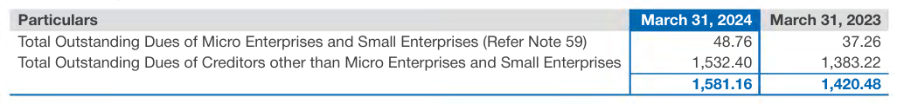

**[Image: AnnualReport2024.pdf-0185-22.png (1026x120, 49.3KB)]**

<!-- Start of picture text -->
Particulars March 31, 2024 March 31, 2023 Total Outstanding Dues of Micro Enterprises and Small Enterprises (Refer Note 59)  48.76   37.26 Total Outstanding Dues of Creditors other than Micro Enterprises and Small Enterprises   1,532.40   1,383.22 r::,   1,581.16   1,420.48 <!-- End of picture text -->

###### **(a) Trade Payables ageing schedule as at March 31, 2024** 

**[Image: AnnualReport2024.pdf-0185-24.png (1028x130, 39.1KB)]**

<!-- Start of picture text -->
Outstanding for following periods from due date of payment Particulars Not due Total Less than  More than 1 - 2 years 2 - 3 years 1 year 3 years <!-- End of picture text -->

**[Image: AnnualReport2024.pdf-0185-25.png (1026x24, 4.3KB)]**

###### **(a) Trade Payables ageing schedule as at March 31, 2023** 

|**Prticlr**|**Nt d**|**Outstandin**|**g for following** **of pay**|**periods from** **ment**|**due date**|**Ttl**|
|---|---|---|---|---|---|---|
|**auas**|**o ue**|**Less than** **1 year**|**1 - 2 years**|**2 - 3 years**|**More than** **3 years**|**oa**|
|(i) MSME|16.66|16.55|0.87|0.07|0.50|34.65|
|(ii) Others|516.83|834.32|20.51|1.92|8.87|1382.45|
|(iii) Disputed dues - MSME*|-|-|-|-|2.61|2.61|
|(iv) Disputed dues - Others*|-|-|-|-|0.77|0.77|
|**Total**|**533.49**|**850.87**|**21.38**|**1.99**|**12.75**|**1420.48**|

**[Image: AnnualReport2024.pdf-0185-28.png (1026x24, 3.1KB)]**

*Trade Payables having legal cases / arbitration have been considered as disputed 

###### 27 Other Current Financial Liabilities 

|**Particulars**|**March 31, 2024**|**March 31, 2023**|
|---|---|---|
|Unclaimed Fixed Deposits and Interest|-|0.03|
|Deposits - Others |1.99|2.19|
|Advance Share of Proft from LLPs|2.94|12.49|
| Share of Loss from LLPs |328.59|261.67|
|Employee Benefts Payable|192.33|269.64|
|Other Liabilities (includes payable for development rights, etc.)|61.23|56.30|
||**587.08**|**602.32**|

###### 28 Other Current Non Financial Liabilities 

|**Particulars**|**March 31, 2024**|**March 31, 2023**|
|---|---|---|
|Statutory Dues|92.47|55.71|
|Advances Received Against Sale of Flats/ Units (Refer Note 45)|4,743.49|1,342.65|
|Other (includes advance from customer for maintenance, etc.)|199.81|88.69|
||**5,035.77**|**1,487.05**|

Godrej Properties Limited 

Integrated Report 2023-24 

360 

361 

About Godrej Integrating Sustainability Management Discussion Statutory Properties Limited with our Business and Analysis Reports 

###### Notes Forming Part of Standalone Financial Statements 

For the year ended March 31, 2024 

(Currency in INR Crore) 

###### 29 Provisions (Current) 

|**Particulars** |**March 31, 2024**|**March 31, 2023**|
|---|---|---|
|**Provision for Employee Benefts**|||
| Gratuity|4.58|4.59|
|Compensated Absences|1.84|1.57|
|Provision for Tax Dues (Refer Note (a) below)|17.34|17.33|
|Others (Refer Note (b) below)|2.77|2.77|
||**26.53**|**26.26**|

- (a) Provision for tax dues (Utilised: INR Nil (Previous Year: INR Nil) and Accrued: INR 0.01 Crore (Previous Year: INR 0.03 Crore)) 

- (b) Others include provision made for civil / other cases  (Utilised: INR Nil (Previous Year: INR Nil), Accrued INR Nil (Previous Year: INR Nil)). 

###### 30 Revenue from Operations 

|**Particulars**|**March 31, 2024**|**March 31, 2023**|
|---|---|---|
|Sale of Real Estate Developments/Land (Refer Note 45)|1,031.79|792.15|
|Sale of Services (Refer Note 45)|206.01|247.57|
|Other Operating Revenues|||
|Other Income from Customers |23.00|18.43|
|Share of Proft in Limited Liability Partnerships (net)|66.10|94.01|
| Lease Rent|3.71|2.89|
||**1,330.61**|**1,155.05**|

###### 31 Other Income 

|**Particulars**|**March 31, 2024**|**March 31, 2023**|
|---|---|---|
|Interest Income*|1,003.10|796.24|
|Dividend Income |0.00|0.00|
|Proft on Sale of Property, Plant and Equipment (net)|-|0.33|
| Income from Investment measured at FVTPL |38.59|13.91|
|Proft on Sale of Investments (net)|93.42|127.43|
| Miscellaneous Income (Refer Note 53 (a))|59.89|7.09|
||**1,195.00**|**945.00**|

*This is being calculated as per EIR method. 

###### 32 Cost of Materials Consumed 

|**Particulars**|**March 31, 2024**|**March 31, 2023**|
|---|---|---|
|Land/ Development Rights|1,623.78|3,317.16|
|Construction, Material and Labour|771.82|381.20|
|Architect Fees|20.80|15.88|
|Finance Costs|473.73|186.91|
|Other Costs (including depreciation expense)|1,062.20|268.61|
||**3,952.33**|**4,169.76**|

###### Notes Forming Part of Standalone Financial Statements 

For the year ended March 31, 2024 

(Currency in INR Crore) 

###### 33 Changes in Inventories of Finished Goods and Construction Work-in-Progress 

|**Particulars**|**March 31, 2024**|**March 31, 2023**|
|---|---|---|
|**Inventories at the beginning of the year**|||
|Finished Goods|199.76|234.87|
|Construction Work-in-Progress|5,786.83|2,068.53|
|Entitlement of Transferable Development Rights|-|0.25|
||**5,986.59**|**2,303.65**|
|**Inventories at the end of the year**|||
|Finished Goods|180.39|199.76|
|Construction Work-in-Progress|9,024.32|5,786.83|
||**9,204.71**|**5,986.59**|
|Less : Transferred to Capital Work-in-Progress (Refer Note 3)|88.92|-|
||**(3,307.04)**|**(3,682.94)**|

###### INR 0.00 represents amount less than INR 50,000 

###### 34 Employee Benefits Expense* 

|**Particulars**|**March 31, 2024**|**March 31, 2023**|
|---|---|---|
|Salaries, Bonus and Allowances (Refer note 44(ii)|201.96|167.10|
|Contribution to Provident and Other Funds|6.59|2.67|
|Share Based Payments to Employees (Refer note 42) |3.92|4.15|
|Staf Welfare Expenses|8.90|4.26|
||**221.37**|**178.18**|

- Net of allocations 

###### 35 Finance Costs 

|**Particulars**|**March 31, 2024**|**March 31, 2023**|
|---|---|---|
|Interest Expense|698.68|317.14|
|Interest on Income Tax|0.02|4.16|
|**Total Interest Expense**|**698.70**|**321.30**|
|Other Borrowing costs|155.05|98.74|
|Total Finance Costs|**853.75**|**420.04**|
|Less : Transferred to Construction Work-in-Progress*|(473.73)|(186.91)|
|**Net Finance Costs**|**380.02**|**233.13**|

- Borrowing costs capitalized during the year using capitalisation range of 7.82% (Previous year: 6.65%) 

###### 36 Depreciation and Amortisation Expense 

|**Particulars**|**March 31, 2024**|**March 31, 2023**|
|---|---|---|
|Depreciation on Property, Plant and Equipment|26.46|18.69|
|Depreciation on Right-of-Use Assets|6.31|5.20|
|Depreciation on Investment Property|1.71|1.85|
|Amortisation of Intangible Assets|2.28|2.46|
|**Total Depreciaton and Amortisation Expense**|**36.76**|**28.20**|
|Less : Transferred to Construction Work-in-Progress|(12.42)|(9.24)|
||**24.34**|**18.96**|

Godrej Properties Limited 

Integrated Report 2023-24 

362 

363 

About Godrej Integrating Sustainability Management Discussion Statutory Properties Limited with our Business and Analysis Reports 

###### Notes Forming Part of Standalone Financial Statements 

###### For the year ended March 31, 2024 

(Currency in INR Crore) 

###### 37 Other Expenses 

|**Particulars**|**March 31, 2024**|**March 31, 2023**|
|---|---|---|
|Advertisement, Brokerage and Marketing Expense|241.92|140.73|
|Consultancy Charges|50.60|24.05|
|Project Maintenance Expense |30.94|29.64|
|Ofce Expenses|25.54|26.61|
| Project Management Services|24.81|14.55|
|Travelling expense|14.54|6.75|
|Corporate Social Responsibility Expenses (Refer Note 54)|10.84|8.89|
|Annual Maintenace Charges|6.30|4.91|
|Rent|4.16|1.26|
|Rates and Taxes|3.18|1.57|
|Insurance|1.37|1.51|
|Loss on Sale of Property, Plant and Equipment (net)|0.27|-|
|Other Expenses (Refer Note 51 and  53(b))|125.87|91.95|
||**540.34**|**352.42**|

###### 38 Earnings Per Share 

###### **a) Basic Earnings Per Share** 

The calculation of basic earnings per share is based on the profit attributable to ordinary shareholders and weighted average number of ordinary shares outstanding. 

|**Particulars** |**March 31, 2024**|**March 31, 2023**|
|---|---|---|
|**(i)** **Proft attributable to ordinary shareholders (basic)**|||
|Proft for the year, attributable to ordinary shareholders of the Company|564.35|655.67|
||**564.35**|**655.67**|
|**(ii)** **Weighted average number of ordinary shares (basic)**|||
|Number of equity shares at the beginning of the year |278,021,444|277,988,067|
|Add: Weighted average efect of share options exercised|12,314|24,546|
|Weighted average number of equity shares outstanding at the end of the year|**278,033,758**|**278,012,613**|
|**Basic Earnings Per Share (INR) (Face value INR 5 each)**|20.30|23.58|
|(Previous year: INR 5 each)|||

###### **b)  Diluted Earnings Per Share** 

The calculation of diluted earnings per share is based on the profit attributable to ordinary shareholders and weighted average number of ordinary shares outstanding after adjustment for the effects of all dilutive potential ordinary shares. 

|**Particulars** |**March 31, 2024**|**March 31, 2023**|
|---|---|---|
|**(i)** **Proft attributable to ordinary shareholders (diluted)**|||
|Proft for the year, attributable to ordinary shareholders of the Company|564.35|655.67|
||**564.35**|**655.67**|
|**(ii)** **Weighted average number of ordinary shares (diluted)**|||
|Weighted average number of equity shares outstanding (basic) |278,033,758|278,012,613|
|Add: Weighted average efect of potential equity shares under ESGS plan|49,148|20,522|
||**278,082,906**|**278,033,135**|
|**Diluted Earnings Per Share (INR) (Face value INR 5 each)**(Previous year: INR 5 each)|20.29|23.58|

###### Notes Forming Part of Standalone Financial Statements 

For the year ended March 31, 2024 

(Currency in INR Crore) 

###### 39 Employee Benefits 

###### **a) Defined Contribution Plans:** 

Contribution to Defined Contribution Plans recognised as an expense for the year are as under: 

|**Particulars**|**March 31, 2024**|**March 31, 2023**|
|---|---|---|
|Employer's Contribution to Provident Fund (Gross before Allocation)|11.87|9.33|
|Employer's Contribution to ESIC|-|-|

###### **b) Defined Benefit Plans:** 

###### **Contribution to Gratuity Fund (Non-Funded)** 

Gratuity is payable to all eligible employees on death or on separation/ termination in terms of the provisions of the Payment of Gratuity Act or as per the Company’s policy whichever is beneficial to the employees. 

The estimates of future salary increases, considered in actuarial valuation, take into account inflation, seniority, promotion and other relevant factors, such as supply and demand in the employment market. 

At March 31, 2024, the weighted-average duartion of the defined benefit obligation is 4 years ( March 31, 2023: 2 years) 

###### **(i) Changes in present value of defined benefit obligation** 

|**Particulars**|**March 31, 2024**|**March 31, 2023**|
|---|---|---|
|Present value of obligation as at beginning of the year|19.18|20.16|
|Interest Cost|1.38|1.23|
|Current Service Cost |2.28|2.73|
|Benefts Paid |(3.36)|(3.44)|
| Efect of Liability Transfer in |1.23|0.49|
| Efect of Liability Transfer out|(0.92)|(0.74)|
|Actuarial (gains)/ losses on obligations - due to change in demographic assumptions |0.50|(2.47)|
|Actuarial (gains)/ losses on obligations - due to change in fnancial assumptions|0.01|0.40|
|Actuarial (gains) /losses on obligations - due to change in experience|0.99|0.82|
|Present value of obligation as at the end of the year|**21.29**|**19.18**|
|**(ii) Amount recognised in the Standalone Balance Sheet**|||
|**Particulars**|**March 31, 2024** |**March 31, 2023** |
|Present value of obligation as at end of the year|21.29 |19.18 |
|Fair value of plan assets as at end of the year|- |- |
|Net obligation as at end of the year|**21.29** ,|**19.18** |
|**(iii) Net gratuity cost for the year** **Particulars** |**March 31, 2024**|**March 31, 2023**|
|Recognised in the Standalone Statement of Proft and Loss|||
|Current Service Cost|2.28|2.73|
|Interest Cost|1.38|1.23|
|**Total**|**3.66**|**3.96**|
|**Recognised in Other Comprehensive Income (OCI)**|||
|Remeasurement due to:|||
|Actuarial (gains)/losses on obligations - due to change in demographic assumptions|0.50|(2.47)|
|Actuarial (gains)/losses on obligations - due to change in fnancial assumptions|0.01|0.40|
| Actuarial (gains)/losses on obligations - due to change in experience|0.99|0.82|
|**Total**|**1.50**|**(1.25)**|
|**Net Gratuity cost in Total Comprehensive Income (TCI)**|**5.16**|**2.71**|

###### **(iii) Net gratuity cost for the year** 

The cumulative amount of actuarial (gains) / losses on obligations recognised in other comprehensive income as at March 31, 2024 is INR 6.57 Crore (Previous Year: INR 5.45 Crore). 

INR 0.00 represents amount less than INR 50,000 

Godrej Properties Limited 

Integrated Report 2023-24 

364 

365 

About Godrej Integrating Sustainability Management Discussion Statutory Properties Limited with our Business and Analysis Reports 

###### Notes Forming Part of Standalone Financial Statements 

For the year ended March 31, 2024 

(Currency in INR Crore) 

###### 39 Employee Benefits (Continued) 

###### **(iv) The Principal assumptions used in determining the present value of defined benefit obligation for the Company’s plan are given below:** 

|**Particulars**|**March 31, 2024**|**March 31, 2023**|
|---|---|---|
|Discount Rate|7.19%|7.20%|
|Salary escalation rate|14%|14%|
|Attrition Rate|28%|30%|
|Mortality|Indian Assured|Indian Assured|
||Lives Mortality|Lives Mortality|
||(2012-14) Urban|(2012-14) Urban|

###### **(v) Sensitivity analysis** 

A quantitative sensitivity analysis on Defined Benefit Obligation for significant assumptions as at March 31, 2024 is shown below: 

|**Particulars**|**Mar**|**ch 31, 2024**|**Ma**|**rch 31, 2023**|
|---|---|---|---|---|
||**Increase**|**Decrease**|**Increase**|**Decrease**|
|Discount Rate (1% movement)|(0.63)|0.68|(0.50)|0.54|
|Salary escalation rate (1% movement)|0.64|(0.60)|0.50|(0.48)|
|Attrition Rate (1% movement)|(0.26)|0.28|(0.19)|0.20|

The sensitivity analysis presented above may not be representative of the actual change in the defined benefit obligation as it is unlikely that the change in assumptions would occur in isolation of one another as some of the assumptions may be correlated. Furthermore, in presenting the above sensitivity analysis, the present value of the defined benefit obligation has been calculated using the projected unit credit method at the end of the reporting period, which is the same as that applied in calculating the defined benefit obligation liability recognised in the balance sheet. There was no change in the methods and assumptions used in preparing the sensitivity analysis from prior year. 

###### **(vi) The expected future cash flows in respect of gratuity as at March 31, 2024 were as follows:** 

Maturity Analysis of Projected Benefit Obligation: From the Employer 

|**Projected Benefts Payable in Future Years from the Reporting Date**|**March 31, 2024**|**March 31, 2023**|
|---|---|---|
| 1stFollowing Year|4.58|4.59|
|2ndFollowing Year|3.80|3.82|
|3rdFollowing Year|3.36|3.25|
|4thFollowing Year|3.04|2.76|
|5thFollowing Year|2.50|2.15|
|Sum of Years 6 to 10|7.18|5.46|

###### **Compensated absences and other long-term benefits** 

Compensated absences for employee benefits of INR 1.56 Crore (Previous Year: INR 0.10 Crore) expected to be paid in exchange for the services and other benefits under long-term retention scheme of INR 5.68 Crore (Previous year: INR 5 Crore) recognised as an expense during the year. 

###### Notes Forming Part of Standalone Financial Statements 

For the year ended March 31, 2024 

(Currency in INR Crore) 

###### 40 FINANCIAL INSTRUMENTS – FAIR VALUES AND RISK MANAGEMENT 

a) Accounting classification and fair values 

|March 31, 2024 | through proft or loss| Cost||||| |
|---|---|---|---|---|---|---|---|
|**Financial Assets**||||||||
|Non-Current||||||||
|Investment in Preference Shares|37.11|-|37.11|-|-|37.11| 37.11|
|Other Investments||||||||
|Investment in Debentures|1,207.32|25.26|1,232.58|-|1,232.58|-|1,232.58|
|Investment in Equity Instruments|0.00||0.00|0.00|-|-| 0.00|
|Trade receivables|-|104.04|104.04|-|-|-| -|
|Loans|-|683.24|683.24|-|-|-| -|
|Other Non-Current Financial Assets|-|33.94|33.94|-|-|-| -|
|Current||||||||
|Investments|1,664.57|-|1,664.57|1,664.57|-|-| 1,664.57|
|Trade receivables|-|160.86|160.86|-|-|-| -|
|Cash and cash equivalents|-|954.95|954.95|-|-|-| -|
|Bank balances other than above|-|1,260.44|1,260.44|-|-|-| -|
|Loans|-|7,668.41|7,668.41|-|-|-| -|
|Other Current Financial Assets|-|1,840.76|1,840.76|-|-|-| -|
||**2,909.00**|**12,731.90**|**15,640.90**|**1,664.57**|**1,232.58**|**37.11**| **2,934.26**|
|Financial Liabilities||||||||
|Non-Current||||||||
|Borrowings|-|2,660.00|2,660.00|-|2,660.00|-| 2,660.00|
|Other Non-Current Financial Liabilities|-|10.68|10.68|-|-|-| -|
|Current||||||||
|Borrowings|-|7,426.52|7,426.52|-|7,426.52||7,426.52|
|Trade Payables|-|1,581.16|1,581.16|-|-|-| -|
|Other Current Financial Liabilities|-|587.08|587.08|-|-|-| -|
||-|12,265.44|12,265.44|-|10,086.52|-|10,086.52|

Godrej Properties Limited 

Integrated Report 2023-24 

366 

367 

About Godrej Integrating Sustainability Management Discussion Statutory Properties Limited with our Business and Analysis Reports 

###### Notes Forming Part of Standalone Financial Statements 

For the year ended March 31, 2024 

###### 40 FINANCIAL INSTRUMENTS – FAIR VALUES AND RISK MANAGEMENT (Continued) 

(Currency in INR Crore) 

###### Notes Forming Part of Standalone Financial Statements 

For the year ended March 31, 2024 

###### 40 FINANCIAL INSTRUMENTS – FAIR VALUES AND RISK MANAGEMENT (Continued) 

(Currency in INR Crore) 

(iv) For financial assets that are measured at fair value under Level 3, the carrying amounts are a reasonable approximation of fair value. 

|March 31, 2023 | through proft or loss| Cost||||||
|---|---|---|---|---|---|---|---|
|Financial Assets||||||||
|**Non-Current**||||||||
|Investment in Preference Shares|0.11|-|0.11|-|-|0.11|0.11|
|Other Investments||||||||
|Investment in Debentures|470.62|43.25|513.87|-|513.87|-|513.87|
|Investment in Equity Instruments|0.00|-|0.00|0.00|-|-|0.00|
|Trade receivables|-|96.44|96.44|-|-|-|-|
|Loans|-|1,117.65|1,117.65|-|-|-|-|
|Other Non-Current Financial Assets|-|37.11|37.11|-|-|-|-|
|**Current**||||||||
|Investments|946.15|-|946.15|946.15|-|-|946.15|
|Trade receivables|-|156.65|156.65|-|-|-|-|
|Cash and cash equivalents|-|385.89|385.89|-|-|-|-|
|Bank Balances other than above|-|1,230.32|1,230.32|-|-|-|-|
|Loans|-|5,314.97|5,314.97|-|-|-|-|
|Other Current Financial Assets|-|1,581.40|1,581.40|-|-|-|-|
||**1,416.88**|**9,963.67**|**11,380.57**|**946.15**|**513.87**|**0.11**|**1,460.13**|
|Financial Liabilities||||||||
|Non Current||||||||
|Borrowings|-|-|-|-|-|-|-|
|Other Non-Current Financial|-|5.00|5.00|-|5.00|-|-|
|Liabilities||||||||
|Current||||||||
|Borrowings|-|6,400.10|6,400.10|-|6,400.10|-|-|
|Trade Payables|-|1,420.48|1,420.48|-|-|-|-|
|Other Current Financial Liabilities|-|602.32|602.32|-|-|-|-|
||**-**|**8,427.90**|**8,427.90**|**-**|**6,405.10**|**-**|**-**|

b) Measurement of Fair Value 

(i) The fair values of investments in mutual fund units is based on the net asset value (‘NAV’) as stated by the issuers of these mutual fund units in the published statements as at Balance Sheet date. NAV represents the price at which the issuer will issue further units of mutual fund and the price at which issuers will redeem such units from the investors. 

(ii) The Company uses the Discounted Cash Flow valuation technique (in relation to financial assets measured at amortised cost and fair value through profit or loss) which involves determination of present value of expected receipt/ payment discounted using appropriate discounting rates. The fair value so determined for financial asset measured at fair value through profit and loss are classified as Level 2 or Level 3. 

(iii) The Company uses the discounted cash flow valuation technique (in relation to financial liabilities measured at amortised cost) which involves determination of the present value of expected payments, discounted using bank rate. The fair value of non-convertible debentures is valued using FIMMDA guidelines. 

###### c) Financial risk management 

The Company has exposure to the following risks arising from financial instruments: 

- (i)   Credit Risk 

- (ii)  Liquidity Risk 

- (iii) Market Risk. 

###### Risk Management Framework 

The Company’s Board of Directors have overall responsibility for the establishment and oversight of the Company’s risk management framework. The Board of Directors have established the Risk Management Committee, which is responsible for developing and monitoring the Company’s risk management policies. The committee reports regularly to the Board of Directors on its activities. 

The Company’s risk management policies are established to identify and analyse the risks faced by the Company, to set appropriate risk limits and controls and to monitor risks and adherence to limits. Risk management policies and systems are reviewed regularly to reflect changes in market conditions and the Company’s activities. The Company, through its training and management standards and procedures, aims to maintain a disciplined and constructive control environment in which all employees understand their roles and obligations. 

The Audit Committee oversees how management monitors compliance with the Company’s risk management policies and procedures, and reviews the adequacy of the risk management framework in relation to the risks faced by the Company. The Audit Committee is assisted in its oversight role by internal audit. Internal audit undertakes both regular and adhoc reviews of risk management controls and procedures, the results of which are reported to the Audit Committee. 

###### (i)  Credit risk 

Credit risk is the risk of financial loss to the Company if a customer or counterparty to a financial instrument fails to meet its contractual obligations, and arises principally from the Company’s receivables from customers, investments in debt securities, loans given to related parties and others and project deposits. 

The carrying amount of financial assets represents the maximum credit exposure. 

###### Trade Receivables 

Customer credit risk is managed by requiring customers to pay advances through progress billings before transfer of ownership, therefore substantially eliminating the Company’s credit risk in this respect. 

The Company’s credit risk with regard to trade receivable has a high degree of risk diversification, due to the large number of projects of varying sizes and types with numerous different customer categories in a large number of geographical markets. 

As per simplified approach, the Company makes provision of expected credit losses on trade receivables to mitigate the risk of default payments and makes appropriate provision at each reporting date wherever outstanding is for longer period and involves higher risk. 

The ageing of gross trade receivables are as follows: 

|Particulars March 31, 2024|March 31, 2023|
|---|---|
|More than 12 months 89.02|83.48|
|Others 220.96|226.65|
|The movement in the provision for expected credit loss for credit impairment of Trade Receivables due to lifeti|me expected credit|
|loss during the year are as follows:||
|Particulars March 31, 2024|March 31, 2023|
|Opening balance 57.04|42.95|
|Add: Impairment loss recognised 0.70|14.54|
|Less: Impairment loss reversed (12.64)|(0.45)|
|Closing balance 45.09|57.04|

Godrej Properties Limited 

Integrated Report 2023-24 

368 

369 

About Godrej Integrating Sustainability Management Discussion Statutory Properties Limited with our Business and Analysis Reports 

(Currency in INR Crore) 

**[Image: AnnualReport2024.pdf-0190-02.png (82x27, 2.2KB)]**

###### Notes Forming Part of Standalone Financial Statements 

For the year ended March 31, 2024 

(Currency in INR Crore) 

###### 40 FINANCIAL INSTRUMENTS – FAIR VALUES AND RISK MANAGEMENT (Continued) 

###### Investment in Securities, Loans to Related Parties, Project Deposits and Other Financial Assets 

The Company has investments in equity instruments, compulsorily convertible debentures / optionally convertible debentures, preference shares, loans to related parties and project deposits. The settlement of such instruments is linked to the completion of the respective underlying  projects. The movement in the provision for expected credit loss due to lifetime expected credit loss during the year are as follows: 

The Company has recorded /(reversed) provision / expected credit loss on investment in debt and equity instruments of INR (32.39 Crore) (Previous Year: INR NIL) and other current financial assets of INR (0.56 Crore) (Net of impairment) (Previous Year: INR NIL). 

As at March 31, 2024, the Company had secured project deposits of INR 6.11 Crore (Previous Year: INR 6.11 Crore) and unsecured loans given to related parties of INR 14.47 Crore (Previous Year: INR  14.47 Crore), which have been considered as doubtful by the Company. The Company has provided such doubtful project deposits and unsecured loans in the previous year. The Company does not have any Loans for which credit risk has increased significantly in the current and previous year 

|Particulars|March 31, 2024|March 31, 2023|
|---|---|---|
|Opening balance|155.13|154.50|
|Add: Impairment loss recognised|10.50|5.63|
|Less: Impairment loss reversed|(43.45)|(5.00)|
|Closing balance|122.18|155.13|

###### Cash and Bank balances 

Credit risk from cash and bank balances is managed by the Company’s treasury department in accordance with the Company’s policy. 

###### (ii)  Liquidity risk 

Liquidity risk is the risk that the Company will encounter difficulty in meeting the obligations associated with its financial liabilities that are settled by delivering cash or another financial asset. The Company’s approach to managing liquidity is to ensure, as far as possible, that it will have sufficient liquidity to meet its liabilities when they are due, under both normal and stressed conditions, without incurring unacceptable losses or risking damage to the Company’s reputation. 

Management monitors rolling forecasts of the Company’s liquidity position on the basis of expected cash flows. This monitoring includes financial ratios and takes into account the accessibility of cash and cash equivalents. 

The Company has access to funds from capital and debt markets through loan from banks, commercial papers and other debt & equity instruments. The Company invests its surplus funds in bank fixed deposits and debt based mutual funds. 

###### Exposure to liquidity risk 

The following are the remaining contractual maturities of financial liabilities at the reporting date: 

|March 31, 2024| Amount|Total|Within 12 months|1-2 years|2-5 years|More than 5 years|
|---|---|---|---|---|---|---|
|Financial Liabilities|||||||
|Non-Current|||||||
|Borrowings|2,660.00|3,511.88|143.34|219.60|3,148.94|-|
|Other Non Current Financial Liabilities|10.68|10.68|-|5.34|5.34|-|
|Current|||||||
|Borrowings|7,426.52|7,432.08|7,432.08|-|-|-|
|Trade Payables|1,581.16|1,616.77|1,577.57|28.74|10.37|0.08|
|Other Current Financial Liabilities|587.08|587.08|587.08|-|-|-|

###### Notes Forming Part of Standalone Financial Statements 

For the year ended March 31, 2024 

###### 40 FINANCIAL INSTRUMENTS – FAIR VALUES AND RISK MANAGEMENT (Continued) 

||||Contractual c|ash fows|||
|---|---|---|---|---|---|---|
|March 31, 2023|Carrying Amount|Total|Within 12 months|1-2 years|2-5 years|More than 5 years|
|Financial Liabilities|||||||
|Non Current|||||||
|Borrowings|-|-|-|-|-|-|
|Other Non Current Financial Liabilities|5.00|5.00|-|-|5.00|-|
|Current|||||||
|Borrowings|6,400.10|6,514.70|6,514.70|-|-|-|
|Trade Payables|1,420.48|1,420.48|1,397.68|14.83|7.97|-|
|Other Current Financial Liabilities|602.32|602.32|602.32|-|-|-|

**[Image: AnnualReport2024.pdf-0190-25.png (1026x24, 4.2KB)]**

The Company has sufficient current assets comprising of Trade Receivables, Cash & Cash Equivalents, Investment in Mutual Funds, Other Bank Balances (other than restricted balances), Loans, Inventories and Other Current Financial Assets to manage the liquidity risk, if any in relation to current financial liabilities. 

###### (iii)  Market Risk 

Market risk is the risk that changes in market prices such as foreign exchange rate and interest rates will affect the Company’s income or the value of its holdings of financial instruments. The objective of market risk management is to manage and control market risk exposures within acceptable parameters, while optimising the return. 

###### a)  Currency Risk 

Currency risk is not material, as the Company’s primary business activities are within India and does not have significant exposure in foreign currency. 

###### b)  Interest Rate Risk 

Interest rate risk is the risk that the fair value or future cash flows of a financial instrument will fluctuate because of changes in market interest rates. The management is responsible for the monitoring of the Company’s interest rate position. Various variables are considered by the management in structuring the Company’s borrowings to achieve a reasonable, competitive cost of funding. 

###### Exposure to interest rate risk 

The interest rate profile of the Company’s interest-bearing financial instruments as reported to the management is as follows: 

|Particulars|March 31, 2024|March 31, 2023|
|---|---|---|
|**Financial liabilities**|||
|Variable rate instruments|2,164.64|1,862.05|
|Fixed rate instruments|7,749.40|4,479.52|
||**9,914.04**|**6,341.57**|
|**Financial assets**|||
|Variable rate instruments|||
|Fixed rate instruments|11,370.37|8,641.78|
||11,370.37|8,641.78|

Fair value sensitivity analysis for fixed rate instruments 

The Company does not account for any fixed rate financial assets and liabilities at fair value through profit or loss. Therefore, a change in interest rates at the reporting date would not affect profit or loss. 

###### Cash flow sensitivity analysis for variable-rate instruments 

A reasonably possible change of 100 basis points in interest rate would have resulted in variation in the interest expense for the Company by the amounts indicated in the table below. Given that the Company capitalises interest to the cost of inventory to the extent permissible, the amounts indicated below may have an impact on reported profits over the life cycle of projects to which such interest is capitalised. This calculation also assumes that the change occurs at the balance sheet date and has been calculated based on risk exposures outstanding as at that date. The year end balances are not necessarily representative of the average debt outstanding during the period. 

Godrej Properties Limited 

Integrated Report 2023-24 

370 

371 

About Godrej Integrating Sustainability Management Discussion Statutory Properties Limited with our Business and Analysis Reports 

**[Image: AnnualReport2024.pdf-0191-01.png (82x27, 2.2KB)]**

###### Notes Forming Part of Standalone Financial Statements 

###### For the year ended March 31, 2024 

(Currency in INR Crore) 

###### 40 FINANCIAL INSTRUMENTS – FAIR VALUES AND RISK MANAGEMENT (Continued) 

|Particulars|**Proft or Loss** |**INR (In Crore)** |
|---|---|---|
||**100 BP increase**|**100 BP decrease**|
|March 31, 2024|||
|Financial Liabilities|||
|Variable rate instruments|||
|Borrowings |(21.65)|21.65|
|Cash fow sensitivity (net)|**(21.65)**|**21.65**|
|March 31, 2023|||
|Financial Liabilities|||
|Variable rate instruments|||
|Borrowings |(18.62)|18.62|
|**Cash fow sensitivity (net)**|**(18.62)**|**18.62**|

**[Image: AnnualReport2024.pdf-0191-07.png (339x22, 1.7KB)]**

**[Image: AnnualReport2024.pdf-0191-08.png (1026x24, 3.6KB)]**

The Company does not have any additional impact on equity other than the impact on retained earnings. 

###### 41 CAPITAL MANAGEMENT 

The Company’s policy is to maintain a strong capital base so as to maintain investor, creditor and market confidence and to sustain future development of the business. 

The Board of Directors seek to maintain a balance between the higher returns that might be possible with higher levels of borrowings and the advantages by a sound capital position. 

The Company monitors capital using a ratio of ‘Net Debt to Equity’. For this purpose, net debt is defined as total borrowings (including interest accrued) less cash and bank balances and other current investments. 

###### Notes Forming Part of Standalone Financial Statements 

For the year ended March 31, 2024 

(Currency in INR Crore) 

###### 42 EMPLOYEE STOCK GRANT SCHEME (Continued) 

c) The fair value of the employee share options has been measured using the Black-Scholes Option Pricing Model. The weighted average fair value of the options granted is INR 1,351.63 (Previous Year: INR 1,333.47). 

The following table lists the average inputs to the model used for the plan for the year ended March 31, 2024: 

|Particulars|March 31, 2024|March 31, 2023|Description of the Inputs used|
|---|---|---|---|
|Dividend yield %|-|-|Dividend yield of the options is based on recent dividend activity.|
|Expected volatility %|32%-63%|39%-71%|Expected volatility of the option is based on historical volatility, during a period equivalent to the option life, of the observed market prices of the Company’s publicly traded equity shares.|
|Risk free Interest rate %|3.98%-7.02%|3.62%-7.07%|Risk-free interest rates are based on the government securities yield in efect at the time of the grant.|
|Expected life of share options|1 to 3 years|1 to 3 years||
|Weighted Average Market price on date of granting the options|INR 1,354.61|INR 1,338.21||

d) The expense arising from ESGS scheme during the year is INR 3.92 Crore (Previous Year: INR 4.15 Crore) 

###### 43 LEASES 

a)  The Company  has recognised  INR 8.08 Crore (Previous Year: INR 5.99 Crore) towards minimum lease payments for shortterm leases and INR 0.25 Crore (Previous Year: INR 0.13 Crore) for low-value assets accounted as per paragraph 6 of IND AS 116 and INR 3.72 Crore (Previous Year: INR 2.89 Crore) minimum lease receipt in the Standalone Statement of Profit and Loss. 

The Company’s net debt to equity ratio is as follows: 

|||INR (in Crore)|
|---|---|---|
|Particulars|March 31, 2024|March 31, 2023|
|Net debt|6,563.64|4,200.54|
|Total equity|10,512.28|9,945.13|
|**Net debt to Equity ratio**|0.62|0.42|

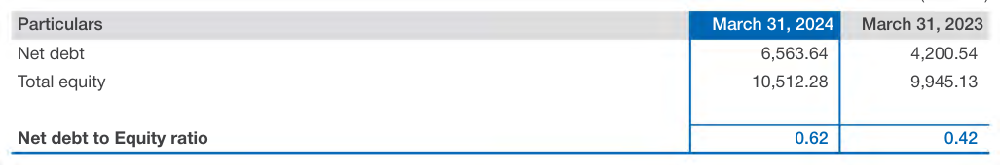

**[Image: AnnualReport2024.pdf-0191-26.png (1027x170, 46.0KB)]**

<!-- Start of picture text -->
Particulars March 31, 2024 March 31, 2023 Net debt  6,563.64   4,200.54 Total equity  10,512.28   9,945.13 Net debt to Equity ratio  0.62   0.42 <!-- End of picture text -->

###### 42 EMPLOYEE STOCK GRANT SCHEME 

The Company instituted an Employee Stock Grant Scheme (GPL ESGS) approved by the Board of Directors, the Shareholders and the Remuneration Committee. 

###### a) Details of  Stock Grants are as under: 

||No. of O|ptions|Weighted|Weighted|
|---|---|---|---|---|
|Particulars|March 31, 2024|March 31, 2023|average Exercise|average Share|
||||Price (INR)|Price (INR)|
|Options Outstanding at the beginning of the year|49,485|63,338|||
|Add: Options granted|36,853|34,934|||
|Less:  Options exercised|20,030|33,377|5.00|1,336.36|
|Less : Option lapsed|16,861|15,410|||
|Options Outstanding at the end of the year|49,447|49,485|||

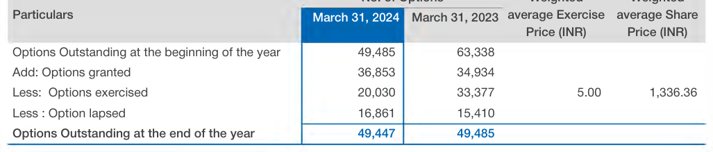

**[Image: AnnualReport2024.pdf-0191-31.png (1027x219, 72.2KB)]**

<!-- Start of picture text -->
Particulars March 31, 2024 March 31, 2023 average Exercise  average Share Price (INR) Price (INR) Options Outstanding at the beginning of the year  49,485   63,338 Add: Options granted   36,853   34,934 Less:  Options exercised    20,030   33,377  5.00  1,336.36 Less : Option lapsed   16,861   15,410 Options Outstanding at the end of the year  49,447   49,485 <!-- End of picture text -->

###### b) As a lessor 

The Company’s significant leasing arrangements are in respect of operating leases for Commercial premises. Lease income from operating leases is recognised on a straight-line basis over the period of lease. The future minimum lease receivables of non-cancellable operating leases are as under: 

|||INR (in Crore)|
|---|---|---|
|Particulars|March 31, 2024|March 31, 2023|
|Future minimum lease receipts under operating leases|||
|Not later than 1 year|1.90|0.02|
|Later than 1 year and not later than 5 years|3.86|0.09|
|Later than 5 years|-|2.80|

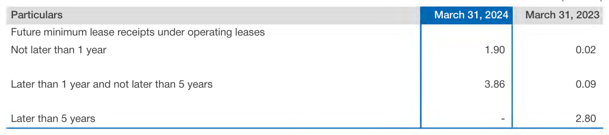

**[Image: AnnualReport2024.pdf-0191-35.png (1026x228, 46.4KB)]**

<!-- Start of picture text -->
Particulars March 31, 2024 March 31, 2023 Future minimum lease receipts under operating leases Not later than 1 year  1.90   0.02 Later than 1 year and not later than 5 years  3.86   0.09 Later than 5 years  -   2.80 <!-- End of picture text -->

###### c)  As a Lessee 

The Company’s significant leasing arrangements are in respect of operating leases for Commercial / Residential premises. Lease expenditure for operating leases is recognised on a straight-line basis over the period of lease. These leasing arrangements are non-cancellable / cancellable and are renewable on a periodic basis by mutual consent on mutually accepted terms. 

b) The weighted average exercise price of the options outstanding as at March 31, 2024 is INR 5 per share (Previous Year: INR 5 per share) and the weighted average remaining contractual life of the options outstanding as at March 31, 2024 is 0.96 years (Previous Year: 0.72 years) 

Godrej Properties Limited 

Integrated Report 2023-24 

372 

373 

About Godrej Integrating Sustainability Management Discussion Statutory Properties Limited with our Business and Analysis Reports 

###### Notes Forming Part of Standalone Financial Statements 

###### For the year ended March 31, 2024 

(Currency in INR Crore) 

###### 43 LEASES 

|||INR (in Crore)|
|---|---|---|
|Particulars||March 31, 2024|
|Right-of-Use Assets|||
|Cost|||
|Balance as at April 01, 2022||29.33|
|Add: Additions||0.07|
|Less: Disposals||-|
|**Balance as at March 31, 2023**||**29.40**|
|Add: Additions||10.07|
|Less: Disposals||-|
|Balance as at March 31, 2024||39.48|
|Accumulated Depreciation|||
|Balance as at April 01, 2022||15.07|
|Add: Depreciation charge for the year||5.20|
|Less: Disposals||-|
|Balance as at March 31, 2023||20.27|
|Add: Depreciation charge for the year||6.31|
|Less: Disposals||-|
|Balance as at March 31, 2024||26.58|
|Carrying amount|||
|Balance as at March 31, 2023||9.13|
|Balance as at March 31, 2024||12.90|
|Lease Liabilities|||
|Balance as at April 01, 2022||15.24|
|Less: Disposals||-|
|Add: Additions||-|
|Add: Interest Expense on lease Liabilities ||1.01|
|Less: Total cashoutfow for leases||(6.09)|
| Balance as at March 31, 2023||10.16|
|Less: Disposals||-|
|Add: Additions||10.07|
|Add: Interest Expense on lease Liabilities ||0.94|
|Less: Total cashoutfow for leases||(7.50)|
|Balance as at March 31, 2024||13.68|
|The future minimum lease payments of non-cancellable operating leases are as under:|||
|Particulars|March 31, 2024|March 31, 2023|
|Future minimum lease payments under operating leases|||
|Not later than 1 year|6.98|4.03|
|Later than 1 year and not later than 5 years|12.18|7.94|
|Weighted average efective interest rate (%)|8.00%|8.00%|

###### Notes Forming Part of Standalone Financial Statements 

For the year ended March 31, 2024 

(Currency in INR Crore) 

###### 44 RELATED PARTY TRANSACTIONS 

Related party disclosures as required by IND AS - 24, “Related Party Disclosures” for the period ended March 31, 2024 are given below: 

- 1 Relationships: 

- i) Holding Company: 

   - Godrej Industries Limited (GIL) 

- ii) a) Subsidiaries Companies: 

   - 1 Godrej Projects Development Limited 

   - 2 Godrej Garden City Properties Private Limited 

   - 3 Godrej Home Developers Private Limited 

   - 4 Godrej Hillside Properties Private Limited 

   - 5 Godrej Prakriti Facilities Private Limited 

   - 6 Godrej Highrises Properties Private Limited 

   - 7 Godrej Genesis Facilities Management Private Limited 

   - 8 Prakritiplaza Facilities Management Private Limited 

   - 9 Citystar Infraprojects Limited 

   - 10 Godrej Residency Private Limited 

   - 11 Godrej Properties Worldwide Inc., USA ( Dissolved w.e.f. Feb 02, 2024) 

   - 12 Godrej Green Woods Private Limited 

   - 13 Godrej Precast Construction Private Limited 

   - 14 Godrej Realty Private Limited 

   - 15 Godrej Living Private Limited 

   - 16 Ashank Land and Building Private Limited (w.e.f. May 19, 2022) 

   - 17  Wonder City Buildcon Limited (classified as Joint Venture up to March 28, 2023) (Formerly known as Wonder City Buildcon Private Limited) 

   - 18  Godrej Home Constructions Limited  (classified as Joint Venture up to March 28, 2023) (Formerly known as Godrej Home Construction Private Limited) 

   - 19 Godrej Skyline Developers Private Limited (classified as Joint Venture up to September 27, 2023) 

   - 20 Godrej Real Estate Distribution Company Private Limited (w.e.f. July 20, 2023) 

   - b) Subsidiaries Limited Liability Partnership: 

   - 1 Godrej Highrises Realty LLP 

   - 2 Godrej Project Developers & Properties LLP 

   - 3 Godrej Skyview LLP 

   - 4 Godrej Green Properties LLP 

   - 5 Godrej Projects (Soma) LLP 

   - 6 Godrej Athenmark LLP 

   - 7 Godrej City Facilities Management LLP 

   - 8 Godrej Olympia LLP 

   - 9 Godrej Florentine LLP 

   - 10 Ashank Realty Management LLP 

   - 11 Ashank Facility Management LLP 

Godrej Properties Limited 

Integrated Report 2023-24 

374 

375 

About Godrej Integrating Sustainability Management Discussion Statutory Properties Limited with our Business and Analysis Reports 

**[Image: AnnualReport2024.pdf-0193-01.png (82x27, 2.3KB)]**

<!-- Start of picture text -->
- <!-- End of picture text -->

###### Notes Forming Part of Standalone Financial Statements 

For the year ended March 31, 2024 

(Currency in INR Crore) 

###### 44 RELATED PARTY TRANSACTIONS (Continued) 

12 Godrej Buildwell Projects LLP (formerly known as Godrej Construction Projects LLP) 

- 13 Oasis Landmarks LLP 

- 14 Maan-Hinje Township Developers LLP  (classified as Joint Venture up to March 28, 2023) 

- 15 Godrej Reserve LLP  (w.e.f  October 1, 2022) 

- 16 Godrej Vestamark LLP (classified as Joint Venture up to June 22, 2023) 

- 17 Dream World Landmarks LLP (classified as Joint Venture up to September 29, 2023) 

- 18 Caroa Properties LLP (classified as Joint Venture up to March 27, 2024) 

- 19 Godrej Property Developers LLP (classified as subsidiary w.e.f. February 07, 2024 to  February 29, 2024) 

###### iii) a) Associate: 

- 1 Godrej One Premises Management Private Limited 

###### iii) b) Joint Venture: 

- 1 Godrej Redevelopers (Mumbai) Private Limited 

- 2 Godrej Greenview Housing Private Limited 

- 3 Wonder City Buildcon Limited (Classified as Subsidiary w.e.f  Mar 29, 2023) (Formerly known as Wonder City Buildcon Private Limited) 

- 4 Godrej Home Constructions Limited  (Classified as Subsidiary w.e.f  Mar 29, 2023) (Formerly known as Godrej Home Construction Private Limited) 

- 5 Wonder Projects Development Private Limited 

- 6 Godrej Real View Developers Private Limited 

- 7 Pearlite Real Properties Private Limited 

- 8 Godrej Green Homes Private Limited 

- 9 Godrej Macbricks Private Limited 

- 10 Munjal Hospitality Private Limited 

- 11  Yujya Developers Private Limited (merged with Madhuvan Enterprises Private Limited order dated March 16, 2023 effective from April 01, 2021) 

- 12 Vivrut Developers Private Limited 

- 13 Madhuvan Enterprises Private Limited 

- 14 Vagishwari Land Developers Private Limited 

- 15 Yerwada Developers Private Limited 

- 16 Godrej Skyline Developers Private Limited (classified as Subsidiary w.e.f. September 28, 2023) 

- 17 Godrej Vestamark LLP (Classified as Subsidiary w.e.f. June 23, 2023) 

- 18 Mosaic Landmarks LLP 

- 19 Oxford Realty LLP 

- 20 Godrej SSPDL Green Acres LLP 

- 21 M S Ramaiah Ventures LLP 

- 22 Godrej Amitis Developers LLP 

- 23 Godrej Housing Projects LLP 

- 24 Godrej Property Developers LLP (classfied as Joint venture upto February 6, 2024) 

- 25 AR Landcraft LLP 

- 26 Prakhhyat Dwellings LLP 

- 27 Godrej Highview LLP 

###### Notes Forming Part of Standalone Financial Statements 

For the year ended March 31, 2024 

(Currency in INR Crore) 

###### 44 RELATED PARTY TRANSACTIONS (Continued) 

- 29 Godrej Developers & Properties LLP 

- 30 Godrej Reserve LLP ( classified as Joint venture upto October 01, 2022) 

- 31 Godrej Irismark LLP 

- 32 Roseberry Estate LLP 

- 33 Suncity Infrastructures (Mumbai) LLP 

- 34 Manjari Housing Projects LLP 

- 35 Maan-Hinje Township Developers LLP (Classified as Subsidiary w.e.f  March 29, 2023) 

- 36 Mahalunge Township Developers LLP 

- 37 Manyata Industrial Parks LLP 

- 38 Godrej Odyssey LLP 

- 39 Universal Metro Properties LLP 

- 40 Embellish Houses LLP 

- 41 Godrej Projects North LLP 

- 42 Dream World Landmarks LLP (classified as Subsidiary w.e.f. September 30, 2023) 

43 Caroa Properties LLP (classified as Subsidiary w.e.f. March 28, 2024) 

###### iv) Other Related Parties in Godrej Group: 

      - 1 Godrej & Boyce Manufacturing Company Limited 

      - 2 Godrej Fund Management and Investment Advisors Private Limited (formerly Godrej Investment Advisors Private Limited) 

      - 3 Godrej Agrovet Limited 

      - 4 Cream Line Dairy Products Limited 

      - 5 Godrej Consumer Products Limited 

      - 6 Annamudi Real Estates LLP 

      - 7 Godrej Housing Finance Limited 

      - 8 Godrej Finance Limited 

      - 9 Godrej Capital Limited 

   - v) Key Management Personnel and close members of Key Management Personnel: 1 Mr. Adi B Godrej 

      - 2 Mr. Nadir B Godrej 

      - 3 Mr. Pirojsha Godrej 

      - 4 Mr. Mohit Malhotra (upto December 31, 2022) 

      - 5 Mr. Gaurav Pandey (w.e.f January 01, 2023) 

      - 6 Mr. Jamshyd N. Godrej ( upto January 24, 2024) 

      - 7 Mrs. Lalita D. Gupte (upto August 02, 2023) 

      - 8 Mr. Pranay Vakil (upto August 2, 2022) 

      - 9 Mr. Amitava Mukherjee (upto July 03, 2023) 

      - 10 Mr. Indu Bhushan 

      - 11 Ms. Sutapa Banerjee 

      - 12 Ms. Jayashree Vaidhyanathan (w.e.f. August 02, 2023) 

      - 13 Mr. Sumeet Subash Narang (w.e.f. August 23, 2023) 

- 28 Godrej Projects North Star LLP 

Godrej Properties Limited 

Integrated Report 2023-24 

376 

377 

About Godrej Integrating Sustainability Management Discussion Statutory Properties Limited with our Business and Analysis Reports 

**[Image: AnnualReport2024.pdf-0194-01.png (82x27, 2.2KB)]**

###### Notes Forming Part of Standalone Financial Statements 

For the year ended March 31, 2024 

(Currency in INR Crore) 

###### 44 RELATED PARTY TRANSACTIONS (Continued) 

2 The following transactions were carried out with the related parties in the ordinary course of business for the period ended March 31, 2024 

###### (i) Details relating to parties referred to in items 1(i), (ii), (iii) and (iv) above 

|Nature of Transaction|Godrej Industries|Subsidiary Companies|Associate|JV Associates|Other related parties in Godrej|Total|
|---|---|---|---|---|---|---|
|| Limited (i)| & LLP (ii)|(iii) (a)| (iii) (b)| Group (iv)||
|Transactions during the year|||||||
|Purchase of Property, Plant and Equipment (Including Intangible Assets)|||||||
|Current Year|**-**|**0.01**|**-**|**0.38**|**-**|**0.38**|
|Previous Year|-|-|-|15.85|-|15.85|
|Expense charged by other Companies / Entities|||||||
|Current Year|**24.74**|**10.73**|**4.05**|**4.29**|**19.27**|**63.08**|
|Previous Year|18.74|7.04|2.97|0.83|17.86|47.43|
|Interest Income on Debenture|||||||
|Current Year|**-**|**0.05**|**-**|**52.48**|**-**|**52.53**|
|Previous Year|-|0.06|-|74.01|-|74.07|
|Amount paid on transfer of Employee (Net)|||||||
|Current Year|**3.59**|**0.69**|**-**|**0.52**|**0.32**|**5.12**|
|Previous Year|1.52|0.04|-|0.27|-|1.83|
|Sale of Property, Plant and Equipment (Including Intangible Assets)|||||||
|Current Year|**-**|**-**|**-**|**2.65**|**-**|**2.65**|
|Previous Year|-|2.87|-|-|2.03|4.90|
|Income Received from other Companies|||||||
|/ Entities|||||||
|Current Year|**-**|**0.01**|**-**|**-**|**-**|**0.01**|
|Previous Year|-|-|-|0.67|-|0.67|
|Expense charged to other Companies / Entities|||||||
|Current Year|**-**|**112.48**|**-**|**127.37**|**-**|**239.84**|
|Previous Year|-|80.41|-|142.98|1.36|224.76|
|Development Management Fees|||||||
|Received|||||||
|Current Year|**-**|**29.84**|**-**|**176.16**|**7.81**|**213.82**|
|Previous Year|-|20.00|-|174.99|8.64|203.64|

**[Image: AnnualReport2024.pdf-0194-09.png (1026x24, 7.9KB)]**

###### Notes Forming Part of Standalone Financial Statements 

For the year ended March 31, 2024 

(Currency in INR Crore) 

###### 44 RELATED PARTY TRANSACTIONS (Continued) 

|Nature of Transaction|Godrej Industries|Subsidiary Companies|Associate |JV Associates|Other related parties in Godrej|Total|
|---|---|---|---|---|---|---|
||Limited (i)|& LLP (ii)|(iii) (a)|(iii) (b)|Group (iv)||
|Interest Income|||||||
|Current Year|**-**|**548.98**|**-**|**401.58**|**-**|**950.56**|
|Previous Year|-|276.36|-|356.16|-|632.52|
|Share of Proft/(Loss) in LLP|||||||
|Current Year|**-**|**17.43**|**-**|**48.67**|**-**|**66.10**|
|Previous Year|-|47.37|-|46.64|-|94.01|
|Amount received on transfer of Employee|||||||
|(Net)|||||||
|Current Year|**0.05**|**0.12**|**-**|**1.09**|**0.00**|**1.27**|
|Previous Year|-|-|-|0.18|-|0.18|
|Commitment / Bank Guarantee / Letter|||||||
|of Credit / Corporate/ Performance|||||||
|Guarantee Issued/  (Cancelled)|||||||
|Current Year|**-**|**7.88**|**-**|**-**|**-**|**7.88**|
|Previous Year|-|36.33|-|(1.59)|-|34.74|
|Investment made in Equity / Preference|||||||
|Share|||||||
|Current Year|**-**|**86.33**|**-**|**3.90**|**-**|**90.23**|
|Previous Year|-|-|-|5.80|-|5.80|
|Investment made in Capital Account|||||||
|of LLP|||||||
|Current Year|**-**|**12.35**|**-**|**100.00**|**-**|**112.35**|
|Previous Year|-|-|-|320.20|-|320.20|
|Investment made in Debenture|||||||
|Current Year|**-**|**725.00**|**-**|**57.45**|**-**|**782.45**|
|Previous Year|-|-|-|17.40|-|17.40|
|Investment Sold /Redeemed /|||||||
|Repayment of Partners Capital/ |||||||
|Withdrawal of Share of Proft|||||||
|Current Year|**-**|**316.39**|**-**|**88.05**|**-**|**404.44**|
|Previous Year|-|9.04|-|0.00|-|9.04|
|Loans and Advances given / (taken) #|||||||
|Current Year|**-**|**3,670.29**|**-**|**1,743.06**|**-**|**5,413.35**|
|Previous Year|-|2,206.68|-|1,177.03|-|3,383.71|
|Loans and Advances repaid|||||||
|Current Year|**-**|**2,802.69**|**-**|**831.47**|**-**|**3,634.16**|
|Previous Year|-|712.42|-|1,157.99|-|1,870.40|
|Deposit given|||||||
|Current Year|**-**|**-**|**-**|**-**|**-**|**-**|
|Previous Year|1.80|-|-|-|-|1.80|

**[Image: AnnualReport2024.pdf-0194-15.png (1024x24, 8.0KB)]**

Godrej Properties Limited 

Integrated Report 2023-24 

378 

379 

About Godrej Integrating Sustainability Management Discussion Statutory Properties Limited with our Business and Analysis Reports 

(Currency in INR Crore) 

**[Image: AnnualReport2024.pdf-0195-02.png (82x27, 2.2KB)]**

###### Notes Forming Part of Standalone Financial Statements 

For the year ended March 31, 2024 

(Currency in INR Crore) 

###### 44 RELATED PARTY TRANSACTIONS (Continued) 

||Godrej |Subsidiary |Associate|JV |Other related ||
|---|---|---|---|---|---|---|
|Nature of Transaction|Industries|Companies||Associates|parties in Godrej|Total|
||Limited (i)|& LLP (ii)|(iii) (a)|(iii) (b)|Group (iv)||
|Deposit repaid|||||||
|Current Year|**-**|**-**|**-**|**-**|**-**|**-**|
|Previous Year|-|-|-|-|1.80|1.80|
|Conversion of Debentures/Loan to|||||||
|Equity/capital|||||||
|Current Year|**-**|**-**||**17.94**||**17.94**|
|Previous Year|-|-||167.97||167.97|
|Amount received/(Adjusted) against share|||||||
| of Proft|||||||
|Current Year|**-**|**(9.55)**|**-**|**-**|**-**|**(9.55)**|
|Previous Year|-|(5.80)|-|-|-|(5.80)|
|Balance Outstanding as on Mar 31, 2024|||||||
|Amount Receivable (including unbilled revenue)|||||||
|As at March 31, 2024|**-**|**6,876.03**|**-**|**1,877.24**|**0.48**|**8,753.74**|
|As at March 31, 2023|-|5,195.64|-|2,126.22|4.35|7,326.21|
|Amount Payable|||||||
|As at March 31, 2024|**0.12**|**-**|**-**|**0.00**|**0.07**|**0.19**|
|As at March 31, 2023|0.36|0.67|-|0.07|0.04|1.13|
|Advance received against Share of Proft|||||||
| As at March 31, 2024|**-**|**2.94**|**-**|**-**|**-**|**2.94**|
|As at March 31, 2023|-|9.56|-|2.93|-|12.49|
|Deposit Receivable|||||||
|As at March 31, 2024|**2.16**|**-**|**0.04**|**-**|**-**|**2.20**|
|As at March 31, 2023|2.16|-|0.04|-|-|2.20|
|Debenture Outstanding|||||||
|As at March 31, 2024|**-**|**725.00**|**-**|**507.59**|**-**|**1,232.59**|
|As at March 31, 2023|-|-|-|513.87|-|513.87|
|Debenture Interest Outstanding|||||||
|As at March 31, 2024|**-**|**12.15**|**-**|**210.55**|**-**|**222.70**|
|As at March 31, 2023|-|12.10|-|158.07|-|170.16|
|Receivable from LLPs|||||||
|As at March 31, 2024|**-**|**0.20**|**-**|**186.61**|**-**|**186.81**|
|As at March 31, 2023|-|23.12|-|101.92|-|125.04|
|Share of Loss from LLPs|||||||
|As at March 31, 2024|**-**|**(140.08)**|**-**|**(188.50)**|**-**|**(328.59)**|
|As at March 31, 2023|-|(2.80)|-|(258.88)|-|(261.67)|

**[Image: AnnualReport2024.pdf-0195-08.png (1026x23, 9.0KB)]**

###### Notes Forming Part of Standalone Financial Statements 

For the year ended March 31, 2024 

###### 44 RELATED PARTY TRANSACTIONS (Continued) 

|Nature of Transaction|Godrej Industries|Subsidiary Companies|Associate iii|JV Associates|Other related parties in Godrej|Total|
|---|---|---|---|---|---|---|
||Limited (i)|& LLP (ii)|() (a)|(iii) (b)|Group (iv)||
|Investment in Capital account|||||||
|As at March 31, 2024|**-**|**344.36**|**-**|**486.36**|**-**|**830.73**|
|As at March 31, 2023|-|337.54|-|731.54|-|1,069.08|
|Investment in Equity/Preference shares|||||||
|As at March 31, 2024|**-**|**447.62**|**0.00**|**209.85**|**-**|**657.48**|
|As at March 31, 2023|-|365.53|0.00|191.92|-|557.45|
|Commitment / Bank Guarantee / Letter of Credit / Corporate/ Performance Guarantee Outstanding|||||||
|As at March 31, 2024|**-**|**170.32**|**-**|**0.34**|**-**|**170.66**|
|As at March 31, 2023|-|162.19|-|0.59|-|162.78|

**[Image: AnnualReport2024.pdf-0195-13.png (1024x24, 10.5KB)]**

<!-- Start of picture text -->
 -   -   - <!-- End of picture text -->

INR 0.00 represents amount less than INR 50,000 

###### (ii) Details relating to parties referred to in items 1(v) above 

|Particulars |March 31, 2024|March 31, 2023|
|---|---|---|
|Short-term employee benefts ** |40.36|40.87|
|Post retirement benefts|0.68|1.08|
| Share based payment transactions|0.06|0.19|
|Total Compensation paid Key Management Personnel|41.10|42.14|
|Amount received on issue of equity shares under ESGS to KMP|0.00|0.01|

INR 0.00 represents amount less than INR 50,000 

###### 3. Material Related Party Disclosure ^ 

|Nature of Transaction|March 31, 2024|March 31, 2023|
|---|---|---|
|Loans and Advances given / (taken) #|||
|Godrej Project Development Limited|2,359.50|1,145.61|
|Godrej Residency Private Limited|161.64|281.66|
|Maan-Hinje Township Developers LLP|99.79|310.00|
|Universal Metro Properties LLP|101.69|-|
|AR Landcraft LLP|149.36|-|
|Caroa Properties LLP|201.88|-|
|Dream world Landmarks LLP|181.57|-|
|Godrej Skyline Developers Private Limited|150.96|-|
|Godrej Vestamark LLP|424.05|-|
|Godrej Highrises Properties Private Limited|100.48|-|
|M S Ramaiah Ventures LLP|190.47|-|
|Wonder City Buildcon Limited|395.30|-|
|Loans and Advances repaid|||
|Godrej Project Development Limited|1,117.79|676.96|
|Roseberry Estate LLP|-|315.64|
|Godrej Residency Private Limited|246.96|-|
|Caroa Properties LLP|201.38|-|
|Oasis Landmarks LLP|346.99|-|
|Godrej Vestamark LLP|119.89|-|
|Maan-Hinje Township Developers LLP|261.35|-|
|Universal Metro Properties LLP|170.23|-|
|AR Landcraft LLP|103.81|-|

Godrej Properties Limited 

Integrated Report 2023-24 

380 

381 

About Godrej Integrating Sustainability Management Discussion Statutory Properties Limited with our Business and Analysis Reports 

**[Image: AnnualReport2024.pdf-0196-01.png (82x27, 2.2KB)]**

###### Notes Forming Part of Standalone Financial Statements 

For the year ended March 31, 2024 

(Currency in INR Crore) 

###### 44 RELATED PARTY TRANSACTIONS (Continued) 

|Nature of Transaction|March 31, 2024|March 31, 2023|
|---|---|---|
|Investment Sold/Redeemed/Repayment of partner's capital/withdrawal of share |||
|of proft|||
|Maan-Hinje Township Developers LLP|306.00|-|
|Interest Income|||
|Godrej Project Development Limited|261.24|-|
|Investment made in Debentures|||
|Godrej Highrises Properties Private Limited|725.00|-|
|Investment made in Capital Account of LLP|||
|Maan-Hinje Township Developers LLP|-|228.56|
|Godrej Vestamark LLP|100.00|-|

**including commission and sitting fees paid to KMP 

Refer Note 25 for current assets of Godrej Projects Development Limited, a wholly owned subsidiary, hypothecated against loan taken by the Company. 

Refer Note 51 (c) (iv) for Commitments 

Refer Note 40 (d) (i) for provision / expected credit loss Refer Note 53 (b)  for financial asset (Investment in Subsidiary) written off 

# Includes Interest receivable as on April 01, 2023 converted into Loan 

^ The disclosure is based on material related party transaction during the year ended March 31, 2024 and accordingly the comparative figures has been disclosed. 

###### 4. Loans or advances to specified persons 

###### (i) Repayable on Demand 

||March 31,|2024|March 31,|2023|
|---|---|---|---|---|
|Type of Borrower|Amount|% of total ^|Amount|% of total|
||Outstanding *||Outstanding *|^|
|Related Parties|7,528.63|90.15%|5,273.05|81.79%|
|Total|7,528.63|90.15%|5,273.05|81.79%|

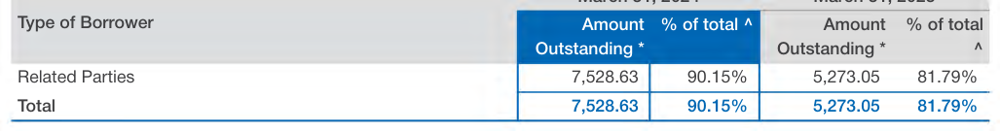

**[Image: AnnualReport2024.pdf-0196-16.png (1027x135, 57.0KB)]**

<!-- Start of picture text -->
Type of Borrower Amount  % of total ^ Amount  % of total Outstanding * Outstanding * ^ Related Parties  7,528.63  90.15%  5,273.05  81.79% Total  7,528.63  90.15%  5,273.05  81.79% <!-- End of picture text -->

*represents gross loan or advance in the nature of loan 

^ represents percentage to the total Loans and Advances in the nature of loans 

###### 45 REVENUE FROM CONTRACTS WITH CUSTOMERS 

(a) The amount of INR 201.48 Crore (Previous Year: INR 241.34 Crore) recognised in contract liabilities at the beginning of the year has been recognised as revenue during the year ended March 31, 2024. 

- (b) Significant changes in contract asset and contract liabilities balances are as follows: 

|Particulars|March 31, 2024|March 31, 2023|
|---|---|---|
|Contract asset|||
|At the beginning of the reporting period|54.14|160.29|
|Change due to revenue recorded based on measure of progress during the year|100.87|(106.15)|
|At the end of the reporting period|**155.00**|**54.14**|
|Contract liability|||
|At the beginning of the reporting period|1,342.65|471.39|
|Change due to collection and revenue recorded based on measure of progress during|3,283.98|823.40|
|the year |||
|Signifcant fnancing component (Net of transfer to Statement of Proft and Loss)|116.86|47.86|
| At the end of the reporting period|**4,743.49**|**1,342.65**|

###### Notes Forming Part of Standalone Financial Statements 

For the year ended March 31, 2024 

(Currency in INR Crore) 

###### 45 REVENUE FROM CONTRACTS WITH CUSTOMERS (Continued) 

###### (c) Performance obligation 

The Company is engaged primarily in the business of real estate construction, development and other related activities. 

All the Contracts entered with the customers consists of a single performance obligation thereby the consideration allocated to the performance obligation is based on standalone selling prices. 

Revenue is recognised upon transfer of control of residential and commercial units to customers for an amount that reflects the consideration which the Company expects to receive in exchange for those units. The trigger for revenue recognition is normally completion of the project or receipt of approvals on completion from relevant authorities or intimation to the customer of completion, post which the contract becomes non-cancellable by the parties. 

The revenue is measured at the transaction price agreed under the contract. In certain cases, the Company has contracts where the period between the transfer of the promised goods or services to the customer and payment by the customer exceeds one year. As a consequence, the Company adjusts the transaction price for the effects of a significant financing component. 

Any costs incurred that do not contribute to satisfying performance obligations are excluded from the Company’s input methods of revenue recognition as the amounts are not reflective of our transferring control of the system to the customer. Significant judgment is required to evaluate assumptions related to the amount of net contract revenues, including the impact of any performance incentives, liquidated damages, and other forms of variable consideration. 

If estimated incremental costs on any contract, are greater than the net contract revenues, the Company recognises the entire estimated loss in the period the loss becomes known. 

Variations in contract work, claims, incentive payments are included in contract revenue to the extent that may have been agreed with the customer and are capable of being reliably measured. 

The Company recognises revenue from Operations and Maintenance services using the time-elapsed measure of progress i.e input method on a straight line basis. 

The aggregate amount of the transaction price allocated to the performance obligations that are unsatisfied (or partially unsatisfied) as at March 31, 2024 is INR 16,521.82 Crore (Previous Year: INR 3,952.46 Crore), of which INR 2,702.57 Crore (Previous Year: INR 2,685.93 Crore), which will be recognised as revenue over a period of 1-2 years and INR 13,819.25 Crore (Previous Year: INR 1,266.53 Crore) which will be recognised over a period of 2-4 years. 

- (d) Reconciliation of revenue recognised in the Standalone Statement of Profit and Loss 

The following table discloses the reconciliation of amount of revenue recognised as at March 31, 2024: 

|Particulars|March 31, 2024|March 31, 2023|
|---|---|---|
|Contract price of the revenue recognised |1,227.82|1,037.65|
|Add: Signifcant fnancing component|11.76|3.18|
| Add: Revenue recognised on entitlement of Transferable Development Rights |-|0.33|
|Less: Customer incentive/benefts|(1.78)|(1.44)|
|Revenue from Sale of Real Estate Developments/Land and Sale of Services recognised in the Standalone Statement of Proft and Loss|1,237.80|1,039.72|

- (e) Disaggregation of Revenue from operations based on timing of recognition 

The following table discloses the amount of revenue recognised based on timing of recognistion: 

|Particulars|March 31, 2024 |March 31, 2023 |
|---|---|---|
|Revenue recognised over the period of time|1,031.79 |792.15 |
|Revenue recognised at a point in time|206.01 |247.57 |
||1,237.80 ,|1,039.72 |

Godrej Properties Limited 

Integrated Report 2023-24 

382 

383 

About Godrej Integrating Sustainability Management Discussion Statutory Properties Limited with our Business and Analysis Reports 

(Currency in INR Crore) 

###### Notes Forming Part of Standalone Financial Statements 

For the year ended March 31, 2024 

(Currency in INR Crore) 

###### 46 Information on Subsidiaries, Joint Ventures and Associates 

###### **a) Information on Subsidiaries** 

||||**Percentage o**|**f Holding (Direct)**|
|---|---|---|---|---|
|**Sr.** **No. **|**Name of the entity**|**Country** **of Incorporation**|**As on** **March 31, 2024**|**As on** **March 31, 2023**|
||||**%**|**%**|
|**(i)**|**Companies:**||||
|1|Godrej Projects Development Limited|India|100%|100%|
|2|Godrej Garden City Properties Private Limited|India|100%|100%|
|3|Godrej Hillside Properties Private Limited|India|100%|100%|
|4|Godrej Home Developers Private Limited|India|97.56%|97.56%|
|5|Godrej Prakriti Facilities Private Limited|India|100%|100%|
|6|Prakritiplaza Facilities Management Private Limited|India|100%|100%|
|7|Godrej Highrises Properties Private Limited|India|100%|100%|
|8|Citystar Infraprojects Limited|India|100%|100%|
|9|Godrej Residency Private Limited|India|49.01%|49.01%|
|10|Godrej Properties Worldwide Inc., USA (Dissolved w.e.f. February 02,2024)|USA|NA|100%|
|11|Godrej Precast Construction Private Limited|India|100%|100%|
|12|Godrej Green Woods Private Limited|India|100%|100%|
|13|Godrej Realty Private Limited|India|100%|100%|
|14|Godrej Living Private Limited|India|100%|100%|
|15|Wonder City Buildcon Limited (w.e.f  Mar 29, 2023) (Formerly known as Wonder City Buildcon Private Limited)|India|100%|74%|
|16|Ashank Land & Building Private Limited (w.e.f. May 19, 2022)|India|50%|50%|
|17|Godrej Home Constructions Limited (Formerly known as Godrej Home Constructions Private Limited) (w.e.f  March 29, 2023)|India|100%|74%|
|18|Godrej Skyline Developers Private Limited (w.e.f September 28, 2023)|India|49%|N.A.|
|19|Godrej Real Estate Distribution Company Private Limited (w.e.f. July 20, 2023)|India|100%|N.A.|

||||**Percentage o** **(Direc**|**f Holding** **t)**|**Percentage** **Rights (D**|**of Voting** **irect)**|
|---|---|---|---|---|---|---|
|**Sr.** **No. **|**Name of the entity**|**Country** **of Incorporation**|**As on** **March**|**As on** **March**|**As on** **March**|**As on** **March**|
||||**31, 2024**|**31, 2023**|**31, 2024**|**31, 2023**|
||||**%**|**%**|**%**|**%**|
|**(ii)**|**LLPs**||||||
|1|Godrej Highrises Realty LLP|India|54%|34%|50%|33.33%|
|2|Godrej Project Developers &|India|51%|51%|50%|50%|
||Properties LLP||||||
|3|Godrej Projects (Soma) LLP|India|1%|1%|50%|50%|
|4|Godrej Athenmark LLP|India|1%|1%|50%|50%|
|5|Godrej City Facilities Management LLP|India|99%|99%|50%|50%|
|6|Godrej Skyview LLP|India|1%|1%|50%|50%|
|7|Ashank Realty Management LLP|India|90%|90%|50%|50%|
|8|Godrej Olympia LLP|India|90%|90%|50%|50%|
|9|Ashank Facility Management LLP|India|50%|50%|50%|50%|
|10|Oasis Landmarks LLP|India|38%|38%|50%|50%|

###### Notes Forming Part of Standalone Financial Statements 

For the year ended March 31, 2024 

###### 46 Information on Subsidiaries, Joint Ventures and Associates 

||||**Percentage o** **(Direc**|**f Holding** **t)**|**Percentage** **Rights (D**|**of Voting** **irect)**|
|---|---|---|---|---|---|---|
|**Sr.** **No. **|**Name of the entity**|**Country** **of Incorporation**|**As on** **March**|**As on** **March**|**As on** **March**|**As on** **March**|
||||**31, 2024**|**31, 2023**|**31, 2024**|**31, 2023**|
||||**%**|**%**|**%**|**%**|
|11|Godrej Florentine LLP|India|90%|90%|50%|50%|
|12|Godrej Buildwell Projects LLP (formerly known as Godrej Construction Projects LLP)|India|99%|99%|50%|50%|
|13|Maan-Hinje Township Developers LLP (w.e.f. March 29, 2023)|India|80%|80%|50%|25%|
|14|Godrej Reserve LLP (w.e.f. October 01, 2022)|India|21.7%|21.7%|50%|50%|
|15|Godrej Green Properties LLP  (w.e.f. March 25, 2022)|India|1%|1%|50%|50%|
|16|Dream World Landmarks LLP (w.e.f. September 30, 2023)|India|39%|40%|50%|66.67%|
|17|Caroa Properties LLP (w.e.f. March 28, 2024)|India|35%|35%|66.67%|66.67%|
|18|Godrej Property Developers LLP (Subsidiary upto February 29, 2024)|India|NA|NA|NA|NA|
|19|Godrej Vestamark LLP (w.e.f. June 23, 2023)|India|92.73%|51%|50%|25%|

In case of LLPs percentage of holding in the above table denotes the Share of Profits in the LLP. 

###### **b) Information on Joint Ventures:** 

||||**Percentage of H**|**olding (Direct)**|
|---|---|---|---|---|
|**Sr.** **No. **|**Name of the entity**|**Country** **of Incorporation**|**As on March** **31, 2024**|**As on March** **31, 2023**|
||||**%**|**%**|
|**(i)**|**Companies:** ||||
|1|Wonder City Buildcon Limited (Classifed as Joint Venture up to|India|N.A.|N.A.|
|| March 29, 2023)||||
|2|"Godrej Home Constructions Limited (Formerly known as Godrej Home Constructions Private Limited) (Classifed as Joint Venture up to March 28, 2023)"|India|N.A.|N.A.|
|3|Godrej Greenview Housing Private Limited|India|20%|20%|
|4|Wonder Projects Development Private Limited|India|20%|20%|
|5|Godrej Real View Developers Private Limited|India|20%|20%|
|6|Godrej Green Homes Private Limited|India|50%|50%|
|7|Pearlite Real Properties Private Limited|India|49%|49%|
|8|Godrej Macbricks Private Limited (formerly known as Ashank Macbricks Private Limited)|India|20%|20%|
|9|Yujya Developers Private Limited (Mergered with Madhuvan Enterprise Private Limited w.e.f.  March 27,2023)|India|N.A.|N.A.|
|10|Vivrut Developers Private Limited|India|20%|20%|
|11|Madhuvan Enterprises Private Limited|India|20%|20%|
|12|Yerwada Developers Private Limited|India|20%|20%|
|13|Crystalline Home Developers Private Limited (w.e.f. September 5,2023 upto December 1,2023)|India|N.A.|N.A.|

Godrej Properties Limited 

Integrated Report 2023-24 

384 

385 

About Godrej Integrating Sustainability Management Discussion Statutory Properties Limited with our Business and Analysis Reports 

###### Notes Forming Part of Standalone Financial Statements 

###### For the year ended March 31, 2024 

(Currency in INR Crore) 

###### 46 Information on Subsidiaries, Joint Ventures and Associates (Continued) 

||||**Percentage o**|**f Holding**|**Percentage**|**of Voting**|
|---|---|---|---|---|---|---|
||||**(Direc**|**t)**|**Rights (D**|**irect)**|
|**Sr.** |**Name of the entit**|**Country**|**As on**|**As on**|**As on**|**As on**|
|**No. **|**y**|**of Incorporation**|**March**|**March**|**March**|**March**|
||||**31, 2024**|**31, 2023**|**31, 2024**|**31, 2023**|
||||**%**|**%**|**%**|**%**|
|**(ii)**|**LLPs**||||||
|1|Godrej Property Developers LLP (Joint Venture upto February 06, 2024)|India|NA|32%|NA|50%|
|2|Mosiac Landmarks LLP|India|1%|1%|66.67%|66.67%|
|3|Dream World Landmarks LLP (Joint Venture upto September 29, 2023)|India|N.A.|40%|N.A.|66.67%|
|4|Oxford Realty LLP|India|35%|35%|51%|51%|
|5|Godrej SSPDL Green Acres LLP|India|37%|37%|66.67%|66.67%|
|6|M S Ramaiah Ventures LLP|India|25.05%|49.5%|50%|51%|
|7|Caroa Properties LLP (Joint Venture  upto March 27, 2024)|India|N.A.|35%|N.A.|66.67%|
|8|Godrej Housing Projects LLP|India|50%|50%|51%|51%|
|9|Godrej Amitis Developers LLP (formerly known as Amitis Developers LLP)|India|46%|46%|50%|50%|
|10|A R Landcraft LLP|India|29%|29%|25%|25%|
|11|Prakhhyat Dwellings LLP|India|50%|50%|50%|50%|
|12|Godrej Highview LLP|India|40%|40%|50%|50%|
|13|Godrej Developers & Properties LLP|India|37.5%|37.5%|50%|50%|
|14|Godrej Irismark LLP|India|50%|50%|50%|50%|
|15|Godrej Projects North Star LLP|India|55%|55%|50%|50%|
|16|Mahalunge Township Developers LLP|India|21%|21%|20%|20%|
|17|Maan-Hinje Township Developers LLP (Classifed as Joint Venture upto March 28, 2023)|India|N.A.|N.A.|N.A.|N.A.|
|18|Manjari Housing Projects LLP|India|21%|21%|20%|20%|
|19|Roseberry Estate LLP|India|49%|49%|50%|50%|
|20|Godrej Odyssey LLP|India|55%|55%|50%|33.33%|
|21|Manyata Industrial Parks LLP|India|1%|1%|50%|50%|
|22|Godrej Vestamark LLP (Joint Venture upto June 22, 2023)|India|N.A.|51%|N.A.|25%|
|23|Universal Metro Properties LLP|India|49%|49%|50%|50%|
|24|Embellish Houses LLP|India|25%|25%|25%|25%|
|25|Godrej Projects North LLP|India|25.10%|25.1%|50%|25%|

In case of LLPs percentage of holding in the above table denotes the Share of Profits in the LLP. 

###### **c) Information on Associate:** 

||||**Percentage of H**|**olding (Direct)**|
|---|---|---|---|---|
|**Sr.** **No. **|**Name of the entity**|**Country** **of Incorporation**|**As on March** **31, 2024**|**As on March** **31, 2023**|
||||**%**|**%**|
|**(i)**|**Companies:**||||
|1|Godrej One Premises Management Private Limited|India|30%|30%|

###### Notes Forming Part of Standalone Financial Statements 

For the year ended March 31, 2024 

(Currency in INR Crore) 

- 47 Disclosure pursuant to Section 186 of the Companies Act, 2013 and under Regulation 34(3) of the SEBI (Listing Obligation and Disclosure Requirements) Regulations, 2015. (Continued) 

| **Nature of Transaction (loans** |**Purpose for** **which the loan/** **guarantee/**|**Balance**|**as at**|**Movement**|**Maximum O** **During t**|**utstanding** **he year**|
|---|---|---|---|---|---|---|
|**Sr.** **given / investment made /**| ||||||
|**No.** **guarantee given / security**|**security is** |||**during** |||
|**provided)**|**proposed to** |**March**|**March**|**the Year**|**March**|**March**|
||**be utilised by** **the recipient**|**31, 2024**|**31, 2023**||**31, 2024**|**31, 2023**|
|**1** **Loans and Advances**|||||||
|Godrej Realty Private Limited|Working Capital|1.58|1.37|0.21|1.58|1.37|
|Godrej Projects Development Limited|Term Loan / Working Capital|4,001.90|2,601.16|1,400.74|4,022.23|2,704.76|
|Godrej Garden City Properties Private Limited|Working Capital|8.06|5.65|2.41|8.06|5.65|
|Wonder City Buildcon Limited|Working Capital|342.19|-|342.19|372.73|-|
|Mosaic Landmarks LLP|Working Capital|0.87|0.74|0.13|0.87|0.79|
|Godrej Property Developers LLP|Working Capital|0.00|0.21|(0.21)|0.24|0.21|
|Dream World Landmarks LLP|Working Capital|277.10|136.32|140.77|285.04|136.32|
|Oxford Realty LLP|Working Capital|102.79|102.17|0.62|116.36|141.49|
|Godrej SSPDL Green Acres LLP|Working Capital|59.18|46.96|12.22|59.18|54.14|
|M S Ramaiah Ventures LLP|Working Capital|195.19|4.46|190.73|195.19|4.46|
|Oasis Landmarks LLP|Working Capital|68.80|345.60|(276.80)|345.60|345.60|
|Caroa Properties LLP|Working Capital|323.62|292.35|31.28|385.50|292.35|
|Godrej Construction Projects LLP|Working Capital|(0.00)|10.99|(10.99)|13.76|18.95|
|Godrej Housing Projects LLP|Working Capital|0.00|0.00|-|0.01|-|
|Godrej Amitis Developers LLP|Working Capital|33.09|30.78|2.31|34.09|31.40|
|Mahalunge Township Developers LLP|Working Capital|(0.00)|-|(0.00)|39.00|66.80|
|Godrej Developers & Properties LLP|Working Capital|131.74|126.04|5.70|133.13|126.04|
|Godrej Highrises Realty LLP|Working Capital|5.20|4.85|0.35|5.20|4.85|
|Godrej Greenview Housing Private Limited|Working Capital|-||-|-||
|Godrej Project Developers & Properties LLP|Working Capital|0.00|0.00|(0.00)|0.00|0.00|
|Wonder Projects Development Private Limited|Working Capital|(0.00)|(0.00)|-|-||
|AR Landcraft LLP|Working Capital|389.46|287.78|101.69|397.03|308.78|
|Prakhhyat Dwellings LLP|Working Capital|284.17|231.42|52.74|301.18|274.93|
|Godrej Highrises Properties Private Limited|Term Loan|0.00|480.23|(480.23)|614.47|480.30|
|Citystar Infraprojects Limited|Working Capital|0.57|0.52|0.05|0.57|0.52|
|Godrej Highview LLP|Working Capital|164.97|97.31|67.67|166.17|97.31|
|Godrej Projects (Soma) LLP|Working Capital|0.06|0.04|0.01|0.06|0.04|
|Godrej Projects North LLP (formerly Godrej Projects (Bluejay) LLP)|Working Capital|14.05|5.00|9.05|14.05|13.85|
|Godrej Projects North Star LLP (formerly Godrej Century LLP)|Working Capital|(0.00)|-|(0.00)|0.71|12.04|

Godrej Properties Limited 

Integrated Report 2023-24 

386 

387 

About Godrej Integrating Sustainability Management Discussion Statutory Properties Limited with our Business and Analysis Reports 

###### Notes Forming Part of Standalone Financial Statements 

For the year ended March 31, 2024 

(Currency in INR Crore) 

- 47 Disclosure pursuant to Section 186 of the Companies Act, 2013 and under Regulation 34(3) of the SEBI (Listing Obligation and Disclosure Requirements) Regulations, 2015. (Continued) 

| **Nature of Transaction (loans** |**Purpose for** **which the loan/** **guarantee/**|**Balance**|**as at**|**Movement**|**Maximum O** **During t**|**utstanding** **he year**|
|---|---|---|---|---|---|---|
|**Sr.** **given / investment made /**| ||||||
|**No.** **guarantee given / security**|**security is** |||**during** |||
|**provided)**|**proposed to** |**March**|**March**|**the Year**|**March**|**March**|
||**be utilised by** **the recipient**|**31, 2024**|**31, 2023**||**31, 2024**|**31, 2023**|
|Godrej Irismark LLP|Working Capital|48.06|94.79|(46.73)|95.71|94.81|
|Roseberry Estate LLP|Working Capital|0.00|-|0.00|-|246.62|
|Godrej Athenmark LLP|Working Capital|0.41|0.37|0.04|0.41|0.37|
|Godrej Redevelopers (Mumbai) Private Limited|Working Capital|0.00|0.00|-|0.63||
|Godrej Home Developers Private Limited|Working Capital|0.00|(0.00)|0.00|0.00|-|
|Godrej Hillside Properties Private Limited|Working Capital|26.05|-|26.05|26.05|-|
|Godrej Genesis Facilities Management Private Limited|Working Capital|-|-|-|-|1.21|
|Godrej Real View Developers Private Limited|Working Capital|-|-|-|-|-|
|Godrej Skyline Developers Private Limited|Working Capital|150.96|-|150.96|150.96|-|
|Maan-Hinje Township Developers LLP (formerly Godrej Projects (Pune) LLP)| Working Capital|306.47|439.49|(133.02)|443.81|514.12|
|Godrej Residency Private Limited|Working Capital|202.13|281.86|(79.73)|426.58|281.86|
|Godrej Vestamark LLP|Working Capital|380.00|69.35|310.65|421.17|75.66|
|Manjari Housing Projects LLP (formerly Godrej Avamark LLP)|Working Capital|10.01|13.01|(3.00)|20.01|49.55|
|Godrej Macbricks Private Limited (Formerly known as Ashank Macbricks Private Limited)|Working Capital|-|-|-|-|0.00|
|Embellish Houses LLP|Working Capital|37.95|27.94|10.01|38.44|27.94|
|Suncity Infrastructures (Mumbai) LLP|Working Capital|-|-|-|-|-|
|Godrej City Facilities Management LLP|Working Capital|0.04|0.03|0.01|0.04|0.04|
|Manyata Industrial Parks LLP|Working Capital|0.00|0.00|-|0.02|13.91|
|Godrej Odyssey LLP|Working Capital|27.76|24.04|3.73|27.76|24.04|
|Godrej Florentine LLP|Working Capital|-|-|-|-|-|
|Godrej Olympia LLP|Working Capital|0.04|0.03|0.01|0.04|0.03|
|Universal Metro Properties LLP|Working Capital|0.00|60.97|(60.97)|68.54|133.69|
|Godrej Green Woods Private Limited|Working Capital|586.72|532.00|54.72|586.72|532.00|
|Godrej Precast Construction Private Limited|Working Capital|0.05|0.03|0.02|0.05|0.03|
|Godrej Living Private Limited|Working Capital|8.75|2.32|6.43|8.75|2.32|
|Ashank Land and Building Private Limited|Working Capital|35.79|33.87|1.92|35.79|33.87|

###### Notes Forming Part of Standalone Financial Statements 

For the year ended March 31, 2024 

(Currency in INR Crore) 

- 47 Disclosure pursuant to Section 186 of the Companies Act, 2013 and under Regulation 34(3) of the SEBI (Listing Obligation and Disclosure Requirements) Regulations, 2015. (Continued) 

|**Nature of Transaction (loans**|**Purpose for** **which the loan/** **guarantee/**|**Balance**|**as at**|**Movement**|**Maximum O** **During th**|**utstanding** **e year**|
|---|---|---|---|---|---|---|
|**Sr.** **given / investment made /**|||||||
| |**security is**|||**during**|||
|**No.** **guarantee given / security**| **roosed to**||| **the Year**|||
|**provided)**|**pp** **be utilised by** **the recipient**|**March** **31, 2024**|**March** **31, 2023**||**March** **31, 2024**|**March** **31, 2023**|
|Yerwada Developers Private Limited (Classifed as Joint Venture w.e.f. January 31, 2022)|Working Capital|-|-|-|-|-|
|Godrej Real Estate Distribution Company Private Limited|Working Capital|0.03|0.00|0.03|0.03|-|
|Pravit Realtors Private Limited|Working Capital|11.84|11.84|0.00|11.84|11.84|
|Elumalai S|Working Capital|11.85|10.83|1.02|11.85|10.83|
|Askshay Sthapatya Private Limited|Working Capital|51.88|19.24|32.64|51.88|19.24|
|Ashdan Township Developers Private Limited|Term Loan|-|-|-|-|191.47|
|Brick Rise Developers Private Limited|Working Capital|64.21|11.44|52.77|111.44|11.44|
|**2** **Guarantees**|||||||
|Godrej Projects Development Limited|Corporate Guarantee (Performance)|61.57|47.69|13.88|||
|Dream World Landmarks LLP|Corporate Guarantee (Performance)|0.25|0.25|-|||
|Godrej Green Woods Private Limited|Corporate Guarantee (Performance)|114.25|114.25|-|||
|Godrej Highrises Properties Private Limited|Corporate Guarantee (Performance)|0.47|1.74|(1.26)|||
|Oasis Landmarks LLP|Corporate Guarantee (Performance)|15.58|-|15.58|||
|Wondercity Buildcon Limited|Corporate Guarantee (Performance)|9.26|-|9.26|||
|Godrej Hillside Properties Private Limited|Corporate Guarantee (Performance)|0.10|-|0.10|||
|**3** **Investment in fully paid-** **up equity instruments and** **current investments**|Refer Note 6 and 7||||||

INR 0.00 represents amount less than INR 50,000 

Godrej Properties Limited 

Integrated Report 2023-24 

388 

389 

About Godrej Integrating Sustainability Management Discussion Statutory Properties Limited with our Business and Analysis Reports 

(Currency in INR Crore) 

###### Notes Forming Part of Standalone Financial Statements 

For the year ended March 31, 2024 

(Currency in INR Crore) 

###### 48 Transaction with Struck Off Company 

|**Name of the Struck** **Of Company**|**Nature of** **transactions with** **struck of company**|**Balance** **outstanding** **as at March** **31, 2024**|**Relationship** **with the** **struck** **of company**|**Balance** **outstanding** **as at March** **31, 2023**|**Relationship** **with the** **struck** **of company**|
|---|---|---|---|---|---|
|Biobe Living Technologies|Project|-|None|0.00|None|
|Private Limited|Related expenses|||||
|Brand Managers Media|Advertising and|-|None|0.00|None|
|Private Limited|Marketing Expenses|||||
|Classic Integrated Solutions|Project|0.00|None|0.00|None|
|Private Limited|Related expenses|||||
|Digipace Consulting (O P S )|Brokerage Expenses|0.00|None|-|None|
|My Sunny Balcony Private Limited|Consultancy Charges|0.00|None|0.00|None|
|NMF Concepts Private Limited|Other Expenses|0.03|None|-|None|
|SC Power Solutions|Project|-|None|0.00|None|
|Private Limited|Related expenses|||||
|Siddharam Infrastructure Pvt Ltd|Other Expenses|0.00|None|-|None|
|Amitash Gas Engineers Pvt. Ltd|Project Related expenses|-|None|0.01|None|
|Ginza Hotels Private Limited|Other Expenses|0.00|None|0.00|None|
|Kevin Construction Private Limited|Other Expenses|0.00|None|-|None|

###### Notes Forming Part of Standalone Financial Statements 

For the year ended March 31, 2024 

###### 49 Ratio Analysis (continued) 

- **Sr. Reason for more than No.****Ratio** **March 31, 2024 March 31, 2023 Change % 25% change** 10 Net Profit Ratio 22.35% 31.22% -28.43% Decreased mainly on account of advertisement and marketing cost incurred for new projects/ phases launched during the year and increase in finance cost due to increase in gross debt 

- 11 Return on Capital Employed 6.27% 7.32% -14.34% 12 Return on Investment 7.62% 5.52% 38.07% Increased in return on investment due to high yield generated from investment in fixed deposit /mutual fund 

- **(a) Formulae for computation of ratios are as follows: Sr. No.****Particulars** **Formula** 1 Current Ratio Current Assets Current Liabilities 

###### **(a) Formulae for computation of ratios are as follows:** 

- 2 Debt-Equity Ratio (Gross) Total Debt {Current Borrowings + Non-Current Borrowings} Shareholder's Equity {Total Equity} 

INR 0.00 represents amount less than INR 50,000 

###### 49 Ratio Analysis 

|**Sr.** **No. **|**Ratio**|**March 31, 2024**|**March 31, 2023**|**Change %**|**Reason for more than** **25% change**|
|---|---|---|---|---|---|
|1|Current Ratio|1.61|1.62|-0.62%||
|2|Debt-Equity Ratio (Gross)|0.96|0.64|50.00%|Increased mainly on account of increase in gross debt due to additional Non Convertible Debentures issued during the year|
|3|Debt-Equity Ratio (Net)|0.62|0.42|48.89%|Increased mainly on account of increase in net debt due to additional Non Convertible Debentures issued and utilisation of surplus funds for acquisition of new projects during the year|
|4|Debt Service Coverage Ratio|1.59|0.81|96.34%|Increased due to reduction in current maturity of long term debt|
|5|Return on Equity Ratio|5.52%|6.82%|-19.06%||
|6|Inventory Turnover Ratio|0.08|0.12|-33.33%|Decreased on account of increase in inventory due to addition of new projects|
|7|Trade Receivables Turnover Ratio|5.14|4.61|11.50%||
|8|Trade Payables Turnover Ratio|0.43|0.54|-20.37%||
|9|Net Capital Turnover Ratio|0.18|0.17|5.88%||

Total Debt {Current Borrowings + Non-Current Borrowings} - Cash and Cash Equivalents - Bank Balances other than above - Deposit With Banks (excluding Fixed Deposit in escrow)(Other Non-Current Non Financial Assets) - Investments {Current} Shareholder's Equity {Total Equity} 

   - Debt-Equity Ratio (Net) 

- 3 

   - Earnings available for debt service {Profit/(loss) before tax + Finance cost + Finance cost included in Cost of Sales + Depreciation and amortisation expense} Finance Cost (exdudes interest accounted on customer advance as per EIR Principal) + Principal Payment due to Non-Current Borrowing repayable within one year 

- 4 Debt Service Coverage Ratio 

   - Profit/(loss) for the year Average Shareholder's Equity {Total Equity} 

- 5 Return on Equity Ratio 

COGS (Cost of Material Consumed + Changes in inventories of finished goods and construction work-in-progress) Average Inventories 

- 6 Inventory Turnover Ratio 

- 7 Trade Receivables Turnover Ratio Revenue from Operations Average Trade Receivables 

- 8 Trade Payables Turnover Ratio COGS (Cost of Material Consumed + Changes in inventories of finished goods and construction work-in-progress) Average Trade Payables 

Godrej Properties Limited 

Integrated Report 2023-24 

390 

391 

About Godrej Integrating Sustainability Management Discussion Statutory Properties Limited with our Business and Analysis Reports 

**[Image: AnnualReport2024.pdf-0201-01.png (82x27, 2.2KB)]**

###### Notes Forming Part of Standalone Financial Statements 

For the year ended March 31, 2024 

(Currency in INR Crore) 

###### 49 Ratio Analysis (continued) 

- **Sr. No.****Particulars** **Formula** 9 Net Capital Turnover Ratio Revenue from Operations Average Working Capital {Current Assets - Current Liabilities} 

- 10 Net profit ratio Profit/(loss) for the year Total Income 

   - Earnings before Interest and Tax {Profit / (Loss) before tax + Finance cost + Finance cost included in Cost of Sales} 

11 Return on Capital Employed 

   - Average Capital Employed {Tangible Net Worth + Total Debt + Deferred Tax Liability (net of Deferred Tax Assets)} 

- 12 Return on Investment Income generated from treasury invested funds Average invested funds in treasury investments (excluding Fixed Deposit in escrow) 

**[Image: AnnualReport2024.pdf-0201-11.png (1027x24, 5.2KB)]**

###### 50 Contingent Liabilities and Commitments 

###### **a) Contingent Liabilities** 

|**Mat**|**ters**|**March 31, 2024**|**March 31, 2023**|
|---|---|---|---|
|**I)** i)|**Claims against Company not Acknowledged as debts:** Claims not acknowledged as debts represent cases fled by parties in the Consumer forum, Civil Court and High Court and disputed by the Company as advised by advocates. In the opinion of the management the claims are not sustainable|229.43|193.66|
|ii)|Claims under Income Tax Act, Appeal preferred to The Deputy Commissioner/ Commissioner  of Income Tax (Appeals) and Income Tax Appellate Tribunal|11.93|16.15|
|iii)|Claims under VAT, Appeal preferred to The Deputy Commissioner/Joint Commissioner of Sales Taxes (Appeals)|14.72|14.72|
|iv)|Appeal preferred to Customs, Excise and Service Tax Appellate tribunal.|21.65|67.07|
|v)|Appeal under GST, to be preferred before Commissioner Appeals|11.59|0.23|
|vi)|Appeal preferred to The Joint Commissioner of Sales Tax (Appeal -4) at Maharashtra under Entry of Goods Into Local Areas Act, 2002|-|0.79|
|**II)**|**Guarantees:**|||
|i)|Guarantees given by Bank, counter guaranteed by the Company|275.35|203.36|
|ii)|Guarantees given by the Company|-|0.34|

- **b)** The Hon’ble Supreme Court  of India (“SC”)  by its judgement dated February 28, 2019, in the case of RPFC, West Bengal v/s Vivekananda Vidyamandir and others, clarified the principles based on which allowances paid to the employees should be identified for inclusion in basic wages for the purposes of computation of Provident Fund contribution. Subsequently, a review petition against this decision was filed and the SC reiterated its decision given in the above referred judgment. 

In view of the management, the liability for the period from date of the SC judgement to March 31, 2019 is not significant and has been provided in the standalone financial statements.  Further, the impact for the past period, if any, is not ascertainable and consequently no effect has been given in the accounts. 

###### Notes Forming Part of Standalone Financial Statements 

For the year ended March 31, 2024 

|or t 0 **)**|e year ended March 31, 2024 Contingent Liabilities and Commitments (continued) **Commitments**|(|Currency in INR Crore)|
|---|---|---|---|
|**(i)**|**Particulars**|**March 31, 2024**|**March 31, 2023**|
||**Capital Commitment (includes Capital work-in-progress and Investment**|54.11|18.36|
||**Property under construction) (Net of advance)**|||

###### 50 Contingent Liabilities and Commitments (continued) 

###### **c)  Commitments** 

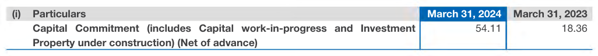

**[Image: AnnualReport2024.pdf-0201-22.png (1026x97, 36.0KB)]**

<!-- Start of picture text -->
(i) Particulars March 31, 2024 March 31, 2023 Capital Commitment (includes Capital work-in-progress and Investment   54.11   18.36 Property under construction) (Net of advance) <!-- End of picture text -->

- (ii) The Company enters into construction contracts for Civil, Elevator, External Development, MEP work etc. with its vendors. The total amount payable under such contracts will be based on actual measurements and negotiated rates, which are determinable as and when the work under the said contracts are completed. 

- (iii) The Company has entered into development agreements with owners of land for development of projects. Under the agreements the Company is required to pay certain payments/ deposits to the owners of the land and share in built up area/ revenue from such developments in exchange of undivided share in land as stipulated under the agreements. 

- (iv) The Company will arrange funds / subscribe to further capital to support continuing operations in certain subsidiaries and joint ventures (jointly with the shareholders / Partners of the respective joint ventures), if required, based upon operation of such entities. The Company expects the said subsidiaries and joint ventures to meet its obligations and no liability on this account is anticipated. 

###### 51 Payment to Auditors (net of taxes) 

|**Particulars**|**March 31, 2024**|**March 31, 2023**|
|---|---|---|
|Audit Fees |1.04|0.85|
|Certifcation and others|0.17|0.08|
|Reimbursement of Expenses|0.16|0.06|
||**1.37**|**0.99**|

INR 0.00 Crore represents amount less than INR 50,000 

###### 52 Foreign Exchange Difference 

   - The amount of exchange difference included in the Standalone Statement of Profit and Loss is INR 0.05 Crore (Net Loss) (Previous Year: INR 0.06 Crore (Net Loss)). 

- 53 **(a)** Miscellaneous income includes INR 35.13 Crore related to reversal of Impairment of investments and other assets (Previous Year: NIL) and INR 20.00 Crore related to excess provision written back upon completion of project (Previous Year: 0.04 Crore). 

   - **(b)** Other Expenses includes provision for expected credit loss (net) on investments and other assets of INR 11.23 Crore (Previous Year: 6.40 Crore) and financial assets written off INR 24.49 Crore (Previous Year: INR 28.47 Crore). 

###### 54 Corporate Social Responsibility 

The Company has spent INR 10.84 Crore (Previous Year: INR 11.02 Crore*) and created provision for unspent amount of INR Nil (Previous year: INR NIL Crore) during the year as per the provisions of Section 135 of the Companies Act, 2013 towards Corporate Social Responsibility (CSR) activities grouped under ‘Other Expenses’. 

- (a) Gross amount required to be spent by the Company during the year INR 10.84 Crore. (Previous Year: INR 8.89 Crore) 

- (b) Amount approved by the Board to be spent during the year INR 10.84 Crore. (Previous Year: INR 8.89 Crore) 

- (c) Amount spent during the year on : 

|**Particulars**|**Amount Spent** **in Cash**|**Amount yet to** **be paid in Cash**|**Total Amount**|
|---|---|---|---|
|**Year ended March 31, 2024**||||
|(i)  Construction / Acquisition of any Asset|-|-|-|
|(ii) On purposes other than (i) above|10.84|-|10.84|
|**Year ended March 31, 2023**||||
|(i)  Construction / Acquisition of any Asset|-|-|-|
|(ii) On purposes other than (i) above|11.02|-|11.02|

**[Image: AnnualReport2024.pdf-0201-39.png (990x25, 3.9KB)]**

Godrej Properties Limited 

Integrated Report 2023-24 

392 

393 

About Godrej Integrating Sustainability Management Discussion Statutory Properties Limited with our Business and Analysis Reports 

**[Image: AnnualReport2024.pdf-0202-01.png (82x27, 2.2KB)]**

###### Notes Forming Part of Standalone Financial Statements 

For the year ended March 31, 2024 

(Currency in INR Crore) 

###### 54 Corporate Social Responsibility (continued) 

Details of ongoing CSR projects under Section 135(6) of the Act 

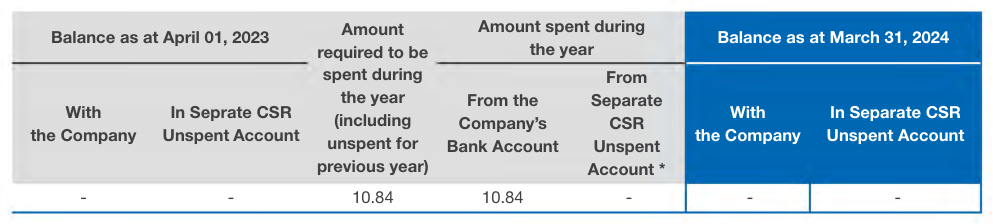

**[Image: AnnualReport2024.pdf-0202-07.png (993x224, 76.5KB)]**

<!-- Start of picture text -->
Amount  Amount spent during Balance as at April 01, 2023 Balance as at March 31, 2024 required to be  the year spent during  From the year  From the  Separate With  In Seprate CSR  With  In Separate CSR (including  Company’s  CSR the Company Unspent Account the Company Unspent Account unspent for  Bank Account  Unspent previous year) Account * - - 10.84 10.84  -     -     - <!-- End of picture text -->

**[Image: AnnualReport2024.pdf-0202-08.png (991x33, 4.6KB)]**

<!-- Start of picture text -->
1.56 0.57 11.02 8.89 2.13 - - <!-- End of picture text -->

- *includes INR 0.57 Crore related to Financial year ended 31 March 2021 and INR 1.56 Crore related to Financial year ended 31 March 2022 

###### Notes Forming Part of Standalone Financial Statements 

For the year ended March 31, 2024 

(Currency in INR Crore) 

###### 56 UTILISATION OF BORROWED FUNDS 

Investments made in the equity loan of Godrej Projects Development Limited (“GPDL”) (Wholly Owned Subsidiary) during the year: 

|Month|Dates|Amount|
|---|---|---|
|April 2023|6,10,11,26,28|0.73|
|May 2023|3,4,5,9,16,19,23,29,30|0.77|
|Jun 2023|7,20,21,21,26,19|0.28|
|Jul 2023|5,6,12,18,19,25,26|0.50|
|August 2023|7,18,22,25,29|1.01|
|Sept 2023|6,5,26|0.44|
|Oct 2023|6,10|0.13|
|Nov 2023|7,9,21,24|0.13|
|Dec 2023|6,5,19|0.22|
|Jan 2024|5,9,18,23,30|0.49|
|Feb 2024|1,6,20,27|1.34|
|Mar 2024|5,6,12,19,26|4.01|
|**Total**||**10.04**|

**[Image: AnnualReport2024.pdf-0202-16.png (1026x24, 2.4KB)]**

Investments made by GPDL, as intermediary, during the year: 

###### 55 Utilisation of proceeds from issue of Shares 

###### **Qualified Institutional Placement** 

During the FY 2020-21, the Company raised a sum of INR 3,750.00 Crore by allotting 25,862,068 equity shares on a Qualified Institutional Placement basis. 

###### **Particulars** 

|Proceeds from the issue of shares during the year ended March 31, 2021|3,750.00|
|---|---|
|Issue related expenses*|52.61|
||**3,697.39**|
|Utilisation in FY 2021-22|474.34|
|Utilisation in FY 2022-23|3,122.91|
|Utilisation in FY 2023-24 |100.14|
|Balance unutilised amount invested in mutual funds and fxed deposits with Banks as at March 31, 2024|-|
|Total issue related expenses are INR 60.22 Crore. **Particulars**|**March 31, 2024**|
|Proceeds from the issue of shares during the year ended March 31, 2020|2,100.00|
|Issue related expenses|37.80|
||**2,062.20**|
|Utilisation in FY 2020-21|1,489.97|
|Utilisation in FY 2021-22|414.09|
|Utilisation in FY 2022-23 |158.14|
|Balance unutilised amount invested in mutual funds and fxed deposits with Banks as at March 31, 2023|**-**|

*Total issue related expenses are INR 60.22 Crore. 

**[Image: AnnualReport2024.pdf-0202-24.png (991x24, 5.0KB)]**

|Investee Company|Relationship with the Company|Nature of Investment|Month|Dates|Amount|
|---|---|---|---|---|---|
|Wonder Projects Development|Joint Venture|Loan given|April 2023|6,10,11,26,28|0.73|
|Private Limited |||May 2023|3,4,5,9,16,19,23,29,30|0.77|
|(CIN: U70102MH2015PTC265969)|||Jun 2023|7,20,21,21,26,19|0.28|
||||Jul 2023|5,6,12,18,19,25,26|0.50|
||||August 2023|7,18,22,25,29|1.01|
||||Sept 2023|6,5,26|0.44|
||||Oct 2023|6,10|0.13|
||||Nov 2023|7,9,21,24|0.13|
||||Dec 2023|6,5,19|0.22|
||||Jan 2024|5,9,18,23,30|0.49|
||||Feb 2024|1,6,20,27|1.34|
||||Mar 2024|5,6,12,19,26|4.01|
|||**Total**|||**10.04**|

**[Image: AnnualReport2024.pdf-0202-26.png (1026x24, 2.7KB)]**

- a) The above investment/loan is in compliance with the relevant provisions of the Companies Act, 2013 and the transactions are not violative of the Prevention of Money-Laundering Act, 2002 (15 of 2003) 

- b) The balance money in INR 0.00 Crore will be utilized for general corporate purposes. 

- c) The Company has not received any funds from any persons or entities, including foreign entities (‘’Funding Parties”), with the understanding, whether recorded in writing or otherwise, that the Company shall directly or indirectly, lend or invest in other persons or entities identified in any manner whatsoever (“Ultimate Beneficiaries”) by or on behalf of the Funding Party or provide any guarantee, security or the like from or on behalf of the Ultimate Beneficiaries. 

INR 0.00 represent amount less than INR 50,000/- 

Godrej Properties Limited 

Integrated Report 2023-24 

394 

395 

About Godrej Integrating Sustainability Management Discussion Statutory Properties Limited with our Business and Analysis Reports 

**[Image: AnnualReport2024.pdf-0203-01.png (82x27, 2.3KB)]**

###### Notes Forming Part of Standalone Financial Statements 

For the year ended March 31, 2024 

(Currency in INR Crore) 

###### 57 Segment Reporting 

###### **A. Basis of Segmentation** 

Factors used to identify the entity’s reportable segments, including the basis of organisation 

For management purposes, the Company has only one reportable segment namely, Development of real estate property. The Managing Director of the Company acts as the Chief Operating Decision Maker (“CODM”). The CODM evaluates the Company’s performance and allocates resources based on an analysis of various performance indicators viz. Profit after tax. (Refer Note 30) 

###### **B. Geographical Information** 

The geographic information analyses the Company’s revenue and Non-Current Assets other than financial instruments, deferred tax assets, post-employment benefit assets by the Company’s country of domicile and other countries. As the Company is engaged in Development of Real Estate property in India, it has only one reportable geographical segment. 

###### Notes Forming Part of Standalone Financial Statements 

For the year ended March 31, 2024 

(Currency in INR Crore) 

- 60 The Indian Parliament has approved the Code on Social Security, 2020 which would impact the contributions by the company towards Provident Fund and Gratuity. The Ministry of Labour and Employment has released draft rules for the Code on Social Security, 2020 on November 13, 2020, and has invited suggestions from stakeholders which are under active consideration by the Ministry. The Company will assess the impact and its evaluation once the subject rules are notified and will give appropriate impact in its financial statements in the period in which, the Code becomes effective and the related rules to determine the financial impact are published. 

- 61 Cash and Cash Equivalents and Bank Balances includes balances in Escrow Account which shall be used only for specified purposes as defined under Real Estate (Regulation and Development) Act, 2016. 

###### **C. Information about major customers** 

Revenue from one customer is INR NIL  for the year ended March 31, 2024 (Previous Year: INR NIL) constituted more than 10% of the total revenue of the Company. 

- 58The (Reversal)/write-down of inventories to net realisable value during the year amounted to INR (19.00) Crore (Previous Year: INR 10.31 Crore). 

- 59Additional disclosure to Micro, Small and Medium enterprises : 

As per our report of even date. 

For **B S R & Co. LLP** Chartered Accountants Firm's Registration No: 101248W/W-100022 

For and on behalf of the Board of Directors of **Godrej Properties Limited** CIN: L74120MH1985PLC035308 

###### **Particulars March 31, 2024 March 31, 2023** 

(a) The principal amount remaining unpaid to any supplier as at the end of the 48.76 37.26 accounting year; 

- (b) The interest due thereon remaining unpaid to any supplier as at the end of the 0.02 Nil accounting year; 

- (c) The amount of interest paid by the buyer under MSMED Act, 2006 along with the amounts of the payment made to the supplier beyond the appointed day during each accounting year 

Nil Nil 

- (d) the amount of interest due and payable for the period of delay in making payment (which has been paid but beyond the appointed day during the year) but without adding the interest specified under the MSMED Act, 2006; 

Nil Nil 

- (e) The amount of interest accrued and remaining unpaid at the end of accounting year 

Nil Nil 

- (f) The amount of further interest due and payable even in the succeeding year, until such date when the interest dues as above are actually paid to the small enterprise, for the purpose of disallowance as a deductible expenditure under section 23. 

Nil Nil 

###### **Mansi Pardiwalla** 

Partner Membership No: 108511 

Mumbai 

May 03, 2024 

###### **Pirojsha Godrej** 

###### **Gaurav Pandey** 

Executive Chairperson Managing Director & CEO DIN: 00432983 DIN: 07229661 

Mumbai Mumbai May 03, 2024 May 03, 2024 

**Ashish Karyekar Rajendra Khetawat** Company Secretary Chief Financial Officer ICSI Membership No. A11331 

Mumbai Mumbai May 03, 2024 May 03, 2024 

Disclosure of outstanding dues of Micro and Small Enterprise under Trade Payables is based on the information available with the Company regarding the status of the suppliers as defined under the Micro, Small and Medium Enterprises Development Act, 2006. 

Godrej Properties Limited 

Integrated Report 2023-24 

396 

397 

About Godrej Integrating Sustainability Properties Limited with our Business 

Management Discussion Statutory and Analysis Reports 

**[Image: AnnualReport2024.pdf-0204-02.png (82x27, 2.2KB)]**

###### **Independent Auditor’s Report** 

###### **To the Members of Godrej Properties Limited** 

REPORT ON THE AUDIT OF THE CONSOLIDATED FINANCIAL STATEMENTS 

###### **Opinion** 

We have audited the consolidated financial statements of Godrej Properties Limited (hereinafter referred to as the “Holding Company”) and its subsidiaries (Holding Company and its subsidiaries together referred to as “the Group”), its associate and its joint ventures, which comprise the consolidated balance sheet as at 31 March 2024, and the consolidated statement of profit and loss (including other comprehensive income), consolidated statement of changes in equity and consolidated statement of cash flows for the year then ended, and notes to the consolidated financial statements, including material accounting policies and other explanatory information (hereinafter referred to as “the consolidated financial statements”). 

In our opinion and to the best of our information and according to the explanations given to us, the aforesaid consolidated financial statements give the information required by the Companies Act, 2013 (“Act”) in the manner so required and give a true and fair view in conformity with the accounting principles generally accepted in India, of the consolidated state of affairs of the Group, its associate and joint ventures as at 31 March 2024, of its consolidated profit and other comprehensive loss, consolidated changes in equity and consolidated cash flows for the year then ended. 

###### **Basis for Opinion** 

We conducted our audit in accordance with the Standards on Auditing (SAs) specified under Section 143(10) of the Act. Our responsibilities under those SAs are further described in the Auditor’s Responsibilities for the Audit of the Consolidated Financial Statements section of our report. We are independent of the Group, its associate and joint ventures in accordance with the ethical requirements that are relevant to our audit of the consolidated financial statements in terms of the Code of Ethics issued by the Institute of Chartered Accountants of India and the relevant provisions of the Act, and we have fulfilled our other ethical responsibilities in accordance with these requirements. We believe that the audit evidence we have obtained is sufficient and appropriate to provide a basis for our opinion on the consolidated financial statements. 

###### **Key Audit Matters** 

Key audit matters are those matters that, in our professional judgment, were of most significance in our audit of the consolidated financial statements of the current period. These matters were addressed in the context of our audit of the consolidated financial statements as a whole, and in forming our opinion thereon, and we do not provide a separate opinion on these matters. 

###### **Revenue Recognition** 

(See Note 29 to consolidated financial statements) 

###### **The Key audit matter** 

###### **How the matter was addressed in our audit Our audit procedures included following:** 

The Group’s most significant revenue streams involve sale of  residential, commercial units and plotted and other lands representing 87.74% of the total revenue from operations of the Group. 

- Obtaining and understanding revenue recognition process including identification of performance obligations and determination of transfer of control of the asset underlying the performance obligation to the customer. 

Revenue is recognised post transfer of control to customers for the consideration (transaction price) which the Group expects to receive in exchange for those units. The trigger for revenue recognition is normally completion of the project or receipt of approvals on completion from relevant authorities post which the contract becomes non-cancellable. The Group records revenue, over time till the actual possession to the customers, or on actual possession to the customers, as determined by the terms of contract with customers. 

Evaluating the design and implementation and tested operating effectiveness of key internal controls around approvals of contracts, milestone billing, intimation of receipt of occupation certificate, recording of project cost and controls over collection from customers. 

- 

Evaluating the accounting policies adopted by the Group for revenue recognition to check those are in line with the applicable accounting standards and their consistent application to the significant sales contracts. 

- 

###### **Measurement of revenue recorded over time which is** 

###### **dependent on the estimates of the costs to complete** 

- Revenue recognition involves significant estimates related to • measurement of costs to complete for the projects. Revenue from projects is recorded based on the Group’s assessment of the work completed, costs incurred and accrued and the estimate of the balance costs to complete. • 

Testing timeliness of revenue recognition by comparing individual sample sales transactions to underlying contracts. 

- Conducting site visits during the year for selected projects to understand the scope, nature and progress of the projects. 

Considering the significant estimate involved in measurement of revenue and risk of revenue being recognised in an incorrect period, we have considered recognition of revenue as a key audit matter. 

- Evaluating revenue overstatement by assessing Group’s key judgments in interpreting contractual terms. Determining the point in time at which the control is transferred by evaluating Group’s in-house legal interpretations of the underlying agreements i.e. when contract becomes non-cancellable. 

- Requesting confirmations, on a sample basis for trade receivables and advances from customer. In case of non-receipt of confirmations, we have performed alternative procedures by comparing details with contracts, collection details and other underlying project related documentation. 

- Assessing the costs incurred and accrued to date on the balance sheet by examining underlying invoices and signed agreements on a sample basis. Assessing contract costs to check no costs of revenue nature are incorrectly recorded in the balance sheet. 

Godrej Properties Limited 

Integrated Report 2023-24 

398 

399 

About Godrej Integrating Sustainability Management Discussion Statutory Properties Limited with our Business and Analysis Reports 

**[Image: AnnualReport2024.pdf-0205-01.png (82x27, 2.2KB)]**

###### **The Key audit matter** 

###### **How the matter was addressed in our audit** 

- Comparing, on a sample basis, revenue transactions recorded during the year with the underlying contracts, progress reports, invoices raised on customers and collections in bank accounts. Also, checked the related revenue had been recognised in accordance with the Group’s revenue recognition policies. 

- Comparing the costs to complete workings with the budgeted costs and inquiring for variance. 

- Sighting Group’s internal approvals, on sample basis, for changes in budgeted costs along with the rationale for the changes. 

- Scrutinising the revenue journal entries raised throughout the reporting period and comparing details of a sample of these journals, which met certain risk-based criteria, with relevant underlying documentation. 

- Considering the adequacy of the disclosures in the standalone financial statements in respect of the judgments taken in recognising revenue for residential, commercial units and plotted and other lands in accordance with Ind AS 115. 

**[Image: AnnualReport2024.pdf-0205-09.png (1027x24, 4.3KB)]**

###### **Investments in joint ventures and an associate and loans to joint ventures** 

(See Note 6, 7 and 17 to consolidated financial statements) 

###### **The Key audit matter** 

###### **How the matter was addressed in our audit** 

The carrying amount of the investments in joint ventures and an associate held at cost less impairment represents 3.81% of the Group’s total assets. The loans to joint ventures represent 4.59% of the Group’s total assets. 

Recoverability of investments in joint ventures and an associate 

###### **Our audit procedures included:** 

- Evaluating design and implementation and testing operating effectiveness of controls over the Group’s process of impairment assessment and approval of forecasts. 

###### **Recoverability of investments in joint ventures and associate** 

The Group’s investments in joint ventures and an associate are carried at cost less any diminution in value. The investments are assessed for impairment at each reporting date. The impairment assessment involves the use of estimates and judgements. The identification of impairment event and the determination of an impairment charge also require the application of significant judgement by the Group. The judgement, in particular, is with respect to the timing, quantity and estimation of projected cash flows of the real estate projects in these underlying entities. 

- Assessing the valuation methods used, financial position of the joint ventures and an associate to identify excess of their net assets over their carrying amount of investment by the Group and assessing profit history of those joint ventures and an associate. 

- For the investments where the carrying amount exceeded the net asset value, understanding from the Group regarding the basis and assumptions used for the projected profitability. 

In view of the significance of these investments and above, we consider valuation / impairment of investments in joint ventures and an associate to be a key audit matter. 

Verifying the inputs used in the projected profitability. 

- 

- Testing the assumptions and understanding the forecasted cash flows of joint ventures and an associate based on our knowledge of the Group and the markets in which they operate. 

###### **Recoverability of Loans to Joint Ventures** 

The Group has extended loans to joint ventures. These are assessed for recoverability at each period end. 

- Assessing the comparability of the forecasts with historical information. 

Due to the nature of the business in the real estate industry, the Group is exposed to heightened risk in respect of the recoverability of the loans granted to its joint ventures. In addition to nature of business, there is also significant judgment involved as to the recoverability of the working capital and project specific loans. This depends on property developments projects being completed over the time period specified in agreements. 

- Analysing the possible indications of impairment and understanding Group’s assessment of those indications. 

- Considering the adequacy of disclosures in respect of the investment in joint ventures and an associate. 

**[Image: AnnualReport2024.pdf-0205-32.png (1027x23, 4.1KB)]**

###### **The Key audit matter** 

###### **How the matter was addressed in our audit** 

We have identified measurement of loans to joint ventures as a key audit matter because recoverability assessment involves Group’s significant judgement and estimate. 

Recoverability of Loans to Joint Ventures 

- Evaluating the design and implementation and testing operating effectiveness of key internal controls placed around the impairment assessment process of the recoverability of the loans. 

- Assessing the net worth of joint ventures on the basis of latest available financial statements. 

- Assessing the controls for grant of new loans and sighting the Board approvals obtained. We have tested Group’s assessment of the recoverability of the loans, which includes cash flow projections over the duration of the loans. These projections are based on underlying property development appraisals. 

- Tracing loans advanced / repaid during the year to bank statement. 

- Obtaining independent confirmations to assess completeness and existence of loans given to joint ventures as on 31 March 2024. 

**[Image: AnnualReport2024.pdf-0205-42.png (1026x24, 4.6KB)]**

###### **Other Information** 

and Board of Directors of the companies/ Designated Partners of the Limited Liability Partnership(s) (LLPs) included in the Group and of its associate and joint ventures are responsible for maintenance of adequate accounting records in accordance with the provisions of the Act for safeguarding the assets of each company/LLP and for preventing and detecting frauds and other irregularities; the selection and application of appropriate accounting policies; making judgments and estimates that are reasonable and prudent; and the design, implementation and maintenance of adequate internal financial controls, that were operating effectively for ensuring the accuracy and completeness of the accounting records, relevant to the preparation and presentation of the consolidated financial statements that give a true and fair view and are free from material misstatement, whether due to fraud or error, which have been used for the purpose of preparation of the consolidated financial statements by the Management and Board of Directors of the Holding Company, as aforesaid. 

The Holding Company’s Management and Board of Directors are responsible for the other information. The other information comprises the information included in the annual report, but does not include the financial statements and auditor’s report thereon. The annual report is expected to be made available to us after the date of this auditor’s report. 

Our opinion on the consolidated financial statements does not cover the other information and we will not express any form of assurance conclusion thereon. 

In connection with our audit of the consolidated financial statements, our responsibility is to read the other information identified above when it becomes available and, in doing so, consider whether the other information is materially inconsistent with the consolidated financial statements or our knowledge obtained in the audit, or otherwise appears to be materially misstated. 

In preparing the consolidated financial statements, the respective Management and Board of Directors of the companies/ Designated Partners of the LLPs included in the Group and of its associate and joint ventures are responsible for assessing the ability of each company/LLP to continue as a going concern, disclosing, as applicable, matters related to going concern and using the going concern basis of accounting unless the respective Board of Directors/ Designated Partners either intends to liquidate the Company/ LLP or to cease operations, or has no realistic alternative but to do so. 

###### **Management's and Board of Directors'/ Designated Partners' Responsibilities for the Consolidated Financial Statements** 

The Holding Company’s Management and Board of Directors are responsible for the preparation and presentation of these  consolidated   financial statements in term of the requirements of the Act that give a true and fair view of the consolidated state of affairs, consolidated profit/ loss and other comprehensive income, consolidated statement of changes in equity and consolidated cash flows of the Group including its associate and joint ventures in accordance with the accounting principles generally accepted in India, including the Indian Accounting Standards (Ind AS) specified under Section 133 of the Act. The respective Management 

The respective Board of Directors of the companies/ Designated Partners of the LLPs included in the Group and of its associate and joint ventures are responsible for overseeing the financial reporting process of each company/LLP. 

Godrej Properties Limited 

Integrated Report 2023-24 

400 

401 

About Godrej Integrating Sustainability Management Discussion Statutory Properties Limited with our Business and Analysis Reports 

**[Image: AnnualReport2024.pdf-0206-01.png (82x27, 2.3KB)]**

<!-- Start of picture text -->
- <!-- End of picture text -->

###### **Auditor’s Responsibilities for the Audit of the Consolidated Financial Statements** 

Our objectives are to obtain reasonable assurance about whether the consolidated financial statements as a whole are free from material misstatement, whether due to fraud or error, and to issue an auditor’s report that includes our opinion. Reasonable assurance is a high level of assurance, but is not a guarantee that an audit conducted in accordance with SAs will always detect a material misstatement when it exists. Misstatements can arise from fraud or error and are considered material if, individually or in the aggregate, they could reasonably be expected to influence the economic decisions of users taken on the basis of these consolidated financial statements. 

As part of an audit in accordance with SAs, we exercise professional judgment and maintain professional skepticism throughout the audit. We also: 

- Identify and assess the risks of material misstatement of the consolidated financial statements, whether due to fraud or error, design and perform audit procedures responsive to those risks, and obtain audit evidence that is sufficient and appropriate to provide a basis for our opinion. The risk of not detecting a material misstatement resulting from fraud is higher than for one resulting from error, as fraud may involve collusion, forgery, intentional omissions, misrepresentations, or the override of internal control. 

- Obtain an understanding of internal control relevant to the audit in order to design audit procedures that are appropriate in the circumstances. Under Section 143(3) (i) of the Act, we are also responsible for expressing our opinion on whether the company has adequate internal financial controls with reference to financial statements in place and the operating effectiveness of such controls. 

- Evaluate the appropriateness of accounting policies used and the reasonableness of accounting estimates and related disclosures made by the Management and Board of Directors. 

- Conclude on the appropriateness of the Management and Board of Directors use of the going concern basis of accounting in preparation of consolidated financial statements and, based on the audit evidence obtained, whether a material uncertainty exists related to events or conditions that may cast significant doubt on the appropriateness of this assumption. If we conclude that a material uncertainty exists, we are required to draw attention in our auditor’s report to the related disclosures in the consolidated financial statements or, if such disclosures are inadequate, to modify our opinion. Our conclusions are based on the audit evidence obtained up to the date of our auditor’s report. However, future events or conditions may cause the Group and its associate and joint ventures to cease to continue as a going concern. 

- Evaluate the overall presentation, structure and content of the consolidated financial statements, including the disclosures, and whether the consolidated financial statements represent the underlying transactions and events in a manner that achieves fair presentation. 

We communicate with those charged with governance of the Holding Company and such other entities included in the consolidated financial statements of which we are the independent auditors regarding, among other matters, the planned scope and timing of the audit and significant audit findings, including any significant deficiencies in internal control that we identify during our audit. 

We also provide those charged with governance with a statement that we have complied with relevant ethical requirements regarding independence, and to communicate with them all relationships and other matters that may reasonably be thought to bear on our independence, and where applicable, related safeguards. 

From the matters communicated with those charged with governance, we determine those matters that were of most significance in the audit of the consolidated financial statements of the current period and are therefore the key audit matters. We describe these matters in our auditor’s report unless law or regulation precludes public disclosure about the matter or when, in extremely rare circumstances, we determine that a matter should not be communicated in our report because the adverse consequences of doing so would reasonably be expected to outweigh the public interest benefits of such communication. 

###### **Other Matter** 

- a. The consolidated financial statements include the Group’s share of net loss and other comprehensive loss of ₹ 1.63 crores for the year ended 31 March 2024, as considered in the consolidated financial statements, in respect of three (3) joint ventures, whose financial statements has not been audited by us. These unaudited financial statements has been furnished to us by the Management and our opinion on the consolidated  financial statements, in so far as it relates to the amounts and disclosures included in respect of these joint ventures, and our report in terms of sub-section (3) of Section 143 of the Act in so far as it relates to the aforesaid joint ventures, is based solely on such unaudited financial statements. In our opinion and according to the information and explanations given to us by the Management, these financial statements are not material to the Group. 

Our opinion on the consolidated financial statements, and our report on Other Legal and Regulatory Requirements below, is not modified in respect of this matter with respect to the financial statements certified by the Management. 

###### **Report on Other Legal and Regulatory Requirements** 

1. As required by the Companies (Auditor’s Report) Order, 2020 (“the Order”) issued by the Central Government of India in terms of Section 143(11) of the Act, we give in the “Annexure A” a statement on the matters specified in paragraphs 3 and 4 of the Order, to the extent applicable. 

- 2 A.  As required by Section 143(3) of the Act, we report, to the extent applicable, that: 

   - a. We have sought and obtained all the information and explanations which to the best of our knowledge and belief were necessary for the purposes of our audit of the aforesaid consolidated financial statements. 

   - b. In our opinion, proper books of account as required by law have been kept by the Holding Company, its subsidiary companies, its joint venture companies and its associate company incorporated in India so far as it appears from our examination of those books and proper returns adequate for the purposes of our audit except for the matters stated in the paragraph 2(B)(f) below on reporting under Rule 11(g) of the Companies (Audit and Auditors) Rules, 2014 and that the back-up of one accounting software which form part of the ‘books of account and other relevant books and papers in electronic mode’ has not been kept on the servers physically located in India. 

   - c. The consolidated balance sheet, the consolidated statement of profit and loss (including other comprehensive income), the consolidated statement of changes in equity and the consolidated statement of cash flows dealt with by this Report are in agreement with the relevant books of account maintained for the purpose of preparation of the consolidated financial statements. 

   - d. In our opinion, the aforesaid consolidated financial statements comply with the Ind AS specified under Section 133 of the Act. 

   - e. On the basis of the written representations received from the directors of the Holding Company as on March 31, 2024 and April 01, 2024 taken on record by the Board of Directors of the Holding Company and on the basis of written representations received by the management from directors of its subsidiary companies, associate company and joint venture companies which are incorporated in India, as on March 31, 2024 to May 03, 2024, none of the directors of the Group companies incorporated in India is disqualified as on March 31, 2024 from being appointed as a director in terms of Section 164(2) of the Act. 

   - f. the modifications relating to the maintenance of accounts and other matters connected therewith are as stated in the paragraph 2(A)(b) above on reporting under Rule 11(g) of the Companies (Audit and Auditors) Rules, 2014. 

   - g. With respect to the adequacy of the internal financial controls with reference to financial statements of the Holding Company and its subsidiary companies, associate company and joint venture companies and the operating effectiveness of such controls, refer to our separate Report in “Annexure B”. 

- B. With respect to the other matters to be included in the Auditor’s Report in accordance with Rule 11 of the Companies (Audit and Auditors) Rules, 2014, in our opinion and to the best of our information and according to the explanations given to us: 

   - a. The consolidated financial statements disclose the impact of pending litigations as at 31 March 2024 on the consolidated financial position of the Group, its associate and joint ventures. Refer Note 28 and 49 to the consolidated financial statements. 

- b. The Group, its associate and joint ventures did not have any long-term contracts including derivative contracts for which there were any material foreseeable losses. 

- c. There has been no delay in transferring amounts to the Investor Education and Protection Fund by the Holding Company or its subsidiary companies, associate company and joint venture companies incorporated in India during the year ended 31 March 2024. 

- d (i) The management of the Holding Company and its subsidiary companies, associate company and joint venture companies incorporated in India and whose financial statements has been audited under the Act has represented that, to the best of its knowledge and belief, as disclosed in the Note 54 to the consolidated financial statements, no funds have been advanced or loaned or invested (either from borrowed funds or share premium or any other sources or kind of funds) by the Holding Company or any of such subsidiary companies, associate company and joint venture companies to or in any other person(s) or entity(ies), including foreign entities (“Intermediaries”), with the understanding, whether recorded in writing or otherwise, that the Intermediary shall directly or indirectly lend or invest in other persons or entities identified in any manner whatsoever by or on behalf of the Holding Company or any of such subsidiary companies, associate company and joint venture companies (“Ultimate Beneficiaries”) or provide any guarantee, security or the like on behalf of the Ultimate Beneficiaries. 

   - (ii) The management of the Holding Company and its subsidiary companies, associate company and joint venture companies incorporated in India and whose financial statements has been audited under the Act has represented that, to the best of its knowledge and belief, as disclosed in the Note 54 to the consolidated financial statements, no funds have been received by the Holding Company or any of such subsidiary companies, associate company and joint venture companies from any person(s) or entity(ies), including foreign entities (“Funding Parties”), with the understanding, whether recorded in writing or otherwise, as on the date of this audit report, that the Holding Company or any of such subsidiary companies, associate company and joint venture companies shall directly or indirectly, lend or invest in other persons or entities identified in any manner whatsoever by or on behalf of the Funding Parties (“Ultimate Beneficiaries”) or provide any guarantee, security or the like on behalf of the Ultimate Beneficiaries. 

Godrej Properties Limited 

Integrated Report 2023-24 

402 

403 

About Godrej Integrating Sustainability Management Discussion Statutory Properties Limited with our Business and Analysis Reports 

**[Image: AnnualReport2024.pdf-0207-01.png (82x27, 2.2KB)]**

   - (iii) Based on the audit procedures performed that have been considered reasonable and appropriate in the circumstances, nothing has come to our notice that has caused us to believe that the representations under sub-clause (i) and (ii) of Rule 11(e), as provided under (i) and (ii) above, contain any material misstatement. 

- e. The Holding Company has neither declared nor paid any dividend during the year. 

- f. Based on our examination which included test checks, except for instances mentioned below, the Holding Company, its subsidiary companies and its joint venture companies incorporated in India whose financial statements have been audited under the Act, have used accounting softwares for maintaining its books of accounts, which along with access management tool, as applicable, have a feature of recording audit trail (edit log) facility and the same has operated throughout the year for all relevant transactions recorded in the respective softwares: 

   - i. in respect of the Holding Company, eighteen subsidiary companies and seven joint venture companies, the feature of recording audit trail (edit log) facility was not enabled for changes performed by privileged users at the application level for the accounting software used for maintaining the books of account for the period from 1 April 2023 to 8 April 2023. 

   - ii. in respect of the Holding Company, seven subsidiary companies and six joint venture companies, in the absence of independent auditor’s reports in relation to controls at service organizations for accounting softwares used for maintaining the books of accounts relating to revenue, trade receivables, and other related 

Place: Mumbai Date: May 03, 2024 

accounts, which are operated by third-party software service providers, we are unable to comment whether audit trail feature for the said softwares was enabled at the database level and operated throughout the year for all relevant transactions recorded in the respective softwares. 

- iii. in respect of one subsidiary company, the feature of recording audit trail (edit log) facility was not enabled at the database level to log any direct data changes for the accounting software used for maintaining the books of account related to revenue and trade receivables for the period from 1 April 2023 to 31 March 2024. 

Further, for the periods where audit trail (edit log) facility was enabled and operated for the respective accounting softwares, we did not come across any instance of audit trail feature being tampered with during our course of audit. 

- A. With respect to the matter to be included in the Auditor’s Report under Section 197(16) of the Act: 

In our opinion and according to the information and explanations given to us, the remuneration paid during the current year by the Holding Company and its subsidiary companies, associate company and joint venture companies to its directors is in accordance with the provisions of Section 197 of the Act. The remuneration paid to any director by the Holding Company and its subsidiary companies, associate company and joint venture companies is not in excess of the limit laid down under Section 197 of the Act. The Ministry of Corporate Affairs has not prescribed other details under Section 197(16) of the Act which are required to be commented upon by us. 

###### For **B S R & Co. LLP** 

Chartered Accountants Firm’s Registration No.:101248W/W-100022 

###### **Mansi Pardiwalla** 

Partner 

Membership No.: 108511 ICAI UDIN: 24108511BKEMWS9359 

###### Annexure A to the Independent Auditor’s Report on the Consolidated Financial Statements of Godrej Properties Limited for the year ended 31 March 2024 

(Referred to in paragraph 1 under ‘Report on Other Legal and Regulatory Requirements’ section of our report of even date) 

(xxi) In our opinion and according to the information and explanations given to us, following companies incorporated in India and included in the consolidated financial statements, have unfavourable remarks, qualifications or adverse remarks given by the respective auditors in their reports under the Companies (Auditor’s Report) Order, 2020 (CARO): 

###### **Clause number** 

||||**Holding**|**of the CARO**|
|---|---|---|---|---|
|**Sr.** **No. **|**Name of the entities**|**CIN**|**Company/** **Subsidiary/**|**report which is** **unfavourable** |
||||**JV/ Associate**|**or qualifed** **or adverse**|
|1|Ashank Land & Building Private Limited|U70200MH2018PTC317814|Subsidiary|xvii|
|2|Citystar lnfraProjects Limited|U45400WB2008PLC122810|Subsidiary|xvii|
|3|Godrej Garden City Properties Private Limited|U74900MH2011PTC213782|Subsidiary|xvii|
|4|Godrej Green Woods Private Limited|U45309MH2020PTC340019|Subsidiary|xvii|
|5|Godrej Precast Construction Private Limited|U45309MH2020PTC342204|Subsidiary|xvii|
|6|Godrej Realty Private Limited|U70100MH2005PTC154268|Subsidiary|xvii|
|7|Godrej Projects Development Limited|U70102MH2010PLC210227|Subsidiary|xvii|
|8|Godrej Skyline Developers Private Limited|U45309MH2016PTC287858|Subsidiary|xvii, xix|
|9|Godrej Residency Private Limited|U70109MH2017PTC292515|Subsidiary|xvii|
|10|Godrej Living Private Limited|U45201MH2022PTC375864|Subsidiary|xvii|
|11|Munjal Hospitality Private Limited|U55204PB2007PTC039380|Joint Venture|xvii|
|12|Madhuvan Enterprises Private Limited|U70109KA2019PTC127534|Joint Venture|xvii|
|13|Vagishwari Land Developers Private Limited|U45208TG2015PTC101945|Joint Venture|xvii|
|14|Wonder Projects Development Private Limited|U70102MH2015PTC265969|Joint Venture|xvii, xix|
|15|Yerwada Developers Private Limited|U45403MH2021PTC371791|Joint Venture|xvii|

**[Image: AnnualReport2024.pdf-0207-23.png (1026x24, 3.8KB)]**

The above does not include comments, if any, in respect of the following entities as the CARO report relating to them has not been issued by its auditor till the date of principal auditor’s report. 

###### **Subsidiary/ JV/ Associate** 

###### **CIN** 

###### **Name of the entities** 

Godrej Hillside Properties Private Limited U70102MH2015PTC263237 Subsidiary Godrej Home Developers Private Limited U70102MH2015PTC263223 Subsidiary Godrej Genesis Facilities Management Private Limited U70100MH2016PTC273316 Subsidiary Godrej Real Estate Distribution Company Private Limited U68200MH2023PTC407021 Subsidiary Godrej Macbricks Private Limited U70100MH2017PTC302864 Joint Venture Godrej Greenview Housing Private Limited U70102MH2015PTC264491 Joint Venture Godrej Real View Developers Private Limited U45309MH2016PTC285438 Joint Venture Godrej Green Homes Private Limited U70200MH2013PTC251378 Joint Venture Godrej Redevelopers (Mumbai) Private Limited U70102MH2013PTC240297 Joint Venture 

**[Image: AnnualReport2024.pdf-0207-29.png (1026x24, 4.3KB)]**

For **B S R & Co. LLP** 

Chartered Accountants 

Firm’s Registration No.:101248W/W-100022 

###### **Mansi Pardiwalla** 

Place: Mumbai Date: May 03, 2024 

Partner Membership No.: 108511 ICAI UDIN: 24108511BKEMWS9359 

Godrej Properties Limited 

Integrated Report 2023-24 

404 

405 

About Godrej Integrating Sustainability Properties Limited with our Business 

Management Discussion Statutory and Analysis Reports 

**[Image: AnnualReport2024.pdf-0208-02.png (82x27, 2.3KB)]**

<!-- Start of picture text -->
- <!-- End of picture text -->

###### Annexure B to the Independent Auditor’s Report on the consolidated financial statements of Godrej Properties Limited for the year ended 31 March 2024 

###### **Report on the internal financial controls with reference to the aforesaid consolidated financial** 

###### **statements under Clause (i) of Sub-section 3 of Section 143 of the Act** 

(Referred to in paragraph 2(A)(g) under ‘Report on Other Legal and Regulatory Requirements’ section of our report of even date) 

###### **Opinion** 

###### **Auditor’s Responsibility** 

In conjunction with our audit of the consolidated financial statements of Godrej Properties Limited (hereinafter referred to as “the Holding Company”) as of and for the year ended 31 March 2024, we have audited the internal financial controls with reference to financial statements of the Holding Company and such companies incorporated in India under the Act which are its subsidiary companies, its associate company and joint venture companies, as of that date. 

Our responsibility is to express an opinion on the internal financial controls with reference to financial statements based on our audit. We conducted our audit in accordance with the Guidance Note and the Standards on Auditing, prescribed under Section 143(10) of the Act, to the extent applicable to an audit of internal financial controls with reference to financial statements. Those Standards and the Guidance Note require that we comply with ethical requirements and plan and perform the audit to obtain reasonable assurance about whether adequate internal financial controls with reference to financial statements were established and maintained and if such controls operated effectively in all material respects. 

In our opinion, the Holding Company and such companies incorporated in India which are its subsidiary companies, its associate company and joint venture companies, have, in all material respects, adequate internal financial controls with reference to financial statements and such internal financial controls were operating effectively as at 31 March 2024, based on the internal financial controls with reference to financial statements criteria established by such companies considering the essential components of such internal controls stated in the Guidance Note on Audit of Internal Financial Controls Over Financial Reporting issued by the Institute of Chartered Accountants of India (the “Guidance Note”). 

Our audit involves performing procedures to obtain audit evidence about the adequacy of the internal financial controls with reference to financial statements and their operating effectiveness. Our audit of internal financial controls with reference to financial statements included obtaining an understanding of internal financial controls with reference to financial statements, assessing the risk that a material weakness exists, and testing and evaluating the design and operating effectiveness of internal control based on the assessed risk. The procedures selected depend on the auditor’s judgement, including the assessment of the risks of material misstatement of the consolidated financial statements, whether due to fraud or error. 

###### **Management’s and Board of Directors’ Responsibilities for Internal Financial Controls** 

The respective Company's Management and the Board of Directors are responsible for establishing and maintaining internal financial controls based on the internal financial controls with reference to financial statements criteria established by the respective company considering the essential components of internal control stated in the Guidance Note. These responsibilities include the design, implementation and maintenance of adequate internal financial controls that were operating effectively for ensuring the orderly and efficient conduct of its business, including adherence to the respective company's policies, the safeguarding of its assets, the prevention and detection of frauds and errors, the accuracy and completeness of the accounting records, and the timely preparation of reliable financial information, as required under the Act. 

We believe that the audit evidence we have obtained is sufficient and appropriate to provide a basis for our audit opinion on the internal financial controls with reference to financial statements. 

###### **Meaning of Internal Financial Controls with** 

###### **Reference to Financial Statements** 

A company's internal financial controls with reference to financial statements is a process designed to provide reasonable assurance regarding the reliability of financial reporting and the preparation of financial statements for external purposes in accordance with generally accepted accounting principles. A company's internal financial 

controls with reference to financial statements include those policies and procedures that (1) pertain to the maintenance of records that, in reasonable detail, accurately and fairly reflect the transactions and dispositions of the assets of the company; (2) provide reasonable assurance that transactions are recorded as necessary to permit preparation of financial statements in accordance with generally accepted accounting principles, and that receipts and expenditures of the company are being made only in accordance with authorisations of management and directors of the company; and (3) provide reasonable assurance regarding prevention or timely detection of unauthorised acquisition, use, or disposition of the company's assets that could have a material effect on the financial statements. 

Place: Mumbai Date: May 03, 2024 

###### **Inherent Limitations of Internal Financial Controls** 

###### **with Reference to Financial Statements** 

Because of the inherent limitations of internal financial controls with reference to financial statements, including the possibility of collusion or improper management override of controls, material misstatements due to error or fraud may occur and not be detected. Also, projections of any evaluation of the internal financial controls with reference to financial statements to future periods are subject to the risk that the internal financial controls with reference to financial statements may become inadequate because of changes in conditions, or that the degree of compliance with the policies or procedures may deteriorate. 

For **B S R & Co. LLP** Chartered Accountants Firm’s Registration No.:101248W/W-100022 

**Mansi Pardiwalla** Partner Membership No.: 108511 ICAI UDIN: 24108511BKEMWS9359 

Godrej Properties Limited 

Integrated Report 2023-24 

406 

407 

About Godrej Integrating Sustainability Management Discussion Statutory Properties Limited with our Business and Analysis Reports 

###### Consolidated Balance Sheet 

|As at March 31, 2024||(Cur|rency in INR Crore)|
|---|---|---|---|
|||**As At**|**As At**|
|**Particulars**|**Note**|**March 31, 2024**|**March 31, 2023**|
|ASSETS||||
|Non-Current Assets||||
|Property, Plant and Equipment|2|930.05|153.16|
|Right-of-use-Asset |42 |21.29 |17.07 |
|Capital Work-in-Progress Investment Property|3 4|248.96 30.48|652.44 32.19|
| Gdill  Clidti|| 007| 007|
|oow on onsoaon Intangible Assets|5|. 15.36|. 15.19|
|Intangible Assets Under Development |5 |1.20 |0.85 |
|Equity accounted investees|6|770.13|786.25|
|Financial Assets||||
|Other Investments|7|591.70|667.74|
|Trade Receivables|8|65.05|160.27|
|Other Non-Current Financial Assets|9|123.92|38.67|
|Deferred Tax Assets (Net) |10|305.70 |331.51 |
|Income Tax Assets (Net)||180.53|74.37|
|Other Non-Current Non Financial Assets|11|0.27|3.01|
|**Total Non-Current Assets**||**3,284.71**|**2,932.79**|
|Current Assets||||
|Inventories|12|22,564.62|12,073.40|
|Financial Assets||||
|Investments|13|1,788.25|1,080.47|
|Trade Receivables|14|309.60|359.38|
|Cash and Cash Equivalents|15|1,319.81|714.81|
|Bank Balances other than above Loans|16 17|1,600.56 1,779.03|1,301.13 2,394.86|
|Other Current Financial Assets|18|1,231.81|1,330.44|
|Other Current Non Financial Assets|19|1,856.47|918.02|
|**Total Current Assets**||**32,450.15**|**20,172.51**|
|**TOTAL ASSETS**|| **35,734.86**| **23,105.30**|
|EQUITY AND LIABILITIES||||
|EQUITY||||
|Equity Share Capital|20|139.02|139.01|
|Other Equity||9,853.49|9,125.19|
|**Equity attributable to Shareholders of the Company** ||**9,992.51** |**9,264.20** |
|Non-Controlling Interest||308.93|22.95|
|Total Equity||**10,301.44**|**9,287.15**|
|LIABILITIES||||
|Non-Current Liabilities||||
|Financial Liabilities||||
| Borrowings|21|2,660.00|-|
|Lease Liabilities|42|10.63|10.90|
|Other Non - Current Financial Liabilities|22|10.69|5.00|
|Provisions|23|20.16|16.09|
|Total Non-Current Liabilities||**2,701.48**|**31.99**|
|Current Liabilities||||
| Financial Liabilities||||
|Borrowings |24 |7,996.46 |6,411.75 |
|Lease Liabilities|42|12.20|8.11|
|Trade Payables|25|||
| Total Outstanding Dues of Micro Enterprises and Small Enterprises||155.18|62.57|
|Total Outstanding Dues of Creditors other than Micro Enterprises and Small Enterprises||3,600.39|3,294.05|
| Other Current Financial Liabilities Other Current Non Financial Liabilities|26 27| 928.54 9,930.91| 830.15 3,096.41|
|Pii|28| 4185| 4622|
|rovsons Current Tax Liabilities (Net)||. 66.41|. 36.90|
|Total Current Liabilities ||**22,731.94** |**13,786.16** |
|Total Liabilities||**25,433.42**|**13,818.15**|
|TOTAL EQUITY AND LIABILITIES||**3573486**|**2310530**|
| Material Accounting Policies|1|**,.**|**,.**|

###### Consolidated Statement of Profit and Loss 

###### For the year ended March 31, 2024 

|or the year ended March 31, 2024||(Currency in INR Crore)|
|---|---|---|
|**Particulars**|**Note**|**For the year ended** **March 31, 2024** **For the year ended** **March 31, 2023**|
|INCOME|||
|Revenue from Operations|29|3,035.62 2,252.26|
|Other Income |30|1,298.60 786.74   |
|Total Income||**4,334.22** **3,039.00**|
|EXPENSES|||
|Cost of Materials Consumed|31|6,787.01 6,453.76|
|Purchase of stock in trade ||178.05 -|
|Change in inventories of fnished goods and construction work-in-progress |32|(5,157.03) (5,211.88)|
|Employee Benefts Expense |33|331.32 218.41|
|Finance Costs|34|152.11 174.23|
|Depreciation and Amortisation Expense|35|44.56 24.14|
|Other Expenses|36|1,025.95 544.34|
|**Total Expenses** ||**3,361.97** **2,203.00**|
|**Proft before share of proft / (loss) in joint ventures and associate and tax** ||**972.25** **836.00**|
| Share of Proft / (loss) of Joint Ventures and Associate (net of tax) ||27.74 (40.73)|
| **Proft before tax**||**999.99** **795.27**|
| Tax expense|||
|Current Tax|10(a)|187.01 198.74|
|Deferred Tax charge / (Credit)|10(c)|65.92 (24.07)|
|**Total Tax Expense** ||**252.93** **174.67**|
|Proft for the Year||747.06 620.60|
|Other Comprehensive Income |||
|**Items that will not be subsequently reclassifed to proft or loss** |||
| Remeasurements of the defned beneft plan|38|(1.92) 1.21|
|Tax on above |10(b)|0.45 (0.31)|
|**Items that will be subsequently reclassifed to proft or loss**|||
| Exchange diference in translating the fnancial statements of a foreign operations.||0.17 0.23|
| Other Comprehensive Income for the Year (Net of Tax)||**(1.30)** **1.13**|
|**Total Comprehensive Income for the Year** ||**745.76** **621.73**|
|Proft / (Loss) attributable to:|||
|Owners of the Company||725.27 571.39|
|Non-Controlling Interests||21.79 49.21|
|||**747.06** **620.60**|
|Other Comprehensive (Loss) / Income attributable to:|||
|Owners of the Company||(1.28) 1.13|
|Non-Controlling Interests||(0.02) -|
|||**(1.30)** **1.13**|
|Total Comprehensive Income attributable to:|||
|Owners of the Company||723.99 572.52|
|Non-Controlling Interests||21.77 49.21|
|||**745.76** **621.73**|
|Earnings Per Equity Share (Amount in INR)|37||
|Basic|37(a)|26.09 20.55|
|Diluted|37(b)|26.08 20.55|
|Material Accounting Policies|1||

The accompanying notes 1 to 60 form an integral part of these Consolidated Financial Statements. 

As per our report of even date. 

The accompanying notes 1 to 60 form an integral part of these Consolidated Financial Statements. 

For **B S R & Co. LLP** Chartered Accountants Firm's Registration No: 101248W/W-100022 

For and on behalf of the Board of Directors of **Godrej Properties Limited** CIN: L74120MH1985PLC035308 

As per our report of even date. 

For **B S R & Co. LLP** 

Chartered Accountants Firm's Registration No: 101248W/W-100022 

**Mansi Pardiwalla** Partner Membership No: 108511 Mumbai May 03, 2024 

For and on behalf of the Board of Directors of **Godrej Properties Limited** CIN: L74120MH1985PLC035308 

**Pirojsha Godrej Gaurav Pandey** Executive Chairperson Managing Director & CEO DIN: 00432983 DIN: 07229661 Mumbai Mumbai May 03, 2024 May 03, 2024 

**Ashish Karyekar** Company Secretary ICSI Membership No. A11331 Mumbai Mumbai May 03, 2024 May 03, 2024 

**Rajendra Khetawat** 

Chief Financial Officer 

###### **Mansi Pardiwalla** 

Partner Membership No: 108511 

Mumbai May 03, 2024 

###### **Pirojsha Godrej** 

###### **Gaurav Pandey** 

Executive Chairperson Managing Director & CEO DIN: 00432983 DIN: 07229661 Mumbai Mumbai May 03, 2024 May 03, 2024 

**Ashish Karyekar Rajendra Khetawat** Company Secretary Chief Financial Officer ICSI Membership No. A11331 Mumbai Mumbai May 03, 2024 May 03, 2024 

Godrej Properties Limited 

Integrated Report 2023-24 

408 

409 

About Godrej Integrating Sustainability Management Discussion Statutory Properties Limited with our Business and Analysis Reports 

**[Image: AnnualReport2024.pdf-0210-01.png (82x27, 2.2KB)]**

###### Consolidated Statement of Changes in Equity 

For the year ended March 31, 2024 

(Currency in INR Crore) 

###### **a)  Equity Share Capital** 

|**Particulars**|**As At** **March 31, 2024**|**As At** **March 31, 2023**|
|---|---|---|
|Balance at the beginning of the year|139.01|138.99|
|Changes in equity share capital during the year|0.01|0.02|
|Balance at the end of the year (Refer note 20)|**139.02**|**139.01**|

###### b)  Other Equity 

||||**Attribut** **Caital**|**able to the s** **Reserv**|**hareholders** **es and Surpl**|**of the Comp** **us**|**any**|**Exchange** **diferences**|**Total**|||
|---|---|---|---|---|---|---|---|---|---|---|---|
||||**p** **Reserve on**|**Securities** |**Employee** ||| **on**|**attributable** |**Attributable** ||
|**Parti**|**culars**|**Capital**|**Account of**|**Premium** |**tock Grant**|**General**|**Retained**|**translating**|**to the**|**to Non-**|**Total**|
|||**Reserve** **A**| **malgamation/**||**Scheme** **Reserve**|**Reserve**|**Earnings**|**s**   **the fnancial** |**hareholders** **f th**|**controlling** **Itt**||
|||**(Refer note**|**Acquisition** **(**|**Refer note**|**(**|**Refer note** |**(Refer note**|**statements** **f  fi**|**o e** **Company**|**neress**||
|||**(a) below)**|**(Refer note** **(b) below)** | **(c) below)**|**(Refer note** **(d) below)**|**(e) below)**|**(f) below)**|**o a oregn** **operation** **(Refer note** **(g) below)**||||
|**Bala**|**nce as at April 01, 2023**|**7.20**|**162.68**|**8,439.17**|**7.25**|**97.99**|**410.37**|**0.52**|**9,125.19**|**22.95**|**9,148.14**|
|Total|Comprehensive Income: |||||||||||
|i)|Proft for the year|-|-|-|-|-|725.27|-|725.27|21.79|747.06|
|ii)| Remeasurements of the defned beneft plan |-|-|-|-|-|(1.45)|-|(1.45)|(0.02)|(1.47)|
||(net of tax)|||||||||||
|iii)|Exchange diference in translating the fnancial statements of a foreign operations|-|-|-|-|-|-|0.56|0.56|-|0.56|
|Adjus|tments:|||||||||||
|i)|Transfer to securities premium on exercise of stock grants|-|-|3.18|(3.18)|-|-|-|-|-|-|
|ii)|Share based payments to employees (Refer note 33)|-|-|-|3.92|-|-|-|3.92|-|3.92|
|(iii)|On Account of Acquisition of Subsidiary|-|-|-|-|-|-|-|-|313.08|313.08|
|(iv)|Transfer from/to Retainded Earnings|-|-|-|-|-|1.08|(1.08)|-|-||
|(v)|Adjustmests/Payment to non controlling interest|-|-|-|-|-|-|-|-|(48.87)|(48.87)|
|**Bala**|**nce as at March 31, 2024**|**7.20**|**162.68**|**8,442.35**|**7.99**|**97.99**|**1,135.27**|**-**|**9,853.49**|**308.93**|**10,162.41**|
|**Bala**|**nce as at April 01, 2022**|**7.20**|**150.57**|**8,435.59**|**4.67**|**100.00**|**(161.92)**|**0.29**|**8,536.40**|**(1.82)**|**8,534.58**|
|Total|Comprehensive Income:|||||||||||
|i)|Proft for the year|-|-|-|-|-|571.39|-|571.39|49.21|620.60|
|ii)| Remeasurements of the defned beneft plan (net of tax)|-|-|-|-|-|0.90|-|0.90|-|0.90|
|iii)|Exchange diference in translating the fnancial statements of a foreign operations|-|-|-|-|-|-|0.23|0.23|-|0.23|
|Adjus|tments:|||||||||||
|i)|Transfer to securities premium on exercise of stock grants|-|-|3.58|(1.57)|(2.01)|-|-|-|-|-|
|ii)| Share based payments to employees (Refer note 33)|-|-|-|4.15|-|-|-|4.15|-|4.15|
|(iii)|Capital Reserve on Account of Amalgamation (Refer Note (b) below)|-|12.11|-|-|-|-|-|12.11|-|12.11|
|(iv)|Adjustmests/Payment to non controlling interest|-|-|-|-|-|-|-|-|(24.44)|(24.44)|
|**Bala**| **nce as at March 31, 2023**|**7.20**|**162.68**|**8,439.17**|**7.25**|**97.99**|**410.37**|**0.52**|**9,125.19**|**22.95**|**9,148.14**|

**[Image: AnnualReport2024.pdf-0210-09.png (844x45, 10.2KB)]**

<!-- Start of picture text -->
 7.20   162.68   8,442.35   7.99   97.99   1,135.27   -   9,853.49   308.93   10,162.41 <!-- End of picture text -->

**[Image: AnnualReport2024.pdf-0210-10.png (844x45, 8.9KB)]**

<!-- Start of picture text -->
 7.20   162.68   8,439.17   7.25   97.99   410.37   0.52   9,125.19   22.95   9,148.14 <!-- End of picture text -->

###### Consolidated Statement of Changes in Equity 

For the year ended March 31, 2024 

(Currency in INR Crore) 

###### **(a)  Capital Reserve** 

Profit on sale of treasury shares held by the ESOP trust is recognised in Capital Reserve. 

###### **(b)  Capital Reserve on Account of Amalgamation / Acquisition** 

The excess of net assets taken, over the cost of consideration paid is treated as capital reserve on amalgamation / acquisition. 

###### **(c)  Securities Premium** 

Securities premium is used to record the premium received on issue of shares. It is utilised in accordance with the provisions of the Companies Act, 2013. 

###### **(d)  Employee Stock Grant Scheme Reserve** 

The fair value of the equity-settled share based payment transactions with employees including key management personnel is recognised in the Consolidated Statement of Profit and Loss with corresponding credit to Employee Stock Grant Scheme Reserve. 

###### **(e)  General Reserve** 

The General reserve is created from time to time to transfer profits from retained earnings for appropriation purposes. 

###### **(f)  Retained Earnings** 

Retained Earnings are the profits that the Company has earned till the balance sheet date, less any transfers to general reserve, debenture redemption reserve, dividends or other distributions paid to shareholders. 

###### **(g)  Exchange differences on translating the financial statements of a foreign operation** 

Exchange differences arising on translation of the foreign operations are recognised in other comprehensive income and accumulated in a separate reserve within equity. The cumulative amount is reclassified to profit or loss when the net investment is disposed-off. The accompanying notes 1 to 60 form an integral part of these Consolidated Financial Statements. 

As per our report of even date. 

For **B S R & Co. LLP** Chartered Accountants Firm's Registration No: 101248W/W-100022 

For and on behalf of the Board of Directors of **Godrej Properties Limited** CIN: L74120MH1985PLC035308 

###### **Pirojsha Godrej** 

###### **Gaurav Pandey** 

**Mansi Pardiwalla** Partner Membership No: 108511 Mumbai May 03, 2024 

Executive Chairperson Managing Director & CEO DIN: 00432983 DIN: 07229661 Mumbai Mumbai May 03, 2024 May 03, 2024 

**Ashish Karyekar Rajendra Khetawat** Company Secretary Chief Financial Officer ICSI Membership No. A11331 Mumbai Mumbai May 03, 2024 May 03, 2024 

Godrej Properties Limited 

Integrated Report 2023-24 

410 

411 

About Godrej Integrating Sustainability Management Discussion Statutory Properties Limited with our Business and Analysis Reports 

###### Consolidated Statement of Cash Flows 

For the year ended March 31, 2024 

(Currency in INR Crore) 

|**Particulars**|**For the** **ear ended**|**For the** **ear ended**|
|---|---|---|
||**y** **March 31, 2024**|**y** **March 31, 2023**|
|**Cash Flows from Operating Activities** |||
|Proft before tax|999.99|795.27|
| **Adjustments for:**|||
|Depreciation and amortisation expense|44.56|24.14|
|Finance costs |152.11|174.23|
|Loss / (proft) on sale of property, plant and equipment and intangible assets (net) |0.27 |(0.33) |
|Share of (Proft) / Loss in joint ventures and associate |(27.74) |40.73 |
|Share based payments to employees|3.92|4.15|
|Interest income|(592.99)|(617.08)|
|Dividend income |(0.00)|(0.00)|
|Proft on sale of investments (net)|(98.31)|(127.45)|
|Fair value gain upon acquisition of control|(497.07)|-|
| Provision / expected credit loss on other assets (net)| 3.49|6.40|
|Income from Investment measured at FVTPL|(37.46)|(13.91)|
|Provision written back|(40.00)|(0.04)|
|(Reversal) / Write down of inventories |(30.71)|10.31|
|Financial Assets Written of|20.83|47.39|
| Lease rent from investment property |(4.31)|(1.26)|
|**Operating (loss)/ proft before working capital changes**|**(103.42)**|**342.55**|
|**Changes in Working Capital:**|||
|Increase in Non Financial Liabilities and Provisions|4,822.15|993.85|
|Increase in Financial Liabilities|178.13|292.09|
|(Increase) in Inventories|(4,916.35)|(3,987.28)|
|(Increase) in Non Financial Assets|(716.20)|(61.87)|
|Decrease / (Increase) in Financial Assets|307.65|(271.03)|
||(324.62)|(3,034.24)|
|**Direct Taxes paid (Net)**| **(264.53)**| **(168.95)**|
|**Net Cash used in Operating Activities**|**(692.57)**|**(2,860.64)**|
|Cash Flows from Investing Activities|||
| Acquisition of property, plant and equipment, investment property and intangible assets including|(695.25)|(305.85)|
|capital creditors, expenditure incurred on capital work in progress and capital advances (Refer note (g))|||
|Proceeds from sale of property, plant and equipment|1.84|5.98|
|(Investment) / Sale in debentures of joint ventures|0.37|(17.16)|
| Proceeds from sale of investment in subsidiary|-| 0.00|
|Sale / (Purchase) of investment in mutual funds (net)|(554.03)|2,554.30|
|(Purchase) of investments in fxed deposits (net)|(383.24)|(170.33)|
|Return / (Investment) in joint ventures (net)|65.11|(384.68)|
|Acquisition of subsidiaries|(109.47)|(29.07)|
| Loan (given to) / refunded by joint ventures (net)| (571.24)| 389.47|
|Loan (given to) others (net)|(36.70)|177.20|
|Dividend income|0.00|0.00|
|Interest received Acquisition of Non Controlling Interest|264.43 (65.89)|266.94 -|
| Lease rent from investment property| 4.31|1.26|
|**Net cash fows (used in) / generated from investing activities** |**(2,079.76)**|**2,488.06**|
| Cash Flows from fnancing activities|||
| Proceeds from issue of equity share capital (net of issue expenses)|0.01|0.02|
|Proceeds from long-term borrowings|2,660.00|-|
|Reament of lon-term borrowins|(100000)|-|
|py  g g Proceeds from short-term borrowings (net)|,. 2,476.40| 1,227.85|
|Interest and other borrowing cost paid|(868.34)|(385.41)|
|Payment of minimum lease liabilities|(10.08)|(10.04)|
| Payment of unclaimed dividend| -| (0.01)|
|Payment of unclaimed fxed deposits **Net cash fows generated from fnancing activities**|(0.03) **3,257.95**|(0.22) **832.22**|
| **Net Increase in Cash and Cash Equivalents**| 485.62|459.64|
|Cash and Cash Equivalents - Opening Balance|714.81|179.08|
|Cash and Cash Equivalents of subsidiaries acquired during the year (Refer note (c) below) Eft f h t ftti  h hld|105.40 017|75.86 023|
|ec o excange rae ucuaons on cas e **Cash and Cash Equivalents - Closing Balance (Refer note 60)**|. **1,306.00**|. **714.81**|

###### Consolidated Statement of Cash Flows 

For the year ended March 31, 2024 

(Currency in INR Crore) 

###### Notes : 

- (a) The above Consolidated Statement of Cash Flows has been prepared under the 'Indirect Method' as set out in the Indian Accounting Standard (IND AS) -7 "Statement of Cash Flows". 

- (b) "Reconciliation of Cash and Cash Equivalents as per the Consolidated Statement of Cash Flows.  Cash and Cash Equivalents as per the above comprise of the following: 

||**For the**|**For the**|
|---|---|---|
|**Particulars**|**year ended**|**year ended**|
||**March 31, 2024**|**March 31, 2023**|
|Cash and Cash Equivalents (Refer note 15)|1,319.81|714.81|
|Less: Bank overdrafts repayable on demand (Refer note 24)|13.81|-|
|**Cash and Cash Equivalents as per the Consolidated Statement of Cash Flows**|**1,306.00**|**714.81**|

- (c) Effect of acquisition of control in Joint Venture on the financial position of the Group: 

|**Particulars**|**For the** **year ended** **March 31, 2024**|**For the** **year ended** **March 31, 2023**|
|---|---|---|
|Property, plant and equipment|28.94|1.65|
|Capital Work-in-Progress|0.24|-|
|Intangible assets |0.07|0.02|
|Non-current fnancial assets|27.12|9.06|
| Deferred Tax Assets (Net)|39.70|(0.63)|
|Income tax assets (Net)|9.89|6.70|
|Inventories |5,465.62|1,234.75|
|Current fnancial assets|254.24|172.32|
|Cash and cash equivalents |105.40|75.86|
|Current non-fnancial assets|146.41|48.67|
| Provisions |(1.39)|(0.39)|
|Current fnancial liabilities |(2,802.82)|(1,208.61)|
|Current non-fnancial liabilities|(2,060.50)|(254.67)|
|Current tax liabilities|-|(0.60)|
|**Assets net of liabilities** |**1,212.92**|**84.13**|
|Consideration paid, satisfed in cash|109.47|29.04|
| Cash and cash equivalents acquired |105.40|75.86|
|**Net cash Outfow / (Infows)**|**4.07**|**(46.82)**|

- (d) Changes in liabilities arising from financing activities, including both changes arising from cash flows and non-cash changes: 

|||**Changes as per**|**Non Cash C**|**hanges**||
|---|---|---|---|---|---|
|**Particulars**|**As at**|**the Consolidated**||**Fair Value/** |**As at**|
||**March 31, 2023**|**Statement of**|**Acquisition**|**Classifcation**|**March 31, 2024**|
|||**Cash Flows**|| **Changes**||
|Long-term borrowings|0.00|2,660.00|-|-|2,660.00|
|Short-term borrowings|6353.34*|1,476.40|-|-|7829.74**|

- *This amount excludes Interest Accrued of INR 58.53 Crore and Bank Overdraft of INR Nil. 

- **This amount excludes Interest Accrued of INR 152.92 Crore and Bank Overdraft of INR 13.81 Crore. 

INR 0.00 represents amount less than INR 50,000 

Godrej Properties Limited 

Integrated Report 2023-24 

412 

413 

About Godrej Integrating Sustainability Management Discussion Statutory Properties Limited with our Business and Analysis Reports 

**[Image: AnnualReport2024.pdf-0212-01.png (82x27, 2.2KB)]**

###### Consolidated Statement of Cash Flows 

For the year ended March 31, 2024 

###### (Currency in INR Crore) 

- (d) Changes in liabilities arising from financing activities, including both changes arising from cash flows and non-cash changes: 

|||**Changes as per**|**Non Cash C**|**hanges**||
|---|---|---|---|---|---|
|**Particlars**|**As at**|**the Consolidated**||**Fair Value/** |**As at**|
|**u**|**April 01, 2022**|**Statement of**|**Acquisition**|**Classifcation**|**March 31, 2023**|
|||**Cash Flows**|| **Changes**||
|Long-term borrowings|1,000.00|-|-|(1,000.00)|0.00|
|Short-term borrowings|4,113.72*|1,227.85|11.65|1,000.00|6353.34**|

**[Image: AnnualReport2024.pdf-0212-07.png (1027x24, 6.6KB)]**

- *This amount excludes Interest Accrued of INR 56.11 Crore and Bank Overdraft of INR Nil. 

- **This amount excludes Interest Accrued of INR 58.53 Crore and Bank Overdraft of INR Nil. 

- (f) The above Consolidated Statement of Cash Flows include INR 11.71 Crore (Previous Year: INR 11.06 Crore) towards Corporate Social Responsibility (CSR) activities (Refer note 52). 

- (g) During the year, INR 92.53 Crore (Previous Year: INR Nil) amount of inventories have been transferred to Capital Workin-Progress. 

- (h) As per para 22 of Ind AS 7, the Company has presented cash receipts and payments for mutual funds, fixed deposits, investment in joint venture and loans and advances on a net basis as the amounts are large and turnover is quick. 

###### INR 0.00 represents amount less than INR 50,000 

The accompanying notes 1 to 60 form an integral part of these Consolidated Financial Statements. 

As per our report of even date. 

For **B S R & Co. LLP** Chartered Accountants Firm's Registration No: 101248W/W-100022 

For and on behalf of the Board of Directors of **Godrej Properties Limited** CIN: L74120MH1985PLC035308 

###### **Pirojsha Godrej** 

###### **Gaurav Pandey** 

###### **Mansi Pardiwalla** 

Executive Chairperson Managing Director & CEO DIN: 00432983 DIN: 07229661 Mumbai Mumbai May 03, 2024 May 03, 2024 

Partner Membership No: 108511 Mumbai May 03, 2024 

###### **Ashish Karyekar** 

**Rajendra Khetawat** Chief Financial Officer 

Company Secretary ICSI Membership No. A11331 Mumbai Mumbai May 03, 2024 May 03, 2024 

###### Notes forming part of Consolidated Financial Statements 

For the year ended March 31, 2024 

###### (Currency in INR Crore) 

prospectively in current, future periods and all periods presented in consolidated financial statements. 

###### Note 1 

###### I. Group Overview 

Information about judgments in applying accounting policies, as well as estimates and assumptions that have the most significant effects on the amounts recognized in the financial statements included in the following notes: 

Godrej Properties Limited (“the Company”) having CIN: L74120MH1985PLC035308, together with its subsidiaries collectively referred to as (“the Group”), its joint ventures and associate, is engaged primarily in the business of real estate construction, development, hospitality, and other related activities. The Company is a public limited company incorporated and domiciled in India having its registered office at Godrej One, 5th Floor, Pirojshanagar, Eastern Express Highway, Vikhroli, Mumbai – 400079. The Company’s equity shares are listed on The Bombay Stock Exchange Limited (BSE) and The National Stock Exchange of India Limited (NSE.) 

###### **Judgements** 

###### **• Evaluation of satisfaction of performance obligation for the purpose of revenue recognition** 

Determination of revenue under the satisfaction of performance obligation necessarily involves making estimates, some of which are of a technical nature, concerning, where relevant, the timing of satisfaction of performance obligation, costs to completion, from the project or activity and the foreseeable losses to completion. Estimates of project income, as well as project costs, are reviewed periodically. The effect of changes, if any, to estimates is recognized in the consolidated financial statements for the period in which such changes are determined. 

###### II. Basis of preparation and measurement 

###### **a) Statement of compliance** 

The financial statements of the subsidiaries, joint ventures and associate used for the purpose of consolidation are drawn upto the same reporting date as that of the Company, i.e. March 31, 2024. 

- **Evaluation of control** 

The consolidated financial statements (CFS) of the Group have been prepared in accordance with the Indian Accounting Standards (IND AS) as per the Companies (Indian Accounting Standards) Rules, 2015 notified under the Section 133 of the Companies Act, 2013 (“the Act”) and the relevant provisions and amendments, as applicable. The consolidated financial statements have been prepared on accrual and going concern basis. The accounting policies are applied consistently. 

The Group makes assumptions, when assessing whether it exercises control, joint control or significant influence over entities in which it holds less than 100 percent of the voting rights. These assumptions are made based on the contractual rights with the other shareholders, relevant facts and circumstances which indicate that the Group has power over the potential subsidiary or that joint control exists. Changes to contractual arrangements or facts and circumstances are monitored and are evaluated to determine whether they have a potential impact on the assessment as to whether the Group is exercising control over its investment. 

The consolidated financial statements of the Group for the year ended March 31, 2024 were authorized for issue by the Board of Directors on May 03, 2024. 

###### **b) Functional and Presentation Currency** 

###### **• Recognition of deferred tax asset** 

These consolidated financial statements are presented in Indian rupees, which is also the functional currency of the Group. All financial information presented in Indian rupees has been rounded to the nearest crore, unless otherwise stated. 

The deferred tax assets in respect of brought forward business losses is recognized based on reasonable certainty of the projected profitability, determined on the basis of approved business plans, to the extent that sufficient taxable income will be available to absorb the brought forward business losses. 

###### **c) Basis of measurement** 

These consolidated financial statements have been prepared on historical cost basis except certain financial instruments, defined benefit plans and share based payments measured at fair value. 

###### **Estimates** 

###### **• Evaluation of Net realisable Value of Inventories** 

Inventories comprising of finished goods and constructionwork-in progress are valued at lower of cost and net realisable value. Net Realisable value is based upon the estimates of the management. The effect of changes, if any, to the estimates is recognized in the consolidated financial statements for the period in which such changes are determined. 

###### **d) Use of estimates and judgements** 

The preparation of the consolidated financial statements in conformity with IND AS requires the use of estimates, judgements and assumptions considered in the reported amounts of assets and liabilities (including contingent liabilities) and the reported income and expenses during the year. Management believes that the estimates made in the preparation of the consolidated financial statements are prudent and reasonable. Actual results could differ from those estimates. Any revision to accounting estimates is recognized 

###### **• Useful life and residual value of property, plant and equipment, intangible assets & Investment Property** 

- Useful lives of tangible, intangible assets and Investment property are based on the life prescribed in Schedule II of the act. In cases, where the useful lives are different from that 

Godrej Properties Limited 

Integrated Report 2023-24 

414 

415 

About Godrej Integrating Sustainability Management Discussion Statutory Properties Limited with our Business and Analysis Reports 

**[Image: AnnualReport2024.pdf-0213-01.png (82x27, 2.3KB)]**

<!-- Start of picture text -->
- <!-- End of picture text -->

###### Notes forming part of Consolidated Financial Statements 

###### For the year ended March 31, 2024 

(Currency in INR Crore) 

prescribed in Schedule II of the Act, they are based on internal technical evaluation. Assumptions are also made, when the Group assesses, whether an asset may be capitalised and which components of the cost of the asset may be capitalised. 

###### **• Provisions and contingencies** 

The recognition and measurement of other provisions are based on the assessment of the probability of an outflow of resources, and on past experience and circumstances known at the balance sheet date. The actual outflow of resources at a future date may therefore vary from the amount included in other provisions. 

###### **• Recognition and measurement of defined benefit obligations** 

The obligation arising from defined benefit plan is determined on the basis of actuarial assumptions. Key actuarial assumptions include discount rate, trends in salary escalation and attrition rate. The discount rate is determined by reference to market yields at the end of the reporting period on government securities. The period to maturity of the underlying securities correspond to the probable maturity of the post-employment benefit obligations. 

###### **e)** 

###### **Recent pronouncements** 

Ministry of Corporate Affairs (“MCA”) notifies new standards or amendments to the existing standards under Companies (Indian Accounting Standards) Rules as issued from time to time. For the year ended March 31, 2024, MCA has not notified any new standards or amendments to the existing standards applicable to the Group. 

- **Recognition and measurement of long term incentive** 

###### **f) Material accounting policy information** 

Accrual for long term incentive scheme liability requires estimates and judgements respect of achievement of parameters of individual and business performance as well as market related parameters. These estimates are based on past performance approved budgets and plans of market indicators based on best estimate as at the reporting date. 

The Group adopted Disclosure of Accounting Policies (Amendments to Ind AS 1) from 1 April 2023. Although the amendments did not result in any changes in the accounting policies themselves, they impacted the accounting policy information disclosed in the consolidated financial statements. 

The amendments require the disclosure of 'material' rather than 'significant' accounting policies. The amendments also provide guidance on the application of materiality to disclosure of accounting policies, assisting entities to provide useful, entity-specific accounting policy information that users need to understand other information in the consolidated financial statements. 

###### **Share based payments** 

###### **•** 

Estimating fair value for share-based payment transactions requires determination of the most appropriate valuation model, which depends on the terms and conditions of the grant. This estimate also requires determination of the most appropriate inputs to the valuation model including the expected life of the share option, volatility and dividend yield and making assumptions about them. For the measurement of the fair value of equity-settled transactions with employees at the grant date, the Group uses Black- Scholes model. 

###### **g) Measurement of fair values** 

The Group’s accounting policies and disclosures require the measurement of fair values for financial and non-financial assets and liabilities. 

The assumptions used for estimating fair value for sharebased payment transactions are disclosed in Note 41 to the consolidated financial statements. 

The Group has an established control framework with respect to the measurement of fair values. The management regularly reviews significant unobservable inputs and valuation adjustments. 

- **Fair value measurement of financial instruments** 

When the fair values of the financial assets and liabilities recorded in the balance sheet cannot be measured based on the quoted market prices in active markets, their fair value is measured using valuation technique. The inputs to these models are taken from the observable market where possible, but where this is not feasible, a review of judgement is required in establishing fair values. Any changes in the aforesaid assumptions will affect the fair value of financial instruments. 

When measuring the fair value of a financial asset or a financial liability, the Group uses observable market data as far as possible. Fair values are categorized into different levels in a fair value hierarchy based on the inputs used in the valuation techniques as follows: 

Level 1: quoted prices (unadjusted) in active markets for identical assets or liabilities. 

Level 2: inputs other than quoted prices included in Level 1 that are observable for the asset or liability, either directly (i.e. as prices) or indirectly (i.e. derived from prices). 

###### **• Expected Credit losses and Impairment losses on investment** 

The Group reviews its carrying value of investments carried at amortised cost annually or more frequently when there is indication for impairment. If the recoverable amount is less than its carrying amount, the impairment loss is accounted for. 

Level 3: inputs for the asset or liability that are not based on observable market data (Unobservable inputs). 

###### Notes forming part of Consolidated Financial Statements 

###### For the year ended March 31, 2024 

###### (Currency in INR Crore) 

- Transaction costs that the Group incurs in connection with a business combination are expensed as incurred except to the extent related to the issue of debt or equity securities. 

If the inputs used to measure the fair value of an asset or a liability fall into different levels of the fair value hierarchy, then the fair value measurement is categorized in its entirety in the same level of the fair value hierarchy as the lowest level input that is significant to the entire measurement. The Group recognizes transfers between levels of the fair value hierarchy at the end of the reporting period during which the change has occurred. 

- On an acquisition-by-acquisition basis, the Group recognises any non-controlling interest in the acquiree either at fair value or at the non-controlling interest’s proportionate share of the acquiree’s identifiable net assets. 

###### **h) Operating cycle** 

The normal operating cycle in respect of operation relating to under construction real estate project depends on signing of agreement, size of the project, phasing of the project, type of development, project complexities, approvals needed and realisation of project into cash and cash equivalents and range from 3 to 7 years. Accordingly, project related assets and liabilities have been classified into current and noncurrent based on operating cycle of respective projects. All other assets and liabilities have been classified into current and non- current based on a period of twelve months. 

- Acquisitions of non-controlling interests are accounted for as transactions with equity holders in their capacity as equity holders. The difference between any consideration paid and the relevant share acquired of the carrying value of net assets of the subsidiary is recorded in equity. 

Common control transactions are accounted for based on pooling of interests method where the assets and liabilities of the acquiree are recorded at their existing carrying values. The identity of reserves of the acquiree is preserved and the difference between consideration and the face value of the share capital of the acquiree is transferred to capital reserve, which is shown separately from other capital reserves. 

- 

###### III. Material Accounting Policies 

###### **a. Basis of Consolidation** 

   - The financial information in respect of prior periods is restated as if the business combination had occurred from the beginning of the preceding period in the consolidated financial statements irrespective of the actual date of the combination. 

- i) Business combination 

- The Group accounts for each business combination (other than common control transactions) by applying the acquisition method. The acquisition date is the date on which control is transferred to the acquirer. Judgment is applied in determining the acquisition date and determining whether control is transferred from one party to another. 

###### iii) Subsidiaries 

   - Subsidiaries are all entities (including special purpose entities) that are controlled by the Company. Control exists when the Group is exposed to, or has the ability to affect those returns through power over the entity. In assessing control, potential voting rights are considered only if the rights are substantive. The financial statements of the Company and its subsidiaries have been combined on a line-by-line basis while eliminating the carrying amount of the parent’s investment in each subsidiary and the parent’s portion of equity of each subsidiary. The financial statements of subsidiaries are included in these consolidated financial statements from the date that control commences until the date that control ceases. For the purpose of preparing these consolidated financial statements, the accounting policies of subsidiaries have been changed where necessary to align them with the policies adopted by the Group. 

- The Group measures goodwill as of the applicable acquisition date at the fair value of the consideration transferred, including the recognized amount of any noncontrolling interest in the acquiree, less the net recognized amount (measured at fair value) of the identifiable assets acquired and liabilities (including contingent liabilities in case such a liability represents a present obligation and arises from a past event, and its fair value can be measured reliably) assumed. When the fair value of the net identifiable assets acquired and liabilities assumed exceeds the consideration transferred, a bargain purchase gain is recognized as capital reserve. 

- Consideration transferred includes the fair values of the assets transferred, liabilities incurred by the Group to the previous owners of the acquiree, and equity interests issued by the Group. Consideration transferred also includes the fair value of any contingent consideration. Consideration transferred does not include amounts related to settlement of pre-existing relationships. 

Upon loss of control, the Group derecognizes the assets and liabilities of the subsidiary, any non-controlling interests and the other components of equity related to the subsidiary. Any surplus or deficit arising on the loss of control is recognized in the consolidated statement of profit and loss. If the Group retains any interest in the previous subsidiary, then such 

Godrej Properties Limited 

Integrated Report 2023-24 

416 

417 

About Godrej Integrating Sustainability Management Discussion Statutory Properties Limited with our Business and Analysis Reports 

**[Image: AnnualReport2024.pdf-0214-01.png (82x27, 2.3KB)]**

<!-- Start of picture text -->
- <!-- End of picture text -->

###### Notes forming part of Consolidated Financial Statements 

###### For the year ended March 31, 2024 

(Currency in INR Crore) 

interest is measured at fair value at the date that control is lost and the differential is recognized in the consolidated statement of profit and loss. Subsequently, it is accounted for as an equity-accounted investee depending on the level of influence retained. 

and impairment losses, if any. Freehold Land is carried at cost and is not depreciated. The cost of an item of property, plant and equipment comprises: 

- its purchase price, including import duties and nonrefundable purchase taxes, after deducting trade discounts and rebates. 

iv) Joint Ventures and associate (equity accounted investees) The Group’s interests in equity accounted investees comprise interests in joint ventures and associate. 

- any costs directly attributable to bringing the asset to the location and condition necessary for it to be capable of operating in the manner intended by management. 

An associate is an entity in which the Group has significant influence, but not control or joint control, over the financial and operating policies. A joint venture is an arrangement in which the Group has joint control and has rights to the net assets of the arrangement, rather than rights to its assets and obligations for its liabilities. 

If significant parts of an item of property, plant and equipment have different useful lives, then they are accounted for as separate items (major components) of property, plant and equipment. 

Property, plant and equipment are derecognized from the consolidated financial statements, either on disposal or when no economic benefits are expected from its use or disposal. The gain or loss arising from disposal of property, plant and equipment are determined by comparing the proceeds from disposal with the carrying amount of property, plant and equipment recognized in the consolidated statement of profit and loss account in the year of occurrence. 

Interests in joint ventures and associate are accounted for using the equity method. They are initially recognized at cost which includes transaction costs. Subsequent initial recognition, the consolidated financial statements include the Group’s share of profit or loss and OCI of equity accounted investees until the date on which significant influence or joint control ceases. 

When the Group’s share of losses in an equity accounted investment equals or exceeds its interest in an entity; the Group does not recognize further losses, unless it has incurred obligations or made payments on behalf of other entity. 

Assets under construction includes the cost of property, plant and equipment that are not ready to use at the balance sheet date. Advances paid to acquire property, plant and equipment before the balance sheet date are disclosed under other noncurrent assets. Assets under construction are not depreciated as these assets are not yet available for use. 

###### v) Transactions eliminated on consolidation 

Intra-group balances and transactions, and any unrealized income and expenses arising from intra-group transactions, are eliminated in full while preparing these consolidated financial statements. Unrealized gains or losses arising from transactions with equity accounted investees are eliminated against the investment to the extent of the Group’s interest in the investee, but only to the extent that there is no evidence of impairment. Deferred tax asset or liability is created on any temporary differences that arise from the elimination of profits and losses resulting from intragroup transactions. 

###### ii) Subsequent expenditure 

Subsequent expenditure is capitalized only if it is probable that the future economic benefits associated with the expenditure will flow to the Group and the cost of the expenditure can be measured reliably. 

###### iii) Depreciation and amortization 

Depreciable amount for assets is the cost of an asset, or other amount substituted for cost, less its estimated residual value. 

Depreciation on property, plant and equipment, other than Freehold Land of the real estate segment has been provided using the written down value method and hospitality segment using straight line method based on the useful lives specified in Schedule II to the Companies Act, 2013. 

###### vi) Acquisition of non-controlling interest 

Acquisition of some or all of the non-controlling interest (“NCI”) is accounted for as a transaction with equity holders in their capacity as equity holders. Consequently, the difference arising between the fair value of the purchase consideration paid and the carrying value of the NCI is recorded as an adjustment to retained earnings that is attributable to the Company. The associated cash flows are classified as financing activities. No goodwill is recognized as a result of such transactions. 

The useful lives of certain motor vehicles are estimated in the range of 3-8 years. The useful lives of certain furniture and fixtures (artworks) are estimated for 10 years and residual value at 50% of actual cost. These lives are different from those indicated in Schedule II and are based on internal technical evaluation. 

###### **b. Property, Plant and Equipment, depreciation and amortization** 

Useful lives of site equipments being not specified in Schedule II are based on internal technical evaluation i.e. 5-8 years representing the best estimate of the period over which such equipment is expected to be used. Site equipments consists of shuttering materials used in the construction of the projects. 

###### i) Recognition and Measurement 

Items of property, plant and equipment, other than Freehold Land are measured at cost less accumulated depreciation 

###### Notes forming part of Consolidated Financial Statements 

###### For the year ended March 31, 2024 

(Currency in INR Crore) 

Assets costing less than INR 5,000 are depreciated at 100% in the year of acquisition. 

###### c. Amortization 

Intangible assets are amortized over their estimated useful life using straight line method. 

Assets acquired on lease and leasehold improvements are 

amortized over the period of the lease on straight line basis. 

Trademark is amortized over a period of 20 years based on technical assessment. 

Depreciation method, useful lives and residual values are reviewed at each financial year-end and adjusted if appropriate. 

Intangible Assets (other than trademark) are amortized over a period of six years. 

Amortization method, useful lives and residual values are reviewed at the end of each financial year and adjusted if appropriate. 

###### **c. Investment property and depreciation** 

###### i) Recognition and Measurement: 

Investment properties comprises of land and building are measured initially at cost, including transaction costs. Subsequent to initial recognition, investment properties are stated at cost less accumulated depreciation and accumulated impairment loss, if any. Though the Group measures investment property using cost based measurement, the fair value of investment property is disclosed in the notes. 

###### **e. Impairment of non-financial assets** 

The carrying values of assets / cash generating units at each balance sheet date are reviewed for impairment if any indication of impairment exists. 

If the carrying amount of the assets exceeds the estimated recoverable amount, impairment loss is recognized for such excess amount. The impairment loss is recognized as an expense in the consolidated statement of profit and loss, unless the asset is carried at revalued amount, in which case any impairment loss of the revalued asset is treated as a decrease to the extent a revaluation reserve is available for that asset. 

###### ii) Subsequent Expenditure: 

Subsequent expenditure is capitalized only if it is probable that the future economic benefits associated with the expenditure will flow to the Group and the cost of the item can be measured reliably. 

###### iii) Depreciation 

Goodwill on business combinations is included in intangible assets. Goodwill is not amortized but it is tested for impairment annually or more frequently if events or changes in circumstances indicate that it might be impaired. 

Depreciation on Investment Property is provided using the written down value method based on the useful lives specified in Schedule II to the Companies Act, 2013. 

###### iv) Reclassification from/to investment property: 

The recoverable amount is the greater of the net selling price and their value in use. Value in use is arrived at by discounting the future cash flows to their present value based on an appropriate discount factor. 

Transfers to (or from) investment property are made only when there is a change in use. Transfers between investment property, owner-occupied property and inventories do not change the carrying amount of the property transferred and they do not change the cost of that property for measurement or disclosure purposes. 

When there is indication that an impairment loss recognized for an asset (other than a revalued asset) in earlier accounting periods which no longer exists or may have decreased, such reversal of impairment loss is recognized in the consolidated statement of profit and loss, to the extent the amount was previously charged to the consolidated statement of profit and loss. In case of revalued assets, such reversal is not recognized. 

###### **d. Intangible assets and amortization** 

###### a. Recognition and Measurement 

Items of Intangible Assets are recognized and measured at cost less accumulated amortization and impairment losses, if any. The cost of intangible assets comprises: 

###### **f. Investment in joint ventures and associate** 

Investments in equity shares of joint ventures and associate are recorded at cost and reviewed for impairment at each reporting date. Where an indication of impairment exists, the carrying amount of the investment is assessed and written down immediately to its recoverable amount. On disposal of investments in joint ventures and associate, the difference between net disposal proceeds and the carrying amounts are recognized in the Consolidated Statement of Profit and Loss. 

- its purchase price, including import duties and nonrefundable purchase taxes, after deducting trade discounts and rebates; and 

- Any costs directly attributable to bringing the asset to the location and condition necessary for it to be capable of operating in the manner intended by management. 

###### b. Subsequent Expenditure 

Subsequent expenditure is capitalized only if it is probable that the future economic benefits associated with the expenditure will flow to the Group and the cost of the expenditure can be measured reliably. 

Godrej Properties Limited 

Integrated Report 2023-24 

418 

419 

About Godrej Integrating Sustainability Management Discussion Statutory Properties Limited with our Business and Analysis Reports 

**[Image: AnnualReport2024.pdf-0215-01.png (82x27, 2.3KB)]**

<!-- Start of picture text -->
- <!-- End of picture text -->

###### Notes forming part of Consolidated Financial Statements 

###### For the year ended March 31, 2024 

(Currency in INR Crore) 

###### **g. Financial instruments** 

payment of principal and interest” criterion because the return on the debt instrument is inconsistent with a basic lending arrangement and reflects the value of the issuer’s equity. The Group classifies such debt instruments at fair value through profit or loss. 

- I. Financial Assets 

###### **Classification** 

The Group classifies financial assets as subsequently measured at amortised cost, fair value through other comprehensive income or fair value through profit or loss on the basis of its business model for managing the financial assets and the contractual cash flow characteristics of the financial asset. 

Debt instruments included within the fair value through profit or loss (FVTPL) category are measured at fair value with all changes recognized in the consolidated statement of profit and loss. Net gains and losses, including any interest income, if any, are recognized in profit or loss. 

###### **Initial recognition and measurement** 

###### **Equity investments** 

Trade receivables and debt securities issued are initially recognized when they originate and recorded at transaction price. The company recognizes financial assets (other then trade receivables and debt securities) when it becomes a party to the contractual provisions of the instrument. All financial assets (excluding trade receivables that are recorded at transaction price) are recognized initially at fair value, plus in the case of financial assets not recorded at fair value through profit or loss (FVTPL), transaction costs that are attributable to the acquisition of the financial asset. However, trade receivables that do not contain a significant financing component are measured at transaction price. 

All equity investments other than investment in joint ventures and associate are measured at fair value. Equity instruments which are held for trading are classified as at FVTPL. For all other equity instruments, the Group decides to classify the same either as at fair value through other comprehensive income (FVTOCI) or FVTPL. The Group makes such election on an instrument-by-instrument basis. The classification is made on initial recognition and is irrevocable. 

If the Group decides to classify an equity instrument as at FVTOCI, then all fair value changes on the instrument, excluding dividends, are recognized in other comprehensive income (OCI). There is no recycling of the amounts from OCI to consolidated statement of profit and loss, even on sale of such investments. Equity instruments included within the FVTPL category are measured at fair value with all changes recognized in the consolidated statement of profit and loss. 

###### **Subsequent measurement** 

For the purpose of subsequent measurement, the financial assets are classified in three categories: 

- Debt instruments at amortized cost 

- Debt instruments at fair value through profit or loss 

###### **Derecognition** 

A financial asset (or, where applicable, a part of a financial asset) is primarily derecognized when: 

- Equity investments 

###### **Debt instruments at amortised cost** 

- the rights to receive cash flows from the asset have expired, or 

A ‘debt instrument’ is measured at the amortised cost if both the following conditions are met: 

   - the Group has transferred substantially all the risks and rewards of the asset, or 

- The asset is held within a business model whose objective is to hold assets for collecting contractual cash flows; and 

   - the Group has neither transferred nor retained substantially all the risks and rewards of the asset, but has transferred control of the asset. 

- Contractual terms of the financial asset give rise on specified dates to cash flows that are solely payments of principal and interest (SPPI) on the principal amount outstanding. 

###### **Impairment of Financial Assets** 

The Group applies ‘simplified approach’ measurement and recognition of impairment loss on Financial assets that are debt instruments, and are measured at amortised cost e.g., loans, debt securities, deposits and bank balance and 12-Month ECL on Trade receivables. The application of simplified approach does not require the Group to track changes in credit risk. Rather, it recognises impairment loss allowance based on lifetime expected credit loss at each reporting date, right from its initial recognition. 

After initial measurement, such financial assets are subsequently measured at amortised cost using the effective interest rate (EIR) method. Amortised cost is calculated by taking into account any discount or premium and fees or costs that are an integral part of the EIR. The EIR amortization is included in Interest income in the consolidated statement of profit and loss. The losses arising from impairment are recognized in the consolidated statement of profit and loss. 

###### II. Financial Liabilities 

###### **Convertible Debt instruments** 

###### **Classification** 

Debt instruments that are convertible into a fixed number of equity instruments of the issuer do not meet the “solely 

All financial liabilities as subsequently measured at amortised cost. 

###### Notes forming part of Consolidated Financial Statements 

For the year ended March 31, 2024 

(Currency in INR Crore) 

###### **Initial recognition and measurement** 

###### **i. Revenue Recognition** 

All financial liabilities are recognized initially at fair value and, in the case of loans and borrowings and payables, net of directly attributable transaction costs. 

The Group derives revenues primarily from sale of properties comprising of both commercial / residential units, sale of plotted and other lands and Sale of development management services and hospitality services. 

###### **Loans and borrowings** 

The Group recognises revenue when it determines the satisfaction of performance obligations at a point in time and subsequently over time when the Group has enforceable right for payment for performance completed to date. Revenue is recognized upon transfer of control of promised products to customer in an amount that reflects the transaction price i.e. the consideration which the Group expects to receive in exchange for those products. 

After initial recognition, interest-bearing loans and borrowings are subsequently measured at amortised cost using the Effective Interest Rate (EIR) method. Gains and losses are recognized in the consolidated statement of profit and loss when the liabilities are derecognized. Amortised cost is calculated by taking into account any discount or premium on acquisition and transactions costs. The EIR amortization is included as finance costs in the consolidated statement of profit and loss. This category generally applies to loans and borrowings. 

In arrangements for sale of units the Group has applied the guidance in IND AS 115, on “Revenue from contract with customer”, by applying the revenue recognition criteria for each distinct performance obligation. The arrangements with customers generally meet the criteria for considering sale of units as distinct performance obligations. For allocating the transaction price, the Group has measured the revenue in respect of each performance obligation of a contract at its relative standalone selling price. The price that is regularly charged for an item when sold separately is the best evidence of its standalone selling price. The transaction price is also adjusted for the effects of the time value of money if the contract includes a significant financing component. Any consideration payable to the customer is adjusted to the transaction price, unless it is a payment for a distinct product or service from the customer. 

###### **Derecognition** 

A financial liability is derecognized when the obligation under the liability is discharged or cancelled or expires. When an existing financial liability is replaced by another from the same lender on substantially different terms, or the terms of an existing liability are substantially modified, such an exchange or modification is treated as the derecognition of the original liability and the recognition of a new liability. The difference in the respective carrying amounts is recognized in the consolidated statement of profit and loss. 

###### **III. Offsetting of financial instruments** 

Financial assets and financial liabilities are offset and the net amount is reported in the balance sheet if there is a currently enforceable legal right to offset the recognized amounts and there is an intention to settle them on a net basis or to realise the assets and settle the liabilities simultaneously. 

Contract assets are recognized when there is excess revenue earned over billings on contracts. Contract assets are classified as unbilled receivables (only act of invoicing is pending) when there is unconditional right to receive cash, and only passage of time is required, as per contractual terms. 

###### **IV. Share Capital** 

Contract liabilities are recognized when there is billing in excess of revenue and advance received from customers. 

###### **Ordinary equity shares** 

Incremental costs directly attributable to the issue of ordinary equity shares are recognized as a deduction from equity. 

The Group enters into Development and Project Management agreements with land-owners. Accounting for income from such projects, measured at transaction price, is done on an accrual basis as per the terms of the agreement. 

###### **h. Inventories** 

###### Inventories are valued as under: 

Inventories are measured at lower of cost or net realizable value. The cost of inventory is based on specific identification method for real estate segment and first-in-first out method for hospitality segment. It includes cost of purchase, conversion costs and other costs incurred in bringing them to their present location or condition. Construction work-inprogress / Finished Goods includes cost of land, premium for development rights, construction costs, allocated interest and expenses incidental to the projects undertaken by the Group. Net realizable value is the estimated selling price in the ordinary course of business, less estimated costs of completion and estimated costs necessary to make the sale. The inventory of construction work-in- progress is not written down below cost if flats /properties are expected to be sold at or above cost. 

The Group receives maintenance amount from the customers and utilises the same towards the maintenance of the respective projects. Revenue is recognized to the extent of standard maintenance expenses incurred by the Group towards maintenance of respective projects. Balance amount of maintenance expenses to be incurred is reflected as liability under the head other current non-financial liabilities. 

Income From Operations Rooms, Food and Beverage & Banquets: Revenue is recognized at the transaction price that is allocated to the performance obligation. Revenue includes room revenue, food and beverage sale and banquet services which is recognized once the rooms are occupied, food and beverages are sold and banquet services have been provided as per the contract with the customer. 

Godrej Properties Limited 

Integrated Report 2023-24 

420 

421 

About Godrej Integrating Sustainability Management Discussion Statutory Properties Limited with our Business and Analysis Reports 

**[Image: AnnualReport2024.pdf-0216-01.png (82x27, 2.3KB)]**

<!-- Start of picture text -->
- <!-- End of picture text -->

###### Notes forming part of Consolidated Financial Statements 

###### For the year ended March 31, 2024 

(Currency in INR Crore) 

The measurement of deferred tax the tax reflects consequences that would follow from the manner in which the Company expects, at the reporting date, to recover or settle the carrying amount of its assets and liabilities. 

Other Allied Services: In relation to laundry income, communication income, health club income, airport transfers income and other allied services, the revenue has been recognized by reference to the time of service rendered. 

Deferred tax assets and liabilities are offset only if: 

###### **j. Interest income** 

Interest income on financial assets at amortised cost is accounted on an accrual basis at effective interest rate. 

- The Group has a legally enforceable right to set off current tax assets against current tax liabilities; and 

Interest on delayed payment and forfeiture income are accounted based upon underlying agreements with customers. 

   - The deferred tax assets and the deferred tax liabilities relate to income taxes levied by the same taxation authority on the same taxable entity. 

   - **l. Employee benefits** 

- **k. Income tax** 

Income tax expense comprises current tax and deferred tax. It is recognized in the consolidated statement of profit and loss except to the extent that it relates to items recognized directly in equity or in OCI. 

###### **Short term employee benefits** 

Short-term employee benefits are measured on an undiscounted basis and are expensed as the related service is provided. A liability is recognized for the amount expected to be paid if the Group has a present legal or constructive obligation to pay this amount as a result of past service provided by the employee and the obligation can be estimated reliably. 

###### **Current tax** 

Current tax comprises the expected tax payable or receivable on the taxable income or loss for the year and any adjustment to the tax payable or receivable in respect of previous years. It is measured using tax rates enacted or substantively enacted at the reporting date. 

###### **Defined contribution plans** 

Obligations for contributions to defined contribution plans such as Provident Fund and Employee State Insurance Corporations are expensed as the related service is provided. 

Current tax assets and liabilities are offset only if, the Group: 

- has a legally enforceable right to set off the recognized amounts; and 

###### **Defined benefit plans** 

   - (i) Employee benefits 

- Intends either to settle on a net basis or to realise the asset and settle the liability simultaneously. 

The Group’s net obligation in respect of defined benefit plans is calculated separately for each plan by estimating the amount of future benefit that employees have earned in the current and prior periods, after discounting the same. 

###### **Deferred Tax** 

Deferred tax is recognized in respect of temporary differences between the carrying amounts of assets and liabilities for financial reporting purposes and the amounts used for taxation purposes. 

The calculation of defined benefit obligations is performed annually by a qualified an independent actuary using the projected unit credit method. 

Deferred tax assets are recognized for unused tax losses, unused tax credits and deductible temporary differences to the extent that is probable that future taxable profits will be available against which they can be used. Deferred tax assets are reviewed at each reporting date and are reduced to the extent that it is no longer probable that the related tax benefit will be realised; such reductions are reversed when the probability of future taxable profits improves. Deferred tax liabilities are recognized for taxable temporary differences. 

Re-measurement of the net defined benefit liability, which comprise actuarial gains and losses are recognized immediately in other comprehensive income (OCI). Remeasurement, if any, are not reclassified to the consolidated statement of profit and loss in subsequent period. Net interest expense (income) on the net defined liability (assets) is computed by applying the discount rate, based on the market yield on government securities as at the reporting date, used to measure the net defined liability / (asset). Net interest expense and other expenses related to defined benefit plans are recognized in the consolidated statement of profit and loss. When the benefits of a plan are changed or when a plan is curtailed, the resulting change in benefit that relates to past service or the gain or loss on curtailment is recognized immediately in the consolidated statement of profit and loss. The Group recognises gains and losses on the settlement of a defined benefit plan when the settlement occurs. 

Unrecognized deferred tax assets are reassessed at each reporting date and recognized to the extent that it has become probable that future taxable profits will be available against which they can be used. 

Deferred tax is measured at the tax rates that are expected to be applied to temporary differences when they reverse, using tax rates enacted or substantively enacted at the reporting date. 

###### Notes forming part of Consolidated Financial Statements 

For the year ended March 31, 2024 

(Currency in INR Crore) 

###### (ii) Other long-term employee benefits 

###### **As a lessee** 

The Group’s net obligation in respect of long-term employee benefits is the amount of future benefit that employees have earned in return for their service in the current and prior periods. They are therefore measured at the present value of expected future payments to be made in respect of services provided by the employees upto the end of the reporting period using the projected unit credit method. The discount rates used are based on the market yields on government securities as at the reporting date. Re- measurement are recognized in the consolidated statement of profit and loss in the period in which they arise. Other long term includes payable in respect of long term incentive scheme recorded based on arithmetical model estimating the possible cash outflows based on assessment of parameters of the scheme and pro-rated to the completed service period and discounted at present value. 

###### **Right-of-Use Asset** 

The Group recognises a right-of-use asset and a lease liability at the lease commencement date. At the commencement date, a lessee shall measure the right-of-use asset at cost which comprises initial measurement of the lease liability, any lease payments made at or before the commencement date, less any lease incentives received, any initial direct costs incurred by the lessee; and an estimate of costs to be incurred by the lessee in dismantling and removing the underlying asset, restoring the site on which it is located or restoring the underlying asset to the condition required by the terms and conditions of the lease. 

###### **Lease Liability** 

At the commencement date, a lessee shall measure the lease liability at the present value of the lease payments that are not paid at that date. The lease payments shall be discounted using the interest rate implicit in the lease, if that rate can be readily determined. If that rate cannot be readily determined, the lessee shall use the lessee’s incremental borrowing rate. 

###### **m. Share-based payment transactions** 

Employees Stock Options Plans (“ESOPs”) and Employee Stock Grant Scheme (“ESGS”): The grant date fair value of options granted to employees is recognized as an employee expense, with a corresponding increase in equity, over the period that the employees become unconditionally entitled to the options. The expense is recorded for each separately vesting portion of the award as if the award was, in substance, multiple awards. The increase in equity recognized in connection with share based payment transaction is presented as a separate component in equity under “Employee stock grant scheme reserve”. The amount recognized as an expense is adjusted to reflect the actual number of stock options that vest. 

###### **Short-term lease and leases of low-value assets** 

The Group has elected not to recognise right-of-use assets and lease liabilities for short-term leases that have a lease term of less than 12 months or less and leases of low-value assets, including IT Equipment. The Group recognises the lease payments associated with these leases as an expense on a straight-line basis over the lease term. 

The election for short-term leases shall be made by class of underlying asset to which the right of use relates. A class of underlying asset is a grouping of underlying assets of a similar nature and use in Group’s operations. The election for leases for which the underlying asset is of low value can be made on a lease-by-lease basis. 

###### **n. Leases** 

At the inception of a contract, the Group assesses whether a contract is or contains, a lease. A contract is, or contains a lease if the contract conveys the right to control the use of an identified asset for a period of time in exchange of consideration. To assess whether a contract conveys the right to control the use of an asset the Group assesses whether: 

###### **o. Borrowing costs** 

Borrowing costs are interest and other costs that the Group incurs in connection with the borrowing of funds and is measured with reference to the effective interest rate applicable to the respective borrowing. 

- a. The contract involves the use of an identified asset – this may be specified explicitly or implicitly, and should be physically distinct or represent substantially all of the capability of a physical distinct asset. If the supplier has a substantive substitution right, then the asset is not identified 

Borrowing costs, pertaining to development of long term projects, are transferred to Construction work in progress, as part of the cost of the projects till the time all the activities necessary to prepare these projects for its intended use or sale are complete. 

- b. The Group has the right to obtain substantially all of the economic benefits from use of the asset throughout the period of use; and 

   - All other borrowing costs are recognized as an expense in the period in which they are incurred. 

- c. The Group has the right to direct the use of the asset. The Group has this right when it has the decision-making rights that are most relevant to changing how and for what purpose the asset is used. 

###### **p. Cash and Cash Equivalents** 

Cash and cash equivalents in the balance sheet comprise cash at banks and on hand and short- term deposits with an original maturity of three months or less, which are subject to an insignificant risk of changes in value. 

Godrej Properties Limited 

Integrated Report 2023-24 

422 

423 

About Godrej Integrating Sustainability Management Discussion Statutory Properties Limited with our Business and Analysis Reports 

(Currency in INR Crore) 

**[Image: AnnualReport2024.pdf-0217-02.png (82x27, 2.2KB)]**

###### Notes forming part of Consolidated Financial Statements 

###### For the year ended March 31, 2024 

(Currency in INR Crore) 

For the purpose of the consolidated statement of cash flows, cash and cash equivalents consist of cash and shortterm deposits, as defined above, net of outstanding bank overdrafts as they are considered an integral part of the Group’s cash management. 

on the best estimate required to settle the obligation at the Balance Sheet date. These are reviewed at each Balance Sheet date and adjusted to reflect the current best estimates. The unwinding of the discount is recognized as finance cost. 

Contingent liabilities are disclosed in the notes. Contingent liabilities are disclosed for: 

###### **q. Earnings Per Share** 

Basic earnings per share is computed by dividing the profit / (loss) after tax by the weighted average number of equity shares outstanding during the year. Diluted earnings per share is computed by dividing the profit / (loss) after tax as adjusted for dividend, interest and other charges to expense or income (net of any attributable taxes) relating to the dilutive potential equity shares, by the weighted average number of equity shares considered for deriving basic earnings per share and the weighted average number of equity shares which could have been issued on conversion of all dilutive potential equity shares. If potential equity shares converted into equity shares increases the earnings per share, then they are treated as anti- dilutive and anti-dilutive earning per share is computed. 

- possible obligations which will be confirmed only by future events not wholly within the control of the Group; or present obligations arising from past events where it is not probable that an outflow of resources will be required to settle the obligation or a reliable estimate of the amount of the obligation cannot be made. 

- contingent assets are not recognized in the consolidated financial statements. However, the same are disclosed in the consolidated financial statements where an inflow of economic benefit is probable. 

###### **s. Events after reporting date** 

Where events occurring after the balance sheet date provide evidence of conditions that existed at the end of the reporting period, the impact of such events is adjusted with the consolidated financial statements. Otherwise, events after the balance sheet date of material size or nature are only disclosed. 

###### **r. Provisions and contingent liabilities** 

A provision is recognized when the Group has a present legal or constructive obligation as a result of past events and it is probable that an outflow of resources will be required to settle the obligation in respect of which a reliable estimate can be made. Provisions (excluding retirement benefits) are discounted to their present value at a pre-tax rate that reflects current market assessments of the time value of money and the risks specific to the liability and are determined based 

###### **t. Segment reporting** 

Operating segments are reported in a manner consistent with the internal reporting provided to the chief operating decision maker. 

###### Notes forming part of Consolidated Financial Statements 

For the year ended March 31, 2024 

###### 2 PROPERTY, PLANT AND EQUIPMENT 

||**GR** **On**|**OSS BLOCK** **Acquisition** ||||**ACCUMULAT** **On A**|**ED DEPRECIATION** **cquisition** ||**NET B**|**LOCK**|
|---|---|---|---|---|---|---|---|---|---|---|
|**Particulars** **As at**   |**Additions** |**through** **business**|**Deductions** |**As at** |**As at** |**For**|**through** **business** |**As at** |**As at** |**As at** |
|**April** |**during**   **co**|**mbinations**|**during** |**March** |**April** |**the Year** **com**|**binations** **Deductions**|**March** |**March** |**March** |
|**01, 2023**|**the year** | **( Refer**|**the year**|**31, 2024**|**01, 2023**| | **( Refer**|**31, 2024**|**31, 2024**|**31, 2023**|
||| **note 44 )**||||| **note 44 )**||||
|**Tangible Assets**|||||||||||
|Freehold Land **0.08**|**54.27**|**-**|**-**|**54.35**|**-**|**-**|**-** **-**|**-**|**54.35**|0.08|
|Buildings (Refer note  (a) below) **65.14**|**496.97**|**-**|**-**|**562.11**|**20.14**|**5.58**|**-** **0.08**|**25.64**|**536.48**|45.00|
|Leasehold Improvements **9.14**|**-**|**-**|**-**|**9.14**|**8.71**|**0.12**|**-** **-**|**8.83**|**0.31**|0.43|
|Ofce Equipments **5.20**|**6.17**|**1.51**|**0.03**|**12.84**|**4.30**|**1.29**|**1.31** **0.02**|**6.88**|**5.96**|0.90|
|Site Equipments **12.04**|**8.22**|**5.68**|**0.01**|**25.93**|**4.88**|**4.45**|**1.56** **0.03**|**10.86**|**15.07**|7.16|
|Furniture and  Fixtures **92.12** |**54.72**|**2.15**|**0.07**|**148.93**|**16.86**|**8.25**|**1.58** **0.06**|**26.63**|**122.30**|75.26|
|Computers **25.04** Vehicles **4.93**|**11.43** **3.80**|**2.20** **-**|**6.33** **1.14**|**32.36** **7.59**|**17.95** **2.73**|**7.26** **2.68**|**1.60** **6.03** **-** **1.06**|**20.78** **4.35**|**11.58** **3.24**|7.09 2.20|
|Electrical Installations and Euiments **0.87**|**1.18**|**0.11**|**0.00**|**2.16**|**0.65**|**0.11**|**0.07** **0.00**|**0.83**|**1.33**|0.23|
|qp Plant & Machinery **21.26**|**161.82**|**45.13**|**4.20**|**224.01**|**6.46**|**18.97**|**21.72** **2.57**|**44.58**|**179.43**|14.80|
|**Total Property, Plant** **d Eit** **235.82**|**798.58**|**56.78**|**11.78**|**1,079.42**|**82.69**|**48.71**|**27.84** **9.85**|**149.37**|**930.05**|**153.16**|
|**an qupmen**|||||||||||
||**GR**|**OSS BLOCK**||||**ACCUMULAT**|**ED DEPRECIATION**||**NET B**|**LOCK**|
||**On**|**Acquisition** ||||**On A**|**cquisition** ||||
|**As at** |**Additions**|**through** |**Deductions**|**As at**|**As at**||**through**|**As at**|**As at**|**As at**|
|**Particulars**     | |**business** | | | |**For**|**business** | | | |
|**April** **01, 2022**|**during** **the year** **co**|**mbinations** **Rf**|**during** **the year**|**March** **31, 2023**|**April** **01, 2022**|**the Year** **co**|**mbinations** **Rf** **Deductions**|**March** **31, 2023** |**March** **31, 2023**|**March** **31, 2022**|
|||**( eer** **note 44 )**|||||**( eer** **note 44 )**||||
|Tangible Assets|||||||||||
| Freehold Land 0.08|-|-|-|0.08|-|-|- -|-|0.08|0.08|
|Buildings (Refer note (a) below) 65.14|-|-|-|65.14|17.93|2.21|- -|20.14|45.00|47.21|
| Leasehold Improvements 10.14|-|-|1.00|9.14|9.54|0.17|- 1.00|8.71|0.43|0.60|
|Ofce Equipments 4.76|0.48|0.04|0.08|5.20|4.00|0.38|0.01 0.08|4.30|0.90|0.76|
| Site Equipments 9.47|2.42|0.15|-|12.04|2.44|2.42|0.02 -|4.88|7.16|7.03|
|Furniture and Fixtures 51.43|40.47|0.28|0.06|92.12|13.12|3.81|0.01 0.06|16.86|75.26|38.31|
|Computers 20.86|6.46|0.42|2.72|25.04|16.55|3.93|0.03 2.57|17.95|7.09|4.31|
|Vehicles 3.72|3.00|0.01|1.81|4.93|2.83|1.39|- 1.49|2.73|2.20|0.89|
|Electrical Installations and Equipments 0.85|0.01|0.01|-|0.87|0.58|0.06|0.00 -|0.65|0.23|0.27|
| Plant & Machinery 6.83|18.88|-|4.45|21.26|1.67|6.16|- 1.37|6.46|14.80|5.16|
|**Total Property, Plant** **and Euiment** **173.28**|**71.72**|**0.91**|**10.12**|**235.82**|**68.66**|**20.53**|**0.07** **6.57**|**82.69**|**153.16**|**104.62**|
|**qp** ) Of the above, a Building carrying valu NR 0.00 represent amount less than INR 50,   Capital Work-in-Progr|e INR 37.19 Cro 000/- ess|re (Previous|Year: INR 38. **Property**|87 Crore) is **, Plant**|subject to |first charge for s |ecured bank loans (refer |note 25). |||
|||| | ||**nvestment**|**Property**|**To**|**tal**||
||||**and Equ**|**ipment**|||||||
|**Particulars**|||**March**|**Ma**|**rch**|**March**|**March**|**March**| |**March**|
|||**3**|**1, 2024**|**31, 2**|**023**|**31, 2024**|**31, 2023** **3**|**1, 2024**|**31**|**, 2023**|
|Opening Capital Work-in-|Progress|| 581.77| 318| .24| 70.67|   21.25 | 652.44|   | 339.49|
| Add: Addition during the y| ear||163.73|261|.35|38.04|49.42 |201.77| |310.77|
|Add: Transferred from Inv|ntories||8892||-|361|-|9253||-|
| (Refer note (d) below)|||.|||.||.|||
| Add: Acquired through bu|siness||0.24|2|.18|-|-|0.24||2.18|
| combinations (Refer note| 44)||||||||||
| Less: Capitalised during t| he year||698.02||-|-|- |698.02||-|
|**Closing Capital Work-in-**|**Progress**|||||| || ||
| **(Refer note (c) below)**|||**136.64**|**581**|**.77**|**112.32**|**70.67** |**248.96**| |**52.44**|

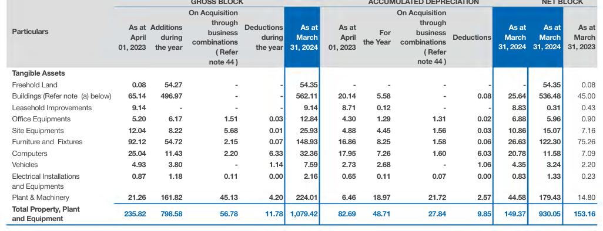

**[Image: AnnualReport2024.pdf-0217-23.png (1026x394, 170.4KB)]**

<!-- Start of picture text -->
On Acquisition  On Acquisition As at  Additions  through  Deductions  As at  As at  through  As at  As at  As at Particulars business  For  business April  during  combinations  during  March  April  the Year combinations  Deductions March  March  March 01, 2023 the year the year 31, 2024 01, 2023 31, 2024 31, 2024 31, 2023 ( Refer  ( Refer note 44 ) note 44 ) Tangible Assets Freehold Land  0.08   54.27   -   -   54.35   -   -   -   -   -   54.35   0.08 Buildings (Refer note  (a) below)  65.14   496.97   -   -   562.11   20.14   5.58   -   0.08   25.64   536.48   45.00 Leasehold Improvements  9.14   -   -   -   9.14   8.71   0.12   -   -   8.83   0.31   0.43 Office Equipments  5.20   6.17   1.51   0.03   12.84   4.30   1.29   1.31   0.02   6.88   5.96   0.90 Site Equipments  12.04   8.22   5.68   0.01   25.93   4.88   4.45   1.56   0.03   10.86   15.07   7.16 Furniture and  Fixtures  92.12   54.72   2.15   0.07   148.93   16.86   8.25   1.58   0.06   26.63   122.30   75.26 Computers  25.04   11.43   2.20   6.33   32.36   17.95   7.26   1.60   6.03   20.78   11.58   7.09 Vehicles  4.93   3.80   -   1.14   7.59   2.73   2.68   -   1.06   4.35   3.24   2.20 Electrical Installations   0.87   1.18   0.11   0.00   2.16   0.65   0.11   0.07   0.00   0.83   1.33   0.23 and Equipments Plant & Machinery  21.26   161.82   45.13   4.20   224.01   6.46   18.97   21.72   2.57   44.58   179.43   14.80 Total Property, Plant   235.82   798.58   56.78   11.78 1,079.42   82.69   48.71   27.84   9.85   149.37   930.05   153.16 and Equipment <!-- End of picture text -->

**[Image: AnnualReport2024.pdf-0217-24.png (1026x24, 3.2KB)]**

(a) Of the above, a Building carrying value INR 37.19 Crore (Previous Year: INR 38.87 Crore) is subject to first charge for secured bank loans (refer note 25). 

INR 0.00 represent amount less than INR 50,000/- 

###### 3 Capital Work-in-Progress 

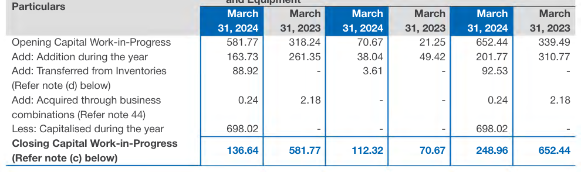

**[Image: AnnualReport2024.pdf-0217-28.png (990x294, 146.6KB)]**

<!-- Start of picture text -->
Particulars March  March  March  March  March  March 31, 2024 31, 2023 31, 2024 31, 2023 31, 2024 31, 2023 Opening Capital Work-in-Progress  581.77   318.24   70.67   21.25   652.44   339.49 Add: Addition during the year  163.73   261.35   38.04   49.42   201.77   310.77 Add: Transferred from Inventories   88.92   -   3.61   -   92.53   - (Refer note (d) below) Add: Acquired through business   0.24   2.18   -   -   0.24   2.18 combinations (Refer note 44) Less: Capitalised during the year  698.02   -   -   -   698.02   - Closing Capital Work-in-Progress  136.64   581.77   112.32   70.67   248.96   652.44 (Refer note (c) below) <!-- End of picture text -->

Godrej Properties Limited 

Integrated Report 2023-24 

424 

425 

About Godrej Integrating Sustainability Management Discussion Statutory Properties Limited with our Business and Analysis Reports 

**[Image: AnnualReport2024.pdf-0218-01.png (82x27, 2.2KB)]**

###### Notes forming part of Consolidated Financial Statements 

For the year ended March 31, 2024 

(Currency in INR Crore) 

###### 3 Capital Work-in-Progress (continued) 

###### **(a) Ageing schedule as at March 31, 2024** 

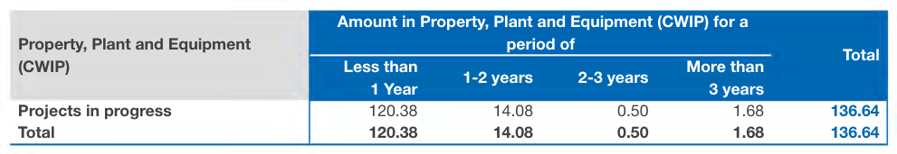

**[Image: AnnualReport2024.pdf-0218-07.png (991x171, 56.9KB)]**

<!-- Start of picture text -->
 Amount in Property, Plant and Equipment (CWIP) for a Property, Plant and Equipment  period of Total (CWIP)  Less than  More than 1-2 years  2-3 years 1 Year  3 years Projects in progress  120.38   14.08   0.50   1.68   136.64 Total  120.38   14.08   0.50   1.68   136.64 <!-- End of picture text -->

|**Property, Plant and Equipment**||**period**|**of**||**Ttl**|
|---|---|---|---|---|---|
|**(CWIP)**|**Less than** **1 Year**|**1-2 years**|**2-3 years**|**More than** **3 years**|**oa**|
|**Projects in progress**|120.38|14.08|0.50|1.68|**136.64**|
|**Total**|**120.38**|**14.08**|**0.50**|**1.68**|**136.64**|
|**Investment Property (CWIP)**|**Amount in Inv** **Less than** **1 Year**|**estment Prope** **1-2 years**|**rty (CWIP) for a** **2-3 years**|**period of** **More than** **3 years**|**Total**|
|**Projects in progress**|41.11|49.42|17.15|4.64|**112.32**|
|**Total**|**41.11**|**49.42**|**17.15**|**4.64**|**112.32**|
|**geing schedule as at March 31, 2023**|**Amount in Pr**|**operty, Plant an**|**d Equipment (C**|**WIP) for a**||
|**Property, Plant and Equipment**||**period**|**of**||**Total**|
|**(CWIP)**|**Less than**|||**More than**||
|| **1 Year**|**1-2 years**|**2-3 years**| **3 years**||
|Projects in progress|261.35|98.30|72.80|149.32|**581.77**|
|**Total**|**261.35**|**98.30**|**72.80**|**149.32**|**581.77**|
||**Amount in Inv**|**estment Prope**|**rty (CWIP) for a**|**period of**||
|**Investment Property (CWIP)**|**Less than** **1 Year**|**1-2 years**|**2-3 years**|**More than** **3 years**|**Total**|
|Projects in progress|49.42|18.02|3.23|-|**70.67**|
|**Total**|**49.42**|**18.02**|**3.23**|**-**|**70.67**|

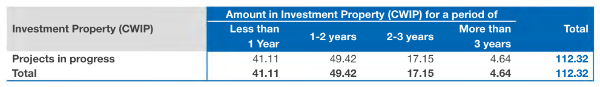

**[Image: AnnualReport2024.pdf-0218-09.png (991x145, 52.8KB)]**

<!-- Start of picture text -->
Amount in Investment Property (CWIP) for a period of Investment Property (CWIP)  Less than  More than  Total 1-2 years  2-3 years 1 Year  3 years Projects in progress  41.11   49.42   17.15   4.64   112.32 Total  41.11   49.42   17.15   4.64   112.32 <!-- End of picture text -->

###### **(b) Ageing schedule as at March 31, 2023** 

**[Image: AnnualReport2024.pdf-0218-11.png (991x24, 4.2KB)]**

**[Image: AnnualReport2024.pdf-0218-12.png (991x24, 3.3KB)]**

<!-- Start of picture text -->
 - <!-- End of picture text -->

(c) The Group’s investment property under construction consists of some commercial and retail properties in India. 

- (d) Based on the intention and business plans, certain residential property is considered for own use rather than for sale. Hence, the group has reclassified the same from inventories to capital work in progress. 

- (e) The Group has no restriction on the realisability of its investment property under construction. 

- (f) Though the Group measures investment property under construction using cost based measurement, the fair value of investment property under construction is based on valuation performed by an accredited independent valuer who has relevant valuation experience for similar office properties and is a registered valuer as defined under rule 2 of Companies (Registered Valuers and Valuation) Rules, 2017. The main inputs used are location and locality, facilities and amenities, quality of construction, residual life of building, business potential, supply and demand, local nearby enquiry, market feedback of investigation and Ready Reckoner published by the Government. 

- (g) Fair valuation of an investment property under construction which  is based on Cost method which is INR 112.33 crore (Previous Year: INR 70.67 Crore). The fair value measurement is categorised in level 3 disclosures. 

- (h) Refer Note 49 for disclosure of Capital Commitments for acquisition of Property, plant and equipment and investment property. 

###### Notes forming part of Consolidated Financial Statements 

For the year ended March 31, 2024 

(Currency in INR Crore) 

- 4 Investment Property 

Reconciliation of Carrying Amount 

|**Particulars** **Gross Block**||**Amount**|
|---|---|---|
|**As at April 01, 2022**||36.27|
|Add: Additions during the year||-|
|Less: Disposals/Adjustments||-|
|**As at March 31, 2023**||**36.27**|
|**As at April 01, 2023**||**36.27**|
|Add: Additions during the year||-|
|Less: Disposals/Adjustments||-|
|**As at March 31, 2024**||**36.27**|
|**Accumulated Depreciation**|||
|**As at April 01, 2022**||**2.24**|
|Add: For the Year||1.85|
|Less: Deductions during the year||-|
|**As at March 31, 2023**||**4.09**|
|**As at April 01, 2023**||**4.09**|
|**Add: For the Year**||**1.70**|
|Less: Deductions during the year||-|
|**As at March 31, 2024**||**5.79**|
|**Net Block**|||
|As at March 31, 2023||32.19|
|**As at March 31, 2024**||**30.48**|
|**Information regarding income and expenditure of Investment Property**|||
|**Particulars**|**March 31, 2024**|**March 31, 2023**|
|Rental Income derived from Investment Property|3.37|1.26|
|Direct Operating Expenses |-|-|
|Proft arising from Investment Property before depreciation|3.37|1.26|
| Less: Depreciation |1.70|1.85|
|Proft / (Loss) arising from Investment Property|1.67|(0.59)|

**[Image: AnnualReport2024.pdf-0218-25.png (169x24, 2.2KB)]**

**[Image: AnnualReport2024.pdf-0218-26.png (169x48, 3.6KB)]**

<!-- Start of picture text -->
 -  5.79 <!-- End of picture text -->

**[Image: AnnualReport2024.pdf-0218-27.png (990x48, 10.0KB)]**

<!-- Start of picture text -->
As at March 31, 2024  30.48 <!-- End of picture text -->

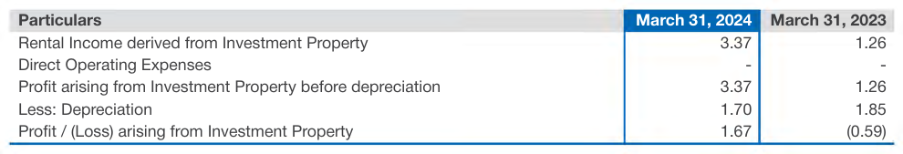

**[Image: AnnualReport2024.pdf-0218-28.png (990x169, 53.4KB)]**

<!-- Start of picture text -->
Particulars March 31, 2024 March 31, 2023 Rental Income derived from Investment Property  3.37   1.26 Direct Operating Expenses  -   -  3.37   1.26 Profit arising from Investment Property before depreciation Less: Depreciation  1.70   1.85 Profit / (Loss) arising from Investment Property  1.67   (0.59) <!-- End of picture text -->

- (a)  The Group’s investment property consists of some commercial and retail properties in India. 

- (b)  The Group has no restriction on the realisability of its investment property and no contractual obligations to purchase, construct or develop investment properties or for repairs, maintenance and enhancements. 

- (c)  Though the Group measures investment property using cost based measurement, the fair value of investment property is based on valuation performed by an accredited independent valuer who has relevant valuation experience for similar office properties and is a registered valuer as defined under rule 2 of Companies (Registered Vyaluers and Valuation) Rules, 2017. The main inputs used are location and locality, facilities and amenities, quality of construction, residual life of building, business potential, supply and demand, local nearby enquiry, market feedback of investigation and ready reckoner published by the Government. 

- (d)  Fair valuation of Retail Properties is based on Sales Comparison Method which is INR 30.01 Crore (Previous Year: INR 28.55 Crore) and Commercial Properties is based on Sales Comparison Method, which is INR 30.25 Crore (Previous Year: INR 29.78 Crore). The fair value measurement is categorised in level 3 fair value hierarchy. 

- (e)  Refer Note 49 for disclosure of Capital Commitments for acquisition of Property, plant and equipment and investment property. 

Godrej Properties Limited 

Integrated Report 2023-24 

427 

426 

About Godrej Integrating Sustainability Management Discussion Statutory Properties Limited with our Business and Analysis Reports 

(Currency in INR Crore) 

###### Notes forming part of Consolidated Financial Statements 

For the year ended March 31, 2024 

(Currency in INR Crore) 

###### 5 Intangible Assets and Intangible assets under development 

||||**GROSS BLOCK**||||**ACCU**|**MULATED AMO**|**RTISATION**||**NET B**|**LOCK**|
|---|---|---|---|---|---|---|---|---|---|---|---|---|
|**Particulars**|**As at** **April** **01, 2023**|**Additions** **during** **the year**|**On** **Acquisition** **through** **business** **combinations** **( Refer** **note 44 )**|**Deductions** **during** **the year**|**As at** **March** **31, 2024**|**As at** **April** **01, 2023**|**For** **the Year**|**On** **Acquisition** **through** **business** **combinations** **( Refer** **note 44 )**|**Deductions**|**As at** **March** **31, 2024**|**As at** **March** **31, 2024**|**As at** **March** **31, 2023**|
|**Intangible Assets**|||||||||||||
|Licenses and Software|11.20|2.48|0.06|0.75|12.99|7.74|1.19|-|0.72|8.21|4.78|3.46|
|Trade Mark|20.62|-|-|-|20.62|8.88|1.16|-|-|10.04|10.58|11.74|
|**Total**|**31.82**|**2.48**|**0.06**|**0.75**|**33.61**|**16.62**|**2.35**|**-**|**0.72**|**18.25**|**15.36**|**15.19**|
|**Intangible Assets**|||||||||||||
||||**GROSS BLOCK**||||**ACCU**|**MULATED AMO**|**RTISATION**||**NET B**|**LOCK**|
||||**On** **Acquisition**|||||**On** **Acquisition**|||||
|**Particulars**|**As at**|**Additions**|**through**|**Deductions**|**As at**|**As at**|**For**|**through**||**As at**|**As at**|**As at**|
||**April** **01, 2022**| **during** |**business** **combinations**|**during** **the year**|**March** **31, 2023**|**April** **01, 2022**| **the Year**|**business** **combinations**|**Deductions**|**March** **31, 2023**|**March** **31, 2023**|**March** **31, 2022**|
|||**the year**|**( Refer** **note 44 )**|||||**( Refer** **note 44 )**|||||
|**Intangible Assets**|||||||||||||
|Licenses and Software|14.85|0.18|0.01|3.84|11.20|10.38|1.18|-|3.82|7.74|3.46|4.47|
|Trade Mark|24.52|-|-|3.90|20.62|9.45|1.30|-|1.87|8.88|11.74|15.07|
|**Total** **Intangible Assets**|**39.37**|**0.18**|**0.01**|**7.74**|**31.82**|**19.83**|**2.48**|**-**|**5.68**|**16.62**|**15.19**|**19.54**|

Intangible assets under development (Refer Note (a) below) 

|**Particulars**|**As at** **March 31, 2024**|**As at** **March 31, 2023**|
|---|---|---|
|Opening balance|0.85|0.79|
|Add: Addition during the year|0.35|0.06|
|Closing balance|1.20|0.85|

(a) Refer Note 49 for disclosure of Capital Commitments for acquisition of Intangible Assets under development. 

###### **(b) Ageing schedule as at March 31, 2024** 

|**Intanible assets**||||||
|---|---|---|---|---|---|
|**g** **under development**|**Less than** **1 Year**|**1-2 years**|**2-3 years**|**More than** **3 years**|**Total**|
|Projects in progress|0.35|0.30|0.55|-|1.20|
|**Total**|**0.35**|**0.30**|**0.55**|**-**|**1.20**|

###### **(c) Ageing schedule as at March 31, 2023** 

|**Itibl t**|**Amount in Intang**|**ible assets under**|**development for**|**a period of**||
|---|---|---|---|---|---|
|**nange asses** **under development**|**Less than** **1 Year**|**1-2 years**|**2-3 years**|**More than** **3 years**|**Total**|
|Projects in progress|0.30|0.55|-|-|0.85|
|**Total**|**0.30**|**0.55**|**-**|**-**|**0.85**|

###### Notes forming part of Consolidated Financial Statements 

For the year ended March 31, 2024 

###### 6 Equity accounted investees (continued) 

|**Particulars**|**March 31, 2024** **Ma**|**rch 31, 2023**|
|---|---|---|
|**a)** **Investment in Equity Instruments  (Fully Paid-up unless stated otherwise)**|||
|   **(Unquoted)**|||
|**(i)** **Investment in  Joint Ventures**|||
|**Wonder Projects Development Private Limited**|||
|21,401,200 (Previous Year: 21,401,200) Equity Shares of INR 10/- each|-|3.92|
|(Net of Provision for Expected Credit Loss in value of INR 23.85 Crore|||
|(Previous Year: INR 23.85 Crore))|||
|**Godrej Real View Developers Private Limited**|||
|41,432,000 (Previous Year: 26,954,000) Equity Shares of INR 10/- each|19.05|7.22|
|**Pearlite Real Properties Private Limited**|||
|3,871,000 (Previous Year: 3,871,000) Equity Shares of INR 10/- each|26.39|25.66|
|**Godrej Greenview Housing Private  Limited**|||
|19,915,200 (Previous Year: 19,915,200) Equity Shares of INR 10/- each|10.17|9.95|
|(Net of Provision for Expected Credit Loss in value of INR 21.39 Crore (Previous Year: INR 21.39 Crore))|||
|**Godrej Green Homes Private Limited** 360,813 (Previous Year: 360,813) Equity Shares of INR 10/- each|-|31.72|
|**Godrej Skyline Developers Private Limited** Nil (Previous Year: 581,429) Equity Shares of INR 10/- each|-|-|
|**Godrej Redevelopers (Mumbai) Private Limited** 28,567 (Previous Year: 28,567) Equity Shares of  INR 10/- each|46.47|41.21|
|**Godrej Mackbricks Private Limited**|||
|21,625,000 (Previous Year: 21,625,000) Equity Shares of INR 10/- each|10.85|9.62|
|(Net of Provision for Expected Credit Loss in value of INR 2.45 Crore (Previous Year: INR 2.45))|||
|**Munjal Hospitality Private Limited**|||
|60,961,200 (Previous Year: 60,961,200) Equity Shares of INR 10/- each|80.27|82.40|
|**Madhuvan Enterprises Private Limited**|||
|10,55,53,183 (Previous Year: 85,240,683) Equity Shares of INR 1/- each|2.38|-|
|**Vivrut Developers Private Limited**|||
|20,577,324 (Previous Year: 20,577,324) Equity Shares of INR 10/- each|10.92|15.24|
|**Vagishwari Land Developers Private Limited** 346 (Previous Year: 234) Equity Shares of INR 100/- each|56.98|34.66|
|**Yerwada Developers Private Limited**|||
| 12,863,813 (Previous Year: 12,863,813) Equity Shares of INR 10/- each|14.20|14.87|
|**(ii)** **Investment in Associate**|||
|**Godrej One Premises Management Private Limited**|||
|3,000 (Previous Year: 3,000) Equity Shares of INR 10/- each|0.00|0.00|
| INR 0.00 represent amount less than INR 50,000/-|||

Godrej Properties Limited 

Integrated Report 2023-24 

428 

429 

About Godrej Integrating Sustainability Management Discussion Statutory Properties Limited with our Business and Analysis Reports 

**[Image: AnnualReport2024.pdf-0220-01.png (82x27, 2.2KB)]**

###### Notes forming part of Consolidated Financial Statements 

For the year ended March 31, 2024 

(Currency in INR Crore) 

###### 6 Equity accounted investees (continued) 

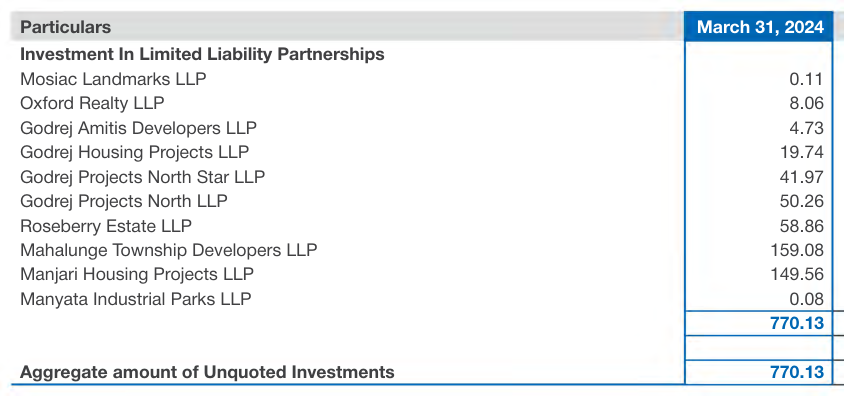

**[Image: AnnualReport2024.pdf-0220-06.png (844x396, 81.4KB)]**

<!-- Start of picture text -->
Particulars March 31, 2024 Investment In Limited Liability Partnerships Mosiac Landmarks LLP  0.11 Oxford Realty LLP   8.06 Godrej Amitis Developers LLP  4.73 Godrej Housing Projects LLP  19.74 Godrej Projects North Star LLP  41.97 Godrej Projects North LLP  50.26 Roseberry Estate LLP  58.86 Mahalunge Township Developers LLP  159.08 Manjari Housing Projects LLP  149.56 Manyata Industrial Parks LLP  0.08  770.13 Aggregate amount of Unquoted Investments  770.13 <!-- End of picture text -->

|**Particulars**|**March 31, 2024**|**March 31, 2023**|
|---|---|---|
|**b)** **Investment In Limited Liability Partnerships**|||
|Mosiac Landmarks LLP|0.11|0.11|
|Oxford Realty LLP|8.06|12.28|
|Godrej Amitis Developers LLP|4.73|3.51|
|Godrej Housing Projects LLP|19.74|18.16|
|Godrej Projects North Star LLP|41.97|38.56|
|Godrej Projects North LLP|50.26|52.41|
|Roseberry Estate LLP|58.86|-|
|Mahalunge Township Developers LLP|159.08|220.83|
|Manjari Housing Projects LLP|149.56|163.93|
|Manyata Industrial Parks LLP|0.08|-|
||**770.13**|**786.25**|
|**Aggregate amount of Unquoted Investments**|**770.13**|**786.25**|

The amount of investment in joint ventures and associate is after giving effect of consolidated adjustments. 

###### Summarised information for those joint ventures which are material to the Group are as under: 

###### **Summarised balance sheet of material joint ventures based on its IND AS financials as on March 31, 2024:** 

|**Particulars**|**Roseberry** **Estate LLP**|
|---|---|
|**Nature of relationship**|**Joint Venture**|
|**Principal place of business**|**NCR**|
|**% Ownership**|**49.00%**|
|**Accounting method**|**Equity** **accounted**|
||**March 31, 2024**|
|Current Assets Other than Cash and Cash Equivalents|626.30|
|Cash and Cash Equivalents|317.76|
|Other Non-Current Assets|0.07|
|**(A)**|**944.13**|
|Current Liabilities|682.83|
|Current Financial Liabilities (other than Trade Payables)|156.62|
|Non-current Liabilities|0.13|
|**(B)**|**839.58**|
|**Net assets (100%)  (A - B)**|**104.55**|
|% Holding|49.00%|
|Share of Net Worth|51.23|
|Less:||
|Adjustment on Consolidation|7.63|
|Carrying amount of Investment in Joint Ventures|58.86|

**[Image: AnnualReport2024.pdf-0220-12.png (991x24, 3.5KB)]**

###### Notes forming part of Consolidated Financial Statements 

For the year ended March 31, 2024 

(Currency in INR Crore) 

###### 6 Equity accounted investees (continued) 

**Summarised statement of profit and loss of material joint ventures based on its IND AS financials for the year ended March 31, 2024:** 

||**Roseberry**|
|---|---|
|**Statement of Proft and Loss**|**Estate LLP**|
||**March 31, 2024**|
|Total Income|1,722.14|
|Depreciation and Amortisation expense|0.34|
|Interest expense|15.11|
|Expenses other than above|1,337.93|
|Tax expense|146.48|
|Proft/(loss) after tax|222.28|
|Other Comprehensive Income|-|
|Total Comprehensive Income|222.27|
|Group's share of proft|106.30|
|Group's share of OCI|-|
|Group's share of total comprehensive income|106.30|

**[Image: AnnualReport2024.pdf-0220-19.png (990x24, 4.0KB)]**

Refer note 49 for the Contingent liabilities and Commitments relating to its interest in Joint Ventures. 

Summarised balance sheet of material joint ventures based on its IND AS financials as on March 31, 2023: 

|**Particulars**|**Godrej** **Greenview** **Housing** **Private Limited**|**Oxford** **Realty LLP**|**Mahalunge** **Township** **Developers** **LLP**|**Manjari Housing** **Project LLP**|**Godrej** **Irismark LLP**|
|---|---|---|---|---|---|
|**Nature of relationship**|**Joint Venture**|**Joint Venture**|**Joint Venture**|**Joint Venture**|**Joint Venture**|
|**Principal place of business**|**Mumbai**|**Pune**|**Pune**|**Pune**|**Bengaluru**|
|**% Ownership**|**20.00%**|**35.00%**|**40.00%**|**40.00%**|**50.00%**|
|**Accounting method**|**Equity** **accounted**|**Equity** **accounted**|**Equity** **accounted**|**Equity** **accounted**|**Equity** **accounted**|
||**March 31, 2023**|**March 31, 2023**|**March 31, 2023**|**March 31, 2023**|**March 31, 2023**|
|Current Assets Other than|315.16|185.59|1,075.76|790.12|69.85|
|Cash and Cash Equivalents||||||
|Cash and Cash Equivalents|135.24|20.89|199.70|32.88|63.69|
|Other Non-Current Assets|7.97|5.22|100.72|36.42|1.81|
|**(A)**|**458.36**|**211.70**|**1,376.18**|**859.42**|**135.35**|
|Current Liabilities|308.03|70.95|1,046.15|519.61|69.71|
|Current Financial Liabilities|91.69|116.89|6.10|74.40|96.61|
|(other than Trade Payables)||||||
|Non-current Liabilities|-|-|0.64|-|-|
|**(B)**|**399.72**|**187.84**|**1,052.90**|**594.01**|**166.31**|
|**Net assets (100%)  (A - B)**|**58.65**|**23.86**|**323.28**|**265.41**|**(30.96)**|
|% Holding|20.00%|35.00%|40.00%|40.00%|50.00%|
|Share of Net Worth|11.73|8.35|290.35|218.51|(15.49)|
|Less:||||||
|Adjustment on Consolidation|(11.73)|3.93|(69.52)|(54.58)|15.49|
|Carrying amount of Investment in Joint Ventures|-|12.28|220.83|163.93|-|

**[Image: AnnualReport2024.pdf-0220-23.png (990x24, 2.7KB)]**

Godrej Properties Limited 

Integrated Report 2023-24 

430 

431 

About Godrej Integrating Sustainability Management Discussion Statutory Properties Limited with our Business and Analysis Reports 

(Currency in INR Crore) 

**[Image: AnnualReport2024.pdf-0221-02.png (82x27, 2.2KB)]**

###### Notes forming part of Consolidated Financial Statements 

For the year ended March 31, 2024 

(Currency in INR Crore) 

###### 6 Equity accounted investees (continued) 

|**Particulars**|**Godrej Project** **North Star LLP**|**Godrej Green** **Homes Pvt Ltd**|
|---|---|---|
|**Nature of relationship**|**Joint Venture**|**Joint Venture**|
|**Principal place of business**|**Bengaluru**|**Mumbai**|
|**% Ownership**|**55.00%**|**50.00%**|
|**Accounting method**|**Equity accounted**|**Equity accounted**|
|Current Assets Other than Cash and Cash Equivalents|103.99|73.13|
|Cash and Cash Equivalents|110.52|6.47|
|Other Non-Current Assets|22.13|1,268.10|
|**(A)**|**236.64**|**1,584.34**|
|Current Liabilities|165.45|29.43|
|Current Financial Liabilities (other than Trade Payables)|0.59|59.26|
|Non-current Liabilities|-|1,297.31|
|**(B)**|**166.04**|**1,552.04**|
|**Net assets (100%)  (A - B)**|**70.60**|**32.30**|
|% Holding|55.00%|50.00%|
|Share of Net Worth|38.83|(19.15)|
|Less:|||
|Adjustment on Consolidation|(0.27)|50.87|
|Carrying amount of Investment in Joint Ventures|38.56|31.72|

**[Image: AnnualReport2024.pdf-0221-08.png (991x24, 6.5KB)]**

INR 0.00 represent amount less than INR 50,000/- 

Summarised statement of profit and loss of material joint ventures based on its IND AS financials for the year ended March 31, 2023: 

|**Statement of Proft** **and Loss**|**Godrej** **Greenview** **Housing** **Private Limited**|**Oxford** **Realty LLP**|**Mahalunge** **Township** **Developers LLP**|**Manjari** **Housing** **Project LLP**|**Godrej** **Irismark LLP**|
|---|---|---|---|---|---|
||**March 31, 2023**|**March 31, 2023**|**March 31, 2023**|**March 31, 2023**|**March 31, 2023**|
|Total Income|487.34|421.32|609.43|356.89|432.91|
|Depreciation and|0.01|0.10|2.44|1.04|0.15|
|Amortisation expense||||||
|Interest expense|19.66|1.82|18.41|10.79|10.18|
|Expenses other|459.85|367.97|593.00|335.23|410.39|
|than above||||||
|Tax expense |0.08|21.66|(1.61)|(9.65)|5.62|
|Proft/(loss) after tax|7.74|29.76|(2.80)|19.48|6.57|
|Other|-|-|-|-|-|
|Comprehensive Income||||||
|Total|7.74|29.76|(2.80)|19.48|6.57|
|Comprehensive Income ||||||
|**Group’s share of proft**|**1.55**|**10.42**|**(1.12)**|**7.79**|**3.29**|
|**Group’s share of OCI**|**-**|**-**|**-**|**-**|**-**|
|**Group’s share of total** **comprehensive income**|**1.55**|**10.42**|**(1.12)**|**7.79**|**3.29**|

**[Image: AnnualReport2024.pdf-0221-12.png (991x24, 2.4KB)]**

###### Notes forming part of Consolidated Financial Statements 

For the year ended March 31, 2024 

###### 6 Equity accounted investees (continued) 

|**Statement of Proft and Loss**|**Godrej Project** **North Star LLP**|**Godrej** **Green Homes** **Private Limited**|
|---|---|---|
||**March 31, 2023**|**March 31, 2023**|
|Total Income|583.33|82.95|
|Depreciation and Amortisation expense|0.30|63.75|
|Interest expense|0.32|124.58|
|Expenses other than above|443.40|30.74|
|Tax expense|47.52|-|
|(Loss) after tax|91.80|(136.12)|
|Other Comprehensive Income|-|-|
|**Total Comprehensive Income**|**91.80**|**(136.12)**|
|**Group’s share of proft**|**50.49**|**(68.06)**|
| **Group’s share of OCI**|**-**|**-**|
|**Group’s share of total comprehensive income**|**50.49**|**(68.06)**|

**[Image: AnnualReport2024.pdf-0221-17.png (990x24, 4.5KB)]**

Refer note 50 for the Contingent liabilities and Commitments relating to its interest in Joint Ventures. 

Aggregate information for those joint ventures and associate that are not material to the Group are as under: 

###### **(i) Investment In Joint Ventures** 

|**Particulars**|**March 31, 2024**|**March 31, 2023**|
|---|---|---|
|Carrying amount of Investment in Joint Ventures |711.27|389.21|
|Summarised statement of proft and loss |||
|Proft / (Loss) for the year|(154.56)|(196.86)|
|Other Comprehensive Income for the year|-|-|
|Total Comprehensive Income (100%)|(154.56)|(196.86)|
|Group's share of total comprehensive income|(78.56)|(45.08)|

###### **(ii) Investment In Associate** 

|**Particulars**|**March 31, 2024**|**March 31, 2023**|
|---|---|---|
|Carrying amount of Investment in Associate |0.00|0.00|
|Summarised statement of proft and loss|||
|Proft for the year|-|0.00|
|Other Comprehensive Income for the year|-|0.00|
|Total Comprehensive Income (100%)|-|0.00|
|Group's share of total comprehensive income|-|0.00|
||**0.00**|**0.00**|

INR 0.00 represent amount less than INR 50,000/- 

Godrej Properties Limited 

Integrated Report 2023-24 

432 

433 

About Godrej Integrating Sustainability Management Discussion Statutory Properties Limited with our Business and Analysis Reports 

###### Notes forming part of Consolidated Financial Statements 

For the year ended March 31, 2024 

(Currency in INR Crore) 

|7 Other Investments (Non-Current)||
|---|---|
|**a)   Trade Investments (Unquoted)**||
|**Particulars**|**March 31, 2024** **March 31, 2023**|
|**(i)** **Investment in Debentures of Joint Ventures (Fully paid-up) (at Fair Value** **through Proft or Loss)** **Gd G H Pit Liitd**||
|**orej reen omes rvae me** 3,318,000 (Previous Year: 3,318,000), 12% Unsecured Optionally Convertible Debentures of INR 1,000/- each|306.03 331.80|
|**Godrej Skyline Developers Private Limited**||
|Nil (Previous Year: 5,304,000), 12% Unsecured Optionally Convertible Debentures of INR 100/- each|- 48.67|
|**Madhuvan Enterprises Private Limited** 3,835,473 (Previous Year: 2,665,473) 12% Unsecured Optionally Convertible Debentures of INR 1,00/- each|38.32 26.38|
|**Vivrut Developers Private Limited** 6,64,500 (Previous Year: 6,64,500), 12% Unsecured Optionally Convertible Debentures of INR 1,000/- each|66.45 66.45|
|**Munjal Hospitality Private Limited** 2,262,000 (Previous Year: 2,010,000), 12% Unsecured Optionally Convertible Debentures of INR 100/- each|22.61 20.09|
|**Yerwada Developers Private Limited** 475,500 (Previous Year: 475,500), 12% Unsecured Optionally Convertible Debentures of INR 1,000/- each|45.75 45.75|
|**Vagishwari Land Developers Private Limited** 887,894 (Previous Year: 805,224) 12% Unsecured Optionally Convertible Debentures of INR 1,000/- each|88.79 80.52|
|**(ii)** **Investment in Debentures of Joint Ventures (Fully paid-up) (at Amortised Cost)** Godrej Real View Developers Private Limited 34200 (Previous Year: 213,560) 12% Unsecured Compulsorily Convertible Debentures of INR 1,000/- each|- 24.02|
|**Godrej Macbricks Private Limited** 237,500 (Previous Year: 237,500) 12% Unsecured Compulsorily Convertible Debentures of INR 1,000/- each|23.75 24.06|
|**b)** **Non trade Investments** Investment in Fully paid-up Equity Instruments (at Fair Value through Proft or Loss) Quoted Investments||
|**Ansal Buildwell Limited**||
|100 (Previous Year: 100) Equity Shares of INR 10/- each|0.00 0.00|
|**Ansal Housing Limited**||
| 300 (Previous Year: 300) Equity Shares of INR 10/- each|0.00 0.00|
|**Ansal Properties and Infrastructure Limited** 600 (Previous Year: 600) Equity Shares of INR 5/- each|0.00 0.00|
|**Unitech Limited**||
| 13,000 (Previous Year: 13,000) Equity Shares of INR 2/- each|0.00 0.00|

###### Notes forming part of Consolidated Financial Statements 

For the year ended March 31, 2024 

(Currency in INR Crore) 

###### 7 Other Investments (Non-Current) (continued) 

|**Particulars** |**March 31, 2024**|**March 31, 2023**|
|---|---|---|
|**The Great Eastern Shipping Company Limited**|||
| 72 (Previous Year: 72) Equity Shares of INR 10/- each|0.00|0.00|
|**Radhe Developers (India) Limited**|||
|100 (Previous Year: 100) Equity Shares of INR 10/- each|0.00|0.00|
|**United Textiles Limited**|||
|23,700 (Previous Year: 23,700) Equity Shares of INR 10/- each|0.00|0.00|
|**Unquoted Investments**|||
|**Saraswat Co-operative Bank Limited**|||
|1,000 (Previous Year: 1,000) Equity Shares of INR 10/- each|0.00|0.00|
|**AB Corp  Limited**|||
|25,000 (Previous Year: 25,000) Equity Shares of INR 10/- each|0.00|0.00|
|**Lok Housing and Constructions Limited**|||
|100 (Previous Year: 100) Equity Shares of INR 10/- each|0.00|0.00|
|**Global Infrastructure & Technologies Limited**|||
|100 (Previous Year: 100) Equity Shares of INR 10/- each|0.00|0.00|
|**Premier Energy and Infrastructure Limited**|||
|100 (Previous Year: 100) Equity Shares of INR 10/- each|0.00|0.00|
|**D.S. Kulkarni Developers Limited**|||
|100 (Previous Year: 100) Equity Shares of INR 10/- each|0.00|0.00|
|**GOL Ofshore Limited**|||
| 18 (Previous Year: 18) Equity Shares of INR 10/- each|0.00|0.00|
|**Modella Textiles Private Limited**|||
|2 (Previous Year: 2) Equity Shares of INR 100/-each|0.00|0.00|
|**Lotus Green Construction Private Limited**|||
|1 (Previous Year: 1) Equity Shares of INR 100/- each|0.00|0.00|
|**Alacrity Housing Limited**|||
|100 (Previous Year: 100) Equity Shares of INR 10/- each|0.00|0.00|
||591.70|667.74|
||**591.70**|**667.74**|
|**Aggregate amount of Unquoted Investments**|**591.70**|**667.74**|
|INR 0.00 represent amount less than INR 50,000/-|||
|Trade Receivables (Non-Current) **Particulars**|**March 31, 2024**|**March 31, 2023**|
|**To related parties**|||
|Unsecured, Considered Good|-|96.44|
|**To parties other than related parties**|||
|Unsecured, Considered Good|65.05|63.83|
||**65.05**|**160.27**|

###### 8 Trade Receivables (Non-Current) 

Godrej Properties Limited 

Integrated Report 2023-24 

434 

435 

About Godrej Integrating Sustainability Management Discussion Statutory Properties Limited with our Business and Analysis Reports 

###### Notes forming part of Consolidated Financial Statements 

For the year ended March 31, 2024 

(Currency in INR Crore) 

###### 8 Trade Receivables (Non-Current) 

###### **(a) Trade Receivables ageing schedule as at March 31, 2024** 

||**Particulars**|**Not due**|**Less** **than** **6 months**| **months** **-** **1 year**|**1-2 years**|**2-3 years**|**More** **than** **3 years**|**Total**|
|---|---|---|---|---|---|---|---|---|
|(i)|Undisputed Trade Receivables – considered good|37.56|-|-|11.55|10.80|5.13|65.05|
|(ii)|Undisputed Trade Receivables – which have signifcant increase in credit risk|-|-|-|-|-|-|-|
|(iii)| Undisputed Trade Receivables – credit impaired|-|-|-|-|-|-|-|
|(iv)|Disputed Trade Receivables – considered good|-|-|-|-|-|-|-|
|(v)|Disputed Trade Receivables – which have signifcant increase in credit risk|-|-|-|-|-|-|-|
|(vi)| Disputed Trade Receivables – credit impaired|-|-|-|-|-|-|-|
||**Total**|**37.56**|**-**|**-**|**11.55**|**10.80**|**5.13**|**65.05**|

###### **(b) Trade Receivables ageing schedule as at March 31, 2023** 

||||**Outstan**|**ding for fol** |**lowing per** **of paymen**|**iods from due** **t**|**date**||
|---|---|---|---|---|---|---|---|---|
||**Particulars** |**Not due**|**Less** **than** **6 months**|**6** **months** **-** **1 year**|**1-2 years**|**2-3 years** **3**|**More** **than** **years**|**Total**|
|(i)|Undisputed Trade Receivables – considered good|96.44|-|2.30|61.53| -|-|160.27|
|(ii)|Undisputed Trade Receivables – which have signifcant increase in credit risk|-|-|-|-| -|-|-|
|(iii)| Undisputed Trade Receivables – credit impaired|-|-|-|-| -|-|-|
|(iv)|Disputed Trade Receivables – considered good|-|-|-|-| -|-|-|
|(v)|Disputed Trade Receivables – which have signifcant increase in credit risk|-|-|-|-| -|-|-|
|(vi)| Disputed Trade Receivables – credit impaired|-|-|-|-| -|-|-|
||**Total**|**96.44**|**-**|**2.30**|**61.53**| **-**|**-**|**160.27**|
|9|Other Non-Current Financial Assets||||||||
||**Particulars**||||**M**|**arch 31, 2024**|**March**|**31, 2023**|
||**Unsecured, Considered Good**||||||||
||Deposits with Banks (Refer note (a) below)|||||123.17||38.29|
||Deposits - Others|||||0.75||0.38|
|||||||**123.92**||**38.67**|

- (a)  Fixed deposits held as margin money and lien marked for issuing bank guarantees amounting to INR 33.91 Crore (Previous Year: INR 34.42 crore). 

###### Notes forming part of Consolidated Financial Statements 

For the year ended March 31, 2024 

(Currency in INR Crore) 

###### 10 Deferred Tax Assets and Tax Expenses 

**a) Amounts recognised in the Consolidated Statement of Profit and Loss** 

|**Particulars**|**March 31, 2024**|**March 31, 2023**|
|---|---|---|
|**Current Tax**|187.01|198.74|
|Current Tax|193.54|194.29|
|Tax Charge / (Reversals) Adjustment of Prior Years|(6.53)|4.45|
|**Deferred Tax (Credit) / Charge**|65.92|(24.07)|
|Deferred Tax attributable to : |||
|Origination and reversal of temporary diference|65.92|(24.07)|
|**Tax Expense for the year**|**252.93**|**174.67**|
|**b)** **Amounts recognised in the Other Comprehensive Income**|||
|**Particulars**|**March 31, 2024**|**March 31, 2023**|
|**Deferred Tax (Credit) / Charge**|0.45|(0.31)|
|Deferred Tax attributable to :|||
|Employee Benefts|0.45|(0.31)|
|**Tax Expense / (Income) for the year**|**0.45**|**(0.31)**|

###### **c)  Movement in Deferred Tax Balances** 

||**As at Apri** **Deferred**|**l 01, 2023** **Deferred**|**Recognised**|**Movement d** **Recognised**|**uring the year**|**Acquired** **through**|**As at Marc** **Deferred**|**h 31, 2024** **Deferred**|
|---|---|---|---|---|---|---|---|---|
|**Particulars**| | | | |**Recognised**|**business**| | |
||**Tax** **Asset**|**Tax** **Liabilities**|**in Proft** **or Loss**|**in Other** **Equity**| **in OCI**|**combination** |**Tax** **Asset**|**Tax** **Liabilities**|
|**Deferred Tax Assets/** **(Liabilities)**||||||**(Refer note** **45)**|||
|Property, Plant and Equipment (including Right-of- Use Asset)|2.40|-|0.12|-|-|1.76|4.28|-|
|Brought Forward Loss|68.53|-|23.22|-|-|37.87|129.62|-|
|Inventories|13.08|-|15.17|-|-|-|28.25|-|
|Unabsorbed Depreciation|1.93|-|-|-|-|0.07|2.00|-|
|Employee Benefts|32.45|-|(21.64)|-|0.45|0.04|11.30|-|
|Equity- settled share- based payments|1.83|-|0.19|-|-|-|2.02|-|
|Investments|(4.14)|-|(131.36)|-|-|(0.02)|(135.52)|-|
|Provision for doubtful assets|36.19|-|(3.23)|-|-|-|32.96|-|
|Other Items|179.24|-|51.61|-|-|(0.05)|230.79|-|
|**Deferred Tax Assets/** **(Liabilities)**|**331.51**|**-**|**(65.92)**|**-**|**0.45**|**39.67**|**305.70**|**-**|

Godrej Properties Limited 

Integrated Report 2023-24 

437 

436 

About Godrej Integrating Sustainability Management Discussion Statutory Properties Limited with our Business and Analysis Reports 

**[Image: AnnualReport2024.pdf-0224-01.png (82x27, 2.2KB)]**

###### Notes forming part of Consolidated Financial Statements 

For the year ended March 31, 2024 

(Currency in INR Crore) 

###### 10 Deferred Tax Assets and Tax Expenses (continued) 

###### **c)  Movement in Deferred Tax Balances** 

||**As at Apri**|**l 01, 2022**||**Movement d**|**uring the year**||**As at Marc**|**h 31, 2023**|
|---|---|---|---|---|---|---|---|---|
||**Deferred**|**Deferred**|**Recognised**|**Recognised**||**Acquired** **through** |**Deferred**|**Deferred**|
|**Particulars**||| ||**Reconised**|**business**|||
||**Tax** **Asset**|**Tax** **Liabilities**|**in Proft** **or Loss**|**in Other** **Equity**|**g** **in OCI**| **combination** **(Refer note**|**Tax** **Asset**|**Tax** **Liabilities**|
|||||||**45)**|||
|**Deferred Tax Assets/** **(Liabilities)**|||||||||
|Property, Plant and Equipment (including Right-of- Use Asset)|2.90|-|(0.50)|-|-|-|2.40|-|
|Brought|98.12|-|(29.59)|-|-|-|68.53|-|
|Forward Loss|||||||||
|Inventories|16.64|-|(3.19)|-|-|(0.38)|13.08|-|
|Unabsorbed|1.94|-|-|-|-|-|1.93|-|
|Depreciation|||||||||
|Employee Benefts|50.02|-|(17.26)|-|(0.31)|-|32.45|-|
|Equity-|1.18|-|0.65|-|-|-|1.83|-|
|settled share-|||||||||
|based payments|||||||||
|Investments|(24.04)|-|19.90|-|-|-|(4.14)|-|
|Provision for doubtful assets|25.76|-|10.43|-|-|-|36.19|-|
|Other Items|135.23|-|44.01|-|-|-|179.24|-|
|**Deferred Tax Assets/**|**307.74**|**-**|**24.44**|**-**|**(0.31)**|**(0.38)**|**331.51**|**-**|

**(Liabilities)** 

**[Image: AnnualReport2024.pdf-0224-09.png (991x24, 2.4KB)]**

###### **d)  Reconciliation of Effective Tax Rate** 

|**Particulars** |**March 31, 2024**|**March 31, 2023**|
|---|---|---|
|**Proft Before Tax**|999.99|795.27|
|Tax using the Company's domestic tax rate of 25.168% (Previous Year: 25.168%) |251.68|200.15|
|**Tax efect of:**|||
|Rate Diference|3.32|(23.89)|
|Non-deductible expenses|(3.96)|4.95|
|Tax-exempt income|(16.64)|(11.63)|
|Changes in recognised deductible temporary diferences|22.46|0.25|
|(Expense) / Income  ofered in tax books (net)|(13.33)|(15.35)|
|Adjustment for tax of prior years|(6.53)|4.45|
|Unabsorbed Losses|23.22|3.93|
|Share of loss of joint ventures|(6.98)|10.25|
|Other Adjustments|(0.31)|1.54|
|**Tax expense recognised**|**252.93**|**174.67**|

###### Notes forming part of Consolidated Financial Statements 

For the year ended March 31, 2024 

(Currency in INR Crore) 

###### 10 Deferred Tax Assets and Tax Expenses (continued) 

- (e) The Group has recognised deferred tax asset to the extent that the same will be recoverable using the estimated future taxable income based on the approved business plans and budgets of the Group.The Group is expected to generate taxable income in upcoming years. The business losses can be carried forward for a period of 8 years as per the tax regulations and the Group expects to recover the losses. 

###### **(f) Unrecognised deferred tax liabilities** 

As at March 31, 2024, undistributed earnings of subsidiaries and joint ventures amounted to INR 108.95 Crore (Previous Year: INR 227.70 Crore). The corresponding deferred tax liability is not recognised because the Company controls the dividend policy of its subsidiaries and is able to veto the payment of dividends of its joint ventures - i.e. the Company controls the timing of reversal of the related taxable temporary differences and management is satisfied that they will not reverse in the foreseeable future. 

###### **(g) Unrecognised deferred tax assets** 

- (i) Deferred tax assets amounting to INR 6.56 Crore (Previous Year: INR 3.92 Crore) have not been recognised in respect of tax losses amounting to INR 25.71 Crore (Previous Year: 15.62 Crore) because it is not probable that future taxable profit will be available against which the Group can use the benefits therefrom. 

The tax losses expire in 2025-29. 

- (h) As per the Group’s assessment, there were no material income tax uncertainties over income tax treatments during the current and previous financial year. 

INR 0.00 represents amount less than INR 50,000 

###### 11 Other Non-Current Non Financial Assets 

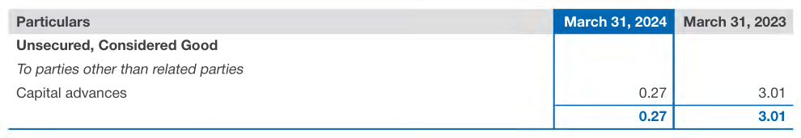

**[Image: AnnualReport2024.pdf-0224-25.png (990x171, 48.5KB)]**

<!-- Start of picture text -->
Particulars March 31, 2024 March 31, 2023 Unsecured, Considered Good To parties other than related parties Capital advances  0.27   3.01  0.27   3.01 <!-- End of picture text -->

|**Particulars**|**March 31, 2024**|**March 31, 2023**|
|---|---|---|
|**Unsecured, Considered Good**|||
|To parties other than related parties|||
|Capital advances|0.27|3.01|
|nventories (Valued at lower of Cost and Net Realisable Value)*|**0.27**|**3.01**|
|**Particulars**|**March 31, 2024**|**March 31, 2023**|
|Raw Material|21.58|28.93|
|Construction Work-in-Progress (Refer note 56)|21,876.21|11,657.00|
|Finished Goods (Refer note 56)|488.78|387.47|
|Stock-in-trade (Refer note 50 (b))|178.05|-|
|* Also Refer Note 44 nvestments|**22,564.62**|**12,073.40**|
|**Particulars**|**March 31, 2024**|**March 31, 2023**|
|**Unquoted**|||
|Investment in Mutual Funds carried at Fair Value through Proft or Loss|1,788.25|1,080.47|
||**1,788.25**|**1,080.47**|
|**Market Value of Unquoted Investments**|1,788.25|1,080.47|
|Aggregate book value of Unquoted Investments|1,788.25|1,080.47|

###### 12 Inventories (Valued at lower of Cost and Net Realisable Value)* 

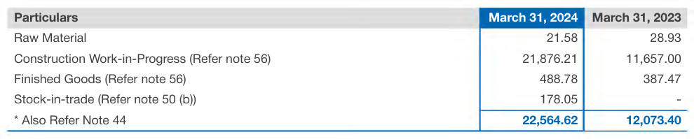

**[Image: AnnualReport2024.pdf-0224-28.png (990x199, 59.5KB)]**

<!-- Start of picture text -->
Particulars March 31, 2024 March 31, 2023 Raw Material  21.58   28.93 Construction Work-in-Progress (Refer note 56)  21,876.21   11,657.00 Finished Goods (Refer note 56)  488.78   387.47 Stock-in-trade (Refer note 50 (b))  178.05   - * Also Refer Note 44  22,564.62   12,073.40 <!-- End of picture text -->

###### 13 Investments 

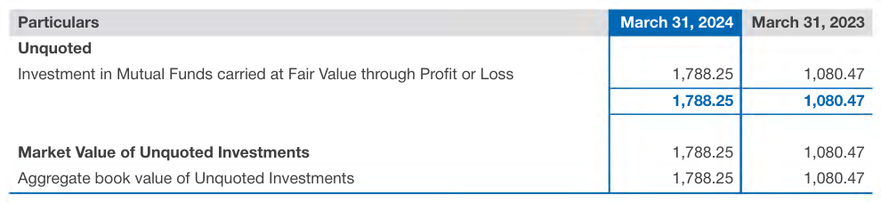

**[Image: AnnualReport2024.pdf-0224-30.png (990x228, 70.4KB)]**

<!-- Start of picture text -->
Particulars March 31, 2024 March 31, 2023 Unquoted Investment in Mutual Funds carried at Fair Value through Profit or Loss  1,788.25   1,080.47  1,788.25   1,080.47 Market Value of Unquoted Investments  1,788.25   1,080.47 Aggregate book value of Unquoted Investments  1,788.25   1,080.47 <!-- End of picture text -->

Godrej Properties Limited 

Integrated Report 2023-24 

438 

439 

About Godrej Integrating Sustainability Management Discussion Statutory Properties Limited with our Business and Analysis Reports 

###### Notes forming part of Consolidated Financial Statements 

For the year ended March 31, 2024 

(Currency in INR Crore) 

###### 14 Trade Receivables 

|**Particulars**|**March 31, 2024**|**March 31, 2023**|
|---|---|---|
|To related parties|||
|Unsecured, Considered Good (Refer note (a) below)|65.07|91.78|
|To parties other than related parties|||
|Unsecured, Considered Good |244.53|267.60|
|Unsecured, signifcant increase in credit risk/credit impaired |54.42|71.56|
| Less: Allowance for signifcant increase in credit risk/credit impaired|(54.42)|(71.56)|
||**309.60**|**359.38**|

- **(a)  Includes entity where directors are interested, viz Godrej Redevelopers (Mumbai) Private Limited INR Nil (Previous Year: INR 0.27 crore).** 

- **(b) Trade Receivables ageing schedule as at March 31, 2024** 

||**Particulars**|**Not due**|**Less** **than** **6 months**| **months** **-** **1 year**|**1-2 years**|**2-3 years**|**More** **than** **3 years**|**Total**|
|---|---|---|---|---|---|---|---|---|
|(i)|Undisputed Trade Receivables – considered good|17.12|72.19|102.11|53.92|7.51|38.84|291.69|
|(ii)|Undisputed Trade Receivables – which have signifcant increase in credit risk|-|-|-|6.93|11.06|27.58|45.57|
|(iii)| Undisputed Trade Receivables – credit impaired|-|-|-|0.43|0.19|1.17|1.79|
|(iv)|Disputed Trade Receivables – considered good*|-|0.76|0.72|1.35|1.24|13.84|17.91|
|(v)|Disputed Trade Receivables – which have signifcant increase in credit risk*|-|-|-|-|-|-|-|
|(vi)| Disputed Trade Receivables – credit impaired*|-|-|-|-|-|7.06|7.06|
||**Total**|**17.12**|**72.94**|**102.84**|**62.63**|**19.99**|**88.49**|**364.02**|

###### **(c) Trade Receivables ageing schedule as at March 31, 2023** 

||||**Outstan**|**ding for fol** |**lowing peri** **of payment**|**ods from du** |**e date**||
|---|---|---|---|---|---|---|---|---|
||**Particulars**|**Not due**|**Less** **than** **6 months**|**6** **months** **-** **1 year**|**1-2 years**|**2-3 years**|**More** **than** **3 years**|**Total**|
|(i)|Undisputed Trade Receivables – considered good|25.31|249.80|29.64|18.99|6.41|9.28|339.43|
|(ii)|Undisputed Trade Receivables – which have signifcant increase in credit risk|-|-|-|8.53|9.87|20.89|39.28|
|(iii)| Undisputed Trade Receivables – credit impaired|-|-|-|0.39|0.56|1.44|2.39|
|(iv)|Disputed Trade Receivables – considered good*|-|-|1.54|7.90|8.87|1.64|19.95|
|(v)|Disputed Trade Receivables – which have signifcant increase in credit risk*|-|-|-|-|-|10.60|10.60|
|(vi)| Disputed Trade Receivables – credit impaired*|-|-|-|-|-|19.29|19.29|
||**Total**|**25.31**|**249.80**|**31.18**|**35.81**|**25.71**|**63.14**|**430.94**|

###### Notes forming part of Consolidated Financial Statements 

For the year ended March 31, 2024 

(Currency in INR Crore) 

###### 15 Cash and Cash Equivalents 

|**Particulars**|**March 31, 2024**|**March 31, 2023**|
|---|---|---|
|**Balances With Banks (Refer note 60)**|||
|In Current Accounts|766.08|245.86|
|In Fixed Deposit Accounts with original maturity less than 3 months|504.15|444.63|
|Cheques On Hand|49.56|24.30|
|Cash On Hand|0.02|0.02|
||**1,319.81**|**714.81**|

###### 16 Bank Balances other than above 

|**Particulars**|**March 31, 2024**|**March 31, 2023**|
|---|---|---|
|**Balances With Banks (Refer note 60)**|||
|In Current Accounts (Refer note (a) below)|2.97|0.39|
|In Fixed Deposit Accounts with maturity more than 3 months but less than 12|1,597.59|1,300.74|
|months (Refer note (b) below)|||
||**1,600.56**|**1,301.13**|

###### **(a) Includes** 

- (i) Balances with Banks in current accounts INR 4.16 Crore (Previous Year: INR 3.69 Crore) received from buyers towards maintenance charges. 

###### **(b) Includes** 

- (i) INR 81.72 Crore (Previous Year: INR 77.66 Crore) received from flat buyers and held in trust on their behalf in a corpus fund and towards maintenance charges. 

- (ii) Deposits held as Deposit Repayment Reserve amounting to INR 1.83 Crore (Previous Year: INR 0.06 Crore). 

- (iii) Fixed deposits held in as margin money and lien marked for issuing bank guarantees amounting to INR 27.92 Crore (Previous Year: INR 26.56 Crore). 

- (iv) Fixed deposit held in Escrow account  amounting to INR 370.50 Crore (Previous Year INR 370.50 Crore). 

###### 17 Loans (Current) 

|**Particulars**|**March 31, 2024**|**March 31, 2023**|
|---|---|---|
|**Unsecured, Considered Good**|||
|To related parties|||
|Loan to Related Parties (Refer note 39 (c) ((ii)))|1,639.25|2,237.39|
|To parties other than related parties|||
|Loan to others|139.78|157.47|
||**1,779.03**|**2,394.86**|

*Trade Receivables having legal cases / arbitration have been considered as disputed 

Godrej Properties Limited 

Integrated Report 2023-24 

440 

441 

About Godrej Integrating Sustainability Management Discussion Statutory Properties Limited with our Business and Analysis Reports 

###### Notes forming part of Consolidated Financial Statements 

For the year ended March 31, 2024 

(Currency in INR Crore) 

###### 18 Other Current Financial Assets 

|**Particulars**|**March 31, 2024**|**March 31, 2023**|
|---|---|---|
|**Secured, Considered Good**|||
|To parties other than related parties|||
|Deposits - Projects (Refer note (a) below and 40(d)(i))|116.31|171.48|
|**Unsecured, Considered Good**|||
|**To related parties**|||
|Interest Accrued|542.37|603.44|
|Deposits - Others (Refer note (b) below)|2.38|4.17|
|Others (includes expenses recoverable etc.)|14.19|28.94|
|**To parties other than related parties**|||
|Deposits - Others|129.30|94.76|
|Interest Accrued|91.32|121.37|
|Others (includes expenses recoverable etc.)|335.94|306.28|
||**1,231.81**|**1,330.44**|

- (a)  Deposits - Projects are secured due to specific rights available with the Group through the respective Development Agreements. 

- (b)  Represents entities where directors are interested, viz Godrej Industries Limited INR 2.34 Crore (Previous Year Godrej Industries Limited : INR 4.13 Crore) and Godrej One Premises Management Private Limited INR 0.04 Crore (Previous Year: INR 0.04 Crore). 

19 Other Current Non Financial Assets 

|**Particulars**|**March 31, 2024**|**March 31, 2023**|
|---|---|---|
|**Secured, Considered Good**|||
|**To parties other than related parties**|||
|Advance to Suppliers and Contractors (Refer note (a) below)|30.82|4.75|
|**To parties other than related parties**|||
|Unbilled Revenue (Refer note (b))|484.63|186.82|
|Balances with Government Authorities|222.10|145.09|
|Advance to Suppliers and Contractors|271.94|162.05|
|Prepayments|21.38|2.69|
|Advance for Land, Development Rights and Flats|294.98|230.48|
|Others (includes deferred brokerage, etc.)|530.62|186.14|
||**1,856.47**|**918.02**|

###### Notes forming part of Consolidated Financial Statements 

For the year ended March 31, 2024 

(Currency in INR Crore) 

###### 20 Equity Share Capital 

||**Particulars**|**March 31, 2024**|**March 31, 2023**|
|---|---|---|---|
|**a)**|**Authorised :**|||
||1,338,000,000 Equity Shares of INR 5/- each (Previous Year: 1,338,000,000 Equity|669.00|669.00|
||Share of INR 5/- each)|||
|||**669.00**|**669.00**|
|**b)**|**Issued, Subscribed and Paid-up:**|||
||278,041,474 Equity Shares of INR 5/- each (Previous Year: 278,021,444 Equity|139.02|139.01|
||Shares of INR 5/- each) fully paid-up|||
|||**139.02**|**139.01**|

- **c)** During the year, the Company has issued 20,030 equity shares (Previous Year: 33,377 equity shares) under the Employee Stock Grant Scheme 2011. 

###### **d) Reconciliation of number of shares outstanding at the beginning and end of the year :** 

|**Equity Shares :**|**March 31** |**, 2024** |**March 3** |**1, 2023** |
|---|---|---|---|---|
||**No. of Shares**|**INR (In Crore)**|**No. of Shares**|**INR (In Crore)**|
|Outstanding at the beginning of the year|278,021,444|139.01|277,988,067|138.99|
|Issued during the year|20,030|0.01|33,377|0.02|
|Outstanding at the end of the year|**278,041,474**|**139.02**|**278,021,444**|**139.01**|
|**e)** **Shareholding Information of Holding company**|**/ Ultimate holdin**|**g compnay**|||
|**Euit Shares are held b:**|**March 31**|**, 2024**|**March 3**|**1, 2023**|
|**qy    y**|**No. of Shares**|**INR (In Crore)**|**No. of Shares**|**INR (In Crore)**|
|Godrej Industries Limited (Holding Company)|131,618,294|65.81|131,618,294|65.81|

###### **f) Rights, preferences and restrictions attached to Equity shares** 

The Company has only one class of equity shares having a par value of INR 5/- per share. Each holder of equity shares is entitled to one vote per share held. The dividend proposed by the Board of Directors is subject to the approval of the Shareholders in the Annual General Meeting except in case of interim dividend. In the event of liquidation, the shareholders are eligible to receive the remaining assets of the Company after distribution of all preferential amounts, in proportion to their shareholding. 

###### **g) Shareholders holding more than 5% shares in the Company:** 

|**Particulars**|**March 31** |**, 2024** |**March 3** |**1, 2023** |
|---|---|---|---|---|
||**No. of Shares**|**INR (In Crore)**|**No. of Shares**|**INR (In Crore)**|
|**Equity shares**|||||
|Godrej Industries Limited|131,618,294|47.34%|131,618,294|47.34%|

###### **h) Equity Shares allotted as fully paid-up without payment being received in cash** 

   - The Company has not allotted any equity shares as fully paid-up without payment being received in cash in preceding five years. 

- (a) Advance to Suppliers and Contractors are secured against bank guarantees. 

- (b) Net of provision of INR 6.02 crore (Previous Year : INR 6.01 Crore). 

Godrej Properties Limited 

Integrated Report 2023-24 

442 

443 

About Godrej Integrating Sustainability Management Discussion Statutory Properties Limited with our Business and Analysis Reports 

###### Notes forming part of Consolidated Financial Statements 

For the year ended March 31, 2024 

(Currency in INR Crore) 

###### 20 Equity Share Capital (continued) 

###### **j) Promoters Shareholding** 

###### **Shares held by Promoters at the end of the March 31, 2024** 

|**Sr.** **No. **|**Promoter Name**|**No. of Shares**|**% of** **total Shares**|**% change** **during the year**|
|---|---|---|---|---|
|1|Godrej Industries Limited|13,16,18,294|47.34%|0.00%|
|2|Godrej & Boyce Manufacturing Company Limited|1,06,50,688|3.83%|0.00%|
||**Shares held by Promoters at the end of the March 31, 2023**||||
|**Sr.** **No. **|**Promoter Name**|**No. of Shares**|**% of** **total Shares**|**% change** **during the year**|
|1|Godrej Industries Limited|131,618,294|47.34%|0.05%|
|2|Godrej & Boyce Manufacturing Company Limited|10,650,688|3.83%|0.00%|

- **k)** The company has 49,447 (Previous year : 49,485) Equity Shares Reserved for Issue Under Options as at Mar 31,2024. (Refer note 41) 

###### 21 Borrowings (Non-Current) 

|**Particulars**|**Maturity Date**|**Terms** **of repayment**|**March 31, 2024**|**March 31, 2023**|
|---|---|---|---|---|
|**Unsecured Debentures**|||||
|**From Others**|||||
|8.25%  75,000 redeemable non- convertible debentures ("NCD") of face Value INR 1,00,000 each|July 3, 2028|Single Repayment at the end of the Term|750.00|-|
|8.15%  75,000 redeemable non- convertible debentures ("NCD") of face Value INR 1,00,000 each|July 3, 2026|Single Repayment at the end of the Term|750.00|-|
|8.30%  1,00,000 redeemable non- convertible debentures ("NCD") of face Value INR 1,00,000 each|March 19, 2027|Single Repayment at the end of the Term|1,000.00|-|
|8.50%  16,000 redeemable non- convertible debentures ("NCD") of face Value INR 1,00,000 each|September 20, 2028|Single Repayment at the end of the Term|160.00|-|
||||**2,660.00**|**-**|
|ther Non- Current Financial Liabil **Particulars**|ities||**March 31, 2024**|**March 31, 2023**|
|Employee Benefts Payable|||10.69|5.00|
||||**10.69**|**5.00**|
|rovisions (Non-current) **Particulars**|||**March 31, 2024** |**March 31, 2023** |
|**Provision for Employee Benefts**|||||
|Gratuity (Refer Note 38 (b) (ii))|||20.16 |16.09 |
||||**20.16** ,|**16.09** |

###### 22 Other Non- Current Financial Liabilities 

###### 23 Provisions (Non-current) 

###### Notes forming part of Consolidated Financial Statements 

For the year ended March 31, 2024 

(Currency in INR Crore) 

###### 24 Borrowings (Current) 

|**Particulars**|**Interest Rate p.a**|**March 31, 2024** **M**|**arch 31, 2023**|
|---|---|---|---|
|**Unsecured Debentures**|Maturity Date Terms of repayment|||
|7.50%  Nil (Previous Year: 10,000) redeemable|July 31, Single Principal|-|1,000.00|
|non-convertible debentures (“NCD”) of face|2023 Repayment at|||
|Value INR 1,000,000 each*|the end of the term|||
|**Secured Loans**||||
|From Banks and Financial Institution||||
|Working Capital Loan (Refer note (a) below)|7.80%-8.45% (Previous Year: 6.60% -7.35%)|2,209.32|1,130.46|
|Cash Credit Loan (Refer note (b) below)||250.84|12.05|
|Term Loan (Refer note (c) below)|8.85%-9.20% (Previous Year: N.A.)|558.41|-|
|Overdraft Facilities (Refer note (d) below)||0.01|-|
|**Unsecured Loans**||||
|**From Banks**||||
|Overdraft Facilities (Refer note (e) below)||13.80|-|
|Other Loans (Refer note (f) below)|7.53% - 9.10% (Previous Year: 4.13% - 7.90%)|3,797.98|3,073.91|
|**From Others**||||
|Commercial Papers (Refer note (g) below)|7.77% - 8.02% (Previous Year: 5.40% - 7.95%)|1,011.19|1,133.54|
|Other Loans (Refer note (f) below)||11.57|11.65|
|Interest accrued but not due on Long Term Borrowing||143.34|50.14|
|||**7,996.46**|**6,411.75**|

   - Redeemed during current year 

- (a) The Working Capital Loan (WCL) of INR 1350.00 Crore from SBI is secured by a primary first charge by way of hypothecation of stock and receivables (Present and future) of the Company and by a collateral of Mortgage of Immovable property (including all fit-outs therein) of the Company at Unit No 5C, on the 5th Floor in Godrej One (along with car parking spaces) at Pirojshanagar, Vikhroli East, Mumbai and Second Charge by way of hypothecation of Other Current Assets (Present and Future) of the Company. 

Previous Year : INR 750.00 Crore from SBI  is secured by a primary charge of hypothecation of Current Assets of the Company and work-in-progress of Godrej Projects Development Limited (wholly owned subsidiary) and by a collateral of Mortgage of Immovable property (including all fit-outs therein) of the Company at Unit No 5C, on the 5th Floor in Godrej One (along with car parking spaces) at Pirojshanagar, Vikhroli East, Mumbai and the hypothecation of Current Assets excluding work-in-progress of Godrej Projects Development Limited (wholly owned subsidiary) 

The WCL of INR 850.00 Crore from SBI is secured by a collateral of Mortgage of Immovable property (including all fit-outs therein) of the Company at Unit No 5C, on the 5th Floor in Godrej One (along with car parking spaces) at Pirojshanagar, Vikhroli East, Mumbai and the First pari passu charge by way of hypothecation of Other Current Assets (Present and future) of the Company. 

Godrej Properties Limited 

Integrated Report 2023-24 

444 

445 

About Godrej Integrating Sustainability Management Discussion Statutory Properties Limited with our Business and Analysis Reports 

**[Image: AnnualReport2024.pdf-0228-01.png (82x27, 2.2KB)]**

###### Notes forming part of Consolidated Financial Statements 

For the year ended March 31, 2024 

(Currency in INR Crore) 

###### 24 Borrowings (Current) (continued) 

   - Previous Year: 375.00 Crore from SBI is secured by a collateral of Mortgage of Immovable property (including all fit-outs therein) of the Company at Unit No 5C, on the 5th Floor in Godrej One (along with car parking spaces) at Pirojshanagar, Vikhroli East, Mumbai and the hypothecation of Current Assets excluding work-in-progress of Godrej Projects Development Limited (wholly owned subsidiary) 

- (b) The Cash Credit (CC) of INR 139.30 Crore from SBI is secured by a primary first charge by way of hypothecation of stock and receivables (Present and future) of the Company and by a collateral of Mortgage of Immovable property (including all fit-outs therein) of the Company at Unit No 5C, on the 5th Floor in Godrej One (along with car parking spaces) at Pirojshanagar, Vikhroli East, Mumbai and Second Charge by way of hypothecation of Other Current Assets (Present and Future) of the Company. 

Previous Year : INR 12.05 Crore from SBI  is secured by a primary charge of hypothecation of Current Assets of the Company and work-in-progress of Godrej Projects Development Limited (wholly owned subsidiary) and by a collateral of Mortgage of Immovable property (including all fit-outs therein) of the Company at Unit No 5C, on the 5th Floor in Godrej One (along with car parking spaces) at Pirojshanagar, Vikhroli East, Mumbai and the hypothecation of Current Assets excluding workin-progress of Godrej Projects Development Limited (wholly owned subsidiary). 

The Cash Credit (CC) of INR 111.54 Crore from SBI is secured by a collateral of Mortgage of Immovable property (including all fit-outs therein) of the Company at Unit No 5C, on the 5th Floor in Godrej One (along with car parking spaces) at Pirojshanagar, Vikhroli East, Mumbai and the First pari passu charge by way of hypothecation of Other Current Assets (Present and future) of the Company. 

Previous Year: Nil from SBI is secured by a collateral of Mortgage of Immovable property (including all fit-outs therein) of the Company at Unit No 5C, on the 5th Floor in Godrej One (along with car parking spaces) at Pirojshanagar, Vikhroli East, Mumbai and the hypothecation of Current Assets excluding work-in-progress of Godrej Projects Development Limited (wholly owned subsidiary). 

###### **(c) Term Loans:** 

- (i) Caroa Properties LLP : Term Loan ₹ 5.00 Crore (Previous Year : NIL) [Total sanctioned amount of INR. 205.00 Crore (INR. 205.00 Crore of Term Loan and Overdraft Limit (OD) of INR. 90.00 Crore which is sub limit of Term loan)] is secured by the way of registered mortgage over land/development rights pertaining to current & future phases and first charge on current assets, liquid investments and receivables of the LLP. This term loan including OD are repayable in 10 equal quarterly installments post moratorium of 30 months from the date of first disbursement. 

- (ii) Godrej Residency Private Limited : Term Loan of INR 150.00 Crore (Previous Year : NIL) with total sanctioned amount of ₹ 700 Crore from Federal Bank is secured by Mortgage of Immovable property at cadastral survey no.1906 of Byculla division Eward, Mumbai 400 011 along with structures standing thereon excluding (20 Yes Bank units on which charge is of Yes Bank and the units already sold since the launch of the project till loan sanction) and hypothecation on the future receivables, arising out of present and future construction thereon of unsold units and existing sold / booked / alienated units from the project, except Yes Bank units and hypothecation of entire current assets of the Company, both present and future. The Term loan is repayable in 12 equal quarterly instalments after completion of 3 years moratorium period. 

- (iii) Godrej Skyline Developers Private Limited : Term loan of INR 203.59 Crores (Previous Year: NIL) availed by the Company from Bajaj Housing Finance Limited (BHFL) with total Sanctioned amount of  INR 250.00 Crore (Previous Year: NIL) is secured by way of mortgage of land admeasuring 128020 sq.mt situated at Village Mamurdi Taluka Haveli District Pune, unsold units of the Project and exclusive charge on receivables under the documents entered into with the customers of the project by the borrower and all insurance proceeds both present and future and repayable within 72 months from the date of first disbursement (i.e. August 30, 2023) or earlier at BHFL’s option . 

- (iv) Maan Hinje Township Developers LLP: Term Loan of INR 199.82 crore (Previous Year:NIL) total sanctioned amount ₹ 300 Crore is secured by (a) Exclusive charge by way of registered mortgage on the property. (b) Exclusive chargeby way of registered mortgage on the project and other project excluding the sold units (as specified in Annexure IC, but including any cancellations) (c)Exclusive charge by way of registered mortgage on the future scheduled receivables of the project and other project and all insurance proceeds, both present and future. (d) Exclusive charge by way of registered mortgage on security of all rights, title, interest, claims, benefits, demands under the project documents of the project and other project both present and future and repayable in 18 monthly installments commencing from the end of 30 months from the date of first disbursement. 

###### Notes forming part of Consolidated Financial Statements 

For the year ended March 31, 2024 

(Currency in INR Crore) 

###### 24 Borrowings (Current) (continued) 

- (d) Overdraft Facilities - (i) Maan Hinje Township Developers LLP: Overdraft Facility of INR 0.01 Crore (Previous Year: NIL) is secured by (a) Exclusive charge by way of registered mortgage on the property. (b) Exclusive chargeby way of registered mortgage on the project and other project excluding the sold units (as specified in Annexure IC, but including any cancellations) (c)Exclusive charge by way of registered mortgage on the future scheduled receivables of the project and other project and all insurance proceeds, both present and future. (d) Exclusive charge by way of registered mortgage on security of all rights, title, interest, claims, benefits, demands under the project documents of the project and other project both present and future. 

- (e) Overdraft facilities INR 13.80 Crore (Previous Year INR Nil Crore) is an unsecured facility and is repayable on demand. 

- (f) Other Loans includes Unsecured Term Loan and Unsecured Working Capital Loans. Term Loan and Working Capital Loans are repayable within One year. 

- (g) Commercial papers are repayable within 18 to 80 days. 

- (h) Quarterly returns or statements of current assets filed by the Company with the bank, as applicable, are in agreement with the books of accounts for the respective quarters. 

INR 0.00 represents amount less than INR 50,000 

###### 25 Trade Payables 

|**Particulars**|**March 31, 2024**|**March 31, 2023**|
|---|---|---|
|Total Outstanding Dues of Micro Enterprises and Small Enterprises (Refer Note 57)|155.18|62.57|
|Total Outstanding Dues of Creditors other than Micro Enterprises and|3,600.39|3,294.05|
|Small Enterprises|||
||**3,755.57**|**3,356.62**|

###### **a) Trade Payables ageing schedule as at March 31, 2024** 

|**Particulars**|**Not due**|**Less than** **1 year**| **1 - 2 years**| **2 - 3 years**|**More than** **3 years**|**Total**|
|---|---|---|---|---|---|---|
|(i) MSME|115.79|25.44|5.79|6.28|1.88|155.18|
|(ii) Others|1,867.22|1,143.84|509.62|37.64|38.69|3,597.01|
|(iii) Disputed dues - MSME*|-|-|-|-|-|-|
|(iv) Disputed dues - Others*|-|-|-|-|3.38|3.38|
|**Total**|**1,983.01**|**1169.28**|**515.41**|**43.92**|**43.95**|**3755.57**|

###### **b) Trade Payables ageing schedule as at March 31, 2023** 

|**Particulars**|**Not due**|**Outstandin**|**g for following** **of pay**|**periods from** **ment**|**due date**|**Total**|
|---|---|---|---|---|---|---|
|||**Less than** **1 year**|**1 - 2 years**|**2 - 3 years**|**More than** **3 years**||
|(i) MSME|31.15|22.41|5.49|0.34|0.57|59.96|
|(ii) Others|2,160.28|1,073.39|32.25|7.19|13.06|3,286.17|
|(iii) Disputed dues - MSME*|-|-|-|-|2.61|2.16|
|(iv) Disputed dues - Others*|-|-|-|-|7.88|7.88|
|**Total**|**2,191.43**|**1,095.80**|**37.73**|**7.53**|**24.13**|**3,356.62**|

*Trade Payables having legal cases / arbitration have been considered as disputed. 

Godrej Properties Limited 

Integrated Report 2023-24 

446 

447 

About Godrej Integrating Sustainability Management Discussion Statutory Properties Limited with our Business and Analysis Reports 

###### Notes forming part of Consolidated Financial Statements 

For the year ended March 31, 2024 

(Currency in INR Crore) 

###### 26 Other Current Financial Liabilities 

|**Particulars**|**March 31, 2024**|**March 31, 2023**|
|---|---|---|
|Unclaimed Fixed Deposits|-|0.03|
|Deposits - Others|3.67|4.90|
|Advance Share of Proft from LLPs|-|2.94|
|Employee Benefts Payable|217.67|270.29|
|Other Liabilities (includes payable for development rights, etc.)|707.26|551.99|
||**928.54**|**830.15**|

###### Notes forming part of Consolidated Financial Statements 

For the year ended March 31, 2024 

(Currency in INR Crore) 

###### 31 Cost of Materials Consumed 

|**Particulars**|**March 31, 2024**|**March 31, 2023**|
|---|---|---|
|Land/ Development Rights|2,584.10|4,686.99|
|Construction, Material and Labour|1,764.18|936.45|
|Purchase of Stock-in-trade|178.05|-|
|Architect Fees|61.98|26.84|
|Finance Costs|1,008.05|366.97|
|Other Costs (including depreciation expense)|1,368.70|436.51|
||**6,965.06**|**6,453.76**|

###### 27 Other Current Non Financial Liabilities 

|**Particulars**|**March 31, 2024**|**March 31, 2023**|
|---|---|---|
|Statutory Dues|181.28|89.60|
|Advances Received Against Sale of Flats/ Units (Refer Note 45)|8,811.74|2,261.87|
|Other liabilities (includes advance from customer for maintenance, etc.)|937.89|744.94|
||**9,930.91**|**3,096.41**|

###### 28 Provisions (Current) 

|**Particulars** |**March 31, 2024**|**March 31, 2023**|
|---|---|---|
|Provision for Employee Benefts|||
|Gratuity (Refer Note 38 (b) (ii))|5.74|4.82|
|Compensated Absences|2.61|1.76|
|Provision for Tax Dues (Refer Note (a) below)|30.73|36.87|
|Others (Refer Note (b) below)|2.77|2.77|
||**41.85**|**46.22**|

- (a) Provision for tax dues : Utilised: INR 6.14 (Previous Year: INR Nil) and Accrued - Nil Crores (Previous Year: INR 7.20 Crore). 

- (b)  Others include provision made for civil / other cases  (Utilised: INR Nil (Previous Year: INR Nil), Accrued INR Nil (Previous Year: INR Nil)). 

###### 29 Revenue from Operations 

|**Particulars**|**March 31, 2024**|**March 31, 2023**|
|---|---|---|
|Sale of Real Estate Developments / Land (Refer note 45)|2,663.57|1,897.06|
|Sale of Services (Refer note 45)|257.79|269.36|
|**Other Operating Revenue**|||
|Other Income from Customers|109.94|82.86|
|Others (includes Lease Rent)|4.32|2.98|
||**3,035.62**|**2,252.26**|

- 32 Change in Inventories of Finished Goods, Stock in trade and Construction Work-In-Progress 

|**Particulars**|**March 31, 2024**|**March 31, 2023**|
|---|---|---|
|**Inventories at the beginning of the year**|||
|Finished Goods|387.47|375.29|
|Construction Work-in-Progress|11,657.00|5,287.32|
|Entitlement of Transferrable Development Rights|-|0.25|
||**12,044.47**|**5,662.86**|
|**Inventories at the end of the year**|||
|Finished Goods|488.78|387.47|
|Construction Work-in-Progress|21,907.92|11,657.00|
|Stock-in-trade|178.05||
||**22,574.75**|**12,044.47**|
|Add : Acquired through business combination and asset acquisition (Refer note 44)|5,465.78|1,169.72|
|Less : Transferred to Capital Work-in-Progress|92.53|-|
||**(5,157.03)**|**(5,211.88)**|

###### 33 Employee Benefits Expense* 

|**Particulars**|**March 31, 2024**|**March 31, 2023**|
|---|---|---|
|Salaries, Bonus and Allowances (Refer note 43 (2) (ii))|303.21|205.47|
|Contribution to Provident and Other Funds|8.72|3.08|
|Share Based Payments to Employees (Refer note 41)|3.92|4.15|
|Staf Welfare Expenses|15.47|5.71|
||**331.32**|**218.41**|

* net of allocations 

###### 34 Finance Costs 

###### 30 Other Income 

|**Particulars**|**March 31, 2024**|**March 31, 2023**|
|---|---|---|
|Interest Income|592.99|617.08|
|Dividend income |0.00|0.00|
|Proft on Sale of Property, Plant and Equipment (Net)|-|0.33|
|Fair value gain upon acquisition of control (Refer Note 44)|497.07|-|
|Income from Investment measured at FVTPL|37.46|13.91|
|Proft on Sale of Investments (net)|98.31|127.45|
|Miscellaneous Income (Refer Note 50 (d))|72.77|27.97|
||**1,298.60**|**786.74**|

|**Particulars**|**March 31, 2024**|**March 31, 2023**|
|---|---|---|
|Interest Expense|908.67|478.17|
|Interest on Income Tax|2.73|4.21|
|**Total Interest Expense**|**911.40**|**482.38**|
|Other Borrowing costs|264.77|100.03|
|**Total Finance Costs**|**1,176.17**|**582.41**|
|Less : Transfer to construction work in progress, capital work in progress*|(1,024.06)|(408.18)|
|**Net Finance Costs**|**152.11**|**174.23**|

* Borrowing costs capitalized during the year using capitalisation range from 7.00% to 9.20% (Previous year from 5.00% to 8.00%) 

Godrej Properties Limited 

Integrated Report 2023-24 

448 

449 

About Godrej Integrating Sustainability Management Discussion Statutory Properties Limited with our Business and Analysis Reports 

###### Notes forming part of Consolidated Financial Statements 

###### For the year ended March 31, 2024 

(Currency in INR Crore) 

###### 35 Depreciation and Amortisation Expense 

|**Particulars**|**March 31, 2024**|**March 31, 2023**|
|---|---|---|
|Depreciation on Property, Plant and Equipment|48.72|20.60|
|Depreciation on Right-of-Use Asset|10.12|8.45|
|Depreciation on Investment Property|1.71|1.85|
|Amortisation of Intangible Assets|2.33|2.48|
||**62.88**|**33.38**|
|Less : Transferred to Construction work-in-progress|(18.32)|(9.24)|
||**44.56**|**24.14**|
|ther Expenses **Particulars**|**March 31, 2024**|**March 31, 2023**|
|Advertisement, Brokerage and Marketing Expenses|364.82|221.92|
|Project Maintenance Expenses|130.63|80.11|
|Consultancy Charges |64.18|32.00|
|Ofce Expenses|25.54|26.61|
|Corporate Social Responsibility Expenses (Refer note 53)|11.47|8.93|
|Rent|4.65|1.26|
|Insurance|2.50|2.00|
|Rates and Taxes|7.63|3.22|
|Other Expenses (Refer note 39 (c) (ii) and 50)|414.53|168.29|
||**1,025.95**|**544.34**|

###### 36 Other Expenses 

###### Notes forming part of Consolidated Financial Statements 

For the year ended March 31, 2024 

(Currency in INR Crore) 

###### 37 Earnings Per Equity Share (continued) 

||**Particulars** |**March 31, 2024**|**March 31, 2023**|
|---|---|---|---|
|**(i)**|**Proft / (Loss) attributable to ordinary shareholders (diluted)** |||
|| Proft / (Loss)  for the year, attributable to ordinary shareholders of the Company|725.27|571.39|
|||**725.27**|**571.39**|
|**(ii)**|**Weighted average number of ordinary shares (diluted)**|||
||Weighted average number of Equity shares outstanding (basic) |278,033,758|278,012,613|
||Add: Weighted average efect of potential equity shares under ESGS plan|49,148|20,522|
||Weighted average number of equity shares outstanding (diluted)|**278,082,906**|**278,033,135**|
||Diluted Earnings Per Share (INR) (Face value INR 5 each) (Previous Year: INR 5 each)|26.08|20.55|

For previous year, potential equity shares under ESGS plan are anti-dilutive and therefore, the effects of anti-dilutive potential equity shares are ignored in calculating diluted earnings per share. 

###### 38 Employee Benefits 

###### **a) Defined Contribution Plans:** 

Contribution to Defined Contribution Plans recognised as expense for the year are as under: 

|**Particulars**|**March 31, 2024**|**March 31, 2023**|
|---|---|---|
|Employer's Contribution to Provident Fund (Gross before Allocation)|14.54|9.53|
|Employer's Contribution to ESIC|-|-|

###### **b) Defined Benefit Plans:** 

###### **Contribution to Gratuity Fund (Non-Funded)** 

INR 0.00 represents amount less than INR 50,000 

###### 37 Earnings Per Equity Share 

###### **a)  Basic Earnings Per Share** 

The calculation of basic earnings per share is based on the Profit / (Loss) attributable to ordinary shareholders and weighted average number of ordinary shares outstanding. 

||**Particulars** |**March 31, 2024**|**March 31, 2023**|
|---|---|---|---|
|**(i)**|**Proft / (Loss)  attributable to ordinary shareholders (basic)** |||
||Proft / (Loss)  for the year, attributable to ordinary shareholders of the Company|725.27|571.39|
|||**725.27**|**571.39**|
|**(ii)**|**Weighted average number of ordinary shares (basic)**|||
||Weighted average number of equity shares at the beginning of the year|278,021,444|277,988,067|
||Add: Weighted average efect of share options exercised|12,314|24,546|
||Weighted average number of equity shares outstanding at the end of the year|**278,033,758**|**278,012,613**|
||**Basic Earnings Per Share (INR) (Face value INR 5 each) (Previous Year: INR 5 each)**|**26.09**|**20.55**|

###### **b)  Diluted Earnings Per Share** 

The calculation of diluted earnings per share is based on the profit / (loss) attributable to ordinary shareholders and weighted average number of ordinary shares outstanding after adjustment for the effects of all dilutive potential ordinary shares. 

Gratuity is payable to all eligible employees on death or on separation/ termination in terms of the provisions of the Payment of Gratuity Act or as per the Group’s policy whichever is beneficial to the employees. 

The estimates of future salary increases, considered in actuarial valuation, take into account inflation, seniority, promotion and other relevant factors, such as supply and demand in the employment market. 

At March 31, 2024, the weighted-average duration of Defined benefit obligation is 4 - 9 years (March 31, 2023: 2 - 6 years). 

###### **(i) Changes in present value of defined benefit obligation** 

|**Particulars**|**March 31, 2024**|**March 31, 2023**|
|---|---|---|
|Changes in present value of obligation|||
|Present value of obligation as at beginning of the year|20.91|20.68|
|Interest Cost|1.51|1.26|
|Current Service Cost |2.67|2.82|
|Benefts Paid |(3.56)|(3.53)|
| Efect of Liability Transfer in |2.30|1.21|
|Efect of Liability Transfer out|(1.11)|(0.78)|
|Actuarial (gains)/ losses on obligations - due to change in demographic assumptions |0.41|(2.57)|
|Actuarial (gains)/ losses on obligations - due to change in fnancial assumptions|0.05|0.41|
| Actuarial (gains) / losses on obligations - due to change in experience|1.64|1.06|
|Transfer in on Business Combination|1.02|0.35|
|**Present value of obligation as at end of the year** **mount recognised in the Consolidated Balance Sheet**  |**25.85**   |**20.91**   |
|**Particulars** |**March 31, 2024** |**March 31, 2023** |
|Present value of obligation as at end of the year |25.85 |20.91 |
|Fair value of plan assets as at end of the year |||
|**Net obligation as at end of the year** |**25.85** ,|**20.91** |

###### **(ii) Amount recognised in the Consolidated Balance Sheet** 

Godrej Properties Limited 

Integrated Report 2023-24 

450 

451 

About Godrej Integrating Sustainability Management Discussion Statutory Properties Limited with our Business and Analysis Reports 

###### Notes forming part of Consolidated Financial Statements 

###### For the year ended March 31, 2024 

(Currency in INR Crore) 

###### 38 Employee Benefits (continued) 

###### **(iii) Net gratuity cost for the year** 

|**Particulars** |**March 31, 2024**|**March 31, 2023**|
|---|---|---|
|**Recognised in the Consolidated Statement of Proft and Loss**|||
|Current Service Cost|2.67|2.82|
|Interest Cost|1.51|1.26|
|**Total**|**4.18**|**4.08**|
|**Recognised in Other Comprehensive Income (OCI)**|||
|Remeasurements due to:|||
|Actuarial (gains)/losses on obligations - due to change in demographic assumptions |0.41|(2.57)|
|Actuarial (gains)/losses on obligations - due to change in fnancial assumptions|0.05|0.41|
|Actuarial (gains)/losses on obligations - due to change in experience|1.64|1.06|
|**Total**|**2.11**|**(1.10)**|
|**Net gratuity cost in Total Comprehensive Income (TCI)**|**6.29**|**2.98**|

The cumulative amount of actuarial (gains) / losses on obligations recognised in other comprehensive income as at March 31, 2023 is INR 7.48 Crore (Previous Year: INR 6.01 Crore). 

###### INR 0.00 represents amount less than INR 50,000 

###### **(iv)  The Principal assumptions used in determining the present value of defined benefit obligation for the Group’s plan are given below:** 

|**Particulars**|**March 31, 2024**|**March 31, 2023**|
|---|---|---|
|Discount rate|7.19%|7.20%|
|Salary Escalation rate|14%|14%|
|Attrition Rate|28%|30%|
|Mortality|Indian Assured|Indian Assured|
||Lives Mortality|Lives Mortality|
||(2012-14) Urban|(2012-14) Urban|

###### **(v) Sensitivity analysis** 

A quantitative sensitivity analysis on Defined Benefit Obligation for significant assumptions as at March 31, 2024 is shown below: 

|**Particulars**|**March 31** **Increase**|**, 2024** **Decrease**|**March 31** **Increase**|**, 2023** **Decrease**|
|---|---|---|---|---|
|Discount rate (1% movement)|(0.76)|0.78|(0.56)|0.60|
|Salary escalation rate (1% movement)|0.76|(0.69)|0.56|(0.53)|
|Attrition rate (1% movement)|(0.31)|0.32|(0.21)|0.22|

The sensitivity analysis presented above may not be representative of the actual change in the defined benefit obligation as it is unlikely that the change in assumptions would occur in isolation of one another as some of the assumptions may be correlated. Furthermore, in presenting the above sensitivity analysis, the present value of the defined benefit obligation has been calculated using the projected unit credit method at the end of the reporting period, which is the same as that applied in calculating the defined benefit obligation liability recognised in the balance sheet. There was no change in the methods and assumptions used in preparing the sensitivity analysis from prior year. 

###### Notes forming part of Consolidated Financial Statements 

For the year ended March 31, 2024 

(Currency in INR Crore) 

###### 39 Financial instruments – Fair values and risk management 

###### **a) Accounting classification and fair values** 

The following table shows the carrying amounts and fair values of financial assets and financial liabilities, including their levels in the fair value hierarchy. It does not include fair value information (i) for financial assets and financial liabilities which are measured at amortised cost., (ii) if the carrying amount is a reasonable approximation of fair value. 

|**March 31, 2024**|**through** **proft** **or loss**|**Amortised** **Cost**|**Total**|**Level 1**|**Level 2**|**Level 3**|**Total**|
|---|---|---|---|---|---|---|---|
|**Financial Assets**||||||||
|**Non-Current**||||||||
|Other Investments||||||||
|Investments in Debentures|567.95|23.75|591.70|-|567.95|-|567.95|
|Investments in Equity Instruments|0.01|-|0.01|0.01|-|-|0.01|
|Trade receivables|-|65.05|65.05|-|-|-|-|
|Other Non-Current Financial Assets|-|123.92|123.92|-|-|-|-|
|**Current**||||||||
|Investments|1,788.25|-|1,788.25|1,788.25|-|-|1,788.25|
|Trade receivables|-|309.60|309.60|-|-|-|-|
|Cash and cash equivalents|-|1,319.81|1,319.81|-|-|-|-|
|Bank balances other than above|-|1,600.56|1,600.56|-|-|-|-|
|Loans|-|1,779.03|1,779.03|-|-|-|-|
|Other Current Financial Assets|-|1,231.81|1,231.81|-|-|-|-|
||**2,356.21**|**6,453.51**|**8,809.72**|**1,788.26**|**567.95**|**-**|**2,356.20**|
|**Financial Liabilities**||||||||
|**Non-Current**||||||||
|Borrowings|-|2,660.00|2,660.00|-|2,660.00|-|2,660.00|
|Other Non - Current Financial Liabilities|-|10.69|10.69|-|-|-|-|
|**Current**||||||||
|Borrowings|-|7,996.46|7,996.46|-|7,996.46|-|7,996.46|
|Trade Payables|-|3,755.57|3,755.57|-|-|-|-|
|Other Current Financial Liabilities|-|928.54|928.54|-|-|-|-|
||**-**|**15,351.26**|**15,351.26**|**-**|**10,656.46**|**-**|**10,656.46**|

###### **(vi) The expected future cash flows in respect of gratuity as at March 31, 2024 were as follows:** 

Maturity Analysis of Projected Benefit Obligation: From the Employer 

|**Projected Benefts Payable in Future Years from the Reporting Date**|**March 31, 2024**|**March 31, 2023**|
|---|---|---|
| 1st Following Year|5.34|4.90|
|2nd Following Year|4.68|4.10|
|3rd Following Year|3.90|3.53|
|4th Following Year|3.55|2.96|
|5th Following Year|2.98|2.32|
|Sum of Years 6 to 10|8.65|6.25|
|Sum of Years 11 and above|3.92|0.11|

###### **Compensated absences** 

Compensated absences for employee benefits of INR 1.68 Crore (Previous Year: INR 0.13 Crore) expected to be paid in exchange for the services recognised as an expense during the year. 

Godrej Properties Limited 

Integrated Report 2023-24 

452 

453 

About Godrej Integrating Sustainability Management Discussion Statutory Properties Limited with our Business and Analysis Reports 

**[Image: AnnualReport2024.pdf-0232-01.png (82x27, 2.2KB)]**

###### Notes forming part of Consolidated Financial Statements 

###### For the year ended March 31, 2024 

(Currency in INR Crore) 

###### 39 Financial instruments – Fair values and risk management (continued) 

||**Ca**|**rrying amoun**|**t**||**Fair va**|**lue**||
|---|---|---|---|---|---|---|---|
||**Fair value**|||||||
|**March 31, 2023**|**through** **proft**|**Amortised** **Cost**|**Total**|**Level 1**|**Level 2**|**Level 3**|**Total**|
||**or loss**|||||||
|**Financial Assets**||||||||
|**Non-Current**||||||||
|Other Investments||||||||
|Investments in Debentures|619.66|48.08|667.74|-|619.66|-|619.66|
|Investments in Equity Instruments|0.00|-|0.00|0.00|-|-|0.00|
|Trade receivables|-|160.27|160.27|-|-|-|-|
|Other Non-Current Financial Assets|-|38.67|38.67|-|-|-|-|
|**Current**||||||||
|Investments|1,080.47|-|1,080.47|1,080.47|-|-|1,080.47|
|Trade receivables|-|359.38|359.38|-|-|-|-|
|Cash and cash equivalents|-|714.81|714.81|-|-|-|-|
|Bank Balances other than above|-|1,301.13|1,301.13|-|-|-|-|
|Loans|-|2,394.86|2,394.86|-|-|-|-|
|Other Current Financial Assets|-|1,330.44|1,330.44|-|-|-|-|
||**1,700.13**|**6,347.63**|**8,047.77**|**1,080.47**|**619.66**|**-**|**1,700.12**|

###### Notes forming part of Consolidated Financial Statements 

For the year ended March 31, 2024 

(Currency in INR Crore) 

###### 39 Financial instruments – Fair values and risk management (continued) 

###### **Risk management framework** 

The Company’s Board of Directors have overall responsibility for the establishment and oversight of the Group’s risk management framework. The Board of Directors have established the Risk Management Committee, which is responsible for developing and monitoring the Group’s risk management policies. The committee reports regularly to the Board of Directors on its activities. 

The Group’s risk management policies are established to identify and analyse the risks faced by the Group, to set appropriate risk limits and controls and to monitor risks and adherence to limits. Risk management policies and systems are reviewed regularly to reflect changes in market conditions and the Group’s activities. The Group, through its training and management standards and procedures, aims to maintain a disciplined and constructive control environment in which all employees understand their roles and obligations. 

The Audit Committee oversees how management monitors compliance with the Group’s risk management policies and procedures, and reviews the adequacy of the risk management framework in relation to the risks faced by the Group. The Audit Committee is assisted in its oversight role by internal audit. Internal audit undertakes both regular and adhoc reviews of risk management controls and procedures, the results of which are reported to the Audit Committee. 

###### **(i)  Credit risk** 

Credit risk is the risk of financial loss to the Group if a customer or counterparty to a financial instrument fails to meet its contractual obligations, and arises principally from the Group’s receivables from customers, investments in debt securities, loans given to related parties and project deposits. 

The carrying amount of financial assets represents the maximum credit exposure. 

###### **Trade Receivables** 

|**Financial Liabilities**|||||||
|---|---|---|---|---|---|---|
|**Non-Current**|||||||
|Borrowings|- -|-|-|-|-|-|
|Other Non - Current Financial Liabilities|- 5.00|5.00|-|-|-|-|
|**Current**|||||||
|Borrowings|- 6,411.75|6,411.75|-|6,411.75|-|-|
|Trade Payables|- 3,356.62|3,356.62|-|-|-|-|
|Other Current Financial Liabilities|- 830.15|830.15|-|-|-|-|
||**-  10,603.52**|**10,603.52**|**-**|**6,411.75**|**-**|**-**|
|INR 0.00 represents amount less than INR 50,000|||||||

**[Image: AnnualReport2024.pdf-0232-20.png (991x24, 3.1KB)]**

###### **b) Measurement of Fair Value** 

(i) The fair values of investments in mutual fund units is based on the net asset value (‘NAV’) as stated by the issuers of these mutual fund units in the published statements as at Balance Sheet date. NAV represents the price at which the issuer will issue further units of mutual fund and the price at which issuers will redeem such units from the investors. 

(ii) The Group uses the Discounted Cash Flow valuation technique (in relation to financial assets measured at amortised cost and fair value through profit or loss) which involves determination of present value of expected receipt/ payment discounted using appropriate discounting rates. The fair value so determined for financial asset measured at fair value through profit and loss are classified as Level 2. 

(iii) The Group uses the discounted cash flow valuation technique (in relation to financial liabilities measured at amortised cost) which involves determination of the present value of expected payments, discounted using bank rate.The fair value of nonconvertible debentures is valued using FIMMDA guidelines. 

Customer credit risk is managed by requiring customers to pay advances through progress billings before transfer of ownership and also establishes specific payment period for its customers, therefore substantially eliminating the Group’s credit risk in this respect. 

The Group’s credit risk with regard to trade receivable has a high degree of risk diversification, due to the large number of projects of varying sizes and types with numerous different customer categories in a large number of geographical markets. 

As per 12 Month ECL approach, the Group makes provision of expected credit losses on trade receivables to mitigate the risk of default payments and makes appropriate provision at each reporting date wherever outstanding is for longer period and involves higher risk. 

###### **The ageing of gross trade receivables are as follows:** 

|**Particulars**|**March 31, 2024**|**March 31, 2023**|
|---|---|---|
|More than 12 months|198.60|186.18|
|Others|230.47|405.02|

The movement in the provision for expected credit loss for credit impairment of Trade Receivables due to lifetime expected credit loss during the year are as follows: 

|**Particulars**|**March 31, 2024**|**March 31, 2023**|
|---|---|---|
|Opening balance|71.56|56.79|
|Add: Impairment loss recognised|3.74|15.22|
|Less: Impairment loss reversed|(20.88)|(0.45)|
|Closing balance|54.42|71.56|

###### **c) Financial risk management** 

The Group has exposure to the following risks arising from financial instruments: 

(i) Credit Risk 

- (ii) Liquidity Risk 

- (iii) Market Risk 

Godrej Properties Limited 

Integrated Report 2023-24 

454 

455 

About Godrej Integrating Sustainability Management Discussion Statutory Properties Limited with our Business and Analysis Reports 

For the year ended March 31, 2024 

(Currency in INR Crore) 

**[Image: AnnualReport2024.pdf-0233-03.png (82x27, 2.2KB)]**

###### Notes forming part of Consolidated Financial Statements 

(Currency in INR Crore) 

###### 39 Financial instruments – Fair values and risk management (continued) 

###### **Investment in Securities, Loans to Related Parties, Project Deposits and Other Financial Assets** 

The Group has investments in equity instruments, compulsorily convertible debentures / optionally convertible debentures, preference shares, loans to related parties and project deposits. The settlement of such instruments is linked to the completion of the respective underlying  projects. The movement in the provision for expected credit loss due to lifetime expected credit loss during the year are as follows: 

As at March 31, 2024, the Group had secured project deposits of INR 6.11 Crore (Previous Year: INR 6.11 Crore) and unsecured loans given to related parties of INR 14.47 Crore (Previous Year: INR 14.47 Crore), which have been considered as doubtful by the Group.  The Group has fully provided such doubtful project deposits and unsecured loans as at March 31, 2022. The Group does not have any Loans for which credit risk has increased significantly in the current and previous year. 

|**Particulars**|**March 31, 2024**|**March 31, 2023**|
|---|---|---|
|Opening balance|52.45|41.82|
|Add: Impairment loss recognised|10.50|5.63|
|Less: Impairment loss reversed|(8.32)|5.00|
|**Closing balance**|**54.64**|**52.45**|

###### **Cash and Bank balances** 

###### Notes forming part of Consolidated Financial Statements 

For the year ended March 31, 2024 

- 39 Financial instruments – Fair values and risk management (continued) 

||||**Contra**|**ctual cash fo**|**ws**||
|---|---|---|---|---|---|---|
|**March 31, 2023**|**Carrying** **Amount**|**Total**| **Within** **12 months**| **1-2 years**| **2-5 years**|**More than** **5 years**|
|**Financial Liabilities**|||||||
|**Non-current**|||||||
|Borrowings|-|-|-|-|-|-|
|Other Non - Current|5.00|5.00|-|-|5.00|-|
|Financial Liabilities|||||||
|**Current**|||||||
|Borrowings|6,411.75|6,411.75|6,411.75|-|-|-|
|Trade Payables|3,356.62|3,356.63|2,434.17|156.10|766.36|-|
|Other Current|830.15|830.30|830.30|-|-|-|
|Financial Liabilities|||||||

**[Image: AnnualReport2024.pdf-0233-16.png (990x24, 2.9KB)]**

The Group has sufficient current assets comprising of Trade Receivables, Cash & Cash Equivalents, Investment in Mutual Funds, Other Bank Balances (other than restricted balances), Loans, Inventories and Other Current Financial Assets to manage the liquidity risk, if any in relation to current financial liabilities. 

Credit risk from cash and bank balances is managed by the Group’s treasury department in accordance with the Group’s policy. 

###### **(iii)  Market Risk** 

###### **(ii)  Liquidity risk** 

Liquidity risk is the risk that the Group will encounter difficulty in meeting the obligations associated with its financial liabilities that are settled by delivering cash or another financial asset. The Group’s approach to managing liquidity is to ensure, as far as possible, that it will have sufficient liquidity to meet its liabilities when they are due, under both normal and stressed conditions, without incurring unacceptable losses or risking damage to the Group’s reputation. 

Management monitors rolling forecasts of the Group’s liquidity position on the basis of expected cash flows. This monitoring includes financial ratios and takes into account the accessibility of cash and cash equivalents. 

The Group has access to funds from capital and debt markets through loan from banks, commercial papers and other debt & equity instruments. The Group invests its surplus funds in bank fixed deposits and debt based mutual funds. 

###### **Exposure to liquidity risk** 

The following are the remaining contractual maturities of financial liabilities at the reporting date: 

Market risk is the risk that changes in market prices such as foreign exchange rate and interest rates will affect the Group’s income or the value of its holdings of financial instruments. The objective of market risk management is to manage and control market risk exposures within acceptable parameters, while optimising the return. 

###### **a)  Currency Risk** 

Currency risk is not material, as the Group’s primary business activities are within India and does not have significant exposure in foreign currency. 

###### **b)  Interest Rate Risk** 

Interest rate risk is the risk that the fair value or future cash flows of a financial instrument will fluctuate because of changes in market interest rates. The management is responsible for the monitoring of the Group’s interest rate position. Various variables are considered by the Group’s management in structuring the Group’s borrowings to achieve a reasonable, competitive, cost of funding. 

###### **Exposure to interest rate risk** 

|**March 31, 2024**| **Amount**|**Total**|**Within** **12 months**|**1-2 years**|**2-5 years**|**More than** **5 years**|
|---|---|---|---|---|---|---|
|**Financial Liabilities**|||||||
|**Non-current**|||||||
|Borrowings|2,660.00|3,511.88|143.34|219.60|3,148.94|-|
|Other Non - Current|10.69|10.68|-|-|10.68|-|
|Financial Liabilities|||||||
|**Current**|||||||
|Borrowings|7,996.46|8,120.92|7,562.30|257.28|248.58|52.77|
|Trade Payables|3,755.57|3,915.27|2,947.40|232.55|735.23|0.08|
|Other Current|928.54|928.54|928.54|-|-|-|
|Financial Liabilities|||||||

The interest rate profile of the Group’s interest-bearing financial instruments as reported to the management is as follows: 

|**Particulars**|**March 31, 2024**|**March 31, 2023**|
|---|---|---|
|**Financial liabilities**|||
|Variable rate instruments|2,719.32|1,862.05|
|Fixed rate instruments|7,760.91|4,491.17|
||**10,480.23**|**6,353.22**|
|**Financial assets**|||
|Variable rate instruments|-|-|
|Fixed rate instruments|4,673.63|4,991.36|
||**4,673.63**|**4,991.36**|

###### **Fair value sensitivity analysis for fixed rate instruments** 

The Group does not account for any fixed rate financial assets and liabilities at fair value through profit or loss. Therefore, a change in interest rates at the reporting date would not affect profit or loss. 

Godrej Properties Limited 

Integrated Report 2023-24 

456 

457 

About Godrej Integrating Sustainability Management Discussion Statutory Properties Limited with our Business and Analysis Reports 

**[Image: AnnualReport2024.pdf-0234-01.png (82x27, 2.2KB)]**

###### Notes forming part of Consolidated Financial Statements 

###### For the year ended March 31, 2024 

(Currency in INR Crore) 

###### 39 Financial instruments – Fair values and risk management (continued) 

###### **Cash flow sensitivity analysis for variable-rate instruments** 

A reasonably possible change of 100 basis points in interest rate would have resulted in variation in the interest expense for the Group by the amounts indicated in the table below. Given that the Group capitalises interest to the cost of inventory to the extent permissible, the amounts indicated below may have an impact on reported profits over the life cycle of projects to which such interest is capitalised. This calculation also assumes that the change occurs at the balance sheet date and has been calculated based on risk exposures outstanding as at that date. The year end balances are not necessarily representative of the average debt outstanding during the year. 

||**Proft or Loss**|**INR (In Rs)**|
|---|---|---|
|**Particulars**| **100**| **100**|
||**BP increase**|**BP decrease**|
|**March 31, 2024**|||
|**Financial Liabilities**|||
|Variable rate instruments|||
|Borrowings|(27.19)|27.19|
|**Cash fow sensitivity (net)**|**(27.19)**|**27.19**|
|**March 31, 2023**|||
|**Financial Liabilities**|||
|Variable rate instruments|||
|Borrowings |(18.62)|18.62|
|**Cash fow sensitivity (net)**|**(18.62)**|**18.62**|

**[Image: AnnualReport2024.pdf-0234-09.png (318x24, 2.7KB)]**

**[Image: AnnualReport2024.pdf-0234-10.png (991x24, 3.8KB)]**

The Group does not have any additional impact on equity other than the impact on retained earnings. 

###### 40 Capital Management 

The Group’s policy is to maintain a strong capital base so as to maintain investor, creditor and market confidence and to sustain future development of the business. 

The Board of Directors seek to maintain a balance between the higher returns that might be possible with higher levels of borrowings and the advantages by a sound capital position. 

The Group monitors capital using a ratio of ‘Net Debt to Equity’. For this purpose, net debt is defined as total borrowings (including interest accrued) less cash and bank balances and other current investments. 

The Group’s net debt to equity ratio is as follows: 

|**Particulars**|**March 31, 2024**|**March 31, 2023**|
|---|---|---|
|Net debt|6,197.71|3,647.55|
|Total equity attributable to the shareholders of the Company|9,992.51|9,264.20|
|**Net debt to equity ratio**|**0.62**|**0.39**|

###### Notes forming part of Consolidated Financial Statements 

For the year ended March 31, 2024 

(Currency in INR Crore) 

###### 41 Employee Stock Grant Scheme 

The Company instituted an Employee Stock Grant Scheme (GPL ESGS) approved by the Board of Directors, the Shareholders and the Remuneration Committee. 

###### **a) Details of  Stock Grants are as under:** 

||**No. of O**|**ptions**|**Weighted average**|**Weihted averae**|
|---|---|---|---|---|
|**Particulars**|||**Exercise Price**|**g g**|
||**March 31, 2024**|**March 31, 2023**| **(INR)**|**Share Price (INR)**|
|Options Outstanding at the beginning of|49,485|63,338|||
|the year|||||
|Options granted|36,853|34,934|||
|Less:  Options exercised|20,030|33,377|5.00|1,336.36|
|Less : Option lapsed|16,861|15,410|||
|Options Outstanding at end of the year|49,447|49,485|||

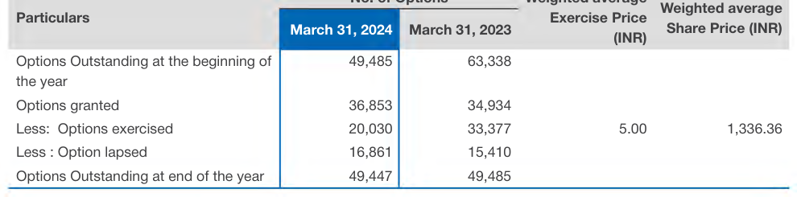

**[Image: AnnualReport2024.pdf-0234-25.png (990x245, 70.9KB)]**

<!-- Start of picture text -->
Weighted average Particulars Exercise Price March 31, 2024 March 31, 2023 Share Price (INR) (INR) Options Outstanding at the beginning of   49,485  63,338 the year Options granted   36,853  34,934 Less:  Options exercised    20,030  33,377 5.00  1,336.36 Less : Option lapsed   16,861  15,410 Options Outstanding at end of the year  49,447   49,485 <!-- End of picture text -->

- b) The weighted average exercise price of the options outstanding as at March 31, 2024 is INR 5 per share (Previous Year: INR 5 per share) and the weighted average remaining contractual life of the options outstanding as at March 31, 2024 is 0.96 years (Previous Year: 0.72 years) 

- c) The fair value of the employee share options has been measured using the Black-Scholes Option Pricing Model. The weighted average fair value of the options granted is INR 1,351.63 (Previous Year: INR 1,333.47). 

The following table lists the average inputs to the model used for the plan for the year ended March 31, 2024: 

|**Particulars**|**March 31, 2024**|**March 31, 2023**|**Description of the Inputs used**|
|---|---|---|---|
|Dividened Yield  %|-|-|Dividend yield of the options is based on recent dividend activity.|
|Expected volatility %|32%-63%|39%-71%|Expected volatility of the option is based on historical volatility, during a period equivalent to the option life, of the observed market prices of the Company’s publicly traded equity shares.|
|Risk free Interest rate %|3.98%-7.02%|3.62%-7.07%|Risk-free interest rates are based on the government securities yield in efect at the time of the grant.|
|Expected life of share options|1 to 3 years|1 to 3 years||
|Weighted Average Market price on date of granting the options|INR 1,354.61|INR 1338.21||

- d) The expense arising from ESGS scheme during the year is INR 3.92 Crore (Previous Year: INR 4.15 Crore). 

###### 42 Leases 

- a)   The Group has recognised 7.32 Crore (Previous Year : INR 5.99 Crore) towards minimum lease payments for short-term leases and INR 0.42 crore (Previous Year : 0.13 Crore) for low-value assets accounted as per paragraph 6 of IND AS 116 and INR 4.31 Crore (Previous Year: INR 2.89 Crore) minimum lease receipt in the Consolidated Statement of Profit and Loss. 

- b)  As a Lessor 

The Group’s significant leasing arrangements are in respect of operating leases for Commercial premises. Lease income from operating leases is recognised on a straight-line basis over the period of lease. The future minimum lease receivables of non-cancellable operating leases are as under: 

|**Particulars**|**March 31, 2024**|**March 31, 2023**|
|---|---|---|
|Future minimum lease receipts under operating leases|||
|Not later than 1 year|1.96|0.38|
|Later than 1 year and not later than 5 years|3.94|0.81|
|Later than 5 years|-|-|

Godrej Properties Limited 

Integrated Report 2023-24 

458 

459 

About Godrej Integrating Sustainability Management Discussion Statutory Properties Limited with our Business and Analysis Reports 

**[Image: AnnualReport2024.pdf-0235-01.png (82x27, 2.2KB)]**

###### Notes forming part of Consolidated Financial Statements 

###### For the year ended March 31, 2024 

(Currency in INR Crore) 

###### 42 Leases (continued) 

###### **c)  As a Lessee** 

The Group’s significant leasing arrangements are in respect of operating leases for Commercial / Residential premises. Lease expenditure for operating leases is recognised on a straight-line basis over the period of lease. These leasing arrangements are non-cancellable / cancellable and are renewable on a periodic basis by mutual consent on mutually accepted terms. 

|**Particulars**|**March 31, 2024**|
|---|---|
|**Right -of-Use Assets**||
|**Cost**||
|Balance as at April 01, 2022|48.93|
|Add: Additions|0.06|
|Less: Disposals|0.75|
|**Balance as at March 31, 2023**|**49.74**|
|**Add: Additions**|**14.93**|
|**Add: Acquired through business combinations (Refer note 45)**|-|
|**Less: Disposals**|**(0.61)**|
|**Balance as at March 31, 2024**|**64.07**|
|**Accumulated Depreciation**||
|Balance as at April 01, 2022|24.20|
|Add: Depreciation charge for the year|8.45|
|Less: Disposals|-|
|**Balance as at March 31, 2023**|**32.65**|
|**Add: Depreciation charge for the year**|**10.12**|
|**Less: Disposals**|-|
|**Balance as at March 31, 2024**|**42.77**|
|**Carrying amount**||
|Balance as at March 31, 2023|17.07|
|**Balance as at March 31, 2024**|**21.29**|
|**Lease Liabilities**||
|Balance as at April 01, 2022|26.41|
|Add: Additions|-|
|Add: Acquired through business combinations (Refer note 44)|0.85|
|Less :Disposals|-|
|Add: Interest Expense on lease Liabilities |1.78|
|Less: Total cashoutfow for leases|(10.04)|
| **Balance as at March 31, 2023**|**19.01**|
|**Add: Additions**|**14.93**|
|**Add: Acquired through business combinations (Refer note 44)**|-|
|**Less :Disposals**|(0.72)|
|**Add: Interest Expense on lease Liabilities** |1.74|
|**Less: Total cashoutfow for leases**|(12.13)|
| **Balance as at March 31, 2024**|**22.83**|
|The future minimum lease payments of non-cancellable operating leases are as under:||
|**Particulars** **March 31, 2024**|**March 31, 2023**|
|Future minimum lease payments under operating leases||
|Not later than 1 year 11.62|7.98|
|Later than 1 year and not later than 5 years 16.91|12.71|
|Weighted average efective interest rate (%) 8.00%|8.00%|

**[Image: AnnualReport2024.pdf-0235-09.png (171x24, 2.1KB)]**

**[Image: AnnualReport2024.pdf-0235-10.png (171x22, 2.0KB)]**

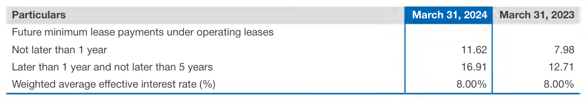

**[Image: AnnualReport2024.pdf-0235-11.png (991x169, 49.3KB)]**

<!-- Start of picture text -->
Particulars March 31, 2024 March 31, 2023 Future minimum lease payments under operating leases Not later than 1 year  11.62   7.98 Later than 1 year and not later than 5 years  16.91   12.71 Weighted average effective interest rate (%) 8.00% 8.00% <!-- End of picture text -->

###### Notes forming part of Consolidated Financial Statements 

For the year ended March 31, 2024 

(Currency in INR Crore) 

###### 43 Related Party Transactions 

**Related party disclosures as required by IND AS - 24, "Related Party Disclosures" for the year ended March 31, 2024 are** 

**given below:** 

**1. Relationships:** 

###### **i) Holding Company:** 

Godrej Industries Limited (GIL) 

###### **ii) Associate:** 

- 1 Godrej One Premises Management Private Limited 

###### **iii) Joint Venture:** 

- 1 Godrej Redevelopers (Mumbai) Private Limited 

   - Godrej Greenview Housing Private Limited 

- 2 

   - Wonder City Buildcon Limited (Clasissified as Subsidary w.e.f  March 29, 2023) (Formerly known as Wonder City Buildcon Private Limited) 

- 3 

- 4 Godrej Home Constructions Limited (Clasissified as Subsidary w.e.f  March 29, 2023) (Formerly known as Godrej Home Constructions Private Limited) 

- 5 Wonder Projects Development Private Limited 

- 6 Godrej Real View Developers Private Limited 

- 7 Pearlite Real Properties Private Limited 

- 8 Godrej Skyline Developers Private Limited (classified as Subsidiary w.e.f. September 28, 2023) 

- 9 Godrej Green Homes Private Limited 

- 10 Godrej Macbricks Private Limited 

   - Munjal Hospitality Private Limited 

- 11 

- 12 Yujya Developers Private Limited (merged with Madhuvan Enterprises Private Limited order dated March 16, 2023 effective from April 01, 2021) 

- 13 Vivrut Developers Private Limited 

   - Madhuvan Enterprises Private Limited 

- 14 

- 15 Vagishwari Land Developers Private Limited 

- 16 Yerwada Developers Private Limited 

- 17 Mosiac Landmarks LLP 

- 18 Dream World Landmarks LLP (classified as Subsidiary w.e.f. September 30, 2023) 

- 19 Oxford Realty LLP 

- 20 Godrej SSPDL Green Acres LLP 

- 21 Caroa Properties LLP (classified as Subsidiary w.e.f. March 28, 2024) 

- 22 M S Ramaiah Ventures LLP 

- 23 Godrej Amitis Developers LLP 

- 24 Godrej Housing Projects LLP 

- 25 Godrej Property Developers LLP ( classified as subsidiary w.e.f 7th Feb 2024) 

- 26 AR Landcraft LLP 

   - Prakhhyat Dwellings LLP 

- 27 

- 28 Godrej Highview LLP 

- 29 Godrej Projects North Star LLP 

- 30 Godrej Developers & Properties LLP 

Godrej Properties Limited 

Integrated Report 2023-24 

460 

461 

About Godrej Integrating Sustainability Management Discussion Statutory Properties Limited with our Business and Analysis Reports 

**[Image: AnnualReport2024.pdf-0236-01.png (82x27, 2.2KB)]**

###### Notes forming part of Consolidated Financial Statements 

For the year ended March 31, 2024 

(Currency in INR Crore) 

###### 43 Related Party Transactions (continued) 

- 31 Godrej Irismark LLP 

- 32 Roseberry Estate LLP 

- 33 Suncity Infrastructures (Mumbai) LLP 

- 34 Manjari Housing Projects LLP 

- 35 Maan-Hinje Township Developers LLP (Classified as Subsidary w.e.f  March 29, 2023) 

- 36 Mahalunge Township Developers LLP 

- 37 Godrej Vestamark LLP (Classified as Subsidiary w.e.f. June 23, 2023) 

- 38 Manyata Industrial Parks LLP 

- 39 Godrej Odyssey LLP 

- 40 Universal Metro Properties LLP 

- 41 Embellish Houses LLP 

- 42 Godrej Projects North LLP 

- 43 Godrej Reserve LLP (Classfied as Subsidiary w.e.f October 02 2022) 

###### **iv) Other Related Parties in Godrej Group:** 

- 1 Godrej & Boyce Manufacturing Company Limited 

2 Godrej Fund Management and Investment Advisors Private Limited (formerly Godrej Investment Advisors Private Limited) 

- 3 Godrej Agrovet Limited 

- 4 Cream Line Dairy Products Limited 

- 5 Godrej Consumer Products Limited 

- 6 Annamudi Real Estates LLP 

- 7 Godrej Housing Finance Limited 

- 8 Godrej Finance Limited 

- 9 Godrej Capital Limited 

###### **v) Key Management Personnel and their Relatives:** 

- 1 Mr. Adi B Godrej 

- 2 Mr. Nadir B Godrej 

- 3 Mr. Pirojsha Godrej 

- 4 Mr. Mohit Malhotra (upto December 31, 2022) 

- 5 Mr. Gaurav Pandey (w.e.f. January 01, 2023) 

- 6 Mr. Jamshyd N. Godrej ( upto January 24, 2024) 

- 7 Mrs. Lalita D. Gupte (upto August 02, 2023) 

- 8 Mr. Pranay Vakil (upto August 02, 2022) 

- 9 Mr. Amitava Mukherjee (upto July 03, 2023) 

- 10 Mr. Indu Bhushan 

- 11 Ms. Sutapa Banerjee 

- 12 Ms. Jayashree Vaidhyanathan (w.e.f. August 02, 2023) 

- 13 Mr. Sumeet Subash Narang (w.e.f. August 23, 2023) 

###### Notes forming part of Consolidated Financial Statements 

For the year ended March 31, 2024 

(Currency in INR Crore) 

###### 43 Related Party Transactions (continued) 

2. The following transactions were carried out with the related parties in the ordinary course of business for the period ended March 31, 2024 

- (i) Details relating to parties referred to in items 1(i), (ii), (iii) and (iv) above 

|**Nature of Transaction**|**Godrej** **Industries**|**Associate** **ii**|**Joint** **Ventures**|**Other** **related** **parties**|**Total**|
|---|---|---|---|---|---|
||**Limited (i)**|**()**|**(iii)**|**in Godrej** **Group (iv)**||
|**Transactions during the period ended March**||||||
|**31, 2024**||||||
|**Purchase of Property, plant and equipment**||||||
|**(including Intangible Assets)**||||||
|**Current Year**|-|-|0.38|0.03|0.41|
|Previous Year|-|-|15.85|-|15.85|
|**Expenses charged by other Companies** **/ Entities**||||||
|**Current Year**|28.94|4.05|4.56|20.34|68.98|
|Previous Year|22.88|4.01|1.01|17.91|45.81|
|**Interest Income on Debenture**||||||
|**Current Year**|-|-|67.59|-|67.59|
|Previous Year|-|-|89.65|-|89.65|
|**Amount paid on transfer of Employee (Net)**||||||
|**Current Year**|3.59|-|0.52|0.32|4.43|
|Previous Year|1.52|-|0.42|-|1.94|
|**Sale of Property, plant and equipment**||||||
|**(Including intangible Assets)**||||||
|**Current Year**|-|-|2.65|-|2.65|
|Previous Year|-|-|-|2.03|2.03|
|**Income Received from other Companies** **/ Entities**||||||
|**Current Year**|-|-|-|-|-|
|Previous Year|-|-|0.67|-|0.67|
|**Expenses charged to other Companies**||||||
|**/ Entities**||||||
|**Current Year**|-|-|132.82|1.56|134.38|
|Previous Year|-|-|150.32|2.82|153.14|
|**Development Management Fees Received**||||||
|**Current Year**|-|-|217.14|7.81|224.95|
|Previous Year|-|-|156.10|8.64|164.74|

**[Image: AnnualReport2024.pdf-0236-50.png (1026x23, 7.4KB)]**

Godrej Properties Limited 

Integrated Report 2023-24 

462 

463 

About Godrej Integrating Sustainability Management Discussion Statutory Properties Limited with our Business and Analysis Reports 

(Currency in INR Crore) 

**[Image: AnnualReport2024.pdf-0237-02.png (82x27, 2.2KB)]**

###### Notes forming part of Consolidated Financial Statements 

For the year ended March 31, 2024 

(Currency in INR Crore) 

###### 43 Related Party Transactions (continued) 

|**Nature of Transaction**|**Godrej** **Industries**|**Associate** **ii**|**Joint** **Ventures**|**Other** **related** **parties**|**Total**|
|---|---|---|---|---|---|
||**Limited (i)**|**()**|**(iii)**|**in Godrej**||
|||||**Group (iv)**||
|**Interest Income**||||||
|**Current Year**|-|-|525.40|-|525.40|
|Previous Year|-|-|408.67|-|408.67|
|**Share of Proft/(Loss) in Joint Ventures** **and Associate**||||||
|**Current Year**|-|-|27.75|-|27.75|
|Previous Year|-|-|(40.73)|-|(40.73)|
|**Amount received on transfer of Employee (Net)***||||||
|**Current Year**|0.05|-|1.10|0.00|1.15|
|Previous Year|-|-|0.18|-|0.18|
|**Commitment / Bank Guarantee /**||||||
|**Letter of Credit issued / Corporate/**||||||
|**Performance Guarantee**||||||
|**Current Year**|-|-|-|-|-|
|Previous Year|-|-|(1.59)|-|(1.59)|
|**Investment made in Equity / Preference Share****#**||||||
|**Current Year**|-|-|27.64|-|27.64|
|Previous Year|-|-|11.65|-|11.65|
|**Investment made in Capital Account of LLP**||||||
|**Current Year**|-|-|100.00|-|100.00|
|Previous Year|-|-|325.20|-|325.20|
|**Investment made in Debenture**||||||
|**Current Year**|-|-|68.24|-|68.24|
|Previous Year|-|-|17.40|-|17.40|
|**Investments Sold /Redeemed / Repayment of** ||||||
|**Partners Capital/ Withdrawal of Share of Proft**||||||
|**Current Year**|-|-|88.05|-|88.05|
|Previous Year|-|-|0.00|-|0.00|
|**Loans and Advances given / (taken) #**||||||
|**Current Year**|-|-|2,374.27|-|2,374.27|
|Previous Year|-|-|1,378.52|-|1,378.52|
|**Loans and Advances repaid**||||||
|**Current Year**|-|-|1,466.20|-|1,466.20|
|Previous Year|-|-|1,282.40|-|1,282.40|

**[Image: AnnualReport2024.pdf-0237-08.png (1027x24, 7.1KB)]**

###### Notes forming part of Consolidated Financial Statements 

For the year ended March 31, 2024 

###### 43 Related Party Transactions (continued) 

|**Nature of Transaction**|**Godrej** **Industries**|**Associate** **ii**|**Joint** **Ventures**|**Other** **related** **parties**|**Total**|
|---|---|---|---|---|---|
||**Limited (i)**|**()**|**(iii)**|**in Godrej**||
|||||**Group (iv)**||
|**Deposit given**||||||
|**Current Year**|-|-|-|-|-|
|Previous Year|1.80|-|-|-|1.80|
|**Deposit repaid**||||||
|**Current Year**|-|-|-|-|-|
|Previous Year|-|-|-|1.80|1.80|
|**Conversion of Debentures to Equity**||||||
|**Current Year**|-|-|17.94|-|17.94|
|Previous Year|-|-|167.97|-|167.97|
|**Balance Outstanding as on March 31, 2024**||||||
|**Amount Receivable (including unbilled**||||||
|**revenue)**||||||
|**As at March 31, 2024**|-|-|2,246.85|0.59|2,247.44|
|As at March 31, 2023|-|-|2,709.12|4.50|2,713.62|
|**Amount Payable**||||||
|**As at March 31, 2024**|0.16|-|0.00|0.07|0.23|
|As at March 31, 2023|0.36|0.20|-|0.04|0.60|
|**Deposit Receivable**||||||
|**As at March 31, 2024**|4.14|0.04|-|-|4.17|
|As at March 31, 2023|4.14|0.04|-|-|4.17|
|**Advance received against share of Proft**||||||
|**As at March 31, 2024**|-|-|-|-|-|
|As at March 31, 2023|-|-|2.94|-|2.94|
|**Debenture  Outstanding**||||||
|**As at March 31, 2024**|-|-|591.70|-|591.70|
|As at March 31, 2023|-|-|667.98|-|667.98|
|**Debenture Interest Outstanding**||||||
|**As at March 31, 2024**|-|-|246.01|-|246.01|
|As at March 31, 2023|-|-|211.88|-|211.88|
|**Commitment / Bank Guarantee / Letter**||||||
|**of Credit / Corporate/ Performance**||||||
|**Guarantee Outstanding**||||||
|**As at March 31, 2024**|-|-|0.34|-|0.34|
|As at March 31, 2023|-|-|0.59|-|0.59|

**[Image: AnnualReport2024.pdf-0237-13.png (1026x24, 7.1KB)]**

Godrej Properties Limited 

Integrated Report 2023-24 

464 

465 

About Godrej Integrating Sustainability Management Discussion Statutory Properties Limited with our Business and Analysis Reports 

**[Image: AnnualReport2024.pdf-0238-01.png (82x27, 2.2KB)]**

###### Notes forming part of Consolidated Financial Statements 

###### For the year ended March 31, 2024 

(Currency in INR Crore) 

###### 43 Related Party Transactions (continued) 

|**Nature of Transaction**|**Godrej** **Industries** **Limited (i)**|**Associate** **(ii)**|**Joint** **Ventures** **(iii)**|**Other** **related** **parties** **in Godrej** **Group (iv)**|**Total**|
|---|---|---|---|---|---|
|**Investment in capital account**||||||
|**As at March 31, 2024**|-|-|685.65|-|685.65|
|As at March 31, 2023|-|-|509.08|-|509.08|
|**Investment in Equity / Preference shares**||||||
|**As at March 31, 2024**|-|0.00|84.48|-|84.48|
|As at March 31, 2023|-|0.00|276.46|-|276.46|

**[Image: AnnualReport2024.pdf-0238-07.png (1027x24, 7.1KB)]**

INR 0.00 represents amount less than INR 50,000 

###### **(ii) Details relating to parties referred to in items 1(v) above** 

|**Particulars** |**March 31, 2024**|**March 31, 2023**|
|---|---|---|
|Short-term employee benefts ** |40.36|40.90|
|Post retirement benefts|0.24|1.08|
|Share based payment transactions|0.06|0.06|
|**Total Compensation paid to Key Management Personnel**|**40.66**|**42.04**|
|**Amount received on issue of equity shares under ESGS to KMP**|**0.01**|**0.01**|

###### **3 Significant Related Party Disclosure** 

The disclosure is based on significant related party transaction during the year ended March 31, 2024. There are no significant related party transactions during the year ended March 31, 2024 and accordingly the comparative figures has not been disclosed. 

** including commission and sitting fees paid to KMP 

Refer Note 49 (d) (i) for Commitments 

Refer Note 39 (c) (ii) for provision / expected credit loss and investment written off 

# Includes Interest receivable as on April 01, 2023 converted into Loan 

###### Notes forming part of Consolidated Financial Statements 

For the year ended March 31, 2024 

(Currency in INR Crore) 

###### 44 Business Combination (Previous Year) 

###### **I Acquisition of Godrej Vestamark LLP (GVLLP)** 

On June 23, 2023, the Holding Company has acquired additional 22.46 percent profit sharing of GVLLP by giving exit to its joint venture partners, a LLP engaged primarily in the business of real estate construction, development and other related activities. As a result, the Holding Company’s profit sharing in GVLLP increased from 77.54 percent to 100 percent, alongwith acquisition of control. 

###### **(a) Consideration transferred** 

The following table summarises the acquisition date fair value of major class of consideration transferred: 

||**Amount**|
|---|---|
|Consideration paid/invested in cash|100.00|
|**Total consideration**|**100.00**|

**[Image: AnnualReport2024.pdf-0238-26.png (990x24, 3.5KB)]**

###### **(b) Identifiable assets acquired and liabilities assumed** 

The following table summarises the acquisition date fair value of assets acquired, fair value of the consideration transferred: 

|**Description**|**Amount**|
|---|---|
|Property, plant and equipment|4.92|
|Intangible assets|-|
|Non-current fnancial assets|0.17|
|Income tax assets (Net)|1.39|
|Inventories|2,315.51|
|Current fnancial assets|13.42|
|Other Current Non Financial Assets|40.39|
|Non-Current Liabilities|(0.08)|
|Current tax liabilities|-|
|Current fnancial liabilities|(1,409.22)|
|Other Current Non Financial Liabilities|(575.64)|
|Provisions|(0.05)|
|**Net Assets**|**390.81**|
|Net Assets acquired|100.00|

**[Image: AnnualReport2024.pdf-0238-30.png (990x23, 2.8KB)]**

###### **(c) Capital Reserve** 

Capital Reserve arising from the acquisition has been determined as follows: 

INR 0.00 represents amount less than INR 50,000 

- **4 Loans or advances to specified persons** 

- **(i) Repayable on Demand** 

||**March 31,**|**2024**|**March 31,**|**2023**|
|---|---|---|---|---|
|**Type of Borrower**|**Amount** **Outstanding ***|**% of total ^**|**Amount** **Outstanding ***|**% of total ^**|
|Related Parties|1,639.25|92.14%|2,237.39|92.88%|
|**Total**|**1,639.25**|**92.14%**|**2,237.39**|**92.88%**|

|**Description**|**Amount**|
|---|---|
|Consideration transferred (Refer note (a) above)|100.00|
|Fair value of net identifable assets (Refer note (b) above)|100.00|
|**Capital reserve**|**-**|

**[Image: AnnualReport2024.pdf-0238-38.png (990x24, 2.6KB)]**

- (d)  From the date of acquisition, GVLLP contributed INR 510.54 crore revenue from operations and INR 13.32 crore loss to the Group during the year ended March 31, 2024. 

INR 0.00 represents amount less than INR 50,000 

* represents gross loan or advance in the nature of loan 

^ represents percentage to the total Loans and Advances in the nature of loans 

Godrej Properties Limited 

Integrated Report 2023-24 

466 

467 

About Godrej Integrating Sustainability Management Discussion Statutory Properties Limited with our Business and Analysis Reports 

Notes forming part of Consolidated Financial Statements For the year ended March 31, 2024 

**[Image: AnnualReport2024.pdf-0239-02.png (82x27, 2.2KB)]**

###### Notes forming part of Consolidated Financial Statements 

(Currency in INR Crore) 

###### 44 Business Combination (Previous Year) (continued) 

###### **II Acquisition of Godrej Skyline Developers Private Limited (Skyline)** 

On September 28, 2023, the Holding Company has acquired additional 49 percent equity interest of Skyline, a company engaged primarily in the business of real estate construction, development and other related activities. As a result, the Holding Company’s equity interest in Skyline  increased from 44 percent to 93 percent, alongwith acquisition of control from Joint control. 

###### **(a) Consideration transferred** 

The following table summarises the acquisition date fair value of major class of consideration transferred: 

||**Amount**|
|---|---|
|Consideration paid/invested in cash|0.65|
|**Total consideration**|**0.65**|

**[Image: AnnualReport2024.pdf-0239-11.png (991x24, 3.5KB)]**

###### **(b) Identifiable assets acquired and liabilities assumed** 

The following table summarises the acquisition date fair value of assets acquired, fair value of the consideration transferred: 

|**Description**|**Amount**|
|---|---|
|Property, plant and equipment|12.74|
|Intangible assets|0.05|
|Non-current fnancial assets|0.50|
|Deferred Tax Assets (Net)|11.26|
|Income tax assets (Net)|1.20|
|Inventories|1,282.44|
|Current fnancial assets|59.38|
|Other Current Non Financial Assets|107.29|
|Non-Current Liabilities|-|
|Current tax liabilities|-|
|Current fnancial liabilities|(545.43)|
|Deferred tax liabilities|-|
|Other Current Non Financial Liabilities|(927.69)|
|Provisions|(0.41)|
|**Net Assets**|**1.33**|
|Net Assets acquired|0.65|

**[Image: AnnualReport2024.pdf-0239-15.png (991x22, 2.7KB)]**

For the year ended March 31, 2024 

(Currency in INR Crore) 

###### 44 Business Combination (Previous Year) (continued) 

###### **III Acquisition of Dreamworld Landmarks LLP (DWLLP)** 

On September 30, 2023, the Holding Company has acquired control over the DWLLP though profit/(loss) share in LLP is 40 percent, a limited liability firm engaged primarily in the business of real estate construction, development and other related activities. 

###### **(a) Consideration transferred** 

The following table summarises the acquisition date fair value of major class of consideration transferred: 

||**Amount**|
|---|---|
|Consideration paid/invested in cash|-|
|**Total consideration**|**-**|
|**dentifable assets acquired and liabilities assumed** he following table summarises the acquisition date fair value of assets acquired, fai **Description**|r value of the consideration transferred **Amount**|
|Property, plant and equipment|0.15|
|Intangible assets|0.02|
|Capital Work-in-Progress|-|
|Non-current fnancial assets|-|
| Deferred Tax Assets (Net)|14.96|
|Income tax assets (Net)|0.28|
|Inventories|417.68|
|Current fnancial assets|92.36|
|Other Current Non Financial Assets|12.18|
|Deferred tax liabilities |-|
|Current fnancial liabilities|(390.28)|
| Other Current Non Financial Liabilities|(30.43)|
|Provisions|(0.35)|
|**Net Assets**|**116.57**|
|Net Assets acquired|-|

**[Image: AnnualReport2024.pdf-0239-24.png (990x24, 2.9KB)]**

###### **(b) Identifiable assets acquired and liabilities assumed** 

The following table summarises the acquisition date fair value of assets acquired, fair value of the consideration transferred: 

**[Image: AnnualReport2024.pdf-0239-27.png (990x22, 2.5KB)]**

###### **c) Capital Reserve** 

Capital Reserve arising from the acquisition has been determined as follows: 

###### **c) Capital Reserve** 

Capital Reserve arising from the acquisition has been determined as follows: 

|**Description**|**Amount**|
|---|---|
|Consideration transferred (Refer note (a) above) |0.65|
|Fair value of net identifable assets (Refer note (b) above)|0.65|
|**Capital reserve**|**-**|

**[Image: AnnualReport2024.pdf-0239-33.png (991x24, 2.5KB)]**

- (d)  From the date of acquisition, Skyline contributed INR 268.30 crores revenue from operations and INR 8.00 crores of profit to the Group during the year ended March 31, 2024. 

|**Description**|**Amount**|
|---|---|
|Consideration transferred (Refer note (a) above)|-|
|Fair value of net identifable assets (Refer note (b) above)|-|
|**Capital reserve**|**-**|

**[Image: AnnualReport2024.pdf-0239-36.png (990x24, 3.3KB)]**

- (d)  From the date of acquisition, DWLLP contributed INR 43.29 crore revenue from operations and INR Nil profit to the Group during the year ended March 31, 2024. 

INR 0.00 represents amount less than INR 50,000 

INR 0.00 represents amount less than INR 50,000 

Godrej Properties Limited 

Integrated Report 2023-24 

468 

469 

About Godrej Integrating Sustainability Management Discussion Statutory Properties Limited with our Business and Analysis Reports 

**[Image: AnnualReport2024.pdf-0240-01.png (82x27, 2.2KB)]**

Notes forming part of Consolidated Financial Statements For the year ended March 31, 2024 

(Currency in INR Crore) 

###### 44 Business Combination (Previous Year) (continued) 

###### **IV Acquisition of Caroa Properties LLP (CPLLP)** 

On March 28, 2024, the Holding Company has acquired additional 22.60 percent share in capital and profit & loss share of CPLLP, a limited liability firm engaged primarily in the business of real estate construction, development and other related activities. As a result, the Holding Company’s profit and Loss share in CPLLP increased from 35 percent to 57.60 percent, alongwith acquisition of control from Joint control. 

###### **(a) Consideration transferred** 

The following table summarises the acquisition date fair value of major class of consideration transferred: 

||**Amount**|
|---|---|
|Consideration paid/invested in cash|159.09|
|**Total consideration**|**159.09**|

**[Image: AnnualReport2024.pdf-0240-10.png (991x24, 3.6KB)]**

###### **(b) Identifiable assets acquired and liabilities assumed** 

The following table summarises the acquisition date fair value of assets acquired, fair value of the consideration transferred: 

|**Description**|**Amount**|
|---|---|
|Property, plant and equipment|11.13|
|Intangible assets|0.00|
|Capital Work-in-Progress|0.24|
|Non-current fnancial assets|26.45|
|Deferred Tax Assets (Net)|13.48|
|Income tax assets (Net)|7.02|
|Inventories|1,449.99|
|Current fnancial assets|89.56|
|Other Current Non Financial Assets|91.47|
|Deferred tax liabilities|-|
|Current fnancial liabilities|(457.89)|
|Other Current Non Financial Liabilities|(526.66)|
|Provisions|(0.58)|
|**Net Assets**|**704.21**|
|Net Assets acquired|159.09|

**[Image: AnnualReport2024.pdf-0240-14.png (991x24, 3.1KB)]**

###### **c) Capital Reserve** 

Capital Reserve arising from the acquisition has been determined as follows: 

|**Description**|**Amount**|
|---|---|
|Consideration transferred (Refer note (a) above)|159.09|
|Fair value of net identifable assets (Refer note (b) above)|159.09|
|**Capital reserve**|**0.00**|

**[Image: AnnualReport2024.pdf-0240-18.png (991x26, 3.1KB)]**

(d)  From the date of acquisition, Caroa Properties LLP contributed INR Nil revenue from operations and INR Nil profit to the Group during the year ended March 31, 2024. 

**V** The Group would have recorded additional revenue of INR 714.29 crore and additional loss of INR 11.28 crore of the combined entity for the current reporting period as though the acquisition date for all business combinations that occurred during the year had been as of the beginning of the annual reporting period. 

###### Notes forming part of Consolidated Financial Statements 

For the year ended March 31, 2024 

(Currency in INR Crore) 

###### 44 Business Combination (Previous Year) (continued) 

###### **I Acquisition of Maan Hinje Township Developers LLP (MHTD LLP)** 

On March 29, 2023, the Holding Company has acquired additional 49 percent share in capital and profit & loss share of MHTD LLP, a limited liability firm engaged primarily in the business of real estate construction, development and other related activities. As a result, the Holding Company’s profit and Loss share in MHTD LLP  increased from 50 percent to 99 percent, alongwith acquisition of control from Joint control. 

###### **(a) Consideration transferred** 

The following table summarises the acquisition date fair value of major class of consideration transferred: 

||**Amount**|
|---|---|
|Consideration paid/invested in cash|0.00|
|**Total consideration**|**0.00**|

**[Image: AnnualReport2024.pdf-0240-30.png (990x24, 3.5KB)]**

###### **(b) Identifiable assets acquired and liabilities assumed** 

The following table summarises the acquisition date fair value of assets acquired, fair value of the consideration transferred: 

|**Description**|**Amount**|
|---|---|
|Property, plant and equipment|1.04|
|Intangible assets|0.01|
|Capital Work-in-Progress|2.18|
|Non-current fnancial assets|-|
|Deferred Tax Assets (Net)|0.00|
|Income tax assets (Net)|1.68|
|Inventories|1,044.28|
|Current fnancial assets|45.25|
|Other Current Non Financial Assets|23.12|
|Deferred tax liabilities|(0.73)|
|Current fnancial liabilities|(1,008.24)|
|Other Current Non Financial Liabilities|(106.28)|
|Provisions|(0.13)|
|**Net Assets**|**2.17**|
|Net Assets acquired|1.06|

**[Image: AnnualReport2024.pdf-0240-34.png (990x24, 3.1KB)]**

###### **c) Capital Reserve** 

Capital Reserve arising from the acquisition has been determined as follows: 

|**Description**|**Amount**|
|---|---|
|Consideration transferred (Refer note (a) above)|0.00|
|Fair value of net identifable assets (Refer note (b) above)|1.06|
|**Capital reserve**|**1.06**|

**[Image: AnnualReport2024.pdf-0240-38.png (990x26, 3.3KB)]**

- (d)  From the date of acquisition, Maan Hinje LLP contributed INR 74.40 crore revenue from operations and INR 27.35 crore profit to the Group during the year ended March 31, 2023. 

INR 0.00 represents amount less than INR 50,000 

Godrej Properties Limited 

Integrated Report 2023-24 

470 

471 

About Godrej Integrating Sustainability Management Discussion Statutory Properties Limited with our Business and Analysis Reports 

**[Image: AnnualReport2024.pdf-0241-01.png (82x27, 2.2KB)]**

Notes forming part of Consolidated Financial Statements For the year ended March 31, 2024 

(Currency in INR Crore) 

###### 44 Business Combination (Previous Year) (continued) 

###### **II Acquisition of Wonder City Buildcon Private Limited (WCBPL)** 

On March 29, 2023, the Holding Company has acquired additional 48.90 percent equity interest of WCBPL, a company engaged primarily in the business of real estate construction, development and other related activities. As a result, the Holding Company’s equity interest in WCBPL  increased from 25.10 percent to 74 percent, alongwith acquisition of control from Joint control. 

###### **(a) Consideration transferred** 

The following table summarises the acquisition date fair value of major class of consideration transferred: 

||**Amount**|
|---|---|
|Consideration paid/invested in cash|0.85|
|**Total consideration**|**0.85**|

**[Image: AnnualReport2024.pdf-0241-10.png (991x24, 3.5KB)]**

###### **(b) Identifiable assets acquired and liabilities assumed** 

The following table summarises the acquisition date fair value of assets acquired, fair value of the consideration transferred: 

|**Description**|**Amount**|
|---|---|
|Property, plant and equipment|0.32|
|Intangible assets|0.00|
|Non-current fnancial assets|9.06|
| Income tax assets (Net)|0.77|
|Inventories|49.28|
|Current fnancial assets|56.55|
|Other Current Non Financial Assets|13.46|
|Non-Current Liabilities|(0.10)|
|Current tax liabilities|(0.27)|
|Current fnancial liabilities|(109.57)|
| Deferred tax liabilities|0.32|
|Other Current Non Financial Liabilities|(17.61)|
|Provisions|(0.05)|
|**Net Assets**|**2.15**|
|Net Assets acquired|1.05|

**[Image: AnnualReport2024.pdf-0241-14.png (991x24, 3.0KB)]**

###### **c) Capital Reserve** 

Capital Reserve arising from the acquisition has been determined as follows: 

|**Description**|**Amount**|
|---|---|
|Consideration transferred (Refer note (a) above)|0.85|
|Fair value of net identifable assets (Refer note (b) above)|1.05|
|**Capital reserve**|**0.20**|

**[Image: AnnualReport2024.pdf-0241-18.png (991x26, 3.1KB)]**

(d)  From the date of acquisition, WCBPL contributed Nil revenue from operations and Nil profit to the Group during the year ended March 31, 2023. 

INR 0.00 represents amount less than INR 50,000 

###### Notes forming part of Consolidated Financial Statements 

For the year ended March 31, 2024 

(Currency in INR Crore) 

###### 44 Business Combination (Previous Year) (continued) 

###### **III Acquisition of Godrej Home Constructions Private Limited** 

On March 29, 2023, the Holding Company has acquired additional 48.90 percent equity interest of Godrej Home Constructions Private Limited , a company incorporated under the provision of the Companies Act 1956, engaged primarily in the business of real estate construction, development and other related activities. As a result, the Holding Company’s equity interest in Godrej Home Constructions Private Limited   increased from 25.10 percent to 74 percent, alongwith acquisition of control from Joint control. 

###### **(a) Consideration transferred** 

The following table summarises the acquisition date fair value of major class of consideration transferred: 

||**Amount**|
|---|---|
|Consideration paid/invested in cash|28.19|
|**Total consideration**|**28.19**|

**[Image: AnnualReport2024.pdf-0241-30.png (990x24, 3.0KB)]**

###### **(b) Identifiable assets acquired and liabilities assumed** 

The following table summarises the acquisition date fair value of assets acquired, fair value of the consideration transferred: 

|**Description**|**Amount**|
|---|---|
|Property, plant and equipment|0.08|
|Intangible assets|-|
|Non-current fnancial assets|-|
|Income tax assets (Net)|2.07|
|Inventories|117.74|
|Current fnancial assets|110.09|
|Other Current Non Financial Assets|10.44|
|Deferred tax liabilities|-|
|Current fnancial liabilities|-52.78|
|Other Current Non Financial Liabilities|-107.30|
|Provisions|-0.15|
|Current Tax|-0.33|
|**Net Assets**|**79.85**|
|**Net Assets Acquired**|**39.04**|

**[Image: AnnualReport2024.pdf-0241-34.png (990x24, 3.1KB)]**

###### **c) Capital Reserve** 

Capital Reserve arising from the acquisition has been determined as follows: 

|**Description**|**Amount**|
|---|---|
|Consideration transferred (Refer note (a) above)|28.19|
|Fair value of net identifable assets (Refer note (b) above)|39.04|
|**Capital reserve**|**10.85**|

**[Image: AnnualReport2024.pdf-0241-38.png (990x24, 2.9KB)]**

(d)  From the date of acquisition, GHCPL contributed Nil revenue from operations and Nil profit to the Group during the year ended March 31, 2023. 

INR 0.00 represents amount less than INR 50,000 

Godrej Properties Limited 

Integrated Report 2023-24 

472 

473 

About Godrej Integrating Sustainability Management Discussion Statutory Properties Limited with our Business and Analysis Reports 

**[Image: AnnualReport2024.pdf-0242-01.png (82x27, 2.2KB)]**

Notes forming part of Consolidated Financial Statements For the year ended March 31, 2024 

(Currency in INR Crore) 

###### 44 Business Combination (Previous Year) (continued) 

###### **IV Acquisition of Godrej Reserve LLP** 

On October 1, 2022, the Holding Company has acquired additional 78.10 percent share in capital and profit & loss share of Reserve LLP, a limited liability firm engaged primarily in the business of real estate construction, development and other related activities. As a result, the Holding Company’s profit and Loss share in Reserve LLP  increased from 21.70 percent to 99.80 percent, alongwith acquisition of control from Joint control. 

###### **(a) Consideration transferred** 

The following table summarises the acquisition date fair value of major class of consideration transferred: 

||**Amount**|
|---|---|
|Consideration paid/invested in cash|0.01|
|**Total consideration**|**0.01**|

**[Image: AnnualReport2024.pdf-0242-10.png (991x24, 3.4KB)]**

###### **(b) Identifiable assets acquired and liabilities assumed** 

The following table summarises the acquisition date fair value of assets acquired, fair value of the consideration transferred: 

|**Description**|**Amount**|
|---|---|
|Property, plant and equipment|0.22|
|Intangible assets|0.00|
|Non-current fnancial assets|-|
|Income tax assets (Net)|2.17|
|Inventories|21.28|
|Current fnancial assets|36.30|
|Other Current Non Financial Assets|1.65|
|Deferred tax liabilities|(0.23)|
|Current fnancial liabilities|(38.01)|
|Other Current Non Financial Liabilities|(23.38)|
|Provisions|(0.06)|
|**Net Assets**|**(0.04)**|
|**Net Assets acquired**|**(0.03)**|

**[Image: AnnualReport2024.pdf-0242-14.png (991x24, 3.2KB)]**

###### **c) Capital Reserve** 

Capital Reserve/(Goodwill) arising from the acquisition has been determined as follows: 

|**Description**|**Amount**|
|---|---|
|Consideration transferred (Refer note (a) above)|0.01|
|Fair value of net identifable assets (Refer note (b) above)|(0.03)|
|**Capital reserve/(Goodwill)**|**(0.04)**|

**[Image: AnnualReport2024.pdf-0242-18.png (991x24, 3.4KB)]**

- (d)  From the date of acquisition, Godrej Reserve LLP contributed INR 4.22 crore of revenue from operations and INR 2.80 crore of profit to the Group during the year ended March 31, 2023. 

INR 0.00 represents amount less than INR 50,000 

###### Notes forming part of Consolidated Financial Statements 

For the year ended March 31, 2024 

(Currency in INR Crore) 

###### 45 IND AS 115 - Revenue from Contracts with Customers 

- (a) The amount of INR 1,220.84 Crore (Previous Year: INR 547.60 Crore) recognised in contract liabilities at the beginning of the year has been recognised as revenue during the year ended March 31, 2024. 

- (b) Significant changes in contract asset and contract liabilities balances are as follows: 

|**Particulars**|**March 31, 2024**|**March 31, 2023**|
|---|---|---|
|**Contract asset**|||
|At the beginning of the reporting period|186.82|191.31|
|Change due to revenue recorded based on measure of progress during the year|274.78|(4.49)|
|Signifcant change due to business combination|23.03|-|
|**At the end of the reporting period**|**484.63**|**186.82**|
|**Contract liability**|||
|At the beginning of the reporting period|2,261.87|846.46|
|Change due to collection and revenue recorded based on measure of progress|5,402.15|1,358.20|
|during the year |||
|Signifcant fnancing component (Net of transfer to Statement of Proft and Loss) |475.77|57.21|
|Signifcant change due to business combination|671.95|-|
|**At the end of the reporting period**|**8,811.74**|**2,261.87**|

###### **(c) Performance obligation** 

The Group engaged primarily in the business of real estate construction, development, hospitality, and other related activities. 

All the Contracts entered with the customers consists of a single performance obligation thereby the consideration allocated to the performance obligation is based on standalone selling prices. 

Revenue is recognised upon transfer of control of residential and commercial units to customers for an amount that reflects the consideration which the Group expects to receive in exchange for those units. The trigger for revenue recognition is normally completion of the project or receipt of approvals on completion from relevant authorities or intimation to the customer of completion, post which the contract becomes non-cancellable by the parties. 

The revenue is measured at the transaction price agreed under the contract. In certain cases, the Group has contracts where the period between the transfer of the promised goods or services to the customer and payment by the customer exceeds one year. As a consequence, the Group adjusts the transaction price for the effects of a significant financing component. 

Any costs incurred that do not contribute to satisfying performance obligations are excluded from the Group’s input methods of revenue recognition as the amounts are not reflective of our transferring control to the customer. Significant judgment is required to evaluate assumptions related to the amount of net contract revenues, including the impact of any performance incentives, liquidated damages, and other forms of variable consideration. 

If estimated incremental costs on any contract, are greater than the net contract revenues, the Group recognises the entire estimated loss in the period the loss becomes known. 

The aggregate amount of the transaction price allocated to the performance obligations that are unsatisfied (or partially unsatisfied) as at March 31, 2024 is INR 14,057.88 Crore (Previous Year: INR 7,647,89 Crore) out of which INR 9,511.07 Crore (Previous Year: INR 3,332.55 Crore), which will be recognised as revenue over a period of 1-2 years and INR 4,201.83 Crore (Previous Year: INR 4,408.64 Crore) which will be recognised over a period of 2-4 years. 

Godrej Properties Limited 

Integrated Report 2023-24 

474 

475 

About Godrej Integrating Sustainability Management Discussion Statutory Properties Limited with our Business and Analysis Reports 

(Currency in INR Crore) 

###### Notes forming part of Consolidated Financial Statements 

For the year ended March 31, 2024 

(Currency in INR Crore) 

45 IND AS 115 - Revenue from Contracts with Customers (continued) 

###### **(d) Reconciliation of revenue recognised in the Consolidated Statement of Profit and Loss** 

The following table discloses the reconciliation of amount of revenue recognised as at March 31, 2024: 

|**Particulars**|**March 31, 2024**|**March 31, 2023**|
|---|---|---|
|Contract price of the revenue recognised |2,743.57|2,134.22|
|Add: Signifcant fnancing component|180.48|35.60|
|Add: Revenue recognised on entitlement of Transferable Development Rights|-|0.33|
|(Refer note 60) |||
|Less: Customer incentive/benefts/discounts|(2.69)|(3.73)|
|Revenue from sale of real estate developments / Land and sale of services recognised in the Consolidated Statement of Proft and Loss|**2,921.36**|**2,166.42**|

###### **(e) Disaggregation of Revenue from sale of services based on nature** 

The following table discloses the amount of revenue recognised based on nature: 

|**Particulars**|**March 31, 2024** |**March 31, 2023** |
|---|---|---|
|Development and Project Management Services|217.14 |269.36 |
|Hospitality Services|40.66 |- |
||**257.79** ,|**269.36** |

46 Information on Subsidiaries, Joint Ventures and Associate 

###### **a) Information on Subsidiaries** 

|**Sr.** |**N f h i**|**Country of**|**Percentage** **A**|**of Holding** **A**|
|---|---|---|---|---|
|**N **|**ame o te entty**|**Ii**|**s on**|**s on**|
|**o. **||**ncorporaton**|**March 31, 2024**|**March 31, 2023**|
|**(i)**|**Companies:**||||
|1|Godrej Projects Development Limited|India|100%|100%|
|2|Godrej Garden City Properties Private Limited|India|100%|100%|
|3|Godrej Hillside Properties Private Limited|India|100%|100%|
|4|Godrej Home Developers Private Limited|India|100%|100%|
|5|Godrej Prakriti Facilities Private Limited|India|100%|100%|
|6|Prakritiplaza Facilities Management Private Limited|India|100%|100%|
|7|Godrej Highrises Properties Private Limited|India|100%|100%|
|8|Godrej Genesis Facilities Management Private Limited|India|100%|100%|
|9|Citystar InfraProjects Limited|India|100%|100%|
|10|Godrej Residency Private Limited|India|50.01%|50.01%|
|11|Godrej Properties Worldwide Inc., USA|USA|N.A.|100%|
||(Dissolved w.e.f. February 02, 2024)||||
|12|Godrej Precast Construction Private Limited|India|100%|100%|
|13|Godrej Green Woods Private Limited|India|100%|100%|
|14|Godrej Realty Private Limited|India|100%|100%|
|15|Godrej Living Private Limited|India|100%|100%|
|16|Ashank Land & Building Private Limited (w.e.f. May 19, 2022)|India|100%|100%|
|17|Godrej Home Constructions Limited (w.e.f  March 29, 2023)|India|100%|74%|
|18|Wonder City Buildcon Private Limited (w.e.f  March 29, 2023)|India|100%|74%|
|19|Godrej Skyline Developers Private Limited (w.e.f September 28, 2023)|India|93%|44%|
|20|Godrej Real Estate Distribution Company Private Limited (w.e.f July 20, 2023)|India|100%|N.A.|

###### Notes forming part of Consolidated Financial Statements 

For the year ended March 31, 2024 

###### 46 Information on Subsidiaries, Joint Ventures and Associate (continued) 

|**Sr**||**Country of**|**Percentage**|**of Holding**|
|---|---|---|---|---|
|**.** |**Name of the entit**||**As on**|**As on**|
|**No. **|**y**|**Incorporation**| **March 31, 2024**| **March 31, 2023**|
|**(ii)**|**LLPs**||||
|1|Godrej Highrises Realty LLP|India|100%|100%|
|2|Godrej Project Developers & Properties LLP|India|100%|100%|
|3|Godrej Skyview LLP|India|100%|100%|
|4|Godrej Green Properties LLP|India|100%|100%|
|5|Godrej Projects (Soma) LLP|India|100%|100%|
|6|Godrej Athenmark LLP|India|100%|100%|
|7|Godrej City Facilities Management LLP|India|100%|100%|
|8|Godrej Florentine LLP|India|100%|100%|
|9|Godrej Olympia LLP|India|100%|100%|
|10|Godrej Buildwell Projects LLP (formerly known as Godrej|India|100%|100%|
||Construction Projects LLP)||||
|11|Oasis Landmarks LLP|India|51%|51%|
|12|Ashank Facility Management LLP|India|100%|100%|
|13|Maan-Hinje Township Developers LLP (w.e.f  Mar 29, 2023)|India|99%|99%|
|14|Godrej Reserve LLP (w.e.f Oct 1, 2022)|India|99.8%|99.8%|
|15|Ashank Realty Management LLP|India|100%|100%|
|16|Godrej Property Developers LLP (Subsidiary upto February 29, 2024)|India|NA|NA|
|17|Dream World Landmarks LLP (w.e.f September 30, 2023)|India|40%|40%|
|18|Caroa Properties LLP (w.e.f Mar 28, 2024)|India|57.59%|35%|
|19|Godrej Vestamark LLP (w.e.f June 23, 2023)|India|100%|58%|

###### **b) Information on Joint Ventures:** 

||||**Percentage**|**of Holding**|
|---|---|---|---|---|
|**Sr.** ||**Country of**|**As on**|**As on**|
|**No. **|**Name of the entity**|**Incorporation**|**March 31, 2024**|**March 31, 2023**|
||||**%**|**%**|
|**(i)**|**Companies:**||||
|1|Godrej Redevelopers (Mumbai) Private Limited |India|51%|51%|
|2|Wonder City Buildcon Private Limited (Classifed as Joint Venture upto Mar 29, 2023) |India|NA|NA|
|3|Godrej Home Constructions Limited (Classifed as Joint Venture upto Mar 29, 2023)|India|NA|NA|
|4|Godrej Greenview Housing Private Limited|India|20%|20%|
|5|Wonder Projects Development Private Limited|India|20%|20%|
|6|Godrej Real View Developers Private Limited|India|20%|20%|
|7|Pearlite Real Properties Private Limited |India|49%|49%|
|8|"Godrej Skyline Developers Private Limited (Classifed as Joint Venture upto|India|NA|44%|
||September 27, 2023)"||||
|9|Godrej Green Homes Private Limited|India|50%|50%|
|10|Madhuvan Enterprises Private Limited|India|20%|20%|
|11|"Godrej Mackbricks Private Limited|India|20%|20%|
||(formerly known as Ashank Macbricks Private Limited)"||||
|12|Munjal Hospitality Private Limited|India|12%|12%|
|13|Yujya Developers Private Limited (Merged with Madhuvan Enterprise pvt ltd w.e.f  March 27, 2023)|India|NA|NA|
|14|Vivrut Developers Private Limited|India|20%|20%|
|15|Yerwada Developers Private Limited|India|20%|20%|
|16|Vagishwari Land Developers Private Limited|India|20%|20%|
|17|Crystalline Home Developers Private Limited|India|NA|NA|
||(w.e.f. September 5, 2023 upto December 1, 2023)||||

Godrej Properties Limited 

Integrated Report 2023-24 

476 

477 

About Godrej Integrating Sustainability Management Discussion Statutory Properties Limited with our Business and Analysis Reports 

**[Image: AnnualReport2024.pdf-0244-01.png (82x27, 2.2KB)]**

###### Notes forming part of Consolidated Financial Statements 

###### For the year ended March 31, 2024 

(Currency in INR Crore) 

###### 46 Information on Subsidiaries, Joint Ventures and Associate (continued) 

||||**P**|**ercentage**|**of Holdin**|**g**|
|---|---|---|---|---|---|---|
||||**As on**|**As on**|**As on**|**As on**|
|**Sr.** |**Name of the entity**|**Country of**|**March**|**March**|**March**|**March**|
|**No. **||**Incorporation**|**31, 2024**|**31, 2024**|**31, 2023**|**31, 2023**|
||||**%**|**%**|**%**|**%**|
|**(ii)**|**LLPs**||||||
|1|Godrej Property Developers LLP (Joint Venture upto February 06, 2024)|India|NA|32%|NA|50%|
|2|Mosiac Landmarks LLP|India|1%|1%|66.67%|66.67%|
|3|Dream World Landmarks LLP (Classifed as Joint Venture upto September 29, 2023)|India|40%|40%|66.67%|66.67%|
|4|Oxford Realty LLP|India|35%|35%|51%|51%|
|5|Godrej SSPDL Green Acres LLP|India|37%|37%|66.67%|66.67%|
|6|M S Ramaiah Ventures LLP |India|50.05%|49.50%|100%|51%|
|7|Caroa Properties LLP (Classifed as Joint Venture upto March 27, 2024)|India|NA|35%|NA|66.67%|
|8|Godrej Housing Projects LLP|India|50%|50%|51%|51%|
|9|Godrej Amitis Developers LLP (formerly known as Amitis Developers LLP)|India|46%|46%|50%|50%|
|10|A R Landcraft LLP|India|40%|40%|50%|50%|
|11|Prakhhyat Dwellings LLP|India|50%|50%|50%|50%|
|12|Godrej Highview LLP|India|40%|40%|50%|50%|
|13|Godrej Irismark LLP|India|50%|50%|50%|50%|
|14|Godrej Projects North Star LLP|India|55%|55%|50%|50%|
|15|Godrej Developers & Properties LLP|India|37.50%|37.50%|50%|50%|
|16|Roseberry Estate LLP|India|49%|49%|50%|50%|
|17|Suncity Infrastructures (Mumbai) LLP |India|60%|60%|50%|50%|
|18|Godrej Reserve LLP (Classifed as Joint Venture upto Sep 30, 2022) |India|NA|NA|NA|NA|
|19|Maan-Hinje Township Developers LLP (Classifed as Joint Venture upto Mar 28, 2023)|India|NA|NA|NA|NA|
|20|Mahalunge Township Developers LLP|India|40%|40%|40%|40%|
|21|Godrej Vestamark LLP (Classifed as Joint Venture upto June 22, 2023)|India|NA|58.28%|NA|50%|
|22|Manyata Industrial Parks LLP|India|1%|1%|50%|50%|
|23| Godrej Odyssey LLP|India|55%|55%|50.00%|33.33%|
|24|Universal Metro Properties LLP|India|49%|49%|50%|50%|
|25| Embellish Houses LLP|India|50%|50%|50%|50%|
|26|Manjari Housing Projects LLP|India|40%|40%|40%|40%|
|27|Godrej Projects North LLP|India|50.10%|50.10%|100%|100.00%|

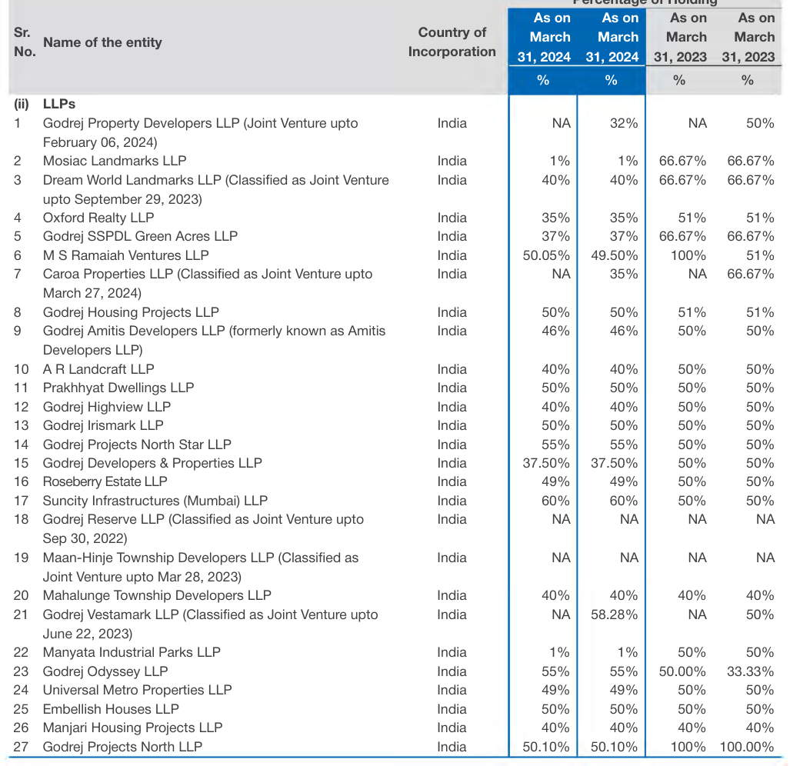

**[Image: AnnualReport2024.pdf-0244-07.png (1027x996, 259.6KB)]**

<!-- Start of picture text -->
As on  As on  As on  As on Sr.  Country of   March  March  March  March No. Name of the entity Incorporation 31, 2024 31, 2024 31, 2023 31, 2023 % % % % (ii) LLPs 1 Godrej Property Developers LLP (Joint Venture upto  India NA 32% NA 50% February 06, 2024) 2 Mosiac Landmarks LLP  India 1% 1% 66.67% 66.67% 3 Dream World Landmarks LLP (Classified as Joint Venture  India 40% 40% 66.67% 66.67% upto September 29, 2023) 4 Oxford Realty LLP  India 35% 35% 51% 51% 5 Godrej SSPDL Green Acres LLP  India 37% 37% 66.67% 66.67% 6 M S Ramaiah Ventures LLP  India 50.05% 49.50% 100% 51% 7 Caroa Properties LLP (Classified as Joint Venture upto  India NA 35% NA 66.67% March 27, 2024) 8 Godrej Housing Projects LLP  India 50% 50% 51% 51% 9 Godrej Amitis Developers LLP (formerly known as Amitis  India 46% 46% 50% 50% Developers LLP) 10 A R Landcraft LLP  India 40% 40% 50% 50% 11 Prakhhyat Dwellings LLP India 50% 50% 50% 50% 12 Godrej Highview LLP India 40% 40% 50% 50% 13 Godrej Irismark LLP India 50% 50% 50% 50% 14 Godrej Projects North Star LLP India 55% 55% 50% 50% 15 Godrej Developers & Properties LLP India 37.50% 37.50% 50% 50% 16 Roseberry Estate LLP India 49% 49% 50% 50% 17 Suncity Infrastructures (Mumbai) LLP India 60% 60% 50% 50% 18 India NA NA NA NA Godrej Reserve LLP (Classified as Joint Venture upto Sep 30, 2022) 19 India NA NA NA NA Maan-Hinje Township Developers LLP (Classified as Joint Venture upto Mar 28, 2023) 20 Mahalunge Township Developers LLP India 40% 40% 40% 40% 21 Godrej Vestamark LLP (Classified as Joint Venture upto  India NA 58.28% NA 50% June 22, 2023) 22 Manyata Industrial Parks LLP India 1% 1% 50% 50% 23 Godrej Odyssey LLP India 55% 55% 50.00% 33.33% 24 Universal Metro Properties LLP India 49% 49% 50% 50% 25 Embellish Houses LLP India 50% 50% 50% 50% 26 Manjari Housing Projects LLP India 40% 40% 40% 40% 27 Godrej Projects North LLP India 50.10% 50.10% 100% 100.00% <!-- End of picture text -->

In case of LLPs percentage of holding in the above table denotes the Share of Profits in the LLP. 

###### **c) Information on Associate:** 

**Percentage of Holding Sr. Country of As on As on No.****Name of the entity** **Incorporation March 31, 2024 March 31, 2023 % % (i) Company:** 1 Godrej One Premises Management Private Limited India 30% 30% 

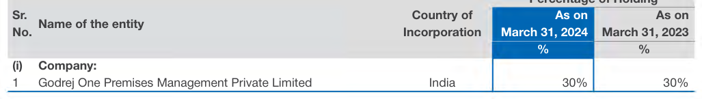

**[Image: AnnualReport2024.pdf-0244-11.png (1027x145, 54.0KB)]**

<!-- Start of picture text -->
Sr.  Country of   As on  As on No. Name of the entity Incorporation March 31, 2024 March 31, 2023 % % (i) Company: 1 Godrej One Premises Management Private Limited India 30% 30% <!-- End of picture text -->

###### Notes forming part of Consolidated Financial Statements For the year ended March 31, 2024 

(Currency in INR Crore) 

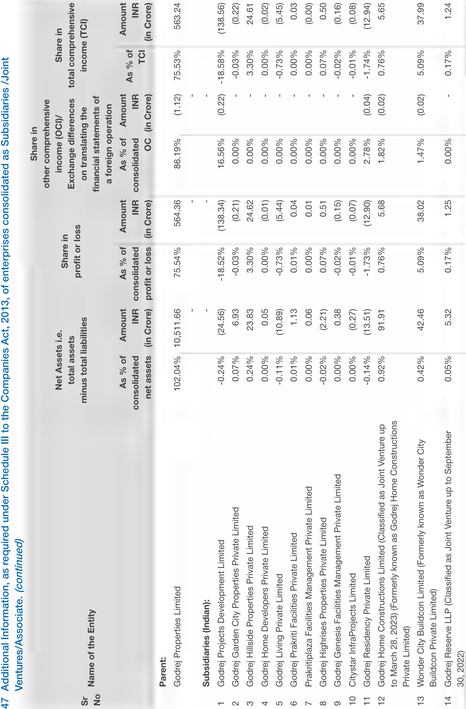

**[Image: AnnualReport2024.pdf-0244-14.png (936x1423, 276.0KB)]**

<!-- Start of picture text -->
Amount  INR  (in Crore)  563.24   (138.56)  (0.22)  24.61   (0.02)  (5.45)  0.03   (0.00)  0.50   (0.16)  (0.08)  (12.94)  5.65   37.99   1.24 Share in   TCI income (TCI) As % of  75.53% -18.58% -0.03% 3.30% 0.00% -0.73% 0.00% 0.00% 0.07% -0.02% -0.01% -1.74% 0.76% 5.09% 0.17% total comprehensive Amount  INR  (in Crore)   (1.12)  -   -   (0.22)  -   -   -   -   -   -   -   -   -   (0.04)  (0.02)  (0.02)  - OC Share in   income (OCI)/ As % of  86.19% 16.56% 0.00% 0.00% 0.00% 0.00% 0.00% 0.00% 0.00% 0.00% 0.00% 2.78% 1.82% 1.47% 0.00% on translating the  a foreign operation other comprehensive  Exchange differences  financial statements of  consolidated Amount  INR  (in Crore)  564.36   -   -   (138.34)  (0.21)  24.62   (0.01)  (5.44)  0.04   0.01   0.51   (0.15)  (0.07)  (12.90)  5.68   38.02   1.25 Share in profit or loss As % of  consolidated  profit or loss 75.54% -18.52% -0.03% 3.30% 0.00% -0.73% 0.01% 0.00% 0.07% -0.02% -0.01% -1.73% 0.76% 5.09% 0.17% Amount  INR  (in Crore) 10,511.66   -   -   (24.56)  6.93   23.83   0.05   (10.89)  1.13   0.06   (2.21)  0.38   (0.27)  (13.51)  91.91   42.46   5.32 Net Assets i.e.  total assets  As % of  net assets 102.04% -0.24% 0.07% 0.24% 0.00% -0.11% 0.01% 0.00% -0.02% 0.00% 0.00% -0.14% 0.92% 0.42% 0.05% minus total liabilities consolidated Name of the Entity Parent: Godrej Properties Limited Subsidiaries (Indian): Godrej Projects Development Limited  Godrej Garden City Properties Private Limited  Godrej Hillside Properties Private Limited  Godrej Home Developers Private Limited  Godrej Living Private Limited Godrej Prakriti Facilities Private Limited  Prakritiplaza Facilities Management Private Limited Godrej Highrises Properties Private Limited  Godrej Genesis Facilities Management Private Limited  Citystar InfraProjects Limited Godrej Residency Private Limited Godrej Home Constructions Limited (Classified as Joint Venture up  to March 28, 2023) (Formerly known as Godrej Home Constructions  Private Limited) Wonder City Buildcon Limited (Formerly known as Wonder City  Buildcon Private Limited) Godrej Reserve LLP (Classified as Joint Venture up to September  30, 2022) Additional Information, as required under Schedule III to the Companies Act, 2013, of enterprises consolidated as Subsidiaries /Joint  Ventures/Associate. (continued) 47 Sr   No 1 2 3 4 5 6 7 8 9 10 11 12 13 14 <!-- End of picture text -->

Godrej Properties Limited 

Integrated Report 2023-24 

478 

479 

About Godrej Integrating Sustainability Management Discussion Statutory Properties Limited with our Business and Analysis Reports 

**[Image: AnnualReport2024.pdf-0245-02.png (82x27, 2.2KB)]**

Notes forming part of Consolidated Financial Statements For the year ended March 31, 2024 

|(Currency in IN ear ended March 31, 2024 **e in** **rehensive** **(TCI)** **Amount** **INR** **(in Crore)** 10.58 (0.44) (0.28) (0.02) (0.02) (0.02) (0.01) (0.05) (0.02) (0.01) (0.01) (0.09) (0.02) (0.02) (5.06) 63.19 (0.77) 2.06|R Crore) (2.98)|
|---|---|
|**Shar** **total comp** **income** **As % of** **TCI** 1.42% -0.06% -0.04% 0.00% 0.00% 0.00% 0.00% -0.01% 0.00% 0.00% 0.00% -0.01% 0.00% 0.00% -0.68% 8.47% -0.10% 0.28%|-0.40%|
| **nsive** **I)/** **ences** **the** **ents of** **ation**   **mount** **INR** **Crore)** - - - - - - - - - - - - - - - - - -|-|
|**Share in** **other comprehe** **income (OC** **Exchange difer** **on translating** **fnancial statem** **a foreign oper** **As % of** **consolidated** **OC** **A** **(in** 0.00% 0.00% 0.00% 0.00% 0.00% 0.00% 0.00% 0.00% 0.00% 0.00% 0.00% 0.00% 0.00% 0.00% 0.00% 0.00% 0.00% 0.00%|0.00%|
| **ss**   **Amount** **INR** **n Crore)**   10.59 (0.43) (0.27) (0.01) (0.01) (0.01) - (0.04) (0.01) (0.01) (0.01) (0.09) (0.02) (0.02) (5.06) 63.19 (0.77) 2.06|(2.98)|
|**Share in** **proft or lo** **As % of** **consolidated** **proft or loss** **(i** 1.42% -0.06% -0.04% 0.00% 0.00% 0.00% 0.00% -0.01% 0.00% 0.00% 0.00% -0.01% 0.00% 0.00% -0.68% 8.46% -0.10% 0.28%|-0.40%|
|**i.e.** **ts** **bilities** **Amount** **INR** **in Crore)**   165.51 (4.62) (0.98) (0.07) (0.06) (0.07) - (0.19) (0.05) (0.05) (0.00) 0.54 0.27 (0.05) 44.81 44.86 (6.89) 1.91|(4.67)|
|**Net Assets** **total asse** **minus total lia** **As % of** **consolidated** **net assets** **(** 1.66% -0.05% -0.01% 0.00% 0.00% 0.00% 0.00% 0.00% 0.00% 0.00% 0.00% 0.01% 0.00% 0.00% 0.45% 0.45% -0.07% 0.02%|-0.05%|
|**Name of the Entity** Maan-Hinje Township Developers LLP (Classifed as Joint Venture up to March 28, 2023) Godrej Highrises Realty LLP Godrej Project Developers & Properties LLP Godrej Skyview LLP Godrej Green Properties LLP Godrej Projects (Soma) LLP Godrej Projects North LLP (Classifed as Joint Venture w.e.f. December 03, 2021) Godrej Athenmark LLP Godrej City Facilities Management LLP Godrej Olympia LLP Godrej Florentine LLP Ashank Facility Management LLP Ashank Realty Management LLP Godrej Precast Construction Private Limited Godrej Green woods Private Limited (w.e.f. May 26, 2020) Oasis Landmarks LLP  (Classifed as Joint Venture upto February 28, 2022) Godrej Realty Private Limited (Classifed as Joint Venture upto March 30, 2021) Godrej Construction Projects LLP (Classifed as Joint Venture upto |March 30, 2021) Ashank Land & Building Private Limited (w.e.f. May 19, 2022)|
|**Sr** **No ** 15 16 17 18 19 20 21 22 23 24 25 26 27 28 29 30 31 32|33|

Notes forming part of Consolidated Financial Statements For the year ended March 31, 2024 

(Currency in INR Crore) 

**[Image: AnnualReport2024.pdf-0245-08.png (24x1447, 12.7KB)]**

|**e in** **rehensive** **e (TCI)** **Amount** **INR** **(in Crore)** (0.00) - (91.06) (6.00) (10.49) - - (3.27) - - -|- - 5.25 3.80 (5.16) 0.96 0.63 (21.82) (56.58) (0.03)|
|---|---|
|/Joint **Shar** **total comp** **incom** **As % of** **TCI** 0.00% 0.00% -12.21% -0.81% -1.41% -0.44% -|0.70% 0.51% -0.69% 0.13% 0.08% -2.93% -7.52% 0.00%|
|idated as Subsidiaries **Share in** **other comprehensive** **income (OCI)/** **Exchange diferences** **on translating the** **fnancial statements of** **a foreign operation**   **As % of** **consolidated** **OC** **Amount** **INR** **(in Crore)** 0.00% - 0.00% - 1.64% (0.02) 0.00% - 2.63% (0.03) 0.00% - 0.00% -|0.00% - 0.00% - 0.00% - 0.00% - 0.00% - 0.00% - 0.00% - 0.00% -|
|es consol   **ss** **Amount** **INR** **in Crore)** (0.00) - (91.04) (6.00) (10.46) - - (3.27) -|5.25 3.80 (5.16) 0.96 0.63 (21.82) (56.58) (0.03)|
|of enterpris **Share in** **proft or lo** **As % of** **onsolidated** **roft or loss** **(** 0.00% 0.00% -12.19% -0.80% -1.40% -0.44% 0.00%|0.70% 0.51% -0.69% 0.13% 0.08% -2.92% -7.57% 0.00%|
|Act, 2013, **s i.e.** **ets** **abilities** **Amount** **INR** **(in Crore)** **c** **p** (0.00) (25.56) 6.13 (0.46) (81.56) - -|- - - - - - - -|
|the Companies **Net Asset** **total ass** **minus total li** **As % of** **consolidated** **net assets** 0.00% -0.26% 0.06% 0.00% -0.82% 0.00% 0.00%|0.00% 0.00% 0.00% 0.00% 0.00% 0.00% 0.00% 0.00%|
|47 Additional Information, as required under Schedule III to Ventures/Associate. (continued) **Sr** **No Name of the Entity** 34 Godrej Real Estate Distribution Company Private Limited (wef July 20, 2023) 35 Caroa Properties LLP (wef Mar 28, 2024) 36 Godrej Vestamark LLP (wef June 23, 2023) 37 Dream World Landmarks LLP (wef 30 September 2023) 38 Godrej Skyline Developers Pvt. Ltd.(wef 28 September 2023) **Subsidiaries (Foreign):** 1 Godrej Properties Worldwide Inc., USA (Dissolved w.e.f February 02, 2024) **Associate (Indian) (Investment as per Equity Method)** 1 Godrej One Premises Management Private Limited|**Joint Ventures (Indian) (Investment as per the Equity Method)** 1 Godrej Redevelopers (Mumbai) Private Limited 2 Godrej Greenview Housing Private Limited 3 Wonder Projects Development Private Limited 4 Godrej Real View Developers Private Limited 5 Pearlite Real Properties Private Limited 6 Godrej Skyline Developers Pvt. Ltd.(Classifed as Subsidiary wef September 28,2023) 7 Godrej Green Homes Private Limited 8 Munjal Hospitality Private Limited|

Godrej Properties Limited 

Integrated Report 2023-24 

480 

481 

About Godrej Integrating Sustainability Management Discussion Statutory Properties Limited with our Business and Analysis Reports 

**[Image: AnnualReport2024.pdf-0246-02.png (82x27, 2.2KB)]**

Notes forming part of Consolidated Financial Statements For the year ended March 31, 2024 

|ear ended March 31, 2024 **e in** **rehensive** **(TCI)** **Amount** **INR** **(in Crore)** 0.11 (0.05) 2.00 (0.01)|(0.01) 5.69 - (0.00) 4.57 (3.43) (3.29) (0.39) 3.34|(Currency in INR Crore) 1.19 1.22 (7.95) 1.80 (2.48) 1.66|
|---|---|---|
|**Shar** **total comp** **income** **As % of** **TCI** 0.01% -0.01% 0.27% 0.00%|0.00% 0.76% 0.00% 0.00% 0.61% -0.46% -0.44% -0.05% 0.45%|0.16% 0.16% -1.07% 0.24% -0.33% 0.22%|
| **nsive** **I)/** **ences** **the** **ents of** **ation**   **mount** **INR** **Crore)** - - - -|- - - - - - - - -|- - - - - -|
|**Share in** **other comprehe** **income (OC** **Exchange difer** **on translating** **fnancial statem** **a foreign oper** **As % of** **consolidated** **OC** **A** **(in** 0.00% 0.00% 0.00% 0.00%|0.00% 0.00% 0.00% 0.00% 0.00% 0.00% 0.00% 0.00% 0.00%|0.00% 0.00% 0.00% 0.00% 0.00% 0.00%|
| **ss**   **Amount** **INR** **n Crore)**   0.11 (0.05) 2.00 (0.01)|(0.01) 5.69 - (0.00) 4.57 (3.43) (3.29) (0.39) 3.34|1.19 1.22 (7.95) 1.80 (2.48) 1.66|
|**Share in** **proft or lo** **As % of** **consolidated** **proft or loss** **(i** 0.01% -0.01% 0.27% 0.00%|0.00% 0.76% 0.00% 0.00% 0.61% -0.46% -0.44% -0.05% 0.45%|0.16% 0.16% -1.06% 0.24% -0.33% 0.22%|
|**s i.e.** **ets** **iabilities** **Amount** **INR** **(in Crore)**   - - - -|- - - - - - - - -|- - - - - -|
|**Net Asset** **total ass** **minus total l** **As % of** **consolidated** **net assets** 0.00% 0.00% 0.00% 0.00%|0.00% 0.00% 0.00% 0.00% 0.00% 0.00% 0.00% 0.00% 0.00%|0.00% 0.00% 0.00% 0.00% 0.00% 0.00%|
|**Name of the Entity** Vivrut Developers Private Limited Madhuvan Enterprises Private Limited Godrej Mackbricks Private Limited (formerly known as Ashank Macbricks Private Limited) Yerwada Developers Private Limited (w.e.f. January 31, 2022)|Vagishwari Land Developers Private Limited Universal Metro Properties LLP Godrej Property Developers LLP (Dissolved w.e.f. March 28,2024) Mosiac Landmarks LLP Dream World Landmarks LLP (Classifed as Subsidiary wef September 30, 2023) Oxford Realty LLP Godrej SSPDL Green Acres LLP M S Ramaiah Ventures LLP Caroa Properties LLP (Classifed as Subsidiary wef March 28, 2024)|Godrej Housing Projects LLP Godrej Amitis Developers LLP (formerly known as Amitis Developers LLP) A R Landcraft LLP Prakhhyat Dwellings LLP Godrej Highview LLP Godrej Irismark LLP|
|**Sr** **No ** 9 10 11 12|13 14 15 16 17 18 19 20 21|22 23 24 25 26 27|

**[Image: AnnualReport2024.pdf-0246-05.png (24x1447, 10.2KB)]**

Notes forming part of Consolidated Financial Statements For the year ended March 31, 2024 

(Currency in INR Crore) 

**[Image: AnnualReport2024.pdf-0246-09.png (24x1447, 12.0KB)]**

|**e in** **rehensive** **(TCI)** **Amount** **INR** **(in Crore)** 3.35 (0.82) 106.30 (2.55) (3.52) 3.78 (5.31) (1.37)|0.10 (0.00) (3.23)|286.80|**745.76**|**723.99**|**21.77**||
|---|---|---|---|---|---|---|
|/Joint **Shar** **total comp** **income** **As % of** **TCI** 0.45% -0.11% 14.25% -0.34% -0.47% 0.51% -0.71% -0.18%|0.01% 0.00% -0.43%|38.46%|**100.00%**|**97.08%**|**2.92%**||
|sidiaries **n** **hensive** **CI)/** **rences** **g the** **ments of** **ration**   **Amount** **INR** **in Crore)** - - - - - - -|- - -|0.17|**(1.30)**|**(1.28)**|**(0.02)**||
|idated as Sub **Share i** **other compre** **income (O** **Exchange dife** **on translatin** **fnancial state** **a foreign ope** **As % of** **consolidated** **OC** **(** 0.00% 0.00% 0.00% 0.00% 0.00% 0.00% 0.00% 0.00%|0.00% 0.00% 0.00%|-13.08%|**100.00%**|**98.61%**|**1.39%**||
|es consol **n** **oss** **Amount** **INR** **(in Crore)** 3.35 (0.82) 106.30 (2.55) (3.52) 3.78 (5.31) (1.37)|0.10 (0.00) (3.23)|286.63|**747.06**|**725.27**|**21.79**||
|, of enterpris **Share i** **proft or l** **As % of** **consolidated** **proft or loss**   0.45% -0.11% 14.23% -0.34% -0.47% 0.51% -0.71% -0.18%|0.01% 0.00% -0.43%|38.37%|**100.00%**|**97.08%**|**2.92%**||
|s Act, 2013 **s i.e.** **ets** **iabilities** **Amount** **INR** **(in Crore)**   - - - - - - - -|- - -|(469.63)|**10,301.44**|**9,992.51**|**308.93**||
|he Companie **Net Asset** **total ass** **minus total l** **As % of** **consolidated** **net assets** 0.00% 0.00% 0.00% 0.00% 0.00% 0.00% 0.00% 0.00%|0.00% 0.00% 0.00%|-4.56%|**100%**|**97.00%**|**3.00%**||
|Additional Information, as required under Schedule III to t Ventures/Associate. (continued) **r** **o Name of the Entity** 8 Godrej Projects North Star LLP 9 Godrej Developers & Properties LLP 0 Roseberry Estate LLP 1 Godrej Projects North LLP (Classifed as Subsidiary upto December 02, 2021) 2 Suncity Infrastructures (Mumbai) LLP 3 Mahalunge Township Developers LLP 4 Manjari Housing Projects LLP 5 Godrej Vestamark LLP (Classifed as Subsidiary wef June 23, 2023)|6 Manyata Industrial Parks LLP 7 Godrej Odyssey LLP 8 Embellish Houses LLP|Inter-company Elimination and Consolidation Adjustments|**otal**|**Attributable to :** Owners of the Company|Non-controlling Interests|R 0.00 represents amount less than INR 50,000|
|47 **S** **N** 2 2 3 3 3 3 3 3|3 3 3||**T**|||IN|

Godrej Properties Limited 

Integrated Report 2023-24 

482 

483 

About Godrej Integrating Sustainability Management Discussion Statutory Properties Limited with our Business and Analysis Reports 

###### Notes forming part of Consolidated Financial Statements 

For the year ended March 31, 2024 

(Currency in INR Crore) 

###### 48 Transactions with Struck off Companies 

|**Name of the Struck** |**Nature of transactions** |**Balance** **outstanding**|**Relationship** **with the**|**Balance** **outstanding**|**Relationship** **with the**|
|---|---|---|---|---|---|
|**Of Company**|**with struck of company**|**as at March** **31, 2024**|**struck** **of company**|**as at March** **31, 2023**|**struck** **of company**|
|Biobe Living Technologies Private Limited|Project Related expenses|-|None|0.00|None|
|Brand Managers Media|Advertising and|-|None|0.00|None|
|Private Limited|Marketing Expenses|||||
|Classic Integrated Solutions Private Limited|Project Related expenses|0.00|None|0.00|None|
|NMF Concepts Private|Other Expenses|0.03|None|-|None|
|My Sunny Balcony Private Limited|Consultancy Charges|0.00|None|0.00|None|
|SC Power Solutions Private Limited|Project Related expenses|-|None|0.00|None|
|Ginza Hotels Private Limited|Other Expenses|0.00|None|0.00|None|
|Swarnasathi Advisory Services Pvt. Ltd|Customer Dues|-|None|0.00|None|
|Amitash Gas Engineers Pvt. Ltd|Project Related expenses|-|None|0.01|None|
|TGS Vertical Transportation Private Limited|Project Related expenses|-|None|0.01|None|
|Atelier Realtech|Advertising and|0.00|None|0.00|None|
|Private Limited|Marketing Expenses|||||
|AIMS Education Private Limited|Customer Dues|-|None|0.00|None|
|Kevin Construction Private Limited|Other Expenses|0.00|None|0.00|None|
|Digipace Consulting (O P S )|Brokerage Expenses|0.00|None|-|None|
|Siddharam Infrastructure Pvt Ltd|Other Expenses|0.00|None|-|None|
|Feligrat Global Solutions Private Limited|Other Expenses|-|None|0.00|None|

INR 0.00 represent amount less than INR 50,000/- 

###### Notes forming part of Consolidated Financial Statements 

For the year ended March 31, 2024 

(Currency in INR Crore) 

###### 49 Contingent Liabilities and Commitments 

|**a)**   |**Contingent Liabilities** |||
|---|---|---|---|
|**Ma**|**tters**|**March 31, 2024**|**March 31, 2023**|
|**I)**|**Claims against Group not Acknowledged as debts:** |||
|i)|Claims not acknowledged as debts represent cases fled by parties in the|516.10|441.55|
||Consumer forum, Civil Court and High Court and disputed by the Company as advised by advocates. In the opinion of the management the claims are not sustainable.|||
|ii)|Claims under Income Tax Act, Appeal preferred to The Deputy Commissioner/ Commissioner  of Income Tax (Appeals) and Income Tax Appellate Tribunal|40.66|41.47|
|iii)|Claims under VAT, Appeal preferred to The Deputy Commissioner/Joint Commissioner of Sales Taxes (Appeals)|15.80|15.86|
|iv)|Appeal preferred to Customs, Excise and Service Tax Appellate tribunal and order passed by National Anti Profterring Authority and disputed by the Group.|122.64|165.56|
|v)|Claimes under GST, Appeal preferred / to be preferred before commisioner appeal|349.83|9.42|
|vi)|Appeal preferred to The Joint Commissioner of Sales Tax (Appeal -4) at Maharashtra under Entry of Goods Into Local Areas Act, 2002|4.33|5.12|
|**II)**|**Guarantees:**|||
|i)|Guarantees given by Bank, counter guaranteed by the Group|264.59|177.64|
|ii)|Guarantees given by the Group relating to Joint Ventures|23.64|34.46|

- b)   The Hon’ble Supreme Court  of India (“SC”)  by its judgement dated February 28, 2019, in the case of RPFC, West Bengal v/s Vivekananda Vidyamandir and others, clarified the principles based on which allowances paid to the employees should be identified for inclusion in basic wages for the purposes of computation of Provident Fund contribution. Subsequently, a review petition against this decision was filed and the SC reiterated its decision given in the above referred judgment. 

   - In view of the management, the liability for the period from date of the SC judgement to 31 March 2019 is not significant and has been provided in the consolidated financial statements.  Further, the impact for the past period, if any, is not ascertainable and consequently no effect has been given in the accounts. 

- c)   The National Green Tribunal, Principal Bench, New Delhi (“the NGT”) has on July 30, 2021 pronounced an order (“Order”) against, inter alia, the Holding Company and its joint venture company viz. Wonder Projects Development Private Limited (“WPDPL”) in respect of matter challenging the environmental clearance granted in relation to project being developed by WPDPL in Bengaluru. WPDPL has challenged the said Order before the Hon’ble Supreme Court. The Supreme Court has on August 26, 2021 directed the parties to maintain status quo. The Holding Company is confident of the merits and compliances in the said case. 

- d)  Commitments 

- **Particulars March 31, 2024 March 31, 2023** 

- (i) Capital Commitment (includes Capital work in progress, investment property under 205.93 311.25 Construction) (Net of advance) 

- (ii)  The Group enters into construction contracts for Civil, Elevator, External Development, MEP work etc. with its vendors. The total amount payable under such contracts will be based on actual measurements and negotiated rates, which are determinable as and when the work under the said contracts are completed. 

- (iii)  The Group has entered into development agreements with owners of land for development of projects. Under the agreements the Group is required to pay certain payments/ deposits to the owners of the land and share in built up area/ revenue from such developments in exchange of undivided share in land as stipulated under the agreements. 

- (iv)  The Holding Company will arrange funds / subscribe to further capital to support continuing operations in certain subsidiaries and joint ventures (jointly with the shareholders / Partners of the respective joint ventures), if required, based upon operation of such entities. The Holding Company expects the said subsidiaries and joint ventures to meet its obligations and no liability on this account is anticipated. 

Godrej Properties Limited 

Integrated Report 2023-24 

484 

485 

About Godrej Integrating Sustainability Management Discussion Statutory Properties Limited with our Business and Analysis Reports 

**[Image: AnnualReport2024.pdf-0248-01.png (82x27, 2.2KB)]**

###### Notes forming part of Consolidated Financial Statements 

For the year ended March 31, 2024 

(Currency in INR Crore) 

###### 50 Other Expenses Includes: 

###### **(a) Payment to Auditors (net of taxes)** 

|**Particulars**|**March 31, 2024**|**March 31, 2023**|
|---|---|---|
|Audit Fees* |1.94|1.52|
|Certifcation and Others|0.35|0.16|
|Reimbursement of Expenses|0.16|0.06|
|**Total**|**2.45**|**1.74**|

*Includes Audit fees in relation to entities acquired during the year. 

- **(b)** Godrej Projects Development Limited (“GPDL”), a wholly owned subsidiary of the Company, for one of its projects, Godrej Summit in Gurgaon, which was completed in phases in 2017 and 2018, has appointed an external expert to undertake a detailed independent assessment of a quality issue discovered in the project. This assessment identified the presence of chloride in the concrete used in the project, which when in contact with water, leads to corrosion of steel reinforcement. The external experts advised that with the required repair and maintenance framework, the building is expected to perform as per its intended design life. Accordingly, an estimated amount of INR 155.00 crore towards repair, maintenance, customer claims, or any ancillary costs has been provided Other Expenses (Refer Note 36). GPDL has also made an offer to buy back units or to provide rentals to all the unit holders of the project till completion of required repair & maintenance. Accordingly, units bought back from customers have been accounted as Stock In Trade (Refer Note 12). 

- **(c)** Other Expenses includes financial assets written off INR 20.83 Crore (Previous Year: INR 47.39 Crore). 

- **(d)** Miscellaneous income includes INR 40.00 Crore related to excess provision written back upon completion of project (Previous Year: 0.04 Crore). 

###### 51 Foreign Exchange Difference 

- The amount of exchange difference included in the Consolidated Statement of Profit and Loss, is INR 0.17 Crore (Net Gain) (Previous Year: INR 0.23 Crore (Net Gain)). 

###### 52 Corporate Social Responsibility 

   - The Group has spent INR 11.71 Crore (Previous Year : INR 11.06* Crore) as per the provisions of Section 135 of the Companies Act, 2013 towards Corporate Social Responsibility (CSR) activities grouped under ‘Other Expenses’. 

- **(a)** Gross amount required to be spent by the Company as approved by board during the year INR 11.71 Crore. (Previous Year: INR 8.89 Crore). 

- **(b)** Amount spent during the year on : 

###### Notes forming part of Consolidated Financial Statements 

For the year ended March 31, 2024 

(Currency in INR Crore) 

###### 52 Corporate Social Responsibility (continued) 

###### **Details of ongoing CSR projects under Section 135(6) of the Act** 

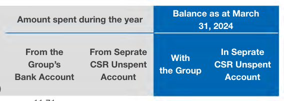

**[Image: AnnualReport2024.pdf-0248-23.png (567x202, 50.4KB)]**

<!-- Start of picture text -->
Balance as at March Amount spent during the year 31, 2024 From the  From Seprate  In Seprate With Group’s  CSR Unspent   CSR Unspent the Group Bank Account  Account Account <!-- End of picture text -->

|**Balance as a**|**t April 01, 2023**|**Amount** **required to**|**Amount spent d**|**uring the year**|**Balance** **31**|**as at March** **, 2024**|
|---|---|---|---|---|---|---|
|||**be spent**|||||
|**With** **the Group**|**In Seprate** **CSR Unspent** **Account**|**during the** **year (including** **unspents for** **previous years)**|**From the** **Group’s** **Bank Account**|**From Seprate** **CSR Unspent** **Account**|**With** **the Group**|**In Seprate** **CSR Unspent** **Account**|
|-|-|11.71|11.71|-|-|-|
|**Balance as a**|**t April 01, 2022**|**Amount** **required to**|**Amount spent d**|**uring the year**|**Balance** **31**|**as at March** **, 2023**|
|||**be spent**|||||
|**With** **the Group**|**In Seprate** **CSR Unspent** **Account**|**during the** **year (including** **unspents for** **previous years)**|**From the** **Group’s** **Bank Account**|**From Seprate** **CSR Unspent** **Account**|**With** **the Group**|**In Seprate** **CSR Unspent** **Account**|
|1.56|0.61|11.06|8.89|2.17|-|-|

**[Image: AnnualReport2024.pdf-0248-25.png (300x24, 3.1KB)]**

**[Image: AnnualReport2024.pdf-0248-26.png (990x24, 2.3KB)]**

**[Image: AnnualReport2024.pdf-0248-27.png (300x24, 3.1KB)]**

**[Image: AnnualReport2024.pdf-0248-28.png (565x24, 3.6KB)]**

**[Image: AnnualReport2024.pdf-0248-29.png (990x22, 2.6KB)]**

###### 53 Utilisation of proceeds from issue of Shares 

###### **Qualified Institutional Placement :** 

During the FY 2020-21, the Company raised a sum of INR 3,750.00 Crore by allotting 25,862,068 equity shares on a Qualified Institutional Placement basis. 

|**Particulars**|**March 31, 2024**|
|---|---|
|Proceeds from the issue of shares during ended March 31, 2021|3,750.00|
|Issue related expenses*|52.61|
||3,697.39|
|Utilisation during the FY 2021-22|474.34|
|Utilisation during the FY 2022-23|3,122.91|
|Utilisation during the FY 2023-24 |100.14|
|Balance unutilised amount invested in mutual funds and fxed deposits with Banks as at March 31, 2024|-|

*Total issue related expenses are INR 60.22 Crore. 

||**Particulars**|**Amount Spent** **in Cash***|**Amount yet to** **be paid in Cash**|**Total Amount**|
|---|---|---|---|---|
||**Year ended March 31, 2024**||||
|(i)|Construction / Acquisition of any Asset|-|-|-|
|(ii)|On purposes other than (i) above|11.71|-|11.71|
||**Year ended March 31, 2023**||||
|(i)|Construction / Acquisition of any Asset|-|-|-|
|(ii)|On purposes other than (i) above|11.06|-|11.06|

**[Image: AnnualReport2024.pdf-0248-36.png (991x24, 3.7KB)]**

- *includes INR 0.60 Crore related to Financial year ended 31 March 2021 and INR 1.56 Crore related to Financial year ended 31 March 2022 

###### 54 Utilisation of Borrowed funds 

- A) “The Group has not advanced or loaned or invested (either from borrowed funds or share premium or any other sources or kind of funds) in any other persons or entities, including foreign entities (“Intermediaries”), with the understanding, whether recorded in writing or otherwise, that the Intermediary shall directly or indirectly lend or invest in other persons or entities identified in any manner whatsoever (“Ultimate Beneficiaries”) by or on behalf of the Group or provide any guarantee, security or the like to or on behalf of the Ultimate Beneficiaries; 

The transaction between the Holding Company and Godrej Projects Development Limited, one of its subsidiary has been eliminated in these Consolidated financial Statements. 

- B) The Group has not received any funds from any persons or entities, including foreign entities (‘’Funding Parties”), with the understanding, whether recorded in writing or otherwise, that the Company shall directly or indirectly, lend or invest in other persons or entities identified in any manner whatsoever (“Ultimate Beneficiaries”) by or on behalf of the Funding Party or provide any guarantee, security or the like from or on behalf of the Ultimate Beneficiaries. 

Godrej Properties Limited 

Integrated Report 2023-24 

486 

487 

About Godrej Integrating Sustainability Management Discussion Statutory Properties Limited with our Business and Analysis Reports 

**[Image: AnnualReport2024.pdf-0249-01.png (82x27, 2.2KB)]**

###### Notes forming part of Consolidated Financial Statements 

For the year ended March 31, 2024 

(Currency in INR Crore) 

###### 55 Segment Reporting 

###### **A.  Basis of Segmentation** 

###### **Factors used to identify the entity’s reportable segments, including the basis of organisation** 

For management purposes, the Group has two reportable segment namely, Development of real estate property and Hospitality. The Managing Director of the Company acts as the Chief Operating Decision Maker (“CODM”). The CODM evaluates the Group’s performance and allocates resources based on an analysis of various performance indicators viz Profit after tax. 

###### **B. Geographical Information** 

The geographic information analyses the Group’s revenue and Non-Current Assets other than financial instruments, deferred tax assets, post-employment benefit assets by the Group’s country of domicile and other countries. As the Group is engaged in Development of Real Estate property and Hospitality in India, it has only one reportable geographical segment. 

###### **C. Information about major customers** 

Revenue from one customer is INR Nil Crore for the year ended March 31, 2024 (Previous Year: INR Nil Crore) constituted more than 10% of the total revenue of the Group. 

###### **D. Segment wise Revenue, Results, Assets and Liabilities for year the ended March 31, 2024:** 

|**Particulars**|**Year E**|**nded**|
|---|---|---|
||**March 31, 2024**|**March 31, 2023**|
|Segment Revenue|||
|Real Estate|2,994.96|2,252.26|
|Hospitality|40.66|-|
|**Total Segment Revenue**|**3,035.62**|**2,252.26**|
|**Net Income from Operations**|**3,035.62**|**2,252.26**|
|Segment Results (Proft before tax)|||
|Real Estate|999.48|795.27|
|Hospitality|0.51|-|
|**Total Segment Results**|**999.99**|**795.27**|
|Segment Assets|||
|Real Estate|34,984.14|22,522.07|
|Hospitality|750.72|583.23|
|**Total Assets**|**35,734.86**|**23,105.30**|
|Segment Liabilities|||
|Real Estate|24,680.49|13,232.20|
|Hospitality|752.93|585.95|
|**Total Liabilities**|**25,433.42**|**13,818.15**|

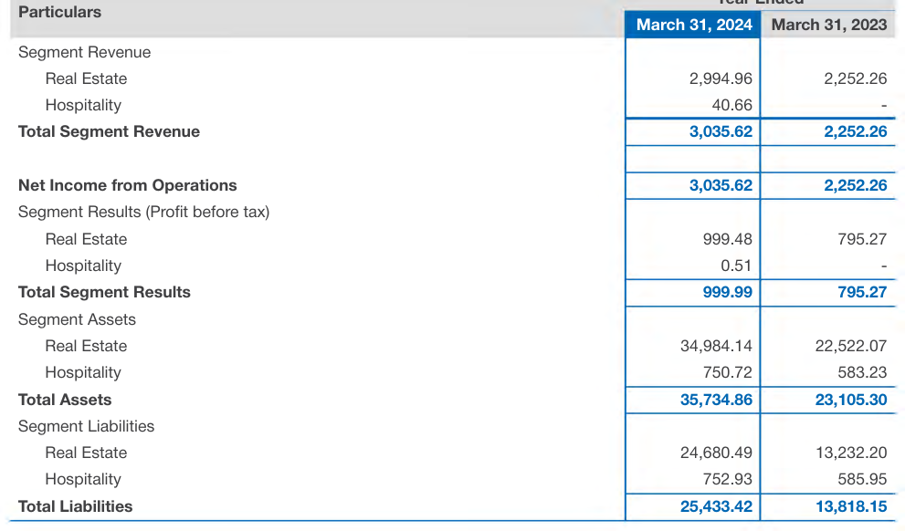

**[Image: AnnualReport2024.pdf-0249-15.png (991x582, 147.0KB)]**

<!-- Start of picture text -->
Particulars March 31, 2024 March 31, 2023 Segment Revenue Real Estate  2,994.96   2,252.26 Hospitality  40.66   - Total Segment Revenue  3,035.62   2,252.26 Net Income from Operations  3,035.62   2,252.26 Segment Results (Profit before tax) Real Estate  999.48   795.27 Hospitality  0.51   - Total Segment Results  999.99   795.27 Segment Assets Real Estate  34,984.14   22,522.07 Hospitality  750.72   583.23 Total Assets  35,734.86   23,105.30 Segment Liabilities Real Estate  24,680.49   13,232.20 Hospitality  752.93   585.95 Total Liabilities  25,433.42   13,818.15 <!-- End of picture text -->

- 56  The write-down/ (write-down reversal) of inventories to net realisable value during the year amounted to INR (30.71) Crore (Previous Year: INR 10.31 Crore). 

###### Notes forming part of Consolidated Financial Statements 

###### For the year ended March 31, 2024 

(Currency in INR Crore) 

57 Additional Disclosure relating to Micro, Small and Medium enterprises : 

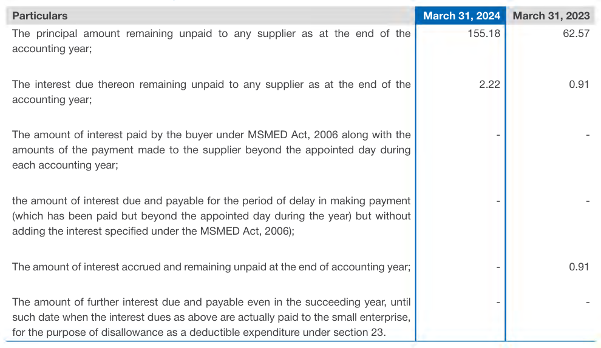

**[Image: AnnualReport2024.pdf-0249-21.png (990x574, 112.1KB)]**

<!-- Start of picture text -->
Particulars March 31, 2024 March 31, 2023 The principal amount remaining unpaid to any supplier as at the end of the  155.18 62.57 accounting year; The interest due thereon remaining unpaid to any supplier as at the end of the   2.22   0.91 accounting year; The amount of interest paid by the buyer under MSMED Act, 2006 along with the   -   - amounts of the payment made to the supplier beyond the appointed day during each accounting year; the amount of interest due and payable for the period of delay in making payment   -   - (which has been paid but beyond the appointed day during the year) but without adding the interest specified under the MSMED Act, 2006); The amount of interest accrued and remaining unpaid at the end of accounting year;  -   0.91 The amount of further interest due and payable even in the succeeding year, until   -   - such date when the interest dues as above are actually paid to the small enterprise, for the purpose of disallowance as a deductible expenditure under section 23. <!-- End of picture text -->

||**Particulars**|**March 31, 2024**|**March 31, 2023**|
|---|---|---|---|
|(a)|The principal amount remaining unpaid to any supplier as at the end of the accounting year;|155.18|62.57|
|(b)|The interest due thereon remaining unpaid to any supplier as at the end of the accounting year;|2.22|0.91|
|(c)|The amount of interest paid by the buyer under MSMED Act, 2006 along with the amounts of the payment made to the supplier beyond the appointed day during each accounting year;|-|-|
|(d)|the amount of interest due and payable for the period of delay in making payment (which has been paid but beyond the appointed day during the year) but without adding the interest specifed under the MSMED Act, 2006);|-|-|
|(e)|The amount of interest accrued and remaining unpaid at the end of accounting year;|-|0.91|
|(f)|The amount of further interest due and payable even in the succeeding year, until such date when the interest dues as above are actually paid to the small enterprise, for the purpose of disallowance as a deductible expenditure under section 23.|-|-|

Disclosure of outstanding dues of Micro and Small Enterprise under Trade Payables is based on the information available with the Group regarding the status of the suppliers as defined under the Micro, Small and Medium Enterprises Development Act, 2006. 

- 59  The Indian Parliament has approved the Code on Social Security, 2020 which would impact the contributions by the Group towards Provident Fund and Gratuity. The Ministry of Labour and Employment has released draft rules for the Code on Social Security, 2020 on November 13, 2020, and has invited suggestions from stakeholders which are under active consideration by the Ministry. The Group will assess the impact and its evaluation once the subject rules are notified and will give appropriate impact in its consolidated financial statements in the period in which, the Code becomes effective and the related rules to determine the financial impact are published. 

- 60  Cash and Cash Equivalents and Bank Balances includes balances in Escrow Account which shall be used only for specified purposes as defined under Real Estate (Regulation and Development) Act, 2016. 

As per our report of even date. 

For **B S R & Co. LLP** Chartered Accountants Firm's Registration No: 101248W/W-100022 

For and on behalf of the Board of Directors of **Godrej Properties Limited** CIN: L74120MH1985PLC035308 

###### **Pirojsha Godrej** 

###### **Gaurav Pandey** 

###### **Mansi Pardiwalla** 

Executive Chairperson Managing Director & CEO DIN: 00432983 DIN: 07229661 Mumbai Mumbai May 03, 2024 May 03, 2024 

Partner 

Membership No: 108511 Mumbai May 03, 2024 

**Ashish Karyekar Rajendra Khetawat** Company Secretary Chief Financial Officer ICSI Membership No. A11331 Mumbai Mumbai May 03, 2024 May 03, 2024 

Godrej Properties Limited 

Integrated Report 2023-24 

488 

489 

About Godrej Integrating Sustainability Management Discussion Statutory Properties Limited with our Business and Analysis Reports 

**[Image: AnnualReport2024.pdf-0250-02.png (82x27, 2.2KB)]**

**[Image: AnnualReport2024.pdf-0250-06.png (20x561, 6.0KB)]**

<!-- Start of picture text -->
Form AOC-1 relating to Subsidiaries, Joint Ventures and Associate <!-- End of picture text -->

**[Image: AnnualReport2024.pdf-0250-07.png (15x188, 2.5KB)]**

<!-- Start of picture text -->
Part “A” : Subsidiaries <!-- End of picture text -->

**[Image: AnnualReport2024.pdf-0250-08.png (24x1530, 20.2KB)]**

<!-- Start of picture text -->
 -  -  -  -  -  - <!-- End of picture text -->

|**Country**|India India India India India India India India India India India India India India India India India India India India India India India|INR Crore) **escribed**|**Country** India India India India India India India India India India India India India India India USA|
|---|---|---|---|
|**% of** **Holding***|100% 100% 100% 100% 100% 100% 100% 100% 100% 50.01% 100% 100% 100% 100% 100% 100% 100% 100% 100% 100% 100% 100% 100%|(Currency in **4 in the pr**|**% of** **Holding*** 100% 100% 100% 100% 51% 100% 100% 100% 100% 100% 99% 99.8% 100.0% 40.0% 57.6% 100%|
|**Proft/(Loss)** **after taxation**|(138.34) (0.21) 24.62 (0.01) 0.04 0.01 0.51 (0.15) (0.07) (12.90) (0.77) (0.02) (5.06) - (5.44) (2.98) 5.68 38.02 (10.46) 2.06 (0.43) (0.27) (0.01)|**s) Rules, 201**|**Proft/(Loss)** **after taxation** (0.01) (0.01) - (0.04) 63.19 (0.01) (0.01) (0.01) (0.09) (0.02) 10.59 1.25 (91.04) (6.00) - (3.27)|
|**Provision** **for** **taxation**|(49.02) - 8.28 - 0.01 0.00 - (0.05) - (4.32) - - - - - - - (2.05) - 1.11 - - -|**(Account**|**Provision** **for** **taxation** - - - - 34.89 - - - - - 7.38 0.65 13.32 (3.20) - -|
|**Proft** **before** **taxation**|(187.36) (0.21) 32.90 (0.01) 0.06 0.01 0.51 (0.20) (0.07) (17.21) (0.77) (0.02) (5.06) - (5.44) (2.98) 5.68 35.97 (10.46) 3.17 (0.43) (0.27) (0.01)|**mpanies**|**Proft** **before** **taxation** (0.01) (0.01) - (0.04) 98.08 (0.01) (0.01) (0.01) (0.09) (0.02) 17.97 1.89 (77.72) (9.21) - (3.27)|
|**Turnover** **(Refer Note** **(c)  below)**|521.32 3.28 72.45 0.00 7.16 0.19 43.15 7.16 - - 0.00 - - - 46.86 - 9.54 37.53 277.57 4.59 - - -|**rule 5 of Co**|**Turnover** **(Refer Note** **(c)  below)** - - - - 302.40 - - - 0.08 0.02 165.15 8.35 510.73 44.19 - 0.99|
|**Investments**|515.08 - 0.01 0.00 - - - - - - - - - - - - 105.30 (0.00) 3.89 9.13 - - -|**, read with**|**Investments** - - - - - - - - - - - 5.37 - - - -|
|**Total** **Liabilities** **(Refer Note** **b  bl**|**()  eow)** 7,064.65 9.40 48.97 0.01 3.30 0.14 752.93 2.85 0.64 1,065.05 7.01 0.06 2,075.06 - 33.59 38.40 158.49 489.28 1,350.97 13.26 5.62 3.64 0.07|**ies Act 2013**|**Total** **Liabilities** **(Refer Note** **(b)  below)** 0.07 0.07 - 0.45 345.35 0.05 0.05 0.01 1.94 0.08 1,264.48 31.55 1,810.15 543.66 986.23 -|
|**Total** **Assets**|7,040.09 16.33 72.80 0.07 4.44 0.20 750.72 3.23 0.37 1,051.54 0.12 0.00 2,119.87 - 22.71 33.73 250.41 531.75 1,269.41 15.17 1.00 2.66 0.00|nts **Compan**|**Total** **Assets** 0.00 0.00 - 0.25 390.21 0.00 0.00 0.00 2.49 0.36 1,429.99 36.87 1,816.27 543.20 960.67 -|
|**Reserves** **and** **Surplus**|(24.79) 6.88 23.42 (0.36) 1.12 0.05 (2.22) 0.37 (0.32) (13.51) (8.62) (0.06) (19.19) - (10.89) (4.68) 6.70 (69.16) (82.88) 1.90 (4.62) (0.98) (0.07)|ateme **129 of the**|**Reserves** **and** **Surplus** (0.06) (0.07) - (0.20) 44.85 (0.05) (0.05) (1.05) 0.04 0.27 18.40 3.31 (190.38) (0.56) (25.66) -|
|**Capital**|0.23 0.05 0.41 0.41 0.01 0.01 0.01 0.01 0.05 0.00 1.74 0.01 64.00 - 0.00 0.00 85.21 111.62 1.32 0.01 0.00 0.00 0.00|cial St **f section**|**Capital** 0.00 0.00 - 0.00 0.01 0.00 0.00 1.05 0.50 0.00 147.11 2.01 196.50 0.10 0.10 -|
|**Accounting** **Period**|2023-24 2023-24 2023-24 2023-24 2023-24 2023-24 2023-24 2023-24 2023-24 2023-24 2023-24 2023-24 2023-24 2023-24 2023-24 2023-24 2023-24 2023-24 2023-24 2023-24 2023-24 2023-24 2023-24|Finan **ection (3) o** **Associate**|**Accounting** **Period** 2023-24 2023-24 2023-24 2023-24 2023-24 2023-24 2023-24 2023-24 2023-24 2023-24 2023-24 2023-24 2023-24 2023-24 2023-24 2023-24|
|**Reporting** **Currency** |INR INR INR INR INR INR INR INR INR INR INR INR INR INR INR INR INR INR INR INR INR INR INR|olidated **viso to sub-s** **Ventures and**|**Reporting** **Currency**   INR INR INR INR INR INR INR INR INR INR INR INR INR INR INR INR in the LLPs ed Surplus ther Income|
|**Sr.** **No.** **Name of** **Subsidiary Company /Limited Liability** **Partnership"**|1 Godrej Projects Development Limited 2 Godrej Garden City Properties Private Limited 3 Godrej Hillside Properties Private Limited 4 Godrej Home Developers Private Limited 5 Godrej Prakriti Facilities Private Limited 0 Prakritiplaza Facilities Management Private Limited 1 Godrej Highrises Properties Private Limited 2 Godrej Genesis Facilities Management Private Limited 3 Citystar InfraProjects Limited 4 Godrej Residency Private Limited 5 Godrej Realty Private Limited 6 Godrej Precast Construction Private Limited 7 Godrej Green Woods Private Limited 8 Yerwada Developers Private Limited (w.e.f. December 09, 2021 till January 30, 2022) 9 Godrej Living Private Limited (w.e.f. February 1, 2022) 10 Ashank Land & Building Private Limited (w.e.f. May 19, 2022) 11 Godrej Home Constructions Limited (w.e.f  Mar 29, 2023) (Formerly known as Godrej Home Constructions Private Limited) 12 Wonder City Buildcon Limited (w.e.f.  Mar 29, 2023) (Formerly known as Wonder City Buildcon Private Limited) 13 Godrej Skyline Developers Private Limited (w.e.f September 28, 2023) 14 Godrej Construction Projects LLP 15 Godrej Highrises Realty LLP 16 Godrej Project Developers & Properties LLP 17 Godrej Skyview LLP (Refer Note (a) below)|Notes forming part of Cons For the year ended March 31, 2024 **Annexure A: Statement pursuant to frst pro** **Form AOC-1 relating to Subsidiaries, Joint** **Part “A” : Subsidiaries**|**Sr.** **No.** **Name of** **Subsidiary Company /Limited Liability** **Partnership"** 18 Godrej Green Properties LLP (Refer Note (a) below) 19 Godrej Projects (Soma) LLP (Refer Note (a) below) 20 Godrej Projects North LLP (Classifed as Subsidiary upto December 02, 2021) 21 Godrej Athenmark LLP (Refer Note (a) below) 22 Oasis Landmarks LLP  (Classifed as Joint Venture upto February 28, 2022) 23 Godrej City Facilities Management LLP 24 Godrej Olympia LLP 25 Godrej Florentine LLP 26 Ashank Facility Management LLP 27 Ashank Realty Management LLP 28 Maan-Hinje Township Developers LLP (w.e.f March 29, 2023) 29 Godrej Reserve LLP (w.e.f  October 1, 2022) 30 Godrej Vestamark LLP (w.e.f  June 23, 2023) 31 Dream World Landmarks LLP (w.e.f  September 30, 2023) 32 Caroa Properties LLp (w.e.f  March 28, 2024) 33 Godrej Properties Worldwide Inc., USA *Percentage holding in LLPs denotes the Share of Proft (a) Subsidiaries of Godrej Projects Development Limit (b) Total Liabilities excludes Capital and Reserves and (c) Turnover Includes Revenue from Operations and O (d) All the above information is given as per Ind AS INR 0.00 represents amount less than INR 50,000|

Godrej Properties Limited 

Integrated Report 2023-24 

490 

491 

About Godrej Integrating Sustainability Management Discussion Statutory Properties Limited with our Business and Analysis Reports 

**[Image: AnnualReport2024.pdf-0251-01.png (82x27, 2.2KB)]**

Notes forming part of Consolidated Financial Statements For the year ended March 31, 2024 

(Currency in INR Crore) 

**Annexure A: Statement pursuant to first proviso to sub-section (3) of section 129 of the Companies Act 2013, read with rule 5 of Companies (Accounts) Rules, 2014 in the prescribed Form AOC-1 relating to Subsidiaries, Joint Ventures and Associate (Continued)** 

**Part "B" : Joint Ventures** 

||||**Shares of** |**Joint Venture** |**s held by** ||**Reason**|**Net worth** |**Share of Pr**|**oft/(Loss) for** |
|---|---|---|---|---|---|---|---|---|---|---|
|**Sr.**|**Name of Joint Venture** |**Latest** **audited**|**the Co**|**mpany on the** **Amnt f**|**year end**|**Description of** **how there**|**why** **joint**|**attributable to** **Shareholding** ||**the year**|
| **No.**|**Company/ Limited** | **Balance**|**No.** **I**|**ou o** **nvestment** |**Extend of**| **is signifcant** | **venture**|**as per latest** |**Considered**   |**Not** |
||**Liability Partnership**|**Sheet Date**| **of Shares** | **in Joint** **Venture**   **H**| **olding %**| **infuence** **c**|**is not** **onsolidated**|**audited** **Balance** **Sheet"** **C**|**in** **onsolidation** **C** **C**|**onsidered in** **onsolidation**|
|1|Godrej Redevelopers (Mumbai) Private Limited|31.03.2024|28,567|4.44|51%|through % of holding|NA|46.47|5.25|-|
|2|Godrej Greenview Housing Private Limited|31.03.2024|1,99,15,200|6.07|20%|through % of holding|NA|10.17|3.80|-|
|3|Wonder Projects Development Private Limited|31.03.2024|2,14,01,200|5.15|20%|through % of holding|NA|(1.25)|(5.16)|-|
|4|Godrej Real View Developers Private Limited|31.03.2024|41,466,200|45.18|20%|through % of holding|NA|19.05|0.96|-|
|5|Pearlite Real Properties Private Limited|31.03.2024|38,71,000|4.19|49%|through % of holding|NA|26.39|0.63|-|
|6|Godrej Skyline Developers Pvt. Ltd.(Classifed as Subsidiary wef September 28,2023)|   31.03.2024|-|-|NA| through % of holding|NA|7.74|(21.82)|-|
|7|Godrej Green Homes Private Limited|31.03.2024|3,60,813|83.18|50%|through % of holding|NA|(25.77)|(56.58)|-|
|8|Godrej Mackbricks Private Limited (formerly known as Ashank Macbricks Private Limited)| 31.03.2024|21,625,000|19.80|20%|through % of holding|NA|10.85|2.00|-|
|9| Vagishwari Land Developers Private Limited|31.03.2024|234|59.64|20%|through % of holding|NA|56.98|(0.01)|-|
|10|Vivrut Developers Private Limited|31.03.2024|20,577,324|22.15|20%|through % of holding|NA|10.92|0.11|-|
|11|Yerwada Developers Private Limited (w.e.f. January 31, 2022)|31.03.2024|12,863,813|15.25|20%|through % of holding|NA|14.20|(0.01)|-|
|12|Munjal Hospitality Private Limited|31.03.2024|60,961,200|83.23|12%|through % of holding|NA|80.27|(0.03)|-|
|13|Madhuvan Enterprises Private Limited|31.03.2024|85,240,683|12.78|20%|through participative rights|NA|-|(0.05)|-|
|14|Universal Metro Properties LLP|31.03.2024|NA|0.00|49%|through % of holding and Voting rights|NA|(11.44)|5.69|-|
|15|Godrej Property Developers LLP (Dissolved w.e.f. March 28,2024)|31.03.2024|NA|-|NA| through % of holding and Voting rights|NA|-|-|-|
|16|Mosiac Landmarks LLP|31.03.2024|NA|0.11|1%|through % of holding and Voting rights|NA|0.11|(0.00)|-|
|17|Dream World Landmarks LLP (Classifed as Subsidiary wef September 30 2023)| 31.03.2024|NA|-|40%| through % of holding and Voting rights|NA|4.31|4.57|-|
|18|, Oxford Realty LLP|31.03.2024|NA|0.00|35%|through % of holding and Voting rights|NA|8.06|(3.43)|-|
|19|Godrej SSPDL Green Acres LLP|31.03.2024|NA|0.05|37%| through % of holding and Voting rights|NA|(23.59)|(3.29)|-|

**[Image: AnnualReport2024.pdf-0251-07.png (1026x24, 9.9KB)]**

###### Notes forming part of Consolidated Financial Statements 

For the year ended March 31, 2024 

(Currency in INR Crore) 

**Annexure A: Statement pursuant to first proviso to sub-section (3) of section 129 of the Companies Act 2013, read with rule 5 of Companies (Accounts) Rules, 2014 in the prescribed Form AOC-1 relating to Subsidiaries, Joint Ventures and Associate (Continued)** 

**Part "B" : Joint Ventures** 

||||**Shares of** |**Joint Ventur** |**es held by** ||**Reason**|**Net worth** |**Share of Pro**|**ft/(Loss) for** |
|---|---|---|---|---|---|---|---|---|---|---|
||**Name of Joint Venture**|**Latest** |**the Co**|**pany on th**|**e year end**|**Description of** |**why** |**attributable to** **Shareholding**||**the year**|
|**Sr.** **No**| **Company/ Limited**|**audited** **Balance**|**N** **I**|**Amount of** **tt**|**Etd f**|**how there** **is signifcant**|**joint** **venture**| **as per latest**|**Considered**|**Not**|
|**.**|**Liability Partnership**| **Sheet Date**|**o.** **of Shares** |**nvesmen** **in Joint** **Venture** |**xen o** **Holding %**| **infuence** **c**| **is not** **onsolidated**|**audited** **Balance** **Sheet"** **C**|**in** **onsolidation** **C** **C**|**onsidered in** **onsolidation**|
|20|M S Ramaiah Ventures LLP|31.03.2024 |NA ----|1.02 ----|50.05% - -|through % of holding and Voting rights ------|NA|(1.03)|(0.39)|-|
|21|Caroa Properties LLP (Classifed as Subsidiary wef March 28, 2024)|31.03.2024|NA|-|NA| through % of holding and Voting rights|NA|-|-|-|
|22| Godrej Housing Projects LLP|31.03.2024|NA|0.01|50%| through % of holding and Voting rights|NA|19.74|1.19|-|
|23|Godrej Amitis Developers LLP (formerly known as Amitis Developers LLP)|31.03.2024|NA|0.05|46%| through % of holding and Voting rights|NA|4.73|1.22|-|
|24| A R Landcraft LLP|31.03.2024|NA|0.10|40%| through % of holding and Voting rights|NA|(107.79)|(7.95)|-|
|25|Prakhhyat Dwellings LLP|31.03.2024|NA|0.01|50%| through % of holding and Votin rihts|NA|(58.11)|1.80|-|
|26|Godrej Highview LLP|31.03.2021|NA|4.80|40%|g g through % of holding and Voting rights|NA|(45.88)|(2.48)|-|
|27|Godrej Irismark LLP|31.03.2020|NA|0.01|50%| through % of holding and Voting rights|NA|(19.89)|1.66|-|
|28|Godrej Projects North Star LLP|31.03.2024|NA|0.01|55%| through % of holding and Voting rights|NA|41.97|3.35|-|
|29|Godrej Developers & Properties LLP|31.03.2024|NA|0.00|37.50%| through % of holding and Voting rights|NA|(33.00)|(0.82)|-|
|30|Roseberry Estate LLP|31.03.2024|NA|0.00|50%| through % of holding and Vi ih|NA|58.86|106.30|-|
|31|"Godrej Projects North LLP (Classifed as Subsidiary upto December 02, 2021)"|31.03.2024|NA|30.00|50%|otng rgts through % of holding and Voting rights|NA|50.26|(2.55)|-|
|32| Suncity Infrastructures (Mumbai) LLP|31.03.2024|NA|0.01|60%|through % of holding and Voting rights|NA|(20.00)|(3.52)|-|
|33|Mahalunge Township Developers LLP|31.03.2024|NA|240.21|40%| through % of holding and Voting rights|NA|159.08|3.78|-|
|34|Manjari Housing Projects LLP|31.03.2024|NA|210.00|40%| through % of holding and Votin rihts|NA|149.56|(5.31)|-|
|35|Manyata Industrial Parks LLP|31.03.2024|NA|0.01|1%|g g through % of holding and Voting rights|NA|0.08|0.10|-|
|36|Godrej Odyssey LLP|31.03.2024|NA|0.00|55%| through % of holding and |NA|(0.29)|(0.00)|-|
|37|Embellish Houses LLP|31.03.2024|NA|0.04|50%|Voting rights through % of holding and Voting rights|NA|(8.60)|(3.23)|-|
|38|Godrej Vestamark LLP |31.03.2024|NA|0.00|NA| through % of |NA|-|-|-|
||(Classifed as Subsidiary wef June 23, 2023)|||||holding and Voting rights|||||

**[Image: AnnualReport2024.pdf-0251-14.png (1026x24, 10.7KB)]**

Godrej Properties Limited 

Integrated Report 2023-24 

492 

493 

About Godrej Integrating Sustainability Management Discussion Statutory Properties Limited with our Business and Analysis Reports 

**[Image: AnnualReport2024.pdf-0252-01.png (82x27, 2.2KB)]**

###### Notes forming part of Consolidated Financial Statements 

###### For the year ended March 31, 2024 

(Currency in INR Crore) 

**Annexure A: Statement pursuant to first proviso to sub-section (3) of section 129 of the Companies Act 2013, read with rule 5 of Companies (Accounts) Rules, 2014 in the prescribed Form AOC-1 relating to Subsidiaries, Joint Ventures and Associate (Continued)** 

**Part “C” : Associate** 

|||**Latest**|**Shares o** **co**|**f Associate** **mpany on th**|**held by the** **e year end**|**Description of**|**Reason**| **Net worth** **attributable to**|   **Share of P**|**roft/(Loss) for** **the year**|
|---|---|---|---|---|---|---|---|---|---|---|
|**Sr.** **No.**|**Name of** **Associate Company**|**audited** **Balance** **Sheet Date**|**No.** **of Shares**|**Amount of** **Investment** **in** **Associate**|       **Extend of** **Holding %**| **how there** **is signifcant** **infuence** |**why associate** **is not** **consolidated**|   **Shareholding** **as per** **latest audited** **Balance Sheet**|     **Considered** **in** **Consolidation**|     **Not** **Considered** **in** **Consolidation**|
|1|Godrej One Premises Management Private Limited|31.03.2024|3,000|0.00| 30%|through % of holding|NA|0.00| -| -|

**[Image: AnnualReport2024.pdf-0252-08.png (1027x24, 10.5KB)]**

Percentage holding in LLPs denotes the Share of Profit in the LLPs 

All the above information is given as per IND AS 

INR 0.00 represents amount less than INR 50,000 

###### **For and on behalf of Board** 

###### **Pirojsha Godrej** 

Executive Chairperson DIN: 00432983 Mumbai May 03, 2023 

###### **Ashish Karyekar** 

Company Secretary ICSI Membership No. A11331 Mumbai May 03, 2023 

###### **Gaurav Pandey** 

Managing Director  & CEO DIN: 07229661 Mumbai May 03, 2023 

###### **Rajendra Khetawat** 

Chief Financial Officer Mumbai May 03, 2023 

###### This page is intentionally left blank 

Godrej Properties Limited 

Integrated Report 2023-24 

494 

495 

About Godrej Integrating Sustainability Properties Limited with our Business 

Management Discussion Statutory and Analysis Reports 

**[Image: AnnualReport2024.pdf-0253-02.png (82x27, 2.3KB)]**

###### NOTICE 

Notice is hereby given that the Thirty-Ninth Annual General Meeting (“AGM”) of the members (“Members”) of Godrej Properties Limited (“Company”) will be held through Video Conferencing (“VC”) or Other Audio Visual Means (“OAVM”), on Wednesday, July 31, 2024, at 2:30 p.m.(IST), to transact the following businesses: 

###### Ordinary Business: 

1. To consider and adopt the audited standalone financial statements and the audited consolidated financial statements of the Company for the financial year ended March 31, 2024, together with the reports of the Board of Directors and the Auditors thereon and other reports. 

2. To appoint a Director in place of Mr. Nadir Godrej (DIN: 00066195), who retires by rotation and being eligible, offers himself for re-appointment. 

###### Special Business: 

3. To consider and, if thought fit, to pass the following resolution as an Ordinary Resolution: 

“RESOLVED THAT in partial modification of the Ordinary Resolution No. 2 passed by the Members of the Company by means of Postal Ballot on December 12, 2022 for the appointment of Mr. Gaurav Pandey (DIN: 07229661) Managing Director & Chief Executive Officer of the Company with effect from January 1, 2023 to December 31, 2025 on the terms and conditions of remuneration mentioned therein and pursuant to the provisions of Sections 196, 197, 198 and 203 read with Schedule V thereto and the Rules made thereunder and other applicable provisions, if any, of the Companies Act, 2013 (“the Act”), applicable provisions of the SEBI (Listing Obligations and Disclosure Requirements) Regulations, 2015, including any amendments, statutory modifications or re-enactments thereof for the time being in force, pursuant to the provisions of the Articles of Association of the Company and pursuant to the recommendations of the Nomination & Remuneration Committee and Board of Directors of the Company, Nomination & Remuneration Policy of the Company and such other approvals, permissions and sanctions as may be required, consent of the Members of the Company be and is hereby accorded for payment of revised remuneration to Mr. Gaurav Pandey, Managing Director & Chief Executive Officer of the Company, as set out in the explanatory statement, with effect 

from April 1, 2024 upto the remainder period of the tenure of his appointment i.e. December 31, 2025; 

RESOLVED FURTHER THAT except for the revision in the remuneration as set out in the explanatory statement, all other terms and conditions of appointment and remuneration, as approved earlier by the Members, which are not dealt with in this Resolution, shall remain unchanged and continue to be effective; 

- RESOLVED FURTHER THAT the Board of Directors of the Company or a Committee thereof be and is hereby authorised to vary and/ or revise the remuneration of Mr. Gaurav Pandey within the overall limits approved herein and expressly mentioned in the explanatory statement and to do all such acts, deeds, matters and things and take all such steps as may be required in this connection to give effect to this resolution and to settle any question or difficulty in connection therewith and incidental thereto.” 

4. To consider and, if thought fit, to pass the following resolution as a Special Resolution: 

“RESOLVED THAT pursuant to the provisions of Sections 149, 150, 152 read with Schedule IV and other applicable provisions, if any, of the Companies Act, 2013 and any rules made thereunder (including any statutory modifications or re-enactments thereof, for the time being in force) (the “Companies Act”) and SEBI (Listing Obligations and Disclosure Requirements) Regulations, 2015 (the “SEBI Listing Regulations”) and pursuant to the provisions of the Articles of Association of the Company and upon recommendation of the Nomination and Remuneration Committee and approval of the Board of Directors and subject to such other approvals as may be required, Ms. Sutapa Banerjee (DIN: 02844650) who is eligible for re-appointment as Independent Director and has submitted a declaration that she meets the criteria for independence as prescribed under Section 149(6) of the Companies Act, 2013 and the SEBI Listing Regulations, be and is hereby re-appointed as an Independent Director of the Company, not liable to retire by rotation, to hold office for a second term of five years commencing from November 05, 2024 till November 04, 2029; 

RESOLVED FURTHER THAT the Board of Directors of the Company (including its committee thereof) be and is hereby authorised to do all acts, deeds, matters and things and take all such steps as may be necessary, proper or expedient to give effect to this resolution.” 

5. To consider and, if thought fit, to pass the following resolution as an **Ordinary Resolution:** 

“RESOLVED THAT pursuant to the provisions of Section 148 and all other applicable provisions of the Companies Act, 2013 and the Companies (Audit and Auditors) Rules, 2014 and the Companies (Cost Records and Audit) Rules, 2014 (including any statutory modifications or re-enactments thereof, for the time being in force), the remuneration payable to M/s. R. Nanabhoy & Co., Cost Accountants, appointed as Cost Auditors by the Board of Directors of the Company, to 

Place: Mumbai Date: May 03, 2024 

###### Registered Office: 

5th Floor, Pirojshanagar, 

Eastern Express Highway, Vikhroli (East), Mumbai – 400 079 CIN: L74120MH1985PLC035308 Tel: 91 22 6169 8500 Website: www.godrejproperties.com Email: secretarial@godrejproperties.com 

**[Image: AnnualReport2024.pdf-0253-23.png (287x22, 3.3KB)]**

conduct the audit of the cost records of the Company for the financial year 2024-25, amounting to ₹ 1.41 lakh exclusive of applicable taxes and out of pocket expenses, be and is hereby ratified and confirmed; 

RESOLVED FURTHER THAT the Board of Directors of the Company (including its committee thereof) be and is hereby authorised to do all acts, deeds, matters and things and take all such steps as may be necessary, proper or expedient to give effect to this resolution.” 

By Order of the Board of Directors For Godrej Properties Limited 

Ashish Karyekar Company Secretary 

ICSI Membership No. A11331 

Godrej Properties Limited 

Integrated Report 2023-24 

496 

497 

About Godrej Integrating Sustainability Management Discussion Statutory Properties Limited with our Business and Analysis Reports 

**[Image: AnnualReport2024.pdf-0254-01.png (82x27, 2.3KB)]**

###### NOTES 

1. Ministry of Corporate Affairs has vide General Circular No. 20/2020 dated May 5, 2020 read with General Circular No. 14/2020 dated April 8, 2020, General Circular No. 17/2020 dated April 13, 2020, General Circular No. 39/2020 dated December 31, 2020, General Circular No. 2/2021 dated January 13, 2021, General Circular No. 19/2021 dated December 8, 2021, General Circular No. 21/2021 dated December 14, 2021, General Circular No. 2/2022 dated May 5, 2022, General Circular No. 10/2022 dated December 28, 2022 and General Circular No. 09/2023 dated September 25, 2023 (collectively referred to as “MCA Circulars”) and the Securities and Exchange Board of India (“SEBI”) vide its Circular No. SEBI/HO/CFD/ CMD1/CIR/P/2020/79 dated May 12, 2020, Circular No. SEBI/HO/CFD/CMD2/CIR/P/2021/11 dated January 15, 2021, Circular No. SEBI/HO/CFD/CMD2/CIR/P/2022/62 dated May 13, 2022, Circular No. SEBI/HO/CFD/PoD2/P/CIR/2023/4 dated January 05, 2023 and Circular No. SEBI/HO/CFD/CFD-PoD-2/P/CIR/2023/167 dated October 07, 2023 (collectively referred to as “SEBI Circulars”) permitted the holding of the Annual General Meeting (“AGM”) through Video Conferencing (“VC”) or Other Audio Visual Means (“OAVM”), without the physical presence of the Members at a common venue. In compliance with the provisions of the Companies Act, 2013 (the “Companies Act” or the “Act”), SEBI (Listing Obligations and Disclosure Requirements) Regulations, 2015 (“SEBI Listing Regulations”), MCA Circulars and SEBI Circulars, the AGM of the Company is being held through VC/ OAVM. National Securities Depositories Limited (‘NSDL’) will be providing facility of remote e-Voting, facility of participation in the AGM through VC/ OAVM and e-voting during the AGM. The registered office of the Company shall be deemed to be the venue of the AGM. The procedure for participating in the meeting through VC/ OAVM is explained at Note No. 8. 

2. As the AGM shall be conducted through VC/ OAVM, the facility for appointment of Proxy by the Members is not available for this AGM and hence the Proxy Form and Attendance Slip including Route Map are not annexed to this Notice. 

3. The Explanatory Statement pursuant to Section 102 of the Companies Act concerning the business under item No. 3 to 5 of the Notice is annexed hereto. Further, the details as stipulated under Regulation 36(3) of the SEBI Listing Regulations and Secretarial Standards on General Meetings issued by the Institute of Company Secretaries of India, with respect to Item No. 2, 3 & 4 of this Notice, are also annexed. 

4. Institutional/ Corporate Members (i.e. other than individuals/ HUF, NRI, etc.) are required to send a scanned copy (PDF/JPG Format) of its Board or governing body resolution/ authorization etc., authorizing its representative to attend the AGM through VC/ OAVM on its behalf and to vote through remote e-Voting. The said resolution/ authorization shall be sent by email through its registered email address to secretarial@godrejproperties. com with a copy marked to evoting@nsdl.co.in 

**[Image: AnnualReport2024.pdf-0254-07.png (56x24, 1.6KB)]**

**[Image: AnnualReport2024.pdf-0254-08.png (171x24, 3.1KB)]**

5. In accordance with the aforesaid MCA Circulars and SEBI Circulars, the financial statements including report of Board of Directors, Auditor’s report or other documents required to be attached therewith and the Notice of AGM are being sent in electronic mode to Members whose e-mail address is registered with the Company or the Depositories/ Depository Participants. In case any Member is desirous of obtaining hard copy of the Integrated Annual Report for the financial year 2023-24, he/she may send request to the Company’s email id at secretarial@godrejproperties.com mentioning folio no., DP ID and Client ID. 

6. Process for registration of email id for obtaining Integrated Annual Report and user id/ password for e-Voting: 

   - (i) Members holding shares in physical mode and who have not updated their email addresses with the Company are requested to update their email addresses by writing to the Registrar and Transfer Agent of the Company KFin Technologies Limited (“KFintech”) at einward.ris@kfintech.com along with the copy of the signed request letter mentioning the name and address of the Member, scanned copy of the share certificate (front and back), self-attested copy of the PAN card, and self-attested copy of any document (e.g.: Driving License, Election Identity Card, Passport) in support of the address of the Member. 

   - (ii) Members holding shares in dematerialised mode are requested to register/ update their email addresses with the relevant Depository Participant. 

   - (iii) In case of any queries / difficulties in registering the e-mail address, Members may write to einward.ris@ . 

   - kfintech.com 

**[Image: AnnualReport2024.pdf-0254-14.png (123x23, 2.2KB)]**

**[Image: AnnualReport2024.pdf-0254-15.png (124x24, 2.1KB)]**

<!-- Start of picture text -->
. <!-- End of picture text -->

- (iv) In terms of SEBI circular no. SEBI/HO/CFD/ CMD/CIR/P/2020/242 dated December 09, 2020, Individual Members holding securities in demat mode are allowed to vote through their demat account maintained with Depository Participants. Members are required to update their mobile number and email ID correctly in their demat account in order to access e-Voting facility. 

7. The Notice of AGM along with Integrated Annual Report godrejproperties.com from July 24, 2024 to July 26, for the financial year 2023-24, is available on the website 2024. Those Members who have registered themselves of the Company at www.godrejproperties.com, on the as a speaker will only be allowed to express their views/ website of Stock Exchanges i.e. BSE Limited and National ask questions during the AGM. The Company reserves Stock Exchange of India Limited and on the website of the right to restrict the number of speakers depending on NSDL at www.evoting.nsdl.com. the availability of time during the AGM. 

**[Image: AnnualReport2024.pdf-0254-18.png (201x24, 3.5KB)]**

<!-- Start of picture text -->
. <!-- End of picture text -->

###### Procedure for joining the AGM through VC/ OAVM: 

Procedure for remote e-voting and e-voting during the AGM: 

8. Member will be provided with a facility to attend the AGM through VC/ OAVM through the NSDL e-Voting system. Members may access the e-voting facility by following the steps mentioned below for Access to NSDL e-Voting system. After successful login, you can see link of “VC/ OAVM link” placed under “Join meeting” menu against company name. You are requested to click on VC/ OAVM link placed under Join Meeting Menu. The link for VC/ OAVM will be available in Shareholder/ Member login where the EVEN of the Company will be displayed. Please note that the Members who do not have the User ID and Password for e-Voting or have forgotten the User ID and Password, may retrieve the same by following the remote e-Voting instructions mentioned in the notice to avoid last minute rush. The facility of joining AGM through VC/ OAVM shall open 30 minutes before the time scheduled for the AGM. 

   14. Members may cast their votes on e-Voting system from any place (remote e-Voting). The remote e-Voting period commences on Friday, July 26, 2024 (9:00 a.m. IST) and ends on Tuesday, July 30, 2024 (5:00 p.m. IST). During this period, Members holding shares either in physical form or in dematerialized form, as on July 24, 2024 i.e. cutoff date, may cast their vote electronically. The e-voting module shall be disabled by NSDL for voting thereafter. The voting rights of Members shall be in proportion to their share in the paid-up equity share capital of the Company as on the cut-off date. 

   15. The Board of Directors has appointed Mr. Ashish Kumar Jain (Membership No. 6058 and CP No. 6124) of M/s. AK Jain & Co. as the Scrutinizer to scrutinize the voting during the AGM and remote e-Voting process in a fair and transparent manner. 

   16. Members who have not opted to cast their vote by remote e-Voting shall be eligible to cast their vote through e-Voting during the AGM. The Members who have already cast their vote by remote e-Voting prior to the AGM shall be eligible to attend/ participate in the AGM through VC/ OAVM but shall not be entitled to cast their vote again. 

9. Members are encouraged to join the Meeting through Laptops for better experience. Members will be required to switch on the video and use internet connection with a good speed to avoid any disturbance during the Meeting. 

10. Please note that participants connecting from mobile devices or tablets or laptop connecting via Mobile Hotspot, may experience audio/ video loss due to fluctuations in their respective network. It is therefore recommended to use stable Wi-Fi or LAN Connection to mitigate any kind of aforesaid glitches. 

   17. The remote e-voting module on the day of the AGM shall be disabled by NSDL for voting after 15 minutes of the conclusion of the AGM. A person who is not a Member as on the cut-off date should treat this Notice of AGM for information purpose only. 

11. Members who need assistance before or during the AGM, can contact NSDL helpdesk at evoting@nsdl.co.in or use Toll free no.: 022 - 4886 7000. 

18. Any person, holding shares in physical form and nonindividual Members, who acquires shares of the Company and becomes a Member of the Company after sending this Notice and holding shares as of the cut-off date, may obtain the login ID and password by sending a request at evoting@nsdl.co.in. However, if he/ she is already registered with NSDL for e-voting then he/ she can use his/ her existing User ID and password for casting the vote. 

**[Image: AnnualReport2024.pdf-0254-30.png (171x23, 2.8KB)]**

12. The Members attending the AGM through VC/OAVM will be counted for the purpose of reckoning the quorum under Section 103 of the Act. 

###### Procedure to raise questions during the AGM: 

13. Members who would like to express their views or ask questions during the AGM may register themselves as a speaker by sending their request from their registered email address mentioning their name, DP ID and Client ID/ folio number, PAN, mobile number at secretarial@ 

In case of individual Members holding securities in demat mode and who acquire shares of the Company and become a Member of the Company after sending this Notice and holding shares as of the cut-off date, may follow steps mentioned below; 

**[Image: AnnualReport2024.pdf-0254-35.png (118x23, 2.3KB)]**

Godrej Properties Limited 

Integrated Report 2023-24 

498 

499 

About Godrej Integrating Sustainability Management Discussion Statutory Properties Limited with our Business and Analysis Reports 

###### Step 1: Access to NSDL e-Voting system 

A) Login method for e-Voting and joining virtual meeting for individual Members holding securities in demat mode 

###### Type of Members 

###### Login Method 

###### A. NSDL IDeAS facility: 

Individual Members holding securities in demat mode with NSDL. 

- i. Existing **IDeAS** user can visit the e-Services website of NSDL Viz. https://eservices.nsdl.com either on a Personal Computer or on a mobile. On the e-Services home page, click on the **“Beneficial Owner”** icon under **“Login”** which is available under **“IDeAS”** section, this will prompt you to enter your existing User ID and Password. After successful authentication, you will be able to see e-Voting services under value added services. Click on **“Access to e-Voting”** under e-Voting services and you will be able to see e-Voting page. Click on company name or e-Voting service provider i.e. NSDL and you will be re-directed to e-Voting website of NSDL for casting your vote during the remote e-Voting period or joining virtual meeting & voting during the meeting. 

- ii. If you are not registered for IDeAS e-Services, option to register is available at https://eservices.nsdl.com. Select **“Register Online for IDeAS Portal”** or click at https:// eservices.nsdl.com/SecureWeb/IdeasDirectReg.jsp 

###### B. E-Voting website of NSDL: 

Open web browser by typing the following URL: https://www.evoting.nsdl.com/ either on a Personal Computer or on a mobile. Once the home page of e-Voting system is launched, click on the icon “Login” which is available under ‘Shareholder/Member’ section. A new screen will open. You will have to enter your User ID (i.e. your sixteen digit demat account number held with NSDL), Password/ OTP and a Verification Code as shown on the screen. After successful authentication, you will be redirected to NSDL Depository site wherein you can see e-Voting page. Click on company name or e-Voting service provider i.e. NSDL and you will be redirected to e-Voting website of NSDL for casting your vote during the remote e-Voting period or joining virtual meeting & voting during the meeting. 

- C. Members can also download NSDL Mobile App **“NSDL Speede”** facility by scanning the QR code mentioned below for seamless voting experience. 

###### **NDSL Mobile App is available on** 

   - **App Store Google Play** 

   - 1. Users who have opted for CDSL Easi / Easiest facility, can login through their existing user id and password. Option will be made available to reach e-Voting page without any further authentication. To login Easi /Easiest, the users are requested to visit CDSL website www. cdslindia.com and click on login icon & New System Myeasi Tab. Use your existing “my Easi” username & password. 

- Individual Members holding securities in demat mode with CDSL 

2. After successful login, the user will be able to see the e-Voting Menu. The Menu will have links of e-voting service provider i.e. NSDL. Click on NSDL to cast your vote. 

3. If the user is not registered for Easi/ Easiest, option to register is available at CDSL website www.cdslindia.com. Click on login & New System Myeasi Tab, and click on registration option. 

4. Alternatively, the user can directly access e-Voting page by providing Demat Account Number and PAN Number from an e-Voting link on www.cdslindia.com home page. The system will authenticate the user by sending OTP on registered Mobile & Email as recorded in the demat Account. After successful authentication, user will be able to see the e-Voting option where the voting is in progress and to directly access the system of all e-Voting Service Providers. 

You can also login using the login credentials of your demat account through your Depository Participant for e-Voting facility. Upon logging in, you will be able to see e-Voting option. Click on e-Voting option, you will be redirected to NSDL/CDSL Depository site after successful authentication, wherein you can see e-Voting feature. Click on company name or e-Voting service provider i.e. NSDL and you will be redirected to e-Voting website of NSDL for casting your vote during the remote e-Voting period or joining virtual meeting & voting during the meeting. 

Individual Members 

(holding securities in demat mode) login through their depository participants 

Important note: Members who are unable to retrieve User ID/ Password are advised to use Forget User ID and Forget Password option available at abovementioned website. 

Helpdesk for individual Members holding securities in demat mode for any technical issues related to login through Depository i.e. NSDL and CDSL: 

###### **Login type** 

###### **Helpdesk details** 

Members facing any technical issue in login can contact NSDL helpdesk by sending a request at evoting@nsdl.co.in or call at 022 - 4886 7000 

Individual Members holding securities in demat mode with NSDL 

Individual Members holding Members facing any technical issue in login can contact CDSL helpdesk by sending a request securities in demat mode at helpdesk.evoting@cdslindia.com or contact at toll free no. 1800 22 55 33 with CDSL 

- B) Login Method for e-Voting and joining virtual meeting 5. Password details for Members other than Individual for Members other than Individual Members holding Members are given below: securities in demat mode and Members holding a) If you are already registered for e-Voting, then you 

- securities in physical mode. 

   - a) If you are already registered for e-Voting, then you can use your existing password to login and cast your vote. 

How to Log-in to NSDL e-Voting website? 

   - b) If you are using NSDL e-Voting system for the first time, you will need to retrieve the ‘initial password’ which was communicated to you. Once you retrieve your ‘initial password’, you need to enter the ‘initial password’ and the system will direct you to change your password. 

1. Visit the e-Voting website of NSDL at https://www. evoting.nsdl.com/. 

2. Once the home page of e-Voting system is launched, click on the icon “Login” which is available under ‘Shareholder/ Member’ section. 

3. A new screen will open. You will have to enter your User ID, your Password/OTP and a Verification Code as shown on the screen. 

- c) How to retrieve your ‘initial password’? 

   - (i) If your email ID is registered in your demat account or with the company, your ‘initial password’ is communicated to you on your email ID. Trace the email sent to you from NSDL from your mailbox. Open the email and open the attachment. The password to open the attachment is your 8 digit client ID for NSDL account, last 8 digits of client ID for CDSL account or folio number for shares held in physical form. The attachment contains your ‘User ID’ and your ‘initial password’. 

Alternatively, if you are registered for NSDL e-services i.e. IDeAS, you can log-in at https://eservices.nsdl.com/ with your existing IDeAS login. After log-in click on e-Voting and you can proceed to Step 2 i.e. Cast your vote electronically. 

4. Your User ID details are given below: 

**Manner of holding shares i.e. Demat** 

###### **Your User ID is:** 

**(NSDL or CDSL)** 

###### **or Physical** 

   - (ii) If your email ID is not registered, please follow steps mentioned below in process for those Members whose email ids are not registered. 

- a) For Members 8 Character DP ID followed by 8 Digit who hold shares Client ID 

in demat account 

- with NSDL. For example if your DP ID is IN300*** and Client ID is 12****** then your user ID is IN300***12******. 

   6. If you are unable to retrieve or have not received the “Initial password” or have forgotten your password: 

      - a) Click on “Forgot User Details/Password?”(If you are holding shares in your demat account with NSDL or CDSL) option is available on www.evoting.nsdl.com. 

- b) For Members 16 Digit Beneficiary ID who hold shares 

in demat account For example if your Beneficiary ID with CDSL. is 12************** then your user ID is 12************** 

- b) Physical User Reset Password?” (If you are holding shares in physical mode) option is available on www. evoting.nsdl.com. 

c) For Members EVEN Number followed by Folio holding shares in Number registered with the company. Physical Form. 

- c) If you are still unable to get the password by aforesaid two options, you can send a request at evoting@nsdl.co.in mentioning your demat account number/ folio number, your PAN, your name and your registered address etc. 

For example if folio number is 001*** and EVEN is 101456 then user ID is 101456001*** 

Godrej Properties Limited 

Integrated Report 2023-24 

500 

501 

About Godrej Integrating Sustainability Management Discussion Statutory Properties Limited with our Business and Analysis Reports 

   - d) Members can also use the OTP (One Time Password) 4. In case of joint holders, the Member whose name appears based login for casting the votes on the e-Voting as the first holder in the order of the names as per the system of NSDL. Register of Members of the Company as on the cut-off date will be entitled to vote during the AGM. 

7. After entering your password, tick on Agree to “Terms and Conditions” by selecting on the check box. 

- and Conditions” by selecting on the check box. 5. The contact details for any grievances connected with the facility for e-Voting on the day of the AGM are mentioned 

- 8. Now, you will have to click on “Login” button. at note no. 11. In case of any queries related to e-Voting, 

- 9. After you click on the “Login” button, Home page of you may refer Frequently Asked Questions (“FAQs”) for e-Voting will open. shareholders and e-Voting manual for shareholders available at the download section of https://www.evoting.nsdl.com. 

- Step 2: Cast your vote electronically and join Meeting on NSDL e-Voting system 

###### Other information: 

- i. After successful login at Step 1, you will be able to see all the companies “EVEN” in which you are holding shares and whose voting cycle and General Meeting is active. 

   19. The Scrutinizer - Mr. Ashish Kumar Jain shall, after the conclusion of voting at the AGM, shall unblock the votes cast through remote e-Voting and during the AGM and shall submit, not later than 48 hours of conclusion of the AGM, a consolidated Scrutinizer’s Report of the total votes cast in favour or against, if any, to the Executive Chairperson or a person authorised by him in writing, who shall countersign the same. 

- ii. Select “EVEN” of company for which you wish to cast your vote during the remote e-Voting period and casting your vote during the General Meeting. For joining virtual meeting, you need to click on “VC/OAVM” link placed under “Join Meeting”. 

   20. The results of the electronic voting shall be declared to the Stock Exchanges by August 02, 2024. The results along with the Scrutinizer’s Report, shall also be placed on the website of the Company at www.godrejproperties.com and on the website of NSDL https://www.evoting.nsdl. com immediately. The Company shall simultaneously forward the results to the National Stock Exchange of India Limited and BSE Limited, where the shares of the Company are listed. 

- iii. Now you are ready for e-Voting as the Voting page opens. 

- iv. Cast your vote by selecting appropriate options i.e. assent or dissent, verify/modify the number of shares for which you wish to cast your vote and click on “Submit” and also “Confirm” when prompted. 

- v. Upon confirmation, the message “Vote cast successfully” will be displayed. 

- vi. You can also take the printout of the votes cast by you by clicking on the print option on the confirmation page. 

21. During the AGM, the Register of Directors and Key Managerial Personnel and their shareholding maintained under Section 170 of the Act, the Register of contracts or arrangements in which directors are interested under Section 189 of the Act and the Certificate from the Practicing Company Secretary certifying that the ESGS Scheme of the Company is being implemented in accordance with the SEBI (Share Based Employee Benefits and Sweat Equity) Regulations, 2021 shall be available for inspection upon login at NSDL e-voting system at https://www.evoting.nsdl.com. 

- vii. Once you confirm your vote on the resolution, you will not be allowed to modify your vote. 

It is strongly recommended not to share your password with any other person and take utmost care to keep your password confidential. Login to the e-voting website will be disabled upon five unsuccessful attempts to key in the correct password. In such an event, you will need to go through the “Forgot User Details/Password?” or “Physical User Reset Password?” option available on website to reset the password. 

22. Members seeking any information with regard to the accounts or any matter to be placed at the AGM, are requested to write to the Company on or before July 31, 2024 through email on secretarial@godrejproperties.com. The same will be replied by the Company suitably. 

The instructions for members for e-voting on the day of the AGM are as under:- 

1. The procedure for e-Voting on the day of the AGM is same as the instructions mentioned above for remote e-Voting. 

   23. As per the provisions of Section 72 of the Act, and Rule 19(1) of the Companies (Share Capital and Debentures) Rules, 2014, Members holding shares in physical form may file nomination in the prescribed Form SH-13 with KFintech. In respect of shares held in dematerialized form, the nomination may be filed with the respective Depository Participants. 

2. Only those Members, who will be present in the AGM through VC/ OAVM facility and have not casted their vote on the Resolutions through remote e-Voting and are otherwise not barred from doing so, shall be eligible to vote through e-Voting system during the AGM. 

3. Members who have voted through remote e-Voting will be eligible to attend the AGM. However, they will not be eligible to vote at the AGM. 

24. If a Member desires to opt-out or cancel the earlier 28. SEBI vide Circular no. SEBI/HO/OIAE/ OIAE_IAD-1/P/ nomination and record a fresh nomination, the Member CIR/2023/131 dated July 31, 2023, as amended from may submit the same in Form ISR-3 or Form SH-14, as the time to time, has specified the process for redressal of case may be. The said forms can be downloaded from the shareholder grievances. A shareholder shall first take up Company’s website at https://www.godrejproperties.com/ their grievance with the listed entity/ RTA by lodging a investors/investor-information. Members are requested to complaint directly with the Company/ RTA by sending an submit the said forms to the RTA at einward.ris@kfintech. email to secretarial@godrejproperties.com or einward. com in case the shares are held in physical form, quoting ris@kfintech.com or by sending physical correspondence their folio no(s), number of securities held, certificate no., at KFintech, Unit: Godrej Properties Limited, Selenium distinctive nos. of the securities held. Tower B, Plot No.: 31 & 32, Gachibowli, Financial District, Nanakramguda, Serilingampally, Hyderabad - 500 032, 

The Company has sent individual letters to all the Telangana. If the grievance is not redressed satisfactorily, 

members holding shares in physical form for furnishing the shareholder may, in accordance with the SCORES 

their PAN, KYC details and Nomination pursuant to guidelines, escalate the same through the SCORES 

SEBI Circular No. SEBI/HO/MIRSD/MIRSD-PoD-1/P/ Portal (https://scores.sebi.gov.in) in accordance with the 

CIR/2023/37 dated March 16, 2023. The said information process laid out therein. Only after exhausting all available 

and relevant forms are also available on the website of options for resolution of the grievance, if the shareholder 

the Company at https://www.godrejproperties.com/ investors/investor-information. is still not satisfied with the outcome, the shareholder can initiate dispute resolution through the common Online 

25. Members may please note that SEBI vide its Circular No. Dispute Resolution (“ODR”) Portal at https://smartodr. SEBI/HO/MIRSD/MIRSD_RTAMB/P/CIR/2022/8 dated in/login. The aforesaid SEBI Circular can be viewed on January 25, 2022 has mandated the listed companies the following link: https://www.godrejproperties.com/ to issue securities in demat form only while processing investors/investor-information 

25. Members may please note that SEBI vide its Circular No. SEBI/HO/MIRSD/MIRSD_RTAMB/P/CIR/2022/8 dated January 25, 2022 has mandated the listed companies to issue securities in demat form only while processing service requests viz. issue of duplicate securities certificate, claim from unclaimed suspense account; renewal/ exchange of securities certificate, endorsement, sub-division/ splitting of securities certificate, consolidation of securities certificates/ folios, transmission and transposition. Accordingly, Members are requested to make service requests by submitting a duly filled and signed Form ISR–4, the format of which is available on the Company’s website at https://www.godrejproperties. com/investors/investor-information and on the website of the Company’s RTA at https://www.kfintech.com/ It may be noted that any service request can be processed only after the folio is KYC compliant. SEBI has mandated that all requests for transfer of securities including transmission and transposition requests shall be processed only in dematerialized form. In view of the same and to eliminate all risks associated with physical shares and avail various benefits of dematerialization, Members are advised to dematerialize the shares held by them in physical form. Members can contact the Company or KFintech, for assistance in this regard. 

Explanatory Statement pursuant to Section 102 of the Companies Act, 2013 and Regulation 36(3) of the SEBI (Listing Obligations and Disclosure Requirements) Regulations, 2015 

###### Item No. 3: 

The Members of the Company on December 12, 2022 had approved the appointment of and remuneration to Mr. Gaurav Pandey (DIN: 07229661) as the Managing Director and Chief Executive Officer of the Company, for the period of three years commencing from January 01, 2023 to December 31, 2025. 

Under the leadership of Mr. Gaurav Pandey, the Company recorded its best-ever performance during FY24. The Company’s bookings grew to over INR 22,500 crore in FY24 at a growth of 84% year-on-year, driven by an improving project mix and strong volume growth. This was the highest ever annual sales announced by any publicly listed real estate developer in India. It was achieved through the sale of 14,310 homes with a total area of 20 million sq. ft. The Company has also achieved most of the internal operational parameters, including the highest-ever cash collections and net operating cash flows during FY24. 

26. The Members of the Company had approved the appointment of M/s. BSR & Co. LLP, Chartered Accountants, as the Statutory Auditors at the Thirty Seventh AGM of the Company which is valid till Forty Second AGM of the Company to be held in 2027. In accordance with the Act, the appointment of Statutory Auditors is not required to be ratified at every AGM. 

   - Some of the key achievements of the Company in FY24 are as follows: 

   - GPL achieved 161% of its booking value guidance for FY24 with volume growth of 31% during the year to 20 million sq. ft. and an improved project mix; 

27. SEBI has mandated the submission of Permanent Account Number (PAN) by every participant in securities market. Members holding shares in electronic form are, therefore, requested to submit their PAN to their Depository Participants with whom they are maintaining their demat accounts. Members holding shares in physical form can submit their PAN to the Company/ KFintech. 

   - Godrej Zenith in NCR achieved a booking value of more than INR 3,000 crore and Godrej Reserve in MMR achieved a booking value of INR 2,690 crore. Both these projects were the best ever launches for GPL in the respective markets; 

- 

Godrej Properties Limited 

Integrated Report 2023-24 

502 

503 

About Godrej Integrating Sustainability Properties Limited with our Business 

Management Discussion Statutory and Analysis Reports 

**[Image: AnnualReport2024.pdf-0257-02.png (82x27, 2.3KB)]**

- In FY24, 4 projects (including Godrej Aristocrat launched in Q3 and Godrej Tropical Isle launched in Q2) achieved over INR 2,000 crore booking value; 

- GPL’s bookings in NCR in FY24 grew 180% to over INR 10,000 crore and GPL’s bookings in MMR grew 114% to over INR 6,500 crore. 

Given the phenomenal performance of the Company under the strategic guidance and leadership of Mr. Gaurav Pandey as the Managing Director & Chief Executive Officer and in recognition of his contributions to driving significant transformation, the Board of Directors on the recommendation of Nomination and Remuneration Committee has proposed to revise his remuneration for the period from April 1, 2024 to December 31, 2025 (“remainder period of appointment”) as set out herein: 

###### I. Fixed Compensation: 

Fixed Compensation shall include basic salary, Company’s contribution to Provident Fund and Gratuity Fund. 

Contribution to Provident Fund, Superannuation Fund, National Pension Scheme, Gratuity as per rules of the Fund/ Scheme in force, from time to time, would not be included in the computation of ceiling on remuneration to the extent these either singly or put together are not taxable under the Incometax Act, 1961. 

The basic salary for the remainder period of appointment shall be in the range of ₹ 1.75 crore per annum to ₹ 3 crore per annum payable monthly. The annual basic salary and increments in remuneration will be recommended by the Nomination & Remuneration Committee (“NRC”) and will be decided by the Board of Directors depending on the performance of Mr. Gaurav Pandey as the Managing Director & Chief Executive Officer, the profitability of the Company, general increases recommended for other executives and other relevant factors. 

###### II. Flexible Compensation: 

In addition to the Fixed Compensation and Variable Pay and Incentives, Mr. Gaurav Pandey will be entitled to the following allowances, benefits, facilities and amenities, subject to the relevant provisions of the Act, as amended (collectively, the “allowances”). These allowances may be granted to Mr. Gaurav Pandey as per the rules of the Company or in the manner as the NRC may recommend and the Board of Directors may decide: 

- i. Housing or House Rent Allowance; 

- ii. Supplementary Allowance; 

- iii. Leave Travel Assistance; 

- iv. Payment/ reimbursement of food vouchers; 

- v. Reimbursement of car lease, fuel and maintenance, driver perk and reimbursement; 

- vi. Provision of telephone(s) and internet broadband at residence, Payment/ reimbursement of telephone/ mobile phone/ internet expenses; 

###### vii. Special Allowance 

During the remainder period of appointment, the maximum aggregate value of the allowances for the Managing Director & Chief Executive Officer shall be upto ₹ 8 crore per annum. 

###### III. Variable Pay and Incentives: 

i. Performance Bonus for Teams (“PBFT”) shall be according to the applicable scheme of the Company for each of the financial year as may be recommended by the NRC and decided by the Board of Directors. PBFT base target will be in the range of ₹ 3 crore per annum to ₹ 6 crore per annum and will be defined at the start of the financial year. However, the actual PBFT payout will be higher or lower than the PBFT base target depending on the key performance indicators comprising a combination of metrics like booking value, profitability, cashflow or any other metric as may be determined by the Board/ NRC in context of that financial year. 

- ii. Stock options/ stock grants as per the prevailing schemes of the Company; 

- iii. Long Term Incentives as may be approved by the Board of Directors/ NRC. The long-term incentives will be paid subject to the fulfilment of significantly stretched long term targets on operating, financial and share price performance, as may be determined by the Board or its Committee from time to time. 

- IV. Other Benefits: 

- i. Car/ company driver/ transport facilities for official purposes; 

- ii. Group Term Life Insurance cover, group hospitalization cover, payment/ reimbursement of medical/ hospitalization/ domiciliary expenses for self and family as per Company policy; 

- iii. Club membership/facilities as per Company policy; 

- iv. Provision of electricity and utilities at residence; 

- v. Housing loan as per rules of the Company and contingency loan as per rules of the Company; 

- vi. Consolidated privilege leave, not exceeding 30 days in a financial year. Encashment/ accumulation of leave will be permissible in accordance with the rules specified by the Company and shall not be included in the computation of ceiling on remuneration. Sick leave as per the rules of the Company; 

- vii. Such other perquisites, allowances, benefits, amenities, privileges and facilities as per the policy/ rules of the Company in force and/ or as may be recommended by the NRC and approved by the Board from time-to-time. 

Mr. Gaurav Pandey will also be entitled for the reimbursement of actual entertainment, travelling, boarding and lodging expenses incurred by him in connection with the Company’s business and such other benefits/ amenities and other privileges, as in force from time-to-time. 

###### Explanation: 

- i) For the Leave Travel Assistance and reimbursement of medical and hospitalization expenses, ‘family’ means the spouse and dependent children and dependent parents. 

- ii) Perquisites shall be valued at actual cost, or if the cost is not ascertainable, the same shall be valued as per the applicable Income Tax Rules. 

###### V. Overall Remuneration: 

The aggregate of salary and perquisites as specified above or paid additionally in accordance with the rules of the Company in any financial year, which the Board in its absolute discretion may pay to the Managing Director & Chief Executive Officer from time-to-time, shall be in compliance of the provisions of Section 197 and other applicable provisions of the Act read with Schedule V to the said Act, including any amendment(s), statutory modification(s) or re-enactment(s) thereof as may for the time being in force. 

###### VI. Minimum Remuneration: 

Notwithstanding the foregoing, if in any Financial Year during the tenure of the Managing Director & Chief Executive Officer, the Company has no profits or its profits are inadequate, the remuneration as above will be subject to Schedule V to the Act. 

###### Comparative Remuneration with respect to the industry, 

###### size of the Company, profile of the position: 

Remuneration of Mr. Gaurav Pandey is commensurate with the remuneration of the Managing Director & Chief Executive Officer of similar organizations, taking into consideration the responsibilities shouldered by him. NRC has also factored in market comparables in real estate industry from a study conducted by an independent organization. The percentile positioning vis-à-vis the peers is commensurate to relative size of the company vis-à-vis the peers. 

The draft Agreement to be entered into by the Company with Mr. Gaurav Pandey is available for inspection electronically by the Members basis the request being sent on secretarial@ godrejproperties.com mentioning their name, DP ID, Client ID through their registered e-mail. 

**[Image: AnnualReport2024.pdf-0257-44.png (118x22, 2.6KB)]**

**[Image: AnnualReport2024.pdf-0257-45.png (192x24, 3.8KB)]**

Pursuant to Sections 196, 197, 198 and all other applicable provisions of the Companies Act, 2013 (“the Act”) and the Companies (Appointment and Remuneration of Managerial Personnel) Rules, 2014, including any statutory modification(s) or re-enactment(s) thereof for the time being in force, read with Schedule V of the Act, the revision in remuneration payable to 

Mr. Gaurav Pandey is being placed before the Members at the Annual General Meeting for their approval by way of Ordinary Resolution. The Board is of the view that Mr. Gaurav Pandey’s knowledge and expertise continues to be of immense benefit and value to the Company and based on the Company’s performance and the individual performance, and pursuant to the recommendations of the NRC, the Board of your Company recommends the passing of the resolution contained in Item No. 3 of the accompanying Notice as an Ordinary Resolution. 

###### Nature of concern or interest of Directors: 

Mr. Gaurav Pandey, being director of the Company, is concerned or interested, financially or otherwise, in the above resolution. None of the other Directors, Key Managerial Personnel of the Company or their relatives are, in any way, concerned or interested, financially or otherwise, in the said Ordinary Resolution. 

Item No. 4: Re-appointment of Ms. Sutapa Banerjee (DIN: 02844650) as an Independent Director of the Company for a period of five years from November 05, 2024 till November 04, 2029 

Ms. Sutapa Banerjee was appointed as an Independent Director on the Board of the Company with effect from November 5, 2019 pursuant to the provisions of Section 149 of the Companies Act, 2013 (“Act”) read with the Companies (Appointment and Qualification of Directors) Rules, 2014. The shareholders of the Company at the 35th Annual General Meeting of the Company held on August 05, 2020 approved her appointment as an Independent Director on the Board of the Company for a period of five years with effect from November 05, 2019 till November 04, 2024 (“First Term”). 

The Nomination and Remuneration Committee of the Board of Directors, after considering the evaluation of her performance and her skills, experience and time commitment, has recommended her re-appointment as an Independent Director for a second term of five years commencing from November 05, 2024 till November 04, 2029. The Nomination and Remuneration Committee has identified amongst others, expertise in strategy and business, market expertise, governance, finance & risk management, people and talent understanding and diversity of perspective as the skills required for this role and is of the view that Ms. Sutapa Banerjee possesses the requisite skills and capabilities as identified above. 

The Board of Directors, after taking into consideration the performance evaluation of Ms. Sutapa Banerjee, and upon recommendation of the Nomination and Remuneration Committee approved her re-appointment as an Independent Director for a second term of five years from November 05, 2024, subject to approval of the Members. 

The Nomination and Remuneration Committee and the Board of Directors of the Company are of the opinion that it would be immensely beneficial for the Company to continue Ms. Sutapa Banerjee as an Independent Director on the Board. Accordingly, it is proposed to re-appoint Ms. Sutapa Banerjee as an Independent Director for the second term upto November 04, 2029. 

Godrej Properties Limited 

Integrated Report 2023-24 

504 

505 

About Godrej Integrating Sustainability Management Discussion Statutory Properties Limited with our Business and Analysis Reports 

**[Image: AnnualReport2024.pdf-0258-01.png (82x27, 2.2KB)]**

In the opinion of the Board, Ms. Sutapa Banerjee fulfills the conditions specified in the Act and the SEBI (Listing Obligations & Disclosure Requirements) Regulations, 2015 (“Listing Regulations”) and is independent of the management. The Board has also received her consent for the proposed reappointment and declaration from Ms. Sutapa Banerjee that she meets the criteria of independence as provided in Section 149(6) of the Act and Regulation 16 of the Listing Regulations. 

and her relatives, are concerned or interested, financially or otherwise, in the above Resolution. 

###### Item No. 5: Ratification of remuneration payable to Cost Auditors for FY 2024-25 

The Board, on the recommendation of the Audit Committee, has approved the appointment and remuneration of M/s. R. Nanabhoy & Co., Cost Accountants, as Cost Auditors to conduct the audit of the cost records of the Company for the financial year 2024-25. In accordance with the provisions of Section 148 of the Companies Act, 2013 read with the Companies (Audit and Auditors) Rules, 2014, the remuneration payable to the Cost Auditors has to be ratified by the Members of the Company. 

In accordance with Regulation 25(2A) of the Listing Regulations and Section 149(10) of the Act, approval of Members by a special resolution is required for reappointment of an Independent Director on the Board of Directors of the Company. 

Accordingly, the Board recommends the re-appointment of Ms. Sutapa Banerjee as an Independent Director for a second term of five years commencing from November 05, 2024 till November 04, 2029 as mentioned in Item No. 4 of this notice. The details of Ms. Sutapa Banerjee pursuant to Regulation 36 of the Listing Regulations and the Secretarial Standards on General Meetings issued by the Institute of Company Secretaries of India along with brief resume are given in the Annexure to the Notice. 

Considering the scope of audit, time and resources deployed by the cost auditors, in the opinion of the Board of Directors, the proposed remuneration payable would be fair and reasonable and do not in any way impair the independence and judgment of the Cost Auditors. 

Accordingly, the Board of Directors recommends the ratification of remuneration amounting to ₹ 1.41 Lakh, exclusive of applicable taxes and out of pocket expenses, for the financial year 2024-25 as set out in Item No. 5 of this Notice to the Cost Auditors, for approval of the Members. 

The draft letter of appointment of Ms. Sutapa Banerjee setting out the terms and conditions of appointment is available for inspection by the Members. 

###### Nature of concern or interest of Directors: 

None of the directors and/or key managerial personnel of your Company and their relatives are concerned or interested, financially or otherwise, in the above Resolution. 

###### Nature of concern or interest of Directors: 

None of the directors and/or key managerial personnel of your Company and their relatives, except Ms. Sutapa Banerjee 

###### ANNEXURE TO THE NOTICE 

Pursuant to Regulation 36(3) of the SEBI (Listing Obligations and Disclosure Requirements) Regulations, 2015 and Secretarial Standards issued by The Institute of Company Secretaries of India, the following information is furnished about the Directors proposed to be re-appointed/appointed. 

**Name of the Mr. Nadir B. Godrej Ms. Sutapa Banerjee Mr. Gaurav Pandey** I **Director (DIN: 00066195) (DIN: 02844650) (DIN: 07229661)** Age 72 years 59 years 40 years Date of Birth August 26, 1951 March 24, 1965 May 18, 1983 Nationality Indian Indian Indian Date of first April 25, 1990 November 5, 2019 January 01, 2023 Appointment Qualification Mr. Nadir B. Godrej holds a Advanced Leadership Fellowship (2015) He is an Economics Honours Bachelor of Science degree at Harvard University, Post graduate graduate from the University in chemical engineering from diploma in Personnel Management and of Delhi and has done a post the Massachusetts Institute of Industrial Relations from XLRI School of graduate course from the Technology, U.S.A., a Master Management in India and an Economics Indian Institute of Management of Science degree in chemical Honours graduate from Presidency (IIM) Kozhikode. engineering from Stanford College, Kolkata. University, U.S.A, and a Master of Business Administration degree from Harvard Business School, USA. 

###### **Name of the Mr. Nadir B. Godrej** I **Director (DIN: 00066195)** 

**Name of the Mr. Nadir B. Godrej Ms. Sutapa Banerjee Mr. Gaurav Pandey Director (DIN: 00066195) (DIN: 02844650) (DIN: 07229661)** Expertise Engineering and Management Economics, Management and Governance, Finance and in specific financial services Risk, Strategy and Business, functional Area Industry Expertise and Market Expertise. Shares held in Kindly refer Table 3 of the Nil 6,965 the Company Corporate Governance Report (including beneficial ownership) No. of Board 4 4 4 meetings attended during the financial year 2023-24 Terms & Terms & Conditions of reTerms & Conditions of re-appointment As stated in this explanatory Conditions appointment – Not applicable –Re-appointment as an Independent statement forming part of this of reDirector for a period of 5 years notice. Remuneration - Sitting Fees appointment/ and Commission, if any commencing from November 05, 2024 variation of till November 04, 2029. remuneration 

Remuneration - Sitting Fees and Commission, if any. 

Remuneration Kindly refer the Corporate Kindly refer the Corporate Kindly refer the Corporate last drawn Governance Report Governance Report Governance Report. 

Remuneration Mr. Nadir Godrej will be paid Ms. Sutapa Banerjee will be paid As stated in this explanatory proposed to be remuneration by way of fee for remuneration by way of fee for statement forming part of this paid attending the meetings of the attending the meetings of the Board notice. Board or Committees thereof or or Committees thereof or for any other for any other purpose as may purpose as may be decided by the be decided by the Board and Board and other meetings and profit other meetings and profit related related commission within the limits commission within the limits stipulated under Section 197 of the Act. stipulated under Section 197 of the Act. 

Directorships 1. Godrej Industries Limited 1. Polycab India Limited Nil held in other 2. Godrej Consumer 2. JSW Holdings Limited Companies Products Limited 3. Camlin Fine Sciences Limited 3. Godrej Agrovet Limited 4. Zomato Limited 4. Astec Lifesciences Limited 5. JSW Cement Limited 5. Godrej Tyson Foods Limited 6. Axis Capital Limited 6. Creamline Dairy 7. Ideaforge Technology Limited Products Limited 8. Satsure Analytics India 7. Isprava Vesta Private Limited Private Limited 8. Isprava Hospitality 9. Blacksoil Capital Private Limited Private Limited 9. Godrej International Limited 10. ACI Godrej Agrovet Private Limited 11. Association For Future Agriculture Leaders of India 

Godrej Properties Limited 

Integrated Report 2023-24 

506 

507 

About Godrej Integrating Sustainability Management Discussion Statutory Properties Limited with our Business and Analysis Reports 

**[Image: AnnualReport2024.pdf-0259-01.png (82x27, 2.2KB)]**

|**Name of the** **Director** I|**Mr. Nadir B. Godrej** **(DIN: 00066195)**|**Ms. Sutapa Banerjee** **(DIN: 02844650)**|**Mr.** **(DI**|**Gaurav Pandey** **N: 07229661)**|
|---|---|---|---|---|
|Details of Listed | Nil|1. JSW Ispat Special|Nil||
|entities from ||Products Limited|||
|which he/ she resigned during the last three years||2. Manappuram Finance Limited 3. Niyogin Fintech Limited|||
|Chairmanship/ Membership in Godrej Properties Limited|No Chairmanship/ Membership in any Committees of Godrej Properties Limited|1. Member - Audit Committee 2. Chairperson - Nomination and remuneration committee 3. Chairperson - Stakeholders Relationship Committee 4. Member - Risk Management Committee 5. Member - Corporate Social Responsibility Committee 6. Member - Environment, Social and Governance Committee|1. 2. 3. 4. 5. 6.|Member - Management Committee Member - Corporate Social Responsibility Committee Member - Stakeholders Relationship Committee Member - Allotment Committee Member - Risk Management Committee Member - Environmental, Social and Governance Committee|
|Chairman/|Godrej Agrovet Limited|Polycab India Limited |Nil||
|Membership in other committees of the Board|Chairperson - Stakeholders Relationship Committee Chairperson - Risk Management Committee|Member - Audit Committee Member - Nomination and Remuneration Committee Member - Corporate Social Responsibility Committee|||
||Member - Corporate Social Responsibility Committee Chairperson – Managing Committee Godrej Industries Limited Member - Stakeholders Relationship Committee|Zomato Limited Chairperson - Audit Committee Member - Investment Committee JSW Holdings Limited Member - Audit Committee Member - Corporate Social Responsibility Committee Member - Risk Management Committee JSW Ct Liitd|||
||Chairperson - Corporate Social Responsibility Committee|emen me Member - Audit Committee Member - Corporate Social|||
||Chairperson - Risk Management Committee|Responsibility Committee Member - Sustainability Committee Member - Project|||
||Chairperson – Managing Committee Godrej Consumer Products Limited| Management Committee Camlin Fine Sciences Limited Chairperson - Nomination and Remuneration Committee Member - Audit Committee|||
||Chairperson - Corporate Social Responsibility Committee|Axis Capital Limited Member - Audit Committee|||
||Member – ESG Committee Member - Risk Management Committee Godrej Tyson Foods Limited Member - Nomination and Remuneration Committee|Member - Risk Management Committee Member - Nomination and Remuneration Committee Ideaforge Technology Limited Chairperson - Nomination and Remuneration Committee Member - Audit Committee|||

**Name of the Mr. Nadir B. Godrej Ms. Sutapa Banerjee Mr. Gaurav Pandey** I **Director (DIN: 00066195) (DIN: 02844650) (DIN: 07229661)** Inter-se Mr. Pirojsha Godrej is nephew Not applicable None relationship of Mr. Nadir Godrej. with other directors/ Key Managerial Personnel Brief Profile Please refer the section Please refer the section “Governance” Please refer the section and skills and “Governance” of the Integrated of the Integrated Annual Report “Governance” of the Integrated capabilities Annual Report Annual Report 

**[Image: AnnualReport2024.pdf-0259-04.png (1025x24, 4.9KB)]**

By Order of the Board of Directors For Godrej Properties Limited Ashish Karyekar Company Secretary ICSI Membership No. A11331 

Place: Mumbai Date: May 03, 2024 Registered Office: 5th Floor, Pirojshanagar, Eastern Express Highway, Vikhroli (East), Mumbai – 400 079 CIN: L74120MH1985PLC035308 Tel: 91 22 6169 8500 Website: www.godrejproperties.com Email: secretarial@godrejproperties.comsecretarial@godrejproperties.com 

**[Image: AnnualReport2024.pdf-0259-07.png (287x45, 9.1KB)]**

<!-- Start of picture text -->
Email: secretarial@godrejproperties.comsecretarial@godrejproperties.com <!-- End of picture text -->

Godrej Properties Limited 

Integrated Report 2023-24 

508 

509 

About Godrej Integrating Sustainability Properties Limited with our Business 

Statutory Reports 

Management Discussion and Analysis 

**[Image: AnnualReport2024.pdf-0260-03.png (82x27, 2.2KB)]**

###### **<IR> Content Index** 

# **APPENDIX** 

Page Numbers/ Locations 14-16 

Guiding Principles Page Numbers/ Locations Strategic focus and future orientation 14-16 Connectivity of information Throughout the Integrated Annual Report, specifically on pages 24-25, 46-47, 54-59 Stakeholder relationships 48-51 Materiality 52-53 Conciseness We have maintained conciseness throughout the report. Our IAR aims to communicate how we create value by integrating all six capitals of the <IR> framework. Reliability and completeness In this report, we have covered everything material to the organization, striving for complete disclosure. The disclosed data has been assured internally and externally. Consistency and comparability We have ensured consistency and comparability with previous reports by aligning the 6P framework from last year's sustainability report with the capitals in this year's report. The report includes provisions for clear navigation, with links to relevant pages, documents, and online information. 

In this report, we have covered everything material to the organization, striving for complete disclosure. The disclosed data has been assured internally and externally. 

###### **Content elements** 

|<IR> CONTENT INDEX|511|
|---|---|
|MAPPING CDP AND TCFD FRAMEWORK|512|
|MAPPING GRI INDICATORS WITH BRSR, UNGC AND SDGS|513|
|GRI CONTENT INDEX|514|
|IFRS S1 CONTENT INDEX|520|
|ACRONYMS|521|
|EXTERNAL ASSURANCE STATEMENT FOR BRSR CORE|524|
|EXTERNAL ASSURANCE STATEMENT FOR INTEGRATED REPORT|529|

|Organisational overview and external environment|6-17|
|---|---|
|Governance|32-37|
|Business model|46|
|Risks and opportunities|62-65|
|Strategy and resource allocation|14-15, 136-139|
|Performance|24-25|
|Outlook|226|
|Basis of presentation|46-47|

**[Image: AnnualReport2024.pdf-0260-12.png (1026x24, 3.2KB)]**

Godrej Properties Limited 

Integrated Report 2023-24 

510 

511 

About Godrej Integrating Sustainability Management Discussion Statutory Properties Limited with our Business and Analysis Reports 

**[Image: AnnualReport2024.pdf-0261-01.png (82x27, 2.2KB)]**

###### **Mapping CDP and TCFD Framework** 

The requirements in IFRS S2 align with the TCFD's core recommended disclosures. 

|**TCFD pillar**|**Description**|**Recommended disclosure**|**CDP questionnaire** **references**|**Reference** **Page no.**|
|---|---|---|---|---|
|**Governance**|Disclose the organisation’s governance around climate-related risks and opportunities.|a. Describe the board’s oversight of climate related risks and opportunities b. Management’s role in  assessing and managing climate related risks and opportunities|Climate change: C1.1a, C1.1b, C1.1d, C1.2, C1.3, C1.3a|70 71|
|**Strategy**|Disclose the actual and potential impacts of climate- related risks and|a. Describe the climate-related risks and opportunities the organisation has identifed over the short, medium, and long term||72-73, 76-77|
||opportunities on the organisation’s businesses, strategy, and fnancial|b. Describe the impact of climate related risks and opportunities on the organisation’s businesses, strategy and fnancial planning.|Climate change: C2.1a, C2.2a, C2.3, C2.3a, C2.4, C2.4a, C3.1, C3.2, C3.2a, |80-81|
||planning where such information is material| c. Describe the resilience of the organisation’s strategy, taking into consideration diferent climate related scenarios, including a 2°C or lower scenario|C3.2b, C3.3, C3.4, C3.5, C3.5a|76-77|
|**Risk Management**|Disclose how the organisation identifes, assesses,|a. Describe the organisation’s processes for identifying and assessing climate- related risks.||76|
||and manages climate-related risks.|b. Describe the organisation’s processes for managing climate related risks|Climate change: C21 C21a C22|76-77|
|||c. Describe how processes for identifying, assessing, and managing climate-related risks are integrated into the organisation’s overall risk management.|., ., ., C2.2a|78-81|
|**Metrics and targets**|Disclose the metrics and targets used to assess and manage relevant climate- related risks and|a. Disclose the metrics used by the organisation to assess climate- related risks and opportunities in line with its strategy and risk management process|Climate change: |78-79|
||opportunities where such information is material|b. Disclose scope 1, scope 2 and, if appropriate, scope 3 greenhouse gas (GHG) emissions and the related risks.|C2.1a, C2.1b, C2.3a, C2.4a, C4.1, C4.1a, C4.2, C4.2a, C6.1, C6.3, C6.5, C65 C91|84-91|
|||c. Describe the targets used by the organisation to manage climate- related risks and opportunities and performance against targets.|.a, .|85, 87, 89, 90-91|

**[Image: AnnualReport2024.pdf-0261-05.png (1027x24, 3.5KB)]**

###### **Mapping GRI Indicators with BRSR, UNGC and SDGs** 

|**Material topic**|**Relevant to GRI topic**|**BRSR** **principle** **mapping**|**UNGC principle(s)** **mapping**|**SDG** **mapping**|**Reference** **page no.**|
|---|---|---|---|---|---|
|**Customer Engagement**|GRI 416: Customer health and safety|Principle 9|NA|2,3,8,9,17|172-175|
|**Diversity, Inclusion and** **Equal opportunity**|GRI 401: Employment, GRI 405: Diversity and equal opportunity|Principle 3|Principle 6|5,8,10|136-139, 158-159|
|**Occupational Health** **and Safety**|GRI 403: Occupational health and safety|Principle 3|NA|3,8|160-163, 180-185|
||GRI 205: Anti-corruption, GRI 2-23, GRI 3-3: Precautionary Principle or approach GRI 2-23:||||32-37|
|**Corporate Governance**|Values, principles, standards, and norms of behaviour GRI 2-26: Mechanisms for advice and concerns about ethics GRI 2-9: |Principle 1|Principle 10|16|, 70-73, 132-133|
||Governance structure|||||
|**GHG management**|GRI 305: Emissions|Principle 6|Principle 8|13|86-95|
|**Waste management**|GRI 306: Waste|Principle 6|Principle 8|12|106-109|
|**Sustainable** **Supply Chain**|GRI 308: Supplier environmental assessment, GRI 414 Supplier Social Assessment|Principle 2|Principles 7, 8, 9|12,13|190-192|
|**Resiliance and** **Risk Management**|GRI 201 – 2: Financial implications and other risks and opportunities due to climate change,|Principle 6|Principle 7,8,9|13|58-61, 70-73|
|**Environment** **management** **and compliance**|GRI 307: Environmental compliance|Principle 6|Principles 7, 8, 9|13, 14, 15|116-119|
|**Water Management**|GRI 303: Water and efuents|Principle 6|Principle 8|6, 8, 12, 17|96-103|
|**Community** **Centric Sustainability**|GRI 413: Local communities|Principle 4|Principle 1|2,8,9,17|194-205|
||GRI 2-7: Information on|||||
||employees and other workers||||136-139,|
|**Employee Engagement** **and Development**|GRI 401: Employment GRI 404: Training and education GRI 405: Diversity and equal opportunity GRI 406: Non-discrimination|Principle 3|Principle 6|5,8,17|32-35, 154-157, 186-187|
||GRI 402: Labour/ management relations GRI 408: Child labour|||||
|**Worker/labour practices**|GRI 409: Forced or compulsory labour GRI 412: Human rights assessment, GRI 406: Non- discrimination|Principle 4, 5|Principle 1, 2, 3, 4, 5, 6|2, 5, 8, 10, 17|136-139|

**[Image: AnnualReport2024.pdf-0261-08.png (1026x24, 2.8KB)]**

Godrej Properties Limited 

Integrated Report 2023-24 

512 

513 

About Godrej Integrating Sustainability Properties Limited with our Business 

Management Discussion Statutory and Analysis Reports 

**[Image: AnnualReport2024.pdf-0262-02.png (82x27, 2.2KB)]**

###### **GRI Content Index** 

Godrej Properties Limited has reported the information cited in this GRI content index for the period April 01, 2023 to March 31, 2024 in accordance to the GRI Standards. 

**GRI Standard Disclosure Title Report Reference Page No. Omissions GENERAL DISCLOSURES** Navigating Towards a **GRI 1:** 26-29 Sustainable Tomorrow **Foundation 2021** GRI Content Index 514 Our Integrated Report, One of 12-13, India’s most trusted developers, Our GRI 2-1 Organizational Details 30-31, Shareholding Pattern, Ensuring a 184-185 Sustainable Supply Chain GRI 2-2 Entities included Determining the ESG and Financial in the organization’s 4-5 Reporting Boundary sustainability reporting GRI 2-3 Reporting period, Our Integrated Report, Determining the 2-5 frequency and contact point ESG and Financial Reporting Boundary GRI 2-5 External assurance External Assurance Statement 524-534 One of India’s most trusted developers, 2-3, Our Portfolio, Guaranteeing Customer 12-13, GRI 2-6 Activities, value chain Health and Wellbeing, Elevating 16-17, and other business relationships Customer Satisfaction, Ensuring a 172-175, Sustainable Supply Chain 188-189 GRI 2-7 Employees Empowering our workforce 136-139 GRI 2-9 Governance structure Equity, Transparency, 32-37 and composition And Accountability Engaging with our stakeholders, 48-51, GRI 2-12 Role of the highest Linking financial disclosures with 72-73, governance body in overseeing climate impact, Management 76-77, the management of impacts **GRI 2: General** Discussion and Analysis 214-227 **Disclosures 2021** GRI 2-16 Communication of Our Strategic Risk Management, 62-65, critical concerns Fostering Ethical Excellence 132-135 GRI 2-22 Statement on Our Strategy, Navigating Towards a 14-15, sustainable development strategy Sustainable Tomorrow 26-29 Corporate Codes and Policies, Linking Financial Disclosures with Climate 36-37, GRI 2-23 Policy Commitments Impact, Identifying Climate-related 72-75, risks and opportunities, Fostering 132-133 Ethical Excellence GRI 2-26 Mechanisms for seeking advice and 132-133 raising concerns Fostering Ethical Excellence GRI 2-27 Compliance with laws 132-133 and regulations GRI 2-28 208-209 Our Affiliations Membership associations GRI 2-29 Approach to Engaging with our stakeholders, 48-51, stakeholder engagement Materiality Summary Table 56-61 There are no GRI 2-30 Collective employee bargaining agreements unions within GPL. 

**Page No. Omissions** 

|**GRI Standard**|**Disclosure Title**|**Report Reference**|**Page No.**|
|---|---|---|---|
||**GENER**|**AL DISCLOSURES**||
||GRI 31 P t dti|||
||- rocess o eermne material topics|Materiality Assessment|52-55|
||GRI 3-2 List of material topics|Materiality Assessment|52-55|
|||Our Value Creation Model, Materiality Summary Table, Corporate Codes and Policies, Economic Value Generated, Linking Financial Disclosures with Climate Impact, Our Emissions Profle, Optimizing Energy Efciency in our Operations, Conserving Water, Optimizing Resource Utilization |44-47, 56-61, 37, 18-19, 72-83, 86-95, 96-97|
|||through Strategic Mapping, |, 98-103,|
|||Committing to Construction Waste||
|**GRI 3: Material**||Management, Guaranteeing Customer |104-105, 106-107,|
|**Topics 2021**||Health and Wellbeing, Elevating|121|
||GRI 3-3 Management of|Customer Satisfaction, Tracking our|7-73, 174-175|
||material topics|Sustainabilit Performance Fostering|,|
|||y ,|124-125|
|||Ethical Excellence Empowering Our|,|
|||, Workforce, Building Talent for the Sector, Being diverse and inclusive,|132-135, 136-139, |
||| Supporting our women workforce, Safeguarding the Wellbeing of our Employees, Safeguarding the wellbeing of our employees, Fostering Customer Connections, Resolving Customer|140-145, 148-153, 154-157, 158-159, 170-171, 176-177|
||**CUSTOM**|Concerns with Care, Unlocking Safety Excellence through Contractor Partnerships, Ensuring a Sustainable Supply Chain **ER ENGAGEMENT**|, 178-179, 188-189|
||GRI 416-1 Assessment of the|||
||health and safety impacts of||172-175|
|**GRI 416: Customer**|product and service categories|Guaranteeing Customer Health||
|**Health &**|GRI 416-2 Incidents of non-|and Wellbeing, Elevating||
|**Safety 2016**|compliance concerning the health and safety impacts of products and services|Customer Satisfaction|172-175|
||GRI 417-1 Requirements for|||
|**GRI 417: Marketing** **and Labelling 2016**| product and service information and labelling|Fostering Customer Connections|170-171|
||GRI 418-1 Substantiated|Fosterin Customer Connections||
|**GRI 418: Customer**|complaints concerning breaches|g  , |170-171|
| **Privacy 2016**| of customer privacy and losses of | Resolving Customer Concerns with Care|, 176-177|
||customer data|||
||**DIVERSITY, INCLUSI**|**ON AND EQUAL OPPORTUNITY** Euit transarenc and resonsibilit||
|**GRI 405: Diversity**|GRI 405-1 Diversity|qy, py  py, Bi di d ili Sti|32-35,|
|**and equal**|of governance bodies|eng verse an ncusve, upporng our women workforce Empowering|136-139,|
|**opportunity 2016**|and employees|, our Workforce|154-157|

Godrej Properties Limited 

Integrated Report 2023-24 

514 

515 

About Godrej Integrating Sustainability Management Discussion Statutory Properties Limited with our Business and Analysis Reports 

**[Image: AnnualReport2024.pdf-0263-01.png (82x27, 2.2KB)]**

|**GRI Standard**|**Disclosure Title**|**Report Reference**|**Page No. Omissions**|
|---|---|---|---|
||**OCCUPATIONAL HEA**|**LTH, SAFETY AND WELL-BEING**||
|||Focusing on workplace health and||
||GRI 403-1 Occupational health and safety management system | safety, Evolving workplace wellness and safety standards|180-183|
||GRI 403-2 Hazard identifcation, risk assessment, and incident investigation|Focusing on workplace health and safety, Unlocking Safety Excellence through Contractor Partnerships|180-185|
|||Enabling employee well-being, Improving the Health and Well-Being of ||
||GRI 403-3 Occupational health services|our Workforce, Focusing on workplace health and safety, Ensuring  workplace safety for all our employees (including workers), Partnering with contractors to unlock safety excellence|160-163, 180-181|
||GRI 403-4 Worker participation,|Ensuring a secure work environment for||
|**GRI 403:**|consultation, and communication|our employees and workers, Focusing|180-183|
|**Occupational**|on occupational health and safety|on workplace health and safety||
|**Health &**||Focusing on workplace health and||
|**Safety 2018**|GRI 403-5 Worker training on occupational health and safety|safety, Ensuring a secure work environment for our employees and workers|180-183|
||GRI 403-6 Promotion of worker health|Unlocking Safety Excellence through Contractor Partnerships|178-179|
||GRI 403-7 Prevention and|||
||mitigation of occupational health and safety impacts linked by business relationships|Unlocking Safety Excellence through Contractor Partnerships|178-179|
||GRI 403-8 Workers covered by an occupational health and safety management system|Unlocking Safety Excellence through Contractor Partnerships, Focusing on |178-183|
||GRI 403-9 Work-related injuries|workplace health and safety, Ensuring a secure work environment for our|178-183|
||GRI 403-10 Work-related ill-health **CORPOR**|employees and workers **ATE GOVERNANCE**|178-183|
|**GRI 201: Economic**|GRI 201-1 Direct economic value||18-19,|
|**Performance 2016**|generated and distributed|Economic Value Generated|46-47|
||GRI 205-1 Operations assessed for risks related to corruption||132-133|
|**GRI 205: Anti-**|GRI 205-2 Communication and |||
||training about anti-corruption|Fostering Ethical Excellence|132-133|
|**Corruption 2016**| policies and procedures|||
||GRI 205-3 Confrmed incidents of|||
|| corruption and actions taken||132-133|

|**GRI Standard**|**Disclosure Title**|**Report Reference**|**Page No. Omissions**|
|---|---|---|---|
||**GHG**|**MANAGEMENT**||
||GRI 302-5 Reductions in energy||24-25,|
||requirements of products||46-47,|
||and services||94-95|
||GRI 305-1 Direct (Scope 1)|||
||GHG emissions|||
||GRI 305-2 Energy indirect (Scope|Our Impact in FY 2023-24, Our |24-25, |
||2) GHG emissions|Value Creation model, Addressing |46-47, |
|**GRI 305:**|GRI 305-3 Other indirect (Scope|our Emissions|88-89|
|**Emissions 2016**|3) GHG emissions|||
||GRI 305-4: GHG ||24-25, 46-47,|
||emissions intensity|| 88-89|
|||Our Impact in FY 2023-24, Charting our||
||GRI 305-5: Reduction of| Path to Emission Reduction, Mitigating|24-25,|
||GHG emissions|Transitional Risks in the Move to a|90-95|
|||Low-Carbon Economy||
||**WASTE**|**MANAGEMENT**||
||GRI 306-2 Management of |Reducing, Reusing and Recycling|108-109|
||signifcant waste-related impacts|Construction Waste||
|**GRI 306:**|GRI 306-4 Waste diverted||106107|
|**Waste 2020**|from disposal|Committing to Construction Waste|-|
||GRI 306-5 Waste directed to disposal|Management|106-107|
||**SUSTAINA**|**BLE SUPPLY CHAIN**||
|**GRI 204:**||||
|**Procurement**|GRI 204-1: Proportion of ||190-193|
||spending on local suppliers|||
|**Practices 2016**||||
||GRI 308-1: New suppliers |||
|**GRI 308: Supplier**|that were screened using ||190-193|
| **Environmental**|environmental criteria |||
|**Assessment 2016**|GRI 308-2: "Negative environmental impacts in the supply chain and actions taken”|Fostering Sustainability in Supplier Networks|190-193|
||GRI 414-1 New suppliers |||
||that were screened using||190-193|
|**GRI 414:** | social criteria|||
|**Supplier Social** |GRI 414-2 Negative social|||
|**Assessment 2016**| impacts in the supply chain and ||190-193|
||actions taken **RESILIANCE A**|**ND RISK MANAGEMENT**||
|||Our Material Issues and Metrics||
|||for Enterprise Value Creation, Our||
|**GRI 201: Economic**|GRI 201-2: Financial implications|Strategic Risk Management, Linking|60-61,|
| |and other risks and opportunities|Financial Disclosures with climate|70-73,|
|**Performance 2016**| due to climate change|impact, Identifying Climate-Related Risks and Opportunities, Climate Risks and Financial Impact| 76-77|

Godrej Properties Limited 

Integrated Report 2023-24 

516 

517 

About Godrej Integrating Sustainability Management Discussion Statutory Properties Limited with our Business and Analysis Reports 

**[Image: AnnualReport2024.pdf-0264-01.png (82x27, 2.2KB)]**

**GRI Standard Disclosure Title Report Reference Page No. Omissions WATER MANAGEMENT** Conserving Water, Replenishing more than we Consume, Generating Social GRI 303-1 Interactions with water Impact through Water Conservation, 98-103, as a shared resource Combining Water Conservation, 200-201 Carbon Sequestration and Social Impact **GRI 303: Water** GRI 303-2 Management of water 24-25, **and Effluents** discharge-related impacts 98-99 24-25, GRI 303-3 Water withdrawal Our Impact in FY 2023-24, Our Value 98-99 Creation model, Conserving Water 24-25, GRI 303-5 Water consumption 98-99 24-25, GRI 303-4: Water discharge 98-99 **DATA PRIVACY & SECURITY** GRI 418-1: Substantiated **GRI 418: Customer** complaints concerning breaches Our Value Creation Model, Materiality 46-47, **Privacy 2016** of customer privacy and losses of Summary Table 56-61 customer data **AIR QUALITY MANAGEMENT GRI 416: Customer** GRI 416-1: Assessment of the Guaranteeing Customer Health **Health &** health and safety impacts of 172-175 and Wellbeing **Safety 2016** product and service categories **COMMUNITY CENTRIC SUSTAINABILITY** Tracking our Sustainability Performance, Linking ESG performance with CSR impact, Reducing, Reusing 124-125, GRI 413-1 Operations with and Recycling Construction Waste, 190-195, **GRI 413: Local** local community engagement, Integrating Green Spends within 108-109, **Communities 2016** impact assessments, and business processes, Fostering 200-201, development  programs Sustainability in Supplier Networks, 66-69 Generating Social Impact through Water Conservation, Our Commitiment to sustainable goals 

###### **ENERGY EFFICIENCY** 

||GRI 302-1 Energy consumption within the organization|||
|---|---|---|---|
|**GRI 302:** **Energy 2016**|GRI 302-2 Energy consumption outside of the organization GRI 302-3 Energy intensity|Optimizing Energy Efciency in our Operations|96-97|
||GRI 302-4 Reduction of energy consumption **EMPLOYEE ENG**|**AGEMENT & DEVELOPMENT**||
||GRI 404-1 Average hours of training per year per employee||140-145|
||GRI 404-2 Programs for|||
|**GRI 404:**|upgrading employee skills and||140-143|
|**Training and**|transition assistance programs|Building Talent for the Sector||
|**Education 2016**|GRI 404-3 Percentage of employees receiving regular performance and career||140-143|
||development reviews|||

|**GRI Standard**|**Disclosure Title**|**Report Reference**|**Page No. Omissions**|
|---|---|---|---|
||**LI**|**VING WAGE**||
|**GRI 405: Diversity**|GRI 405-2: Ratio of basic salary|||
|**and equal**|and remuneration of women|Supporting our Women Workforce|150-157|
|**opportunity 2016**|to men|||
||**WORKER/**|**LABOR PRACTICES**||
||GRI 401-1 New emloee hires|||
||py and employee turnover |Empowering our workforce|136-139|
||GRI 401-2 Benefts provided to|||
|**GRI 401:**| full-time employees that are not|Safeguarding the wellbeing of our|136-139,|
|**Employment 2016**|provided to temporary or part- time employees|employees, Empowering our Workforce|158-159|
||GRI 401-3 Parental leave|Safeguarding the wellbeing of our employees|158-159|
|**GRI 402: Labour**|GRI 402-1 Minimum|||
|**management**|notice periods regarding|Empowering our workforce|136-139|
|**relations 2016**|operational changes|||
|**GRI 406:** |GRI 406-1 Incidents of|||
|**Non-** **Discrimination**|discrimination and corrective||186-187|
| **2016**|actions taken|||
|**GRI 410: Security** **Practices 2016**|GRI 410-1 Security personnel trained in human rights policies or procedures||186-187|
||GRI 412-2 Employee training on human rights policies |Embedding human rights across our value chain|186-187|
||or procedures|||
|**GRI 412:**| |||
| **Human Rights**|GRI 412-3 Signifcant investment areements and contracts that|||
|**Assessment 2016**|g include human rights clauses or that underwent human||186-187|
||rights screening|||
||**OTHE** **BI**|**R DISCLOSURES** **ODIVERSITY**||
||GRI 304-1 Operational sites|||
|**GRI 304**|owned, leased, managed in, or|||
|**:** **Biodiversity 2016**|adjacent to, protected areas and areas of high biodiversity value outside protected areas|Preserving our Natural Ecosystems|110-111|

Godrej Properties Limited 

Integrated Report 2023-24 

518 

519 

About Godrej Integrating Sustainability Management Discussion Statutory Properties Limited with our Business and Analysis Reports 

**[Image: AnnualReport2024.pdf-0265-01.png (82x27, 2.2KB)]**

###### **IFRS S1 Content Index** 

- **Disclosure Page Governance** 

- a) Board’s oversight of sustainabilityResponsibilities for sustainability-related risks and 61 related risks and opportunities opportunities, skill Process and frequency of information 61 Influence on business planning and goals 58-59, 62-63, 72-74 

- How the board assesses progress against goals 78-81, 124-125, 130-131 

- b) Management’s role in assessing and Responsibilities for sustainability-related risks 54-57 managing sustainability-related risks Description of organization structure 36-37 and opportunities Process of communication 49-50 Process for monitoring 52, 61 **Strategy** 

- a) Strategy for managing Sustainability-related risks and opportunities 72-73 sustainabilityrelated risks 46-47 Effects on the business model and value chain 

- and opportunities 14-15 Effects on strategy and decision-making 18-19 

- Effects on financial position, financial performance and cash flows The resilience of the strategy and business model 44-45 

- b) Sustainability-related risks Sustainability-related risks and opportunities that could 72-74 and opportunities reasonably be expected to affect the prospects and time horizons 

- c) Business model and value chain Current and anticipated effects of sustainability related 62-63 risks and opportunities on the business model and value chain and where it concentrated 

- d) Strategy and decision-making Respond to sustainability-related risks and opportunities, 78-79 progress, and trade-offs 

- e) Resilience Qualitative and, if applicable, quantitative assessment of 46-47, 54-59 the resilience of strategy and business model in relation to its sustainability-related risks **Risk Management** 

- a) Process to assess sustainabilityRisk management process 60-61 related risks Existing and emerging regulatory requirements 132-133 Process for assessing size and scope of risk 72-73 

- b) Process to manage sustainability60-61, 78-81, 124related risks 125, 130-131, 179 **Metrics and Targets** 

- a) Metrics used to applicable IFRS 58-59, 61, 78-79 Sustainability Disclosure Standard 

- b) Describe targets used 22, 58-59, 78-79, 81, 90-91, 138, 148, 155, 184, 186, 189, 205 

**[Image: AnnualReport2024.pdf-0265-04.png (1027x24, 2.5KB)]**

###### **Acronyms** 

AAC Autoclaved Aerated Concrete AB-PMJAY Ayushman Bharat – Pradhan Mantri Jan Arogya Yojana APMC Agricultural Produce Market Committee ASHRAE American Society of Heating, Refrigerating, and Air-Conditioning Engineers BAU Business-as-usual BLP Business Leadership Program BMS Building Management Systems BOCW Building and Other Construction Workers BRSR Business Responsibility and Sustainability Reporting C&D Construction and Demolition CDP Carbon Disclosure Project CDSB Climate Disclosure Standards Board CEA Certified Environmental Auditor CGWB Centre Ground Water Board CH Construction Heads CII Council of Institutional Investors CII CONFEDERATION OF INDIAN INDUSTRY CNB Cement Nala Bunds CoC Code of Conduct CREDAI Confederation of Real Estate Developers’ Associations of India CRM Crop Residue Management CSC Contractor Site Safety Committee CSR Corporate Social Responsibility CxO Chief Experience Officer DEFRA Department for Environment, Food and Rural Affairs DEI Diversity, equity, and inclusion DIEO Diversity, Inclusion and Equal Opportunity DJSI Dow Jones Sustainability Indices EBITDA Earnings Before Interest, Taxes, Depreciation, and Amortization ECBC Energy Conservation Building Code ECRM Electronic customer relationship management e-CRM electronic customer relationship management EFQM European Foundation for Quality Management EIA Environmental Impact Assessment EMP Environmental Management Plan EMS Environment Management Systems EMS Environmental Management System EnMS Energy Management System EPI Energy Performance Index ERG Employee Resource Group ERM Enterprise Risk Management ERMC Executive Risk Management Committee ESG Environment, Social and Governance ETS Emission Trading System FA Fly Ash FC Financial Capital FGD Focused Group Discussion FICCI Federation of Indian Chambers of Commerce and Industry FIR First Information Report FSC Forest Stewardship Council FSC Forest Stewardship Council 

Godrej Properties Limited 

Integrated Report 2023-24 

520 

521 

About Godrej Integrating Sustainability Management Discussion Statutory Properties Limited with our Business and Analysis Reports 

**[Image: AnnualReport2024.pdf-0266-01.png (82x27, 2.3KB)]**

<!-- Start of picture text -->
- <!-- End of picture text -->

|FTE |Full-Time Equivalent |
|---|---|
|FTSE Russell|Financial Times Stock Exchange Russell|
|FY| Financial year|
|GGBFS|Granulated Ground Blast Furnace Slag|
|GGBS|Ground Granulated Blast-furnace Slag|
|GHG|Green House Gas|
|GILAC|Godrej Industries Limited and Associated Companies|
|GIS |Geographic Information System (GIS) |
|GJ|Giga joules|
|GPL|Godrej Properties Limited|
|GRESB|Global Real Estate Sustainability Benchmark|
|GRI|Global Reporting Initiative|
|GRIHA|Green Rating for Integrated Habitat Assessment|
|HC|Human Capital|
|HCROI|Human Capital Return on Investment |
|HIRA|Hazard Identifcation and Risk Assessment |
|HIRAC|Hazard Identifcation, Risk Assessment, and Control|
|HRD|Human Resource Development|
|HRSA|Human Rights Self-Assessment|
|HSMS|Health And Safety Management System|
|HVAC|Heating, Ventilation and Air- conditioning|
|IC|Intellectual Capital|
|ICC|Internal Complaints Committee|
|ICC|International Chamber of Commerce|
|ICP|Internal Carbon Price|
|IFRS|International Financial Reporting Standards|
|IGBC|Indian Green Building Council|
|IIRC|International Integrated Reporting Council|
|IPCC|Intergovernmental Panel on Climate Change|
|IR|Integrated Report|
|ISAE 3000|International Standard on Assurance Engagements 3000|
|ISMS Policy|Information Security Policy|
|ISO 14001:2015|International Organization for Standardization|
|ISSB|International Sustainability Standards Board|
|IUCN|International Union for Conservation of Nature|
|JPSC|Joint Project Safety Committees|
|KRA|Key Result Areas|
|KW|Kilo Watt hour|
|KWh|Kilo Watt hour|
|LDC|Leadership Development Centre|
|LEED|Leadership in Energy and Environmental Design|
|LTFI|Leading Teams For Impact|
|LTI|Lost Time Injury|
|LTIFR|LTI Frequency Rate|
|MC| Manufactured Capital|
|MD&A| Management Discussion and Analysis|
|MDC| Management Development Centre|
|MMR|Mumbai Metropolitan Region|
|MOEFCC|Ministry of Environment, Forest, and Climate Change|
|MRF|Material Recovery Facility|
|MSCI|Morgan Stanley Capital International|
|MT|Management Trainee|

|MT|Million tonnes|
|---|---|
|MWh|Mega Watt hours|
|NBFC|Non-Banking Financial Company|
|NC|Natural Capital|
|NGO|Non Governmental Organization|
|NPS|Net Promoter Scores|
|NVGs|National Voluntary Guidelines|
|OH|Occupational Health|
|OH&S|Occupational Health and Safety|
|OPC|Ordinary Portland Cement |
|P&L|Proft and Loss |
|PAT| Proft After Tax|
|PDCA| Plan–do–check–act |
|PEFC|Programme for the Endorsement of Forest Certifcation|
|PEFC| Programme for the Endorsement of Forest Certifcation|
|PM| Project Manager|
|POSH|Prevention of Sexual Harassment|
|PPE|Personal Protective Equipment|
|PPEs|Personal Protective Equipments|
|PSM|Project Safety Manager|
|PwD|Persons with Disabilities|
|R&O|Risk and Opportunities|
|RCP|Representative Concentration Pathway|
|REM|Real Estate Management|
|RMC|Ready Mix Concrete|
|ROCE|Return on capital Employed|
|ROE|Return on Equity|
|RSM|Regional Safety Managers|
|RTM|Risks That Matter|
|RTS|Rooftop Solar|
|S&P|Standard and Poor's|
|SAM/MAM|Severe Acute Malnutrition/Moderate Acute Malnutrition|
|SASB|Sustainability Accounting Standards Board|
|SBTi|Science Based Targets Initiative|
|SCM|Supplementary Cementitious Materials|
|SDGs|Sustainable Development Goals|
|SEBI|Securities and Exchange Board of India|
|SLA|SERVICE LEVEL ADHERENCE|
|SOPs|Standard operating procedures|
|SRC|Social and Relationship Capital|
|SSPs|Shared Socioeconomic Pathways|
|STEM|Science, Technology, Engineering and Mathematics|
|STP| Sewage Treatment Plant|
|STP|Sewage Treatment Plant|
|TCFD| Task Force on Climate-related Financial Disclosure|
|tCO2e|Total CO2 equivalent|
|UASB|Upfow Anaerobic Sludge Blanket|
|UNGC| United Nations Global Compact|
|USEEIO|US Environmentally Extended Input-Output|
|UTI|Unit Trust of India|
|WWF|Worldwide Fund|

Godrej Properties Limited 

Integrated Report 2023-24 

522 

523 

###### **External Assurance Statement for BRSR Core** 

**[Image: AnnualReport2024.pdf-0267-01.png (705x63, 25.3KB)]**

<!-- Start of picture text -->
#GTBharat Grant Thornton  SHAPING  VIBRANT INDIA <!-- End of picture text -->

**[Image: AnnualReport2024.pdf-0267-02.png (72x74, 8.7KB)]**

**[Image: AnnualReport2024.pdf-0267-03.png (221x24, 2.9KB)]**

###### **Grant Thornton Bharat LLP** 

(formerly Grant Thornton India LLP) Plot No. 19A, 2nd floor, Sector - 16A, Noida - 201 301 Uttar Pradesh, India **T** +91 120 485 5900 **F** +91 120 485 5902 

###### **Independent Practitioner’s reasonable assurance report on Identified Sustainability Information in Godrej Properties Limited’s Business Responsibility and Sustainability Report (BRSR) for FY 2023 – 2024** 

###### **To** 

###### **The Board of Directors** 

###### **Godrej Properties Limited** 

###### **Mumbai, Maharashtra, India** 

1. We have been engaged to perform a reasonable assurance engagement for B Godrej Properties Limited (‘Godrej’ or ‘the Company’) vide our engagement letter dated 18.03.2024 with addendum on 11.06.2024, in respect of the agreed sustainability information listed below (the “Identified Sustainability Information”) in accordance with the criteria stated below. This Identified Sustainability Information is as included in the Business Responsibility and Sustainability Report (BRSR) of the Company for FY 2023 – 2024. 

###### **Identified Sustainability Information** 

2. The Identified Sustainability Information for FY 2023-24 is summarised below: 

**[Image: AnnualReport2024.pdf-0267-14.png (883x65, 31.6KB)]**

<!-- Start of picture text -->
Attribute Principle  Key Performance Indicator <!-- End of picture text -->

|Energy footprint|Principle 6 – 1|• Total energy consumption (in Joules or multiples) and energy intensity • % of energy consumed from renewable sources • Energy intensity|
|---|---|---|
|Water footprint|Principle 6 – 3|• Total water consumption • Water consumption intensity|
||Principle 6 – 4|• Water Discharge by destination and levels of Treatment|

**[Image: AnnualReport2024.pdf-0267-16.png (730x37, 9.2KB)]**

<!-- Start of picture text -->
Member firm of Grant Thornton International Ltd.   www.grantthornton.in <!-- End of picture text -->

Grant Thornton Bharat LLP is registered with limited liability with identity number AAA-7677 and has its registered office at L-41, Connaught Circus, Outer Circle, New Delhi - 110001. Offices in Ahmedabad, Bengaluru, Chandigarh, Chennai, Dehradun, Goa, Gurugram, Hyderabad, Kolkata, Kochi, Mumbai, New Delhi, Noida and Pune 

**[Image: AnnualReport2024.pdf-0267-18.png (195x63, 21.8KB)]**

<!-- Start of picture text -->
#GTBharat SHAPING  VIBRANT INDIA <!-- End of picture text -->

**[Image: AnnualReport2024.pdf-0267-19.png (72x74, 8.9KB)]**

**[Image: AnnualReport2024.pdf-0267-20.png (879x62, 30.0KB)]**

<!-- Start of picture text -->
Attribute Principle  Key Performance Indicator <!-- End of picture text -->

|Greenhouse (GHG) footprint|Principle 6 – 7|Greenhouse gas emissions (Scope 1 and Scope 2 emissions) & its intensity|
|---|---|---|
|Embracing circularity - details related to waste management by the entity|Principle 6 – 9|• Details related to waste generated by the entity (category wise) • Waste intensity • Each category of waste generated, total waste recovered through recycling, re-using or other recovery operations • For each category of waste generated, total waste disposed by nature of disposal method|
||Principle 3 – 1(c)|Spending on measures towards well-being of employees and workers (including permanent and other than permanent) - cost incurred as a % of total revenue of the company|
|Enhancing Employee Wellbeing and Safety|Principle 3 – 11|Safety related incidents: • Lost Time Injury Frequency Rate (LTIFR) (per one million- person hours worked) • Total recordable work-related injuries • No. of fatalities • High consequence work-related injury or ill-health (excluding fatalities)|
|Enabling Gender |Principle 5 – 3(b)|Gross wages paid to females as % of total wages paid by the entity|
|Diversity in Business|Principle 5 – 7|Complaints filed under the Sexual Harassment of Women at Workplace (Prevention, Prohibition and Redressal) Act, 2013|
|Enabling Inclusive|Principle 8 – 4|Percentage of input material (inputs to total inputs by value) directly sourced from MSMEs/ small producers and from within India|
|Development|Principle 8 – 5|Job creation in smaller towns – Wages paid to persons employed (including employees or workers employed on a permanent or non-permanent / on contract basis) in the locations, as % of total wage cost|
|Fairness in Engaging with Customers and|Principle 1 – 8|Number of days of accounts payables|
|Suppliers|Principle 9 – 7|Instances involving loss / breach of data of customers as a percentage of total data breaches or cyber security events|
|Open-ness of business|Principle 1 – 9|Details of concentration of purchases and sales with trading houses, dealers, and related parties along-with loans and advances & investments, with related parties|

3. Boundary of the report covers Godrej’s operations in India which includes the Corporate office, 50 Sites and 8 offices. 

Godrej Properties Limited 

Integrated Report 2023-24 

524 

525 

**[Image: AnnualReport2024.pdf-0268-00.png (705x63, 25.2KB)]**

<!-- Start of picture text -->
#GTBharat Grant Thornton  SHAPING  VIBRANT INDIA <!-- End of picture text -->

**[Image: AnnualReport2024.pdf-0268-01.png (72x74, 8.7KB)]**

4. Our reasonable assurance engagement is with respect to the FY 2023 – 2024 information only unless otherwise stated and we have not performed any procedures with respect to earlier periods or any other elements included in the BRSR and therefore, do not express any opinion thereon. 

###### **Criteria** 

5. The criteria used by the Company to prepare the Identified Sustainability Information for the FY 2023 – 2024 are the BRSR Core – ‘Framework for assurance and ESG disclosures for value chain’ and BRSR format, issued under SEBI (Listing Obligations and Disclosure Requirements) Regulations, 2015 (‘LODR Regulations’) read with SEBI circular SEBI/HO/CFD/CFD-SEC-2/P/CIR/2023/122 dated 12 July 2023 (“SEBI Circular”) and the Guidance note for BRSR read with National Guidelines for Responsible Business Conduct Issued by Ministry of Corporate Affairs (“BRSR Framework”) (hereinafter referred to as ‘Criteria’). 

###### **Management’s Responsibilities** 

6. The Company’s management is responsible for selecting or establishing suitable criteria for preparing the Identified Sustainability Information, taking into account applicable laws and regulations, if any, related to reporting on the Identified Sustainability Information, identification of key aspects, engagement with stakeholders, content, preparation and presentation of the Identified Sustainability Information in accordance with the Criteria. This responsibility includes design, implementation and maintenance of internal control relevant to the preparation of the BRSR and the measurement of Identified Sustainability Information, which is free from material misstatement, whether due to fraud or error. 

###### **Inherent limitations** 

7. The absence of a significant body of established practice on which to draw to evaluate and measure non-financial information allows for different, but acceptable, measures and measurement techniques and can affect comparability between entities. 

###### **Auditor’s Independence and Quality Control** 

8. We are independent of the Company and have fulfilled our other ethical responsibilities in accordance with the requirements of the International Code of Ethics for Professional Accountants issued by the International Ethics Standards Board for Accountants’ (‘IESBA’) and have the required competencies and experience to conduct this assurance engagement. 

9. Our firm applies International Standard on Quality Management (ISQM) 1, “Quality Management for Firms that Perform Audits or Reviews of Financial Statements, or Other Assurance or Related Services Engagements” and accordingly maintains a comprehensive system of quality control including documented policies and procedures regarding compliance with ethical requirements, professional standards and applicable legal and regulatory requirements. 

###### **Auditor’s Responsibility** 

10. Our responsibility is to express a reasonable assurance in the form of an opinion on the Identified Sustainability Information based on the procedures we have performed and evidence we have obtained. We conducted our reasonable assurance engagement in accordance with the International Standard on Assurance Engagements (ISAE) 3000 (Revised), “Assurance Engagements other than Audits or Reviews of Historical Financial Information (‘ISAE 3000 (Revised)’) issued by the International Auditing and Assurance Standards Board (‘IAASB’). This standard requires that we plan and perform our engagement to obtain reasonable assurance about whether the Identified Sustainability Information are prepared, in all material respects, in accordance with the Criteria. 

11. A reasonable assurance engagement involves assessing the suitability in the circumstances of the Company’s use of the Criteria as the basis for the preparation of the Identified Sustainability Information, assessing the risks of material misstatement of the Identified Sustainability Information whether due to 

**[Image: AnnualReport2024.pdf-0268-15.png (195x63, 21.8KB)]**

<!-- Start of picture text -->
#GTBharat SHAPING  VIBRANT INDIA <!-- End of picture text -->

**[Image: AnnualReport2024.pdf-0268-16.png (72x74, 8.9KB)]**

fraud or error, responding to the assessed risks as necessary in the circumstances and evaluating the overall presentation of the Identified Sustainability Information. 

12. The procedures we performed were based on our professional judgment and included inquiries, observation of processes performed, inspection of documents, evaluating the appropriateness of quantification methods and reporting policies, analytical procedures and agreeing or reconciling with underlying records. 

13. Given the circumstances of the engagement, in performing the procedures listed above, we: 

      - Conducted physical site visits at the corporate office in Mumbai, Godrej Urban Park in Mumbai and Godrej Orchard in Kolkata, for data and document verification. 

   - 

   - Conducted desk reviews of the Godrej Emerald Waters, Godrej Nirvaan, Godrej Upavan, Godrej Riverhills – Hill Retreat, Godrej Riverhills – Meadows and Godrej Mann-Hinjawadi. 

- 

   - Conducted desk review of Godrej Park Retreat and Godrej Meridien for safety disclosure. 

- 

   - Interviewed senior executives to understand the reporting process, governance, systems and controls in place during the reporting period. 

- 

   - Reviewed the records and relevant documentation including information from audited financial statements or statutory reports submitted by the Company to support relevant performance disclosures within our scope. 

- 

   - Evaluated the suitability and application of Criteria and that the Criteria have been applied appropriately to the subject matter. 

- 

   - Selected key parameters and representative sampling, based on statistical audit sampling tables and agreeing claims to source information to check accuracy and completeness of claims such as source data, meter data, etc. 

- 

- Re-performed calculations to check accuracy of claims, 

   - Reviewed data from independent sources, wherever available, 

- 

   - Reviewed data, information about sustainability performance indicators and statements in the report. 

- 

   - Reviewed and verified information/ data as per the BRSR framework; 

- 

   - Reviewed accuracy, transparency and completeness of the information/ data provided; 

- 

###### **Exclusions** 

14. Our reasonable assurance engagement scope excludes the following and therefore we do not express an opinion on the same: 

Any disclosure other than those mentioned in the Scope section above 

- 

Data and information outside the defined reporting period 

- 

   - Data related to Company’s financial performance, strategy and other related linkages expressed in the Report. 

- 

- The Company’s statements that describe expression of opinion, belief, aspiration, expectation, forward looking statements provided by the Company and assertions related to Intellectual Property Rights and other competitive issues. 

   - Mapping of the Report with reporting frameworks other than those mentioned in Reporting Criteria above. 

- 

While we considered the effectiveness of management’s internal controls when determining the nature and extent of our procedures, our assurance engagement was not designed to provide assurance on internal controls. 

The procedures did not include testing controls or performing procedures relating to checking aggregation or calculation of data within IT systems. 

###### **Opinion** 

15. Based on the procedures we have performed and the evidence we have obtained, the Identified Sustainability Information included in the BRSR for FY 2023 – 2024 is prepared in all material respects, in accordance with the Criteria. 

Godrej Properties Limited 

Integrated Report 2023-24 

526 

527 

###### **External Assurance Statement for Integrated Report** 

**[Image: AnnualReport2024.pdf-0269-01.png (707x65, 25.3KB)]**

<!-- Start of picture text -->
#GTBharat Grant Thornton  SHAPING  VIBRANT INDIA <!-- End of picture text -->

**[Image: AnnualReport2024.pdf-0269-02.png (72x74, 8.6KB)]**

**[Image: AnnualReport2024.pdf-0269-03.png (74x74, 8.8KB)]**

**[Image: AnnualReport2024.pdf-0269-04.png (195x65, 21.9KB)]**

<!-- Start of picture text -->
#GTBharat SHAPING  VIBRANT INDIA <!-- End of picture text -->

###### **Restriction on use** 

16. Our reasonable assurance report has been prepared and addressed to the Board of Directors of the Company at the request of the Company solely, to assist the Company in reporting on the Company’s sustainability performance and activities. Accordingly, the Assurance Statement may not be suitable for any other purpose and should not be used, referred to or distributed for any other purpose or to any other party without our prior written consent. Further, we do not accept or assume any duty of care or liability for any other purpose or to any other party to whom the assurance report is shown or into whose hands it may come without our prior consent in writing. 

**[Image: AnnualReport2024.pdf-0269-07.png (193x95, 23.5KB)]**

###### **Grant Thornton Bharat LLP** 

Abhishek Tripathi 

**[Image: AnnualReport2024.pdf-0269-10.png (222x26, 3.5KB)]**

###### **Grant Thornton Bharat LLP** 

(formerly Grant Thornton India LLP) Plot No. 19A, 2nd floor, Sector - 16A, Noida - 201 301 Uttar Pradesh, India **T** +91 120 485 5900 **F** +91 120 485 5902 

**Independent Practitioner’s limited assurance report on identified non-financial information included in Godrej Properties Limited’s Integrated Annual Report for the financial year ended 31 March 2024** 

Partner 

Dated: 28 June 2024 Place: Grant Thornton Bharat LLP 

Plot No. 19A, 2nd Floor, Sector – 16A, 

Noida - 201301, 

###### **To** 

###### **The Board of Directors** 

###### **Godrej Properties Limited** 

###### **Mumbai, Maharashtra, India** 

Uttar Pradesh, India 

We have been engaged to perform limited assurance engagement for Godrej Properties Limited (‘Godrej’ or ‘the Company’) vide our engagement letter dated 18 March 2024 and addendum to engagement letter dated 03 June 2024 to provide limited assurance on identified non-financial information included in the Integrated Annual report of the Company for the financial year ended 31 March 2024 (hereinafter referred to as the “identified Sustainability Information”) prepared by management in accordance with the Criteria stated below 

###### **Identified Sustainability Information** 

The Identified Sustainability Information included in the Integrated Annual Report of the Company for the financial year ended 31 March 2024, is summarised as below: 

**[Image: AnnualReport2024.pdf-0269-26.png (732x24, 5.7KB)]**

Member firm of Grant Thornton International Ltd. Grant Thornton Bharat LLP is registered with limited liability with identity number AAA-7677 and has its registered office at L-41, Connaught Circus, Outer Circle, New Delhi - 110001. Offices in Ahmedabad, Bengaluru, Chandigarh, Chennai, Dehradun, Goa, Gurugram, Hyderabad, Kolkata, Kochi, Mumbai, New Delhi, Noida and Pune 

**www.grantthornton.in** 

Godrej Properties Limited 

Integrated Report 2023-24 

528 

529 

**[Image: AnnualReport2024.pdf-0270-00.png (705x63, 25.3KB)]**

<!-- Start of picture text -->
#GTBharat Grant Thornton  SHAPING  VIBRANT INDIA <!-- End of picture text -->

**[Image: AnnualReport2024.pdf-0270-01.png (72x74, 8.7KB)]**

**[Image: AnnualReport2024.pdf-0270-02.png (806x65, 39.5KB)]**

<!-- Start of picture text -->
Series Material Issue GRI Key Performance Indicator <!-- End of picture text -->

|General Disclosures|2 – 1|Organizational Detail|
|---|---|---|
|General Disclosures|2 – 2|Entities included in the organization’s sustainability reporting|
|General Disclosures|2 – 3|Reporting period, frequency and contact point|
|GRI – 2: General General Disclosures|2 – 5|External assurance|
|Disclosures   General Disclosures|2 – 7|Employees|
|2021 General Disclosures|2 – 9|Governance structure and composition|
|General Disclosures|2 – 23|Policy commitments|
|General Disclosures|2 – 29|Approach to stakeholder engagement|
|General Disclosures|2 – 30|Collective bargaining agreements|
|GRI – 3: Material Topic|3 – 1|Process to determine material topics|
|     Material Material Topic|3 – 2|List of material topics|
|Topics 2021 Material Topic|3 – 3|Management of material topics|
|GRI – 200 201 – Economic Performance (2016)|201 – 1|Direct economic value generated and distributed|
| Economic 205 – Anti-corruption (2016)|205 – 3|Confirmed incidents of corruption and actions taken|
|301 – Materials (2016)|301 – 1|Materials used by weight or volume|
|302 – Ener (2016)|302 – 1|Energy consumption within the organization|
|gy|302 – 3|Energy intensity (on revenue)|
||303 – 3|Water withdrawal|
|303 – Water and Effluents (2018)|303 – 4|Water discharge|
||303 – 5|Water Consumption|
|GRI – 300 Environment 304 – Biodiversity|304 – 1|Operational sites owned, leased, managed in, or adjacent to, protected areas and areas of high biodiversity value outside protected areas|
|(2016)|304 – 4|IUCN Red List species and national conservation list species with habitats in areas affected by operations|
||305 – 1|Direct (Scope 1) GHG emissions|
|305  Eii 2016|305 – 2|Energy indirect (Scope 2) GHG emissions|
|– mssons ()|305 – 3 305 – 4|Other indirect (Scope 3) GHG emissions GHG emissions intensity (on revenue)|

**[Image: AnnualReport2024.pdf-0270-04.png (193x63, 21.8KB)]**

<!-- Start of picture text -->
#GTBharat SHAPING  VIBRANT INDIA <!-- End of picture text -->

**[Image: AnnualReport2024.pdf-0270-05.png (72x74, 8.7KB)]**

**[Image: AnnualReport2024.pdf-0270-06.png (807x65, 39.2KB)]**

<!-- Start of picture text -->
Series Material Issue GRI Key Performance Indicator <!-- End of picture text -->

||306 – 3|Waste generated|
|---|---|---|
|306 – Waste (2020)|306 – 4|Waste diverted from disposal|
||306 – 5|Waste directed to disposal|
|308 – Supplier Environmental Assessment (2016)|308 – 1|New suppliers that were screened using environmental criteria|
||401 – 1|New employee hires and employee turnover|
|401 – Employment (2016)|401 – 2|Benefits provided to full-time employees that are not provided to temporary or part-time employees|
||401 – 3|Parental leave|
|402 – Labor/Management Relations (2016)|402 – 1|Minimum notice periods regarding operational changes|
|403 – Occupational Hlth d Sft|403 – 9|Work-related injuries|
|ea an aey (2018)|403 –10|Work-related ill heath|
||404 – 1|Average hours of training per year per employee|
|GRI – 400 Social 404 – Training and Education (2016)|404 – 2|Programs for upgrading employee skills and transition assistance programs|
||404 – 3|Percentage of employees receiving regular performance and career development reviews|
|405 – Diversity and |405 – 1|Diversity of governance bodies and employees (age and gender)|
|Equal Opportunity (2016)|405 – 2|Ratio of basic salary and remuneration of women to men|
|406 – Non- discrimination (2016)|406 – 1|Incidents of discrimination and corrective actions taken|
|414 – Supplier Social Assessment (2016)|414 – 1|New suppliers that were screened using social criteria|
|GRI 418 – Customer Privacy (2016)|418 – 1|Substantiated complaints concerning breaches of customer privacy and losses of customer data|

Our assurance engagement is with respect to the financial year ended 31 March 2024 information only unless otherwise stated and we have not performed any procedures with respect to earlier periods or any other elements included in the Integrated Annual Report, therefore, do not express any opinion/conclusion thereon. 

###### **Boundary** 

Boundary of the report covers Godrej’s operations in India, which includes the Corporate Office, 50 sites and 8 offices for verification. 

Godrej Properties Limited 

Integrated Report 2023-24 

530 

531 

**[Image: AnnualReport2024.pdf-0271-00.png (705x63, 25.2KB)]**

<!-- Start of picture text -->
#GTBharat Grant Thornton  SHAPING  VIBRANT INDIA <!-- End of picture text -->

**[Image: AnnualReport2024.pdf-0271-01.png (72x74, 8.7KB)]**

###### **Criteria** 

The Company has prepared the identified Sustainability Information included in the Integrated Annual report based on the principles of the International Integrated Reporting Framework published by the International Integrated Reporting Council (‘IIRC’) of the Value Reporting Foundation in accordance with Global Reporting Initiative (‘GRI’) Sustainability Reporting Standards (‘the GRI Standards’) issued by Global Sustainability Standards Board (GSSB). 

###### **Management’s Responsibilities** 

The Company’s management is responsible for selecting or establishing suitable criteria for preparing the Identified Sustainability Information, taking into account applicable laws and regulations, if any, related to reporting on the Identified Sustainability Information, identification of key aspects, engagement with stakeholders, content, preparation and presentation of the Identified Sustainability Information in accordance with the Criteria. This responsibility includes design, implementation and maintenance of internal control relevant to the preparation of the Integrated Annual Report and the measurement of the Identified Sustainability Information, which is free from material misstatement, whether due to fraud or error. 

###### **Inherent limitations** 

The absence of a significant body of established practice on which to draw to evaluate and measure nonfinancial information allows for different, but acceptable, measures and measurement techniques and can affect comparability between entities. 

###### **Auditor’s Independence and Quality Control** 

• We are independent of the Company and have fulfilled our other ethical responsibilities in accordance with the requirements of the International Code of Ethics for Professional Accountants issued by the International Ethics Standards Board for Accountants (‘IESBA’) and have the required competencies and experience to conduct this assurance engagement. 

• Our firm applies International Standards on Quality Management (‘ISQM’) 1 - Quality Management for Firms that Perform Audits or Reviews of Financial Statements, or Other Assurance or Related Services Engagements and accordingly maintains a comprehensive system of quality control including documented policies and procedures regarding compliance with ethical requirements, professional standards and applicable legal and regulatory requirements. 

###### **Auditor’s Responsibility** 

Our responsibility is to express a limited assurance in the form of a conclusion on the Identified Sustainability Information based on the procedures we have performed and evidence we have obtained. We conducted our limited assurance engagement in accordance with the International Standard on Assurance Engagements (‘ISAE’) 3000 (Revised) – Assurance Engagements other than Audits or Reviews of Historical Financial Information (‘ISAE 3000 (Revised)’) issued by the International Auditing and Assurance Standards Board (“IAASB”). This standard requires that we plan and perform our engagement to obtain limited assurance about whether the Identified Sustainability Information is free from material misstatement 

A limited assurance engagement involves assessing the suitability in the circumstances of the Company’s use of the Criteria as the basis for the preparation of the Identified Sustainability Information, identifying areas where material misstatement is likely to arise in the Identified Sustainability Information whether due to fraud or error, designing and performing procedures to address identified risk areas as necessary in the circumstances and evaluating the overall presentation of the Identified Sustainability Information. 

A limited assurance engagement is substantially less in scope than a reasonable assurance engagement in relation to both the risk assessment procedures, including an understanding of internal control, and the procedures performed in response to the assessed risks. 

**[Image: AnnualReport2024.pdf-0271-15.png (193x63, 21.8KB)]**

<!-- Start of picture text -->
#GTBharat SHAPING  VIBRANT INDIA <!-- End of picture text -->

**[Image: AnnualReport2024.pdf-0271-16.png (72x74, 8.7KB)]**

The procedures we performed were based on our professional judgment and included inquiries, observation of processes performed, inspection of documents, evaluating the appropriateness of quantification methods and reporting policies, analytical procedures and agreeing or reconciling with underlying records. 

Given the circumstances of the engagement, in performing the procedures listed above, our work procedures included the following: 

- Physical visit to corporate office in Mumbai, and physical site visits to Godrej Urban Park in Mumbai and Godrej Orchard in Kolkata, for data and document verification. 

- Desk reviews of the records and relevant documentation including information at the following sites: Godrej Emerald Waters, Godrej Nirvaan, Godrej Upavan, Godrej Riverhills – Hill Retreat, Godrej Riverhills – Meadows and Godrej Mann-Hinjawadi 

- Desk review of records and relevant documentation including information for safety disclosures at following sites: Godrej Park Retreat and Godrej Meridien. 

- Interviewing senior executives to understand the reporting process, governance, systems and controls in place during the reporting period. 

- Reviewing the records and relevant documentation including information from audited financial statements or statutory reports submitted by the Company to support relevant performance disclosures within our scope. 

- Evaluating the suitability and application of Criteria and that the Criteria have been applied appropriately to the subject matter. 

- Selecting key parameters and representative sampling, based on statistical audit sampling tables and agreeing claims to source information to check accuracy and completeness of claims such as source data, meter data, etc. 

- Re-performing calculations to check accuracy of claims, 

- Reviewing data from independent sources, wherever available, 

   - Reviewing data, information about sustainability performance indicators and statements in the report. 

- 

- Reviewing and verifying information/ data as per the IIRC framework; 

- Reviewing accuracy, transparency and completeness of the information/ data provided; 

The procedures performed in a limited assurance engagement vary in nature and timing from, and are less in extent than for, a reasonable assurance engagement. Consequently, the level of assurance obtained in a limited assurance engagement is substantially lower than the assurance that would have been obtained had we performed a reasonable assurance engagement. Accordingly, we do not express a reasonable assurance opinion about whether the Identified Sustainability Information have been prepared, in all material respects, in accordance with the Criteria. 

###### **Exclusions** 

Our assurance engagement scope excludes the following and therefore we do not express an opinion/ a conclusion on the same: 

Any disclosure other than those mentioned in the Scope section above 

- Data and information outside the defined reporting period 

- Data related to Company’s financial performance, strategy and other related linkages expressed in the Integrated Annual Report. 

- The Company’s statements that describe expression of opinion, belief, aspiration, expectation, forward looking statements provided by the Company and assertions related to Intellectual Property Rights and other competitive issues. 

- Mapping of the Report with reporting frameworks other than those mentioned in Reporting Criteria above. 

Godrej Properties Limited 

Integrated Report 2023-24 

532 

533 

**[Image: AnnualReport2024.pdf-0272-00.png (707x65, 25.5KB)]**

<!-- Start of picture text -->
#GTBharat Grant Thornton  SHAPING  VIBRANT INDIAo <!-- End of picture text -->

**[Image: AnnualReport2024.pdf-0272-01.png (72x74, 8.6KB)]**

While we considered the effectiveness of management’s internal controls when determining the nature and extent of our procedures, our assurance engagement was not designed to provide assurance on internal controls. 

The procedures did not include testing controls or performing procedures relating to checking aggregation or calculation of data within IT systems. 

###### **Conclusion** 

Based on the procedures we have performed and the evidences we have obtained nothing has come to our attention that causes us to believe that Company’s Identified Sustainability Information included in the Integrated Annual Report for the financial year ended 31 March 2024, is not prepared, in all material respects in accordance with the Criteria. 

###### **Restriction on use** 

Our assurance report has been prepared and addressed to the Board of Directors of the Company at the request of the Company solely, to assist the Company in reporting on the Company’s sustainability performance and activities. Accordingly, the assurance statement may not be suitable for any other purpose and should not be used by any other party other than the Board of Directors of the Company. Further, we do not accept or assumes any duty of care or liability for any other purpose or to any other party to whom the assurance report is shown or into whose hands it may come. 

This page is intentionally left blank. 

**[Image: AnnualReport2024.pdf-0272-09.png (193x95, 23.3KB)]**

<!-- Start of picture text -->
1UJUl(J_ <!-- End of picture text -->

###### **Grant Thornton Bharat LLP** 

Abhishek Tripathi 

Partner Dated: 01 July 2024 Place: Grant Thornton Bharat LLP Plot No. 19A, 2nd Floor, Sector – 16A, Noida - 201301, Uttar Pradesh, India 

Godrej Properties Limited 

Integrated Report 2023-24 

534 

535 

The references inluded in the Integrated Annual Report are relating to the following projects: 

|**Project** |**RERA Reg. No.**|**Website**|
|---|---|---|
|**HO / Mumbai Zonal Offce Sites**|||
|Godrej Ascend|P51700034608||
|Godrej Bayview|P51700031726||
|Godrej City - The Highlands|P52000026790||
|Godrej City - Golf Meadows|P52000018146||
|Godrej Emerald|P51700000120||
|Godrej Exquisite|P51700024496||
|Godrej Nirvaan|P51700022148||
|Godrej Riviera|P51700032552|http://maharera.mahaonline.gov. in|
|Godrej Upavan|P51700027436||
|Godrej Avenue Eleven|P51800023915||
|Godrej Five Garden|P51900048424||
|Godrej Horizon|P51900034851||
|Godrej RKS|P51800023915||
|Godrej Urban Park|P51800028364||
|Godrej Reserve|P51800054703||
|Godrej Sky Terraces|P51800053882||

**West - East Pune Zonal Office Sites** Godrej Greens P52100000985 Godrej Forest Grove P52100023129 Godrej Woods Ville P52100046729 Godrej Nurture P52100020686 Godrej Park Greens P52100019639 Godrej River Greens - Park Ridge P52100028310 Godrej River Greens - Park Springs P52100026739 Godrej River Greens - Sky Greens P52100032428 gov.in Godrej River Greens - Urban Retreat P52100050128 Godrej Riverhills - Green Vistas P52100028117 Godrej Riverhills - Hill Retreat P52100029559 Godrej Riverhills - Meadows P52100031791 Godrej Riverhills - Hillside 3 P52100050939 Godrej Emerald Waters P52100051200 **Kolkata Regional Office Site** Godrej Orchard WBRERA/P/SOU/2023/000028 https://rera.wb.gov.in/ Godrej Retreat WBRERA/P/NOR/2023/000023 https://rera.wb.gov.in/ Godrej Elevate WBRERA/P/SOU/2024/001051 https://rera.wb.gov.in/ 

http://maharera.mahaonline. gov.in 

|**Project**|**RERA Reg. No.**|**Website**|
|---|---|---|
|**North Zonal Offce Sites**|||
|Godrej Aristocrat|RC/REP/HARERA/GGM/767/499/2023/111|www.haryanarera.gov.in|
|Godrej Tropical Isle|UPRERAPRJ303390|www.up-rera.in|
|Godrej Zenith|RC/REP/HARERA/GGM/799/531/2024/26|www.haryanarera.gov.in|
|Godrej Connaught One|DLRERA2022P0001|https://www.rera.delhi.gov.in|
|Godrej Air|GGM/300/2018/32|www.haryanarera.gov.in|
|Godrej Habitat|RC/REP/HARERA/GGM/317/49/2019/11|www.haryanarera.gov.in|
|Godrej Meridien|05 of 2018  dated 18.05.2018|https://haryanarera.gov.in|
|Godrej Nature Plus|RC/REP/HARERA/GGM/2018/18|https://haryanarera.gov.in|
|Godrej South Estate|DLRERA2019P0003|https://www.rera.delhi.gov.in/|
|Godrej Woods|UPRERAPRJ704730|www.up-rera.in|
|Godrej Golf Links|UPRERAPRJ151|www.up-rera.in|
|**South Zonal Offce Sites**|||
| Godrej Ananda|PRM/KA/RERA/1251/309/PR/210331/004084|https://rera.karnataka.gov.in|
|Godrej Athena|PRM/KA/RERA/1251/446/PR/090123/005605.|https://rera.karnataka.gov.in|
|Godrej Park Retreat|PRM/KA/RERA/1251/446/PR/280222/004736|https://rera.karnataka.gov.in|
|Godrej Splendour|PRM/KA/RERA/1251/446/PR/160622/005000|https://rera.karnataka.gov.in|
|Godrej Eternity|PRM/KA/RERA/1251/310/PR/171013/000233|https://rera.karnataka.gov.in|

###### **RERA Registration Number of each of the registered projects** 

|Godrej Anandam|P50500004427|
|---|---|
|Godrej Orchard Estate|P50500048466|
|The Trees, Residential Phase 1|P51800000165|
|The Trees Residential Phase 2|P51800000161|
|The Trees, Origins|P51800000158|
|Godrej Carmichael|P51900054088|
|Godrej Country Estate|P99000048245|

Godrej Properties Limited 

Integrated Report 2023-24 

536 

537 

This page is intentionally left blank. 

This page is intentionally left blank. 

Notes 

Notes 

**[Image: AnnualReport2024.pdf-0276-00.png (280x80, 17.9KB)]**

<!-- Start of picture text -->
~  I PROPERTIES <!-- End of picture text -->

###### **REGISTERED OFFICE** 

###### **GODREJ PROPERTIES LIMITED** 

Godrej One, 5th Floor, Pirojshanagar, Eastern Express Highway, Vikhroli (East), Mumbai 400 079, India Tel: 91-22-61698500 Website: www.godrejproperties.com 

**[Image: AnnualReport2024.pdf-0276-04.png (237x23, 3.8KB)]**

###### **REGIONAL OFFICE** 

###### **AHMEDABAD** 

2nd Floor, RUDRAPATH, Near Rajpath Club, S.G. Highway Ahmedabad - 380059 

###### **BENGALURU** 

Level 10, Prestige Obelisk, No. 3 Kasturba Road, Bengaluru - 560 001 

###### **GURGAON** 

3rd Floor, UM House Tower A, Plot no. 35, Sector - 44, Gurgaon - 122002 Haryana 

###### **KOLKAT** A 

Godrej Waterside, Tower- II, Unit No. 109 Plot – 5, Block DP Salt Lake Sector – V Kolkata – 700091 

###### **PUNE** 

8th Floor, IT park, SAI RADHE COMPLEX, BC Kamble Road, behind Sheraton Grand Pune Bund Garden Hotel, Sangamvadi, Pune, Maharashtra 411006 

~ I PROPERTIES 

Godrej Properties Limited Godrej One, 5th Floor, Pirojshanagar, Eastern Express Highway, Vikhroli (East), Mumbai 400 079, India 

Tel: 91-22-61698500 Website: www.godrejproperties.com 

---

## Extracted Images

| # | File | Dimensions | Size |
|---|------|------------|------|
| 1 | AnnualReport2024.pdf-0001-15.png | 195x93 | 28.5KB |
| 2 | AnnualReport2024.pdf-0002-08.png | 195x93 | 28.5KB |
| 3 | AnnualReport2024.pdf-0004-12.png | 82x18 | 2.8KB |
| 4 | AnnualReport2024.pdf-0006-07.png | 230x201 | 58.6KB |
| 5 | AnnualReport2024.pdf-0006-08.png | 480x203 | 154.0KB |
| 6 | AnnualReport2024.pdf-0006-11.png | 894x217 | 349.6KB |
| 7 | AnnualReport2024.pdf-0006-12.png | 422x338 | 235.2KB |
| 8 | AnnualReport2024.pdf-0006-13.png | 49x13 | 1.1KB |
| 9 | AnnualReport2024.pdf-0006-14.png | 216x45 | 7.9KB |
| 10 | AnnualReport2024.pdf-0010-00.png | 659x35 | 45.9KB |
| 11 | AnnualReport2024.pdf-0011-01.png | 272x21 | 3.4KB |
| 12 | AnnualReport2024.pdf-0011-07.png | 1129x1287 | 911.5KB |
| 13 | AnnualReport2024.pdf-0012-08.png | 295x45 | 3.3KB |
| 14 | AnnualReport2024.pdf-0013-02.png | 349x13 | 6.7KB |
| 15 | AnnualReport2024.pdf-0013-04.png | 590x478 | 164.3KB |
| 16 | AnnualReport2024.pdf-0013-05.png | 236x26 | 3.4KB |
| 17 | AnnualReport2024.pdf-0013-06.png | 348x13 | 8.4KB |
| 18 | AnnualReport2024.pdf-0013-12.png | 165x13 | 3.3KB |
| 19 | AnnualReport2024.pdf-0014-04.png | 165x18 | 2.3KB |
| 20 | AnnualReport2024.pdf-0014-05.png | 237x16 | 3.1KB |
| 21 | AnnualReport2024.pdf-0014-06.png | 78x168 | 8.8KB |
| 22 | AnnualReport2024.pdf-0014-11.png | 926x170 | 94.7KB |
| 23 | AnnualReport2024.pdf-0014-12.png | 668x55 | 19.7KB |
| 24 | AnnualReport2024.pdf-0014-13.png | 549x43 | 8.0KB |
| 25 | AnnualReport2024.pdf-0014-14.png | 145x43 | 3.3KB |
| 26 | AnnualReport2024.pdf-0014-15.png | 224x26 | 3.0KB |
| 27 | AnnualReport2024.pdf-0014-17.png | 761x167 | 87.0KB |
| 28 | AnnualReport2024.pdf-0014-18.png | 244x16 | 3.2KB |
| 29 | AnnualReport2024.pdf-0014-19.png | 571x45 | 7.9KB |
| 30 | AnnualReport2024.pdf-0014-20.png | 136x16 | 1.8KB |
| 31 | AnnualReport2024.pdf-0014-21.png | 101x16 | 2.0KB |
| 32 | AnnualReport2024.pdf-0014-23.png | 55x16 | 1.2KB |
| 33 | AnnualReport2024.pdf-0014-24.png | 108x43 | 3.3KB |
| 34 | AnnualReport2024.pdf-0014-25.png | 130x16 | 2.6KB |
| 35 | AnnualReport2024.pdf-0016-22.png | 170x18 | 5.1KB |
| 36 | AnnualReport2024.pdf-0016-23.png | 169x16 | 7.0KB |
| 37 | AnnualReport2024.pdf-0016-24.png | 196x15 | 7.8KB |
| 38 | AnnualReport2024.pdf-0017-05.png | 249x85 | 5.0KB |
| 39 | AnnualReport2024.pdf-0017-06.png | 196x13 | 4.0KB |
| 40 | AnnualReport2024.pdf-0018-02.png | 148x36 | 5.0KB |
| 41 | AnnualReport2024.pdf-0018-09.png | 152x140 | 24.6KB |
| 42 | AnnualReport2024.pdf-0018-11.png | 865x1167 | 1040.6KB |
| 43 | AnnualReport2024.pdf-0025-05.png | 107x28 | 4.2KB |
| 44 | AnnualReport2024.pdf-0026-01.png | 96x20 | 1.6KB |
| 45 | AnnualReport2024.pdf-0026-02.png | 82x18 | 1.6KB |
| 46 | AnnualReport2024.pdf-0026-03.png | 145x22 | 2.6KB |
| 47 | AnnualReport2024.pdf-0031-28.png | 20x78 | 1.9KB |
| 48 | AnnualReport2024.pdf-0031-29.png | 1005x693 | 476.3KB |
| 49 | AnnualReport2024.pdf-0031-30.png | 612x124 | 12.1KB |
| 50 | AnnualReport2024.pdf-0032-02.png | 141x27 | 2.3KB |
| 51 | AnnualReport2024.pdf-0032-04.png | 1028x86 | 30.8KB |
| 52 | AnnualReport2024.pdf-0032-10.png | 1028x86 | 31.9KB |
| 53 | AnnualReport2024.pdf-0032-12.png | 1028x26 | 3.9KB |
| 54 | AnnualReport2024.pdf-0033-01.png | 141x27 | 2.3KB |
| 55 | AnnualReport2024.pdf-0033-03.png | 1027x70 | 53.1KB |
| 56 | AnnualReport2024.pdf-0033-04.png | 999x1377 | 275.5KB |
| 57 | AnnualReport2024.pdf-0033-05.png | 1026x70 | 55.9KB |
| 58 | AnnualReport2024.pdf-0034-01.png | 141x27 | 2.3KB |
| 59 | AnnualReport2024.pdf-0034-02.png | 1026x71 | 54.2KB |
| 60 | AnnualReport2024.pdf-0034-03.png | 997x1391 | 335.1KB |
| 61 | AnnualReport2024.pdf-0034-04.png | 1026x71 | 53.2KB |
| 62 | AnnualReport2024.pdf-0034-06.png | 1026x24 | 8.9KB |
| 63 | AnnualReport2024.pdf-0040-04.png | 490x26 | 6.8KB |
| 64 | AnnualReport2024.pdf-0042-18.png | 909x114 | 38.9KB |
| 65 | AnnualReport2024.pdf-0042-21.png | 1049x847 | 602.2KB |
| 66 | AnnualReport2024.pdf-0045-01.png | 403x88 | 31.1KB |
| 67 | AnnualReport2024.pdf-0047-02.png | 242x20 | 4.0KB |
| 68 | AnnualReport2024.pdf-0047-03.png | 37x16 | 0.9KB |
| 69 | AnnualReport2024.pdf-0047-05.png | 186x13 | 2.3KB |
| 70 | AnnualReport2024.pdf-0047-06.png | 34x14 | 0.8KB |
| 71 | AnnualReport2024.pdf-0047-08.png | 44x14 | 0.8KB |
| 72 | AnnualReport2024.pdf-0048-07.png | 247x80 | 5.8KB |
| 73 | AnnualReport2024.pdf-0048-08.png | 190x53 | 4.1KB |
| 74 | AnnualReport2024.pdf-0048-09.png | 146x16 | 2.0KB |
| 75 | AnnualReport2024.pdf-0058-03.png | 72x22 | 1.2KB |
| 76 | AnnualReport2024.pdf-0058-05.png | 59x22 | 1.1KB |
| 77 | AnnualReport2024.pdf-0058-06.png | 82x22 | 1.2KB |
| 78 | AnnualReport2024.pdf-0058-07.png | 70x19 | 1.1KB |
| 79 | AnnualReport2024.pdf-0058-16.png | 90x28 | 1.9KB |
| 80 | AnnualReport2024.pdf-0058-20.png | 127x167 | 15.4KB |
| 81 | AnnualReport2024.pdf-0058-21.png | 388x505 | 222.7KB |
| 82 | AnnualReport2024.pdf-0058-22.png | 84x28 | 2.1KB |
| 83 | AnnualReport2024.pdf-0058-24.png | 206x16 | 2.8KB |
| 84 | AnnualReport2024.pdf-0058-25.png | 179x169 | 18.0KB |
| 85 | AnnualReport2024.pdf-0058-26.png | 170x169 | 18.9KB |
| 86 | AnnualReport2024.pdf-0059-08.png | 944x157 | 46.4KB |
| 87 | AnnualReport2024.pdf-0059-13.png | 284x45 | 4.7KB |
| 88 | AnnualReport2024.pdf-0059-15.png | 528x41 | 10.7KB |
| 89 | AnnualReport2024.pdf-0059-19.png | 384x17 | 17.2KB |
| 90 | AnnualReport2024.pdf-0062-17.png | 1028x22 | 59.0KB |
| 91 | AnnualReport2024.pdf-0063-05.png | 201x76 | 3.7KB |
| 92 | AnnualReport2024.pdf-0063-09.png | 351x336 | 46.7KB |
| 93 | AnnualReport2024.pdf-0063-20.png | 1080x486 | 135.5KB |
| 94 | AnnualReport2024.pdf-0065-21.png | 349x13 | 8.6KB |
| 95 | AnnualReport2024.pdf-0065-26.png | 82x18 | 2.4KB |
| 96 | AnnualReport2024.pdf-0067-04.png | 180x19 | 2.3KB |
| 97 | AnnualReport2024.pdf-0067-05.png | 541x817 | 457.7KB |
| 98 | AnnualReport2024.pdf-0068-27.png | 346x20 | 18.2KB |
| 99 | AnnualReport2024.pdf-0068-28.png | 845x19 | 40.5KB |
| 100 | AnnualReport2024.pdf-0070-15.png | 228x16 | 4.8KB |
| 101 | AnnualReport2024.pdf-0071-21.png | 128x43 | 3.2KB |
| 102 | AnnualReport2024.pdf-0073-07.png | 387x522 | 90.6KB |
| 103 | AnnualReport2024.pdf-0073-10.png | 607x455 | 112.9KB |
| 104 | AnnualReport2024.pdf-0074-02.png | 487x285 | 133.6KB |
| 105 | AnnualReport2024.pdf-0074-04.png | 487x294 | 143.0KB |
| 106 | AnnualReport2024.pdf-0074-06.png | 487x292 | 149.5KB |
| 107 | AnnualReport2024.pdf-0076-11.png | 97x18 | 2.5KB |
| 108 | AnnualReport2024.pdf-0080-38.png | 314x15 | 5.6KB |
| 109 | AnnualReport2024.pdf-0080-39.png | 122x37 | 6.4KB |
| 110 | AnnualReport2024.pdf-0081-26.png | 182x44 | 5.2KB |
| 111 | AnnualReport2024.pdf-0081-27.png | 148x44 | 3.7KB |
| 112 | AnnualReport2024.pdf-0081-28.png | 169x44 | 4.3KB |
| 113 | AnnualReport2024.pdf-0082-12.png | 211x13 | 6.3KB |
| 114 | AnnualReport2024.pdf-0088-09.png | 432x107 | 59.3KB |
| 115 | AnnualReport2024.pdf-0088-10.png | 430x106 | 48.5KB |
| 116 | AnnualReport2024.pdf-0089-19.png | 198x74 | 3.1KB |
| 117 | AnnualReport2024.pdf-0093-07.png | 380x35 | 9.0KB |
| 118 | AnnualReport2024.pdf-0094-00.png | 1217x850 | 1241.5KB |
| 119 | AnnualReport2024.pdf-0094-02.png | 1561x561 | 947.0KB |
| 120 | AnnualReport2024.pdf-0096-00.png | 773x121 | 31.9KB |
| 121 | AnnualReport2024.pdf-0096-05.png | 61x73 | 7.2KB |
| 122 | AnnualReport2024.pdf-0096-07.png | 70x82 | 8.7KB |
| 123 | AnnualReport2024.pdf-0096-10.png | 70x68 | 6.7KB |
| 124 | AnnualReport2024.pdf-0096-12.png | 70x65 | 6.7KB |
| 125 | AnnualReport2024.pdf-0096-14.png | 74x73 | 8.4KB |
| 126 | AnnualReport2024.pdf-0096-17.png | 74x62 | 6.9KB |
| 127 | AnnualReport2024.pdf-0096-21.png | 74x74 | 8.5KB |
| 128 | AnnualReport2024.pdf-0096-23.png | 1231x549 | 779.5KB |
| 129 | AnnualReport2024.pdf-0098-03.png | 124x18 | 5.5KB |
| 130 | AnnualReport2024.pdf-0099-11.png | 1438x617 | 1666.6KB |
| 131 | AnnualReport2024.pdf-0099-17.png | 118x17 | 3.5KB |
| 132 | AnnualReport2024.pdf-0100-05.png | 1536x338 | 908.0KB |
| 133 | AnnualReport2024.pdf-0102-04.png | 262x703 | 47.5KB |
| 134 | AnnualReport2024.pdf-0104-06.png | 255x160 | 39.9KB |
| 135 | AnnualReport2024.pdf-0104-07.png | 57x15 | 1.4KB |
| 136 | AnnualReport2024.pdf-0108-02.png | 1242x1754 | 3726.7KB |
| 137 | AnnualReport2024.pdf-0108-03.png | 947x251 | 45.1KB |
| 138 | AnnualReport2024.pdf-0108-04.png | 909x192 | 32.3KB |
| 139 | AnnualReport2024.pdf-0110-02.png | 184x27 | 2.8KB |
| 140 | AnnualReport2024.pdf-0112-01.png | 183x27 | 2.7KB |
| 141 | AnnualReport2024.pdf-0113-01.png | 183x27 | 2.7KB |
| 142 | AnnualReport2024.pdf-0114-01.png | 183x27 | 2.7KB |
| 143 | AnnualReport2024.pdf-0115-01.png | 183x27 | 2.8KB |
| 144 | AnnualReport2024.pdf-0115-14.png | 507x24 | 3.8KB |
| 145 | AnnualReport2024.pdf-0115-18.png | 507x246 | 41.6KB |
| 146 | AnnualReport2024.pdf-0116-01.png | 185x26 | 3.3KB |
| 147 | AnnualReport2024.pdf-0116-22.png | 103x101 | 15.9KB |
| 148 | AnnualReport2024.pdf-0116-23.png | 101x101 | 16.4KB |
| 149 | AnnualReport2024.pdf-0116-24.png | 99x98 | 15.4KB |
| 150 | AnnualReport2024.pdf-0117-01.png | 183x27 | 2.8KB |
| 151 | AnnualReport2024.pdf-0120-01.png | 82x27 | 2.3KB |
| 152 | AnnualReport2024.pdf-0120-11.png | 507x284 | 66.4KB |
| 153 | AnnualReport2024.pdf-0120-18.png | 258x23 | 3.3KB |
| 154 | AnnualReport2024.pdf-0120-20.png | 309x22 | 3.6KB |
| 155 | AnnualReport2024.pdf-0120-48.png | 123x23 | 2.1KB |
| 156 | AnnualReport2024.pdf-0120-49.png | 348x24 | 3.9KB |
| 157 | AnnualReport2024.pdf-0121-01.png | 82x27 | 2.3KB |
| 158 | AnnualReport2024.pdf-0121-24.png | 367x23 | 4.5KB |
| 159 | AnnualReport2024.pdf-0121-25.png | 200x24 | 3.4KB |
| 160 | AnnualReport2024.pdf-0121-44.png | 486x24 | 5.9KB |
| 161 | AnnualReport2024.pdf-0121-50.png | 367x22 | 5.0KB |
| 162 | AnnualReport2024.pdf-0121-51.png | 198x24 | 4.1KB |
| 163 | AnnualReport2024.pdf-0122-03.png | 82x27 | 2.3KB |
| 164 | AnnualReport2024.pdf-0122-11.png | 258x23 | 4.1KB |
| 165 | AnnualReport2024.pdf-0122-12.png | 321x24 | 4.3KB |
| 166 | AnnualReport2024.pdf-0122-15.png | 377x22 | 4.1KB |
| 167 | AnnualReport2024.pdf-0122-16.png | 203x24 | 3.2KB |
| 168 | AnnualReport2024.pdf-0122-23.png | 123x24 | 2.7KB |
| 169 | AnnualReport2024.pdf-0122-24.png | 350x22 | 4.6KB |
| 170 | AnnualReport2024.pdf-0123-01.png | 82x27 | 2.3KB |
| 171 | AnnualReport2024.pdf-0124-01.png | 82x27 | 2.3KB |
| 172 | AnnualReport2024.pdf-0125-01.png | 82x27 | 2.3KB |
| 173 | AnnualReport2024.pdf-0125-20.png | 1026x24 | 3.5KB |
| 174 | AnnualReport2024.pdf-0125-22.png | 1026x24 | 2.6KB |
| 175 | AnnualReport2024.pdf-0125-27.png | 1026x24 | 3.4KB |
| 176 | AnnualReport2024.pdf-0125-29.png | 1026x24 | 3.3KB |
| 177 | AnnualReport2024.pdf-0126-01.png | 82x27 | 2.3KB |
| 178 | AnnualReport2024.pdf-0127-01.png | 82x27 | 2.2KB |
| 179 | AnnualReport2024.pdf-0127-10.png | 1025x24 | 3.5KB |
| 180 | AnnualReport2024.pdf-0127-16.png | 1027x24 | 9.9KB |
| 181 | AnnualReport2024.pdf-0127-21.png | 545x22 | 4.8KB |
| 182 | AnnualReport2024.pdf-0127-23.png | 472x23 | 4.9KB |
| 183 | AnnualReport2024.pdf-0127-27.png | 473x22 | 4.6KB |
| 184 | AnnualReport2024.pdf-0127-33.png | 1026x24 | 2.4KB |
| 185 | AnnualReport2024.pdf-0128-02.png | 82x27 | 2.2KB |
| 186 | AnnualReport2024.pdf-0128-50.png | 1026x24 | 2.7KB |
| 187 | AnnualReport2024.pdf-0129-02.png | 82x27 | 2.2KB |
| 188 | AnnualReport2024.pdf-0129-17.png | 1026x24 | 4.8KB |
| 189 | AnnualReport2024.pdf-0130-01.png | 82x27 | 2.2KB |
| 190 | AnnualReport2024.pdf-0130-43.png | 1026x24 | 3.6KB |
| 191 | AnnualReport2024.pdf-0131-02.png | 82x27 | 2.2KB |
| 192 | AnnualReport2024.pdf-0131-05.png | 1027x22 | 2.9KB |
| 193 | AnnualReport2024.pdf-0132-02.png | 82x27 | 2.2KB |
| 194 | AnnualReport2024.pdf-0132-07.png | 331x22 | 4.7KB |
| 195 | AnnualReport2024.pdf-0132-08.png | 171x23 | 3.7KB |
| 196 | AnnualReport2024.pdf-0132-14.png | 504x24 | 2.6KB |
| 197 | AnnualReport2024.pdf-0132-42.png | 1026x24 | 3.0KB |
| 198 | AnnualReport2024.pdf-0133-01.png | 82x27 | 2.2KB |
| 199 | AnnualReport2024.pdf-0133-06.png | 1027x22 | 2.4KB |
| 200 | AnnualReport2024.pdf-0133-20.png | 1026x24 | 3.3KB |
| 201 | AnnualReport2024.pdf-0134-01.png | 82x27 | 2.2KB |
| 202 | AnnualReport2024.pdf-0134-05.png | 299x23 | 5.6KB |
| 203 | AnnualReport2024.pdf-0134-06.png | 281x24 | 4.9KB |
| 204 | AnnualReport2024.pdf-0134-18.png | 501x24 | 5.5KB |
| 205 | AnnualReport2024.pdf-0134-32.png | 1026x24 | 2.6KB |
| 206 | AnnualReport2024.pdf-0135-01.png | 82x27 | 2.3KB |
| 207 | AnnualReport2024.pdf-0136-01.png | 82x27 | 2.3KB |
| 208 | AnnualReport2024.pdf-0136-61.png | 505x45 | 10.4KB |
| 209 | AnnualReport2024.pdf-0137-01.png | 82x27 | 2.2KB |
| 210 | AnnualReport2024.pdf-0138-01.png | 82x27 | 2.2KB |
| 211 | AnnualReport2024.pdf-0138-05.png | 1027x22 | 4.4KB |
| 212 | AnnualReport2024.pdf-0138-22.png | 1027x22 | 4.7KB |
| 213 | AnnualReport2024.pdf-0138-29.png | 1026x24 | 4.1KB |
| 214 | AnnualReport2024.pdf-0138-37.png | 1026x22 | 4.1KB |
| 215 | AnnualReport2024.pdf-0138-43.png | 1026x22 | 3.7KB |
| 216 | AnnualReport2024.pdf-0139-02.png | 82x27 | 2.2KB |
| 217 | AnnualReport2024.pdf-0139-11.png | 66x22 | 1.8KB |
| 218 | AnnualReport2024.pdf-0139-12.png | 192x23 | 4.1KB |
| 219 | AnnualReport2024.pdf-0139-18.png | 233x23 | 3.5KB |
| 220 | AnnualReport2024.pdf-0139-25.png | 507x24 | 4.3KB |
| 221 | AnnualReport2024.pdf-0139-28.png | 507x24 | 3.7KB |
| 222 | AnnualReport2024.pdf-0139-44.png | 331x22 | 4.3KB |
| 223 | AnnualReport2024.pdf-0139-48.png | 282x23 | 3.7KB |
| 224 | AnnualReport2024.pdf-0139-50.png | 507x23 | 2.8KB |
| 225 | AnnualReport2024.pdf-0139-57.png | 507x30 | 5.4KB |
| 226 | AnnualReport2024.pdf-0139-62.png | 1026x22 | 4.5KB |
| 227 | AnnualReport2024.pdf-0140-01.png | 83x27 | 2.9KB |
| 228 | AnnualReport2024.pdf-0140-04.png | 814x199 | 81.2KB |
| 229 | AnnualReport2024.pdf-0140-07.png | 1027x23 | 4.5KB |
| 230 | AnnualReport2024.pdf-0140-11.png | 61x25 | 1.8KB |
| 231 | AnnualReport2024.pdf-0140-12.png | 59x26 | 1.7KB |
| 232 | AnnualReport2024.pdf-0140-19.png | 1027x23 | 3.6KB |
| 233 | AnnualReport2024.pdf-0140-33.png | 1027x23 | 3.9KB |
| 234 | AnnualReport2024.pdf-0140-35.png | 29x29 | 1.4KB |
| 235 | AnnualReport2024.pdf-0140-36.png | 364x303 | 100.2KB |
| 236 | AnnualReport2024.pdf-0140-37.png | 107x30 | 3.1KB |
| 237 | AnnualReport2024.pdf-0140-38.png | 29x28 | 1.5KB |
| 238 | AnnualReport2024.pdf-0140-39.png | 29x29 | 1.5KB |
| 239 | AnnualReport2024.pdf-0140-40.png | 29x29 | 1.4KB |
| 240 | AnnualReport2024.pdf-0140-41.png | 29x30 | 1.4KB |
| 241 | AnnualReport2024.pdf-0140-42.png | 67x32 | 2.3KB |
| 242 | AnnualReport2024.pdf-0140-45.png | 253x255 | 57.7KB |
| 243 | AnnualReport2024.pdf-0140-46.png | 86x88 | 7.3KB |
| 244 | AnnualReport2024.pdf-0141-01.png | 82x27 | 2.2KB |
| 245 | AnnualReport2024.pdf-0141-15.png | 225x23 | 3.8KB |
| 246 | AnnualReport2024.pdf-0141-22.png | 507x45 | 14.8KB |
| 247 | AnnualReport2024.pdf-0141-31.png | 507x45 | 10.0KB |
| 248 | AnnualReport2024.pdf-0141-34.png | 507x46 | 11.5KB |
| 249 | AnnualReport2024.pdf-0141-41.png | 505x45 | 12.8KB |
| 250 | AnnualReport2024.pdf-0141-44.png | 505x46 | 12.5KB |
| 251 | AnnualReport2024.pdf-0141-53.png | 1026x24 | 8.9KB |
| 252 | AnnualReport2024.pdf-0141-64.png | 505x24 | 3.1KB |
| 253 | AnnualReport2024.pdf-0141-65.png | 507x24 | 3.0KB |
| 254 | AnnualReport2024.pdf-0142-01.png | 82x27 | 2.2KB |
| 255 | AnnualReport2024.pdf-0142-05.png | 507x22 | 2.4KB |
| 256 | AnnualReport2024.pdf-0142-12.png | 468x23 | 4.6KB |
| 257 | AnnualReport2024.pdf-0142-16.png | 236x24 | 3.6KB |
| 258 | AnnualReport2024.pdf-0142-38.png | 236x23 | 4.3KB |
| 259 | AnnualReport2024.pdf-0143-01.png | 82x27 | 2.2KB |
| 260 | AnnualReport2024.pdf-0143-20.png | 1026x24 | 5.5KB |
| 261 | AnnualReport2024.pdf-0144-01.png | 82x27 | 2.2KB |
| 262 | AnnualReport2024.pdf-0144-07.png | 1028x24 | 6.6KB |
| 263 | AnnualReport2024.pdf-0144-18.png | 288x23 | 3.6KB |
| 264 | AnnualReport2024.pdf-0144-21.png | 291x22 | 3.3KB |
| 265 | AnnualReport2024.pdf-0144-25.png | 1028x24 | 10.3KB |
| 266 | AnnualReport2024.pdf-0144-35.png | 284x23 | 4.0KB |
| 267 | AnnualReport2024.pdf-0144-45.png | 1028x24 | 5.6KB |
| 268 | AnnualReport2024.pdf-0144-50.png | 1027x24 | 5.2KB |
| 269 | AnnualReport2024.pdf-0144-52.png | 1026x24 | 6.0KB |
| 270 | AnnualReport2024.pdf-0144-55.png | 1026x24 | 9.2KB |
| 271 | AnnualReport2024.pdf-0145-01.png | 82x27 | 2.2KB |
| 272 | AnnualReport2024.pdf-0145-04.png | 1026x24 | 6.1KB |
| 273 | AnnualReport2024.pdf-0146-01.png | 82x27 | 2.2KB |
| 274 | AnnualReport2024.pdf-0146-08.png | 1026x468 | 143.6KB |
| 275 | AnnualReport2024.pdf-0146-10.png | 1027x24 | 5.1KB |
| 276 | AnnualReport2024.pdf-0147-01.png | 82x27 | 2.2KB |
| 277 | AnnualReport2024.pdf-0147-04.png | 502x24 | 5.6KB |
| 278 | AnnualReport2024.pdf-0147-07.png | 717x23 | 7.5KB |
| 279 | AnnualReport2024.pdf-0147-09.png | 774x24 | 8.4KB |
| 280 | AnnualReport2024.pdf-0147-10.png | 769x22 | 7.2KB |
| 281 | AnnualReport2024.pdf-0147-11.png | 769x22 | 7.0KB |
| 282 | AnnualReport2024.pdf-0147-12.png | 766x24 | 8.0KB |
| 283 | AnnualReport2024.pdf-0147-13.png | 766x24 | 8.0KB |
| 284 | AnnualReport2024.pdf-0147-15.png | 708x23 | 6.6KB |
| 285 | AnnualReport2024.pdf-0147-17.png | 708x23 | 6.1KB |
| 286 | AnnualReport2024.pdf-0147-19.png | 759x43 | 9.8KB |
| 287 | AnnualReport2024.pdf-0147-22.png | 598x22 | 5.3KB |
| 288 | AnnualReport2024.pdf-0147-25.png | 741x24 | 6.5KB |
| 289 | AnnualReport2024.pdf-0147-28.png | 741x23 | 6.4KB |
| 290 | AnnualReport2024.pdf-0147-31.png | 732x24 | 6.5KB |
| 291 | AnnualReport2024.pdf-0147-34.png | 637x43 | 12.1KB |
| 292 | AnnualReport2024.pdf-0147-37.png | 771x43 | 11.3KB |
| 293 | AnnualReport2024.pdf-0148-01.png | 82x27 | 2.2KB |
| 294 | AnnualReport2024.pdf-0149-02.png | 82x27 | 2.2KB |
| 295 | AnnualReport2024.pdf-0149-14.png | 126x22 | 2.0KB |
| 296 | AnnualReport2024.pdf-0149-15.png | 111x24 | 2.2KB |
| 297 | AnnualReport2024.pdf-0149-17.png | 376x175 | 29.4KB |
| 298 | AnnualReport2024.pdf-0149-20.png | 260x190 | 27.6KB |
| 299 | AnnualReport2024.pdf-0149-25.png | 201x81 | 13.0KB |
| 300 | AnnualReport2024.pdf-0149-29.png | 201x517 | 39.5KB |
| 301 | AnnualReport2024.pdf-0149-34.png | 989x24 | 4.9KB |
| 302 | AnnualReport2024.pdf-0149-37.png | 715x23 | 5.6KB |
| 303 | AnnualReport2024.pdf-0149-38.png | 348x24 | 4.1KB |
| 304 | AnnualReport2024.pdf-0150-01.png | 82x27 | 2.2KB |
| 305 | AnnualReport2024.pdf-0150-14.png | 1027x24 | 3.9KB |
| 306 | AnnualReport2024.pdf-0150-21.png | 1027x24 | 4.5KB |
| 307 | AnnualReport2024.pdf-0150-24.png | 1024x84 | 32.5KB |
| 308 | AnnualReport2024.pdf-0150-29.png | 1028x24 | 3.4KB |
| 309 | AnnualReport2024.pdf-0150-35.png | 1028x26 | 12.0KB |
| 310 | AnnualReport2024.pdf-0150-40.png | 991x286 | 57.1KB |
| 311 | AnnualReport2024.pdf-0150-41.png | 1028x24 | 4.2KB |
| 312 | AnnualReport2024.pdf-0151-01.png | 82x27 | 2.2KB |
| 313 | AnnualReport2024.pdf-0151-12.png | 480x22 | 4.1KB |
| 314 | AnnualReport2024.pdf-0151-15.png | 1027x24 | 6.4KB |
| 315 | AnnualReport2024.pdf-0151-19.png | 1027x24 | 6.8KB |
| 316 | AnnualReport2024.pdf-0151-24.png | 857x105 | 15.2KB |
| 317 | AnnualReport2024.pdf-0151-27.png | 432x75 | 21.4KB |
| 318 | AnnualReport2024.pdf-0151-29.png | 1028x103 | 20.6KB |
| 319 | AnnualReport2024.pdf-0152-01.png | 82x27 | 2.3KB |
| 320 | AnnualReport2024.pdf-0152-29.png | 914x256 | 70.0KB |
| 321 | AnnualReport2024.pdf-0153-01.png | 82x27 | 2.2KB |
| 322 | AnnualReport2024.pdf-0153-07.png | 1027x24 | 4.1KB |
| 323 | AnnualReport2024.pdf-0153-13.png | 1028x24 | 5.4KB |
| 324 | AnnualReport2024.pdf-0153-30.png | 1027x103 | 53.5KB |
| 325 | AnnualReport2024.pdf-0153-36.png | 1028x24 | 6.6KB |
| 326 | AnnualReport2024.pdf-0154-01.png | 82x27 | 2.2KB |
| 327 | AnnualReport2024.pdf-0154-13.png | 430x123 | 32.0KB |
| 328 | AnnualReport2024.pdf-0154-15.png | 1027x103 | 24.3KB |
| 329 | AnnualReport2024.pdf-0154-18.png | 453x125 | 46.0KB |
| 330 | AnnualReport2024.pdf-0154-20.png | 1026x203 | 33.8KB |
| 331 | AnnualReport2024.pdf-0154-25.png | 1026x24 | 3.6KB |
| 332 | AnnualReport2024.pdf-0154-29.png | 1026x79 | 32.2KB |
| 333 | AnnualReport2024.pdf-0154-33.png | 544x23 | 5.5KB |
| 334 | AnnualReport2024.pdf-0155-01.png | 82x27 | 2.2KB |
| 335 | AnnualReport2024.pdf-0155-17.png | 1028x24 | 5.0KB |
| 336 | AnnualReport2024.pdf-0155-22.png | 1027x24 | 4.9KB |
| 337 | AnnualReport2024.pdf-0155-32.png | 173x48 | 7.7KB |
| 338 | AnnualReport2024.pdf-0155-34.png | 24x175 | 4.8KB |
| 339 | AnnualReport2024.pdf-0155-35.png | 24x175 | 5.3KB |
| 340 | AnnualReport2024.pdf-0156-19.png | 995x455 | 123.1KB |
| 341 | AnnualReport2024.pdf-0157-01.png | 82x27 | 2.2KB |
| 342 | AnnualReport2024.pdf-0157-03.png | 203x53 | 8.9KB |
| 343 | AnnualReport2024.pdf-0157-05.png | 1024x114 | 29.1KB |
| 344 | AnnualReport2024.pdf-0157-14.png | 1028x24 | 4.0KB |
| 345 | AnnualReport2024.pdf-0157-17.png | 431x92 | 21.4KB |
| 346 | AnnualReport2024.pdf-0157-18.png | 431x92 | 20.2KB |
| 347 | AnnualReport2024.pdf-0157-19.png | 422x93 | 20.8KB |
| 348 | AnnualReport2024.pdf-0157-21.png | 435x91 | 21.5KB |
| 349 | AnnualReport2024.pdf-0157-23.png | 435x91 | 21.7KB |
| 350 | AnnualReport2024.pdf-0157-25.png | 1028x96 | 40.7KB |
| 351 | AnnualReport2024.pdf-0158-01.png | 82x27 | 2.2KB |
| 352 | AnnualReport2024.pdf-0158-03.png | 1027x24 | 5.6KB |
| 353 | AnnualReport2024.pdf-0158-10.png | 201x53 | 8.7KB |
| 354 | AnnualReport2024.pdf-0158-12.png | 1026x478 | 118.7KB |
| 355 | AnnualReport2024.pdf-0159-01.png | 82x27 | 2.2KB |
| 356 | AnnualReport2024.pdf-0159-07.png | 1027x24 | 4.9KB |
| 357 | AnnualReport2024.pdf-0159-21.png | 1027x24 | 4.7KB |
| 358 | AnnualReport2024.pdf-0159-27.png | 1025x24 | 7.9KB |
| 359 | AnnualReport2024.pdf-0159-33.png | 1028x24 | 3.7KB |
| 360 | AnnualReport2024.pdf-0159-37.png | 1028x24 | 2.9KB |
| 361 | AnnualReport2024.pdf-0159-40.png | 273x23 | 3.3KB |
| 362 | AnnualReport2024.pdf-0160-01.png | 82x27 | 2.2KB |
| 363 | AnnualReport2024.pdf-0160-07.png | 1027x24 | 3.1KB |
| 364 | AnnualReport2024.pdf-0160-10.png | 1027x24 | 4.2KB |
| 365 | AnnualReport2024.pdf-0160-20.png | 1027x24 | 3.5KB |
| 366 | AnnualReport2024.pdf-0160-24.png | 1027x24 | 3.1KB |
| 367 | AnnualReport2024.pdf-0160-27.png | 1026x24 | 6.4KB |
| 368 | AnnualReport2024.pdf-0160-38.png | 1026x24 | 4.4KB |
| 369 | AnnualReport2024.pdf-0161-01.png | 82x27 | 2.2KB |
| 370 | AnnualReport2024.pdf-0161-06.png | 1026x24 | 4.3KB |
| 371 | AnnualReport2024.pdf-0161-17.png | 298x24 | 4.1KB |
| 372 | AnnualReport2024.pdf-0161-27.png | 279x24 | 3.4KB |
| 373 | AnnualReport2024.pdf-0162-02.png | 82x27 | 2.2KB |
| 374 | AnnualReport2024.pdf-0162-39.png | 1026x23 | 3.7KB |
| 375 | AnnualReport2024.pdf-0163-01.png | 82x27 | 2.2KB |
| 376 | AnnualReport2024.pdf-0163-33.png | 1027x24 | 4.7KB |
| 377 | AnnualReport2024.pdf-0164-01.png | 82x27 | 2.3KB |
| 378 | AnnualReport2024.pdf-0165-01.png | 82x27 | 2.2KB |
| 379 | AnnualReport2024.pdf-0165-14.png | 498x23 | 2.2KB |
| 380 | AnnualReport2024.pdf-0165-16.png | 498x24 | 2.6KB |
| 381 | AnnualReport2024.pdf-0165-24.png | 1026x26 | 3.0KB |
| 382 | AnnualReport2024.pdf-0165-27.png | 1026x24 | 2.7KB |
| 383 | AnnualReport2024.pdf-0166-02.png | 82x27 | 2.2KB |
| 384 | AnnualReport2024.pdf-0166-07.png | 1027x23 | 6.4KB |
| 385 | AnnualReport2024.pdf-0166-09.png | 1026x24 | 6.7KB |
| 386 | AnnualReport2024.pdf-0167-01.png | 82x27 | 2.3KB |
| 387 | AnnualReport2024.pdf-0169-01.png | 82x27 | 2.3KB |
| 388 | AnnualReport2024.pdf-0171-01.png | 82x27 | 2.3KB |
| 389 | AnnualReport2024.pdf-0172-01.png | 82x27 | 2.3KB |
| 390 | AnnualReport2024.pdf-0173-01.png | 82x27 | 2.3KB |
| 391 | AnnualReport2024.pdf-0174-01.png | 82x27 | 2.3KB |
| 392 | AnnualReport2024.pdf-0175-01.png | 82x27 | 2.2KB |
| 393 | AnnualReport2024.pdf-0175-07.png | 1027x442 | 154.5KB |
| 394 | AnnualReport2024.pdf-0175-09.png | 1027x24 | 3.6KB |
| 395 | AnnualReport2024.pdf-0175-16.png | 1026x224 | 116.1KB |
| 396 | AnnualReport2024.pdf-0175-18.png | 1026x342 | 176.1KB |
| 397 | AnnualReport2024.pdf-0175-21.png | 1026x24 | 2.6KB |
| 398 | AnnualReport2024.pdf-0175-22.png | 1026x24 | 3.6KB |
| 399 | AnnualReport2024.pdf-0176-02.png | 82x27 | 2.2KB |
| 400 | AnnualReport2024.pdf-0176-11.png | 177x24 | 2.1KB |
| 401 | AnnualReport2024.pdf-0176-12.png | 177x24 | 2.1KB |
| 402 | AnnualReport2024.pdf-0176-14.png | 1027x198 | 58.2KB |
| 403 | AnnualReport2024.pdf-0176-22.png | 1026x233 | 109.7KB |
| 404 | AnnualReport2024.pdf-0176-23.png | 1026x24 | 2.0KB |
| 405 | AnnualReport2024.pdf-0185-01.png | 82x27 | 2.2KB |
| 406 | AnnualReport2024.pdf-0185-22.png | 1026x120 | 49.3KB |
| 407 | AnnualReport2024.pdf-0185-24.png | 1028x130 | 39.1KB |
| 408 | AnnualReport2024.pdf-0185-25.png | 1026x24 | 4.3KB |
| 409 | AnnualReport2024.pdf-0185-28.png | 1026x24 | 3.1KB |
| 410 | AnnualReport2024.pdf-0190-02.png | 82x27 | 2.2KB |
| 411 | AnnualReport2024.pdf-0190-25.png | 1026x24 | 4.2KB |
| 412 | AnnualReport2024.pdf-0191-01.png | 82x27 | 2.2KB |
| 413 | AnnualReport2024.pdf-0191-07.png | 339x22 | 1.7KB |
| 414 | AnnualReport2024.pdf-0191-08.png | 1026x24 | 3.6KB |
| 415 | AnnualReport2024.pdf-0191-26.png | 1027x170 | 46.0KB |
| 416 | AnnualReport2024.pdf-0191-31.png | 1027x219 | 72.2KB |
| 417 | AnnualReport2024.pdf-0191-35.png | 1026x228 | 46.4KB |
| 418 | AnnualReport2024.pdf-0193-01.png | 82x27 | 2.3KB |
| 419 | AnnualReport2024.pdf-0194-01.png | 82x27 | 2.2KB |
| 420 | AnnualReport2024.pdf-0194-09.png | 1026x24 | 7.9KB |
| 421 | AnnualReport2024.pdf-0194-15.png | 1024x24 | 8.0KB |
| 422 | AnnualReport2024.pdf-0195-02.png | 82x27 | 2.2KB |
| 423 | AnnualReport2024.pdf-0195-08.png | 1026x23 | 9.0KB |
| 424 | AnnualReport2024.pdf-0195-13.png | 1024x24 | 10.5KB |
| 425 | AnnualReport2024.pdf-0196-01.png | 82x27 | 2.2KB |
| 426 | AnnualReport2024.pdf-0196-16.png | 1027x135 | 57.0KB |
| 427 | AnnualReport2024.pdf-0201-01.png | 82x27 | 2.2KB |
| 428 | AnnualReport2024.pdf-0201-11.png | 1027x24 | 5.2KB |
| 429 | AnnualReport2024.pdf-0201-22.png | 1026x97 | 36.0KB |
| 430 | AnnualReport2024.pdf-0201-39.png | 990x25 | 3.9KB |
| 431 | AnnualReport2024.pdf-0202-01.png | 82x27 | 2.2KB |
| 432 | AnnualReport2024.pdf-0202-07.png | 993x224 | 76.5KB |
| 433 | AnnualReport2024.pdf-0202-08.png | 991x33 | 4.6KB |
| 434 | AnnualReport2024.pdf-0202-16.png | 1026x24 | 2.4KB |
| 435 | AnnualReport2024.pdf-0202-24.png | 991x24 | 5.0KB |
| 436 | AnnualReport2024.pdf-0202-26.png | 1026x24 | 2.7KB |
| 437 | AnnualReport2024.pdf-0203-01.png | 82x27 | 2.3KB |
| 438 | AnnualReport2024.pdf-0204-02.png | 82x27 | 2.2KB |
| 439 | AnnualReport2024.pdf-0205-01.png | 82x27 | 2.2KB |
| 440 | AnnualReport2024.pdf-0205-09.png | 1027x24 | 4.3KB |
| 441 | AnnualReport2024.pdf-0205-32.png | 1027x23 | 4.1KB |
| 442 | AnnualReport2024.pdf-0205-42.png | 1026x24 | 4.6KB |
| 443 | AnnualReport2024.pdf-0206-01.png | 82x27 | 2.3KB |
| 444 | AnnualReport2024.pdf-0207-01.png | 82x27 | 2.2KB |
| 445 | AnnualReport2024.pdf-0207-23.png | 1026x24 | 3.8KB |
| 446 | AnnualReport2024.pdf-0207-29.png | 1026x24 | 4.3KB |
| 447 | AnnualReport2024.pdf-0208-02.png | 82x27 | 2.3KB |
| 448 | AnnualReport2024.pdf-0210-01.png | 82x27 | 2.2KB |
| 449 | AnnualReport2024.pdf-0210-09.png | 844x45 | 10.2KB |
| 450 | AnnualReport2024.pdf-0210-10.png | 844x45 | 8.9KB |
| 451 | AnnualReport2024.pdf-0212-01.png | 82x27 | 2.2KB |
| 452 | AnnualReport2024.pdf-0212-07.png | 1027x24 | 6.6KB |
| 453 | AnnualReport2024.pdf-0213-01.png | 82x27 | 2.3KB |
| 454 | AnnualReport2024.pdf-0214-01.png | 82x27 | 2.3KB |
| 455 | AnnualReport2024.pdf-0215-01.png | 82x27 | 2.3KB |
| 456 | AnnualReport2024.pdf-0216-01.png | 82x27 | 2.3KB |
| 457 | AnnualReport2024.pdf-0217-02.png | 82x27 | 2.2KB |
| 458 | AnnualReport2024.pdf-0217-23.png | 1026x394 | 170.4KB |
| 459 | AnnualReport2024.pdf-0217-24.png | 1026x24 | 3.2KB |
| 460 | AnnualReport2024.pdf-0217-28.png | 990x294 | 146.6KB |
| 461 | AnnualReport2024.pdf-0218-01.png | 82x27 | 2.2KB |
| 462 | AnnualReport2024.pdf-0218-07.png | 991x171 | 56.9KB |
| 463 | AnnualReport2024.pdf-0218-09.png | 991x145 | 52.8KB |
| 464 | AnnualReport2024.pdf-0218-11.png | 991x24 | 4.2KB |
| 465 | AnnualReport2024.pdf-0218-12.png | 991x24 | 3.3KB |
| 466 | AnnualReport2024.pdf-0218-25.png | 169x24 | 2.2KB |
| 467 | AnnualReport2024.pdf-0218-26.png | 169x48 | 3.6KB |
| 468 | AnnualReport2024.pdf-0218-27.png | 990x48 | 10.0KB |
| 469 | AnnualReport2024.pdf-0218-28.png | 990x169 | 53.4KB |
| 470 | AnnualReport2024.pdf-0220-01.png | 82x27 | 2.2KB |
| 471 | AnnualReport2024.pdf-0220-06.png | 844x396 | 81.4KB |
| 472 | AnnualReport2024.pdf-0220-12.png | 991x24 | 3.5KB |
| 473 | AnnualReport2024.pdf-0220-19.png | 990x24 | 4.0KB |
| 474 | AnnualReport2024.pdf-0220-23.png | 990x24 | 2.7KB |
| 475 | AnnualReport2024.pdf-0221-02.png | 82x27 | 2.2KB |
| 476 | AnnualReport2024.pdf-0221-08.png | 991x24 | 6.5KB |
| 477 | AnnualReport2024.pdf-0221-12.png | 991x24 | 2.4KB |
| 478 | AnnualReport2024.pdf-0221-17.png | 990x24 | 4.5KB |
| 479 | AnnualReport2024.pdf-0224-01.png | 82x27 | 2.2KB |
| 480 | AnnualReport2024.pdf-0224-09.png | 991x24 | 2.4KB |
| 481 | AnnualReport2024.pdf-0224-25.png | 990x171 | 48.5KB |
| 482 | AnnualReport2024.pdf-0224-28.png | 990x199 | 59.5KB |
| 483 | AnnualReport2024.pdf-0224-30.png | 990x228 | 70.4KB |
| 484 | AnnualReport2024.pdf-0228-01.png | 82x27 | 2.2KB |
| 485 | AnnualReport2024.pdf-0232-01.png | 82x27 | 2.2KB |
| 486 | AnnualReport2024.pdf-0232-20.png | 991x24 | 3.1KB |
| 487 | AnnualReport2024.pdf-0233-03.png | 82x27 | 2.2KB |
| 488 | AnnualReport2024.pdf-0233-16.png | 990x24 | 2.9KB |
| 489 | AnnualReport2024.pdf-0234-01.png | 82x27 | 2.2KB |
| 490 | AnnualReport2024.pdf-0234-09.png | 318x24 | 2.7KB |
| 491 | AnnualReport2024.pdf-0234-10.png | 991x24 | 3.8KB |
| 492 | AnnualReport2024.pdf-0234-25.png | 990x245 | 70.9KB |
| 493 | AnnualReport2024.pdf-0235-01.png | 82x27 | 2.2KB |
| 494 | AnnualReport2024.pdf-0235-09.png | 171x24 | 2.1KB |
| 495 | AnnualReport2024.pdf-0235-10.png | 171x22 | 2.0KB |
| 496 | AnnualReport2024.pdf-0235-11.png | 991x169 | 49.3KB |
| 497 | AnnualReport2024.pdf-0236-01.png | 82x27 | 2.2KB |
| 498 | AnnualReport2024.pdf-0236-50.png | 1026x23 | 7.4KB |
| 499 | AnnualReport2024.pdf-0237-02.png | 82x27 | 2.2KB |
| 500 | AnnualReport2024.pdf-0237-08.png | 1027x24 | 7.1KB |
| 501 | AnnualReport2024.pdf-0237-13.png | 1026x24 | 7.1KB |
| 502 | AnnualReport2024.pdf-0238-01.png | 82x27 | 2.2KB |
| 503 | AnnualReport2024.pdf-0238-07.png | 1027x24 | 7.1KB |
| 504 | AnnualReport2024.pdf-0238-26.png | 990x24 | 3.5KB |
| 505 | AnnualReport2024.pdf-0238-30.png | 990x23 | 2.8KB |
| 506 | AnnualReport2024.pdf-0238-38.png | 990x24 | 2.6KB |
| 507 | AnnualReport2024.pdf-0239-02.png | 82x27 | 2.2KB |
| 508 | AnnualReport2024.pdf-0239-11.png | 991x24 | 3.5KB |
| 509 | AnnualReport2024.pdf-0239-15.png | 991x22 | 2.7KB |
| 510 | AnnualReport2024.pdf-0239-24.png | 990x24 | 2.9KB |
| 511 | AnnualReport2024.pdf-0239-27.png | 990x22 | 2.5KB |
| 512 | AnnualReport2024.pdf-0239-33.png | 991x24 | 2.5KB |
| 513 | AnnualReport2024.pdf-0239-36.png | 990x24 | 3.3KB |
| 514 | AnnualReport2024.pdf-0240-01.png | 82x27 | 2.2KB |
| 515 | AnnualReport2024.pdf-0240-10.png | 991x24 | 3.6KB |
| 516 | AnnualReport2024.pdf-0240-14.png | 991x24 | 3.1KB |
| 517 | AnnualReport2024.pdf-0240-18.png | 991x26 | 3.1KB |
| 518 | AnnualReport2024.pdf-0240-30.png | 990x24 | 3.5KB |
| 519 | AnnualReport2024.pdf-0240-34.png | 990x24 | 3.1KB |
| 520 | AnnualReport2024.pdf-0240-38.png | 990x26 | 3.3KB |
| 521 | AnnualReport2024.pdf-0241-01.png | 82x27 | 2.2KB |
| 522 | AnnualReport2024.pdf-0241-10.png | 991x24 | 3.5KB |
| 523 | AnnualReport2024.pdf-0241-14.png | 991x24 | 3.0KB |
| 524 | AnnualReport2024.pdf-0241-18.png | 991x26 | 3.1KB |
| 525 | AnnualReport2024.pdf-0241-30.png | 990x24 | 3.0KB |
| 526 | AnnualReport2024.pdf-0241-34.png | 990x24 | 3.1KB |
| 527 | AnnualReport2024.pdf-0241-38.png | 990x24 | 2.9KB |
| 528 | AnnualReport2024.pdf-0242-01.png | 82x27 | 2.2KB |
| 529 | AnnualReport2024.pdf-0242-10.png | 991x24 | 3.4KB |
| 530 | AnnualReport2024.pdf-0242-14.png | 991x24 | 3.2KB |
| 531 | AnnualReport2024.pdf-0242-18.png | 991x24 | 3.4KB |
| 532 | AnnualReport2024.pdf-0244-01.png | 82x27 | 2.2KB |
| 533 | AnnualReport2024.pdf-0244-07.png | 1027x996 | 259.6KB |
| 534 | AnnualReport2024.pdf-0244-11.png | 1027x145 | 54.0KB |
| 535 | AnnualReport2024.pdf-0244-14.png | 936x1423 | 276.0KB |
| 536 | AnnualReport2024.pdf-0245-02.png | 82x27 | 2.2KB |
| 537 | AnnualReport2024.pdf-0245-08.png | 24x1447 | 12.7KB |
| 538 | AnnualReport2024.pdf-0246-02.png | 82x27 | 2.2KB |
| 539 | AnnualReport2024.pdf-0246-05.png | 24x1447 | 10.2KB |
| 540 | AnnualReport2024.pdf-0246-09.png | 24x1447 | 12.0KB |
| 541 | AnnualReport2024.pdf-0248-01.png | 82x27 | 2.2KB |
| 542 | AnnualReport2024.pdf-0248-23.png | 567x202 | 50.4KB |
| 543 | AnnualReport2024.pdf-0248-25.png | 300x24 | 3.1KB |
| 544 | AnnualReport2024.pdf-0248-26.png | 990x24 | 2.3KB |
| 545 | AnnualReport2024.pdf-0248-27.png | 300x24 | 3.1KB |
| 546 | AnnualReport2024.pdf-0248-28.png | 565x24 | 3.6KB |
| 547 | AnnualReport2024.pdf-0248-29.png | 990x22 | 2.6KB |
| 548 | AnnualReport2024.pdf-0248-36.png | 991x24 | 3.7KB |
| 549 | AnnualReport2024.pdf-0249-01.png | 82x27 | 2.2KB |
| 550 | AnnualReport2024.pdf-0249-15.png | 991x582 | 147.0KB |
| 551 | AnnualReport2024.pdf-0249-21.png | 990x574 | 112.1KB |
| 552 | AnnualReport2024.pdf-0250-02.png | 82x27 | 2.2KB |
| 553 | AnnualReport2024.pdf-0250-06.png | 20x561 | 6.0KB |
| 554 | AnnualReport2024.pdf-0250-07.png | 15x188 | 2.5KB |
| 555 | AnnualReport2024.pdf-0250-08.png | 24x1530 | 20.2KB |
| 556 | AnnualReport2024.pdf-0251-01.png | 82x27 | 2.2KB |
| 557 | AnnualReport2024.pdf-0251-07.png | 1026x24 | 9.9KB |
| 558 | AnnualReport2024.pdf-0251-14.png | 1026x24 | 10.7KB |
| 559 | AnnualReport2024.pdf-0252-01.png | 82x27 | 2.2KB |
| 560 | AnnualReport2024.pdf-0252-08.png | 1027x24 | 10.5KB |
| 561 | AnnualReport2024.pdf-0253-02.png | 82x27 | 2.3KB |
| 562 | AnnualReport2024.pdf-0253-23.png | 287x22 | 3.3KB |
| 563 | AnnualReport2024.pdf-0254-01.png | 82x27 | 2.3KB |
| 564 | AnnualReport2024.pdf-0254-07.png | 56x24 | 1.6KB |
| 565 | AnnualReport2024.pdf-0254-08.png | 171x24 | 3.1KB |
| 566 | AnnualReport2024.pdf-0254-14.png | 123x23 | 2.2KB |
| 567 | AnnualReport2024.pdf-0254-15.png | 124x24 | 2.1KB |
| 568 | AnnualReport2024.pdf-0254-18.png | 201x24 | 3.5KB |
| 569 | AnnualReport2024.pdf-0254-30.png | 171x23 | 2.8KB |
| 570 | AnnualReport2024.pdf-0254-35.png | 118x23 | 2.3KB |
| 571 | AnnualReport2024.pdf-0257-02.png | 82x27 | 2.3KB |
| 572 | AnnualReport2024.pdf-0257-44.png | 118x22 | 2.6KB |
| 573 | AnnualReport2024.pdf-0257-45.png | 192x24 | 3.8KB |
| 574 | AnnualReport2024.pdf-0258-01.png | 82x27 | 2.2KB |
| 575 | AnnualReport2024.pdf-0259-01.png | 82x27 | 2.2KB |
| 576 | AnnualReport2024.pdf-0259-04.png | 1025x24 | 4.9KB |
| 577 | AnnualReport2024.pdf-0259-07.png | 287x45 | 9.1KB |
| 578 | AnnualReport2024.pdf-0260-03.png | 82x27 | 2.2KB |
| 579 | AnnualReport2024.pdf-0260-12.png | 1026x24 | 3.2KB |
| 580 | AnnualReport2024.pdf-0261-01.png | 82x27 | 2.2KB |
| 581 | AnnualReport2024.pdf-0261-05.png | 1027x24 | 3.5KB |
| 582 | AnnualReport2024.pdf-0261-08.png | 1026x24 | 2.8KB |
| 583 | AnnualReport2024.pdf-0262-02.png | 82x27 | 2.2KB |
| 584 | AnnualReport2024.pdf-0263-01.png | 82x27 | 2.2KB |
| 585 | AnnualReport2024.pdf-0264-01.png | 82x27 | 2.2KB |
| 586 | AnnualReport2024.pdf-0265-01.png | 82x27 | 2.2KB |
| 587 | AnnualReport2024.pdf-0265-04.png | 1027x24 | 2.5KB |
| 588 | AnnualReport2024.pdf-0266-01.png | 82x27 | 2.3KB |
| 589 | AnnualReport2024.pdf-0267-01.png | 705x63 | 25.3KB |
| 590 | AnnualReport2024.pdf-0267-02.png | 72x74 | 8.7KB |
| 591 | AnnualReport2024.pdf-0267-03.png | 221x24 | 2.9KB |
| 592 | AnnualReport2024.pdf-0267-14.png | 883x65 | 31.6KB |
| 593 | AnnualReport2024.pdf-0267-16.png | 730x37 | 9.2KB |
| 594 | AnnualReport2024.pdf-0267-18.png | 195x63 | 21.8KB |
| 595 | AnnualReport2024.pdf-0267-19.png | 72x74 | 8.9KB |
| 596 | AnnualReport2024.pdf-0267-20.png | 879x62 | 30.0KB |
| 597 | AnnualReport2024.pdf-0268-00.png | 705x63 | 25.2KB |
| 598 | AnnualReport2024.pdf-0268-01.png | 72x74 | 8.7KB |
| 599 | AnnualReport2024.pdf-0268-15.png | 195x63 | 21.8KB |
| 600 | AnnualReport2024.pdf-0268-16.png | 72x74 | 8.9KB |
| 601 | AnnualReport2024.pdf-0269-01.png | 707x65 | 25.3KB |
| 602 | AnnualReport2024.pdf-0269-02.png | 72x74 | 8.6KB |
| 603 | AnnualReport2024.pdf-0269-03.png | 74x74 | 8.8KB |
| 604 | AnnualReport2024.pdf-0269-04.png | 195x65 | 21.9KB |
| 605 | AnnualReport2024.pdf-0269-07.png | 193x95 | 23.5KB |
| 606 | AnnualReport2024.pdf-0269-10.png | 222x26 | 3.5KB |
| 607 | AnnualReport2024.pdf-0269-26.png | 732x24 | 5.7KB |
| 608 | AnnualReport2024.pdf-0270-00.png | 705x63 | 25.3KB |
| 609 | AnnualReport2024.pdf-0270-01.png | 72x74 | 8.7KB |
| 610 | AnnualReport2024.pdf-0270-02.png | 806x65 | 39.5KB |
| 611 | AnnualReport2024.pdf-0270-04.png | 193x63 | 21.8KB |
| 612 | AnnualReport2024.pdf-0270-05.png | 72x74 | 8.7KB |
| 613 | AnnualReport2024.pdf-0270-06.png | 807x65 | 39.2KB |
| 614 | AnnualReport2024.pdf-0271-00.png | 705x63 | 25.2KB |
| 615 | AnnualReport2024.pdf-0271-01.png | 72x74 | 8.7KB |
| 616 | AnnualReport2024.pdf-0271-15.png | 193x63 | 21.8KB |
| 617 | AnnualReport2024.pdf-0271-16.png | 72x74 | 8.7KB |
| 618 | AnnualReport2024.pdf-0272-00.png | 707x65 | 25.5KB |
| 619 | AnnualReport2024.pdf-0272-01.png | 72x74 | 8.6KB |
| 620 | AnnualReport2024.pdf-0272-09.png | 193x95 | 23.3KB |
| 621 | AnnualReport2024.pdf-0276-00.png | 280x80 | 17.9KB |
| 622 | AnnualReport2024.pdf-0276-04.png | 237x23 | 3.8KB |
