**Godrej Properties Limited Regd. Office:** Godrej One, 5th Floor, Pirojshanagar, Eastern Express Highway, Vikhroli (E), Mumbai – 400 079. India Tel.: + 91-22-6169 8500 Website: www.godrejproperties.com 

CIN: L74120MH1985PLC035308 

July 04, 2025 

###### **BSE Limited** 

Phiroze Jeejeebhoy Towers, Dalal Street, Mumbai – 400 001 

###### **The National Stock Exchange of India Limited** 

Exchange Plaza, Plot No. C/1, G Block, Bandra Kurla Complex, Bandra (East) Mumbai – 400 051 

###### Ref: **Godrej Properties Limited** 

BSE - Script Code: 533150, Scrip ID - GODREJPROP 

BSE- Security Code – 974950, 974951, 975090, 975091, 975856, 975857, 976000 – Debt Segment NSE - GODREJPROP 

###### **Sub: Integrated Annual Report for the financial year 2024-25 and Notice convening the 40****th** **Annual General Meeting of the Company** 

Dear Sir/ Madam, 

This is further to our letter dated May 02, 2025, wherein we had, _inter alia_ , informed that the 40th Annual General Meeting of the Company would be held on Friday, August 01, 2025, at 02.30 p.m. (IST), through Video Conferencing (VC)/ Other Audio-Visual Means (OAVM). 

In accordance with Regulation 30, 34 and 53 of the SEBI (Listing Obligations and Disclosure Requirements) Regulations, 2015, (“SEBI Listing Regulations”) please find enclosed herewith a copy of the Integrated Annual Report for the Financial Year 2024-25 including Business Responsibility and Sustainability Report and the Notice convening the 40th AGM, being sent today to the members and Non-Convertible Debentures holders whose email addresses are registered with the Company/ Registrar and Transfer Agent/ Depository Participant. Further, in accordance with Regulation 36(1)(b) of the SEBI Listing Regulations, the Company is also sending a letter to shareholders whose e-mail addresses are not registered with Company/ Registrar and Transfer Agent/ Depository Participant providing the weblink from where the Integrated Annual Report can be accessed on the Company’s website. 

**[Image: AnnualReport2025.pdf-0001-14.png (195x121, 9.0KB)]**

The Integrated Annual Report of the Company for the financial year 2024-25 along with the Notice of the 40th Annual General Meeting is also available on the website of the Company, viz., <u>https://www.godrejproperties.com/investor/annual-reports.</u> 

This is for your information and records. 

Thank you, 

Yours truly, **For Godrej Properties Limited** 

Ashish Digitally signed by Ashish Sudhakar Sudhakar Karyekar Date: 2025.07.04 15:50:54 Karyekar +05'30' 

**Ashish Karyekar Company Secretary** 

_Encl: as above_ 

**[Image: AnnualReport2025.pdf-0002-07.png (195x121, 9.0KB)]**

2024-25 

###### **INTEGRATED REPORT** 

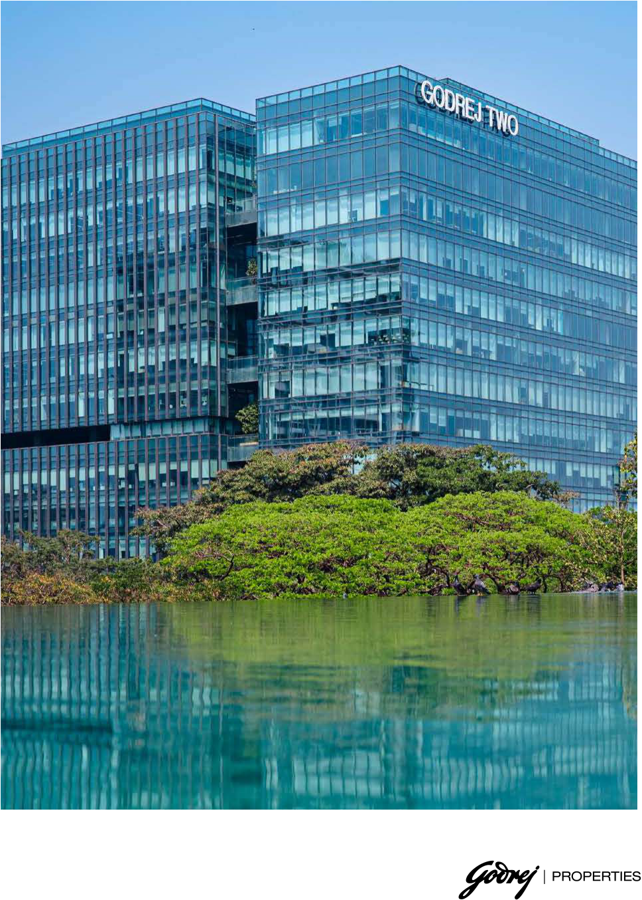

**[Image: AnnualReport2025.pdf-0003-02.png (968x1354, 2631.4KB)]**

OUR PURPOSE 

**We create spaces that enable Everyday Joys; one community, one family, and one home at a time.** 

Godrej Royale Woods, Bengaluru RERA No: PRM/KA/RERA/1250/303/PR/200515/003411 

**GODREJ PROPERTIES LIMITED** 

**INTEGRATED REPORT 2024-25** 

### **WHO WE ARE** 

**[Image: AnnualReport2025.pdf-0005-03.png (209x70, 17.9KB)]**

**[Image: AnnualReport2025.pdf-0005-04.png (189x114, 28.5KB)]**

**[Image: AnnualReport2025.pdf-0005-05.png (189x162, 65.5KB)]**

**[Image: AnnualReport2025.pdf-0005-06.png (139x150, 17.2KB)]**

33 

**GODREJ PROPERTIES LIMITED** 

**INTEGRATED REPORT 2024-25** 

**BOOKING VALUE REVENUE GENERATED** `O` **29,444Cr** `O` **6,967Cr 31%↑ 61%↑** 

**ANNUAL PROJECT DELIVERIES EBITDA 18.4Mn sq. ft.** `O` **1,970Cr 47%↑ 65%↑** 

**CUSTOMER COLLECTIONS NET OPERATING CASHFLOW*** `O` **17,047Cr** `O` **7,484Cr 49%↑ 73%↑ AREA SOLD NET WORTH 25.73Mn sq. ft.** `O` **17,312Cr 29%↑ 73%↑ ROCE 9.37% OPERATIONAL FINANCIAL** 

###### **SCOPE 1+2 EMISSION INTENSITY** 

**NUMBER OF EMPLOYEES 4,199** 

**0.008tCO 2e/sq. ft. 8%↓ SCOPE 3 EMISSION INTENSITY 0.287tCO 2e/sq. ft. 14%↓** 

**39%↑** 

**DIVERSITY RATIO 38.6% 25%↑ PWD EMPLOYEES** 

**RECYCLED WATER CONSUMPTION 19% 2%↑** 

**41 485%↑** 

**RECYCLED AND REUSED WASTE 99%% 1%↑↑** 

**RECYCLED AND REUSED WASTE CIS-WOMEN IN TOTAL WORK FORCE 99%% 35.2% 1%↑↑ 14%↑ NUMBER OF LGBTQ+ EMPLOYEES 105 91%↑ ENVIRONMENTAL SOCIAL** 

GODREJ PROPERTIES LIMITED 

INTEGRATED REPORT 2024-25 

### **IN THIS REPORT** 

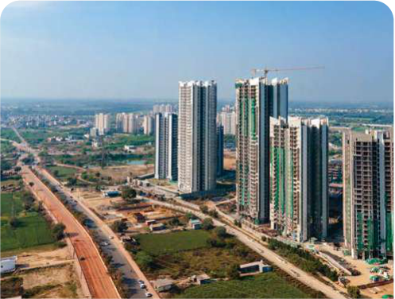

**[Image: AnnualReport2025.pdf-0007-03.png (497x376, 379.9KB)]**

**[Image: AnnualReport2025.pdf-0007-04.png (424x93, 9.1KB)]**

<!-- Start of picture text -->
About the Report  8 Building on 128 Years of Trust  14 An Inclusive and Greener World  16 <!-- End of picture text -->

###### OVERVIEW 

Our Presence Since 1985 20 India’s Trusted No. 1 Real Estate Company 22 Chairperson's Message 24 FY 24-25 in Focus 28 Celebrating Our Impact 30 Board of Directors 32 Value Beyond Measure 36 Our Defining Edge 40 The Path Ahead 42 ESG Goals and Targets 44 

**[Image: AnnualReport2025.pdf-0007-07.png (499x376, 415.6KB)]**

###### PERFORMANCE REVIEW 

Business Review 48 Financial Review 50 In Conversation with MD & CEO 54 

###### INTEGRATING SUSTAINABILITY WITH OUR BUSINESS 

Materiality 58 Building Shared Futures 60 Integrity in Action 64 Anticipating Tomorrow's Challenges 72 Championing Climate Policy Through Advocacy 78 Sustainability Across Value Chain 80 Alignment with SDGs 82 

###### **HOW TO READ THIS REPORT** 

Jump marks are linked to content within the Document. Pg. XX 

The ‘Online’ button links you to additional content on the Internet 

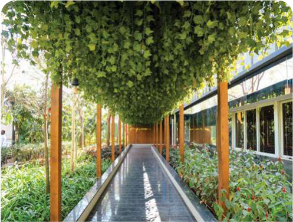

**[Image: AnnualReport2025.pdf-0007-15.png (497x376, 518.1KB)]**

###### PLANET POSITIVE 

|Sustainability in Action|88|
|---|---|
|Navigating Climate Realities|90|
|Emission Management|102|
|Energy Efficient by Design|108|
|Less Waste, More Wisdom|112|
|Water Management|118|
|Preserving and Nurturing Bio-Diversity|122|

###### EXCELLENCE IN PROCESS AND PRODUCTS 

|Green Building Commitment|130|
|---|---|
|Promoting Sustainable Lifestyles|134|
|Innovation in Action|136|

Year-on-Year growth 

5 year CAGR growth 

**[Image: AnnualReport2025.pdf-0007-22.png (498x376, 381.2KB)]**

###### DRIVEN BY PEOPLE PARTNERSHIPS 

|Empowering Workforce|140|
|---|---|
|Customer First|174|
|Strengthening Supplier Synergies|180|
|Building Community Value STATUTORY REPORTS|192|
|Management Discussion & Analysis|200|
|Director's Report|218|
|Report on Corporate Governance|244|
|Business Responsibility &||
|Sustainability Report|268|
|Financial Statements|302|
|Notice ANNEXURES|480|
|ESG Databook|498|
|GRI Index|520|
|Assurance Statements|526|
|CDP and TCFD Framework Mapping|536|
|Acronyms|537|

###### CORPORATE INFORMATION 

6 

7 

INTEGRATED REPORT 2024-25 

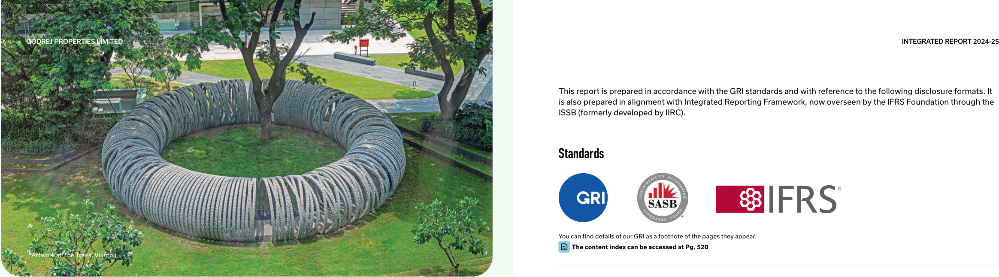

**[Image: AnnualReport2025.pdf-0008-01.png (2328x646, 2058.7KB)]**

<!-- Start of picture text -->
GODREJ PROPERTIES LIMITED INTEGRATED REPORT 2024-25 This report is prepared in accordance with the GRI standards and with reference to the following disclosure formats. It is also prepared in alignment with Integrated Reporting Framework, now overseen by the IFRS Foundation through the ISSB (formerly developed by IIRC). Standards You can find details of our GRI as a footnote of the pages they appear. The content index can be accessed at Pg. 520 Artwork at The Trees, Vikhroli <!-- End of picture text -->

###### **Frameworks** 

### **ABOUT THE REPORT** 

**[Image: AnnualReport2025.pdf-0008-04.png (172x45, 5.9KB)]**

**[Image: AnnualReport2025.pdf-0008-05.png (186x80, 17.3KB)]**

**[Image: AnnualReport2025.pdf-0008-06.png (90x76, 11.1KB)]**

**[Image: AnnualReport2025.pdf-0008-07.png (140x80, 14.6KB)]**

**[Image: AnnualReport2025.pdf-0008-08.png (205x72, 10.3KB)]**

International framework of the Value Reporting Foundation 

The fourth Annual Integrated Report of Godrej Properties Limited offers a comprehensive view of our financial, operational, and sustainability performance for the year. It showcases how we are creating value across short, medium, and long-term horizons, while balancing business growth with our commitment to responsible development. Through integrated thinking and transparent disclosures, the report provides stakeholders with deeper insights into our strategy, governance, and progress towards building resilient, future-ready communities. 

###### **Indexes Regulators** 

**[Image: AnnualReport2025.pdf-0008-12.png (72x71, 10.7KB)]**

**[Image: AnnualReport2025.pdf-0008-13.png (133x57, 15.5KB)]**

###### **Others** 

Indian Accounting Standards Companies Act, 2013 (including the rules made thereunder) 

###### **FORWARD LOOKING STATEMENTS** 

This Integrated Report contains forward – looking statements that express our current expectations and perspectives on future projections of Godrej Properties Limited.  These statements relate to, but are not limited to, our strategic priorities, market outlook, financial and operational performance, sustainability goals, and future business initiatives. 

Forward-looking statements shall be identified by words such as “anticipates”, “expects”, “intends”, “may”, “will”, “believes”, “estimates”, “outlook”, and other words of similar meaning in connection with a discussion of future operational,  environmental, social and financial performance. 

These statements are based on assumptions and estimates that we believe are reasonable in the current context. However, they are inherently subject to a range of known and unknown risks, uncertainties, and external factors, economic, 

regulatory, environmental, and competitive that may cause actual results, performance, or achievements to differ materially from those expressed or implied in these statements. Readers are cautioned not to place undue reliance on these forward-looking statements. Godrej Properties undertakes no obligation to publicly update or revise any such statements, whether as a result of new information, future events, or otherwise, unless required by applicable laws and regulations. 

###### **Reporting Period** 

01 31 APRIL MARCH 2024 2025 

###### **Guiding Principles** 

**[Image: AnnualReport2025.pdf-0008-24.png (235x84, 21.7KB)]**

National Voluntary Guidelines on Social, Environmental and Economic Responsibilities of Business (NVGs) 

**[Image: AnnualReport2025.pdf-0008-26.png (349x57, 29.7KB)]**

###### **Rating Agencies** 

**[Image: AnnualReport2025.pdf-0008-28.png (108x106, 16.8KB)]**

**[Image: AnnualReport2025.pdf-0008-29.png (153x58, 9.1KB)]**

###### **BOARD RESPONSIBILITY STATEMENT** 

Recognising our responsibility to stakeholders, the senior leadership of Godrej Properties Limited is committed to presenting a transparent and comprehensive integrated report. We believe this report thoroughly addresses all material matters that could impact our ability to create sustainable value. 

8 

9 

GRI 2-2 

GODREJ PROPERTIES LIMITED 

INTEGRATED REPORT 2024-25 

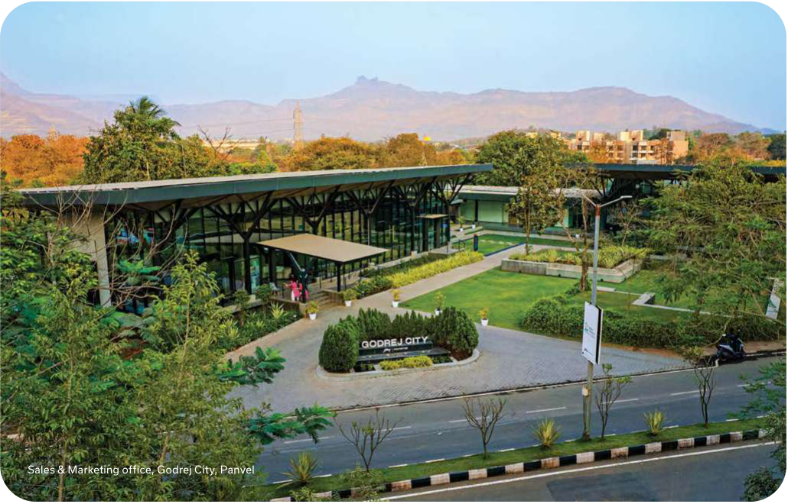

**[Image: AnnualReport2025.pdf-0009-02.png (1030x660, 1378.1KB)]**

<!-- Start of picture text -->
Sales & Marketing office, Godrej City, Panvel <!-- End of picture text -->

###### **OUR REPORTING BOUNDARY** 

###### **Mumbai** 

###### **Head Office** 

###### **Mumbai – Zonal office** 

Godrej Ascend Godrej Bayview Godrej City – The Highlands Godrej Green Terraces Godrej Emerald Godrej Exquisite Godrej Nirvaan 

###### **West-East** 

###### **Pune – Zonal Office** 

Godrej Forest Grove Godrej Nurture Godrej Carnival Godrej Park Greens Godrej Riverhills – Hillside 3 Godrej Riverhills – River Royale Godrej Riverhills – Green Vistas 

Godrej Riviera 

Godrej Reserve Godrej Carmichael Godrej Nurture 

Godrej Upavan Godrej Avenue Eleven Godrej Five Gardens Godrej Horizon Godrej Urban Park Godrej SkyTerraces 

Godrej Riverhills – Hill Retreat Godrej River Greens -Park Springs Godrej Riverhills – Meadows Godrej Emerald Waters Godrej Woodsville Godrej Evergreen Square Godrej River Greens-Park Ridge The Greenfront at Godrej Park World Godrej River Greens-River Crest The Gale at Godrej Park World Godrej River Greens-Urban Retreat Godrej Skyline Godrej River Greens-Sky Greens 

###### **Kolkata – Regional Office** 

###### **SCOPE OF THE REPORT** 

The scope of this Report includes the strategic narrative and focuses on our ongoing project sites in India, developed either directly or through our special purpose vehicles. Unless stated otherwise, information and content have been consolidated for the purpose of reporting. 

Where relevant, the report also extends its boundary to include key risks and opportunities arising from entities and stakeholders that affect our ability to create value. These entities and stakeholders may not be under our direct control or influence, but play a critical role in our value creation journey due to the nature and proximity of their impact. This report details our environmental performance across 63 active project sites, and 8 offices, including our headquarters in Mumbai, which are under our direct operational control. 

###### **EXTERNAL ASSURANCE** 

The accuracy of the data and processes presented in our report has been assured by TUV SUD South Asia Pvt. Ltd., an independent third-party assurance provider. They have conducted their review according to the: Limited assurance criteria for the Integrated Report and Reasonable assurance criteria for the Business Responsibility and Sustainability Report (BRSR) Core as outlined in the International Standard on Assurance Engagements (ISAE) 3000 (Revised) standard. 

Godrej Orchard Godrej Retreat Godrej Elevate Godrej Blue 

**Nagpur Regional Office Ahmedabad Regional Office** 

###### **North** 

###### **NCR – Zonal Office** 

Godrej Aristocrat Godrej Meridian Godrej Riverine Godrej Zenith Godrej Nature Plus Godrej Connaught One Godrej Vrikshya Godrej South Estate Godrej Miraya Godrej Woods Godrej Astra Godrej Tropical Isle Godrej Air Godrej Golf Link Godrej Habitat Godrej Jardania 

###### **South** 

**South – Zonal Office** 

###### **General Disclaimer:** 

Godrej Properties has exercised all reasonable precautions to verify the information presented in this report. The responsibility for interpreting and utilising the material rests with the reader. We have diligently addressed all review points related to inconsistencies and incomplete information. GPL does not assume liability for any damage resulting from the use of this report. The report has undergone external assurance, and necessary edits have been incorporated. We welcome feedback on any further inconsistencies that may be identified. 

Godrej Ananda – Phase 1 & 2 Godrej Woodscapes Godrej Ananda – Soul (Phase 3) Godrej Lakeside Orchardd Godrej Park Retreat Godrej Madison Avenue Godrej Splendour 

We cover all activities under our operational control and majority ownership in our sustainability disclosure, which includes 100% of our revenue and environmental and social indicators. We fully consolidate all activities for financial purposes. 

10 

11 

GRI 2-1, 2-2 

GRI 2-5 

GODREJ PROPERTIES LIMITED 

INTEGRATED REPORT 2024-25 

###### **OUR REPORTING JOURNEY** 

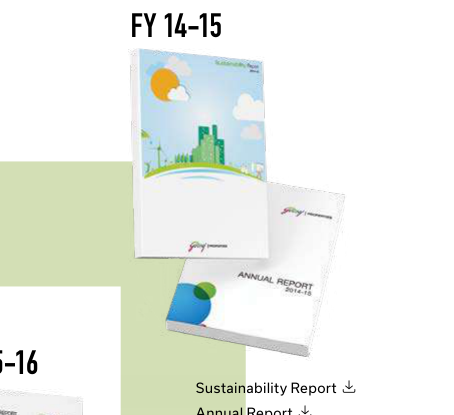

**[Image: AnnualReport2025.pdf-0010-03.png (454x415, 72.6KB)]**

<!-- Start of picture text -->
FY 14-15 Sustainability Report <!-- End of picture text -->

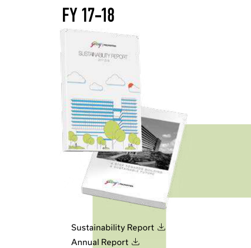

**[Image: AnnualReport2025.pdf-0010-04.png (427x423, 81.7KB)]**

<!-- Start of picture text -->
FY 17-18 Sustainability Report Annual Report <!-- End of picture text -->

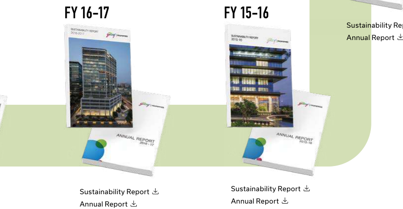

**[Image: AnnualReport2025.pdf-0010-05.png (816x423, 213.5KB)]**

<!-- Start of picture text -->
FY 16-17 FY 15-16 Sustainability Report Annual Report Sustainability Report Sustainability Report Annual Report Annual Report <!-- End of picture text -->

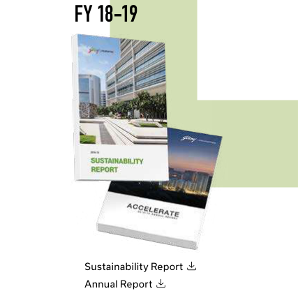

**[Image: AnnualReport2025.pdf-0010-06.png (427x417, 103.9KB)]**

<!-- Start of picture text -->
FY 18-19 Sustainability Report Annual Report <!-- End of picture text -->

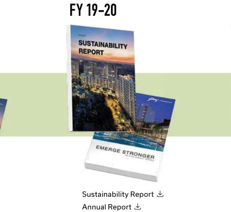

**[Image: AnnualReport2025.pdf-0010-07.png (454x417, 125.2KB)]**

<!-- Start of picture text -->
FY 19-20 Sustainability Report Annual Report <!-- End of picture text -->

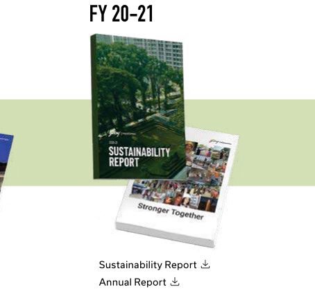

**[Image: AnnualReport2025.pdf-0010-08.png (454x417, 125.5KB)]**

<!-- Start of picture text -->
FY 20-21 Sustainability Report Annual Report <!-- End of picture text -->

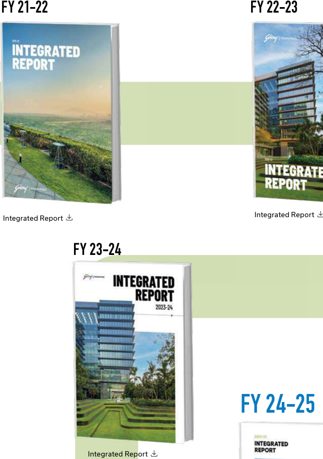

**[Image: AnnualReport2025.pdf-0010-09.png (642x911, 516.1KB)]**

<!-- Start of picture text -->
FY 21-22 FY 22-23 Integrated Report Integrated Report FY 23-24 FY 24-25 Integrated Report <!-- End of picture text -->

Integrated Report 

12 

13 

GODREJ PROPERTIES LIMITED 

INTEGRATED REPORT 2024-25 

### **BUILDING ON 128 YEARS OF TRUST** 

###### **GROUP HIGHLIGHTS  FY 2024-25** 

Number of Consumers 

**1.1Bn+ Bn+ $25** 

Market Value Capitalisation 

Godrej was founded in 1897 by Ardeshir Godrej to help build economic independence for India. We contributed to this purpose by both innovating and actively donating a significant portion of the Group’s profits to India’s freedom movement. 

During the Spanish Flu pandemic of 1918, we pioneered the world’s first commercially made soap from vegetable oil, free of animal fat. In 1951, we crafted the ballot boxes for free India’s first general election, where every citizen, regardless of gender, had the right to vote. 

This legacy of nation-building continues to guide our actions today. As we expand our footprint, we are equally focused on driving positive impact - by integrating sustainability and inclusion into everything we do. 

Through Godrej Good & Green, we align with global goals and local community needs to enable a greener, more equitable world. And through the Godrej DEI Lab, we are building inclusive ecosystems, nurturing diverse talent, and bringing DEI-driven innovation to the fore. 

Revenue Generated 

**Bn $7** 

Countries 

**90+** 

###### **GODREJ INDUSTRIES GROUP** 

At the Godrej Industries Group (GIG), we are committed to growing and strengthening this legacy. We are privileged to serve over 1.1 billion consumers globally through our businesses with market leadership positions in the consumer products, real estate, agriculture, financial services and chemicals industries. 

is an emerging markets FMCG leader in Home and Personal Care with a growing presence in Asia, Africa and Latin America. 

their portfolio businesses, including the leading producers of compound feed and crude palm oil, address key challenges faced by Indian agriculture; and help improve productivity of Indian farmers through innovative products and services that sustainably increase crop and livestock yields. 

is the real estate private equity arm of the group. 

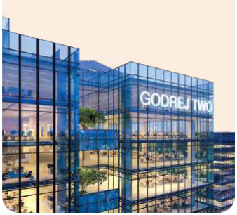

**[Image: AnnualReport2025.pdf-0011-20.png (338x306, 202.0KB)]**

**[Image: AnnualReport2025.pdf-0011-21.png (335x268, 60.0KB)]**

**[Image: AnnualReport2025.pdf-0011-22.png (264x212, 46.1KB)]**

is the newest company in the group, has a fast-growing financial services business. 

is India’s leading real estate developer by sales and brings the Godrej philosophy of innovation, sustainability, and excellence to the real estate industry. 

is group’s oldest business, services diverse industrial applications through one of India’s oldest and largest oleo-chemicals, derivatives and speciality chemical portfolios. 

**[Image: AnnualReport2025.pdf-0011-26.png (263x409, 47.8KB)]**

<!-- Start of picture text -->
largest oleo-chemicals, derivatives and speciality chemical portfolios. <!-- End of picture text -->

**[Image: AnnualReport2025.pdf-0011-27.png (336x378, 83.5KB)]**

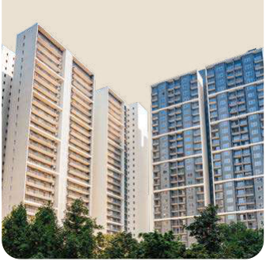

**[Image: AnnualReport2025.pdf-0011-28.png (337x330, 222.4KB)]**

14 

15 

**GODREJ PROPERTIES LIMITED** 

**INTEGRATED REPORT 2024-25** 

### **AN INCLUSIVE AND GREENER WORLD** 

For over 125 years, the Godrej Industries Group has actively championed social responsibility and environmental sustainability. The Good & Green strategy drives the Group’s sustainability journey. We are committed to addressing the critical social, environmental and economic needs of marginalised and underprivileged sections of our communities. Our goals are aligned with the UN Sustainable Development Goals and the needs of the local communities where we operate. 

The Group actively engages in initiatives like, India Business Biodiversity Initiative, green building certifications and GreenCo Ratings. All group companies adhere to the GRI Standards (Global Reporting Initiative) of sustainability reporting for alignment with global best practices on economic, environmental and social issues. 

# **64%** 

Energy consumed at Group level is from renewables 

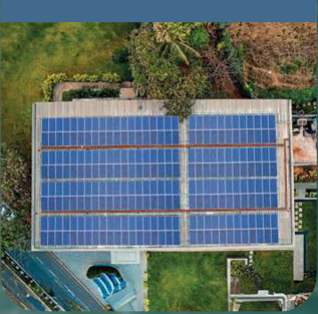

**[Image: AnnualReport2025.pdf-0012-07.png (357x353, 309.6KB)]**

# **22%** 

Reduction in Group level Scope 1 & 2 GHG emission intensity from FY 19-20 baseline 

**48****Mn M3** Water recharged at Group level making us 13 times water positive 

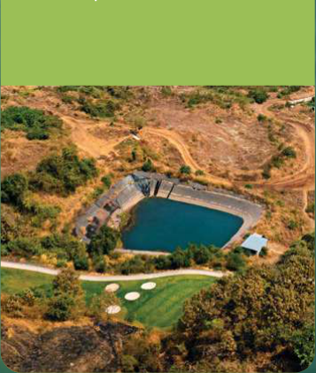

**[Image: AnnualReport2025.pdf-0012-11.png (357x422, 316.0KB)]**

16 

GRI 305-5 17 

GODREJ PROPERTIES LIMITED 

INTEGRATED REPORT 2024-25 

###### **IN THIS SECTION** 

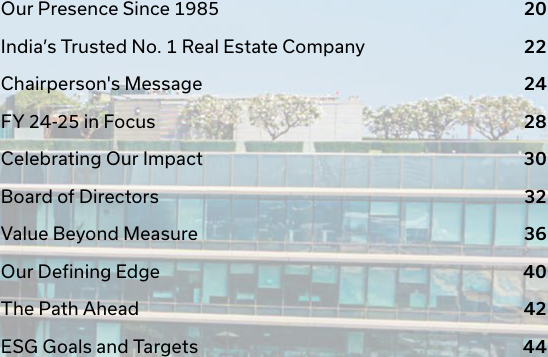

**[Image: AnnualReport2025.pdf-0013-03.png (548x357, 287.3KB)]**

<!-- Start of picture text -->
Our Presence Since 1985  20 India’s Trusted No. 1 Real Estate Company  22 Chairperson's Message  24 FY 24-25 in Focus  28 Celebrating Our Impact  30 Board of Directors  32 Value Beyond Measure  36 Our Defining Edge  40 The Path Ahead  42 ESG Goals and Targets  44 <!-- End of picture text -->

GODREJ PROPERTIES LIMITED 

INTEGRATED REPORT 2024-25 

#### **OUR PRESENCE SINCE 1985** 

**~229 40 400+ 114 Mn sq.ft. of Total Years of****11** **Cities Awards and Projects Developable Area Experience Recognitions received in the Last five years** 

|Maharashtra **MUMBAI**|Telangana **HYDERABAD**|Tamil Nadu **CHENNAI**|Madhya Pradesh **INDORE**|**CHANDIGARH**|**NCR**|
|---|---|---|---|---|---|
|**52.7 Mn. sq. ft.** **31 Projects**|**5.2 Mn. sq. ft.** **2 Projects**|**5 Mn. sq. ft.** **3 Projects**|**1.8 Mn. sq. ft.** **2 Projects**|||
|**NAGPUR**|West Bengal **KOLKATA**|NCR **NCR**|Gujarat **AHMEDABAD**|**AHMEDABAD** **INDORE**||
|**4.0 Mn. sq. ft.** **2 Projects** **PUNE**|Karnataka **BENGALURU** **9.3 Mn. sq. ft.** **5 Projects**|Punjab **CHANDIGARH** **48.0 Mn. sq. ft.** **31 Projects**|**24.3 Mn. sq. ft.** **2 Projects**|**MUMBAI** **PUNE**|**HYDERABAD** **KOLKATA** **NAGPUR**|
|**42.2 Mn. sq. ft.** **16 Projects**|**35.9 Mn. sq. ft.** **19 Projects**|**0.5 Mn. sq. ft.** **1 Project**||**BENGALURU**|**CHENNAI**|

Note: Map not to scale. 

20 

21 

GRI 2-1 

**GODREJ PROPERTIES LIMITED** 

**INTEGRATED REPORT 2024-25** 

### **INDIA’S #1 TRUSTED REAL ESTATE COMPANY** 

Godrej Properties Limited (GPL) has established its position as India’s foremost real estate developer, delivering a landmark performance in FY 2024–25. Over the last three years, our sales bookings have grown at a remarkable CAGR of 55% - a validation of our execution strength, strategic discipline, and ability to read the market right. 

With a thoughtfully diversified portfolio and a deep-rooted focus on innovation and sustainability, we are not just responding to India’s evolving urban aspirations, we are helping shape them. 

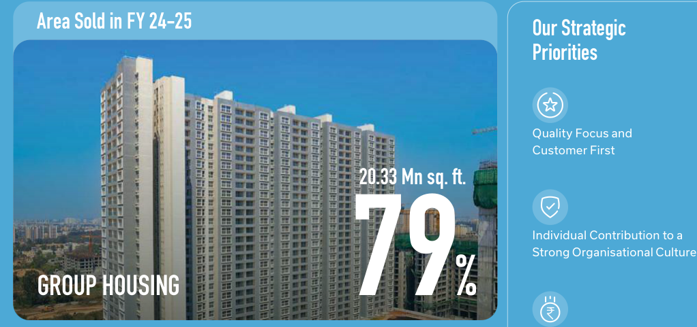

**[Image: AnnualReport2025.pdf-0015-05.png (1022x481, 523.2KB)]**

<!-- Start of picture text -->
Area Sold in FY 24-25 Our Strategic Priorities Quality Focus and Customer First 20.33 Mn sq. ft. Individual Contribution to a Strong Organisational Culture GROUP HOUSING 79% <!-- End of picture text -->

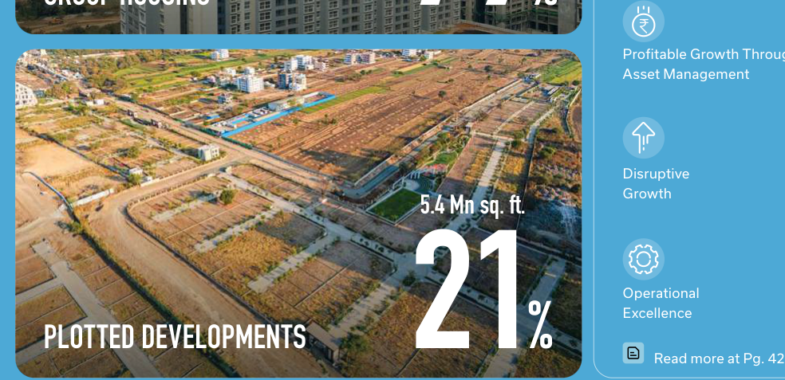

**[Image: AnnualReport2025.pdf-0015-06.png (984x477, 856.5KB)]**

<!-- Start of picture text -->
Profitable Growth Through Asset Management Disruptive Growth 5.4 Mn sq. ft. Operational Excellence PLOTTED DEVELOPMENTS 21% Read more at Pg. 42 <!-- End of picture text -->

**[Image: AnnualReport2025.pdf-0015-07.png (225x42, 3.7KB)]**

<!-- Start of picture text -->
Profitable Growth Through Asset Management <!-- End of picture text -->

###### **REGIONAL BREAKDOWN OF AREA SOLD IN FY 24-25** 

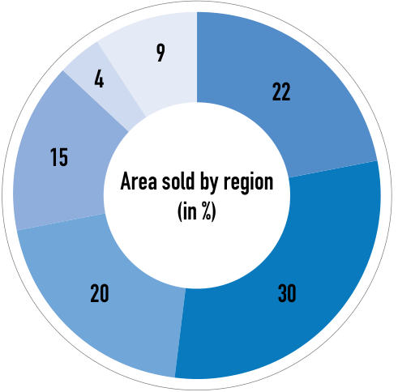

**[Image: AnnualReport2025.pdf-0015-09.png (491x484, 31.5KB)]**

<!-- Start of picture text -->
9 4 22 15 Area sold by region (in %) 20 30 <!-- End of picture text -->

|**MMR**|**7.82 Mn. sq. ft.**|
|---|---|
|**NCR**|**5.66 Mn. sq. ft.**|
|**BENGALURU**|**5.12 Mn. sq. ft.**|
|**PUNE**|**3.92 Mn. sq. ft.**|
|**HYDERABAD**|**0.91 Mn. sq. ft.**|
|**OTHERS**|**2.30 Mn. sq. ft.**|

Total Area Sold in FY 24-25 

#### **25.73 Mn sq. ft.** 

###### **Outperforming 15 year CAGR of benchmark indices** 

###### **TRUE PAN-INDIA PLAYER** 

We draw strength from the legacy of the Godrej Group while staying firmly focused on the future of real estate. Our growth is underpinned by financial discipline, a strong and growing project pipeline, and the backing of a trusted parent brand. We take pride in delivering high-quality developments that meet the evolving needs of our customers, with a sharp focus on timely execution and satisfaction. Sustainability is at the heart of everything we build—all our projects are certified green buildings. With a presence across India’s leading cities, we are committed to shaping spaces that are responsible, thoughtful, and built to endure. 

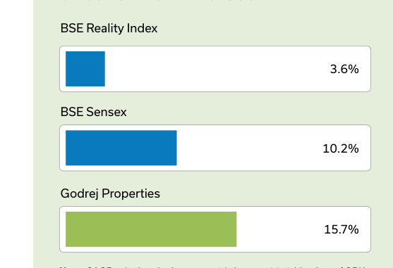

**[Image: AnnualReport2025.pdf-0015-16.png (557x381, 12.5KB)]**

<!-- Start of picture text -->
BSE Reality Index 3.6% BSE Sensex 10.2% Godrej Properties 15.7% <!-- End of picture text -->

**Note** : CAGR calculated prices as on 4th January 2010 (the date of GPL's public listing) and March 31, 2025. 

22 

23 

GRI 2-6 

GODREJ PROPERTIES LIMITED 

INTEGRATED REPORT 2024-25 

## **CHAIRPERSON’S MESSAGE** 

**FY 2024–25 was a landmark year for Godrej Properties— one where we saw the rewards of focused execution, customer-centricity, and longterm thinking come together. As India continues to lead global economic growth and urban transformation, the real estate sector has played a vital role in driving opportunity, progress, and impact.** 

###### **PIROJSHA GODREJ** 

Executive Chairperson 

###### **Dear Shareholders,** 

I hope this message finds you and your loved ones well. 

FY 2024–25 was a landmark year for Godrej Properties—one where we saw the rewards of focused execution, customer-centricity, and long-term thinking come together. As India continues to lead global economic growth and urban transformation, the real estate sector has played a vital role in driving opportunity, progress, and impact. 

At Godrej Properties, we remain guided by our core purpose: to create spaces that enable Everyday Joys: one home, one community, one city at a time. The year gone by saw us deepen our presence across key markets, introduce exceptional new projects, and embed sustainability and inclusion even more firmly into our operations. It was also a year where we further strengthened our financial foundation, enabling continued investments and accelerated growth. 

Our performance in FY 2024-25 reflects both the strength of the real estate sector and the strategic choices we’ve made over the past several years. We ended the year with our highest-ever annual booking value of `29,444 Crores, growing 31% year-on-year on a strong base. This was supported by a 29% increase in booking volume to 25.73 Million sq. ft. Both GPL’s booking value and booking volume were the highest ever recorded by any real estate developer in India. 

Over the last three years, bookings have grown at a CAGR of 55%, with cumulative bookings of `64,203 Crores over this period. FY 2024-25 also marked the eighth consecutive year of growth in booking value for the company, reaffirming our leadership position in the Indian residential real estate sector. 

Importantly, our growth was broad-based. NCR, MMR, and Bengaluru contributed `10,523 Crores, `8,034 Crores, and `5,089 Crores respectively. Twelve different projects across Mumbai, Gurugram, Noida, Bengaluru, Pune, and Hyderabad each exceeded `1,000 Crores in booking value. No single market contributed more than 36%, and our largest project accounted for just 13%, underscoring the strength of our diversified portfolio. 

We also achieved a record `17,047 Crores in customer collections, up 49% over last year, and `7,484 Crores in operating cash flow, up by 73% over last year - both the highest ever for an Indian real estate developer. We delivered 18.4 Million sq. ft. across markets, a growth of 47%. These outcomes reflect our ability to scale responsibly while remaining deeply focused on delivery. 

On the back of this strong operating performance, we reported a 57% increase in total income to `6,848 Crores, a 65% rise in EBITDA to `1,970 Crores, and an increase of 93% in PAT to `1,400 Crores . Based on our FY 2024-25 booking performance, we expect over `7,700 Crores in EBIT and nearly `4,500 Crores in net profit to be recognised over the next 3–4 years as the projects that were sold this year are completed and achieve revenue recognition. 

This year, we also took a major step towards securing our long-term growth through a `6,000 Crores Qualified Institutional Placement (QIP), the largest QIP in Indian real estate history. This reflects the strong conviction of investors in the Godrej brand and our strategic direction. The capital raised will allow us to significantly scale our project pipeline, expand into new geographies, and invest in long-term capabilities to build an even stronger, more future-ready GPL. 

Our business development strategy remained disciplined and opportunity-driven. In FY 2024-25, we added 14 new projects across Noida, Gurugram, MMR, Kolkata, Bengaluru, Pune, Ahmedabad, and Indore, with an estimated saleable area of 19 Million sq. ft. and a projected booking value of `26,450 Crores. This ensures a healthy launch pipeline and future visibility across growth markets. 

In FY 2025-26, we aim to build on this momentum and cross `32,500 Crores in residential bookings—driven by a robust set of new launches and strong sustenance sales. With a healthy balance sheet, sectoral tailwinds, and operational momentum, we are confident of maintaining our growth trajectory. 

24 

25 

GODREJ PROPERTIES LIMITED 

INTEGRATED REPORT 2024-25 

At GPL, quality is a fundamental commitment. Our dedicated 300-member quality team, reporting directly to the CEO, ensures unbiased assessments across all projects. We’ve institutionalised transparent, objective, and independent quality frameworks that set a new industry benchmark. This rigor in execution is central to the trust we have built with customers and partners alike. We recognise this is a continuous journey and are committed to ensuring quality remains on our top priority. 

We continue to evolve our customer experience journey, focusing not just on homes, but on relationships built through empathy, clarity, and consistency. Our Net Promoter Score (NPS) of 67% is a testament to this approach. From thoughtful design to responsive service, we strive to create homes that feel personal and joyful at every stage of the journey. 

###### **Empowering People, Enabling Inclusion** 

We believe in empowering people—both within the company and across our value chain. Our learning academy, Alchemy, drives leadership development and capability-building at all levels. We are proud to be the first among Indian real estate companies to achieve 38.6% diversity representation, including 35.2% cis-women and 3.4% representation from LGBTQ+ individuals and persons with disabilities. 

We also digitised worker engagement, scaled mental wellness programmes, and enabled longerterm participation from construction workers— ensuring our people practices are future-ready and inclusive. 

###### **Building a Greener Tomorrow** 

We recognise that our role as developers goes beyond building structures. It includes shaping sustainable, inclusive, and resilient communities. 

In FY 2024-25, we added five Net-zero Waste (Design) projects and one Net-zero Energy (Design) project to our portfolio. All our sites continue to be ISO 14001:2015 certified for Environmental Management, and sustainability targets are now embedded into senior leadership KPIs. 

Our near-term climate targets, validated by the Science Based Targets initiative (SBTi), were an important milestone last year. This year, we submitted our commitment for a long-term Netzero transition to SBTi. We continue to engage vendors through joint emission reduction plans and capability-building workshops. 

**In FY 2025-26, we aim to build on this momentum and cross** `O` **32,500 Crores in residential bookings driven by a robust set of new launches and strong sustenance sales. With a healthy balance sheet, sectoral tailwinds, and operational momentum, we are confident of maintaining our growth trajectory.** 

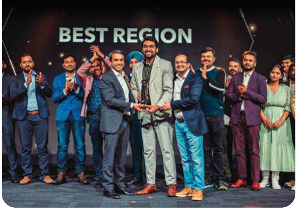

**[Image: AnnualReport2025.pdf-0017-12.png (501x353, 384.4KB)]**

We were included in the S&P Global 2025 Sustainability Yearbook, ranked among the top 10% of real estate companies globally, and named an Industry Mover.  We also continued to feature in the Dow Jones Emerging Markets Best in Class Index and secured a 5-star rating in GRESB for the fifth consecutive year. 

###### **Meaningful Impact on Communities** 

We are proud to have fully utilised our CSR funds in FY 2024-25. Through our BOCW programmes, we reached 32,500 construction workers, unlocking `88.38 Crores in government funds. Our solid waste management efforts diverted 53,239 Tonnes from landfills and recycled 99% of construction waste at source, making GPL a Netzero waste organisation. 

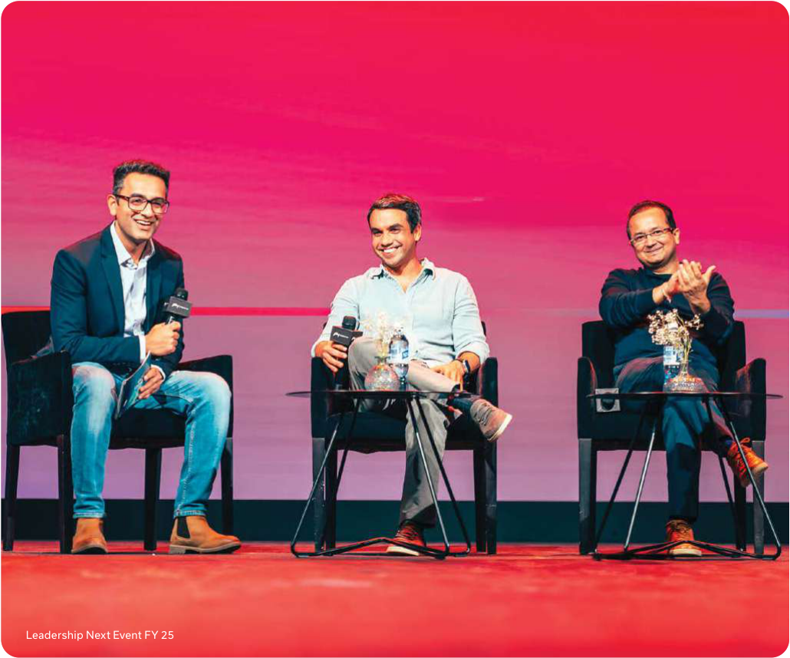

**[Image: AnnualReport2025.pdf-0017-16.png (1030x858, 989.7KB)]**

<!-- Start of picture text -->
Leadership Next Event FY 25 <!-- End of picture text -->

Through our crop residue management initiative in Punjab, we transformed 97 villages, managed 17,368 hectares of farmland, and averted over 13,800 Tonnes of CO2 emissions—driving meaningful pollution control in the process. 

The real estate sector provides tremendous long-term opportunity. Our strong balance sheet, diversified portfolio, and execution capabilities provide us the opportunity to continue to build on the momentum your business has generated over the past few years. Our ambition is not just to grow, but to do so with integrity, empathy, and purpose. 

Health and safety remain central to our approach. Our Safety Management System, built on a proactive PDCA (plan–do–check–act) cycle, is ISO 45001:2018 certified across all project sites, supporting our ‘Score Zero’ aspiration for safety incidents. 

On behalf of all of us at Godrej Properties, I would like to thank our customers, partners, investors, and shareholders for your continued support. Your belief in our journey drives us every day. 

Warm regards, 

###### **Looking Ahead** 

**Pirojsha Godrej** Executive Chairperson 

Our strategy continues to be focused on the pillars of scalable growth, disciplined execution, and stakeholder trust. 

26 

27 

INTEGRATED REPORT 2024-25 

**[Image: AnnualReport2025.pdf-0018-01.png (226x13, 2.9KB)]**

<!-- Start of picture text -->
GODREJ PROPERTIES LIMITED <!-- End of picture text -->

###### **OPERATIONAL** 

###### **Sales Highlights** 

**>** `O` **1,000 Cr** of booking value achieved by **12 Projects each** 

###### **Capital Raising** 

`O` **6,000 Cr** of equity raised through the largest-ever QIP across real estate sector in India 

**Largest Contributors** 

`O` **10,523 Cr** `O` **8,034 Cr** NCR MMR 

**34 New Projects** and phase launches across **7 cities** 

###### **Business Development** 

`O` **26,450 Cr** expected booking value added across **14 new projects** with an estimated saleable area of **19 Mn sq. ft.** 

###### **Construction Highlights** 

###### **18.4 Mn sq. ft.** 

deliveries across 5 cities 

### **FY 24-25 IN FOCUS** 

###### **FINANCIAL** 

Booking value grew 31% to `O` **29,444* Cr** 

**FY 23-24** | `J` 22,527 Cr 

Total Income grew by 57% to 

EBITDA grew by 65% `O` **1,969.96 Cr** 

###### `O` **6,848.45 Cr** 

**FY 23-24** | `J` 4,361.95 Cr 

**FY 23-24** | `J` 1,196.66 Cr 

Net Profit grew by 93% to `O` **1,399.89 Cr** 

EPS amounted to 

###### `O` **49.02** 

**FY 23-24** | `J` 725.27 Cr **FY 23-24** | `J` 26.09 

*This is the highest ever booking value achieved by any listed developer in India in a financial year. 

**25.73 Mn sq. ft.** area sold 

###### **LAUNCHES*** 

###### **Mumbai** 

**Project Launches** 

Godrej Carmichael Godrej Nurture Godrej Woodside Estate Godrej Hillview Estate 

###### **Phase launches** 

Godrej Reserve Godrej Avenue Eleven Godrej Green Terraces Godrej Horizon Godrej Urban Park Godrej Golfside Estate Godrej Bayview 

###### **Bengaluru** 

###### **Project launches** 

Godrej Woodscapes Godrej Lakeside Orchard 

*Includes New Projects And Phase 

**6,298 Units** across **7.4 Mn sq. ft** . handed over 

###### **Gurugram** 

###### **Pune** 

**Project Launches** 

###### **Project Launches** 

Godrej Miraya Godrej Vrikshya Godrej Astra 

Godrej Evergreen Square Goderj Skyline 

###### **Phase launches** 

**Phase launches** Godrej Zenith 

The Gale at Godrej Park World The Greenfront at Godrej Park World Godrej River Greens – River Crest 

###### **Noida** 

###### **Nagpur** 

###### **Project launches** 

###### **Phase launches** 

Godrej Jardinia Godrej Riverine 

Godrej Forest Estate 

###### **Hyderabad** 

###### **Kolkata** 

###### **Project launches** 

###### **Project launches** 

Godrej Madison Avenue 

Godrej Blue 

28 GRI 201-1 

29 

GODREJ PROPERTIES LIMITED 

INTEGRATED REPORT 2024-25 

### **CELEBRATING OUR IMPACT** 

###### **GreenTech Foundation** 

**EHS Best Practices – Winner** 

Godrej City Godrej Horizon Godrej BayView Godrej Avenue 11 Godrej South Estate Godrej Meridian 

Godrej Air Godrej Nature Plus Godrej Habitat Godrej Palm Retreat Godrej Prakriti 

Godrej Emerald Water Godrej Parkridge Godrej Skygreens Godrej Urban Retreat Godrej Orchid Godrej Meadows Godrej Woodsville Godrej Hillside - 3 

###### **ICC Safety Award** 

**Platinum Award** 

Godrej Meriden Godrej BayView 

**Gold Award** 

Godrej Nature+ Godrej Habitat Godrej Air Godrej South Estate Godrej Golf Links Godrej Palm Retreat Godrej Woods Godrej Nest and Nurture 

Godrej Horizon Godrej Avenue 11 Godrej Sunrise Estate Godrej Splendour Phase 1 Godrej Nurture Godrej Emerald Waters Godrej Woodsville Projects 

###### **National Safety Council** 

**(Local Chapter)** 

###### **Merit Certificate** 

Godrej Green Cove Godrej Green Vistas Godrej Meadows Godrej Emerald Waters 

Godrej Hill-Retreat Godrej Woodsville Godrej Orchard Estate Godrej Park Greens Godrej Forest Grove 

Godrej Nurture Godrej City Godrej Viha Godrej Horizon 

Godrej Bay View Godrej Nest Kandivali Godrej Avenue 11 Godrej Carmaichael 

###### **Global Safety Summit National Level EHS Award** 

**National Safety Award** 

Godrej Nature Plus Godrej Nest and Nurture Godrej South Estate Godrej Woods Godrej Palam Retreat 

Godrej Splendour Phase 1 Godrej Ananda Godrej City Godrej Ascend Godrej Carmichael Godrej Parkridge Godrej Skygreens Godrej Urban Retreat Godrej Seven 

Godrej Green Cove Vistas Godrej Hillside 3 Godrej Retreat Prakriti Godrej Emerald Waters 

###### **National Safety Council** 

###### **Prashansa Patra** 

Godrej Ananda Certificate of Appreciation Godrej Nirvaan Godrej Green Cove Godrej Urban Park Godrej Meadows Godrej Golf Links Godrej Air 

**British Safety Council (International Safety Award)** 

###### **Merit** 

Godrej City 

Godrej Sky terrace Godrej Nirvaan Godrej Nature + Godrej Skygreens 

Godrej Parkridge 

Godrej Meadows Godrej Hillside - 3 

###### **Pass** 

Godrej Woodside villa 

Distinction 

Godrej Emerald Waters 

###### **Bombay Chamber of Commerce** 

**LGBTQ Champion – Winner** 

Godrej Properties Limited 

**1st Runner up – DEI Champion** 

Godrej Properties Limited 

**Made By Dyslexia: UK based global charity foundation** 

Awarded badge of Employ Dyslexia (1st Indian company to be recognised) Godrej Properties Limited 

###### **Purple Fest 20251** 

**AAA – Highest rating for disability inclusion** Godrej Properties Limited 

###### **Summersault Graduate Internship Programme** 

**Recognised amongst the Top 25 Unstop Prestigious Campus Engagements of 2024** Godrej Properties Limited 

###### **KPMG ESG Excellence award** 

**Large Cap, Infrastructure, Real Estate & Logistics – ESG Excellence – Winner** Godrej Properties Limited 

###### **Realty+ Harith Bharat Award for ESG Excellence** 

**ESG Excellence award – Winner** Godrej Properties Limited 

###### **CII - Climate Action programme 2.0 Award** 

###### **GRI Awards India 2024** 

###### **Impact Influencer Awards at E4M** 

###### **Developer of the year** 

**Best Multi-Influencer Campaign in Real Estate – Gold** 

Godrej Properties Limited 

###### **Oriented** 

Godrej Blue, Kolkata 

Godrej Properties Limited 

**Most Viral Influencer Driven Campaign in Real Estate – Silver** 

###### **Economic Times Real Estate Awards 2025** 

###### **Construction Times – BAM Awards, 2024** 

Godrej Blue, Kolkata 

**Best Residential Project – Multiple Units** Godrej Aristocrat 

**Best Luxury Residential Project** Godrej Zenith 

###### **Realty+ India Brand Leadership Conclave & Awards 2025** 

**Builder of the Year – Large Category** Godrej Properties Limited 

###### **India’s ESG Sustainability Leader Award – Business World** 

###### **Iconic Brand Leader** 

Gaurav Pandey 

###### **Bronze** 

###### **14th CNBC Awaaz Real Estate Awards, 2024** 

###### **Business World Most Valuable CEO** 

Godrej Properties Limited 

Gaurav Pandey 

**Best Residential Project – Ultra Luxury** Godrej Connaught One 

###### **ETHCA 2025 – Excellence in creating a culture of continuous learning and upskilling** 

###### **The Wall Street Journal CEO Council** 

###### **Gold** 

###### **Construction World Architect & Builder (CWAB Awards), 2024** 

Godrej Properties Limited 

**The World’s Most Influential Decision Makers** 

Gaurav Pandey 

**India’s Top Builders 2024 – Winner** Godrej Properties Limited 

###### **17th Realty+ Awards** 

###### **Construction World, 2024** 

###### **Iconic Project of the Year** 

Godrej Blue, Kolkata 

India's Most Admired Brand 

Godrej Properties Limited 

**Experiential Marketing Campaign of the Year** Godrej Blue, Kolkata 

##### **117** 

**Hurun India's Most Respected Real Estate Leaders conclave and Awards, 2024** 

###### **Innovative Marketing Campaign of the Year** 

“Value creator of the year” – Real Estate sector Godrej Properties Limited 

Godrej Blue, Kolkata 

**Total Awards won in FY 24-25** 

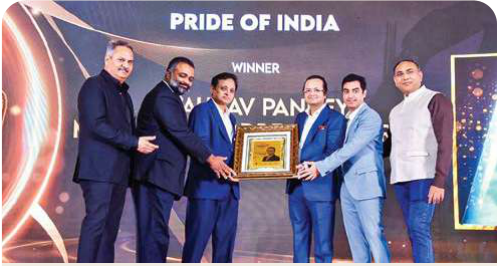

**[Image: AnnualReport2025.pdf-0019-101.png (498x266, 326.5KB)]**

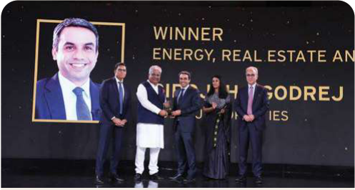

**[Image: AnnualReport2025.pdf-0019-102.png (497x266, 197.5KB)]**

###### **EY ENTREPRENEUR OF THE YEAR™ AWARDS 2024** 

###### **Construction Week Awards 2024 Recognition** 

Energy, Real Estate, and Infrastructure category at the prestigious 

Pride of India 

Gaurav Pandey, MD & CEO 

Pirojsha Godrej, Chairperson 

30 

31 

GODREJ PROPERTIES LIMITED 

INTEGRATED REPORT 2024-25 

## **BOARD OF DIRECTORS** 

###### **Committees** 

- 1 Allotment Committee 2 Environment, Social and Governance (ESG) Committee 

- 3 Corporate Social Responsibility (CSR) Committee 

- 4 Stakeholders Relationship Committee 5 Management Committee 

- 6 Risk Management Committee 

- 7 Audit Committee 

- 8 Nomination and Remuneration Committee 

###### **44Y | M** 

###### **PIROJSHA GODREJ** 

Non-Independent Director, Executive Chairperson 

Mr. Pirojsha Godrej is the Executive Chairperson of Godrej Properties, Godrej Housing Finance and a Non-Executive Director at Godrej Consumer Products and Godrej Agrovet. 

Pirojsha graduated from the Wharton School of Business in 2002, completed his Masters in International Affairs from Columbia University in 2004, and an MBA from Columbia Business School in 2008. 

Pirojsha joined GPL in 2004, became an Executive Director in 2008, and was appointed CEO of Godrej Properties in 2012. He has led the company through a phase of rapid growth. In Financial Year 2016, Godrej Properties for the first time became India's #1 publicly listed real estate developer by residential sales, a position it has retained for the past 5 years. Under Pirojsha’s leadership, Godrej Properties has been at the forefront of the sustainable development movement; in 2013, GPL received an award from former President of India, APJ Abdul Kalam for being one of the companies in India from across sectors to have driven the green building movement. 

In 2020, Godrej Properties ranked #1 amongst listed residential developers across the world in the Global Real Estate Sustainability Benchmark, an organisation committed to rigorous and independent evaluation of the sustainability performance of real assets across the globe. The Indian Green Building Council (IGBC) has awarded Pirojsha the IGBC Green Champion Award 2016 for his contribution to the sustainability of India's built environment. He was also awarded with the EY Entrepreneur Of The Year™ Awards 2024: Energy, Real Estate, and Infrastructure category 

###### **Membership in Committees** 

1 2 3 4 5 6 

###### **Attendance at Committee Meetings** 

23/23 

###### **Attendance at Board Meetings** 

**[Image: AnnualReport2025.pdf-0020-22.png (292x306, 95.0KB)]**

5/5 

###### **73Y | M** 

###### **NADIR B. GODREJ** 

Non-Independent, Non-Executive Director 

Mr. Nadir B. Godrej is the Chairman and Managing Director of Godrej Industries Ltd. & Chairman of Godrej Agrovet Ltd. He has a Bachelor of Science degree in Chemical Engineering from Massachusetts Institute of Technology, a Master of Science degree in Chemical Engineering from Stanford University and an MBA from Harvard Business School. 

He has been the Director of several Godrej companies since 1977 and has developed the animal feed, agricultural inputs and chemicals businesses of Godrej Industries and other associate companies, while also playing an active role in research. Mr. Godrej’s other, non-work commitments include being the President of the Alliance Francaise De Bombay, membership in and past Chairmanship of the CII National Committee on Chemicals, and previous role as an Independent Director of Indian Hotels Company Limited and Mahindra & Mahindra Limited. He is a member of the South Asia Research Centre Advisory Board of Harvard Business School. 

He has been awarded with Chevalier de Legion d’Honneur, Globoil Life Time Achievement Award – 2012, OTAI Life Time Achievement Award – 2012, Chemtec CEW Leadership & Excellence Award – 2013, Chemexcil Life Time Achievement Award – 2013, Lifetime Achievement Award by AILBIEA – 2016, CHEMTECH Leadership & Excellence Award – 2017 – Hall of Fame. 

Also, he was conferred with a Honorary Degree of Doctor of Philosophy in 2017 from the Manav Rachna University. He also received the award in Business Excellence at the IBG function in 2018 and ICC Life Time Achievement Award in 2022.  He also received a Honorary Degree in Doctor of Philosophy in Business Management from XIM University, Bhubaneshwar in 2023. Also, the Qimpro Platinum Standard 2023 Award and CLFMA Lifetime Achievement Award in 2023. He was also felicitated with ‘Green Business Titan’ Award in 2024 by the JSW The Times of India Earth Care Awards in 2024, and recently Mr. Godrej was honoured with the D.Sc. (Honoris Causa) from Institute of Chemical Technology in February 2025. 

###### **Membership in Committees** 

None 

###### **Attendance at Committee Meetings** 

NA 

###### **Attendance at Board Meetings** 

5/5 

**[Image: AnnualReport2025.pdf-0020-37.png (281x281, 119.3KB)]**

###### **GAURAV 41Y | M PANDEY** 

Managing Director & Chief Executive Officer 

Mr. Gaurav Pandey brings over 20 years of real estate experience, including 8.5 years with Godrej Properties. Under his leadership, GPL achieved approximately 3.7X growth in Booking Value in three years, reaching `I` 29,444 Crores in FY 24-25, the highest annual booking value by any Indian developer for the second consecutive year. Since taking charge during FY 22-23, GPL has delivered a cumulative Booking Value of `I` 64,203 Crores, unprecedented in Indian residential real estate. GPL’s collections of `I` 17,047 Crores and operating cash flow of `I` 7,484 Crores in FY 24-25 set benchmarks for the sector. He has led over 46 transactions with a cumulative revenue potential exceeding `I` 88,500 Crores. 

Previously, as CEO of the North Zone, he strengthened financial performance, growing Booking Value by 6X, Collections by 4X, and delivering the largest contribution to GPL’s PAT. 

Before GPL, he was CEO at Burman GSC and held senior roles at PropEquity and Ascendas India. He also coanchored "The Property Show" on NDTV. 

Mr. Pandey is an Economics Honours graduate from the University of Delhi and has completed a postgraduate course from the Indian Institute of Management (IIM) Kozhikode. 

He co-chairs FICCI’s Committee on Urban Development and Real Estate. He has been a CEO Council member of The Wall Street Journal since 2024 and was recognised among "The World’s Most Influential Decision Makers" by the WSJ CEO Council in 2024. 

Gaurav has been recognised as the CEO of the Year at the Construction Times BAM Awards 2025. 

He was also honoured as the Iconic Brand Leader at the Realty Plus India Brand Leadership Conclave and Awards 2025 and named one of Business World's Most Valuable CEOs. 

In addition, he was bestowed with the Pride of India award at the Construction Week Awards 2024. Under his leadership, GPL has won many accolades. 

###### **Membership in Committees** 

1 2 3 4 5 6 

###### **Attendance at Committee Meetings** 

23/23 

**[Image: AnnualReport2025.pdf-0020-52.png (299x332, 112.2KB)]**

###### **Attendance at Board Meetings** 

5/5 

32 GRI 2-9, 2-11 

33 

GODREJ PROPERTIES LIMITED 

INTEGRATED REPORT 2024-25 

**60Y | F** 

###### **SUTAPA** Lead Independent Director **BANERJEE** 

Ms. Sutapa Banerjee has spent 24 years in the financial services industry across two large multinational banks (ANZ Grindlays and ABN AMRO), and a boutique Indian Investment bank (Ambit) where she built and headed several businesses and analysed multiple sectors including real estate for the money management  business. Sutapa was voted as one of the ‘Top 20 Global Rising Stars of Wealth Management’ by the Institutional Investor Group in 2007 - the only Indian and one of only two winners from Asia. As CEO she led Ambit Private Wealth to ‘Best Private Bank in India in the 2013 AsiaMoney polls. In 2012 she was shortlisted in the ‘50 most Powerful Women’ by Fortune India. 

Currently, she serves as an Independent Director on the boards of several companies and has served on the Board of Oxfam and was the Nominee Director of Women’s World Banking NY in India. She is also a visiting faculty at IIM Ahmedabad and an adjunct faculty with IICA. She works as a Decision Coach for senior leadership talent and consults in the Wealth and Investments area for the Gerson Lehrman Group. She is an Advanced Leadership Fellow (2015) at Harvard University and works as Decision Coach for senior leadership talent. 

Sutapa is a gold medalist in Economics from the XLRI school of Management in India, and an Economics major from Presidency College Kolkata. Currently she is a member of the Advisory Council of the CII Centre for Women Leadership. She has served on the CII National Committee on ‘Integrity and Transparency in Governance’, the CII National Committee on ‘Women’s Empowerment’ and the ‘Indian Women Network’. 

###### **Membership in Committees** 

2 3 4 6 7 8 

**Attendance at Committee Meetings** 

13/13 

###### **Attendance at Board Meetings** 

5/5 

**[Image: AnnualReport2025.pdf-0021-13.png (293x310, 109.8KB)]**

**DR. INDU 64Y | M** Independent Director **BHUSHAN** 

Dr. Indu Bhushan has a career spanning almost 41 years across a multitude of sectors. He served for nine years in the IAS before leaving government service. After that, he worked as a Senior Economist with the World Bank Group before moving to the Asian Development Bank (ADB) in 1997. 

Dr. Bhushan holds a Ph.D. in Health Economics and a Master of Health Sciences from Johns Hopkins University. He is a B.Tech graduate from IIT BHU, holds a Post Graduate Diploma from IIT Delhi, and is also a Chartered Financial Analyst (CFA). He was a member of the Indian Administrative Service (Rajasthan cadre, 1983 batch). 

He served as Director General, East Asia Department of ADB. He has held multiple positions within ADB including Director General, Strategy and Policy Department and has led ADB’s engagement with several Asian economies including the People’s Republic of China. He provided oversight to sectors like energy, environment, natural resources and agriculture, transport, public management, real estate and infrastructure, financial and regional cooperation and urban and social development. 

In 2018, Dr. Bhushan was appointed as the Chief Executive Officer (CEO) of Ayushman Bharat – Pradhan Mantri Jan Arogya Yojana (AB - PMJAY), a flagship health assurance scheme of the Government of India covering more than 500 Million citizens. As the founding CEO, he led the design, development and the rollout of the scheme and oversaw its implementation in the country. He also initiated the implementation of the ambitious National Digital Health Mission (later renamed Ayushman Bharat Digital Mission). 

###### **Membership in Committees** 

2 3 6 7 8 

**Attendance at Committee Meetings** 

12/12 

###### **Attendance at Board Meetings** 

5/5 

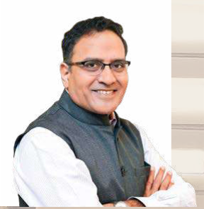

**[Image: AnnualReport2025.pdf-0021-25.png (288x295, 104.0KB)]**

###### **55Y | F** 

###### **JAYASHREE VAIDHYANATHAN** 

Independent Director 

Ms. Jayashree Vaidhyanathan is currently the Chief Executive Officer of BCT Digital, a global Fintech, Regtech and Cleantech company with over 30 years of experience. Her background in the digital and technology sector has provided her with deep expertise in the field of cybersecurity. She serves as an independent director on the Global Board of PwC and is one of the two independent directors on the PwC India Board. She also serves as the Independent Director on the board of UTI Asset Management Company and Indigrid. 

Ms. Vaidhyanathan holds a Master’s degree in Business Administration in Finance and Strategy from Cornell University and a Bachelor’s degree in Engineering in Computer Science from Madras University, India. She is also a CFA Charter Holder. 

Ms. Vaidhyanathan is a three-time winner of the prestigious Stevie Award, including a Lifetime Achievement Award in addition to being recognised as Global Indian of the year 2021-2022 by AsiaOne Magazine, India’s Inspirational Leader 2022 by WCRC (World Consulting & Research Corporation), Top 50 Women Leaders in Technology 2022 by Women We Admire, Lifetime Achievement Award 2022 by World HRD Congress, Tech Leadership Award 2020 by Fintech Futures, Top 10 Most Influential Women in Technology 2020 by Analyst Insights, India’s Most Trusted CEO 2020 by WCRC and has also been listed amongst Fortune’s Most Inspiring Women in 2021. 

###### **Membership in Committees** 

7 8 

###### **Attendance at Committee Meetings** 

6/6 

###### **Attendance at Board Meetings** 

5/5 

**[Image: AnnualReport2025.pdf-0021-38.png (315x296, 114.2KB)]**

**SUMEET 49Y | M** Independent Director **NARANG** 

Mr. Sumeet Narang is the Founder of Samara Capital, an India-focused investment firm with a strong emphasis on growth buyouts with over 28 years of experience. Before founding Samara Capital in late 2006, Sumeet briefly worked at Goldman Sachs, New York, in their Principal Investments Group. From 2001-04, he worked with Citigroup India across various functions based out of Delhi and Hyderabad. He has also worked with the Fiat Group in Italy and India. 

Mr. Narang earned a Master's in Business Administration from Harvard Business School, where he graduated as a Baker Scholar and received the John Loeb Fellow Award. He also holds a post graduate diploma in management (major in finance) from the Indian Institute of Management, Lucknow, where he was an Aditya Birla Scholar, and a Bachelor of Engineering degree in Mechanical Engineering from the Indian Institute of Technology, Roorkee. 

Samara Capital has a strong focus in the consumer space and Sumeet has had the opportunity to evaluate and invest in multiple companies in the sector across different segments such as retail (including food and grocery retail), quick service restaurants, branded apparel, personal and beauty care, etc. Mr. Narang sits on the boards of many of these companies and has actively contributed in their growth journeys, some of which have now become marketleading companies in their respective segments. 

###### **Membership in Committees** 

7 8 

###### **Attendance at Committee Meetings** 

6/6 

###### **Attendance at Board Meetings** 

5/5 

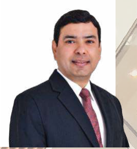

**[Image: AnnualReport2025.pdf-0021-49.png (268x291, 91.8KB)]**

34 

35 

**GODREJ PROPERTIES LIMITED** 

INTEGRATED REPORT 2024-25 

###### **OUR 6PS INTERCONNECTED ECOSYSTEM** 

### **VALUE BEYOND MEASURE** 

Our integrated business model leverages and transforms six interconnected capitals to deliver sustained value to our stakeholders while aligning with global sustainability goals through the 6Ps lens. We operate in a complex, dynamic environment where value is co-created through relationships, innovation, and responsible stewardship. Our strategy is rooted in maximising positive impact and minimising negative externalities, thereby ensuring inclusive, sustainable growth. 

**[Image: AnnualReport2025.pdf-0022-05.png (299x17, 8.2KB)]**

<!-- Start of picture text -->
Show Apartment at Godrej Nurture, Mumbai <!-- End of picture text -->

Planet Excellence in Driven by Positive Process and People Products Partnerships 

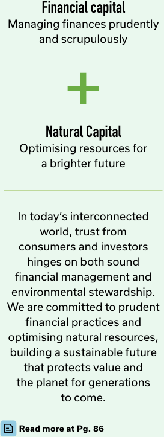

**[Image: AnnualReport2025.pdf-0022-07.png (273x724, 39.8KB)]**

<!-- Start of picture text -->
Financial capital Managing finances prudently and scrupulously Natural Capital Optimising resources for a brighter future In today’s interconnected world, trust from consumers and investors hinges on both sound financial management and environmental stewardship. We are committed to prudent financial practices and optimising natural resources, building a sustainable future that protects value and the planet for generations to come. Read more at Pg. 86 <!-- End of picture text -->

**Manufactured Capital** Maintaining costeffective and high-quality product leadership **Intellectual Capital** Fostering a culture of innovation 

**Human Capital** Creating an inclusive and agile workforce **Social And Relationship Capital** Co-creating a shared future 

As we pursue joy, we are steadfast in forging strategic partnerships to enhance our impact and sustain our growth momentum. These collaborations are instrumental in nurturing vibrant communities that continually inspire pride in us. 

In response to growing environmental concerns, we’ve aligned our processes and systems to build homes that are environmentally sustainable and resilient. 

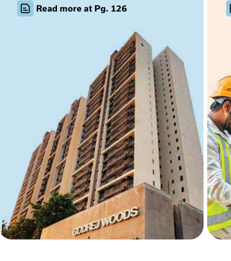

**[Image: AnnualReport2025.pdf-0022-12.png (381x430, 246.3KB)]**

<!-- Start of picture text -->
Read more at Pg. 126 <!-- End of picture text -->

**[Image: AnnualReport2025.pdf-0022-13.png (183x28, 2.4KB)]**

<!-- Start of picture text -->
Read more at Pg. 138 <!-- End of picture text -->

**[Image: AnnualReport2025.pdf-0022-14.png (344x318, 240.0KB)]**

**[Image: AnnualReport2025.pdf-0022-15.png (344x311, 217.4KB)]**

36 

37 

GODREJ PROPERTIES LIMITED 

INTEGRATED REPORT 2024-25 

###### **OUR VALUE CREATION MODEL** 

###### **RESOURCES / RELATIONSHIPS** 

###### **Profit** 

`L` **17,312.46 Cr** Shareholder Equity `L` **150.59 Cr** Paid-up capital `L` **17,374.86 Cr** Working capital 

`L` **17,312.46 Cr** Net Worth 

`L` **4,878.48 Cr** Operating Expenditure `L` **404.31 Cr** Salaries and Bonus Paid `L` **3,268.64 Cr** Net Debt 

**2.29** Cash flow Ratio **0.19** Net Debt Equity Ratio 

###### **Product** 

**84 Mn sq. ft.** Total Developable Area **3783 Cr** Cost of Construction 

**19 Mn sq. ft.** New area added in FY 2024-25 

**9.5 Mn sq. ft.** Total area constructed **65** Number of ongoing projects 

###### **People** 

**4,199** Permanent Employees 

**41** Differently abled permanent 

**1.15** Ratio of basic salary and remuneration of women to men ( Base+Other Cash Incentives) 

`L` **450.87 Cr** Total Expenditure on employee welfare and benefits 

- **1,830** Contractual workforce 

`L` **7,201** Average Amount Spent per FTE on Training and Development 

- **4,45,172 hrs** Duration of Hours of Safety Training 

- **22** Number of Skill Development Programmes 

- **2,761** Number of Health and Safety Programmes 

**22%** coverage of employees having KPIs linking ESG performance in their annual goals 

**Zero** Incidents related to Anti-corruption 

- & bribery 

- **17,217** Total respondents of customer satisfaction survey 

**100%** employees covered in Human Rights Training and 100% Human RIghts Assessment of all locations 

###### **Planet** 

`L` **9.94 Cr** Total Expenditure on Environmental Initiatives 

**Zero** Incidents of issues with Environmental Laws 

**2,742,209.05 tCO2e** Total GHG Emissions 

**37,218.39 GJ** Total Energy Consumed **5650.6 GJ** Renewable Energy Consumption **333 ML** Total Water Withdrawal 

###### **Processes** 

**9** Number of Collaborations/ Industry Partnerships 

- **1** No. of Green Building Memberships (IGBC) 

`L` **3.85 Cr** Total Expenditure in Research & Innovation 

###### **Partnerships** 

**51,657** Total active customer base 

- **99%** of customer grievances closed 

**1,046** Number of suppliers **90%** of material sourced from local suppliers 

`L` **15.47 Cr** Expenditure on CSR 

**8** Number of NGO Partners 

**3.46 Days** Average resolution time for all escalations 

**[Image: AnnualReport2025.pdf-0023-44.png (114x95, 24.2KB)]**

**[Image: AnnualReport2025.pdf-0023-45.png (135x20, 1.6KB)]**

<!-- Start of picture text -->
Group Housing <!-- End of picture text -->

**[Image: AnnualReport2025.pdf-0023-46.png (114x96, 28.4KB)]**

**[Image: AnnualReport2025.pdf-0023-47.png (128x44, 2.5KB)]**

<!-- Start of picture text -->
Plotted Developments <!-- End of picture text -->

###### **OUR STRATEGIC PRIORITIES** 

Quality Focus And Customer First 

Individual Contribution To A Strong Organisational Culture 

Profitable Through Asset Management 

Disruptive Growth 

Operational Excellence 

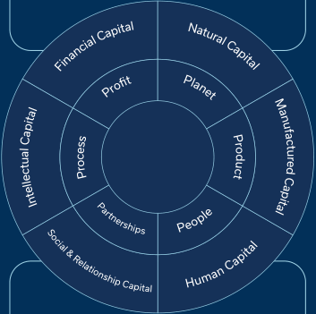

**[Image: AnnualReport2025.pdf-0023-54.png (353x351, 36.6KB)]**

<!-- Start of picture text -->
ital l s ap H p ta N C u i P pi at t ip h P m a ur e sh fi s l a C al r a on n o o al C ti e C r n la ci n p a a n Re P e t l pi pi a r & t e n ta l ta a Fi l ia l P oc S l Ma ta n s uf P ip a s a e ro ct C ur lau oc ud e tc r d e c ll C P a t te atpi In l <!-- End of picture text -->

###### **OUR PURPOSE** 

We create spaces that enable Everyday Joys; one community, one family, and one home at a time. 

###### **OUTPUTS** 

###### **Financial Capital** 

`L` **64,140.33 Cr** Market Cap 

`L` **6,967.05 Cr** Total Revenue 

`L` **1,969.97 Cr** EBITDA 

`L` **2,164.36 Cr** Adj EBITDA 

**12.62%** ROE 

- **20%** Net PAT Margin 

**9.37 %** ROCE 

**0.11** Asset turnover ratio 

`K` **1.65 Cr** Revenue generated per employee `L` **17,312.46 Cr** Net worth `K` **404.31 Cr** Salaries and Bonus Paid (net) 

###### **Manufactured Capital** 

- **25.73 Mn sq. ft** . Total Area Sold 

- **18.4 Mn sq. ft** .  Total Area Delivered 

- **6,298** Number of Units Handed Over 

- **73,97,498 sq. ft** . Area Handed Over 

- **100%** projects in reporting boundary are green building certified or under certification 

**100%** Coverage of Customer Satisfaction Survey 

###### **Human Capital** 

**38.6%** Diversity ratio 

- **3** Lost Time Injury  (incl.1 fatal incident) for Contractor's Workers 

- **0.039** Frequency Rate (LTIFR) for Contractor's Workers 

- **3** Number of Grievances Received from Employees and Workers 

- **1.21 tCO2e** Scope 1 & 2 GHG Emissions per Employee 

- **75%** Retention Rates of Permanent Employees that took Parental Leave 

**67%** Customer Net Promoter Score 

###### **Natural Capital** 

**43 litres/sq. ft.** Water Consumption Intensity 

- **0.05 GJ/sq. ft.** Energy Intensity For GPL Offices 

**1,588,952.92 tCO2e** Emissions from 

Purchased Raw Materials & Services 

- **6,490** Number of trees planted and transplanted 

**99%** waste Reused/recycled **0.008 tCo2e/sq. ft.** Scope 1 & 2 Emissions intensity 

**0.287 tCo2e/sq. ft.** Scope 3 Emissions intensity 

- **0.0000007 GJ/** `L` Energy Intensity per 

rupee of turnover 

**Zero litres** Water Discharged 

**0.00029 GJ/sq. ft.** Non-renewable Energy Intensity 

###### **Intellectual Capital** 

**91%** Quality audit scores 

- **6** Number of affiliations with trade and industry chambers/ associations 

GPL Integrated Technology Platforms for Compliance are ISO Systems, Legatrix and Risk 

###### **Social And Relationship Capital** 

- **8,90,618** No of CSR beneficiaries 

- **67%** Customer Satisfaction Score 

- **98%** Materials sourced within India 

- **17.3%** Percentage of input material directly sourced from MSME Suppliers 

- **~4010** Number of Employee Volunteering hours 

- **13** Number of CSR Projects undertaken In Designated Aspirational Districts (L) 

###### **OUTCOMES** 

###### **Profit** 

Create economic value through a sustainable business model, facilitating a mutually beneficial proposition for responsible profit generation throughout our value chains. 

###### **Planet** 

Minimise our environmental footprint and dependency on limited resources. Focus on maintaining water positive status as we scale, replace with "continue to work towards our 2050 Net Zero commitment". 

###### **Process** 

Transform compliance into opportunities by optimising processes and allocating resources effectively. Implement robust risk assessment and management strategies, particularly to address the challenges posed by climate change. 

###### **Product** 

Design and build sustainable products and services throughout our development footprint, with a comprehensive understanding of impacts generated by our products throughout their entire life cycle. 

###### **People** 

Ensure the health, safety, diversity, equity, inclusion, well-being, happiness, knowledge, and care for our employees, customers, workers, and communities. 

###### **Partnerships** 

Influence, collaborate, and co-create with partners along the value chain to establish a resilient ecosystem for a sustainable future. 

38 GRI 3-3, 205-1, 205-3, 305-4, 405-2 

39 

GRI 403-9, 403-10, 203-1, 204-1, 302-3 

GODREJ PROPERTIES LIMITED 

INTEGRATED REPORT 2024-25 

### **OUR DEFINING EDGE** 

###### **STRONG PARENTAGE STRONG EMPLOYEE COMPETITIVE BASE ADVANTAGE** 

- The strength of the Godrej brand and its association with trust, quality and reliability helps us in many aspects of our business, including entering into joint development agreements, land sourcing, expanding to new cities and markets, formulating business associations and 

• Over the past two years, we have consistently maintained our position as the leading residential real estate developer in India, as measured by Booking Value. We also achieved the highest cumulative booking value of 

A motivated and empowered employee base is the key to our competitive advantage. 

- Our employee value proposition is based on a strong focus on employee development, an exciting work culture, empowerment and competitive compensation. 

- `78,789 Cr for any real estate developer in the last five years. 

building relationships with our customers, service providers, process partners, investors and lenders. 

   - The combination of the “outright model” and the 

- Our in-house learning academy, GPL Alchemy, offers Programmes aimed at enhancing both functional and leadership skills across various levels. Key Programmes include the Programmes designed to equip employees with essential competencies, such as profitability, design, sales and business development. 

“joint development model” for execution allows us to be more capital efficient. A large proportion of our project acquisitions in recent years have been through the outright model. We acquire land on an outright basis to take advantage of attractive land valuations and to increase our economic interest. 

• The Godrej brand commands a strong resonance among the populace in India. 

- Being a part of a conglomerate business, strengthens our overall market position, providing increased access to land banks and lower cost of financing. 

###### `O` **29,444 Cr** 

**4,199** permanent employees as of March 31, 2025 

**Awarded as Developer of the year at GRI Awards India 2024** 

of booking value sold in FY 24-25 

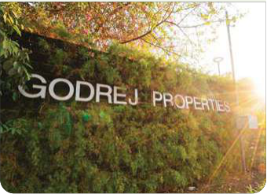

**[Image: AnnualReport2025.pdf-0024-19.png (340x247, 217.0KB)]**

**[Image: AnnualReport2025.pdf-0024-20.png (343x247, 217.7KB)]**

**[Image: AnnualReport2025.pdf-0024-21.png (340x246, 200.7KB)]**

###### **STRONG FINANCIAL PERFORMANCE** 

We have experienced significant growth in the last five years. 

- Our consolidated total income grew by 19% CAGR in the last five years to `6,848.45 Cr in FY 24-25 and PAT grew 39% CAGR in the last five years to 

   - `1,399.89 Cr*. 

- During the Financial Year 2025, we achieved record sales, selling 25.73 Mn sq.ft. with a booking value of `29,444 Cr. 

• Our history of growth and positive financial performance strategically positions us to effectively pursue our future growth plans. 

###### `O` **1,399.89 Cr** 

Profit After Tax 

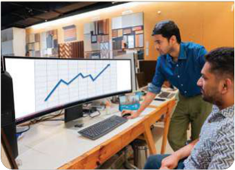

**[Image: AnnualReport2025.pdf-0024-30.png (341x247, 200.8KB)]**

###### **STRONG PROJECT PIPELINE** 

• Since April 1, 2021, we have added 48 projects with approximately 76 Mn sq. ft. of estimated Saleable Area, of which 14 new projects with approximately 19 Mn sq. ft. of estimated Saleable area were added during the year ended FY 24-25. 

- Most of our land parcels are located in four key real estate markets in India, MMR, Pune, Bengaluru and the National Capital Region and include land parcels, which we own directly or indirectly. 

- We have products across various segments ranging from mid-income, premium, luxury and ultra-luxury and a large portfolio of 114 Ongoing and Forthcoming Projects. 

`O` **26,450 Cr** of estimated booking value added  in FY 24-25 across 8 cities 

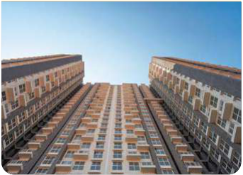

**[Image: AnnualReport2025.pdf-0024-36.png (343x247, 173.2KB)]**

###### **COMMITMENT TO SUSTAINABILITY** 

We are deeply focused on sustainability and follow a comprehensive approach to sustainable development from an early design phase through the construction period. 

• Our focus on sustainable development covers environmental & social parameters including site selection and planning, pedestrian friendly developments, indoor environmental quality, maximising day lighting and natural ventilation, water and energy efficiency and responsible material sourcing. • Our near term emission reduction targets emission reduction targets are aligned with climate science standards and have been validated by SBTi. 

###### **% Top 10** 

in the Down Jones Best in class indices by S&P global in the real estate and management sector 

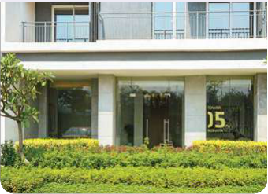

**[Image: AnnualReport2025.pdf-0024-42.png (340x247, 189.3KB)]**

40 

41 

INTEGRATED REPORT 2024-25 

**[Image: AnnualReport2025.pdf-0025-01.png (1149x740, 1380.9KB)]**

<!-- Start of picture text -->
GODREJ PROPERTIES LIMITED <!-- End of picture text -->

### **THE PATH AHEAD** 

Our strategy is a comprehensive framework aimed at delivering long-term value through responsible growth and operational excellence. Grounded in our material themes and sustainability ambitions, it is designed to proactively respond to emerging risks and evolving opportunities. Our strategic priorities are focused on driving quantum growth while ensuring meaningful value creation for all stakeholders. With a strong foundation in our purpose, these priorities help us stay agile in a dynamic market, strengthen risk resilience, and advance our vision of a more sustainable future. Each pillar reinforces our commitment to excellence and propels us toward leadership in the Indian real estate sector. 

###### **Quality Focus And Customer First** 

Delivering exceptional product quality and customer satisfaction remains our core commitment. We aim to embed a culture of excellence across the organisation, ensuring best- in-class outcomes for our customers. To ensure this, we have implemented a structured quality benchmarking approach that spans the entire lifecycle of a project—from design and procurement to execution and handover. 

###### **>580 CTQs** 

(Critical to Quality) parameters defined 

###### **Long-Term Impact** 

A consistent, high-quality product portfolio fosters customer trust, promotes referrals, enhances brand value, and supports higher absorption and pricing power in a competitive market. 

**[Image: AnnualReport2025.pdf-0025-10.png (423x122, 7.3KB)]**

<!-- Start of picture text -->
Link to material themes <!-- End of picture text -->

###### **Individual Contribution To A Strong Organisational Culture** 

Transformation is fuelled by collaboration and a growth mindset at every level. While we operate across diverse geographies, we consistently nurture an organisation-first culture. Through targeted initiatives, we are strengthening internal learning, enhancing capabilities, and building a future-ready talent pool that sets new industry benchmarks. 

###### **86%** 

Of the management committee is internally groomed Talent 

###### **Link to material themes** 

###### **Profitable Through "Disciplined" Asset Management** 

Prudent cost and cash flow management underpin our approach to profitability and capital efficiency. By institutionalising a strategic, bottom-up approach to budget risk monitoring and mitigation, we ensure value preservation from underwriting to execution, driving sustained profit growth. 

###### **20.4%** 

Net Profit Margin 

**[Image: AnnualReport2025.pdf-0025-20.png (422x122, 5.8KB)]**

<!-- Start of picture text -->
Link to material themes <!-- End of picture text -->

###### **Disruptive Growth** 

Our growth strategy focuses on driving transformation through dynamic business development, sales, and execution. This includes continuously evaluating market opportunities, strengthening our land acquisition framework, accelerating pre-launch timelines, refining product propositions, broadening distribution networks, and enhancing execution capabilities for future scale. 

###### **19 Mn sq.ft.** 

of project added 

###### **Link to material themes** 

###### **Operational Excellence** 

We are committed to operational excellence through innovation. By investing in advanced construction methods, technology, procurement strategies, and execution models, we ensure accelerated delivery at scale without compromising on quality or timelines. This approach maximises Return on Capital Employed (ROCE) and Return on Equity (ROE). 

###### **6298 Homes** 

Units Handed over to customers 

**[Image: AnnualReport2025.pdf-0025-30.png (424x122, 6.3KB)]**

<!-- Start of picture text -->
Link to material themes <!-- End of picture text -->

42 GRI 3-3 

43 

GODREJ PROPERTIES LIMITED 

INTEGRATED REPORT 2024-25 

### **ESG GOALS AND TARGETS** 

Our commitment to Environmental, Social, and Governance (ESG) priorities is guided by clear, measurable targets and transparent reporting. By translating purpose into performance, we’re able to track how our sustainability initiatives are advancing year over year. In addition to reflecting accountability, these metrics also serve as a compass as we continue to align our business with global best practices and stakeholder expectations. 

**[Image: AnnualReport2025.pdf-0026-04.png (32x188, 1.8KB)]**

<!-- Start of picture text -->
ENVIRONMENT <!-- End of picture text -->

###### **Decarbonisation** 

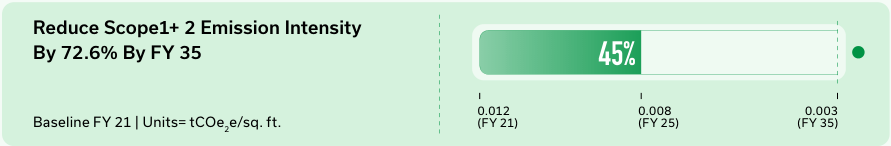

**[Image: AnnualReport2025.pdf-0026-06.png (891x146, 16.6KB)]**

<!-- Start of picture text -->
Reduce Scope1+ 2 Emission Intensity By 72.6% By FY 35 45% 0.012  0.008  0.003 Baseline FY 21 | Units= tCOe2e/sq. ft. (FY 21) (FY 25) (FY 35) <!-- End of picture text -->

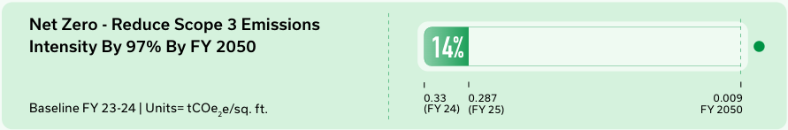

**[Image: AnnualReport2025.pdf-0026-07.png (891x147, 17.9KB)]**

<!-- Start of picture text -->
Net Zero - Reduce Scope 3 Emissions Intensity By 97% By FY 2050 14% 0.33  0.287  0.009 Baseline FY 23-24 | Units= tCOe2e/sq. ft. (FY 24) (FY 25) FY 2050 <!-- End of picture text -->

###### **Waste Management** 

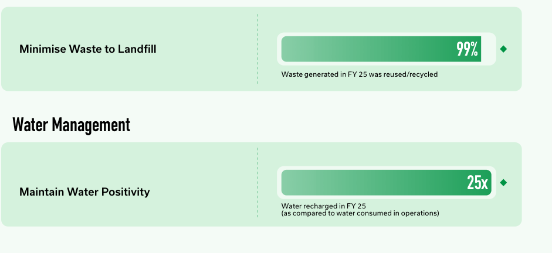

**[Image: AnnualReport2025.pdf-0026-09.png (941x432, 27.9KB)]**

<!-- Start of picture text -->
Minimise Waste to Landfill 99% Waste generated in FY 25 was reused/recycled Water Management 25x Maintain Water Positivity Water recharged in FY 25 (as compared to water consumed in operations) <!-- End of picture text -->

###### **Green Building Certification** 

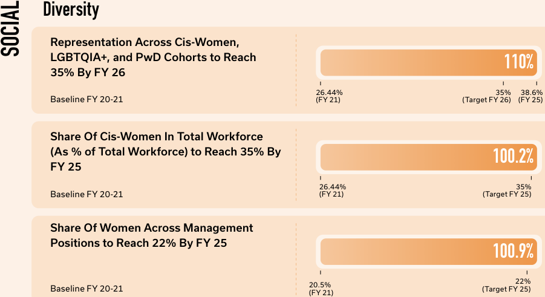

**[Image: AnnualReport2025.pdf-0026-11.png (901x491, 59.6KB)]**

<!-- Start of picture text -->
Diversity Representation Across Cis-Women, LGBTQIA+, and PwD Cohorts to Reach  110% 35% By FY 26 26.44%  35%  38.6% Baseline FY 20-21 (FY 21) (Target FY 26) (FY 25) Share Of Cis-Women In Total Workforce (As % of Total Workforce) to Reach 35% By  100.2% FY 25 26.44%  35% Baseline FY 20-21 (FY 21) (Target FY 25) Share Of Women Across Management Positions to Reach 22% By FY 25 100.9% 22% Baseline FY 20-21 20.5% (FY 21) (Target FY 25) SOCIAL <!-- End of picture text -->

**[Image: AnnualReport2025.pdf-0026-12.png (397x65, 2.8KB)]**

<!-- Start of picture text -->
110% <!-- End of picture text -->

**[Image: AnnualReport2025.pdf-0026-13.png (53x34, 0.5KB)]**

**[Image: AnnualReport2025.pdf-0026-14.png (397x65, 3.3KB)]**

<!-- Start of picture text -->
100.2% <!-- End of picture text -->

**[Image: AnnualReport2025.pdf-0026-15.png (53x35, 0.5KB)]**

**[Image: AnnualReport2025.pdf-0026-16.png (397x66, 3.5KB)]**

<!-- Start of picture text -->
100.9% <!-- End of picture text -->

**[Image: AnnualReport2025.pdf-0026-17.png (53x34, 0.5KB)]**

**[Image: AnnualReport2025.pdf-0026-18.png (882x178, 14.8KB)]**

<!-- Start of picture text -->
Board Accountability Maintain Board Independence To 50% 57% GOVERNANCE <!-- End of picture text -->

**[Image: AnnualReport2025.pdf-0026-19.png (397x66, 3.4KB)]**

<!-- Start of picture text -->
57% <!-- End of picture text -->

**[Image: AnnualReport2025.pdf-0026-20.png (53x34, 0.5KB)]**

**[Image: AnnualReport2025.pdf-0026-21.png (891x146, 14.0KB)]**

<!-- Start of picture text -->
All Buildings In The Reporting Boundary   100% To Be Green Building Certified Certified in FY 25 <!-- End of picture text -->

On Track | Acheived 

44 GRI 305-5 

45 

GRI 301-2 

**INTEGRATED REPORT 2024-25** 

**[Image: AnnualReport2025.pdf-0027-01.png (228x16, 3.6KB)]**

<!-- Start of picture text -->
GODREJ PROPERTIES LIMITED <!-- End of picture text -->

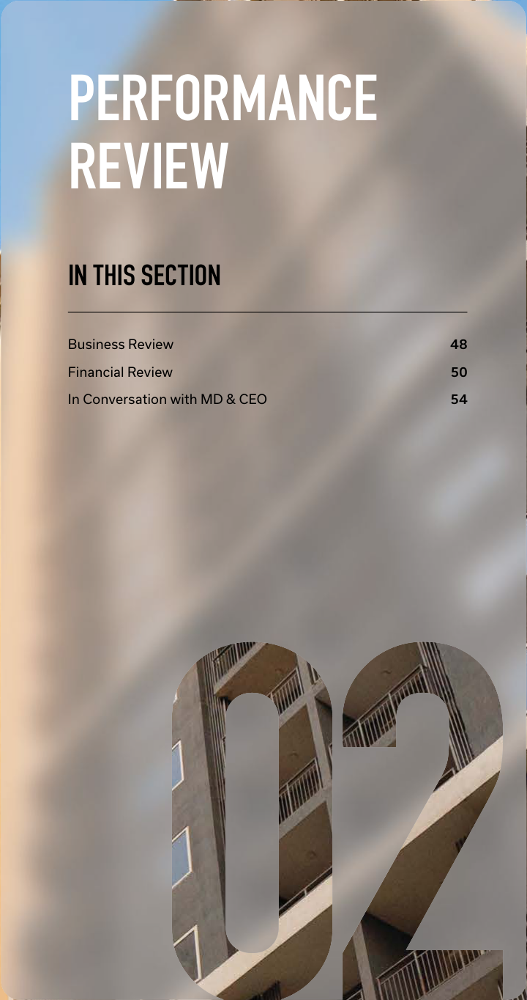

**[Image: AnnualReport2025.pdf-0027-02.png (720x1364, 613.0KB)]**

<!-- Start of picture text -->
PERFORMANCE REVIEW IN THIS SECTION Business Review  48 Financial Review  50 In Conversation with MD & CEO  54 <!-- End of picture text -->

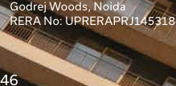

**[Image: AnnualReport2025.pdf-0027-03.png (219x107, 53.3KB)]**

<!-- Start of picture text -->
Godrej Woods, Noida RERA No: UPRERAPRJ145318 46 <!-- End of picture text -->

**[Image: AnnualReport2025.pdf-0027-04.png (24x14, 0.8KB)]**

<!-- Start of picture text -->
47 <!-- End of picture text -->

GODREJ PROPERTIES LIMITED 

INTEGRATED REPORT 2024-25 

## **BUSINESS REVIEW** 

This year, we added 14 new projects, driving growth and margins. We also entered the plotted development segment in Tier-2 cities, unlocking new opportunities across emerging urban markets. 

###### **BUSINESS DEVELOPMENT BY ESTIMATED BOOKING VALUE** 

###### `O` **26,450 Cr** 

25% ↑ 

> FY24 21,225 

> **FY25 26,450** 

###### **BOOKING VALUE** 

###### `O` **29,444 Cr** 

###### 31% ↑ 

> FY24 22,527 

> **FY25 29,444** 

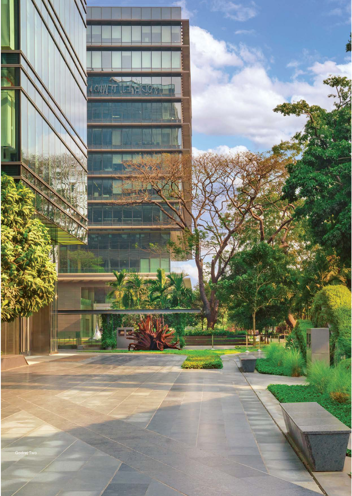

**[Image: AnnualReport2025.pdf-0028-12.png (1246x1754, 4226.0KB)]**

<!-- Start of picture text -->
Godrej Two <!-- End of picture text -->

###### **GEOGRAPHY WISE BREAK-UP** 

###### **SALES VALUES (INR Cr)** 

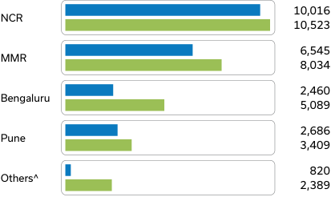

**[Image: AnnualReport2025.pdf-0028-15.png (418x246, 12.9KB)]**

<!-- Start of picture text -->
 10,016 NCR 10,523 6,545 MMR 8,034 2,460 Bengaluru 5,089 2,686 Pune 3,409 820 Others^ 2,389 <!-- End of picture text -->

###### **SALES VOLUME (Mn sq. ft.)** 

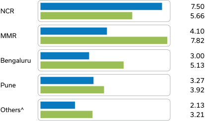

**[Image: AnnualReport2025.pdf-0028-17.png (413x245, 11.1KB)]**

<!-- Start of picture text -->
7.50 NCR 5.66 4.10 MMR  7.82 3.00 Bengaluru 5.13 3.27 Pune 3.92 2.13 Others^ 3.21 <!-- End of picture text -->

###### **NO. OF UNITS** 

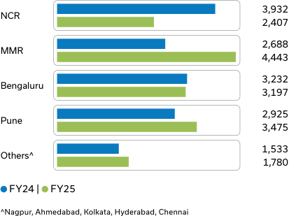

**[Image: AnnualReport2025.pdf-0028-19.png (413x309, 16.2KB)]**

<!-- Start of picture text -->
3,932 NCR 2,407 2,688 MMR 4,443 3,232 Bengaluru 3,197 2,925 Pune 3,475 1,533 Others^ 1,780  FY24 |  FY25 ^Nagpur, Ahmedabad, Kolkata, Hyderabad, Chennai <!-- End of picture text -->

48 

49 

**[Image: AnnualReport2025.pdf-0029-00.png (228x16, 2.6KB)]**

<!-- Start of picture text -->
GODREJ PROPERTIES LIMITED <!-- End of picture text -->

## **FINANCIAL REVIEW** 

**[Image: AnnualReport2025.pdf-0029-02.png (297x61, 35.0KB)]**

<!-- Start of picture text -->
INTEGRATED REPORT 2024-25 <!-- End of picture text -->

FY 2024–25 was a year of exceptional growth and operational strength, reflecting the continued buoyancy of the real estate sector and the strategic decisions we’ve made in recent years. We achieved record-breaking performance across key financial parameters, driven by strong booking momentum and disciplined execution. This growth was supported by a resilient business model, sharp customer focus, and consistent value delivery, positioning us well for long-term financial sustainability. 

**[Image: AnnualReport2025.pdf-0029-04.png (80x17, 1.2KB)]**

<!-- Start of picture text -->
Godrej One <!-- End of picture text -->

###### **REVENUE GENERATED** 

###### `O` **6,967.05 Cr** 

61% ↑  |  51% 

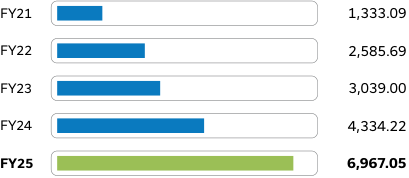

**[Image: AnnualReport2025.pdf-0029-08.png (409x178, 9.1KB)]**

<!-- Start of picture text -->
FY21 1,333.09 FY22 2,585.69 FY23 3,039.00 FY24 4,334.22 FY25 6,967.05 <!-- End of picture text -->

(Total Income = Revenue from operations + Other Income) 

###### **EBITDA** 

###### `O` **1,969.97 Cr** 

65% ↑  |  102% 

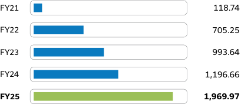

**[Image: AnnualReport2025.pdf-0029-13.png (409x176, 8.4KB)]**

<!-- Start of picture text -->
FY21 118.74 FY22 705.25 FY23 993.64 FY24 1,196.66 FY25 1,969.97 <!-- End of picture text -->

###### **OPERATING COST** 

###### `O` **4,427.61 Cr** 

56% ↑  |  53% 

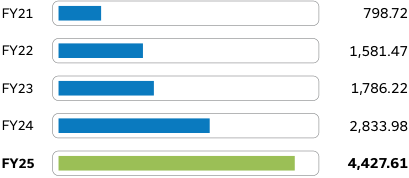

**[Image: AnnualReport2025.pdf-0029-17.png (409x178, 8.7KB)]**

<!-- Start of picture text -->
FY21 798.72 FY22 1,581.47 FY23 1,786.22 FY24 2,833.98 FY25 4,427.61 <!-- End of picture text -->

(Expenses = (Cost of materials consumed-Change in inventories of finished goods & construction work-inprogress) + Other Expenses) 

###### **DEPRECIATION AND AMORTISATION** 

###### `O` **73.66 Cr** 

65% ↑  |  39% 

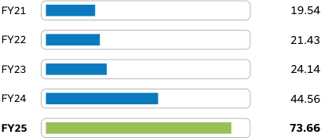

**[Image: AnnualReport2025.pdf-0029-22.png (409x176, 7.2KB)]**

<!-- Start of picture text -->
FY21 19.54 FY22 21.43 FY23 24.14 FY24 44.56 FY25 73.66 <!-- End of picture text -->

###### **PROFIT/LOSS BEFORE TAX** 

###### `O` **1,722.62 Cr** 

###### 72% ↑ 

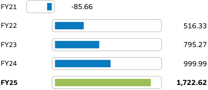

**[Image: AnnualReport2025.pdf-0029-26.png (410x178, 7.9KB)]**

<!-- Start of picture text -->
FY21 -85.66 FY22 516.33 FY23 795.27 FY24 999.99 FY25 1,722.62 <!-- End of picture text -->

###### **PROFIT AFTER TAX** 

###### `O` **1,399.89 Cr** 

###### 93% ↑ 

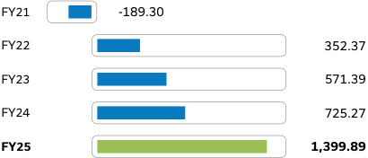

**[Image: AnnualReport2025.pdf-0029-30.png (410x176, 8.2KB)]**

<!-- Start of picture text -->
FY21 -189.30 FY22 352.37 FY23 571.39 FY24 725.27 FY25 1,399.89 <!-- End of picture text -->

###### **TAX EXPENSE** 

###### `O` **333.39 Cr** 

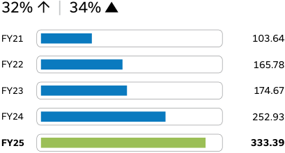

**[Image: AnnualReport2025.pdf-0029-33.png (409x220, 10.3KB)]**

<!-- Start of picture text -->
32% ↑  |  34% FY21 103.64 FY22 165.78 FY23 174.67 FY24 252.93 FY25 333.39 <!-- End of picture text -->

###### **TOTAL COMPREHENSIVE INCOME** 

###### `O` **1,382.76 Cr** 

85% ↑ 

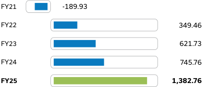

**[Image: AnnualReport2025.pdf-0029-37.png (409x176, 8.5KB)]**

<!-- Start of picture text -->
FY21 -189.93 FY22 349.46 FY23 621.73 FY24 745.76 FY25 1,382.76 <!-- End of picture text -->

(PAT attributed to owners) 

↑ Year-on-Year growth   4 year CAGR  |  ↑ Year-on-Year growth| 4 year CAGR 

50 GRI 3-3, 201-1 

51 

INTEGRATED REPORT 2024-25 

**[Image: AnnualReport2025.pdf-0030-01.png (226x13, 6.1KB)]**

<!-- Start of picture text -->
GODREJ PROPERTIES LIMITED <!-- End of picture text -->

**[Image: AnnualReport2025.pdf-0030-02.png (80x17, 2.5KB)]**

<!-- Start of picture text -->
Godrej One <!-- End of picture text -->

###### **ECONOMIC VALUE RETAINED** 

###### `O` **1,581.49 Cr** 

###### 107% ↑ 

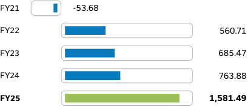

**[Image: AnnualReport2025.pdf-0030-06.png (409x178, 8.5KB)]**

<!-- Start of picture text -->
FY21 -53.68 FY22 560.71 FY23 685.47 FY24 763.88 FY25 1,581.49 <!-- End of picture text -->

(Economic Value Retained= Revenue Generated - Economic Value Distributed) 

###### **EMPLOYEE WAGES AND BENEFITS** 

###### `O` **450.87 Cr** 

36% ↑  |  11% 

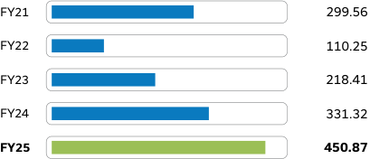

**[Image: AnnualReport2025.pdf-0030-11.png (409x176, 8.2KB)]**

<!-- Start of picture text -->
FY21 299.56 FY22 110.25 FY23 218.41 FY24 331.32 FY25 450.87 <!-- End of picture text -->

(Employee Benefits Expense (net)) 

###### **ECONOMIC VALUE DISTRIBUTED** 

###### `O` **5,385.56 Cr** 

51% ↑  |  40% 

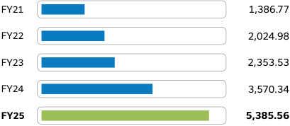

**[Image: AnnualReport2025.pdf-0030-16.png (409x178, 9.2KB)]**

<!-- Start of picture text -->
FY21 1,386.77 FY22 2,024.98 FY23 2,353.53 FY24 3,570.34 FY25 5,385.56 <!-- End of picture text -->

(Economic value distributed = Operating costs+ Other expenses + Employee benefit expenses+ Payment to Capital + Payment to Government) 

###### **PAYMENTS TO PROVIDERS OF CAPITAL** 

###### `O` **173.69 Cr** 

14% ↑  |  -2% 

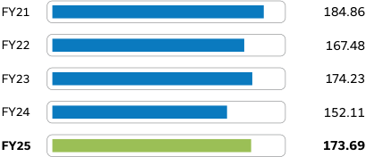

**[Image: AnnualReport2025.pdf-0030-21.png (409x176, 7.8KB)]**

<!-- Start of picture text -->
FY21 184.86 FY22 167.48 FY23 174.23 FY24 152.11 FY25 173.69 <!-- End of picture text -->

(Finance Costs (net)) 

###### **COMMUNITY INVESTMENTS** 

###### `O` **15.47 Cr** 

32% ↑  |  18% 

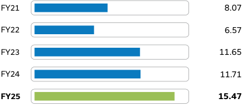

**[Image: AnnualReport2025.pdf-0030-26.png (410x178, 6.9KB)]**

<!-- Start of picture text -->
FY21 8.07 FY22 6.57 FY23 11.65 FY24 11.71 FY25 15.47 <!-- End of picture text -->

(Total CSR Spends including Joint Ventures) 

###### **NET DEBT TO EQUITY RATIO** 

###### **0.19X** 

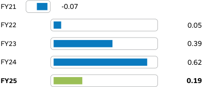

**[Image: AnnualReport2025.pdf-0030-30.png (410x176, 6.9KB)]**

<!-- Start of picture text -->
FY21 -0.07 FY22 0.05 FY23 0.39 FY24 0.62 FY25 0.19 <!-- End of picture text -->

###### **ROE** 

###### **12.62%** 

68% ↑ 

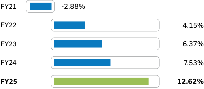

**[Image: AnnualReport2025.pdf-0030-34.png (409x178, 8.4KB)]**

<!-- Start of picture text -->
FY21 -2.88% FY22 4.15% FY23 6.37% FY24 7.53% FY25 12.62% <!-- End of picture text -->

###### **ROCE** 

###### **9.37%** 

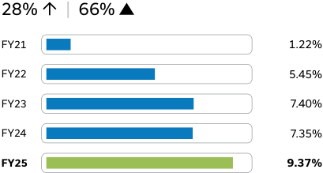

**[Image: AnnualReport2025.pdf-0030-37.png (409x219, 10.9KB)]**

<!-- Start of picture text -->
28% ↑  |  66% FY21 1.22% FY22 5.45% FY23 7.40% FY24 7.35% FY25 9.37% <!-- End of picture text -->

ROCE = (Profit before Tax + Finance Cost + Interest included in cost of sale) / Average Capital Employed 

4 year CAGR  |  ↑ Year-on-Year growth 

52 

53 

GODREJ PROPERTIES LIMITED 

INTEGRATED REPORT 2024-25 

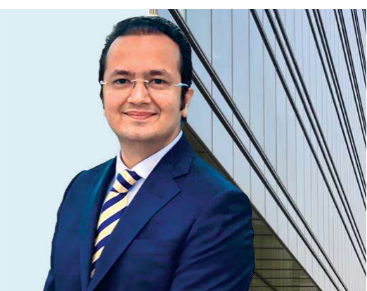

**[Image: AnnualReport2025.pdf-0031-02.png (522x413, 345.5KB)]**

### **IN CONVERSATION WITH MD & CEO** 

###### **Gaurav Pandey** 

Managing Director and Chief Executive Officer 

To navigate this, we’ve doubled down on local empowerment. Our zonal leadership model allows for market-sensitive decision-making. 

###### **Q. What has enabled Godrej Properties to achieve leadership in the real estate sector?** 

This is backed by professional management and data-led insights, enabling us to anticipate and act on consumer shifts quickly. 

Our leadership has been built on three core pillars: execution, discipline, and foresight. 

Between 2019 and 2021, our growth hovered around 15%. In the last two years, however, we’ve scaled rapidly, growing booking value by 56% in FY 22-23, 84% in FY 23-24, and 31% in FY 24-25 on a much higher base. This acceleration is the result of proactive capital raises at strategic junctures in FY 18-19, FY 20-21, and again in FY 24-25 with the largest QIP ever seen in the sector. 

We continue to evolve with sustainability imperatives and customer-centric design innovations. With a responsive operating model, financial discipline, and strong brand trust, we are well-equipped to lead through the next phase of change. 

Our financial agility, coupled with strong internal accruals, has allowed us to maintain a healthy balance sheet, reducing net gearing from 0.7x to ~0.2x. Equally important is our pan-India presence, which gives us operational flexibility and risk diversification across cycles. 

**We are the only developer with a truly pan India presence, which helps us balance risk while scaling efficiently. Our strategy of self-development gives us control over execution and margins critical in a sector where trust and delivery timelines matter deeply.** 

The strength of the Godrej brand continues to be a key differentiator—enabling faster partnerships, smoother market entries, and stronger customer recall. Being part of the Godrej Industries Group enhances our market position, improves access to land, and lowers our cost of capital. 

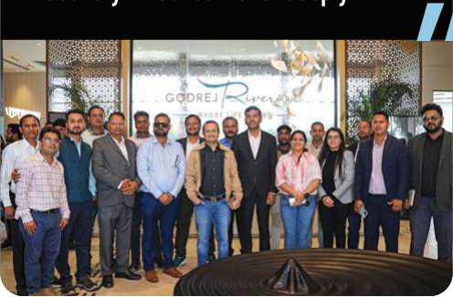

**[Image: AnnualReport2025.pdf-0031-15.png (496x326, 340.8KB)]**

###### **Q. The real estate sector is undergoing significant transformation. How is Godrej Properties navigating these changes?** 

The Indian real estate market is becoming increasingly segmented defined by varying demand drivers across regions and shifting buyer expectations. Post-COVID, we’ve seen a decisive shift: homeowners are now prioritising quality of life, larger spaces, and integrated amenities. 

###### **Q. How is Godrej Properties driving sustainability across its business operations?** 

Sustainability is embedded in everything we do—from project design to operations and workforce engagement. Our inclusion in the S&P Dow Jones Best in Class Indices is a recognition of this effort, but our motivation goes beyond rankings. 

We have been successful in adding 6 IGBC Net Zero Waste (Design) and 1 IGBC Net Zero Energy (Design) project in our portfolio advancing our Net Zero commitment. 

We work closely with our supply chain to promote decarbonisation—conducting training workshops and encouraging the use of energy-efficient materials. Onsite, we focus on worker safety, upskilling, and long-term career enablement. 

We also see sustainability through the lens of inclusion. Our Diversity, Equity, and Inclusion (DEI) practices ensure opportunities for growth across backgrounds and roles—strengthening our social impact alongside environmental performance. 

###### **Q. What initiatives has Godrej Properties undertaken to strengthen customer trust and enhance their experience?** 

Trust and experience are central to our value proposition. In FY 24-25, we reimagined home handovers into celebratory “Shubharambh” moments, with senior leadership participating to mark the occasion. This transformed handovers into a festive, deeply personal experience. 

We launched Impressions, a social media series capturing authentic stories from our customers—building relatability and advocacy. Over 200 customer videos were published, enhancing community engagement. 

Technology remains a key enabler. Our Godrej Properties mobile app (4+ rating) provides real-time purchase and project updates. The app now supports alternate payment modes and has doubled digital collections. 

Our WhatsApp-based service has also been upgraded to allow real-time audio/video support, improving responsiveness and transparency. 

These initiatives together reflect our commitment to a relationship-driven, technology-enabled, and emotionally engaging customer journey. 

###### **Q. Can you provide insights into how technological innovations have enhanced operational efficiency and supported the company’s growth ambitions?** 

We’ve made significant strides in integrating technology into core functions. Our in-house design tech vertical now leverages generative AI for architectural accuracy and efficiency. By collaborating with AI startups, we’ve strengthened design delivery and minimised deviation from blueprints. 

In construction, our 3D-printed villa in Pune represents a leap forward—faster, sustainable, and highly precise. On the sales front, AI-driven analytics and personalised digital campaigns have enhanced outreach and conversion rates. 

Beyond efficiency, our innovations aim to create real impact. Our labour productivity app ensures transparent incentives and financial access, helping our workforce grow alongside us. We believe technology must uplift— not just optimise. 

###### **Q. Looking ahead, what are the key priorities and strategies that will drive the next phase of growth for Godrej Properties?** 

As we move into our next phase, our priorities remain clear: scale responsibly, execute consistently, and grow profitably. 

We will deepen our presence in core regions like NCR, MMR, Pune and Bengaluru while selectively entering tier-1 and tier-2 cities with strong demand dynamics. In FY 24-25, we entered Indore through two plotted development acquisitions—reflecting our calibrated approach to market entry. 

We’re expanding across mid-income, premium, and luxury segments, and exploring lifestyle-led formats aligned with post-pandemic preferences. Sustainability will remain a core focus, with our Net Zero goals shaping design, construction, and operations. 

Disciplined capital allocation, customer centricity, and operational excellence will continue to anchor our growth strategy. We are confident that our foundation is strong— and the future is full of opportunity. 

54 GRI 2-22 

55 

GODREJ PROPERTIES LIMITED 

INTEGRATED REPORT 2024-25 

**INTEGRATING SUSTAINABILITY WITH OUR BUSINESS** 

###### **IN THIS SECTION** 

|Materiality|58|
|---|---|
|Building Shared Futures|60|
|Integrity in Action|64|
|Anticipating Tomorrow's Challenges|72|
|Championing Climate Policy  Through Advocacy|78|
|Sustainability Across Value Chain|80|
|Alignment with SDGs|82|

Sales office at Godrej Mann-Hinje, Pune RERA No: PM1260002500070 

56 

57 

GODREJ PROPERTIES LIMITED 

INTEGRATED REPORT 2024-25 

###### **MATERIAL THEMES AND TOPICS** 

The table below links our materiality which is categorised under 7 broad themes with 19 topics featuring across the following themes. 

### **MATERIALITY** 

Our materiality assessment and stakeholder engagement follow AA1000 principles— Materiality, Completeness, and Responsiveness. The derived material themes are aligned with the GRI Universal Standards 2021. We  maintain reporting consistency by following a standardised definition of 'material' across all reports. 

**[Image: AnnualReport2025.pdf-0033-06.png (347x68, 26.4KB)]**

<!-- Start of picture text -->
OUR APPROACH (as per GRI Universal Standards 2021) <!-- End of picture text -->

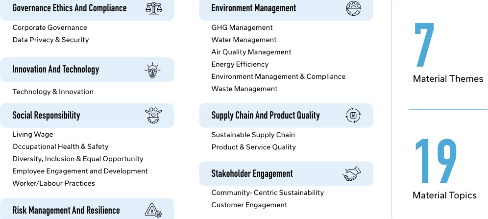

**[Image: AnnualReport2025.pdf-0033-07.png (996x447, 74.5KB)]**

<!-- Start of picture text -->
Governance Ethics And Compliance Environment Management Corporate Governance GHG Management Data Privacy & Security Water Management Air Quality Management Energy Efficiency 7 Innovation And Technology Environment Management & Compliance Material Themes Technology & Innovation Waste Management Social Responsibility Supply Chain And Product Quality Living Wage Sustainable Supply Chain Occupational Health & Safety Product & Service Quality Diversity, Inclusion & Equal Opportunity Employee Engagement and Development Stakeholder Engagement 19 Worker/Labour Practices Community- Centric Sustainability  Material Topics Customer Engagement Risk Management And Resilience <!-- End of picture text -->

Resilience & Risk Management 

###### **Risk Identification** 

###### **Implementation and Validation of Management** 

We identify key sustainability and value creation factors across our ventures, operations, and initiatives, by engaging external stakeholders and assessing financial performance, climate impact, and ESG exposures. 

The Board and Senior Management review identified risks, approve outcomes, and integrate them into the Enterprise Risk Management (ERM) framework through defined action plans. 

###### **Analysing Materials and Prioritising Identified Concerns** 

###### **Reporting and Monitoring** 

Risks are monitored regularly against tolerance levels. Material topics are reassessed annually with external assurance to ensure accuracy and relevance. 

We prioritise topics using the Double Materiality Principle, considering how the company affects the economy, society, and environment (Inside Out), and how external factors affect the company (Outside In). 

GPL ensures reporting consistency with a standardised definition of 'material' across all reports. Our materiality matrix integrates internal and external criteria, prioritising climate change factors to support sector goals aligned with national commitments. Acknowledging the risks and opportunities linked to climate change, we align our assessments and disclosures with globally recognised frameworks like the Task Force on Climate-related Financial Disclosure (TCFD), CDP, and the Science Based Targets Initiative (SBTi). 

Godrej One 

###### **MATERIALITY ASSESSMENT MATRIX** 

(in alignment with GRI 2021) 

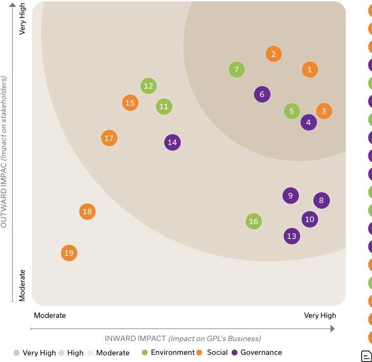

**[Image: AnnualReport2025.pdf-0033-21.png (725x706, 51.0KB)]**

<!-- Start of picture text -->
2 7 1 12 6 15 11 5 3 4 17 14 9 8 18 16 10 13 19 Moderate Very High INWARD IMPACT (Impact on GPL’s Business) Very High High Moderate Environment Social Governance Very High OUTWARD IMPAC (Impact on stakeholders) Moderate <!-- End of picture text -->

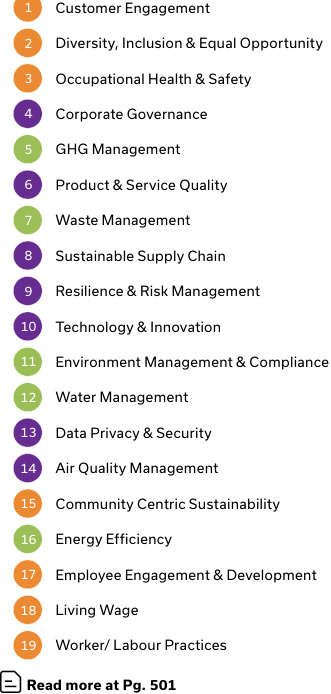

**[Image: AnnualReport2025.pdf-0033-22.png (331x694, 55.2KB)]**

<!-- Start of picture text -->
1 Customer Engagement 2 Diversity, Inclusion & Equal Opportunity 3 Occupational Health & Safety 4 Corporate Governance 5 GHG Management 6 Product & Service Quality 7 Waste Management 8 Sustainable Supply Chain 9 Resilience & Risk Management 10 Technology & Innovation 11 Environment Management & Compliance 12 Water Management 13 Data Privacy & Security 14 Air Quality Management 15 Community Centric Sustainability 16 Energy Efficiency 17 Employee Engagement & Development 18 Living Wage 19 Worker/ Labour Practices Read more at Pg. 501 <!-- End of picture text -->

58 GRI 3-1, 3-2, 3-3 

59 

GODREJ PROPERTIES LIMITED 

INTEGRATED REPORT 2024-25 

### **BUILDING SHARED FUTURES** 

###### **ABOUT OUR STAKEHOLDER ENGAGEMENT PLAN** 

Understanding our stakeholders is critical to the long-term success of our business. Regular engagement with them helps to shape our strategy and ultimately informs our decisions so that we can deliver outstanding places and positive outcomes for all stakeholders. 

Our stakeholder engagement process reflects our commitment to inclusivity and transparency. We have instituted a structured approach to ensure meaningful interactions with all stakeholders, which encompasses the following key steps. 

###### **STAKEHOLDER IDENTIFICATION** 

###### **STAKEHOLDER PRIORITISATION** 

###### **STAKEHOLDER ENGAGEMENT PLAN** 

We identify individuals and groups who are impacted by or can impact our operations. 

We assess and rank stakeholders based on their influence, dependence, and relevance to GPL. 

We develop tailored engagement plans to address the specific needs and expectations of each stakeholder group. 

###### **ENGAGING LOCAL COMMUNITY STAKEHOLDERS** 

To ensure meaningful participation, we support capacitybuilding initiatives that help local stakeholders effectively engage with the company. 

We conduct Environmental and Social Impact Assessments (ESIAs) at all project sites to evaluate potential effects on surrounding communities and ecosystems. These include localised stakeholder impact assessments to identify specific social, economic, and environmental concerns, forming the basis for targeted mitigation plans. 

We regularly conduct perception surveys and community reviews to evaluate the effectiveness of our engagement strategies and identify emerging issues. These are supplemented by direct meetings with community representatives to ensure concerns are promptly addressed. 

To foster transparency and trust, we have established clear and accessible communication channels with local stakeholders. These include structured community meetings, consultations, surveys, CSR initiatives, and awareness Programmes. Project-related information is shared proactively in a clear, timely, and culturally appropriate manner. 

All grievances are tracked through a formal mechanism that ensures timely resolution and continuous improvement. Our stakeholder engagement Programmes are applied consistently across all local operations, reinforcing our commitment to inclusive, responsible, and responsive development. 

We actively encourage feedback through multiple contact points—such as email, helplines, and inperson interactions—outlined in our publicly available Stakeholder Engagement Policy. 

60 

61 

GRI 2-25, 2-29 

GODREJ PROPERTIES LIMITED 

INTEGRATED REPORT 2024-25 

**WHY ARE THEY COMMUNICATION TOP MATERIAL IMPORTANT? CHANNELS TOPICS EMPLOYEES** They drive our growth and innovation, shaping Townhall meetings and podcasts, intranet portal, • • Diversity, Inclusion & Equal OpportunityOccupational Health  & Safety the company’s culture newsletters, cultural events, • Resilience & Risk Management and delivering on our internal surveys, training, and • Technology & Innovation strategic goals. performance management • Environment Management & Compliance systems. • Data Privacy & Security • Employee Engagement & Development • Living Wage **WORKERS** They are the backbone of our execution, ensuring Engagement workshops, newsletters, customer • • Occupational Health  & SafetyWorker/ Labour Practices timely, safe, and efficient feedback channels including project completion Net Promoter Scores (NPS). through their dedication and skill. **COMMUNITIES** As the ecosystems around our Community meetings, surveys, stakeholder • • Corporate GovernanceResilience & Risk Management developments, local consultations, CSR initiatives, • Environment Management & Compliance communities’ wellawareness programmes. • Community Centric Sustainability being and progress are integral to our long-term sustainability and impact. **CONTRACTORS** Their efficiency and precision in construction Meetings and personal interactions. • • Occupational Health  & SafetyWorker/ Labor Practices bring our vision to life, • Environment Management & Compliance ensuring the timely and • Sustainable Supply Chain seamless delivery of projects. **INVESTORS** Their confidence fuels our strategic growth, In-person interactions, investor meetings. • • Product & Service QualitySustainable Supply Chain enabling us to expand, • Resilience & Risk Management innovate, and create • Technology & Innovation long-term value. • Environment Management & Compliance • Data Privacy & Security 

||**WHY ARE THEY** **IMPORTANT?**|**COMMUNICATION** **CHANNELS**|**TOP MATERIAL** **TOPICS**|
|---|---|---|---|
|**CUSTOMERS**|Their trust and satisfaction define our success, inspiring us to build high-quality, sustainable spaces that enhance their lives.|Engagement meetings, site- level campaigns.|• Customer Engagement • Environment Management & Compliance • Product & Service Quality • Technology & Innovation • Data Privacy & Security • Community Centric Sustainability|
|**GOVERNMENT** **BODIES AND** **REGULATORY** **AGENCIES**|Their policies and frameworks guide responsible growth, ensuring compliance and alignment with national development goals.|Meetings and personal interactions.|• Corporate Governance • Sustainable Supply Chain • Resilience & Risk Management • Environment Management & Compliance • Data Privacy & Security • Community Centric Sustainability|
|**JOINT** **VENTURE** **PARTNERS**|Their collaboration enhances our capabilities, helping us scale faster, enter new markets, and create mutual value.|Workshops, meetings, and personal interactions.|• Corporate Governance • Environment Management & Compliance • Sustainable Supply Chain • Product & Service Quality|
|**CONSULTANTS**|Their expertise in design, engineering, and strategy strengthens our projects, ensuring excellence in execution.|Workshops, meetings, and personal interactions.|• Corporate Governance • Resilience & Risk Management • Technology & Innovation • Environment Management & Compliance|
|**SUPPLIERS**|They provide the critical materials and technologies that power our developments, reinforcing our commitment to quality and sustainability.|Feedback surveys and personal interactions.|• Sustainable Supply Chain • Environment Management & Compliance • Worker/ Labour Practices|

62 GRI 2-16 

63 

INTEGRATED REPORT 2024-25 

**[Image: AnnualReport2025.pdf-0036-01.png (226x13, 7.5KB)]**

<!-- Start of picture text -->
GODREJ PROPERTIES LIMITED <!-- End of picture text -->

###### **Allotment Committee** 

Mr. Pirojsha Godrej Mr. Gaurav Pandey 

###### **Environmental, Social and Governance (ESG)** **<u>Committee</u>** 

Mr. Pirojsha Godrej <u>(Chairperson)</u> Mr. Gaurav Pandey Dr. Indu Bhushan Ms. Sutapa Banerjee 

###### **Management Committee** 

Mr. Pirojsha Godrej Gaurav Pandey 

###### **Audit Committee** 

Dr. Indu Bhushan (Chairperson) Ms. Sutapa Banerjee Ms. Jayashree Vaidhyanathan Mr. Sumeet Narang 

###### **Nomination & Remuneration Committee** 

### **INTEGRITY IN ACTION** 

**[Image: AnnualReport2025.pdf-0036-12.png (81x17, 4.0KB)]**

<!-- Start of picture text -->
Godrej One <!-- End of picture text -->

###### **GPL COMMITTEES** 

Our Corporate Governance framework is designed to foster sustainable and transparent growth, while consistently generating economic value and safeguarding the interests of all stakeholders. We champion fair and transparent business practices through a well-structured corporate governance framework that not only guides ethical decisionmaking but also ensures active and inclusive engagement with all stakeholders. 

Eight board-led committees provide strategic oversight across critical focus areas, shaping corporate direction, ensuring effective implementation, and monitoring performance, risk, and policy adherence. The Board of Directors recognises that diversity is integral to long-term success, and currently comprises seven members with varied geographic origins, age groups, genders, ethnicities, cultural backgrounds, professional skills, and industry expertise, enhancing GPL’s agility and competitiveness. 

The Board of Directors plays a central role in ensuring effective governance, overseeing the implementation of strategic decisions, and maintaining a culture of accountability across the organisation. By prioritising fairness in our interactions with regulators, employees, customers, vendors, investors, and the broader community, we reinforce our commitment to responsible corporate citizenship. 

During the financial year, the Board met four times, following a structured and outcome-oriented agenda. We remain committed to maintaining at least 50% independent representation on the Board and enforce a minimum 50% attendance requirement for all board members to uphold accountability and effective governance. 

As a publicly listed entity, GPL rigorously complies with the corporate governance norms prescribed by the National Stock Exchange of India and the Securities and Exchange Board of India (SEBI), including the appointment of independent directors to its Board, further strengthening our dedication to oversight, transparency, and stakeholder trust. 

###### **Corporate Social Responsibility (CSR)** **<u>Committee</u>** 

Ms. Sutapa Banerjee (Chairperson) Dr. Indu Bhushan Ms. Jayashree Vaidhyanathan Mr. Sumeet Narang 

Mr. Pirojsha Godrej <u>(Chairperson)</u> Mr. Gaurav Pandey Dr. Indu Bhushan Ms. Sutapa Banerjee 

###### **<u>Stakeholders' Relationship Committee</u>** 

Ms. Sutapa Banerjee (Chairperson) Mr. Pirojsha Godrej Mr. Gaurav Pandey 

###### **Risk Management Committee** 

Mr. Pirojsha Godrej <u>(Chairperson)</u> Mr. Gaurav Pandey Dr. Indu Bhushan Ms. Sutapa Banerjee Mr. Rajendra Khetawat 

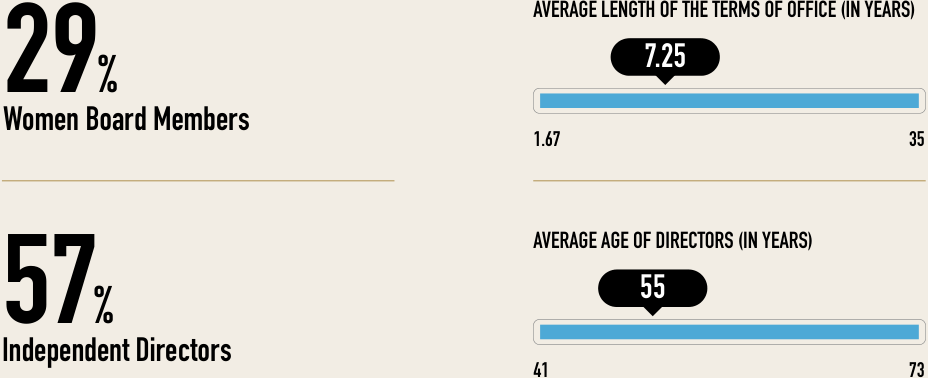

**[Image: AnnualReport2025.pdf-0036-26.png (928x378, 28.7KB)]**

<!-- Start of picture text -->
AVERAGE LENGTH OF THE TERMS OF OFFICE (IN YEARS) 7.25 29% Women Board Members 1.67 35 AVERAGE AGE OF DIRECTORS (IN YEARS) 55 57% Independent Directors 41 73 <!-- End of picture text -->

64 GRI 2-9, 2-24,2-26, 3-3, 406-1 

65 

GODREJ PROPERTIES LIMITED 

INTEGRATED REPORT 2024-25 

###### **ESG GOVERNANCE** 

ESG governance is anchored in a multi-tiered structure that ensures strategic oversight, operational accountability, and organisation-wide engagement. At the apex sits the Board-level ESG Steering Committee, which provides high-level direction and oversight on sustainability priorities, social issues and climate risks. 

Reporting into this Board Committee is the Executive ESG Committee, chaired by the Chief Design and Sustainability Officer. This crossfunctional committee drives the integration of ESG goals, such as climate risk management, social equity, and ethical governance, into business strategy and operations. 

The Executive Committee is supported by specialised ESG team lead by the ESG head focused on areas like Climate Action, ESG Reporting, Human Rights, and Employee Engagement. ESG performance is regularly reviewed through structured reporting cycles, with ESG-linked KPIs embedded into leadership performance evaluations and incentives, covering themes such as energy efficiency, health & safety, talent development, and stakeholder satisfaction. 

This tiered model enables cross-functional collaboration, aligns ESG priorities with business objectives, and reinforces GPL’s commitment to transparent, responsible, and sustainable growth. 

We have a robust process to identify, assess, address and report transparently on actual and potential human rights risks across our business and enable us to remediate any adverse impact it has or could cause. We acknowledge that human rights due diligence is an ongoing process, requiring particular attention during critical phases of our business operations. As a result, we regularly review the risk mapping of potential issues, adjust our processes and integrate the requirements with our policies. We are committed to remedying any impact on human rights during our business operations. 

We conducted Human Rights Self-Assessment (HRSA) across all active project sites (including own operations, contractors and joint ventures) in reporting boundary and GPL offices, following GPL’s Human Rights Policy and the guidelines set forth by the United Nations on Human Rights. External third-party audits were undertaken across 7 sites on our internal human rights processes 

and no instances of noncompliance were found across our sites, thereby obviating the necessity for remedial actions. However, minor observations were noted and were addressed. 

###### **FREEDOM OF ASSOCIATION** 

We fully respect and uphold the right to freedom of association as a fundamental human right to our employees and workers. We recognise our employees’ right to form, join, or refrain from joining trade unions or other lawful associations of their choosing, in accordance with applicable laws and international labour standards. We are committed to ensuring that all employees can exercise this right without fear of discrimination, retaliation, or interference. However, there are no employees involved in any trade unions or other associations. 

###### **HUMAN RIGHTS: CHAMPIONING EQUALITY** 

We uphold human rights as a fundamental principle, embedding it across our operations, workforce, independent contractors, supply chain, and stakeholder engagements. Our commitment policies align with global frameworks, including the Universal Declaration of Human Rights, the International Labour Organisation’s Declaration on Fundamental Principles and Rights at Work, as well as United Nations human rights guidelines. Our Human Rights policy applies to our operations and the entities in which we own a majority interest. We are dedicated to ensuring that all rightsholders, including our employees, contract workers, suppliers, communities around our operations, consumers, and customers, are well informed about our commitment and know how to report any violations. We also have a Supplier Code of Conduct that outlines the ethical and responsible business practices for our suppliers. 

We prohibit the employment of individuals under the age of 18 years. We forbid the use of all forms of force in the workplace. 

Further we prohibit child, adolescent, bonded or compulsory labour, including any form of human trafficking. 

Through rigorous due diligence, we assess and mitigate human rights risks across our value chain, extending protections to employees, contractual workers, construction labourers, and supply chain partners. 

We have implemented mandatory training on critical human rights aspects, such as Prevention of Sexual Harassment (POSH) and antidiscrimination policies, reinforcing our commitment to ethical workplace practices. 

We assess and identify actual and potential human rights impacts by regularly organising systematic human rights risk assessments covering our own operations, value chain and business relations like joint venture entities in which we own a majority interest.  In addition to our own employees and contract workers, the due diligence process covers vulnerable groups and focusses on individuals and groups who are at higher risk due to their vulnerability or marginalisation. This includes migrant workers, children, women, sexual and gender minorities, ethnic and racial groups, persons with disability and indigenous people. The human right assessment covers various human rights issues which include: 

- Child labour 

- Working hours, wages and leaves 

- Forced labour 

- Fair treatment and equal remuneration 

- Discrimination 

- Community impact 

- Freedom of Association 

- Collective bargaining 

- Health and Safety 

###### **CORPORATE CODE OF POLICIES** 

To maintain compliance with legal and ethical standards, we have implemented a set of corporate codes and policies as listed below. All codes and policies are approved by the board of the directors and reviewed regularly to ensure alignment with widely accepted industry standards. 

###### **CODE OF CONDUCT** 

Ethical conduct is fundamental to our 

organisation's success. Our Code of Conduct (CoC) acts as a guide, directing every employee, board member, and senior leader toward principled behaviour. The Code governs: Vendor/Suppliers , Practices and Procedures for Fair, Disclosure of Unpublished Price Sensitive Information , Board of Directors and Senior Management and Employees. 

###### **Reporting of Breach of Code of Conduct** 

All employees, irrespective of their employment status (full-time, part-time, or daily wage) or role (permanent, temporary, ad hoc, consultant, probationary, trainee, or intern), are responsible for promptly reporting any breach, whether direct or indirect, of the Code of Conduct (CoC). 

This report should be made to their manager, Business Head, HR department, or designated whistleblowing officer. 

###### Consequences of Violations 

Any individual found to have violated the CoC or engaged in fraudulent activities will be subject to immediate termination from the organisation. 

In such instances, a First Information Report (FIR) will be filed at the local police station, and necessary steps will be taken to recover the fraudulent amount. 

The names of individuals involved in fraudulent activities will be communicated internally through official channels, informing all employees of their termination. 

Furthermore, the name(s) of the individual(s) will be publicly disclosed in local newspapers to notify external stakeholders of our disassociation with them. Details will be shared as deemed necessary. 

**Click here to read more** 

https://www.godrejproperties.com/investorsgovernance -leadership 

- Worker welfare 

66 GRI 2-12, 2-13, 2-14, 2-23, 413-1, 413-2, 407-1, 408-1, 409-1, 410-1, 411-1 

67 

GRI 2-28, 205-2 

GODREJ PROPERTIES LIMITED 

INTEGRATED REPORT 2024-25 

**[Image: AnnualReport2025.pdf-0038-02.png (84x28, 1.3KB)]**

<!-- Start of picture text -->
Policies <!-- End of picture text -->

> Code of Conduct for Code of Conduct for 

> Vendors/Suppliers Practices and Procedures for Fair Disclosure of Unpublished Price Sensitive Information 

Code of Conduct for the Code of Conduct Board of Directors and for Employees Senior Managment 

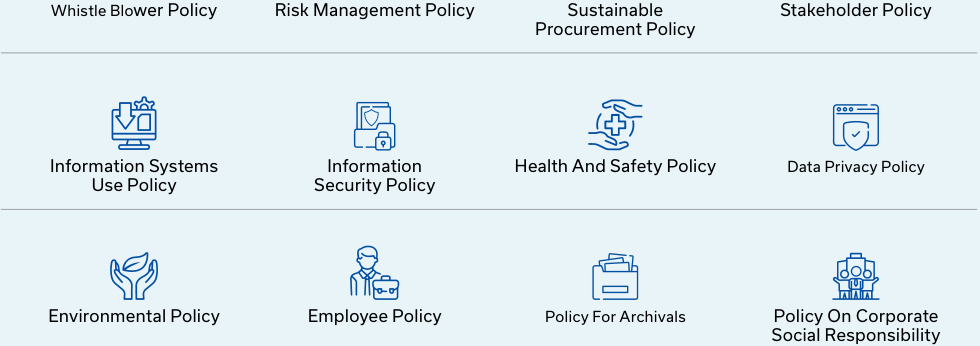

**[Image: AnnualReport2025.pdf-0038-05.png (980x346, 43.2KB)]**

<!-- Start of picture text -->
Whistle Blower Policy Risk Management Policy Sustainable  Stakeholder Policy Procurement Policy Information Systems  Information  Health And Safety Policy Data Privacy Policy Use Policy Security Policy Environmental Policy Employee Policy Policy For Archivals Policy On Corporate Social Responsibility <!-- End of picture text -->

Policy On Dividend Policy On Determination Diversity, AntiExecutive Health Distribution-Oct 2016 Of Materiality Of Events Discrimination And Equal Check-Up Policy Opportunities Policy Anti-Sexual GPL Human Rights Policy Policy On Related Nomination And Harassment Policy Party Transactions Remuneration Policy Gender Affirmation Policy Policy For Determining Tax Policy Material Subsidiary 

###### **Click here to read more** 

https://www.godrejproperties.com/investors/governance-leadership 

If any Policy or Code of Conduct is breached, strict disciplinary action is taken, regardless of the indivisual's position. 

discrimination, corruption, and bribery. There were zero cases of corruption, non-monetary sanction, non-compliance with social, economic laws and through dispute resolution mechanism. There were no significant fines and non-monetary sanctions for non- compliance with environmental laws in FY 24-25. 

###### **COMPLIANCE MANAGEMENT SYSTEM** 

We place strong emphasis on legal and regulatory compliance as a cornerstone of responsible and ethical business conduct. To support this, we leverage Legatrix, an advanced IT-enabled legal compliance platform that equips our management with a centralised dashboard for real-time visibility into the company’s compliance landscape. 

###### **ANTI-CORRUPTION** 

We recognise that corruption, including bribery in all forms poses significant risks with potentially severe consequences for our business and stakeholders. Our Code of Conduct comprehensively outlines our approach to anti-bribery and anti-corruption, serving as a central guide for all employees, directors, and third-party partners. To proactively address this, we have established a comprehensive Anti-Corruption Compliance Programme, which serves as a robust framework to prevent, detect, and respond to compliance-related concerns. This programme is a key component of our broader strategy to combat financial crimes and uphold ethical standards. 

This platform enhances governance by issuing timely reminders, tracking post-filing documentation, mapping applicable regulatory requirements, and maintaining a secure repository for compliance-related records. Our commitment extends to social and economic compliance, with no reported instances of non-compliance related to these parameters during the reporting period. 

To ensure the effectiveness and integrity of our compliance framework, it is regularly audited by our Assurance Partner, reinforcing our dedication to transparency, accountability, and continuous improvement. 

It explicitly prohibits offering, accepting, or soliciting bribes or improper advantages, whether through gifts, services, cash equivalents, discounts, loans, or any other item of value that could unduly influence business decisions. We strictly govern political contributions, charitable donations, and sponsorships to prevent their misuse as indirect forms of bribery. These activities are permitted only under defined policies and are subject to transparency, disclosure, and review to ensure full compliance with legal and ethical norms. 

###### **ETHICS AND COMPLIANCE** 

We believe that embedding ethical conduct across all levels of the organisation is essential for effective operations, risk mitigation, and long-term value creation. A strong ethical foundation enhances our reputation, builds customer and employee loyalty, and strengthens investor confidence. 

We uphold a culture of integrity, accountability, and transparency through a comprehensive set of governance and ethics policies that guide behaviour across the business. These policies serve as moral benchmarks, ensuring decisions align with our values and contribute to positive social, environmental, and economic outcomes. We have zero Tolerance against 

Oversight of this Programme is led by the Board of Directors and Senior Management, who ensure its alignment with global best practices and applicable regulations. Through this commitment, we reinforce its dedication to integrity, transparency, and responsible corporate conduct. 

###### **Key Aspects of The Anti-Corruption Compliance Programme** 

**Prevention Legal Honesty and Employee and Detection Compliance Fairness Training** The Anti-Corruption We ensure our Our commitment to GPL provides Compliance compliance processes honesty and fairness comprehensive antiProgramme align with local laws is central, promoting corruption training during proactively prevents and regulations, ethical conduct and employee orientation, corrupt practices emphasising non transparency in all ensuring understanding business transactions. of responsibilities through regular negotiable adherence assessments, audits, to legal standards. and contributing and risk evaluations to to a corruptionidentify vulnerabilities. free environment. 

68 

GRI 205-1, 206-1 69 

GODREJ PROPERTIES LIMITED 

INTEGRATED REPORT 2024-25 

###### **WHISTLEBLOWER MECHANISM** 

- The whistleblower platform is managed independently by a third party 

The Whistleblowing mechanism provides a platform where instances of code breaches, discrimination, harassment, or safety concerns can be reported anonymously. During the quarterly meetings of the Audit Committee, the Board of Directors is informed of every complaint. 

- The whistleblowing platform allows for anonymous submission of complaints. All complaints and identities of whistleblowers are handled with the utmost confidentiality, in accordance with the wishes of the complainant. 

A robust whistleblower mechanism is a cornerstone of ethical and transparent governance within any organisation. It fosters a culture of accountability and integrity by providing employees, stakeholders, and other parties with a secure and trustworthy avenue to report any unethical, illegal, or unsafe behaviour. The salient features of our whistleblowing mechanism are highlighted below: 

   - The whistleblower policy has a strict zero-tolerance policy against any form of retaliation towards whistleblowers. Any form of discharge, threat, discrimination, or other adverse action against a whistleblower is strictly prohibited. 

   - To ensure effective utilisation of the whistleblower mechanism, regular training Programmes are conducted for all employees. These sessions cover the purpose of the mechanism, how to access the reporting platform, and the protections afforded to whistleblowers. 

- We have a dedicated Whistleblower Officer for managing whistleblower complaints. 

- The whistleblowing mechanism provides a platform where instances of code violations, discrimination, harassment, or safety concerns can be reported. 

   - The process for investigating reports is clearly defined within the whistleblower policy. Each report is assessed promptly, and investigations are carried out in an unbiased and systematic manner. Findings are documented, and appropriate corrective actions are taken based on the outcomes of each investigation. 

- There are four ways of reaching out to the whistle blowing platform: telephone, Email, Web Portal and Chat bot. 

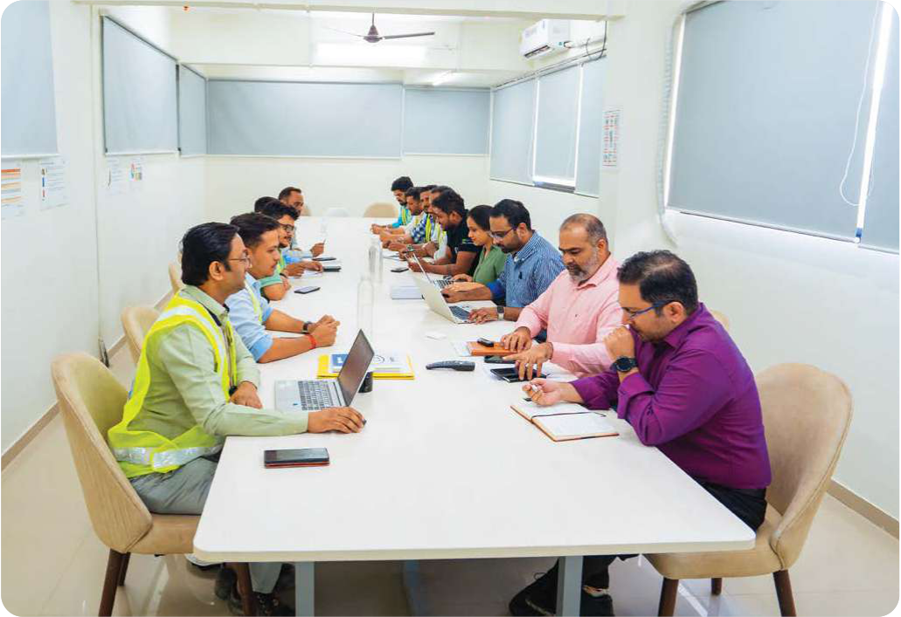

**[Image: AnnualReport2025.pdf-0039-13.png (1031x707, 886.5KB)]**

###### **PROTECTING SYSTEMS AND NETWORKS FROM CYBER THREATS** 

We uphold a strong cybersecurity framework through proactive measures and strict adherence to GILAC’s security policies: 

###### **Cybersecurity Awareness Training** 

###### **Compliance with ISMS Policy** 

###### **Risk Assessments** 

Annual risk assessments help identify and address vulnerabilities, ensuring critical security controls are prioritised. 

GILAC conducts annual cybersecurity training, ensuring GPL employees are wellequipped to recognise and mitigate potential cyber threats. 

We rigorously follow GILAC’s Information Security Management System (ISMS) policy, which is regularly updated and clearly communicated to all users. 

###### **Clear Escalation Protocol** 

###### **Internal IT Audits** 

We conduct annual internal audits to evaluate the effectiveness of IT controls and maintain system integrity. 

Employees are provided with a well-defined escalation process to report suspicious activities, strengthening our overall security posture. 

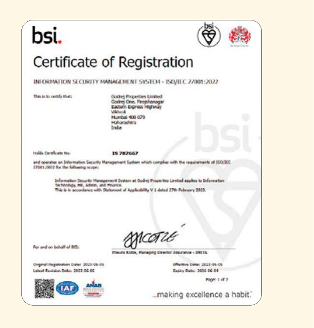

**[Image: AnnualReport2025.pdf-0039-26.png (645x674, 217.4KB)]**

###### **TAILORED TRAINING AND AWARENESS** 

We prioritise quality as the foundation of our management approach, driving data-led innovation in renewable energy, smart technology, and resource management. We continuously test new ideas through pilot projects, refining and scaling those that demonstrate tangible impact, ensuring our solutions remain effective and forward-thinking. 

In our commitment to safeguarding information security, Godrej Industries Limited and Associated Companies (GILAC) have implemented a mandatory Information Security Incident Management Process. This structured framework enables us to detect, classify, mitigate, and manage security incidents with precision, supported by key performance indicators to enhance efficiency. The policy applies to all GILAC employees and contractors, including our teams at GPL, who rely on our resources, networks, and technology for IT-related activities. 

Comprehensive training and awareness initiatives are provided to all employees, addressing the current cyber security threat landscape. 

###### **ISO 27001:2022 Certification** 

**100%** Target users completed Cybersecurity trainings 

Achieved for our Information Security Management System (ISMS 

70 

71 

GRI 2-16 

GODREJ PROPERTIES LIMITED 

INTEGRATED REPORT 2024-25 

###### **RISK GOVERNANCE STRUCTURE** 

### **ANTICIPATING TOMORROW'S CHALLENGES** 

We are cognisant that risks represent potential events or circumstances that could impact our operations, financial performance, reputation, or stakeholders. The objective of our risk management is to establish a risk-aware and risk-intelligent culture that supports decision-making and helps improve performance. 

###### **WHERE RISKS ARISE** 

**The risk classification at GPL categorises risk into 4 categories based on the source where it stems from:** 

###### **Operational Challenges** 

###### **External Environment Risks** 

These risks arise from the day-to-day execution of construction and project management activities, including site safety, contractor performance, supply chain disruptions, quality control, and adherence to timelines and regulatory requirements. Prompt risk management is vital for seamless operations. 

These arise from economic, market, geopolitical, or regulatory changes beyond our control. We prioritise identifying, analysing, and evaluating these risks for effective management. 

###### **Sustainability Concerns** 

###### **Financial Volatility** 

These relate to financial activities and reporting, like liquidity, interest rates, and credit. Active monitoring and management are crucial for financial stability. 

These cover ESG factors impacting operations and reputation. This includes factors such as climate risks, rising temperature, biodiversity loss, employee welfare, and community involvement. Integrating sustainability into risk management fosters responsible business practices. 

We have implemented a strong and structured risk governance framework to ensure that potential risks are systematically identified, evaluated, and managed. 

###### **Board Level Oversight** 

Our Board has the overarching responsibility for the governance of risk management, including its strategic alignment and effective implementation, with support from the Risk committee. Our Risk Committee, at the board level, comprises of Independent Directors. We have adopted the three lines of defence model as a framework for risk governance. This model is structured to mitigate conflicts of interest and to uphold independent oversight of risk management activities. 

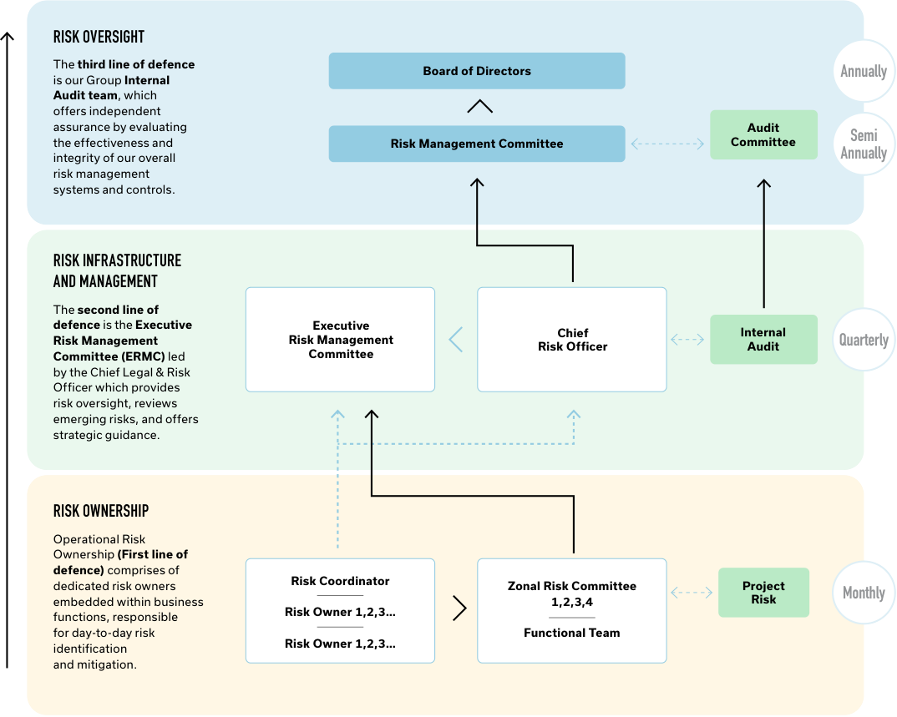

**[Image: AnnualReport2025.pdf-0040-18.png (1074x859, 110.2KB)]**

<!-- Start of picture text -->
RISK OVERSIGHT The  third line of defence is our Group  Internal  Board of Directors Annually Audit team , which offers independent assurance by evaluating  Audit the effectiveness and  Risk Management Committee Committee Semi integrity of our overall  Annually risk management systems and controls. RISK INFRASTRUCTURE AND MANAGEMENT The  second line of defence  is the  Executive  Executive Chief   Internal Risk Management  Risk Management   Risk Officer Audit Quarterly Committee (ERMC)  led  Committee by the Chief Legal & Risk Officer which provides risk oversight, reviews emerging risks, and offers strategic guidance. RISK OWNERSHIP Operational Risk Ownership  (First line of defence)  comprises of dedicated risk owners embedded within business  Risk Coordinator Zonal Risk Committee 1,2,3,4 Project  Risk Monthly Risk Owner 1,2,3… functions, responsible for day-to-day risk  Functional Team identification   Risk Owner 1,2,3… and mitigation. <!-- End of picture text -->

An effective risk management framework requires consistent processes for assessment, risk response, monitoring and communication of risk issues across the Company. We take a strategic approach to risk management by evaluating a broad spectrum of risk categories, including external business dynamics, operational challenges, financial exposures, and sustainability-related issues. This proactive assessment enables us to anticipate potential disruptions and implement effective mitigation strategies. 

72 

73 

GRI 2-25, 3-3 

GRI 2-12,2-15 

GODREJ PROPERTIES LIMITED 

INTEGRATED REPORT 2024-25 

###### **RISK MANAGEMENT APPROACH** 

We follow a proactive and structured approach to risk management, embedding it deeply within our strategic and annual business planning cycles. This ensures that risk oversight evolves in tandem with our business priorities and external landscape. 

###### **RISK MANAGEMENT OBJECTIVES** 

The objective of risk management at GPL is to establish a risk aware and risk-intelligent culture that supports decision-making and helps improve performance. An effective risk management framework requires consistent processes for assessment, risk response, monitoring and communication of risk issues across the Company. The ERM Manual provides a structured and disciplined approach to the risk management process to facilitate informed 

decision-making on risks, with specific objectives mentioned below: 

**[Image: AnnualReport2025.pdf-0041-07.png (78x20, 1.1KB)]**

<!-- Start of picture text -->
Mitigate <!-- End of picture text -->

###### **Identify Risks** 

**Continuous** 

###### **Report** 

###### **Prioritise** 

###### **Monitoring** 

Identify Material and Emerging Risk 

Periodic Reporting and Updates to the Risk Management Committee 

Prepare Mitigation Prioritise Based on a Plans, Responsibilities Risk Scoring Matrix and Consider Residual That Considers Both Risks Probability and Severity 

Monitor Risk Management and Internal Controls Regularly to Ensure Effectiveness 

###### **RISK APPETITE** 

Risk appetite forms a foundational part of our risk management approach. It defines the level and type of risk we are willing to accept in pursuit of our strategic and operational objectives. For each identified risk, we assess its potential impact and likelihood, and evaluate it against our predefined appetite thresholds, ranging from zero to high tolerance.  Risk appetite levels are determined in alignment with business goals and are embedded into the annual risk assessment cycle, guiding the development of mitigation plans and influencing the review process by the Risk Management Committees. By integrating risk appetite into our governance framework, we ensure a balanced approach, encouraging innovation and growth while safeguarding organisational resilience. 

vulnerabilities across all business functions. These exposures are assessed biannually and shared with the Risk Management Committee, along with corresponding mitigation plans and actions. Additionally, we carry out internal risk audits periodically and as and when necessary, complemented by annual audits conducted by our Corporate Audit team to ensure oversight and continual improvement. 

The risk assessment function is structurally independent of business and is overseen and coordinated by the central corporate audit function. The risk assessment outcomes fall under the ownership of the respective business function heads. This collaborative approach ensures a comprehensive and efficient risk management strategy across the organisation. 

We conduct regular reviews of our company’s risk exposure to maintain a clear view of potential 

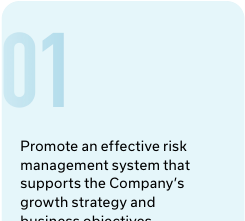

**[Image: AnnualReport2025.pdf-0041-22.png (245x221, 8.9KB)]**

<!-- Start of picture text -->
01 Promote an effective risk management system that supports the Company’s growth strategy and <!-- End of picture text -->

**01 02 03 04** 

Promote an effective risk management system that supports the Company’s growth strategy and business objectives. 

Strengthen the business's capacity to recognise its most important resources and put strategies in place to protect and strengthen them. 

Improve institutional decisionmaking by giving senior management and Board of Directors timely and accurate information that helps them better comprehend the risks and possibilities at the enterprise level. 

Enhance the company's capacity to achieve its legal, regulatory, and policy compliance obligations. 

**05 06 07** 

**08** 

Proactively identify Strengthen the potential opportunities and organisation's capacity risks in order to prepare for to comprehend and future breakthroughs and control risk exposures obstacles. and establish a culture of responsible risk-taking. 

Establish a process to identify and assess risks that may impact the business continuity of the Company and define response recovery plans for such risks. 

Integrate opportunity and risk assessment analysis into the company’s periodic planning procedures (for example, strategic planning, annual budget cycle, etc.) 

###### **BUILDING RISK CULTURE** 

###### **Awareness** 

- We provide regular risk management education for all nonexecutive directors. 

- We use multiple channels and formats to raise awareness about key risks, distributing communication products via email and workplace platforms. 

- We provide information on cyber risks, data privacy, and compliance with regulations. 

###### **Training** 

- We conduct focused training on risk management principles throughout the organisation. 

- We organise workshops for key functions, such as general managers and to improve their understanding of risk-related issues. New managers are inducted on Enterprise Risk Management training. They are trained on inputs on risk definition, identification, rating, classification, prioritisation, mitigation, control, and review. 

###### **Drills and Tests** 

- We conduct periodic crisis management drills to simulate scenarios like fires, sabotage incidents, and falls from height. 

- We test business continuity plans, including information security, at least once a year. 

###### **New product Development** 

Risk is embedded in the new product development process through structured assessments at key milestones, such as concept validation, design, and go-to-market planning. Cross-functional teams evaluate potential risks related to market demand, regulatory compliance, supply chain, and execution feasibility. 

###### **Performance Metrics/ Incentives** 

Based on the nature of risks—such as operational, financial, or sustainability, etc.—employee performance metrics for the relevant business functions are defined, including associated financial incentive. 

###### **Stakeholder Communication** 

- We engage with stakeholders through comprehensive reports to communicate key risks, risk management measures, controls in place, and emerging risks. 

- We ensure stakeholders understand our risk landscape and mitigation efforts. 

74 

75 

###### **RISKS AND MITIGATION** 

A risk assessment matrix has been developed to evaluate and prioritise risks based on their potential impact and the organisation’s vulnerability. The table below highlights some of our key risks, including those identified as existing and emerging, along with their potential impacts, risk appetite, magnitude, and the corresponding mitigation measures either implemented or under development. 

Godrej Horizon, Mumbai RERA No: P51900078358 

|**Risk Category** **Key Risks**|**Risk and Description**|**Risk Appetite**|**Magnitude**|**Mitigation Plan**|**Risk Category** **Emerging Risks**|**Emerging Risk**|**Risk Description**|**Potential Impact on** **Business**|**Mitigation Action** **Plans**|
|---|---|---|---|---|---|---|---|---|---|
|**Operational** **Physical** **Transition** **Financial** 76|Labour Shortage – Shortage of skilled or unskilled labour affecting project timelines and cost efficiency. Flood Risk – Construction delays and asset damage due to flooding at project sites, especially during monsoon season. Regulatory Change – Shifts in RERA compliance, zoning laws, or environmental clearances increasing project cost and timelines. Interest Rate Volatility – Rise in borrowing costs impacting financing of ongoing and planned developments.|Moderate – Some delays may be tolerable in early stages, but long-term or large-scale disruptions can significantly impact delivery schedules.   Low – Flood events can cause severe financial and safety impacts, requiring stringent controls. Low – Regulatory non- compliance poses legal, reputational, and operational risks, so minimal tolerance is accepted. Moderate – Some exposure s acceptable as part of financing strategy, but extreme fluctuations need to be managed.|High High Medium to High Medium|Engage with multiple contractors, invest in labour welfare and workforce training, and maintain a buffer in project timelines. Engage with multiple contractors, invest in labour welfare and workforce training, and maintain a buffer in project timelines. Proactive compliance tracking, legal consultations, and early engagement with regulatory bodies. Hedge interest rate exposure, maintain diversified funding sources, and align financial strategy with market outlook.|**Societal** **Societal** **Technological** **Geopolitical**|Rising Inequality Involuntary Migration or Displacement Smart Infrastructure Vulnerabilities Urban Development Policy Shifts|Increasing socio-economic disparities in urban areas may lead to uneven housing access, civil unrest, or demand for inclusive urban development models.   Climate-related or economic displacement of populations may alter urban demand patterns and stress infrastructure in certain cities Growing reliance on IoT and digital systems in smart buildings raises risks of cyber breaches and infrastructure failures. Shifts in government policies related to land use, taxation, or construction regulations driven by political change or urban backlash.|May lead to demand concentration risk and requir the company to rethink pricin strategies, higher complianc costs, constraints on future project approvals , and address ESG expectations from investors and regulators . Could affect project viability in stressed regions or create sudden housing demand in others, requiring adjustment to project planning and community engagement. Could lead to tenant dissatisfaction, safety concerns, or regulatory push for stronger digital governan and cybersecurity protocols.   Could affect the project pipeline, increase complianc costs, or force sudden desig approvals changes, impactin timelines and ROI.|e g e . Develop inclusive housing strategies, engage with urban policymakers to shape balanced regulations that address inequality without stifling development, invest in local infrastructure, skilling Programmes, or health and education initiatives near project sites. s Monitor migration trends, plan developments in resilient locations, integrate social infrastructure in project design.   ce Invest in cybersecurity systems, conduct regular digital audits, train staff in data privacy protocols e n/ g Strengthen regulatory intelligence, engage with policy makers, ensure flexible design and business models. 77|

GODREJ PROPERTIES LIMITED 

INTEGRATED REPORT 2024-25 

## **CHAMPIONING CLIMATE POLICY THROUGH ADVOCACY** 

Our approach to public policy engagement and climate advocacy is grounded in our commitment to sustainability and responsible corporate citizenship. Recognising the far-reaching implications of climate change for our business and communities, we actively support policies aligned with the Paris Agreement and a just transition to a low-carbon economy. 

To ensure our lobbying efforts and trade association memberships reflect these objectives, we have instituted a structured, transparent governance framework that holds us accountable to both our climate goals and our stakeholders: 

###### **EXECUTIVE OVERSIGHT** 

Our public policy engagements are governed through a clearly defined framework with accountabilities extending to the relevant functional senior executive levels. The Managing Director & CEO plays a pivotal leadership role, including co-chairing the FICCI Committee on Urban Development and Real Estate, reinforcing our commitment at the strategic level. 

###### **POLICY POSITION STATEMENT** 

We have publicly articulated our support for the goals of the Paris Agreement, including limiting global warming to well below 2°C and pursuing efforts to limit it to 1.5°C. This position informs all our advocacy and policy engagement efforts. 

###### **MANAGEMENT SYSTEMS** 

A centralised and robust management system is in place to oversee lobbying activities and trade association memberships. This system includes detailed documentation of our engagements, representatives, financial contributions, and alignment with business and sustainability objectives. 

###### **MONITORING, REVIEW, AND ALIGNMENT PROCESSES** 

Our approach ensures transparency, consistency, and alignment with international climate goals through the following mechanisms: 

###### **Direct Lobbying Activities** 

All climate-related lobbying initiatives are reviewed regularly to ensure consistency with our climate strategy and the principles of the Paris Agreement. These activities are documented, monitored for effectiveness, and subject to internal oversight. 

###### **Trade Associations** 

We maintain a centralised database of all trade association memberships. This database includes information such as the purpose of the association, our representatives, membership costs, and the strategic value derived from participation. Regular reviews are conducted to evaluate continued alignment with our climate and business goals. 

###### **Misalignment Assessment and Response** 

We have established a clear framework to assess and address potential misalignments between the climate-related positions of trade associations and our own. Where discrepancies are identified, we engage constructively with the association to encourage alignment or consider withdrawing from the membership if alignment cannot be achieved. 

###### **Functional Oversight and Audit** 

Senior functional leaders are responsible for overseeing trade association memberships within their departments to ensure relevance and alignment with strategic objectives. In addition, our Internal Audit team conducts 

periodic reviews to verify compliance with internal policies and external regulatory requirements, ensuring transparency and ethical conduct. 

###### **TRANSPARENCY AND REPORTING** 

We are committed to transparent disclosure of our climate advocacy efforts. Our reporting includes details of our direct climate-related lobbying activities and positions and climate-related initiatives of the trade associations we are part of. We also continuously review how these engagements align with our climate policy. 

###### **GLOBAL COVERAGE AND PARTNERSHIPS** 

Our policy advocacy and engagement efforts towards climate policy support are consistent across all our operations. Our strategic partnerships with organisations such as the World Business Council for Sustainable Development (WBCSD) and FICCI are leveraged to promote collective action, industry innovation, and policy advancement toward a net-zero future. 

We affirm that we have made no financial contributions to any political party in FY 2024–25. We are members of the following affiliations with trade and industry chambers/ associations: 

- Confederation of Indian Industry (CII) 

- Indian Green Building Council (IGBC) 

- World Bank Council for Sustainable Development (WBCSD) 

- Federation of Indian Chambers of Commerce and Industry (FICCI) 

- Maharashtra Chamber of Housing Industry (MCHI) 

- Confederation of Real Estate Developers Association of India 

- National Safety Council 

- United Nations Global Compact (UNGC) 

- British Safety Council 

**[Image: AnnualReport2025.pdf-0043-36.png (361x109, 96.7KB)]**

<!-- Start of picture text -->
Godrej Meridien, Gurgaon RERA No: RC/REP/HARERA/GGM/393/125/2020/09 78 GRI 2-12, 2-23, 2-24, 3-3, 405-1 <!-- End of picture text -->

79 

GODREJ PROPERTIES LIMITED 

INTEGRATED REPORT 2024-25 

### **SUSTAINABILITY ACROSS VALUE CHAIN** 

Workforce Communities 

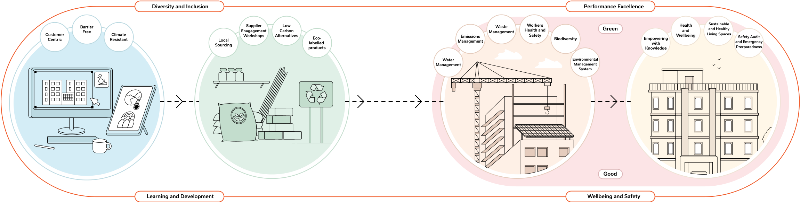

**[Image: AnnualReport2025.pdf-0044-04.png (2301x586, 245.4KB)]**

<!-- Start of picture text -->
Diversity and Inclusion Performance Excellence CustomerCentric BarrierFree ResistantClimate SourcingLocal EnagagementWorkshopsSupplier AlternativesCarbonLow productslabelled Eco- ManagementEmissions ManagementWaste Health andWorkersSafety Biodiversity Green EmpoweringKnowledgewith WellbeingHealthand Living Spacesand HealthySustainable and EmergencyPrerparednessSafety Audit Water Environmental Management Management System Good Learning and Development Wellbeing and Safety <!-- End of picture text -->

###### **DESIGN** 

###### **SOURCING OF MATERIALS** 

###### **CONSTRUCTION** 

###### **PROJECT HANDOVER** 

We implement customer-centric, inclusive designs that prioritise accessibility and resilience. Every project is thoughtfully planned to be barrier-free and climate-ready, ensuring comfort, safety, and adaptability for all users. 

GPL consciously chooses local, low-carbon materials and engage suppliers through workshops to promote sustainable practices. By prioritising eco-labelled products, we reduce environmental impact while strengthening community ecosystems. 

During construction, we rigorously implement our Environmental Management System. We manage waste, control emissions, conserve water, and protect biodiversity, ensuring every activity respects nature and supports our sustainability goals. 

At handover, we prioritise customer safety, well-being, and awareness. From safety audits to health-focused living spaces, homeowners are empowered with the knowledge to enjoy and follow a more sustainable lifestyle. 

###### **Read more at:** 

###### **Read more at:** 

###### **Read more at:** 

###### **Read more at:** 

###### **Customers at Pg. 174** 

**Navigating Climate Realities at Pg. 90** 

**Strengthening Supplier Synergies at Pg. 180 Integrity in Action at Pg. 64 Less Waste, More Wisdom at Pg. 112 Navigating Climate Realities at Pg. 90** 

**Energy Efficient by Design at Pg. 108 Preserving and Nurturing Bio-Diversity at Pg. 122 Strengthening Supplier Synergies at Pg. 180** 

**Customer First at Pg. 174** 

**[Image: AnnualReport2025.pdf-0044-22.png (59x59, 7.9KB)]**

**[Image: AnnualReport2025.pdf-0044-23.png (59x59, 7.1KB)]**

**[Image: AnnualReport2025.pdf-0044-24.png (59x59, 1.9KB)]**

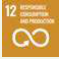

**[Image: AnnualReport2025.pdf-0044-25.png (59x59, 7.2KB)]**

**[Image: AnnualReport2025.pdf-0044-26.png (60x59, 6.0KB)]**

**[Image: AnnualReport2025.pdf-0044-27.png (60x59, 6.5KB)]**

**[Image: AnnualReport2025.pdf-0044-28.png (59x59, 7.5KB)]**

**[Image: AnnualReport2025.pdf-0044-29.png (59x59, 6.0KB)]**

**[Image: AnnualReport2025.pdf-0044-30.png (59x59, 7.9KB)]**

80 GRI 2-6, 2-24 

81 

GODREJ PROPERTIES LIMITED 

INTEGRATED REPORT 2024-25 

### **ALIGNMENT WITH SDGS** 

To assess the impact of its business operations on the environment and society, GPL conducts evaluations of key issues through a sustainability lens. The United Nations Sustainable Development Goals (UNSDGs) serve as a comprehensive framework that integrates the social, environmental, and governance aspects of sustainability. Guided by this framework, we identify the most pressing challenges and develop actionable solutions. 

**[Image: AnnualReport2025.pdf-0045-04.png (53x51, 5.8KB)]**

###### **Good Health and Well-Being** 

**Our Priorities Our Contribution Mapping with Material Themes Our Priorities** Our constructed portfolio is certified • Our Head Office at Godrej One, & Social Responsibility Products under IGBC Green Homes and Regional Office at Pune Office have People IGBC Green Residential Societies, been certified as IGBC - Health and promoting a sustainable lifestyle for Well Being Platinum certification. Our our customers. These developments offices in Gurgaon, Bengalaru and incorporate features such as thermal Kolkata are also certified with IGBC comfort and natural daylighting, health and well Being certification. reflecting our commitment to health, • Access to entitlements and well-being productivity, and overall well-being. for 207,271 construction workers. 

**[Image: AnnualReport2025.pdf-0045-07.png (53x51, 6.3KB)]**

###### **Quality Education** 

###### **Our Priorities Our Contribution** 

###### **Our Priorities** 

###### **Mapping with Material Themes** 

Our commitment lies in a **• 4,199** employees received Social Responsibility People people-centred HR strategy constructive feedback. that emphasises diversity, **• 43,750** total training hours rewards, career advancement, for employees. and continuous learning. We place special importance on **• 10.9** average training hours nurturing skilled people managers, per employee. recognising their key role in fostering a high-performance culture. 

**[Image: AnnualReport2025.pdf-0045-13.png (53x51, 1.9KB)]**

###### **Gender Equality** 

**Our Priorities Our Contribution** We are committed to ensuring • Achieved **35.2%** of Cis women in equitable representation of women total workforce. in our workforce. Our policies and **• 25.1%** women in STEM positions. programmes follow industry best practices to support the growth and **• 39.1%** women in revenue advancement of women employees generating positions. across all levels. 

|**Mapping with Material Themes** **Our Priorities**|
|---|

- Social Responsibility People 

**[Image: AnnualReport2025.pdf-0045-18.png (53x51, 5.2KB)]**

###### **Clean Water and Sanitation** 

**Our Priorities Our Contribution Mapping with Material Themes Our Priorities** We advance water conservation **• 76,299.75 kL** of water recycled. Environment Management Planet through collaboration with local communities, reduce groundwater usage by implementing efficient fixtures, and promote rainwater harvesting to ensure sustainable water management. 

**[Image: AnnualReport2025.pdf-0045-21.png (53x51, 5.9KB)]**

###### **Affordable and Clean Energy** 

- **Our Priorities Our Contribution Mapping with Material Themes Our Priorities** 

- We are committed to sustainable **• 100%** of projects are green certified Environment Management Planet practices, integrating technologies (IGBC Silver or equivalent) or like solar systems, and autounder certification. dimmable lights in parking areas **• 15%** renewable energy, significantly to reduce environmental impact reducing our energy usage, costs, and 

- and enhance efficiency across environmental impact. our facilities. 

**[Image: AnnualReport2025.pdf-0045-24.png (53x51, 6.0KB)]**

###### **Decent Work and Economic Growth** 

**Our Priorities Our Contribution Mapping with Material Themes Our Priorities** We advance diversity, equity, **• 32,500** workers benefitted through Social Responsibility People and inclusion through policies BoCW registration related programme Profit and initiatives, measuring their impact. Our collaborations • Diversity Ratio = 38.6% (Cis-women - 35.2 %, PwD – 1%, LGBTQIA+ - 2.4%) Processes with social platforms support dignity and equity for informal workers employed in the industry, reinforcing our commitment to an inclusive workplace. 

82 GRI 2-24 

83 

GODREJ PROPERTIES LIMITED 

INTEGRATED REPORT 2024-25 

**[Image: AnnualReport2025.pdf-0046-02.png (53x51, 5.9KB)]**

###### **Industry, Innovation and Infrastructure** 

**Our Priorities Our Contribution Mapping with Material Themes Our Priorities** We have expanded our sustainability **• 91%** Quality audit scores Innovation and Technology Profit commitment beyond building Supply Chain and Products certifications to include IGBC Green Residential Societies, Product Quality Processes covering the entire product life Risk Management cycle - from project launch to and Resilience post-handover -across our full development portfolio. 

**[Image: AnnualReport2025.pdf-0046-05.png (53x50, 1.6KB)]**

###### **Reduced Inequalities** 

**Our Priorities Our Contribution Mapping with Material Themes Our Priorities** We support social protection for • ` **2.16 Cr** spent to ensure the social Social Responsibility People workers through partnerships with protection of workers. NGOs and regulators, emphasising **• 295 Cr** of Government funds were registration under the Building unlocked cumulative till FY 24-25. and Other Construction Workers (BOCW) Act and access to various welfare schemes. 

**[Image: AnnualReport2025.pdf-0046-08.png (53x51, 6.0KB)]**

###### **Sustainable Cities and Communities** 

- **Our Priorities Our Contribution Mapping with Material Themes Our Priorities** 

- As a sustainable real estate **• 27%** of our suppliers for highSocial Responsibility People developer, we practice responsible emission materials, specifically those Risk Management 

- material procurement and engage related to Purchased Goods and and Resilience closely with our supply chain to Services, have set publicly disclosed systematically enhance resource decarbonisation targets. efficiency across construction sites. 

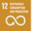

**[Image: AnnualReport2025.pdf-0046-11.png (53x51, 6.7KB)]**

###### **Responsible Consumption and Production** 

- **Our Priorities Our Contribution Mapping with Material Themes** 

- Currently, we are water positive • Water Recharged for every litre of Environment Management Planet through community management water withdrawn making us **25X** Supply Chain and Products projects. Responsible waste water positive. Product Quality management at our construction **• 99%** of Waste Recycled/Reused. sites enables us to channel waste into recycling value chains, creating additional value while minimising environmental impact. 

###### **Our Priorities** 

**[Image: AnnualReport2025.pdf-0046-15.png (53x51, 5.7KB)]**

###### **Climate Action** 

**Our Priorities Our Contribution Mapping with Material Themes Our Priorities** As part of our emissions reduction **• 33%** reduction in Scope 1 & 2 Environment Management Planet plan, we identified major emission emissions intensity from base year Risk Management hotspots in purchased goods within FY 20-21. and Resilience our supply chain and are committed to addressing them through the Science Based Targets initiative (SBTi) to advance climate action. 

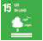

**[Image: AnnualReport2025.pdf-0046-18.png (53x51, 5.7KB)]**

###### **Life on Land** 

**Our Priorities Our Contribution Mapping with Material Themes Our Priorities** Afforestation and plantation across **• 6,227** trees planted in our Environment Management Planet all the four regions. operational areas. Products 

**[Image: AnnualReport2025.pdf-0046-21.png (53x51, 5.8KB)]**

###### **Peace, Justice and Strong Institutions** 

- **Our Priorities Our Contribution Mapping with Material Themes Our Priorities** 

- We conduct Human Rights Self• Our company wide Human Rights Stakeholder Engagement People Assessments at all our operational due diligence is applicable to: Own Governance, Ethics Partnerships project sites and offices. Our Human employees, Women, Children, and Compliance Rights Policy aligns with the United Contractual Employees, Supply chain. Nations Human Rights Guidelines, ensuring our commitment to upholding human rights standards. 

**[Image: AnnualReport2025.pdf-0046-24.png (53x51, 5.9KB)]**

###### **Partnerships** 

- **Our Priorities Our Contribution Mapping with Material Themes Our Priorities** 

- We foster strong partnerships • Memberships in trade associations Stakeholder Engagement People with government, industry, and and partnerships with the World Governance, Ethics Partnerships communities to drive sustainable Business Council for Sustainable and Compliance 

- development. Collaborative efforts Development and FICCI align with our enable resource sharing, innovation, GHG reduction targets to keep global and collective action towards warming below 1.5°C. achieving the UN SDGs effectively and inclusively. 

84 

GRI 305-5 85 

GODREJ PROPERTIES LIMITED 

INTEGRATED REPORT 2024-25 

###### **IN THIS SECTION** 

|Sustainability in Action|88|
|---|---|
|Navigating Climate Realities|90|
|Emission Management|102|
|Energy Efficient by Design|108|
|Less Waste, More Wisdom|112|
|Water Management|118|
|Preserving and Nurturing Bio-Diversity|122|

**GODREJ PROPERTIES LIMITED** 

**INTEGRATED REPORT 2024-25** 

### **SUSTAINABILITY IN ACTION** 

**[Image: AnnualReport2025.pdf-0048-03.png (170x98, 18.1KB)]**

**[Image: AnnualReport2025.pdf-0048-04.png (278x84, 25.7KB)]**

###### **SCIENCE-BASED TARGETS** 

###### **DOW JONES BEST-IN-CLASS INDICES** 

Our commitment to protecting the environment has been strengthened with the approval of our near-term emission reduction targets by the Science Based Targets initiative (SBTi). This endorsement shows that our climate goals are not just ambitious; they’re also based on solid scientific methods. It highlights our role in the global effort to tackle climate change and move towards a low-carbon future. 

We have been recognised in the 2025 Dow Jones Best-in-Class Indices. This honour highlights our commitment to excellence in environmental, social, and governance (ESG) practices. The Dow Jones Best-in-Class Indices assess companies using strict ESG criteria, covering areas like corporate governance, environmental management, climate strategy, labour practices, human rights, and community engagement. Being included in these indices emphasises our dedication to sustainable development and responsible business practices. As we keep pushing the envelope and leading the way in the real estate sector, this recognition stands as a testament to our continuous efforts to weave sustainability into every aspect of our operations. 

As part of our journey toward achieving net-zero emissions, we have set a clear and measurable target. By FY 2035, we aim to reduce our Scope 1 and 2 greenhouse gas (GHG) emissions intensity by 72.6% per square meter of built-up area, compared to the FY 2021 baseline. In FY 24–25, we took a significant leap forward by securing SBTi approval for our longterm Net Zero commitment. 

Our commitment extends beyond emission reductions. we are focused on transforming our operations to be more energy-efficient, climateresilient, and aligned with global climate goals. 

In the Real Estate Management & Development sector, we were honoured as an Industry Mover, placing us among the top 10% of companies globally in this category. 

###### **UNITED NATIONS GLOBAL COMPACT** 

**[Image: AnnualReport2025.pdf-0048-13.png (359x132, 61.9KB)]**

**TOP 10%** in the Real Estate And Management Sector 

GPL has been an active participant of UNGC since FY 2023. 

From climate-resilient design and responsible sourcing to environmentally conscious construction and customer-centric handover practices, sustainability is embedded across every stage of our construction value chain. By integrating ESG principles into design thinking, material choices, operational processes, and post-handover engagement, we ensure that our developments not only meet the highest quality benchmarks but also contribute positively to the environment and society. 

**[Image: AnnualReport2025.pdf-0048-17.png (107x89, 21.6KB)]**

**[Image: AnnualReport2025.pdf-0048-18.png (159x69, 21.9KB)]**

**[Image: AnnualReport2025.pdf-0048-19.png (209x96, 13.7KB)]**

###### **GLOBAL REAL ESTATE SUSTAINABILITY BENCHMARK** 

###### **CDP** 

###### **ENVIRONMENT MANAGEMENT SYSTEM** 

We have consistently reported our ESG performance to CDP, the world’s largest independent nonprofit managing corporate climate disclosures. In the 2024 reporting cycle, we maintained a B rating in the CDP Climate Change category, demonstrating our ongoing commitment to transparent climate-related risk management and disclosure. 

Our ISO 14001:2015-certified Environmental Management System (EMS) is key to embedding ESG principles across all GPL sites, aligning with our compliance and risk frameworks to drive proactive environmental risk management through policies, training, and monitoring. All operational and upcoming sites undergo regular surveillance audits, and project planning includes environmental assessments, baseline studies, and due diligence for land acquisitions. Our Audit and Management Review Framework includes biannual internal audits at every site and third-party audits surveillance audit for the EMS system. In FY 2024–25, we strengthened capacity with EMS training for 56 site managers, and 25 trained as internal ISO 14001:2015 auditors. 

We've been actively involved in the GRESB Real Estate Assessment Since 2013, which is a global benchmark for measuring ESG performance in the real estate industry. We achieved a 5-star rating in the 2024 GRESB assessment and secured a position among the top two globally. GRESB is an organisation led by industry experts that offers standardised and validated ESG data to financial markets. This achievement highlights our dedication to weaving sustainability into every facet of our operations, in line with global initiatives aimed at reaching Net-Zero emissions by 2050. 

Furthermore, we were recognised as a Supplier Engagement Leader with an A rating in 2024, ranking among the top companies globally for effective supplier engagement on climate change. 

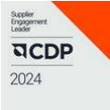

**[Image: AnnualReport2025.pdf-0048-27.png (123x124, 15.2KB)]**

**[Image: AnnualReport2025.pdf-0048-28.png (72x70, 10.3KB)]**

###### **FTSE Russell** 

We are proud to be listed in the FTSE India 30/18 Capped Index, which tracks the performance of large and mid-cap stocks in India. **We are ISO 14001:2015** This index assigns weights based **#2** on free float-adjusted market **certified across all our** Global Ranking in the Residential capitalisation and undergoes semimulti-family sector annual reviews. **operations.** 

88 GRI 2-23 

89 

GODREJ PROPERTIES LIMITED 

INTEGRATED REPORT 2024-25 

### **NAVIGATING CLIMATE REALITIES** 

We recognise that the influence of climate change extends beyond our immediate operational sites, permeating our entire value chain. We are dedicated to building climate resilience and have incorporated the TCFD’s guidance since 2021 to approach the risks posed by the changing climate on the business. 

###### **ESG & CLIMATE RISK GOVERNANCE** 

To drive accountability, ESG performance metrics are embedded within our annual objectives, with executive compensation directly linked to achieving critical sustainability targets. We continue to integrate climate risk mitigation into our procurement processes, operations, and project transitions, ensuring a structured and effective approach to sustainability. 

At the management level, we have taken key initiatives to drive accountability and align ESG with financial performance: 

- Sustainability targets are now embedded within annual objectives, with corresponding compensation structures tied to their achievement across all roles, departments, and business functions. 

- Executive remuneration is directly linked to the successful delivery of key performance indicators (KPIs) related to material sustainability challenges, reinforcing leadership accountability in driving ESG progress. We have identified KPIs (both financial and non-financial) around each level and we monitor the achievement of the same annually. 

###### **LEVEL-WISE LINKED INCENTIVES** 

|**Levels**|**KPIs**|
|---|---|
|Zonal CEOs|Emission reduction|
|Zonal and Operation Head|– Energy reduction – Supply chain engagement|
|Project Directors and Environmental Managers|– Emission reduction – Energy Efficiency|

- Zonal CEOs are responsible for overseeing siterelated environmental indicators, including energy intensity across all regional, marketing, and site offices. Each zone is actively collaborating with the central Administration and HR teams to develop renewable energy transition strategies, aligning with Science Based Targets initiative (SBTi) goals for Scope 1 and Scope 2 greenhouse gas (GHG) emissions. 

###### **HOW WE GOVERN CLIMATE-RELATED RISKS AND OPPORTUNITIES** 

###### **Board-Level ESG Committee** 

Provides strategic oversight on ESG and climate-related issues. Defines sustainability goals, shapes investor communications, monitors progress on key indicators and evaluates interventions. Climate issues are integrated into the Board’s agenda and reviewed annually. 

###### **Zonal CEOs and Operational Leadership** 

Oversees execution of ESG and climate plans at the zonal level. Ensures timely and accurate ESG data reporting, conducts quarterly compliance reviews, maintains EMS audit readiness, ensures worker registration under BOCW, and manages R&D and capital investments in sustainable construction technologies. 

###### **Chief Design and Sustainability Officer (CDSO)** 

Leads the formulation of sustainability strategy and implementation plans. Coordinates with zonal teams and monitors enterprise-wide progress towards ESG objectives. 

###### **Project Directors and Environmental Managers** 

Implements ESG plans at the project site level. Ensures accurate and timely data reporting, addresses data discrepancies, explains significant variances, and enforces ISO 14001 EMS protocols with a focus on achieving zero non-conformities. 

###### **Climate Risk Recognition and Context** 

We acknowledge climaterelated risks as a material consideration for our business, particularly given the real estate sector’s significant contribution to global emissions. In light of increasing global momentum towards decarbonisation, netzero targets, and international frameworks such as the Paris Agreement, we are actively assessing physical climate risks—including storms, floods, and extreme heat, changing weather patterns—to embed resilience and longterm sustainability into our strategic planning. 

###### **Internal Integration of ESG and Financial Alignment** 

To align our financial strategy with sustainability goals, we have fully embedded ESG considerations into core business operations. ESG performance is now integrated into annual targets, procurement protocols, and executive remuneration frameworks, reinforcing our commitment to longterm value creation through responsible and climateconscious decision-making. 

###### **External Dependencies and Regulatory Influence** 

Progress towards netzero targets depends not only on internal action but also on strong regulatory frameworks and collaborative partnerships. Recognising that a substantial share of our emissions lies beyond our direct operational control, we view government policies, industry standards, and evolving climate mandates as critical enablers in advancing our decarbonisation efforts. 

90 GRI 2-25, 3-3, 201-2 

91 

GODREJ PROPERTIES LIMITED 

INTEGRATED REPORT 2024-25 

###### **Climate Risk Recognition and Context** 

###### **Integrating Climate Risks into Enterprise Risk Management** 

Our approach to risk management encompasses the entire spectrum, from identifying and categorising risks to implementing effective mitigation strategies. We conduct sensitivity analysis and stress testing over time to bolster our readiness in handling risks. The Risk Management Committee is tasked with overseeing the company’s risk management function, ensuring adherence to established policies and procedures. To systematically identify and address risks, we have established an enterprise-wide Risk Management Framework through our Risk Management Charter. Following a comprehensive assessment of climaterelated risks, we have integrated prioritised climaterelated risks into GPL’s Enterprise Risk Management (ERM) framework. 

###### These include: 

- Current Regulation 

- Emerging Regulation 

- Technology Risk 

- Legal Risk 

business-as-usual (BAU) scenario, where physical risks such as flooding, heatwaves, and water scarcity pose significant challenges. 

This assessment incorporated site-level surveys, peer reviews, and stakeholder consultations. Each identified risk was systematically analysed using a four-factor framework—likelihood, impact, vulnerability, and speed of onset—with additional considerations for adaptability and time sensitivity. Finally, risks were prioritised to focus on the most material climate-related threats, ensuring a proactive and strategic approach to climate resilience. 

The assessment concentrated on locations that are particularly vulnerable to climate change impacts, including rising temperatures, changing precipitation patterns, water scarcity, and extreme climate hazards. 

**TO EVALUATE PHYSICAL CLIMATE RISKS, WE APPLIED TWO SHARED SOCIOECONOMIC PATHWAYS (SSPs)** 

###### **IDENTIFIED PHYSICAL/TRANSITION RISKS** 

|**Risks/ Opportunities**|**4°**|**C SCENA**|**RIO**|**1.5° C SCEN**|**ARIO**|
|---|---|---|---|---|---|
|**ACUTE**|**U**|**O**|**D**|**O** **U**|**D**|
|Disruption in supply chain||||||
|Damage to building components (structural & non-structural components, energy systems, access infrastructure, security systems||||||

###### **CHRONIC** 

**[Image: AnnualReport2025.pdf-0050-17.png (372x242, 5.7KB)]**

|Unavailability of reliable source of water|
|---|
|Energy consumption for HVAC needs|
|Decreased efficiency of workforce|
|Increased severity and frequency of extreme weather events such as cyclones and floods|

###### **REPUTATION** 

Depreciation in asset value of buildings in climate disaster-prone regions 

- Market Risk 

- Reputational Risk 

###### **Identifying Climate Related Risks & Opportunities** 

Building on our FY 2023 scenario analysis, we continue to assess both transition and physical climate risks, identifying potential challenges and opportunities for climate mitigation. We recognise that climate change is not confined to site operations alone—its impact extends across our entire value chain, influencing business resilience, supply chains, and stakeholder expectations. 

To strengthen our commitment to climate resilience, we have embedded the Task Force on Climate-related Financial Disclosures (TCFD) framework into our management structure and risk assessment approach, ensuring a comprehensive and proactive response to climate-related challenges and opportunities. 

###### **Physical Climate-Related Risk Scenario Analysis** 

Climate change scenario analysis is a crucial tool for organisations to anticipate, evaluate, and manage climate-related risks and opportunities. It provides a structured approach to understanding potential future impacts, enabling businesses to develop resilient strategies—a key consideration for investors and stakeholders. 

In line with the Task Force on Climate-related Financial Disclosures (TCFD) recommendations, we assess multiple climate scenarios, including one aligned with the 2015 Paris Agreement’s 1.5°C goal and a 

###### **SSP-1** 

**(RCP-2.6), representing a low-emission, sustainable future** 

**SSP-5 (RCP-8.5), depicting a high-emission, business-as-usual trajectory** 

We identified key locations experiencing heightened vulnerability to the physical effects of climate change. 

###### **Transition Risk** 

We identify transition risks under both the Below 2°C and Net Zero Emissions (NZE) scenarios (orderly transition scenarios). While physical risks are relatively subdued in these pathways, transition risks are elevated due to stringent policies and rising stakeholder expectations. 

In contrast, under a “business-as-usual” scenario, delayed climate action may keep transition risks low in the short term but significantly heightens physical risks, potentially causing severe disruptions. 

The identified risks span reputational, regulatory, technological, and market-related categories. These have been classified based on their potential severity, ranging from low to high-medium risk, with corresponding opportunities also recognised. 

###### **REGULATORY** 

**[Image: AnnualReport2025.pdf-0050-38.png (372x177, 4.2KB)]**

Increased recycling rates of Construction & Demolition waste Enhanced emission - reporting obligations Unavailability of land for future projects 

###### **TECHNOLOGY** 

**[Image: AnnualReport2025.pdf-0050-41.png (372x177, 3.8KB)]**

Energy saving/efficiency policies linked to building codes and standards improves consumer preference 

Reduced water usage and consumption Research and innovation in alternate building materials 

###### **MARKET** 

**[Image: AnnualReport2025.pdf-0050-45.png (372x114, 2.9KB)]**

Suppliers unable to meet requirements that align with low-carbon transition 

Increased operating cost after implementation of carbon price (or tax) 

**Opportunity Impact** 

###### **Risk Impact** 

High Medium Low **U** Upstream **O** Operations **D** Downstream 

High Medium Low 

92 

93 

GODREJ PROPERTIES LIMITED 

INTEGRATED REPORT 2024-25 

###### **Overall Climate Risk Exposure** 

GPL operates multiple project sites across key urban centres, including Mumbai (17), Delhi-NCR (16), Bengaluru (6), Hyderabad (1), Ahmedabad (1), and Indore (1). Among these, Mumbai and Delhi-NCR are particularly vulnerable to the compounded effects of climate change—such as rising temperatures, altered precipitation patterns, and water stress—posing both physical and operational risks. 

As GPL continues to expand its projects, we remain focused on assessing and addressing climate vulnerabilities across geographies. Our climate risk analysis evaluates exposure to key stressors under multiple future scenarios, including Shared Socioeconomic Pathways (SSP1 and SSP5). A summary of these findings is presented in the table below. 

|**Climate Stressors**|**Prioritised Cluster for SSP-1**|**Prioritised Cluster for SSP-5**|
|---|---|---|
||NCR|Indore|
||Ahmedabad|NCR|
||Bengaluru|Ahmedabad|
|**Temperature** |Indore|Mumbai|
|**(Average Mean Surface Air** **Temerature)**|Mumbai|Pune|
|**p**|Pune|Bengaluru|
||Hyderabad|Kolkata|
||Kolkata|Hyderabad|
||NCR|NCR|
||Indore|Indore|
||Kolkata|Kolkata|
|**Precipitation** |Ahmedabad|Mumbai|
|**(Number of days with precipitation** **>50mm)**|Mumbai|Pune|
||Pune|Hyderabad|
||Hyderabad|Ahmedabad|
||Bengaluru|Bengaluru|
||NCR|NCR|
||Ahmedabad|Kolkata|
|**Overall Climate Change**|Kolkata|Mumbai,Pune,Hyderabad|
||Bengaluru,Mumbai,Pune|Ahmedabad|
||Hyderabad|Bengaluru|

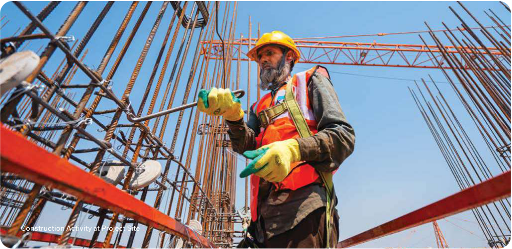

**[Image: AnnualReport2025.pdf-0051-06.png (1030x503, 1191.2KB)]**

<!-- Start of picture text -->
Construction Activity at Project Site <!-- End of picture text -->

###### **Adaptation Measures for Physical Climate Risks** 

Given that GPL’s project sites span diverse climatic zones—ranging from flood-prone areas to regions facing acute water scarcity and extreme heat—adaptation strategies are tailored to location-specific vulnerabilities. The following measures have been identified through detailed site-level climate risk assessments and are designed to enhance resilience over a 5-10years horizon. They encompass both physical interventions (such as infrastructure upgrades and climate-resilient design) and non-physical measures (including workforce policies and operational planning). These adaptation initiatives apply to all existing and planned operations, collectively covering 100% of the company’s revenue-generating assets. 

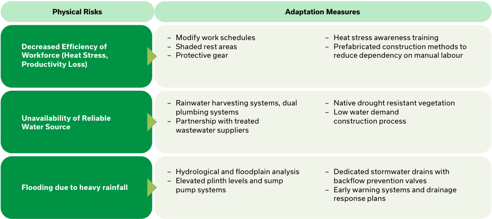

**[Image: AnnualReport2025.pdf-0051-09.png (1030x459, 66.1KB)]**

<!-- Start of picture text -->
Physical Risks Adaptation Measures  – Modify work schedules  – Heat stress awareness training Decreased Efficiency of   – Shaded rest areas  – Prefabricated construction methods to Workforce (Heat Stress,   – Protective gear reduce dependency on manual labour Productivity Loss)  – Rainwater harvesting systems, dual   – Native drought resistant vegetation plumbing systems  – Low water demand Unavailability of Reliable   – Partnership with treated  construction process Water Source wastewater suppliers  – Hydrological and floodplain analysis  – Dedicated stormwater drains with  – Elevated plinth levels and sump  backflow prevention valves Flooding due to heavy rainfall pump systems  – Early warning systems and drainage response plans <!-- End of picture text -->

|**Climate Risks and Fi**|**nancial Impact**||||
|---|---|---|---|---|
||**HEAVY PRECIPITATION** Acute Physical|**RISE TEMPERATURE** Increased cooling needs|**INCREASE IN FUEL PRICE** Transitional-Market|**CARBON PRICING MECHANISMS** Emerging regulations|
|**VALUE CHAIN**|Direct Operation|Direct Operation|Direct Operation|Direct Operation|
|**PRIMARY POTENTIAL FINANCIAL IMPACT**|Increased Direct Cost|Increased Direct Cost|Increased Direct (Operating) Cost|Increased Direct Cost|
|**TIME HORIZON**|Short|Medium|Long|Long|
|**LIKELIHOOD**|Virtually Certain|Virtually Certain|Likely|Likely|
|**IMPACT**|High|Medium-High|High|High|

94 

95 

GODREJ PROPERTIES LIMITED 

INTEGRATED REPORT 2024-25 

###### **TCFD Maturity Map** 

We assessed potential climate-related risks & corresponding opportunities for climate mitigation. Our firm conviction is that an emerging risk like climate change does not confine its impact solely to our site operations; rather it extends across our entire value chain. 

To fortify our dedication to climate resilience, GPL has incorporated the TCFD’s guidance into the management structure and overall approach to climate change related risks & opportunities. 

2024 2025 Maturity maintained/ enhanced Recommended TCFD Disclosures Disclosing Not disclosing 

###### **LIMITED DISCLOSURES** 

###### **Governance** 

2024 2025 Board oversight of climaterelated risks and opportunities. 2024 2025 Management’s role in climate risk assessment/management. 2024 2025 A published policy or commitment statement on climate change. **Strategy** 2024 2025 Operational GHG emission reductions. **Risk Management** 2024 2025 Acknowledgement of need to assess/ respond to climate risks. **METRICS & TARGETS** 2024 2025 Scope 1 and Scope 2 GHG emissions. 

###### **MODERATE DISCLOSURES** 

###### **FULL DISCLOSURES** 

|2024 2025|**Governance** Statement on board’s consideration of climate R&O.|2024 2025|**Governance** Capacity and competency of board on climate change.|
|---|---|---|---|
|2024 2025|Measures to increase board knowledge on climate R&O.|2024 2025|Climate R&O integrated into board agenda.|
|2024 2025|Individual/committee for climate change at board level.|2024 2025|Full consideration of physical, transition & liability risks|
|2024 2025|Consideration of physical, transition & liability risks.||over time frames & financial incentives for CXOs.|
||**Strategy**||**Strategy**|
|2024 2025|Climate Risks and Opportunities (R&O) identified over short/med/ long-term.|2024 2025|Potential impact of scenarios (4,2,1.5 DS) on organisation’s business, strategy, &|
|2024 2025 2024 2025|Impact of Climate R&O on organisation’s business, strategy, & financial planning. Involvement in domestic and international climate efforts.|2024 2025 2024 2025|financial planning. Internal carbon pricing strategy. Climate advocacy and collaboration with peers/ stakeholders.|
||**Risk Management**||**Risk Management**|
|2024 2025 2024 2025|Has processes for identifying & assessing climate risks. Has processes for managing climate risks.|2024 2025|How processes for identifying, assessing & managing climate R&O are integrated into organisation’s  overall risk management.|
||**Metrics & Targets**||**Metrics & Targets**|
|2024 2025|Scope 1 and Scope 2 GHG and if appropriate Scope 3 emissions & related risks.|2024 2025|Metrics used to assess climate R&O in line with strategy and risk  management process.|
|2024 2025|Recognised methodologies for measurement.|2024 2025|Climate targets include SBT & performance against targets.|
|2024 2025|Performance for GHG targets.|2024 2025|Assurance of reported GHG emissions.|

Godrej One 

96 

97 

GODREJ PROPERTIES LIMITED 

INTEGRATED REPORT 2024-25 

###### **Managing Transition Risks Through Strategic Climate Action** 

As part of our climate strategy and in line with our commitment to mitigate transition risks associated with the shift to a low-carbon economy, we have established a structured Internal Carbon Pricing (ICP) mechanism. 

GHG emissions: Scope 1 (direct), Scope 2 (indirect from purchased energy), and Scope 3 (value chain emissions). The ICP plays a critical role in reshaping our supply chain and material sourcing strategy. 

This is a strategic tool designed to align capital allocation, procurement, and operational decisions with our longterm Science Based Targets initiative (SBTi)-validated decarbonisation goals. 

###### **Current ICP Structure** 

We have implemented an implicit pricing model with a preliminary internal carbon price of `978 per metric tonne of CO2e, designed to assess and influence the emissions intensity of investment and procurement decisions without immediate cash flow implications. 

Following the Task Force on Climate-related Financial Disclosures (TCFD) recommendations and aligned with CDP's ICP objectives, our ICP accounts for all scopes of 

###### **Strategic Objectives of Implementing Internal Carbon Pricing** 

Our ICP is designed to support multiple cross-functional climate and business objectives: 

- Conduct cost-benefit analysis of low-carbon alternatives and technologies 

   - Navigate evolving carbon regulations and markets, including India’s upcoming domestic carbon market under the 2022 Energy Conservation Bill 

- Drive energy efficiency in design, construction, and operations 

   - Reduce upstream emissions through climatealigned sourcing and supplier Programmes 

- Incentivise low-carbon investments across the project lifecycle 

   - Achieve climate targets and policies, including our SBTi-validated Scope 3 goals 

- Embed climate-related considerations in business and investment decision-making 

   - Set a carbon offset budget for unavoidable emissions 

- Strengthen climate risk assessments by incorporating emissions costs into project planning 

   - Stress-test investments for carbon price resilience and long-term sustainability 

- Identify and capitalise on low-carbon opportunities, such as material innovation and green building certifications 

   - Supplier engagement strategies, aligned with our SBTi commitment 

- Inform and influence strategic and financial planning by integrating climate costs into budgeting 

- Meet Stakeholder Expectations by demonstrating transparent and responsible climate action 

###### **How we Measure our Progress** 

Our climate-related goals are deeply integrated with our broader Environmental, Social, and Governance (ESG) commitments, which are embedded across all levels of the organisation— from leadership to operational teams. 

To monitor our progress, we utilise comprehensive internal dashboards and ensure transparent public reporting, supported by third-party assurance. 

As part of our commitment to sustainability, we have implemented a company-wide Occupational Health & Safety (OH&S) Management System and an Environmental Management System (EMS). The attainment of ISO certifications across our construction sites further reflects our dedication to climate resilience and environmental stewardship. 

Godrej Properties operates as a water-positive and carbon-neutral organisation for Scope 1 and Scope 2 greenhouse gas (GHG) emissions. We remain focused on reducing emissions across Scope 1, Scope 2, and Scope 3 categories, while actively working to minimise waste generation throughout our operations. 

To measure our progress against the commitments for climate risk management, we have set targets across decarbonisation (scope emission intensities), waste, water and certification of our green buildings. 

**Read more about Environment Target and Progress at Pg. 44** 

###### **Our Climate Commitments** 

During the 2023-2024 fiscal year, we carried out a comprehensive risk assessment and scenario analysis pertaining to climate change, aligning with the recommendations of the Task Force on Climaterelated Financial Disclosures (TCFD) Framework. Throughout this reporting period, we have prioritised the management of climate changerelated risks. 

In accordance with the Paris Agreement, we have been active participants in the Science Based Target (SBT) initiative since 2020. Our approved targets seek to achieve a 72.6% reduction in scope 1 and 2 greenhouse gas (GHG) emissions per square metre by the 2035 fiscal year. 

Moving forward, we remain steadfast in our commitment to evaluating the financial implications of climate change on our business operations. During the upcoming Carbon Disclosure Project (CDP) reporting cycle, we are committed to disclosing quantified impacts, encompassing both risks and opportunities, across a range of climate change scenarios. Furthermore, our enterprise risk management framework will systematically incorporate real-world climate change risks. 

###### **THE ROAD AHEAD** 

Our Internal Carbon Price is a dynamic tool that will continuously adapt to our sustainability roadmap, market developments, and regulatory shifts. By internalising the cost of carbon, we aim to drive systemic behaviouralthe resilience of our real estate portfolio in a rapidly transitioning global economy. 

**[Image: AnnualReport2025.pdf-0053-38.png (176x34, 14.9KB)]**

<!-- Start of picture text -->
Godrej Horizon, Mumbai RERA No: P51900078358 <!-- End of picture text -->

98 

99 

GODREJ PROPERTIES LIMITED 

INTEGRATED REPORT 2024-25 

###### **Prioritised Risks Mapped to Capitals** 

**[Image: AnnualReport2025.pdf-0054-03.png (84x97, 2.7KB)]**

**[Image: AnnualReport2025.pdf-0054-04.png (67x97, 4.2KB)]**

**[Image: AnnualReport2025.pdf-0054-05.png (214x72, 6.2KB)]**

**[Image: AnnualReport2025.pdf-0054-06.png (106x99, 2.7KB)]**

**[Image: AnnualReport2025.pdf-0054-07.png (106x88, 2.8KB)]**

**[Image: AnnualReport2025.pdf-0054-08.png (112x88, 4.1KB)]**

||**Financial**|**Natural**|**Human**|**Intellectual**|**Manufactured**|**Social and Relationship**|
|---|---|---|---|---|---|---|
|**HEAVY** **PRECIPITATION**|Significant rainfall can cause flooding, harming assets and disrupting work; materials and equipment damage raises replacement costs, impacting project budgets.|Intense rainfall causes soil instability, erosion, and flooding, damaging construction sites.|Heavy rainfall can create slippery conditions at construction sites, increasing the risk of slips, trips, and falls, thereby compromising worker safety.|Heavy rainfall damages property, disrupts operations, and risks data loss, harming intellectual property.|Heavy rainfall hinders construction, delaying foundations, concrete pouring, and asphalt laying.|Can lead to significant impact on project timelines, causing handover delays to clients.|
|**TEMPERATURE**|Elevated temperatures and heatwaves increase energy costs and labour wages due to productivity loss, ultimately affecting project expenditure.|High temperatures can disrupt ecosystems, impacting biodiversity, water sources, and habitats which can lead to reduced property value due to environmental degradation or increased operational costs for climate- resilient infrastructure.|Heatwaves impact worker health and productivity, adversely affecting output.|Elevated temperatures affect physical assets, causing operational disruption and influencing market perception.|High temperatures damage building materials, such as concrete cracking from extreme heat.|Can lead to significant impact on project timelines, causing handover delays to clients.|
|**WATER SCARCITY**|Water shortages require costly third-party procurement, increasing overall project costs.|Real estate is a water- intensive sector. Water scarcity would increase procurement costs for construction.|Dehydration, water- system disruptions, and costly water scarcity measures strain budgets and damage employer reputation.|Water conservation and efficiency are crucial for achieving favourable green building certification ratings.|Limited water availability disrupts production processes.|Can lead to significant impact on project timelines, causing handover delays to clients.|
|**CARBON PRICING** **MECHANISMS**|Increase in operating cost after implementation of carbon price and overall project cost.|Carbon pricing escalates operational costs, particularly for energy-heavy buildings, impacting financials and investment plans.|Higher energy costs due to carbon pricing can strain budgets, affecting employee benefits, wellness Programmes, and overall workforce satisfaction.|Carbon pricing creates opportunities for collaboration and partnerships for leveraging technologies for construction.|Carbon pricing increases production costs for carbon-heavy materials like aluminium, concrete, bricks, and glass.|An overall increase in project costs directly affects the expenses borne by consumers and has a significant impact.|

100 

101 

GODREJ PROPERTIES LIMITED 

**INTEGRATED REPORT 2024-25** 

### **EMISSION MANAGEMENT** 

Reinforcing our commitment to climate leadership, we have made meaningful progress in our decarbonisation journey, aligned with the 1.5°C pathway. Guided by our Science Based Targets initiative (SBTi)-validated goals, we have driven measurable reductions in greenhouse gas emission intensity per rupee of turnover across our operations and value chain. This has been enabled by a greater shift toward renewable energy and deeper collaboration with suppliers to accelerate collective climate action. Looking ahead, we remain focused on scaling these efforts to advance our journey toward a net-zero future. 

###### **MATERIAL ISSUES LINKAGES** 

> 5 GHG Management 

###### **STRATEGY LINKAGE** 

Operational Excellence 

> 8 Sustainable Supply Chain 

> 11 Environment Management & Compliance 

> 14 Air Quality Management 

###### **UN SDGS LINKAGE** 

**[Image: AnnualReport2025.pdf-0055-12.png (82x82, 10.6KB)]**

###### **FY 24-25 HIGHLIGHTS** 

**0.008tCO2e/sq.ft.** Scope 1+2 Emission Intensity **FY 23-24: 0.0087 tCO2e/sq.ft.** 

**0.287tCO2e/sq.ft.** Scope 3 Emission Intensity **FY 23-24: 0.327 tCO2e/sq.ft.** 

**61,789tCO2e** Carbon Sequestrated through community projects making us carbon neutral for scope1+2 **FY 23-24: 59,762 tCO2e** 

**[Image: AnnualReport2025.pdf-0055-17.png (315x18, 15.4KB)]**

<!-- Start of picture text -->
Sales and Marketing office, Godrej City, Panvel <!-- End of picture text -->

102 GRI 3-3, 305-4 

103 

GODREJ PROPERTIES LIMITED 

INTEGRATED REPORT 2024-25 

###### **OUR EMISSIONS PROFILE** 

**[Image: AnnualReport2025.pdf-0056-03.png (533x639, 3.1KB)]**

**[Image: AnnualReport2025.pdf-0056-04.png (290x34, 3.8KB)]**

<!-- Start of picture text -->
SCOPE 1 + 2 EMISSIONS (tCO e) 2 <!-- End of picture text -->

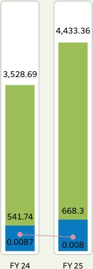

**[Image: AnnualReport2025.pdf-0056-05.png (159x457, 8.2KB)]**

<!-- Start of picture text -->
4,433.36 3,528.69 668.3 541.74 0.0087 0.008 FY 24 FY 25 <!-- End of picture text -->

Scope 1 (includes emissions from DG sets and company-owned vehicles Scope 2 (grid electricity emissions) 

Category 1 - **15,88,321.94** (Purchased goods and services) Category 2 - **2321.2** (Capital goods) Category 3 - **386.2** (Fuel and energy related activities) Category 4 - **3742.53** (Upstream transportation and distribution) Category 5 - **1815.04** (Waste generated in operations) Category 6 - **3178.48** (Business travel by air and road) Category 7 - **3173.27** (Employee commuting) Category 11 - **8,47,495** (Use of sold products) 

Emission Intensity (Scope 1+2) in tCO2e/sq.ft. 

**Read more at Pg. 508** 

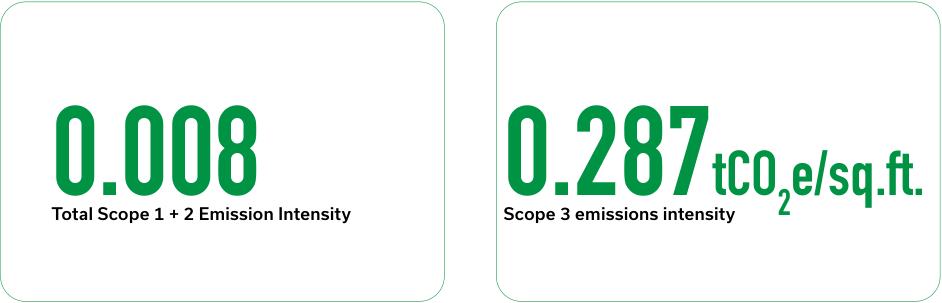

**[Image: AnnualReport2025.pdf-0056-10.png (942x303, 19.9KB)]**

<!-- Start of picture text -->
0.008 0.287tCO e/sq.ft. 2 Total Scope 1 + 2 Emission Intensity Scope 3 emissions intensity <!-- End of picture text -->

###### **Enabling Emission Abatement** 

We continue to be carbon neutral for Scope 1 and Scope 2 greenhouse gas emissions. As part of our emission abatement strategy, we have installed rooftop solar systems across our offices and construction sites. In addition, we source electricity from renewable grids to power our operations. This combined approach not only helps us lower our overall emissions but also offers long-term cost **5,651 GJ** benefits through energy payback over time. total renewable energy consumption 

total renewable energy consumption 

|**Clean Energy Strategy** **Solar System Installation**|**Manjari** **Projetcs, Pune**|**Mann Hinjawadi** **Township** **Projects, Pune**|**Mhalunge** **Projects, Pune**|**Godrej City, Panvel**|
|---|---|---|---|---|
|Capacity (KW)|100|340|220|200|
|Capital Cost Invested (`in Lakhs)|46.00|110.88|116|74.68|
|Units generated till date (KWh)|149759|220271|201600|240413|
|Emissions Avoided till 2025 (tCO2e)|115.2|169.4|155.0|184.9|
|Construction Power Rate (`/KWh)|18|18|18|24|
|Amount saved till date (`Lakhs)|26.95|22.02|36.29|57.7|
|Month of Commissioning|Jul-21|Aug-22|Aug-21|Mar-22|
|Expected payback by|Aug-26|Apr-29|Jun-25|Mar-27|

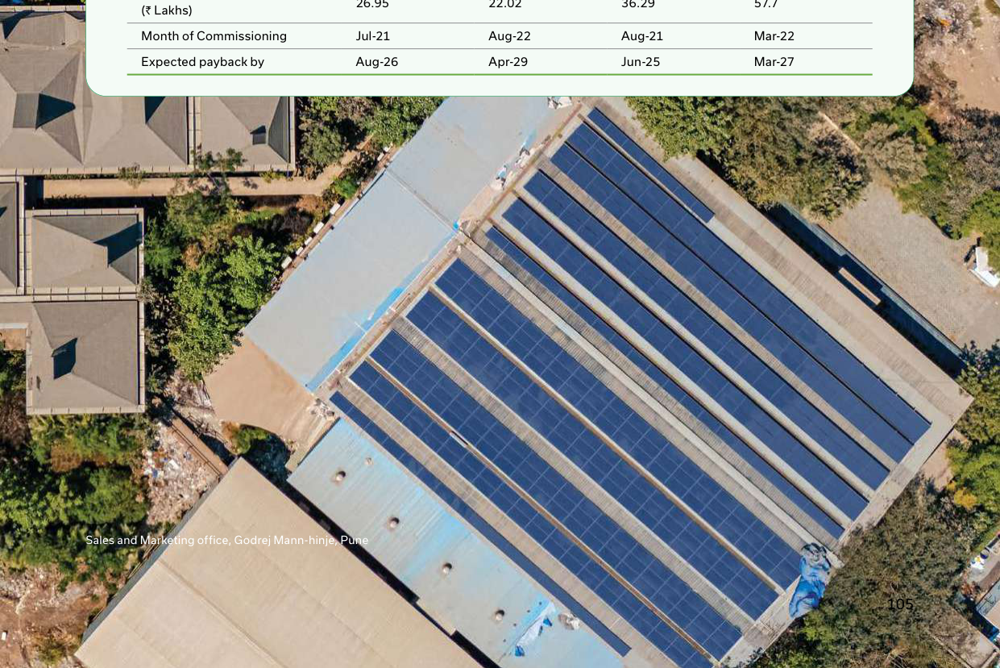

**[Image: AnnualReport2025.pdf-0056-15.png (1241x830, 2060.4KB)]**

<!-- Start of picture text -->
(` Lakhs) Month of Commissioning Jul-21 Aug-22 Aug-21 Mar-22 Expected payback by Aug-26 Apr-29 Jun-25 Mar-27 Sales and Marketing office, Godrej Mann-hinje, Pune 105 <!-- End of picture text -->

104 GRI 305-1, 305-2 

GODREJ PROPERTIES LIMITED 

INTEGRATED REPORT 2024-25 

###### **UNITED FOR A LOW-CARBON FUTURE** 

###### **Managing Crop Residue** 

Changing weather patterns have significantly disrupted cropping cycles, leading farmers in North India to resort to stubble burning due to delayed monsoons. This practice contributes substantially to air pollution in the National Capital Region (NCR). 

Our Crop Residue Management (CRM) initiative aligns with the 2020 guidelines for CRM in Punjab, Haryana, Uttar Pradesh, and the National Capital Territory of Delhi, as outlined by the Indian government. In FY 2024-25, 17,368 hectares of farmland were saved from stubble burning across 97 villages - an impressive increase from 4,966 hectares the year before. The harvested stubble was creatively reused: converted into biomass pellets, applied as soil mulch, and used as fuel in sugarcane processing plants. A notable shift began in FY 24-25 with 

the launch of the “Jalana Nahin, Galana Hai” initiative, promoting composting over burning. 

This marks a major stride toward environmental sustainability and improved soil health. With continued commitment, skill development, and collaborative efforts, this forward-thinking strategy could redefine how paddy stubble is viewed and handled, transforming a persistent problem into a sustainable development opportunity. Also, to scale up this initiative, Godrej properties in collaboration with Feedback Foundation and with the support of the Agriculture Department, are establishing a Crop Residue Management Park at Village Bhagwanpur, Gurdaspur. Spanning 10 acres, this park will serve as a demonstration and learning site for composting practices using paddy stubble. 

###### **Planting Seeds of Change** 

In our pursuit of carbon neutrality, we have launched 'Afforestation of Land' programmes across India. Collaborating with Nisarg, we implemented SALM project on farmlands and ensured 95% survival rate of plants planted in community land in Beed in previous FYs. The SALM and tree plantation project has sequestered approximately 47,948.8 tCO2e through integrated climate-smart interventions. Key activities included improved crop varieties, kitchen gardens, biogas units, summer ploughing, mango agro-horticulture, and fodder cultivation. These practices enhanced soil carbon, biomass productivity, and long-term ecosystem sustainability. 

**2,708 61,789** Mango Saplings tCO2e carbon planted in FY 24-25 sequestrated 

###### **We are a carbon neutral organisation for scope 1 & 2 emissions.** 

**For every** `O` **1 spent, 2.1 kg of carbon emissions avoided.** 

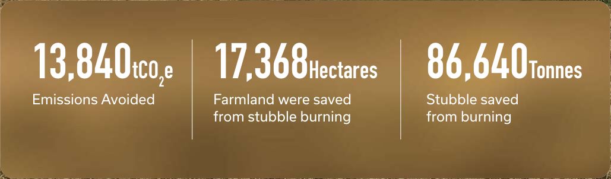

**[Image: AnnualReport2025.pdf-0057-13.png (1029x302, 79.2KB)]**

<!-- Start of picture text -->
13,840tCOtCO e 17,368HectaresHectares 86,640TonnesTonnes 2 Emissions Avoided  Farmland were saved  Stubble saved from stubble burning from burning <!-- End of picture text -->

**13,840tCOtCO e 17,368HectaresHectares 86,640TonnesTonnes 2** Emissions Avoided Farmland were saved Stubble saved from stubble burning from burning Avoiding stubble burning in Punjab 

106 

107 

GODREJ PROPERTIES LIMITED 

INTEGRATED REPORT 2024-25 

### **ENERGY EFFICIENT BY DESIGN** 

We are dedicated to reducing energy consumption and its related costs to support long-term economic and environmental sustainability. We do this by integrating energyefficient features into the design and construction of our buildings. Additionally, we adopt conservation measures across our operations to minimise energy usage. 

###### **MATERIAL ISSUES LINKAGES** 

> 16 Energy Efficiency Management 

###### **STRATEGY LINKAGE** 

Operational Excellence 

###### **UN SDGS LINKAGE** 

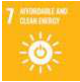

**[Image: AnnualReport2025.pdf-0058-09.png (80x82, 12.2KB)]**

###### **FY 24-25 HIGHLIGHTS** 

**15.18%** Share of Renewable Energy for our offices **FY 23-24 | 2.7%** 

**0.009GJ/sq. ft.** Renewable Energy Intensity for our offices **FY 23-24 | 0.001 GJ/sq. ft.** 

**100%** 

Renewable Energy consumed at Godrej Reserve Office 

**[Image: AnnualReport2025.pdf-0058-15.png (78x18, 3.5KB)]**

<!-- Start of picture text -->
Godrej One <!-- End of picture text -->

108 GRI 3-3,302-1, 302-3, 302-4 

109 

GODREJ PROPERTIES LIMITED 

INTEGRATED REPORT 2024-25 

###### **LOWER FOOTPRINT, HIGHER IMPACT.** 

**GJ 37,218** Total Energy Consumption 

Our energy efficiency approach combines sustainable design, advanced technology, and a culture of mindful energy use. We align with ECBC, NBC 2016, and ASHRAE 90.1 & 62.1 standards to embed energy efficiency into every aspect of our building design. Through the adoption of eco-efficient systems and renewable energy technologies, and by leveraging Building Management Systems (BMS) or equivalents, we continuously monitor and optimise operational energy use. We also actively cultivate energy-conscious behaviours among employees and customers, reinforcing our commitment to a more sustainable future. 

**GJ 5,651** Total Renewable Energy Consumption 

At Godrej Properties Limited, we recognise that 90% of a building's total energy consumption occurs during its occupancy, making energy usage a significant expense. We now have two (3%) IGBC Net Zero Energy (Design) certified projects in our portfolio. 

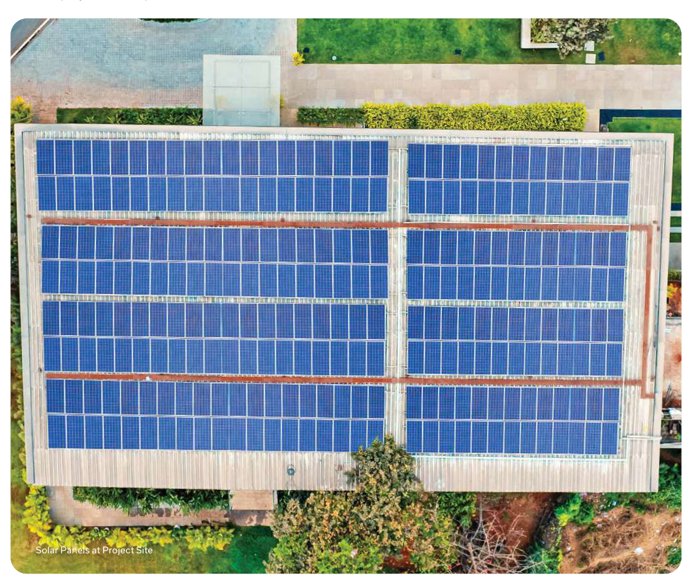

**[Image: AnnualReport2025.pdf-0059-07.png (1060x897, 2281.3KB)]**

<!-- Start of picture text -->
Solar Panels at Project Site <!-- End of picture text -->

###### **ENERGY MANAGEMENT SYSTEM (EnMS)** 

As a real estate developer committed to a low-carbon future, our Energy Management System (EnMS) is central to improving operational sustainability and energy efficiency. While our direct energy footprint is limited, consumption does occur across regional, marketing, and sales offices at our project sites. Our energy management efforts are therefore directed at optimising use in these locations, in alignment with our broader climate goals. 

###### **ENERGY AUDITS FOR TARGETED ACTION** 

###### **DEFINED ENERGY REDUCTION TARGETS** 

**Key Pillars of Our Energy Management Approach** 

Regular energy audits help identify efficiency gaps across our office and sales environments, leading to precise interventions for reducing consumption. 

We aim to reduce energy consumption intensity from non-renewable sources by more than 70% by 2035, focused on operations at offices and project locations. 

###### **EFFICIENCY-LED INFRASTRUCTURE UPGRADES** 

###### **CONTINUOUS MONITORING AND EVALUATION** 

We are transitioning to energy-efficient HVAC systems, LED lighting, smart metering, and optimised workflows to lower overall energy demand. 

Energy usage is closely tracked to measure the impact of our initiatives and recalibrate strategies for ongoing improvement. 

###### **ADOPTION OF RENEWABLE ENERGY** 

###### **INNOVATION IN LOW-ENERGY DESIGNS** 

###### **EMPLOYEE ENGAGEMENT AND AWARENESS** 

Ongoing training ensures that energy-efficient practices become part of our everyday culture, empowering employees to contribute meaningfully to our sustainability objectives. 

We are steadily increasing the share of solar and other green energy sources used to power our offices and onsite facilities. 

We are investing in energyefficient modular and prefabricated structures for marketing offices, ensuring better insulation and lower energy needs. 

To drive continuous improvement in our energy performance and efficiency, we align with global standards such as the Energy Conservation Building Code (ECBC) and the Energy Performance Index (EPI) defined by ASHRAE (American Society of Heating, Refrigerating, and Air-Conditioning Engineers). All our projects are designed in compliance with these standards. Furthermore, all new projects within the reporting boundary are planned to incorporate on-site renewable energy generation through solar power. 

110 

111 

**[Image: AnnualReport2025.pdf-0060-00.png (226x13, 6.9KB)]**

<!-- Start of picture text -->
GODREJ PROPERTIES LIMITED <!-- End of picture text -->

**[Image: AnnualReport2025.pdf-0060-01.png (228x13, 7.4KB)]**

<!-- Start of picture text -->
INTEGRATED REPORT 2024-25 <!-- End of picture text -->

### **LESS WASTE, MORE WISDOM** 

Our approach aligns with the globally recognised 'waste management hierarchy,' prioritising the principles of reducing, reusing, and recycling. Additionally, we take a proactive “beyond compliance” approach to minimise the environmental impact of our waste generation, consistently seeking innovative and sustainable ways to repurpose waste materials. 

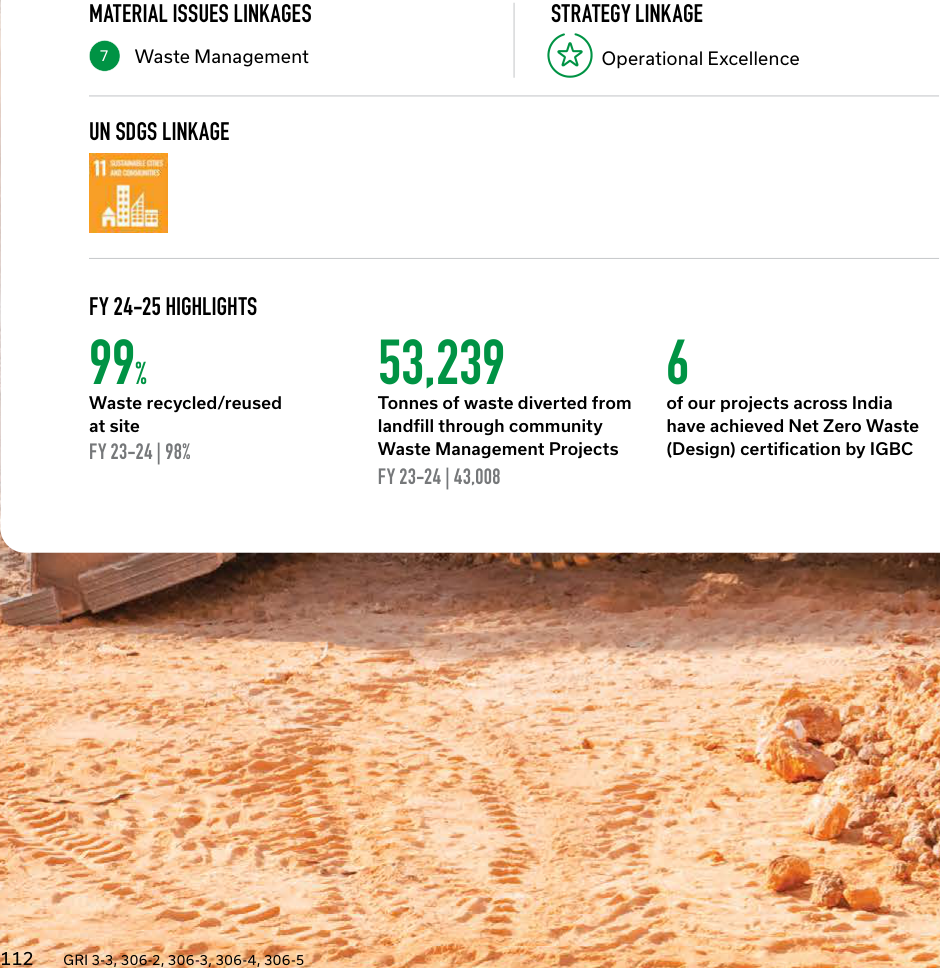

**[Image: AnnualReport2025.pdf-0060-04.png (940x968, 1027.6KB)]**

<!-- Start of picture text -->
MATERIAL ISSUES LINKAGES STRATEGY LINKAGE 7 Waste Management Operational Excellence UN SDGS LINKAGE FY 24-25 HIGHLIGHTS 99% 53,239 6 Waste recycled/reused   Tonnes of waste diverted from  of our projects across India at site landfill through community  have achieved Net Zero Waste FY 23-24 | 98% Waste Management Projects (Design) certification by IGBC FY 23-24 | 43,008 112 GRI 3-3, 306-2, 306-3, 306-4, 306-5 <!-- End of picture text -->

113 

GODREJ PROPERTIES LIMITED 

INTEGRATED REPORT 2024-25 

###### **OUR OPERATIONAL WASTE STEWARDSHIP** 

**WE HAVE DIVERTED 53,239 TONNES OF WASTE FROM LANDFILLS THROUGH OUR COMMUNITY WASTE MANAGEMNET PROGRAMMES, THUS BECOMING** 

As a responsible real estate developer, we recognise the significant environmental impact of construction and demolition (C&D) waste. Our dedicated policy and strategy for C&D waste management are embedded within our sustainability framework, aiming to minimise landfill burden, conserve resources, and promote a circular economy within the built environment. 

###### **WASTE POSITIVE** 

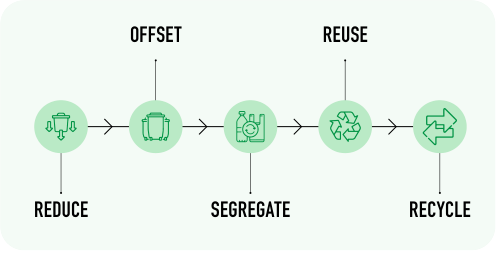

**[Image: AnnualReport2025.pdf-0061-06.png (497x253, 15.1KB)]**

<!-- Start of picture text -->
OFFSET REUSE REDUCE SEGREGATE  RECYCLE <!-- End of picture text -->

###### **Key Components of our Waste Management Approach** 

###### **Project-Embedded Waste Management Plans** 

We integrate project-specific waste management plans into the design phase of all our projects, outlining protocols for waste minimisation, segregation, and material reuse. 

###### **Target Setting for Waste Reduction and Recycling** 

###### **Waste Management Practices** 

All our projects set quantitative targets for reducing, reusing, or recycling construction waste, enabling systematic tracking and performance benchmarking. 

**[Image: AnnualReport2025.pdf-0061-13.png (157x113, 32.0KB)]**

**Management of Construction and Demolition (C&D) waste** Plastic / PVC / UPVC 

###### **Contractor Management** 

Contractors managing end-to-end construction retain revenue from material recovery, while waste management performance is evaluated for all contractors and considered for prioritisation in future projects, wherever commercially viable. 

**[Image: AnnualReport2025.pdf-0061-17.png (116x115, 34.3KB)]**

- **Waste Segregation and Material Recovery at** 

- • Reusing at site **Project Sites** (Rebar mesh for safety) 

At all our construction sites, waste segregation is implemented with clear protocols and dedicated storage zones for recyclable materials like metals, wood, concrete, plastic, and gypsum. We have also operationalised Material Recovery Facilities (MRFs) at key sites to efficiently sort and store recyclable materials for downstream recycling, significantly diverting waste from landfills. 

- Steel • Recycling through authorised vendor 

**[Image: AnnualReport2025.pdf-0061-21.png (114x114, 35.0KB)]**

Waste Collection & Segregation at Material Recovery Facility Cardboard 

**[Image: AnnualReport2025.pdf-0061-23.png (136x115, 35.1KB)]**

###### **Use of Recycled Materials and Product Exchanges** 

We are actively engaged in recycled-product exchanges— sourcing materials with recycled content and responsibly channelling recyclable waste to authorised recyclers. 

###### **Capacity Building and Workforce Training** 

- Use wet concrete for making Paver clocks 

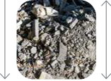

**[Image: AnnualReport2025.pdf-0061-28.png (157x115, 34.6KB)]**

All relevant workforce members and contractors are sensitised about our waste management SOPs and environmental policies, ensuring they are equipped with best practices for material recovery, segregation, and waste reduction. This training enhances both on-ground execution and overall environmental awareness. 

- Use broken AAC block filling sunken area 

- Dry concrete to recycling plant 

Wet and Dry Concrete 

###### **Hazardous Waste** 

###### **Non-Hazardous Waste** 

###### **Organic Waste** 

Hazardous waste includes materials like solvents, cleaning agents, lead-based paints and oils, which can pose risks to human health, the environment, or property. GPL ensures the proper disposal of all hazardous waste through certified third-party entities, strictly adhering to applicable laws and regulations. 

GPL composts organic waste, utilising the compost for project landscaping or in plant nurseries. When necessary, it is handed over to certified agencies for appropriate management. 

###### **Other Categories** 

At GPL, non-hazardous waste streams include soil, construction debris, and metal scrap. Soil is repurposed for backfilling or sent to authorised landfills. Metal scrap is processed through certified recyclers, while construction debris is routed to municipality-authorised agencies in full compliance with regulations. 

###### **TOTAL WASTE GENERATED (HAZARDOUS)** 

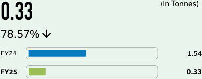

**[Image: AnnualReport2025.pdf-0061-41.png (409x161, 6.8KB)]**

<!-- Start of picture text -->
0.33 (In Tonnes) 78.57% ↓ FY24 1.54 FY25 0.33 <!-- End of picture text -->

###### **TOTAL WASTE GENERATED (NON-HAZARDOUS)** 

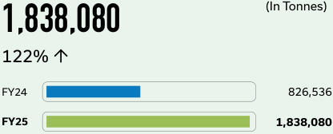

**[Image: AnnualReport2025.pdf-0061-43.png (416x168, 8.6KB)]**

<!-- Start of picture text -->
1,838,080 (In Tonnes) 122% ↑ FY24 826,536 FY25 1,838,080 <!-- End of picture text -->

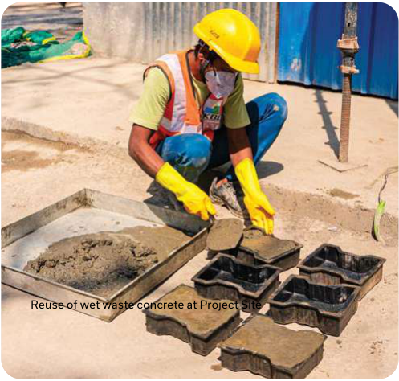

**[Image: AnnualReport2025.pdf-0061-44.png (497x474, 537.7KB)]**

<!-- Start of picture text -->
Reuse of wet waste concrete at Project Site <!-- End of picture text -->

###### **WASTE RECYCLED/REUSED** 

**[Image: AnnualReport2025.pdf-0061-46.png (416x222, 7.7KB)]**

<!-- Start of picture text -->
99% (in %) FY24 98 FY25 99 Read more at Pg. 509 <!-- End of picture text -->

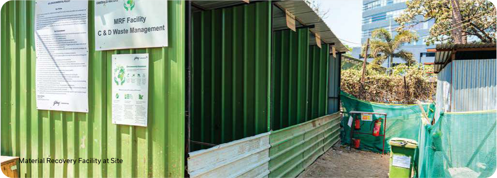

**[Image: AnnualReport2025.pdf-0061-47.png (1030x369, 820.7KB)]**

<!-- Start of picture text -->
Material Recovery Facility at Site <!-- End of picture text -->

114 

115 

GODREJ PROPERTIES LIMITED 

INTEGRATED REPORT 2024-25 

###### **Community Waste Management** 

###### **From Refuse to Resource** 

To minimise waste to landfill, we have implemented decentralised solid waste management systems in Clement town, Chakrata (Uttarakhand) Dhanpuri, Burhar, Budni, Gohad and Indore (Madhya Pradesh); Nagpur (Maharashtra); and in Bangalore (Karnataka). Through these comprehensive efforts, we are committed to transforming waste into valuable resources, promoting environmental sustainability, and supporting community well-being. 

`O` **71 Cr** Government funds utilised till date FY 24-25: 42 Cr 

**18** Urban Local Bodies/ State APMC/ Cant. Boards collaborated PAN India 

**For every** `O` **1 spent, 0.69 kg of waste was diverted from landfill.** 

**53,239 Tonnes** of Waste diverted away from Landfill in FY 24-25 

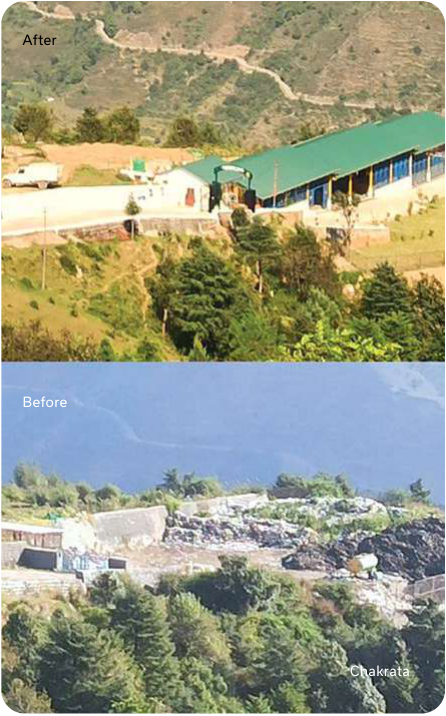

**[Image: AnnualReport2025.pdf-0062-09.png (446x716, 717.1KB)]**

<!-- Start of picture text -->
After Before Chakrata <!-- End of picture text -->

###### **Chakrata, Uttarakhand** 

We’ve initiated bio-remediation and bio-mining efforts, supported by on-site Material recovery Facility and Micro composting Centre for sustainable waste recovery and processing. 

###### **Indore, Madhya Pradesh** 

Indore’s ‘Zero Waste Zone’ pilot is transforming four wards into self-reliant waste management models, aiming for city-wide replication of sustainable, decentralised waste management model. 

###### **Chikkaballapur and Doddaballapura, Karnataka** 

Our City-Farmer Partnership in Karnataka transforms urban organic waste into compost, benefiting over 300 farmers across 33 villages by processing 4,424.61 Tonnes of legacy waste. 

We received about 30 tons of wet waste in three batches and converted it into 10 tons compost on our farmland. We had applied this compost in our farm fields and benefited from it. We have been provided with training and the required tools to convert wet waste into organic manure. Earlier, we used a lot of chemical fertilisers, but now, since we are getting organic compost for free, we have reduced the use of chemical fertilisers. 

Waste Management Project, Nagpur 

116 

117 

**GODREJ PROPERTIES LIMITED** 

INTEGRATED REPORT 2024-25 

### **WATER MANAGEMENT** 

Our water management strategy follows a two-stage approach. During construction, we minimise usage through low-flow temporary fixtures, water-efficient equipment, and on-site rainwater harvesting. In the use phase, we embed conservation into design, using native, drought-resistant landscaping, low-flow fixtures, and customer education to encourage responsible water use. This ensures water sustainability across the project lifecycle. 

###### **MATERIAL ISSUES LINKAGES** 

###### **STRATEGY LINKAGE** 

> 12 Water Management Operational Excellence 

###### **UN SDGS LINKAGE** 

**[Image: AnnualReport2025.pdf-0063-08.png (82x82, 10.9KB)]**

###### **FY 24-25 HIGHLIGHTS** 

**409.22Mn litres** Water Consumed **FY 23-24 | 352.5 Mn litres** 

**19% 10,187Mn litres** Recycled Water consumed Water Recharged through **FY 23-24 | 17%** community projects making us 25X water positive **FY 23-24 | 7,656 Mn litres (22X)** 

Water body at Godrej One 

118 

119 

GRI 3-3 

GODREJ PROPERTIES LIMITED 

INTEGRATED REPORT 2024-25 

###### **REPLENISH AND REUSE: WATER FOR THE LONG RUN** 

Climate change is steadily impacting groundwater availability for everyday use. To address this growing concern, we are adopting climate-resilient water management solutions within our communities. One such initiative is the development of water retention ponds - engineered to capture and store rainwater while preserving the site's natural contours. Through such thoughtful design, we are creating communities that are better equipped to manage water sustainably and live in greater harmony with nature. 

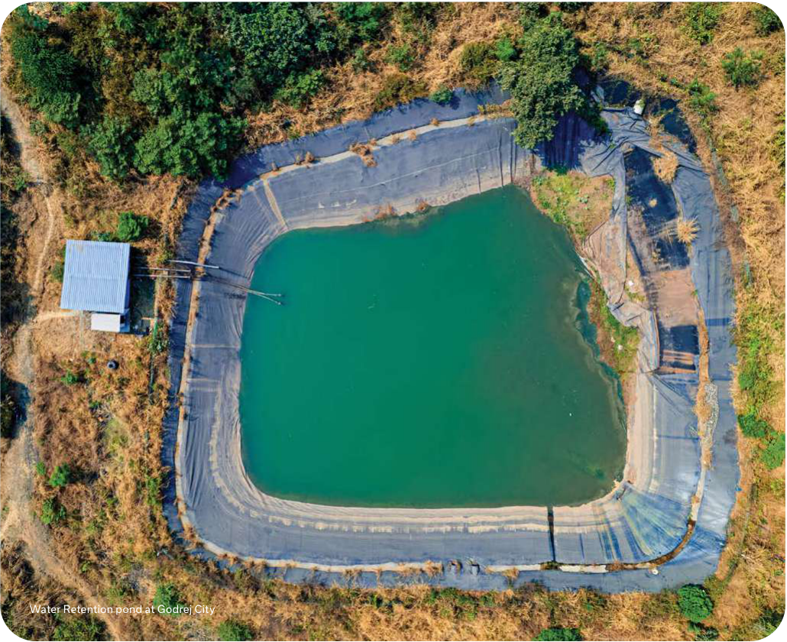

**[Image: AnnualReport2025.pdf-0064-04.png (1030x841, 1989.6KB)]**

<!-- Start of picture text -->
Water Retention pond at Godrej City <!-- End of picture text -->

###### **FROM DRYLANDS TO LIFELINES** 

Water scarcity remains one of the most urgent challenges of our time. We recognised the need for proactive, community-focused solutions and launched an integrated watershed development project in 2016. Spanning approximately 3,300 hectares, the initiative covered the villages of Bavi, Zapewadi, and Jamb in Maharashtra’s drought-prone Beed district. 

The implementation phase was successfully completed in 2019, made possible through the invaluable support of the National Bank for Agriculture and Rural Development (NABARD) and our NGO partner. To assess the real, on-ground impact of the intervention, we collaborated with the Ekonnect Knowledge Foundation for an independent evaluation. 

###### **POND REJUVENATION AT GODREJ SUNRISE ESTATE, CHENNAI** 

We undertook the transformation of a long-neglected pond into a thriving rainwater harvesting system. This initiative went beyond infrastructure; it revitalised a forgotten space to serve both environmental and community needs. 

An advanced stormwater drainage network was installed to capture and reuse rainwater, helping mitigate flood risk and support groundwater recharge. Around the rejuvenated pond, we developed a tranquil community park that offers green open spaces for recreation and wellness. Thoughtfully integrated landscaping and water features further reduced the urban heat island effect, creating a more pleasant and sustainable microclimate for residents. 

**WE HAVE BEEN ABLE TO GIVE BACK (25X) MORE THAN WE CONSUMED DURING OUR OPERATIONS, THUS BECOMING WATER POSITIVE** 

###### **Harnessing Natural Topography for Sustainable Water Management** 

At Godrej City in Panvel, Maharashtra, we have utilised the site's natural topography to develop a sustainable and efficient water management system. With an average monsoon rainfall of around 450 mm per month, we constructed a strategically located water retention pond at an intermediate elevation, aligning with the natural contours and slopes of the land. Covering a catchment area of approximately 22 acres, the pond captures and stores rainwater, which is then distributed downstream using gravity flow. 

Designed to hold up to 4 Million litres of water, the retention pond is lined with a durable HDPE geomembrane. Weep holes on the upstream side allow gradual percolation into a separate storage tank, helping extend water availability into the post-monsoon months of September and October. This system significantly reduces dependence on external water sources such as tankers, thereby promoting sustainability and improving operational efficiency. 

**[Image: AnnualReport2025.pdf-0064-15.png (182x16, 7.9KB)]**

<!-- Start of picture text -->
Watershed Project at Beed <!-- End of picture text -->

120 

121 

**GODREJ PROPERTIES LIMITED** 

INTEGRATED REPORT 2024-25 

### **PRESERVING AND NURTURING BIO-DIVERSITY** 

We recognise the importance of preserving biodiversity as a critical element of sustainable development. Our approach involves integrating ecological considerations into every stage of our projects. We actively engage with environmental experts to evaluate the biodiversity value of our sites, identify potential risks, and design strategies to safeguard natural habitats. Through meaningful collaborations and leveraging innovative methodologies, we aim to create developments that coexist harmoniously with the environment while ensuring minimal ecological disruption. 

###### **MATERIAL ISSUES LINKAGES** 

> 12 Water Management 

###### **STRATEGY LINKAGE** 

Operational Excellence 

###### **UN SDGS LINKAGE** 

**[Image: AnnualReport2025.pdf-0065-09.png (82x82, 9.6KB)]**

###### **FY 24-25 HIGHLIGHTS** 

**65 22** sites where biodiversity sites where EIA Assessments impacted assessments were conducted were conducted in the **FY 23-24 | 6** last five years **FY 23-24 | 49** 

Godrej Royale Woods, Bengaluru RERA No: PRM/KA/RERA/1250/303/PR/200515/003411 122 GRI 304-1, 304-2, 304-3, 304-4, 101-1, 101-2, 101-3, 101-4, 101-5, 101-6, 101-7, 101-8 

123 

GODREJ PROPERTIES LIMITED 

INTEGRATED REPORT 2024-25 

###### **BIODIVERSITY RISK ASSESSMENTS** 

We prioritise the identification and monitoring of protected areas surrounding our project sites to evaluate and minimise our impact on them. We recognise biodiversity as a critical component of sustainable development. Our Biodiversity Risk Assessment Process is designed to systematically identify, evaluate, and manage nature-related risks across our operations and value chain. 

We follow a structured, location-specific approach to assess biodiversity risks, focusing on how our own operations, adjacent areas and value chain interact with nature. This means assessing dependencies (e.g., water regulation, flood protection, air purification) and impacts (e.g., habitat disruption, pollution, land use change) at specific project sites and along the upstream and downstream segments of our operations. 

Our biodiversity risk assessment process is guided by globally recognised methodologies and frameworks like the Taskforce on Nature-related Financial Disclosures (TNFD) LEAP approach, to ensure consistency, reliability, and transparency in identifying and managing naturerelated risks. 

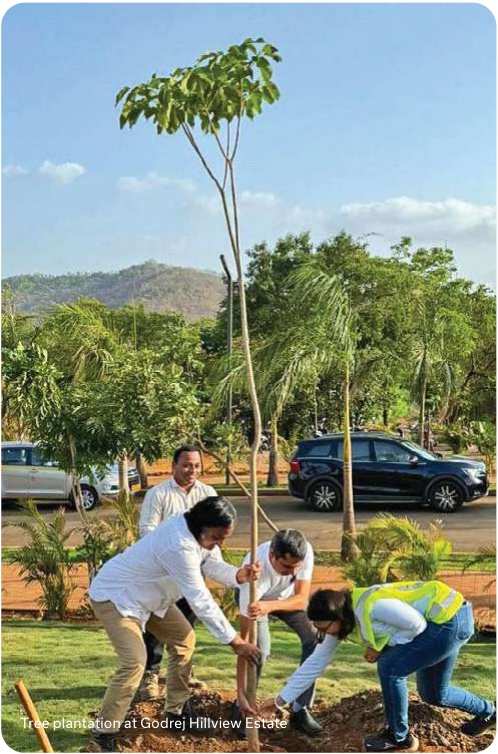

**[Image: AnnualReport2025.pdf-0066-06.png (498x754, 780.9KB)]**

<!-- Start of picture text -->
Tree plantation at Godrej Hillview Estate <!-- End of picture text -->

###### **Biodiversity Risk Assessment Process** 

###### **DEFINE SCOPE** 

Identify project sites, adjacent areas (within 5-10 km), and relevant upstream/ downstream activities. 

###### **IDENTIFY DEPENDENCIES AND IMPACTS** 

Assess how operations rely on and affect natural ecosystems (e.g., water use, habitat disruption). 

###### **SCREEN SENSITIVE AREAS** 

Use tools like IBAT, WWF Risk Filter, and ENCORE to map biodiversity risks at specific locations. - to be checked. 

###### **CLASSIFY RISKS** 

Categorise risks as physical, regulatory, reputational, or operational and integrated in the the organisation risk management framework. 

###### **CONSULT STAKEHOLDERS** 

Engage local communities, biodiversity experts, and regulators for validation and input. 

###### **INTEGRATE AND ACT** 

Feed results into risk management; prepare mitigation plans and implement site-level actions. 

###### **MONITOR AND REPORT** 

Track biodiversity KPIs, apply mitigation hierarchy, and disclose performance. 

###### **RESTORING WHILE WE BUILD** 

A structured mitigation approach is followed, emphasising avoidance, minimisation, restoration, and offsetting to reduce environmental impact. 

Environmental Impact Assessments are undertaken at every site in accordance with Ministry of Environment, Forest, and Climate Change (MoEFCC) regulations. 

In FY 24-25, we carried out comprehensive biodiversity surveys at Maanhinjewadi in Pune, Sumthana in Nagpur, Sector 49 in Gurgaon, Banerghatta and Whitefield in Bengaluru to gain deeper insights into the local ecosystem, including flora, fauna, and ecological dynamics. Specialised stream surveys were conducted to document native topography, enabling us to align our development activities with the goal of minimising habitat disturbance. The primary biodiversity risks identified from the above assessments include habitat degradation and vegetation loss from land-use changes, soil degradation and erosion due to construction, air pollution, elevated noise levels; and introduction of invasive species threatening native biodiversity. We have devised comprehensive mitigation measures such as afforestation, native species restoration, pollution control, rainwater harvesting, installation of sewage treatment plants, and creating green buffers to safeguard local ecosystems. These surveys are being extended to all our development sites. 

We refrain  from operational activities in notified areas, eco-sensitive zones, World Heritage sites, and IUCN (International Union for Conservation of Nature) Category I-IV protected areas. 

We have taken meaningful steps toward achieving a net positive impact on biodiversity by going beyond mitigation to ensuring that the natural environment is left in a better state than before development. Our projects are designed to integrate sustainable amenities, including rainwater harvesting systems, solar panels, and other ecofriendly initiatives that actively reduce carbon emissions while promoting a healthier living environment. We are committed to conserving 15% to 20% of the natural topography across all developments. This year, we strengthened our biodiversity efforts by planting 6,227 trees across operational regions. 

We are committed to achieving a net positive impact (NPI) on biodiversity by 2035 and “No Net Deforestation” by 2030 across all operations. 

###### **Our Structured Approach to Mitigating Environmental Impact** 

###### **1. AVOIDANCE** 

###### **4. OFFSETTING** 

- Operations, construction, and development activities are strictly prohibited in legally protected areas, including IUCN-designated categories Ia, Ib, II, III, and IV. 

   - Initiatives include enhancing vegetation on barren lands and establishing medicinal plantations in community spaces, with active engagement of local communities. 

      - Planting native species is prioritised to foster ecological restoration. 

- Technical standards have been established to incorporate biodiversity and ecosystem management into decisionmaking processes for both new and existing projects. 

   - 

- Standard Operating Procedures (SOPs) are implemented to prevent the introduction of invasive species during transportation of vehicles and goods. 

###### **2. MINIMISATION** 

###### **5. TRANSFORMATION** 

- Environmental Management Plans (EMPs) are employed to mitigate air, noise, water, and soil pollution. 

   - Conservation activities include protecting endangered species, setting up conservation centres, offering wildlife rescue services, and supporting forest fire prevention measures. 

- Greenbelt development initiatives are undertaken to reduce the impact of pollutants. 

   - Local community involvement is promoted through livelihood improvement initiatives, public awareness campaigns, and training for forest personnel. 

- Compliance with Biodiversity Management Plans is regularly reviewed across all project sites. 

- Sustainable practices are encouraged through the use of eco-certified wood. 

###### **3. RESTORATION** 

- Restoration efforts focus on replanting native and endangered flora, removing invasive species, rehabilitating disturbed areas, and restoring water bodies to conserve biodiversity. 

124 

125 

GRI 2-25 

GODREJ PROPERTIES LIMITED 

INTEGRATED REPORT 2024-25 

###### **IN THIS SECTION** 

Green Building Commitment 130 Promoting Sustainable Lifestyles 134 Innovation in Action 136 

126 

GODREJ PROPERTIES LIMITED 

INTEGRATED REPORT 2024-25 

### **PRECISION WITH PURPOSE** 

We are mindful of the parallels between advanced manufacturing and modern construction. We uphold the highest standards throughout each project's lifecycle, ensuring unparalleled quality and speed. Committed to environmental responsibility, we adopt renowned rating systems like IGBC, LEED, and GRIHA to deliver sustainable solutions to our customers. 

###### **MATERIAL ISSUES LINKAGES** 

###### **STRATEGY LINKAGE** 

> 6 Product and Quality 

> 5 GHG Management 

- 12 Water Management 

Operational Excellence Quality Focus 

> 11 Environment Management & Compliance 

###### **UN SDGS LINKAGE** 

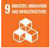

**[Image: AnnualReport2025.pdf-0068-12.png (82x80, 13.0KB)]**

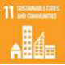

**[Image: AnnualReport2025.pdf-0068-13.png (80x80, 15.0KB)]**

**[Image: AnnualReport2025.pdf-0068-14.png (83x80, 9.7KB)]**

**[Image: AnnualReport2025.pdf-0068-15.png (80x80, 11.0KB)]**

**[Image: AnnualReport2025.pdf-0068-16.png (83x80, 12.0KB)]**

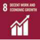

**[Image: AnnualReport2025.pdf-0068-17.png (80x80, 11.8KB)]**

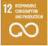

**[Image: AnnualReport2025.pdf-0068-18.png (82x80, 12.2KB)]**

###### **FY 24-25 HIGHLIGHTS** 

**100%** of our Projects In our Reporting Boundary are Green Building Certified Homes or Under Certification **FY 23-24 | 100%** 

**139Mn. sq.ft.** 

Green Building Certified Homes 

**FY 23-24 | 117 Mn sq. ft.** 

**12.51Mn. sq.ft.** Green Residential Societies **FY 23-24 | 10.86 Mn sq. ft.** 

128 GRI 2-25, 417-1, 302-5 

129 

GODREJ PROPERTIES LIMITED 

INTEGRATED REPORT 2024-25 

### **GREEN BUILDING COMMITMENT** 

As a founding member of the Indian Green Building Council (IGBC), Godrej Properties has been instrumental in advancing sustainable real estate practices, promoting green building adoption, and enabling certification. Our deep engagement with IGBC, along with our continuous efforts to enhance our own sustainability benchmarks, contributes to the overall elevation of green building standards in India. We are committed to delivering environmentally responsible solutions to our customers by adopting renowned rating systems such as IGBC, LEED, and GRIHA. 

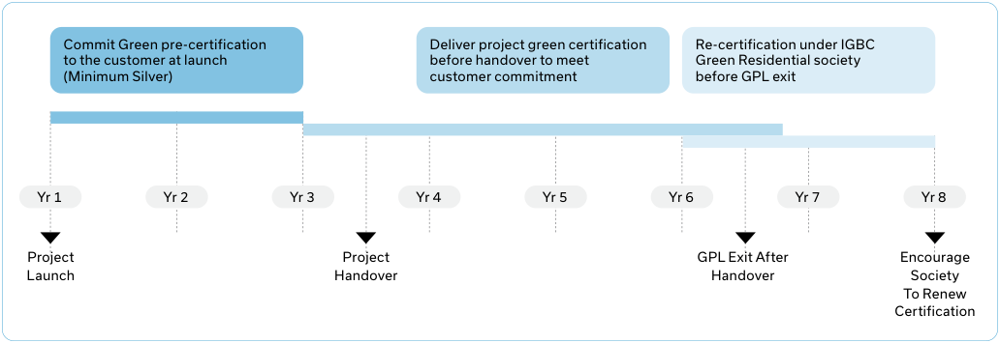

**[Image: AnnualReport2025.pdf-0069-04.png (1032x355, 39.3KB)]**

<!-- Start of picture text -->
Commit Green pre-certification  Deliver project green certification  Re-certification under IGBC to the customer at launch  before handover to meet  Green Residential society (Minimum Silver) customer commitment before GPL exit Yr 1 Yr 2 Yr 3 Yr 4 Yr 5 Yr 6 Yr 7 Yr 8 Project  Project  GPL Exit After  Encourage Launch Handover Handover Society To Renew Certification <!-- End of picture text -->

IGBC Green Homes Pre-Certification IGBC Green Homes Certification IGBC Green Residential Societies Certification 

**01 RESOURCE CONSUMPTION MONITORING CAPABILITIES OUR MANDATE IS TO ENSURE A MINIMUM UTILISATION OF SUSTAINABLE MATERIAL 02 OF IGBC SILVER RATING (OR EQUIVALENT IN OTHER RATING SYSTEMS) ACROSS ALL INCLUSIVE & ECO-EFFICIENT DESIGN 03 PROJECTS. BIODIVERSITY & GREEN COVER 04 RENEWABLE ENERGY 05 139* Mn sq. ft.** Green building certified homes **MATERIAL USE & RECYCLE 04 RESOURCE EFFICIENT EQUIPMENT 05** 

*The following projects are excluded from the portfolio boundary since  they have been initiated/developed before our commitment towards  delivering green buildings: Godrej 17 (Bengaluru), Godrej Woodsman Estate (Bengaluru), Godrej Alpine (Mangalore), Godrej Sherwood (Pune), Godrej Bayview (Mumbai), Godrej Edenwoods (Mumbai), Godrej Glenelg (Mumbai), Godrej Hill (Mumbai), Godrej Pine (Mumbai), Godrej Riverside (Mumbai), Godrej Sky Garden (Mumbai), Godrej Waldorf (Mumbai), and Planet Godrej (Mumbai). Godrej Palm Grove (Bengaluru), Godrej Gold County (Bengaluru), Godrej Azure (Chennai) are no longer under our operational control. Further, all plotted development projects are excluded as no suitable green building certification is available for such developments. 

###### **GREEN BUILDING IMPACT STUDY** 

We conducted a study to measure how green building affects crucial resident liveability metrics such as daylighting, water, and waste management. This study analysed 94,045 green homes being developed up to FY 2023-24, outlining the concrete advantages of green homes for our customers. We will repeat this study every 3 years to consistently track the impact. 

###### **Offsetting our Energy Consumption from the Grid with Onsite Renewable Energy Generation** 

###### **Ensuring Responsible Procurement and Efficient Use** 

###### **30%** 

###### **117Lakhs kWh/Year** 

Average percentage of procurement of green certified materials 

Renewable energy generation potential on site 

###### **37%** 

###### **<400Km** 

Common area lighting load is met through renewable energy 

Maximum distance from our project sites within which the materials can be procured 

###### **11,502 tCO2e** 

###### **11%** 

Estimated total avoided emissions by use of renewable energy 

Average reduction in procurement of Virgin Materials 

###### **Contributing to Reducing Global Warming Includes** 

**Enabling Responsible Waste Management** 

###### **120 Mn Kwh/Year** 

###### **82%** 

Energy savings compared to baseline as per IGBC simulation measures 

of the organic waste generated on site is treated 

###### **37%** 

###### **9,652 Tonnes/Year** 

Projects across GPL's portfolio that have adopted on-site renewable energy 

Compost generated 

###### **98,980 tCO2e/Year** 

###### **483 Acres/Year** 

Estimated avoided emissions through design efficiency 

of land can be catered through the compost generated 

**[Image: AnnualReport2025.pdf-0069-38.png (447x57, 3.1KB)]**

<!-- Start of picture text -->
Promoting Health and Well-Being <!-- End of picture text -->

###### **Reducing Dependency on Fresh WaterSources** 

###### **82%** 

###### **100%** 

Percentage of homes optimised for enhanced fresh air ventilationt 

Requirements of Flushing & Landscaping met through on-site treated water 

###### **89%** 

###### **36%** 

Percentage of average regularly occupied spaces optimised for daylighting 

Water reused on site 

###### **63%** 

Reduction in water consumption from base case 

130 

131 

**GODREJ PROPERTIES LIMITED** 

INTEGRATED REPORT 2024-25 

###### **EFFECTIVE WATER MANAGEMENT** 

We have embedded the overall water management strategy into the design of our built environment, where we prioritise features that reduce water consumption for occupants. This includes the use of indigenous, drought-resistant vegetation, installation of low-flow water fixtures, and customer education initiatives to promote mindful water use. 

###### **Key Aspects Of Our Water Management Strategy** 

###### **Engage With Customers** 

###### **Encourage Design Of Water Efficient Homes** 

Spread awareness regarding the significance of water preservation and its environmental ramifications. Share practical guidance on implementing water-saving practices within individual properties. Collaborate with community-based organisations or initiatives focused on water conservation to host educational workshops, initiatives, or gatherings. Such endeavours foster a sense of community engagement, motivating customers to actively engage in conserving water resources. 

Create water-efficient design standards and checklists offering precise guidance for architects and facilities management teams. These resources should encompass details on water-saving fixtures, appliances, landscaping methods, and rainwater harvesting tactics. 

###### **Reduce Irrigation Water Requirements** 

###### **Enhance Awareness** 

Utilise indigenous flora and vegetation that are naturally suited to the regional climate and demand less water. Resilient species that are drought-tolerant can flourish with minimal irrigation, leading to a decrease in overall water consumption. Implement waterefficient irrigation methods like drip irrigation or micro-sprinklers. These systems deliver water precisely to the plant roots, minimising evaporation and ensuring effective water distribution. 

Promote awareness by highlighting the importance of water efficiency, especially in residential developments recognised with the IGBC Platinum rating. Encourage individual water metering and emphasise the benefits of water-efficient design, such as reduced water bills, environmental sustainability, and long-term cost savings. 

###### **Minimise Dependence On Groundwater** 

###### **Measure Water Consumed** 

Incorporate water-saving fixtures like lowflow faucets, toilets, and shower-heads into all structures. Introduce rainwater harvesting systems to gather and store rainwater for non-potable purposes such as irrigation, toilet flushing, and cleaning. 

Implement water monitoring systems equipped with sensors to monitor water flow and usage across different sections of the property. Such systems offer valuable insights into specific areas exhibiting high or excessive water consumption. 

###### **UTILISATION OF SUSTAINABLE MATERIALS** 

We use building materials certified by GreenPro, an ecolabel developed by the Confederation of Indian Industry (CII). GreenPro follows a life cycle-based holistic assessment to evaluate products, ensuring they deliver measurable environmental benefits throughout their use. 

The GreenPro ecolabel is accredited by the Global Ecolabelling Network (GEN) under GENICES—the internationally coordinated ecolabelling system that upholds the credibility of Type I Ecolabels in accordance with ISO 14024 standards. GreenPro is also aligned with the UN Environment's Guidelines for Providing Product Sustainability Information. 

###### **To earn GreenPro certification, products are evaluated across the following areas** 

- Product Design 

- Product Performance 

- Raw Material and Manufacturing Process 

- Waste Management 

- Life Cycle Assessment 

- Product Stewardship 

- Innovation 

GreenPro-certified materials significantly enhance the performance of green buildings by reducing resource consumption and promoting occupant health and well-being. 

###### **These eco-labelled products support sustainable building practices in key areas such as:** 

- Energy Efficiency 

- Indoor Environmental Quality (low-emitting VOC materials, toxic-free substances) 

- Materials and Resources (low embodied carbon, recycled content) 

- Water Management 

- Waste Management (easily recyclable products) 

- Sustainable Soils 

###### **GreenPro-certified products span a wide range of categories:** 

The Environmental Product Declarations (EPDs) and Health Product Declarations (HPDs) for some of these materials are provided on page no. 510. Some of the categories used by us are: 

- Architectural Products 

- Boards, Panels and False Ceiling 

- Cement 

- Construction Aggregate 

- Construction Blocks 

- Construction Chemicals 

- CPVC Pipes 

- Doors & Windows 

- Ground Granulated Blast Furnace Slag 

- Health and Wellbeing Products (IAQ) 

- High Performance Glass 

- Laminates 

- Lighting Systems 

- Paints & Coatings 

- Plumbing Fixtures 

- Ready Mix Concrete 

- Solar Photovoltaic Module 

- Steel TMT Rebars 

- Structural Steel 

- Tiles 

- Ventilation Fans and Air Handling Units 

- Waste Water Treatment System 

###### **Responsible Consumption of Materials (Tonnes)** 

- AAC Blocks 36440 • Aluminium Windows & Panels 178 • Cement 10229 • Wood 3117 • Fire Door 30 • Glass 133350 • Gypsum Plaster 475 • Paints 187 • Pipes 191 • Ready Mix Concrete 1631718 • TOR Steel 307018 • Stone 4353 • Structural Steel 702 • Tiles 12945 • UPVC Windows 53 

132 GRI 3-3 

GRI 301-1 133 

GODREJ PROPERTIES LIMITED 

INTEGRATED REPORT 2024-25 

### **PROMOTING SUSTAINABLE LIFESTYLES** 

Recognising the immense potential for resource conservation in multi-dwelling residential communities, the Indian Green Building Council (IGBC) introduced the IGBC Green Residential Societies Rating System. This initiative serves as a structured framework to help residential complexes monitor, manage, and reduce their consumption of natural resources. By adopting this system, residents can benefit from enhanced efficiency, lower utility costs, improved environmental impact, and a healthier community lifestyle, ensuring both tangible and intangible long-term advantages. Our mandate is to ensure a minimum of IGBC silver rating (or equivalent in other rating systems) across all projects. 

###### **STEPS TAKEN TOWARDS SUSTAINABLE & INCLUSIVE LIVING** 

- We promote sustainable transportation with pedestrian-friendly layouts to reduce fossil fuel reliance. 

- We ensure buildings are within a 10-minute walk of transportation hubs. 

- We implement energy efficiency schemes to lower energy bills and adopt low-maintenance design practices for all projects. 

- Safety considerations are systematically integrated into the design and development of projects, encompassing key areas such as fire safety, structural integrity, and electrical and gas safety. 

- The resilience of the built environment to both current and future natural disasters—particularly flooding— is a core consideration during the design and development stages. Detailed flood risk assessments are conducted early in the planning process to inform critical design decisions. These include elevating plinth levels above known flood lines, incorporating efficient stormwater drainage systems, and using permeable surface materials to enhance ground absorption and reduce runoff. 

- We maintain clear evacuation plans and conduct training for tenants and visitors during handover. 

- GPL generates skill development opportunities for the local communities through traineeships. 

**[Image: AnnualReport2025.pdf-0071-12.png (474x545, 479.9KB)]**

- Our CSR programmes are thoughtfully designed to educate and engage local communities by raising awareness of key social and environmental challenges. 

- In collaboration with NGO partners, we enhance public spaces to improve liveability and foster community well-being. Through initiatives focused on biodiversity, waste management, and other environmental improvements, these programmes transform open, accessible areas into vibrant, sustainable spaces that encourage social interaction and a stronger sense of community. 

- We actively promote local economic development by sourcing goods and services from local SMEs, strengthening regional supply chains, and supporting the creation of local jobs and entrepreneurial growth. 

- GPL is committed to creating inclusive 

environments that go beyond compliance with accessibility laws by integrating universal design principles into every aspect of our developments. Our spaces are thoughtfully designed to accommodate individuals of all abilities, featuring ramps, elevators, accessible restrooms, designated parking for persons with disabilities, and nonslip surfaces. 

- GPL conducts ESIAs around project sites to evaluate potential effects on local communities and ecosystems. Based on these insights, we implement mitigation plans to minimise negative impacts and ensure our developments are both environmentally responsible and socially inclusive 

Our strong system processes have been built around quality management. We have created a framework consisting of checklist for delivering the best quality in the industry. 

###### **RAISING THE BAR IN QUALITY AND CRAFTSMANSHIP** 

###### **Quality-Driven Procurement** 

We implement rigorous sourcing criteria to ensure that only the highest-quality raw materials are used. Our procurement process includes strict quality filters to assess materials, contractors, and construction techniques, ensuring compliance with industry best practices and project specifications at both the preconstruction and post-construction stages. 

###### **Training and Skill Development** 

A commitment to continuous learning drives our approach to manufacturing excellence. All stakeholders— contractors, design consultants, and project teams— undergo regular training to stay ahead of industry advancements, evolving construction techniques, and quality standards. By fostering a culture of collaborative learning, we enhance on-site efficiency and execution, ensuring our developments set new benchmarks in quality. 

###### **Performance Measurement through Quality** 

###### **Indexing** 

We are transitioning from subjective assessments to data-driven quality evaluation through the Quality Score Index (QSI)—one of the most advanced quality benchmarks in the industry. Assessed at every stage, from excavation to handover, QSI enables real-time evaluation of material quality, workmanship, and project execution, reinforcing our commitment to precision and reliability. 

**[Image: AnnualReport2025.pdf-0071-28.png (343x14, 12.3KB)]**

<!-- Start of picture text -->
Show Apartment at Godrej Avenue Eleven, Mumbai <!-- End of picture text -->

###### **Engineering Excellence Through Critical to Quality (CTQ) Parameters** 

At GPL, quality is integral to every project stage, from design to delivery. Our Critical to Quality (CTQ) framework ensures key quality factors are met throughout. 

###### **End-to-End CTQ Framework** 

Product CTQs (Customer Delivery): We ensure zero structural defects in Reinforced Cement Concrete (RCC), like beam sagging, concrete spalling, or structural cracks. Design CTQs (Design Compliance): All structural elements adhere to IS codes, and building designs account for live, wind, and seismic loads per relevant IS standards. 

Process CTQs (Execution Excellence): We follow correct curing processes, maintain adequate reinforcement cover, strictly adhere to structural grid distances, observe de-shuttering timelines, test concrete water for permissible chloride levels, and keep RCC line and level within acceptable tolerance limits. 

###### **Triple-Check Quality Mechanism** 

To support our CTQ framework, we use a three-tiered quality assurance model: 

- Quality at Source | Compliance. 

- Quality Culture | Leadership Walkthroughs 

- Quality Delivery | Internal & External Audit 

By systematically embedding CTQs and upholding our triple-check mechanism, GPL continues to raise the bar for structural integrity, design compliance, and flawless execution. This in-house digital quality app serves 4000+ users across 75 projects. It replaced paperwork, ensuring traceability and accountability. Get data-driven insights and full customisation with this system-driven solution, compliance, and flawless execution. 

134 

135 

GODREJ PROPERTIES LIMITED 

INTEGRATED REPORT 2024-25 

### **INNOVATION IN ACTION** 

Innovation drives how we build smarter, faster, and more sustainably. From pioneering India’s first 3D-printed villa to integrating renewable energy, smart water meters, and advanced wastewater treatment technologies, we’re reimagining every aspect of urban living. Our developments also feature wireless surveillance and intelligent building systems that enhance safety and efficiency. With each breakthrough, we move closer to creating homes that are future-ready, resource-conscious, and truly differentiated. 

###### **INDIA’S FIRST 3D-PRINTED VILLA BY GODREJ PROPERTIES** 

GPL has unveiled India's first 3D-printed ground-plus-one (G+1) villa at Godrej Eden Estate in Pune, marking a significant advancement in innovation and sustainable construction. Completed in just four months, this innovative project showcases the potential of additive manufacturing to revolutionise the real estate sector. By employing 3D printing technology, GPL has significantly reduced construction time, material waste, and labour costs, while enhancing precision and durability. 

This approach not only minimises the environmental footprint but also aligns with GPL's focus on pioneering eco-friendly building practices. The villa's design incorporates energy-efficient features and utilises sustainable materials, setting new benchmarks for green real estate development in India. 

###### **ADVANCED WASTEWATER TREATMENT TECHNOLOGY** 

At Godrej City, we have implemented an Upflow Anaerobic Sludge Blanket (UASB) system integrated with a trickling filter Sewage Treatment Plant (STP). This advanced wastewater treatment technology enhances efficiency, lowers operational costs, and minimises environmental impact. 

###### **SMART WATER METERS** 

Smart water meters track real-time usage and detect leaks, helping reduce wastage. Over 18 months, this led to a saving of approximately 42.3 Lakhs Litres of drinking water. 

###### **WIRELESS CCTV** 

The deployment of wireless CCTV systems has enhanced security while significantly reducing environmental impact. By eliminating the need for extensive cabling, this technology has lowered installation and maintenance costs, improved image clarity over time, and ensured faster repairs. Additionally, its energy-efficient design contributes to a lower carbon footprint, providing a durable, long-term security solution with a lifespan of up to a decade. 

###### **SOLAR PANELS** 

We have adopted a hybrid energy strategy across our offices and project sites in the West-East Zone, combining conventional sources with solar photovoltaic and wind energy. Supported by green power partnerships, this approach reduces reliance on fossil fuels and strengthens our commitment to sustainable operations. At our projects in Pune and Mumbai, solar systems have generated 8,12,042 kWh of clean energy, resulting in electricity savings of approximately `I` 1.43 Crores and a reduction of 624 tCO2 emissions as of FY 2024–25. 

3D printed villa, Mann-Hinje Township, Pune 

136 

137 

**INTEGRATED REPORT 2024-25** 

**GODREJ PROPERTIES LIMITED** 

**DRIVEN BY PEOPLE PARTNERSHIPS IN THIS SECTION** Empowering Workforce 140 Customer First 174 Strengthening Supplier Synergies 180 Building Community Value 192 

138 

139 

GODREJ PROPERTIES LIMITED 

**INTEGRATED REPORT 2024-25** 

### **EMPOWERING WORKFORCE** 

We believe our people make all the difference. Whether it's welcoming young minds through campus programmes, helping individuals grow into leaders, or building a culture of appreciation, our aim is to support every career with care and intent. We’re equally committed to the emotional well-being of our teams, creating safe spaces to listen, connect, and grow. And we’re proud to build a workplace where everyone - across gender identities, abilities, and backgrounds - feels respected, included, and empowered to be their best. 

###### **MATERIAL ISSUES LINKAGES** 

###### **STRATEGY LINKAGE** 

> 2 Diversity, Inclusion & Equal Opportunity Individual Contribution to a strong organisational culture. 

> 3 Occupational Health & Safety 

- 17 Employee Engagement & Development 

###### **UN SDGS LINKAGE** 

**[Image: AnnualReport2025.pdf-0074-09.png (82x82, 11.7KB)]**

**[Image: AnnualReport2025.pdf-0074-10.png (80x82, 10.6KB)]**

**[Image: AnnualReport2025.pdf-0074-11.png (82x82, 10.2KB)]**

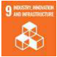

**[Image: AnnualReport2025.pdf-0074-12.png (82x82, 13.3KB)]**

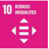

**[Image: AnnualReport2025.pdf-0074-13.png (82x82, 10.9KB)]**

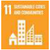

**[Image: AnnualReport2025.pdf-0074-14.png (83x82, 15.1KB)]**

**[Image: AnnualReport2025.pdf-0074-15.png (80x82, 10.9KB)]**

###### **FY 24-25 HIGHLIGHTS** 

**4,199 45,750 38.6%** Total Number of Employees Hours of Employee Training Diversity Ratio **FY 23-24 | 3,015 FY 23-24 | 28,842 FY 23-24 | 30.84%** 

**22 81** Total number of Learning Employee Engagement Score Programmes **FY 23-24 | 80 FY 23-24 | 15** 

140 

141 

GODREJ PROPERTIES LIMITED 

INTEGRATED REPORT 2024-25 

###### **FOSTERING A FUTURE-READY WORKFORCE** 

We cultivate a young, dynamic, and diverse workforce by prioritising campus recruitment, sector-specific skill development, and leadership training. Ours is an inclusive and supportive work environment where employees are encouraged to voice concerns through accessible channels, including an open-door and whistleblower policy. Our people-centric approach extends to competitive compensation, career development, continuous learning opportunities, and flexible work arrangements, reinforcing our commitment to professional growth and well-being. 

Aligned with our strategic priority of driving profitable growth, we focus on hiring the right talent and nurturing internal leadership. Talent retention remains a key focus, supported by structured recognition programmes that acknowledge and reward high performance. Our strong governance framework—including our Code of Conduct, core values, and comprehensive policies—ensures the protection and promotion of human rights at every level of the organisation. 

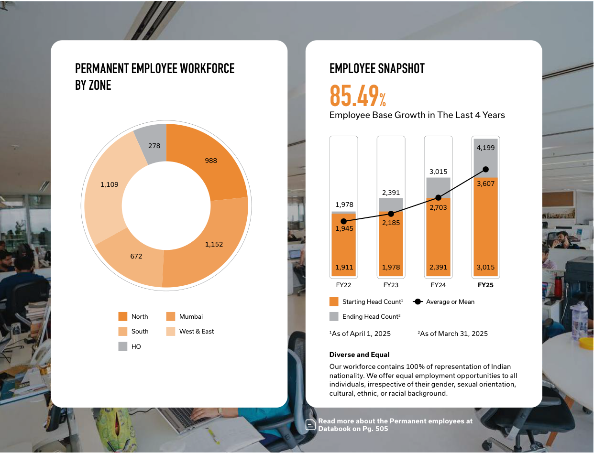

**[Image: AnnualReport2025.pdf-0075-05.png (1242x948, 562.7KB)]**

<!-- Start of picture text -->
PERMANENT EMPLOYEE WORKFORCE   EMPLOYEE SNAPSHOT BY ZONE 85.49% Employee Base Growth in The Last 4 Years 278 4,199 988 3,015 1,109 3,607 2,391 1,978 2,703 2,185 1,945 1,152 672 1,911 1,978 2,391 3,015 FY22 FY23 FY24 FY25 Starting Head Count 1 Average or Mean North Mumbai Ending Head Count 2 South West & East 1As of April 1, 2025 2As of March 31, 2025 HO Diverse and Equal Our workforce contains 100% of representation of Indian nationality. We offer equal employment opportunities to all individuals, irrespective of their gender, sexual orientation, cultural, ethnic, or racial background. Read more about the Permanent employees at Databook on Pg. 505 <!-- End of picture text -->

**[Image: AnnualReport2025.pdf-0075-06.png (1030x736, 1564.1KB)]**

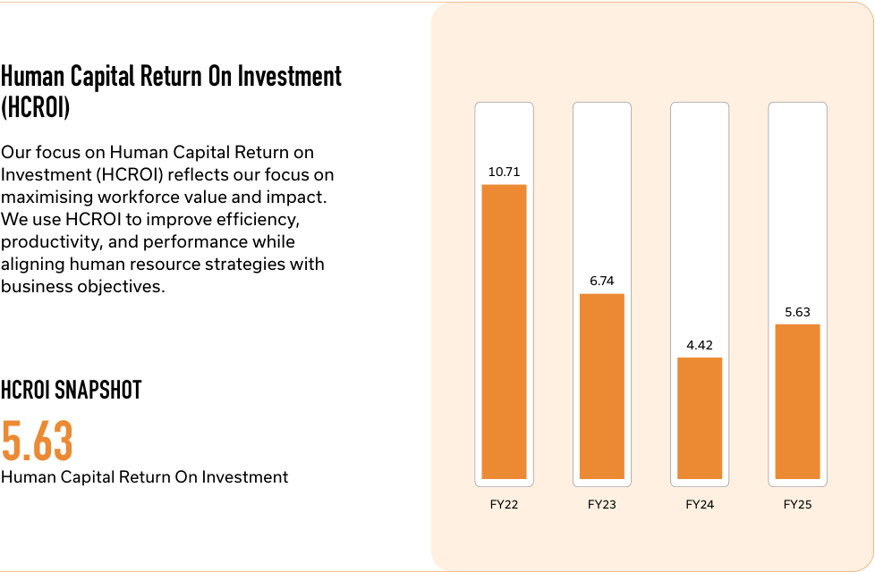

**[Image: AnnualReport2025.pdf-0075-07.png (978x640, 55.4KB)]**

<!-- Start of picture text -->
Human Capital Return On Investment (HCROI) Our focus on Human Capital Return on Investment (HCROI) reflects our focus on  10.71 maximising workforce value and impact. We use HCROI to improve efficiency, productivity, and performance while aligning human resource strategies with business objectives. 6.74 5.63 4.42 HCROI SNAPSHOT 5.63 Human Capital Return On Investment FY22 FY23 FY24 FY25 <!-- End of picture text -->

142 

143 

GODREJ PROPERTIES LIMITED 

INTEGRATED REPORT 2024-25 

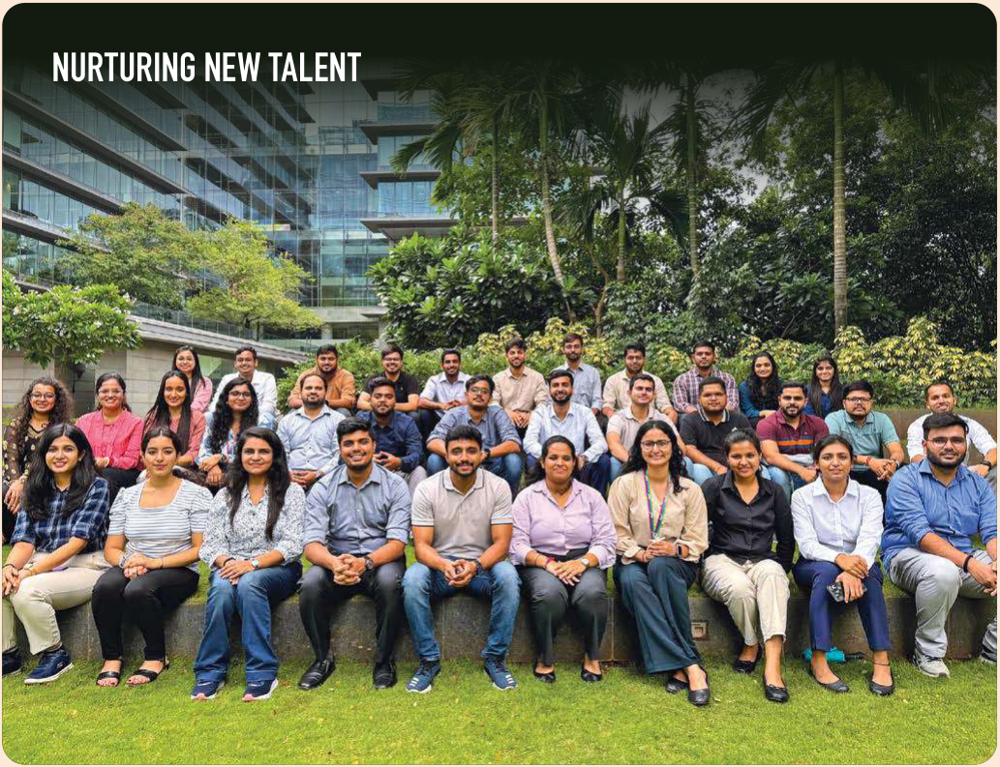

**[Image: AnnualReport2025.pdf-0076-02.png (1033x793, 1947.2KB)]**

<!-- Start of picture text -->
NURTURING NEW TALENT <!-- End of picture text -->

We consistently invest in top talent by welcoming bright, passionate individuals who bring fresh ideas and energy into the organisation. Through structured onboarding and meaningful exposure, we ensure new hires are seamlessly integrated into our culture and aligned with our purpose. Our strong presence across premier campuses helps us identify and attract high-potential students who are eager to make an impact. 

**600+** Campus hires onboarded (60 Gallopers, 45 Gurukulers, 233 ACERs, 290 Summersault interns), marking the largest cohort in GPL history. 

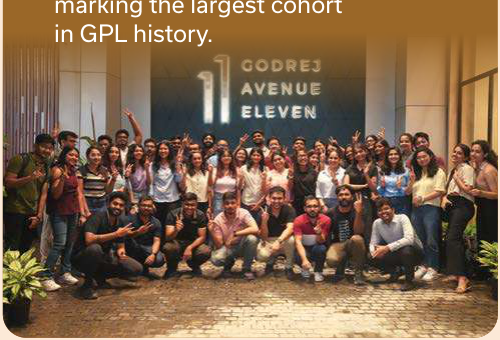

**[Image: AnnualReport2025.pdf-0076-05.png (500x340, 371.9KB)]**

<!-- Start of picture text -->
in GPL history. <!-- End of picture text -->

###### **New Hires** 

We prioritise hiring talent aligned with our business goals, focusing on diversity and expertise. We doubled intake from top-tier institutes, with 30% of hiring through campus initiatives and 60-70% via lateral recruitment. Our efforts now include talent acquisition from Dubai and returning Indian expats. 

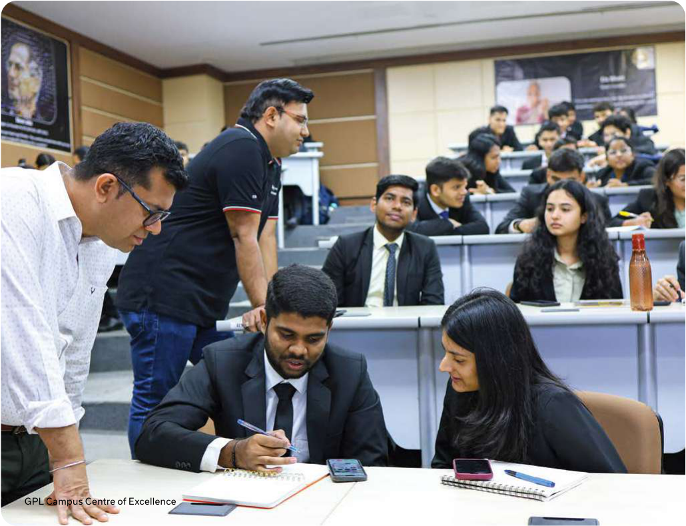

**[Image: AnnualReport2025.pdf-0076-08.png (1030x789, 1467.0KB)]**

<!-- Start of picture text -->
GPL Campus Centre of Excellence <!-- End of picture text -->

###### **Campus Centre of Excellence (CoE)** 

The Campus Centre of Excellence (CoE) at Godrej Properties is the driving force behind our “Building from Within” philosophy --tasked with developing a resilient, diverse, and future-ready leadership pipeline. As we embark on our Quantum Growth phase, the CoE is scaling talent initiatives that not only meet today's demands, but also anticipate the needs of tomorrow. 

###### **Campus CoE's Mission** 

**Identify, elevate, and unleash talent potential to power the next generation of leaders at Godrej Properties.** 

###### **Key Strategic Focus** 

- Expanding early career hiring across leading campuses to ensure a steady influx of high-calibre talent 

- Fast-tracking talent readiness through advanced learning journeys and function-specific certifications 

- Deepening diversity and inclusion with pioneering Programmes for women veterans and persons with disabilities (PwD) 

- Fostering a culture of innovation and leadership through experiential challenges and immersive industry exposure 

- Strengthening our employer brand through nationally recognised campus engagement 

144 

145 

GODREJ PROPERTIES LIMITED 

INTEGRATED REPORT 2024-25 

**[Image: AnnualReport2025.pdf-0077-02.png (204x74, 6.3KB)]**

**[Image: AnnualReport2025.pdf-0077-03.png (216x18, 9.7KB)]**

<!-- Start of picture text -->
Gallop & Gurukul batch FY 2025 <!-- End of picture text -->

**[Image: AnnualReport2025.pdf-0077-04.png (186x86, 8.7KB)]**

**[Image: AnnualReport2025.pdf-0077-05.png (178x55, 7.0KB)]**

###### **Gallop & Gurukul: Leadership Acceleration** 

The Gallop and Gurukul programmes form the cornerstone of our business leadership pipeline. Designed to attract top-tier talent from India’s leading B-Schools, these initiatives offer immersive, cross functional experiences that accelerate leadership readiness. Gallop is our flagship full-time managerial leadership programme, providing high-potential graduates with a structured 12-month journey comprising stint-based learning, executive mentorship, and capability-building. 

Gurukul, our two-month summer internship, serves as a direct feeder into Gallop and is anchored in the LOUD case competition and pitch challenge — a dynamic entry point for business-ready talent. Both programmes align with our commitment to nurturing diverse leadership across functions and geographies. In FY 2024–25, we expanded our outreach to 12 premier campuses, including new partnerships with IIM Kozhikode and IIM Mumbai and deepened industry engagement through leadership-led masterclasses. The active involvement of senior leaders in hiring, mentorship, and capabilitybuilding reflects our belief that investing in young talent today builds the leadership of tomorrow. 

###### **LEADERSHIP TRACKS** 

**[Image: AnnualReport2025.pdf-0077-10.png (367x368, 97.6KB)]**

<!-- Start of picture text -->
ARKETING S HR M N & IO S P T E A AL &L R S E P O <!-- End of picture text -->

**11%** Gallop alumni have reached Level 3+ leadership roles — including 2 of 4 current Zonal CEOs 

###### **Early Careers Development: ACER & Summersault** 

The ACER and Summersault Internship programmes are the foundation of our early careers strategy, designed to attract, assess, and rapidly elevate top talent from India’s leading engineering and post-graduate institutes to take up Project Leadership Team (PLT) roles. Following a 4-stage - multi-method selection, the process combines technical and cognitive assessments, real-world case challenges, video pitches, and rigorous interviews, ensuring only the most capable, well-rounded talent joins the organisation. 

The sector-first case challenge empowered students to solve real business problems. Following the Ready to Perform (RTP) framework, the certification (deployed for sales and customer centricity) reduced time to business impact by up to 50%. 

###### **CORE FUNCTIONS** 

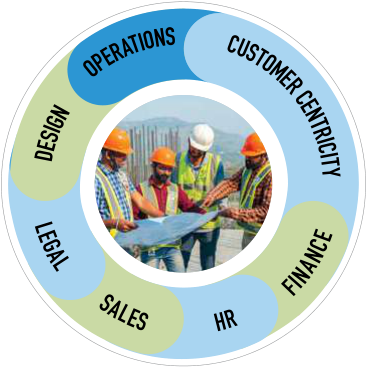

**[Image: AnnualReport2025.pdf-0077-16.png (368x368, 102.1KB)]**

<!-- Start of picture text -->
ONS H I R T S A CU E R L S A E T S OP OME FI R N C L A E A N N N G C IG T E R E S L E IC D IT Y <!-- End of picture text -->

**~** `O` **200 Cr** 

Contribution in business value by the top 25 Sales ACERs from the ~120 ACERs certified 

**70+** 

Campuses engaged nationwide 

**6,000+** 

Applicants 

**5** 

Master classes delivered at leading institutes; programme NPS exceeded 80 

**60+** 

Senior leaders (Level 3+) involved in mentoring, hiring, and delivering masterclasses 

146 

147 

GODREJ PROPERTIES LIMITED 

INTEGRATED REPORT 2024-25 

###### **TALENT DEVELOPMENT** 

Godrej Properties is more than just a workplace—it’s a space where talent is nurtured, potential is unlocked, and careers are shaped. We actively recognise and reward talent at every level. Our learning and development initiatives go beyond upskilling; they are designed to inspire, empower, and help our people thrive, ensuring they reach their full potential while contributing meaningfully to our shared vision. 

**Talent War Room** Launched in 2023 

At Godrej Properties, we prioritise an "internal-first" approach to talent acquisition, emphasising the development and promotion of existing employees to fill organisational roles. In addition to streamlining the backfilling process, this strategy also fosters career growth, enhancing employee engagement and satisfaction. 

Our talent strategy is centered around building capabilities, fostering continuous learning and nurturing future leaders.By focusing on performance and potential rather than tenure, we cultivate a high-performance culture that drives excellence. We are attracting young talent to the real estate sector, offering best-in-class compensation and rewards to ensure our team thrives. Our strong governance framework—including our Code of Conduct, core values, and comprehensive policies— ensures the protection and promotion of human rights at every level of the organisation. 

As part of our 'growth from within' ethos, Talent War Rooms have been instituted across all zones to proactively identify and develop high-potential talent for future leadership roles. Both editions of Talent war room were a success. We witnessed 284 and 185 participants in edition 1 and 2 of the programme, respectively, with ~90% and 51% active candidates moving to the next stage. 

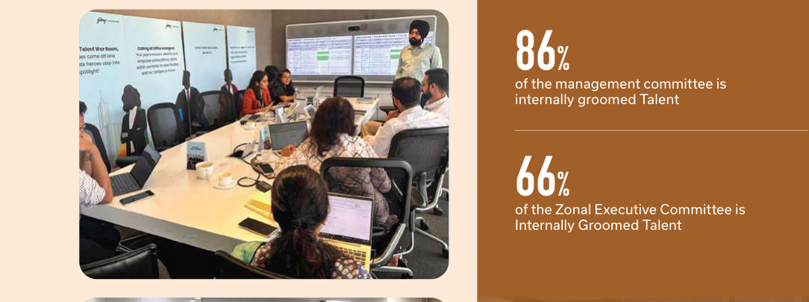

**[Image: AnnualReport2025.pdf-0078-08.png (1084x406, 437.3KB)]**

<!-- Start of picture text -->
86% of the management committee is internally groomed Talent 66% of the Zonal Executive Committee is Internally Groomed Talent <!-- End of picture text -->

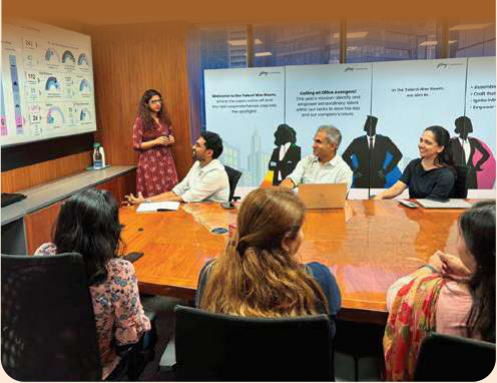

**[Image: AnnualReport2025.pdf-0078-09.png (497x383, 394.4KB)]**

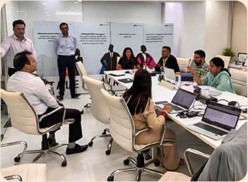

**[Image: AnnualReport2025.pdf-0078-10.png (498x365, 380.3KB)]**

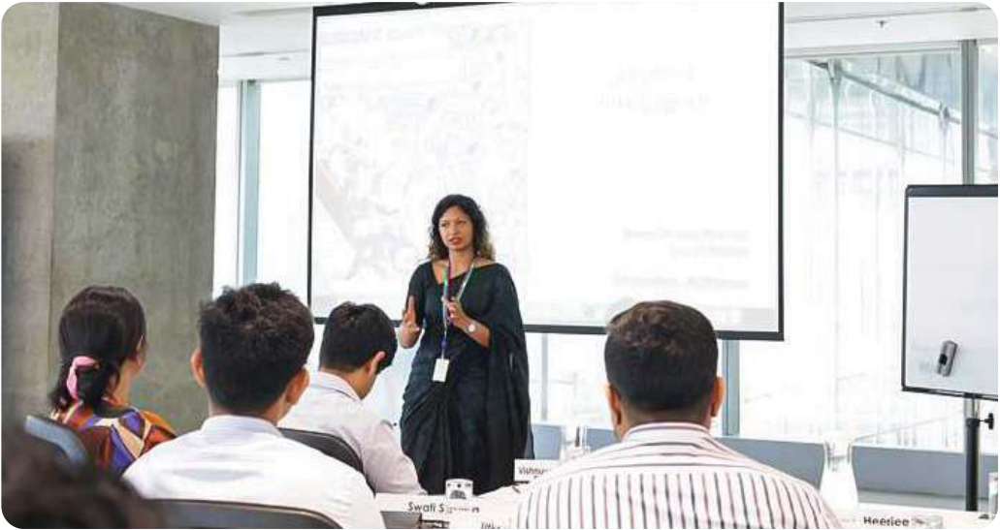

**[Image: AnnualReport2025.pdf-0078-11.png (1031x547, 682.3KB)]**

###### **Development Centres** 

Our Development Centres offer our employees structured, insight-rich assessments to evaluate their readiness for next level roles. At Godrej Properties, we are committed to developing future-ready leaders through our Development Centres. 

In the past year, over 113 employees participated in these programmes comprising of self-reflection, stakeholder feedback, and panel evaluations. The resulting insights provide targeted, actionable guidance that supports individual growth while strengthening our leadership pipeline and succession planning across the organisation. 

###### **MANAGEMENT DEVELOPMENT CENTRE (MDC)** 

**3.67x** 

For enabling transition from “Non-Management to Junior Management” levels 

|**North**|**South**|**West-East**|**Mumbai**|**Head Office**|**Total**|
|---|---|---|---|---|---|
|14|12|36|14|1|77|

Increase in total High-calibre Deputy Managers participating in MDC 

###### **LEADERSHIP DEVELOPMENT CENTRE (LDC)** 

**1.74x** Increase in total High-calibre Deputy Managers participating in LDC 

For enabling transition from “Junior Management to Middle Management” levels 

|**North**|**South**|**West-East**|**Mumbai**|**Head Office**|**Total**|
|---|---|---|---|---|---|
|8|9|7|7|5|36|

148 

149 

GODREJ PROPERTIES LIMITED 

INTEGRATED REPORT 2024-25 

###### **LEARNING AND DEVELOPMENT** 

At Godrej Properties, we place strong emphasis on structured learning, mentorship, digital readiness, and inclusive cultural engagement for our employees. We offer diverse training programmes and pedagogies to address the development needs of our varied workforce — including graduates, midcareer professionals, women veterans, persons with disabilities, and future leaders. We cover all our permanent and contractual workforce under these trainings. 

Our approach combines stint-based learning, mentorship, real-world projects, and immersive academies. Cross-functional training in digital readiness and cultural inclusion is seamlessly integrated, while function-specific tracks in Sales, Marketing, Operations, Customer Centricity, and Sustainability ensure targeted capability-building. 

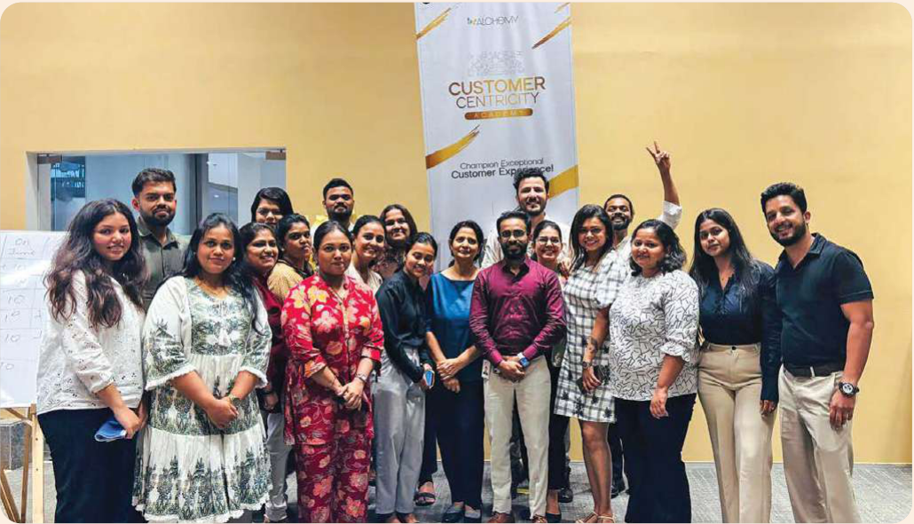

**[Image: AnnualReport2025.pdf-0079-05.png (1030x591, 1088.8KB)]**

###### **IMPACT** 

**45,750** Total Hours of Employee Training 

**10.9 23,897** Average training Total Hours of Employee hours per employee Training for Female 

**21,827** Total Hours of Employee Training for Male 

**3,600+** Learners empowered through 29 programmes since inception 

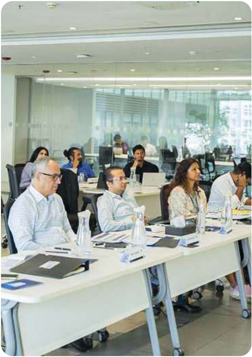

**[Image: AnnualReport2025.pdf-0079-11.png (498x704, 613.5KB)]**

**[Image: AnnualReport2025.pdf-0079-12.png (357x67, 17.1KB)]**

###### **GPL Alchemy** 

At GPL, we envision a world where growth knows no limits. Every challenge is seen as an opportunity to push beyond limits and reach one’s fullest potential. Launched in 2023, Alchemy holds a bold vision designed to unlock the true potential of our employees and drive our collective vision of quantum growth at GPL. It is crafted to inspire, empower, and enable, offering transformative learning experiences that prepare every GPLite for a brighter future. Our specialised academies cover Operations, Sales, and Customer Centricity, alongside forward-thinking programmes in Leadership, AI, and Sustainability. 

Alchemy is dedicated to driving holistic excellence, grounded in the GPL Codes. Whether we are building on our strengths or embracing new challenges, there’s something here for everyone to learn, share, and grow. 

##### **>50% lower** 

Attrition for Alchemy Academy Participants as compared to the overall organisational attrition rate 

###### **BUSINESS ACADEMY** 

###### **LEADERSHIP ACADEMY** 

Gateway to build functional mastery, honing expertise, and fostering an innovation-first mindset. These academies empower us to craft a competitive edge for ourselves and the organisation, driving precision, impact, and sector-leading talent. 

Designed to shape our future leaders who balance people, profit, and the planet. Through immersive, purpose-driven learning experiences, the academy helps our leaders become grounded in trust, responsibility, and growth. 

   - Zonal Executive Committee Academy 

   - • Leading Self Selector Capability • Catalyse 

- Operations Academy 

- Sales Academy 

- • Customer Centricity Academy • Design Academy • Profitability Academy 

**[Image: AnnualReport2025.pdf-0079-25.png (113x89, 3.1KB)]**

<!-- Start of picture text -->
THE FOUR PILLARS OF ALCHEMY <!-- End of picture text -->

###### **ALCHEMY NEXT ACADEMY** 

###### **ALCHEMY FOUNDATION ACADEMY** 

Prepares us to deliver exponential innovation using Artificial Intelligence and create future-friendly homes in a tech driven, sustainable world by cultivating forward thinking leadership. 

Helps integrate the new incoming talent seamlessly into GPL’s spirit and systems. It aligns them with our purpose, build capabilities, and set them up for success from day one through learning and mentorship. 

- AIgnite 

- • Sustainability 

150 GRI 403-8, 404-1, 404-2 

151 

GODREJ PROPERTIES LIMITED 

INTEGRATED REPORT 2024-25 

###### **Employee Development Programmes** 

###### **Aignite** 

Aignite empowers employees to apply AI in driving growth and efficiency. Through expert sessions, hands-on learning, and real-world case projects, participants gain confidence in using AI for business transformation. 

**[Image: AnnualReport2025.pdf-0080-05.png (215x107, 24.6KB)]**

###### **BUSINESS BENEFITS** 

###### `O` **13.3 Cr** 

Cost saving in year 1 from digital marketing project (incubated and adjudged as ‘Ready to Deploy’ through Aignite tank) 

###### **6x** 

RoI in 18 months after project is scaled 

###### **IMPACT** 

**25** Total Employee participated in FY 24-25 

###### **8.99%** 

FTE Participation 

###### **Launchpad RTP** 

This structured onboarding programme for new hires in Sales, CC, and Ops equips them with the values, culture, and capabilities needed to contribute from day one. It blends experiential learning, mentorship, and functional training. 

**[Image: AnnualReport2025.pdf-0080-17.png (203x73, 6.3KB)]**

###### **BUSINESS BENEFITS** 

`O` **200 Cr** 

Combined Business Value achieved by the Top 25 ACERs within the first four months post-RTP 

###### **50%** 

Reduction in time-to-performance for fresh talent post-RTP 

###### **IMPACT** 

###### **52** 

Total Employee participated in FY 24-25 

###### **18.71%** 

FTE Participation 

###### **Sustainability** 

Focused on building ESG expertise, the Sustainability Academy trains employees on sustainable design, Net Zero buildings, and construction waste management. 

**[Image: AnnualReport2025.pdf-0080-30.png (359x68, 18.1KB)]**

###### **BUSINESS BENEFITS** 

**6 Projects** Certified under IGBC Net Zero Waste (design) 

###### **1 Project** 

Certified under Net Zero Energy(Design) 

###### **IMPACT** 

**88** 

Total Employee participated in FY 24-25 

###### **31.65%** 

FTE Participation 

###### **Coaching and Mentorship** 

Leadership development at GPL is anchored in a structured 6–8-month coaching journey, where members of the Godrej Leadership Forum and high-potential talent work with expert coaches. Aligned to the Godrej Capability Factors (GCFs), the programme sharpens self-awareness, strategic thinking, and role readiness, consistently rated by senior leaders as one of the most impactful tools for growth. 

###### **Employee Resource Groups** 

Our Queers & Allies (Q&A) ERG has grown into a self-sustained inclusion engine, led by zonal champions and site-level POCs who drive quarterly initiatives. From sensitisation sessions and health awareness campaigns to storytelling events and film screenings, these programmes foster a safe, informed, and supportive environment for the LGBTQIA+ community and allies across GPL. 

###### **Cultural Engagement** 

We celebrate India’s diverse cultural heritage through festivals, food, and storytelling - woven into the everyday experience of working at GPL. These moments of shared joy nurture mutual respect, deepen social bonds, and build an inclusive workplace where everyone feels a sense of belonging. 

###### **Retire with Confidence** 

We are committed to supporting our employees not just during their careers, but also as they prepare for life beyond work. Retirement is a significant milestone, and we ensure that our people can make this transition with dignity, clarity, and peace of mind. We offer ongoing medical insurance to our retired employees, extending coverage to their spouses, children, and parents under Section 80D tax benefits, reinforcing our commitment to their continued wellbeing. These benefits help safeguard their health and reduce financial stress during retirement. 

**[Image: AnnualReport2025.pdf-0080-48.png (232x18, 9.1KB)]**

<!-- Start of picture text -->
Leadership Next Conference 2025 <!-- End of picture text -->

153153 

152 

GODREJ PROPERTIES LIMITED 

INTEGRATED REPORT 2024-25 

###### **PERFORMANCE EXCELLENCE** 

We are committed to creating an environment where individual potential is realised, achievements are recognised, and excellence is continuously nurtured. Our performance management and recognition frameworks are thoughtfully designed to align personal development with business outcomes, while reinforcing a culture of trust, transparency, and shared success. 

###### **Performance Management** 

###### **Goal Setting** 

###### **Mid-Review** 

###### **Annual-Review** 

Outline goals for the year and for the manager to review and finalise the same 

Final Review and feedback on Goals and GCFs and Final Annual Performance Rating 

Mid-year review and feedback on Goals and GCFs 

###### **Performance Appraisal Framework** 

Our performance appraisal framework is designed to support holistic development, encourage accountability, and align individual efforts with organisational goals. 

###### **Goal Setting** 

###### **Agile Conversations** 

At the beginning of each review cycle, employees define their annual goals in collaboration with their managers. These goals are aligned with business priorities using the Management by Objectives approach, ensuring clarity of expectations and strategic alignment. 

In addition to formal reviews, we promote continuous feedback through agile conversations — real-time, informal check-ins between managers and team members. These ongoing dialogues enhance coaching, improve responsiveness, and build trust. 

###### **Multidimensional Feedback (360-Degree** 

###### **Appraisals)** 

###### **Structured and Ongoing Reviews** 

We conduct two formal reviews — mid-year and annual — which assess progress, identify development areas, and reinforce accountability. These are based on clearly defined, measurable outcomes aligned with individual and team objectives, as well as the Godrej Capability Factors (GCFs) — a framework encompassing three key areas: Leading Self, Leading Others, and Leading Business. 

For mid and senior-level employees, the appraisal process incorporates 360-degree feedback, providing a well-rounded view of individual performance and leadership effectiveness. Feedback is collected from peers, managers, team members, and in some cases, clients — ensuring a comprehensive assessment. 

**100%** of Eligible employees covered under performance evaluation 

###### **Team based performance appraisal** 

Recognising that success is a collective endeavour, GPL uses a Business Index to capture and reward team performance. This index affects the variable compensation framework, reinforcing the value of collaboration, shared ownership, and mutual accountability. 

**19%** 

of employees who got promoted 

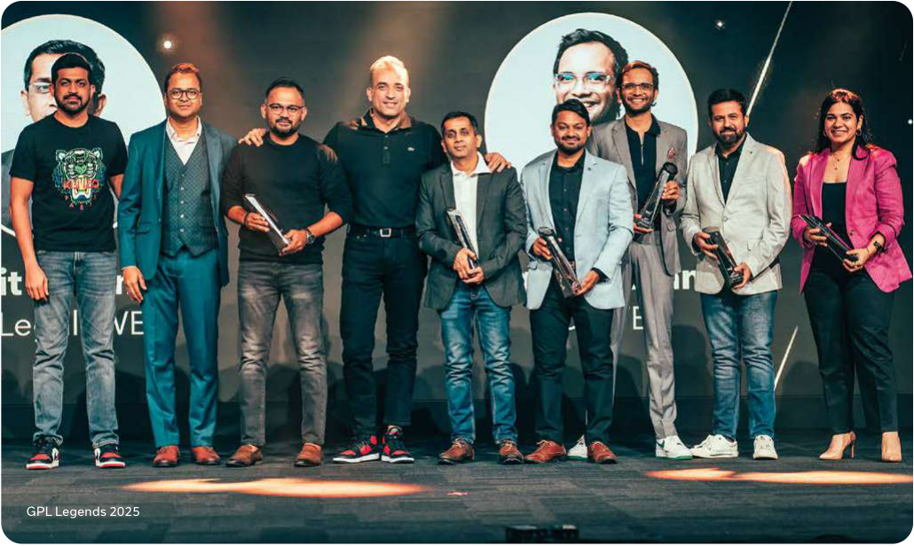

**[Image: AnnualReport2025.pdf-0081-27.png (1030x616, 1281.3KB)]**

<!-- Start of picture text -->
GPL Legends 2025 <!-- End of picture text -->

###### **Rewards & Recognition** 

###### **Structured Recognition Programmes** 

Recognising and rewarding excellence is integral to our people philosophy. Our comprehensive recognition framework highlights both individual brilliance and collaborative success, fostering a culture of motivation, appreciation, and belonging. 

GPL has instituted a variety of platforms to recognise outstanding contributions: 

###### **Bright Spot Awards** 

Real-time recognition for exceptional efforts and impact. 

###### **Competitive and Responsible Compensation** 

We are committed to offering competitive and industryaligned wages to our employees, reinforcing our commitment to social responsibility. We conduct regular industry benchmarking and sectoral compensation studies. This approach helps us maintain equitable pay practices and ensures that our diverse workforce is fairly compensated in line with regional economic conditions and evolving sectoral standards. All employees earn above the living wage, reinforcing our commitment to fairness and social responsibility. 

###### **Be-Live Awards** 

Quarterly zonal awards that honour performance aligned with GPL’s core values. 

###### **One GPL Awards** 

Introduced in FY 2024–25, these awards are presented at our One GPL townhalls to celebrate cross-functional teamwork and business-wide success. 

###### **GPL Legends** 

Our flagship annual recognition programme that celebrates top performers. The FY 2024–25 event was hosted in Finland alongside the Leadership Next conference, reinforcing our focus on strategic growth and leadership. 

###### **Performance-Linked Long-Term Incentives** 

Employees receive long-term cash incentives based on their individual contributions and the overall performance of the company. These are linked directly to the performance appraisal process and business performance, which reflects team performance and influences long-term incentives for all employees. This reinforces our emphasis on collective outcomes, shared accountability, and cross-functional collaboration. The long-term incentives are disbursed over a two-year period, encouraging sustained high performance and organisational loyalty. 

###### **Godrej Awards** 

A prestigious group-wide platform recognising excellence, innovation, and leadership across the Godrej Group. 

154 GRI 404-3 

155 

GODREJ PROPERTIES LIMITED 

INTEGRATED REPORT 2024-25 

###### **FOSTERING AN INCLUSIVE AND EQUITABLE WORKPLACE** 

###### **Delivering on Our Promise** 

At GPL, inclusion is shaped in everyday choices - who we hire, how we listen, where we create space, and whom we invite in. For us, diversity is more than a goal to be reached; it is a reality to be embraced with all its layers and lived experiences. 

In FY 2022–23, we made a bold, public commitment to reach 35% representation of cisgender women across the Company by FY 2024–25. We are proud to share that we have not only met, but surpassed this target ahead of schedule. 

###### **Our DEI Vision** 

This early milestone is a testament to the focused intent behind our initiatives and the collective will of teams across functions to build a more inclusive, equitable organisation. 

We want all our employees to contribute, collaborate and ultimately thrive at GPL, irrespective of their race, age, ethnicity, gender, gender identity, sexual orientation, disabilities, or any other factor that makes them a minority. Only when our employees thrive, can GPL create joy for our customers. 

This achievement was powered by targeted hiring drives, structured mentoring interventions, and a sharp focus on retention. Weekly zone-level cadence calls helped identify early resignation triggers, enabling swift action. Regretted attrition among women dropped from 19% to 15%, and early interventions helped retain 28 women colleagues, marking a 25% success rate. 

- We treat people like we would want to be treated 

- We embrace and celebrate diversity 

- We foster collaboration 

**35.2% % 2.4% %** 

**35.2% % 2.4% % 1%** Women LGBTQIA+ Persons with Disabilities (PwD) 

**[Image: AnnualReport2025.pdf-0082-15.png (496x28, 5.6KB)]**

<!-- Start of picture text -->
PERMANENT EMPLOYEE WORKFORCE BY DIVERSITY (%) <!-- End of picture text -->

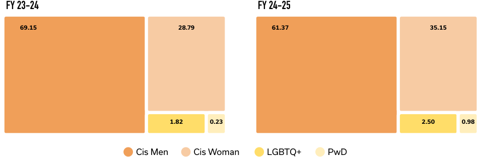

**[Image: AnnualReport2025.pdf-0082-16.png (953x312, 15.8KB)]**

<!-- Start of picture text -->
FY 23-24 FY 24-25 69.15 28.79 61.37 35.15 1.82 0.23 2.50 0.98 Cis Men Cis Woman LGBTQ+ PwD <!-- End of picture text -->

###### **BREAKING BARRIERS IN THE WEST EAST ZONE** 

**50%** 

In an industry long considered a male stronghold, this achievement signals a fundamental shift in culture. The West East Zone's milestone is the result of sustained and intentional action to build a workplace that is inclusive by design. 

of the workforce in the West East Zone now comprises diverse talent, including cisgender women, members of the LGBTQIA+ community, and persons with disabilities (PwD) 

###### **Key enablers** 

- Targeted recruitment campaigns aimed at underrepresented groups 

- Masked CV evaluations to reduce unconscious bias 

- A vibrant and visible Employee Resource Group (ERG) that championed year-round engagement on inclusion 

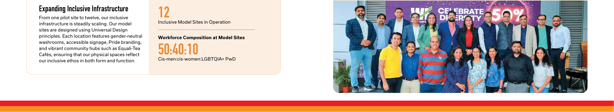

**[Image: AnnualReport2025.pdf-0082-25.png (2481x455, 1067.1KB)]**

<!-- Start of picture text -->
Expanding Inclusive Infrastructure 12 From one pilot site to twelve, our inclusive Inclusive Model Sites in Operation infrastructure is steadily scaling. Our model sites are designed using Universal Design principles. Each location features gender-neutral  Workforce Composition at Model Sites washrooms, accessible signage, Pride branding, and vibrant community hubs such as Equali-Tea 50:40:10 Cafés, ensuring that our physical spaces reflect our inclusive ethos in both form and function. Cis-men:cis-women:LGBTQIA+ PwD <!-- End of picture text -->

**[Image: AnnualReport2025.pdf-0082-26.png (2481x68, 0.8KB)]**

<mark>156</mark> 

<mark>157</mark> 

GRI 3-3 

GODREJ PROPERTIES LIMITED 

INTEGRATED REPORT 2024-25 

###### **Pride Internship** 

###### **FOSTERING PRIDE AND BELONGING** 

Our Pride Internship Programme, now in its 10th cohort, offers a dedicated nine-month runway for LGBTQIA+ talent to explore and build careers in real estate. The programme includes mentorship, skills training, and live projects. In FY 2024–25, 14 interns graduated from the programme, bringing our cumulative conversion rate to 50%, with 33 interns transitioning into full-time or contractual roles. The graduating cohort was felicitated by our MD & CEO and CHRO in a moment that celebrated talent, identity and ambition. 

We are shaping a workplace where individuality is acknowledged and celebrated. We continue to strengthen structural inclusion for our LGBTQIA+ colleagues through progressive policies, inclusive hiring, site-level visibility, and continuous engagement. For us, inclusion is a mindset, evolving through action and anchored in empathy. 

###### **A Year of Growth, Visibility and Voice** 

FY 2024–25 marked a defining year for LGBTQIA+ inclusion. We crossed 190+ queer employees across roles and locations, supported 65+ new hires, and deepened inclusion efforts across hiring, infrastructure and workplace culture. 

**50%** 

Pride Internship Conversion rate 

##### **33** 

**190+** Total Queer Employees 

Interns absorbed into Full-time or Project Roles 

##### **14** 

**65+** New LGBTQIA+ Hires in FY 24-25 

Graduates Celebrated in FY 24-25 

##### **31** 

##### **7.7%** 

Interns Currently Undergoing Training in Cohort 10 

↑ in Inclusive Representation+ 

**[Image: AnnualReport2025.pdf-0083-20.png (1030x510, 990.6KB)]**

<!-- Start of picture text -->
Pride Celebration at GPL <!-- End of picture text -->

###### **Out & Able: Celebrating Diversity and Inclusion** 

###### **Equali-Tea Cafés: Brewing Inclusion, One Cup at a Time** 

Our Out & Able event brought together 150 attendees, including 35 students inspired by our diversity and inclusion (D&I) journey. The event marked two meaningful milestones: 

In partnership with The Trans Café and the Shikandi Foundation, we launched Equali-Tea Cafés at nine locations across our sites and MOSAs. Staffed by transgender individuals and persons with speech or hearing impairments, the cafés offer more than refreshment—they provide employment, visibility and dignity in customer-facing roles. With every brewed cup, we serve inclusion in action. 

- **01** Two years of Q&A, our LGBTQIA+ Employee Resource Group (ERG), which continues to shape inclusive hiring practices and foster a sense of belonging across teams. 

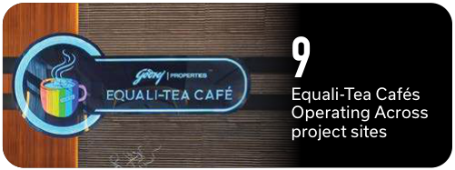

**[Image: AnnualReport2025.pdf-0083-26.png (501x187, 134.3KB)]**

<!-- Start of picture text -->
9 Equali-Tea Cafés Operating Across project sites <!-- End of picture text -->

- **02** The launch of ‘ThisAble Me’, our newest ERG focused on enabling persons with disabilities (PwD), **9** 

- alongside a hands-on workshop on Godrej’s ways Equali-Tea Cafés 

- of working. Operating Across project sites 

###### **Pride at Godrej One: Celebration. Solidarity. Inclusion.** 

###### **Policy Support** 

###### **Gender Affirmation Policy** 

In FY 2024–25, we introduced a best-in-class Gender Affirmation Policy to support transgender and non-binary employees through their transition journey. 

Pride Month 2024 came alive at our Head Office with a bold, joyful celebration of identity and inclusion. Across the campus, employee stories were showcased through powerful testimonial boards, while our “30 Days, 30 Acts of Allyship” campaign transformed small, everyday gestures into a movement for change. 

##### `O` **6 Lakhs** 

Annual support for gender-affirming surgery 

##### **250+** 

##### `O` **80,000** 

Attendees at Queer Bazaar 

Annual support For Hormone Therapy, psychological support & medical navigation 

##### **400+** 

Registrations for our Pride Mixer 

##### **10+** 

##### **14** 

Trans Employees supported with transitional accommodation 

Queer-owned Businesses Supported 

**[Image: AnnualReport2025.pdf-0083-45.png (500x287, 266.6KB)]**

<!-- Start of picture text -->
Queer Bazaar at GPL <!-- End of picture text -->

###### **Other Policies** 

We offer same-sex partner benefits on par with spouses, gender-neutral adoption and caregiving support, and comprehensive anti-harassment protections inclusive of sexual orientation and gender identity. Genderneutral washrooms, transgender accommodation, and our Gender Transition Policy are implemented across all major offices and project sites, ensuring inclusion isn’t conditional, but built into the very fabric of our organisation. 

158 

159 

GRI 201-3 

GODREJ PROPERTIES LIMITED 

INTEGRATED REPORT 2024-25 

###### **CREATING SPACES FOR ALL ABILITIES** 

We are committed to building inclusive spaces, both - in our developments, and within our organisation. As part of this commitment, we continue to enhance accessibility and enablement for Persons with Disabilities (PwD). From barrier-free workplace infrastructure and inclusive hiring practices to sensitisation workshops and career development programmes, we are working to create an environment where every individual has the opportunity to thrive with dignity and purpose. 

**[Image: AnnualReport2025.pdf-0084-04.png (305x123, 19.3KB)]**

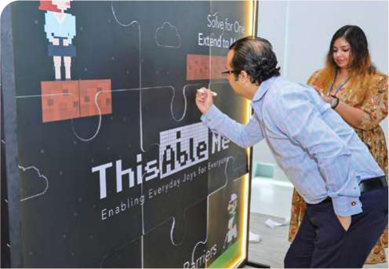

**[Image: AnnualReport2025.pdf-0084-05.png (496x343, 298.4KB)]**

###### **Inclusive Infrastructure in Action** 

True inclusion demands spaces that are designed for everyone. Our offices integrate universal access features such as ramps, accessible washrooms, height-adjustable desks and multi-sensory wellness rooms. This vision extends to our sites as well. 

This year, we launched our first Fully Accessible Model Site at ICC, Pune, featuring tactile flooring, Braille signage, auditory navigation, and full wheelchair accessibility. The launch builds on our Walk the Talks audits, live inclusion walkthroughs using wheelchairs, blindfolds and noise-cancelling headphones, and Silent Sites, where support teams are staffed predominantly by persons with speech and hearing impairments. 

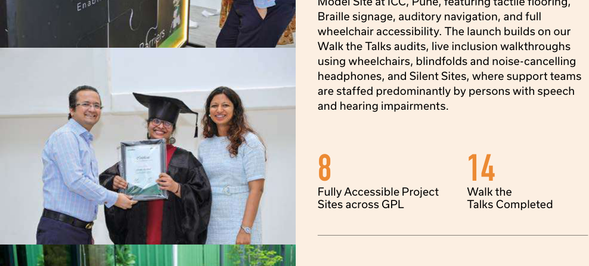

**[Image: AnnualReport2025.pdf-0084-09.png (988x446, 373.8KB)]**

<!-- Start of picture text -->
Braille signage, auditory navigation, and full wheelchair accessibility. The launch builds on our Walk the Talks audits, live inclusion walkthroughs using wheelchairs, blindfolds and noise-cancelling headphones, and Silent Sites, where support teams are staffed predominantly by persons with speech and hearing impairments. 8 14 Fully Accessible Project  Walk the Sites across GPL Talks Completed <!-- End of picture text -->

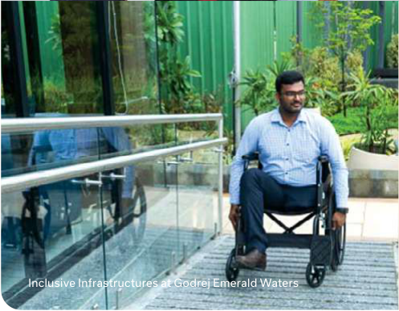

**[Image: AnnualReport2025.pdf-0084-10.png (497x387, 482.1KB)]**

<!-- Start of picture text -->
Inclusive Infrastructures at Godrej Emerald Waters <!-- End of picture text -->

**12** Silent Sites Operational, Staffed by Persons With Speech and Hearing Impairments 

###### **Designing inclusive spaces** 

**Accessibility:** Offices are equipped with ramps, elevators, and accessible restrooms, ensuring ease of access for individuals with disabilities. 

**Wellness Areas:** Dedicated spaces for relaxation and meditation promote mental well-being. 

**Inclusive Facilities:** Genderneutral restrooms, prayer rooms, and nursing rooms cater to diverse needs. 

Our guidelines and nursing rooms cater to provide a diverse needs. comprehensive framework for **Sustainable Practices:** Eco-friendly designers to materials, energy-efficient lighting, ensure inclusivity. and recycling Programmes support a sustainable workplace. 

**Ergonomic Workstations:** We provide adjustable ergonomic furniture, including height-adjustable desks and supportive chairs. 

**Flexible Workspaces:** We offer a mix of open-plan areas, private offices, and collaborative spaces to accommodate varied work styles. 

**Cultural Sensitivity:** We incorporate cultural elements in artwork and décor to celebrate diversity. 

###### **Shifting Mindsets, Building Empathy** 

###### **Laying the Foundation for Disability Inclusion** 

Our journey towards disability inclusion has matured from intention to infrastructure. Over the past two years, we have moved decisively from awareness to action—grounded in strategy, role-level fitment, and inclusive design. At the centre of this evolution is Project Pathmaker, a pioneering initiative to embed accessibility into workforce planning. 

Awareness remains the bedrock of disability inclusion. This year, we launched ThisAble Me, a visually accessible leaflet simplifying physical, cognitive and sensory disabilities. Earlier efforts, like our Super Mario-inspired gamified videos, brought to life disability scenarios through immersive, empathy-driven storytelling. Together, these initiatives are helping shift perceptions from limitation to potential, and fostering a more inclusive mindset across the organisation. 

In partnership with Enable India, we undertook a deep-dive diagnostic of ten critical roles across Finance, Operations, Customer Centricity, and Sales & Marketing. Each role was evaluated using a Red-Amber-Green (RAG) framework to assess task suitability across physical, sensory and cognitive disabilities—pinpointing fully accessible roles, those requiring reasonable adjustments, and others that could be adapted through job carving. 

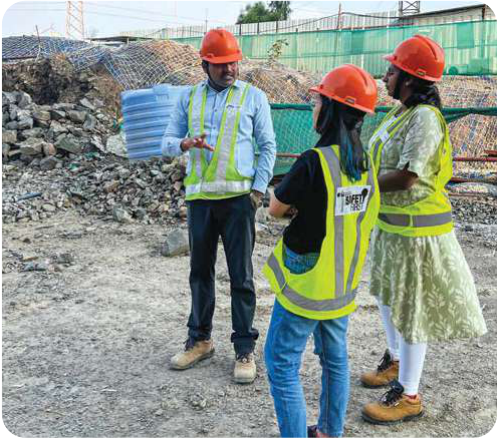

**[Image: AnnualReport2025.pdf-0084-25.png (498x438, 547.9KB)]**

This role-specific lens allows us to go beyond generalised inclusion and align hiring practices with business needs—building meaningful pathways for Persons with Disabilities (PwDs). 

**10 1** Key Business Roles Digital Fitment Tool Analysed Through Piloted to Automate Project Pathmaker Role-Disability Mapping 

160 

161 

GODREJ PROPERTIES LIMITED 

INTEGRATED REPORT 2024-25 

###### **SUPPORTING OUR WOMEN WORKFORCE** 

###### **CIS-WOMEN REPRESENTATION BY MANAGEMENT LEVEL** 

At Godrej Properties, we believe that a truly progressive workplace empowers every woman to lead, grow, and thrive. Our approach to gender equity is intentional and holistic—anchored in structured support systems, leadership development, inclusive culture-building, and ongoing policy evolution. This year, we advanced a series of transformative initiatives designed to equip women across the organisation with the tools and opportunities to realise their full potential. From grassroots interventions to enterprise-wide platforms, we are actively redefining equity in the real estate sector. 

|Non Management (L1)|**1,264****|****40%**|
|---|---|
|Junior Management (L2)|**206****|****24%**|
|Middle Management (L3)|**27****|****18%**|
|Senior Management (L4)|**2****|****7.4%**|
|**Total Women**|**1,495****|****35.2%**|

**4% 50%** Reduction in Regretted Attrition of Independent Directors are Women **25% % 23%** Success rate through Focussed Retention Efforts Direct Reports to the CEO Are Women 

**25% %** Success rate through Focussed Retention Efforts 

**25.1%** of professionals in STEM are women 

**39.1%** of professionals in Revenue Generating Functions are women 

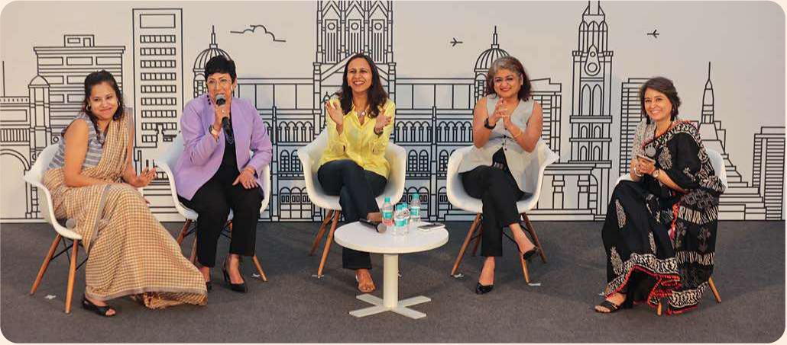

**[Image: AnnualReport2025.pdf-0085-10.png (1030x453, 836.2KB)]**

###### **Supporting Women at Every Stage** 

###### **Maternity Leave** 

###### **Daycare Facilities** 

We offer 26 weeks of fully paid leave to biological and surrogate mothers, with ongoing managerial support for a respectful and smooth return to work. 

We partnered with 7,000 accredited centres and reimburse up to 100% of daycare costs for three children, ensuring peace of mind for working parents. 

###### **Adoption Benefits** 

###### **POSH SOS Helpline** 

Our multilingual helpline operates from 8 AM to 8 PM, with a 3-tier escalation matrix ensuring sensitive, confidential, and swift resolution of all concerns. 

Adoptive and commissioning parents receive equal parental leave, helping them bond with their child and reinforcing a supportive approach to parenthood. 

###### **Caregiver Travel Policy** 

###### **Safety for Women Employees** 

We reimburse travel costs for employees caring for newborns, aging parents, or unwell family, easing the emotional and financial burden during critical times. 

With zero tolerance for harassment, our safety measures include POSH training, grievance redressal, audits, secure transport, and awareness drives, especially at project sites. 

###### **HummCare** 

###### **24X7 helpline** 

To enhance employee safety, we maintain a 24x7 multilingual POSH SOS helpline supported by both live agents and a telebot system. Operational from 8 AM to 8 PM in five languages, it connects complaints with the appropriate internal committees and also functions as an emergency support line, particularly for those working in remote or high-risk environments. 

We understand that inclusive workplaces must be designed for real-life needs. In FY 2024-25, we introduced HummCare, a maternity assistance platform offering around-the-clock medical advice, emotional support, and guided maternity care. The initiative has benefitted 17 employees since its launch. 

###### **24x7 helpline 5 languages 3-tier escalation** 

###### **ProEves Daycare** 

To ease the return-to-work transition, we also provide 100% reimbursement for daycare expenses for up to three children (aged 6 months to 6 years), supported by access to over 7,000 ProEves centres across India. This benefit is inclusive of adoptive and commissioning parents, ensuring equitable care support across all parenting journeys. 

Safety-first response system 

###### **Exit With Grace** 

###### **Supportive Women’s Area** 

###### **Welcome Back Assistance Programmes** 

With this initiative, we support women leaving due to caregiving or personal reasons by ensuring dignified offboarding and pathways for rejoining when circumstances improve. 

Dedicated wellness spaces across sites offer privacy, nursing rooms, and quiet zones, helping women manage health needs discreetly during the workday. 

Our programme helps women confidently resume work after extended leave through flexible options, onboarding, mentoring, and training support. 

162 

163 

INTEGRATED REPORT 2024-25 

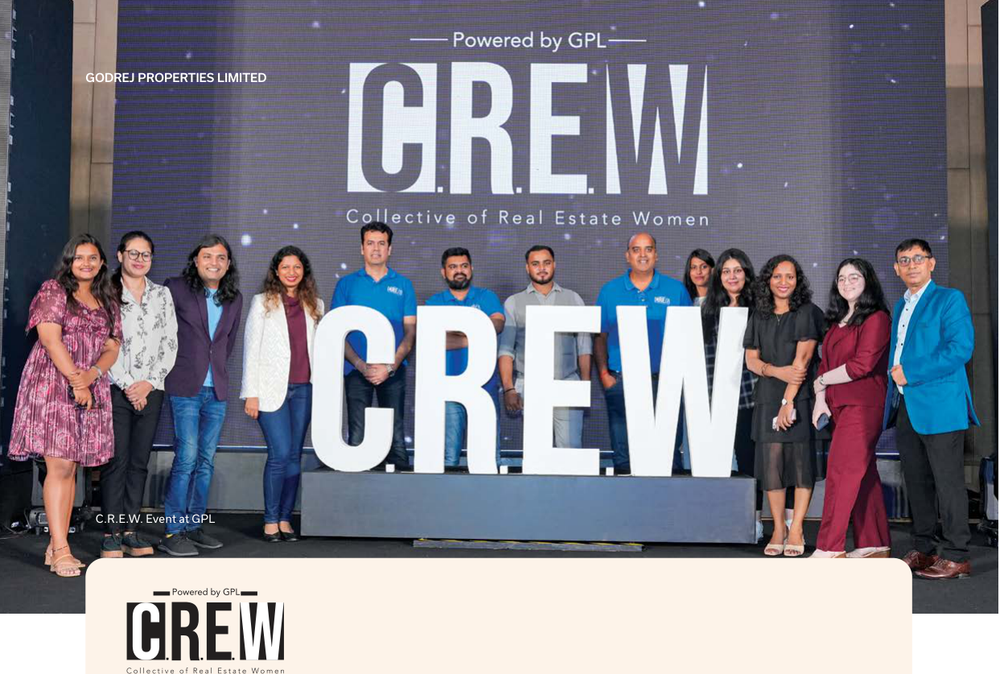

**[Image: AnnualReport2025.pdf-0086-01.png (1243x838, 1688.3KB)]**

<!-- Start of picture text -->
GODREJ PROPERTIES LIMITED C.R.E.W. Event at GPL <!-- End of picture text -->

###### **TRANSFORMING THE INDUSTRY FROM WITHIN** 

In April 2024, we launched CREW (Collective of Real Estate Women) – a pan-India initiative to build, connect and uplift women professionals in real estate, construction, and allied sectors. CREW is designed as a platform for peer learning, leadership development, and network expansion, and has quickly evolved into a movement that is redefining industry norms. 

CREW Bangalore launch brought together 200+ professionals for a panel on women’s leadership in real estate, focusing on success and career growth. 

We established regional chapters across five key cities: Mumbai, Bangalore, Pune, Delhi, and Kolkata. The CREW West-East Zone launches in Pune and Ahmedabad engaged over 550 women, built a talent pool of 900+, and led to a 42% hiring conversion across design, operations, and sales roles. 

Voices such as Shrayana Bhattacharya (World Bank) and Samira Gupta (Coach & Facilitator) elevated the conversation, while our employees brought authenticity through stories of resilience and leadership. The Growth Grid forum showcased defining moments of personal and professional growth, underscoring our belief that when women support each other, systems shift. 

The CREW North Zone launch brought together 380+ women for industry panels and networking, sparking nationwide enthusiasm for future CREW initiatives. 

The CREW Mumbai launch hosted 200+ attendees, featuring keynotes, panels, and experiencesharing to spotlight women's growth and equity in real estate. 

##### **5** 

Zonal CREW Chapters Launched across India 

###### **PAY EQUITY** 

We are actively addressing the gender pay gap through a structured, three-pronged approach. In FY 2023-24, our unadjusted gender pay index stood at 66%, a figure shaped primarily by underrepresentation in senior roles. However, when adjusted for level and role, parity improves substantially 85% at entry level and 94% at senior level. 

To close the remaining gap, we introduced correctional hikes as part of the April 2025 compensation cycle. High-performing employees are expected to reach parity within one year, while others will reach parity within two to three years. We also reviewed all incoming offers to ensure alignment with market benchmarks, thereby reducing the possibility of perpetuating inherited inequities. 

Recognising that representation is inseparable from parity, we are investing in greater visibility of women in leadership. This includes strengthening return-to-work and caregiving policies to support women during life transitions. 

###### **1-3 years** 

###### **66%**  **94%** 

Target timeline to Close All Internal Gender Pay Gaps 

Gender Pay Index (Unadjusted to Adjusted at Senior Levels) 

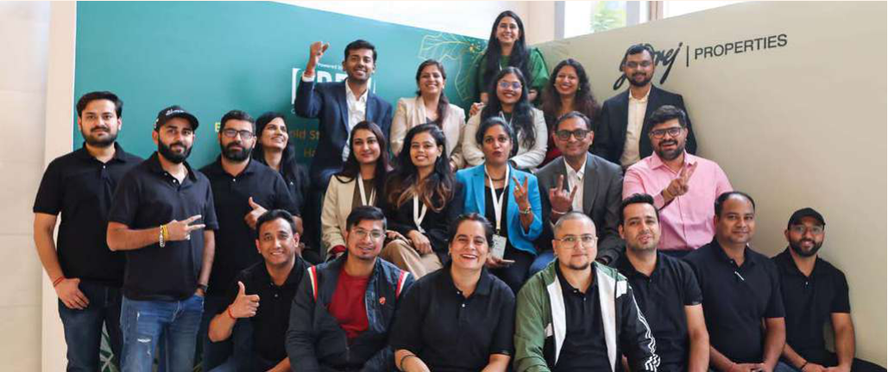

**[Image: AnnualReport2025.pdf-0086-19.png (1029x433, 781.3KB)]**

**[Image: AnnualReport2025.pdf-0086-20.png (1029x438, 875.0KB)]**

164 

165 

GODREJ PROPERTIES LIMITED 

INTEGRATED REPORT 2024-25 

###### **CARING FOR OUR PEOPLE** 

We are committed to fostering a workplace where employees’ mental, physical, and emotional wellbeing is prioritised. Through our comprehensive Employee Wellness Programme, we provide the necessary resources to support the holistic health of our workforce, ensuring they are equipped to succeed both professionally and personally. 

**THE KEY COMPONENTS OF OUR SUPPORT FRAMEWORK ARE ORGANISED INTO:** 

Holistic Wellbeing Flexibility Family Support Initiatives at Work Programmes 

###### **Holistic Wellbeing Initiatives** 

###### **Mental Health and Stress Management** 

Our partnership with Amaha, a leading mental health platform, offers 24/7 confidential access to licensed mental health professionals through our Employee Assistance Programme. Weekly "Mindful Mondays" sessions promote mindfulness, creativity, and personal growth. Our "Harmony Hours" policy reinforces mental boundaries by discouraging non-urgent emails between 8 PM and 8 AM. 

###### **Physical Health and Wellness Programmes** 

Our office features a fully equipped fitness centre 

with professional instructors and access to a dedicated nutritionist. Initiatives such as weekly "Weekend Wellness" emails and our Godrej Health and Wellness app support physical health with tools for diagnostics, consultations, and medicine delivery. Our condition management programme offers personalised support for physical and mental health needs. We also host an annual company-wide cricket tournament to promote team spirit and fitness. 

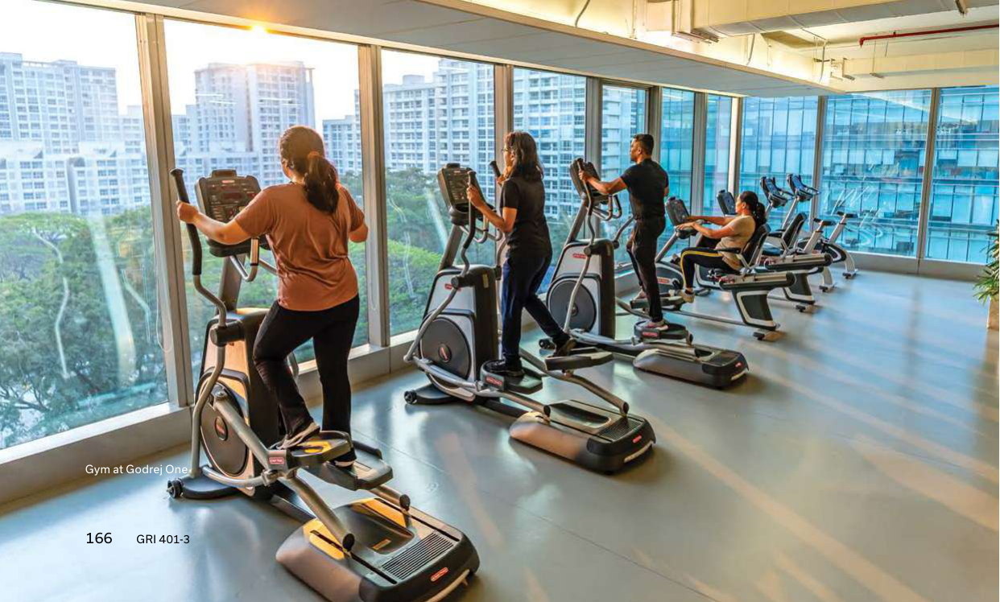

**[Image: AnnualReport2025.pdf-0087-12.png (1242x748, 1977.7KB)]**

<!-- Start of picture text -->
Gym at Godrej One 166 GRI 401-3 <!-- End of picture text -->

**[Image: AnnualReport2025.pdf-0087-13.png (1030x710, 1407.6KB)]**

###### **Flexibility at Work** 

We understand that flexible working conditions are key to ensuring a sustainable work-life balance. Our policies are designed to give employees control over their time and workstyle: 

###### **Leave Management** 

We understand that rest and recovery are essential to maintaining long-term employee health and productivity. To support this, we actively encourage our employees to utilise their annual leave through regular communications focused on promoting physical and mental rejuvenation. Our leave policy is designed with empathy and trust at its core. It includes a comprehensive array of options, such as a trust-based sick leave system that allows employees to take necessary health-related time off without affecting their privilege leave balance. This approach reflects our commitment to a caring and supportive workplace culture. Furthermore, employees receive full access to their entitled leave at the start of each calendar year, enabling them to plan their time off thoughtfully, balancing personal priorities with professional commitments. 

###### **Flexible Scheduling** 

We operate on a core-hours model (10 AM – 4 PM), allowing all employees the freedom to structure their 42.5-hour work week around their personal preferences and responsibilities. 

###### **Remote and Hybrid Working Model** 

We are committed to fostering a flexible and empowering work environment for all our employees. Our hybrid work model encourages team collaboration while also supporting individual productivity and well-being. We have a Work from Home (WFH) policy that allows employees to work remotely for a few days each month. This policy is designed to provide flexibility and can be further adapted based on individual needs through consultation with their managers. 

As per our policy, employees are provided with a minimum notice period of 2 months for Level 1, and 3 months for Levels 2, 3, and 4, prior to any significant operational changes that may affect them. 

###### **Part-Time Working Options** 

We offer adaptable part-time work structures, including 3-day and 4-day work weeks, or reduced daily hours, empowering employees to choose what suits them best. 

167 

GODREJ PROPERTIES LIMITED 

INTEGRATED REPORT 2024-25 

**[Image: AnnualReport2025.pdf-0088-02.png (497x682, 674.5KB)]**

###### **Family Support Programmes** 

We believe in standing by our people through every life stage, especially when it comes to caregiving responsibilities: 

###### **Childcare Support** 

Childcare/daycare facilities are available at our offices for all employees. Dedicated breastfeeding and rest areas for women are also available. New mothers can bring a caregiver and infants under one year on workrelated travel. 

###### **Parental Leave** 

Primary caregivers are entitled to 26 weeks of paid leave, with additional flexibility for unpaid leave and gradual return-to-work options. Non-primary caregivers are granted 8 weeks of paid leave, available within a year of childbirth or adoption. 

###### **Family and Care Leave** 

Employees are eligible for 2 weeks of paid family or care leave to support dependents—including parents, in-laws, partners, siblings, or children. This is complemented by comprehensive health insurance coverage with optional top-ups, and access to elder care services. 

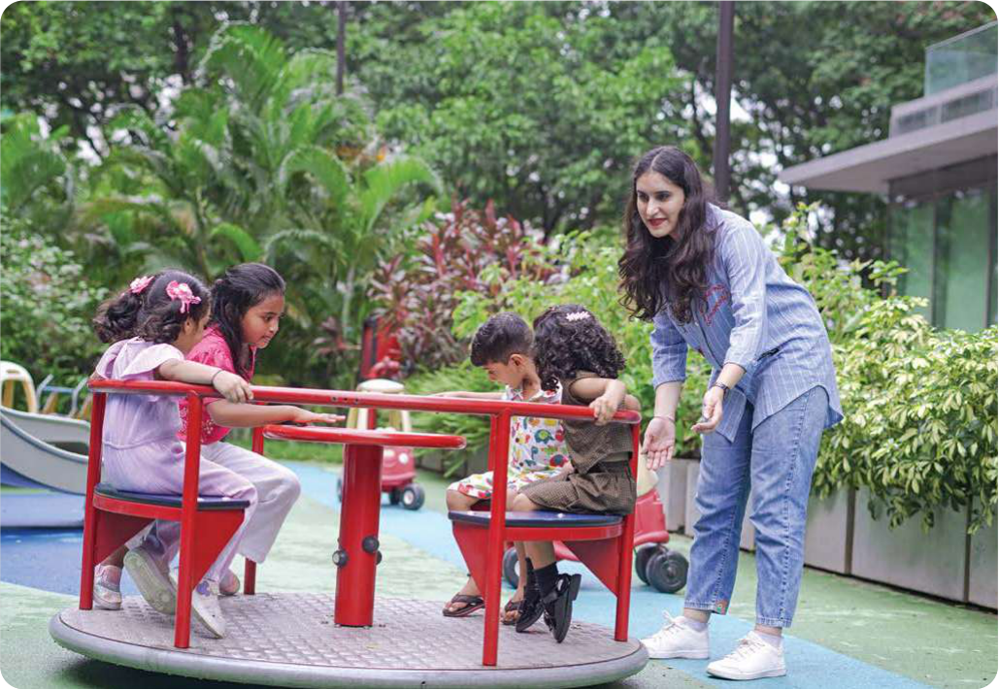

**[Image: AnnualReport2025.pdf-0088-11.png (1030x711, 1834.5KB)]**

###### **Engaging with Our People** 

Our senior leadership team actively engages with employees through town halls, open discussions, and one-on-one interaction. Moving beyond traditional, static surveys and point-in-time checkins, we have embraced a culture of continuous listening to stay closely attuned to the evolving experiences of our employees across the country and across all our business units. 

**[Image: AnnualReport2025.pdf-0088-14.png (640x765, 79.2KB)]**

###### **AI-POWERED INSIGHTS FOR A HAPPIER WORKPLACE** 

Launched in 2023, we use Amber – an AI-powered chatbot that reaches out to employees at defined intervals during their tenure. This evaluation captures a broad view of employee experience by assessing job satisfaction, sense of purpose, overall happiness, workplace stress, teamwork, work-life balance etc., providing valuable insights to enhance the work environment and promote wellbeing. 

Through the chatbot, we regularly assess how satisfied employees feel in their roles, taking into account their day-to-day experiences, responsibilities, and the support they receive. This helps us ensure that individuals feel fulfilled in their work, recognised for their efforts, and confident in their opportunities for growth within the organisation. We regularly check how aligned employees feel with our strategic direction, their trust in leadership decisions, and how clearly they see their goals and impact, ensuring a strong sense of purpose in their roles. 

To nurture happiness at work, we foster an inclusive, value-driven culture where contributions are recognised, diversity is respected, and people feel proud to be part of the organisation. Acknowledging that stress affects well-being and performance, we proactively gather feedback on trust, collaboration, and clarity of systems, helping us identify and address pressure points to create a healthier, more supportive work environment. 

**2,500+** Employees Interacted **5,300+** Interactions Completed 

168 GRI 402-1 

GRI 3-3 169 

GODREJ PROPERTIES LIMITED 

INTEGRATED REPORT 2024-25 

**[Image: AnnualReport2025.pdf-0089-02.png (499x522, 489.8KB)]**

###### **EMPLOYEE HEALTH AND SAFETY** 

We are committed to providing a safe work environment for all staff and workers, achieved through a focus on four essential components: robust Safety Infrastructure, effective OHS Management Systems, engaged People & Leadership, and a culture of Continual Improvement. 

###### **Healthy Workspaces, Happier People** 

We believe that a workspace should do more than just house employees—it should nurture them. By integrating natural light, air-purifying materials, energy-efficient designs, and green spaces, we create environments that promote health, well-being, and productivity. Our commitment to sustainable construction ensures that every space we build supports not just work, but also wellness. 

###### **Quality Control** 

###### **Sanitisation Measures** 

###### **Fresh Air and Ventilation** 

We utilise HVAC and AHU systems that are designed to provide effective fresh air ventilation. 

We follow strict hygiene practices and system cleaning procedures in our workplaces, maintaining a high standard of cleanliness essential for a healthy work environment. 

We regularly measure temperature, humidity, and air velocity in frequently used areas during different seasons to ensure high air quality and comfort. 

**OUR HEAD OFFICE AT GODREJ ONE & REGIONAL OFFICE AT PUNE HAVE BEEN CERTIFIED AS IGBC HEALTH AND WELL BEING PLATINUM. ALL ARE OFFICES ARE CERTIFIED UNDER IGBC HEALTH AND WELL BEING CERTIFICATION** 

**[Image: AnnualReport2025.pdf-0089-14.png (80x17, 3.8KB)]**

<!-- Start of picture text -->
Godrej One <!-- End of picture text -->

###### **Daylighting** 

In 86.5% of regularly used office spaces, we achieve daylight illumination. This natural light contributes to a positive and energising work environment. 

###### **Pest Management** 

We have an Integrated Pest Management system in place to effectively manage pests, ensuring a clean and hygienic workspace. 

###### **Ergonomics** 

The interior design of our spaces and furniture adheres to Time Saver Standards to ensure comfort and productivity, supporting employee well-being and efficiency. 

###### **Health and Hygiene** 

We offer a customised cafeteria menu to promote healthier eating habits among our occupants. This focus on nutrition supports overall health and well-being. 

###### **Quality Drinking Water** 

We provide access to sufficient water purifiers based on floor capacity to ensure safe drinking water. 

###### **Green Connect** 

We emphasise connecting indoor and outdoor spaces with landscaping, courtyards, and terraces. This biophilic design approach provides a refreshing connection to nature. 

###### **OCCUPANT SATISFACTION FOR COMFORT LEVELS AT PUNE REGIONAL OFFICE** 

**93% 95% 94%** Thermal Comfort Acoustical Comfort Air Quality **93% 98% 90%** Olfactory Comfort Ergonomics Differently Abled Occupants 

**[Image: AnnualReport2025.pdf-0089-29.png (66x66, 2.1KB)]**

170 GRI 3-3, 403-1, 403-6, 403-7 

171 

GODREJ PROPERTIES LIMITED 

INTEGRATED REPORT 2024-25 

**[Image: AnnualReport2025.pdf-0090-02.png (1026x514, 1257.0KB)]**

<!-- Start of picture text -->
ADVANCING WORKPLACE SAFETY AND WELL-BEING <!-- End of picture text -->

Safety Team and Executive Management. These metrics are regularly monitored, reviewed, and reported to the highest levels of management to ensure transparency and continuous improvement. 

###### **Health And Safety Management System (HSMS)** 

We place the utmost importance on the safety of our workforce and the prevention of accidents throughout every stage of our endeavours. This commitment is deeply embedded in our fundamental values and our recognition of the critical need to safeguard the health and well-being of our employees, contractors, visitors, and the communities where we operate. Our OH&S policy that is approved by the board of directors is applicable to our entire operations, employees, contractors and value chain partners.  To this end, we have implemented a robust Occupational Health and Safety (OH&S) Management System. 

Additionally, we have introduced a prioritisation and action planning framework to identify high-risk activities and implement targeted interventions. This involves periodic risk assessments, root cause analyses, and the development of site-specific action plans focused on hazard elimination, control measures, and safe work practices. These plans are updated based on incident trends, audit outcomes, and stakeholder feedback. 

Through this structured and data-driven approach, we aim not only to comply with regulatory requirements but to embed a proactive safety culture that safeguards every individual associated with our operations. 

###### **Our Comprehensive Approach to Safety** 

Ensuring the health, safety, and well-being of our workforce is a fundamental priority and a shared responsibility across all levels of the organisation. Our OH&S Management System is built on clearly defined procedures that are fully aligned with our Health & Safety Policy, ensuring consistent implementation across all project sites, corporate offices, and construction activities. 

We offer wages that meet or exceed living cost benchmarks and regularly review compensation structures to promote equity across roles and gender. 

We extend social protection benefits beyond statutory entitlements, including life and accident insurance to protect employees and their families from unforeseen events. We support our workforce in adapting to transitions driven by technological shifts and climate change through structured training and skilling programs. 

Senior management plays a pivotal role in driving our safety culture by proactively allocating the necessary resources, leadership oversight, and accountability structures. Specific responsibilities for implementing and monitoring safety measures are assigned at both strategic and operational levels, creating a unified and robust governance framework. 

Our practices are guided by a strong Code of Conduct, that extends to our workforce, contractors, suppliers and partners, and a deep commitment to ethical labor standards, ensuring our journey toward sustainable growth remains inclusive, equitable, and responsible. 

To institutionalise safety performance, quantitative Key Performance Indicators are established for both the 

###### **Training and Awareness Initiatives** 

###### **Continual Improvement** 

To proactively uphold safety standards, GPL utilises a rigorous internal audit process. This process evaluates site safety performance, pinpoints opportunities for enhancement, and ensures site teams implement corrective actions to drive continuous improvement. 

We've developed comprehensive programmes designed to educate and promote occupational health and safety among our employees. These initiatives encompass training sessions, motivational events, and health camps. Additionally, we consistently organise blood donation drives, health lectures, and safety campaigns. Our facilities also actively participate in significant events such as National Safety Day, Road Safety Week, and National Fire Service Day to further raise safety awareness and cultivate a culture of vigilance and preparedness. 

###### **Safety Infrastructure** 

We prioritise safety by ensuring every location has access to critical amenities: safety induction facilities for all personnel, on-site medical support including a nurse and ambulance services, established hospital partnerships, and comprehensive safety resources such as Personal Protective Equipment (PPE) and certified electrical equipment. 

Our Objective is to Provide a Safe work environment for all staff and workers, relying on four key elements of OHS risk management. 

###### **OHS Management Systems** 

Our OHS Management System is designed to guarantee the implementation and effectiveness of safety measures. This is achieved through on-site execution supported by detailed Site Safety Plans, comprehensive Hazard Identification and Risk Assessments, a rigorous Work Permit System, and regular internal safety audits to assess performance. 

##### **39,907** 

Total Health and Safety Training Sessions Conducted 

###### **People and Leadership** 

A robust programmes of safety initiatives designed to develop employee safety skills and awareness, including in-depth Safety Induction for all new hires; targeted, job-specific training; motivational programmes; impactful safety campaigns; regular review meetings (CSC, Joint Site Safety Committee, Management Review); employee health check-ups; and practical Toolbox Talks. 

##### **4,45,172 hours** 

Total hours of Health and Safety Training and Development 

##### **100%** 

Operational Projects Covered 

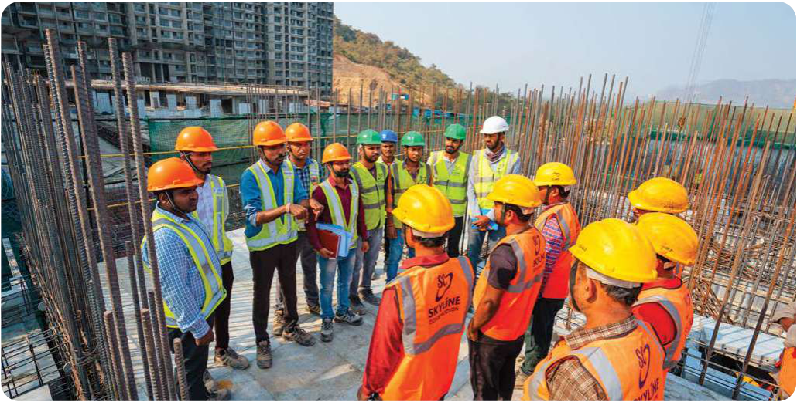

**[Image: AnnualReport2025.pdf-0090-32.png (1030x521, 1336.8KB)]**

172 GRI 403-2, 403-3, 403-4, 401-2 

GRI 403-5 173 

GODREJ PROPERTIES LIMITED 

INTEGRATED REPORT 2024-25 

### **CUSTOMER FIRST** 

Our values define our commitment to our customers. We are positioned as a legacy business, committed to delivering a holistic customer experience, from the point of sale to possession. We prioritise quality and safety to meet our customers needs in the spaces we provide, and our relentless engagement in resolving their grievances has led to their continued trust, driving our market offerings truly pan-India. 

Effective customer sustainability management yields significant benefits, such as appreciating asset value, increasing satisfaction, reducing costs, and ensuring regulatory compliance. Our strategies involve aligning financial interests, measuring resources, and mandating sustainability requirements. We are dedicated to creating spaces that enable Everyday Joys: one community, one family, and one home at a time. 

###### **MATERIAL ISSUES LINKAGES** 

###### **STRATEGY LINKAGE** 

> 1 Customer Engagement 

> 15 Community-Centric Sustainability 

Quality Focus And Customer First 

###### **UN SDGS LINKAGE** 

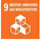

**[Image: AnnualReport2025.pdf-0091-10.png (82x82, 13.1KB)]**

###### **FY 24-25 HIGHLIGHTS** 

**~60,000** Opportunities and moments held to make our customers experience delight 

`O` **17,000+ Cr** Total Collections (First-ever real estate developer to record) 

**5,000+** Homes handed over to customers 

**67%** Net Promoter Score **FY 23-24 | 68%** 

**99%** Customer Grievance closed 

174 

175 

GRI 3-3, 416-1, 416-2 

GODREJ PROPERTIES LIMITED 

INTEGRATED REPORT 2024-25 

###### **OUR CUSTOMER FOCUS AREAS** 

**Standard Operating Processes (SOPs)** 

###### **Technology Applications** 

**Relationship Manager Model** Offering human interaction for customer experience management 

e-CRM system for billing, receipt and managing customer relationships at projects 

Consistent service quality 

###### **Standard Operating Model** 

###### **Technological Applications** 

###### **Relationship Manager Model** 

The Godrej Properties mobile app allows customers to easily manage post-purchase aspects of their investment. It streamlines functions like complaint management, onsite customer visit management, and communication. Customers can report  queries, request for information or grievances, which are promptly addressed by the  relationship manager. The visitor management feature ensures secure entry, while notifications keep residents informed about updates and emergencies. 

One dimension we have now begun to harness is the fluidity of knowledge across multiple markets and across different points on the customer value chain. This has helped build robust data, systems, tools, processes and cadences that operate effectively across all our regions. We have also evolved our people culture to create Centres of Excellence that help us scale micro-market best practices into repeated nationwide successes. 

Each customer is assigned a dedicated relationship manager, providing a direct point of contact for any inquiries, concerns, grievances, or suggestions. All interactions with customers are meticulously documented within the Service Request Module of our electronic customer relationship management (e-CRM) system. Before handover, RMs conduct a 45-point inspection for each apartment. Handover playbook is deployed to monitor RM inspection and proceed to handover only after RM’s signoff of each apartment building a sense of trust in customers. 

**[Image: AnnualReport2025.pdf-0092-14.png (266x545, 142.4KB)]**

###### **Constant updates** 

The app offers updates up to six months to help customers stay updated on the development of the building project. Customers can schedule registration and site visits through the app. 

###### **Round the clock service** 

The app helps manage all customer related information regarding their home along with online payments for milestones raised and offers round-the-clock payment reconciliation. 

###### **Support for home loans** 

Users can get in touch with the banks listed on the app to enquire about home loans. Customers can share their loan sanction letter and details, navigate the documentation templates, and explore the extensive FAQ section, and more. 

###### **Customer Satisfaction** 

**[Image: AnnualReport2025.pdf-0092-22.png (51x41, 1.3KB)]**

<!-- Start of picture text -->
67% <!-- End of picture text -->

We have long recognised the power of NPS in enhancing customer advocacy. Since FY 2018-19, NPS has been integrated into employee Key Result Areas (KRAs), ensuring accountability and a customer-centric culture throughout the organisation. 

Net Promoter Score (NPS) 

The NPS is a vital measure of satisfaction and loyalty, gauging the likelihood of customers recommending Godrej Properties to friends and family on a scale of 0 to 10. It provides us with actionable insights that inform decision-making across design, service, and delivery functions. Our focus remains on benchmarking against industry standards, taking into account geography, market dynamics, customer expectations, and other variables to maintain a competitive edge. In FY 2024-25, our NPS stood at 67%, while this prompts reflection, it also reinforces our resolve to drive consistent improvements through focused customer engagement and feedback-driven innovation. We have a total active customer base of 51,657 customers. The relationship survey was sent to all customers and the responses were received from 17,217 customers. 

###### **100%** 

Data Coverage 

###### **10,48,575** 

Customer Interactions Captured In Our Ecrm System 

###### **Service Level Adherence (SLA)** 

###### **Addressing Consumer Grievances** 

We’ve significantly strengthened our grievance redressal by implementing real-time tracking through Salesforce, defining clear ownership, and introducing zonal governance for faster, consistent resolution. Monthly audits and root-cause reviews now help us address recurring issues proactively, within defined SLA's. 

We meticulously monitor service level adherence and document all customer interactions via our e-CRM Management System. Any unresolved issues undergo automatic escalation to the Management Committee members at the highest level, utilising the pre-existing workflow within this module. Through the implementation of a relationship manager model, we have significantly enhanced our responsiveness, ensuring swift and satisfactory resolutions for our customers. 

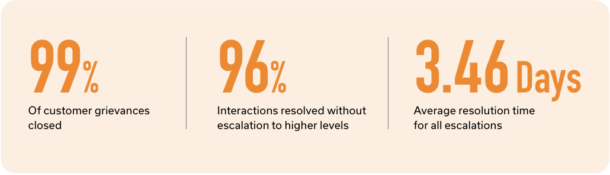

**[Image: AnnualReport2025.pdf-0092-34.png (1030x297, 23.7KB)]**

<!-- Start of picture text -->
99% 96% 3.46  Days Of customer grievances   Interactions resolved without  Average resolution time closed escalation to higher levels for all escalations <!-- End of picture text -->

176 

177 

GRI 2-25, 418-1 

GODREJ PROPERTIES LIMITED 

INTEGRATED REPORT 2024-25 

###### **Customer Engagement** 

At Godrej Properties, customer engagement extends far beyond the point of sale, it is a continuous, evolving relationship built on trust, transparency, and shared experiences. Our goal is to deliver not only quality homes but also a fulfilling journey throughout the lifecycle of ownership. 

###### **Enhancing Transparency in Construction Progress** 

We made significant strides in strengthening transparency and communication. We onboarded over 13,000 customers, facilitated more than 16,000 registrations, and hosted 24,000+ site visits, allowing customers to stay closely connected with the progress of their homes. Our monthly construction newsletters continued to serve as a trusted channel, sharing detailed updates on development timelines and quality initiatives. 

###### **IMPRESSIONS: STORIES THAT SPEAK FOR THEMSELVES** 

Our Impressions video series turns customer voices into the most powerful form of advocacy: authentic, unfiltered, and deeply personal. With over 200 testimonials recorded, the series highlights five dimensions of the Godrej home experience, such as quality, thoughtful design, curated amenities, empathetic service, and community life. These stories resonate far beyond the screen - building trust, reinforcing our values, and helping prospective buyers connect with what truly sets a Godrej Home apart. 

**[Image: AnnualReport2025.pdf-0093-08.png (201x72, 3.9KB)]**

<!-- Start of picture text -->
13,000+ Customers Onboarded <!-- End of picture text -->

###### **16,000+** 

Registrations Completed 

###### **24,000+** 

Customers site visits facilitated 

###### **Enriching the Handover and Living Experience** 

Recognising that the post-sale journey is just as important, we have launched **Godrej Living Pvt Ltd** – a strategic initiative designed to enhance our customers’ experience at handover and throughout the postpossession phase in partnership with Godrej Living, we have developed two proprietary tools. The Handover Index and Liveability Index. Both indices scientifically deconstruct and quantify the customers' experiences at the critical moments of post-possession and help crossfunctional teams work synergistically on delivering a topnotch living experience at the time and after possession. Reflecting our commitment to sustainability, we have also extended our focus beyond building certifications to encompass IGBC Green Residential Societies during the product-use stage. We encourage Residential Welfare Associations to renew this certification to continue the green building commitment. 

###### **SHUBHARAMBH: MAKING EVERY HOMECOMING MEMORABLE** 

At Godrej Properties, the handover of a home is the beginning of a celebration. Our Shubharambh initiative transforms the customers’ homecoming experience into a vibrant, joyful carnival, marking this milestone with grandeur and warmth. 

From festive décor to immersive on-ground experiences, every detail is curated to honour the significance of a new beginning. Senior leadership, including zonal heads and top management, personally preside over these ceremonies, reinforcing our commitment to customer delight and our deep respect for this life moment. 

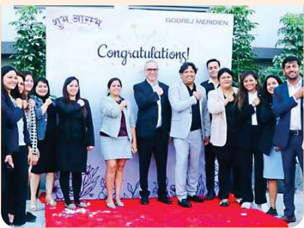

**[Image: AnnualReport2025.pdf-0093-18.png (497x372, 415.4KB)]**

###### **Designing for Accessibility and Inclusion** 

Inclusivity is a cornerstone of our design philosophy. Through our “Beyond Barriers” initiative, we implement standards that go beyond regulatory requirements, integrating universal design principles to ensure spaces are accessible and usable by all regardless of age, ability, gender, identity, or background. 

We actively promote healthy living conditions and community well-being by supporting Programmes focused on physical activity, healthy eating, equitable workplaces, access to healthcare, and minimising toxic exposures. Special measures are also taken to ensure environments accommodate the needs of differently abled persons, creating welcoming, functional spaces that limit the need for adaptation or specialised interventions. 

###### **Fostering Community Through Events and Celebrations** 

Building vibrant communities is at the heart of our engagement efforts. Every year, we host resident events, celebrating a diverse range of Indian festivals and cultural milestones. These gatherings play a vital role in fostering bonds among residents and nurturing a sense of belonging within our communities. 

**Customer Health and Well Being:** We are committed to fostering environments that support long-term health, safety, and well-being, ensuring our residents feel secure, empowered, and cared for throughout their journey with us. 

**Sustainable and Healthy Living Spaces:** As part of our sustainability focus, our developments align with IGBC and other recognised green building standards. This includes the conscious avoidance of harmful chemicals and minimising exposure to toxins, creating healthier indoor environments for our residents. 

**Facility Management for Peace of Mind:** Our Facility Management teams play a pivotal role in maintaining a safe, informed, and responsive community. They provide residents with regular updates on ongoing maintenance activities and ensure awareness around potential hazards, enabling residents to stay informed and secure. 

**Safety Audits and Emergency Preparedness:** We adopt a holistic approach to building safety that encompasses fire, structural, electrical, and gas safety throughout the development process. In collaboration with regulatory bodies, our buildings undergo independent audits by the Fire Department to validate the effectiveness of fire safety systems and ensure full compliance with emergency protocols. To promote a secure living environment, we implement measures such as adequate lighting and on-site security to deter crime, vandalism, and theft. 

**Empowering Customers with Knowledge:** At the time of handover, customers are briefed on the health and safety features integrated into their homes. We also provide home safety recommendations to further support residents in maintaining secure and hazard-free living spaces. We prioritise emergency preparedness by conducting regular evacuation drills, customer training sessions, and collaborating with disaster response teams to provide assistance in crisis situations. Additionally, our communities and customers are educated during handover on managing health emergencies and natural disasters, with policies and resilience features integrated into our built environments to withstand climate-related risks and maintain safety and continuity during unforeseen events. 

178 

179 

GODREJ PROPERTIES LIMITED 

INTEGRATED REPORT 2024-25 

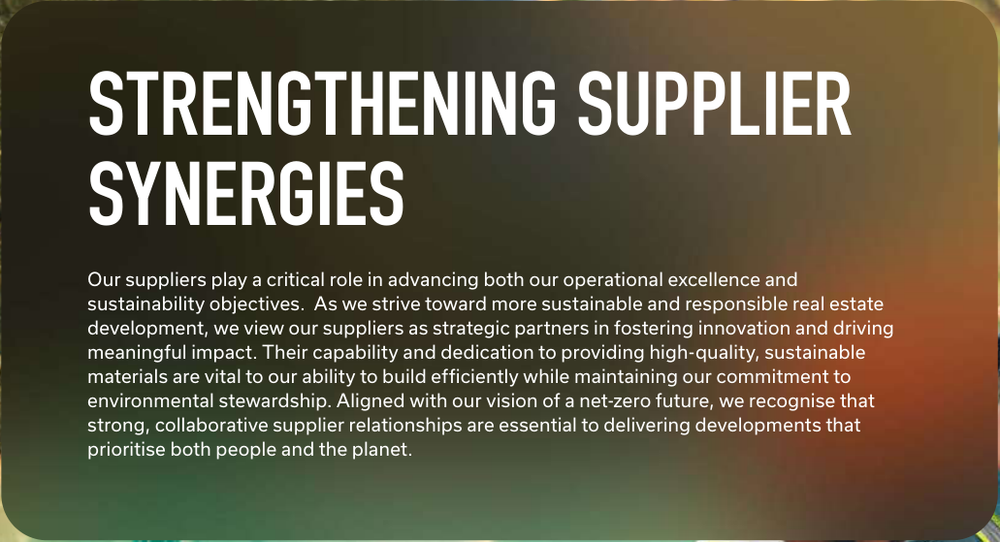

**[Image: AnnualReport2025.pdf-0094-02.png (1031x559, 198.7KB)]**

<!-- Start of picture text -->
STRENGTHENING SUPPLIER SYNERGIES Our suppliers play a critical role in advancing both our operational excellence and sustainability objectives.  As we strive toward more sustainable and responsible real estate development, we view our suppliers as strategic partners in fostering innovation and driving meaningful impact. Their capability and dedication to providing high-quality, sustainable materials are vital to our ability to build efficiently while maintaining our commitment to environmental stewardship. Aligned with our vision of a net-zero future, we recognise that strong, collaborative supplier relationships are essential to delivering developments that prioritise both people and the planet. <!-- End of picture text -->

###### **MATERIAL ISSUES LINKAGES** 

###### **STRATEGY LINKAGE** 

Sustainable Supply Chain Operational Excellence Resilience and Risk Management 

###### **UN SDGS LINKAGE** 

**[Image: AnnualReport2025.pdf-0094-07.png (82x82, 10.8KB)]**

**[Image: AnnualReport2025.pdf-0094-08.png (82x82, 9.5KB)]**

**[Image: AnnualReport2025.pdf-0094-09.png (80x82, 9.4KB)]**

**[Image: AnnualReport2025.pdf-0094-10.png (80x82, 12.4KB)]**

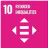

**[Image: AnnualReport2025.pdf-0094-11.png (82x82, 10.1KB)]**

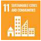

**[Image: AnnualReport2025.pdf-0094-12.png (82x82, 13.9KB)]**

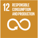

**[Image: AnnualReport2025.pdf-0094-13.png (80x79, 3.1KB)]**

**[Image: AnnualReport2025.pdf-0094-14.png (82x80, 9.7KB)]**

###### **FY 24-25 HIGHLIGHTS** 

**129 59%** Total number of Percentage of unique significant suppliers significant suppliers (Tier 1 and Non Tier 1) in capacity building programmes 

GODREJ PROPERTIES LIMITED 

INTEGRATED REPORT 2024-25 

###### **SUSTAINABLE SUPPLY CHAIN GOVERNANCE** 

###### **Some of the key features of our Sustainable Procurement Policy are:** 

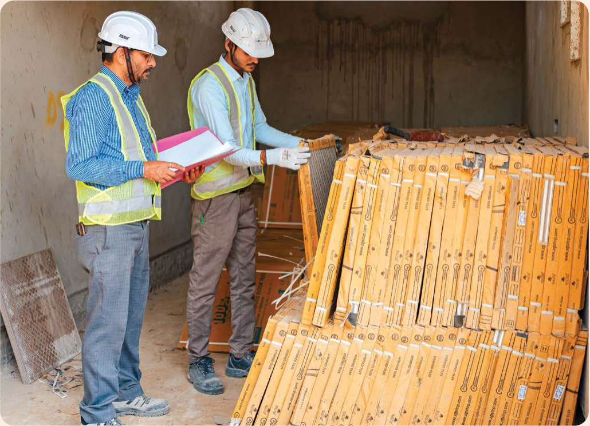

**[Image: AnnualReport2025.pdf-0095-04.png (1030x745, 1645.3KB)]**

Under the Supplier Code of Conduct, suppliers are expected to comply with minimum ESG standards designed to uphold human rights, ensure fairness, and protect the environment. If a supplier falls short of these requirements, we work collaboratively to support their improvement. However, continued non-compliance despite these efforts may result in contract termination. 

Together with our supplier network, we have established a sustainable supply chain framework aligned with our Net Zero 2050 vision, aimed at fostering a more responsible and decarbonised real estate sector. This framework is grounded in our Supplier Code of Conduct and responsible procurement policies, which integrate sustainability into sourcing decisions. Guided by these principles, we are advancing decarbonisation through medium- and long-term initiatives while setting clear ESG standards. 

We have a forward-looking Sustainable Procurement Policy that emphasises local sourcing, waste reduction, resource efficiency, and climate impact mitigation. The policy promotes supplier alignment with key sustainability criteria—such as use of low-carbon materials—that are critical to our decarbonisation goals. These considerations support more responsible and informed procurement decisions across our operations. 

Our comprehensive Supplier Code of Conduct applies to all suppliers and contractors, outlining environmental, social, and ethical requirements. It addresses key sustainability risks across the supply chain, including human rights, child labour, pollution prevention, etc., ensuring all partners uphold minimum standards for responsible business practices. 

Partner with suppliers with superior ESG performance, such as those with green certification and local presence, to minimise transportation distances and environmental impact, wherever business viable. 

- Ensure that all procurement decisions are subject to approval by the highest accountable body, be it the Board of Directors or Executive Management, to ensure alignment with organisational objectives and ethical standards. 

- Regularly review and enforce adherence to the Supplier Code of Conduct and ensure alignment with ESG criteria, thus mitigating potential conflicts and fostering sustainable supplier relationships. 

- Foster awareness and compliance throughout the procurement process by providing comprehensive training for buyers and internal stakeholders on their roles within the Supplier ESG programme. 

###### **Supplier Engagement Framework** 

###### **Supplier Screening** 

We assess significant suppliers based on environmental, social, and governance (ESG) factors, as well as their business relevance, including spend and volume. Our evaluation also incorporates risks specific to the supplier’s country, sector, and the commodities they provide. 

The ESG questionnaire used for desktop review is designed to evaluate performance against key environmental and social criteria, including but not limited to: 

- Compliance with applicable environmental & social regulations 

- Monitoring and reporting of greenhouse gas (GHG) emissions 

###### **Supplier Assessment and Corrective Action Plan** 

As part of our responsible business practices, GPL has continued to strengthen its approach to environmental and social due diligence across its supply chain. To ensure alignment between our suppliers and our corporate sustainability commitments, we have enhanced our Supplier ESG Assessment, which forms an integral part of our supplier selection and management process. 

- Resource efficiency 

- Waste and water management practices 

- Labour practices, health and safety 

- Human rights and ethics 

Following the assessment, suppliers are categorised according to their ESG maturity levels. They are placed into performance bands based on their responses and overall scores across environmental and social criteria. This classification enables GPL to: 

Our Technical Standard for Supplier and Contractor Management outlines the core components of our Supplier Risk Management process, offering a uniform method to manage supplier related risks and their impact on our organisation. All new suppliers onboarded or empanelled with GPL are assessed using a desktopbased review as part of our due diligence process. This assessment is evidence-based and relies on verifiable documentation, such as compliance certificates and risk registers, to validate supplier practices against defined criteria. 

- Tailor Corrective Action Plans (CAPs) based on supplier performance 

- Strengthen supplier engagement and communication strategies 

- Identify suppliers for focused improvement or risk mitigation efforts 

The operations team receives comprehensive training and participates in awareness sessions focused on the Supply Chain Engagement process and the Supplier Assessment framework. As part of the broader ESG, risk, and quality management strategy, the team also conducts on-site evaluations of selected contractors and suppliers. 

182 

183 

GODREJ PROPERTIES LIMITED 

INTEGRATED REPORT 2024-25 

###### **Supplier Development** 

Beyond the initial evaluation, our supplier assessment framework functions as a strategic tool to embed ESG principles into procurement decisions and cultivate long-term supplier partnerships. 

This process helps us proactively identify and address ESG risks, strengthen supplier capabilities, and align our value chain with GPL’s sustainability objectives. We offer continuous training and share key information with suppliers on our ESG initiatives, Supplier Code of Conduct, and assessment procedures. 

A structured process is in place to support the implementation of corrective action plans, ensuring ongoing improvement. Through our Supplier Decarbonisation programme, we provide sector-specific ESG best practices and benchmarks, conduct regular workshops, and deliver technical support to build supplier capacity. 

###### **Our Response** 

###### **How We Engage** 

###### **Key Assessment Areas** 

   - Sustainable sourcing 

- Map procurement activities, including both direct and indirect procurement categories 

- Environment Management 

- Safety Management 

   - Environmental impact of materials 

- Labour & Human Rights 

      - Screening of suppliers on ESG parameters 

   - Business Ethics & Code of Conduct 

- Implement a system to track suppliers based on their volume of supplies 

   - Engaging with suppliers to improve ESG performance 

- Quality Management 

- Capacity Utilisation 

###### **Social** 

###### **Governance** 

###### **Environment** 

- Existing policies 

- Human rights 

   - Existing policies 

- Management Systems 

      - SDGs 

   - Diversity 

- Greenhouse Gases 

- Management Systems 

   - Ethics and compliance 

- Contributions to Society 

   - Sanctions 

- Biodiversity 

- Climate Change 

   - Stakeholders 

- Reporting and transparency 

   - Supply Chain 

- Water Management 

###### **Supply Chain Decarbonisation through Supplier Engagement** 

At GPL, a significant share of our total emissions footprint is linked to our supply chain, primarily due to the procurement of critical raw materials like: steel, Ready-mix Concrete (RMC), cement, tiles, glass, AAC blocks, etc. 

Accordingly, decarbonising our supply chain is a strategic priority in achieving our net zero ambition. Engaging suppliers— particularly those associated with high-impact material categories—is essential to advancing Scope 3 emissions reduction. In response, we have embedded a structured and continuous Supplier Decarbonisation Programme, aimed at addressing Scope 3 emissions, into our sustainability strategy. This programme is designed to systematically engage, support, and enable our suppliers in reducing their carbon footprint—creating shared climate value across our supply chain. 

The Supplier Decarbonisation Programme is designed to systematically engage and support our key suppliers in reducing their carbon footprint. The programme is built on six core components. 

###### **Identifying High-Impact Categories** 

###### **Tailored decarbonisation pathways** 

**1** 

**4** 

- Each segment is supported with tailored decarbonisation pathways that outline relevant goals, timelines, and action areas. These pathways are co-developed with suppliers, considering their operational context and capabilities. Our support framework includes tools, best practices, and sector-specific guidance to help suppliers plan and implement effective emission reduction strategies. 

We begin by regularly assessing our procurement-linked emissions to identify categories that contribute significantly to our Scope 3 footprint. This prioritisation is updated periodically to reflect changes in sourcing patterns, emissions intensity, and business priorities. It ensures our efforts remain focused on the most material areas for emissions reduction. 

###### **Supplier Mapping** 

###### **Capacity Building And Knowledge Sharing** 

**2** 

**5** 

- Within the high-impact categories, we map and prioritise suppliers based on criteria such as emission intensity and strategic importance. This enables targeted engagement and allows us to allocate resources effectively toward suppliers where collaborative decarbonisation efforts can drive meaningful outcomes. 

- We conduct both group-level and individualised capacity-building sessions throughout the year. These include: 

- Workshops on emissions accounting and reporting standards 

- Knowledge-sharing forums on energy efficiency and low-carbon technology 

- Practical guidance on setting and tracking emissions targets 

##### **3** 

###### **Maturity assessment and Segmentation** 

- Each supplier is assessed to understand their current decarbonisation maturity basis their emission measurement practices, reduction targets etc. Based on this assessment, suppliers are segmented into distinct groups to enable targeted engagement and support. 

**6** 

###### **Ongoing support and collaboration** 

- We maintain continuous engagement with suppliers, offering technical guidance, resources, and collaborative opportunities to help them progress at a suitable pace. 

The Supplier Decarbonisation Programme is designed to be adaptive and long-term, recognising that each supplier’s decarbonisation journey is unique. Through this collaborative approach, we aim to drive meaningful emissions reductions across our value chain and advance our collective climate goals. 

**[Image: AnnualReport2025.pdf-0096-67.png (257x16, 11.7KB)]**

<!-- Start of picture text -->
Engagement with value chain partners <!-- End of picture text -->

184 

185 

GODREJ PROPERTIES LIMITED 

INTEGRATED REPORT 2024-25 

###### **Supplier Engagement Workshops** 

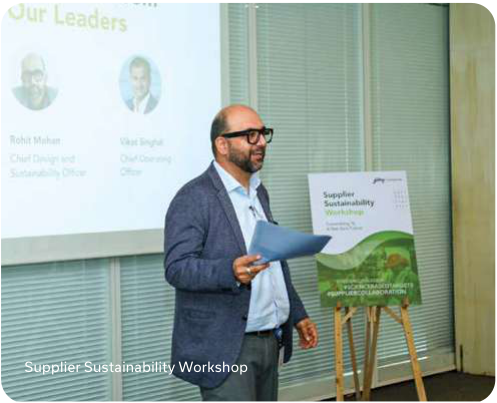

**[Image: AnnualReport2025.pdf-0097-03.png (497x403, 307.9KB)]**

<!-- Start of picture text -->
Supplier Sustainability Workshop <!-- End of picture text -->

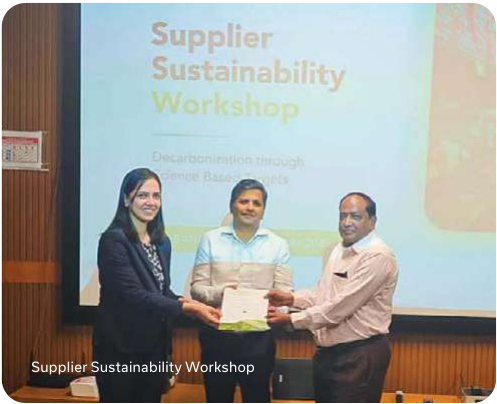

**[Image: AnnualReport2025.pdf-0097-04.png (497x404, 284.5KB)]**

<!-- Start of picture text -->
Supplier Sustainability Workshop <!-- End of picture text -->

###### **Supplier Workshops on Decarbonisation and Climate Readiness** 

**65+** Suppliers engaged through regional workshops 

As part of our broader supplier engagement programme, we conducted targeted regional workshops in FY 2024–25, reaching over 65 suppliers across key markets. These sessions were designed to build awareness and capability in carbon footprint measurement and science-based target setting. Each workshop also featured a dedicated 'Supplier Open House,' offering a platform for participants to showcase their ongoing decarbonisation efforts and exchange best practices with peers. 

###### **Focus Areas** 

Carbon footprint measurement, target setting, and peer learning through 'Supplier Open House' forums 

###### **Sourcing Sustainable Materials** 

At GPL, we integrate sustainability into procurement by prioritising materials with lower carbon footprints. Our internal carbon pricing approach incentivises the use of alternatives that reduce emissions and environmental impact. 

For example, we have adopted Ground Granulated Blast-furnace Slag (GGBS) and fly ash to minimise virgin cement consumption. Similarly, we prioritise sourcing Forest Stewardship Council (FSC)certified renewable wood over virgin wood, supporting responsible forestry and reducing embodied carbon. 

**[Image: AnnualReport2025.pdf-0097-13.png (505x18, 18.4KB)]**

<!-- Start of picture text -->
Sustainable Supply Chain Workshop for Value chain Partners at Godrej One <!-- End of picture text -->

|**Material**|**Annual % Use (All** **Zones Included)**|
|---|---|
|Ordinary Portland Cement (OPC) by Blast Furnace Slag (GGBS)|**30-40%**|
|Ordinary Portland Cement (OPC) by Fly Ash (FA)|**15-25%**|
|RMC (OPC+GGBS)|**17%**|
|RMC (OPC+FA)|**83%**|
|FSC Certified wood or equivalent|**100%**|

186 

187 

GODREJ PROPERTIES LIMITED 

INTEGRATED REPORT 2024-25 

###### **Certified Safety Standards and Risk Control** 

###### **WORKERS SAFETY AND WELL BEING** 

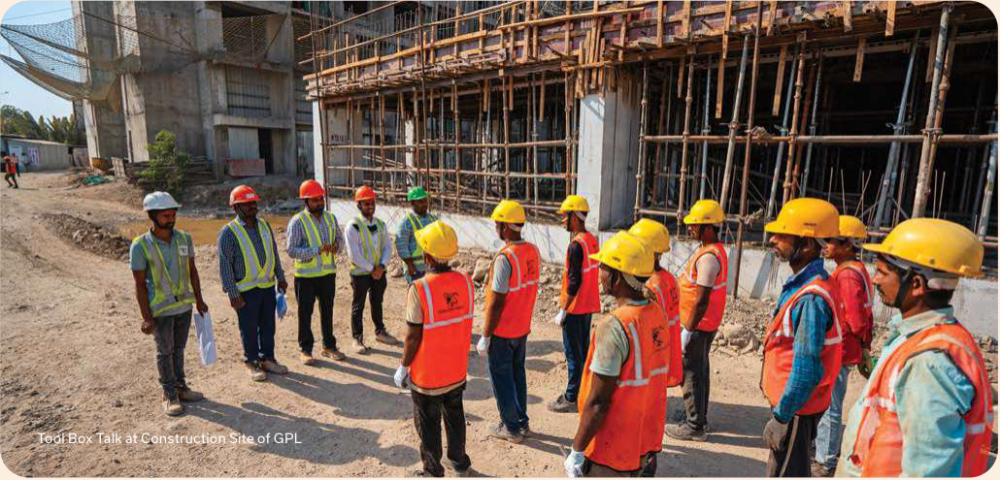

**[Image: AnnualReport2025.pdf-0098-04.png (1030x495, 1317.1KB)]**

<!-- Start of picture text -->
Tool Box Talk at Construction Site of GPL <!-- End of picture text -->

and standard operating procedures (SOPs), including comprehensive safety checks and inspections starting from the contractor prequalification stage. 

Our Occupational Health and Safety (OHS) policy applies across all company operations and extends to all employees, contractors, and any individuals working under the company’s direction or supervision. As part of our Occupational Health and Safety (OHS) Policy, we affirm our commitment to fostering a culture of safety, accountability, and continuous improvement across all levels of the organisation. We acknowledge the importance of inclusive dialogue and are committed to engaging our employees, contractor workers, and their representatives in meaningful consultations. Their active participation plays a key role in shaping and continuously improving our occupational health and safety (OHS) practices. We also regularly engage with them to enhance working conditions. 

Our labour practices are anchored in respect for human rights and comply with applicable laws and global standards for decent work. We closely monitor working hours, manage overtime responsibly, and ensure fair pay for all hours worked. We actively engage with workers’ representatives to understand evolving workplace needs and maintain transparency in all matters related to working conditions. 

###### **The framework includes 5 steps:** 

To ensure a strong safety culture where every worker takes responsibility for safety, GPL has implemented a robust health and safety management system certified to the ISO 45001:2018 international standard. Our OH&S Management system is underpinned by clear procedures outlined in alignment with our Health & Safety Policy, ensuring consistency across all our sites and applies to all the operational projects and workers within the organisation’s scope. 

**01** 

**ELIMINATION** Remove hazards 

**02** 

**SUBSTITUTION** 

Find safer alternatives 

**03** 

**ENGINEERING** Control isolate hazards 

Our safety management system follows a proactive (plan-do-check-act) PDCA cycle, emphasising leadership commitment, consultation, and participation at all levels and functions to achieve a "Score Zero" safety record. We have established predefined safety processes 

**04 ADMINISTRATIVE CONTROLS** Implement policies 

**PERSONAL PROTECTIVE EQUIPMENT (PPE)** 

**05** 

Provide final protection, prioritising personnel safety 

As an ISO 45001:2018 certified organisation, we regularly review and update our Health and Safety Management System to align with global best practices. 

We follow a structured process for hazard identification and risk control through the formation of Hazard Identification, Risk Assessment, and Control (HIRAC) Teams. These teams include the Project Manager, Project Safety Manager, trained worker representatives, and contractor personnel. Their combined expertise ensures comprehensive risk evaluation and effective mitigation strategies for all project activities. 

Occupational Health & Safety related risks are identified, and counter measures are implemented, in co-ordination with the Hazard Identification, Risk Assessment and Control (HIRAC) team. We prioritise addressing the risks identified, by developing relevant action plans, including investigations for work related injuries, ill health, diseases and incidents, furthermore for response to emergency situations, through measurable and achievable targets. The progress towards these targets is periodically evaluated, and internal inspections are carried out so as to take proactive measures to reduce and prevent health and safety issues. 

###### **The pillars of GPL’s Health and Safety management system are** 

Implementing and ensuring Fostering a safety-centric Continual improvement the effectiveness of our culture and enhancing in monitoring, audits, and Occupational Health capabilities through compliance is integral to our and Safety (OH&S) effective leadership and operational framework Management System people development are key priorities for us 

###### **Commitment Towards Safety** 

To institutionalise safety oversight, we have established Joint Project Safety Committees (JPSC) at each site. These are chaired by the GPL Project Manager and include representatives from Project Management Consultants and Contractors. The JPSC meets monthly to monitor safety adherence, review incident reports, and address safety concerns. 

We identify training needs through a multi-source approach, including incident investigations, safety observations, upcoming site activities, risk ratings, audit findings, management inputs, and changes in work processes or personnel. Topics such as general awareness on workers’ rights, annual leave entitlements, and training needs arising from industrial transitions are also taken into account. 

For contractors with over 100 workers, the Contractor Site Safety Committee (CSC) is mandated in accordance with BOCW Central Rules 1998. These committees, led by the contractor’s Project Manager, also meet monthly and include worker representatives to ensure frontline concerns are heard and addressed. They also play a key role in facilitating workers' access to social welfare benefits. 

Based on these inputs, we issue a monthly Training Calendar, offering free sessions during working hours. Feedback is collected through forms and verbal discussions, with attendance and input systematically recorded to ensure continuous improvement and alignment with safety standards. These targeted programmes equip workers with in-demand skills. These trainings offer valuable exposure to industry best practices and emerging technologies, supporting longterm employability and growth. 

188 GRI 3-3, 403-1, 403-3,403-4 

189 

GODREJ PROPERTIES LIMITED 

INTEGRATED REPORT 2024-25 

###### **Redefining Safety with Contractor Partners** 

- Once contracted, the contractor’s team implements on-site safety measures, including: Infrastructure improvements. 

We work closely with our contractor partners to instil a culture of safety excellence across all our sites. Through regular training, clear safety protocols, and open communication, we ensure that every worker, whether part of our team or an extended partner, operates in a secure environment. By integrating global best practices, risk assessments, and continuous monitoring, we empower our contractors with the tools and knowledge needed to uphold the highest safety standards. 

###### **Contractor Support** 

- We begin with kick-off meetings for all newly 

   - onboarded contractors to ensure they fully understand our requirements, setting the right expectations from the outset. 

- Contractors then submit site safety plans aligned with our agreement for immediate implementation. 

###### **Contractor Pre-Qualification** 

   - We provide specialised training programmes tailored to each job, enhancing safety awareness among contract workers. 

- We assess potential contractors' Occupational Health & Safety (OH&S) capabilities through a PreQualification (PQ) assessment before awarding contracts. The assessment evaluates their capacity, resources, management practices, and performance. 

   - Additionally, we support contractors in preparing Hazard Identification and Risk Assessment (HIRA) documents and implementing control measures based on the hierarchy of controls. 

- Based on the PQ score, we develop a mitigation plan to address identified business risks. Contractors with strong OH&S performance and ISO 45001 certification are given preference in the evaluation process. 

###### **Workers are made aware of their rights and safety protocols through:** 

- Safety induction sessions 

###### **Contract Safety Rules and Regulations and Verification** 

   - Regular toolbox talks 

   - Rigorous site visits and mock drills conducted by GPL 

- Occupational Health & Safety (OH&S) requirements are included in the Contractors’ Agreement, a legally binding document signed before work begins. This agreement is integrated into our Contracts and Procurement process, which pre-qualifies contractors and consultants. 

- These verification measures ensure compliance with OH&S standards, reinforcing a safe and secure working environment. 

We follow IS 3,786, 1,983 standards for compiling data, which govern how we compute frequency and severity rates for industrial injuries and classify industrial accidents. Our processes also align with the Building and Other Construction Workers (BOCW) Act to ensure compliance with regulations that are relevant to the safety and well-being of workers. 

- Health checks are conducted for contractors' employees, with data securely maintained by the contractor’s health professional. This process is strictly followed, making it a prerequisite before awarding any contract. 

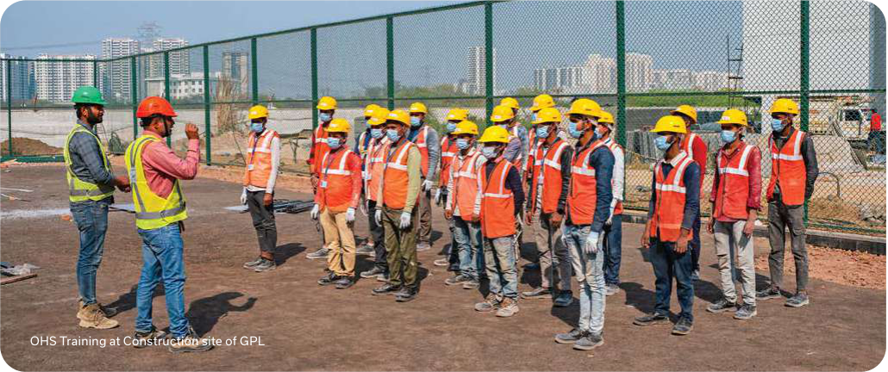

**[Image: AnnualReport2025.pdf-0099-23.png (1030x432, 1041.0KB)]**

<!-- Start of picture text -->
OHS Training at Construction site of GPL <!-- End of picture text -->

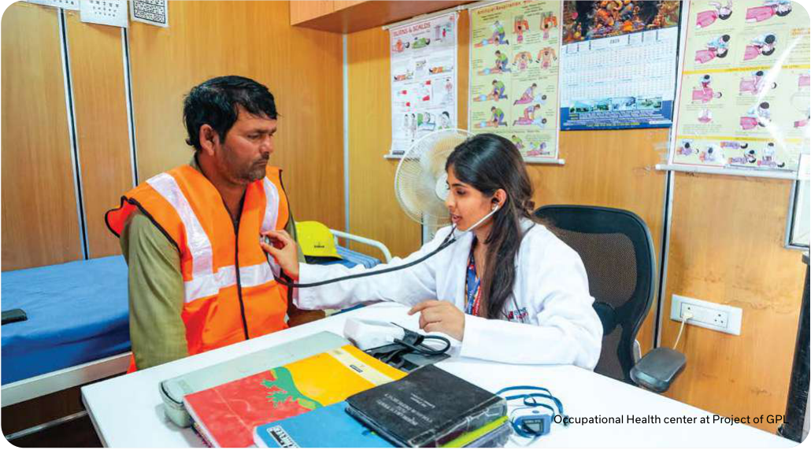

**[Image: AnnualReport2025.pdf-0099-24.png (1030x572, 1240.4KB)]**

<!-- Start of picture text -->
Occupational Health center at Project of GPL <!-- End of picture text -->

###### **MEDICAL SUPPORT** 

###### **EQUIPMENT SUPPORT** 

###### **HEALTH GUIDANCE** 

Our safety induction hall is We ensure all employees equipped with audio-visual and workers undergo health facilities, and all required check-ups before starting personal protective equipment work and regularly thereafter. (PPE). We conduct jobWe actively encourage them specific training sessions to prioritise their health. and toolbox talks to enhance For high-risk workers, we workers’ safety knowledge. conduct medical exams and competency tests upon hiring and periodically to confirm their fitness for the job. 

We maintain on-site medical facilities including a first aid centre, a male nurse, a first aid kit, an ambulance, and regular doctor visits as a part of our emergency preparedness. Additionally, we have agreements with nearby hospitals for emergency situations. 

###### **HEALTH MANAGEMENT SERVICES** 

###### **REGULAR HEALTH AND SAFETY CAMPS** 

A medical officer visits each site at least once a week, with designated timings prominently displayed for easy access. We encourage all workers to use this facility for any non-occupational medical issues. 

We regularly conduct campaigns on smoking and alcohol risks, HIV awareness, and organise medical camps to ensure all workers receive these services. 

190 GRI 403-6, 403-7 

191 

GODREJ PROPERTIES LIMITED 

INTEGRATED REPORT 2024-25 

### **BUILDING COMMUNITY VALUE** 

We believe that building strong, inclusive communities is as vital as constructing sustainable buildings. Guided by the Godrej Group’s ‘Good & Green’ vision, our Corporate Social Responsibility (CSR) efforts are deeply integrated with our broader ESG strategy, enabling us to deliver long-term impact in the areas of employability, community development, and environmental stewardship. 

We actively collaborate with local communities across our project locations to design and implement initiatives that create meaningful, lasting change. Our CSR initiatives focus on waste diversion, crop residue management, access to welfare scheme for construction workers, and watershed restoration, addressing key environmental and social needs. 

We believe true progress lies in enabling communities and protecting ecosystems to build a more inclusive and sustainable India. 

###### **MATERIAL ISSUES LINKAGES** 

> 5 GHG Management 14 Air Quality Management 

> 7 Waste Management 15 Community Centric Sustainability 

> 12 Water Management 

###### **UN SDGS LINKAGE** 

**[Image: AnnualReport2025.pdf-0100-09.png (82x82, 11.7KB)]**

**[Image: AnnualReport2025.pdf-0100-10.png (82x82, 10.3KB)]**

**[Image: AnnualReport2025.pdf-0100-11.png (80x82, 9.9KB)]**

**[Image: AnnualReport2025.pdf-0100-12.png (80x82, 13.1KB)]**

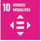

**[Image: AnnualReport2025.pdf-0100-13.png (82x82, 10.6KB)]**

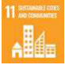

**[Image: AnnualReport2025.pdf-0100-14.png (82x82, 15.1KB)]**

**[Image: AnnualReport2025.pdf-0100-15.png (80x80, 10.8KB)]**

###### **FY 24-25 HIGHLIGHTS** 

`O` **15.47 Cr** 

CSR Expenditure **FY 23-24 |** `O` **11.71 Cr** 

**1,260** Children Provided Daily Creches Support **FY 23-24 | 1,056** 

**32,500** Workers registered for BOCW schemes 

**FY 23-24 | 84,743** 

**[Image: AnnualReport2025.pdf-0100-22.png (240x16, 6.7KB)]**

<!-- Start of picture text -->
Workers at construction site of GPL <!-- End of picture text -->

192 GRI 203-1, 203-2, 413-1 

193 

GODREJ PROPERTIES LIMITED 

INTEGRATED REPORT 2024-25 

###### **OUR IMPACT AREAS** 

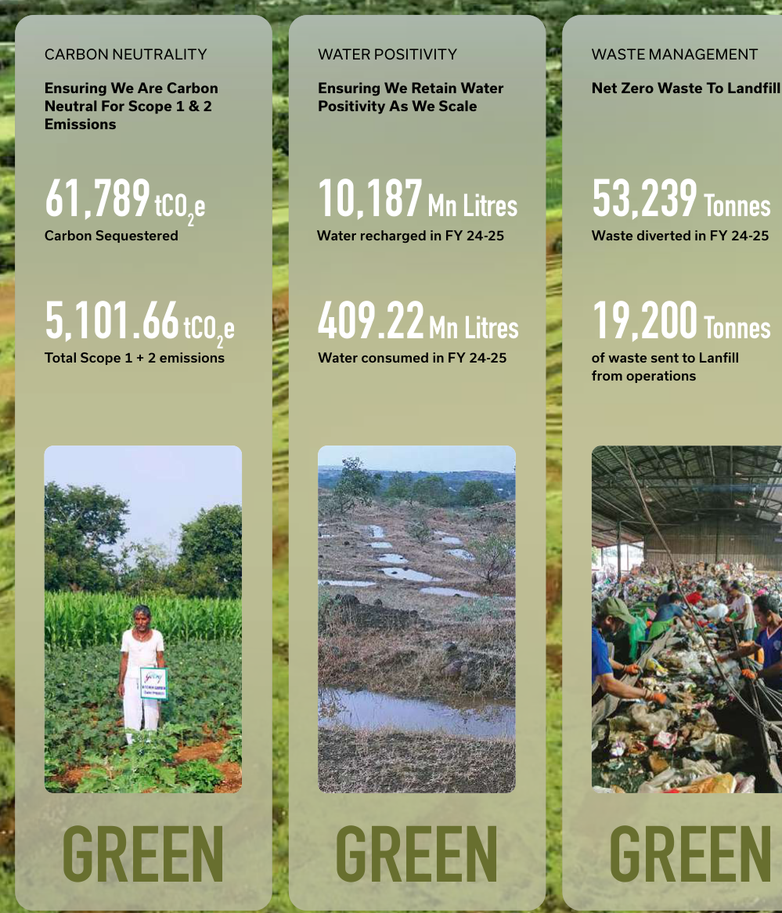

**[Image: AnnualReport2025.pdf-0101-03.png (999x1166, 1314.6KB)]**

<!-- Start of picture text -->
CARBON NEUTRALITY WATER POSITIVITY WASTE MANAGEMENT Ensuring We Are Carbon  Ensuring We Retain Water  Net Zero Waste To Landfill Neutral For Scope 1 & 2  Positivity As We Scale Emissions 61,789 tCO tCO e 10,187 Mn Litres Mn Litres 53,239 Tonnes Tonnes 2 Carbon Sequestered Water recharged in FY 24-25 Waste diverted in FY 24-25 5,101.66 tCO tCO e 409.22 Mn Litres Mn Litres 19,200 Tonnes Tonnes 2 Total Scope 1 + 2 emissions Water consumed in FY 24-25 of waste sent to Lanfill from operations GREEN GREEN GREEN <!-- End of picture text -->

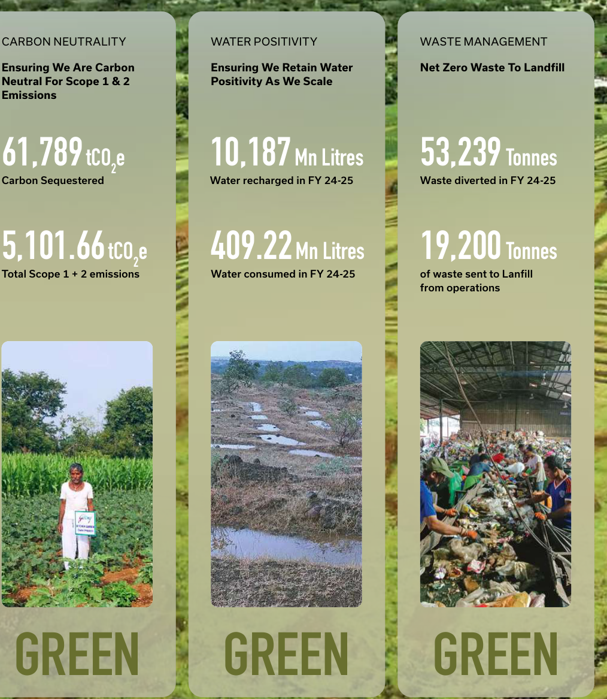

**[Image: AnnualReport2025.pdf-0101-04.png (1014x1166, 1341.1KB)]**

<!-- Start of picture text -->
CARBON NEUTRALITY WATER POSITIVITY WASTE MANAGEMENT Ensuring We Are Carbon  Ensuring We Retain Water  Net Zero Waste To Landfill Neutral For Scope 1 & 2  Positivity As We Scale Emissions 61,789 tCO tCO e 10,187 Mn Litres Mn Litres 53,239 Tonnes Tonnes 2 Carbon Sequestered Water recharged in FY 24-25 Waste diverted in FY 24-25 5,101.66 tCO tCO e 409.22 Mn Litres Mn Litres 19,200 Tonnes Tonnes 2 Total Scope 1 + 2 emissions Water consumed in FY 24-25 of waste sent to Lanfill from operations GREEN GREEN GREEN <!-- End of picture text -->

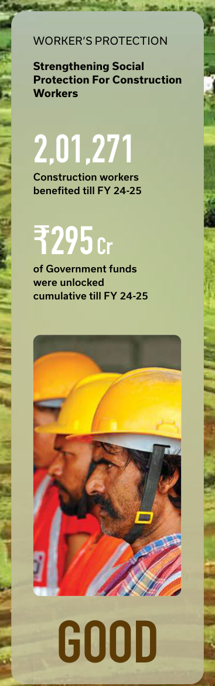

**[Image: AnnualReport2025.pdf-0101-05.png (367x1166, 506.5KB)]**

<!-- Start of picture text -->
WORKER’S PROTECTION Strengthening Social Protection For Construction Workers 2,01,271 Construction workers benefited till FY 24-25 O 295 Cr of Government funds were unlocked cumulative till FY 24-25 GOOD <!-- End of picture text -->

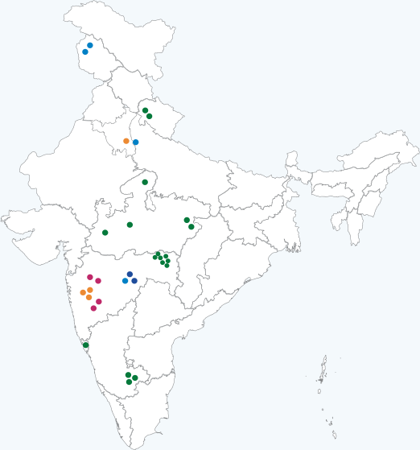

**[Image: AnnualReport2025.pdf-0101-06.png (522x559, 48.4KB)]**

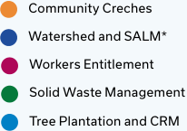

**[Image: AnnualReport2025.pdf-0101-07.png (206x145, 9.6KB)]**

<!-- Start of picture text -->
Community Creches Watershed and SALM* Workers Entitlement Solid Waste Management Tree Plantation and CRM <!-- End of picture text -->

195 

GODREJ PROPERTIES LIMITED 

INTEGRATED REPORT 2024-25 

###### **Child and Maternal Well-Being through Crèches** 

Our community creches for children of labours feature programmes supporting health, non-formal education (NFE), early child-care education (ECCE) formal education and nutrition of children. Additionally, it also provides support to pregnant and lactating women at crèches in Pune and Gurugram. 

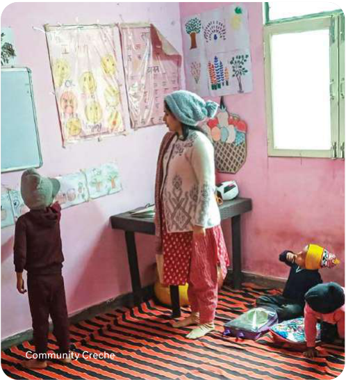

**[Image: AnnualReport2025.pdf-0102-04.png (498x547, 566.8KB)]**

<!-- Start of picture text -->
Community Creche <!-- End of picture text -->

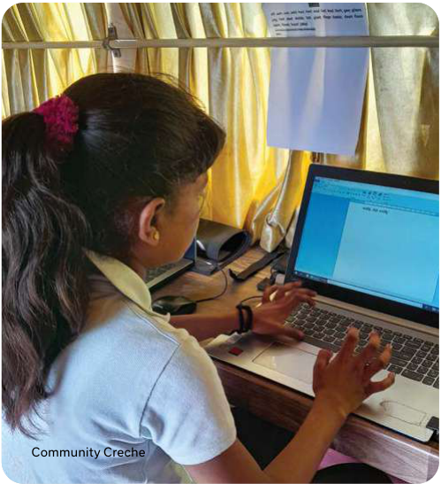

**[Image: AnnualReport2025.pdf-0102-05.png (499x547, 611.4KB)]**

<!-- Start of picture text -->
Community Creche <!-- End of picture text -->

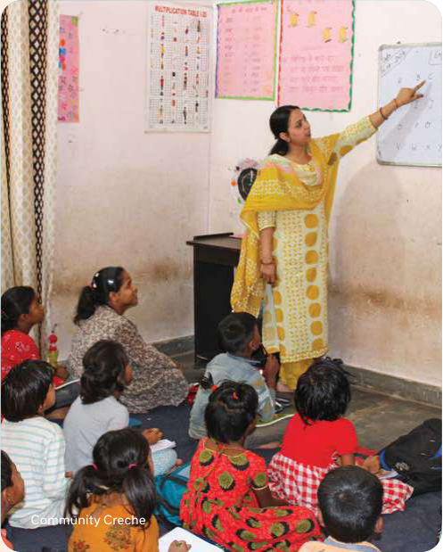

**[Image: AnnualReport2025.pdf-0102-06.png (497x619, 632.1KB)]**

<!-- Start of picture text -->
Community Creche <!-- End of picture text -->

**[Image: AnnualReport2025.pdf-0102-07.png (401x137, 10.5KB)]**

<!-- Start of picture text -->
COMMUNITY ADOPTION DAY CARE FACILITY FOR CHILDREN OF LABOURS ACHIEVEMENTS IN FY 24-25 <!-- End of picture text -->

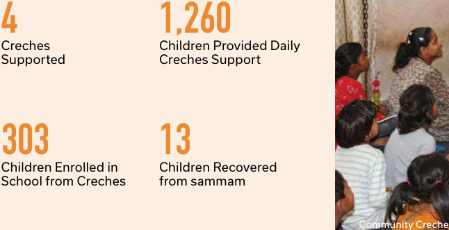

**[Image: AnnualReport2025.pdf-0102-08.png (646x331, 153.8KB)]**

<!-- Start of picture text -->
4 1,260 Creches   Children Provided Daily Supported Creches Support 303 13 Children Enrolled in   Children Recovered School from Creches from sammam Community Creche <!-- End of picture text -->

###### **Developing Care** 

Building and other construction workers (BOCW) represent a substantial segment of the unorganised sector. At GPL, we support these underrepresented yet vital stakeholders through collaboration with our non-governmental organisation partners and facilitate access to government funds, social protection, and entitlements. Our comprehensive assistance streamlines access to welfare schemes specifically designed for construction workers, ensuring their well-being and inclusion. 

**2,07,271** Workers registered for BoCW schemes till FY 24-25 Base FY 20-21 

Sushama, the wife of late Harish who was a dedicated security guard at a construction site in Goregaon. She had received crucial financial support under the Building and Other Construction Workers Welfare Board (BOCW) scheme. 

The amount provided to her as a widow pension, aims to offer some stability during this difficult period of personal loss. Harish had been working as a security guard at a reputed commercial complex. 

**For every** `K` **1 spent, a construction worker benefits by** `K` **23.** 

Following his passing, Sushama was left to manage household responsibilities and emotional challenges alone. With the support of our NGO partner and BOCW board, Sushama received the financial aid she was entitled to, recognising her husband’s contributions as a registered construction worker. 

The monetary assistance has helped her manage immediate household needs and offered a sense of security in uncertain times. 

196 GRI 2-8 

GRI 2-8 197 

GODREJ PROPERTIES LIMITED 

INTEGRATED REPORT 2024-25 

**STATUTORY REPORTS IN THIS SECTION** 

Management Discussion & Analysis 200 Director's Report 218 Report on Corporate Governance 244 Business Responsibility & Sustainability Report 268 Financial Statements 302 Notice 480 

**[Image: AnnualReport2025.pdf-0103-04.png (369x116, 84.8KB)]**

<!-- Start of picture text -->
Godrej Ananda, Bengaluru RERA: PRM/KA/RERA/1251/309/PR/210331/004084 198 GRI 2-6 <!-- End of picture text -->

**[Image: AnnualReport2025.pdf-0103-05.png (35x14, 1.3KB)]**

<!-- Start of picture text -->
199 <!-- End of picture text -->

GODREJ PROPERTIES LIMITED 

INTEGRATED REPORT 2024-25 

###### **Management Discussion & Analysis** 

###### Global economic overview 

###### **Diverging regional growth patterns** 

In CY2024, the global economy displayed notable resilience despite uneven momentum across regions and sectors and grew at 3.3% as per International Monetary Fund’s (IMF) World Economic Outlook. Headline inflation moderated to 5.8% in CY2024 towards central bank targets, prompting the first wave of policy rate cuts in major economies. Labour markets, though slightly softened, remained tight, with unemployment near historical lows. Strong nominal wage growth, combined with easing price pressures, improved real household incomes. However, private consumption remained subdued, reflecting weak consumer sentiment and elevated uncertainty. 

- United States expanded by 2.8%, supported by resilient consumption, strong public spending, and stable exports. 

- Eurozone posted modest growth of 0.9%, weighed down by weak investment in Germany and declining external demand. 

- China faced headwinds from sluggish consumption and continued stress in its property sector, with knock-on effects across Asia and Europe. 

Rising geopolitical tensions, particularly in Eastern Europe and the Middle East, added further uncertainty, disrupting global trade, investment flows, and financial markets. These factors continued to cast a shadow over business confidence and long-term investment decisions. 

- India stood out as a bright spot, maintaining robust growth and reinforcing its position as a key engine of global expansion. 

###### Outlook for CY2025 and beyond 

###### 3.3% 

The global economy enters CY2025 at a delicate inflection point. While inflation has eased, escalating tariff measures, particularly between the US and its trading partners, have raised effective tariff levels to a century-high, delivering a significant shock to global trade. 

Global GDP growth in CY2024, as per IMF’s World Economic Outlook (April 2025) 

###### Global and regional GDP projections through CY2026* 

###### Global GDP Growth (%) 

###### Euro Area 

**[Image: AnnualReport2025.pdf-0104-18.png (460x119, 7.7KB)]**

<!-- Start of picture text -->
CY2024 3.3 CY2025 (F) 2.8 CY2026 (F) 3.0 <!-- End of picture text -->

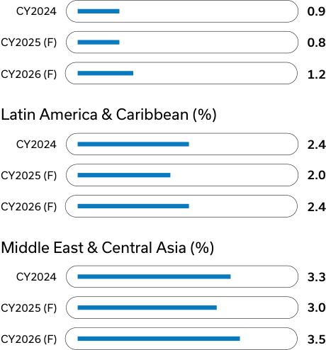

**[Image: AnnualReport2025.pdf-0104-19.png (460x494, 31.3KB)]**

<!-- Start of picture text -->
CY2024 0.9 CY2025 (F) 0.8 CY2026 (F) 1.2 Latin America & Caribbean (%) CY2024 2.4 CY2025 (F) 2.0 CY2026 (F) 2.4 Middle East & Central Asia (%) CY2024 3.3 CY2025 (F) 3.0 CY2026 (F) 3.5 <!-- End of picture text -->

###### Advanced Economies (%) 

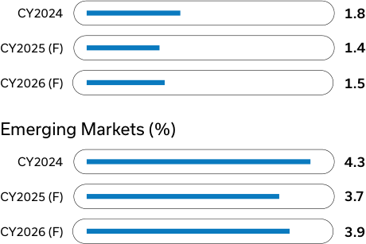

**[Image: AnnualReport2025.pdf-0104-21.png (460x307, 18.3KB)]**

<!-- Start of picture text -->
CY2024 1.8 CY2025 (F) 1.4 CY2026 (F) 1.5 Emerging Markets (%) CY2024 4.3 CY2025 (F) 3.7 CY2026 (F) 3.9 <!-- End of picture text -->

###### Emerging Markets (%) 

*According to International Monetary Fund’s April 2025 projections 

###### Inflation and policy dynamics 

Global headline inflation is projected to average 4.3% in CY2025, easing to 3.6% in CY2026. While inflation estimates have been revised upwards for advanced economies, emerging markets are expected to benefit from more stable price conditions. In this environment, central banks may need to maintain a cautious stance, balancing support for growth with the need to anchor inflation expectations. 

Going forward, policymakers will need to strike a careful balance between fostering growth and maintaining inflation discipline. While easing inflation could create room for monetary loosening, trade-related disruptions and climatelinked shocks remain key risks. Structural reforms, shifting demographics, and the transition to a low-carbon economy will significantly influence growth paths, with regional dynamics and policy frameworks playing an increasingly pivotal role in shaping emerging opportunities. 

###### Indian economic overview 

Amid global uncertainties, India’s economic fundamentals remain firmly anchored. Infrastructure expansion, robust real estate activity, and rapid digitalisation have continued to act as key growth multipliers across sectors. Strong agricultural output, rising household incomes, and government-backed initiatives in financial inclusion and affordable housing have provided further impetus to consumption. 

###### 6.5% 

India’s GDP growth in FY 24-25, led by infrastructure, services, and rural demand revival 

In FY 24-25, India recorded a growth rate of 6.5%, underpinned by a recovery in rural demand, sustained Government investments in infrastructure and the continued buoyancy in the services sector. As per the world bank, India will remain resilient and grow at 6.3% in FY2026 led by strong domestic demand, a dynamic service sector, and a gradual revival in private sector investment. The macroeconomic environment remained stable, supported by a contained retail inflation rate of 4.6% - the lowest since FY 18-19, narrowing fiscal deficit and manageable current account, and healthy foreign exchange reserves, bolstering investor confidence. 

The Reserve Bank of India’s calibrated monetary policy, which included two repo rate reductions of 25 basis points each in February and April 2025, signalled a pro-growth orientation while maintaining inflation discipline. 

###### Industry context 

India’s real estate sector reflects the broader optimism surrounding the country’s economic future. According to the IMF’s World Economic Outlook, April 2025, India’s GDP has more than doubled to ~$4.19 trillion, from $2 trillion in 2014, propelling the country from the tenth to the fifth-largest 

economy in the world and is on course to become the thirdlargest by FY 30-31, growing at a sustained pace of around 6.7%. This growth trajectory is powered by a convergence of long-term drivers: expanding middle class, accelerating urbanisation, increasing disposable income, rapid digital adoption, and continued structural reforms. 

Flagship government initiatives such as the Smart Cities Mission, Housing for All, and the Real Estate (Regulation and Development) Act (RERA), have enhanced transparency, improved regulatory oversight and strengthened investor confidence across the real estate value chain. 

Real estate is a key contributor to India’s GDP and employment generation. According to Knight Frank, the sector is expected to grow from $300 Billion in CY2024 to $650 Billion by CY2025, reaching $1Trillion by CY2030 and potentially $5.8 Trillion by CY2047. 

###### Real estate sector contribution to GDP 

###### ~7.3% 

Today 

###### ~15.5% 

By 2047 

Source: Knight Frank 

This growth reflects not only the demand for housing and office spaces but also the sector’s deep linkages with over 200 allied industries – from cement and steel to logistics, finance, and consumer goods. Sustained demand across residential, commercial, and industrial real estate, combined with the expansion of India’s corporate sector and a services-driven economy, is reinforcing the sector’s long-term outlook. 

As India advances towards inclusive and sustainable urban development, real estate will continue to serve as a critical enabler, shaping cities, creating jobs, and building physical and social infrastructure needed to support a rapidly evolving population. 

###### India’s Real Estate Market (US$ billion) 

|2017|120|
|---|---|
|2020|180|
|2025|650|
|2030(F)|1,000|
|2047(F)|5,800|

F: forecast 

200 

201 

GODREJ PROPERTIES LIMITED 

INTEGRATED REPORT 2024-25 

###### Economic resilience driving housing demand 

India’s housing market continued to perform strongly in CY2024, driven by robust demand, particularly in the midand high-end residential segments, and supported by rising aspirations, increasing purchasing power and growing consumer confidence. Sustained momentum in homebuyer interest propelled annual residential sales to a new all-time high, reflecting the deep-rooted structural strength of India’s housing demand. 

###### Policy reforms strengthening affordability 

Government-led policy interventions have played a critical role in enhancing housing affordability and encouraging homeownership. The Union Budget for FY 25-26 introduced meaningful personal income tax reductions, increasing disposable incomes and driving demand for affordable housing, particularly across India’s fast-developing urban centres. Such reforms are contributing to a more inclusive, broad-based and geographically balanced growth trajectory for the real estate sector. 

###### Urbanisation and infrastructure expansion 

India’s accelerated urbanisation is being matched by a significant increase in infrastructure investments. The government’s capital expenditure on infrastructure has more than doubled—from `H` 5 lakh crore in FY 21-22 to `H` 11.11 lakh crore in FY 24-25—with a strong focus on improving roads, railways and aviation networks. These upgrades are transforming connectivity, unlocking the real estate potential of Tier II and Tier III cities, and creating new corridors of opportunity for developers and homebuyers alike. 

###### `I` 11.11 lakh crore 

Government’s infra development outlay in FY 24-25 

###### Technology redefining real estate 

The integration of artificial intelligence (AI), digital platforms, and virtual engagement tools is transforming the way real estate is designed, marketed and transacted. AI-powered property analytics, smart home solutions and immersive virtual site visits are improving transparency, enhancing customer experiences and streamlining operations. As the industry becomes increasingly data-driven and digitally enabled, real estate transactions are evolving to be more seamless, personalised and efficient. 

###### Residential real estate market 

The real estate market continues to create significant opportunities for both domestic and international investors. Overall, the residential sector remains a focal point for growth, fuelled by sustained demand. The stable economic and interest rate scenario, along with the still strong momentum, hold enough tailwinds for the market. The government 

remains committed ensuring ‘housing for all’ and is taking steps to spur private sector participation and enable easier access to financing for homebuyers in this segment. 

In CY2024, India's residential real estate sector scaled new heights with sustained strong demand. A clear shift toward premiumisation is visible with buyer preferences evolving, driven by aspirations for an enhanced lifestyle. According to Knight Frank , the residential market has had a tremendous run since the pandemic in 2020 with sales volumes in the primary market growing at an annualised rate of 23%. Increased savings during lockdowns, minimal income disruptions in mid- and high-income brackets, household wealth creation and robust economic growth have fuelled demand. Market sentiments have also been positive largely due to an upbeat economic outlook, with India demonstrating growth and stability in a still volatile global economic and geopolitical environment. 

###### 23% 

Annualised growth in sales volume in residential market since CY2020 

In CY2024, 3.51 lakh units got sold, representing a 7% growth. Most markets were at multi-year highs, except for NCR, which saw a marginal decline. Launches also kept pace, with 3.73 lakh units coming into the market aligned with changing lifestyle preferences for more space, amenities and differentiated experiences. As a result, the contribution of inventory above `H` 1 crore could see a visible increase. The Quarters to Sell (QTS) level continued to fall steadily to 5.8 quarters from 10 quarters three years ago, indicating a strong demand momentum. Despite the increasing inventory level, the fall in QTS indicated an expanding industry size. Prices grew across markets, with Bengaluru recording the highest at 12% YoY. 

###### NCR 

The shift toward premium housing remains a defining trend in NCR’s residential market. Properties priced above `H` 1 crore accounted for nearly 80% of total sales volume, compared to less than 40% three years ago. This growth is indicative of sustained demand for spacious homes with state-of-the-art amenities, driven by affluent homebuyers prioritising quality living spaces. Within this segment, the `H` 1-2 crore and `H` 2-5 crore bracket saw the most significant activity, supported by well-established developers offering projects in strategic locations. In contrast, the segments below `H` 50 lakh continue to show a shrinking trend. 

In CY2024, NCR maintained a steady performance with robust demand seen in the primary residential market. However, NCR was the only market that saw sales dip marginally by 4% YoY to 57,654 residential units, albeit from a multi-year high base, and low inventory levels in the midand-affordable categories, in the right locations. 

Gurugram retained its dominance as the preferred micromarket in NCR, accounting for half of the total sales and launches. The continuous development of the Dwarka Expressway, along with the anticipated completion of key infrastructure projects, has significantly enhanced the area’s connectivity and appeal. The Southern and Central Peripheral Roads continue to draw interest, fuelled by a mix of premium projects that cater to high-net-worth individuals. Noida and Greater Noida collectively contributed around a third of the sales. The Uttar Pradesh government’s dispute resolution mechanisms have rejuvenated buyer confidence, resolving long-standing issues with stalled projects. Greater Noida witnessed notable traction owing to improved infrastructure, including the Noida International Airport and the extension of metro connectivity. 

New launches in CY2024 experienced a slight 3% decrease to 60,699 units. The inventory level rose marginally to 1,06,652 units and QTS of 7.3 quarter was healthy. Prices grew by 6% to `H` 5,066/sq. ft. 

The shift toward premium housing remains a defining trend in NCR’s residential market. Properties priced above `H` 1 crore accounted for nearly 80% of total sales volume, up from less than 40% three years ago. This growth is indicative of sustained demand for spacious homes with state-of-theart amenities, driven by affluent homebuyers prioritising quality living spaces. Within this segment, the `H` 1-2 crore and `H` 2-5 crore bracket saw the most significant activity, supported by well-established developers offering projects in strategic locations. Conversely, the segments below `H` 50 lacs continue to show a shrinking trend. 

###### MMR 

The residential market in Mumbai is poised for continued growth, driven by strong consumer demand furled by ongoing infrastructural developments, rising affluence and evolving consumer preferences. In CY2024, the market retained its top position, with 96,187 units sold and almost an equal number of units launched. Mumbai benefits from a thriving economic ecosystem, positioned as the centre for finance, commerce and industry. Further, completion of infrastructure projects such as the Mumbai Coastal Road, Metro Line 3 and the Mumbai Trans Harbour Link provides additional fillip to demand. 

Most new launches in Mumbai were concentrated in the peripheral Central and Western Suburbs, as well as Thane. Inventory levels remained at 1.65 lakh units, while QTS at 7.2 quarters was healthy. Pricing showed an increase of 5% YoY to `H` 8,277/sq. ft. While high QTS levels in higher ticket sizes warrant close observation, the market’s strong fundamentals ensure stability and long-term growth potential. 

###### Bengaluru 

Bengaluru's residential real estate market in CY2024 continued its trajectory of robust performance, bolstered by consistent demand across various segments. Sales grew by 2% to 55,362 units. More importantly, there was heightened activity across premium housing segments with ticket sizes `H` 1-5 crore contributing over 50% to volumes, indicating a 

shift in buyer preferences towards upscale housing, driven by Bengaluru’s affluent demographic from its thriving IT and startup ecosystems. 

South Bengaluru, comprising Electronic-City, Koramangala and Outer Ring Road, remained a leading micro-market. The emergence of luxury housing in this predominantly mid-segment market highlights the growing appetite for high-end residential options among the city’s affluent. East Bengaluru, comprising Whitefield and KR Puram, also showed remarkable growth, driven by its reputation as the city’s prime IT hub. North Bengaluru, comprising Hebbal, Devanhalli and Bellary Road, stands out as one of the fastest growing residential clusters due to its strategic location near the airport, further bolstered by infrastructure projects like the Blue Line Metro. 

With inventory levels at 54,131 units and QTS at only 4 quarters, the Bengaluru market continues to appear as the fundamentally most healthy market. Pricing showed an increase of 12% YoY to `H` 6,620/ sq. ft., the most for any market. 

###### Pune 

Pune continued to be a dynamic real estate market, balancing affordability with premium offerings with sales of 52,346 units, up 6% YoY, supported by strong demand from IT professionals, infrastructure development and evolving buyer preferences. New launches increased substantially by 40% in CY2024 to 59,548 units, highlighting rising developer confidence. The Western Zone, including prominent areas like Hinjewadi and Baner, dominated with a significant share of total launches, leveraging its proximity to IT hubs and enhanced connectivity. 

Pune’s inventory levels increased by 18% YoY in CY2024 but QTS remained healthy at 3.7 quarters, reflecting quicker absorption and strong buyer demand. Prices grew by 6% to `H` 4,778/ sq. ft. 

###### Office market 

The office market across major Indian cities sustained its record-breaking momentum, with annual transaction volumes surpassing 71.9 Million sq. ft.—the highest so far. As a result, vacancy levels also dropped to 15%, the lowest since the pandemic. The positive sentiment around the economy has been the primary driver of occupier activity in the office market. 

Transaction volumes in major markets of Mumbai, NCR, Bengaluru, Pune and Ahmedabad scaled record highs in CY2024. Bengaluru led with 18.1 Million sq. ft. of leasing, followed by NCR, Mumbai and Hyderabad at 12.7 Million sq. ft., 10.4 Million sq. ft. and 10.3 Million sq. ft., respectively. 

Hyderabad, on the other hand, led with completions of 15.6 Million sq. ft., followed by Bengaluru with 12.4 Million sq. ft. out of total completions of 50.6 Million sq. ft. Overall, completions were comparatively subdued as development interest continues to be largely focused on residential projects and vacancy levels remained above prepandemic levels. 

> 1Knight Frank report on India Real Estate for H2CY24 

202 

203 

GODREJ PROPERTIES LIMITED 

INTEGRATED REPORT 2024-25 

While the overall transacted volume has been on a steady uptrend, its underlying constituents have changed substantially over time. Third party IT services had been a prominent driver of office space demand previously, but India-facing businesses have been anchoring demand in recent years due to the strategic business need to be aligned with the growing Indian market. India-facing businesses accounted for 36% of the total volume transacted during CY2024 and Global Capability Centres (GCC) took up 31% of the total transactions. 

###### Union Budget 2025-26 takeaways 

The Union Budget for 2025-26 continued to emphasise infrastructure development and housing while providing a boost to disposable income to drive consumption, setting a favourable backdrop for a more inclusive and balanced real estate growth story. 

###### Income tax rationalisation strengthening affordability 

The pricing has shown a steady growth between 3% and 7% across all markets. 

###### Outlook 

The sustained surge in office demand throughout CY2024, despite the volatile global economic environment, underscores the positive business sentiment that exists in the country today. The Indian office space market has few headwinds over the near term other than a weak supply scenario and appears well poised to sustain its momentum in CY2025. 

###### Housing and inclusive development 

Aligned with its vision of ‘housing for all’, the Government launched the Pradhan Mantri Awas Yojna – Urban 2.0 (PMAY-U 2.0) with a proposed allocation of `H` 19,784 crore, up 36% from `H` 13,670 crore estimated in the previous budget. Over 88 lakh homes have already been completed under the first phase of PMAY-U. This initiative presents a big opportunity for developers. Private players can participate in creating well-planned, sustainable housing projects with Government support. 

In CY2022, emissions from buildings, covering both operational (26%) and embodied emissions (7%), accounted for about a third of total energy system emissions . The emissions intensity of cement production has increased by close to 10% since 2015. The rest stems from direct on-site emissions, predominantly from electricity use for lighting and air conditioning. Over the past decade, operational energy consumption in buildings has surged due to rising urbanisation, increased cooling demand, and expanding commercial floor space. India’s building sector energy consumption has more than doubled since 2000. There's a significant yet unexplored opportunity to reduce emissions, hindered by the ongoing reliance on fossil fuel-driven assets, the absence of potent energy-efficiency mandates, and a deficit in investments towards sustainable buildings . 

Climate change is also influencing regulatory and financial frameworks that govern the sector. With India’s commitment to achieve net-zero emissions by 2070, there is growing emphasis on incorporating climate resilience and sustainability into urban development policies. Real estate firms must urgently implement innovative strategies to adapt their buildings, operations, workforce, products, and services to these significant and impending changes. 

Moreover, investor sentiment is shifting toward environmentally responsible developments. Institutional and retail investors are beginning to factor climate risk into asset valuation, leading to a potential decline in the premium of properties in high-risk zones and a surge in demand for buildings that meet environmental and social governance (ESG) criteria. Governments, policymakers, investors, and the general populace are shifting their views on climate change and are taking bold actions. The creation of tools that encourage eco- friendly building practices and the widespread acceptance of green building certifications are helping more areas to align their construction activities with the goals of the Paris Agreement. While the surge in investments is indeed encouraging, it also highlights the necessity of engaging with additional external partners to leverage technology effectively, ensuring seamless operations, accountability and transparency. As India progresses towards its net-zero goals, integrating climate considerations across all sectors will be crucial to building a resilient and sustainable economy. 

###### **Budget 2025-26 – Key takeaways for climate action** 

The Government introduced personal income tax cuts by rejigging the income tax slabs and raising the rebate cap, increasing disposable income and, in turn, stimulating demand for affordable housing, especially across emerging urban centres. 

###### Reviving stalled projects 

It announced a second Special Window for Affordable and Mid-Income Housing (SWAMIH) fund, with an allocation of `H` 15,000 crore, to resolve project delays due to financial constraints. This move is expected to benefit homebuyers awaiting possession and also inject fresh capital into stalled projects. By enhancing liquidity in the sector, this initiative is expected to attract more investments into this space. 

###### Climate change and real estate sector 

The real estate sector in India, a key contributor to the country's GDP and employment, is increasingly facing the multifaceted impacts of climate change. Rising temperatures, erratic monsoons, flooding, and extreme weather events are not only disrupting construction timelines and increasing operating costs but are also reshaping demand patterns for housing and commercial infrastructure. As climate change increasingly affects economies and this sector, there are both physical and transitional risks that could harm assets and the markets they are part of, either directly or indirectly. The impact of climate change on real estate portfolios can be chronic, reflecting long-term trends, or acute, indicating severe 

###### Urbanisation and infrastructure expansion 

The Government’s infrastructure investments, with a strong emphasis on enhancing roads, railways, and aviation network, are improving connectivity, unlocking real estate potential in Tier II and Tier III cities, creating new growth corridors for developers and homebuyers alike. The newly introduced `H` 1 lakh crore Urban Challenge Fund will further incentivise cities to boost urban development by raising funds through municipal bonds and PublicPrivate Partnerships. 

short-term occurrences, and vary by location or in response to efforts to shift towards a low-carbon economy. 

The urgency for drastic measures is underscored by the observable effects of climate change, such as rising temperatures and sea levels, and increased frequency of extreme weather events. In addition, climate change exacerbates risks to occupational health and safety, with high temperatures already contributing to a 1.4% loss in working hours in 1995. Studies suggest that without addressing climate change, and with an expected temperature increase of 1.3°C by 2030, we could see a productivity loss of 2.2%, equating to 80 Million full-time jobs. 

steel Production Linked Incentive (PLI) scheme from `H` 55 crore to `H` 305 crore. Initiatives like the restructured Shipbuilding Financial Assistance Policy and the establishment of a `H` 25,000 crore Maritime Development Fund are steps toward promoting sustainable practices. Nonetheless, sectors like cement, despite allocations for infrastructure development under the PM Gati Shakti master plan, lack targeted green initiatives, indicating a need for more comprehensive industrial decarbonisation strategies. 

The Union Budget 2025–26 reflects India's commitment to climate action through several key initiatives. While it emphasises renewable energy and clean transportation, it also highlights the need for more comprehensive strategies in industrial decarbonisation and agricultural sustainability to achieve India's longterm climate objectives. 

The Ministry of New and Renewable Energy received a significant budgetary boost, with allocations increasing from `H` 19,100 crore in the previous fiscal to `H` 26,549 crore. This funding supports flagship schemes such as the PM Surya Ghar and the Green Hydrogen Mission, aiming to expand renewable energy infrastructure. 

The transportation sector witnessed a notable increase in funding for electric mobility, with allocations rising from `H` 4,435 crore to `H` 5,322 crore. The PM Electric Drive Revolution in Innovative Vehicle Enhancement (PM E-DRIVE) scheme received `H` 4,000 crore to accelerate electric vehicle adoption. The PM-eBus Sewa Scheme's funding also increased significantly, supporting the expansion of electric bus operations. To bolster domestic EV manufacturing, the Government removed import duties on 35 items essential for EV battery production, aiming to strengthen the electric vehicle ecosystem. However, the non-renewal of the Electric Mobility Promotion Scheme, which previously offered subsidies for advanced battery-fitted EVs, suggests a shift in policy focus. 

In addition, the Nuclear Energy Mission was allocated `H` 20,000 crore, emphasising the development of small modular reactors to enhance energy security. Investments in solar PV manufacturing, the Green Energy Corridor, and battery energy storage systems further demonstrate the Government's integrated approach to increasing non-fossil fuel capacity and meeting growing energy demands. 

The Budget provided support for green steel (<2.2 tonnes of CO2 emission for every tonne of steel produced), including a sixfold increase in the specialty 

> 2Buildings – Breakthrough Agenda Report 2023 – Analysis - IEA 

> 3 <u>https://www.unep.org/news-and-stories/press-release/co2-emissions-buildings-and-construction-hit-new-high-leaving-sector</u> 

204 

205 

GODREJ PROPERTIES LIMITED 

INTEGRATED REPORT 2024-25 

###### Opportunities 

###### Housing Demand 

A combination of economic growth, increasing income levels, and the perception that housing prices are stabilising, which has led to a notable uptick in housing demand. Potential buyers, previously on the sidelines, are now entering the market as first-time homeowners while existing homeowners are looking for larger spaces. The shift towards remote and hybrid work models is further influencing the desire for more spacious living arrangements. Employers offering flexible work options continue to be a significant factor in this trend, as it allows employees the freedom to live further from the office, thereby boosting demand for residential properties in various segments. 

###### Sector Consolidation 

The Indian real estate sector, characterised by its highly fragmented nature, has been undergoing a significant phase of consolidation for several years. This consolidation has been accelerated by various factors, including the pandemic, which has effectively sidelined less robust participants. The current environment in the real estate industry poses challenges to the entry of new competitors. With the trend leaning towards a smaller number of dominant developers in each region, this period of consolidation offers an attractive chance for current real estate firms to meet the increasing demand for housing. 

###### Affordable Housing 

Affordable housing remains a pivotal area for developers and a primary focus for the government. The PMAY is close to achieving 3 crore houses, and an additional 2 crore houses are targeted for the next 5 years, as discussed above. This shows that the affordable housing market is projected to experience a surge in demand, bolstered by an anticipated economic revival and increasing income levels. 

###### Digital Real Estate Sales 

Since the pandemic, marketing efforts in real estate have expanded beyond attracting new customers and building brand awareness to include creating personal connections digitally. Thanks to technology that allows property purchases online, developers have seen strong sales, even during lockdown periods. They are using digital tools to engage with potential buyers, present project details, offer virtual tours and target Non-Resident Indians (NRIs) to increase sales. Advanced technologies like virtual reality, augmented reality, and AI-driven chatbots are increasingly being employed to offer tailored services to potential clients. The share of real estate transactions conducted online is likely to increase further, requiring developers to remain aligned with the advancements in digital technologies. 

###### Threats & challenges 

###### Regulatory Hurdles 

The real estate industry is subject to extensive regulations, and any negative adjustments in governmental policies or the regulatory framework can negatively influence the sector's 

performance. Significant delays in procedures related to acquiring land, determining land use, initiating projects, and obtaining construction approvals are common. Changes in policy applied retrospectively, along with regulatory obstacles, could affect profitability and diminish the appeal of both the sector and the companies active within it. 

###### Monetary Tightening and Funding Issues 

In recent years, the landscape of real estate financing has shown a marked divergence. Well-established developers with lower debt levels have continued to secure funding with relative ease, benefiting from the selective approach of lenders, while those with weaker financial standings have encountered challenges in accessing capital. The performance of the real estate sector is intricately connected to the broader economic recovery and the prevailing monetary policies. The RBI has adopted an accommodative stance for now to bolster economic growth but has kept a hawk eye on the inflation trajectory. The central bank could reverse its stance, which may pose challenges for the real estate sector in the form of higher housing loan costs and an escalation in financing costs for developers. 

###### Shortage of Manpower and Technology 

As the country's second-largest employment provider, the real estate sector relies significantly on manual labour. The pandemic severely impacted this sector due to labour shortages, disrupting project completion schedules. Consequently, there's a pressing need for the adoption of alternative construction methods that are less dependent on manual labour and more on technology. 

###### About Godrej Properties Limited 

Godrej Properties, part of the venerable Godrej Industries Group (GIG) founded in 1897, is a leading real estate player in India. Upholding the Group's ethos of innovation, sustainability and excellence, Godrej Properties has been synonymous with trust and quality for over a century. With a focus on leveraging advanced design and technology, we are committed to exceeding stakeholder expectations by crafting exceptional and innovative spaces, rooted in deep consumer understanding. We believe in the power of collaboration to achieve excellence, partnering with premier designers, architects, and contractors both in India and internationally. This approach ensures that every development not only meets the present needs of its residents and communities but is also durable and forward-thinking, reflecting the best the world has to offer in real estate. 

###### A. Leveraging the Godrej Brand 

The 'Godrej' brand is well-recognised throughout India due to its long history in the market, the diverse sectors the Godrej Industries Group operates in, and the trust it has built over time. This strong brand reputation aids in several business activities, such as establishing joint development agreements, moving into new cities and markets, and forming business partnerships. Godrej Properties has also entered the plotted development space in Tier-2 cities, recognising 

their sales potential. The brand has been crucial in developing solid relationships with customers, service providers, partners, investors and lenders, helping us secure a strong position in the industry. In addition, our binding arrangements with Godrej & Boyce appointing GPL as the development manager for developing all its lands in Vikhroli is a large opportunity. 

###### B. Sales Momentum 

We delivered eight consecutive years of record annual sales, underscoring the strength of our brand and the quality of our products. GPL recorded the highest ever booking value and volume by any listed developer in India in a financial year, with booking value reaching `H` 29,444 crore, up 31% YoY and 9% above guidance, and sales volume of 25.73 Million sq. ft., up 29% YoY. We also achieved the highest cumulative booking value of `H` 84,704 crore for any real estate developer since FY 19-20, with `H` 64,203 crore sold since FY 22-23. 

###### `I` Cr 29,444 

Booking value in FY 24-25, highest ever by any listed developer in a financial year 

25.73 Mn sq. ft. Booking Sales volume in FY 24-25 

Our sales are most widely distributed in the industry, with only 36% booking value coming from the largest market, 27% from the home market and 13% from the largest single project. This surge was the result of launching 34 new projects or phases in FY 24-25. The NCR, MMR and Bengaluru markets contributed `H` 10,523 crore, `H` 8,034 crore and `H` 5,089 crore, respectively. 12 projects spread across the six markets of Gurugram, Noida, MMR, Bengaluru, Pune and Hyderabad achieved booking value of more than `H` 1,000 crore, highlighting the broad-based momentum in demand. 

Sales momentum increased in the second half, with Q4 FY 24-25 being our most successful quarter ever, contributing `H` 10,163 crore, or 35% of our annual booking value. This was also the first time we crossed the `H` 10,000 crore mark in a quarter and the seventh consecutive quarters of achieving more than `H` 5,000 crore of booking value. 

In FY 25-26, we expect to increase residential bookings to over `H` 32,500 crore by launching a large number of exciting projects, combined with strong sustenance sales. With a robust launch pipeline, strong balance sheet and sectoral tailwinds, we expect to sustain the momentum in FY 25-26. 

###### Performance in key markets 

###### NCR 

In FY 24-25, the NCR region remained GPL's top-performing area, marking yet another year of record-breaking sales driven by enthusiastic responses to new launches and consistent sales performance. We achieved a 5% YoY increase in booking value to `H` 10,523 crore, on a high base, from sales of 5.66 Million sq. ft. area. This impressive sales outcome was supported by several successful new projects and phase launches, alongside sustained sales from ongoing developments. A highlight this year was the outstanding performance of Godrej Jardinia, Godrej Riverine, Godrej Vrikshya, Godrej Astra and Godrej Zenith, each achieving a booking value of more than `H` 1,000 crore. 

Godrej Jardinia, in Sector 146, was our best ever launch in Noida, achieving a booking value of `H` 2,377 crore across 1.60 Million sq. ft. Godrej Riverine in Sector 44, Noida achieved a booking value of `H` 2,206 crore across 1.01 Million sq. ft. Godrej Vrikshya in Sector 103, Gurugram achieved a booking value of `H` 1,633 crore across 0.94 Million sq. ft. Godrej Astra in Sector 54, Gurugram achieved a booking value of `H` 1,323 crore across 0.42 Million sq. ft. Godrej Zenith in Sector 89, Gurugram achieved a booking value of `H` 1,189 crore across 0.77 Million sq. ft. Other major projects contributing to sales were Godrej Miraya in Sector 43, Gurugram, which achieved a booking value of `H` 701 crore across 0.12 Million sq. ft. Godrej South Estate, Godrej Aristocrat, Godrej Green Estate, Godrej 101/Aria and Godrej Tropical Isle contributed between `H` 100 crore to `H` 500 crore to booking value, driven by sustenance sales and a strong market reception to new phase launches. 

###### Mumbai 

Sales in Mumbai reached 7.82 Million sq. ft., a 91% YoY increase, generating a booking value of `H` 8,034 crore, up 23% YoY. This strong sales performance was fuelled by the launch of some new projects/phases, along with sustained sales momentum from ongoing projects. Notably, Godrej Reserve in Kandivali, reported sales of 0.82 Million sq. ft., with a booking value of `H` 1,654 crore. Godrej Avenue Eleven in Mahalaxmi, reported sales of 0.35 Million sq. ft., with a booking value of `H` 1,106 crore. Both benefitted from sustenance sales and a strong market reception to new phase launches. Other notable contributors were Godrej City, the township project in Panvel, which reported sales of 1.71 Million sq. ft. with a booking value of `H` 815 crore; Godrej Horizon, which reported sales of 0.31 Million sq. ft. with a booking value of `H` 716 crore; Godrej Woodside Estate, which reported sales of 1.58 Million sq. ft. with a booking value of `H` 700 crore; Godrej Hillview Estate, which reported sales of 1.70 Million sq. ft. with a booking value of `H` 672 crore; Godrej Vistas, which reported sales of 0.19 Million sq. ft. with a booking value of `H` 430 crore. 

206 

207 

GODREJ PROPERTIES LIMITED 

INTEGRATED REPORT 2024-25 

###### C. Business Development 

91% Increase YoY in sales volume in Mumbai market 

FY 24-25 marked our entry into the Indore market with two new deals. The year also included one project addition each in Ahmedabad and Kolkata after a few years. During this period, we added 14 new residential projects, characterised by 100% economic interest. These projects, which cover a saleable area of ~19.02 Million sq. ft., carry a revenue potential of around `H` 26,450 crore, exceeding the initial annual forecast of `H` 20,000 crore in booking value. The strategic locations of these projects are poised to bolster our continued rapid growth and significantly enhance our margin profile. In addition, the ongoing consolidation in the real estate sector, accelerated by the pandemic, continues to present significant opportunities for GPL to further business development. With growth capital at our disposal, we plan to concentrate on opportunistic investments and expand our project portfolio in FY 25-26. 

Godrej Carmichael, Godrej Nurture, Godrej Ascend, Godrej Urban Park, Godrej Golfside Estate, Godrej Sky Terraces, Godrej Tranquil and Godrej Five Gardens contributed more than `H` 100 crore to booking value. 

###### Bengaluru 

In Bengaluru, total sales reached 5.13 Million sq. ft., generating a booking value of `H` 5,089 crore, up 107% YoY, driven by the launch of two new projects. Godrej Woodscapes was our most successful ever launch, registering sales of 3.97 Million sq. ft. with a booking value of `H` 3,736 crore, while Godrej Lakeside Orchard registered sales of 1.15 Million sq. ft. with a booking value of `H` 1,271 crore. Godrej Ananda and Godrej Athena contributed more than `H` 100 crore to booking value. 

Residential deals signed by GPL in FY 24-25 

|Particulars|Estimated Saleable Area (Million sq. ft.)|Estimated Booking Value (`E`Cr)|
|---|---|---|
|Sector-53 2, GCR, Gurugram|1.70|5,500|
|Kharghar, MMR|1.97|3,500|
|Sigma-III, Greater Noida|2.04|2,700|
|Sector-53, GCR, Gurugram|0.81|2,600|
|Yelahanka, Bengaluru|1.50|2,500|
|Sector-12, Greater Noida|1.75|2,400|
|Godrej Evergreen Square, Pune|2.26|1,800|
|Vastrapur, Ahmedabad|0.90|1,300|
|Thanisandra, Bengaluru|0.90|1,200|
|Sector-39, GCR, Gurugram|0.34|800|
|Godrej Woodside Estate, MMR|1.76|650|
|Indore Plotted|1.16|500|
|Indore Plotted-2|0.62|500|
|Joka Plotted, Kolkata|1.31|500|
|Total|19.02|26,450|

###### Pune 

In Pune, total sales reached about 3.92 Million sq. ft. with a booking value of `H` 3,409 crore, marking a 27% YoY increase, propelled by the launch of several new projects/phases and solid sales performance from ongoing projects. The new launch, Godrej Evergreen Square achieved sales of 1.41 Million sq. ft. with a booking value of `H` 1,144 crore. New project launches, Greenfront and Eden Estate Phase II, led to Hinjewadi together with all its phases achieving sales of 1.17 Million sq. ft. with a booking value of `H` 1,019 crore. Other notable contributors include Godrej Emerald Waters, Godrej Skyline, all phases of Mahalunge, all phases of Manjari and Godrej Park Greens—each contributed more than `H` 100 crore to booking value. 

###### Other Cities 

GPL achieved sales of around 3.21 Million sq. ft., generating a booking value of `H` 2,389 crore, up 191% YoY. This includes contribution from Godrej Madison Avenue, our first project in Hyderabad, which achieved sales of 0.91 Million sq. ft. with a booking value of `H` 1,081 crore. Godrej Blue, another new launch in Kolkata, achieved sales of 0.45 Million sq. ft. with a booking value of `H` 624 crore. Other notable contributors include Godrej Forest Estate in Nagpur, Godrej Sunrise Estate in Chennai and Godrej Seven in Kolkata, each contributed more than `H` 100 crore to booking value. 

###### D. Customer Centricity 

FY 24-25 demonstrates GPL’s commitment to delivering top-notch customer experience. Our performance, measured through the Net Promoter System, which we adopted in FY 18-19, reflects the impact of our customer experience and the customer advocacy it creates. 

###### **NPS trend** 

|SurveyYear|FY 18-19|FY 19-20|FY 20-21|FY 21-22|FY 22-23|FY 23-24|FY 24-25|
|---|---|---|---|---|---|---|---|
|Relationship NPS Survey|9,306|12,283|8,857|8,806|13,332|14,267|17,217|
|Responses||||||||
|Combined relationship NPS|28%|61%|42%|55%|65%|68%|67%|

In FY 24-25, we increased focus on creating delight at the time of handovers while making our processes agile to handle incoming customers. 

###### Initiatives to enhance customer experience 

###### 1. Improving experiences during key moments of truth 

- The emotion of ‘Shubharambh’ during handovers: Taking post-possession customer experience to a new orbit, we have commenced the practice of celebrating customers’ homecoming as a carnival. Adorned in celebrative décor, this handover carnival is presided over by top management with entire zonal leadership team participating in the handovers. 

Customer testimonials as social assets: We have developed a new video series, titled “Impressions” for social media to amplify the real voices, reflections, and stories of the living experience at Godrej Homes. Over 200 customer video testimonials have been captured under the Impressions series. 

In FY 24-25, we welcomed 13,000+ customers, completed 16,000+ registrations, handed over 6,000+ homes, facilitated 25,000+ customer site visits, and provided 1,200+ unique construction updates with quality talking points. 

###### 2. Technology as a service 

The Godrej Properties Ltd. Mobile App, launched in FY 21-22, empowers customers to manage all aspects of their purchases at their fingertips. Continuing to deliver customer delight, the Mobile App maintained a 4+ rating on Google Play and App Store. The enablement of alternate payment modes (credit/debit card) on the Mobile App has resulted in 2X growth in App-based collections. To further enhance the experience of self-service, we launched a dedicated communication channel over WhatsApp. The medium allows enhanced engagement, quick response to routine queries, and audio/video call features for realtime interaction with the Relationship Manager. 

###### E. Global Recognition for Sustainability Initiatives 

GPL features among the top 10% in Real Estate Management and Development Sector globally and has been recognised as an Industry Mover by S&P Global. We were also included in the Sustainability Yearbook 2025 and the Emerging Markets Index of the prestigious Dow Jones best-in-class indices (formerly DJSI) for the second consecutive year, reaffirming our commitment to ESG excellence. 

- The DJSI, developed through a collaboration between S&P Dow Jones Indices and RobecoSAM, serves as a leading benchmark for corporate sustainability. S&P Global conducts an annual sustainability assessment and ranking based on economic, social, and environmental indicators in alignment with sustainable business development guidelines. Companies are selected based on a comprehensive assessment of their long-term economic, environmental and social performance, with the top 10% in each industry included in the global index. This ‘best-in-class’ approach ensures that only companies demonstrating superior sustainability practices are recognised. 

###### F. 

###### • 

GPL's achievement in the DJSI underscores a proactive approach to sustainability, with strategic enhancements across various dimensions such as climate strategy, human rights, occupational health & safety, and information security/cybersecurity governance. By aligning practices with the rigorous criteria set forth by the DJSI, GPL demonstrates leadership in sustainable real estate development. 

GPL ranks second on the Global Real Estate Sustainability Benchmark (GRESB) globally with a score of 99/100 and a 5-star rating for the fifth consecutive year. GRESB is a Netherlands-based organisation established in 2009 through a collaboration between pension funds and Maastricht University. It provides standardised and validated ESG data and benchmarks for the real assets investment community, including real estate and infrastructure sectors. GRESB conducts annual sustainability assessments for standing real estate investments, development projects, infrastructure funds, and assets, enabling investors and fund managers to evaluate and compare ESG performance across portfolios. 

###### Health and Safety Management System 

Safety is our top priority and a critical component for achieving our ambitious business goals. We are committed to the health and safety of our employees and all stakeholders, as outlined in the GPL Health & Safety Policy. To ensure a strong safety culture where every employee takes responsibility for safety, we have implemented a robust health and safety management system certified to the ISO 45001:2018 international standard. 

Our safety management system follows a proactive PDCA cycle, emphasising leadership commitment, consultation and participation at all levels and functions to achieve a ‘Score Zero’ safety record. We have established predefined safety processes and standard operating procedures (SOPs), including comprehensive safety checks and inspections starting from the contractor pre-qualification stage. Each location has a dedicated safety team tasked with promoting safety awareness and implementing various training programmes as part of our monthly safety activity plan. In addition, our Health and Safety Management system undergoes regular assessment by certifying agencies through surveillance audits to ensure continual improvement and compliance. 

###### Visible Safety Leadership 

Visible Safety Leadership is an essential aspect of our safety management system, as outlined in the GPL Health & Safety Policy. This policy reflects the commitment of top management to implement and monitor occupational health and safety (OH&S) measures within the organisation to create a safe workplace, ensure compliance with OH&S regulations, solicit stakeholder input, and continuously improve safety processes. 

208 

209 

GODREJ PROPERTIES LIMITED 

INTEGRATED REPORT 2024-25 

To make OH&S a business imperative that enables operational excellence, we engage with top management to reinforce safety practices through visible leadership. This initiative involves three levels of Management Review Meetings (MRM) to assess organisational performance and promote a positive safety culture. MRM Level 1, chaired by the COO at the Head Office, is followed by Level 2, chaired by the Operations Head at the regional level, and Level 3, chaired by the Project Manager at the project level. In addition, we have implemented a ‘Safety Involvement Index’ mechanism to encourage active participation of Operations Heads in various OH&S initiatives at project sites. 

- Contract Health and Safety Management System 

The Contract Health and Safety Management System is a proactive approach that begins well before contract awarding. It involves evaluating prospective contractors through a pre-qualification (PQ) procedure, assessing business risks, and developing mitigation plans based on the contractor's PQ score. Preference is given to contractors who are ISO 45001 certified during the pre-qualification stage. A joint safety kick-off meeting briefs the contractor, and the subsequent mobilisation phase is monitored and audited by a safety and health infra tracker. Contractors are required to sign a formal undertaking while implementing the site health and safety plan, which includes standard operating procedures (SOPs), work instructions, and guidelines to ensure compliance during work execution on-site. 

- Hazard Identification and Risk Assessment (HIRA) 

One crucial aspect of the GPL Safety System is assessing risks using an approved risk matrix before commencing any activity. At each site, a cross-functional Hazard Identification and Risk Assessment (HIRA) team is formed to identify hazards, evaluate associated risks, and develop control measures following the hierarchy of control. While the main responsibility of this team is to conduct a comprehensive HIRA exercise, they also provide workers with training on hazards, risks, and control measures. The implementation of these controls on-site is enforced through the Permit to Work system. 

- Training and Awareness Campaign 

We prioritise skill development, competence building, and awareness as the key pillars of our safety and health management system at GPL. Our focus revolves around conducting awareness campaigns, skill training sessions, motivational initiatives, and health camps. In the current reporting year, we organised over 39707 safety training sessions across offices and construction sites. All crucial stakeholders received necessary training and awareness programmes in preparation for the implementation of ISO 45001:2018. 

We have formalised the process of identifying training needs and creating a training calendar for 

safety sessions at sites, effectively executing multiple programmes to cultivate a robust safety culture across all project sites. National Safety Day, World Environment Day, Road Safety Week, and Fire Service Day are commemorated at our sites, serving as vital platforms for raising awareness about health and safety. Safety communications play a pivotal role in our Safety Management System, promoting safety awareness and fostering a strong safety culture throughout GPL. Additionally, GPL has conducted Safety Assessment exercises to assess the safety awareness levels among the execution team. 

To further enhance safety culture and reinforce operational controls, we conduct safety campaigns on various topics such as the usage of cell phones at construction sites, rope-suspended platforms, fire prevention and control, and safety in-store management. The "horizontal deployment of learnings" initiative aids in developing a positive safety culture and continual improvement across GPL, aimed at preventing the recurrence of any unfortunate incidents. 

###### Safety Audit 

- 

The safety audit serves as a regular evaluation of our entire occupational health and safety management system, encompassing policies and programmes designed to prevent workplace accidents or incidents. We adhere to a stringent safety audit process in alignment with ISO 45001 requirements, conducting audits quarterly. Our qualified internal safety auditors oversee the audit, while our online safety audit portal efficiently monitors and manages the process. Through analysis of the safety audit findings, we pinpoint gaps and areas for enhancement within our health and safety management system. 

###### • External Recognition (This section will be updated once award list is received) 

Achieving third-party recognition and accolades on health and safety systems endorses the organisation's reputation, brand value, and safety system implementation. GPL received over 89 external recognitions and accolades in the reporting year, including international and national safety awards such as the RoSPA (Royal Society for the Prevention of Accidents), British Safety Council International Safety Award, National Safety Council India, Global Safety Summit, GreenTech Foundation and ICC National OH&S. These remarkable recognitions and accolades indicate a well-established and effective health and safety management system. 

###### Health Surveillance Programme 

- 

As part of our Health Surveillance Programme for workers at project locations, we conduct preemployment medical examinations. Personnel responsible for operating machinery or driving vehicles undergo comprehensive medical assessments upon joining and at regular intervals thereafter. 

###### G. Human Capital 

At GPL, we've experienced significant business growth in the past year and are dedicated to sustaining this momentum. Consequently, our employee count surged 39% YoY, rising from 3,015 to 4,199 employees. 

###### 39% 

Rise YoY in headcount in FY 24-25 

We attribute our operational success to our dedicated team of Godrejites, who are instrumental in driving our aspirations for the future. At GPL, we take pride in fostering an inspiring workplace culture characterised by agility and high performance, aimed at attracting, nurturing, and retaining top talent. 

As part of the esteemed 128-year-old Godrej Group, we cherish a legacy founded on strong values of trust, integrity, and respect. Meanwhile, our ambitious growth plans provide exceptional career prospects, even at the early stages of one's professional journey. 

###### People Philosophy 

Our philosophy stands tall and proud on three principles: 

**[Image: AnnualReport2025.pdf-0109-28.png (57x46, 2.8KB)]**

###### Your Canvas 

###### Whole self 

###### Tough Love 

- **Your Canvas:** “Our organisation is growing and we want you to grow with us.” We have an internal talent marketplace and encourage our people to apply for aspirational roles. With our empowering culture, our people get a chance to lead early on. 

- **Tough Love:** “Go ahead and challenge yourself! We've got your back.” We believe the race for the future is not for the faint-hearted. We expect a lot from our people and differentiate basis performance and potential through career opportunities and rewards. 

- **Whole self:** “We are selfish about your happiness.” Simply because happier people make for a more fun culture at Godrej. 

###### Building Talent from Within 

We prioritise internal talent development and actively cultivate the next generation of leaders within our organisation. Rather than solely considering seniority and tenure, we place emphasis on performance and potential, making early investments in promising individuals. 86% of the management committee is internally groomed talent and 66% of the Zonal Executive Committee is internally groomed talent. 

###### Commitment to Representation 

Currently, cis-women represent 35.2% of our workforce, positioning us as a leader in the industry in this regard. We celebrate the achievements of our women leaders, with 2 serving on the GPL Management Committee and 12 as Profit & Loss Leaders. In achieving LGBTQIA+ and persons with disabilities (PwD) representation, we are making significant progress. Presently, we have 105 LGBTQIA+ employees and 41 PwDs. 

###### Cis Women: 

In 2023, we made a bold and public commitment to achieve 35% cis-women representation across our organisation by the end of FY 24-25 — a goal we called ‘35 before 25’. 

###### 35.2% 

Cis-women representation in workforce; target achieved ahead of schedule 

###### Enabling the Shift: Sustained Action 

Our achievement is the result of consistent, thoughtful interventions that focused on both representation and retention: 

- A special focus was placed on Women Attrition, with weekly calls involving all zonal teams. These discussions identified resignation triggers early and enabled timely, corrective actions. 

- As an outcome, we achieved a 6-percentage-point reduction in regretted attrition among women — from 19% last year to 13% year-to-date. 

- 24% of regretted resignations were successfully reversed, underscoring the impact of timely and empathetic interventions. 

- Gender sensitisation programmes and inclusive leadership workshops helped embed an inclusive mindset throughout the organisation. 

Our West-East zone inspired us by setting a benchmark: we’re so thrilled to share that we’ve achieved 50% gender diversity in our West-East Zone — a first for GPL and a landmark moment for the Indian Real Estate industry. 

One of the key drivers behind this success was WEZ’s Masked CV initiative, aimed at eliminating unconscious bias during hiring. Personal identifiers were removed from resumes, and profiles were rebranded with neutral IDs before being shared with hiring managers, ensuring that shortlisting decisions were based purely on skills and experience. 

This approach led to a significant improvement in hiring diversity across functions, making the process more equitable and inclusive. 

In addition, 9 of our sites have achieved equal gender representation, reflecting true inclusivity at the ground level. 

210 

211 

GODREJ PROPERTIES LIMITED 

INTEGRATED REPORT 2024-25 

6 sites have been developed as model accessible sites, reinforcing our commitment to universal design and equity in workplace infrastructure. 

At GPL, our goal is to cultivate an inclusive environment where every employee feels valued, irrespective of their race, ethnicity, gender, gender identity, sexual orientation, or disability. 

###### LGBTQ: 

In August 2022, we launched a 9-month internship programme with the aim of onboarding and supporting LGBTQIA+ talent for roles within real estate, a traditionally underrepresented sector for queer people. These internships offer structured learning, mentorship, and hands-on exposure, preparing participants for long-term careers in real estate 

We presently have 32 interns participating in our program, representing the 10th cohort. 

We have had a 50% conversion rate with 33 interns having moved to contractual or full-time roles in functions like Sales, Operations, and Design. This has been vital towards enhancing LGBTQ+ representation in real estate, where such diversity has been rare. 

The programme has directly contributed to building a pipeline of skilled LGBTQIA+ talent within Godrej Properties, adding to the 190+ LGBTQIA+ employees across the organisation, positioning us as an inclusive and progressive workplace in real estate. 

At Godrej Properties Limited (GPL), we celebrated the graduation of 14 interns from our Pride Internship Programme, with MD & CEO Gaurav Pandey and CHRO Megha Goel felicitating the graduates, strengthening our commitment to building a more inclusive workplace. 

###### Agile, Decentralised Operating Model 

In the last few years, we have made agility a core focus of our operating model. We have designed our operations to be mostly site-based, with 66% of our employees working at the site level. To support this, we have increasingly decentralised decision-making at the last mile. 

###### Campus 

We are committed to bringing fresh talent into the industry and the Indian corporate world. The ACER and Summersault Internship (launched in FY 23-24) programmes are the foundation of our early careers strategy, designed to attract, assess, and rapidly elevate top talent from India’s leading engineering and post-graduate institutes to take up Project Leadership Team (PLT) roles 

###### Program Structure and Impact 

- 4-stage, multi-method selection process combines technical and cognitive assessments, real-world case challenges, video pitches, and rigorous interviews— ensuring only the most capable, well-rounded talent joins the organisation. 

###### **Project Pathmaker: Integrating talent from PwD community in core functions** 

We launched Project Pathmaker in April 2024 to help analyse and map job roles in ways that make the workplace more equitable for people with disabilities. The project was developed in collaboration with Enable India - an NGO focused on facilitating employment opportunities for persons with disabilities. 

Using the Red-Amber-Green (RAG) mapping system, we evaluated ten roles across four functions to do any accessibility check for various needs in the workplace of people with disabilities. We conducted a comprehensive task-level analysis of each role, breaking down responsibilities to evaluate their accessibility for individuals with diverse disabilities. 

Beyond job fitment approaches, we also explored job-carving possibilities for roles with limited direct fitment. We also identified barriers in roles requiring mobility or physical presence, such as civil execution and sustenance sales. This project has helped GPL set an example for hiring practices in the real estate sector and has strengthened organisational readiness to hire and integrate talent from PwD communities in core functions. 

- 70+ campuses engaged nationwide, drawing in 6,000+ applicants and culminating in over 800 interviews across 7 core functions: Operations, Sales, Customer Centricity, HR, Design, Legal, and Finance. 

- Sector-first Case Challenge: Launched in 70+ institutions, empowering students to solve real business problems; 6 national winners will present at Godrej One in July 2025, spotlighting innovation and practical thinking. 

- Ready to Perform (RTP) Framework: Deployed for Sales & Customer Centricity, this certification has reduced time to business impact by up to 50%; ~120 ACERs certified; the top 25 Sales ACERs contributed a combined ~ `H` 200 crore in business value. 

• RTP for Operations set for launch in FY 25-26, extending accelerated capability-building to additional business functions. 

- Early Engagement: 233 ACERs onboarded via virtual orientation, enabling stronger pre-joining connect and ensuring a seamless culture immersion, with further inperson immersion planned for July 2025. 

###### Gallop & Gurukul: Leadership Acceleration 

The Gallop and Gurukul programmes are the cornerstone of our business leadership pipeline, bringing in the best from India’s top B-Schools and immersing them in realworld, cross-functional business challenges. The vision of Gallop program is to build talent which takes up functional and managerial leadership roles via accelerated and diverse career experiences. 

experiences, the academy helps our leaders become grounded in trust, responsibility, and growth. 

###### Programme Structure and Impact: 

- Gallop: Full time Managerial Leadership program journey for high-potential Tier 1 B-School graduates. Gallopers 3. begin with 12-month stint-based, with focused capabilitybuilding, performance reviews, and executive mentorship. ~11% of Gallop alumni have reached Level 3+ leadership roles—including 2 of 4 current Zonal CEOs—validating the program’s success in accelerating internal mobility and 4. 

- leadership readiness. 

Alchemy Next Academy prepares us to deliver exponential innovation using Artificial Intelligence and create future-friendly homes in a techdriven, sustainable world by cultivating forwardthinking leadership. 

   - Alchemy Foundation Academy helps integrate the new incoming talent seamlessly into GPL’s spirit and systems. It aligns them with our purpose, build capabilities, and set them up for success from day one through learning and mentorship. 

- Gurukul: Two-month intensive internship, serving as a feeder into Gallop. Interns are selected through the engaging LOUD case competition and pitch challenge, ensuring a strong pipeline of business-ready talent. 

Since its inception, Alchemy has empowered over 3,600 learners through 29 impactful programmes. With a clear mission to reach every GPLite by FY 25-26, we’re making bold strides towards a future-ready GPL. 

- Expanded Outreach: 12 premier B-Schools activated, with new partnerships forged at IIM Kozhikode and IIM Mumbai in FY 24-25. 

- Multi-functional Leadership: Tracks offered in S&M, P&L, HR, and (for the first time in FY 24-25) Operations, ensuring depth and breadth in leadership exposure. 

###### Employee Well- Being 

   1. Hybrid Work 

- Functional Masterclasses: 5 masterclasses delivered by senior leaders at top institutes (IIM Indore, IIM Mumbai, SPJIMR, SIBM, SCMHRD, IIM Kozhikode), enhancing sector awareness and industry readiness; program NPS exceeded 80+. 

We have maintained our flexible work policy postCOVID by adopting a hybrid in-office model. We recognise the advantages of remote work, including the ability for individuals to prioritise their holistic well-being and enhance productivity through focused work. However, we also acknowledge the importance of in-person interactions for fostering impactful collaborations and conversations. 

- Senior Leadership Engagement: 60+ leaders (Level 3+) directly participated in hiring, masterclasses, and mentorship, demonstrating organisational commitment to nurturing future leaders. 

###### Mental Health Support 

2. 

###### Learning & Development 

Our Employee Assistance Programme provides confidential mental wellness support through a team of expert counsellors, available round the clock. Additionally, we have partnered with Inner Hour, a mental health platform, to offer self-help tools and confidential mental wellness sessions for employees and their families. Our focus is on assisting employees in managing personal and work-related concerns, empowering them to navigate sensitive situations both within and outside the workplace effectively. 

At GPL, we envision a world where growth knows no limits. Every challenge is seen as an opportunity to push beyond limits and reach one’s fullest potential. Launched in 2023, Alchemy holds a bold vision designed to unlock the true potential of our employees and drive our collective vision of quantum growth at GPL. 

It is crafted to inspire, empower, and enable, offering transformative learning experiences that prepare every GPLite for a brighter future. Our specialised academies cover Operations, Sales, and Customer Centricity, alongside forward-thinking programmes in Leadership, AI, and Sustainability. 

###### Unlimited Sick Leave 

3. 

We remain committed to offering 100% trust-based sick leave to all employees, allowing them to access sick leave whenever necessary based on their needs. 

Alchemy is dedicated to driving holistic excellence, grounded in the GPL Codes. Whether we are building on our strengths or embracing new challenges, there’s something 4. here for everyone to learn, share, and grow. 

###### Harmony Hours 

We have specific hours (8PM-8AM) in the workday where employees must avoid any kind of two-way official communication (meetings, calls, mails, texts). This was done to enable individuals to have focused time for themselves and their families. 

Alchemy stands on four key pillars that form the foundation of this growth journey: 

1. Business Academy is the gateway to build functional mastery, honing expertise, and fostering an innovationfirst mindset. These academies empower us to craft a 5. Amber – Employee Listening 

competitive edge for ourselves and the organisation, driving precision, impact, and sector-leading talent. 

We utilise Amber, a Smart HR assistant which interacts with employees on various touchpoints with employees to continuously hear feedback from them & same is utilised by HR team to resolve issues faced by employees in day to day working. 

2. Leadership Academy is designed to shape our future leaders who balance people, profit, and the planet. Through immersive, purpose-driven learning 

212 

213 

GODREJ PROPERTIES LIMITED 

INTEGRATED REPORT 2024-25 

###### 6. Culture Of Recognition 

We firmly believe in the power of recognition to enhance strategic clarity among our team members. It serves to underscore the organisational significance of key focus areas and exemplary behaviours. Through esteemed platforms such as the Spot Recognition scheme, Quarterly Regional awards, and Annual GPL Legends Awards, we honour and acknowledge employees who consistently demonstrate outstanding performance and embody our core values. 

Recognising the importance of acknowledgment, we've also introduced the OneGPL awards to further motivate our employees. However, it's worth noting that the GPL Legends Awards stand as our pinnacle national recognition platform. Reserved for celebrating the most significant achievements of the previous fiscal year, this prestigious award honours the exceptional contributions of our top performers. 

Threats, Risks and Concerns 

###### 1. Industry Cyclicality 

The Inherent cyclical nature of the real estate market, which can be influenced by various macroeconomic factors, changes in governmental policies, fluctuations in supply and demand dynamics, availability of consumer financing, and market liquidity. We have strategically structured our business model to mitigate these risks by diversifying through owned projects, joint ventures, residential platforms, and development management services across India. However, any future significant downturn in industry and the overall investment climate may adversely impact business. 

###### 2. Statutory Approvals 

In the operational landscape of the Indian real estate sector, regulatory oversight from central, state, and local governments plays a pivotal role. Compliance with a plethora of laws and regulations, encompassing land acquisition, property transfer, registration, and land usage policies, is imperative for real estate developers. Notably, the regulatory framework varies significantly across different states. At present, several projects within our portfolio are in their initial planning phases, where the timely acquisition of approvals holds paramount importance. Any potential delays in obtaining these approvals may necessitate reevaluation and adjustment of project timelines. 

###### Climate Change- Threats and Challenges for Real Estate Sector 

3. 

The real estate industry in India is currently confronting significant shifts attributed to the impacts of climate change, with expectations of heightened intensity in the forthcoming years. These shifts present a spectrum of challenges and risks, broadly categorised into two main types: Physical and Transitional. Physical risks encompass both acute and chronic effects of climate change, including infrastructure damage at construction sites, disruptions to logistics routes, and decreased workforce efficiency due to heatwaves. On the other hand, transitional risks emerge from the transition towards a low-carbon economy, manifesting across four key categories: reputational, market, technology, and policy. In our management analysis, we have outlined a summary of pertinent physical and transitional risks that bear relevance to our firm's operations. As extreme weather events increase in frequency and severity, real estate leaders across the globe are ramping up efforts to better understand and mitigate the impact of climaterelated hazards on assets. 

A summary of relevant physical and transitional risks material to the firm are listed below 

|Nature of Risk|Material Risk|Description|
|---|---|---|
|Transition Risks|Increasing regulatory and policy pressure|The sector faces impacts from increasing regulation and new policies, including stricter building standards, carbon pricing, and additional reporting requirements. These changes are expected to shape operational strategies and decision-making processes within the industry.|
||Cost of indirect emissions|Increasing costs associated with carbon-intensive building materials will necessitate a revision of our approach to construction, refurbishment, and demolition activities. While we may not have direct control over these emissions, our influence can mitigate their magnitude. As sustainability becomes paramount, we must adapt our strategies to minimise environmental impact and manage construction costs effectively|
||Shifting market preferences|As climate change awareness escalates, tenants and buyers increasingly demand emissions reduction efforts from the real estate sector. This shift in preferences towards high-efficiency buildings with renewable energy sources presents new risks for the industry.|
||Change in investor sentiment|Shifting investor preferences toward climate-conscious assets pose a risk to portfolios lacking clear decarbonisation strategies, potentially impacting capital access and valuations.|
||Reputation risk|Inadequate climate action may damage our reputation among stakeholders, leading to loss of trust, reduced market competitiveness, and potential exclusion from sustainability-focused investment portfolios.|
|Physical Risks|Sea level rise and coastal flooding (Acute)|As sea levels continue to rise, coastal flooding events will occur with greater frequency and intensity, leading to heightened property damage and elevated expenses for repair and maintenance.|
||Inland flooding (Acute)|Inland flooding poses a significant physical risk to real estate assets, potentially leading to property damage, operational disruptions, and increased insurance costs.|
||Extreme storms and wind (Acute)|Extreme storms and high winds pose physical risks during construction, potentially causing project delays, material damage, and increased costs.|
||Subsidence (Acute)|Given the evolving profile of real estate holdings, an increasing number of properties are projected to face heightened subsidence risk in the coming years, posing a significant threat to structural integrity and long-term asset performance.|
||Heat and water stress (Chronic)|As temperatures continue to rise, buildings will face heightened cooling demands, resulting in elevated operational expenses. Additionally, escalating water stress will drive up operating costs through increased water rates, necessitating enhanced water efficiency measures and compliance with stringent water usage regulations.|

- **Sustainable building materials and efficiency measures:** To ensure long-term asset value and regulatory alignment, GPL integrates sustainable building practices across the asset lifecycle. This includes the use of low-carbon materials and energy-efficient technologies such as sensor-based lighting systems. These measures not only drive operational cost savings but also position assets to meet evolving standards, including the redefined Energy Conservation and Sustainable Building Code and updates to the National Building Code of India. 

Additionally, climate change also offers some opportunities for the real estate sector to manage these risks and grow in a sustained manner. The most relevant opportunities for GPL are: 

• **Energy management of real estate assets:** Climate change presents a strategic opportunity for real estate companies to enhance portfolio resilience through advanced energy management. The 2022 energy crisis and evolving carbon markets underscore the value of precise energy demand mapping. By adopting sustainable energy solutions and aligning with regulations such as the Energy Conservation (Amendment) Bill, forwardlooking developers can reduce operational costs, exceed compliance standards, and strengthen the long-term value and sustainability of their assets. 

- **Environmental and social stewardship:** Embedding strong environmental and social practices, such as achieving Zero Waste to Landfill, enhances the long-term value and resilience of our assets. By fostering harmony between our developments, local ecosystems, and communities, we enable inclusive growth while aligning with evolving sustainability expectations. 

214 

215 

GODREJ PROPERTIES LIMITED 

INTEGRATED REPORT 2024-25 

###### Outlook 

The global economic outlook for FY 25-26 is marked by heightened uncertainty. Escalating trade tensions, tariff wars, and increasing protectionism have weighed heavily on trade and investment flows. These developments have prompted downward revisions in global growth projections, with investor sentiment dampened by geopolitical volatility and weakening cross-border cooperation. However, as per a report by the World Bank, India remains a bright spot - projected to grow at 6.3% in FY26. 

Amidst this challenging global environment, India is emerging as a net beneficiary. The global shift in supply chains, driven by a need to diversify manufacturing away from China, has opened up substantial opportunities for India, supported by its competitive labour costs, improving infrastructure, expanding production capabilities, and large, English-speaking workforce. Crude oil prices have also declined in recent months, offering macroeconomic tailwinds for India as a net importer and helping ease inflationary pressures. These factors are boosting domestic consumption, containing input costs and maintaining fiscal stability, reinforcing India’s position as a bright spot in an otherwise subdued global landscape. 

Against this backdrop, India’s growth outlook remains resilient. Strong domestic demand, a dynamic services sector, and a gradual revival in private sector investment continue to anchor economic momentum. Governmentled initiatives, such as increased capital expenditure on infrastructure, the PLI schemes to boost manufacturing, and the accelerated formalisation of the economy through digital platforms, are expected to yield long-term productivity gains. 

The Union Budget FY 25–26 reinforces this positive outlook by prioritising urban infrastructure and affordable housing. It introduces several enabling measures, including enhanced tax incentives for homebuyers, higher TDS thresholds on rental income, and additional income-tax rebates. These initiatives are poised to stimulate the real estate sector, generate employment, and catalyse growth across ancillary industries. 

According to World Bank, India is projected to grow by 6.3% in FY 25-26, retaining its position as the fastestgrowing major economy in the world. This growth trajectory underscores India’s emergence as a stable, scalable, and investment-friendly economy. 

In this evolving economic context, the real estate sector is poised for structural growth. The contribution of real estate to India’s GDP is set to rise significantly in the coming years, reflecting its critical role in employment generation, capital formation, and urban development. With policy support, demographic tailwinds and growing investor confidence, the sector is undergoing a structural and sustained transformation. 

At Godrej Properties, this macro environment aligns well with our trajectory. Having demonstrated strong performance over the last three to four years, we are well-positioned to capitalise on emerging opportunities. Our strategy, grounded in disciplined growth, customercentricity and sustainability ensures that we remain at the forefront of India’s real estate evolution—creating long-term value for all stakeholders. 

###### Key Financial Ratios (Basis Consolidated Financial Statements) 

In accordance with SEBI (Listing Obligations and Disclosure Requirements) Regulations, 2015, the Company is required to give details of significant changes (Change of 25% or more as compared to the immediately previous financial year) in key sector specific financial ratios. 

|Ratios|2025|2024|Definition|Explanation|
|---|---|---|---|---|
|Trade Receivables Turnover|11.13|6.79|Trade Receivables Turnover = Revenue from Operations/ Average Trade Receivables|Increased mainly on account of increase in revenue recognised due to completion of performance obligation during the current year.|
|Inventory Turnover|0.11|0.08|Inventory Turnover = (Cost of Material Consumed + Changes in inventories of finished goods and construction workin-progress) / Average Inventory||
|Interest Coverage ratio|1.92|1.53|Interest Coverage Ratio = Earning before interest, taxes, depreciation and amortisation expenses / Finance Costs (excludes interest accounted on customer advance)|Increase mainly on account of increase in EBITDA on account of revenue recognised on completion of projects and increase in other income during the year|
|Current ratio|1.51|1.43|Current Ratio = Current Assets / Current Liabilities||
|Net Debt equity ratio|0.19|0.62|Net Debt-Equity Ratio = (Current Borrowing + Non-current Borrowing - Cash and Bank Balances - Fixed Deposits - Liquid Investments) / Total Equity (excludes non-controlling interest)|Decreased mainly on account of increase in equity and cash surplus due to equity raised during the year through QIP and profits recognised during the year, which is partially offset by increase in debt during the year|
|Operating Profit Margin|31.6%|31.6%|Earnings before interest, taxes, depreciation, amortisation expenses and interest included in cost of sales / Total Income including Share of profit / (loss) of joint ventures and associate (net of tax)||
|EBITDA %|28.8%|27.4%|Earnings before interest, taxes, depreciation and amortisation expenses/Total Income including Share of profit / (loss) of joint ventures and associate (net of tax)||
|Net profit margin|20.4%|16.6%|Profit for the year attributable to equity holders of the parent / Total Income including Share of profit / (loss) of joint ventures and associate (net of tax)||
|Return on net worth|10.3%|7.5%|Profit / (Loss) for the year / Average Equity|Increased due to increase in profits recognised on completion on projects and increase in other income during the year|

> 4 2024 Global Sustainability Outlook: Top Five Themes in Real Estate - Urban Land Magazine (uli.org) 

> 5 <u>https://www.unepfi.org/wordpress/wp-content/uploads/2023/03/Real-Estate-Sector-Risks-Briefing.pdf</u> 

216 

217 

GODREJ PROPERTIES LIMITED 

INTEGRATED REPORT 2024-25 

###### **Directors' Report** 

###### To the Members 

The Directors are pleased to present the Fortieth Directors’ Report of Godrej Properties Limited (“Godrej Properties”, “GPL” or “the Company”) along with the audited financial statements for the financial year ended March 31, 2025. 

###### 1. Operating Results 

Certain key aspects of the Company’s performance (on a standalone basis) during the financial year ended March 31, 2025, as compared to the previous financial year are summarised below: 

|||(`H`In crore)|
|---|---|---|
|Particulars|March 31, 2025|March 31, 2024|
|Revenue from Operations|1,949.62|1,330.61|
|Other Income|2,207.76|1,195.00|
|Total Income|4,157.38|2,525.61|
|Profit before Tax|1,264.82|714.25|
|Profit after Tax|1,011.01|564.35|
|Other Comprehensive Income|(5.70)|(1.12)|
|Total Comprehensive Income|1,005.31|563.23|

The Company does not propose to transfer any amount to the reserves. 

###### 2. Dividend 

In terms of Regulation 43A of the Securities and Exchange Board of India (Listing Obligations and Disclosure Requirements) Regulations, 2015 (“SEBI LODR Regulations”), the Dividend Distribution Policy of the Company is available on the website of the Company at <u>https://delf2iyv2crlj. cloudfront.net/Files/dividend-distribution-policy-oct-2016HhLoEcqxlgiRe78ogNId.pdf</u> 

The Board of Directors strongly believe that the current market scenario would offer attractive business development opportunities in the real estate sector and reinvesting the capital in such opportunities would create more wealth and value for the shareholders in the long term. Accordingly, with a view to creating long-term economic value, the Board of Directors have not recommended any dividend for the financial year ended March 31, 2025. 

###### 3. Share Capital 

During the financial year ended March 31, 2025, the Company issued and allotted 22,017 equity shares of `H` 5 each to its eligible employees on exercise of options granted under the Godrej Properties Limited Employee Stock Option Scheme, 2011 (“GPL ESGS”). 

Pursuant to the approval of the members of the Company through Postal Ballot on October 31, 2024, the Company, under the Qualified Institutional Placement (“QIP”) 

mechanism, issued and allotted 2,31,21,387 Equity Shares of face value of `H` 5 each to eligible Qualified Institutional Buyers at the issue price of `H` 2,595 per Equity Share, aggregating to approximately `H` 6,000 crore. 

As of March 31, 2025, the issued, subscribed and paid-up equity share capital of the Company stands at `H` 1,50,59,24,390 comprising of 30,11,84,878 equity shares of `H` 5 each. The Company has neither issued shares with differential rights as to dividend, voting or otherwise nor issued shares (including sweat equity shares) to the employees or Directors of the Company under any Scheme, other than GPL ESGS. Your Company has not resorted to any buy back of the equity shares during the financial year under review. 

###### 4. Overview of Operations 

Godrej Properties delivered another record-breaking year in FY2024-25 by achieving the highest booking value, booking volume, collection, operating cash flow, deliveries and earnings in its history. This was driven by continued focus across bringing improved products with a consumer-centric approach, delivering best in class quality consistently and enhancing customer’s trust on the brand. 

Godrej Properties achieved a booking value of `H` 29,444 crore in FY2024-25, a Y-o-Y growth of 31% through sale of 15,302 homes with a total area of 25.73 Million sq.ft., a YoY volume growth of 29%. This is the highest ever booking value and area sold by any Indian real estate developer in a financial year till date. The booking value was also broadly distributed with only 36% booking value coming from largest market, 27% booking value coming from home market and 13% booking value coming from the largest single project. NCR, MMR & Bengaluru contributed `H` 10,523 crore, `H` 8,034 crore and `H` 5,089 crore respectively to the booking value in FY25. 34 new projects and phases were launched during the financial year across 7 cities. 12 projects across 6 cities achieved booking value more than `H` 1,000 crore in FY25. Among these, Godrej Woodscapes in Bengaluru was a standout, achieving over `H` 3,700 crore in booking value, reflecting the sustained demand for high-quality developments. Godrej Jardinia and Godrej Riverine, both in Noida, also achieved booking value over `H` 2,000 crore each. 

The collections and operating cash flow also grew significantly. Collections in FY2024-25 stood at `H` 17,047 crore representing a YoY growth of 49%. Operating cash flow in FY2024-25 stood at `H` 7,484 crore representing a YoY growth of 73%. Both collections and operating cash flow were highest ever announced by any real estate developer in India to date. 

Godrej Properties added 14 new projects with saleable potential of around 19 Million sq.ft. and expected booking value of `H` 26,450 crore to its portfolio during the year, 5 in NCR, 2 each in MMR, Bengaluru and Indore, and 1 each in Pune, Ahmedabad and Kolkata. This was the 3rd 

consecutive year in which Godrej Properties has added projects with expected booking value of over `H` 20,000 crore and have added cumulatively projects with expected booking value of `H` 80,000 crore in last 3 years. 

interest rate scenario along with the still strong momentum hold enough tailwinds for the sector. 

Consolidation in the residential real estate sector had become dormant in the last year but may again pickup pace as consumers want better predictability in their investment. Given the pace of urbanisation, rising per capita disposable incomes, and income distribution shifting from pyramid to diamond shape, Godrej Properties remains optimistic about the long-term prospects in real estate. Your Company is poised to continue to grow from the sectoral tail winds, a strong brand, pan-India presence, demonstrated track record and robust marketing capabilities. 

On the operational front, Godrej Properties successfully delivered ~18.4 Million sq.ft. across projects. With this, Godrej Properties has now successfully delivered ~66 Million sq.ft. since FY2018. The Company’s delivery record demonstrates its ability to operate at a large scale and keep pace with accelerating sales. Separately, Godrej Properties focused on exploring advanced construction technologies, improving Net Promoter Score (NPS) and design standardisation. 

In post pandemic era, the customer focus on product proposition and quality is strongest ever. Increasingly, there has been disproportionate focus by the large organised developers on better design as per customer preference, best in class experience and superior quality. 

Godrej Properties, among the most respected real estate developers in India, received 117 awards in FY 202425. Accolades include GRI Awards India 2024 (Winner – Developer of the year), Construction Times - BAM Awards, 2024 (Winner - Builder of the Year - Large Category), KPMG ESG Excellence award (Winner – ESG Excellence - large Cap -Infrastructure, Real Estate & Logistics), Hurun India’s Most Respected Real Estate Leaders conclave and Awards, 2024 (Recognised as “Value creator of the year” – Real Estate sector), Construction World Architect & Builder (CWAB Awards), 2024 (Winner - India’s Top Builder), Construction World 2024 (Recognised as India’s Most Admired Brand), Bombay Chamber of Commerce (Winner - LGBTQ Champion and 1st runners up – DEI Champion). 

Godrej Properties aims to drive profitability, enhance customer experience, and embrace digital technologies. Moreover operational momentum for your company is likely to be sustained by its healthy Balance Sheet and robust project pipeline. 

###### 6.  Material Changes and Commitments Affecting the Financial Position of the Company: 

For the financial year under review, on a consolidated basis, GPL’s total income stood at `H` 6,848 crore, EBITDA was `H` 1,970 crore and net profit after tax and minority interest of `H` 1,400 crore. 

There have been no material changes and commitments affecting the financial position of the Company between March 31, 2025, and the date of this Report other than those disclosed in this Report. There has also been no change in the nature of Company’s business. 

###### 5. Prospects and Outlook 

###### 7. Depository System 

Indian residential real estate sector has been witnessing a strong turn-around of the sectoral landscape post pandemic. Increased savings during lockdowns, minimal income disruptions in mid and high-income brackets, household wealth creation and robust economic growth have fuelled demand in the residential real estate market in India. 

The Company’s equity shares are available for dematerialisation through National Securities Depository Limited (“NSDL”) and Central Depository Services (India) Limited (“CDSL”). As of March 31, 2025, 99.99% of the Company’s equity shares were held in dematerialised form. 

###### 8. Issue of Non-Convertible Debentures 

FY2025 was a year driven by a clear shift toward premiumisation is visible with buyer preferences’ evolving, driven by aspirations for an enhanced lifestyle. While number of units and area sold in the sector indicate a minor uptick trend, the sales value indicates a continued strong uptick. The changing preferences of the homebuyer looking for products that enable an upgraded lifestyle with more space is visibly reflected in increasing contribution of inventory and sale in the ticket sizes above `H` 1 crore. 

During the year, the Company has issued following Non Convertible Debentures (“NCDs”): 

- **Series 1 Debentures:** 93,540 Rated Listed Unsecured Redeemable Non-Convertible Debentures of the Face Value of `H` 1,00,000 (Indian Rupees One Lakh) each, aggregating to `H` 9,35,40,00,000 (Indian Rupees Nine Hundred and Thirty Five Crore and Forty Lakhs); 

1. 

Home buying is long-term asset where a strong affordability 2. and financial strength (which is still better than pre- Covid levels) shall supersede the natural rate-cycle, especially if demand is driven by self-consumptions. The government remains steadfast in its commitment to the agenda of ‘housing for all’ and is taking steps to spur private sector participation and enable easier access to financing for 3. homebuyers in this segment. The stable economic and 

- **Series 2 Debentures:** 34,000 Rated Listed Unsecured Redeemable Non-Convertible Debentures of the Face Value of `H` 1,00,000 (Indian Rupees One Lakh) each, aggregating to `H` 340,00,00,000 (Indian Rupees Three Hundred and Forty Crore); and; 

- **GPL 8.50% NCD 10 SEP 2029:** 6,460 Rated, Listed, Unsecured, Redeemable, Non-Convertible Debentures of the Face Value of `H` 1,00,000 (Indian Rupees One Lakh) 

218 

219 

GODREJ PROPERTIES LIMITED 

INTEGRATED REPORT 2024-25 

each, aggregating to `H` 64,60,00,000 (Indian Rupees Sixty Four Crore Sixty Lakh). 

The proceeds of the issue of NCDs were utilised towards the existing and new business development deals including land acquisition, repayment of existing borrowings (including CC/ OD/ CP/ STL), shore up long term working capital requirements for core business of the Company and general corporate purpose. 

###### 9. Annual Return 

As required under Section 92 of the Companies Act, 2013 (the “Companies Act”) the Annual Return for the financial year ended March 31, 2025 is available on the website of the Company and can be accessed at <u>https://www. godrejproperties.com/investors/financials.</u> 

###### 10. Number of Meetings of the Board 

The Board met 5 (five) times in the financial year ended March 31, 2025 on May 03, 2024, July 31, 2024, October 01, 2024, October 23, 2024 and February 04, 2025. The details of the attendance of Directors at the Board Meetings during the financial year 2024-25 are given in the Corporate Governance Report. 

###### 11. Directors’ Responsibility Statement 

Pursuant to the provisions contained in sub-sections (3) (c) and (5) of Section 134 of the Companies Act, 2013, the Directors of your Company, based on the representation received from the Operating Management and after due enquiry confirm that: 

- i. in the preparation of the annual financial statements for the financial year ended March 31, 2025, the applicable accounting standards have been followed along with proper explanation relating to material departures, if any. 

- ii. they have selected such accounting policies and applied them consistently and made judgements and estimates that are reasonable and prudent so as to give a true and fair view of the state of affairs of the Company as at March 31, 2025 and of the profits of the Company for the financial year ended on March 31, 2025. 

- iii. they have taken proper and sufficient care for the maintenance of adequate accounting records in accordance with the provisions of the Companies Act and rules made thereunder, as amended, for safeguarding the assets of the Company and for preventing and detecting fraud and other irregularities. 

- iv. they have prepared the Annual Financial Statements for financial year ended March 31, 2025 on a ‘going concern’ basis. 

- v. they have laid down internal financial controls to be followed by the Company and that such internal financial controls are adequate and have been operating efficiently. 

vi. they have devised proper systems to ensure compliance with provisions of all applicable laws and that such systems were adequate and operating effectively. 

###### 12.  Directors and Key Managerial Personnel 

The Board of Directors at its meeting held on May 02, 2025, upon recommendation of the Nomination and Remuneration Committee approved the re-appointment of and remuneration payable to Mr. Gaurav Pandey (DIN: 07229661) as the Managing Director & Chief Executive Officer of the Company for a period of three years with effect from January 01, 2026, subject to the approval of the members of the Company at the ensuing AGM. 

In accordance with the Articles of Association of the Company and the provisions of Section 152 of the Companies Act, Mr. Pirojsha Godrej (DIN: 00432983), will retire by rotation at the ensuing AGM and being eligible, has offered himself for re-appointment. The Board of Directors of the Company have recommended his reappointment at the ensuing AGM. The resolution seeking Members’ approval for his re-appointment forms part of the AGM Notice. 

Members of the Company at their 39th Annual General Meeting held on July 31, 2024 have approved the reappointment of Ms. Sutapa Banerjee (DIN: 02844650) as a Non –Executive, Independent Director of the Company for the second term of five years commencing from November 05, 2024 till November 04, 2029. 

Pursuant to the provisions of Section 203 of the Companies Act, the Key Managerial Personnel of the Company as of the date of this Report are Mr. Pirojsha Godrej (DIN:00432983) - Whole Time Director designated as an Executive Chairperson, Mr. Gaurav Pandey (DIN: 07229661)Managing Director & Chief Executive Officer, Mr. Rajendra Khetawat - Chief Financial Officer and Mr. Ashish Karyekar - Company Secretary of the Company. 

Save and except the above, there were no changes in the Directors or Key Managerial Personnel of the Company during the year under review. 

###### 13.  Declaration by Independent Directors 

The Independent Directors of the Company have submitted the declaration of independence as required under Section 149(7) of the Companies Act, confirming that they meet the criteria of independence under Section 149(6) of the Companies Act and Regulation 16 of SEBI LODR Regulations. In the opinion of the Board, the Independent Directors fulfil the conditions specified in these regulations and are independent of the management. There has been no change in the circumstances affecting their status as Independent Directors of the Company. 

The Board is also of the opinion that the Independent Directors of the Company possess requisite qualifications, experience and expertise in the field of finance, strategy, auditing, tax, risk advisory, financial services and infrastructure and real estate industry and they hold the highest standards of integrity. 

In compliance with rule 6(1) of the Companies (Appointment and Qualification of Directors) Rules, 2014, all the Independent Directors have included their names in the databank of Independent Directors maintained by the Indian Institute of Corporate Affairs. Since all the Independent Directors of the Company have served as directors in listed companies or are in the pay scale of Director or equivalent in the Ministry of Department of the Central Government for a period not less than three years, they are not required to undertake the proficiency test as per Rule 6(4) of the Companies (Appointment and Qualification of Directors) Rules, 2014. 

###### 14.  Policy on Directors’ and Key Managerial Personnel’s Appointment and Remuneration 

The policy on appointment and remuneration including criteria for determining qualifications, positive attributes, independence of directors, Key Managerial Personnel and Senior Management and other matters provided under Section 178(3) of the Companies Act, is appended as Annexure I to this Report and also is available on the website of the Company at <u>https://delf2iyv2crlj.cloudfront. net/Files/gpl-nomination-remuneration-policy-finalCHMYZ3ct29f3xHp8NUUB.pdf</u> 

###### 15.  Annual Evaluation of Performance of the Board 

The Company conducted a formal Board Effectiveness Review as part of its efforts to evaluate, identify improvements and enhance the effectiveness of the Board, its Committees and individual directors. This was in line with the requirements mentioned in the Companies Act and the SEBI LODR Regulations. 

The Corporate HR team of Godrej Industries Group worked directly with the Executive Chairperson and the Nomination & Remuneration Committee of the Board, to design and execute the process which was adopted by the Board. Each Board Member completed a confidential online questionnaire, providing vital feedback on how the Board currently operates and how it might improve its effectiveness. 

The survey comprised four sections and compiled feedback and suggestions on: 

- Board processes (including Board composition, strategic orientation and team dynamics); 

- Individual committees; 

- Individual Board members; and 

- Chairperson’s Feedback Report 

The performance evaluation criteria for independent directors included a check on their fulfilment of the independence criteria and their independence from the management. 

The following reports were created as part of the evaluation: 

- Board’s Feedback Report 

- Individual Board Member’s Feedback Report 

- Chairperson’s Feedback Report 

The overall Board Feedback Report and feedback of Individual Committees was shared and discussed with the Independent Directors. The directors discussed strengths in board’s working and also identified areas that can be strengthened further. The individual feedback report of Board Members was shared separately with respective directors and with the Executive Chairperson. Feedback report for Executive Chairperson was also separately compiled and shared. 

###### 16.  Familiarisation Programme for Independent Directors 

The Company conducts familiarisation programs for Independent Directors to enable them to understand their roles, rights and responsibilities. The Independent Directors when they are appointed, are given detailed orientation regarding the Company, industry, strategy, policies and Code of Conduct, regulatory matters, business, financial matters, human resource matters and corporate social responsibility initiatives of the Company. Presentations are also made at Board and committee meetings, which facilitate their clear understanding of the Company’s business and the environment in which it operates. Operational updates are provided for them to have a good understanding of Company’s operations, businesses and the industry as a whole. They are periodically updated on material changes in regulatory framework and its impact on the Company. The Company’s Policy of conducting familiarisation program has been disclosed at the website of the Company at - <u>https://www.godrejproperties.com/investors/governance leadership.</u> 

###### 17.  Particulars of Loans, Guarantees or Investments 

The details of loans given, investments made, guarantees given and securities provided by the Company during the financial year under review forms part of the notes to the standalone financial statements provided in this Annual Report. 

###### 18.  Particulars of Contracts or 

###### Arrangements with Related Parties 

The Company has formulated a policy on related party transactions which is also available on the website of the Company at <u>https://delf2iyv2crlj. cloudfront.net/Files/related-party-transaction-policyCNqTcZgL2VX4Oe7zUQU.pdf</u> .All related party transactions are placed before the Audit Committee for review and approval. Prior omnibus approval is obtained for related party transactions on a quarterly basis for transactions 

220 

221 

GODREJ PROPERTIES LIMITED 

INTEGRATED REPORT 2024-25 

which are of repetitive nature and/ or entered in the ordinary course of business and are at an arm’s length basis. 

All related party transactions entered during the financial year were in the ordinary course of the business and at an arm’s length basis. Accordingly, the disclosure of related party transactions as required under Section 134(3)(h) of the Companies Act and Rule 8(2) of the Companies (Accounts) Rules, 2014 in Form AOC-2 is not applicable to the Company for FY 2024-25. However, in terms of Regulation 23 of SEBI LODR Regulations, the Company had obtained the approval of the Members of the Company via ordinary resolutions through a postal ballot, the results of which were declared on March 20, 2025, for entering into material related party transactions with Godrej Highview LLP, an associate entity and Godrej SSPDL Green Acres LLP, a subsidiary of the Company, which are considered as related parties of the Company. Accordingly, the details of the material related party transactions entered into during the financial year have been reported in Form AOC-2, which is given in Annexure II to this Report. 

The attention of Members is drawn to the disclosures of transactions with related parties set out in Notes to Accounts (Note No. 44) forming part of the standalone financial statements. Transactions with a person or entity belonging to the promoter/ promoter group which holds 10% or more shareholding in the Company as required under Schedule V, Part A (2A) of SEBI LODR Regulations are given as Note No. 44 (on Related Party Transaction) forming part of the standalone financial statements. 

###### 19.  Particulars Regarding Conservation of Energy, Technology Absorption and Foreign Exchange Earnings and Outgo 

The particulars regarding conservation of energy, technology absorption and foreign exchange earnings and outgo, as required under Section 134(3)(m) of the Companies Act read with the Companies (Accounts) Rules, 2014 are appended as Annexure Ill to this Report. 

###### 20. Business Risk Management 

The Company has constituted a Risk Management Committee consisting of members of the Board and key executives of the Company to identify, assess, monitor and mitigate business risks. The composition of the Committee is in compliance with Regulation 21 of the SEBI LODR Regulations. The business divisions identify the risks at both the enterprise level and project level and address them through mitigating actions on a continual basis. 

The business risks identified are reviewed by the Risk Management Committee and its implementation is monitored. The key risks and mitigation actions are then placed before the Audit Committee of the Company. 

The Risk Management Policy of the Company is available on the website of the Company at <u>https://</u> - - - <u>delf2iyv2crlj.cloudfront.net/Files/risk management policy WVvfQ6WqYQIgaFPnCg5l.pdf</u> 

###### 21. Corporate Social Responsibility 

A Corporate Social Responsibility (“CSR”) Committee has been constituted in accordance with Section 135 of the Companies Act. The details required under the Companies (Corporate Social Responsibility Policy) Rules, 2014, as amended, with respect to the CSR Committee and an Annual Report on CSR activities undertaken during the financial year ended March 31, 2025 are appended as Annexure IV to this Report. The CSR Policy is available on the website of the Company at <u>https://delf2iyv2crlj.cloudfront.net/Files/ csr-policy1-OZz3CY14ohLyZTd1Rk.pdf</u> 

The Company has not participated in any direct or indirect political contributions and/ or charitable contributions/ sponsorships. 

###### 22.  Subsidiary and Associate Companies 

###### A. Subsidiaries 

As of March 31, 2025, the Company had 21 unlisted subsidiary Companies under the Companies Act, namely, Godrej Realty Private Limited, Godrej Garden City Properties Private Limited, Prakritiplaza Facilities Management Private Limited, Godrej Prakriti Facilities Private Limited, Godrej Genesis Facilities Management Private Limited, Godrej Projects Development Limited, Godrej Hillside Properties Private Limited, Godrej Highrises Properties Private Limited, Citystar Infraprojects Limited, Godrej Residency Private Limited, Godrej Home Developers Private Limited, Godrej Skyline Developers Limited (formerly known as Godrej Skyline Developers Private Limited), Godrej Redevelopers (Mumbai) Private Limited, Godrej Green Woods Private Limited, Godrej Living Private Limited, Ashank Land & Building Private limited, Wonder City Buildcon Limited (formerly known as Wonder City Buildcon Private Limited), Godrej Township Development Limited (formerly known as Godrej Home Constructions Limited), Godrej Real Estate Distribution Company Private Limited, Maan-Hinje Township Developers Private Limited (formerly known as Maan-Hinje Township Developers LLP) and Pearlshine Home Developers Private Limited. 

The audited financial statements of all the subsidiaries are available on the website of the Company at <u>https://www. godrejproperties.com/investors/financials.</u> 

As of March 31, 2025, Godrej Greenview Housing Private Limited, Wonder Projects Development Private Limited, Godrej Real View Developers Private Limited, Pearlite Real Properties Private Limited, Godrej One Premises Management Private Limited, Godrej Green Homes Private Limited, Godrej Macbricks Private Limited, Vivrut Developers Private Limited, Vagishwari Land Developers Private Limited, Yerwada Developers Private Limited and Madhuvan Enterprises Private Limited are associate companies of the Company. 

During the financial year under review, Maan-Hinje Township Developers LLP was converted to a Private Limited Company – “Maan-Hinje Township Developers Private Limited” w.e.f. July 03, 2024 and became a subsidiary of GPL. Godrej Precast Constructions Private Limited, a wholly-owned subsidiary of GPL was struck off during the 

financial year under review. Pearlshine Home Developers Private Limited was acquired by the Company on February 03, 2025 as a wholly-owned subsidiary of GPL. During the year under review, the name of Godrej Home Constructions Limited, a wholly-owned subsidiary of GPL was changed to Godrej Township Development Limited. 

###### B. Limited Liability Partnerships (LLPs) 

The Company is a partner in the following LLPs as of March 31, 2025: 

1. Mosiac landmarks LLP 

2. Dream World Landmarks LLP 

3. Oxford Realty LLP 

4. Godrej SSPDL Green Acres LLP 

5. M S Ramaiah Ventures LLP 

6. Oasis Landmarks LLP 

7. Caroa Properties LLP 

Godrej Amitis Developers LLP 

8. 

9. Godrej Buildwell Projects LLP (formerly known as “Godrej Construction Projects LLP”) 

10. Godrej Housing Projects LLP 

11. Mahalunge Township Developers LLP 

12. Godrej Developers & Properties LLP 

13. Godrej Highrises Realty LLP 

14. Godrej Project Developers & Properties LLP 

15. A R Landcraft LLP 

16. Godrej Highview LLP 

17. Prakhhyat Dwellings LLP 

18. Godrej Skyview LLP 

19. Godrej Green Properties LLP 

20. Godrej Projects (Soma) LLP 

21. Godrej Projects North Star LLP 

22. Godrej Projects North LLP 

23. Godrej Reserve LLP 

24. Godrej Athenmark LLP 

25. Godrej Vestamark LLP 

26. Godrej lrismark LLP 

27. Manjari Housing Projects LLP 

28. Rosebery Estate LLP 

29. Embellish Houses LLP 

30. Godrej City Facilities Management LLP 

31. Suncity Infrastructure (Mumbai) LLP 

###### 32. Godrej Florentine LLP 

###### 33. Godrej Odyssey LLP 

34. Godrej Olympia LLP 

35.  Ashank Realty Management LLP 

36. Ashank Facility Management LLP 

37. Manyata Industrial Parks LLP 

38. Universal Metro Properties LLP 

###### C. Material Unlisted Indian Subsidiary: 

As of March 31, 2025, Godrej Projects Development Limited and Godrej Vestamark LLP are considered as material unlisted Indian subsidiaries under Regulation 24 of SEBI LODR Regulations. 

###### 23.  Performance and Financial Position of Subsidiaries, Associates and Joint Venture Companies 

As required under SEBI LODR Regulations and Section 129 of the Companies Act, the consolidated financial statements have been prepared by the Company in accordance with the applicable accounting standards and form part of the Integrated Annual Report. A statement containing the salient features of the Financial Statements of the subsidiaries, joint ventures and associate companies of the Company in Form AOC-1 as required under Rule 5 of the Companies (Accounts) Rules, 2014 forms part of the notes to the financial statements. The highlights of the performance of subsidiaries, associates and joint venture companies and their contribution to the overall performance of the Company are given as Annexure A in consolidated financials. 

###### 24.  Details Relating to Deposits Covered Under Chapter V of the Companies Act, 2013 

The Company has transferred the matured deposits along with interest remaining unpaid for a period of seven years to the Investor Education and Protection Fund in accordance with Section 124 of the Companies Act, 2013. 

Your Company is currently not accepting public deposits and has not accepted any deposits from its Directors during the Financial Year 2024-25. 

###### 25.  Significant and Material Orders Passed by the Regulators or Courts or Tribunals 

There were no significant and material orders passed by the regulators/ courts/ tribunals which would impact the going concern status of the Company and its future operations. 

###### 26. Internal Financial Control System 

The Company has an internal financial control system commensurate with the size, scale and complexity of its operations. The internal controls over financial reporting 

222 

223 

GODREJ PROPERTIES LIMITED 

INTEGRATED REPORT 2024-25 

have been identified by the management and are checked for effectiveness across all locations and functions by the management and tested by the Auditors on a sample basis. The controls are reviewed by the management periodically and deviations, if any, are reported to the Audit Committee. 

###### 27. Audit Committee of the Company 

The Audit Committee comprises of 4 (four) Independent Directors, viz. Dr. Indu Bhushan (Chairperson), Ms. Sutapa Banerjee, Mr. Sumeet Narang and Ms. Jayashree Vaidhyanathan. The composition of the Audit Committee is in compliance with the requirements of Section 177 of the Companies Act and Regulation 18 of SEBI LODR Regulations. The details of the role and responsibilities of the Audit Committee, the particulars of meetings held and attendance of the members at such meetings are given in the report on Corporate Governance, which forms part of the Integrated Annual report. During the Financial Year under review, the recommendations made by the Audit Committee were accepted by the Board. 

###### 28. Vigil Mechanism 

The Company has established a vigil mechanism for directors, employees and other stakeholders to report their genuine concerns, details of which have been given in the Corporate Governance Report forming part of this Integrated Annual Report. 

###### 29.  Statutory Auditors and Statutory Auditors’ Report 

On the recommendation of the Audit Committee and the Board of Directors, the Members at the 37th Annual General Meeting held on August 02, 2022 had re-appointed M/s. BSR & Co. LLP, Chartered Accountants (Firm Registration No. 101248W/W- 100022), as the Statutory Auditors for the second term of five consecutive years i.e. from the conclusion of the 37th Annual General Meeting till the conclusion of the 42nd Annual General Meeting of the Company to be held in the year 2027. 

The Report issued by M/s. BSR & Co. LLP on the financial statements of the Company for the financial year ended March 31, 2025 forms part of the Integrated Annual Report. There are no qualifications, reservations or adverse remarks or disclaimers made by M/s. BSR & Co. LLP, Statutory Auditors, in their report. 

###### 30. Cost Records and Cost Auditors 

As required under Rule 8(5)(ix) of the Companies (Accounts) Rules, 2014, the Company confirms that it has prepared and maintained cost records as specified by the Central Government under sub-section (1) of Section 148 of the Companies Act for the financial year ended March 31, 2025. 

Pursuant to Section 148 of the Companies Act, the Board of Directors of the Company has, on the recommendation of the Audit Committee, appointed M/s. R Nanabhoy & Co, Cost Accountants, as Cost Auditors of the Company for the financial year 2025-26 at a remuneration as mentioned in the Notice convening the AGM. The Company has received 

their written consent that the appointment is in accordance with the applicable provisions of the Companies Act and rules framed thereunder. The Cost Auditors have confirmed that they are not disqualified to be appointed as the Cost Auditors of the Company for the financial year 2025-26. 

As required under the Companies Act, the remuneration payable to Cost Auditors must be placed before the Members at a general meeting for ratification. Hence, a resolution for the same forms part of the Notice of the ensuing AGM. 

###### 31. Secretarial Audit Report 

The Board of Directors of the Company had appointed M/s. A K Jain & Co., Practicing Company Secretary, to conduct the Secretarial Audit for financial year 2024-25. The Secretarial Audit Report provided by M/s. A K Jain & Co. is appended to this Report as Annexure V. 

There are no qualifications, reservations or adverse remarks or disclaimers made by M/s. A K Jain & Co., Company Secretary in practice, in their Secretarial Audit Report for the financial year 2024-25. 

The Company’s unlisted material subsidiary company - Godrej Projects Development Limited (“GPDL”) undergoes Secretarial Audit. A copy of the Secretarial Audit Report of GPDL is available on the website of the Company. 

The Board of Directors of the Company have appointed M/s BNP and Associates, Practicing Company Secretaries, having Firm Registration No. P2014MH037400 as Secretarial Auditors of the Company for the first term of five consecutive years from the financial year 2025-26 till financial year 2029-30, subject to the approval of the members of the Company at the ensuing AGM. The Annual Secretarial Compliance Report as required under Regulation 24A of SEBI LODR Regulations has been submitted to the stock exchanges within 60 days of the end of the financial year. 

The Company has complied with Secretarial Standards on Meetings of the Board of Directors (SS-1) and General Meetings (SS-2) issued by the Institute of Company Secretaries of India and adopted under the Companies Act. 

###### 32. Reporting of Frauds by Auditors 

During the financial year under review, the Statutory Auditors, Cost Auditors and Secretarial Auditors have not reported any instances of frauds committed in the Company by its officers or employees to the Audit Committee or to the Central Government under Section 143(12) of the Companies Act, details of which needs to be mentioned in this Report. 

###### 33.  Management Discussion and Analysis 

###### Report 

The Management Discussion and Analysis Report for the year under review, as stipulated under Regulation 34(2) of SEBI LODR Regulations, is appended to this Report. 

###### 34. Corporate Governance 

The Company is committed to maintaining the highest standards of Corporate Governance and adhering to the Corporate Governance requirements as set out by the Securities and Exchange Board of India (“SEBI”). The Report on Corporate Governance as stipulated under SEBI LODR Regulations forms part of the Integrated Annual Report. A certificate from M/s. B N P & Associates, Company Secretaries in practice, confirming compliance with the conditions of Corporate Governance as stipulated under Schedule V to SEBI LODR Regulations and applicable provisions of the Companies Act forms part of the Corporate Governance Report. 

###### 35.  Disclosure as per Part G of the Schedule 

###### V to the SEBI (Listing Obligations and Disclosure Requirements) Regulations, 2015: 

During the Financial Year 2024-25, the Company was informed by way of a family letter dated April 30, 2024, issued jointly by Mr. Adi Godrej (ABG), Mr. Nadir Godrej (NBG), Mrs. Smita Vijay Crishna (SVC) and Mr. Jamshyd Godrej (JNG) that the Godrej Family Members had entered into a Family Settlement Agreement and a brand & noncompete agreement on April 30, 2024. The Company was not a party to these agreements. 

The settlement contemplated a realignment of inter alia the shareholding of Godrej Industries Limited, which is the holding company of the Company, subject to applicable regulatory approvals. On July 18, 2024, the Company received the intimation from Godrej Family Members that the realignment pursuant to the said Family Settlement Agreement was completed. Accordingly, pursuant to the realignment, the management and control of the Company continues to be with the ABG/ NBG family, and the JNG/ SVC family are not involved in the management and operations of the Company. Also, no members of the JNG/ SVC Family are Directors on the Board of Directors of the Company, and they have been reclassified as ‘public’ category shareholders in accordance with Regulation 31A of the SEBI (Listing Obligations and Disclosure Requirements) Regulations, 2015. 

###### 36. Internal Complaints Committee 

The Company has constituted an Internal Complaints Committee as required under the Sexual Harassment of Women at Workplace (Prevention, Prohibition and Redressal) Act, 2013 (“POSH”). The details required to be disclosed under POSH form part of the Corporate Governance Report. 

###### 37. Particulars of Employees 

Disclosures with respect to the remuneration of directors and employees as required under Section 197(12) of the Companies Act and Rule 5(1) of the Companies (Appointment and Remuneration of Managerial Personnel) Rules, 2014 (“Remuneration Rules”) are appended as Annexure VI to this Report. Details of employee remuneration as required under Section 197(12) of the Companies Act and Rule 5(1) of the Remuneration Rules form part of this Integrated Annual report. As per the second proviso to Section 136(1) of the Companies Act, the Directors’ Report and Financial Statements are being sent to the Members of the Company excluding the statement of particulars of employees under Rule 5(2) and (3) of the Remuneration Rules. If any Member is interested in obtaining a copy thereof, the Member may write to the Company Secretary, whereupon a copy would be sent to such Member. 

###### 38. Employees Stock Option Schemes 

As required in terms of the SEBI (Share Based Employee Benefits and Sweat Equity) Regulations, 2021, the disclosure relating to Godrej Properties Limited Employee Stock Grant Scheme, 2011 (“GPL ESGS”) is appended as Annexure VII to this Report. 

###### 39.  Business Responsibility & Sustainability Report 

The Business Responsibility & Sustainability Report ("BRSR") for the financial year ended March 31, 2025 as stipulated under Regulation 34(2) of SEBI LODR Regulations is attached as a separate section of the Integrated Annual Report. In terms of SEBI LODR Regulations, the Company has obtained BRSR Reasonable assurance on BRSR Core Indicators. 

###### 40.  Transfer of Unpaid /Unclaimed Dividend/ Equity Shares to Investor Education and Protection Fund 

Pursuant to the provisions of Section 124 of the Companies Act, Investor Education and Protection Fund Authority (Accounting, Audit, Transfer and Refund) Rules, 2016 read with the relevant circulars and amendments thereto, the amount of dividend remaining unpaid or unclaimed for a period of seven years from the due date is transferred to the Investor Education and Protection Fund (“IEPF”). The equity shares in respect of which dividend has remained unpaid/ unclaimed for a period of seven consecutive years are also transferred by the Company to the designated Demat Account of the IEPF Authority. 

224 

225 

GODREJ PROPERTIES LIMITED 

INTEGRATED REPORT 2024-25 

###### 41.  Details of Application Made or Any 

- Proceeding Pending Under the 

- Insolvency and Bankruptcy Code, 2016 (31 of 2016) During the Year Along with Their Status as at the End of the Financial Year 

There are no applications made or any proceedings pending against the Company under Insolvency and Bankruptcy Code, 2016 during the financial year. 

42.  Details of Difference Between Amount of the Valuation Done at the Time of One Time Settlement and the Valuation Done While Taking Loan from the Banks or Financial Institutions Along with the Reasons Thereof 

During the financial year under review, there were no one-time settlement with any Bank or Financial Institution. 

###### 43. Credit Rating 

The details of the credit ratings awarded to the Company are provided in the Corporate Governance Report forming part of the Integrated Annual Report. 

###### 44. Integrated Reporting 

The Company has drawn up an Integrated Annual Report that provides both financial and non-financial information, including the organisation’s strategy, governance framework, performance and prospects of value creation based on six forms of capital based on the GRI standards. 

###### 45. Awards & Recognitions 

The Directors take pleasure in informing the Members that the Company, its people and projects were acknowledged with several awards and ratings during the financial year ended March 31, 2025. The details of the awards received are given in the Integrated Annual Report. 

###### 46. Acknowledgments 

The Directors wish to place on record their appreciation and sincere thanks to the customers, joint venture partners, shareholders, banks, financial institutions, fixed deposit holders, vendors and other associates who through their continued support and cooperation, have helped, as partners, in the Company’s progress. The Directors also acknowledge the hard work, dedication and commitment of the employees for the growth of the Company and look forward to their continued involvement and support. 

For and on behalf of the Board of Directors of Godrej Properties Limited 

**Pirojsha Godrej** Place: Mumbai Executive Chairperson Date: May 02, 2025 (DIN: 00432983) 

###### ANNEXURE I 

###### TO THE DIRECTORS’ REPORT 

###### Nomination and Remuneration Policy 

###### (Directors, KMP and Senior Management) 

###### Introduction 

- i. Executive Chairperson and/ or Managing Director; 

In pursuance of the Company’s philosophy to consider its employees as its invaluable assets, to pay equitable remuneration to all Directors, Key Managerial Personnel (KMP) and employees of the Company, to harmonize the aspirations of human resources consistent with the goals of the Company and, in terms of the provisions of the Companies Act, 2013, this policy on nomination and remuneration of Directors, Key Managerial Personnel and Senior Management has been formulated by the Nomination & Remuneration Committee and approved by the Board of Directors. 

ii. Whole-time Director; 

iii. Chief Financial Officer; 

- iv. Company Secretary; 

- v.  Such other officer as may be prescribed under the applicable statutory provisions/ regulations. 

- **Senior Management** means personnel of the Company occupying the position of Chief Executive Officer, Chief Operating Officer, Executive Vice President or Vice President of any unit / division of the Company. Unless the context otherwise requires, words and expressions used in this policy and not defined herein but defined in the Companies Act, 2013 as may be amended from time to time shall have the meaning respectively assigned to them therein. 

###### Objective 

The objective and purpose of the Policy are as given below: 

- a. To lay down criteria and terms and conditions with regard to identifying persons who are qualified to become Directors (Executive and Non-Executive) and persons who may be appointed in Senior Management and Key Managerial positions and to determine their remuneration. 

- This Policy is divided in two parts: Part - A covers the appointment and nomination and Part- B covers remuneration and perquisites etc. 

###### PART-A 

- b. To carry out evaluation of the performance of Directors, as well as Key Managerial and Senior Management Personnel. 

Policy for Appointment and Removal of Director, KMP and Senior Management 

- c. To provide them reward linked directly to their effort, performance, dedication and achievement of Organisation’s goals as entrusted on them. 

###### Appointment 

   - a. The candidate for a position at Director, KMP or Senior Management level is met by the Head HR and the Director to whom the position reports into. The interview is targeted at assessing the candidate on his/ her functional & leadership capabilities and cultural fitment to the organisation. 

- d. To retain, motivate and promote talent and to ensure long term retention of talented managerial persons and create competitive advantage. 

In the context of the aforesaid objectives the following policy has been framed and recommended by the Nomination & Remuneration Committee jointly with the Human Resources Department of the Company and adopted by the Board of Directors at its meeting held on August 02, 2014. 

- b. The MD assesses the shortlisted candidates. 

- c. The candidate identified through the above rounds is met by the Group Corporate HR for fitment to the GIG group values and leadership capability requirements. 

###### Definitions 

The identified candidate’s details and the proposed compensation is recommended by the sub-committee to the Nomination & Remuneration Committee. The Committee has discretion to decide whether the qualification, expertise and experience possessed by the person is sufficient/ satisfactory for the concerned position. The selected candidate’s details is shared with the Board at the next board meeting. 

- **Board** means Board of Directors of the Company. 

- **Directors** means Directors of the Company. 

- **Committee** means Nomination & Remuneration Committee of the Company as constituted or reconstituted by the Board. 

- • **Sub-committee** consists of Managing Director and the Whole-time Directors 

###### Term/Tenure 

- **Company** means Godrej Properties Limited 

- **Independent Director** means a director referred to in Section 149 (6) of the Companies Act, 2013 

- **Key Managerial Personnel (KMP)** means 

The tenure for Directors shall be Company governed by the terms defined in the Companies Act, 2013. 

However, the tenure for other KMP and Senior Management Personnel will be governed by GPL HR policy. 

227 

226 

GODREJ PROPERTIES LIMITED 

INTEGRATED REPORT 2024-25 

###### Independent Directors: 

- a. An Independent Director shall hold office for a term up to five consecutive years on the Board of the Company and will be eligible for re-appointment on passing of a special resolution by the Company and disclosure of such appointment in the Board’s report. 

- b. No Independent Director shall hold office for more than two consecutive terms, but such Independent Director shall be eligible for appointment after expiry of three years of ceasing to become an Independent Director. 

Provided that an Independent Director shall not, during the said period of three years, be appointed in or be associated with the Company in any other capacity, either directly or indirectly. 

At the time of appointment of Independent Director it should be ensured that number of Boards on which such Independent Director serves is restricted to seven listed companies as an Independent Director and three listed companies as an Independent Director in case such person is serving as a Whole-time Director of a listed company. 

###### Performance Evaluation 

The performance of the whole-time Director, KMP and Senior Management Personnel is evaluated at regular intervals (half yearly/ yearly) by the whole-time Directors/ Managing Director, as applicable. 

The performance evaluation of Independent Directors shall be done by the Board, excluding the Director being evaluated, basis the contributions made to the Board deliberations on various matters including business strategy, financial strategy, operations, cost and risk management, etc., and suggestions given in this regard. 

###### Removal 

Due to reasons for any disqualification mentioned in the Companies Act, 2013, rules made thereunder or under any other applicable Act, rules and regulations and Godrej Code of Conduct, the sub-committee may recommend, to the Committee and the Board with reasons recorded in writing, removal of a Director, subject to the provisions and compliance of the said Act, rules and regulations. 

For other KMP or Senior Management Personnel, the removal will be governed by GPL HR policy and the subsequent approval of the sub-committee. 

###### Retirement 

The Director, KMP and Senior Management Personnel shall retire as per the applicable provisions of the Companies Act, 2013 and the prevailing policy of the Company. The Managing Director will have the discretion to retain the Director, KMP, Senior Management Personnel in the same position / remuneration or otherwise even after attaining the retirement age, for the benefit of the Company. 

###### PART-B 

###### Policy Relating to Evaluation and Remuneration of the Whole-Time Directors, KMP and Senior Management Personnel 

###### Evaluation Process: 

A Three Point Rating scale for performance review of Executive Director, KMP, and Senior Management is being followed: 

- a. Rating on Basic Job Responsibilities: indicating whether the basic job responsibilities have been met during the year 

- b. Rating on Goals: Annual rating on each goal on a five point scale. Weighted average of the ratings is calculated to arrive at a ‘Weighted Goal Score’. 

- c. Rating on GCF: The qualitative aspects of the performance is assessed using the Godrej Capabilities Factors (GCF) by the supervisor on a five-point scale. 

Based on a holistic view of the Three Point Rating, the supervisor provides an overall Rating. This rating is reviewed by the Managing Director who does a Qualitative review of the performance based on the efforts put in by the employee, results achieved and impact of the external and internal factors, to arrive at a ‘Final Annual Rating’. 

The revision in the total remuneration is directly linked to the ‘Final Annual Rating’ for all employees. 

- The remuneration/ compensation/ commission etc. to the Whole-time Director, KMP and Senior Management Personnel will be determined by the subcommittee in accordance with the HR policy, which is based upon the Final Annual Rating, employee potential and market benchmark compensation. The revised remuneration is shared with the Nomination & Remuneration Committee for approval. 

- The Company stock options granted under the Employee Stock Grant Scheme to the Whole-time Director and Senior Management Personnel will be determined by the Managing Director as per the ESGS guidelines and recommended to the Committee and the Board for approval in the subsequent board meeting. 

- The remuneration/ compensation/ commission etc. shall be subject to the prior/ post approval of the shareholders of the Company and Central Government, wherever required. 

- The remuneration and commission to be paid to the Whole-time Director shall be in accordance with the percentage I slabs/ conditions laid down in the Articles of Association of the Company and as per the provisions of the Companies Act, 2013, and the rules made thereunder. 

- Increments to the existing remuneration/ compensation structure may be recommended by the sub-committee to the Committee and the Board which should be within 

the slabs approved by the Shareholders in the case of Wholetime Director. Increments will be effective from 1st April in respect of a Wholetime Director and other employees of the Company. 

- Where any insurance is taken by the Company on behalf of its Whole-time Director, Chief Executive Officer, Chief Financial Officer, the Company Secretary and any other employee for indemnifying them against any liability, the premium paid on such insurance shall not be treated as part of the remuneration payable to any such personnel. Provided that if such person is proved to be guilty, the premium paid on such insurance shall be treated as part of the remuneration. 

###### Remuneration to Non-Executive/ 

###### Independent Director: 

- a. Remuneration/ Commission: 

   - The remuneration/ commission shall be fixed as per the slabs and conditions mentioned in the Articles of Association of the Company and the Companies Act, 2013 and the rules made thereunder. 

- b. Sitting Fees: 

The Non- Executive / Independent Director may receive remuneration by way of fees for attending meetings of Board or Committee thereof. Provided that the amount of such fees shall not exceed `H` One lakh per meeting of the Board or Committee or such amount as may be prescribed by the Central Government from time to time. 

###### c. Commission 

Commission may be paid within the monetary limit approved by shareholders, subject to the limit not exceeding 1% of the profits of the Company computed as per the applicable provisions of the Companies Act, 2013. 

###### d. Stock Options: 

An Independent Director shall not be entitled to any stock option of the Company. 

For and on behalf of the Board of Directors of Godrej Properties Limited 

**Pirojsha Godrej** Place: Mumbai Executive Chairperson Date: May 02, 2025 (DIN: 00432983) 

228 

229 

GODREJ PROPERTIES LIMITED 

INTEGRATED REPORT 2024-25 

###### ANNEXURE II 

###### TO THE DIRECTORS’ REPORT Form No AOC-2 

###### Particulars of Contracts/arrangements made with related parties 

###### ANNEXURE III 

###### TO THE DIRECTORS’ REPORT 

Information Pursuant to Section 134(3)(m) of the Companies Act, 2013, read with Rule 8(3) of the Companies (Accounts) Rules, 2014 in respect of Conservation of Energy, Technology Absorption and Foreign Exchange Earnings and Outgo 

(Pursuant to clause (h) of sub-section (3) of Section 134 of the Companies Act, 2013 and Rule 8(2) of the Companies (Accounts) Rules, 2014) 

Form for disclosure of particulars of contracts or arrangements entered into by the Company with related parties referred to in sub section (1) of Section 188 of the Companies Act, 2013 including certain arm’s length transactions under fourth proviso thereto: 

###### I. Details of Contracts or Arrangements or Transactions Not at Arm’s Length Basis 

Godrej Properties Limited has entered into contract/ arrangement/ transaction with its related parties, which are in ordinary course of business and at arm’s length during FY 2024-25. 

- i. Name(s) of the related party and nature of relationship NA ii. Nature of contracts/arrangements/transactions NA iii. Duration of the contracts/arrangements/transactions NA iv. Salient terms of the contracts or arrangements or transactions including the value, if any NA v. Justification for entering into such contracts or arrangements or transactions NA vi. Date(s) of approval by the Board NA vii. Date on which the special resolution was passed in general meeting as required under first proviso to Section 188 NA 

###### II.  Details of Material Contracts or Arrangements or Transactions at Arm’s Length Basis 

|Name of the related party and nature of relationship|Godrej Highview LLP|Godrej SSPDL Green Acres LLP|
|---|---|---|
|**Nature of contracts/ arrangements/** **transactions**|Loans and Advances|Loans and Advances|
|**Duration of the contracts/** **arrangements/ transactions**|For a period of twelve months from the date of receiving Shareholder’s Approval|For a period of twelve months from the date of receiving Shareholder’s Approval|
|**Salient terms of the contracts or** **arrangements or transactions including** **the value, if any**|In accordance with the terms and conditions specified in the LLP Deed dated June 15, 2017 and supplemental agreements entered into thereafter.|In accordance with the terms and conditions specified in the Deed of Admission cum Reconstitution dated March 27, 2014 and supplemental agreements entered thereafter.|
|**Date(s) of approval by the Board**|February 04, 2025|February 04, 2025|
|**Amount paid as advances, if any**|Nil|Nil|

Shareholders of the Company have approved the above transactions by Postal Ballot on March 20, 2025. Please refer note no. 44 of the Audited Financial Statements for FY 2024-25 for the transaction value. 

For and on behalf of the Board of Directors of Godrej Properties Limited 

**Pirojsha Godrej** Executive Chairperson (DIN: 00432983) 

Place: Mumbai Date: May 02, 2025 

- c. Using high efficiency pumps, motors and other equipments/ machineries; 

###### A. Conservation of Energy 

###### 1. Steps Taken for Conservation of Energy: 

- d. Life Cycle Assessment Study shall be conducted to identify opportunities to further reduce energy consumption and reduce overall environmental footprint; 

Optimum measures have been initiated to reduce energy consumption, as a part of our sustainable development initiatives. With an intent to provide an Energy Efficient final product to customers, the Company develops all its projects as green building projects. As an internal mandate within the Company, it is mandatory to have green building certification (Min. IGBC silver or equivalent) for its ongoing and upcoming projects. Currently, 100%* of our projects in the reporting boundary are green building certified or under certification. 

- e. Installation of LED lamps for common areas and pathways as well as solar street lights for the landscape areas; 

- f. Usage of Energy efficient building envelopes for walls and roofs including Low E glass wherever possible; 

- g. Usage of high-efficiency glazing that cuts down the heat ingress and noise while maintaining optimum day lighting levels; 

The Company ensures precertification or certification of all its projects under credible external green rating systems such as the Indian Green Building Council (IGBC), Leadership in Energy and Environmental Design (LEED), Green Rating for Integrated Habitat Assessment (GRIHA) and Excellence in Design for Greater Efficiencies (EDGE). Energy conservation is an integral part of all these prevalent green building rating systems. 

- h. Adoption of efficient lighting technology including use of timers and/or sensors for operating the light fixtures in certain areas; 

- i. Establishing effective preventive and predictive maintenance system for maintaining all energy intensive equipment i.e. DG sets for energy generation, cranes, hoists, loaders, excavators, trucks and other transport vehicles; 

Through better selection of sites, design, construction, operation, maintenance, i.e. the complete building life cycle, green buildings provide benefits such as: 

- a) increased resource efficiency (energy, water, and materials) 

   - j. Focusing on minimising the lighting load through innovative and effective technologies; 

- b) reducing the impact on human health and k. Create awareness and encourage occupants towards the environment greener lifestyle through a formal handover event like use high-efficiency ACs and refrigerators (BEE 5 star 

- Steps taken for energy conservation: rated) and other home appliances. 

- a. Godrej Properties is advancing its commitment to utilise clean energy for its headquarters, project sites, and marketing offices. Godrej One has obtained IGBC certification as Net Zero Energy for its operations. Similarly, two projects in our portfolio have received IGBC pre-certification as Net Zero Energy (Design). This shows our commitment to conserve energy; 

   2. Steps Taken by the Company for Utilising Alternate Sources of Energy 

- certification as Net Zero Energy for its operations. The Company is actively investing in green technologies Similarly, two projects in our portfolio have received to reduce emissions and minimise waste generation. IGBC pre-certification as Net Zero Energy (Design). Additionally, it has committed to reducing Scope 1 & 2 GHG This shows our commitment to conserve energy; emissions by 72.6% per square meter across all offices, with FY2020- 2021 serving as the baseline year, as validated by 

- b. Conducting comprehensive energy-modelling during the Science Based Targets initiative. 

- the design stage to achieve energy conservation while meeting the functional requirements for both residential Solar energy is the alternate source of energy integrated and commercial projects; into our projects and their operations. As a part of the green 

   - Solar energy is the alternate source of energy integrated into our projects and their operations. As a part of the green building guidelines followed by us, solar energy is utilised 

* This report is prepared on a consolidated basis. The following projects are excluded from the portfolio boundary since they have been initiated/ developed before our commitment towards delivering green buildings: Godrej 17 (Bangalore), Godrej Woodsman Estate (Bangalore), Godrej Alpine (Mangalore), Godrej Sherwood (Pune), Godrej Bayview (Mumbai), Godrej Edenwoods (Mumbai), Godrej Glenelg (Mumbai), Godrej Hill (Mumbai), Godrej Pine (Mumbai), Godrej Riverside (Mumbai), Godrej Sky Garden (Mumbai), Godrej Waldorf (Mumbai) and Planet Godrej (Mumbai). Godrej Azure (Chennai), Godrej Gold County (Bangalore), Godrej Palm Grove (Bangalore) are excluded since they are no longer in GPL’s operational control. Further, all plotted development projects are excluded as no suitable green building certification is available for such developments. 

230 

231 

GODREJ PROPERTIES LIMITED 

INTEGRATED REPORT 2024-25 

to meet the energy demands of the common areas of our developments. At our projects, Godrej City in Mumbai & Maan Hinjawadi township project in Pune, we have installed an ON-GRID PV Solar System for the project offices. The installed capacity 200 KW & 440 KW capacity solar plant with an approximate investment of `H` 74.68 Lakhs and `H` 246 Lakhs respectively. Additionally, our project offices procured green power from the electricity board by opting for the green tariff at a slightly higher premium. A total of 1,963 kW of green power was purchased for our project offices in Mumbai, and 720 kW for our project offices in Pune. 

3. Capital Investment on Energy Conservation Equipment: 

Godrej Properties Limited develops all its projects as green building projects. The Company captures these expenses separately under environmental protection expenditures/ green investments. Total green spending in FY 2024-25 was `H` 9.94 crore. 

###### B. Technology Absorption 

1. The Efforts Made Towards Technology Absorption 

###### a. Technical Initiatives: 

The Company had evaluated various technologies during design phases of the product to improve quality and project completion timeline. A Cross Functional Team (CFT) studies alternate material, methods and technologies along with the architect and consultants during the design phases to maximise the value engineering potential. 

Some of the initiatives taken are: 

- Complete or partial automation of activities; 

- Using full or partial pre-fabrication at site to increase reliability and save time; 

- Adaptation of new advanced technologies to improve efficiency of operations; 

- Installation of Solar Panels and usage of solar energy for lighting in the common areas, parking areas and streets and water heating requirements of the residential buildings; 

- Installation of efficient lighting fixtures across office buildings; 

- Installation of low-flow fixtures for reduction of water consumption; 

- Recycling water within the development area to reduce dependency on external water source. 

- These initiatives improve the quality of the product and reduce construction timelines for projects. 

###### b. Process Initiatives: 

The Company has implemented Environment Management System which is as per ISO14001:2015 across all operational sites. As a part of EMS implementation, we will further work 

to develop site-specific strategy for energy conservation and for increased usage of renewable energy. 

2. The Benefits Derived Like Product Improvement, Cost Reduction, Product Development or Import Substitution: 

These initiatives improve the quality of the product and reduce construction timelines for projects. There is cost reduction in the construction stage through utilisation of scheduling and planning, efficient practices, prefabricated components, etc. As our products are certified ‘green’ and it results into cost reduction for the occupants as an outcome of measures undertaken as per the green building guidelines. 

###### C.  Information Regarding Imported Technology (Imported During Last 3 Years) 

The Company has not imported any energy conservation/ saving technology during last 3 years. 

###### D.  Expenditure incurred on Research & Development: 

Godrej Properties Limited develops all its projects as green building projects. The Company captures these expenses separately under environmental protection expenditures/ green investments. Total green spendings in FY 202425 was `H` 9.94 crore, which comprises expenditure for any research and analytics, consultant and certification fees, procurement and execution, green sites, community developments and waste management, across all GPL project locations. The total R&D expenses for FY 2024-25 is `H` 3.85 crore. 

###### E. Foreign Exchange Earnings and Outgo 

During the financial year 2024-25, expenditure in foreign currencies in terms of actual outflow amounted to `H` 50.92 crore (Previous year `H` 45.95 crore) on account of capital expenditure, professional & consultation fees and expenses incurred for business promotion and maintaining offices abroad. The Company has not earned any foreign exchange during the year. 

For and on behalf of the Board of Directors of Godrej Properties Limited 

**Pirojsha Godrej** Executive Chairperson (DIN: 00432983) 

Place: Mumbai Date: May 02, 2025 

###### ANNEXURE IV 

###### TO THE DIRECTORS’ REPORT 

###### Annual Report on CSR Activities for Financial Year 2024-25 

   - **Brief Outline on CSR Policy of the Company:** At GPL, the CSR policy applies to all activities that are undertaken as part of our Good & Green CSR program, hence is titled, “Good & Green CSR Policy for Godrej Properties Limited”. This policy will be further reviewed, developed and updated in accordance to relevant codes of corporate governance, industrial trends and international standards and best practices as an when required. 

**1.** 

GPL classifies those projects as CSR, which are over and above our normal course of business. This policy fulfils the requirements of the CSR Rules as per the Section 135 of the Companies Act, 2013. 

###### **2. Composition of CSR Committee** 

|Sl. No.|Name of the Director|Designation/Nature of Directorship|Number of meetings of CSR Committee held during theyear|Number of meetings of CSR Committee attended duringtheyear|
|---|---|---|---|---|
|1.|Mr. Pirojsha Godrej|Executive Chairperson|2|2|
|2.|Mr. Gaurav Pandey|Member/ Managing Director & Chief Executive Officer|2|2|
|3.|Ms. Sutapa Banerjee|Member/ Independent Director|2|2|
|4.|Dr. Indu Bhushan|Member/ Independent Director|2|2|

###### **3. Web-link where Composition of CSR committee, CSR Policy and CSR projects approved by the board are disclosed on the website of the company:** 

- - 

- • CSR Policy can be accessed at https://delf2iyv2crlj.cloudfront.net/Files/csr <u>policy1 OZz3CY14ohLyZTd1Rk.pdf</u> 

- Composition of CSR committee and CSR projects approved by the board are disclosed on the website of the company at https://www.godrejproperties.com/investors/csr 

###### **4. Executive summary along with web-link(s) of Impact Assessment of CSR projects carried out in pursuance of sub-rule (3) of rule 8, if applicable.** 

The Company has conducted the impact assessment of its project “Report Strengthening Initiative for Social Protection of construction workers under BOCW” during the FY 2024-25. The impact assessment report is available on website of the Company at <u>https://delf2iyv2crlj.cloudfront.net/Files/impact-assessment-report-bocw-godrej-ltd-crisil-limitedF7p4Qj2oc0v1iYC9W.pdf</u> 

**5. a. Average net profit of the company as per section 135(5):** `H` 715.62 crore 

   - **b. Two percent of average net profit of the company as per section 135(5):** `H` 14.32 crore 

      - **Surplus arising out of the CSR projects or programmes or activities of the previous financial years:** Nil 

   - **c.** 

   - **d. Amount required to be set off for the financial year, if any:** Nil 

   - **e. Total CSR obligation for the financial year (5b+5c-5d):** `H` 14.32 crore 

**6. a. Amount spent on CSR Projects (both Ongoing Project and other than Ongoing Project):** `H` 13.66 Crore 

   - **b. Amount spent in Administrative Overheads:** `H` 0.44 crore 

   - **c. Amount spent on Impact Assessment, if applicable:** `H` 0.22 crore 

   - **d. Total amount spent for the Financial Year [(a)+(b)+(c)]:** `H` 14.32 crore 

   - **e. CSR amount spent or unspent for the Financial Year:** 

|||Am|ount Unspent(`E`in crore)|||
|---|---|---|---|---|---|
|Total Amount Spent for the Financial|Total Amount trans|ferred to Unspent|Amount transferred to any|fund specified|under Schedule VII|
|Year (in`E`crore)|CSR Account asp|er section 135(6)|asper secondp|roviso to sectio|n 135(5}|
||Amount|Date of transfer|Name of the Fund|Amount|Date of Transfer|
|14.32|None|NA|None|None|NA|

233 

232 

GODREJ PROPERTIES LIMITED 

INTEGRATED REPORT 2024-25 

###### **f. Excess amount for set-off, if any:** 

- i. Two percent of average net profit of the company as per sub-section (5) of section 135: `H` 14.32 crore 

- ii. Total amount spent for the Financial Year: `H` 14.32 crore 

- iii. Excess amount spent for the Financial Year [(ii)-(i)]: Nil 

- iv. Surplus arising out of the CSR projects or programmes or activities of the previous Financial Year, if any: Nil 

- v. Amount available for set off in succeeding Financial Year [(iii)-(iv)]: Nil 

###### **7. Details of Unspent Corporate Social Responsibility amount for the preceding three financial years (** `E` **In crore)** 

|Sl. No.|Preceding financial year(s)|Amount transferred to Unspent CSR Account under section|Balance Amount in Unspent CSR Account under sub-|Amount spent in the Financial Year|Amount transferred to a fund as specified under Schedule VII as per second proviso to sub section (5) of Section 135, if any.|Amount remaining to be spent in succeeding financialyears|Deficiency, if any|
|---|---|---|---|---|---|---|---|
||| 135(6)|section (6) of section 135||Amount in`E` Date of Transfer|||
|1.|FY – 1 (2023-24)|-|-|-|- -|-|-|
|2.|FY – 2 (2022-23)|-|-|-|- -|-|-|
|3.|FY – 3 (2021-22)|-|-|-|- -|-|-|

###### **8. Whether any capital assets have been created or acquired through Corporate Social Responsibility amount spent in the Financial Year: No** 

###### **9. Specify the reason(s), if the Company has failed to spend two per cent of the average net profit as per sub section (5) of section 135:** Not Applicable 

For Godrej Properties Limited For and on behalf of the Board of Directors of Godrej Properties Limited **Gaurav Pandey Pirojsha Godrej** Managing Director & Chief Executive Officer Chairperson of the Corporate Social Responsibility Committee (DIN: 07229661) (DIN: 00432983) 

Place: Mumbai Date: May 02, 2025 

###### ANNEXURE V 

###### TO THE DIRECTORS’ REPORT Form No. MR-3 

###### **SECRETARIAL AUDIT REPORT** 

For the Financial Year Ended on 31st March, 2025 

[Pursuant to section 204(1) of the Companies Act, 2013 and Rule No.9 of the Companies (Appointment and Remuneration of Managerial Personnel) Rules, 2014] 

###### To, 

The Members 

###### **Godrej Properties Limited** 

Godrej One, 5th Floor 

Pirojshanagar, Eastern Express Highway Vikhroli (East), Mumbai 400079. 

- b. The Securities and Exchange Board of India (Prohibition of Insider Trading) Regulations, 2015; 

We have conducted the Secretarial Audit of the compliance of applicable statutory provisions and the adherence to good corporate practices by Godrej Properties Limited (CIN: L74120MH1985PLC035308) (hereinafter called “the Company”). Secretarial Audit was conducted in a manner that provided us a reasonable basis for evaluating the corporate conducts/statutory compliances and expressing our opinion thereon. 

- c. The Securities and Exchange Board of India (Issue of Capital and Disclosure Requirements) Regulations, 2018; 

- d. The Securities and Exchange Board of India (Share Based Employee Benefits and Sweat Equity) Regulations, 2021; 

Based on our verification of the Company’s books, papers, minute books, forms and returns filed and other records maintained by the Company and also the information provided by the Company, its officers, agents and authorised representatives during the conduct of secretarial audit, we hereby report that in our opinion, the Company has during the audit period covering the financial year ended on 31st March, 2025 (‘Audit Period’) complied with the statutory provisions listed hereunder and also that the Company has proper Board-processes and compliance mechanism in place to the extent, in the manner and subject to the reporting made hereinafter: 

- e. Securities and Exchange Board of India (Issue and Listing of Non-Convertible Securities) Regulations, 2021; 

- f. The Securities and Exchange Board of India (Registrars to an Issue and Share Transfer Agents) Regulations, 1993 regarding the Companies Act and dealing with client; 

- g. The Securities and Exchange Board of India (Delisting of Equity Shares) Regulations, 2021 (Not Applicable to the Company during the Audit Period); 

We have examined the books, papers, minute books, forms and returns filed and other records maintained by the Company for the financial year ended on 31st March, 2025 according to the provisions of: 

   - h. The Securities and Exchange Board of India (Buy-back of Securities) Regulations, 2018 (Not Applicable to the Company during the Audit Period); and 

- (i) The Companies Act, 2013 (the Act) and the rules made thereunder; 

   - i. The Securities and Exchange Board of India (Listing Obligations and Disclosures Requirements) Regulations, 2015 [SEBI (LODR)]. 

- (ii) The Securities Contracts (Regulation) Act, 1956 (‘SCRA’) and the rules made thereunder; 

We have also examined compliance with the applicable clauses of the Secretarial Standards issued by The Institute of Company Secretaries of India. 

- (iii)  The Depositories Act, 1996 and the Regulations and Bye-laws framed thereunder; 

- (iv)  The Foreign Exchange Management Act, 1999 and the Rules and Regulations made thereunder to the extent of Foreign Direct Investment and Overseas Direct Investment; 

During the period under review the Company has complied with the provisions of the Act, Rules, Regulations, Guidelines, standards etc. mentioned above. However, there were two instances of delayed compliance in submission of the notice of Record Date for payment of interest on Non-Convertible Debentures under regulation 60(2) of the SEBI (Listing Obligations and Disclosure Requirements) Regulations, 2015. The Company has paid the amount of penalty levied by BSE Limited. 

- (v) The following Regulations and Guidelines prescribed under the Securities and Exchange Board of India Act, 1992 (‘SEBI Act’): 

   - a. The Securities and Exchange Board of India (Substantial Acquisition of Shares and Takeovers) Regulations, 2011; 

- We further report that, having regard to the compliance system prevailing in the Company and on examination of 

235 

234 

GODREJ PROPERTIES LIMITED 

INTEGRATED REPORT 2024-25 

the relevant documents and records in pursuance thereof on test-check basis, the Company has complied with following Acts, Laws and Regulations applicable specifically to the Company: 

Adequate notice is given to all directors to schedule the Board Meetings, agenda and detailed notes on agenda were sent at least seven days in advance, and a system exists for seeking and obtaining further information and clarifications on the agenda items before the meeting and for meaningful participation at the meeting. 

1. Maharashtra Regional and Town planning Act, 1966 

2. Development Control and Promotion Regulations 2034 

All decisions at Board Meetings and Committee Meetings are carried out unanimously as recorded in the minutes of the meetings of the Board of Directors and Committees of the Board, as the case may be. 

3. The Building and Other Construction Workers (Regulation of Employment and Conditions of Service) Act, 1996 

4. Real Estate (Regulation and Development) Act, 2016 

- We further report that there are adequate systems and processes in the company commensurate with the size and operations of the Company to monitor and ensure compliance with applicable laws, rules, regulations and guidelines. 

We further report that 

The Board of Directors of the Company is duly constituted compliance with applicable laws, rules, regulations with proper balance of Executive Directors, Non-Executive and guidelines. Directors and Independent Directors. The changes in the We further report that during the audit period, the specific composition of the Board of Directors that took place during the period under review were carried out in compliance with events/actions having major bearing on the Company’s affairs in pursuance of the above referred laws, rules, the provisions of the Act. regulations, guidelines, standards etc. are mentioned below: 

Details of the specific events/ actions bearing on Company’s affairs pursuance of the above referred laws, rules, regulations, guidelines etc. 

Date of event 

Details of the specific events/ actions bearing on Company’s affairs pursuance of the above referred laws, rules, regulations, guidelines etc. 

- Date of event guidelines etc. 

- 20-03-2025 Pursuant to Regulation 23 of the Securities and Exchange Board of India (Listing Obligations and Disclosure Requirements) Regulations, 2015 including applicable provisions of the Companies Act, 2013, the Members of the Company have passed resolutions through Postal Ballot for material related party transactions with Godrej Highview LLP (an associate entity) and Godrej SSPDL Green Acres LLP (subsidiary). 

- - The Allotment Committee of the Board has allotted during the audit period, 22,017 (Twenty-Two Thousand and Seventeen) Equity Shares of `H` 5 (Indian Rupees Five only) each to the Eligible Employees of the Company under the Godrej Properties Limited Employees Stock Grants Scheme, 2011 (GPL ESGS) on various dates. 

||For**A. K. Jain & Co.**|
|---|---|
||Company Secretaries|
||**Ashish Kumar Jain**|
||Proprietor|
||CP No. 6124|
||Membership No. F6058|
|Place: Mumbai|Peer Review Certificate No.1485/2021|
|Date: 02.05.2025|UDIN No. F006058G000253536|

**Note: This report is to be read with our letter of even date which is annexed as ANNEXURE ‘A’ and forms an integral part of this report.** 

- 26-07-2024 The Allotment Committee of the Board has allotted 93,540 (Ninety Three Thousand Five Hundred and Forty) Rated, Listed, Unsecured, Redeemable, Non-Convertible Debentures (Series-1) of the Face Value of `H` 1,00,000 (Rupees One Lakh Only) each, aggregating to `H` 935,40,00,000 (Rupees Nine Hundred and Thirty Five Crores and Forty Lakhs Only) and 34,000 (Thirty Four Thousand) Rated, Listed, Unsecured, Redeemable, Non-Convertible Debentures (Series-2) of the Face Value of `H` 1,00,000 (Rupees One Lakh Only) each, aggregating to `H` 340,00,00,000 (Rupees Three Hundred and Forty Crore Only), to the identified investors on a Private Placement basis, as approved by the Management Committee of the Board of Directors of the Company on July 25, 2024. 

- 04-09-2024 Pursuant to the provisions of Regulation 31A of the SEBI (Listing Obligations and Disclosure Requirements) Regulations, 2015, Members of the Company have passed resolution through Postal Ballot for re-classification of certain members of the promoter and promoter group of Company to Public Category and the application for re-classification was approved by the Stock Exchanges i.e. BSE Limited and National Stock Exchange of India Limited vide letter dated October 22, 2024. 

- 10-09-2024 Allotment Committee of the Board of Directors of the Company approved the allotment of 6,460 (Six Thousand Four Hundred and Sixty) Rated, Listed, Unsecured, Redeemable, Non- Convertible Debentures of the face value of `H` 1,00,000 (Indian Rupees One Lakh only) each, aggregating to `H` 64,60,00,000 (Indian Rupees Sixty-Four Crore Sixty Lakh only) to the identified investors on a Private Placement basis, as approved by the Management Committee of the Board of Directors of the Company on September 09, 2024. 

- 03-12-2024 QIP Placement Committee of the Board has approved the allotment of 2,31,21,387 (Two Crore Thirty One Lakh Twenty One Thousand Three Hundred and Eighty Seven) Equity Shares to eligible qualified institutional buyers at an issue price of `H` 2,595 (Indian Rupees Two Thousand Five Hundred Ninety Five only) per Equity Share (including a premium of `H` 2,590 per Equity Share) aggregating to approximately `H` 6000 crore (Rupees Six Thousand Crore only), pursuant to the Issue. 

- 03-02-2025 The Company has acquired 100% equity shares of Pearlshine Home Developers Private Limited (“PHDPL”) from its existing shareholders. Pursuant to the said acquisition, PHDPL has become the wholly-owned subsidiary of the Company. 

237 

236 

GODREJ PROPERTIES LIMITED 

INTEGRATED REPORT 2024-25 

###### ANNEXURE A 

###### ANNEXURE VI 

###### TO THE DIRECTORS' REPORT 

###### To 

The Members 

###### Details pertaining to remuneration as required under Section 197(12) of the Companies Act, 2013 read with Rule 5(1) of the companies (Appointment and Remuneration of Managerial Personnel) Rules, 2014 

###### **Godrej Properties Limited** 

Godrej One, 5th Floor Pirojshanagar, Eastern Express Highway Vikhroli (East), Mumbai 400079. 

Our report of even date is to be read along with this letter. 

1. Maintenance of secretarial record is the responsibility of the management of the Company. Our responsibility is to express an opinion on these secretarial records based on our audit. 

2. We have followed the audit practices and processes as were appropriate to obtain reasonable assurance about the correctness of the contents of the secretarial records. The verification was done on test basis to ensure that correct facts are reflected in secretarial records. We believe that the processes and practices, we followed provide a reasonable basis for our opinion. 

3. We have not verified the correctness and appropriateness of financial records and Books of Accounts of the Company. 

4. Wherever required, we have obtained the Management representation about the compliance of laws, rules and regulations and happening of events etc. 

5. The compliance of the provisions of corporate and other applicable laws, rules, regulations, standards is the responsibility of management. Our examination was limited to the verification of procedures on test basis. 

6. The secretarial audit report is neither an assurance as to the future viability of the Company nor of the efficacy or effectiveness with which the management has conducted the affairs of the Company. 

For **A. K. Jain & Co.** Company Secretaries 

###### **Ashish Kumar Jain** 

Proprietor CP No. 6124 

Membership No. F6058 Place: Mumbai Peer Review Certificate No.1485/2021 Date: 02.05.2025 UDIN No. F006058G000253536 

- i. Ratio of the remuneration of each director to the median remuneration of the employees of the Company for the financial year 2024-25 and the percentage increase in remuneration of each Director, Chief Financial Officer and Company Secretary during the financial year 2024-25 is as under: 

|Sr. No.|Name of Directors/KMP & Designation|Ratio of Remuneration of each Director/KMP to median remuneration of employees|Percentage increase/ decrease in Remuneration$in the financial year 2024-25 over financial year 2023-24|
|---|---|---|---|
|1.|Mr. Pirojsha Godrej, Executive Chairperson|76.92|22%|
|2.|Mr. Nadir Godrej, Non-Executive Director|4.23|2%|
|3.|Mr. Gaurav Pandey, Managing Director & Chief Executive Officer|74.62|49%|
|4.|Ms. Sutapa Banerjee, Independent Director|5.12|2%|
|5.|Dr. Indu Bhushan, Independent Director|5.11|2%|
|6.|*Ms. Jayashree Vaidhyanathan, Independent Director|4.77|Not Comparable|
|7.|**Mr. Sumeet Narang, Independent Director|NA|NA|
|8.|Mr. Rajendra Khetawat, Chief Financial Officer|32.96|16%|
|9.|Mr. Ashish Karyekar, Company Secretary|8.66|9%|

- Ms. Jayashree Vaidhyanathan was appointed as Independent Director with effect from August 02, 2023. 

- ** Mr. Sumeet Narang has voluntarily waived the remuneration receivable from the Company. 

- $ Fixed compensation and target variable pay for the respective financial year. 

- ii. In the financial year 2024-25, there was an increase of 2.4% in the median remuneration of employees; 

- iii. There were 4199 permanent employees on the rolls of Company as on March 31, 2025; 

- iv. Average percentile increase already made in the salaries of employees other than the managerial personnel in the last financial year and its comparison with the percentile increase in the managerial remuneration and justification thereof and point out if there are any exceptional circumstances for increase in the managerial remuneration: 

Average percentage increase made in the salaries of employees other than the Managerial Personnel in the financial year i.e. 2024-25 was 16% whereas there was an increase of 22% in the remuneration drawn by the Executive Chairperson. 

It is hereby affirmed that the remuneration paid during the financial year is as per the Remuneration Policy for Directors, Key Managerial Personnel and other Employees. 

By authority of the Board For Godrej Properties Limited 

Place: Mumbai Date: May 02, 2025 

**Pirojsha Godrej** Executive Chairperson (DIN: 00432983) 

239 

238 

GODREJ PROPERTIES LIMITED 

INTEGRATED REPORT 2024-25 

###### ANNEXURE VII 

###### TO THE DIRECTORS’ REPORT 

AS PER THE DISCLOSURE REQUIREMENT SPECIFIED UNDER SEBI (SHARE BASED EMPLOYEE BENEFITS AND SWEAT EQUITY) REGULATIONS, 2021 AND SECTION 62(1)(B) OF THE COMPANIES ACT, 2013 READ WITH RULE 12(9) OF THE COMPANIES (SHARE CAPITAL & DEBENTURES), RULES, 2014, THE FOLLOWING INFORMATION IS DISCLOSED IN RESPECT OF EMPLOYEE STOCK BENEFITS: 

Details of the ESOPs as per Regulation 14 of SEBI (Share Based Employee Benefits and Sweat Equity) Regulations, 2021 read with SEBI circular dated June 16, 2015 

- a. **Disclosures in terms of the ‘Guidance Note on Accounting for Employee Share - based Payments’ issued by ICAI or any other relevant Accounting Standards prescribed from time to time:** Refer Note No. 41 forming part of the standalone financial statements and Note No. 41 of the consolidated financial statements for the financial year 2024-25. Please note that the said disclosure is provided in accordance with Indian Accounting Standards (Ind AS) 102 – Share Based Payment. 

- b. **Diluted EPS on issue of shares pursuant to all the schemes covered under the regulations in accordance with ‘Accounting Standard 20 – Earnings Per Share’ issued by ICAI or any other relevant Accounting Standards prescribed from time to time:** Refer Note No. 38 forming part of the standalone financial statements and Note No. 37 of the consolidated financial statements for the financial year 2024-25. Please note that the said disclosure is provided in accordance with Indian Accounting Standards (Ind AS) 33 – Earnings per share. 

- c. **Details of the existing scheme i.e Godrej Properties Limited Employee Stock Grants Scheme, 2011 (“ESGS 2011”) is summarised as under –** 

###### Sr. 

|. No.|Particulars|Details of ESGS 2011|
|---|---|---|
|I.|General terms and conditions of ESGS 2011||
|1.|Date of Shareholder’s Approval|March 18, 2011, April 06, 2015, August 03, 2021|
|2.|Total Number of Options approved under ESOS|20,00,000|
|3.|Vesting Requirements|As specified by Nomination and Remuneration Committee, subject to minimum 1 year from the date of grant|
|4.|Exercise Price or Pricing formula (`H`)|5 per share|
|5.|Maximum term of Options granted (years)|As may be decided by Nomination and Remuneration Committee as per prevalent regulatory provisions.|
|6.|Source of shares (Primary, Secondary or combination)|Primary|
|7.|Variation in terms of options|No variation was made in the terms of options during the financial year 2024-25.|

###### II. Method used to account for ESOS – Intrinsic or fair value 

The Company has calculated the employee compensation cost using the fair valuation (Black Scholes) method of accounting for the Options granted under the Scheme. 

- III. Where the company opts for expensing of the options using The Company has calculated the employee compensation cost the intrinsic value of the options, the difference between the using the fair value method. employee compensation cost so computed and the employee compensation cost that shall have been recognised if it had used the fair value of the options shall be disclosed. The impact of this difference on profits and on EPS of the company shall also be disclosed. 

**IV. Option Movement during the year** ESGS 2011 1. Number of Options Outstanding at the beginning of the year (April 49,447 1, 2024) 

|7.|Money realised by exercise of options (`H`)|1,10,085|
|---|---|---|
|8.|Number of Options Outstanding at the end of the year|48,395|
|9.|Number of Options exercisable at the end of the year|48,395|

- **V. Weighted average exercise price and weighted average fair values of options for options whose exercise price either equals or exceeds or is less than the market price of the stock** 

The Exercise Price under ESGS 2011 of `H` 5 is less than the average market price of the Equity Shares of the Company as on March 31, 2025. 

- **VI. Employee-wise details of options granted during the year 2024-25** 

(i) Senior managerial personnel as defined under Regulation 16(d) of Securities and Exchange Board of India (Listing Obligations and Disclosure Requirements) Regulations, 2015 **Name of the employees Designation Number of Options granted Exercise Price (** `E` **) during the year** Refer Note 1 (ii) Employees who were granted, during the year, options amounting to 5% or more of the options granted during that year Number of Options granted Name of the employees Designation Exercise Price ( `E` ) during the year Refer Note 1 

- (iii) Identified employees who were granted option, during the year equal to or exceeding 1% of the issued capital (Excluding outstanding warrants and conversions) of the company at the time of grant. Name of the Employees Designation NONE 

###### **VII. Description of the method and significant assumptions used during the year to estimate the fair value of options including the following information:** 

- (a) 1. Risk Free Interest Rate 5.57% - 7.06% 2. Expected Life 1 to 3 years 3. Expected Volatility 36% - 62% 4. Dividend Yield Nil 5.  Price of the underlying Share in market at time of the option Price of the underlying Share in market at time of the option grant grant is `H` 2,568.54 

- 6.  Weighted average market price of Company’s shares on NSE at Weighted average market price of Company’s shares on NSE at the the time of grant time of grant is `H` 1,869.90 

- The fair value has been calculated using the Black Scholes Option Pricing Model. The assumptions used for calculating the option fair value are as follows: 

- Risk–free Rate of return: Risk-free interest rates are based on the government securities yield in effect at the time of the grant. Expected Life of options: Expected Life of options is the period for which the company expects the options to live Volatility: The historical volatility over the expected life has been considered to calculate the fair value Stock Price: Closing Price on National Stock Exchange on the date of grant has been Considered Exercise Price: Exercise Price of each specific grant has been considered. 

- (b) The method used and the assumptions made to incorporate the Not applicable effects of expected early exercise 

- (c) How expected volatility was determined, including an explanation The calculation of expected volatility is based on historical stock of the extent to which expected volatility was based on historical prices. volatility 

- (d) Whether and how any other features of the option granted were Not applicable incorporated into the measurement of fair value, such as a market condition 

|2.|Number of Options Granted during the year 2024-25|22,069|
|---|---|---|
|3.|Number of Options Forfeited / lapsed during the year 2024-25|1,104|
|4.|Number of Options Vested during the year 2024-25|22,017|
|5.|Number of Options Exercised during of the year 2024-25|22,017|
|6.|Total number of shares arising as a result of exercise of options|22,017|

240 

241 

GODREJ PROPERTIES LIMITED 

INTEGRATED REPORT 2024-25 

Note 1- Employee-wise details of options granted under ESGS 2011 to Senior Managerial Personnel and details of options granted more than 5% in one year. 

|Sr. No.|Name & Designation of Senior Managerial Personnel to whom stock options have been granted|Granted in FY 2022-23 and outstanding as at March 31, 2025|Granted in FY 2023-24 and outstanding as at March 31, 2025|Granted in FY 2024-25 and outstanding as at March 31, 2025|Total outstanding options as at March 31, 2025|
|---|---|---|---|---|---|
|1|Mr. Gaurav Pandey, Managing Director & Chief Executive Officer|722*|2697*|3159*|6578|
|2|Mr. Rajendra Khetawat, Chief Financial Officer|722*|1756*|1382*|3860|
|3|Ms. Mamta Bakshi ,CEO - Godrej Living|412|1003|790|2205|
|4.|Mr. Vikas Singhal, Chief Operating Officer|577|1405|1106|3088|
|5|Mr. Lalit Makhijani, Chief Sales, Marketing and Customer Centricity Officer|722*|1756*|1382*|3860|
|6|Mr. Rohit Mohan, Chief Design & Sustainability Officer|207|627|988|1822|
|7|Ms. Megha Goel, Chief Human Resources Officer|247|1003|988|2238|
|8|Mr. Saurabh Mohindru, Chief Legal and Risk Officer|346|151|988|1485|
|9|Mr. Rahul Dedhia, Chief Business Development Officer|247|1003|988|2238|
|10|Mr. Sandipan Pal, Chief Strategy Officer|247|602|988|1837|
|11|Mr. Priyansh Kapoor, Zonal CEO - Mumbai|412|1756*|1382*|3550|
|12|Ms. Geetika Trehan, Zonal CEO - North|1009*|439|1382*|2830|
|13|Mr Subhasish Pattanaik, Zonal CEO (East & West)|207|617|593|1417|
|14|Mr. Pramod Bisht - Zonal CEO - South#|366|1254|1106|2726|
|15|Mr. Ashwini Kalapala, Zonal CEO - South#|0|47|395|442|
|16|Mr. Amitesh Shah, Region Head - Mumbai city|207|502|395|1104|
|17|Mr. Sukant Somani, Head- Marketing|207|502|395|1104|
|18|Mr. Hariharan V A, Head - COO - Godrej Living|207|502|395|1104|
|19|Mr. Vineet Bhardwaj - Chief Information Officer|207|502|395|1104|
|20|Mr. Amit Kumar, Head-Taxation & Treasury|0|502|395|897|

|Sr. No.|Name & Designation of Senior Managerial Personnel to whom stock options have been granted|Granted in FY 2022-23 and outstanding as at March 31, 2025|Granted in FY 2023-24 and outstanding as at March 31, 2025|Granted in FY 2024-25 and outstanding as at March 31, 2025|Total outstanding options as at March 31, 2025|
|---|---|---|---|---|---|
|21|Mr. Chirag Akruwala, Region Head - Ahmedabad & Nagpur|0|502|395|897|
|22|Mr. Madhu Gogula, Head - Customer Centricity|0|322|395|717|
|23|Mr. Alcide Coelho, Chief Quality Officer|0|0|448|448|
|24|Mr. Mayank Poddar, Head - Strategic Initiatives|0|0|395|395|
|25|Mr. Anand Kheria, Region Head - Pune 1|0|0|395|395|
|26|Mr. Anil Kumar Goel, Head- Operations, North Zone|0|0|54|54|
||Total|7271|19450|21674|48395|

*Option granted was more than 5% of the options granted in 1 year. 

Exercise price for all the options is `H` 5 per share. 

# Mr. Pramod Bisht tendered his resignation effective from close of business hours of April 04, 2025. Mr. Ashwini Kalapala was appointed as the Zonal CEO - South, with effect from April 05, 2025 

For and on behalf of the Board of Directors of Godrej Properties Limited 

**Pirojsha Godrej** Executive Chairperson (DIN: 00432983) 

Place: Mumbai Date: May 02, 2025 

242 

243 

GODREJ PROPERTIES LIMITED 

INTEGRATED REPORT 2024-25 

###### **Report on Corporate Governance** 

Independent Directors. The Independent Directors and the Managing Director & Chief Executive Officer are not liable to retire by rotation. 1/3rd of non-independent retiring directors are re-elected every year. The profiles of the Directors can be viewed on <u>https://www.godrejproperties.com/ourstory/management. Since the Chairperson of the Board is</u> an Executive Non-Independent Director of the Company, half i.e. 50% of the Board of the Company comprised of Independent Directors pursuant to requirement of the Listing Regulations. The day-to-day management of the Company is entrusted with the Managing Director & Chief Executive Officer, the Executive Chairperson and the Senior Management Personnel of the Company who function under the overall supervision, direction and control of the Board of Directors. The structure of the Board at the end of the reporting period is as detailed below: 

###### Company's Philosophy on Code of Governance 

Corporate governance is an ethically driven business process that is committed to values aimed at enhancing an organisation's wealth generating capacity. This is ensured by conducting business with a firm commitment to values, while at the same time, meeting stakeholders' expectations. 

Strong leadership and effective corporate governance practices have been your Company's hallmark- an inheritance from the Godrej Industries group culture and ethos. Godrej Properties Limited ("GPL" or "the Company") continues to focus its resources, strengths and strategies to be among the nation's leading real estate companies forever, while continuing to be the most trusted name in the industry. 

|Category|Name of Director|DIN|
|---|---|---|
|Non-Executive|Mr. Nadir Godrej|00066195|
|Non-Independent Directors|||
|Non-Executive Independent|Ms. Sutapa Banerjee*|02844650|
|Directors|Dr. Indu Bhushan|09302960|
||Ms. Jayashree Vaidhyanathan|07140297|
||Mr. Sumeet Narang|01874599|
|Managing Director & CEO|Mr. Gaurav Pandey|07229661|
|Executive Chairperson|Mr. Pirojsha Godrej|00432983|

At GPL, it is imperative that business is conducted in a fair and transparent manner. The corporate governance framework ensures effective engagement with various stakeholders and helps the Company evolve with changing times. It oversees business strategies and ensures fiscal accountability, ethical corporate behaviour and fairness to all stakeholders comprising of regulators, employees, customers, vendors, investors and society at large. 

The guiding principles and practices are summarised in this Corporate Governance Report. These are articulated through the Company's Code of Conduct for the Board of Directors and Senior Management, Policies and Charters of the various Committees of the Board and the Company's transparent Disclosure Policies. These Policies seek to focus on the enhancement of long term stakeholders' value without compromising on ethical standards and corporate social responsibilities. 

*Ms. Sutapa Banerjee was re-appointed as the Non-Executive Independent Director of the Company for a second term of five consecutive years commencing from November 05, 2024. 

###### b) Board Meetings Held and Directors' Attendance: 

The Board meets at least once every quarter to review the Company's operations and to consider, among other businesses, the quarterly performance and financial results of the Company. During the reporting period, five meetings of Board were held and the gap between any two meetings of the Board did not exceed 120 days. Further, the Company has adopted and adhered to the Secretarial Standards prescribed by the Institute of Company Secretaries of India and notified by the Central Government in relation to the meetings of the Board and Committees constituted by the Board ("SS-1") and in respect of General Meetings of its Members ("SS-2"). 

A report on compliance with the corporate governance provisions as prescribed under the Securities and Exchange Board of India (Listing Obligations and Disclosure Requirements) Regulations, 2015 ("Listing Regulations"), as amended from time to time, is given herein below: 

###### The Governance Structure 

###### 1) Board of Directors 

###### a) Board Structure: 

The Company has a balanced and diverse mix of Executive and Non-Executive Directors and the composition of the Board is in conformity with the requirements of the Companies Act, 2013 ("the Act") and the Listing Regulations. 

The agenda papers containing the necessary information and documents were made available to the Board/ Committees at least seven days in advance to enable the Board/ Committees to discharge its responsibilities effectively and to make informed decisions. Where it was not practicable to attach or send the relevant information as part of agenda papers, these were tabled at the meetings or/and the presentations were made by the concerned managers to the Board/ Committees, subject to compliance with legal requirements. 

As of March 31, 2025 (hereinafter referred to as "reporting period"), the Board of Directors of the Company consisted of 7 (seven) Directors drawn from diverse fields/ professions, which includes the Managing Director & Chief Executive Officer, Whole Time Director designated as an Executive Chairperson and 5 (five) Non-Executive Directors, of which 4 (four) were Independent Directors including 2 (two) women 

Mr. Pirojsha Godrej is the nephew of Mr. Nadir Godrej, Non Executive Director. 

The Directors spent considerable time on discussions and deliberations at the Board / Committee Meetings. 

###### d) Certificate from Company Secretary in practice: 

The information specified in Part A of Schedule II, read with Regulation 17(7) of the Listing Regulations, is regularly made available to the Board, whenever applicable, for discussion and consideration. 

A certificate from M/s. A K Jain & Co. a peer reviewed Company Secretary in practice confirming that none of the Directors on the Board of the Company have been debarred or disqualified from being appointed or continuing to act as directors of companies by SEBI/ Ministry of Corporate Affairs or any other statutory authority is annexed to this report. 

The details of Board meetings held during the Financial Year 2024-25 and Directors' attendance are given in Table 1 and Table 2. 

###### c) Relationship between Directors inter-se: 

Save as disclosed below, no Director of the Company is related, in any manner to any other Director on the Board: 

**Table 1:** The details of meetings of the Board held during the financial year 2024-25 are as under: 

|Sl. No.|Date of Meeting|Total Strength of the Board on the Date of Meeting|No. of Directors present at the Meeting|
|---|---|---|---|
|1.|May 03, 2024|7|7|
|2.|July 31, 2024|7|7|
|3.|October 01, 2024|7|7|
|4.|October 23, 2024|7|7|
|5.|February 04, 2025|7|7|

The Board duly accepted the recommendations of the Board Committees on the proposals requiring approvals. 

Table 2: Details about the Company's Directors and meetings attended by the Directors during the Financial Year 2024-25: 

|||Number of Board|Number|Whether attended|Directorships held in companies itd|Number of Ch Membershi Committees a 2025 (incl|airmanships/ ps in Board s at March 31, uding GPL)|Directorships in o|ther Listed entities|
|---|---|---|---|---|---|---|---|---|---|
|Sl. No. Name of Director|Category|Meetings held during the tenure|of Board Meetings attended|the last AGM (held on July 31, 2024)|ncorporae in India as at March 31, 2025(i)(ii) (including GPL)|Chairmanship (excluding Memberships of Committees) (iii)|Memberships (iii)|Name of the listed Entity|Category|
|1 Mr. Nadir B. Godrej#|Non- Executive |5|5|Yes|9(5)|1|2|Godrej Industries Limited|Managing Director|
||Director|||||||Godrej Agrovet Limited|Non-Executive-Non Independent Director|
|||||||||Godrej Consumer Products Limited|Non-Executive-Non Independent Director|
|||||||||Astec Lifescience Limited|Non-Executive-Non Independent Director|
|2 Mr. Pirojsha Godrej#|Executive Chairperson|5|5|Yes|14(4)|1|3|Godrej Consumer Products Limited|Non-Executive-Non Independent Director|
|||||||||Godrej Agrovet Limited|Non-Executive-Non Independent Director|
|||||||||Godrej Industries Limited|Non-Executive-Non Independent Director|
|3 Mr. Gaurav Pandey|Managing Director & CEO|5|5|Yes|1(1)|-|1|-|-|
|4 Ms. Sutapa Banerjee|Independent Director|5|5|Yes|8(4)|2|7|Polycab India Limited|Non-Executive- Independent Director|
|||||||||Eternal Limited (Formerly known as Zomato Limited)|Non-Executive- Independent Director|
|||||||||Ideaforge Technology Limited|Non-Executive- Independent Director|

244 

245 

GODREJ PROPERTIES LIMITED 

INTEGRATED REPORT 2024-25 

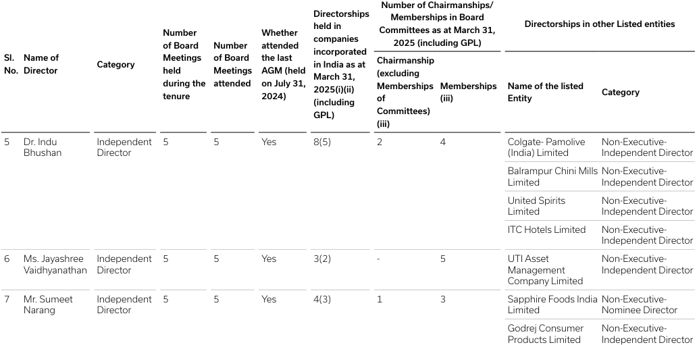

**[Image: AnnualReport2025.pdf-0127-02.png (1032x511, 78.1KB)]**

<!-- Start of picture text -->
Number of Chairmanships/ Directorships  Memberships in Board Number  Whether  held in  Committees as at March 31,  Directorships in other Listed entities of Board  Number  attended  companies  2025 (including GPL) incorporated Sl.  Name of  Category Meetings  of Board  the last  in India as at  Chairmanship No. Director held  Meetings  AGM (held  March 31,  (excluding during the tenure attended on July 31, 2024) 2025(i)(ii) (including  Memberships of  Memberships (iii) Name of the listed Entity Category GPL) Committees) (iii) 5 Dr. Indu  Independent  5 5 Yes 8(5) 2 4 Colgate- Pamolive  Non-Executive- Bhushan Director (India) Limited Independent Director Balrampur Chini Mills  Non-Executive- Limited Independent Director United Spirits  Non-Executive- Limited Independent Director ITC Hotels Limited Non-Executive- Independent Director 6 Ms. Jayashree  Independent  5 5 Yes 3(2) - 5 UTI Asset  Non-Executive- Vaidhyanathan Director Management  Independent Director Company Limited 7 Mr. Sumeet  Independent  5 5 Yes 4(3) 1 3 Sapphire Foods India  Non-Executive- Narang Director Limited Nominee Director Godrej Consumer  Non-Executive- Products Limited Independent Director <!-- End of picture text -->

# Mr. Nadir B. Godrej and Mr. Pirojsha Godrej are the members of the Promoter Group. 

###### **Notes:-** 

- (i) Directorships in companies incorporated under section 8 of the Companies Act, 2013 and foreign companies are excluded above. (ii) Figures in () denote equity listed companies. 

- (iii) Committees considered above are the Audit Committee and Stakeholders' Relationship Committee, including that of your Company. Committee Membership(s) includes Chairmanship(s). 

As required under Regulation 17A & 26(1) of the Listing Regulations and as confirmed by the Directors, none of the Directors on the Board of the Company was a Director (including holding any alternate directorships) in more than 10 (ten) public limited companies (as specified in Section 165 of the Act) and Director in more than 7 (seven) equity listed entities or acted as an Independent Director in more than 7 (seven) equity listed entities or 3 (three) equity listed entities in case he/she serves as a Whole-time Director/ Managing Director in any listed entity. Further, as on March 31, 2025, none of the Directors on the Board was a Member of more than 10 (ten) Committees and Chairperson of more than 5 (five) Committees, across all the Indian public limited companies in which he/she was a Director. 

Table 3: Number of equity shares and options held by each of the Directors and Key Managerial Personnel 

|Name of the Director and Key Managerial Personnel|Equity Shares held as on March 31, 2025|Percent of total shareholding|Number of option held under GPL ESGS as on March 31, 2025|
|---|---|---|---|
|Mr. Nadir B. Godrej|^4,65,249|0.15|-|
|Ms. Jayashree Vaidhyanathan|-|-|-|
|Mr. Sumeet Narang|-|-|-|
|Ms. Sutapa Banerjee|-|-|-|
|Dr. Indu Bhushan|-|-|-|
|Mr. Pirojsha Godrej|^^1,55,075|0.05|-|
|Mr. Gaurav Pandey|9,718|-|6,578|
|Mr. Rajendra Khetawat|54,456|0.02|3,860|
|Mr. Ashish Karyekar|1|-|-|

includes 1 share held as one of the trustees of RNG Family Trust includes 1 share held as one of the trustees of SNG Lineage Trust includes 1 share held as one of the trustees of SNG Successor Trust ^^'includes 10 shares held in individual capacity includes 1,55,063 shares held as one of the trustees of PG family Trust includes 1 share held as one of the trustees of PG Children Trust includes 1 share held as one of the trustees of PG Lineage Trust 

^includes 9 shares held in individual capacity includes 1 share held as one of the trustees of NBG Family Trust includes 1,55,078 shares held as one of the trustees of BNG Family Trust includes 1,55,078 shares held as one of the trustees of SNG Family Trust includes 1,55,078 shares held as one of the trustees of HNG Family Trust includes 1 share held as one of the trustees of BNG Successor Trust includes 1 share held as one of the trustees of BNG Lineage Trust 

###### e) Directors and Officers Insurance ('D&O Insurance'): 

In line with the requirements of Regulation 25(10) of the Listing Regulations, the Company has taken D&O Insurance for all its Independent Directors for such quantum and for such risks as determined by the Board of Directors. 

###### f) Independent Directors: 

Independent Directors play a significant role in the governance process of the Board. By virtue of their varied expertise and experience, they enrich the Board's decisionmaking and prevent possible conflicts of interest that may emerge in such decision-making. 

The appointment of Independent Directors is carried out in a structured manner in accordance with the provisions of the Act and the Listing Regulations. The Nomination & Remuneration Committee identifies candidates based on laid down criteria and takes into consideration the balance of skills, knowledge and experience in addition to the need for diversity of the Board and accordingly makes its recommendations to the Board. 

The Board of Directors, upon recommendation of the Nomination and Remuneration Committee, re-appointed Ms. Sutapa Banerjee (DIN: 02844650) as an Independent Director on the Board of the Company for a second term of five years commencing from November 05, 2024 till November 04, 2029. Her re-appointment was approved by the Members at the Annual General Meeting held on July 31, 2024. 

Basis the declarations received from the Independent Directors, the Board of Directors has confirmed that the Independent Directors of the Company meet the criteria of independence as mentioned under Regulation 16(1)(b) of the Listing Regulations read with Section 149(6) of the Act and that, they are independent of the management. 

As required under Regulation 46(2)(b) of the Listing Regulations, the Company has issued formal letters of appointment to the Independent Directors. The terms and conditions of their appointment are also posted on the Company's website and can be accessed at <u>http://www. godrejproperties.com/investors/governance-leadership.</u> In terms of Regulation 25(8) of the Listing Regulations, the Independent Directors have confirmed that they are not aware of any circumstances or situations that exist or may be reasonably anticipated that could impair or impact their ability to discharge their duties. 

Pursuant to the requirement of Regulation 24(1) of the Listing Regulations, the Company has appointed one of its Independent Directors on the Board of its unlisted material subsidiary company - Godrej Projects Development Limited. 

Meeting of Independent Directors: 

During the year under review, the independent directors met on February 04, 2025, inter alia, to discuss, review and assess: 

- the performance of non-independent directors and the board of directors as a whole; 

- the performance of the Chairperson of the Company, taking into account the views of the Executive and Non Executive Directors; 

- the quality, content and timelines of flow of information between the Management and the Board that is necessary for the Board to effectively and reasonably perform its duties; and 

- other related matters. 

All the Independent Directors were present at the above meeting. 

###### Familiarisation Program for Independent Directors: 

The Company conducts familiarisation programs for Independent Directors to enable them to understand their roles, rights and responsibilities. At the time of their appointment, they are given a detailed orientation on the Company, industry, strategy, policies and Code of Conduct, regulatory matters, business, financial matters, human resource matters and Corporate social responsibility initiatives of the Company. Presentations are also made at the Board and Committee meetings which facilitates them to clearly understand the business of the Company and the environment in which the Company operates. Operational updates are provided for them to have a good understanding of Company's operations, businesses and the industry as a whole. They are periodically updated on material changes in regulatory framework and its impact on the Company. The Company's Policy for conducting familiarisation program has been disclosed at the website of the Company at - <u>http://www.godrejproperties.com/investors/governance</u> 

###### <u>leadership</u> 

###### Annual Evaluation of the Board and Individual Directors: 

Pursuant to the provisions of the Act and the Listing Regulations, the Board has carried out the annual evaluation of its own performance, as well as the working of its individual Committees. A structured questionnaire was prepared after taking into consideration, inputs received from the Directors, which covered aspects of the Board's functioning such as adequacy of the composition of the Board and its committees, Board culture, execution and performance of specific duties, obligations and governance. 

A separate exercise was carried out to evaluate the performance of individual directors to obtain an overview of the functioning of the Board/ Committees, inter alia, on the broad criteria i.e. attendance and level of participation at meetings of the Board/ Committees, independence of judgement exercised by Independent Directors, interpersonal relationship and so on. 

The Independent Directors have expressed their satisfaction with the robustness of the evaluation process, the Board's freedom to express its views on matters transacted at the meetings and the openness and transparency with which the Management discusses various subject matters specified on the agenda of meetings. The consolidated Evaluation Report of the Board, based on inputs received from the Directors was discussed at the meeting of the Board held on February 04, 2025 and the action areas 

246 

247 

GODREJ PROPERTIES LIMITED 

INTEGRATED REPORT 2024-25 

the nuances of the business, consumers and trade in the geography and has the knowledge of the regulations & legislations of the market in which the business operates. 

identified in the process are being implemented to ensure a better interface at the Board/ Management level. 

###### g) Board Skills, Capabilities and Experiences: 

- Technology & Future Perspective - The Director has expertise with respect to business specific technologies. The Director has experience and adds perspective on the future ready skills required by the organisation such as E-commerce, Digitalisation, Sustainability etc. 

The Company recognises the importance of having a Board comprising of directors who have a wide range of experiences, capabilities and diverse points of view. This helps the Company to create an effective and well-rounded Board. The capabilities and experiences sought in the Company's directors are outlined here: 

   - Governance, Finance & Risk - The Director has an understanding of the law and application of corporate governance principles in a commercial enterprise of similar scale. He has the capability to provide inputs for strategic financial planning, assess financial statements and oversee budgets for the efficient use of resources. The Director has the ability to identify key risks for the business in a wide range of areas including legal and regulatory. 

- Strategy & Business - The Director is or has been the Chief Executive Officer, Chief Operating Officer or has held any other leadership position in an organisation leading to significant experience in strategy or business management. The Director brings the ability to identify and assess strategic opportunities and threats in the context of the business. 

   - People & Talent Understanding - The Director has experience in human resource management such that he/she brings in a considered approach to the effective management of people in an organisation. 

- Industry Expertise - The Director has expertise with respect to the sector in which the Organisation operates. The Director has an understanding of the 'big picture' in the given industry and recognises the development of industry segments, trends, emerging issues and opportunities. 

   - Diversity of Perspective- The Director provides a diversity of views to the board that is valuable to manage our customers, employees, key stakeholders or shareholders. 

- Market Expertise- The Director has expertise with respect to the geography in which the Organisation operates. The Director understands the macro-economic environment, 

Board membership criteria and list of core skills/ expertise/ competencies identified in the context of the business: 

The Board of Directors are collectively responsible for selection of a Member on the Board. In terms of requirements of the Listing Regulations, the Board has identified the following core skills/ expertise/ competencies of the Directors in the context of the Company's business: 

|Director’s Names/ Skills|Gender|Strategy & Business|Industry Expertise|Market Expertise|Technology & Future Perspective|Governance, Finance & Risk|People & Talent Understanding|Diversity of Perspective|
|---|---|---|---|---|---|---|---|---|
|Mr. Pirojsha Godrej|M|√|√|√|-|√|-|-|
|Mr. Nadir Godrej|M|√|-|√|√|√|-|√|
|Mr. Gaurav Pandey|M|√|√|√|-|√|-|-|
|Ms. Sutapa Banerjee|F|√|-|√|-|√|√|√|
|Dr. Indu Bhushan|M|√|-|√|-|√|-|√|
|Ms. Jayashree Vaidhyanathan|F|√|-|√|-|√|√|√|
|Mr. Sumeet Narang|M|√|-|√|√|√|-|√|

All the directors have the required skills /expertise /competence in the areas specified above. 

of the Board. The Board periodically reviews the functioning of these Committees. 

###### 2) Committees of the Board 

The Company has over the years maintained the highest standards of corporate governance processes and has had the foresight to set up corporate governance practices in line with the requirements of Listing Regulations. 

The meetings of each of these Committees are convened by the respective Chairpersons and the minutes of these meetings are placed before the Board for information. The minutes of the Committee meetings are sent to respective Members of the Committee for their approvals/ comments as prescribed in SS-1 and after the minutes are duly approved, these are circulated to the Board of Directors and are presented at the Board meetings. 

The constitution, terms of reference and the functioning of the existing Committees of the Board is explained hereunder. Each Committee demonstrates the highest level of governance standards and has the requisite expertise to handle issues relevant to its field. These Committees spend considerable time and provide focused attention to various issues placed before them. The guidance provided by these Committees lend immense value and support, thus enhancing the quality of the decision-making process 

###### A. Audit Committee 

The Audit Committee acts as an interface between the Statutory and Internal Auditors, the Management and the Board of Directors. It assists the Board in fulfilling its 

responsibilities of monitoring financial reporting processes, reviewing the Company's established systems and processes for internal financial controls and governance and reviews the Company's statutory and internal audit processes. All the Members of the Committee are Independent Directors. The Committee is governed by a Charter, which is in line with the regulatory requirements mandated by the Act and the Listing Regulations. 

During the reporting year, the Committee met 4 (four) times, i.e. on May 03, 2024, July 31, 2024, October 23, 2024 and February 04, 2025. The gap between two meetings did not exceed 120 days. Table 4 below provides the composition and the attendance record for the aforesaid meetings of the Audit Committee: 

Table 4: Composition and attendance record of Audit Committee during the Financial year 2024-25 

|Sl. No.|Name of Director|No. of meetings held during the tenure|No. of meetings attended|
|---|---|---|---|
|1.|Dr. Indu Bhushan (Chairperson)|4|4|
|2.|Ms. Sutapa Banerjee|4|4|
|3.|Ms. Jayashree Vaidhyanathan|4|4|
|4.|Mr. Sumeet Narang|4|4|

Dr. lndu Bhushan, Chairperson of the Committee was present at the Annual General Meeting of the Company held on July 31, 2024 for answering the queries of the Members. 

All the members of the Audit Committee are eminent professionals and draw upon their experience and expertise across a wide spectrum of functional areas such as finance, accounting and corporate strategy. Minutes of each of the meetings of the Audit Committee are placed before the Board at its meetings. The executives of the Company viz. Executive Chairperson, Managing Director and Chief Executive Officer, Chief Financial Officer, Head Corporate Audit & Assurance, the partner/ representative of the Statutory Auditors and the Internal Auditors are also called as invitees to the meetings of the Committee. 

Mr. Ashish Karyekar, the Company Secretary serves as the Secretary to the Audit Committee. 

The functions of the Audit Committee, inter alia, include: 

###### Review of financial reporting: 

- Overview of the Company's financial reporting process and the disclosure of its financial information to ensure that the financial statements are correct, sufficient and credible. 

- Reviewing with the Management the annual financial statements and auditors' report before submission to the Board, focusing primarily on: 

- Matters required to be included in the Director's Responsibility Statement to be included in the Board's report in terms of clause (c) of sub-section (3) of Section 134 of the Act. 

   - Changes, if any, in accounting policies and practices and reasons for the same. 

   - Major accounting entries involving estimates based on exercise of judgment by management. 

   - Qualifications in the draft audit report, if any. 

   - Significant adjustments made in the financial statements arising out of audit findings. 

   - The going concern assumption. 

   - Compliance with Accounting Standards. 

   - Compliance with the requirements of the stock exchanges, if applicable, and legal requirements concerning financial statements. 

   - Disclosure of related party transactions. 

   - Reviewing the Company's financial and risk management policies. 

   - Scrutiny of inter-corporate loans and investments. 

   - Statement of deviations: 

- Quarterly statement of deviations including report of monitoring agency, if applicable, submitted to stock exchanges in the terms of Regulation 32(1) of the Listing Regulations. 

- Annual statement of funds utilised for purposes other than those stated in the offer document/ prospectus/ notice in terms of regulation 32(7) of the Listing Regulations. 

###### Internal financial controls and governance processes: 

- Internal audit reports relating to internal control/ weaknesses. 

- Financial statements and draft audit/Limited Review Reports pertaining to quarterly, half yearly and annual financial information. 

- Management discussion and analysis of financial condition and results of operations. 

- Reports relating to compliance with laws and on risk management. 

- Management letters / letters of internal control weaknesses issued by the Statutory/ Internal auditors. 

- Reviewing, with the management, the statement of uses/ application of funds raised through an issue (public issue, rights issue, preferential issue etc.), the statement of funds utilised for purposes other than those stated in the offer document/ prospectus/ notice and the report submitted by the monitoring agency monitoring the utilisation of proceeds of a public or rights issue or preferential issue or qualified institutions placement, and making appropriate recommendations to the Board to take up steps in this matter. 

- Reviewing with the Management, External and Internal Auditors, the adequacy of internal control systems. 

- Evaluation of internal financial controls. 

- To oversee and review the functioning of the vigil mechanism (Whistle-Blower Policy) implemented in the Company and to review the findings of investigations into 

248 

249 

GODREJ PROPERTIES LIMITED 

INTEGRATED REPORT 2024-25 

cases of material nature, if any, and the actions taken in respect thereof. 

###### External and Internal Audit: 

- Reviewing the Internal Audit Report and action taken thereon. 

- Reviewing the adequacy of internal audit function, including the audit charter, the structure of the internal audit department, approval of the internal audit plan and its execution, staffing and seniority of the official heading the department, reporting structure, coverage and frequency of internal audit. 

- Discussing with the Internal Auditors, any significant findings and follow-up thereon. 

- Reviewing the findings of any internal investigations by the Internal Auditors into matters where there is suspected fraud or irregularity or a failure of internal control systems of a material nature and reporting the matter to the Board. 

- Recommending the appointment/ re-appointment and removal/ replacement of external auditors and approval of audit fees and payment for any other services. 

- Discussing with external auditors before the audit commences, the nature and scope of audit as well as post-audit discussions to ascertain any area of concern. 

- Review and monitor the auditor's independence and performance, and effectiveness of audit process. 

###### Subsidiary Companies: 

- The Audit Committee of the Company shall have access to the minutes of the meetings of the Audit Committees of the subsidiary companies. 

- The Audit Committee of the Company shall also review the financial statements, in particular, the investments made by the subsidiary companies. 

- The Audit Committee shall recommend the revision in policy for determining material subsidiaries to align it with the extant applicable provisions. 

- The Audit Committee review the utilisation of loans and/ or advances from/ investment by the holding company in the subsidiary exceeding rupees 100 Crore or 10% of the asset size of the subsidiary, whichever is lower. 

###### Related Party Transactions: 

- A statement of all transactions with related parties and any subsequent material modification of transactions of the Company with related parties including their basis is placed before the Audit Committee for its prior approval. 

- Lay down criteria for granting omnibus approval to related party transactions. 

- Satisfy itself of the need for omnibus approval of related party transactions ensuring that the approval is in the interest of the Company. 

- Grant omnibus approval for related party transactions. 

- Review, on a quarterly basis, the details of Related Party Transactions entered into by the Company pursuant to each of the omnibus approvals given. 

- Recommend the revision in Policy on material related party transactions and also on dealing with related party transactions, to align it with the extant applicable provisions. The policy has been modified in line with the requirements introduced in the Regulations during the year. 

###### Compliance: 

- Reviewing the effectiveness of the system for monitoring compliance with laws and regulations and the results of Management's investigation and follow-up (including disciplinary action) of any instances of non- compliance. 

- Reviewing the findings of any examinations by regulatory agencies, and any auditor observations. 

• Reviewing the process for communicating the Code of Conduct to Company personnel, and for monitoring compliance therewith. 

- Obtaining regular updates from the Management regarding compliance matters. 

• Looking into the reasons for substantial defaults in the payment to the depositors, debenture holders, shareholders (in case of non-payment of declared dividends) and creditors. 

###### Reporting Responsibilities: 

- The Chairperson of the Audit Committee shall be present at the Annual General Meetings to answer shareholder queries and to provide the clarification on matters relating to accounts and audit. 

• The Annual Report of the Company shall disclose the composition of the Audit Committee, brief description of the scope of the Audit Committee Charter, names of members, chairperson, meetings and attendance. 

• The recommendations of the Audit Committee on any matter relating to financial management including the audit report, shall be binding on the Board. 

• If the Board does not accept the recommendations of the Audit Committee, it shall record the reasons thereof and communicate such reasons to the shareholders. 

###### Other Responsibilities: 

- Valuation of undertakings or assets of the Company, wherever it is necessary. 

- Performing other activities relating to the Charter as requested by the Board of Directors. 

• Carry out all such additional functions as may be required under the Listing Regulations or other regulatory requirements applicable from time to time. 

- Reviewing the functioning and compliances with regards to the Company's Whistle Blower Policy. 

- Instituting and overseeing special investigations as needed. 

- Approval of appointment of CFO (i.e., the whole-time Finance Director or any other person heading the finance function or discharging that function) after assessing the qualifications, experience and background, etc. of the candidate. 

- The appointment, removal and terms of remuneration of the Chief Internal Auditor shall be subject to review by the Audit Committee. 

- Consider and comment on rational, cost-benefits and impact of schemes involving merger, demerger, amalgamation etc., on the Company and its Shareholders. 

###### B. Stakeholders' Relationship Committee 

The Stakeholders' Relationship Committee addresses and resolve the grievances and ensure smooth and efficient services for all security holders, including shareholders and debenture holders. The Committee is also responsible for approval of transmission of securities, including power to delegate the same to the Registrar and Share Transfer Agents. 

The Committee also reviews the adherence to the service standards adopted by the Company in respect of the services rendered by the Company's Registrar and Share Transfer Agent. 

The Committee also reviews the various measures and initiatives taken by the Company for reducing the quantum of unclaimed dividends and ensuring timely receipt of dividend warrants/ annual reports /statutory notices by the shareholders of the Company. 

As per the terms of reference, the committee reviewed the compliance status of its charter (i.e. its roles and responsibilities) and noted that it has comprehensively covered all the responsibilities assigned to it under the charter. 

During the reporting period, the Stakeholders' Relationship Committee held 1 (One) meeting, i.e. on May 03, 2024. 

The composition of Committee as at March 31, 2025 and the details of participation of members at the meeting of the Committee are as under: 

Table 5: Composition and attendance record of Stakeholders' Relationship Committee during the financial year 2024-25 

|Sl. No.|Name of Director|No. of meetings held during the financial year ended March 31, 2025|No. of meetings attended during the financial year ended March 31, 2025|
|---|---|---|---|
|1.|Ms. Sutapa Banerjee (Chairperson)|1|1|
|2.|Mr. Pirojsha Godrej|1|1|
|3.|Mr. Gaurav Pandey|1|1|

Ms. Sutapa Banerjee, Chairperson of the Committee was present at the Annual General Meeting of the Company held on July 31, 2024 for answering the queries of the shareholders. 

Mr. Ashish Karyekar, Company Secretary of the Company acts as the Compliance Officer to oversee the redressal of the investor grievances. He is also responsible for ensuring compliances under the SEBI (Prohibition of Insider Trading) Regulations, 2015 and acts as a Compliance Officer under the said Regulations. 

Status of Investor Complaints for the Financial Year ended March 31, 2025: 

|Complaints outstanding as on April 01, 2024|0|
|---|---|
|Complaints received during the financial year ended|0|
|March 31, 2025||
|Complaints resolved during the financial year ended|0|
|March 31, 2025||
|Complaints outstanding as on March 31, 2025|0|

###### C. Nomination & Remuneration Committee: 

The constitution, scope and powers of the Nomination & Remuneration Committee of the Board of Directors, are in accordance with the provisions of Section 178 of the Act and Regulation 19 of the Listing Regulations. The Nomination & Remuneration Committee, inter alia, observes the requirements pertaining to the appointment and remuneration of the Managing Director & Chief Executive Officer, Executive Directors, Key Managerial Personnel and also administers the employee stock option scheme of the Company i.e. the Godrej Properties Limited Employee Stock Grant Scheme, 2011. 

The composition of the Committee is in line with the provisions of Regulation 19(1)(c) of the Listing Regulations, which requires that at least two thirds of the Committee shall comprise of Independent Directors. 

The Nomination & Remuneration Committee consists of 4 (Four) Independent Directors. During the Financial Year ended March 31, 2025, the Committee met 2 (Two) times, i.e. on May 03, 2024 and February 04, 2025. The Quorum for the meeting of the Committee is either two members or one third of the members of the Committee whichever is higher. 

The Committee evaluates the balance of skills, knowledge and experience on the Board and on the basis of such evaluation, prepares a description of the role and capabilities required for Independent Director. The person recommended to the Board for appointment as an Independent Director shall have the capabilities identified in such description. 

The composition and attendance details of the Nomination & Remuneration Committee are given in Table 6 below: 

Table 6: Composition and attendance record of Nomination & Remuneration Committee during the Financial year 2024-25 

|Sl. No.|Name of Director|No. of meetings held during the financial year ended March 31, 2025|No. of meetings attended during the financial year ended March 31, 2025|
|---|---|---|---|
|1.|Ms. Sutapa Banerjee (Chairperson)|2|2|
|2.|Dr. Indu Bhushan|2|2|
|3.|Ms. Jayashree Vaidhyanathan|2|2|
|4.|Mr. Sumeet Narang|2|2|

Ms. Sutapa Banerjee, Chairperson of the Committee was present at the Annual General Meeting of the Members of 

250 

251 

GODREJ PROPERTIES LIMITED 

INTEGRATED REPORT 2024-25 

the Company held on July 31, 2024 to answer the queries of shareholders. 

long before these were mandated by law. The composition and attendance details of the CSR Committee are given in Table 7 below: 

Mr. Ashish Karyekar, Company Secretary of the Company acts as the Secretary to the Nomination & Remuneration Committee. 

Table 7: Composition and attendance record of the CSR Committee during the financial year 2024-25: 

Following are the key roles of the Nomination and Remuneration Committee: 

|Following are the key roles of the Nomination and Remuneration Committee: (1) Review of proposals for the appointment of Directors|Sl. No. Name of Director|No. of meetings held during the tenure|No. of meetings attended|
|---|---|---|---|
|and Senior Management (employees in Core|1. Mr. Pirojsha Godrej|2|2|
|Management Team - one level below Managing/|(Chairperson)|||
|Executive Directors) and their recommendation to|2. Mr. Gaurav Pandey|2|2|
|the Board;|3. Ms. Sutapa Banerjee|2|2|
|(2) Formulation of the criteria for determining|4. Dr. Indu Bhushan|2|2|
|qualifications, positive attributes and independence of a Director;|The Committee met twice d |uring the Financial Y |ear 2024-2 |

   - The Committee met twice during the Financial Year 2024-25 i.e. on April 30, 2024 and November 19, 2024, inter alia, to review the CSR spends and status of ongoing CSR Projects undertaken by the Company during the financial year 202425. The necessary quorum was present at the meeting. 

- (3) To evaluate the balance of skills, knowledge and experience on the Board and on that basis to prepare a description of the role and capabilities required of an independent director; 

- Mr. Ashish Karyekar, Company Secretary of the Company 

- (4) Formulation of the performance evaluation acts as the Secretary to the CSR Committee. methodology for evaluation of the Board, its committees and individual directors and reviewing the The CSR Committee has formulated and recommended to process from time to time; the Board, a CSR Policy which was subsequently adopted 

- committees and individual directors and reviewing the The CSR Committee has formulated and recommended to process from time to time; the Board, a CSR Policy which was subsequently adopted by it and the same is being implemented by the Company. 

- (5) Periodically overseeing the evaluation of the The CSR Policy can be accessed at the Company's website Board, its committees and individual directors and through the web link <u>https://www.godrejproperties.com/</u> 

- recommending desirable changes in the Board size, <u>investors/governance-leadership.</u> composition, committee structure and processes, and other aspects of the Board's functioning; The Annual Report on CSR activities undertaken by the 

   - The Annual Report on CSR activities undertaken by the Company during the financial year 2024-25, as prescribed under Section 135 of the Act and the Companies (Corporate Social Responsibility Policy) Rules, 2014 as amended have been appended as Annexure IV to Directors Report. 

- (6) Recommend to the Board a policy relating to the remuneration for the directors, key managerial personnel and senior management; 

- (7) Recommend to the Board on the appointment and the terms & conditions of appointment of Managing Director(s) and the Whole-time Director(s); 

   - The role and responsibilities of the CSR Committee includes the following: 

   1. To formulate and recommend to the Board, a Corporate Social Responsibility Policy which shall include the activities to be undertaken by the Company as envisaged in the Act; 

- (8) Reviewing and recommending the remuneration structure of Managing Director(s) and the Whole-time Director(s), to the Board; 

- (9) To approve and recommend the Employee Stock Option Scheme for the approval of the shareholders; 

   2. To recommend to the Board the amount of expenditure to be incurred on the activities as per the Corporate Social Responsibility Policy of the Company; 

- (10)  To supervise the implementation of Employee Stock Option Scheme; 

   3. To monitor the projects and activities as per the Corporate Social Responsibility Policy of the Company; 

- (11)  Recommend to the Board of Directors, the remuneration payable to the Senior Management as defined under the Listing Regulations, as amended or any other law for the time being in force. 

4. To review the performance of the Company in the areas of CSR including the evaluation of the impact of the Company's CSR activities; 

The Performance Evaluation Criteria for Independent Directors is given in the Corporate Governance Report under point 1(f). 

5. To consider other functions, as defined by the Board, or as may be stipulated under any law, rule or regulation including the Listing Regulations and the Act. 

###### D. Corporate Social Responsibility Committee: 

###### E. Risk Management Committee: 

The Company has always been conscious of its obligations vis-a-vis the communities it impacts and has been pursuing various Corporate Social Responsibility ("CSR") activities 

The Company has in place a Risk Management Committee and the Risk Management Policy much before it was mandated under the Listing Regulations and the Act. 

The Committee is governed by a Charter and its objectives and scope broadly comprises: 

1. To formulate a detailed risk management policy which shall include: 

   - A framework for identification of internal and external risks specifically faced by the listed entity, in particular including financial, operational, sectoral, sustainability (particularly, ESG related risks), information, cyber security risks or any other risk as may be determined by the Committee. 

   - Measures for risk mitigation including systems and processes for internal control of identified risks. 

   - Business continuity plan. 

2. To ensure that appropriate methodology, processes and systems are in place to monitor and evaluate risks associated with the business of the Company; 

3. To monitor and oversee implementation of the risk management policy, including evaluating the adequacy of risk management systems; 

4. To periodically review the risk management policy including by considering the changing industry dynamics and evolving complexity; 

5. To keep the Board of Directors informed about the nature and content of its discussions, recommendations and actions to be taken; 

6. To review the appointment, removal and terms of remuneration of the Chief Risk Officer. 

The Charter of the Committee has been aligned to meet the requirements laid down in Para C in Part D forming part of Schedule II to the Listing Regulations. The Risk Management framework concentrates on formalising a process to deal with most relevant risks, building on existing management practices, knowledge and structures. 

The composition and attendance details of the Risk Management Committee are given in Table 8 below: 

Table 8: Composition and attendance record of the Risk Management Committee during the financial year 2024-25 

|Sl. No.|Name of Director|No. of meetings held during the tenure|No. of meetings attended|
|---|---|---|---|
|1.|Mr. Pirojsha Godrej (Chairperson)|2|2|
|2.|Mr. Gaurav Pandey|2|2|
|3.|Ms. Sutapa Banerjee|2|2|
|4.|Dr. Indu Bhushan|2|2|
|5.|Mr. Rajendra Khetawat|2|2|

Mr. Ashish Karyekar, the Company Secretary and Compliance Officer serves the Committee as its Secretary. 

The Committee met twice during the Financial Year 2024-25 i.e. on August 05, 2024 and January 27, 2025, to review the identified risk status and risk assessment exercise undertaken to ascertain the Company's operations and identify the risk and mitigation measures to help Company prepare itself against any such eventualities in the future. 

All Committee members were present at both the meetings held during the Financial Year 2024-25. 

###### F. Allotment Committee: 

The Allotment Committee has been formed to complete the formalities relating to the allotment of securities. 

The composition and attendance details of the Allotment Committee are given in Table 9 below: 

###### Table: 9 Composition and attendance record of the Allotment Committee during the financial year 2024-25: 

|Sl. No.|Name of Director|No. of meetings held during the tenure|No. of meetings attended|
|---|---|---|---|
|1.|Mr. Pirojsha Godrej|2|2|
||(Chairperson)|||
|2.|Mr. Gaurav Pandey|2|2|

During the Financial Year 2024-25, the Allotment Committee met two times i.e. on July 26, 2024 and March 06, 2025 to approve allotment of Non-Convertible Debentures on a private placement basis and to allot equity shares arising out of options exercised by the eligible employees under the Godrej Properties Limited Employee Stock Grant Scheme, 2011 (GPL ESGS) respectively. All the members attended the meeting. 

Mr. Ashish Karyekar, the Company Secretary serves the Committee as its Secretary. 

###### G. Environmental, Social and Governance Committee: 

The Environmental, Social and Governance ("ESG") Committee of the Company assists the Board and the Company in discharging its oversight responsibilities related to Environmental, Social and Governance matters, including, but not limited to climate change impacts, energy and natural resources conservation, environmental and supply chain sustainability, human rights, diversity and inclusion, and other ESG issues that are relevant and material to the Company and provides guidance to the Board on the aforementioned matters and performs an oversight role in shaping the Company's ESG strategy. 

The composition and attendance details of the ESG Committee are given in Table 10 below. 

During the reporting year, the ESG Committee held 2 (Two) meetings on April 30, 2024 and November 19, 2024. 

252 

253 

GODREJ PROPERTIES LIMITED 

INTEGRATED REPORT 2024-25 

Table: 10 Composition and attendance record of the ESG Committee during the financial year 2024-25: 

|Sl. No.|Name of Director|No. of meetings held during the tenure|No. of meetings attended|
|---|---|---|---|
|1.|Mr. Pirojsha Godrej (Chairperson)|2|2|
|2.|Mr. Gaurav Pandey|2|2|
|3.|Dr. Indu Bhushan|2|2|
|4.|Ms. Sutapa Banerjee|2|2|

Mr. Ashish Karyekar, Company Secretary of the Company acts as the Secretary to the ESG Committee. 

###### 3) Senior Management 

The details of the Senior Management of the Company at the end of the reporting period and the change therein during the reporting period are as follows: 

|Sr. No.|Name of the Senior Management|Designation|
|---|---|---|
|1.|Mr. Rajendra Khetawat|Chief Financial Officer|
|2.|Mr. Lalit Makhijani|Chief Sales, Marketing and Customer Centricity Officer|
|3.|Mr. Saurabh Mohindru|Chief Legal and Risk Officer|
|4.|Mr. Rohit Mohan|Chief Design and Sustainability Officer|
|5.|Ms. Megha Goel|Chief Human Resource Officer|
|6.|Mr. Rahul Dedhia|Chief Business Development Officer|
|7.|Mr. Sandipan Pal|Chief Strategy Officer|
|8.|Mr. Vikas Singhal#|Chief Operating Officer|
|9.|Mr. Pramod Bisht*|Zonal CEO – South|
|10.|Mr. Ashwini Kalapala**|Zonal CEO – South|
|11.|Ms. Geetika Trehan|Zonal CEO – NCR|
|12.|Mr. Priyansh Kapoor|Zonal CEO – MMR|
|13.|Mr. Subhasish Pattanaik|Zonal CEO – West & East|
|14.|Mr. Ashish Karyekar|Company Secretary|

# Mr. Vikas Singhal, Chief Operating Officer, has tendered his resignation effective from the closure of business hours of April 30, 2025. 

- Mr. Pramod Bisht, Zonal CEO - South, a Senior Management personnel, has tendered his resignation effective from the closure of business hours of April 04, 2025. 

- ** Mr. Ashwini Kalapala has been appointed as the Zonal CEO - South, with effect from April 05, 2025. 

for every meeting of the Corporate Social Responsibility Committee and Stakeholders Relationship Committee. 

###### 4) Remuneration Of Directors 

The Board has formulated the Nomination and Remuneration Policy of Directors, Key Managerial Personnel (KMPs) and Senior Management in terms of the provisions of Section 178 of the Act and Listing Regulations. The said Policy outlines the appointment criteria and qualifications, the term/ tenure of the Directors on the Board and the matters related to remuneration of the Directors, KMPs & Senior Management. The said Policy has been enclosed as an Annexure to Director's Report. 

The remuneration of the Managing Director & Chief Executive Officer and the Executive Chairperson is in consonance with the Company's size, industry practice and overall performance of the Company. The Nomination & Remuneration Committee submits its recommendation to the Board, which after considering the recommendations, takes the decision on the remuneration payable to the Managing Director & Chief Executive Officer and the Executive Chairperson (which also includes the annual increments and performance bonus) in accordance with the provisions of the Act subject to the approval of the Members, wherever required. 

During the year under review, the Company had paid sitting fees of `H` 1,00,000 (Rupees One Lakh only) to its non-executive directors for attending every meeting of the Board, Audit, Nomination & Remuneration Committee, Risk Management Committee, Environmental, Social and Governance Committee and for the meeting of the Independent Directors and `H` 20,000 (Twenty Thousand only) 

The details of remuneration of the Directors is given in Table 11 below: 

Table 11: Remuneration paid/payable to the Directors for the financial year ended March 31, 2025 

||||||||(`H`in Crore)|
|---|---|---|---|---|---|---|---|
|Name of Director|SittingFees|Commission|Salary|Perquisites|Provident Fund|Others|Total|
|Mr. Nadir B. Godrej|0.05|0.50|Nil|Nil|Nil|Nil|0.55|
|Ms. Sutapa Banerjee|0.16|0.50|Nil|Nil|Nil|Nil|0.67|
|Dr. lndu Bhushan|0.16|0.50|Nil|Nil|Nil|Nil|0.66|
|Ms. Jayashree Vaidhyanathan|0.12|0.50|Nil|Nil|Nil|Nil|0.62|
|Mr. Sumeet Narang#|Nil|Nil|Nil|Nil|Nil|Nil|Nil|
|Mr. Pirojsha Godrej|Nil|Nil|6.39|4.49|0.31|17.69@|28.88|
|Mr. Gaurav Pandey|Nil|Nil|5.62|0.90|0.30|19.04@|25.86|

###### **Notes:** 

@Includes provisions made for the Performance Bonus for the financial year 2024-25. 

- #Mr. Sumeet Narang has voluntarily waived the remuneration receivable from the Company. 

Mr. Rajendra Khetawat, Chief Financial officer has drawn as base salary of `H` 2.87 Cr. 

The service contracts of the Executive Director and Managing Director & Chief Executive Officer of your Company are valid for a period of three years, with a notice period of three months on either side. 

Except for drawing remuneration, none of the Directors has any other materially significant related party transactions, pecuniary relationship or transaction with the Company. The Company enters into transactions in the ordinary course of business with the companies in which the Directors are interested as provided in the Act and in the Regulations. The attention of the Members is drawn to the disclosures of transactions with related parties as set out in Notes to Accounts Note No. 44 of Standalone Financial Statements, forming part of the Annual Report. 

###### Loans and advances in the nature of loans to firms/ companies in which directors are interested by name and amount: 

The Company and its subsidiaries have not made any loans and advances in the nature of loans to firms/ companies in which directors are interested. 

###### 5) General Body Meetings 

a) Details of previous three General Meetings of the Company are as under: 

|Financial Year|Venue|Date|Time|
|---|---|---|---|
|2023-24|Through Video Conferencing (“VC”) or Other Visual Means (“OAVM”)|July 31, 2024|2:30 P.M.|
|2022-23|Through Video Conferencing (“VC”) or Other Visual Means (“OAVM”)|August 02, 2023|2:30 P.M.|
|2021-22|Through Video Conferencing (“VC”) or Other Visual Means (“OAVM”)|August 02, 2022|2:30 P.M.|

- b) Details of special resolutions passed in previous three Annual General Meetings of the Company are as under: 

|Date of AGM|Number of Special Resolutionspassed|Details of Special Resolutions passed|
|---|---|---|
|July 31, 2024|1|Re-appointment of Ms. Sutapa Banerjee (DIN: 02844650) as an Independent Director of the Company for a second term of five years commencing from November 05, 2024 till November 04, 2029.|
|August 02, 2023|NIL|NA|
|August 02, 2022|NIL|NA|

254 

255 

GODREJ PROPERTIES LIMITED 

INTEGRATED REPORT 2024-25 

###### c) Postal Ballot including e-Voting 

During the year under review, 3 (three) Postal Ballots were conducted by the Company for seeking the approvals of the Members. Mr. Ashish Kumar Jain, a Practicing Company Secretary, was appointed as the Scrutiniser to conduct the Ballot Process and Remote E-voting in a fair and transparent manner and the Company had engaged the services of KFin Technologies Limited (Formerly Known as KFin Technologies Private Limited) as the agency for the purpose of providing e-voting facility. 

The details of the Postal Ballots are as follows: 

###### (I) 

Date of Postal Ballot Notice : July 31, 2024 Voting period : August 06, 2024 to September 04, 2024 Date of Declaration of Results : September 04, 2024 

###### Resolution required: (Ordinary/ Special): Ordinary Resolution 

|Sl. No.|Description|Votes in favou No. of votes|r of the resolution % of total votes|Votes aga No. of votes|inst the resolution % of total votes|
|---|---|---|---|---|---|
|1|Approving the requests received for re-classification of|22,36,65,456|100|3,687|0.00|
||certain members of the Promoter and Promoter Group|||||
||of Godrej Properties Limited to ‘Public’ category.|||||

The resolutions were passed with the requisite majority. 

###### (II) 

Date of Postal Ballot Notice : October 01, 2024 Voting period : October 02, 2024 to October 31, 2024 Date of Declaration of Results : October 31, 2024 

###### Resolution required: (Ordinary/ Special): Special Resolution 

|Sl. No.|Description|Votes in favou No. of votes|r of the resolution % of total votes|Votes aga No. of votes|inst the resolution % of total votes|
|---|---|---|---|---|---|
|1|Approval for raising of funds in one or more tranches,|24,51,11,693|99.88|2,98,447|0.12|
||by issuance of securities for an amount not exceeding|||||
||`H`6,000 Crore only (Rupees Six Thousand Crore Only)|||||

The resolutions were passed with the requisite majority. 

###### (III) 

Date of Postal Ballot Notice : February 04, 2025 Voting period : February 19, 2025 to March 20, 2025 Date of Declaration of Results : March 20, 2025 

Resolution required : (Ordinary/ Special): Ordinary Resolutions 

|Sl.|Diti|Votes in favou|r of the resolution|Votes aga|inst the resolution|
|---|---|---|---|---|---|
|No.|escrpon|No. of votes|% of total votes|No. of votes|% of total votes|
|1|To approve material related party transactions with|12,25,27,115|100.00|518|0.00|
||Godrej Highview LLP, an associate entity of the Company.|||||
|2|To approve material related party transactions with Godrej SSPDL Green Acres LLP, a subsidiary of the Company.|12,25,27,133|100.00|500|0.00|

The resolutions were passed with the requisite majority. 

###### d) Special Resolution proposed to be conducted through Postal Ballot 

No Special Resolution is proposed to be conducted through Postal Ballot as on the date of this Report. 

###### e) Procedure adopted for Postal Ballot 

In compliance with Regulation 44 of the Listing Regulations, Sections 108, 110 and other applicable provisions of the Act read with the Rules issued thereunder and the General Circulars issued in this regard by the Ministry of Corporate Affairs ("MCA"), the Company provided electronic voting facility to all its Members. 

The Company engaged the services of KFin Technologies Limited ("KFintech") for the purpose of providing electronic voting facility to all its Members for the abovementioned postal ballots. 

The Postal Ballot Notices were sent to the Members in electronic form at their email addresses registered with the depositories, Company's Registrar and Share Transfer Agent i.e. KFintech. The Company also published notice in the newspapers declaring the details of completion of dispatch, e-voting details and other requirements in terms of the Act read with the Rules issued thereunder and the Secretarial Standards issued by the Institute of Company Secretaries of India. Voting rights were reckoned on the paid-up value of shares of the Company registered in the names of the shareholders as on the cut-off date. 

The Scrutiniser submitted his report to the Chairperson of the Company, after the completion of scrutiny and the consolidated results of the voting by postal ballot were then announced by the Company Secretary, as authorised by the Board of Directors of the Company. 

The results were displayed at the registered office of the Company and on the Company's website at <u>https://www.godrejproperties.com/investors/compliances</u> and were available on the website of the Stock Exchanges and KFintech. 

###### 6) Means of Communication 

The Company follows a robust process of communicating with its stakeholders and investors. For this purpose, it provides multiple channels of communications through the dissemination of information on the on-line portal of the Stock Exchanges, Press Releases, the Annual Reports and by placing relevant information on its website. 

The unaudited quarterly results (both standalone and consolidated) are announced within forty-five (45) days of the close of the quarter. The audited annual results are announced within sixty (60) days from the close of the financial year, as required under the Listing Regulations. The aforesaid financial results are disseminated to the Stock Exchanges within thirty (30) minutes from the same being approved by the Board. The extracts of the quarterly and annual results of the Company's financial performance are published in English and Marathi newspapers like the Financial Express and Loksatta. Further, the annual reports containing audited standalone and consolidated financial statements of the Company together with Directors' Report, 

Auditors' Report, MDA and other important information are circulated to the members and others entitled thereto. Due to the liberalised procedure relating to holding of general meetings through virtual mode as per notifications issued by the MCA and SEBI, physical copies of the Company's annual reports are issued only to those members who request for the same. However, soft copies of the Annual Report and the notices for the general meetings are emailed to those shareholders who have registered their email IDs with the Company. 

The Annual Report of the Company, the quarterly/ halfyearly and the annual audited financial statements and the press releases of the Company are also placed on the Company's website at www.godrejproperties.com and can be downloaded. 

The presentations on the performance of the Company, call transcripts of the analysts call and audio recording of the said calls are placed on the Company's website for the benefit of the institutional investors and other shareholders as per the requirement of Listing Regulations. 

The Board of Directors has in place a policy for determining materiality of events for the purpose of making disclosure to the stock exchanges. The MD & CEO, the CFO and the Company Secretary have been empowered to decide on the materiality of information for the purpose of making appropriate disclosures to the stock exchanges. 

A separate dedicated section under tab 'Investors' - 'Compliances' on the Company's website gives information on unclaimed dividends and details of shares transferred to Investor Education & Protection Fund Authority, Ministry of Corporate Affairs. 

Quarterly Compliance Reports and other relevant information of interest to the Investors are also placed under the tab 'Investors' on the Company's website. 

###### 7) General Shareholders' Information 

###### a) Annual General Meeting 

|Day & Date|Friday, August 01, 2025|
|---|---|
|**Time Venue**|2:30 P.M. The Company is conducting meeting through VC/OAVM pursuant to the MCA General Circular No. 20/2020 dated May 5, 2020, General Circular No. 02/2022 dated May 05, 2022, General Circular No. 10/2022 dated December 28, 2022, Circular No. 09/2023 dated September 25, 2023 and Circular No. 09/2024 dated September 19,|
||2024 and as such there is no requirement to have a venue for the AGM. For details please refer to the Notice of the AGM.|

###### b) Financial Calendar 

The Company's accounting year comprises of a 12 months period from April 1 to March 31. 

- c) Dividend Payment Date 

The Board has not recommended any dividend for the financial year ended March 31, 2025. 

256 

257 

GODREJ PROPERTIES LIMITED 

INTEGRATED REPORT 2024-25 

###### d) Listing information: 

###### (i) Equity shares: 

The Company's equity shares are listed on the BSE Limited (BSE) and the National Stock Exchange of India Limited (NSE). The following are the details of the Company's shares: 

|Particulars|Ordinary Equity Shares|
|---|---|
|ISIN|INE484J01027|
|BSE – Stock Code|533150|
|NSE – Stock Code|GODREJPROP|
|BSE – Address|25th Floor, P J Towers, Dalal Street, Mumbai 400 001; www.bseindia.com|
|NSE – Address|Exchange Plaza. C-1, Block G, Bandra Kurla Complex, Bandra (East), Mumbai – 400051; www.nseindia.com|
|CIN of the Company|L74120MH1985PLC035308|

###### (ii) Non-Convertible Debentures: 

As on the end of the reporting year, the Company had 4,00,000 Rated, Listed, Unsecured, Redeemable Non-Convertible Debentures ("NCDs") issued on private placement basis and said NCDs are listed on BSE Limited. The following are the details of the Company's NCDs: 

|Particulars|Series A NCDs|Series B NCDs|Series I NCDs|Series II NCDs|Series 1 NCDs|Series 2 NCDs| NCDs|
|---|---|---|---|---|---|---|---|
|No. of NCDs|75,000|75,000|1,00,000|16,000|93,540|34,000|6,460|
|Face Value|1,00,000|1,00,000|1,00,000|1,00,000|1,00,000|1,00,000|1,00,000|
|ISIN|INE484J08048|INE484J08030|INE484J08055|INE484J08063|INE484J08089|INE484J08071|INE484J08097|
|BSE – Stock Code|974950|974951|975090|975091|975856|975857|976000|
|Tenure|3 Years|5 Years|3 Years 6 Months|5 Years|3 Years 6 Months|5 Years|5 Years|
|BSE - Address|25th Floor, P J T|owers, Dalal Stree|t, Mumbai 400 0|01; www.bseindi|a.com|||

###### Debenture Trustee: 

###### (iii) Commercial papers 

Pursuant to Regulation 53 of the Listing Regulations, the name and contact details of the Debenture Trustee for the privately placed NCDs are given below: 

In accordance with the requirement of the SEBI Master Circular No. SEBI/HO/DDHS/PoD1/P/CIR/2024/54 dated May 22, 2024, read with the applicable provisions of the Securities and Exchange Board of India (Issue and Listing of Non-Convertible Securities) Regulations, 2021, the Company has listed its commercial papers on the National Stock Exchange of India Limited. 

###### Catalyst Trusteeship Limited 

Address: 901,9th Floor, Tower – B, Peninsula Business Park, Senapati Bapat Marg, Lower Parel (W), Mumbai - 400013 Tel.: 022-49220555. 

The Equity Shares, Non-Convertible Debentures and Commercial Papers of the Company have not been suspended from trading by the SEBI and/ or Stock Exchanges. 

E-mail: compliancectl-mumbai@ctltrustee.com 

The Company has paid the requisite Annual Listing and Custodial Fees to the Stock Exchanges and Depositories viz; CDSL and NSDL, respectively for FY 2025-26. 

###### e) Credit Ratings and any revisions thereto for debt instruments or any fixed deposit programme or any scheme or proposal involving mobilisation of funds, whether in India or abroad: 

The Company does not have any fixed deposit programme or any scheme or proposal involving mobilisation of funds in India or abroad during the financial year ended March 31, 2025. The Company continues to have a credit rating which denotes high degree of safety regarding timely servicing of financial obligation. The Company has received the following credit ratings for its Commercial Papers and Non-Convertible Debentures from various credit rating agencies: 

|Sl. No.|Instrument|Rating|Credit Rating Agency|
|---|---|---|---|
|1)|Non-Convertible Debentures|[ICRA]AA+ (Stable)|ICRA Limited|
|||IND AA+/Stable|India Ratings & Research Private Limited|
|2)|Commercial Paper|CRISIL A1+|CRISIL Limited|
|||[ICRA]A1+|ICRA Limited|

###### f) Share Transfer Agent 

###### g) Share transfer system 

Investor correspondence should be addressed to: 

The Securities and Exchange Board of India (“SEBI”) with effect from April 01, 2019, has barred physical transfer of shares of listed companies and mandated transfers only in demat mode. 

- (i) For Equity Shares:- 

###### **KFin Technologies Limited** 

(Formerly known as KFin Technologies Private Limited) (Unit: Godrej Properties Limited) 

However, Members are not barred from holding shares in physical form. Members who are desirous of transferring shares (which are held in physical form) can do so only after the shares are dematerialised. Accordingly, shareholders holding equity shares in physical form are urged to have their shares dematerialised so as to be able to freely transfer them. Transfers of equity shares in electronic form are effected through the depositories with no involvement of the Company. 

Selenium Tower-B, Plot No.31 & 32, Financial District, Gachibowli, Nanakramguda, Serilingampally, Hyderabad, Rangareddi, Telengana, India - 500 032 Phone: 040-67162222 

Fax: 040-23420814 

Email ID: einward.ris@kfintech.com 

Toll Free No.: 18003094001 

Contact Person: Mr. Naveen Kiran Logisetti 

Further, as per the notifications / circulars / guidelines issued by SEBI from time to time, listed entities are required to issue securities in demat mode only while processing any investor service requests, such as deletion of name, issuance of duplicate share certificates, transmission of securities and claim from Suspense Escrow Demat Account. SEBI had also clarified that listed entities/RTAs shall issue a “Letter of Confirmation” in lieu of physical share certificates while processing any of the aforesaid investor service requests. 

- (ii) For Non-Convertible Debenture (NCDs): 

###### **MUFG Intime India Private Limited** 

(Formerly known as Link Intime India Private Limited) C 101, 247 Park, 

LBS Marg, Vikhroli (West) Mumbai - 400 083 Phone: +91 22 4918 6000 

Fax: +91 22 4918 6060 

Email: mumbai@linkintime.co.in Website: www.linkintime.co.in Contact Person: Mr. Ganesh Jadhav 

###### h) Distribution of shareholding as on March 31, 2025: 

|Category (Amount)|No. of Holders|% to Holders|Total Shares Held|Amount(`E`)|% of Amount|
|---|---|---|---|---|---|
|1-5000|161227|98.63|6822412|34112060|2.27|
|5001-10000|803|0.49|1180440|5902200|0.39|
|10001-20000|429|0.26|1243196|6215980|0.41|
|20001-30000|177|0.11|864548|4322740|0.29|
|30001-40000|132|0.08|917960|4589800|0.30|
|40001-50000|85|0.05|784020|3920100|0.26|
|50001-100000|177|0.11|2466098|12330490|0.82|
|100001 & above|440|0.27|286906204|1434531020|95.26|
|Total|163470|100.00|301184878|1505924390|100.00|

###### i) Shareholding pattern as on March 31, 2025 

- (i) Distribution of equity shareholding: 

Shareholding Pattern as on March 31, 2025 

|Category|No. of Shareholders|No. of shares held|% of Shareholding|
|---|---|---|---|
|Promoters|24|140553593|46.67|
|Mutual Funds|29|16599778|5.51|
|Banks/ NBFC|5|9368|0.00|
|Foreign Institutional Investors/ FPI|689|91987599|30.54|
|Other Bodies Corporate|769|12506466|4.15|
|Resident Individuals (Public)|156128|18159195|6.03|
|Non-Resident Indians|3371|1710340|0.57|
|Others|2455|19658539|6.53|
|Total|163470|301184878|100|

During the year there has been no downgrading of the above ratings. 

258 

259 

GODREJ PROPERTIES LIMITED 

INTEGRATED REPORT 2024-25 

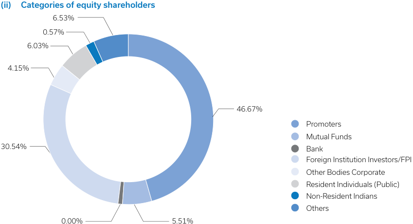

**[Image: AnnualReport2025.pdf-0134-02.png (849x460, 41.2KB)]**

<!-- Start of picture text -->
(ii)  Categories of equity shareholders 6.53% 0.57% 6.03% 4.15% 46.67% Promoters Mutual Funds 30.54% Bank Foreign Institution Investors/FPI Other Bodies Corporate Resident Individuals (Public) Non-Resident Indians Others 0.00% 5.51% <!-- End of picture text -->

(iii) Shares held in physical and dematerialised form 

Break up of physical and dematerialised shares as on March 31, 2025 

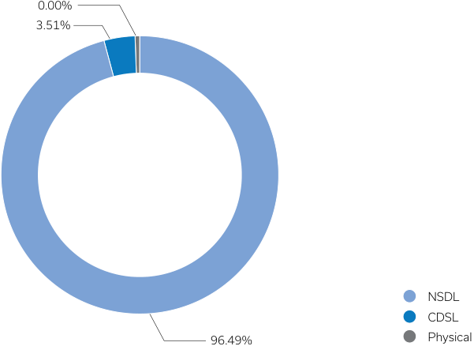

**[Image: AnnualReport2025.pdf-0134-05.png (601x438, 19.6KB)]**

<!-- Start of picture text -->
0.00% 3.51% NSDL CDSL 96.49% Physical <!-- End of picture text -->

Our shareholding is relatively dispersed with 53.33% of public float enhancing market depth and liquidity while facilitating fair share price discovery. 

(iv) List of top ten public shareholders as on March 31, 2025: 

|Sr. No.|Name of the Shareholders|Category of shareholders|No. of Shares held|Percent of total shareholding|
|---|---|---|---|---|
|1.|Godrej & Boyce Mfg Co Ltd|Bodies Corporate|1,06,50,688|3.54|
|2.|Government of Singapore|Foreign Portfolio Investors Category I|89,93,205|2.99|
|3.|Gamnat Pte. Ltd.|Foreign Portfolio Investors Category I|71,69,287|2.38|
|4.|Monetary Authority of Singapore|Foreign Portfolio Investors Category I|44,49,081|1.48|
|5.|Government Pension Fund Global|Foreign Portfolio Investors Category I|35,73,130|1.19|
|6.|Franklin India Equity Advantage Fund|Mutual Funds|26,82,361|0.89|
|7.|Kuwait Investment Authority Fund|Foreign Portfolio Investors Category I|25,75,469|0.86|
|8.|Tata Mutual Fund|Mutual Funds|21,90,277|0.73|
|9.|Goldman Sachs Funds - Goldman Sachs India Equity P|Foreign Portfolio Investors Category I|21,53,060|0.71|
|10|Axis Mutual Fund Trustee Limited A/C Axis Mutual F|Mutual Funds|20,44,441|0.68|

###### j) Dematerialisation of shares and liquidity 

Equity shares of the Company are compulsorily traded in demat form and are available for trading under National Securities Depository Limited ("NSDL") and Central Depository Services Limited ("CDSL") from January 05, 2010 onwards. The International Security Identification Number allotted to the Company, post sub-division of shares, under Depository System is INE484J01027. As of March 31, 2025, 30,11,69,948 equity shares of `H` 5 each, representing 99.99% of the Company's total paid up share capital, have been held in demat form. 

Pursuant to Regulation 76 of the SEBI (Depositories and Participants) Regulations, 2018, a peer reviewed Company Secretary in Practice carries out Reconciliation of Share Capital Audit to reconcile the total share capital admitted with NSDL and CDSL and held in physical form, with the issued and listed capital. This audit is carried out every quarter and the report thereon is submitted to the Stock Exchanges. The audit confirms that the total listed and paid up/ issued share capital is in agreement with the aggregate of the total number of shares in demat form (held by NSDL and CDSL) and in physical form. 

###### k) Outstanding GDRs/ ADRs/ warrants/ convertible instruments and their impact on equity 

During the year under review, the Company has not issued any ADR/GDR/Warrants or any other convertible instruments. 

###### l) Address for Correspondence 

Shareholders correspondence should be addressed to: 

###### **KFin Technologies Limited** 

(Formerly known as KFin Technologies Private Limited) (Unit: Godrej Properties Limited) 

Selenium Tower-B, Plot No.31 & 32, Financial District, Gachibowli, Nanakramguda, Serilingampally, Hyderabad, Rangareddi, Telangana, lndia-500 032 Phone: 040-67162222 

Fax: 040-23420814 

Email ID: einward.ris@kfintech.com Toll Free No.: 18003454001 

Contact Person: Mr. Naveen Kiran Logisetti Company Secretary and Compliance Officer: Mr. Ashish Karyekar 

Godrej One, 5th floor, Pirojshanagar, Eastern Express Highway, Vikhroli (East), Mumbai 400 079 

###### m)  Commodity Price Risk / Foreign Exchange Currency Risk and Commodity Hedging activities 

The Company has adequate risk assessment and minimisation system in place including for commodities. The Company does not have material exposure to any commodity and accordingly, no commodity price risks and commodity hedging activities are carried out. The Company’s exposure to foreign currency changes for unhedged transactions is not material, therefore not disclosed. Accordingly, the disclosure pursuant to SEBI Circular dated November 15, 2018 is not applicable. 

###### 8) Other Disclosures 

###### a) Related party transaction 

The Company has formulated a policy on related party transactions which is also available on the website at - <u>https://www.godrejproperties.com/investors/governance leadership This policy deals with the review and approval</u> of related party transactions. The Board of Directors of the Company has approved the criteria to grant omnibus approval by the Audit Committee within the overall framework of the policy on related party transactions. Prior omnibus approval is obtained for related party transactions which are of repetitive in nature and entered in the ordinary course of business and at arm's length. All related party transactions are placed before the Audit Committee for review and approval. 

All related party transactions entered into during the reporting period were in an ordinary course of the business and at an arm's length basis and the Company has obtained prior approval of the Audit Committee. 

The Company has sought its members' approval for the related party transaction that is material within the meaning of Regulation 23 of the Listing Regulations. Attention of Members is drawn to the disclosures of transactions with related parties set out in Notes to Accounts - Note No. 44 forming part of the Standalone financial statements. 

###### b) Details of non-compliance 

Except as disclosed below, there has not been any noncompliance by the Company and no penalties or strictures were imposed on the Company by BSE Limited, the National Stock Exchange of India Limited, the Securities and Exchange Board of India or by any other statutory authority, in relation to any matter related to capital markets, during last three years: 

During the Financial Year 2024-25, the BSE Limited imposed a penalty of `H` 23,600 on July 30, 2024, due to an inadvertent delay in submitting the notice of Record Date in compliance with Regulation 60(2) of the Listing Regulations. 

To prevent such occurrences in the future, the Company has strengthened its compliance framework by introducing robust mechanisms such as a maker-checker system and compliance trackers. These measures ensure accurate and timely adherence to regulatory requirements. 

###### c) Whistle Blower Policy - Vigil Mechanism 

The Company's Whistle Blower Policy is in line with the provisions of the sub section 9 and 10 of Section 177 of the Act and as per Regulation 22 of the Listing Regulations. This Policy establishes a vigil mechanism for Directors and employees to report genuine concerns regarding unethical behaviour, actual or suspected fraud or violation of the Company's Code of Conduct. The said mechanism also provides for adequate safeguards against victimisation of persons who use such mechanism and makes provision for direct access to the chairperson of the Audit Committee in appropriate or exceptional cases. We confirm that during the financial year 2024-25, no employee of the Company was denied access to the Audit Committee. 

260 

261 

GODREJ PROPERTIES LIMITED 

INTEGRATED REPORT 2024-25 

The said Whistle-Blower Policy is available on the website of the Company at <u>https://www.godrejproperties.com/</u> - <u>investors/governance leadership</u> 

###### d) Policy for determining Material Subsidiary 

As required under the Listing Regulations, the Company has formulated a Policy for determining 'material' subsidiaries which has been put up on the website of the Company at - <u>https://www.godrejproperties.com/investors/governance</u> 

###### <u>leadership</u> 

###### e) Policy to Prevent Sexual Harassment at the Workplace 

The Company is committed to creating and maintaining an environment in which employees can work together, without fear of sexual harassment, exploitation or intimidation. Every employee is made aware that the Company is strongly opposed to sexual harassment and that such behaviour is prohibited both by law and by the Godrej group. To redress complaints of sexual harassment, an Internal Complaints Committee (ICC) of Godrej Properties Limited has been formed under the Sexual Harassment of Women at Workplace (Prevention, Prohibition and Redressal) Act, 2013 and the rules made thereunder. 

The Company, in line with the Group policy has reconstituted the ICC to include representatives from each region in order to ensure the better implementation of the Policy. The ICC has formed sub-committees at regional levels by inducting representatives from each regions. The Central Committee at the head office is responsible for decision making. Ms. Samriti Makkar Minda, NGO member, Ms. Tusharika Vig, NGO Member, Ms. Divya Jha, Ms. Megha Goel, Mr. Saurabh Mohindru, Mr. Abdul Matin, Ms. Shivani Khanna, Ms. Sarika Bedi and Mr. Amit Gupta are the members of central Internal Complaints Committee. During the financial year 2024-25, 3 complaints were received by the Company. These complaints were investigated in accordance with the procedure laid down under the said Act and stand settled as of March 31, 2025. 

No cases of child labour, forced labour, involuntary labour and discriminatory employment were reported during the period. 

###### f) Policy on Determination of Materiality of Events 

The Company has also adopted Policy on Determination of Materiality of Events and Policy on Archival of Documents which has been put up on the website of the Company at - <u>https://www.godrejproperties.com/investors/governance leadership</u> 

###### g) Dividend Distribution Policy 

As required under the Listing Regulations, the Company has formulated a Policy for dividend distribution which has been put up on the website of the Company at <u>https://www.</u> - <u>godrejproperties.com/investors/governance leadership</u> 

###### h) Code of Conduct on Prevention of Insider Trading 

**Non-Convertible Debentures issued on Private Placement Basis** : The Company has raised the fund of `H` 935.4 crore and `H` 340 crore in July 2024 and, `H` 64.60 crore in September 2024 through the issue of Non-Convertible Debentures on private placement basis. The details of utilisation of fund are as follows: 

As prescribed under SEBI (Prohibition of Insider Trading) Regulations, 2015, the Company has formulated a Code of Conduct for Prevention of Insider Trading which stipulates restrictions while trading in the shares of the Company. 

|) Details of Demat Suspen|se Account|(ii) NCD issuance of`E`935.4 Crore in July, 202|4:|
|---|---|---|---|
|   As per Schedule V of Part F of t| he Listing Regulations the|Particulars|Amount (`E`In crore)|
|Company reports the following|details in respect of equity|Amount received|935.4|
|shares lying in the suspense ac t t th bli i|count which were issued||Actual|
|ursuan o e puc ssue.||The funds were utilised for repayment of existing|935.4|
|Sl. No. Particulars (for the Financial Year 2024-25)|No. of Cases No. of Equity Shares|borrowings (including CC/OD/CP) used for project development and business operation, and to shore||
|1. Aggregate number of|1 104| up long-term working capital requirement.||
|shareholders and the outstanding equity shares in||Balance to be utilised|0|
| the suspense account lying at||Total|935.4|
|the beginning of the year;||||
|2. Number of shareholders|0 0|(iii) NCD issuance of`E`340 Crore in July, 2024|:|
|who approached issuer for||Pil|Amount|
|transfer of equity shares from||artcuars|(`E`In crore)|
|suspense account during the||Amount received|340|
|year;|||Actual|
|3. Number of shareholders to whom equity shares were transferred from suspense account during the year;|0 0|The funds were utilised for repayment of existing borrowings (including CC/OD/CP) used for project development and business operation, and to shore up long-term working capital requirement.|340|
|4. Aggregate number of shareholders and the|1 104| Balance to be utilised|0|
|outstanding equity shares in||Total|340|
|the suspense account lying at||||
|the end of the year*.||(iv) NCD issuance of`E`6460 Crore in Septemb|er 2024:|

###### i) Details of Demat Suspense Account 

As per Schedule V of Part F of the Listing Regulations the Company reports the following details in respect of equity shares lying in the suspense account which were issued pursuant to the public issue. 

- (iv) NCD issuance of `E` 64.60 Crore in September, 2024: 

|Particulars|Amount (`E`In crore)|
|---|---|
|Amount received|64.60|
||Actual|
|The funds were utilised for repayment of existing and new business development deals including|64.60|
|land acquisition, repayment of existing borrowings||
|(including CC/OD/CP/STL), shore up long-term working capital requirement, for core business of the company and general corporate purpose.||
|Balance to be utilised|0|
|Total|64.60|

*The voting rights on the equity shares shall be frozen till the rightful owner claims such shares. 

During the year under review, there were no investors who have lodged the claim with the Company for transfer of shares from Unclaimed Suspense Account maintained by the Company. 

- j) Details of utilisation of funds raised through Qualified Institutions Placement as specified under Regulation 32 (7A) and issue of NonConvertible Debentures on Private Placement Basis: 

###### (i) Qualified Institutions Placement (Fund raised during FY 2024-25): 

###### k) Audit Fees: 

|Deployment of equity issue proceeds|Amount in Crore|
|---|---|
|Amount Received and Original Allocation|6,000|
|Modified allocation, if any|NA|
|Funds Utilised (includes issue related expenses of `H`78.29 Cr|2,517.46|
|Funds Unutilised*|3482.54|
|Total|6,000|

The fees paid by the Company and its subsidiaries (on a consolidated basis) to the statutory auditors and its network firm during the financial year 2024-25 is as under: 

|Particulars|Amount in crore|
|---|---|
|Audit Fees|2.00|
|Reimbursement of Expenses|0.15|
|Other Services Fees|0.85|
|Certificate and other services|0.64|
|Total|3.64|

* Unutilised funds have been temporarily parked in Mutual Funds and Fixed Deposits. 

###### l) Non acceptance of any recommendation of any Committee of the Board which was mandatorily required: 

During the year, the Board has accepted all recommendation received from its Committees. 

###### m)  Transfer of the 'shares' into Investor Education and Protection Fund (IEPF) {in cases where dividend has not been paid or claimed for seven (7) consecutive years or more} 

In terms of Sections 124 and 125 of the Act read with Investor Education & Protection Fund Authority (Accounting, Audit, Transfer and Refund) Rules, 2016 ("IEPF Rules") as amended, and Notifications issued by the Ministry of Corporate Affairs from time to time, dividends that are unpaid or unclaimed for a period of 7 (seven) consecutive years from the date of their transfer are required to be transferred by the Company to the IEPF, administered by the Central Government. Further, according to the said IEPF Rules, shares in respect of which dividends remain unclaimed by the shareholders for 7 (seven) consecutive years or more shall also be transferred to the demat account of the IEPF Authority. The Company requests all the members to encash/ claim their respective dividends within the prescribed period from IEPF. 

###### Guidelines for Investors to file claim in respect of the unclaimed dividend or shares transferred to the IEPF 

Investors/depositors whose unpaid dividends, matured deposits or debentures etc. have been transferred to IEPF under the Companies Act, 1956 and/or the Act, can claim the amounts. In addition, claims can also be made in respect of shares which have been transferred into the IEPF, as per the procedures/guidelines available on the website of the Company at <u>https://www.godrejproperties.com/investors/ compliances</u> 

The Members may note that no claims shall lie against the Company in respect of the dividend/ shares so transferred to IEPF. 

###### n) Plant locations: 

The Company operates from various offices in India as given on page 11 of the Annual Report. The details of various project sites of the Company are available on the website of the Company <u>www.godrejproperties.com</u> 

###### o) Details of material subsidiaries: 

As at March 31, 2025, Godrej Projects Development Limited ("GPDL") and Godrej Vestamark LLP are the material unlisted Indian subsidiaries of GPL under Regulation 24 of Listing Regulations. 

GPDL was incorporated as a private limited company under the Companies Act, 1956 on November 22, 2010 in Mumbai and was converted into a public limited company on November 22, 2017. GPDL is a wholly owned subsidiary of GPL and is engaged in Real Estate Development . 

Godrej Vestamark LLP was incorporated on April 20, 2017 and is engaged in the Real Estate Development . 

262 

263 

GODREJ PROPERTIES LIMITED 

INTEGRATED REPORT 2024-25 

M/s. BSR & Co. LLP, Chartered Accountants (Firm Registration No.101248W/W-100022) are appointed as the Statutory Auditors of GPDL for a second term of five consecutive years for the financial years 2022-23 to 2026-27 in the annual general meeting held on September 29, 2022. M/s. BSR & Co. LLP are appointed as the Statutory Auditors of Godrej Vestamark LLP on August 22, 2017. 

- 9) Details of Compliance With Mandatory Requirements of the Listing Regulations 

- i. The Company has complied with the requirements as mentioned in Schedule V, Para C, sub-paras (2) to (10) of the Listing Regulations. 

- ii. The Company has complied with all the requirements as specified in Regulation 17 to 27 and clauses (b) to (i) of sub regulation (2) of Regulation 46 of the Listing Regulations. 

- 10) Discretionary Disclosures 

- The status of compliance with non-mandatory recommendations of the Listing Regulations is as follows: 

- a. The Board: The Company is having two woman independent director on its Board. 

- b. Shareholders' Rights: As the quarterly and half yearly financial results are published in the newspapers and are also posted on the Company's website, the same are not being sent separately to the shareholders. 

- c. Audit Qualifications: The Company's financial statements for the year 2024-25 do not contain any audit qualification. 

- d. Separate posts of Chairman and CEO: The positions of the Chairperson and the CEO in the Company are separate. 

- e. Reporting of Internal Auditor: The Internal Auditors of the Company directly report to Chairperson of the Audit Committee. The Internal Audit team presents a comprehensive summary of their key observations, identified risks, and corresponding action plans during the quarterly Audit Committee meetings, with 

the objective of enhancing internal controls, ensuring compliance, and supporting continuous improvement across the organisation. 

f. Independent Directors: During the year under review, the independent directors met on February 04, 2025. The independent directors of the Company shall endeavour to hold at least two meetings from the financial year 2025-26 onward, without the presence of non-independent directors and members of the management and shall endeavour to be present at such meetings. 

- g. Risk Management: The details w.r.t. composition, roles and responsibilities of risk management committee is given in point no. 2(E) of the above report. 

- 11)  Disclosure as per Part G of the Schedule V to the SEBI (Listing Obligations and Disclosure Requirements) Regulations, 2015 

During the Financial Year 2024-25, the Company was informed by way of a family letter dated April 30, 2024, issued jointly by Mr. Adi Godrej (ABG), Mr. Nadir Godrej (NBG), Mrs. Smita Vijay Crishna (SVC) and Mr. Jamshyd Godrej (JNG) that the Godrej Family Members had entered into a Family Settlement Agreement and a brand & noncompete agreement on April 30, 2024. The Company was not a party to these agreements. 

The settlement contemplated a realignment of inter alia the shareholding of Godrej Industries Limited, which is the holding company of the Company, subject to applicable regulatory approvals. On July 18, 2024, the Company received the intimation from Godrej Family Members that the realignment pursuant to the said Family Settlement Agreement was completed. Accordingly, pursuant to the realignment, the management and control of the Company continues to be with the ABG / NBG family, and the JNG / SVC family are not involved in the management and operations of the Company. Also, no members of the JNG / SVC Family are Directors on the Board of Directors of the Company, and they have been reclassified as ‘public’ category shareholders in accordance with Regulation 31A of the Listing Regulations. 

###### Declaration by Managing Director & CEO 

I, Gaurav Pandey, Managing Director & Chief Executive Officer of Godrej Properties Limited, hereby confirm pursuant to the SEBI (Listing Obligations and Disclosure Requirements) Regulations, 2015 that: 

The Board of Godrej Properties Limited has laid down a Code of Conduct for all Board members and senior management of the Company. The said code of conduct has also been posted on the Company's website at www.godrejproperties.com. All the Board members and senior management personnel have affirmed their compliance with the said Code of Conduct for the financial year ended March 31, 2025. 

**Gaurav Pandey** Managing Director & Chief Executive Officer 

Place: Mumbai Date: May 02, 2025 

264 

265 

GODREJ PROPERTIES LIMITED 

INTEGRATED REPORT 2024-25 

###### Certificate on Corporate Governance 

###### To, 

###### The Members 

###### **Godrej Properties Limited** 

We, BNP & Associates, Practicing Company Secretaries, have examined the compliance of conditions of Corporate Governance by **Godrej Properties Limited** (hereinafter referred as “the Company”), for the financial year ended March 31, 2025, as prescribed under Regulations 17 to 27, clauses (b) to (i) of sub-regulation (2) of Regulation 46 and Paragraphs C, D and E of Schedule V of Chapter IV of the Securities and Exchange Board of India (Listing Obligations and Disclosure Requirements) Regulations, 2015 (‘Listing Regulations ) 

We state that completing compliance of conditions of Corporate Governance is the responsibility of the management of the Company, and our examination is limited to the procedures and implementation thereof, adopted by the Company for ensuring the compliance of the conditions of corporate governance. It is neither an audit nor an expression of opinion on the financial statements of the Company. 

In our opinion, and to the best of our information and according to the explanations given to us, we certify that the Company has complied with the conditions of Corporate Governance as specified for listed company in the aforesaid ‘ Listing Regulations. 

We further state that the above certification is neither an assurance as to the future viability of the Company nor the efficiency or effectiveness with which the management has conducted the affairs of the Company during the financial year. 

This certificate is issued solely for the purpose of complying with the Listing Regulations and may not be suitable for any other purpose. 

For **BNP & Associates** Company Secretaries [Firm Regn. No. P2014MH037400] PR No. 6316/2024 

###### **Kalidas Ramaswami** 

Partner 

FCS:F2440/COP:22856 UDIN: F002440G000250151 

Place: Mumbai Date: May 02, 2025 

###### Certificate of Non-Disqualification of Directors 

###### [Pursuant to Regulation 34(3) and Schedule V Para C clause (10) (i) of the SEBI (Listing Obligations and Disclosure Requirements) Regulations, 2015] 

###### To 

The Members, 

###### **Godrej Properties Limited** 

Godrej One, 5th Floor, Pirojshanagar Eastern Express Highway Vikhroli (East) Mumbai-400079 

We have examined the relevant registers, records, forms, returns and disclosures received from the Directors of Godrej Properties Limited (CIN:L74120MH1985PLC035308) having its Registered Office at Godrej One, 5th Floor, Pirojshanagar, Eastern Express Highway, Vikhroli (East), Mumbai-400079 (hereinafter referred to as ‘the Company’), produced before us by the Company for the purpose of issuing this Certificate, in accordance with Regulation 34(3) read with Schedule V Para-C Sub clause 10(i) of the Securities Exchange Board of India (Listing Obligations and Disclosure Requirements) Regulations, 2015. 

In our opinion and to the best of our information and according to the verifications (including Directors Identification Number (DIN) status at the portal www.mca.gov.in ) as considered necessary and explanations furnished to us by the Company & its officers, we hereby certify that none of the Directors on the Board of the Company as stated below for the financial year ending on March 31, 2025 have been debarred or disqualified from being appointed or continuing as Directors of companies by the Securities and Exchange Board of India, Ministry of Corporate Affairs, or any such other Statutory Authority. 

|Sr. No.|Name of the Director|DIN|Date of appointment|
|---|---|---|---|
|1)|Mr. Pirojsha Adi Godrej|00432983|25/10/2008|
|2)|Mr. Nadir Burjor Godrej|00066195|25/04/1990|
|3)|Mr. Gaurav Pandey|07229661|01/01/2023|
|4)|Ms. Sutapa Banerjee|02844650|05/11/2019|
|5)|Dr. Indu Bhushan|09302960|03/05/2022|
|6)|Ms. Jayashree Vaidhyanathan|07140297|02/08/2023|
|7)|Mr. Sumeet Subhash Narang|01874599|18/08/2023|

Ensuring the eligibility for the appointment/continuity of every Director on the Board is the responsibility of the management of the Company. Our responsibility is to express an opinion on these based on our verification. This certificate is neither an assurance as to the future viability of the Company nor of the efficiency or effectiveness with which the management has conducted the affairs of the Company. 

For **A.K. JAIN & CO.** Company Secretaries 

###### **Ashish Kumar Jain** 

Place: Mumbai Date: May 02, 2025 

Proprietor FCS:6058, CP:6124 Peer Review Certificate No. 1485/2021 UDIN: F006058G000253547 

266 

267 

GODREJ PROPERTIES LIMITED 

INTEGRATED REPORT 2024-25 

###### **Business Responsibility & Sustainability Report** 

###### SECTION A: GENERAL DISCLOSURES 

- I. Details of listed entity 

1. Corporate Identity Number (CIN) of the Listed Entity - L74120MH1985PLC035308 

2. Name of the Listed Entity - Godrej Properties Limited 

3. Year of incorporation - February 8, 1985 

4. Registered office address - Godrej One, 5th Floor, Pirojshanagar, Eastern Express Highway, Vikhroli (East), Mumbai – 400079 

5. Corporate address - Godrej One, 5th Floor, Pirojshanagar, Eastern Express Highway, Vikhroli (East), Mumbai – 400079 

6. E-mail - <u>secretarial@godrejproperties.com</u> 

7. Telephone - 022-61698500 

8. Website - <u>http://www.godrejproperties.com/</u> 

9. Financial year for which reporting is being done - FY 2024-25 

10. Name of the Stock Exchange(s) where shares are listed - BSE Ltd. (BSE)/ National Stock Exchange of India Ltd. (NSE) 

11. Paid-up Capital - `H` 150.59 Cr. 

12.  Name and contact details (telephone, email address) of the person who may be contacted in case of any queries on the BRSR report - Mr. Ashish Karyekar, Company Secretary 

Telephone No.: 022-61698500 

###### Email Id: <u>secretarial@godrejproperties.com</u> 

13.  Reporting boundary - Are the disclosures under this report made on a standalone basis (i.e. only for the entity) or on a consolidated basis (i.e. for the entity and all the entities which form a part of its consolidated financial statements, taken together). - Consolidated basis 

14. Name of assurance provider - TUV SUD South Asia Pvt. Ltd. 

15.  Type of assurance obtained - Reasonable Assurance of BRSR Core Indicators and Limited Assurance of select noncore indicators 

###### II. Products/Services 

###### III. Operations 

###### 18. Number of locations where plants and/or operations/offices of the entity are situated: 

|Location|Number of plants/sites|Number of offices|Total|
|---|---|---|---|
|National|65|8|73|
|International|0|3|3|

Note: We only have sales offices at international locations. However, no operational activity is carried out internationally. 

###### 19. Markets served by the entity: 

###### a. Number of locations 

|Locations|Number|
|---|---|
|National (No. of States)|11 states (Maharashtra, Delhi, Haryana, UP, Punjab, Madhya Pradesh, Telangana, Karnataka, Tamil Nadu,|
||West Bengal, and Gujarat)|
|International (No. of Countries)|0|

- b. What is the contribution of exports as a percentage of the total turnover of the entity? 

   - Response: Given the nature of our business, we do not have any exports. 

- c. A brief on types of customers 

Response: Our customers are retail individuals diverse customer requirements spanning various locations, demographics, budgets, and architectural styles, Godrej Properties consistently strives to meet and exceed expectations. 

###### IV. Employees 

###### 20. Details as at the end of Financial Year: 

###### a. Employees and workers (including differently abled): 

|S.|Pil|Tl A|Male||Female||
|---|---|---|---|---|---|---|
||artcuars|ota|||||
|No.|||No.(B)|%(B/A)|No.(C)|%(C/A)|
|EMP|LOYEES||||||
|1.|Permanent (D)|4,199*|2691|64%|1499|36%|
|2.|Other than Permanent (Contractual) (E)|1,830**|1,541|84%|287|16%|
|3.|Total employees (D + E)|6,029|4,232|70%|1,786|30%|
|WO|RKERS||||||
|4.|Permanent (F)||||||
|5.|Other than Permanent (G)|||NA|||
|6.|Total workers (F + G)||||||

Note: *The total headcount of permanent employees is 4,199 which includes 9 employees from ‘Other’ gender. 

###### 16. Details of business activities (accounting for 90% of the turnover): 

|S. No. Description of Main Activity|Description of Business Activity|% of Turnover of the entity|
|---|---|---|
|1 Real Estate Development|Development of Building Projects for sale|100%|

###### 17. Products/Services sold by the entity (accounting for 90% of the entity’s Turnover): 

|S. No.|Product/Service|NIC Code|% of total Turnover contributed|
|---|---|---|---|
|1|Real Estate Development|4100|100%|

- **The total headcount of Contractual Employee is 1,858 which includes 2 employees from ‘Other’ gender. 

###### b. Differently abled Employees and workers: 

|S.|Prtilr|Ttl (A)|Male||Female||
|---|---|---|---|---|---|---|
|No.|acuas|oa|No.(B)|%(B/A)|No.(C)|%(C/A)|
|DIF|FERENTLY ABLED EMPLOYEES||||||
|1.|Permanent (D)|41|37|90%|4|10%|
|2.|Other than Permanent (E)|15|13|87%|2|13%|
|3.|Total employees (D + E)|56|50|89%|6|11%|
|DIF|FERENTLY ABLED WORKERS||||||
|4.|Permanent (F)||||||
|5.|Other than Permanent (G)|||NA|||
|6.|Total workers (F + G)||||||

Note: GPL construction activity is outsourced. Hence, all the workers are employed under contractors & vendors appointed by GPL. 

268 

269 

GODREJ PROPERTIES LIMITED 

INTEGRATED REPORT 2024-25 

###### 21. Participation/Inclusion/Representation of women: 

|||||Tot|al (A)|No. andpercentage of f|emales|
|---|---|---|---|---|---|---|---|
|||||||No.(B)|%(B/A)|
|Board of Directors|||||7|2|29%|
|Key Management Personnel*|||||2|0|0%|
|Key Management Personnel (KMP) includ Company Secretary (CS) but as the EC and C 22. Turnover rate for permanent |es the Execut EO are include employees FY 2024-25|ive Chairpers d in Board of and work|on (EC), Ch Directors, K ers |ief Executive PM here only in FY 2023-24|Officer (CEO cludes CFO|), Chief Financial Office and CS. FY 2022-23|r (CFO) an|
|Male|Female|Total|Male|Female|Total|Male Female|Total|
|Permanent Employees 24%|21%|23%|25%|25%|25%|29% 24%|30%|
|Permanent Workers|NA|||NA||NA||

* Key Management Personnel (KMP) includes the Executive Chairperson (EC), Chief Executive Officer (CEO), Chief Financial Officer (CFO) and Company Secretary (CS) but as the EC and CEO are included in Board of Directors, KPM here only includes CFO and CS. 

###### 22. Turnover rate for permanent employees and workers 

V. Holding, Subsidiary and Associate Companies (including joint ventures) 

###### 23. Names of holding / subsidiary / associate companies / joint ventures 

|S. No.|Name of the holding/subsidiary/associate companies/joint ventures (A)|Indicate whether holding/ Subsidiary/ Associate/ Joint Venture|% of shares (Company)/ share of profit (LLP) held by listed entity|Does the entity indicated in column A participate in the Business Responsibility initiatives of the listed entity?(Yes/No)|
|---|---|---|---|---|
|1|Godrej Industries Limited|Holding|44.77%|Yes|
|2|Ashank Facility Management LLP|Subsidiary|100%|No|
|3|Ashank Land & Building Private Limited|Subsidiary|100%|Yes|
|4|Ashank Projects Development LLP (formerly known as Ashank Realty Management LLP)|Subsidiary|100%|No|
|5|Caroa Properties LLP|Subsidiary|62.896%|Yes|
|6|Citystar InfraProjects Limited|Subsidiary|100%|No|
|7|Dream World Landmarks LLP|Subsidiary|40%|No|
|8|Godrej Athenmark LLP|Subsidiary|100%|No|
|9|Godrej Buildwell Projects LLP (formerly known as Godrej Construction Projects LLP)|Subsidiary|100%|No|
|10|Godrej City Facilities Management LLP|Subsidiary|100%|No|
|11|Godrej Florentine LLP|Subsidiary|100%|No|
|12|Godrej Garden City Properties Private Limited|Subsidiary|100%|Yes|
|13|Godrej Genesis Facilities Management Private Limited|Subsidiary|100%|No|
|14|Godrej Green Properties LLP|Subsidiary|100%|No|
|15|Godrej Green Woods Private Limited|Subsidiary|100%|No|
|16|Godrej Highrises Properties Private Limited|Subsidiary|100%|No|
|17|Godrej Highrises Realty LLP|Subsidiary|100%|No|
|18|Godrej Hillside Properties Private Limited|Subsidiary|100%|No|
|19|Godrej Township Development Limited (formerly known as Godrej Home Constructions Limited)|Subsidiary|100%|No|
|20|Godrej Home Developers Private Limited|Subsidiary|100%|No|
|21|Godrej Living Private Limited|Subsidiary|100%|No|
|22|Godrej Olympia LLP|Subsidiary|100%|No|
|23|Godrej Prakriti Facilities Private Limited|Subsidiary|100%|No|
|24|Godrej Project Developers & Properties LLP|Subsidiary|100%|No|
|25|Godrej Projects (Soma) LLP|Subsidiary|100%|Yes|
|26|Godrej Projects Development Limited|Subsidiary|100%|Yes|
|27|Godrej Real Estate Distribution Company Private Limited|Subsidiary|100%|No|
|28|Godrej Realty Private Limited|Subsidiary|100%|No|
|29|Godrej Reserve LLP|Subsidiary|99.80%|No|

|||Indicate whethe holding/|r % of shares (Company)/|Does the entity indicated in column A participate in|
|---|---|---|---|---|
|S. No.|Name of the holding/subsidiary/associate companies/joint ventures (A)| Subsidiary/ Associate/ Joint Venture| share of profit (LLP) held by listed entity| the Business Responsibility initiatives of the listed entity?(Yes/No)|
|30|Godrej Residency Private Limited|Subsidiary|50.01%|Yes|
|31|Godrej Skyline Developers Limited (formerly known as Godrej Skyline Developers Private Limited)|Subsidiary|93%|Yes|
|32|Godrej Skyview LLP|Subsidiary|100%||
|33|Godrej Vestamark LLP|Subsidiary|100%|Yes|
|34|Maan-Hinje Township Developers Private Limited (formerly known as Maan-Hinje Township Developers LLP)|Subsidiary|99%|Yes|
|35|Oasis Landmarks LLP|Subsidiary|51%|No|
|36|Prakritiplaza Facilities Management Private Limited|Subsidiary|100%|No|
|37|Wonder City Buildcon Limited (formerly known as Wonder City Buildcon Private Limited)|Subsidiary|100%|No|
|38|Godrej Highview LLP|Subsidiary|100%|Yes|
|39|Pearlshine Home Developers Private Limited|Subsidiary|100%|No|
|40|A R Landcraft LLP|Joint Venture|40%|Yes|
|41|Embellish Houses LLP|Joint Venture|50%|No|
|42|Godrej Amitis Developers LLP|Joint Venture|46%|Yes|
|43|Godrej Developers & Properties LLP|Joint Venture|37.50%|Yes|
|44|Godrej Greenview Housing Private Limited|Joint Venture|20%|Yes|
|45|Godrej Housing Projects LLP|Joint Venture|50%|Yes|
|46|Godrej Irismark LLP|Joint Venture|50%|No|
|47|Godrej Macbricks Private Limited (formerly known as Ashank Macbricks Private Limited)|Joint Venture|20%|Yes|
|48|Godrej Odyssey LLP|Joint Venture|55%|No|
|49|Godrej Projects North LLP|Joint Venture|50.10%|Yes|
|50|Godrej Projects North Star LLP|Joint Venture|55%|No|
|51|Godrej Real View Developers Private Limited|Joint Venture|20%|Yes|
|52|Godrej Redevelopers (Mumbai) Private Limited|Joint Venture|51%|No|
|53|Godrej SSPDL Green Acres LLP|Subsidiary|99%|No|
|54|M S Ramaiah Ventures LLP|Joint Venture|50.05%|No|
|55|Madhuvan Enterprises Private Limited|Joint Venture|20%|Mo|
|56|Mahalunge Township Developers LLP|Joint Venture|40%|Yes|
|57|Manjari Housing Projects LLP|Joint Venture|40%|Yes|
|58|Manyata Industrial Parks LLP|Joint Venture|1%|No|
|59|Mosiac Landmarks LLP|Joint Venture|1%|Yes|
|60|Munjal Hospitality Private Limited|Joint Venture|12%|No|
|61|Oxford Realty LLP|Joint Venture|35.00%|No|
|62|Pearlite Real Properties Private Limited|Joint Venture|49%|No|
|63|Prakhhyat Dwellings LLP|Joint Venture|50%|Yes|
|64|Roseberry Estate LLP|Joint Venture|49%|Yes|
|65|Suncity Infrastructures (Mumbai) LLP|Joint Venture|60%|Yes|
|66|Universal Metro Properties LLP|Joint Venture|49%|Yes|
|67|Vagishwari Land Developers Private Limited|Joint Venture|20%|No|
|68|Vivrut Developers Private Limited|Joint Venture|20%|No|
|69|Wonder Projects Development Private Limited|Joint Venture|20%|No|
|70|Yerwada Developers Private Limited|Joint Venture|20%|No|
|71|Godrej One Premises Management Private Limited|Associate|30%|No|

270 

271 

GODREJ PROPERTIES LIMITED 

INTEGRATED REPORT 2024-25 

###### VI. CSR Details 

24. (i) Whether CSR is applicable as per section 135 of Companies Act, 2013: (Yes/No): Yes 

(ii) Turnover (in `H` ): 4,922.84 Cr. 

(iii) Net worth (in `H` ): 17,312.46 Cr. 

###### VII. Transparency and disclosures compliances 

###### 25.  Complaints/Grievances on any of the principles (Principles 1 to 9) under the National Guidelines on Responsible Business Conduct: 

|Stakeholder|Grievance Redressal || Number of|FY 2024-25||FY 2023-24 Number of||
|---|---|---|---|---|---|---|---|
|group from whom complaint is received|Mechanism in place (Yes/No) (If Yes, then provide web-link for grievance redresspolicy)|Number of complaints filed during the year|complaints pending resolution at close of the year|Remarks|Number of complaints filed during the year|complaints pending resolution at close of the year|Remarks|
|Communities|Yes, the|0|0||0|0|Nil|
|Investors (other than shareholders)|Stakeholder Engagement Policy and |0|0||0|0||
|Shareholders|the Whistle Blower Policy|0|0|Nil|0|0||
|Employees and workers|for employees are available on|3|0||0|0||
|Customers|our website at |40|0||27|0|Nil|
|Value Chain Partners|https://www. godrejproperties. com/investor/ corporate- governance|44|5|The open grievances are under review by the respective project teams, where a resolution could not be reached at the initial level. These cases have now been escalated to senior operational leadership as per internal protocols and are being actively followed up for earliest possible closure. One of the grievances since then has been resolved with supplier consensus|0|0|Nil|

###### 26. Overview of the entity’s material responsible business conduct issues 

Please indicate material responsible business conduct and sustainability issues pertaining to environmental and social matters that present a risk or an opportunity to your business, rationale for identifying the same, approach to adapt or mitigate the risk along-with its financial implications, as per the following format: 

Financial implications Indicate of the risk or whether S. Material Issue Rationale for identifying the risk/ opportunity risk or In case of risk, approach to adapt or mitigate No. Identified opportunity (indicate opportunity positive or (R/O) negative implications) 1. GHG Risk Real estate assets contribute substantially 1.  Employ renewable energy systems, Negative Management to global emissions through energy achieving IGBC Health and Well-being consumption and waste production. certifications, and prioritize sustainable Failure to effectively manage these procurement of materials. emissions exposes the company 2.  Implementing internal carbon pricing and to regulatory risks, as governments enhancing energy efficiency through LED worldwide implement stricter climatelighting, smart technologies, and efficient related regulations and carbon pricing HVAC systems are crucial steps, along mechanisms with adopting water-saving measures like low-flow fixtures and rainwater harvesting. 

|S. No. Material Issue Identified|Indicate whether risk or opportunity (R/O)|Rationale for identifying the risk/ opportunity|In case of risk, approach to adapt or mitigate|Financial implications of the risk or opportunity (indicate positive or negative implications)|
|---|---|---|---|---|
|2. Waste Management|Risk|Waste management poses a significant risk to real estate sectors due to the significant waste generated by construction, operation, and demolition of properties. As environmental regulations become stricter and stakeholders demand more sustainable practices, effective waste management is crucial to ensure compliance, reduce landfill use, and lower environmental impact.|1.  We have implemented comprehensive strategies focused on waste diversion, recycling, and reuse. By prioritizing the minimization of construction and operational waste sent to landfills, we actively reduce our environmental impact. 2.  Our initiatives include robust recycling programs and onsite material reuse practice. 3.  Additionally, through our corporate social responsibility (CSR) projects, we offset additional waste from landfills, further enhancing our commitment to sustainability|Negative|
|3. Occupational Health & Safety|Risk|For real estate companies, it is essential to inherent risks associated with property management, construction, and maintenance activities. Providing a safe work environment and preventing accidents are paramount to protecting employees, contractors, and tenants from potential hazards. Compliance with safety regulations is not only a legal obligation but also a critical factor in mitigating financial risks related to workplace injuries, liability claims, and potential fines|1.  Our OH&S Management system is aligned with ISO 45001: 2018, conducting thorough audits and risk assessments. 2.  Comprehensive training programs ensure staff are versed in safety protocols. Robust incident reporting and transparent communication foster a safety culture, while regular monitoring and reviews enhance effectiveness.|   Negative|
|4. Sustainable Supply Chain|Risk|Sustainable supply chain management imposes inherent risks for a real estate business in today's interconnected global economy. As the real estate industry relies heavily on suppliers for construction materials, maintenance services, and operational necessities, disruptions or unethical practices within the supply chain can significantly impact project timelines, costs, and reputation.|1.  Our approach encompasses thorough supplier screening procedures, designed to assess potential partners based on sustainability criteria and compliance with environmental and social standards. 2.  Our vendor screening processes ensure that all partners align with our sustainability objectives, promoting transparency, accountability, and responsible business practices throughout our operations.|Negative|
|5. Product & Service Quality|Opportunity|At GPL, Our main priority is to create customer joy through best-in-class delivery with a focus on quality by ensuring high-quality products and services. By consistently delivering superior products and services, such as well-maintained properties, efficient property management, and responsive customer support, the company can cultivate positive relationships with tenants, investors, and other stakeholders.||Positive|

For further information on material topics, Refer Page No. 58 of the Integrated Report 

272 

273 

GODREJ PROPERTIES LIMITED 

INTEGRATED REPORT 2024-25 

###### SECTION B: MANAGEMENT AND PROCESS DISCLOSURES 

|Disclosure Questions|P1 P2 P3 P4 P5 P6 P7 P8 P9|
|---|---|
|Policy and management proce|sses|
|1. a. Whether your entity’s policy/policies cover each principle and its core elements  of the NGRBCs. (Yes/No)|   Yes|
|b.  Has the policy been approved by the Board? (Yes/No)|Yes|
|c. Web Link of the Policies, if available|Risk Management Policy: https://delf2iyv2crlj.cloudfront.net/Files/risk-management-policy-WVvfQ6WqYQIgaFPnCg5l.pdf|
||Stakeholder Engagement Policy: https://delf2iyv2crlj.cloudfront.net/Files/stakeholder-engagement-policy-jsq2oGWqbQbOJ5DBF8hk.pdf|
||Sustainable Procurement Policy: https://delf2iyv2crlj.cloudfront.net/Files/sustainable-procurement-policy-2ZRdfGMjRy77ODi6D3VU.pdf|
||Anti Sexual Harassment Policy: https://delf2iyv2crlj.cloudfront.net/Files/gpl-anti-sexual-harassment-policy-iHpbyM8PqYFRqtogUKK.pdf|
||Health & Safety Policy: https://delf2iyv2crlj.cloudfront.net/Files/gpl-health-and-safety-policy-r02-IGSvvDUASyFKt2LGlT4p.pdf|
||Employee Policy: |
||https://delf2iyv2crlj.cloudfront.net/Files/gpl-employee-policy-Th3RUM80CuR1Fw1rLms.pdf|
||Data Privacy Policy: https://delf2iyv2crlj.cloudfront.net/Files/gpl-data-privacy-policy-ajbbqmM8ePSktNRhPTeA.pdf|
||GPL Human Rights Policy:|
||https://delf2iyv2crlj.cloudfront.net/Files/human-rights-policy-bu3VmZ3bbSYHMLdPCE.pdf|
||Environmental Policy: https://delf2iyv2crlj.cloudfront.net/Files/gpl-environmental-policy-one-pager-VBEoNCo4rf1NzPq9VZf.|
||pdf|
||CSR Policy:|
||https://delf2iyv2crlj.cloudfront.net/Files/csr-policy1-OZz3CY14ohLyZTd1Rk.pdf|
||Information Security Policy:|
|| https://delf2iyv2crlj.cloudfront.net/Files/gpl-information-security-policy-0ohr2PajHowGFd7J0M.pdf|
||Whistleblower Policy: |
||https://delf2iyv2crlj.cloudfront.net/Files/whistle-blower-policy-final-yVAwlpFhEdo50Py1b.pdf|
||Code of Conduct – Employees: |
||https://delf2iyv2crlj.cloudfront.net/Files/gilac-code-of-conduct-v2-0-OFDJ010mcZ6tpBhNYr3.pdf|
||Code of Conduct – Vendors/Suppliers: https://delf2iyv2crlj.cloudfront.net/Files/code-of-conduct-for-vendors-and-suppliers-|
||g6BGhUMWLVhfqHvbEqQS.pdf|
||Code of Conduct for the Board of Directors and Senior Management: https://delf2iyv2crlj.cloudfront.net/Files/code-of-conduct-for-the-board-of-directors-and-senior- |
||management-pdf-5th-feb-mbR30hKoUZlpypRqWpo.pdf|
|2.  Whether the entity has|Yes|
| translated the policy into ||
|procedures. (Yes / No)||
|3.  Do the enlisted policies|Yes|
|extend to your value chain||
| partners? (Yes/No)||

|Disclosure Questions|P1 P2 P3 P4 P5 P6 P7 P8 P9|
|---|---|
|4.  Name of the national|All Company’s policies are in alignment with international standards such as:|
|and international codes/ |ISO 45001:2018|
|certifications/labels/ standards (e.g. Forest|ISO 14001:2015|
|Stewardship Council,|ISO/IEC 27001:2022|
|Fairtrade, Rainforest Alliance, |Green Building Certifications (IGBC, GRIHA)|
|Trustea) standards (e.g. SA 8000, OHSAS, ISO, BIS)|Forest Stewardship Council |
|adopted by your entity and|UNGC Principles|
|mapped to each principle.|We are still steadfastly committed to the six pillars of our 6P framework—product, partnerships, people, process, profit, and planet. At GPL, we also promote use of FSC certified wood for gold and platinum level projects.|
|5. Specific commitments, goals and targets set by the entity with defined timelines, if any.|We had undertaken the following goals in FY 2020-2021 (Target year FY2025-26) Social Goals: • Achieving 35% overall Diversity • Provide access to entitlements and well-being for 2,00,000 construction workers|
||Environmental Goals:|
||• 100% of all buildings are mandated to be green building certified (minimum IGBC Silver or equivalent)|
||• Target at least one Gold/Platinum project per zone|
||• Commit to SBTi targets and publish 1.5-degree reduction targets with roadmap • Maintain Water Neutrality|
||• Maintain Carbon Neutrality for Scope 1&2, extend reporting to Scope 3 GHG emissions|
||• Minimize Waste to landfill.|
|6.  Performance of the|Social Goals|
|entity against the specific commitments, goals, and|• Achieved 38.6% overall Diversity |
|targets along-with reasons in case the same are not met.|• Provided access to entitlements and well-being for 2,07,271 construction workers Environmental targets • 100% of all buildings in reporting boundary are green building certified or under certification • 2 Platinum and 7 Gold projects added to the portfolio across pan India • Target approved and validated by SBTi|
||• Recharged 25 times water consumed in our operations thereby making us a water positive organisation • Achieved carbon Neutrality for Scope 1&2|
||• 99% waste recycled at project sites. Through our community waste management programs, we diverted 3.1 times the waste sent to landfills from our operations.|
|Governance, leadership, and ov|ersight|
|7. Statement by director responsi (listed entity has flexibility regar|ble for the business responsibility report, highlighting ESG related challenges, targets and achievements ding the placement of this disclosure) Response:|
|8.  Details of the highest authority responsible for implementation and oversight of the Business Responsibility policy (ies).|Mr. Pirojsha Godrej, Executive Chairperson of Godrej Properties Limited, is responsible for decision making on sustainability related issues. He is also the chairperson of the ESG Committee.|

274 

275 

GODREJ PROPERTIES LIMITED 

INTEGRATED REPORT 2024-25 

- Disclosure Questions P1 P2 P3 P4 P5 P6 P7 P8 P9 9. Does the entity have a Yes. At GPL, the ESG Committee consists of two Independent Directors, GPL’s Executive Chairperson specified Committee of the and  GPL’s Managing Director & CEO. The Board of Directors of the Company, from time to time, makes Board/ Director responsible the alterations in the composition of the ESG Committee. The Committee meets at least twice a year, and for decision making on as and when necessary. Duties and Responsibilities of the Committee: sustainability related issues? - Spearhead GPL’s overall Sustainability ambition, strategy, and long-term thinking. (Yes / No). If yes, provide - Review progress against Sustainability goals across the company. 

- details. 

   - Review key ESG risks (including changing regulation) faced by GPL in its operations: Water risks Climate risks social risks (Human Rights, Communities) Governance Risk – Integrity of Financial information and systems of risk management are robust. 

   - Agree on materiality of these risks, prioritize specific risks for action, guide strategic initiatives to mitigate and/or adapt basis specific risks. 

   - Identify long term business opportunities based on ESG risks. 

   - Sign off how these risks and their materiality will be disclosed. 

   - Review of non-financial KPIs and whether, taken as a whole, it is fair balanced and understandable. 

   - Review of the going concern assumption; review of the viability statement. 

   - Frame key long-term Sustainability opportunities for GPL and align Board of Directors as required. 

   - - Formulate and recommend to the Board of Directors key ESG policies and/or actions, as required. 

   - Performing any other functions and activities related to these terms of reference as requested by the Board of Directors. The ESG Committee updates the Board on ESG progress against goals, risks, and opportunities. 

###### 10. Details of Review of NGRBCs by the Company: 

|Subject for review|Indicate whether review was undertaken by Director / Committee of the Board/ Any other Committee|Frequency (Annually/ Half y other – please|early spec|/ Quarterly/ Any ify)|
|---|---|---|---|---|
||P1 P2 P3 P4 P5 P6 P7 P8 P9|P1 P2 P3 P4 P5|P6|P7 P8 P9|
|Performance against above policies and follow up action|Yes, the review is undertaken by ESG Committee|Annual Re|view||
|Compliance with statutory requirements of relevance to the principles, and, rectification of any non-compliances|Yes, the review is undertaken by ESG Committee|Annual Re|view||
|11.  Has the entity carried out indepe policies by an external agency? (Y|ndent assessment/ evaluation of the working of its es/No). If yes, provide name of the agency.|P1 P2 P3 P4 P5 No|P6|P7 P8 P9|
|12.  If answer to question (1) above is reasons to be stated: The entity does not consider the The entity is not at a stage where policies on specified principles (Y|“No” i.e. not all Principles are covered by a policy, Principles material to its business (Yes/No) it is in a position to formulate and implement the es/No)|Not Applic|able||

- The entity does not have the financial or/human and technical resources available for the task (Yes/No) 

It is planned to be done in the next financial year (Yes/No) 

Any other reason (please specify) 

###### SECTION C: PRINCIPLE WISE PERFORMANCE DISCLOSURE 

**<u>PRINCIPLE 1:</u>** Businesses should conduct and govern themselves with integrity, and in a manner that is Ethical, Transparent and Accountable. GRI 205, GRI 2-23, GRI 3-3, GRI 2-26,  GRI 2-9 

###### Essential Indicators 

1. Percentage coverage by training and awareness programmes on any of the principles during the financial year: 

|Segment|Total number of training and awareness programmes held|Topics / principles covered under the training and its impact|%age of persons in respective category covered by the awareness programmes|
|---|---|---|---|
|Board of Directors|18|During the year, the Board of Directors and KMPs of the Company invested time on various updates pertaining to the business, regulations, economy and environmental, social andgovernance matters.|100%|
|Key Managerial Personnel|18|During the year, the Board of Directors and KMPs of the Company invested time on various updates pertaining to the business, regulations, economy and environmental, social andgovernance matters.|100%|
|Employees other than BoD and KMPs|2843|Health & safety, Environment, Human Rights, Skill Development|100%|
|Workers*|40070|Health, safety, Environment & Human Rights|100%|

Note: *GPL construction activity is outsourced. Hence, all the workers are employed under contractors & vendors appointed by GPL. 

2. Details of fines / penalties /punishment/ award/ compounding fees/ settlement amount paid in proceedings (by the entity or by directors / KMPs) with regulators/ law enforcement agencies/ judicial institutions, in the financial year, in the following format (Note: the entity shall make disclosures on the basis of materiality as specified in Regulation 30 of SEBI (Listing Obligations and Disclosure Obligations) Regulations, 2015 and as disclosed on the entity’s website): 

|||Monetary|||
|---|---|---|---|---|
||NGRBC Principle|Name of the regulatory/ enforcement agencies/judicial institutions|Amount (In`K`)|Brief of the Case Has an appeal been preferred? (Yes/No)|
|Penalty/Fine|Principle 1||Nil||
|Settlement|||NA||
|Compoundingfee|||NA||
|||Non-Monetary|||
||NGRBC Principle|Name of the regulatory/ enforcement agencies/judicial institutions|Brief of the|Case Has an appeal been preferred? (Yes/No)|
|Imprisonment Punishment||NA|||
|3. Of the instance non-monetary a|s disclosed in Questi ction has been appe|on 2 above, details of the Appeal/ R aled.|evision preferre|d in cases where monetary or|
|Case Details||||Name of the regulatory/ enforcement agencies/ judicial institutions|
|||NA|||

4. Does the entity have an anti-corruption or anti-bribery policy? If yes, provide details in brief and if available, provide a web-link to the policy. 

Response: Yes, the Company has an Anti-Bribery and Anti-Corruption Policy as a part of Godrej Code of Conduct. This policy applies to all stakeholders or persons associated with the Company and who may be acting on behalf of the Company and sets out conduct that must be always adhered to. The Policy is placed on the Company’s Website: GILAC Code of Conduct 

5. Number of Directors/KMPs/employees/workers against whom disciplinary action was taken by any law enforcement agency for the charges of bribery/ corruption: 

|FY 2024-25|FY 2023-24|
|---|---|
|Directors 0|0|
|KMPs 0|0|
|Employees 0|0|
|Workers 0|0|

276 

277 

GODREJ PROPERTIES LIMITED 

INTEGRATED REPORT 2024-25 

6. Details of complaints with regard to conflict of interest: 

|FY 2024-25|FY 2023-2|4|
|---|---|---|
|Number Remarks|Number|Remarks|
|0 NA|0|NA|

|Number of complaints received in relation to issues of|
|---|
|Conflict of Interest of the Directors|
|Number of complaints received in relation to issues of|
|Conflict of Interest of the KMPs|

7. Provide details of any corrective action taken or underway on issues related to fines/ penalties/ action taken by regulators/ law enforcement agencies/ judicial institutions, on cases of corruption and conflicts of interest. 

###### Response: Not Applicable, as there were no such cases reported. 

8. Number of days of accounts payables ((Accounts payable *365) / Cost of goods/services procured) 

||FY 2024-25|FY 2023-24|
|---|---|---|
|Number of days of accounts payables|115.68|186.36|

9. Open-ness of business 

Provide details of concentration of purchases and sales with trading houses, dealers, and related parties along-with loans and advances & investments, with related parties, in the following format: 

|Parameter|Metrics|FY 2024-25|FY 2023-24|
|---|---|---|---|
|Concentration of |a. Purchases from trading houses as % of total purchases|4.1%|7.05%|
|Purchases|b. Number of trading houses where purchases are made from|145|70|
||c. Purchases from top 10 trading houses as % of total purchases from trading houses|69.77%|85.22%|
|Concentration of |a. Sales to dealers / distributors as % of total sales|||
|Sales|b. Number of dealers / distributors to whom sales are made|NA|NA|
||c. Sales to top 10 dealers / distributors as % of total sales to dealers / distributors|||
|Share of RPTs in|a. Purchases (Purchases with related parties / Total Purchases)|0%|0%|
||b. Sales (Sales to related parties / Total Sales)|0%|0%|
||c. Loans & advances (Loans & advances given to related parties / Total loans & advances)|85.47%|92.14%|
||d. Investments (Investments in related parties / Total Investments made)|100%|100%|

###### Leadership Indicators 

1. Awareness programmes conducted for value chain partners on any of the principles during the financial year: 

|Total number of awareness programmes|Topics / principles covered under the training|%age of value chain partners covered (by value of business done with such partners) under|
|---|---|---|
|held||the awarenessprogrammes|
|40,078|Safety trainings, Emergency mock drills, implementation of ISO 45001:2018, National|100%|
||Safety Day, World Environment Day, Road Safety Week, and Fire Service Day are||
||also celebrated, safety communications, safety assessment exercise, Heath Safety &||
||Environment, Human Rights||

2. Does the entity have processes in place to avoid/ manage conflict of interests involving members of the Board? (Yes/No) If Yes, provide details of the same. 

Response: Yes, the entity has a code of conduct for Board of Directors, which states that they enrich the Board’s decision- making and prevent possible conflicts of interest that may emerge in such decision-making. Refer Page No. 261 of the Corporate Governance. Refer to chrome-extension://efaidnbmnnnibpcajpcglclefindmkaj/https:// <u>delf2iyv2crlj.cloudfront.net/Files/code-of-conduct-for-the-board-of-directors-and-senior-management-pdf-5th-febmbR30hKoUZlpypRqWpo.pdf</u> 

**<u>PRINCIPLE 2:</u>** Businesses should provide goods and services in a manner that is sustainable and safe. GRI 308, GRI 414 

###### Essential Indicators 

1. Percentage of R&D and capital expenditure (capex) investments in specific technologies to improve the environmental and social impacts of product and processes to total R&D and capex investments made by the entity, respectively. 

||FY 2024-25|FY 2023-24|Details of improvements in environmental and social impacts|
|---|---|---|---|
|R&D|50.75%|26.66%|R&D (Research and Development) and capital expenditure investments in|
|Capex|0.6%|73.34%|construction technologies aimed at enhancing environmental performance.|

2. a. Does the entity have procedures in place for sustainable sourcing? (Yes/No) 

###### Response: Yes 

- b. If yes, what percentage of inputs were sourced sustainably? 

Response: We have achieved around 90% sustainable procurement across all our sites, adhering to IGBC guidelines for local procurement within 400km of our operations. By prioritizing sustainability, we reduce environmental impact and support local economies. 

3. Describe the processes in place to safely reclaim your products for reusing, recycling, and disposing at the end of life, for (a) Plastics (including packaging) (b) E-waste (c) Hazardous waste and (d) other waste. 

Response: Our company is committed to minimizing waste and reducing the extraction of virgin resources through processes focused on reuse and recycling. We actively reuse waste concrete, utilize waste Autoclaved Aerated Concrete (AAC) blocks, and re-utilize aluminium shuttering, promoting responsible disposal practices. We prioritize local sourcing to reduce transportation-related waste and collaborate with recycling agencies to divert construction waste from landfills. To gain a comprehensive understanding of waste generation, we conducted a Construction and Demolition waste study with our developer partners, enabling us to implement effective waste management strategies and contribute to a more sustainable construction industry. 

4. Whether Extended Producer Responsibility (EPR) is applicable to the entity’s activities (Yes / No). If yes, whether the waste collection plan is in line with the Extended Producer Responsibility (EPR) plan submitted to Pollution Control Boards? If not, provide steps taken to address the same. 

Response: Not Applicable. 

###### Leadership Indicators 

1. Has the entity conducted Life Cycle Perspective / Assessments (LCA) for any of its products (for manufacturing industry) or for its services (for service industry)? If yes, provide details 

|NIC Code|Name of prod|uct/service|% of total Turnover contributed|Boundary for which the Life Cycle Perspective / Assessment was conducted|Whether conducted by independent external agency (Yes/No)|Results communicated in public domain. (Yes/No) If yes,provide the web-link.|
|---|---|---|---|---|---|---|
|4100 2. If ther produ descri|New Building C e are any signi cts / services, be the same al|onstruction ficant social as identified ong-with act|NA or environme in the Life Cy ion taken to|Cradle to Gate ntal concerns and/or risks a cle Perspective / Assessme mitigate the same.|Yes rising from production nts (LCA) or through a|No or disposal of your ny other means, briefly|
|Name ofpro|duct/service|Description o|f the risk/conce|rn Action Taken|||
|New Buildin|g Construction|The construc embodied ca the materials|tion industry h rbon footprint used.|as a high due to We have set the Su initiative (SBTi) for emissions through developer, we prior materials. By active to enhancing resou|pply Chain target under S Scope 3 emissions, aimin out the supply chain. As a itize responsible procure ly engaging with our supp rce efficiency across our c|cience Based Targets g to mitigate carbon sustainable real estate ment of construction ly chain, we are dedicated onstruction sites.|

2. If there are any significant social or environmental concerns and/or risks arising from production or disposal of your products / services, as identified in the Life Cycle Perspective / Assessments (LCA) or through any other means, briefly describe the same along-with action taken to mitigate the same. 

3. Percentage of recycled or reused input material to total material (by value) used in production (for manufacturing industry) or providing services (for service industry). 

|Indicate input material|Recycled or re-used to total m|input material aterial|
|---|---|---|
||FY 2024-25|FY 2023-24|
|Construction waste|99%|97.92%|

278 

279 

GODREJ PROPERTIES LIMITED 

INTEGRATED REPORT 2024-25 

4. Of the products and packaging reclaimed at end of life of products, amount (in metric tonnes) reused, recycled, and safely disposed. 

||FY 2024-25|FY 2023-24|
|---|---|---|
||Re-Used Recycled SafelyDisposed|Re-Used Recycled SafelyDisposed|
|Plastics (including packaging) E-waste Hazardous waste Other waste 5. Reclaimed products and th|NA eir packaging materials (as percentage of produc|NA ts sold) for each product category.|
|Indicateproduct category|Reclaimedproducts and theirpackagingmaterials a|s % of totalproducts sold in respective category|
||Not Applicable||

5. Reclaimed products and their packaging materials (as percentage of products sold) for each product category. 

**<u>PRINCIPLE 3:</u>** Businesses should respect and promote the well-being of all employees, including those in their value chains. GRI 401,  GRI 405, GRI 403, GRI 2-7, GRI 404, GRI 406 

###### Essential Indicators 

###### 1. a. Details of measures for the well-being of employees: 

||||||%|of employe|es covered b|y||||
|---|---|---|---|---|---|---|---|---|---|---|---|
|Category|Total (A)|Health In|surance|Accident I|nsurance|Maternity|benefits|Paternity|benefits|DayCare|facilities|
|||Number (B)|% (B/A)|Number (C)|% (C/A)|Number (D)|% (D/A)|Number (E)|% (E/A)|Number (F)|% (F/A)|
|Permanen|t Employee|s||||||||||
|Male|2691|2691|100%|2691|100%|0|0%|16|0.6%|9|0.3%|
|Female|1499|1499|100%|1499|100%|7|0.5%|0|0%|33|2.2%|
|Total|4199*|4199|100%|4199|100%|7|0.2%|16|0.4%|42|1.0%|
|Other tha|n Permane|nt Employe|es|||||||||
|Male|1541|1541|100%|1541|100%|0|0|0|0|0|0|
|Female|287|287|100%|287|100%|10|3.4%|0|0|0|0|
|Total|1830**|1830|100%|1830|100%|10|0.5%|0|0|0|0|

*The total headcount of permanent employees is 4,199 which includes 9 employees from ‘Other’ gender 

**The total headcount of other than permanent employees is 1,830 which includes 2 employees from ‘Other’ gender 

###### b. Details of measures for the well-being of workers: 

|||||||% of worker|s covered by|||||
|---|---|---|---|---|---|---|---|---|---|---|---|
|Category|Total (A)|Health In|surance|Accident I|nsurance|Maternity|benefits|Paternity|benefits|DayCare|facilities|
|||Number (B)|% (B/A)|Number (C)|% (C/A)|Number (D)|% (D/A)|Number (E)|% (E/A)|Number (F)|% (F/A)|
|Permanen|t Workers|||||||||||
|Male||||||||||||
|Female||||||NA||||||
|Total||||||||||||
|Other tha|n Permanen|t Workers||||||||||
|Male||||||||||||
|Female||||||NA||||||
|Total||||||||||||

###### c. Spending on measures towards well-being of employees and workers (including permanent and other than permanent) 

||FY 2024-25|FY 2023-24|
|---|---|---|
|Cost incurred on well-being measures as a % of total revenue of the company|0.25%|0.27%|

###### 2. Details of retirement benefits, for Current FY and Previous Financial Year. 

|||FY 2024-25|Deducted and||FY 2023-24|Deducted and|
|---|---|---|---|---|---|---|
|Benefits|No. of employees covered as a % of total employees|No. of workers covered as a % of total workers| deposited with the authority (Y/N/N.A.)|No. of employees covered as a % of total employees|No. of workers covered as a % of total workers| deposited with the authority (Y/N/N.A.)|
|PF|100%|NA|Y|100%|NA|Y|
|Gratuity|100%|NA|Y|100%|NA|Y|
|ESI|-|-|-|-|-|-|
|Others – Insurance|100%|NA|Y|100%|NA|Y|

3. Are the premises / offices of the entity accessible to differently abled employees and workers, as per the requirements of the Rights of Persons with Disabilities Act, 2016? If not, whether any steps are being taken by the entity in this regard. 

   - Response: The GPL Head Office in Vikhroli, Mumbai is accessible to differently abled employees and workers. Additionally 12 site offices are made accessible. Following steps are being taken: 

   - We provide gender neutral restrooms which are ‘people with disabilities’ (PwD) compliant. 

   - We are doing accessibility audits to identify further modifications required. 

4. Does the entity have an equal opportunity policy as per the Rights of Persons with Disabilities Act, 2016? If so, provide a web-link to the policy. 

###### Response: Yes, <u>https://delf2iyv2crlj.cloudfront.net/Files/diversity-anti-discrimination-equal-oppurtunities-policy1Ud9lkag64mU55xwSy5.pdf</u> 

###### 5. Return to work and Retention rates of permanent employees and workers that took parental leave. 

||Permanent E|mployees|Permanent W|orkers|
|---|---|---|---|---|
|Gender|Return to work rate|Retention rate|Return to work rate|Retention rate|
|Male|100%|72%|||
|Female|67%|100%|NA||
|Total|91%|75%|||

6. Is there a mechanism available to receive and redress grievances for the following categories of employees and worker? If yes, give details of the mechanism in brief. 

||Yes/No(Ifyes, thengive details of the mechanism in brief)|
|---|---|
|Permanent Workers|NA|
|Other than Permanent Workers|NA|
|Permanent Employees|Yes, GPL has policies that allows employees to report concerns without any fear of retaliation.|
|Other than Permanent Employees|The policies are – - Whistle Blower Policy|
||- Anti Sexual Harassment Policy|
||- Stakeholder Engagement Policy|

###### 7. Membership of employees and worker in association(s) or Unions recognised by the listed entity: 

|||FY 2024-25||FY 2023-24||
|---|---|---|---|---|---|
|Category|Total employees / workers in respective category (A)|No. of employees / workers in respective category, who are part of association(s) or Union(B) % (B/A)|Total employees / workers in respective category (C)|No. of employees / workers in respective category, who are part of association(s) or Union(D)|% (D/C)|
|Total Permanent Employees|Employees are union or seek co|allowed to associate with any trade llective bargaining agreements. As|Employees are union or seek c|allowed to associate wi ollective bargaining agr|th any trade eements. As|
|Male Female|on March 31, 20 independent tr|25, no employees were part of any ade union or collective bargaining agreements.|on March 31, 2 independent tr|024, no employees wer ade union or collective agreements.|e part of any bargaining|
|Total Permanent Workers||||||
|Male||Not Applicable||Not Applicable||
|Female||||||

280 

281 

GODREJ PROPERTIES LIMITED 

INTEGRATED REPORT 2024-25 

8. Details of training given to employees and workers: 

|Category|Total (A)| On Heal Safetym|FY 2024-25 th and easures|On skill up|gradation|Total (D)|F On Heal Safetyme|Y 2023-24 th and asures|On skill up|gradation|
|---|---|---|---|---|---|---|---|---|---|---|
|||No. (B)|% (B/A)|No. (C)|% (C/A)||No. (E)|% (E/D)|No. (F)|% (F/D)|
|Employees|||||||||||
|Male|2691|2691|100%|1369|50.87%|2123|2123|100%|814|38.34%|
|Female|1499|1499|100%|718|47.90%|875|875|100%|574|65.60%|
|Total|4199*|4199|100%|2087|49.70%|3015|3015|100%|1403|46.54%|
|Workers|||||||||||
|Male|||||||||||
|Female|||NA|||||NA|||
|Total|||||||||||

* The total headcount of permanent employees is 4,199 which includes 9 employees from ‘Other’ gender. 

These initiatives underscore our unwavering commitment to the safety and well-being of our employees and stakeholders, as well as our dedication to continually improving safety standards across all our operations. 

- b. What are the processes used to identify work-related hazards and assess risks on a routine and non-routine basis by the entity? 

Response: As part of our Occupational Health and Safety (OH&S) Management System, SOP GPL P HS 02 has been developed to provide a structured approach for hazard identification, risk assessment, control implementation, and improvement of occupational health and safety (OH&S) within our organization. 

This SOP systematically guides the process for hazard identification for all activities, following the hierarchy of controls framework. This framework includes the following steps: 

- Elimination: Identifying opportunities to remove hazards entirely from the workplace. 

- Substitution: Identifying safer alternatives to hazardous materials, equipment, or processes. 

- Engineering Controls: Implementing physical changes to the work environment to isolate or minimize exposure to hazards. 

9. Details of performance and career development reviews of employees and worker: 

|Category||FY 2024-25|||FY 2023-24||
|---|---|---|---|---|---|---|
||Total (A)|No. (B)|% (B/A)|Total (C)|No. (D)|% (D/C)|
|Employees|||||||
|Male|2691|2057|76%|2123|1657|78%|
|Female|1499|955|64%|875|678|77%|
|Total|4199**|3017*|72%|3015|2344|78%|
|Workers|||||||
|Male|||||||
|Female||NA|||NA||
|Total|||||||

Note: Employees who have joined on or before 30th September 2024 are eligible for FY25 Performance Management System cycle. 100% employees covered who were in the system as on the day of ratings release. 

- employees include 9 employees identified as Others, out of which 5 were eligible and underwent the process. 

**The total headcount of permanent employees is 4,199 which includes 9 employees from ‘Other’ gender 

###### 10. Health and safety management system: 

- a. Whether an occupational health and safety management system has been implemented by the entity? (Yes/ No). If yes, the coverage such system? 

   - Response: Yes, at GPL, we prioritize safety through the implementation of a robust Occupational Health and Safety (OH&S) 

Management system across all our locations. Key components of our safety framework include: 

- Comprehensive Planning: Before any activities commence, we develop Site Safety Plans and conduct thorough Hazard Identification and Risk Assessments to mitigate potential risks effectively. 

- Work Permit System: Our Work Permit System ensures that tasks are performed safely and in accordance with established protocols. 

- Internal Safety Audits: Regular internal safety audits are conducted to evaluate the effectiveness of safety measures and identify areas for improvement. 

- Culture for Safety and Capability Building: We foster a culture of safety and continuously build capabilities among our employees through: 

- Comprehensive Safety Induction programs for all new hires. 

- Job-specific trainings to equip employees with the necessary skills for safe task execution. 

- Motivational programs and safety campaigns to instill a positive safety culture. 

- Regular review meetings, including Contractor Site Safety Committee, Joint Site Safety Committee, and Management review meetings, to address safety concerns and drive improvements. 

- Health check-ups and toolbox talks to monitor employee well-being and reinforce safety practices. 

- Continual Improvement: Our internal audit mechanism monitors safety performance and identifies areas for ongoing enhancement, ensuring compliance with safety standards and regulations. 

- Administrative Controls: Implementing policies, procedures, and training programs to reduce exposure to hazards. 

- Personal Protective Equipment (PPE): Providing appropriate PPE to workers as a final line of defence against identified hazards. 

The goal of this SOP is to prioritize risk control measures that effectively mitigate or eliminate identified hazards. By following this systematic approach, we aim to ensure the safety and well-being of all personnel involved in our operations. 

- c. Whether you have processes for workers to report the work-related hazards and to remove themselves from such risks. (Y/N) 

Response: The GPL Occupational Health and Safety (OH&S) Management System, as outlined in the Safety Manual, comprehensively delineates the roles and responsibilities of each stakeholder, including workmen. The manual serves as a guiding document that ensures clear understanding and adherence to safety protocols throughout project execution. 

###### Key elements of the Safety Manual include: 

Roles and Responsibilities: The manual explicitly outlines the roles and responsibilities of all stakeholders involved in the project, including management, supervisors, contractors, consultants, and workmen. Each stakeholder is provided with clear guidance on their specific duties regarding safety compliance and incident prevention. 

Worker Roles: It is emphasized within the Safety Manual that workers possess full rights to refuse work if they identify any unsafe conditions during project execution. This right empowers workers to prioritize their safety and well-being, ensuring that potential hazards are promptly addressed to prevent accidents or injuries 

- d. Do the employees/ worker of the entity have access to non-occupational medical and healthcare services? (Yes/ No) 

Response: GPL’s contract safety rules and regulations encompass a robust procedure for establishing and operating Health Management and Medical Facilities at all our locations. As part of this initiative, a medical officer regularly visits each site at least once a week, with designated timings prominently displayed for easy access. We strongly encourage all workers to utilize this facility for addressing any non-occupational medical issues they may encounter. 

###### 11. Details of safety related incidents 

|Safety Incident/Number|Category*|FY 2024-25|FY 2023-24|
|---|---|---|---|
|Lost Time Injury Frequency Rate (LTIFR) (per one million-person hours worked)|Employees|0|0|
||Workers|0.039|0.03|
|Total recordable work-related injuries|Employees|0|0|
||Workers|2|1|
|No. of fatalities|Employees|0|0|
||Workers|1|1|
|High consequence work-related injury or ill-health (excluding fatalities)|Employees|0|0|
||Workers|0|0|

Note: *Workers are appointed by contractors 

282 

283 

GODREJ PROPERTIES LIMITED 

INTEGRATED REPORT 2024-25 

###### 12. Describe the measures taken by the entity to ensure a safe and healthy workplace. 

Response: GPL has implemented a range of measures to ensure a safe and healthy workplace environment for all employees. These initiatives include: 

- Developing Occupational Health and Safety Policy: GPL has developed a comprehensive Occupational Health and Safety (OH&S) policy that outlines the organization’s commitment to providing a safe work environment and adhering to relevant regulations and standards. 

- Conducting Trainings: Regular safety trainings are conducted for employees to ensure they are equipped with the necessary knowledge and skills to identify and mitigate workplace hazards effectively. This includes training on hazard recognition, emergency procedures, and the proper use of personal protective equipment (PPE). 

- Internal Audits: GPL conducts internal audits to assess the effectiveness of safety measures and identify areas for improvement. These audits help ensure compliance with safety regulations and standards and promote continuous improvement in safety performance. 

- Daily Inspections: Daily inspections are carried out to identify and address potential hazards in the workplace promptly. This proactive approach helps prevent accidents and injuries and maintains a safe working environment. 

- Hazard Identification and Risk Assessment: GPL conducts regular hazard identification and risk assessment activities to identify workplace hazards and assess the associated risks. This allows for the implementation of appropriate control measures to minimize risks to employee health and safety. 

- Formation of Safety Committees: Safety committees comprising representatives from various departments are formed to promote employee involvement in safety initiatives. These committees facilitate communication and collaboration on safety matters and help drive continuous improvement in safety performance. 

- Developing Emergency Response Plans (ERP): GPL has developed Emergency Response Plans to effectively respond to accidents, injuries, or other emergencies. This includes conducting regular emergency mock drills to ensure employees are familiar with emergency procedures and can respond appropriately in emergency situations. 

- Developing Health & Safety Plan: A Health & Safety Plan is in place to outline specific measures and strategies aimed at promoting employee health and safety in the workplace. This plan includes initiatives such as safety campaigns, health and wellness programs, and awareness campaigns on issues like smoking cessation, alcohol addiction, and HIV awareness. 

- Health and Wellness Programs: GPL offers health and wellness programs to employees to promote overall wellbeing. These programs may include initiatives such as smoking cessation programs, alcohol addiction support, HIV awareness campaigns, and other health promotion activities. 

- Meeting Legal Requirements: GPL ensures compliance with all applicable occupational health and safety regulations, standards, and legal requirements. This includes regularly reviewing and updating safety policies and procedures to reflect changes in regulations and industry best practices. 

By implementing these measures, GPL demonstrates its commitment to providing a safe and healthy workplace environment for all employees, promoting employee well-being, and fostering a culture of safety across the organization. 

###### 13. Number of Complaints on the following made by employees and workers: 

|||FY 2024-25|||FY 2023-24||
|---|---|---|---|---|---|---|
||Filed during this year|Pending resolution at the end ofyear|Remarks|Filed during this year|Pending resolution at the end ofyear|Remarks|
|WorkingConditions|0|0|Nil|0|0|Nil|
|Health & Safety|0|0|Nil|0|0|Nil|
|14. Assessments fo|r the year:|% of your plants and|offices that were|assessed (by entity|or statutory authorities|or third parties)|
|Health & Safety practic|es|||100%|||
|WorkingConditions||||100%|||

|14. Assessments for the year:|
|---|

###### Leadership Indicators 

1. Does the entity extend any life insurance or any compensatory package in the event of death of (A) Employees (Y/N) (B) Workers (Y/N). 

Response: (A) Yes, (B) Yes 

2. Provide the measures undertaken by the entity to ensure that statutory dues have been deducted and deposited by the value chain partners. 

   - Response: Statutory compliances/challans have been submitted by all the contractors during each RA bill from the Contractors. GPL also has monthly compliance audits in place to ensure compliance from the contractors. 

3. Provide the number of employees / workers having suffered high consequence work related injury / ill-health / fatalities (as reported in Q11 of Essential Indicators above), who have been rehabilitated and placed in suitable employment or whose family members have been placed in suitable employment. 

Response: 

||Total no. of affected empl|oyees/workers|No. of employees/workers th and placed in suitable employ members have beenplaced in|at are rehabilitated ment or whose family suitable employment|
|---|---|---|---|---|
||FY 2024-25|FY 2023-24|FY 2024-25|FY 2023-24|
|Employees|0|0|0|0|
|Workers|0|0|0|0|

4. Does the entity provide transition assistance programs to facilitate continued employability and the management of career endings resulting from retirement or termination of employment? (Yes/ No) 

Response: Yes. We are committed to supporting our employees not just during their careers, but also as they prepare for life beyond work. Retirement is a significant milestone, and we ensure that our people can make this transition with dignity, clarity, and peace of mind. 

We offer ongoing medical insurance to our retired employees, extending coverage to their spouses, children, and parents under Section 80D tax benefits, reinforcing our commitment to their continued well-being. These benefits help safeguard their health and reduce financial stress during retirement. 

5. Details on assessment of value chain partners 

||% of value chainpartners(byvalue of business done with suchpartners)that were assessed|
|---|---|
|Health and safety practices Working Conditions|100%*|

Note: *Includes all contractors. 

The general terms of the contract and safety SOP has been agreed and executed by all the contractors working at site which involves maintaining good working conditions at site. Health & safety, including working conditions are evaluated by the Safety team through frequent Audits as spelled out in our EHS SOP. 

6. Provide details of any corrective actions taken or underway to address significant risks / concerns arising from assessments of health and safety practices and working conditions of value chain partners. 

Response: The general terms of the contract as well as the Supplier’s Code of Conduct require the value chain partners to maintain safe working conditions. Our safety policy applies to all contractors who are working on our project locations. As mentioned in the questions above, the entire project shares all areas of health and safety precautions and working conditions, including risk detection and corrective methods. 

15.  Provide details of any corrective action taken or underway to address safety-related incidents (if any) and on significant risks / concerns arising from assessments of health & safety practices and working conditions. 

Response: As per our process, hazard identification is systematically conducted for all activities to pinpoint potential risks. We then prioritize risk control measures in line with the hierarchy of controls, which includes elimination, substitution, engineering controls, administrative controls, and personal protective equipment (PPE). Once the control measures are finalized, we ensure dissemination of these hazards and controls to the execution team, including workers, to proactively eliminate hazards arising in day-to-day work. In addition to risk assessment, we actively share horizontal deployment related to incident case studies across all locations. This ensures the implementation of control measures and fosters a culture of continuous improvement in our safety practices. 

284 

285 

GODREJ PROPERTIES LIMITED 

INTEGRATED REPORT 2024-25 

###### **<u>PRINCIPLE 4:</u>** Businesses should respect the interests of and be responsive to all its stakeholders. 

GRI 413, GRI 402, GRI 408, GRI 409, GRI 412, GRI 406 

###### Essential Indicators 

1. Describe the processes for identifying key stakeholder groups of the entity. 

Response: Key stakeholders are individuals, organizations, parties, or entities who are either impacted by GPL or have the power to influence GPL. They are prioritised based on criteria such as dependence, responsibility, influence on GPL and impact of GPL’s activities on them. 

2. List stakeholder groups identified as key for your entity and the frequency of engagement with each stakeholder group. 

|Stakeholder group|Whether identified as Vulnerable & Marginalized Group (Yes/No)|Channels of communication|Frequency of engagement (Annually/ Half yearly/ Quarterly / others –please specify)|Purpose and scope of engagement including key topics and concerns raised during such engagement|
|---|---|---|---|---|
|Government Bodies and Regulatory Agencies|No|Meetings and personal interactions|Need Basis|Ensuring statutory compliance, environmental and social responsibility, robust corporate governance practices, and maximizing tax revenues are imperative facets of holistic business management.|
|Joint Venture Partners|No|Workshops, meetings, and personal interactions|Continuous engagement|Addressed through a structured process ensuring efficient delivery.|
|Suppliers|No|Feedback surveys and personal interactions|Continuous engagement|Encompass health and safety initiatives, regular capacity building efforts, and compliance measures|
|Consultants|No|Workshops, meetings, and personal interactions|Continuous engagement|Encompass capacity building and quality enhancement, addressing key topics and concerns raised throughout the consultation process|
|Contractors|No|Meetings and personal interactions|Continuous engagement|Encompass capacity building, health, and safety.|

###### Leadership Indicators: 

1. Provide the processes for consultation between stakeholders and the Board on economic, environmental, and social topics or if consultation is delegated, how is feedback from such consultations provided to the Board. 

Response: At GPL, we carry out frequent interactions with our stakeholder groups. By actively involving the stakeholder groups and collecting their feedback on various topics, including economic, environmental, and social aspects, we ensure that key concerns and responses are effectively communicated to the board members. The Company also has established engagement plan based on stakeholder’s characteristics, needs and expectations. This plan serves as a guide for us to tailor our engagement activities and leverage diverse platforms. 

2. Whether stakeholder consultation is used to support the identification and management of environmental, and social topics (Yes / No). If so, provide details of instances as to how the inputs received from stakeholders on these topics were incorporated into policies and activities of the entity. 

Response: Yes, we periodically consult with our stakeholders to identify environmental and social topics of importance. We use a materiality lens to evaluate our top risks, considering both qualitative and quantitative likelihood and impact criteria to ensure a thorough evaluation across various dimensions. Our materiality is assessed using the six integrated reporting capitals and the most recent GRI frameworks. The evaluation of our engagement with local stakeholders is conducted by our ESG Committee. This evaluation is subsequently shared with the Board, which includes the Stakeholder Relationship Committee, for discussions, review, and improvement. The members of our 

ESG Committee, who supervise the outcomes of our materiality assessments, also identify the important issues relevant to our company. For efficient communication with our stakeholders, we have implemented a dedicated intranet site. Additionally, we adhere to standardized debriefing processes, develop training modules, and arrange internal conferences where local managers convene to exchange operational best practices. 

3. Provide details of instances of engagement with, and actions taken to, address the concerns of vulnerable/ marginalized stakeholder groups. 

Response: We promote social protection for our workers through our partnerships with NGOs and regulatory bodies. Our focus is on registration under Building and Other Construction Workers (BOCW) and other welfare schemes. We regularly engage with construction workers through our NGO partners to assist them in getting the welfare scheme benefits that they are entitled to. In FY 2024-2025 32,500 workers were benefited through this engagement. 

###### **<u>PRINCIPLE 5:</u>** Businesses should respect and promote human rights. GRI 402, GRI 408, GRI 409, GRI 412, GRI 406 Essential Indicators 

1. Employees and workers who have been provided training on human rights issues and policy(ies) of the entity, in 

|||FY 2024-25|||FY 2023-24||
|---|---|---|---|---|---|---|
|Category|Total (A)|No. of employees/ Workers(B)|%B/A|Total (C)|No. of employees/ Workers(D)|% D/C|
|Employees|||||||
|Permanent|4199|4199|100%|2669|2669|100%|
|Other than Permanent|1830|1830|100%|0|0|NA|
|Total Employees|6029|4199|100%|2669|2669|100%|
|Workers|||||||
|Permanent|||||||
|Other than Permanent||NA|||NA||
|Total Employees|||||||

2. Details of minimum wages paid to employees and workers 

||||FY 2024-25|||||FY 2023-24|||
|---|---|---|---|---|---|---|---|---|---|---|
|||Equal to|Minimum|More than|Minimum||Equal to|Minimum|More than|Minimum|
|Category|Total (A)|wa|ge|wa|ge|Total (D)|wa|ge|wa|ge|
|||No.(B)|%(B/A)|No.(C)|%(C/A)||No.(E)|%(E/D)|No.(F)|%(F/D)|
|Employees|||||||||||
|Permanent|4199|0|0%|4199|100%|3015|0|0%|3015|100%|
|Male|2692|0|0%|2692|100%|2,123|0|0%|2,123|100%|
|Female|1499|0|0%|1499|100%|875|0|0%|875|100%|
|Other than Permanent|1830|0|0%|1830|100%|1211|0|0%|1211|100%|
|Male|1561|0|0%|1561|100%|1069|0|0%|1069|100%|
|Female|295|0|0%|295|100%|142|0|0%|142|100%|
|Workers|||||||||||
|Permanent|||||||||||
|Male|||||||||||
|Female|||||||||||
|Other than|||NA|||||NA|||
|Permanent|||||||||||
|Male|||||||||||
|Female|||||||||||

3. Details of remuneration/salary/wages 

- a. Median remuneration / wages 

||Ma|le|Fem|ale|
|---|---|---|---|---|
||Number|Median remuneration/ salary/ wages of respective category|Number |Median remuneration/ salary/ wages of respective category|
|Board of directors (BoD)|5|5,18,20,000|2|64,30,000|
|Key Managerial Personnel|2|2,70,49,308|0|Nil|
|Employees other than BoD and KMP*|2691|14,99,995|1499|10,26,730|
|Workers||NA|||

Note: *Excludes employees from 'other' gender and employees located in international geographies from HC and remuneration details above. 

- b. Gross wages paid to females as % of total wages paid by the entity 

||FY 2024-25|FY 2023-24|
|---|---|---|
|Gross wages paid to females as % of total wages|24%|21%|

286 

287 

GODREJ PROPERTIES LIMITED 

INTEGRATED REPORT 2024-25 

###### 4. Do you have a focal point (Individual/ Committee) responsible for addressing human rights impacts or issues caused or contributed to by the business? 

Response: Yes, we have an internal committee and platform at all offices and sites of the company to address human rights issues such as complaints pertaining to sexual harassment and discrimination. Any employee found guilty of any form of harassment may face strong disciplinary action from the company administration. The links to the policies are mentioned in our website at: https://www.godrejproperties.com/investor/corporate-governance. 

###### 5. Describe the internal mechanisms in place to redress grievances related to human rights issues. 

Response: At GPL, we prioritize human rights in all our operations and investment agreements. We conduct thorough human rights reviews and incorporate stringent human rights clauses into our agreements. In addition to that, human rights training is provided for contractual personnel as part of contractual processes with agencies. To facilitate reporting and address any grievances related to human rights issues, we have established multiple platforms. We have various engagement formats and site events to address any grievances, as well as a provision to connect with leaders on any grievance matter through details available on the company’s intranet. 

###### 6. Number of Complaints on the following made by employees and workers. 

||Fild di|FY 2024-25 Pdi lti||Fild di|FY 2023-24 Pdi lti||
|---|---|---|---|---|---|---|
||e urng theyear|enng resouon at the end ofyear|Remarks|e urng theyear|enng resouon at the end ofyear|Remarks|
|Sexual Harassment|3|0||6|0||
|Discrimination at |0|0||0|0||
|workplace|||||||
|Child Labour|0|0||0|0||
|Forced Labour/|0|0|Nil|0|0|Nil|
|Involuntary Labour|||||||
|Wages|0|0||0|0||
|Other human rights related issues|0|0||0|0||

7. Complaints filed under the Sexual Harassment of Women at Workplace (Prevention, Prohibition and Redressal) Act, 2013 

||FY 2024-25|FY 2023-24|
|---|---|---|
|Total Complaints reported under Sexual Harassment on of Women at Workplace (Prevention,|3|6|
|Prohibition and Redressal) Act, 2013 (POSH)|||
|Complaints on POSH as a % of female employees / workers|0.2%|0.69%|
|Complaints on POSH upheld|3|6|

8. Mechanisms to prevent adverse consequences to the complainant in discrimination and harassment cases. 

Response: The complainant’s identity is concealed if they are not comfortable sharing. Also, in case the complainant wants to make a police complaint considering fear of retaliation by the respondent then the POSH IC helps raise the same. POSH IC or HR teams in case of discrimination take interim measures to avoid any interaction between both parties to avoid any adverse consequences during investigation period. 

9. Do human rights requirements form part of your business agreements and contracts? 

Response: Yes, the human rights norms and standards followed by GPL also extend to our business agreements and contracts. 

11.  Provide details of any corrective actions taken or underway to address significant risks / concerns arising from the assessments at Question 10 above 

Response: We have established several procedures to address human rights risks. Six sample sites were chosen for assessments, and no instances of non-compliance with human rights have been identified across our sites, eliminating the need for remediation actions. Nonetheless, minor observations were observed during third-party assessments conducted on the selected sample sites for the audit. 

###### Leadership Indicators 

1. Details of a business process being modified / introduced as a result of addressing human rights grievances/complaints. 

Response: We have put in place a code of conduct, company values, and policies to ensure that human rights are respected and upheld at every level of our operations. To encourage employees to voice their concerns, we have implemented an open-door and whistleblower policy. There have been no human rights grievances/complaints resulting in introduction/ modification of business process. 

2. Details of the scope and coverage of any Human rights due diligence conducted. 

Response: We have diligently conducted Human Rights Assessments for this year, scrutinizing all our operations, including 100% of GPL’s offices and project sites. These assessments, mandated by GPL’s human rights policy and aligned with the United Nations’ guidelines, comprehensively cover crucial areas such as health and safety, working hours, wages and leave policies, fair treatment practices, community impacts, product stewardship, freedom of association, prevention of forced labor and child labor, discrimination mitigation, and robust compliance monitoring. Additionally, every project and site office has undergone rigorous self-assessment on human rights issues. Furthermore, to ensure a deep understanding and commitment across our workforce, all employees have participated in thorough training sessions focused on human rights awareness. 

3. Is the premise/office of the entity accessible to differently abled visitors, as per the requirements of the Rights of Persons with Disabilities Act, 2016? 

Response: Yes. Godrej One the head office is accessible. Additionally 12 site offices - Marketing and Show Apartment offices are fully accessible inclusive of tactile flooring, all inclusive washrooms, ramps, broad pathways etc. 

4. Details on assessment of value chain partners: 

||% of value chainpartners(byvalue of business done with suchpartners)that were assessed|
|---|---|
|Sexual Harassment|100%|
|Discrimination at workplace|100%|
|Child Labour|100%|
|Forced Labour|100%|
|Involuntary Labour Wages|100%|
|Others – please specify|NA|

5. Provide details of any corrective actions taken or underway to address significant risks / concerns arising from the assessments at Question 4 above. 

Response: We have a robust ESG assessment framework in place for all our value chain partners. 

Based on this, we identify suppliers who may pose potential ESG risks or have areas of negative impact. For these suppliers, we conduct focused engagement through dedicated programs and targeted communication, outlining key risk areas and recommending mitigation actions to help them manage risks effectively and enhance their ESG performance 

10. Assessments for the year 

||% ofyourplants and offices that were assessed(byentityor statutoryauthorities or thirdparties)|
|---|---|
|Child Labour|100%|
|Forced/involuntary labour|100%|
|Sexual harassment|100%|
|Discrimination at workplace|100%|
|Wages|100%|
|Others- Health & Safety, Working hours|100%|

289 

288 

GODREJ PROPERTIES LIMITED 

INTEGRATED REPORT 2024-25 

**<u>PRINCIPLE 6:</u>** Businesses should respect and make efforts to protect and restore the environment. GRI 305, GRI 306, GRI 201 – 2, GRI 307, GRI 303 

###### Essential Indicators 

1. Details of total energy consumption (in Joules or multiples) and energy intensity. 

|Parameter|FY 2024-25|FY 2023-24|
|---|---|---|
|From renewable sources|||
|Total electricity Consumption (A)|5,650.60 GJ|698.58 GJ|
|Total Fuel Consumption (B)|0|0|
|Energy consumption through other sources (C)|0|0|
|Total energy consumed from renewable sources (A+B+C)|5,650.60 GJ|698.58 GJ|
|From Non-renewable sources|||
|Total electricity consumption (D)|21,937.23 GJ|18,452.1 GJ|
|Total fuel consumption (E)|9614.44 GJ|7224.5 GJ|
|Energy consumption through other sources (F)|0|0|
|Total energy consumed from non-renewable sources (D+E+F)|31,567.79 GJ|25,676.66 GJ|
|Total energy consumed (A+B+C+D+E+F)|37218.39 GJ|26,375.24 GJ|
|Energy intensity per rupee of turnover (Total energy consumed / Revenue from operations)|0.0000007|0.0000008|
|Energy intensity per rupee of turnover adjusted for Purchasing Power Parity (PPP)** (Total energy consumed / Revenue from operations adjusted for PPP)|0.000016|0.000019|
|Energy intensity in terms of physical output (GJ/sq.ft. produced)|0.058|0.055|

An independent Assurance has been carried out by TUV SUD South Asia Pvt. Ltd. and has provided reasonable assurance for BRSR core indicators and limited assurance for non-core indicators 

**The turnover is adjusted for purchasing power parity using the conversion factor of 20.66 from the IMF database for the latest year, 2025. 

2. Does the entity have any sites / facilities identified as designated consumers (DCs) under the Performance, Achieve and Trade (PAT) Scheme of the Government of India? (Y/N) If yes, disclose whether targets set under the PAT scheme have been achieved. In case targets have not been achieved, provide the remedial action taken, if any. 

###### Response: Not Applicable 

3. Provide details of the following disclosures related to water. 

|Parameter|FY 2024-25|FY 2023-24|
|---|---|---|
|Water withdrawal by source (in kilolitres)|||
|(i) Surface water|0|0|
|(ii) Groundwater|12,730.58|794.65|
|(iii) Third party water|3,20,194.420|290,783.76|
|(iv) Seawater / desalinated water|0|0|
|(v) Others|0|0|
|Total volume of water withdrawal (in kilolitres) (i + ii + iii + iv + v)|3,32,925|291,574.42*|
|Total volume of water consumption (in kilolitres)|4,092,24.75*|352,587.96|
|Water intensity per rupee of turnover(Total water consumption / Revenue from operations)|0.0000083|0.0000115|
|Water intensity per rupee of turnover adjusted for Purchasing Power Parity (PPP)** (Total water consumption / Revenue from operations adjusted for PPP)|0.000172|0.000259|
|Water intensity in terms of physical Output (kl/sq.ft. produced)|0.043|0.0362|

An independent Assurance has been carried out by TUV SUD South Asia Pvt. Ltd. and has provided reasonable assurance for BRSR core indicators and limited assurance for non-core indicators. 

- Total water consumption is 4,09,224.75 Kl out of which 76,299.75 Kl water is recycled water hence the total water withdrawal is 3,32,925 Kl. 

- **The turnover is adjusted for purchasing power parity using the conversion factor of 20.66 from the IMF database for the latest year, 2025. 

4. Provide the following details related to the water discharged. 

|Parameter|FY 2024-25|FY 2023-24|
|---|---|---|
|Water discharge by destination and level of treatment (in kilolitres)|||
|i. To Surface Water|||
|- No Treatment|||
|- With treatment- please specify level of treatment|||
|ii. To Groundwater|||
|- No Treatment|||
|- With treatment- please specify level of treatment|||
|iii. To Seawater|||
|- No Treatment|Nil|Nil|
|- With treatment- please specify level of treatment|||
|iv. Sent to third parties|||
|- No Treatment|||
|- With treatment- please specify level of treatment|||
|v. Others|||
|- No Treatment|||
|- With treatment- please specify level of treatment|||
|Total water discharged (in kiloitres)|||

An independent Assurance has been carried out by TUV SUD South Asia Pvt. Ltd. and has provided reasonable assurance for BRSR core indicators and limited assurance for non-core indicators. 

5. Has the entity implemented a mechanism for Zero Liquid Discharge? If yes, provide details of its coverage and implementation. 

###### Response: Not Applicable 

###### 6. Please provide details of air emissions (other than GHG emissions) by the entity. 

|Parameter|Please specify unit*|FY 2024-25|FY 2023-24|
|---|---|---|---|
|NOx|tonnes|0.17|1990.96|
|SOx|tonnes|0.71|1083.89|
|Particulate Matter (PM)|tonnes|0.17|PM2.5=2785.99 PM10= 6217.38|
|Persistent organic pollutants (POP)|NA|NA|NA|
|Volatile organic compounds (VOC)|NA|NA|NA|
|Hazardous air pollutants (HAP)|NA|NA|NA|
|Others – please specify|NA|NA|NA|

An independent Assurance has been carried out by TUV SUD South Asia Pvt. Ltd. and has provided reasonable assurance for BRSR core indicators and limited assurance for non-core indicators. 

- *Unit for FY 2023-24 Parameter were µg/m³ 

7. Provide details of greenhouse gas emissions (Scope 1 and Scope 2 emissions) & its intensity. 

|Parameter|Unit|FY 2024-25|FY 2023-24|
|---|---|---|---|
|Total Scope 1 emissions (Break-up of the GHG into CO2, CH4, N2O, HFCs, PFCs, SF6, NF3, if available)|Metric tonnes of CO2 equivalent|668.30|541.74|
|Total Scope 2 emissions (Break-up of the GHG into CO2, CH4, N2O, HFCs, PFCs, SF6, NF3, if available)|Metric tonnes of CO2 equivalent|4,433.36|3,528.69|
|Total Scope 1 and Scope 2 emission intensity per rupee of turnover (Total Scope 1 and Scope 2 GHG emissions / Revenue from operations)|tCO2e/rupee|0.000000104|0.000000134|
|Total Scope 1 and Scope 2 emission intensity per rupee of turnover adjusted for Power Purchasing Parity (PPP)**|tCO2e/rupee|0.0000021|0.000003|
|Total Scope 1 and Scope 2 emission intensity in terms of physical output (tCO2e/sq. ft. produced)|tCO2e/sq. ft. produced|0.008|0.0087|

An independent Assurance has been carried out by TUV SUD South Asia Pvt. Ltd. and has provided reasonable assurance for BRSR core indicators and limited assurance for non-core indicators 

**The turnover is adjusted for purchasing power parity using the conversion factor of 20.66 from the IMF database for the latest year, 2025. 

290 

291 

GODREJ PROPERTIES LIMITED 

INTEGRATED REPORT 2024-25 

###### 8. Does the entity have any project related to reducing Green House Gas emission? If Yes, then provide details. 

Response: To effectively reduce GHG emissions, GPL has adopted a comprehensive and multi-faceted approach. Firstly, we are increasing the adoption of alternative clean energy options to minimize our reliance on fossil fuels. By transitioning to renewable energy sources, such as solar power, we can significantly reduce our carbon footprint. Additionally, we are actively supporting energy efficiency measures, use of green grid electricity wherever available switching to fuel efficient and low carbon equipment across our operations. To offset any remaining emissions, GPL is undertaking proactive afforestation and land use focused projects. By investing in these initiatives, we contribute to the restoration and preservation of ecosystems, which serve as natural carbon sinks. Through this multi-pronged approach, which encompasses clean energy adoption, energy efficiency measures, and carbon offset projects, GPL is committed to achieving substantial reductions in GHG emissions. By aligning our actions with sustainability goals, we aim to play a significant role in mitigating climate change and creating a more environmentally responsible future. 

###### 9. Provide details related to waste management by the entity 

|Parameter|FY 2024-25|FY 2023-24|
|---|---|---|
|Total waste generated (in metric tonnes)|||
|Plastic waste (A)|0|0|
|E-waste (B)|3.2|0|
|Bio-medical waste (C)|0|0|
|Construction and demolition waste (D)|19,774.55|12,954.86|
|Battery waste (E)|0|0|
|Radioactive waste (F)|0|0|
|Other hazardous waste. Please specify, if any (G)|0.33|1.54|
|Other Non-hazardous waste generated (H). Please specify, if any. (Break-up by composition i.e. by materials relevant to the sector)|18,18,306.01|813,579.86|
|Soil|18,17,564.03|812,916.64|
|Scrap|741.97|663.22|
|Debris|0|0|
|Total (A+B + C + D + E + F + G + H)|18,38,084.09|826,536.27|
|Waste intensity per rupee of turnover (Total waste generated / Revenue from operations)|0.000037|0.0000272|
|Waste intensity per rupee of turnover adjusted for Purchasing Power Parity (PPP) (Total waste generated / Revenue from operations adjusted for PPP)**|0.00077|0.00061|
|Waste intensity in terms of physical output (MT/sq. ft. produced)|0.19|0.0858|
|For each category of waste generated, total waste recovered through recycling, re-using or other recovery operations (in metric tonnes)|||
|Category of waste|||
|(i) Recycled|593.19|664.76|
|(ii) Reused|1818291.09|813,867.24|
|(iii) Other recovery options|0|0|
|Total|1818884.28|814,532|
|For each category of waste generated, total waste disposed by nature of disposal method (in metric tonnes)|||
|Category of waste|||
|(i) Incineration|0|0|
|(ii) Landfilling|19,200.08|12,004.26|
|(iii) Other disposal options|0|0|
|Total|19,200.08|12,004.26|

An independent Assurance has been carried out by TUV SUD South Asia Pvt. Ltd. and has provided reasonable assurance for BRSR core indicators and limited assurance for non-core indicators 

**The turnover is adjusted for purchasing power parity using the conversion factor of 20.66 from the IMF database for the latest year, 2025. 

10.  Briefly describe the waste management practices adopted in your establishments. Describe the strategy adopted by your company to reduce usage of hazardous and toxic chemicals in your products and processes and the practices adopted to manage such wastes. 

Response: Appropriate management of waste is of utmost importance to us and hence, we are committed to strictly adhering to waste management regulations. However, we go beyond mere compliance by adopting a proactive approach to minimize the environmental impact of the waste we generate. In line with regulations, we ensure that hazardous 

waste is disposed of through authorized third-party recyclers. For non-hazardous waste, including metal scraps and construction debris, we also work with authorized recyclers to ensure proper disposal and recycling. This enables us to divert these materials from landfills and promote a circular economy. In the case of non-hazardous organic waste, we have implemented composting methods. By composting organic waste, we can produce high quality manure that is then utilized for project landscaping and in our plant nursery. To further enhance our waste management efforts, GPL has established integrated decentralized solid waste management programs in Konark, Bhubaneshwar, Batala, and Agra. These programs aim to minimize waste sent to landfills by implementing effective waste reduction and recycling strategies. We believe that collective action is crucial for achieving meaningful results. Therefore, we actively partner with various organizations and engage in clean-up drives and campaign rallies. By collaborating with these entities, we can translate innovative waste management practices into tangible on-ground results. Through our comprehensive waste management initiatives and collaborative partnerships, we are committed to minimizing waste to landfill and making a positive environmental impact. 

11.  If the entity has operations/offices in/around ecologically sensitive areas (such as national parks, wildlife sanctuaries, biosphere reserves, wetlands, biodiversity hotspots, forests, coastal regulation zones etc.) where environmental approvals / clearances are required, please specify details 

- S. Location of Whether the conditions of environmental approval / clearance are being complied with? Type of operations 

- No. operations/offices <u>(Y/N). If no, the reasons thereof and corrective action taken, if any.</u> None of the project sites/offices in the reporting period are in/around ecologically sensitive areas. 

12.  Details of environmental impact assessments of projects undertaken by the entity based on applicable laws, in the current financial year: 

|Name and brief details of project|EIA Notification No.|Date|Whether conducted by independent external agency (Yes/No)|Results communicated in public domain (Yes/No)|Relevant Web link|
|---|---|---|---|---|---|
|Godrej Splendour|SIA/KA/ INFRA2/414866/ 2023|17/01/2023|Yes|Yes|https://parivesh.nic.in/newupgrade/#/proposal-summary/ proposal-document?proposal=2572446&proposal_ no=SIA%2FKA%2FINFRA2%2F414866%2F2023&proposal_ id=2572445|
|Godrej Park Retreat|SIA/KA/ INFRA2/412100/ 2022|22/12/2022|Yes|Yes|https://parivesh.nic.in/newupgrade/#/proposal-summary/ proposal-document?proposal=2207347&proposal_ no=SIA%2FKA%2FINFRA2%2F412100%2F2022&proposal_ id=2207346|
|Godrej Bengal Lamps|IA/KA/INFRA2/ 455165/ 2023|05/04/2024|Yes|Yes|https://parivesh.nic.in/newupgrade/#/proposal-summary/ proposal-document?proposal=31225873&proposal_ no=IA%2FKA%2FINFRA2%2F455165%2F2023&proposal_ id=31225869|
|Godrej Reserve|SIA/MH/INFRA2/ 453110/ 2023|23/11/2023|Yes|Yes|https://parivesh.nic.in/newupgrade/#/proposal-summary/ proposal-document?proposal=31225873&proposal_ no=IA%2FKA%2FINFRA2%2F455165%2F2023&proposal_ id=31225869|
|Godrej Nurture (Bhandup)|IA/MH/INFRA2/ 465720/ 2024|15/03/2024|Yes|Yes|https://parivesh.nic.in/newupgrade/#/proposal-summary/ proposal-document?proposal=26344506&proposal_ no=SIA%2FMH%2FINFRA2%2F453110%2F2023&proposal_ id=26344505|
|Prakhhyat Dwellings LLP- (Godrej Nirvaan & Gdrej Upwan & Godrej Upavan)|SIA/MH/INFRA2/ 450660/ 2023|30/10/2023|Yes|YES|https://parivesh.nic.in/newupgrade/#/proposal-summary/ proposal-document?proposal=20795387&proposal_ no=SIA%2FMH%2FINFRA2%2F450660%2F2023&proposal_ id=20795383|
|Caroa Properties LLP (Godrej City)|SIA/MH/INFRA2/ 438130/ 2023|27/07/2023|Yes|Yes|https://parivesh.nic.in/newupgrade/#/proposal-summary/ proposal-document?proposal=7112022&proposal_ no=SIA%2FMH%2FINFRA2%2F438130%2F2023&proposal_ id=7112020|
|Godrej Properties Limited (Godrej Ascend)|SIA/MH/INFRA2/ 522146/ 2025|03/02/2025|Yes|Yes|https://parivesh.nic.in/newupgrade/#/proposal-summary/ proposal-document?proposal=119167523&proposal_ no=SIA%2FMH%2FINFRA2%2F522146%2F2025&proposal_ id=119167522|

292 

293 

GODREJ PROPERTIES LIMITED 

INTEGRATED REPORT 2024-25 

|Whether conducted   Results ||Whether conducted   Results ||
|---|---|---|---|
|Name and brief details of roject EIA Notification No Date by independent communicated in public| Relevant Web link|Name and brief details of roject EIA Notification No Date by independent communicate in public|d Relevant Web link|
|p . external   domain Y/N||p . external   domain Y/N||
|agency (Yes/No) (eso)||agency (Yes/No) (eso)||
|Environment Clearance for SIA/HR/INFRA2/ 31/08/2024 External Yes|https://parivesh.nic.in/newupgrade/#/trackYourProposal/|Godrej Lakeside Orchards SIA/KA/INFRA2/ 2/14/2025 Yes Yes|https://parivesh.nic.in/newupgrade/#/trackYourProposal/|
|proposed Residential Group 471525/ 2024|proposal-details?proposalId=SIA%2FHR%2FINFRA2%2F471|Project Type : Residential 505814/ 2024|proposal-details?proposalId=SIA%2FKA%2FINFRA2%2F505|
| Housing Colony over an area|525%2F2024&proposal=65325063| Address : Kodathi Village,|814%2F2024&proposal=111517116|
|of 14.86225 acres planned||Varthur Hobli, Bangalore||
|at Village-Daultabad, ||East Taluk, Bangalore||
|Sector-103, Gurugram, ||Godrej Prakriti Project Type :   SIA/WB/INFRA2/   2/24/2025 Yes Yes|https://parivesh.nic.in/newupgrade/#/trackYourProposal/ |
|Haryana by M/s Godrej Vestmark LLP.||Residential cum Commercial Complex Address : 187 F/1 440642/ 2023|proposal-details?proposalId=SIA%2FWB%2FINFRA2%2F440 642%2F2023&proposal=8032669|
|Environment Clearance of SIA/HR/INFRA2/ 20/12/2024 External Yes|https://parivesh.nic.in/newupgrade/#/trackYourProposal/|(Old-150), B.T. Road, Mouza-||
|Proposed Residential Group Housing Project Site No. 466662/ 2024|proposal-details?proposalId=SIA%2FHR%2FINFRA2%2F466 662%2F2024&proposal=54724474|Rambhadrabati & Sukhchar, J.L. No. 7 & 9, Ward No. 14||
| 25, Sector 43, Gurugram, Haryana by M/s Godrej||of Panihati Municipality, Dist. Nort 24 Parganas, Kolkata-||
| Projects Development Ltd.|| 700115||
|Th. Dir. Amitesh Shah, s/o, ||Godrej Se7en (Phase - III) SIA/WB/INFRA2/ 9/10/2024 Yes Yes|https://parivesh.nic.in/newupgrade/#/trackYourProposal/|
|c/o, Dilip Shah||Project Type : Residential 462958/ 2024|proposal-details?proposalId=SIA%2FWB%2FINFRA2%2F462|
|Environment Clearance for   SIA/HR/INFRA2/   14/09/2024 External Yes|https://parivesh.nic.in/newupgrade/#/trackYourProposal/ |Complex Address : Mouza- |958%2F2024&proposal=47033866|
|Proposed Residential Group 469415/ 2024|proposal-details?proposalId=SIA%2FHR%2FINFRA2%2F469|Banagram, J.L. No. 16 and||
|Housing project at Site |415%2F2024&proposal=61172662|Mouza - Sarmasterchak, ||
|No.100 in Sector- 54, Village||J.L No. 17, P.S - Bishnupur,||
|Haidarpur Viran, District||P.O - Kulerdari & Rasapunja,||
|Gurugram, Haryana by Sh./||Under Kulerdari & Rasapunja||
|Smt. Wonder city buildcon||Gram Panchayats, Dist. -||
|Ltd. Th. dir. anuj shandilya,||South 24 Parganas, West||
|d/o, s/o, w/o, c/o, Gopi||Bengal, Pin No. - 700104||
|Sharma       ||Godrej Se7en (Phase - IIB)   SIA/WB/INFRA2/   10/16/2023 Yes Yes|https://parivesh.nic.in/newupgrade/#/trackYourProposal/ |
|Yeshwanthpura Project Type: SIA/KA/INFRA2/ 8/29/2024 Yes Yes|https://parivesh.nic.in/newupgrade/#/trackYourProposal/|Project Type : Residential 414728/ 2023|proposal-details?proposalId=SIA%2FWB%2FINFRA2%2F414|
|Residential Address : J B 480246/ 2024|proposal-details?proposalId=SIA%2FKA%2FINFRA2%2F480|Complex Address : Mouza-|728%2F2023&proposal=2550767|
| Kaval(JARAKBANDEKAVAL) |246%2F2024&proposal=75295658| Banagram, J.L. No. 16 and||
|Village, MANGARAM & ||Mouza - Sarmasterchak, ||
|SONS, TUMKUR ROAD,||J.L No. 17, P.S - Bishnupur,||
|Yelahanka Hobli, Bengaluru North (Additional),||P.O - Kulerdari & Rasapunja, Under Kulerdari & Rasapunja||
| Bengaluru.|| Gram Panchayats, Dist. -||
|Ramaiah Project Type SIA/KA/INFRA2/ 2/14/2025 Yes Yes|https://parivesh.nic.in/newupgrade/#/trackYourProposal/|South 24 Parganas, West||
|: Residential Address : 505386/ 2024|proposal-details?proposalId=SIA%2FKA%2FINFRA2%2F505|Bengal, Pin No. - 700104||
|Akkalenahally & Mallenahally |386%2F2024&proposal=111248912|Godrej Se7en (Phase - IIA)   SIA/WB/MIS/   6/3/2022 Yes Yes|https://environmentclearance.nic.in/TrackState_proposal. |
|Village Shettigere Village,||Project Type : Residential 229498/ 2021|aspx?type=EC&status=EC_new&statename=West%20|
|Kasaba Hobli, Devanahalli||Complex Address : Mouza-|Bengal&pno=SIA/WB/MIS/229498/2021&pid=191198|
| Taluk, Bengaluru Rural|| Banagram, J.L. No. 16 and||
|Thanisandra Project Type SIA/KA/INFRA2/ 3/7/2025 Yes Yes|https://parivesh.nic.in/newupgrade/#/trackYourProposal/|Mouza - Sarmasterchak, ||
|: Residential Address: 515191/ 2024|proposal-details?proposalId=SIA%2FKA%2FINFRA2%2F515|J.L No. 17, P.S - Bishnupur,||
|Kogilu Village, Yelahanka|191%2F2024&proposal=115132359|P.O - Kulerdari & Rasapunja, ||
|Hobli, Bengaluru North (Additional), Bengaluru.||Under Kulerdari & Rasapunja Gram Panchayats, Dist. - ||
|Woodscapes Project Type : IA/KA/INFRA2/ 1/20/2025 Yes Yes|https://parivesh.nic.in/newupgrade/#/trackYourProposal/|South 24 Parganas, West Benal Pin No - 700104||
|Residential and Commercial 455165/ 2023|proposal-details?proposalId=IA%2FKA%2FINFRA2%2F4551|g,  .||
|Address: Konadasapura|65%2F2023&proposal=31225873|Godrej Blue Project Type :   SIA/WB/INFRA2/   04/02/2025 Yes Yes|https://parivesh.nic.in/newupgrade/#/trackYourProposal/ |
|Village Bidarahalli Hobli Bl EtTlk||Residential Complex Address : 82/1 B.L. Saha Road (Being 513127/ 2024|proposal-details?proposalId=SIA%2FWB%2FINFRA2%2F513 127%2F2024&proposal=113885732|
|angaore asau, Bangalore||, a Portion of 82, B.L. Saha),||
|Godrej Ananda Project Type : IA/KA/INFRA2/ 2/10/2025 Yes Yes|https://parivesh.nic.in/newupgrade/#/trackYourProposal/|Ward No. - 117, Borough ||
|Residential Address : Hi-Tech,   455095/ 2023|proposal-details?proposalId=IA%2FKA%2FINFRA2%2F4550 |- XIII, Under KMC, P.S. - Behala Kolkata - 700053||
|Defence and Aerospace Park|95%2F2023&proposal=30975583|,||
|(Hardware Housing Sector), ||||
|(KIADB),Bagalur Village, Jala Hbli Bl Nth Tlk||||
|o, angaore or au, Bangalore Urban||||

294 

295 

GODREJ PROPERTIES LIMITED 

INTEGRATED REPORT 2024-25 

13.  Is the entity compliant with the applicable environmental law/ regulations/ guidelines in India such as the Water (Prevention and Control of Pollution) Act, Air (Prevention and Control of Pollution) Act, Environment protection act and rules thereunder (Y/N). If not, provide details of all such non-compliances 

###### Response: No 

S. Specify the law / regulation/ guidelines Provide details of Any fines / penalties / action taken by regulatory Corrective action No. which was not complied with the non-compliance agencies such as pollution control boards or by courts taken, if any 

Nil 

2. Please provide details of total Scope 3 emissions & its intensity 

|Parameter|Unit|FY 2024-25|FY 2023-24|
|---|---|---|---|
|Total Scope 3 emissions (Break-up of the GHG into CO2, CH4, N2O, HFCs, PFCs,|Metric tonnes of|2737107.39|3,213,980.62*|
|SF6, NF3, if available)|CO2equivalent|||
|Scope 3 emissions intensity per rupee of turnover (revenue from operations)|tCO2e/`H`|0.000056|0.000106*|

Note: An independent Assurance has been carried out by TUV SUD South Asia Pvt. Ltd. and has provided reasonable assurance for BRSR core indicators and limited assurance for non-core indicators. 

- *The Scope 3 emissions and emission per rupee turnover of FY 2023-24 have been restated due to change in calculation methodology. 

###### Leadership Indicators 

1. Water withdrawal, consumption, and discharge in areas of water stress (in kilolitres): 

   - For each facility / plant located in areas of water stress, provide the following information: 

   - (i) Name of the area: NCR & Bengalaru 

   - (ii) Nature of operations: Construction Activity 

   - (iii) Water withdrawal, consumption, and discharge 

|Water withdrawal by source (in kilolitres)|FY 2024-25|FY 2023-24|
|---|---|---|
|(i) Surface water|0|0|
|(ii) Groundwater|0|555|
|(iii) Third party water|74,254.2|64,524.12|
|(iv) Seawater/desalinated water|0|0|
|(v) Others|0|0|
|Total volume of water withdrawal (in kilolitres)|74,254.2|65,079.13|
|Total volume of water consumption* (in kilolitres)|150553.95|65,079.13|
|Water intensity per rupee of turnover(Water consumed / revenue from operations)|0.0000031|0.0000021|
|Water discharge by destination and level of treatment (in kilolitres)|||
|(i) Surface water||0|
|- No treatment|0|0|
|- With treatment – please specify level of treatment|0|0|
|(ii) Groundwater||0|
|- No treatment|0|0|
|- With treatment – please specify level of treatment|0|0|
|(iii) Seawater||0|
|- No treatment|0|0|
|- With treatment – please specify level of treatment|0|0|
|(iv) Sent to third parties||0|
|- No treatment|0|0|
|- With treatment – please specify level of treatment|0|0|
|(v) Others||0|
|- No treatment|0|0|
|- With treatment – please specify level of treatment|0|0|

An independent Assurance has been carried out by TUV SUD South Asia Pvt. Ltd. and has provided reasonable assurance for BRSR core indicators and limited assurance for non-core indicators. 

* Total water consumption is 1,50,553.95 Kl but 76,299.75 Kl water is recycled water hence the total water withdrawal is 74,254.2 Kl. 

3. With respect to the ecologically sensitive areas reported at Question 11 of Essential Indicators above, provide details of significant direct & indirect impact of the entity on biodiversity in such areas along-with prevention and remediation activities. 

###### Response: Not Applicable. 

4. If the entity has undertaken any specific initiatives or used innovative technology or solutions to improve resource efficiency, or reduce impact due to emissions / effluent discharge / waste generated, please provide details of the same as well as outcome of such initiatives 

|S. No.|Initiative Undertaken|Details of the initiative (Web-link, if any, may be provided along-with summary)|Outcome of the initiative|
|---|---|---|---|
|1.|Waste Management and Waste Reduction Initiative|In order to manage and reduce C&D waste at construction sites, we implemented on-site material recovery facility (MRF) which enabled efficient segregation and management of waste with separate storage areas for different waste streams and linking them to authorized vendors for recycling. In first phase as a best practice, GPL has piloted setup of dedicated MRF centres at 10 construction sites located in 3 Zones.|22 Projects has successfully setup Material Recovery Facility. Total 99% of Waste is Recycled or Reused.|
|2.|Use of Renewable energy for temporary structure at Projects|Solar energy is the alternate source of energy integrated into our projects and their operations. At our projects, Godrej City in Mumbai & Manjari, Mahalunge, Maan Hinjewadi in Pune, we had installed an ON-GRID PV Solar System for the project offices. The installed capacity 200 KW & 440 KW capacity solar plant.|Units generated till Date (KWh) 812043 which eventually reduced emission by approximately 590 tCO2e|

5. Does the entity have a business continuity and disaster management plan? Give details in 100 words/ web link. 

Response: Yes, we recognize the importance of business continuity and disaster management in mitigating risks to our operations. With a methodical approach, GPL has developed a comprehensive plan to identify, assess, and minimize potential disasters. Through risk assessments, disaster management plans, and vulnerability analyses, GPL proactively works to reduce risks to both people and property. By implementing long-term action plans, the company ensures preparedness and resilience in the face of potential disasters. GPL’s commitment to business continuity and disaster management demonstrates its dedication to safeguarding its assets and maintaining operational stability even in challenging circumstances. 

We recognize the critical importance of business continuity and disaster management in mitigating risks to our operations. With a methodical and structured approach, GPL has developed a comprehensive framework to identify, assess, and minimize potential threats. Through ongoing risk assessments, detailed disaster management plans, and vulnerability analyses, GPL proactively safeguards both people and property. By implementing long-term action plans, we ensure organizational preparedness and resilience in the face of potential disruptions. GPL’s commitment to business continuity and disaster management reflects our dedication to operational stability, stakeholder protection, and sustainable growth. 

6. Disclose any significant adverse impact to the environment, arising from the value chain of the entity. What mitigation or adaptation measures have been taken by the entity in this regard. 

Response: We have identified suppliers within our value chain whose operations may pose potential environmental risks. To address this, we have initiated targeted engagement and corrective action plans aimed at mitigating any negative environmental impacts which covers a range of environmental issues such as energy, water, waste, GHG emissions amongst others. 

7. Percentage of value chain partners (by value of business done with such partners) that were assessed for environmental impacts. 

Response: 100% 

297 

296 

GODREJ PROPERTIES LIMITED 

INTEGRATED REPORT 2024-25 

**<u>PRINCIPLE 7:</u>** Businesses, when engaging in influencing public and regulatory policy, should do so in a manner that is responsible and transparent. 

###### Essential Indicators 

1. a. Number of affiliations with trade and industry chambers/ associations. 

###### Response: 9 

- b. List the top 10 trade and industry chambers/ associations (determined based on the total members of such body) the entity is a member of/ affiliated to. 

|S. No.|Name of the trade and industry chambers/ associations|Reach of trade and industry chambers/ associations (State/National / International)|
|---|---|---|
|1.|Confederation of Indian Industry (CII)|National|
|2.|Indian Green Building Council (IGBC)|National|
|3.|World Bank Council for Sustainable Development (WBCSD)|International|
|4.|Federation of Indian Chambers of Commerce and Industry (FICCI)|National|
|5.|Maharashtra Chamber of Housing Industry (MCHI)|State|
|6.|Confederation of Real Estate Developers Association of India|National|
|7.|National Safety Council|National|
|8.|United Nations Global Compact (UNGC)|International|
|9.|British Safety Council|International|

2. Provide details of corrective action taken or underway on any issues related to anti-competitive conduct by the entity, based on adverse orders from regulatory authorities. 

###### Response: No such cases were reported. 

###### Leadership Indicators 

1. Details of public policy positions advocated by the entity: 

|S. No.|Public policy advocated|Method resorted for such advocacy|Whether information available in public domain?(Yes/No)|Frequency of Review by Board (Annually/ Half yearly/ Quarterly / Others –please specify)|Web Link, if available|
|---|---|---|---|---|---|
|1.|Promote Green Building|As one of the founding members of Indian Green Building Council (IGBC), we continuously strive to deliver sustainability focused innovation to our customers. In 2010, GPL committed that all of its developments would be third party certified green under credible rating systems such as IGBC, GRIHA, LEED, etc. In 2016 we raised the minimum certification for all our projects to IGBC Silver or equivalent|Yes|Quarterly|NA|

###### **<u>PRINCIPLE 8:</u>** Businesses should promote inclusive growth and equitable development. 

###### Essential Indicators 

1. Details of Social Impact Assessments (SIA) of projects undertaken by the entity based on applicable laws, in the current financial year. 

|S. No.|Name and brief details of project|Whether conducted by independent external agency (Yes / No)|Results communicated in public domain? (Yes / No)|Relevant Web link|
|---|---|---|---|---|
||The Social Protection of Construction Workers under BOCW project aims to improve the welfare of construction and migrant workers|Yes|Yes|Impact Assessment|
||by ensuring access to essential services and government schemes. It helps workers gain financial literacy, secure key documents, and register with the BoCW board to unlock benefits. Through Migrant Resource Centres, a mobile app, and helpline, it offers continuous support across health, legal aid, skilling, and livelihoods. The initiative ensures every worker is enrolled in BoCW and receive welfare scheme for comprehensive social protection.|||Report|

2. Provide information on project(s) for which ongoing Rehabilitation and Resettlement (R&R) is being undertaken by your entity 

|S. No.|Name of Project for which R&R is ongoing|State|District No. of Project Affected Families(PAFs) Not Applicable|% of PAFs covered byR&R|Amounts paid to PAFs in the FY(In`K`)|
|---|---|---|---|---|---|

3. Describe the mechanisms to receive and redress grievances of the community. 

Response: As per the stakeholder grievance redressal policy, local communities can file grievances using specific email addresses or phone numbers. For more information, refer to Stakeholder Engagement Policy. 

4. Percentage of input material (inputs to total inputs by value) sourced from suppliers: 

||FY 2024-25|FY 2023-24|
|---|---|---|
|Directly sourced from MSMEs/ small producers|17.3%|58%|
|Directly sourced from within India|98%|100%|
|5. Job creation in smaller towns – Disclose wages paid to persons employed (including e a permanent or non-permanent / on contract basis) in the following locations, as % of|mployees or worker total wage cost.|s employed on|
||FY 2024-25|FY 2023-24|
|Rural|0%|0%|
|Semi-urban|0%|0%|
|Urban|2%|1%|
|Metropolitan|98%|99%|
|Leadership Indicators 1. Provide details of actions taken to mitigate any negative social impacts identified in th (Reference: Question 1 of Essential Indicators above): Details of negative social impact identified Correct|e Social Impact Ass ive action taken|essments|
|Not Applicable|||
|2. Provide the following information on CSR projects undertaken by your entity in design identified by government bodies:|ated aspirational di|stricts as|
|S. No. State Aspirational District|Amount spen|t(in`K`)|
|No Projects in Aspirational Districts this year|||

3. (a) Do you have a preferential procurement policy where you give preference to purchase from suppliers comprising marginalized /vulnerable groups? (Yes/No). 

###### Response: No 

- (b) From which marginalized /vulnerable groups do you procure? 

###### Response: Not Applicable 

- (c) What percentage of total procurement (by value) does it constitute? 

###### Response: Not Applicable 

4. Details of the benefits derived and shared from the intellectual properties owned or acquired by your entity (in the current financial year), based on traditional knowledge: 

|S. No. Intellectual Property based on traditional knowledge|Owned/ Acquired (Yes/No)|Benefit shared (Yes / No)|Basis of calculating benefit share|
|---|---|---|---|

###### Not Applicable 

5. Details of corrective actions taken or underway, based on any adverse order in intellectual property related disputes wherein usage of traditional knowledge is involved. 

|Name of the authority|Brief on the case Not Applicable|Corrective action taken|
|---|---|---|

298 

299 

GODREJ PROPERTIES LIMITED 

INTEGRATED REPORT 2024-25 

###### 6. Details of beneficiaries of CSR Projects: 

|S. No.|CSR Project|No. of persons benefitted from CSR Projects|% of beneficiaries from vulnerable and marginalized groups|
|---|---|---|---|
|1|Social Protection for Construction workers - BoCW Workers|32,500|100%|
|2|SupportingCommunityCreches in Pune and Gurgaon|1,260|100%|
|3|Bioremediation and Biomining of Landfill site and Decentralised Solid Waste Management in Chakrata|5,000|5%|
|4|Decentralised DryWaste Mangement, Panaji|70,000|5%|
|5|Decentralised Solid Waste Management in APMCs Karnataka|20,000|-|
|6|Decentralised Solid Waste Management Gohad and Budni|109,000|20%|
|7|Decentralised Solid Waste Management Nagpur|311,548|10%|
|8|Decentralised Solid Waste Management in Clement Town|30,000|5%|
|9|Decentralised Solid Waste Management in Dhanpuri Burhar|75,000|30%|
|10|CropResidue Management 1 - Gurdaspur|7,413|0%|
|11|CropResidue Management 2(Extension)- Gurdaspur|13,597|0%|
|12|Sustainable Agriculture Land Management|2,048|100%|
|13|City-Farmer Partnershipfor Solid Waste Management(SWM)in Chikkaballapur, Karnataka|213,252|47.5%|

###### 4. Details of instances of product recalls on account of safety issues: 

||Number|Reasons for recall|
|---|---|---|
|Voluntary Recalls|NA|NA|
|Forced Recalls|NA|NA|

GPL is a real estate firm involved in the development of residential properties, commercial properties and townships. The features that we include in our goods, such as rainwater collection systems, sewage treatment plants, solar PV, and resource recovery centres, include safety as a key component. Through the resident assistant, customers are informed about how these features operate and how to use them. Therefore, product recalls do not pertain to our business. 

5. Does the entity have a framework/ policy on cyber security and risks related to data privacy? (Yes/No) If available, provide a web-link of the policy. 

Response: Yes, We have ISMS (Information security management systems) policy can be found on our intranet (GPL Information Security Policy). 

6. Provide details of any corrective actions taken or underway on issues relating to advertising, and delivery of essential services; cyber security and data privacy of customers; re-occurrence of instances of product recalls; penalty / action taken by regulatory authorities on safety of products / services. 

Response: Not Applicable 

**<u>PRINCIPLE 9:</u>** Businesses should engage with and provide value to their consumers in a responsible manner. GRI 416 

###### Essential Indicators 

1. Describe the mechanisms in place to receive and respond to consumer complaints and feedback. 

###### Response: 

   - 1) Each customer is assigned a Relationship Manager through whom the customer can raise complaints, seek clarifications or provide feedback. Each interaction with a customer is tracked in our ECRM through a Service Request Module. 

   - 2) Customers are provided information on the RM assigned, RM coordinates, and mechanism to raise a service request themselves via the GPL Mobile App. 

   - 3) GPL conducts half yearly relationship NPS survey with all its customers, asking them to rate their likelihood of recommendation Godrej Properties to friends and family on a scale of 0 to 10 (0 being lowest; 10 being highest). The survey also provides customers to share objective and qualitative feedback abouts Godrej Properties Ltd's products and services. 

   - 4) GPL further conducts Episodic NPS surveys during key moments of truth in a customer lifecycle, namely, onboarding, registration of their unit, site visit and handover. These surveys provide customers another opportunity to rate their experience during these critical moments of truth. 

2. Turnover of products and/ services as a percentage of turnover from all products/service that carry information about: 

||As a % of total turnover|
|---|---|
|Environmental and socialparameters relevant to theproduct|100%|
|Safe and responsible usage|100%|
|Recyclingand/or safe disposal|100%|

3. Number of consumer complaints in respect of the following: 

|||FY 2024-25 Pending|||FY 2023-24 Pending||
|---|---|---|---|---|---|---|
||Received during the year| resolution at end ofyear|Remarks|Received during the year| resolution at end ofyear|Remarks|
|Data Privacy|4|0|NA|0|0|NA|
|Advertising|0|0|NA|0|0||
|Cyber-security|0|0|NA|0|0||
|Deliveryof essential services|4|0|NA|2|0|NA|
|Restrictive Trade Practices|9|0|NA|8|0|NA|
|Unfair Trade Practices|23|0|NA|17|0|NA|
|Other|0|0|NA|0|0|NA|

7. Provide the following information relating to data breaches: 

   - a. Number of instances of data breaches 

###### Response: 0 

- b. Percentage of data breaches involving personally identifiable information of customers 

Response: Not Applicable 

- c. Impact, if any, of the data breaches 

Response: Not Applicable 

###### Leadership Indicators 

1. Channels / platforms where information on products and services of the entity can be accessed (provide web link, if available). 

Response: All the information about products and services of the entity is available in the public domain on the website/ GPL Mobile App. Please refer to https://www.godrejproperties.com/ or the mobile app available on play store https:// <u>play.google.com/store/apps/details?id=com.godrejproperties&hl=en_IN</u> or app store <u>https://apps.apple.com/in/app/ godrej-properties-limited/id1471652792</u> 

2. Steps taken to inform and educate consumers about safe and responsible usage of products and/ora services. 

Response: During key handover, each customer family is provided with a handover manual detailing care and safety instructions on the usage of products, amenities and/or services 

3. Mechanisms in place to inform consumers of any risk of disruption/discontinuation of essential services. 

Response: Customers are notified of disruption of essential services provided by the dedicated relationship managers via email or via push notifications triggered on the mobile application. 

4. Does the entity display product information on the product over and above what is mandated as per local laws? (Yes/No/ Not Applicable) If yes, provide details in brief. Did your entity carry out any survey with regard to consumer satisfaction relating to the major products / services of the entity, significant locations of operation of the entity or the entity as a whole? (Yes/No). 

Response: Yes, external creative communications contain the real estate regulatory authority (RERA) registration number. All projects listed on the website have all project details, including the registration number. GPL has adopted Net Promoter Score (NPS) as a metric to measure customer satisfaction. In FY 2024-25, GPL recorded a Net Promoter Score of 67%. 

300 

301 

GODREJ PROPERTIES LIMITED 

INTEGRATED REPORT 2024-25 

###### **Independent Auditor’s Report To the Members of Godrej Properties Limited** 

###### Report on the Audit of the Standalone Financial Statements 

###### Basis for Opinion 

We conducted our audit in accordance with the Standards on Auditing (SAs) specified under Section 143(10) of the Act. Our responsibilities under those SAs are further described in the Auditor’s Responsibilities for the Audit of the Standalone Financial Statements section of our report. We are independent of the Company in accordance with the Code of Ethics issued by the Institute of Chartered Accountants of India together with the ethical requirements that are relevant to our audit of the standalone financial statements under the provisions of the Act and the Rules thereunder, and we have fulfilled our other ethical responsibilities in accordance with these requirements and the Code of Ethics. We believe that the audit evidence we have obtained is sufficient and appropriate to provide a basis for our opinion on the standalone financial statements. 

###### Opinion 

We have audited the standalone financial statements of Godrej Properties Limited (the “Company”) which comprise the standalone balance sheet as at 31 March 2025, and the standalone statement of profit and loss (including other comprehensive income), standalone statement of changes in equity and standalone statement of cash flows for the year then ended, and notes to the standalone financial statements, including material accounting policies and other explanatory information in which are incorporated returns from branches in Singapore, Qatar and Dubai (hereinafter referred to as “standalone financial statements”). 

In our opinion and to the best of our information and according to the explanations given to us, the aforesaid standalone financial statements give the information required by the Companies Act, 2013 (“Act”) in the manner so required and give a true and fair view in conformity with the accounting principles generally accepted in India, of the state of affairs of the Company as at 31 March 2025, and its profit and other comprehensive loss, changes in equity and its cash flows for the year ended on that date. 

###### Key Audit Matters 

Key audit matters are those matters that, in our professional judgment, were of most significance in our audit of the standalone financial statements of the current period. These matters were addressed in the context of our audit of the standalone financial statements as a whole, and in forming our opinion thereon, and we do not provide a separate opinion on these matters. 

###### Revenue recognition 

###### See Note 30 to the standalone financial statements 

###### The Key audit matter 

###### How the matter was addressed in our audit 

Our audit procedures included following: 

The Company’s most significant revenue streams involve sale of residential units, commercial units and plotted lands representing 87.50% of the total revenue from operations of the Company. Revenue is recognised post transfer of control to customers for the consideration (transaction price) which the Company expects to receive in exchange for those units / lands. 

Obtaining and understanding revenue recognition process including identification of performance obligations and determination of transfer of control of the asset underlying the performance obligation to the customer. 

- 

Evaluating the design and implementation and testing operating effectiveness of key internal controls around approvals of contracts, milestone billing, intimation of receipt of occupation certificate, recording of project cost and controls over collection from customers. 

- 

The trigger for revenue recognition is normally completion of the project or receipt of approvals on completion from relevant authorities, post which the contract with customer becomes non-cancellable in accordance with the requirements of Ind AS 115 using • percentage of completion method. 

Evaluating the accounting policies adopted by the Company for revenue recognition to check those are in line with the applicable accounting standards and their consistent application to the significant sales contracts. 

The Company records revenue, over time till the actual possession to the customers, or on actual possession to the customers, as determined by the terms of contract • with customers. 

- Testing timeliness of revenue recognition by comparing individual sample sales transactions to underlying contracts. 

- Conducting site visits during the year for selected projects to understand the scope, nature and progress of the projects. 

###### **Measurement of revenue recorded over time** • **which is dependent on the estimates of the costs to complete.** 

      - Evaluating revenue overstatement by assessing Company’s key judgments in interpreting contractual terms. Determining the point in time at which the control is transferred by evaluating Company’s in-house legal interpretations of the underlying agreements i.e. when contract becomes noncancellable. 

   - 

- Revenue recognition involves significant estimates related to measurement of costs to complete for the projects. Revenue from projects is recorded based on the Company’s assessment of the work completed, costs incurred and accrued and the estimate of the balance costs to complete. 

Assessing the costs incurred and accrued to date on the balance sheet by examining underlying invoices and signed agreements on a sample basis. Assessing contract costs to check no costs of revenue nature are incorrectly recorded in the balance sheet. 

- 

Considering the significant estimate involved in measurement of revenue and risk of revenue being recognised in an incorrect period, we have considered measurement of revenue as a key audit matter. 

   - Comparing, on a sample basis, revenue transactions recorded during the year with the underlying contracts, invoices raised on customers and collections in bank accounts. Also, checked the related revenue had been recognised in accordance with the Company’s revenue recognition policies. 

- 

- Comparing the costs to complete workings with the budgeted costs and inquiring for variance. 

- Sighting Company’s internal approvals, on sample basis, for changes in budgeted costs along with the rationale for the changes. 

- Scrutinising the revenue journal entries raised throughout the reporting period and comparing details of a sample of these journals, which met certain risk-based criteria, with relevant underlying documentation. 

- Considering the adequacy of the disclosures in the standalone financial statements in respect of the judgments taken in recognising revenue for residential, commercial units and plotted lands units in accordance with Ind AS 115. 

302 

303 

GODREJ PROPERTIES LIMITED 

INTEGRATED REPORT 2024-25 

###### Investment in subsidiaries, joint ventures and an associate and loans to subsidiaries and joint ventures 

###### See Note 6, 7, 9, 18 to the standalone financial statements 

The Key audit matter 

###### How the matter was addressed in our audit Recoverability of investments in subsidiaries, joint ventures and an associate 

The carrying amount less impairment of the investments in subsidiaries, joint ventures and an associate represents 5.36% of the Company’s total assets. The loans to subsidiaries and joint ventures represents 23.71% of the Company’s total assets. 

###### Our audit procedures included: 

- Evaluating design and implementation and testing operating effectiveness of controls over the Company’s process of impairment assessment and approval of forecasts. 

###### Recoverability of investments in subsidiaries, joint ventures and an associate 

• Assessing the valuation methods used, financial position of the subsidiaries, joint ventures and an associate to identify excess of their net assets over their carrying amount of investment by the Company and assessing profit history of those subsidiaries, joint ventures and an associate. 

The Company’s investments in subsidiaries, joint ventures and an associate are either carried at fair value or cost less any permanent diminution in value. The investments are fair valued or assessed for impairment at each reporting date. 

• For the investments where the carrying amount exceeded the net asset value, understanding from the Company regarding the basis and assumptions used for the projected profitability. 

The impairment assessment involves the use of estimates. The identification of impairment event and the determination of an impairment charge also require the application of significant judgement by the Company. 

Verifying the inputs used in the projected profitability. 

- 

Testing the assumptions and understanding the forecasted cash flows of subsidiaries, joint ventures and an associate based on our knowledge of the Company and the markets in which they operate. 

- 

The judgement, in particular, is with respect to the timing and quantity and estimation of projected cash flows of the real estate projects in these underlying entities. 

In view of the significance of these investments, we consider valuation / impairment of investments in subsidiaries, joint ventures and an associate to be a key audit matter. 

- Assessing the comparability of the forecasts with historical information. 

• Analysing the possible indications of impairment and understanding Company’s assessment of those indications. 

###### Recoverability of loans given to subsidiaries and 

###### joint ventures 

- Considering the adequacy of disclosures in respect of the investments in subsidiaries, joint ventures and an associate. 

The Company has extended loans to joint ventures and subsidiaries. These are assessed for recoverability at each period end. 

###### Recoverability of loans to subsidiaries and joint ventures 

Our procedures included: 

Due to the nature of the business in the real estate industry, the Company is exposed to heightened risk in respect of the recoverability of the loans granted to the aforementioned parties. In addition to nature of business, there is also significant judgment involved as to the recoverability of the working capital and project specific loans which depends on property development projects being completed over the time period specified in agreements. 

• Evaluating the design and implementation and testing operating effectiveness of key internal controls placed around the impairment assessment process of the recoverability of the loans. 

Assessing the net worth of subsidiaries and joint ventures on the basis of latest available financial statements. 

- 

• Assessing the controls for grant of new loans and sighting the Board approvals obtained. We have tested Company’s assessment of the recoverability of the loans, which includes cash flow projections over the duration of the loans. These projections are based on underlying property development appraisals. 

In view of the significance of these loans, we consider valuation / impairment of loans given to subsidiaries and joint ventures to be a key audit matter. 

- Tracing loans advanced / repaid during the year to bank statement. 

- Obtaining independent confirmations to assess completeness and existence of loans given to subsidiaries and joint ventures as on 31 March 2025. 

###### Other Information 

The Company’s Management and Board of Directors are responsible for the other information. The other information comprises the information included in the annual report, but does not include the financial statements and auditor’s report thereon. The annual report is expected to be made available to us after the date of this auditor’s report. 

Our opinion on the standalone financial statements does not cover the other information and we will not express any form of assurance conclusion thereon. 

In connection with our audit of the standalone financial statements, our responsibility is to read the other information identified above when it becomes available and, in doing so, consider whether the other information is materially inconsistent with the standalone financial statements or our knowledge obtained in the audit, or otherwise appears to be materially misstated. 

When we read the annual report, if we conclude that there is a material misstatement therein, we are required to communicate the matter to those charged with governance and take necessary actions, as applicable under the relevant laws and regulations. 

###### Management's and Board of Directors' Responsibilities for the Standalone Financial Statements 

The Company’s Management and Board of Directors are responsible for the matters stated in Section 134(5) of the Act with respect to the preparation of these standalone financial statements that give a true and fair view of the state of affairs, profit/ loss and other comprehensive income, changes in equity and cash flows of the Company in accordance with the accounting principles generally accepted in India, including the Indian Accounting Standards (Ind AS) specified under Section 133 of the Act. This responsibility also includes maintenance of adequate accounting records in accordance with the provisions of the Act for safeguarding of the assets of the Company and for preventing and detecting frauds and other irregularities; selection and application of appropriate accounting policies; making judgments and estimates that are reasonable and prudent; and design, implementation and maintenance of adequate internal financial controls, that were operating effectively for ensuring the accuracy and completeness of the accounting records, relevant to the preparation and presentation of the standalone financial statements that give a true and fair view and are free from material misstatement, whether due to fraud or error. 

In preparing the standalone financial statements, the Management and Board of Directors are responsible for assessing the Company’s ability to continue as a going concern, disclosing, as applicable, matters related to going concern and using the going concern basis of accounting unless the Board of Directors either intends to liquidate the Company or to cease operations, or has no realistic alternative but to do so. 

###### Auditor’s Responsibilities for the Audit of the Standalone Financial Statements 

Our objectives are to obtain reasonable assurance about whether the standalone financial statements as a whole are free from material misstatement, whether due to fraud or error, and to issue an auditor’s report that includes our opinion. Reasonable assurance is a high level of assurance, but is not a guarantee that an audit conducted in accordance with SAs will always detect a material misstatement when it exists. Misstatements can arise from fraud or error and are considered material if, individually or in the aggregate, they could reasonably be expected to influence the economic decisions of users taken on the basis of these standalone financial statements. 

As part of an audit in accordance with SAs, we exercise professional judgment and maintain professional scepticism throughout the audit. We also: 

- Identify and assess the risks of material misstatement of the standalone financial statements, whether due to fraud or error, design and perform audit procedures responsive to those risks, and obtain audit evidence that is sufficient and appropriate to provide a basis for our opinion. The risk of not detecting a material misstatement resulting from fraud is higher than for one resulting from error, as fraud may involve collusion, forgery, intentional omissions, misrepresentations, or the override of internal control. 

- Obtain an understanding of internal control relevant to the audit in order to design audit procedures that are appropriate in the circumstances. Under Section 143(3) (i) of the Act, we are also responsible for expressing our opinion on whether the company has adequate internal financial controls with reference to financial statements in place and the operating effectiveness of such controls. 

- Evaluate the appropriateness of accounting policies used and the reasonableness of accounting estimates and related disclosures made by the Management and Board of Directors. 

- Conclude on the appropriateness of the Management and Board of Directors use of the going concern basis of accounting in preparation of standalone financial statements and, based on the audit evidence obtained, whether a material uncertainty exists related to events or conditions that may cast significant doubt on the Company’s ability to continue as a going concern. If we conclude that a material uncertainty exists, we are required to draw attention in our auditor’s report to the related disclosures in the standalone financial statements or, if such disclosures are inadequate, to modify our opinion. Our conclusions are based on the audit evidence obtained up to the date of our auditor’s report. However, future events or conditions may cause the Company to cease to continue as a going concern. 

- Evaluate the overall presentation, structure and content of the standalone financial statements, including the disclosures, and whether the standalone financial statements represent the underlying transactions and events in a manner that achieves fair presentation. 

The Board of Directors is also responsible for overseeing the Company’s financial reporting process. 

304 

305 

GODREJ PROPERTIES LIMITED 

INTEGRATED REPORT 2024-25 

We communicate with those charged with governance regarding, among other matters, the planned scope and timing of the audit and significant audit findings, including any significant deficiencies in internal control that we identify during our audit. 

We also provide those charged with governance with a statement that we have complied with relevant ethical requirements regarding independence, and to communicate with them all relationships and other matters that may reasonably be thought to bear on our independence, and where applicable, related safeguards. 

From the matters communicated with those charged with governance, we determine those matters that were of most significance in the audit of the standalone financial statements of the current period and are therefore the key audit matters. We describe these matters in our auditor’s report unless law or regulation precludes public disclosure about the matter or when, in extremely rare circumstances, we determine that a matter should not be communicated in our report because the adverse consequences of doing so would reasonably be expected to outweigh the public interest benefits of such communication. 

Report on Other Legal and Regulatory Requirements 

1. As required by the Companies (Auditor’s Report) Order, 2020 (“the Order”) issued by the Central Government of India in terms of Section 143(11) of the Act, we give in the “Annexure A” a statement on the matters specified in paragraphs 3 and 4 of the Order, to the extent applicable. 

- 2 A. As required by Section 143(3) of the Act, we report that: 

   - a. We have sought and obtained all the information and explanations which to the best of our knowledge and belief were necessary for the purposes of our audit. 

   - b. In our opinion, proper books of account as required by law have been kept by the Company so far as it appears from our examination of those books, and proper returns adequate for the purposes of our audit except for the matters stated in the paragraph 2(B)(f) below on reporting under Rule 11(g) of the Companies (Audit and Auditors) Rules, 2014 and that the backup of one (1) accounting software which forms part of the books of account and other relevant ‘books and papers in electronic mode’ has not been kept on the servers physically located in India. 

   - c. The standalone balance sheet, the standalone statement of profit and loss (including other comprehensive income), the standalone statement of changes in equity and the standalone statement of cash flows dealt with by this Report are in agreement with the books of account. 

   - d. In our opinion, the aforesaid standalone financial statements comply with the Ind AS specified under Section 133 of the Act. 

   - e. On the basis of the written representations received from the directors as on 31 March 2025 and 1 April 2025 taken on record by the Board of Directors, none of the directors is disqualified as on 31 March 2025 from being appointed as a director in terms of Section 164(2) of the Act. 

   - f. the modifications relating to the maintenance of accounts and other matters connected therewith are as stated in the paragraph 2A(b) above on reporting under Section 143(3)(b) of the Act and paragraph 2B(f) below on reporting under Rule 11(g) of the Companies (Audit and Auditors) Rules, 2014. 

   - g. With respect to the adequacy of the internal financial controls with reference to financial statements of the Company and the operating effectiveness of such controls, refer to our separate Report in “Annexure B”. 

- B. With respect to the other matters to be included in the Auditor’s Report in accordance with Rule 11 of the Companies (Audit and Auditors) Rules, 2014, in our opinion and to the best of our information and according to the explanations given to us: 

   - a. The Company has disclosed the impact of pending litigations as at 31 March 2025 on its financial position in its standalone financial statements - Refer Note 29 and 50 to the standalone financial statements. 

   - b. The Company did not have any long-term contracts including derivative contracts for which there were any material foreseeable losses. 

   - c. There were no amounts which were required to be transferred to the Investor Education and Protection Fund by the Company. 

   - d (i) The management has represented that, to the best of its knowledge and belief, other than as disclosed in the Note 56 to the standalone financial statements, no funds have been advanced or loaned or invested (either from borrowed funds or share premium or any other sources or kind of funds) by the Company to or in any other person(s) or entity(ies), including foreign entities (“Intermediaries”), with the understanding, whether recorded in writing or otherwise, that the Intermediary shall directly or indirectly lend or invest in other persons or entities identified in any manner whatsoever by or on behalf of the Company (“Ultimate Beneficiaries”) or provide any guarantee, security or the like on behalf of the Ultimate Beneficiaries. 

   - (ii) The management has represented that, to the best of its knowledge and belief, as disclosed in the Note 56 to the standalone financial statements, no funds have been received by the Company from any person(s) or entity(ies), including foreign entities (“Funding Parties”), with the understanding, whether recorded in writing or otherwise, that the Company shall directly or indirectly, lend or invest in other persons or entities identified in any manner whatsoever by or on behalf of the Funding Parties (“Ultimate Beneficiaries”) or provide any guarantee, security or the like on behalf of the Ultimate Beneficiaries. 

   - (iii)  Based on the audit procedures that have been considered reasonable and appropriate in the circumstances, nothing has come to our notice that has caused us to believe that the representations under sub-clause (i) and (ii) of Rule 11(e), as provided under (i) and (ii) above, contain any material misstatement. 

- e. The Company has neither declared nor paid any dividend during the year. 

- f. Based on our examination which included test checks, except for instances mentioned below, the Company has used accounting softwares for maintaining its books of accounts, which along with access management tool, as applicable, have a feature of recording audit trail (edit log) facility and the same has operated throughout the year for all relevant transactions recorded in the respective softwares: 

- i. Audit trail was not enabled at the database level to log any direct data changes for accounting 

Mumbai May 02, 2025 

      - software used for maintaining general ledger from 1 April 2024 to 12 March 2025. 

   - ii. In the absence of reporting on the audit trail feature in the independent auditor’s report for the database level of a third party accounting software used for maintaining the books of accounts relating to revenue, trade receivables, and other related accounts, we are unable to comment on whether the feature of recording audit trail (edit log) facility was enabled at the database level for the period from 1 April 2024 to 31 March 2025. 

      - Further, where audit trail (edit log) facility was enabled and operated throughout the year for the accounting software, we did not come across any instance of the audit trail feature being tampered with. Additionally, where audit trail (edit log) facility was enabled and operated in the previous year, the audit trail has been preserved by the Company as per the statutory requirements for record retention except for the logs generated within access management tool. 

- C. With respect to the matter to be included in the Auditor’s Report under Section 197(16) of the Act: 

In our opinion and according to the information and explanations given to us, the remuneration paid by the Company to its directors during the current year is in accordance with the provisions of Section 197 of the Act. The remuneration paid to any director is not in excess of the limit laid down under Section 197 of the Act. The Ministry of Corporate Affairs has not prescribed other details under Section 197(16) of the Act which are required to be commented upon by us. 

For **B S R & Co. LLP** Chartered Accountants Firm's Registration No: 101248W/W-100022 

**Aniruddha Godbole** Partner Membership No: 105149 ICAI UDIN:25105149BMLWYQ1733 

306 

307 

GODREJ PROPERTIES LIMITED 

INTEGRATED REPORT 2024-25 

Annexure A to the Independent Auditor’s Report on the Standalone Financial Statements of Godrej Properties Limited for the year ended 31 March 2025 

(Referred to in paragraph 1 under ‘Report on Other Legal and Regulatory Requirements’ section of our report of even date) 

         - use Assets and Investment Properties by which all Property, Plant and Equipment, Right-of-use Assets and Investment Properties are verified in a phased manner over a period of 3 years. In accordance with this programme, certain Property, Plant and Equipment, Right-of-use Assets and Investment Properties were verified during the year. In our opinion, this periodicity of physical verification is reasonable having regard to the size of the Company and the nature of its assets. No material discrepancies noticed on such verification. 

- (i) (a) (A)  The Company has maintained proper records showing full particulars, including quantitative details and situation of Property, Plant and Equipment, Right-of-use Assets and Investment Properties. 

      - (B)  The Company has maintained proper records showing full particulars of intangible assets. 

- (i) (b) According to the information and explanations given to us and on the basis of our examination of the records of the Company, the Company has a regular programme of physical verification of its Property, Plant and Equipment, Right-of- 

   - (c) According to the information and explanations given to us and on the basis of our examination of the records of the Company, the title deeds of immovable properties (other than immovable properties where the Company is the lessee and the leases agreements are duly executed in favour of the lessee) disclosed in the standalone financial statements are held in the name of the Company, except for the following which are not held in the name of the Company: 

Whether promoter, Period heldReason for not being held in the Description of Gross carrying Held in the name director or indicate name of the Compan y. Also indicate property value ( `E` in crores) of their relative or range, where if in dispute employee appropriate Buildings 12.55 Godrej Vikhroli No 1 year Held in the name of Godrej Vikhroli Properties LLP Propertie s LLP which  is now merged with Godrej Propertie s Limited 

Reason for not being held in the name of the Compan y. Also indicate if in dispute 

   - (d) According to the information and explanations given to us and on the basis of our examination of the records of the Company, the Company has not revalued its Property, Plant and Equipment (including Right of Use assets) or intangible assets or both during the year. 

   - (d) According to the information and explanations been sanctioned working capital limits in excess given to us and on the basis of our examination of five crore rupees, in aggregate, from a bank on of the records of the Company, the Company has the basis of security of current assets. According not revalued its Property, Plant and Equipment to the information and explanations given to (including Right of Use assets) or intangible assets us and on the basis of our examination of the or both during the year. records of the Company, the Company has not been sanctioned any working capital limits from 

   - (e) According to the information and explanations financial institutions. In our opinion, the quarterly 

   - given to us and on the basis of our examination returns or statements filed by the Company with 

   - of the records of the Company, there are no such bank are in agreement with the books of 

   - proceedings initiated or pending against the account of the Company. 

   - Company for holding any benami property under the Prohibition of Benami Property Transactions (iii)  According to the information and explanations given to Act, 1988 and rules made thereunder. us and on the basis of our examination of the records 

      - (iii)  According to the information and explanations given to us and on the basis of our examination of the records of the Company, the Company has made investments in companies, limited liability partnerships, and other parties (mutual funds), provided guarantees to companies and limited liability partnerships, granted interest-bearing unsecured loans to companies, limited liability partnerships, and other party (vendor) and granted interest-free unsecured loans to other parties (employees) in respect of which requisite information is as below. The Company has not made investments in and granted loans, secured or unsecured, to firms during the year. The Company has not provided any guarantee or security to firms and other parties, nor granted any advances in the nature of loans, secured or unsecured, to companies, firms, limited liability partnerships and other parties during the year. 

- (ii) (a) The inventory, except stocks lying with third parties, has been physically verified by the management during the year. For stocks lying with third parties at the year-end, written confirmations have been obtained. In our opinion, the frequency of such verification is reasonable and procedures and coverage as followed by management were appropriate. No discrepancies were noticed on verification between the physical stocks and the book records that were more than 10% in the aggregate of each class of inventory 

   - (b) According to the information and explanations given to us and on the basis of our examination of the records of the Company, the Company has 

- (a) Based on the audit procedures carried on by us and as per the information and explanations given to us the Company has provided loans or provided advances in the nature of loans, or stood guarantee to subsidiaries, joint ventures, associates or any other entity as below: 

|Particulars|Loans (`E`in crores)|Guarantee (`E`in crores)|
|---|---|---|
|Aggregate amount during the year|||
|Subsidiaries*|4,337.03|25.93|
|Joint ventures*|1,542.07|0.63|
|Associates*|-|-|
|Others|96.36|-|
|Balance outstanding as at balance sheet date|||
|Subsidiaries*|7,752.49|227.42|
|Joint ventures*|2,675.40|0.63|
|Associates*|-|-|
|Others|161.4|-|

*As per the Companies Act, 2013 

- (b) According to the information and explanations given to us and based on the audit procedures conducted by us, in our opinion the investments made during the year and the terms and conditions of the grant of unsecured loans and guarantees provided during the year are, prima facie, not prejudicial to the interest of the Company. The Company has not provided security and advances in the nature of loans during the year. 

- (c) According to the information and explanations given to us and on the basis of our examination of the records of the Company, in the case of interest bearing unsecured loans given, in our opinion the repayment of principal and payment of interest has been stipulated which is either specific term or repayable on demand. Further, where the repayment of principal and payment of interest thereon has been stipulated which is either specific term or repayment on demand and the repayments or receipts have been regular as per term / demand during the year. In the case of interest free unsecured loans given to other parties (employees), in our opinion there is no stipulation of schedule of repayment of principal and accordingly we are unable to comment on the regularity of repayment. 

- (d) According to the information and explanations given to us and on the basis of our examination of the records of the Company, there is no overdue amount for more than ninety days in respect of interest-bearing unsecured loans given. Further, in case of interest-free unsecured loans given to employees, the schedule for repayment of principal have not been stipulated and accordingly we are unable to comment on the amount overdue for more than ninety days. 

- (e) According to the information and explanations given to us and on the basis of our examination of the records of the Company, in our opinion following instances of loans falling due during the year were renewed or extended or settled by fresh loans: 

|Name of the parties|Aggregate amount of loans or advances in the nature of loans granted during the year|Aggregate overdue amount settled by renewal or extension or by fresh loans granted to same parties|Percentage of the aggregate to the total loans or advances in the nature of loans granted during theyear|
|---|---|---|---|
|Akshay Sthapatya Private Limited|79.23|79.23|100%|

- (f) According to the information and explanations given to us and on the basis of our examination of the records of the Company, in our opinion the Company has not granted loans or advances in the nature of loans either repayable on demand or without specifying any terms or period of repayment except for the following loans to its Promoters and related parties as defined in clause (76) of section 2 of the Companies Act, 2013 (“the Act”) : 

||All Parties (`E`in crores)|Promoters|Related Parties (`E`in crores)|
|---|---|---|---|
|Aggregate of loans/advances in nature of loan - Repayable on demand (A)|9,700.82|-|9,699.82|
|- Agreement does not specify any terms or period of Repayment (B)|0.12|-|-|
|Total (A+B)|9,700.94|-|9,699.82|
|Percentage of loans/advances in nature of loan to the total loans|91.61%|-|91.56%|

- (iv)  According to the information and explanations given to us and on the basis of our examination of records of the Company, the Company has complied with the provisions of Section 185 of the Companies Act, 2013 (“the Act”) 

308 

309 

GODREJ PROPERTIES LIMITED 

INTEGRATED REPORT 2024-25 

with respect of loans and guarantee provided by the Company. The Company has not given any securities during the year to parties covered under Section 185 of the Act. The provisions of Section 186 of the Act in respect of the loans given, guarantees given or securities provided are not applicable to the Company, since it is covered as a Company engaged in business of providing infrastructural facilities. The Company has complied with the provisions of Section 186 of the Act with respect to the investments made. 

and records have been made and maintained. However, we have not carried out a detailed examination of the records with a view to determine whether these are accurate or complete. 

      - (vii) (a) The Company does not have liability in respect of Service tax, Duty of excise, Sales tax and Value added tax during the year since effective 1 July 2017, these statutory dues has been subsumed into GST. 

         - According to the information and explanations given to us and on the basis of our examination of the records of the Company, in our opinion amounts deducted / accrued in the books of account in respect of undisputed statutory dues including Goods and Service Tax, Provident Fund, Income-Tax, Duty of Customs or Cess or other statutory dues have been regularly deposited during the year by the Company with the appropriate authorities. 

- (v) The Company has not accepted any deposits or amounts which are deemed to be deposits from the public. Accordingly, clause 3(v) of the Order is not applicable. 

- (vi)  We have broadly reviewed the books of accounts maintained by the Company pursuant to the rules prescribed by the Central Government for maintenance of cost records under Section 148(1) of the Act in respect of its goods and services provided by it and are of the opinion that prima facie, the prescribed accounts 

   - (b) According to the information and explanations given to us and on the basis of our examination of the records of the Company, statutory dues relating to Goods and Service Tax, Income-Tax, Duty of Customs or Cess or other statutory dues which have not been deposited on account of any dispute are as follows: 

|Name of the statute|Nature of the dues|Amount Demanded (`E`in crores)|Amount paid under protest (`E`in cores)|Period to which the amount relates|Forum where dispute is pending|
|---|---|---|---|---|---|
|MVAT Act, 2002|Value Added Tax|3.40|0.10|FY 2008- 09|The Joint Commissioner of Sales Tax (Appeals V), Mumbai|
|MVAT Act, 2002|Value Added Tax|0.04|-|FY 2011-12|The Joint Commissioner of Sales Tax (Appeals V), Mumbai|
|Finance Act, 1994|Service Tax|10.31|0.39|FY 2014-15  & FY2015-16|CESTAT, Mumbai|
|Finance Act, 1994|Service Tax|0.51|0.07|Apr-2008 To Mar- 2012|CESTAT, Bangalore|
|Finance Act, 1994|Service Tax|4.39|-|Period Oct-2010 To Mar- 2013|CESTAT, Bangalore|
|MVAT Act, 2002|Value Added Tax|4.96|0.49|FY 2007-08|The Joint Commissioner of Sales Tax (Appeals V), Mumbai|
|MVAT Act, 2002|Value Added Tax|5.28|0.36|FY 2009-10|The Joint Commissioner of Sales Tax (Appeals V), Mumbai|
|MVAT Act, 2002|Value Added Tax|1.03|0.03|FY 2010-11|The Joint Commissioner of SalesTax (Appeals V), Mumbai|
|Finance Act, 1994|Service Tax|5.93|0.40|FY 2016-17 & Apr- 2017 to Jun- 2017|CESTAT, Mumbai|
|Finance Act, 1994|Service Tax|0.12|0.01|July'2012 to March'201 6|CESTAT, Chandigarh|
|CGST Act, 2017|Goods and Service Tax|-|0|June 2017|Commissioner Appeals|
|Finance Act, 1994|Service Tax|0.36|002|Period Oct'14 to March'16|CESTAT, Bangalore|
|Finance Act, 1994|Service Tax|6.07|0.25|FY 2012-2015|CESTAT, Mumbai|
|Income Tax Act, 1961|Income Tax|0.40|0.01|2006-07|Commissioner of Income Tax (Appeals)|
|Income Tax Act, 1961|Income Tax|0.04|0|2011-12|Commissioner of Income Tax (Appeals)|
|Income Tax Act, 1961|Income Tax|2.25|1.01|2013-14|Income Tax Appellate Tribunal|
|Income Tax Act, 1961|Income Tax|2.88|2.29|2014-15|Income Tax Appellate Tribunal|

|Name of the statute|Nature of the dues|Amount Demanded (`E`in crores)|Amount paid under protest (`E`in cores)|Period to which the amount relates|Forum where dispute is pending|
|---|---|---|---|---|---|
|Income Tax Act, 1961|Income Tax|0.74|0.01|2015-16|Income Tax Appellate Tribunal|
|Income Tax Act, 1961|Income Tax|11.43|9.59|2017-18|Income Tax Appellate Tribunal|
|Income Tax Act, 1961|Income Tax|0.65|0.65|2019-20 to|Commissioner of Income Tax (Appeals)|
|CGST Act, 2017|Goods and Service Tax|3.23|0.29|Jul 2017 to Mar 2020|Commissioner Appeals|
|CGST Act, 2017|Goods and Service Tax|6.39|0.62|2018-2019 to 2020-21|Commissioner (Appeals) Raigad, Mumbai|
|KGST Act, 2017|Goods and Service Tax|1.75|0.39|2018-19|Joint Commissioner (Appeals- II)|
|Finance Act, 1994|Goods and Service Tax|0.43|0.07|2020-21|Joint Commissioner (Appeals- II)|
|KGST Act, 2017|Goods and Service Tax|13.04|-|2018-19|Commissioner Appeals|
|CGST Act, 2017|Goods and Service Tax|1.35|0.07|2019-20|Joint Commissioner (Appeals- II)|
|CGST Act, 2017|Goods and Service Tax|0.01|0.00|2019-20|Commercial Tax officer- Ward- 3, Chandigarh/ GST Amnesty Authority|
|CGST Act, 2017|Goods and Service Tax|0.28|0.14|2017-18|Commissioner of CGST & Central Tax (Appeals), Kolkata|
|TNGST Act, 2017|Goods and Service Tax|0.10|-|2020-21|Additional/Joint Commissioner (Appeals-1), Chennai|
|Finance Act, 1994|Service Tax|0.02|0.03|April 2012 to Sept 2014|CESTAT, Bangalore|

   - (e) According to the information and explanations given to us and on an overall examination of the standalone financial statements of the Company, we report that the Company has not taken any funds from any entity or person on account of or to meet the obligations of its subsidiaries, associates or joint ventures as defined under the Act. 

- (viii)  According to the information and explanations given to us and on the basis of our examination of the records of the Company, the Company has not surrendered or disclosed any transactions, previously unrecorded as income in the books of account, in the tax assessments under the Income Tax Act, 1961 as income during the year 

      - (f) According to the information and explanations given to us and procedures performed by us, we report that the Company has not raised loans during the year on the pledge of securities held in its subsidiaries, joint ventures or associate companies (as defined under the Act). 

- (ix) (a) According to the information and explanations given to us and on the basis of our examination of the records of the Company, the Company has not defaulted in repayment of loans and borrowing or in the payment of interest thereon to any lender. 

   - (b) According to the information and explanations given to us and on the basis of our examination of the records of the Company, the Company has not been declared a wilful defaulter by any bank or financial institution or government or government authority. 

   - (x) (a) The Company has not raised any moneys by way of initial public offer or further public offer (including debt instruments). Accordingly, clause 3(x)(a) of the Order is not applicable. 

      - (b) According to the information and explanations given to us and on the basis of our examination of the records of the Company, the Company has made private placement of equity shares during the year in compliance with the requirements of Section 42 of the Act. Out of the total money raised aggregating `H` 5,921.71 crores (net of share issue expenses of `H` 78.29 crores), `H` 2,439.17 crores has been utilised till 31 March 2025 (also Refer note 55 to the standalone financial statements). Pending utilisation of the funds raised by issue of equity shares, the funds aggregating to `H` 3,482.54 crores were used for purposes other than for which they 

- (c) In our opinion and according to the information and explanations given to us by the management, term loans including non-convertible debentures were applied for the purpose for which the loans were obtained. 

- (d) According to the information and explanations given to us and on an overall examination of the standalone financial statements of the Company, we report that no funds raised on short-term basis have been used for long-term purposes by the Company. 

310 

311 

GODREJ PROPERTIES LIMITED 

INTEGRATED REPORT 2024-25 

were raised and were temporarily invested in mutual funds and bank deposits. 

- (xi) (a) Based on examination of the books and records of the Company and according to the information and explanations given to us, considering the principles of materiality outlined in Standards on Auditing, we report that no fraud by the Company or on the Company has been noticed or reported for the period covered under audit. 

   - (b) According to the information and explanations given to us, no report under sub-section (12) of Section 143 of the Act has been filed by the auditors in Form ADT-4 as prescribed under Rule 13 of the Companies (Audit and Auditors) Rules, 2014 with the Central Government. 

   - (c) We have taken into consideration the whistle blower complaints received by the Company during the year while determining the nature, timing and extent of our audit procedures. 

- (xii)  According to the information and explanations given to us, the Company is not a Nidhi Company. Accordingly, clause 3(xii) of the Order is not applicable. 

- (xiii)  In our opinion and according to the information and explanations given to us, the transactions with related parties are in compliance with Section 177 and 188 of the Act, where applicable, and the details of the related party transactions have been disclosed in the standalone financial statements as required by the applicable accounting standards. 

- (xiv) (a) Based on information and explanations provided to us and our audit procedures, in our opinion, the Company has an internal audit system commensurate with the size and nature of its business. 

   - (b) We have considered the internal audit reports of the Company issued till date for the period under audit. 

- (xv)  In our opinion and according to the information and explanations given to us, the Company has not entered into any non-cash transactions with its directors or persons connected to its directors and hence, provisions of Section 192 of the Act are not applicable to the Company. 

- (xvi) (a) The Company is not required to be registered under Section 45-IA of the Reserve Bank of India Act, 1934. Accordingly, clause 3(xvi)(a) of the Order is not applicable. 

Mumbai May 02, 2025 

   - (b) The Company is not required to be registered under Section 45-IA of the Reserve Bank of India Act, 1934. Accordingly, clause 3(xvi)(b) of the Order is not applicable. 

   - (c) The Company is not a Core Investment Company (CIC) as defined in the regulations made by the Reserve Bank of India. Accordingly, clause 3(xvi) (c) of the Order is not applicable. 

   - (d) According to the information and explanations provided to us, the Group (as per the provisions of the Core Investment Companies (Reserve Bank) Directions, 2016) does not have more than one CIC. 

- (xvii)  The Company has not incurred cash losses in the current and in the immediately preceding financial year. 

- (xviii)  There has been no resignation of the statutory auditors during the year. Accordingly, clause 3(xviii) of the Order is not applicable. 

(xix)  According to the information and explanations given to us and on the basis of the financial ratios, ageing and expected dates of realisation of financial assets and payment of financial liabilities, our knowledge of the Board of Directors and management plans and based on our examination of the evidence supporting the assumptions, nothing has come to our attention, which causes us to believe that any material uncertainty exists as on the date of the audit report that the Company is not capable of meeting its liabilities existing at the date of balance sheet as and when they fall due within a period of one year from the balance sheet date. We, however, state that this is not an assurance as to the future viability of the Company. We further state that our reporting is based on the facts up to the date of the audit report and we neither give any guarantee nor any assurance that all liabilities falling due within a period of one year from the balance sheet date, will get discharged by the Company as and when they fall due. 

Also refer to the Other Information paragraph of our main audit report which explains that the other information comprising the information included in annual report is expected to be made available to us after the date of this auditor’s report. 

- (xx)  In our opinion and according to the information and explanations given to us, there is no unspent amount under sub-section (5) of Section 135 of the Act pursuant to any project. Accordingly, clauses 3(xx)(a) and 3(xx)(b) of the Order are not applicable. 

For **B S R & Co. LLP** Chartered Accountants Firm's Registration No: 101248W/W-100022 

**Aniruddha Godbole** Partner Membership No: 105149 ICAI UDIN:25105149BMLWYQ1733 

###### Annexure B to the Independent Auditor’s Report on the standalone financial statements of Godrej Properties Limited for the year ended 31 March 2025 

Report on the internal financial controls with reference to the aforesaid standalone financial statements under Clause (i) of Sub-section 3 of Section 143 of the Act 

(Referred to in paragraph 2(A)(g) under ‘Report on Other Legal and Regulatory Requirements’ section of our report of even date) 

effectiveness. Our audit of internal financial controls with reference to financial statements included obtaining an understanding of internal financial controls with reference to financial statements, assessing the risk that a material weakness exists, and testing and evaluating the design and operating effectiveness of internal control based on the assessed risk. The procedures selected depend on the auditor’s judgement, including the assessment of the risks of material misstatement of the standalone financial statements, whether due to fraud or error. 

###### Opinion 

We have audited the internal financial controls with reference to financial statements of Godrej Properties Limited (“the Company”) as of 31 March 2025 in conjunction with our audit of the standalone financial statements of the Company for the year ended on that date. 

In our opinion, the Company has, in all material respects, adequate internal financial controls with reference to financial statements and such internal financial controls were operating effectively as at 31 March 2025, based on the internal financial controls with reference to financial statements criteria established by the Company considering the essential components of internal control stated in the Guidance Note on Audit of Internal Financial Controls Over Financial Reporting issued by the Institute of Chartered Accountants of India (the “Guidance Note”). 

We believe that the audit evidence we have obtained is sufficient and appropriate to provide a basis for our audit opinion on the Company’s internal financial controls with reference to financial statements. 

###### Meaning of Internal Financial Controls with Reference to Financial Statements 

A company's internal financial controls with reference to financial statements is a process designed to provide reasonable assurance regarding the reliability of financial reporting and the preparation of financial statements for external purposes in accordance with generally accepted accounting principles. A company's internal financial controls with reference to financial statements include those policies and procedures that (1) pertain to the maintenance of records that, in reasonable detail, accurately and fairly reflect the transactions and dispositions of the assets of the company; (2) provide reasonable assurance that transactions are recorded as necessary to permit preparation of financial statements in accordance with generally accepted accounting principles, and that receipts and expenditures of the company are being made only in accordance with authorisations of management and directors of the company; and (3) provide reasonable assurance regarding prevention or timely detection of unauthorised acquisition, use, or disposition of the company's assets that could have a material effect on the financial statements. 

###### Management’s and Board of Directors’ Responsibilities for Internal Financial Controls 

The Company’s Management and the Board of Directors are responsible for establishing and maintaining internal financial controls based on the internal financial controls with reference to financial statements criteria established by the Company considering the essential components of internal control stated in the Guidance Note. These responsibilities include the design, implementation and maintenance of adequate internal financial controls that were operating effectively for ensuring the orderly and efficient conduct of its business, including adherence to company’s policies, the safeguarding of its assets, the prevention and detection of frauds and errors, the accuracy and completeness of the accounting records, and the timely preparation of reliable financial information, as required under the Act. 

**Auditor's Responsibility** is to express an opinion on the Company’s internal financial controls with reference to financial statements based on our audit. We conducted our audit in accordance with the Guidance Note and the Standards on Auditing, prescribed under Section 143(10) of the Act, to the extent applicable to an audit of internal financial controls with reference to financial statements. Those Standards and the Guidance Note require that we comply with ethical requirements and plan and perform the audit to obtain reasonable assurance about whether adequate internal financial controls with reference to financial statements were established and maintained and if such controls operated effectively in all material respects. 

###### Inherent Limitations of Internal Financial Controls with Reference to Financial Statements 

Because of the inherent limitations of internal financial controls with reference to financial statements, including the possibility of collusion or improper management override of controls, material misstatements due to error or fraud may occur and not be detected. Also, projections of any evaluation of the internal financial controls with reference to financial statements to future periods are subject to the risk that the internal financial controls with reference to financial statements may become inadequate because of changes in conditions, or that the degree of compliance with the policies or procedures may deteriorate. 

Our audit involves performing procedures to obtain audit evidence about the adequacy of the internal financial controls with reference to financial statements and their operating 

For **B S R & Co. LLP** Chartered Accountants Firm's Registration No: 101248W/W-100022 

**Aniruddha Godbole** Partner Membership No: 105149 ICAI UDIN:25105149BMLWYQ1733 

Mumbai May 02, 2025 

312 

313 

GODREJ PROPERTIES LIMITED 

INTEGRATED REPORT 2024-25 

###### **Standalone Balance Sheet** 

As at March 31, 2025 

||||(Currency in`H`Crore)|
|---|---|---|---|
|Particulars|Note|As at March 31, 2025|As at March 31, 2024|
|ASSETS ||||
|Non-Current Assets||||
|Property, Plant and Equipment |2 |313.29 |200.06 |
|Right-of-use-Asset |43 |72.52 |12.90 |
|Capital Work-in-Progress |3 |93.53 |231.86 |
|Investment Property |4 |135.44 |30.48 |
|Intangible Assets |5|13.82 |14.94 |
|Intangible Assets Under Development |5|0.59|1.20|
|Financial Assets||||
|Investments in Subsidiaries, Joint Ventures and Associate |6|1,442.49|1,488.21|
|Other Investments|7|2,014.11|1,232.58|
|Trade Receivables |8 |- |104.04 |
|Loans|9|732.44|683.24|
|Other Non-Current Financial Assets |10|178.52|33.94|
|Deferred Tax Assets (Net)|11|-|71.61|
| Income Tax Assets (Net) ||94.17 |100.60|
|Other Non-Current Non Financial Assets|12|18.91|-|
|Total Non-Current Assets Current Assets||5,109.83|4,205.66|
| Inventories|13|15,312.68|9,216.98|
|Financial Assets||||
|Investments|14|3,453.68|1,664.57|
|Trade Receivables |15 | 283.89 | 160.86 |
|Cash and Cash Equivalents|16|821.60|954.95|
| Bank Balances other than above |17 |3,238.38 |1,260.44 |
|Loans|18|9,842.38|7,668.41|
|Other Current Financial Assets |19 |2,284.08 |1,840.76 |
|Other Current Non Financial Assets|20|3,597.07|938.07|
|Total Current Assets || 38,833.76 |23,705.04 |
|TOTAL ASSETS ||43,943.59|27,910.70|
|EQUITY AND LIABILITIES||||
|EQUITY||||
|Equity Share Capital|21|150.59|139.02|
|Other Equity ||17,293.55 |10,373.26 |
|Total Equity||17,444.14|10,512.28|
| LIABILITIES||||
|Non-Current Liabilities||||
|Financial Liabilities||||
|Borrowings |22 |4,000.00 |2,660.00 |
|Lease Liabilities |43 |63.90 |5.91 |
|Other Non-Current Financial Liabilities |23 |7.85 |10.68 |
|Provisions|24|25.27|16.71|
|Deferred Tax Liabilities (Net)|11|828|-|
| Total Non-Current Liabilities ||. 4,105.30| 2,693.30|
|Current Liabilities ||||
|Financial Liabilities||||
|Borrowings Lease Liabilities|25 43|7,968.09 10.56|7,426.52 7.77|
| Trade Payables Total Outstanding Dues of Micro Enterprises and Small Enterprises|26| 110.33| 48.76|
| Total Outstanding Dues of Creditors other than Micro Enterprises and Small|| 1,296.93| 1,532.40|
|Enterprises||||
|Other Current Financial Liabilities|27|814.96|587.08|
|Other Current Non-Financial Liabilities|28|12,122.97|5,035.77|
|Provisions|29|27.42|26.53|
|Current Tax Liabilities (Net) Total Current Liabilities||42.89 22,394.15|40.29 14,705.12|
|Total Liabilities|| 26,499.45| 17,398.42|
|TOTAL EQUITY AND LIABILITIES||43943.59|27910.70|
| Material Accounting Policies|1|,|,|

The accompanying notes 1 to 61 form an integral part of the Standalone Financial Statements. As per our report of even date. 

For **B S R & Co. LLP** 

For and on behalf of the Board of Directors of **Godrej Properties Limited** CIN: L74120MH1985PLC035308 

###### Chartered Accountants 

Firm's Registration No: 101248W/W-100022 

**Aniruddha Godbole** Partner 

**Pirojsha Godrej** 

**Gaurav Pandey** Managing Director & CEO DIN: 07229661 Mumbai May 02, 2025 

Executive Chairperson DIN: 00432983 Mumbai May 02, 2025 

Membership No: 105149 Mumbai May 02, 2025 

**Ashish Karyekar** Company Secretary ICSI Membership No. A11331 Mumbai 

**Rajendra Khetawat** Chief Financial Officer Mumbai May 02, 2025 

###### **Standalone Statement of Profit and Loss** 

For the year ended March 31, 2025 

||||(Currency in`H`Crore)|
|---|---|---|---|
|Particulars|Note|For the year ended March 31, 2025|For the year ended March 31, 2024|
|INCOME||||
|Revenue from Operations|30|1,949.62|1,330.61|
|Other Income|31|2,207.76|1,195.00|
|Total Income||4,157.38|2,525.61|
|EXPENSES||||
|Cost of Materials Consumed|32|7,265.02|3,952.33|
|Changes in inventories of finished goods and construction work-in-progress|33|(6,052.07)|(3,307.04)|
|Employee Benefits Expense|34|283.57|221.37|
|Finance Costs|35|565.42|380.02|
|Depreciation and Amortisation Expense|36|37.43|24.34|
|Other Expenses|37|793.19|540.34|
|Total Expenses||2,892.56|1,811.36|
|Profit before Tax||1,264.82|714.25|
|Tax Expense Charge||||
|Current Tax|11(a)|172.01|118.29|
|Deferred Tax charge|11(b)|81.80|31.61|
|Total Tax Expense||253.81|149.90|
|Profit for the Year||1,011.01|564.35|
|Other Comprehensive Income||||
|Items that will not be subsequently reclassified to profit or loss||||
|Remeasurements of the defined benefit plan|39|(7.62)|(1.50)|
|Tax on above|11(b)|1.92|0.38|
|Other Comprehensive Income for the Year (Net of Tax)||(5.70)|(1.12)|
|Total Comprehensive Income for the Year||1,005.31|563.23|
|Earnings Per Equity Share (Amount in`E`)||||
|Basic|38(a)|35.40|20.30|
|Diluted|38(b)|35.39|20.29|
|Material Accounting Policies|1|||

The accompanying notes 1 to 61 form an integral part of the Standalone Financial Statements. 

###### As per our report of even date. 

###### For **B S R & Co. LLP** 

For and on behalf of the Board of Directors of **Godrej Properties Limited** CIN: L74120MH1985PLC035308 **Pirojsha Godrej Gaurav Pandey** Executive Chairperson Managing Director & CEO DIN: 00432983 DIN: 07229661 Mumbai Mumbai May 02, 2025 May 02, 2025 **Ashish Karyekar Rajendra Khetawat** Company Secretary Chief Financial Officer ICSI Membership No. A11331 Mumbai Mumbai May 02, 2025 May 02, 2025 

Chartered Accountants 

Firm's Registration No: 101248W/W-100022 

**Aniruddha Godbole** Partner Membership No: 105149 Mumbai May 02, 2025 

May 02, 2025 

314 

315 

GODREJ PROPERTIES LIMITED 

INTEGRATED REPORT 2024-25 

###### **Standalone Statement of Changes in Equity** 

For the year ended March 31, 2025 

(Currency in `H` Crore) 

###### a) Equity Share Capital 

|Particulars|As At March 31, 2025|As at March 31, 2024|
|---|---|---|
|Balance at the beginning of the year|139.02|139.01|
|Changes in equity share capital due to prior period errors|-|-|
|Restated balances at the beginning of the year|139.02|139.01|
|Changes in equity share capital during the year|11.57|0.01|
|Balance at the end of the year (Refer Note 21)|150.59|139.02|

###### b) Other Equity 

||||Reserves an|d Surplus||||
|---|---|---|---|---|---|---|---|
|Particulars|Capital Reserve (Refer Note (a) below)|Capital Reserve on Account of Amalgamation (Refer Note (b) below)|Securities Premium (Refer Note (c) below)|Employee Stock Grant Scheme Reserve (Refer Note (d)below)|General Reserve (Refer Note (e) below)|Retained Earnings (Refer Note (f) below)|Total|
|Balance as at April 01, 2024|7.20|129.91|8,442.36|7.99|107.79|1,678.03|10,373.26|
|Total Comprehensive Income:||||||||
|i) Profit for the year|-|-|-|-|-|1,011.01|1,011.01|
|ii) Remeasurements of the defined benefit plan (net of tax) (Refer Note 39)|-|-|-|-|-|(5.70)|(5.70)|
|Adjustments:||||||||
|i) On fresh issues of shares for cash (net off issue expense of`H`78.29 Crore)|-|-|5,910.15|-|-|-|5,910.15|
|ii) Transfer to securities premium on exercise of stock grants|-|-|3.02|(3.02)|-|-|-|
|iii) Share based payments to employees (Refer Note 34)|-|-|-|4.82|-|-|4.82|
|Balance as at March 31, 2025|7.20|129.91|14,355.53|9.76|107.79|2,683.36|17,293.55|
|There is no change in other equity as there is no prior period error.||||||||
|Balance as at April 01, 2023|7.20|129.91|8,439.18|7.25|107.79|1,114.80|9,806.12|
|Total Comprehensive Income:||||||||
|i) Profit for the year|-|-|-|-|-|564.35|564.35|
|ii) Remeasurements of the defined benefit plan (net of tax)|-|-|-|-|-|(1.12)|(1.12)|
|Adjustments:||||||||
|i) Transfer to securities premium on exercise of stock grants|-|-|3.18|(3.18)|-|-|-|
|ii) Share based payments to employees (Refer Note 34)|-|-|-|3.92|-|-|3.92|
|Balance as at March 31, 2024|7.20|129.91|8,442.36|7.99|107.79|1,678.03|10,373.26|

###### **Standalone Statement of Changes in Equity** 

For the year ended March 31, 2025 

(Currency in `H` Crore) 

###### (a) Capital Reserve 

Profit on sale of treasury shares held by the ESOP trust is recognised in Capital Reserve. 

###### (b) Capital Reserve on Account of Amalgamation 

The excess of net assets taken over the cost of consideration paid is treated as Capital Reserve on Account of Amalgamation. 

###### (c) Securities Premium 

Securities Premium is used to record the premium received on issue of shares. It is utilised in accordance with the provisions of the the Companies Act, 2013. 

###### (d) Employee Stock Grant Scheme Reserve 

The fair value of the equity-settled share based payment transactions with employees including key management personnel is recognised in the Standalone Statement of Profit and Loss with corresponding credit to Employee Stock Grant Scheme Reserve. 

###### (e) General Reserve 

The General Reserve is created from time to time to transfer profits from retained earnings for appropriation purposes. 

###### (f) Retained Earnings 

Retained Earnings are the profits that the Company has earned till the balance sheet date, less any transfers to general reserve, debenture redemption reserve, dividends or other distributions paid to shareholders. 

The accompanying notes 1 to 61 form an integral part of the Standalone Financial Statements. 

As per our report of even date. 

For **B S R & Co. LLP** Chartered Accountants Firm's Registration No: 101248W/W-100022 **Aniruddha Godbole** Partner Membership No: 105149 Mumbai May 02, 2025 

For and on behalf of the Board of Directors of **Godrej Properties Limited** CIN: L74120MH1985PLC035308 **Pirojsha Godrej Gaurav Pandey** Executive Chairperson Managing Director & CEO DIN: 00432983 DIN: 07229661 Mumbai Mumbai May 02, 2025 May 02, 2025 **Ashish Karyekar Rajendra Khetawat** Company Secretary Chief Financial Officer ICSI Membership No. A11331 Mumbai Mumbai May 02, 2025 May 02, 2025 

There is no change in other equity as there is no prior period error. 

316 

317 

GODREJ PROPERTIES LIMITED 

INTEGRATED REPORT 2024-25 

###### **Standalone Statement of Cash Flows** 

For the year ended March 31, 2025 

|||(Currency in`H`Crore)|
|---|---|---|
|Particulars|For the year ended March 31, 2025|For the year ended March 31, 2024|
|Cash Flows from OperatingActivities|||
|Profit before Tax|1,264.82|714.25|
|Adjustment for: |||
|Depreciation and amortisation expense|37.43|24.34|
|Finance costs|565.42|380.02|
|(Profit)/Loss on sale ofproperty, plant and equipment and intangible assets(net) |(0.50) |0.27 |
|Share of Loss/(Profit)in limited liability partnerships|41.41|(66.10)|
|Share basedpayments to employees|4.82|3.92|
|Interest income|(1,256.83)|(1,003.10)|
|Dividend income|(0.00)|(0.00)|
|Profit on sale of investments(net)|(211.32)|(93.42)|
|Fair valuegain upon relinquishment ofjoint control|(618.87)|-|
|Provision for expected credit loss on investments(Net)|(1.22)|(35.13)|
|Provision / expected credit loss on other assets|21.37|11.23|
|Income from investment measured at FVTPL|(115.74)|(38.59)|
|Provision written back|(2.24)|(20.00)|
|Write down/(Write down reversal)of inventories|9.55|(19.00)|
|Financial Assets Written off|5.02|24.49|
| Lease rent from investmentproperty|  (1.81)|  (3.72)|
|OperatingLoss before workingcapital changes|(258.69)|(120.54)|
|Changes in WorkingCapital:|||
|Increase in Non-Financial Liabilities|6,318.51|3,477.91|
|(Decrease)/Increase in Financial Liabilities|(92.23)|163.62|
|(Increase)in Inventories |(4,870.51) |(2,722.83) |
|(Increase)in Non-Financial Assets|(2,666.03)|(480.10)|
|(Increase)/Decrease in Financial Assets|(25.91)|47.29|
||(1,336.17)|485.89|
|Direct Taxespaid(Net)|(162.98)|(185.84)|
|Net cash flows(used in)/generated from operatingactivities|(1,757.84)|179.51|
|Cash Flows from InvestingActivities|||
|Acquisition of property, plant and equipment, investment property and intangible assets including capital creditors and advances|(166.99)|(108.99)|
|Proceeds from sale ofproperty, plant and equipment and intangible assets|3.51|1.80|
|Investment in debentures ofjoint ventures(Refer Note 44)|(55.40)|(736.66)|
|Proceeds from Sale of Investment|46.69|-|
|(Purchase)of investment in mutual funds(net)|(1,558.12)|(586.41)|
|Purchase investments in fixed deposits(net)|(2,122.53)|(35.86)|
|Investment in subsidiaries andjoint ventures(net) (Refer Nore 44)|(53.61)|187.96|
|Withdrawal of fluctuatingcapital of subsidiary|42.67|-|
|Loangiven to subsidiaries andjoint ventures(net) |(1,602.62) |(1,319.11) |
|Loangiven to others(net)|(21.49)|(83.39)|
|Dividend received|0.00|0.00|
|Interest received|313.76|227.57|
|Lease rent from investmentproperty|1.81|3.72|
|Net Cash Flows(used in)InvestingActivities|(5,172.32)|(2,449.37)|
|Cash Flows from FinancingActivities|||
|Proceeds from issue of equityshare capital(net of issue expenses)|5,921.72|0.01|
|Proceeds from long-term borrowings|1340.00|2660.00|
| Repayment of long-term borrowings|, -|,  (1,000.00)|
|Proceeds from short-term borrowings(net)|475.47|2,109.65|
|Interest and other borrowingcostpaid|(920.69)|(938.38)|
|Payment of minimum lease liabilities|(7.01)|(6.13)|
|Payment of unclaimed fixed deposits|-|(0.03)|
|Net Cash Flowsgenerated from FinancingActivities|6,809.49|2,825.12|
|Net(Decrease)/Increase in Cash and Cash Equivalents |(120.67) |555.26 |
|Cash and Cash Equivalents - OpeningBalance Cash and Cash Equivalents - ClosingBalance(Refer Note 61 and Note(b)below)|941.15 820.48|385.89 941.15|

###### **Standalone Statement of Cash Flows** 

For the year ended March 31, 2025 

(Currency in `H` Crore) 

###### **Notes:** 

- (a) The above Standalone Statement of Cash Flows has been prepared under the 'Indirect Method' as set out in the Indian Accounting Standard (Ind AS) -7 "Statement of Cash Flows". 

- (b) 

- Reconciliation of Cash and Cash Equivalents as per the Standalone Statement of Cash Flows. Cash and Cash Equivalents as per the above comprise of the following: 

|Particulars|As At March 31, 2025|As at March 31, 2024|
|---|---|---|
|Cash and Cash Equivalents(Refer Note 16 and 61)|821.60|954.95|
|Less: Bank overdrafts repayable on demand(Refer Note 25)|1.12|13.80|
|Cash and Cash Equivalents asper the Standalone Statement of Cash Flows|820.48|941.15|

- (c) Changes in liabilities arising from financing activities, including both changes arising from cash flows and non-cash changes: 

|Particulars|As At April 01, 2024|Changes as per the Standalone Statement of Cash Flows|Fair Value Changes|As At March 31, 2025|
|---|---|---|---|---|
|Long-term borrowings|2,660.00|1,340.00|-|4,000.00|
|Short-term borrowings This amount excludes Interest Accrued of`H`1 *This amount excludes Interest Accrued of`H`2|7249.29* 63.43 Crore and Bank Overdraft of`H`13 42.21 Crore and Bank Overdraft of`H`1.|475.47 .80. 12 Crore.|-|7724.76**|
|Particulars|As At April 01, 2023|Changes as per the Standalone Statement of Cash Flows|Fair Value Changes|As At March 31, 2024|
|Long-term borrowings|-|2,660.00|-|2,660.00|
|Short-term borrowings|6341.57*|907.72|-|7249.29**|

- *This amount excludes Interest Accrued of `H` 163.43 Crore and Bank Overdraft of `H` 13.80. 

- **This amount excludes Interest Accrued of `H` 242.21 Crore and Bank Overdraft of `H` 1.12 Crore. 

- *This amount excludes Interest Accrued of `H` 58.53 Crore and Bank Overdraft of `H` Nil. 

- **This amount excludes Interest Accrued of `H` 163.43 Crore and Bank Overdraft of `H` 13.80. 

- (d) The above Standalone Statement of Cash Flows include `H` 14.32 Crore spent during the year (Previous Year: `H` 10.84 Crore) towards Corporate Social Responsibility (CSR) activities (Refer Note 54). 

- (e) During the current year, investment in compulsory convertible debentures of `H` 3.42 Crore and `H` 23.75 Crore in Godrej Real View Developers Private Limited and Godrej Macbricks Private Limited respectively have been converted to equity. 

   - During the current year, `H` 18.86 Crore investment in fluctuating capital in Maan-Hinje Township Developers LLP transferred to investment in Equity upon conversion from LLP to Company. 

   - During the Previous Year: `H` 88.92 Crore of inventories have been transferred to Capital Work-in-Progress.(Refer Note 3) 

- (f) As per para 22 of Ind AS 7, the Company has presented cash receipts and payments for mutual funds, fixed deposits, investment in joint venture and subsidiaries, short-term borrowings and loans and advances on a net basis as the amounts are large and turnover is quick. 

The accompanying notes 1 to 61 form an integral part of the Standalone Financial Statements. 

As per our report of even date. 

For **B S R & Co. LLP** 

For and on behalf of the Board of Directors of **Godrej Properties Limited** CIN: L74120MH1985PLC035308 

Chartered Accountants Firm's Registration No: 101248W/W-100022 

**Aniruddha Godbole** Partner Membership No: 105149 Mumbai May 02, 2025 

###### **Pirojsha Godrej** 

**Pirojsha Godrej Gaurav Pandey** Executive Chairperson Managing Director & CEO DIN: 00432983 DIN: 07229661 Mumbai Mumbai May 02, 2025 May 02, 2025 **Ashish Karyekar Rajendra Khetawat** Company Secretary Chief Financial Officer ICSI Membership No. A11331 Mumbai Mumbai May 02, 2025 May 02, 2025 

`H` 0.00 represents amount less than `H` 50,000 

318 

319 

GODREJ PROPERTIES LIMITED 

INTEGRATED REPORT 2024-25 

###### **Notes** 

Forming part of Standalone Financial Statements for the year ended March 31, 2025 

(Currency in `H` Crore) 

###### Note 1 

Any revision to accounting estimates is recognized prospectively in current, future periods and all periods presented in Standalone Financial Statements. 

###### I. Company overview 

Information about judgments in applying accounting policies, as well as estimates and assumptions that have the most significant effects on the amounts recognized in the financial statements included in the following notes: 

Godrej Properties Limited (“the Company”) having CIN: L74120MH1985PLC035308 is engaged primarily in the business of real estate construction, development and other related activities. The Company is a public limited company incorporated and domiciled in India having its registered office at Godrej One, 5th Floor, Pirojshahnagar, Eastern Express Highway, Vikhroli, Mumbai - 400079. The Company’s equity shares are listed on The Bombay Stock Exchange Limited (BSE) and The National Stock Exchange of India Limited (NSE). 

###### Judgements 

- Evaluation of satisfaction of performance obligation for the purpose of revenue recognition 

Determination of revenue under the satisfaction of performance obligation necessarily involves making estimates, some of which are of a technical nature, concerning, where relevant, the timing of satisfaction of performance obligation, costs to completion for the project or activity and the foreseeable losses to completion. Estimates of project income, as well as project costs, are reviewed periodically. The effect of changes, if any, to estimates is recognized in the standalone financial statements for the period in which such changes are determined. 

###### II.  Basis of preparation and measurement 

###### a) Statement of Compliance 

The Standalone Financial Statements of the Company have been prepared in accordance with the Indian Accounting Standards (IND AS) as per the Companies (Indian Accounting Standards) Rules, 2015 notified under the Section 133 of the Companies Act, 2013 (“the Act”) and the relevant provisions and amendments, as applicable. The Standalone Financial Statements have been prepared on accrual and going concern basis. The accounting policies are applied consistently. 

- Recognition of deferred tax assets 

The deferred tax assets in respect of brought forward business losses is recognized based on reasonable certainty of the projected profitability, determined on the basis of approved business plans, to the extent that sufficient taxable income will be available to absorb the brought forward business losses. 

The Standalone Financial Statements of the Company for the year ended March 31, 2025 were authorized for issue by the Board of Directors on May 02, 2025. 

###### b) Functional and presentation currency 

###### Estimates 

These Standalone Financial Statements are presented in Indian rupees ( `H` ), which is also the functional currency of the Company. All financial information presented in Indian rupees has been rounded to the nearest crore, unless otherwise stated. 

- Evaluation of Net realisable Value of Inventories 

Inventories comprising of finished goods and constructionwork-in progress are valued at lower of cost and net realisable value. Net Realisable value is based upon the estimates of the management. The effect of changes, if any, to the estimates is recognized in the Statements financial statements for the period in which such changes are determined. 

###### c) Basis of measurement 

These financial statements have been prepared on historical cost basis except certain financial instruments, defined benefit plans and share based payments measured at fair value. 

- Useful life and residual value of property, plant and equipment, intangible assets & Investment Property 

###### d) Use of estimates and judgements 

Useful lives of tangible, intangible assets and Investment property are based on the life prescribed in Schedule II of the act. In cases, where the useful lives are different from that prescribed in Schedule II of the Act, they are based on internal technical evaluation. Assumptions are also made, when the Group assesses, whether an asset may be capitalised and which components of the cost of the asset may be capitalised. 

The preparation of the Standalone Financial Statements in conformity with IND AS requires the use of estimates, judgements and assumptions considered in the reported amounts of assets and liabilities (including contingent liabilities) and the reported income and expenses during the year. Management believes that the estimates made in the preparation of the standalone financial statements are prudent and reasonable. Actual results could differ from those estimates. 

###### **Notes** 

Forming part of Standalone Financial Statements for the year ended March 31, 2025 

(Currency in `H` Crore) 

   - Expected Credit losses (ECL) and Impairment losses on investment 

- Recognition and measurement of defined benefit obligations 

The obligation arising from defined benefit plan is determined on the basis of actuarial assumptions. Key actuarial assumptions include discount rate, trends in salary escalation and attrition rate. The discount rate is determined by reference to market yields at the end of the reporting period on government securities. The period to maturity of the underlying securities correspond to the probable maturity of the post-employment benefit obligations. 

Measurement of ECL allowance for trade receivable and Impairment test for Investments: Key assumptions underlying recoverable amounts, weighted-average loss rate and Project cashflows. 

- Provisions and contingencies 

The recognition and measurement of other provisions are based on the assessment of the probability of an outflow of resources, and on past experience and circumstances known at the balance sheet date. The actual outflow of resources at a future date may therefore vary from the amount included in other provisions. 

- Recognition and measurement of long-term incentive 

Accrual for long-term incentive scheme liability requires estimates and judgements in respect of achievement of parameters of individual and business performance, as well as market related parameters. These estimates are based on past performance, approved budgets and plans and forecast of market indicators based on best estimate as at the reporting date. 

###### e) Recent pronouncements 

Ministry of Corporate Affairs (“MCA”) notifies new standards or amendments to the existing standards under Companies (Indian Accounting Standards) Rules as issued from time to time. For the year ended March 31, 2025, MCA has notified Ind AS – 117 Insurance Contracts and amendments to Ind AS 116 – Leases, relating to sale and leaseback transactions, applicable to the Company w.e.f. April 1, 2024. The Company has reviewed the new pronouncements and based on its evaluation has determined that it does not have any significant impact in its financial statements. 

- Share based payments 

Estimating fair value for share-based payment transactions requires determination of the most appropriate valuation model, which depends on the terms and conditions of the grant. This estimate also requires determination of the most appropriate inputs to the valuation model including the expected life of the share option, volatility and dividend yield and making assumptions about them. For the measurement of the fair value of equity-settled transactions with employees at the grant date, the Company uses BlackScholes model. 

###### f) Material accounting policy information 

The Company adopted Disclosure of Accounting Policies (Amendments to Ind AS 1) from 1 April 2023. Although the amendments did not result in any changes in the accounting policies themselves, they impacted the accounting policy information disclosed in the financial statements. 

The assumptions used for estimating fair value for sharebased payment transactions are disclosed in Note 42 to the Standalone Financial Statements. 

The amendments require the disclosure of 'material' rather than 'significant' accounting policies. The amendments also provide guidance on the application of materiality to disclosure of accounting policies, assisting entities to provide useful, entity-specific accounting policy information that users need to understand other information in the financial statements. 

- Fair value measurement of financial instruments 

When the fair values of the financial assets and liabilities recorded in the balance sheet cannot be measured based on the quoted market prices in active markets, their fair value is measured using valuation technique. The inputs to these models are taken from the observable market where possible, but where this is not feasible, a review of judgement is required in establishing fair values. Any changes in the aforesaid assumptions will affect the fair value of financial instruments. 

###### g) Measurement of fair values 

The Company’s accounting policies and disclosures require the measurement of fair values for financial and nonfinancial assets and liabilities. 

320 

321 

GODREJ PROPERTIES LIMITED 

INTEGRATED REPORT 2024-25 

###### **Notes** 

Forming part of Standalone Financial Statements for the year ended March 31, 2025 

###### (Currency in `H` Crore) 

The Company has an established control framework with respect to the measurement of fair values. The management regularly reviews significant unobservable inputs and valuation adjustments. 

• Any costs directly attributable to bringing the asset to the location and condition necessary for it to be capable of operating in the manner intended by management. 

If significant parts of an item of property, plant and equipment have different useful lives, then they are accounted for as separate items (major components) of property, plant and equipment. 

When measuring the fair value of a financial asset or a financial liability, the Company uses observable market data as far as possible. Fair values are categorised into different levels in a fair value hierarchy based on the inputs used in the valuation techniques as follows: 

Property, plant and equipment are derecognized from the Standalone Financial Statements, either on disposal or when no economic benefits are expected from its use or disposal. The gain or loss arising from disposal of property, plant and equipment are determined by comparing the proceeds from disposal with the carrying amount of property, plant and equipment recognized in the Standalone Statement of Profit and Loss in the year of occurrence. 

Level 1: quoted prices (unadjusted) in active markets for identical assets or liabilities. 

Level 2: inputs other than quoted prices included in Level 1 that are observable for the asset or liability, either directly (i.e. as prices) or indirectly (i.e. derived from prices). 

Level 3: inputs for the asset or liability that are not based on observable market data (Unobservable inputs) 

Assets under construction includes the cost of property, plant and equipment that are not ready to use at the balance sheet date. Advances paid to acquire property, plant and equipment before the balance sheet date are disclosed under other non-current assets. Assets under construction are not depreciated as these assets are not yet available for use. 

If the inputs used to measure the fair value of an asset or a liability fall into different levels of the fair value hierarchy, then the fair value measurement is categorised in its entirety in the same level of the fair value hierarchy as the lowest level input that is significant to the entire measurement. 

###### ii) Subsequent expenditure 

The Company recognizes transfers between levels of the fair value hierarchy at the end of the reporting period during which the change has occurred. 

Subsequent expenditure is capitalised only if it is probable that the future economic benefits associated with the expenditure will flow to the Company and the cost of the expenditure can be measured reliably. 

###### h) Operating Cycle 

The normal operating cycle in respect of operation relating to under construction real estate project depends on signing of agreement, size of the project, phasing of the project, type of development, project complexities, approvals needed and realization of project into cash and cash equivalents and range from 3 to 7 years. Accordingly, project related assets and liabilities have been classified into current and noncurrent based on operating cycle of respective projects. All other assets and liabilities have been classified into current and non-current based on a period of twelve months. 

###### iii) Depreciation and amortization 

Depreciable amount for assets is the cost of an asset, or other amount substituted for cost, less its estimated residual value. 

Depreciation on property, plant and equipment, other than Freehold Land, of the Company has been provided using the written down value method based on the useful lives specified in Schedule II to the Companies Act, 2013. 

The useful lives of certain motor vehicles are estimated in the range of 3-8 years. The useful lives of certain furniture and fixtures (artworks) are estimated for 10 years and residual value at 50% of actual cost. These lives are different from those indicated in Schedule II and are based on internal technical evaluation. 

###### III. Material Accounting Policies 

- a. Property, plant and equipment and depreciation and amortization 

###### i) Recognition and Measurement: 

Useful lives of site equipment’s being not specified in Schedule II are based on internal technical evaluation i.e. 5-8 years representing the best estimate of the period over which such equipment is expected to be used. Site equipment’s consists of shuttering materials used in the construction of the projects. 

Items of property, plant and equipment, other than Freehold Land, are recognized and measured at cost less accumulated depreciation and impairment losses, if any. Freehold Land is carried at cost and is not depreciated. The cost of an item of property, plant and equipment comprises: 

- its purchase price, including import duties and nonrefundable purchase taxes, after deducting trade discounts and rebates; and 

Assets costing less than `H` 5,000 are depreciated at 100% in the year of acquisition. 

###### **Notes** 

Forming part of Standalone Financial Statements for the year ended March 31, 2025 

(Currency in `H` Crore) 

Assets acquired on lease and leasehold improvements are Amortised over the period of the lease on straight line basis. 

- Any costs directly attributable to bringing the asset to the location and condition necessary for it to be capable of operating in the manner intended by management. 

Depreciation method, useful lives and residual values are reviewed at each financial year-end and adjusted if appropriate. 

###### ii) Subsequent expenditure 

Subsequent expenditure is capitalised only if it is probable that the future economic benefits associated with the expenditure will flow to the Company and the cost of the expenditure can be measured reliably. 

###### c. Investment property and depreciation 

###### i) Recognition and measurement: 

Investment properties comprises of land and building are measured initially at cost, including transaction costs. Subsequent to initial recognition, investment properties are stated at cost less accumulated depreciation and accumulated impairment loss, if any. 

###### iii) Amortization 

Intangible assets are amortised over their estimated useful life using straight line method. 

Trademark is amortised over a period of 20 years. 

Though the Company measures investment property using cost based measurement, the fair value of investment property is disclosed in the notes. 

Intangible assets (other than trademark) are amortised over a period of six years. 

Amortization method, useful lives and residual values are reviewed at the end of each financial year and adjusted if appropriate. 

###### ii) Subsequent Expenditure: 

Subsequent expenditure is capitalised only if it is probable that the future economic benefits associated with the expenditure will flow to the Group and the cost of the item can be measured reliably. 

###### e. Impairment of non-financial assets 

The carrying values of assets / cash generating units at each balance sheet date are reviewed for impairment if any indication of impairment exists. 

###### iii) Depreciation: 

Depreciation on Investment Property is provided using the written down value method based on the useful lives specified in Schedule II to the Companies Act, 2013. 

If the carrying amount of the assets exceed the estimated recoverable amount, an impairment loss is recognized for such excess amount. The impairment loss is recognized as an expense in the Standalone Statement of Profit and Loss, unless the asset is carried at revalued amount, in which case any impairment loss of the revalued asset is treated as a decrease to the extent a revaluation reserve is available for that asset. 

###### iv) Reclassification from/to investment property: 

Transfers to (or from) investment property are made only when there is a change in use. Transfers between investment property, owner-occupied property and inventories do not change the carrying amount of the property transferred and they do not change the cost of that property for measurement or disclosure purposes. 

The recoverable amount is the greater of the net selling price and the value in use. Value in use is arrived at by discounting the future cash flows to their present value based on an appropriate discount factor. 

###### d. Intangible assets and amortization 

###### i) Recognition and measurement: 

When there is indication that an impairment loss recognized for an asset (other than a revalued asset) in earlier accounting periods which no longer exists or may have decreased, such reversal of impairment loss is recognized in the Standalone Statement of Profit and Loss, to the extent the amount was previously charged to the Standalone Statement of Profit and Loss. In case of revalued assets, such reversal is not recognized. 

Items of Intangible Assets are recognized and measured at cost less accumulated amortization and impairment losses, if any. The cost of intangible assets comprises: 

- its purchase price, including import duties and nonrefundable purchase taxes, after deducting trade discounts and rebates; and 

322 

323 

GODREJ PROPERTIES LIMITED 

INTEGRATED REPORT 2024-25 

###### **Notes** 

Forming part of Standalone Financial Statements for the year ended March 31, 2025 

(Currency in `H` Crore) 

###### f. Investment in subsidiaries, joint ventures and associate 

###### Debt instruments at amortised cost 

- A ‘debt instrument’ is measured at the amortised cost if both the following conditions are met: 

Investments in equity shares of subsidiaries, joint ventures and associate are recorded at cost and reviewed for impairment at each reporting date. Where an indication of impairment exists, the carrying amount of the investment is assessed and written down immediately to its recoverable amount. On disposal of investments in subsidiaries, joint ventures and associate, the difference between net disposal proceeds and the carrying amounts are recognized in the Standalone Statement of Profit and Loss. 

- a) The asset is held within a business model whose objective is to hold assets for collecting contractual cash flows, and 

- b) Contractual terms of the financial asset give rise on specified dates to cash flows that are solely payments of principal and interest (SPPI) on the principal amount outstanding. 

###### g. Financial instruments 

After initial measurement, such financial assets are subsequently measured at amortised cost using the effective interest rate (EIR) method. Amortised cost is calculated by taking into account any discount or premium and fees or costs that are an integral part of the EIR. The EIR amortization is included in Interest income in the Standalone Statement of Profit and Loss. The losses arising from impairment are recognized in the Standalone Statement of Profit and Loss. 

###### I. Financial assets 

###### Classification 

The Company classifies financial assets as subsequently measured at amortised cost, fair value through other comprehensive income or fair value through profit or loss on the basis of its business model for managing the financial assets and the contractual cash flow characteristics of the financial asset. 

###### Convertible Debt instruments 

Debt instruments that are convertible into a fixed number of equity instruments of the issuer do not meet the “solely payment of principal and interest” criterion because the return on the debt instrument is inconsistent with a basic lending arrangement and reflects the value of the issuer’s equity. The Group classifies such debt instruments at fair value through profit or loss. 

###### Initial recognition and measurement 

Trade receivables and debt securities issued are initially recognized when they originate and recorded at transaction price. 

The company recognizes financial assets (other then trade receivables and debt securities) when it becomes a party to the contractual provisions of the instrument. All financial assets (excluding trade receivables that are recorded at transaction price) are recognized initially at fair value, plus in the case of financial assets not recorded at fair value through profit or loss (FVTPL), transaction costs that are attributable to the acquisition of the financial asset. However, trade receivables that do not contain a significant financing component are measured at transaction price. 

Debt instruments included in the fair value through profit or loss (FVTPL) category are measured at fair value with all changes recognized in the Standalone Statement of Profit and Loss. Net gains and losses, including any interest income, if any, are recognized in profit or loss. 

###### Equity investments 

All equity investments other than investment in subsidiaries, joint ventures and associate are measured at fair value. Equity instruments which are held for trading are classified as at FVTPL. For all other equity instruments, the Company decides to classify the same either as at fair value through other comprehensive income (FVTOCI) or FVTPL. The Company makes such election on an instrument-byinstrument basis. The classification is made on initial recognition and is irrevocable. 

###### Subsequent measurement 

For the purpose of subsequent measurement, the financial assets are classified in three categories: 

- Debt instruments at amortised cost 

- Debt instruments at fair value through profit or loss 

- Equity investments 

###### **Notes** 

Forming part of Standalone Financial Statements for the year ended March 31, 2025 

(Currency in `H` Crore) 

If the Company decides to classify an equity instrument as at FVTOCI, then all fair value changes on the instrument, excluding dividends, are recognized in other comprehensive income (OCI). There is no recycling of the amounts from OCI to the Standalone Statement of Profit and Loss, even on sale of such investments. 

###### Initial recognition and measurement 

All financial liabilities are recognized initially at fair value and, in the case of loans and borrowings and payables, net of directly attributable transaction costs. 

###### Loans and borrowings 

Equity instruments included within the FVTPL category are measured at fair value with all changes recognized in the Standalone Statement of Profit and Loss. 

After initial recognition, interest-bearing loans and borrowings are subsequently measured at amortised cost using the Effective Interest Rate (EIR) method. Gains and losses are recognized in the Standalone Statement of Profit and Loss when the liabilities are derecognized. 

###### Derecognition 

A financial asset (or, where applicable, a part of a financial asset) is primarily derecognized when: 

amortised cost is calculated by taking into account any discount or premium on acquisition and transactions costs. The EIR amortization is included as finance costs in the Standalone Statement of Profit and Loss. 

- (a) The rights to receive cash flows from the asset have expired, or the Company has transferred substantially all the risks and rewards of the asset, or 

This category generally applies to loans and borrowings. 

- (b) the Company has neither transferred nor retained substantially all the risks and rewards of the asset, but has transferred control of the asset. 

###### Derecognition 

Financial liability is derecognized when the obligation under the liability is discharged or cancelled or expires. When an existing financial liability is replaced by another from the same lender on substantially different terms, or the terms of an existing liability are substantially modified, such an exchange or modification is treated as the derecognition of the original liability and the recognition of a new liability. The difference in the respective carrying amounts is recognized in the Standalone Statement of Profit and Loss. 

###### Impairment of financial assets 

The Company applies ‘simplified approach’ measurement and recognition of impairment loss on the following financial assets and credit risk exposure: 

- a) Financial assets that are debt instruments, and are measured at amortised cost e.g., loans, debt securities, deposits, and bank balance. 

###### III Offsetting of financial instruments 

- b) Trade receivables. 

Financial assets and financial liabilities are offset, and the net amount is reported in the balance sheet if there is a currently enforceable legal right to offset the recognized amounts and there is an intention to settle them on a net basis or to realise the assets and settle the liabilities simultaneously. 

The application of simplified approach does not require the Company to track changes in credit risk. Rather, it recognizes impairment loss allowance based on lifetime Expected Credit Loss at each reporting date, right from its initial recognition. 

###### IV Share Capital 

###### II. Financial Liabilities 

###### Ordinary equity shares 

###### Classification 

Incremental costs directly attributable to the issue of ordinary equity shares are recognized as a deduction from equity. 

The Company classifies all financial liabilities as subsequently measured at amortised cost. 

324 

325 

GODREJ PROPERTIES LIMITED 

INTEGRATED REPORT 2024-25 

###### **Notes** 

Forming part of Standalone Financial Statements for the year ended March 31, 2025 

(Currency in `H` Crore) 

invoicing is pending) when there is unconditional right to receive cash, and only passage of time is required, as per contractual terms. 

- h. Inventories 

###### Inventories are valued as under: 

Inventories are measured at lower of cost or net realisable value. The cost of inventory is based on specific identification method for real estate segment. It includes cost of purchase, conversion costs and other costs incurred in bringing them to their present location or condition. 

Contract Liabilities are recognised when there is billing in excess revenue earned over billings on contracts. 

The Company enters into Development and Project Management agreements with landowners. Accounting for income from such projects, measured at transaction price, is done on accrual basis as per the terms of the agreement. 

Construction Work-in-Progress/Finished Goods includes cost of land, premium for development rights, construction costs, allocated interest and expenses incidental to the projects undertaken by the Company. 

The Company receives maintenance amount from the customers and utilizes the same towards the maintenance of the respective projects. Revenue is recognized to the extent of maintenance expenses incurred by the Company towards maintenance of respective projects. The balance amount of maintenance expenses to be incurred is reflected as liability under the head other current non-financial liabilities. 

Net realisable value is the estimated selling price in the ordinary course of business, less estimated costs of completion and estimated costs necessary to make the sale. 

###### i. Revenue Recognition 

###### j. Interest income 

The Company derives revenues primarily from sale of properties comprising of commercial/residential units and sale of plotted and other lands and Sale of development management services. 

Interest income is accounted on an accrual basis at effective interest rate. Interest on delayed payment and forfeiture income are accounted based upon underlying agreements with customers. 

The Company recognises revenue when it determines the satisfaction of performance obligations at a point in time and subsequently over time when the Company has enforceable right for payment for performance completed to date. Revenue is recognised upon transfer of control of promised products to customer in an amount that reflects the transaction price i.e. consideration which the Company expects to receive in exchange for those products. 

- k. Share of profits/losses in LLP 

Share of profits/losses in LLP is recognized when the right to receive/liability to pay the same is established. 

- l. Leases 

At the inception of a contract, the Company assesses whether a contract is or contains, a lease. A contract is, or contains a lease if the contract conveys the right to control the use of an identified asset for a period of time in exchange of consideration. To assess whether a contract conveys the right to control the use of an asset the Company assesses whether: 

In arrangements for sale of units the Company has applied the guidance in IND AS 115, on “Revenue from contracts with customers”, by applying the revenue recognition criteria for each distinct performance obligation. The arrangements with customers generally meet the criteria for considering sale of units as distinct performance obligations. For allocating the transaction price, the Company has measured the revenue in respect of each performance obligation of a contract at its relative standalone selling price. The price that is regularly charged for an item when sold separately is the best evidence of its standalone selling price. The transaction price is also adjusted for the effects of the time value of money if the contract includes a significant financing component. Any consideration payable to the customer is adjusted to the transaction price, unless it is a payment for a distinct product or service from the customer. 

- The contract involves the use of an identified asset – this may be specified explicitly or implicitly, and should be physically distinct or represent substantially all of the capability of a physical distinct asset. If the supplier has a substantive substitution right, then the asset is not identified 

- The Company has the right to obtain substantially all of the economic benefits from use of the asset throughout the period of use; and 

- The Company has the right to direct the use of the asset. The Company has this right when it has the decisionmaking rights that are most relevant to changing how and for what purpose the asset is used. 

Contract assets are recognised when there is excess revenue earned over billings on contracts. Contract assets are classified as unbilled receivables (only act of 

###### **Notes** 

Forming part of Standalone Financial Statements for the year ended March 31, 2025 

(Currency in `H` Crore) 

of previous years. It is measured using tax rates enacted or substantively enacted at the reporting date. 

###### As a Lessee 

###### Right-of-use Asset 

Current tax assets and liabilities are offset only if, the Company: 

The Company recognizes a right-of-use asset and a lease liability at the lease commencement date. At the commencement date, a lessee shall measure the right-ofuse asset at cost which comprises initial measurement of the lease liability, any lease payments made at or before the commencement date, less any lease incentives received, any initial direct costs incurred by the lessee; and an estimate of costs to be incurred by the lessee in dismantling and removing the underlying asset, restoring the site on which it is located or restoring the underlying asset to the condition required by the terms and conditions of the lease. 

a) has a legally enforceable right to set off the recognized amounts; and 

b) intends either to realise the asset and settle the liability on a net basis or simultaneously. 

###### Deferred tax 

Deferred tax is recognized in respect of temporary differences between the carrying amounts of assets and liabilities for financial reporting purposes and the amounts used for taxation purposes. 

###### Lease Liability 

At the commencement date, a lessee shall measure the lease liability at the present value of the lease payments that are not paid at that date. The lease payments shall be discounted using the interest rate implicit in the lease, if that rate can be readily determined. If that rate cannot be readily determined, the lessee shall use the lessee’s incremental borrowing rate. 

Deferred tax assets are recognized for unused tax losses, unused tax credits and deductible temporary differences to the extent that is probable that future taxable profits will be available against which they can be used. Deferred tax assets are reviewed at each reporting date and are reduced to the extent that it is no longer probable that the related tax benefit will be realised; such reductions are reversed when the probability of future taxable profits improves. Deferred tax liabilities are recognized for taxable temporary differences. 

###### Short-term lease and leases of low-value assets 

The Company has elected not to recognize right-of-use assets and lease liabilities for short-term leases that have a lease term of less than 12 months or less and leases of low-value assets, including IT Equipment. The Company recognizes the lease payments associated with these leases as an expense on a straight-line basis over the lease term. 

Unrecognized deferred tax assets are reassessed at each reporting date and recognized to the extent that it has become probable that future taxable profits will be available against which they can be used. 

Deferred tax is measured at the tax rates that are expected to be applied to temporary differences when they reverse, using tax rates enacted or substantively enacted at the reporting date. 

The election for short-term leases shall be made by class of underlying asset to which the right of use relates. A class of underlying asset is a grouping of underlying assets of a similar nature and use in Company’s operations. The election for leases for which the underlying asset is of low value can be made on a lease-by-lease basis. 

The measurement of deferred tax reflects the tax consequences that would follow from the manner in which the Company expects, at the reporting date, to recover or settle the carrying amount of its assets and liabilities. 

###### m. Income tax 

Income tax expense comprises current tax and deferred tax. It is recognized in the Standalone Statement of Profit and Loss except to the extent that it relates to items recognized directly in equity or in OCI. 

###### Deferred tax assets and liabilities are offset only if: 

- a) the Company has a legally enforceable right to set off current tax assets against current tax liabilities; and 

###### Current tax 

- b) 

- The deferred tax assets and the deferred tax liabilities relate to income taxes levied by the same taxation authority on the same taxable entity. 

Current tax comprises the expected tax payable or receivable on the taxable income or loss for the year and any adjustment to the tax payable or receivable in respect 

326 

327 

GODREJ PROPERTIES LIMITED 

INTEGRATED REPORT 2024-25 

###### **Notes** 

Forming part of Standalone Financial Statements for the year ended March 31, 2025 

(Currency in `H` Crore) 

end of the reporting period using the projected unit credit method. The discount rates used are based on the market yields on government securities as at the reporting date. Remeasurements are recognized in the Standalone Statement of Profit and Loss in the period in which they arise. 

###### n. Employee benefits 

###### Short term employee benefits 

Short-term employee benefits are measured on an undiscounted basis and are expensed as the related service is provided. A liability is recognized for the amount expected to be paid if the Company has a present legal or constructive obligation to pay this amount as a result of past service provided by the employee and the obligation can be estimated reliably. 

Other long-term benefits include payable in respect of longterm incentive scheme recorded based on arithmetical model estimating the possible cash outflows based on assessment of parameters of the scheme and prorated to the completed service period and discounted at present value. 

###### Defined contribution plans 

###### o. Share-based payment transactions 

Obligations for contributions to defined contribution plans such as Provident Fund and Employee State Insurance Corporations are expensed as the related service is provided. 

Employees Stock Options Plans (“ESOPs”) and Employee Stock Grant Scheme (“ESGS”): The grant date fair value of options granted to employees is recognized as an employee benefits expense, with a corresponding increase in equity, over the period that the employees become unconditionally entitled to the options. The expense is recorded for each separately vesting portion of the award as if the award was, in substance, multiple awards. The increase in equity recognized in connection with share based payment transaction is presented as a separate component in equity under “Employee stock grant scheme reserve”. The amount recognized as an expense is adjusted to reflect the actual number of stock options that vest. 

###### Defined benefit plans 

The Company’s net obligation in respect of defined benefit plans is calculated separately for each plan by estimating the amount of future benefit that employees have earned in the current and prior periods, after discounting the same. 

The calculation of defined benefit obligations is performed annually by an independent qualified actuary using the projected unit credit method. 

Re-measurement of the net defined benefit liability, which comprise actuarial gains and losses are recognized immediately in other comprehensive income (OCI). Remeasurement, if any, are not reclassified to the Standalone Statement of Profit and Loss in subsequent period. Net interest expense (income) on the net defined liability (assets) is computed by applying the discount rate, based on the market yield on government securities as at the reporting date, used to measure the net defined liability (asset). Net interest expense and other expenses related to defined benefit plans are recognized in the Standalone Statement of Profit and Loss. 

###### p. Borrowing costs 

Borrowing costs are interest and other costs that the Company incurs in connection with the borrowing of funds and is measured with reference to the effective interest rate applicable to the respective borrowing. 

Borrowing costs, pertaining to development of long term projects, are transferred to Construction work in progress, as part of the cost of the projects till the time all the activities necessary to prepare these projects for its intended use or sale are complete. 

When the benefits of a plan are changed or when a plan is curtailed, the resulting change in benefit that relates to past service or the gain or loss on curtailment is recognized immediately in the Standalone Statement of Profit and Loss. The Company recognizes gains and losses on the settlement of a defined benefit plan when the settlement occurs. 

All other borrowing costs are recognized as an expense in the period in which they are incurred. 

###### q. Cash and cash equivalents 

Cash and cash equivalents in the balance sheet comprise cash at banks and on hand and short-term deposits with an original maturity of three months or less, which are subject to an insignificant risk of changes in value. 

###### Other long-term employee benefits 

The Company’s net obligation in respect of long-term employee benefits is the amount of future benefit that employees have earned in return for their service in the current and prior periods. They are therefore measured at the present value of expected future payments to be made in respect of services provided by the employees up to the 

For the purpose of the Standalone Statement of Cash Flows, cash and cash equivalents consist of cash and shortterm deposits, as defined above, net of outstanding bank overdrafts as they are considered an integral part of the Company’s cash management. 

###### **Notes** 

Forming part of Standalone Financial Statements for the year ended March 31, 2025 

(Currency in `H` Crore) 

- (1) Possible obligations which will be confirmed only by future events not wholly within the control of the Company or 

###### r. Earnings per share 

Basic earnings per share is computed by dividing the profit / (loss) after tax by the weighted average number of equity shares outstanding during the year. Diluted earnings per share is computed by dividing the profit / (loss) after tax as adjusted for dividend, interest and other charges to expense or income (net of any attributable taxes) relating to the dilutive potential equity shares, by the weighted average number of equity shares considered for deriving basic earnings per share and the weighted average number of equity shares which could have been issued on conversion of all dilutive potential equity shares. If potential equity shares converted into equity shares increases the earnings per share, then they are treated as anti-dilutive and anti-dilutive earning per share is computed. 

(2) Present obligations arising from past events where it is not probable that an outflow of resources will be required to settle the obligation or a reliable estimate of the amount of the obligation cannot be made. 

Contingent assets are not recognized in the Standalone Financial Statements. However, the same are disclosed in the Standalone Financial Statements where an inflow of economic benefit is probable. 

###### t. Events after reporting date 

Where events occurring after the balance sheet date provide evidence of conditions that existed at the end of the reporting period, the impact of such events is adjusted with the Standalone Financial Statements. Otherwise, events after the balance sheet date of material size or nature are only disclosed. 

###### s. Provisions and contingent liabilities 

A provision is recognized when the Company has a present legal or constructive obligation as a result of past events and it is probable that an outflow of resources will be required to settle the obligation in respect of which a reliable estimate can be made. Provisions (excluding retirement benefits) are discounted to their present value at a pre-tax rate that reflects current market assessments of the time value of money and the risks specific to the liability and are determined based on the best estimate required to settle the obligation at the Balance Sheet date. These are reviewed at each Balance Sheet date and adjusted to reflect the current best estimates. The unwinding of the discount is recognized as finance cost. 

###### u. Segment reporting 

Operating segments are reported in a manner consistent with the internal reporting provided to the chief operating decision maker. 

Contingent liabilities are disclosed in the notes. Contingent liabilities are disclosed for 

328 

329 

GODREJ PROPERTIES LIMITED 

INTEGRATED REPORT 2024-25 

###### **Notes** 

Forming part of Standalone Financial Statements for the year ended March 31, 2025 

(Currency in `H` Crore) 

###### 2. Property Plant and Equipment 

|||GROSS|BLOCK||ACCU|MULATED AMORT|DEPRECIATI ISATION|ON/|NET B|LOCK|
|---|---|---|---|---|---|---|---|---|---|---|
|t|||||||||||
|arcuars|As at April 01, 2024|Additions during the year|Deductions during the year|As at March 31, 2025|As at April 01, 2024|For the Year|Deductions|As at March 31, 2025|As at March 31, 2025|As at March 31, 2024|
|Tangible Assets|||||||||||
|Freehold Land|0.06|-|-|0.06|-|-|-|-|0.06|0.06|
|Buildings (Refer Note (b) & (c) below)|74.16|83.63|-|157.79|26.42|5.95|-|32.37|125.42|47.74|
|Leasehold Improvements|4.85|-|0.98|3.87|4.55|0.11|0.98|3.68|0.19|0.30|
|Office Equipments|5.78|2.23|0.75|7.26|3.81|1.17|0.71|4.27|2.99|1.97|
|Furniture and Fixtures|113.81|18.86|1.21|131.46|20.00|8.98|0.95|28.03|103.43|93.81|
|Computers|17.91|9.77|0.87|26.81|12.45|5.78|0.83|17.40|9.41|5.46|
|Vehicles|6.15|1.77|0.32|7.60|3.67|1.74|0.25|5.16|2.44|2.48|
|Electrical Installations and Equipments|1.87|5.92|0.19|7.60|0.76|1.87|0.13|2.50|5.10|1.11|
|Plant and Machinery (Refer note (a))|66.20|48.79|5.43|109.56|19.07|29.14|2.90|45.31|64.25|47.13|
|Total Property, Plant and Equipment|290.79|170.97|9.75|452.01|90.73|54.74|6.75|138.72|313.29|200.06|

- (a) During the year, with a view to refining the presentation of property, plant and equipment, the Company has grouped site equipments of `H` 18.15 Crore (Previous year: 14.83 Crore) to plant and machinery along with accumulated depreciation of `H` 8.70 Crore (Previous year: 5.61 Crore). The Company has not reclassified comparative figures of site equipments as these are not considered material. 

|||GROSS|BLOCK||ACCU|MULATE AMOR|D DEPRECIATI TISATION|ON/|NET B|LOCK|
|---|---|---|---|---|---|---|---|---|---|---|
|Particulars|As at April 01, 2023|Additions during the year|Deductions during the year|As at March 31, 2024|As at April 01, 2023|For the Year|Deductions|As at March 31, 2024|As at March 31, 2024|As at March 31, 2023|
|Tangible Assets|||||||||||
|Freehold Land|0.06|-|-|0.06|-|-|-|-|0.06|0.06|
|Buildings (Refer Note (b) below)|74.16|-|-|74.16|23.96|2.46|-|26.42|47.74|50.20|
|Leasehold Improvements|4.85|-|-|4.85|4.43|0.12|-|4.55|0.30|0.42|
|Office Equipments|4.04|1.76|0.02|5.78|3.29|0.54|0.02|3.81|1.97|0.75|
|Site Equipments|9.83|5.00|-|14.83|3.62|1.99|-|5.61|9.22|6.21|
|Furniture and Fixtures|88.43|25.42|0.04|113.81|13.99|6.05|0.04|20.00|93.81|74.44|
|Computers|18.87|5.36|6.32|17.91|15.30|3.13|5.98|12.45|5.46|3.57|
|Vehicles|4.07|3.22|1.14|6.15|2.11|2.62|1.06|3.67|2.48|1.96|
|Electrical Installations and Equipments|0.86|1.01|-|1.87|0.66|0.10|-|0.76|1.11|0.20|
|Plant and Machinery|21.28|34.17|4.08|51.37|6.48|9.45|2.47|13.46|37.91|14.80|
|Total Property, Plant and Equipment|226.45|75.94|11.60|290.79|73.84|26.46|9.57|90.73|200.06|152.61|

###### **Notes** 

Forming part of Standalone Financial Statements for the year ended March 31, 2025 

(Currency in `H` Crore) 

- (b) Of the above, Building with carrying value of `H` 39.82 Crore (Previous Year: `H` 41.85 Crore) is subject to first charge to secured bank loans (Refer Note 25). 

- (c) Gross block of Building includes `H` 9.00 Crore which is on the name of Godrej Vikhroli Properties LLP (now converted and merged with the company). The company is in process of transfer of title from Godrej Vikhroli Properties LLP to the name of the company. 

###### 3. Capital work-in-progress (CWIP) 

||Property, Plant an|d Equipment|Investment|Property|Tot|al|
|---|---|---|---|---|---|---|
|Particulars|March 31, 2025|March 31, 2024|March 31, 2025|March 31, 2024|March 31, 2025|March 31, 2024|
|Opening capital work in progress|119.54|27.52|112.32|70.67|231.86|98.19|
|Add: Addition during the year|51.61|10.55|33.03|41.65|84.64|52.20|
|Add: Transferred from Inventories (Refer Note (d) below)|-|88.92|-|-|-|88.92|
|Less: Capitalised during the year|116.00|7.45|106.97|-|222.97|7.45|
|Closing capital work in progress|55.15|119.54|38.38|112.32|93.53|231.86|
||Property, Plant an|d Equipment|Investment|Property|Tot|al|
|Particulars|March 31, 2024|March 31, 2023|March 31, 2024|March 31, 2023|March 31, 2024|March 31, 2023|
|Opening capital work in progress|27.52|-|70.67|21.25|98.19|21.25|
|Add: Addition during the year|10.55|27.52|41.65|49.42|52.20|76.94|
|Add: Transferred from Inventories (Refer Note (d) below)|88.92|-|-|-|88.92|-|
|Less: Capitalised during the year|7.45|-|-|-|7.45|-|
|Closing capital work in progress|119.54|27.52|112.32|70.67|231.86|98.19|
|a) Ageing schedule as at March |31, 2025 Amount in|Property, Plant|and Equipment(|CWIP)for aperio|d of||
|Property, Plant and Equipment (CWIP)|Less than 1 Year|1-2y|ears 2-|3years More tha|n 3years|Total|
|Projects in progress|36.93||3.57|1.37|13.29|55.16|
|Total|36.93||3.57|1.37|13.29|55.16|
|Capital work-in-progress whose c Capitalisation timeline for Artworks`H`  Investment Proert (CWIP)|ompletion is ov 23.36 Crore are o Amou|erdue or ha verdue and nt in Investme|s exceeded it expected to be nt Property (CWIP|s cost compa capitalised in F )for aperiod of|red to origin Y 2025-26.|al plan: Total|
|py|Less than 1 Year|1-2y|ears 2-|3years More tha|n 3years||
|Projects in progress|26.68||7.22|0.46|4.02|38.38|
|Total|26.68||7.22|0.46|4.02|38.38|

###### (a) Ageing schedule as at March 31, 2025 

Capital work-in-progress whose completion is overdue or has exceeded its cost compared to original plan: 

Capitalisation timeline for Artworks `H` 23.36 Crore are overdue and expected to be capitalised in FY 2025-26. 

330 

331 

GODREJ PROPERTIES LIMITED 

INTEGRATED REPORT 2024-25 

###### **Notes** 

Forming part of Standalone Financial Statements for the year ended March 31, 2025 

(Currency in `H` Crore) 

###### (b) Ageing schedule as at March 31, 2024 

|Proert Plant and Euiment (CWIP)|Amount in Prop|erty, PIant and Equi|pment(CWIP)f|or aperiod of|Total|
|---|---|---|---|---|---|
|py,   qp|Less than 1 Year|1-2years|2-3years|More than 3years||
|Projects in progress|99.47|20.07|-|-|119.54|
|Total|99.47|20.07|-|-|119.54|
|I P CWIP|Amount in|Investment Propert|y (CWIP)for ap|eriod of|Tl|
|nvestment roperty ()|Less than 1 Year|1-2years|2-3years|More than 3years|ota|
|Projects in progress|41.65|49.42|18.02|3.23|112.32|
|Total|41.65|49.42|18.02|3.23|112.32|

- (c)  The Company’s investment property under construction comprises various commercial and recreational properties in India. 

- (d)  Based on the company's intentions and business plans, a portion of the residential property under development in Mumbai was designated for the company's own use upon completion, rather than for sale. Consequently, the company reclassified this portion from inventories to Property, Plant and Equipment (CWIP) in the previous year. This property has been capitalised during the current year. 

- (e) The Company has no restriction on the realisability of its investment property under construction. 

- (f) Though the Company measures investment property under construction using cost based measurement, the fair value of investment property under development is based on valuation performed by an accredited independent valuer who has relevant valuation experience for similar office properties and is a registered valuer as defined under rule 2 of Companies (Registered Valuers and Valuation) Rules, 2017. The main inputs used are location and locality, facilities and amenities, quality of construction, residual life of building, business potential, supply and demand, local nearby enquiry, market feedback of investigation and Ready Reckoner published by the Government. 

- (g)  Fair valuation of an investment property under construction which is under construction is based on Cost method which is `H` 38.38 Crore (Previous Year: `H` 112.32 Crore). The fair value measurement is categorised in level 3 fair value hierarchy. 

- (h) Refer Note 50 for disclosure of Capital Commitments for acquisition of property, plant and equipment and investment property. 

###### 4. Investment Property 

|||GROSS |BLOCK ||ACC |UMULATE|D DEPRECIATI|ON |NET B |LOCK |
|---|---|---|---|---|---|---|---|---|---|---|
|Particulars|As at April 01, 2024|Additions during the year|Deductions during the year|As at March 31, 2025|As at April 01, 2024|For the Year|Deductions|As at March 31, 2025|As at March 31, 2025|As at March 31, 2024|
|Buildings|34.44|95.11|-|129.55|5.04|1.64|-|6.68|122.87|29.40|
|Furniture and Fixtures|0.08|0.84|-|0.92|0.04|0.02|-|0.06|0.86|0.04|
|Electrical Installations and Equipments|0.39|2.00|-|2.39|0.23|0.07|-|0.30|2.09|0.16|
|Plant and Machinery|1.36|9.02|-|10.38|0.49|0.27|-|0.76|9.63|0.87|
|Total Property, Plant and Equipment|36.27|106.97|-|143.24|5.79|2.01|-|7.80|135.44|30.48|

###### **Notes** 

Forming part of Standalone Financial Statements for the year ended March 31, 2025 

||||||||||(Curren|cy in`H`Crore)|
|---|---|---|---|---|---|---|---|---|---|---|
|||GROSS|BLOCK||ACC|UMULATE|D DEPRECIATI|ON|NET B|LOCK|
|Particulars|As at April 01, 2023|Additions during the year|Deductions during the year|As at March 31, 2024|As at April 01, 2023|For the Year|Deductions|As at March 31, 2024|As at March 31, 2024|As at March 31, 2023|
|Buildings|34.44|-|-|34.44|3.59|1.44|-|5.04|29.40|30.84|
|Furniture and Fixtures|0.08|-|-|0.08|0.02|0.02|-|0.04|0.04|0.06|
|Electrical Installations and Equipments|0.39|-|-|0.39|0.17|0.06|-|0.23|0.16|0.22|
|Plant and Machinery|1.36|-|-|1.36|0.30|0.19|-|0.49|0.87|1.06|
|Total Property, Plant and Equipment|36.27|-|-|36.27|4.08|1.71|-|5.79|30.48|32.19|

###### Information regarding income and expenditure of Investment Property 

|Particulars|March 31, 2025|March 31, 2024|
|---|---|---|
|Rental Income derived from Investment Property|2.80|3.37|
|Profit arising from investment property before depreciation|2.80|3.37|
|Less: Depreciation|2.01|1.70|
|Profit arising from Investment Property|0.79|1.67|

- (a) The Company’s investment property comprises various commercial and retail properties in India. 

- (b) The Company has no restriction on the realisability of its investment property and no contractual obligations to purchase, construct or develop investment properties or for repairs, maintenance and enhancements. 

- (c) Though the Company measures investment property using cost based measurement, the fair value of investment property is based on valuation performed by an accredited independent valuer who has relevant valuation experience for similar office properties and is a registered valuer as defined under rule 2 of Companies (Registered Valuers and Valuation) Rules, 2017. The main inputs used are location and locality, facilities and amenities, quality of construction, residual life of building, business potential, supply and demand, local nearby enquiry, market feedback of investigation and Ready Reckoner published by the Government. 

- (d) Fair valuation of Retail Properties is based on Sales Comparison Method which is `H` 30.58 Crore (Previous Year: `H` 30.01 Crore) and Commercial Properties is based on Sales Comparison Method, which is `H` 152.39 Crore (Previous Year: `H` 30.25 Crore). The fair value measurement is categorised in level 3 fair value hierarchy. 

- (e) Gross block of Building includes `H` 3.55 Crore which is on the name of Godrej Vikhroli Properties LLP (now converted and merged with the company). The company is in process of transfer of title from Godrej Vikhroli Properties LLP to the name of the company. 

###### 5. Intangible Assets and Intangible Assets under Development 

|||GROSS |BLOCK ||ACCU |MULATE|D AMORTISAT|ION |NET B |LOCK |
|---|---|---|---|---|---|---|---|---|---|---|
|Particulars|As at April 01, 2024|Additions during the year|Deduction during the year|As at March 31, 2025|As at April 01, 2024|For the Year|Deductions|As at March 31, 2025|As at March 31, 2025|As at March 31, 2024|
|Licenses and Software|12.21|1.36|-|13.57|7.86|1.32|-|9.18|4.39|4.35|
|Trade Mark|20.63|-|-|20.63|10.04|1.16|-|11.20|9.43|10.59|
|Total Intangible|32.84|1.36|-|34.20|17.90|2.48|-|20.38|13.82|14.94|
|Assets|||||||||||

332 

333 

GODREJ PROPERTIES LIMITED 

INTEGRATED REPORT 2024-25 

###### **Notes** 

Forming part of Standalone Financial Statements for the year ended March 31, 2025 

||||||||||(Currenc|y in`H`Crore)|
|---|---|---|---|---|---|---|---|---|---|---|
|||GROSS|BLOCK||ACC|UMULATE|D DEPRECIATI|ON|NET B|LOCK|
|Particulars|As at April 01, 2023|Additions during the year|Deductions during the year|As at March 31, 2024|As at April 01, 2023|For the Year|Deductions|As at March 31, 2024|As at March 31, 2024|As at March 31, 2023|
|Licenses and Software|10.88|2.08|0.75|12.21|7.45|1.12|0.71|7.86|4.35|3.43|
|Trade Mark|20.63|-|-|20.63|8.88|1.16|-|10.04|10.59|11.75|
|Total Intangible Assets|31.51|2.08|0.75|32.84|16.33|2.28|0.71|17.90|14.94|15.18|

###### Intangible assets under development (Refer Note (a) below) 

|Particulars|As at March 31, 2025|As at March 31, 2024|
|---|---|---|
|Opening balance|1.20|0.85|
|Add: Addition during the year|0.13|0.35|
|Less: Capitalised during the year|(0.74)|-|
|Closing balance|0.59|1.20|

(a) Refer Note 50 for disclosure of Capital Commitments for acquisition of intangible assets under development. 

###### (b) Ageing schedule as at March 31, 2025 

|Intangible assets under development|Amount in Inta |ngible assets under |development for aperi   |od of |Total|
|---|---|---|---|---|---|
||Less than 1 Year|1-2years|2-3years More|than 3years||
|Projects in progress|0.04|-|-|0.55|0.59|
|Projects temporarily suspended|-|-|-|-|-|
|Total|0.04|-|-|0.55|0.59|

###### (c) Ageing schedule as at March 31, 2024 

|Intnibl t ndr dlmnt|Amount in Inta|ngible asset under|development for|aperiod of|Ttl|
|---|---|---|---|---|---|
|age asses ue eveope|Less than 1 Year|1-2years|2-3years|More than 3years|oa|
|Projects in progress|0.35|0.30|0.55|-|1.20|
|Projects temporarily suspended|-|-|-|-|-|
|Total|0.35|0.30|0.55|-|1.20|

###### 6. Investment in Subsidiaries, Joint Ventures and Associate 

|Part|iculars|March 31, 2025|March 31, 2024|
|---|---|---|---|
|a)|Investment in Equity Instruments (Fully Paid-up unless stated otherwise) (Unquoted)|||
|(i)|Investment in Subsidiary Companies|||
||Godrej Projects Development Limited|248.69|248.69|
||231,552 (Previous Year: 231,552) Equity Shares of`H`10/- each|||
||Godrej Garden City Properties Private Limited|0.05|0.05|
||50,000 (Previous Year: 50,000) Equity Shares of`H`10/- each|||
||Godrej Hillside Properties Private Limited|0.41|0.41|
||410,000 (Previous Year: 410,000) Equity Shares of`H`10/- each|||
||Godrej Home Developers Private Limited|0.40|0.40|
||400,000 (Previous Year: 400,000) Equity Shares of`H`10/- each|||
||Godrej Highrises Properties Private Limited|0.01|0.01|
||10,000 (Previous Year: 10,000) Equity Shares of`H`10/- each|||
||Godrej Prakriti Facilities Private Limited|0.01|0.01|

###### **Notes** 

Forming part of Standalone Financial Statements for the year ended March 31, 2025 

|||(Currency in`H`Crore)|
|---|---|---|
|Particulars|March 31, 2025|March 31, 2024|
|10,000 (Previous Year: 10,000) Equity Shares of`H`10/- each|||
|Prakritiplaza Facilities Management Private Limited|0.01|0.01|
|9,999 (Previous Year: 9,999) Equity Shares of`H`10/- each|||
|Citystar Infraprojects Limited|0.09|0.09|
|500,000 (Previous Year: 500,000) Equity Shares of`H`1/- each|||
|Godrej Residency Private Limited|0.00|0.00|
|4,901 (Previous Year: 4,901 Equity Shares of`H`10/- each) Equity Shares of`H`1/- each|||
|Godrej Properties Worldwide Inc., USA|-|-|
|Dissolved w.e.f February 02, 2024 (Previous Year: Nil Equity Shares of USD 1/- each)|||
|Godrej Green Woods Private Limited|64.00|64.00|
|64,000,000 (Previous Year: 64,000,000) Equity Shares of`H`10/- each|||
|Godrej Precast Construction Private Limited|0.01|0.01|
|10,000 (Previous Year: 10,000) Equity Shares of`H`10/- each|||
|Godrej Realty Private Limited (Refer Note 53)|5.52|-|
|1,734,999 (Previous Year: 1,734,999) Equity Shares of`H`10/- each|||
|(Net of Provision for Expected Credit Loss in value of`H`Nil (Previous Year:`H`5.52 Crore))|||
|Godrej Living Private Limited|0.00|0.00|
|990 (Previous Year: 990) Equity Shares of`H`10/- each|||
|Godrej Township Development Limited|62.49|62.49|
|(Formerly known as Godrej Home Construction Limited)|||
|85,209,950 (Previous Year: 85,209,950) Equity Shares of`H`10/- each|||
|(Net of Provision for Expected Credit Loss in value of`H`24.27 Crore (Previous Year:`H`24.27 Crore))|||
|Ashank Land & Building Private Limited|0.00|0.00|
|500 (Previous Year: 500) Equity Shares of`H`10/- each|||
|Wonder City Buildcon Limited|33.69|33.69|
|(Formerly known as Wonder City Buildcon Private Limited)|||
|111,621,260 (Previous Year: 111,621,260) Equity Shares of`H`10/- each|||
|(Net of Provision for Expected Credit Loss in value of`H`NIL (Previous Year: Reversal of`H`(32.05 Crore))|||
|Godrej Skyline Developers Limited|0.65|0.65|
|(Formerly known as Godrej Skyline Developers Private Limited)|||
|647,500 (Previous Year: 647,500) Equity Shares of`H`10/- each|||
|Godrej Real Estate Distribution Company Private Limited (w.e.f. July 20, 2023)|0.00|0.00|
|1,000 (Previous Year: 1000) Equity Shares of`H`10/- each|||
|Maan-Hinje Township Developers Private Limited (w.e.f. July 03, 2024)|18.86|-|
|800 (Previous Year: Nil) Equity Shares of`H`10/- each|||
|Pearlshine Home Developers Private Limited (w.e.f February 03,2025)|0.00|-|
|100 (Previous Year: Nil) Equity Shares of`H`10/- each|||
|`H`0.00 represents amount less than`H`50,000|||
|(ii) Investment in Joint Ventures|||
|Wonder Projects Development Private Limited|5.15|5.15|
|21,401,200 (Previous Year: 21,401,200) Equity Shares of`H`10/- each|||
|(Net of Provision for Expected Credit Loss in value of`H`23.85 Crore (Previous Year: 23.85 Crore))|||

334 

335 

GODREJ PROPERTIES LIMITED 

INTEGRATED REPORT 2024-25 

###### **Notes** 

Forming part of Standalone Financial Statements for the year ended March 31, 2025 

|||(Currency in`H`Crore)|
|---|---|---|
|Particulars|March 31, 2025|March 31, 2024|
|Godrej Real View Developers Private Limited|48.60|45.18|
|42,800,000 (Previous Year: 41,432,000) Equity Shares of`H`10/- each|||
|Pearlite Real Properties Private Limited|4.19|4.19|
|3,871,000 (Previous Year: 3,871,000) Equity Shares of`H`10/- each|||
|Godrej Greenview Housing Private Limited (Refer Note 53)|3.66|6.07|
|19,915,200 (Previous Year: 19,915,200) Equity Shares of`H`10/- each|||
|(Net of Provision for Expected Credit Loss in value of`H`23.80 Crore (Previous Year:`H`21.39 Crore)|||
|Godrej Green Homes Private Limited (Refer Note (a)|-|83.18|
|Nil (Previous Year: 360,813) Equity Shares of`H`10/- each|||
|Godrej Macbricks Private Limited (Refer Note 53)|37.17|19.80|
|33,500,000 (Previous Year: 21,625,000) Equity Shares of`H`10/- each|||
|(Net of Provision for Expected Credit Loss in value of`H`6.38 Crore (Previous Year:`H`2.45 Crore)|||
|Madhuvan Enterprises Private Limited|18.75|12.78|
|136,300,040(Previous Year: 105,553,183) Equity Shares of`H`1/- each|||
|Vivrut Developers Private Limited|33.65|22.15|
|25,692,982 (Previous Year: 20,577,324) Equity Shares of`H`10/- each|||
|Yerwada Developers Private Limited|15.25|15.25|
|12,863,813 (Previous Year: 12,863,813 ) Equity Shares of`H`10/- each|||
|(iii) Investment in Associate|||
|Godrej One Premises Management Private Limited|0.00|0.00|
|3,000 (Previous Year: 3,000) Equity Shares of`H`10/- each|||
|b) Investment in Preference Shares (Fully paid-up unless stated otherwise) (at Fair Value through Profit or Loss) (Unquoted)|||
|(i) Investment in Subsidiary Companies|||
|Godrej Projects Development Limited|0.10|0.10|
|100,999 (Previous Year: 100,999) 7% Redeemable Non-cumulative Preference Shares of `H`10/- each|||
|Godrej Highrises Properties Private Limited|0.01|0.01|
|9,470 (Previous Year: 9,470) 7% Redeemable Non-cumulative Preference Shares of`H`10/- each|||
|Godrej Skyline Developers Limited|37.00|37.00|
|37,000,000 (Previous Year: 37,000,000) 0.01% Redeemable, Cumulative Preference Shares of `H`10/- each|||
|c) Investment In Limited Liability Partnerships|||
|(i) Investment in Subsidiaries|||
|Godrej Highrises Realty LLP|0.00|0.00|
|Godrej Project Developers & Properties LLP|0.00|0.00|
|Godrej Athenmark LLP|0.00|0.00|
|Godrej Vestamark LLP|296.50|296.50|
|Godrej Reserve LLP|0.01|0.01|
|Godrej Skyview LLP|0.00|0.00|
|Godrej Green Properties LLP|0.00|0.00|
|Godrej Property Developers LLP (Classified as Subsidiary from February 07, 2024 to February 29, 2024)|-|-|

###### **Notes** 

Forming part of Standalone Financial Statements for the year ended March 31, 2025 

|||(Currency in`H`Crore)|
|---|---|---|
|Particulars|March 31, 2025|March 31, 2024|
|Godrej Projects (Soma) LLP|0.00|0.00|
|Godrej City Facilities Management LLP|0.00|0.00|
|Ashank Realty Management LLP|0.00|0.00|
|Godrej Florentine LLP|0.95|0.95|
|Godrej Olympia LLP|0.00|0.00|
|Ashank Facility Management LLP|0.25|0.25|
|Godrej Buildwell Projects LLP (formerly known as Godrej Construction Projects LLP)|0.01|0.01|
|Oasis Landmarks LLP|0.00|0.00|
|Maan-Hinje Township Developers LLP (converted to company w.e.f. July 03, 2024)|-|42.67|
|Godrej Vestamark LLP (Classified as Subsidiary w.e.f. June 23, 2023)|0.00|0.00|
|Caroa Properties LLP (Classified as Subsidiary w.e.f. March 28, 2024)|0.04|0.04|
|Dream World Landmarks LLP (Classified as Subsidiary w.e.f. September 30, 2023)|0.04|0.04|
|Godrej Highview LLP (Classified as Subsidiary w.e.f. March 31, 2025)|4.80|-|
|Godrej SSPDL Green Acres LLP (Classified as Subsidiary w.e.f. March 28, 2025)|19.95|-|
|(ii) Investment In Joint Ventures|||
|Mosiac Landmarks LLP|0.11|0.11|
|Caroa Properties LLP (Classified as Subsidiary w.e.f. March 28, 2024)|-|-|
|Oxford Realty LLP|0.00|0.00|
|A R Landcraft LLP|0.05|0.05|
|Dream World Landmarks LLP (Classified as Subsidiary w.e.f. September 30, 2023)|-|-|
|M S Ramaiah Ventures LLP|1.01|1.01|
|Godrej Developers & Properties LLP|0.00|0.00|
|Godrej SSPDL Green Acres LLP (Classified as Subsidiary w.e.f. March 28, 2025)|-|0.05|
|Godrej Amitis Developers LLP|0.05|0.05|
|Godrej Housing Projects LLP|0.01|0.01|
|Godrej Projects North Star LLP|0.01|0.01|
|Manyata Industrial Parks LLP|0.01|0.01|
|Godrej Property Developers LLP (Classified as Subsidiary w.e.f. February 07, 2024)|-|-|
|Manjari Housing Projects LLP|210.00|210.00|
|Prakhhyat Dwellings LLP|0.01|0.01|
|Godrej Highview LLP (Classified as Subsidiary w.e.f. March 31, 2025)|-|4.80|
|Godrej Irismark LLP|0.01|0.01|
|Roseberry Estate LLP|0.00|0.01|
|Mahalunge Township Developers LLP|240.21|240.21|
|Embellish Houses LLP|0.04|0.04|
|Godrej Vestamark LLP (Classified as Subsidiary w.e.f June 23, 2023)|-|-|
|Universal Metro Properties LLP|0.00|0.00|
|Godrej Odyssey LLP|0.00|0.00|
|Godrej Projects North LLP|30.00|30.00|
||1,442.49|1,488.21|
|Aggregate amount of Unquoted Investments|1,442.49|1,488.21|
|Aggregate amount of Provision for expected credit loss on investments|79.25|77.48|

`H` 0.00 represents amount less than `H` 50,000 

336 

337 

GODREJ PROPERTIES LIMITED 

INTEGRATED REPORT 2024-25 

###### **Notes** 

Forming part of Standalone Financial Statements for the year ended March 31, 2025 

|7. Other Investments (Non-Current)||(Currency in`H`Crore)|
|---|---|---|
|Particulars  |March 31, 2025|March 31, 2024|
|a) Trade Investments (Unquoted)|||
|(i) Investment in Debentures of Subsidiaries (Fully paid-up) (at Fair Value through Profit or Loss)|||
|Godrej Realty Private Limited (Refer Note 53)|2.99|0.00|
|5,860,971 (Previous Year: 5,860,971) 1% Secured Redeemable Optionally Convertible Debentures of`H`10/- each (Net of Provision for Expected Credit Loss in value of`H`Nil (Previous Year:`H`2.99 Crore))|||
|Godrej Highrises Properties Private Limited|725.00|725.00|
|7,250,000 (Previous Year: 7,250,000) 0% Unsecured Optionally convertible debentures of `H`1000/- each|||
|(ii) Investment in Debentures of Joint Ventures (Fully paid-up) (at Fair Value through Profit or Loss)|||
|Madhuvan Enterprises Private Limited|56.22|38.32|
|5,625,000 (Previous Year: 3,835,473) 12% Unsecured Optionally Convertible Debentures of`H` 1,000/- each|||
|Vivrut Developers Private Limited|100.95|66.45|
|1,009,500 (Previous Year: 664,500) 12% Unsecured Optionally Convertible Debentures of `H`1,000/- each|||
|Yerwada Developers Private Limited|45.75|45.75|
|4,75,000 (Previous Year: 4,75,000) 12% Unsecured Compulsorily Convertible Debentures of`H` 1,000/- each|||
|Godrej Green Homes Private Limited (Refer note (a))|-|331.80|
|Nil (Previous Year: 3,318,000) 12 % Unsecured Optionally Convertible Debentures of`H`1,000/- each|||
|(iii) Investment in Debentures of Joint Ventures (Fully paid-up) (at Amortised Cost)|||
|Godrej Real View Developers Private Limited|-|3.38|
|Nil (Previous Year: 34,200) 12% Unsecured Compulsorily Convertible Debentures of`H`1,000/- each|||
|Godrej Macbricks Private Limited (Formerly known as Ashank Macbricks Private Limited)|-|21.88|
|Nil(Previous Year: 237,500) 12% Unsecured Compulsorily Convertible Debentures of`H`1,000/- each|||
|(iv) Investment in Debenture instruments - others (Fully paid-up) (at Fair Value through Profit or Loss) (Refer Note (a)|||
|Godrej Green Homes Private Limited|728.36|-|
|3,318,000 (Previous Year: Nil) 12 % Unsecured Optionally Convertible Debentures of`H`1,000/- each|||
|(v) Investment in Equity - others (at Fair Value through Profit or Loss) (Refer Note (a)|||
|Godrej Green Homes Private Limited|354.86|-|
|324,731 (Previous Year: Nil) Equity Shares of`H`10/- each|||
|(vi) Investment in Fully paid-up Equity Instruments (at Fair Value through Profit or Loss)|||
|Quoted Investments|||
|Ansal Buildwell Limited|0.00|0.00|
|100 (Previous Year: 100) Equity Shares of`H`10/- each|||
|Ansal Housing Limited|0.00|0.00|
|300 (Previous Year: 300) Equity Shares of`H`10/-each|||
|Ansal Properties and Infrastructure Limited|0.00|0.00|
|600 (Previous Year: 600) Equity Shares of`H`5/- each|||
|Lok Housing and Constructions Limited|0.00|0.00|
|Nil (Previous Year 2018: Nil, Previous Year 2017: 100) Equity Shares of`H`10/- each|||

###### 7. Other Investments (Non-Current) 

###### **Notes** 

Forming part of Standalone Financial Statements for the year ended March 31, 2025 

|||(Currency in`H`Crore)|
|---|---|---|
|Particulars|March 31, 2025|March 31, 2024|
|Premier Energy and Infrastructure Limited|0.00|0.00|
|Nil (Previous Year 2018: Nil, Previous Year 2017: 100) Equity Shares of`H`10/- each|||
|Unitech Limited|0.00|0.00|
|13,000 (Previous Year: 13,000) Equity Shares of`H`2/- each|||
|The Great Eastern Shipping Company Limited|0.00|0.00|
|72 (Previous Year: 72) Equity Shares of`H`10/- each|||
|GOL Offshore Limited|0.00|0.00|
|Nil (Previous Year 2018: Nil, Previous Year 2017: 18) Equity Shares of`H`10/- each|||
|Radhe Developers (India) Limited|0.00|0.00|
|100 (Previous Year: 100) Equity Shares of`H`10/- each|||
|United Textiles Limited|0.00|0.00|
|23,700 (Previous Year: 23,700) Equity Shares of`H`10/- each|||
|Global Infrastructure & Technologies Limited|0.00|0.00|
|Nil (Previous Year 2018: Nil, Previous Year 2017: 100) Equity Shares of`H`10/- each|||
|Unquoted Investments|||
|Saraswat Co-operative Bank Limited|0.00|0.00|
|1,000 (Previous Year: 1,000) Equity Shares of`H`10/- each|||
|AB Corp Limited|0.00|0.00|
|25,000 (Previous Year: 25,000) Equity Shares of`H`10/- each|||
|Lok Housing and Constructions Limited|0.00|0.00|
|100 (Previous Year: 100) Equity Shares of`H`10/- each|||
|Global Infrastructure & Technologies Limited|0.00|0.00|
|100 (Previous Year: 100) Equity Shares of`H`10/- each|||
|Premier Energy and Infrastructure Limited|0.00|0.00|
|100 (Previous Year: 100) Equity Shares of`H`10/- each|||
|D.S. Kulkarni Developers Limited|0.00|0.00|
|100 (Previous Year: 100) Equity Shares of`H`10/- each|||
|GOL Offshore Limited|0.00|0.00|
|18 (Previous Year: 18) Equity Shares of`H`10/- each|||
|Modella Textiles Private Limited|0.00|0.00|
|2 (Previous Year: 2) Equity Shares of`H`100/- each|||
|Lotus Green Construction Private Limited|0.00|0.00|
|1 (Previous Year: 1) Equity Shares of`H`10/- each|||
|Alacrity Housing Limited|0.00|0.00|
|100 (Previous Year: 100) Equity Shares of`H`10/- each|||
||2,014.11|1,232.58|
|Aggregate amount of Quoted Investments and Market Value thereof|0.00|0.00|
|Aggregate amount of Unquoted Investments|2,014.11|1,232.58|
|Aggregate amount of Provision for expected credit loss on investments|1.50|4.49|

`H` 0.00 represents amount less than `H` 50,000 

- (a) During the year, the Company sold a 5% equity stake in Godrej Green Homes Private Limited (GGHPL), one of its joint venture entities, resulting in a gain of `H` 46.66 crores, which has been included in Other Income. The conditions outlined in the Share Purchase Agreement led to the Company losing joint control over the joint venture entity. Consequently, upon relinquishing joint control, the Company's remaining investments were fair valued in accordance with IND AS 109, and the resultant gain was recorded under Other Income. As of June 4, 2024, these investments have been classified under other investments as per IND AS 109. 

338 

339 

GODREJ PROPERTIES LIMITED 

INTEGRATED REPORT 2024-25 

###### **Notes** 

Forming part of Standalone Financial Statements for the year ended March 31, 2025 

(Currency in `H` Crore) 

###### 8. Trade Receivables (Non-Current) 

|Particulars|||||March 3|1, 2025 Mar|ch 31, 2024|
|---|---|---|---|---|---|---|---|
|To related parties||||||||
|Unsecured, Considered Good||||||-|104.04|
|To parties other than related parties||||||||
|Unsecured, Considered Good||||||-|-|
|||||||-|104.04|
|a) Trade Receivables ageing s|chedule as|at March 31 Outstan|, 2025 dingfor followin|g periods from|due date of|payment||
|Particulars|Not due|Less than 6 months|6 months - 1year|1-2 years|2-3 years|More than 3 years|Total|
|(i)  Undisputed Trade Receivables – considered good|-|-|-|-|-|-|-|
|(ii)  Undisputed Trade Receivables – which have significant increase in credit risk|-|-|-|-|-|-|-|
|(iii)  Undisputed Trade Receivables – credit impaired|-|-|-|-|-|-|-|
|(iv)  Disputed Trade Receivables – considered good*|-|-|-|-|-|-|-|
|(v)  Disputed Trade Receivables – which have significant increase in credit risk*|-|-|-|-|-|-|-|
|(vi)  Disputed Trade Receivables – credit impaired*|-|-|-|-|-|-|-|
|Total|-|-|-|-|-|-|-|

###### (a) Trade Receivables ageing schedule as at March 31, 2025 

###### (b) Trade Receivables ageing schedule as at March 31, 2024 

|||Outstan|dingfor followin|g periods from|due date ofp|ayment||
|---|---|---|---|---|---|---|---|
|Particulars|Not due|Less than 6 months|6 months - 1year|1-2 years|2-3 years|More than 3 years|Total|
|(i)  Undisputed Trade Receivables – considered good|104.04|-|-|-|-|-|104.04|
|(ii)  Undisputed Trade Receivables – which have significant increase in credit risk|-|-|-|-|-|-|-|
|(iii)  Undisputed Trade Receivables – credit impaired|-|-|-|-|-|-|-|
|(iv)  Disputed Trade Receivables – considered good*|-|-|-|-|-|-|-|
|(v)  Disputed Trade Receivables – which have significant increase in credit risk*|-|-|-|-|-|-|-|
|(vi)  Disputed Trade Receivables – credit impaired*|-|-|-|-|-|-|-|
|Total|104.04|-|-|-|-|-|104.04|

###### **Notes** 

Forming part of Standalone Financial Statements for the year ended March 31, 2025 

|9. Loans (Non-Current)||(Currency in`H`Crore)|
|---|---|---|
|Particulars|March 31, 2025|March 31, 2024|
|Unsecured, Considered Good|||
|To related parties|||
|Loan to Related Parties|732.44|683.24|
||732.44|683.24|

###### 9. Loans (Non-Current) 

###### 10. Other Non-Current Financial Assets 

|Particulars|March 31, 2025|March 31, 2024|
|---|---|---|
|Unsecured, Considered Good|||
|Deposit With Banks (Refer Note (a) below)|156.94|13.43|
|Others (includes settlement proceeds) (Refer Note (b) below)|21.58|20.51|
||178.52|33.94|

- (a) Fixed deposits held as margin money and lien marked for issuing bank guarantees amounting to `H` 8.49 Crore (Previous Year: `H` 4.78 Crore). 

- (b) Includes entity where directors are interested, viz Godrej Projects Development Limited `H` 18.82 (Previous Year: `H` 19.46 crore). 

###### 11. Deferred Tax Assets and Tax Expense 

a) Amounts recognised in the Standalone Statement of Profit and Loss. 

|Particulars|March 31, 2025|March 31, 2024|
|---|---|---|
|Current Tax|172.01|118.29|
|Current Tax|159.28|124.83|
|Tax Adjustments/(Reveresal) Adjustment of Prior Years|12.73|(6.54)|
|Deferred tax Charge|81.80|31.61|
|Deferred tax attributable to:|||
|Origination and reversal of temporary difference|81.80|31.61|
|Tax Expense for the year|253.81|149.90|
|b) Amounts recognised in the Other Comprehensive Income|||
|Particulars|March 31, 2025|March 31, 2024|
|Deferred Tax Charge|1.92|0.38|
|Deferred Tax attributable to :|||
|Employee Benefits|1.92|0.38|
|Tax Expense for the year|1.92|0.38|

*Trade Receivables having legal cases / arbitration have been considered as disputed 

340 

341 

GODREJ PROPERTIES LIMITED 

INTEGRATED REPORT 2024-25 

###### **Notes** 

Forming part of Standalone Financial Statements for the year ended March 31, 2025 

|c) Movement in Deferred|Tax Bala|nces|||||(Curr|ency in`H`Crore)|
|---|---|---|---|---|---|---|---|---|
||As at Apri|l 01, 2024||Movement d|uringtheyear||As at Mar|ch 31, 2025|
|||||||Acquired|||
|Particulars|Deferred Tax Asset|Deferred Tax Liabilities|Recognised in Profit or Loss|Recognised in OCI|Recognised in Other Equity|through business combination|Deferred Tax Asset|Deferred Tax Liabilities|
|Deferred Tax Assets/ (Liabilities)|||||||||
|Property, Plant and Equipment (including Right-of-Use Asset)|0.32|-|9.47|-|-|-|-|9.79|
|Inventories|10.23|-|-|-|-|-|-|10.23|
|Employee Benefits|8.41|-|9.78|1.92|-|-|-|20.11|
|Equity-settled share-based payments|2.02|-|0.45|-|-|-|-|2.47|
|Investments|(7.73)|-|(102.42)|-|-|-|-|(110.15)|
|Provision for doubtful assets|25.95|-|8.50|-|-|-|-|34.45|
|Other Items|32.42|-|(7.58)|-|-|-|-|24.84|
|Deferred Tax Assets/ (Liabilities)|71.61|-|(81.80)|1.92|-|-|-|(8.28)|
||As at Apr|il 01, 2023||Movement d|uringtheyear||As at Mar|ch 31, 2024|
|Particulars|Deferred Tax Asset|Deferred Tax Liabilities|Recognised in Profit or Loss|Recognised in OCI|Recognised in Other Equity|Acquired through business combination|Deferred Tax Asset| Deferred Tax Liabilities|
|Deferred Tax Assets/ (Liabilities)|||||||||
|Property, Plant and Equipment (including Right-of-Use Asset)|0.42|-|(0.09)|-|-|-|0.32|-|
|Inventories|13.14|-|(2.91)|-|-|-|10.23|-|
|Employee Benefits|30.74|-|(22.71)|0.38|-|-|8.41|-|
|Equity-settled share-based payments|1.83|-|0.19|-|-|-|2.02|-|
|Investments|(1.48)|-|(6.25)|-|-|-|(7.73)|-|
|Provision for doubtful assets|26.60|-|(0.66)|-|-|-|25.95|-|
|Other Items|31.59|-|0.82|-|-|-|32.42|-|
|Deferred Tax Assets/ (Liabilities)|102.84|-|(31.61)|0.38|-|-|71.61|-|

###### **Notes** 

Forming part of Standalone Financial Statements for the year ended March 31, 2025 

|c) Reconciliation of Effective Tax Rate||(Currency in`H`Crore)|
|---|---|---|
|Particulars|March 31, 2025|March 31, 2024|
|Profit Before Tax|1,264.82|714.25|
|Company’s domestic tax rate|25.168%|25.168%|
|Tax using the Company’s domestic tax rate|318.33|179.76|
|Tax effect of:|||
|Rate Difference (refer note ( e))|(73.61)|-|
|Non-deductible expenses|3.55|(3.51)|
|Tax-exempt income|10.42|(16.64)|
|Changes in recognised deductible temporary differences|(5.39)|9.05|
|(Expense) / Income offered in tax books (net)|(12.21)|(12.23)|
|Adjustment for tax of prior years|12.73|(6.54)|
|Tax expense recognised|253.82|149.89|

###### c) Reconciliation of Effective Tax Rate 

- d) The Company has recognised deferred tax asset to the extent that the same will be recoverable using the estimated future taxable income based on the approved business plans and budgets of the Company. The Company is expected to generate taxable income in upcoming years. 

- e) Pursuant to the Finance Bill, 2024 as passed by the Lok Sabha on August 7, 2024, the applicable Long Term Capital Gains Tax on capital assets sold after July 23, 2024 has been amended to 14.30% from 22.88% (including applicable surcharge and cess). Consequently, the Company has measured its relevant deferred tax assets/liabilities. 

- f) Deferred tax assets amounting to `H` 23.97 Crore (Previous Year: `H` 24.28 Crore) have not been recognised in respect of expected credit loss on investments and other assets due to uncertainty as at the current date with respect to future realisation. 

- g) As per the Company’s assessment, there are no material income tax uncertainties over income tax treatments during the current and previous financial year. 

###### 12. Other Non-Current Non Financial Assets 

|Particulars|March 31, 2025|March 31, 2024|
|---|---|---|
|To parties other than related parties|||
|Unsecured, Considered Good|||
|Capital advance|10.42|-|
|Prepayments|8.49||
||18.91|-|

###### 13. Inventories (Valued at lower of Cost and Net Realisable Value) 

|Particulars|March 31, 2025|March 31, 2024|
|---|---|---|
|Raw Material|55.90|12.27|
|Finished Goods (Refer Note 58)|169.56|180.39|
|Construction Work in Progress (Refer Note 58)|15,087.22|9,024.32|
||15,312.68|9,216.98|

342 

343 

GODREJ PROPERTIES LIMITED 

INTEGRATED REPORT 2024-25 

###### **Notes** 

Forming part of Standalone Financial Statements for the year ended March 31, 2025 

(Currency in `H` Crore) 

###### 14. Investments 

|Particulars|March 31, 2025|March 31, 2024|
|---|---|---|
|Unquoted|||
|Investment in Mutual Funds carried at Fair Value through Profit or Loss|3,453.68|1,664.57|
||3,453.68|1,664.57|
|Aggregate book value of Unquoted Investments|3,453.68|1,664.57|

###### 15. Trade Receivables 

|Particulars|March 31, 2025|March 31, 2024|
|---|---|---|
|From related parties*|||
|Unsecured, Considered Good|181.55|65.69|
|From parties other than related parties|||
|Unsecured, Considered Good|102.34|95.17|
|Unsecured, significant increase in credit risk/credit impaired|46.78|45.09|
|Less: Allowance for significant increase in credit risk/credit impaired|(46.78)|(45.09)|
||283.89|160.86|

*There are no receivables from entities where Directors are interested. 

Refer Note 40 for market and exposure risk 

(a) Trade Receivables ageing schedule as at March 31, 2025 

|||Outstandi |ngfor followin |g periods fro|m due date o|fpayment ||
|---|---|---|---|---|---|---|---|
|Particulars|Not due|Less than 6 months|6 months - 1year|1-2 years|2-3 years|More than 3years|Total|
|(i)  Undisputed Trade Receivables – considered good|138.28|82.74|10.24|17.63|2.29|14.23|265.41|
|(ii)  Undisputed Trade Receivables – which have significant increase in credit risk|-|-|-|14.11|0.06|23.42|37.59|
|(iii)  Undisputed Trade Receivables – credit impaired|-|0.24|0.40|0.78|0.34|0.49|2.25|
|(iv)  Disputed Trade Receivables – considered good*|-|0.11|0.79|1.48|1.35|14.75|18.48|
|(v)  Disputed Trade Receivables – which have significant increase in credit risk*|-|-|-|-|-|-|-|
|(vi)  Disputed Trade Receivables – credit impaired*|-|-|-|-|-|6.94|6.94|
|Total (A)|138.28|83.09|11.43|34.00|4.04|59.83|330.67|
|Allowance for significant increase in credit risk/ credit impaired|||||||46.78|
|Total (B)|||||||46.78|
|Total ((A) + (B))|||||||283.89|

###### **Notes** 

Forming part of Standalone Financial Statements for the year ended March 31, 2025 

(Currency in `H` Crore) 

###### (c) Trade Receivables ageing schedule as at March 31, 2024 

|||Outstandi|ngfor followi|ng periods fro|m due date|ofpayment||
|---|---|---|---|---|---|---|---|
|Particulars|Not due|Less than 6 months|6 months - 1year|1-2 years|2-3 years|More than 3years|Total|
|(i)  Undisputed Trade Receivables – considered good|15.52|83.48|16.44|3.95|3.56|20.18|143.13|
|(ii)  Undisputed Trade Receivables – which have significant increase in credit risk|-|-|-|6.46|10.67|20.13|37.26|
|(iii)  Undisputed Trade Receivables – credit impaired|-|-|-|-|0.00|0.33|0.33|
|(iv)  Disputed Trade Receivables – considered good*|-|0.76|0.72|1.35|1.24|13.67|17.74|
|(v)  Disputed Trade Receivables – which have significant increase in credit risk*|-|-|-|-|-|-|-|
|(vi)  Disputed Trade Receivables – credit impaired*|-|-|-|-|-|7.49|7.49|
|Total(A)|15.52|84.24|17.16|11.76|15.47|61.80|205.95|
|Allowance for significant increase in credit risk/ credit impaired|||||||45.09|
|Total (B)|||||||45.09|
|Total ((A) + (B))|||||||160.86|

*Trade Receivables having legal cases / arbitration have been considered as disputed 

###### 16. Cash and Cash Equivalents 

|Particulars|March 31, 2025|March 31, 2024|
|---|---|---|
|Balances With Banks (Refer Note 61)|||
|In Current Accounts|286.02|569.12|
|In Fixed Deposit Accounts with original maturity less than 3 months|391.62|359.16|
|Cheques On Hand|143.95|26.66|
|Cash On Hand|0.01|0.01|
||821.60|954.95|

###### 17. Bank Balances other than above 

|Particulars|March 31, 2025|March 31, 2024|
|---|---|---|
|Balances With Banks (Refer Note 61)|||
|In Current Accounts (Refer Note (a) below)|0.03|0.32|
|In Fixed Deposit Accounts with maturity more than 3 months but less than 12 months (Refer Note|3,238.35|1,260.12|
|(b) below)|||
||3,238.38|1,260.44|

###### (a) Includes 

- (i) Balances with Banks in current accounts includes `H` Nil (Previous Year: `H` Nil) is on account of earmarked balance for unclaimed dividend. 

- (ii) Balances with Banks in current accounts includes `H` 2.24 Crore (Previous Year: `H` 0.88 Crore) received from flat buyers towards maintenance charges. 

###### (b) Includes 

- (i) `H` 40.18 Crore (Previous Year: `H` 43.82 Crore) received from flat buyers and held in trust on their behalf in a corpus fund and towards maintenance charges. 

344 

345 

GODREJ PROPERTIES LIMITED 

INTEGRATED REPORT 2024-25 

###### **Notes** 

Forming part of Standalone Financial Statements for the year ended March 31, 2025 

(Currency in `H` Crore) 

- (ii) Deposits held as Deposit Repayment Reserve amounting to `H` 0.07 Crore (Previous Year: `H` 0.07 Crore). 

- (iii)  Fixed deposits held in as margin money and lien marked for issuing bank guarantees amounting to `H` 0.74 Crore (Previous Year: `H` 3.33 Crore). 

- (iv) Fixed deposit held in Escrow account amounting to `H` Nil (Previous Year `H` 370.50 Crore) 

###### 18. Loans (Current) 

|Particulars|March 31, 2025|March 31, 2024|
|---|---|---|
|Unsecured, Considered Good|||
|To related parties|||
|Loan to Related Parties (Refer Note 40(d)(i))|9,681.10|7,528.63|
|To parties other than related parties|||
|Loan to others|161.28|139.78|
||9,842.38|7,668.41|

###### 19. Other Current Financial Assets 

|Particulars|March 31, 2025|March 31, 2024|
|---|---|---|
|Secured, Considered Good|||
|To parties other than related parties|||
|Deposits - Projects (Refer Note (a) below and 40(d)(i))|76.98|116.31|
|Unsecured, Considered Good|||
|To related parties|||
|Receivable  from LLPs|249.48|186.81|
|Interest Accrued|1,349.31|1,106.45|
|Deposits - Others (Refer Note (b) below)|1.83|2.20|
|Others (includes expenses recoverable etc.) (refer note c)|96.28|77.83|
|To parties other than related parties|||
|Deposits - Others|117.58|66.31|
|Interest Accrued|113.70|25.71|
|Others (includes expenses recoverable etc.)|278.92|259.14|
||2,284.08|1,840.76|

- (a) Deposits - Projects are secured based on specific rights available with the Company through the respective Development Agreements. 

- (b) Represents entities where directors are interested, viz Godrej Industries Limited `H` 1.79 Crore (Previous Year : `H` 2.16 Crore) and Godrej One Premises Management Private Limited `H` 0.04 Crore (Previous Year: `H` 0.04 Crore). 

- (c) Includes entity where directors are interested, viz Godrej Projects Development Limited `H` 32.20 crore (Previous Year `H` 15.20 crore). 

###### **Notes** 

Forming part of Standalone Financial Statements for the year ended March 31, 2025 

|20. Other Current Non Financial Assets||(Currency in`H`Crore)|
|---|---|---|
|Particulars|March 31, 2025|March 31, 2024|
|Secured, Considered Good|||
|To parties other than related parties|||
|Advance to Suppliers and Contractors (Refer Note (a)  below)|235.51|4.56|
|Unsecured, Considered Good|||
|To parties other than related parties|||
|Unbilled Revenue (Refer Note (b)  below)|122.18|155.00|
|Balances with Government Authorities|49.51|60.97|
|Advance to Suppliers and Contractors|179.46|107.12|
|Prepayments|10.92|18.74|
|Advance for Land, Development Rights and Flats|2,067.98|233.00|
|Others (includes sales/customer incentive, deferred brokerage, etc.)|931.51|358.68|
||3,597.07|938.07|

###### 20. Other Current Non Financial Assets 

- (a)  Advance to Suppliers and Contractors are secured against bank guarantees. 

- (b)  Net of provision of `H` 6.43 Crore (Previous Year: `H` 6.02 Crore). 

###### 21. Equity Share Capital 

|Particulars|March 31, 2025|March 31, 2024|
|---|---|---|
|a) Authorised :|||
|1,338,000,000 Equity Shares of`H`5/- each (Previous Year: 1,338,000,000 Equity Shares of`H`5/- each)|669.00|669.00|
||669.00|669.00|
|b) Issued, Subscribed and Paid-up:|||
|301,184,878 Equity Shares of`H`5/- each (Previous Year: 278,041,474 Equity Shares of`H`5/- each) fully paid-up|150.59|139.02|
||150.59|139.02|

- **c)** During the year, the Company has issued 22,017 equity shares (Previous Year: 20,030 equity shares) under the Employee Stock Grant Scheme 2011. 

- **d)** During the year, the Company has allotted 23,121,387 equity shares of face value of `H` 5 each through Qualified Institutions Placement aggregating to `H` 6,000 Crore. 

###### **e) Reconciliation of number of shares outstanding at the beginning and end of the year:** 

||March 31, 2 |025|March 31, 2 |024|
|---|---|---|---|---|
|Particulars|No. of Shares|`E`|No. of Shares|`E`|
|Equity Shares :|||||
|Outstanding at the beginning of the year|278,041,474|139.02|278,021,444|139.01|
|Issued during the year|23,143,404|11.57|20,030|0.01|
|Outstanding at the end of the year|301,184,878|150.59|278,041,474|139.02|

346 

347 

GODREJ PROPERTIES LIMITED 

INTEGRATED REPORT 2024-25 

###### **Notes** 

Forming part of Standalone Financial Statements for the year ended March 31, 2025 

(Currency in `H` Crore) 

###### **f) Shareholding Information of Holding company / Ultimate holding compnay** 

||March 31, 2025 ||March 31, 20 |24|
|---|---|---|---|---|
|Particulars|No. of Shares|`E`|No. of Shares|`E`|
|Equity Shares are held by:|||||
|Godrej Industries Limited (Holding Company)|134,849,594|67.42|131,618,294|65.81|

###### **g) Rights, preferences and restrictions attached to Equity shares** 

The Company has only one class of equity shares having a par value of `H` 5/- per share. Each holder of equity shares is entitled to one vote per share held. The dividend proposed by the Board of Directors is subject to the approval of the Shareholders in the Annual General Meeting except in case of interim dividend. In the event of liquidation, the shareholders are eligible to receive the remaining assets of the Company after distribution of all preferential amounts, in proportion to their shareholding. 

###### **h) Shareholders holding more than 5% shares in the Company:** 

||March 31, 2 |025 |March 31, 2 |024 |
|---|---|---|---|---|
|Particulars|No. of Shares|%|No. of Shares|%|
|Equity Shares|||||
|Godrej Industries Limited|134,849,594|44.77%|131,618,294|47.34%|

###### **i) Equity Shares allotted as fully paid-up without payment being received in cash** 

The Company has not allotted any equity shares as fully paid-up without payment being received in cash in preceding five years. 

###### **j) Promoters Shareholding** 

###### Equity Promoters 

Shares held by Promoters 

|||As at|March 31, 20|25|As at March|31, 2024|
|---|---|---|---|---|---|---|
|Sr.||||% h|||
|No.|Promoter Name|No. of Shares|% of total Shares|cange during the year|No. of Shares|% of total Shares|
|1|Godrej Industries Limited|134,849,594|44.77%|-2.56%|131,618,294|47.34%|
|2|Godrej & Boyce Mfg. Co. Ltd|*|NA|0.00%|10,650,688|3.83%|
|3|Innovia Multiventures LLP (Formerly known as Innovia Multiventures Pvt Ltd)|4,209,562|1.40%|-1.28%|7,440,862|2.68%|
|4|Nadir Barjorji Godrej|9|0.00%|0.00%|9|0.00%|
|5|Rishad Kaikhushru Naoroji & Others (Partners Of Rkn Enterprises)|*|NA|0.00%|3,986,400|1.43%|
|6|Smita Godrej Crishna, Freyan Crishna Bieri, Nyrika Holkar (Trustees Of Fvc Family Trust)|*|NA|0.00%|1,904,888|0.69%|
|7|Smita Godrej Crishna, Freyan Crishna Bieri, Nyrika Holkar (Trustees Of Nvc Family Trust)|*|NA|0.00%|1,904,888|0.69%|
|8|Jamshyd Godrej, Pheroza Godrej & Navroze Godrej (Trustees Of Navroze Lineage Trust)|*|NA|0.00%|2,081,500|0.75%|
|9|Jamshyd Godrej, Pheroza Godrej & Navroze Godrej (Trustees Of Raika Lineage Trust)|*|NA|0.00%|1,904,875|0.69%|
|10|Nadir Godrej, Hormazd Godrej & Rati Godrej (Trustees Of Hng Family Trust)|155,078|0.05%|0.00%|155,078|0.06%|

###### **Notes** 

Forming part of Standalone Financial Statements for the year ended March 31, 2025 

||||||(Cur|rency in`H`Crore)|
|---|---|---|---|---|---|---|
|||As at|March 31, 20|25 |As at March|31, 2024|
|Sr. No.|Promoter Name|No. of Shares|% of total Shares|% change during the year|No. of Shares|% of total Shares|
|11|Nisaba Godrej & Pirojsha Godrej (Trustees Of Ng Family Trust)|155,063|0.05%|0.00%|155,063|0.06%|
|12|Nadir Godrej, Hormazd Godrej & Rati Godrej (Trustees Of Bng Family Trust)|155,078|0.05%|0.00%|155,078|0.06%|
|13|Nadir Godrej, Hormazd Godrej & Rati Godrej (Trustees Of Sng Family Trust)|155,078|0.05%|0.00%|155,078|0.06%|
|14|Tanya Dubash And Pirojsha Godrej (Trustees Of Tad Family Trust)|155,063|0.05%|0.00%|155,063|0.06%|
|15|Pirojsha Adi Godrej|10|0.00%|0.00%|10|0.00%|
|16|Tanya Arvind Dubash|32|0.00%|0.00%|32|0.00%|
|17|Nisaba Godrej|10|0.00%|0.00%|10|0.00%|
|18|Raika Jamshyd Godrej|*|NA|0.00%|25|0.00%|
|19|Nyrika Holkar|*|NA|0.00%|24|0.00%|
|20|Navroze Jamshyd Godrej|*|NA|0.00%|16|0.00%|
|21|Rishad Kaikhushru Naoroji|*|NA|0.00%|30|0.00%|
|22|Jamshyd Godrej, Pheroza Godrej & Navroze Godrej (Trustees Of The Raika Godrej Family Trust)|*|NA|0.00%|12|0.00%|
|23|Pirojsha Godrej And Nisaba Godrej (Trustees Of Pg Family Trust)|155,063|0.05%|0.00%|155,063|0.06%|
|24|Adi Godrej, Tanya Dubash, Nisaba Godrej, Pirojsha Godrej (Trustees Of Abg Family Trust)|1|0.00%|0.00%|1|0.00%|
|25|Tanya Dubash And Pirojsha Godrej (Trustees Of Tad Children Trust)|1|0.00%|0.00%|1|0.00%|
|26|Nisaba Godrej & Pirojsha Godrej (Trustees Of Ng Children Trust)|1|0.00%|0.00%|1|0.00%|
|27|Pirojsha Godrej And Nisaba Godrej (Trustees Of Pg Children Trust)|1|0.00%|0.00%|1|0.00%|
|28|Pirojsha Godrej And Nisaba Godrej (Trustees Of Pg Lineage Trust)|1|0.00%|0.00%|1|0.00%|
|29|Nadir Godrej, Hormazd Godrej & Rati Godrej (Trustees Of Nbg Family Trust)|1|0.00%|0.00%|1|0.00%|
|30|Nadir Godrej, Hormazd Godrej & Rati Godrej (Trustees Of Rng Family Trust)|1|0.00%|0.00%|1|0.00%|
|31|Nadir Godrej, Hormazd Godrej & Rati Godrej (Trustees Of Bng Successor Trust)|1|0.00%|0.00%|1|0.00%|
|32|Nadir Godrej, Hormazd Godrej & Burjis Godrej (Trustees Of Bng Lineage Trust)|1|0.00%|0.00%|1|0.00%|
|33|Nadir Godrej, Hormazd Godrej & Rati Godrej (Trustees Of Sng Successor Trust)|1|0.00%|0.00%|1|0.00%|
|34|Nadir Godrej, Hormazd Godrej & Sohrab Godrej (Trustees Of Sng Lineage Trust)|1|0.00%|0.00%|1|0.00%|
|35|Smita Godrej Crishna, Freyan Crishna Bieri & Nyrika Holkar (Trustees Of Nvc Children Trust)|*|NA|0.00%|1|0.00%|
|36|S.G. Crishna, V.M. Crishna, F.C. Bieri & Nyrika Holkar (Sgc Family Trust)|*|NA|0.00%|1|0.00%|

348 

349 

GODREJ PROPERTIES LIMITED 

INTEGRATED REPORT 2024-25 

###### **Notes** 

Forming part of Standalone Financial Statements for the year ended March 31, 2025 

||||||(Cur|rency in`H`Crore)|
|---|---|---|---|---|---|---|
|||As a|t March 31, 20|25|As at March|31, 2024|
|Sr. No.|Promoter Name|No. of Shares|% of total Shares|% change during the year|No. of Shares|% of total Shares|
|37|S.G. Crishna, V.M. Crishna, F.C. Bieri & Nyrika Holkar (Vmc Family Trust)|*|NA|0.00%|1|0.00%|
|38|Smita Godrej Crishna, Freyan Crishna Bieri & Nyrika Holkar (Trustees Of Fvc Children Trust)|*|NA|0.00%|1|0.00%|
|39|Jamshyd Godrej, Pheroza Godrej & Navroze Godrej (Trustees Of Jng Family Trust)|*|NA|0.00%|1|0.00%|
|40|Jamshyd Godrej, Pheroza Godrej & Navroze Godrej (Trustees Of Pjg Family Trust)|*|NA|0.00%|1|0.00%|
|41|Jamshyd Godrej, Pheroza Godrej & Navroze Godrej (Trustees Of Njg Family Trust)|*|NA|0.00%|1|0.00%|
|42|Jamshyd Godrej, Pheroza Godrej & Navroze Godrej (Trustees Of Rjg Family Trust)|*|NA|0.00%|1|0.00%|
|43|Freyan Crishna Bieri|*|NA|0.00%|176,628|0.06%|
|44|Godrej Seeds & Genetics Limited|563,942|0.19%|0.19%|-|0.00%|

* Pursuant to Regulation 31A of the SEBI (Listing Obligations and Disclosure Requirements) Regulations 2015, the Company had received approval from the Stock Exchanges i.e., BSE Limited (“BSE”) and National Stock Exchange of India Limited (“NSE”) vide letters dated October 22, 2024 for reclassification of  Mr. Jamshyd Naoroji Godrej, Mrs. Pheroza Jamshyd Godrej, Ms. Raika Jamshyd Godrej, Mr. Navroze Jamshyd Godrej, Ms. Smita Godrej Crishna,  Mr. Vijay Mohan Crishna, Ms. Nyrika Holkar, Ms. Freyan Crishna Bieri, Mr. Rishad Kaikhushru Naoroji, Mrs. Pheroza Godrej & Mr. Navroze Godrej (Trustees of the Raika Godrej Family Trust), Mr. Jamshyd Godrej, Mrs. Pheroza Godrej & Mr. Navroze Godrej (Trustees of Navroze Lineage Trust), Mr. Jamshyd Godrej, Mrs. Pheroza Godrej & Mr. Navroze Godrej (Trustees of Raika Lineage Trust), Mr. Jamshyd Godrej, Mrs. Pheroza Godrej & Mr. Navroze Godrej (Trustees of JNG Family Trust), Mr. Jamshyd Godrej, Mrs. Pheroza Godrej & Mr. Navroze Godrej (Trustees of PJG Family Trust), Mr. Jamshyd Godrej, Mrs. Pheroza Godrej & Mr. Navroze Godrej (Trustees of NJG Family Trust), Mr. Jamshyd Godrej, Mrs. Pheroza Godrej & Mr. Navroze Godrej (Trustees of RJG Family Trust), Mrs. Smita Godrej Crishna, Ms. Freyan Crishna Bieri, Ms. Nyrika Holkar (Trustees of FVC Family Trust), Mrs. Smita Godrej Crishna, Ms. Freyan Crishna Bieri, Ms. Nyrika Holkar (Trustees of NVC Family Trust), Mrs. Smita Godrej Crishna, Ms. Freyan Crishna Bieri & Ms. Nyrika Holkar (Trustees of NVC Children Trust), Mrs. Smita Godrej Crishna, Mr. Vijay Mohan Crishna, Ms. Freyan Crishna Bieri & Ms. Nyrika Holkar (Trustees of SGC Family Trust), Mrs. Smita Godrej Crishna, Mr. Vijay Mohan Crishna, Ms. Freyan Crishna Bieri & Ms. Nyrika Holkar (Trustees of VMC Family Trust), Mrs. Smita Godrej Crishna, Ms. Freyan Crishna Bieri & Ms. Nyrika Holkar (Trustees of FVC Children Trust), Mr. Rishad Kaikhushru Naoroji & Others (Partners of RKN Enterprises), Godrej And Boyce Manufacturing Company Limited, Godrej Infotech Limited, Godrej Infotech Americas Inc., Godrej Infotech (Singapore) Pte. Ltd., LVD Godrej Infotech N.V., Godrej (Singapore) Pte. Ltd., JT Dragon Pte. Ltd., Godrej UEP (Singapore) Pte. Ltd., Godrej (Vietnam) Co. Ltd., Godrej UEP Private Limited, Veromatic International B. V., Godrej Americas Inc., Sheetak Inc., Godrej Koerber Supply Chain Limited, Urban Electric Power Inc., Godrej & Khimji (Middle East) LLC, Future Factory LLP, Godrej Holdings Private Limited, Parakh Agencies Private Limited, Godrej Enterprises Private Limited, Shakti Sustainable Energy Foundation, JNG Enterprise LLP, SVC Enterprise LLP from “Promoter” category to the “Public” category shareholder of the Company. 

The shareholding of the promoter and promoter group of the Company has been disclosed accordingly. 

###### Shares held by Promoters at the end of the March 31, 2024 

|Sr. No.|Promoter Name|No. of Shares|% of total Shares|% change during theyear|
|---|---|---|---|---|
|1|Godrej Industries Limited (March 31, 2023: 131,618,294 shares- 47.34%)|131,618,294|47.34%|0.00%|
|2|Godrej & Boyce Manufacturing Company Limited (March 31, 2023:|10,650,688|3.83%|0.00%|
||10,650,688 shares- 3.83%)||||

###### **Notes** 

Forming part of Standalone Financial Statements for the year ended March 31, 2025 

|22. Borrowings (Non-Current)||||(Currency in`H`Crore)|
|---|---|---|---|---|
|Particulars|MaturityDate|Terms of repayment|March 31, 2025|March 31, 2024|
|Unsecured Debentures|||||
|8.50% 16,000 (Previous Year: 16,000) redeemable non-convertible debentures ("NCD") of face Value`H`1,00,000 each|September 20, 2028|Single Principal Repayment at the end of the Term|160.00|160.00|
|8.50% 6,460 (Previous year: Nil) redeemable non-convertible debentures ("NCD") of face Value`H`1,00,000 each|September 10, 2029|Single Principal Repayment at the end of the Term|64.60|-|
|8.30% 1,00,000 (Previous year: 1,00,000) redeemable non-convertible debentures ("NCD") of face Value`H`1,00,000 each|March 19, 2027|Single Principal Repayment at the end of the Term|1,000.00|1,000.00|
|8.15% 75,000 (Previous year: 75,000) redeemable non-convertible debentures ("NCD") of face Value`H`1,00,000 each|July 3, 2026|Single Principal Repayment at the end of the Term|750.00|750.00|
|8.25% 75,000 (Previous year: 75,000) redeemable non-convertible debentures ("NCD") of face Value`H`1,00,000 each|July 3, 2028|Single Principal Repayment at the end of the Term|750.00|750.00|
|8.40% 93,540 (Previous year: Nil) redeemable non-convertible debentures ("NCD") of face Value`H`1,00,000 each|January 25, 2028|Single Principal Repayment at the end of the Term|935.40|-|
|8.55% 34,000 (Previous year: Nil) redeemable non-convertible debentures ("NCD") of face Value`H`1,00,000 each|July 26, 2029|Single Principal Repayment at the end of the Term|340.00|-|
||||4,000.00|2,660.00|

###### 22. Borrowings (Non-Current) 

###### 23. Other Non-Current Financial Liabilities 

|Particulars|March 31, 2025|March 31, 2024|
|---|---|---|
|Employee Benefits Payable|7.85|10.68|
||7.85|10.68|

###### 24. Provisions (Non-Current) 

|Particulars|March 31, 2025|March 31, 2024|
|---|---|---|
|Provision for Employee Benefits|||
|Gratuity|25.27|16.71|
||25.27|16.71|

**k)** The company has 48,395 (Previous year : 49,447) Equity Shares Reserved for Issue Under Employee Stock Grant Scheme 2011 as at Mar 31, 2025. (Refer note 42) 

350 

351 

GODREJ PROPERTIES LIMITED 

INTEGRATED REPORT 2024-25 

###### **Notes** 

Forming part of Standalone Financial Statements for the year ended March 31, 2025 

(Currency in `H` Crore) 

###### 25. Borrowings (Current) 

|Particulars|Interest Ratep.a.|March 31, 2025|March 31, 2024|
|---|---|---|---|
|Secured Loans||||
|From Banks||||
|Working Capital Loan (Refer Note (a) below)|7.37%-8.80% (Previous Year:7.80%-8.45%)|2,212.74|2,209.33|
|Cash Credit Loan (Refer Note (b) below)||320.83|250.84|
|Unsecured Loans||||
|From Banks||||
|Overdraft Facilities (Refer Note (c) below)|7.26%-9.25% (PreviousYear.7.53%-9.10%)|1.61|13.80|
|Other Loans (Refer Note (d) below)||4,719.61|3,797.99|
|From Others|7.23%-7.65% (PreviousYear.7.77%-8.02%)|||
|Commercial Papers (Refer Note (d) below)||494.07|1,011.19|
|Interest Accrued but not due on Long Term Borrowings||219.23|143.37|
|||7,968.09|7,426.52|

- (a) The Working Capital Loan (WCL) of `H` 1,350.00 Crore from SBI is secured by a primary first charge by way of hypothecation of stock and receivables (Present and future) of the Company and by a collateral of Mortgage of Immovable property (including all fit-outs therein) of the Company at Unit No 5C, on the 5th Floor in Godrej One (along with car parking spaces) at Pirojshanagar, Vikhroli East, Mumbai and Second Charge by way of hypothecation of Other Current Assets (Present and Future) of the Company. 

Previous Year : The Working Capital Loan (WCL) of `H` 1,350.00 Crore from SBI is secured by a primary first charge by way of hypothecation of stock and receivables (Present and future) of the Company and by a collateral of Mortgage of Immovable property (including all fit-outs therein) of the Company at Unit No 5C, on the 5th Floor in Godrej One (along with car parking spaces) at Pirojshanagar, Vikhroli East, Mumbai and Second Charge by way of hypothecation of Other Current Assets (Present and Future) of the Company. 

The WCL of `H` 850.00 Crore from SBI is secured by a collateral of Mortgage of Immovable property (including all fit-outs therein) of the Company at Unit No 5C, on the 5th Floor in Godrej One (along with car parking spaces) at Pirojshanagar, Vikhroli East, Mumbai and the First pari passu charge by way of hypothecation of Other Current Assets (Present and future) of the Company. 

Previous Year: The WCL of `H` 850.00 Crore from SBI is secured by a collateral of Mortgage of Immovable property (including all fit-outs therein) of the Company at Unit No 5C, on the 5th Floor in Godrej One (along with car parking spaces) at Pirojshanagar, Vikhroli East, Mumbai and the First pari passu charge by way of hypothecation of Other Current Assets (Present and future) of the Company. 

The WCL amount includes interest accrued as on 31st March 2025 of `H` 12.74 Crore (Previous year `H` 9.33 Crore). 

- (b) The Cash Credit (CC) of `H` 179.37 Crore from SBI is secured by a primary first charge by way of hypothecation of stock and receivables (Present and future) of the Company and by a collateral of Mortgage of Immovable property (including all fit-outs therein) of the Company at Unit No 5C, on the 5th Floor in Godrej One (along with car parking spaces) at Pirojshanagar, Vikhroli East, Mumbai and Second Charge by way of hypothecation of Other Current Assets (Present and Future) of the Company. 

Previous Year : The Cash Credit (CC) of `H` 139.30 Crore from SBI is secured by a primary first charge by way of hypothecation of stock and receivables (Present and future) of the Company and by a collateral of Mortgage of Immovable property (including all fit-outs therein) of the Company at Unit No 5C, on the 5th Floor in Godrej One (along with car parking spaces) at Pirojshanagar, Vikhroli East, Mumbai and Second Charge by way of hypothecation of Other Current Assets (Present and Future) of the Company. 

###### **Notes** 

Forming part of Standalone Financial Statements for the year ended March 31, 2025 

(Currency in `H` Crore) 

The Cash Credit (CC) of `H` 141.46 Crore from SBI is secured by a collateral of Mortgage of Immovable property (including all fit-outs therein) of the Company at Unit No 5C, on the 5th Floor in Godrej One (along with car parking spaces) at Pirojshanagar, Vikhroli East, Mumbai and the First pari passu charge by way of hypothecation of Other Current Assets (Present and future) of the Company. 

Previous Year: The Cash Credit (CC) of `H` 111.54 Crore from SBI is secured by a collateral of Mortgage of Immovable property (including all fit-outs therein) of the Company at Unit No 5C, on the 5th Floor in Godrej One (along with car parking spaces) at Pirojshanagar, Vikhroli East, Mumbai and the First pari passu charge by way of hypothecation of Other Current Assets (Present and future) of the Company. 

- (c) Overdraft facilities `H` 1.12 Crore (Previous Year `H` 13.80 Crore) is an unsecured facility and is repayable on demand. The Overdraft facilities amount includes interest accrued as on 31st March 2025 of `H` 0.49 Crore (Previous year NIL). 

- (d) Other Loans includes Unsecured Term Loan, Unsecured Working Capital Loans and Commercial papers. Term Loan and Working Capital Loans are repayable within One year and Commercial papers are repayable within 85 to 91 days. 

- (e) Quarterly returns, statements of current assets or certificates as filed by the Company with the bank, as applicable, are in agreement with the books of accounts. 

   - `H` 0.00 represents amount less than `H` 50,000 

###### 26. Trade Payables 

|Particulars|March 31, 2025|March 31, 2024|
|---|---|---|
|From parties other than related parties|||
|Total Outstanding Dues of Micro Enterprises and Small Enterprises|110.33|48.76|
|Total Outstanding Dues of Creditors other than Micro Enterprises and Small Enterprises|1,296.93|1,532.40|
||1,407.26|1,581.16|

###### (a) Trade Payables ageing schedule as at March 31, 2025 

|||Outstandingfo|r following perio|ds from due d|ate ofpayment||
|---|---|---|---|---|---|---|
|Particulars|Not due|Less than 1 year|1 - 2 years|2 - 3 years|More than 3 years|Total|
|(i) MSME|86.97|14.64|4.02|1.30|3.40|110.33|
|(ii) Others|490.85|318.02|394.07|62.30|30.92|1,296.16|
|(iii) Disputed dues - MSME*|-|-|-|-|-|-|
|(iv) Disputed dues - Others*|-|0.01|-|-|0.77|0.78|
|Total|577.82|332.67|398.09|63.60|35.09|1,407.27|
|Trade Payables ageing schedule|as at March 31, 2|024 Outstandingfo|r following perio|ds from due d|ate ofpayment||
|Particulars|Not due|Less than 1 year|1 - 2 years|2 - 3 years|More than 3 years|Total|
|(i) MSME|29.42|12.89|2.83|2.27|1.36|48.76|
|(ii) Others|248.11|820.08|418.18|26.53|16.11|1,529.02|
|(iii) Disputed dues - MSME*|-|-|-|-|-|-|
|(iv) Disputed dues - Others*|-|-|-|-|3.38|3.38|
|Total|277.54|832.97|421.01|28.80|20.85|1,581.16|

###### Trade Payables ageing schedule as at March 31, 2024 

*Trade Payables having legal cases / arbitration have been considered as disputed 

352 

353 

GODREJ PROPERTIES LIMITED 

INTEGRATED REPORT 2024-25 

###### **Notes** 

Forming part of Standalone Financial Statements for the year ended March 31, 2025 

(Currency in `H` Crore) 

###### 27. Other Current Financial Liabilities 

|Particulars|March 31, 2025|March 31, 2024|
|---|---|---|
|Deposits - Others|2.38|1.99|
|Advance Share of Profit from LLPs|19.06|2.94|
|Share of Loss from LLPs|467.99|328.59|
|Employee Benefits Payable|226.49|192.33|
|Other Liabilities (includes payable for development rights, etc.)|99.03|61.23|
||814.95|587.08|

###### 28. Other Current Non Financial Liabilities 

|Particulars|March 31, 2025|March 31, 2024|
|---|---|---|
|Statutory Dues|150.34|92.47|
|Advances Received Against Sale of Flats/ Units (Refer Note 45)|11,470.23|4,743.49|
|Other (includes expenses w.r.t. area share, advance from customer for maintenance, etc.)|502.40|199.81|
||12,122.97|5,035.77|

###### 29. Provisions (Current) 

|Particulars|March 31, 2025|March 31, 2024|
|---|---|---|
|Provision for Employee Benefits|||
|Gratuity|5.27|4.58|
|Compensated Absences|3.28|1.84|
|Provision for Tax Dues (Refer Note (a) below)|16.10|17.34|
|Others (Refer Note (b) below)|2.77|2.77|
||27.42|26.53|

- (a) Provision for tax dues : Utilised: `H` 1.24 Crore (Previous Year: `H` Nil) and Accrued - Nil (Previous Year: `H` 0.01 Crore). 

- (b) Others include provision made for civil / other cases (Utilised: `H` Nil (Previous Year: `H` Nil), Accrued: `H` Nil (Previous Year: `H` Nil)). 

###### 30. Revenue from Operations 

|Particulars|March 31, 2025|March 31, 2024|
|---|---|---|
|Sale of Real Estate Developments/Land (Refer Note 45)|1,705.93|1,031.79|
|Sale of Services (Refer Note 45)|202.29|206.01|
|Other Operating Revenues|||
|Other Income from Customers|23.96|23.00|
|Share of Profit from Limited Liability Partnerships (Net)|-|66.10|
|Others (including Lease Rent and Settlement Proceeds)|17.44|3.71|
||1,949.62|1,330.61|

###### **Notes** 

Forming part of Standalone Financial Statements for the year ended March 31, 2025 

(Currency in `H` Crore) 

###### 31. Other Income 

|Particulars|March 31, 2025|March 31, 2024|
|---|---|---|
|Interest Income*|1,256.83|1,003.10|
|Dividend Income|0.00|0.00|
|Profit on Sale of Property, Plant and Equipment (net)|0.50|-|
|Fair value gain upon relinquishment of control (Refer Note 7 (a))|618.87|-|
|Income from Investment measured at FVTPL|115.74|38.59|
|Profit on Sale of Investments (net)|211.32|93.42|
|Miscellaneous Income (Refer Note 53)|4.50|59.89|
||2,207.76|1,195.00|

*This is being calculated as per EIR method. 

###### 32. Cost of Materials Consumed 

|Particulars|March 31, 2025|March 31, 2024|
|---|---|---|
|Land/ Development Rights|3,542.38|1,623.78|
|Construction, Material and Labour|1,756.84|771.82|
|Architect Fees|19.97|20.80|
|Finance Costs|950.44|473.73|
|Other Costs (including depreciation expense)|995.39|1,062.20|
||7,265.02|3,952.33|

###### 33. Changes in Inventories of Finished Goods and Construction Work-in-Progress 

|Particulars|March 31, 2025|March 31, 2024|
|---|---|---|
|Inventories at the beginning of the year|||
|Finished Goods|180.39|199.76|
|Construction Work-in-Progress|9,024.32|5,786.83|
||9,204.71|5,986.59|
|Inventories at the end of the year|||
|Finished Goods|169.56|180.39|
|Construction Work-in-Progress|15,087.22|9,024.32|
||15,256.78|9,204.71|
|Less : Transferred to Capital Work-in-Progress|-|(88.92)|
||(6,052.07)|(3,307.04)|

###### 34 Employee Benefits Expense* 

|Particulars|March 31, 2025|March 31, 2024|
|---|---|---|
|Salaries, Bonus and Allowances (Refer Note 44(ii))|254.24|201.96|
|Contribution to Provident and Other Funds|6.91|6.59|
|Share Based Payments to Employees (Refer Note 42)|4.82|3.92|
|Staff Welfare Expenses|17.60|8.90|
||283.57|221.37|

`H` 0.00 represents amount less than `H` 50,000 

- Net of allocations 

354 

355 

GODREJ PROPERTIES LIMITED 

INTEGRATED REPORT 2024-25 

###### **Notes** 

Forming part of Standalone Financial Statements for the year ended March 31, 2025 

(Currency in `H` Crore) 

###### 35. Finance Costs 

|Particulars|March 31, 2025|March 31, 2024|
|---|---|---|
|Interest Expense*|1,337.41|698.68|
|Interest on Income Tax|0.01|0.02|
|Total Interest Expense|1,337.42|698.70|
|Other Borrowing costs|178.44|155.05|
|Total Finance Costs|1,515.86|853.75|
|Less : Transferred to Construction Work-in-Progress#|(950.44)|(473.73)|
|Net Finance Costs|565.42|380.02|

*Includes notional interest for fair valuation of customer advance 

- #Borrowing costs capitalised during the year using capitalisation rate of 7.90% (Previous year: 7.82%) 

###### 36. Depreciation and Amortisation Expense 

|Particulars|March 31, 2025|March 31, 2024|
|---|---|---|
|Depreciation on Property, Plant and Equipment|54.74|26.46|
|Depreciation on Right-of-Use Assets|7.93|6.31|
|Depreciation on Investment Property|2.01|1.71|
|Amortisation of Intangible Assets|2.47|2.28|
|Total Depreciaton and Amortisation Expense|67.15|36.76|
|Less : Transferred to Construction Work-in-Progress|(29.72)|(12.42)|
||37.43|24.34|

###### 37. Other Expenses 

|Particulars|March 31, 2025|March 31, 2024|
|---|---|---|
|Share of loss in Limited Liability Partnerships (net)|41.41|-|
|Advertisement, Brokerage and Marketing Expense|401.30|241.92|
|Consultancy Charges|65.29|50.60|
|Project Maintenance Expense|16.74|30.94|
|Office Expenses|25.24|25.54|
|Project Management Services|14.18|24.81|
|Travelling Expenses|18.34|14.54|
|Corporate Social Responsibility Expenses (Refer Note 52)|14.32|10.84|
|Annual Maintenace Charges|18.75|6.30|
|Rent|4.98|4.16|
|Rates and Taxes|2.54|3.18|
|Insurance|3.56|1.37|
|Loss on Sale of Property Plant and Equipment|0.01|0.27|
|Other Expenses (Refer Note 51 and 53 (b))|166.53|125.87|
||793.19|540.34|

###### **Notes** 

Forming part of Standalone Financial Statements for the year ended March 31, 2025 

(Currency in `H` Crore) 

###### 38. Earnings Per Share 

###### a) Basic Earnings Per Share 

The calculation of basic earnings per share is based on the profit / (loss) attributable to ordinary shareholders and weighted average number of ordinary shares outstanding. 

|Particulars|March 31, 2025|March 31, 2024|
|---|---|---|
|(i) Profit / (Loss) attributable to ordinary shareholders (basic)|||
|Profit / (Loss) for the year, attributable to ordinary shareholders of the Company|1,011.01|564.35|
||1,011.01|564.35|
|(ii) Weighted average number of ordinary shares (basic)|||
|Number of equity shares at the beginning of the year|278,041,474|278,021,444|
|Add: Weighted average effect of equity share issued during the year|7,538,206|-|
|Add: Weighted average effect of share options exercised|15,495|12,314|
|Weighted average number of equity shares outstanding at the end of the year|285,595,175|278,033,758|
|Basic Earnings Per Share (`E`) (Face value`E` 5 each) (Previous year:`E` 5 each)|35.40|20.30|

###### b) Diluted Earnings Per Share 

The calculation of diluted earnings per share is based on the profit / (loss) attributable to ordinary shareholders and weighted average number of ordinary shares outstanding after adjustment for the effects of all dilutive potential ordinary shares. 

|Particulars|March 31, 2025|March 31, 2024|
|---|---|---|
|(i) Profit / (Loss)  attributable to ordinary shareholders (diluted)|||
|Profit / (Loss) for the year, attributable to ordinary shareholders of the Company|1,011.01|564.35|
||1,011.01|564.35|
|(ii) Weighted average number of ordinary shares (diluted)|||
|Weighted average number of equity shares outstanding (basic)|285,595,175|278,033,758|
|Add: Weighted average effect of potential equity shares under ESGS plan|48,447|49,148|
||285,643,622|278,082,906|
|Diluted Earnings Per Share (`E`) (Face value`E`5 each) (Previous year:`E`5 each)|35.39|20.29|

###### 39 Employee Benefits 

###### a) Defined Contribution Plans: 

Contribution to Defined Contribution Plans recognised as an expense for the year are as under: 

|Particulars|March 31, 2025|March 31, 2024|
|---|---|---|
|Employer's Contribution to Provident Fund (Gross before Allocation)|16.63|11.87|
|Employer's Contribution to ESIC|-|-|

- b) Defined Benefit Plans: 

###### Contribution to Gratuity Fund (Non-Funded) 

Gratuity is payable to all eligible employees on death or on separation/ termination in terms of the provisions of the Payment of Gratuity Act or as per the Company’s policy whichever is beneficial to the employees. 

The estimates of future salary increases, considered in actuarial valuation, take into account inflation, seniority, promotion and other relevant factors, such as supply and demand in the employment market. 

At March 31, 2025, the weighted-average duration of the defined benefit obligation is 5 years ( March 31, 2024: 4 years) 

356 

357 

GODREJ PROPERTIES LIMITED 

INTEGRATED REPORT 2024-25 

###### **Notes** 

Forming part of Standalone Financial Statements for the year ended March 31, 2025 

(Currency in `H` Crore) 

###### 39. Employee Benefits (continuing) 

###### (i) Changes in present value of defined benefit obligation 

|Particulars|March 31, 2025|March 31, 2024|
|---|---|---|
|Present value of obligation as at beginning of the year|21.29|19.18|
|Interest Cost|1.53|1.38|
|Current Service Cost|2.94|2.28|
|Benefits Paid|(3.08)|(3.36)|
|Effect of Liability Transfer in|0.99|1.23|
|Effect of Liability Transfer out|(0.75)|(0.92)|
|Actuarial (gains)/ losses on obligations - due to change in demographic assumptions|1.23|0.50|
|Actuarial (gains)/ losses on obligations - due to change in financial assumptions|1.27|0.01|
|Actuarial (gains) /losses on obligations - due to change in experience|5.12|0.99|
|Present value of obligation as at the end of the year|30.54|21.29|

###### (ii) Amount recognised in the Standalone Balance Sheet 

|Particulars|March 31, 2025|March 31, 2024|
|---|---|---|
|Present value of obligation as at end of the year|30.54|21.29|
|Fair value of plan assets as at end of the year|-|-|
|Net obligation as at end of the year|30.54|21.29|
|iii) Net gratuity cost for the year Particulars|March 31, 2025|March 31, 2024|
|Recognised in the Standalone Statement of Profit and Loss|||
|Current Service Cost|2.94|2.28|
|Interest Cost|1.53|1.38|
|Total|4.47|3.66|
|Recognised in Other Comprehensive Income (OCI)|||
|Remeasurement due to:|||
|Actuarial (gains)/losses on obligations - due to change in demographic assumptions|1.23|0.50|
|Actuarial (gains)/losses on obligations - due to change in financial assumptions|1.27|0.01|
|Actuarial (gains)/losses on obligations - due to change in experience|5.12|0.99|
|Total|7.62|1.50|
|Net Gratuity cost in Total Comprehensive Income (TCI)|12.09|5.16|

###### (iii) Net gratuity cost for the year 

###### **Notes** 

Forming part of Standalone Financial Statements for the year ended March 31, 2025 

(Currency in `H` Crore) 

###### (v) Sensitivity analysis 

A quantitative sensitivity analysis on Defined Benefit Obligation for significant assumptions as at March 31, 2025 is shown below: 

|Particulars|March 31, 2 |025 |March 31, 2 |024 |
|---|---|---|---|---|
||Increase|Decrease|Increase|Decrease|
|Discount Rate (1% movement)|(1.13)|1.23|(0.63)|0.68|
|Salary escalation rate (1% movement)|1.13|(1.07)|0.64|(0.60)|
|Attrition Rate (1% movement)|(0.53)|0.57|(0.26)|0.28|

The sensitivity analysis presented above may not be representative of the actual change in the defined benefit obligation as it is unlikely that the change in assumptions would occur in isolation of one another as some of the assumptions may be correlated. Furthermore, in presenting the above sensitivity analysis, the present value of the defined benefit obligation has been calculated using the projected unit credit method at the end of the reporting period, which is the same as that applied in calculating the defined benefit obligation liability recognised in the balance sheet. There was no change in the methods and assumptions used in preparing the sensitivity analysis from prior year. 

###### (vi) The expected future cash flows in respect of gratuity as at March 31, 2025 were as follows: 

Maturity Analysis of Projected Benefit Obligation: From the Employer 

|Particulars|March 31, 2025|March 31, 2024|
|---|---|---|
|1st Following Year|5.27|4.58|
|2nd Following Year|4.62|3.80|
|3rd Following Year|4.51|3.36|
|4th Following Year|3.97|3.04|
|5th Following Year|3.61|2.50|
|Sum of Years 6 to 10|11.74|7.18|
|Sum of Years 11 and above|7.49|-|

###### Compensated absences 

Compensated absences for employee benefits of `H` 3.15 Crore (Previous Year: `H` 1.56 Crore) expected to be paid in exchange for the services and other benefits under long-term retention scheme of `H` 5.02 Crore (Previous year: `H` 5.68 Crore) recognised as an expense during the year. The Company carries a balance of `H` 3.28 Crore (Previous year: `H` 1.84 Crore) towards compensated expenses. 

The cumulative amount of actuarial (gains) / losses on obligations recognised in other comprehensive income as at March 31, 2025 is `H` 14.19 Crore (Previous Year: `H` 6.57 Crore). 

###### (iv)  The Principal assumptions used in determining the present value of defined benefit obligation for the Company's plan are given below: 

|Particulars|March 31, 2025|March 31, 2024|
|---|---|---|
|Discount Rate|6.54%|7.19%|
|Salary escalation rate|15%|14%|
|Attrition Rate|25%|28%|
|Mortality|Indian Assured|Indian Assured|
||Lives Mortality|Lives Mortality|
||(2012-14) Urban|(2012-14) Urban|

358 

359 

GODREJ PROPERTIES LIMITED 

INTEGRATED REPORT 2024-25 

###### **Notes** 

Forming part of Standalone Financial Statements for the year ended March 31, 2025 

(Currency in `H` Crore) 

###### 40. Financial Instruments – Fair Values and Risk Management 

###### a) Accounting classification and fair values 

The following table shows the carrying amounts and fair values of financial assets and financial liabilities, including their levels in the fair value hierarchy. It does not include fair value information for financial assets and financial liabilities not measured at fair value if the carrying amount is a reasonable approximation of fair value. 

||C|arryingamoun|t||Fair v|alue||
|---|---|---|---|---|---|---|---|
||Fair value |||||||
|March 31, 2025|through profit or loss|Amortised Cost|Total|Level 1|Level 2|Level 3|Total|
|Financial Assets||||||||
|Non-Current||||||||
|Investment in Preference Shares|37.11|-|37.11|-|-|37.11|37.11|
|Other Investments||||||||
|Investment in Debentures|1,659.26|-|1,659.26|-|930.90|728.36|1,659.26|
|Investment in Equity Instruments|354.86|-|354.86|-|-|354.86|354.86|
|Trade receivables|-|-|-|-|-|-|-|
|Loans|-|732.44|732.44|-|-|-|-|
|Other Non-Current Financial Assets|-|178.52|178.52|-|-|-|-|
|Current||||||||
|Investments|3,453.68|-|3,453.68|3,453.68|-|-|3,453.68|
|Trade receivables|-|283.89|283.89|-|-|-|-|
|Cash and cash equivalents|-|821.60|821.60|-|-|-|-|
|Bank balances other than above|-|3,238.38|3,238.38|-|-|-|-|
|Loans|-|9,842.38|9,842.38|-|-|-|-|
|Other Current Financial Assets|-|2,284.07|2,284.07|-|-|-|-|
||5,504.90|17,381.28|22,886.18|3,453.68|930.90|1,120.33|5,504.91|
|Financial Liabilities||||||||
|Non-Current||||||||
|Borrowings|-|4,000.00|4,000.00|4,034.37|-|-|4,034.37|
|Other Non-Current Financial Liabilities|-|7.85|7.85|-|-|-|-|
|Current||||||||
|Borrowings|-|7,968.09|7,968.09|-|7,968.09|-|7,968.09|
|Trade Payables|-|1,407.27|1,407.27|-|-|-|-|
|Other Current Financial Liabilities|-|814.96|814.96|-|-|-|-|
||-|14,198.17|14,198.17|4,034.37|7,968.09|-|12,002.46|

###### **Notes** 

Forming part of Standalone Financial Statements for the year ended March 31, 2025 

|||||||(Cu|rrency in`H`Crore)|
|---|---|---|---|---|---|---|---|
|| Fair value |Carryingamou |nt||Fair va|lue||
|March 31, 2024|through profit or loss|Amortised Cost|Total|Level 1|Level 2|Level 3|Total|
|Financial Assets||||||||
|Non-Current||||||||
|Investment in Preference Shares|37.11|-|37.11|-|-|37.11|37.11|
|Other Investments||||||||
|Investment in Debentures|1,207.32|25.26|1,232.58|-|1,232.58|-|1,232.58|
|Investment in Equity Instruments|0.00|-|0.00|0.00|-|-|0.00|
|Trade receivables|-|104.04|104.04|-|-|-|-|
|Loans|-|683.24|683.24|-|-|-|-|
|Other Non-Current Financial Assets|-|33.94|33.94|-|-|-|-|
|Current||||||||
|Investments|1,664.57|-|1,664.57|1,664.57|-|-|1,664.57|
|Trade receivables|-|160.86|160.86|-|-|-|-|
|Cash and cash equivalents|-|954.95|954.95|-|-|-|-|
|Bank Balances other than above|-|1,260.44|1,260.44|-|-|-|-|
|Loans|-|7,668.41|7,668.41|-|-|-|-|
|Other Current Financial Assets|-|1,840.76|1,840.76|-|-|-|-|
||2,909.00|12,731.90|15,640.9|1,664.57|1,232.58|37.11|2,934.26|
|Financial Liabilities||||||||
|Non Current||||||||
|Borrowings|-|2,660.00|2,660.00|-|2,660.00|-|2,660.00|
|Other Non-Current Financial Liabilities|-|10.68|10.68|-|-|-|-|
|Current||||||||
|Borrowings|-|7,426.52|7,426.52|-|7,426.52|-|7,426.52|
|Trade Payables|-|1,581.16|1,581.16|-|-|-|-|
|Other Current Financial Liabilities|-|587.08|587.08|-|-|-|-|
||-|12,265.44|12,265.44|-|10,086.52|-|10,086.52|

###### b) Measurement of Fair Value 

- (i) The fair values of investments in mutual fund units is based on the net asset value (‘NAV’) as stated by the issuers of these mutual fund units in the published statements as at Balance Sheet date. NAV represents the price at which the issuer will issue further units of mutual fund and the price at which issuers will redeem such units from the investors. 

- (ii) The Company uses the Discounted Cash Flow valuation technique (in relation to financial assets measured at amortised cost and fair value through profit or loss) which involves determination of present value of expected receipt/ payment discounted using appropriate discounting rates. The fair value so determined for financial asset measured at fair value through profit and loss are classified as Level 2. 

- (iii)  During the year, pursuant to occurence of certain events ( as per condition set out in the Share Purchase Agreement), the Company lost its joint control over an entity resulting same being classified as level 3 (having unobservable inputs, per method explained below). Earlier, this investment had certain drag along rights, whereby restricting the change in the % of shareholding. This resulted the instrument to be accounted as a fair value through profit and loss (FVTPL) which was equivalent to the cost of the said shares and was disclosed as level 2 (having indirect observable data inputs in terms of the investment value of unrelated third-party joint venturers). 

360 

361 

GODREJ PROPERTIES LIMITED 

INTEGRATED REPORT 2024-25 

###### **Notes** 

Forming part of Standalone Financial Statements for the year ended March 31, 2025 

(Currency in `H` Crore) 

The Company uses the Discounted Cash Flow valuation technique (in relation to financial assets measured at amortised cost and fair value through profit or loss) which involves determination of present value of expected receipt/ payment discounted using weighted average cost of capital of 11%-14% per annum, capitalization rate of 7%-9% per annum and escalation rate of 4%-5% per annum. The fair value so determined for financial asset measured at fair value through profit and loss are classified as Level 3. 

The estimated fair value would increase (Decrease) if the estimated capitalization rate is lower (higher), weighted average cost of capital rate is lower (higher) and escalation rate is Increase (decrease). 

- (iv)  The Company uses the Discounted Cash Flow valuation technique (in relation to Preference Shares measured at fair value through profit or loss) which involves determination of present value of expected receipt/ payment discounted using appropriate discounting rates. The fair value so determined for Preference Shares measured at fair value through profit and loss are classified as Level 3. 

- (v) The Company uses the Discounted Cash Flow valuation technique (in relation to financial liabilities measured at amortised cost) which involves determination of the present value of expected payments, discounted using bank rate. 

- (vi) Movement of items measured using unobservable inputs ( Level 3) 

|Particulars|Equityshares|Debentures|Preference shares|Amount|
|---|---|---|---|---|
|Balance as at April 1, 2024|-|-|37.11|37.11|
|Transfer from level from level 2 to level 3*|-|331.80|-|331.80|
|Recognised in level 3 during the year|83.18|-|-|83.18|
|Transactions during the period: Gain recognised in the|271.68|396.56|-|668.24|
|Profit or Loss|||||
|Balance as at March 31, 2025|354.86|728.36|37.11|1,120.33|

There was no movement of Level 3 instruments in the previous year. 

###### c) Financial risk management 

The Company has exposure to the following risks arising from financial instruments: 

- (i) Credit Risk 

- (ii)  Liquidity Risk 

- (iii) Market Risk. 

###### Risk Management Framework 

The Company’s Board of Directors have overall responsibility for the establishment and oversight of the Company’s risk management framework. The Board of Directors have established the Risk Management Committee, which is responsible for developing and monitoring the Company’s risk management policies. The committee reports regularly to the Board of Directors on its activities. 

The Company’s risk management policies are established to identify and analyse the risks faced by the Company, to set appropriate risk limits and controls and to monitor risks and adherence to limits. Risk management policies and systems are reviewed regularly to reflect changes in market conditions and the Company’s activities. The Company, through its training and management standards and procedures, aims to maintain a disciplined and constructive control environment in which all employees understand their roles and obligations. 

The Audit Committee oversees how management monitors compliance with the Company’s risk management policies and procedures, and reviews the adequacy of the risk management framework in relation to the risks faced by the Company. The Audit Committee is assisted in its oversight role by internal audit. Internal audit undertakes both regular and adhoc reviews of risk management controls and procedures, the results of which are reported to the Audit Committee. 

###### **Notes** 

Forming part of Standalone Financial Statements for the year ended March 31, 2025 

(Currency in `H` Crore) 

###### (i) Credit risk 

Credit risk is the risk of financial loss to the Company if a customer or counterparty to a financial instrument fails to meet its contractual obligations, and arises principally from the Company's receivables from customers, investments in debt securities, loans given to related parties and project deposits. 

The carrying amount of financial assets represents the maximum credit exposure. 

###### Trade Receivables (including Unbilled receivables) 

Customer credit risk is managed by requiring customers to pay advances through progress billings before transfer of ownership, therefore substantially eliminating the Company’s credit risk in this respect. 

The Company's credit risk with regard to trade receivable has a high degree of risk diversification, due to the large number of projects of varying sizes and types with numerous different customer categories in a large number of geographical markets. 

As per simplified approach, the Company makes provision of expected credit losses on trade receivables to mitigate the risk of default payments and makes appropriate provision at each reporting date wherever outstanding is for longer period and involves higher risk. 

The ageing of trade receivables are as follows: 

|Particulars|March 31, 2025|March 31, 2024|
|---|---|---|
|More than 12 months|97.87|89.02|
|Others|232.80|220.96|
|The movement in the provision for expected credit loss for credit impairment of Trade Re credit loss during the year are as follows:|ceivables due to|lifetime expected|

|Particulars|March 31, 2025|March 31, 2024|
|---|---|---|
|Opening balance|45.09|57.04|
|Add: Impairment loss recognised|6.64|0.70|
|Less: Impairment loss reversed|(4.95)|(12.64)|
|Closing balance|46.78|45.09|

###### Investment in Securities, Loans to Related Parties, Project Deposits and Other Financial Assets 

The Company has investments in equity instruments, compulsorily convertible debentures / optionally convertible debentures, preference shares, loans to related parties, project deposits and other financial assets. The settlement of such instruments is linked to the completion of the respective underlying projects. The movement in the provision for expected credit loss due to lifetime expected credit loss during the year are as follows: 

The Company has recorded /(reversed) provision / expected credit loss on investment in debt and equity instruments of `H` (1.22 Crore) (Previous Year: `H` (32.39 Crore)) and other current financial assets of `H` 21.37 Crore (Previous Year: `H` (0.56 Crore)). 

As at March 31, 2025, the Company has secured project deposits of `H` 5.63 Crore (Previous Year: `H` 6.11 Crore) and unsecured loans given to related parties of `H` 14.47 Crore (Previous Year: `H` 14.47 Crore), which have been considered as doubtful by the company. The company has fully provided such doubtful project deposits and unsecured loans as at March 31, 2025. The company has provided such doubtful project deposits and unsecured loans in the previous year. All the loans other than mentioned above are considered to have low credit risk as the borrower have strong capacity to meet its cash flow obligations in the near team. The company does not have any Loans for which credit risk has increased significantly in the current and previous year. 

The Company' s policy is to provide financial guarantees only for subsidiaries' liabilities. As at 31 March 2025 and 2024, the Company has issued guarantees to certain banks / lenders in respect of credit facilities granted to certain subsidairies. (Refer note 50 (ii)). 

362 

363 

GODREJ PROPERTIES LIMITED 

INTEGRATED REPORT 2024-25 

###### **Notes** 

Forming part of Standalone Financial Statements for the year ended March 31, 2025 

(Currency in `H` Crore) 

The movement in the provision for Investment in Securities, Loans to Related Parties, Project Deposits and Other Financial Assets are as follows: 

|Particulars|March 31, 2025|March 31, 2024|
|---|---|---|
|Opening balance|122.18|155.13|
|Add: Impairment loss recognised|28.67|10.50|
|Less: Impairment loss reversed|(8.51)|(43.45)|
|Closing balance|142.34|122.18|

###### Cash and Bank balances 

Credit risk from cash and bank balances is managed by the Company's treasury department in accordance with the Company's policy. 

###### (ii) Liquidity risk 

- Liquidity risk is the risk that the Company will encounter difficulty in meeting the obligations associated with its financial liabilities that are settled by delivering cash or another financial asset. The Company’s approach to managing liquidity is to ensure, as far as possible, that it will have sufficient liquidity to meet its liabilities when they are due, under both normal and stressed conditions, without incurring unacceptable losses or risking damage to the Company’s reputation. 

Management monitors rolling forecasts of the Company’s liquidity position on the basis of expected cash flows. This monitoring includes financial ratios and takes into account the accessibility of cash and cash equivalents. 

The Company has access to funds from capital and debt markets through loan from banks, commercial papers and other debt & equity instruments. The Company invests its surplus funds in bank fixed deposits and debt based mutual funds. 

###### Exposure to liquidity risk 

The following are the remaining contractual maturities of financial liabilities at the reporting date: 

||Carrying||Contr |actual cash flow|s||
|---|---|---|---|---|---|---|
|March 31, 2025| Amount|Total|Within 12 months|1-2 years|2-5 years|More than 5years|
|Financial Liabilities|||||||
|Non-Current|||||||
|Borrowings|4,000.00|4,859.78|113.51|2,123.67|2,622.60|-|
|Other Non Current Financial Liabilities|7.85|7.85|-|7.85|-|-|
|Current|||||||
|Borrowings|7,968.09|8,113.61|8,113.61|-|-|-|
|Trade Payables|1,407.27|1,407.27|1,357.03|24.82|25.42|-|
|Other Current Financial Liabilities|814.96|814.96|814.96|-|-|-|
||Carrying||Contr |actual cash flow|s||
|March 31, 2024| Amount|Total|Within 12 months|1-2 years|2-5 years|More than 5years|
|Financial Liabilities|||||||
|Non Current|||||||
|Borrowings|2,660.00|3,511.88|143.34|219.60|3,148.94|-|
|Other Non Current Financial Liabilities|10.68|10.68|-|5.34|5.34|-|
|Current|||||||
|Borrowings|7,426.52|7,432.08|7,432.08|-|-|-|
|Trade Payables|1,581.16|1,616.77|1,577.57|28.74|10.37|0.08|
|Other Current Financial Liabilities|587.08|587.08|587.08|-|-|-|

###### **Notes** 

Forming part of Standalone Financial Statements for the year ended March 31, 2025 

(Currency in `H` Crore) 

The Company has sufficient current assets comprising of Trade Receivables, Cash & Cash Equivalents, Investment in Mutual Funds, Other Bank Balances (other than restricted balances), Loans, Inventories and Other Current Financial Assets to manage the liquidity risk, if any in relation to current financial liabilities. 

###### (iii) Market Risk 

Market risk is the risk that changes in market prices such as foreign exchange rate and interest rates will affect the Company’s income or the value of its holdings of financial instruments. The objective of market risk management is to manage and control market risk exposures within acceptable parameters, while optimising the return. 

###### a) Currency Risk 

Currency risk is not material, as the Company's primary business activities are within India and does not have significant exposure in foreign currency. 

###### b) Interest Rate Risk 

Interest rate risk is the risk that the fair value or future cash flows of a financial instrument will fluctuate because of changes in market interest rates. The management is responsible for the monitoring of the Company’s interest rate position. Various variables are considered by the management in structuring the Company's borrowings to achieve a reasonable, competitive cost of funding. 

###### Exposure to interest rate risk 

The interest rate profile of the Company’s interest-bearing financial instruments as reported to the management is as follows: 

|Particulars|March 31, 2025|March 31, 2024|
|---|---|---|
|Financial liabilities|||
|Variable rate instruments|1,721.95|2,164.64|
|Fixed rate instruments|10,003.96|7,749.40|
||11,725.91|9,914.04|
|Financial assets|||
|Variable rate instruments|-|-|
|Fixed rate instruments|16,344.15|11,370.37|
||16,344.15|11,370.37|

###### Fair value sensitivity analysis for fixed rate instruments 

The Company does not account for any fixed rate financial assets and liabilities at fair value through profit or loss. Therefore, a change in interest rates at the reporting date would not affect profit or loss. 

###### Cash flow sensitivity analysis for variable-rate instruments 

A reasonably possible change of 100 basis points in interest rate would have resulted in variation in the interest expense for the Company by the amounts indicated in the table below. Given that the Company capitalises interest to the cost of inventory to the extent permissible, the amounts indicated below may have an impact on reported profits over the life cycle of projects to which such interest is capitalised. This calculation also assumes that the change occurs at the balance sheet date and has been calculated based on risk exposures outstanding as at that date. The year end balances are not necessarily representative of the average debt outstanding during the year. 

364 

365 

GODREJ PROPERTIES LIMITED 

INTEGRATED REPORT 2024-25 

###### **Notes** 

Forming part of Standalone Financial Statements for the year ended March 31, 2025 

(Currency in `H` Crore) 

|Particulars|March 31, 2025|March 31, 2024|
|---|---|---|
|March 31, 2025|||
|Financial Liabilities|||
|Variable rate instruments|||
|Borrowings|(17.22)|17.22|
|Cash flow sensitivity (net)|(17.22)|17.22|
|March 31, 2024|||
|Financial Liabilities|||
|Variable rate instruments|||
|Borrowings|(21.65)|21.65|
|Cash flow sensitivity (net)|(21.65)|21.65|

The Company does not have any additional impact on equity other than the impact on retained earnings. 

###### 41. Capital Management 

The Company’s policy is to maintain a strong capital base so as to maintain investor, creditor and market confidence and to sustain future development of the business. 

The Board of Directors seek to maintain a balance between the higher returns that might be possible with higher levels of borrowings and the advantages by a sound capital position. 

The Company monitors capital using a ratio of ‘Net Debt to Equity’. For this purpose, net debt is defined as total borrowings (including interest accrued) less cash and cash equivalents, other bank balances, deposits and other current investments. 

The Company’s net debt to equity ratio is as follows: 

|Particulars|March 31, 2025|March 31, 2024|
|---|---|---|
|Net debt|4,297.49|6,563.64|
|Total equity|17,444.14|10,512.28|
|Net debt to Equity ratio|0.25|0.62|

###### 42. Employee Stock Grant Scheme 

The Company instituted an Employee Stock Grant Scheme (GPL ESGS) approved by the Board of Directors, the Shareholders and the Remuneration Committee. 

###### a) Details of Stock Grants are as under: 

|Particulars|No. of O|ptions|Weighted average |Weighted average |
|---|---|---|---|---|
||March 31, 2025|March 31, 2024|Exercise Price (`E`)|Share Price (`E`)|
|Options Outstanding at the beginning of the year|49,447|49,485|||
|Add: Options granted|22,069|36,853|||
|Less:  Options exercised|22,017|20,030|5.00|2,568.54|
|Less : Option lapsed|1,104|16,861|||
|Options Outstanding at the end of the year|48,395|49,447|||

- b) The weighted average exercise price of the options outstanding as at March 31, 2025 is `H` 5 per share (Previous Year: `H` 5 per share) and the weighted average remaining contractual life of the options outstanding as at March 31, 2025 is 0.79 years (Previous Year: 0.96 years) 

###### **Notes** 

Forming part of Standalone Financial Statements for the year ended March 31, 2025 

(Currency in `H` Crore) 

c) The fair value of the employee share options has been measured using the Black-Scholes Option Pricing Model. The weighted average fair value of the options granted is `H` 1,865.22 (Previous Year: `H` 1,351.63). 

|Particulars|March 31, 2025|March 31, 2024|Particulars|
|---|---|---|---|
|Dividend yield %|-|-|Dividend yield of the options is based on recent dividend activity.|
|Expected volatility %|36%-62%|32%-63%|Expected volatility of the option is based on historical volatility, during a period equivalent to the option life, of the observed market prices of the Company’s publicly traded equity shares.|
|Risk free Interest rate %|5.57%-7.06%|3.98%-7.02%|Risk-free interest rates are based on the government securities yield in effect at the time of the grant.|
|Expected life of share options|1 to 3 years|1 to 3 years||
|Weighted Average Market price on date of granting the options|`H`1,869.90|`H`1,354.61||

- d)  The expense arising from ESGS scheme during the year is `H` 4.82 Crore (Previous Year: `H` 3.92 Crore). 

###### 43. Leases 

- a) The company has recognised 8.73 Crore (Previous Year : `H` 8.08 Crore) towards minimum lease payments for short-term leases and `H` 0.37 crore (Previous Year : 0.25 Crore) for low-value assets accounted as per paragraph 6 of IND AS 116 and `H` 1.81 Crore (Previous Year: `H` 3.72 Crore) as minimum lease receipt in the Statement of Profit and Loss. 

- b) As a lessor 

The Company’s significant leasing arrangements are in respect of operating leases for Commercial premises. All leases are classified as operating leases because they do not transfer substantially of all the risk and reward incidental to the ownership of the asset. Lease income from operating leases is recognised on a straight-line basis over the period of lease. The future minimum lease receivables of non-cancellable operating leases are as under: 

|Particulars|March 31, 2025|March 31, 2024|
|---|---|---|
|Future minimum lease receipts under operating leases (Undiscounted)|||
|Not later than 1 year|3.03|1.90|
|Later than 1 year and not later than 5 years|6.62|3.86|
|Later than 5 years|-|-|

- c) As a Lessee 

The Company leases commerical/retail properties. The lease typically run for a period of 1 to 10 years and are noncancellable / cancellable and are renewable on a periodic basis by mutual consent on mutually accepted terms. 

Information about leases for which the Company is a lessee is presented below: 

|Particulars|March 31, 2025|
|---|---|
|Right-of-Use Assets||
|Cost||
|Balance as at April 01, 2023|29.40|
|Add: Additions|10.07|
|Less: Disposals|-|
|Balance as at March 31, 2024|39.48|
|Add: Additions|68.14|
|Less: Disposals|(1.79)|
|Balance as at March 31, 2025|105.83|

366 

367 

GODREJ PROPERTIES LIMITED 

INTEGRATED REPORT 2024-25 

###### **Notes** 

Forming part of Standalone Financial Statements for the year ended March 31, 2025 

||(Currency in`H`Crore)|
|---|---|
|Particulars|March 31, 2025|
|Accumulated Depreciation||
|Balance as at April 01, 2023|20.27|
|Add: Depreciation charge for the year|6.31|
|Less: Disposals|-|
|Balance as at March 31, 2024|26.58|
|Add: Depreciation charge for the year|7.93|
|Less: Disposals|(1.20)|
|Balance as at March 31, 2025|33.31|
|Carrying amount||
|Balance as at March 31, 2024|12.90|
|Balance as at March 31, 2025|72.52|
|Lease Liabilities||
|Balance as at April 01, 2023|10.16|
|Less: Disposals|-|
|Add: Additions|10.07|
|Add: Interest Expense on lease Liabilities|0.94|
|Less: Total cashoutflow for leases|(7.50)|
|Balance as at March 31, 2024|13.68|
|Less: Disposals|(0.56)|
|Add: Additions|66.34|
|Add: Interest Expense on lease Liabilities|2.01|
|Less: Total cashoutflow for leases|(7.01)|
|Balance as at March 31, 2025|74.46|

The future minimum lease payments of non-cancellable operating leases are as under: 

|Particulars|March 31, 2025|March 31, 2024|
|---|---|---|
|Future minimum lease payments under operating leases (Undiscounted)|||
|Not later than 1 year|11.47|6.98|
|Later than 1 year and not later than 5 years|55.30|12.18|
|Weighted average effective interest rate (%)|7.90%|8.00%|

###### 44 Related Party Transactions 

Related party disclosures as required by IND AS - 24, Related Party Disclosures for the year ended March 31, 2025 are given below: 

###### 1. Relationships: 

###### i) Holding Company: 

Godrej Industries Limited (GIL) 

- ii) a) Subsidiaries Companies: 

   - 1 Godrej Projects Development Limited 

   - 2 Godrej Garden City Properties Private Limited 

   - 3 Godrej Home Developers Private Limited 

   - 4 Godrej Hillside Properties Private Limited 

###### **Notes** 

Forming part of Standalone Financial Statements for the year ended March 31, 2025 

(Currency in `H` Crore) 

   - 5 Godrej Prakriti Facilities Private Limited 

   - 6 Godrej Highrises Properties Private Limited 

   - 7 Godrej Genesis Facilities Management Private Limited 

   - 8 Prakritiplaza Facilities Management Private Limited 

   - 9 Citystar Infraprojects Limited 

   - 10 Godrej Residency Private Limited 

   - 11 Godrej Green Woods Private Limited 

   - 12 Godrej Precast Construction Private Limited (Struck of on June 21,2024) 

   - 13 Godrej Realty Private Limited 

   - 14 Godrej Living Private Limited 

   - 15 Ashank Land and Building Private Limited 

   - 16 Wonder City Buildcon Limited (Formerly known as Wonder City Buildcon Private Limited) 

   - 17 Godrej Township Developement Limited (Formerly known as Godrej Home Construction Private Limited) 

   - 18 Godrej Skyline Developers Limited ( Formerly Known as Godrej Skyline Developers Private Limited) 

   - 19 Godrej Real Estate Distribution Company Private Limited (w.e.f. July 20, 2023) 

   - 20 Maan-Hinje Township Developers Private Limited (Formerly known as Maan-Hinje Township Developers LLP) 

   - 21 Pearlshine Home Developers Private Limited (w.e.f February 03,2025) 

- b) Subsidiaries Limited Liability Partnership : 

   - 1 Godrej Highrises Realty LLP 

   - 2 Godrej Project Developers & Properties LLP 

   - 3 Godrej Skyview LLP 

   - 4 Godrej Green Properties LLP 

   - 5 Godrej Projects (Soma) LLP 

   - 6 Godrej Athenmark LLP 

   - 7 Godrej City Facilities Management LLP 

   - 8 Godrej Olympia LLP 

   - 9 Godrej Florentine LLP 

   - 10 Ashank Projects Development LLP (formerly known as Ashank Realty Management LLP ) 

   - 11 Ashank Facility Management LLP 

   - 12 Godrej Buildwell Projects LLP (formerly known as Godrej Construction Projects LLP) 

   - 13 Oasis Landmarks LLP 

   - 14 Godrej Reserve LLP 

   - 15 Godrej Vestamark LLP (classified as subsidiary w.e.f June 23, 2023) 

   - 16 Dream World Landmarks LLP (classified as subsidiary w.e.f. September 30, 2023) 

   - 17 Caroa Properties LLP (classified as subsidiary w.e.f. March 28, 2024) 

368 

369 

GODREJ PROPERTIES LIMITED 

INTEGRATED REPORT 2024-25 

###### **Notes** 

Forming part of Standalone Financial Statements for the year ended March 31, 2025 

(Currency in `H` Crore) 

- 18 Godrej Property Developers LLP (classified as subsidiary w.e.f. February 07, 2024 to February 29, 2024) (Struck off on 24.10.2024) 

- 19 Godrej SSPDL Green Acres LLP (classified as subsidiary w.e.f. March 28, 2025) 

- 20 Godrej Highview LLP (classified as subsidiary w.e.f. March 31, 2025) 

###### iii) a) Associate: 

- 1 Godrej One Premises Management Private Limited 

iv) a) Joint Venture : 

- 1 Godrej Redevelopers (Mumbai) Private Limited 

- 2 Godrej Greenview Housing Private Limited 

- 3 Wonder Projects Development Private Limited 

- 4 Godrej Real View Developers Private Limited 

- 5 Pearlite Real Properties Private Limited 6 Godrej Green Homes Private Limited (Joint Venture upto June 5, 2024) 7 Godrej Macbricks Private Limited 8 Munjal Hospitality Private Limited 9 Vivrut Developers Private Limited 

- 10 Madhuvan Enterprises Private Limited 

- 11 Vagishwari Land Developers Private Limited 

- 12 Yerwada Developers Private Limited 

- 13 Godrej Skyline Developers Limited (Joint Venture upto September 27, 2023) (Formerly Known as Godrej Skyline Developers Private Limited) 

- 14 Godrej Vestamark LLP (Joint Venture upto June 24, 2023) 

- 15 Mosaic Landmarks LLP 

- 16 Oxford Realty LLP 17 Godrej SSPDL Green Acres LLP (Joint Venture upto March 27, 2025) 18 M S Ramaiah Ventures LLP 

- 19 Godrej Amitis Developers LLP 

- 20 Godrej Housing Projects LLP 

- 21 Godrej Property Developers LLP (Joint Venture upto February 6, 2024) (Struck off on october 24 2024) 

- 22 AR Landcraft LLP 

- 23 Prakhhyat Dwellings LLP 

- 24 Godrej Highview LLP (Joint Venture upto March 30, 2025) 

- 25 Godrej Projects North Star LLP 

- 26 Godrej Developers & Properties LLP 

- 27 Godrej Irismark LLP 28 Roseberry Estate LLP 

###### **Notes** 

Forming part of Standalone Financial Statements for the year ended March 31, 2025 

(Currency in `H` Crore) 

- 29 Suncity Infrastructures (Mumbai) LLP 30 Manjari Housing Projects LLP 31 Mahalunge Township Developers LLP 32 Manyata Industrial Parks LLP 33 Godrej Odyssey LLP 34 Universal Metro Properties LLP 35 Embellish Houses LLP 36 Godrej Projects North LLP 37 Dream World Landmarks LLP (Joint Venture upto September 29, 2023) 38 Caroa Properties LLP (Joint Venture upto March 27, 2024) 

v) Other Related Parties in Godrej Group : 

- 1 Godrej & Boyce Manufacturing Company Limited (upto October 22, 2024) 

- 2 Godrej Fund Management and Investment Advisors Private Limited (formerly Godrej Investment Advisors Private Limited) 

- 3 Godrej Agrovet Limited 4 Cream Line Dairy Products Limited 5 Godrej Consumer Products Limited 6 Annamudi Real Estates LLP 7 Godrej Housing Finance Limited 8 Godrej Finance Limited 9 Godrej Capital Limited 10 Godrej Green Homes Private Limited (w.e.f. June 6,2024) 11 Ceres Developers Private Limited 

vi) Key Management Personnel and their Relatives : 

- 1 Mr. Adi B Godrej 2 Mr. Nadir B Godrej 3 Mr. Pirojsha Godrej 4 Mr, Gaurav Pandey 5 Mr. Jamshyd N. Godrej ( upto January 24, 2024) 6 Mrs. Lalita D. Gupte (upto August 02, 2023) 7 Mr. Amitava Mukherjee (upto July 03, 2023) 8 Mr. Indu Bhushan 9 Ms. Sutapa Banerjee 10 Ms. Jayashree Vaidhyanathan (w.e.f. August 02, 2023) 

- 11 Mr. Sumeet Subash Narang (w.e.f. August 23, 2023) 

370 

371 

GODREJ PROPERTIES LIMITED 

INTEGRATED REPORT 2024-25 

###### **Notes** 

Forming part of Standalone Financial Statements for the year ended March 31, 2025 

(Currency in `H` Crore) 

- 2 The following transactions were carried out with the related parties in the ordinary course of business for the period ended March 31, 2025 

- (i) Details relating to parties referred to in items 1(i), (ii), (iii) and (iv) above 

|Nature of Transaction|Godrej Industries Limited (i)|Subsidiary Companies & LLP (ii)|Associate (iii) (a)|JV Associates (iii) (b)|Other related parties in Godrej Group (iv)|Total|
|---|---|---|---|---|---|---|
|Transactions during the year|||||||
|Purchase of Property, Plant and Equipment (including Intangible Assets)|||||||
|Current Year|-|1.13|-|0.41|0.06|1.60|
|Previous Year|-|0.01|-|0.38|-|0.38|
|Expense charged by other Companies / Entities|||||||
|Current Year|22.92|20.32|3.01|8.07|12.85|67.17|
|Previous Year|24.74|10.73|4.05|4.29|19.27|63.08|
|Interest Income on Debenture|||||||
|Current Year|-|0.06|-|34.12|32.59|66.77|
|Previous Year|-|0.05|-|52.48|-|52.53|
|Amount paid on transfer of Employee (Net)|||||||
|Current Year|3.65|0.43|-|0.44|0.02|4.54|
|Previous Year|3.59|0.69|-|0.52|0.32|5.12|
|Sale of Property, Plant and Equipment (including Intangible Assets)|||||||
|Current Year|-|0.24|-|0.11|-|0.34|
|Previous Year|-|-|-|2.65|-|2.65|
|Income Received from other Companies / Entities|||||||
|Current Year|-|0.23|-|-|-|0.23|
|Previous Year|-|0.01|-|-|-|0.01|
|Expense charged to other Companies / Entities|||||||
|Current Year|-|124.46|-|72.22|-|196.68|
|Previous Year|-|112.48|-|127.37|-|239.84|
|Development Management Fees Received|||||||
|Current Year|-|44.99|-|100.30|12.47|157.77|
|Previous Year|-|29.84|-|176.16|7.81|213.82|
|Interest Income|||||||
|Current Year|-|666.70|-|299.32|-|966.02|
|Previous Year|-|548.98|-|401.58|-|950.56|
|Share of Profit/(Loss) in LLP|||||||
|Current Year|-|23.58|-|(64.99)|-|(41.41)|
|Previous Year|-|17.43|-|48.67|-|66.10|
|Amount received on transfer of Employee (Net)|||||||
|Current Year|-|0.83|-|0.65|-|1.48|
|Previous Year|0.05|0.12|-|1.09|00.00|1.27|
|Commitment / Bank Guarantee / Letter of Credit /|||||||
|Corporate/ Performance Guarantee Issued/ (Cancelled)|||||||
|Current Year|-|32.00|-|0.63|-|32.62|

###### **Notes** 

Forming part of Standalone Financial Statements for the year ended March 31, 2025 

||||||(Curr|ency in`H`Crore)|
|---|---|---|---|---|---|---|
|Nature of Transaction|Godrej Industries Limited (i)|Subsidiary Companies & LLP (ii)|Associate (iii) (a)|JV Associates (iii) (b)|Other related parties in Godrej Group (iv)|Total|
|Previous Year|-|7.88|-|-|-|7.88|
|Investment made in Equity / Preference Share|||||||
|Current Year|-|00.00|-|17.46|-|17.47|
|Previous Year|-|86.33|-|3.90|-|90.23|
|Investment made in Capital Account of LLP|||||||
|Current Year|-|-|-|19.90|-|19.90|
|Previous Year|-|12.35|-|100.00|-|112.35|
|Investment made in Debenture|||||||
|Current Year|-|-|-|52.40|-|52.40|
|Previous Year|-|725.00|-|57.45|-|782.45|
|Investment Sold /Redeemed / Repayment of Partners Capital/ Withdrawal of Share of Profit|||||||
|Current Year|-|42.67|-|14.70|46.67|104.04|
|Previous Year|-|316.39|-|88.05|-|404.44|
|Loans and Advances given / (taken)#|||||||
|Current Year|-|4,726.04|-|1,631.05|-|6,357.09|
|Previous Year|-|3,670.29|-|1,743.06|-|5413.35|
|Loans and Advances repaid|||||||
|Current Year|-|3,794.04|-|423.41|-|4,217.45|
|Previous Year|-|2,802.69|-|831.47|-|3634.16|
|Advance received against Sale of Units|||||||
|Current Year|-|-|-|-|64.32|64.32|
|Previous Year|-|-|-|-|-|-|
|Deposit repaid|||||||
|Current Year|0.36|-|-|-|-|0.36|
|Previous Year|-|-|-|-|-|-|
|Conversion of Debenture to Equity|||||||
|Current Year|-|-|-|27.17|-|27.17|
|Previous Year|-|-|-|17.94|-|17.94|
|Amount received/ (Adjusted) against Share of Profit|||||||
|Current Year|-|-|-|17.89|-|17.89|
|Previous Year|-|(9.55)|-|-|-|(9.55)|
|Conversion of Partner's Fluctuating Capital into Equity Share Capital|||||||
|Current Year|-|18.85|-|-|-|18.85|
|Previous Year|-|-|-|-|-|-|
|Balance Outstanding as on March 31, 2025|||||||
|Amount Receivable (including unbilled revenue)|||||||
|As at March 31, 2025|-|9,821.81|-|2,002.75|-|11,824.56|
|As at March 31, 2024|-|6,876.03|-|1,877.24|0.48|8,753.74|

372 

373 

GODREJ PROPERTIES LIMITED 

INTEGRATED REPORT 2024-25 

###### **Notes** 

Forming part of Standalone Financial Statements for the year ended March 31, 2025 

||Godrej|Subsidiary||JV|Other related (Curr|ency in`H`Crore)|
|---|---|---|---|---|---|---|
|Nature of Transaction| Industries Limited (i)| Companies & LLP (ii)|Associate (iii) (a)| Associates (iii) (b)| parties in Godrej Group (iv)|Total|
|Amount Payable|||||||
|As at March 31, 2025|-|-|0.08|0.09|1.96|2.13|
|As at March 31, 2024|0.12|-|-|0.00|0.07|0.19|
|Advance received against Share of Profit|||||||
|As at March 31, 2025|-|2.94|-|16.12|-|19.06|
|As at March 31, 2024|-|2.94|-|-|-|2.94|
|Deposit Receivable|||||||
|As at March 31, 2025|1.80|-|0.04|-|-|1.84|
|As at March 31, 2024|2.16|-|0.04|-|-|2.20|
|Debenture Outstanding|||||||
|As at March 31, 2025|-|727.99|-|202.92|728.36|1,659.27|
|As at March 31, 2024|-|725.00|-|507.59|-|1,232.59|
|Debenture Interest Outstanding|||||||
|As at March 31, 2025|-|12.20|-|118.50|125.47|256.17|
|As at March 31, 2024|-|12.15|-|210.55|-|222.70|
|Advance received against Sale of Units|||||||
|As at March 31, 2025|-|-|-|-|64.32|64.32|
|As at March 31, 2024|-|-|-|-|-|-|
|Receivable from LLPs|||||||
|As at March 31, 2025|-|78.16|-|171.31|-|249.47|
|As at March 31, 2024|-|0.20|-|186.61|-|186.81|
|Share of Loss from LLPs|||||||
|As at March 31, 2025|-|(251.29)|-|(216.70)|-|(467.99)|
|As at March 31, 2024|-|(140.08)|-|(188.50)|-|(328.59)|
|Investment in Capital account||||||-|
|As at March 31, 2025|-|322.55|-|481.51|-|804.06|
|As at March 31, 2024|-|344.36|-|486.36|-|830.73|
|Investment in Equity/Preference shares||||||-|
|As at March 31, 2025|-|471.99|00.00|166.42|354.86|993.27|
|As at March 31, 2024|-|447.62|00.00|209.85|-|657.48|
|Commitment / Bank Guarantee / Letter of Credit / Corporate/ Performance Guarantee Outstanding||||||-|
|As at March 31, 2025|-|227.74|-|0.63|-|228.37|
|As at March 31, 2024|-|170.32|-|0.34|-|170.66|

`H` 0.00 represents amount less than `H` 50,000 

###### **Notes** 

Forming part of Standalone Financial Statements for the year ended March 31, 2025 

(Currency in `H` Crore) 

###### (ii) (Details relating to parties referred to in items 1(v) above 

|Particulars|March 31, 2025|March 31, 2024|
|---|---|---|
|Short-term employee benefits **|55.88|40.36|
|Post retirement benefits|0.61|0.68|
|Share based payment transactions|0.74|0.06|
|Total Compensation paid Key Management Personnel|57.23|41.10|
|Amount received on issue of equity shares under ESGS to KMP|0.00|0.00|

`H` 0.00 represents amounts less than `H` 50,000 

- **including commission and sitting fees paid to KMP 

The above does not include Post Retirement benefit of Gratuity as Acturial Valuation is done at Company level and not at individual employee level 

###### 3 Significant Related Party Disclosure ^ 

|Nature of Transaction|March 31, 2025|March 31, 2024|
|---|---|---|
|Loans and Advances given / (taken)#|||
|Godrej Project Development Limited|2,768.83|2,359.50|
|Green Woods Private Limited|611.79|56.32|
|Godrej SSPDL Green Acres LLP|632.16|8.82|
|Loans and Advances repaid|||
|Godrej Project Development Limited|2,390.75|1,117.79|

Refer Note 25 for current assets of Godrej Projects Development Limited, a wholly owned subsidiary, hypothecated against loan taken by the Company. 

Refer Note 51 (c) (iv) for Commitments 

Refer Note 40 (d) (i) for provision / expected credit loss 

Refer Note 54 for financial asset written off 

- # Includes Interest receivable as on April 01, 2024 converted into Loan 

- ^  The disclosure is based on significant related party transaction during the year ended March 31, 2024 and accordingly the comparative figures has been disclosed. 

###### 4 Loans or advances to specified persons 

- (i) Repayable on Demand 

||March 31,|2025|March 31,|2024|
|---|---|---|---|---|
|Type of Borrower|Amount Outstanding*|% of total ^|Amount Outstanding*|% of total ^|
|Related Parties|9,681.10|91.66%|7,528.63|90.15%|
|Total|9,681.10|91.66%|7,528.63|90.15%|

*represents gross loan or advance in the nature of loan 

- ^ represents percentage to the total Loans and Advances in the nature of loans 

###### 45. Revenue from Contracts with Customers 

- (a) The amount of `H` 996.67 Crore (Previous Year: `H` 201.48 Crore) recognised in contract liabilities (advances received against sale of flats/ units) at the beginning of the year has been recognised as revenue during the year ended March 31, 2025. 

- (b) Contract assets (unbilled revenue) primarily relate to the Company's right to consideration for work completed but not billed at the reporting date as the billing is conditional upon completion of another milestone. Contract liabilitues (advances received against sale of flats/ units) primarlity relate to the advance consideration received from customers for construction of flats / units for which revenue is recognsied over time. 

374 

375 

GODREJ PROPERTIES LIMITED 

INTEGRATED REPORT 2024-25 

###### **Notes** 

Forming part of Standalone Financial Statements for the year ended March 31, 2025 

(Currency in `H` Crore) 

|(b) Significant changes in contract asset and contract liabilities balances are as follows:|
|---|

|Particulars|March 31, 2025|March 31, 2024|
|---|---|---|
|Contract asset (unbilled revenue)|||
|At the beginning of the reporting period|155.00|54.14|
|Change due to revenue recorded based on measure of progress during the year|(32.82)|100.87|
|At the end of the reporting period|122.18|155.00|
|Contract liability (advances received against sale of flats/ units)|||
|At the beginning of the reporting period|4,743.49|1,342.65|
|Change due to collection and revenue recorded based on measure of progress during the year|6,210.77|3,283.98|
|Significant financing component (Net of transfer to Statement of Profit and Loss)|515.97|116.86|
|At the end of the reporting period|11,470.23|4,743.49|

(C) Performance obligation 

The Company is engaged primarily in the business of real estate construction, development and other related activities. 

###### Sale of Real Estate Developments/Land 

All the Contracts entered with the customers consists of a single performance obligation thereby the consideration allocated to the performance obligation is based on standalone selling prices. 

###### **Notes** 

Forming part of Standalone Financial Statements for the year ended March 31, 2025 

(Currency in `H` Crore) 

###### (d) Reconciliation of revenue recognised in the Standalone Statement of Profit and Loss 

###### The following table discloses the reconciliation of amount of revenue recognised as at March 31, 2025: 

|Particulars|March 31, 2025|March 31, 2024|
|---|---|---|
|Contract price of the revenue recognised|1,891.63|1,227.82|
|Add: Significant financing component|38.66|11.76|
|Less: Customer incentive/benefits|(22.07)|(1.78)|
|Revenue from Sale of Real Estate Developments/Land and Sale of Services recognised in the|1,908.22|1,237.80|
|Standalone Statement of Profit and Loss|||

(e) Disaggregation of Revenue from operations based on timing of recognition 

The following table discloses the amount of revenue recognised based on timing of recognistion: 

|Particulars|March 31, 2025|March 31, 2024|
|---|---|---|
|Revenue recognised over the period of time|1,660.32|1,031.79|
|Revenue recognised at a point in time|247.90|206.01|
||1,908.22|1,237.80|

###### 46. Information on Subsidiaries, Joint Ventures and Associates 

###### a) Information on Subsidiaries 

Revenue is recognised upon transfer of control of residential and commercial units to customers for an amount that reflects the consideration which the Company expects to receive in exchange for those units. The trigger for revenue recognition is normally completion of the project or receipt of approvals on completion from relevant authorities or intimation to the customer of completion, post which the contract becomes non-cancellable by the parties. 

The revenue is measured at the transaction price agreed under the contract. In certain cases, the Company has contracts where the period between the transfer of the promised goods or services to the customer and payment by the customer exceeds one year. As a consequence, the Company adjusts the transaction price for the effects of a significant financing component. 

Any costs incurred that do not contribute to satisfying performance obligations are excluded from the Company's input methods of revenue recognition as the amounts are not reflective of our transferring control of residential and commercial units to the customer. Significant judgment is required to evaluate assumptions related to the amount of net contract revenues, including the impact of any performance incentives, liquidated damages, and other forms of variable consideration. 

If estimated incremental costs on any contract, are greater than the net contract revenues, the Company recognises the entire estimated loss in the period the loss becomes known. 

Variations in contract work, claims, incentive payments are included in contract revenue to the extent that may have been agreed with the customer and are capable of being reliably measured. 

The Company recognises revenue from Operations and Maintenance services using the time-elapsed measure of progress i.e input method on a straight line basis. 

The aggregate amount of the transaction price allocated to the performance obligations that are unsatisfied (or partially unsatisfied) as at March 31, 2025 is `H` 29,462.09 Crore (Previous Year: `H` 16,521.82 Crore), of which `H` 2,974.57 Crore (Previous Year: `H` 2,702.57 Crore), which will be recognised as revenue over a period of 1-2 years and `H` 26,220.56 Crore (Previous Year: `H` 13,819.25 Crore) which will be recognised over a period of 3-5 years. 

###### Sale of services 

Revenue is measured at the fair value of the consideration received or receivable, considering contractually defined terms of payment specified in a contract with th a customer. The Company recognises revenue at a point of time when it transfers control over a service to the customer to the extent that is probable that the economic benefits will flow to the Company and the revenue can be reliable measured, regardless of when the payment is due. 

Invoices for sales of services (development management services) are issued on a monthly/quarterely basis based on the progress in construction / collection / billings in the underlying entity's project and are usually payable within 30 days. 

|Sr||Countr of|Percentage of H|olding (Direct)|
|---|---|---|---|---|
|. No.|Name of the entity|y Incorporation|March 31, 2025 |March 31, 2024 |
||||%|%|
|(i)|Companies:||||
|1|Godrej Projects Development Limited|India|100.00%|100.00%|
|2|Godrej Garden City Properties Private Limited|India|100.00%|100.00%|
|3|Godrej Hillside Properties Private Limited|India|100.00%|100.00%|
|4|Godrej Home Developers Private Limited|India|100.00%|100.00%|
|5|Godrej Prakriti Facilities Private Limited|India|98.00%|98.00%|
|6|Prakritiplaza Facilities Management Private Limited|India|100.00%|100.00%|
|7|Godrej Highrises Properties Private Limited|India|100.00%|100.00%|
|8|Godrej Genesis Facilities Management Private Limited|India|100.00%|100.00%|
|9|Citystar Infraprojects Limited|India|100.00%|100.00%|
|10|Godrej Residency Private Limited|India|49.01%|50.01%|
|11|Godrej Precast Construction Private Limited (Struck of on June 21,2024)|India|NA|100.00%|
|12|Godrej Green Woods Private Limited|India|100.00%|100.00%|
|13|Godrej Realty Private Limited|India|100.00%|100.00%|
|14|Godrej Living Private Limited|India|100.00%|100.00%|
|15|Ashank Land and Building Private Limited|India|50.00%|50.00%|
|16|Godrej Township Developement Limited (Formerly known as Godrej Home Construction Private Limited)|India|100.00%|100.00%|
|17|Wonder City Buildcon Limited (Formerly known as Wonder City Buildcon Private Limited)|India|100.00%|100.00%|
|18|Godrej Skyline Developers Limited ( Formerly Known as Godrej Skyline Developers Private Limited)|India|49.00%|49.00%|
|19|Godrej Real Estate Distribution Company Private Limited (w.e.f. July 20, 2023)|India|100.00%|100.00%|
|20|Pearlshine Home Developers Private Limited (w.e.f February 03,2025)|India|100.00%|NA|
|21|Maan-Hinje Township Developers Private Limited (Formerly known as Maan- Hinje Township Developers LLP)|India|80.00%|NA|

376 

377 

GODREJ PROPERTIES LIMITED 

INTEGRATED REPORT 2024-25 

###### **Notes** 

Forming part of Standalone Financial Statements for the year ended March 31, 2025 

||||||(Cur|rency in`H`Crore)|
|---|---|---|---|---|---|---|
|Sr||Countr of|Percentage o (Direc|f Holding t)|Percentage of V (Dire|oting Rights ct)|
|. No.|Name of the entity|y Incorporation|March 31, 2025|March 31, 2024|March 31, 2025|March 31, 2024|
||||%|%|%|%|
|(ii)|LLPs||||||
|1|Godrej Highrises Realty LLP|India|54.00%|54.00%|50.00%|50.00%|
|2|Godrej Project Developers & Properties LLP|India|51.00%|51.00%|50.00%|50.00%|
|3|Godrej Skyview LLP|India|1.00%|1.00%|50.00%|50.00%|
|4|Godrej Green Properties LLP|India|1.00%|1.00%|50.00%|50.00%|
|5|Godrej Projects (Soma) LLP|India|1.00%|1.00%|50.00%|50.00%|
|6|Godrej Athenmark LLP|India|1.00%|1.00%|50.00%|50.00%|
|7|Godrej City Facilities Management LLP|India|99.00%|99.00%|50.00%|50.00%|
|8|Godrej Florentine LLP|India|90.00%|90.00%|50.00%|50.00%|
|9|Godrej Olympia LLP|India|90.00%|90.00%|50.00%|50.00%|
|10|Godrej Buildwell Projects LLP (formerly known as Godrej Construction Projects LLP)|India|99.00%|99.00%|50.00%|50.00%|
|11|Oasis Landmarks LLP|India|38.00%|38.00%|50.00%|50.00%|
|12|Ashank Facility Management LLP|India|50.00%|50.00%|50.00%|50.00%|
|13|Godrej Reserve LLP|India|21.70%|21.70%|50.00%|50.00%|
|14|Ashank Projects Development LLP (formerly known as Ashank Realty Management LLP)|India|90.00%|90.00%|50.00%|50.00%|
|16|Dream World Landmarks LLP (classified as subsidiary w.e.f. September 30, 2023)|India|40.00%|40.00%|50.00%|50.00%|
|17|Caroa Properties LLP (classified as subsidiary w.e.f. March 28, 2024)|India|35.00%|35.00%|66.67%|66.67%|
|18|Godrej Vestamark LLP (classified as subsidiary w.e.f June 23, 2023)|India|92.73%|92.73%|50.00%|50.00%|
|19|Godrej Highview LLP (classified as subsidiary w.e.f. March 31, 2025)|India|40.00%|NA|50.00%|NA|
|20|Godrej SSPDL Green Acres LLP (classified as subsidiary w.e.f. March 28, 2025)|India|98.00%|NA|100.00%|NA|
|21|Maan-Hinje Township Developers LLP|India|NA|80.00%|NA|50.00%|

In case of LLPs percentage of holding in the above table denotes the Share of Profits in the LLP. 

###### b) Information on Joint Ventures: 

|Sr.||Country of|Percentage of H |olding (Direct) |
|---|---|---|---|---|
| No.|Name of the entity| Incorporation|March 31, 2025 |March 31, 2024 |
||||%|%|
|(i)|Companies:||||
|1|Godrej Greenview Housing Private Limited|India|20.00%|20.00%|
|2|Wonder Projects Development Private Limited|India|20.00%|20.00%|
|3|Godrej Real View Developers Private Limited|India|20.00%|20.00%|
|4|Pearlite Real Properties Private Limited|India|49.00%|49.00%|
|5|Madhuvan Enterprises Private Limited|India|20.00%|20.00%|
|6|Godrej Macbricks Private Limited|India|20.00%|20.00%|
|7|Vivrut Developers Private Limited|India|20.00%|20.00%|
|8|Yerwada Developers Private Limited|India|20.00%|20.00%|

###### **Notes** 

Forming part of Standalone Financial Statements for the year ended March 31, 2025 

|Sr||Country of|Percentage (Dire |of Holding ct) |Percentage of (Dire   (Cur|Voting Rights ct)   rency in`H`Crore)|
|---|---|---|---|---|---|---|
|. No.|Name of the entity| Incorporation|March 31, 2025|March 31, 2024|March 31, 2025|March 31, 2024|
||||%|%|%|%|
|(ii)|LLPs||||||
|1|Godrej Property Developers LLP (Joint Venture upto February 6, 2024) (Struck off on October 24, 2024)|India|NA|NA|NA|NA|
|2|Mosaic Landmarks LLP|India|1.00%|1.00%|66.67%|66.67%|
|3|Dream World Landmarks LLP (Joint Venture upto September 29, 2023)|India|NA|NA|NA|NA|
|4|Oxford Realty LLP|India|35.00%|35.00%|51.00%|51.00%|
|5|Godrej SSPDL Green Acres LLP (Joint Venture upto March 27, 2025)|India|NA|37.00%|NA|66.67%|
|6|M S Ramaiah Ventures LLP|India|25.05%|25.05%|50.00%|50.00%|
|7|Caroa Properties LLP (Joint Venture upto March 27, 2024)|India|NA|35.00%|NA|66.67%|
|8|Godrej Housing Projects LLP|India|50.00%|50.00%|51.00%|51.00%|
|9|Godrej Amitis Developers LLP|India|46.00%|46.00%|50.00%|50.00%|
|10|AR Landcraft LLP|India|29.00%|29.00%|25.00%|25.00%|
|11|Prakhhyat Dwellings LLP|India|50.00%|50.00%|50.00%|50.00%|
|12|Godrej Highview LLP (Joint Venture upto March 30, 2025)|India|NA|40.00%|NA|50.00%|
|13|Godrej Irismark LLP|India|50.00%|50.00%|50.00%|50.00%|
|14|Godrej Projects North Star LLP|India|55.00%|55.00%|50.00%|50.00%|
|15|Godrej Developers & Properties LLP|India|37.50%|37.50%|50.00%|50.00%|
|16|Roseberry Estate LLP|India|49.00%|49.00%|50.00%|50.00%|
|17|Mahalunge Township Developers LLP|India|21.00%|21.00%|20.00%|20.00%|
|18|Manyata Industrial Parks LLP|India|1.00%|1.00%|40.00%|40.00%|
|19|Godrej Odyssey LLP|India|55.00%|55.00%|50.00%|50.00%|
|20|Universal Metro Properties LLP|India|49.00%|49.00%|50.00%|50.00%|
|21|Embellish Houses LLP|India|25.00%|25.00%|25.00%|25.00%|
|22|Manjari Housing Projects LLP|India|21.00%|21.00%|20.00%|20.00%|
|23|Godrej Projects North LLP|India|25.10%|25.10%|50.00%|50.00%|

In case of LLPs percentage of holding in the above table denotes the Share of Profits in the LLP. 

###### c) Information on Associate: 

|Sr. No. (i)|Name of the entity Companies:|Country of Incorporation|Percentage of H March 31, 2025 %|olding (Direct) March 31, 2024 %|
|---|---|---|---|---|
|1|Godrej One Premises Management Private Limited|India|30.00%|30.00%|

378 

379 

GODREJ PROPERTIES LIMITED 

INTEGRATED REPORT 2024-25 

###### **Notes** 

Forming part of Standalone Financial Statements for the year ended March 31, 2025 

(Currency in `H` Crore) 

###### 47.  Disclosure Pursuant to Section 186 of the Companies Act, 2013 and Under Regulation 34(3) of the Sebi (Listing Obligation and Disclosure Requirements) Regulations, 2015. 

||Purpose for which the loan/|Balanc|e as at||Maximum During|Outstanding theyear|
|---|---|---|---|---|---|---|
|Sr Nature of Transaction (loans given / investment| guarantee/ security|||Movement |||
|. No.   made / guarantee given / security provided)| is proposed to be utilised by the recipient|March 31, 2025|March 31, 2024|during the Year|March 31, 2025|March 31, 2024|
|1 Loans and Advances|||||||
|Godrej Realty Private Limited|Working Capital|57.42|1.58|55.84|57.42|1.58|
|Godrej Projects Development Limited|Term Loan / Working Capital|4,379.07|4,001.90|377.17|4,872.14|4,022.23|
|Godrej Garden City Properties Private Limited|Working Capital|8.55|8.06|0.49|8.55|8.06|
|Mosaic Landmarks LLP|Working Capital|0.51|0.87|(0.36)|0.93|0.87|
|Godrej Property Developers LLP|Working Capital|-|-|-|-|0.24|
|Dream World Landmarks LLP|Working Capital|149.78|277.10|(127.32)|305.14|285.04|
|Oxford Realty LLP|Working Capital|135.03|102.79|32.24|135.03|116.36|
|Godrej SSPDL Green Acres LLP|Working Capital|695.74|59.18|636.56|695.74|59.18|
|M S Ramaiah Ventures LLP|Working Capital|271.20|195.19|76.01|271.20|195.19|
|Oasis Landmarks LLP|Working Capital|-|68.80|(68.80)|81.76|345.60|
|Caroa Properties LLP|Working Capital|405.00|323.62|81.38|483.96|385.50|
|Godrej Buildwell Projects LLP (formerly Godrej Construction Projects LLP)|Working Capital|0.42|-|0.42|0.42|13.76|
|Godrej Housing Projects LLP|Working Capital|-|-|-|-|0.01|
|Godrej Amitis Developers LLP|Working Capital|20.60|33.09|(12.49)|35.59|34.09|
|Mahalunge Township Developers LLP (formerly Godrej Land Developers LLP)|Working Capital|-|-|-|-|39.00|
|Godrej Developers & Properties LLP|Working Capital|89.50|131.74|(42.24)|195.11|133.13|
|Godrej Highrises Realty LLP|Working Capital|5.63|5.20|0.43|5.63|5.20|
|Godrej Project Developers & Properties LLP|Working Capital|-|-|-|-|-|
|AR Landcraft LLP|Working Capital|427.17|389.46|37.71|565.82|397.03|
|Prakhhyat Dwellings LLP|Working Capital|348.28|284.17|64.11|350.88|301.18|
|Godrej Highrises Properties Private Limited|Term Loan|-|-|-|-|614.47|
|Citystar Infraprojects Limited|Working Capital|0.61|0.57|0.04|0.61|0.57|
|Godrej Highview LLP|Working Capital|434.42|164.97|269.45|434.42|166.17|
|Godrej Projects (Soma) LLP|Working Capital|0.07|0.06|0.01|0.07|0.06|
|Godrej Projects North LLP (formerly Godrej Projects (Bluejay) LLP)|Working Capital|48.12|14.05|34.07|52.12|14.05|
|Godrej Projects North Star LLP (formerly Godrej Century LLP)|Working Capital|0.01|-|0.01|0.01|0.71|
|Godrej Irismark LLP|Working Capital|57.11|48.06|9.05|57.11|95.71|
|Roseberry Estate LLP|Working Capital|-|-|-|-|-|
|Godrej Athenmark LLP|Working Capital|0.45|0.41|0.04|0.45|0.41|
|Godrej Home Developers Private Limited|Working Capital|158.39|-|158.39|158.64|-|
|Godrej Hillside Properties Private Limited|Working Capital|32.26|26.05|6.21|102.95|26.05|
|Godrej Genesis Facilities Management Private Limited|Working Capital|-|-|-|-|-|
|Godrej Real View Developers Private Limited|Working Capital|-|-|-|-|-|

###### **Notes** 

Forming part of Standalone Financial Statements for the year ended March 31, 2025 

||||||(Curr|ency in`H`Crore)|
|---|---|---|---|---|---|---|
|Sr. Nature of Transaction (loans given / investment|Purpose for which the loan/ guarantee/ security|Balanc|e as at|Movement |Maximum During|Outstanding theyear|
|No.   made / guarantee given / security provided)| is proposed to be utilised by the recipient|March 31, 2025|March 31, 2024|during the Year|March 31, 2025|March 31, 2024|
|Maan-Hinje Township Developers LLP (formerly Godrej Projects (Pune) LLP)|Working Capital|383.75|306.47|77.28|434.49|443.81|
|Godrej Residency Private Limited|Working Capital|26.84|202.13|(175.29)|253.84|426.58|
|Godrej Vestamark LLP|Working Capital|319.66|380.00|(60.34)|437.46|421.17|
|Manjari Housing Projects LLP (formerly Godrej Avamark LLP)|Working Capital|10.01|10.01|-|10.01|20.01|
|Godrej Macbricks Private Limited (Formerly Ashank Macbricks Private Limited)|Working Capital|-|-|-|-|-|
|Embellish Houses LLP|Working Capital|55.54|37.95|17.59|57.04|38.44|
|Godrej City Facilities Management LLP|Working Capital|0.06|0.04|0.02|0.06|0.04|
|Manyata Industrial Parks LLP|Working Capital|-|-|-|0.01|0.02|
|Godrej Odyssey LLP|Working Capital|32.12|27.76|4.36|32.12|27.76|
|Godrej Olympia LLP|Working Capital|0.05|0.04|0.01|0.05|0.04|
|Universal Metro Properties LLP|Working Capital|-|-|-|3.52|68.54|
|Godrej Green Woods Private Limited|Working Capital|1,197.65|586.72|610.93|1,197.65|586.72|
|Godrej Precast Construction Private Limited|Working Capital|-|0.05|(0.05)|0.06|0.05|
|Godrej Living Private Limited|Working Capital|30.22|8.75|21.47|30.22|8.75|
|Ashank Land and Building Private Limited|Working Capital|38.83|35.79|3.04|38.83|35.79|
|Yerwada Developers Private Limited (Classified as Joint Venture w.e.f. January 31, 2022)|Working Capital|-|-|-|-|-|
|Privit Realators Private Limited|Working Capital|11.84|11.84|-|11.84|11.84|
|Elumalai S|Working Capital|0.72|11.85|(11.13)|13.79|11.85|
|Askshay Sthapatya Private Limited|Working Capital|79.23|51.88|27.35|79.83|51.88|
|Ashdan Township Developers Private Limited|Term Loan|-|-|-|-|-|
|Brick Rise Developers Private Limited|Working Capital|68.49|64.21|4.28|76.04|111.44|
|Godrej Redevelopers (Mumbai) Private Limited|Working Capital|-|-|-|-|0.63|
|Wonder Projects Development Private Limited|Working Capital|49.33|-|49.33|49.33|-|
|Wonder City Buildcon Limited|Working Capital|363.91|342.19|21.72|400.26|372.73|
|Godrej Skyline Developers Limited|Working Capital|194.45|150.96|43.49|194.45|150.96|
|Godrej Real Estate Distribution Company Private Limited| Working Capital|0.20|0.03|0.17|0.20|0.03|
|Roshni Developers & Realtors Private Limited|Working Capital|1.00|-|1.00|1.00|-|
|Godrej Projects Development Limited|Corporate Guarantee (Performance)|77.88|61.57|16.31|77.88|61.57|
|Dream World Landmarks LLP|Corporate Guarantee (Performance)|0.25|0.25|-|0.25|0.25|
|Godrej Green Woods Private Limited|Corporate Guarantee (Performance)|124.40|114.25|10.15|124.4|114.25|
|Godrej Highrises Properties Private Limited|Corporate Guarantee (Performance)|0.27|0.47|(0.20)|0.47|0.47|

380 

381 

GODREJ PROPERTIES LIMITED 

INTEGRATED REPORT 2024-25 

###### **Notes** 

Forming part of Standalone Financial Statements for the year ended March 31, 2025 

||Purpose for which the loan/|Balanc|e as at|Movement|Maximum During (Cur|Outstanding theyear rency in`H`Crore)|
|---|---|---|---|---|---|---|
|Sr.  Nature of Transaction (loans given / investment |guarantee/ security ||| during the|||
|No. made / guarantee given / security provided)|is proposed to be utilised by the recipient|March 31, 2025|March 31, 2024| Year|March 31, 2025|March 31, 2024|
|Oasis Landmarks LLP|Corporate Guarantee (Performance)|15.58|15.58|-|15.58|15.58|
|Wondercity Buildcon Limited|Corporate Guarantee (Performance)|9.26|9.26|-|9.26|9.26|
|Godrej Hillside Properties Private Limited|Corporate Guarantee (Performance)|0.10|0.10|-|0.10|0.10|
|Prakhhyat Dwellings LLP|Corporate Guarantee (Performance)|0.60|-|0.60|0.60|-|
|Godrej Projects Northstar LLP|Corporate Guarantee (Performance)|0.03|-|0.03|0.03|-|

###### 48. Transaction with Struck off Company 

|Name of the Struck Off Company|Nature of transactions with struck off company|Transactions during the year|Balance outstanding as at March 31, 2025|Relationship with the struck off company|Balance outstanding as at March 31, 2024|Relationship with the struck off company|
|---|---|---|---|---|---|---|
|Classic Integrated Solutions Pvt Ltd|Project Related Expenses|-|0.00|None|0.00|None|
|Digipace Consulting (O P S) Pvt Ltd|Brokerage Expenses|-|0.00|None|0.00|None|
|My Sunny Balcony Private Limited|Consultancy Charges|-|0.00|None|0.00|None|
|NMF Concepts Private Limited|Other Expenses|-|0.03|None|0.03|None|
|Siddharam Infrastructure Pvt Ltd|Other Expenses|-|0.00|None|0.00|None|
|Amitash Gas Engineers Pvt. Ltd|Project Related Expenses|-|0.01|None|-|None|
|Ginza Hotels Private Limited|Other Expenses|-|0.00|None|0.00|None|
|Kevin Construction Private Limited|Other Expenses|-|0.00|None|0.00|None|

There were no transaction with Struck off companies in the Previous year. 

`H` 0.00 represents amount less than `H` 50,000 

###### 49. Ratio Analysis 

|Sr. No.|Ratio|March 31, 2025|March 31, 2024|Change %|Reason for more than 25% change|
|---|---|---|---|---|---|
|1|Current Ratio|1.73|1.61|7.57%||
|2|Debt-Equity Ratio (Gross)|0.69|0.96|-28.50%|Decreased mainly on account of increase in equity due to equity raised during the year through QIP and profits during the year, which is partially offset by increase in debt during the year.|

###### **Notes** 

Forming part of Standalone Financial Statements for the year ended March 31, 2025 

(Currency in `H` Crore) 

|Sr. No.|Ratio|March 31, 2025|March 31, 2024|Change %|Reason for more than 25% change|
|---|---|---|---|---|---|
|3|Debt-Equity Ratio (Net)|0.25|0.62|-60.21%|Decreased mainly on account of increase in equity due to equity raised during the year through QIP and profits during the year, which is partially offset by increase in debt during the year.|
|4|Debt Service Coverage Ratio|1.23|1.59|-22.52%||
|5|Return on Equity Ratio|7.23%|5.52%|31.08%|Increased due to increase in profits compared to previous year.|
|6|Inventory Turnover Ratio|0.11|0.08|41.86%|Increase mainly on account of higher COGS recognised corresponding to revenue recognised during the year.|
|7|Trade Receivables Turnover Ratio|7.11|5.14|38.30%|Increased mainly on account of increase in revenue recognised due to completion of performance obligation during the current year.|
|8|Trade Payables Turnover Ratio|0.88|0.43|102.72%|Increase mainly on account of higher COGS recognised corresponding to revenue recognised during the year.|
|9|Net Capital Turnover Ratio|0.15|0.18|-12.58%||
|10|Net Profit Ratio|24.32%|22.35%|8.83%||
|11|Return on Capital Employed|7.48%|6.27%|19.19%||
|12|Return on Investment|7.96%|7.62%|4.46%||

###### (a) Formulae for computation of ratios are as follows: 

|Sr. No.|Particulars|Formula|
|---|---|---|
|1|Current Ratio|Current Assets|
|||Current Liabilities|
|2|Debt-Equity Ratio (Gross)|Total Debt {Current Borrowings + Non-Current Borrowings}|
|||Shareholder's Equity {Total Equity}|
|3|Debt-Equity Ratio (Net)|Total Debt {Current Borrowings + Non-Current Borrowings} - Cash and Cash Equivalents - Bank Balances other than above - Deposit With Banks (Other Non-Current Non Financial Assets) - Investments {Current}|
|||Shareholder's Equity {Total Equity}|
|4|Debt Service Coverage Ratio|Earnings available for debt service {Profit/(loss) before tax + Finance cost + Finance cost included in Cost of Sales + Depreciation and amortisation expense}|
|||Finance Cost (exdudes interest accounted on customer advance as per EIR Principal) + Principal Payment due to Non-Current Borrowing repayable within one year|
|5|Return on Equity Ratio|Profit/(loss) for the year|
|||Average Shareholder's Equity {Total Equity}|
|6|Inventory Turnover Ratio|COGS (Cost of Material Consumed + Changes in inventories of finished goods and construction work-in-progress)|
|||Average Inventories|
|7|Trade Receivables Turnover Ratio|Revenue from Operations|
|||Average Trade Receivables|
|8|Trade Payables Turnover Ratio|COGS (Cost of Material Consumed + Changes in inventories of finished goods and construction work-in-progress)|
|||Average Trade Payables|

382 

383 

GODREJ PROPERTIES LIMITED 

INTEGRATED REPORT 2024-25 

###### **Notes** 

Forming part of Standalone Financial Statements for the year ended March 31, 2025 

(Currency in `H` Crore) 

|Sr. No.|Particulars|Formula|
|---|---|---|
|9|Net Capital Turnover Ratio|Revenue from Operations|
|||Average Working Capital {Current Assets - Current Liabilities}|
|10|Net profit ratio|Profit/(loss) for the year|
|||Total Income|
|11|Return on Capital Employed|Earnings before Interest and Tax {Profit / (Loss) before tax + Finance cost + Finance cost included in Cost of Sales}|
|||Average Capital Employed {Tangible Net Worth + Total Debt + Deferred Tax Liability (net of Deferred Tax Assets)}|
|12|Return on Investment|Income generated from treasury invested funds|
|||Average invested funds in treasury investments (excluding Fixed Deposits in escrow)|

###### 50. Contingent Liabilities and Commitments 

###### (a) Contingent Liabilities 

|Matters|March 31, 2025|March 31, 2024|
|---|---|---|
|I) Claims against Company not Acknowledged as debts:|||
|i) Claims not acknowledged as debts represent cases filed by parties in the Consumer forum, Civil Court and High Court and disputed by the Company as advised by advocates. In the opinion of the management the claims are not sustainable|233.65|229.43|
|ii) Claims under Income Tax Act, Appeal preferred to The Deputy Commissioner/ Commissioner  of Income Tax (Appeals) and Income Tax Appellate Tribunal|11.65|11.93|
|iii)  Claims under VAT, Appeal preferred to The Deputy Commissioner/Joint Commissioner of Sales Taxes (Appeals)|14.72|14.72|
|iv) Appeal preferred to Customs, Excise and Service Tax Appellate tribunal.|21.65|21.65|
|v) Appeal under GST, to be preferred before Commissioner Appeals|26.57|11.59|
|II) Guarantees:|||
|i) Guarantees given by Bank, counter guaranteed by the Company|327.34|275.35|

- (b)  The Hon’ble Supreme Court of India (“SC”) by its judgement dated February 28, 2019, in the case of RPFC, West Bengal v/s Vivekananda Vidyamandir and others, clarified the principles based on which allowances paid to the employees should be identified for inclusion in basic wages for the purposes of computation of Provident Fund contribution. Subsequently, a review petition against this decision was filed and the SC reiterated its decision given in the above referred judgment. 

In view of the management, the liability for the period from date of the SC judgement to March 31, 2019 is not significant and has been provided in the standalone financial statements. Further, the impact for the past period, if any, is not ascertainable and consequently no effect has been given in the accounts. 

###### **Notes** 

Forming part of Standalone Financial Statements for the year ended March 31, 2025 

(Currency in `H` Crore) 

- filed a Writ Petition with the High Court of Punjab & Haryana requesting for an interim stay and quashing of the order dated 24.07.2024. 

- The Company has assessed that it is only possible, but not probale, that outflow of economic resources will be required. 

###### (d) Commitments 

|Particulars|March 31, 2025|March 31, 2024|
|---|---|---|
|Capital Commitment (includes Capital work-in-progress and Investment Property under|125.98|54.11|
|construction) (Net of advance)|||

- (i) The Company enters into construction contracts for Civil, Elevator, External Development, MEP work etc. with its vendors. The total amount payable under such contracts will be based on actual measurements and negotiated rates, which are determinable as and when the work under the said contracts are completed. 

- (ii) The Company has entered into development agreements with owners of land for development of projects. Under the agreements the Company is required to pay certain payments/ deposits to the owners of the land and share in built up area/ revenue from such developments in exchange of undivided share in land as stipulated under the agreements. 

- (iii)  The Company will arrange funds / subscribe to further capital to support continuing operations in certain subsidiaries and joint ventures (jointly with the shareholders / Partners of the respective joint ventures), if required, based upon operation of such entities. The Company expects the said subsidiaries and joint ventures to meet its obligations and no liability on this account is anticipated. 

###### 51. Payment to Auditors (net of taxes) 

|Particulars|March 31, 2025|March 31, 2024|
|---|---|---|
|Audit Fees (including Statutory Audit & Limited Reviews)|1.07|1.04|
|Fees for QIP related work|0.85|-|
|Certification (including RERA Audit)|0.22|0.17|
|Reimbursement of Expenses|0.12|0.16|
|Total|2.26|1.37|

###### 52. Foreign Exchange Difference 

      - The amount of exchange difference included in the Standalone Statement of Profit and Loss, is `H` 0.09 Crore (Net Gain) (Previous Year: `H` 0.05 Crore (Net Loss)). 

   53. (a) During the year, Company has accounted for net reversal of Impairment of investments of `H` 1.22 Crore (Previous Year: 35.13 Crore) and `H` 2.24 Crore (Previous Year: 20 Crore) related to excess provision written back upon completion of project. 

      - (b) Other Expenses includes provision for expected credit loss (net) on investments and other assets of `H` 21.37 Crore (Previous Year: 11.23 Crore) and financial assets written off `H` 5.02 Crore (Previous Year: `H` 24.49 Crore). 

- (c) On 24 July 2024, the Estate Officer, Union Territory of Chandigarh, issued an order revoking the building plan (issued on 31 August 2009) and occupancy certificate (issued on 9 June 2015) for commercial building project Godrej Eternia at Chandigarh. The principal reason for revocation is attributable to the fact that the Holding Company (as developer) failed to obtain clearance from the Standing Committee of National Board for Wildlife (SCNBW). The Company strongly believe that the order was passed based on a wrong premise and a misunderstanding of the facts. The Company has 

384 

385 

GODREJ PROPERTIES LIMITED 

INTEGRATED REPORT 2024-25 

###### **Notes** 

Forming part of Standalone Financial Statements for the year ended March 31, 2025 

(Currency in `H` Crore) 

###### 54. Corporate Social Responsibility 

The Company has spent `H` 14.32 Crore (Previous Year: `H` 10.84 Crore) during the year as per the provisions of Section 135 of the Companies Act, 2013 towards Corporate Social Responsibility (CSR) activities companyed under ‘Other Expenses’. 

- (a) Gross amount required to be spent by the Company during the year `H` 14.32 Crore. (Previous Year: `H` 10.84 Crore) 

- (b) Amount approved by the Board to be spent during the year `H` 14.32 Crore. (Previous Year: `H` 10.84 Crore) 

(c) Amount spent during the year on : 

|Particulars|||Amount Spent in Cash|Amount yet to be paid in Cash|Total Amount|
|---|---|---|---|---|---|
|Year ended March 31, 2025||||||
|(i) Construction / Acquisition of any A|sset||-|-|-|
|(ii) On purposes other than (i) above|||14.32|-|14.32|
|Year ended March 31, 2024||||||
|(i) Construction / Acquisition of any A|sset||-|-|-|
|(ii) On purposes other than (i) above|||10.84|-|10.84|
|Details of CSR projects under S Balance as at April 01, 2024|ection 135(6) of t|he Act Amount spent|during the year|Balance as at|March 31, 2025|
||Amount required|||||
|With the Company In Seprate CSR Unspent Account| to be spent during the year (including unspent for previous year)|From the Company's Bank Account|From Separate CSR Unspent Account|With the Company|In Separate CSR Unspent Account|
|- -|14.32|14.32|-|-|-|
|Balance as at April 01, 2023||Amount spent|during the year|Balance as at|March 31, 2024|
|With the Company In Seprate CSR Unspent Account|Amount required to be spent during the year (including unspent for previous year)|From the Company's Bank Account|From Separate CSR Unspent Account|With the Company|In Separate CSR Unspent Account|
|- -|10.84|10.84|-|-|-|

###### Details of CSR projects under Section 135(6) of the Act 

Above includes `H` 13.31 crores of CSR expense related to ongoing projects as at 31 March 2025 (Previous Year: `H` 8.08 Crore). 

###### 55. Utilisation of Proceeds from Issue of Shares 

###### Qualified Institutional Placement 

###### **Notes** 

Forming part of Standalone Financial Statements for the year ended March 31, 2025 

||(Currency in`H`Crore)|
|---|---|
|Particulars|March 31, 2025|
|Proceeds from the issue of shares during the year ended March 31, 2025|6,000.00|
|Issue related expenses|78.29|
||5,921.71|
|Utilisation in FY 2024-25|2,439.17|
|Balance unutilised amount invested in mutual funds and fixed deposits with Banks as at March 31, 2025|3,482.54|

During the FY 2020-21, the Company raised a sum of `H` 3,750.00 Crore by allotting  2,58,62,068 equity shares on a Qualified Institutional Placement basis. 

|Particulars|March 31, 2024|
|---|---|
|Proceeds from the issue of shares during previous year March 31, 2021|3,750.00|
|Issue related expenses*|52.61|
||3,697.39|
|Utilisation in FY 2021-22|474.34|
|Utilisation in FY 2022-23|3,122.91|
|Utilisation in FY 2023-24|100.14|
|Balance unutilised amount invested in mutual funds and fixed deposits with Banks as at March 31, 2025|-|

*Total issue related expenses are `H` 60.22 Crore. 

###### 56. Utilisation of Borrowed Funds 

Investments made in the equity share capital of / loan given to Godrej Projects Development Limited ("GPDL") (Wholly Owned Subsidiary) during the year: 

|Particulars||||Dates|Amount|
|---|---|---|---|---|---|
|April 2024||||2,10,18, 23,29,30|5.75|
|May 2024||||6,7,10,14,22,28|5.62|
|June 2024||||4,6,26|1.65|
|July 2024||||5|0.37|
|Total nvestments made by GPDL, a|s intermediary, d|uring the year:|||13.39|
|Investee Company|Relationship with the Company|Nature of Investment|Month|Dates|Amount|
|Wonder Projects|Joint Venture|Loan Given|April|2,10,18, 23,29,30|5.75|
|Development Private Limited (CIN: U70102MH2015PTC265969)||||||
||||May|6,7,10,14,22,28|5.62|
||||June|4,6,26|1.65|
||||July|5|0.37|
|||Total (A) + (B)|||13.39|

###### Investments made by GPDL, as intermediary, during the year: 

During the FY 2024-25, the Company raised a sum of `H` 6,000.00 Crore by allotting 2,31,21,387 equity shares on a Qualified Institutional Placement basis. 

386 

387 

GODREJ PROPERTIES LIMITED 

INTEGRATED REPORT 2024-25 

###### **Notes** 

Forming part of Standalone Financial Statements for the year ended March 31, 2025 

(Currency in `H` Crore) 

- a) The above investment/loan is in compliance with the relevant provisions of the Companies Act, 2013 and the transactions are not violative of the Prevention of Money-Laundering Act, 2002 (15 of 2003) 

- b) The balance money in `H` 0.00 Crore will be utilized for general corporate purposes. 

- c) The Company has not received any funds from any persons or entities, including foreign entities (‘’Funding Parties”), with the understanding, whether recorded in writing or otherwise, that the Company shall directly or indirectly, lend or invest in other persons or entities identified in any manner whatsoever (“Ultimate Beneficiaries”) by or on behalf of the Funding Party or provide any guarantee, security or the like from or on behalf of the Ultimate Beneficiaries. 

###### 57. Segment Reporting 

###### A. Basis of Segmentation 

Factors used to identify the entity’s reportable segments, including the basis of organisation 

For management purposes, the Company has only one reportable segment namely, Development of real estate property (developing and selling residential and commercial properties). The Managing Director of the Company acts as the Chief Operating Decision Maker ("CODM"). The CODM evaluates the Company’s performance and allocates resources based on an analysis of various performance indicators viz. Profit after tax. (Refer Note 30). 

###### B. Geographical Information 

The geographic information analyses the Company's revenue and Non-Current Assets other than financial instruments, deferred tax assets, post-employment benefit assets by the Company's country of domicile and other countries. As the Company is engaged in Development of Real Estate property in India, it has only one reportable geographical segment. 

###### C. Information about major customers 

There is no single customer from whom revenue for the year ended March 31, 2025 and March 31, 2024 constituted more than 10% of the total revenue of the Company. 

58.  The Write-down/(Reversal) of inventories to net realisable value during the year amounted to 9.55 Crore (Previous Year: Reversal of `H` (19.00) Crore) (Refer Note 50 (c)). 

This reversal during the previous year occurred because the units in the underlying project were largely sold at prices higher than their recorded / budgeted cost. 

###### **Notes** 

Forming part of Standalone Financial Statements for the year ended March 31, 2025 

|||(Currency in`H`Crore)|
|---|---|---|
|(d)  the amount of interest due and payable for the period of delay in making payment (which has been paid but beyond the appointed day during the year) but without adding the interest specified under the MSMED Act, 2006;|Nil|Nil|
|(e)  The amount of interest accrued and remaining unpaid at the end of accounting year|Nil|Nil|
|(f)  The amount of further interest due and payable even in the succeeding year, until such date when the interest dues as above are actually paid to the small enterprise, for the purpose of disallowance as a deductible expenditure under section 23.|Nil|Nil|

Disclosure of outstanding dues of Micro and Small Enterprise under Trade Payables is based on the information available with the Company regarding the status of the suppliers as defined under the Micro, Small and Medium Enterprises Development Act, 2006. 

60.  The Government of India has introduced the Code on Social Security, 2020 (“Code”) which would impact the contributions by the Group towards Provident Fund and Gratuity. The Government of India has deferred the effective date of implementation of the Code, and it shall come into force from such dates as may be notified in the gazette of India. The Company will assess the impact and its evaluation after notification of the Code and will give appropriate impact in its consolidated financial statements in the period in which, the Code becomes effective and the related rules to determine the financial impact are published. 

61.  Cash and Cash Equivalents and Bank Balances includes balances in Escrow Account which shall be used only for specified purposes as defined under Real Estate (Regulation and Development) Act, 2016. 

As per our report of even date. 

For **B S R & Co. LLP** 

For and on behalf of the Board of Directors of **Godrej Properties Limited** CIN: L74120MH1985PLC035308 **Pirojsha Godrej Gaurav Pandey** Executive Chairperson Managing Director & CEO DIN: 00432983 DIN: 07229661 Mumbai Mumbai May 02, 2025 May 02, 2025 **Ashish Karyekar Rajendra Khetawat** Company Secretary Chief Financial Officer ICSI Membership No. A11331 Mumbai Mumbai May 02, 2025 May 02, 2025 

Chartered Accountants Firm's Registration No: 101248W/W-100022 **Aniruddha Godbole** Partner Membership No: 105149 Mumbai May 02, 2025 

###### 59. Additional Disclosure to Micro, Small and Medium Enterprises : 

|Particulars|March 31, 2025|March 31, 2024|
|---|---|---|
|(a)  The principal amount remaining unpaid to any supplier as at the end of the accounting year;|110.33|48.76|
|(b)  The interest due thereon remaining unpaid to any supplier as at the end of the accounting year;|Nil|0.02|
|(c)  The amount of interest paid by the buyer under MSMED Act, 2006 along with the amounts of the payment made to the supplier beyond the appointed day during each accounting year|Nil|Nil|

388 

389 

GODREJ PROPERTIES LIMITED 

INTEGRATED REPORT 2024-25 

###### **Independent Auditor’s Report** 

###### Revenue Recognition 

See Note 29 to consolidated financial statements 

###### **To the Members of Godrej Properties Limited** 

###### REPORT ON THE AUDIT OF THE CONSOLIDATED FINANCIAL STATEMENTS 

###### Opinion 

We have audited the consolidated financial statements of Godrej Properties Limited (hereinafter referred to as the “Holding Company”) and its subsidiaries (Holding Company and its subsidiaries together referred to as “the Group”), its joint ventures and an associate, which comprise the consolidated balance sheet as at 31 March 2025, and the consolidated statement of profit and loss (including other comprehensive income), consolidated statement of changes in equity and consolidated statement of cash flows for the year then ended, and notes to the consolidated financial statements, including material accounting policies and other explanatory information (hereinafter referred to as “the consolidated financial statements”). 

In our opinion and to the best of our information and according to the explanations given to us, and based on the consideration of report of the other auditors on separate financial statements of such associate was audited by the other auditors, the aforesaid consolidated financial statements give the information required by the Companies Act, 2013 (“Act”) in the manner so required and give a true and fair view in conformity with the accounting principles generally accepted in India, of the consolidated state of affairs of the Group, its joint ventures and an associate as at 31 March 2025, of its consolidated profit and other comprehensive loss, consolidated changes in equity and consolidated cash flows for the year then ended. 

###### Basis for Opinion 

We conducted our audit in accordance with the Standards on Auditing (SAs) specified under Section 143(10) of the Act. Our responsibilities under those SAs are further described in the Auditor’s Responsibilities for the Audit of the Consolidated Financial Statements section of our report. We are independent of the Group, its joint ventures and an associate in accordance with the ethical requirements that are relevant to our audit of the consolidated financial statements in terms of the Code of Ethics issued by the Institute of Chartered Accountants of India and the relevant provisions of the Act, and we have fulfilled our other ethical responsibilities in accordance with these requirements. We believe that the audit evidence obtained by us along with the consideration of report of the other auditors referred to in paragraph (a) of the “Other Matters” section below, is sufficient and appropriate to provide a basis for our opinion on the consolidated financial statements. 

###### Key Audit Matters 

Key audit matters are those matters that, in our professional judgment, were of most significance in our audit of the consolidated financial statements of the current period. These matters were addressed in the context of our audit of the consolidated financial statements as a whole, and in forming our opinion thereon, and we do not provide a separate opinion on these matters. 

The Key audit matter How the matter was addressed in our audit The Group’s most significant revenue streams involve sale **Our audit procedures included following:** of sale of residential, commercial units and plotted and other lands representing 90.95% of the total revenue from • process including identification of operations of the Group. 

Obtaining and understanding revenue recognition process including identification of performance obligations and determination of transfer of control of the asset underlying the performance obligation to the customer. 

Revenue is recognised post transfer of control to customers for the consideration (transaction price) which the Group expects to receive in exchange for those units. The trigger for revenue recognition is normally completion of the • project or receipt of approvals on completion from relevant authorities post which the contract becomes non-cancellable in accordance with the requirements of Ind AS 115 using percentage of completion method. 

Evaluating the design and implementation and tested operating effectiveness of key internal controls around approvals of contracts, milestone billing, intimation of receipt of occupation certificate, recording of project cost and controls over collection from customers. 

- Evaluating the accounting policies adopted by the Group for revenue recognition to check those are in line with the applicable accounting standards and their consistent application to the significant sales contracts. 

The Group records revenue, over time till the actual possession • to the customers, or on actual possession to the customers, as determined by the terms of contract with customers. 

###### **Measurement of revenue recorded over time which is dependent on the estimates of the costs to complete** 

   - Testing timeliness of revenue recognition by comparing individual sample sales transactions to underlying contracts. Conducting site visits during the year for selected projects to understand the scope, nature and progress of the projects. 

- 

Revenue recognition involves significant estimates related to measurement of costs to complete for the projects. Revenue from projects is recorded based on the Group’s assessment • of the work completed, costs incurred and accrued and the estimate of the balance costs to complete. 

Evaluating revenue overstatement by assessing Group’s key judgments in interpreting contractual terms. Determining the point in time at which the control is transferred by evaluating Group’s in-house legal interpretations of the underlying agreements i.e. when contract becomes non-cancellable. 

- 

Considering the significant estimate involved in measurement of revenue and risk of revenue being recognised in an incorrect period, we have considered recognition of revenue as a key audit matter. 

- Requesting confirmations, on a sample basis for trade receivables and advances from customer. In case of non-receipt of confirmations, we have performed alternative procedures by comparing details with contracts, collection details and other underlying project related documentation. 

- Assessing the costs incurred and accrued to date on the balance sheet by examining underlying invoices and signed agreements on a sample basis. Assessing contract costs to check no costs of revenue nature are incorrectly recorded in the balance sheet. 

390 

391 

GODREJ PROPERTIES LIMITED 

INTEGRATED REPORT 2024-25 

- The Key audit matter How the matter was addressed in our audit • Comparing, on a sample basis, revenue transactions recorded during the year with the underlying contracts, progress reports, invoices raised on customers and collections in bank accounts. Also, checked the related revenue had been recognised in accordance with the Group’s revenue recognition policies. 

   - Comparing the costs to complete workings with the budgeted costs and inquiring for variance. 

• Sighting Group’s internal approvals, on sample basis, for changes in budgeted costs along with the rationale for the changes. 

- Scrutinising the revenue journal entries raised throughout the reporting period and comparing details of a sample of these journals, which met certain riskbased criteria, with relevant underlying documentation. 

- Considering the adequacy of the disclosures in the standalone financial statements in respect of the judgments taken in recognising revenue for residential, commercial units and plotted and other lands in accordance with Ind AS 115. 

###### **Investments in joint ventures and an associate and loans to joint ventures** 

See Note 6, 7 and 17 to consolidated financial statements 

The key audit matter How the matter was addressed in our audit The carrying amount less impairment of the investments Recoverability of investments in joint ventures and in joint ventures and an associate represents 2.06% of the an associate 

The carrying amount less impairment of the investments in joint ventures and an associate represents 2.06% of the Group’s total assets. The loans to joint ventures represent 4.06% of the Group’s total assets. 

###### **Our audit procedures included:** 

• Evaluating design and implementation and testing operating effectiveness of controls over the Group’s process of impairment assessment and approval of forecasts. 

###### **Recoverability of investments in joint ventures and associate** 

The Group’s investments in joint ventures and an associate are either carried at fair value or cost less any diminution in value. The investments are assessed for impairment at each reporting date. 

Assessing the valuation methods used, financial position of the joint ventures and an associate to identify excess of their net assets over their carrying amount of investment by the Group and assessing profit history of those joint ventures and an associate. 

- 

The impairment assessment involves the use of estimates and judgements. The identification of impairment event and the determination of an impairment charge also require the application of significant judgement by the Group. 

For the investments where the carrying amount exceeded the net asset value, understanding from the Group regarding the basis and assumptions used for the projected profitability. 

- 

The judgement, in particular, is with respect to the timing, quantity and estimation of projected cash flows of the real estate projects in these underlying entities. 

Verifying the inputs used in the projected profitability. 

   - 

- In view of the significance of these investments, we consider valuation / impairment of investments in joint ventures and an • associate to be a key audit matter. 

Testing the assumptions and understanding the forecasted cash flows of joint ventures and an associate based on our knowledge of the Group and the markets in which they operate 

###### **Recoverability of Loans to Joint Ventures** 

The Group has extended loans to joint ventures. These are assessed for recoverability at each period end. 

The key audit matter How the matter was addressed in our audit Due to the nature of the business in the real estate industry, • Assessing the comparability of the forecasts with the Group is exposed to heightened risk in respect of the historical information. recoverability of the loans granted to its joint ventures. • Analysing the possible indications of impairment In addition to nature of business, there is also significant judgment involved as to the recoverability of the working and understanding Group’s assessment of capital and project specific loans. This depends on property those indications. developments projects being completed over the time period • Considering the adequacy of disclosures in respect of specified in agreements. 

- Analysing the possible indications of impairment and understanding Group’s assessment of those indications. 

- Considering the adequacy of disclosures in respect of the investment in joint ventures and an associate. 

In view of the significance of these loans, we consider valuation / impairment of loans given to joint ventures to be a key audit matter 

###### **Recoverability of Loans to Joint Ventures** 

- Evaluating the design and implementation and testing operating effectiveness of key internal controls placed around the impairment assessment process of the recoverability of the loans. 

- Assessing the net worth of joint ventures on the basis of latest available financial statements. 

- Assessing the controls for grant of new loans and sighting the Board approvals obtained. We have tested Group’s assessment of the recoverability of the loans, which includes cash flow projections over the duration of the loans. These projections are based on underlying property development appraisals. 

- Tracing loans advanced / repaid during the year to bank statement. 

- Obtaining independent confirmations to assess completeness and existence of loans given to joint ventures as on 31 March 2025. 

###### Other Information 

###### Financial Statements 

The Holding Company’s Management and Board of Directors are responsible for the other information. The other information comprises the information included in the annual report, but does not include the financial statements and auditor’s report thereon. The annual report is expected to be made available to us after the date of this auditor’s report. 

The Holding Company’s Management and Board of Directors are responsible for the preparation and presentation of these consolidated financial statements in term of the requirements of the Act that give a true and fair view of the consolidated state of affairs, consolidated profit/ loss and other comprehensive income, consolidated statement of changes in equity and consolidated cash flows of the Group including its joint ventures and an associate in accordance with the accounting principles generally accepted in India, including the Indian Accounting Standards (Ind AS) specified under Section 133 of the Act. The respective Management and Board of Directors of the companies/ Designated Partners of the Limited Liability Partnership(s) (LLPs) included in the Group and the respective Management and Board of Directors/Designated Partners of its joint ventures and an associate are responsible for maintenance of adequate accounting records in accordance with the provisions of the Act for safeguarding the assets of each company/LLP and for preventing and detecting frauds and other irregularities; the selection and application of appropriate accounting policies; making judgments and estimates that are reasonable and prudent; and the design, implementation and maintenance of adequate internal financial controls, that were operating effectively for ensuring the accuracy and completeness of the accounting records, relevant to the preparation and presentation of the consolidated financial statements that give a true and fair view and are free from material misstatement, whether 

Our opinion on the consolidated financial statements does not cover the other information and we will not express any form of assurance conclusion thereon. 

In connection with our audit of the consolidated financial statements, our responsibility is to read the other information identified above when it becomes available and, in doing so, consider whether the other information is materially inconsistent with the consolidated financial statements or our knowledge obtained in the audit, or otherwise appears to be materially misstated. 

When we read the annual report, if we conclude that there is a material misstatement therein, we are required to communicate the matter to those charged with governance and take necessary actions, as applicable under the relevant laws and regulations. 

Management's and Board of Directors'/Designated Partners' Responsibilities for the Consolidated 

392 

393 

GODREJ PROPERTIES LIMITED 

INTEGRATED REPORT 2024-25 

due to fraud or error, which have been used for the purpose of preparation of the consolidated financial statements by the Management and Board of Directors of the Holding Company, as aforesaid. 

In preparing the consolidated financial statements, the respective Management and Board of Directors of the companies/ Designated Partners of the LLPs included in the Group and the respective Management and Board of Directors/Designated Partners of its joint ventures and an associate are responsible for assessing the ability of each company/LLP to continue as a going concern, disclosing, as applicable, matters related to going concern and using the going concern basis of accounting unless the respective Board of Directors/Designated Partners either intends to liquidate the Company/LLP or to cease operations, or has no realistic alternative but to do so. 

The respective Board of Directors of the companies/ Designated Partners of the LLPs included in the Group and the respective Board of Directors/Designated Partners of its joint ventures and an associate are responsible for overseeing the financial reporting process of each company/LLP. 

###### Auditor’s Responsibilities for the Audit of the Consolidated Financial Statements 

Our objectives are to obtain reasonable assurance about whether the consolidated financial statements as a whole are free from material misstatement, whether due to fraud or error, and to issue an auditor’s report that includes our opinion. Reasonable assurance is a high level of assurance, but is not a guarantee that an audit conducted in accordance with SAs will always detect a material misstatement when it exists. Misstatements can arise from fraud or error and are considered material if, individually or in the aggregate, they could reasonably be expected to influence the economic decisions of users taken on the basis of these consolidated financial statements. 

As part of an audit in accordance with SAs, we exercise professional judgment and maintain professional skepticism throughout the audit. We also: 

- dentify and assess the risks of material misstatement of the consolidated financial statements, whether due to fraud or error, design and perform audit procedures responsive to those risks, and obtain audit evidence that is sufficient and appropriate to provide a basis for our opinion. The risk of not detecting a material misstatement resulting from fraud is higher than for one resulting from error, as fraud may involve collusion, forgery, intentional omissions, misrepresentations, or the override of internal control. 

- Obtain an understanding of internal control relevant to the audit in order to design audit procedures that are appropriate in the circumstances. Under Section 143(3) (i) of the Act, we are also responsible for expressing our opinion on whether the company has adequate internal financial controls with reference to financial statements in place and the operating effectiveness of such controls. 

• Evaluate the appropriateness of accounting policies used and the reasonableness of accounting estimates and related disclosures made by the Management and Board of Directors. 

• Conclude on the appropriateness of the Management and Board of Directors use of the going concern basis of accounting in preparation of consolidated financial statements and, based on the audit evidence obtained, whether a material uncertainty exists related to events or conditions that may cast significant doubt on the appropriateness of this assumption. If we conclude that a material uncertainty exists, we are required to draw attention in our auditor’s report to the related disclosures in the consolidated financial statements or, if such disclosures are inadequate, to modify our opinion. Our conclusions are based on the audit evidence obtained up to the date of our auditor’s report. However, future events or conditions may cause the Group and its joint ventures and an associate to cease to continue as a going concern. 

- Evaluate the overall presentation, structure and content of the consolidated financial statements, including the disclosures, and whether the consolidated financial statements represent the underlying transactions and events in a manner that achieves fair presentation. 

• Obtain sufficient appropriate audit evidence regarding the financial statements of such entity or business activities within the Group and its joint ventures and an associate to express an opinion on the consolidated financial statements. We are responsible for the direction, supervision and performance of the audit of the financial statements of such entity included in the consolidated financial statements of which we are the independent auditors. For the other entity included in the consolidated financial statements, which have been audited by other auditors, such other auditors remain responsible for the direction, supervision and performance of the audit carried out by them. We remain solely responsible for our audit opinion. Our responsibilities in this regard are further described in paragraph (a) of the section titled “Other Matters” in this audit report. 

We communicate with those charged with governance of the Holding Company and such other entities included in the consolidated financial statements of which we are the independent auditors regarding, among other matters, the planned scope and timing of the audit and significant audit findings, including any significant deficiencies in internal control that we identify during our audit. 

We also provide those charged with governance with a statement that we have complied with relevant ethical requirements regarding independence, and to communicate with them all relationships and other matters that may reasonably be thought to bear on our independence, and where applicable, related safeguards. 

From the matters communicated with those charged with governance, we determine those matters that were of most significance in the audit of the consolidated financial statements of the current period and are therefore the key 

audit matters. We describe these matters in our auditor’s report unless law or regulation precludes public disclosure about the matter or when, in extremely rare circumstances, we determine that a matter should not be communicated in our report because the adverse consequences of doing so would reasonably be expected to outweigh the public interest benefits of such communication. 

###### Other Matters 

- a. The consolidated financial statements include the Company’s share of net profit (and other comprehensive income) (before consolidation adjustments) of `H` Nil for the period ended 31 March 2025, in respect of one (1) associate, whose financial statements have not been audited by us.These financial statements have been audited by other auditors whose report have been furnished to us by the Management and our opinion on the consolidated financial statements, in so far as it relates to the amounts and disclosures included in respect of this associate, and our report in terms of sub- section (3) of Section 143 of the Act, in so far as it relates to the aforesaid associate is based solely on the report of the other auditors. 

Our opinion on the consolidated financial statements, and our report on Other Legal and Regulatory Requirements below, is not modified in respect of this matter with respect to our reliance on the work done and the report of the other auditors. 

- b. The consolidated financial statements include the Group’s share of net loss (and other comprehensive income) of `H` 6.67 crores for the year ended 31 March 2025, as considered in the consolidated financial statements, in respect of two (2) joint ventures, whose financial statements has not been audited by us or by other auditors. These unaudited financial statements have been furnished to us by the Management and our opinion on the consolidated financial statements, in so far as it relates to the amounts and disclosures included in respect of these joint ventures, and our report in terms of sub-section (3) of Section 143 of the Act in so far as it relates to the aforesaid joint ventures, is based solely on such unaudited financial statements. In our opinion and according to the information and explanations given to us by the Management, these financial statements are not material to the Group. 

   - Our opinion on the consolidated financial statements, and our report on Other Legal and Regulatory Requirements below, is not modified in respect of this matter with respect to the financial statements certified by the Management. 

Report on Other Legal and Regulatory Requirements 

1. As required by the Companies (Auditor’s Report) Order, 2020 (“the Order”) issued by the Central Government of India in terms of Section 143(11) of the Act, we give in the “Annexure A” a statement on the matters specified in paragraphs 3 and 4 of the Order, to the extent applicable. 

- 2 A.  As required by Section 143(3) of the Act, we report, to the extent applicable, that: 

   - a. We have sought and obtained all the information and explanations which to the best of our knowledge and belief were necessary for the purposes of our audit of the aforesaid consolidated financial statements. 

   - b. In our opinion, proper books of account as required by law have been kept by the Holding Company, its subsidiary companies, its joint venture companies and its associate company incorporated in India so far as it appears from our examination of those books and proper returns adequate for the purposes of our audit except for the matters stated in the paragraph 2(B)(f) below on reporting under Rule 11(g) of the Companies (Audit and Auditors) Rules, 2014 and that the back-up of three (3) accounting softwares which form part of the ‘books of account and other relevant books and papers in electronic mode’ have not been kept on the servers physically located in India. 

   - c. The consolidated balance sheet, the consolidated statement of profit and loss (including other comprehensive income), the consolidated statement of changes in equity and the consolidated statement of cash flows dealt with by this Report are in agreement with the relevant books of account maintained for the purpose of preparation of the consolidated financial statements. 

   - d. In our opinion, the aforesaid consolidated financial statements comply with the Ind AS specified under Section 133 of the Act. 

   - e. On the basis of the written representations received from the directors of the Holding Company as on 31 March 2025 and 1 April 2025 taken on record by the Board of Directors of the Holding Company and on the basis of written representations received by the management from directors of its subsidiary companies, joint venture companies and an associate company which are incorporated in India, as on 31 March 2025 to 2 May 2025, none of the directors of the Group companies incorporated in India is disqualified as on 31 March 2025 from being appointed as a director in terms of Section 164(2) of the Act. 

   - f. the modifications relating to the maintenance of accounts and other matters connected therewith are as stated in the paragraph 2(A)(b) above on reporting under Section 143(3)(b) of the Act and paragraph 2B(f) below on reporting under Rule 11(g) of the Companies (Audit and Auditors) Rules, 2014. 

   - g. With respect to the adequacy of the internal financial controls with reference to financial statements of the Holding Company, its 

394 

395 

GODREJ PROPERTIES LIMITED 

INTEGRATED REPORT 2024-25 

subsidiary companies and joint venture companies incorporated in India and the operating effectiveness of such controls, refer to our separate Report in “Annexure B”. 

- B. With respect to the other matters to be included in the Auditor’s Report in accordance with Rule 11 of the Companies (Audit and Auditors) Rules, 2014, in our opinion and to the best of our information and according to the explanations given to us and based on the consideration of the report of the other auditors on separate financial statements of the associate as noted in the “Other Matters” paragraph: 

   - a. The consolidated financial statements disclose the impact of pending litigations as at 31 March 2025 on the consolidated financial position of the Group, its joint ventures and an associate. Refer Note 28 and 49 to the consolidated financial statements. 

   - b. The Group, its joint ventures and an associate did not have any long-term contracts including derivative contracts for which there were any material foreseeable losses. 

   - c. There has been no delay in transferring amounts to the Investor Education and Protection Fund by the Holding Company or its subsidiary companies, joint venture companies and an associate company incorporated in India during the year ended 31 March 2025. 

   - d (i) The respective management of the Holding Company and its subsidiary companies, joint venture companies and an associate company incorporated in India whose financial statements have been audited under the Act has represented to us and the other auditors of such associate company that, to the best of its knowledge and belief, as disclosed in the Note 54 to the consolidated financial statements, no funds have been advanced or loaned or invested (either from borrowed funds or share premium or any other sources or kind of funds) by the Holding Company or any of such subsidiary companies, joint venture companies and an associate company to or in any other person(s) or entity(ies), including foreign entities (“Intermediaries”), with the understanding, whether recorded in writing or otherwise, that the Intermediary shall directly or indirectly lend or invest in other persons or entities identified in any manner whatsoever by or on behalf of the Holding Company or any of such subsidiary companies, joint venture companies and an associate company (“Ultimate Beneficiaries”) or provide any guarantee, security or the like on behalf of the Ultimate Beneficiaries. 

      - (ii) The respective management of the Holding Company and its subsidiary companies, joint venture companies and an associate 

      - company incorporated in India whose financial statements have been audited under the Act has represented to us and the other auditors of such associate company that, to the best of its knowledge and belief, as disclosed in the Note 54 to the consolidated financial statements, no funds have been received by the Holding Company or any of such subsidiary companies, joint venture companies and an associate company from any person(s) or entity(ies), including foreign entities (“Funding Parties”), with the understanding, whether recorded in writing or otherwise, as on the date of this audit report, that the Holding Company or any of such subsidiary companies, joint venture companies and an associate company shall directly or indirectly, lend or invest in other persons or entities identified in any manner whatsoever by or on behalf of the Funding Parties (“Ultimate Beneficiaries”) or provide any guarantee, security or the like on behalf of the Ultimate Beneficiaries. 

   - (iii)  Based on the audit procedures that have been considered reasonable and appropriate in the circumstances, nothing has come to our notice that has caused us to believe that the representations under sub-clause (i) and (ii) of Rule 11(e), as provided under (i) and (ii) above, contain any material misstatement. 

- e. The Holding Company and its subsidiary companies, joint venture companies and an associate company incorporated in India has neither declared nor paid any dividend during the year. 

- f. Based on our examination which included test checks and that performed by the other auditor of the associate company, except for instances mentioned below, the Holding Company, its subsidiary companies, its joint venture companies and an associate company incorporated in India whose financial statements have been audited under the Act, have used accounting softwares for maintaining its books of accounts, which along with access management tool, as applicable, have a feature of recording audit trail (edit log) facility and the same has operated throughout the year for all relevant transactions recorded in the respective softwares: 

   - i. in respect of the Holding Company, twenty one (21) subsidiary companies and eleven (11) joint venture companies, the audit trail was not enabled at the database level to log any direct data changes for accounting software used for maintaining general ledger from 1 April 2024 to 12 March 2025. 

   - ii. in respect of the Holding Company, seven (7) subsidiary companies and six (6) joint venture companies, in the absence of reporting on 

the audit trail feature in the independent auditor’s report for the database level of a third party accounting software used for maintaining the books of accounts relating to revenue, trade receivables, and other related accounts, we are unable to comment on whether the feature of recording audit trail (edit log) facility was enabled at the database level for the period from 1 April 2024 to 31 March 2025. 

- iii. in respect of one (1) subsidiary, In case of an accounting software used for maintaining the books of accounts relating to revenue and trade receivables, given that the access management tool was implemented from 6 September 2024, the details of audit trail (edit log) was not enabled at the database level for the period from 1 April 2024 to 5 September 2024. 

- iv. in respect of one (1) subsidiary, in the absence of reporting on the audit trail feature in the independent auditor’s report of a service organisation for accounting softwares used for maintaining the books of account relating to revenue, trade receivables, and other related accounts, which is operated by a third party software service provider, we are unable to comment whether audit trail feature of the said softwares was enabled and operated throughout the year for all relevant transactions recorded in the software. 

Mumbai May 02, 2025 

Further, where audit trail (edit log) facility was enabled and operated for the period / throughout the year for the respecive accounting softwares, we did not come across any instance of the audit trail feature being tampered with. Additionally, in respect of Holding Company, its seven (7) subsidiary companies and six (6) joint venture companies, where audit trail (edit log) facility was enabled and operated in the previous year, the audit trail has been preserved by the Company as per the statutory requirements for record retention except for the logs generated within access management tool. 

- C. With respect to the matter to be included in the Auditor’s Report under Section 197(16) of the Act: 

   - In our opinion and according to the information and explanations, given to us and based on the report of the statutory auditors of such associate company incorporated in India which was not audited by us, the remuneration paid during the current year by the Holding Company, its subsidiary companies, its joint venture companies and an associate company to its directors is in accordance with the provisions of Section 197 of the Act. The remuneration paid to any director by the Holding Company, its subsidiary companies, its joint venture companies and an associate company is not in excess of the limit laid down under Section 197 of the Act. The Ministry of Corporate Affairs has not prescribed other details under Section 197(16) of the Act which are required to be commented upon by us. 

For **B S R & Co. LLP** Chartered Accountants Firm's Registration No: 101248W/W-100022 

**Aniruddha Godbole** Partner Membership No: 105149 ICAI UDIN:25105149BMLWYS3972 

396 

397 

GODREJ PROPERTIES LIMITED 

INTEGRATED REPORT 2024-25 

###### Annexure A to the Independent Auditor’s Report on the Consolidated Financial Statements of Godrej Properties Limited for the year ended 31 March 2025 

(Referred to in paragraph 1 under ‘Report on Other Legal and Regulatory Requirements’ section of our report of even date) 

(xxi) In our opinion and according to the information and explanations given to us, following companies incorporated in India and included in the consolidated financial statements, has unfavourable remarks, qualification or adverse remarks given by its respective auditors in their reports under the Companies (Auditor’s Report) Order, 2020 (CARO): 

|Sr. No|. Name of the entities|CIN|Holding Company/ Subsidiary/ JV/ Associate|Clause number of the CARO report which is unfavourable or qualified or adverse|
|---|---|---|---|---|
|1|Wonder Projects Development Private Limited|U70102MH2015PTC265969|Subsidiary|xvii/xix|
|2|Godrej Projects Development Limited|U70102MH2010PLC210227|Subsidiary|xvii|
|3|Godrej Green Woods Private Limited|U45309MH2020PTC340019|Subsidiary|xvii|
|4|Godrej Highrises Properties Private Limited|U70200MH2015PTC266010|Subsidiary|i|
|5|Yerwada Developers Private Limited|U45403MH2021PTC371791|Joint Venture|xvii|
|6|Munjal Hospitality Private Limited|U55204PB2007PTC039380|Joint Venture|xvii|
|7|Madhuvan Enterprises Private Limited|U70109KA2019PTC127534|Joint Venture|xvii|
|8|Vagishwari Land Developers Private Limited|U45208TG2015PTC101945|Joint Venture|xvii|
|9|Vivrut Developers Private Limited|U70103MH2019PTC332253|Joint Venture|xvii|
|10|Godrej Garden City Properties Private Limited|U74900MH2011PTC213782|Subsidiary|xvii|
|11|Citystar lnfra Projects Limited|U45400WB2008PLC122810|Subsidiary|xvii|
|12|Godrej Home Developers Private Limited|U70102MH2015PTC263223|Subsidiary|xvii|
|13|Ashank Land & Building  Private Limited|U70200MH2018PTC317814|Subsidiary|xvii|
|14|Godrej Residency Private Limited|U70109MH2017PTC292515|Subsidiary|xvii|

The above does not include comments, if any, in respect of the following entities as the CARO report relating to them has not been issued by its auditor till the date of principal auditor’s report. 

|Name of the entities|CIN|Subsidiary/ JV/ Associate|
|---|---|---|
|Maan-hinje Township private Limited|U41001MH2024PTC428272|Subsidiary|
|Pearlite Real Properties Private Limited|U45309MH2016PTC285479|Joint Venture|
|Godrej Realty Private Limited|U70100MH2005PTC154268|Subsidiary|
|Godrej Greenview Housing Private Limited|U70102MH2015PTC264491|Joint Venture|
|Pearlshine Home Developers Private Limited|U68200MH2023PTC411756|Subsidiary|
|Godrej Skyline Developers Private Limited|U45309MH2016PTC287858|Subsidiary|

For **B S R & Co. LLP** Chartered Accountants Firm's Registration No: 101248W/W-100022 

**Aniruddha Godbole** Partner Membership No: 105149 ICAI UDIN:25105149BMLWYS3972 

Mumbai May 02, 2025 

Annexure B to the Independent Auditor’s Report on the consolidated financial statements of Godrej Properties Limited for the year ended 31 March 2025 

Report on the internal financial controls with reference to the aforesaid consolidated financial statements under Clause (i) of Sub-section 3 of Section 143 of the Act 

(Referred to in paragraph 2(A)(g) under ‘Report on Other Legal and Regulatory Requirements’ section of our report of even date) 

Our audit involves performing procedures to obtain audit evidence about the adequacy of the internal financial controls with reference to financial statements and their operating effectiveness. Our audit of internal financial controls with reference to financial statements included obtaining an understanding of internal financial controls with reference to financial statements, assessing the risk that a material weakness exists, and testing and evaluating the design and operating effectiveness of internal control based on the assessed risk. The procedures selected depend on the auditor’s judgement, including the assessment of the risks of material misstatement of the consolidated financial statements, whether due to fraud or error. 

###### Opinion 

In conjunction with our audit of the consolidated financial statements of Godrej Properties Limited (hereinafter referred to as “the Holding Company”) as of and for the year ended 31 March 2025, we have audited the internal financial controls with reference to financial statements of the Holding Company and such companies incorporated in India under the Act which are its subsidiary companies and its joint venture companies, as of that date. 

In our opinion the Holding Company and companies incorporated in India which are its subsidiary companies and its joint venture companies, have, in all material respects, adequate internal financial controls with reference to financial statements and such internal financial controls were operating effectively as at 31 March 2025, based on the internal financial controls with reference to financial statements criteria established by such companies considering the essential components of such internal controls stated in the Guidance Note on Audit of Internal Financial Controls Over Financial Reporting issued by the Institute of Chartered Accountants of India (the “Guidance Note”). 

We believe that the audit evidence we have obtained is sufficient and appropriate to provide a basis for our audit opinion on the internal financial controls with reference to financial statements. 

###### Meaning of Internal Financial Controls with Reference to Financial Statements 

A company's internal financial controls with reference to financial statements is a process designed to provide reasonable assurance regarding the reliability of financial reporting and the preparation of financial statements for external purposes in accordance with generally accepted accounting principles. A company's internal financial controls with reference to financial statements include those policies and procedures that (1) pertain to the maintenance of records that, in reasonable detail, accurately and fairly reflect the transactions and dispositions of the assets of the company; (2) provide reasonable assurance that transactions are recorded as necessary to permit preparation of financial statements in accordance with generally accepted accounting principles, and that receipts and expenditures of the company are being made only in accordance with authorisations of management and directors of the company; and (3) provide reasonable assurance regarding prevention or timely detection of unauthorised acquisition, use, or disposition of the company's assets that could have a material effect on the financial statements. 

###### Management’s and Board of Directors’ 

###### Responsibilities for Internal Financial Controls 

The respective Company's Management and the Board of Directors are responsible for establishing and maintaining internal financial controls based on the internal financial controls with reference to financial statements criteria established by the respective company considering the essential components of internal control stated in the Guidance Note. These responsibilities include the design, implementation and maintenance of adequate internal financial controls that were operating effectively for ensuring the orderly and efficient conduct of its business, including adherence to the respective company's policies, the safeguarding of its assets, the prevention and detection of frauds and errors, the accuracy and completeness of the accounting records, and the timely preparation of reliable financial information, as required under the Act. 

###### Inherent Limitations of Internal Financial Controls 

###### Auditor’s Responsibility 

###### with Reference to Financial Statements 

Our responsibility is to express an opinion on the internal financial controls with reference to financial statements based on our audit. We conducted our audit in accordance with the Guidance Note and the Standards on Auditing, prescribed under Section 143(10) of the Act, to the extent applicable to an audit of internal financial controls with reference to financial statements. Those Standards and the Guidance Note require that we comply with ethical requirements and plan and perform the audit to obtain reasonable assurance about whether adequate internal financial controls with reference to financial statements were established and maintained and if such controls operated effectively in all material respects. 

Because of the inherent limitations of internal financial controls with reference to financial statements, including the possibility of collusion or improper management override of controls, material misstatements due to error or fraud may occur and not be detected. Also, projections of any evaluation of the internal financial controls with reference to financial statements to future periods are subject to the risk that the internal financial controls with reference to financial statements may become inadequate because of changes in conditions, or that the degree of compliance with the policies or procedures may deteriorate. 

For **B S R & Co. LLP** Chartered Accountants Firm's Registration No: 101248W/W-100022 

###### **Aniruddha Godbole** 

Mumbai May 02, 2025 

Partner Membership No: 105149 ICAI UDIN:25105149BMLWYS3972 

398 

399 

GODREJ PROPERTIES LIMITED 

INTEGRATED REPORT 2024-25 

###### **Consolidated Balance Sheet** 

As at March 31, 2025 

||||(Currency in`H`Crore)|
|---|---|---|---|
|Particulars|Note|As At March 31, 2025|As At March 31, 2024|
|ASSETS||||
|Non-Current Assets||||
|Property, Plant and Equipment |2 |1,043.42 |930.05 |
|Right-of-use-Asset |42 |77.76 |21.29 |
|Capital Work-in-Progress |3 |113.13 |248.96 |
|Investment Property Goodwill on Consolidation|4|135.44 0.07|30.48 0.07|
|Intangible Assets|5|14.19|15.36|
|Intangible Assets Under Development |5 |2.53 |1.20 |
|Equity Accounted Investees Financial Assets|6|817.47|770.13|
|Other Investments|7|1,404.13|591.70|
|Trade Receivables|8|75.96|65.05|
|Other Non-Current Financial Assets|9|208.73|123.92|
|Deferred Tax Assets (Net)|10|204.20|305.70|
| Income Tax Assets (Net) Other Non-Current Non Financial Assets|11|203.97 2015|180.53 027|
| Total Non-Current Assets ||. 4,321.15|. 3,284.71|
|Current Assets Inventories |12|32,927.66|22,564.62|
|Financial Assets||||
| Investments|13|3,729.48|1,788.25|
|Trade Receivables|14|433.78|309.60|
|Cash and Cash Equivalents|15|1,502.05|1,319.81|
|Bank Balances other than above L|16 17|3,883.74 212915|1,600.56 177903|
|oans Other Current Financial Assets|18|,. 1568.03|,. 1231.81|
| Oh C N Fiil A|19|, 497048|, 185647|
|ter urrent on nanca ssets ||,. |,. |
|Total Current Assets TOTAL ASSETS ||51,144.37 55,465.52|32,450.15 35,734.86|
|EQUITY AND LIABILITIES EQUITY||||
|Equity Share Capital|20|150.59|139.02|
|Other Equity||17,161.87|9,853.49|
|Equity attributable to Shareholders of the Company||17,312.46|9,992.51|
| Non-Controlling Interest|| 261.27| 308.93|
| Total Equity LIABILITIES||17,573.73|10,301.44|
|Non-Current Liabilities||||
| Financial Liabilities||||
|Borrowings |21 |4,000.00 |2,660.00 |
|Lease Liabilities |42 |67.84 |10.63 |
|Other Non-Current Financial Liabilities|22|7.85|10.69|
| Provisions|23| 30.79| 20.16|
|Deferred Tax Liabilities (Net)|10|15.80|-|
| Total Non-Current Liabilities || 4,122.28| 2,701.48|
|Current Liabilities Financial Liabilities||||
|Borrowings |24 |8,561.16 |7,996.46 |
|Lease Liabilities|42|12.40|12.20|
|Trade Payables|25|||
| Total Outstanding Dues of Micro Enterprises and Small Enterprises||291.05|155.18|
|Total Outstanding Dues of Creditors other than Micro Enterprises and Small||323204|360039|
| Enterprises||,.|,.|
|Other Current Financial Liabilities|26|66476|92854|
| Other Current Non-Financial Liabilities|27|. 20,907.41|. 9,930.91|
|Provisions |28|43.09 |41.85 |
|Current Tax Liabilities (Net)||57.60|66.41|
| Total Current Liabilities ||33,769.51 |22,731.94 |
|Total Liabilities||37,891.79|25,433.42|
|TOTAL EQUITY AND LIABILITIES||5546552|3573486|
| Material Accounting Policies|1|,.|,.|

The accompanying notes 1 to 59 form an integral part of the Consolidated Financial Statements. 

###### As per our report of even date. 

###### For **B S R & Co. LLP** 

For and on behalf of the Board of Directors of **Godrej Properties Limited** 

###### Chartered Accountants 

Firm's Registration No: 101248W/W-100022 

CIN: L74120MH1985PLC035308 

###### **Aniruddha Godbole** 

###### **Pirojsha Godrej** 

**Gaurav Pandey** Managing Director & CEO DIN: 07229661 Mumbai May 02, 2025 

Executive Chairperson DIN: 00432983 Mumbai May 02, 2025 

Partner 

Membership No: 105149 Mumbai May 02, 2025 

###### **Ashish Karyekar** 

**Rajendra Khetawat** Chief Financial Officer Mumbai May 02, 2025 

Company Secretary ICSI Membership No. A11331 Mumbai May 02, 2025 

###### **Consolidated Statement of Profit and Loss** 

For the year ended March 31, 2025 

|||(|Currency in`H`Crore)|
|---|---|---|---|
|Particulars|Note|For the year ended |For the year ended |
|||March 31, 2025|March 31, 2024|
|INCOME||||
|Revenue from Operations|29|4,922.84|3,035.62|
|Other Income|30|2,044.21|1,298.60|
|Total Income||6,967.05|4,334.22|
|EXPENSES||||
|Cost of Materials Consumed|31|11,463.47|6,787.01|
|Purchase of stock in trade||19.12|178.05|
|Changes in inventories of finishedgoods and construction work-in-progress|32|(8,558.04)|(5,157.03)|
|Employee Benefits Expense|33|450.87|331.32|
|Finance Costs|34|173.69|152.11|
|Depreciation and Amortisation Expense|35|73.66|44.56|
|Other Expenses|36|1,503.06|1,025.95|
|Total Expenses||5,125.83|3,361.97|
|Profit before share of(Loss)/ Profit injoint ventures and associate and tax||1,841.22|972.25|
|Share of(Loss)/ Profit of Joint Ventures and Associate(net of tax)||(118.60)|27.74|
|Profit before Tax||1,722.62|999.99|
|Tax Expense Charge||||
|Current Tax|10(a)|213.97|187.01|
|Deferred Tax charge|10(c)|119.42|65.92|
|Total Tax Expense||333.39|252.93|
|Profit for the Year||1,389.23|747.06|
|Other Comprehensive Income||||
|Items that will not be subsequentlyreclassified toprofit or loss||||
|Remeasurements of the defined benefitplan|38|(8.58)|(1.92)|
|Tax on above|10(b)|2.11|0.45|
|Items that will be subsequentlyreclassified toprofit or loss||||
|Exchange difference in translatingthe financial statements of a foreign operations||-|0.17|
|Other Comprehensive Income for the Year(Net of Tax)||(6.47)|(1.30)|
|Total Comprehensive Income for the Year||1,382.76|745.76|
|Profit /(Loss)attributable to :||||
|Owners of the Company||1,399.89|725.27|
|Non-ControllingInterests||(10.66)|21.79|
|||1,389.23|747.06|
|Other Comprehensive Income attributable to:||||
|Owners of the Company||(6.47)|(1.28)|
|Non-ControllingInterests||-|(0.02)|
|||(6.47)|(1.30)|
|Total Comprehensive Income attributable to:||||
|Owners of the Company||1,393.42|723.99|
|Non-ControllingInterests||(10.66)|21.77|
|||1,382.76|745.76|
|Earnings Per EquityShare(Amount in`E`)|37|||
|Basic|37(a)|49.02|26.09|
|Diluted|37(b)|49.01|26.08|
|Material Accounting Policies|1|||

The accompanying notes 1 to 59 form an integral part of the Consolidated Financial Statements. 

###### As per our report of even date. 

###### For **B S R & Co. LLP** 

For and on behalf of the Board of Directors of **Godrej Properties Limited** CIN: L74120MH1985PLC035308 

Chartered Accountants 

Firm's Registration No: 101248W/W-100022 

**Aniruddha Godbole** Partner Membership No: 105149 Mumbai May 02, 2025 

**Pirojsha Godrej** 

**Pirojsha Godrej Gaurav Pandey** Executive Chairperson Managing Director & CEO DIN: 00432983 DIN: 07229661 Mumbai Mumbai May 02, 2025 May 02, 2025 **Ashish Karyekar Rajendra Khetawat** Company Secretary Chief Financial Officer ICSI Membership No. A11331 Mumbai Mumbai May 02, 2025 May 02, 2025 

400 

401 

GODREJ PROPERTIES LIMITED 

INTEGRATED REPORT 2024-25 

###### **Consolidated Statement of Changes in Equity** 

For the year ended March 31, 2025 

(Currency in `H` Crore) 

###### a) Equity Share Capital 

|Particulars|As At March 31, 2025|As at March 31, 2024|
|---|---|---|
|Balance at the beginning of the year|139.02|139.01|
|Changes in equity share capital due to prior period errors|-|-|
|Restated balances at the beginning of the year|139.02|139.01|
|Changes in equity share capital during the year|11.57|0.01|
|Balance at the end of the year (Refer Note 20)|150.59|139.02|

###### b) Other Equity 

||||Reser|ves and Surp|lus||||||
|---|---|---|---|---|---|---|---|---|---|---|
|||||||Exchange differences|||||
|Particulars|Capital Reserve (Refer Note (a) below) |Capital Reserve on Account of Amalgamation/ Acquisition (Refer Note (b) below) (|Securities Premium Refer Note (c) below)|Employee Stock Grant Scheme Reserve (Refer Note (d) below)|General Reserve (Refer Note (e) below)|on translating the financial statements of a foreign operation (Refer note (f) below)|Retained Earnings (Refer Note (g) below)|Total attributable to the owners of the Company|Attributable to Non- controlling Interest|Total|
|Balance as at April 01, 2024|7.20|162.68|8,442.35|7.99|97.99|-|1,135.27|9,853.49|308.93|10,162.41|
|Total Comprehensive Income:|||||||||||
|i) Profit for the year|-|-|-|-|-|-|1,399.89|1,399.89|(10.66)|1,389.23|
|ii) Remeasurements of the defined benefit plan (net of tax) (Refer Note 38)|-|-|-|-|-|-|(6.47)|(6.47)|-|(6.47)|
|Adjustments:|||||||||||
|i) On fresh issues of shares for cash|-|-|5,910.15|-|-|-|-|5,910.15|-|5,910.15|
|ii) Transfer to securities premium on exercise of stock grants|-|-|3.05|(3.05)|-|-|-|-|-|-|
|iii) Share based payments to employees (Refer Note 33)|-|-|-|4.82|-|-|-|4.82|-|4.82|
|iv) Adjustmests/Payment to non controlling interest|-|-|-|-|-|-|-|-|(37.00)|(37.00)|
|Balance as at March 31, 2025|7.20|162.68|14,355.55|9.76|97.99|-|2,528.69|17,161.87|261.27|17,423.14|
|There is no change in other equity as there is no prior period error.|||||||||||
|Balance as at April 01, 2023|7.20|162.68|8,439.17|7.25|97.99|0.52|410.37|9,125.19|22.95|9,148.14|
|Total Comprehensive Income:|||||||||||
|i) Profit for the year|-|-|-|-|-|-|725.27|725.27|21.79|747.06|
|ii) Remeasurements of the defined benefit plan (net of tax)|-|-|-|-|-|-|(1.45)|(1.45)|(0.02)|(1.47)|
|iii) Exchange difference in translating the financial statements of a foreign operations|-|-|-|-|-|0.56|-|0.56|-|0.56|
|Adjustments:|||||||||||
|i) Transfer to securities premium on exercise of stock grants|-|-|3.18|(3.18)|-|-|-|-|-|-|
|ii) Share based payments to employees (Refer Note 33)|-|-|-|3.92|-|-|-|3.92|-|3.92|
|iii) On Account of Acquisition of Subsidiary|-|-|-|-|-|-|-|-|313.08|313.08|
|iv) Transfer from/to Retained Earnings|-|-|-|-|-|(1.08)|1.08|-|-|-|
|v) Adjustmests/Payment to non controlling interest|-|-|-|-|-|-|-|-|(48.87)|(48.87)|
| Balance as at March 31, 2024|7.20|162.68|8,442.35|7.99|97.99|-|1,135.27|9,853.49|308.93|10,162.41|

###### **Consolidated Statement of Changes in Equity** 

For the year ended March 31, 2025 

(Currency in `H` Crore) 

###### (a) Capital Reserve 

Profit on sale of treasury shares held by the ESOP trust is recognised in Capital Reserve. 

###### (b) Capital Reserve on Account of Amalgamation / Acquisition 

- The excess of net assets taken, over the cost of consideration paid is treated as capital reserve on amalgamation / acquisition. 

###### (c)  Securities Premium 

   - Securities Premium is used to record the premium received on issue of shares. It is utilised in accordance with the provisions of the the Companies Act, 2013. 

- (d)  Employee Stock Grant Scheme Reserve 

   - The fair value of the equity-settled share based payment transactions with employees including key management personnel is recognised in the Consolidated Statement of Profit and Loss with corresponding credit to Employee Stock Grant Scheme Reserve. 

- (e)  General Reserve 

   - The General Reserve is created from time to time to transfer profits from retained earnings for appropriation purposes. 

###### (f)  Exchange differences on translating the financial statements of a foreign operation 

- Exchange differences arising on translation of the foreign operations are recognised in other comprehensive income and accumulated in a separate reserve within equity. The cumulative amount is reclassified to profit or loss when the net investment is disposed-off. 

###### (g)  Retained Earnings 

- Retained Earnings are the profits that the Group has earned till the balance sheet date, less any transfers to general reserve, debenture redemption reserve, dividends or other distributions paid to shareholders. 

The accompanying notes 1 to 59 form an integral part of the Consolidated Financial Statements. 

As per our report of even date. 

For **B S R & Co. LLP** Chartered Accountants Firm's Registration No: 101248W/W-100022 **Aniruddha Godbole** Partner Membership No: 105149 Mumbai May 02, 2025 

For and on behalf of the Board of Directors of **Godrej Properties Limited** CIN: L74120MH1985PLC035308 **Pirojsha Godrej Gaurav Pandey** Executive Chairperson Managing Director & CEO DIN: 00432983 DIN: 07229661 Mumbai Mumbai May 02, 2025 May 02, 2025 **Ashish Karyekar Rajendra Khetawat** Company Secretary Chief Financial Officer ICSI Membership No. A11331 Mumbai Mumbai May 02, 2025 May 02, 2025 

There is no change in other equity as there is no prior period error. 

402 

403 

GODREJ PROPERTIES LIMITED 

INTEGRATED REPORT 2024-25 

###### **Consolidated Statement of Cash Flows** 

For the year ended March 31, 2025 

|||(Currency in`H`Crore)|
|---|---|---|
||For the year|For the year|
|Particulars| ended March 31, 2025| ended March 31, 2024|
|Cash Flows from Operating Activities|||
|Profit beforeTax|1,722.62|999.99|
|Adjustmentfor:|||
|Depreciationand amortisationexpense|73.66|44.56|
|Finance costs |173.69 |152.11 |
|(Profit)/Loss onsale ofproperty, plant and equipment (net) |(0.60) |0.27 |
|Share of Loss/(Profit)injointventures and associate (net oftax))|118.60|(27.74)|
|Share based payments to employees|4.82|3.92|
|Interestincome|(739.82)|(592.99)|
|Dividendincome|0.00|0.00|
|Profit onsale of investments (net) |(214.41) |(98.31) |
|Fair value gain upon acquisition of control |(160.22) |(497.07)|
|Fair value gain upon relinquishment of joint control|(722.23)|-|
|Income from investment measured at FVTPL|(129.57)|(37.46)|
|Lease rent from investment property |(2.20) |(4.31) |
|Provision / expected credit loss on other assets Liabilities /Provisions written back|28.94 (20.45)|3.49 (40.00)|
|Write down/(Reversal) of provision on inventories|48.30|(30.71)|
|Financial Assets Written off|7.45|20.83|
|Operating Profit/(Loss) before working capital changes |188.58|(103.42)|
|Changes in Working Capital:|||
| Increase in Non-Financial Liabilities and provisions|9,448.22|4,822.15|
|(Decrease)/Increase in Financial Liabilities|(613.66) |178.13 |
|Increase in Inventories |(7,811.92) |(4,916.35) |
|Increase in Non-Financial Assets|(3,036.20)|(716.20)|
|(Increase)/Decrease in Financial Assets|(171.17) |307.65 |
|Direct Taxes paid (Net)|(2,184.73) (246.23)|(324.62) (264.53)|
|Net cash flows (used in) operating activities|(2,242.38)|(692.57)|
|Cash Flows from Investing Activities|||
|Acquisition of property, plant and equipment, investment property and intangible assets including capital creditors expenditure incurred on capital work in progress and capital advances (Refer Note|(211.53)|(695.25)|
|, (g) below)|||
|Proceedsfromsale ofproperty, plant and equipment|4.38|1.84|
|Purchase of investmentin mutual funds (net) |(1,698.90) |(554.03) |
|Purchase of investmentsin fixed deposits (net)|(2,367.98)|(383.24)|
|(Investmentin)/Saleindebentures ofjointventures|(62.42)|0.37|
|(Investment)/Return in investments ofjointventures (net)|(35.40)|65.11|
|Acquisitionofsubsidiaries|(49.90)|(109.47)|
|Loan refunded by/(givento) jointventures (net) |41.77 |(571.24) |
|Loangivento others (net)|(169.58)|(36.70)|
|Interestreceived|230.23|264.43|
|Acquisitionof NonControllingInterest|(37.00)|(65.89)|
|Proceeds from sale of Investment in joint venture|46.69|-|
| Dividend received|0.00|0.00|
|Lease rent from investment property|2.20|4.31|
|Net Cash Flows (used in) Investing Activities|(4,307.44)|(2,079.76)|
|Cash Flows from Financing Activities|||
| Proceedsfrom issue ofequity share capital(net of issue expenses)|5,921.71|0.01|
|Proceedsfrom long-termborrowings Repayment of long-termborrowings|1,340.00 -|2,660.00  (1,000.00)|
|Proceedsfromshort-termborrowings (net) |510.28 |2,476.40 |
|Interest and otherborrowing cost paid|(1,050.30)|(868.34)|
|Payment of minimum leaseliabilities Payment ofunclaimedfixed deposits|(12.16) -|(10.08)  (0.03)|
|Net Cash Flows generatedfrom FinancingActivities|6,709.53|3,257.95|
|NetIncreaseinCashand Cash Equivalents|159.71|485.62|
|Cashand Cash Equivalents-OpeningBalance|1,306.00|714.81|
|Cashand Cash Equivalents ofsubsidiaries acquired during the year(Refer note (c) below) Effect of exchane rate fluctuations on cash held|34.73 -|105.40 017|
|g Cash and Cash Equivalents-Closing Balance (Refer Note 59)| 1,500.44|. 1,306.00|

###### **Consolidated Statement of Cash Flows** 

For the year ended March 31, 2025 

(Currency in `H` Crore) 

###### **Notes:** 

- (a) The above Consolidated Statement of Cash Flows has been prepared under the 'Indirect Method' as set out in the Indian Accounting Standard (Ind AS) -7 ''Statement of Cash Flows''. 

- (b) Reconciliation of Cash and Cash Equivalents as per the Consolidated Statement of Cash Flows. Cash and Cash Equivalents as per the above comprise of the following : 

|Particulars|As At March 31, 2025|As at March 31, 2024|
|---|---|---|
|Cash and Cash Equivalents(Refer Note 15)|1,502.05|1,319.81|
|Less: Bank overdrafts repayable on demand(Refer Note 24)|1.61|13.81|
|Cash and Cash Equivalents asper the Consolidated Statement of Cash Flows|1,500.44|1,306.00|

(c) Effect of acquisition of control in Joint Venture on the financial position of the Group: 

|Particulars|As At March 31, 2025|As at March 31, 2024|
|---|---|---|
|Property,plant and equipment|4.47|28.94|
|Capital Work-in-Progress|-|0.24|
|Intangible assets|-|0.07|
|Non-current financial assets|73.16|27.12|
|Deferred tax liabilities(Net)|-|39.70|
|Income tax assets(Net)|3.60|9.89|
|Inventories|1,707.19|5,465.62|
|Current financial assets|49.00|254.24|
|Cash and cash equivalents|34.73|105.40|
|Current non-financial assets|0.74|146.41|
|Provisions|-|(1.39)|
|Current financial liabilities|(1,203.90)|(2,802.82)|
|Current non-financial liabilities|(586.44)|(2,060.50)|
|Assets net of liabilities|82.55|1,212.92|
|Considerationpaid, satisfied in cash|49.90|109.47|
|Cash and cash equivalents acquired|34.73|105.40|
|Net cash(Inflows)/Outflows|(15.17)|4.07|

- (d) Changes in liabilities arising from financing activities, including both changes arising from cash flows and non-cash changes: 

|Particulars|As At April 01, 2024|Changes as per the Consolidated Statement of Cash Flows|Non Cash Ch Acquisition|anges Fair Value Changes|As At March 31, 2025|
|---|---|---|---|---|---|
|Long-term borrowings|2,660.00|1,340.00|-|-|4,000.00|
|Short-term borrowings|7,829.74|510.28|5.35|-|8,334.67***|

***This amount excludes Interest Accrued of `H` 219.23 Crore and Bank Overdraft of `H` 1.61 Crore. 

- (e) Changes in liabilities arising from financing activities, including both changes arising from cash flows and noncash changes: 

||As At|Changes as per the Consolidated|Non Cash Ch|anges |As At|
|---|---|---|---|---|---|
|Particulars|April 01, 2024|Statement of Cash Flows|Acquisition|Fair Value Changes|March 31, 2024|
|Long-term borrowings|0.00|2,660.00|-|-|2,660.00|
|Short-term borrowings|6,353.34*|1,476.40|-|-|7,829.74**|

- *This amount excludes Interest Accrued of `H` 58.53 Crore and Bank Overdraft of `H` Nil. 

- **This amount excludes Interest Accrued of `H` 152.92 Crore and Bank Overdraft of `H` 13.81 Crore. 

`H` 0.00 represents amount less than `H` 50,000 

404 

405 

GODREJ PROPERTIES LIMITED 

INTEGRATED REPORT 2024-25 

###### **Consolidated Statement of Cash Flows** 

For the year ended March 31, 2025 

###### **Notes** 

Forming part of Consolidated Financial Statements for the year ended March 31, 2025 

(Currency in `H` Crore) 

- (f) The above Consolidated Statement of Cash Flows include `H` 14.97 Crore (Previous Year: `H` 11.71 Crore) towards Corporate Social Responsibility (CSR) activities (Refer Note 52). 

- (g) During the current year `H` Nil Crore (Previous year: `H` 92.53 Crore) of inventories have been transferred to Capital Work-inProgress. (Refer Note 3) 

- (h) As per para 22 of Ind AS 7, the Group has presented cash receipts and payments for mutual funds, fixed deposits, investment in joint venture and loans and advances on a net basis as the amounts are large and turnover is quick. 

- (i) During the current year, investment in compulsory convertible debentures of `H` 3.40 Crore and `H` 21.88 Crore in Godrej Real View Developers Private Limited and Godrej Macbricks Private Limited respectively have been converted to equity. 

###### `H` 0.00 represents amount less than `H` 50,000 

The accompanying notes 1 to 59 form an integral part of the Consolidated Financial Statements. 

As per our report of even date. 

For **B S R & Co. LLP** 

For and on behalf of the Board of Directors of **Godrej Properties Limited** CIN: L74120MH1985PLC035308 

Chartered Accountants 

Firm's Registration No: 101248W/W-100022 

###### **Aniruddha Godbole** 

###### **Pirojsha Godrej** 

**Gaurav Pandey** Managing Director & CEO DIN: 07229661 Mumbai May 02, 2025 

Executive Chairperson DIN: 00432983 Mumbai May 02, 2025 

Partner Membership No: 105149 Mumbai May 02, 2025 

###### **Ashish Karyekar** 

###### **Rajendra Khetawat** 

Company Secretary ICSI Membership No. A11331 Mumbai May 02, 2025 

Chief Financial Officer Mumbai May 02, 2025 

###### Note 1 

###### I. Group Overview 

Godrej Properties Limited (“the Group”) having CIN: L74120MH1985PLC035308, together with its subsidiaries collectively referred to as (“the Group”), its joint ventures and associate, is engaged primarily in the business of real estate construction, development, hospitality, and other related activities. The Group is a public limited company incorporated and domiciled in India having its registered office at Godrej One, 5th Floor, Pirojshanagar, Eastern Express Highway, Vikhroli, Mumbai – 400079. The Group’s equity shares are listed on The Bombay Stock Exchange Limited (BSE) and The National Stock Exchange of India Limited (NSE.) 

###### II. Basis of preparation and measurement 

###### a) Statement of compliance 

The financial statements of the subsidiaries, joint ventures and associate used for the purpose of consolidation are drawn upto the same reporting date as that of the Group, i.e. March 31, 2025. 

The consolidated financial statements (CFS) of the Group have been prepared in accordance with the Indian Accounting Standards (IND AS) as per the Companies (Indian Accounting Standards) Rules, 2015 notified under the Section 133 of the Companies Act, 2013 (“the Act”) and the relevant provisions and amendments, as applicable. The consolidated financial statements have been prepared on accrual and going concern basis. The accounting policies are applied consistently. 

The consolidated financial statements of the Group for the year ended March 31, 2025 were authorized for issue by the Board of Directors on May 02, 2025. 

###### b) Functional and Presentation Currency 

These consolidated financial statements are presented in Indian rupees, which is also the functional currency of the Group. All financial information presented in Indian rupees has been rounded to the nearest crore, unless otherwise stated. 

###### c) Basis of measurement 

These consolidated financial statements have been prepared on historical cost basis except certain financial instruments, defined benefit plans and share based payments measured at fair value. 

###### d) Use of estimates and judgements 

The preparation of the consolidated financial statements in conformity with IND AS requires the use of estimates, judgements and assumptions considered in the reported 

amounts of assets and liabilities (including contingent liabilities) and the reported income and expenses during the year. Management believes that the estimates made in the preparation of the consolidated financial statements are prudent and reasonable. Actual results could differ from those estimates. Any revision to accounting estimates is recognised prospectively in current, future periods and all periods presented in consolidated financial statements. 

Information about judgments in applying accounting policies, as well as estimates and assumptions that have the most significant effects on the amounts recognised in the financial statements included in the following notes: 

###### Judgements 

- Evaluation of satisfaction of performance obligation for the purpose of revenue recognition 

Determination of revenue under the satisfaction of performance obligation necessarily involves making estimates, some of which are of a technical nature, concerning, where relevant, the timing of satisfaction of performance obligation, costs to completion, from the project or activity and the foreseeable losses to completion. Estimates of project income, as well as project costs, are reviewed periodically. The effect of changes, if any, to estimates is recognised in the consolidated financial statements for the period in which such changes are determined. 

- Evaluation of control 

The Group makes assumptions, when assessing whether it exercises control, joint control or significant influence over entities in which it holds less than 100 percent of the voting rights. These assumptions are made based on the contractual rights with the other shareholders, relevant facts and circumstances which indicate that the Group has power over the potential subsidiary or that joint control exists. Changes to contractual arrangements or facts and circumstances are monitored and are evaluated to determine whether they have a potential impact on the assessment as to whether the Group is exercising control over its investment. 

- Recognition of deferred tax asset 

The deferred tax assets in respect of brought forward business losses is recognised based on reasonable certainty of the projected profitability, determined on the basis of approved business plans, to the extent that sufficient taxable income will be available to absorb the brought forward business losses. 

###### Estimates 

- Evaluation of Net realisable Value of Inventories 

Inventories comprising of finished goods and constructionwork-in progress are valued at lower of cost and net 

406 

407 

GODREJ PROPERTIES LIMITED 

INTEGRATED REPORT 2024-25 

###### **Notes** 

Forming part of Consolidated Financial Statements for the year ended March 31, 2025 

###### (Currency in `H` Crore) 

value is measured using valuation technique. The inputs to these models are taken from the observable market where possible, but where this is not feasible, a review of judgement is required in establishing fair values. Any changes in the aforesaid assumptions will affect the fair value of financial instruments. 

realisable value. Net Realisable value is based upon the estimates of the management. The effect of changes, if any, to the estimates is recognised in the consolidated financial statements for the period in which such changes are determined. 

- Useful life and residual value of property, plant and 

###### equipment, intangible assets & Investment Property 

###### • Expected Credit losses and Impairment losses on investment 

Useful lives of tangible, intangible assets and Investment property are based on the life prescribed in Schedule II of the act. In cases, where the useful lives are different from that prescribed in Schedule II of the Act, they are based on internal technical evaluation. Assumptions are also made, when the Group assesses, whether an asset may be capitalised and which components of the cost of the asset may be capitalised. 

The Group reviews its carrying value of investments carried at amortised cost annually or more frequently when there is indication for impairment. If the recoverable amount is less than its carrying amount, the impairment loss is accounted for. 

- Provisions and contingencies 

The recognition and measurement of other provisions are based on the assessment of the probability of an outflow of resources, and on past experience and circumstances known at the balance sheet date. The actual outflow of resources at a future date may therefore vary from the amount included in other provisions. 

###### • Recognition and measurement of defined benefit obligations 

The obligation arising from defined benefit plan is determined on the basis of actuarial assumptions. Key actuarial assumptions include discount rate, trends in salary escalation and attrition rate. The discount rate is determined by reference to market yields at the end of the reporting period on government securities. The period to maturity of the underlying securities correspond to the probable maturity of the post-employment benefit obligations. 

###### e) Recent pronouncements 

Ministry of Corporate Affairs (“MCA”) notifies new standards or amendments to the existing standards under Companies (Indian Accounting Standards) Rules as issued from time to time. During nine months ended December 31, 2024, MCA has notified Ind AS – 117 Insurance Contracts and amendments to Ind AS 116 – Leases, relating to sale and leaseback transactions, applicable to the Group w.e.f. April 1, 2024. The Group has reviewed the new pronouncements and based on its evaluation has determined that it does not have any significant impact in its financial statements. 

- Recognition and measurement of long term incentive 

Accrual for long term incentive scheme liability requires estimates and judgements respect of achievement of parameters of individual and business performance as well as market related parameters. These estimates are based on past performance approved budgets and plans of market indicators based on best estimate as at the reporting date. 

###### f) Material accounting policy information 

- Share based payments 

The Group adopted Disclosure of Accounting Policies (Amendments to Ind AS 1) from 1 April 2023. Although the amendments did not result in any changes in the accounting policies themselves, they impacted the accounting policy information disclosed in the consolidated financial statements. 

Estimating fair value for share-based payment transactions requires determination of the most appropriate valuation model, which depends on the terms and conditions of the grant. This estimate also requires determination of the most appropriate inputs to the valuation model including the expected life of the share option, volatility and dividend yield and making assumptions about them. For the measurement of the fair value of equity-settled transactions with employees at the grant date, the Group uses BlackScholes model. 

The amendments require the disclosure of 'material' rather than 'significant' accounting policies. The amendments also provide guidance on the application of materiality to disclosure of accounting policies, assisting entities to provide useful, entity-specific accounting policy information that users need to understand other information in the consolidated financial statements. 

The assumptions used for estimating fair value for sharebased payment transactions are disclosed in Note 41 to the consolidated financial statements. 

###### g) Measurement of fair values 

- Fair value measurement of financial instruments 

The Group’s accounting policies and disclosures require the measurement of fair values for financial and non-financial assets and liabilities. 

When the fair values of the financial assets and liabilities recorded in the balance sheet cannot be measured based on the quoted market prices in active markets, their fair 

###### **Notes** 

Forming part of Consolidated Financial Statements for the year ended March 31, 2025 

(Currency in `H` Crore) 

non- controlling interest in the acquiree, less the net recognised amount (measured at fair value) of the identifiable assets acquired and liabilities (including contingent liabilities in case such a liability represents a present obligation and arises from a past event, and its fair value can be measured reliably) assumed. When the fair value of the net identifiable assets acquired and liabilities assumed exceeds the consideration transferred, a bargain purchase gain is recognised as capital reserve. 

The Group has an established control framework with respect to the measurement of fair values. The management regularly reviews significant unobservable inputs and valuation adjustments. 

When measuring the fair value of a financial asset or a financial liability, the Group uses observable market data as far as possible. Fair values are categorised into different levels in a fair value hierarchy based on the inputs used in the valuation techniques as follows: 

- Consideration transferred includes the fair values of the assets transferred, liabilities incurred by the Group to the previous owners of the acquiree, and equity interests issued by the Group. Consideration transferred also includes the fair value of any contingent consideration. Consideration transferred does not include amounts related to settlement of pre-existing relationships. 

Level 1: quoted prices (unadjusted) in active markets for identical assets or liabilities. 

Level 2: inputs other than quoted prices included in Level 1 that are observable for the asset or liability, either directly (i.e. as prices) or indirectly (i.e. derived from prices). 

- Transaction costs that the Group incurs in connection with a business combination are expensed as incurred except to the extent related to the issue of debt or equity securities. 

Level 3: inputs for the asset or liability that are not based on observable market data (Unobservable inputs). 

If the inputs used to measure the fair value of an asset or a liability fall into different levels of the fair value hierarchy, then the fair value measurement is categorised in its entirety in the same level of the fair value hierarchy as the lowest level input that is significant to the entire measurement. The Group recognizes transfers between levels of the fair value hierarchy at the end of the reporting period during which the change has occurred. 

• On an acquisition-by-acquisition basis, the Group recognises any non-controlling interest in the acquiree either at fair value or at the non-controlling interest’s proportionate share of the acquiree’s identifiable net assets. 

- Acquisitions of non-controlling interests are accounted for as transactions with equity holders in their capacity as equity holders. The difference between any consideration paid and the relevant share acquired of the carrying value of net assets of the subsidiary is recorded in equity. 

###### h) Operating cycle 

The normal operating cycle in respect of operation relating to under construction real estate project depends on signing of agreement, size of the project, phasing of the project, type of development, project complexities, approvals needed and realisation of project into cash and cash equivalents and range from 3 to 7 years. Accordingly, project related assets and liabilities have been classified into current and noncurrent based on operating cycle of respective projects. All other assets and liabilities have been classified into current and non current based on a period of twelve months. 

- Common control transactions are accounted for based on pooling of interests method where the assets and liabilities of the acquiree are recorded at their existing carrying values. The identity of reserves of the acquiree is preserved and the difference between consideration and the face value of the share capital of the acquiree is transferred to capital reserve, which is shown separately from other capital reserves. 

- The financial information in respect of prior periods is restated as if the business combination had occurred from the beginning of the preceding period in the consolidated financial statements irrespective of the actual date of the combination. 

###### III. Material Accounting Policies 

###### a. Basis of Consolidation 

###### i) Business combination 

- The Group accounts for each business combination (other than common control transactions) by applying the acquisition method. The acquisition date is the date on which control is transferred to the acquirer. Judgment is applied in determining the acquisition date and determining whether control is transferred from one party to another. 

###### iii) Subsidiaries 

Subsidiaries are all entities (including special purpose entities) that are controlled by the Group. Control exists when the Group is exposed to, or has the ability to affect those returns through power over the entity. In assessing control, potential voting rights are considered only if the rights are substantive. The financial statements of the Group and its subsidiaries have been combined on a line-by-line basis while eliminating the carrying amount of the parent’s 

- The Group measures goodwill as of the applicable acquisition date at the fair value of the consideration transferred, including the recognised amount of any 

408 

409 

GODREJ PROPERTIES LIMITED 

INTEGRATED REPORT 2024-25 

###### **Notes** 

Forming part of Consolidated Financial Statements for the year ended March 31, 2025 

(Currency in `H` Crore) 

any temporary differences that arise from the elimination of profits and losses resulting from intragroup transactions. 

investment in each subsidiary and the parent’s portion of equity of each subsidiary. The financial statements of subsidiaries are included in these consolidated financial statements from the date that control commences until the date that control ceases. For the purpose of preparing these consolidated financial statements, the accounting policies of subsidiaries have been changed where necessary to align them with the policies adopted by the Group. 

###### vi) Acquisition of non-controlling interest 

Acquisition of some or all of the non-controlling interest (“NCI”) is accounted for as a transaction with equity holders in their capacity as equity holders. Consequently, the difference arising between the fair value of the purchase consideration paid and the carrying value of the NCI is recorded as an adjustment to retained earnings that is attributable to the Group. The associated cash flows are classified as financing activities. No goodwill is recognised as a result of such transactions. 

Upon loss of control, the Group derecognizes the assets and liabilities of the subsidiary, any non-controlling interests and the other components of equity related to the subsidiary. Any surplus or deficit arising on the loss of control is recognised in the consolidated statement of profit and loss. If the Group retains any interest in the previous subsidiary, then such interest is measured at fair value at the date that control is lost and the differential is recognised in the consolidated statement of profit and loss. Subsequently, it is accounted for as an equity-accounted investee depending on the level of influence retained. 

###### b. Property, Plant and Equipment, depreciation and amortization 

###### i) Recognition and Measurement 

Items of property, plant and equipment, other than Freehold Land are measured at cost less accumulated depreciation and impairment losses, if any. Freehold Land is carried at cost and is not depreciated. The cost of an item of property, plant and equipment comprises: 

- iv)  Joint Ventures and associate (equity accounted investees) 

The Group’s interests in equity accounted investees comprise interests in joint ventures and associate. 

- its purchase price, including import duties and nonrefundable purchase taxes, after deducting trade discounts and rebates. 

An associate is an entity in which the Group has significant influence, but not control or joint control, over the financial and operating policies. A joint venture is an arrangement in which the Group has joint control and has rights to the net assets of the arrangement, rather than rights to its assets and obligations for its liabilities. 

- any costs directly attributable to bringing the asset to the location and condition necessary for it to be capable of operating in the manner intended by management. 

If significant parts of an item of property, plant and equipment have different useful lives, then they are accounted for as separate items (major components) of property, plant and equipment. 

Interests in joint ventures and associate are accounted for using the equity method. They are initially recognised at cost which includes transaction costs. Subsequent initial recognition, the consolidated financial statements include the Group’s share of profit or loss and OCI of equity accounted investees until the date on which significant influence or joint control ceases. 

Property, plant and equipment are derecognised from the consolidated financial statements, either on disposal or when no economic benefits are expected from its use or disposal. The gain or loss arising from disposal of property, plant and equipment are determined by comparing the proceeds from disposal with the carrying amount of property, plant and equipment recognised in the consolidated statement of profit and loss account in the year of occurrence. 

When the Group’s share of losses in an equity accounted investment equals or exceeds its interest in an entity; the Group does not recognize further losses, unless it has incurred obligations or made payments on behalf of other entity. 

Assets under construction includes the cost of property, plant and equipment that are not ready to use at the balance sheet date. Advances paid to acquire property, plant and equipment before the balance sheet date are disclosed under other non-current assets. Assets under construction are not depreciated as these assets are not yet available for use. 

###### v) Transactions eliminated on consolidation 

Intra-group balances and transactions, and any unrealized income and expenses arising from intra-group transactions, are eliminated in full while preparing these consolidated financial statements. Unrealized gains or losses arising from transactions with equity accounted investees are eliminated against the investment to the extent of the Group’s interest in the investee, but only to the extent that there is no evidence of impairment. Deferred tax asset or liability is created on 

###### ii) Subsequent expenditure 

Subsequent expenditure is capitalised only if it is probable that the future economic benefits associated with the 

###### **Notes** 

Forming part of Consolidated Financial Statements for the year ended March 31, 2025 

(Currency in `H` Crore) 

expenditure will flow to the Group and the cost of the expenditure can be measured reliably. 

###### iii) Depreciation 

Depreciation on Investment Property is provided using the written down value method based on the useful lives specified in Schedule II to the Companies Act, 2013. 

###### iii) Depreciation and amortization 

Depreciable amount for assets is the cost of an asset, or other amount substituted for cost, less its estimated residual value. 

###### iv) Reclassification from/to investment property: 

Transfers to (or from) investment property are made only when there is a change in use. Transfers between investment property, owner-occupied property and inventories do not change the carrying amount of the property transferred and they do not change the cost of that property for measurement or disclosure purposes. 

Depreciation on property, plant and equipment, other than Freehold Land of the real estate segment has been provided using the written down value method and hospitality segment using straight line method based on the useful lives specified in Schedule II to the Companies Act, 2013. 

The useful lives of certain motor vehicles are estimated in the range of 3-8 years. The useful lives of certain furniture and fixtures (artworks) are estimated for 10 years and residual value at 50% of actual cost. These lives are different from those indicated in Schedule II and are based on internal technical evaluation. 

###### d) Intangible assets and amortization 

###### a. Recognition and Measurement 

Items of Intangible Assets are recognised and measured at cost less accumulated amortization and impairment losses, if any. The cost of intangible assets comprises: 

Useful lives of site equipments being not specified in Schedule II are based on internal technical evaluation i.e. 5-8 years representing the best estimate of the period over which such equipment is expected to be used. Site equipments consists of shuttering materials used in the construction of the projects. 

- its purchase price, including import duties and nonrefundable purchase taxes, after deducting trade discounts and rebates; and 

- Any costs directly attributable to bringing the asset to the location and condition necessary for it to be capable of operating in the manner intended by management. 

Assets costing less than `H` 5,000 are depreciated at 100% in the year of acquisition. 

###### b. Subsequent Expenditure 

Assets acquired on lease and leasehold improvements are amortised over the period of the lease on straight line basis. 

Subsequent expenditure is capitalised only if it is probable that the future economic benefits associated with the expenditure will flow to the Group and the cost of the expenditure can be measured reliably. 

Depreciation method, useful lives and residual values are reviewed at each financial year-end and adjusted if appropriate. 

###### c. Amortization 

###### c. Investment property and depreciation 

Intangible assets are amortised over their estimated useful life using straight line method. 

###### i) Recognition and Measurement: 

Trademark is amortised over a period of 20 years based on technical assessment. 

Investment properties comprises of land and building are measured initially at cost, including transaction costs. Subsequent to initial recognition, investment properties are stated at cost less accumulated depreciation and accumulated impairment loss, if any. Though the Group measures investment property using cost based measurement, the fair value of investment property is disclosed in the notes. 

Intangible Assets (other than trademark) are amortised over a period of six years. 

Amortization method, useful lives and residual values are reviewed at the end of each financial year and adjusted if appropriate. 

###### ii) Subsequent Expenditure: 

###### e. Impairment of non-financial assets 

The carrying values of assets / cash generating units at each balance sheet date are reviewed for impairment if any indication of impairment exists. 

Subsequent expenditure is capitalised only if it is probable that the future economic benefits associated with the expenditure will flow to the Group and the cost of the item can be measured reliably. 

If the carrying amount of the assets exceeds the estimated recoverable amount, impairment loss is recognised for such excess amount. The impairment loss is recognised as an 

410 

411 

GODREJ PROPERTIES LIMITED 

INTEGRATED REPORT 2024-25 

###### **Notes** 

Forming part of Consolidated Financial Statements for the year ended March 31, 2025 

###### (Currency in `H` Crore) 

value, plus in the case of financial assets not recorded at fair value through profit or loss (FVTPL), transaction costs that are attributable to the acquisition of the financial asset. However, trade receivables that do not contain a significant financing component are measured at transaction price. 

expense in the consolidated statement of profit and loss, unless the asset is carried at revalued amount, in which case any impairment loss of the revalued asset is treated as a decrease to the extent a revaluation reserve is available for that asset. 

Goodwill on business combinations is included in intangible assets. Goodwill is not amortised but it is tested for impairment annually or more frequently if events or changes in circumstances indicate that it might be impaired. 

###### Subsequent measurement 

For the purpose of subsequent measurement, the financial assets are classified in three categories: 

- Debt instruments at amortised cost 

The recoverable amount is the greater of the net selling price and their value in use. Value in use is arrived at by discounting the future cash flows to their present value based on an appropriate discount factor. 

- Debt instruments at fair value through profit or loss 

- Equity investments 

###### Debt instruments at amortised cost 

When there is indication that an impairment loss recognised for an asset (other than a revalued asset) in earlier accounting periods which no longer exists or may have decreased, such reversal of impairment loss is recognised in the consolidated statement of profit and loss, to the extent the amount was previously charged to the consolidated statement of profit and loss. In case of revalued assets, such reversal is not recognized. 

A ‘debt instrument’ is measured at the amortised cost if both the following conditions are met: 

- The asset is held within a business model whose objective is to hold assets for collecting contractual cash flows; and 

- Contractual terms of the financial asset give rise on specified dates to cash flows that are solely payments of principal and interest (SPPI) on the principal amount outstanding. 

###### f. Investment in joint ventures and associate 

Investments in equity shares of joint ventures and associate are recorded at cost and reviewed for impairment at each reporting date. Where an indication of impairment exists, the carrying amount of the investment is assessed and written down immediately to its recoverable amount. On disposal of investments in joint ventures and associate, the difference between net disposal proceeds and the carrying amounts are recognised in the Consolidated Statement of Profit and Loss. 

After initial measurement, such financial assets are subsequently measured at amortised cost using the effective interest rate (EIR) method. Amortised cost is calculated by taking into account any discount or premium and fees or costs that are an integral part of the EIR. The EIR amortization is included in Interest income in the consolidated statement of profit and loss. The losses arising from impairment are recognised in the consolidated statement of profit and loss. 

###### g. Financial instruments 

###### Convertible Debt instruments 

###### I. Financial Assets 

Debt instruments that are convertible into a fixed number of equity instruments of the issuer do not meet the “solely payment of principal and interest” criterion because the return on the debt instrument is inconsistent with a basic lending arrangement and reflects the value of the issuer’s equity. The Group classifies such debt instruments at fair value through profit or loss. 

###### Classification 

The Group classifies financial assets as subsequently measured at amortised cost, fair value through other comprehensive income or fair value through profit or loss on the basis of its business model for managing the financial assets and the contractual cash flow characteristics of the financial asset. 

Debt instruments included within the fair value through profit or loss (FVTPL) category are measured at fair value with all changes recognised in the consolidated statement of profit and loss. Net gains and losses, including any interest income, if any, are recognised in profit or loss. 

###### Initial recognition and measurement 

Trade receivables and debt securities issued are initially recognised when they originate and recorded at transaction price. The Group recognizes financial assets (other then trade receivables and debt securities) when it becomes a party to the contractual provisions of the instrument. All financial assets (excluding trade receivables that are recorded at transaction price) are recognised initially at fair 

###### Equity investments 

All equity investments other than investment in joint ventures and associate are measured at fair value. Equity instruments which are held for trading are classified as at FVTPL. For all other equity instruments, the Group decides 

###### **Notes** 

Forming part of Consolidated Financial Statements for the year ended March 31, 2025 

###### (Currency in `H` Crore) 

to classify the same either as at fair value through other comprehensive income (FVTOCI) or FVTPL. The Group makes such election on an instrument-by-instrument basis. The classification is made on initial recognition and is irrevocable. 

and loss when the liabilities are derecognized. Amortised cost is calculated by taking into account any discount or premium on acquisition and transactions costs. The EIR amortization is included as finance costs in the consolidated statement of profit and loss. This category generally applies to loans and borrowings. 

If the Group decides to classify an equity instrument as at FVTOCI, then all fair value changes on the instrument, excluding dividends, are recognised in other comprehensive income (OCI). There is no recycling of the amounts from OCI to consolidated statement of profit and loss, even on sale of such investments. Equity instruments included within the FVTPL category are measured at fair value with all changes recognised in the consolidated statement of profit and loss. 

###### Derecognition 

A financial liability is derecognised when the obligation under the liability is discharged or cancelled or expires. When an existing financial liability is replaced by another from the same lender on substantially different terms, or the terms of an existing liability are substantially modified, such an exchange or modification is treated as the derecognition of the original liability and the recognition of a new liability. The difference in the respective carrying amounts is recognised in the consolidated statement of profit and loss. 

###### Derecognition 

A financial asset (or, where applicable, a part of a financial asset) is primarily derecognised when: 

###### III. Offsetting of financial instruments 

- the rights to receive cash flows from the asset have expired, or 

Financial assets and financial liabilities are offset and the net amount is reported in the balance sheet if there is a currently enforceable legal right to offset the recognised amounts and there is an intention to settle them on a net basis or to realise the assets and settle the liabilities simultaneously. 

- the Group has transferred substantially all the risks and rewards of the asset, or 

- the Group has neither transferred nor retained substantially all the risks and rewards of the asset, but has transferred control of the asset. 

###### IV. Share Capital 

###### Ordinary equity shares 

###### Impairment of Financial Assets 

Incremental costs directly attributable to the issue of ordinary equity shares are recognised as a deduction from equity. 

The Group applies ‘simplified approach’ measurement and recognition of impairment loss on Financial assets that are debt instruments, and are measured at amortised cost e.g., loans, debt securities, deposits and bank balance and 12-Month ECL on Trade receivables. The application of simplified approach does not require the Group to track changes in credit risk. Rather, it recognises impairment loss allowance based on lifetime expected credit loss at each reporting date, right from its initial recognition. 

###### h. Inventories 

###### Inventories are valued as under: 

Inventories are measured at lower of cost or net realisable value. The cost of inventory is based on specific identification method for real estate segment and first-in-first out method for hospitality segment. It includes cost of purchase, conversion costs and other costs incurred in bringing them to their present location or condition. Construction work-inprogress / Finished Goods includes cost of land, premium for development rights, construction costs, allocated interest and expenses incidental to the projects undertaken by the Group. Net realisable value is the estimated selling price in the ordinary course of business, less estimated costs of completion and estimated costs necessary to make the sale. The inventory of construction work-in- progress is not written down below cost if flats /properties are expected to be sold at or above cost. 

###### II. Financial Liabilities 

###### Classification 

All financial liabilities as subsequently measured at amortised cost. 

###### Initial recognition and measurement 

All financial liabilities are recognised initially at fair value and, in the case of loans and borrowings and payables, net of directly attributable transaction costs. 

###### Loans and borrowings 

###### i. Revenue Recognition 

After initial recognition, interest-bearing loans and borrowings are subsequently measured at amortised cost using the Effective Interest Rate (EIR) method. Gains and losses are recognised in the consolidated statement of profit 

The Group derives revenues primarily from sale of properties comprising of both commercial / residential 

412 

413 

GODREJ PROPERTIES LIMITED 

INTEGRATED REPORT 2024-25 

###### **Notes** 

Forming part of Consolidated Financial Statements for the year ended March 31, 2025 

###### (Currency in `H` Crore) 

food and beverages are sold and banquet services have been provided as per the contract with the customer. 

units, sale of plotted and other lands and Sale of development management services and hospitality services. 

Other Allied Services: In relation to laundry income, communication income, health club income, airport transfers income and other allied services, the revenue has been recognised by reference to the time of service rendered. 

The Group recognises revenue when it determines the satisfaction of performance obligations at a point in time and subsequently over time when the Group has enforceable right for payment for performance completed to date. Revenue is recognised upon transfer of control of promised products to customer in an amount that reflects the transaction price 

j. Interest income 

Interest income on financial assets at amortised cost is accounted on an accrual basis at effective interest rate. 

i.e. the consideration which the Group expects to receive in exchange for those products. 

Interest on delayed payment and forfeiture income are accounted based upon underlying agreements with customers. 

In arrangements for sale of units the Group has applied the guidance in IND AS 115, on “Revenue from contract with customer”, by applying the revenue recognition criteria for each distinct performance obligation. The arrangements with customers generally meet the criteria for considering sale of units as distinct performance obligations. For allocating the transaction price, the Group has measured the revenue in respect of each performance obligation of a contract at its relative standalone selling price. The price that is regularly charged for an item when sold separately is the best evidence of its standalone selling price. The transaction price is also adjusted for the effects of the time value of money if the contract includes a significant financing component. Any consideration payable to the customer is adjusted to the transaction price, unless it is a payment for a distinct product or service from the customer. 

###### k. Income tax 

Income tax expense comprises current tax and deferred tax. It is recognised in the consolidated statement of profit and loss except to the extent that it relates to items recognised directly in equity or in OCI. 

###### Current tax 

Current tax comprises the expected tax payable or receivable on the taxable income or loss for the year and any adjustment to the tax payable or receivable in respect of previous years. It is measured using tax rates enacted or substantively enacted at the reporting date. 

Contract assets are recognised when there is excess revenue earned over billings on contracts. Contract assets are classified as unbilled receivables (only act of invoicing is pending) when there is unconditional right to receive cash, and only passage of time is required, as per contractual terms. 

Current tax assets and liabilities are offset only if, the Group: 

- has a legally enforceable right to set off the recognised amounts; and 

- Intends either to settle on a net basis or to realise the asset and settle the liability simultaneously. 

Contract liabilities are recognised when there is billing in excess of revenue and advance received from customers. 

###### Deferred Tax 

The Group enters into Development and Project Management agreements with land-owners. Accounting for income from such projects, measured at transaction price, is done on an accrual basis as per the terms of the agreement. 

Deferred tax is recognised in respect of temporary differences between the carrying amounts of assets and liabilities for financial reporting purposes and the amounts used for taxation purposes. 

The Group receives maintenance amount from the customers and utilises the same towards the maintenance of the respective projects. Revenue is recognised to the extent of standard maintenance expenses incurred by the Group towards maintenance of respective projects. Balance amount of maintenance expenses to be incurred is reflected as liability under the head other current nonfinancial liabilities. 

Deferred tax assets are recognised for unused tax losses, unused tax credits and deductible temporary differences to the extent that is probable that future taxable profits will be available against which they can be used. Deferred tax assets are reviewed at each reporting date and are reduced to the extent that it is no longer probable that the related tax benefit will be realised; such reductions are reversed when the probability of future taxable profits improves. Deferred tax liabilities are recognised for taxable temporary differences. 

Income From Operations Rooms, Food and Beverage & Banquets: Revenue is recognised at the transaction price that is allocated to the performance obligation. Revenue includes room revenue, food and beverage sale and banquet services which is recognised once the rooms are occupied, 

Unrecognised deferred tax assets are reassessed at each reporting date and recognised to the extent that it has become probable that future taxable profits will be available against which they can be used. 

###### **Notes** 

Forming part of Consolidated Financial Statements for the year ended March 31, 2025 

(Currency in `H` Crore) 

/ (asset). Net interest expense and other expenses related to defined benefit plans are recognised in the consolidated statement of profit and loss. When the benefits of a plan are changed or when a plan is curtailed, the resulting change in benefit that relates to past service or the gain or loss on curtailment is recognised immediately in the consolidated statement of profit and loss. The Group recognises gains and losses on the settlement of a defined benefit plan when the settlement occurs. 

Deferred tax is measured at the tax rates that are expected to be applied to temporary differences when they reverse, using tax rates enacted or substantively enacted at the reporting date. 

The measurement of deferred tax reflects the tax consequences that would follow from the manner in which the Group expects, at the reporting date, to recover or settle the carrying amount of its assets and liabilities. 

Deferred tax assets and liabilities are offset only if: 

###### (ii) Other long-term employee benefits 

- The Group has a legally enforceable right to set off current tax assets against current tax liabilities; and 

The Group’s net obligation in respect of long-term employee benefits is the amount of future benefit that employees have earned in return for their service in the current and prior periods. They are therefore measured at the present value of expected future payments to be made in respect of services provided by the employees upto the end of the reporting period using the projected unit credit method. The discount rates used are based on the market yields on government securities as at the reporting date. Re- measurement are recognised in the consolidated statement of profit and loss in the period in which they arise. Other long term includes payable in respect of long term incentive scheme recorded based on arithmetical model estimating the possible cash outflows based on assessment of parameters of the scheme and pro-rated to the completed service period and discounted at present value. 

- The deferred tax assets and the deferred tax liabilities relate to income taxes levied by the same taxation authority on the same taxable entity. 

###### l. Employee benefits 

###### Short term employee benefits 

Short-term employee benefits are measured on an undiscounted basis and are expensed as the related service is provided. A liability is recognised for the amount expected to be paid if the Group has a present legal or constructive obligation to pay 

this amount as a result of past service provided by the employee and the obligation can be estimated reliably. 

###### m. Share-based payment transactions 

###### Defined contribution plans 

Employees Stock Options Plans (“ESOPs”) and Employee Stock Grant Scheme (“ESGS”): The grant date fair value of options granted to employees is recognised as an employee expense, with a corresponding increase in equity, over the period that the employees become unconditionally entitled to the options. The expense is recorded for each separately vesting portion of the award as if the award was, in substance, multiple awards. The increase in equity recognised in connection with share based payment transaction is presented as a separate component in equity under “Employee stock grant scheme reserve”. The amount recognised as an expense is adjusted to reflect the actual number of stock options that vest. 

Obligations for contributions to defined contribution plans such as Provident Fund and Employee State Insurance Corporations are expensed as the related service is provided. 

###### Defined benefit plans 

###### (i) Employee benefits 

The Group’s net obligation in respect of defined benefit plans is calculated separately for each plan by estimating the amount of future benefit that employees have earned in the current and prior periods, after discounting the same. 

The calculation of defined benefit obligations is performed annually by a qualified an independent actuary using the projected unit credit method. 

###### n. Leases 

At the inception of a contract, the Group assesses whether a contract is or contains, a lease. A contract is, or contains a lease if the contract conveys the right to control the use of an identified asset for a period of time in exchange of consideration. To assess whether a contract conveys the right to control the use of an asset the Group assesses whether: 

Re-measurement of the net defined benefit liability, which comprise actuarial gains and losses are recognised immediately in other comprehensive income (OCI). Remeasurement, if any, are not reclassified to the consolidated statement of profit and loss in subsequent period. Net interest expense (income) on the net defined liability (assets) is computed by applying the discount rate, based on the market yield on government securities as at the reporting date, used to measure the net defined liability 

- a. The contract involves the use of an identified asset – this may be specified explicitly or implicitly, and should be physically distinct or represent substantially all of 

414 

415 

GODREJ PROPERTIES LIMITED 

INTEGRATED REPORT 2024-25 

###### **Notes** 

Forming part of Consolidated Financial Statements for the year ended March 31, 2025 

###### (Currency in `H` Crore) 

of underlying asset is a grouping of underlying assets of a similar nature and use in Group’s operations. The election for leases for which the underlying asset is of low value can be made on a lease-by-lease basis. 

the capability of a physical distinct asset. If the supplier has a substantive substitution right, then the asset is not identified 

- b. The Group has the right to obtain substantially all of the economic benefits from use of the asset throughout the period of use; and 

###### o. Borrowing costs 

Borrowing costs are interest and other costs that the Group incurs in connection with the borrowing of funds and is measured with reference to the effective interest rate applicable to the respective borrowing. 

- c. The Group has the right to direct the use of the asset. The Group has this right when it has the decisionmaking rights that are most relevant to changing how and for what purpose the asset is used. 

Borrowing costs, pertaining to development of long term projects, are transferred to Construction work in progress, as part of the cost of the projects till the time all the activities necessary to prepare these projects for its intended use or sale are complete. 

###### As a lessee 

###### Right-of-Use Asset 

The Group recognises a right-of-use asset and a lease liability at the lease commencement date. At the commencement date, a lessee shall measure the right-of-use asset at cost which comprises initial measurement of the lease liability, any lease payments made at or before the commencement date, less any lease incentives received, any initial direct costs incurred by the lessee; and an estimate of costs to be incurred by the lessee in dismantling and removing the underlying asset, restoring the site on which it is located or restoring the underlying asset to the condition required by the terms and conditions of the lease. 

All other borrowing costs are recognised as an expense in the period in which they are incurred. 

###### p. Cash and Cash Equivalents 

Cash and cash equivalents in the balance sheet comprise cash at banks and on hand and short- term deposits with an original maturity of three months or less, which are subject to an insignificant risk of changes in value. 

For the purpose of the consolidated statement of cash flows, cash and cash equivalents consist of cash and shortterm deposits, as defined above, net of outstanding bank overdrafts as they are considered an integral part of the Group’s cash management. 

###### Lease Liability 

At the commencement date, a lessee shall measure the lease liability at the present value of the lease payments that are not paid at that date. The lease payments shall be discounted using the interest rate implicit in the lease, if that rate can be readily determined. If that rate cannot be readily determined, the lessee shall use the lessee’s incremental borrowing rate. 

###### q. Earnings Per Share 

Basic earnings per share is computed by dividing the profit / (loss) after tax by the weighted average number of equity shares outstanding during the year. Diluted earnings per share is computed by dividing the profit / (loss) after tax as adjusted for dividend, interest and other charges to expense or income (net of any attributable taxes) relating to the dilutive potential equity shares, by the weighted average number of equity shares considered for deriving basic earnings per share and the weighted average number of equity shares which could have been issued on conversion of all dilutive potential equity shares. If potential equity shares converted into equity shares increases the earnings per share, then they are treated as anti- dilutive and antidilutive earning per share is computed. 

###### n. Leases (Continued) 

###### Short-term lease and leases of low-value assets 

The Group has elected not to recognise right-of-use assets and lease liabilities for short-term leases that have a lease term of less than 12 months or less and leases of low-value assets, including IT Equipment. The Group recognises the lease payments associated with these leases as an expense on a straight-line basis over the lease term. 

The election for short-term leases shall be made by class of underlying asset to which the right of use relates. A class 

###### **Notes** 

Forming part of Consolidated Financial Statements for the year ended March 31, 2025 

###### (Currency in `H` Crore) 

###### r. Provisions and contingent liabilities 

- contingent assets are not recognised in the consolidated financial statements. However, the same are disclosed in the consolidated financial statements where an inflow of economic benefit is probable. 

A provision is recognised when the Group has a present legal or constructive obligation as a result of past events and it is probable that an outflow of resources will be required to settle the obligation in respect of which a reliable estimate can be made. Provisions (excluding retirement benefits) are discounted to their present value at a pre-tax rate that reflects current market assessments of the time value of money and the risks specific to the liability and are determined based on the best estimate required to settle the obligation at the Balance Sheet date. These are reviewed at each Balance Sheet date and adjusted to reflect the current best estimates. The unwinding of the discount is recognised as finance cost. 

###### s. Events after reporting date 

Where events occurring after the balance sheet date provide evidence of conditions that existed at the end of the reporting period, the impact of such events is adjusted with the consolidated financial statements. Otherwise, events after the balance sheet date of material size or nature are only disclosed. 

III. Material Accounting Policies (Continued) 

###### t. Segment reporting 

Contingent liabilities are disclosed in the notes. Contingent liabilities are disclosed for: 

Operating segments are reported in a manner consistent with the internal reporting provided to the chief operating decision maker. 

- possible obligations which will be confirmed only by future events not wholly within the control of the Group; or present obligations arising from past events where it is not probable that an outflow of resources will be required to settle the obligation or a reliable estimate of the amount of the obligation cannot be made. 

416 

417 

GODREJ PROPERTIES LIMITED 

INTEGRATED REPORT 2024-25 

###### **Notes** 

Forming part of Consolidated Financial Statements for the year ended March 31, 2025 

(Currency in `H` Crore) 

###### 2. Property Plant and Equipment 

||||GROSS BLOCK|||ACCU|MULATE|D DEPRECIATION|/ AMORTISA|TION|NET B|LOCK|
|---|---|---|---|---|---|---|---|---|---|---|---|---|
||||On Acquisition |||||On Acquisition |||||
|Particulars|As at April 01, 2024|Additions during the year|through business combinations (Refer note 44)|Deductions during the year 3|As at March 1, 2025|As at April 01, 2024|For the Year|through business combinations (Refer note 44)|Deductions|As at March 31, 2025|As at March 31, 2025|As at March 31, 2024|
|Tangible Assets|||||||||||||
|Freehold Land|54.35|-|-|-|54.35|-| -|-|-| -|54.35|54.35|
|Buildings (Refer Note (b) & (c) below)|562.11|85.63|-|-|647.74|25.64|13.83|-|-| 39.47|608.27|536.48|
|Leasehold Improvements|9.14|-|-|0.98|8.16|8.83|0.11|-|0.98|7.96|0.20|0.31|
|Office Equipments|12.84|3.46|0.12|1.05|15.37|6.88|2.87|0.11|1.00|8.86|6.51|5.96|
|Furniture and Fixtures|148.93|22.08|0.21|1.90|169.32|26.63|13.09|0.17|1.57|38.32|131.00|122.30|
|Computers|32.36|17.45|0.76|1.11|49.46|20.78|11.75|0.60|1.02|32.11|17.35|11.58|
|Vehicles|7.59|1.95|-|0.65|8.89|4.35|1.84|-|0.36|5.83|3.06|3.24|
|Electrical Installations and Equipments|2.16|6.49|0.02|0.20|8.47|0.83|2.03|0.02|0.13|2.75|5.72|1.33|
|Plant and Machinery (Refer Note (a))|249.94|83.40|10.19|5.88|337.65|55.44|62.25|5.93|2.93|120.69|216.96|194.50|
|Total Property, Plant and Equipment|1,079.42|220.46|11.30|11.77 1|,299.41|149.37|107.77|6.83|7.99|255.99|1,043.42|930.05|

- (a) During the year, with a view to refining the presentation of property, plant and equipment, the Group has grouped site equipments of `H` 42.63 crore (Previous year : Nil) to plant and machinery along with accumulated depreciation of `H` 34.12 crore (Previous year: Nil). The Group has not reclassified comparative figures of Site Equipments as these are not considered material. 

||||GROSS BLOCK|||ACC|UMULATE|D DEPRECIATION|/ AMORTISA|TION|NET B|LOCK|
|---|---|---|---|---|---|---|---|---|---|---|---|---|
||||On Acquisition |||||On Acquisition |||||
|Particulars|As at April 01, 2023|Additions during the year|through business combinations (Refer note 44)|Deductions during the year |As at March 31, 2024|As at April 01, 2023|For the Year|through business combinations (Refer note 44)|Deductions|As at March 31, 2024|As at March 31, 2024|As at March 31, 2023|
|Tangible Assets|||||||||||||
|Freehold Land|0.08|54.27|-|-|54.35|-| -|-|-| -|54.35|0.08|
|Buildings (Refer Note (b) below)|65.14|496.97|-|-|562.11|20.14|5.58|-|0.08|25.64|536.48|45.00|
|Leasehold Improvements|9.14|-|-|-|9.14|8.71|0.12|-|-| 8.83|0.31|0.43|
|Office Equipments|5.20|6.17|1.51|0.03|12.84|4.30|1.29|1.31|0.02|6.88|5.96|0.90|
|Site Equipments|12.04|8.22|5.68|0.01|25.93|4.88|4.45|1.56|0.03|10.86|15.07|7.16|
|Furniture and Fixtures|92.12|54.72|2.15|0.07|148.93|16.86|8.25|1.58|0.06|26.63|122.30|75.26|
|Computers|25.04|11.43|2.20|6.33|32.36|17.95|7.26|1.60|6.03|20.78|11.58|7.09|
|Vehicles|4.93|3.80|-|1.14|7.59|2.73|2.68|-|1.06|4.35|3.24|2.20|
|Electrical Installations and Equipments|0.87|1.18|0.11|0.00|2.16|0.65|0.11|0.07|0.00|0.83|1.33|0.23|
|Plant and Machinery|21.26|161.82|45.13|4.20|224.01|6.46|18.97|21.72|2.57|44.58|179.43|14.80|
|Total Property, Plant and Equipment|235.82|798.58|56.78|11.78|1,079.42|82.69|48.71|27.84|9.85|149.37|930.05|153.16|

###### **Notes** 

Forming part of Consolidated Financial Statements for the year ended March 31, 2025 

(Currency in `H` Crore) 

- (b) Of the above, Building with carrying value of `H` 35.63 Crore (Previous Year: `H` 37.19 Crore) is subject to first charge to secured bank loans (refer note 24). 

- (c) Gross block of Building includes `H` 9.00 Crores which is on the name of Godrej Vikhroli Properties LLP (now merged with the Holding Company). the Holding Company is in process of transfer of title from Godrej Vikhroli LLP to the name of the Holding Company. 

###### 3. Capital work-in-progress (CWIP) 

||Property, Plant a|nd Equipment|Investment|Property|Tota|l|
|---|---|---|---|---|---|---|
|Particulars|March 31, 2025|March 31, 2024|March 31, 2025|March 31, 2024|March 31, 2025|March 31, 2024|
|Opening capital work in progress|136.64|581.77|112.32|70.67|248.96|652.44|
|Add: Addition during the year|81.04|163.73|33.04|38.04|114.08|201.77|
|Add: Transferred from Inventories (Refer Note (d) below)|-|88.92|-|3.61|-|92.53|
|Add: Aquired Through Business Combinations (Refer Note 44 )|-|0.24|-|-|-|0.24|
|Less: Capitalised during the year|142.94|698.02|106.97|-|249.91|698.02|
|Closing capital work in progress (Refer note (c) below)|74.74|136.64|38.39|112.32|113.13|248.96|

###### (a) Ageing schedule as at March 31, 2025 

||Amount in Prop|erty, Plant and Equi|pment(CWIP)f|or aperiod of||
|---|---|---|---|---|---|
|Property, Plant and Equipment (CWIP)|Less than 1 Year|1-2years|2-3years|More than 3years|Total|
|Projects in progress|49.67|10.41|1.37|13.29|74.74|
|Total|49.67|10.41|1.37|13.29|74.74|
|Capital work-in-progress whose c Capitalization timeline for Art work`H`  Investment Property (CWIP)|ompletion is overd 23.36 Crore are overd Amount in|ue or has excee ue and expected Investment Propert|ded its cost to be capitali y (CWIP)for ap|compared to origin sed in FY 2025-26. eriod of|al plan: Total|
||Less than 1 Year|1-2years|2-3years|More than 3years||
|Projects in progress|26.49|7.22|0.46|4.22|38.39|
|Total|26.49|7.22|0.46|4.22|38.39|
|b) Ageing schedule as at March Pt Plt d Eit CWIP|31, 2024 Amount in Prop|erty, Investment Pr|operty (CWIP)f|or aperiod of|Ttl|
|ropery, an an qupmen ()|Less than 1 Year|1-2years|2-3years|More than 3years|oa|
|Projects in progress|120.38|14.08|0.50|1.68|136.64|
|Total|120.38|14.08|0.50|1.68|136.64|
|I P CWIP|Amount in Prop|erty, PIant and Equ|ipment(PPE)fo|r aperiod of|Tl|
|nvestment roperty ()|Less than 1 Year|1-2years|2-3years|More than 3years|ota|
|Projects in progress|41.11|49.42|17.15|4.64|112.32|
|Total|41.11|49.42|17.15|4.64|112.32|

Capital work-in-progress whose completion is overdue or has exceeded its cost compared to original plan: 

Capitalization timeline for Art work `H` 23.36 Crore are overdue and expected to be capitalised in FY 2025-26. 

###### (b) Ageing schedule as at March 31, 2024 

- (c)  The Group’s investment property under construction consists of some commercial and retail properties in India. 

- (d)  Based on the group's intentions and business plans, a portion of the residential property under development in Mumbai was designated for the group's own use upon completion, rather than for sale. Consequently, the group reclassified this portion from inventories to Property, Plant and Equipment (CWIP) in the previous year. This property has been capitalised during the current year. 

`H` 0.00 represent amount less than `H` 50,000/- 

418 

419 

GODREJ PROPERTIES LIMITED 

INTEGRATED REPORT 2024-25 

###### **Notes** 

Forming part of Consolidated Financial Statements for the year ended March 31, 2025 

(Currency in `H` Crore) 

- (e) The Group has no restriction on the realisability of its investment property under construction. 

- (f) Though the Group measures investment property under construction using cost based measurement, the fair value of investment property under development is based on valuation performed by an accredited independent valuer who has relevant valuation experience for similar office properties and is a registered valuer as defined under rule 2 of Companies (Registered Valuers and Valuation) Rules, 2017. The main inputs used are location and locality, facilities and amenities, quality of construction, residual life of building, business potential, supply and demand, local nearby enquiry, market feedback of investigation and Ready Reckoner published by the Government. 

- (g)  Fair valuation of an investment property under construction which is at initial design concept stage is based on Cost method which is `H` 38.39 Crore (Previous Year: `H` 112.32 Crore). The fair value measurement is categorised in level 3 fair value hierarchy. 

- (h) Refer Note 49 for disclosure of Capital Commitments for acquisition of property, plant and equipment and investment property. 

###### 4. Investment Property 

|||GROSS|BLOCK||ACC|UMULATE|D DEPRECIATI|ON|NET B|LOCK|
|---|---|---|---|---|---|---|---|---|---|---|
|Particulars|As at April 01, 2024|Additions during the year|Deductions during the year|As at March 31, 2025|As at April 01, 2024|For the Year|Deductions|As at March 31, 2025|As at March 31, 2025|As at March 31, 2024|
|Buildings|34.44|95.10|-|129.54|5.04|1.64|-|6.68|122.86|29.40|
|Furniture and Fixtures|0.08|0.84|-|0.92|0.04|0.03|-|0.06|0.86|0.04|
|Electrical Installations and Equipments|0.39|2.00|-|2.39|0.23|0.07|-|0.30|2.09|0.16|
|Plant and Machinery|1.36|9.02|-|10.38|0.49|0.27|-|0.76|9.63|0.87|
|Total Property, Plant and Equipment|36.27|106.97 GROSS|- BLOCK|143.23|5.79 ACC|2.01 UMULATE|- D DEPRECIATI|7.80 ON|135.44 NET B|30.48 LOCK|
|Particulars|As at April 01, 2023|Additions during the year|Deductions during the year|As at March 31, 2024|As at April 01, 2023|For the Year|Deductions|As at March 31, 2024|As at March 31, 2024|As at March 31, 2023|
|Buildings|34.44|-|-|34.44|3.59|1.44|-|5.04|29.40|30.84|
|Furniture and Fixtures|0.08|-|-|0.08|0.02|0.02|-|0.04|0.04|0.06|
|Electrical Installations and Equipments|0.39|-|-|0.39|0.17|0.06|-|0.23|0.16|0.22|
|Plant and Machinery|1.36|-|-|1.36|0.30|0.19|-|0.49|0.87|1.06|
|Total Property, Plant and Equipment|36.27|-|-|36.27|4.08|1.71|-|5.79|30.48|32.19|

###### Information regarding income and expenditure of Investment Property 

|Particulars|March 31, 2025|March 31, 2024|
|---|---|---|
|Rental Income derived from Investment Property|2.80|3.37|
|Profit arising from investment property before depreciation|2.80|3.37|
|Less: Depreciation|2.01|1.70|
|Profit arising from Investment Property|0.79|1.67|

- (a) The Group’s investment property comprises various commercial and retail properties in India. 

- (b) The Group has no restriction on the realisability of its investment property and no contractual obligations to purchase, construct or develop investment properties or for repairs, maintenance and enhancements. 

###### **Notes** 

Forming part of Consolidated Financial Statements for the year ended March 31, 2025 

(Currency in `H` Crore) 

- (c) Though The Group measures investment property using cost based measurement, the fair value of investment property is based on valuation performed by an accredited independent valuer who has relevant valuation experience for similar office properties and is a registered valuer as defined under rule 2 of Companies (Registered Valuers and Valuation) Rules, 2017. The main inputs used are location and locality, facilities and amenities, quality of construction, residual life of building, business potential, supply and demand, local nearby enquiry, market feedback of investigation and Ready Reckoner published by the Government. 

- (d) Fair valuation of Retail Properties is based on Sales Comparison Method which is `H` 30.58 Crore (Previous Year: `H` 30.01 Crore) and Commercial Properties is based on Sales Comparison Method, which is `H` 152.39 Crore (Previous Year: `H` 30.25 Crore). The fair value measurement is categorised in level 3 fair value hierarchy. 

- (e) Gross block of Building includes `H` 3.55 Crore which is on the name of Godrej Vikhroli Properties LLP (now converted and merged with The Group). The Group is in process of transfer of title from Godrej Vikhroli Properties LLP to the name of The Group. 

###### 5. Intangible Assets and Intangible Assets under Development 

||||GROSS BLOCK|||ACCU|MULATED|AMORTISAT|ION|NET B|LOCK|
|---|---|---|---|---|---|---|---|---|---|---|---|
|Particulars|As at April 01, 2024|Additions during the year|Acquired through business combinations|Deduction during the year|As at March 31, 2025|As at April 01, 2024|For the Year|Deductions|As at March 31, 2025|As at March 31, 2025|As at March 31, 2024|
|Licenses and Software|12.99|1.47|-|-|14.46|8.21|1.48|-|9.69|4.77|4.78|
|Trade Mark|20.62|-|-|-|20.62|10.04|1.18|0.02|11.20|9.42|10.58|
|Total Intangible Assets|33.61|1.47|-| -|35.08|18.25|2.66|0.02|20.89|14.19|15.36|
||||GROSS BLOCK|||ACCU|MULATED|AMORTISAT|ION|NET B|LOCK|
|Particulars|As at April 01, 2023|Additions during the year|Acquired through business combinations|Deduction during the year|As at March 31, 2024|As at April 01, 2023|For the Year|Deductions|As at March 31, 2024|As at March 31, 2024|As at March 31, 2023|
|Licenses and Software|11.20|2.48|0.06|0.75|12.99|7.74|1.19|0.72|8.21|4.78|3.46|
|Trade Mark|20.62|-|-|-|20.62|8.88|1.16|-|10.04|10.58|11.74|
|Total Intangible Assets|31.82|2.48|0.06|0.75|33.61|16.62|2.35|0.72|18.25|15.36|15.19|

Intangible assets under development (Refer Note (a) below) 

|Particulars|As at March 31, 2025|As at March 31, 2024|
|---|---|---|
|Opening balance|1.20|0.85|
|Add: Addition during the year|2.07|0.35|
|Less: Capitalised during the year|(0.74)|-|
|Closing balance|2.53|1.20|

- (a) Refer Note 49 for disclosure of Capital Commitments for acquisition of intangible assets under development. 

###### (b) Ageing schedule as at March 31, 2025 

|Intangible assets under development|Amount in Property |, Intangible asset u |nder development for aperiod of   |Total|
|---|---|---|---|---|
||Less than 1 Year|1-2years|2-3years More than 3years||
|Projects in progress|1.98|-|- 0.55|2.53|
|Projects temporarily suspended|-|-|- -|-|
|Total|1.98|-|- 0.55|2.53|

420 

421 

GODREJ PROPERTIES LIMITED 

INTEGRATED REPORT 2024-25 

###### **Notes** 

Forming part of Consolidated Financial Statements for the year ended March 31, 2025 

(Currency in `H` Crore) 

|(c) Ageing schedule as at March 31, 2024|||
|---|---|---|
| Amount in Intangible asset under development for|aperiod of||
|Intangible asset under development Less than 1 Year 1-2years 2-3years|More than 3years|Total|
|Projects in progress 0.35 0.30 0.55|-|1.20|
|Total 0.35 0.30 0.55 6. Equity Accounted Investees|-|1.20|
|Particulars|March 31, 2025|March 31, 2024|
|a) Investment in Equity Instruments (Fully Paid-up unless stated otherwise) (Unquoted)|||
|(i) Investment in Joint Ventures|||
|Wonder Projects Development Private Limited|-|-|
|21,401,200 (Previous Year: 21,401,200) Equity Shares of`H`10/- each|||
|(Net of Provision for Expected Credit Loss in value of`H`23.85 Crore (Previous Year: 23.85 Crore))|||
|Godrej Real View Developers Private Limited|33.45|19.05|
|42,800,000 (Previous Year: 41,432,000) Equity Shares of`H`10/- each|||
|Pearlite Real Properties Private Limited|28.77|26.39|
|3,871,000 (Previous Year: 3,871,000) Equity Shares of`H`10/- each|||
|Godrej Greenview Housing Private Limited|2.08|10.17|
|19,915,200 (Previous Year: 19,915,200) Equity Shares of`H`10/- each|||
|(Net of Provision for Expected Credit Loss in value of`H`21.39 Crore (Previous Year:`H`21.39 Crore))|||
|Godrej Redevelopers (Mumbai) Private Limited|51.45|46.47|
|28,567 (Previous Year: 28,567) Equity Shares of`H`10/- each|||
|Godrej Macbricks Private Limited|33.96|10.85|
|33,500,000 (Previous Year: 21,625,000) Equity Shares of`H`10/- each|||
|(Net of Provision for Expected Credit Loss in value of`H`2.45 Crore (Previous Year:`H`2.45)|||
|Munjal Hospitality Private Limited|79.68|80.27|
|6,09,61,200 (Previous Year: 6,09,61,200) Equity Shares of`H`10/-|||
|Madhuvan Enterprises Private Limited|2.22|2.38|
|13,63,00,040 (Previous Year: 105,553,183) Equity Shares of`H`1/- each|||
|Vivrut Developers Private Limited|18.82|10.92|
|2,56,92,982 (Previous Year: 20,577,324) Equity Shares of`H`10/- each|||
|Vagishwari Land Developers Private Limited|61.12|56.98|
|350 (Previous Year: 346) Equity Shares of`H`100/-|||
|Yerwada Developers Private Limited|13.07|14.20|
|1,28,63,813 (Previous Year: 12,863,813 ) Equity Shares of`H`10/- each|||
|(ii) Investment in Associate|||
|Godrej One Premises Management Private Limited|0.00|0.00|
|3,000 (Previous Year: 3,000) Equity Shares of`H`10/- each|||
|b) Investment In Limited Liability Partnerships|||
|Investment In Joint Ventures|||
|Mosiac Landmarks LLP|0.11|0.11|
|Oxford Realty LLP|2.34|8.06|
|Godrej Amitis Developers LLP|5.08|4.73|

###### 6. Equity Accounted Investees 

###### **Notes** 

Forming part of Consolidated Financial Statements for the year ended March 31, 2025 

|||(Currency in`H`Crore)|
|---|---|---|
|Particulars|March 31, 2025|March 31, 2024|
|Godrej Housing Projects LLP|20.15|19.74|
|Godrej Projects North Star LLP|46.22|41.97|
|Godrej Projects North LLP|48.85|50.26|
|Roseberry Estate LLP|67.47|58.86|
|Mahalunge Township Developers LLP|153.85|159.08|
|Universal Metro Properties LLP|11.83|-|
|Manjari Housing Projects LLP|136.86|149.56|
|Manyata Industrial Parks LLP|0.09|0.08|
||817.47|770.13|
|Aggregate amount of Unquoted Investments The amount of investment in joint ventures and associate is after giving effect of conso Summarised information for those joint ventures which are material to the Group are as|817.47 lidated adjustment under:|770.13 s.|
|Summarised balance sheet of material joint ventures based on its IND AS fina Particulars|ncials as on Marc|h 31, 2025 AR Landcraft LLP|
|Nature of relationship||Joint Venture|
|Principal place of business||NCR|
|% Ownership||40.00%|
|Accounting method||Equity accounted|
|||March 31, 2025|
|Current Assets Other than Cash and Cash Equivalents||733.06|
|Other Non-Current Assets||80.07|
|(A)||813.13|
|Current Liabilities||314.02|
|Current Financial Liabilities (other than Trade Payables)||695.74|
|Non-current Liabilities||3.50|
|(B)||1,013.26|
|Net assets (100%) (A - B)||(200.13)|
|% Holding||40.00%|
|Group's Share of Net Assets||(80.05)|
|Less:|||
|Adjustment on Consolidation||80.05|
|Carrying amount of Investment in Joint Ventures||-|
|Liability on account of negative investment (classified as other current financial liabilities)||(123.63)|

The amount of investment in joint ventures and associate is after giving effect of consolidated adjustments. 

Summarised information for those joint ventures which are material to the Group are as under: 

Summarised balance sheet of material joint ventures based on its IND AS financials as on March 31, 2025 

422 

423 

GODREJ PROPERTIES LIMITED 

INTEGRATED REPORT 2024-25 

###### **Notes** 

Forming part of Consolidated Financial Statements for the year ended March 31, 2025 

(Currency in `H` Crore) 

Summarised statement of profit and loss of material joint ventures based on its IND AS financials for the year ended March 31, 2025 

|Particulars|AR Landcraft LLP March 31, 2025|
|---|---|
|Total Income|1,993.38|
|Depreciation and Amortisation expense|1.03|
|Interest Expense|71.09|
|Expenses Other than Above|2,009.49|
|Tax Expense|30.93|
|(Loss) after Tax|(119.16)|
|Total Comprehensive Income|(119.16)|
|Group's Share of Profit|(47.66)|
|Group's Share of OCI|-|
|Group's Share of Total Comprehensive Income|(47.66)|

Refer note 49 for the Contingent liabilities and Commitments relating to its interest in Joint Ventures. 

Summarised balance sheet of material joint ventures based on its IND AS financials as on March 31, 2024 

|Particulars|Roseberry Estate LLP|
|---|---|
|Nature of relationship|Joint Venture|
|Principal place of business|NCR|
|% Ownership|49.00%|
|Accounting method|Equity accounted|
||March 31, 2024|
|Current Assets Other than Cash and Cash Equivalents|626.30|
|Cash and Cash Equivalents|317.76|
|Other Non-Current Assets|0.07|
|(A)|944.13|
|Current Liabilities|682.83|
|Current Financial Liabilities (other than Trade Payables)|156.62|
|Non-current Liabilities|0.13|
|(B)|839.58|
|Net assets (100%) (A - B)|104.55|
|% Holding|49.00%|
|Group's Share of Net Assets|51.23|
|Less:||
|Adjustment on Consolidation|7.63|
|Carrying amount of Investment in Joint Ventures|58.86|
|Carrying amount of Investment in Joint Ventures|-|

###### **Notes** 

Forming part of Consolidated Financial Statements for the year ended March 31, 2025 

(Currency in `H` Crore) 

Summarised statement of profit and loss of material joint ventures based on its IND AS financials for the year ended March 31, 2024 

|Particulars|Roseberry Estate LLP March 31, 2024|
|---|---|
|Total Income|1,722.14|
|Depreciation and Amortisation expense|0.34|
|Interest Expense|15.11|
|Expenses Other than Above|1,337.93|
|Tax Expense|146.48|
|Profit after Tax|222.28|
|Other Comprehensive Income|-|
|Total Comprehensive Income|222.27|
|Group's Share of Profit|106.30|
|Group's Share of OCI|-|
|Group's Share of Total Comprehensive Income|106.30|

Refer note 49 for the Contingent liabilities and Commitments relating to its interest in Joint Ventures. 

Aggregate information for those joint ventures and associate that are not material to the Group are as under: 

###### (i) Investment In Joint Ventures 

|Particulars|March 31, 2025|March 31, 2024|
|---|---|---|
|Carrying amount of Investment in Joint Ventures|817.47|711.27|
|Liability on account of negative investment (classified as other current financial liabilities)|(196.71)|(356.76)|
|Summarised statement of profit and loss|||
|(Loss) for the year|(123.63)|(154.56)|
|Other Comprehensive Income for the year|-|-|
|Total Comprehensive Income (100%)|(123.63)|(154.56)|
|Group's share of total comprehensive income|(70.94)|(78.56)|
|ii) Investment In Associate Particulars|March 31, 2025|March 31, 2024|
|Carrying amount of Investment in Associate|0.00|0.00|
|Summarised statement of profit and loss|||
|Profit for the year|-|-|
|Other Comprehensive Income for the year|-|-|
|Total Comprehensive Income (100%)|-|-|
|Group's share of total comprehensive income|-|-|
||0.00|0.00|

###### (ii) Investment In Associate 

`H` 0.00 represent amount less than `H` 50,000/- 

424 

425 

GODREJ PROPERTIES LIMITED 

INTEGRATED REPORT 2024-25 

###### **Notes** 

Forming part of Consolidated Financial Statements for the year ended March 31, 2025 

|7. Other Investments (Non-Current)||(Currency in`H`Crore)|
|---|---|---|
|Particulars|March 31, 2025|March 31, 2024|
|a) Trade Investments (Unquoted)|||
|(i) Investment in Debentures of Joint Ventures (Fully paid-up) (at Fair Value through Profit or Loss)|||
|Godrej Green Homes Private Limited* (Upto 4 June 2024)||306.03|
|NIL (Previous Year: 33,18,000) 12 % Unsecured Optionally Convertible Debentures of`H`1,000/- each|||
|Madhuvan Enterprises Private Limited|56.23|38.32|
|56,25,000 (Previous Year: 38,35,473) 12% Unsecured Optionally Convertible Debentures of `H`1,000/- each|||
|Vivrut Developers Private Limited|100.95|66.45|
|10,09,500 (Previous Year: 664,500) 12% Unsecured Optionally Convertible Debentures of `H`1,000/- each|||
|Yerwada Developers Private Limited|45.75|45.75|
|4,75,000 (Previous Year: 4,75,500) 12% Unsecured Compulsorily Convertible Debentures of `H`1,000/- each|||
|Munjal Hospitality Private Limited|26.21|22.61|
|26,22,000 (Previous Year: 22,62,000) 12% Unsecured Optionally Compulsorily Convertible Debentures of`H`100/- each|||
|Vagishwari Land Developers Private Limited|91.77|88.79|
|9,17,894 (Previous Year: 887,894) 12% Unsecured Optionally Compulsorily Convertible Debentures of`H`1000/- each|||
|(ii) Investment in Debentures of Joint Ventures (Fully paid-up) (at Amortised Cost)|||
|Godrej Real View Developers Private Limited|-|-|
|Nil (Previous Year: 34,200) 12% Unsecured Compulsorily Convertible Debentures of`H`1,000/- each|||
|Godrej Macbricks Private Limited (Formerly known as Ashank Macbricks Private Limited)|-|23.75|
|Nil (Previous Year: 237,500) 12% Unsecured Compulsorily Convertible Debentures of`H`1,000/- each|||
|Godrej Green Homes Private Limited (Refer Note (a))|728.36|-|
|33,18,000 (Previous Year: 33,18,000) 12 % Unsecured Optionally Convertible Debentures of `H`1,000/- each|||
|b) Non trade Investments|||
|(i) Investment in Fully paid-up Equity Instruments (at Fair Value through Profit or Loss)|||
|Quoted Investments|||
|Ansal Buildwell Limited|0.00|0.00|
|100 (Previous Year: 100) Equity Shares of`H`10/- each|||
|Ansal Housing Limited|0.00|0.00|
|300 (Previous Year: 300) Equity Shares of`H`10/-each|||
|Ansal Properties and Infrastructure Limited|0.00|0.00|
|600 (Previous Year: 600) Equity Shares of`H`5/- each|||
|Unitech Limited|0.00|0.00|
|13,000 (Previous Year: 13,000) Equity Shares of`H`2/- each|||
|The Great Eastern Shipping Company Limited|0.00|0.00|
|72 (Previous Year: 72) Equity Shares of`H`10/- each|||
|Radhe Developers (India) Limited|0.00|0.00|

###### 7. Other Investments (Non-Current) 

###### **Notes** 

Forming part of Consolidated Financial Statements for the year ended March 31, 2025 

||| (Currency in`H`Crore)|
|---|---|---|
|Particulars|March 31, 2025|March 31, 2024|
|100 (Previous Year: 100) Equity Shares of`H`10/- each|||
|United Textiles Limited|0.00|0.00|
|23,700 (Previous Year: 23,700) Equity Shares of`H`10/- each|||
|Unquoted Investments|||
|Saraswat Co-operative Bank Limited|0.00|0.00|
|1,000 (Previous Year: 1,000) Equity Shares of`H`10/- each|||
|AB Corp Limited|0.00|0.00|
|25,000 (Previous Year: 25,000) Equity Shares of`H`10/- each|||
|Lok Housing and Constructions Limited|0.00|0.00|
|100 (Previous Year: 100) Equity Shares of`H`10/- each|||
|Global Infrastructure & Technologies Limited|0.00|0.00|
|100 (Previous Year: 100) Equity Shares of`H`10/- each|||
|Premier Energy and Infrastructure Limited|0.00|0.00|
|100 (Previous Year: 100) Equity Shares of`H`10/- each|||
|D.S. Kulkarni Developers Limited|0.00|0.00|
|100 (Previous Year: 100) Equity Shares of`H`10/- each|||
|GOL Offshore Limited|0.00|0.00|
|18 (Previous Year: 18) Equity Shares of`H`10/- each|||
|Modella Textiles Private Limited|0.00|0.00|
|2 (Previous Year: 2) Equity Shares of`H`100/- each|||
|Lotus Green Construction Private Limited|0.00|0.00|
|1 (Previous Year: 1) Equity Shares of`H`100/- each|||
|Alacrity Housing Limited|0.00|0.00|
|100 (Previous Year: 100) Equity Shares of`H`10/- each|||
||1404.13|591.70|
|Aggregate amount of Unquoted Investments|1,404.13|591.70|

###### `H` 0.00 represents amount less than `H` 50,000 

- (a) During the year, The Holding Company sold a 5% equity stake in Godrej Green Homes Private Limited (GGHPL), one of its joint venture entities, resulting in a gain of `H` 46.66 crores, which has been included in Other Income. The conditions outlined in the Share Purchase Agreement led to The Holding Company losing joint control over the joint venture entity. Consequently, upon relinquishing joint control, The Holding Company's remaining investments were fair valued in accordance with IND AS 109, and the resultant gain was recorded under Other Income. As of June 4, 2024, these investments have been classified under other investments as per IND AS 109. 

###### 8. Trade Receivables (Non-Current) 

|Particulars|March 31, 2025|March 31, 2024|
|---|---|---|
|To parties other than related parties|||
|Unsecured, Considered Good|75.96|65.05|
||75.96|65.05|

Refer Note 39 for exposure to credit and market risk. 

426 

427 

GODREJ PROPERTIES LIMITED 

INTEGRATED REPORT 2024-25 

###### **Notes** 

Forming part of Consolidated Financial Statements for the year ended March 31, 2025 

(Currency in `H` Crore) 

###### (a) Trade Receivables ageing schedule as at March 31, 2025 

|||Outstand|ingfor followin|g periods from|due date of|payment||
|---|---|---|---|---|---|---|---|
|Particulars|Not due|Less than 6 months|6 months - 1year|1-2 years|2-3 years|More than 3 years|Total|
|(i)  Undisputed Trade Receivables – considered good|-|7.48|2.65|17.05|39.48|9.30|75.96|
|(ii)  Undisputed Trade Receivables – which have significant increase in credit risk|-|-|-|-|-|-|-|
|(iii)  Undisputed Trade Receivables – credit impaired|-|-|-|-|-|-|-|
|(iv)  Disputed Trade Receivables – considered good*|-|-|-|-|-|-|-|
|(v)  Disputed Trade Receivables – which have significant increase in credit risk*|-|-|-|-|-|-|-|
|(vi)  Disputed Trade Receivables – credit impaired*|-|-|-|-|-|-|-|
|Total|-|7.48|2.65|17.05|39.48|9.30|75.96|

###### (b) Trade Receivables ageing schedule as at March 31, 2024 

|||Outstan|dingfor followin|g periods from|due date of|payment||
|---|---|---|---|---|---|---|---|
|Particulars|Not due|Less than 6 months|6 months - 1year|1-2 years|2-3 years|More than 3 years|Total|
|(i)  Undisputed Trade Receivables – considered good|37.56|-|-|11.55|10.80|5.13|65.05|
|(ii)  Undisputed Trade Receivables – which have significant increase in credit risk|-|-|-|-|-|-|-|
|(iii)  Undisputed Trade Receivables – credit impaired|-|-|-|-|-|-|-|
|(iv)  Disputed Trade Receivables – considered good*|-|-|-|-|-|-|-|
|(v)  Disputed Trade Receivables – which have significant increase in credit risk*|-|-|-|-|-|-|-|
|(vi)  Disputed Trade Receivables – credit impaired*|-|-|-|-|-|-|-|
|Total|37.56|-|-|11.55|10.80|5.13|65.05|

*Trade Receivables having legal cases / arbitration have been considered as disputed 

###### 9. Other Non-Current Financial Assets 

|Particulars|March 31, 2025|March 31, 2024|
|---|---|---|
|Unsecured, Considered Good|||
|Deposit With Banks (Refer Note (a)  below)|177.25|123.17|
|Other Deposits|31.48|0.75|
||208.73|123.92|

###### **Notes** 

Forming part of Consolidated Financial Statements for the year ended March 31, 2025 

(Currency in `H` Crore) 

###### 10. Deferred Tax Assets and Tax Expense 

a) Amounts recognised in the Consolidated Statement of Profit and Loss. 

|Particulars|March 31, 2025|March 31, 2024|
|---|---|---|
|Current Tax|213.97|187.01|
|Current Tax|200.10|193.54|
|Tax Adjustments/(Reveresal) Adjustment of Prior Years|13.87|(6.53)|
||119.42|65.92|
|Deferred tax Credit Charge|||
|Deferred tax attributable to:|||
|Origination and reversal of temporary difference|119.42|65.92|
|Tax Expense for the year b) Amounts recognised in the Other Comprehensive Income|333.39|252.93|
|Particulars|March 31, 2025|March 31, 2024|
|Deferred Tax Charge|2.11|0.45|
|Deferred Tax attributable to :|||
|Employee Benefits|2.11|0.45|
|Tax Expense for the year|2.11|0.45|

b) Amounts recognised in the Other Comprehensive Income 

###### c) Movement in Deferred Tax Balances 

||As at Apri|l 01, 2024||Movement d|uringtheyear||As at Marc|h 31, 2025|
|---|---|---|---|---|---|---|---|---|
|Particulars|Deferred Tax Asset|Deferred Tax Liabilities|Recognised in Profit or Loss|Recognised in OCI|Recognised in Other Equity|Acquired through business combination|Deferred Tax Asset|Deferred Tax Liabilities|
|Deferred Tax Assets/ (Liabilities)|||||||||
|Property, Plant and Equipment (including Right-of-Use Asset)|4.28|-|(3.99)|-|-|-|6.45|(6.16)|
|Brought Forward Loss|129.62|-|7.98|-|-|-|135.90|1.70|
|Inventories|28.25|-|(44.89)|-|-|-|(26.87)|10.23|
|Unabsorbed Depreciation|2.00|-|12.61|-|-|-|2.00|12.61|
|Employee Benefits|11.30|-|10.12|2.11|-|-|2.92|20.61|
|Equity-settled share-based payments|2.02|-|0.45|-|-|-|-| 2.47|
|Investments|(135.52)|-|(108.48)|-|-|-|(132.97)|(111.03)|
|Provision for doubtful assets|32.96|-|11.99|-|-|-|10.02|34.93|
|Other Items|230.79|-|(5.21)|-|-|-|206.73|18.85|
|Deferred Tax Assets/ (Liabilities)|305.70|-|(119.42)|2.11|-|-|204.20|(15.80)|

- (a) Deposits - Projects are secured based on specific rights available with the Company through the respective Development Agreements. 

- (a) Fixed deposits held as margin money and lien marked for issuing bank guarantees amounting to `H` 25.83 Crore (Previous Year: `H` 33.91 Crore). 

428 

429 

GODREJ PROPERTIES LIMITED 

INTEGRATED REPORT 2024-25 

###### **Notes** 

Forming part of Consolidated Financial Statements for the year ended March 31, 2025 

(Currency in `H` Crore) 

||As at Apr|il 01, 2023||Movement d|uringtheyear||As at Mar|ch 31, 2024|
|---|---|---|---|---|---|---|---|---|
|Particulars|Deferred Tax Asset|Deferred Tax Liabilities|Recognised in Profit or Loss|Recognised in OCI|Recognised in Other Equity|Acquired through business combination|Deferred Tax Asset|Deferred Tax Liabilities|
|Deferred Tax Assets/ (Liabilities)|||||||||
|Property, Plant and Equipment (including Right-of-Use Asset)|2.40|-|0.12|-|-|1.76|4.28|-|
|Brought Forward Loss|68.53|-|23.22|-|-|37.87|129.62|-|
|Inventories|13.08|-|15.17|-|-|-|28.25|-|
|Unabsorbed Depreciation|1.93|-|-|-|-|0.07|2.00|-|
|Employee Benefits|32.45|-|(21.64)|0.45|-|0.04|11.30|-|
|Equity-settled share-based payments|1.83|-|0.19|-|-|-|2.02|-|
|Investments|(4.14)|-|(131.36)|-|-|(0.02)|(135.52)|-|
|Provision for doubtful assets|36.19|-|(3.23)|-|-|-|32.96|-|
|Other Items|179.24|-|51.61|-|-|(0.05)|230.79|-|
|Deferred Tax Assets/ (Liabilities)|331.51|-|(65.92)|0.45|-|39.67|305.70|-|

###### d) Reconciliation of Effective Tax Rate 

|Particulars|March 31, 2025|March 31, 2024|
|---|---|---|
|Profit Before Tax|1,722.62|999.99|
|Tax using the Company’s domestic tax rate of 25.168% (Previous Year: 25.168%)|433.55|251.68|
|Tax effect of:|||
|Rate Difference (Refer note (h))|(73.72)|3.32|
|Non-deductible expenses|4.49|(3.96)|
|Tax-exempt (income) / expense|41.61|(16.64)|
|Changes in recognised deductible temporary differences|(111.19)|22.46|
|Expense / (Income) offered in tax books (net)|(13.30)|(13.33)|
|Adjustment for tax of prior years|13.87|(6.53)|
|Unabsorbed Losses|7.98|23.22|
|Share of loss of joint ventures|29.85|(6.98)|
|Other Adjustments|0.24|(0.31)|
|Tax expense recognised|333.39|252.93|

###### **Notes** 

Forming part of Consolidated Financial Statements for the year ended March 31, 2025 

(Currency in `H` Crore) 

###### g) Unrecognised deferred tax assets 

   - Deferred tax assets amounting to `H` 7.98 Crore (Previous Year: `H` 6.56 Crore) have not been recognised in respect of tax losses amounting to `H` 24.91 Crore (Previous Year: 25.71 Crore) because it is not probable that future taxable profit will be available against which the Group can use the benefits therefrom. The tax losses expire in 2026-33. 

- h) Pursuant to the Finance Bill, 2024 as passed by the Lok Sabha on August 7, 2024, the applicable Long Term Capital Gains Tax on capital assets sold after July 23, 2024 has been amended to 14.30% from 22.88% (including applicable surcharge and cess). Consequently, the Company has measured its relevant deferred tax assets/liabilities. 

- i) As per the Group’s assessment, there are no material income tax uncertainties over income tax treatments during the current and previous financial year. 

###### `H` 0.00 represents amount less than `H` 50,000 

###### 11. Other Non-Current Non Financial Assets 

|Particulars|March 31, 2025|March 31, 2024|
|---|---|---|
|Unsecured, Considered Good|||
|To parties other than related parties|||
|Capital advances|11.66|0.27|
|Prepayments|8.49|-|
||20.15|0.27|

###### 12. Inventories (Valued at lower of Cost and Net Realisable Value) 

|Particulars|March 31, 2025|March 31, 2024|
|---|---|---|
|Raw Material|87.68|21.58|
|Construction Work in Progress (Refer Note 56)|32,064.85|21,876.21|
|Finished Goods (Refer Note 56)|577.96|488.78|
|Stock-in-trade|197.17|178.05|
|Refer Note 44 and 24 (c) (ii)|32,927.66|22,564.62|

###### 13. Investments 

|Particulars|March 31, 2025|March 31, 2024|
|---|---|---|
|Unquoted|||
|Investment in Mutual Funds carried at Fair Value through Profit or Loss|3,729.48|1,788.25|
||3,729.48|1,788.25|
|Market Value of Unquoted Investments|3,729.48|1,788.25|
|Aggregate book value of Unquoted Investments|3,729.48|1,788.25|

- e) The Group has recognised deferred tax asset to the extent that the same will be recoverable using the estimated future taxable income based on the approved business plans and budgets of the Group. The Group is expected to generate taxable income in upcoming years. The business losses can be carried forward for a period of 8 years as per the tax regulations and the Group expects to recover the losses. 

###### f) Unrecognised deferred tax liabilities 

As at March 31, 2025 undistributed earnings of subsidiaries and joint ventures amounted to `H` 202.36 Crore (Previous Year: `H` 108.95 Crore). The corresponding deferred tax liability is not recognised because the Company controls the dividend policy of its subsidiaries and is able to veto the payment of dividends of its joint ventures - i.e. the Company controls the timing of reversal of the related taxable temporary differences and management is satisfied that they will not reverse in the foreseeable future. 

430 

431 

GODREJ PROPERTIES LIMITED 

INTEGRATED REPORT 2024-25 

###### **Notes** 

Forming part of Consolidated Financial Statements for the year ended March 31, 2025 

|14. Trade Receivables||(Currency in`H`Crore)|
|---|---|---|
|Particulars|March 31, 2025|March 31, 2024|
|To related parties*|||
|Unsecured, Considered Good|47.04|65.07|
|To parties other than related parties|||
|Unsecured, Considered Good|386.74|244.53|
|Unsecured, significant increase in credit risk/credit impaired|68.92|54.42|
|Less: Allowance for significant increase in credit risk/credit impaired|(68.92)|(54.42)|
||433.78|309.60|

###### 14. Trade Receivables 

*There are no receivables from entities where Directors are interested. 

Refer Note 39 for exposure to credit and market risk. 

###### (a) Trade Receivables ageing schedule as at March 31, 2025 

|||Outstandi |ngfor followin |g periods fro|m due date o|fpayment ||
|---|---|---|---|---|---|---|---|
|Particulars|Not due|Less than 6 months|6 months - 1year|1-2 years|2-3 years|More than 3years|Total|
|(i)  Undisputed Trade Receivables – considered good|9.52|197.80|43.21|81.78|33.85|48.97|415.13|
|(ii)  Undisputed Trade Receivables – which have significant increase in credit risk|-|-|-|21.67|0.28|33.40|55.35|
|(iii)  Undisputed Trade Receivables – credit impaired|-|0.44|0.40|1.24|3.55|1.00|6.63|
|(iv)  Disputed Trade Receivables – considered good*|-|0.11|0.79|1.48|1.35|14.92|18.65|
|(v)  Disputed Trade Receivables – which have significant increase in credit risk*|-|-|-|-|-|-|-|
|(vi)  Disputed Trade Receivables – credit impaired*|-|-|-|-|-|6.94|6.94|
|Total (A)|9.52|198.35|44.40|106.17|39.03|105.23|502.70|
|Allowance for significant increase in credit risk/ credit impaired|||||||68.92|
|Total (B)|-|-|-|-|-|-|68.92|
|Total (A) + (B)|9.52|198.35|44.40|106.17|39.03|105.23|433.78|

###### **Notes** 

Forming part of Consolidated Financial Statements for the year ended March 31, 2025 

(Currency in `H` Crore) 

###### (b) Trade Receivables ageing schedule as at March 31, 2024 

|||Outstandi|ngfor followin|g periods fro|m due date o|fpayment||
|---|---|---|---|---|---|---|---|
|Particulars|Not due|Less than 6 months|6 months - 1year|1-2 years|2-3 years|More than 3years|Total|
|(i)  Undisputed Trade Receivables – considered good|17.12|72.19|102.11|53.92|7.51|38.84|291.69|
|(ii)  Undisputed Trade Receivables – which have significant increase in credit risk|-|-|-|6.93|11.06|27.58|45.57|
|(iii)  Undisputed Trade Receivables – credit impaired|-|-|-|0.43|0.19|1.17|1.79|
|(iv)  Disputed Trade Receivables – considered good*|-|0.76|0.72|1.35|1.24|13.84|17.91|
|(v)  Disputed Trade Receivables – which have significant increase in credit risk*|-|-|-|-|-|-|-|
|(vi)  Disputed Trade Receivables – credit impaired*|-|-|-|-|-|7.06|7.06|
|Total (A)|17.12|72.95|102.83|62.63|20.00|88.49|364.02|
|Allowance for significant increase in credit risk/ credit impaired|||||||54.42|
|Total (B)|-|-| -|-|-|-|54.42|
|Total|17.12|72.95|102.83|62.63|20.00|88.49|309.60|

*Trade Receivables having legal cases / arbitration have been considered as disputed 

###### 15. Cash and Cash Equivalents 

|Particulars|March 31, 2025|March 31, 2024|
|---|---|---|
|Balances With Banks (Refer Note 59)|||
|In Current Accounts (Refer Note (a) below)|634.37|766.08|
|In Fixed Deposit Accounts with original maturity less than 3 months|604.84|504.15|
|Cheques On Hand|262.81|49.56|
|Cash On Hand|0.03|0.02|
||1,502.05|1,319.81|

###### 16. Bank Balances other than above 

|Particulars|March 31, 2025|March 31, 2024|
|---|---|---|
|Balances With Banks (Refer Note 59)|||
|In Current Accounts (Refer Note (a) below)|0.72|2.97|
|In Fixed Deposit Accounts with maturity more than 3 months but less than 12 months (Refer Note|3,883.02|1,597.59|
|(b) below)|||
||3,883.74|1,600.56|

###### (a) Includes 

- (i) Balances with Banks in current accounts `H` 4.81 Crore (Previous Year: `H` 4.16 Crore) received from buyers towards maintenance charges. 

###### (b) Includes 

- (i) `H` 85.96 Crore (Previous Year: `H` 81.72 Crore) received from flat buyers and held in trust on their behalf in a corpus fund and towards maintenance charges. 

- (ii) Deposits held as Deposit Repayment Reserve amounting to `H` 0.07 Crore (Previous Year: `H` 1.83 Crore). 

- (iii)  Fixed deposits held in as margin money and lien marked for issuing bank guarantees amounting to `H` 27.78 Crore (Previous Year: `H` 27.92 Crore). 

- (iv) Fixed deposit held in Escrow account  amounting to `H` Nil Crore (Previous Year `H` 370.50 Crore). 

432 

433 

GODREJ PROPERTIES LIMITED 

INTEGRATED REPORT 2024-25 

###### **Notes** 

Forming part of Consolidated Financial Statements for the year ended March 31, 2025 

|17. Loans (Current)||(Currency in`H`Crore)|
|---|---|---|
|Particulars|March 31, 2025|March 31, 2024|
|Unsecured, Considered Good|||
|To related parties|||
|Loan to Related Parties (Refer Note 43)|1,819.79|1,639.25|
|To parties other than related parties|||
|Loan to others|309.36|139.78|
||2,129.15|1,779.03|
|18. Other Current Financial Assets Particulars|March 31, 2025|March 31, 2024|
|Secured, Considered Good|||
|To parties other than related parties|||
|Deposits - Projects|91.22|116.31|
|Unsecured, Considered Good|||
|To related parties|||
|Interest Accrued|734.74|542.37|
|Deposits - Others (Refer Note (b)  below)|3.81|2.38|
|Others (includes expenses recoverable etc.)|52.86|14.19|
|To parties other than related parties|||
|Deposits - Others|223.36|129.30|
|Interest Accrued|186.23|91.32|
|Others (includes expenses recoverable etc.)|275.81|335.94|
||1,568.03|1,231.81|

###### 17. Loans (Current) 

###### 18. Other Current Financial Assets 

- (a) Deposits - Projects are secured based on specific rights available with the Group through the respective Development Agreements. 

- (b) Represents entities where directors are interested, viz Godrej Industries Limited `H` 3.77 Crore (Previous Year Godrej Industries Limited : `H` 2.34 Crore) and Godrej One Premises Management Private Limited `H` 0.04 Crore (Previous Year: `H` 0.04 Crore). 

###### 19. Other Current Non Financial Assets 

|Particulars|March 31, 2025|March 31, 2024|
|---|---|---|
|Secured, Considered Good|||
|To parties other than related parties|||
|Advance to Suppliers and Contractors (Refer Note (a)  below)|286.94|30.82|
|Unsecured, Considered Good|||
|To parties other than related parties|||
|Unbilled Revenue (Refer Note (b)  below)|569.64|484.63|
|Balances with Government Authorities|171.54|222.10|
|Advance to Suppliers and Contractors|333.72|271.94|
|Prepayments|22.72|21.38|
|Advance for Land, Development Rights and Flats|2,159.46|294.98|
|Others (includes deferred brokerage etc.)|1,426.46|530.62|
||4,970.48|1,856.47|

###### **Notes** 

Forming part of Consolidated Financial Statements for the year ended March 31, 2025 

|20. Equity Share Capital||(Currency in`H`Crore)|
|---|---|---|
|Particulars|March 31, 2025|March 31, 2024|
|a) Authorised :|||
|1,338,000,000 Equity Shares of`H`5/- each (Previous Year: 1,338,000,000 Equity Share of`H`5/- each)|669.00|669.00|
||669.00|669.00|
|b) Issued, Subscribed and Paid-up:|||
|30,11,84,878 Equity Shares of`H`5/- each (Previous Year: 278,041,474 Equity Shares of`H`5/- each) fully paid-up|150.59|139.02|
||150.59|139.02|

###### 20. Equity Share Capital 

- **c)** During the year, the Hoding Company has issued 22,017 equity shares (Previous Year: 20,030 equity shares) under the Employee Stock Grant Scheme 2011. 

- **d)** During the year, the Holding Company has allotted 23,121,387 equity shares of face value of `H` 5 each through Qualified Institutions Placement aggregating to `H` 6,000 Crore. 

###### **e) Reconciliation of number of shares outstanding at the beginning and end of the year:** 

|Particulars|March 31, 2 |025 |March 31, 2 |024 |
|---|---|---|---|---|
||No. of Shares|`E`|No. of Shares|`E`|
|Equity Shares :|||||
|Outstanding at the beginning of the year|278,041,474|139.02|278,021,444|139.01|
|Issued during the year|23,143,404|11.57|20,030|0.01|
|Outstanding at the end of the year|301,184,878|150.59|278,041,474|139.02|

###### **f) Shareholding Information of Holding company / Ultimate holding company** 

||March 31, 2025|March 31, 20|24|
|---|---|---|---|
|Particulars|No. of Shares `E`|No. of Shares|`E`|
|Equity Shares are held by:||||
|Godrej Industries Limited (Holding Company)|134,849,594 67.42|131,618,294|65.81|

###### **g) Rights, preferences and restrictions attached to Equity shares** 

- The Holding Company has only one class of equity shares having a par value of `H` 5/- per share. Each holder of equity shares is entitled to one vote per share held. The dividend proposed by the Board of Directors is subject to the approval of the Shareholders in the Annual General Meeting except in case of interim dividend. In the event of liquidation, the shareholders are eligible to receive the remaining assets of the Group after distribution of all preferential amounts, in proportion to their shareholding. 

###### **h) Shareholders holding more than 5% shares in the Company:** 

|Particulars|March 31, 2025   |March 31, 2 |024 |
|---|---|---|---|
||No. of Shares %|No. of Shares|%|
|Equity Shares||||
|Godrej Industries Limited|134,849,594 44.77%|131,618,294|47.34%|

###### **i) Equity Shares allotted as fully paid-up without payment being received in cash** 

   - The Hoding Company has not allotted any equity shares as fully paid-up without payment being received in cash in preceding five years. 

- (a) Advance to Suppliers and Contractors are secured against bank guarantees. 

- (b) Net of provision of `H` 9.18 Crore (Previous Year: `H` 6.02 Crore). 

434 

435 

GODREJ PROPERTIES LIMITED 

INTEGRATED REPORT 2024-25 

###### **Notes** 

Forming part of Consolidated Financial Statements for the year ended March 31, 2025 

(Currency in `H` Crore) 

###### **j) Promoters Shareholding** 

Equity Promoters 

|Sr||As at|March 31, 20|25 |As at March|31, 2024|
|---|---|---|---|---|---|---|
|. No.|Promoter Name|No. of Shares|% of total Shares|% change during the year|No. of Shares|% of total Shares|
|1|Godrej Industries Limited|134,849,594|44.77%|-2.56%|131,618,294|47.34%|
|2|Godrej & Boyce Mfg. Co. Ltd|*|NA|0.00%|10,650,688|3.83%|
|3|Innovia Multiventures LLP (Formerly known as Innovia Multiventures Pvt Ltd)|4,209,562|1.40%|-1.28%|7,440,862|2.68%|
|4|Nadir Barjorji Godrej|9|0.00%|0.00%|9|0.00%|
|5|Rishad Kaikhushru Naoroji & Others (Partners Of Rkn Enterprises)|*|NA|0.00%|3,986,400|1.43%|
|6|Smita Godrej Crishna, Freyan Crishna Bieri, Nyrika Holkar (Trustees Of Fvc Family Trust)|*|NA|0.00%|1,904,888|0.69%|
|7|Smita Godrej Crishna, Freyan Crishna Bieri, Nyrika Holkar (Trustees Of Nvc Family Trust)|*|NA|0.00%|1,904,888|0.69%|
|8|Jamshyd Godrej, Pheroza Godrej & Navroze Godrej (Trustees Of Navroze Lineage Trust)|*|NA|0.00%|2,081,500|0.75%|
|9|Jamshyd Godrej, Pheroza Godrej & Navroze Godrej (Trustees Of Raika Lineage Trust)|*|NA|0.00%|1,904,875|0.69%|
|10|Nadir Godrej, Hormazd Godrej & Rati Godrej (Trustees Of Hng Family Trust)|155,078|0.05%|0.00%|155,078|0.06%|
|11|Nisaba Godrej & Pirojsha Godrej (Trustees Of Ng Family Trust)|155,063|0.05%|0.00%|155,063|0.06%|
|12|Nadir Godrej, Hormazd Godrej & Rati Godrej (Trustees Of Bng Family Trust)|155,078|0.05%|0.00%|155,078|0.06%|
|13|Nadir Godrej, Hormazd Godrej & Rati Godrej (Trustees Of Sng Family Trust)|155,078|0.05%|0.00%|155,078|0.06%|
|14|Tanya Dubash And Pirojsha Godrej (Trustees Of Tad Family Trust)|155,063|0.05%|0.00%|155,063|0.06%|
|15|Pirojsha Adi Godrej|10|0.00%|0.00%|10|0.00%|
|16|Tanya Arvind Dubash|32|0.00%|0.00%|32|0.00%|
|17|Nisaba Godrej|10|0.00%|0.00%|10|0.00%|
|18|Raika Jamshyd Godrej|*|NA|0.00%|25|0.00%|
|19|Nyrika Holkar|*|NA|0.00%|24|0.00%|
|20|Navroze Jamshyd Godrej|*|NA|0.00%|16|0.00%|
|21|Rishad Kaikhushru Naoroji|*|NA|0.00%|30|0.00%|
|22|Jamshyd Godrej, Pheroza Godrej & Navroze Godrej (Trustees Of The Raika Godrej Family Trust)|*|NA|0.00%|12|0.00%|
|23|Pirojsha Godrej And Nisaba Godrej (Trustees Of Pg Family Trust)|155,063|0.05%|0.00%|155,063|0.06%|
|24|Adi Godrej, Tanya Dubash, Nisaba Godrej, Pirojsha Godrej (Trustees Of Abg Family Trust)|1|0.00%|0.00%|1|0.00%|
|25|Tanya Dubash And Pirojsha Godrej (Trustees Of Tad Children Trust)|1|0.00%|0.00%|1|0.00%|
|26|Nisaba Godrej & Pirojsha Godrej (Trustees Of Ng Children Trust)|1|0.00%|0.00%|1|0.00%|
|27|Pirojsha Godrej And Nisaba Godrej (Trustees Of Pg Children Trust)|1|0.00%|0.00%|1|0.00%|

###### **Notes** 

Forming part of Consolidated Financial Statements for the year ended March 31, 2025 

||||||(Cur|rency in`H`Crore)|
|---|---|---|---|---|---|---|
|Sr.||As at|March 31, 20|25 % h|As at March|31, 2024|
|No.|Promoter Name|No. of Shares|% of total Shares|cange during the year|No. of Shares|% of total Shares|
|28|Pirojsha Godrej And Nisaba Godrej (Trustees Of Pg Lineage Trust)|1|0.00%|0.00%|1|0.00%|
|29|Nadir Godrej, Hormazd Godrej & Rati Godrej (Trustees Of Nbg Family Trust)|1|0.00%|0.00%|1|0.00%|
|30|Nadir Godrej, Hormazd Godrej & Rati Godrej (Trustees Of Rng Family Trust)|1|0.00%|0.00%|1|0.00%|
|31|Nadir Godrej, Hormazd Godrej & Rati Godrej (Trustees Of Bng Successor Trust)|1|0.00%|0.00%|1|0.00%|
|32|Nadir Godrej, Hormazd Godrej & Burjis Godrej (Trustees Of Bng Lineage Trust)|1|0.00%|0.00%|1|0.00%|
|33|Nadir Godrej, Hormazd Godrej & Rati Godrej (Trustees Of Sng Successor Trust)|1|0.00%|0.00%|1|0.00%|
|34|Nadir Godrej, Hormazd Godrej & Sohrab Godrej (Trustees Of Sng Lineage Trust)|1|0.00%|0.00%|1|0.00%|
|35|Smita Godrej Crishna, Freyan Crishna Bieri & Nyrika Holkar (Trustees Of Nvc Children Trust)|*|NA|0.00%|1|0.00%|
|36|S.G. Crishna, V.M. Crishna, F.C. Bieri & Nyrika Holkar (Sgc Family Trust)|*|NA|0.00%|1|0.00%|
|37|S.G. Crishna, V.M. Crishna, F.C. Bieri & Nyrika Holkar (Vmc Family Trust)|*|NA|0.00%|1|0.00%|
|38|Smita Godrej Crishna, Freyan Crishna Bieri & Nyrika Holkar (Trustees Of Fvc Children Trust)|*|NA|0.00%|1|0.00%|
|39|Jamshyd Godrej, Pheroza Godrej & Navroze Godrej (Trustees Of Jng Family Trust)|*|NA|0.00%|1|0.00%|
|40|Jamshyd Godrej, Pheroza Godrej & Navroze Godrej (Trustees Of Pjg Family Trust)|*|NA|0.00%|1|0.00%|
|41|Jamshyd Godrej, Pheroza Godrej & Navroze Godrej (Trustees Of Njg Family Trust)|*|NA|0.00%|1|0.00%|
|42|Jamshyd Godrej, Pheroza Godrej & Navroze Godrej (Trustees Of Rjg Family Trust)|*|NA|0.00%|1|0.00%|
|43|Freyan Crishna Bieri|*|NA|0.00%|176,628|0.06%|
|44|Godrej Seeds & Genetics Limited|563,942|0.19%|0.19%|-|0.00%|

* Pursuant to Regulation 31A of the SEBI (Listing Obligations and Disclosure Requirements) Regulations 2015, the Holding Company had received approval from the Stock Exchanges i.e., BSE Limited (“BSE”) and National Stock Exchange of India Limited (“NSE”) vide letters dated October 22, 2024 for reclassification of  Mr. Jamshyd Naoroji Godrej, Mrs. Pheroza Jamshyd Godrej, Ms. Raika Jamshyd Godrej, Mr. Navroze Jamshyd Godrej, Ms. Smita Godrej Crishna,  Mr. Vijay Mohan Crishna, Ms. Nyrika Holkar, Ms. Freyan Crishna Bieri, Mr. Rishad Kaikhushru Naoroji, Mrs. Pheroza Godrej & Mr. Navroze Godrej (Trustees of the Raika Godrej Family Trust), Mr. Jamshyd Godrej, Mrs. Pheroza Godrej & Mr. Navroze Godrej (Trustees of Navroze Lineage Trust), Mr. Jamshyd Godrej, Mrs. Pheroza Godrej & Mr. Navroze Godrej (Trustees of Raika Lineage Trust), Mr. Jamshyd Godrej, Mrs. Pheroza Godrej & Mr. Navroze Godrej (Trustees of JNG Family Trust), Mr. Jamshyd Godrej, Mrs. Pheroza Godrej & Mr. Navroze Godrej (Trustees of PJG Family Trust), Mr. Jamshyd Godrej, Mrs. Pheroza Godrej & Mr. Navroze Godrej (Trustees of NJG Family Trust), Mr. Jamshyd Godrej, Mrs. Pheroza Godrej & Mr. Navroze Godrej (Trustees of RJG Family Trust), Mrs. Smita Godrej Crishna, Ms. Freyan Crishna Bieri, Ms. Nyrika Holkar (Trustees of FVC Family Trust), Mrs. Smita Godrej Crishna, Ms. Freyan Crishna Bieri, Ms. Nyrika Holkar (Trustees of NVC Family Trust), Mrs. Smita Godrej Crishna, Ms. Freyan Crishna Bieri & Ms. Nyrika Holkar (Trustees of NVC Children Trust), Mrs. Smita Godrej Crishna, Mr. Vijay Mohan Crishna, Ms. Freyan Crishna Bieri & Ms. Nyrika Holkar (Trustees of SGC Family Trust), Mrs. Smita Godrej Crishna, Mr. Vijay Mohan Crishna, Ms. Freyan Crishna Bieri & Ms. Nyrika Holkar (Trustees of VMC Family Trust), Mrs. Smita Godrej Crishna, Ms. Freyan Crishna Bieri & Ms. Nyrika Holkar (Trustees of FVC Children Trust), Mr. Rishad Kaikhushru Naoroji & Others (Partners of RKN Enterprises), Godrej And Boyce Manufacturing Company Limited, Godrej Infotech Limited, Godrej Infotech Americas Inc., Godrej Infotech (Singapore) Pte. Ltd., LVD Godrej Infotech N.V., Godrej (Singapore) Pte. Ltd., JT Dragon Pte. Ltd., Godrej UEP (Singapore) Pte. Ltd., Godrej (Vietnam) Co. Ltd., Godrej UEP Private Limited, Veromatic International B. V., Godrej Americas Inc., Sheetak Inc., Godrej Koerber Supply Chain Limited, Urban Electric Power Inc., Godrej & Khimji (Middle East) LLC, Future Factory LLP, Godrej Holdings Private Limited, Parakh Agencies Private Limited, Godrej Enterprises Private Limited, Shakti Sustainable Energy Foundation, JNG Enterprise LLP, SVC Enterprise LLP from “Promoter” category to the “Public” category shareholder of the Holding Company. 

The shareholding of the promoter and promoter group of the Holding Company has been disclosed accordingly. 

436 

437 

GODREJ PROPERTIES LIMITED 

INTEGRATED REPORT 2024-25 

###### **Notes** 

Forming part of Consolidated Financial Statements for the year ended March 31, 2025 

(Currency in `H` Crore) 

###### Shares held by Promoters at the end of the March 31, 2024 

|Sr. No.|Promoter Name|No. of Shares|% of total Shares %|change during theyear|
|---|---|---|---|---|
|1|Godrej Industries  Limited|131,618,294|47.34%|0.00%|
|2|Godrej & Boyce Manufacturing Company Limited|10,650,688|3.83%|0.00%|

- **k)** The Holding Company has 48,395 (Previous year : 49,447) Equity Shares Reserved for Issue Under Options as at March 31, 2025. (Refer note 41) 

###### 21. Borrowings (Non-Current) 

|Particulars|MaturityDate|Terms of repayment|March 31, 2025|March 31, 2024|
|---|---|---|---|---|
|Unsecured Debentures|||||
|8.50% 16,000 (Previous Year: 16,000) redeemable non-convertible debentures ("NCD") of face Value`H`1,00,000 each|September 20, 2028|Single Principal Repayment at the end of the Term|160.00|160.00|
|8.50% 6,460 (Previous year: Nil) redeemable non-convertible debentures ("NCD") of face Value`H`1,00,000 each|September 10, 2029|Single Principal Repayment at the end of the Term|64.60|-|
|8.30% 1,00,000 (Previous year: 1,00,000) redeemable non-convertible debentures ("NCD") of face Value`H`1,00,000 each|March 19, 2027|Single Principal Repayment at the end of the Term|1,000.00|1,000.00|
|8.15% 75,000 (Previous year: 75,000) redeemable non-convertible debentures ("NCD") of face Value`H`1,00,000 each|July 3, 2026|Single Principal Repayment at the end of the Term|750.00|750.00|
|8.25% 75,000 (Previous year: 75,000) redeemable non-convertible debentures ("NCD") of face Value`H`1,00,000 each|July 3, 2028|Single Principal Repayment at the end of the Term|750.00|750.00|
|8.40% 93,540 (Previous year: Nil) redeemable non-convertible debentures ("NCD") of face Value`H`1,00,000 each|January 25, 2028|Single Principal Repayment at the end of the Term|935.40|-|
|8.55% 34,000 (Previous year: Nil) redeemable non-convertible debentures ("NCD") of face Value`H`1,00,000 each|July 26, 2029|Single Principal Repayment at the end of the Term|340.00|-|
||||4,000.00|2,660.00|

Refer Note 39 for exposure to credit and market risk. 

###### 22. Other Non-Current Financial Liabilities 

|Particulars|March 31, 2025|March 31, 2024|
|---|---|---|
|Employee Benefits Payable|7.85|10.69|
||7.85|10.69|

###### **Notes** 

Forming part of Consolidated Financial Statements for the year ended March 31, 2025 

(Currency in `H` Crore) 

###### 24. Borrowings (Current) 

|Particulars|Interest Ratep.a.|March 31, 2025|March 31, 2024|
|---|---|---|---|
|Secured Loans||||
|From Banks and Financial Institution||||
|Working Capital Loan (Refer Note (a) below)|7.37%-8.80% (PreviousYear.7.80%-8.45%)|2,212.74|2,209.32|
|Cash Credit Loan(Refer Note(b)below)||320.83|250.84|
|Term Loan (Refer note (c) below)|8.60%-10.20% (PreviousYear.8.85%-9.20%)|588.33|558.41|
|Overdraft Facilities(Refer note(d)below)||-|0.01|
|Unsecured Loans||||
|From Banks||||
|Overdraft Facilities(Refer Note(e)below)||1.61|13.80|
|Other Loans (Refer Note (f) below)|7.26%-9.25% (PreviousYear 7.53%-9.10%)|4,719.97|3,797.98|
|From Others||||
|Commercial Papers (Refer Note (g) below)|7.23%-7.65% (PreviousYear.7.77%-8.02%)|494.07|1,011.19|
|Other Loans(Refer Note(f)below)||4.38|11.57|
|Interest Accrued but not due on LongTerm Borrowings||219.23|143.34|
|||8,561.16|7,996.46|

- (a) The Working Capital Loan (WCL) of `H` 1,350.00 Crore from SBI is secured by a primary first charge by way of hypothecation of stock and receivables (Present and future) of the Holding Company and by a collateral of Mortgage of Immovable property (including all fit-outs therein) of the Holding Company at Unit No 5C, on the 5th Floor in Godrej One (along with car parking spaces) at Pirojshanagar, Vikhroli East, Mumbai and Second Charge by way of hypothecation of Other Current Assets (Present and Future) of the Holding Company. 

Previous Year: The Working Capital Loan (WCL) of `H` 1,350.00 Crore from SBI is secured by a primary first charge by way of hypothecation of stock and receivables (Present and future) of the Holding Company and by a collateral of Mortgage of Immovable property (including all fit-outs therein) of the Holding Company at Unit No 5C, on the 5th Floor in Godrej One (along with car parking spaces) at Pirojshanagar, Vikhroli East, Mumbai and Second Charge by way of hypothecation of Other Current Assets (Present and Future) of the Holding Company. 

The WCL of `H` 850.00 Crore from SBI is secured by a collateral of Mortgage of Immovable property (including all fitouts therein) of the Holding Company at Unit No 5C, on the 5th Floor in Godrej One (along with car parking spaces) at Pirojshanagar, Vikhroli East, Mumbai and the First pari passu charge by way of hypothecation of Other Current Assets (Present and future) of the Holding Company. 

Previous Year: The WCL of `H` 850.00 Crore from SBI is secured by a collateral of Mortgage of Immovable property (including all fit-outs therein) of the Holding Company at Unit No 5C, on the 5th Floor in Godrej One (along with car parking spaces) at Pirojshanagar, Vikhroli East, Mumbai and the First pari passu charge by way of hypothecation of Other Current Assets (Present and future) of the Holding Company. 

The WCL amount includes interest accrued as on 31st March 2025 of `H` 12.74 Crore (Previous year `H` 9.32 Crore). 

###### 23. Provisions (Non-Current) 

|Particulars|March 31, 2025|March 31, 2024|
|---|---|---|
|Provision for Employee Benefits|||
|Gratuity (Refer Note 38(b) (ii))|30.79|20.16|
||30.79|20.16|

- (b) The Cash Credit (CC) of `H` 178.53 Crore from SBI is secured by a primary first charge by way of hypothecation of stock and receivables (Present and future) of the Holding Company and by a collateral of Mortgage of Immovable property (including all fit-outs therein) of the Holding Company at Unit No 5C, on the 5th Floor in Godrej One (along with car parking spaces) at Pirojshanagar, Vikhroli East, Mumbai and Second Charge by way of hypothecation of Other Current Assets (Present and Future) of the Holding Company. 

Previous Year : The Cash Credit (CC) of `H` 139.30 Crore from SBI is secured by a primary first charge by way of hypothecation of stock and receivables (Present and future) of the Holding Company and by a collateral of Mortgage of Immovable property (including all fit-outs therein) of the Holding Company at Unit No 5C, on the 5th Floor in Godrej One (along with car parking spaces) at Pirojshanagar, Vikhroli East, Mumbai and Second Charge by way of hypothecation of Other Current Assets (Present and Future) of the Holding Company. 

438 

439 

GODREJ PROPERTIES LIMITED 

INTEGRATED REPORT 2024-25 

###### **Notes** 

Forming part of Consolidated Financial Statements for the year ended March 31, 2025 

(Currency in `H` Crore) 

The Cash Credit (CC) of `H` 141.46 Crore from SBI is secured by a collateral of Mortgage of Immovable property (including all fit-outs therein) of the Holding Company at Unit No 5C, on the 5th Floor in Godrej One (along with car parking spaces) at Pirojshanagar, Vikhroli East, Mumbai and the First pari passu charge by way of hypothecation of Other Current Assets (Present and future) of the Holding Company. 

Previous Year: The Cash Credit (CC) of `H` 111.54 Crore from SBI is secured by a collateral of Mortgage of Immovable property (including all fit-outs therein) of the Holding Company at Unit No 5C, on the 5th Floor in Godrej One (along with car parking spaces) at Pirojshanagar, Vikhroli East, Mumbai and the First pari passu charge by way of hypothecation of Other Current Assets (Present and future) of the Holding Company.The Cash Credit (CC) of `H` 179.37 Crore from SBI is secured by a primary first charge by way of hypothecation of stock and receivables (Present and future) of the Holding Company and by a collateral of Mortgage of Immovable property (including all fit-outs therein) of the Holding Company at Unit No 5C, on the 5th Floor in Godrej One (along with car parking spaces) at Pirojshanagar, Vikhroli East, Mumbai and Second Charge by way of hypothecation of Other Current Assets (Present and Future) of the Holding Company. 

###### (c)  Term Loans: 

- (i) Godrej Highview LLP : Working Capital Term Loan (under ECLGS 2.0) `H` 5.35 Crore [Total sanctioned amount of `H` 19.76 Crore is secured by the way of extension of second charge by way of equitable mortgage over land including all structures thereon both present & future along with all developmental potential arising thereon and extension of second charge on receivables of the project and extension of second charge by way of hypothecation over escrow account and DSR Account. This Working Capital Term Loan is repayable in 48 equal monthly installments post moratorium of 12 months from the date of first disbursement. 

- (ii) Godrej Residency Private Limited : Term Loan of `H` 164.98 Crore (Previous Year : `H` 150.00 Crore) with total sanctioned amount of `H` 700.00 Crore from Federal Bank is secured by Mortgage of Immovable property at cadastral survey no.1906 of Byculla division Eward, Mumbai 400 011 along with structures standing thereon excluding (20 Yes Bank units on which charge is of Yes Bank and the units already sold since the launch of the project till loan sanction) and hypothecation on the future receivables, arising out of present and future construction thereon of unsold units and existing sold / booked / alienated units from the project, except Yes Bank units and hypothecation of entire current assets of the Company, both present and future. The Term loan is repayable in 12 equal quarterly instalments after completion of 3 years moratorium period. 

- (iii)  Godrej Skyline Developers Limited (erstwhile known as Godrej Skyline Developers Private Limited) : Term loan of `H` 239.48 Crore (Previous Year: `H` 203.59 Crore) availed by the Company from Bajaj Housing Finance Limited (BHFL) with total Sanctioned amount of `H` 250.00 Crore (Previous Year: `H` 250.00 Crore) is secured by way of mortgage of land admeasuring approximately 24 hectares and 4.88 acres situated at Village Mamurdi Taluka Haveli District Pune, unsold units of the Project and exclusive charge on receivables under the documents entered into with the customers of the project by the borrower and all insurance proceeds both present and future and repayable within 72 months from the date of first disbursement (i.e. 30 August 2023) or earlier at BHFL's option. 

- (iv)  Maan Hinje Township Developers Private Limited (erstwhile known as Maan Hinje Township Developers LLP): Term Loan of `H` 178.52 Crore (Previous Year: `H` 199.82 Crore) total sanctioned amount `H` 300.00 Crore is secured by (a) Exclusive charge by way of registered mortgage on the property excluding 21,400 sq. mtrs. (b) Exclusive chargeby way of registered mortgage on the project and other project excluding the sold units (as specified in Annexure IC, but including any cancellations) (c)Exclusive charge by way of registered mortgage on the future scheduled receivables of the project and other project and all insurance proceeds, both present and future. (d) Exclusive charge by way of registered mortgage on security of all rights, title, interest, claims, benefits, demands under the project documents of the project and other project both present and future and repayable in 18 monthly installments commencing from the end of 30 months from the date of first disbursement. 

- (v)   Caroa Properties LLP : Term Loan NIL (Previous Year : `H` 5.00 Crore ) [Total sanctioned amount of `H` 205.00 Crore ( `H` 205.00 Crore of Term Loan and Overdraft Limit (OD) of `H` 90.00 Crore which is sub limit of Term loan)] is secured by the way of registered mortgage over land/development rights of the land pertaining to Phase 3, 5B, School, Market, PA and Hospital and first charge on current assets, liquid investments and receivables of the LLP. This term loan including OD are repayable in 10 equal quarterly installments post moratorium of 30 months from the date of first disbursement. 

###### **Notes** 

Forming part of Consolidated Financial Statements for the year ended March 31, 2025 

(Currency in `H` Crore) 

- (d) Overdraft Facilities - (i) Maan Hinje Township Developers Private Limited (erstwhile known as Maan Hinje Township Developers LLP): Overdraft Facility of NIL (Previous Year: `H` 0.01 Crore) is secured by (a) Exclusive charge by way of registered mortgage on the property excluding 21,400 sq. mtrs. (b) Exclusive chargeby way of registered mortgage on the project and other project excluding the sold units (as specified in Annexure IC, but including any cancellations) (c) Exclusive charge by way of registered mortgage on the future scheduled receivables of the project and other project and all insurance proceeds, both present and future. (d) Exclusive charge by way of registered mortgage on security of all rights, title, interest, claims, benefits, demands under the project documents of the project and other project both present and future. 

- (e) Overdraft facilities `H` 1.12 Crore (Previous Year `H` 13.80 Crore) is an unsecured facility and is repayable on demand. The Overdraft facilities amount includes interest accrued as on 31st March 2025 of `H` 0.49 Crore (Previous year NIL). 

- (f) Other Loans includes Unsecured Term Loan, Unsecured Working Capital Loans and Commercial papers. Term Loan and Working Capital Loans are repayable within One year and Commercial papers are repayable within 85 to 90 days. 

- (g) Quarterly returns, statements of current assets or certificates as filed by the entities of the group with the bank, as applicable, are in agreement with the books of accounts. 

- `H` 0.00 represents amount less than `H` 50,000 

###### 25. Trade Payables 

|Particulars||||Marc|h 31, 2025|March 31, 2024|
|---|---|---|---|---|---|---|
|From parties other than related parties|||||||
|Total Outstanding Dues of Micro Enterprises|and Small Enterp|rises (Refer Note|57)||291.05|155.18|
|Total Outstanding Dues of Creditors other th|an Micro Enterpri|ses and Small Ent|erprises||3,232.04|3,600.39|
|a) Trade Payables ageing schedul|e as at March|31, 2025|||3,523.09|3,755.57|
|||Outstandingfo|r following perio|ds from due d|ate ofpayment||
|Particulars|Not due|Less than 1 year|1 - 2 years|2 - 3 years|More than 3 years|Total |
|(i) MSME|198.02|63.61|17.79|5.83|5.78|291.03|
|(ii) Others|1,913.15|756.96|424.01|75.46|61.68|3,231.26|
|(iii) Disputed dues - MSME*|0.02|-|-|-|-| 0.02|
|(iv) Disputed dues - Others*|-|0.01|-|-|0.77|0.78|
|Total|2,111.19|820.58|441.80|81.29|68.23|3,523.09|
|Trade Payables ageing schedule as|at March 31,|2024 Outstandingfo|r following perio|ds from due d|ate ofpayment||
|Particulars|Not due|Less than 1 year|1 - 2 years|2 - 3 years|More than 3 years|Total |
|(i) MSME|115.79|25.44|5.79|6.28|1.88|155.18|
|(ii) Others|1,867.22|1,143.84|509.62|37.64|38.69|3,597.01|
|(iii) Disputed dues - MSME*|-|-|-|-|-| -|
|(iv) Disputed dues - Others*|-|-|-|-|3.38|3.38|
|Total|1,983.01|1,169.28|515.41|43.92|43.95|3,755.57|

###### (a) Trade Payables ageing schedule as at March 31, 2025 

###### Trade Payables ageing schedule as at March 31, 2024 

*Trade Payables having legal cases / arbitration have been considered as disputed. 

440 

441 

GODREJ PROPERTIES LIMITED 

INTEGRATED REPORT 2024-25 

###### **Notes** 

Forming part of Consolidated Financial Statements for the year ended March 31, 2025 

(Currency in `H` Crore) 

###### 26. Other Current Financial Liabilities 

|Particulars|March 31, 2025|March 31, 2024|
|---|---|---|
|Deposits - Others|3.87|3.67|
|Employee Benefits Payable|275.56|217.67|
|Other Liabilities (includes payable for development rights, etc.)|385.33|707.26|
||664.76|928.54|

###### 27. Other Current Non Financial Liabilities 

|Particulars|March 31, 2025|March 31, 2024|
|---|---|---|
|Statutory Dues|245.68|181.28|
|Advances Received Against Sale of Flats/ Units (Refer Note 45)|19,529.86|8,811.74|
|Other (includes expenses w.r.t. area share, advance from customer for maintenance, etc.)|1,131.87|937.89|
||20,907.41|9,930.91|

###### 28. Provisions (Current) 

|Particulars|March 31, 2025|March 31, 2024|
|---|---|---|
|Provision for Employee Benefits|||
|Gratuity (Refer Note 38 (b) (ii))|6.61|5.74|
|Compensated Absences|4.90|2.61|
|Provision for Tax Dues (Refer Note (a) below)|28.81|30.73|
|Others (Refer Note (b) below)|2.77|2.77|
||43.09|41.85|

- (a) Provision for tax dues : Utilised: `H` 1.92 (Previous Year: `H` 6.14 Crore ) and Accrued Nil Crores (Previous Year: `H` Nil). 

(b) Others include provision made for civil / other cases (Utilised: `H` Nil (Previous Year: `H` Nil), Accrued: `H` Nil (Previous Year: `H` Nil). 

###### 29. Revenue from Operations 

|Particulars|March 31, 2025|March 31, 2024|
|---|---|---|
|Sale of Real Estate Developments/Land (Refer Note 45)|4,477.37|2,663.57|
|Sale of Services (Refer Note 45)|321.54|257.79|
|Other Operating Revenues|||
|Other Income from Customers|106.10|109.94|
|Others (including Lease Rent and Settlement Proceeds)|17.83|4.32|
||4,922.84|3,035.62|

###### 30. Other Income 

|Particulars|March 31, 2025|March 31, 2024|
|---|---|---|
|Interest Income|739.82|592.99|
|Dividend Income|-|0.00|
|Profit on Sale of Property, Plant and Equipment (net)|0.62|-|
|Fair value gain upon acquisition / Relinquishment of control (Refer Note 44)|930.35|497.07|
|Income from Investment measured at FVTPL|129.57|37.46|
|Profit on Sale of Investments (net)|214.41|98.31|
|Miscellaneous Income (Refer Note 50 (c))|29.44|72.77|
||2,044.21|1,298.60|

###### **Notes** 

Forming part of Consolidated Financial Statements for the year ended March 31, 2025 

(Currency in `H` Crore) 

###### 31. Cost of Materials Consumed 

|Particulars|March 31, 2025|March 31, 2024|
|---|---|---|
|Land/ Development Rights|4,694.44|2,584.10|
|Construction, Material and Labour|3,320.08|1,764.18|
|Purchase of Stock-in-trade|19.12|178.05|
|Architect Fees|97.69|61.98|
|Finance Costs|1,807.13|1,008.05|
|Other Costs (including depreciation expense)|1,544.13|1,368.70|
||11,482.59|6,965.06|

###### 32. Changes in Inventories of Finished Goods and Construction Work-in-Progress 

|Particulars|March 31, 2025|March 31, 2024|
|---|---|---|
|Inventories at the beginning of the year|||
|Finished Goods|488.78|387.47|
|Stock-in-Trade|178.05|-|
|Construction Work-in-Progress|21,907.92|11,657.00|
||22,574.75|12,044.47|
|Inventories at the end of the year|||
|Finished Goods|577.96|488.78|
|Stock-in-Trade|197.17|178.05|
|Construction Work-in-Progress|32,064.85|21,907.92|
||32,839.98|22,574.75|
|Add : Acquired through business combination and asset acquisition (Refer Note 44)|1,707.19|5,465.78|
|Less : Transferred to Capital Work-in-Progress|-|(92.53)|
||(8,558.04)|(5,157.03)|

`H` 0.00 represents amount less than `H` 50,000 

###### 33 Employee Benefits Expense* 

|Particulars|March 31, 2025|March 31, 2024|
|---|---|---|
|Salaries, Bonus and Allowances  (Refer Note 43(2) (ii))|404.31|303.21|
|Contribution to Provident and Other Funds|10.48|8.72|
|Share Based Payments to Employees (Refer Note 41)|4.82|3.92|
|Staff Welfare Expenses|31.26|15.47|
||450.87|331.32|

* Net of allocations 

###### 34. Finance Costs 

|Particulars|March 31, 2025|March 31, 2024|
|---|---|---|
|Interest Expense*|1,799.58|908.67|
|Interest on Income Tax|1.47|2.73|
|Total Interest Expense|1,801.05|911.40|
|Other Borrowing costs|179.77|264.77|
|Total Finance Costs|1,980.82|1,176.17|
|Less : Transferred to Construction Work-in-Progress#|(1,807.13)|(1,024.06)|
|Net Finance Costs|173.69|152.11|

- *Includes notional interest for Fair Valuation of customer advance 

- #Borrowing costs capitalised during the year using capitalisation range from 7.90% to 10.20% (Previous year from 7.00% to 9.20%) 

442 

443 

GODREJ PROPERTIES LIMITED 

INTEGRATED REPORT 2024-25 

###### **Notes** 

Forming part of Consolidated Financial Statements for the year ended March 31, 2025 

|(Currency in`H`Crore)|
|---|

###### 35. Depreciation and Amortisation Expense 

|Particulars|March 31, 2025|March 31, 2024|
|---|---|---|
|Depreciation on Property, Plant and Equipment|107.77|48.72|
|Depreciation on Right-of-Use Assets|12.14|10.12|
|Depreciation on Investment Property|2.01|1.71|
|Amortisation of Intangible Assets|2.66|2.33|
||124.58|62.88|
|Less : Transferred to Construction Work-in-Progress|(50.92)|(18.32)|
||73.66|44.56|

###### 36. Other Expenses 

|Particulars|March 31, 2025|March 31, 2024|
|---|---|---|
|Advertisement, Brokerage and Marketing Expenses|731.86|364.82|
|Project Maintenance Expense|115.81|130.63|
|Consultancy Charges|97.39|64.18|
|Office Expenses|41.99|25.54|
|Corporate Social Responsibility Expenses (Refer Note 52)|14.97|11.47|
|Rates and Taxes|10.43|7.63|
|Insurance|5.95|2.50|
|Rent|9.96|4.65|
|Other Expenses (Refer Note 50 (b))|474.70|414.53|
||1,503.06|1,025.95|

###### 37. Earnings Per Share 

###### a) Basic Earnings Per Share 

The calculation of basic earnings per share is based on the profit attributable to ordinary shareholders and weighted average number of ordinary shares outstanding. 

|Particulars|March 31, 2025|March 31, 2024|
|---|---|---|
|(i) Profit attributable to ordinary shareholders (basic)|||
|Profit for the year, attributable to ordinary shareholders of the Company|1,399.89|725.27|
||1,399.89|725.27|
|(ii) Weighted average number of ordinary shares (basic)|||
|Number of equity shares at the beginning of the year|278,041,474|278,021,444|
|Add: Weighted average effect of equity share issued during the year|15,495|12,314|
|Add: Weighted average effect of share options exercised|7,538,206|-|
|Weighted average number of equity shares outstanding at the end of the year|285,595,175|278,033,758|
|Basic Earnings Per Share (`E`) (Face value`E`5 each) (Previous year:`E`5 each)|49.02|26.09|

###### **Notes** 

Forming part of Consolidated Financial Statements for the year ended March 31, 2025 

|b) Diluted Earnings Per Share||(Currency in`H`Crore)|
|---|---|---|
|Particulars|March 31, 2025|March 31, 2024|
|(i) Profit attributable to ordinary shareholders (diluted)|||
|Profit for the year, attributable to ordinary shareholders of the Holding Company|1,399.89|725.27|
||1,399.89|725.27|
|(ii) Weighted average number of ordinary shares (diluted)|||
|Weighted average number of equity shares outstanding (basic)|285,595,175|278,033,758|
|Add: Weighted average effect of potential equity shares under ESGS plan|48,447|49,148|
||285,643,622|278,082,906|
|Diluted Earnings Per Share (`E`) (Face value`E`5 each) (Previous year:`E`5 each)|49.01|26.08|

###### b) Diluted Earnings Per Share 

###### 38 Employee Benefits 

###### a) Defined Contribution Plans: 

Contribution to Defined Contribution Plans recognised as an expense for the year are as under: 

|Particulars|March 31, 2025|March 31, 2024|
|---|---|---|
|Employer's Contribution to Provident Fund (Gross before Allocation)|20.69|14.54|
|Employer's Contribution to ESIC|-|-|

###### b) Defined Benefit Plans: 

###### Contribution to Gratuity Fund (Non-Funded) 

Gratuity is payable to all eligible employees on death or on separation/ termination in terms of the provisions of the Payment of Gratuity Act or as per the Group’s policy whichever is beneficial to the employees. 

The estimates of future salary increases, considered in actuarial valuation, take into account inflation, seniority, promotion and other relevant factors, such as supply and demand in the employment market. 

At March 31, 2025, the weighted-average duration of Defined benefit obligation is 5 to 9 years (March 31, 2024: 4 - 9 years). 

###### (i) Changes in present value of defined benefit obligation 

|Particulars|March 31, 2025|March 31, 2024|
|---|---|---|
|Changes in present value of obligation|||
|Present value of obligation as at beginning of the year|25.85|20.91|
|Interest Cost|1.86|1.51|
|Current Service Cost|3.87|2.67|
|Benefits Paid|(3.43)|(3.56)|
|Effect of Liability Transfer in|2.32|2.30|
|Effect of Liability Transfer out|(1.99)|(1.11)|
|Actuarial (gains)/ losses on obligations - due to change in demographic assumptions|1.88|0.41|
|Actuarial (gains)/ losses on obligations - due to change in financial assumptions|1.19|0.05|
|Actuarial (gains) /losses on obligations - due to change in experience|5.64|1.64|
|Transfer in on Business Combination|0.21|1.02|
|Present value of obligation as at the end of the year|37.40|25.85|

444 

445 

GODREJ PROPERTIES LIMITED 

INTEGRATED REPORT 2024-25 

###### **Notes** 

Forming part of Consolidated Financial Statements for the year ended March 31, 2025 

(Currency in `H` Crore) 

###### (ii) Amount recognised in the Consolidated Balance Sheet 

|Particulars|March 31, 2025|March 31, 2024|
|---|---|---|
|Present value of obligation as at end of the year|37.40|25.85|
|Fair value of plan assets as at end of the year|-|-|
|Net obligation as at end of the year|37.40|25.85|
|iii) Net gratuity cost for the year Particulars|March 31, 2025|March 31, 2024|
|Recognised in the Consolidated Statement of Profit and Loss|||
|Current Service Cost|3.87|2.67|
|Interest Cost|1.86|1.51|
|Total|5.73|4.18|
|Recognised in Other Comprehensive Income (OCI)|||
|Remeasurement due to:|||
|Actuarial (gains)/losses on obligations - due to change in demographic assumptions|1.88|0.41|
|Actuarial (gains)/losses on obligations - due to change in financial assumptions|1.19|0.05|
|Actuarial (gains)/losses on obligations - due to change in experience|5.64|1.64|
|Total|8.71|2.11|
|Less: Transferred to Construction Work-In-Progress|(0.13)|(0.19)|
|Net Total|8.58|1.92|
|Net Gratuity cost in Total Comprehensive Income (TCI)|14.57|6.48|

###### (iii) Net gratuity cost for the year 

The cumulative amount of actuarial (gains) / losses on obligations recognised in other comprehensive income as at March 31, 2025 is `H` 16.19 Crore (Previous Year: `H` 7.48 Crore). 

###### (iv)  The Principal assumptions used in determining the present value of defined benefit obligation for the Group's plan are given below: 

|Particulars|March 31, 2025|March 31, 2024|
|---|---|---|
|Discount Rate|6.54% to 7.19%|7.19%|
|Salary escalation rate|6% to 14.5%|14%|
|Attrition Rate|23% to 25%|28%|
|Mortality|Indian Assured|Indian Assured|
||Lives Mortality|Lives Mortality|
||(2012-14) Urban|(2012-14) Urban|

###### (v) Sensitivity analysis 

A quantitative sensitivity analysis on Defined Benefit Obligation for significant assumptions as at March 31, 2025 is shown below: 

|Particulars|March 31, 2 |025 |March 31, 2 |024 |
|---|---|---|---|---|
||Increase|Decrease|Increase|Decrease|
|Discount Rate (1% movement)|(1.37)|1.50|(0.76)|0.78|
|Salary escalation rate (1% movement)|1.38|(1.29)|0.76|(0.69)|
|Attrition Rate (1% movement)|(0.65)|0.70|(0.31)|0.32|

The sensitivity analysis presented above may not be representative of the actual change in the defined benefit obligation as it is unlikely that the change in assumptions would occur in isolation of one another as some of the assumptions may be correlated. Furthermore, in presenting the above sensitivity analysis, the present value of the defined benefit obligation has been calculated using the projected unit credit method at the end of the reporting period, which is the same as that applied in calculating the defined benefit obligation liability recognised in the balance sheet. There was no change in the methods and assumptions used in preparing the sensitivity analysis from prior year. 

###### **Notes** 

Forming part of Consolidated Financial Statements for the year ended March 31, 2025 

(Currency in `H` Crore) 

###### (vi) The expected future cash flows in respect of gratuity as at March 31, 2025 were as follows: 

Maturity Analysis of Projected Benefit Obligation: From the Employer 

|Projected Benefits Payable in Future Years from the ReportingDate|March 31, 2025|March 31, 2024|
|---|---|---|
|1st Following Year|6.48|5.34|
|2nd Following Year|5.37|4.68|
|3rd Following Year|5.26|3.90|
|4th Following Year|4.77|3.55|
|5th Following Year|4.74|2.98|
|Sum of Years 6 to 10|14.17|8.65|
|Sum of Years 11 and above|9.71|3.92|

###### Compensated absences 

Compensated absences for employee benefits of `H` 3.16 Crore (Previous Year: `H` 1.56 Crore) expected to be paid in exchange for the services and other benefits under long-term retention scheme of `H` 7.62 Crore (Previous year: `H` 5.68 Crore) recognised as an expense during the year. The Company carries a balance of `H` 4.90 Crore (Previous year: `H` 2.61 Crore) towards compensated expenses. 

###### 39. Financial Instruments – Fair Values and Risk Management 

###### a) Accounting classification and fair values 

The following table shows the carrying amounts and fair values of financial assets and financial liabilities, including their levels in the fair value hierarchy. It does not include fair value information for financial assets and financial liabilities not measured at fair value if the carrying amount is a reasonable approximation of fair value. 

||C|arryingamoun|t||Fair v|alue||
|---|---|---|---|---|---|---|---|
||Fair value|||||||
|March 31, 2025|through profit or loss|Amortised Cost|Total|Level 1|Level 2|Level 3|Total|
|Financial Assets||||||||
|Non-Current||||||||
|Other Investments||||||||
|Investment in Debentures|1,049.27|-|1,049.27|-|320.91|728.36|1,049.27|
|Investment in Equity Instruments|354.86|-|354.86|-|-|354.86|354.86|
|Trade receivables|-|75.96|75.96|-|-|-|-|
|Other Non-Current Financial Assets|-|208.73|208.73|-|-|-|-|
|Current||||||||
|Investments|3,729.48|-|3,729.48|3,729.48|-|-|3,729.48|
|Trade receivables|-|433.78|433.78|-|-|-|-|
|Cash and cash equivalents|-|1,502.05|1,502.05|-|-|-|-|
|Bank balances other than above|-|3,883.74|3,883.74|-|-|-|-|
|Loans|-|2,129.15|2,129.15|-|-|-|-|
|Other Current Financial Assets|-|1,568.03|1,568.03|-|-|-|-|
||5,133.61|9,801.44|14,935.05|3,729.48|320.91|1,083.22|5,133.61|
|Financial Liabilities||||||||
|Non-Current||||||||
|Borrowings|-|4,000.00|4,000.00|4,034.37|-|-|4,034.37|
|Other Non-Current Financial Liabilities|-|7.85|7.85|-|-|-|-|

446 

447 

GODREJ PROPERTIES LIMITED 

INTEGRATED REPORT 2024-25 

###### **Notes** 

Forming part of Consolidated Financial Statements for the year ended March 31, 2025 

||C|arryingamoun|t||Fair va|lue (Cu|rrency in`H`Crore)|
|---|---|---|---|---|---|---|---|
||Fair value |||||||
|March 31, 2025|through profit or loss|Amortised Cost|Total|Level 1|Level 2|Level 3|Total|
|Current||||||||
|Borrowings|-|8,561.16|8,561.16|-|8,561.16|-| 8,561.16|
|Trade Payables|-|3,523.09|3,523.09|-|-|-| -|
|Other Current Financial Liabilities|-|664.76|664.76|-|-|-| -|
||-|16,756.86|16,756.86|4,034.37|8,561.16|-|12,595.53|
||C|arryingamoun|t||Fair va|lue||
||Fair value |||||||
|March 31, 2024|through profit or loss|Amortised Cost|Total|Level 1|Level 2|Level 3|Total|
|Financial Assets||||||||
|Non-Current||||||||
|Investment in Debentures|567.95|23.75|591.70|-|567.95|-|567.95|
|Investment in Equity Instruments|0.01|-|0.01|0.01|-|-|0.01|
|Trade receivables|-|65.05|65.05|-|-|-|-|
|Other Non-Current Financial Assets|-|123.92|123.92|-|-|-|-|
|Current||||||||
|Investments|1,788.25|-|1,788.25|1,788.25|-|-|1,788.25|
|Trade receivables|-|309.60|309.60|-|-|-|-|
|Cash and cash equivalents|-|1,319.81|1,319.81|-|-|-|-|
|Bank Balances other than above|-|1,600.56|1,600.56|-|-|-|-|
|Loans|-|1,779.03|1,779.03|-|-|-|-|
|Other Current Financial Assets|-|1,231.81|1,231.81|-|-|-|-|
||2,356.21|6,453.51|8,809.72|1,788.26|567.95|-|2,356.20|
|Financial Liabilities||||||||
|Non Current||||||||
|Borrowings|-|2,660.00|2,660.00|-|2,660.00|-|2,660.00|
|Other Non-Current Financial Liabilities|-|10.69|10.69|-|-|-|-|
|Current||||||||
|Borrowings|-|7,996.46|7,996.46|-|7,996.46|-|7,996.46|
|Trade Payables|-|3,755.57|3,755.57|-|-|-|-|
|Other Current Financial Liabilities|-|928.54|928.54|-|-|-|-|
||-|15,351.26|15,351.26|-|10,656.46|-|10,656.46|

`H` 0.00 represents amount less than `H` 50,000 

###### b) Measurement of Fair Value 

- (i) The fair values of investments in mutual fund units is based on the net asset value (‘NAV’) as stated by the issuers of these mutual fund units in the published statements as at Balance Sheet date. NAV represents the price at which the issuer will issue further units of mutual fund and the price at which issuers will redeem such units from the investors. 

###### **Notes** 

Forming part of Consolidated Financial Statements for the year ended March 31, 2025 

(Currency in `H` Crore) 

discounted using appropriate discounting rates. The fair value so determined for financial asset measured at fair value through profit and loss are classified as Level 2. 

- (iii)  During the year, pursuant to occurence of certain events ( as per condition set out in the Share Purchase Agreement), the Group lost its joint control over an entity resulting same being classified as level 3 (having unobservable inputs, per method explained below). Earlier, this investment had certain drag along rights, whereby restricting the change in the % of shareholding. This resulted the instrument to be accounted as a fair value through profit and loss (FVTPL) which was equivalent to the cost of the said shares and was disclosed as level 2 (having indirect observable data inputs in terms of the investment value of unrelated third-party joint venturers). The Group uses the Discounted Cash Flow valuation technique (in relation to financial assets measured at amortised cost and fair value through profit or loss) which involves determination of present value of expected receipt/ payment discounted using weighted average cost of capital of 11%-14% per annum, capitalization rate of 7%-9% per annum and escalation rate of 4%-5% per annum. The fair value so determined for financial asset measured at fair value through profit and loss are classified as Level 3. The estimated fair value would increase (Decrease) if the estimated capitalization rate is lower (higher), weighted average cost of capital rate is lower (higher) and escalation rate is Increase (decrease). 

- (iv)  The Group uses the Discounted Cash Flow valuation technique (in relation to financial liabilities measured at amortised cost) which involves determination of the present value of expected payments, discounted using bank rate. 

###### Movement of items measured using unobservable inputs ( Level 3) 

|Particulars|Equityshares|Debentures|Amount|
|---|---|---|---|
|Balance as at April 01, 2024||||
|Transfer from level from level 2 to level 3*||331.8|331.80|
|Recognised in level 3 during the year|83.18||83.18|
|Transactions during the period: Gain recognised in the Profit or Loss|271.68|396.56|668.24|
|Balance as at March 31, 2025|354.86|728.36|1,083.22|

There was no movement of Level 3 instruments in the previous year. 

###### c) Financial Risk Management 

The Group has exposure to the following risks arising from financial instruments: 

- (i) Credit Risk 

- (ii)  Liquidity Risk 

- (iii) Market Risk. 

###### Risk Management Framework 

The Holding Company’s Board of Directors have overall responsibility for the establishment and oversight of the Group’s risk management framework. The Board of Directors have established the Risk Management Committee, which is responsible for developing and monitoring the Group’s risk management policies. The committee reports regularly to the Board of Directors on its activities. 

The Group’s risk management policies are established to identify and analyse the risks faced by the Group, to set appropriate risk limits and controls and to monitor risks and adherence to limits. Risk management policies and systems are reviewed regularly to reflect changes in market conditions and the Group’s activities. The Group, through its training and management standards and procedures, aims to maintain a disciplined and constructive control environment in which all employees understand their roles and obligations. 

The Audit Committee oversees how management monitors compliance with the Group’s risk management policies and procedures, and reviews the adequacy of the risk management framework in relation to the risks faced by the Group. The Audit Committee is assisted in its oversight role by internal audit. Internal audit undertakes both regular and adhoc reviews of risk management controls and procedures, the results of which are reported to the Audit Committee. 

- (ii) The Group uses the Discounted Cash Flow valuation technique (in relation to financial assets measured at amortised cost and fair value through profit or loss) which involves determination of present value of expected receipt/ payment 

448 

449 

GODREJ PROPERTIES LIMITED 

INTEGRATED REPORT 2024-25 

###### **Notes** 

Forming part of Consolidated Financial Statements for the year ended March 31, 2025 

(Currency in `H` Crore) 

###### (i) Credit risk 

Credit risk is the risk of financial loss to the Group if a customer or counterparty to a financial instrument fails to meet its contractual obligations, and arises principally from the Group’s receivables from customers, investments in debt securities, loans given to related parties, project deposits and other financial assets. 

The carrying amount of financial assets represents the maximum credit exposure. 

###### Trade Receivables (including Unbilled receivables) 

Customer credit risk is managed by requiring customers to pay advances through progress billings before transfer of ownership, therefore substantially eliminating The Group’s credit risk in this respect. The Group's credit risk with regard to trade receivable has a high degree of risk diversification, due to the large number of projects of varying sizes and types with numerous different customer categories in a large number of geographical markets. 

As per simplified approach, the Company makes provision of expected credit losses on trade receivables to mitigate the risk of default payments and makes appropriate provision at each reporting date wherever outstanding is for longer period and involves higher risk. 

###### The ageing of trade receivables are as follows: 

|Particulars|March 31, 2025|March 31, 2024|
|---|---|---|
|More than 12 months|316.26|198.61|
|Others|193.48|176.04|

The movement in the provision for expected credit loss for credit impairment of Trade Receivables due to lifetime expected credit loss during the year are as follows: 

|Particulars|March 31, 2025|March 31, 2024|
|---|---|---|
|Opening balance|54.42|71.56|
|Add: Impairment loss recognised|20.45|3.74|
|Less: Impairment loss reversed|(5.95)|(20.88)|
|Closing balance|68.92|54.42|

###### Investment in Debt Securities, Loans to Related Parties, Project Deposits and Other Financial Assets 

The Group has investments in equity instruments, compulsorily convertible debentures / optionally convertible debentures, preference shares, loans to related parties and project deposits. The settlement of such instruments is linked to the completion of the respective underlying  projects. The movement in the provision for expected credit loss due to lifetime expected credit loss during the year are as follows: 

As at March 31, 2025, the Group had secured project deposits of `H` 5.63 Crore (Previous Year: `H` 6.11 Crore) and unsecured loans given to related parties of `H` 14.47 Crore (Previous Year: `H` 14.47 Crore), which have been considered as doubtful by the Group. The Group has fully provided such doubtful project deposits and unsecured loans in the previous year. The Group does not have any Loans for which credit risk has increased significantly in the current and previous year. 

The Group's policy is to provide financial guarantees only for subsidiaries' liabilities. As at 31 March 2025 and 2024, The Group has issued guarantees to certain banks / lenders in respect of credit facilities granted to certain subsidairies. (Refer note 49 (ii)). 

The movement in the provision for Investment in Securities, Loans to Related Parties, Project Deposits and Other Financial Assets are as follows: 

|Particulars|March 31, 2025|March 31, 2024|
|---|---|---|
|Opening balance|54.64|52.45|
|Add: Impairment loss recognised|28.94|10.50|
|Less: Impairment loss reversed|-|(8.32)|
|Closing balance|83.58|54.64|

###### **Notes** 

Forming part of Consolidated Financial Statements for the year ended March 31, 2025 

(Currency in `H` Crore) 

###### Cash and Bank balances 

Credit risk from cash and bank balances is managed by the Group's treasury department in accordance with the Group's policy. 

###### (ii) Liquidity risk 

- Liquidity risk is the risk that the Group will encounter difficulty in meeting the obligations associated with its financial liabilities that are settled by delivering cash or another financial asset. The Group’s approach to managing liquidity is to ensure, as far as possible, that it will have sufficient liquidity to meet its liabilities when they are due, under both normal and stressed conditions, without incurring unacceptable losses or risking damage to the Group’s reputation. 

Management monitors rolling forecasts of the Company’s liquidity position on the basis of expected cash flows. This monitoring includes financial ratios and takes into account the accessibility of cash and cash equivalents. 

The Group has access to funds from capital and debt markets through loan from banks, commercial papers and other debt & equity instruments. The Group invests its surplus funds in bank fixed deposits and debt based mutual funds. 

###### Exposure to liquidity risk 

The following are the remaining contractual maturities of financial liabilities at the reporting date: 

||Ci||Cont|ractual cash flow|s||
|---|---|---|---|---|---|---|
|Mrh 31 2025|arryng||||||
|ac ,|Amount|Total|Within 12 months|1-2 years|2-5 years|More than 5years|
|Financial Liabilities|||||||
|Non-Current|||||||
|Borrowings|4,000.00|4,859.78|113.51|2,123.67|2,622.60|-|
|Other Non Current Financial Liabilities|7.85|7.85|-|7.85|-|-|
|Current|||||||
|Borrowings|8,561.16|8,816.33|8,244.97|280.91|290.45|-|
|Trade Payables|3,523.09|3,596.81|2,671.13|273.37|652.31|-|
|Other Current Financial Liabilities|664.76|685.69|651.39|10.74|21.88|1.68|
||Carrying||Cont |ractual cash flow|s||
|March 31, 2024| Amount|Total|Within 12 months|1-2 years|2-5 years|More than 5years|
|Financial Liabilities|||||||
|Non Current||||||-|
|Borrowings|2,660.00|3,511.88|143.34|219.60|3,148.94|-|
|Other Non Current Financial Liabilities|10.69|10.68|-|-|10.68|-|
|Current|||||||
|Borrowings|7,996.46|8,120.92|7,562.30|257.28|248.58|52.77|
|Trade Payables|3,755.57|3,915.27|2,947.40|232.55|735.23|0.08|
|Other Current Financial Liabilities|928.54|928.54|928.54|-|-|-|

The Group has sufficient current assets comprising of Trade Receivables, Cash & Cash Equivalents, Investment in Mutual Funds, Other Bank Balances (other than restricted balances), Loans, Inventories and Other Current Financial Assets to manage the liquidity risk, if any in relation to current financial liabilities. 

###### (iii) Market Risk 

Market risk is the risk that changes in market prices such as foreign exchange rate and interest rates will affect the Group’s income or the value of its holdings of financial instruments. The objective of market risk management is to manage and control market risk exposures within acceptable parameters, while optimising the return. 

###### a) Currency Risk 

Currency risk is not material, as the Group’s primary business activities are within India and does not have significant exposure in foreign currency. 

450 

451 

GODREJ PROPERTIES LIMITED 

INTEGRATED REPORT 2024-25 

###### **Notes** 

Forming part of Consolidated Financial Statements for the year ended March 31, 2025 

(Currency in `H` Crore) 

###### b) Interest Rate Risk 

Interest rate risk is the risk that the fair value or future cash flows of a financial instrument will fluctuate because of changes in market interest rates. The management is responsible for the monitoring of the Group’s interest rate position. Various variables are considered by the Group’s management in structuring the Group’s borrowings to achieve a reasonable, competitive, cost of funding. 

###### Exposure to interest rate risk 

The interest rate profile of the Company’s interest-bearing financial instruments as reported to the management is as follows: 

|Particulars|March 31, 2025|March 31, 2024|
|---|---|---|
|Financial liabilities|||
|Variable rate instruments|2,308.53|2,719.32|
|Fixed rate instruments|10,008.33|7,760.91|
||12,316.86|10,480.23|
|Financial assets|||
|Variable rate instruments|-|-|
|Fixed rate instruments|7,843.53|4,673.63|
||7,843.53|4,673.63|

###### Fair value sensitivity analysis for fixed rate instruments 

The Group does not account for any fixed rate financial assets and liabilities at fair value through profit or loss. Therefore, a change in interest rates at the reporting date would not affect profit or loss. 

###### Cash flow sensitivity analysis for variable-rate instruments 

A reasonably possible change of 100 basis points in interest rate would have resulted in variation in the interest expense for the Group by the amounts indicated in the table below. Given that the Group capitalises interest to the cost of inventory to the extent permissible, the amounts indicated below may have an impact on reported profits over the life cycle of projects to which such interest is capitalised. This calculation also assumes that the change occurs at the balance sheet date and has been calculated based on risk exposures outstanding as at that date. The year end balances are not necessarily representative of the average debt outstanding during the year 

|Particulars|Profit or L|oss`E` (in`E`)|
|---|---|---|
||100 BP increase|100 BP decrease|
|March 31, 2025|||
|Financial Liabilities|||
|Variable rate instruments|||
|Borrowings|(23.09)|23.09|
|Cash flow sensitivity (net)|(23.09)|23.09|
|March 31, 2024|||
|Financial Liabilities|||
|Variable rate instruments|||
|Borrowings|(27.19)|27.19|
|Cash flow sensitivity (net)|(27.19)|27.19|

The Group does not have any additional impact on equity other than the impact on retained earnings. 

###### 40. Capital Management 

###### **Notes** 

Forming part of Consolidated Financial Statements for the year ended March 31, 2025 

(Currency in `H` Crore) 

The Board of Directors seek to maintain a balance between the higher returns that might be possible with higher levels of borrowings and the advantages by a sound capital position. 

The Group monitors capital using a ratio of ‘Net Debt to Equity’. For this purpose, net debt is defined as total borrowings (including interest accrued) less cash and cash equivalents, other bank balances, deposits and other current investments. 

The Group’s net debt to equity ratio is as follows: 

|Particulars|March 31, 2025|March 31, 2024|
|---|---|---|
|Net debt|3,268.64|6,197.71|
|Total equity attributable to the shareholders of the Group|17,312.46|9,992.51|
|Net debt to Equity ratio|0.19|0.62|

###### 41. Employee Stock Grant Scheme 

The Holding Company instituted an Employee Stock Grant Scheme (GPL ESGS) approved by the Board of Directors, the Shareholders and the Remuneration Committee. 

###### a) Details of Stock Grants are as under: 

|Particulars|No. of O|ptions|Weighted average |Weighted average |
|---|---|---|---|---|
||March 31, 2025|March 31, 2024|Exercise Price (`E`)|Share Price (`E`)|
|Options Outstanding at the beginning of the year|49,447|49,485|||
|Add: Options granted|22,069|36,853|||
|Less:  Options exercised|22,017|20,030|5.00|2,568.54|
|Less : Option lapsed|1,104|16,861|||
|Options Outstanding at the end of the year|48,395|49,447|||

- b) The weighted average exercise price of the options outstanding as at March 31, 2025 is `H` 5 per share (Previous Year: `H` 5 per share) and the weighted average remaining contractual life of the options outstanding as at March 31, 2025 is 0.79 years (Previous Year: 0.96 years) 

- c) The fair value of the employee share options has been measured using the Black-Scholes Option Pricing Model. The weighted average fair value of the options granted is `H` 1,865.22 (Previous Year: `H` 1,351.63). 

The following table lists the average inputs to the model used for the plan for the year ended March 31, 2025 

|Particulars|March 31, 2025|March 31, 2024|Particulars|
|---|---|---|---|
|Dividend yield %|-|-|Dividend yield of the options is based on recent dividend activity.|
|Expected volatility %|36%-62%|32%-63%|Expected volatility of the option is based on historical volatility, during a period equivalent to the option life, of the observed market prices of the Company’s publicly traded equity shares.|
|Risk free Interest rate %|5.57%-7.06%|3.98%-7.02%|Risk-free interest rates are based on the government securities yield in effect at the time of the grant.|
|Expected life of share options|1 to 3 years|1 to 3 years||
|Weighted Average Market price on date of granting the options|`H`1,869.90|`H`1,354.61||

- d)  The expense arising from ESGS scheme during the year is `H` 4.82 Crore (Previous Year: `H` 3.92 Crore). 

The Group’s policy is to maintain a strong capital base so as to maintain investor, creditor and market confidence and to sustain future development of the business. 

452 

453 

GODREJ PROPERTIES LIMITED 

INTEGRATED REPORT 2024-25 

###### **Notes** 

Forming part of Consolidated Financial Statements for the year ended March 31, 2025 

(Currency in `H` Crore) 

###### 42. Leases 

- a) The Group has recognised 13.13 Crore (Previous Year : `H` 7.32 Crore) towards minimum lease payments for short-term leases and `H` 0.64 crore (Previous Year : 0.42 Crore) for low-value assets accounted as per paragraph 6 of IND AS 116 and `H` 2.20 Crore (Previous Year: `H` 4.31 Crore) minimum lease receipt in the Consolidated Statement of Profit and Loss. 

- b) As a lessor 

The Group’s significant leasing arrangements are in respect of operating leases for Commercial premises. All leases are classified as operating leases because they do not transfer substantially of all the risk andreward incidental to the ownership of the asset. Lease income from operating leases is recognised on a straight-line basis over the period of lease. The future minimum lease receivables of non-cancellable operating leases are as under: 

|Particulars|March 31, 2025|March 31, 2024|
|---|---|---|
|Future minimum lease receipts under operating leases|||
|Not later than 1 year|3.03|1.96|
|Later than 1 year and not later than 5 years|6.62|3.94|
|Later than 5 years|-|-|

- c) As a Lessee 

The Group leases commerical/retail properties. The lease typically run for a period of 1 to 10 years and are noncancellable / cancellable and are renewable on a periodic basis by mutual consent on mutually accepted terms. 

Information about leases for which the Group is a lessee is presented below: 

|Particulars|March 31, 2025|
|---|---|
|Right-of-Use Assets||
|Cost||
|Balance as at April 01, 2023|49.74|
|Add: Additions|14.93|
|Less: Disposals|(0.61)|
|Balance as at March 31, 2024|64.07|
|Add: Additions|69.18|
|Less: Disposals|(2.43)|
|Balance as at March 31, 2025|130.82|
|Accumulated Depreciation||
|Balance as at April 01, 2023|32.65|
|Add: Depreciation charge for the year|10.12|
|Less: Disposals|-|
|Balance as at March 31, 2024|42.77|
|Add: Depreciation charge for the year|12.14|
|Less: Disposals|(1.85)|
|Balance as at March 31, 2025|53.06|
|Carrying amount||
|Balance as at March 31, 2024|21.30|
|Balance as at March 31, 2025|77.76|
|Lease Liabilities||
|Balance as at April 01, 2023|19.01|
|Add: Additions|14.93|
|Less: Disposals|(0.72)|
|Add: Interest Expense on lease Liabilities|1.74|

###### **Notes** 

Forming part of Consolidated Financial Statements for the year ended March 31, 2025 

|||(Currency in`H`Crore)|
|---|---|---|
|Particulars||March 31, 2025|
|Less: Total cashoutflow for leases||(12.13)|
|Balance as at March 31, 2024||22.83|
|Add: Additions||67.40|
|Less: Disposals||(0.58)|
|Add: Interest Expense on lease Liabilities||2.76|
|Less: Total cashoutflow for leases||(12.17)|
|Balance as at March 31, 2025 The future minimum lease payments of non-cancellable operating leases are as under:||80.24|
|Particulars|March 31, 2025|March 31, 2024|
|Future minimum lease payments under operating leases|||
|Not later than 1 year|13.38|11.62|
|Later than 1 year and not later than 5 years|58.57|16.91|
|Weighted average effective interest rate (%)|7.90% - 8.00%|8.00%|

The future minimum lease payments of non-cancellable operating leases are as under: 

###### 43. Related Party Transactions 

Related party disclosures as required by IND AS - 24, Related Party Disclosures for the year ended March 31, 

2025 are given below: 

1. Relationships: 

- i) Holding Company: 

   - 1 Godrej Industries Limited (GIL) 

- ii) Associate: 

   - 1 Godrej One Premises Management Private Limited 

###### iii) Joint Venture : 

- 1 Godrej Redevelopers (Mumbai) Private Limited 

- 2 Godrej Greenview Housing Private Limited 

- 3 Wonder Projects Development Private Limited 

- 4 Godrej Real View Developers Private Limited 

- 5 Pearlite Real Properties Private Limited 

- 6 Godrej Skyline Developers Limited (upto September 27, 2023) 

- 7 Godrej Green Homes Private Limited (upto June 4, 2024) 

- 8 Godrej Macbricks Private Limited 

- 9 Munjal Hospitality Private Limited 

- 10 Vivrut Developers Private Limited 

- 11 Madhuvan Enterprises Private Limited 

- 12 Vagishwari Land Developers Private Limited 

- 13 Yerwada Developers Private Limited 

- 14 Mosiac Landmarks LLP 

- 15 Dream World Landmarks LLP (upto September 29, 2023) 

454 

455 

GODREJ PROPERTIES LIMITED 

INTEGRATED REPORT 2024-25 

###### **Notes** 

Forming part of Consolidated Financial Statements for the year ended March 31, 2025 

(Currency in `H` Crore) 

   - 16 Oxford Realty LLP 

   - 17 Godrej SSPDL Green Acres LLP (upto March 27, 2025) 

   - 18 Caroa Properties LLP (upto March 27, 2024) 

   - 19 M S Ramaiah Ventures LLP 

   - 20 Godrej Amitis Developers LLP 

   - 21 Godrej Housing Projects LLP 

   - 22 Godrej Property Developers LLP (upto February 6, 2024) (struck off on October 24,2024) 

   - 23 AR Landcraft LLP 

   - 24 Prakhhyat Dwellings LLP 

   - 25 Godrej Highview LLP (upto March 30, 2025) 

   - 26 Godrej Projects North Star LLP 

   - 27 Godrej Developers & Properties LLP 

   - 28 Godrej Irismark LLP 

   - 29 Roseberry Estate LLP 

   - 30 Suncity Infrastructures (Mumbai) LLP 

   - 31 Manjari Housing Projects LLP 

   - 32 Maan-Hinje Township Developers LLP (upto March 28, 2023) 

   - 33 Mahalunge Township Developers LLP 

   - 34 Godrej Vestamark LLP (upto June 22, 2023) 

   - 35 Manyata Industrial Parks LLP 

   - 36 Godrej Odyssey LLP 

   - 37 Universal Metro Properties LLP 

   - 38 Embellish Houses LLP 

   - 39 Godrej Projects North LLP 

   - 40 Godrej Reserve LLP (upto October 01, 2022) 

- iv) Other Related Parties in Godrej Group : 

   - 1 Godrej & Boyce Manufacturing Company Limited (upto October 22, 2024) 

2 Godrej Fund Management and Investment Advisors Private Limited (formerly Godrej Investment Advisors Private Limited) 

- 3 Godrej Agrovet Limited 

- 4 Cream Line Dairy Products Limited 

- 5 Godrej Consumer Products Limited 

###### **Notes** 

Forming part of Consolidated Financial Statements for the year ended March 31, 2025 

(Currency in `H` Crore) 

   - 9 Godrej Capital Limited 

   - 10 Godrej Green Homes Private Limited (w.e.f. June 05, 2024) 11 Ceres Developers Private Limited 

- v) Key Management Personnel and their Relatives : 

   - 1 Mr. Adi B Godrej 

   - 2 Mr. Nadir B Godrej 

   - 3 Mr. Pirojsha Godrej 

   - 4 Mr. Gaurav Pandey 

   - 5 Mr. Jamshyd N. Godrej ( upto January 24, 2024) 6 Mrs. Lalita D. Gupte (upto August 02, 2023) 

   - 7 Mr. Amitava Mukherjee (upto July 03, 2023) 8 Mr. Indu Bhushan 

   - 9 Ms. Sutapa Banerjee 

   - 10 Ms. Jayashree Vaidhyanathan (w.e.f. August 02, 2023) 11 Mr. Sumeet Subash Narang (w.e.f. August 23, 2023) 

- 2 The following transactions were carried out with the related parties in the ordinary course of business for the year ended March 31, 2025 

(i) Details relating to parties referred to in items 1(i), (ii), (iii) and (iv) above 

|Nature of Transaction|Godrej Industries Limited (i)|Associate (ii)|Joint Ventures (iii)|Other related parties in Godrej Group (iv)|Total|
|---|---|---|---|---|---|
|Transactions during the year||||||
|Purchase of Property, Plant and Equipment (Including Intangible Assets)||||||
|Current Year|-|-|0.41|0.06|0.47|
|Previous Year|-|-|0.38|0.03|0.41|
|Expense charged by other Companies / Entities||||||
|Current Year|27.36|4.01|9.34|12.90|53.61|
|Previous Year|28.94|4.05|4.56|20.34|68.98|
|Interest Income on Debenture||||||
|Current Year|-|-|50.31|13.93|64.24|
|Previous Year|-|-|67.59|-|67.59|
|Amount paid on transfer of Employee (Net)||||||
|Current Year|3.65|-|0.53|0.02|4.20|
|Previous Year|3.59|-|0.52|0.32|4.43|

- 6 Annamudi Real Estates LLP 

- 7 Godrej Housing Finance Limited 

- 8 Godrej Finance Limited 

456 

457 

GODREJ PROPERTIES LIMITED 

INTEGRATED REPORT 2024-25 

###### **Notes** 

Forming part of Consolidated Financial Statements for the year ended March 31, 2025 

|||||(Cur|rency in`H`Crore)|
|---|---|---|---|---|---|
|||||Other||
|Nature of Transaction|Godrej Industries Limited (i)|Associate (ii)|Joint Ventures (iii)|related parties in Godrej Group (iv)|Total|
|Sale of Property, Plant and Equipment (Including Intangible Assets)||||||
|Current Year|-|-|0.11|-|0.11|
|Previous Year|-|-|2.65|-|2.65|
|Expense charged to other Companies / Entities||||||
|Current Year|0.55|-|83.53|2.61|86.69|
|Previous Year|-|-|132.82|1.56|134.38|
|Development Management Fees Received||||||
|Current Year|-|-|100.08|12.47|112.55|
|Previous Year|-|-|217.14|7.81|224.95|
|Interest Income||||||
|Current Year|-|-|376.44|-|376.44|
|Previous Year|-|-|525.40|-|525.40|
|Share of Profit/(Loss) in Joint Ventures and Associates||||||
|Current Year|-|-|(118.59)|-|(118.59)|
|Previous Year|-|-|27.75|-|27.75|
|Amount received on transfer of Employee (Net)||||||
|Current Year|-|-|0.63|-|0.63|
|Previous Year|0.05|-|1.10|0.00|1.15|
|Commitment / Bank Guarantee / Letter of Credit /||||||
|Corporate/ Performance Guarantee Issued/ (Cancelled)||||||
|Current Year|-|-|0.63|-|0.63|
|Previous Year|-|-|-|-|-|
|Investment made in Equity / Preference Share||||||
|Current Year|-|-|18.61|-|18.61|
|Previous Year|-|-|27.64|-|27.64|
|Investment made in Capital Account of LLP||||||
|Current Year|-|-|49.91|-|49.91|
|Previous Year|-|-|100.00|-|100.00|
|Investment made in Debenture||||||
|Current Year|-|-|59.00|-|59.00|
|Previous Year|-|-|68.24|-|68.24|
|Investment Sold /Redeemed / Repayment of Partners Capital/ Withdrawal of Share of Profit||||||
|Current Year|-|-|14.70|46.67|61.37|
|Previous Year|-|-|88.05|-|88.05|
|Loans and Advances given / (taken)#|||||-|
|Current Year|-|-|1,855.70|-|1,855.70|
|Previous Year|-|-|2,374.27|-|2374.27|

###### **Notes** 

Forming part of Consolidated Financial Statements for the year ended March 31, 2025 

(Currency in `H` Crore) 

||Godrej||Joint|Other related||
|---|---|---|---|---|---|
|Nature of Transaction| Industries Limited (i)|Associate (ii)| Ventures (iii)| parties in Godrej Group (iv)|Total|
|Loans and Advances repaid|||||-|
|Current Year|-|-|446.24|-|446.24|
|Previous Year|-|-|1,466.20|-|1466.2|
|Advance received against Sale of Units|||||-|
|Current Year|-|-|-|64.32|64.32|
|Previous Year|-|-|-|-|-|
|Deposit repaid||||||
|Current Year|0.36|-|-|-|0.36|
|Previous Year|-|-|-|-|-|
|Conversion of Debenture to Equity||||||
|Current Year|-|-|27.17|-|27.17|
|Previous Year|-|-|17.94|-|17.94|
|Amount received against share of Profit||||||
|Current Year|-|-|17.89|-|17.89|
|Previous Year|-|-|-|-|-|
|Balance Outstanding||||||
|Amount Receivable (including unbilled revenue)||||||
|As at March 31, 2025|0.22|-|2,345.71|0.60|2,346.53|
|As at March 31, 2024|-|-|2,246.85|0.59|2247.44|
|Amount Payable||||||
|As at March 31, 2025|-|-|0.12|3.77|3.89|
|As at March 31, 2024|0.16|-|0.00|0.07|0.23|
|Deposit Receivable||||||
|As at March 31, 2025|3.77|0.04|-|-|3.81|
|As at March 31, 2024|4.14|0.04|-|-|4.18|
|Debenture Outstanding||||||
|As at March 31, 2025|-|-|320.91|728.36|1,049.27|
|As at March 31, 2024|-|-|591.70|-|591.70|
|Debenture Interest Outstanding||||||
|As at March 31, 2025|-|-|164.78|125.47|290.25|
|As at March 31, 2024|-|-|246.01|-|246.01|
|Commitment / Bank Guarantee / Letter of Credit / Corporate/ Performance Guarantee Outstanding||||||
|As at March 31, 2025|-|-|0.63|-|0.63|
|As at March 31, 2024|-|-|0.34|-|0.34|
|Amount receivable against share of profit||||||
|As at March 31, 2025|-|-|16.12|-|16.12|
|As at March 31, 2024|-|-|-|-|-|

458 

459 

GODREJ PROPERTIES LIMITED 

INTEGRATED REPORT 2024-25 

###### **Notes** 

Forming part of Consolidated Financial Statements for the year ended March 31, 2025 

(Currency in `H` Crore) 

|Nature of Transaction|Godrej Industries Limited (i)|Associate (ii)|Joint Ventures (iii)|Other related parties in Godrej Group (iv)|Total|
|---|---|---|---|---|---|
|Advances received against sale of flats||||||
|As at March 31, 2025|-|-|-|64.32|64.32|
|As at March 31, 2024|-|-|-|-|-|
|Investment in Capital account||||||
|As at March 31, 2025|-|-|492.83|-|492.83|
|As at March 31, 2024|-|-|685.65|-|685.65|
|Investment in Equity/Preference shares||||||
|As at March 31, 2025|-|0.00|324.63|354.86|679.49|
|As at March 31, 2024|-|0.00|84.48|-|84.48|

(ii) Details relating to parties referred to in items 1(v) above 

|Particulars|March 31, 2025|March 31, 2024|
|---|---|---|
|Short-term employee benefits **|55.95|40.36|
|Post retirement benefits|0.61|0.24|
|Share based payment transactions|0.74|0.06|
|Total Compensation paid Key Management Personnel|57.30|40.66|
|Amount received on issue of equity shares under ESGS to KMP|0.01|0.01|

- ** including commission and sitting fees paid to KMP 

###### 3 Significant Related Party Disclosure ^ 

The disclosure is based on significant related party transaction during the year ended March 31, 2025 .There are no significant related party transactions during the year ended March 31, 2025 and accordingly the comparative figures has not been disclosed. 

Refer Note 49 (f) (i) for Commitments 

Refer Note 39 (b) (ii) for provision / expected credit loss and investment written off 

# Includes Interest receivable as on April 01, 2024 converted into Loan 

###### **Notes** 

Forming part of Consolidated Financial Statements for the year ended March 31, 2025 

(Currency in `H` Crore) 

###### 44. Business Combination 

###### I. Acquisition of additional stake in Godrej Highview LLP (GHVLLP) 

On March 31, 2025, Godrej Projects Development Limited, a wholly owned subsidiary of the group, has acquired additional 40 percent stake of GHVLLP by giving exit to its joint venture partners. GHVLLP is primarily engaged in the business of real estate construction, development and other related activities. As a result, the Group’s profit sharing in GHVLLP increased from 60 percent to 100 percent, alongwith acquisition of control. 

###### (a) Consideration transferred 

The following table summarises the acquisition date fair value of major class of consideration transferred 

|Description|Amount|
|---|---|
|Consideration paid/invested in cash|30.00|
|Total consideration|30.00|

###### (b) Identifiable assets acquired and liabilities assumed 

The following table summarises the acquisition date fair value of assets acquired, fair value of the consideration transferred: 

|Description|Amount|
|---|---|
|Property, plant and equipment|4.46|
|Non-current financial assets|0.53|
|Income tax assets (Net)|2.58|
|Inventories*|804.45|
|Current financial assets|82.59|
|Other Current Non Financial Assets|72.63|
|Non-Current Liabilities|(0.18)|
|Current tax liabilities|(0.01)|
|Current financial liabilities|(20.39)|
|Other Current Non Financial Liabilities|(584.66)|
|Short Term Borrowings (Before Elimination)|(474.45)|
|Provisions|(0.09)|
|Net Assets|(112.54)|
|Net Assets Acquired|30.00|

(*) Includes fair valuation impact attributable to inventories. 

###### `H` 0.00 represents amount less than `H` 50,000 

###### 4 Loans or advances to specified persons 

###### (i) Repayable on Demand 

||March 31,|2025|March 31,|2024|
|---|---|---|---|---|
|Type of Borrower|Amount Outstanding*|% of total ^|Amount Outstanding*|% of total ^|
|Related Parties|1,819.79|85.47%|1,639.25|92.14%|
|Total|1,819.79|85.47%|1,639.25|92.14%|

*represents gross loan or advance in the nature of loan 

^ represents percentage to the total Loans and Advances in the nature of loans 

###### (c) Goodwill 

Goodwill arising from the acquisition has been determined as follows: 

|Description|Amount|
|---|---|
|Fair value of net identifiable assets (Refer note (b) above)|(112.54)|
|Consideration transferred|(30.00)|
|Existing investment|(4.82)|
|Total Loss|(147.36)|
|Share of loss from LLP already accounted upto the date of the transaction|(97.33)|
|Goodwill|50.03|
|Impairment of Goodwill|(50.03)|

###### Note on Impairment of Goodwill 

The Management had attributed the goodwill of `H` 50.03 crores to a cash generating units "Future sale of Real Estate units". However, after careful consideration of future cashflows and relevant assumptions, the management has entirely provided for impairment of goodwill considering that the cash generating unit is not recoverable. 

460 

461 

GODREJ PROPERTIES LIMITED 

INTEGRATED REPORT 2024-25 

###### **Notes** 

Forming part of Consolidated Financial Statements for the year ended March 31, 2025 

(Currency in `H` Crore) 

- (d) From the date of acquisition, GHVLLP contributed Nil revenue from operations and Nil profit to the Group during the year ended March 31, 2025. 

###### **Notes** 

Forming part of Consolidated Financial Statements for the year ended March 31, 2025 

###### 44. Business Combination (Previous Year) 

(Currency in `H` Crore) 

   - I. Acquisition of Godrej Vestamark LLP (GVLLP) 

- `H` 0.00 represents amount less than `H` 50,000 

###### II. Acquisition of additional stake in Godrej SSPDL Green Acres LLP 

During the Current year, the group has acquired additional stake through share of profit and voting rights in Godrej SSPDL Acres LLP for a consideration of `H` 19.90 crores which was through retirement of existing partners other than Godrej Properties Limited.The said transaction took place on March 28, 2025 but for the purpose of accounting, we have considered the transaction date as March 31, 2025. After the said transaction, Godrej Properties Limited has assumed the control in the said LLP and the same has become susbidiary of the group from from 37 percent to 99 percent 

###### (a) Consideration transferred 

The following table summarises the acquisition date fair value of major class of consideration transferred 

|Description|Amount|
|---|---|
|Consideration paid/invested in cash|19.90|
|Total consideration|19.90|

###### (b) Identifiable assets acquired and liabilities assumed 

The following table summarises the acquisition date fair value of assets acquired, fair value of the consideration transferred: 

|Description|Amount|
|---|---|
|Property, plant and equipment|0.01|
|Income tax assets (Net)|1.02|
|Inventories*|902.74|
|Current financial assets|1.14|
|Other Current Non Financial Assets|0.74|
|Current financial liabilities|(708.79)|
|Other Current Non Financial Liabilities|(1.78)|
|Net Assets|195.08|
|Net Assets Acquired|19.90|

(*) Includes fair valuation impact attributable to inventories. 

|(c) The Group has accounted fair value gain of`H`210.23 crores on account of change in control which is disclosed as follows:|
|---|

|Description|Amount|
|---|---|
|Fair value of net identifiable assets (Refer note (b) above)|195.08|
|Consideration transferred (Refer note (a) above)|(19.90)|
|Existing equity interest|(0.04)|
|Fair value gain on account of changes in Control|175.14|
|Presentation of the above fair value gain in the financial statements is as below:||
|Other Income - Fair Value gain upon acquisition of control|210.23|
|Share of profit from LLP for the current year already accounted upto the date of the transaction|13.16|
|Less : Deferred Taxes|(48.25)|
|Fair value gain on account of changes in Control|175.14|

On June 23, 2023, the Holding Company has acquired additional 22.46 percent profit sharing of GVLLP by giving exit to its joint venture partners, a LLP engaged primarily in the business of real estate construction, development and other related activities. As a result, the Holding Company’s profit sharing in GVLLP increased from 77.54 percent to 100 percent, alongwith acquisition of control. 

###### (a) Consideration transferred 

The following table summarises the acquisition date fair value of major class of consideration transferred 

|Description|Amount|
|---|---|
|Consideration paid/invested in cash|100.00|
|Total consideration|100.00|

###### (b) Identifiable assets acquired and liabilities assumed 

- The following table summarises the acquisition date fair value of assets acquired, fair value of the consideration transferred: 

|Description|Amount|
|---|---|
|Property, plant and equipment|4.92|
|Intangible assets|-|
|Non-current financial assets|0.17|
|Income tax assets (Net)|1.39|
|Inventories|2,315.51|
|Current financial assets|13.42|
|Other Current Non Financial Assets|40.39|
|Non-Current Liabilities|(0.08)|
|Current financial liabilities|(1,409.22)|
|Other Current Non Financial Liabilities|(575.64)|
|Provisions|(0.05)|
|Net Assets|390.81|
|Net Assets Acquired|100.00|

###### (c) Capital Reserve 

Capital Reserve arising from the acquisition has been determined as follows: 

|Description|Amount|
|---|---|
|Consideration transferred (Refer note (a) above)|100.00|
|Fair value of net identifiable assets (Refer note (b) above)|100.00|
|Capital reserve|-|

- (d) From the date of acquisition, GVLLP contributed `H` 510.54 crore revenue from operations and `H` 13.32 crore loss to the Group during the year ended March 31, 2024. 

`H` 0.00 represents amount less than `H` 50,000 

- (d)  From the date of acquisition, Godrej SSPDL Green Acres LLP contributed `H` (2.89) crores revenue from operations and `H` Nil crores of Profit to the Group during the year ended March 31, 2025. 

   - `H` 0.00 represents amount less than `H` 50,000 

462 

463 

GODREJ PROPERTIES LIMITED 

INTEGRATED REPORT 2024-25 

###### **Notes** 

Forming part of Consolidated Financial Statements for the year ended March 31, 2025 

(Currency in `H` Crore) 

###### II. Acquisition of Godrej Skyline Developers Private Limited (Skyline) 

On September 28, 2023, the Holding Company has acquired additional 49 percent equity interest of Skyline, a company engaged primarily in the business of real estate construction, development and other related activities. As a result, the Holding Company’s equity interest in Skyline increased from 44 percent to 93 percent, alongwith acquisition of control from Joint control. 

###### (a) Consideration transferred 

The following table summarises the acquisition date fair value of major class of consideration transferred 

|Description|Amount|
|---|---|
|Consideration paid/invested in cash|0.65|
|Total consideration|0.65|

###### (b) Identifiable assets acquired and liabilities assumed 

The following table summarises the acquisition date fair value of assets acquired, fair value of the consideration transferred: 

|Description|Amount|
|---|---|
|Property, plant and equipment|12.74|
|Intangible assets|0.05|
|Non-current financial assets|0.50|
|Deferred Tax Assets (Net)|11.26|
|Income tax assets (Net)|1.20|
|Inventories|1,282.44|
|Current financial assets|59.38|
|Other Current Non Financial Assets|107.29|
|Current financial liabilities|(545.43)|
|Other Current Non Financial Liabilities|(927.69)|
|Provisions|(0.41)|
|Net Assets|1.33|
|Net Assets Acquired|0.65|
|Description|Amount|
|Consideration transferred (Refer note (a) above)|0.65|
|Fair value of net identifiable assets (Refer note (b) above)|0.65|
|Capital reserve|-|

- (d) From the date of acquisition, Skyline contributed `H` 268.30 crores revenue from operations and `H` 8.00 crores of profit to the Group during the year ended March 31, 2024. 

###### III. Acquisition of Dreamworld Landmarks LLP (DWLLP) 

On September 30, 2023, the Holding Company has acquired control over the DWLLP though profit/(loss) share in LLP is 40 percent, a limited liability firm engaged primarily in the business of real estate construction, development and other related activities. 

###### **Notes** 

Forming part of Consolidated Financial Statements for the year ended March 31, 2025 

(Currency in `H` Crore) 

###### (a) Consideration transferred 

The following table summarises the acquisition date fair value of major class of consideration transferred 

|Description|Amount|
|---|---|
|Consideration paid/invested in cash|-|
|Total consideration|-|
|b) Identifiable assets acquired and liabilities assumed The following table summarises the acquisition date fair value of assets acquired, fair v Description|alue of the consideration transferred Amount|
|Property, plant and equipment|0.15|
|Intangible assets|0.02|
|Deferred Tax Assets (Net)|14.96|
|Income tax assets (Net)|0.28|
|Inventories|417.68|
|Current financial assets|92.36|
|Other Current Non Financial Assets|12.18|
|Current financial liabilities|(390.28)|
|Other Current Non Financial Liabilities|(30.43)|
|Provisions|(0.35)|
|Net Assets|116.57|
|Net Assets Acquired|-|

- (b) Identifiable assets acquired and liabilities assumed 

###### The following table summarises the acquisition date fair value of assets acquired, fair value of the consideration transferred: 

###### (c) Capital Reserve 

Capital Reserve arising from the acquisition has been determined as follows: 

|Description|Amount|
|---|---|
|Consideration transferred (Refer note (a) above)|-|
|Fair value of net identifiable assets (Refer note (b) above)|-|
|Capital reserve|-|

- (d) From the date of acquisition, DWLLP contributed `H` 43.29 crore revenue from operations and `H` Nil profit to the Group during the year ended March 31, 2024. 

###### IV. Acquisition of Caroa Properties LLP (CPLLP) 

On March 28, 2024, the Holding Company has acquired additional 22.60 percent share in capital and profit & loss share of CPLLP, a limited liability firm engaged primarily in the business of real estate construction, development and other related activities. As a result, the Holding Company’s profit and Loss share in CPLLP increased from 35 percent to 57.60 percent, alongwith acquisition of control from Joint control. 

- (a) Consideration transferre 

The following table summarises the acquisition date fair value of major class of consideration transferred 

|Description|Amount|
|---|---|
|Consideration paid/invested in cash|159.09|
|Total consideration|159.09|

###### (b) Identifiable assets acquired and liabilities assumed 

The following table summarises the acquisition date fair value of assets acquired, fair value of the consideration transferred: 

|Description|Amount|
|---|---|

464 

465 

GODREJ PROPERTIES LIMITED 

INTEGRATED REPORT 2024-25 

###### **Notes** 

Forming part of Consolidated Financial Statements for the year ended March 31, 2025 

(Currency in `H` Crore) 

|Property, plant and equipment|11.13|
|---|---|
|Capital Work-in-Progress|0.24|
|Non-current financial assets|26.45|
|Deferred Tax Assets (Net)|13.48|
|Income tax assets (Net)|7.02|
|Inventories|1,449.99|
|Current financial assets|89.56|
|Other Current Non Financial Assets|91.47|
|Current financial liabilities|(457.89)|
|Other Current Non Financial Liabilities|(526.66)|
|Provisions|(0.58)|
|Net Assets|704.21|
|Net Assets Acquired|159.09|

- (c) Capital Reserve 

###### **Notes** 

Forming part of Consolidated Financial Statements for the year ended March 31, 2025 

(Currency in `H` Crore) 

All the Contracts entered with the customers consists of a single performance obligation thereby the consideration allocated to the performance obligation is based on standalone selling prices. 

Revenue is recognised upon transfer of control of residential and commercial units to customers for an amount that reflects the consideration which the Group expects to receive in exchange for those units. The trigger for revenue recognition is normally completion of the project or receipt of approvals on completion from relevant authorities or intimation to the customer of completion, post which the contract becomes non-cancellable by the parties. 

The revenue is measured at the transaction price agreed under the contract. In certain cases, the Group has contracts where the period between the transfer of the promised goods or services to the customer and payment by the customer exceeds one year. As a consequence, the Group adjusts the transaction price for the effects of a significant financing component. 

Any costs incurred that do not contribute to satisfying performance obligations are excluded from the Group's input methods of revenue recognition as the amounts are not reflective of our transferring control of the system to the customer. Significant judgment is required to evaluate assumptions related to the amount of net contract revenues, including the impact of any performance incentives, liquidated damages, and other forms of variable consideration. 

If estimated incremental costs on any contract, are greater than the net contract revenues, the Group recognises the entire estimated loss in the period the loss becomes known. 

Capital Reserve arising from the acquisition has been determined as follows: 

|Description|Amount|
|---|---|
|Consideration transferred (Refer note (a) above)|159.09|
|Fair value of net identifiable assets (Refer note (b) above)|159.10|
|Capital reserve|0.00|

- (d) From the date of acquisition, Caroa Properties LLP contributed `H` Nil revenue from operations and `H` Nil profit to the Group during the year ended March 31, 2024. 

- V. The Group would have recorded additional revenue of `H` 714.29 crore and additional loss of `H` 11.28 crore of the combined entity for the current reporting period as though the acquisition date for all business combinations that occurred during the year had been as of the beginning of the previous reporting period. 

###### 45. Revenue from Contracts with Customers 

- (a) The amount of `H` 1,649.41 Crore (Previous Year: `H` 1,220.84 Crore) recognised in contract liabilities at the beginning of the year has been recognised as revenue during the year ended March 31, 2025. 

(b) Significant changes in contract asset and contract liabilities balances are as follows: 

|Particulars|March 31, 2025|March 31, 2024|
|---|---|---|
|Contract asset|||
|At the beginning of the reporting period|484.63|186.82|
|Change due to revenue recorded based on measure of progress during the year|62.22|274.78|
|Significant change due to business combination|22.79|23.03|
|At the end of the reporting period|569.64|484.63|
|Contract liability|||
|At the beginning of the reporting period|8,811.74|2,261.87|
|Significant financing component (Net of transfer to Statement of Profit and Loss)|855.82|475.77|
|Change due to collection and revenue recorded based on measure of progress during the year|9,278.50|5,402.15|
|Significant change due to business combination|583.80|671.95|
|At the end of the reporting period|19,529.86|8,811.74|

The aggregate amount of the transaction price allocated to the performance obligations that are unsatisfied (or partially unsatisfied) as at March 31, 2025 is `H` 48,564.42 Crore (Previous Year: `H` 14,057.88 Crore), of which `H` 10,953.75 Crore (Previous Year: `H` 9,511.07 Crore), which will be recognised as revenue over a period of 1-2 years and `H` 36,012.20 Crore (Previous Year: `H` 4,201.83 Crore) which will be recognised over a period of 3-5 years. 

(d) Reconciliation of revenue recognised in the Consolidated Statement of Profit and Loss 

The following table discloses the reconciliation of amount of revenue recognised as at March 31, 2025: 

|Particulars|March 31, 2025|March 31, 2024|
|---|---|---|
|Contract price of the revenue recognised|4,790.32|2,743.57|
|Add: Significant financing component|79.15|180.48|
|Less: Customer incentive/benefits|(70.56)|(2.69)|
|Revenue from Sale of Real Estate Developments/Land and Sale of Services recognised in the|4,798.91|2,921.36|
|Consolidated Statement of Profit and Loss|||

(e) Disaggregation of Revenue from sale of services based on nature 

The following table discloses the amount of revenue recognised based on nature: 

|Particulars|March 31, 2025|March 31, 2024|
|---|---|---|
|Development and Project Management Services|214.27|217.14|
|Hospitality Services|107.27|40.66|
||321.54|257.79|

(f) Disaggregation of Revenue from operations based on timing of recognition 

The following table discloses the amount of revenue recognised based on timing of recognistion: 

|Particulars|March 31, 2025|March 31, 2024|
|---|---|---|
|Revenue recognised over the period of time|4,172.22|2,663.57|
|Revenue recognised at a point in time|626.69|257.79|
||4,798.91|2,921.36|

- (C) Performance obligation 

The Group is engaged primarily in the business of real estate construction, development and other related activities. 

466 

467 

GODREJ PROPERTIES LIMITED 

INTEGRATED REPORT 2024-25 

###### **Notes** 

Forming part of Consolidated Financial Statements for the year ended March 31, 2025 

(Currency in `H` Crore) 

###### 46. Information on Subsidiaries, Joint Ventures and Associates 

###### a) Information on Subsidiaries 

|Sr. No.|Name of the entity|Country of Incorporation|Percentage of March 31, 2025 %|Holding (Direct) March 31, 2024 %|
|---|---|---|---|---|
|(i)|Companies:||||
|1|Godrej Projects Development Limited|India|100.00%|100.00%|
|2|Godrej Garden City Properties Private Limited|India|100.00%|100.00%|
|3|Godrej Hillside Properties Private Limited|India|100.00%|100.00%|
|4|Godrej Home Developers Private Limited|India|100.00%|100.00%|
|5|Godrej Prakriti Facilities Private Limited|India|100.00%|100.00%|
|6|Prakritiplaza Facilities Management Private Limited|India|100.00%|100.00%|
|7|Godrej Highrises Properties Private Limited|India|100.00%|100.00%|
|8|Godrej Genesis Facilities Management Private Limited|India|100.00%|100.00%|
|9|Citystar Infraprojects Limited|India|100.00%|100.00%|
|10|Godrej Residency Private Limited (Struck of on June 21, 2024)|India|50.00%|50.01%|
|11|Godrej Properties Worldwide Inc., USA (Dissolved w.e.f. February 02, 2024)|USA|NA|NA|
|12|Godrej Precast Construction Private Limited (Struck of on June 21,2024)|India|NA|100.00%|
|13|Godrej Green Woods Private Limited|India|100.00%|100.00%|
|14|Godrej Realty Private Limited|India|100.00%|100.00%|
|15|Godrej Living Private Limited|India|100.00%|100.00%|
|16|Ashank Land and Building Private Limited|India|100.00%|100.00%|
|17|Godrej Township Development Limited (Formerly known as Godrej Home Constructions Private Limited)|India|100.00%|100.00%|
|18|Wonder City Buildcon Private Limited|India|100.00%|100.00%|
|19|Godrej Skyline Developers Limited (w.e.f September 28, 2023)|India|93.00%|93.00%|
|20|Godrej Real Estate Distribution Company Private Limited (w.e.f July 20, 2023)|India|100.00%|100.00%|
|21|Pearlshine Home Developers Private Limited|India|100.00%|NA|
|22|Godrej Highview LLP (w.e.f  March 31, 2025)|India|100.00%|NA|
|23|Godrej SSPDL Green Acres LLP (w.e.f  March 28, 2025)|India|99.00%|NA|
|(ii)|LLPs||||
|1|Godrej Highrises Realty LLP|India|100.00%|100.00%|
|2|Godrej Project Developers & Properties LLP|India|100.00%|100.00%|
|3|Godrej Skyview LLP|India|100.00%|100.00%|
|4|Godrej Green Properties LLP|India|100.00%|100.00%|
|5|Godrej Projects (Soma) LLP|India|100.00%|100.00%|
|6|Godrej Athenmark LLP|India|100.00%|100.00%|
|7|Godrej City Facilities Management LLP|India|100.00%|100.00%|
|8|Godrej Florentine LLP|India|100.00%|100.00%|
|9|Godrej Olympia LLP|India|100.00%|100.00%|
|10|Godrej Buildwell Projects LLP (Formerly known as Godrej Construction Projects LLP)|India|100.00%|100.00%|
|11|Oasis Landmarks LLP|India|51.00%|51.00%|
|12|Ashank Facility Management LLP|India|100.00%|100.00%|
|13|Maan-Hinje Township Developers LLP (Converted to Company)|India|NA|99.00%|

###### **Notes** 

Forming part of Consolidated Financial Statements for the year ended March 31, 2025 

(Currency in `H` Crore) 

|Sr.||Country of|Percentage of H |olding (Direct) |
|---|---|---|---|---|
| No.|Name of the entity| Incorporation|March 31, 2025|March 31, 2024|
||||%|%|
|14|Godrej Reserve LLP|India|99.80%|99.80%|
|15|Ashank Realty Management LLP|India|100.00%|100.00%|
|16|Godrej Property Developers LLP (Subsidiary upto February 29, 2024)|India|NA|NA|
|17|Dream World Landmarks LLP  (w.e.f September 30, 2023)|India|40.00%|40.00%|
|18|Caroa Properties LLP (w.e.f Mar 28, 2024)|India|62.90%|57.59%|
|19|Godrej Vestamark LLP (w.e.f June 23, 2023)|India|100.00%|100.00%|

###### In case of LLPs percentage of holding in the above table denotes the Share of Profits in the LLP. b) Information on Joint Ventures: 

|Sr. No.|Name of the entity||Country of Incorporation|Perc March 3|entage of 1, 2025 %|Holdin Ma|g (Direct) rch 31, 2024 %|
|---|---|---|---|---|---|---|---|
|(i)|Companies:|||||||
|1|Godrej Redevelopers (Mumbai) Private Limited||India||51.00%||51.00%|
|2|Godrej Greenview Housing Private Limited||India||20.00%||20.00%|
|3|Wonder Projects Development Private Limited||India||20.00%||20.00%|
|4|Godrej Real View Developers Private Limited||India||20.00%||20.00%|
|5|Pearlite Real Properties Private Limited||India||49.00%||49.00%|
|6|Godrej Skyline Developers Limited (Classified as Joint Ventu September 27, 2023)|re upto|India||NA||NA|
|7|Godrej Green Homes Private Limited (Classified as Joint Ven June 4, 2024)|ture upto|India||NA||50.00%|
|8|Madhuvan Enterprises Private Limited||India||20.00%||20.00%|
|9|Godrej Macbricks Private Limited||India||20.00%||20.00%|
|10|Munjal Hospitality Private Limited||India||12.00%||12.00%|
|11|Yujya Developers Private Limited||India||20.00%||20.00%|
|12|Vivrut Developers Private Limited||India||20.00%||20.00%|
|13|Yerwada Developers Private Limited||India||20.00%||20.00%|
|14|Vagishwari Land Developers Private Limited||India||20.00%||20.00%|
|15|Crystalline Home Developers Private Limited (w.e.f. Septem December 1, 2023)|ber 5, 2023 upto|India||NA||NA|
|S||C f|Percentage of (Direct|Holding )|Percent|age of (Dir|Voting Rights ect)|
|r. No.|Name of the entity|ountry o Incorporation|March 31, 2025|March 31, 2024|Marc 2|h 31, 025|March 31, 2024|
||||%|%||%|%|
|(ii)|LLPs|||||||
|1|Godrej Property Developers LLP (Joint Venture upto February 06, 2024)|India|NA|NA||NA|NA|
|2|Mosaic Landmarks LLP|India|1.00%|1.00%|66.|67%|66.67%|
|3|Dream World Landmarks LLP (Classified as Joint Venture upto September 29, 2023)|India|40.00%|40.00%|66.|67%|66.67%|
|4|Oxford Realty LLP|India|35.00%|35.00%|51.|00%|51.00%|
|5|Godrej SSPDL Green Acres LLP (Classified as Joint Venture upto March 27, 2025)|India|37.00%|37.00%|66.|67%|66.67%|

468 

469 

GODREJ PROPERTIES LIMITED 

INTEGRATED REPORT 2024-25 

###### **Notes** 

Forming part of Consolidated Financial Statements for the year ended March 31, 2025 

(Currency in `H` Crore) 

|Sr||Country of|Percentage (Dire |of Holding ct) |Percentage of (Dire |Voting Rights ct) |
|---|---|---|---|---|---|---|
|. No.|Name of the entity| Incorporation|March 31, 2025|March 31, 2024|March 31, 2025|March 31, 2024|
||||%|%|%|%|
|6|M S Ramaiah Ventures LLP|India|50.05%|50.05%|100.00%|100.00%|
|7|Caroa Properties LLP (Classified as Joint Venture upto March 27, 2024)|India|NA|35.00%|NA|66.67%|
|8|Godrej Housing Projects LLP|India|50.00%|50.00%|51.00%|51.00%|
|9|Godrej Amitis Developers LLP|India|46.00%|46.00%|50.00%|50.00%|
|10|AR Landcraft LLP|India|40.00%|40.00%|50.00%|50.00%|
|11|Prakhhyat Dwellings LLP|India|50.00%|50.00%|50.00%|50.00%|
|12|Godrej Highview LLP (Classified as Joint Venture upto March 30, 2025)|India|40.00%|40.00%|50.00%|50.00%|
|13|Godrej Irismark LLP|India|50.00%|50.00%|50.00%|50.00%|
|14|Godrej Projects North Star LLP|India|55.00%|55.00%|50.00%|50.00%|
|15|Godrej Developers & Properties LLP|India|37.50%|37.50%|50.00%|50.00%|
|16|Roseberry Estate LLP|India|49.00%|49.00%|50.00%|50.00%|
|17|Suncity Infrastructures (Mumbai) LLP|India|60.00%|60.00%|50.00%|50.00%|
|18|Mahalunge Township Developers LLP|India|40.00%|40.00%|40.00%|40.00%|
|19|Godrej Vestamark LLP|India|NA|NA|NA|NA|
|20|Manyata Industrial Parks LLP|India|1.00%|1.00%|40.00%|40.00%|
|21|Godrej Odyssey LLP|India|55.00%|55.00%|50.00%|50.00%|
|22|Universal Metro Properties LLP|India|49.00%|49.00%|50.00%|50.00%|
|23|Embellish Houses LLP|India|50.00%|50.00%|50.00%|50.00%|
|24|Manjari Housing Projects LLP|India|40.00%|40.00%|40.00%|40.00%|
|25|Godrej Projects North LLP|India|50.10%|50.10%|100.00%|100.00%|

In case of LLPs percentage of holding in the above table denotes the Share of Profits in the LLP. 

###### c) Information on Associate: 

|Sr||Countr of|Percentage|of Holding (Direct)|
|---|---|---|---|---|
|. No. (i)|Name of the entity Companies:|y Incorporation|March 31, 2025 %|March 31, 2024 %|
|1|Godrej One Premises Management Private Limited|India|30.00%|30.00%|

###### **Notes** 

Forming part of Consolidated Financial Statements for the year ended March 31, 2025 

|total ve income ) Amount`E` (in Crore) 1,005.31|95.43 (0.97) 10.38 (1.54)|(8.88) - - 12.72 - (0.07)|(19.62) 14.67 (7.76) (0.33) (29.18)|(0.46)|(0.30) (0.01) (0.01) (0.01) (0.05)|(0.02) (0.02) (Curren|(0.01) (0.03) (0.01) cy in`H`Crore)|
|---|---|---|---|---|---|---|---|
|rises Share in comprehensi (TCI As % of consolidated TCI 72.70%|6.90% -0.07% 0.75% -0.11%|-0.64% 0.00% 0.00% 0.92% 0.00% -0.01%|-1.42% 1.06% -0.56% -0.02% -2.11%|-0.03%|-0.02% 0.00% 0.00% 0.00% 0.00%|0.00% 0.00%|0.00% 0.00% 0.00%|
|Enterp ther e income Amount`E` (in Crore) (5.70)|(0.38) - - -|(0.22) - - 0.17 - -|(0.03) (0.01) (0.03) - (0.05)|-|- - - - -|- -|- - -|
|, 2013, of Share in o comprehensiv (OCI) As % of consolidated OCI 88.10%|5.87% 0.00% 0.00% 0.00%|3.40% 0.00% 0.00% -2.63% 0.00% 0.00%|0.46% 0.15% 0.46% 0.00% 0.77%|0.00%|0.00% 0.00% 0.00% 0.00% 0.00%|0.00% 0.00%|0.00% 0.00% 0.00%|
|nies Act or loss Amount`E` (in Crore) 1,011.01|95.81 (0.97) 10.38 (1.54)|(8.66) - - 12.55 - (0.07)|(19.59) 14.68 (7.73) (0.33) (29.13)|(0.46)|(0.30) (0.01) (0.01) (0.01) (0.05)|(0.02) (0.02)|(0.01) (0.03) (0.01)|
|the Compa s Share in profit As % of consolidated profit or loss     72.77%|6.90% -0.07% 0.75% -0.11%|-0.62% 0.00% 0.00% 0.90% 0.00% -0.01%|-1.41% 1.06% -0.56% -0.02% -2.10%|-0.03%|-0.02% 0.00% 0.00% 0.00% 0.00%|0.00% 0.00%|0.00% 0.00% 0.00%|
|le III to sociate tal assets bilities mount`E` in Crore) 7,444.14|70.87 5.96 34.21 (1.48)|(19.77) 1.13 0.06 735.51 0.38 (0.35)|(33.13) 106.58 34.71 4.99 (3.80)|(5.08)|(1.28) (0.08) (0.08) (0.08) (0.24)|(0.07) (0.06)|(0.01) 0.52 0.26|
|Under Schedu Ventures / As Net Assets i.e. to minus total lia As % of consolidated net assets A ( 99.26% 1|0.40% 0.03% 0.19% -0.01%|-0.11% 0.01% 0.00% 4.19% 0.00% 0.00%|-0.19% 0.61% 0.20% 0.03% -0.02%|-0.03%|-0.01% 0.00% 0.00% 0.00% 0.00%|0.00% 0.00%|0.00% 0.00% 0.00%|
|47.  Additional Information, as Required Consolidated as Subsidiaries / Joint Sr. No. Name of the Entity Parent: 1 Godrej Properties Limited|Subsidiaries (Indian): 1 Godrej Projects Development Limited 2 Godrej Garden City Properties Private Limited 3 Godrej Hillside Properties Private Limited 4 Godrej Home Developers Private Limited|5 Godrej Living Private Limited 6 Godrej Prakriti Facilities Private Limited 7 Prakritiplaza Facilities Management Private Limited 8 Godrej Highrises Properties Private Limited 9 Godrej Genesis Facilities Management Private Limited 10 Citystar Infraprojects Limited|11 Godrej Residency Private Limited 12 Godrej Home Constructions Private Limited 13 Wonder City Buildcon Private Limited 14 Godrej Reserve LLP 15 Maan-Hinje Township Developers LLP (Converted to Company)|16 Godrej Highrises Realty LLP|17 Godrej Project Developers & Properties LLP 18 Godrej Skyview LLP 19 Godrej Green Properties LLP 20 Godrej Projects (Soma) LLP 21 Godrej Athenmark LLP| 22 Godrej City Facilities Management LLP 23 Godrej Olympia LLP|24 Godrej Florentine LLP 25 Ashank Facility Management LLP 26 Ashank Realty Management LLP|

470 

471 

GODREJ PROPERTIES LIMITED 

INTEGRATED REPORT 2024-25 

###### **Notes** 

Forming part of Consolidated Financial Statements for the year ended March 31, 2025 

###### **Notes** 

Forming part of Consolidated Financial Statements for the year ended March 31, 2025 

|Share in total comprehensive income (TCI) As % of consolidated TCI Amount`E` (in Crore) 0.00% 0.05 -0.25% (3.45) 4.94% 68.32 -0.06% (0.83) 0.01% 0.07 -0.24% (3.25) -0.25% (3.43) -1.26% (17.45) -2.12% (29.27) -3.20% (44.28) 0.00% - -0.21% (2.89) -0.01% (0.10) -0.03% (0.38) 0.00% - 0.36% 4.99 -0.62% (8.58) -0.76% (10.56) 0.54% 7.44 0.17% 2.38 0.00% - -0.60% (8.25) 0.00% (0.06) -0.40% (5.57) -0.01% (0.16) 0.00% - 0.22% 3.02 (Currency in`H`Crore)|Share in total comprehensive income (TCI) As % of consolidated TCI Amount`E` (in Crore) 0.01% 0.11 -0.01% (0.11) 1.67% 23.05 0.00% - 0.00% - 0.00% - -0.18% (2.49) 0.74% 10.30 -0.85% (11.76) 0.00% - 0.03% 0.40 0.03% 0.35 -3.45% (47.66) -0.30% (4.10) -4.34% (60.07) -0.27% (3.75) 0.31% 4.24 -0.21% (2.92) 0.60% 8.27 0.55% 7.59 -0.15% (2.01) 0.00% - -1.06% (14.65) -0.31% (4.27) -0.27% (3.77) 0.00% - 33.92% 469.02 100.00% 1,382.76 108.58% 1,501.36 -8.58% (118.60) (Currency in`H`Crore)|
|---|---|
|Share in other comprehensive income (OCI) As % of consolidated OCI Amount`E` (in Crore) 0.00% - 0.00% - 0.00% - 0.00% - 0.00% - 0.00% - 0.00% - 2.78% (0.18) 0.15% (0.01) 0.46% (0.03) 0.00% - 0.00% - 0.00% - 5.87% (0.38) 0.00% - 0.00% - 0.00% - 0.00% - 0.00% - 0.00% - 0.00% - 0.00% - 0.00% - 0.00% - 0.00% - 0.00% - 0.00% -|Share in other comprehensive income (OCI) As % of consolidated OCI Amount`E` (in Crore) 0.00% - 0.00% - 0.00% - 0.00% - 0.00% - 0.00% - 0.00% - 0.00% - 0.00% - 0.00% - 0.00% - 0.00% - 0.00% - 0.00% - 0.00% - 0.00% - 0.00% - 0.00% - 0.00% - 0.00% - 0.00% - 0.00% - 0.00% - 0.00% - 0.00% - 0.00% - -5.87% 0.38 100.00% (6.47) 100.00% (6.47) 0.00% -|
|Share in profit or loss As % of consolidated profit or loss Amount`E` (in Crore) 0.00% 0.05 -0.25% (3.45) 4.92% 68.32 -0.06% (0.83) 0.01% 0.07 -0.23% (3.25) -0.25% (3.43) -1.24% (17.27) -2.11% (29.26) -3.19% (44.25) 0.00% - -0.21% (2.89) -0.01% (0.10) 0.00% - 0.00% - 0.36% 4.99 -0.62% (8.58) -0.76% (10.56) 0.54% 7.44 0.17% 2.38 0.00% - -0.59% (8.25) 0.00% (0.06) -0.40% (5.57) -0.01% (0.16) 0.00% - 0.22% 3.02|Share in profit or loss As % of consolidated profit or loss Amount`E` (in Crore) 0.01% 0.11 -0.01% (0.11) 1.66% 23.05 0.00% - 0.00% - 0.00% - -0.18% (2.49) 0.74% 10.30 -0.85% (11.76) 0.00% - 0.03% 0.40 0.03% 0.35 -3.43% (47.66) -0.30% (4.10) -4.32% (60.07) -0.27% (3.75) 0.31% 4.24 -0.21% (2.92) 0.60% 8.27 0.55% 7.59 -0.14% (2.01) 0.00% - -1.05% (14.65) -0.31% (4.27) -0.27% (3.77) 0.00% - 33.73% 468.64 100.00% 1,389.23 108.54% 1,507.83 -8.54% (118.60)|
|Sr. No. Name of the Entity Net Assets i.e. total assets minus total liabilities As % of consolidated net assets Amount`E` (in Crore) 27 Godrej Precast Construction Private Limited 0.00% - 28 Godrej Green Woods Private Limited 0.24% 41.36 29 Oasis Landmarks LLP 0.64% 113.19 30 Godrej Realty Private Limited -0.04% (7.72) 31 Godrej Construction Projects LLP 0.01% 1.97 32 Ashank Land and Building Private Limited -0.05% (7.92) 33 Dream World Landmarks LLP -0.02% (3.89) 34 Caroa Properties LLP -0.24% (43.01) 35 Godrej Skyline Developers Limited -0.63% (110.82) 36 Godrej Vestamark LLP -0.22% (38.15) 37 Godrej Highview LLP -0.90% (157.40) 38 Godrej SSPDL Green Acres LLP -0.08% (13.90) 39 Godrej Real Estate Distribution Company Private Limited 0.00% (0.11) Subsidiaries (Foreign): 1 Godrej Properties Worldwide Inc., USA 0.00% - Associate (Indian) (Investment as per Equity Method) 1 Godrej One Premises Management Private Limited 0.00% - Joint Ventures (Indian) (Investment as per the Equity Method) 1 Godrej Redevelopers (Mumbai) Private Limited 0.00% - 2 Godrej Greenview Housing Private Limited 0.00% - 3 Wonder Projects Development Private Limited 0.00% - 4 Godrej Real View Developers Private Limited 0.00% - 5 Pearlite Real Properties Private Limited 0.00% - 6 Godrej Skyline Developers Limited 0.00% - 7 Godrej Green Homes Private Limited 0.00% - 8 Munjal Hospitality Private Limited 0.00% - 9 Madhunvan Enterprises Private Limited 0.00% - 10 Vivrut Developers Private Limited 0.00% - 11 Madhuvan Private Limited 0.00% - 12 Vagishwari Land Developers Private Limited 0.00% -|Sr. No. Name of the Entity Net Assets i.e. total assets minus total liabilities As % of consolidated net assets Amount`E` (in Crore) 13 Godrej Macbricks Private Limited 0.00% - 14 Yerwada Developers Private Limited 0.00% - 15 Universal Metro Properties LLP 0.00% - 16 Godrej Property Developers LLP 0.00% - 17 Mosaic Landmarks LLP 0.00% - 18 Dream World Landmarks LLP 0.00% - 19 Oxford Realty LLP 0.00% - 20 Godrej SSPDL Green Acres LLP 0.00% - 21 M S Ramaiah Ventures LLP 0.00% - 22 Caroa Properties LLP 0.00% - 23 Godrej Housing Projects LLP 0.00% - 24 Godrej Amitis Developers LLP 0.00% - 25 AR Landcraft LLP 0.00% - 26 Prakhhyat Dwellings LLP 0.00% - 27 Godrej Highview LLP 0.00% - 28 Godrej Irismark LLP 0.00% - 29 Godrej Projects North Star LLP 0.00% - 30 Godrej Developers & Properties LLP 0.00% - 31 Roseberry Estate LLP 0.00% - 32 Mahalunge Township Developers LLP 0.00% - 33 Godrej Projects North LLP 0.00% - 34 Godrej Vestamark LLP 0.00% - 35 Manjari Housing Projects LLP 0.00% - 36 Suncity Infrastructures (Mumbai) LLP 0.00% - 37 Embellish Houses LLP 0.00% - 38 Manyata Industrial Parks LLP 0.00% - Inter-company Elimination and Consolidation Adjustments -3.26% (573.67) Total 100.00% 17,573.74 Owners of the Company 98.51% 17,312.47 Non-controlling Interests 1.49% 261.27|

472 

473 

GODREJ PROPERTIES LIMITED 

INTEGRATED REPORT 2024-25 

###### **Notes** 

Forming part of Consolidated Financial Statements for the year ended March 31, 2025 

(Currency in `H` Crore) 

###### 48. Transaction with Struck off Company 

|Name of the Struck Off Company|Nature of transactions with struck off company|Transactions during the year|Balance outstanding as at March 31, 2025|Relationship with the struck off company|Balance outstanding as at March 31, 2024|Relationship with the struck off company|
|---|---|---|---|---|---|---|
|Classic Integrated Solutions Private Limited|Project Related expenses|-|-|None|0.00|None|
|NMF Concepts Private|Other Expenses|-|-|None|0.03|None|
|My Sunny Balcony Private Limited|Consultancy Charges|-|0.00|None|0.00|None|
|Ginza Hotels Private Limited|Other Expenses|-|-|None|0.00|None|
|Atelier Realtech Private Limited|Advertising and Marketing Expenses|-|-|None|0.00|None|
|Kevin Construction Private Limited|Other Expenses|-|0.00|None|0.00|None|
|Digipace Consulting (O P S )|Brokerage Expenses|-|-|None|0.00|None|
|Siddharam Infrastructure Pvt Ltd|Other Expenses|-|-|None|0.00|None|
|Biobe Living Technologies Private Limited|Project Related expenses|-|0.00|None|-|None|
|Total Computer Solutions Pvt Ltd|Deposit|-|0.00|None|-|None|
|Nmf Concepts Private Limited|Other Expenses|-|0.03|None|-|None|
|Siddharam Infrastructure Private Limited|Other Expenses|-|0.00|None|-|None|
|Amitash Gas Engineers Private Limited|Project Related expenses|-|0.01|None|-|None|
|Sc Power Solutions Private Limited|Project Related expenses|-|0.00|None|-|None|
|Classic Integrated Solutions Pvt Ltd|Project Related expenses|-|0.00|None|-|None|
|Skill Groomers Management Services Private Limited|Other Expenses|-|0.00|None|-|None|
|Digipace Consulting (Opc) Private Limited|Brokerage Expenses|-|0.00|None|-|None|
|Vertex Safety Products Private Limited|Proejct related expense|-|0.01|None|-|None|
|B.S.A.R.G Construction Private Limited|Other Expenses|-|0.00|None|-|None|
|TGS Vertical Transportation Private Limited|Proejct related expense|-|0.01|None|-|None|
|Classic Integrated Solutions Pvt Ltd|Project Related expenses|-|0.00|None|-|None|
|Atelier Realtech Private Limited|Advertising and Marketing Expenses|-|0.00|None|-|None|
|Feligrat Global Solutions Private Limited|Other Expenses|-|0.00|None|-|None|
|Ontrip Tour & Travels Private Limited|Customer due|-|0.00|None|-|None|
|Ginza Hotels Private Limited|Customer due||0.00|None|-|None|

There were no transaction with Struck off companies in the Previous year. 

`H` 0.00 represents amount less than `H` 50,000 

###### **Notes** 

Forming part of Consolidated Financial Statements for the year ended March 31, 2025 

(Currency in `H` Crore) 

###### 49. Contingent Liabilities and Commitments 

###### (a) Contingent Liabilities 

|Matters||March 31, 2025|March 31, 2024|
|---|---|---|---|
|I) Cla|ims against Group not Acknowledged as debts:|||
|i)|Claims not acknowledged as debts represent cases filed by parties in the Consumer forum, Civil Court and High Court and disputed by the Company as advised by advocates. In the opinion of the management the claims are not sustainable|518.87|516.10|
|ii)|Claims under Income Tax Act, Appeal preferred to The Deputy Commissioner/ Commissioner  of Income Tax (Appeals) and Income Tax Appellate Tribunal|40.22|40.66|
|iii)|Claims under VAT, Appeal preferred to The Deputy Commissioner/Joint Commissioner of Sales Taxes (Appeals)|15.80|15.80|
|iv)|Appeal preferred to Customs, Excise and Service Tax Appellate tribunal.|122.64|122.64|
|v)|Appeal under GST, to be preferred before Commissioner Appeals|403.79|349.83|
|vi)|Appeal preferred to The Joint Commissioner of Sales Tax (Appeal -4) at Maharashtra under Entry of Goods Into Local Areas Act, 2002|4.33|4.33|
|II) Gu|arantees:|||
|i)|Guarantees given by Bank, counter guaranteed by the Group|239.91|264.59|
|ii)|Guarantees given by the Group relating to Joint Ventures|20.33|23.64|

- (b)  The Hon’ble Supreme Court of India (“SC”) by its judgement dated February 28, 2019, in the case of RPFC, West Bengal v/s Vivekananda Vidyamandir and others, clarified the principles based on which allowances paid to the employees should be identified for inclusion in basic wages for the purposes of computation of Provident Fund contribution. Subsequently, a review petition against this decision was filed and the SC reiterated its decision given in the above referred judgment. In view of the management, the liability for the period from date of the SC judgement to March 31, 2019 is not significant and has been provided in the standalone financial statements. Further, the impact for the past period, if any, is not ascertainable and consequently no effect has been given in the accounts. 

- (c)  The National Green Tribunal, Principal Bench, New Delhi (“the NGT”) has on July 30, 2021 pronounced an order (“Order”) against, inter alia, the Holding Company and its joint venture company viz. Wonder Projects Development Private Limited (“WPDPL”) in respect of matter challenging the environmental clearance granted in relation to project being developed by WPDPL in Bengaluru. WPDPL has challenged the said Order before the Hon’ble Supreme Court. The Supreme Court has on August 26, 2021 directed the parties to maintain status quo. The Holding Company is confident of the merits and compliances in the said case. 

- (d)  On 24 July 2024, the Estate Officer, Union Territory of Chandigarh, issued an order revoking the building plan (issued on 31 August 2009) and occupancy certificate (issued on 9 June 2015) for commercial building project Godrej Eternia at Chandigarh. The principal reason for revocation is attributable to the fact that the Holding Company (as developer) failed to obtain clearance from the Standing Committee of National Board for Wildlife (SCNBW). The Holding Company strongly believe that the order was passed based on a wrong premise and a misunderstanding of the facts. the Holding Company has filed a Writ Petition with the High Court of Punjab & Haryana requesting for an interim stay and quashing of the order dated 24.07.2024. 

- (e)  Greater Noida Industrial Development Authority (GNOIDA) raised a demand on AR Landcraft LLP (developer of the project, in which Godrej Properties Limited & Godrej Properties Development Limited is a partner) vide letter dated 20 March 2024 to pay a sum of `H` 102.34 crores. 

This amount is towards: 

`H` 77.64 crores for excess zero period benefit extended to by the authorities to the JV in 2015; 

`H` 14.27 crores for recovery of land rate differential; 

- `H` 10.43 crores towards the pending lease premium as per the original repayment schedule. 

We strongly believe that the LLP continues to be in compliance with the payment of land premium and this additional demand is only on account of the internal CAG reviews which the GNOIDA authorities are undergoing. 

474 

475 

GODREJ PROPERTIES LIMITED 

INTEGRATED REPORT 2024-25 

###### **Notes** 

Forming part of Consolidated Financial Statements for the year ended March 31, 2025 

(Currency in `H` Crore) 

We represent that we have deposited this amount with the GNOIDA authorities as balance paid to the government authorities under protest in two separate tranches in the month of April 2024 and May 2024. 

Basis the evaluation of the legal team, we believe to have a good case on merits and have presently classified this balance as a current financial asset in the books of the JV. 

Correspondingly, no provision has been made against this balance in the books of account for the quarter ended 31 March 2025 

###### (f) Commitments 

|Particulars|March 31, 2025|March 31, 2024|
|---|---|---|
|Capital Commitment (includes Capital work-in-progress and Investment Property under|227.02|205.93|
|construction) (Net of advance)|||

- (ii) The Group enters into construction contracts for Civil, Elevator, External Development, MEP work etc. with its vendors. The total amount payable under such contracts will be based on actual measurements and negotiated rates, which are determinable as and when the work under the said contracts are completed. 

- (iii)  The Group has entered into development agreements with owners of land for development of projects. Under the agreements the Group is required to pay certain payments/ deposits to the owners of the land and share in built up area/ revenue from such developments in exchange of undivided share in land as stipulated under the agreements. 

- (iv)  The Group will arrange funds / subscribe to further capital to support continuing operations in certain subsidiaries and joint ventures (jointly with the shareholders / Partners of the respective joint ventures), if required, based upon operation of such entities. The Group expects the said subsidiaries and joint ventures to meet its obligations and no liability on this account is anticipated. 

###### 50. Other Expenses Includes: 

###### (a) Payment to Auditors (net of taxes) 

|Particulars|March 31, 2025|March 31, 2024|
|---|---|---|
|Audit Fees*|2.00|1.94|
|Fees for QIP related work|0.85|-|
|Certification and other services|0.64|0.35|
|Reimbursement of Expenses|0.15|0.16|
|Total|3.64|2.45|

*Includes Audit fees in relation to entities acquired during the year 

- (b) Other Expenses includes financial assets written off `H` 7.45 Crore (Previous Year: `H` 20.83 Crore). 

- (c)  Miscellaneous income includes `H` 20.45 Crore related to excess provision written back upon completion of project (Previous Year: 40.00 Crore). 

###### 51. Foreign Exchange Difference 

- The amount of exchange difference included in the Consolidated Statement of Profit and Loss, is `H` 0.15 Crore (Net Gain) (Previous Year: `H` 0.17 Crore (Net Gain)). 

###### 52. Corporate Social Responsibility 

The Group has spent `H` 14.97 Crore (Previous Year : `H` 11.71 Crore) as per the provisions of Section 135 of the Companies Act, 2013 towards Corporate Social Responsibility (CSR) activities grouped under ‘Other Expenses’. 

- (a) Gross amount required to be spent by the Company as approved by board during the year `H` 14.97 Crore. (Previous Year: `H` 11.71 Crore). 

- (b) Amount spent during the year on : 

###### **Notes** 

Forming part of Consolidated Financial Statements for the year ended March 31, 2025 

||||||(Currency in`H`Crore)|
|---|---|---|---|---|---|
|Particulars|||Amount Spent in Cash|Amount yet to be paid in Cash|Total Amount|
|Year ended March 31, 2025||||||
|(i) Construction / Acquisition of any A|sset||-|-|-|
|(ii) On purposes other than (i) above|||14.97|-|14.97|
|Year ended March 31, 2024||||||
|(i) Construction / Acquisition of any A|sset||-|-|-|
|(ii) On purposes other than (i) above|||11.71|-|11.71|
|Details of CSR projects under S Balance as at April 01, 2024|ection 135(6) of t Amount required to be spent during|he Act Amount spent|during the year|Balance as at|March 31, 2025|
|With the Group In Seprate CSR Unspent Account|the year (including unspent for previous year)|From the Group's Bank Account|From Separate CSR Unspent Account|With the Group|In Separate CSR Unspent Account|
|- -|14.97|14.97|-|-|-|
|Balance as at April 01, 2023|Amount required to be sent durin|Amount spent|during the year|Balance as at|March 31, 2024|
|With the Group In Seprate CSR Unspent Account - -|p g the year (including unspent for previousyear) 11.71|From the Group's Bank Account 11.71|From Separate CSR Unspent Account -|With the Group -|In Separate CSR Unspent Account -|

###### Details of CSR projects under Section 135(6) of the Act 

Above includes `H` 13.96 crores of CSR expense related to ongoing projects as at March 31, 2025 (Previous Year: `H` 8.32 Crore). 

###### 53. Utilisation of Proceeds from Issue of Shares 

###### Qualified Institutional Placement 

During the FY 2024-25, the Holding Company raised a sum of `H` 6,000.00 Crore by allotting 2,31,21,387 equity shares on a Qualified Institutional Placement basis. 

|Particulars|March 31, 2025|
|---|---|
|Proceeds from the issue of shares during ended March 31, 2025|6,000.00|
|Issue related expenses*|78.29|
||5,921.71|
|Utilisation in FY 2024-25|2,439.17|
|Balance unutilised amount invested in mutual funds and fixed deposits with Banks as at March 31, 2025|3,482.54|

During the FY 2020-21, the Holding Company raised a sum of `H` 3,750.00 Crore by allotting 25,862,068 equity shares on a Qualified Institutional Placement basis. 

|Particulars|March 31, 2025|
|---|---|
|Proceeds from the issue of shares during ended March 31, 2021|3,750.00|
|Issue related expenses*|52.61|
||3,697.39|
|Utilisation in FY 2021-22|474.34|
|Utilisation in FY 2022-23|3,122.91|
|Utilisation in FY 2023-24|100.14|
|Balance unutilised amount invested in mutual funds and fixed deposits with Banks as at March 31, 2024|-|

- *Total issue related expenses are `H` 60.22 Crore. 

476 

477 

GODREJ PROPERTIES LIMITED 

INTEGRATED REPORT 2024-25 

###### **Notes** 

Forming part of Consolidated Financial Statements for the year ended March 31, 2025 

(Currency in `H` Crore) 

###### 54. Utilisation of Borrowed Funds 

- A) The Group has not advanced or loaned or invested (either from borrowed funds or share premium or any other sources or kind of funds) in any other persons or entities, including foreign entities (“Intermediaries”), with the understanding, whether recorded in writing or otherwise, that the Intermediary shall directly or indirectly lend or invest in other persons or entities identified in any manner whatsoever (“Ultimate Beneficiaries”) by or on behalf of the Group or provide any guarantee, security or the like to or on behalf of the Ultimate Beneficiaries; 

The transaction between the Holding Company and Godrej Projects Development Limited, one of its subsidiary has been eliminated in these Consolidated financial Statements. 

- B) The Group has not received any funds from any persons or entities, including foreign entities (‘’Funding Parties”), with the understanding, whether recorded in writing or otherwise, that the Company shall directly or indirectly, lend or invest in other persons or entities identified in any manner whatsoever (“Ultimate Beneficiaries”) by or on behalf of the Funding Party or provide any guarantee, security or the like from or on behalf of the Ultimate Beneficiaries. 

`H` 0.00 represent amount less than `H` 50,000/- 

###### 55. Segment Reporting 

###### A. Basis of Segmentation 

Factors used to identify the entity’s reportable segments, including the basis of organisation 

For management purposes, the Group has two reportable segment namely, Development of real estate property and Hospitality. The Managing Director of the Company acts as the Chief Operating Decision Maker (“CODM”). The CODM evaluates the Group’s performance and allocates resources based on an analysis of various performance indicators viz Profit after tax. 

###### B. Geographical Information 

The geographic information analyses the Group’s revenue and Non-Current Assets other than financial instruments, deferred tax assets, post-employment benefit assets by the Group’s country of domicile and other countries. As the Group is engaged in Development of Real Estate property and Hospitality in India, it has only one reportable geographical segment. 

###### C. Information about major customers 

There is no single customer from whom revenue for the year ended March 31, 2025 and March 31, 2024 constituted more than 10% of the total revenue of the Group. 

###### D. Segment Wise Revenue, Results, Assets and Liabilities for the year ended March 31 2025: 

|Particulars|Year E|nded|
|---|---|---|
||March 31, 2025|March 31, 2024|
|Segment Revenue|||
|Real Estate|4,815.55|2994.96|
|Hospitality|107.29|40.66|
|Total Segment Revenue|4,922.84|3,035.62|
|Net Income from Operations|4,922.84|3,035.62|
|Segment Results (Profit Before Tax)|||
|Real Estate|1,707.21|999.48|
|Hospitality|15.41|0.51|
|Total Segment Results|1,722.62|999.99|
|Segment Assets|||
|Real Estate|54,701.34|34984.14|
|Hospitality|764.18|750.72|

###### **Notes** 

Forming part of Consolidated Financial Statements for the year ended March 31, 2025 

|||(Currency in`H`Crore)|
|---|---|---|
|Total Segment Assets|55,465.52|35,734.86|
|Segment Liabilities|||
|Real Estate|37,138.06|24,680.49|
|Hospitality|753.67|752.93|
|Total Segment Liabilities|37,891.73|25,433.42|

56.  The Write-down/(Reversal) of inventories to net realisable value during the year amounted to `H` 48.30 Crore (Previous Year: `H` (30.71) Crore). 

###### 57. Additional Disclosure to Micro, Small and Medium Enterprises: 

|Particulars|March 31, 2025|March 31, 2024|
|---|---|---|
|(a)  The principal amount remaining unpaid to any supplier as at the end of the accounting year;|291.05|155.18|
|(b)  The interest due thereon remaining unpaid to any supplier as at the end of the accounting year;|3.53|2.22|
|(c)  The amount of interest paid by the buyer under MSMED Act, 2006 along with the amounts of the payment made to the supplier beyond the appointed day during each accounting year|Nill|Nill|
|(d)  the amount of interest due and payable for the period of delay in making payment (which has been paid but beyond the appointed day during the year) but without adding the interest specified under the MSMED Act, 2006;|Nill|Nill|
|(e) The amount of interest accrued and remaining unpaid at the end of accounting year|Nill|Nill|
|(f)  The amount of further interest due and payable even in the succeeding year, until such date when the interest dues as above are actually paid to the small enterprise, for the purpose of disallowance as a deductible expenditure under section 23.|Nill|Nill|

Disclosure of outstanding dues of Micro and Small Enterprise under Trade Payables is based on the information available with the Group regarding the status of the suppliers as defined under the Micro, Small and Medium Enterprises Development Act, 2006. 

58.  The Government of India has introduced the Code on Social Security, 2020 (“Code”) which would impact the contributions by the Group towards Provident Fund and Gratuity. The Government of India has deferred the effective date of implementation of the Code, and it shall come into force from such dates as may be notified in the gazette of India. The Company will assess the impact and its evaluation after notification of the Code and will give appropriate impact in its consolidated financial statements in the period in which, the Code becomes effective and the related rules to determine the financial impact are published. 

59.  Cash and Cash Equivalents and Bank Balances includes balances in Escrow Account which shall be used only for specified purposes as defined under Real Estate (Regulation and Development) Act, 2016. 

As per our report of even date. 

For **B S R & Co. LLP** 

For and on behalf of the Board of Directors of **Godrej Properties Limited** CIN: L74120MH1985PLC035308 **Pirojsha Godrej** 

Chartered Accountants 

Firm's Registration No: 101248W/W-100022 

**Aniruddha Godbole** Partner Membership No: 105149 Mumbai May 02, 2025 

**Pirojsha Godrej Gaurav Pandey** Executive Chairperson Managing Director & CEO DIN: 00432983 DIN: 07229661 Mumbai Mumbai May 02, 2025 May 02, 2025 **Ashish Karyekar Rajendra Khetawat** Company Secretary Chief Financial Officer ICSI Membership No. A11331 Mumbai Mumbai May 02, 2025 May 02, 2025 

478 

479 

GODREJ PROPERTIES LIMITED 

INTEGRATED REPORT 2024-25 

###### **Notice** 

Notice is hereby given that the 40th Annual General Meeting (“AGM”) of the members (“Members”) of Godrej Properties Limited (“Company”) will be held through Video Conferencing (“VC”) or Other Audio Visual Means (“OAVM”) on Friday, August 01, 2025, at 2:30 p.m. (IST), to transact the following businesses: 

###### Ordinary Business: 

1. To consider and adopt the audited standalone financial statements and the audited consolidated financial statements of the Company for the financial year ended March 31, 2025, together with the reports of the Board of Directors and the Auditors thereon and other reports. 

2. To appoint a Director in place of Mr. Pirojsha Godrej (DIN: 00432983), who retires by rotation and being eligible, offers himself for re-appointment. 

###### Special Business: 

3. To consider and, if thought fit, to pass the following resolution as a **Special Resolution** : 

**“RESOLVED THAT** pursuant to the provisions of Section 196, 197, 198 and 203 read with Schedule V and other applicable provisions, if any, of the Companies Act, 2013 (“the Act”), the Companies (Appointment and Remuneration of Managerial Personnel) Rules, 2014 and Regulation 17(1C) and other applicable provisions, if any, of Securities and Exchange Board of India (Listing Obligations and Disclosure Requirements) Regulations, 2015 including any amendment(s), statutory modification(s) or reenactment(s) thereof for the time being in force and pursuant to provisions of Articles of Association of the Company and pursuant to the recommendation of the Nomination and Remuneration Committee, Nomination & Remuneration Policy of the Company and approval of the Board of Directors of the Company, and such other approvals, permissions and sanctions as may be required, the consent of the Members of the Company be and is hereby accorded for re-appointment of Mr. Gaurav Pandey (DIN: 07229661) as Managing Director & Chief Executive Officer and Key Managerial Personnel of the Company, not liable to retire by rotation, for a further period of three years commencing from January 01, 2026 to December 31, 2028 (“period of appointment”); 

**RESOLVED FURTHER THAT** the approval of Members of the Company be and is hereby accorded to the reappointment of and terms of remuneration payable to, including increase in remuneration and / or waiver of refund of excess remuneration and / or the remuneration to be paid in the event of loss or inadequacy of profits, in any financial year, including financial year 2025-26, 

during the period of appointment of Mr. Gaurav Pandey, on the terms and conditions set out in the Explanatory Statement annexed to the Notice and as set out in the agreement to be entered into between the Company and Mr. Gaurav Pandey, with liberty to the Board of Directors / Nomination and Remuneration Committee to alter and vary the terms and conditions of the said re-appointment in such manner as may be agreed between the Board of Directors/ Nomination and Remuneration Committee and Mr. Gaurav Pandey; 

**RESOLVED FURTHER THAT** in his capacity as Managing Director & Chief Executive Officer, Mr. Gaurav Pandey is entitled to exercise all powers as permissible under the provisions of the Act, and any other statutes in order to manage the affairs of the Company; 

**RESOLVED FURTHER THAT** the Board of Directors of the Company (including Nomination and Remuneration Committee of the Board of Directors) be and is hereby authorised to take such steps as may be necessary for obtaining necessary approvals in relation to the above and to settle all matters arising out of and incidental thereto and to sign and execute deeds, agreements, applications, documents and writings that may be required, for and on behalf of the Company and generally to do all such acts, deeds, matters and things as may be necessary, proper, expedient or incidental for giving effect to this Resolution.” 

4. To consider and, if thought fit, to pass the following resolution as an **Ordinary Resolution** : 

**"RESOLVED THAT** pursuant to the provisions of Regulation 24A of SEBI (Listing Obligations and Disclosure Requirements) Regulations, 2015 (“Listing Regulations”) as amended from time to time read with the provisions of Section 204 of the Companies Act, 2013 and Rule 9 of the Companies (Appointment and Remuneration of Managerial Personnel) Rules, 2014 and other applicable provisions of the Companies Act, 2013, including any amendment(s), statutory modification(s) or re-enactment(s) thereof for the time being in force, and as per the recommendations of the Audit Committee and the Board of Directors of the Company, M/s BNP and Associates, a Peer Reviewed firm of Company Secretaries in Practice, having Firm Registration No. P2014MH037400, who have given their consent and have confirmed their eligibility to be appointed as Secretarial Auditors, in terms of provisions of Listing Regulations, be and are hereby appointed as Secretarial Auditors of the Company, for a period of five consecutive years from the financial year 2025-26 till the financial year 2029-30, on the remuneration and the terms and conditions as set out in the explanatory statement; 

**RESOLVED FURTHER THAT** any one of the Key Managerial Personnel of the Company, be and are hereby severally authorised on behalf of the Company, to sign, deliver and execute any contract or document in this regard and to do all such acts, deeds, matters and things as it may, in their absolute discretion deem necessary or desirable for the purpose of giving effect to this resolution and with the power to the Board to settle all questions, difficulties or doubts that may arise in connection with the implementation of the Resolution". 

5. To consider and, if thought fit, to pass the following resolution as an **Ordinary Resolution** : 

**"RESOLVED THAT** pursuant to the provisions of Section 148 and all other applicable provisions of the Companies Act, 2013 and the Companies (Audit 

Place: Mumbai Date: May 02, 2025 

###### **Registered Office:** 

5th Floor, Pirojshanagar, Eastern Express Highway, Vikhroli (East), Mumbai – 400 079 CIN: L74120MH1985PLC035308 Tel: 91 22 6169 8500 Website: www.godrejproperties.com Email: secretarial@godrejproperties.com 

and Auditors) Rules, 2014, and the Companies (Cost Records and Audit) Rules, 2014 including any amendment(s), statutory modification(s) or reenactment(s) thereof for the time being in force, the remuneration of `H` 1.41 lakh exclusive of applicable taxes and out of pocket expenses, payable to M/s R. Nanabhoy & Co., Cost Accountants (Firm Registration No. 000010), appointed as Cost Auditors by the Board of Directors of the Company to conduct the audit of the cost records of the Company for the financial year 2025-26, be and is hereby ratified and confirmed; 

**RESOLVED FURTHER THAT** the Board of Directors of the Company (including its committee thereof) be and is hereby authorised to do all acts, deeds, matters and things and take all such steps as may be necessary, proper or expedient to give effect to this resolution". 

###### By Order of the Board of Directors For **Godrej Properties Limited** 

**Ashish Karyekar** Company Secretary ICSI Membership No. A11331 

480 

481 

GODREJ PROPERTIES LIMITED 

INTEGRATED REPORT 2024-25 

###### NOTES: 

1. Ministry of Corporate Affairs has vide General Circular No. 20/2020 dated May 05, 2020 read with General Circular No. 14/2020 dated April 08, 2020, General Circular No. 17/2020 dated April 13, 2020, General Circular No. 39/2020 dated December 31, 2020, General Circular No. 2/2021 dated January 13, 2021, General Circular No. 19/2021 dated December 08, 2021, General Circular No. 21/2021 dated December 14, 2021, General Circular No. 2/2022 dated May 05, 2022, General Circular No. 10/2022 dated December 28, 2022, General Circular No. 09/2023 dated September 25, 2023 and General Circular No. 09/2024 dated September 19, 2024 (collectively referred to as “MCA Circulars”) and the Securities and Exchange Board of India (“SEBI”) vide its Circular No. SEBI/HO/CFD/CMD1/CIR/P/2020/79 dated May 12, 2020, Circular No. SEBI/HO/CFD/CMD2/ CIR/P/2021/11 dated January 15, 2021, Circular No. SEBI/HO/CFD/CMD2/CIR/P/2022/62 dated May 13, 2022, Circular No. SEBI/HO/CFD/PoD-2/P/CIR/2023/4 dated January 05, 2023, Circular No. SEBI/HO/CFD/CFDPoD-2/P/CIR/2023/167 dated October 07, 2023 and Circular No. SEBI/HO/CFD/CFD-PoD-2/P/CIR/2024/133 dated October 03, 2024 (collectively referred to as “SEBI Circulars”) permitted the holding of the Annual General Meeting (“AGM”) through Video Conferencing (“VC”) or Other Audio Visual Means (“OAVM”), without the physical presence of the Members at a common venue. In compliance with the provisions of the Companies Act, 2013 (the “Companies Act” or the “Act”), SEBI (Listing Obligations and Disclosure Requirements) Regulations, 2015 (“SEBI Listing Regulations”), MCA Circulars and SEBI Circulars, the AGM of the Company is being held through VC/ OAVM. National Securities Depositories Limited ("NSDL") will be providing facility of remote e-Voting, facility of participation in the AGM through VC/ OAVM and e-Voting during the AGM. The registered office of the Company shall be deemed to be the venue of the AGM. The procedure for participating in the meeting through VC/ OAVM is explained below. 

2. As the AGM shall be conducted through VC/ OAVM, the facility for appointment of Proxy by the Members is not available for this AGM and hence the Proxy Form and Attendance Slip including Route Map are not annexed to this Notice. 

3. The Explanatory Statement pursuant to Section 102 of the Companies Act concerning the business under item No. 3 to 5 of the Notice is annexed hereto. Further, the details as stipulated under Regulation 36(3) & 36(5) of the SEBI Listing Regulations and Secretarial Standards - 2 on General Meetings issued by the Institute of Company Secretaries of India, with respect to Item No. 2, 3 and 4 respectively of this Notice, are annexed hereto. 

4. Institutional/ Corporate Members (i.e. other than individuals/ HUF, NRI, etc.) are required to send a scanned copy (PDF/JPG Format) of its Board or governing body resolution/ authorisation etc., authorising its representative to attend the AGM through VC/ OAVM on its behalf and to vote through 

remote e-Voting. The said resolution/ authorisation shall be sent by email through its registered email address to <u>secretarial@godrejproperties.com</u> with a copy marked to <u>evoting@nsdl.com</u> 

5. In accordance with the aforesaid MCA Circulars and SEBI Circulars, the financial statements including report of Board of Directors, Auditor’s report or other documents required to be attached therewith and the Notice of AGM are being sent in electronic mode to Members whose e-mail address is registered with the Company or the Depositories/ Depository Participants. Further, in terms of Regulation 36(1)(b) of the SEBI (Listing Obligations and Disclosure Requirements) (Third Amendment) Regulations, 2024 dated December 12, 2024, a letter providing the web-link, including the exact path, where complete details of the Integrated Annual Report are available, will be sent to those Member(s) whose e-mail address is not registered with the Company or Depository Participants. In case any Member is desirous of obtaining hard copy of the Integrated Annual Report for the financial year 2024-25, he/she may send request to the Company’s email id at <u>secretarial@godrejproperties.com</u> mentioning folio no., DP ID and Client ID. 

6. Process for registration of email id for obtaining Integrated Annual Report and user id/ password for e-Voting: 

   - (i) Members holding shares in physical mode and who have not updated their email addresses with the Company are requested to update their email addresses by writing to the Registrar and Transfer Agent of the Company, KFin Technologies Limited (“KFintech”) at einward.ris@kfintech.com along with the copy of the signed request letter mentioning the name and address of the Member, scanned copy of the share certificate (front and back), self-attested copy of the PAN card, and self-attested copy of any document (e.g.: Driving License, Election Identity Card, Passport) in support of the address of the Member. 

   - (ii) Members holding shares in dematerialised mode are requested to register/ update their email addresses with the relevant Depository Participant. 

   - (iii)  In case of any queries / difficulties in registering the e-mail address, Members may write to <u>einward.ris@kfintech.com.</u> 

   - (iv)  In terms of SEBI circular no. SEBI/HO/CFD/CMD/ CIR/P/2020/242 dated December 09, 2020, Individual Members holding securities in demat mode are allowed to vote through their demat account maintained with Depository Participants. Members are required to update their mobile number and email ID correctly in their demat account in order to access e-Voting facility. 

7. The Notice of AGM along with Integrated Annual Report for the financial year 2024-25, is available on the website of the Company at www.godrejproperties.com, on the website of Stock Exchanges i.e. BSE Limited 

at <u>bseindia.com and National Stock Exchange of India</u> Limited at nseindia.com and on the website of NSDL at <u>www.evoting.nsdl.com.</u> 

Procedure for joining the AGM through VC/ OAVM: 

8. Members will be provided with a facility to attend the AGM through VC/ OAVM through the NSDL e-Voting system. Members may access the e-Voting system by following the steps mentioned below for **Access to NSDL e-Voting system** . After successful login, click on “VC/OAVM link” placed under **“Join meeting”** menu against company name. The link for VC/ OAVM will be available in Shareholder/ Member login where the EVEN of the Company will be displayed. Please note that the Members who do not have the User ID and Password for e-Voting or have forgotten the User ID and Password, may retrieve the same by following the remote e-Voting instructions mentioned in the notice to avoid last minute rush. The facility of joining AGM through VC/OAVM shall open 30 minutes before the time scheduled for the AGM. The facility of participation at the AGM through VC/OAVM will be made available to atleast 1,000 Members on first come first served basis, as per MCA circulars. 

9. Members are encouraged to join the Meeting through laptops for better experience. Members will be required to switch on the camera and use internet connection with a good connectivity to avoid any disturbance during the Meeting. 

10.  Please note that participants connecting from mobile devices or tablets or laptop connecting via Mobile Hotspot, may experience audio/ video loss due to fluctuations in their respective network. It is therefore recommended to use stable Wi-Fi or LAN Connection to mitigate any kind of aforesaid glitches. 

11.  Members who need assistance before or during the AGM, can contact NSDL helpdesk at evoting@nsdl.com or use Toll free no.: 022 - 4886 7000. 

12.  The Members attending the AGM through VC/OAVM will be counted for the purpose of reckoning the quorum under Section 103 of the Act. 

Procedure to raise questions during the AGM: 

13.  Members who would like to express their views or ask questions during the AGM may register themselves as a speaker by sending their request from their registered email address mentioning their name, DP ID and Client ID/ folio number, PAN, mobile number at <u>secretarial@godrejproperties.com</u> from July 25, 2025 to July 27, 2025. Those Members who have registered themselves as a speaker will only be allowed to express 

their views/ ask questions during the AGM. The Company reserves the right to restrict the number of speakers depending on the availability of time during the AGM. 

###### Procedure for remote e-Voting and e-Voting during the AGM: 

14.  Members may cast their votes on e-Voting system from any place (remote e-Voting). The remote e-Voting period commences on Tuesday, July 29, 2025 at 9:00 a.m. (IST) and ends on Thursday, July 31, 2025 at 5:00 p.m. (IST). During this period, Members holding shares either in physical form or in dematerialised form, as on July 25, 2025 i.e. **cut-off date** , may cast their vote electronically. The e-Voting module shall be disabled by NSDL for voting thereafter. The voting rights of Members shall be in proportion to their share in the paid-up equity share capital of the Company as on the cut-off date. 

15.  The Board of Directors has appointed Mr. Ashish Kumar Jain (Membership No. 6058 and CP No. 6124) of M/s AK Jain & Co. as the Scrutiniser to scrutinise the voting during the AGM and remote e-Voting process in a fair and transparent manner. 

16.  Members who have not opted to cast their vote by remote e-Voting shall be eligible to cast their vote through e-Voting during the AGM. The Members who have already cast their vote by remote e-Voting prior to the AGM shall be eligible to attend/ participate in the AGM through VC/ OAVM but shall not be entitled to cast their vote again. 

17.  The remote e-Voting module on the day of the AGM shall be disabled by NSDL for voting after 15 minutes of the conclusion of the AGM. A person who is not a Member as on the cut-off date should treat this Notice of AGM for information purpose only. 

18.  Any person, holding shares in physical form and non-individual Members, who acquires shares of the Company and becomes a Member of the Company after sending this Notice and holding shares as of the cut-off date, may obtain the login ID and password by sending a request at <u>evoting@nsdl.com. However, if</u> he/ she is already registered with NSDL for e-voting then he/ she can use his/ her existing User ID and password for casting the vote. 

In case of individual Members holding securities in demat mode and who acquire shares of the Company and become a Member of the Company after sending this Notice and holding shares as of the cut-off date, may follow steps mentioned below: 

482 

483 

GODREJ PROPERTIES LIMITED 

INTEGRATED REPORT 2024-25 

###### Step 1: Access to NSDL e-Voting system 

- A) Login method for e-Voting and joining virtual meeting for individual Members holding securities in demat mode 

|Type of Members|Login Method|
|---|---|
|Individual Members|A. NSDL IDeAS facility:|
|holding securities in demat mode with NSDL.|i. For OTP based login you can click on https://eservices.nsdl.com/SecureWeb/evoting/evotinglogin. jsp.You will have to enter your 8-digit DP ID,8-digit Client Id, PAN, Verification code and generate OTP. Enter the OTP received on registered email id/mobile number and click on login. After successful authentication, you will be redirected to NSDL Depository site wherein you can see e-Voting page. Click on company name or e-Voting service provider i.e. NSDL and you will be redirected to e-Voting website of NSDL for casting your vote during the remote e-Voting period or joining virtual meeting & voting during the meeting.|
||ii.  Existing**IDeAS**user can visit the e-Services website of NSDL Viz.https://eservices.nsdl.com.On the e-Services home page, click on the**“Beneficial Owner”**icon under**“Login”**which is available under**“IDeAS”**section, this will prompt you to enter your existing User ID and Password. After successful authentication, you will be able to see e-Voting services under value added services. Click on**“Access to e-Voting”**under e-Voting services and you will be able to see e-Voting page. Click on company name or e-Voting service provider i.e. NSDL and you will be re-directed to e-Voting website of NSDL for casting your vote during the remote e-Voting period or joining virtual meeting & voting during the meeting. If you are not registered for IDeAS e-Services, option to register is available at https://eservices.nsdl.com.Select**“Register Online for IDeAS Portal”**or click at https://eservices. nsdl.com/SecureWeb/IdeasDirectReg.jsp|
||B. E-Voting website of NSDL: Open web browser by typing the following URL:https://www.evoting.nsdl.com/. Once the home page of e-Voting system is launched, click on the icon**“Login”**which is available under**"Shareholder/** **Member"**section. A new screen will open. You will have to enter your User ID (i.e. your sixteen digit demat account number held with NSDL), Password/ OTP and a Verification Code as shown on the screen. After successful authentication, you will be redirected to NSDL Depository site wherein you can see e-Voting page. Click on company name or e-Voting service provider i.e. NSDL and you will be redirected to e-Voting website of NSDL for casting your vote during the remote e-Voting period or joining virtual meeting & voting during the meeting.|

- C.  Members can also download NSDL Mobile App **“NSDL Speede”** facility by scanning the QR code mentioned below for seamless voting experience. 

**[Image: AnnualReport2025.pdf-0246-06.png (230x133, 31.2KB)]**

Individual Members 1.  Users who have opted for CDSL Easi / Easiest facility, can login through their existing user id and holding securities password. Option will be made available to reach e-Voting page without any further authentication. in demat mode with To login Easi /Easiest, the users are requested to visit CDSL website www.cdslindia.com and click CDSL on login icon & New System Myeasi Tab. Use your existing “my Easi” username & password. 

2.  After successful login, the user will be able to see the e-Voting Menu. The Menu will have links of e-Voting service provider i.e. NSDL. Click on NSDL to cast your vote. 

3.  If the user is not registered for Easi/ Easiest, option to register is available at CDSL website www. <u>cdslindia.com. Click on login & New System Myeasi Tab, and click on registration option.</u> 

4.  Alternatively, the user can directly access e-Voting page by providing Demat Account Number and PAN from an e-Voting tab available on <u>www.cdslindia.com</u> home page. The system will authenticate the user by sending OTP on registered Mobile & Email as recorded in the demat Account. After successful authentication, user will be able to see the e-Voting option where the voting is in progress and to directly access the system of all e-Voting Service Providers. 

Individual Members You can also login using the login credentials of your demat account through your Depository (holding securities Participant for e-Voting facility. Upon logging in, you will be able to see e-Voting option. Click on e-Voting in demat mode) option, you will be redirected to NSDL/CDSL Depository site after successful authentication, wherein login through you can see e-Voting feature. Click on company name or e-Voting service provider i.e. NSDL and you their depository will be redirected to e-Voting website of NSDL for casting your vote during the remote e-Voting period participants or joining virtual meeting & voting during the meeting. 

**Important note:** Members who are unable to retrieve User ID/ Password are advised to use Forget User ID and Forget Password option available at abovementioned website. 

###### **Helpdesk for individual Members holding securities in demat mode for any technical issues related to login through Depository i.e. NSDL and CDSL:** 

|Login type Helpdesk details|
|---|
|Individual Members holding securities in demat mode with NSDL Members facing any technical issue in login can contact NSDL helpdesk by sending a request at evoting@nsdl.comor call at 022 - 4886 7000|
|Individual Members holding securities in demat mode with CDSL Members facing any technical issue in login can contact CDSL helpdesk by sending a request athelpdesk.evoting@cdslindia.com or contact at toll free no. 1800-21-09911|
|B) Login Method for e-Voting and joining virtual meeting for Members other than Individual Members holding securities in demat mode and Members holding securities in physical mode. b) If you are using NSDL e-Voting system for the first time, you will need to retrieve the ‘initial password’ which was communicated to you. Once you retrieve your ‘initial password’, you need to enter the ‘initial password’ and the system will direct|
|How to Log-in to NSDL e-Voting website?   you to change your password.|
|1. Visit the e-Voting website of NSDL athttps://www. evoting.nsdl.com/. c) How to retrieve your ‘initial password’? (i) If your email ID is registered in your demat|
|2. Once the home page of e-Voting system is launched, account or with the company, your ‘initial|
| click on the icon “Login” which is available under ‘Shareholder/Member’ section. password’ is communicated to you on your email ID. Trace the email sent to you from |
|3. A new screen will open. You will have to enter your User ID, your Password/OTP and a Verification Code as shown on the screen. NSDL from your mailbox. The password to open the attachment is your 8 digit client ID for NSDL account, last 8 digits of client ID for CDSL account or folio number for shares held|
|Alternatively, if you are registered for NSDL e-services i.e. IDeAS, you can log-in athttps://eservices.nsdl.com/ in physical form. The attachment contains your ‘User ID’ and your ‘initial password’.|
|with your existing IDeAS login. After log-in click on e-Voting and you can proceed to Step 2 i.e. Cast your vote electronically. (ii) If your email ID is not registered, please follow steps mentioned below under the heading “Process for those Members whose|
|4. Your User ID details are given below: email ids are not registered”.|
|Manner of holding shares i.e. Demat (NSDL or CDSL) or  Your User ID is: 6. If you are unable to retrieve or have not received the “Initial password” or have forgotten your password:|
|Physical a) Click on**“Forgot User Details/Password?”**(If|
|a)  For Members 8 Character DP ID followed by 8 Digit      you are holding shares in your demat account|
|who hold shares Client ID with NSDL or CDSL) option is available onwww.|
|in demat account *** |
|   For example if your DP ID is IN300 evoting.nsdl.com.|
|with NSDL. and Client ID is 12****** then your user ID is IN300***12******. b) **“Physical User Reset Password?”**(If you |
|b)  For Members 16 Digit Beneficiary ID are holding shares in physical mode) option is available onwwwevotingnsdlcom|
|who hold shares    ....|
| in demat account For example if your Beneficiary ID is 12************** then your user ID is c) If you are still unable to get the password by|
|with CDSL.   12************** aforesaid two options, you can send a request|
|c)  For Members EVEN Number followed by Folio atevoting@nsdl.com mentioning your demat|
|   holding shares in   Number registered with the company. account number/ folio number, your PAN, your|
| Physical Form.   For example if folio number is 001*** and EVEN is 101456 then user ID is 101456001*** name and your registered address etc. d) Members can also use the OTP based login for |

   - d) Members can also use the OTP based login for casting the votes on the e-Voting system of NSDL. 

5. Password details for Members other than Individual Members are given below: 

   7. After entering your password, tick on Agree to “Terms and Conditions” by selecting on the check box. 

- a) If you are already registered for e-Voting, then you can use your existing password to login and cast your vote. 

8. Now, you will have to click on “Login” button. 

9. After you click on the “Login” button, Home page of e-Voting will open. 

484 

485 

GODREJ PROPERTIES LIMITED 

INTEGRATED REPORT 2024-25 

Step 2: Cast your vote electronically and join Meeting on NSDL e-Voting system 

- i. After successful login at Step 1, you will be able to see all the companies “EVEN” in which you are holding shares and whose voting cycle and General Meeting is active. 

- ii. Select “EVEN” of the Company to cast your vote during remote e-Voting period and during the AGM. For joining virtual meeting, you need to click on “VC/ OAVM” link placed under “Join Meeting”. 

- iii. Now you are ready for e-Voting as the Voting page opens. 

- iv. Cast your vote by selecting appropriate options i.e. assent or dissent, verify/modify the number of shares for which you wish to cast your vote and click on “Submit” and also “Confirm” when prompted. 

- v. Upon confirmation, the message “Vote cast successfully” will be displayed. 

- vi. You can also take the printout of the votes cast by you by clicking on the print option on the confirmation page. 

- vii. Once you confirm your vote on the resolution, you will not be allowed to modify your vote. 

Institutional shareholders (i.e. other than individuals, HUF, NRI etc.) can also upload their Board Resolution / Power of Attorney / Authority Letter etc. by clicking on "Upload Board Resolution / Authority Letter" displayed under "e-Voting" tab in their login. 

It is strongly recommended not to share your password with any other person and take utmost care to keep your password confidential. Login to the e-voting website will be disabled upon five unsuccessful attempts to key in the correct password. In such an event, you will need to go through the **“Forgot User Details/Password?”** or **“Physical User Reset Password?”** option available on <u>www.evoting.nsdl.com to reset the password.</u> 

Process for procuring user id and password and registration of e mail ids for e-Voting, for those shareholders whose email ids are not registered: 

1. In case shares are held in physical mode please provide Folio No., Name of shareholder, scanned copy of the share certificate (front and back), PAN (self attested scanned copy of PAN card), AADHAR (self attested scanned copy of Aadhar Card) by email to Company at <u>secretarial@godrejproperties.com.</u> 

2. In case shares are held in demat mode, please provide DPID-Client ID (For NSDL 16 digit DPID + Client ID and in CDSL 16 digit beneficiary ID), Name, client master or copy of Consolidated Account statement, PAN (self attested scanned copy of PAN card), AADHAR (self attested scanned copy of Aadhar Card) to Company at <u>secretarial@godrejproperties.com.</u> 

If you are an Individual shareholder holding securities in demat mode, you are requested to refer to the login method explained at step 1 (A) i.e. “Login method for e-Voting and joining virtual meeting for Individual Members holding securities in demat mode.” 

3. Alternatively Members may send a request to <u>evoting@ nsdl.com</u> for procuring user id and password for e-voting by providing above mentioned documents. 

The instructions for Members for e-Voting on the day of the AGM are as under:- 

1. The procedure for e-Voting on the day of the AGM is same as the instructions mentioned above for remote e-Voting. 

2. Only those Members, who will be present in the AGM through VC/ OAVM facility and have not casted their vote on the Resolutions through remote e-Voting and are otherwise not barred from doing so, shall be eligible to vote through e-Voting system during the AGM. 

3. Members who have voted through remote e-Voting will be eligible to attend the AGM. However, they will not be eligible to vote at the AGM. 

4. In case of joint holders, the Member whose name appears as the first holder in the order of the names as per the Register of Members of the Company as on the cut-off date will be entitled to vote during the AGM. 

5. The contact details for any grievances connected with the facility for e-Voting on the day of the AGM are mentioned above. In case of any queries related to e-Voting, you may refer Frequently Asked Questions (“FAQs”) for shareholders and e-Voting manual for shareholders available at the download section of <u>https://www.evoting.nsdl.com.</u> 

###### Other information: 

19.  The Scrutiniser - Mr. Ashish Kumar Jain shall, after the conclusion of voting at the AGM, shall unblock the votes cast through remote e-Voting and during the AGM and shall submit, not later than 2 working days of conclusion of the AGM, a consolidated Scrutiniser’s Report of the total votes cast in favour or against, if any, to the Executive Chairperson or a person authorised by him in writing, who shall countersign the same. 

20.  The results of the electronic voting shall be declared to the Stock Exchanges by August 03, 2025. The results along with the Scrutiniser’s Report, shall also be placed on the website of the Company at <u>www. godrejproperties.com</u> and on the website of NSDL <u>https://www.evoting.nsdl.com</u> immediately. The Company shall simultaneously forward the results to the National Stock Exchange of India Limited and BSE Limited, where the equity shares of the Company are listed. 

21.  During the AGM, the Register of Directors and Key Managerial Personnel and their shareholding maintained under Section 170 of the Act, the Register of contracts or arrangements in which directors are interested under Section 189 of the Act and the Certificate from the Practicing Company Secretary certifying that the ESGS Scheme of the Company is being implemented in accordance with the SEBI (Share Based Employee Benefits and Sweat Equity) Regulations, 2021 shall be available for inspection upon login at NSDL e-Voting system at <u>https://www. evoting.nsdl.com.</u> 

22.  Members seeking any information with regard to the accounts or any matter to be placed at the AGM, are requested to write to the Company on or before August 01, 2025 through email on <u>secretarial@ godrejproperties.com. The same will be replied by the</u> Company suitably. 

23.  As per the provisions of Section 72 of the Act, and Rule 19(1) of the Companies (Share Capital and Debentures) Rules, 2014, Members holding shares in physical form may file nomination in the prescribed Form SH-13 with KFintech. In respect of shares held in dematerialised form, the nomination may be filed with the respective Depository Participants. 

24.  If a Member desires to opt-out or cancel the earlier nomination and record a fresh nomination, the Member may submit the same in Form ISR-3 or Form SH-14, as the case may be. The said forms can be downloaded from the Company’s website at <u>https://www. godrejproperties.com/investors/investor-information.</u> Members are requested to submit the said forms to the RTA at <u>einward.ris@kfintech.com</u> in case the shares are held in physical form, quoting their folio no(s), number of securities held, certificate no., distinctive nos. of the securities held. 

The members holding shares in physical form need to furnish their PAN, KYC details and Nomination pursuant to SEBI Circular No. SEBI/HO/MIRSD/MIRSDPoD-1/P/CIR/2023/37 dated March 16, 2023. The said information and relevant forms are also available on the website of the Company at <u>https://www. godrejproperties.com/investors/investor-information.</u> 

25.  Members may please note that SEBI vide its Circular No.SEBI/HO/MIRSD/MIRSD_RTAMB/P/CIR/2022/8 dated January 25, 2022 has mandated the listed companies to issue securities in demat form only while processing service requests viz. issue of duplicate securities certificate, claim from unclaimed suspense account; renewal/ exchange of securities certificate, endorsement, sub-division/ splitting of securities certificate, consolidation of securities certificates/ folios, transmission and transposition. Accordingly, Members are requested to make service requests by 

submitting a duly filled and signed Form ISR–4, the format of which is available on the Company’s website at - <u>https://www.godrejproperties.com/investors/investor information and on the website of the Company’s RTA</u> at <u>https://www.kfintech.com/ It may be noted that any</u> service request can be processed only after the folio is KYC compliant. SEBI has mandated that all requests for transfer of securities including transmission and transposition requests shall be processed only in dematerialised form. In view of the same and to eliminate all risks associated with physical shares and avail various benefits of dematerialisation, Members are advised to dematerialise the shares held by them in physical form. Members can contact the Company or KFintech, for assistance in this regard. 

26.  The Members of the Company had approved the appointment of M/s BSR & Co. LLP, Chartered Accountants, as the Statutory Auditors at the 37th AGM of the Company which is valid till 42nd AGM of the Company to be held in 2027. In accordance with the Act, the appointment of Statutory Auditors is not required to be ratified at every AGM. 

27.  SEBI has mandated the submission of Permanent Account Number (PAN) by every participant in securities market. Members holding shares in electronic form are, therefore, requested to submit their PAN to their Depository Participants with whom they are maintaining their demat accounts. Members holding shares in physical form can submit their PAN to the Company/ KFintech. 

28.  SEBI vide Circular no. SEBI/HO/OIAE/ OIAE_IAD-1/P/ CIR/2023/131 dated July 31, 2023, as amended from time to time, has specified the process for redressal of shareholder grievances. A shareholder shall first take up their grievance with the listed entity/ RTA by lodging a complaint directly with the Company/ RTA by sending an email to <u>secretarial@godrejproperties. com or einward.ris@kfintech.com or by sending</u> physical correspondence at KFintech, Unit: Godrej Properties Limited, Selenium Tower B, Plot No.: 31 & 32, Gachibowli, Financial District, Nanakramguda, Serilingampally, Hyderabad - 500 032, Telangana. If the grievance is not redressed satisfactorily, the shareholder may, in accordance with the SCORES guidelines, escalate the same through the SCORES Portal <u>(https://scores.sebi.gov.in) in accordance with</u> the process laid out therein. Only after exhausting all available options for resolution of the grievance, if the shareholder is still not satisfied with the outcome, the shareholder can initiate dispute resolution through the common Online Dispute Resolution (“ODR”) Portal at <u>https://smartodr.in/login. The aforesaid SEBI Circular</u> can be viewed on the following link: <u>https://www. godrejproperties.com/investors/investor-information</u> 

486 

487 

GODREJ PROPERTIES LIMITED 

INTEGRATED REPORT 2024-25 

###### Information at glance: 

|Particulars|Notes|
|---|---|
|Cut-off date for e-Voting|Friday, July25, 2025|
|Time period for remote e-Voting|Commencing on Tuesday, July 29, 2025 at 9:00 a.m. (IST) and ends on Thursday, July31, 2025 at 5:00p.m.(IST)|
|Last date forpublishingresults of the e-Voting|Sunday, August 03, 2025|
|Name and contact details of Registrar and Share Transfer Agent|KFin Technologies Limited Email Id: einward.ris@kfintech.com Contact number: 1800-309-4001|
|Name and contact details of e-Voting service provider|National Securities Depository Limited Email Id: evoting@nsdl.com Contact Number: 022 - 4886 7000|
|NSDL e-Votingwebsite address|https://www.evoting.nsdl.com/|

- The Company's booking value grew by 84% in FY24 and 31% in FY25 on a high base outpacing the industry growth making it the largest listed developer by booking value in India in FY24 and FY25. Sales bookings over the last 3 years have compounded at an annual growth rate of 55%. 

**Explanatory Statement pursuant to Section 102 of the Companies Act, 2013 and Regulation 36(3) of the SEBI (Listing Obligations and Disclosure Requirements) Regulations, 2015** 

Item No. 3: 

- The Company set an industry record with India’s highestever annual sales, 3.7x scale up since FY22. 

###### **Re-appointment of Mr. Gaurav Pandey (DIN: 07229661) as the Managing Director & Chief Executive Officer of the Company for a further period of three years with effect from January 01, 2026:** 

- The Company achieved the highest cumulative booking value of `H` 84,704 crore for any real estate developer since FY20 with `H` 64,203 crore of booking value since FY23. Experienced a period of accelerated growth over the last 3 years with booking value growing at a CAGR of 55%. 

The Members of the Company on December 12, 2022 had approved the appointment of and remuneration to Mr. Gaurav Pandey (DIN: 07229661) as the Managing Director & Chief Executive Officer of the Company, for the period of three years commencing from January 01, 2023 to December 31, 2025. Further, the Members of the Company at the 39th Annual General Meeting of the Company held on July 31, 2024, revised the terms of remuneration payable to Mr. Gaurav Pandey for the remaining period of his tenure. The Board of Directors at their meeting held on May 02, 2025, on the recommendation of Nomination and Remuneration Committee and subject to the approval of the Members, has approved the re-appointment of and remuneration payable to Mr. Gaurav Pandey (DIN: 07229661) as the Managing Director & Chief Executive Officer for a further period of three years, commencing from January 01, 2026 to December 31, 2028 (“period of appointment”). 

- The Company is the only leading real estate developer to have achieved booking value of over `H` 5,000 crore for seven consecutive quarters. 

- The booking value attributable to the company has grown at a CAGR of 62.2% over the last five years, driven by a combination of increased economic interest in projects, higher sales volumes, a shift in product mix toward a more premium portfolio, and market price appreciation. 

- GPL recorded the highest collections and operating cash flow among all listed developers in India in FY25. 

- GPL delivered 12.5 million square feet (msf) of projects in FY24 and 18.4 msf in FY25. 

- Net profit (after minority interest) grew by 27% to `H` 725 crore in FY24 and by 93% to `H` 1,400 crore in FY25. 

Under the strategic guidance and leadership of Mr. Gaurav Pandey as the Managing Director & Chief Executive Officer of the Company, the Company has completely reset the scale of its operations and has transformed into the largest real estate developer in India in FY25 by booking value, booking volume, customer collections and net operating cashflow. The key factors considered by the Nomination & Remuneration Committee for recommending the reappointment of Mr. Gaurav Pandey for the period of appointment and the terms and conditions including his remuneration are given below: 

   - GPL achieved 132% of its annual business development guidance for FY25 through the addition of 14 new projects, with an estimated saleable area of approximately 19 million sq. ft. and an expected booking value of `H` 26,450 crore. 

   - GPL has met its guidance on every individual parameter since it began providing guidance in FY23. 

- GPL’s market share in Tier-I markets has grown 1.8X in the past 5 years as shown below: 

||FY20|FY21|FY22|FY23|FY24|FY25|
|---|---|---|---|---|---|---|
|Industry Size|2,45,000|2,35,000|3,25,000|4,85,000|6,35,000|6,90,000|
|(`H`Crore)|||||||
|GPL|5,915|6,725|7,861|12,232|22,527|29,444|
|(`H`Crore)|||||||
|Market Share|2.4%|2.9%|2.4%|2.5%|3.5%|4.3%|
|%|||||||

Source: PropEquity for industry data, data is representative of Tier-I cities (MMR, NCR, Bengaluru, Pune, Hyderabad, Kolkata and Chennai) 

The proposed terms of remuneration payable to Mr. Gaurav Pandey during the period of appointment are as under: 

###### I. Fixed Compensation: 

Fixed Compensation shall include basic salary, Company’s contribution to Provident Fund and Gratuity. 

Contribution to Provident Fund, Superannuation Fund, National Pension Scheme, Gratuity as per rules of the Fund/ Scheme in force, from time to time, would not be included in the computation of ceiling on remuneration. 

The basic salary for the period of appointment shall be in the range of `H` 2.50 crore per annum to `H` 5.00 crore per annum payable monthly. The annual basic salary and increments in remuneration will be recommended by the Nomination & Remuneration Committee (“NRC”) and will be decided by the Board of Directors depending on the performance of Mr. Gaurav Pandey as the Managing Director & Chief Executive Officer, the profitability of the Company, general increases recommended for other executives and other relevant factors. 

- II. Variable Pay and Incentives: 

   - i. Performance Bonus for Teams (“PBFT”) shall be according to the applicable scheme of the Company for each of the financial year as may be recommended by the NRC and decided by the Board of Directors. PBFT base target will be in the range of `H` 4.00 crore per annum to `H` 9.00 crore per annum and will be defined at the start of the financial year. However, the actual PBFT payout will be higher or lower than the PBFT base target depending on the key performance indicators comprising a combination of metrics like booking value, profitability, Return on Equity (ROE), cashflow or any other metric as may be determined by the Board/ NRC in context of that financial year. 

   - ii. Stock options/ stock grants as per the prevailing schemes of the Company. The ESGS Grant to Mr. Gaurav Pandey will be in the range of `H` 80 lakh per annum to `H` 1.5 crore per annum; 

   - iii. Long Term Incentives as may be approved by the Board of Directors/ NRC. The long-term incentives will be paid upon achieving the significantly stretched long term targets on operating, financial and share price performance, as specified in the Long Term Incentive Plan. These targets include significantly stretched conditions on Net Cash Flow, PAT, Market share, share price performance and safety. Maximum payout is capped at 0.5% of Pre-BD Net Cash Flow over the plan period. Any payout is applicable only if all thresholds are met, and will be due in two annual tranches after the plan period. 

###### III. Flexible Compensation: 

- In addition to the Fixed Compensation and Variable Pay and Incentives, Mr. Gaurav Pandey will be entitled to the following allowances, benefits, facilities and amenities 

as per the policy/ rules of the Company and subject to the relevant provisions of the Act, as amended (collectively, the “allowances”). These allowances may be granted to Mr. Gaurav Pandey as per the rules of the Company or in the manner as the NRC may recommend and the Board of Directors may decide: 

- i. Housing or House Rent Allowance; 

- ii. Supplementary Allowance; 

- iii. Leave Travel Assistance; 

- iv. Payment/ reimbursement of food vouchers; 

- v. Reimbursement of car lease, fuel and maintenance, driver's perk and reimbursement; 

- vi. Provision of telephone(s) and internet broadband at residence, Payment/ reimbursement of telephone/ mobile phone/ internet expenses; 

- vii. Special Allowance 

During the period of appointment, the maximum aggregate value of the allowances for the Managing Director & Chief Executive Officer shall be in the range of `H` 6.00 crore per annum to `H` 12.00 crore per annum. 

###### IV. Other Benefits: 

- i. Car/ company driver/ transport facilities for official purposes; 

- ii. Group Term Life Insurance cover, group hospitalization cover, payment/ reimbursement of medical/ hospitalization/ domiciliary expenses for self and family as per Company policy; 

- iii. Club membership/facilities as per Company policy; 

- iv. Housing loan as per rules of the Company and contingency loan as per rules of the Company; 

- v. Consolidated privilege leave, not exceeding 30 days in a financial year. Encashment/ accumulation of leave will be permissible in accordance with the rules specified by the Company and shall not be included in the computation of ceiling on remuneration. Sick leave as per the rules of the Company; 

- vi. Such other perquisites, allowances, benefits, amenities, privileges and facilities as per the policy/ rules of the Company in force and/ or as may be recommended by the NRC and approved by the Board from time-to-time. 

- Mr. Gaurav Pandey will also be entitled for the reimbursement of actual entertainment, travelling, boarding and lodging expenses incurred by him in connection with the Company’s business and such other benefits/ amenities and other privileges, as in force from time-to-time. 

###### Explanation: 

- i) For the Leave Travel Assistance and reimbursement of medical and hospitalization expenses, ‘family’ means the spouse and dependent children and dependent parents. 

488 

489 

GODREJ PROPERTIES LIMITED 

INTEGRATED REPORT 2024-25 

- ii) Perquisites shall be valued at actual cost, or if the cost is not ascertainable, the same shall be valued as per the applicable Income Tax Rules. 

###### V. Overall Remuneration: 

- The aggregate of salary and perquisites as specified above or paid additionally in accordance with the rules of the Company in any financial year, which the Board in its absolute discretion may pay to the Managing Director & Chief Executive Officer from time-to-time, shall be in compliance with the provisions of Section 197 and other applicable provisions of the Act read with Schedule V to the said Act, including any amendment(s), statutory modification(s) or reenactment(s) thereof as may for the time being in force. Further, within the overall remuneration, the individual components may be changed as desired by the Managing Director & Chief Executive Officer and accepted by the NRC. 

###### VI. Minimum Remuneration: 

- Notwithstanding the foregoing, if in any Financial Year during the tenure of the Managing Director & Chief Executive Officer, the Company has no profits or its profits are inadequate, the remuneration as above will be paid to him as minimum remuneration. 

###### VII. Other Terms: 

- The Managing Director & Chief Executive Officer is not liable to retire by rotation. The appointment is terminable by giving three months’ notice in writing on either side. 

- The Managing Director & Chief Executive Officer shall not be entitled to any sitting fees and/ or commission for attending the meetings of the Board of Directors of the Company or any Committee(s) thereof. 

- The Managing Director & Chief Executive Officer shall perform such duties as shall from time to time be entrusted to him by the Board, subject to superintendence, guidance and control of the Board. 

- The Managing Director & Chief Executive Officer shall not, during the continuance of his employment or at any time thereafter, divulge or disclose to whomsoever or make any use whatsoever, whether for his own or for any other purpose other than that of the Company, any information or knowledge obtained by him during his employment with the Company related to business or affairs or other matters whatsoever of the Company, and it shall be his endeavor, during the continuance of his employment, to prevent any other person from disclosing the aforesaid information. 

- If the Managing Director & Chief Executive Officer be found guilty of such inattention to or negligence in the conduct of the business of the Company or of misconduct or of any other act or omission inconsistent with his duties as Director or any breach of the terms of his appointment, as in the opinion of all other Directors renders his cessation from the office desirable, the opinion of such other Directors shall be final, conclusive, and binding on the Managing Director & Chief Executive Officer and the Company may, by giving thirty days’ notice in writing to the Managing Director & Chief Executive Officer, terminate 

his appointment, and he shall cease to be the Managing Director & Chief Executive Officer of the Company, upon expiration of such notice. 

- The Managing Director & Chief Executive Officer shall adhere to the Company’s Code of Conduct for the Board of Directors and Senior Management and shall be bound by the terms of the Employee Code of Conduct as may be amended & applicable from time to time. 

- In the event of any re-enactment or recodification of the Act and rules made thereunder or the Income Tax Act, 1961 or amendments thereto, the foregoing shall continue to remain in force and the reference to various provisions of the Act or the Income Tax Act, 1961 shall be deemed to be substituted by the corresponding provisions of the new Act or the amendments thereto or the Rules and notifications issued thereunder. 

- The Managing Director & Chief Executive Officer will be overall in-charge of all operations of the Company and entrusted with substantial powers of management of the affairs of the Company. He shall report to the Executive Chairperson of the Company. 

- The Managing Director & Chief Executive Officer shall devote the most substantial part of his time and attention to the affairs of the Company and shall not, without its express consent in writing, engage in any business, profession or occupation (whether or not competing with its business) or become a director, consultant, partner or owner in or of any other entity. 

- The Managing Director & Chief Executive Officer shall well and faithfully serve the Company and use his best endeavors to promote the interests thereof. He shall not, while an employee thereof or thereafter, directly or indirectly, divulge any information concerning the affairs, or any information of whatever nature which he shall have acquired during his employment, to anyone or to use it for any purpose except for performance of his duties in terms of his Employment Agreement. 

Mr. Gaurav Pandey is not disqualified from being reappointed as a Director in terms of Section 164 of the Act and has given his consent to act as Managing Director & Chief Executive Officer of the Company. Mr. Gaurav Pandey satisfies all the conditions as set out in Section 196(3) of the Act and Part-I of Schedule V to the Act, for being eligible for the re-appointment. 

The following additional information as per item (iv) of third proviso of Section II of Part II of Schedule V to the Companies Act, 2013 is given below: 

- I. General Information: 

**1. Nature of Industry:** The Company is engaged in the business of real estate development. 

**2. Date or expected date of commencement of commercial production:** The Company was incorporated on February 08, 1985 as a private limited company. The Company had since commenced the business. 

**3. In case of new companies expected date of commencement of activities as per project** 

###### **approved by financial institutions appearing in** 

**the prospectus:** Not Applicable as the Company is an existing Company. 

**4. Financial Performance based on given indicators:** 

###### Standalone basis: 

| | ||(`H`in Crore) |
|---|---|---|---|
|Particulars|FY 2024-25|FY 2023-24|FY 2022-23|
|Total Income|4,157.38|2,525.61|2,100.05|
|Profit before Tax|1,264.82|714.25|830.54|
|Profit after Tax|1,011.01|564.35|655.67|

###### Consolidated basis: 

| | ||(`H`in Crore) |
|---|---|---|---|
|Particulars|FY 2024-25|FY 2023-24|FY 2022-23|
|Total Income|6,967.05|4334.22|3039.00|
|Profit before Tax|1,722.62|999.99|795.27|
|Profit after Tax and|1,399.89|725.27|571.39|
|Non-Controlling Interest||||

**5. Foreign Investments and Collaborations:** 

   - The Company has not entered into any material foreign investment or collaboration. 

- II. Information about the Appointee: 

1. Background Details/ Job Profile / Suitability: 

   - Mr. Gaurav Pandey, aged 41 years, is an Economics Honours graduate from the University of Delhi and has done a post graduate course from the Indian Institute of Management (IIM) Kozhikode. Before joining Godrej, Mr. Gaurav was the CEO of Burman GSC, the joint real estate platform of the Burman family and Golden State Capital. He has also worked as the Senior Vice President and Head of Research and consulting for India’s largest real estate research firm, PropEquity, and advised private equity funds, mutual funds, foreign institutional investors, developers, NBFCs, and banks on real estate investments in India. He has also co-anchored the Property Show on NDTV. Before this, Gaurav was part of the Management Committee of Ascendas India. He is part of the Management Committee of GPL and serves on the Real Estate Committee of FICCI. 

2. Past Remuneration as Director: 

   - Mr. Gaurav Pandey was appointed as the Managing Director & Chief Executive Officer of the Company w.e.f. January 01, 2023 

|||(`H`in Crore)|
|---|---|---|
|Particulars|FY 2024-25|FY 2023-24|
|Remuneration|25.86|14.21|

###### 3. 

4. 

5. 

- 6 

**Recognition and Awards:** Mr. Gaurav Pandey was recognised as the **“The World’s Most Influential Decision Makers”** by the Wall Street Journal CEO Council in 2024. He is also bestowed with **“Pride of India”** by The Global Editorial Board of ITP Media at the 14th Construction Week India Awards 2024. Further, under his leadership, the Company has received various awards and accolade such as **“Builder of the Year -Large Category”** by Construction Times - BAM Awards, 2024, **“India’s Top Builders 2024”** by Construction World Architect & Builder (CWAB Awards), 2024, **“India's Most Admired Brand”** by Construction World, 2024  - India's Most Admired Brand, **“Value creator of the year”** – Real  Estate sector by Hurun India's Most Respected Real Estate Leaders conclave and Awards, 2024, **“KPMG ESG Excellence award”** and **“Realty+ Harith Bharat Award for ESG Excellence”** . 

- **Remuneration Proposed:** As disclosed above in the explanatory statement. 

- Comparative remuneration profile with respect to industry, size of the Company, profile of the position and person (in case of expatriates the relevant details would be with respect to the country of his origin): 

Remuneration of Mr. Gaurav Pandey is commensurate with the remuneration of the Managing Director & Chief Executive Officer of similar organisations, taking into consideration the responsibilities shouldered by him. NRC has also factored in market comparables in real estate industry from a study conducted by an independent organisation. Lower end of proposed remuneration range aligns to starting remuneration in the plan period and is pegged closer to 75th Percentile of the market. Higher end of the proposed remuneration range enables a pegging close to 90th Percentile of the market as projected for FY’29. The target percentile positioning vis-à-vis the peers is commensurate to relative size and performance of the company vis-à-vis the peers. 

- **Pecuniary relationship directly or indirectly with the Company or relationship with the managerial personnel:** Besides the remuneration paid/payable as stated above, Mr. Gaurav Pandey holds 9,718 equity shares of the Company and does not have any other pecuniary relationship with the Company or with any other managerial personnel. 

490 

491 

GODREJ PROPERTIES LIMITED 

INTEGRATED REPORT 2024-25 

###### III. Other Information: 

Reasons of loss or Godrej Properties Limited (“GPL” or “the Company”) derives revenue primarily from development inadequate profits of real estate and sale of properties comprising of residential/ commercial units and sale of Steps taken or plotted and other lands. During the year ended March 31, 2025, GPL achieved Booking Value proposed to (Sales) of `H` 29,444 crore on a consolidated basis, through sale of 15,302 homes with a total area be taken for of 25.73 million sq. ft., which is the highest ever booking value and area sold by any Indian real improvement estate developer in a financial year till date. However, as per the prevalent accounting standards, the reported consolidated revenue from operations for FY 2024-25 stood at `H` 4,922.84 crore. As Expected increase per applicable accounting standards, revenue and profit is recognised as per project completion in productivity method i.e. upon receipt of occupancy certificate for respective projects. The profit of the Company and profits in in a particular financial year will largely be dependent on the completion of the project / phase rather measurable terms on sale of units in the respective financial year. Therefore, all projects which are at various stages of completion are not contributing to the revenue and profit for particular year, until completion. However, fixed cost including advertisement and marketing expenses for sale with respect to all projects are expensed out to Profit and Loss as and when incurred. Due to the project completion accounting system that the Company follows, the stand-alone profit for the year may be inadequate, even though the Company would have recorded an impressive booking value as stated above. In fact, the proforma P&L that the Company prepares on the basis of the booking values reflects strong visibility on profitability with 26% imputed EBIT margin, 15% imputed PAT margin in FY25. The Company expects a very large uptick in reported revenues and earnings in FY28 and onwards when majority of the sale booking value achieved in FY 24 and FY 25 start  reflecting in the P&L on respective Project completion. We will continue to see improved margins in reported earnings as more of the projects that are owned outright and purposely launched at a more premium end of the market will start hitting the P&L. 

Item No. 4: To approve the appointment of and remuneration payable to M/s BNP & Associates as the Secretarial Auditors of the company for a period of five years. 

The draft Agreement to be entered into by the Company with Mr. Gaurav Pandey is available for inspection electronically by the Members basis the request being sent on <u>secretarial@godrejproperties.com mentioning their</u> name, DP ID, Client ID through their registered e-mail. 

In accordance with the provisions of Section 24A of SEBI (Listing Obligations and Disclosure Requirements) Regulations, 2015, Section 204 of the Companies Act, 2013 (hereinafter “The Act”), and other applicable provisions, if any, of the Act and the Companies (Appointment and Remuneration of Managerial Personnel) Rules, 2014 and on the recommendation of the Audit Committee, the Board of Directors at their meeting held on May 02, 2025 have approved appointment of M/s BNP and Associates, Company Secretaries, (Firm Registration No. P2014MH037400), as the Secretarial Auditors of the Company, for a period of five consecutive years commencing from FY2025-26 till FY 2029-30, subject to the approval of the shareholders of the Company. 

The detailed profile of Mr. Gaurav Pandey and other requisite details, pursuant to Regulation 36(3) of Securities and Exchange Board of India (Listing Obligations and Disclosure Requirements) Regulations, 2015 and provisions of the Secretarial Standards on General Meetings (“SS-2”), issued by the Institute of Company Secretaries of India are annexed to this statement. 

Pursuant to Sections 196, 197, 198 and all other applicable provisions of the Companies Act, 2013 ("the Act") and the Companies (Appointment and Remuneration of Managerial Personnel) Rules, 2014, including any statutory modification(s) or re-enactment(s) thereof for the time being in force, read with Schedule V of the Act, the reappointment of and remuneration payable to Mr. Gaurav Pandey is being placed before the Members at the Annual General Meeting for their approval by way of Special Resolution. The Board is of the view that Mr. Gaurav Pandey's knowledge and expertise continues to be of immense benefit and value to the Company and based on the Company’s performance and the individual performance, and pursuant to the recommendation of the NRC, the Board of your Company recommends the passing of the resolution contained in Item No. 3 of the accompanying Notice as a Special Resolution. 

The Company had appointed M/s A K Jain & Associates, Practicing Company Secretaries, as Secretarial Auditors of the Company for the financial year 2024-25 and they have issued their report which is annexed to the report of the Board of Directors of the Company as a part of the Annual Report. The said firm have been associated with the Company as Secretarial Auditors for more than 10 years, during which they have provided valuable professional services and contributed to the Company’s compliance framework. In line with the Company’s policy of adopting best practices in corporate governance, the Board believes that a change in Secretarial Auditors would be appropriate and desirable. Accordingly, it is proposed to appoint a new firm of Secretarial Auditors in place of the existing Secretarial Auditors. Accordingly, it is proposed to appoint M/s BNP and Associates, Practicing Company Secretaries, 

###### Nature of concern or interest of Directors: 

Other than Mr. Gaurav Pandey, none of the Directors, Key Managerial Personnel of the Company or their relatives are in any way, concerned or interested, financially or otherwise, in the said Resolution. 

(Firm Registration No. P2014MH037400), as Secretarial Auditors of the Company for the above period. 

M/s BNP and Associates, Practicing Company Secretaries have consented to the said appointment and confirmed that their appointment, if made, would be within the limits laid down in guidelines issued by the Council of the Institute of Company Secretaries of India and in accordance with the provisions of Section 204 of the Act read with Rule 9 of the Companies (Appointment and Remuneration of Managerial Personnel) Rules, 2014 and SEBI Listing Regulations. They have further confirmed that, they do not incur any disqualifications to be appointed as Secretarial Auditors as provided in Annexure 2 of SEBI Circular no. SEBI/HO/CFD/ CFD-PoD-2/CIR/P/2024/185 dated December 31, 2024 and they have no conflict of interest with the Company. M/s BNP and Associates has provided confirmation that they have subjected themselves to the peer review process of the Institute of Company Secretaries of India (ICSI) and hold a valid certificate issued by the ‘Peer Review Board of ICSI’ which is valid till 2029. 

The details required to be disclosed under provisions of Regulation 36(5) of the SEBI (Listing Obligations and Disclosure Requirements) Regulations, 2015 are as under: 

###### a. Proposed fees payable to the Secretarial Auditors: 

The Board of Directors of the Company, on recommendation of the Audit Committee, and subject to approval of the members of the Company at the AGM, have, for FY 2025-26, approved a fee of `H` 2.65 lakh plus applicable taxes and reimbursement of the out of pocket expenses, as may be incurred by the Secretarial Auditors during the course of Audit. The fee for subsequent financial years during their tenure will be determined by the Board, based on the recommendation of the Audit Committee. The fee paid to the outgoing Secretarial Auditors for FY 202425 is the same as proposed to BNP and Associates for FY 2025-26. 

Besides the audit services, the Company would obtain certifications which are to be mandatorily received from the Secretarial Auditors under various statutory regulations from time to time and such other services which are not restricted for which it will seek the approval of the Board and will be remunerated seperately on mutually agreed terms. 

###### b. Details in relation to and credentials of the Secretarial Auditors proposed to be appointed: 

BNP & Associates is a peer-reviewed and a wellestablished firm of Practicing Company Secretaries, registered with the Institute of Company Secretaries of India, New Delhi. The firm is led by experienced partners, all of whom are distinguished professionals in the field of corporate governance and compliance. Their collective expertise spans corporate advisory services, Secretarial Audit, transactional services, litigation, advocacy and legal due diligence. The firm also has associate partners with strong professional credentials who align with its core values of character, competence and commitment. The firm specialises in 

compliance audit and assurance services, advisory and representation services and transactional services. It has experience in handling the secretarial audits of listed and large unlisted companies. 

###### Basis of recommendation for appointment: 

###### c. 

While considering the appointment, the Board and the Audit Committee considered various factors, including its relevant experience with listed companies, the firm’s capabilities in delivering quality secretarial audit services to other companies of similar size, complexity, the clientele it serves and its technical expertise. The Board believes that the qualification and experience of M/s BNP and Associates in conducting Secretarial Audit of listed companies and their knowledge in legal and regulatory framework will be invaluable to the Company in ensuring continued adherence to the compliance requirements. Accordingly, the Board have recommended their appointment to the members of the Company. 

###### Nature of concern or interest of Directors: 

None of the directors and/or key managerial personnel of your Company and their relatives, are concerned or interested, financially or otherwise, in the above Resolution. 

The Board recommends the Ordinary Resolution as set out in Item No. 4 of this Notice relating to appointment of M/s BNP and Associates as the Secretarial Auditors of the Company for approval of the Members. 

###### Item No. 5: Ratification of remuneration payable to Cost Auditors for FY 2025-26 

The Board, on the recommendation of the Audit Committee, has approved the appointment and remuneration of M/s R. Nanabhoy & Co., Cost Accountants, as Cost Auditors to conduct the audit of the cost records of the Company for the financial year 2025-26. The Audit Committee and the Board have also approved a remuneration of `H` 1.41 lakh, exclusive of applicable taxes and out of pocket expenses, to M/s R. Nanabhoy & Co., Cost Accountants for the financial year 2025-26. Considering the scope of audit, time and resources deployed by the cost auditors, in the opinion of the Board of Directors, the proposed remuneration payable would be fair and reasonable and do not in any way impair the independence and judgment of the Cost Auditors. 

In accordance with the provisions of Section 148 of the Companies Act, 2013 read with the Companies (Audit and Auditors) Rules, 2014, the remuneration payable to the Cost Auditors has to be ratified by the Members of the Company. 

Accordingly, the Board of Directors recommends the ratification of remuneration amounting to `H` 1.41 lakh, exclusive of applicable taxes and out of pocket expenses, for the financial year 2025-26 as set out in Item No. 5 of this Notice to the Cost Auditors, for approval of the Members. 

###### Nature of concern or interest of Directors: 

None of the directors and/or key managerial personnel of your Company and their relatives are concerned or interested, financially or otherwise, in the above Resolution. 

492 

493 

GODREJ PROPERTIES LIMITED 

INTEGRATED REPORT 2024-25 

###### ANNEXURE TO THE NOTICE 

###### **Pursuant to Regulation 36(3) of the SEBI (Listing Obligations and Disclosure Requirements) Regulations, 2015 and Secretarial Standards issued by The Institute of Company Secretaries of India, the following information is furnished about the Directors proposed to be re-appointed.** 

Mr. Pirojsha Godrej Mr. Gaurav Pandey Name of the Director Executive Chairperson Managing Director & Chief Executive Officer <u>(DIN: 00432983) (DIN: 07229661)</u> Age 44 years 41 years Date of Birth October 27, 1980 May 18, 1983 Nationality Indian Indian Date of first Appointment October 25, 2008 January 01, 2023 Qualification and Experience Mr. Pirojsha Godrej holds a MBA degree Mr. Gaurav Pandey is an Economics Honours from Columbia Business School (2008) and a graduate from the University of Delhi and has done Master in International Affairs from Columbia a post graduate course from the Indian Institute of University (2004). Mr. Pirojsha Godrej completed Management (IIM) Kozhikode. his undergraduate studies at the Wharton School of Mr. Gaurav Pandey has over 17 years of experience in Business in 2002. 

Mr. Gaurav Pandey has over 17 years of experience in the real estate sector. 

Mr. Pirojsha Godrej joined GPL since 2004, became an Executive Director in 2008. 

|Expertise in specific functional Area|Strategy & Business, Industry Expertise, Market Expertise, Governance, Finance & Risk|Governance, Finance and Risk, Strategy and Business, Industry Expertise and Market Expertise.|
|---|---|---|
|Shares held in the Company (including beneficial ownership)|10 shares held in individual capacity and 1,55,065 shares held as a trustee of trusts|9,718|
|No. of Board meetings attended during the financial year 2024-25|5|5|
|Terms & Conditions of re-appointment, including remuneration|Not applicable|As stated in the explanatory statement forming part of this notice.|
|Remuneration last drawn|Kindly refer the Corporate Governance Report|Kindly refer the Corporate Governance Report|
|Remuneration proposed to be paid|Not applicable|As stated in the explanatory statement forming part of this notice.|
|Directorships held in other Companies|1. Godrej Industries Limited 2. Godrej Consumer Products Limited 3. Godrej Agrovet Limited 4. Godrej Housing Finance Limited 5. Godrej Capital Limited 6. Godrej Finance Limited 7. Ceres Developers Private Limited|Nil|

8. Praviz Developers Private Limited 9. Karukachal Developers Private Limited 10. Eranthus Developers Private Limited 11.  Godrej Ventures And Investment Advisers Private Limited (Formally known as Godrej Fund Management And Investment Advisers Private Limited) 

12. Swaddle Projects Private Limited 

|Name of the Director|Mr. Pirojsha Godrej Executive Chairperson (DIN: 00432983)|Mr. Gaurav Pandey Managing Director & Chief Executive Officer (DIN: 07229661)|
|---|---|---|
|Chairmanship/ Membership in|1. Member – Stakeholders Relationship Committee|1. Member – Management Committee|
|Godrej Properties Limited|2.  Chairperson – Corporate Social Responsibility Committee|2.  Member – Corporate Social Responsibility Committee|
||3. Chairperson – Risk Management Committee|3. Member – Stakeholders Relationship Committee|
||4.  Chairperson – Environmental, Social and Governance Committee|4. Member – Allotment Committee 5. Member – Risk Management Committee|
||5. Chairperson – Allotment Committee 6. Chairperson – Management Committee|6.  Member – Environmental, Social and Governance Committee|
|Chairmanship Membership in other committees of the Board|**Godrej Consumer Products Limited** Chairperson – Stakeholders Relationship Committee Member – Management Committee **Godrej Agrovet Limited**|Nil|
||Member – Managing Committee||
||**Godrej Housing Finance Limited** Chairperson – Credit Committee **Godrej Finance Limited**||
||Chairperson – Credit Committee||
||Member – Stakeholders Relationship Committee||
||**Godrej Ventures And Investment Advisers** **Private Limited**||

Chairperson – Remuneration Committee Member – Corporate Social Responsibility Committee Inter-se relationship with other Mr. Pirojsha Godrej is nephew of Mr. Nadir Godrej. Not applicable directors/ Key Managerial Personnel Brief Profile/ skills/ capabilities Please refer the section “Governance” of the Please refer the section “Governance” of the Integrated Annual Report. Integrated Annual Report. 

By Order of the Board of Directors For **Godrej Properties Limited Ashish Karyekar** Company Secretary ICSI Membership No. A11331 

Place: Mumbai Date: May 02, 2025 

###### **Registered Office:** 

5th Floor, Pirojshanagar, Eastern Express Highway, Vikhroli (East), Mumbai – 400 079 CIN: L74120MH1985PLC035308 Tel: 91 22 6169 8500 Website: www.godrejproperties.com Email: secretarial@godrejproperties.com 

13.  Rock Honey Films Private Limited (Formerly Known as Swaddle Studios Private Limited) Details of Listed entities from None None which he/ she resigned during the last three years 

494 

495 

IN THIS SECTION ESG Databook 498 GRI Index 520 Assurance Statements 526 CDP and TCFD Framework Mapping 536 Acronyms 537 

Godrej Meridien, Gurgaon RERA No : RC/REP/HARERA/GGM/393/125/2020/09 

GODREJ PROPERTIES LIMITED 

INTEGRATED REPORT 2024-25 

###### **ESG Databook** 

###### Economic Dimension 

###### 1 Corporate Governance 

###### 1.1 Board Type – One-tier System 

||Number of Members|
|---|---|
|Executive Directors|2|
|Independent Directors|4|
|Other non-executive Directors|1|
|Total Board Size|7|

We have a one-tier system with 7 board members: 2 executives, 1 non-executive, and the remaining 4 independent directors. 57.14% of the board is independent. 

###### 1.2 Board Meeting Attendance 

|Indicators/ Measures|Indicator/ Numerical value|
|---|---|
|Average board meeting attendance|100%|
|(% of meetings of board of directors/supervisory board).||
|Minimum of attendance for all members required, at least (in %)|50%|

###### 1.3 Other Board Directorship 

|Name of Independent Directors|Number of Directorship in other listed entities|
|---|---|
|Ms. Sutapa Banerjee|3|
|Dr. Indu Bhushan|4|
|Ms. Jayashree Vaidhyanathan|1|
|Mr. Sumeet Narang|2|
|Number of other mandates for non- executive/independent directors restricted to|7|

###### 1.4 CEO-to-Employee Ratio 

|CEO Compensation|Units|Total CEO Compensation|
|---|---|---|
|Please indicate the total annual compensation*|`H`|25,85,94,552|

###### 1.6 Management Ownership 

|Position|Names|Multiples of Base Salary|
|---|---|---|
|Executive Chairperson|Mr. Pirojsha Godrej|5.16 times|
|Managing Director & CEO|Mr. Gaurav Pandey|0.37 times|
|Chief Financial Officer|Mr. Rajendra Khetawat|4.04 times|
|Average across other executive committee members owning shares|Mr. Lalit Makhijani Mr. Vikas Singhal|3.40 times|
||Mr. Rohit Mohan||
||Ms. Megha Goel||
||Mr. Pramod Bisht||
||Ms. Geetika Trehan||
||Mr. Priyansh Kapoor||
||Mr. Subhasish Pattanaik||
||Mr. Rahul Dedhia||
||Mr. Sandipan Pal||

Share price of GPL as on March 31, 2025: `H` 2,127.35 (BSE) 

###### 2 Business Ethics 

###### 2.1 Reporting on Breaches 

|Reporting Areas|Units|Number of breaches in FY 25|
|---|---|---|
|Corruption or Bribery|Number|0|
|Conflicts of Interest|Number|0|
|Money Laundering or Insider trading|Number|0|
|Code of Conduct|Number|0|

###### 3 Policy Influence 

###### 3.1 Contributions & Other Spending 

||Units|FY 25|FY 24|FY 23|FY 22|
|---|---|---|---|---|---|
|Lobbying, interest representation or similar|`H`|0|0|0|0|
|Local, regional or national political|`H`|0|0|0|0|
|campaigns / organizations / candidates||||||
|Trade associations or tax-exempt groups|`H`|25,31,208|24,15,876|28,03,828|0|
|Other|`H`|0|0|0|0|
|Total contributions and other spending|`K`|25,31,208|24,15,876|28,03,828|0|

* Total compensation includes fixed and variable compensation as well as all other parts of compensation which are required to be included in total remuneration reporting according to national accounting standards) of the Chief Executive Officer (or any equivalent position) 

|||Median Employee Compensation|Mean Employee Compensation|
|---|---|---|---|
|Employee Compensation|`H`|9,87,478|17,36,732|
|The ratio between the total annual compensation of the Chief Executive Officer|Ratio|261.87|148.89|
|and the mean or median employee compensation:||||

###### 1.5 CEO Compensation - Long-Term Performance Alignment 

CEO's variable compensation has three distinct components. Annual bonus (PBFT) has a provision for deferral in case the business index is more than a cap. Such deferred amount is payable over additional 2 years. ESGS or stock grants are deferred over a period of 3 years. Long Term Incentives have a performance period of 5 years and a payout spread over year 5 and year 6. On an average, stock compensation which is mandatorily deferred accounts for 10% or more of CEO's target annual short term incentive. 

498 

499 

GODREJ PROPERTIES LIMITED 

INTEGRATED REPORT 2024-25 

###### 4 Supply Chain Management 

###### 4.1 KPIs for Supplier Screening 

|Supplier Screening|Units|FY 25|FY 24|
|---|---|---|---|
|Total number of Tier-1 suppliers|Number|1,046|248|
|Total number of significant suppliers in Tier-1|Number|110|164|
|% of total spend on significant suppliers in Tier-1|%|86|91|
|Total number of significant suppliers in non Tier-1|Number|19|17|
|Total number of significant suppliers (Tier- 1 and non Tier-1) 4.2 KPIs for Supplier Assessment and/or Development|Number|129|181|
|Supplier Assessment|Units|FY 25|Target FY 25|
|Total number of suppliers assessed^ via desk assessments/on-site assessments|Number|72|50% of significant suppliers|
|% of unique significant suppliers assessed^|%|56||
|Number of suppliers assessed^ with substantial actual/potential negative impacts|Number|16||
|% of suppliers with substantial actual/potential negative impacts with agreed corrective action/improvement plan|%|100||
|Number of suppliers with substantial actual/potential negative impacts that were terminated|%|0||
|% of new suppliers that were screened using Environment & social criteria^|%|100||
|^ Assessed /Ongoing Assessment||||
|Corrective Action Plan Support|Units|FY 25|Target FY 25|
|Total number of suppliers supported in corrective action plan implementation|Number|16|10 % of significant suppliers|
|% of suppliers assessed with substantial actual/potential negative impacts supported in corrective action plan implementation|%|100||
|CapacityBuildingPrograms|Units|FY 25|Target FY 25|
|Total number of suppliers in capacity building program|Number|76|40% of significant suppliers|
|% of unique significant suppliers in capacity building programs|%|59||

###### 4.2 KPIs for Supplier Assessment and/or Development 

###### 4.3 Number of Unique Suppliers by Materials 

|Material Description|Number of Suppliers|
|---|---|
|Steel(TOR)|26|
|Cement|6|
|Concrete(RMC)|32|
|Tiles|31|
|AAC Blocks|11|
|Total number of Unique Suppliers|106|

###### 5 Effective Tax Rate 

|Financial Reporting|Units|FY 25|FY 24|
|---|---|---|---|
|Earnings before Tax|`H`in Crore|1,722.62|999.99|
|Reported Taxes|`H`in Crore|333.39|252.93|
|Effective Tax Rate|%|19.35|25.29|
|Cash Taxes Paid|`H`in Crore|246.23|264.53|
|Cash Tax Rate|%|14.29|26.45|

###### 6 Materiality 

###### 6.1 Key Material Topics 

|S. No. Material Topic|Description|Page No.|
|---|---|---|
|1 Customer Engagement|At GPL, we shape perceptions, adapt, and promote growth to enhance our market position. We prioritise positive interactions, recognising their essential role in our success. Effective customer sustainability management yields significant benefits, such as appreciating asset value, increasing satisfaction, reducing costs, and ensuring regulatory compliance. Our strategies involve aligning financial interests, measuring resources, and mandating sustainability requirements. We are dedicated to creating spaces that foster everyday joys, enriching one community, one family, and one home at a time.|174|
|2 Diversity, Inclusion & Equal Opportunity|At GPL, we broaden our talent pools and increase our market relevance by cultivating an inclusive workplace. This approach establishes a positive corporate reputation, elevates employee engagement, and ensures legal compliance. Our diverse teams drive innovation, aligning with our social responsibility and contributing to long-term success in the competitive real estate industry. Currently, we have a 38.6% diversity ratio, reflecting our commitment to inclusivity. We actively recruit LGBTQ+ individuals and Persons with Disabilities (PwD), and we maintain gender-neutral policies and processes across all operational areas and sites, embracing our "All Are Welcome" theme.|156|
|3 Occupational Health & Safety|At GPL, we prioritise Occupational Health and Safety (OHS), tailoring it specifically for the real estate sector to emphasise workplace wellbeing and strict adherence to safety standards. Our commitment to employees physical and mental health is recognised in legal frameworks and reflects our dedication to safety practices and risk mitigation. We have established comprehensive health and safety policies and adhere to IS 3768, 1983 standards for data compilation, guiding us in computing frequency and severity rates for industrial injuries and classifying industrial accidents. Additionally, our Health and Safety Management System (HSMS) ensures systematic implementation of our safety protocols. Our primary focus is to support our employees in managing both personal and work-related concerns, empowering them to navigate sensitive situations effectively, both within and outside the workplace|' 172, 188-189|
|4 Corporate Governance|At GPL, we ensure transparency, legal compliance, and stakeholder trust through effective corporate governance. This approach attracts capital and facilitates project execution. By integrating sustainability and ethical practices, we lay the foundation for long-term success. Our core elements include responsible remuneration policies, anticorruption measures, transparent governance, and grievance redressal mechanisms. These elements foster an ethical culture and uphold our reputation. Our proactive approach to compliance and risk mitigation, grounded in integrity, is vital for sustained success in the competitive real estate industry. With eight specialised committees and professional expertise, our Board operates with integrity and transparency.|64|
|5 GHG Management|GHG management at GPL encompasses tracking the carbon footprint across construction, operation, and maintenance phases. Our focus on emission reduction is integral to meeting sustainability targets, ensuring regulatory compliance, and upholding environmental stewardship. recognising the significant impact of 'Purchased Goods and Services' on emissions, we have prioritised collaboration with key suppliers to address emissions potential. Our commitment to reducing emissions aligns with climate science standards, as evidenced by our participation in SBTi. Implementation of strategies like energy-efficient designs and renewable energy adoption further strengthens our environmental responsibility, bolsters our reputation, and appeals to environmentally conscious stakeholders.|102|
|6 Product & Service Quality|At GPL, we prioritise quality, service, and construction excellence as fundamental pillars of success in the real estate industry. Our commitment to meeting buyer expectations, adhering to codes, and providing strong warranties is aimed at ensuring customer satisfaction and building a positive reputation. We believe that offering highquality properties sets us apart and fosters loyalty among our clients, leading to positive word-of-mouth referrals. Stringent quality control measures are essential to avoid any financial setbacks or legal issues associated with subpar construction practices. Our focus extends to key factors such as location, facilities, construction quality, building durability, business potential, market demand, and local feedback. By continuously enhancing our offerings, we build trust among our customers and maintain a strong brand presence. Effective communication is another aspect we prioritise. We ensure timely updates, announcements, and emergency alerts to keep our residents and customers well-informed. Our community management application plays a crucial role in enhancing residents' quality of life and fostering a safe and efficiently run community.| 126|
|7 Waste Management|We prioritise recycling and efficient waste reduction to minimise our environmental impact, demonstrating our commitment to sustainability. Our strict compliance with environmental laws and focus on reducing|112|

At GPL, we prioritise quality, service, and construction excellence as fundamental pillars of success in the 126 real estate industry. Our commitment to meeting buyer expectations, adhering to codes, and providing strong warranties is aimed at ensuring customer satisfaction and building a positive reputation. We believe that offering highquality properties sets us apart and fosters loyalty among our clients, leading to positive word-of-mouth referrals. Stringent quality control measures are essential to avoid any financial setbacks or legal issues associated with subpar construction practices. Our focus extends to key factors such as location, facilities, construction quality, building durability, business potential, market demand, and local feedback. By continuously enhancing our offerings, we build trust among our customers and maintain a strong brand presence. Effective communication is another aspect we prioritise. We ensure timely updates, announcements, and emergency alerts to keep our residents and customers well-informed. Our community management application plays a crucial role in enhancing residents' quality of life and fostering a safe and efficiently run community. We prioritise recycling and efficient waste reduction to minimise our environmental impact, demonstrating 112 our commitment to sustainability. Our strict compliance with environmental laws and focus on reducing our ecological footprint not only enhance cost-effectiveness but also improve stakeholder perceptions, aligning us with ethical standards and environmental responsibility. Our proactive measures extend to strict adherence to waste management regulations, supported by a dedicated policy and strategy outlined in our waste management plan. This plan encompasses comprehensive strategies for waste reduction, segregation, collection, recycling, and reuse, along with efficient waste diversion and disposal methods. Moreover, we emphasise compliance, provide training, and ensure continuous monitoring and reporting to gauge our progress in waste management efforts. 

500 

501 

GODREJ PROPERTIES LIMITED 

INTEGRATED REPORT 2024-25 

###### 6.2 Summary of Material Topics 

|Sr. No. Material Topic|Why is it Material to GPL|Boundary|Outcomes|Relevant Stakeholders|KPIs and Progress|
|---|---|---|---|---|---|
|1 Customer Engagement|Customer retention is fuelled by customer satisfaction. Engaging customers, gathering feedback improves customer satisfaction.|Outside GPL|Positive outcomes: Increased customer loyalty, improved brand perception Negative outcomes: Costs of customer engagement initiatives|Communities, Customers, Government Bodies and Regulatory Agencies| 1.  Customer Retention: 3.46 days Average resolution time for all escalations 2.  Customer Privacy: 4 cases of data privacy, received during the year|
|2 Diversity, Inclusion & Equal Opportunity|Promotion of diversity, inclusion, and equal opportunities, fosters a positive work culture attracting diverse talent.|Within GPL|Positive outcomes: Enhanced innovation, improved reputation Negative outcomes: Potential resistance to change| Employees|1.  Percentage of cis-women employees: 35.2% 2.  7.41% women in Senior Management|
|3 Occupational Health & Safety|Providing a safe work environment, preventing accidents, and compliance with safety regulations are material to create a safe and accident- free workspace.|Within GPL|Positive outcomes: Reduced injuries, improved employee well- being Negative outcomes: Compliance costs, downtime|Employees|Occupational Health & Safety Management: GPL OH&S Management system is aligned with ISO 45001: 2018 Accidents and incidents reported: 2 recordable work-related injuries (excluding fatalities) LTI/LTIFR: 0/0 (for employees) 0 (including one fatal) / 0.039 (for workers) % of employees receiving HSE training: 100%|
|4 Corporate Governance|Upholding ethical standards strengthen inclusive growth. Strong corporate governance practices ensure transparency for the same.|Within and Outside GPL|Positive outcomes: Enhanced investor confidence, reduced risk Negative outcomes: Compliance costs|Government Bodies and Regulatory Agencies, Communities, Consultants| Board Structure: GPL’s board consists of 7 members and is supported by eight committees, with 57.14% of the directors being independent and 28.57% being women. Expertise/ skills of board members: The Independent Directors bring with them the required qualifications, experience, and expertise in finance, strategy, auditing, tax, risk advisory, financial services, sustainability, and the infrastructure and real estate industry. Board Committees: 8 Board Committees Roles and Responsibilities of the committees: Within our corporate governance framework, we diligently oversee business strategies, ensuring financial responsibility, ethical corporate behaviour, and fairness towards all stakeholders. This includes regulators, employees, clients, suppliers, investors, and the public.|
|5 GHG Management|Cradle-to- grave emission reduction planning in real estate ensures reduction of greenhouse gas emissions (e.g.: global carbon emissions), alignment with regulations, and mitigation of climate risks.|Within and Outside GPL|Positive outcomes: Reduced emissions, improved reputation Negative outcomes: Compliance costs|Investors, Employees, Suppliers, Customers, Communities, Government Bodies and Regulatory Agencies, Consultants| Absolute Scope 1+2+3 Emissions: 27,42,209 tCO2e Emission reduction Initiatives: Deployment of renewable energy at site and marketing offices, IGBC health and well-being certification for GPL regional offices, sustainable procurement of materials, and implementation of Internal Carbon Price. Source of indirect emissions: Electricity, Energy, Water, Waste: Consumption and Discharge; Construction Activity; Haulage|

|Sr. No.|Material Topic|Why is it Material to GPL|Boundary|Outcomes|Relevant Stakeholders|KPIs and Progress|
|---|---|---|---|---|---|---|
|6|Product & Service Quality|Brand’s credibility is measured by quality delivery. Delivering high- quality products and services, meeting customer expectations maintain brand reputation.|Outside GPL|Positive outcomes: Increased customer satisfaction, brand loyalty Negative outcomes: Costs of quality assurance|Customers, Investors|Customer Satisfaction (NPS): 67%|
|7|Waste Management|Construction activities in the real estate industry generate significant waste. Sustainable waste management ensures proper collection, treatment, and disposal of this waste.|Within and Outside GPL|Positive outcomes: Reduced waste to landfill, thereby reducing costs and increasing environmental benefits Negative outcomes: Initial setup costs|Investors, Employees, Suppliers, Customers, Communities, Government Bodies and Regulatory Agencies, Consultants.| Construction waste generated (waste to landfill intensity): 0.19 tonnes/sq. ft. Waste management and waste reduction initiatives: Waste to landfill diversion; recycling; reuse at site Amount of waste disposed to landfills: 19,200.08 tonnes Amount of waste diverted from landfill: 53,239 tonnes through community projects.|
|8|Sustainable Supply Chain|Sustainability across the supply chain minimizes environmental risks and impact and promote ethical sourcing.|Within and Outside GPL|Positive outcomes: Reduced supply chain risks, improved sustainability Negative outcomes: Costs of sustainable sourcing| Suppliers, Investors, Government Bodies and Regulatory Agencies|Vendor management practices implemented: Within our Supply Chain Engagement Framework, we incorporate supplier screening, gap identification, and vendor screening processes.|
|9|Resilience & Risk Management|Risk assessment makes revenue growth more confident. It builds resilience, manages risks effectively, and responds to crises or disruptions.|Within and Outside GPL|Positive outcomes: Reduced risk exposure, business continuity Negative outcomes: Costs of risk mitigation measures|Investors, Employees, Communities, Government Bodies and Regulatory Agencies, Consultants| ESG risks posed by operations and Risks and opportunities: Heavy precipitation, temperature, water scarcity, carbon pricing mechanisms Risk management framework: The Company has formed a Risk Management Mitigation strategies: Committee, which includes Board members and key executives. This committee is accountable for identifying and assessing business risks and opportunities. It also oversees key risks by managing tasks such as identification, assessment, monitoring, mitigation, and reporting of various risks|
|10|Technology & Innovation|Innovation provides a competitive edge and improves operations. This leads to enhanced customer experiences.|Within and Outside GPL|Positive outcomes: Increased efficiency, market differentiation Negative outcomes: Costs of technology adoption|Investors, Employees, Customers, Communities, Consultants| Tech-driven green innovations: We have installed solar panels and smart water meters at our sites. Our 3D-printed villa showcases how additive manufacturing, robotics, and automation can redefine home construction and drive a new era of building innovation.|
|11|Environment Management & Compliance|At construction sites, environmental management system that affects the local geographies is aided by adherence to environmental legislation, risk management, and ecosystem conservation.|Within and Outside GPL|Positive outcomes: Regulatory compliance, enhanced environmental stewardship Negative outcomes: Compliance costs|Investors, Employees, Suppliers, Communities, Government Bodies and Regulatory Agencies, Consultants| Training and Awareness on Environment Protection: Training on the EMS Awareness and implementation. Module was provided to 25 environmental managers stationed at various project sites. Environment Management System (ISO 14001): We have achieved ISO 14001:2015 certification. Number of offices/sites that are ISO 14001 certified: All operation sites and HO are ISO 14001:2015 certified|

502 

503 

GODREJ PROPERTIES LIMITED 

INTEGRATED REPORT 2024-25 

Sr. Why is it Material to Relevant Material Topic Boundary Outcomes KPIs and Progress No. GPL Stakeholders 12 Water The effective use Within Positive outcomes: Investors, Total water withdrawal: 332.9 Mn Litres Management of a sustainable and Reduced water Employees, Water withdrawal from stressed areas: 74.25 water management Outside costs, improved Suppliers, Mn Litres plan minimizes GPL water conservation Customers, Net water Consumption: 409.2 Mn Litres* reliance on water Communities, Negative outcomes: consumption, Initial investment Government Water intensity: 43 litres/sq. ft. (Aggregate) safeguards water costs Bodies and 3,32,995 litres/sq. ft. (Fresh Water) resources, and Regulatory Water offset via water management program: addresses problems Agencies, Our operations have achieved a state of water with water quality. Consultants positivity by offsetting our consumption through our CSR projects. 13 Data Privacy Data security Within Positive outcomes: Customers, Commitment to ensuring the highest levels of & Security ensures and Enhanced data Employees, security for our information assets: We are ISO confidentiality Outside security, customer Investors, 27001: 2022 certified. and integrity. It GPL trust Government protects customer Negative outcomes: Bodies and and business data, Costs of data Regulatory complies with data protection measures Agencies privacy regulations, and prevent cyber threats. 14 Air Quality Monitoring air Within Positive outcomes: Investors, Air Quality Control: Implementation of Air Management quality paves way and Improved air quality, Employees, Pollution, Mitigation Plan for designing Outside health benefits Communities, of sustainable GPL Government Negative outcomes: construction Implementation Bodies and projects that reduce costs Regulatory emissions and Agencies, mitigate health risks. Consultants, Customers 15 Community Engaging with the Outside Positive outcomes: Communities, Management Initiatives Management Centric local community, GPL Improved Customers, Perspective: Employees Volunteering: Good Sustainability supporting community relations, Government and Green community initiatives social impact Bodies and Number of CSR beneficiaries: 8,90,618 contributes positively Negative outcomes: Regulatory to societal wellCosts associated Agencies being. with community projects 16 Energy By embracing Within Positive outcomes: Investors, Energy Consumption in GPL Offices: 31,567.8 Efficiency energy efficiency, and Lower operational Employees, GJ carbon footprint Outside costs, reduced Suppliers, Energy Intensity for GPL Offices: 0.05 GJ/sq. ft. of construction GPL carbon emissions Communities, Clean Energy used: Reduced reliance on fossil projects can be Negative outcomes: Government fuel-based electricity reduced, along with Initial investment Bodies and operational costs costs Regulatory and environmental Agencies, harm. Consultants 17 Employee Engaging and Within Positive outcomes: Employees Employee engagement activities: We Engagement developing GPL Increased implement programs and training initiatives & employees, boosting productivity, talent aimed at cultivating the future generation of Development morale, and retaining retention leaders within GPL. talent help in Negative outcomes: New hires: 2,015 boosting fraternity at Training costs Turnover rate: 23% workplace. 

Turnover rate: 23% Employee Engagement Score: 81% 

Number of leaves: Our employees and workers have the right to reasonable rest breaks, unlimited sick leaves, and holiday leaves in accordance with the legislation. Employee Retention ratio: 75% 

|Sr. No.|Material Topic|Why is it Material to GPL|Boundary|Outcomes|Relevant Stakeholders|KPIs and Progress|
|---|---|---|---|---|---|---|
|18|Living Wage|Competitive and industry appropriate wages for employees promote social responsibility.|Within GPL|Positive outcomes: Improved employee morale, reduced turnover Negative outcomes: Increased labour costs|Employees|Compliance with requirement: 100% of our employees receive above living wage|
|19|Worker/ Labor Practices|Upholding fair labour practices provide equal opportunities and ensure ethical treatment of workers to create a culture built on trust.|Within and Outside GPL|Positive outcomes: Enhanced employee satisfaction, improved reputation Negative outcomes: Increased labor costs|Employees, Suppliers, Communities|Policy on modern Slavery: GPL conducts regular reviews, overseen by the Management Committee, to ensure that its practices align with the principles set forth in the International Bill of Human Rights, the International Labour Organization’s Declaration on Fundamental Principles and Rights at Work, as well as with relevant local laws that pertain to our operations|

Policy on child labour/ forced or compulsory labour: When faced with a suspected instance of child labour, we emphasize sensitivity rather than strict enforcement. Our focus is to establish a friendly interaction with the child, ensuring their comfort and well-being Incidents reported on child labour: 0 

###### 6.3 Our Material Issues and Metrics for Enterprise Value Creation 

|Material Issue|GHG Management|Diversity, Inclusion & Equal Opportunity|Occupational Health and Safety|
|---|---|---|---|
|Risk / Opportunity|Risk|Opportunity|Risk|
|Business Case|Effective GHG management is crucial for us to mitigate regulatory risks, control operational costs, and maintain a positive reputation. With stricter environmental regulations and rising energy costs, we must proactively manage our emissions to avoid penalties and meet the growing demand for sustainable real estate solutions.|Embracing Diversity, Inclusion & Equal Opportunity (DIEO) isn't just a moral obligation but also a vital factor in our business success. In the real estate sector, where innovation, creativity, and collaboration are paramount, cultivating a diverse and inclusive culture drives better performance, smarter decisions, and higher employee involvement. Our dedication to DIEO gives us a competitive edge, drawing top talent, boosting customer satisfaction, and reducing risks linked to discrimination and exclusion.|Effectively managing Occupational Health and Safety (OHS) risks is crucial for us at GPL to maintain cost efficiency and operational excellence. Addressing workplace accidents, health hazards, compliance risks, and reputation damage directly impacts our bottom line by reducing direct and indirect costs, legal expenses, and reputation-related losses.|
|Business Impact (Cost/ Revenue/ Risk)|Risk|Revenue|Cost|
|Business Strategies|We comply with GHG regulations, invest in energy efficient technologies, and implement robust reporting. We enhance efficiency by adopting energy-efficient designs, integrating renewable energy, and using smart building technologies. We boost our reputation with transparent sustainability reporting, green certifications, and community outreach. Notably, our Carmichael Road project and Godrej One have achieved Net Zero Energy status.|Our "Everyone is Welcome Here" theme promotes inclusivity, creating a safe and welcoming environment for all. At Godrej Properties, diversity and inclusion are vital for our success, and the Model Site reflects our commitment to these values.|We mitigate OHS risks and ensure a safe, productive, and financially sustainable work environment through proactive measures, compliance efforts, safety investments, and incident response planning. Our GPL Safety Manual clearly outlines roles and responsibilities for all stakeholders, ensuring strict adherence to safety protocols during project execution. We empower workers with the right to refuse unsafe work, prioritising safety to prevent accidents and injuries.|

* Doesn't include water consumption from water stress areas. 

504 

505 

GODREJ PROPERTIES LIMITED 

INTEGRATED REPORT 2024-25 

|Material Issue|GHG Management|Diversity, Inclusion & Equal Opportunity|Occupational Health and Safety|
|---|---|---|---|
|Target/ Metric|"By FY 2035, we aim to reduce scope 1 and 2 GHG emissions by 72.6% per square meter compared to FY 2021.  By FY 2026, we aim to reduce Scope 3 Emissions Intensity by 97% By FY 2050. This will set a new sustainability standard in the real estate sector. "|We aim to have 35% representation across all cohorts of Cis-Women, LGBTQIA+, PwD employees by the end of FY2026. we also aim that Share Of Cis-women in total workforce (As % of Total Workforce) to reach 35% By FY 2025.|1.  Digitization of GPL Safety Management System to make paperless system (except legal related documents) 2.  Competency Building for Operations teams through training / workshops / engagement sessions. 3.  Online tracking of compliance of Horizontal Deployment process for entire life cycle of the project 4.  To identify parameters for selection of safety champion (safety professional) & Safety ambassador (Line management) 5. To further strengthen GPL Audit Score Process by modifying Element III Scoring criteria to reflect ground level implementation at GPL Projects 6.  To ensure the involvement of key stakeholders in monitoring and implementation of Safety Management System at GPL. 7. To deploy competent contractors/ vendors to ensure compliance of GPL Safety Management system during project execution. 8.  To ensure 100% Legal compliance at all GPL Projects|
|Target Year|2026, 2035|2025, 2026|2024|
|Progress|We have achieved 33% reduction from the baseline for Scope 1 & 2 emission intensity. We achieved 14% reduction from baseline for Scope 3 emission intensity.|We over achieved our target with 38.6% representation across cis women, LGBTQ and PwD cohorts.|Total recordable work-related injuries are 2 in FY2025.|

###### 6.4 Our Material Issues and Metrics for External Stakeholders 

|Impact|Water Management|Sustainable SupplyChain|
|---|---|---|
|Cause of Impact|Operations, Products/ Services, Supply Chain||
|Coverage|>50% of business activity||
|External Stakeholders|Environment, Society, Consumers/End-Users, External Employees (Suppliers)|Society, External Employees (Suppliers, Contractors, Consumers/End-Users, Environment|
|Topic Relevance on External Stakeholders|Our water management efforts conserve resources, reduce pollution, improve public health, and empower communities|Our sustainable supply chain practices support societal well-being, preserve the environment, and strengthen supplier relationships. By mitigating risks, driving innovation, and promoting efficiency, we contribute positively to society while fostering responsible business conduct throughout our supply chain.|
|Output Metrics|Water positivity.|By FY 2026, we aim to ensure that 88.5% of our suppliers, especially those in purchased goods and services, establish science-based targets as part of our commitment.|
|Impact Valuation|At GPL, we pioneer innovative water practices worldwide. We believe in a united approach with policymakers, corporations like us, and individuals driving change. We've upgraded water management with advanced facilities and smart meters. Aligned with our commitment, we launched an integrated watershed management program in Maharashtra's Beed district.|We're actively conducting workshops to educate and engage our suppliers in setting science-based targets (SBTi), emphasizing sustainability goals. Moreover, we regularly assess suppliers to ensure they align with our sustainability objectives. Additionally, we've implemented policies for a robust Code of Conduct and ethical procurement practices, enhancing ethical and sustainable sourcing throughout our supply chain.|
|Impact Metric|We positively impact the environment by conserving water through smart management and sustainable practices. These efforts also reduce our energy consumption and carbon emissions, contributing to environmental sustainability. Additionally, our CSR initiatives in three villages enhance community wellbeing and set a leadership example in environmental stewardship, inspiring broader adoption of sustainable practices in society.|Our initiatives, including workshops and assessments for suppliers to align with sustainability goals, positively impact both suppliers and society. These efforts encourage sustainable practices among suppliers, fostering innovation and efficiency. Implementing robust policies for ethical sourcing enhances ethical practices throughout our supply chain, promoting fair labour and environmental protection while setting a positive example for other industries.|

506 GRI 405-2 

507 

GODREJ PROPERTIES LIMITED 

INTEGRATED REPORT 2024-25 

###### Environmental Dimension 

###### 2 Energy 

###### 2.1 Total Energy Consumption 

###### 1 Emission Management 

###### 1.1 Direct Greenhouse Gas Emissions (Scope 1) 

||Unit|FY 25|FY 24|FY 23|FY 22|
|---|---|---|---|---|---|
|Total direct GHG emissions (Scope 1) Includes emissions from DG sets and company owned vehicles. Emissions estimated using expert judgment. Emissions estimat Emission estimated using US Environmentally-Extended Input 1.2 Indirect Greenhouse Gas Emissions (Scope|tCO2e ed using DEFRA Output (USEEIO) 2) |668.3 2024, IPCC 2021 |541.74 , and IEA convers |529.02 ion factors. |447.97 |
||Unit|FY 25|FY 24|FY 23|FY 22|
|Indirect Greenhouse Gas Emissions|tCO2e|4,433.36|3,528.69|3,375.60|2,966.00|
|(Scope 2 - Location-based) (grid ellectricityemissions) Emissions estimated using DEFRA 2024 and CEA ver. 20 guide 1.3 Indirect Greenhouse Gas Emissions (Scope|3)|||||
|Category Unit|FY 25|FY 24*|FY 23|FY 22|FY 21|
|Indirect GHG emissions(Scope 3) tCO2e|27,37,107.39|32,13,980.62|19,51,267|13,32,075|19,61,251|
|Scope 3 Category|||Units|FY 25|FY 24 (updated)|
|Category1 - Purchasedgoods and services|||tCO2e|15,88,952.92|1395339.687|
|Category2 - Capitalgoods|||tCO2e|2,321.2|1671.812048|
|Category3 - Fuel and energyrelated activities|||tCO2e|386.2|312.5358881|
|Category4 - Upstream transportation and distribution|||tCO2e|4,653.43|205,470.38|
|Category5 - Wastegenerated in operations|||tCO2e|1,815.04|831.9712084|
|Category6 - Business travel byair and road|||tCO2e|3,178.48|1996.0282|
|Category7 - Employee commuting|||tCO2e|3,173.27|1721.562966|
|Category 11 - Use of sold products|||tCO2e|11,32,627|16,06,636.64|

Emissions estimated using expert judgment. Emissions estimated using DEFRA 2024, IPCC 2021, and IEA conversion factors. Emission estimated using US Environmentally-Extended Input Output (USEEIO) 

###### 1.2 Indirect Greenhouse Gas Emissions (Scope 2) 

Emissions estimated using DEFRA 2024 and CEA ver. 20 guide 

###### 1.3 Indirect Greenhouse Gas Emissions (Scope 3) 

###### Methodology 

Category 1 - Emissions estimated using expert judgment. Emissions estimated using DEFRA 2024, IPCC 2021, and IEA conversion factors. 

Category 2 - Emission estimated using US Environmentally-Extended Input Output (USEEIO) 

Category 3 - Emissions estimated using DEFRA 2024 and CEA ver. 20 guide 

Category 4 - Emissions estimated using GHG transport tool for WTW emissions. Tank to wheel factors considered from GHG protocol and well to tank from DEFRA 2024. 

Category 5 - Emissions estimated using expert judgment. Emissions estimated using DEFRA 2024, Vedanta Limited Environmental Performance Indicators, EU ETS post-2012 methodology for emission allowances, and IEA conversion factors. 

Category 6 - Emissions estimated using DEFRA 2024, Vedanta Limited Environmental Performance Indicators, EU ETS post-2012 methodology for emission allowances, and IEA conversion factors. Emissions estimated using India GHG program (considering Premium Sedan <2000cc diesel engine) 

Category 7 - Emissions estimated using India GHG program 

Category 11 - As per the GHG Protocol, emissions have been calculated on a lifetime basis (60 Years) using the Energy Performance Index (EPI), in line with guidelines from IGBC, GRIHA and BEE. The calculations are based on the latest available Indian grid emission factor, as published by the Central Electricity Authority (CEA), Version 20. 

*Data is revised basis updated methodology 

###### 1.4 GHG Emission Intensity 

|||FY 25|FY 24|
|---|---|---|---|
|Total Scope 1 and Scope 2 GHG emission intensity per rupee of turnover|tCO2eq/`H`|0.000000104|0.000000134|
|Total Scope 1 & Scope 2 GHG Emission intensity in terms of physical output|tCO2eq/sq.ft.|0.008|0.0087|
|Total Scope 3 GHG emission intensity per rupee of turnover|tCO2eq/`H`|0.000056|0.000106|
|Total Scope 3 GHG Emission intensity in terms of physical output produced|tCO2eq/sq.ft.|0.287|0.333|

|Unit|FY 25|FY 24|FY 23|FY 22|
|---|---|---|---|---|
|Total non-renewable energyconsumption MWh|8768.83|7132.4|6834.65|5422.68|
|Total non-renewable energyconsumption GJ|31,567.79|25,676.66|24,604.75|19,521.66|
|Total renewable energyconsumption GJ|5,650.60|698.58|542.64|0|
|2.2 On Site Renewable Energy Generation|||Unit|FY 25|
|Projects designed togenerate energyon-site|||%|100|
|Total renewable energy produced on site aspercentage of total energyus 2.3 Energy to Operate GPL Owned Offices and GPL Own|e for theseprojects ed Vehicles||%|19|
|||Unit|FY 25|FY 24|
|Diesel||GJ|9614.44|7,225|
|Grid Electricity||GJ|21,953.35|18,452|
|Total||GJ|31,567.79|25,667|
|EnergyIntensity||GJ/sq.ft.|0.05|0.05|
|2.4 Energy Utilised for Contractor’s Office and Construct|ion Activity Unit||FY 25|FY24|
|Diesel|GJ||15,073.42|11,535|
|Grid Electricity|GJ||37,532.42|26,690|
|Total|GJ||52,605.66|38,225|
|Energy intensity in terms of physical output produced|GJ/sq.f|t.|0.005|0.004|

###### 2.2 On Site Renewable Energy Generation 

###### 2.3 Energy to Operate GPL Owned Offices and GPL Owned Vehicles 

###### 2.4 Energy Utilised for Contractor’s Office and Construction Activity 

###### 3 Waste & Pollutants 

###### 3.1 Waste Disposal 

||Unit|FY 25|FY 24|FY 23|FY 22|
|---|---|---|---|---|---|
|Total waste generated|tonnes|18,38,080.33|8,26,536|4,53,934|3,54,042|
|Total waste recycled/reused|tonnes|18,18,884|8,14,532|4,27,642|3,38,322|
|Waste disposed to landfill|tonnes|19,200.08|12,004|25,297|17,040|
|Waste incinerated with energy recovery|tonnes|0|0|0|0|
|Waste incinerated without energy recovery|tonnes|0|0|0|0|
|Waste otherwise disposed|tonnes|0.33|1.54|995|57|
|Waste with unknown disposal method|tonnes|0|0|0|0|
|4 Water 4.1 Water Withdrawal from all areas|Unit|FY25|FY24|FY23|FY22|
|Surface water|kl|0|0|0|0|
|Ground water|kl|12,730.58|794.65|802.74|71.96|
|Third-party water (includes municipal, bottled water and tanker water)|kl|3,20,194.42|2,90,783.76|2,17,363.56|3,09,438.22|
|Total water withdrawn 4.2 Total Water Discharge|kl|3,32,925|2,91,574.42|2,18,166.30|3,09,510.18|
|||Unit|FY 25|FY 24|FY 23|
|Total Water Discharge||kl|0|0|0|

###### 4 Water 

###### 4.1 Water Withdrawal from all areas 

###### 4.2 Total Water Discharge 

508 

509 

GODREJ PROPERTIES LIMITED 

INTEGRATED REPORT 2024-25 

###### 4.3 Water Consumption 

||Unit|FY 25|FY 24|FY 23|FY 22|
|---|---|---|---|---|---|
|Total Fresh water consumption|kl|3,32,925|2,91,570|2,18,170|3,09,510|
|Total Fresh Water consumption|Mn Cubic Meter|0.332|0.291|0.218|0.309|
|Recycled Water Consumption|kl|76,230|61,010|49,580|0|
|Recycled Water Consumption|Mn Cubic Meter|0.076|0.061|0.049|0|
|Total Water Consumption|kl|4,09,225|3,52,580|2,67,750|3,09,510|
|Recycled Water Consumption|Mn Cubic Meter|0.409|0.352|0.267|0.309|
|Water intensity per rupee of turnover|litres/`H`|0.0000083|0.0000115|0.0000118|-|
|Water intensity in terms of physical Output produced|litres/sq.ft.|43|36.8|39.91|-|

###### 5 Biodiversity 

###### 5.1 No. of Trees Planted 

|Unit|FY 25 FY 24|FY 23|
|---|---|---|
|Total Number n Operations 5.2 Biodiversity Exposure & Assessment|6,227 11,197|8,755|
|Aspects|Unit|FY 25|
|a) Overall|||
|Company operational sites|Number of sites|64|
||Hectares|220.89|
|b) Assessment|||
|Biodiversity impact assessments conducted for :|Number of sites|64|
||Hectares|220.89|
|c) Exposure|||
|Significant biodiversity impact, or are in proximity to critical biodiversity for:|Number of sites|0|
||Hectares|0|
|d) Management plans|||
|Sites with biodiversity management plan|Number of sites|64|
||Hectares|220.89|

|In Operations|
|---|

###### 5.2 Biodiversity Exposure & Assessment 

###### 6 Others 

Environmental Product Declarations (EPDs) and Health Product Declarations (HPDs) for these materials are provided below: 

1. Cement - <u>https://api.environdec.com/api/v1/EPDLibrary/Files/f23f7e4e-486b-4dd4-acff-08da599e304a/Data</u> 

2. Glass - <u>https://api.environdec.com/api/v1/EPDLibrary/Files/ca54d41f-255a-4160-155c-08dbca69748b/Data</u> 3. Glass - <u>https://api.environdec.com/api/v1/EPDLibrary/Files/b309127f-a302-42ca-8779-08db9e3bfd8a/Data</u> 

###### Social Dimension 

###### 1. Permanent Employee Snapshot 

###### 1.1 Total Employees Headcount 

||Unit|FY 25|FY 24 FY 23|FY 22|FY 21|
|---|---|---|---|---|---|
|Starting head count|Number|3,015|2,391 1,978|1,911|1,730|
|Mean|Number|3,607|2,703 2,185|1,945|1,821|
|Ending Head count 1.1.1 Breakdown by Sex|Number|4,199|3,015 2,391|1,978|1,911|
|Sex|||Unit|FY 25|FY 24|
|Male|||Number | %|2,691 | 64.09|2,123 | 70.41|
|Female|||Number | %|1,499 | 35.7|875 | 29.02|
|Others|||Number | %|9 | 0.6|17 | 0.56|
|Total 1.1.2 Breakdown by Zone|||Number | %|4,199 | 100|3,015 | 100|
||||Unit|FY 25|FY 24|
|Mumbai|||Number | %|1152 | 27.44|849 | 28.16|
|North|||Number | %|988 | 23.53|692 | 22.95|
|West-East|||Number | %|1,109 | 26.41|792 | 26.27|
|South|||Number | %|672 | 16.00|451 | 14.96|
|HO|||Number | %|278 | 6.62|231 | 7.66|
|Total 1.1.3 Breakdown by Location|||Number | %|4,199 | 100|3,015 | 100|
||||Unit|FY 25|FY 24|
|Head Office|||Number | %|278 | 6.62|231 | 7.7|
|Regional Office|||Number | %|1,159 | 27.6|695 | 23.1|
|Site Office|||Number | %|2,762 | 65.78|2,089 | 69.2|
|Total|||Number | %|4,199 | 100|3,015 | 100|

###### 1.1.1 Breakdown by Sex 

###### 1.1.2 Breakdown by Zone 

###### 1.1.3 Breakdown by Location 

###### 1.1.5 Permanent Employee Workforce by Age and Management Level 

||Unit|20-30 Years|30-50 Years|> 50 Years|Total|
|---|---|---|---|---|---|
|L1, Non Management|Number | %|1,398 | 33.2|1,761 | 41.93|16 | 0.38|3,175 | 75.61|
|L2, Junior Management|Number | %|99 | 2.35|736 | 17.52|15 | 0.35|850 | 20.24|
|L3, Middle Management|Number | %|0|128 | 3.04|19 | 0.45|147 | 3.5|
|L4, Top Management|Number | %|0|18 | 0.43|9 | 0.21|27 | 0.64|
|Total|Number | %|1,497 | 36|2,643 | 63|59 | 1.4|4,199|

###### 1.1.6 Permanent Employee Workforce by Gender and Management Level 

|Count of First Name|Unit||Diversity|Cohorts||Total|
|---|---|---|---|---|---|---|
|Employee Level||Cis Men|Cis Women|LGBTQ+|PwD||
|L1, Non Management|Number | %|1792 | 56.44|1242 | 39.12|101 | 3.18|40 | 1.26|3,175 | 75.61|
|L2, Junior Management|Number | %|642 | 75.52|205 | 24.12|2 | 0.24|1 | 0.12|850 | 20.24|
|L3, Middle Management|Number | %|118 | 80.27|27 | 18.37|2 | 1.36|0 | 0|147 | 3.5|
|L4, Top Management|Number | %|25 | 92.59|2 | 7.41|0 | 0|0 | 0|27 | 0.64|
|Total|Number | %|2577 | 61.37|1476 | 35.15|105 | 2.50|41 | 0.98|4,199 | 100|
|1.1.7 Permanent Employe Nationality|e Workforce by N|ationality|||Unit|FY 25|
|Indian|||||Number | %|4,199 | 100|
|Others|||||Number | %|0|

###### 1.1.7 Permanent Employee Workforce by Nationality 

510 GRI 404-1 

511 

GODREJ PROPERTIES LIMITED 

INTEGRATED REPORT 2024-25 

###### 2.1.3 Breakdown by Age 

###### 1.7 Gender Pay Indicators 

|||FY 25 Ri f|Change i Ri|FY |25 |FY |24 |
|---|---|---|---|---|---|---|---|
|CTC|Level|ato o Women : Men|n ato compared to FY 24|Average Salary Women (`E`)|Average Salary Men (`E`)|Average Salary Women (`E`)|Average Salary Men (`E`)|
|Base Salary (Senior Management Level)|L4|1.16|0.36|2,01,02,280|1,73,58,968|1,24,10,000|1,55,11,057|
|Base Salary+ Other Cash Incentives|L4|1.22|0.39|2,82,50,008|2,31,73,870|1,72,50,000|2,08,56,563|
|Base(Middle & Junior Management Level)|L3 & L2|0.89|0.06|31,58,067|35,51,315|25,90,816|31,14,038|
|Base + Other Cash Incentives|L3 & L2|0.88|0.05|35,71,565|40,68,782|29,76,316|35,75,924|
|Base(Non-Management Level)|L1|0.84|-0.01|9,47,671|11,32,488|8,60,092|10,17,321|
|Base + Other Cash Incentives|L1|0.84|-0.01|10,41,676|12,43,636|9,53,469|11,21,633|

###### 1.8 Women representation across levels 

||Unit|FY 25|Target FY 25|
|---|---|---|---|
|Share of women in total workforce|%|35.2|35|
|Share of women in all management positions, including junior, middle and top management|%|23.07|22|
|Share of women in junior management positions (L2)|%|24.10|23|
|Share of women in top management positions L3 & L4|%|16.7|12|
|Share of women in management positions in revenue-generating functions as % of all such|%|39.10|32|
|managers||||
|Share of women in STEM-related positions|%|25.10|22|

###### 1.9 Human Capital Return on Investment 

||Unit|FY 25|FY 24|FY 23|FY 22|
|---|---|---|---|---|---|
|Total Revenue|`H`|6,967.95|4,334.22|3,039.00|2,585.69|
|Total Operational Expenditure|`H`|4,878.48|3,165.30|1,786.22|1,581.47|
|Employee-related expenses|`H`|450.87|331.32|218.41|110.25|
|HC ROI|`H`|5.63|4.53|6.74|10.11|

###### 2. Hiring 

###### 2.1 Total New Hires 

||Unit|FY 25|FY 24|FY 23|FY 22|
|---|---|---|---|---|---|
|Total New Hires|Number | %|2,015 | 48|1,275 | 42|965 | 43|520 | 26|
|2.1.1 Breakdown by Management Level Level|||Unit|FY 25|FY 24|
|L1, Non Management|||Number | %|1,681 | 53|1,023 | 48|
|L2, Junior Management|||Number | %|286 | 34|234 | 31|
|L3, Middle Management|||Number | %|45 | 31|15 | 67|
|L4, Top Management|||Number | %|3 | 11|3 | 13|
|Total|||Number | %|2,015 | 48|1,275 | 42|
|2.1.2 Breakdown by Gender Gender|||Unit|FY 25|FY24|
|Male|||Number | %|865 | 32|850 | 40|
|Female|||Number | %|1,152 | 77|415 | 47|
|Others|||Number | %|5 | 56|10 | 59|
|Total|||Number | %|2,015 | 48|1,275 | 42|

###### 2.1.1 Breakdown by Management Level 

###### 2.1.2 Breakdown by Gender 

|Age 20-30 years|||Unit Number | %|FY 25 1,001 | 67|FY 24 559 | 62|
|---|---|---|---|---|---|
| 30-50 years||| Number | %| 1,000 | 38| 705 | 34|
|> 50 years|||Number | %|14 | 24|11 | 19|
|Total 2.1.4 Breakdown by Nationality|||Number | %|2,015 | 48|1,275 | 42|
|Nationality ||||Unit|FY 25|
|Indian||||%|100|
|Others||||%|0|
|2.2 Internal Hires|Units|FY 25|FY 24|FY 23|FY 22|
|Internal Hires|%|23.1|18.4|10|7.3|
|2.3 Avg. Hiring Cost/FTE|Units|FY 25|FY 24|FY 23|FY 22|
|Avg. Hiring Cost/FTE 3. Employee Turnover|`H`/Full-Time Equivalent (FTE)|2,54,403|2,77,336|2,63,489|2,22,384|
|3.1 Turnover|Unit|FY 25|FY 24|FY 23|FY 22|
|Total Turnover Rate|Number | %|829 | 23|664 | 25|655 | 30|528 | 27|
|Note: The attrition rate in statutory section is as per the cut|off date on 15th March|2025, where th|e cut off date her|e is 31st March 20|25|
|3.1.1 Breakdown by Management Level Level|||Unit|FY 25|FY 24|
|L1, Non Management|||Number | %|614 | 23|473 | 25|
|L2, Junior Management|||Number | %|185 | 23|166 | 24|
|L3, Middle Management|||Number | %|29 | 22|22 | 19.64|
|L4, Top Management|||Number | %|1 | 04|3 | 13|
|Total|||Number | %|829 | 23|664 | 25|
|3.1.2 Breakdown by Gender Gender|||Unit|FY 25|FY 24|
|Male|||Number | %|580 | 24|473 | 25|
|Female|||Number | %|249 | 21|190 | 25|
|Others|||Number | %|0|1 | 8|
|Total|||Number | %|829 | 23|664 | 25|
|3.1.3 Breakdown by Age Age|||Unit|FY 25|FY 24|
|20-30 years|||Number | %|249 | 21|182 | 24|
|30-50 years|||Number | %|570 | 24|471 | 29|
|> 50 years|||Number | %|11 | 19|11 | 20|
|Total 3.1.4 Breakdown by Nationality|||Number | %|829 | 23|664 | 25|
|Nationality||||Unit|FY 25|
|Indian||||%|100|
|Others||||%|0|
||||||513|

512 

GODREJ PROPERTIES LIMITED 

INTEGRATED REPORT 2024-25 

###### 3.1.5 Voluntary Turnover Rate 

||Unit|FY 25|FY 24|FY 23|FY 22|
|---|---|---|---|---|---|
|Voluntary Turnover Rate|%|23|25|30|27|
|4. Training and Development 4.1 Total Hours of Training|Unit|Female|Male|Others|Total|
|L1, Non Management|hours|21660.35|17320.85|25.35|39006.55|
|L2, Junior Management|hours|1762.4|3226.7|0|4989.1|
|L3, Middle Management|hours|474.4|1187.7|0|1662.1|
|L4, Top Management|hours|0|92|0|92|
|Total|hours|23,897.15|21,827.25|25.35|45749.75|

###### 4. Training and Development 

###### 4.1 Total Hours of Training 

###### 4.2 Average hours per FTE of training and development 

|||||Unit|FY 25|
|---|---|---|---|---|---|
|Average hours per FTE of training and development||||hours|10.3|
|4.2.1 Breakdown by Gender & Managemen|t Level Unit|Female|Male|Others|Total|
|L1, Non Management|Average Hours|17.13|9.11|2.82|12.29|
|L2, Junior Management|Average Hours|8.56|5.01|0|5.87|
|L3, Middle Management|Average Hours|17.57|9.9|0|11.31|
|L4, Top Management|Average Hours|0|3.68|0|3.68|
|Total|Average Hours|15.94|8.11|2.82|8.11|

###### 4.2.1 Breakdown by Gender & Management Level 

###### 4.2.2 Breakdown by Age 

|Age|Unit|FY 25|
|---|---|---|
|20-30 years|Average Hours|19.03|
|30-50 years|Average Hours|6.46|
|> 50 years|Average Hours|2.93|
|4.2.3 Breakdown by Nationality Nationality|Unit|FY 25|
|Indian|%|100|
|Others|%|0|
|4.3 Average amount spent per FTE on training and development (`E`)|Unit|FY 25|
|Average amount spent per FTE on training and development|`H`|7,210|

###### 4.2.3 Breakdown by Nationality 

###### 4.3 Average amount spent per FTE on training and development ( `E` ) 

###### 4.4 Breakdown by Type of Training 

|Sr. No.|Learning program|Description|Coverage|%FTE|NPS|
|---|---|---|---|---|---|
|1|AIGNITE - AI Track Program - Total Permanent Employees participated - Employees|AI Academy empowers you to be at the forefront of transformation at GPL by leveraging AI to drive growth, efficiency, and competitive advantage. With expert-led guidance, you'll gain hands-on experience in developing AI solutions, exploring technologies like Generative AI, and applying prompt engineering to real-world challenges.|25|8.99|58|
|2|GPL Induction Program - Total Permanent Employees participated - Employees|Alchemy Foundation is your gateway to success at GPL, helping you integrate into  GPL codes, align with our purpose, and develop the skills to make an impact from day one. Through tailored learning and mentorship, you'll gain confidence and competence for a successful journey. These programs have been able to optimize "time to performance readiness" for our new joiners at GPL across Sales ACERs, CC ACERs and Operations Teams. The programs have successfully been able to drive higher sales of approx. 200+ Cr , improving collection efficiency and quality delivery through new members.|129|46.4|NA|
|3|RTP - CC Program - Total Permanent Employees participated - Employees||52|18.71|75.2|
|4|RTP - Sales Program - Total Permanent Employees participated - Employees||65|23.38|62.3|
|5|Alchemy One | Employee Handbook Program - Total Permanent Employees participated - Employees||358|128.8|NA|
|6|Selector Capability Program - Total Permanent Employees participated - Employees|At Godrej, we believe that building a future-ready organization starts with choosing the right people. The Selector Capability Workshop was created with influential leaders as you in mind— to support and empower you with the tools, perspectives, and confidence to make strong, values-driven hiring decisions. Here’s what the workshop set out to achieve:|34|12.23|83.6|
|||Build a deeper connection with Godrej’s Recruitment & Selection principles—not just understanding the “how,” but the “why” behind our approach.||||
|||Equip you with practical tools to apply the key elements of the selection process effectively||||
|||Enable you to lead talent conversations and contribute to a stronger, more strategic hiring culture across teams. With active participation from ZECs and functional leaders, it was a collective effort to raise the bar on how we recognize, assess, and select the people who’ll help us build what’s next.||||
|7|Profitability Track Program - Total Permanent Employees participated - Employees|At Profitability Academy, you are empowered to deliver exceptional project outcomes by mastering value creation and strategic delivery. With a mix of e-learning and immersive classroom sessions, you’ll build a solid foundation in project finance, sharpen your strategic mindset, and gain the financial acumen needed to drive impactful decisions and deliver profitability in cost, time, and quality. The Profitability Academy has re-shaped the way we look at our P&L and its levers impacting on metrices as net cash flow and PAT.|107|38.49|78.5|

514 

515 

GODREJ PROPERTIES LIMITED 

INTEGRATED REPORT 2024-25 

|Sr. No. Learning program|Description|Coverage|%FTE|NPS|Sr. No. Learning program|Description||Coverage|%FTE|NPS|
|---|---|---|---|---|---|---|---|---|---|---|
|8 STP Masterclass - Total Permanent Employees|At Sales Academy, you have the opportunity to unlock your full potential and further augment the quantum sales growth|245|88.13|53.1|19 Zonal Concrete Series - Total Permanent|||119|42.81|81.8|
|participated - Employees|journey. Through expert training in the GPL Ways of Selling||||Employees participated -||||||
||, luxury sales mastery, and powerful negotiation tactics, you’ll|||| Employees||||||
||gain the skills to lead with confidence and sustain market leadership. Sales Academy has aided to the GPL vision of "Quantum Growth" over the last two years helping our Sales ||||20 Leading Self Program - Total Permanent Employees participated -| The Leading Self Workshops are specially c talent at GPL, with a focus on strengthenin capabilities within the Godrej Capability Fa|urated for women g “Leading Self” ctors (GCF)|53|19.06|100|
||Teams clock 2X sales in 2 years.||||Employees|framework. Through reflective thinking and|actionable insight|s,|||
|9 Sales Essentials Program||149|53.6|61.6||you will deepen your understanding of you|rself and the GCFs,||||
|- Total Permanent Employees participated -||||||gain clarity on your strengths and potential meaningful steps toward personal and prof|blind spots, and ta essional growth. It’|ke s a|||
| Employees|||||| space to reflect, grow, and lead with confid| ence.||||
|10 Catalyze - Total|Catalyze acclerates your path towards  becoming a future|84|30.22|84.9|21 ZEC Effectiveness|The ZEC Effectiveness Workshop is design|ed to strengthen|28|10.07|NA|
|Permanent Employees participated - Employees|leader at GPL. Through targeted development programs, you’ll master leading teams with data-driven decisions, enhance your emotional and social awareness, and learn the art of storytelling ||||Program - Total Permanent Employees participated - Employees|collaboration within zonal leadership teams Trust & Respect, Challenge & Collaboration Accountability, and Ambition & Achieveme|on tenets of , Commitment & nt.||||
||to influence and create lasting impact.|||||You will gain deep insights into the foundat|ional elements||||
|11 CC Advance Academy|CC Academy provides you with an opportunity to elevate your|122|43.88|93||of team dynamics—understanding what m|akes a team||||
|Program - Total|customer communication skills and become a key driver of|||||dysfunctional, functional, effective, or truly|high-performing.||||
|Permanent Employees |customer success at GPL. The Academy equips you to build |||||It’s a powerful opportunity to reflect, realign |, and elevate your||||
|participated - Employees|meaningful relationships, deliver exceptional experiences, and|||||impact as a collaborative leader|||||
||foster trust—all rooted in empathy.  The CC Academy workshops have paved the way forward to improve collection efficiency with||||22 TA Process Optimisation Workshop - Total| TA Optimization workshop is designed to s collaboration & optimize Talent acquisition|trengthen process|21|7.55|NA|
||best in industry standard NPS from our valued customers.|||| Permanent Employees||.||||
|12 ThinkPodx -|Design Academy puts you at the center of bold thinking and|165|59.35|NA| participated - Employees||||||
|Changemasters Program| future-ready design. From leveraging AI to collaborating||||||||||
|- Total Permanent Employees participated - | with global experts, you'll gain deep insights in architecture, sustainability, and infrastructure—while sharpening the ||||5. Employee Wellbei|ng|||||
|Employees|commercial edge to bring visionary ideas to life. The Design Academy through its ThinkPod Series has been instrumental in||||KPI|Unit FY 25|FY 24|FY 23|FY 22|Target FY 25|
|| setting the foundation for GPL Design Frameworks through best||||% of employees with top level |of    % 81|80|65|82|80|
||in class expert sessions.||||engagement, satisfaction, well|beingor eNPS|||||
|13 IGBC Sustainability ||88|31.65|NA|6 Pf||||||
|Training Program - Total Permanent Emloees|||||. erormance||||||
|py participated - Employees|||||6.1 Employee Coverage|for Performance Reviews Across Z|ones (Headcou|nt)|||
|14 Sustainability & ESG||965|347.1|NA|Zones|Unit|Male|Female|Others|Total|
|Essentials - Total |||||North Zone|Number | %|496 (75%)|198 (61%)|4 (80%)|698 (71%)|
|Permanent Employees iid  El|||||South Zone|Number|%|310(72%)|164(68%)|NA|474(71%)|
|partcpate - mpoyees|||||West-East Zone|Nmber|%|498(83%)|285(56%)|0(0%)|783(71%)|
|15 Sequence Essentials |Operations Academy is designed to empower you to across |297|106.8|87.8| Mumbai Zone|u  Number|%| 603(73%)| 232(71%)| 1(50%)| 836(73%)|
|Program - Total |every stage of the operations value chain. It’s where your ||||HO|Number|%|150(86%)|76(75%)|0(0%)|226(81%)|
|Permanent Employees participated - Employees|passion for building dream homes meets the precision of the GPL Code of Construction deepening your knowledge on core||||Grand Total|Number|%|2,057(76%)|955(64%)|5(56%)|3,017(72%)|
|| capabilities,work sequences and building mastery in industry||||||||||
||first technology in construction.||||6.2 Employee Coverage|or Performance Reviews Across L|vels (Headcou|nt)|||
|16 Concrete Formwork||22|719|95|Level|Unit|Male|Female|Others|Total|
| Masters Program - Total|||.||L1, Non Management|Number | %|1,395 (73%)|771 (61%)|5 (56%)|2,171 (68%)|
|Permanent Employees|||||L2, Junior Management|Number | %|541 (84%)|161 (78%)|NA|702 (83%)|
|participated - Employees|||||L3, Middle Management|Number | %|100 (83%)|21 (78%)|NA|121 (82%)|
|17 Waterproofing Masters |With expert-led programs, hands-on tools, and industry- |25|8.99|81|L4, Top Management|Number | %|21 (84%)|2 (100%)|NA|23 (85%)|
|workshop - Total|accredited certifications with CIDC & other expert partners,|||||Nb  %|2057 76%|955 64%|5 56%|3017 72%|
|Permanent Employees|you’ll be equipped to deliver excellence—on time cost and||||Grand Total|umer ||, ()|()|()|, ()|
| participated - Employees|, quality of construction and foster our progress significantly||||||||||
||towards achieving "Quantum Execution"||||||||||
|18 Zonal Formwork Series ||112|40.29|94.6|||||||
|- Total Permanent El iid|||||||||||
|mpoyees partcpate - Employees|||||||||||

516 

517 

GODREJ PROPERTIES LIMITED 

INTEGRATED REPORT 2024-25 

###### 6.3 Level wise top performance rating 

|Level|Unit|Male|Female|Others|Total|
|---|---|---|---|---|---|
|L1, Non Management|Number | %|771 (61%)|1,395 (73%)|5 (56%)|2,171 (68%)|
|L2, Junior Management|Number | %|161 (78%)|541 (84%)|NA|702 (83%)|
|L3, Middle Management|Number | %|21 (78%)|100 (83%)|NA|121 (82%)|
|L4, Top Management|Number | %|2 (100%)|21 (84%)|NA|23 (85%)|
|Grand Total|Number | %|955 (64%)|2,057 (76%)|5 (56%)|3,017 (72%)|

###### 7. Promotions 

|Level|Unit|Male|Female|Other|
|---|---|---|---|---|
|L1, Non Management|%|17|18|0|
|L2, Junior Management|%|20|21|0|
|L3, Middle Management|%|27|29|0|
|L4, Top Management|%|11|0|0|
|Total|%|19|19|0|

###### 8. Occupational Health & Safety 

###### 8.4 Health & Safety Parameter (For Employees & Contractors) 

||Unit|FY 25|FY 24|FY 23|
|---|---|---|---|---|
|Fatalityas a result of work-related injury|Number|1|1|0|
|Permanent Disability|Number|0|0|0|
|Rate of fatalities|Ratio|0.01|0.015|0|
|High-consequence work-related injuries(excludingfatalities)|Number|0|0|0|
|Rate of high-consequence work-related injuries|Ratio|0|0|0|
|Recordable work-related injuries|Number|2|1|4|
|Rate of recordable work-related injuries|Ratio|0.04|0.03|0.059|
|Main type of work related injury|Number||Tripand Fall||
|Recordable work-related ill health|Number|0|0|0|
|Lost days|Days|6,017|6,004|339|
|Lost days rate|Ratio|78.72|90.33|4.95|
|Manhours worked|Hours|7,64,33,962|6,64,63,456|6,85,00,278|
||FY 25|FY 24|FY 23|FY 21|
|LTI|3 (incl.1 fatal incident)|2 (incl.1 fatal incident)|4|3|
|LTIFR|0.039|0.03|0.06|0.05|
|% of contractors receivingHSE training|100%|100%|100%|100%|

###### 8.1 Fatalities 

Note : The above data encompasses project sites outside the reporting the boundary. The rates have been calculated based on 1,000,000 hours worked. 

||FY 25|FY 24|FY 23|FY 22|FY 21|
|---|---|---|---|---|---|
|Employees|0|0|0|0|0|
|Contractors 8.2 Lost-Time Injury Frequency Rate (LTIFR) –|1 Employees|1|0|0|0|
||Unit|FY 25|FY 24|FY 23|FY 22|
|LTIFR(inper million hrs)|n/200,000 hrs|0|0|0|0|
|LTI|Number|0|0|0|0|
|% of contractors receivingHSE training 8.3 Absentee Rate|%|100|100|100|100|
|Unit|FY 25|FY 24|FY 23|FY 22|Target FY 25|
|%|0.6|0.42|0.20|NA|<2%-3%|

###### 8.2 Lost-Time Injury Frequency Rate (LTIFR) – Employees 

###### 8.3 Absentee Rate 

###### 9. Customer Relations 

###### 9.1 Customer Satisfaction Measurement 

|Indicator|Unit|FY 25|FY 24|FY 23|FY 22|FY 21|
|---|---|---|---|---|---|---|
|Net Promoter Score (NPS =)|%|67|68|65|55|42|

###### Data Coverage 

- Data reported includes 100% of our operations and projects in the reporting boundary and 100% of our employees in FY 2024-25. 

- Intensity calculations are in terms of physical output (constructed area) and Turnover (Revenue from Operations), unless specified otherwise. 

518 

519 

GODREJ PROPERTIES LIMITED 

INTEGRATED REPORT 2024-25 

###### **GRI Content Index** 

Godrej Properties Limited has reported the information cited in this GRI content index for the period April 01, 2024 to March 31, 2025 in accordance to the GRI Standards 

|GRI Standard|Disclosure Title |Report Reference |Page No. Omissions|
|---|---|---|---|
||GENERA|L DISCLOSURES||
|**GRI 1:** **Foundation 2021**||||
|**GRI 2: General** |GRI 2-1 Organizational Details|• Who We Are|2|
|**Disclosures 2021**||• About The Report|11|
|||• Our Presence Since 1985|21|
|||• Corporate Information|IBC*|
||GRI 2-2 Entities included in the organization’s sustainability reporting|• About The Report-Our Reporting Boundary|11|
||GRI 2-3 Reporting period, frequency and contact point|• About The Report-Reporting Period|8|
||GRI - 2-4 Restatements of information|Environmental Dimension|508|
||GRI 2-5 External assurance|• About The Report-External Assurance|10|
||GRI 2-6 Activities, value chain and other business |• India’s #1 Trusted Real Estate Company|22|
||relationships|• Sustainability Across Value Chain|80|
|||• Management Discussion & Analysis||
||GRI 2-7 Employees|• Social Dimension|511|
||GRI 2-8 Workers who are not employed|• Strengthening Supplier Synergies|180|
|||•  Building Community Value - Child And Maternal Well-Being Through Creches, Developing Care| 196-197|
|||•  Social Dimension|518, 519|
||GRI 2-9 Governance structure and composition|• Board of Directors|32-35|
|||• Integrity in Action|64-65|
||GRI 2-10 Nomination and selection of the highest |• Directors' Report|221|
||governance body|• Report on Corporate Governance|251|
||GRI 2-11 Chair of the highest governance body|• Board of Directors|32-35|
||GRI 2-12 Role of the highest governance body in |• Integrity In Action-ESG Governance|66|
||overseeing the management of impacts|•  Anticipating Tomorrow's  Challenges-Risk Governance Structure|73|
|||• Championing Climate Policy through Advocacy|78-79|
||GRI 2-13 Delegation of responsibility for managing |•Integrity In Action-ESG Governance|66|
||impacts|||
||GRI 2-14 Role of the highest governance body in |• Integrity In Action-ESG Governance|66|
||sustainability reporting|||
||GRI 2-15 Conflicts of interest|•  Anticipating Tomorrow's Challenges-Risk Governance Structure|73|
|||• BRSR P1-E6|278|
||GRI 2-16 Communication of critical concerns|• Building Shared Futures|62-63|
|||•  Integrity In Action-Whistleblower Mechanism|70|
||GRI 2-17 Collective knowledge of the highest |• Report on Corporate Governance|249|
||governance body|||
||GRI 2-18 Evaluation of the performance of the highest |• Directors' Report|221|
||governance body|• Report on Corporate Governance|247|
||GRI 2-19 Remuneration policies|• Directors' Report|221|
|||• Report on Corporate Governance|251|
||GRI 2-20 Process to determine remuneration|• Directors' Report|221|
||GRI 2-21 Annual total compensation ratio|• Economic Dimension|498|
||GRI 2-22 Statement on sustainable development|• In Conversation with MD & CEO|54-55|
|| strategy|||
||GRI 2-23 Policy Commitments|•  Integrity In Action-Human Rights: Championing Equality, Corporate, Code of Conduct, Policies|66-69|
|||•  Championing Climate Policy through Advocacy|78-79|
|||• Sustainability in Action|88-89|
|||• Strengthening Supplier Synergies|180-186|

|GRI Standard|Disclosure Title GRI 2-24 Embedding policy commitments|Report Reference • Integrity In Action|Page No. Omissions 64-69|
|---|---|---|---|
|||• Championing Climate Policy Through  Advocacy|78-79|
|||• Sustainability Across Value Chain|80-81|
|||• Alignment With SDGs|82-83|
||GRI 2-25 Processes to remediate negative impacts|• Building Shared Futures|60-63|
|||• Anticipating Tomorrow's Challenges|72-77|
|||• Navigating Climate Realities|90-101|
|||•  Preserving and Nurturing Biodiversity-Biodiversity Risk Assessments|124-125|
|||•  Precision with Purpose-Green Building Commitment|128-137|
|||•  Customer First-Addressing Consumer Grievances|177|
|||•  Strengthening Supplier Synergies|180-187|
||GRI 2-26 Mechanisms for seeking advice and raising concerns|• Integrity In Action|64-70|
||GRI 2-27 Compliance with laws and regulations|• Report on Corporate Governance|261|
||GRI 2-28 Membership associations|• Integrity In Action-Freedom of Association|67|
||GRI 2-29 Approach to stakeholder engagement|• Building Shared Futures|60-63|
||GRI 2-30 Collective bargaining agreements|• BRSR P3-E7|281|
|**GRI 3: Material** |GRI 3-1 Process to determine material topics|• Materiality|58-59|
|**Topics 2021**|GRI 3-2 List of material topics|• Materiality|58-59|
||GRI 3-3 Management of material topics|•  Value Beyond Measure-Value Creation Model|38-39|
|||• Materiality|58-59|
|||•  Integrity In Action-Corporate Governance;Technology & Innovation;Data Privacy & Security|64-67|
|||• The Path Ahead-Product & Service Quality|42-43|
|||• Financial Review|50-53|
|||• Navigating Climate Realities|90|
|||•  Emission Management-GHG Management, Air Quality |102|
|||Management||
|||•  Less Waste, More Wisdom-Waste Management|112|
|||• Environment Management & Compliance|78-79|
|||•  Water Management; Green Building Committee|118, 132|
|||•  Energy Efficient By Design-Energy Efficiency|108|
|||•  Empowering Workforce-Employee Engagement & Development|169|
|||•  Empowering Workforce--Diversity, Inclusion & Equal Opportunity|156|
|||•  Empowering Workforce-; Strengthening Supplier |1,70,188|
|||Synergies-Occupational Health & Safety||
|||• Customer First-Customer Engagement|174|
|||•  Strengthening Supplier Synergies-Worker/ Labor Practices| 188|
|||•  Strengthening Supplier Synergies-Sustainable Supply Chain|188|
|||Atiiti T' ChllRili & Rik|72|
|||•  ncpang omorrows aenges-esence  s Management||
||CUSTOM|ER ENGAGEMENT||
|**GRI 416:** **Customer Health**|GRI 416-1 Assessment of the health and safety impacts of product and service categories|• Customers-Customer Satisfaction|174-178|
|**& Safety 2016**|GRI 416-2 Incidents of non-compliance concerning the health and safety impacts of products and services|• Customers-Customer Satisfaction|174-178|
|**GRI 417:** |GRI 417-1 Requirements for product and service |• Precision With Purpose|128-137|
|**Marketing and** **Labelling 2016**|information and labelling|• Strengthening Supplier Synergies|180-187|
||GRI 417-2 Incidents of non-compliance concerning|• Report on Corporate Governance|261|
||product and service information and labeling|• BRSR PL-E2|296|
||Disclosure 417-3 Incidents of non-compliance concerning marketing communications|• Report on Corporate Governance|261|
|**GRI 418:** |GRI 418-1 Substantiated complaints concerning |• BRSR P9-E1|301|
|**Customer** **Privacy 2016**|breaches of customer privacy and losses of customer data|• Economic Dimension|498|

* Inside Back Cover 

520 

521 

GODREJ PROPERTIES LIMITED 

INTEGRATED REPORT 2024-25 

|GRI Standard|Disclosure Title DIVERSITY, INCLUSI|Report Reference ON AND EQUAL OPPORTUNITY|Page No. Omissions|
|---|---|---|---|
|**GRI 405:** |GRI 405-1 Diversity of governance bodies and |• Social Dimension|511|
|**Diversity** **and eual**|employees|||
|**q** **opportunity 2016**||||
||OCCUPATIONAL HEA|LTH, SAFETY AND WELL-BEING||
|**GRI 403:** |GRI 403-1 Occupational health and safety |•  Empowering Workforce-Employee Health And Safety|170-173|
|**Occupational** **Health & Safety**|management system|•  Strengthening Supplier Synergies-Workers Safety|188-191|
|**2018**|GRI 403-2 Hazard identification, risk assessment, and incident investigation|• Empowering Workforce-Workplace Safety|172-173|
||GRI 403-3 Occupational health services|• Empowering Workforce-Workplace Safety|172-173|
|||•  Strengthening Supplier Synergies-Workers Safety|188-191|
||GRI 403-4 Worker participation, consultation, and |• Empowering Workforce-Workplace Safety|172-173|
||communication on occupational health and safety|•  Strengthening Supplier Synergies-Workers Safety|188-191|
||GRI 403-5 Worker training on occupational health and safety|• Empowering Workforce-Workplace Safety|173|
||GRI 403-6 Promotion of worker health|•  Empowering Workforce-Employee Health And Safety|170-171|
|||•  Strengthening Supplier Synergies-Redefining Safety With Contractor Partners|190-191|
||GRI 403-7 Prevention and mitigation of occupational |•  Empowering Workforce-Employee Health And Safety|170-171|
||health and safety impacts linked by business relationships|•  Strengthening Supplier Synergies-Redefining Safety With Contractor Partners|190-191|
||GRI 403-8 Workers covered by an occupational health and safety management system|• Empowering Workforce-Training|150|
||GRI 403-9 Work-related injuries|• Value Beyond Measure|39|
|||• Social Dimension|518-519|
||GRI 403-10 Work-related ill-health|• Value Beyond Measure|39|
|||• Social Dimension|518-519|
||CORPOR|ATE GOVERNANCE||
|**GRI 201:** |GRI 201-1 Direct economic value generated and |• FY 24-25 In Focus|28-29|
|**Economic** **Performance**|distributed|• Financial Review|50-53|
|**2016**|GRI 201-3 Defined benefit plan obligations and other retirement plans|•  Empowering Workforce-Employee Development Programmes|158|
|||• BRSR P3-L4|285|
|**GRI 203: Indirect** |GRI 203-1 Infrastructure investments and services |• Value Beyond Measure|39|
|**Economic** **Impacts 2016**|supported|• Building Community Value|192-197|
||GRI 203-2 Significant indirect economic impacts|• Building Community Value|192-197|
||MAR|KET PRESENCE||
|**GRI 202: Market** **Presence 2016**|GRI 202-1 Ratios of standard entry level wage by gender compared to local minimum wage|• BRSR P5-E2|287|
|**GRI 204:** |GRI 204-1 Proportion of spending on local suppliers|• Value Beyond Measure|39|
|**Procurement** **Practices 2016**||||
|**GRI 205: Anti-**|GRI 205-1 Operations assessed for risks related to|•  Value Beyond Measure-Value Creation Model|38-39|
|**Corruption 2016**|corruption|• Integrity In Action-Anti-Corruption|69|
||GRI 205-2 Communication and training about anti- corruption policies and procedures|• Integrity In Action|67|
||GRI 205-3 Confirmed incidents of corruption and actions taken|• Value Beyond Measure|38-39|
|**GRI 206: Anti-** |GRI 206-1 Legal actions for anti-competitive behavior, |• Integrity In Action|69|
|**competitive** **Behavior 2016**|anti-trust, and monopoly practices|||

|GRI Standard|Disclosure Title **GHG**|Report Reference **MANAGEMENT**|Page No. Omissions|
|---|---|---|---|
|**GRI 301:** |GRI 301-1 Materials used by weight or volume|• Green Building commitment|133|
|**Materials 2016**|GRI 301-2 Recycled input materials used|• ESG Goals And Targets|45|
||GRI 301-3 Reclaimed products and their packaging materials|• BRSR P2-E3|278|
|**GRI 302: Energy** **2016**|GRI 302-1 Energy consumption within the organization|• Energy Efficient by Design|108-111|
|||• Environmental Dimension|509|
||GRI 302-2 Energy consumption outside of the organization|• Environmental Dimension|503|
||GRI 302-3 Energy intensity|• Our Value Creation Model|39|
|||• Energy Efficient by Design|108|
||GRI 302-4 Reduction of energy consumption|• BRSR P6-E1|290|
|||• Environmental Dimension|509|
||GRI 302-5 Reductions in energy requirements of products and services|• Precision with Purpose|128-131|
|**GRI 305:** |GRI 305-1 Direct (Scope 1) GHG emissions|•  Emission Management-Our Emissions Profile|104|
|**Emissions 2016**||• Environmental Dimension|508|
||GRI 305-2 Energy indirect (Scope 2) GHG emissions|•  Emission Management-Our Emissions Profile|104|
|||• Environmental Dimension|508|
||GRI 305-3 Other indirect (Scope 3) GHG emissions|• Environmental Dimension|508|
||GRI 305-4: GHG emissions intensity|• Key Performance Indicators|5|
|||•  Value Beyond Measure-Our Value Creation Model|38|
|||• Emission Management|102|
||GRI 305-5: Reduction of GHG emissions|• Key Performance Indicators|5|
|||• An Inclusive And Greener World|17|
|||• ESG Goals And Targets|44|
|||• Alignment With Sdgs|85|
||GRI 305-7 Nitrogen oxides (NOx), sulfur oxides (SOx), and other significant air emissions|• BRSR P6-E6|291|
||WASTE|MANAGEMENT||
|**GRI 306: Waste** **2020**|GRI 306-2 Management of significant waste-related impacts|• Less Waste, More Wisdom|112-115|
||GRI 306-3 Waste generated|• Less Waste, More Wisdom|112-115|
|||• Environmental Dimension|509|
||GRI 306-4 Waste diverted from disposal|• Less Waste, More Wisdom|112|
|||• Environmental Dimension|509|
||GRI 306-5 Waste directed to disposal|• Less Waste, More Wisdom|112|
|||• Environmental Dimension|509|
||SUSTAINA|BLE SUPPLY CHAIN||
|**GRI 204:** |GRI 204-1: Proportion of spending on local suppliers|• Value Beyond Measure|39|
|**Procurement** **Practices 2016**||||
|**GRI 308:** |GRI 308-1: New suppliers that were screened using|• Strengthening Supplier Synergies|180-185|
|**Supplier** |environmental criteria|||
|**Environmental** **Assessment** **2016**|GRI 308-2: Negative environmental impacts in the supply chain and actions taken|• Strengthening Supplier  Synergies|180-187|
|**GRI 414:** |GRI 414-1 New suppliers that were screened using |• Strengthening Supplier Synergies|180-187|
|**Supplier Social** |social criteria|||
|**Assessment** **2016**|GRI 414-2 Negative social impacts in the supply chain and actions taken|• Strengthening Supplier Synergies|180-187|

RESILIANCE AND RISK MANAGEMENT 

522 

523 

GODREJ PROPERTIES LIMITED 

INTEGRATED REPORT 2024-25 

|GRI Standard |Disclosure Title |Report Reference |Page No. Omissions |
|---|---|---|---|
|**GRI 201:**|GRI 201-1 Direct economic value generated and|• FY 24-25 In Focus|28-29|
|**Economic** **Performance**|distributed|• Financial Review|50-53|
|**2016**|GRI 201-2: Financial implications and other risks and opportunities due to climate change|• Navigating Climate Realities|90-95|
||GRI 201-3 Defined benefit plan obligations and other retirement plans|•  Empowering Workforce-Employee Development Programmes|158|
|||• BRSR P3-E2, P3-L4|281, 285|
||WATE|R MANAGEMENT||
|**GRI 303: Water** |GRI 303-1 Interactions with water as a shared resource|• Environmental Dimension|509-510|
|**and Effluents** **2016**|GRI 303-2 Management of water discharge-related impacts|BRSR P6-E4|291|
||GRI 303-3 Water withdrawal|• Environmental Dimension|509-510|
|||BRSR P6-E4|291|
||GRI 303-5 Water consumption|• Environmental Dimension|509-510|
||GRI 303-4 Water discharge|• Environmental Dimension|509-510|
||DATA PR|IVACY & SECURITY||
|**GRI 418:** |GRI 418-1: Substantiated complaints concerning |• Customer-First|177|
|**Customer** **Privacy 2016**|breaches of customer privacy and losses of customer data|• BRSR P9-E3|300|
|||• Economic Dimension|495|
||AIR QUA|LITY MANAGEMENT||
|**GRI 416:** **Customer Health**|GRI 416-1: Assessment of the health and safety impacts of product and service categories|• Customers-Customer Satisfaction|174-178|
|**& Safety 2016**||||
||COMMUNITY C|ENTRIC SUSTAINABILITY||
|**GRI 413: Local** |GRI 413-1 Operations with local community |• Integrity in Action|66-67|
|**Communities** **2016**|engagement, impact assessments, and development programs|• Building Community Value|192-197|
||GRI 413-2 Operations with significant actual and potential negative impacts on local communities|• Integrity in Action|66-67|
||EMPLOYEE ENGA|GEMENT & DEVELOPMENT||
|**GRI 404: Training** **d Edti**|GRI 404-1 Average hours of training per year per l|Empowering Workforce - Learning and |150-153|
|**an ucaon** **2016**|empoyee|Development||
|||•  Social Dimension - Training and Development|514|
||GRI 404-2 Programs for upgrading employee skills and transition assistance programs| •  Empowering Workforce-Learning And Development|150-153|
||GRI 404-3 Percentage of employees receiving regular f d  dl i|•  Empowering Workforce-Performance Excellence|154|
||perormance an career eveopment revews|• BRSR P3-E9|282|
||LI|VING WAGE||
|**GRI 405:** **Diversity** |GRI 405-1 Diversity of governance bodies and employees|• Social Dimension|511|
|**and Equal** **Opportunity** **2016**|GRI 405-2: Ratio of basic salary and remuneration of women to men|• Value Beyond Measure- Value Creation Model|38-39|
||WORKER/|LABOR PRACTICES||
|**GRI 401:** |GRI 401-1 New employee hires and employee turnover|||
|**Employment** **2016**|GRI 401-2 Benefits provided to full-time employees|• Empowering Workforce - Workplace Safety|172-173|
||that are not provided to temporary or part-time employees|• Strengthening Supplier Synergies|180-191|
||GRI 401-3 Parental leave|•  Empowering Workforce - Caring For Our People|166|
|**GRI 402: Labour**|GRI 402-1 Minimum notice periods regarding|•  Empowering Workforce-Caring For Our People|168|
|**Management** **Relations 2016**|operational changes|||
|**GRI 406: Non-** |GRI 406-1 Incidents of discrimination and corrective |• Integrity In Action|64-69|
|**Discrimination** **2016**|actions taken|• BRSR P5-E6, P5-E8|288|

|GRI Standard|Disclosure Title|Report Reference|Page No. Omissions|
|---|---|---|---|
|**GRI 407:** |GRI 407-1 Operations and suppliers in which the right |• Integrity In Action|66|
|**Freedom of** **Association** **and Collective** **Bargaining 2016**|to freedom of association and collective bargaining may be at risk|• BRSR P3-E7|281|
|**GRI 408: Child** |GRI 408-1 Operations and suppliers at significant risk |• Integrity In Action|66|
|**Labor 2016**|for incidents of child labor|• Report on Corporate Governance|262|
|**GRI 409: Forced** |GRI 409-1 Operations and suppliers at significant risk |• Integrity In Action|66|
|**or Compulsory** **Labor 2016**|for incidents of forced or compulsory labor|• Report on Corporate Governance|262|
|**GRI 410: Security** | GRI 410-1 Security personnel trained in human rights |• Integrity In Action|66|
|**Practices 2016**|policies or procedures|• BRSR P5-L1,L2|287|
|**GRI 411: Rights** **of Indigenous** **Peoples 2016**|GRI 411-1 Incidents of violations involving rights of indigenous peoples|• Integrity In Action|66|
|**GRI 413: Local** **Communities** **2016**|GRI 413-1 Operations with local community engagement, impact assessments, and development programs|• Building Community Value|192-197|
||BIO|DIVERSITY||
|**GRI 304:** **Biodiversity** **2016**|GRI 304-1 Operational sites owned, leased, managed in, or adjacent to, protected areas and areas of high biodiversity value outside protected areas|• Preserving And Nurturing Biodiversity|122-125|
||GRI 304-2 Significant impacts of activities, products and services on biodiversity|• Preserving And Nurturing Biodiversity|122-125|
||GRI 304-3 Habitats protected or restored|• Preserving And Nurturing Biodiversity|122-125|
||GRI 304-4 IUCN Red List species and national conservation list species with habitats in areas affected by operations|• Preserving And Nurturing Biodiversity|122-125|
|**GRI 101:** |GRI 101-1 Policies to halt and reverse biodiversity loss|• Preserving And Nurturing Biodiversity|122-125|
|**Biodiversity** **2024**|GRI 101-2 Management of biodiversity impacts|• Preserving And Nurturing Biodiversity|122-125|
||GRI 101-3 Access and benefit-sharing|• Preserving And Nurturing Biodiversity|122-125|
||GRI 101-4 Identification of biodiversity impacts|• Preserving And Nurturing Biodiversity|122-125|
||GRI 101-5 Locations with biodiversity impacts|• Preserving And Nurturing Biodiversity|122-125|
||GRI 101-6 Direct drivers of biodiversity loss|• Preserving And Nurturing Biodiversity|122-125|
||GRI 101-7 Changes to the state of biodiversity|• Preserving And Nurturing Biodiversity|122-125|
||GRI 101-8 Ecosystem services|• Preserving And Nurturing Biodiversity|122-125|
|**GRI 415: Public** |GRI 415-1 Political contributions|• Directors' Report|220|
|**Policy 2016**||• Championing Climate Policy Through Advocacy|78-79|

524 

525 

GODREJ PROPERTIES LIMITED 

INTEGRATED REPORT 2024-25 

###### **Assurance Statements** 

###### External Assurance Statement for BRSR Core 

**[Image: AnnualReport2025.pdf-0267-04.png (114x157, 27.9KB)]**

**TÜV SÜD South Asia** Pvt. Ltd.  373-374, Udyog Vihar  Phase-II, Sector-20  Gurgaon – 122016  Tel.: +91 0124 6199699 

###### **Independent Reasonable Assurance Statement to Godrej Properties Limited on their selected non-financial sustainability disclosures in the Business Responsibility and Sustainability Report for the financial year 2024-2025** 

###### **Introduction and Engagement** 

**Godrej Properties Limited** (the Company’) has developed its Business Responsibility and Sustainability Report (BRSR) (the Report’) based on the BRSR reporting guidelines including the BRSR Core indicators prescribed by SEBI for listed entities. The Company’s sustainable performance reporting criteria have been derived from the Principles of National Guidelines on Responsible Business Conduct (NGRBC), Regulation 34(2)(f) of the Securities and Exchange Board of India (“SEBI”) (Listing Obligations and Disclosure Requirements) Regulations, 2015 (as amended) (the “LODR Regulations”), Guidance note for BRSR format issued by SEBI, and Greenhouse Gas (GHG) Protocol - A Corporate Accounting and Reporting Standard. 

**TÜV SÜD South Asia Pvt. Ltd.** (‘ **TÜV SÜD’** ) has been engaged by the Company to conduct and provide independent assurance on the BRSR Core indicators of the Report those includes the Company’s sustainability performance for the period April 1, 2024, to March 31, 2025. 

###### **The Company’s Responsibility** 

The content of the Reports and their presentation are the sole responsibilities of the Management of the Company. The Company Management is also responsible for the design, implementation, and maintenance of internal controls relevant to the preparation of the Reports, so that it is free from material misstatement. 

The Company is responsible for ensuring that its business operations and activities comply with the applicable statutory and regulatory requirements. The Reports and disclosures have been approved by and remain the responsibility of the Company. 

###### **TÜV SÜD’s Responsibility** 

**TÜV SÜD** , in performing assurance work, is responsible for carrying out an assurance engagement and to provide independent Reasonable assurance on the non- financial information of the BRSR Core indicators as described in the ‘Scope & boundary of assurance’ section below. We do not accept or assume any responsibility for any other purpose or to any other person or organization. Any reliance a third party may place on the Report is entirely at its own risk. 

###### **Assurance standard and criteria** 

**[Image: AnnualReport2025.pdf-0267-16.png (113x115, 25.1KB)]**

Page 2 of 5 

###### **Scope and boundary of assurance** 

We have assured non-financial information of the BRSR Core Indicators2 in the Report, pertaining to the Company’s nonfinancial performance for the period April 1, 2024, through March 31, 2025. We understand that the financial information in the BRSR Core is derived from the Company’s audited financial statements. 

The boundary of verification includes 65 locations and 8 offices, TUV SUD has selected following locations for verification on BRSR disclosure for the reporting period: 

- Godrej Park Retreat (South Zone) 

   - Godrej Athena (South Zone) 

- 

- Godrej Ascend (MMR) 

- Godrej Sky Terraces (MMR) 

   - Godrej Tropical Isle (North Zone) 

- 

   - Godrej Woods (North Zone) 

- 

   - Godrej Woodsville (WE) 

- 

   - Godrej Emerald Waters (WE) 

- 

   - Godrej Orchard (WE) 

- 

   - Corporate Office- Mumbai 

- 

Verification of non-financial sustainability performance data, based on our professional judgement, was conducted by multidisciplinary team including assurance practitioners, engineers, environmental & social experts of TÜV SÜD in the month of May 2025, in line with the principle of materiality. 

In addition, all non-financials sustainability performance data of the company was verified virtually through desktop verification. 

###### **Assurance Methodology** 

We conducted a review and verification of data collection, collation and calculation methodologies, and a general review of the logic of inclusion/omission of relevant information/data in the Report. Our review process included: 

- Evaluate and assess the appropriateness of the quantification methods used to arrive at the non-financial sustainability information of the BRSR Core indicators in the Report 

- Engagement through discussions with departmental heads and corporate teams to understand the process for collecting, collating, and reporting as per Assurance Engagements (ISAE) 3000 (Revised), Guidance Note on BRSR. 

- Review of the sustainability initiatives, practices, on ground establishment, implementation, maintenance, and performance described in the Report. 

   - Review of data collection and management procedures, and related internal controls. 

- 

   - Assessment of the reporting mechanism and consistency with the reporting criteria. 

- 

   - Review of appropriateness of various assumptions, estimations and thresholds used by the Company for data analysis. 

- 

- Execution of an audit trail of claims and data streams, to determine the level of accuracy in collection, transcription, and aggregation. 

   - Verification of the fact that no material distortion has been done at any stage. 

- 

###### **Inherent Limitations and Exclusions** 

- We applied the criteria of ‘Reasonable’ Assurance for non-financial Core Indicators of BRSR1 (Business Responsibility & Sustainability Report), Our reasonable assurance engagement for only non-financial Core indicators of BRSR was with respect to the financial year ended March 31, 2025. 

- We conducted our assurance engagement in accordance with International Standard on Assurance Engagements (ISAE) 3000 (Revised), “Assurance Engagements Other than Audits or Reviews of Historical Financial Information”, and ISAE 3410, “Assurance Engagements on Greenhouse Gas Statement”, issued by the International Auditing and Standards Board. 

- We referred to the "WRI/WBCSD GHG Protocol (Greenhouse Gas Protocol)” as well as ISO 14064-1:2018 & ISO 14064-3:2019 for GHG Emissions. 

> 1 SEBI vide Circular SEBI/HO/CFD/CFD-SEC-2/P/CIR/2023/122 dated July 12, 2023 

There are inherent limitations in assurance engagement, including, for example, the use of judgement and selective testing of data. Accordingly, there are possibilities that material misstatements in the sustainability information of the Report may remain undetected. 

TÜV SÜD has relied on the information, documents, records, data, and explanations provided to us by the Company for the purpose of our review. 

The Assurance scope excludes the following: 

   - Data and information falling outside the defined reporting period (April 1, 2024, to March 31, 2025). 

- 

   - Review of the ‘economic and/or financial performance indicators’ included in the Report or on which reporting is based; we have been informed of by the Company that these are derived from the Company's audited financial records. 

- 

- The Company's statements that describe qualitative/quantitative assertions, expression of opinion, belief, inference, aspiration, expectation, aim or future intention. 

Any disclosures beyond those specified in the Scope section above. 

- 

> 2 As set out under Appendix 1 to this statement. 

PAN No.: AABCT0716G **Registered Office: Corporate Office:** TAN No.: MUMT09385F TÜV SÜD South Asia Pvt. Ltd. TÜV SÜD South Asia Pvt. Ltd. Gurgaon GSTIN: 06AABCT0716G1ZR TÜV SÜD House, Solitaire, 4th Floor, **www.tuv-sud.in** Maharashtra GSTIN:CIN No.: U74220MH1999PTC12133027AABCT0716G1ZN OffSaki Naka, Andheri (East),Mumbai – 400072, India.Saki Vihar Road, ITI Road, Aundh,Pune – 411007, India. 

526 

527 

GODREJ PROPERTIES LIMITED 

INTEGRATED REPORT 2024-25 

**[Image: AnnualReport2025.pdf-0268-02.png (114x115, 25.0KB)]**

Page 3 of 5 

###### **Our observations** 

Based on the procedures we have performed and the evidence we have obtained, the Identified Sustainability Information included in the BRSR for the reporting period April 1, 2024 to March 31, 2025 is prepared, in all material respects, in accordance with the Criteria. 

###### **Conclusion** 

Our statements do not extend to any disclosures or assertions relating to future performance plans and/or strategies disclosed in the Report. 

Based on the scope of our review, our conclusions are outlined below: 

**Governance, leadership and supervision:** The top management’s commitment, business model promoting inclusive growth, action and strategies, focus on services, risk management, protection and restoration of environment, and priorities are represented adequately. 

**Stakeholder Inclusiveness** : We have not identified any discrepancies in this aspect. Internal and external Stakeholder identification and engagement is carried out by the company on a periodic basis to bring out key stakeholder concerns as material aspects of significant stakeholders. 

**Materiality:** The double materiality assessment process has been carried out, based on the requirements of the Assurance Engagements (ISAE) 3000 (Revised), Guidance Note on BRSR and as per GRI 2021 considering aspects that are internal and external to the company’s context of the organization. The Reports fairly bring out the aspects and topics and its respective boundaries of the diverse operations of company in our view, the Reports meets the requirements. 

**Responsiveness:** We believe that the responses to the material aspects are defined and captured in the Reports, in our view, the Reports meets the requirements. 

**Completeness:** The Reports have fairly disclosed the general and specific standard disclosures including the Disclosure on Management Approach, monitoring systems and sustainability performance indicators as prescribed in the standards in accordance with the Core requirement. In our view the Reports meet the requirements. 

**[Image: AnnualReport2025.pdf-0268-14.png (113x115, 24.8KB)]**

Page 4 of 5 

No member of the assurance team has a business relationship with the Company, its directors or Managers beyond that of verification and assurance of sustainability data and reporting. We have conducted this assurance independently and we believe there has been no conflict of interest. 

TÜV SÜD has implemented a Code of Ethics across the business to maintain high ethical standards among staff in their day-to-day business activities. 

**[Image: AnnualReport2025.pdf-0268-18.png (107x126, 21.4KB)]**

Attestation, 

**[Image: AnnualReport2025.pdf-0268-20.png (153x65, 13.7KB)]**

**Dr. Ashish Rawat, Technical Reviewer General Manager -Environment, Social & Sustainability Advisory Services TÜV SÜD South Asia Pvt. Ltd. 374, Udyog Vihar, Phase II, Sector – 20, Gurugram – 122016 Haryana, India.** 

**Date: 3****rd** **July, 2025** 

**Reliability:** Most of the data and information was verified by the assurance team and found appropriate. Minor inaccuracies in the data identified during the verification process were found to be attributable to transcription and interpretation errors and these errors were corrected immediately. Therefore, in accordance with the ISAE 3000 (Revised) assurance engagement, TÜV SÜD concludes that the sustainability data, parameters, information, and indicators presented in the Reports are reliable and acceptable. 

**Impact:** We observed and assessed that the Company has well-defined procedures to routinely monitor and measure their sustainability impact, and they have skilled subject matter experts who are driving sustainability effectively and efficiently. 

**Consistency and comparability:** The information in the Report is presented in a consistent and comprehensive method. Thus, the principle of consistency and comparability is satisfactory. 

During verification we did not come across any such instances or issues where we found anything which has an impact on the ecosystem and well as the neighboring infrastructure. In our view, the Reports meet the requirements. 

Our statements do not extend to any disclosures or assertions relating to future performance plans and/or strategies disclosed in the reports 

###### **Our Independence, Ethical Requirements and Quality Control** 

Our team comprises subject matter experts of multidisciplinary professionals, have complied with independence policies of TÜV SÜD, which address the requirements of the ISAE 3000 (Revised) in the role as independent Verifier. TÜV SÜD states its independence and impartiality and confirms that there is "no conflict of interest" regarding this assurance engagement. In the reporting year, TÜV SÜD did not work with the Company on any engagement that could compromise the independence or impartiality of our findings, conclusions, and recommendations. TÜV SÜD was not involved in the preparation of any content or data included in the Reports, except for this assurance statement. 

TÜV SÜD maintains complete impartiality towards any individuals interviewed during the assurance engagement. We have complied with the relevant applicable requirements of the International Standard on Quality Control (“ISQC”) 1, Quality. 

###### **Statement of Independence, Impartiality and Competence** 

TÜV SÜD South Asia Pvt. Ltd is an independent professional services company that specializes in Health, Safety, Social and Environmental 

& Sustainability services including assurance with over 150 years history in providing these services. 

528 

529 

GODREJ PROPERTIES LIMITED 

INTEGRATED REPORT 2024-25 

###### External Assurance Statement for Integrated Report 

**[Image: AnnualReport2025.pdf-0269-03.png (112x113, 24.7KB)]**

|Identifie A. **S.** **No.**|d Sustainability Information BRSR Core Indicators **Principles**|Page 5 **Append** **Attribute**|of 5 **ix 1** **Parameter**   |
|---|---|---|---|
||||1. Total Scope 1 emissions (Break-up of the GHG into CO2, CH4, N2O, HFC PFC SF6 NF3 if ilbl|
|1|Principle 6 – E7|Green-house gas (GHG)footprint|s, s, , ,  avaae) 2. Total Scope 2 emissions (Break-up of the GHG (CO2e) into CO2, CH4, N2O, HFCs, PFCs, SF6, NF3, if available) 3. GHG Emission Intensity (Scope 1+2) a) Total Scope 1 and Scope 2 emissions (MT)/Total Revenue from Operations adjusted for PPP b) Total Scope 1 and Scope 2 emissions (MT)/Total Output of Product orServices|
|2|Principle 6 - E3 Principle 6 - E4|Water Footprint|1. Total water consumption 2. Water consumption intensity a) Water intensity per rupee of turnover adjusted for PPP b) Water intensity in terms of physical output 3. Water Discharge by destination and levels of treatment|
|3|Principle 6 – E1|EnergyFootprint|1. Total Energy Consumed 2. % of energy consumed from renewable sources 3. Energyintensity a) Energy intensity per rupee of turnover adjusted for PPP b) Energy intensity in terms of physical output|
|4|Principle 6 – E9|Embracing circularity - details related to waste management by the entity|1. -Plastic waste (A) -E-waste (B) -Bio-medical waste (C) -Construction and demolition waste (D) -Battery waste (E) -Radioactive waste (F) -Other Hazardous waste (G) -Other Non-hazardous waste generated (H) -Total waste generated (A+B+C+D+E+F+G+H)) -Waste intensity a)Waste intensity per rupee of turnover adjusted for PPP b)Waste intensity in terms of physical output 2. For each category of waste generated, total waste recovered through recycling, re-using or other recovery operations 3. For each category of waste generated, total waste disposed by nature of disposal method|
|5|Principle 3 – E1 (c) Principle 3 – E11|Enhancing Em ployeeWellbeing and Safety|1. Spending on measures towards the wellbeing of employees and workers – cost incurred as a % of the total revenue of the Company 2. Details of safety-related incidents for employees and workers (including contract-workforce) a) Number of permanent disabilities b) Lost Time Injury Frequency Rate (LTIFR) (per one million-person hours worked) c) No. of fatalities|
|6|Principle 5-E3(b) Principle 5-E7|Enabling GenderDiversity in Business|1. Gross wages paid to females as a % of wages paid 2. Complaints on POSH a) Total complaints on Sexual Harassment (POSH) reported b) Complaints on POSH as a % of female employees/workers c) Complaints on POSH upheld|
|7|Principle 8 – E4 Principle 8 – E5|Enabling In clusive Development|1. Input material sourced from following sources as % of total purchases – Directly sourced from MSMEs/ small producers and from within India 2. Job creation in smaller towns-wages paid to people employed in smaller towns (permanent or non-permanent/on contract) as % of total wage cost)|
|8|Principle 9 – E7 Principle 1– E8|Fairness in Engaging with Customers and Suppliers|1. Instances involving loss/breach of data of customers as a percentage of total data breaches or cyber security events 2. Number of days of accounts payable|
|9|Principle 1-9|Open-ness of Business|Details of concentration of purchases and sales with trading houses, dealers, and related parties along-with loans and advances & investments, with related parties|

**[Image: AnnualReport2025.pdf-0269-05.png (111x157, 28.2KB)]**

**TÜV SÜD South Asia** Pvt. Ltd. ⚫ 373-374, Udyog Vihar ⚫ Phase-II, Sector-20 ⚫ Gurgaon – 122016 ⚫ Tel.: +91 0124 6199699 

###### **Independent Limited Assurance Statement to Godrej Properties Limited on their Sustainability Report part of Integrated Annual Report for the financial year 2024-2025** 

###### **Introduction and Engagement** 

**Godrej Properties Limited** (the Company) has developed its Annual Integrated Report which offers a comprehensive view of their financial, operational, and sustainability performance for the year. 

The Sustainability Report (SR) which highlights their Environmental, Social & Governance (ESG) Performance and the progress they are making towards a sustainable future. The SR Report is based on the Global Reporting Initiative (GRI) 2021 Standard Guideline and Greenhouse Gas (GHG) Protocol - A Corporate Accounting and Reporting Standard as well as other relevant international (UN SDGs) standards/guidelines. 

**TÜV SÜD South Asia Pvt. Ltd.** (‘ **TÜV SÜD’** ) has been engaged by the Company to conduct and provide independent limited assurance on the Sustainability performances and parameters on selected non-financial sustainability disclosures in the Sustainability Report as described in the 'scope, boundary, characteristics and limitations. 

###### **The Company’s Responsibility** 

The company is responsible for the preparation of the Sustainability Report (SR) and maintaining effective internal control over the data and information disclosed (as per GRI 2021). This responsibility includes the design, implementation, and maintenance of internal controls relevant to the preparation of the SR Report that is free from material misstatement, due to manual/human error. 

The Company is responsible for ensuring that its business operations and activities comply with the applicable statutory and regulatory requirements. The Report and disclosures have been approved by and remain the responsibility of the Company. 

###### **TÜV SÜD’s Responsibility** 

**TÜV SÜD** , in performing assurance work, is responsible for carrying out an assurance engagement and to provide independent Limited assurance on the non- financial information of the SR as described in the ‘Scope & boundary of assurance’ section below and in accordance with our contract with the Company. The assurance statement, however, represents TÜV SÜD’s independent opinion and is intended to inform all stakeholders, including Godrej Properties Limited (Company) 

###### **Assurance standard and criteria** 

- We applied the criteria of ‘Limited’ Assurance for non-financial information of the SR Report with respect to the financial year ended March 31, 2025. 

- We conducted our engagement in accordance with International Standard on Assurance Engagements (ISAE) 3000 (Revised), Assurance Engagements Other Than Audits or Reviews of Historical Financial Information issued by the International Auditing and Assurance Standards Board. 

- We plan and perform our procedures to obtain a meaningful level of assurance about whether the Sustainability Report complies with GRI Standards 2021 in all material respects, as the basis for our limited assurance conclusion. 

• We referred "WRI/WBCSD GHG Protocol (Greenhouse Gas Protocol)” as well as ISO 14064-1:2018 & ISO 14064-3:2019 for GHG Emissions. 

PAN No.: **Registered Office: Corporate Office:** AABCT0716G TAN TÜV SÜD South Asia Pvt. TÜV SÜD South Asia Pvt. No.: MUMT09385F Ltd. TÜV SÜD House, Ltd. Solitaire, 4th Floor, **www.tuv-sud.in** Gurgaon GSTIN: Off Saki Vihar Road, ITI Road, Aundh, 06AABCT0716G1ZR Saki Naka, Andheri (East),Mumbai – 400072, India. Pune – 411007, India. Maharashtra GSTIN: 27AABCT0716G1ZN CIN No.: U74220MH1999PTC121330 

530 

531 

GODREJ PROPERTIES LIMITED 

INTEGRATED REPORT 2024-25 

**[Image: AnnualReport2025.pdf-0270-02.png (114x115, 25.0KB)]**

Page 2 of 5 

###### **Scope and boundary of assurance** 

We have assured the sustainability indicators of SR, pertaining to the Company’s non-financial performance for the period April 1, 2024, through March 31, 2025. Our assurance engagement covered the operations and activities of the Company for the following requirements: 

- Verifying conformance with the Company’s reporting methodologies 

- Evaluating the accuracy and reliability of data for the selected indicators 

The boundary of verification included 65 locations and 8 offices presence across India. 

Verification of non-financial sustainability performance data, based on our professional judgement, was conducted by multidisciplinary team including assurance practitioners, engineers, environmental & social experts of TÜV SÜD in the month of June 2025, in line with the principle of materiality, at the following sites: 

- Godrej Park Retreat (South Zone) 

- Godrej Athena (South Zone) 

- Godrej Ascend (MMR) 

- Godrej Sky Terraces (MMR) 

- Godrej Tropical Isle (North Zone) 

- Godrej Woods (North Zone) 

- Godrej Woodsville (WE) 

- Godrej Emerald Waters (WE) 

- Godrej Orchard (WE) 

- Corporate Office- Mumbai 

In addition, all non-financials sustainability performance data of the company was verified virtually through desktop verification. 

###### **Assurance Methodology** 

We conducted a review and verification of data collection, collation and calculation methodologies, and a general review of the logic of inclusion/omission of relevant information/data in the Report. Our review process included: 

- Verification of the content as well as context and application of the Report content, and principles as mentioned in the Global Reporting Initiative (GRI 2021) Standards, and the quality of information presented in the Report over the reporting period. 

- Interacted with the departmental heads and concerned personnel and corporate teams at Mumbai to understand the process for collecting, collating, and reporting as per Assurance Engagements (ISAE) 3000 (Revised) and GRI 2021. 

- Review of the sustainability initiatives, practices, on ground establishment, implementation, maintenance, and performance described in the Report. 

- Review of data collection and management procedures, and related internal controls. 

- Assessment of the reporting mechanism and consistency with the reporting criteria. 

- Review of appropriateness of various assumptions, estimations and thresholds used by the Company for data analysis. 

- Execution of an audit trail of claims and data streams, to determine the level of accuracy in collection, transcription, and aggregation. 

- Reviewing & confirming that the calculation criteria have been appropriately applied in line with the procedures outlined in the Criteria and review procedures to support the logicality of the data & information incorporated 

- Assessment of the applicability and appropriateness of the data collection, quantification and data management incorporated in the SR Report. 

- Verification of the fact that no material distortion has been done at any stage 

- Confirmation of the fulfilment Assurance Engagements (ISAE) 3000 (Revised) and fulfilment of the GRI 2021 Standard. 

Our Assurance engagement covers the aspects of sustainability performance disclosures demonstrated and presented by the Company in the SR (as per GRI 2021) report as mentioned below: 

The SR scope of assurance covers the select non-financial sustainability disclosures based on reference criteria, as mentioned in the following table Disclosures 

**[Image: AnnualReport2025.pdf-0270-36.png (112x114, 25.0KB)]**

|Page 3 of 5|
|---|
|**Topic** **GRI Indicators**|
|**General Disclosures** 2-1, 2-2, 2-3, 2-5, 2-6, 2-7, 2-9, 2-12, 2-16, 2-22, 2-23, 2-26, 2-27, 2-28, 2-29, 2-30|
|GRI 301- Materials (302-1)|
|GRI 302- Energy (302-1, 302-2, 302-3, 302-4)|
|GRI 303- Water & Effluent (303-1, 303-2, 303-3, 303-4, 303-5)|
|**Environment** GRI 304- Biodiversity (304-1, 304-4)|
| GRI 305- Emissions (305-1, 305-2, 305-3, 305-4, 305-5)|
|GRI 302-5: Reductions in energy requirements of products and services|
|GRI 306-Waste (306-2, 306-4, 306-5)|
|GRI 308- Supplier Environmental Assessment (308-1, 308-2)|
|GRI 401- Employment (401-1, 401-2, 401-3)|
|GRI 402- Labour Management Relations (402-1)|
|GRI 403- Occupational Health & Safety (403-1, 403-2, 403-3, 403-4, 403-5, 403-6, 403-7,403-8, 403-9, 403-10)|
|GRI 404 – Training Education (404-1, 404-2, 404-3)|
|GRI 405- Diversity and Equal Opportunity (405-1, 405-2)|
|**Social** GRI 406- Non-Discrimination (406-1)|
| GRI 408- Child Labour (408-1)|
|GRI 409- Forced or Compulsory Labour (409-1)|
|GRI 410- Security Practice (410-1)|
|GRI 411- Rights of Indigenous People (411-1)|
|GRI 413 - Local Communities  (413-1, 413-2)|
|GRI 201- Economic Performance (201-1, 201-2)|
|GRI 202- Market Presence (202-1, 202-2)|
|GRI 204- Procurement Practices (204-1)|
|GRI 205- Anti-Corruption - Business Integrity and Codes of Conduct (205-1, 205-2, 205-3)|
|**Governance** GRI 3- Material Topics, (3-1, 3-2, 3-3)|
|GRI 414- Supplier Social Assessment (414-1, 414-2)|
|GRI  416- Customer Health & Safety (416-1, 416-2)|
|GRI 417- Marketing & Labelling (417-1)|
|GRI 418: Customer Privacy -Data Security (418-1) **TÜV SÜD has reviewed** **the sustainability performance and Impact of environmental change of the Company based on the** **S&P Global requirement as mentioned below:**|
|CSA 1.7.5 - KPIs for Supplier Screening|
|CSA 1.7.6 - KPIs for Supplier Assessment and/or Development|
|CSA 3.4.4 - Fatalities|
|CSA 3.4.5 - Lost-Time Injury Frequency Rate (LTIFR) - Employees|
|**S&P Global** CSA 3.4.6 - Lost-Time Injury Frequency Rate (LTIFR) - Contractors|
| CSA 3.1.6 - Gender Pay Indicators|
| CSA 1.9- Information Security|
|CSA 2.1.2- Environment Management Systems Verification|
|CSA 3.2.3- Human Right Assessment|
|CSA 3.4.3- Absentee Rate|

532 

533 

GODREJ PROPERTIES LIMITED 

INTEGRATED REPORT 2024-25 

**[Image: AnnualReport2025.pdf-0271-02.png (114x115, 25.0KB)]**

Page 4 of 5 

###### **Inherent Limitations and Exclusions** 

There are inherent limitations in assurance engagement, including, for example, the use of judgement and selective testing of data. Accordingly, there are possibilities that material misstatements in the sustainability information of the Report may remain undetected. 

TÜV SÜD has relied on the information, documents, records, data, and explanations provided to us by the Company for the purpose of our review. 

The Assurance scope excludes the following: 

- Data and information fall outside the defined reporting period (April 1, 2024, to March 31, 2025). 

- Review of the ‘economic and/or financial performance indicators’ included in the Report or on which reporting is based; we have been informed of by the Company that these are derived from the Company's audited financial records. 

- The Company's statements that describe qualitative/quantitative assertions, expression of opinion, belief, inference, aspiration, expectation, aim or future intention. 

- Any disclosures beyond those specified in the Scope section above. 

###### **Our Responsibility** 

Our responsibility is to express a limited assurance opinion on the Identified SR Information based on the procedures we have performed and the evidence we have obtained on the annual SR Report set out in the subject matter paragraph, as disclosed in the report, as per the principles of the ISAE 3000 (Revised) in accordance with the GRI 2021 requirement and based on the procedures we have performed and the evidence we have obtained. 

The procedures we performed were based on our professional judgment and included inquiries, observation of process followed, inspection of documents, analytical procedures, evaluating appropriateness of quantification methods, agreeing, or reconciling with underlying data, etc. 

The data is verified on a sample basis, the responsibility for the authenticity of data lies with the reporting organization. Reporting Organization is responsible for archiving the related data for a reasonable period. 

###### **Our observations** 

The sustainability disclosures of the Company, as defined under the scope and boundary of assurance, are reliable, valid and the Company has appropriately consolidated data from different sources at the central level. The Company has made considerable efforts to ensure consistency of data for this Report; however, the Company may continue to improve the robustness of its data collection and collation process. 

Our above observations, however, do not affect our conclusion regarding the Report. 

**[Image: AnnualReport2025.pdf-0271-19.png (113x115, 25.1KB)]**

Page 5 of 5 

**Responsiveness:** We believe that the responses to the material aspects are defined and captured in the Report, in our view, the Report meets the requirements. 

**Completeness:** The Report have fairly disclosed the general and specific standard disclosures including the Disclosure on Management Approach, monitoring systems and sustainability performance indicators as prescribed in the standards in accordance with the Core requirement. In our view the Report meet the requirements. 

**Reliability:** Most of the data and information was verified by the assurance team and found appropriate. Minor inaccuracies in the data identified during the verification process were found to be attributable to transcription and interpretation errors and these errors were corrected immediately. Therefore, in accordance with the ISAE 3000 (Revised) assurance engagement, TÜV SÜD concludes that the sustainability data, parameters, information, and indicators presented in the Report are reliable and acceptable. 

**Impact:** We observed and assessed that the Company has well-defined procedures to routinely monitor and measure their sustainability impact, and they have skilled subject matter experts who are driving sustainability effectively and efficiently. 

**Consistency and comparability:** The information in the Report is presented in a consistent and comprehensive method. Thus, the principle of consistency and comparability is satisfactory. 

During verification we did not come across any such instances or issues where we found anything which has an impact on the ecosystem and well as the neighboring infrastructure. In our view, the Report meet the requirements. 

Our statements do not extend to any disclosures or assertions relating to future performance plans and/or strategies disclosed in the report. 

###### **Our Independence, Ethical Requirements and Quality Control** 

Our team comprises subject matter experts of multidisciplinary professionals, have complied with independence policies of TÜV SÜD, which address the requirements of the ISAE 3000 (Revised) in the role as independent Verifier. TÜV SÜD states its independence and impartiality and confirms that there is "no conflict of interest" regarding this assurance engagement. In the reporting year, TÜV SÜD did not work with the Company on any engagement that could compromise the independence or impartiality of our findings, conclusions, and recommendations. TÜV SÜD was not involved in the preparation of any content or data included in the Report, except for this assurance statement. 

TÜV SÜD maintains complete impartiality towards any individuals interviewed during the assurance engagement. We have complied with the relevant applicable requirements of the International Standard on Quality Control (“ISQC”) 1, Quality. 

###### **Statement of Independence, Impartiality and Competence** 

TÜV SÜD South Asia Pvt. Ltd is an independent professional services company that specializes in Health, Safety, Social and Environmental & Sustainability services including assurance with over 150 years history in providing these services. 

###### **Conclusion** 

Based on the scope of this assurance engagement, the key indicators and leadership indicators, sustainability performance indicators reported in this SR report, we conclude that this report provides a fair and factful representation of the material topics, related strategies, and meets the overall content and quality requirements. 

TÜV SÜD has evaluated the requirement in context of requirements of the ISAE 3000 (Revised), and in accordance with the GRI 2021 guidelines. Based on the methodology/procedures we have adopted and performed, no deviations have been observed, that causes us to believe that the information subject to the limited assurance engagement was not prepared in line with the requirement. We found that the information and data provided in all the sections and principles are consistent and adequate with regards to the reporting criteria. 

###### **Our conclusions are outlined below:** 

**Governance, leadership and supervision:** The top management’s commitment, business model promoting inclusive growth, action and strategies, focus on services, risk management, protection and restoration of environment, and priorities are represented adequately. 

**Stakeholder Inclusiveness** : We have not identified any discrepancies in this aspect. Internal and external Stakeholder identification and engagement is carried out by the company on a periodic basis to bring out key stakeholder concerns as material aspects of significant stakeholders. 

**Materiality:** The materiality assessment process has been carried out, based on the requirements of Assurance Engagements (ISAE) 3000 (Revised), as per GRI 2021 considering aspects that are internal and external to the Company’s context of the organization. The company has conducted double materiality assessments during the reporting period as per GRI, SASB, and ESRS guidelines. 

TÜV SÜD has reviewed Double Materiality Assessment report and interacted with the concerned departments on the responses provided in the report and impacts in broader terms. The Report fairly brings out the aspects and topics and its respective boundaries of the diverse operations of the Company in our view, the Report meets the requirements. 

No member of the assurance team has a business relationship with the Company, its directors or Managers beyond that of verification and assurance of sustainability data and reporting. We have conducted this assurance independently and we believe there has been no conflict of interest. 

TÜV SÜD has implemented a Code of Ethics across the business to maintain high ethical standards among staff in their day-to-day business activities. 

**[Image: AnnualReport2025.pdf-0271-43.png (115x135, 22.8KB)]**

**[Image: AnnualReport2025.pdf-0271-44.png (151x65, 13.7KB)]**

Attestation, 

**Dr. Ashish Rawat, Technical Reviewer** 

**General Manager -Environment, Social & Sustainability Advisory Services TÜV SÜD South Asia Pvt. Ltd.** 

**374, Udyog Vihar, Phase II, Sector – 20, Gurugram –** 

**122016 Haryana, India.** 

**Date: 3****rd** **July 2025** 

534 

535 

GODREJ PROPERTIES LIMITED 

INTEGRATED REPORT 2024-25 

###### **CDP and TCFD Framework Mapping** 

###### **Acronyms** 

The requirements in IFRS S2 align with the TCFD's core recommended disclosures. 

|The requirem|ents in IFRS S2 align with the TCFD's core|recommended disclosures.|||ABN AMRO|Algemene Bank Nederland and Amsterdamsche en Rotterdamsche|
|---|---|---|---|---|---|---|
|TCFD pillar|Description|Recommended disclosure|CDP questionnaire references|Reference Page no.|ACER ADB|Accelerate, Connect, Excel, Rise Asian Development Bank|
|**Governance**|Disclose the organisation’s governance around climate-related risks and opportunities.|a. Describe the board’s oversight of climate related risks and |Climate change: C1.1a, C1.1b, |90|AILBIEA| All India Liquid Bulk Importers & Exporters Association|
|||opportunities   ’|C1.1d, C1.2, C1.3, C1.3a ||ANZ|Australia and New Zealand|
|||b. Managements role in assessing and managing climate related||91|APMC|Agricultural Produce Market Committee|
|||risks and opportunities|||ASHRAE|American Society of Heating, Refrigerating, and Air-Conditioning Engineers|
|**Strategy**|Disclose the actual and potential impacts of climaterelated risks and opportunities on the|a.   Describe the climate- ld ik d||93-94|BAM|British Asian Media|
|| organisation’s businesses, strategy, and financial lannin where such information is material|reate rss an opportunities the|||BCT|Bahwan CyberTek|
||pg| organisation has identified|||BHU|Banaras Hindu University|
|||over the short, medium,|||BMS|Building Management Systems|
|||and longterm |||BOCW|Building and Other Construction Workers|
|||b.   Describe the impact of climate related risks and|Climate change: C2.1a, C2.2a, C2.3,|95, 100-101|BRSR|Business Responsibility and Sustainability Report|
|||opportunities on the| C2.3a, C2.4, C2.4a,||C&D|Construction and Demolition|
|||organisation’s businesses,|C3.1, C3.2, C3.2a,||CAGR|Compound Annual Growth Rate|
|||strategy and financial|C3.2b, C3.3, C3.4,||CAPs|Corrective Action Plans|
|||planning. |C3.5, C3.5a||CDP|Carbon Disclosure Project|
|||c.   Describe the resilience of the organisation’s strategy||95-99|CDSB|Climate Disclosure Standards Board|
|||, taking into consideration|||CDSO|Chief Design and Sustainability Officer|
||| different climate related|||CEO|Chief Executive Officer|
|||scenarios, including a 2°C|||CEW|Chemical, Engineering, and Water|
|||or lower scenario|||CFA|Chartered Financial Analyst|
|**Risk** **Management**|Disclose how the organisation identifies, assesses, a manages climate-related risks|nd a.   Describe the organisation’s ||92, 99|CHEMTECH|Chemical Technology|
||.|processes for identifying and assessing|||CII|Confederation of Indian Industry|
|||climaterelated risks.|||CLFMA|Compound Feed Manufacturers Association|
|||b.   Describe the organisation’s ||95-99|CoC|Code of Conduct|
|||processes for managing climate related risks|Climate change: C21 C21a C22||CoE|Campus Centre of Excellence|
||| c   Describe how processes for|., ., ., C2.2a |95-97|CREW|Collective of Real Estate Women|
|||. identifying, assessing, and|||CRM|Crop Residue Management|
|||managing climate-related|||CSR|Corporate Social Responsibility|
|||risks are integrated into the|||CTQ|Critical to Quality|
|||organisation’s overall risk |||CWAB|Construction World Architect & Builder|
|||management.|||||
|**Metrics and** |Disclose the metrics |a.   Disclose the metrics used||92-95, 99|CXO |Chief Experience Officer |
|**targets**|and targets used to |by the organisation to|||DEI|Diversity, Equity, and Inclusion|
||assess and manage relevant climaterelated| assess climaterelated risks|||EBIT|Earnings Before Interest and Taxes|
||risks and ii h|and opportunities in line|||EBITDA|Earnings Before Interest, Taxes, Depreciation, and Amortisation|
||opportuntes were such information|with its strategy and risk |||ECBC|Energy Conservation Building Code|
||is material|managementprocess |Climate change:||EHS|Environment, Health, and Safety|
|||b.   Disclose scope 1, scope 2 and, if appropriate, scope| C2.1a, C2.1b, |96-97, 44|EIA|Environmental Impact Assessment|
|||3 greenhouse gas (GHG)|C2.3a, C2.4a, C4.1, C41 C42 C42||EMS|Environmental Management System|
|||emissions and the related |.a, ., .a, C6.1 C6.3 C6.5||ENCORE|Exploring Natural Capital Opportunities, Risks and Exposure|
|||risks. |, , , C6.5a, C9.1||EPI|Energy Performance Index|
|||c.   Describe the targets used b the oranisation to||96-99|EPS|Earnings Per Share|
|||y  g manage climaterelated|||ERG|Employee Resource Group|
||| risks and opportunities|||ERM|Enterprise Risk Management|
|||and performance against|||ERMC|Executive Risk Management Committee|
|||targets.|||ESG|Environmental, Social and Governance|
||||||ESIA|Environmental and Social Impact Assessment|

536 

537 

GODREJ PROPERTIES LIMITED 

INTEGRATED REPORT 2024-25 

|ESIAs |Environmental and Social Impact Assessments |
|---|---|
|FICCI|Federation of Indian Chambers of Commerce & Industry|
|FIR|First Information Report|
|FMCG|Fast Moving Consumer Goods|
|FSC|Forest Stewardship Council|
|FTE|Full-Time Equivalent|
|FTSE|Financial Times Stock Exchange|
|GCF|Godrej Capability Factors|
|GEN|Global Ecolabelling Network|
|GGBS|Ground Granulated Blast-furnace Slag|
|GHG|Greenhouse Gas|
|GIG|Godrej Industries Group|
|GILAC|Godrej Industries Limited and Associate Companies|
|GPL|Godrej Properties Limited|
|GRESB|Global Real Estate Sustainability benchmark|
|GRI|Global Reporting Initiative|
|GRIHA|Green Rating for Integrated Habitat Assessment|
|GSC|Godrej State Capital|
|HCROI|Human Capital Return On Investment|
|HDPE|High Density Polyethylene|
|HIRAC|Hazard Identification, Risk Assessment and Control|
|HRSA|Human Rights Self-Assessment|
|HSMS|Health And Safety Management System|
|HVAC|Heating, Ventilation, and Air Conditioning|
|IAS|India Administrative Services|
|IBAT|Integrated Biodiversity Assessment Tool|
|IBG|India Business Group|
|ICC|Internal Complaints Committee|
|ICP|Internal Carbon Pricing|
|IFRS|International Financial Reporting Standards|
|IGBC|Indian Green Building Council|
|IICA|Indian Institute of Corporate Affairs|
|IIM|Indian Institute of Management|
|IIT|Indian Institute of Technology|
|INR|Indian Rupee|
|ISAE|International Standard on Assurance Engagements|
|ISMS|Information Security Management System|
|ISO|International Organization for Standardization|
|ISSB|International Sustainability Standards Board|
|IUCN|International Union for Conservation of Nature|
|JPSC|Joint Project Safety Committees|
|JSW|Jindal South West|
|KPI|Key Performance Indicator|
|KRAs|Key Result Areas|
|LDC|Leadership Development Centre|
|LEED|Leadership in Energy and Environmental Design|
|LGBTQ+|Lesbian, Gay, Bisexual, Transgender and Queer|
|LTIFR|Lost Time Injury Frequency Rate|
|MBA|Master of Business Administration|
|MCHI|Maharashtra Chamber of Housing Industry|
|MD|Managing Director|
|MDC|Management Development Centre|
|MMR|Mumbai Metropolitan Region|

|MOSA|Marketing Office and Sample Apartment|
|---|---|
|MSCI|Morgan Stanley Capital International|
|MSME|Micro, Small, and Medium Enterprises|
|NABARD|National Bank for Agriculture and Rural Development|
|NBC|National Building Code|
|NBFC|Non-Banking Financial Company|
|NCR|National Capital Region|
|NDTV|New Delhi Televison Limited|
|NGO|Non-Governmental Organisation|
|NPS|Net Promoter Score|
|NVG|National Voluntary Guidelines|
|NZE|Net Zero Emissions|
|OH&S|Occupational Health and Safety|
|OHS|Occupational Health and Safety|
|OTAI|Oil Technologists' Association of India|
|P&L|Profit and Loss|
|PAT|Profit After Tax|
|PDCA|plan–do–check–act|
|PMJAY|Pradhan Mantri Jan Arogya Yojana|
|POSH|Prevention of Sexual Harassment|
|PPE|Personal Protective Equipment|
|PwC|PriceWaterhouseCoopers|
|PwD|Person with Disabilities|
|Q&A|Queers & Allies|
|QIP|Qualified Institutional Placement|
|QSI|Quality Score Index|
|R&O|Risk and Opportunities|
|RCC|Reinforced Cement Concrete|
|RERA|Real Estate Regulatory Authority|
|ROCE|Return on Capital Employed|
|ROE|Return on Equity|
|S&P|Standard and Poor's|
|SALM|Scheme of Amalgamation|
|SASB|Sustainability Accounting Standards Board|
|SBTi|Science Based Targets initiative|
|SDG|Sustainable Development Goals|
|SEBI|Securities and Exchange Board of India|
|SLA|Service Level Adherence|
|SSP|Shared Socioeconomic Pathways|
|STEM|Science, Technology, Engineering and Mathematics|
|STP|Sewage Treatment Plant|
|TCFD|Task Force on Climate-Related Financial Disclosures|
|TNFD|Taskforce on Nature-related Financial Disclosures|
|UASB|Upflow Anaerobic Sludge Blanket|
|UN|United Nations|
|UNGC|United Nations Global Compact|
|UNSDGs|United Nations Sustainable Development Goals|
|WBCSD|World Bank Council for Sustainable Development|
|WCRC|World Consulting & Research Corporation|
|XIM|Xavier Institute of Management|
|XLRI| Xavier Labour Relations Institute|

538 

539 

GODREJ PROPERTIES LIMITED 

INTEGRATED REPORT 2024-25 

The references inluded in the Integrated Annual Report are relating to the following projects: 

|Project|RERA Reg. No.|Website|
|---|---|---|
|Mumbai|||
|Godrej Ascend|P51700034608|http://maharera.mahaonline.gov.in|
|Godrej Bayview|P51700079255||
|Godrej City - The Highlands|P52000077918||
|Godrej Green Terraces|P52000077918||
|Godrej Emerald|P51700000120||
|Godrej Exquisite|P51700024496||
|Godrej Nirvaan|P51700022148||
|Godrej Riviera|P51700032552||
|Godrej Upavan|P51700027436||
|Godrej Avenue Eleven|P51800023915||
|Godrej Five Gardens|P51900048424||
|Godrej Horizon|P51900078358||
|Godrej Urban Park|P51800028364||
|Godrej Sky Terraces|P51800053882||
|Godrej Reserve|P51800054703, P51800079457, P51800055694, P51800054691, P51800054690||
|Godrej Carmichael|P51900054088||
|Godrej Nurture|P51800077080 and P51800077085||
|West East|||
|Godrej Forest Grove|P5210002312|https://maharera.mahaonline.gov.in|
|Godrej Nurture|P52100020686||
|Godrej Carnival|P52100047567||
|Godrej Park Greens|P52100019639||
|Godrej Riverhills - Hillside 3|P52100050939||
|Godrej Riverhills -River Royale|P52100052957||
|Godrej Riverhills - Green Vistas|P52100028117||
|Godrej Riverhills - Hill Retreat|P52100029559, P52100049435||
|Godrej Riverhills – Meadows|P52100031791, P52100031794||
|Godrej Woodsville|P52100046729||
|Godrej River Greens-Park Ridge|P52100028310||
|Godrej River Greens-River Crest|P52100077127||
|Godrej River Greens-Urban Retreat|P52100050128||
|Godrej River Greens-Sky Greens|P52100032428||
|Godrej River Greens -Park Springs|P5210002673||
|Godrej Emerald Waters|P52100051200||
|Godrej Evergreen Square|P52100078240||
|The Greenfront at Godrej Park World|P52100079064||
|The Gale at Godrej Park World|P52100054971||
|Godrej Skyline|PM1260002400007||
|Kolkata|||
|Godrej Orchard|WBRERA/P/SOU/2023/000015|https://rera.wb.gov.in/|
|Godrej Elevate|WBRERA/P/SOU/2024/001051||
|Godrej Retreat|WBRERA/P/NOR/2023/000023||
|Godrej Blue|WBRERA/P/KOL/2024/002211||

|Project|RERA Reg. No.|Website|
|---|---|---|
|North|||
|Godrej Aristocrat|RC/REP/HARERA/GGM/767/499/2023/111|www.haryanarera.gov.in|
|Godrej Zenith|RC/REP/HARERA/GGM/799/531/2024/26||
|Godrej Vrikshya|RC/REP/HARERA/GGM/846/578/2024/73||
|Godrej Miraya|RC/REP/HARERA/GGM/870/602/2024/97||
|Godrej Astra|RC/REP/HARERA/GGM/883/615/2024/110||
|Godrej Air|RC/REP/HARERA/GGM/2018/32, RC/REP/HARERA/ GGM/2018/33, RC/REP/HARERA/GGM/2018/34, and RC/REP/HARERA/GGM/2018/35||
|Godrej Habitat|RC/REP/HARERA/GGM/317/49/2019/11||
|Godrej Meridian|GGM/393/125/2020/09||
|Godrej Nature Plus|RC/REP/HARERA/GGM/2018/18||
|Godrej South Estate|DLRERA2019P0003||
|Godrej Woods|Godrej Woods Phase - I, UPRERAPRJ704730, Godrej Woods Phase II UPRERAPRJ145318 and Godrej Woods Phase III UPRERAPRJ773536|https://www.up-rera.in|
|Godrej Tropical Isle|UPRERAPRJ303390||
|Godrej Golf Link|Crest - UPRERAPRJ151; The Suites - UPRERAPRJ2373; Evoke - UPRERAPRJ2126; Park Lane - UPRERAPRJ16697 Windsor - UPRERAPRJ16712; Presidential Villas UPRERAPRJ13203||
|Godrej Jardania|UPRERAPRJ288309/04/2024||
|Godrej Riverine|UPRERAPRJ763929/11/2024||
|Godrej Connaught One|DLRERA2022P0001|https://www.rera.delhi.gov.in/|
|South|||
|Godrej Ananda|PRM/KA/RERA/1251/309/PR/210331/004084|http://rera.karnataka.gov.in|
|Godrej Athena|PRM/KA/RERA/1251/446/PR/090123/005605||
|Godrej Park Retreat|PRM/KA/RERA/1251/446/PR/280222/004736||
|Godrej Splendour|Phase 1 - PRM/KA/RERA/1251/446/PR/160622/005000, Phase 2 - PRM/KA/RERA/1251/446/PR/120123/005611||
|Godrej Woodscapes|PRM/KA/RERA/1251/446/PR/170524/006882 , PRM/ KA/RERA/1251/446/PR/170524/006888||
|Godrej Lakeside Orchard|PRM/KA/RERA/1251/446/PR/300924/007105||
|Godrej Madison Avenue|P02400009227; Project: Godrej Madison Avenue. HMDA no: 011134/BP/HMDA/2919/SKP/2024.|https://rera.telangana.gov.in/|

###### REGIONAL OFFICE 

###### AHMEDABAD 

Office No. 201, 2nd Floor, Westgate E Block, S.G. Highway, Near YMCA Club, Makarba, Ahmedabad – 380051 Gujarat 

###### BENGALURU 

Level 10, Prestige Obelisk, No. 3 Kasturba Road, Bengaluru - 560 001 

###### KOLKATA 

Godrej Waterside, Tower- II, Unit No. 109 Plot – 5, Block DP Salt Lake Sector – V Kolkata – 700091 

###### NCR OFFICE ADDRESS: 

Quattro House (Earlier UM House), 3rd Floor, Plot No 35P, Sector 44 Rd, Sector 44, Gurugram, Haryana 122002 

###### PUNE 

8th Floor, IT park, SAI RADHE COMPLEX, BC Kamble Road, behind Sheraton Grand Pune Bund Garden Hotel, Sangamvadi, Pune, Maharashtra 411006 

540 

541 

GODREJ PROPERTIES LIMITED 

### **CORPORATE INFORMATION** 

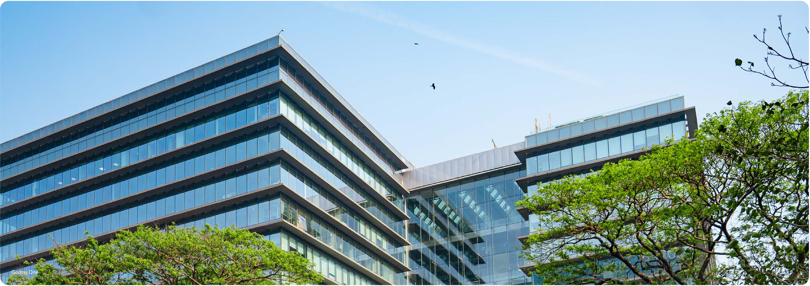

**[Image: AnnualReport2025.pdf-0275-02.png (2271x805, 2975.4KB)]**

<!-- Start of picture text -->
Godrej One <!-- End of picture text -->

###### **Mr. Adi Godrej** 

Chairperson Emeritus 

###### **DIRECTORS AND KEY MANAGERIAL PERSONNEL** 

**Mr. Pirojsha Godrej** Executive Chairperson 

###### **Mr. Nadir Godrej** 

Non-Independent, NonExecutive Director 

###### **Mr. Gaurav Pandey** 

Managing Director & Chief Executive Officer 

###### **Ms. Sutapa Banerjee** 

Lead Independent Director 

###### **Dr. Indu Bhushan** 

Independent Director 

**Ms. Jayashree Vaidhyanathan** Independent Director 

###### **Mr. Sumeet Narang** 

Independent Director 

**Mr. Rajendra Khetawat** Chief Financial Officer 

**Mr. Ashish Karyekar** 

Company Secretary 

###### **REGISTERED OFFICE** 

Godrej One, 5th Floor, Pirojshanagar, Eastern Express Highway, Vikhroli (East) Mumbai, 400079 

**Phone:** 022-61698500 **Website:** <u>www.godrejproperties.com</u> **CIN:** L74120MH1985PLC035308 

###### **REGISTRAR & TRANSFER AGENT** 

Kfin Technologies Limited Selenium, Tower-B, Plot No.31 & 32, Financial District, Nanakramguda, Serilingampally, Hyderabad, Rangareddi, Telengana, India – 500032 

###### **STATUTORY AUDITORS** 

BSR & Co. LLP 14th Floor, Central B Wing and North C Wing, Nesco IT Park 4, Nesco Center, Western Express Highway, Goregaon (East), Mumbai - 400 063 

###### **BANKERS** 

State Bank of India HDFC Bank Ltd. Axis Bank Bank of Baroda 

Federal Bank IDBI Bank Yes Bank Limited 

###### **DEBENTURE TRUSTEE** 

Catalyst Trusteeship Ltd. 

###### **Feedback** 

We value your feedback on our sustainability performance. Please reach out to us with questions, comments, or clarifications at <u>sustainability@godrejproperties.com</u> 

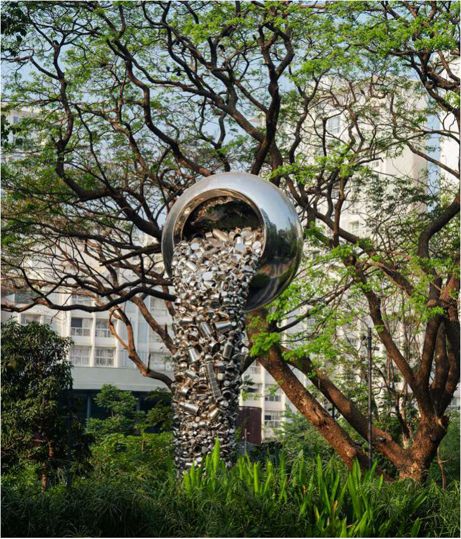

**[Image: AnnualReport2025.pdf-0276-00.png (766x897, 1871.1KB)]**

Godrej Properties Limited Godrej One, 5th Floor, Pirojshanagar, Eastern Express Highway, Vikhroli (East), Mumbai 400 079, India 

---

## Extracted Images

| # | File | Dimensions | Size |
|---|------|------------|------|
| 1 | AnnualReport2025.pdf-0001-14.png | 195x121 | 9.0KB |
| 2 | AnnualReport2025.pdf-0002-07.png | 195x121 | 9.0KB |
| 3 | AnnualReport2025.pdf-0003-02.png | 968x1354 | 2631.4KB |
| 4 | AnnualReport2025.pdf-0005-03.png | 209x70 | 17.9KB |
| 5 | AnnualReport2025.pdf-0005-04.png | 189x114 | 28.5KB |
| 6 | AnnualReport2025.pdf-0005-05.png | 189x162 | 65.5KB |
| 7 | AnnualReport2025.pdf-0005-06.png | 139x150 | 17.2KB |
| 8 | AnnualReport2025.pdf-0007-03.png | 497x376 | 379.9KB |
| 9 | AnnualReport2025.pdf-0007-04.png | 424x93 | 9.1KB |
| 10 | AnnualReport2025.pdf-0007-07.png | 499x376 | 415.6KB |
| 11 | AnnualReport2025.pdf-0007-15.png | 497x376 | 518.1KB |
| 12 | AnnualReport2025.pdf-0007-22.png | 498x376 | 381.2KB |
| 13 | AnnualReport2025.pdf-0008-01.png | 2328x646 | 2058.7KB |
| 14 | AnnualReport2025.pdf-0008-04.png | 172x45 | 5.9KB |
| 15 | AnnualReport2025.pdf-0008-05.png | 186x80 | 17.3KB |
| 16 | AnnualReport2025.pdf-0008-06.png | 90x76 | 11.1KB |
| 17 | AnnualReport2025.pdf-0008-07.png | 140x80 | 14.6KB |
| 18 | AnnualReport2025.pdf-0008-08.png | 205x72 | 10.3KB |
| 19 | AnnualReport2025.pdf-0008-12.png | 72x71 | 10.7KB |
| 20 | AnnualReport2025.pdf-0008-13.png | 133x57 | 15.5KB |
| 21 | AnnualReport2025.pdf-0008-24.png | 235x84 | 21.7KB |
| 22 | AnnualReport2025.pdf-0008-26.png | 349x57 | 29.7KB |
| 23 | AnnualReport2025.pdf-0008-28.png | 108x106 | 16.8KB |
| 24 | AnnualReport2025.pdf-0008-29.png | 153x58 | 9.1KB |
| 25 | AnnualReport2025.pdf-0009-02.png | 1030x660 | 1378.1KB |
| 26 | AnnualReport2025.pdf-0010-03.png | 454x415 | 72.6KB |
| 27 | AnnualReport2025.pdf-0010-04.png | 427x423 | 81.7KB |
| 28 | AnnualReport2025.pdf-0010-05.png | 816x423 | 213.5KB |
| 29 | AnnualReport2025.pdf-0010-06.png | 427x417 | 103.9KB |
| 30 | AnnualReport2025.pdf-0010-07.png | 454x417 | 125.2KB |
| 31 | AnnualReport2025.pdf-0010-08.png | 454x417 | 125.5KB |
| 32 | AnnualReport2025.pdf-0010-09.png | 642x911 | 516.1KB |
| 33 | AnnualReport2025.pdf-0011-20.png | 338x306 | 202.0KB |
| 34 | AnnualReport2025.pdf-0011-21.png | 335x268 | 60.0KB |
| 35 | AnnualReport2025.pdf-0011-22.png | 264x212 | 46.1KB |
| 36 | AnnualReport2025.pdf-0011-26.png | 263x409 | 47.8KB |
| 37 | AnnualReport2025.pdf-0011-27.png | 336x378 | 83.5KB |
| 38 | AnnualReport2025.pdf-0011-28.png | 337x330 | 222.4KB |
| 39 | AnnualReport2025.pdf-0012-07.png | 357x353 | 309.6KB |
| 40 | AnnualReport2025.pdf-0012-11.png | 357x422 | 316.0KB |
| 41 | AnnualReport2025.pdf-0013-03.png | 548x357 | 287.3KB |
| 42 | AnnualReport2025.pdf-0015-05.png | 1022x481 | 523.2KB |
| 43 | AnnualReport2025.pdf-0015-06.png | 984x477 | 856.5KB |
| 44 | AnnualReport2025.pdf-0015-07.png | 225x42 | 3.7KB |
| 45 | AnnualReport2025.pdf-0015-09.png | 491x484 | 31.5KB |
| 46 | AnnualReport2025.pdf-0015-16.png | 557x381 | 12.5KB |
| 47 | AnnualReport2025.pdf-0017-12.png | 501x353 | 384.4KB |
| 48 | AnnualReport2025.pdf-0017-16.png | 1030x858 | 989.7KB |
| 49 | AnnualReport2025.pdf-0018-01.png | 226x13 | 2.9KB |
| 50 | AnnualReport2025.pdf-0019-101.png | 498x266 | 326.5KB |
| 51 | AnnualReport2025.pdf-0019-102.png | 497x266 | 197.5KB |
| 52 | AnnualReport2025.pdf-0020-22.png | 292x306 | 95.0KB |
| 53 | AnnualReport2025.pdf-0020-37.png | 281x281 | 119.3KB |
| 54 | AnnualReport2025.pdf-0020-52.png | 299x332 | 112.2KB |
| 55 | AnnualReport2025.pdf-0021-13.png | 293x310 | 109.8KB |
| 56 | AnnualReport2025.pdf-0021-25.png | 288x295 | 104.0KB |
| 57 | AnnualReport2025.pdf-0021-38.png | 315x296 | 114.2KB |
| 58 | AnnualReport2025.pdf-0021-49.png | 268x291 | 91.8KB |
| 59 | AnnualReport2025.pdf-0022-05.png | 299x17 | 8.2KB |
| 60 | AnnualReport2025.pdf-0022-07.png | 273x724 | 39.8KB |
| 61 | AnnualReport2025.pdf-0022-12.png | 381x430 | 246.3KB |
| 62 | AnnualReport2025.pdf-0022-13.png | 183x28 | 2.4KB |
| 63 | AnnualReport2025.pdf-0022-14.png | 344x318 | 240.0KB |
| 64 | AnnualReport2025.pdf-0022-15.png | 344x311 | 217.4KB |
| 65 | AnnualReport2025.pdf-0023-44.png | 114x95 | 24.2KB |
| 66 | AnnualReport2025.pdf-0023-45.png | 135x20 | 1.6KB |
| 67 | AnnualReport2025.pdf-0023-46.png | 114x96 | 28.4KB |
| 68 | AnnualReport2025.pdf-0023-47.png | 128x44 | 2.5KB |
| 69 | AnnualReport2025.pdf-0023-54.png | 353x351 | 36.6KB |
| 70 | AnnualReport2025.pdf-0024-19.png | 340x247 | 217.0KB |
| 71 | AnnualReport2025.pdf-0024-20.png | 343x247 | 217.7KB |
| 72 | AnnualReport2025.pdf-0024-21.png | 340x246 | 200.7KB |
| 73 | AnnualReport2025.pdf-0024-30.png | 341x247 | 200.8KB |
| 74 | AnnualReport2025.pdf-0024-36.png | 343x247 | 173.2KB |
| 75 | AnnualReport2025.pdf-0024-42.png | 340x247 | 189.3KB |
| 76 | AnnualReport2025.pdf-0025-01.png | 1149x740 | 1380.9KB |
| 77 | AnnualReport2025.pdf-0025-10.png | 423x122 | 7.3KB |
| 78 | AnnualReport2025.pdf-0025-20.png | 422x122 | 5.8KB |
| 79 | AnnualReport2025.pdf-0025-30.png | 424x122 | 6.3KB |
| 80 | AnnualReport2025.pdf-0026-04.png | 32x188 | 1.8KB |
| 81 | AnnualReport2025.pdf-0026-06.png | 891x146 | 16.6KB |
| 82 | AnnualReport2025.pdf-0026-07.png | 891x147 | 17.9KB |
| 83 | AnnualReport2025.pdf-0026-09.png | 941x432 | 27.9KB |
| 84 | AnnualReport2025.pdf-0026-11.png | 901x491 | 59.6KB |
| 85 | AnnualReport2025.pdf-0026-12.png | 397x65 | 2.8KB |
| 86 | AnnualReport2025.pdf-0026-13.png | 53x34 | 0.5KB |
| 87 | AnnualReport2025.pdf-0026-14.png | 397x65 | 3.3KB |
| 88 | AnnualReport2025.pdf-0026-15.png | 53x35 | 0.5KB |
| 89 | AnnualReport2025.pdf-0026-16.png | 397x66 | 3.5KB |
| 90 | AnnualReport2025.pdf-0026-17.png | 53x34 | 0.5KB |
| 91 | AnnualReport2025.pdf-0026-18.png | 882x178 | 14.8KB |
| 92 | AnnualReport2025.pdf-0026-19.png | 397x66 | 3.4KB |
| 93 | AnnualReport2025.pdf-0026-20.png | 53x34 | 0.5KB |
| 94 | AnnualReport2025.pdf-0026-21.png | 891x146 | 14.0KB |
| 95 | AnnualReport2025.pdf-0027-01.png | 228x16 | 3.6KB |
| 96 | AnnualReport2025.pdf-0027-02.png | 720x1364 | 613.0KB |
| 97 | AnnualReport2025.pdf-0027-03.png | 219x107 | 53.3KB |
| 98 | AnnualReport2025.pdf-0027-04.png | 24x14 | 0.8KB |
| 99 | AnnualReport2025.pdf-0028-12.png | 1246x1754 | 4226.0KB |
| 100 | AnnualReport2025.pdf-0028-15.png | 418x246 | 12.9KB |
| 101 | AnnualReport2025.pdf-0028-17.png | 413x245 | 11.1KB |
| 102 | AnnualReport2025.pdf-0028-19.png | 413x309 | 16.2KB |
| 103 | AnnualReport2025.pdf-0029-00.png | 228x16 | 2.6KB |
| 104 | AnnualReport2025.pdf-0029-02.png | 297x61 | 35.0KB |
| 105 | AnnualReport2025.pdf-0029-04.png | 80x17 | 1.2KB |
| 106 | AnnualReport2025.pdf-0029-08.png | 409x178 | 9.1KB |
| 107 | AnnualReport2025.pdf-0029-13.png | 409x176 | 8.4KB |
| 108 | AnnualReport2025.pdf-0029-17.png | 409x178 | 8.7KB |
| 109 | AnnualReport2025.pdf-0029-22.png | 409x176 | 7.2KB |
| 110 | AnnualReport2025.pdf-0029-26.png | 410x178 | 7.9KB |
| 111 | AnnualReport2025.pdf-0029-30.png | 410x176 | 8.2KB |
| 112 | AnnualReport2025.pdf-0029-33.png | 409x220 | 10.3KB |
| 113 | AnnualReport2025.pdf-0029-37.png | 409x176 | 8.5KB |
| 114 | AnnualReport2025.pdf-0030-01.png | 226x13 | 6.1KB |
| 115 | AnnualReport2025.pdf-0030-02.png | 80x17 | 2.5KB |
| 116 | AnnualReport2025.pdf-0030-06.png | 409x178 | 8.5KB |
| 117 | AnnualReport2025.pdf-0030-11.png | 409x176 | 8.2KB |
| 118 | AnnualReport2025.pdf-0030-16.png | 409x178 | 9.2KB |
| 119 | AnnualReport2025.pdf-0030-21.png | 409x176 | 7.8KB |
| 120 | AnnualReport2025.pdf-0030-26.png | 410x178 | 6.9KB |
| 121 | AnnualReport2025.pdf-0030-30.png | 410x176 | 6.9KB |
| 122 | AnnualReport2025.pdf-0030-34.png | 409x178 | 8.4KB |
| 123 | AnnualReport2025.pdf-0030-37.png | 409x219 | 10.9KB |
| 124 | AnnualReport2025.pdf-0031-02.png | 522x413 | 345.5KB |
| 125 | AnnualReport2025.pdf-0031-15.png | 496x326 | 340.8KB |
| 126 | AnnualReport2025.pdf-0033-06.png | 347x68 | 26.4KB |
| 127 | AnnualReport2025.pdf-0033-07.png | 996x447 | 74.5KB |
| 128 | AnnualReport2025.pdf-0033-21.png | 725x706 | 51.0KB |
| 129 | AnnualReport2025.pdf-0033-22.png | 331x694 | 55.2KB |
| 130 | AnnualReport2025.pdf-0036-01.png | 226x13 | 7.5KB |
| 131 | AnnualReport2025.pdf-0036-12.png | 81x17 | 4.0KB |
| 132 | AnnualReport2025.pdf-0036-26.png | 928x378 | 28.7KB |
| 133 | AnnualReport2025.pdf-0038-02.png | 84x28 | 1.3KB |
| 134 | AnnualReport2025.pdf-0038-05.png | 980x346 | 43.2KB |
| 135 | AnnualReport2025.pdf-0039-13.png | 1031x707 | 886.5KB |
| 136 | AnnualReport2025.pdf-0039-26.png | 645x674 | 217.4KB |
| 137 | AnnualReport2025.pdf-0040-18.png | 1074x859 | 110.2KB |
| 138 | AnnualReport2025.pdf-0041-07.png | 78x20 | 1.1KB |
| 139 | AnnualReport2025.pdf-0041-22.png | 245x221 | 8.9KB |
| 140 | AnnualReport2025.pdf-0043-36.png | 361x109 | 96.7KB |
| 141 | AnnualReport2025.pdf-0044-04.png | 2301x586 | 245.4KB |
| 142 | AnnualReport2025.pdf-0044-22.png | 59x59 | 7.9KB |
| 143 | AnnualReport2025.pdf-0044-23.png | 59x59 | 7.1KB |
| 144 | AnnualReport2025.pdf-0044-24.png | 59x59 | 1.9KB |
| 145 | AnnualReport2025.pdf-0044-25.png | 59x59 | 7.2KB |
| 146 | AnnualReport2025.pdf-0044-26.png | 60x59 | 6.0KB |
| 147 | AnnualReport2025.pdf-0044-27.png | 60x59 | 6.5KB |
| 148 | AnnualReport2025.pdf-0044-28.png | 59x59 | 7.5KB |
| 149 | AnnualReport2025.pdf-0044-29.png | 59x59 | 6.0KB |
| 150 | AnnualReport2025.pdf-0044-30.png | 59x59 | 7.9KB |
| 151 | AnnualReport2025.pdf-0045-04.png | 53x51 | 5.8KB |
| 152 | AnnualReport2025.pdf-0045-07.png | 53x51 | 6.3KB |
| 153 | AnnualReport2025.pdf-0045-13.png | 53x51 | 1.9KB |
| 154 | AnnualReport2025.pdf-0045-18.png | 53x51 | 5.2KB |
| 155 | AnnualReport2025.pdf-0045-21.png | 53x51 | 5.9KB |
| 156 | AnnualReport2025.pdf-0045-24.png | 53x51 | 6.0KB |
| 157 | AnnualReport2025.pdf-0046-02.png | 53x51 | 5.9KB |
| 158 | AnnualReport2025.pdf-0046-05.png | 53x50 | 1.6KB |
| 159 | AnnualReport2025.pdf-0046-08.png | 53x51 | 6.0KB |
| 160 | AnnualReport2025.pdf-0046-11.png | 53x51 | 6.7KB |
| 161 | AnnualReport2025.pdf-0046-15.png | 53x51 | 5.7KB |
| 162 | AnnualReport2025.pdf-0046-18.png | 53x51 | 5.7KB |
| 163 | AnnualReport2025.pdf-0046-21.png | 53x51 | 5.8KB |
| 164 | AnnualReport2025.pdf-0046-24.png | 53x51 | 5.9KB |
| 165 | AnnualReport2025.pdf-0048-03.png | 170x98 | 18.1KB |
| 166 | AnnualReport2025.pdf-0048-04.png | 278x84 | 25.7KB |
| 167 | AnnualReport2025.pdf-0048-13.png | 359x132 | 61.9KB |
| 168 | AnnualReport2025.pdf-0048-17.png | 107x89 | 21.6KB |
| 169 | AnnualReport2025.pdf-0048-18.png | 159x69 | 21.9KB |
| 170 | AnnualReport2025.pdf-0048-19.png | 209x96 | 13.7KB |
| 171 | AnnualReport2025.pdf-0048-27.png | 123x124 | 15.2KB |
| 172 | AnnualReport2025.pdf-0048-28.png | 72x70 | 10.3KB |
| 173 | AnnualReport2025.pdf-0050-17.png | 372x242 | 5.7KB |
| 174 | AnnualReport2025.pdf-0050-38.png | 372x177 | 4.2KB |
| 175 | AnnualReport2025.pdf-0050-41.png | 372x177 | 3.8KB |
| 176 | AnnualReport2025.pdf-0050-45.png | 372x114 | 2.9KB |
| 177 | AnnualReport2025.pdf-0051-06.png | 1030x503 | 1191.2KB |
| 178 | AnnualReport2025.pdf-0051-09.png | 1030x459 | 66.1KB |
| 179 | AnnualReport2025.pdf-0053-38.png | 176x34 | 14.9KB |
| 180 | AnnualReport2025.pdf-0054-03.png | 84x97 | 2.7KB |
| 181 | AnnualReport2025.pdf-0054-04.png | 67x97 | 4.2KB |
| 182 | AnnualReport2025.pdf-0054-05.png | 214x72 | 6.2KB |
| 183 | AnnualReport2025.pdf-0054-06.png | 106x99 | 2.7KB |
| 184 | AnnualReport2025.pdf-0054-07.png | 106x88 | 2.8KB |
| 185 | AnnualReport2025.pdf-0054-08.png | 112x88 | 4.1KB |
| 186 | AnnualReport2025.pdf-0055-12.png | 82x82 | 10.6KB |
| 187 | AnnualReport2025.pdf-0055-17.png | 315x18 | 15.4KB |
| 188 | AnnualReport2025.pdf-0056-03.png | 533x639 | 3.1KB |
| 189 | AnnualReport2025.pdf-0056-04.png | 290x34 | 3.8KB |
| 190 | AnnualReport2025.pdf-0056-05.png | 159x457 | 8.2KB |
| 191 | AnnualReport2025.pdf-0056-10.png | 942x303 | 19.9KB |
| 192 | AnnualReport2025.pdf-0056-15.png | 1241x830 | 2060.4KB |
| 193 | AnnualReport2025.pdf-0057-13.png | 1029x302 | 79.2KB |
| 194 | AnnualReport2025.pdf-0058-09.png | 80x82 | 12.2KB |
| 195 | AnnualReport2025.pdf-0058-15.png | 78x18 | 3.5KB |
| 196 | AnnualReport2025.pdf-0059-07.png | 1060x897 | 2281.3KB |
| 197 | AnnualReport2025.pdf-0060-00.png | 226x13 | 6.9KB |
| 198 | AnnualReport2025.pdf-0060-01.png | 228x13 | 7.4KB |
| 199 | AnnualReport2025.pdf-0060-04.png | 940x968 | 1027.6KB |
| 200 | AnnualReport2025.pdf-0061-06.png | 497x253 | 15.1KB |
| 201 | AnnualReport2025.pdf-0061-13.png | 157x113 | 32.0KB |
| 202 | AnnualReport2025.pdf-0061-17.png | 116x115 | 34.3KB |
| 203 | AnnualReport2025.pdf-0061-21.png | 114x114 | 35.0KB |
| 204 | AnnualReport2025.pdf-0061-23.png | 136x115 | 35.1KB |
| 205 | AnnualReport2025.pdf-0061-28.png | 157x115 | 34.6KB |
| 206 | AnnualReport2025.pdf-0061-41.png | 409x161 | 6.8KB |
| 207 | AnnualReport2025.pdf-0061-43.png | 416x168 | 8.6KB |
| 208 | AnnualReport2025.pdf-0061-44.png | 497x474 | 537.7KB |
| 209 | AnnualReport2025.pdf-0061-46.png | 416x222 | 7.7KB |
| 210 | AnnualReport2025.pdf-0061-47.png | 1030x369 | 820.7KB |
| 211 | AnnualReport2025.pdf-0062-09.png | 446x716 | 717.1KB |
| 212 | AnnualReport2025.pdf-0063-08.png | 82x82 | 10.9KB |
| 213 | AnnualReport2025.pdf-0064-04.png | 1030x841 | 1989.6KB |
| 214 | AnnualReport2025.pdf-0064-15.png | 182x16 | 7.9KB |
| 215 | AnnualReport2025.pdf-0065-09.png | 82x82 | 9.6KB |
| 216 | AnnualReport2025.pdf-0066-06.png | 498x754 | 780.9KB |
| 217 | AnnualReport2025.pdf-0068-12.png | 82x80 | 13.0KB |
| 218 | AnnualReport2025.pdf-0068-13.png | 80x80 | 15.0KB |
| 219 | AnnualReport2025.pdf-0068-14.png | 83x80 | 9.7KB |
| 220 | AnnualReport2025.pdf-0068-15.png | 80x80 | 11.0KB |
| 221 | AnnualReport2025.pdf-0068-16.png | 83x80 | 12.0KB |
| 222 | AnnualReport2025.pdf-0068-17.png | 80x80 | 11.8KB |
| 223 | AnnualReport2025.pdf-0068-18.png | 82x80 | 12.2KB |
| 224 | AnnualReport2025.pdf-0069-04.png | 1032x355 | 39.3KB |
| 225 | AnnualReport2025.pdf-0069-38.png | 447x57 | 3.1KB |
| 226 | AnnualReport2025.pdf-0071-12.png | 474x545 | 479.9KB |
| 227 | AnnualReport2025.pdf-0071-28.png | 343x14 | 12.3KB |
| 228 | AnnualReport2025.pdf-0074-09.png | 82x82 | 11.7KB |
| 229 | AnnualReport2025.pdf-0074-10.png | 80x82 | 10.6KB |
| 230 | AnnualReport2025.pdf-0074-11.png | 82x82 | 10.2KB |
| 231 | AnnualReport2025.pdf-0074-12.png | 82x82 | 13.3KB |
| 232 | AnnualReport2025.pdf-0074-13.png | 82x82 | 10.9KB |
| 233 | AnnualReport2025.pdf-0074-14.png | 83x82 | 15.1KB |
| 234 | AnnualReport2025.pdf-0074-15.png | 80x82 | 10.9KB |
| 235 | AnnualReport2025.pdf-0075-05.png | 1242x948 | 562.7KB |
| 236 | AnnualReport2025.pdf-0075-06.png | 1030x736 | 1564.1KB |
| 237 | AnnualReport2025.pdf-0075-07.png | 978x640 | 55.4KB |
| 238 | AnnualReport2025.pdf-0076-02.png | 1033x793 | 1947.2KB |
| 239 | AnnualReport2025.pdf-0076-05.png | 500x340 | 371.9KB |
| 240 | AnnualReport2025.pdf-0076-08.png | 1030x789 | 1467.0KB |
| 241 | AnnualReport2025.pdf-0077-02.png | 204x74 | 6.3KB |
| 242 | AnnualReport2025.pdf-0077-03.png | 216x18 | 9.7KB |
| 243 | AnnualReport2025.pdf-0077-04.png | 186x86 | 8.7KB |
| 244 | AnnualReport2025.pdf-0077-05.png | 178x55 | 7.0KB |
| 245 | AnnualReport2025.pdf-0077-10.png | 367x368 | 97.6KB |
| 246 | AnnualReport2025.pdf-0077-16.png | 368x368 | 102.1KB |
| 247 | AnnualReport2025.pdf-0078-08.png | 1084x406 | 437.3KB |
| 248 | AnnualReport2025.pdf-0078-09.png | 497x383 | 394.4KB |
| 249 | AnnualReport2025.pdf-0078-10.png | 498x365 | 380.3KB |
| 250 | AnnualReport2025.pdf-0078-11.png | 1031x547 | 682.3KB |
| 251 | AnnualReport2025.pdf-0079-05.png | 1030x591 | 1088.8KB |
| 252 | AnnualReport2025.pdf-0079-11.png | 498x704 | 613.5KB |
| 253 | AnnualReport2025.pdf-0079-12.png | 357x67 | 17.1KB |
| 254 | AnnualReport2025.pdf-0079-25.png | 113x89 | 3.1KB |
| 255 | AnnualReport2025.pdf-0080-05.png | 215x107 | 24.6KB |
| 256 | AnnualReport2025.pdf-0080-17.png | 203x73 | 6.3KB |
| 257 | AnnualReport2025.pdf-0080-30.png | 359x68 | 18.1KB |
| 258 | AnnualReport2025.pdf-0080-48.png | 232x18 | 9.1KB |
| 259 | AnnualReport2025.pdf-0081-27.png | 1030x616 | 1281.3KB |
| 260 | AnnualReport2025.pdf-0082-15.png | 496x28 | 5.6KB |
| 261 | AnnualReport2025.pdf-0082-16.png | 953x312 | 15.8KB |
| 262 | AnnualReport2025.pdf-0082-25.png | 2481x455 | 1067.1KB |
| 263 | AnnualReport2025.pdf-0082-26.png | 2481x68 | 0.8KB |
| 264 | AnnualReport2025.pdf-0083-20.png | 1030x510 | 990.6KB |
| 265 | AnnualReport2025.pdf-0083-26.png | 501x187 | 134.3KB |
| 266 | AnnualReport2025.pdf-0083-45.png | 500x287 | 266.6KB |
| 267 | AnnualReport2025.pdf-0084-04.png | 305x123 | 19.3KB |
| 268 | AnnualReport2025.pdf-0084-05.png | 496x343 | 298.4KB |
| 269 | AnnualReport2025.pdf-0084-09.png | 988x446 | 373.8KB |
| 270 | AnnualReport2025.pdf-0084-10.png | 497x387 | 482.1KB |
| 271 | AnnualReport2025.pdf-0084-25.png | 498x438 | 547.9KB |
| 272 | AnnualReport2025.pdf-0085-10.png | 1030x453 | 836.2KB |
| 273 | AnnualReport2025.pdf-0086-01.png | 1243x838 | 1688.3KB |
| 274 | AnnualReport2025.pdf-0086-19.png | 1029x433 | 781.3KB |
| 275 | AnnualReport2025.pdf-0086-20.png | 1029x438 | 875.0KB |
| 276 | AnnualReport2025.pdf-0087-12.png | 1242x748 | 1977.7KB |
| 277 | AnnualReport2025.pdf-0087-13.png | 1030x710 | 1407.6KB |
| 278 | AnnualReport2025.pdf-0088-02.png | 497x682 | 674.5KB |
| 279 | AnnualReport2025.pdf-0088-11.png | 1030x711 | 1834.5KB |
| 280 | AnnualReport2025.pdf-0088-14.png | 640x765 | 79.2KB |
| 281 | AnnualReport2025.pdf-0089-02.png | 499x522 | 489.8KB |
| 282 | AnnualReport2025.pdf-0089-14.png | 80x17 | 3.8KB |
| 283 | AnnualReport2025.pdf-0089-29.png | 66x66 | 2.1KB |
| 284 | AnnualReport2025.pdf-0090-02.png | 1026x514 | 1257.0KB |
| 285 | AnnualReport2025.pdf-0090-32.png | 1030x521 | 1336.8KB |
| 286 | AnnualReport2025.pdf-0091-10.png | 82x82 | 13.1KB |
| 287 | AnnualReport2025.pdf-0092-14.png | 266x545 | 142.4KB |
| 288 | AnnualReport2025.pdf-0092-22.png | 51x41 | 1.3KB |
| 289 | AnnualReport2025.pdf-0092-34.png | 1030x297 | 23.7KB |
| 290 | AnnualReport2025.pdf-0093-08.png | 201x72 | 3.9KB |
| 291 | AnnualReport2025.pdf-0093-18.png | 497x372 | 415.4KB |
| 292 | AnnualReport2025.pdf-0094-02.png | 1031x559 | 198.7KB |
| 293 | AnnualReport2025.pdf-0094-07.png | 82x82 | 10.8KB |
| 294 | AnnualReport2025.pdf-0094-08.png | 82x82 | 9.5KB |
| 295 | AnnualReport2025.pdf-0094-09.png | 80x82 | 9.4KB |
| 296 | AnnualReport2025.pdf-0094-10.png | 80x82 | 12.4KB |
| 297 | AnnualReport2025.pdf-0094-11.png | 82x82 | 10.1KB |
| 298 | AnnualReport2025.pdf-0094-12.png | 82x82 | 13.9KB |
| 299 | AnnualReport2025.pdf-0094-13.png | 80x79 | 3.1KB |
| 300 | AnnualReport2025.pdf-0094-14.png | 82x80 | 9.7KB |
| 301 | AnnualReport2025.pdf-0095-04.png | 1030x745 | 1645.3KB |
| 302 | AnnualReport2025.pdf-0096-67.png | 257x16 | 11.7KB |
| 303 | AnnualReport2025.pdf-0097-03.png | 497x403 | 307.9KB |
| 304 | AnnualReport2025.pdf-0097-04.png | 497x404 | 284.5KB |
| 305 | AnnualReport2025.pdf-0097-13.png | 505x18 | 18.4KB |
| 306 | AnnualReport2025.pdf-0098-04.png | 1030x495 | 1317.1KB |
| 307 | AnnualReport2025.pdf-0099-23.png | 1030x432 | 1041.0KB |
| 308 | AnnualReport2025.pdf-0099-24.png | 1030x572 | 1240.4KB |
| 309 | AnnualReport2025.pdf-0100-09.png | 82x82 | 11.7KB |
| 310 | AnnualReport2025.pdf-0100-10.png | 82x82 | 10.3KB |
| 311 | AnnualReport2025.pdf-0100-11.png | 80x82 | 9.9KB |
| 312 | AnnualReport2025.pdf-0100-12.png | 80x82 | 13.1KB |
| 313 | AnnualReport2025.pdf-0100-13.png | 82x82 | 10.6KB |
| 314 | AnnualReport2025.pdf-0100-14.png | 82x82 | 15.1KB |
| 315 | AnnualReport2025.pdf-0100-15.png | 80x80 | 10.8KB |
| 316 | AnnualReport2025.pdf-0100-22.png | 240x16 | 6.7KB |
| 317 | AnnualReport2025.pdf-0101-03.png | 999x1166 | 1314.6KB |
| 318 | AnnualReport2025.pdf-0101-04.png | 1014x1166 | 1341.1KB |
| 319 | AnnualReport2025.pdf-0101-05.png | 367x1166 | 506.5KB |
| 320 | AnnualReport2025.pdf-0101-06.png | 522x559 | 48.4KB |
| 321 | AnnualReport2025.pdf-0101-07.png | 206x145 | 9.6KB |
| 322 | AnnualReport2025.pdf-0102-04.png | 498x547 | 566.8KB |
| 323 | AnnualReport2025.pdf-0102-05.png | 499x547 | 611.4KB |
| 324 | AnnualReport2025.pdf-0102-06.png | 497x619 | 632.1KB |
| 325 | AnnualReport2025.pdf-0102-07.png | 401x137 | 10.5KB |
| 326 | AnnualReport2025.pdf-0102-08.png | 646x331 | 153.8KB |
| 327 | AnnualReport2025.pdf-0103-04.png | 369x116 | 84.8KB |
| 328 | AnnualReport2025.pdf-0103-05.png | 35x14 | 1.3KB |
| 329 | AnnualReport2025.pdf-0104-18.png | 460x119 | 7.7KB |
| 330 | AnnualReport2025.pdf-0104-19.png | 460x494 | 31.3KB |
| 331 | AnnualReport2025.pdf-0104-21.png | 460x307 | 18.3KB |
| 332 | AnnualReport2025.pdf-0109-28.png | 57x46 | 2.8KB |
| 333 | AnnualReport2025.pdf-0127-02.png | 1032x511 | 78.1KB |
| 334 | AnnualReport2025.pdf-0134-02.png | 849x460 | 41.2KB |
| 335 | AnnualReport2025.pdf-0134-05.png | 601x438 | 19.6KB |
| 336 | AnnualReport2025.pdf-0246-06.png | 230x133 | 31.2KB |
| 337 | AnnualReport2025.pdf-0267-04.png | 114x157 | 27.9KB |
| 338 | AnnualReport2025.pdf-0267-16.png | 113x115 | 25.1KB |
| 339 | AnnualReport2025.pdf-0268-02.png | 114x115 | 25.0KB |
| 340 | AnnualReport2025.pdf-0268-14.png | 113x115 | 24.8KB |
| 341 | AnnualReport2025.pdf-0268-18.png | 107x126 | 21.4KB |
| 342 | AnnualReport2025.pdf-0268-20.png | 153x65 | 13.7KB |
| 343 | AnnualReport2025.pdf-0269-03.png | 112x113 | 24.7KB |
| 344 | AnnualReport2025.pdf-0269-05.png | 111x157 | 28.2KB |
| 345 | AnnualReport2025.pdf-0270-02.png | 114x115 | 25.0KB |
| 346 | AnnualReport2025.pdf-0270-36.png | 112x114 | 25.0KB |
| 347 | AnnualReport2025.pdf-0271-02.png | 114x115 | 25.0KB |
| 348 | AnnualReport2025.pdf-0271-19.png | 113x115 | 25.1KB |
| 349 | AnnualReport2025.pdf-0271-43.png | 115x135 | 22.8KB |
| 350 | AnnualReport2025.pdf-0271-44.png | 151x65 | 13.7KB |
| 351 | AnnualReport2025.pdf-0275-02.png | 2271x805 | 2975.4KB |
| 352 | AnnualReport2025.pdf-0276-00.png | 766x897 | 1871.1KB |
