###### **Godrej Properties Ltd.** 

Godrej One, 5th Floor, Pirojshanagar, Eastern Express Highway, Vikhroli (E), Mumbai- 400 079. India Tel.: +91-22-6169-8500 Fax: +91-22-6169-8888 Website: www.godrejproperties.com CIN: L74120MH1985PLC035308 

July 08, 2026 

###### **BSE Limited** 

Phiroze Jeejeebhoy Towers, Dalal Street, Mumbai – 400 001 

###### **The National Stock Exchange of India Limited** 

Exchange Plaza, Plot No. C/1, G Block, Bandra Kurla Complex, Bandra (East) Mumbai – 400 051 

###### Ref: **Godrej Properties Limited** 

BSE - Script Code: 533150, Scrip ID - GODREJPROP 

BSE- Security Code – 974951, 975090, 975091, 975856, 975857, 976000 – Debt Segment NSE - GODREJPROP 

###### **Sub: Integrated Annual Report for the financial year 2025-26 and Notice convening the 41****st** **Annual General Meeting of the Company** 

Dear Sir/ Madam, 

This is further to our letter dated May 04, 2026, wherein we had, _inter alia_ , informed that the 41st Annual General Meeting (“AGM”) of the Company would be held on Tuesday, August 04, 2026, at 02.30 p.m. (IST), through Video Conferencing (VC)/ Other Audio-Visual Means (OAVM). 

In accordance with Regulation 30, 34 and 53 of the Securities and Exchange Board of India (Listing Obligations and Disclosure Requirements) Regulations, 2015, (“SEBI Listing Regulations”) please find enclosed herewith the Integrated Annual Report for the Financial Year 2025-26 including Business Responsibility and Sustainability Report and the Notice convening the 41st AGM, being sent today through electronic mode to those members and Non-Convertible Debentures holders whose email addresses are registered with the Company/ Registrar and Transfer Agent/ Depository Participants. Further, in accordance with Regulation 36(1)(b) of the SEBI Listing Regulations, the Company is also sending a letter to those members whose e-mail addresses are not registered with Company/ Registrar and Transfer Agent/ Depository Participants providing the weblink from where the Integrated Annual Report can be accessed on the Company’s website. 

**[Image: AnnualReport2026.pdf-0001-14.png (986x74, 18.3KB)]**

The Integrated Annual Report of the Company for the financial year 2025-26 along with the Notice of the 41st Annual General Meeting is available on the website of the Company, viz., - <u>https://www.godrejproperties.com/investor/annual reports</u> and can also be accessed by scanning the Quick response (“QR”) Code given below: 

**[Image: AnnualReport2026.pdf-0002-01.png (217x192, 29.2KB)]**

The dividend, if declared at the ensuing 41st AGM, will be paid to the Members of the Company whose name appear in the Register of Members of the Company as on Tuesday, July 28, 2026. 

This is for your information and records. 

Thank you, 

Yours truly, 

###### **For Godrej Properties Limited** 

ASHISH Digitally signed by ASHISH SUDHAKAR SUDHAKAR KARYEKAR Date: 2026.07.08 KARYEKAR 13:27:21 +05'30' **Ashish Karyekar Company Secretary** 

_Encl: as above_ 

**[Image: AnnualReport2026.pdf-0002-09.png (986x74, 18.3KB)]**

**INTEGRATED REPORT FY 2025–26** 

### **Crafting Joy** 

**[Image: AnnualReport2026.pdf-0003-02.png (130x64, 16.2KB)]**

**[Image: AnnualReport2026.pdf-0004-00.png (453x474, 4.7KB)]**

攀e 

Our Purpose 

攀�l� 

Crafinn spaces that 

**[Image: AnnualReport2026.pdf-0004-05.png (1157x1363, 1012.0KB)]**

spark joy, one 

community, one 

family, one home at 

a time. 

Create 

Delight 

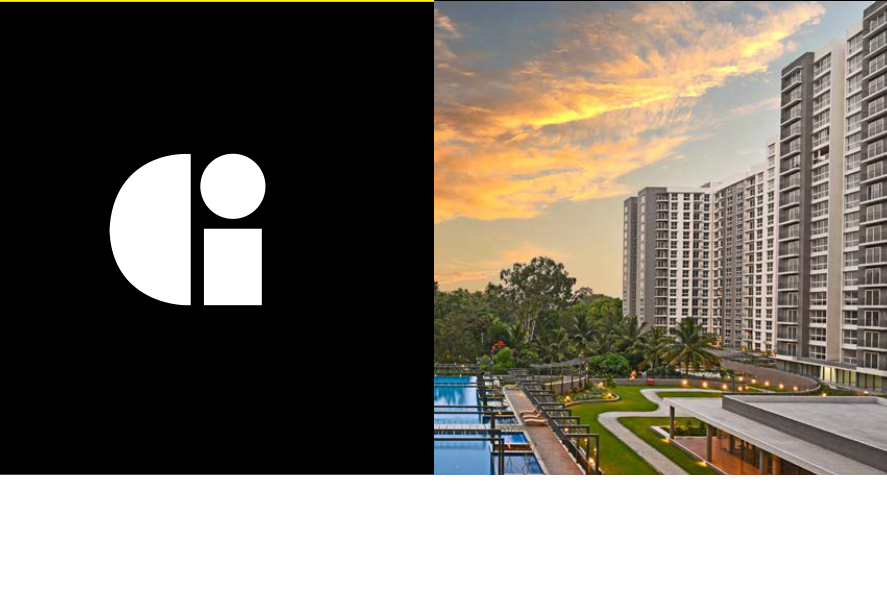

**[Image: AnnualReport2026.pdf-0004-12.png (887x614, 515.4KB)]**

Inspire 

Trust 

#### **GPL at a Glance** 

**[Image: AnnualReport2026.pdf-0005-01.png (955x103, 14.5KB)]**

Godrej Properties Limited (GPL), established in 1985 brings the Godrej Industries Group's legacy of trust, innovation and excellence to the real estate sector. Today, we are India's leading real estate developer by sales and the only truly pan-India player, delivering differentiated value through design-led developments, operational excellence, responsible growth, and a strong commitment through sustainability. 

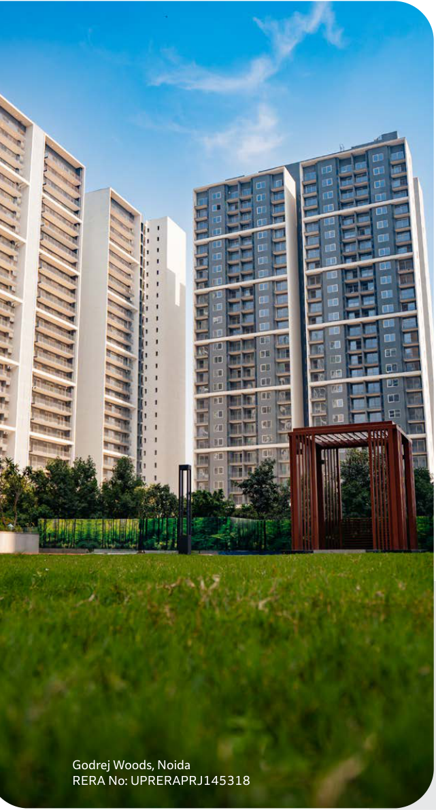

**[Image: AnnualReport2026.pdf-0005-03.png (641x1191, 1443.2KB)]**

<!-- Start of picture text -->
Godrej Woods, Noida RERA No: UPRERAPRJ145318 <!-- End of picture text -->

|**Scale of** **Operations**||**Financial** **Snapshot**||**Responsible** **Growth**||
|---|---|---|---|---|---|
|**₹34,171**Cr. BookingValue|**16%**|**₹8,374**Cr. Revenue Generated|**22%**|**0.005**tCO2e/sq. f. Scope 1 & 2 Emissions Intensity|**38%**|
|**27**Mn. sq. f. Area Sold|**5%**|**₹2,826**Cr. EBITDA|**43%**|**32.7%** Renewable EnergyShare|**115%**|
|**₹42,100**Cr. Business Development|**59%**|**₹19,156**Cr. Net Worth|**11%**|**41.3%** DiversityRatio|**7%**|
|**₹19,965**Cr. Customer Collections|**17%**|**₹1,850**Cr. Proft afer Tax|**32%**|**37.2%** Cis-Women in total workforce|**6%**|
|**What Sets Us Apart**|||||YoY Growth|

**[Image: AnnualReport2026.pdf-0005-05.png (338x85, 29.3KB)]**

**[Image: AnnualReport2026.pdf-0005-06.png (153x153, 49.2KB)]**

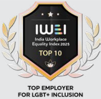

**[Image: AnnualReport2026.pdf-0005-07.png (206x201, 59.0KB)]**

**[Image: AnnualReport2026.pdf-0005-08.png (121x197, 27.5KB)]**

**[Image: AnnualReport2026.pdf-0005-09.png (255x69, 18.5KB)]**

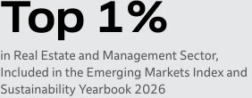

**[Image: AnnualReport2026.pdf-0005-10.png (282x110, 9.1KB)]**

<!-- Start of picture text -->
Top 1% in Real Estate and Management Sector, Included in the Emerging Markets Index and Sustainability Yearbook 2026 <!-- End of picture text -->

**[Image: AnnualReport2026.pdf-0005-11.png (410x45, 9.4KB)]**

<!-- Start of picture text -->
Golden Peacock National Quality Award Sector leader 2025 <!-- End of picture text -->

#### **In This Report** 

|About The Report|2|
|---|---|
|Our Integrated Reporting Architecture|8|
|Heritage, Purpose, and Values|10|
|Crafing a Responsible Tomorrow|12|

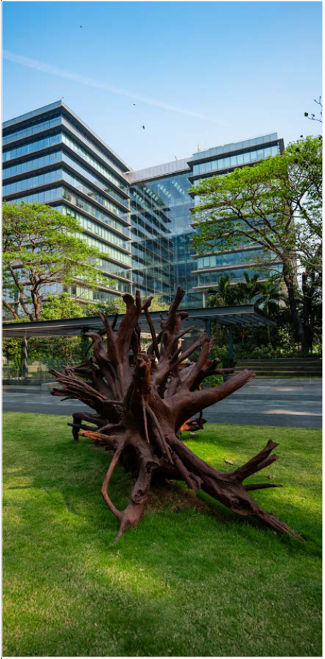

**[Image: AnnualReport2026.pdf-0006-02.png (462x936, 902.4KB)]**

**[Image: AnnualReport2026.pdf-0006-03.png (75x1258, 2.4KB)]**

###### Corporate Overview 

About Godrej Properties Limited 16 Built on Trust, Built Across India 18 Driving Growth, Creating Impact 20 Awards and Recognitions 26 Our Strategic Priorities 28 Governed by Trust 30 Scale and Market Leadership 42 Our Capitals, Our Value Creation 48 In conversation with MD & CEO 54 Leading Global Standards 58 Materiality Assessment 60 Understanding What Matters 62 ESG Targets and Progress 66 Managing Risk, Building Resilience 68 Advocating for Climate, Aligned with Purpose 74 

###### Built to Last, Built to Lead 

Raising the Bar in Quality and Craftsmanship 120 Green Building Commitment 124 Promoting Sustainable Lifestyles 130 Innovation and Digital Transformation 134 

###### People First, Partnerships Always 

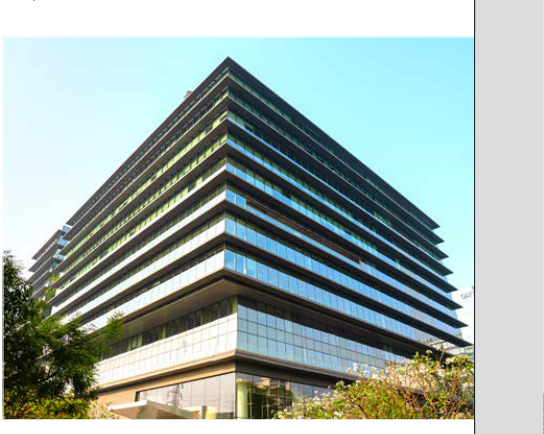

**[Image: AnnualReport2026.pdf-0006-09.png (544x434, 359.6KB)]**

Our Workforce 140 Fostering Inclusion and Equity 154 Enhancing Employee Health and Well-being 164 Putting Customers First 172 Building a Responsible Value Chain 178 Workers Safety and Well-being 184 Upholding Human Rights Across Our Value Chain 190 Creating Lasting Community Impact 194 

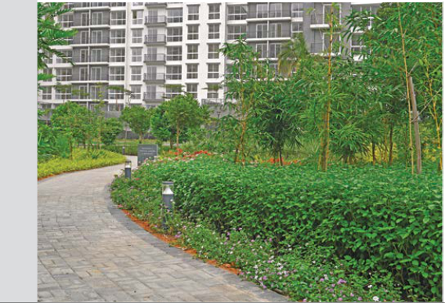

**[Image: AnnualReport2026.pdf-0006-11.png (568x387, 515.1KB)]**

###### Sustaining Nature, Sustaining Value 

Managing Climate Risk 78 Climate Action and Decarbonisation 90 Powering Sustainable Growth 98 Waste Management and Circular Construction 104 Water Stewardship 110 Biodiversity and Nature Stewardship 114 

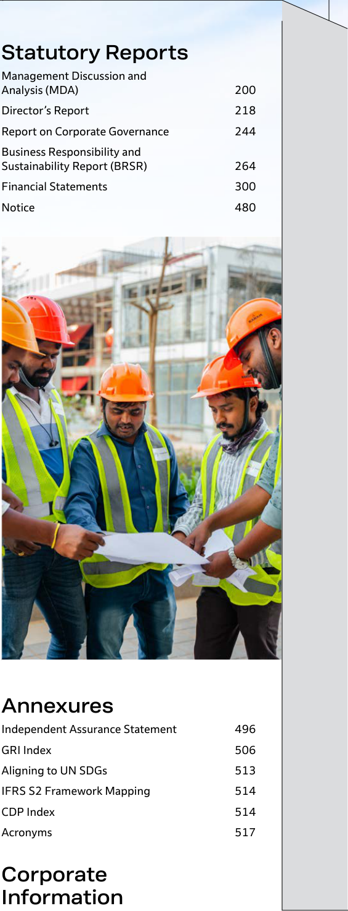

**[Image: AnnualReport2026.pdf-0006-14.png (565x1474, 816.4KB)]**

<!-- Start of picture text -->
Statutory Reports Management Discussion and Analysis (MDA) 200 Director’s Report 218 Report on Corporate Governance 244 Business Responsibility and Sustainability Report (BRSR) 264 Financial Statements 300 Notice 480 Annexures Independent Assurance Statement 496 GRI Index 506 Aligning to UN SDGs 513 IFRS S2 Framework Mapping 514 CDP Index 514 Acronyms 517 Corporate Information <!-- End of picture text -->

Our Capitals, Statutory and Our Value Creation Financial Reports 

**About The Report** 

Corporate Overview 

#### **About The Report** 

We, Godrej Properties Limited (hereinafter referred to as "GPL" or "the Company"), present our Fifth Integrated Annual Report for FY 2025–26, offering a comprehensive and balanced view of our Financial and Non-financial Performance, including operational and sustainability parameters and their impact on stakeholder value creation. 

The report presents transparent and accurate disclosures based on our material topics, key risks and opportunities, and the strategic outcomes of our actions. These disclosures influence decisions made by the Board, Management, Investors, and other Stakeholders. 

**[Image: AnnualReport2026.pdf-0007-06.png (369x82, 8.0KB)]**

###### Mumbai 

###### **Head Office Mumbai Zonal Office** 

**[Image: AnnualReport2026.pdf-0007-09.png (90x64, 1.5KB)]**

Godrej Woodside Estate - Plotted 

Godrej Ascend Godrej Riviera Godrej Reserve Godrej Bayview Godrej Upavan Godrej Carmichael Godrej City - The Highlands Godrej Avenue Eleven Godrej Nurture Godrej City - Green Terraces Godrej Five Gardens Godrej Trilogy Godrej City - Nexspace Godrej Horizon Godrej Skyshore Godrej Emerald Godrej Urban Park Godrej Eternal Palms Godrej Exquisite Godrej SkyTerraces Godrej Varanya 

Godrej Green View Estate Indore- Plotted Godrej Verdania Estate, Indore- Plotted 

###### West & East 

**[Image: AnnualReport2026.pdf-0007-14.png (97x68, 1.7KB)]**

###### **Pune Zonal Office** 

Godrej River GreensGodrej Evergreen Square River Crest Godrej Aqua Vista Godrej River GreensGodrej Elaris Park Springs Godrej Ivara Godrej River GreensUrban Retreat Godrej Eden Estate- Plotted Godrej River GreensSky Greens Godrej Skyline Godrej Emerald Waters 

Godrej Serene Godrej Riverhills- Meadows Godrej Forest Grove Godrej Woodsville Godrej Nurture The Gale at Godrej Godrej Carnival Park world Godrej Park Greens The Greenfront at Godrej Park World Godrej Riverhills- Hillside 3 The Aqua Retreat at Godrej Riverhills- River Royale Godrej Park World Godrej Riverhills- Green Vistas Godrej River GreensGodrej Riverhills- Hill Retreat Park Ridge 

###### **Nagpur Regional Office** 

###### **Kolkata Regional Office** 

Godrej Forest Estate- Plotted 

Godrej Orchard Godrej Blue Godrej Retreat Godrej Zen Estate- Plotted Godrej Elevate 

**[Image: AnnualReport2026.pdf-0007-22.png (84x74, 2.0KB)]**

###### **Ahmedabad Regional Office** 

###### **Reporting Scope and Boundary** 

The scope of this Report covers our strategic narrative and active project sites across India, developed either directly or through our special purpose vehicles, subsidiaries, associates, and joint ventures. Our sustainability disclosures cover all activities under our operational control and/or majority ownership, including the environmental and social indicators reported. All activities that are fully consolidated for financial reporting purposes, including those under operational control and/or majority ownership, are included within the reporting boundary. 

This Report presents our environmental and operational performance across 84 group housing projects and retail locations, 9 plotted developments and 10 offices, including our Headquarters in Mumbai, all of which fall under our direct operational control. 

###### **Reporting Period** 

Where relevant, the reporting boundary extends to include material risks and opportunities arising from entities and stakeholders that shape our ability to create value. While these entities and stakeholders may not be under our direct control or influence, they play a critical role in our value creation journey by virtue of the nature and proximity of their impact. 

**01 31 April March 2025 2026** 

**[Image: AnnualReport2026.pdf-0007-30.png (1016x104, 26.3KB)]**

###### North 

###### **NCR Zonal Office** 

Godrej Aristocrat Godrej Habitat Godrej Jardinia Godrej Sora Godrej Zenith Godrej Meridian Godrej Riverine Godrej Avenue 9 Godrej Vrikshya Godrej Nature Plus Godrej Connaught One Godrej Evora Estate - Plotted Godrej Miraya Godrej South Estate- Plotted Godrej Majesty Godrej Astra Godrej Woods Godrej Arden Godrej Air Godrej Tropical Isle Godrej Alira 

###### South 

###### **Bengaluru Regional Office Hyderabad Regional Office Chennai Regional Office** 

**[Image: AnnualReport2026.pdf-0007-36.png (107x67, 1.7KB)]**

Godrej Ananda- Soul (Phase 3) Godrej Woodscapes Godrej Woods Godrej Parkshire Godrej Athena Godrej Lakeside Orchard Barca at Godrej MSR City Godrej Aveline Godrej Park Retreat (Phase 2) Godrej Madison Avenue Godrej Regal Pavilion Godrej Aravya Estate- Plotted Godrej Splendour (Phase 2) Godrej Tiara Godrej Azure 

Godrej Heritage Estate- Plotted 

Integrated Report FY 2025–26 

2 GRI 2-1, 2-2, 2-3 

3 

Our Capitals, Statutory and Our Value Creation Financial Reports 

**About The Report** 

Corporate Overview 

###### **Reporting Frameworks and Benchmarks** 

This Report is prepared in accordance with leading global and Indian frameworks, including: 

###### **Standards** 

**[Image: AnnualReport2026.pdf-0008-06.png (84x86, 11.6KB)]**

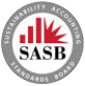

**[Image: AnnualReport2026.pdf-0008-07.png (85x86, 10.5KB)]**

**[Image: AnnualReport2026.pdf-0008-08.png (218x73, 15.7KB)]**

###### **Frameworks** 

**[Image: AnnualReport2026.pdf-0008-10.png (160x91, 9.3KB)]**

**[Image: AnnualReport2026.pdf-0008-11.png (86x84, 12.5KB)]**

**[Image: AnnualReport2026.pdf-0008-12.png (88x84, 11.9KB)]**

**[Image: AnnualReport2026.pdf-0008-13.png (203x72, 14.1KB)]**

**[Image: AnnualReport2026.pdf-0008-14.png (240x90, 15.1KB)]**

**[Image: AnnualReport2026.pdf-0008-15.png (97x98, 4.6KB)]**

**[Image: AnnualReport2026.pdf-0008-16.png (97x98, 3.8KB)]**

###### **Forward-Looking Statements** 

This Integrated Annual Report contains forward-looking statements that reflect our current expectations regarding future developments and performance. These statements cover, but are not limited to, our strategic priorities, market outlook, financial and operational results, sustainability targets, and future business initiatives. 

Forward-looking statements can be identified by words such as "anticipates", "expects", "intends", "may", "will", "believes", "estimates", and "outlook", among others. These statements are based on assumptions and estimates considered reasonable at the time of reporting, but are inherently subject to risks, uncertainties, and external factors, including economic, regulatory, environmental, market, and competitive developments, that may cause actual outcomes to differ materially. 

Readers are cautioned not to place undue reliance on these statements. We do not undertake any obligation to publicly update or revise forward-looking statements, except as required by applicable laws and regulations. 

###### **External Assurance** 

The sustainability disclosures in this Integrated Report have been independently assured by TÜV SÜD South Asia Private Limited in accordance with the International Standard on Assurance Engagements (ISAE) 3000 (Revised), at a limited assurance level. Select key performance indicators, including all indicators under the Business Responsibility and Sustainability Report (BRSR) Core, have been subject to reasonable assurance. 

The independent assurance statement can be referred to on page 496 

###### **Indexes** 

**Regulators** 

###### **Others** 

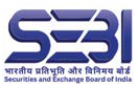

**[Image: AnnualReport2026.pdf-0008-27.png (138x88, 23.6KB)]**

**[Image: AnnualReport2026.pdf-0008-28.png (88x88, 11.8KB)]**

Indian Accounting Standards Companies Act, 2013 (including the rules made thereunder) 

###### **Guiding Principles** 

**[Image: AnnualReport2026.pdf-0008-31.png (268x87, 36.0KB)]**

National Voluntary Guidelines on Social, Environmental and Economic Responsibilities of Business (NVGs) 

**[Image: AnnualReport2026.pdf-0008-33.png (402x66, 54.5KB)]**

###### **Rating Agencies** 

**[Image: AnnualReport2026.pdf-0008-35.png (86x88, 9.5KB)]**

**[Image: AnnualReport2026.pdf-0008-36.png (254x68, 18.0KB)]**

**[Image: AnnualReport2026.pdf-0008-37.png (230x64, 17.2KB)]**

###### **Materiality** 

Material matters are those that could significantly impact GPL’s ability to create Long-term Stakeholder Value. 

Guides strategic targets and commitments across short (<1 year), medium (1-3 years), and longterm (>3 years) horizons 

Determined through structured assessments, including business input and stakeholder feedback 

Integrated into annual performance objectives and linked to executive compensation, reinforcing accountability for delivery and outcomes 

Evaluated via a double-materiality lens (Financial and ESG Impact) 

For a detailed account of our materiality assessment process and outcomes, refer to page 60. 

**[Image: AnnualReport2026.pdf-0008-45.png (97x99, 3.4KB)]**

**[Image: AnnualReport2026.pdf-0008-46.png (97x99, 4.6KB)]**

**[Image: AnnualReport2026.pdf-0008-47.png (97x98, 3.3KB)]**

###### **General Disclaimer** 

This Report has been prepared with reasonable care and diligence. While Godrej Properties has taken steps to ensure the accuracy and completeness of the information presented, interpretation and use of this content remain the reader's responsibility. Review points relating to inconsistencies and incomplete information have been addressed, and the Report has undergone external assurance with all necessary edits incorporated. GPL does not accept liability for any loss or damage arising from reliance on this Report. We welcome feedback on any further inconsistencies that readers may identify. 

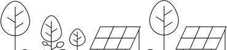

**[Image: AnnualReport2026.pdf-0008-50.png (370x82, 8.2KB)]**

###### Board Responsibility Statement 

GPL's Board of Directors affirms that this Integrated Report presents a balanced and comprehensive view of the Company's financial, operational, and sustainability performance for FY 2025–26. The Board believes that this Report addresses all material matters relevant to the Company and provides a clear insight into our strategy, governance, and approach to creating long-term stakeholder value. The Report has been prepared under the guidance of senior management, with inputs from relevant business functions, and reflects the integrity of the information presented. 

###### Feedback 

We value your feedback on this Integrated Report. For any queries, comments, or clarifications related to our financial or sustainability performance, please reach out to us at <u>sustainability@godrejproperties.com.</u> 

Integrated Report FY 2025–26 

GRI 2-5 

4 

5 

Our Capitals, Statutory and Our Value Creation Financial Reports 

**About The Report** 

Corporate Overview 

###### **Our Reporting Journey** 

Since FY 2014-15, We have progressively evolved our reporting practice, transitioning from standalone sustainability and annual reports to a fully integrated reporting model. From FY 2021-22 onwards, our Integrated Report has served as the primary stakeholder communication, bringing together financial, operational, sustainability, and governance disclosures within a single, cohesive framework. This Report marks our Fifth Integrated Annual Report, reflecting our continued commitment to transparency, accountability, and long-term value creation. 

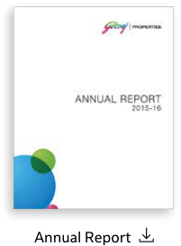

**[Image: AnnualReport2026.pdf-0009-05.png (201x273, 18.1KB)]**

<!-- Start of picture text -->
Annual Report <!-- End of picture text -->

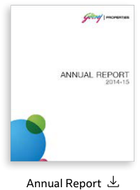

**[Image: AnnualReport2026.pdf-0009-06.png (201x273, 20.1KB)]**

<!-- Start of picture text -->
Annual Report <!-- End of picture text -->

**[Image: AnnualReport2026.pdf-0009-07.png (29x16, 1.0KB)]**

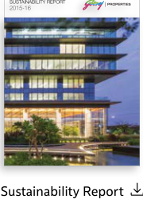

**[Image: AnnualReport2026.pdf-0009-08.png (180x250, 91.2KB)]**

<!-- Start of picture text -->
SUSTAINABILITY REPORT 2015-16 Sustainability Report <!-- End of picture text -->

**[Image: AnnualReport2026.pdf-0009-09.png (53x42, 1.8KB)]**

**[Image: AnnualReport2026.pdf-0009-10.png (15x12, 0.4KB)]**

**[Image: AnnualReport2026.pdf-0009-11.png (35x24, 1.3KB)]**

**[Image: AnnualReport2026.pdf-0009-12.png (26x14, 0.7KB)]**

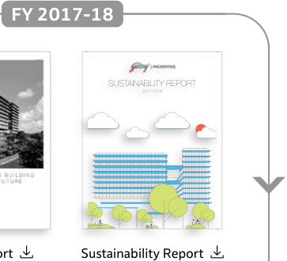

**[Image: AnnualReport2026.pdf-0009-13.png (363x330, 42.9KB)]**

<!-- Start of picture text -->
FY 2017-18 SUSTAINABILITY REPORT 2017-2018 Sustainability Report <!-- End of picture text -->

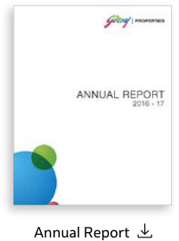

**[Image: AnnualReport2026.pdf-0009-14.png (201x271, 19.3KB)]**

<!-- Start of picture text -->
Annual Report <!-- End of picture text -->

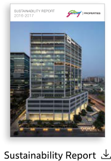

**[Image: AnnualReport2026.pdf-0009-15.png (187x271, 76.7KB)]**

<!-- Start of picture text -->
SUSTAINABILITY REPORT 2016-2017 Sustainability Report <!-- End of picture text -->

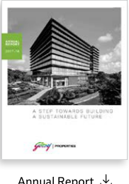

**[Image: AnnualReport2026.pdf-0009-16.png (182x259, 38.0KB)]**

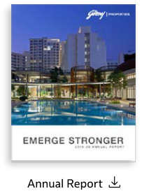

**[Image: AnnualReport2026.pdf-0009-17.png (203x273, 78.7KB)]**

<!-- Start of picture text -->
Annual Report <!-- End of picture text -->

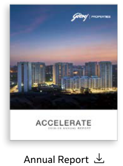

**[Image: AnnualReport2026.pdf-0009-18.png (203x273, 64.8KB)]**

<!-- Start of picture text -->
Annual Report <!-- End of picture text -->

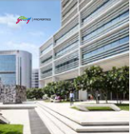

**[Image: AnnualReport2026.pdf-0009-19.png (163x168, 65.9KB)]**

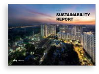

**[Image: AnnualReport2026.pdf-0009-20.png (201x151, 57.9KB)]**

<!-- Start of picture text -->
2019-2020 SUSTAINABILITY REPORT 1 <!-- End of picture text -->

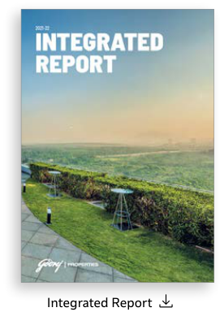

**[Image: AnnualReport2026.pdf-0009-21.png (276x384, 157.6KB)]**

<!-- Start of picture text -->
Integrated Report <!-- End of picture text -->

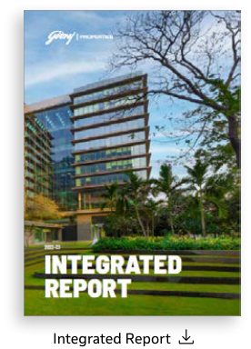

**[Image: AnnualReport2026.pdf-0009-22.png (276x384, 215.9KB)]**

<!-- Start of picture text -->
Integrated Report <!-- End of picture text -->

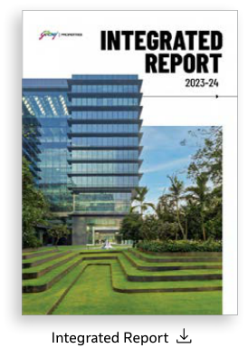

**[Image: AnnualReport2026.pdf-0009-23.png (274x384, 162.8KB)]**

<!-- Start of picture text -->
Integrated Report <!-- End of picture text -->

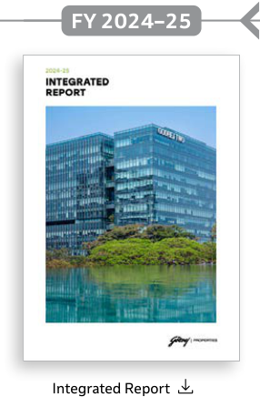

**[Image: AnnualReport2026.pdf-0009-24.png (286x436, 133.9KB)]**

<!-- Start of picture text -->
FY 2024–25 Integrated Report <!-- End of picture text -->

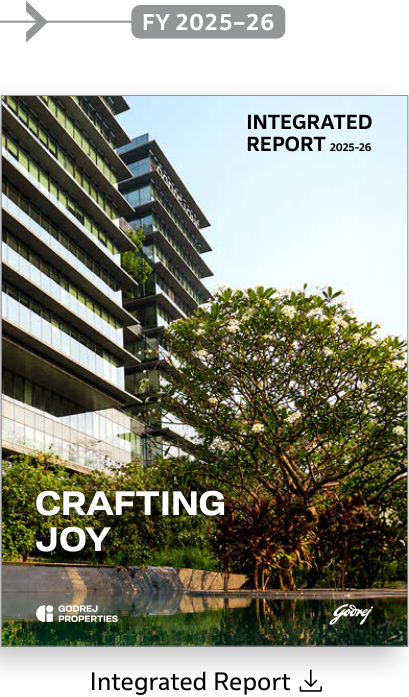

**[Image: AnnualReport2026.pdf-0009-25.png (409x697, 493.2KB)]**

<!-- Start of picture text -->
FY 2025–26 INTEGRATED REPORT 2025-26 CRAFTING JOY Integrated Report <!-- End of picture text -->

**[Image: AnnualReport2026.pdf-0009-26.png (186x255, 76.0KB)]**

<!-- Start of picture text -->
Annual Report <!-- End of picture text -->

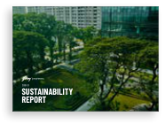

**[Image: AnnualReport2026.pdf-0009-27.png (186x140, 51.5KB)]**

<!-- Start of picture text -->
table of contents SUSTAINABILITY  2020-21 REPORT <!-- End of picture text -->

Integrated Report FY 2025–26 

6 

7 

Our Capitals, Statutory and Our Value Creation Financial Reports 

**About The Report** 

Corporate Overview 

###### **Our Integrated Reporting Architecture** 

Our reporting suite is designed as an interconnected system, enabling stakeholders to seamlessly access financial, operational, sustainability, and governance related information. Together, these disclosures provide a holistic view of how the Company creates and sustains long-term value. 

For FY 2025–26, this integrated reporting architecture brings together our key reports, disclosures, and supplementary datasets. Each Report serves a distinct purpose while collectively contributing to an integrated understanding of our strategy, performance, and impact. 

###### **Integrated Reporting Suite** 

###### **Core Reports** 

**[Image: AnnualReport2026.pdf-0010-08.png (361x80, 8.0KB)]**

###### **Governance and Shareholder Disclosures** 

###### **Notice of Annual General Meeting (AGM)** 

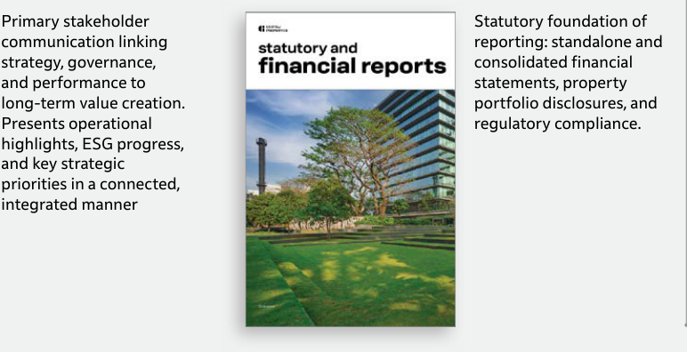

**[Image: AnnualReport2026.pdf-0010-11.png (772x396, 218.7KB)]**

<!-- Start of picture text -->
Primary stakeholder  Statutory foundation of communication linking  reporting: standalone and strategy, governance,  consolidated financial and performance to  statements, property long-term value creation.  portfolio disclosures, and Presents operational  regulatory compliance. highlights, ESG progress, and key strategic priorities in a connected, integrated manner <!-- End of picture text -->

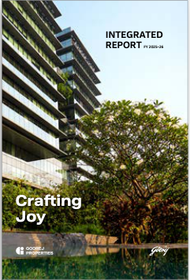

**[Image: AnnualReport2026.pdf-0010-12.png (241x355, 189.4KB)]**

<!-- Start of picture text -->
INTEGRATED REPORT FY 2025–26 Crafting Joy <!-- End of picture text -->

**[Image: AnnualReport2026.pdf-0010-13.png (159x71, 28.6KB)]**

<!-- Start of picture text -->
Crafting Joy <!-- End of picture text -->

###### **Sustainability and Climate Disclosures** 

**ESG / Sustainability Disclosures** 

###### **Business Responsibility and Sustainability Report (BRSR)** 

###### **Climate-related Disclosures** 

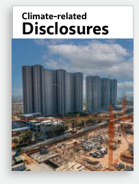

**[Image: AnnualReport2026.pdf-0010-18.png (203x268, 89.8KB)]**

<!-- Start of picture text -->
Climate-related Disclosures <!-- End of picture text -->

**[Image: AnnualReport2026.pdf-0010-19.png (483x38, 7.2KB)]**

<!-- Start of picture text -->
Business Responsibility and  ESG / Sustainability Sustainability Report Disclosures <!-- End of picture text -->

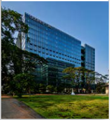

**[Image: AnnualReport2026.pdf-0010-20.png (182x197, 78.6KB)]**

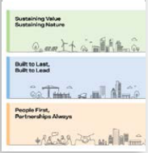

**[Image: AnnualReport2026.pdf-0010-21.png (183x189, 34.0KB)]**

Detailed performance data across environmental, social and governance performance. 

Forward-looking assessment of climate risks and opportunities, aligned with the Task Force on Climate-related Financial Disclosures (TCFD) and IFRS S2. Includes Scenario Analysis. 

Mandatory SEBI Disclosure presenting GPL's performance on the National Guidelines on Responsible Business Conduct (NGRBC) Principles, including BRSR Core metrics as applicable to Listed Companies of GPL's scale. 

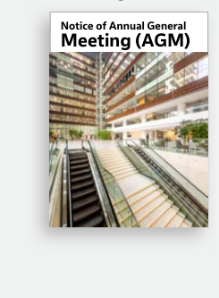

**[Image: AnnualReport2026.pdf-0010-25.png (245x333, 105.2KB)]**

<!-- Start of picture text -->
Notice of Annual General Meeting (AGM) <!-- End of picture text -->

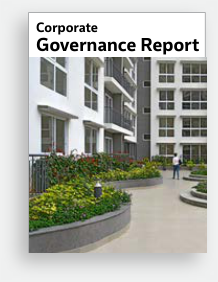

**[Image: AnnualReport2026.pdf-0010-26.png (218x282, 86.7KB)]**

<!-- Start of picture text -->
Corporate Governance Report <!-- End of picture text -->

###### **Supplementary Data and Indices** 

###### **Annexures / GRI, TCFD/ IFRS S2, and Other Indices** 

###### **ESG Databook** 

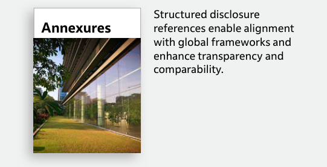

**[Image: AnnualReport2026.pdf-0010-30.png (541x277, 110.6KB)]**

<!-- Start of picture text -->
Structured disclosure Annexures references enable alignment with global frameworks and enhance transparency and comparability. <!-- End of picture text -->

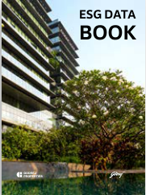

**[Image: AnnualReport2026.pdf-0010-31.png (181x242, 100.5KB)]**

<!-- Start of picture text -->
ESG DATA BOOK <!-- End of picture text -->

**ESG DATA** Detailed quantitative and **BOOK** qualitative datasets supporting the Company’s disclosures, including ESG metrics and additional financial information. 

Integrated Report FY 2025–26 

9 

8 

Our Capitals, Our Value Creation 

Statutory and Financial Reports 

**About The Report** 

Corporate Overview 

#### **Heritage, Purpose, and Values** 

As part of the Godrej Industries Group (GIG) whose roots trace to 1897, when Ardeshir Godrej set out to build a business rooted in self-reliance and national purpose. From manufacturing India's first animal fat-free soap during the Swadeshi Movement, to producing 1.7 million ballot boxes for the world's largest democracy, to developing Asia's first typewriters, GIG has consistently placed innovation and integrity at the heart of its growth. 

###### **Godrej Industries Group Today** 

In May 2026, GIG announced a refreshed purpose and brand identity, unifying its diverse portfolio spanning consumer products, real estate, financial services, agriculture, and chemicals under a single, forward-facing commitment, anchored in three core values. 

###### Our Core Values 

**[Image: AnnualReport2026.pdf-0011-09.png (196x120, 7.7KB)]**

INSPIRE TRUST Building confidence through integrity 

Godrej Industries Group's Purpose 

##### **Crafting tomorrow since 1897** 

**[Image: AnnualReport2026.pdf-0011-13.png (196x90, 4.9KB)]**

CREATE DELIGHT Exceeding expectations and inspiring joy 

**[Image: AnnualReport2026.pdf-0011-15.png (199x92, 3.4KB)]**

BE BOLD Innovating and challenging the status quo 

**USD 6.1 Bn** Group Sales (FY 2024–25 base) 

**[Image: AnnualReport2026.pdf-0011-18.png (65x73, 6.4KB)]**

**~USD 20 Bn >20% >20%** Market Capitalisation Sales Growth CAGR Net Profit Growth CAGR (as of March 31, 2026) (5-year) (5-year) 

###### **Godrej Foundation** 

The Godrej Foundation is an Independent Philanthropic Trust with about a 15% shareholding in Godrej Industries Group, dedicated to strengthening the foundations of a prosperous India. The Foundation partners with non-profits aligned with Godrej values to catalyse economic growth, nurture exceptional talent, advance inclusion, and back bold, innovative ideas. 

Integrated Report FY 2025–26 

10 

11 

Our Capitals, Our Value Creation 

Statutory and Financial Reports 

**About The Report** 

Corporate Overview 

#### **Crafting a Responsible Tomorrow** 

For more than a century, our story has evolved alongside India’s own, rooted in nation-building, selfreliance, and a belief that business must create lasting value for the society and planet. 

Today, rising aspirations and planetary limits remind us that growth must be regenerative, inclusive, and resilient in India and across the markets we serve. 

Our Good and Green Programme turns this belief into measurable outcomes, advancing decarbonisation, circularity, and inclusive growth across our Group. 

**[Image: AnnualReport2026.pdf-0012-08.png (97x97, 5.0KB)]**

###### Thriving Communities 

Empower frontline and under-represented communities across India to live healthier, more prosperous lives. 

**[Image: AnnualReport2026.pdf-0012-11.png (97x98, 5.0KB)]**

###### Industry Innovation 

Spearhead innovations and platforms, in partnership with industry and academia to enable sustainable industries altogether. 

**[Image: AnnualReport2026.pdf-0012-14.png (97x97, 5.2KB)]**

###### Sustainability Excellence 

Invest in future-ready practices to drive sustainable business excellence across 100+ products and 100+ factories across 90 countries. 

**[Image: AnnualReport2026.pdf-0012-17.png (255x189, 34.8KB)]**

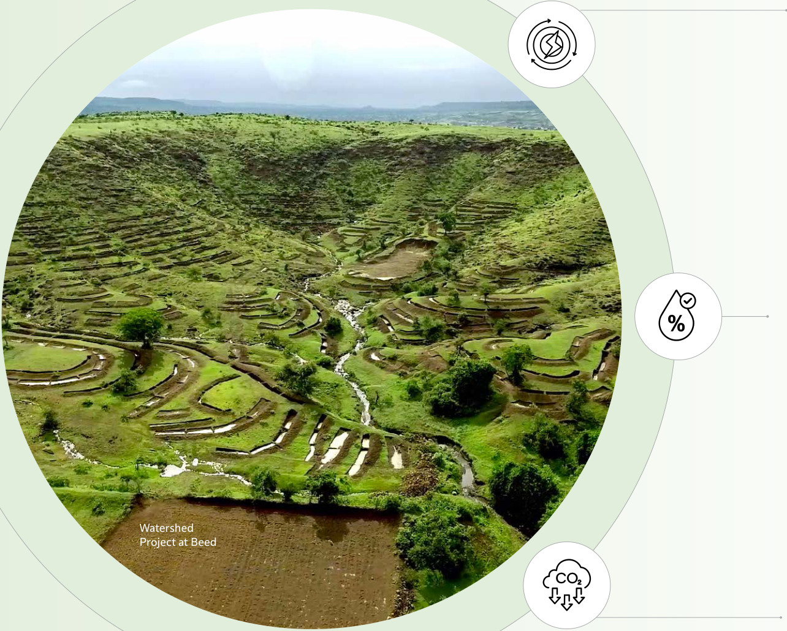

**[Image: AnnualReport2026.pdf-0012-18.png (1284x1030, 1976.1KB)]**

<!-- Start of picture text -->
Watershed Project at Beed <!-- End of picture text -->

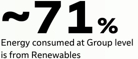

**[Image: AnnualReport2026.pdf-0012-19.png (276x119, 9.6KB)]**

<!-- Start of picture text -->
~71% Energy consumed at Group level is from Renewables <!-- End of picture text -->

**56Mn. m****3** Water recharged at Group level making us 13 times water positive 

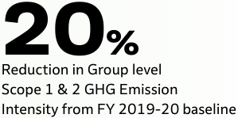

**[Image: AnnualReport2026.pdf-0012-21.png (299x149, 14.7KB)]**

<!-- Start of picture text -->
20% Reduction in Group level Scope 1 & 2 GHG Emission Intensity from FY 2019-20 baseline <!-- End of picture text -->

Integrated Report FY 2025–26 

13 

12 

# **Corporate Overview** 

**[Image: AnnualReport2026.pdf-0013-01.png (871x162, 20.9KB)]**

|About Godrej Properties Limited|16|
|---|---|
|Built on Trust, Built Across India|18|
|Driving Growth, Creating Impact|20|
|Awards and Recognitions|26|
|Our Strategic Priorities|28|
|Governed by Trust|30|
|Scale and Market Leadership|42|
|Our Capitals, Our Value Creation|48|
|In conversation with MD & CEO|54|
|Leading Global Standards|58|
|Materiality Assessment|60|
|Understanding What Maters|62|
|ESG Targets and Progress|66|
|Managing Risk, Building Resilience|68|
|Advocating for Climate, Aligned with Purpose|74|

Our Capitals, Our Value Creation 

Statutory and Financial Reports 

About The Report 

**Corporate Overview** 

#### **About Godrej Properties Limited** 

Part of the Godrej Industries Group, we are India's largest residential real estate developer by booking – value, booking volume, and collections in FY 2025 26. We bring a legacy of trust, innovation, and responsibility to every home, community, and city we shape, through a portfolio spanning residential and mixed-use developments across India's established urban centres and high-growth corridors. 

Our projects are shaped by thoughtful design, well-chosen locations, and consistent execution, creating spaces where everyday moments become lasting memories. We operate through a capitalefficient, operations-led development model that combines disciplined market selection, responsible capital allocation, and best-in-class execution, delivering sustainable developments at scale and creating enduring value for our customers, communities, partners, and investors. 

###### **<mark>2025</mark>** 

Ranked #1 globally in the Dow Jones Best in Class Indices. 

Regained the #1 position globally in GRESB with a perfect score of 100/100. 

Achieved a CDP 'A'  rating for both Climate Change and Supply Chain Sustainability. 

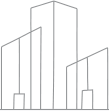

**[Image: AnnualReport2026.pdf-0014-11.png (109x111, 2.5KB)]**

**[Image: AnnualReport2026.pdf-0014-12.png (187x62, 2.6KB)]**

<!-- Start of picture text -->
2024 <!-- End of picture text -->

Became a Waste Positive Organisation through CSR offsets. 

**[Image: AnnualReport2026.pdf-0014-14.png (450x137, 12.4KB)]**

###### **<mark>2026</mark>** 

Ranked India's #1 real estate developer by Booking Value for the third consecutive year. 

Received SBTi validation for near-term, long-term, and net-zero targets. 

**[Image: AnnualReport2026.pdf-0014-18.png (117x97, 4.3KB)]**

**[Image: AnnualReport2026.pdf-0014-19.png (187x62, 2.9KB)]**

<!-- Start of picture text -->
2023 <!-- End of picture text -->

**[Image: AnnualReport2026.pdf-0014-20.png (185x62, 2.5KB)]**

<!-- Start of picture text -->
2021 <!-- End of picture text -->

Received first IGBC Net Zero Achieved Carbon Neutrality Energy (Design) Certification and Water Positivity through for a project in Mumbai. CSR offsets. 

Godrej One 

###### **Our Defining Milestones** 

###### **<mark>1985</mark>** 

Godrej Properties established, entering real estate while carrying forward the Group's values. 

**[Image: AnnualReport2026.pdf-0014-26.png (120x112, 4.8KB)]**

**<mark>2010</mark>** 

Became a publicly listed company following a successful IPO. 

Committed to ensuring every project is a certified green building. 

###### **<mark>2016</mark>** 

Became India's largest publicly listed real estate developer by sales value. 

###### **<mark>2019</mark>** 

Ranked as the Most Trusted Brand in India. 

###### **<mark>2020</mark>** 

Ranked #1 globally among listed residential developers by GRESB. 

Integrated Report FY 2025–26 

16 

17 

Our Capitals, Statutory and Our Value Creation Financial Reports 

About The Report 

**Corporate Overview** 

###### **Built on Trust, Built Across India** 

We have built a diversified presence across key urban and high-growth markets in India. Our portfolio spans residential, plotted, and mixed-use developments, enabling us to align project development with evolving demand patterns and deliver sustained value. 

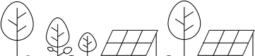

**[Image: AnnualReport2026.pdf-0015-05.png (361x80, 7.9KB)]**

**123 14 41 500+** Total Projects Cities Years of Awards and Operations Recognitions (in last 5 years) 

###### Mumbai Zone 

###### **Mumbai** 

###### **Indore** 

**57.2** Mn. sq. ft. **1.8** Mn. sq. ft. 32 projects 2 projects 

###### South Zone 

###### **Bengaluru** 

###### **Hyderabad** 

**39.2** Mn. sq. ft. **10.7** Mn. sq. ft. 21 projects 4 projects 

###### **Chennai** 

###### **Coimbatore** 

**5.0** Mn. sq. ft. **1.1** Mn. sq. ft. 3 projects 1 project 

###### North Zone 

###### **Chandigarh** 

###### **NCR** 

- **47.8** Mn. sq. ft. **0.5** Mn. sq. ft. 31 projects 1 project 

###### West & East Zone 

###### **Ahmedabad** 

###### **Pune** 

- **45.5** Mn. sq. ft. **24.3** Mn. sq. ft. 16 projects 2 projects 

###### **Nagpur** 

###### **Raipur** 

- **5.7** Mn. sq. ft. 3 projects 

- **1.0** Mn. sq. ft. 

1 project 

###### **Vadodara** 

###### **Kolkata** 

- **0.9** Mn. sq. ft. **9.0** Mn. sq. ft. 1 project 5 projects 

(As of March 31st , 2026) 

Integrated Report FY 2025–26 

18 GRI 2-1 

19 

Our Capitals, Our Value Creation 

Statutory and Financial Reports 

About The Report **Corporate Overview** 

#### **Driving Growth, Creating Impact** 

_FY 2025–26 was, by most measures, a recordbreaking year for Godrej Properties. Sales bookings, cash collections, earnings, and business development all reached their highestever levels. We closed the year with sales bookings of ₹34,171 crore, a growth of 16% over the previous year. In total, we sold 17,513 units across 27 million sq. ft. of booking volume._ 

###### **Dear Shareholders,** 

I hope this message finds you and your loved ones well. 

It gives me great pleasure to share that we had a strong year, with progress  on multiple fronts. For the third consecutive year, Godrej Properties was India's largest residential developer by both booking value and booking volume, a position we do not take for granted, and one we intend to strengthen through a robust focus on creating joy for our customers through outstandingly designed and constructed homes. 

###### A New Chapter for the Godrej Industries Group 

In April 2026, the Godrej Industries Group announced a new purpose and brand identity. At the heart of the refresh is a new Group purpose: "Crafting tomorrow since 1897", which draws on our heritage and ambition to build businesses driven by innovation and sustainability. For Godrej Properties, this translates directly into its own purpose of "Crafting spaces that spark joy, one community, one family, one home at a time", offering proof that building responsibly and building well are not in conflict. As I prepare to assume the Chairpersonship of the Group later this year, our three core values, Inspire Trust, Create Delight, and Be Bold, will continue to guide us. 

###### Our Business Performance 

FY 2025–26 was, by most measures, a record-breaking year for Godrej Properties. Sales bookings, cash collections, earnings, and business development all reached their highest-ever levels. We closed the year with sales bookings of ₹34,171 crore, a growth of 16% over the previous year. In total, we sold 17,513 units across 27 million sq. ft. of booking volume. 

The exceptional year we had was the result of our strong, disciplined execution — maintaining a steady focus on fundamentals, staying abreast of evolving customer needs, market realities, government regulations, and environmental norms. We remained steadfast in pursuing our strategic priorities, both financial and non-financial, while strengthening the foundations of our long-term sustainable growth. 

Our portfolio continued to perform strongly across projects and segments and delivered consistent returns. Mumbai Metropolitan Region, Bengaluru, and the National Capital Region recorded booking values of ₹10,312 crore, ₹8,801 crore, and ₹7,412 crore, respectively. Eleven projects across Mumbai, Noida, Bengaluru, Pune, Hyderabad, and Panipat each crossed the ₹1,000 crore mark in booking value, a reflection of how consistently our pipeline is performing across markets. 

Business development was equally record-setting. We added 18 new projects spanning 33.32 million sq. ft., with an estimated revenue potential of approximately ₹42,100 crore, a growth of 59% over the previous year. This was our most active year yet on the new business development front, and one that considerably strengthens our launch pipeline for the years ahead. We focused our investments on land acquisitions in markets where we see strong demand visibility and robust monetisation potential. We continue to evaluate new opportunities with rigour, ensuring that every decision we make strengthens our development pipeline without stretching our balance sheet. We continue to benefit from the capital raised through the QIP in December 2024, with 75% of proceeds utilised as of March 31, 2026. 

This record sales momentum translated into our highestever collections of ₹19,965 crore, up 17% over the previous year. We delivered over 12.1 million sq. ft. during the year, with direct construction expenditure rising by 62%, a signal of the scale at which we are now executing. Operating cash flow for the year stood at ₹7,830 crore, providing us the financial flexibility to invest in future growth without compromising balance sheet discipline. Total income reached ₹8,374 crore and net profit stood at ₹1,850 crore, growing 22% and 32% respectively. 

The Board has recommended a dividend of ₹10 per equity share for FY 2025–26, representing 200% of face value. This is the first dividend GPL has declared since 2015, and reflects the Board's confidence in the durability of our cash flows and our commitment to delivering returns to our shareholders alongside sustained investment in growth. 

A point worth clarifying for context: under Indian Accounting Standards (Ind AS), revenue is recognised upon project completion rather than at booking. The value created through this year's record sales will therefore be reflected in our financials over the next three to four years. Based on the current year's performance, we expect to recognise approximately ₹8,400 crore in EBIT and ₹5,100 crore in net profit over this period. We share this not as a qualification of our results, but as an indication of the scale of value already in the pipeline. This is a value that will be realised over time, even if not as yet fully visible in reported numbers. We remain committed to achieving a return on equity of 20% by FY 2027-28 on reported financials. 

During the year, our promoters increased their stake in Godrej Properties and its holding company, Godrej Industries Limited, by 5% each, through investments of ₹2,674 crore and ₹1,896 crore, respectively. We see this as an expression of conviction in the Company's longterm direction. 

Our sustained business momentum reflects not only the strength of our portfolio and execution capabilities, but also the enduring trust our customers place in us. For many families, a home is among life’s most meaningful milestones, 

Integrated Report FY 2025–26 

20 GRI 2-22 

21 

Our Capitals, **Corporate Overview** Our Value Creation 

Statutory and Financial Reports 

About The Report 

and we remain deeply committed to making that journey thoughtful, transparent, and reassuring at every stage. This commitment is reflected in our Net Promoter Score of 71%, with the steady improvement over the years serving as a meaningful affirmation of the strong relationships we continue to build with our customers. From design and development to handover and beyond, we remain focused on delivering experiences rooted in empathy, quality, and consistency—an approach that we believe is fundamental to sustaining long-term growth and value creation. 

protecting margins. India's economic fundamentals remain strong, with steady residential demand and accommodative monetary policies, reaffirming our confidence in the longterm opportunity ahead. 

###### The Real Estate Sector in India 

The Indian real estate sector is evolving in ways that are directly relevant to how we operate and grow. 

###### Macro-Economic Trends 

Premium and luxury housing is commanding a growing share of overall sales, with average ticket sizes rising steadily, reflecting a structural shift from volume-led expansion to value-led growth. We have been deliberately strengthening our presence in this segment for several years, tapping into the market trend with agility. 

The year unfolded against a demanding macroeconomic backdrop. Global headwinds, including elevated crude oil prices, geopolitical instability, and tighter financial conditions, had a visible though indirect impact on our business through rising construction costs, currency pressures, and cautious investment sentiment. In response, we adopted a disciplined and agile operating approach, managing cost pressures through calibrated procurement, and remaining selective in our land acquisition and investment decisions. This enabled us to navigate nearterm volatility while maintaining execution momentum and 

Buyer preference has consolidated around trust, with large, established developers gaining market share on the back of consistent delivery and transparency. This works in our favour, but equally reinforces the importance of continuing to deliver on every commitment, across every project and market. 

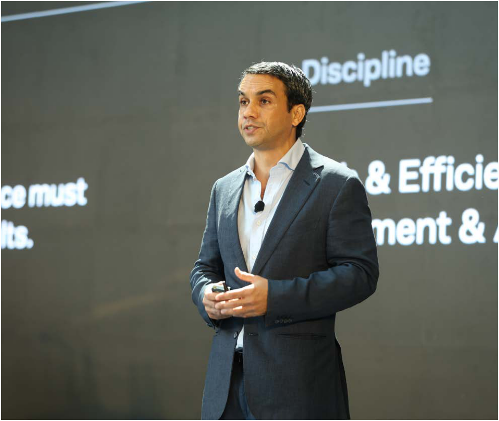

**[Image: AnnualReport2026.pdf-0017-11.png (1032x870, 608.3KB)]**

Technology is becoming central to how real estate is built, sold, and experienced. Artificial Intelligence (AI) is reshaping design by enabling faster layout iterations, optimising unit mix and space utilisation, and generating solutions responsive to customer preferences and site constraints. We are also using data analytics to drive sharper decisions across planning, procurement, and project delivery. VIRA, GPL’s digital labour platform, enables real-time workforce tracking across projects, creating a single source of truth for labour management. By integrating real-time governance with direct-to-bank incentive payments, VIRA delivers transparent, scalable, and technology-led workforce management while strengthening last-mile execution. In sales and customer engagement, our digital sales platform is enhancing the customer experience through greater transparency and convenience. Together, these initiatives are improving operational efficiency and the quality of the homes and experiences we deliver. 

Sustainability has moved from aspiration to expectation. Buyers are increasingly seeking homes that integrate natural light, open spaces, and environmentally responsible design, areas where our projects are well-positioned. 

Finally, domestic institutional capital has played a stabilising role in the sector, particularly during periods of global uncertainty, reflecting enduring confidence in India's real estate fundamentals and contributing to greater long-term resilience. 

###### Sustainable Real Estate 

Sustainability is at the core of how we operate from concept to design, development and operations. Responsible principles are embedded into every action we take, big or small. As with other years, our sustainability practices were rated highly by several global frameworks. Godrej Properties scored 88 in the S&P Global Corporate Sustainability Assessment (CSA), ranking #1 globally and being counted among the Top 1% of companies worldwide on ESG parameters in the real estate and management sector. For 

**[Image: AnnualReport2026.pdf-0017-17.png (484x541, 417.2KB)]**

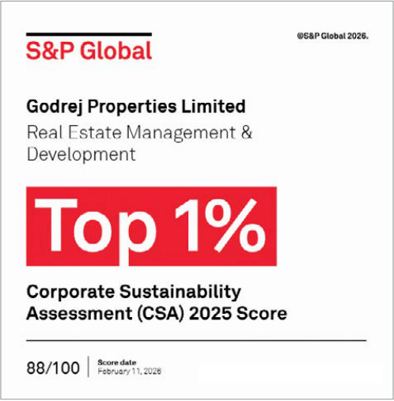

**[Image: AnnualReport2026.pdf-0017-18.png (498x507, 121.9KB)]**

the third consecutive year, we were included in the S&P Global Sustainability Yearbook and named in the Dow Jones Emerging Markets Index. We received CDP 'A' ratings for both Climate Change and Supply Chain, the highest possible recognition in this space, placing us among a select group of companies globally acknowledged for transparency and action on climate. In GRESB 2025, we ranked #1 among residential real estate developers globally and achieved a score of 100, while earning a 5-star rating for the sixth consecutive year. 

These outcomes are the result of systems and processes built consistently over time across the entire development lifecycle, and the integration of environmental accountability into leadership performance. 

Long-term greenhouse gas reduction targets across our operations and value chain have been validated and approved by the Science Based Targets initiative (SBTi), providing an independently verified pathway towards Net Zero by 2050. All our sites maintain ISO 14001:2015 certifications for environmental management and ISO 45001:2018 certifications for occupational health and safety. We continue to strengthen the systems, processes, and accountability frameworks that help realise the true potential of responsible and sustainable real estate and protect our assets, stakeholders and the planet. 

###### CSR-Led Impact Across Communities and Environment 

Our commitment to sustainability is operational, and this year's outcomes reflect that. 

We conducted integrated waste management initiatives in seven cities, in collaboration with our NGO partners, that diverted over 60,700 metric tonnes of waste from landfills, demonstrating that responsible practices can scale across diverse geographies. 

Integrated Report FY 2025–26 

23 

22 

Our Capitals, Statutory and About The Report **Corporate Overview** Our Value Creation Financial Reports 

Looking ahead, for FY 2026–27, we are targeting ₹39,000 crore in residential bookings across key markets. Our growth strategy will continue to focus on disciplined capital allocation, a strong pipeline of launches and sustenance sales, and execution excellence. In parallel, we will further scale our capabilities with strategic investments in people, technology, and development, while maintaining fiscal prudence and delivering consistent returns. 

support, and our shareholders for their confidence in the Company. 

We remain committed to delivering sustainable growth and long-term value to all our stakeholders. 

Warm regards, 

Outstanding Leader Award : Godrej Awards 2026 

The Worker Welfare Programme supported over 28,500 construction workers in FY 2025–26 in accessing social entitlements, unlocking over ₹73.57 crore in government benefits for them. In Gurdaspur, our crop residue management programme reached approximately 48,700 households across 180 villages and engaged more than 12,400 farmers across 26,176 hectares of land. This year, the initiative prevented the burning of over 1,30,000 tonnes of stubble and avoided nearly 9,852 tCO₂e in emissions, contributing to cleaner air and more sustainable agricultural practices in the region. 

These are not peripheral efforts. They reflect our belief that how we build matters as much as what we build. 

###### Our People 

Behind every project delivered, every customer served, and every commitment fulfilled are our people. Across the Godrej Group, we have always focused on building an organisation that places equal emphasis on people and performance. 

As we set an exceptional pace of growth, we continue to strengthen our people practices with a special focus on diversity of talent. In FY 2025–26, underrepresented groups like women, LGBTQ+ individuals and persons with disabilities represented 41.3% of our employees, a fact that makes me immensely proud. We believe that a diverse workforce brings vibrancy to our decision-making process, gives rise to innovative ideas, improves understanding of customer needs and above all, contributes to building a resilient and inclusive organisation. 

Our learning academy, Alchemy, accelerated leadership development at all organisational levels. We launched the CREW Social Network, a digital platform enabling employees to connect and collaborate across geographies. We introduced Godrej SAHYOG, a structured mental health and well-being programme for construction workers across our project sites. Following a successful six-month pilot in the Mumbai Metropolitan Region that engaged over 2,000 workers, the initiative is now being scaled across 58 sites, reaching nearly 15,000 workers in major cities 

###### Looking Ahead 

It is important to approach the future with clarity and realism, despite the vibrancy we are seeing today. The operating environment will continually evolve and change; however, our focus will remain on consistent execution and disciplined growth. The sector presents strong long-term opportunities, and we intend to pursue them boldly and responsibly, one community, one family, one home at a time. 

India’s urbanisation trajectory, combined with rising aspirations for quality housing, is driving demand for welldesigned, well-executed residential developments. In FY 2026-27, domestic demand and ongoing policy reforms are expected to further strengthen India’s position as one of the fastest-growing major economies globally. Godrej Properties is well-positioned to participate in this growth, backed by a strong track record of execution and a distinct strategic direction. 

On behalf of everyone at Godrej Properties, I would like to thank our customers for their trust, our employees for their dedication, our partners and vendors for their continued 

###### **Pirojsha Godrej** 

Executive Chairperson 

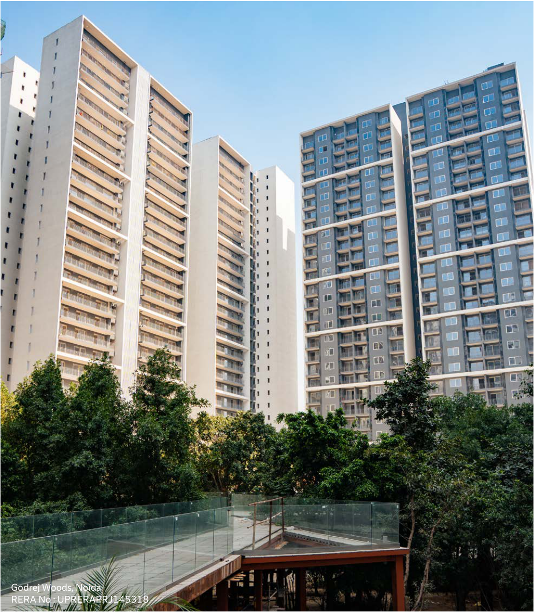

**[Image: AnnualReport2026.pdf-0018-18.png (1030x1181, 2434.7KB)]**

<!-- Start of picture text -->
Godrej Woods, Noida RERA No : UPRERAPRJ145318 <!-- End of picture text -->

Integrated Report FY 2025–26 

24 

25 

Our Capitals, Statutory and Our Value Creation Financial Reports 

About The Report **Corporate Overview** 

###### **Awards and Recognitions** 

**British Safety Council National Safety Council (International Safety Award) (International Safety Award) Merit Merit** 

Godrej Emerald Waters Godrej Skyline (KP2) Godrej Park Greens Godrej The Green Front Godrej Serene Godrej Reserve 

Godrej River Royale Godrej Hill Retreat Godrej Meadows Godrej Hillside-3 Godrej Green Vistas Godrej Parkridge Godrej Urban Retreat Godrej Sky Green Godrej Woodsville Godrej The Gale Godrej Park Green Godrej Forest Groove Godrej Nurture Godrej Carnival Godrej Skyline Godrej Forest Estate Godrej Bayview Godrej Manor Godrej Horizon Godrej One M Godrej Five Garden Godrej Carmichael Godrej Reserve 

**Pass** Godrej Five Gardens 

###### **GreenTech Foundation** 

**Gold** 

Godrej Nest & Nurture Godrej Riverine Godrej Zenith Godrej Tropical Isle Godrej Five Gardens Godrej Avenue 11 Godrej Nirvan / Upavan Godrej Athena Godrej Ananda Phase 03 

###### **ICC Safety Awards** 

**Platinum** 

Godrej Aristocrat Godrej Nature Plus Godrej Parkridge Godrej Reserve 

**Plaque** Godrej Ascend 

**National Safety Council Merit** 

Godrej Golf Links Godrej Park Retreat Phase 2 

###### **Gold** 

Godrej Woods Godrej Zenith Godrej Tropical Isle Godrej Park Retreat Phase 2 Godrej River Royale Godrej Hill Retreat Godrej Meadows Godrej Hillside-3 Godrej Urban Retreat Godrej Sky Green Godrej Orchard Godrej Retreat Prakriti Godrej  Bliss Godrej Horizon Godrej One M Godrej Sky Terraces 

###### **Apex India OHS Awards** 

**Platinum** 

Godrej Reserve Godrej Riviera Godrej South Estate Godrej Woods Godrej Skyline Godrej Skygreens Godrej Retreat Prakriti Godrej Splendour 1 Godrej Splendour 2 

###### **Gold** 

Godrej Five Garden Godrej Urban Retreat Godrej Orchard 

###### **Silver** 

Godrej Meridien Godrej Air 

**Global Safety Summit National** 

###### **Level EHS Award** 

Large Enterprises – Construction Realtors Sector Godrej Avenue 11 Godrej Sky Terrace Godrej Nature Plus Godrej Jardina Godrej Aristocrat Godrej Golf Links Godrej South Estate Godrej Athena Godrej Ananda Phase 03 

###### **RoSPA international safety award Gold** 

Godrej Palm Retreat Godrej Five Gardens Godrej Retreat Prakriti 

###### **Silver** 

Godrej Skygreens Godrej South Estate Godrej Woods 

**ICC Quality Management Systems Awards 2025 Gold** Godrej Emerald Waters 

**ICC (Indian Chamber of Commerce) Occupational Health& Safety Gold** Godrej Emerald Waters 

**The Economic Times Real Estate Awards 2026 High-End Residential Project** Godrej Skyshore 

**The Economic Times Real Estate Awards 2026** 

**Theme-Based Residential Project** Godrej Woods 

**1****st** **Honourz Quality Excellence Awards 2025 Platinum** Godrej Skyline,KPNX 

**IGBC award for Performance challenge** Godrej Properties Limited 

**League of American Communication Professional (LACP) Vision Award (Global) Platinum** Godrej Properties Limited 

###### **Business World India’s Most Sustainable Companies Award 2026** 

**Ranked number 1 in Real Estate Sector and Number 25 overall in India** Godrej Properties Limited 

###### **Gold at the Brandon Hall Group Excellence Awards 2025** 

**Gold in the DEI category** Godrej Properties Limited 

###### **India DEI 100 2025 Index** 

###### **Recognised as the 2****nd** **best organisation by EY and Team Marksmen** 

Godrej Properties Limited 

###### **India Workplace Equality Index** 

###### **(IWEI)** 

###### **Top 10 Employer for LGBTQ Inclusion** Godrej Properties Limited 

**People Matters Infini-T Awards 2025 Gold** Godrej Properties Limited 

**Bombay Chamber of Commerce Diversity, Equity & Inclusion (DEI) Awards 2025 DEI Champion Award - Winner** Godrej Properties Limited 

###### **LGBTQIA+ Inclusion Award - Winner** Godrej Properties Limited 

###### **Gender Equality Champion Award -** 

**1****st** **Runner Up** Godrej Properties Limited 

**Realty+ Harit Bharat Award for ESG Excellence Award – Winner** Godrej Properties Limited 

###### **Construction Times BAM Awards CEO of the year** Gaurav Pandey 

###### **Forbes India Developers A list 2025 Felicitation** 

Godrej Properties Limited 

###### **CII Protiviti - Energy, Infrastructure & Utilities Sector CFO of the Year Leading CFO of the Year** Rajendra Khetawat, GPL 

###### **Hotelier India ESG Excellence Awards 2025** 

**Sustainable & Environment Conscious Hotel of the Year (Luxury-Upper Upscale)** Taj The Trees 

###### **Realty plus** 

###### **Best Integrated Township award** Manjari **Indian Hotels Company Limited 2025** 

**Hotel of the Year – Taj – Large Hotels, Domestic** Taj The Trees 

###### **Construction Weeks India Awards** 

**2025** 

**Real Estate Company of the Year – West** Godrej Properties Limited 

###### **Golden Peacock Awards 2026** 

**Golden Peacock National Quality Award – Winner** Godrej Properties Limited 

###### **Real Estate Personality of the Year** 

**- West** Godrej Properties Limited 

**15****th** **Annual Legal Era Indian Legal Awards 2025-26 Legal Team of the Year - Real Estate** Godrej Properties Limited 

**Ace Alpha Award for Sustainable Development/ ESG Felicitation** Godrej Properties Limited 

###### **Times of India Ecopreneur Awards Felicitation** Godrej Properties Limited 

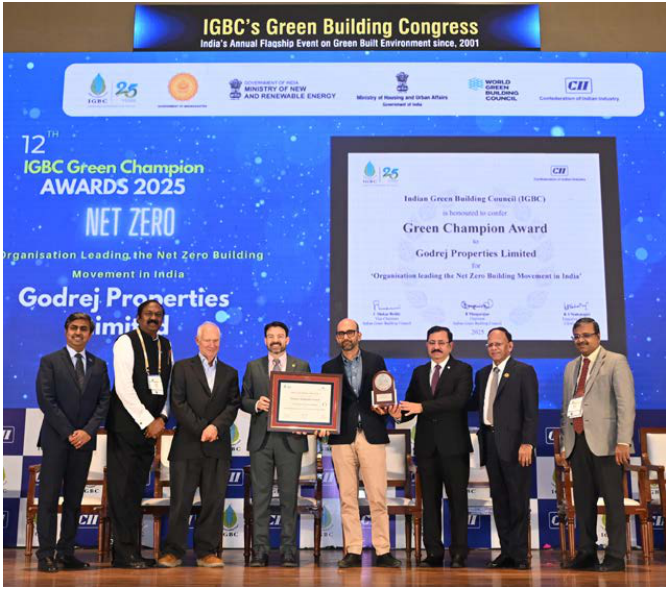

**[Image: AnnualReport2026.pdf-0019-75.png (669x589, 737.3KB)]**

###### **IGBC Award 2025** 

**IGBC Green Champion for Driving Net Zero Movement in India** Godrej Properties Limited 

Integrated Report FY 2025–26 

26 

27 

Our Capitals, Our Value Creation 

Statutory and Financial Reports 

About The Report 

**Corporate Overview** 

#### **Our Strategic Priorities** 

Our strategy is anchored in four core operating priorities that drive value creation across markets, projects, and capital allocation, each underpinned by the six capitals that sustain our business over the long term. 

###### Superior Product Quality 

###### Strong Execution 

Quality is not a checkpoint. It is a commitment woven into every stage of how we plan, build, and deliver homes. From design intent to material choices, construction rigour to post-handover care, our governance systems and green building standards ensure that every Godrej home reflects our highest aspirations. Through Godrej Living, this commitment extends into the residential communities we help shape and the lives we help build. 

We bring together the right people, processes, and technology to deliver homes on our promises, consistently and at scale. Real-time digital oversight, a skilled and mobilised on-site workforce, and a growing network of Grade-A contractors form the backbone of an execution engine built for speed, precision, and accountability across every city we build in. 

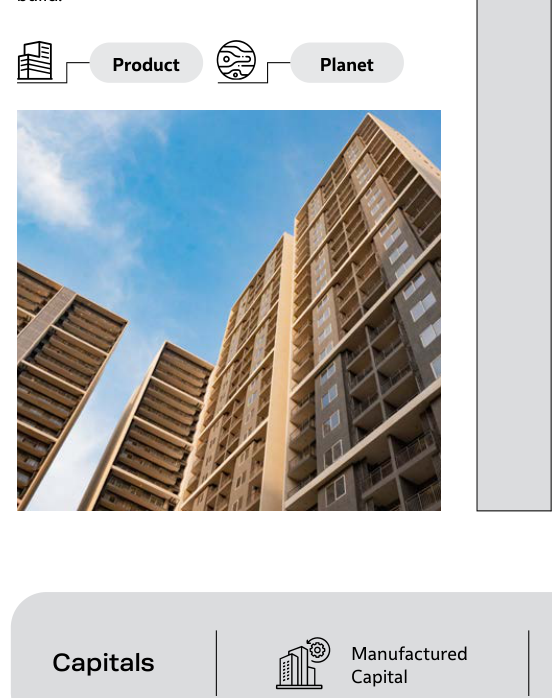

**[Image: AnnualReport2026.pdf-0020-10.png (552x698, 406.4KB)]**

<!-- Start of picture text -->
Product Planet Manufactured Capitals Capital <!-- End of picture text -->

**[Image: AnnualReport2026.pdf-0020-11.png (956x45, 11.9KB)]**

<!-- Start of picture text -->
Product Planet Process People <!-- End of picture text -->

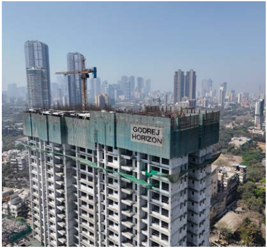

**[Image: AnnualReport2026.pdf-0020-12.png (436x405, 329.1KB)]**

Natural Intellectual Capital Capital 

###### Robust Asset Management 

###### Consistent Growth 

Every land and capital decision is made with care, grounded in rigorous project pipeline assessment, market risk evaluation, and return expectations. Our project turnaround discipline and cost management culture work together to protect development margins and ensure that our growth is both capital efficient and enduring. 

We grow by earning trust, with homebuyers, landowners, channel partners, communities, and investors alike. Our brand strength, thoughtfully chosen geographies, and partnership-led land strategy allow us to expand with purpose across India's established metros and high-growth residential corridors, sustaining our position as India's leading residential developer through every market cycle. 

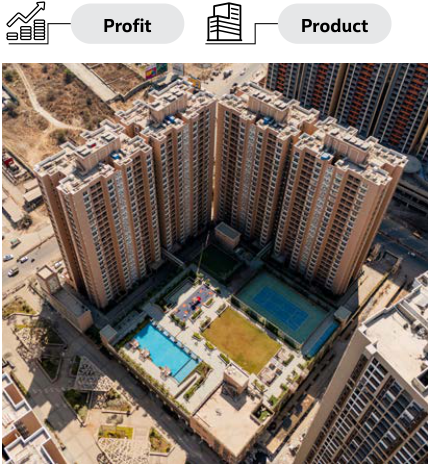

**[Image: AnnualReport2026.pdf-0020-18.png (430x466, 480.9KB)]**

<!-- Start of picture text -->
Profit Product <!-- End of picture text -->

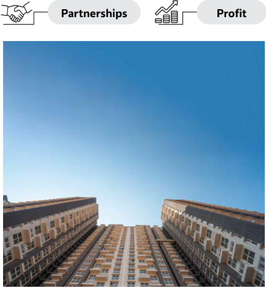

**[Image: AnnualReport2026.pdf-0020-19.png (433x470, 216.1KB)]**

<!-- Start of picture text -->
Partnerships Profit <!-- End of picture text -->

Human Financial Social and Capital Capital Relationship Capital 

**[Image: AnnualReport2026.pdf-0020-21.png (107x940, 2.8KB)]**

Integrated Report FY 2025–26 

29 

28 

Our Capitals, Our Value Creation 

Statutory and Financial Reports 

About The Report 

**Corporate Overview** 

#### **Governed by Trust** 

Our Corporate Governance framework is designed to foster sustainable and transparent growth, while consistently generating economic value and safeguarding the interests of all stakeholders. We champion fair and transparent business practices through a well-structured corporate governance framework that not only guides ethical decision-making but also ensures active and inclusive engagement with all stakeholders. 

###### **Board of Directors** 

The Board of Directors plays a central role in ensuring effective governance, overseeing the implementation of strategic decisions, and maintaining a culture of accountability across the organisation. By prioritising fairness in our interactions with regulators, employees, customers, vendors, investors, and the broader community, we reinforce our commitment to responsible corporate citizenship. 

As a publicly listed entity, we rigorously comply with the corporate governance norms prescribed by the Stock Exchanges and the Securities and Exchange Board of India (SEBI), including the appointment of independent directors to its Board, further strengthening our dedication to oversight, transparency, and stakeholder trust. 

During the financial year, the Board met four times, following a structured and outcome-oriented agenda. We remain committed to maintaining at least 50% independent representation on the Board and enforce a minimum 50% attendance requirement for all Board Members to uphold accountability and effective governance. 

**[Image: AnnualReport2026.pdf-0021-10.png (365x89, 65.4KB)]**

<!-- Start of picture text -->
Employees at GPL 30 GRI 2-9, 2-11, 2-24, 2-26, 3-3, 405-1, 406-1 <!-- End of picture text -->

**[Image: AnnualReport2026.pdf-0021-11.png (499x453, 18.0KB)]**

<!-- Start of picture text -->
29% Women Board Members 7.68 years Average Term of Office <!-- End of picture text -->

**[Image: AnnualReport2026.pdf-0021-12.png (361x80, 8.1KB)]**

**[Image: AnnualReport2026.pdf-0021-13.png (498x214, 7.0KB)]**

<!-- Start of picture text -->
57% Independent Directors <!-- End of picture text -->

**[Image: AnnualReport2026.pdf-0021-14.png (258x63, 4.6KB)]**

<!-- Start of picture text -->
56 years <!-- End of picture text -->

Average Age of Directors 

**[Image: AnnualReport2026.pdf-0021-16.png (21x16, 0.8KB)]**

<!-- Start of picture text -->
31 <!-- End of picture text -->

Integrated Report FY 2025–26 

Our Capitals, Statutory and Our Value Creation Financial Reports 

About The Report 

**Corporate Overview** 

**45 Y/M** 

**42 Y/M** 

**61 Y/F** 

**[Image: AnnualReport2026.pdf-0022-06.png (220x190, 55.5KB)]**

**[Image: AnnualReport2026.pdf-0022-07.png (262x262, 90.9KB)]**

###### **Membership in Committees** 

**Attendance at Committee Meetings** 18/18 

**Attendance at Board Meetings** 04/04 

**[Image: AnnualReport2026.pdf-0022-11.png (290x401, 124.1KB)]**

###### **Membership in Committees** **<u>NA</u>** 

**Attendance at Committee Meetings NA** 

**Attendance at Board Meetings** 04/04 

###### Pirojsha Godrej 

###### **Non-Independent Director, Executive Chairperson** 

Mr. Pirojsha Godrej serves as Chairperson Designate of the Godrej Industries Group, and as Chairperson of Godrej Properties , Godrej Capital Limited, and Godrej Ventures and Investment Advisers Private Limited. 

Under his leadership, the Godrej Industries Group has delivered strong and consistent performance, achieving over 20% compounded annual growth in both sales and net profits over the five years leading up to FY 2025–26, and stands as the leading player in India across several business categories, including residential real estate, animal feed, crude palm oil, oleochemicals, household insecticides, hair colour, and air care. As of April 2026, the Group's publicly listed businesses had a combined market capitalisation in excess of $20 billion. 

The Group's largest companies, Godrej Consumer Products Limited and Godrej Properties Limited, were both ranked number one globally in their respective categories on the Dow Jones Best-inClass Indices in 2025, while Godrej Properties also secured the top global ranking in the Global Real Estate Sustainability Benchmark (GRESB) 2025, reflecting the Group's deep commitment to sustainability and governance. 

Before taking on leadership at the Godrej Industries Group, Pirojsha led Godrej Properties through a phase of rapid growth that culminated in it becoming the largest real estate developer in India by residential sales in FY 2020-21, a position it continues to hold today. He also founded Godrej Capital Limited and Godrej Ventures and Investment Advisers Private Limited. 

He graduated from the Wharton School of Business, completed a Master's in International Affairs from Columbia University, and earned an MBA from Columbia Business School. 

Indian Green Building Council (IGBC) has awarded Pirojsha the IGBC Green Champion Award 2016 for his contribution to the sustainability of India's built environment. He was also awarded with the EY Entrepreneur of the Year™ Awards 2024: Energy, Real Estate, and Infrastructure category and Global Asian of the Year Award: 19th Edition of Asian Business and Social Forum in 2023. 

###### Nadir Godrej 

###### **74 Y/M** 

###### **Non-Independent, Non-Executive Director** 

Mr. Nadir Godrej is the Chairperson and Managing Director of Godrej Industries Limited and Chairman of Godrej Agrovet Limited. He holds a Bachelor of Science degree in Chemical Engineering from Massachusetts Institute of Technology, a Master of Science degree in Chemical Engineering from Stanford University, and an MBA from Harvard Business School. 

He has served as Director of several Godrej companies since 1977 and has played a key role in developing the animal feed, agricultural inputs, and chemicals businesses of Godrej Industries and its associate companies, while also contributing actively to research and innovation. His non-work commitments include serving as President of the Alliance Francaise de Bombay, membership in and past Chairmanship of the CII - National Committee on Chemicals, and previous role as an Independent Director of Indian Hotels Company Limited and Mahindra & Mahindra Limited. He is a member of the South Asia Research Centre Advisory Board at Harvard Business School. 

Mr. Godrej has received numerous recognitions for his outstanding contributions to industry, business, sustainability, and quality excellence. His accolades include the Chevalier de la Légion d'Honneur, the Chemtec CEW Leadership and Excellence Award (2013) – Hall of Fame (2017), award in Business Excellence at the IBG function (2018), the Qimpro Platinum Standard Award (2023), the Times of India Earth Care Award (2024), the Green Business Titan Award (2024) - by the JSW and several lifetime achievement awards from leading industry bodies. He was conferred with a Honorary Doctor of Philosophy from Manav Rachna University (2017), an Honorary Doctor of Philosophy in Business Management from XIM University, Bhubaneswar (2023), a D.Sc. (Honoris Causa) from the Institute of Chemical Technology (2025), and a Honoris Causa degree at the 7th Convocation of Bennett University, Times Group (2025). 

**[Image: AnnualReport2026.pdf-0022-29.png (223x191, 54.8KB)]**

**[Image: AnnualReport2026.pdf-0022-30.png (263x264, 117.6KB)]**

###### **Membership in Committees** 

**Attendance at Committee Meetings** 18/18 

**Attendance at Board Meetings** 04/04 

**[Image: AnnualReport2026.pdf-0022-34.png (218x186, 50.2KB)]**

**[Image: AnnualReport2026.pdf-0022-35.png (258x255, 95.4KB)]**

###### **Membership in Committees** 

**Attendance at Committee Meetings** 11/11 

**Attendance at Board Meetings** 04/04 

###### Gaurav Pandey **Managing Director & Chief Executive Officer** 

Mr. Gaurav Pandey brings over 21 years of real estate experience, including 9.5 years with Godrej Properties. Under his leadership, GPL has achieved approximately 4.3X growth in Booking Value over four years, reaching ₹34,171 crore in FY 2025–26, the highest annual booking value recorded by any Indian developer for the third consecutive year. Since he took charge in FY 202223, GPL has delivered a cumulative Booking Value of ₹98,374 crore, unprecedented in Indian residential real estate, while collections of ₹19,965 crore in FY 2025–26 set new benchmarks for the sector. He has led over 58 transactions with a cumulative revenue potential exceeding ₹126,000 crore. Earlier, as CEO of the North Zone, he strengthened financial performance by growing Booking Value 6X and Collections 4X, delivering the largest contribution to GPL's PAT. Before joining GPL, he was CEO at Burman GSC and held senior roles at PropEquity and Ascendas India, and also co-anchored "The Property Show" on NDTV. Mr. Pandey is an Economics Honours graduate from the University of Delhi and has completed a postgraduate course from the Indian Institute of Management (IIM) Kozhikode. He co-chairs FICCI's Committee on Urban Development and Real Estate, has been a CEO Council Member of The Wall Street Journal since 2024, and was recognised among "The World's Most Influential Decision Makers" by the WSJ CEO Council in 2024 and 2025. 

Gaurav has been recognised as the CEO of the Year at the Construction Times BAM Awards 2025, honoured as the Iconic Brand Leader at the Realty Plus India Brand Leadership Conclave and Awards 2025, and named one of Business World's Most Valuable CEOs. He was also bestowed with the Pride of India Award at the Construction Week Awards 2024. Under his leadership, GPL has received numerous industry accolades. 

###### Sutapa Banerjee 

###### **Lead Independent Director** 

Ms. Sutapa Banerjee brings over three decades of professional experience, including 24 years in the financial services industry across two large multinational banks (ANZ Grindlays and ABN AMRO), and a boutique Indian investment bank (Ambit), where she built and headed several businesses and analysed multiple sectors, including real estate, for the money management business. She has also led strategic initiatives in treasury, fixed income, real estate structured credit and financial risk management. Sutapa was voted one of the ‘Top 20 Global Rising Stars of Wealth Management’ by the Institutional Investor Group in 2007 - the only Indian and one of only two winners from Asia. As CEO she led Ambit Private Wealth to ‘Best Private Bank in India' in the 2013 AsiaMoney polls. In 2012 she was shortlisted in the '50 most Powerful Women' by Fortune India. 

Her current Independent Directorships include the boards of Eternal Limited, Godrej Properties Limited, Polycab India Limited, ideaForge Technology Limited, and JSW Cement Limited. She serves as Chairperson and member of several key Board Committees and has also served on the Board of Oxfam and as Nominee Director of Women’s World Banking NY in India. 

She teaches, consults, writes and speaks both internationally and in India on Behavioural Insights and Design Thinking. Sutapa has served as Visiting Faculty at Indian Institute of Management Ahmedabad, she taught post-graduate students a full credit course on Behavioural Biases in Decision making and its impact on Corporate Practices - a first for any business school anywhere. She is an Advanced Leadership Fellow at Harvard University and is also an adjunct faculty on Corporate Governance for IICA - the Government of India Think Tank under the Ministry of Corporate Affairs and a frequent speaker in prestigious forums. In addition, she works as a Decision Coach for senior leadership talent. A gold medallist in Economics from XLRI School of Management and an Economics major from Presidency College Kolkata. She currently serves on the Advisory Council of the CII - Centre for Women Leadership and has contributed to several national committees on 'Integrity and Transparency in 'Governance', 'women’s empowerment' and the ‘Indian Women Network’. 

Y/M is = Age (Years)/Gender 

Committees 

Allotment Environmental, Social and Corporate Social Responsibility Committee Governance (ESG) Committee (CSR) Committee 

Risk Management Management Audit Nomination and Stakeholders Relationship Committee Committee Committee Remuneration Committee Committee 

Integrated Report FY 2025–26 

33 

32 

Our Capitals, Statutory and About The Report **Corporate Overview** Our Value Creation Financial Reports 

**65 Y/M** 

**50 Y/M** 

**[Image: AnnualReport2026.pdf-0023-03.png (221x189, 50.9KB)]**

**[Image: AnnualReport2026.pdf-0023-04.png (262x259, 96.5KB)]**

###### **Membership in Committees** 

**Attendance at Committee Meetings** 10/10 

**Attendance at Board Meetings** 04/04 

**[Image: AnnualReport2026.pdf-0023-08.png (213x180, 61.0KB)]**

**[Image: AnnualReport2026.pdf-0023-09.png (253x248, 92.6KB)]**

###### **Membership in Committees** 

###### **Attendance at Committee Meetings** 

06/06 

**Attendance at Board Meetings** 

04/04 

###### Dr. Indu Bhushan 

###### **Independent Director** 

Dr. Indu Bhushan is a distinguished public policy, healthcare, and governance leader with over four decades of experience spanning government, international development, academia, and corporate governance. A former Indian Administrative Service officer (1983 batch Rajasthan cadre), he was the founding CEO of Ayushman Bharat-PMJAY, the world's largest publicly funded health assurance programme. He also spearheaded the Ayushman Bharat Digital Mission, laying the foundation for India's digital health infrastructure. Prior to this, he spent over two decades at the Asian Development Bank ("ADB") and the World Bank. At ADB, as Director General of the East Asia Department, he led operations in China and several other countries, overseeing a portfolio exceeding $30 billion. This work spanned sectors including energy, environment, natural resources and agriculture, transport, public management, real estate and infrastructure, financial and regional cooperation, and urban and social development, bringing a multilateral policy perspective to real estate development and urban growth and risk management across complex multi-sector operations. 

He holds a PhD in Health Economics from Johns Hopkins University and is a CFA charter-holder. He has received numerous national and international awards, including from the Government of India, the Socialist Republic of Vietnam, and Johns Hopkins University. 

###### Jayashree Vaidhyanathan 

###### **56 Y/F** 

###### **Independent Director** 

Ms. Jayashree Vaidhyanathan is the Chief Executive Officer of BCT Digital, a global fintech, regtech, and cleantech company. She brings over 30 years of experience, with a strong background in financial services, transformation, artificial intelligence, digital, and technology sectors, and deep expertise in cybersecurity and digital risk governance. She serves as an Independent Director on the Global Board of PwC, as one of two independent directors on the PwC India Board, and as Independent Director on the boards of UTI Asset Management Company Limited and Indigrid Investment Managers Limited. 

Ms. Vaidhyanathan holds a Master's degree in Business Administration in Finance and Strategy from Cornell University, a Bachelor's degree in Engineering in Computer Science from Madras University, India, and is also a CFA Charter Holder. 

She is a three-time winner of the prestigious Stevie Award, including a Lifetime Achievement Award, and has been recognised as Global Indian of the Year 2021-2022 by AsiaOne Magazine, India's Inspirational Leader 2022 by WCRC (World Consulting and Research Corporation), Top 50 Women Leaders in Technology 2022 by Women We Admire, Lifetime Achievement Award 2022 by World HRD Congress, Tech Leadership Award 2020 by Fintech Futures, Top 10 Most Influential Women in Technology 2020 by Analyst Insights, and India's Most Trusted CEO 2020 by WCRC. She has also been listed among Fortune's Most Inspiring Women in 2021. 

Allotment Environmental, Social and Corporate Social Responsibility Committee Governance (ESG) Committee (CSR) Committee 

**[Image: AnnualReport2026.pdf-0023-26.png (220x189, 54.4KB)]**

###### Sumeet Narang 

###### **Independent Director** 

**[Image: AnnualReport2026.pdf-0023-29.png (261x262, 83.7KB)]**

Mr. Sumeet Narang is the Founder of Samara Capital, an India-focused investment firm with a strong emphasis on growth buyouts, and brings over 28 years of experience. Before founding Samara Capital in late 2006, he briefly worked at Goldman Sachs, New York, in their Principal Investments Group, and from 2001 to 2004 worked with Citigroup India across various functions based out of Delhi and Hyderabad. He has also worked with the Fiat Group in Italy and India. 

Mr. Narang earned a Master's in Business Administration from Harvard Business School, where he graduated as a Baker Scholar and received the John Loeb Fellow Award. He also holds a postgraduate diploma in management (major in finance) from the Indian Institute of Management, Lucknow, where he was an Aditya Birla Scholar, and a Bachelor of Engineering degree in Mechanical Engineering from the Indian Institute of Technology, Roorkee. 

Samara Capital has a strong focus on the consumer space, and Sumeet has had the opportunity to evaluate and invest in multiple companies across segments such as retail (including food and grocery retail), quick service restaurants, branded apparel, and personal and beauty care. Mr. Narang sits on the boards of many of these companies and has actively contributed to their growth journeys, several of which have become market-leading companies in their respective segments. 

###### **Membership in Committees** 

**Attendance at Committee Meetings** 04/06 

**Attendance at Board Meetings** 03/04 

###### **Core Skills and Expertise** 

|**Director's Name**|**Strategy and** **Business**|**Industry** **Expertise**|**Market** **Expertise**|**Technology** **and Future** **Perspective**|**Governance,** **Finance and** **Risk**|**People** **and Talent** **Understanding**|**Diversity of** **Perspective**|
|---|---|---|---|---|---|---|---|
|Mr. Pirojsha Godrej||||–||–||
|Mr. Nadir Godrej||–||||–||
|Mr. Gaurav Pandey||||–||–|–|
|Ms. Sutapa Banerjee||||–||||
|Dr. Indu Bhushan||||–||–||
|Ms. Jayashree Vaidhyanathan||–||||||
|Mr. Sumeet Narang||||||–||

Y/M is = Age (Years)/Gender Risk Management Management Audit Nomination and Stakeholders Relationship Committee Committee Committee Remuneration Committee Committee 

Committees 

Integrated Report FY 2025–26 

35 

34 

Our Capitals, Statutory and Our Value Creation Financial Reports 

About The Report **Corporate Overview** 

###### **Governance Practices Beyond Compliance** 

Our governance goes beyond compliance, embedding ethical conduct, accountability, and responsible decisionmaking into the way we operate. Supported by robust policies, oversight mechanisms, and technology-enabled controls, our governance framework helps manage risks, strengthen stakeholder trust, and create long-term value. 

###### Ethical Business Conduct 

We conduct regular training and awareness programmes to reinforce our Code of Conduct and governance expectations across the organisation. These programmes cover key topics such as ethical conduct, anti-corruption, human rights, and information security. During FY 2025–26,  all our employees completed governance and Code of Conduct training. 

We embed governance and ethical business conduct expectations within our employee training and leadership accountability frameworks. All permanent employees undergo mandatory training on our Code of Conduct (CoC), anti-bribery and anti-corruption requirements, conflict of interest management, and whistleblower mechanisms at induction and through annual refresher programmes. We also engage contract workers and site-based labour through our Supplier Code of Conduct and site induction programmes, which include ethics and compliance awareness modules. 

Governance and acceptable business conduct expectations are integrated into employee training and leadership accountability frameworks, ensuring a cohesive understanding of their provisions and day-to-day application across the organisation. We conduct ethics and compliance audits to assess the effectiveness of the implementation, enforcement, and adherence to its ethics policies and procedures annually. These audits also evaluate the adequacy of monitoring mechanisms, the management of ethics-related incidents, and the effectiveness of corrective actions. The audits are carried out across all operations, including subsidiaries, by the Group Internal Audit function, which operates independently of business functions and reports directly to the Audit Committee. 

###### **Reporting of Breach of Code of Conduct** 

We expect every individual engaged with us, irrespective of their employment status (full-time, part-time, or daily wage) or role (permanent, temporary, ad hoc, consultant, probationary, trainee, or intern), to report any breach of the Code of Conduct, direct or indirect, without delay. Such reports can be directed to one's manager, Business Head, HR department or the designated officer. 

**[Image: AnnualReport2026.pdf-0024-10.png (502x726, 818.7KB)]**

<!-- Start of picture text -->
Employees at GPL <!-- End of picture text -->

###### **Consequences of Violations** 

We are committed to maintaining high standards of integrity, ethical conduct, and compliance across its operations. Alleged violations of the Code of Conduct or other misconduct are reviewed through established investigation and disciplinary processes to ensure fair and objective assessment. 

Where a violation is substantiated, appropriate corrective and disciplinary actions are taken in accordance with company policies and applicable laws. Depending on the nature and seriousness of the matter, actions may range from counseling and warnings to termination of employment, and the Company may also take steps to recover losses by engaging with relevant authorities. 

To promote awareness and reinforce ethical expectations, we may share learnings from significant cases within the organisation, while respecting confidentiality, privacy, and legal considerations. 

Through these measures, we seek to foster a culture of accountability, transparency, and responsible business conduct. 

###### Key policies governing our operations include 

**[Image: AnnualReport2026.pdf-0024-17.png (955x987, 132.7KB)]**

<!-- Start of picture text -->
Code of Conduct- Code of Conduct for  Code of Conduct- Code of Conduct for Practices  Environmental Employees Board of Directors and  Vendors/ Suppliers and Procedures for Fair  Policy Senior Management Disclosure of Unpublished Price Sensitive Information Whistleblower   Risk Management  Sustainable  Stakeholder  Information Systems Policy Policy Procurement Policy Engagement Policy Use Policy Information Security  Health and Safety  Data Privacy   Employee   Policy for Policy Policy Policy Policy Archivals Policy on Dividend  Policy on  Diversity, Anti- Executive Health  Policy on Corporate Distribution Determination of  Discrimination, and Equal  Check-Up Policy Social Responsibility Materiality of Events Opportunities Policy Anti-Sexual  Human Rights  Policy on Related  Nomination and  GILAC Information Harassment Policy Policy Party Transactions Remuneration Policy Security Management System (ISMS) Policy Gender Affirmation  Policy for Determining  Policy on Board  Tax Policy Responsible Marketing Policy Material Subsidiary Diversity Policy Memorandum and  Responsible Artificial Articles of Association Intelligence Policy <!-- End of picture text -->

All policies listed above are reviewed and endorsed by the Board Management Committee, reinforcing the Board's direct oversight of our governance framework. 

Detailed versions of all these policies are available on our website at _<u>htps://www.godrejproperties.com/investors/governance-leadership</u>_ 

Integrated Report FY 2025–26 

36 GRI 2-23, 205-1, 206-1 

37 

Our Capitals, Statutory and Our Value Creation Financial Reports 

About The Report 

**Corporate Overview** 

###### Upholding Anti-Corruption 

We acknowledge that corruption, including bribery in any form, poses significant risks to our business and our stakeholders. Our Code of Conduct establishes clear guidelines for anti-bribery and anti-corruption measures applicable to all employees, directors, and third-party partners. 

An Anti-Corruption Compliance Programme is run across the organisation to prevent, detect, and respond in a timely manner to potential instances of misconduct. This programme, together with our supporting policies, prohibits offering, accepting, or soliciting any undue advantage, including gifts (covering products, services, cash or cash equivalents, loans, discounts, favours, and other items of value), that may influence business decisions. We govern political contributions, charitable donations, and sponsorships, specifically guarding against their use as means of bribery and corruption, through defined approval, disclosure, and review mechanisms to ensure transparency and prevent misuse. The Board of Directors and Senior Management oversee the implementation of the programme in adherence to applicable regulations and evolving best practices. In FY 2025–26, we recorded no confirmed instances of corruption, non-monetary sanctions, or non-compliance with applicable laws. 

###### Key Elements of the Anti-Corruption Compliance Programme 

###### **Prevention and Detection** 

###### **Employee Training and Awareness** 

**[Image: AnnualReport2026.pdf-0025-09.png (66x66, 2.4KB)]**

- We implement risk assessments, Business ethics, anti-bribery and anti-corruption annual internal audits covering all principles are embedded within our employee operations, including subsidiaries, onboarding and continuous learning programmes. and control mechanisms to identify All employees, including permanent, part-time, and vulnerabilities and mitigate contractual personnel , are required to complete potential risks. mandatory training upon joining the organisation and participate in annual refresher training 

- **Legal Compliance** thereafter. The training covers key aspects of our Employee Code of Conduct, anti-bribery and anti- 

- We align our processes with corruption requirements, and expected standards of 

- applicable laws and regulatory ethical business conduct. In addition, suppliers and 

- requirements, with a focus on site-based labour are engaged through our Supplier 

- consistent adherence. Code of Conduct and site induction programmes, which incorporate ethics, compliance, and 

- **Integrity and Fairness** responsible business conduct awareness modules. 

**[Image: AnnualReport2026.pdf-0025-11.png (70x70, 2.8KB)]**

###### **Integrity and Fairness** 

**[Image: AnnualReport2026.pdf-0025-13.png (70x70, 3.1KB)]**

- We conduct all business transactions and stakeholder interactions guided by ethical conduct, transparency, and fairness. 

###### **Established Procedures for Handling Breaches** 

###### **Corrective and Disciplinary Action** 

Confirmed violations of our Code of Conduct attract disciplinary action up to and including termination of employment, the filing of a police complaint, and the recovery of damages from amounts due, as the Company considers necessary and as permissible under law. 

Allegations of bribery or corruption are formally investigated under our Code of Conduct, with the Company committing to pursue any subsequent inquiries or charges arising, and the Audit Committee appraised of complaints and their resolution. 

###### Compliance Monitoring and Oversight 

We operate a proactive, system-driven compliance management model that moves well beyond baseline regulatory adherence. This system-driven approach is powered by an IT-enabled legal compliance platform that gives our management a single, centralised dashboard for real-time visibility into our compliance landscape. Our centralised compliance management system continuously monitors regulatory obligations and strengthens oversight across all business functions, providing realtime visibility into compliance status, timely filing triggers, and comprehensive documentation of regulatory requirements. Automated alerts, tracking mechanisms, and a secure records repository ensure consistency and discipline in compliance management across the organisation. 

Compliance performance is monitored across legal, social, and economic parameters. Our compliance management framework applies across all our operations, offices, project sites, and controlled entities, and is further reinforced through periodic internal reviews and independent audits carried out by our Assurance Partner, ensuring its continued effectiveness and alignment with evolving regulatory expectations. No instances of non-compliance were reported during FY 2025–26. 

###### Empowering Stakeholders Through Transparent Grievance Channels 

A robust whistleblower mechanism is a cornerstone of ethical and transparent governance. It fosters a culture of accountability and integrity by giving all employees, Directors, vendors, suppliers, and other stakeholders a secure and trustworthy avenue to raise concerns about unacceptable, improper, or unethical practices, without necessarily informing their superior. Reportable conduct includes misconduct and fraudulent activity, dishonest, corrupt, or illegal activity, wilful breaches of the Group's key policies including the Code of Conduct, abuses of human rights, and the manipulation of information provided to auditors or regulators. 

A dedicated Whistleblowing Officer is responsible for the company's whistleblowing mechanism and is the designated person to approach to report a breach, alongside the option to raise concerns directly with the Audit Committee. The reporting channel is operated by an independent third party through a toll-free number, email, web portal, and chatbot, ensuring objectivity and impartiality. The details of reports received, including the nature of the potential misconduct and the identity of the whistleblower, are kept confidential where the complainant requests confidential treatment, and are not shared with unauthorised parties. 

We maintain a strict zero-tolerance policy for retaliation. The organisation is forbidden from taking any adverse action against an individual who reports a breach in good faith, where adverse action is defined as discharging, threatening, or discriminating against them in their employment. We provide training to employees on the use of the reporting channel and the whistleblowing policy. 

###### **We maintain a defined process for investigating the reported breaches, structured from receipt to conclusion:** 

**Receipt:** The Whistleblowing **Referral:** The Officer prepares **Investigation:** We Officer receives and records a report and sends it promptly conduct a detailed, the reported breach. to the members of the Audit unbiased enquiry Committee, with a copy into the reported **Decision:** The Audit Committee simultaneously to the Managing concern, with Director and Executive Director. findings documented discusses the complaint, at each step. reaches a decision, and takes the necessary action. **Communication:** The decision 

- **Communication:** The decision of the Audit Committee is communicated back to the complainant. 

###### ESG Governance across the Organisation 

We have instituted a multi-tiered ESG governance framework to enable strategic oversight, operational accountability, and organisation-wide integration of sustainability priorities. 

At the Board level, the ESG Committee provides direction on key ESG risks and opportunities, including climate-related risks, social impact, and governance practices, while monitoring progress against defined sustainability priorities. 

At the management level, the Executive ESG Committee, chaired by the Chief Design and Sustainability Officer, drives the integration of ESG considerations into business strategy and operations. This cross-functional committee aligns ESG initiatives with core business objectives and facilitates coordinated implementation across functions. The Executive ESG Committee draws support from a dedicated ESG team that leads execution across key areas, including climate action, ESG disclosure management, human rights, and employee engagement. 

ESG performance is monitored through structured reporting mechanisms, with key indicators including energy efficiency, health and safety, talent development, and stakeholder satisfaction embedded into leadership performance evaluation and incentive frameworks. In FY 2025–26, 100% of senior leadership had ESG metrics embedded in their performance evaluation frameworks. This tiered model facilitates cross-functional collaboration, aligns ESG priorities with business objectives, and reinforces our commitment to transparent, responsible, and sustainable growth. 

Integrated Report FY 2025–26 

38 GRI 2-13, 2-14, 205-1, 205-2 

39 

Our Capitals, Our Value Creation 

Statutory and Financial Reports 

About The Report 

**Corporate Overview** 

###### Safeguarding Digital Trust 

Robust information security sits at the core of how we operate. We deploy comprehensive measures to protect our information technology systems from threats including malicious attacks, data loss, service disruptions, and damage to hardware, software, and stored data, with the primary objective of mitigating information risk by ensuring the confidentiality, integrity, and availability of information. We treat our information resources, wherever they sit across the organisation, as strategic assets, and we work to keep them shielded from accidental or unauthorised access, disclosure, alteration, or loss. 

Oversight of information security operates at two levels. At the Board level, the Audit Committee reviews cybersecurity and information security risks, based on management updates provided every six months, while the Board is briefed annually. At the executive level, the CISO has end-to-end responsibility for information security across Godrej Industries Group (GIG), including GPL, covering policy governance, incident response, and regulatory compliance. 

Our Information Security Management System (ISMS) provides the governance and control mechanisms through which we safeguard information security across our Information Technology Infrastructure, covering both physical and software components. 

The ISMS applies across our business operations and information assets, including customer, employee, supplier, contractor, and business information processed through our digital platforms, operational systems, and supporting technology infrastructure. 

###### **Risk Assessments** 

###### **Cybersecurity Awareness Training** 

We carry out annual assessments to surface and remediate vulnerabilities, allowing us to prioritise the controls that matter most. 

Through annual training delivered across GIG, we equip our employees to identify and respond to emerging cyber threats. 

###### **Compliance with ISMS Policy** 

###### **Internal IT Audits** 

We adhere closely to GIG's Information Security Management System (ISMS) policy, which is reviewed periodically and updated as required to address evolving business, regulatory, and cybersecurity risks, and communicated clearly to every user. As the threat landscape shifts, we treat the management system as something to be strengthened continually rather than left static. 

Annual internal audits let us test how well our IT controls are working and keep our systems sound. 

###### **Clear Escalation Protocol** 

A clearly mapped escalation route allows employees to flag suspicious activity promptly, reinforcing our wider security posture. 

###### **Vulnerability Analysis and Risk Assessments** 

We carry out annual assessments to define, identify, classify, and prioritise vulnerabilities across our computer systems, applications, and network infrastructure, supported by penetration testing and simulated attack exercises. This gives us the knowledge, awareness, and risk background to understand threats to our environment and react appropriately. 

###### **100%** 

**of target users completed cybersecurity training** 

**[Image: AnnualReport2026.pdf-0026-23.png (151x20, 6.0KB)]**

<!-- Start of picture text -->
Employees at GPL <!-- End of picture text -->

###### Extending Requirements to Third Parties 

We extend equivalent information security requirements to vendors, contractors, business partners, and service providers engaged in hosting or software-as-a-service arrangements, who are expected to comply with our standards as a condition of working with us. Where a client or partner brings its own security requirements, we apply whichever of the two policies is more restrictive, provided doing so does not adversely affect the business. 

Reflecting our dedication to information security, Godrej Industries Group (GIG) operates a mandatory Information Security Incident Management Process. This framework allows us to identify, categorise, contain, and resolve security incidents with precision, with key performance indicators built in to sharpen efficiency. Its scope covers all GIG employees and contractors, our GPL teams included, who depend on our resources, networks, and technology for IT-related work. We also run comprehensive awareness and training initiatives for all employees, keeping pace with the evolving cyber threat environment. 

Our escalation and notification practices comply with India's regulatory obligations, among them the reporting of cybersecurity incidents to CERT-In within six hours of detection under the CERT-In Directions, 2022, and the notification of the Data Protection Board of India and affected individuals in the event of a personal data breach, consistent with the Digital Personal Data Protection Act, 2023 and the Digital Personal Data Protection Rules, 2025. Where an incident affects our stakeholders, we are committed to keeping them informed, setting out what occurred and the measures we have taken in response. 

Our business continuity plans set out the procedures we follow to prevent potential threats, limit damage through contingency measures, and recover systems when incidents occur, including those covering information security. We test these plans at least once a year. Following any incident, our recovery and remediation processes restore affected systems and close the underlying vulnerabilities. 

**[Image: AnnualReport2026.pdf-0026-29.png (275x405, 82.0KB)]**

###### **ISO 27001:2022 Certification** 

Achieved for our Information Security Management System (ISMS) 

###### Responsible Use of Artificial Intelligence 

Artificial Intelligence (AI) is increasingly supporting activities across various business processes and operational activities in the organisation. As adoption expands, we are committed to ensuring that AI-enabled tools are deployed responsibly, transparently, and in a manner that upholds stakeholder trust, ethical principles, and regulatory expectations. To support this commitment, we have established an Artificial Intelligence Usage Policy, endorsed by the Board of Directors, which sets out the principles, governance expectations, roles, responsibilities, and accountability mechanisms that guide the ethical, secure, and responsible use of AI across the organisation. The policy has been developed with reference to internationally recognised AI principles, standards, and benchmarks, while reflecting the Company's business context and evolving regulatory landscape. 

Our policy adopts a risk-based approach that defines clear boundaries for the use of AI systems. It establishes enhanced governance, oversight, and control requirements for sensitive and consequence AI use cases, commensurate with their risk profile. It embeds a human-in-the-loop approach, ensuring that AI-generated outputs and recommendations are reviewed and validated through human judgement before being used to inform decisions, rather than being acted upon solely on the basis of AI-generated results. This ensures appropriate human intervention, transparency, explainability, and accountability in AI-enabled processes. The policy further promotes respect for data privacy, protection of cybersecurity, and the mitigation of potential bias, while regular employee awareness and training reinforce the ethical, secure, and responsible use of AI across the organisation. 

We continue to strengthen our governance processes by assessing the fairness, accuracy, consistency, reliability, and potential bias of AI-supported applications. This includes periodic reviews of deployed tools and mechanisms to monitor model performance over time, enabling the identification of model drift, degradation, unintended outcomes, or changes in data patterns that may affect output quality. Where required, corrective actions, including recalibration, retraining, or other remediation measures, are undertaken to maintain model effectiveness and reliability. We also encourage the adoption of AI technologies, digital infrastructure, and technology partners that support energy-efficient and lower-impact AI deployment, while progressively developing methodologies and relevant metrics to assess, quantify, and transparently monitor the sustainability and ecological impacts of AI initiatives. Recognising that the field of AI is rapidly evolving, we are committed to continuously maturing our AI governance framework in alignment with emerging regulations, recognised standards, technological developments, and industry best practices. This ongoing evolution is intended to support the responsible, trustworthy, and sustainable deployment of AI across the organisation while responding to changing stakeholder expectations and regulatory requirements. 

Integrated Report FY 2025–26 

40 

41 

**[Image: AnnualReport2026.pdf-0027-00.png (1041x1625, 240.2KB)]**

<!-- Start of picture text -->
Our Capitals,   Statutory and About The Report Corporate Overview Our Value Creation Financial Reports FY 2025–26 Performance Highlights 16% 59% 17% 5% Booking Value Business Development by  Customer Collections  Net Operating (₹Cr.)  Estimated Booking Value   (₹Cr.)  Cash Flow (₹Cr.)  (₹Cr.) Geography-wise Sales Value MMR   Bengaluru   NCR   Pune   Hyderabad  Others (₹Cr.) (₹Cr.) (₹Cr.) (₹Cr.) (₹Cr.)  (₹Cr.) Geography-wise Sales Volume MMR  Bengaluru   NCR   Pune   Hyderabad   Others (Mn. sq. ft.)  (Mn. sq. ft.)  (Mn. sq. ft.)  (Mn. sq. ft.)  (Mn. sq. ft.)  (Mn. sq. ft.) Geography-wise No. of Units MMR  Bengaluru  NCR  Pune  Hyderabad  Others (No.) (No.) (No.) (No.) (No.) (No.) FY 2024–25 FY 2025–26 42,100 34,171 29,444 26,450 19,965 17,047 7,484  7,830 10,312  10,523 8,034  8,801 7,412 5,089 3,409  3,659 1,081  2,360  1,308  1,627 7.82  8.30 5.66 4.87  5.13  4.46 3.92  3.73  2.75  2.88 2.30 0.91 4,443  5,028  3,475 3,589  3,197  2,923 2,407  2,560 1,970 1,442 1450 330 <!-- End of picture text -->

###### **Scale and Market Leadership** 

FY 2025–26 marked another year of strong growth, with booking value increasing to ₹34,171 crore, supported by broadbased demand, strong collections, and disciplined business development. As the No. 1 developer in India by booking value, volume, and collections, and with a market share of 4.8% (CY 2025)* in a highly fragmented industry, we remain well positioned to capture long-term growth opportunities. 

We continued to strengthen our future growth pipeline through strategic additions across key metropolitan and emerging markets. Major additions included an integrated township at Kada Agrahara on Bengaluru's Sarjapur Road corridor, a group housing project in Thane, and developments in Hyderabad's Neopolis and Kukatpally micro-markets. We also expanded our footprint through plotted developments in Coimbatore, Panipat, Raipur, Baroda, and Indore, while maintaining a disciplined approach to capital allocation and market selection. 

* CY 2025 for tier one cities. Source : Prop Equity 

**[Image: AnnualReport2026.pdf-0027-05.png (1032x357, 50.1KB)]**

<!-- Start of picture text -->
No. 1 developer by booking value, volume and collections 18 27 Mn. sq. ft. No. of New Projects Of Area Sold Added 9 consecutive years of growth 33.3 Mn. sq. ft. 12.1 Mn. sq. ft. ~78 Mn. sq. ft. Of Area Added  Of Area Delivered delivered since FY18 <!-- End of picture text -->

**[Image: AnnualReport2026.pdf-0027-06.png (1347x827, 1438.3KB)]**

<!-- Start of picture text -->
Leadership Next FY 2026 42 GRI 2-6, 201-1 <!-- End of picture text -->

Integrated Report FY 2025–26 

43 

Our Capitals, Our Value Creation 

Statutory and Financial Reports 

About The Report **Corporate Overview** 

###### **Financial Resilience and Growth Trajectory** 

Sustained booking momentum, disciplined execution, and operating leverage enabled us to retain our position as India's largest residential developer by booking value for the third consecutive year while delivering our highest-ever annual net profit. Disciplined capital allocation and a diversified portfolio continue to support strong cash generation, balance sheet strength, and future growth. 

**[Image: AnnualReport2026.pdf-0028-05.png (1072x666, 110.5KB)]**

<!-- Start of picture text -->
Economic Value Generated (Revenue) Economic Value Distributed ₹8,374.13  Cr.  ₹6,394.78  Cr. 22% 37% 19% 33% FY 22 FY 23 FY 24 FY 25 FY 26 FY 22 FY 23 FY 24 FY 25 FY 26 (Economic value distributed = Operating costs+ Other expenses + Employee (Total Income = Revenue from Operations + Other Income +  benefit expenses+ Payment to Capital + Payment to Government) Share of profit/loss in Joint Venture) 6,394.78 8,374.13 5,385.56 6,848.45 3,570.34 4,361.96 2,353.53 2,024.98 2,998.27 2,396.96 <!-- End of picture text -->

**[Image: AnnualReport2026.pdf-0028-06.png (254x224, 8.4KB)]**

<!-- Start of picture text -->
Employee Wages and Benefits ₹595.95  Cr. 32% 52% <!-- End of picture text -->

###### **Economic Value Retained** 

**[Image: AnnualReport2026.pdf-0028-08.png (1072x623, 97.9KB)]**

<!-- Start of picture text -->
₹1,979.35  Cr.   ₹595.95  Cr. 35% 52% 32% 52% FY 22 FY 23 FY 24 FY 25 FY 26 FY 22 FY 23 FY 24 FY 25 FY 26 (Economic Value Retained= Revenue Generated - Economic  (Employee Benefits Expense (net)) Value Distributed) YoY Growth 595.95 1,979.35 450.87 1,462.89 331.32 218.41 791.62 644.74 371.98 110.25 <!-- End of picture text -->

> YoY Growth 4-year CAGR 

###### **Payments to Capital Providers** 

**[Image: AnnualReport2026.pdf-0028-11.png (84x84, 3.8KB)]**

**₹136.86** Cr. 

**21% 5%** 

**[Image: AnnualReport2026.pdf-0028-14.png (410x296, 30.4KB)]**

<!-- Start of picture text -->
FY 22 FY 23 FY 24 FY 25 FY 26 174.23 173.69 167.48 152.11 136.86 <!-- End of picture text -->

(Finance Costs (net)) 

###### **Operating Cost** 

**[Image: AnnualReport2026.pdf-0028-17.png (84x84, 3.8KB)]**

**[Image: AnnualReport2026.pdf-0028-18.png (258x86, 6.3KB)]**

<!-- Start of picture text -->
₹4,952.05  Cr. 12% 33% <!-- End of picture text -->

**[Image: AnnualReport2026.pdf-0028-19.png (410x396, 30.2KB)]**

<!-- Start of picture text -->
FY 22 FY 23 FY 24 FY 25 FY 26 4,952.05 4,427.61 2,833.98 1,786.22 1,581.47 <!-- End of picture text -->

(Expenses = (Cost of materials consumed-Change in inventories of finished goods and construction work-in-progress) + Other Expenses) 

YoY Growth 

**[Image: AnnualReport2026.pdf-0028-22.png (155x80, 4.2KB)]**

###### **Community Investments** 

**[Image: AnnualReport2026.pdf-0028-24.png (83x84, 3.4KB)]**

**₹15.49** Cr. 

**[Image: AnnualReport2026.pdf-0028-26.png (185x21, 2.3KB)]**

<!-- Start of picture text -->
0.13% 24% <!-- End of picture text -->

**[Image: AnnualReport2026.pdf-0028-27.png (411x420, 38.4KB)]**

<!-- Start of picture text -->
FY 22 FY 23 FY 24 FY 25 FY 26 15.47 15.49 11.65 11.71 6.57 <!-- End of picture text -->

(Total CSR Spends including Joint Ventures) 

###### **EBITDA** 

**[Image: AnnualReport2026.pdf-0028-30.png (84x84, 3.8KB)]**

**[Image: AnnualReport2026.pdf-0028-31.png (262x86, 6.2KB)]**

<!-- Start of picture text -->
₹2,826.13  Cr. 43% 41% <!-- End of picture text -->

**[Image: AnnualReport2026.pdf-0028-32.png (412x419, 34.3KB)]**

<!-- Start of picture text -->
FY 22 FY 23 FY 24 FY 25 FY 26 2,826.13 1,969.97 1,196.66 993.64 705.25 <!-- End of picture text -->

4-year CAGR 

Integrated Report FY 2025–26 

44 GRI 201-1 

45 

Our Capitals, Our Value Creation 

Statutory and Financial Reports 

About The Report 

**Corporate Overview** 

**[Image: AnnualReport2026.pdf-0029-04.png (1241x1406, 180.5KB)]**

<!-- Start of picture text -->
Depreciation and Amortisation Profit/Loss Before Tax ₹115.58  Cr. ₹2,573.69  Cr. 57% 52% 49% 49% FY 22 FY 23 FY 24 FY 25 FY 26 FY 22 FY 23 FY 24 FY 25 FY 26 Tax Expense Profit After Tax ₹709.92  Cr. ₹1,850.20  Cr. 113% 44% 32% 51% FY 22 FY 23 FY 24 FY 25 FY 26 FY 22 FY 23 FY 24 FY 25 FY 26 115.58 2,573.69 73.66 1,722.62 999.99 44.56 795.27 24.14 516.33 21.43 709.92 1,850.20 333.39 1,399.89 352.37 725.27 571.39 252.93 174.67 165.78 <!-- End of picture text -->

**[Image: AnnualReport2026.pdf-0029-05.png (1071x1387, 210.4KB)]**

<!-- Start of picture text -->
Total Comprehensive Income ROE ₹1,845.48  Cr.  10.15 % 32% 51% 20% 25% FY 22 FY 23 FY 24 FY 25 FY 26 FY 22 FY 23 FY 24 FY 25 FY 26 (Total Comprehensive Income attributed to owners) ROCE Net Debt to Equity 8.79 % 0.33 6% 13% 74% 60% FY 22 FY 23 FY 24 FY 25 FY 26 FY 22 FY 23 FY 24 FY 25 FY 26 12.62% 1,845.48 10.15% 1,393.42 7.53% 6.37% 723.99  4.15% 572.52 351.28 0.62 9.37% 8.79% 0.39 7.40% 7.35% 0.33 5.45% 0.19 0.05 <!-- End of picture text -->

(PAT attributed to owners) 

(PAT attributed to owners) 

YoY Growth 

YoY Growth 

4-year CAGR 

4-year CAGR 

Integrated Report FY 2025–26 

46 

47 

Our Capitals, Statutory and Our Value Creation Financial Reports 

About The Report **Corporate Overview** 

#### **Our Capitals, Our Value Creation** 

Our business model is built on six interconnected capitals that collectively drive long-term value creation, resilient growth, and sustainable business performance. These capitals represent the resources, capabilities, and relationships that underpin our strategy and operations. Aligned with the six Ps that anchor our value creation model, they enable us to create economic value, strengthen stakeholder trust, enhance customer experiences, empower our people, support communities, and steward natural resources responsibly. Together, they ensure that value is created, protected, and sustained for all stakeholders over the long term. 

**[Image: AnnualReport2026.pdf-0030-04.png (397x97, 9.8KB)]**

<!-- Start of picture text -->
Sustaining Value, Sustaining Value Sustaining Nature Sustaining Nature <!-- End of picture text -->

Natural Capital 

Financial Capital Profit Planet 

Allocating and managing Stewarding resources capital with discipline and responsibly across our long-term accountability. operations and projects. 

**Built to Last, Built to Lead** 

**People First, People First, Partnerships AlwaysPartnerships Always** 

###### Manufactured Capital 

**[Image: AnnualReport2026.pdf-0030-11.png (112x32, 1.4KB)]**

<!-- Start of picture text -->
Product <!-- End of picture text -->

Delivering cost-effective, high-quality homes through rigorous construction and delivery systems. 

###### Human Capital 

People 

Building an inclusive, capable, and agile workforce. 

###### Intellectual Capital 

Process 

Embedding innovation into how we design, build, and improve. 

###### Social and Relationship Capital 

Partnerships 

Cultivating partnerships that extend our reach and deepen our impact. 

Integrated Report FY 2025–26 

49 

48 

Our Capitals, Statutory and Our Value Creation Financial Reports 

About The Report 

**Corporate Overview** 

###### **Our Value Creation Model** 

**[Image: AnnualReport2026.pdf-0031-04.png (1196x104, 15.0KB)]**

|**Input**||||**Output**|**Outcome**|
|---|---|---|---|---|---|
|Proft|**₹19,155.54 Cr.**Shareholder Equity / Net Worth **₹150.60 Cr.**Paid-up Capital **₹16,293.17 Cr.**Working Capital **1.22**Cash Flow Ratio **₹ 5,548 Cr.**Operating Expenditure **₹538.03 Cr.**Salaries and Bonus Paid **₹6,413.95 Cr.**Net Debt **0.33**Net Debt Equity Ratio|Superior ~~Product Quality~~|Financial Capital|**10.15%**ROE **₹44,316.69 Cr.**Market Capitalisation **0.07**Asset Turnover Ratio **₹8,374.13 Cr.**Total Revenue **₹2,826.13 Cr.**EBITDA **₹2,956.55** **Cr.**Adjusted EBITDA **22%**Net PAT Margin **₹1.64 Cr.**Revenue per Employee **8.79%**ROCE|We create economic value through a sustainable business model, building propositions that generate responsible proft while benefting all stakeholders across our value chains.|
|Planet Product|**₹15.90 Cr.**Environmental Expenditure **98.58%**of our materials sourced within India **44,462 GJ**Total Energy Consumed **14,560 GJ**Renewable Energy **441 Mn. litres**Fresh Water Consumption **90.14** **Mn. litres**Recycled Water Used **29,300**Hectares Under Ecological Restoration **33.3 Mn. sq. f.**New Area Added **139 Mn. sq. f.**Total Area Constructed **₹6,118 Cr.**Cost of Construction **93**Ongoing Projects|Robust Asset Management Allocating capital wisely to create enduring value.   Building quality into every home, every stage, every day.|Natural Capital Manufactured Capital|**99%**Waste Reused/Recycled **Zero**Water Discharged **848,923 tCO2e **Value-chain Emissions **0.149 tCO2e/sq. f.**Scope 3 Intensity **0.0057 tCO2e/sq. f.**Scope 1 and 2 Intensity **0.0355 GJ/sq. f.**Non-renewable Intensity **0.0528 GJ/sq. f.**Ofice Energy Intensity **38 litres/sq. f.**Water Intensity **5,630**Trees Planted and Transplanted **27 Mn. sq. f.**Area Sold **12.1 Mn. sq. f.**Area Delivered **8,300 Units**Handed Over **100%**Projects Green Building Certifed / Under Certifcation|We work to minimise our environmental footprint and our dependency on fnite natural resources, and we continue to work towards our 2050 Net Zero commitment as we scale our operations. We design and build sustainable products and services across our development footprint, grounded in a thorough understanding of the impacts our products generate throughout their life cycle.|
|Process|**₹3.5 Cr.**R&D and Innovation Expenditure **1**Green Building Membership (IGBC) **9**Industry Collaborations ISO Systems, Compliance Monitoring Online Tool, ESG Risk and ESG data management Platforms|Strong Execution|Intellectual Capital|**4.4/5**Quality Audit Scores **100%**Green Building Coverage Technology-enabled compliance and monitoring|We turn compliance requirements into opportunities by optimising our processes and deploying resources eficiently, while embedding robust risk assessment and management practices to address the challenges climate change presents.|
|People|**5,124**Permanent Employees **2,545**Contractual Workforce **76**Diferently Abled **₹13,019**Average Spend per FTE on Training **2,871**Health and Safety Programmes **₹595.95 Cr.**Employee Welfare Expenditure **100%**Employees eligible for Parental Leave **100%**Human Rights Training and Assessment **32%**Employees with ESG-linked KPIs|Delivering with speed, precision, and accountability at scale.|Human Capital|**41.3%**Diversity Ratio **58**Skill Development Programmes **679,565**Hours of Safety Training **0.06 LTIFR**;**7 LTIs**incl.**5**Fatal (Contractors) **91%**Retention Afer Parental Leave **13**Confrmed Anti-corruption and Bribery Incidents **0.93 tCO2e **Scope 1 and 2 per Employee|We safeguard the health, safety, diversity, equity, inclusion, well-being, happiness, knowledge, and care of our employees, customers, workers, and communities.|
|Partnerships|**55,458**Active Customers **8.68**Days Avg Resolution Time **1,048**Suppliers **₹15.49 Cr.**CSR Expenditure **9**NGO Partners|Consistent Growth Growing with trust, discipline, and market leadership.|Social and Relationship Capital|**71%**Customer Satisfaction **99%**Customer Grievances Closed **98.58%**Materials Sourced within India **27%**Materials Sourced from MSMEs **6,33,085**CSR Benefciaries **308**Volunteering Hours|We infuence, collaborate, and co-create with partners across our value chain to build a resilient ecosystem for a sustainable future.|

Integrated Report FY 2025–26 

50 GRI 3-3, 203-1, 204-1, 205-1, 205-3, 302-3, 305-4, 403-9, 403-10, 405-2 

51 

Our Capitals, Our Value Creation 

Statutory and Financial Reports 

About The Report 

**Corporate Overview** 

###### **Sustainability from Concept to Community** 

###### 

###### **Land Acquisition and Site Selection** 

**[Image: AnnualReport2026.pdf-0032-11.png (176x117, 8.3KB)]**

- Responsible land sourcing and due diligence 

- Environmental and social due diligence 

- Community and stakeholder consultation 

- Legal, title and regulatory compliance 

- Location selection aligned with demand and sustainability criteria 

###### **Governance and Oversight** 

Strong governance frameworks to integrate sustainability into decision-making and operations. 

###### **Social and Relationship Capital** 

- Community and stakeholder engagement at entry 

- Responsible and ethical land acquisition 

• Transparent dealings with landowners and local communities 

###### **Sourcing and Partnerships** 

###### **Design and Plan** 

**[Image: AnnualReport2026.pdf-0032-25.png (133x131, 6.9KB)]**

**[Image: AnnualReport2026.pdf-0032-26.png (122x124, 5.6KB)]**

- Sustainable and future-ready design 

   - Responsible and ethical sourcing 

- Climate resilience integration 

   - Supplier ESG assessments and engagement 

- Resource and energy efficiency 

   - Local sourcing and value creation 

- Lifecycle-based planning and innovation 

   - Transparency and responsible procurement practices 

- Barrier-free and universally accessible design 

- Environment Impact Assessment 

###### **Risk Management** 

###### **Policies and Standards** 

Identification, assessment and mitigation of ESG-related risks and opportunities. 

Robust policies, codes and standards guiding responsible design practices across the value chain 

###### **Intellectual Capital** 

###### **Natural Capital** 

   - Efficient use of natural resources 

- Innovation and engineering excellence 

- Digitalisation and smart solutions 

   - Climate action and emissions management 

- Sustainable design and • Biodiversity and technical capabilities environmental stewardship 

###### **Construction And Operations** 

**[Image: AnnualReport2026.pdf-0032-49.png (117x118, 4.5KB)]**

- Safe and healthy workplaces 

- Resource, water and energy management 

- Waste minimisation and operational efficiency 

- Quality, innovation and resilient asset management 

###### **Performance and Assurance** 

Continuous monitoring, review and assurance of ESG performance and disclosures. 

###### **+** 

###### **Manufactured Capital + Human Capital** 

- Resilient and future-ready infrastructure 

- Operational reliability and efficiency 

- Employee health, safety and well-being 

- Capability building and learning culture 

- Diversity, equity and inclusion 

###### **Delivery and Use** 

###### **Long-Term Impact** 

**[Image: AnnualReport2026.pdf-0032-65.png (107x129, 4.9KB)]**

**[Image: AnnualReport2026.pdf-0032-66.png (138x120, 6.6KB)]**

- Customer-centric and resilient assets 

   - Community well-being and inclusive growth 

- Customer awareness and education at handover 

   - Skills, livelihoods and local development 

- Efficient and reliable operations 

   - Shared prosperity through sustainable infrastructure 

- Smart infrastructure and technology integration 

- Long-term environmental and social value creation 

• Green residential society certification secured prior to GPL's exit 

- Reduced environmental footprint 

###### **Engagement and Collaboration** 

###### **Transparency and Accountability** 

Partnership-driven approach with stakeholders to create shared and long-term value. 

Ensuring accountability and transparency in long-term value delivery. 

###### **+** 

###### **Manufactured Capital** 

**Financial Capital + Social and Relationship Capital** 

- Sustainable construction and **Relationship Capital** asset management • Long-term value creation for 

- • Smart infrastructure and shareholders and investors 

- Smart infrastructure and shareholders and investors technology integration • Sustainable revenue growth 

- • Reliable and efficient built and capital efficiency 

- Reliable and efficient built assets delivered to customers 

- Economic multiplier effects in local communities 

- Responsible financial stewardship 

- Enduring community relationships and stakeholder trust 

- Shared prosperity through sustainable infrastructure 

**[Image: AnnualReport2026.pdf-0032-92.png (299x107, 6.6KB)]**

**[Image: AnnualReport2026.pdf-0032-93.png (249x71, 6.8KB)]**

**[Image: AnnualReport2026.pdf-0032-94.png (249x71, 6.1KB)]**

**[Image: AnnualReport2026.pdf-0032-95.png (249x71, 7.4KB)]**

**[Image: AnnualReport2026.pdf-0032-96.png (249x71, 6.2KB)]**

**[Image: AnnualReport2026.pdf-0032-97.png (249x71, 6.7KB)]**

Integrated Report FY 2025–26 

52 GRI 2-6, 2-24 

53 

Our Capitals, Our Value Creation 

Statutory and Financial Reports 

About The Report **Corporate Overview** 

#### **In Conversation with MD & CEO** 

**[Image: AnnualReport2026.pdf-0033-04.png (405x573, 272.3KB)]**

**Gaurav Pandey** Managing Director and Chief Executive Officer 

_Discipline is key to our growth strategy. Every project we pursue must have a non-negotiable return threshold, with assumptions on pricing, costs, timelines, and demand all rigorously stress tested before capital is committed._ 

###### **Q.** Where are we in the real estate cycle in India and what do you expect over the next one to two years? 

India’s residential real estate market is currently in a structural, end-user driven upcycle rather than a speculative one. We believe the market is in the steady mid-phase of the cycle, which typically follows the high-growth volume and price phase and tends to sustain for three to four years. In this phase, we expect pricing to move broadly in line with inflation, with demand remaining supported by enduser fundamentals rather than speculative activity. Rising urbanisation, increasing household incomes, and growing preference for trusted developers continue to support strong demand. At Godrej Properties, this is reflected in our FY 2025–26 performance, where bookings grew 16% year on year to ₹34,171 crore, marking our ninth consecutive year of booking value growth and our third consecutive year as India’s largest residential developer by booking value. 

We continue to see particularly strong momentum in the premium and luxury housing segments, driven by rising aspirations and wealth creation, while mid-income housing demand remains steady and structurally supported. During the reporting year, we added projects with an estimated future booking value of ₹42,100 crore, giving us strong visibility on future growth. Overall, domestic consumption, infrastructure development, and policy support continue to provide a favourable long-term outlook for the sector. 

###### **Q.** What are the key macroeconomic and sectoral risks on your radar, and how is GPL positioned to navigate them? 

We closely monitor risks such as interest rate movements, global economic uncertainty, and evolving technology trends, including AI. However, we have not seen any material impact on housing demand from AI-related concerns. In fact, the expansion of Global Capability Centres (GCCs) across Bengaluru, Hyderabad, Pune, MMR, and NCR continues to be driven by demand for AI, analytics, and engineering talent, supporting employment and residential demand in these markets. 

The sector is also structurally stronger today due to reforms such as RERA, which have improved transparency and accelerated consolidation towards trusted developers. While interest rates remain an important factor, demand has stayed resilient, driven by rising incomes and underlying demand fundamentals. 

At Godrej Properties, our diversified presence across key cities, with no single city contributing more than 30% of FY 2025–26 bookings, along with a strong balance sheet and robust launch pipeline, positions us well to navigate market cycles and continue delivering growth. 

###### **Q.** You paused land acquisitions in Gurugram for nearly 18 months before committing to a deal on Golf Course Extension Road in March 2026. What changed? 

The pause in Gurugram was a function of returns discipline, not market scepticism. We remained patient through a period when valuations did not meet our investment thresholds and moved decisively once the right opportunity emerged with an outright acquisition of 11.36 acres on Golf Course Extension Road in Sector 63A, one of NCR’s most premium residential micro-markets and among the highestvalue residential corridors in India. The project is expected to have revenue potential of over ₹4,500 crore, reflecting both the scale of the opportunity and the long-term demand outlook for the market. NCR contributed ₹7,412 crore to our bookings in FY 2025–26, making it one of our most important regions. 

Our approach across markets is consistent: remain disciplined during periods of excess pricing and deploy capital with conviction when valuations align with our return expectations. That is precisely what happened in this case. 

###### **Q.** GPL has delivered a 41% booking value CAGR over three years. How does the next phase look different? 

The next phase is about translating scale into stronger returns and earnings growth. Over the last three years, we have delivered a 41% booking value CAGR and built a large development pipeline. As these projects move into execution and delivery, we expect revenue recognition and profitability to accelerate over the next few years, given the inherent lag between bookings and P&L recognition in real estate. 

We are targeting a 20% Return on Equity (ROE) by FY 2027-28 on reported financials, and every capital allocation decision is now aligned to that objective. Our combined operating cash flow over the past two financial years exceeded ₹15,000 crore, enabling us to fund growth internally without requiring dilution, while maintaining net debt below ₹10,000 crore. 

We will continue to focus on growth, but the emphasis increasingly is on converting bookings into sustained earnings, cash flows, and shareholder returns. 

###### **Q.** How do you maintain capital allocation discipline as the business grows? 

Discipline is key to our growth strategy. Every project we pursue must have a non-negotiable return threshold, with assumptions on pricing, costs, timelines, and demand all rigorously stress tested before capital is committed. 

Our FY 2025–26 business development outcome of ₹42,100 crore in future booking potential was more than double our initial guidance, which demonstrates both our scale and selectivity. We evaluated a much larger universe of opportunities but focused only on projects that aligned with our returns expectations, market positioning, and risk framework. 

We continue to prioritise projects in high-quality micromarkets with strong demand visibility and maintain a balanced approach between asset-light structures such as Joint Development Agreements (JDA) and selective outright acquisitions where the risk-reward equation is compelling. This disciplined approach allows us to grow while protecting capital efficiency, maintaining balance sheet strength, and delivering sustainable long-term shareholder returns. 

**[Image: AnnualReport2026.pdf-0033-25.png (501x534, 497.7KB)]**

Integrated Report FY 2025–26 

54 GRI 2-22 

55 

Our Capitals, Our Value Creation 

Statutory and Financial Reports 

About The Report **Corporate Overview** 

**[Image: AnnualReport2026.pdf-0034-03.png (605x1074, 600.6KB)]**

###### **Q.** GPL is roughly five times larger by booking value than five years ago. How are execution capabilities keeping pace? 

Direct construction spends rose 62% in FY 2025–26, and we delivered 12.1 million sq. ft. across nine cities, achieving 121% of our delivery guidance. Spending growing at that rate reflects our investment in building the project management depth and contractor ecosystem needed to execute consistently at this scale. We have also built a differentiated approach to construction labour, with longterm, direct workforce relationships that give us structural advantages in delivery reliability. We have also scaled the use of modern construction techniques such as precast and prefabricated systems, mechanised shuttering, and digital project monitoring tools, which together improve build speed, quality consistency across our growing portfolio of projects. 

_Sustainable real estate is emerging not only as an environmental priority, but as a powerful driver of customer value, asset quality, and longterm resilience. We see sustainability as a competitive advantage that will continue to shape the future of our industry._ 

We are also deploying construction technology to improve both the speed and quality of delivery on-site. We introduced advanced construction robotics across project sites to improve precision, consistency, and quality while reducing manual dependence.  Measures like these reflect our broader commitment to embedding technology across project planning and execution as we scale. This combination of scale, workforce strategy, quality outcomes, and construction innovation is what makes our execution model increasingly difficult to replicate across the sector. 

###### **Q.** Are there plans to raise equity, and how do you think about financial guardrails? 

At this stage, we have no plans to do so. Over the past three years, we raised capital to fuel an exceptional growth phase rather than over-leverage the balance sheet, and that proved to be the right call. We delivered a 41% CAGR in bookings over that period. Having reached this scale, we believe our internal accruals are sufficient to fund continued growth, and we aim to continue to grow faster than the industry. Operating Cash Flows of ₹7,830 crore in FY 2025–26, and over ₹15,000 crore across the past two years, give us that confidence. Our closing net debt stood at ₹6,414 crore as of March 2026, well within our ceiling of ₹10,000 crore and leaving us over ₹3,500 crore of headroom. 

###### **Q.** Sustainability is an increasingly important lens for homebuyers, investors, and regulators. How is GPL embedding ESG into its business model and projects? 

Sustainability is embedded across GPL’s business model from design and construction to operations and community development. 100% of our portfolio has adopted 

risk considerations are being increasingly integrated into land acquisition and project planning. Assessments of water stress, heat exposure, flooding risks, and longterm urban infrastructure resilience are being undertaken across projects. 

leading green building standards such as IGBC, GRIHA, or equivalent, with a strong focus on energy efficiency, water conservation, waste management, embodied carbon reduction, and biodiversity enhancement. 

GPL today has one of the largest Net Zero portfolios in the Indian residential sector, with 26 IGBC Net Zero Waste (Design) certified projects and 4 IGBC Net Zero Energy (Design) certified projects. Our approach is aligned with the Godrej industries Group’s Good and Green agenda and reflects our belief that sustainability is a long-term driver of resilience, customer preference, and value creation. 

Our approach to future-proofing projects includes climateresponsive design, low-carbon construction practices, EV charging infrastructure, rooftop solar integration, water recycling systems, and enhanced green cover across developments. We are also working to improve material efficiency and reduce embodied carbon through smarter construction and design choices. 

We are also proud to be consistently recognised across major global ESG rating indices, including S&P Global CSA and CDP, reinforcing our position as one of the sustainability leaders in the real estate sector. 

Importantly, we are seeing sustainability features increasingly influence customer preferences, particularly in premium housing markets, where energy efficiency, open green spaces, wellness-oriented planning, and lower operating costs are becoming significant differentiators. We believe this positions sustainable real estate not only as an environmental priority, but also as a long-term driver of asset quality, customer value, and resilience. GPL is well positioned to lead and benefit from this shift. 

###### **Q.** Real estate accounts for a significant share of global carbon emissions. How is GPL future-proofing its portfolio against climate risk and evolving green standards? 

We recognise that climate resilience is becoming a core business imperative for the real estate sector. Climate 

**[Image: AnnualReport2026.pdf-0034-20.png (1033x624, 1147.5KB)]**

<!-- Start of picture text -->
Leadership Next FY 2026 <!-- End of picture text -->

Integrated Report FY 2025–26 

56 

57 

Our Capitals, Our Value Creation 

Statutory and Financial Reports 

About The Report **Corporate Overview** 

#### **Leading Global Standards** 

Our standing as a globally recognised leader in sustainability and ESG is among the most powerful expressions of our brand. Earned through consistent performance across the world's most rigorous independent benchmarks, these recognitions and ratings strengthen our relationships with institutional investors, capital partners, homebuyers, and regulators, and set us apart in a market where credibility on sustainability is increasingly non-negotiable. 

**[Image: AnnualReport2026.pdf-0035-05.png (206x82, 18.2KB)]**

**[Image: AnnualReport2026.pdf-0035-06.png (188x50, 11.3KB)]**

We were included in the S&P Global Dow Jones Best-in-Class Indices 2026, in recognition of the significant progress made in our sustainability journey and the impact created across our operations and ecosystem. This year we advance to the top 1% of companies globally in the Real Estate Management sector from the top 10% in 2025. This is a marked step up from our prior standing in one of the most rigorous ESG endorsements available to a real estate developer anywhere in the world. 

The Dow Jones Best-in-Class Indices evaluate companies across the full spectrum of ESG performance, covering corporate governance, environmental management, climate strategy, labour practices, human rights, and community engagement. For us, this recognition is not a destination. It is a signal that our approach to responsible development is being measured against the best in the world, and that we are meeting that bar. 

###### **TOP 1%** 

**In the Real Estate and Management Sector Globally** 

**[Image: AnnualReport2026.pdf-0035-11.png (249x93, 16.2KB)]**

In the 2026 GRESB Real Estate Assessment, we achieved a perfect score of 100 points, the highest in our history, and retained our position as the No. 1 ranked residential developer globally. We have participated in the GRESB benchmark since 2013, and this result reflects the continued strengthening of an ESG approach we have built consistently over more than a decade. 

This is more than a benchmark result. It is an independently validated signal that our approach to sustainability, across design, construction, environmental management, social responsibility, and governance, meets the highest standards set by any real estate developer in the world. 

GRESB is the benchmark institutional investors and financial markets rely on to assess the ESG performance of real asset portfolios. A perfect score of 100, alongside our continued global No. 1 ranking, reflects performance at the highest level across every dimension GRESB assesses, including energy, water, waste, emissions, resilience, stakeholder engagement, and governance. 

**Sector Leader Residential 2025** 

**#1** 

**Among Residential Developers Globally** 

**[Image: AnnualReport2026.pdf-0035-18.png (241x65, 17.1KB)]**

In 2025, GPL was included in the CDP Leadership Index with an 'A' Rating, the highest category in CDP's rating framework. This recognition reflects the transparency and ambition of our climaterelated disclosures, governance processes, and emission reduction performance as assessed by CDP, a global non-profit organisation that runs one of the world’s leading environmental disclosure platforms. CDP ratings enable companies, investors, cities, and governments to disclose and manage environmental impacts related to climate change, water security, forests and deforestation. 

In addition, we were recognised as a Supply Chain Leader in CDP's Supplier Engagement Assessment (SEA). This dual recognition places us among an elite group of companies globally that are not only managing their own emissions with credibility but are also actively and effectively driving climate action through their supply chains. 

**[Image: AnnualReport2026.pdf-0035-21.png (123x124, 17.7KB)]**

We are proud to maintain our listing in the FTSE India 30/18 Capped Index, which tracks the performance of large and mid-cap stocks in India, assigned weights based on free float-adjusted market capitalisation, and reviewed semi-annually. This inclusion reflects our scale, credibility, and the confidence of capital markets in GPL. 

Our Capitals, Statutory and Our Value Creation Financial Reports 

About The Report **Corporate Overview** 

#### **Materiality Assessment** 

Our materiality assessment process enables us to identify, assess, and prioritise the environmental, social, and governance topics that are most significant to our business and stakeholders. The assessment follows the principle of double materiality in alignment with the Corporate Sustainability Reporting Directive (CSRD) and is informed by the GRI Standards, while supporting the identification and disclosure of material ESG topics aligned with SEBI's Business Responsibility and Sustainability Report (BRSR) requirements. We maintain reporting consistency by applying a standardised definition of material across all disclosures. The assessment supports strategic decision-making by helping us focus on the issues with the greatest potential to influence long-term business resilience, stakeholder trust, and sustainable value creation. 

###### **Double materiality approach** 

The assessment follows a double materiality approach, evaluating each sustainability topic across two dimensions 

**[Image: AnnualReport2026.pdf-0036-06.png (945x393, 57.9KB)]**

<!-- Start of picture text -->
Impact materiality Financial materiality Inside Out Outside In How GPL's operations,  How external environmental, decisions, and  Double  social, and governance developments affect  materiality factors affect GPL's financial people, communities,  performance, risk profile, and and the environment  long-term enterprise value. across our value chain. Informed decision making The insights from both dimensions help us prioritise material topics that drive sustainable growth and create long-term value <!-- End of picture text -->

###### **Assessment process** 

Our materiality assessment follows a structured four-step methodology. 

###### Risk identification 

###### Analysis and prioritisation 

###### Step 1 

###### Step 2 

We identify key sustainability-related risks, opportunities, and value creation factors across our operations, projects, and value chain through engagement with external stakeholders, as well as peer benchmarking, leadership discussions, regulatory developments, climate-related considerations, and assessment of ESG exposures. 

Topics are evaluated and prioritised in a materiality matrix using the double materiality approach, considering both the impact of our operations on the economy, environment, and society (inside-out), and the impact of external sustainability-related risks and opportunities on our business (outside-in). 

###### Management review and validation 

###### Reporting and monitoring 

###### Step 3 

Step 4 

The Board of Directors and senior management review identified material topics, approve outcomes, and sign off on the materiality assessment results. Material topics are integrated into the Enterprise Risk Management (ERM) framework through defined management actions and monitoring mechanisms, ensuring clear linkage between material issues and the company's significant enterprise risks. 

Material topics are reviewed annually to ensure continued relevance in an evolving business, regulatory, and sustainability landscape. The materiality assessment process is subject to external third party assurance, with the scope of assurance explicitly covering the materiality assessment process to strengthen the credibility and accuracy of our disclosures. 

###### **Material Themes** 

Our materiality assessment for FY 2025–26 identified 20 material topics across seven broad themes. 

**[Image: AnnualReport2026.pdf-0036-23.png (1028x469, 93.0KB)]**

<!-- Start of picture text -->
Environment  Stakeholder  Governance, ethics and  Social management engagement compliance responsibility GHG Emissions Customer Engagement Environmental Management and  Community Centric Climate Resilience Compliance Sustainability Employee Engagement and Green Building Development Corporate Governance and Business  Diversity, Inclusion and Equal Waste Management Ethics Opportunity Water Management Data Privacy and Security Occupational Health and Safety Energy Management Human Rights and Labour Practices Biodiversity and Land Use Risk management  Supply chain and  Innovation and and resilience product quality technology Risk Management and  Sustainable Supply Chain Technology and Resilience Product Quality and  Innovation Service <!-- End of picture text -->

**[Image: AnnualReport2026.pdf-0036-24.png (1026x449, 28.7KB)]**

<!-- Start of picture text -->
1 3 2 4 6 5 16 10 7 8 11 19 12 9 18 15 13 20 17 14 Inward Impact ( Impact on Business ) Outward Impact ( Impact on Stakeholders ) <!-- End of picture text -->

###### Material Topic Ranking 

|**Material Topics**|**Rank**|**Material Topics**|**Rank**|
|---|---|---|---|
|GHG Emissions|1|Diversity, Inclusion and Equal Opportunity|12|
|Climate Resilience|2 2|Human Rights and Labour Practices|13|
|Green Building|3 3|Employee Engagement and Development|14|
|Waste Management|4 4|Technology and Innovation|15|
|Occupational Health and Safety|5 5|Sustainable Supply Chain|16|
|Risk Management and Resilience|6 6|Water Management|17|
|Corporate Governance and Business Ethics|7 7|Data Privacy and Security|18|
|Customer Engagement|8 8|Energy Management|19|
|Product Quality and Service|9 9|Community-Centric Sustainability|20|
|Biodiversity and Land Use|**10**|  ||
|Environmental Management and Compliance|**11**|Very High High Mod|erate|
|||Environment Social Gove|rnance|

Integrated Report FY 2025–26 

60 GRI 3-1, 3-2, 3-3 

61 

Our Capitals, Our Value Creation 

Statutory and Financial Reports 

About The Report 

**Corporate Overview** 

#### **Understanding What Matters** 

**[Image: AnnualReport2026.pdf-0037-05.png (1402x108, 36.5KB)]**

Our approach to sustainability and value creation is anchored in a rigorous understanding of what is most material to our stakeholders. We identify, prioritise, and respond to the issues that drive long-term performance and impact. We recognise that meaningful stakeholder engagement is fundamental to responsible business growth and long-term value creation. As we are closely connected with customers, employees, workers, investors, suppliers, contractors, communities, partners, and regulatory bodies, we continuously engage with stakeholders to understand their expectations, strengthen trust, and build lasting relationships. 

###### Stakeholder Engagement Approach 

Our stakeholder engagement approach is guided by the principles of inclusivity, transparency, responsiveness, and accountability, in alignment with the AA1000 Stakeholder Engagement Standard. We follow a structured process of stakeholder identification, prioritisation, and engagement, assessing each stakeholder based on their influence, dependence, relevance, and relationship with our operations and strategic priorities. 

We engage with our stakeholders through multiple communication channels including meetings, consultations, workshops, surveys, townhalls, digital platforms, investor interactions, awareness programmes, and community engagements. The insights gathered through these interactions help us strengthen decision-making processes, identify emerging risks and opportunities, and align our sustainability priorities with stakeholder expectations. 

###### Engaging Local Community Stakeholders 

For local communities and project-affected stakeholders, we conduct Environmental and Social Impact Assessments (ESIAs) at all project sites to evaluate potential effects on surrounding communities and ecosystems. These include localised stakeholder impact assessments to identify specific social, economic, and environmental concerns, forming the basis for targeted mitigation plans. As part of this process, we identify stakeholder groups that may be disproportionately affected by our activities, including vulnerable and marginalised populations where relevant, and consider their specific needs and concerns during project planning, mitigation, and engagement activities.  To foster transparency and trust, we have established clear and accessible communication channels with local stakeholders. These include structured community meetings, consultations, surveys, CSR initiatives, and awareness Programmes. We share project-related information proactively in a clear, timely, and culturally appropriate manner, and encourage feedback through multiple contact points such as email, helplines, and in-person interactions, as outlined in our publicly available Stakeholder Engagement Policy. To support meaningful participation, we conduct capacity-building initiatives that help local stakeholders engage effectively with the company. 

We regularly conduct perception surveys, community reviews and meetings with local stakeholders to evaluate the effectiveness of our engagement strategies and identify emerging issues. All grievances received through these channels are tracked through a formal mechanism to facilitate timely resolution and identify opportunities for improvement. Our engagement programmes are implemented consistently across all local operations, reflecting our commitment to inclusive, responsible and responsive development. 

**[Image: AnnualReport2026.pdf-0037-13.png (2481x865, 3679.0KB)]**

<!-- Start of picture text -->
Employees at GPL 62 GRI 2-16, 2-25, 2-29 Integrated Report FY 2025–26 63 <!-- End of picture text -->

Our Capitals, Statutory and Our Value Creation Financial Reports 

About The Report **Corporate Overview** 

###### **Value Created for Stakeholders** 

Our stakeholder engagement and materiality assessment together determine where and how we create value. The insights gathered inform our strategic priorities, capital allocation, and sustainability commitments, ensuring our response to what matters most to stakeholders is tangible, not merely aspirational. 

|**Stakeholder** **group**|**Why they mater**|**Value we create for them**|**Key material topics**|**Communication** **channels**|**Capitals** **impacted**|
|---|---|---|---|---|---|
|**Employees**|They drive growth, innovation, and culture; central to delivering on our strategic goals|Inclusive workplace, competitive compensation, structured learning and leadership development, safe working conditions, and equal opportunity|Occupational Health and Safety; Diversity, Inclusion and Equal Opportunity; Human Capital Development; Technology and Innovation; Data Privacy and Security|Townhalls, leadership connects, newsleters, employee engagement surveys, training programmes, performance reviews, wellness initiatives, cultural events||
|**Workers**|Backbone of project execution; their safety, welfare, and skill level directly determine construction quality and timelines|Safe worksites, fair labour practices, access to welfare facilities, skill- building programmes, and grievance redressal mechanisms|Occupational Health and Safety; Sustainable Supply Chain; Environmental Management and Compliance; Waste Management; Water Management; Climate Resilience; Green Building|Engagement workshops, newsleters, customer feedback channels including Net Promoter Scores (NPS)||
|**Customers**|Their trust and satisfaction defne our reputation; quality of product and experience drives repeat business and referrals|Green-certifed, future-ready homes and commercial spaces; transparent communication, timely delivery, and responsive post-handover support|Customer Engagement; Product Quality; Green Building; Technology and Innovation; Data Privacy and Security; Community Centric Sustainability; Climate Resilience|Customer engagement meetings, CRM platforms, digital communication channels, customer care support, feedback surveys, site visits, handover interactions, NPS mechanisms||
|**Communities**|Well-being of communities around our developments is integral to our social licence to operate and long-term sustainability|Local employment opportunities, infrastructure improvements, CSR programmes in education, health and livelihoods, and reduced environmental footprint|Community Centric Sustainability; Environmental Management and Compliance; Biodiversity and Land Use; Waste Management; Water Management; GHG Emissions; Climate Resilience|Community meetings, surveys, stakeholder consultations, CSR initiatives, awareness programmes||
|**Investors** **and** **shareholders**|Their confdence fuels strategic growth; transparent governance and consistent performance sustain long-term investor trust|Consistent fnancial performance, robust ESG disclosures, strong governance frameworks, and a clearly articulated long-term value creation strategy|Corporate Governance and Business Ethics; Risk Management and Resilience; Product Quality; Sustainable Supply Chain; GHG Emissions; Climate Resilience; Data Privacy and Security; Technology and Innovation|Investor presentations, annual reports, annual meetings, stock exchange disclosures, one- on-one interactions, website updates||

Manufactured Capital 

Natural Intellectual Capital Capital 

Capitals 

|**Stakeholder** **group**|**Why they mater**|**Value we create for them**|**Key material topics**|**Communication** **channels**|**Capitals** **impacted**|
|---|---|---|---|---|---|
|**Suppliers** **and vendors**|Provide critical materials and technologies that determine construction quality, cost eficiency, and environmental performance|Long-term partnerships, fair and transparent procurement practices, capability-building through training, and integration into responsible sourcing frameworks|Sustainable Supply Chain; Environmental Management and Compliance; Energy Management; Green Building|Supplier meetings, vendor assessments, audits, procurement interactions, training programmes, feedback mechanisms||
|**Contractors** **and business** **partners**|Bring our vision to life through precision and timely project delivery; their safety and execution standards refect directly on GPL|Structured project governance, safety-frst work environments, clear scope and payment frameworks, and collaborative execution support|Occupational Health and Safety; Sustainable Supply Chain; Environmental Management and Compliance; Green Building; Waste Management; GHG Emissions; Risk Management and Resilience|Project review meetings, workshops, on-site coordination meetings, audits, safety reviews, periodic interactions||
|**Government** **bodies and** **regulatory** **authorities**|Policies and regulatory frameworks shape our operating environment; compliance and proactive engagement support responsible growth|Full regulatory compliance, transparent reporting, proactive participation in urban development planning, and responsible land use practices|Corporate Governance and Business Ethics; Environmental Management and Compliance; Risk Management and Resilience; GHG Emissions; Climate Resilience; Biodiversity and Land Use; Green Building|Regulatory submissions, meetings, consultations, industry forums, inspections, compliance reporting, personal interactions||
|**Joint** **venture** **partners**|Enhance capabilities, enable market expansion, and create mutual value through shared expertise and co-development|Shared growth through co-development, governance alignment, access to GPL's execution capabilities and market presence, and combined technical strengths|Corporate Governance and Business Ethics; Risk Management and Resilience; Technology and Innovation; Green Building; Climate Resilience; Sustainable Supply Chain; Environmental Management and Compliance|Strategic meetings, governance reviews, workshops, project discussions, periodic business reviews||
|**Consultants** **and industry** **experts**|Strengthen projects through specialised expertise in design, engineering, and strategy; bring external perspective and technical rigour|Meaningful long-term project engagement, knowledge exchange, fair contracting, and opportunities to contribute to landmark developments|Sustainable Supply Chain; Environmental Management and Compliance; Technology and Innovation; Green Building; Product Quality; Diversity, Inclusion and Equal Opportunity; Energy Management|Technical workshops, design reviews, meetings, collaborative planning sessions, project consultations||

Financial Social and Capital Relationship Capital 

Human Capital 

Integrated Report FY 2025–26 

64 GRI 2-16 

65 

Our Capitals, Statutory and Our Value Creation Financial Reports 

About The Report 

**Corporate Overview** 

#### **ESG Targets and Progress** 

###### **Environment** 

###### GHG Emissions 

Our emissions reduction targets are validated by the Science Based Targets initiative (SBTi) and aligned with a 1.5°C pathway. We commit to achieving net-zero greenhouse gas emissions across our value chain by FY 2050. 

###### **Target** 

**Reduce absolute Scope 1 and 2 GHG emissions by 58.8% by FY 2034** 

Baseline FY 2024 4,071 tCO₂e 

###### **Progress** 

**17.1%** increase in absolute emission and **36%** decrease in intensity 

###### **Target** 

**Reduce Scope 3 emissions intensity (per unit of constructed area) by 63.8% by FY 2034** 

Baseline FY 2024 3.3 tCO₂e / sq. m. 

###### **Progress** 

Progress: **55%** Decrease in intensity 

###### Waste Management 

###### **Target** 

**Minimise waste to landfill across all operations** 

###### **Progress** 

Target achieved: 99% Waste Recycled / Reused 

###### Water Management 

###### **Target** 

**Maintain Water Positivity across all operations** 

###### **Progress** 

Target achieved: 33X Water Positive 

###### Green Building Certification 

###### **Target** 

**All buildings in the reporting boundary to be green building certified** 

###### **Progress** 

Target achieved: **100%** 

###### **Social** 

###### Diversity and Inclusion 

###### **Target** 

**Representation across Cis-Women, LGBTQIA+ and PwD to reach 35% by FY 2025–26** 

Baseline FY 2020–21 26.4% 

###### **Progress** 

Target achieved: **41.3%** 

**Share of Cis-Women in total workforce to reach 35% by FY 2025–26** 

Baseline FY 2020–21 26.4% 

###### **Progress** 

Target achieved: **37.2%** 

**Share of Women across management positions to reach 24% by FY 2025–26** 

Baseline FY 2020–21 20.5% 

###### **Progress** 

Target achieved: **24.5%** 

###### **Governance** 

Board Accountability 

###### **Target** 

**Maintain Board independence at or above 50%** 

###### **Progress** 

Target achieved: **57%** 

Godrej Emerald Waters, Pune 

**[Image: AnnualReport2026.pdf-0039-54.png (225x44, 27.4KB)]**

<!-- Start of picture text -->
Sales and Marketing office, Godrej City, Panvel <!-- End of picture text -->

**[Image: AnnualReport2026.pdf-0039-55.png (150x18, 7.2KB)]**

<!-- Start of picture text -->
Employees at GPL <!-- End of picture text -->

In Progress Achieved 

Integrated Report FY 2025–26 

66 GRI 305-5 

67 

Our Capitals, Our Value Creation 

Statutory and Financial Reports 

About The Report **Corporate Overview** 

#### **Managing Risk, Building Resilience** 

At GPL, risk is an inherent dimension of ambition. Every project we undertake, every city we enter, and every commitment we make to our customers carries with it a degree of uncertainty. We aim to build a risk-aware and risk-intelligent cultureone that supports sound decision-making, protects our stakeholders, and strengthens performance. Risk for us is defined as any potential event or circumstance that could affect our operations, financial performance, reputation, or stakeholder relationships. Our risk management strategy, aligned with COSO Framework and ISO 31000 standards, guides us to systematically identify, evaluate, and respond to these potential hazards and anticipate disruption before it materialises. 

**[Image: AnnualReport2026.pdf-0040-05.png (1030x474, 649.6KB)]**

###### Our Risk Universe 

We classify our risk universe into four interconnected categories, each defined by its source: 

financial stability and our ability to sustain investment across our growth pipeline. 

- **External Environment Risks** arise from forces beyond our direct control, including shifts in macroeconomic conditions, market dynamics, geopolitical developments, and regulatory change. As India's real estate landscape matures and policy environments evolve, we prioritise the continuous identification, analysis, and evaluation of these risks to stay ahead of disruption before it crystallises. 

• **Sustainability Concerns** reflect the ESG factors that increasingly shape both our operating environment and our licence to grow. These include physical climate risks such as extreme heat and flooding, transition risks tied to carbon pricing and green building regulation, and social factors encompassing employee welfare, community impact, and biodiversity. Integrating sustainability into our risk management framework ensures that responsible business practice is not a constraint on growth. It is a condition of it. 

- **Operational Challenges** emerge from the day-to-day realities of executing complex construction and project management activities across several cities. These include site safety, contractor performance, supply chain continuity, quality assurance, and adherence to regulatory timelines. At the scale we now operate, prompt and structured risk management is not optional. It is integral to seamless delivery. 

An effective risk management framework demands consistent processes for assessment, response, monitoring, and communication across the organisation. We take a strategic, enterprise-wide view, evaluating external business dynamics, operational challenges, financial exposures, and sustainability considerations in an integrated manner, positioning ourselves not merely to anticipate disruptions, but to navigate them with confidence and continuity. 

- **Financial Volatility** encompasses risks linked to our financial activities and reporting, including liquidity management, interest rate exposure, credit concentration, and capital structure. Active monitoring and proactive management of these exposures remain essential to our 

###### **Governing Risk with Accountability** 

###### Risk Governance Structure 

Our Board of Directors carries overarching responsibility for the governance of risk management, including its strategic alignment and effective implementation. A dedicated Boardlevel Risk Committee provides oversight of risk management across the organisation. We have adopted the Three Lines of Defence model as the cornerstone of our risk governance, a structure designed to mitigate conflicts of interest and uphold independent oversight of risk management activities. 

We have implemented a robust and structured risk governance framework to ensure that potential risks are systematically identified, evaluated, and managed at every level of the organisation. 

**Risk Oversight** The third line of defence is the Group Internal Audit function, Board of Directors which provides independent assurance on the effectiveness Audit and integrity of risk management Committee systems and controls, reporting Risk Management Committee to the Audit Committee and engaging with the Chief Risk Officer on a quarterly basis. 

###### **Risk Infrastructure and Management** 

The second line of defence comprises the Executive Risk Management Committee (ERMC), led by the Chief Legal and Risk Officer, together with the Chief Risk Officer. This layer provides risk oversight, reviews emerging risks, sets appetite thresholds, oversees Key Risk Indicator (KRI) dashboards, and ensures timely escalation of material risks. 

Executive Risk Chief Legal Internal Management and Risk Audit Committee Officer 

###### **Risk Ownership** 

The first line of defence consists of risk owners embedded within business functions, responsible Risk Coordinator Zonal Risk for day-to-day risk identification, Committee 1,2,3,4 Project Risk Owner 1,2,3 assessment, and mitigation. Risks Risk identified at the project level are Risk Owner 1,2,3 Functional Team reviewed monthly through Zonal Risk Committees, supported by Risk Coordinators who consolidate and escalate inputs across functions. 

Integrated Report FY 2025–26 

68 GRI 2-12, 2-15, 2-25, 3-3 

69 

Our Capitals, Our Value Creation 

Statutory and Financial Reports 

About The Report **Corporate Overview** 

###### Risk Management Objectives 

The ERM Manual provides a structured and disciplined approach to risk management, facilitating informed decision-making across the organisation. Our specific objectives are to: 

- **01** Promote an effective risk management **05** Establish a process to identify and assess risks system that supports our growth strategy that may impact the business continuity of our and business objectives. Company and define response and recovery plans including those arising from supplychain shocks, extreme weather events, and cybersecurity incidents. 

- **02** Improve institutional decision-making by giving **06** Proactively identify potential opportunities and senior management and the Board of Directors risks to prepare for breakthroughs and obstacles timely and accurate information that helps them arising from India's urbanisation super-cycle and better comprehend the risks and possibilities at policy tailwinds. the enterprise level. 

- **03** Enhance the Company's capacity to achieve **07** Strengthen the organisation’s capacity to legal, regulatory, and policy compliance comprehend and control risk exposure and obligations, including evolving BRSR Core establish a culture of responsible risk-taking. requirements and SBTi commitments. 

- **04** Strengthen the business's capacity to recognise **08** Integrate opportunity and risk assessment the most important resources and put analysis into the Company's periodic planning strategies in place to protect and strengthen procedures including strategic planning, land bank, brand equity, contractor ecosystem, the annual budget cycle, and climate and talent. scenario analysis. 

###### Our Risk Management Approach 

###### Risk Management Process Audit 

Our risk management process covering risk identification, assessment, monitoring, and reporting is periodically audited by an external auditor and reviewed through internal audits conducted by the Corporate Audit team. The FY 2026 risk management process was subjected to an external audit. Internal risk audits are conducted at least annually, and more frequently when required, to support continual improvement and effective governance of the risk management framework. The risk assessment function is structurally independent of business operations and is overseen and coordinated by the central corporate audit function, while the outcomes of each assessment are owned by the respective business function heads. This collaborative approach ensures a comprehensive and efficient risk management strategy across the organisation. 

###### Building a Risk-Aware Culture 

A robust risk management framework is only as effective as the culture that sustains it. We invest deliberately in building risk awareness, capability, and accountability across all levels of the organisation. 

###### **Training** 

###### **Awareness** 

We conduct focused training on risk management principles throughout the organisation, including workshops for key functions such as general managers and city heads. New managers are inducted into Enterprise Risk Management, covering risk definition, identification, rating, classification, prioritisation, mitigation, control, and review. Annual refreshers for embedded risk owners include supply chain human rights due diligence. 

We provide regular risk management education for all non-executive directors and communicate key risks through multiple channels, including email, workplace platforms, and town halls, covering areas such as cyber risks, data privacy, regulatory compliance, and climaterelated developments. 

We follow a proactive and structured approach to risk management, embedding it deeply within our strategic and annual business planning cycles. Risk oversight evolves in tandem with our business priorities and the external landscape. 

**Identify** material **Prioritise** based **Prepare** mitigation **Monitor** risk **Report** periodic and emerging on a Risk Scoring plans, assign management and updates to the risks across Matrix that responsibilities, and internal controls Risk Management the enterprise considers both consider residual regularly to ensure Committee. and external probability and risks. effectiveness. environment. severity. 

###### **Drills and Tests** 

We conduct periodic crisis management drills simulating scenarios such as fires, sabotage incidents, falls from height, and extreme weather events. Business continuity plans, including information security, are tested at least once a year. Climate scenario analysis, incorporating at least one highemission pathway of greater than 2°C and one Paris-aligned pathway of 1.5°C, informs strategic land acquisition and project design decisions. 

###### **New Product Development** 

Risk is embedded in new product development through structured assessments at key milestones, including concept validation, design, and go-tomarket planning. Cross-functional teams evaluate risks related to market demand, regulatory compliance, supply chain, and execution feasibility. This is especially critical as we enter new micro-markets such as Coimbatore, Raipur, Baroda, and Panipat through plotted development. 

###### Risk Appetite 

Risk appetite forms a foundational part of our risk management approach. It defines the level and type of risk we are willing to accept in pursuit of our strategic and operational objectives. For each identified risk, we assess its potential impact and likelihood against predefined appetite thresholds, ranging from zero to high tolerance. 

###### Review of Risk Exposure 

We assess the exposure of each identified risk across multiple dimensions, including likelihood, magnitude, business relevance, and geographic concentration, recognising that exposure varies across our markets. We conduct biannual reviews of the Company's risk exposure, sharing findings with the Risk Management Committee alongside corresponding mitigation plans.  Physical risks such as flooding carry higher likelihood in coastal and high-rainfall geographies, while regulatory risk differs across state jurisdictions as land use, taxation, and construction norms evolve unevenly. Through our biannual review, we reassess the magnitude and appetite of each risk and update the corresponding mitigation plans, ensuring our exposure assessment, risk appetite, and controls remain current as the risk landscape evolves. 

###### **Stakeholder Communication** 

We engage stakeholders through comprehensive quarterly investor updates through earnings call, our Integrated Annual Report, BRSR Core disclosures, and Climate-related Disclosures to communicate key risks, management measures, controls in place, and emerging risks. 

###### **Performance Metrics and Incentives** 

Based on the nature of risks, whether operational, financial, or sustainabilityrelated, employee performance metrics for the relevant business functions are defined, including associated financial incentives. 

Integrated Report FY 2025–26 

70 

71 

Our Capitals, Statutory and Our Value Creation Financial Reports 

About The Report **Corporate Overview** 

###### Risk and Mitigation 

A risk assessment matrix has been developed to evaluate and prioritise risks based on their potential impact and the organisation's vulnerability. The table below highlights our key risks, both existing and emerging, along with their potential impacts, risk appetite, magnitude, and the corresponding mitigation measures implemented or under development. 

**Risk Category Risk and Description Risk Appetite Magnitude Mitigation Plan Labour Shortage:** Shortage **Moderate:** Some delays High Engage with multiple Grade of skilled or unskilled labour may be tolerable in early A contractors; invest in labour affecting project timelines stages, but prolonged or welfare and workforce training; and cost efficiency. As we large-scale disruptions deploy technology-led labour Operational scale execution, sustained can significantly impact mobilisation tools; maintain access to skilled labour delivery schedules. project timeline buffers; leverage becomes increasingly critical. community management initiatives for worker retention. **Flood Risk:** Construction **Low:** Flood events High Conduct site-level climate delays and asset damage due can cause significant vulnerability assessments; to flooding at project sites financial and safety implement monsoon-resilient during monsoon periods, impacts, requiring construction scheduling and Physical intensified by climate change. stringent controls. drainage infrastructure; integrate climate scenario analysis into site selection; maintain comprehensive occupational health and safety protocols. **Regulatory Change: Low:** Regulatory nonMedium Track compliance proactively Evolving RERA compliance compliance presents to High through digital systems; requirements, zoning laws, legal, reputational, and undertake legal consultations; Transition environmental clearances, operational risks with engage early with regulatory and green building mandates minimal tolerance. authorities; maintain a greenmay increase project certified portfolio and sciencecosts and timelines. based climate targets. 

**[Image: AnnualReport2026.pdf-0042-05.png (73x73, 2.9KB)]**

**[Image: AnnualReport2026.pdf-0042-06.png (73x73, 3.1KB)]**

**Regulatory Change:** Evolving RERA compliance requirements, zoning laws, Transition environmental clearances, and green building mandates may increase project costs and timelines. **Interest Rate Volatility:** Increase in borrowing costs impacting the Financial financing of ongoing and planned developments. 

**[Image: AnnualReport2026.pdf-0042-08.png (73x73, 2.6KB)]**

**Interest Rate Volatility: Moderate:** Some Medium Hedge interest rate exposure; Increase in borrowing exposure is acceptable diversify funding sources; costs impacting the as part of the financing optimise the customer Financial financing of ongoing and strategy, but extreme collections-to-construction planned developments. fluctuations require spend ratio; maintain disciplined active management. leverage levels. **Cybersecurity and Digital Low to Moderate:** Medium Conduct annual IT audits and **Infrastructure Risk:** Customer, tenant, risk assessments; implement Increasing integration and operational data cybersecurity training of IoT and building exposure requires strong programmes; maintain ISO Operational / management systems controls amid increasing 27001 certified information Technology heightens exposure to data regulatory scrutiny. security systems; establish breaches, system failures, and incident escalation protocols; ransomware incidents. embed digital governance into commercial portfolio design. 

Hedge interest rate exposure; diversify funding sources; optimise the customer collections-to-construction spend ratio; maintain disciplined leverage levels. 

**[Image: AnnualReport2026.pdf-0042-11.png (73x73, 2.8KB)]**

**[Image: AnnualReport2026.pdf-0042-12.png (73x72, 3.3KB)]**

**Zero to Low:** Zero Medium Conduct labour welfare tolerance for human registration and benefit rights violations programmes; undertake annual and mandatory human rights and social audits; compliance with labour perform third-party assessments welfare requirements at select sites; implement a across all sites. Supplier Code of Conduct and grievance mechanisms. 

**Supply Chain Human Rights** 

**and Labour Welfare:** Risk of forced labour, unsafe working conditions, or wage violations Sustainability / within contractor and ESG subcontractor operations. 

**[Image: AnnualReport2026.pdf-0042-16.png (73x73, 3.2KB)]**

###### Emerging Risks 

As part of our risk management approach, we identify and evaluate emerging risks that may influence our long-term value creation, business resilience, and strategic objectives. We assess these risks for their potential impact, likelihood of occurrence, and evolving significance to the organisation. The table below outlines the key emerging risks, their potential implications, and the actions being undertaken to monitor, mitigate, and respond to these developing risk areas. 

|**Risk Category**|**Emerging Risk**|**Risk Description**|**Potential Impact on Business**|**Mitigation Action Plans**|
|---|---|---|---|---|
|Societal|Rising Inequality|Growing socio-economic disparities continue to widen housing accessibility gaps, intensifying regulatory and investor pressure for more equitable urban development models.|Demand concentration risk, escalating compliance obligations linked to afordable housing mandates, constraints on project approvals, and heightened ESG scrutiny.|Advancing inclusive housing models, engaging policymakers on balanced regulation, and investing in local infrastructure and community programmes near project sites.|
|||Climate-driven and economic displacement|Viability risk in outward migration regions,|Tracking migration and climate risk paterns,|
|Societal|Involuntary Migration and Displacement|is reshaping housing demand across cities, accelerating population movement from high-risk zones into urban centres.|abrupt demand pressure in receiving cities, and rising insurance costs in climate- exposed locations.|prioritising development in resilient locations, and embedding social infrastructure within project designs.|
|||Deepening dependence on IoT and connected building systems is|Tenant dissatisfaction, physical safety failures, operational disruptions,|Strengthening cybersecurity infrastructure,|
|||expanding exposure|and escalating|conducting regular|
|Technological|Smart Infrastructure Vulnerabilities|to cyber incidents and infrastructure disruptions, with legal standards around smart building cybersecurity|regulatory pressure for stronger digital governance standards.|IoT-specifc audits, and embedding cybersecurity requirements into vendor and|
|||continuing to evolve.||contractor contracts.|
|||Actively evolving land use, taxation, and|Rising compliance costs, unplanned|Maintaining a proactive regulatory intelligence|
|||construction regulations|design and approval|function, sustaining|
|||across key urban|revisions, and adverse|engagement with|
|Geopolitical|Urban Development Policy Shifs|markets are introducing uncertainty into the|impacts on project timelines and returns.|policymakers across key state jurisdictions, and|
|||development pipeline and approval processes.||structuring design and operating models to|

Maintaining a proactive regulatory intelligence function, sustaining engagement with policymakers across key state jurisdictions, and structuring design and operating models to absorb regulatory shifts without material rework. 

**[Image: AnnualReport2026.pdf-0042-21.png (1030x411, 970.3KB)]**

<!-- Start of picture text -->
Godrej Horizon, Mumbai RERA No : P51900078358 <!-- End of picture text -->

Integrated Report FY 2025–26 

73 

72 

Our Capitals, Our Value Creation 

Statutory and Financial Reports 

About The Report 

**Corporate Overview** 

#### **Advocating for Climate, Aligned with Purpose** 

We believe that building a sustainable future requires more than responsible operations. It requires active engagement with our stakeholders that shape the broader built environment. Our approach to public policy engagement and climate advocacy reflects our conviction that the real estate sector must play a leading role in advancing a just transition to a low-carbon economy, and that GPL, as India's largest residential developer, has both the platform and the responsibility to help shape that transition. 

Across all jurisdictions in which we operate, our advocacy positions, industry affiliations, and policy engagements are grounded in our commitment to the Paris Agreement and our broader sustainability strategy. We hold ourselves to the same standards of transparency and accountability in our external engagements that we apply across our internal operations. 

To ensure our lobbying efforts and trade association memberships remain consistent with these objectives, we have established a structured governance framework that provides oversight at the senior executive level, documents our engagements systematically, and enables us to identify and respond to any misalignment between our climate positions and those of the organisations we are affiliated with. 

**[Image: AnnualReport2026.pdf-0043-08.png (78x77, 3.4KB)]**

**[Image: AnnualReport2026.pdf-0043-09.png (78x77, 3.6KB)]**

###### Executive Oversight 

###### Responsible Policy Position Statement 

Our public policy engagements are governed through a clearly defined framework with accountabilities extending to the relevant functional senior executives. The Managing Director and Chief Executive Officer plays a pivotal leadership role in this space, including co-chairing the Federation of Indian Chambers of Commerce and Industry (FICCI) Committee on Urban Development and Real Estate. This positions us at the centre of sectoral advocacy on sustainable urban development, green building standards, and climate-responsive regulation, reinforcing our commitment at the strategic level. 

We publicly affirm our support for the goals of the Paris Agreement, including limiting global warming to well below 2°C and pursuing efforts to limit it to 1.5°C. This position informs all our advocacy positions and policy engagement effort. We do not engage in lobbying activities that conflict with the goals of the Paris Agreement, and we review our memberships against this standard on a regular basis. 

**[Image: AnnualReport2026.pdf-0043-14.png (78x78, 3.2KB)]**

**Misalignment Assessment and Response:** Where the climate-related positions of a trade association are 

found to be inconsistent with our own, we engage constructively to encourage realignment. If alignment cannot be achieved, we consider withdrawing from the membership. This protocol ensures that our affiliations remain consistent with our commitments and do not expose us to reputational or governance risk. 

###### Transparency and Reporting 

We are committed to the transparent disclosure remain consistent with our commitments and do not of our climate advocacy activities and industry expose us to reputational or governance risk. engagements. Our reporting includes the nature **Functional Oversight and Internal Audit:** Senior and scope of our direct climate-related lobbying functional leaders are responsible for overseeing activities, our stated policy positions, and the climatethe trade association memberships within their related stances of the trade associations and industry respective departments, ensuring continued strategic bodies we are affiliated with. We continuously review relevance and alignment. Our Internal Audit team how these engagements align with our climate conducts periodic reviews to verify compliance with policy and disclose material developments through internal policies and external regulatory requirements, our Integrated Annual Report and other public providing independent assurance on the integrity of disclosures. We made no financial contributions to our advocacy governance. any political party in FY 2025–26. 

###### Global Partnerships and Industry Memberships 

Our policy advocacy and engagement efforts are consistent across all our operations and geographies. Through our strategic partnerships with global organisations, we contribute to collective action on climate, promote industry-wide innovation, and advance policy development towards a net-zero built environment. 

**[Image: AnnualReport2026.pdf-0043-21.png (106x101, 13.1KB)]**

**[Image: AnnualReport2026.pdf-0043-22.png (176x68, 11.4KB)]**

###### **World Business Council for Sustainable Development (WBCSD):** 

**Federation of Indian Chambers of Commerce and Industry (FICCI):** The FICCI Committee on Urban Development and Real Estate is a key platform for shaping national policy on sustainable urban growth, green building standards, and climate-resilient infrastructure. Through our co-chairmanship of this committee, we contribute directly to these conversations at the national level. 

###### **United Nations** 

**Global Compact (UNGC):** 

Our partnership with the WBCSD GPL has been an enables us to collaborate with peer active participant in organisations on shared sustainability the United Nations challenges, access leading practice Global Compact since frameworks, and contribute to industryFY 2022-23 wide policy development on climate, nature, and the built environment. 

**We are members of the following trade and industry associations** 

**[Image: AnnualReport2026.pdf-0043-29.png (78x77, 2.4KB)]**

###### Management Systems 

A centralised management system governs our lobbying activities and trade association memberships, providing a structured basis for evaluating the continued relevance and alignment of each engagement with our business priorities and sustainability commitments. This system includes detailed documentation of our engagements, representatives, financial contributions, and alignment with business and sustainability objectives. Our public policy engagement and climate advocacy governance framework applies across all jurisdictions in which we operate, ensuring consistent standards of oversight, documentation, and alignment regardless of geography. 

**[Image: AnnualReport2026.pdf-0043-32.png (78x77, 3.6KB)]**

###### Monitoring, Review, and Alignment 

Direct Lobbying Activities: All climate-related lobbying initiatives are reviewed on a regular basis to verify consistency with our climate strategy and the principles of the Paris Agreement. These activities are formally documented, monitored for effectiveness, and subject to internal oversight to ensure they remain aligned with our stated positions. Trade Association Reviews: We maintain a centralised database of all trade association memberships, capturing the purpose of each association, our representatives, membership costs, and the strategic value of our participation. We conduct regular reviews to evaluate the continued alignment of each membership with our climate and business goals. 

|**Association**|**Primary Purpose of** **Membership**|**Climate Position** **Aligned with Paris** **Agreement**|**Association**|**Primary Purpose of** **Membership**|
|---|---|---|---|---|
|**Indian Green Building** **Council (IGBC)** **World Business** **Council for Sustainable** **Development(WBCSD)**|Green building standards, certifcation, and advocacy Global sustainability frameworks and climatepolicy|Yes Yes|**Confederation of Indian** **Industry (CII)** **Confederation of Real Estate** **Developers Association of India** **(CREDAI)**|Industry policy and business competitiveness National real estate sector advocacy|
|**Federation of Indian** **Chambers of Commerce** **and Industry (FICCI)**|Urban development policy, real estate regulation, climate advocacy|Yes (through the Commitee on Urban Development and Real Estate)|**Maharashtra Chamber of** **Housing Industry (MCHI)** **National Safety Council**|Regional housing industry representation Occupational health and safety standards|
|**United Nations Global** **Compact (UNGC)**|Responsible business conduct and ten principles|Yes|**British Safety Council**|Safety governance, training, and certifcation|

Integrated Report FY 2025–26 75 

74 GRI 2-12, 2-23, 2-24, 2-28, 405-1 

**[Image: AnnualReport2026.pdf-0044-00.png (83x398, 1.1KB)]**

# **Sustaining Nature , Sustaining Value** 

**[Image: AnnualReport2026.pdf-0044-02.png (1029x139, 27.8KB)]**

Managing Climate Risk 78 Climate Action and Decarbonisation 90 Powering Sustainable Growth 98 Waste Management and Circular Construction 104 Water Stewardship 110 Biodiversity and Nature Stewardship 114 

**Our Capitals,** About The Report **Corporate Overview Our Value Creation** 

Statutory and Financial Reports 

#### **Managing Climate Risk** 

###### Linking Performance to Climate Accountability 

We link climate performance to leadership accountability through Climate linked performance indicators incorporated within the broader remuneration and performance management framework. 

**[Image: AnnualReport2026.pdf-0045-05.png (311x20, 3.4KB)]**

<!-- Start of picture text -->
Key Climate-linked metrics included : <!-- End of picture text -->

Climate change is reshaping how cities are planned, communities are developed, and assets are designed and operated. We recognise it not only as a material business risk but also as a catalyst for innovation, resilience, and long-term value creation. By integrating climate considerations into our developments, we aim to create future-ready communities that can adapt to evolving environmental challenges while delivering sustainable value for stakeholders. 

**[Image: AnnualReport2026.pdf-0045-07.png (907x114, 31.1KB)]**

<!-- Start of picture text -->
Emissions reduction and progress  Adoption of low-carbon  C&D waste against our decarbonisation targets  construction materials recycling and reuse Renewable energy adoption and  Green building green power procurement  certification <!-- End of picture text -->

###### **Climate Governance and Accountability** 

Our approach to climate-related governance is grounded in the Godrej Group's values of integrity, accountability, transparency, and responsible stewardship. We identify, assess, and manage climate-related risks and opportunities across the organisation, from the Board level to project sites through an integrated governance framework. 

We have established a multi-tiered governance framework to oversee climate-related risks and opportunities, with defined responsibilities spanning the Board, executive management, zonal leadership, and project teams. Climate considerations are integrated into strategic decision-making, business planning, and operational execution, supported by regular performance monitoring and reporting. 

###### Board level ESG committee 

###### Chief Design and Sustainability Officer (CDSO) 

The Board of Directors holds ultimate oversight of climate-related risks and opportunities and their alignment with our long-term strategy. The ESG committee, at the board level, provides strategic oversight of ESG and climate-related matters, including setting sustainability objectives, monitoring performance against key metrics, and assessing the effectiveness of related initiatives. Climate-related issues are incorporated into the Board’s agenda and reviewed at least annually 

The CDSO is the highest-ranking executive with dedicated responsibility for climate-related strategy, climate risk management, sustainability performance, and decarbonisation initiatives across GPL. 

The CDSO coordinates with zonal and functional teams and monitors enterprise-wide progress against climate and ESG objectives. 

Climate considerations are embedded throughout the project lifecycle, from land acquisition and design to construction and operations, ensuring sustainability remains integral to long-term business planning. 

To keep the Board informed of evolving climaterelated developments, climate competency session was conducted in FY 2025–26 covering climate science, physical and transition risks, decarbonisation pathways, emerging regulatory requirements, and our performance against industry benchmarks. 

###### Zonal CEOs and Operational Leadership 

###### Project Directors and Environmental Managers 

The Zonal leadership team oversees the implementation of ESG and climate-related initiatives across projects, conducting periodic compliance reviews, maintaining Environmental Management System (EMS) audit readiness, and guiding R&D and capital investments in sustainable construction technologies. 

Project Directors and Environmental Managers are responsible for implementing ESG initiatives at the project level, ensuring accurate and timely data reporting, resolving data discrepancies, investigating significant variances, and enforcing ISO 14001 Environmental Management System (EMS) requirements to maintain compliance and minimise non-conformities. 

Climate related performance indicators form part of the annual goal-setting process for senior leadership and relevant employees across the organisation. Variable remuneration and performance-linked incentives are partially tied to the achievement of predefined targets against these climate-related KPIs, reinforcing accountability and driving progress towards the our ESG commitments. 

|**Individuals Entitled**|**Type of Incentive**|**KPI**|**Description**|
|---|---|---|---|
|**CEO;** **Zonal CEOs**||Emission reduction, Strategy and fnancial planning, Targets|Incentivised to increase the share of renewable energy consumption, thereby reducing emissions in line with our SBTi- validated GHG emission reduction targets|
|**Senior and Mid-** **Management; Zonal and** **Operations Heads**|Monetary|Emission reduction, Resource use and Eficiency (Low Carbon Sourcing), Strategy and fnancial planning|Incentivised for adopting eco-labelled and low-carbon materials, thereby reducing emissions associated with material consumption|
|**Business Unit Managers;** **Project Directors and** **Environmental Managers**||Targets (Energy eficiency), Strategy and fnancial planning|Incentivised for achieving green building certifcation through the integration of energy-eficient, sustainable, and climate- resilient design features|

**[Image: AnnualReport2026.pdf-0045-24.png (1030x566, 1178.9KB)]**

<!-- Start of picture text -->
Soul at Godrej Ananda, Bangalore RERA No: PRM/KA/RERA/1251/309/PR/161023/006323 <!-- End of picture text -->

Integrated Report FY 2025–26 

78 GRI 2-25, 3-3, 201-2 

79 

**Our Capitals,** About The Report **Corporate Overview Our Value Creation** 

Statutory and Financial Reports 

###### **Embedding Climate Considerations into Business Planning** 

###### Climate Risks Assesment 

Building on our climate risk assessment and scenario analysis, we continue to evaluate both physical and transition climate risks while identifying opportunities associated with climate mitigation and adaptation. 

In line with IFRS S2 and TCFD recommendations, we assessed both physical and transition climate-related risks across shortterm, medium-term, and long-term horizons. 

Climate change is reshaping the operating environment for the real estate sector, influencing asset resilience, construction practices, regulatory requirements, resource availability, and stakeholder expectations. We integrate climate-related risks and opportunities into business planning, investment decisions, capital allocation, and longterm growth priorities. 

Our approach to managing climate-related risks is integrated into the broader company-wide Enterprise Risk Management process aligned with the Committee of Sponsoring Organisations of the Treadway Commission (COSO) Enterprise Risk Management (ERM) Framework and ISO 31000 standards. Climate-related risks are classified, assessed, and managed through the same structured processes we apply to all enterprise-level risks, ensuring they receive proportionate governance, oversight, and accountability. 

Climate-related risks and opportunities are identified through our annual Enterprise Risk Management (ERM) process, aligned with the COSO framework. The assessment covers both physical risks, including extreme weather events, heat stress, water scarcity, and changing climate patterns, and transition risks arising from evolving regulations, technology shifts, market expectations, and decarbonisation pathways. 

Following a comprehensive assessment, we have integrated prioritised climate-related risks into our ERM framework, comprising: 

- Current Regulation 

- Emerging Regulation 

- Technology Risk 

- Legal Risk 

- Market Risk 

- Reputational Risk 

- Acute physical risk 

- Chronic physical risk 

Climate-related risks are evaluated alongside strategic, operational, financial, and compliance risks. Climate considerations are integrated into investment decisions, capital allocation processes, operational planning, procurement strategies, and performance management systems. Sustainability objectives are incorporated into annual business plans and monitored through established governance structures. 

**[Image: AnnualReport2026.pdf-0046-19.png (499x734, 625.7KB)]**

<!-- Start of picture text -->
Godrej Meridien, Gurgaon RERA No : RC/REP/HARERA/GGM/393/125/2020/09 <!-- End of picture text -->

Climate-related risks and opportunities also influence project selection, design standards, capital allocation decisions, and long-term growth planning. Physical risks such as heat stress, flooding, and water scarcity may affect project timelines, operating costs, workforce productivity, and asset resilience. Transition risks associated with carbon pricing, evolving regulations, and changing customer preferences may influence construction costs, financing requirements, and market competitiveness. These considerations are incorporated into financial planning processes, enabling our to prioritise investments that strengthen resilience, support decarbonisation, and enhance long-term value creation. 

Recognising that climate action extends beyond direct operations, we actively engage with industry bodies, supply chain partners, and policymakers to support sector-wide. Our climate risk assessment covers the entire value chain, spanning upstream activities such as material sourcing and supplier engagement, our own operations across project sites and offices, and downstream activities including customer use and end-of-life management of our developments. 

###### **Physical Risk** 

###### **Transition Risks** 

###### **Acute Risks** 

###### **Chronic Risks** 

###### **Policy and Legal** 

###### **Market** 

Risks arising from changing customer preferences, supply chain dynamics, and material and energy price volatility. 

Event-driven risks Long-term climatearising from the related changes, increasing frequency including heat stress and severity of and water stress, extreme weather resulting from events, including sustained shifts in cyclones and climate patterns. flooding. 

Risks associated 

with carbon pricing mechanisms, evolving climate regulations, disclosure requirements, and building performance standards. 

###### **Technology** 

###### **Reputational** 

Risks associated with Risks arising from the adoption of lowincreasing stakeholder carbon construction expectations for technologies, climate performance, materials, and design transparency, and solutions. disclosure. 

The assessment considered impacts across the value chain, including upstream activities such as material sourcing and supplier engagement, our own operations across project sites and offices, and downstream impacts associated with customer use and end-of-life management of developments. 

Each identified risk was systematically assessed and prioritised using a structured methodology based on likelihood, impact, vulnerability, adaptive capacity, speed of onset, and time sensitivity. Risks were subsequently ranked to identify the most material climate-related risks and opportunities across the portfolio. 

###### Time Horizons Considered 

**[Image: AnnualReport2026.pdf-0046-38.png (1030x363, 33.7KB)]**

<!-- Start of picture text -->
Short-term Medium-term Long-term Focus 0–2 years 2–10 years Beyond 10 years Immediate risk   Building resilience and  Transformational change and long- mitigation and  adaptability term value creation operational optimisation <!-- End of picture text -->

Integrated Report FY 2025–26 

81 

80 

**Our Capitals,** About The Report **Corporate Overview Our Value Creation** 

Statutory and Financial Reports 

###### **Evaluating Strategic Resilience Under Climate Scenarios** 

###### **Transition Risk Scenarios (IEA)** 

Climate scenario analysis enables us to evaluate the resilience of our business model under different climate futures and supports informed adaptation and investment decisions. 

**Net Zero Emissions by 2050 (NZE)** A pathway aligned with limiting warming to approximately 1.5°C. 

###### **Current Policies Scenario (CPS)** 

Physical risks were assessed using IPCC Shared Socioeconomic Pathways (SSPs), while transition risks were evaluated using International Energy Agency (IEA) transition scenarios. 

A pathway based on currently implemented climate and energy policies. 

###### **Physical Risk Scenarios (IPCC SSPs-RCP)** 

###### **Strategic Implications of Climate Scenarios** 

Under low-emission and orderly transition pathways such as SSP1-2.6 and NZE, physical climate risks are comparatively moderated; however, transition risks increase due to evolving regulations, carbon pricing mechanisms, technological shifts, and rising stakeholder expectations. 

**SSP1-2.6** Low-emission, sustainable future. 

**SSP1-2.6** Intermediate climate pathway. 

Conversely, under higher-emission pathways such as SSP5-8.5 and delayed climate action scenarios, exposure to physical risks including heat stress, flooding, cyclones, and water scarcity increases significantly, potentially affecting workforce productivity, operational continuity, project delivery timelines, infrastructure resilience, and resource availability. The assessment identified locations experiencing heightened vulnerability to climate-related hazards, including rising temperatures, changing precipitation patterns, water stress, and extreme weather events. These insights inform our adaptation planning, capital allocation decisions, project design standards, and long-term business strategy. The assessment incorporated site-level surveys, peer reviews, and stakeholder consultations. our diversified geographic portfolio, climate-resilient design approach, green-certified developments, and SBTi-aligned decarbonisation pathway support the long-term resilience of our business model across all assessed scenarios. 

**SSP5-8.5** High-emission business-as-usual pathway. 

To evaluate climate resilience across a range of potential futures, we assessed both Paris-aligned and higheremissions pathways. The assessment includes both qualitative and quantitative scenarios aligned with a global temperature increase of 2°C or lower (SSP1-2.6 and Net Zero Emissions by 2050) as well as scenarios exceeding 2°C (SSP2-4.5 and SSP5-8.5 / Business-asUsual). These scenarios were used to assess the potential impacts of climate-related risks and opportunities on operations, strategy, financial planning, and long-term business resilience. 

###### Identified Physical and Transition Risks 

We apply emissions pathways that reflect projected greenhouse gas trajectories to evaluate climate-related risks across multiple time horizons. Physical risks are evaluated using IPCC Shared Socioeconomic Pathways (SSPs); transition risks are evaluated using IEA scenarios. 

**[Image: AnnualReport2026.pdf-0047-19.png (67x68, 2.9KB)]**

**[Image: AnnualReport2026.pdf-0047-20.png (67x68, 2.8KB)]**

###### **Physical (Acute)** 

###### **Regulatory** 

Increased construction and demolition waste recycling requirements; Enhanced disclosure and reporting obligations; Constraints on future land availability 

Supply chain disruption; Damage to building components and infrastructure; Increased severity and frequency of cyclones and floods 

**[Image: AnnualReport2026.pdf-0047-25.png (67x67, 2.6KB)]**

**[Image: AnnualReport2026.pdf-0047-26.png (67x67, 2.4KB)]**

###### **Physical (Chronic)** 

###### **Technology** 

Building code and energy efficiency requirements; Adoption of alternative building materials and technologies; Growing demand for sustainable buildings 

Water stress and unreliable water availability; Increased HVAC energy consumption; Reduced workforce productivity due to heat stress 

**[Image: AnnualReport2026.pdf-0047-31.png (67x67, 2.7KB)]**

**[Image: AnnualReport2026.pdf-0047-32.png (67x67, 2.8KB)]**

###### **Reputational** 

###### **Market** 

Depreciation of asset values in climatevulnerable regions 

Suppliers unable to meet low-carbon requirements; Increased costs arising from carbon pricing and energy transition measures 

###### Climate Change Opportunities 

The transition to a low-carbon economy opens new avenues for growth and differentiation. We are strategically positioned to capture value from the rising demand for green-certified homes, where sustainability features increasingly command a market premium. 

Regulatory shifts such as the implementation of carbon pricing and changing market dynamics with growing demand for sustainable developments fall under high-exposure risks; however, these same shifts unlock opportunities through green financing instruments, improving renewable energy economics, adoption of low-carbon construction materials, and operational efficiencies arising from enhanced energy, water, and resource management. 

|**Opportunity Category**|**Opportunity**|**Strategic Beneft**|
|---|---|---|
|Market|Green-certifed and climate-resilient developments|Enhanced customer demand, market diferentiation, and long-term value creation|
|Finance|Green fnancing instruments|Improved access to sustainable capital and fnancing options|
|Operations|Renewable energy adoption|Reduced energy costs and emissions exposure|
|Materials|Low-carbon construction materials|Reduced embodied carbon and future regulatory exposure|
|Resource Eficiency|Water recycling and circularity initiatives|Reduced resource dependency and operational costs|

###### Climate Risk and Opportunity Exposure Across the Value Chain 

|**Risks / Opportunities**|**Category**|**SSP5-8.5 / CPS**|**SSP2-4.5**|**SSP1-2.6 / NZE**|**U** **O** **D**|
|---|---|---|---|---|---|
|Flooding and Heavy Rainfall|Acute Physical|High|Medium|Low| |
|Cyclones and Extreme Weather Events|Acute Physical|High|Medium|Low| |
|Supply Chain Disruption|Acute Physical|Medium|Medium|Low||
|Water Stress and Reliability|Chronic Physical|High|Medium|Low| |
|Increased HVAC Energy Demand|Chronic Physical|High|Medium|Low| |
|Reduced Workforce Productivity due to Heat Stress|Chronic Physical|High|Medium|Low||
|Carbon Pricing Mechanisms|Policy and Legal|Low|Medium|High| |
|Emerging Climate Regulations|Policy and Legal|Low|Medium|High| |
|Disclosure and Reporting Requirements|Policy and Legal|Medium|Medium|High||
|Building Codes and Energy Performance Standards|Technology|Medium|Medium|High| |
|Low-Carbon Construction Technologies|Technology|Opportunity|Opportunity|High Opportunity| |
|Alternative Building Materials|Technology|Opportunity|Opportunity|High Opportunity| |
|Supplier Readiness for Low-Carbon Materials|Market|Low|Medium|High||
|Increased Cost of Carbon-Intensive Materials|Market|Medium|Medium|High| |
|Depreciation of Climate-Vulnerable Assets|Reputation|High|Medium|Low| |
|Green-Certifed and Climate-Resilient Buildings|Opportunity|Medium|High|High| |
|Green Financing and Sustainable Capital|Opportunity|Medium|High|High||
|Renewable Energy Adoption|Opportunity|Medium|High|High||
|Resource Eficiency and Circularity|Opportunity|Medium|High|High| |

U = Upstream | O = Own Operations | D = Downstream 

Integrated Report FY 2025–26 83 

82 

**Our Capitals,** About The Report **Corporate Overview Our Value Creation** 

Statutory and Financial Reports 

###### Adaptation Measures for Physical Risks 

Given the diverse climatic conditions across our project sites, including exposure to flooding, water stress, and extreme heat, adaptation measures are tailored to address site-specific climate risks. These measures are informed by detailed sitelevel climate risk assessments and are intended to strengthen resilience within 5 years. The climate adaptation plan covers 100% of existing operations, representing 100% of revenue-generating assets, and 100% of new operations entering the development pipeline. Based on the findings of the climate risk assessment, the measures encompass both physical interventions (such as infrastructure upgrades and climate-resilient design) and non-physical measures (including workforce policies and operational planning). 

###### **Physical Risks Adaptation Measures** 

- Modify work schedule as per NDMA Heat Action Plan 

**Heat Stress (Decreased** • Provide shaded rest areas, drinking water, and ORS stations **workers** • Issue breathable light-coloured PPE **productivity)** 

   - Deploy mist nozzles auto-triggered when WBGT exceeds 30 degrees Celsius 

   - Hydrological and floodplain analysis 

- Elevated plinth levels and sump pump systems 

- **Flooding due to heavy rainfall** • Dedicated stormwater drains with backflow prevention valves 

   - Early warning systems and response plans 

   - Rainwater harvesting systems, dual plumbing systems 

**Water stress** • Partnership with treated wastewater suppliers **(Unavailability of reliable water** • Native drought resistant vegetation **source)** • Low water demand construction proces 

###### Financial Impact 

**[Image: AnnualReport2026.pdf-0048-14.png (501x605, 773.3KB)]**

<!-- Start of picture text -->
Godrej Horizon, Mumbai RERA No : P51900078358 <!-- End of picture text -->

The climate risk assessment evaluated both currently observed and emerging climate-related risks across the portfolio, including risks that are actively managed, newly identified risks, and risks characterised by varying levels of uncertainty regarding their likelihood and potential business impact. Financial implications represent estimated inherent risk exposure prior to the application of adaptation measures, engineering controls, insurance coverage, contractual protections, or other management actions. Residual risk is expected to decline as adaptation and mitigation measures are implemented across the portfolio. 

Our climate adaptation plan is designed to address the material physical risks identified through the climate risk assessment, including heat stress, flooding, cyclones, and water stress. The plan combines engineering controls, nature-based solutions, operational measures, design interventions, and governance mechanisms tailored to the specific climatic conditions and risk profiles of our operating geographies. Adaptation measures apply to both existing operations and new developments entering the project pipeline and are reviewed periodically to reflect evolving climate risks, regulatory requirements, and scientific knowledge. 

###### Strategic Transition Framework 

Alongside our risk adaptation measures, we are advancing a structured transition strategy to manage regulatory, market, and technology risks associated with the shift to a low-carbon economy. Our transition plan is anchored in a structured decarbonisation pathway integrating emission reduction targets, Internal Carbon Pricing, and climate risk considerations into strategic and operational decisionmaking. We advance climate resilience through proactive risk assessments, climate-sensitive design standards, and site-specific mitigation measures. 

###### Supply Chain Resilience 

Recognising that a significant share of our emissions footprint is embedded within the supply chain, we have adopted a targeted, risk-based approach to supply chain resilience with a focus on highimpact materials: steel, cement, RMC, tiles, glass, and AAC blocks. 

Our Supply Chain Decarbonisation Programme enables us to systematically assess, prioritise, and strengthen the resilience of our supplier base. 

**[Image: AnnualReport2026.pdf-0048-22.png (498x452, 508.5KB)]**

<!-- Start of picture text -->
Construction Activity at Project Site <!-- End of picture text -->

###### Internal Carbon Pricing 

We have implemented an Internal Carbon Pricing (ICP) mechanism using an implicit carbon pricing approach. The current internal carbon price is `J` 978 ($10.36) per metric tCO₂e and covers Scope 1, Scope 2, and material Scope 3 emissions. As part of our climate strategy and commitment to managing transition risks associated with the transition to a low-carbon economy, the ICP serves as a strategic tool and mandatorily applied across capital allocation, procurement, operational decisions, and climate-related strategic decision-making activities to ensure that carbon-related risks and opportunities are systematically considered throughout the organisation. 

This implicit pricing approach enables informed, forward-looking decision-making without immediate cash flow implications while embedding climate considerations across business functions. 

###### **Key objectives of ICP implementation include:** 

- Conduct cost-benefit analysis of low-carbon alternatives and technologies 

- Drive energy efficiency in design, construction, and operations 

###### Nature-Related Disclosures 

- Incentivise low-carbon investments across the project lifecycle 

- Embed climate-related considerations in business and investment decision-making 

As our understanding of climate risk deepens, we recognise that the risks posed by nature loss are equally material to our long-term business resilience. As a leading real estate developer managing extensive land parcels across India's urban and peri-urban landscapes, we recognise that our business is intrinsically linked to natural ecosystems. Aligned with the Taskforce on Naturerelated Financial Disclosures (TNFD), we are progressively embedding nature-related risk identification and management into our governance, strategy, and reporting frameworks through the TNFD's LEAP approach: Locate, Evaluate, Assess, and Prepare. 

- Strengthen climate risk assessments by incorporating emissions costs into project planning 

- Identify and capitalise on low-carbon opportunities, such as material innovation and green building certifications 

- Inform and influence strategic and financial planning by integrating climate costs into budgeting 

- Navigate evolving carbon regulations and markets, including India’s upcoming domestic carbon market under the 2022 Energy Conservation Bill 

- Reduce upstream emissions through climate aligned sourcing and supplier Programmes 

We disclose sustainability-related risks and opportunities through established global platforms including DJSI and CDP, and are working towards a dedicated TNFD-aligned disclosure in the coming years. Biodiversity surveys have been expanded across key projects alongside EIA assessments, with plans for full portfolio coverage. 

- Achieve climate targets and policies, including our SBTi-validated emission reduction goals 

- Set a carbon offset budget for unavoidable emissions 

We are strengthening TNFD alignment by scaling biodiversity assessments across the portfolio, institutionalising the use of ENCORE, IBAT, and WWF Risk Filter for consistent science-based risk mapping, and integrating biodiversity considerations into our ERM alongside climate risks. We are progressing towards No Net Deforestation by 2030 and Nature Positive by 2035. 

- Stress-test investments for carbon price resilience and long-term sustainability 

- Supplier engagement strategies, aligned with our SBTi commitment 

- Meet Stakeholder Expectations by demonstrating transparent and responsible climate action 

Integrated Report FY 2025–26 

85 

84 

**Our Capitals,** About The Report **Corporate Overview Our Value Creation** 

Statutory and Financial Reports 

###### Our Approach to Climate Risk Management 

We embed climate risk within the Sustainability Concerns category of our risk universe, alongside physical climate risks such as extreme heat and flooding, and transition risks tied to carbon pricing and green building regulation. This integration ensures that climate-related exposures are evaluated alongside operational, financial, and external environment risks in a unified and consistent manner. 

For a comprehensive overview of our risk governance structure, Three Lines of Defence model, risk appetite framework, risk and mitigation matrix, and emerging risks, please refer to the Managing Risk, Building Resilience chapter on page 68. 

###### Tracking Progress Against Our Climate Targets 

We assess climate-related risks and opportunities using a defined set of metrics aligned with our strategic objectives and risk management processes. GHG emissions are calculated in accordance with the GHG Protocol Corporate Accounting and Reporting Standard, encompassing Scope 1 (direct emissions), Scope 2 (indirect emissions from purchased electricity), and Scope 3 emissions across the value chain. The emissions inventory is compiled annually using operational data from across our legal entities, subsidiaries, and joint ventures. 

Our targets are aligned with our net-zero ambition and reflect sectoral benchmarks and regulatory expectations. By continuously refining our measurement systems, we ensure climate action remains integrated into our business strategy, operational planning, and long-term value creation. 

Detailed environmental performance data, including energy, water, waste, biodiversity, and nature-based metrics, are disclosed in the Sustaining Nature, Sustaining Value chapter of this report on page 78. 

###### How We Manage Climate-Related Risks 

We conduct climate risk assessments annually and update them for any new project site entering the development pipeline. Our process follows six structured steps: 

###### **Build a Climate Profile** 

- **1** We build a climate profile for each assessed site using historical weather data, geographic characteristics, and stakeholder inputs. 

###### **Collect Scenario Data** 

- **2** 

- We gather climate projections from the Intergovernmental Panel on Climate Change (IPCC) Working Group I (WGI) Interactive Atlas for physical hazards and World Resources Institute (WRI) Aqueduct for water stress, alongside International Energy Agency (IEA) Net Zero Emissions by 2050 (NZE) and Current Policies Scenario (CPS) transition scenarios. 

###### **Build Risk Index** 

- **3** We calculate likelihood scores by assigning probability weightages to key climate indicators, including days exceeding 40°C, five-day cumulative rainfall, and water stress indices, to produce site-level risk ratings. 

###### **Identify Business and Financial Impact** 

- **4** We translate risk ratings into operational, asset, and financial implications covering Capital Expenditure (CAPEX), Operating Expenditure (OPEX), revenue, assets, and liabilities. 

###### **Assess Adaptive Capacity** 

###### **5** 

- We evaluate existing mitigation and resilience measures at each site to derive the residual (post-mitigation) risk level. 

###### **Build Resilience Plan** 

###### **6** 

- We identify priority adaptation and mitigation actions for each risk category, phased across short, medium, and long-term horizons. 

Godrej Meridien, Gurgaon RERA No : RC/REP/HARERA/GGM/393/125/2020/09 

We prioritise risks according to their materiality and potential disruption. We integrate mitigation actions into existing governance and operational structures through clearly defined responsibilities, timelines, and cross-functional coordination, and we continuously monitor the effectiveness of these measures using data-driven tools and performance indicators. 

Integrated Report FY 2025–26 

87 

86 

**Our Capitals,** Statutory and About The Report **Corporate Overview Our Value Creation** Financial Reports 

###### LIMITED DISCLOSURES 

###### **Governance** 

<mark>2025 2026</mark> Board oversight of climate-related risks and opportunities <mark>2025 2026</mark> Management's role in climate risk assessment and management <mark>2025 2026</mark> Public commitment and policy statement on climate action **Strategy** <mark>2025 2026</mark> Operational greenhouse gas reduction initiatives **Risk Management** <mark>2025 2026</mark> Acknowledgment of the need to assess and manage climate-related risks **Metrics and Targets** <mark>2025 2026</mark> Scope 1 and Scope 2 GHG emissions disclosed <mark>2025 2026</mark> Maturity Maintained/enhanced Recommended TCFD Disclosure Not Disclosing Disclosing 

###### MODERATE DISCLOSURES 

###### **Governance** 

<mark>2025 2026</mark> consideration of climate-related risks and opportunities <mark>2025 2026</mark> Climate literacy and competency building for Board members <mark>2025 2026</mark> Dedicated climate accountability through the Executive ESG Committee and CDSO <mark>2025 2026</mark> Climate-related responsibilities assigned across governance structures 

###### **Strategy** 

<mark>2025 2026</mark> Climate-related risks and opportunities identified across short-, medium- and long-term horizons <mark>2025 2026</mark> Assessment of climate-related impacts on operations, strategy and financial planning <mark>2025 2026</mark> Physical and transition risks assessed across the value chain <mark>2025 2026</mark> Climate scenario analysis using IPCC SSP and IEA pathways 

###### **Risk Management** 

<mark>2025 2026</mark> Structured methodology for identifying and assessing climate-related risks <mark>2025 2026</mark> Processes established to manage climate-related risks <mark>2025 2026</mark> Assessment of exposure, sensitivity, adaptive capacity and residual risk <mark>2025 2026</mark> Climate risks incorporated into business planning and investment decisions 

###### **Metrics and Targets** 

<mark>2025 2026</mark> Scope 1, Scope 2 and relevant Scope 3 emissions disclosed <mark>2025 2026</mark> Recognised methodologies applied for emissions measurement and climate risk assessment <mark>2025 2026</mark> Performance tracked against climaterelated objectives and targets <mark>2025 2026</mark> Monitoring of climate-related operational KPIs 

###### FULL DISCLOSURES 

###### **Governance** 

<mark>2025 2026</mark> Board-level committees provide formal oversight of climate-related risks and opportunities <mark>2025 2026</mark> Climate-related matters integrated into Board strategy reviews and decisionmaking <mark>2025 2026</mark> Climate considerations embedded into land acquisition, project approval and capital allocation decisions <mark>2025 2026</mark> ESG-linked performance indicators incorporated into leadership accountability and remuneration frameworks **Strategy** <mark>2025 2026</mark> Resilience of business strategy assessed under Paris-aligned ( ≤ 2°C) and Businessas-Usual (>2°C) scenarios <mark>2025 2026</mark> Quantitative assessment of climate-related financial impacts and opportunities <mark>2025 2026</mark> Internal Carbon Pricing integrated into strategic planning and decision-making <mark>2025 2026</mark> Climate resilience roadmap established for existing and new operations <mark>2025 2026</mark> Climate opportunities identified across green-certified developments, sustainable finance and low-carbon construction **Risk Management** <mark>2025 2026</mark> Climate risks fully integrated into Enterprise Risk Management (ERM) processes <mark>2025 2026</mark> Physical and transition risks assessed across short, medium and long-term horizons <mark>2025 2026</mark> Context-specific adaptation plans established for material climate risks <mark>2025 2026</mark> Financial implications, mitigation costs and residual risk reduction pathways evaluated <mark>2025 2026</mark> Climate risk screening conducted for all new developments entering the project pipeline 

###### **Strategy** 

###### **Risk Management** 

###### **Metrics and Targets** 

<mark>2025 2026</mark> Climate-related metrics integrated into strategy and risk management processes <mark>2025 2026</mark> Science Based Targets initiative (SBTi)aligned targets established <mark>2025 2026</mark> Net Zero 2050 commitment supported by interim decarbonisation targets <mark>2025 2026</mark> Climate adaptation and resilience metrics monitored across operations <mark>2025 2026</mark> Independent assurance of GHG emissions 

**[Image: AnnualReport2026.pdf-0050-20.png (188x20, 7.8KB)]**

<!-- Start of picture text -->
Artwork at Godrej One <!-- End of picture text -->

Integrated Report FY 2025–26 89 

88 

**Our Capitals,** About The Report **Corporate Overview Our Value Creation** 

Statutory and Financial Reports 

#### **Climate Action and Decarbonisation** 

**[Image: AnnualReport2026.pdf-0051-03.png (582x246, 26.7KB)]**

<!-- Start of picture text -->
Material   Linkage to 6Ps Topics Strategic Pillar GHG  Climate  Profit Planet Emissions Resilience <!-- End of picture text -->

**[Image: AnnualReport2026.pdf-0051-04.png (114x51, 3.3KB)]**

<!-- Start of picture text -->
UN SDGs Supported <!-- End of picture text -->

**In January 2026, we received validation from the Science Based Targets initiative (SBTi) for our near-term, long-term, and net-zero targets.** 

###### **Our Science-based Targets** 

As we expand our residential footprint across India, the management of emissions across construction, operations, and the customer use phase remains central to our environmental protection strategy. Our climate approach rests on three commitments: measurable emission reductions, the progressive adoption of renewable energy, and a long-term transition plan grounded in climate science. The SBTi validation we have received during the reporting year provides independent external validation of our commitments and the trajectory we have set to contribute to limiting global warming to 1.5°C. These targets cover 100% of GPL's Scope 1 and 2 emissions and 100% of Scope 3 emissions within the reporting boundary. 

**[Image: AnnualReport2026.pdf-0051-08.png (296x139, 27.6KB)]**

With FY 2023-24 as our baseline year, we have established science-based emissions reduction targets covering both our operational (Scope 1 and Scope 2) and value chain (Scope 3) emissions, reinforcing our commitment to a low-carbon and climate-resilient future. 

**[Image: AnnualReport2026.pdf-0051-10.png (506x289, 32.3KB)]**

<!-- Start of picture text -->
58.8% Net Zero by 2050 (Base year- FY 2024) SBTi validated target covering Scope 1, Scope 2 and Scope 3 emissions across the full value chain and aligned <!-- End of picture text -->

**[Image: AnnualReport2026.pdf-0051-11.png (97x97, 4.1KB)]**

**[Image: AnnualReport2026.pdf-0051-12.png (123x35, 2.4KB)]**

<!-- Start of picture text -->
63.8% <!-- End of picture text -->

Reduction in Scope 3 emissions intensity by FY 2034 (Base year - FY 2024) 

Reduction in absolute Scope 1 and 2 emissions by FY 2034 (Base year- FY 2024) 

SBTi validated target covering Scope 1, Scope 2 and Scope 3 emissions across the full value chain and aligned with a 1.5°C pathway 

**[Image: AnnualReport2026.pdf-0051-16.png (85x84, 4.2KB)]**

**[Image: AnnualReport2026.pdf-0051-17.png (84x84, 3.8KB)]**

**[Image: AnnualReport2026.pdf-0051-18.png (301x24, 3.6KB)]**

<!-- Start of picture text -->
Near-term targets (FY 2034) <!-- End of picture text -->

###### **Long-term targets (FY 2050)** 

   - Reduce absolute Scope 1 and 2 emissions by 90% from FY 2024 base year 

- Reduce absolute Scope 1 and 2 emissions by 58.8% from FY 2024 base year 

   - Reduce Scope 3 emissions intensity (per unit of constructed area) by 97% from FY 2024 base year 

- Reduce Scope 3 emissions intensity (per m²) by 63.8% from FY 2024 base year 

- Achieve net-zero emissions across the full value chain by FY 2050 

**[Image: AnnualReport2026.pdf-0051-25.png (85x85, 4.4KB)]**

These commitments are independently validated, time-bound, and embedded within our approach to building design, material procurement, construction management, and supplier engagement. 

**[Image: AnnualReport2026.pdf-0051-27.png (1347x327, 999.3KB)]**

<!-- Start of picture text -->
Ravine Park at Godrej River Greens, Pune 90 GRI 3-3, 305-4 <!-- End of picture text -->

- All emissions reduction targets are expressed as gross reductions from the FY 2023–24 base year and do not include the impact of carbon offsets, avoided emissions, or carbon removals. 

* For the residual emissions that remain after all technically and economically feasible reductions have been achieved, we aim for carbon removal rather than a simple offset. Residual Scope 1 and 2 emissions, representing approximately 10% of emissions that cannot be abated through technically and economically feasible measures by FY 2050, will be neutralised through high-permanence carbon dioxide removal solutions, including nature-based removals through afforestation, Sustainable Agricultural Land Management (SALM), etc. This approach is consistent with the SBTi Corporate NetZero Standard, which requires that residual emissions be neutralised with carbon removals rather than avoided-emission credits. 

Integrated Report FY 2025–26 

91 

**Our Capitals,** About The Report **Corporate Overview Our Value Creation** 

Statutory and Financial Reports 

###### **Emissions Performance** 

As a residential developer, the majority of our emissions originate from embodied carbon in construction materials and from the use phase of sold homes. Purchased goods and services (Scope 3 Category 1) and the use of sold products (Scope 3 Category 11) together constitute the principal contributors to our overall footprint, accounting for approximately 98% of total emissions in FY 2025–26. 

**[Image: AnnualReport2026.pdf-0052-04.png (355x280, 12.3KB)]**

<!-- Start of picture text -->
7 % 30 % (Absolute) (Intensity) Reduction in Scope 1 and 2 Emissions from previous year <!-- End of picture text -->

**[Image: AnnualReport2026.pdf-0052-05.png (634x402, 34.8KB)]**

<!-- Start of picture text -->
Scope 1  Scope 2  Scope 1 + 2 (tCO₂e) (tCO₂e) (tCO₂e)  FY 2024–25    FY 2025–26 5,101 4,767 4,433 3,831 936 668 <!-- End of picture text -->

###### **Scope 3 emissions intensity** 

**[Image: AnnualReport2026.pdf-0052-07.png (116x21, 2.0KB)]**

<!-- Start of picture text -->
(tCO₂e/sq. ft.) <!-- End of picture text -->

**[Image: AnnualReport2026.pdf-0052-08.png (351x438, 19.9KB)]**

<!-- Start of picture text -->
FY 2024–25 FY 2025–26 48 % Reduction in scope 3 intensity from 0.289 0.149 <!-- End of picture text -->

**[Image: AnnualReport2026.pdf-0052-09.png (297x80, 6.5KB)]**

<!-- Start of picture text -->
48 % Reduction in scope 3 intensity from previous year <!-- End of picture text -->

In FY 2025–26, our overall GHG emissions intensity was 0.149 tCO₂e per sq ft of constructed area and 6.1 tCO₂e per million ` of sales, representing reductions of 48% and 35%, respectively, compared with the previous financial year. 

Additional details on our emissions performance are available in our ESG Databook. 

Ravine Park at Godrej River Greens, Pune 

###### **Decarbonisation through Targeted Action** 

We operationalise our decarbonisation pathway through four key levers: progressive substitution of conventional construction materials with low carbon alternatives; designing energy efficient homes; scaling of renewable energy through rooftop solar, green tariff procurement, and Open Access power across project sites, offices, and townships; systematic monitoring and reduction of energy and resource consumption through Environmental Management Systems (EMS). 

###### **Climate Transition Plan** 

Our Climate Transition Plan provides a strategic roadmap for transitioning the business towards a low-carbon economy and achieving our SBTivalidated Net Zero commitment by FY 2050. The plan aligns with the goals of the Paris Agreement and the latest climate science, supporting efforts to limit global warming to 1.5°C through emissions reductions across operations, construction activities, the supply chain, and the customer use phase of our developments. 

###### **Key actions to reduce Scope 1 and Scope 2 emissions** 

- Increase the share of renewable energy in overall energy consumption. 

- Scale up rooftop solar deployment across operations. 

- Improve energy efficiency across offices and project sites. 

The transition plan is integrated into business strategy, capital allocation, procurement decisions, project design, operational planning, and long-term investment decisions. It addresses climate-related risks and opportunities across the value chain while supporting the Company's long-term resilience and competitiveness in a transitioning economy. 

###### **Key actions to reduce Scope 3 emissions** 

- Accelerate the substitution of conventional materials with low-carbon alternatives. 

Over the next five years, we will prioritise nearterm decarbonisation actions across Scope 1, Scope 2, and Scope 3 emissions. These actions represent the principal decarbonisation levers supporting delivery of our FY 2034 and FY 2050 science-based targets. 

- Strengthen supplier engagement programmes. 

- Design and deliver net-zero-certified projects to reduce use phase emissions. 

**[Image: AnnualReport2026.pdf-0052-27.png (599x626, 733.5KB)]**

<!-- Start of picture text -->
Godrej Ananda, Bengaluru RERA No:  PRM/KA/RERA/1251/309/PR/210331/004084 <!-- End of picture text -->

###### **Funding the Transition** 

The successful implementation of our transition plan requires sustained investment across renewable energy, energy efficiency, lowcarbon materials, supply chain decarbonisation, and climate-resilient infrastructure. We intend to invest approximately `J` 50 crore between FY 2025–26 and FY 2029-30 as transitionrelated capital and operational expenditure to support the implementation of our decarbonisation roadmap. 

These investments will focus on renewable energy deployment, low-carbon construction materials, supplier engagement programmes, energy-efficient technologies, green building certifications, digital monitoring systems, and climate resilience initiatives that support emissions reduction and long-term value creation. 

Capital allocation decisions are evaluated against climate-related objectives and prioritised based on their contribution towards achieving our near-term and long-term SBTivalidated targets. 

Integrated Report FY 2025–26 

GRI 305-1, 305-2, 305-3 

93 

92 

**Our Capitals,** Statutory and **Our Value Creation** Financial Reports 

About The Report 

**Corporate Overview** 

###### **Enabling Value Chain Decarbonisation** 

Recognising that the majority of our emissions arise within the value chain, we actively engage suppliers, customers, industry bodies, policymakers, and other stakeholders to accelerate the transition towards a lower-carbon built environment. 

Our supplier engagement approach focuses on increasing adoption of science-based targets, improving emissions transparency, strengthening supplier capability, and expanding the availability of low-carbon construction materials. Customer engagement focuses on promoting energy-efficient homes, resource-efficient design, and sustainable living practices that support emissions reductions during the use phase of our developments. 

To strengthen implementation of our Climate Transition Plan, we actively participate in industry platforms, sustainability initiatives, and green building programmes, and engage with regulators, government agencies, and industry associations to support the advancement of sustainable construction standards, renewable energy adoption, climate related disclosure practices, and climateresilient urban development. We are a member of the World Business Council for Sustainable Development (WBCSD) climate action programme. Through this platform, we co-develop practical decarbonisation methodologies, engage with standard setters, access emerging policy and market intelligence, and collaborate with industry peers to accelerate emissions reductions, carbon removals, and climate resilience. Our participation supports the WBCSD Emissions Reduction Accelerator and helps strengthen the business case for climate action across our operations and value chain. 

Through WBCSD's climate action, supply chain decarbonisation, and demand acceleration programmes, we enhance internal climate capabilities, advance supplier engagement, and strengthen procurement of low- and zerocarbon materials. These initiatives provide opportunities for peer learning, cross-functional capacity building, and collaboration on innovative solutions that support our Scope 3 reduction strategy, low-carbon sourcing objectives, and long-term Net Zero commitment. 

**[Image: AnnualReport2026.pdf-0053-08.png (501x428, 505.8KB)]**

<!-- Start of picture text -->
Godrej Royale Woods, Bengaluru RERA No : PRM/KA/RERA/1250/303/ PR/200515/003411 <!-- End of picture text -->

Another key collaboration we are involved in is "Build Ahead Programme", which brings together industry peers and government institutions to accelerate the decarbonisation of India's built environment. By fostering collaboration, knowledge sharing, and collective action, the initiative aims to drive systemic change and support the sector's transition to a low-carbon future. 

###### **Just Transition Considerations** 

We recognise that the transition to a low-carbon economy may create social implications across our value chain, including potential impacts on suppliers, contractors, workers, and local communities. As part of our transition planning process, we consider the principles of a just transition and seeks to ensure that decarbonisation efforts support workforce well-being, supplier resilience, skills development, responsible procurement, and equitable longterm value creation. 

Based on our current assessment, no material adverse social impacts have been identified. However, we will continue to monitor social implications associated with the transition and adapt our approach as implementation progresses. 

**[Image: AnnualReport2026.pdf-0053-13.png (502x870, 929.9KB)]**

<!-- Start of picture text -->
Construction Activity at Project Site <!-- End of picture text -->

###### Supplier Engagement and Value-Chain Decarbonisation 

Our decarbonisation strategy extends across the supply chain, with a particular focus on the materials that account for the largest share of embodied carbon and material consumption-related emissions within our projects. 

###### **Supplier Profiling and Emissions Data Quality** 

###### **Supply Chain Decarbonisation Programme** 

###### **Material Substitution** 

In FY 2025–26, our low-carbon material substitutions across all zones included replacement of Ordinary Portland Cement (OPC) with GGBS and Fly Ash, use of GGBS and Fly Ash blended RMC across project sites, and low-carbon steel or equivalent across all projects. These substitutions supported a reduction in our overall Scope 3 emissions intensity of 48% from previous year. 

Through our Supply Chain Decarbonisation Programme, we work with key material suppliers to develop category-specific decarbonisation pathways. Our structured approach covers identification and prioritisation of high-impact material categories, maturity assessment and segmentation of suppliers by decarbonisation readiness, development of material-specific decarbonisation pathways codesigned with suppliers, and capacity building on emissions accounting and low-carbon product alternatives. 

We are progressively moving from industry-average emission factors to supplier-specific and product-level emission factors across our highest-impact material categories, verified against Environmental Product Declarations (EPDs) and credible third-party certifications. This improvement in data quality has directly contributed to a more accurate representation of our Scope 3 footprint. More granular supplier data also enables more targeted procurement decisions aligned with our decarbonisation targets. 

Integrated Report FY 2025–26 

95 

94 

**Our Capitals, Our Value Creation** 

Statutory and Financial Reports 

About The Report 

**Corporate Overview** 

###### **Carbon Sequestration through Nature-Based Solutions** 

###### **Five farmers, five villages** 

Across five villages in Gurdaspur district, farmers who once burned their fields as a reflex now speak about their soil differently. Their stories share a common arc: a practice assumed to be inevitable, an intervention that made an alternative reachable, and a change that held. 

###### **Sustainable Agricultural Land Management (SALM)** 

In collaboration with our partner Nisarg, we implement Sustainable Agricultural Land Management (SALM) initiatives across farmlands and community landscapes. Plantations established on community land in Beed continue to record a 95% plant survival rate, reflecting the quality of our interventions and the sustained engagement of farming communities. Together, the SALM and plantation programmes have cumulatively sequestered approximately 25,535 tCO₂e through climate-smart practices including improved crop varieties, kitchen gardens, biogas units, summer ploughing, mango agro-horticulture, and fodder cultivation. 

In FY 2025–26, we planted 1,325 mango saplings to 10 farmers. The year's interventions supported soil testing for 30 farmers, kitchen garden development for 25 farmers, summer ploughing for 73 farmers, drip irrigation for 13 farmers, plastic mulching techniques for 30 farmers, and goatry activity for 4 farmers, alongside 3 training programmes on crop and livestock insurance, 2 exposure visits on sustainable farming practices, and 2 training programmes on Farmer Producer Organisation (FPO) formation. 

###### **Turning Residue into Resource** 

Every autumn, as the paddy harvest ends and the wheat sowing window narrows, farmers across Punjab, Haryana, Uttar Pradesh, and the National Capital Region face a structural constraint: clear the fields quickly or lose the season. Rising labour costs and the tight inter-crop transition period have made burning the default for generations, even as its damage to soil health and air quality accumulates year after year. 

**26,176** ha 

Farmland protected from stubble burning in FY 2025–26 

**130,000** tonnes Stubble diverted from burning to composting 

Our Crop Residue Management (CRM) programme, implemented in partnership with Feedback Foundation Charitable Trust and aligned with the Government of India's 2020 guidelines, addresses this directly. By providing machinery access, technical training, and sustained field support, we give farmers a practical and economically viable alternative to burning. The programme forms part of our broader nature-based solutions and CSR portfolio, contributing to our carbon neutrality commitment on Scope 1 and 2 emissions through verified community-level emission reductions. 

**9,858** tCO2e Emissions avoided 

In FY 2025–26, the programme protected 26,176 hectares of farmland from stubble burning, a 51% increase from 17,368 hectares the previous year. Approximately 1,30,000 tonnes of paddy stubble was diverted from burning to composting at the CRM Park, and 9,858 tCO2e of emissions were avoided. 

**51** % Increase in farmland protected year on year 

Dilpreet Singh of Village Chottepur, Dhariwal block, farms 10 acres. Baler access and pit composting transformed how he managed his fields. Soil structure improved, chemical fertiliser use fell, and vegetable quality rose. He now encourages his neighbours to do the same. 

Rattan Singh of Village Ruliana, Kalanaur block, adopted a Super Seeder across 23 of his 47 acres in FY 2024, gaining 1 to 1.5 quintals per acre in wheat yield. By FY 2025 he had extended the method to all 47 acres and begun composting under Feedback Foundation's supervision. 

Paramjit Singh of Village Bhagwanpur, Dera Baba Nanak block, moved from awareness to action through sustained field engagement. A Super Seeder and mulcher improved soil moisture and wheat yields, and compost from paddy residue and cow dung now feeds his nursery and family vegetable garden. 

Dheera Ram of Village Dehriwal Kiran, Kalanaur block, found that access was the turning point. Once machinery was arranged in his village, he adopted a Super Seeder and mulcher, improved his yields, and prepared compost that was ready within three months. 

Joginder Singh of Village Peroshah, Sri Hargobindpur block, was among the first farmers reached in 2023. He adopted baling and Super Seeders immediately, then added composting in 2024. His compost, ready in 90 days, has fed his family's vegetable garden for two to three years. 

What once seemed like waste has now become a valuable resource. Small changes in farming practices can lead to long-term benefits for both farmers and the environment. 

It improves crop yield and enhances soil fertility over time, ensuring better productivity for future seasons. 

Sustainable farming is essential for protecting our soil, ensuring healthy food, and securing a better future for the next generation. 

Stubble is not waste. It is a valuable resource that can improve soil fertility, reduce pollution, and increase crop productivity. 

Sustainable farming practices can improve soil health, support organic farming, and create a healthier future for coming generations. 

Building on the Jalana Nahin, Galana Hai campaign launched the previous year, FY 2025–26 marked the establishment of a dedicated Crop Residue Management Park at Village Bhagwanpur, Gurdaspur, spread across 10 acres. Developed with Feedback Foundation and with support from the Agriculture Department, the CRM Park serves as a demonstration and learning hub for farmers, showcasing scientific composting techniques and sustainable residue management. Critical infrastructure commissioned during the year includes drainage systems, a caretaker facility, stubble collection and storage arrangements, a baler machine and tractor, and a solar-powered tube well to support year-round operations. 

Avoiding stubble burning in Punjab 

Integrated Report FY 2025–26 

97 

96 

**Our Capitals,** About The Report **Corporate Overview Our Value Creation** 

Statutory and Financial Reports 

#### **Powering Sustainable Growth** 

**Material Topics** 

**Linkage to 6Ps Strategic Pillar** 

**UN SDGs Supported** 

Profit Planet 

EMS and GHG Climate Compliance Emissions Resilience 

**Energy transition represents one of our most effective levers for reducing operational emissions, and delivers dual benefits of lowering carbon footprint and costs.** 

Energy management is central to improving operational efficiency, reducing emissions, and enhancing the long-term sustainability performance of our operations. Our Energy Management System provides a structured framework to monitor, manage, and optimise energy consumption across our offices and operations. Through performance tracking, renewable energy integration, and continuous improvement initiatives, we aim to reduce energy intensity, lower our carbon footprint, and support the transition towards more resilient, low-carbon operations. 

###### **Energy Management System (EnMS)** 

An Energy Management System ensures continuous monitoring, optimisation, and reduction of energy consumption across regional, marketing, and sales offices and project locations. 

###### **Energy Audits** 

###### **Energy Savings Targets** 

**[Image: AnnualReport2026.pdf-0055-14.png (94x95, 4.6KB)]**

**[Image: AnnualReport2026.pdf-0055-15.png (95x95, 4.7KB)]**

Regular audits across offices and sales environments identify efficiency gaps and inform targeted interventions. 

Reduce non-renewable energy intensity by more than 70% by 2035 across offices and project sites. 

###### **Infrastructure Upgrades** 

###### **Monitoring and Evaluation** 

**[Image: AnnualReport2026.pdf-0055-20.png (94x94, 4.6KB)]**

**[Image: AnnualReport2026.pdf-0055-21.png (95x94, 4.2KB)]**

Efficient HVAC, LED lighting, smart metering, and workflow optimisation to reduce energy use. 

Energy consumption is closely monitor to assess the impact of initiatives and recalibrate strategy to reduce energy consumption. 

###### **Low Energy Design** 

**[Image: AnnualReport2026.pdf-0055-25.png (95x94, 4.3KB)]**

###### **Green Energy Adoption** 

**[Image: AnnualReport2026.pdf-0055-27.png (94x94, 5.1KB)]**

We continue to invest in modular and prefabricated structures for marketing offices with improved insulation to decrease energy consumption. 

A progressively increasing share of solar and other renewables powering offices and sites. 

###### **Employee Engagement** 

Training and awareness that embed efficient practices into daily operations. 

**[Image: AnnualReport2026.pdf-0055-32.png (497x43, 54.7KB)]**

<!-- Start of picture text -->
Godrej Royale Woods, Bengaluru RERA No : PRM/KA/RERA/1250/303/PR/200515/003411 <!-- End of picture text -->

**[Image: AnnualReport2026.pdf-0055-33.png (297x19, 12.7KB)]**

<!-- Start of picture text -->
Construction Activity at Project Site <!-- End of picture text -->

Integrated Report FY 2025–26 

99 

**Our Capitals,** About The Report **Corporate Overview Our Value Creation** 

Statutory and Financial Reports 

###### **Scaling Renewable Energy Adoption** 

We continue to scale renewable electricity usage across our project sites and townships through a combination of rooftop solar and off-site green power procurement. All our developments are designed to be energy efficient and comply with the Energy Conservation Building Code (ECBC), the National Building Code 2016 (aligned with BEE ENS), and ASHRAE standards. They incorporate efficient building systems, renewable energy technologies, and advanced Building Management Systems (BMS) to optimise energy performance. Recognising that nearly 90% of a building's lifetime energy consumption occurs during occupancy, we actively encourage energy-efficient practices among residents through dedicated awareness sessions and empowering customers with a handover manual at the time of possession. 

Across our Pune portfolio, six project sites now operate on 100% renewable electricity. Green power capacity has scaled 2.5 times over two years, with renewable electricity consumption nearly quadrupling from 6.37 lakh units in FY 2023-24 to 24.97 lakh units in FY 2025–26. 

In FY 2025–26, we extended this transition further through an Open Access renewable energy pilot at ICC Pimpri, becoming one of the first projects in our portfolio to replace conventional grid power entirely with traceable green electricity procured directly through MSEDCL. Renewable energy supply commenced in 2026, covering construction-stage Scope 1, 2, and 3 emissions across the project. 

**44,462 GJ** Total energy consumption 

**14,560 GJ** Total renewable energy consumption 

We provide more details on our energy performance in our ESG Databook. 

###### **Rooftop Solar Deployment** 

We have commissioned rooftop solar systems across multiple locations in Pune, reducing operational emissions while improving long-term energy cost efficiency. All new developments are progressively planned to incorporate on-site solar generation. 

|Location|Capacity (kW)|Capital Cost (₹ lakh)|Units Generated Till Date (kWh)|Construction Power Rate (₹/kWh)|Amount Saved Till Date (₹ lakh)|Month of Commissioning|Expected Payback|
|---|---|---|---|---|---|---|---|
|Manjari Projects, Pune|100|58.00|1,49,759|18|26.95|Jul-21|Aug-26|
|Mann Hinjewadi township Projects, Pune|340|110.88|2,42,647|18|43.67|Aug-22|Apr-29|
|Mhalunge Projects, Pune|220|116|2,01,600|18|36.8|Aug-21|Jun-25|
|Godrej City, Panvel|200|74.68|2,40,660|24|75.92|Mar-22|Mar-27|

Integrated Report FY 2025–26 

100 

101 

**Our Capitals, Corporate Overview Our Value Creation** 

Statutory and Financial Reports 

About The Report 

###### **Environment Management Systems (EMS)** 

Environmental stewardship is embedded within our business operations through a structured Environment Management System (EMS) that enables the systematic identification, management, and monitoring of environmental impacts across our developments. Certified to ISO 14001:2015 across all operations, our EMS provides a robust framework for integrating ESG considerations into decision-making, ensuring regulatory compliance, mitigating environmental risks, and driving continual improvement through policies, training, audits, and performance monitoring. By aligning environmental management with our broader governance and risk management frameworks, we strengthen accountability and support the delivery of sustainable, resilient developments. 

**[Image: AnnualReport2026.pdf-0057-05.png (155x317, 34.0KB)]**

###### **Air Quality Monitoring and Mitigation** 

Air quality is a critical aspect of environmental performance and community well being, particularly in urban environments where construction activities can contribute to dust and air emissions. We are committed to minimising air quality impacts across the project lifecycle through proactive planning, operational controls, and continuous monitoring. Our approach focuses on preventing and mitigating emissions from construction activities, complying with applicable regulatory requirements, and protecting the health and safety of workers, nearby communities, and the natural environment. Through site specific management measures and regular performance monitoring, we seek to maintain high standards of air quality across our operations while supporting healthier and more sustainable urban developments. 

In FY 2025–26, we conducted a rigorous field study at ICC Pimpri, Pune, to quantify the effectiveness of anti-smog gun deployment in reducing ambient particulate matter. Over eight days, the anti-smog gun was operated for three cycles per day, each of 20 minutes’ duration, across predefined zones. A sensor-based air-quality monitor measured nine parameters (PM2.5, PM10, AQI, CO, SO₂, NO₂, O₃, temperature, and humidity) before and after each cycle to establish evidence-based performance benchmarks as outlined below. 

###### **Surveillance and Due Diligence Across the Project Lifecycle** 

Environmental risk management begins well before project execution. All operational and upcoming sites undergo regular surveillance audits, while project planning incorporates environmental assessments, baseline studies, and land acquisition due diligence. This proactive approach ensures environmental risks and opportunities are identified and addressed at the site selection stage, enabling informed decision-making and responsible development throughout the project lifecycle. 

###### **Building Internal Capacity** 

In FY 2025–26, we continued to strengthen internal environmental management capabilities through targeted EMS training programmes. These initiatives help build environmental awareness, enhance compliance oversight, and support the effective implementation of our EMS across sites. 

###### **66** 

employees certified as internal ISO 14001:2015 auditors. 

**[Image: AnnualReport2026.pdf-0057-15.png (95x95, 4.4KB)]**

**[Image: AnnualReport2026.pdf-0057-16.png (94x95, 4.3KB)]**

**[Image: AnnualReport2026.pdf-0057-17.png (94x95, 4.0KB)]**

**25%** Average PM10 reduction per spraying cycle 

**20-30%** Improvement in sitelevel AQI per cycle 

**14%** Average PM2.5 reduction per spraying cycle 

###### **Water Reuse for Dust Suppression** 

###### **Dust Mitigation through Tower Crane-Mounted Sprinkler System** 

To promote responsible water management, water generated from block quality testing activities was collected and reused for on-site dust suppression instead of being discharged into the drainage system. Every month approx.40,000 litres of water was diverted for reuse, reducing freshwater consumption and supporting circular water management practices. This initiative reflects the project's commitment to resource efficiency, environmental stewardship, and sustainable construction. 

An innovative tower crane-mounted sprinkler system was implemented to effectively suppress dust across elevated construction zones. By reducing fugitive dust emissions and improving on-site air quality, the initiative enhanced worker well-being and minimised environmental impacts. This best practice demonstrates the project's commitment to sustainable construction, environmental stewardship, regulatory compliance, and proactive air quality management. 

**[Image: AnnualReport2026.pdf-0057-25.png (500x419, 297.4KB)]**

<!-- Start of picture text -->
GPL Project Site <!-- End of picture text -->

**[Image: AnnualReport2026.pdf-0057-26.png (502x418, 507.4KB)]**

<!-- Start of picture text -->
GPL Project Site <!-- End of picture text -->

Integrated Report FY 2025–26 

103 

102 

**Our Capitals, Our Value Creation** 

Statutory and Financial Reports 

About The Report 

**Corporate Overview** 

#### **Waste Management and Circular Construction** 

**[Image: AnnualReport2026.pdf-0058-05.png (94x51, 2.3KB)]**

<!-- Start of picture text -->
Material Topics <!-- End of picture text -->

**[Image: AnnualReport2026.pdf-0058-06.png (599x238, 22.2KB)]**

<!-- Start of picture text -->
Linkage to 6Ps  UN SDGs Strategic Pillar Supported Profit Planet <!-- End of picture text -->

**[Image: AnnualReport2026.pdf-0058-07.png (392x44, 5.5KB)]**

<!-- Start of picture text -->
Waste  Green  EMS and Management Building Compliance <!-- End of picture text -->

**We continued to maintain our Waste Positive (~2X) status by diverting waste from landfill through our community waste management programmes.** 

Effective construction waste management is essential to minimising environmental impacts, improving resource efficiency, and supporting a circular economy in the built environment. Our construction waste management system provides a structured framework for the segregation, collection, reuse, recycling, and responsible disposal of waste generated across project sites. Through waste reduction planning, material recovery initiatives, contractor engagement, and continuous monitoring, we seek to divert waste from landfills, optimise resource utilisation, and reduce the environmental footprint of our construction activities while maintaining compliance with applicable regulations and green building requirements. 

###### **Construction and Demolition Waste Management Strategy** 

Recognising the substantial environmental impact of construction and demolition (C&D) waste, we have established a dedicated management policy and strategy as part of our sustainability framework. Through this approach, we strive to control and reduce C&D waste generation, minimise waste to landfills, optimise resource utilisation, and foster a circular economy within the construction sector. Our approach to C&D waste management rests on six interlinked components, spanning planning, targets, contractor accountability, on-site execution, circular sourcing, and workforce capability. 

**[Image: AnnualReport2026.pdf-0058-12.png (107x108, 5.6KB)]**

**[Image: AnnualReport2026.pdf-0058-13.png (108x108, 5.7KB)]**

###### **Project-Embedded Waste Management Plans** 

###### **Waste Segregation and Material Recovery at Project Sites** 

We integrate project-specific waste management plans from the design phase of all our projects, outlining protocols for waste minimisation, segregation, and material reuse. These plans are carried through into project execution, with site-specific targets established for waste reduction, segregation, and recycling. 

At all our construction sites, waste separation and segregation is implemented with clear protocols and dedicated storage zones for recyclable materials, including metals, wood, concrete, plastic, and gypsum. We have operationalised Material Recovery Facilities (MRFs) at key sites to efficiently sort and store recyclable materials for downstream recycling, significantly diverting waste from landfill. 

**[Image: AnnualReport2026.pdf-0058-18.png (107x107, 5.5KB)]**

**[Image: AnnualReport2026.pdf-0058-19.png (108x107, 5.1KB)]**

###### **Target Setting for Waste Reduction and Recycling** 

###### **Use of Recycled Materials and Product Exchanges** 

All our projects set quantitative targets for reducing, reusing, or recycling construction waste, enabling systematic tracking and performance benchmarking. Wastemanagement performance is also considered during contractor engagement and project reviews. 

We are engaged in recycled-product exchanges, sourcing materials with recycled content and responsibly channeling recyclable waste to authorised recyclers, closing the loop on the input side as well as the output side of our waste management approach. 

**[Image: AnnualReport2026.pdf-0058-24.png (107x107, 4.8KB)]**

**[Image: AnnualReport2026.pdf-0058-25.png (108x107, 4.8KB)]**

###### **Capacity Building and Workforce Training** 

###### **Contractor Management** 

Waste-management performance is evaluated for all contractors and factored into project reviews. Contractors managing end-to-end construction retain revenue from material recovery, and waste performance is considered for prioritisation in future projects, wherever commercially viable. 

All relevant workforce and all contractors receive awareness and operational training on waste management procedures, segregation practices, and environmental regulations, strengthening on-ground execution and overall environmental awareness. 

Integrated Report FY 2025–26 

105 

**Our Capitals, Corporate Overview Our Value Creation** 

Statutory and Financial Reports 

About The Report 

###### **Waste Generation and Management** 

Hazardous streams, including solvents, cleaning agents, lead-based paints, oils, and chemicals, are disposed of through certified authorised agencies in compliance with environmental regulations. 

Non-hazardous waste streams at GPL include soil, construction debris, and metal scrap. Soil is repurposed for backfilling or sent to authorised landfills. Metal scrap is processed through certified recyclers, while construction debris is routed to municipality-authorised agencies in full compliance with regulations. Organic compost generated at project sites is reused for landscaping and nursery applications wherever feasible. 

We treat C&D waste as a material environmental impact and continue to strengthen circularity across our portfolio through contractor engagement, Material Recovery Facilities (MRFs), and authorised recycling channels. Metals, timber, concrete aggregates, and gypsum boards are recovered and reintegrated into reuse and recycling streams, reducing landfill dependency and promoting value recovery. Recovered concrete aggregates and other recyclable materials generated through our C&D waste management processes are reused in construction and infrastructure applications wherever technically feasible, increasing the use of recycled-content materials and supporting circular resource use across our projects. 

**~29 lakh tonnes** Waste Generated 

**99%** Waste Recycled or Reused 

We provide more details on our waste management in our ESG Databook. 

###### **Circular Construction Practices** 

Wherever feasible, recovered materials and recycled-content resources are reintegrated into project activities, reducing reliance on virgin materials and advancing our circular-construction objectives. 

Wet concrete waste generated during construction is repurposed for paver blocks, temporary pathways, moulds and support structures, enhancing material efficiency and reducing disposal volumes. At MRFs, waste streams are segregated at source, recycled and reused within circular construction measures and maximising resource recovery. 

**[Image: AnnualReport2026.pdf-0059-13.png (136x135, 35.2KB)]**

###### **20 Projects** 

###### **Steel** 

Reused on site for safety applications (such as rebar mesh) and recycled through authorised vendors 

Received IGBC Net Zero Waste (Design and Construction) in FY 2025–26 consistent with our objective of minimising waste to landfill. 

**[Image: AnnualReport2026.pdf-0059-18.png (135x136, 33.4KB)]**

###### **Cardboard** 

Vendor recovery and recycling 

###### **On-site food waste composting** 

**[Image: AnnualReport2026.pdf-0059-22.png (136x135, 32.6KB)]**

In FY 2025–26, we piloted the deployment of food-waste composters across project and marketing offices to strengthen decentralised organic waste management. 

**Plastic, PVC and UPVC** Segregation and authorised recycling 

**[Image: AnnualReport2026.pdf-0059-25.png (78x78, 3.1KB)]**

###### **12** 

**[Image: AnnualReport2026.pdf-0059-27.png (136x136, 34.2KB)]**

Food composters installed 

###### **Wooden waste** 

Reuse in temporary site applications wherever feasible 

**[Image: AnnualReport2026.pdf-0059-31.png (78x78, 3.1KB)]**

**~105 kg in 90 days** Compost generated in Pune 

**[Image: AnnualReport2026.pdf-0059-33.png (136x137, 25.5KB)]**

###### **Wet concrete** 

Reused for making paver blocks, temporary pathways, moulds and support structures 

**[Image: AnnualReport2026.pdf-0059-36.png (78x79, 3.9KB)]**

**~2 kg** Daily food waste processed per unit 

**[Image: AnnualReport2026.pdf-0059-38.png (136x136, 26.2KB)]**

The compost generated is reused within landscaped areas across sites to improve soil health, reducing disposal costs and emissions associated with organic-waste transportation and landfill. The pilot has demonstrated consistent performance and replicability across diverse site conditions. We are evaluating the phased rollout of this model across all project sites during the construction phase. 

###### **Broken AAC blocks** 

Reused for filling sunken areas 

**[Image: AnnualReport2026.pdf-0059-42.png (134x135, 31.4KB)]**

###### **Dry concrete** 

Sent to authorised recycling plants for recovery and reuse 

Integrated Report FY 2025–26 

107 

**Our Capitals, Our Value Creation** 

Statutory and Financial Reports 

About The Report 

**Corporate Overview** 

###### **Community Waste Management** 

We continue to support decentralised community waste-management programmes focused on landfill diversion, resource recovery, and circular-economy outcomes across several states, including Chakrata (Uttarakhand), Indore (Madhya Pradesh), Nagpur (Maharashtra), Panaji (Goa), and Bengaluru (Karnataka). 

Our community waste management programmes extend our circular economy principles beyond project sites into the cities and communities we operate in. Through a broader set of community climate action programmes spanning five cities, we diverted a total of 60,719 tonnes from landfill in FY 2025–26. 

**[Image: AnnualReport2026.pdf-0060-07.png (78x78, 4.1KB)]**

**[Image: AnnualReport2026.pdf-0060-08.png (78x78, 3.5KB)]**

**12 ULBs across5 states** Urban local bodies and state agencies engaged 

**7x** social return delivered for every **₹1** invested 

**60,719 tonnes** Waste diverted from landfill 

**1.54 lakhs** Households reached 

|Location|Key Intervention|People Impact|
|---|---|---|
|Chakrata, Utarakhand|Bio-remediation and bio-mining supported by Material Recovery Facilities and Material Collection Centres.|Landfll transformed into a sanitation park, creating dignifed working conditions for waste workers.|
|Indore, Madhya Pradesh|Zero Waste Zone pilots promoting decentralised waste management models.|Women-led Self-Help Groups central to the operating model; 19 workers trained.|
|Chikkaballapura and Doddaballapura, Karnataka|Conversion of urban organic waste into compost, benefting over 300 farmers across 33 villages.|192 farmers engaged; 1.92 lakh people reached; 18 training programmes for Urban Local Body oficials.|
|Nagpur, Maharashtra|Integrated decentralised solid waste management.|344 waste workers trained; 265 Self-Help Groups formed; 1,258 households adopted in- situ composting.|
|Panaji, Goa|Integrated solid waste management with RDF co-processing.|72 sanitation workers trained and formalised; ₹1.79 crore revenue from recyclable sales.|

Integrated Report FY 2025–26 109 

**Our Capitals,** About The Report **Corporate Overview Our Value Creation** 

Statutory and Financial Reports 

#### **Water Stewardship** 

**[Image: AnnualReport2026.pdf-0061-03.png (437x233, 15.8KB)]**

<!-- Start of picture text -->
Material Topics Water  Climate  EMS and Management Resilience Compliance <!-- End of picture text -->

**[Image: AnnualReport2026.pdf-0061-04.png (599x233, 23.8KB)]**

<!-- Start of picture text -->
Linkage to 6Ps  UN SDGs Strategic Pillar Supported Profit Planet <!-- End of picture text -->

**We continued to maintain our Water Positive status by replenishing approximately 33X water than we consumed across operations, through community recharge and watershed development initiatives.** 

Water is a critical resource in construction and real estate development, and its responsible management is central to our sustainability approach. We adopt a water stewardship framework that focuses on reducing freshwater consumption, improving water use efficiency, and protecting local water resources throughout the construction lifecycle. Across our project sites, we implement measures such as water metering and monitoring, reuse of treated wastewater, rainwater harvesting, curing optimisation techniques, and water-efficient construction practices to minimise consumption and prevent wastage. By integrating water conservation into project planning and site operations, we seek to enhance resource efficiency, strengthen water resilience, and reduce our impact on local water systems. 

Under the TNFD LEAP (Taskforce on Nature-related Financial Disclosures- Locate, Evaluate, Assess and Prepare) framework, water availability has been identified as one of our most material nature dependencies. Several of the regions in which we operate, including Delhi NCR, Bengaluru, and Pune, are classified by the Central Groundwater Board as over-exploited or critical groundwater zones. Additionally, India ranks among the countries facing extremely high baseline water stress in the World Resources Institute's Aqueduct Water Risk Atlas (2023). 

Initial assessments using the WRI Aqueduct Water Risk Atlas were conducted across project locations to identify areas of High or Extremely High baseline water stress, riverine flood risk, and groundwater depletion risk. These findings inform site-level water management plans, guiding the installation of rainwater harvesting, water-recycling infrastructure, and groundwater recharge solutions across high-risk locations, reducing dependence on freshwater and strengthening hydrological resilience within our communities. 

Water-related risks, including water stress, groundwater depletion, and flooding, are monitored annually across our operational portfolio and integrated into project planning, design, and enterprise risk management processes. Water withdrawal, consumption, recycling, and recharge performance are tracked at project and enterprise levels to support informed decision-making and long-term water security, while informing the development of our companywide water efficiency roadmap focused on improving wateruse efficiency and reducing freshwater withdrawal across the portfolio. 

**[Image: AnnualReport2026.pdf-0061-10.png (78x78, 3.2KB)]**

###### **531 Mn. litres** 

Total water consumed 

###### **17,501 Mn. litres** 

**[Image: AnnualReport2026.pdf-0061-14.png (78x79, 3.2KB)]**

Water recharged through CSR offset initiatives. 

**[Image: AnnualReport2026.pdf-0061-16.png (78x79, 3.5KB)]**

###### **99%** 

Recycled water consumed 

**[Image: AnnualReport2026.pdf-0061-19.png (78x78, 3.2KB)]**

**33X** Water Positive 

We provide more details on our water performance in our ESG Databook. 

**[Image: AnnualReport2026.pdf-0061-22.png (2481x654, 2160.3KB)]**

<!-- Start of picture text -->
Water Pond at Godrej Prakriti, Kolkata 110 GRI 2-3, 303-1 Integrated Report FY 2025–26 111 <!-- End of picture text -->

**Our Capitals, Our Value Creation** 

Statutory and Financial Reports 

About The Report 

**Corporate Overview** 

###### **Climate-resilient Water Infrastructure** 

At Godrej City, Panvel, we leveraged the site’s natural topography to develop a climate-resilient water retention and recharge system designed to improve long-term water availability and reduce dependence on external sources. The retention pond, designed to capture water from seasonal rainfall, can hold up to four million litres. Designed along the site’s natural contours across a 22-acre catchment, the system preserves local topography and facilitates gravity-based water distribution, reducing energy requirements. Lined with a durable HDPE geomembrane, the pond incorporates engineered weep holes that gradually channel stored water into a separate storage tank, extending availability beyond the monsoon season into September and October. 

**[Image: AnnualReport2026.pdf-0062-06.png (78x79, 3.1KB)]**

**4 Mn. litres** 

Storage capacity 

**[Image: AnnualReport2026.pdf-0062-09.png (78x78, 2.9KB)]**

**~22 acres** Storage capacity 

###### **Reducing Water Consumption Across Operations** 

Water efficiency measures are embedded across 100% of our operational projects by design. These measures are further enhanced by our green building certification mandates under IGBC and GRIHA, which specify minimum thresholds for indoor water use, outdoor irrigation, and wastewater treatment as a condition of certification. Water consumption is tracked across all projects annually, monitored at the enterprise level, and independently assured under ISAE 3000. 

In FY 2025–26, we expanded water recycling and reuse infrastructure across construction sites by providing treated wastewater to authorised suppliers for non-potable uses, including construction activity, dust suppression, and landscaping. Sewage treatment plants (STPs) are integrated into township developments for on-site water recycling across both the construction and occupancy phases. 

**Our water stewardship approach focuses on reducing freshwater dependence through water efficiency, rainwater harvesting, wastewater recycling, groundwater recharge, and watershed restoration initiatives implemented across our portfolio.** 

###### **Watershed Development, Beed District** 

Recognising water scarcity as one of the most critical climate challenges facing rural India, we launched a communitycentred watershed development programme between 2016 and 2019 in the drought-prone villages of Bavi, Zapewadi, and Jamb in Maharashtra's Beed district. The programme was implemented in collaboration with the National Bank for Agriculture and Rural Development and Nisarg Vikas Bahuudeshiya Sevabhavi Sanstha, spanning approximately 3,300 hectares. Interventions included the construction of soil and water conservation structures, groundwater recharge systems, landscape restoration, and measures to strengthen agricultural resilience and rural livelihoods across farming communities in the region. In FY 2025–26, we extended our commitment by supporting the maintenance and rehabilitation of watershed assets created during the original intervention. The work focused on desilting, repair, and restoration of field bunds, contour trenches, nala bunds, and stone outlets that had experienced wear and siltation over time. These efforts aim to sustain the long-term hydrological benefits of the original programme, improve groundwater recharge capacity, and ensure continued water availability for farming communities. 

###### **Impact Assessment** 

In FY 2025–26, we commissioned Ekonnect Knowledge Foundation, an independent sustainability assessment organisation, to evaluate the outcomes of the programme since inception. 

Our operations consumed 531 million litres of water in FY 2025–26. Through our watershed and CSR programmes, we recharged 17,501 million litres, a recharge-to-consumption ratio of 33x that reflects the compounding benefit of sustained, multi-year watershed investment over short-term recharge solutions. 

**Our Capitals, Our Value Creation** 

Statutory and Financial Reports 

About The Report 

**Corporate Overview** 

#### **Biodiversity and Nature Stewardship** 

As a real estate developer, our interactions with land, water, and ecosystems create both responsibilities and opportunities to contribute positively to nature. We recognise that healthy ecosystems are fundamental to environmental resilience, climate adaptation, and community well-being. Our approach to biodiversity focuses on integrating ecological considerations into project planning, design, construction, and operations, with the aim of avoiding and minimising impacts on natural habitats while enhancing green cover, supporting local biodiversity, and restoring ecological value wherever feasible. Through naturepositive design, responsible land stewardship, and landscape interventions, we seek to create developments that contribute to more resilient and livable urban environments. 

###### **Governance and Accountability** 

###### **Material Topics** 

**Material Linkage to 6Ps Strategic Pillar** Climate EMS and Green Profit Planet Resilience Compliance Building 

**UN SDGs Supported** 

**Guided by our “Restoring While We Build” philosophy, we seek to enhance biodiversity, restore habitats, and strengthen ecological resilience across the landscapes we develop.** 

Our Environment policy that contains  biodiversity  and no deforestation commitments are endorsed by the Board Management Committee and overseen by the Chief Design and Sustainability Officer (CDSO), demonstrating accountability for nature-related risks and actions by the highest governing body of the organisation. The ESG Executive Management Committee oversees implementation and reports progress to the Board ESG Committee, ensuring oversight of execution by the senior leadership team. 

###### Biodiversity Risk Assessments 

###### **Biodiversity Risk Assessment Process** 

We assess biodiversity and nature related risks at the earliest stages of project planning to ensure informed decision making and responsible development. We follow a structured, location specific approach to understand how our operations, adjacent areas, and value chain interact with nature. 

###### **Define scope** 

**[Image: AnnualReport2026.pdf-0063-16.png (81x82, 2.6KB)]**

Identify project sites, adjacent areas (within 5-10 km), and relevant upstream and downstream activities. 

Our biodiversity risk assessment framework is aligned with the TNFD LEAP approach (Locate, Evaluate, Assess and Prepare) and incorporates globally recognised tools and methodologies, including the Integrated Biodiversity Assessment Tool (IBAT), WWF Risk Filter, and ENCORE. Assessments are conducted across our own operations, areas adjacent to our operations, upstream activities within our value chain, and downstream impacts associated with our developments. 

###### **Identify dependencies and impacts** 

**[Image: AnnualReport2026.pdf-0063-20.png (81x81, 4.3KB)]**

Assess water use, habitat disruption, pollution pathways, and ecosystem dependencies. 

###### **Screen sensitive areas** 

**[Image: AnnualReport2026.pdf-0063-23.png (81x82, 2.6KB)]**

Site-level screening using IBAT, WWF Risk Filter, and ENCORE. 

The assessments consider both biodiversity dependencies and biodiversity impacts. Dependency related risks include reliance on ecosystem services such as water availability, habitat integrity, pollination, and natural carbon sequestration. Impact related risks assess the positive and negative effects of our activities on nature, including land use change, habitat fragmentation, disruption of ecological systems, impacts on species and habitats, and potential pollution of air, water, and soil that may alter ecosystem condition and functioning. 

###### **Classify risks** 

**[Image: AnnualReport2026.pdf-0063-27.png (81x81, 2.8KB)]**

Categorise physical, regulatory, reputational, and operational risks. 

###### **Consult stakeholders** 

**[Image: AnnualReport2026.pdf-0063-30.png (81x81, 3.7KB)]**

Engage communities, biodiversity experts, and regulatory authorities. 

**[Image: AnnualReport2026.pdf-0063-32.png (538x401, 512.7KB)]**

<!-- Start of picture text -->
Central Greens at River Hills, Pune <!-- End of picture text -->

###### **Integrate and act** 

**[Image: AnnualReport2026.pdf-0063-34.png (81x81, 2.7KB)]**

Feed results into enterprise risk management; prepare mitigation plans and implement sitelevel actions. 

**[Image: AnnualReport2026.pdf-0063-36.png (81x81, 2.5KB)]**

###### **Monitor and report** 

Track biodiversity KPIs, apply mitigation hierarchy, and disclose performance. 

We provide more details on our biodiversity performance in our ESG Databook. 

**[Image: AnnualReport2026.pdf-0063-40.png (26x16, 1.2KB)]**

<!-- Start of picture text -->
114 <!-- End of picture text -->

Integrated Report FY 2025–26 

115 

**Our Capitals,** Statutory and **Our Value Creation** Financial Reports 

About The Report 

**Corporate Overview** 

###### What We Do on Our Sites 

Environmental Impact Assessments are undertaken at every site in accordance with Ministry of Environment, Forest, and Climate Change (MoEFCC) regulations. We refrain from operational activities in notified areas, eco-sensitive zones, World Heritage sites, and IUCN (International Union for Conservation of Nature) Category I-IV protected areas. We have taken meaningful steps towards achieving a net positive impact on biodiversity by going beyond mitigation to ensuring that the natural environment is left in a better state than before development. Our projects are designed to integrate sustainable amenities, including rainwater harvesting systems, solar panels, and other ecofriendly initiatives that actively reduce carbon emissions while promoting a healthier living environment. We are committed to conserving 15% to 20% of the natural topography across all developments. This year, we strengthened our biodiversity efforts by planting 5,630 trees across operational regions. We are committed to achieving a net positive impact (NPI) on biodiversity by 2035 and “No Net Deforestation” by 2030 across all operations. 

A structured mitigation approach is followed, emphasising avoidance, minimisation, restoration, and offsetting to reduce environmental impact. We regularly undertake comprehensive biodiversity assessments across our projects to better understand local ecosystems, including flora, fauna, and ecological dynamics. These assessments also include specialised surveys to document site-specific topographical and ecological characteristics, enabling us to plan and execute development activities in a manner that minimises habitat disturbance and supports biodiversity conservation. 

The key biodiversity risks identified through these assessments include habitat degradation and vegetation loss resulting from land-use changes, soil degradation and erosion associated with construction activities, air and noise pollution, and the introduction of invasive species that may threaten native biodiversity. We have devised comprehensive mitigation measures such as afforestation, native species restoration, pollution control, rainwater harvesting, installation of sewage treatment plants, and creating green buffers to safeguard local ecosystems. These surveys are being extended to all our development sites. 

###### Extending Our Standards Across the Supply Chain 

from practices that contribute to habitat degradation or the introduction of invasive species, and support our No Net Deforestation commitment through the responsible procurement of timber and wood-based materials. 

Having established biodiversity standards within our own operations and demonstrated their application across our project portfolio, we extend equivalent requirements to our suppliers and contractors. Our Supplier Code of Conduct, endorsed by the Chief Operating Officer, includes explicit biodiversity-related requirements for suppliers, contractors, joint venture partners, and development partners across our value chain, including those operating in or adjacent to areas of ecological sensitivity. 

Joint venture partners and development partners are similarly required to align with our biodiversity commitments and Environmental Policy as a condition of project collaboration. 

Suppliers are required to avoid the use of materials sourced from protected or high-biodiversity-value areas, refrain 

###### **Our on-site actions follow a structured mitigation hierarchy:** 

**[Image: AnnualReport2026.pdf-0064-13.png (91x90, 3.6KB)]**

**[Image: AnnualReport2026.pdf-0064-14.png (90x91, 4.3KB)]**

###### **Avoidance** 

###### **Minimisation** 

Environmental Management Plans (EMPs) are employed to mitigate air, noise, water, and soil pollution. Greenbelt development initiatives are undertaken to reduce the impact of pollutants. Compliance with Biodiversity Management Plans is regularly reviewed across all project sites. 

We do not operate within legally protected and IUCN Category Ia, Ib, II, III, and IV areas. Biodiversity considerations are integrated into project planning and technical standards from the outset, and standard operating procedures prevent the introduction of invasive species through the movement of vehicles and materials. 

###### **Offsetting** 

###### **Restoration** 

**[Image: AnnualReport2026.pdf-0064-21.png (91x90, 4.9KB)]**

**[Image: AnnualReport2026.pdf-0064-22.png (90x90, 4.6KB)]**

Restoration efforts focus on replanting native and endangered flora, removing invasive species, rehabilitating disturbed areas, and restoring water bodies to conserve biodiversity. 

Initiatives include enhancing vegetation on barren lands and establishing medicinal plantations in community spaces, with active engagement of local communities. Planting native species is prioritised to foster ecological restoration. 

###### **Transformation** 

**[Image: AnnualReport2026.pdf-0064-26.png (91x90, 4.2KB)]**

Conservation activities include protecting endangered species, setting up conservation centres, offering wildlife rescue services, and supporting forest fire prevention measures. Local community involvement is promoted through livelihood improvement initiatives, public awareness campaigns, and training for forest personnel.  Sustainable practices are encouraged through the use of eco-certified wood. 

For the full set of environmental targets covering decarbonisation, energy, water, waste, and green building certification, please refer to the ESG Targets and Progress chapter on page 66. 

Water Pond at Godrej Blue, Kolkata 

116 

**[Image: AnnualReport2026.pdf-0065-00.png (83x393, 1.0KB)]**

# **Built to Last, Built to Lead** 

**[Image: AnnualReport2026.pdf-0065-02.png (986x157, 22.0KB)]**

###### In this Section 

|Raising the Bar in Quality and Crafsmanship|120|
|---|---|
|Green Building Commitment|124|
|Promoting Sustainable Lifestyles|130|
|Innovation and Digital Transformation|134|

Show Apartment at Godrej Skyshore, Mumbai 

**Our Capitals,** About The Report **Corporate Overview Our Value Creation** 

Statutory and Financial Reports 

#### **Raising the Bar in Quality and Craftsmanship** 

**[Image: AnnualReport2026.pdf-0066-03.png (328x242, 14.7KB)]**

<!-- Start of picture text -->
Material Topics Product Quality  Risk Management and Service  and Resilience <!-- End of picture text -->

**[Image: AnnualReport2026.pdf-0066-04.png (238x213, 9.9KB)]**

<!-- Start of picture text -->
Linkage to 6Ps Strategic Pillar Profit Product <!-- End of picture text -->

**[Image: AnnualReport2026.pdf-0066-05.png (116x51, 3.1KB)]**

<!-- Start of picture text -->
UN SDGs Supported <!-- End of picture text -->

**[Image: AnnualReport2026.pdf-0066-06.png (270x84, 7.8KB)]**

**Every home we deliver reflects a commitment to quality, precision, and execution excellence that is integrated across the development journey.** 

**[Image: AnnualReport2026.pdf-0066-08.png (1242x788, 1249.0KB)]**

<!-- Start of picture text -->
Show Apartment at Godrej Avenue 11, Mumbai 120 <!-- End of picture text -->

that bring them to life, we have continuously strengthened our operational foundations as we have expanded in scale and complexity. This deliberate focus enables us to maintain high standards of quality across multiple cities, diverse project typologies, and various stages of the construction lifecycle, ensuring reliability, consistency, and customer satisfaction at every touchpoint. 

Quality is embedded in every aspect of our operations and delivery approach. Over the years, we have established a robust Internal quality monitoring framework - Critical to Quality (CTQ) supported by comprehensive processes, standards, and checklists designed to ensure consistent execution and industry-leading outcomes. Recognising that systems are only as effective as the people and capabilities 

###### **Engineering Excellence Through Critical to Quality Parameters** 

At GPL, quality is integral to every project stage. Our Critical to Quality (CTQ) framework ensures that the factors most material to the customer experience are identified, defined, and met throughout the development process, across three dimensions. 

**[Image: AnnualReport2026.pdf-0066-13.png (92x91, 3.8KB)]**

**[Image: AnnualReport2026.pdf-0066-14.png (91x91, 4.1KB)]**

**[Image: AnnualReport2026.pdf-0066-15.png (92x91, 3.7KB)]**

**Process CTQs** 

**Design CTQs** Design Compliance 

**Product CTQs** Customer Delivery 

Execution Excellence 

We ensure zero structural All structural elements adhere We follow correct curing defects in Reinforced Cement to IS codes, and building processes, maintain adequate Concrete, including beam designs account for live, reinforcement cover, strictly sagging, concrete spalling, and wind, and seismic loads per adhere to structural grid structural cracks, before any relevant IS standards, ensuring distances, observe dehome is handed over. every home is engineered for shuttering timelines, test safety and durability from the concrete water for permissible drawing board. chloride levels, and keep RCC line and level within acceptable tolerance limits throughout construction. 

###### **Triple-Check Quality Mechanism** 

To support our CTQ framework, we operate a three-tiered quality assurance model that ensures accountability at every level of the organisation. 

**[Image: AnnualReport2026.pdf-0066-23.png (91x91, 4.2KB)]**

**[Image: AnnualReport2026.pdf-0066-24.png (92x91, 4.6KB)]**

**[Image: AnnualReport2026.pdf-0066-25.png (91x91, 4.7KB)]**

**Quality at Source** compliance at the point of procurement and material delivery 

**Quality Culture Quality Delivery** accountability through validated through both leadership walkthroughs internal and external audits, that bring senior oversight providing independent directly to the site assurance that our standards are being met consistently 

Our in-house digital quality application supports this entire framework, serving over 4,000 users across 75 projects. By replacing paperwork with a system-driven digital solution, we have created full traceability and accountability across every quality assessment. Quality audits across projects achieved an average score of 4.4/5 in FY 2025–26.  Beyond quality assurance during construction, we remain committed to maintaining the long-term quality and structural integrity of our developments after handover. In accordance with the Real Estate (Regulation and Development) Act, 2016, we provide a five-year structural Defect Liability Period (DLP), during which structural defects, deficiencies in workmanship, construction quality, and specified construction-related issues, including waterproofing where applicable, are rectified in line with our contractual and regulatory obligations. This commitment reinforces customer confidence while ensuring accountability throughout the post-handover phase. No DLP claims were reported across any of our projects during FY 2025–26. 

Integrated Report FY 2025–26 

121 

**Our Capitals,** About The Report **Corporate Overview Our Value Creation** 

Statutory and Financial Reports 

###### **Performance Measurement Through Quality Indexing** 

performance reviews. Where instances of non-compliance are identified, corrective and preventive action plans are implemented, supported by targeted retraining and ongoing monitoring to drive continuous improvement. 

We have transitioned from subjective assessments to data-driven quality evaluation through our Quality Score Index (QSI), one of the most advanced quality benchmarks in the Indian real estate industry. Assessed at every stage of construction from excavation through to handover, the QSI enables real-time evaluation of material quality, workmanship, and project execution. Together with our Critical to Quality (CTQ) framework, the QSI forms our internally developed quality assurance standard. 

Quality capability-building programmes are delivered across project teams, site engineers, quality personnel, contractors, and design consultants through project onboarding, periodic refresher programmes, technical training, knowledge-sharing sessions, and practical quality reviews to ensure alignment with evolving construction practices and quality requirements. All our operational projects are certified under this framework. This shift from perception to measurement reinforces our commitment to precision and reliability across every project, every city, and every phase of development. 

The framework incorporates key quality management principles aligned with ISO 9001, including process standardisation, risk-based thinking, performance monitoring, continuous improvement, corrective and preventive action management, and customer-focused quality outcomes. Compliance with these standards is monitored through regular quality inspections, audits, and 

###### **Quality-Driven Procurement** 

Quality begins before a single brick is laid. We implement rigorous sourcing criteria to ensure that only the highest quality raw materials enter our projects. Our procurement process applies strict quality filters to assess materials, contractors, and construction techniques, ensuring compliance with industry best practices and project specifications at both the pre-construction and postconstruction stages. By establishing quality as a condition of procurement, we protect the integrity of every home we build. 

###### **Training and Skill Development** 

A commitment to continuous improvement underpins our approach to construction quality and operational excellence. All employees involved in project delivery, including project teams, site engineers, and quality assurance personnel, receive annual training on quality control practices, regulatory requirements, construction methodologies, and applicable quality standards. We also provide annual quality assurance and compliance training to contractors and subcontractors, ensuring alignment with the organisation's quality benchmarks, project specifications, and operational requirements. By fostering a culture of collaborative learning across our sites, we enhance on-site efficiency and execution, ensuring our developments consistently set new benchmarks in craftsmanship and delivery. 

**[Image: AnnualReport2026.pdf-0067-11.png (498x321, 266.7KB)]**

**[Image: AnnualReport2026.pdf-0067-12.png (502x405, 395.4KB)]**

**[Image: AnnualReport2026.pdf-0067-13.png (1030x607, 1316.2KB)]**

<!-- Start of picture text -->
Golden Peacock Award Event <!-- End of picture text -->

Integrated Report FY 2025–26 123 

**Our Capitals,** About The Report **Corporate Overview Our Value Creation** 

Statutory and Financial Reports 

#### **Green Building Commitment** 

###### **MATERIAL Linkage to 6Ps TOPICS Strategic Pillar** 

###### **UN SDGs Supported** 

**[Image: AnnualReport2026.pdf-0068-05.png (307x178, 56.3KB)]**

**[Image: AnnualReport2026.pdf-0068-06.png (84x84, 13.4KB)]**

**[Image: AnnualReport2026.pdf-0068-07.png (83x84, 11.0KB)]**

**[Image: AnnualReport2026.pdf-0068-08.png (545x43, 6.8KB)]**

<!-- Start of picture text -->
Green   Energy  Planet Profit Building Management <!-- End of picture text -->

**We established IGBC Silver or equivalent as the minimum green building certification benchmark for all our projects in 2016, ensuring that sustainability remains a fundamental consideration in the way we design, build, and deliver our developments.** 

has been committed to green certification, and since 2016, IGBC Silver or equivalent has been our minimum standard. We are committed to advancing sustainability across our entire real estate portfolio. All new and future developments will be designed, constructed, and targeted for certification under recognised green building standards, incorporating resource-efficient and environmentally responsible features. This commitment extends to all existing buildings owned or operated by us, where we pursue the maintenance, enhancement, and, where feasible, certification or recertification of assets to improve environmental performance and align with established green building standards. 

As a founding member of the Indian Green Building Council (IGBC), we have helped shape the evolution of green building practices in India for over two decades. Our longstanding partnership with IGBC reflects our commitment to advancing sustainable construction, driving industry-wide adoption of green building standards, and continually raising the environmental performance of our developments. 

Our commitment to green buildings is rooted in a belief we have held since the inception of IGBC: sustainable design and quality construction are not competing priorities, but complementary drivers of long-term value creation. Since 2010, every project we have developed 

**[Image: AnnualReport2026.pdf-0068-13.png (1030x461, 50.2KB)]**

<!-- Start of picture text -->
Encourage Project  Project  GPL Exit After  SocietyTo Renew Launch Handover Handover Certification Y1 Y2 Y3 Y4 Y5 Y6 Commit Green pre-certification to the customer at launch Deliver project green (Minimum Silver) certification before handover to meet customer commitment Re-certification under IGBC Green Residential society before GPL exit IGBC Green Homes  IGBC Green Homes  IGBC Green Residential Pre-Certification Certification Societies Certification <!-- End of picture text -->

**[Image: AnnualReport2026.pdf-0068-14.png (111x111, 4.1KB)]**

**100% 152 Mn. sq. ft.** of our projects within the reported Green building certified* homes boundary are green building certified*. 

*Certified or under certification 

**[Image: AnnualReport2026.pdf-0068-17.png (1030x376, 764.0KB)]**

<!-- Start of picture text -->
Sales and Marketing office, Godrej Varanya, Navi Mumbai RERA No: PM1271012502176 <!-- End of picture text -->

**[Image: AnnualReport2026.pdf-0068-18.png (26x13, 1.0KB)]**

<!-- Start of picture text -->
124 <!-- End of picture text -->

Integrated Report FY 2025–26 125 

**Our Capitals,** About The Report **Corporate Overview Our Value Creation** 

Statutory and Financial Reports 

What sets our approach apart is that we treat green certification as a lifecycle commitment, not a project milestone. At launch, we commit to a green pre-certification at minimum Silver level, giving every customer the assurance of our environmental standards from the moment they book. Before handover, we deliver full project certification, honouring the promise we made at the point of sale. And before we exit a community, we pursue IGBC Green Residential Societies certification, ensuring that the standards we built to are carried forward into how the community is managed and maintained. 

Within our FY 2025–26 reporting boundary, we have 84 group housing projects* (buildings), all of which are certified under recognised green building rating systems such as IGBC, GRIHA, or equivalent standards. Four of these projects have achieved IGBC Net Zero Energy (Design) certification, demonstrating our commitment to adopting more ambitious sustainability standards wherever feasible, as a residential developer. 

*List of projects and their level of certification can be referred to in the ESG Databook FY 2025–26 

###### **This commitment is sustained across the following capabilities:** 

**[Image: AnnualReport2026.pdf-0069-06.png (111x113, 5.5KB)]**

**[Image: AnnualReport2026.pdf-0069-07.png (111x113, 6.5KB)]**

**[Image: AnnualReport2026.pdf-0069-08.png (111x113, 4.5KB)]**

**Inclusive and Eco-Efficient Design** Designing buildings that enhance occupant comfort, accessibility, and environmental performance. 

**Sustainable Material Utilisation** Use of certified, environmentally responsible, and low-impact construction materials. 

**Resource Consumption** 

**Monitoring and Management** Tracking and optimising energy, water, and resource consumption throughout the building lifecycle. 

**[Image: AnnualReport2026.pdf-0069-13.png (111x112, 6.1KB)]**

**[Image: AnnualReport2026.pdf-0069-14.png (111x112, 5.1KB)]**

**[Image: AnnualReport2026.pdf-0069-15.png (111x112, 5.5KB)]**

**Material Recovery,** 

**Renewable Energy Integration** Incorporating renewable energy systems to reduce dependence on conventional energy sources. 

###### **Biodiversity Conservation and Green Cover** 

###### **Reuse and Recycling** 

Promoting circularity through responsible material management and waste diversion practices. 

Protecting and enhancing natural ecosystems through landscaping, native species, and green spaces. 

**[Image: AnnualReport2026.pdf-0069-22.png (111x113, 5.4KB)]**

###### Life Cycle Assessment 

We have adopted a standardised, portfolio wide approach to measuring embodied carbon across all projects using a consistent Life Cycle Assessment (LCA) methodology aligned with recognised industry standards and protocols. Embodied carbon is assessed throughout the project lifecycle, from the design and planning stage, through construction, and upon project completion to support design optimisation, monitor performance, and validate final project level emissions. During the previous reporting period, the total embodied carbon associated with completed projects was 0.3 million tCO₂e. 

###### **Resource-Efficient Equipment and Technologies** 

Deploying energy- and waterefficient equipment, fixtures, and technologies to improve operational performance. 

###### **Green Building Impact Study** 

A green building certification is only as meaningful as the difference it makes to the people living in the home. We conducted a study across 94,045 green homes developed up to FY 2023-24 to measure exactly that, tracking impact across energy, water, waste, health, and procurement. We repeat this study every three years as our portfolio grows. 

**[Image: AnnualReport2026.pdf-0069-29.png (333x651, 30.0KB)]**

<!-- Start of picture text -->
Offsetting Energy Consumption with Onsite Renewable Generation 117  Lakhs kWh/year Renewable energy generation potential 37 % Common area lighting load from renewable energy 11,502  tCO2e Total avoided emissions from renewable energy <!-- End of picture text -->

**[Image: AnnualReport2026.pdf-0069-30.png (680x651, 56.8KB)]**

<!-- Start of picture text -->
Contributing to Reducing  Reducing Dependency on Global Warming Fresh Water Sources 120  Mn. kWh/year  100  % Energy savings vs baseline   Flushing and landscaping requirement (IGBC simulation)  met through on-site treated water 37 % 36 % Projects with on-site renewable  Water reused on site energy 98,980  tCO2e 63 % Avoided through design efficiency Reduction in water consumption from base case <!-- End of picture text -->

**[Image: AnnualReport2026.pdf-0069-31.png (1030x653, 75.7KB)]**

<!-- Start of picture text -->
Enabling Responsible Waste  Ensuring Responsible  Promoting Health and Management Procurement and Efficient  Well-Being Use 82 % 30 % 82 % Organic waste generated on site is  Average procurement of green  Homes optimised for treated  certified materials enhanced fresh air ventilation 9,652 tonnes/year < 400 kms 89 % Compost generated Max distance for material  Of average regularly occupied procurement spaces optimised for daylighting 483 acres/year 11 % Served through compost generated Average reduction in procurement of virgin materials <!-- End of picture text -->

Integrated Report FY 2025–26 

126 GRI 3-3 

127 

**Our Capitals,** About The Report **Corporate Overview Our Value Creation** 

Statutory and Financial Reports 

###### **Utilisation of Sustainable Materials** 

###### **GreenPro Categories We Use** 

###### **We source GreenPro-certified materials across key categories, including** 

The materials we specify shape the environmental footprint of a building before a single resident moves in, and determine the health, comfort, and safety of the people who live there for decades after. We treat material selection as a design decision, made with full awareness of its environmental, social, and long-term quality implications, not as a procurement exercise driven purely by cost and availability. 

###### **GreenPro: Our Material Standard** 

We use building materials certified by GreenPro, an ecolabel developed by the Confederation of Indian Industry. Unlike conventional product ratings, GreenPro follows a lifecycle-based holistic assessment, evaluating products from raw material extraction through manufacturing, use, and end of life, ensuring every certified material delivers measurable environmental benefits throughout its existence in a building. The GreenPro ecolabel is accredited by the Global Ecolabelling Network under GENICES in accordance with ISO 14024 standards and is aligned with the UN Environment Guidelines for Providing Product Sustainability Information. 

**[Image: AnnualReport2026.pdf-0070-08.png (65x65, 2.9KB)]**

**[Image: AnnualReport2026.pdf-0070-09.png (65x65, 2.8KB)]**

###### **How GreenPro Certification Works** 

To earn GreenPro certification, materials are evaluated across seven lifecycle criteria: Product Design, Product Performance, Raw Materials and Manufacturing, Waste Management, Life Cycle Assessment, Product Stewardship, and Innovation. 

###### **What GreenPro-Certified Materials Support** 

Through eco-labelled products and green building guidelines, we adhere to sustainable characteristics specification of building materials and features, such as: 

- Energy Efficiency 

**[Image: AnnualReport2026.pdf-0070-15.png (71x387, 11.6KB)]**

**[Image: AnnualReport2026.pdf-0070-16.png (70x387, 11.5KB)]**

Cement and Ready-Mix Concrete Steel and Structural Materials Construction Blocks and Aggregates Glass, Doors, Windows, and Laminates Paints, Coatings, and Construction Chemicals 

Plumbing Fixtures and CPVC Pipes Tiles and Ceiling Systems Lighting, Ventilation, and Air Handling Systems Solar Photovoltaic Modules Wastewater Treatment Systems 

**We also disclose Environmental Product Declarations (EPDs) and Health Product Declarations (HPDs) for select materials** 

For more details refer ESG Databook FY 2025–26 

**[Image: AnnualReport2026.pdf-0070-21.png (501x853, 983.9KB)]**

<!-- Start of picture text -->
Construction activity at GPL <!-- End of picture text -->

- Indoor Environmental Quality through low-emitting VOC and non-toxic materials 

- Materials and Resource efficiency through low embodied carbon and recycled-content materials 

- Water efficient 

- Waste Management through materials that can easily be recycled 

- Use of locally sourced or extracted materials 

- Exclusion of “Red list” and prohibited materials that can have adverse impacts on human health and environment 

- Soil health 

**[Image: AnnualReport2026.pdf-0070-29.png (82x83, 3.6KB)]**

**42%** Of GreenPro Certified material used in FY 2025–26 

**95%** Of our materials are locally sourced 

**[Image: AnnualReport2026.pdf-0070-32.png (83x83, 2.9KB)]**

###### **Responsible Consumption of Materials** 

|Material|FY 2025–26 (Tonnes)|Material|FY 2025–26 (Tonnes)|
|---|---|---|---|
|AAC Blocks|55,088|Pipes|362|
|Aluminium Windows and Panels|194|Ready Mix Concrete|2,104,688|
|Cement|1,502|TOR Steel|131,275|
|Wood|720|Stone|1,788|
|Fire Door|97|Structural Steel|119|
|Glass|8,123|Tiles|11,615|
|Gypsum Plaster|993|UPVC Windows|1.50|
|Paints|120|||

**[Image: AnnualReport2026.pdf-0070-35.png (1031x508, 591.6KB)]**

<!-- Start of picture text -->
Customer experience centre at project site <!-- End of picture text -->

GRI 301-1 

Integrated Report FY 2025–26 

129 

128 

**Our Capitals, Our Value Creation** 

Statutory and Financial Reports 

About The Report 

**Corporate Overview** 

#### **Promoting Sustainable Lifestyles** 

**[Image: AnnualReport2026.pdf-0071-05.png (582x250, 22.0KB)]**

<!-- Start of picture text -->
Material  Linkage to 6Ps Topics Strategic Pillar Water  Green   Planet People Management Building <!-- End of picture text -->

**UN SDGs Supported** 

**[Image: AnnualReport2026.pdf-0071-07.png (262x84, 7.5KB)]**

**We design communities for long-term performance, ensuring that the environmental and social benefits of our developments endure throughout their lifecycle and beyond handover.** 

**[Image: AnnualReport2026.pdf-0071-09.png (249x41, 26.6KB)]**

<!-- Start of picture text -->
Godrej Golf Meadows, Panvel RERA NO : P52000018146 <!-- End of picture text -->

Godrej Royale Woods, Bengaluru RERA No : PRM/KA/RERA/1250/303/PR/200515/003411 

Recognising the immense potential for resource conservation in multi-dwelling residential communities, IGBC introduced the Green Residential Societies rating system to help communities monitor, manage, and reduce their consumption of natural resources. Residents benefit from water conservation of 30 to 50%, energy savings of 20 to 30%, effective waste management systems, optimal daylighting, a reduction in power costs of 15 to 20%, and improved health and lifestyle outcomes. These are the compounding; everyday benefits of a home designed with long-term sustainability in mind. 

waste management, and the operation of sustainability features incorporated into the development, supporting the continued management of energy, water, waste, and environmental performance following the transfer of operational control to Resident Welfare Associations. 

We encourage Residential Welfare Associations to renew certification independently thereafter, helping sustain the long-term environmental benefits embedded within our developments. 

To encourage long-term energy efficiency beyond the design and construction phase, we incorporate sustainability requirements within our customer sales agreements for our IGBC Net Zero Energy certified projects. Homebuyers are required to install energy-efficient appliances, including BEE 5-star rated air conditioners, ceiling fans, and other major electrical equipment. This approach helps ensure that the energy performance benefits of our developments are sustained during occupancy, reducing household energy consumption, lowering utility costs for residents, and contributing to overall carbon emission reductions. 

Our own headquarters,  Godrej One has achieved IGBC Net Zero Energy and Net Zero Waste to Landfill certification, reflecting our commitment to applying sustainability principles across both our operations and developments. 

We actively pursue IGBC Green Residential Societies certification before we exit every community, recognising that our green building approach extends beyond development and construction into the operational phase of completed communities. As part of the handover process, resident communities receive guidance and awareness programmes covering energy efficiency, water conservation, 

*As GPL primarily operates as a residential developer and does not typically retain completed assets for leasing, green lease and triple-net lease arrangements are generally not applicable to our business model. 

Integrated Report FY 2025–26 131 

130 

**Our Capitals,** About The Report **Corporate Overview Our Value Creation** 

Statutory and Financial Reports 

###### **Steps Taken Towards Sustainable and Inclusive Living** 

Beyond certification, we embed a wider set of sustainable and inclusive living principles into how we plan and develop every project. 

**[Image: AnnualReport2026.pdf-0072-04.png (502x795, 580.1KB)]**

<!-- Start of picture text -->
Show Apartment at Godrej Skyshore, Mumbai Through our CSR programmes and community <!-- End of picture text -->

We promote sustainable transportation through pedestrian-friendly layouts that reduce dependence on fossil fuels, and we ensure our developments are within a 10-minute walk of transportation hubs wherever possible. 

We integrate energy efficiency measures to lower utility costs and adopt low-maintenance design practices that reduce the long-term burden of upkeep. 

Safety considerations spanning fire, structural, electrical, and gas safety are systematically embedded into the design of every project. 

The resilience of the built environment to both current and future natural disasters, particularly flooding, is a core consideration during design and development stages. Detailed flood risk assessments are conducted early in the planning process, elevating plinth levels above known flood lines, incorporating efficient stormwater drainage systems, and using permeable surface materials to enhance ground absorption and reduce runoff. 

We maintain comprehensive evacuation plans and conduct training for residents at the time of handover. 

We design for inclusion as a matter of principle. Our developments go beyond compliance with accessibility laws, integrating universal design principles across every aspect of our projects. Ramps, elevators, accessible restrooms, designated parking for persons with disabilities, and non-slip surfaces are standard features. 

Through our CSR programmes and community partnerships, we engage local communities on social and environmental issues, fostering awareness and participation in sustainable development initiatives. 

We conduct Environmental and Social Impact Assessments (ESIAs) for our developments to identify and evaluate potential impacts on local communities, livelihoods, and ecosystems. These assessments incorporate relevant socio-economic factors and stakeholder inputs to understand both positive and adverse effects associated with our assets and operations. Findings are used to develop and implement mitigation and enhancement measures, monitor community outcomes over time, and support continuous improvement in asset management practices. Where feasible, we also monitor occupancyrelated indicators and resident feedback, to better understand evolving community needs and maintain the long-term social sustainability of our properties. 

In collaboration with NGO partners and local stakeholders, we support biodiversity enhancement, waste management, and public space improvement initiatives that strengthen community well-being and liveability. These programmes transform open, accessible areas into vibrant, sustainable spaces that encourage social interaction and a stronger sense of community. 

We collaborate with local municipal authorities on redevelopment projects to upgrade public infrastructure and community amenities, contributing to urban revitalisation 

We actively support local economic development by sourcing goods and services from local SMEs, strengthening regional supply chains and contributing to the creation of local jobs and entrepreneurial opportunities in the communities where we build. 

We create skill development and livelihood opportunities for local communities through traineeships and employment-linked initiatives associated with our projects. 

###### **Urban Revitalisation** 

flood risk during peak rainfall events and supporting groundwater recharge. The restored pond now serves as a vital ecological resource, fostering a balanced ecosystem and enhancing local biodiversity. Surrounding the waterbody, we developed a community park with thoughtfully designed open spaces and outdoor amenities that encourage recreation, social interaction, and overall well-being. 

Urban revitalisation is an important element of our development approach, particularly in established urban areas. Through redevelopment and infill projects, we transform underutilised spaces into vibrant, resilient environments while improving public spaces, pedestrian experiences, and community engagement. 

As part of our urban redevelopment approach, we transformed an under utilised and neglected waterbody within an existing urban area into a multifunctional ecological and community asset. The abandoned pond was rejuvenated and integrated into a comprehensive rainwater harvesting system, demonstrating how infill development can restore natural infrastructure while enhancing the value and resilience of urban spaces. 

The project also contributes to climate-responsive urban development. Through the introduction of green landscapes, water features, and increased vegetation cover, the site helps mitigate the urban heat island effect and improves the local microclimate. By repurposing vacant and underused land within an existing urban setting and leveraging existing infrastructure and resources, the development exemplifies sustainable urban revitalisation—creating environmental, social, and resilience benefits for the wider community. 

An extensive stormwater management network was designed to capture, channel, and store rainwater, reducing 

###### **Effective Water Management** 

We have embedded the overall water management strategy into the design of our built environment, prioritising features that reduce water consumption for occupants. This includes the use of indigenous drought-resistant vegetation, installation of low-flow water fixtures, and customer education initiatives to promote mindful water use. 

**[Image: AnnualReport2026.pdf-0072-25.png (89x89, 4.7KB)]**

**[Image: AnnualReport2026.pdf-0072-26.png (89x89, 3.8KB)]**

**[Image: AnnualReport2026.pdf-0072-27.png (89x89, 3.8KB)]**

###### **Encourage Design of Water-Efficient Homes** 

###### **Engage With Customers** 

###### **Minimise Dependence on Groundwater** 

Conservation works best when it is a Every home we build comes with **Homes** community habit, not an individual low-flow fixtures as standard. We Our architects and facilities teams work burden. We build water awareness into incorporate water-saving fixtures like to water-efficient design standards how our communities are managed. low-flow faucets, toilets, and showerand detailed checklists from the We spread awareness regarding the heads into all structures. We introduce outset, covering fixtures, appliances, significance of water preservation rainwater harvesting systems to gather landscaping, and harvesting systems. and its environmental ramifications. and store rainwater for non-potable These resources should encompass We share practical guidance on purposes such as irrigation, toilet details on water-saving fixtures, implementing water-saving practices flushing, and cleaning. appliances, landscaping methods, and within individual properties. We rainwater harvesting tactics. collaborate with community-based organisations or initiatives focused on water conservation to host educational workshops, initiatives, or gatherings. 

**[Image: AnnualReport2026.pdf-0072-32.png (89x89, 3.9KB)]**

**[Image: AnnualReport2026.pdf-0072-33.png (89x89, 4.0KB)]**

**[Image: AnnualReport2026.pdf-0072-34.png (89x89, 4.7KB)]**

###### **Enhance Awareness** 

###### **Measure Water Consumed** 

###### **Reduce Irrigation Water Requirements** 

Across our IGBC Platinum-rated Sensor-based monitoring systems track developments, we actively promote water flow and consumption across awareness by highlighting the every section of our properties in real importance of water efficiency, time. We implement water monitoring especially in residential developments systems equipped with sensors to recognised with the IGBC Platinum monitor water flow and usage across rating. We encourage individual water different sections of the property. metering and emphasise the benefits of Such systems offer valuable insights water-efficient design, such as reduced into specific areas exhibiting high or water bills, environmental sustainability, excessive water consumption. When and long-term cost savings. usage spikes, we know where and why. 

Our landscaping specifications prioritise species native to each region, plants naturally adapted to local rainfall patterns that need little to no supplemental irrigation. We utilise indigenous flora and vegetation that are naturally suited to the regional climate and demand less water. Resilient species that are drought-tolerant can flourish with minimal irrigation. Where irrigation is unavoidable, drip and micro-sprinkler systems deliver water at the root, not into the air. 

Integrated Report FY 2025–26 

133 

132 

**Our Capitals,** About The Report **Corporate Overview Our Value Creation** 

Statutory and Financial Reports 

#### **Innovation and Digital Transformation** 

**[Image: AnnualReport2026.pdf-0073-03.png (1027x232, 34.9KB)]**

<!-- Start of picture text -->
Material  Linkage to 6Ps  UN SDGs Topics Strategic Pillar Supported Technology and  Process Profit Innovation <!-- End of picture text -->

###### **Designing and Building with Intelligence** 

Innovation drives how we build smarter, faster, and more sustainably. From adopting advanced materials such as Glass Fibre Reinforced Polymer (GFRP) to integrating renewable energy and cooling film membrane technology, we are reimagining every aspect of urban living. Our developments also feature wireless surveillance and intelligent building systems that enhance safety and efficiency. With each breakthrough, we move closer to creating homes that are future-ready, resourceconscious, and truly differentiated. 

**[Image: AnnualReport2026.pdf-0073-06.png (84x83, 4.6KB)]**

###### **Construction Robotics: Advancing Precision-Led Execution** 

As part of our commitment to modern construction practices, we introduced advanced construction robotics across project sites during FY 2025–26. By integrating automation into execution workflows, we are enhancing precision, consistency, productivity, and quality while reducing dependence on manual processes for critical construction activities. 

We deployed two advanced robotic systems across multiple zones. The JPD433D Spray-Scraping and Sanding Robot automates wall finishing activities by integrating putty application, sanding, and painting within a single system. The ZP-415A Concrete Laser Screed Robot uses laser-controlled technology to automate concrete levelling during slab execution, improving surface accuracy and construction efficiency. 

###### **Deployment Outcomes** 

**Innovation, technology, and deep operational expertise are the foundations of our sustained growth and customer trust.** 

**[Image: AnnualReport2026.pdf-0073-12.png (83x83, 2.5KB)]**

**Automated Wall Finishing** Integrated putty application, sanding, and painting activities through a single robotic system. 

**[Image: AnnualReport2026.pdf-0073-14.png (83x83, 3.6KB)]**

###### **Laser-Controlled** 

**Slab Levelling** Improved precision and consistency in concrete levelling during slab execution. 

**[Image: AnnualReport2026.pdf-0073-17.png (83x83, 4.2KB)]**

**Successfully Operationalised** 

Validated the application of construction robotics under live project conditions across multiple project sites. 

Based on the outcomes of these deployments, we are evaluating opportunities to expand the use of construction robotics across suitable project typologies and execution activities. Innovations such as these strengthen our ability to deliver projects with greater precision, consistency, productivity, and quality while advancing technology-led construction practices across our portfolio. 

**[Image: AnnualReport2026.pdf-0073-21.png (247x310, 112.1KB)]**

<!-- Start of picture text -->
Scraping & Sanding Robot <!-- End of picture text -->

**[Image: AnnualReport2026.pdf-0073-22.png (256x310, 101.6KB)]**

**[Image: AnnualReport2026.pdf-0073-23.png (498x309, 260.1KB)]**

<!-- Start of picture text -->
Laser-Controlled Slab Levelling <!-- End of picture text -->

Integrated Report FY 2025–26 

135 

**Our Capitals,** About The Report **Corporate Overview Our Value Creation** 

Statutory and Financial Reports 

###### **Reducing Embodied Carbon with GFRP Rebar** 

As part of our commitment to integrating sustainable materials into construction practices, we piloted the use of Glass Fibre Reinforced Polymer (GFRP) rebar at our Manjari project in Pune. As an alternative to conventional steel TMT rebar, GFRP offers significant advantages in material efficiency, durability, and embodied carbon reduction. 

Manufactured using glass fibres embedded within a polymer matrix, GFRP is non-corrosive, non-magnetic, and approximately 3.5-4 times lighter than conventional steel. These properties make it particularly suitable for applications where corrosion resistance and weight reduction are important design considerations. 

###### **Pilot Outcomes** 

Up to **70–80%** Lower Embodied Carbon emissions achieved through a significantly lower-carbon reinforcement solution, with a 

The pilot successfully demonstrated the feasibility of using GFRP in wall applications, highlighting its potential as a durable, materialefficient, and cost-effective reinforcement solution. The insights gained have supported its phased implementation across projects, with the encouraging outcomes laying the foundation for broader adoption across the portfolio. 

**[Image: AnnualReport2026.pdf-0074-08.png (83x83, 3.6KB)]**

**[Image: AnnualReport2026.pdf-0074-09.png (82x83, 3.0KB)]**

**~15–20%** lower emission factor per kilogram than conventional steel TMT rebar. 

**[Image: AnnualReport2026.pdf-0074-11.png (306x332, 236.9KB)]**

**[Image: AnnualReport2026.pdf-0074-12.png (305x332, 239.7KB)]**

**[Image: AnnualReport2026.pdf-0074-13.png (306x332, 218.7KB)]**

###### **Reducing Cooling Load with Heat Rejection Membrane Technology** 

As part of our commitment to integrating sustainable materials into construction practices, we piloted the use of a heat rejection waterproof cooling film membrane across a 3,200 sq. ft. sales lounge. 

The membrane is engineered to deliver high heat reflectivity, waterproofing, and rust-proof protection in a single application, reducing heat ingress into the building envelope and lowering cooling demand without structural modification. 

###### **Pilot Outcomes** 

**[Image: AnnualReport2026.pdf-0074-18.png (83x82, 3.2KB)]**

**[Image: AnnualReport2026.pdf-0074-19.png (83x83, 3.5KB)]**

**31-35** tCO2e Estimated annual avoided emissions 

**20-22%** Reduction in HVAC load compared with the existing building envelope 

Based on these projections, we are evaluating the broader applicability of cooling film membrane technology across suitable project typologies. Innovations such as this represent an important opportunity to reduce operational energy demand and support our long-term decarbonisation ambitions. 

###### **Generative AI in Design** 

**[Image: AnnualReport2026.pdf-0074-24.png (71x71, 3.4KB)]**

We have established a Generative AI led design platform that is reshaping how we approach the earliest and most consequential stage of any project. By integrating AI into the design process, we improve the speed at which we can evaluate options, the precision with which we can customise layouts and specifications, and the efficiency with which we move from concept to construction-ready drawings. The platform reduces the time and cost associated with design iteration while improving the quality and diversity of outcomes, giving our design teams the ability to explore a broader solution space than traditional methods allow. 

**[Image: AnnualReport2026.pdf-0074-26.png (71x71, 2.5KB)]**

###### **Modern Construction Methods** 

We continue to deepen our adoption of modern construction methods across our portfolio, including prefabrication and modular construction approaches, reducing dependence on manual labour, improving construction speed, and enhancing the precision and consistency of our output. 

###### **Solar Panels and Hybrid Renewable Energy Systems** 

We continue to strengthen our renewable energy infrastructure as part of our green building approach. Solar energy is utilised to support the energy requirements of common areas within our developments. During FY 2025–26, we operated on-grid solar photovoltaic systems at project offices across selected developments, including Godrej Carmichael and Godrej City in Mumbai, Maan Hinjawadi Township and Manjari Township in Pune, Godrej Vrikshya in Gurugram, and Godrej Parkshire in Bengaluru. Together with 9,658 MWh of green power procured under green tariff arrangements at projects in Mumbai and Pune, these initiatives strengthened our renewable energy footprint. Our solar infrastructure represents a cumulative capacity of 676 kW and an investment of approximately ₹3.62 crore, while the green power procured contributed to an estimated avoidance of 6,857 tCO₂e emissions during the year. 

**[Image: AnnualReport2026.pdf-0074-31.png (71x71, 2.1KB)]**

**[Image: AnnualReport2026.pdf-0074-32.png (609x563, 535.4KB)]**

<!-- Start of picture text -->
power procured contributed to an estimated avoidance of 6,857 tCO₂e emissions during the year. Wind & Solar Hybrid Renewable energy System over roof of Godrej Parkshire sales & Marketing office, Bangalore <!-- End of picture text -->

###### **Selling and Serving with Intelligence** 

The way customers discover, evaluate, and decide on a home has changed irreversibly. They are better informed, more digitally native, and more demanding of transparency and responsiveness than at any point in the history of Indian real estate. We have invested deliberately in the technology platforms and digital experiences that meet customers where they are. 

###### **Future in 180 Seconds** 

At Godrej City Panvel, we engineered a proprietary immersive experience that processes over 5,400 visitors a month. The Future in 180 Seconds simulator helps buyers visualise the project's future potential through photorealistic walkthroughs and anamorphic 3D technology. Individual interactive touch tables allow visitors to explore commute times, sunlight studies, and unit layouts in detail. Every interaction is synced via QR code to the visitor's phone and pushed directly to the sales team for intelligent follow-up. 

###### **Data Led Marketing** 

In FY 2025–26, we deployed a data led Digital Out-of-Home campaign at Delhi's IGI Airport for Godrej Sora, using real-time flight information to serve hyper-contextual creatives, including personalised welcome messages on inbound international flights. This kind of intelligence-led marketing, where the message adapts to the moment and the audience, represents a meaningful shift in how we reach and engage high-value buyers across our premium portfolio. 

###### **Digital Collections and App-Based Engagement** 

Digital collections doubled during FY 2025–26, reflecting strong and growing adoption of our digital payment platforms. The Godrej Properties mobile app, which maintains a 4+ rating on both Google Play and the App Store, serves as the single interface through which our customers manage every aspect of their postbooking journey, from tracking construction progress and making milestone payments to raising queries and accessing documents. 

###### **WhatsApp as a Service Channel** 

We have continued to enhance our WhatsAppbased communication channel, giving customers quick resolution of routine queries, real-time engagement, and audio and video connectivity with their dedicated Relationship Manager. For a customer base that increasingly lives on messaging platforms, this channel reduces friction, improves responsiveness, and keeps the human element of our service model accessible. 

Integrated Report FY 2025–26 

137 

136 

**[Image: AnnualReport2026.pdf-0075-00.png (83x398, 1.0KB)]**

# **People First, Partnerships Always** 

**[Image: AnnualReport2026.pdf-0075-02.png (962x134, 25.7KB)]**

**[Image: AnnualReport2026.pdf-0075-03.png (590x459, 347.6KB)]**

<!-- Start of picture text -->
In this Section Our Workforce 140 Fostering Inclusion and Equity 154 Enhancing Employee Health and Well-being 164 Putting Customers First 172 Building a Responsible Value Chain 178 Workers Safety and Well-being 184 Upholding Human Rights Across Our Value Chain 190 Creating Lasting Community Impact 194 <!-- End of picture text -->

Employees at GPL 

**Our Capitals,** About The Report **Corporate Overview Our Value Creation** 

Statutory and Financial Reports 

#### **Our Workforce** 

###### **Material Linkage to 6Ps UN SDGs Topics Strategic Pillar Supported** Human Capital People Partnerships Development 

**[Image: AnnualReport2026.pdf-0076-04.png (87x87, 11.3KB)]**

**[Image: AnnualReport2026.pdf-0076-05.png (84x84, 12.7KB)]**

**Our people are our greatest strength. Our workforce grew by 22% in FY 2025–26, reflecting our commitment to attracting, developing, and retaining top talent.** 

Real estate is fundamentally a people-centric business. The employees, workers, partners, suppliers, contractors, customers, and communities connected to our developments play a vital role in creating long-term value. We are committed to fostering relationships built on dignity, trust, fairness, and respect. 

Our human capital reflects the skills, well-being, diversity, and engagement of our workforce. We strengthen this capital through talent development, leadership building, equal opportunity, and a strong focus on occupational health and safety. Our social and relationship capital is shaped by the trust we build with customers through transparency, responsible data practices, high standards across our supply chain, and meaningful community engagement. 

Our workforce comprises 100% Indian nationals, reflecting the domestic nature of our operations. In line with applicable laws and privacy considerations, we do not collect or monitor employee data related to race, ethnicity, indigenous identity, or migrant background. 

Diversity, equity, inclusion, and human rights are embedded in our policies and endorsed by our Board Management Committee. We monitor workforce diversity through voluntarily disclosed demographic indicators and regularly assess representation to support an inclusive and equitable workplace. Our approach focuses on expanding access to opportunities, fostering a culture of belonging, and enabling individuals from diverse backgrounds to thrive. 

We provide equal employment opportunities based on capability, performance, and alignment with our values, irrespective of gender, sexual orientation, disability status, cultural background, ethnicity, or other personal characteristics. Through our policies and people practices, we remain committed to promoting diversity, fairness, and equal opportunity across the organisation. 

**[Image: AnnualReport2026.pdf-0076-12.png (83x83, 3.6KB)]**

###### **Permanent Employee Workforce by Zone** 

###### **Employee Headcount** 

**[Image: AnnualReport2026.pdf-0076-15.png (480x674, 71.4KB)]**

<!-- Start of picture text -->
114% Employee base growth in the last four years FY 2023 FY 2024 FY 2025 FY 2026 Starting  Average  Ending Headcount / Mean Headcount 5,124 4,199 4,689 3,015 3,607 2,391 2,703 2,185 4,199 3,015 1,978 2,391 <!-- End of picture text -->

Note: Starting Headcount as of April 01. Ending Headcount as of March 31. 

**[Image: AnnualReport2026.pdf-0076-17.png (83x83, 3.4KB)]**

###### **Permanent Employee Workforce by Age** 

|**North**|**1,285**|**| 25%**|**20-30 Years**|**1,702**|**| 33.2%**|
|---|---|---|---|---|---|
|**Mumbai**|**1,202**|**| 23.4%**|**30-50 Years**|**3,322**|**| 64.8%**|
|**West and East**|**1,301**|**|  25.4%**|**>50 Years**|**100**|**|  2.0%**|
|**South**|**995** |**| 19.4%**|**Total**|**5,124 **|**|  100%**|
|**Head Ofice**|**341** |**| 6.6%**||||
|**Total**|**5,124 **|**| 100%**|We provide more details on our|workforce in our ESG D|atabook.|

Integrated Report FY 2025–26 

140 GRI 2-7, 405-1 

141 

**Our Capitals,** About The Report **Corporate Overview Our Value Creation** 

Statutory and Financial Reports 

###### **Cultivating Future Leaders** 

We are committed to building an agile, diverse, and future-ready workforce that supports our long-term growth ambitions. Our workforce strategy focuses on identifying critical skill requirements, attracting and retaining talent, strengthening succession pipelines, and building leadership readiness across functions and geographies. 

###### **Attract and Build** 

**[Image: AnnualReport2026.pdf-0077-05.png (134x133, 6.7KB)]**

We attract talent through campus engagements and lateral hiring creating a balanced workforce equipped to meet evolving business needs. 

###### **Grow and Empower** 

We invest in structured learning, experiential development, leadership-building initiatives, career progression pathways, and continuous capability-building and reskilling programmes that enable employees to adapt to evolving business requirements, technological advancements, digital transformation, automation, and sustainability-related changes, while supporting workforce resilience and longterm organisational success. 

**[Image: AnnualReport2026.pdf-0077-09.png (134x134, 6.4KB)]**

###### **Inspire and Include** 

**[Image: AnnualReport2026.pdf-0077-11.png (134x134, 6.1KB)]**

We foster an inclusive workplace culture rooted in diversity, learning, collaboration, employee engagement, transparent communication, and competitive rewards. 

###### **Building a Legacy of Future Leaders** 

Nurturing future leaders through Building a distinctive mentorship, immersive learning employer brand that and career opportunities attracts top talent 

**[Image: AnnualReport2026.pdf-0077-15.png (153x20, 2.1KB)]**

<!-- Start of picture text -->
Employees at GPL <!-- End of picture text -->

Expanding our talent ecosystem through campus connect, recognition and sustained engagement 

###### **The CoE focuses on:** 

###### Campus Centre of Excellence (CoE) 

**[Image: AnnualReport2026.pdf-0077-19.png (78x427, 18.1KB)]**

Expanding early career hiring across leading campuses for a steady influx of high-calibre talent 

Fast-tracking talent readiness through advanced learning journeys and function-specific certifications 

###### **CoE's Mission** 

**[Image: AnnualReport2026.pdf-0077-23.png (85x79, 3.2KB)]**

Identify, elevate, and unleash talent potential to power the next generation of leaders at Godrej Properties. 

Deepening diversity and inclusion with pioneering programmes for women, persons with disabilities, and other underrepresented groups 

Fostering innovation through experiential challenges and immersive industry exposure 

Strengthening employer brand through nationally recognised campus engagement 

###### **100+** 

###### **60+** 

**[Image: AnnualReport2026.pdf-0077-30.png (109x110, 3.7KB)]**

**[Image: AnnualReport2026.pdf-0077-31.png (109x109, 5.7KB)]**

Senior leaders (Level 3+) involved in mentoring, hiring, and delivering masterclasses 

Premier Institutes engaged (inc new partnerships with IIM Kozhikode and IIM Mumbai) 

**[Image: AnnualReport2026.pdf-0077-34.png (1033x726, 1694.7KB)]**

<!-- Start of picture text -->
Employees at GPL <!-- End of picture text -->

Integrated Report FY 2025–26 

143 

142 

The Campus CoE coordinates and scales all four campus programmes, Gallop, Gurukul, ACER, and Summersault, driving our 'Building from Within' philosophy through initiatives that anticipate tomorrow's leadership demands and build a nationally recognised employer brand. 

In FY 2025–26, our Campus CoE onboarded our largest-ever campus cohort from business schools, engineering colleges, and postgraduate institutions nationwide. We engaged with more than 100 campuses and attracted more than 10,000 organic applications, representing a 64% increase in registrations year-on-year. 

**[Image: AnnualReport2026.pdf-0078-02.png (249x106, 11.8KB)]**

**[Image: AnnualReport2026.pdf-0078-03.png (227x51, 8.7KB)]**

###### **60** 

**Gallopers joined** GPL across four tracks: Profit and Loss, Sales and Marketing, Operations, and HR. 

###### **Leadership Acceleration** 

###### **Leadership Tracks** 

Gallop is our flagship 12-month management trainee programme, combining rotational Operations assignments, leadership mentoring, and structured capability development. P&L Gurukul is our two-month summer internship anchored in the LOUD case competition, business impact, project Sales and exposure, leadership connect and Marketing pitch challenge. Together, they build future-ready HR talent that drives, impact at Godrej Properties. 

###### **45** 

**interns** at Gurukul 2026 participated in our flagship internship programme, with 51% receiving Pre-Placement Offers (PPOs). 

###### **~ 8%** 

**Of Gallop** alumni have progressed to Level 3 and above, and two of our four Zonal CEOs began their journeys as Gallopers. 

**[Image: AnnualReport2026.pdf-0078-13.png (614x721, 729.1KB)]**

<!-- Start of picture text -->
Gallop & Gurukul batch Fy 2025-26 <!-- End of picture text -->

###### **12** 

Premier B-schools 

###### **49** 

**Gallop interns** with nearly 60% diversity representation have been confirmed for FY 2026-27 

###### **56** 

**Gurukul interns** with nearly 60% diversity representation have been confirmed for FY 2026-27 

**[Image: AnnualReport2026.pdf-0078-20.png (1030x851, 1085.4KB)]**

<!-- Start of picture text -->
Our Capitals,   Statutory and About The Report Corporate Overview Our Value Creation Financial Reports Acer batch Fy 2025-26 291 <!-- End of picture text -->

**[Image: AnnualReport2026.pdf-0078-21.png (113x115, 20.0KB)]**

Summersault interns participated across **100+** campuses, with a **34%** Pre-Placement Offer (PPO) conversion rate. 

###### **Early Career Development** 

The ACER and Summersault Internship programmes are the foundation of our early careers strategy, designed to attract, assess, and rapidly elevate top talent from India's leading engineering and post-graduate institutes. 

###### **255** 

ACERs joined across five business functions. 

Through a rigorous screening framework, domain immersion, project leadership training, and real-world case challenges, we identify and develop high potential talent for future leadership at Godrej Properties. 

###### **75+** 

###### **Core Functions** 

Campuses engaged nationwide 

**[Image: AnnualReport2026.pdf-0078-31.png (396x255, 22.9KB)]**

<!-- Start of picture text -->
Operations Sales Design  Finance Legal HR <!-- End of picture text -->

###### **86%** 

combined average assessment score across all ACER cohorts. 

###### **64%** 

**[Image: AnnualReport2026.pdf-0078-35.png (78x78, 3.0KB)]**

Year-on-year increase in Summersault challenge applications 

Customer Centricity 

Integrated Report FY 2025–26 

144 

145 

**Our Capitals,** About The Report **Corporate Overview Our Value Creation** 

Statutory and Financial Reports 

###### **Empowering Talent** 

We nurture talent, unlock potential and shape careers with intent. We focus on performance and potential rather than tenure, cultivating a high-performance culture that drives excellence and helps our people thrive while contributing meaningfully to our shared vision. 

Our talent development approach is anchored in our "Build from Within" philosophy. Development Centres and Talent War Rooms work together to identify high-potential talent, evaluate readiness for next-level roles, and create structured pathways for employees to take on expanded leadership responsibilities, strengthening retention along the way. 

**[Image: AnnualReport2026.pdf-0079-05.png (1033x725, 889.6KB)]**

<!-- Start of picture text -->
Learning at GPL <!-- End of picture text -->

###### **Talent War Room** 

Our Talent War Room initiative reflects our strong commitment to a "grow from within" philosophy, focused on identifying, accelerating, and advancing high-potential talent across the organisation. Designed as a strategic talent intervention, the programme enables proactive succession planning while creating meaningful career progression opportunities for employees. 

**[Image: AnnualReport2026.pdf-0079-08.png (95x97, 4.4KB)]**

   - Across three editions, the initiative has facilitated **328** internal movements 

- **82%** of "Ready Now" active talent moving into new opportunities in Edition 1, increasing further to **88%** in Edition 2. 

- **~ 61%** 

**~ 86%** 

- Strengthening leadership continuity and reinforcing our internal-first approach to talent development. 

of the Management of the Zonal Executive Committee is internally Committee is internally groomed talent. groomed talent 

###### **Development Centres** 

Our Development Centres provide insight-rich assessments that evaluate employee readiness for next-level roles. Over 200 employees participated in this assessment in FY 2025–26, combining self-reflection, stakeholder feedback, and panel evaluations. These programmes generate actionable guidance that supports individual growth while strengthening the leadership pipeline and succession planning across the organisation. 

|**Management** **Development Centre (MDC)**|
|---|
|**Region** **Participants**|
|North 45|
|South 29|
|West & East 36|
|Mumbai 45|
|HO 8|
|**2.12x** Increase in total High- calibre Deputy Managers participating in MDC **163** Emerging Leaders Assessed|

**[Image: AnnualReport2026.pdf-0079-17.png (78x78, 4.2KB)]**

###### **Leadership Development Centre (LDC)** 

|**Region**|**Participants**|
|---|---|
|North|4|
|South|7|
|West & East|8|
|Mumbai|7|
|HO|18|

|**44**|**1.22x**|
|---|---|
|High Potential|Increase in total High-|
|Leaders Assessed|calibre Deputy Managers|
||participating in LDC|

###### **Udaan 2.0** 

most promising talent into structured, high-impact initiatives that address real business challenges. As we continue to grow in scale and complexity, sustaining long-term success demands a solution-oriented mindset, and Udaan nurtures exactly this, empowering our people to think boldly, act decisively, and deliver with purpose on transformative projects. 

Every bold idea has the power to change the course of tomorrow when given the right platform to fly. Udaan 2.0 is GPL's platform for breakthrough transformation, bringing together teams personally handpicked from among our brightest minds to drive strategic projects that define the organisation of tomorrow. 

Led by our MD and CEO, Gaurav Pandey, the programme channels the energy and ambition of our 

Integrated Report FY 2025–26 

146 

147 

**Our Capitals,** About The Report **Corporate Overview Our Value Creation** 

Statutory and Financial Reports 

###### **Learning and Development** 

We place strong emphasis on structured learning, mentorship, digital readiness, and inclusive cultural engagement for our employees. Learning and capability-building remain central to creating a future-ready workforce and fostering a culture of continuous growth. 

We offer diverse training programmes and pedagogies to address the development needs of our varied workforce, including graduates, mid-career professionals, women veterans, persons with disabilities, and future leaders, covering both our permanent and contractual workforce. Alongside functional capability-building, we integrate emerging business priorities into our learning architecture, equipping employees with future-focused capabilities through programmes on artificial intelligence, sustainability, customer centricity, and operational excellence, while cross-functional learning in leadership, digital readiness, and inclusive culture-building strengthens agility, innovation, and long-term organisational resilience. 

**[Image: AnnualReport2026.pdf-0080-05.png (1030x326, 37.2KB)]**

<!-- Start of picture text -->
99,643  17.97  49,107 Total Hours of   Average training  Total Hours of Employee Employee Training hours per employee  Training for Female Employees 50,446 5,100+ Total Hours of Training   Learners empowered through for Male Employees 60 programmes since inception <!-- End of picture text -->

**[Image: AnnualReport2026.pdf-0080-06.png (314x56, 15.7KB)]**

###### **Our In-House Learning Academy** 

Launched in 2023, GPL Alchemy is our flagship learning platform, a bold vision designed to unlock the true potential of our employees and drive our collective ambition of quantum growth. It is crafted to inspire, empower, and enable, offering transformative learning experiences that prepare every GPLite for a brighter future. 

###### **The Four Pillars of Alchemy** 

**[Image: AnnualReport2026.pdf-0080-10.png (83x82, 3.7KB)]**

**[Image: AnnualReport2026.pdf-0080-11.png (83x82, 3.9KB)]**

**[Image: AnnualReport2026.pdf-0080-12.png (82x82, 3.6KB)]**

**[Image: AnnualReport2026.pdf-0080-13.png (83x82, 4.1KB)]**

###### **Business Academy** 

###### **Leadership Academy** 

###### **Alchemy Next Academy** 

###### **Alchemy Foundation Academy** 

Builds functional excellence Develops future-ready Builds capabilities in and domain expertise leaders through immersive sustainability, emerging through role-based learning learning experiences that technologies, and responsible journeys that strengthen strengthen strategic thinking, business practices to prepare capabilities, foster innovation, decision-making, selfemployees for a rapidly and drive business impact awareness, and responsible evolving future. across functions. leadership. 

Accelerates the integration and development of new GPLites through structured onboarding, capabilitybuilding, and mentorship-led learning experiences. 

Operations  I  Sales  I  Design Zonal Executive Committee Sustainability  I Ready Player One (RPO)  I I  Customer Centricity  I I  Leading Self Selector Alchemy Digital Gallop Academy Profitability  I Finance Capability  I  Catalyse  I and Accounts  I Human Foundation I: Care, Fairness Resources   I   Business and Recognition  I  Executive Development   I Quality Decision Making 

###### **Alchemy Impact** 

**[Image: AnnualReport2026.pdf-0080-22.png (161x18, 5.9KB)]**

<!-- Start of picture text -->
SYNC Event at GPL <!-- End of picture text -->

**[Image: AnnualReport2026.pdf-0080-23.png (77x78, 3.9KB)]**

**[Image: AnnualReport2026.pdf-0080-24.png (78x78, 3.3KB)]**

**[Image: AnnualReport2026.pdf-0080-25.png (78x78, 3.2KB)]**

**[Image: AnnualReport2026.pdf-0080-26.png (159x39, 1.9KB)]**

<!-- Start of picture text -->
5,100+ <!-- End of picture text -->

**[Image: AnnualReport2026.pdf-0080-27.png (130x39, 2.7KB)]**

<!-- Start of picture text -->
3,096 <!-- End of picture text -->

**45%** 

learners reached through lower attrition among Alchemy **58 Alchemy programmes** in participants compared to overall FY 2025–26 organisational attrition 

learners engaged through 60 Alchemy programmes since inception 

**[Image: AnnualReport2026.pdf-0080-31.png (546x362, 274.8KB)]**

###### **Growing Through Every Opportunity** 

“Leadership, for me, has never been about having all the answers; it has been about staying open to learning, listening deeply, and growing through every experience. My journey at Godrej Properties, from a Site CC Leader to Regional CC Head, has been shaped by opportunities that continuously challenged me to think bigger, lead better, and support those around me. What makes this journey meaningful is the culture of trust and encouragement that empowered me to take ownership, embrace change with confidence, and lead with empathy. 

At GPL, growth is not defined only by roles or titles, but by the impact we create together. I’ve learned that strong leadership comes from resilience during difficult moments, reflection during periods of change, and the ability to bring people along as we move forward. As I continue this journey, I hope to create the same environment for others, where individuals feel supported, inspired, and empowered to realise their full potential.” - **Orina D'souza.** 

Integrated Report FY 2025–26 

148 GRI 403-8, 404-1, 404-2 

149 

**Our Capitals,** About The Report **Corporate Overview Our Value Creation** 

Statutory and Financial Reports 

###### **Our Employee Development Programmes** 

###### **Business Benefits:** 

###### **Learn and Grow (L&G)** 

###### **Impact:** 

**[Image: AnnualReport2026.pdf-0081-06.png (98x98, 4.2KB)]**

- Launched in FY 2025–26, Learn and • **260+** role-specific • **83%** adoption through Grow deepened this personalised Competency and Learning personalised learning plans approach through role-specific Pathway Handbooks across the organisation learning pathways, personalised created across 20 functions • Strong leadership 

- development plans, and manager• **3,800+** personalised sponsorship helped 

- led conversations. Focused on development plans coinstitutionalise learning 

- democratising learning across every created through manager– as part of the business 

- level, function, and zone, Learn and employee conversations rhythm 

- Grow (L&G) is GPL’s personalised, capability-based development • **68** programmes aligned ecosystem designed to embed to individual learning and continuous learning into the capability journeys organisation’s growth journey. 

**Alchemy Digital Business Benefits: Impact:** Focused on making learning accessible • **1,480+** Resources • **5,400+** Unique logins on anytime, anywhere, Alchemy Digital Published across 8 Sphere Platforms bring together GPL’s digital functions on Sphere • **4.93/5** Average content learning ecosystem through Alchemy • **3,900+** Learning Plans rating on Sphere Sphere and the L&G Portal, enabling Locked on the L&G employees to access knowledge, lock Portal by 83% of eligible personalised learning plans, and learn employees in the flow of work. 

**[Image: AnnualReport2026.pdf-0081-09.png (98x98, 4.0KB)]**

- **ACER Ready Player One Business Benefits: Impact: (RPO)** • **₹225 Cr.** Total BV achieved • **213** Total ACER by Top 50% S&M ACERs participation across Sales, 

- A structured onboarding programme CC, and Ops 

- for new ACERs across Sales, CC, • **₹513 Cr.** Total collections and Ops, equipping them with the value achieved by Top **• 86%** Combined average values, culture, business context, 25 CC ACERs within six assessment score across all and functional capabilities needed months of RPO ACER cohorts (Sales, CC & to contribute from day one. The Ops) 

**[Image: AnnualReport2026.pdf-0081-11.png (98x99, 4.8KB)]**

A structured onboarding programme for new ACERs across Sales, CC, and Ops, equipping them with the values, culture, business context, and functional capabilities needed to contribute from day one. The journey blends experiential learning, mentorship, assessments, and rolespecific training. 

**[Image: AnnualReport2026.pdf-0081-13.png (1030x451, 563.0KB)]**

<!-- Start of picture text -->
GPL Office <!-- End of picture text -->

**[Image: AnnualReport2026.pdf-0081-14.png (98x98, 4.3KB)]**

**[Image: AnnualReport2026.pdf-0081-15.png (98x98, 5.2KB)]**

**[Image: AnnualReport2026.pdf-0081-16.png (98x98, 5.3KB)]**

**[Image: AnnualReport2026.pdf-0081-17.png (99x99, 5.1KB)]**

**[Image: AnnualReport2026.pdf-0081-18.png (99x99, 4.3KB)]**

###### **ICONS Academy** 

Launched in FY 2025–26, engaged 50 channel partners in learning journeys focused on evolving marketing capabilities in a digitalfirst environment. 

###### **Employee Resource Groups** 

Our Queers and Allies (Q&A) Employee Resource Group has grown into a selfsustained inclusion engine, led by zonal champions and site-level points of contact who drive quarterly initiatives. From sensitisation sessioans and health awareness campaigns to storytelling events and film screenings, we foster a safe, informed, and supportive environment for the LGBTQIA+ community and allies across the organisation. 

###### **Cultural Engagement** 

We celebrate India's diverse cultural heritage through festivals, food, and storytelling, woven into the everyday experience of working at GPL. These moments of shared joy nurture mutual respect, deepen social bonds, and build an inclusive workplace where everyone feels a sense of belonging. 

###### **Coaching and Mentorship** 

Leadership development at GPL is anchored in a structured 6-to-8-month coaching journey where Godrej Leadership Forum members and high-potential talent work with expert coaches through executive coaching, mentoring circles, and leadership masterclasses. Aligned to the Godrej Capability Factors: Leading Self, Leading Others, and Leading Business, the programme sharpens self-awareness, influence, strategic acumen, and role readiness while preparing leaders for larger and more complex responsibilities. It is consistently rated by senior leaders as one of the most impactful tools for growth. 

###### **Retire with Confidence** 

We are committed to supporting our employees not just during their careers, but also as they prepare for life beyond work. We ensure that our people can make this transition with dignity. Offering ongoing medical insurance to our retired employees that extends coverage to their spouses, children, and parents under Section 80D tax benefits. These benefits help safeguard their health and reduce financial stress during retirement. 

###### **Employee Climate Awareness** 

Awareness of environmental responsibility is most durable when it is practised, not just professed. In June 2025, in  the spirit of World Environment Day and its global theme of Beat Plastic Pollution, we brought our community together through a month-long series of hands-on initiatives designed to embed sustainable habits across our workforce and value chain. 

Five initiatives defined the campaign. The No Print Challenge set departments against one another to slash paper use and rethink daily habits, turning a routine behaviour into a moment of collective accountability. A Waste Segregation and Recycling Session opened participation to employees and their families, covering home composting, bioenzyme preparation, and correct waste sorting. A dedicated Plastic, Tetra Pak and E-Waste Collection Drive promoted responsible disposal and the principles of circularity across an entire week. An Eco Quiz built sustainability knowledge companywide, making environmental learning accessible and engaging for all. 

Alongside these internal actions, we launched Sankalp, a newsletter for our supplier partners, fostering shared accountability for environmental stewardship across our value chain. Sankalp reflects our conviction that meaningful progress requires alignment not just within our operations, but among the partners we work with 

**[Image: AnnualReport2026.pdf-0081-33.png (426x301, 278.9KB)]**

**[Image: AnnualReport2026.pdf-0081-34.png (426x330, 328.8KB)]**

<!-- Start of picture text -->
World Environment Day Event <!-- End of picture text -->

Integrated Report FY 2025–26 

150 GRI 201-3 

151 

**Our Capitals,** About The Report **Corporate Overview Our Value Creation** 

Statutory and Financial Reports 

###### **Performance Excellence** 

Performance excellence is driven by a culture of accountability, continuous feedback, and capability development. Our performance management approach aligns individual contributions with business objectives while fostering growth, leadership effectiveness, and long-term organisational success. 

Our performance management framework aligns individual and team contributions with organisational goals while promoting continuous learning and improvement. It combines Management by Objectives (MBO), mid-year and annual reviews against the Godrej Capability Factors (GCF), agile feedback conversations, and 360-degree assessments for mid and senior management. Team performance is linked to variable compensation through the Business Index, fostering accountability and shared success. 

**[Image: AnnualReport2026.pdf-0082-05.png (114x114, 5.3KB)]**

**[Image: AnnualReport2026.pdf-0082-06.png (114x114, 5.1KB)]**

**[Image: AnnualReport2026.pdf-0082-07.png (114x114, 5.5KB)]**

###### **Goal Setting and Alignment** 

###### **Team-Based Performance Culture** 

**Structured Performance Reviews** 

Recognising that business success is built collectively, our performance framework also integrates team-based performance indicators through the Business Index. This mechanism links team performance with variable compensation structures, reinforcing collaboration, collective accountability, and shared ownership of organisational outcomes. 

Performance assessments are conducted twice annually through mid-year and year-end review cycles, complemented by ongoing agile feedback conversations throughout the year. These reviews evaluate progress against defined goals, business deliverables, behavioural competencies, and leadership expectations. The assessment framework is anchored in the Godrej Capability Factors (GCFs), which assess employee effectiveness across the dimensions of Leading Self, Leading Others, and Leading Business, supporting continuous development, accountability, and alignment with organisational objectives. 

At the beginning of each performance cycle, employees define annual goals in collaboration with their managers through a structured Management by Objectives (MBO) approach. These goals are aligned with business priorities, functional objectives, and individual development aspirations, ensuring strategic alignment and accountability across teams. 

**[Image: AnnualReport2026.pdf-0082-14.png (114x114, 4.3KB)]**

**[Image: AnnualReport2026.pdf-0082-15.png (114x114, 5.2KB)]**

###### **Agile Conversations and Continuous Feedback** 

###### **Multidimensional Leadership Assessment** 

Beyond formal appraisal cycles, we continue to encourage agile conversations and real-time feedback mechanisms across teams. These ongoing manager-employee interactions strengthen coaching, improve responsiveness, and foster a culture of continuous development and open communication. 

For mid and senior-level employees, the appraisal framework incorporates multidimensional and 360-degree feedback mechanisms to provide a more holistic understanding of leadership effectiveness and organisational impact. Feedback is gathered from managers, peers, team members, and relevant stakeholders for a comprehensive assessment 

###### **Performance Impact (FY 2025–26)** 

**82% 15%** Employees Covered under Employees Promoted Performance Evaluation 

**[Image: AnnualReport2026.pdf-0082-22.png (81x82, 3.9KB)]**

We provide more details for employee performance in our ESG Databook. 

###### **Rewards and Recognition** 

We continue to strengthen a culture where high performance, innovation, collaboration, and leadership are consistently acknowledged across the organisation. Recognition platforms, performance-linked rewards, and equitable compensation practices help us create an environment where employees feel valued for their contribution to organisational growth and shared success. Our rewards and recognition framework is designed to celebrate both individual contribution and collective success. 

###### **Performance-Linked Long-Term Incentives** 

###### **Competitive and Responsible Compensation** 

Our rewards philosophy extends beyond fixed compensation through long-term, performance-linked incentives aligned with individual, team, and business performance. The framework reinforces accountability, collective ownership, and long-term value creation while promoting leadership continuity, organisational commitment, and sustained high performance across the workforce. 

We maintain fair, competitive, and industry-aligned compensation practices that support employee well-being and responsible employment. We periodically assess compensation structures against recognised cost-of-living and living wage benchmarks and benchmark them against industry standards to promote equitable remuneration across functions, geographies, and employee groups. All our employees earn above applicable living wage benchmarks. 

###### **Recognition Platforms** 

**[Image: AnnualReport2026.pdf-0082-31.png (68x67, 2.6KB)]**

**[Image: AnnualReport2026.pdf-0082-32.png (68x67, 2.6KB)]**

**[Image: AnnualReport2026.pdf-0082-33.png (76x19, 1.1KB)]**

<!-- Start of picture text -->
ATOM <!-- End of picture text -->

###### **Be-Live Awards** 

**[Image: AnnualReport2026.pdf-0082-35.png (499x234, 178.5KB)]**

**[Image: AnnualReport2026.pdf-0082-36.png (502x257, 300.5KB)]**

Inspired by GPL's Quantum Growth ambition, ATOM awards enables peer-to-peer recognition instantly. Over 4,000+ ATOM recognitions awarded since launch, with 80% of managers actively using the platform. 

Quarterly zonal recognition awards that celebrate employees who demonstrate strong alignment with our values, leadership principles, and performance culture. 

**[Image: AnnualReport2026.pdf-0082-39.png (68x68, 2.6KB)]**

**[Image: AnnualReport2026.pdf-0082-40.png (68x68, 2.6KB)]**

**[Image: AnnualReport2026.pdf-0082-41.png (67x68, 2.5KB)]**

**[Image: AnnualReport2026.pdf-0082-42.png (161x24, 2.4KB)]**

<!-- Start of picture text -->
Godrej Awards <!-- End of picture text -->

###### **One GPL Awards** 

**GPL Legends** 

**[Image: AnnualReport2026.pdf-0082-45.png (324x307, 123.1KB)]**

**[Image: AnnualReport2026.pdf-0082-46.png (321x307, 99.4KB)]**

**[Image: AnnualReport2026.pdf-0082-47.png (324x306, 204.2KB)]**

Our flagship annual recognition platform that celebrates topperforming employees and leadership excellence. 

A prestigious group-wide recognition platform honouring excellence, innovation, leadership, and business impact across the Godrej Group. 

A quarterly organisation wide recognition platform that honours individuals, teamwork, and collective business success. 

Integrated Report FY 2025–26 

152 GRI 404-3 

153 

**Our Capitals,** About The Report **Corporate Overview Our Value Creation** 

#### **Fostering Inclusion and Equity** 

###### **Material Topics** 

###### **Linkage to 6Ps Strategic Pillar** 

###### **UN SDGs Supported** 

**[Image: AnnualReport2026.pdf-0083-05.png (84x86, 10.3KB)]**

**[Image: AnnualReport2026.pdf-0083-06.png (86x86, 12.2KB)]**

**[Image: AnnualReport2026.pdf-0083-07.png (87x86, 10.9KB)]**

**[Image: AnnualReport2026.pdf-0083-08.png (196x42, 3.9KB)]**

<!-- Start of picture text -->
Diversity, Inclusion and Equal Opportunity <!-- End of picture text -->

People Partnerships 

**[Image: AnnualReport2026.pdf-0083-10.png (842x630, 372.7KB)]**

<!-- Start of picture text -->
Our Capitals,   Statutory and Corporate Overview Our Value Creation Financial Reports <!-- End of picture text -->

###### **The year in DEI - Godrej Properties Limited** 

“Over the past year, we have continued to embed inclusion into the way we hire, develop talent and shape the future of the real estate sector. We reached the milestone of 40% representation and took a conscious step towards equity to correct pay parity, to close gender-based pay gaps. 

At the same time, we recognise that true progress requires going beyond representation to expand access and opportunity. Through CREW and Women ITI Apprenticeship programme, we open pathways for women to enter leadership, core trades and on-site roles that have historically seen limited representation. 

We are also committed to ensuring that our workplaces are accessible by design. Initiatives such as ThisAble Me Echo, our accessibility platform for employees with speech and hearing impairments, demonstrate how technology can remove barriers to communication and create more inclusive workplaces.” 

###### **Gaurav Pandey,** 

MD &  CEO, Godrej Properties Limited 

###### **Our Progress in Action (FY 2025–26)** 

###### **DEI Vision** 

**[Image: AnnualReport2026.pdf-0083-19.png (503x441, 44.3KB)]**

<!-- Start of picture text -->
37.2% 2.8% 1.3% Cis-Women LGBTQIA+ Persons with Disabilities We have reached a cross-industry benchmark of 41.3% overall diverse representation in FY 2025–26, a 2.7 percentage point increase over last year, against an industry average of approximately 12%. <!-- End of picture text -->

“We want all our employees to contribute, collaborate, and ultimately thrive at GPL, irrespective of their race, age, ethnicity, gender, gender identity, sexual orientation, disabilities, or any other factor that makes them a minority. Only when our employees thrive can GPL create joy for our customers.” 

**Inclusion is fundamental to how we work, enabling every employee to contribute, grow, and thrive in an environment where they feel respected, valued, and empowered to be themselves.** 

Our inclusion philosophy continues to be guided by three core principles: 

**[Image: AnnualReport2026.pdf-0083-23.png (438x168, 18.3KB)]**

<!-- Start of picture text -->
We treat  We embrace  We foster people like we  and celebrate  collaboration would want to  diversity be treated <!-- End of picture text -->

**[Image: AnnualReport2026.pdf-0083-24.png (1243x668, 1636.8KB)]**

<!-- Start of picture text -->
Employees at GPL 154 GRI 3-3, 405-1 <!-- End of picture text -->

**[Image: AnnualReport2026.pdf-0083-25.png (1241x479, 84.2KB)]**

<!-- Start of picture text -->
Building on Our Promise Permanent Employee Workforce By Diversity Having surpassed our 35% cisgender women representation  41.3% target ahead of schedule, we  Overall Diverse continued to build on that Representation momentum in FY 2025–26. Our cis-women representation now stands at 37.2%, a two percentage point increase over last year. FY 25 FY 26 Cis Men Cis Women LGBTQ PwD Integrated Report FY 2025–26 155 61.37% 58.7% 35.15% 37.2% 2.5% 2.8% 0.98% 1.3% <!-- End of picture text -->

**Our Capitals,** About The Report **Corporate Overview Our Value Creation** 

Statutory and Financial Reports 

###### **Fostering Pride and Belonging** 

Over the years, we have continued to strengthen pathways for LGBTQIA+ talent across functions and locations. Our efforts span recruitment, onboarding, infrastructure, policy support, employee engagement, and leadership visibility, helping create a more equitable and affirming work environment. This year's Pride Month featured celebrations across all our zones and sites. We launched the Pride Passport and staged the play Jhumkewali, a queer love story set in 1970s Bombay, alongside the third edition of our Queer Bazaar, which hosted 17 queer-run stalls and welcomed over 200 visitors. Across zones and sites, we held 22 Pride Marches in 10 cities, engaging more than 1,500 participants. 

**[Image: AnnualReport2026.pdf-0084-04.png (726x648, 831.4KB)]**

**[Image: AnnualReport2026.pdf-0084-05.png (114x114, 5.4KB)]**

**143** Total Queer Employees 

**[Image: AnnualReport2026.pdf-0084-07.png (114x114, 5.3KB)]**

**[Image: AnnualReport2026.pdf-0084-08.png (69x32, 1.0KB)]**

<!-- Start of picture text -->
61 <!-- End of picture text -->

New LGBTQIA+ Hires in FY 2025–26 

**[Image: AnnualReport2026.pdf-0084-10.png (114x114, 5.3KB)]**

**59** Pride Interns onboarded 

Pride Month Event 

**[Image: AnnualReport2026.pdf-0084-13.png (501x212, 191.7KB)]**

###### **Out & Able** 

Through Out & Able, we brought together employees, students, community members, and allies to celebrate diversity, encourage dialogue, and deepen awareness of inclusion and accessibility. The event highlighted the continued growth of Q&A (Queers & Allies), our LGBTQIA+ Employee Resource Group (ERG), which fosters awareness, allyship, and belonging across teams. It also showcased ThisAble Me, our inclusion platform for Persons with Disabilities (PwD), with interactive sessions and workshops that strengthened awareness of accessibility needs and inclusive workplace practices across the organisation. 

###### **Pride Passport** 

This year we introduced the Pride Passport, a stamp-based initiative encouraging consistent, visible allyship through a gamified format. Employees earn recognition for actions such as attending awareness sessions, participating in trainings, volunteering, and speaking up in support of inclusion, with progress tracked in real time across zones through an integrated SharePoint tracker. 

**200+** Attendees at Queer Bazaar 

**17** Queer-owned Businesses Supported 

###### **Inclusive Hiring and Representation** 

We continue to strengthen inclusive hiring through diverse candidate sourcing, inclusive job descriptions, accessibility support during interviews, masked resume evaluations for select roles, and regional community-based hiring partnerships. Our efforts focus on increasing representation of women, LGBTQIA+ individuals, and PwD, including in traditionally underrepresented functions such as operations, sales, project management, and STEM-related roles. Implementation of our Diversity, Anti-discrimination and Equal Opportunity Policy is led by the Human Resources function. 

###### **Sensitisation and Early Engagement** 

During the year, we conducted over 100 gender and disability sensitisation sessions across India, achieving 100% coverage of new joiners and reaching more than 1,800 employees. With an NPS of 87.5, these programmes strengthened awareness, encouraged inclusive behaviours, and reinforced accountability across the organisation. 

###### **India Included on Campus** 

In collaboration with the Godrej DEI Lab, we launched India Included on Campus at the Symbiosis Institute of Business Management, Pune to build awareness of workplace inclusion among early-career professionals. Through workplace visits and leadership interactions, participants experienced inclusive practices firsthand and developed actionable ideas to advance inclusion in their future workplaces. The programme culminated in a showcase of the most promising proposals at Godrej One. 

**[Image: AnnualReport2026.pdf-0084-26.png (499x213, 262.1KB)]**

###### **Equali-Tea Cafés** 

We are expanding the Equali-Tea Café initiative across selected locations. Operated by transgender persons and individuals with speech and hearing impairments, these cafés offer livelihood opportunities to them while also giving them a platform to showcase their abilities within everyday workplace environments. The initiative reflects our belief that inclusion becomes most powerful when it is integrated into daily experiences and shared spaces. 

###### **Strengthening LGBTQIA+ Talent Pipelines** 

We continued to strengthen LGBTQIA+ talent attraction, engagement, and representation through targeted recruitment, outreach, and community-building initiatives. 

- 144 registrations and 50+ participants for the CTRL + CV Pride Edition. 

- 4,500+ organic followers on Queering Workspaces, our inclusion platform developed in partnership with Gaysi. 

- 188 applications received, 83 candidates in process, and 3 hires onboarded through the Pride@GPL hiring drive. 

- 11 speakers featured at the Queer Women in Corporate roundtable, advancing dialogue on representation and inclusion in the workplace. 

###### **Pride Internship Programme** 

Our Pride Internship Programme serves as a dedicated platform to expand opportunities for LGBTQIA+ talent within the real estate sector and strengthen long-term career pathways at GPL. Through live projects, mentorship, capability-building sessions, and workplace exposure, the programme supports professional development while advancing LGBTQIA+ representation and fostering a more inclusive workplace culture. This programme had a 33% conversion rate. 

**[Image: AnnualReport2026.pdf-0084-37.png (114x114, 4.4KB)]**

###### **Policy Support and Structural Inclusion** 

We continue to strengthen our policy ecosystem to support LGBTQIA+ employees through different life stages and experiences. Our inclusion framework includes: 

- Same-sex partner benefits at par with those of spouses 

- Gender-neutral adoption and caregiving support 

- Gender-neutral anti-harassment protections 

- Gender-neutral washrooms across offices and project sites 

- Support mechanisms for transgender employees, including transition-related assistance and accommodation support 

Our Gender Affirmation support framework is designed to assist transgender and non-binary employees through their transition with access to financial, emotional, and administrative systems. 

<mark>Integrated Report FY 2025–26</mark> 

<mark>156</mark> 

<mark>157</mark> 

**Our Capitals,** Statutory and About The Report **Corporate Overview Our Value Creation** Financial Reports 

###### **Inclusion by Design** 

We continue to strengthen our approach towards designing workplaces and project sites that are accessible, welcoming, and inclusive for individuals with diverse needs and experiences. 

Our inclusive infrastructure approach is guided by principles of accessibility, dignity, safety, and universal design. Across offices, sales galleries, and project sites, we integrate features for overcoming mobility barriers and improving accessibility, comfort, and well-being. Our inclusive workplace design philosophy also extends to customerfacing and project environments, helping us create spaces that are more responsive to diverse user experiences. 

###### **These include:** 

Gender-neutral washrooms 

Accessible pathways and ramps 

Inclusive signage systems 

Dedicated wellness and nursing spaces 

Ergonomic workstations 

Prayer and quiet rooms 

Barrier-free movement across workplaces 

**[Image: AnnualReport2026.pdf-0085-12.png (395x111, 32.7KB)]**

###### **ThisAble Me** 

Our ThisAble Me programme takes a multifaceted approach to building a more accessible and inclusive workplace. Through employee sensitisation, inclusive hiring practices, disability mapping, and structured role-fitment assessments, we work to create equitable opportunities for persons with disabilities. We also promote awareness through accessibility resources and educational materials available across our offices, helping employees engage with disability inclusion confidently and respectfully. 

As part of this initiative, the ThisAbleMe Echo platform supports employees with speech and hearing impairments through speech-to-sign avatar functionality and sign-to-text translation. Implemented across our offices in Gurugram, Mumbai, Pune, and Bengaluru, the platform currently serves over 50 active users. During the year, the solution was also showcased at the ThisAbleMe @ Work AssistiveTech Exhibition, organised in partnership with the National Centre for Promotion of Employment for Disabled People (NCPEDP) and AssisTech Foundation. 

###### **76** 

**Persons with Disabilities work at GPL across full-time and off-roll roles.** 

###### **Driving Inclusion Through Assessments and Awareness** 

###### **Inclusive Sites and Workplace Innovation** 

Over the years, our approach towards disability inclusion has evolved from awareness-led interventions to more systemdriven integration across workforce planning and workplace design. In collaboration with accessibility partners, we undertook role-level assessments across key business functions to better understand accessibility requirements and identify opportunities for inclusive hiring and workplace adaptation. These assessments helped identify: 

We continue to expand inclusive workplace models across offices and project locations. Our inclusive sites integrate accessibility features, inclusive amenities, and equitable workplace practices designed to foster participation, comfort, and belonging for all employees. 

###### **Across our offices, we have embedded:** 

   - Ramps, elevators, and accessible restrooms ensure ease of access for individuals with disabilities 

- Roles that are readily accessible for PwDs 

   - Height-adjustable desks and supportive chairs to accommodate diverse physical needs 

- Roles requiring reasonable workplace adjustments 

- Opportunities for role redesign and job carving to support broader inclusion 

- A mix of open-plan areas, private offices, and collaborative spaces to accommodate varied work styles 

With the insights garnered, we are well placed to move beyond broad-based inclusion commitments and create more productive pathways for PwDs within the organisation by: 

   - Gender-neutral restrooms, prayer rooms, and nursing rooms catering to diverse needs 

   - Dedicated wellness and meditation spaces to promote mental well-being 

- Improving physical accessibility 

- Enhancing workplace enablement 

   - Eco-friendly materials, energy-efficient lighting, and recycling programmes 

- Increasing disability awareness and sensitisation 

- Expanding employment opportunities for PwDs 

   - Cultural elements in artwork and décor celebrating diversity 

- Strengthening inclusive communication systems 

We continue to expand inclusive workplace models across offices and project locations, strengthening employment opportunities for individuals from underrepresented communities, including transgender individuals, across selected workplace environments and support functions. Through these efforts, we are working towards embedding inclusion into the operational and cultural fabric of our organisation. 

###### **PwD Roundtables** 

We conducted three focused roundtables to capture the lived experiences and campus realities of students with disabilities, drawing participants from undergraduate and postgraduate colleges across India, along with faculty from both levels. Insights from these roundtables will inform the development of the ThisAble Me Campus Education Equity Index, a framework to help academic institutions assess and strengthen equity, inclusion, and accessibility across policy, infrastructure, campus culture, and support systems. 

###### **40**  400% 

Fully Accessible Project  Sites across GPL 

Accessible Sale & Marketing office at GPL 

**[Image: AnnualReport2026.pdf-0085-45.png (501x455, 559.4KB)]**

**27**  125% 

Silent Sites Operational, Staffed by Persons With Speech and Hearing Impairments 

###### **28**  211% 

Equali-Tea Cafés Operational, largely run by transgender individuals and persons with speech and hearing impairment 

###### **23**  92% 

All Inclusive Model Sites Operational, each reflecting 50% diverse workforce representation 

Integrated Report FY 2025–26 

159 

158 

**Our Capitals, Our Value Creation** 

Statutory and Financial Reports 

About The Report 

**Corporate Overview** 

###### **Empowering Women** 

We are committed to creating an equitable workplace where women are empowered to participate, lead, and grow across all levels of the organisation. We recognise that advancing gender equity requires sustained and deliberate action across the employee lifecycle—from attracting and hiring diverse talent to enabling career progression, leadership development, workplace flexibility, safety, and caregiving support. Our approach is centred on building an inclusive environment where women have equal opportunities to realise their potential, pursue long-term careers, and advance into leadership roles. To strengthen gender representation across the organisation, we continue to invest in inclusive policies, leadership and capability-building initiatives, structured mentoring and career conversations, and targeted interventions that support career continuity. Our return-to-work programmes, flexible work arrangements, and focused retention initiatives are designed to help women navigate different life stages while continuing to grow professionally. These efforts are complemented by continuous engagement with employees and leaders to foster an inclusive culture that values diverse perspectives and creates equal opportunities for development. As a result of these focused initiatives, we are steadily improving women's representation across management levels, revenue-generating functions, and STEM-related roles. 

|Women in Non- Management (L1) **Cis-Women Represen** **Management Level**|**1,586** **tation By**|**| 41.6%**|
|---|---|---|
|Women in Junior Management (L2)|**287**|**| 26.5%**|
|Women in Middle Management (L3)|**32**|**| 16%**|
|Women in Senior Management (L4)|**2**|**| 7.7%**|
|**Total Women**|**1907 **|**| 37.2%**|

**28%** 

**40%** 

**[Image: AnnualReport2026.pdf-0086-09.png (72x72, 3.5KB)]**

**[Image: AnnualReport2026.pdf-0086-10.png (71x72, 3.2KB)]**

of Professionals in STEM are Women 

of Professionals in Revenue Generating Functions are Women 

**[Image: AnnualReport2026.pdf-0086-13.png (503x343, 424.3KB)]**

**[Image: AnnualReport2026.pdf-0086-14.png (501x235, 270.4KB)]**

###### **Building Pathways for Women in Construction Trades** 

The ITI Women Apprenticeship Programme is a pilot initiative creating structured, entry-level skilling opportunities for 30 women from ITI colleges in our West & East Zone. The programme provides on-site, trade-based learning across construction disciplines including masonry, carpentry, painting, electrical work, surveying, and drafting, building a long-term talent pipeline for women in core trades that have historically seen near-zero female participation. Beyond skilling, the programme is designed to strengthen manager readiness and site culture as women enter these roles for the first time. 

###### **Diversity Driving Operational Excellence** 

In FY 2025–26, our Manjari site in Pune became the first in the West & East Zone to deliver a 7-day slab cycle, against a typical 14 to 21 day benchmark, with a 55% diverse workforce on site. Six sites across our zones have now achieved this milestone over the past two years, and West & East Zone's result shows that strong diverse representation supports, rather than competes with, execution speed. 

###### **Supporting Women Across Life Stages** 

Our policies and programmes are designed to enable flexibility, well-being, and career continuity, from the earliest stages of parenthood through longer caregiving journeys. 

###### **Adoption Benefits** 

###### **Maternity Leave** 

**[Image: AnnualReport2026.pdf-0086-23.png (72x72, 3.1KB)]**

**[Image: AnnualReport2026.pdf-0086-24.png (72x72, 3.1KB)]**

We offer 26 weeks of fully paid maternity leave to biological and surrogate mothers, with the option to extend leave as per the employee's requirements. Flexible work arrangements support new mothers through their transition back, and specially designed guidelines ensure women on maternity leave do not miss out on the performance review process. 

We offer equitable parental support to adoptive and commissioning parents, with fully paid leave for the primary caregiver and seven working days for non-primary caregivers, helping them bond with their child and reinforcing a supportive approach to parenthood. 

###### **Women's Wellness Spaces** 

**[Image: AnnualReport2026.pdf-0086-28.png (72x71, 3.6KB)]**

- Dedicated relaxation and wellness spaces across our offices offer privacy, nursing rooms, and quiet zones, helping women manage their health and well-being discreetly during the workday. 

###### **Caregiver Travel Policy** 

**[Image: AnnualReport2026.pdf-0086-31.png (72x72, 3.3KB)]**

We reimburse travel costs for employees caring for newborns, ageing parents, or unwell family members, easing the emotional and financial burden during critical times. 

###### **Safety for Women Employees** 

**[Image: AnnualReport2026.pdf-0086-34.png (72x72, 3.6KB)]**

We maintain zero tolerance for harassment across all workplaces. A late-night cab facility provides secure transportation for women working late due to work-related requirements. 

###### **HummCare** 

**[Image: AnnualReport2026.pdf-0086-37.png (72x72, 3.2KB)]**

We understand that inclusive workplaces must be designed for real-life needs. HummCare is our maternity assistance platform offering roundthe-clock medical advice, emotional support, and guided maternity care. 

###### **POSH SOS Helpline** 

**[Image: AnnualReport2026.pdf-0086-40.png (72x72, 3.0KB)]**

Our multilingual helpline operates from 8 AM to 8 PM with a three-tier escalation matrix, ensuring sensitive, confidential, and swift resolution of all concerns. 

**[Image: AnnualReport2026.pdf-0086-42.png (72x72, 3.7KB)]**

###### **ProEves Daycare** 

To ease the return-to-work transition, we provide 100% reimbursement for daycare expenses for up to three children aged six months to six years, supported by access to ProEves centres across India. This benefit extends equally to adoptive and commissioning parents, ensuring equitable care support across all parenting journeys. 

###### **24x7 Helpline** 

**[Image: AnnualReport2026.pdf-0086-46.png (72x72, 3.3KB)]**

To enhance employee safety, we maintain a 24x7 multilingual helpline supported by both live agents and a telebot system. Operational in five languages, it connects complaints with the appropriate internal committees and functions as an emergency support line, particularly for employees working in remote or high-risk environments. 

###### **Exit with Grace** 

**[Image: AnnualReport2026.pdf-0086-49.png (72x72, 3.2KB)]**

We conduct structured exit conversations with all women leaving the organisation to understand their reasons for departure and gather feedback for improvement, ensuring every exit is handled with dignity and care. 

###### **Welcome Back** 

**[Image: AnnualReport2026.pdf-0086-52.png (72x72, 3.1KB)]**

Our Welcome Back programme provides a structured platform for women alumni to rejoin GPL, supported by flexible onboarding, mentoring, and training to help them transition back with confidence. 

**[Image: AnnualReport2026.pdf-0086-54.png (1030x386, 459.2KB)]**

<!-- Start of picture text -->
Employees at GPL <!-- End of picture text -->

Integrated Report FY 2025–26 

161 

160 

**Our Capitals,** About The Report **Corporate Overview Our Value Creation** 

Statutory and Financial Reports 

###### **Transforming the Industry Through CREW** 

**[Image: AnnualReport2026.pdf-0087-03.png (1248x664, 1304.1KB)]**

<!-- Start of picture text -->
CREW Event 2026 <!-- End of picture text -->

Through CREW (Collective of Real Estate Women), we continue to build, connect, and empower women professionals across real estate, construction, and allied sectors. What began as a platform for peer learning, leadership development, and network expansion has evolved into a nationwide movement that is helping redefine industry norms. Through CREW, we provide leadership development, mentoring, capability-building, networking, and career progression opportunities designed to strengthen the representation and advancement of women across all levels of the organisation. 

**[Image: AnnualReport2026.pdf-0087-05.png (257x100, 19.2KB)]**

###### **CREW Impact FY 2025–26** 

###### **1,500+** 

Participants at multiple CREW Conclaves 

During the year, we strengthened CREW through zonal engagement forums, leadership dialogues, capabilitybuilding programmes, and industry networking opportunities. Key initiatives included the launch of the Women's Capability Academy, structured conversations between leadership and women employees through CREWsaders Assemble, and a dedicated Sales and Marketing learning journey delivered through our in-house Alchemy platform. 

###### **1,100+** 

Students Engaged Through CREW Campus 

###### **1,200+** 

CREWsaders Onboarded on CREW Social Network 

We also expanded CREW's reach beyond the organisation by establishing CREW Campus chapters, creating opportunities for young women to engage with industry leaders and explore careers in the real estate sector. Further strengthening this ecosystem, we launched the CREW Social Network, a digital platform designed to connect women professionals across functions, locations, and career stages. 

###### **31,200** 

Platform Page Views (6 Months) 

###### **Progressing Pay Equity** 

In response, we implemented targeted pay corrections in FY 2025–26, making approximately 300 adjustments for cohorts where women were paid below the male median for comparable roles. We expect pay parity for high performers within a year and for steady performers within two to three years, and remain committed to equal remuneration for work of equal value and the progressive elimination of unjustified gender-based pay gaps. 

We routinely conduct equal pay analysis through a structured, three-pronged approach comprising remuneration reviews, gender pay-gap analyses, and targeted remediation measures. In FY 2024–25, we conducted a comprehensive pay parity study to identify gender-based pay disparities. While our performance management, promotion, and increment processes are designed to ensure fairness, historical industry dynamics within the traditionally male-dominated real estate and construction sector can influence pay outcomes, particularly in new hires. 

###### **FY 2025–26 DEI Impact** 

This year, our DEI efforts were recognised across global and national platforms. 

###### **India Workplace Equality Index (IWEI)** 

**[Image: AnnualReport2026.pdf-0087-23.png (480x289, 186.6KB)]**

We were recognised as a Top 10 Employer, India's leading benchmark for LGBT+ workplace inclusion. 

###### **DEI100** 

We were recognised under DEI100, India's first DEI index, a structured ranking of organisations leading in diversity, equity, and inclusion excellence, developed by Team Marksmen in partnership with EY. 

**[Image: AnnualReport2026.pdf-0087-27.png (959x484, 341.3KB)]**

<!-- Start of picture text -->
Brandon Hall BCC Awards We received the  We received the DEI Brandon Hall  Champion Award Gold Award in the  2025 from the Diversity, Equity  Bombay Chamber and Inclusion  of Commerce (DEI) category,  and Industry, recognising our  recognising its outstanding  sustained impact in commitment to  advancing Diversity, inclusion. Equity and Inclusion. <!-- End of picture text -->

**[Image: AnnualReport2026.pdf-0087-28.png (233x263, 150.5KB)]**

Integrated Report FY 2025–26 

162 GRI 202-1 

163 

**Our Capitals, Our Value Creation** 

Statutory and Financial Reports 

About The Report 

**Corporate Overview** 

#### **Enhancing Employee Health and Well-being** 

A comprehensive employee wellness framework outlines the resources, policies, and support systems our people need to thrive, not just professionally, but personally. Our approach spans holistic well-being, workplace flexibility, family support, financial security, and continuous employee engagement, ensuring that every individual feels valued, supported, and empowered. 

###### **Holistic Well-being** 

We are committed to fostering a workplace where employees' mental, physical, and emotional well-being is prioritised at every stage of their journey with us. 

###### **Material Topics** 

**Linkage to 6Ps UN SDGs Strategic Pillar Supported** 

**[Image: AnnualReport2026.pdf-0088-10.png (307x136, 26.4KB)]**

Human Capital People Partnerships Development 

**[Image: AnnualReport2026.pdf-0088-12.png (90x90, 4.2KB)]**

###### **Physical Health and Wellness** 

###### **Mental Health and Stress Management** 

Our partnership with Amaha, a Our head offices feature fully equipped leading mental health platform, fitness centres with professional provides employees with 24x7 instructors and access to dedicated confidential access to licenced mental nutritionists. Weekly Weekend Wellness health professionals through our communications and the Godrej Health Employee Assistance Programme. and Wellness app provide employees Weekly Mindful Mondays sessions with tools for diagnostics, consultations, promote mindfulness, creativity, and medicine delivery. A condition and personal growth. The Harmony management programme offers Hours policy reinforces healthy personalised support for physical and boundaries by discouraging non-urgent mental health needs, and our annual communication between 8 PM and 8 company-wide cricket tournament AM, protecting employees' personal brings teams together around fitness time and recovery. and camaraderie. 

###### **Workspace Flexibility** 

**Our holistic well-being approach supports the physical, mental, emotional, and financial wellness of every employee.** 

**[Image: AnnualReport2026.pdf-0088-18.png (1823x904, 1848.8KB)]**

<!-- Start of picture text -->
Core Hours Model We operate on a core hours model from the physical, mental, emotional, and financial  10 AM to 4 PM, allowing employees the freedom to structure their 42.5-hour work wellness of every employee. week around their personal preferences and responsibilities. Hybrid and Remote Working A hybrid work model encourages team collaboration while supporting individual productivity and well-being. Our Work from Home policy allows employees to work remotely for a defined number of days each month, with further flexibility available through consultation with managers. Part-Time Working Options We offer adaptable part-time work structures, including three-day and four-day work weeks and reduced daily hours, empowering employees to choose arrangements that work best for them. GYM at Godrej One 164 GRI 401-3, 402-1 <!-- End of picture text -->

###### **Leave Management** 

**[Image: AnnualReport2026.pdf-0088-20.png (90x90, 4.5KB)]**

Employees are encouraged to utilise their annual leave through regular communications focused on promoting physical and mental rejuvenation, and receive full access to their entitled leave at the start of each calendar year so they can plan their time off ahead of time. Our trust-based sick leave system allows employees to take necessary healthrelated time off without affecting their privilege leave balance. 

###### **Sabbatical** 

**[Image: AnnualReport2026.pdf-0088-23.png (90x89, 4.2KB)]**

We provide leave for employees who wish to pursue personal goals or further their studies, supporting their return to aspirational roles within the organisation. 

###### **Notice Period** 

**[Image: AnnualReport2026.pdf-0088-26.png (90x89, 3.4KB)]**

Employees are provided with a minimum notice period of two months for Level 1 employees and three months for Levels 2-4 employees prior to significant operational changes, restructuring initiatives, or other employment-related actions, in accordance with applicable legal requirements. 

We closely monitor working hours to ensure compliance with applicable legal requirements relating to maximum working hours, overtime, and rest periods. Overtime work, where required, is compensated in accordance with applicable laws and contractual requirements. Through our Core Hours Model, flexible work arrangements, and Harmony Hours policy, we seek to prevent excessive working hours and promote employee well-being. 

Integrated Report FY 2025–26 

165 

**Our Capitals,** About The Report **Corporate Overview Our Value Creation** 

Statutory and Financial Reports 

###### **Family and Parental Support** 

We believe in supporting our people through every stage of life, particularly when balancing professional responsibilities with caregiving commitments. Our family support framework is designed to provide flexibility, care, and practical assistance to employees and their families. 

###### **Parental Leave** 

**[Image: AnnualReport2026.pdf-0089-05.png (98x99, 5.4KB)]**

Primary caregivers are entitled to 26 weeks of fully paid parental leave, with additional flexibility for extended leave and gradual return-to-work arrangements. Non-primary caregivers are granted 8 weeks of paid leave following childbirth, adoption, or commissioning of a child, enabling meaningful participation in early caregiving responsibilities. 

###### **Childcare Support** 

**[Image: AnnualReport2026.pdf-0089-08.png (98x98, 5.3KB)]**

Childcare and daycare facilities are available at our offices for all employees, along with dedicated 

breastfeeding and rest areas. Employees may also bring a caregiver and infants under one year of age on workrelated travel. 

###### **Lactation Support** 

**[Image: AnnualReport2026.pdf-0089-12.png (98x99, 5.2KB)]**

Dedicated lactation rooms and wellness spaces are available across our offices, providing privacy, comfort, and support for nursing mothers during their return-to-work transition. 

###### **Family and Care Leave** 

**[Image: AnnualReport2026.pdf-0089-15.png (98x98, 5.2KB)]**

Employees are eligible for 2 weeks of paid family and care leave to support dependents, including parents, in-laws, partners, siblings, or children during periods of illness or additional care needs. This is complemented by comprehensive health insurance coverage, optional top-up plans, elder care support services, and caregiver travel assistance for employees caring for newborns, ageing parents, or unwell family members. 

**[Image: AnnualReport2026.pdf-0089-17.png (1033x788, 1862.2KB)]**

<!-- Start of picture text -->
Employees at GPL <!-- End of picture text -->

###### **Employee Listening and Engagement** 

Moving beyond traditional, static surveys and point-in-time check-ins, we have embraced a culture of continuous listening to stay closely attuned to the evolving experiences of our people across all business units and locations. 

###### **Amber** 

Introduced in 2023, Amber, our AI-powered chatbot, enables us to regularly capture employee feedback at defined intervals throughout their tenure, providing actionable insights into their workplace experience. The chatbot evaluates key aspects such as job satisfaction, sense of purpose, overall happiness, workplace stress, teamwork, work-life balance, and other factors, helping us better understand employee needs and identify opportunities to enhance the work environment and promote well-being. Through these regular interactions, we assess how satisfied employees feel in their roles, considering their day-to-day experiences, responsibilities, and the support they receive. The insights help us ensure that employees feel fulfilled in their work, recognised for their contributions, and confident about their growth opportunities within the organisation. We also gauge how aligned employees feel with our strategic direction, their trust in leadership decisions, and the clarity they have on their goals and impact, reinforcing a strong sense of purpose across the organisation 

**[Image: AnnualReport2026.pdf-0089-22.png (61x34, 1.3KB)]**

<!-- Start of picture text -->
82 <!-- End of picture text -->

Engagement Score out of 100 

###### **10,884** 

Interactions Completed 

###### **Gallup** 

In February 2026, we conducted a Pan-GPL Gallup Engagement Survey to capture employee sentiment across the organisation. This was followed by an extensive listening exercise, where we conducted 75+ focused group discussions and engaged with over 1,000 employees to understand their lived experiences at GPL. The overall employee survey and evaluation captured a broad view of employee experience by assessing job satisfaction, sense of purpose, overall happiness, workplace stress, teamwork, work-life balance etc., providing valuable insights to enhance the work environment and promote well-being. These insights were further strengthened through structured leadership cascades, enabling senior leaders to engage with their teams, reflect on feedback, and align on priorities for action. Building on these insights, we launched a set of targeted interventions designed to strengthen manager-employee connect, reinforce recognition, and embed a participative culture across sites. 

**1,000+** Employee Engagement 

###### **4.4** 

Engagement Score out of 5. 

**[Image: AnnualReport2026.pdf-0089-31.png (98x98, 5.4KB)]**

**[Image: AnnualReport2026.pdf-0089-32.png (99x98, 5.7KB)]**

###### **Manager Action Planning (MAP)** 

###### **SYNC** 

We introduced Manager Action Planning, an inhouse platform that enables people managers to have meaningful conversations with their teams. MAP encourages managers to actively listen, understand team challenges, and translate these discussions into clear action plans captured directly on the platform. By embedding accountability and follow-through, MAP has strengthened teamlevel engagement through continuous dialogue and action. 

To strengthen cultural immersion at our project sites, we launched SYNC, a monthly, two-hour forum conducted at every GPL site and led by the Project Director and Project Leadership Team. SYNC brings all site employees together to engage on business priorities and team achievements through four pillars: Share, site business updates, Your Opinion, cross-functional suggestions and feedback, Navigate, issues related to customer, quality, and safety, and Celebrate, recognition of individual and team contributions. 

To ensure effective adoption and alignment, these initiatives were launched through structured two-day cascades across zones, engaging Zonal Executive Committees and subsequently all people managers. This enabled strong leadership ownership, consistent messaging, and sustained momentum across the organisation.  Through this integrated, listening-led approach, we achieved an overall engagement score of 4.4 in the Gallup Engagement Survey for FY 2025–26. Employee engagement outcomes are reviewed periodically by senior leadership and tracked over time to assess progress, identify emerging priorities, and inform future action plans. 

Integrated Report FY 2025–26 

GRI 3-3 

167 

166 

**Our Capitals,** About The Report **Corporate Overview Our Value Creation** 

Statutory and Financial Reports 

###### **Employee Health and Safety** 

A workspace that nurtures is as important as one that functions. We design and maintain our offices to align with the health, comfort, and productivity needs of everyone who works in them, integrating natural light, clean air, green spaces, and ergonomic environments as standard, not afterthought. All our offices are certified by IGBC for Health and Well-being, with our head office at Godrej One and regional office in Pune holding Platinum certification. 

**[Image: AnnualReport2026.pdf-0090-04.png (99x99, 4.1KB)]**

**[Image: AnnualReport2026.pdf-0090-05.png (99x99, 4.7KB)]**

**[Image: AnnualReport2026.pdf-0090-06.png (98x99, 4.3KB)]**

###### **Air Quality Monitoring** 

**Air Quality Monitoring Fresh Air and Ventilation** We continuously monitor Our HVAC and AHU systems temperature, humidity, and are designed to deliver air velocity across frequently effective fresh air ventilation used areas through different throughout our workspaces, seasons, maintaining always ensuring a clean and consistently high air quality breathable environment. and thermal comfort. 

###### **Sanitisation Measures** 

We maintain rigorous hygiene practices and system cleaning procedures across all our workplaces, upholding standards of cleanliness that are essential to a healthy work environment. 

**[Image: AnnualReport2026.pdf-0090-11.png (99x99, 3.8KB)]**

**[Image: AnnualReport2026.pdf-0090-12.png (99x99, 4.7KB)]**

**[Image: AnnualReport2026.pdf-0090-13.png (98x99, 5.0KB)]**

###### **Daylighting** 

###### **Ergonomics** 

###### **Quality Drinking Water** 

**Our head office at Godrej One and Regional Office in Pune have been certified as IGBC Health and Well-being platinum. All are offices are certified under IGBC health and Well-being certification.** 

Natural light fills 86.5% of Our interiors and furniture We ensure access to an our regularly used office are designed in adherence adequate number of water spaces, creating a positive, to Time Saver Standards, purifiers across all floors, energising atmosphere that ensuring that every providing employees with supports focus and wellworkstation supports safe, clean drinking water being through the working comfort, efficiency, and throughout the day. day. long-term physical wellbeing. 

**[Image: AnnualReport2026.pdf-0090-19.png (99x99, 5.9KB)]**

**[Image: AnnualReport2026.pdf-0090-20.png (99x99, 4.0KB)]**

**[Image: AnnualReport2026.pdf-0090-21.png (98x99, 4.7KB)]**

###### **Health and Hygiene** 

###### **Green Connect** 

###### **Pest Management** 

Our Integrated Pest Our customised cafeteria We bring the outside Management system menus are designed to in, connecting indoor maintains a clean, hygienic encourage healthier eating workspaces with outdoor workspace by effectively habits, supporting the environments through managing and preventing nutritional well-being of our landscaping, courtyards, and pest-related concerns. employees through their terraces, creating a biophilic working day. experience that refreshes and restores. 

Zonal Office, Pune 

###### **Occupant Satisfaction For Comfort Levels at Pune Regional Office** 

**[Image: AnnualReport2026.pdf-0090-28.png (1030x347, 46.8KB)]**

<!-- Start of picture text -->
93% 93% Thermal Comfort Olfactory Comfort 95% 98% Acoustical Comfort Ergonomics 94% 90% Air Quality Differently Abled Occupants <!-- End of picture text -->

Integrated Report FY 2025–26 

168 GRI 3-3, 403-1, 403-6, 403-7 

169 

**Our Capitals,** About The Report **Corporate Overview Our Value Creation** 

Statutory and Financial Reports 

###### **Advancing Workplace Safety and Well-being** 

We place the utmost importance on the safety of our workforce and the prevention of accidents throughout every stage of our endeavours. This commitment is embedded in our fundamental values and our recognition of the critical need to safeguard the health and well-being of our employees, contractors, visitors, and the communities where we operate. Our H&S Policy, endorsed by the Board of Directors, applies across our operations and extends to employees, contractors, and value chain partners. Our Occupational Health and Safety Management System translates this commitment into action through structured processes, governance mechanisms, and operational controls across our sites. Through the OHS Management System, we establish, monitor, and periodically review measurable health and safety objectives and targets to drive continual improvement in workplace safety performance. 

Our Occupational Health and Safety Management System is certified to ISO 45001:2018 and is subject to periodic thirdparty surveillance and recertification audits by an accredited certification body. Audit findings are reviewed, corrective actions are tracked to closure, and opportunities for continual improvement are incorporated into our management system. As part of our commitment to continuous improvement in workplace safety, we aim to reduce our Lost Time Injury Frequency Rate (LTIFR) by 15% by the end of FY 2026–27 from a FY 2025–26 baseline, covering all employees and contractors across our operations. 

**[Image: AnnualReport2026.pdf-0091-05.png (1030x468, 1230.8KB)]**

<!-- Start of picture text -->
Employees at GPL <!-- End of picture text -->

###### **Our Comprehensive Approach to Safety** 

driven approach, we seek not only to comply with regulatory requirements but also to foster a proactive safety culture that safeguards everyone associated with our operations. 

Ensuring the health, safety, and well-being of our workforce is a fundamental priority and a shared responsibility across all levels of the organisation. Our OH&S Management System is built on clearly defined procedures aligned with our Health and Safety Policy, endorsed by our Board of Directors, ensuring consistent implementation across all project sites, corporate offices, and construction activities. Senior management drives our safety culture by proactively allocating resources, leadership oversight, and accountability structures, with specific responsibilities assigned at both strategic and operational levels. Quantitative Key Performance Indicators are established for both the Safety Team and Executive Management, regularly monitored and reported to the highest levels of management. 

We offer wages that meet or exceed applicable living cost benchmarks and regularly review compensation structures to promote fairness and equity across roles and employee groups. We extend social protection benefits beyond statutory requirements, including life and accident insurance, health and wellness programmes, preventive healthcare initiatives, mental health support through our Employee Assistance Programme, and other measures designed to support the well-being, health, and financial security of employees and their families. 

Our people practices are guided by our Code of Conduct and Human Rights Policy, which reflect our commitment to ethical labour standards, fair wages, diversity, inclusion, and respect for human rights. These commitments extend across our employees, workers, contractors, suppliers, and business partners, and apply throughout our operations and value chain. Through these principles, we seek to foster an inclusive, equitable, and responsible workplace while supporting sustainable long-term growth. 

We have introduced a prioritisation and action-planning framework to identify high-risk activities and implement targeted interventions, involving periodic risk assessments, root cause analyses, and site-specific action plans focused on hazard elimination, control measures, and safe work practices, updated based on incident trends, audit outcomes, and stakeholder feedback. Through this structured and data- 

###### **Training and Awareness Initiatives** 

**[Image: AnnualReport2026.pdf-0091-13.png (498x274, 344.2KB)]**

Our objective is to provide a safe and healthy work environment for all employees, contractors, and workers through a comprehensive OH&S framework built on prevention, awareness, accountability, and continual improvement. We have developed comprehensive programmes to educate and promote occupational health and safety among our employees, including training sessions, motivational events, and health camps. We consistently organise blood donation drives, health lectures, and safety campaigns, and our facilities actively participate in National Safety Day, Road Safety Week, and National Fire Service Day to raise safety awareness and cultivate a culture of vigilance and preparedness. 

Environment & Health awareness at Construction site 

**2,871** Health and Safety Training Sessions Conducted 

**50,576** Hours of Health and Safety Training and Development 

###### **100%** 

Operational Projects Covered 

**[Image: AnnualReport2026.pdf-0091-20.png (99x99, 5.2KB)]**

**[Image: AnnualReport2026.pdf-0091-21.png (98x99, 4.8KB)]**

###### **Safety Infrastructure** 

###### **OHS Management Systems** 

We prioritise safety by ensuring every location has access to critical amenities: safety induction facilities for all personnel, on-site medical support including a nurse and ambulance services, established hospital partnerships, and comprehensive safety resources such as Personal Protective Equipment and certified electrical equipment. 

Our OHS Management System guarantees the implementation and effectiveness of safety measures through on-site execution supported by detailed Site Safety Plans, comprehensive Hazard Identification and Risk Assessments, a rigorous Work Permit System, and regular internal safety audits. 

**[Image: AnnualReport2026.pdf-0091-26.png (99x99, 4.5KB)]**

**[Image: AnnualReport2026.pdf-0091-27.png (98x99, 5.2KB)]**

###### **People and Leadership** 

###### **Continual Improvement** 

A robust programme of safety initiatives develops employee safety skills and awareness, including in-depth Safety Induction for all new hires, jobspecific training, motivational programmes, safety campaigns, regular review meetings, health checkups, and Toolbox Talks. 

We utilise a rigorous internal audit process to evaluate site safety performance, pinpoint opportunities for enhancement, and ensure site teams implement corrective actions to drive continuous improvement. 

Training needs are identified through accident investigations, safety observations, HIRAC risk ratings, audit summaries, and changes in processes, equipment, or workforce, then translated into a monthly Training Calendar. All sessions are free, conducted during working hours, and easily accessible, with feedback collected after each session to improve future delivery. 

We provide more details of our employees health and safety performance in our ESG Databook. 

Integrated Report FY 2025–26 

170 GRI 403-2, 403-3, 403-4, 403-5, 401-2 

171 

**Our Capitals, Our Value Creation** 

Statutory and Financial Reports 

About The Report 

**Corporate Overview** 

#### **Putting Customers First** 

From the point of sale to possession and well beyond, we are dedicated to delivering a holistic experience to our customers that places quality, safety, sustainability and trust at the core of everything we do. Our relentless focus on anticipating customer needs and resolving any grievances they may have to deliver superior experiences deepens loyalty across markets and propels our exponential spread across India. 

We believe that effective customer engagement yields compounding returns, appreciating asset value, deepening satisfaction, reducing friction costs, and ensuring regulatory compliance. Our strategies are built around aligning our teams' interests with those of our customers, measuring what matters, and embedding sustainability into the spaces we create. One community, one family, one home at a time - this is how we bring our purpose to life. 

###### **Material Topics** 

**Linkage to 6Ps UN SDGs Strategic Pillar Supported** Customer Data Privacy People Profit Partnership Engagement and Security 

###### **Our Customer Focus Areas** 

**[Image: AnnualReport2026.pdf-0092-10.png (307x146, 31.0KB)]**

Our customer experience model rests on three interconnected pillars: robust processes, human relationships, and technology, each reinforcing the other to deliver consistency and care at every touchpoint. 

**[Image: AnnualReport2026.pdf-0092-12.png (99x99, 5.5KB)]**

**[Image: AnnualReport2026.pdf-0092-13.png (99x99, 5.1KB)]**

**[Image: AnnualReport2026.pdf-0092-14.png (99x99, 4.9KB)]**

###### **Standard Operating Processes** 

###### **Relationship Manager Model** 

###### **Technology Applications** 

Our e-CRM system helps manage billing, receipts, and customer relationship management across projects. The Godrej Properties mobile app gives customers a unique experience of ownership hands from the moment of booking through to daily life postpossession. The app streamlines complaint management, onsite visit scheduling, and communication, with grievances reported directly to the RM for prompt resolution. 

Every customer is assigned a dedicated Relationship Manager (RM), a single, consistent point of contact for all inquiries, concerns, grievances, and suggestions. All interactions are documented within the Service Request Module of our e-CRM system, ensuring full visibility and accountability at every stage. 

We have built a standardised operating model that brings fluidity of knowledge across multiple markets and across every stage of the customer value chain. This has enabled us to develop robust data systems, tools, processes, and cadences that function effectively across all our regions. Through our Centres of Excellence, we scale micro-market best practices into repeatable nationwide successes - ensuring that every customer, regardless of location, receives the same quality of service. 

**We place our customers at the heart of every decision, creating experiences that inspire trust and long-term value.** 

**[Image: AnnualReport2026.pdf-0092-22.png (1347x877, 2145.9KB)]**

<!-- Start of picture text -->
Customer Interaction at GPL 172 GRI 3-3, 416-1 <!-- End of picture text -->

###### **Beyond day-to-day management, the app offers:** 

Construction updates covering the previous six months of tower development, with the ability to schedule registration and site visits directly through the platform. 

Round-the-clock payment management, including online milestone payments across net banking, debit, and credit card channels, with real-time payment reconciliation available at any hour. 

Integrated Report FY 2025–26 

173 

**Our Capitals,** About The Report **Corporate Overview Our Value Creation** 

Statutory and Financial Reports 

###### **Impressions: Stories That Speak for Themselves** 

###### **Building Transparency: The Pre-Possession Journey** 

The most powerful testament to our customer experience is the voice of our customers themselves. The “Impressions” video series shares authentic, unfiltered testimonials that bring the Godrej home experience to life across five dimensions: quality, thoughtful design, curated amenities, empathetic service, and community life. 

We understand that the period between booking and possession is one of the most anxious phases of a customer's ownership journey. Our commitment during this time is simple: to keep every customer closely connected to the progress of their home, with no surprises and no information gaps. 

Featuring 120 testimonials across YouTube and Linkedin, the stories extended the brand's reach and helped prospective buyers understand what truly sets Godrej Homes apart. 

###### **15,000+** 

###### **Elevating the Handover and Living Experience** 

Customers onboarded 

**15,000+** Registrations completed 

We have long recognised that the post-sale journey is just as important as everything that precedes it. The moment a customer receives the keys to their home is not the end of our relationship - it is the beginning of a new and equally significant chapter. We have invested in making this transition, and the life that follows it, as seamless and joyful as possible. 

###### **35,000+** 

Customer site visits facilitated 

Our monthly construction newsletters continue to serve as a trusted channel, sharing detailed updates on development timelines, quality initiatives, and project milestones in a format that is clear, consistent, and accessible. 

###### **Shubh Aarambh - Making Every Homecoming Memorable** 

At GPL, the handover of a home is a celebration. Through the Shubh Aarambh initiative, we transform the homecoming experience into a vibrant, joyful carnival, marking this milestone with grandeur, warmth, and a deep respect for what it means to a family. From festive décor to immersive on-ground experiences, every detail is curated to honour the significance of a new beginning. Senior leadership, including zonal heads and top management, personally preside over these ceremonies - reinforcing our commitment to customer delight and our presence at the moments that matter most. 

**[Image: AnnualReport2026.pdf-0093-17.png (1033x571, 982.8KB)]**

<!-- Start of picture text -->
Shubh Aarambh Event <!-- End of picture text -->

###### **Godrej Living - Measuring What Matters After Possession** 

###### **Customer Satisfaction** 

The transparency, regularity and depth of engagement we maintain with our expansive customer base through surveys at every critical stage, from onboarding and registration through site visits and apartment handover, gives us an insight into customer sentiment across the process. 

The inception of Godrej Living, a dedicated brand and facility management arm that provides comprehensive community management and premium home solutions, marks a significant step in our commitment to enhancing post-possession customer experiences. Godrej Living primarily operates through digital apps, luxury residential projects, and branded home furnishing divisions. In partnership with Godrej Living, we have developed two proprietary tools that are transforming the customer experience of handover and living at GPL properties. 

We were among the first in the Indian real estate sector to adopt Net Promoter Score as a strategic tool, and since FY 2018-19, we have embedded NPS directly into employee Key Result Areas. This was a deliberate choice, ensuring that customer advocacy is not a peripheral metric but a shared organisational responsibility, felt at every level and function. 

NPS measures the likelihood of a customer recommending GPL to friends and family on a scale of 0 to 10. NPS gives us actionable intelligence that informs decisions across design, service, and delivery, helping us benchmark against industry standards while accounting for geography, market dynamics, and evolving customer expectations. 

- The Handover Index scientifically deconstructs and quantifies the customer experience at the critical moment of possession, giving our crossfunctional teams a precise, shared understanding of what is working and where we must improve. 

- The Liveability Index does the same for the ongoing living experience, measuring how well our communities support the daily lives of the residents who call them home. 

**71% 21,608** NPS Score Customer responses captured 

Together, these indices enable our teams to work synergistically, with data and accountability at the centre, towards delivering a living experience that is consistently exceptional. 

We benchmark our performance against industry standards, considering geography, market dynamics, and customer expectations. Where our scores prompt reflection, they equally reinforce our resolve, driving focused engagement, feedback-led innovation, and a relentless commitment to improvement. 

**[Image: AnnualReport2026.pdf-0093-29.png (1030x666, 1344.5KB)]**

<!-- Start of picture text -->
Kids Play Area at GPL <!-- End of picture text -->

Integrated Report FY 2025–26 

174 

175 

**Our Capitals,** About The Report **Corporate Overview Our Value Creation** 

Statutory and Financial Reports 

**[Image: AnnualReport2026.pdf-0094-02.png (499x684, 510.6KB)]**

###### **Responsible Marketing and Advertising** 

We are committed to responsible marketing and advertising practices and have a dedicated Responsible Marketing Policy in place to guide all product-related communications. We ensure that all product-related communications are accurate, transparent, and aligned with applicable regulatory requirements and ethical standards. We facilitate and encourage annual and periodic training and awareness initiatives for all employees involved in marketing, sales, and customer engagement, reinforcing responsible marketing practices and our expectations around the ethical promotion of our products and services. Marketing and advertising activities are subject to pre-launch reviews and annual internal compliance audits through established review mechanisms and oversight processes allowing us to identify and address potential issues, support compliance with our guidelines, and drive continuous improvement in our responsible marketing performance. 

**[Image: AnnualReport2026.pdf-0094-05.png (501x758, 756.4KB)]**

Show Apartment at Godrej Varanya, Navi Mumbai 

###### **Addressing Consumer Grievances** 

Our customers are encouraged to raise complaints and grievances they may have through easily accessible channels. 

Customer grievances are tracked in real time through the Salesforce platform, with ownership and accountability for redressal defined at every stage. Zonal governance structures have been instituted for decentralised, agile response and resolution of customer complaints across regions. Monthly audits and root-cause reviews allow us to address recurring issues proactively, resolving systemic problems, not just individual complaints. All escalations are managed within defined service level agreements (SLAs), and any unresolved issue triggers automatic escalation to Management Committee members, ensuring that no grievance falls through the cracks. 

Show Apartment at Godrej Avenue 11, Mumbai 

**99%** 

###### **96.1%** 

**8.7 days** Average resolution time for all escalations 

Customer grievances resolved 

Interactions were resolved without escalation to higher levels 

###### **Customer Health, Safety, and Well-Being** 

healthier and more sustainable living environments. Our approach focuses on improving indoor environmental quality while enhancing occupant comfort and well-being. 

Our responsibility to our customers does not end at the boundary of a well-built home. We are committed to fostering environments that actively support long-term health, safety, and well-being, ensuring that every resident feels secure, informed, and cared for throughout their time with us. 

This includes the conscious avoidance of harmful chemicals and the active minimisation of toxic exposures wherever feasible to support healthier indoor environments for residents. We also incorporate design features that promote natural light, ventilation, and resource efficiency, contributing to healthier and more comfortable living experiences. 

###### **Inclusion and Accessibility - Beyond Barriers** 

Inclusivity is a cornerstone of our design philosophy. Through our Beyond Barriers initiative, we implement standards that go beyond regulatory requirements, integrating universal design principles to ensure our spaces are accessible and usable by all, regardless of age, ability, gender, identity, or background. Specific measures include ramps, accessible pathways, barrier-free movement, accessible restrooms, and height-adjustable facilities across all developments, ensuring our environments accommodate the needs of differently abled persons and limit the need for further adaptation or specialised interventions. 

###### **Facility Management for Peace of Mind** 

Our commitment to customers continues beyond possession through dedicated Facility Management teams that oversee the maintenance and day-to-day functioning of our developments. These teams play an important role in maintaining safe, responsive, and wellmanaged communities. 

We provide residents with regular updates on maintenance activities, operational matters, and safety-related information. Through proactive communication and ongoing support, we help residents stay informed while enhancing confidence in the management and upkeep of their communities. 

###### **Fostering Community through Events and Celebrations** 

Building vibrant, connected communities is at the heart of our engagement efforts. Every year, we host a wide range of resident events, celebrating festivals and cultural milestones that bring neighbours together and nurture a genuine sense of belonging. In FY 2025–26, we held multiple events that spread happiness and joy among GPL owners, residents and nearby communities, because a Godrej home is not just a residence, it is a place where everyday joys are made possible. 

###### **Safe By Design** 

We adopt a holistic approach to asset safety that encompasses fire, structural, electrical, and gas safety throughout the development lifecycle. Our developments are designed and operated in accordance with applicable safety requirements, with systems and processes aimed at protecting residents, visitors, and assets. 

###### **Customer Health and Well-Being** 

We design our developments to support the health, safety, and well-being of our residents. Through the provision of open spaces, recreational amenities, community infrastructure, and shared facilities, we encourage physical activity, social interaction, and active lifestyles. 

In collaboration with relevant authorities, our buildings undergo reviews and audits to assess the effectiveness of fire safety systems and emergency preparedness measures. We also conduct evacuation drills, awareness programmes, and emergency response activities to familiarise residents with safety protocols and preparedness measures. To further strengthen resilience, we incorporate safety and continuity considerations into our developments to support preparedness for unforeseen events and emergencies. 

Our approach extends beyond the built environment to creating communities that support overall quality of life. Through thoughtfully designed spaces and resident engagement initiatives, we contribute to healthier living conditions and enhanced community well-being across our developments. 

###### **Empowering Customers with Knowledge** 

We complement safety infrastructure with customer awareness and engagement. During handover, we familiarise customers with the health, safety, and operational features incorporated into their homes and communities and provide practical recommendations to support safe living practices. 

###### **Sustainable and Healthy Living Spaces** 

Our developments are designed in alignment with IGBC and other recognised green building standards, not as a compliance exercise but as a genuine commitment to the health of the people who live in our homes. This includes the conscious avoidance of harmful chemicals and the active minimisation of toxic exposures to create healthier indoor environments for our residents. Our Facility Management teams further support resident well-being by providing regular maintenance updates and timely communication on potential hazards. 

We also educate residents on emergency preparedness measures, including responses to health emergencies and natural disasters, helping them better understand available resources and response procedures. Through ongoing communication and awareness initiatives, we support informed decision-making and contribute to safer and more resilient communities. 

We design our developments in alignment with IGBC and other recognised green building standards to create 

Integrated Report FY 2025–26 

176 GRI 2-25, 417-3, 418-1 

177 

**Our Capitals, Our Value Creation** 

Statutory and Financial Reports 

About The Report **Corporate Overview** 

#### **Building a Responsible Value Chain** 

**[Image: AnnualReport2026.pdf-0095-04.png (670x248, 21.2KB)]**

<!-- Start of picture text -->
Material  Linkage to 6Ps Topics Strategic Pillar Sustainable Supply Chain Planet Partnerships <!-- End of picture text -->

**[Image: AnnualReport2026.pdf-0095-05.png (113x49, 3.1KB)]**

<!-- Start of picture text -->
UN SDGs Supported <!-- End of picture text -->

**[Image: AnnualReport2026.pdf-0095-06.png (86x84, 13.4KB)]**

**[Image: AnnualReport2026.pdf-0095-07.png (85x84, 10.9KB)]**

**[Image: AnnualReport2026.pdf-0095-08.png (86x84, 12.9KB)]**

**A significant share of our emissions lies within our value chain, making supplier collaboration essential to our net-zero journey** 

**[Image: AnnualReport2026.pdf-0095-10.png (239x19, 9.9KB)]**

<!-- Start of picture text -->
Employee at GPL Project site <!-- End of picture text -->

We view our suppliers as strategic partners who are essential to our ability to build responsibly, innovate meaningfully, and advance our net-zero ambitions. Their expertise in delivering high-quality, sustainable materials and their commitment to responsible practices are vital to how we build, and increasingly, to what we stand for. As we grow in scale and complexity, the expectations we place on ourselves must extend with equal force across our entire value chain. 

A significant share of our total emissions footprint is linked to our supply chain, primarily through the procurement of critical raw materials such as steel, ready-mix concrete, cement, tiles, glass. This means that decarbonising our own operations and decarbonising our value chain are, for us, inseparable goals. We cannot credibly pursue a netzero future while remaining passive about the emissions embedded in what we procure. 

Our approach to supplier engagement is therefore built on shared accountability. We set clear ESG standards, invest in helping our suppliers meet and exceed them, and work collaboratively with our partners to build the capabilities they need to progress on their own sustainability journeys. We engage our suppliers transparently and support them so we may grow together to make our supply chain a genuine driver of long-term value, for our business and for the planet. 

We communicate our expectations on ethical, environmental, social, and governance performance through our Supplier Code of Conduct, which applies to suppliers, contractors, and subcontractors across our value chain. Through the Code, we require compliance with applicable laws, respect for human rights, fair labour practices, safe working conditions, and the highest standards of business integrity. We maintain zero tolerance for child labour, forced labour, bribery, and corruption, while encouraging continuous improvement in sustainability performance. The Code serves as a foundational element of our supplier engagement and assessment approach, helping us build a more responsible and resilient supply chain. 

Our Sustainable Procurement Policy translates these commitments into actionable, forward-looking guidance for how we engage with our value chain. Guided by the principles of ISO 20400, the international standard for sustainable procurement, and aligned with GRI disclosure requirements, the policy reflects globally recognised best practices in responsible sourcing and is designed to evolve in step with our growing sustainability ambitions. 

The policy is structured around several interconnected priorities. On materiality, it requires that procurement decisions account for the environmental and social significance of each input, directing greater scrutiny and engagement towards high-impact categories such as structural materials, finishes, and energy-intensive products. On local sourcing, it actively prioritises suppliers with a strong local presence, reducing transportationrelated emissions, supporting regional economies, and strengthening supply chain resilience. In FY 2025–26, 95% of our materials were sourced locally. Overall, 98.58% of our material procurement was from within India, of which 27% was sourced from MSMEs, reinforcing our commitment to an inclusive and resilient supply chain. By prioritising suppliers with a strong regional presence, we 

reduce transportation-related emissions, support local economic development, strengthen supply chain resilience, and increase the use of locally sourced materials across our projects. 

On circularity, the policy encourages the use of materials with high recycled content, supports the diversion of construction and demolition waste from landfill, and promotes the selection of products designed for disassembly or reuse at end of life. On rapidly renewable materials, preference is given to inputs derived from resources that regenerate within a short cycle, such as bamboo and certified timber, as part of our broader effort to reduce dependence on carbon-intensive alternatives and lower the embodied carbon footprint of our developments. 

We have established measures to support the effective implementation of supplier ESG requirements, with oversight provided by the Board of Directors, through its Sustainable Procurement Policy. Suppliers are expected to comply with the ESG requirements set out in the Supplier Code of Conduct, which addresses environmental stewardship, ethical business practices, human rights, and labour standards. Where suppliers do not meet our minimum ESG requirements, we implement a timebound Corrective Action Programme, with tailored action plans and defined improvement timelines based on each supplier's identified gaps. Suppliers that fail to achieve the required standards within the agreed timeframe may be excluded from future contracting or have their contracts terminated. ESG performance is integrated into supplier evaluation, selection, and contract award processes, with preference given to suppliers demonstrating stronger ESG performance, wherever business viable. In addition, buyers and relevant internal stakeholders receive training on their roles and responsibilities in implementing the Supplier ESG Programme. 

The Board of Directors provides oversight of our supplier ESG programme, including the review of programme progress, key performance indicators, and significant supply chain risks. Executive Management is responsible for implementation and regularly monitors supplier ESG performance, engagement initiatives, and corrective action outcomes to drive continuous improvement across the value chain. 

**[Image: AnnualReport2026.pdf-0095-21.png (498x394, 525.8KB)]**

Worker at GPL Project site 

**[Image: AnnualReport2026.pdf-0095-23.png (494x16, 17.3KB)]**

<!-- Start of picture text -->
178 GRI 2-8, 2-23, 2-25, 417-1, 308-1, 308-2, 414-1, 414-2, 401-2 <!-- End of picture text -->

Integrated Report FY 2025–26 

179 

**Our Capitals,** About The Report **Corporate Overview Our Value Creation** 

Statutory and Financial Reports 

###### **Accountability Begins at Onboarding** 

We set the terms of a responsible partnership before any work begins. Our Supplier Code of Conduct applies to all suppliers and contractors without exception, outlining the environmental, social, and ethical standards every partner is expected to uphold. It addresses key sustainability risks across the supply chain, from human rights and child labour to pollution prevention and resource management, establishing a non-negotiable baseline for what it means to do business with us. 

We periodically review our internal purchasing practices, including cost expectations, quality specifications, and delivery timelines, to identify and address any conflicts with our ESG requirements and Supplier Code of Conduct, ensuring that how we buy does not undermine what we ask of our suppliers. Supplier Code of Conduct is shared with all new and existing suppliers as an integral part of our supplier onboarding and business documentation process. 

Employees at GPL Project site 

###### **Nirmaan 2025: Strengthening Execution Partnerships** 

During the conclave, our leadership shared GPL's growth journey, future opportunities, and operational priorities, while recognising the critical role execution partners play in delivering superior customer experiences. We also launched the inaugural edition of the Nirmaan Newsletter, highlighting success stories, innovations, and best practices from across our execution ecosystem. 

In FY 2025–26, we hosted the inaugural edition of Nirmaan 2025, India's first Execution Partners Conclave, bringing together leading contractors, suppliers, and ecosystem partners from across the country. The conclave served as a strategic platform to strengthen collaboration, align on business priorities, and advance our shared commitment to execution excellence. 

The event convened key partners across the construction value chain, including building materials, elevators, sanitaryware, paints, and finishing solutions, alongside GPL's leadership team. Discussions focused on scaling operations, accelerating project delivery, driving innovation, leveraging technology, and enhancing quality across projects. 

By fostering stronger partnerships and knowledgesharing across the value chain, Nirmaan reinforces our approach to building long-term capabilities, improving execution outcomes, and creating sustainable value for customers and stakeholders. 

###### **From Assessment to Action** 

Understanding where our suppliers stand on ESG is not a one-time exercise - it is a continuous, structured process that sits at the heart of how we manage our value chain. We assess our significant suppliers against environmental, social, and governance criteria, considering not just their business relevance and spend volume, but also the risks specific to their country, sector, and the commodities they provide. 

accredited third-party auditors on specific ESG topics. All supplier assessments (desktop and on-site) are conducted in accordance with the Sustainable Procurement Policy and are guided by recognised standards and methodologies, including ISO 20400 and SA8000, ensuring a consistent, structured, and objective approach to evaluating supplier ESG performance. 

###### **Supplier ESG Screening and Assessment** 

Before engaging directly with any supplier, we conduct systematic desk-based screening using external country, sector, and commodity risk data to identify suppliers with the highest potential for negative ESG impacts and greatest business relevance. This screening evaluates suppliers across four dimensions: 

Following the assessment, suppliers are placed into performance bands based on their overall scores across environmental and social criteria. This classification determines the Corrective Action Plans we develop with each supplier, the support we extend to help them improve performance, and the focus of our risk mitigation efforts. In FY 2025–26, we assessed 86 suppliers through desktop and on-site assessments. 

**[Image: AnnualReport2026.pdf-0096-17.png (71x356, 14.0KB)]**

###### **Environmental risk** 

Greenhouse gas emissions, water consumption, resource intensity, and pollution potential 

###### **Social risk** 

Labour rights, human rights, child labour, forced labour, and occupational health and safety risks 

###### **Supplier Development** 

###### **Governance risk** 

Beyond the initial evaluation, our assessment framework functions as a strategic tool to embed ESG principles into procurement decisions and cultivate long-term supplier partnerships. We provide continuous training, share information on our ESG initiatives, Supplier Code of Conduct and assessment process,  and work collaboratively with suppliers to implement corrective action plans and strengthen ESG performance over time. 

Corruption exposure, bribery risk, and anticompetitive practices 

###### **Business relevance** 

Share of spend, volume, and substitutability across country, sector, and commodity 

###### **Onboarding Due Diligence** 

All new suppliers identified through screening undergo a desktop-based ESG review before empanelment. This review is evidence-based, drawing on verifiable documentation such as compliance certificates, risk registers, and self-reported data validated against defined criteria. It examines existing policies and management systems, emissions monitoring and reporting, biodiversity and water management practices, human rights and diversity commitments, SDG alignment, ethics and compliance frameworks, sanctions exposure, and stakeholder engagement practices. 

Through these engagements, we support suppliers in strengthening performance across key ESG topics, including climate change, energy and water management, resource efficiency, waste management, labour and human rights, occupational health and safety, and business ethics, helping drive continuous improvement across our value chain. 

To further enhance supplier engagement, we publish Sankalp, our bi-annual supplier newsletter, through which we share ESG best practices, emerging regulatory developments, compliance requirements, and sustainability trends with our supplier community. This helps keep our partners informed and engaged on the issues that matter most to responsible procurement. 

For empanelled suppliers, ongoing assessment is conducted through our procurement platform using an ESG questionnaire that evaluates performance across six areas: environment management, safety management, labour and human rights, business ethics and code of conduct, quality management, and capacity utilisation. 

Through our Supply Chain Decarbonisation programme, we provide sector-specific ESG best practices and peer benchmarks, conduct regular workshops, and offer technical support to build supplier capacity and accelerate sustainability performance. In FY 2025–26, we engaged 39% of our unique significant suppliers, those rated as high-impact based on spend, emissions intensity, and strategic importance, in capacity-building programmes to deepen their understanding and implementation of sustainability practices. 

###### **On-site Assessment and Corrective Action** 

As part of its ESG risk and supplier management framework, we also conduct on-site assessments of selected suppliers and contractors. On-site assessments are undertaken by a dedicated cross-functional team to evaluate compliance with the company's ESG and quality requirements. In addition, selected suppliers and contractors operating on-site at our project are assessed on a sample basis by independent 

Integrated Report FY 2025–26 

181 

180 

**Our Capitals,** About The Report **Corporate Overview Our Value Creation** 

Statutory and Financial Reports 

###### **Shared Ownership of Our Carbon Footprint** 

A significant share of our total emissions footprint is linked to our supply chain, which is primarily through the procurement of critical raw materials such as steel, Ready-mix Concrete, cement, tiles, glass, and AAC blocks. Scope 3 emissions account for most of our total emissions footprint, which means that our path to net zero runs directly through our supply chain. 

We have embedded a Supply chain Decarbonisation Programme into our sustainability strategy to help our significant suppliers to reduce their carbon footprint. The programme is built on six core components that together create an adaptive, long-term pathway for shared emissions reduction across our value chain. 

**[Image: AnnualReport2026.pdf-0097-05.png (1030x606, 1085.8KB)]**

<!-- Start of picture text -->
Worker at GPL Project site Identifying High-Impact Categories We begin by regularly assessing our procurement-linked emissions to identify the categories that contribute most significantly to our Scope 3 footprint. This prioritisation is updated periodically to reflect changes in <!-- End of picture text -->

We begin by regularly assessing our procurement-linked emissions to identify the categories that contribute most significantly to our Scope 3 footprint. This prioritisation is updated periodically to reflect changes in sourcing patterns, emissions intensity, and business priorities to focus our efforts on the areas where they can drive the most impact. 

**[Image: AnnualReport2026.pdf-0097-07.png (92x92, 5.0KB)]**

###### **Supplier Mapping** 

Within these high-impact categories, we map and prioritise suppliers based on emission intensity and strategic importance. For each material and product category, we establish product-specific emission factors that are mapped and verified against Environmental Product Declarations (EPDs) and other credible thirdparty certifications, ensuring that our understanding of supplier-level emissions is grounded in verified data rather than estimates. This allows us to allocate resources effectively towards suppliers where collaborative decarbonisation efforts can deliver the greatest outcomes. 

**[Image: AnnualReport2026.pdf-0097-10.png (92x346, 12.9KB)]**

###### **Maturity Assessment and Segmentation** 

Each supplier is assessed to understand their current decarbonisation maturity, their emissions measurement practices, reduction targets, and overall readiness. Based on this assessment, suppliers are segmented into distinct groups to calibrate support effectively to accelerate decarbonisation efforts. 

###### **Tailored Decarbonisation Pathways** 

Our decarbonisation pathways are structured around materials, prioritising lower-carbon inputs across highimpact procurement categories and collaborating with suppliers who can deliver products with reduced emission factors. 

###### **Capacity Building and Knowledge Sharing** 

Our capacity-building programme spans both group workshops and one-on-one engagements with suppliers, covering a range of topics including emissions accounting and reporting, energy efficiency, low-carbon technology adoption, regulatory compliance obligations such as BRSR Value Chain Disclosures, and practical guidance on target-setting and progress tracking.  In FY 2025–26, we conducted targeted regional workshops reaching 48 suppliers across key markets. 

###### **Choosing Materials with Intent** 

Where design considerations permit, we prioritise the procurement of low-carbon steel that is aligned with the Green Steel Taxonomy notified by the Indian Ministry of Steel, helping reduce the embodied emissions associated with one of construction's most carbon-intensive materials. In FY 2025–26, more than 13% of our total steel consumption comprised low-carbon steel meeting the notified Green Steel Taxonomy. 

Every material decision we make carries an emissions consequence. We integrate sustainability into procurement by actively prioritising materials with lower carbon profiles, using an internal carbon pricing approach that incentivises the use of lower-emission alternatives. 

We have adopted Ground Granulated Blast-furnace Slag (GGBS) and fly ash as partial replacements for Ordinary Portland Cement across our projects. Both are industrial by-products that significantly reduce our dependence on virgin cement and the high embodied carbon associated with its production. GGBS replaces between 30% and 40% of OPC consumption, while fly ash accounts for a further 15% to 25% substitution. In our Ready-mix Concrete, 83% is produced using OPC and fly ash, with the remaining 17% using OPC and GGBS, driving meaningful reductions in embodied carbon across all project zones. 

For timber and wood-based materials, we prioritise Forest Stewardship Council (FSC) certified wood over virgin wood across all our projects, supporting responsible forestry, reducing embodied carbon, and ensuring that the materials we use do not come at the cost of the ecosystems we are committed to protecting. 

**[Image: AnnualReport2026.pdf-0097-22.png (1030x997, 2225.5KB)]**

<!-- Start of picture text -->
Worker at GPL Project site <!-- End of picture text -->

Integrated Report FY 2025–26 

183 

182 

**Our Capitals, Our Value Creation** 

Statutory and Financial Reports 

About The Report 

**Corporate Overview** 

#### **Worker Safety and Well-being** 

###### **Material Linkage to 6Ps UN SDGs Topics Strategic Pillar Supported** Occupational Health People Partnerships and Safety 

**[Image: AnnualReport2026.pdf-0098-06.png (259x181, 26.5KB)]**

**We embed health, safety, and well-being into every stage of our operations, protecting our people and those who work alongside us.** 

**[Image: AnnualReport2026.pdf-0098-08.png (1241x848, 1779.1KB)]**

<!-- Start of picture text -->
people and those who work alongside us. OH&S orientation programme at GPL project site 184 GRI 3-3, 403-1, 403-3, 403-4 <!-- End of picture text -->

Keeping every person who works with us safe, on-site, in the office, across our value chain is a critical aspect of our people practices. The policy commits us to establishing, monitoring, and periodically reviewing measurable OHS objectives and targets to drive continual improvement in health and safety performance across our operations. An OHS Management System translates this commitment into executable practices. 

**[Image: AnnualReport2026.pdf-0098-10.png (1030x447, 1139.3KB)]**

<!-- Start of picture text -->
OH&S training at GPL Project site <!-- End of picture text -->

We govern health and safety strategy and performance through a multi-tier governance structure. Our ESG Committee provides strategic oversight of health and safety at the board level. Our Managing Director and CEO, as signatory to our Health and Safety Policy and a member of the ESG Committee, approves and holds direct accountability for our H&S strategy. 

###### **Governance and Management Framework** 

The GPL OHS Management System is ISO 45001:2018 certified across all project sites and built on the following pillars: 

Our senior management at the Head Office, led by an Executive Committee responsible for H&S strategy, implements the strategy, oversees the implementation of health and safety practices across operations, sets and tracks performance targets, reviews health and safety performance, and escalates issues to the CEO and Board. Statement - Accountability cascades through Zonal leadership, Project Managers, Execution team and Project Safety Managers ensuring consistent implementation of our H&S Management System across all operations. 

- Safety Infrastructure 

- OHS Management Systems 

- People and Leadership 

- Continual Improvement 

Our approach to safety and responsible workplaces is guided by a robust policy framework comprising the Health and Safety Policy, Human Rights Policy, Employee Policy, Diversity and Anti-discrimination Policy, and Code of Conduct for Employees, Vendors and Suppliers. Together, these policies reinforce our commitment to safe working conditions, fair and equitable remuneration, non-discrimination, freedom of association, and respect for human rights across our employees, workers, contractors, suppliers, and business partners. Our labour practices are anchored in respect for human rights and comply with applicable laws and global standards for decent work. We closely monitor working hours, manage overtime responsibly, ensure fair pay for all hours worked, and provide annual leave entitlements to ensure compliance with applicable labour laws. We actively engage with workers’ representatives to understand evolving workplace needs and maintain transparency in all matters related to working conditions. 

Our OHS Management System operates across three levels, organisation, Zonal, and project, ensuring consistent implementation and accountability across every tier of our operations. A central safety department at our Head Office operates our centralised Health and Safety management system, setting minimum standards, policies, and performance requirements applicable across all operations and projects, and manages enterprise-wide H&S performance across all locations. We track progress and deepen accountability through quantitative KPIs for the safety team, Project Managers and Executive Management. 

We follow the Plan-Do-Check-Act (PDCA) cycle across the planning, design, construction, and delivery of our projects. Standard Operating Procedures are in place for identifying hazards, assessing associated risks, and implementing controls. Risks are prioritised by severity and likelihood, with targeted interventions. These practices are updated continuously based on incident trends, audit outcomes, and stakeholder feedback. 

Together, these policies and OHS pillars create a unified governance framework that ensures safety is an integral part of every project- from planning to execution and delivery, following global best practices. 

Integrated Report FY 2025–26 

185 

**Our Capitals,** About The Report **Corporate Overview Our Value Creation** 

Statutory and Financial Reports 

###### **Risk Management and Operational Controls** 

Our OHS Management System includes defined processes and participative platforms, including Hazard Identification and Risk Assessment and Control processes, site safety plans, work permit systems, and safety committees to strengthen health and safety at project sites. 

For contractors employing more than 100 workers at our sites, the Contractor Site Safety Committee is mandated in compliance with the Building and Other Construction Workers Act. Led by the contractor's Project Manager, the committee is tasked with ensuring compliance with safety requirements.  The committee includes worker representation to facilitate the reporting of work-related hazards and meets at least once a month. 

###### **Hazard Identification, Risk Assessment and Control (HIRAC)** 

We follow a comprehensive HIRAC process for all site activities. A dedicated HIRAC Team is instituted at every project site, comprising the Project Manager, Project Safety Manager, contractor representatives, and trained worker representatives to ensure a thorough ground-level assessment of potential hazards and risks. 

###### **Incident Investigation** 

Where hazards are identified, we address them through a structured five-step hierarchy of controls: 

An incident investigation process to identify root causes, assess risks, and implement corrective actions forms part of the OHS management system. Key steps include incident reporting, forming investigation teams, analysing incidents, conducting root cause analyses, implementing controls based on the hierarchy of controls, and driving continuous improvement across the OHS Management System. 

**[Image: AnnualReport2026.pdf-0099-10.png (72x415, 15.6KB)]**

###### **Elimination** 

Remove the hazard entirely 

###### **Substitution** 

Replace with a safer alternative 

**Engineering Controls** Isolate or contain the hazard 

###### **Administrative Controls** 

Implement policies and procedures 

**Personal Protective Equipment** Provide final-layer protection for personnel 

###### **Site Safety Plans** 

All project sites follow a detailed Site Safety Plan, submitted by contractors at the outset and aligned with our agreement requirements for immediate implementation. These plans are continuously updated based on incident trends, audit findings, and stakeholder feedback. 

###### **Work Permit System** 

We operate a rigorous Work Permit System across all project sites. Work permits are issued to trained and competent personnel, formally authorising tasks only after assessment of hazards and control measures. Execution is monitored throughout to ensure compliance with approved safe work procedures. 

###### **Safety Committees** 

A Joint Project Safety Committee at each site, led by a GPL Project Manager and comprising representatives from Project Management Consultants (as applicable) and contractors, are responsible for implementing and monitoring recommended practices following SOPs. They hold mandatory monthly meetings to discuss and resolve safety issues. 

Construction activity at GPL project site 

###### **Redefining Safety with Contractor Partners** 

We recognise that a significant portion of our workforce comprises contractors and their teams. Ensuring their safety is as important to us as the safety of our employees. We have implemented a comprehensive contractor safety framework that governs every stage of the contractor relationship, from selection through to project completion. 

###### **Contractor Pre-Qualification** 

###### **People and Leadership** 

We believe that a strong safety culture is built as much through people as it is through systems. We have developed comprehensive programmes designed to build safety skills, awareness, and a culture of vigilance across our entire workforce, employees and contractors alike. 

Before awarding any contract, we evaluate potential contractors through a rigorous pre-qualification assessment that examines their OHS capabilities, resources, management practices, and past safety performance. Based on the pre-qualification score, we develop a mitigation plan proactively to address any identified risks. Contractors with strong OHS performance and ISO 45001 certification receive preference during this evaluation process. 

###### **Safety Induction** 

All employees and contract workers undergo mandatory safety induction before commencing work. These inductions equip workers with the knowledge to identify and handle potential work-related hazards. Instructions are delivered in the language understood by the majority of workers at each site, ensuring clear and effective communication across our diverse workforce. 

###### **Contract Safety Rules and Regulations** 

OHS requirements form part of every contractor agreement as a legal obligation, signed before work begins. This agreement integrates our contracts and procurement process, includes health checks for contractor employees, and ensures data is securely maintained with the contractor's health professional. These requirements are mandatory prerequisites for every contractor before they are awarded any contract. 

###### **Motivational Programmes and Safety Campaigns** 

Ongoing motivational programmes and safety campaigns are run to reinforce best practices and sustain a culture of safety awareness across our sites. Our employees and workers come together to mark occasions like the National Safety Day, Road Safety Week, and National Fire Service Day, using these platforms to deepen safety awareness and foster a culture of vigilance and preparedness. 

###### **Contractor Onboarding and Support** 

Kick-off meetings are held with newly onboarded contractors to ensure they fully understand our requirements and safety expectations from the outset. Following this, contractors submit site safety plans as per the agreement provisions for immediate implementation. Specialised training programmes tailored to each job are undertaken to strengthen safety awareness among contract workers. We also assist contractors in preparing HIRA documents and implementing measures based on the hierarchy of controls. 

###### **Toolbox Talks** 

Regular toolbox talks across all project sites, providing workers with practical, activity-specific safety guidance. These sessions reinforce safe work practices, address emerging hazards, and empower workers to actively participate in maintaining a safe work environment. 

###### **Worker Rights and Empowerment** 

We believe that every worker has the right to a safe workplace and the right to refuse unsafe work. Workers are informed of their rights through safety induction sessions and regular toolbox talks. A Safety Manual defines the authority of workers to refuse unsafe work, prioritising their safety and timely hazard mitigation. Workers are encouraged to report any hazardous conditions or concerns to their immediate supervisor or designated safety personnel, and their contributions to safety are recognised and rewarded at appropriate forums. 

**[Image: AnnualReport2026.pdf-0099-44.png (502x509, 529.3KB)]**

<!-- Start of picture text -->
Tool Box Talk at Construction Site of GPL <!-- End of picture text -->

###### **Verification and Compliance** 

Regular site inspections and mock drills are conducted to verify that contractors are upholding our safety rules and regulations. The OHS Management System is further evaluated through periodic internal and external audits to verify compliance, effectiveness, and opportunities for continual improvement. We evaluate and extend our support to improve contractor safety performance throughout the project lifecycle. 

Integrated Report FY 2025–26 

186 GRI 403-6, 403-7 

187 

**Our Capitals,** About The Report **Corporate Overview Our Value Creation** 

Statutory and Financial Reports 

###### **Fostering Well-being for Our Workers** 

At Godrej Properties, we believe that the well-being of our people is fundamental to building a resilient, engaged, and high-performing organisation. We are committed to fostering a workplace where every individual feels supported, valued, and empowered to achieve their full potential. Our holistic well-being approach extends beyond the workplace to address physical, mental, emotional, financial, and social well-being through a range of employee-centric programmes, policies, and support systems. By nurturing a culture of care, inclusion, and continuous support, we enable our people to thrive personally and professionally while contributing meaningfully to our collective success. 

**[Image: AnnualReport2026.pdf-0100-04.png (599x569, 519.2KB)]**

###### **Medical Support** 

We maintain on-site medical facilities including a first aid centre, a male nurse, a first aid kit, an ambulance, and regular doctor visits as a part of our emergency preparedness. Additionally, we have agreements with nearby hospitals for emergency situations. 

###### **Equipment Support** 

Our safety induction hall is equipped with audio-visual facilities, and all required personal protective equipment (PPE). We conduct job specific training sessions and toolbox talks to enhance worker's safety knowledge 

###### **Health Guidance** 

We ensure all employees and workers undergo health check-ups before starting work and regularly thereafter. We actively encourage them to prioritise their health. For operators, we conduct medical exams and competency tests upon hiring and periodically to confirm their fitness for the job. 

Recreation facility at Workmen camp of Project 

**[Image: AnnualReport2026.pdf-0100-12.png (599x587, 699.0KB)]**

###### **Health Management Services** 

A medical officer visits each site at least once a week, with designated timings prominently displayed for easy access. We encourage all workers to use this facility for any nonoccupational medical issues. 

###### **Regular Health and Safety Camps** 

We regularly conduct awareness campaigns on smoking and alcohol risks, along with global health issues like HIV, tuberculosis and malaria. We organise medical camps to ensure all workers receive these services. 

**[Image: AnnualReport2026.pdf-0100-17.png (966x289, 220.1KB)]**

<!-- Start of picture text -->
"India's growth is being shaped every day by millions who build our cities and infrastructure. Caring for the well-being of those who build the nation is not just a business responsibility; it's a societal imperative. Through Godrej SAHYOG, we are seeking to recognise the dignity of labour and ensure that mental health support becomes an integral part of how we think about inclusive growth and nation building." Pirojsha Godrej, Executive Chairperson, Godrej Properties Limited <!-- End of picture text -->

"India's growth is being shaped every day by millions who build our cities and infrastructure. Caring for the well-being of those who build the nation is not just a business responsibility; it's a societal imperative. Through Godrej SAHYOG, we are seeking to recognise the dignity of labour and ensure that mental health support becomes an integral part of how we think about inclusive growth and nation building." 

###### **Pirojsha Godrej,** 

Executive Chairperson, Godrej Properties Limited 

**[Image: AnnualReport2026.pdf-0100-21.png (1034x685, 1372.0KB)]**

<!-- Start of picture text -->
Godrej Sahyog Launch <!-- End of picture text -->

###### **Supporting Mental Health and Well-being** 

Recognising that worker well-being extends beyond physical safety, we launched Godrej SAHYOG in FY 2025–26, a structured mental health and well-being programme for construction workers. Following a six-month pilot across six construction sites in the Mumbai Metropolitan Region (MMR), where more than 2,000 workers participated in psychoeducation and awareness sessions, we expanded the programme across 58 identified project sites covering approximately 15,000 workers across multiple geographies. 

Implemented in partnership with 1to1 Help, the programme provides workers with access to trained mental health professionals through 24/7 counselling support, monthly group sessions at project sites, individual counselling interventions, and round-the-clock audio-visual support services. The initiative is designed to provide confidential and stigma-free support, particularly for workers who may be living away from their families and traditional support networks. 

Since the pan-India rollout, workers have actively utilised the programme, with 904 counselling sessions conducted during the year. The initiative has helped strengthen awareness around mental well-being, encouraged help-seeking behaviour, and fostered a more supportive and connected work environment across project sites. 

Occupational Health awareness programme at Project of GPL 

Integrated Report FY 2025–26 189 

188 

#### **Upholding Human Rights Across Our Value Chain** 

**Material Linkage to 6Ps UN SDGs Topics Strategic Pillar Supported** Sustainable Human Capital People Partnerships Supply Chain Development 

**[Image: AnnualReport2026.pdf-0101-02.png (307x181, 27.0KB)]**

**We uphold human rights by fostering fair, safe, and inclusive workplaces while extending the same commitment across our value chain.** 

**[Image: AnnualReport2026.pdf-0101-04.png (1242x832, 2534.2KB)]**

<!-- Start of picture text -->
Workers at GPL Project site 190 GRI 413-1, 413-2, 407-1, 408-1, 409-1, 410-1, 411-1 <!-- End of picture text -->

**[Image: AnnualReport2026.pdf-0101-05.png (1030x639, 1199.4KB)]**

<!-- Start of picture text -->
Our Capitals,   Statutory and About The Report Corporate Overview Our Value Creation Financial Reports Employees at GPL Project site <!-- End of picture text -->

relationship. Our Supplier Code of Conduct reinforces these expectations explicitly across our value chain, ensuring that every partner who works with us understands and upholds the same principles. 

Respect for human rights is embedded across our operations, value chain, policies, and processes. Our Human Rights Policy is aligned with internationally recognised frameworks, including the Universal Declaration of Human Rights, the United Nations Guiding Principles on Business and Human Rights (UNGPs), the International Labour Organisation (ILO) Declaration on Fundamental Principles and Rights at Work, and other relevant United Nations human rights standards. The policy applies across our operations and entities in which we hold a majority interest and covers our employees, contract workers, suppliers, business partners, customers, and communities around our operations. In implementing this commitment, we recognise that certain stakeholder groups may face heightened human rights risks and therefore place particular emphasis on protecting the rights and well-being of contract workers, site-based labour, supplier workforces, women workers, and communities located in proximity to our project sites. We seek to avoid causing or contributing to adverse human rights impacts through our activities and to prevent or mitigate impacts directly linked to our operations, products, services, and business relationships. We are committed to ensuring that all rights holders are informed of our human rights commitments and have access to mechanisms to report concerns or violations. Our Supplier Code of Conduct further outlines expectations relating to human rights and ethical and responsible business conduct across our value chain. 

We prohibit the employment of individuals under the age of 18 years. We forbid the use of all forms of force in the workplace. Further we prohibit child, adolescent, bonded or compulsory labour, including any form of human trafficking. 

We are committed to upholding fair labour practices and decent working conditions across our workforce and value chain. Our approach includes compliance with applicable labour laws, fair and timely remuneration, responsible management of working hours, prevention of excessive overtime, and protection of the health, safety, well-being, and rights of workers across all our operations. We also extend social protection benefits beyond statutory entitlements, including life and accident insurance, to support the well-being and financial security of employees and their families. Through our policies, contractual requirements, and engagement mechanisms, we seek to promote these labour standards across our business relationships and value chain. 

Ongoing training programmes on Prevention of Sexual Harassment (POSH), anti-discrimination, and broader human rights awareness help our people and partners understand not just the policies that govern them, but the values that underpin those policies. We also support our workforce in adapting to technological, industrial, and climate-related transitions through structured training, upskilling, and capability-building programmes designed to strengthen long-term employability and workforce resilience. 

We have zero tolerance for child labour, forced labour, human trafficking, and any form of discrimination or unfair treatment. These requirements are integrated into our contractual engagements, operational processes, and the standards we enforce across every project site and business 

In FY 2025–26, we recorded zero cases of child labour, forced labour, involuntary labour, or discriminatory employment across our operations. 

We provide more details on our human rights performance in our ESG Databook. 

Integrated Report FY 2025–26 

191 

**Our Capitals,** About The Report **Corporate Overview Our Value Creation** 

Statutory and Financial Reports 

###### **Human Rights Due Diligence** 

Human rights due diligence is an integral part of responsible business. It involves identifying, assessing, and addressing potential human rights risks across our operations and value chain—from employee welfare and workplace safety to labour practices, diversity and inclusion, and supplier standards. By embedding these considerations into our policies, processes, and stakeholder engagement, we aim to prevent adverse impacts, strengthen accountability, and foster a safe, fair, and inclusive environment for everyone associated with our business. 

The human right assessment covers various human rights issues which include: 

**[Image: AnnualReport2026.pdf-0102-05.png (938x409, 74.9KB)]**

<!-- Start of picture text -->
Working Child labour hours, wages  Forced labour and leaves Fair treatment and equal  Discrimination  Community remuneration  impact Health and Freedom of  Collective Association bargaining Safety <!-- End of picture text -->

**[Image: AnnualReport2026.pdf-0102-06.png (1030x686, 1477.8KB)]**

<!-- Start of picture text -->
Employees at GPL Project site <!-- End of picture text -->

Supplier-related gaps are addressed through our Supplier ESG Corrective Action Programme, which includes training and capacity-building on human rights, labour standards, the Minimum Wages Act, and equal remuneration requirements. 

We follow a structured process to identify, assess, address, and transparently report on actual and potential human rights risks across our business, enabling us to remediate any adverse impact we cause or contribute to. Human rights due diligence is an ongoing process that requires particular attention during critical phases of our operations, so we regularly review our risk mapping, adjust our processes, and integrate emerging requirements into our policies. 

In FY 2025–26, we conducted a Human Rights SelfAssessment across all active project sites, GPL offices, contractors, and joint ventures within our reporting boundary, in line with our Human Rights Policy and United Nations guidelines. These self assessments were supplemented by third-party human rights audits undertaken across 10 sample sites covering our internal human rights processes. No instances of non-compliance were identified, and minor observations were addressed. through corrective actions. 

Our assessments cover employees, contract workers, suppliers, and communities associated with our operations, with specific attention to stakeholder groups that may face heightened risks, including migrant workers, women workers, persons with disabilities, sexual and gender minorities, children, ethnic and racial groups, and indigenous peoples, where relevant. 

**[Image: AnnualReport2026.pdf-0102-11.png (1030x523, 1389.2KB)]**

<!-- Start of picture text -->
Workers at GPL Project site <!-- End of picture text -->

###### **Freedom of Association** 

We recognise and respect the right to freedom of association for both employees and workers, including the right to form, join, or refrain from joining trade unions or other lawful associations, in accordance with applicable laws and international standards. We are committed to ensuring that these rights can be exercised without fear of discrimination, retaliation, or interference. 

We place no restrictions on employees forming, joining, or participating in independent trade unions, workers' associations, or other lawful representative bodies. 

In FY 2025–26, no independent trade unions or employee associations were formed within the organisation, and 0% of employees were covered by collective bargaining agreements. The workers engaged across our project sites are employed through independent contractors and are therefore managed under their respective employers' labour management frameworks. We require contractors to adhere to human rights principles, including non-interference with workers' rights to assemble and associate safely and freedom of association principles. However, information relating to collective bargaining coverage among contractor-employed workers is not centrally monitored by the Company. 

We maintain regular dialogue with employee and worker representatives on matters relating to working conditions, worker welfare, and workplace practices, ensuring that concerns can be raised and addressed through transparent and constructive engagement mechanisms. 

Integrated Report FY 2025–26 

192 GRI 2-30 

193 

**Our Capitals,** About The Report **Corporate Overview Our Value Creation** 

Statutory and Financial Reports 

#### **Creating Lasting Community Impact** 

At Godrej Properties, we believe cities are more than infrastructure, they are living ecosystems that shape the quality of life for people, communities, and the environment. This belief guides our Corporate Social Responsibility (CSR) approach, rooted in the conviction that the built environment carries a shared responsibility towards the communities, workers, and natural systems it touches. Anchored in the Godrej Industries Group’s Good and Green philosophy, our CSR vision is to craft cities that spark joy through impact, empowering every community, family, and home. To translate this vision into meaningful action, our initiatives are structured around three interconnected pillars—Green, Inclusive, and Culture and Heritage. Together, these pillars enable us to strengthen environmental resilience, foster inclusive development, and preserve the cultural fabric of the communities where we operate, creating lasting value beyond our developments. 

###### **Livable Cities** 

###### **Material Linkage to 6Ps UN SDGs Topics Strategic Pillar Supported** 

**[Image: AnnualReport2026.pdf-0103-06.png (87x78, 11.6KB)]**

**[Image: AnnualReport2026.pdf-0103-07.png (86x78, 14.3KB)]**

**[Image: AnnualReport2026.pdf-0103-08.png (87x78, 10.3KB)]**

Community Centric Planet Partnerships Sustainability 

**Our sustainability journey extends beyond our developments, creating resilient communities while restoring nature and delivering lasting shared value.** 

**[Image: AnnualReport2026.pdf-0103-11.png (1242x782, 2007.6KB)]**

<!-- Start of picture text -->
Workers at GPL Project site 194 GRI 203-1, 203-2, 412-1 <!-- End of picture text -->

**[Image: AnnualReport2026.pdf-0103-12.png (96x109, 4.9KB)]**

**[Image: AnnualReport2026.pdf-0103-13.png (95x109, 4.8KB)]**

**[Image: AnnualReport2026.pdf-0103-14.png (95x96, 5.3KB)]**

###### **Inclusive** 

###### **Heritage & Culture** 

###### **Green** 

###### **Creating resilient ecosystems Strengthening well-being and Building stronger communities and cleaner cities health of informal workers in urban areas** 

   - Informal workers with focus • Experiential documentation on construction workers of city heritage 

- Waste management 

- Urban bio-diversity 

   - Reimagination and promotion of city culture 

- Low carbon material accelerator 

- Water conservation 

- Carbon emission 

###### **Good Deeds, Great Impact** 

Aligned with the Godrej Industries Group's Good and Green vision, our Good initiatives are designed to enhance the wellbeing of construction workers by improving access to social protection schemes, welfare benefits, and essential support services. By connecting workers and their families with government entitlements and critical welfare programmes, we seek to strengthen their financial security, improve quality of life, and contribute to their long-term social and economic well-being. 

**[Image: AnnualReport2026.pdf-0103-28.png (92x92, 4.3KB)]**

**[Image: AnnualReport2026.pdf-0103-29.png (92x92, 4.2KB)]**

###### **Parametric Insurance: A New Layer of Protection** 

###### **Constructing Care: Worker Welfare** 

Building and other construction workers (BOCW) represent a substantial and often underserved segment of India's unorganised sector. We work closely with NGO partners like Disha Foundation to help workers access government welfare schemes, social protection, and the entitlements they are rightfully owed. 

Construction workers are among the most exposed to climate-related risks such as extreme heat, heavy rainfall, and adverse weather conditions that affect their health, safety, and daily earnings. In FY 2025–26, we introduced parametric insurance coverage for workers in the ecosystem providing timely financial assistance when predefined weather thresholds are breached. Unlike conventional insurance, this requires no lengthy claim assessment. Payouts are automatic and transparent, reaching workers when they need them most. 

###### **28,572** 

###### **6,500** 

Workers registered for BoCW schemes in FY 2025–26 

Construction workers insured in FY 2025–26 

Integrated Report FY 2025–26 

195 

**Our Capitals,** About The Report **Corporate Overview Our Value Creation** 

Statutory and Financial Reports 

###### **Community Centric Sustainability** 

Our Green pillar focuses on restoring ecosystems, conserving natural resources, and advancing circular economy solutions. Through programmes spanning water stewardship, sustainable agriculture, crop residue management, and waste management, we work with communities to address environmental challenges while strengthening climate resilience and supporting sustainable livelihoods. 

**[Image: AnnualReport2026.pdf-0104-04.png (566x456, 447.1KB)]**

###### **Sustainable Water Management** 

We continue to support watershed restoration and maintenance initiatives that improve groundwater recharge, enhance water availability, and strengthen climate resilience in water-stressed communities. 

###### **531 Mn. litres** 

Water consumed in our operations in FY 2025–26 

**Mn. litres 17,501** Water recharged in FY 2025–26 

**[Image: AnnualReport2026.pdf-0104-10.png (566x741, 516.1KB)]**

###### **Planting Seeds of Change** 

Through our Sustainable Agriculture and Livelihoods Management (SALM) initiatives, we support farmers through afforestation, climateresilient agriculture, and capacity-building programmes. 

**1,325** Mango saplings planted in FY 2025–26 

###### **73** 

farmers supported through sustainable agriculture interventions 

**3** farmer training programmes and 2 exposure visits conducted 

**[Image: AnnualReport2026.pdf-0104-17.png (548x423, 400.6KB)]**

###### **Turning Stubble into Sustainability** 

Through our Crop Residue Management initiative, we promote sustainable alternatives to stubble burning, helping improve air quality, soil health, and agricultural sustainability. 

###### **9,858 tCO₂e** 

Emissions avoided in FY 2025–26 

**ha 26,176** Farmland protected from stubble burning 

**[Image: AnnualReport2026.pdf-0104-23.png (548x821, 880.9KB)]**

###### **From Refuse to Resource** 

Through decentralised waste management and circular economy initiatives, we transform waste into valuable resources while supporting livelihoods and community participation. 

###### **m. tonnes 60,719** 

Waste diverted in FY 2025–26 

###### **3800+** 

Awareness campaigns conducted 

###### **1.50+ Lakh** 

Households reached 

###### **416** 

Waste collectors trained and supported 

Integrated Report FY 2025–26 

196 GRI 2-8 

197 

## **Statutory and Financial Reports** 

**[Image: AnnualReport2026.pdf-0105-01.png (871x162, 21.7KB)]**

|Management Discussion and Analysis (MDA)|200|
|---|---|
|Director’s Report|218|
|Report on Corporate Governance|244|
|Business Responsibility and Sustainability Report (BRSR)|264|
|Financial Statements|300|
|Notice|480|

Our Capitals, **Statutory and** Our Value Creation **Financial Reports** 

About The Report Corporate Overview 

###### **Management Discussion & Analysis** 

###### **Global Economic Environment** 

inflation, gradual normalisation of monetary policy, steady domestic demand across several large economies, and sustained investment in technology, particularly in Artificial Intelligence (AI) and digital infrastructure. These structural factors helped offset persistent challenges arising from trade fragmentation, elevated tariffs, and ongoing geopolitical uncertainty. 

The global economy in CY 2025 saw a year defined by the recalibration of trade relationships, persistent geopolitical uncertainty, and a gradual normalisation of monetary policy. World output is estimated to have expanded at around 3.4%, broadly in line with CY 2024 stabilisation efforts, but the underlying texture of growth was distinctly uneven. Economic activity remained resilient, supported by easing 

|**Region**|**CY 2025**|**CY 2026 (F)**|**CY 2027 (F)**|
|---|---|---|---|
|Global GDP Growth|3.4%|3.1%|3.2%|
|Advanced Economies|1.9%|1.8%|1.7%|
|EmergingMarkets|4.4%|3.9%|4.2%|
|United States|2.1%|2.3%|2.1%|
|Euro Area|1.4%|1.1%|1.2%|
|China|5.0%|4.4%|4.0%|
|India(FY basis)|7.6%|6.5%|6.6%|

Source: IMF, World Economic Outlook Update, April 2026. 

**[Image: AnnualReport2026.pdf-0106-08.png (1033x716, 1281.4KB)]**

<!-- Start of picture text -->
Godrej Golf Meadows, Panvel RERA NO : P52000018146 <!-- End of picture text -->

###### **Global Economic Outlook** 

Global growth is expected to remain at 3.1% in CY 2026, below the IMF's pre-pandemic long-term average of 3.7%, declining from last year amidst prolonged geopolitical tensions and trade-related uncertainties. AI-related investments and still accommodative financial conditions are supporting economic activity, even as bouts of heightened asset price volatility reflect shifting market sentiment. Recent energy price increases due to the West Asia conflict have heightened upside inflation risks and clouded the global growth outlook. 

The outlook is highly contingent on the evolving situation in West Asia: an early resolution would likely limit the damage, whereas further escalation and a protracted conflict could have a more severe impact on the global economy. At the same time, the ongoing trade and policy uncertainty is reinforcing concerns about the outlook. 

Advanced economies are forecast to grow by 1.8% during the year, marginally less than last year, while Emerging Markets and Developing Economies (EMDEs) are expected to grow at 3.9% over the same period, 50 bps lower than last year. The strengthening of the US dollar after the outbreak of the West Asia conflict on safe-haven demand has had a direct impact on emerging economies. Global headline inflation, after moderating steadily in recent years, is projected to tick up to 4.4% in CY 2026, reflecting the impact of the Middle East conflict, which has pushed up energy commodity prices and disrupted global supply chains. However, assuming the conflict remains limited in duration and scope, inflation is expected to resume its downward trajectory in CY 2027, easing to 3.7%, led by the expectation that energy prices will normalise as hostilities subside and the lagged effects of prior monetary policy tightening continue to anchor inflation expectations. 

###### **Indian Economic Overview** 

India's economic fundamentals enter FY 2026-27 in a position of notable strength. The RBI projects India’s GDP growth for FY 2026-27 at 6.6%. India’s domestic growth is on an upward trajectory owing to multiple factors such as robust domestic demand, income tax and goods and services tax (GST) rationalisation, front-loading of government capital expenditure (CAPEX), along with facilitative monetary and financial conditions and benign inflation. The IMF, in its April 2026 World Economic Outlook, has affirmed India's status as the world's fastest-growing major economy for the near future. However, risks remain due to uncertainties from the ongoing West Asia conflict, potential supply disruptions and global financial volatility. 

Volatility in global crude oil prices remained a key macroeconomic factor influencing the Indian economy during the year. Elevated and fluctuating oil prices impacted import costs, inflation levels, transportation expenses, and overall input costs across industries, given India’s dependence on energy imports. Higher crude prices also exerted pressure on the trade deficit and currency movement, while affecting consumer spending and corporate profitability in energyintensive sectors. The weakening of the Indian Rupee during the year, while supporting export competitiveness 

and improved realisations for export-oriented sectors, also increased the cost of imports, particularly crude oil, raw materials, and capital goods, thereby exerting pressure on inflation and input costs. The RBI projects CPI (Consumer Price Index) inflation to average 5.1% for FY 2026–27. The currency movement contributed to volatility in financial markets and influenced interest rate expectations and corporate margins across sectors dependent on imported inputs. Despite these challenges, India’s strong domestic demand, resilient foreign exchange reserves, and continued policy support helped maintain overall macroeconomic stability. 

Climate risks continued to pose challenges to economic activity during the year. Irregular rainfall patterns, heatwaves, floods, cyclones, and other extreme weather conditions impacted agricultural output, supply chains, logistics, and energy demand across regions. Such events also contributed to volatility in commodity prices and inflationary pressures, while increasing operational and infrastructure risks for businesses. The growing frequency and intensity of climaterelated disruptions underscore the importance of resilience planning, sustainable resource management, and adaptive business strategies to mitigate long-term environmental and economic risks. 

###### Industry Context: The Indian Real Estate Sector 

India's real estate sector has entered a phase of sustained structural growth, underpinned by robust macro fundamentals, a supportive policy environment, and an aspirational, urbanising population. The sector is valued at approximately US$ 650 billion in 2025 and is projected to reach US$ 1 trillion by 2030 and expand to US$ 5.8 trillion by 2047, with its contribution to GDP expected to grow from 7% to 15.5% by 20471 . 

The sector's deep linkages with over 200 allied industries - ranging from cement, steel, and logistics to consumer goods, ensure that real estate remains a critical employment generator and economic multiplier. Flagship government initiatives, including Smart Cities Mission, Housing for All, and RERA, continue to enhance transparency, strengthen investor confidence, and provide a stable regulatory foundation for long-term capital deployment across residential, commercial, and industrial real estate. 

###### **Policy and Capital: An Enabling Environment** 

Government policy has been consistently supportive of the sector. Key measures shaping the operating environment include: 

- **National Real Estate Policy 2025:** Introduced a unified single-window clearance system targeting a 40% reduction in project approval timelines, and incentivised green-certified developments with tax benefits and subsidies. 

- **Land digitisation:** The government's drive towards 100% land record digitisation by December 2025 is reducing title risks and boosting institutional investor confidence. 

Institutional capital continues to flow in at record levels. Private equity inflows into Indian real estate rose 38% YoY to ₹20,566 crore in H1 2025, with Q2 2025 alone contributing ₹13,710 crore, double the previous quarter. India's REIT 

1FICCI-KPMG Knowledge Report ‘Reimagining India’s Real Estate Landscape: The role of technology in value chain transformation 

Integrated Report FY 2025–26 

200 

201 

Our Capitals, **Statutory and** Our Value Creation **Financial Reports** 

About The Report 

Corporate Overview 

market surpassed a ₹1,00,000 crore market capitalisation milestone in November 2025, with projections of 25–30% penetration in the office segment by 2030. 

###### **Residential Real Estate Market** 

India's residential real estate market delivered a resilient performance in CY 2025, with a total of 348,207 housing units sold across the eight major cities, reflecting a broadly stable performance and registering a marginal 1% dip YoY, according to Knight Frank's India Real Estate H2 2025 report. New supplies, at 362,148 units launched across the eight major cities, grew marginally by 2.89% YoY and yet represented the second-highest annual launch volume since 2014. 

###### **2026 Residential Outlook: Stable, Quality-Led Growth** 

Looking into 2026, Knight Frank expects the residential sector to remain stable rather than explosive. Premium and high-end housing is expected to continue attracting the greatest developer focus. A Reuters poll of property analysts conducted between February and March 2026 indicates that home prices in major urban centres are expected to continue rising, but at a more measured pace, with micromarket dynamics increasingly determining performance. The RBI's repo rate cut to 5.25% provides a significant demand catalyst, particularly for first-time buyers and the premium segment. 

###### **MMR** 

MMR retained its position as India's largest residential market in CY 2025, with annual housing sales at 97,188 units, up 1% YoY, reflecting the market's ability to sustain demand levels despite rising prices and a high base. New launches moderated to 87,114 units, down 10% YoY, as developers exercised supply discipline through calibrated project launches and phased inventory releases focused on micromarkets with proven absorption. 

Peripheral Central Suburbs continued to anchor demand, accounting for 28% of sales, followed by Peripheral Western Suburbs at 18% and Navi Mumbai at 17%, reflecting sustained buyer preference for locations offering relative affordability, improving connectivity, and larger unit configurations. Ticket size trends pointed to progressive premiumisation, with the share of homes priced below ₹5 million declining to 37% from 42% in the prior year, while mid-to-premium segments gained meaningful traction. Unsold inventory declined 6% YoY to 1,55,604 units, with QTS improving to 6.4 quarters, indicating a broadly balanced demand-supply environment. Residential prices rose 7% YoY to ₹8,856 per sq. ft., supported by sustained demand for larger homes with better lifestyle amenities. With inventory metrics improving and end-user demand holding firm, MMR remains well-positioned for stable growth going into CY 2026. 

###### **NCR** 

NCR's residential market witnessed a measured moderation in CY 2025 following three consecutive years of heightened activity, with annual sales at 52,452 units, down 9% YoY, and new launches declining 16% to 50,769 units. The moderation reflects a natural post-pandemic reset, with investor-driven demand giving way to a more sustainable end-user-led 

market. Gurugram continued to dominate, accounting for 53% of annual launches and 48% of annual sales, with most new projects concentrated in the ₹20–50 million bracket, reinforcing the market's strong premiumisation trend. 

The shift towards premium and luxury housing remained the defining theme, with the ₹20–50 million segment accounting for 36% of total sales and the ₹10–20 million category contributing a further 25%. Affordable housing priced below ₹10 million comprised only 18% of sales, clearly signalling an ongoing upshift in market positioning. Residential prices rose sharply by 19% YoY to ₹6,028 per sq. ft., driven by the growing share of high-ticket launches across Gurugram's key corridors, including Golf Course Extension Road, Southern Peripheral Road and Sohna Road. Unsold inventory declined marginally by 2% to 1,04,969 units, with Quarters-to-Sell (QTS) at 7.6 quarters, reflecting broadly balanced market conditions. Improving transparency, stronger governance, and the rising share of institutionally backed developers continue to foster long-term buyer confidence across the region. 

###### **Bengaluru** 

Bengaluru's residential market demonstrated resilience in CY 2025, with annual housing sales at 55,373 units, broadly stable YoY, while new launches increased by 23% to 68,760 units, reflecting strong developer confidence. The market witnessed a clear structural shift towards premium housing, with the ₹10–20 million and ₹20–50 million segments emerging as the primary growth drivers, accounting for the majority of both launches and sales. North Bengaluru overtook East Bengaluru in launch and sales share for the first time, anchored by infrastructure-led growth around Kempegowda International Airport, ongoing commercial development, and the upcoming Blue Line Metro. South Bengaluru retained its dominance with 34% of launches and 32% of sales, increasingly transitioning towards high-ticket offerings along Sarjapur Road and Electronic City. Unsold inventory rose 25% YoY to 67,518 units, though the QTS remained healthy at 4.9 quarters, reflecting a confident developer supply strategy backed by strong sales velocity in the ₹10–50 million category. Weighted average prices rose 12% YoY to ₹7,388 per sq. ft., driven largely by the increased share of premium and high-rise developments. With sustained Global Capability Centres (GCC)-led employment growth, improving metro connectivity, and strong end-user demand, Bengaluru's residential outlook remains firmly positive. 

###### **Pune** 

Pune's residential market witnessed measured consolidation in CY 2025, with annual housing sales at 50,881 units, down 3% YoY, and new launches moderating to 56,118 units, a 6% decline. Despite volume softening, the market retained its fundamental strength, underpinned by sustained enduser demand from IT professionals, improving infrastructure connectivity, and evolving buyer preferences towards larger, better-specified homes. 

The Western Zone continued to lead the demand, accounting for 40% of total sales and 43% of new launches in H2 2025, with micro-markets such as Baner, Wakad and Hinjewadi remaining preferred destinations owing to their proximity to IT corridors and improving metro connectivity. Buyer preferences continued shifting towards mid and premium segments, with the ₹5–10 million category dominating at 

46% of sales, while the ₹10–20 million segment expanded its share to 24%, reflecting growing acceptance of higher-value properties. The sub-₹5 million segment declined sharply, reflecting affordability pressures and a structural supply shift towards premium offerings. 

headwinds. Annual transaction volumes touched a record 86.4 million sq. ft., marking a 20% YoY increase, surpassing the previous record set in CY 2024, and underscoring the depth and durability of occupier demand across major Indian cities. Vacancy levels stood at 15.1% at the end of CY 2025, broadly stable YoY, reflecting a sustained demand-supply balance even as new completions moderated. 

Unsold inventory rose 11% YoY to 51,653 units, though the QTS metric remained healthy at 4.0 quarters, indicating robust absorption velocity. Residential prices rose 5% YoY to ₹5,016 per sq. ft., supported by sustained demand and an increasing share of premium launches. With continued GCC growth, easing borrowing costs, and Pune's inherent affordability advantage, the market outlook remains stable and positive. 

Bengaluru led all markets with 28.7 million sq. ft. of leasing in CY 2025, representing a remarkable 59% YoY increase and marking an all-time high for the city. NCR recorded the second-highest annual volume at 11.3 million sq. ft., followed by Hyderabad at 11.4 million sq. ft., Pune at 10.8 million sq. ft. and Chennai at 10.1 million sq. ft. Mumbai recorded 9.8 million sq. ft. of transactions during the year. 

###### **Office Market** 

On the supply side, new office completions across the eight major markets totalled approximately 54.8 million sq. ft. for 

The Indian office market delivered an exceptional performance in CY 2025, scaling new highs despite global 

**[Image: AnnualReport2026.pdf-0107-27.png (1030x1042, 1860.8KB)]**

<!-- Start of picture text -->
 Show Apartment at Godrej Park Retreat, Bengaluru <!-- End of picture text -->

Integrated Report FY 2025–26 

202 

203 

Our Capitals, **Statutory and** Our Value Creation **Financial Reports** 

About The Report 

Corporate Overview 

the full year, a 9% YoY increase. As has been the trend in recent years, completions continued to trail leasing activity, reinforcing a gradual tightening of the demand-supply balance across most markets. 

The composition of demand witnessed a notable structural shift in CY 2025. GCCs emerged as the dominant occupier segment, accounting for 38% of total annual transactions — the highest share on record — as multinational corporations increasingly expanded their India operations to support complex, mission-critical functions. Bengaluru captured 47% of all GCC leasing activity nationally, reinforcing its credentials as the preferred global enterprise hub. Third-party IT services staged a strong comeback after a period of relative subdued activity, with the segment leasing approximately 17.1 million sq. ft., reflecting a sharp 117% YoY increase and accounting for 20% of total annual volumes. India-facing businesses, which had anchored demand in the immediate post-pandemic years, moderated their share to 21% in CY 2025 from 36% in the preceding year, reflecting a broader and more diversified occupier mix rather than any weakening of domestic demand. Flexible workspace operators also recorded their highest-ever annual absorption at 18.6 million sq. ft., an 18% YoY increase. 

###### **2026 Outlook: Towards 100 Million Sq. Ft.** 

According to Knight Frank's Asia-Pacific Outlook 2026, India heads into 2026 with one of the strongest office market outlooks in the region, with rentals in Bengaluru, Mumbai, and NCR projected to grow between 7.5% and 9% YoY. JLL's Q1 2026 commentary signals that deal pipelines point towards the 100 million sq. ft. annual leasing milestone within the next two years, a transformational threshold that would mark India's definitive arrival as the world's premier office market destination. 

###### Union Budget 2026-27 takeaways 

The Union Budget 2026-27, presented on February 01, 2026, continued the government's capital expenditure-driven growth model, reinforcing infrastructure as the backbone of India's economic and urban expansion. While the budget did not introduce direct demand-side incentives for housing, its sharp focus on infrastructure, urbanisation, and institutional capital is expected to create strong indirect momentum across residential and commercial real estate segments, setting a constructive backdrop for long-term sector growth. 

###### Record capital expenditure and infrastructure push 

Public capital expenditure scaled up to ₹12.2 lakh crore from ₹11.2 lakh crore in FY 2025–26, reinforcing the government's commitment to infrastructure-led growth. With Metro Phase III and 7 new High-Speed Rail corridors fast-tracked, transit-proximate zones are expected to see significant value appreciation, while the focus on City Economic Regions (CERs) is designed to unlock new real estate growth corridors beyond traditional metro markets. 

###### City Economic Regions — unlocking decentralised growth 

One of the most significant announcements was the introduction of CERs - planned urban clusters designed 

to integrate residential, commercial, industrial, and civic infrastructure, with a focus on Tier-II and Tier-III cities and emerging urban centres. This is expected to broaden real estate demand beyond saturated metros and create new self-sustaining urban ecosystems for both developers and homebuyers. 

###### CPSE asset recycling through REITs 

The government announced the acceleration of recycling of significant real estate assets of Central Public Sector Enterprises (CPSEs) through the setting up of dedicated REITs. Market analysts believe this measure could deepen India's real estate investment landscape, improve transparency and offer stable returns to investors, while freeing up public resources for new development projects. 

###### Simplified transactions for homebuyers 

Tax compliance was eased for resident buyers purchasing immovable property from non-residents, with the removal of the requirement to obtain a TAN, allowing TDS deposits through the buyer's PAN, streamlining cross-border transactions and reducing administrative friction. This is expected to particularly benefit NRI participation in Indian real estate. 

###### Continued affordable housing support 

PMAY-Urban and PMAY-Urban 2.0 continued to progress with an allocation of over ₹18,600 crore, though the absence of revised affordable housing definitions or fresh interest subsidies was noted by the industry. The budget's longterm infrastructure focus, however, is expected to gradually improve affordability in emerging urban corridors over the medium term. 

###### **Climate Change, ESG and Real Estate** 

###### A Rapidly Shifting Investment Paradigm 

Climate risk has moved from the periphery to the centre of real estate investment decision-making in India. The Q1 2026 data from CBRE points to a decisive and accelerating shift: 83% of all GCC leasing in Q1 2026 was in green-certified tech parks, 79% of total office leasing occurred in greencertified assets, and 78% of transactions were in buildings less than 10 years old. These figures are not incidental — they represent a structural recalibration of occupier priorities, with ESG alignment, energy efficiency, and employee wellbeing now functioning as baseline requirements rather than aspirational attributes. 

CBRE India noted that in Q4 2025, green-certified assets represented 93% of newly completed office space and 75% of all leasing activity, an extraordinary concentration that reflects the extent to which sustainability has become the de facto standard for institutional-grade commercial real estate. For developers and landlords, this means that assets without meaningful ESG credentials face growing obsolescence risk and are increasingly likely to experience vacancy-led valuation compression. 

###### Retrofitting and Asset Modernisation 

One of the defining themes for the Indian office market in 2026 is the growing focus on retrofitting older office assets. According to Knight Frank's Asia-Pacific Outlook 2026, many buildings developed in the early 2000s are nearing functional obsolescence, prompting landlords to invest in upgrades, including modern HVAC systems, improved natural lighting, digital workplace technologies, and sustainabilitydriven enhancements. The shift reflects changing occupier expectations: companies are no longer paying for space alone but for performance, energy efficiency, employee well-being, and ESG alignment. This retrofitting cycle represents both a capital deployment opportunity and a risk management imperative for institutional real estate investors. 

###### **Opportunities** 

###### Premium and Luxury Housing Demand 

The structural shift towards premium and luxury housing represents one of the most durable opportunities in the Indian residential market. With homes above ₹1 crore now accounting for 50% of total annual sales, up from a negligible share just five years ago, and high-net-worth individuals, dual-income households, and returning NRIs driving demand, developers with strong brand equity and the ability to deliver quality products in prime locations are wellpositioned to capture sustained value creation. The RBI's rate cut to 5.25% further enhances the economics of premium homeownership. 

###### GCC and Flex Expansion in the Office 

###### Space 

India's emergence as the global destination of choice for GCC expansion is creating a multi-year runway for office market growth. A strong deal pipeline is expected to drive annual office absorption towards the 100 million sq. ft. milestone within the next two years. With GCCs already accounting for 44% of Q1 2026 office absorption, the structural demand driver is intact and accelerating. 

###### Affordable Housing: Policy-Driven 

###### Opportunity 

While private market dynamics have shifted decidedly towards premium housing, the affordable segment presents a significant policy-driven opportunity. Knight Frank estimates India's urban affordable housing deficit at 9.4 million units currently and projected to widen to nearly 30 million units by 2030. PMAY-U 2.0, SWAMIH 2.0, and the Urban Challenge Fund collectively create a framework within which private developers can partner with government on well-structured, government-supported affordable housing delivery, a model that can generate stable, long-term returns while addressing one of India's most pressing social infrastructure challenges. 

###### Logistics and Industrial Real Estate 

Beyond residential and office, India's logistics and industrial real estate sector is poised for significant growth, driven by the China-plus-one strategy of global manufacturers, government-led incentives in electronics, automotive, and pharmaceuticals, and rapid e-commerce expansion. 

Knight Frank projects approximately 5% rental growth in key logistics hubs such as Bengaluru, Mumbai, and NCR in 2026, outperforming most Asia-Pacific markets. India's skilled workforce, strategic geographic positioning, and active participation in global supply chains make logistics and warehousing an increasingly compelling asset class for institutional investors. 

###### **Challenges** 

###### Regulatory and Approval Delays 

Despite significant improvements post-RERA, regulatory complexity remains a persistent challenge. Delays in land use approvals, construction permits, and retrospective policy changes continue to introduce cost and timeline risks into project execution. As the market shifts towards larger-scale, premium developments, the stakes associated with approval delays have risen commensurately, making regulatory navigation a critical competency for developers. 

###### Affordability Compression and Demand Bifurcation 

The sustained price escalation across major markets, led by NCR at 19% YoY, Hyderabad at 13%, and Bengaluru at 12% in CY 2025, is increasingly compressing affordability in the mid-income and affordable segments. The 17% decline in sub-₹50 lakh home sales and the 8% drop in the ₹50 lakh to ₹1 crore bracket in CY 2025 signal that a significant segment of potential buyers is being priced out of the formal market. Without continued government support through PMAY-U 2.0 and interest subvention schemes, this bifurcation risks deepening, with implications for both long-term market health and social equity. 

###### Financing Costs and Developer Leverage 

While the RBI's rate cut trajectory is broadly supportive, smaller and mid-sized developers continue to face challenges in accessing competitively priced capital. The divergence between large, well-capitalised developers, who benefit from strong brand equity and diversified funding sources, and more leveraged regional players remains pronounced. Rising construction material costs, higher land acquisition prices, and the continued shift towards premium products have collectively increased capital requirements for competitive development, creating structural barriers for smaller participants. 

###### Human Resources and Technology Transition 

India's real estate sector continues to grapple with skilled labour shortages that disrupt construction timelines and inflate project costs. The imperative to reduce dependence on manual labour through the adoption of modern construction methods, including pre-fabrication, modular construction, and digital project management tools, is pressing. At the same time, the rapid integration of AI, data analytics, and PropTech into sales, asset management, and facility operations requires developers to invest in technology capabilities, with those who fail to adapt at risk of losing competitive ground to digitally native platforms and tech-forward developers. 

Integrated Report FY 2025–26 

204 

205 

Our Capitals, **Statutory and** Our Value Creation **Financial Reports** 

About The Report 

Corporate Overview 

###### **About Godrej Properties Limited** 

Godrej Properties, part of the Godrej Industries Group (GIG), founded in 1897, is a leading real estate player in India. Upholding the Group's ethos of innovation, sustainability and excellence, Godrej Properties has been synonymous with trust and quality for over a century. 

With a focus on leveraging advanced design and technology, we are committed to exceeding stakeholder expectations by crafting exceptional and innovative spaces, rooted in deep consumer understanding. We believe in the power of collaboration to achieve excellence, partnering with premier designers, architects, and contractors both in India and internationally. 

This approach ensures that every development not only meets the present needs of its residents and communities but is also durable and forward-thinking, reflecting the best the world has to offer in real estate. 

###### A. Brand Realignment and Strategic Continuity 

The 'Godrej' brand enjoys strong recognition across India, built on a long and storied market presence, the wide-ranging sectors in which the Godrej Industries Group operates, and the deep trust it has earned over generations. As part of its rebranding, Godrej Properties has reaffirmed its identity under the Godrej Industries Group, carrying forward the same values of trust, quality and reliability that customers and partners have come to expect. This powerful brand equity supports several critical business activities, from forging joint development agreements and entering new cities and markets to building meaningful business partnerships. 

Godrej Properties has also made a deliberate move into the plotted development space, recognising its considerable and growing sales potential. The brand has been instrumental in cultivating strong relationships with customers, service providers, partners, investors, and lenders, reinforcing our standing as a name people rely on across every dimension of the business. 

Additionally, our binding arrangements with Godrej & Boyce appointing GPL as the development manager for developing all its lands in Vikhroli is a large opportunity. 

###### Sales Momentum 

We delivered nine consecutive years of booking value growth, underscoring the strength of our brand and the quality of our products. Godrej Properties reported the highest ever fullyear booking value and volume by any listed developer in India in a financial year in FY 2025–26, with booking value of ₹34,171 crore, a growth of 16% YoY and 5% above the guidance from the sale of 17,513 units totalling 27 million sq. ft. Godrej Properties has achieved the highest booking value for any real estate developer in India for a third year in a row. This milestone represents a three-year CAGR of 41%. 

###### **₹34,171 Cr.** 

**Booking value in FY 2025–26, highest ever by any listed developer in a financial year** 

###### **27 Mn sq. ft.** 

###### **Booking sales volume in FY 2025–26** 

Our sales remain the most widely distributed in the industry, with contributions from MMR (30%), Bengaluru (26%), NCR (22%), Pune (11%), Hyderabad (7%), and others (5%). This performance was driven by a broad and diversified portfolio, with 11 individual projects across 6 cities (Bengaluru, MMR, Greater Noida, Hyderabad, Pune & Panipat), each generating a booking value of more than ₹1,000 crore during the year, highlighting the broad-based momentum in demand. Each of the quarters of FY 2025–26 achieved a booking value of more than ₹7,000 crore and a booking volume of more than 6 million sq. ft. 

Sales momentum increased in the second half, with Q4 FY 2025–26 being our most successful quarter ever, contributing ₹10,163 crore, or 30% of our annual booking value. This is the 5th consecutive quarter in which Godrej Properties has delivered more than ₹7,000 crore of booking value, and the 11th consecutive quarter in which we have delivered more than ₹5,000 crore of booking value. 

In FY 2026-27, we expect to increase residential bookings to over ₹39,000 crore by launching a large number of exciting projects, combined with strong sustenance sales. With a robust launch pipeline, strong balance sheet and sectoral tailwinds, we expect to sustain the momentum in FY 2026-27. 

###### Performance in key markets 

YoY decrease. This strong sales performance was fuelled by the launch of some new projects/phases, along with sustained sales momentum from ongoing projects. 

Our new launch of Godrej Trilogy at Worli, which generated ₹2,864 crore of booking value, was the biggest highlight. Godrej City, our township project in Panvel, saw several phase launches in the year and generated ₹1,227 crore of booking value. Other new launches - Godrej Varanya at Kharghar, Godrej Skyshore at Versova and Godrej Eternal Palms at Sanpada, each generated more than ₹500 crore of booking value. The momentum also remained strong in sustenance sales with Godrej Reserve at Kandivali generating ₹1,431 crore of booking value, Godrej Horizon at Wadala generating ₹690 crore, Godrej Avenue Eleven at Mahalaxmi generating ₹342 crore, Godrej Vistas at Vikhroli generating ₹301 crore, Godrej Riviera at Ambivali generating ₹273 crore and Godrej Nurture at Bhandup generating ₹261 crore. Some of the other projects, like Godrej Tranquil, Godrej Bayview, Godrej Carmichael, and Godrej Sky Terraces, generated between ₹100 and ₹200 crore of booking value. 

###### **Bengaluru** 

Bengaluru market added the highest booking value for us in FY 2025–26 and contributed to the south zone being the biggest growth driver for us. Bengaluru generated a booking value of ₹8,801 crore, up 73% YoY from the sale of 8.30 million sq. ft. of area, a 62% YoY increase. This was driven by 6 new projects being launched in the year, with all recording strong sales performance. 

Godrej MSR City became our most successful ever launch, registering sales of ₹3,801 crore from 4.01 million sq. ft. of area. Other launches include - Godrej Aveline (achieved sales of ₹1,572 crore), Godrej Tiara (achieved sales of ₹1,367 crore), Godrej Parkshire (achieved sales of ₹760 crore), Godrej Aravya Estate (achieved sales of ₹482 crore) and Godrej Woods (achieved sales of ₹479 crore). 

###### **NCR** 

NCR generated a booking value of ₹7,412 crore, a 30% YoY decrease from the sale of 4.46 million sq. ft. of area, a 21% YoY decrease. The sales decline is attributed to limited launches in the key market of Gurugram. However, the Noida micro-market performed exceptionally well on account of 3 new launches. New launches of Godrej Arden registered sales of ₹1,529 crore from 1.18 million sq. ft. of area, and Godrej Majesty registered sales of ₹1,419 crore from 0.99 million sq. ft. of area. Godrej Golf Links project, which saw the launch of the retail portion in the year, generated sales of ₹965 crore from 0.42 million sq. ft. of area. Godrej Riverine in Noida also contributed ₹507 crore to sustenance sales. 

FY 2025–26 also marked our entry into the Panipat micromarket with Evora Estate, which registered sales of ₹1,093 crore. Other notable launches of the year were Godrej Sora and Godrej Alira, both in Gurugram, which achieved sales of ₹787 crore and ₹281 crore, respectively. 

###### **MMR** 

Club house at Godrej Woods, Noida 

In FY 2025–26, the MMR region became Godrej Properties’ top-performing market, driven by enthusiastic responses to new launches and strong sustenance sales performance. The MMR market generated a booking value of ₹10,312 crore, up 28% YoY from the sale of 4.87 million sq. ft. of area, a 38% 

###### **Pune** 

Pune generated a booking value of ₹3,659 crore, a 7% YoY increase from the sale of 3.73 million sq. ft. of area, a 5% YoY decrease. The year saw several new launches. Our township project of MaanHinje saw phased launches in the year and 

Integrated Report FY 2025–26 

206 

207 

Our Capitals, **Statutory and** Our Value Creation **Financial Reports** 

About The Report 

Corporate Overview 

contributed ₹1,393 crore to sales from 1.46 million sq. ft. of area. New project launches of Godrej Elaris and Godrej Ivara contributed ₹559 crore and ₹346 crore respectively, while our next phase of Keshavnagar project, Godrej Aqua Vista, contributed ₹169 crore. Sustenance momentum also remained strong with contributions from Godrej Evergreen Square (₹302 crore), Godrej Emerald Waters (₹252 crore), Godrej Skyline (₹224 crore), and townships of Mamurdi, Mahalunge and Manjari contributing ₹164 crore, ₹133 crore and ₹99 crore respectively. 

were Godrej Blue, Kolkata, which achieved sales of ₹322 crore and Godrej Azure, Chennai, which achieved sales of ₹194 crore. 

###### B. Business Development 

FY 2025–26 was the biggest year of business development for Godrej Properties. We continued to invest in our core markets of MMR, NCR, Bengaluru, Hyderabad, Pune and Kolkata and acquired 12 land parcels for group housing projects in these micro-markets with an aggregate saleable area of 26.56 million sq. ft. and a revenue potential of around ₹38,600 crore.  The strategic locations of these projects are poised to bolster our continued rapid growth and significantly enhance our margin profile. In addition, we entered new markets of Panipat, Coimbatore, Raipur and Vadodara through land parcels for plotted development. Altogether, we acquired 6 land parcels for plotted development with an aggregate saleable area of 6.76 million sq. ft. and a revenue potential of around ₹3,500 crore. The ongoing consolidation in the real estate sector continues to present significant opportunities for Godrej Properties to accelerate business development. We plan to concentrate on opportunistic investments and expand our project portfolio in FY 2026-27. 

###### **Hyderabad** 

The Hyderabad market saw its second project launch in FY 2025–26 – Godrej Regal Pavilion in Rajendra Nagar, and achieved ₹2,328 crore from 2.73 million sq. ft. of area, contributing 99% of sales of the region. 

###### **Others** 

The year also saw us launch projects in Indore & Vadodara markets for the first time. Two projects were launched in Indore - Godrej Greenview Estate, which achieved sales of ₹504 crore and Verdania Estate, which achieved sales of ₹189 crore. Our launch in Vadodara, Godrej Heritage Estate, achieved ₹114 crore of sales. Other notable contributors 

|**SN**|**Particulars**|**Estimated Saleable Area** **(Mn. sq. f.)**|**Expected Booking Value** **(₹ Cr.)**|**Business Model**|
|---|---|---|---|---|
||**Group Housing**||||
|1|Thane, MMR|4.00|7,500|Revenue Share – 74.5%|
|2|Sec-63A, GCR extn., NCR|1.65|4,500|100% owned|
|3|Kharadi 2, Pune|3.71|4,200|100% owned project (99% equity in project SPV)|
|4|Neopolis, Hyderabad|2.54|4,150|100% owned|
|5|Kukatpally, Hyderabad|2.89|3,800|100% owned|
|6|Kada Agrahara, Bengaluru|3.06|3,500|100% owned|
|7|Godrej Ivara (Kharadi 1), Pune|2.48|3,100|100% owned|
|8|Mahalunge 2, Pune|2.13|2,000|100% owned|
|9|EM Bypass, Kolkata|1.03|1,650|100% owned|
|10|Godrej Parkshire (Hoskote), Bengaluru|1.52|1,500|100% owned project - ~26% area share to landowner|
|11|Godrej Skyshore (Versova), MMR|0.51|1,350|Revenue Share - 84% for ~86% of area|
|12|Whitefeld, Bengaluru|1.04|1,350|100% owned|
||**Sub-Total – Group Housing (A)**|**26.56**|**38,600**||
||Ploted Development||||
|1|Evora Estate, Panipat|1.02|1,250|100% owned|
|2|Nagpur 3|1.70|750|100% owned|
|3|Coimbatore|1.11|450|100% owned|
|4|Aravya Estate (Doddaballapur), Bengaluru|1.09|400|100% owned|
|5|Raipur|0.95|375|100% owned|
|6|Godrej Heritage Estate, Vadodara|0.89|275|100% owned|
||**Sub-Total – Ploted Development (B)**|**6.76**|**3,500**||
||**Grand Total (A+B)**|**33.32**|**42,100**||

###### C. Customer Centricity 

consistent improvement in the quality of experience we deliver, across a growing and increasingly diverse customer base. 

Our Combined Relationship NPS reached its highest recorded level in FY 2025–26, growing to 71% from 67% in the prior year, even as the volume of customers participating in our relationship surveys continued to expand. This reflects 

###### **NPS Trend** 

|**Survey Year**|**FY 18–19**|**FY 19–20**|**FY 20–21**|**FY 21–22**|**FY 22–23**|**FY 23–24**|**FY 24–25**|**FY 25–26**|
|---|---|---|---|---|---|---|---|---|
|Relationship NPS SurveyResponses|9,306|12,283|8,857|8,806|13,332|14,267|17,217|21,608|
|Combined Relationship NPS|28%|61%|42%|55%|65%|68%|67%|71%|

During the year, we directed our efforts towards two priorities: deepening the quality of post-possession experience and improving the speed and scale of pre-possession customer handling. The key initiatives undertaken in FY 2025–26 are set out below. 

the year. Customers shared their experience on product quality, service transparency and the living experience of residing in a Godrej property. The series continues to serve as an organic advocacy channel, extending our brand reach through the voices of our customers. 

C. Operating at scale: Our customer operations in FY 2025–26 were as follows: 

###### **1. Strengthening experiences at key moments of truth:** 

A. Expanding “Shubh Aarambh” footprint: We handed over 8,000 plus units totalling 10 million sq. ft. in FY 2025– 26. Twelve Shubh Aarambh ceremonies were conducted across our projects during the year. These ceremonies are designed to mark the possession handover as a celebratory milestone for our homeowners, reinforcing our commitment to the customer relationship beyond the point of sale. 

i) Over 15,000 customers onboarded ii) Over 15,000 registrations completed 

iii) Over 8,000 homes handed over 

iv) Over 35,000 customer site visits facilitated 

v) Over 1,200 unique construction updates shared across 100+ projects 

B. Customer testimonials as social assets: Our video testimonial series "Impressions", hosted on YouTube and LinkedIn, featured over 120 customer testimonials during 

**[Image: AnnualReport2026.pdf-0110-27.png (1030x660, 1181.7KB)]**

<!-- Start of picture text -->
Godrej Woods, Noida RERA No: UPRERAPRJ145318 <!-- End of picture text -->

Integrated Report FY 2025–26 

208 

209 

Our Capitals, **Statutory and** Our Value Creation **Financial Reports** 

About The Report 

Corporate Overview 

**2. Deepening digital engagement** : 

Our Mobile App, introduced in FY 2021-22, recorded an 89% customer adoption rate in FY 2025–26, up from prior years, reflecting growing reliance on the platform as a primary touchpoint for managing the ownership journey. The App supports customers across documentation, construction progress tracking and purchase management, consolidating the end-to-end experience within a single platform. 

###### D. Global recognition for sustainability initiatives 

Godrej Properties’ commitment to sustainable development continues to earn recognition across the world's most credible ESG benchmarks. Godrej Properties ranks #1 globally in the Real Estate Management and Development sector on the S&P Global Dow Jones Best-in-Class Indices for 2025, with a score of 88/100, up from 79/100 in 2024 and has been included in the Sustainability Yearbook 2025 and the Emerging Markets Index. 

In the 2025 GRESB, Godrej Properties achieved a perfect score of 100 points and was ranked #1 amongst global residential developers. We received CDP 'A' ratings for both Climate Change and Supply Chain, the highest possible recognition in this space. In January 2026, the company received SBTi validation for its near-term, long-term and Net Zero goals. 

As of FY 2025–26, 100% of projects in reporting boundary are certified or under certification for credible external green building rating systems such as IGBC, GRIHA or equivalent, and we have renewed the ISO 14001:2015 Environmental Management System certification across all operations. 

###### E. Health and Safety Management Systems 

Safety is our foremost priority and a cornerstone of our operational excellence. We are committed to the health and safety of every employee and stakeholder, as outlined in our Health & Safety Policy. A robust Health and Safety Management System is certified to the ISO 45001:2018 international standard and follows a proactive Plan-DoCheck-Act (PDCA) cycle with leadership commitment, active consultation, and participation at all levels as its foundation in pursuit of a 'Score Zero' safety record. 

###### Visible Safety Leadership 

Making occupational health and safety (OH&S) a business imperative requires safety performance to have the oversight of the topmost levels of leadership. We engage senior management through three levels of Management Review Meetings (MRM): Level 1, chaired by the COO at the Head Office; Level 2, chaired by the Operations Head at the regional level; and Level 3, chaired by the Project Manager at the project level. A 'Safety Involvement Index' further encourages active participation of Operations Heads across OH&S initiatives at project sites. 

###### Contract Health and Safety 

###### Management 

Our proactive approach to contractor safety begins well before work commences. Prospective contractors are 

evaluated through a pre-qualification (PQ) procedure that assesses business risks and develops mitigation plans based on PQ scores, with preference given to ISO 45001-certified contractors. A joint safety kick-off meeting and a dedicated mobilisation phase, monitored through a safety and health infra tracker, precede work commencement. Contractors are required to sign a formal undertaking and implement a site health and safety plan encompassing SOPs, work instructions, and compliance guidelines. 

###### Hazard Identification and Risk 

###### Assessment (HIRA) 

At each site, a cross-functional HIRA team identifies hazards, evaluates associated risks, and develops control measures following the hierarchy of control. Workers receive dedicated training on hazards and risk controls, and implementation onsite is enforced through the Permit to Work system. 

###### Training and Awareness 

Skill development, competence building, and safety awareness are central pillars of our health and safety management. In FY 2025–26, we organised 43,907 safety training sessions across offices and construction sites. We observe key national and international events, including National Safety Day, World Environment Day, Road Safety Week, and Fire Service Day, as vital platforms for awarenessbuilding. Safety campaigns on specific themes such as mobile phone usage on construction sites, fire prevention, rope-suspended platforms, and in-store safety management complement our broader training agenda. Our 'horizontal deployment of learnings' initiative promotes a positive safety culture and continuous improvement across all project sites. 

###### Safety Audit 

We adhere to a stringent quarterly safety audit process aligned with ISO 45001 requirements, overseen by qualified internal auditors through our online safety audit portal. Findings are systematically analysed to identify gaps and drive continual improvement in our health and safety management system. 

###### Godrej SAHYOG- Mental Health Initiative for Construction Workers 

In FY 2025–26, Godrej Properties took a significant step beyond physical safety with the launch of Godrej SAHYOG, a structured mental health and well-being programme for construction workers. Following a six-month pilot across six construction sites in the MMR, where over 2,000 workers were engaged through structured psychoeducation, the initiative is now being rolled out across 58 identified construction sites, reaching approximately 15,000 workers across Mumbai, NCR, Bengaluru, Chennai, Pune, Hyderabad, Kolkata, Gujarat, and Chhattisgarh. Implemented in partnership with 1to1 Help, the programme offers 24/7 access to trained mental health professionals, monthly on-site group sessions, personalised one-on-one counselling, and a round-the-clock audio-visual helpline providing confidential and stigma-free support to workers who are often far from family and traditional support systems. 

###### Health Surveillance Programme 

As part of our Health Surveillance Programme, workers at project locations undergo pre-employment medical 

examinations. Personnel responsible for operating machinery or driving vehicles are subject to comprehensive medical assessments upon joining and at regular intervals thereafter, ensuring ongoing fitness and well-being across our sites. 

###### External Recognition 

Godrej Properties received 92 external recognitions and accolades in FY 2025–26, including international and national safety awards such as the RoSPA (Royal Society for the Prevention of Accidents), British Safety Council International Safety Award, National Safety Council India, Global Safety Summit, GreenTech Foundation, and ICC National OH&S awards, affirming the strength and effectiveness of our health and safety management system. 

###### F. Human Capital 

In FY 2025–26, we continued our strong growth momentum, with our team expanding in line with our ambitions. Our employee count grew 23% YoY, rising from 4,199 to 5,178 employees, reflecting the scale of our operations and our commitment to building the talent base needed to sustain our leadership position in Indian real estate. 

###### **23% Rise** 

###### **YoY in headcount in FY 2025–26** 

Behind every record we set and every home we deliver is the dedication of our people, the Godrejites who bring our vision to life every day. We take pride in cultivating a workplace culture defined by agility, high performance, and genuine care, with a sharp focus on attracting, nurturing, and retaining the best talent in the industry. As part of the 129-year-old Godrej Group, we carry forward a legacy built on trust, integrity, and respect, values that shape how we work and grow together. At the same time, our ambitious trajectory opens up exceptional career opportunities for our people, often earlier than they might expect. 

###### People Philosophy 

Our people philosophy is built on three enduring principles: 

###### **Whole Self** 

###### **Your Canvas Tough Love** 

**Your Canvas:** "Our organisation is growing, and we want you to grow with us." We are a very empowering culture, and our people get a chance to lead early on. We maintain an active internal talent marketplace that encourages Godrejites to pursue aspirational roles and take on expanded responsibilities well ahead of the traditional curve. The canvas is wide, and it is theirs to shape. 

**Tough Love:** "Go ahead and challenge yourself! We've got your back." We believe the race for the future is not for the fainthearted. We expect a lot from our people and differentiate on the basis of performance and potential through career opportunities and rewards. We push our people to grow, coach them to excel, and promise them honest, authentic feedback because we believe they contribute significantly to the value GPL creates. 

**Whole Self:** "We are selfish about your happiness." We believe that passionate, rounded individuals with diverse interests 

make for better Godrejites, quite simply because happier people make for a more fun culture at Godrej. 

###### Commitment to Representation 

At Godrej Properties, inclusion is a measurable commitment, not merely an aspiration. While the real estate industry in India stands at approximately 12% diverse representation, we have achieved a cross-industry benchmark of 41.3% overall diverse representation. Cis women represent 37.2% of our workforce, accounting for 1,905 employees, with three cis women serving on the Management Committee and three as Profit and Loss Leaders. We continue to make meaningful progress on LGBTQIA+ and Persons with Disabilities (PwD) representation, with 143 LGBTQIA+ employees (2.8%) and 65 PwD employees (1.3%) currently part of our team. 

###### **Cis-Women** 

In FY 2025–26, we reached 37.2% cis women representation, a 2% point increase from FY 2024–25, adding over 420 cis women across levels and functions. This progress is the result of consistent, thoughtful interventions focused on both representation and retention. 

A dedicated focus on women attrition through weekly reviews across zonal teams enabled early identification of resignation triggers and timely interventions. Since FY 2024–25, this has contributed to a 5.5 percentage point reduction in regretted attrition among women, with 23.8% of regretted resignations successfully reversed. Our gender sensitisation programmes, covering 100% of employees, along with inclusive leadership workshops, continue to embed an equitable mindset across the organisation. 

FY 2025–26 also marked the launch of CREW, a dedicated social network creating a digital platform to connect and empower women across the real estate sector. Since its launch, over 1,200 CREWsaders have joined the online community, driving strong engagement through discussions, peer learning, and knowledge sharing. CREW zonal initiatives such as CREW Conclaves and CREW Connects strengthened internal engagement, while CREW x Alchemy and CREW x Campus chapters focused on skill-building for women in real estate and campus outreach to strengthen the talent pipeline. 

###### **LGBTQIA+ Inclusion** 

Our Pride Internship Programme, launched in August 2022, continues to build a robust pipeline of LGBTQIA+ talent within real estate, a sector where such representation has historically been limited. Now in its fourth year, the ninemonth programme offers structured learning, mentorship, and hands-on exposure across functions including Sales, Operations, and Design. In FY 2025–26, 59 Pride Interns participated in the programme. With an overall conversion rate of 33%, 49 interns have transitioned to contractual or full-time roles to date, directly contributing to our growing LGBTQIA+ community of over 215 employees across the organisation. 

Beyond the internship, the number of active All Inclusive model sites increased from 12 to 23 during the year, with these locations reflecting 50% diverse workforce representation across cis women, LGBTQIA+ employees, and persons with disabilities. Equalitea Cafés, located at project sites and marketing offices and largely operated by 

Integrated Report FY 2025–26 

210 

211 

Our Capitals, **Statutory and** Our Value Creation **Financial Reports** 

About The Report 

Corporate Overview 

transgender individuals and persons with hearing and speech impairments, grew from 9 to 28 locations during the year. Our fully accessible sites, featuring tactile flooring, braille signage, auditory navigation, and full wheelchair accessibility, increased from 8 to 40 during the year. 

This Pride Month, we launched the Pride Passport, an initiative to encourage consistent and visible allyship across the organisation through a simple, engaging, and gamified format. Designed as a stamp-based initiative, the Passport enables employees to earn recognition for meaningful inclusive actions such as attending awareness sessions, participating in training, volunteering for initiatives, and speaking up in support of inclusion. 

###### **Persons with Disabilities** 

Over the years, our PwD employee base has grown significantly. In just two years, we expanded our PwD community from 7 employees in FY 2023-24 to 65 in FY 2025–26. Our Silent Site initiative, which fosters employment opportunities for individuals with speech and hearing impairments, expanded from 12 to 27 sites during the year. In addition, 15 Walk the Talk sessions were conducted during the year, enabling senior site leaders to navigate offices from the perspective of persons with disabilities, strengthening empathy and informing more inclusive infrastructure decisions across sites. 

Our ThisAbleMe Internship Programme, launched in November 2024, aims to build a robust pipeline of PwD talent within real estate. Now in its second year, the ninemonth programme follows the same structure as the Pride Internship. In FY 2025–26, 16 ThisAbleMe interns participated in the programme. With a 22% conversion rate, six interns have transitioned to contractual or full-time roles to date, contributing to our growing PwD community of over 190 employees across the organisation. 

During the year, we also introduced the ThisAbleMe Echo, a mobile app and workplace accessibility solution designed to support employees with speech and hearing impairments. The app enables speech-to-sign communication through an avatar interface and sign-to-text translation, helping remove everyday barriers to interaction and making communication accessibility a default feature of the workplace. 

###### GPL Recognised on Global and National Platforms 

Godrej Properties received several external recognitions during the year, including Gold at the Brandon Hall Excellence in Action Awards in the DEI category, DEI, LGBTQIA+, and PwD Inclusion Champion Awards at the Bombay Chamber DEI Forum and Awards 2025, a Top 10 ranking in the India Workplace Equality Index 2025, recognition at the People Matters Infinity Awards, and a second-place ranking in the DEI100 Index by Team Marksmen, supported by EY. 

###### Campus Programmes 

###### **Summersault, ACER** 

Our early careers initiatives remain focused on building a strong pipeline of future project leaders through the ACER full-time programme and the Summersault internship programme. Designed to attract high-potential talent from premier engineering and postgraduate campuses, both 

programmes offer structured learning, broad business exposure, and accelerated growth opportunities. 

In FY 2025–26, 255 ACERs joined us across five functions, while 291 Summersault interns participated, achieving a 34% Pre-Placement Offer conversion rate, with these interns set to join as ACERs in full-time roles in FY 2026-27. 

During the year, we expanded our outreach to over 100 campuses across India and received over 10,000 organic applications, marking a 64% increase in registrations compared to the previous year. Across both programmes, over 1,200 interviews were conducted to identify the best talent for GPL. FY 2025–26 marked the second year of the Summersault Challenge, strengthening our future talent pipeline with 308 ACER hires scheduled to join in FY 202627, along with 150 Summersault interns. 

Our Summersault Challenge hiring process follows a comprehensive seven-stage screening framework, evaluating candidates through technical assessments, business case challenges, video pitch submissions, and multiple interaction rounds, to identify talent that is both high-performing and aligned with GPL's culture and values. 

To further strengthen early career readiness and accelerate functional capability building, the Ready to Perform programme was launched by our in-house learning academy, Alchemy, across core ACER functions. The programme is designed to enable smoother business integration while equipping young talent with essential skills, functional exposure, and practical grounding needed to contribute effectively from day one. 

###### **Gallop, Gurukul** 

The Gallop and Gurukul programmes continue to play a key role in strengthening our business leadership pipeline. Gallop, GIG's flagship managerial leadership programme, is designed for high-potential graduates from India's leading business schools, with nearly 8% of alumni progressing into Level 3 and above leadership roles. Notably, two of GPL's four Zonal CEOs began their journeys at GPL as Gallopers. In FY 2025–26, a cohort of 60 Gallopers joined GPL and undertook a 12-month stint-based learning journey, now approaching closure as they prepare to transition into their final roles. 

Gurukul, our flagship two-month internship programme, serves as a feeder into Gallop and is anchored through the LOUD case competition. In FY 2025–26, GPL received approximately 2,300 applications through LOUD, and the Gurukul 2026 cohort of 45 interns achieved a Pre-Placement Offer conversion rate of 51%. 

Our Gallop and Gurukul campus outreach spanned 12 premier business schools in FY 2025–26, including XLRI, ISB, IIM Kozhikode, SIBM, and MDI, among others. Over 60 senior leaders, including members of the Management Committee, actively participated across LOUD launches, hiring interactions, masterclasses, and engagement initiatives, while continuing to mentor young talent. The outreach resulted in the intake of 56 Gurukul interns and 49 Gallopers across four key tracks, namely Profit and Loss, Sales and Marketing, Operations, and HR, in FY 2026-27, with nearly 60% diverse representation across both cohorts. 

###### Learning & Development 

As an organisation, we believe growth has no ceiling. Every challenge is an opportunity to think differently and develop further. Launched in 2023, Alchemy is our transformative learning platform, built on a bold vision to unlock the full potential of every Godrejite and power our collective ambition for quantum growth. Designed to inspire, empower, and enable, Alchemy delivers learning experiences that prepare our people for a rapidly evolving future. 

Our learning ecosystem is anchored in functional academies that strengthen domain expertise, build role-based capability, and drive operational excellence across the organisation. Complementing these are future-focused academies in Leadership, Artificial Intelligence, Sustainability, and foundational onboarding programmes, all grounded in the Godrej Properties Codes and designed to build holistic capability and foster continuous learning. 

###### Alchemy is built on four interconnected pillars: 

**1. Business Academy** serves as the foundation for building functional mastery, deepening domain expertise, and fostering an innovation-driven mindset across critical business functions. Through functional academies covering Operations, Sales, Customer Centricity, Profitability, Design, Finance and Accounts, HR, Business Development, and Quality, employees strengthen functional excellence while building capabilities that drive precision, agility, and sectorleading performance. 

**2. Leadership Academy** is designed to develop leaders who can balance people, profit, and sustainability. Through programmes such as Foundation I, Care, Fairness and Recognition, Decision-Making, Executive Effectiveness, and Catalyze, the academy enables leaders to build strategic thinking, lead with trust and accountability, and create longterm sustainable impact across teams and businesses. 

**3. Alchemy Next Academy** reflects our commitment to preparing our people for the future of work. Through initiatives such as AIgnite, focused on AI readiness, and dedicated Sustainability learning journeys, the academy equips employees with future-critical capabilities, enabling responsible innovation and growth in a rapidly evolving landscape. 

**4. Alchemy Foundation Academy** ensures every new Godrejite transitions seamlessly into the organisation's culture, systems, and ways of working. Designed for both campus hires and lateral joiners, programmes such as Ready Player One and the Gallop Academy help employees build early capability, strengthen cross-functional understanding, and align with the organisation's purpose and values from day one. 

Further strengthening our personalised capability-building approach, we launched Learn and Grow in FY 2025–26, a development programme designed to support GPL's Quantum Growth ambition. Through role-specific learning pathways, personalised development plans, and manager-led development conversations, the programme enabled over 3,900 employees across the organisation to actively shape their growth journeys. 

Since its inception, Alchemy has empowered over 5,100 learners through 60 programmes. In FY 2025–26 alone, Alchemy reached 3,446 learners through 42 programmes spanning functional, leadership, future-focused, and foundational learning journeys. With a mission to reach every Godrejite by FY 2026-27, we continue to make measurable progress towards building a future-ready organisation anchored in a culture of continuous learning. 

In FY 2025–26, Alchemy also extended its impact beyond our own workforce. At the CREW Conclave 2025, we launched a dedicated Capability Development Programme for Women under Alchemy, with a vision to extend learning opportunities to the broader real estate sector. This initiative provides CREW members access to curated, high-impact growth programmes. Complementing this, the launch of the CREW Social Network, India's first digital platform connecting women across real estate functions and geographies, enables collaboration, knowledge sharing, and collective leadership across the industry. 

During the year, we also expanded capability-building efforts for our external ecosystem through the ICONS Academy, engaging 50 channel partners in learning journeys focused on evolving marketing capabilities in an increasingly digitalfirst environment. 

###### Employee Well-Being 

At Godrej Properties, well-being is not a benefit; it is a belief. We take a holistic view of what it means for our people to thrive, addressing the mental, emotional, and personal dimensions of their lives alongside their professional growth. 

**1. Hybrid Work:** We have sustained our flexible, hybrid inoffice working model post-COVID, recognising that the best work happens when people have both the space for focused, independent effort and the energy that comes from meaningful in-person collaboration. Our hybrid model honours both. 

**2. Mental Health Support:** Our Employee Assistance Programme provides confidential mental wellness support through expert counsellors available round the clock. In addition, our partnership with Inner Hour, a dedicated mental health platform, offers employees and their families access to self-help tools and private wellness sessions, empowering them to navigate personal and professional challenges with confidence and without stigma. 

**3. Unlimited Sick Leave:** We extend 100% trust-based sick leave to all employees, no limits, no questions. This reflects our deep confidence in our people and our commitment to putting their health above all else. 

**4. Harmony Hours:** Between 8 PM and 8 AM, all official twoway communication meetings, calls, emails, and messages are off the table. Harmony Hours are protected time, designed to ensure every Godrejite has uninterrupted space for themselves and the people they love. 

**5. Amber- Employee Listening:** Amber, our intelligent HR listening assistant, continuously engages with employees across key touchpoints throughout their journey at Godrej Properties. The insights gathered are actively used by the HR team to identify and resolve concerns in real time — ensuring no voice goes unheard. 

Integrated Report FY 2025–26 

212 

213 

Our Capitals, **Statutory and** Our Value Creation **Financial Reports** 

About The Report 

Corporate Overview 

resilience, any significant future downturn in the operating environment could adversely impact our operations and financial performance. 

###### Culture of Recognition 

We believe that recognition is one of the most powerful drivers of performance, clarity, and belonging. To bring this belief to life, we have built a layered recognition ecosystem that celebrates achievement at every level, from everyday contributions to an extraordinary impact. 

**2. Statutory Approvals:** Navigating India's regulatory landscape is a critical and ongoing operational consideration for our Company. Our development activities require compliance with a wide array of central, state, and local government regulations spanning land acquisition, property transfer, registration, and land use policies, which vary significantly across states and jurisdictions. Several projects in our portfolio are currently in their initial planning phases, where the timely receipt of statutory approvals is essential to maintaining project momentum. Any delays in obtaining these approvals may necessitate adjustments to project timelines, with downstream implications for delivery commitments and revenue recognition. 

Our Spot Recognition scheme, reimagined as ATOM, is inspired by our larger Quantum ambition and reflects the belief that many atomic contributions together drive transformational outcomes. Designed to celebrate the moments in between milestones, ATOM enables employees to recognise peers instantly, with no approval requirement. Since launch, over 4,000 ATOM recognitions have been awarded, with 80% of managers actively using the platform. 

Complementing this are our Quarterly Regional Awards, which celebrate consistent excellence across zones, and the OneGPL Awards, which further motivate our people and reinforce the behaviours that define us as an organisation. 

**3. Climate Change:** The Indian real estate sector faces material and growing exposure to climate-related risks spanning the full lifecycle of residential development, from land acquisition and construction through to long-term asset performance. In line with IFRS S2 Climate-related Disclosures, these risks are assessed across two dimensions. Physical risks, both acute and chronic, include intensifying heat waves affecting construction workforce productivity and safety, flooding at project sites in low-lying and flood-prone corridors, monsoon-related disruptions to logistics and timelines, rising urban heat island effects, and long-term water stress across key development geographies. Transitional risks span policy and legal, technology, market, and reputational categories, encompassing tightening regulatory requirements around green building standards and embodied carbon, shifting homebuyer preferences towards certified sustainable developments, the pace of adoption of low-carbon construction systems, and rising stakeholder expectations around climate transparency and supply chain accountability. Both dimensions are evaluated across short, medium, and long-term time horizons and integrated into enterprise risk management and strategic planning. 

At the pinnacle of this ecosystem sits the GPL Legends Awards, our most prestigious national recognition platform. Reserved exclusively for celebrating the most significant achievements of the previous fiscal year, this award honours the exceptional contributions of our very best and serves as a powerful symbol of what it means to be a Godrejite at their finest. 

###### Threats, Risks and Concerns 

**1. Industry Cyclicality:** The real estate market is inherently cyclical, and our business is susceptible to macroeconomic conditions, including changes in government policy, shifts in consumer financing availability, fluctuations in supply and demand, and overall market liquidity. To mitigate these risks, we have deliberately structured our business model around diversification spanning owned projects, joint ventures, residential platforms, and development management services across India. While this approach provides meaningful 

**[Image: AnnualReport2026.pdf-0113-13.png (1030x549, 973.9KB)]**

<!-- Start of picture text -->
Godrej Park Retreat PRM/KA/RERA/1251/446/PR/280222/004736 <!-- End of picture text -->

A summary of identified physical and transitional risks material to the organisation is presented below. 

|**Nature of Risk**|**Material Risk**|**Description**|
|---|---|---|
||Increasing regulatory and policy pressure|Tightening compliance, disclosures reporting o requiremen with smaller|
||Cost of indirect|Rising costs|
||emissions|are expecte|

Tightening regulations across green building standards, ECBC Plus and Super ECBC compliance, SEBI’s BRSR Core, and emerging IFRS S2-aligned mandatory climate disclosures are reshaping development approvals, environmental clearances, and reporting obligations. Non-compliance or delayed adaptation to evolving policy requirements risks project delays, cost escalations, and loss of regulatory approvals, with smaller and less-prepared developers facing the greatest exposure. 

Rising costs of carbon-intensive construction materials, including cement and steel, are expected to increase development costs across the sector. As carbon pricing mechanisms mature and low-carbon material alternatives carry significant cost premiums, developers face margin compression and procurement complexity. The absence of direct control over Scope 3 emissions makes this risk difficult to manage unilaterally, while regulatory and investor pressure to account for embodied carbon is increasing. 

Shifting market preferences **Transition Risks** 

Homebuyers are increasingly prioritising climate-resilient, energy-efficient, and green-certified homes, particularly across India’s major metros where the link between climate exposure and long-term property value is becoming more apparent. Developers unable to demonstrate credible sustainability credentials risk demand erosion, reduced pricing power, and loss of competitive positioning as buyer awareness and expectations continue to rise. 

Change in investor sentiment 

Institutional investors and lenders are integrating climate risk screening and decarbonisation requirements into capital allocation decisions. Portfolios without clear, independently validated transition strategies face growing risk of exclusion from sustainability-linked financing, reduced access to preferred capital, and downward pressure on asset valuations as climate-conscious investment mandates become standard practice across Indian real estate capital markets. 

Real estate developers face growing scrutiny from homebuyers, investors, regulators, and civil society on the adequacy and credibility of their climate commitments. Insufficient climate action, opaque disclosures, or failure to manage supply chain emissions risks reputational damage, exclusion from sustainability indices, loss of stakeholder trust, and weakened competitive positioning in an environment where climate accountability is increasingly non-negotiable. 

Reputation risk 

Increasing frequency and intensity of coastal flooding events across India’s western and eastern coastlines pose direct risks of structural damage to residential assets, construction disruption, elevated insurance costs, and long-term asset devaluation. Properties in high-risk coastal zones face the prospect of becoming stranded assets as flood exposure becomes more pronounced and financing for vulnerable locations tightens. 

Sea level rise and coastal flooding (Acute) Inland flooding (Acute) 

Inland flooding across India’s river-adjacent and low-lying urban corridors poses material risks of property damage, construction delays, and increased remediation and insurance costs. Cities including Mumbai and Bengaluru simultaneously face acute water shortage and severe waterlogging, reflecting the compounding nature of water-related risk that threatens both asset integrity and long-term habitability in key development markets. 

High-intensity storms and extreme wind events pose direct risks of structural damage, material loss, and significant cost overruns during construction. Increasing frequency of such events across India’s coastal and inland development corridors threatens project timelines, raises contractor risk exposure, and is expected to drive tighter structural design and safety requirements that increase development costs. 

Extreme storms and wind (Acute) 

**Physical Risks** 

Alternating rainfall, drought, and rewetting cycles provoke soil subsidence and shrink-swell effects in clay-rich soils, posing structural integrity and long-term safety risks for residential developments. As development expands into newly urbanising corridors and plotted development locations with limited geotechnical data, the risk of inadequate site assessment and post-construction structural failure increases, with significant financial and reputational consequences. 

Subsidence (Acute) 

Intensifying urban heat island effects and consecutive severe heat wave seasons increase cooling demands, raise long-term operational costs for residents, and directly threaten construction workforce safety and productivity. Escalating water stress across India’s major development geographies drives up costs through higher water rates, tighter usage regulations, and increasing capital requirements for water efficiency infrastructure, compressing margins and raising compliance risk across the development lifecycle. 

Heat and water stress (Chronic) 

Integrated Report FY 2025–26 

214 

215 

Our Capitals, **Statutory and** Our Value Creation **Financial Reports** 

About The Report 

Corporate Overview 

Climate change, while presenting significant risks, also creates strategic opportunities for residential developers who move early and credibly on the transition to a lowcarbon built environment. The most relevant opportunities for the sector are: 

**Energy Management of Real Estate Assets** Advanced energy management across residential assets, supported by renewable energy integration, on-site generation, and smart building systems, reduces long-term operational costs for residents and strengthens asset value in a market where energy performance is increasingly reflected in pricing. Aligning with the Energy Conservation and Sustainable Building Code and evolving carbon market frameworks positions forward-looking developers to reduce operational costs, exceed compliance standards, and strengthen the longterm sustainability of their assets. Policy support through FAR incentives for green buildings, fast-track environmental clearances, and increasing access to green finance is helping accelerate this shift, with states including Maharashtra, Haryana, and Gujarat leading with progressive frameworks that reward sustainable construction. Developers who embed energy performance into asset design early are best placed to capture these regulatory and market tailwinds. 

**Sustainable Building Materials and Efficiency Measures** The adoption of low-carbon construction materials and energyefficient technologies, including sensor-based lighting systems, passive design strategies, and low-embodiedcarbon material specifications, reduces the sector's environmental footprint while positioning assets to meet evolving standards under the redefined Energy Conservation and Sustainable Building Code and the National Building Code of India. These measures drive operational cost savings over the asset lifecycle while reducing exposure to future regulatory and reputational risk. The National Building Code has been updated to make the inclusion of sustainable materials compulsory in design, and major green ratings have started unlocking financial incentives, further strengthening the commercial case for early adoption of lowcarbon construction practices across large-scale residential development. 

**Environmental and Social Stewardship** Embedding strong environmental and social practices across the development lifecycle enhances the long-term value and resilience of residential assets while positioning developers ahead of a tightening regulatory environment. The Environment (Construction and Demolition) Waste Management Rules, 2025, effective April 01, 2026, introduce mandatory recycling and reuse obligations under an Extended Producer Responsibility framework for projects with a built-up area of 20,000 square metres and above, directly applicable to largescale residential developers. Proactive compliance, including waste segregation, on-site recycling infrastructure, and digital registration, presents an opportunity to reduce material costs, minimise landfill exposure, and demonstrate circular economy leadership ahead of broader industry adoption. Beyond waste, commitments to zero waste to landfill, green cover preservation, water positivity, nature-based solutions within project design, and community-centred planning strengthen social licence to operate and align with evolving sustainability expectations from homebuyers, investors, and regulators, enabling inclusive and enduring growth in the communities we shape. 

###### Outlook 

The global economic environment as we enter FY 2026-27 remains complex and uncertain. Escalating trade tensions, tariff wars, and rising protectionism continue to weigh on global trade and investment flows, prompting downward revisions to growth forecasts across major economies. Geopolitical volatility, most significantly the ongoing conflict in West Asia and its cascading impact on energy supply routes, has added further headwinds, dampening investor sentiment and weakening cross-border cooperation. The IMF's April 2026 World Economic Outlook projects global growth to moderate to 3.1% in 2026 and 3.2% in 2027, with the slowdown and inflationary pressures expected to be particularly pronounced in emerging market and developing economies. Global headline inflation is projected to rise modestly in 2026 before resuming its decline in 2027, a sharp departure from the recent downward trend. 

The disruption of the Strait of Hormuz, one of the world's most critical energy chokepoints through which approximately a quarter of global seaborne oil trade passes, has had direct and immediate consequences for energy markets globally. For India, the impact of the conflict in West Asia is particularly significant given its substantial dependence on crude oil, natural gas, and fertiliser imports from the Gulf region. Higher energy costs remain a key variable influencing India's growth and inflation outlook. The Gulf also remains an important destination for Indian exports and a major source of remittances, making regional stability a matter of direct economic relevance. 

India, however, continues to stand out as a beacon of resilience and opportunity. Building on a strong FY 2025–26, in which real GDP grew an estimated 7.6%, driven primarily by private consumption and fixed investment even as net external demand remained subdued, India enters FY 202627 on firm footing. The IMF's April 2026 World Economic Outlook has raised India's FY 2026-27 GDP growth forecast to 6.5%, affirming India's position as the fastest-growing major economy, well ahead of China, the United States, and other large economies. India is also emerging as a net beneficiary of the global realignment of supply chains, as manufacturers seek to diversify away from China, a structural shift supported by India's competitive labour costs, improving infrastructure, expanding production capabilities, and large English-speaking workforce. Near-term risks, however, bear watching. IMD has forecast below-normal monsoon rainfall for 2026, at approximately 90% of the long-period average, on account of the emerging El Niño phenomenon, which could weigh on kharif crop production, rural incomes, and food inflation in the months ahead. 

Strong domestic demand, a dynamic services sector, and a gradual revival in private sector investment continue to anchor India's economic momentum. Governmentled capital expenditure on infrastructure, PLI schemes to boost manufacturing, and the continued formalisation of the economy are expected to yield significant long-term productivity gains. The Union Budget 2026-27 reinforces this infrastructure-led growth strategy, with public capital expenditure rising to ₹12.2 lakh crore from ₹11.2 lakh crore in FY 2025–26. While the budget does not introduce direct demand-side incentives for housing, its sharp focus on infrastructure, manufacturing, and urban development, 

For Godrej Properties, this macro environment aligns well with our own trajectory. Having delivered record-breaking performance in FY 2025–26, achieving our highest-ever booking value, collections, operating cash flows, and net profit, we enter FY 2026-27 from a position of real strength. A robust launch pipeline, a strong balance sheet, deep market presence across India's major cities, and a proven ability to execute at scale give us confidence in our continued momentum. Our strategy, grounded in customer-centricity, design excellence, sustainability, and informed capital allocation, ensures we remain at the forefront of India's real estate evolution, continuing to create long-term value for our customers, partners, investors, and communities. 

and in particular the introduction of City Economic Regions, planned urban clusters designed to integrate residential, commercial, industrial, and civic infrastructure supported by an allocation of ₹5,000 crore per region over five years, is expected to create strong indirect momentum across real estate segments and unlock new growth corridors beyond traditional metro markets. 

Against this backdrop, the real estate sector is well positioned to benefit from India's structural growth story. Contributing 7.3% to India's GDP and acting as a catalyst across more than 250 allied industries, real estate is widely recognised as a critical lever for employment generation, capital formation, and urban development. With policy support, demographic tailwinds, and growing investor confidence, the sector is undergoing a sustained transformation that positions it for meaningful long-term growth. 

###### Key Financial Ratios (Basis Consolidated Financial Statements) 

In accordance with SEBI (Listing Obligations and Disclosure Requirements) Regulations, 2015, the Company is required to give details of significant changes (Change of 25% or more as compared to the immediately previous financial year) in key sector specific financial ratios. 

|**Ratios**|**2026**|**2025**|**Defnition**|**Explanation**|
|---|---|---|---|---|
|Trade Receivables Turnover|9.02|11.13|Trade Receivables Turnover = Revenue from Operations / Average Trade Receivables||
|Inventory Turnover|0.07|0.11|Inventory Turnover = (Cost of Material Consumed + Changes in inventories of fnished goods and construction work-in- progress) /Average Inventory|Decrease in Inventory turnover ratio is majorly on account of increase in inventory  due to addition of new projects duringcurrentyear|
|Interest Coverage Ratio|2.33|1.92|Interest Coverage Ratio = Earnings before interest, taxes, depreciation and amortisation expenses / Finance Costs (excludes interest accounted on customer advance)||
|Current Ratio|1.27|1.51|Current Ratio = Current Assets / Current Liabilities||
|Net Debt- Equity Ratio|0.33|0.19|Net Debt-Equity Ratio = (Current Borrowings + Non-current Borrowings – Cash and Bank Balances – Fixed Deposits – Liquid Investments) / Total Equity (excludes non-controllinginterest)|Increase on account of utilisation of cash and bank balance for business development activity and increase in debt during the year|
|Operating Proft Margin %|35.3%|31.6%|Earnings before interest, taxes, depreciation, amortisation expenses and interest included in cost of sales / Total Income including Share of proft / (loss) of joint ventures and associate(net of tax)||
|EBITDA %|33.7%|28.8%|Earnings before interest, taxes, depreciation and amortisation expenses / Total Income including Share of proft / (loss) of joint ventures and associate (net of tax)||
|Net Proft|22.1%|20.4%|Proft for the year atributable to equity holders of the parent / Total Income including Share of proft / (loss) of joint ventures and associate(net of tax)||
|Return on Net Worth|10.1%|10.3%|Proft / (Loss) for the year / Average Equity||

Integrated Report FY 2025–26 

216 

217 

Our Capitals, **Statutory and** Our Value Creation **Financial Reports** 

About The Report 

Corporate Overview 

###### **Director's Report** 

###### **To the Members,** 

The Board of Directors (“Board”) is pleased to present the Forty-First Directors' Report of Godrej Properties Limited ("Godrej Properties", "GPL" or "the Company") along with the audited financial statements for the financial year ended March 31, 2026. 

In compliance with the applicable provisions of the Companies Act, 2013, (including any statutory modification(s) or re-enactment(s) thereof, for the time being in force) ("the Act") and the Securities and Exchange Board of India (Listing Obligations and Disclosure Requirements) Regulations, 2015 ("the SEBI LODR Regulations"), this report covers the financial results and other developments during the financial year ended March 31, 2026 and upto the date of the Board meeting held on May 04, 2026 to approve this report, in respect of the Company. 

###### **1. Operating Results:** 

Certain key aspects of the Company's performance (on a standalone basis) during the financial year ended March 31, 2026, as compared to the previous financial year are summarised below: 

(₹ in crore) 

|**Particulars**|**March 31, 2026**|**March 31, 2025**|
|---|---|---|
|Revenue from Operations|1,395.16|1,949.62|
|Other Income|1,991.27|2,207.76|
|**Total Income**|3,386.43|4,157.38|
|Proft before Tax|507.26|1,264.82|
|**Proft afer Tax**|**348.75**|**1,011.01**|
|Other Comprehensive Income|(3.82)|(5.70)|
|**Total Comprehensive Income**|**344.93**|**1,005.31**|

###### **2. Dividend:** 

In terms of Regulation 43A of the SEBI LODR Regulations, the Dividend Distribution Policy of the Company is available on the website of the Company at <u>htps://gplwebsitecdnblob. blob.core.windows.net/godrej-cdn/Files/dividend-distributionpolicy-oct-2016-HhLoEcqxlgiRe78ogNId.pdf</u> 

The Board at its meeting held on May 04, 2026, has recommended a dividend of `10 per share (200%) of the face value of `5 each, for the financial year ended March 31, 2026. Dividend will be payable subject to approval of Members at the ensuing Annual General Meeting and deduction of tax at source to those Shareholders whose names appear in the Register of Members as on the Record Date i.e. Tuesday, July 28, 2026. 

The Board of Directors have decided not to transfer any amount to the General Reserve for the year under review. 

###### **3. Share Capital:** 

During the financial year ended March 31, 2026, the Company issued and allotted 22,863 equity shares of ₹5 each to its eligible employees on exercise of options granted under the Godrej Properties Limited Employee Stock Option Scheme, 2011 ("GPL ESGS"). 

As of March 31, 2026, the issued, subscribed and paid-up equity share capital of the Company stands at ₹1,50,60,38,705 comprising of 30,12,07,741 equity shares of ₹5 each. The Company has neither issued shares with differential rights as to dividend, voting or otherwise nor issued shares (including sweat equity shares) to the employees or Directors of the Company under any Scheme, other than GPL ESGS. Your Company has not resorted to any buy back of the equity shares during the financial year under review. 

###### **4. Overview of Operations:** 

Godrej Properties delivered another record-breaking year in FY 2025–26 by achieving the highest booking value, booking volume, collection, operating cash flow, and earnings in its history. This was driven by continued focus across bringing improved products with a consumer-centric approach, delivering best in class quality consistently and enhancing customer’s trust on the brand. 

Godrej Properties achieved a booking value of ₹34,171 crore in FY 2025–26, a YoY growth of 16% through sale of 17,513 units with a total area of 27 Million sq. ft., a YoY volume growth of 5%. This is the highest ever booking value and area sold by any Indian real estate developer in a financial year till date. Godrej Properties was India’s largest residential developer by booking value for the 3rd consecutive year. Booking value has grown at a CAGR of 41% in the past 3 years. The booking value was also broadly distributed with MMR,  Bengaluru and NCR contributing ₹10,312 crore, ₹8,801 crore and ₹7,412 crore respectively to the booking value. 38 new projects and phases were launched during the financial year across 9 cities. 11 projects across 6 cities achieved booking value of more than ₹1,000 crore in FY 2025–26. Among these, Godrej MSR City in Bengaluru was a standout, achieving over ₹3,800 crore in booking value, reflecting the sustained demand for high-quality developments. Godrej Trilogy in Mumbai and Godrej Regal Pavilion in Hyderabad, also achieved booking value over ₹2,000 crore each. 

The collections and operating cash flow also grew significantly. Collections in FY 2025–26 stood at ₹19,965 crore representing a YoY growth of 17%. Operating cash flow in FY 2025–26 stood at ₹7,830 crore representing a YoY growth of 5%. Collections were highest ever announced by any real estate developer in India to date. Collections and Operating cash flow have grown at a CAGR of 30% each in the last 3 years. 

FY 2025–26 was the best ever year for Godrej Properties in terms of business development wherein it added 18 new projects with saleable potential of around 33 Million sq. ft. and expected booking value of ₹42,100 crore to its portfolio. The new project additions were spread across 11 markets including 4 projects in Bengaluru, 3 in Pune, 2 each in Mumbai and Hyderabad and 1 each in existing markets of NCR, Kolkata and Nagpur and in 4 new markets of Panipat, Coimbatore, Raipur and Vadodara. This was the 4th consecutive year in which Godrej Properties has added projects with an expected booking value of over ₹20,000 crore and have added cumulatively projects with an expected booking value of ₹1,22,000 crore in the last 4 years. 

On the operational front, Godrej Properties successfully delivered ~12.1 Million sq. ft. across projects. With this, Godrej Properties has now successfully delivered ~78 Million sq. ft. since FY 2018. The Company’s delivery record demonstrates its ability to operate at a large scale and keep pace with accelerating sales. Separately, Godrej Properties focused on exploring advanced construction technologies, improving Net Promoter Score (NPS) and design standardisation. 

Godrej Properties, among the most respected real estate developers in India, received 122 awards in FY 2025–26. Accolades include Real Estate Company of the Year (West) by Construction Week Awards 2025, Realty+ Harit Bharat Award for ESG Excellence, felicitation by Ace Alpha Award for Sustainable Development/ ESG, felicitation by Times of India Ecopreneur Awards, People Matters Infini-T Awards, League of American Communication Professional (LACP) Vision Award, Business World India’s #1 Most Sustainable Companies Award 2026 for Real estate companies, IGBC Green Champion for Driving Net Zero Movement in India 2025, Gold for DEI category in Brandon Hall Group Excellence Awards 2025, recognition as the 2nd best organisation by EY and Team Marksmen in India DEI 100 2025 Index, recognition as Top 10 Employer for LGBTQ Inclusion by India Workplace Equality Index (IWEI), felicitation as A-List Developer in 2025 by Forbes India, ranked #1 in ESG practices amongst Residential Developers globally by GRESB, Green Champion and Performance challenge winner in IGBC Awards, DEI Champion award and LGBTQIA+ Inclusion Award by Bombay Chamber of Commerce Diversity, Equity & Inclusion (DEI) Awards 2025. 

For the financial year under review, on a consolidated basis, GPL’s total income stood at ₹8,374 crore, EBITDA was ₹2,826 crore and net profit after tax and minority interest of ₹1,850 crore. 

###### **5. Prospects and Outlook:** 

The Indian residential real estate sector has continued to sustain its strong momentum into FY 2025–26, building on the structural upcycle that began post-pandemic. The sector has demonstrated remarkable resilience, supported by robust domestic macroeconomic fundamentals, a stable policy environment, and continued income growth in the mid and high-income brackets. The Reserve Bank of India's cumulative 125 basis points reduction in the repo rate since February 2025 has meaningfully improved housing affordability and eased financing conditions, providing a fresh catalyst for demand, particularly among end-users. 

FY   2025-26 has been characterised by a continued and pronounced shift toward premiumisation, with buyer preferences evolving toward larger homes, superior specifications, and lifestyle-oriented communities. While overall sales volumes across the eight major cities moderated marginally by 1% year-on-year to approximately 3.48 lakh units in 2025, the composition of demand continued to improve significantly. Homes priced above `10 million now constitute 50% of total annual sales, reflecting the structural upgrade in buyer aspirations and sustained confidence in long-term income growth. The sales value uptick continues to meaningfully outpace the volume trend, underscoring the premiumisation theme that is reshaping the sector. 

Home buying remains a long-term asset-accumulation decision, where financial strength and affordability, both of which remain healthier than pre-pandemic levels, continue to drive purchase intent, particularly among self-consumption buyers. The government's broader commitment to 'housing for all' continues to provide structural support to the sector through the ongoing implementation of PMAY-Urban 2.0. However, the Union Budget 2026-27 has moderated the allocation for PMAY-Urban to `18,625 crore, reflecting a 5.9% reduction from `19,794 crore in the previous year. Notwithstanding these near-term headwinds in affordable housing policy, the broader macroeconomic environment remains constructive. The government's decision to raise public capital expenditure to `12.2 lakh crore in FY 2026-27, a 9% increase over FY 2025–26, alongside income tax rationalisation that has boosted disposable incomes across urban households, continues to support aspirational housing demand. 

Consolidation within the residential real estate sector continues to benefit large, organised, and brand-led developers. Consumer preference for credible developers with demonstrated track records of delivery has intensified significantly in the post-pandemic era, disproportionately benefitting players with strong governance frameworks, quality product delivery and superior customer experience. This structural shift continues to create significant business development opportunities as smaller and undercapitalised developers seek to partner with, or cede market share to, larger organised players. 

Given the pace of urbanisation, rising per capita disposable incomes, and a continued shift in income distribution from a pyramid to a diamond shape, Godrej Properties remains deeply optimistic about the long-term prospects of Indian residential real estate. 

Godrej Properties remains firmly committed to strengthening profitability through disciplined capital allocation, enhancing customer experience by delivering best-in-class quality and design, and accelerating the adoption of digital technologies across its development and customer-facing operations. The Company's operational momentum is expected to be well sustained by a healthy Balance Sheet with strong liquidity, a diversified and growing project pipeline spanning 15+ cities, and a demonstrated track record of execution at scale, positioning Godrej Properties to continue delivering sustained and compounding value to all its stakeholders over the long-term. 

Integrated Report FY 2025–26 

218 

219 

Our Capitals, **Statutory and** Our Value Creation **Financial Reports** 

About The Report 

Corporate Overview 

###### **6. Material Changes and Commitments Affecting the Financial Position of the Company:** 

There have been no material changes and commitments affecting the financial position of the Company between March 31, 2026, and the date of this Report other than those disclosed in this Report. There has also been no change in the nature of the Company's business. 

###### **7. Merger of Embellish Houses Private Limited with the Company:** 

The Board of Directors of your Company at its meeting held on November 06, 2025 had approved, subject to requisite approvals/ consents, the Scheme of Amalgamation of Embellish Houses Private Limited (“Embellish”), wholly owned subsidiary of the Company, with the Company and their respective shareholders under Sections 230 to 232 and other applicable provisions of the Companies Act, 2013, with the Appointed Date of the Scheme as November 01, 2025 or such other date as may be directed or approved by the National Company Law Tribunal, Mumbai Bench (“NCLT”) or any other appropriate authority. The NCLT has, by an order dated February 05, 2026 admitted the application for the aforesaid merger. 

###### **8. Depository System:** 

The Company's equity shares are available for dematerialization through National Securities Depository Limited ("NSDL") and Central Depository Services (India) Limited ("CDSL"). As of March 31, 2026, 99.99% of the Company's equity shares were held in dematerialized form. 

###### **9. Annual Return:** 

As required under Section 92 of the Companies Act, 2013 (the "Companies Act") the Annual Return for the financial year ended March 31, 2026 is available on the website of the Company and can be accessed at <u>htps://www.godrejproperties.com/ investors/fnancials.</u> 

###### **10. Number of Meetings of the Board:** 

The Board met 4 (four) times in the financial year ended March 31, 2026 on May 02, 2025, August 01, 2025, November 06, 2025 and February 05, 2026. The details of the attendance of Directors at the Board Meetings held during FY 2025–26  are given in the Corporate Governance Report. 

###### **11. Directors' Responsibility Statement:** 

Pursuant to the provisions contained in sub-sections (3)(c) and (5) of Section 134 of the Companies Act, the Directors of your Company, based on the representation received from the Operating Management and after due enquiry confirm that: 

- i. in the preparation of the annual financial statements for the financial year ended March 31, 2026, the applicable accounting standards have been followed along with proper explanation relating to material departures, if any. 

- ii. they have selected such accounting policies and applied them consistently and made judgments and estimates that are reasonable and prudent so as to give a true and fair view of the state of affairs of the Company as at March 31, 2026 

and of the profits of the Company for the financial year ended on March 31, 2026. 

iii. they have taken proper and sufficient care for the maintenance of adequate accounting records in accordance with the provisions of the Companies Act and rules made thereunder, as amended, for safeguarding the assets of the Company and for preventing and detecting fraud and other irregularities. 

- iv. they have prepared the Annual Financial Statements for financial year ended March 31, 2026 on a 'going concern' basis. 

- v. they have laid down internal financial controls to be followed by the Company and that such internal financial controls are adequate and have been operating efficiently. 

- vi. they have devised proper systems to ensure compliance with provisions of all applicable laws and that such systems were adequate and operating effectively. 

###### **12.  Directors and Key Managerial Personnel:** 

Members of the Company at their 40th Annual General Meeting held on August 01, 2025 approved the re-appointment of and remuneration payable to Mr. Gaurav Pandey (DIN: 07229661) as the Managing Director & Chief Executive Officer of the Company for a period of three years with effect from January 01, 2026. 

Mr. Nadir Godrej (DIN: 00066195), Non Executive Director of the Company, who is liable to retire by rotation and is otherwise eligible for re-appointment at the ensuing Annual General Meeting, has informed the Company that as he will be attaining the age of 75 years in August 2026 and would accordingly superannuate in terms of the Company’s policy, he does not wish to be considered for re-appointment as a Director. Accordingly, the Board does not propose to fill the vacancy arising from the retirement of Mr. Nadir Godrej. The Board places on record its appreciation for the valuable contribution, guidance and support provided by him during his association of over three decades as the Director of the Company. 

Pursuant to the provisions of Section 203 of the Companies Act, the Key Managerial Personnel of the Company as of the date of this Report are Mr. Pirojsha Godrej (DIN: 00432983) - Whole Time Director designated as an Executive Chairperson, Mr. Gaurav Pandey (DIN: 07229661) - Managing Director & Chief Executive Officer, Mr. Rajendra Khetawat - Chief Financial Officer and Mr. Ashish Karyekar - Company Secretary of the Company. 

###### **13. Declaration by Independent Directors:** 

The Independent Directors of the Company have submitted the declaration of independence as required under Section 149(7) of the Companies Act, confirming that they meet the criteria of independence under Section 149(6) of the Companies Act and Regulation 16 of SEBI LODR Regulations. In the opinion of the Board, the Independent Directors fulfil the conditions specified in these regulations and are independent of the management. There has been no change in the circumstances affecting their status as Independent Directors of the Company. 

The Board is also of the opinion that the Independent Directors of the Company possess requisite qualifications, experience and expertise in the field of finance, strategy, auditing, tax, risk advisory, financial services and infrastructure and real estate industry and they hold the highest standards of integrity. 

In compliance with rule 6(1) of the Companies (Appointment and Qualification of Directors) Rules, 2014, all the Independent Directors have included their names in the databank of Independent Directors maintained by the Indian Institute of Corporate Affairs. Since all the Independent Directors of the Company have served as directors in listed companies or are in the pay scale of Director or equivalent in the Ministry of Department of the Central Government for a period not less than three years, they are not required to undertake the proficiency test as per Rule 6(4) of the Companies (Appointment and Qualification of Directors) Rules, 2014. 

###### **14.  Policy on Directors', Key Managerial Personnel and Senior Management's Appointment and Remuneration:** 

The policy on appointment and remuneration including criteria for determining qualifications, positive attributes, independence of Directors, Key Managerial Personnel and Senior Management and other matters provided under Section 178(3) of the Companies Act, is appended as Annexure I to this Report and also is available on the website of the Company at <u>htps://gplwebsitecdnblob. blob.core.windows.net/godrej-cdn/Files/gpl-nominationremuneration-policy-fnal-cmqrz20mk00055zpheif6emuo.pdf.</u> 

###### **15.  Disclosure Regarding Internal Complaints Committee:** 

Your Company is committed to providing a safe, secure and dignified working environment to all its employees, free from any form of intimidation, discrimination or harassment. The well-being of employees remains central to the Company’s culture and values, and accordingly, the Company has adopted a zero-tolerance approach towards any form of sexual harassment at the workplace. Even persons who are not employees of the Company, such as customers, clients, stakeholders, visitors, outsiders, etc., are covered by this policy, and can file a complaint as an Aggrieved Person, if they are subjected to any sexual harassment at the workplace by an employee of the Company. 

The Company has in place a comprehensive Anti-Sexual Harassment Policy in line with the provisions of the Sexual Harassment of Women at Workplace (Prevention, Prohibition and Redressal) Act, 2013 (“POSH Law”), which aims to prevent, prohibit and redress instances of sexual harassment and ensure a robust mechanism for reporting and addressing complaints in a fair and timely manner. The Policy is applicable to all employees and extends to other stakeholders associated with the Company and is gender-neutral in its application. 

In compliance with the POSH Law, the Company has constituted Internal Complaints Committee (“ICC”) across its offices, to inquire into complaints of sexual harassment. All complaints are dealt with utmost sensitivity and confidentiality and are subjected to an objective and unbiased enquiry process. 

Appropriate actions are taken based on the findings of the ICC in accordance with the provisions of the Policy and applicable laws. 

|The details of complaints received and disposed of during the year under review are as follows:|
|---|
|Number of sexual harassment complaints received during the year 13|
|Number of complaints resolved duringtheyear 13|
|Number of complaintspendingas on end of theyear 0|
|Number of casespendingfor more than 90 days 0|

###### **16.  Compliance Regarding Maternity Benefit Act, 1961:** 

The Company is in compliance with the applicable provisions relating to the Maternity Benefit Act, 1961, for the year under review. 

###### **17.  Annual Evaluation of Performance of the Board:** 

The Company conducted a formal Board Effectiveness Review as part of its efforts to evaluate, identify improvements and enhance the effectiveness of the Board, its Committees and individual directors. This was in line with the requirements mentioned in the Companies Act and the SEBI LODR Regulations. 

The Corporate HR team of Godrej Industries Group worked directly with the Executive Chairperson and the Nomination & Remuneration Committee of the Board, to design and execute the process which was adopted by the Board. Each Board Member completed a confidential online questionnaire, providing vital feedback on how the Board currently operates and how it might improve its effectiveness. 

The survey comprised of four sections and compiled feedback and suggestions on: 

- Board processes (including Board composition, strategic orientation and team dynamics); 

- Individual committees; 

- Individual Board members; and 

- Chairperson's Feedback Report 

The performance evaluation criteria for independent directors included a check on their fulfilment of the independence criteria and their independence from the management. 

The following reports were created as part of the evaluation: 

- Board's Feedback Report 

- Individual Board Member's Feedback Report 

- Chairperson's Feedback Report 

The overall Board Feedback Report and feedback of Individual Committees was shared and discussed with the Independent Directors. The directors discussed strengths in board's working and also identified areas that can be strengthened further. The individual feedback report of Board Members was shared separately with respective directors and with the Executive Chairperson. Feedback report for Executive Chairperson was also separately compiled and shared. 

Integrated Report FY 2025–26 

220 

221 

Our Capitals, **Statutory and** Our Value Creation **Financial Reports** 

About The Report 

Corporate Overview 

###### **18.  Familiarisation Programme for Independent Directors:** 

The Company conducts familiarisation programmes for Independent Directors to enable them to understand their roles, rights and responsibilities. The Independent Directors when they are appointed, are given detailed orientation regarding the Company, industry, strategy, policies and Code of Conduct, regulatory matters, business, financial matters, human resource matters and corporate social responsibility initiatives of the Company. Presentations are also made at Board and Committee meetings, which facilitate their clear understanding of the Company's business and the environment in which it operates. Operational updates are provided for them to have a good understanding of Company's operations, businesses and the industry as a whole. They are periodically updated on material changes in regulatory framework and its impact on the Company. 

The Directors are briefed on the new developments at every Board meeting. The Independent Directors of the Company viz. Ms. Sutapa Banerjee, Dr. Indu Bhushan and Ms. Jayashree Vaidhyanathan participated in the three days Familiarisation Certificate programme titled ‘CII Board Leadership Programme on AI Governance’ conducted by National University of Singapore in Singapore from November 24, 2025 to November 28, 2025. Ms. Sutapa Banerjee, Dr. Indu Bhushan and Mr. Sumeet Narang, Independent Directors of the Company, attended an“ESG Knowledge Session for Independent Directors” conducted by Xynteo - a Sustainability & ESG Advisory firm, based in Europe and India, on March 06, 2026. 

The Company's Policy of conducting familiarisation programme has been disclosed at the website of the Company at <u>htps:// www.godrejproperties.com/investors/governance-leadership.</u> 

###### **19.  Particulars of Loans Given, Guarantees Given or Investments Made and Securities Provided:** 

The details of loans given, investments made, guarantees given and securities provided by the Company under Section 186 of the Act during the financial year under review forms part of the notes to the standalone financial statements provided in this Annual Report. 

###### **20.  Particulars of Contracts or Arrangements with Related Parties:** 

The Company has formulated a policy on related party transactions which is also available on the website of the Company at <u>htps://gplwebsitecdnblob.blob.core.windows.net/ godrej-cdn/Files/rpt-policy-of-gpl-amended-09-01-2026cmlrmemqt000cyvph83un1022.pdf.   All   related   party</u> transactions are placed before the Audit Committee for review and approval. Prior omnibus approval is obtained for related party transactions on a quarterly basis for transactions which are of repetitive nature and/ or entered in the ordinary course of business and are at an arm's length basis. 

All related party transactions entered during the financial year were in the ordinary course of the business and at an arm's length basis. No material related party transaction was entered into during the year by the Company. Accordingly, the disclosure of related party transactions as required under Section 134(3)(h) 

of the Companies Act and Rule 8(2) of the Companies (Accounts) Rules, 2014 in Form AOC-2 appended as Annexure II is not applicable to the Company for FY 2025–26. 

The attention of Members is drawn to the disclosures of transactions with related parties set out in Notes to Accounts (Note No. 43) forming part of the standalone financial statements. Transactions with a person or entity belonging to the promoter/ promoter group which holds 10% or more shareholding in the Company as required under Schedule V, Part A (2A) of SEBI LODR Regulations are given as Note No.43 (on Related Party Transaction) forming part of the standalone financial statements. 

###### **21.  Particulars Regarding Conservation of Energy, Technology Absorption and Foreign Exchange Earnings and Outgo:** 

The particulars regarding conservation of energy, technology absorption and foreign exchange earnings and outgo, as required under Section 134(3)(m) of the Companies Act read with the Companies (Accounts) Rules, 2014 are appended as Annexure III to this Report. 

###### **22. Business Risk Management:** 

The Company has constituted a Risk Management Committee consisting of members of the Board and key executives of the Company to identify, assess, monitor and mitigate business risks. The composition of the Committee is in compliance with Regulation 21 of the SEBI LODR Regulations. The business divisions identify the risks at both the enterprise level and project level and address them through mitigating actions on a continual basis. 

The business risks identified are reviewed by the Risk Management Committee and their implementation is monitored. The key risks and mitigation actions are then placed before the Audit Committee of the Company. 

The Risk Management Policy of the Company is available on the website of the Company at <u>htps://gplwebsitecdnblob.</u> - - - <u>blob.core.windows.net/godrej cdn/Files/risk management</u> - <u>policy WVvfQ6WqYQIgaFPnCg5l.pdf</u> 

###### **23. Corporate Social Responsibility:** 

A Corporate Social Responsibility ("CSR") Committee has been constituted in accordance with Section 135 of the Companies Act. The details required under the Companies (Corporate Social Responsibility Policy) Rules, 2014, as amended, with respect to the CSR Committee and an Annual Report on CSR activities undertaken during the financial year ended March 31, 2026 are appended as Annexure IV to this Report. The CSR Policy is available on the website of the Company at <u>htps://</u> - <u>gplwebsitecdnblob.blob.core.windows.net/godrej cdn/Files/ csr-policy1-OZz3CY14ohLyZTd1Rk.pdf</u> 

The Company has not participated in any direct or indirect political contributions and/ or charitable contributions/ sponsorships. 

###### **24. Subsidiary and Associate Companies:** 

###### **A. Subsidiaries** 

As of March 31, 2026, the Company had 29 unlisted subsidiary Companies under the Companies Act, namely, Godrej Realty 

Private Limited, Godrej Garden City Properties Private Limited, Prakritiplaza Facilities Management Private Limited, Godrej Prakriti Facilities Private Limited, Godrej Genesis Facilities Management Private Limited, Godrej Projects Development Limited, Godrej Hillside Properties Private Limited, Godrej Highrises Properties Private Limited, Citystar Infraprojects Limited, Godrej Residency Private Limited, Godrej Home Developers Private Limited, Godrej Skyline Developers Limited (formerly known as Godrej Skyline Developers Private Limited), Godrej Redevelopers (Mumbai) Private Limited, Godrej Green Woods Private Limited, Godrej Living Private Limited, Ashank Land & Building Private limited, Wonder City Buildcon Limited, Godrej Township Development Limited (formerly known as Godrej Home Constructions Limited), Godrej Real Estate Distribution Company Private Limited, Maan-Hinje Township Developers Private Limited (formerly known as Maan-Hinje Township Developers LLP), Pearlshine Home Developers Private Limited, Godrej Project Developers & Properties Private Limited (formerly known as Godrej Project Developers & Properties LLP), Godrej Florentine Private Limited (formerly known as Godrej Florentine LLP), Godrej SSPDL Green Acres Private Limited (formerly known as Godrej SSPDL Green Acres LLP), Godrej Amitis Developers Private Limited (formerly known as Godrej Amitis Developers LLP), Mahalunge Township Developers Private Limited (formerly known as Mahalunge Township Developers LLP), Embellish Houses Private Limited (formerly known as Embellish Houses LLP), Godrej Irismark Private Limited (formerly known as Godrej Irismark LLP) and Godrej REDCO Consultancies LLC. 

The audited financial statements of all the subsidiaries are available on the website of the Company at <u>htps:// www.godrejproperties.com/investors/fnancials.</u> 

As of March 31, 2026, Godrej Greenview Housing Private Limited, Wonder Projects Development Private Limited, Godrej Real View Developers Private Limited, Pearlite Real Properties Private Limited, Godrej One Premises Management Private Limited, Godrej Green Homes Private Limited, Godrej Macbricks Private Limited and Yerwada Developers Private Limited are associate companies of Godrej Properties. 

During the financial year under review: 

- Godrej SSPDL Green Acres LLP was converted into Godrej SSPDL Green Acres Private Limited with effect from June 13, 2025; 

- Godrej Amitis Developers LLP was converted into Godrej Amitis Developers Private Limited with effect from July 30, 2025; 

- Godrej Project Developers & Properties LLP was converted into Godrej Project Developers & Properties Private Limited with effect from August 11, 2025; 

- Godrej Florentine LLP was converted into Godrej Florentine Private Limited with effect from August 12, 2025; 

- Embellish Houses LLP was converted into Embellish Houses Private Limited with effect from October 31, 2025; 

- Mahalunge Township Developers LLP was converted into Mahalunge Township Developers Private Limited with effect from November 06, 2025; 

- Godrej Irismark LLP was converted into Godrej Irismark Private Limited with effect from February 17, 2026; 

- Godrej Green Properties LLP has applied for the voluntary striking off in terms of Section 248 of the Companies Act, 2013; 

- Godrej REDCO Consultancies L.L.C. was incorporated as a Wholly-owned subsidiary of the Company in the United Arab Emirates on November 28, 2025; 

- Draft Scheme of Amalgamation of Embellish Houses Private Limited (Formerly known as Embellish Houses LLP) with the Company was filed with BSE Limited and the National Stock Exchange of India Limited on November 13, 2025. The Company also submitted the application for Amalgamation to the National Company Law Tribunal (NCLT) on November 27, 2025. The Company is currently awaiting the NCLT order for amalgamation of Embellish Houses Private Limited. 

###### **B. Limited Liability Partnerships (LLPs)** 

The Company/ its subsidiaries are Partner in the following LLPs as of March 31, 2026: 

1. Mosiac Landmarks LLP 

Dream World Landmarks LLP 

2. 

Oxford Realty LLP 

3. 

4. M/s. Ramaiah Ventures LLP 

Oasis Landmarks LLP 

5. 

6. 

Caroa Properties LLP 

   - Godrej Buildwell Projects LLP (formerly known as "Godrej Construction Projects LLP") 

7. 

   - Godrej Housing Projects LLP 

8. 

   - Godrej Developers & Properties LLP 

9. 

10. Godrej Highrises Realty LLP 

11. A R Landcraft LLP 

12. Godrej Highview LLP 

13. Prakhhyat Dwellings LLP 

14. Godrej Skyview LLP 

15.  Godrej Green Properties LLP (under process of striking off) 

16. Godrej Projects (Soma) LLP 

17. Godrej Projects North Star LLP 

18. Godrej Projects North LLP 

19. Godrej Reserve LLP 

20. Godrej Athenmark LLP 

21. Godrej Vestamark LLP 

22. Manjari Housing Projects LLP 

23. Rosebery Estate LLP 

24. Godrej City Facilities Management LLP 

25. Suncity Infrastructure (Mumbai) LLP 

Integrated Report FY 2025–26 

222 

223 

Our Capitals, **Statutory and** Our Value Creation **Financial Reports** 

About The Report Corporate Overview 

26. Godrej Odyssey LLP 

27. Godrej Olympia LLP 

28.  Ashank Projects Development LLP (formerly known as Ashank Realty Management LLP) 

29. Ashank Facility Management LLP 

30. Manyata Industrial Parks LLP 

31. Universal Metro Properties LLP 

###### **C. Material Unlisted Indian Subsidiary:** 

As of March 31, 2026, Godrej Projects Development Limited is considered as material unlisted Indian subsidiary under Regulation 24 of SEBI LODR Regulations. 

###### **25.  Performance and Financial Position of Subsidiaries, Associates And Joint Venture Companies:** 

As required under SEBI LODR Regulations and Section 129 of the Companies Act, the consolidated financial statements have been prepared by the Company in accordance with the applicable accounting standards and form part of the Integrated Annual Report. A statement containing the salient features of the Financial Statements of the subsidiaries, joint ventures and associate companies of the Company in Form AOC-1 as required under Rule 5 of the Companies (Accounts) Rules, 2014 forms part of the notes to the financial statements. The highlights of the performance of subsidiaries, associates and joint venture companies and their contribution to the overall performance of the Company are given as Annexure A to the Independent Auditor’s Report on Consolidated Financial Statement. 

###### **26.  Details Relating to Deposits Covered Under Chapter V of the Companies Act, 2013:** 

The Company has not accepted any deposits under Chapter V of the Companies Act during the financial year and as such, no amount on account of principal or interest on deposits from public is outstanding as on March 31, 2026. 

###### **27.  Significant and Material Orders Passed by the Regulators or Courts or Tribunals:** 

There were no significant and material orders passed by the regulators/ courts/ tribunals which would impact the going concern status of the Company and its future operations. 

###### **28. Internal Financial Control System:** 

The Company has an internal financial control system commensurate with the size, scale and complexity of its operations. The internal controls over financial reporting have been identified by the management and are checked for effectiveness across all locations and functions by the management and tested by the Auditors on a sample basis. The controls are reviewed by the management periodically and deviations, if any, are reported to the Audit Committee. 

###### **29. Audit Committee of the Company:** 

The Audit Committee comprises of 4 (four) Independent Directors, viz. Dr. Indu Bhushan (Chairperson), Ms. Sutapa Banerjee, Mr. Sumeet Narang and Ms. Jayashree Vaidhyanathan. 

The composition of the Audit Committee is in compliance with the requirements of Section 177 of the Companies Act and Regulation 18 of SEBI LODR Regulations. The details of the role and responsibilities of the Audit Committee, the particulars of meetings held and attendance of the members at such meetings are given in the report on Corporate Governance, which forms part of the Integrated Annual report. During the Financial Year under review, the recommendations made by the Audit Committee were accepted by the Board. 

###### **30. Vigil Mechanism:** 

The Company has established a vigil mechanism for directors, employees and other stakeholders to report their genuine concerns, details of which have been given in the Corporate Governance Report forming part of this Integrated Annual Report. 

###### **31.  Statutory Auditors and Statutory Auditors' Report:** 

On the recommendation of the Audit Committee and the Board of Directors, the Members at the 37th Annual General Meeting held on August 02, 2022 had re-appointed M/s. BSR & Co. LLP, Chartered Accountants (Firm Registration No. 101248W/W- 100022), as the Statutory Auditors for the second term of five consecutive years i.e. from the conclusion of the 37th Annual General Meeting till the conclusion of the 42nd Annual General Meeting of the Company to be held in the year 2027. 

The Report issued by M/s. BSR & Co. LLP on the financial statements of the Company for the financial year ended March 31, 2026 forms part of the Integrated Annual Report. There are no qualifications, reservations or adverse remarks or disclaimers made by M/s. BSR & Co. LLP, Statutory Auditors, in their report. 

During the year under review, the Audit Committee met with the Statutory Auditors without the presence of Management. 

###### **32. Cost Records and Cost Auditors:** 

As required under Rule 8(5)(ix) of the Companies (Accounts) Rules, 2014, the Company confirms that it has prepared and maintained cost records as specified by the Central Government under sub-section (1) of Section 148 of the Companies Act for the financial year ended March 31, 2026. 

Pursuant to Section 148 of the Companies Act, the Board of Directors of the Company has, on the recommendation of the Audit Committee, appointed M/s. R Nanabhoy & Co, Cost Accountants, as Cost Auditors of the Company for the financial year 2026-27 at a remuneration as mentioned in the Notice convening the AGM. The Company has received their written consent that the appointment is in accordance with the applicable provisions of the Companies Act and rules framed thereunder. The Cost Auditors have confirmed that they are not disqualified from being appointed as the Cost Auditors of the Company for the financial year 2026-27. 

As required under the Companies Act, the remuneration payable to Cost Auditors must be placed before the Members at a general meeting for ratification. Hence, a resolution for the same forms part of the Notice of the ensuing Annual General Meeting. 

###### **33. Secretarial Audit Report:** 

The Board of Directors of the Company based on the recommendation of the Audit Committee proposed appointment of M/s. BNP and Associates, Practicing Company Secretaries, having Firm Registration No. P2014MH037400 as Secretarial Auditors of the Company for the first term of five consecutive years from the conclusion of the 40th Annual General Meeting until the conclusion of the 45th Annual General Meeting of the Company to be held in year 2030. The said appointment was approved by the shareholders at the Annual General Meeting held on August 01, 2025. 

Secretarial Audit Report provided by M/s. BNP and Associates is appended to this Report as Annexure V. 

There are no qualifications, reservations or adverse remarks or disclaimers made by M/s. BNP and Associates, Company Secretary in practice, in their Secretarial Audit Report for FY 2025–26 . 

The Annual Secretarial Compliance Report as required under Regulation 24A of SEBI LODR Regulations has been submitted to the stock exchanges within 60 days of the end of the financial year. 

The Company's unlisted material subsidiary company - Godrej Projects Development Limited (“GPDL”) undergoes Secretarial Audit. A copy of the Secretarial Audit Report of GPDL is available on the website of the Company. 

The Company has complied with Secretarial Standards on Meetings of the Board of Directors ("SS-1") and General Meetings ("SS-2") issued by the Institute of Company Secretaries of India and adopted under the Companies Act. 

###### **34. Reporting of Frauds by Auditors:** 

During the financial year under review, the Statutory Auditors, Cost Auditors and Secretarial Auditors have not reported any instances of frauds committed in the Company by its officers or employees to the Audit Committee or to the Central Government under Section 143(12) of the Companies Act. Therefore, disclosure of details under section 134(3)(a) of the Act is not applicable. 

###### **35.  Management Discussion and Analysis Report:** 

The Management Discussion and Analysis Report for the year under review, as stipulated under Regulation 34(2) of SEBI LODR Regulations, is appended as a separate section of the Integrated Annual Report. 

###### **36. Corporate Governance:** 

The Company is committed to maintaining the highest standards of Corporate Governance and adhering to the Corporate Governance requirements as set out by the Securities and Exchange Board of India ("SEBI"). The Report on Corporate Governance as stipulated under SEBI LODR Regulations forms part of the Integrated Annual Report. A certificate from M/s. B N P & Associates, Company Secretaries in practice, confirming compliance with the conditions of Corporate Governance as stipulated under Schedule V to SEBI LODR Regulations and applicable provisions of the Companies Act forms part of the Corporate Governance Report. 

###### **37. Particulars of Employees:** 

Disclosures with respect to the remuneration of directors and employees as required under Section 197(12) of the Companies Act and Rule 5(1) of the Companies (Appointment and Remuneration of Managerial Personnel) Rules, 2014 ("Remuneration Rules") are appended as Annexure VI to this Report. Details of employee remuneration as required under Section 197(12) of the Companies Act and Rule 5(1) of the Remuneration Rules form part of this Integrated Annual report. As per the second proviso to Section 136(1) of the Companies Act, the Directors' Report and Financial Statements will be sent to the Members of the Company excluding the statement of particulars of employees under Rule 5(2) and (3) of the Remuneration Rules. If any Member is interested in obtaining a copy thereof, the Member may write to the Company Secretary, whereupon a copy would be sent to such Member. 

###### **38. Employees Stock Option Schemes:** 

As required in terms of the SEBI (Share-Based Employee Benefits and Sweat Equity) Regulations, 2021, the disclosure relating to Godrej Properties Limited Employee Stock Grant Scheme, 2011 ("GPL ESGS") is appended as Annexure VII to this Report. 

###### **39.  Business Responsibility and Sustainability** 

###### **Report:** 

The Business Responsibility and Sustainability Report for the financial year ended March 31, 2026 as stipulated under Regulation 34(2) of SEBI LODR Regulations is attached as a separate section of the Integrated Annual Report. In terms of SEBI LODR Regulations, the Company has obtained BRSR reasonable assurance on BRSR Core Indicators. 

###### **40.  Transfer of Unpaid /Unclaimed Dividend/ Equity Shares to Investor Education and Protection Fund:** 

Pursuant to the provisions of Section 124 of the Companies Act, Investor Education and Protection Fund Authority (Accounting, Audit, Transfer and Refund) Rules, 2016 read with the relevant circulars and amendments thereto, the amount of dividend remaining unpaid or unclaimed for a period of seven years from the due date is transferred to the Investor Education and Protection Fund ("IEPF"). The equity shares in respect of which dividend has remained unpaid/ unclaimed for a period of seven consecutive years are also transferred by the Company to the designated Demat Account of the IEPF Authority. 

The shareholders/claimants whose shares or unclaimed dividends have been transferred to the IEPF, may claim the shares or apply for refund from the IEPF Authority, by following the procedure prescribed in the IEPF Rules. 

###### **41.  Details of application made or any proceeding pending under the insolvency and bankruptcy code, 2016 (31 of 2016) during the year along with their status as at the end of the FY 2025–26:** 

There are no applications made or any proceedings pending against the Company under Insolvency and Bankruptcy Code, 2016 during the financial year. 

Integrated Report FY 2025–26 

224 

225 

Our Capitals, **Statutory and** Our Value Creation **Financial Reports** 

About The Report 

Corporate Overview 

###### **42.  Details of difference between amount of the valuation done at the time of one time settlement and the valuation done while taking loan from the banks or financial institutions along with the reasons thereof:** 

During the financial year under review, there were no one-time settlement with any Bank or Financial Institution. 

###### **43. Credit Rating:** 

The details of the credit ratings awarded to securities of the Company are provided in the Corporate Governance Report forming part of the Integrated Annual Report. 

###### **44. Integrated Reporting:** 

The Company has drawn up an Integrated Annual Report that provides both financial and non-financial information, encompassing the organisation’s strategy, governance framework, performance and prospects for value creation across the six forms of capitals. The Report has been prepared in accordance with the Integrated Reporting (IR) Framework and the Global Reporting Initiative (GRI) Standards, along with globally recognised frameworks and benchmarks including the Task Force on Climate-related Financial Disclosures (TCFD) / International Financial Reporting Standards – Sustainability Disclosure Standard S2 (IFRS S2), Sustainability Accounting Standards Board (SASB), Science Based Targets initiative (SBTi), Global Real Estate Sustainability Benchmark (GRESB), SEBI Guidelines, the Companies Act, the United Nations Global Compact Principles and United Nations Sustainable Development Goals (UN SDGs), along with benchmarking and 

rating parameters prescribed by Financial Times Stock Exchange (FTSE) Russell, Morgan Stanley Capital International (MSCI), Standard & Poor’s (S&P) Dow Jones Indices and CDP. 

###### **45. Awards & Recognitions:** 

The Directors take pleasure in informing the Members that the Company, its people and projects were acknowledged with several awards and ratings during the financial year ended March 31, 2026. The details of the awards received are given in the Integrated Annual Report. 

###### **46. Acknowledgments:** 

The Directors wish to place on record their appreciation and sincere thanks to the customers, joint venture partners, shareholders, banks, financial institutions, fixed deposit holders, vendors and other associates who through their continued support and cooperation, have helped, as partners, in the Company's progress. The Directors also acknowledge the hard work, dedication and commitment of the employees for the growth of the Company and look forward to their continued involvement and support. 

**For and on behalf of the Board of Directors of Godrej Properties Limited Pirojsha Godrej** Place: Mumbai Executive Chairperson Date: May 04, 2026 (DIN: 00432983) 

###### **ANNEXURE I** 

**TO THE DIRECTORS' REPORT Nomination and Remuneration Policy (Directors, KMP and Senior Management)** 

- i. Executive Chairperson and/ or Managing Director; 

###### **Introduction** 

In pursuance of the Company's philosophy to consider its employees as its invaluable assets, to pay equitable remuneration to all Directors, Key Managerial Personnel (KMP) and Employees of the Company, to harmonize the aspirations of human resources consistent with the goals of the Company and, in terms of the provisions of the Companies Act, 2013, this policy on nomination and remuneration of Directors, Key Managerial Personnel and Senior Management has been formulated by the Nomination & Remuneration Committee and approved by the Board of Directors. 

   - ii. Whole-time Director; 

   - iii. Chief Financial Officer; 

   - iv. Company Secretary; 

   - v. Such other officer as may be prescribed under the applicable statutory provisions/ regulations. 

- **Senior Management** means personnel of the Company occupying the position of Chief Executive Officer, Chief Operating Officer, Executive Vice President or Vice President of any unit / division of the Company. Unless the context otherwise requires, words and expressions used in this policy and not defined herein but defined in the Companies Act, 2013 as may be amended from time to time shall have the meaning respectively assigned to them therein. 

###### **Objective** 

The objective and purpose of the Policy are as given below: 

- a. To lay down criteria and terms and conditions with regard to identifying persons who are qualified to become Directors (Executive and Non-Executive) and persons who may be appointed in Senior Management and Key Managerial positions and to determine their remuneration. 

This Policy is divided in two parts: Part - A covers the appointment and nomination and Part- B covers remuneration and perquisites etc. 

- b. To carry out evaluation of the performance of Directors, as well as Key Managerial and Senior Management Personnel. 

###### **PART-A** 

###### **Policy for Appointment and Removal of Director, KMP and Senior Management** 

- c. To provide them reward linked directly to their effort, performance, dedication and achievement of the organisation's goals as entrusted on them. 

###### **Appointment** 

   - a. The candidate for a position at Director, KMP or Senior Management level is met by the Head HR and the Director to whom the position reports into. The interview is targeted at assessing the candidate on his/ her functional & leadership capabilities and cultural fitment to the organisation. 

- d. To retain, motivate and promote talent and to ensure long-term retention of talented managerial persons and create competitive advantage. 

In the context of the aforesaid objectives the following policy has been framed and recommended by the Nomination & Remuneration Committee jointly with the Human Resources Department of the Company and adopted by the Board of Directors at its meeting held on August 02, 2014. 

- b. The MD assesses the shortlisted candidates. 

- c. The candidate identified through the above rounds is met by the Group Corporate HR for fitment to the GIG values and leadership capability requirements. 

###### **Definitions** 

The identified candidate's details and the proposed compensation are recommended by the sub-committee to the Nomination & Remuneration Committee. The Committee has discretion to decide whether the qualification, expertise and experience possessed by the person is sufficient/ satisfactory for the concerned position. The selected candidate's details are shared with the Board at the next board meeting. 

- **Board** means Board of Directors of the Company. 

- **Directors** means Directors of the Company. 

- **Committee** means Nomination & Remuneration Committee of the Company as constituted or reconstituted by the Board. 

- **Sub-committee** consists of Managing Director and the Whole-time Directors 

###### **Term/Tenure** 

The tenure for Directors shall be Company governed by the terms defined in the Companies Act, 2013. 

- **Company** means Godrej Properties Limited 

- **Independent Director** means a director referred to in Section 149 (6) of the Companies Act, 2013 

However, the tenure for other KMP and Senior Management Personnel will be governed by GPL HR policy. 

- **Key Managerial Personnel** (KMP) means 

Integrated Report FY 2025–26 

226 

227 

Our Capitals, **Statutory and** Our Value Creation **Financial Reports** 

About The Report 

Corporate Overview 

###### **Independent Directors:** 

- a. An Independent Director shall hold office for a term up to five consecutive years on the Board of the Company and will be eligible for re-appointment on passing of a special resolution by the Company and disclosure of such appointment in the Board's report. 

- b. No Independent Director shall hold office for more than two consecutive terms, but such Independent Director shall be eligible for appointment after expiry of three years of ceasing to become an Independent Director. 

Provided that an Independent Director shall not, during the said period of three years, be appointed in or be associated with the Company in any other capacity, either directly or indirectly. 

At the time of appointment of Independent Director it should be ensured that number of Boards on which such Independent Director serves is restricted to seven listed companies as an Independent Director and three listed companies as an Independent Director in case such person is serving as a Whole-time Director of a listed company. 

###### **Performance Evaluation** 

The performance of the Whole-time Director, KMP and Senior Management Personnel is evaluated at regular intervals (half yearly/ yearly) by the Whole-time Directors/ Managing Director, as applicable. 

The performance evaluation of Independent Directors shall be done by the Board, excluding the Director being evaluated, basis the contributions made to the Board deliberations on various matters including business strategy, financial strategy, operations, cost and risk management, etc., and suggestions given in this regard. 

###### **Removal** 

Due to reasons for any disqualification mentioned in the Companies Act, 2013, rules made thereunder or under any other applicable Act, rules and regulations and Godrej Code of Conduct, the sub-committee may recommend, to the Committee and the Board with reasons recorded in writing, removal of a Director, subject to the provisions and compliance of the said Act, rules and regulations. 

For other KMP or Senior Management Personnel, the removal will be governed by GPL HR policy and the subsequent approval of the sub-committee. 

###### **Retirement** 

The Directors, KMP and Senior Management Personnel shall retire as per the applicable provisions of the Companies Act, 2013 and the prevailing policy of the Company. The Managing Director will have the discretion to retain the Director, KMP, Senior Management Personnel in the same position / remuneration or otherwise even after attaining the retirement age, for the benefit of the Company. 

###### **PART-B** 

###### **Policy Relating to Evaluation and Remuneration of the Whole-Time Directors, KMP and Senior Management Personnel** 

###### **Evaluation Process:** 

A Three Point Rating scale for performance review of Executive Director, KMP, and Senior Management is being followed: 

- a. Rating on Basic Job Responsibilities: indicating whether the basic job responsibilities have been met during the year 

- b. Rating on Goals: Annual rating on each goal on a fivepoint scale. Weighted average of the ratings is calculated to arrive at a 'Weighted Goal Score'. 

- c. Rating on GCF: The qualitative aspects of the performance is assessed using the Godrej Capabilities Factors (GCF) by the supervisor on a five-point scale. 

Based on a holistic view of the Three Point Rating, the supervisor provides an overall Rating. This rating is reviewed by the Managing Director who does a Qualitative review of the performance based on the efforts put in by the employee, results achieved and impact of the external and internal factors, to arrive at a 'Final Annual Rating'. 

The revision in the total remuneration is directly linked to the 'Final Annual Rating' for all employees. 

- The remuneration/ compensation/ commission etc. for the Whole-time Director, KMP and Senior Management Personnel will be determined by the subcommittee in accordance with the HR policy, which is based upon the Final Annual Rating, employee potential and market benchmark compensation. The revised remuneration is shared with the Nomination & Remuneration Committee for approval. 

- The Company stock options granted under the Employee Stock Grant Scheme to the Whole-time Director and Senior Management Personnel will be determined by the Managing Director as per the ESGS guidelines and recommended to the Committee and the Board for approval in the subsequent board meeting. 

- The remuneration/ compensation/ commission etc. shall be subject to the prior/ post approval of the shareholders of the Company and Central Government, wherever required. 

- The remuneration and commission to be paid to the Whole-time Director shall be in accordance with the percentage/ slabs/ conditions laid down in the Articles of Association of the Company and as per the provisions of the Companies Act, 2013, and the rules made thereunder. 

- Increments to the existing remuneration/ compensation structure may be recommended by the sub-committee to the Committee and the Board which should be within the slabs approved by the Shareholders in the case of Wholetime Director. Increments will be effective from April 01 in respect of a Wholetime Director and other employees of the Company. 

- Where any insurance is taken by the Company on behalf of its Whole-time Director, Chief Executive Officer, Chief Financial Officer, the Company Secretary and any other employee for indemnifying them against any liability, the premium paid on such insurance shall not be treated as part of the remuneration payable to any such personnel. Provided that if such person is proved to be guilty, the premium paid on such insurance shall be treated as part of the remuneration. 

###### **Remuneration to Non-Executive/ Independent** 

###### **Director:** 

- **a. Remuneration/ Commission:** 

   - The remuneration/ commission shall be fixed as per the slabs and conditions mentioned in the Articles of Association of the Company and the Companies Act, 2013 and the rules made thereunder. 

- **b. Sitting Fees:** 

   - The Non- Executive / Independent Director may receive remuneration by way of fees for attending meetings of Board or Committee thereof. Provided that the amount of such fees shall not exceed ₹One lakh per meeting of the Board or Committee or such amount as may be prescribed by the Central Government from time to time. 

- **c. Commission** 

   - Commission may be paid within the monetary limit approved by shareholders, subject to the limit not exceeding 1% of the profits of the Company computed as per the applicable provisions of the Companies Act, 2013. 

###### **d. Stock Options:** 

- An Independent Director shall not be entitled to any stock option of the Company. 

###### **For and on behalf of the Board of Directors of Godrej Properties Limited** 

###### **Pirojsha Godrej** 

Place: Mumbai Executive Chairperson Date: May 04, 2026 (DIN: 00432983) 

Integrated Report FY 2025–26 

228 

229 

Our Capitals, **Statutory and** Our Value Creation **Financial Reports** 

About The Report 

Corporate Overview 

###### **ANNEXURE II** 

###### **TO THE DIRECTORS' REPORT** 

###### **Form No AOC-2** 

Particulars of Contracts/arrangements made with related parties (Pursuant to clause (h) of sub-section (3) of Section 134 of the Companies Act, 2013 and Rule 8(2) of the Companies (Accounts) Rules, 2014) 

Form for disclosure of particulars of contracts or arrangements entered into by the Company with related parties referred to in subsection (1) of Section 188 of the Companies Act, 2013 including certain arm's length transactions under third provisio thereto: 

###### **1. DETAILS OF CONTRACTS OR ARRANGEMENTS OR TRANSACTIONS NOT AT ARM'S LENGTH BASIS:** 

During FY 2025–26, Godrej Properties Limited has entered into contract/ arrangement/ transaction with its related parties, which are in ordinary course of business and at arm's length. 

|i.|Corporate identity number (CIN) or foreign company registration number (FCRN) or Limited Liability Partnership number (LLPIN) or Foreign Limited Liability Partnership number (FLLPIN) or Permanent Account Number (PAN)/ Passport for individuals or anyother registration number|NA|
|---|---|---|
|ii.|Name(s)of the relatedparty|NA|
|iii.|Nature of relationship|NA|
|iv.|Nature of contracts/arrangements/transactions|NA|
|v.|Duration of the contracts/arrangements/transactions|NA|
|vi.|Salient terms of the contracts or arrangements or transaction includingactual/expected contractual amount|NA|
|vii.|Justifcation for enteringinto such contracts or arrangements or transactions|NA|
|viii.|Date(s)of approval bythe Board|NA|
|ix.|Amountpaid as advances,if any|NA|
|x.|Date on which the special resolution waspassed ingeneral meetingas required under frstproviso to Section 188|NA|
|xi.|SRN of MGT-14|NA|

###### **2. DETAILS OF MATERIAL CONTRACTS OR ARRANGEMENTS OR TRANSACTIONS AT ARM'S LENGTH BASIS:** 

During FY 2025–26, the Company did not enter into any material contracts, arrangements or transactions falling within the purview of Section 188 of the Companies Act, 2013. 

|i.|Corporate identity number (CIN) or foreign company registration number (FCRN) or Limited Liability Partnership number (LLPIN) or Foreign Limited Liability Partnership number (FLLPIN) or Permanent Account Number (PAN)/ Passport for individuals or anyother registration number|NA|
|---|---|---|
|ii.|Name(s)of the relatedparty|NA|
|iii.|Nature of relationship|NA|
|iv.|Nature of contracts/arrangements/transactions|NA|
|v.|Duration of the contracts/arrangements/transactions|NA|
|vi.|Salient terms of the contracts or arrangements or transactions includingthe value,if any|NA|
|vii.|Date(s)of approval bythe Board,if any|NA|
|viii.|Amountpaid as advances,if any|NA|

**For and on behalf of the Board of Directors of Godrej Properties Limited** 

**Pirojsha Godrej** Executive Chairperson (DIN: 00432983) 

Place: Mumbai Date: May 04, 2026 

###### **ANNEXURE III** 

###### **TO THE DIRECTORS' REPORT** 

**Information Pursuant to Section 134(3)(m) of the Companies Act, 2013, read with Rule 8(3) of the Companies (Accounts) Rules, 2014 in respect of Conservation of Energy, Technology Absorption and Foreign Exchange Earnings and Outgo** 

- c. Using high efficiency pumps, motors and other equipments/ machineries; 

###### **A. Conservation of Energy** 

###### **1. Steps Taken for Conservation of Energy:** 

Optimum measures have been initiated to reduce energy consumption, as a part of our sustainable development initiatives. With an intent to provide an Energy Efficient final product to customers, the Company develops all its projects as green building projects. As an internal mandate within the Company, it is mandatory to have IGBC Silver rating (or equivalent in other rating systems) for its ongoing and upcoming projects. Currently 100%* of the projects in reporting boundary adheres to the green building guidelines and norms laid by the rating systems. 

- d. Life Cycle Assessment Study shall be conducted to identify opportunities to further reduce energy consumption and reduce overall environmental footprint; 

   - Installation of LED lamps for common areas and pathways as well as solar street lights for the landscape areas; 

- e. 

- f. Usage of Energy efficient building envelopes for walls and roofs including Low E glass wherever possible; 

- g. Usage of high-efficiency glazing that cuts down the heat ingress and noise while maintaining optimum day lighting levels. 

The Company is working towards achieving precertification or certification of all its projects under credible external green rating systems such as the Indian Green Building Council (IGBC), Leadership in Energy and Environmental Design (LEED), Green Rating for Integrated Habitat Assessment (GRIHA) and Excellence in Design for Greater Efficiencies (EDGE). Energy conservation is an integral part of all these prevalent green building rating systems. 

- h. Adoption of efficient lighting technology including use of timers and/or sensors for operating the light fixtures in certain areas. 

- i. Establishing effective preventive and predictive maintenance system for maintaining all energy intensive equipment i.e. DG sets for energy generation, cranes, hoists, loaders, excavators, trucks and other transport vehicles; 

Through better selection of sites, design, construction, operation, maintenance, i.e. the complete building life cycle, green buildings provide benefits such as: 

   - j. Focusing on minimising the lighting load through innovative and effective technologies; 

- a) increased resource efficiency (energy, water, and materials) 

   - k. Create awareness and encourage occupants towards greener lifestyle through a formal handover event like use high-efficiency ACs and refrigerators (BEE 5 star rated) and other home appliances. 

- b) reducing the impact on human health and the environment 

###### **Steps taken for energy conservation:** 

- a. Godrej Properties is advancing its commitment to utilise clean energy for its headquarters, project sites, and marketing offices. Godrej One has obtained IGBC certification as Net Zero Energy for its operations. Similarly, three projects, two in Mumbai and one in Bengaluru have received IGBC pre-certification as Net Zero Energy (Design) during the operational phase. The regional office in Bengaluru also runs on renewable energy through open access. This shows our commitment to conserve energy; 

###### **2. Steps Taken by the Company for Utilising Alternate Sources of Energy** 

The Company is actively investing in green technologies to reduce emissions and minimise waste generation. Additionally, it has committed to reduce absolute GHG scope-1&2 emission by 58.8% by FY 2033-34 from FY 2023-24 serving as the baseline year, as validated by the Science Based Targets initiative. 

   - Solar energy is the alternate source of energy integrated into our projects and their operations. As a part of the green building guidelines followed by us, solar energy is utilised to meet the energy demands of the common areas of our developments. At our projects across Pan India (Godrej Carmicheal, Godrej City in Mumbai, Maan Hinjawadi Township and Manjari Township 

- b. Conducting comprehensive energy-modelling during the design stage to achieve energy conservation while meeting the functional requirements for both residential and commercial projects; 

*This report is prepared on a consolidated basis. The following projects are excluded from the portfolio boundary since they have been initiated/ developed before our commitment towards delivering green buildings: Godrej 17 (Bangalore), Godrej Woodsman Estate (Bangalore), Godrej Alpine (Mangalore), Godrej Sherwood (Pune), Godrej Bayview (Mumbai), Godrej Edenwoods (Mumbai), Godrej Glenelg (Mumbai), Godrej Hill (Mumbai), Godrej Pine (Mumbai), Godrej Riverside (Mumbai), Godrej Sky Garden (Mumbai), Godrej Waldorf (Mumbai) and Planet Godrej (Mumbai). Godrej Azure (Chennai), Godrej Gold County (Bangalore), Godrej Palm Grove (Bangalore) are excluded since they are no longer in GPL's operational control. Further, all plotted development projects are excluded as no suitable green building certification is available for such developments. 

Integrated Report FY 2025–26 

230 

231 

Our Capitals, **Statutory and** Our Value Creation **Financial Reports** 

About The Report 

Corporate Overview 

project in Pune; Godrej Vrikshya in Gurgaon; & Godrej Parkshire in Bengaluru), we had installed an ON-GRID PV Solar System for the project offices. The Installed solar Plant capacity is 676 KW  with an approximate investment of  `3.62 crore In addition, our project also purchased Green Power from electricity board at slightly higher premium of Green tariff Power. Total 9658 MWH Green Power is purchased at projects in Mumbai &  Pune during FY 2025–26. 

###### **3. Capital Investment on Energy Conservation Equipment:** 

Godrej Properties Limited develops all its projects as green building projects. The Company captures these expenses separately under environmental protection expenditures/ green investments. Total green spending in FY 2025–26 was ₹15.9 crore. 

###### **B. Technology Absorption** 

###### **1. The Efforts Made Towards Technology Absorption** a. Technical Initiatives: 

The Company had evaluated various technologies during design phases of the product to improve quality and project completion timeline. A Cross Functional Team (CFT) studies alternate material, methods and technologies along with the architect and consultants during the design phases to maximise the value engineering potential. 

Some of the initiatives taken are: 

- Complete or partial automation of activities; 

- Using full or partial pre-fabrication at site to increase reliability and save time; 

- Adaptation of new advanced technologies to improve efficiency of operations; 

- Installation of Solar Panels and usage of solar energy for lighting in the common areas, parking areas and streets and water heating requirements of the residential buildings; 

- Installation of efficient lighting fixtures across office buildings; 

- Installation of low-flow fixtures for reduction of water consumption; 

- Recycling water within the development area to reduce dependency on external water source. 

These initiatives improve the quality of the product and reduce construction timelines for projects. 

###### b. Process Initiatives: 

The Company has implemented Environment Management System which is as per ISO 14001:2015 across all operational sites. As a part of EMS implementation, GPL will further work to develop site-specific strategy for energy conservation and for increased usage of renewable energy. 

###### **2. The Benefits Derived Like Product Improvement, Cost Reduction, Product Development or Import Substitution:** 

These initiatives improve the quality of the product and reduce construction timelines for projects. There is cost reduction in the construction stage through utilisation of scheduling and planning, efficient practices, prefabricated components, etc. As our products are certified 'green' and it results into cost reduction for the occupants as an outcome of measures undertaken as per the green building guidelines. 

###### **C. Information Regarding Imported Technology (Imported During Last 3 Years)** 

The Company has not imported any energy conservation/ saving technology during last 3 years. 

###### **D. Expenditure incurred on Research & Development** 

Godrej Properties Limited develops all its projects as green building projects. The Company captures these expenses separately under environmental protection expenditures/ green investments. Total green spendings in FY 2025–26 was ₹15.9 crore, which comprises expenditure for any research and analytics, consultant and certification fees, procurement and execution, green sites, community developments and waste management, across all GPL project locations. The total R&D expenses for FY 2025–26 is ₹3.5 crore. 

###### **E. Foreign Exchange Earnings and Outgo** 

During the FY 2025–26, expenditure in foreign currencies in terms of actual outflow amounted to ₹52.43 crore (Previous year ₹50.92 crore) on account of capital expenditure, professional & consultation fees and expenses incurred for business promotion and maintaining offices abroad. The Company has not earned any foreign exchange during the year. 

###### **For and on behalf of the Board of Directors of Godrej Properties Limited** 

**Pirojsha Godrej** Place: Mumbai Executive Chairperson Date: May 04, 2026 (DIN: 00432983) 

###### **ANNEXURE IV** 

###### **TO THE DIRECTORS' REPORT** 

###### **The Annual Report on CSR Activities to be included in the Board's Report for FY 2025–26 – Godrej Properties Limited** 

###### **Goal of CSR Reporting** 

At Godrej Properties Limited (GPL), we aspire to be a forerunner in sustainability through leadership commitment, multiple stakeholder engagement, and disciplined value chain mechanisms. Our holistic approach towards sustainability not only manages our externalities but also integrates the prevalent social and environmental issues into business strategies to provide tangible solutions, which benefit the underserved communities and deliver competitive advantage to the business. 

Our strategic Corporate Social Responsibility (CSR) projects, undertaken as part of our overall sustainability framework, actively work towards the Godrej Group’s Good & Green goals and have helped us carve out a reputation for being one of the most committed and responsible companies in the industry. 

This annual CSR report will endeavor to provide comprehensive and easy to understand information about our CSR philosophy and activities of the company. In this direction, the annual CSR report will act as a means to convey the message of inclusive growth and development to all our stakeholders. 

**1. Brief Outline on CSR Policy of the Company:** At GPL, the CSR policy applies to all activities that are undertaken as part of our Good & Green CSR programme hence is titled, "Good & Green CSR Policy for Godrej Properties Limited". This policy will be further reviewed, developed and updated in accordance to relevant codes of corporate governance, industrial trends and international standards and best practices. 

GPL classifies those projects as CSR, which are over and above our normal course of business. This policy fulfils the requirements of the CSR rules as per the Section 135 of the Companies Act, 2013. 

###### **2. Composition of CSR Committee** 

|**Sl.** **No.**|**Name of the Director**|**Designation/Nature of Directorship**|**Number of meetings of CSR** **Commitee held during the year**|**Number of meetings of CSR Commitee** **atended during the year**|
|---|---|---|---|---|
|1.|Mr. Pirojsha Godrej|Executive Chairperson|1|1|
|2.|Mr. Gaurav Pandey|Member/ Managing Director & Chief Executive Oficer|1|1|
|3.|Ms. Sutapa Banerjee|Member/Independent Director|1|1|
|4.|Dr. Indu Bhushan|Member/Independent Director|1|1|

**3. Provide the web-link where Composition of CSR committee, CSR Policy and CSR projects approved by the board are disclosed on the website of the company:** 

   - CSR Policy can be accessed at htps://www.godrejproperties.com/investors/governance-leadership 

   - Composition of CSR committee and CSR projects approved by the board are disclosed on the website of the company at htps:// <u>www.godrejproperties.com/investors/csr</u> 

**4. Provide the executive summary along with web-link(s) of Impact Assessment of CSR projects carried out in pursuance of sub-rule (3) of rule 8, if applicable.** 

The Company has conducted the impact assessment of its project "Integrated Decentralized Solid Waste Management (IDSWM), Bhubaneshwar" during the FY 2025–26. The impact assessment report is available on website of the Company at Integrated Decentralized Solid Waste Management (IDSWM) 

**5. a. Average net profit of the company as per section 135(5):** `671.71 crore 

   - **b. Two percent of average net profit of the company as per section 135(5):** `13.44 crore 

   - **c.** 

   - **Surplus arising out of the CSR projects or programmes or activities of the previous financial years:** Nil 

- **d. Amount required to be set off for the FY 2025–26 , if any:** Nil 

- **e. Total CSR obligation for FY 2025–26 (5b+5c-5d):** `13.44 crore 

Integrated Report FY 2025–26 

232 

233 

Our Capitals, **Statutory and** Our Value Creation **Financial Reports** 

About The Report 

Corporate Overview 

###### **6. a. Amount spent on CSR Projects (both Ongoing Project and other than Ongoing Project):** `13.22 crore 

- **b. Amount spent in Administrative Overheads:** `0.16 crore 

- **c. Amount spent on Impact Assessment, if applicable:** `0.06 crore 

- **d. Total amount spent for FY 2025–26 [(a)+(b)+(c)]:** `13.44 crore 

- **e. CSR amount spent or unspent for FY 2025–26 :** Nil 

|**Total Amount Spent for** **FY 2025–26** **i**`|**Total Amount transferr** **asper se**|**A** **ed to Unspent CSR Account** **ction 135(6)**|**mount Unspent (**`**in crore)** **Amount transferred to any fund specifed under Schedule VII as per second** **proviso to section 135(5}**|
|---|---|---|---|
|**(n** **crore)**|**Amount**|**Date of transfer**|**Name of the Fund** **Amount** **Date of Transfer**|
|13.44|None|NA|None None NA|

- **f. Excess amount for set-off, if any:** 

   - i. Two percent of average net profit of the company as per sub-section (5) of section 135: `13.44 crore 

###### **ANNEXURE V** 

###### **TO THE DIRECTORS' REPORT FORM NO. MR-3 SECRETARIAL AUDIT REPORT** 

###### **For the Financial Year ended March 31, 2026** 

- [Pursuant to Section 204 (1) of the Companies Act, 2013 and Rule No.9 of the Companies (Appointment and Remuneration of Managerial personnel) Rules, 2014] 

###### **To,** 

###### **The Members,** 

###### **Godrej Properties Limited** 

Godrej One, 5th Floor, Pirojshanagar, Eastern Express Highway, Vikhroli (East), Mumbai 400 079 

   - ii. Total amount spent for FY 2025–26: `13.44 crore 

   - iii. Excess amount spent for FY 2025–26 [(ii)-(i)]: Nil 

   - iv. Surplus arising out of the CSR projects or programmes or activities of the previous financial year, if any: Nil 

   - v. Amount available for set off in succeeding financial year [(iii)-(iv)]: Nil 

**7. Details of Unspent Corporate Social Responsibility amount for the preceding three financial years (** ` **in crore)** 

|**Sl.** **No.**|**Preceding fnancial** **year(s)**|**Amount** **transferred to** **Unspent CSR** **Account under** **section 135(6)**|**Balance Amount** **in Unspent CSR** **Account under** **sub-section (6)** **of section 135**|**Amount** **spent in the** **Financial Year**|**Amount transfe** **specifed unde** **per second prov** **(5) of Sectio** **Amount in**`J`|**rred to a fund as** **r Schedule VII as** **iso to sub section** **n 135, if any.** **Date of Transfer**|**Amount** **remaining to** **be spent in** **succeeding** **fnancial years**|**Defciency, if** **any**|
|---|---|---|---|---|---|---|---|---|
|1.|FY – 1(2024-25)|-|-|-|-|-|-|-|
|2.|FY – 2(2023-24)|-|-|-|-|-|-|-|
|3.|FY – 3(2022-23)|-|-|-|-|-|-|-|

**8. Whether any capital assets have been created or acquired through Corporate Social Responsibility amount spent in the Financial Year: No** 

**9. Specify the reason(s), if the Company has failed to spend two per cent of the average net profit as per sub section (5) of section 135: Not Applicable** 

**For and on behalf of the Board of Directors of Godrej Properties Limited** 

###### **For Godrej Properties Limited** 

**Gaurav Pandey Pirojsha Godrej Managing Director & Chief Executive Officer Chairperson of the Corporate Social Responsibility Committee (DIN: 07229661) (DIN: 00432983)** 

We have conducted the Secretarial Audit of the compliance of applicable statutory provisions and the adherence to good corporate practices by **Godrej Properties Limited** having **CIN: L74120MH1985PLC035308** (hereinafter called the ‘Company’) for the financial year ended March 31, 2026 (‘period under audit’). 

We conducted Secretarial Audit in a manner that provided us a reasonable basis for evaluating the corporate conducts / statutory compliances and expressing our opinion thereon. 

We are issuing this report based on: 

- I. Our verification of the Company’s books, papers, minute books, forms and returns filed, statutory records provided physically and other records maintained by the company; 

- II. Compliance certificate confirming compliance with corporate laws applicable to the company given by the Key Managerial Personnel / Senior Managerial Personnel of the company and taken on record by the company’s Board of Directors; and 

- III. Representations made, documents produced and information provided by the Company, its officers and authorised representatives during our conduct of Secretarial Audit. 

We hereby report that in our opinion, during the audit period the Company has: 

- I. complied with the statutory provisions listed hereunder, and 

- II. Board-processes and compliance mechanism are in place to the extent, in the manner and subject to the reporting made hereinafter. 

###### **1.   Compliance with specific statutory provisions** 

- I. The Companies Act, 2013 (‘the Act’) and the Rules made thereunder; 

- II. Securities Contracts (Regulation) Act, 1956 and the Rules made thereunder; 

- III. The Depositories Act, 1996 and the Regulations and Bye-laws framed thereunder; 

- IV. Foreign Exchange Management Act, 1999 and the Rules and Regulations made thereunder to the extent of Foreign Direct Investment, Overseas Direct Investments and External Commercial Borrowings; 

- V. Master Circular no. SEBI/HO/DDHS/DDHS-PoD/P/ CIR/2025/0000000137 dated October 15, 2025 for Listing of Commercial Papers issued by the Securities and Exchange Board of India. 

- VI. The following Regulations and Guidelines prescribed under the Securities and Exchange Board of India Act, 1992 (‘SEBI Act’): 

   - a) Securities and Exchange Board of India (Listing Obligations and Disclosure Requirements) Regulations, 2015 (LODR); 

   - b) Securities and Exchange Board of India (Issue and Listing of Non-Convertible Securities) Regulations, 2021; 

   - c) Securities and Exchange Board of India (Substantial Acquisition of Shares and Takeovers) Regulations, 2011; 

   - d) Securities and Exchange Board of India (Prohibition of Insider Trading) Regulations, 2015;* 

We further report that: 

- 1.1.  We have examined the books, papers, minute books, forms and returns filed and other records maintained by the Company during the audit period in terms of the applicable provisions/clauses of: 

- e) Securities and Exchange Board of India (Registrars to an Issue and Share Transfer Agents) Regulations, 2025 

- f) Securities and Exchange Board of India (Share-Based Employee Benefits and Sweat Equity) Regulations, 2021; 

Integrated Report FY 2025–26 

234 

235 

Our Capitals, **Statutory and** Our Value Creation **Financial Reports** 

About The Report 

Corporate Overview 

   - g) Securities and Exchange Board of **2. Board processes of the company:** India (Depositories and Participants) We further report that: 

   - Regulations, 2018; 

      - 2.1   The Board of Directors of Company as on March 31, 2026 comprised of total of 7 Directors, which is duly constituted with proper balance of Executive Directors and Independent Directors, as given below: 

- VII.  Secretarial Standards relating to Board Meetings and General Meetings issued by The Institute of Company Secretaries of India (Secretarial Standards) and notified by the Central Government under Section 118 (10) of the Act which have mandatory application. 

- I. Four Independent Directors, including two independent women directors, as under: 

*The company has also maintained a Structured Digital Database (“SDD”), pursuant to the requirement/s of regulation 3 (5) and 3 (6) of the Securities and Exchange Board of India (Prohibition of Insider Trading) Regulations 2015. 

   - Ms. Sutapa Banerjee (DIN: 02844650); Dr Indu Bhushan (DIN: 09302960); Mr. Sumeet Narang (DIN: 01874599) and Ms. Jayshree Vaidhyanathan (DIN: 07140297); 

- 1.2.  During the audit period, and also considering the compliance related actions taken by the company after the audit period but before the date of issue of this report, the company has, to the best of our knowledge and belief and based on the records, information, explanations and representations furnished to us: 

   - II. One Non-Executive Director i.e., Mr. Nadir B. Godrej (DIN: 0006615); 

   - III. One Managing Director and CEO i.e. Mr. Gaurav Pandey (DIN: 07229661); 

- I. complied with the all the applicable provisions of all the aforesaid Acts, Rules, Regulations, Guidelines and Standards as mentioned above. 

         - IV. One Whole Time-Director designated as Chairperson i.e., Mr. Pirojsha Godrej (DIN: 00432983). 

      - 2.1.  The processes relating to the following changes in the composition of the Board of Directors and Key Managerial Personnel during the year were carried out in compliance with the provisions of the Act and SEBI (Listing Obligations and Disclosure Requirements), Regulations 2015: 

- II. complied with the applicable provisions/ clauses of: 

   - a) The Act and rules mentioned under paragraph 1.1 (I); and 

   - b) The Secretarial Standards on meetings of the Board of Directors (SS-1) mentioned under paragraph 1.1 (VII) above in respect of meetings of the Board and Committees constituted by the Board held during the period under audit. 

   - I. Re-appointment of Mr. Pirojsha Godrej (DIN: 00432983) as a Whole Time-Director designated as Chairperson of the Company, liable to retire by rotation, at the 40th Annual General Meeting of the Members of the Company held on August 01, 2025 

- 1.3.  During the period under audit, provisions of the following Acts / Regulations were not applicable to the Company and it was consequently not required to maintain any books, papers, minute books or other records or file any form/ returns thereunder: 

   - II. Re-appointment of Mr. Gaurav Pandey (DIN: 00022699) as Managing Director & Chief Executive Officer of the Company, not liable to retire by rotation, for a further period of three years commencing from January 01, 2026 to December 31, 2028 at the 40th Annual General Meeting of the Members of the Company held on August 01, 2025. 

- I. Securities and Exchange Board of India (Buyback of Securities) Regulations, 2018; 

- II. Securities and Exchange Board of India (Delisting of Equity Shares) Regulations, 2021; 

   - 2.2.  Adequate notices of the meetings of the Board and its committees were sent to all the Directors to enable them to plan their schedule for the meetings of the Board or its Committees, at least seven days in advance except where consent of Directors was received, at shorter notice. 

- III. The Securities and Exchange Board of India (Issue of Capital and Disclosure Requirements) Regulations, 2018; 

   - 2.3.  Agenda and detailed notes on agenda were sent to the Directors at least seven days before the meetings of the Board and its committees. 

- 1.4.  We have examined, on test check basis, the relevant documents and records maintained by the Company, according to the following Laws, applicable specifically to the Company and have relied on the confirmation on the compliance in this regard, provided by the Company: 

   - 2.4.  Agenda and detailed notes on agenda in respect of matters in the nature of Un-Published Price Sensitive Information (UPSI), were either circulated, separately by less than seven days before, at shorter notice or at the meetings of the Board and its Committees. 

- I. Real Estate (Regulation and Development) Act, 2016; 

- II. Maharashtra Regional and Town Planning Act, 1966; 

- III. Development Control and Promotion Regulations 2024; 

   - 2.5.  We note from the minutes examined that, at the meetings of the Board and its Committees held during the quarter, decisions were taken through the requisite majority including the circular resolutions and no dissenting 

- IV. The Building and Other Construction Workers (Regulation of Employment and Conditions of Service) Act, 1996; 

- III. Based on the recommendation of the Audit Committee and the Board of Directors of the Company, the members of the Company at their AGM held on  August 01, 2025, approved the appointment of BNP & Associates Practicing Company Secretaries (Firm Registration Number P2014MH037400), as the Secretarial Auditors of the Company for the term of 5 (five) consecutive years, from (FY 2025–26 to FY 2029-2030), commencing from the conclusion of the 40th Annual General Meeting of the Company till the conclusion of the 45th Annual General Meeting to be held in calendar year 2030. 

views were expressed by any member of the Board or its Committees, on any of the subject matters discussed, which were required to be captured and recorded as part of the minutes. 

###### **3. Compliance mechanism:** 

There are adequate systems and processes prevalent in the Company, which are commensurate with its size and operations, to monitor and ensure compliance with all applicable laws, rules, regulations and guidelines. 

###### **4.  Specific events/ actions:** 

- 4.1.  No major corporate event has occurred during the audit period which has a major bearing on the company’s affairs in pursuance of applicable laws, rules, regulations, guidelines, standards etc. except for the following; 

   - IV. The Company has allotted – 

      - a) 22863 equity shares of `5/- each up to March 31, 2026, to the eligible employees of the Company, pursuant to the exercise of stock options granted to them under the ‘Godrej Properties Limited Employees Stock Grant Scheme, 2011’ (GPL ESGS). 

- I. The Board of Directors, at their meeting held on November 06, 2025, approved the amalgamation of Embellish Houses Private Limited ("EHPL") (Formerly Known as Embellish Houses LLP) into the Company by way of a Scheme of Amalgamation under Sections 230 to 232 of the Companies Act, 2013, subject to approval of Hon’ble National Company Law Tribunal. 

- by way of a Scheme of Amalgamation under Sections b) During the year, the Company issued 230 to 232 of the Companies Act, 2013, subject to Commercial Papers (CPs) in accordance with approval of Hon’ble National Company Law Tribunal. the SEBI Master Circular bearing No. SEBI/ HO/DDHS/PoD/P/CIR/2025/0000000137 

- II. During the audit period, on November 28, 2025, dated October 15, 2025, for its working capital 

- the Company incorporated a wholly owned foreign requirements. All such CPs were redeemed 

- subsidiary, namely “Godrej Redco Consultancies during the year, and there were no outstanding 

- L.L.C.”, in the Emirate of Dubai, United Arab Emirates, CPs as at the end of the year. These CPs 

- and the same was duly intimated to the stock exchange were listed on NSE. 

- within the prescribed time. 

For BNP & Associates Company Secretaries [Firm Regn. No. P2014MH037400] PR No. 7353/2025 **Kalidas Ramaswami** Partner FCS No: 2440 Date: May 04, 2026 COP No: 22856 Place: Mumbai UDIN: F002440H000271500 

**Note: This report is to be read with our letter of even date which is annexed as Annexure A and forms an integral part of this report** 

Integrated Report FY 2025–26 

236 

237 

Our Capitals, **Statutory and** Our Value Creation **Financial Reports** 

About The Report 

Corporate Overview 

To, 

The Members, 

###### Annexure A 

###### **ANNEXURE VI TO THE DIRECTORS' REPORT** 

###### **Details pertaining to remuneration as required under Section 197(12) of the Companies Act, 2013 read with rule 5(1) of the Companies (Appointment and Remuneration of Managerial Personnel) Rules, 2014** 

###### **Godrej Properties Limited** 

Godrej One, 5th Floor, Pirojshanagar, Eastern Express Highway, Vikhroli (East), Mumbai, 400079 

Our Secretarial Audit Report of even date is to be read along with this letter. 

- I. The Company’s management is responsible for maintenance of secretarial records and compliance with the provisions of corporate and other applicable laws, rules, regulations and standards. Our responsibility is to express an opinion on the secretarial records produced for our audit. 

- II. We have followed such review practices and processes as we considered appropriate to obtain reasonable assurance about the correctness of the contents of the secretarial records. 

- III. We have verified the secretarial records furnished to us on a test basis to see whether the correct facts are reflected therein. We also examined the compliance procedures followed by the company on a test basis. We believe that the processes and practices we followed, provides a reasonable basis for our opinion. 

- IV. We have not verified the correctness and appropriateness of financial records and Books of Accounts of the Company. 

- V. We have obtained the management’s representation about the compliance of laws, rules and regulations and happening of events, wherever required. 

- VI. Our Secretarial Audit Report is neither an assurance as to the future viability of the Company nor of the efficacy or effectiveness with which the management has conducted the affairs of the Company. 

i. Ratio of the remuneration of each director to the median remuneration of the employees of the Company for the FY 2025– 26 and the percentage increase in remuneration of each Director, Chief Financial Officer and Company Secretary during FY 2025–26 is as under: 

|**Sr. N**|**o. Name of Directors/ KMP & Designation**|**Ratio of Remuneration of each Director/** **KMP to median remuneration of** **employees**|**Percentage increase/ (decrease)** **in Remuneration* in the FY 2025–26 over** **FY 2024–25**|
|---|---|---|---|
|1.|Mr. Pirojsha Godrej,Executive Chairperson|78.57|10%|
|2.|Mr. Nadir Godrej,Non-Executive Director|3.86|(2%)|
|3.|Mr. Gaurav Pandey, Managing Director & Chief Executive Oficer|94.04|36%|
|4.|Ms. Sutapa Banerjee,Independent Director|4.67|(2%)|
|5.|Dr. Indu Bhushan,Independent Director|4.66|(2%)|
|6.|Ms. Jayashree Vaidhyanathan,Independent Director|4.43|0%|
|7.|**Mr. Sumeet Narang,Independent Director|Not Applicable|Not Applicable|
|8.|Mr. Rajendra Khetawat,Chief Financial Oficer|34.58|13%|
|9.|Mr. Ashish Karyekar,CompanySecretary|9.00|12%|

* Fixed compensation and target variable pay for the respective financial year. 

** Mr. Sumeet Narang has voluntarily waived the remuneration receivable from the Company. 

- ii. In FY 2025–26, there was an increase of 7.7% in the median remuneration of employees; 

- iii. There were 5,124 permanent employees on the rolls of Company as on March 31, 2026; 

Date: May 04, 2026 Place: Mumbai 

For BNP & Associates Company Secretaries [Firm Regn. No. P2014MH037400] PR No. 7353/2025 

###### **Kalidas Ramaswami** 

Partner FCS No: 2440 COP No: 22856 UDIN: F002440H000271500 

- iv. Average percentile increase made in the salaries of employees other than the managerial personnel in the last financial year and its comparison with the percentile increase in the managerial remuneration and justification thereof and point out if there are any exceptional circumstances for increase in the managerial remuneration: 

Average percentage increase made in the salaries of employees other than the Managerial Personnel in FY 2025–26 was 15% whereas there was an increase of 10% in the remuneration drawn by the Executive Chairperson. 

It is hereby affirmed that the remuneration paid during FY 2025–26 is as per the Remuneration Policy for Directors, Key Managerial Personnel and other Employees. 

**By Authority of the Board For Godrej Properties Limited** 

**Pirojsha Godrej** Executive Chairperson (DIN: 00432983) 

Place: Mumbai Date: May 04, 2026 

Integrated Report FY 2025–26 

238 

239 

Our Capitals, **Statutory and** Our Value Creation **Financial Reports** 

About The Report 

Corporate Overview 

###### **ANNEXURE VII TO THE DIRECTORS’ REPORT** 

###### **AS PER THE DISCLOSURE REQUIREMENT SPECIFIED UNDER SEBI (SHARE BASED EMPLOYEE BENEFITS AND SWEAT EQUITY) REGULATIONS, 2021 AND SECTION 62(1)(B) OF THE COMPANIES ACT, 2013 READ WITH RULE 12(9) OF THE COMPANIES (SHARE CAPITAL & DEBENTURES) RULES, 2014, THE FOLLOWING INFORMATION IS DISCLOSED IN RESPECT OF EMPLOYEE STOCK BENEFITS:** 

Details of the ESOPs as per Regulation 14 of SEBI (Share Based Employee Benefits and Sweat Equity) Regulations, 2021 read with SEBI circular dated June 16, 2015 

- a. **Disclosures in terms of the ‘Guidance Note on Accounting for Employee Share - based Payments’ issued by ICAI or any other relevant Accounting Standards prescribed from time to time:** Refer Note No. 41 forming part of the standalone financial statements and Note No. 42 of the consolidated financial statements for FY 2025–26. Please note that the said disclosure is provided in accordance with Indian Accounting Standards (Ind AS) 102 – Share Based Payment. 

- b. **Diluted EPS on issue of shares pursuant to all the schemes covered under the regulations in accordance with ‘Accounting Standard 20 – Earnings Per Share’ issued by ICAI or any other relevant Accounting Standards prescribed from time to time:** Refer Note No. 37 forming part of the standalone financial statements and Note No. 38 of the consolidated financial statements for FY 2025–26. Please note that the said disclosure is provided in accordance with Indian Accounting Standards (Ind AS) 33 – Earnings per share. 

- c. Details of the existing scheme i.e Godrej Properties Limited Employee Stock Grants Scheme, 2011 (“ESGS 2011”) are summarised as under – 

|**Sr. No.**|**Particulars**|**Details of ESGS 2011**|
|---|---|---|
|**I.**|**General terms and conditions of ESGS 2011**||
|1.|Date of Shareholder’s Approval|March 18,2011,April 06,2015,August 03,2021|
|2.|Total Number of Options approved under ESOS|20,00,000|
|3.|Vesting Requirements|As specifed by Nomination and Remuneration Commitee, subject to minimum 1year from the date ofgrant|
|4.|Exercise Price or Pricingformula(₹)|5per share|
|5.|Maximum term of Options granted (years)|As may be decided by Nomination and Remuneration Commitee as per prevalent regulatory provisions.|
|6.|Source of shares(Primary,Secondaryor combination)|Primary|
|7.|Variation in terms of options|No variation was made in the terms of options duringFY 2025–26.|

- **II. Method used to account for ESOS – Intrinsic or fair value** 

The Company has calculated the employee compensation cost using the fair valuation (Black-Scholes) method of accounting for the Options granted under the Scheme. 

**III. Where the company opts for expensing of the options** The Company has calculated the employee compensation cost using the **using the intrinsic value of the options, the difference** fair value method. **between the employee compensation cost so computed and the employee compensation cost that shall have been recognised if it had used the fair value of the options shall be disclosed. The impact of this difference on profits and on EPS of the company shall also be disclosed.** 

|**IV.**|**Option Movement during theyear**|**ESGS 2011**|
|---|---|---|
|1.|Number of Options Outstanding at the beginning of the year(April 1,2025)|48,395|
|2.|Number of Options Granted duringtheyear 2025-26|26,391|
|3.|Number of Options Forfeited / Lapsed during the year 2025-26|9,538|
|4.|Number of Options Vested duringtheyear 2025-26|22,863|
|5.|Number of Options Exercised duringof theyear 2025-26|22,863|
|6.|Total number of shares arising as a result of exercise of options|22,863|

|7.|Moneyrealised byexercise of options(₹)|1,14,315|
|---|---|---|
|8.|Number of Options Outstandingat the end of theyear|42,385|
|9.|Number of Options exercisable at the end of theyear|42,385|

- **V. Weighted average exercise price and weighted average** The Exercise Price under ESGS 2011 of ₹5 is less than the average **fair values of options for options whose exercise price** market price of the Equity Shares of the Company as on March 31, **either equals or exceeds or is less than the market price** 2026. **of the stock** 

- **VI. Employee-wise details of options granted during the year 2025-26 (i) Senior managerial personnel as defined under Regulation 16(d) of Securities and Exchange Board of India (Listing Obligations and Disclosure Requirements) Regulations, 2015 Name of the employees Designation Number of Options granted Exercise Price (₹) during the year** 

- Refer Note 1 

- **<u>(ii)</u> Employees who were granted, during the year, options amounting to 5% or more of the options granted during that year Name of the employees Designation Number of Options granted Exercise Price (₹) during the year** 

- Refer Note 1 

- **(iii) Identified employees who were granted option, during the year equal to or exceeding 1% of the issued capital (Excluding outstanding warrants and conversions) of the company at the time of grant. Name of the Employees Designation** NONE 

- **VII. Description of the method and significant assumptions used during the year to estimate the fair value of options including the following information:** 

- <u>(a)</u> 1.  Risk Free Interest Rate 5.54% to 7.06% 2.  Expected Life 1 to 3 years 3.  Expected Volatility 36% to 52% 4.  Dividend Yield Nil 5.   Price of the underlying Share in market at time of the Price of the underlying Share in market at time of the option grant is option grant ₹2,247.34 

- 6.   Weighted average market price of Company’s shares Weighted average market price of Company’s shares on NSE at the time on NSE at the time of grant of grant is ₹2,184.86 

- The fair value has been calculated using the Black-Scholes Option Pricing Model. The assumptions used for calculating the option fair value are as follows: 

||Risk–free Rate of return: Risk-free interest rates are based on the government securities yield in efect at the time of the grant. Expected Life of options: Expected Life of options is the period for which the company expects the options to live Volatility: The historical volatility over the expected life has been considered to calculate the fair value Stock Price: Closing Price on National Stock Exchange on the date of grant has been Considered Exercise Price: Exercise Price of each specifcgrant has been considered.|
|---|---|
|(b)|The method used and the assumptions made to incorporate the efects of expected earlyexercise Not applicable|
|(c)|How expected volatility was determined, including an explanation of the extent to which expected volatility was based on historical volatility The calculation of expected volatility is based on historical stock prices.|
|(d)|Whether and how any other features of the option granted were incorporated into the measurement of fair value,such as a market condition Not applicable|

Integrated Report FY 2025–26 

240 

241 

Our Capitals, **Statutory and** Our Value Creation **Financial Reports** 

About The Report 

Corporate Overview 

**Note 1-** Employee-wise details of options granted under ESGS 2011 to Senior Managerial Personnel and details of options granted more than 5% in one year. 

|**Sr.** **No.**|**Name & Designation of Senior Managerial** **Personnel to whom stock options have been** **granted**|**Granted in FY 2023-24** **and outstanding as of** **March 31, 2026**|**Granted in FY 2024–25** **and outstanding as at** **March 31, 2026**|**Granted in FY 2025–26** **and outstanding as of** **March 31, 2026**|**Total outstanding** **options as of** **March 31, 2026**|
|---|---|---|---|---|---|
|1|Mr. Gaurav Pandey, Managing Director & Chief Executive Oficer|1349*|2106*|3701*|7156|
|2|Mr. Rajendra Khetawat,Chief Financial Oficer|878*|921*|1619*|3418|
|3|Mr. Sandeep Navlakhe, Chief OperatingOficer**|0|0|644|644|
|4|Mr. Rohit Mohan, Chief Design & SustainabilityOficer|313|659|1157|2129|
|5|Mr. Saurabh Mohindru, Chief Legal and Risk Oficer|76|659|1157|1892|
|6|Ms. Megha Goel, Chief Human Resources Oficer|501|659|1157|2317|
|7|Mr. Rahul Dedhia, Chief Business Development Oficer|501|659|1157|2317|
|8|Mr. Sandipan Pal,Chief StrategyOficer|301|659|1157|2117|
|9|Mr. Subhasish Patanaik, Chief Sales, Marketingand Customer CentricityOficer ***|309|395|925|1629|
|10|Mr. Mayank Poddar, Head - Strategic Initiatives - Zonal CEO(West & East)***|0|263|463|726|
|11|Ms. Geetika Trehan,Zonal CEO - North|219|921*|1619*|2759|
|12|Mr. Amitesh Shah,Zonal CEO – Mumbai****|251|263|766|1280|
|13|Mr. Ashwini Kalapala,Zonal CEO-South|23|263|925|1211|

* Option granted was more than 5% of the options granted in 1 year. 

###### This page is intentionally left blank 

Exercise price for all the options is `5 per share. 

** Mr. Sandeep Navlakhe, has been appointed as the Chief Operations Officer from August 01, 2025 in place of Mr. Vikas Singhal, who ceased to be Chief Operations Officer from the closure of business hours of July 31, 2025. 

*** Mr. Subhasish Pattanaik is appointed as Chief Sales, Marketing and Customer Centricity Officer w.e.f. July 01, 2026 in place of Mr. Lalit Makhijani, who will cease to be Chief Sales, Marketing and Customer Centricity Officer w.e.f. June 30, 2026 and Mr. Mayank Poddar has been appointed as Zonal CEO – West & East in place of Mr. Subhasish Pattanaik w.e.f. July 01, 2026. 

**** Mr. Amitesh Shah has been appointed as the Zonal CEO – MMR from July 19, 2025 in place of Mr. Priyansh Kapoor, who ceased to be Zonal CEO - MMR from the closure of business hours of July 18, 2025. 

###### **For and on behalf of the Board of Directors of Godrej Properties Limited** 

Place: Mumbai Date: May 04, 2026 

**Pirojsha Godrej** Executive Chairperson (DIN: 00432983) 

Integrated Report FY 2025–26 

242 

243 

Our Capitals, **Statutory and** Our Value Creation **Financial Reports** 

About The Report 

Corporate Overview 

###### **Report on Corporate Governance** 

2 (two) Women Independent Directors. The Independent Directors and the Managing Director & Chief Executive Officer are not liable to retire by rotation. The profiles of the Directors can be viewed on <u>htps://www.godrejproperties.com/know-us/ leadership. Since the Chairperson of the Board is an Executive</u> Non-Independent Director of the Company, more than half i.e. 57% of the Board of the Company comprised of Independent Directors pursuant to requirement of the Listing Regulations. The day-to-day management of the Company is entrusted with the Managing Director & Chief Executive Officer, the Executive Director (Chairperson) and the Senior Management Personnel of the Company who function under the overall supervision, direction and control of the Board of Directors. The structure of the Board at the end of the reporting period is as detailed below: 

###### **Company's Philosophy on Code of Governance** 

Corporate governance is an ethically driven business process that is committed to values aimed at enhancing an organisation's wealth generating capacity. This is ensured by conducting business with a firm commitment to values, while at the same time, meeting stakeholders' expectations. 

Strong leadership and effective corporate governance practices have been your Company's hallmark- an inheritance from the Godrej Industries Group culture and ethos. Godrej Properties Limited ("GPL" or "the Company") continues to focus its resources, strengths and strategies to be among the nation's leading real estate companies forever, while continuing to be one of the most trusted name in the industry. 

At GPL, it is imperative that business is conducted in a fair and transparent manner. The corporate governance framework ensures effective engagement with various stakeholders and helps the Company evolve with changing times. It oversees business strategies and ensures fiscal accountability, ethical corporate behaviour and fairness to all stakeholders comprising of regulators, employees, customers, vendors, investors and society at large. 

|**Category**|**Name of Director**|**DIN**|
|---|---|---|
|Non-Executive|Mr. Nadir Godrej|00066195|
|Non-Independent|||
|Director|||
|Non-Executive|Ms. Sutapa Banerjee|02844650|
|Independent Directors|Dr. Indu Bhushan|09302960|
||Ms. Jayashree Vaidhyanathan|07140297|
||Mr. Sumeet Narang|01874599|
|Managing Director and Chief Executive Oficer ("MD & CEO")| Mr. Gaurav Pandey*|07229661|
|Executive Director (Chairperson)|Mr. Pirojsha Godrej|00432983|

The guiding principles and practices are summarised in this Corporate Governance Report. These are articulated through the Company's Code of Conduct for the Board of Directors and Senior Management, Policies and Charters of the various Committees of the Board and the Company's transparent disclosure policies. These policies seek to focus on the enhancement of long-term stakeholders' value without compromising on ethical standards and corporate social responsibilities. 

*Mr. Gaurav Pandey was re-appointed as the MD & CEO of the Company for a period of three years commencing from January 01, 2026 

###### **b) Board Meetings Held and Directors' Attendance:** 

A report on compliance with the corporate governance provisions as prescribed under the Securities and Exchange Board of India (Listing Obligations and Disclosure Requirements) Regulations, 2015 ("Listing Regulations"), as amended from time to time, is given herein below: 

The Board meets at least once every quarter to review the Company's operations and to consider, among other businesses, the quarterly performance and financial results of the Company. During the reporting period, four meetings of Board were held and the gap between any two meetings of the Board did not exceed 120 days. Further, the Company has adopted and adhered to the Secretarial Standards prescribed by the Institute of Company Secretaries of India and notified by the Central Government in relation to the meetings of the Board and Committees, constituted by the Board ("SS-1") and in respect of General Meetings of its Members ("SS-2"). 

###### **The Governance Structure** 

###### **1) BOARD OF DIRECTORS** 

###### **a) Board Structure:** 

The Company has a balanced and diverse mix of Executive and Non-Executive Directors and the composition of the Board is in conformity with the requirements of the Companies Act, 2013 ("the Act") and the Listing Regulations. 

The agenda papers containing the necessary information and documents were made available to the Board/ Committees at least seven days in advance to enable the Board/ Committees to discharge its responsibilities effectively and to make informed decisions. Where it was not practicable to attach or send the relevant information as part of agenda papers, those were tabled at the meetings or/and the presentations were made by 

As of March 31, 2026 (hereinafter referred to as "reporting period"), the Board of Directors of the Company consisted of 7 (seven) Directors drawn from diverse fields/ professions, which includes the Managing Director & Chief Executive Officer, 1 (one) Executive Director (Chairperson) and 5 (five) Non-Executive Directors, of which 4 (four) were Independent Directors including 

the concerned managers to the Board/ Committees, subject to compliance with legal requirements. The Directors are also provided the facility of video conferencing to enable them to participate effectively in the meeting(s), as and when required. 

The information specified in Part A of Schedule II, read with Regulation 17(7) of the Listing Regulations, is regularly made available to the Board, whenever applicable, for discussion and consideration. 

The Directors spent considerable time on discussions and deliberations at the Board / Committee Meetings. 

The details of Board meetings held during FY 2025–26 and Directors' attendance are given in Table 1 and Table 2. 

**Table 1: The details of meetings of the Board held during FY 2025–26  are as under:** 

|**Sl.** **No.**|**Date of Meeting**|**Total strength of the Board on** **the Date of Meeting**|**No. of Directors present** **at the Meeting**|
|---|---|---|---|
|1.|May02,2025|7|6|
|2.|August 01,2025|7|7|
|3.|November 06,2025|7|7|
|4.|February05,2026|7|7|

###### **Table 2: Details about the Company's Directors and meetings attended by the Directors during FY 2025–26 :** 

|**Sl.**|**Name of**|**Cateor**|**Number** **of Board** **Meetins**|**Number** **of Board**|**Whether** **atended** **the last**|**Directorships** **held in companies** **incorporated in**| **Number of Cha** **Memberships in Bo** **as at March** **(includin**|**irmanships/** **ard Commitees** **31, 2026** **g GPL)**| **Directorshi** **Listed e**|**ps in other** **ntities**|
|---|---|---|---|---|---|---|---|---|---|---|
|**No.**|**Director**|**gy**|**g** **held during** **the tenure**|**Meetings** **atended**|**AGM (held** **on August** **01, 2025)**|**India as at March** **31, 2026(i)(ii)** **(including GPL)**|**Chairmanship** **(excluding** **Memberships of** **Commitees) (iii)**|**Memberships** **(iii)**| **Name of the listed Entity**|**Category**|
|1|Mr. Nadir Godrej|Promoter, Non-Executive Director|4|4|Yes|9(5)|1|2|Godrej Industries Limited Godrej Agrovet Limited Godrej Consumer Products Limited Astec Lifesciences Limited|Managing Director Non-Executive-Non Independent Director Non-Executive-Non Independent Director   Non-Executive-Non Independent Director|
|2|Mr. Pirojsha Godrej|Promoter, Executive Director (Chairperson)|4|4|Yes|13(6)|1|3|Godrej Consumer Products Limited Godrej Agrovet Limited Godrej Industries Limited Godrej Housing Finance Limited Godrej Finance Limited|Non-Executive-Non Independent Director Non-Executive-Non Independent Director Non-Executive-Non Independent Director Non-Executive Chairperson Non-Executive Chairperson|
|3|Mr. Gaurav Pandey*|MD & CEO|4|4|Yes|1(1)|-|1|-|-|
|4|Ms. Sutapa Banerjee|Independent Director|4|4|Yes|9(6)|2|8|Polycab India Limited Eternal Limited (Formerly known as Zomato Limited)|Non-Executive- Independent Director   Non-Executive- Independent Director|
||||||||||Ideaforge Technology Limited JSW Cement Limited JSW Dulux Limited (Formerly known as Akzo Nobel India Limited|Non-Executive- Independent Director Non-Executive- Independent Director Non-Executive- Independent Director|
|5|Dr. Indu Bhushan|Independent Director|4|4|Yes|9(5)|3|5|Colgate- Pamolive (India) Limited Balrampur Chini Mills Limited United Spirits Limited ITC Hotels Limited|Non-Executive- Independent Director Non-Executive- Independent Director Non-Executive- Independent Director Non-Executive- Independent Director|
|6|Ms. Jayashree Vaidhyanathan|Independent Director|4|4|Yes|3(2)|-|5|UTI Asset Management Company Limited| Non-Executive- Independent Director|
|7|Mr. Sumeet Narang|Independent Director|4|3|Yes|5(3)|1|3|Sapphire Foods India Limited|Non-Executive- Nominee Director|
||||||||||Godrej Consumer Products Limited|Non-Executive- Independent Director|

* Mr. Gaurav Pandey was re-appointed as the MD & CEO of the Company  for a period of three years commencing from January 01, 2026. 

Integrated Report FY 2025–26 

244 

245 

Our Capitals, **Statutory and** Our Value Creation **Financial Reports** 

About The Report 

Corporate Overview 

###### **Notes:-** 

- (i) Directorships in companies incorporated under section 8 of the Companies Act, 2013 and foreign companies are excluded above. 

- (ii) Figures in () denote equity listed companies and high value debt listed entities. 

- (iii) Committees considered above are the Audit Committee and Stakeholders' Relationship Committee, including that of your Company. Committee Membership(s) includes Chairmanship(s). 

As required under Regulation 17A & 26(1) of the Listing Regulations and as confirmed by the Directors, none of the Directors on the Board of the Company was a Director (including holding any alternate directorships) in more than 10 (ten) public limited companies (as specified in Section 165 of the Act) and Director in more than 7 (seven) listed entities or acted as an Independent Director in more than 7 (seven) listed entities or 3 (three) listed entities in case he/she serves as a Whole-time Director/ Managing Director in any listed entity. Further, as on March 31, 2026, none of the Directors on the Board was a Member of more than 10 (ten) Committees and Chairperson of more than 5 (five) Committees, across all the Indian public limited companies in which he/she was a Director. 

###### **c) Relationship between Directors inter-se:** 

- Save as disclosed below, no Director of the Company is related, in any manner to any other Director on the Board: 

Mr. Pirojsha Godrej, Executive Chairperson is the nephew of Mr. Nadir Godrej, Non Executive Director. 

###### **d) Certificate from Company Secretary in practice:** 

A certificate from M/s. A K Jain & Co. a peer reviewed Company Secretary in practice confirming that none of the Directors on the Board of the Company have been debarred or disqualified from being appointed or continuing to act as directors of companies by Securities and Exchange Board of India ("SEBI")/ Ministry of Corporate Affairs ("MCA") or any other statutory authority, is annexed to this report. 

###### **e) Number of equity shares and options held by each of the Directors and Key Managerial Personnel (Table 3):** 

|**Name of the Director and Key** **Managerial Personnel**|**Equity Shares held as on** **March 31, 2026**|**Percent of total shareholding**|**Number of options held under GPL** **ESGS as on March 31, 2026**|
|---|---|---|---|
|Mr. Nadir Godrej|^4,65,249|0.15|-|
|Ms. Jayashree Vaidhyanathan|-|-|-|
|Mr. Sumeet Narang|-|-|-|
|Ms. Sutapa Banerjee|-|-|-|
|Dr. Indu Bhushan|-|-|-|
|Mr. Pirojsha Godrej|^^4,65,204|0.15|-|
|Mr. Gaurav Pandey|12,841|-|7,156|
|Mr. Rajendra Khetawat|56,517|0.02|3,418|
|Mr. Ashish Karyekar|1|-|-|

###### ^^'Includes 10 shares held in individual capacity 

###### ^Includes 9 shares held in individual capacity 

Includes 1 share held as one of the trustees of NBG Family Trust Includes 1,55,078 shares held as one of the trustees of BNG Family Trust Includes 1,55,078 shares held as one of the trustees of SNG Family Trust Includes 1,55,078 shares held as one of the trustees of HNG Family Trust Includes 1 share held as one of the trustees of BNG Successor Trust Includes 1 share held as one of the trustees of BNG Lineage Trust Includes 1 share held as one of the trustees of RNG Family Trust Includes 1 share held as one of the trustees of SNG Lineage Trust Includes 1 share held as one of the trustees of SNG Successor Trust 

Includes 1,55,063 shares held as one of the trustees of PG family Trust Includes 1,55,063 shares held as one of the trustees of NG family Trust Includes 1 share held as one of the trustees of PG Children Trust Includes 1 share held as one of the trustees of PG Lineage Trust Includes 1 share held as one of the trustees of NG Children Trust. Includes 1 share held as one of the trustees of ABG Family Trust. Includes 1,55,063 shares held as one of the trustees of TAD Family Trust Includes 1 share held as one of the trustees of TAD Children Trust 

The appointment of Independent Directors is carried out in a structured manner in accordance with the provisions of the Act and the Listing Regulations. The Nomination & Remuneration Committee identifies candidates based on laid down criteria and takes into consideration the balance of skills, knowledge and experience in addition to the need for diversity of the Board and accordingly makes its recommendations to the Board. 

###### **f) Directors and Officers Insurance ('D&O Insurance'):** 

In line with the requirements of Regulation 25(10) of the Listing Regulations, the Company has taken D&O Insurance for all its Independent Directors for such quantum and for such risks as determined by the Board of Directors. 

###### **g) Independent Directors:** 

Independent Directors play a significant role in the governance process of the Board. By virtue of their varied expertise and experience, they enrich the Board's decision-making and prevent possible conflicts of interest that may emerge in such decision-making. 

Basis the declarations received from the Independent Directors, the Board of Directors has confirmed that the Independent Directors of the Company meet the criteria of independence as mentioned under Regulation 16(1)(b) of the Listing 

Regulations read with Section 149(6) of the Act and that, they are independent of the management. 

As required under Regulation 46(2)(b) of the Listing Regulations, the Company has issued formal letters of appointment to the Independent Directors. The terms and conditions of their appointment are also posted on the Company's website and can be accessed at <u>htps://www.godrejproperties.com/investors/</u> - <u>governance leadership. In terms of Regulation 25(8) of the</u> Listing Regulations, the Independent Directors have confirmed that they are not aware of any circumstances or situations that exist or may be reasonably anticipated that could impair or impact their ability to discharge their duties. 

Pursuant to the requirement of Regulation 24(1) of the Listing Regulations, the Company has appointed one of its Independent Directors on the Board of its unlisted material subsidiary company - Godrej Projects Development Limited. 

###### **Meeting of Independent Directors:** 

During the year under review, the Independent Directors met on August 01, 2025 and February 05, 2026, inter alia, to discuss, review and assess: 

- the performance of Non-Independent Directors and the board of directors as a whole; 

- the performance of the Chairperson of the Company, taking into account the views of the Executive and Non Executive Directors; 

- the quality, content and timelines of flow of information between the Management and the Board that is necessary for the Board to effectively and reasonably perform its duties; and 

- other related matters. 

All the Independent Directors were present at the above meeting. 

###### **Familiarisation Programme for Independent Directors:** 

The Company conducts familiarisation programmes for Independent Directors to enable them to understand their roles, rights and responsibilities. At the time of their appointment, they are given a detailed orientation on the Company, industry, strategy, policies and Code of Conduct, regulatory matters, business, financial matters, human resource matters and corporate social responsibility initiatives of the Company. Presentations are also made at the Board and Committee meetings which facilitates them to clearly understand the business of the Company and the environment in which the Company operates. Operational updates are provided for them to have a good understanding of Company's operations, businesses and the industry as a whole. They are periodically updated on material changes in regulatory framework and its impact on the Company. The Company's Policy for conducting familiarisation programme has been disclosed at the website of the Company at <u>htps://www.godrejproperties.com/investors/</u> - <u>governance leadership.</u> 

###### **Annual Evaluation of the Board and Individual Directors:** 

Pursuant to the provisions of the Act and the Listing Regulations, the Board has carried out the annual evaluation of its own performance, as well as the working of its individual Committees. A structured questionnaire was prepared after taking into 

consideration, inputs received from the Directors, which covered aspects of the Board's functioning such as adequacy of the composition of the Board and its committees, Board culture, execution and performance of specific duties, obligations and governance. 

A separate exercise was carried out to evaluate the performance of individual directors to obtain an overview of the functioning of the Board/ Committees, inter alia, on the broad criteria i.e. attendance and level of participation at meetings of the Board/ Committees, independence of judgement exercised by Independent Directors, interpersonal relationship and so on. 

The Independent Directors have expressed their satisfaction with the robustness of the evaluation process, the Board's freedom to express its views on matters transacted at the meetings and the openness and transparency with which the Management discusses various subject matters specified on the agenda of meetings. The consolidated Evaluation Report of the Board, based on inputs received from the Directors was discussed at the meeting of the Board held on February 05, 2026 and the action areas identified in the process are being implemented to ensure a better interface at the Board/ Management level. 

###### **h) Board Skills, Capabilities and Experiences:** 

The Company recognises the importance of having a Board comprising of directors who have a wide range of experiences, capabilities and diverse points of view. This helps the Company to create an effective and well-rounded Board. The capabilities and experiences sought in the Company's directors are outlined here: 

- Strategy & Business - The Director is or has been the Chief Executive Officer, Chief Operating Officer or has held any other leadership position in an organisation leading to significant experience in strategy or business management. The Director brings the ability to identify and assess strategic opportunities and threats in the context of the business. 

- Industry Expertise - The Director has expertise with respect to the sector in which the Organisation operates. The Director has an understanding of the 'big picture' in the given industry and recognises the development of industry segments, trends, emerging issues and opportunities. 

- Market Expertise- The Director has expertise with respect to the geography in which the Organisation operates. The Director understands the macro-economic environment, the nuances of the business, consumers and trade in the geography and has the knowledge of the regulations & legislations of the market in which the business operates. 

- Technology & Future Perspective - The Director has expertise with respect to business specific technologies. The Director has experience and adds perspective on the future ready skills required by the organisation such as E-commerce, Digitalisation, Sustainability etc. 

- Governance, Finance & Risk - The Director has an understanding of the law and application of corporate governance principles in a commercial enterprise of similar scale. He has the capability to provide inputs for strategic financial planning, assess financial statements and oversee budgets for the efficient use of resources. The Director has the ability to identify key risks for the business in a wide range of areas including legal and regulatory. 

Integrated Report FY 2025–26 

246 

247 

Our Capitals, **Statutory and** Our Value Creation **Financial Reports** 

About The Report 

Corporate Overview 

   - Diversity of Perspective- The Director provides a diversity of views to the board that is valuable to manage our customers, employees, key stakeholders or shareholders. 

- People & Talent Understanding - The Director has experience in human resource management such that he/she brings in a considered approach to the effective management of people in an organisation. 

###### **Board membership criteria and list of core skills/ expertise/ competencies identified in the context of the business:** 

The Board of Directors is responsible for selection of a Member on the Board. In terms of requirements of the Listing Regulations, the Board has identified the following core skills/ expertise/ competencies of the Directors in the context of the Company's business: 

|**Director’s Names/ Skills**|**Gender**|**Strategy &** **Business**|**Industry** **Expertise**|**Market** **Expertise**|**Technology** **& Future** **Perspective**|**Governance,** **Finance &** **Risk**|**People & Talent** **Understanding**|**Diversity of** **Perspective**|
|---|---|---|---|---|---|---|---|---|
|Mr. Pirojsha Godrej|M|√|√|√|-|√|-|√|
|Mr. Nadir Godrej|M|√|-|√|√|√|-|√|
|Mr. Gaurav Pandey|M|√|√|√|-|√|-|-|
|Ms. Sutapa Banerjee|F|√|√|√|-|√|√|√|
|Dr. Indu Bhushan|M|√|√|√|-|√|-|√|
|Ms. Jayashree Vaidhyanathan|F|√|-|√|√|√|√|√|
|Mr. Sumeet Narang|M|√|√|√|√|√|-|√|

All the directors have the required skills /expertise /competencies in the areas specified above. 

and February 05, 2026. The gap between two meetings did not exceed 120 days. Table 4 below provides the composition and the attendance record for the aforesaid meetings of the Audit Committee: 

###### **2) Committees of the Board** 

The Company has over the years maintained the highest standards of corporate governance processes and has had the foresight to set up corporate governance practices in line with the requirements of Listing Regulations. 

###### **Table 4: Composition and Attendance Record of Audit Committee during FY 2025–26** 

The constitution, terms of reference and the functioning of the existing Committees of the Board is explained hereunder. Each Committee demonstrates the highest level of governance standards and has the requisite expertise to handle issues relevant to its field. These Committees spend considerable time and provide focused attention to various issues placed before them. The guidance provided by these Committees lend immense value and support, thus enhancing the quality of the decision-making process of the Board. The Board periodically reviews the functioning of these Committees. 

|**Sl.** **No.**|**Name of Director**|**No. of meetings** **held during the** **fnancial year** **ended** **March 31, 2026**|**No. of meetings** **atended during** **the fnancial** **year ended** **March 31, 2026**|
|---|---|---|---|
|1.|Dr. Indu Bhushan (Chairperson)|4|4|
|2.|Ms. Sutapa Banerjee|4|4|
|3.|Ms. Jayashree|4|4|
||Vaidhyanathan|||
|4.|Mr. Sumeet Narang|4|3|

The meetings of each of these Committees are convened by the respective Chairperson and the minutes of these meetings are placed before the Board for information. The minutes of the Committee meetings are sent to respective Members of the Committee for their approvals/ comments as prescribed in SS-1 and after the minutes are duly approved, these are circulated to the Board of Directors and are presented at the Board meetings. 

Dr. lndu Bhushan, Chairperson of the Committee was present at the Annual General Meeting of the Company held on August 01, 2025 for answering the queries of the Members. 

All the members of the Audit Committee are eminent professionals and draw upon their experience and expertise across a wide spectrum of functional areas such as finance, accounting and corporate strategy. Minutes of each of the meetings of the Audit Committee are placed before the Board at its subsequent meeting. Executive Chairperson, Managing Director and Chief Executive Officer, Chief Financial Officer, Head-Corporate Audit & Assurance and the partner/ representative of the Statutory Auditors are also called as invitees to the meetings of the Committee. 

###### A. Audit Committee: 

The Audit Committee acts as an interface between the Statutory and Internal Auditors, the Management and the Board of Directors. It assists the Board in fulfilling its responsibilities of monitoring financial reporting processes, reviewing the Company's established systems and processes for internal financial controls and governance and reviews the Company's statutory and internal audit processes. All the Members of the Committee are Independent Directors. The Committee is governed by a Charter, which is in line with the regulatory requirements mandated by the Act and the Listing Regulations. 

Mr. Ashish Karyekar, the Company Secretary serves as the Secretary to the Audit Committee. 

The functions of the Audit Committee, inter alia, include: 

During the reporting year, the Committee met 4 (four) times, i.e. on May 02, 2025, August 01, 2025, November 06, 2025 

- 1) Review the annual financial statements, the auditor’s report thereon, Directors' Responsibility Statement and 

Management Discussion and Analysis Report before submission to the Board for approval; 

- 2) Review financial results before submission to the Board for approval; 

- 3) Discuss with auditors (whenever necessary, without the presence of management) the Company’s financial results and seek auditors’ judgement on the quality and applicability of the Accounting principles, the reasonableness of significant judgements, the adequacy of disclosures in the financial results, and other matters as the Committee deems necessary; 

- 4) Recommend the appointment, remuneration and terms of appointment of statutory auditors of the Company and approve payments for any other services; 

- 5) Review performance of statutory and internal auditors and adequacy of internal control systems; 

- 6) Approve the internal audit plan for the year; 

- 7) Review internal audit findings, the action taken status and other matters relating to the internal audit functioning of the Company; 

- 8) Review findings of any internal investigations by internal auditors in matters where there is suspected fraud or irregularity or failure of internal control systems of material nature, and report the matter to the Board; 

- 9) Noting of material subsidiaries; 10)  Review significant transactions, including related party transactions of subsidiaries; 

- 11)  Omnibus approval for related party transactions proposed to be entered into by the Company; 

- 12)  Review and approve transactions with related parties and subsequent material modifications, if any; 

- 13)  Review investment policy, scrutiny of inter-corporate loans and investments, and review the investment portfolio and treasury operations; 

- 14)  Evaluate internal financial controls and risk management systems of the Company; 

- 15) Review functioning of the whistleblower mechanism; 

- 16)  Review compliance with the SEBI (Prohibition of Insider Trading) Regulations, 2015, and systems for internal controls under the same; 

- 17)  Recommend the appointment of the Chief Financial Officer of the Company and remuneration payable to him/her; 

- 18)  Noting of disclosure regarding encumbrance of promoter shareholding, if any, as per the SEBI Takeover Code; 

- 19)  Comment on rationale, cost-benefits and impact of schemes involving merger, amalgamation, etc., on the listed entity and its shareholders; 

- 20)  Review substantial defaults in the payment to depositors, debenture holders, shareholders (in case of non-payment of declared dividends) and creditors, if any; 

- 21) Review the charter of the Audit Committee. 

- B. Stakeholders' Relationship Committee: 

- The Stakeholders' Relationship Committee addresses and resolve the grievances and ensure smooth and efficient services for all security holders, including shareholders and debenture 

holders. Following are the key roles and responsibilities of the Stakeholders' Relationship Committee: 

- (1) To redress the grievances of Security Holders viz., shareholders’ and fixed deposit holders including investors’ complaints relating to transfer of shares, issue of duplicate/consolidated share certificates, allotment and listing of shares; 

- (2) To review cases for refusal of transfer/transmission of shares and debentures, non-receipt of balance sheet, non-receipt of dividends declared; 

- (3) To review the process and mechanism of redressal of complaints of security holders and suggesting measures of improving the existing system of redressal of grievances of security holders; 

- (4) To approve transfer of securities, issue of duplicate securities, including power to delegate the same to the Registrar and Transfer Agents; 

- (5) To look into requests received for dematerialization / rematerialisation of shares and status of physical holdings; 

- (6) To oversee the performance of the Registrar and Share Transfer Agents and recommend measures to improve investor services; 

- (7) Review measure taken for effective exercise of voting rights by shareholders; 

- (8)   Review measures taken to reduce quantum of unclaimed dividend and ensure timely receipt of dividend/annual reports/statutory notices. 

- As per the terms of reference, the Committee reviewed the compliance status of its charter (i.e. its roles and responsibilities) and noted that it has comprehensively covered all the responsibilities assigned to it under the charter. 

During the reporting period, the Stakeholders' Relationship Committee held 1 (One) meeting, i.e. on May 02, 2025. 

The composition of Committee as at March 31, 2026 and the details of participation of members at the meeting of the Committee are as under: 

###### **Table 5: Composition and Attendance Record of Stakeholders' Relationship Committee during FY 2025–26** 

|**Sl.** **No.**|**Name of Director**|**No. of meetings** **held during  the** **fnancial year** **ended** **March 31, 2026**|**No. of meetings** **atended during** **the fnancial** **year ended** **March 31, 2026**|
|---|---|---|---|
|1.|Ms. Sutapa Banerjee|1|1|
||(Chairperson)|||
|2.|Mr. Pirojsha Godrej|1|1|
|3.|Mr. Gaurav Pandey|1|1|

Ms. Sutapa Banerjee, Chairperson of the Committee was present at the Annual General Meeting of the Company held on August 01, 2025 for answering the queries of the shareholders. 

Mr. Ashish Karyekar, Company Secretary of the Company acts as the Compliance Officer to oversee the redressal of the investor grievances. He is also responsible for ensuring compliances under the SEBI (Prohibition of Insider Trading) Regulations, 2015 and acts as a Compliance Officer under the said Regulations. 

Integrated Report FY 2025–26 

248 

249 

Our Capitals, **Statutory and** Our Value Creation **Financial Reports** 

About The Report 

Corporate Overview 

Status of Investor Complaints for the Financial Year ended March 31, 2026: 

|Complaints outstandingas on April 01,2025|0|
|---|---|
|Complaints received during the fnancial year ended|2|
|March 31,2026||
|Complaints resolved during the fnancial year ended|2|
|March 31,2026||
|Complaints outstandingas on March 31,2026|0|

C. Nomination & Remuneration Committee: 

The constitution, scope and powers of the Nomination & Remuneration Committee of the Board of Directors, are in accordance with the provisions of Section 178 of the Act and Regulation 19 of the Listing Regulations. The Nomination & Remuneration Committee, inter alia, observes the requirements pertaining to the appointment and remuneration of the Directors, Key Managerial Personnel, Senior Managerial Personnel and also administers the employee stock option scheme of the Company i.e. the Godrej Properties Limited Employee Stock Grant Scheme, 2011. 

The composition of the Committee is in line with the provisions of Regulation 19(1)(c) of the Listing Regulations, which requires that at least two thirds of the Committee shall comprise of Independent Directors. 

The Nomination & Remuneration Committee consists of 4 (four) Independent Directors. During the Financial Year ended March 31, 2026, the Committee met twice, i.e. on May 02, 2025 and February 05, 2026. The quorum for the meeting of the Committee is either two members or one third of the members of the Committee whichever is higher. 

The Committee evaluates the balance of skills, knowledge and experience on the Board and on the basis of such evaluation, prepares a description of the role and capabilities required for Independent Director. The person recommended to the Board for appointment as an Independent Director shall have the capabilities identified in such description. 

The Board has formulated the Nomination and Remuneration Policy of Directors, Key Managerial Personnel (KMPs) and Senior Management in terms of the provisions of Section 178 of the Act and Listing Regulations. The Nomination and Remuneration Policy can be accessed at the Company's website through the web link <u>htps://gplwebsitecdnblob.blob.core.windows. net/godrej-cdn/Files/gpl-nomination-remuneration-policyfnal-cmqrz20mk00055zpheif6emuo.pdf.</u> 

The composition and attendance details of the Nomination & Remuneration Committee are given in Table 6 below: 

**Table 6: Composition and Attendance Record of Nomination & Remuneration Committee during FY 2025–26** 

|**Sl.** **No.**|**Name of Director**|**No. of meetings** **held during the** **fnancial year** **ended** **March 31, 2026**|**No. of meetings** **atended during** **the fnancial** **year ended** **March 31, 2026**|
|---|---|---|---|
|1.|Ms. Sutapa Banerjee (Chairperson)|2|2|
|2.|Dr. Indu Bhushan|2|2|
|3.|Ms. Jayashree|2|2|
||Vaidhyanathan|||
|4.|Mr. Sumeet Narang|2|1|

Ms. Sutapa Banerjee, Chairperson of the Committee was present at the Annual General Meeting of the Members of the Company held on August 01, 2025 to answer the queries of shareholders. 

Mr. Ashish Karyekar, Company Secretary of the Company acts as the Secretary to the Nomination & Remuneration Committee. 

Following are the key roles of the Nomination & Remuneration Committee: 

- (1) Review of proposals for the appointment of Directors and Senior Management (employees in Core Management Team - one level below Managing Director & CEO) and their recommendation to the Board; 

- (2) Periodically overseeing the evaluation of the Board, its committees and individual directors and recommending desirable changes in the Board size, composition, committee structure and processes, and other aspects of the Board's functioning; 

- (3) Recommend to the Board a policy relating to the remuneration for the directors, key managerial personnel and senior management; 

- (4) Recommend to the Board on the appointment and the terms & conditions of appointment of Managing Director(s) and the Whole-time Director(s); 

- (5) Reviewing and recommending the remuneration structure of Managing Director(s) and the Whole-time Director(s), to the Board; 

- (6) To approve and recommend the Employee Stock Option Scheme for the approval of the shareholders; 

- (7) To supervise the implementation of Employee Stock Option Scheme; 

- (8) Recommend to the Board of Directors, the remuneration payable to the Senior Management as defined under the Listing Regulations, as amended or any other law for the time being in force; 

- (9) To devise a policy on diversity of board of directors; 

- (10)  Extension or continuation of the term of appointment of the Independent Director, on the basis of the report of performance evaluation of Independent Directors. 

The Performance Evaluation Criteria for Independent Directors is given in the Corporate Governance Report under point 1(g). 

###### D. Corporate Social Responsibility Committee: 

The Company has always been conscious of its obligations vis-avis the communities it impacts and has been pursuing various Corporate Social Responsibility ("CSR") activities long before these were mandated by law. The composition and attendance details of the CSR Committee are given in Table 7 below: 

**Table 7: Composition and Attendance Record of the CSR Committee during FY 2025–26 :** 

|**Sl.** **No.**|**Name of Director**|**No. of meetings** **held during the** **fnancial year** **ended** **March 31, 2026**|**No. of meetings** **atended during** **the fnancial** **year ended** **March 31, 2026**|
|---|---|---|---|
|1.|Mr. Pirojsha Godrej (Chairperson)|1|1|
|2.|Mr. Gaurav Pandey|1|1|
|3.|Ms. Sutapa Banerjee|1|1|
|4.|Dr. Indu Bhushan|1|1|

The Committee met once during FY 2025–26  i.e. on April 29, 2025, inter alia, to review the CSR spends and status of ongoing CSR Projects undertaken by the Company during FY 2025–26 . The necessary quorum was present at the meeting. 

Mr. Ashish Karyekar, Company Secretary of the Company acts as the Secretary to the CSR Committee. 

The CSR Committee has formulated and recommended to the Board, a CSR Policy which was subsequently adopted by it and the same is being implemented by the Company. The CSR Policy can be accessed at the Company's website through the web link <u>htps://gplwebsitecdnblob.blob.core.windows.net/godrej-cdn/ Files/csr-policy1-OZz3CY14ohLyZTd1Rk.pdf.</u> 

The Annual Report on CSR activities undertaken by the Company during FY 2025–26 , as prescribed under Section 135 of the Act and the Companies (Corporate Social Responsibility Policy) Rules, 2014, as amended, have been appended as Annexure IV to Directors Report. 

The role and responsibilities of the CSR Committee includes the following: 

1. To formulate and recommend to the Board, a Corporate Social Responsibility Policy which shall include the activities to be undertaken by the Company as envisaged in the Act; 

2. To recommend to the Board the amount of expenditure to be incurred on the activities as per the Corporate Social Responsibility Policy of the Company; 

3. To monitor the projects and activities as per the Corporate Social Responsibility Policy of the Company; 

4. To review the performance of the Company in the areas of CSR including the evaluation of the impact of the Company's CSR activities; 

5. To consider other functions, as defined by the Board, or as may be stipulated under any law, rule or regulation including the Listing Regulations and the Act. 

###### E. Risk Management Committee: 

The Company has in place a Risk Management Committee and the Risk Management Policy much before it was mandated under the Listing Regulations and the Act. 

The Committee is governed by a Charter and its objectives and scope broadly comprises: 

1. To formulate a detailed risk management policy which shall include: 

   - A framework for identification of internal and external risks specifically faced by the listed entity, in particular including financial, operational, sectoral, sustainability (particularly, ESG related risks), information, cyber security risks or any other risk as may be determined by the Committee. 

   - Measures for risk mitigation including systems and processes for internal control of identified risks. 

   - Business continuity plan. 

   - To ensure that appropriate methodology, processes and systems are in place to monitor and evaluate risks associated with the business of the Company; 

2. 

   - To monitor and oversee implementation of the risk management policy, including evaluating the adequacy of risk management systems; 

3. 

4. To periodically review the risk management policy including by considering the changing industry dynamics and evolving complexity; 

5. To keep the Board of Directors informed about the nature and content of its discussions, recommendations and actions to be taken; 

   - To review the appointment, removal and terms of remuneration of the Chief Risk Officer. 

6. 

The Charter of the Committee has been aligned to meet the requirements laid down in Para C in Part D forming part of Schedule II to the Listing Regulations. The Risk Management framework concentrates on formalising a process to deal with most relevant risks, building on existing management practices, knowledge and structures. 

The composition and attendance details of the Risk Management Committee are given in Table 8 below: 

**Table 8: Composition and Attendance Record of the Risk Management Committee during FY 2025–26** 

|**Sl.** **No.**|**Name of Director**|**No. of meetings** **held during the** **fnancial year** **ended** **March 31, 2026**|**No. of meetings** **atended during** **the fnancial** **year ended** **March 31, 2026**|
|---|---|---|---|
|1.|Mr. Pirojsha Godrej (Chairperson)|2|2|
|2.|Mr. Gaurav Pandey|2|2|
|3.|Ms. Sutapa Banerjee|2|2|
|4.|Dr. Indu Bhushan|2|2|
|5.|Mr. Rajendra Khetawat|2|1|

- Mr. Ashish Karyekar, the Company Secretary serves the Committee as its Secretary. 

The Committee met twice during FY 2025–26  i.e. on July 29, 2025 and February 02, 2026, to review the identified risk status and risk assessment exercise undertaken to ascertain the Company's operations and identify the risk and mitigation measures to help Company prepare itself against any such eventualities in the future. 

###### F. Allotment Committee: 

The Allotment Committee has been formed to complete the formalities relating to the allotment of securities. 

Integrated Report FY 2025–26 

250 

251 

Our Capitals, **Statutory and** Our Value Creation **Financial Reports** 

About The Report Corporate Overview 

The composition and attendance details of the Allotment Committee are given in Table 9 below: 

###### **Table: 9 Composition and Attendance Record of the Allotment Committee during FY 2025–26 :** 

|**Sl.** **No.**|**Name of Director**|**No. of meetings** **held during the** **fnancial year** **ended** **March 31, 2026**|**No. of meetings** **atended during** **the fnancial** **year ended** **March 31, 2026**|
|---|---|---|---|
|1.|Mr. Pirojsha Godrej|1|1|
|2.|Mr. Gaurav Pandey|1|1|

During FY 2025–26 , the Allotment Committee met once i.e. on March 09, 2026, to approve allotment of equity shares arising out of options exercised by the eligible employees under the Godrej Properties Limited Employee Stock Grant Scheme, 2011 (GPL ESGS). All the members attended the meeting. 

Mr. Ashish Karyekar, the Company Secretary serves the Committee as its Secretary. 

###### G. Environmental, Social and Governance Committee: 

The Environmental, Social and Governance ("ESG") Committee of the Company assists the Board and the Company in discharging its oversight responsibilities related to Environmental, Social and Governance matters. 

The Committee is governed by a Charter and its objectives and scope broadly comprises: 

- (1) Spearhead GPL’s overall ESG & Sustainability ambition, strategy and long-term thinking. 

- (2) Review progress against Sustainability goals across the company. 

- (3) Review key Sustainability risks for GPL, set standards for monitoring and sign off mitigation measures. 

- (4) Frame key long-term Sustainability opportunities for GPL and align Board of Directors as required. 

- (5) Formulate and recommend to the Board of Directors, key ESG & Sustainability policies, as required. 

- (6) Performing any other functions and activities related to these terms of reference as requested by the Board of Directors. 

The composition and attendance details of the ESG Committee are given in Table 10 below: 

###### **Table: 10 Composition and Attendance Record of the ESG Committee during FY 2025–26 :** 

|**Sl.** **No.**|**Name of Director**|**No. of meetings** **held during the** **fnancial year** **ended** **March 31, 2026**|**No. of meetings** **atended during** **the fnancial** **year ended** **March 31, 2026**|
|---|---|---|---|
|1.|Mr. Pirojsha Godrej (Chairperson)|1|1|
|2.|Mr. Gaurav Pandey|1|1|
|3.|Dr. Indu Bhushan|1|1|
|4.|Ms. Sutapa Banerjee|1|1|

During the reporting year, the ESG Committee held 1 (one) meeting on April 29, 2025. 

###### **4) Remuneration of Directors** 

The Board has formulated the Nomination & Remuneration Policy of Directors, Key Managerial Personnel (KMPs) and Senior Management in terms of the provisions of Section 178 of the Act. The said Policy outlines the appointment criteria and qualifications, the term/ tenure of the Directors on the Board and the matters related to remuneration of the Directors, KMPs & Senior Management. The said Policy is disclosed on Company's website at <u>htps://gplwebsitecdnblob.blob.core.windows.net/godrej-cdn/Files/ gpl-nomination-remuneration-policy-fnal-cmqrz20mk00055zpheif6emuo.pdf.</u> 

During the year under review, the Company has paid sitting fees of `1,00,000 (Rupees One Lakh only) to its Non-Executive Directors for attending every meeting of the Board, Audit Committee, Nomination & Remuneration Committee, Risk Management Committee, Environmental, Social and Governance Committee and for the meeting of the Independent Directors and `20,000 (Twenty Thousand only) for every meeting of the Corporate Social Responsibility Committee and Stakeholders Relationship Committee. 

The remuneration of the MD & CEO and the Executive Chairperson is in consonance with the Company's size, industry practice and overall performance of the Company. The Nomination & Remuneration Committee submits its recommendation to the Board, which after considering the recommendations, takes the decision on the remuneration payable to the Managing Director & Chief Executive Officer and the Executive Chairperson (which also includes the annual increments and performance bonus) in accordance with the provisions of the Act subject to the approval of the Members, whenever required. 

The details of remuneration of the Directors is given in Table 11 below: 

###### **Table 11: Remuneration paid/payable to the Directors for the financial year ended March 31, 2026** 

||||||||`in crore|
|---|---|---|---|---|---|---|---|
|**Name of Director**|**Siting Fees**|**Commission**|**Salary**|**Perquisites / Benefts**|**Provident Fund**|**Others**|**Total**|
|Mr. Nadir Godrej|0.04|0.50|NA|NA|NA|NA|0.54|
|Ms. Sutapa Banerjee|0.15|0.50|NA|NA|NA|NA|0.65|
|Dr. lndu Bhushan|0.15|0.50|NA|NA|NA|NA|0.65|
|Ms. Jayashree Vaidhyanathan|0.12|0.50|NA|NA|NA|NA|0.62|
|Mr. Sumeet Narang#|NA|NA|NA|NA|NA|NA|NA|
|Mr. Pirojsha Godrej|NA|NA|7.02|4.83|0.25|12.46@|24.55|
|Mr. Gaurav Pandey|NA|NA|8.12|1.05|0.31|13.73@|23.20|

**Notes** : 

Mr. Ashish Karyekar, Company Secretary of the Company acts as the Secretary to the ESG Committee. 

# Mr. Sumeet Narang has voluntarily waived the remuneration receivable from the Company. 

@ Towards provision made for the Performance Bonus for FY 2025–26. 

**3) Senior Management** The Senior Management of the Company at the end of the reporting period and the changes therein during the reporting period are as follows: 

|**Sr.** **No.**|**Name of the Senior Management (Includes Members of Management one level below** **Managing Director & CEO)**|**Designation**|
|---|---|---|
|1.|Mr. Rajendra Khetawat|Chief Financial Oficer|
|2.|Mr. SandeepNavlakhe*|Chief Operations Oficer|
|3.|Mr. Rohit Mohan|Chief Design and SustainabilityOficer|
|4.|Mr. Saurabh Mohindru|Chief Legal and Risk Oficer|
|5.|Ms. Megha Goel|Chief Human Resource Oficer|
|6.|Mr. Rahul Dedhia|Chief Business Development Oficer|
|7.|Mr. Sandipan Pal|Chief StrategyOficer|
|8.|Mr. Subhasish Patanaik**|Chief Sales,Marketingand Customer CentricityOficer|
|9.|Mr. Mayank Poddar**|Zonal CEO – West & East|
|10.|Ms. Geetika Trehan|Zonal CEO - NCR|
|11.|Mr. Amitesh Shah***|Zonal CEO - MMR|
|12.|Mr. Ashwini Kalapala|Zonal CEO - South|
|13.|Mr. Ashish Karyekar|CompanySecretary|

* Mr. Sandeep Navlakhe, has been appointed as the Chief Operations Officer from August 01, 2025 in place of Mr. Vikas Singhal, who ceased to be Chief Operations Officer from the closure of business hours of July 31, 2025. 

** Mr. Subhasish Pattanaik is appointed as Chief Sales, Marketing and Customer Centricity Officer w.e.f. July 01, 2026 in place of Mr. Lalit Makhijani, who will cease to be Chief Sales, Marketing and Customer Centricity Officer w.e.f. June 30, 2026 and Mr. Mayank Poddar has been appointed as Zonal CEO – West & East in place of Mr. Subhasish Pattanaik w.e.f. July 01, 2026. 

*** Mr. Amitesh Shah has been appointed as the Zonal CEO – MMR from July 19, 2025 in place of Mr. Priyansh Kapoor, who ceased to be Zonal CEO - MMR from the closure of business hours of July 18, 2025. 

Mr. Rajendra Khetawat, Chief Financial officer has drawn as base salary of ` 2.93 crore. 

Details of stock options granted to MD & CEO are given in Annexure VII to the Directors’ Report. 

The service contracts of the Executive Director and Managing Director & Chief Executive Officer of your Company are valid for a period of three years, with a notice period of three months on either side. 

###### **Pecuniary relationship or transactions of the Directors:** 

Apart from drawing remuneration, none of the Directors has any other materially significant related party transactions, pecuniary relationship or transaction with the Company. The Company enters into transactions in the ordinary course of business with the companies in which the Directors are interested in accordance with the Act and the Listing Regulations. The attention of the Members is drawn to the disclosures of transactions with related parties as set out in Notes to Accounts Note No. 43 of Standalone Financial Statements, forming part of the Annual Report. 

The Company has not entered into any agreements with its related parties, directors, key managerial personnel, employees, employees of the subsidiary or associate company or with a third party, solely or jointly, which, either directly or indirectly or potentially or whose purpose and effect is to impact the management or control of the Company or impose any restriction or create any liability upon the Company. 

###### **Loans and advances in the nature of loans to firms/ companies in which directors are interested by name and amount:** 

The Company and its subsidiaries have not made any loans and advances in the nature of loans to firms/ companies in which directors are interested. 

###### **5) General Body Meetings** 

a) Details of previous three General Meetings of the Company are as under: 

|**Financial Year**|**Venue/ Mode**|**Date**|**Time**|
|---|---|---|---|
|2024-25|Through Video Conferencing (“VC”)or Other Audio Visual Means(“OAVM”)|August 01,2025|2:30 P.M.|
|2023-24|Through Video Conferencing (“VC”)or Other Audio Visual Means(“OAVM”)|July31,2024|2:30 P.M.|
|2022-23|Through Video Conferencing (“VC”)or Other Audio Visual Means(“OAVM”)|August 02,2023|2:30 P.M.|

Integrated Report FY 2025–26 

252 

253 

Our Capitals, **Statutory and** Our Value Creation **Financial Reports** 

About The Report 

Corporate Overview 

b) Details of special resolutions passed in previous three Annual General Meetings of the Company are as under: 

|**Date of AGM**|**Number of Special Resolutions passed**|**Details of Special Resolutions passed**|
|---|---|---|
|August 01, 2025|1|Re-appointment of Mr. Gaurav Pandey as the Managing Director & Chief Executive Oficer of the Company for a period of three years w.e.f. January 01, 2026 and remunerationpayable to him.|
|July 31, 2024|1|Re-appointment of Ms. Sutapa Banerjee (DIN: 02844650) as an Independent Director of the Company for a second term of fve years commencing from November 05,2024 till November 04,2029.|
|August 02,2023|NIL|None|

available, will be sent to those Member(s) whose e-mail address is not registered with the Company or Depository Participants. 

No Extraordinary General Meeting of the shareholders of the Company was held during FY 2025–26 . 

###### c) Postal Ballot including e-Voting 

The Annual Report of the Company, the quarterly/ half- yearly and the annual audited financial statements and the press releases of the Company are also placed on the Company's website at htps://www.godrejproperties.com/. 

During the year under review, no Postal Ballots were conducted by the Company. 

###### d) Special Resolution proposed to be conducted through Postal Ballot: 

The presentations on the performance of the Company, transcripts of the analysts call and audio recording of the said calls are placed on the Company's website for the benefit of the institutional investors and other shareholders as per the requirement of Listing Regulations. 

No Special Resolution is proposed to be conducted through Postal Ballot as on the date of this Report. 

###### e) Procedure for postal ballot 

No postal ballot was conducted by the Company during FY 2025–26 . 

The Board of Directors has in place a policy for determining materiality of events for the purpose of making disclosure to the stock exchanges. The MD & CEO, the Chief Financial Officer and the Company Secretary have been empowered to decide on the materiality of information for the purpose of making appropriate disclosures to the stock exchanges. 

f) Under the provisions of the Companies Act, 2013, voting rights of shareholders are exercised in proportion to the shares held by them, without any differentiation based on the residence or nationality of the shareholders. 

A separate dedicated section on the Company's website at <u>https://www.godrejproperties.com/investors/compliances</u> 

###### **6) Means of Communication** 

The Company follows a robust process of communicating with its stakeholders and investors. For this purpose, it provides multiple channels of communications through the dissemination of information on the online portal of the Stock Exchanges, Press Releases, the Annual Reports and by placing relevant information on its website. 

gives information on unclaimed dividends and details of shares transferred to Investor Education & Protection Fund Authority, MCA. 

Quarterly compliances and other relevant information of interest to the Investors are also placed under the tab 'Investors' on the Company's website. 

The unaudited quarterly results (both standalone and consolidated) are announced within forty-five days of the close of the quarter. The audited annual results are announced within sixty days from the close of the financial year, as required under the Listing Regulations. The aforesaid financial results are disseminated to the Stock Exchanges within thirty minutes or three hours, as applicable, from the same being approved by the Board. The extracts of the quarterly and annual results of the Company's financial performance are published in English and Marathi newspapers like the Financial Express, Freepress Journal, Navshakti and Loksatta. Further, the annual reports containing audited standalone and consolidated financial statements of the Company together with Directors' Report, Auditors' Report and other important information are circulated to the Members and others entitled thereto. Due to the liberalized procedure relating to holding of general meetings through virtual mode as per notifications issued by the MCA and SEBI, physical copies of the Company's annual reports are issued only to those Members who request for the same. However, soft copies of the Annual Report and the notices for the general meetings are emailed to those Members who have registered their email IDs with the Company. Further, a letter providing the web-link, including the exact path, where complete details of the Integrated Annual Report are 

###### **7) General Shareholders' Information** 

a) Annual General Meeting: 

**Day & Date Tuesday, August 04, 2026** 

Time 2:30 P.M. Venue The Company is conducting AGM through VC/OAVM pursuant to the applicable circulars issued by MCA. The registered office of the Company shall be deemed venue for the AGM. 

b) Financial Year: The Company's accounting year comprises of a 12 months period from April 01 to March 31. 

###### c) Dividend Payment Date: 

The dividend, as recommended by the Board of Directors, if declared at the ensuing Annual General Meeting will be paid before Thursday, September 03, 2026, to those Members whose names appear on the Company’s Register of Members as on Tuesday, July 28, 2026 being the Record Date for determining the shareholders who are entitled to receive Dividend. 

###### d) Listing information: 

###### **(i) Equity shares:** 

The Company's equity shares are listed on BSE Limited ("BSE") and National Stock Exchange of India Limited ("NSE"). The following are the details of the Company's shares: 

|**Particulars**|**Ordinary Equity Shares**|
|---|---|
|ISIN|INE484J01027|
|BSE – Stock Code|533150|
|NSE – Stock Code|GODREJPROP|
|BSE – Address|25th Floor,P J Towers,Dalal Street,Mumbai 400 001; www.bseindia.com|
|NSE – Address|Exchange Plaza. C-1,Block G,Bandra Kurla Complex,Bandra(East),Mumbai – 400051; www.nseindia.com|
|CIN of the Company|L74120MH1985PLC035308|

###### **(ii) Non-Convertible Debentures:** 

As on the end of the reporting year, the Company had following Rated, Listed, Unsecured, Redeemable Non-Convertible Debentures ("NCDs") issued on private placement basis and said NCDs are listed on BSE: 

|**Particulars**|**Series A** **NCDs**|**Series B** **NCDs**|**Series I** **NCDs**|**Series II** **NCDs**|**Series 1** **NCDs**|**Series 2** **NCDs**|**NCDs**|
|---|---|---|---|---|---|---|---|
|No. of NCDs|75,000|75,000|1,00,000|16,000|93,540|34,000|6,460|
|Face Value|1,00,000|1,00,000|1,00,000|1,00,000|1,00,000|1,00,000|1,00,000|
|ISIN|INE484J08048|INE484J08030|INE484J08055|INE484J08063|INE484J08089|INE484J08071|INE484J08097|
|BSE – Stock Code|974950|974951|975090|975091|975856|975857|976000|
|Tenure|3 Years|5 Years|3 Years and 6 Months|5 Years|3 Years and 6 Months|5 Years|5 Years|
|BSE - Address|25th Floor, P J To|wers, Dalal Street, M|umbai 400 001;ww|w.bseindia.com||||

October 15, 2025, read with the applicable provisions of the SEBI (Issue and Listing of Non-Convertible Securities) Regulations, 2021, the Company has listed its commercial papers on NSE. 

###### **Debenture Trustee:** 

Pursuant to Regulation 53 of the Listing Regulations, the name and contact details of the Debenture Trustee for the privately placed NCDs are given below: 

The Equity Shares, Non-Convertible Debentures and Commercial Papers of the Company have not been suspended from trading by the SEBI and/ or Stock Exchanges. 

###### **Catalyst Trusteeship Limited** 

Address: 901, 9th Floor, Tower – B, Peninsula Business Park, Senapati Bapat Marg, Lower Parel (W), Mumbai - 400013 

- e) Credit Ratings and any revisions thereto for debt instruments or any fixed deposit programme or any scheme or proposal involving mobilisation of funds, whether in India or abroad: 

Tel.: 022-49220555. 

E-mail: compliancectl-mumbai@ctltrustee.com 

The Company does not have any fixed deposit programme or any scheme or proposal involving mobilisation of funds in India or abroad during the financial year ended March 31, 2026. The Company continues to have a credit rating which denotes high degree of safety regarding timely servicing of financial obligation. The Company has received the following credit ratings for its Commercial Papers, Non-Convertible Debentures and Long/Short-term - Fund-based/Non-fund-based bank facilities from various credit rating agencies: 

The Company has paid the requisite Annual Listing and Custodial Fees to the Stock Exchanges and Depositories viz; Central Depository Services (India) Limited ("CDSL") and National Securities Depository Limited ("NSDL"), respectively for FY 2026-27. 

###### **(iii) Commercial papers:** 

In accordance with the requirement of the SEBI Master Circular No. SEBI/HO/DDHS/DDHS-PoD/P/CIR/2025/0000000137 dated 

|**Sl. No.**|**Instrument**|**Rating**|**Credit Rating Agency**|
|---|---|---|---|
|1)|Non-Convertible Debentures|[ICRA]AA+(Stable)|ICRA Limited|
|||IND AA+/Stable|India Ratings & Research Private Limited|
|2)|Commercial Paper|IND A1+|India Ratings & Research Private Limited|
|||[ICRA]A1+|ICRA Limited|

During the year there has been no downgrading of the above ratings. Company’s commercial paper programme amounting to ` 2,500 crore, which was rated by CRISIL Ratings Limited (“CRISIL”), has been fully redeemed. Accordingly, the associated credit rating has ceased to be in effect. Pursuant thereto, the Company requested CRISIL to withdraw the credit rating assigned to the said programme. Accordingly, at the request of the Company, CRISIL has withdrawn the credit rating assigned to the Company’s commercial paper programme of ` 2,500 crore, vide its letter dated October 06, 2025. 

Integrated Report FY 2025–26 

254 

255 

Our Capitals, **Statutory and** Our Value Creation **Financial Reports** 

About The Report 

Corporate Overview 

seamless transfer. Transfers of equity shares in electronic form are effected through the depositories with no involvement of the Company. 

###### f) Registrar to an Issue and Share Transfer Agent: 

###### **(i) For Equity Shares:-** 

###### **KFin Technologies Limited** 

Further, as per the notifications / circulars / guidelines issued by SEBI from time to time, listed entities are required to issue securities in demat mode only while processing any investor service requests, such as deletion of name, issuance of duplicate share certificates, transmission of securities and claim from Suspense Escrow Demat Account. 

- (Formerly known as KFin Technologies Private Limited) 

###### **(ii) For Non-Convertible Debenture (NCDs):** 

###### **MUFG Intime India Private Limited** 

- (Formerly known as Link Intime India Private Limited) 

###### g) Share transfer system: 

SEBI with effect from April 01, 2019, has barred physical transfer of shares of listed companies and mandated transfers only in demat mode. 

In line with recent SEBI directives aimed at ease of doing investment and business, pursuant to SEBI Circular No. HO/38/13/(3)2026-MIRSD-POD/I/3763/2026  dated January 30, 2026, the requirement of issuance of a “Letter of Confirmation” has been dispensed with. Securities arising out of such investor service requests are now credited directly into the dematerialisation account of the concerned investor, after due verification. 

However, Members are not barred from holding shares in physical form. Members who are desirous of transferring shares held in physical form can do so only after the shares are dematerialised. Accordingly, shareholders holding equity shares in physical form are urged to dematerialise their holdings in order to enable 

###### h) Distribution of shareholding as on March 31, 2026: 

|**Category (Amount)**|**No. of Holders**|**% to Holders**|**Total Shares Held**|**Amount (₹)**|**% of Amount**|
|---|---|---|---|---|---|
|1-5,000|1,87,260|98.72|86,33,039|4,31,65,195|2.87|
|5,001-10,000|992|0.52|14,36,784|71,83,920|0.48|
|10,001-20,000|503|0.27|14,42,923|72,14,615|0.48|
|20,001-30,000|173|0.09|8,61,401|43,07,005|0.29|
|30,001-40,000|123|0.06|8,57,697|42,88,485|0.28|
|40,001-50,000|81|0.04|7,42,344|37,11,720|0.25|
|50,001-1,00,000|174|0.09|24,49,977|1,22,49,885|0.81|
|1,00,001&Above|385|0.20|28,47,83,576|1,42,39,17,880|94.55|
|**Total**|**1,89,691**|**100.00**|**30,12,07,741 **|**1,50,60,38,705**|**100.00**|

###### i) Shareholding pattern as on March 31, 2026: 

|**Category**|**No. of Shareholders**|**No. of Shares held**|**% of Shareholding**|
|---|---|---|---|
|Promoters|25|15,56,13,974|51.66|
|Mutual Funds|36|1,64,23,982|5.45|
|Banks/NBFC|5|49,978|0.02|
|Foreign Institutional Investors/FPI|602|7,88,13,161|26.17|
|Other Bodies Corporate|906|1,25,03,862|4.15|
|Resident Individuals(Public)|1,80,874|1,95,13,941|6.48|
|Non-Resident Indians|4,184|18,09,664|0.60|
|Others|3,059|1,64,79,179|5.47|
|**TOTAL**|**1,89,691**|**30,12,07,741**|**100.00**|

###### (j) List of top ten public shareholders as on March 31, 2026: 

|**Sr.** **No.**|**Name of the Shareholders**|**Category of Shareholders**|**No. of Shares held**|**Percent of Total** **Shareholding**|
|---|---|---|---|---|
|1.|Godrej& Boyce MfgCo Ltd|Bodies Corporate|1,06,50,688|3.54|
|2.|Government of Singapore|Foreign Portfolio Corporation|83,94,167|2.79|
|3.|Gamnat Pte. Ltd.|Foreign Portfolio Investors CategoryI|71,69,287|2.38|
|4.|MonetaryAuthorityof Singapore|Foreign Portfolio Corporation|50,26,592|1.67|
|5.|Tata Mutual Fund|Mutual Funds|39,71,893|1.32|
|6.|Government Pension Fund Global|Foreign Portfolio Corporation|32,86,875|1.09|
|7.|SmallcapWorld Fund,INC|Foreign Portfolio Corporation|25,00,000|0.83|
|8.|Schroder International Selection Fund EmergingAsia|Foreign Portfolio Corporation|22,09,291|0.73|
|9.|Goldman Sachs Funds - Goldman Sachs India Equity Portfolio|Foreign Portfolio Corporation|21,53,060|0.71|
|10.|Vanguard total international stock index fund|Foreign Portfolio Corporation|20,96,650|0.70|

Compliance Officer: Mr. Ashish Karyekar 

###### k) Dematerialisation of shares and liquidity: 

Godrej One, 5th floor, Pirojshanagar, Eastern Express Highway, Vikhroli (East), Mumbai 400 079 

Equity shares of the Company are compulsorily traded in demat form and are available for trading from January 05, 2010 onwards. The International Security Identification Number allotted to the Company, post sub-division of shares, under Depository System is INE484J01027. As of March 31, 2026, 30,11,97,811 equity shares of `5 each, representing 99.99% of the Company's total paid up share capital, have been held in demat form. 

###### **(ii) For Non-Convertible Debenture (NCDs):** 

###### **MUFG Intime India Private Limited** 

- (Formerly known as Link Intime India Private Limited) 

C 101, 247 Park, 

LBS Marg, Vikhroli (West), Mumbai - 400 083 

Pursuant to Regulation 76 of the SEBI (Depositories and Participants) Regulations, 2018, a peer reviewed Company Secretary in Practice carries out Reconciliation of Share Capital Audit to reconcile the total share capital admitted with NSDL and CDSL and held in physical form, with the issued and listed capital. This audit is carried out every quarter and the report thereon is submitted to the Stock Exchanges. The audit confirms that the total listed and paid up/ issued share capital is in agreement with the aggregate of the total number of shares in demat form (held by NSDL and CDSL) and in physical form. 

Phone: +91 22 4918 6000 

Fax: +91 22 4918 6060 

Email: mumbai@in.mpms.mufg.com 

Website: www.in.mpms.mufg.com 

Contact Person: Mr. Ganesh Jadhav 

###### n) Commodity Price Risk / Foreign Exchange Currency Risk and Commodity Hedging activities: 

The Company has adequate risk assessment and minimisation system in place including for commodities. The Company does not have material exposure to any commodity and accordingly, no commodity price risks and commodity hedging activities are carried out. The Company’s exposure to foreign currency changes for unhedged transactions is not material, therefore not disclosed. Accordingly, the disclosure pursuant to SEBI Circular dated November 15, 2018 is not applicable. 

l) Outstanding Global Depositary Receipts (“GDRs”)/ American Depositary Receipt (“ADRs”)/ warrants/ convertible instruments, conversion date and likely impact on equity: 

During the year under review, the Company has not issued any ADR/GDR/Warrants or any other convertible instruments. 

###### m) Address for Correspondence: 

###### **8) Other Disclosures** 

Shareholders correspondence should be addressed to: 

###### a) 

###### Related party transaction: 

The Company has formulated a policy on related party transactions which is also available on the website at htps://gplwebsitecdnblob. <u>blob.core.windows.net/godrej-cdn/Files/rpt-policy-of-gplamended-09-01-2026-cmlrmemqt000cyvph83un1022. pdf. This policy deals with the review and approval of related</u> party transactions. The Board of Directors of the Company has approved the criteria to grant omnibus approval by the Audit Committee within the overall framework of the policy on related party transactions. Prior omnibus approval is obtained for related party transactions which are of repetitive in nature and entered in the ordinary course of business and at arm's length. All related party transactions are placed before the Audit Committee for review and approval. 

###### **(i) For Equity Shares:-** 

###### **KFin Technologies Limited** 

- (Formerly known as KFin Technologies Private Limited) 

- (Unit: Godrej Properties Limited) 

Selenium Tower-B, Plot No. 31 & 32, Financial District, Gachibowli, Nanakramguda, Serilingampally, Hyderabad, Rangareddi, Telengana, India - 500 032 

Phone: 040-67162222 

Fax: 040-23420814 

- Email ID: einward.ris@kfntech.com 

- Toll Free No.: 18003094001 

- Contact Person: Mr. Sanjay Pagar 

Integrated Report FY 2025–26 

256 

257 

Our Capitals, **Statutory and** Our Value Creation **Financial Reports** 

About The Report 

Corporate Overview 

All related party transactions entered into during the reporting period were in an ordinary course of the business and at an arm's length basis and the Company has obtained prior approval of the Audit Committee. 

There were no material related party transactions requiring approval of Members during the financial year. Attention of Members is drawn to the disclosures of transactions with related parties set out in Notes to Accounts – Note No. 43 forming part of the Standalone financial statements. 

###### b) Details of non-compliance: 

During FY 2025–26 there has not been any non-compliance by the Company and no penalties or strictures were imposed on the Company by BSE, NSE, SEBI or by any other statutory authority, in relation to any matter related to capital markets. 

During the financial year 2024–25, BSE levied a penalty of ₹23,600 on July 30, 2024 in relation to a delay in compliance with Regulation 60(2) of the Listing Regulations concerning submission of notice of Record Date. The matter was procedural in nature, without any adverse impact on investors, and has since been duly rectified. 

###### c) Whistle Blower Policy - Vigil Mechanism: 

The Company's Whistle Blower Policy is in line with the provisions of the sub section 9 and 10 of Section 177 of the Act and as per Regulation 22 of the Listing Regulations. This Policy establishes a vigil mechanism for Directors and employees to report genuine concerns regarding unethical behaviour, actual or suspected fraud or violation of the Company's Code of Conduct. The said mechanism also provides for adequate safeguards against victimisation of persons who use such mechanism and makes provision for direct access to the chairperson of the Audit Committee in appropriate or exceptional cases. We confirm that during FY 2025–26 , no employee of the Company was denied access to the Audit Committee. 

The said Whistle-Blower Policy is available on the website of the Company at <u>htps://gplwebsitecdnblob.blob.core. windows.net/godrej-cdn/Files/whistle-blower-policy-finalyVAwlpFhEdo50Py1b.pdf.</u> 

###### d) Policy for determining Material Subsidiary: 

As required under the Listing Regulations, the Company has formulated a Policy for determining 'material' subsidiaries which has been put up on the website of the Company at <u>htps://gplwebsitecdnblob.blob.core.windows. net/godrej-cdn/Files/policy-for-determining-materialsubsidiaries-JOlvxsuCu4bLwJ1CTVt.pdf.</u> 

###### e) Policy to Prevent Sexual Harassment at the Workplace: 

The Company is committed to creating and maintaining an environment in which employees can work together, without fear of sexual harassment, exploitation or intimidation. Every employee is made aware that the Company is strongly opposed to sexual harassment and that such behaviour is prohibited both by law and by the Godrej Industries Group. 

To redress complaints of sexual harassment, an Internal Complaints Committee ("ICC") of Godrej Properties Limited has been formed under the Sexual Harassment of Women at Workplace (Prevention, Prohibition and Redressal) Act, 2013 and the rules made thereunder. 

The Company, in line with the Group policy has re-constituted the ICC to include representatives from each region in order to ensure the better implementation of the Policy. The ICC has formed sub-committees at regional levels by inducting representatives from each region. The Central Committee at the head office is responsible for decision-making. Ms. Megha Goel (Chief Human Resource Officer), Ms. Mamta Bakshi (CEO - Godrej Living), Mr. Saurabh Mohindru (Chief Legal and Risk Officer) and Ms. Priny Thomas (Head - Human Resources - Godrej Living) are the members of Central Internal Complaints Committee. 

The details of complaints received and disposed of by the Company during FY 2025–26  are as under: 

|Number of complaints fled duringthe fnancialyear|13|
|---|---|
|Number of complaints disposed of during the fnancialyear|13|
|Number of complaints pending as on end of the|0|
|fnancialyear||

These complaints were investigated in accordance with the procedure laid down under the said Act and stand settled as of March 31, 2026. 

###### f) Policy on Determination of Materiality of Events: 

The Company has also adopted Policy on Determination of Materiality of Events and Policy on Archival of Documents which has been put up on the website of the Company at <u>htps://gplwebsitecdnblob.blob.core.windows.net/ godrej-cdn/Files/policy-on-determination-of-materiality-ofevents-SI2jctYBiCWbTyJx2ib.pdf</u> 

###### g) Dividend Distribution Policy: 

As required under the Listing Regulations, the Company has formulated a Policy for dividend distribution which has been put up on the website of the Company at htps://gplwebsitecdnblob. <u>blob.core.windows.net/godrej-cdn/Files/dividend-distributionpolicy-oct-2016-HhLoEcqxlgiRe78ogNId.pdf</u> 

###### h) Code of Conduct on Prevention of Insider Trading: 

As prescribed under SEBI (Prohibition of Insider Trading) Regulations, 2015, the Company has formulated a Code of Conduct for Prevention of Insider Trading which stipulates restrictions while trading in the Securities of the Company. 

###### i) Details of Demat Suspense Account : 

As per Schedule V of Part F of the Listing Regulations, the Company reports the following details in respect of equity shares lying in the suspense account which were issued pursuant to the public issue. 

|**Sl.** **No.**|**Particulars** **(for FY 2025–26 )**|**No. of** **Cases**|**No. of** **Equity Shares**|
|---|---|---|---|
|1.|Aggregate number of shareholders and the outstanding equity shares in the suspense account lying at the beginningof theyear;|1|104|
|2.|Number of shareholders who approached issuer for transfer of equity shares from suspense account duringtheyear;|0|0|
|3.|Number of shareholders to whom equity shares were transferred from suspense account duringtheyear;|0|0|
|4.|Aggregate number of shareholders and the outstanding equity shares in the suspense account lying at the end of theyear*.|1|104|

*The voting rights on the equity shares shall be frozen till the rightful owner claims such shares. 

During the year under review, there were no investors who have lodged the claim with the Company for transfer of shares from Unclaimed Suspense Account maintained by the Company. 

- j) Details of utilisation of funds raised through Qualified Institutional Placement during FY 2024–25 as specified under Regulation 32 (7A) of Listing Regulations: 

|**Deployment of equity issue proceeds** **as on March 31, 2026**|`**in crore**|
|---|---|
|Amount Received and Original Allocation|6,000.00|
|Modifed allocation,if any|NA|
|Funds Utilised|4,512.64|
|(includes issue related expenses)||
|Funds Unutilised*|1,487.36|
|**Total**|**6,000.00**|

* Unutilised funds have been temporarily parked in Mutual Funds and Fixed Deposit with Banks. 

###### k) Audit Fees: 

The fees paid by the Company and its subsidiaries (on a consolidated basis) to the statutory auditors and its network firm during FY 2025–26  is as under: 

|**Particulars**|`**in crore**|
|---|---|
|Audit Fees|2.40|
|Reimbursement of Expenses|0.27|
|Certifcation and other services|0.48|
|**Total**|**3.15**|

l) Non-acceptance of any recommendation of any Committee of the Board which was mandatorily required: During the year, the Board has accepted all recommendations received from its Committees. 

m) Transfer of the 'shares' into Investor Education and Protection Fund (IEPF) {in cases where dividend has not been paid or claimed for seven consecutive years or more}: In terms of Sections 124 and 125 of the Act read with Investor Education & Protection Fund Authority (Accounting, Audit, Transfer and Refund) Rules, 2016 ("IEPF Rules") as amended, and Notifications issued by the MCA from time to time, dividends that are unpaid or unclaimed for a period of seven consecutive years from the date of their transfer are transferred by the Company to the Investor Education & Protection Fund (“IEPF”), administered by the Central Government. Further, according to the said IEPF Rules, shares in respect of which dividends remain unclaimed by the shareholders for seven consecutive years or more are also transferred to the demat account of the IEPF Authority. The Company requests all the Members to claim their respective dividends/ shares from IEPF. 

###### **Guidelines for Investors to file claim in respect of the unclaimed dividend or shares transferred to the IEPF** 

Investors/depositors whose unpaid dividends, matured deposits or debentures etc. have been transferred to IEPF under the Companies Act, 1956 and/or the Act, can claim the amounts. In addition, claims can also be made in respect of shares which have been transferred into the IEPF, as per the procedures/ guidelines available on the website of the Company at <u>htps:// www.godrejproperties.com/investors/compliances</u> 

The Members may note that no claims shall lie against the Company in respect of the dividend/ shares so transferred to IEPF. 

###### n) Plant locations: 

The Company operates from various offices in India as given in the Integrated Annual Report. The details of various project sites of the Company are available on the website of the Company <u>htps://www.godrejproperties.com/</u> 

o) Details of material subsidiaries: As at March 31, 2026, Godrej Projects Development Limited ("GPDL") is the material unlisted Indian subsidiary of GPL under Regulation 24 of Listing Regulations. 

GPDL was incorporated as a private limited company under the Companies Act, 1956 on November 22, 2010 in Mumbai and was converted into a public limited company on November 22, 2017. GPDL is a wholly owned subsidiary of GPL and is engaged in Real Estate Development. 

M/s. BSR & Co. LLP, Chartered Accountants (Firm Registration No.101248W/W-100022) are appointed as the Statutory Auditors of GPDL for a second term of five consecutive years for the financial years 2022-23 to 2026-27 in the annual general meeting held on September 29, 2022. 

Integrated Report FY 2025–26 

258 

259 

Our Capitals, **Statutory and** Our Value Creation **Financial Reports** 

About The Report 

Corporate Overview 

###### **9) DETAILS OF COMPLIANCE WITH MANDATORY REQUIREMENTS OF THE LISTING REGULATIONS** 

- i. The Company has complied with the requirements as mentioned in Schedule V, Para C, sub-paras (2) to (10) of the Listing Regulations. 

- ii. The Company has complied with all the requirements as specified in Regulation 17 to 27 and clauses (b) to (i) of sub regulation (2) of Regulation 46 of the Listing Regulations. 

###### **10) DISCRETIONARY DISCLOSURES** 

The status of compliance with non-mandatory recommendations of the Listing Regulations is as follows: 

- a. The Board: The Company is having two Woman Independent Directors on its Board. 

- b. Shareholders' Rights: As the quarterly and half yearly financial results are available on the Company's website, the same are not being sent separately to the shareholders. 

- c. Audit Qualifications: The Company's financial statements for FY 2025–26  do not contain any audit qualification. 

- d. Separate posts of Chairperson and the Managing Director or the Chief Executive Officer: The positions of the Chairperson and the MD & CEO in the Company are separate. 

- e. Reporting of Internal Auditor: The Internal Auditors presents the Internal Audit Report on a quarterly basis to the Audit Committee and satisfactorily addresses the queries or clarification sought by the Committee. 

- f. Independent Directors: During the year under review, the Independent Directors met on August 01, 2025 and February 05, 2026, without the presence of Non-Independent Directors and members of the management. All the Independent Directors were present at the above meetings. 

- g. Risk Management: The details on composition, roles and responsibilities of Risk Management Committee is given in point no. 2(E) of the above report. 

###### **Declaration by Managing Director & CEO** 

To, 

###### **The Members of Godrej Properties Limited** 

I, Gaurav Pandey, Managing Director & Chief Executive Officer of Godrej Properties Limited, hereby confirm pursuant to the Securities and Exchange Board of India (Listing Obligations and Disclosure Requirements) Regulations, 2015 that: 

The Board of Godrej Properties Limited has laid down a Code of Conduct for all Board members and senior management of the Company. The said code of conduct has also been posted on the Company's website at <u>www.godrejproperties.com. All the Board</u> members and senior management personnel have affirmed their compliance with the said Code of Conduct for the financial year ended March 31, 2026. 

Place: Mumbai Date: May 04, 2026 

**Gaurav Pandey** Managing Director & Chief Executive Officer 

Integrated Report FY 2025–26 

260 

261 

Our Capitals, **Statutory and** Our Value Creation **Financial Reports** 

About The Report 

Corporate Overview 

###### **Certificate on Compliance with the Corporate Governance Requirements under SEBI (Listing Obligation and Disclosure Requirements) Regulations, 2015** 

###### **Certificate of Non-Disqualification of Directors** 

###### **[Pursuant to Regulation 34(3) and Schedule V Para C clause (10) (i) of the SEBI (Listing Obligations and Disclosure Requirements) Regulations, 2015]** 

###### To, 

The Members 

###### **Godrej Properties Limited** 

Godrej One, 5th Floor, Pirojshanagar, Eastern Express Highway, Vikhroli (East), Mumbai 400 079 

We, BNP & Associates, Practicing Company Secretaries, have examined the compliance of conditions of Corporate Governance by **Godrej Properties Limited** (hereinafter referred as “the Company”), for the financial year ended March 31, 2026, as prescribed under Regulations 17 to 27, clauses (b) to (i) of sub-regulation (2) of Regulation 46 and Paragraphs C, D and E of Schedule V of Chapter IV of the Securities and Exchange Board of India (Listing Obligations and Disclosure Requirements) Regulations, 2015 (‘Listing Regulations ) 

We state that completing compliance of conditions of Corporate Governance is the responsibility of the management of the Company, and our examination is limited to the procedures and implementation thereof, adopted by the Company for ensuring the compliance of the conditions of corporate governance. It is neither an audit nor an expression of opinion on the financial statements of the Company. 

In our opinion, and to the best of our information and according to the explanations given to us, we certify that the Company has complied with the conditions of Corporate Governance as specified for listed company in the aforesaid ‘Listing Regulations’. 

We further state that the above certification is neither an assurance as to the future viability of the Company nor the efficiency or effectiveness with which the management has conducted the affairs of the Company during the financial year. 

This certificate is issued solely for the purpose of complying with the Listing Regulations and may not be suitable for any other purpose. 

For **BNP & Associates** Company Secretaries [Firm Regn. No. P2014MH037400 PR No.: 7353/2025 

###### **Kalidas Ramaswami** 

Partner FCS No.: 2440/ COP No.: 22856 UDIN: F002440H000271632 

Date: May 04, 2026 Place: Mumbai 

###### To 

The Members, **Godrej Properties Limited** Godrej One, 5th Floor, Pirojshanagar Eastern Express Highway Vikhroli (East) Mumbai-400079 

We have examined the relevant registers, records, forms, returns and disclosures received from the Directors of Godrej Properties Limited (CIN:L74120MH1985PLC035308) having its Registered Office at Godrej One, 5th Floor, Pirojshanagar, Eastern Express Highway, Vikhroli (East), Mumbai-400079 (hereinafter referred to as ‘the Company’), produced before us by the Company for the purpose of issuing this Certificate, in accordance with Regulation 34(3) read with Schedule V Para-C Sub clause 10(i) of the Securities Exchange Board of India (Listing Obligations and Disclosure Requirements) Regulations, 2015. 

In our opinion and to the best of our information and according to the verifications (including Directors Identification Number (DIN) status at the portal <u>www.mca.gov.in) as considered necessary and explanations furnished to us by the Company & its officers, we</u> hereby certify that none of the Directors on the Board of the Company as stated below for the financial year ending on March 31, 2026 have been debarred or disqualified from being appointed or continuing as Directors of companies by the Securities and Exchange Board of India, Ministry of Corporate Affairs, or any such other Statutory Authority. 

|**Sr.** **No.**|**Name of the Director**|**DIN**|**Date of Appointment**|
|---|---|---|---|
|1)|Mr. Pirojsha Adi Godrej|00432983|25/10/2008|
|2)|Mr. Nadir Burjor Godrej|00066195|25/04/1990|
|3)|Mr. Gaurav Pandey|07229661|01/01/2023|
|4)|Ms. Sutapa Banerjee|02844650|05/11/2019|
|5)|Dr. Indu Bhushan|09302960|03/05/2022|
|6)|Ms. Jayashree Vaidhyanathan|07140297|02/08/2023|
|7)|Mr. Sumeet Subhash Narang|01874599|18/08/2023|

Ensuring the eligibility for the appointment/continuity of every Director on the Board is the responsibility of the management of the Company. Our responsibility is to express an opinion on these based on our verification. This certificate is neither an assurance as to the future viability of the Company nor of the efficiency or effectiveness with which the management has conducted the affairs of the Company. 

For **A.K. Jain & Co.** Company Secretaries 

Place: Mumbai Date: 04th May, 2026 

**Ashish Kumar Jain** Proprietor FCS: 6058, CP: 6124 Peer Review Certificate No.1485/2021 UDIN:- F006058H000273149 

Integrated Report FY 2025–26 

262 

263 

Our Capitals, **Statutory and** Our Value Creation **Financial Reports** 

About The Report 

Corporate Overview 

###### **Business Responsibility & Sustainability Report (BRSR)** 

###### 19. Markets served by the entity: 

###### **a) Number of locations:** 

|**Location**|**Number**|
|---|---|
|National(No. of states)|10|
|International(No of countries)|0|

###### **b) What is the contribution of exports as a percentage of the total turnover of the entity?** 

- Given the nature of our business, we do not have any exports. 

###### **Section A: General Disclosures** 

- **I. Details of the listed entity** 

- 1 Corporate Identity Number (CIN) L74120MH1985PLC035308 

- 2 Name of the Listed Entity Godrej Properties Limited 

- 3 Year of incorporation 

February 08, 1985 

- 4 Registered office address 

- Godrej One, 5th Floor, Pirojshanagar, Eastern Express Highway, Vikhroli (East), Mumbai – 400079 

Godrej One, 5th Floor, Pirojshanagar, Eastern Express Highway, Vikhroli (East), Mumbai – 400079 

- 5 Corporate address 

6 E-mail <u>secretarial@godrejproperties.com</u> 

- 7 Telephone 022-61698500 

- 8 Website <u>htp://www.godrejproperties.com/</u> 

- 9 Financial year for which reporting is being done FY 2025–26 

- 10 Name of the Stock Exchange(s) where shares are listed National Stock Exchange of India Limited (NSE) and BSE Limited (BSE) 11 Paid-up Capital `150.60 crore 

- 12 Name and contact details (telephone, email address) of Mr. Ashish Karyekar, Company Secretary the person who may be contacted in case of any queries Telephone No.: 022-61698500 on the BRSR report 

   - Email Id: secretarial@godrejproperties.com 

- 13 Reporting boundary 

   - Consolidated basis 

- 14 Name of assessment or assurance provider 

   - TUV SUD South Asia Pvt. Ltd. 

- 15 Type of assessment or assurance obtained Reasonable Assurance of BRSR Core Indicators and Limited Assurance of select non-core indicators 

###### **II. Products/services** 

###### 16. Details of business activities (accounting for 90% of the turnover): 

|**Description of Main Activity** **Description of Business Activity**||**% of Turnover of the** **Entity**|
|---|---|---|
|Real Estate Development Development of BuildingProject 17. Products/Services sold by the entity (accounting for 90% of the entity’s Turnover):|s for sale|100%|
|**Product / Service**|**NIC Code**|**% of Turnover of** **Contributed**|
|Real Estate Development|4100|100%|
|**III.** **Operations** 18. Number of locations where plants and/or operations/ofices of the entity are situated: **Location** **Number of** **Plants/Sites**|**Number of Ofices**|**Total**|
|National 93|10|103|
|International 0|3|3|

###### 17. Products/Services sold by the entity (accounting for 90% of the entity’s Turnover): 

###### **III. Operations** 

###### 18. Number of locations where plants and/or operations/offices of the entity are situated: 

###### **c) A brief on types of customers** 

- Our customers are retail individual's diverse customer requirements spanning various locations, demographics, budgets, and architectural styles, Godrej Properties consistently strives to meet and exceed expectations. 

###### **IV. Employees** 

###### 20. Details at the end of Financial Year: 

###### **a) Employees and workers (including differently abled):** 

|**Sr.**||||**Ma**|**le**|**Fe**|**male**|
|---|---|---|---|---|---|---|---|
|**No.**|**Particulars**|**Total (A)**||**No. (B)**|**% (B / A)**|**No. (C)**|**% (C / A)**|
|**Emp**|**loyees**|||||||
|1.|Permanent (D)|5,124*||3,169|61.8%|1,942|38%|
|2.|Other than Permanent (E)|2,545**||2,162|85%|382|15%|
|**3.**|**Total employees (D + E)**|**7,669**||**5,331**|**69.5%**|**2,325**|**30%**|
|**Wor**|**kers**|||||||
|4.|Permanent (F)|||||||
|5.|Other than Permanent (G)||||NA|||
|**6.** Note: **The **b)**|**Total workers (F + G)** *The total headcount of Permanent Employee is 5,12 total headcount of Contractual Employee is 2,545 w **Diferently abled Employees and workers:**|4 which includes 13 e hich includes 1 employ|mploye ee from|es from ‘O ‘Other’ g|ther’ gender. ender.|||
|**Sr.**|||||**Male**||**Female**|
|**No.**|**Particulars**|**Total (A)**||**No. (B)**|**% (B / A)**|**No. (C)**|**% (C / A)**|
|**Dife**|**rently Abled Employees**|||||||
|1.|Permanent(D)|65||59|90.7%|6|9.2%|
|2.|Other than Permanent(E)|11||9|81.8%|2|18.1%|
|**3.**|**Total employees(D + E)**|**76**||**68**|**89.5%**|**8**|**10.5%**|
|**Dife**|**rently Abled Workers**|||||||
|4.|Permanent(F)|||||||
|5.|Other than Permanent(G)||||NA|||
|**6.**|**Total workers(F + G)**|||||||
|21. |Participation/Inclusion/Representation of w |omen:||| **No. a**|**ndpercentag**|**e of Females**|
|**Parti**|**culars**||||**Total (A)**|**No. (B)**|**% (B / A)**|
|Boar|d of Directors||||7|2|29%|
|Key|Management Personnel||||2|0|0%|
|22.|Turnover rate for permanent employees and|workers: (Disclos **FY 2025–26**|e trend|s for the **F**|past 3 years) **Y 2024–25**|**FY**|**2023-24**|
|||**Male** **Female**|**Total**|**Male**|**Female** **Total**|**Male** |**Female** **Total**|
|Perm|anent Employees|22% 17%|20%|24%|21% 23%|25%|25% 25%|
|Perm|anent Workers|||No|t Applicable|||

Note: We only have sales offices at international locations. However, no operational activity is carried out internationally 

Integrated Report FY 2025–26 

264 

265 

Our Capitals, **Statutory and** Our Value Creation **Financial Reports** 

About The Report 

Corporate Overview 

###### **V. Holding, Subsidiary and Associate Companies (including joint ventures)** 

23. Names of holding / subsidiary / associate companies / joint ventures: 

|**Sr No**|**. Name of the holding/subsidiary/associate companies/joint ventures (A)**|**Indicate whether** **holding/** **Subsidiary/** **Associate/Joint** **Venture**|**% of shares** **(Company) /** **Share of Proft** **(LLP) held by** **Listed Entity**| **Does the entity indicated** **in column A participate in** **the Business Responsibility** **initiatives of the listed** **entity? (Yes/No)**|
|---|---|---|---|---|
|1|GodrejIndustries Limited|Holding|44.77%|Yes|
|2|Ashank FacilityManagement LLP|Subsidiary|100%|No|
|3|Ashank Land & BuildingPrivate Limited|Subsidiary|100%|Yes|
|4|Ashank Projects Development LLP (formerly known as Ashank Realty Management LLP)|Subsidiary|100%|No|
|5|Caroa Properties LLP|Subsidiary|71.07%|Yes|
|6|Citystar InfraProjects Limited|Subsidiary|100%|No|
|7|Dream World Landmarks LLP|Subsidiary|40%|Yes|
|8|GodrejAthenmark LLP|Subsidiary|100%|No|
|9|Godrej Buildwell Projects LLP (formerly known as Godrej Construction Projects LLP)|Subsidiary|100%|Yes|
|10|GodrejCityFacilities Management LLP|Subsidiary|100%|Yes|
|11|Godrej Florentine Private Limited (formerly known as Godrej Florentine LLP)|Subsidiary|100%|No|
|12|GodrejGarden CityProperties Private Limited|Subsidiary|100%|Yes|
|13|GodrejGenesis Facilities Management Private Limited|Subsidiary|100%|Yes|
|14|GodrejGreen Properties LLP|Subsidiary|100%|No|
|15|GodrejGreen Woods Private Limited|Subsidiary|100%|Yes|
|16|GodrejHighrises Properties Private Limited|Subsidiary|100%|Yes|
|17|GodrejHighrises RealtyLLP|Subsidiary|100%|No|
|18|GodrejHillside Properties Private Limited|Subsidiary|100%|Yes|
|19|Godrej Township Development Limited (formerly known as Godrej Home Constructions Limited)|Subsidiary|100%|Yes|
|20|GodrejHome Developers Private Limited|Subsidiary|100%|Yes|
|21|GodrejLivingPrivate Limited|Subsidiary|100%|Yes|
|22|GodrejOlympia LLP|Subsidiary|100%|No|
|23|GodrejPrakriti Facilities Private Limited|Subsidiary|100%|Yes|
|24|Godrej Project Developers & Properties Private Limited (formerly known a GodrejProject Developers & Properties LLP)|s Subsidiary|100%|No|
|25|GodrejProjects(Soma)LLP|Subsidiary|100%|Yes|
|26|GodrejProjects Development Limited|Subsidiary|100%|Yes|
|27|GodrejReal Estate Distribution CompanyPrivate Limited|Subsidiary|100%|Yes|
|28|GodrejRealtyPrivate Limited|Subsidiary|100%|Yes|
|29|GodrejReserve LLP|Subsidiary|99.80%|Yes|
|30|GodrejResidencyPrivate Limited|Subsidiary|50.01%|Yes|
|31|Godrej Skyline Developers Limited (formerly known as Godrej Skyline Developers Private Limited)|Subsidiary|100%|Yes|
|32|GodrejSkyview LLP|Subsidiary|100%|No|
|33|GodrejVestamark LLP|Subsidiary|100%|Yes|
|34|Maan-Hinje Township Developers Private Limited (formerly known as Maan-Hinje TownshipDevelopers LLP)|Subsidiary|99%|Yes|
|35|Oasis Landmarks LLP|Subsidiary|100%|Yes|
|36| Prakritiplaza Facilities Management Private Limited|Subsidiary|100%| Yes|
|37|Wonder CityBuildcon Limited|Subsidiary|100%|Yes|
|38|GodrejHighview LLP|Subsidiary|100%|Yes|
|39|Pearlshine Home Developers Private Limited|Subsidiary|100%|No|
|40|Godrej Amitis Developers Private Limited (Formerly known as Godrej Amitis Developers LLP) (w.e.f June 19,2025)|Subsidiary|100%|Yes|
|41|Ebllih H Pi Liid Fl k  Ebllih H|Sbidi|100%|Y|
||mes ouses rvate mte (ormery nown as mes ouses LLP) (w.e.f. September 24,2025)|usary||es|

|**Sr No**|**. Name of the holding/subsidiary/associate companies/joint ventures (A)**|**Indicate whether** **holding/** **Subsidiary/** **Associate/Joint** **Venture**|**% of shares** **(Company) /** **Share of Proft** **(LLP) held by** **Listed Entity**| **Does the entity indicated** **in column A participate in** **the Business Responsibility** **initiatives of the listed** **entity? (Yes/No)**|
|---|---|---|---|---|
|42|Embellish Houses Private Limited (Formerly known as Embellish Houses LLP) (upto September 23,2025)|Joint Venture|50%|Yes|
|43|GodrejREDCO Consultancies LLC(Incorporated w.e.f. November 28,2025)|Subsidiary|100%|No|
|44|Mahalunge Township Developers Private Limited (formerly known as Mahalunge TownshipDevelopers LLP) (w.e.f. May31,2025)|Subsidiary|99%|Yes|
|45|Godrej SSPDL Green Acres Private Limited (Formerly known as Godrej SSPDL Green Acres LLP) (w.e.f. March 28,2025)|Subsidiary|100%|Yes|
|46|Godrej Irismark Private Limited (formerly known as Godrej Irismark LLP) (w.e.f. December 06,2025)|Subsidiary|100%|Yes|
|47|Manjari HousingProjects LLP(w.e.f. June 02,2025)|Subsidiary|99%|Yes|
|48|A R Landcraf LLP|Joint Venture|40%|Yes|
|49|Godrej Amitis Developers Private Limited (Formerly known as Godrej Amitis Developers LLP) (upto June 18,2025)|Joint Venture|46%|Yes|
|50|GodrejDevelopers & Properties LLP|Joint Venture|37.50%|Yes|
|51|GodrejGreenview HousingPrivate Limited|Joint Venture|20%|Yes|
|52|GodrejHousingProjects LLP|Joint Venture|90%|Yes|
|53|Godrej Irismark Private Limited (formerly known as Godrej Irismark LLP) (Upto December 05,2025)|Joint Venture|50%|Yes|
|54|Godrej Macbricks Private Limited (formerly known as Ashank Macbricks Private Limited)|Joint Venture|20%|Yes|
|55|GodrejOdysseyLLP|Joint Venture|55%|No|
|56|GodrejProjects North LLP|Joint Venture|50.10%|Yes|
|57|GodrejProjects North Star LLP|Joint Venture|55%|Yes|
|58|GodrejReal View Developers Private Limited|Joint Venture|20%|Yes|
|59|GodrejRedevelopers(Mumbai)Private Limited|Joint Venture|51%|Yes|
|60|Godrej SSPDL Green Acres Private Limited (Formerly known as Godrej SSPDL Green Acres LLP) (upto March 27,2025)|Joint Venture|99%|Yes|
|61|M S Ramaiah Ventures LLP|Joint Venture|50.05%|Yes|
|62|Mahalunge Township Developers Private Limited (formerly known as Mahalunge TownshipDevelopers LLP) (upto May30,2025)|Joint Venture|40%|Yes|
|63|Manjari HousingProjects LLP(upto June 01,2025)|Joint Venture|40%|Yes|
|64|Manyata Industrial Parks LLP|Joint Venture|1%|Yes|
|65|Mosiac Landmarks LLP|Joint Venture|1%|Yes|
|66|Oxford RealtyLLP|Joint Venture|58.64%|Yes|
|67|Pearlite Real Properties Private Limited|Joint Venture|49%|Yes|
|68|Prakhhyat Dwellings LLP|Joint Venture|50%|Yes|
|69|RoseberryEstate LLP|Joint Venture|49%|Yes|
|70|SuncityInfrastructures(Mumbai)LLP|Joint Venture|60%|Yes|
|71|Universal Metro Properties LLP|Joint Venture|49%|Yes|
|72|Wonder Projects Development Private Limited|Joint Venture|20%|Yes|
|73|Yerwada Developers Private Limited|Joint Venture|20%|No|
|74|Madhuvan Enterprises Private Limited(upto June 24,2025)|Joint Venture|20%|No|
|75|Munjal HospitalityPrivate Limited(upto June 24,2025)|Joint Venture|12%|No|
|76|Vivrut Developers Private Limited(upto July01,2025)|Joint Venture|20%|No|
|77|Vagishwari Land Developers Private Limited(upto June 24,2025)|Joint Venture|20%|No|
|78|GodrejOne Premises Management Private Limited|Asscociate|30%|No|

###### **VI. CSR Details** 

###### 24. CSR Activities: 

- I. Whether CSR is applicable as per section 135 of Companies Act, 2013: Yes 

- II. Turnover: ₹5,131.43 crore 

III. Net worth: ₹19,155.54 crore 

Integrated Report FY 2025–26 

266 

267 

Our Capitals, **Statutory and** Our Value Creation **Financial Reports** 

About The Report Corporate Overview 

###### **VII. Transparency and Disclosures Compliances** 

25.  Complaints/Grievances on any of the principles (Principles 1 to 9) under the National Guidelines on Responsible Business Conduct: 

|**Stakeholder** |**Grievance Redressal** ||**FY 2025–26** **Number of**|**F** |**Y 2024–25** **Number of**||
|---|---|---|---|---|---|---|
|**group from** **whom** **complaint is** **received**|**Mechanism in Place (Yes/** **No) If Yes, then provide** **web-link for grievance** **redress policy**|**Number of** **complaints** **fled**| **complaints** **pending** **resolution** **at close of** **the year** **Remarks**|**Number of** **complaints** **fled** **during the** **year**| **complaints** **pending** **resolution** **at close of** **the year**|**Remarks**|
|Communities|Yes, the Stakeholder Engagement Policy|0|0 Nil|0|0|-|
|Investors (other than shareholders)|and the Whistle Blower Policy for employees are available on our |0|0 Nil|0|0||
|Shareholders|website athtps:// |2|0 All complaints were closed in FY 2025–26|0|0||
|Employees and workers|www.godrejproperties. com/investors/ governance-leadership|13|0 All complaints were closed in FY 2025–26|3|0||
|Customers||15|7 a)  Godrej Nest, Mumbai, where the concern relates to society formation and conveyance deed execution. The cases further atribute dissatisfaction with the Facilities Management Agency.|40|0||
||||b)  Godrej Frontier, NCR, where a set of residents plan to construct a temple within the premises of the society, and that has not found favour with a second set of residents. On our part, we have sought an intervention from the Department of Town and Country Planning (DTCP).||||
|Value Chain Partners||6|5 Open grievance that remain unresolved at the project level have been escalated to senior operational leadership as per internal protocols and are being actively pursued forprompt closure|44|5||

###### 26. Overview of the entity’s material responsible business conduct issues 

Please indicate responsible material business conduct and sustainability issues pertaining to environmental and social matters that present a risk or an opportunity to your business, rationale for identifying the same approach to adapt or mitigate the risk along-with its financial implications, as per the following format: 

|**Sr.** **No.**|**Material Issue** **Identifed**|**Indicate** **whether Risk** **or Opportunity** **(R/O)**| **Rationale for Identifying the Risk /** **Opportunity**|**In case of Risk, Approach to Adapt or Mitigate**|**Financial** **Implications** **of the Risk or** **Opportunity** **(Positive /** **Negative)**|
|---|---|---|---|---|---|
|1|GHG Management|Risk|Real estate assets contribute substantially to global emissions through energy consumption and waste production. Failure to efectively manage these emissions exposes the company to regulatory risks, as governments worldwide implement stricter climate related regulations and carbon pricing mechanisms|1.  Reducing emissions across the construction, operation, and maintenance phases of our developments. 2.  Actively collaborate with key suppliers to drive decarbonisation across the value chain, recognising the signifcant contribution of purchased goods and services to our emissions footprint. 3.  Reinforced commitment through science-based targets, renewable energy adoption, energy- eficient design, and participation in the Science Based Targets initiative (SBTi), supporting climate action, regulatory compliance, and long-term environmental stewardship.|   Negative|

|**Sr.** **No.**|**Material Issue** **Identifed**|**Indicate** **whether Risk** **or Opportunity** **(R/O)**| **Rationale for Identifying the Risk /** **Opportunity**|**In case of Risk, Approach to Adapt or Mitigate**|**Financial** **Implications** **of the Risk or** **Opportunity** **(Positive /** **Negative)**|
|---|---|---|---|---|---|
|2|Waste Management|Risk|Waste management poses a signifcant risk to real estate sectors due to the signifcant waste generated by construction, operation, and demolition of properties. As environmental regulations become stricter and stakeholders demand more sustainable practices, efective waste management is crucial to ensure compliance, reduce landfll use, and lower environmental impact.| 1.  We have implemented comprehensive strategies focused on waste diversion, recycling, and reuse. By prioritising the minimisation of construction and operational waste sent to landflls, we actively reduce our environmental impact 2.  Our initiatives include robust recycling programmes and onsite material reuse practice. 3.  Additionally, through our corporate social responsibility (CSR) projects, we ofset additional waste from landflls, further enhancingour commitment to sustainability|   Negative|
|3|Occupational Health & Safety|Risk|For real estate companies, it is essential to inherent risks associated with property management, construction, and maintenance activities. Providing a safe work environment and preventing accidents are paramount to protecting employees, contractors, and tenants from potential hazards. Compliance with safety regulations is not only a legal obligation but also a critical factor in mitigating fnancial risks related to workplace injuries, liabilityclaims,andpotential fnes|Our OH&S Management system is aligned with ISO 45001: 2018, conducting thorough audits and risk assessments.| Negative|
|4|Green Building|Opportunity|Green building is central to GPL's approach to sustainable real estate development. We target green certifcation through IGBC, LEED, GRIHA, or equivalent standards across 100% of our under-construction and new project portfolio. Our developments incorporate energy- eficient design, renewable energy, low-carbon materials, smart building technologies, and GreenPro-certifed products where feasible. This approach reduces environmental impacts, lowers operating costs, enhances climate resilience, and strengthens our position as a sustainability leader in the real estate sector.||Positive|
|5|Product & Service Quality|Opportunity|At GPL, Our main priority is to create customer joy through best-in-class delivery with a focus on quality by ensuring high-quality products and services. By consistently delivering superior products and services, such as well-maintained properties, eficient property management, and responsive customer support, the company can cultivate positive relationships with tenants, investors, and other stakeholders.|-|Positive|

Integrated Report FY 2025–26 

268 

269 

Our Capitals, **Statutory and** About The Report Corporate Overview Our Value Creation **Financial Reports** 

**Section B: Management and Process Disclosures** 

|**Sr.** **No.** **Disclosure Questions**|**P1** **P2** **P3** **P4** **P5** **P6**|**P7**|**P8** **P9**|
|---|---|---|---|
|**Policy and managementproce**|**sses**|||
|1 a. Whether your entity’s policy/policies cover each principle and its core elements of the |   Yes Yes Yes Yes Yes Yes|Yes|Yes Yes|
|NGRBCs.(Yes/No)||||
|b.  Has the policy been approved by the |Yes Yes Yes Yes Yes Yes|Yes|Yes Yes|
|Board?(Yes/No) c. Web-link of the policies, if available|ESG Policies: htps://www.godrejproperties.com/investor/corporate-governance Risk Management Policy: htps://gplwebsitecdnblob.blob.core.windows.net/godrej-cdn/Files/risk- WVvfQ6WqYQIgaFPnCg5l.pdf|managemen|t-policy-|
||Stakeholder Engagement Policy: htps://gplwebsitecdnblob.blob.core.windows.net/godrej-cdn/Files/stake jsq2oGWqbQbOJ5DBF8hk.pdf Sustainable Procurement Policy: htps://gplwebsitecdnblob.blob.core.windows.net/godrej-cdn/Files/susta 2ZRdfGMjRy77ODi6D3VU.pdf Anti Sexual Harassment Policy: htps://gplwebsitecdnblob.blob.core.windows.net/godrej-cdn/Files/gpl-g 010125-20250226-cmm0gkqp2000005phfo7393sl.pdf|holder-eng inable-proc pl-anti-sex|agement-policy- urement-policy- ual-harassment-policy-|
||Health & Safety Policy: htps://gplwebsitecdnblob.blob.core.windows.net/godrej-cdn/Files/healt cmqajvi140009dpph2s5e0qmg.pdf Employee Policy: htps://gplwebsitecdnblob.blob.core.windows.net/godrej-cdn/Files/gpl-e Th3RUM80CuR1Fw1rLms.pdf|h-and-safet mployee-po|y-policy-r3- licy-|
||Data Privacy Policy: htps://gplwebsitecdnblob.blob.core.windows.net/godrej-cdn/Files/gpl-d ajbbqmM8ePSktNRhPTeA.pdf Human Rights Policy: htps://gplwebsitecdnblob.blob.core.windows.net/godrej-cdn/Files/hum bu3VmZ3bbSYHMLdPCE.pdf Environmental Policy: htps://gplwebsitecdnblob.blob.core.windows.net/godrej-cdn/Files/gpl-e VBEoNCo4rf1NzPq9VZf.pdf CSR Policy: htps://gplwebsitecdnblob.blob.core.windows.net/godrej-cdn/Files/csr-p Information Security Policy: htps://gplwebsitecdnblob.blob.core.windows.net/godrej-cdn/Files/gpl-i 0ohr2PajHowGFd7J0M.pdf Responsible Artifcial Intelligence Policy: htps://gplwebsitecdnblob.blob.core.windows.net/godrej-cdn/Files/respo cmr3dwtwo0008yupherzvasnv.pdf|ata-privacy an-rights-po nvironment olicy1-OZz nformation- nsible-artif|-policy- licy- al-policy-one-pager- 3CY14ohLyZTd1Rk.pdf security-policy- cial-intelligence-policy-|
||Responsible Marketing Policy: htps://gplwebsitecdnblob.blob.core.windows.net/godrej-cdn/Files/respo cmr3dxbxe0009yuphd0hgew4h.pdf Whistleblower Policy: htps://gplwebsitecdnblob.blob.core.windows.net/godrej-cdn/Files/whis yVAwlpFhEdo50Py1b.pdf Code of Conduct – Employees: htps://gplwebsitecdnblob.blob.core.windows.net/godrej-cdn/Files/gilac OFDJ010mcZ6tpBhNYr3.pdf Code of Conduct – Vendors/Suppliers: htps://gplwebsitecdnblob.blob.core.windows.net/godrej-cdn/Files/code suppliers-g6BGhUMWLVhfqHvbEqQS.pdf Code of Conduct for the Board of Directors and Senior Management: htps://gplwebsitecdnblob.blob.core.windows.net/godrej-cdn/Files/code directors-and-senior-management-pdf-5th-feb-mbR30hKoUZlpypRqW|nsible-mar tle-blower-p -code-of-co -of-conduct -of-conduct po.pdf|keting-policy- olicy-fnal- nduct-v2-0- -for-vendors-and- -for-the-board-of-|

|**Sr.** **No.**|**Disclosure Questions**|**P1** **P2** **P3** **P4** **P5** **P6** **P7** **P8** **P9**|
|---|---|---|
|2|Whether the entity has translated the policy into procedures.|Yes|
|3|Do the enlisted policies extend to your value |Yes|
||chainpartners?(Yes/No)||
|4|Name of the national and international codes/ certifcations/labels standards (e.g. Forest stewardship council, Fairtrade, Rainforest alliance, Trustee)|All Company’s policies are in alignment with international standards such as: ISO 45001:2018 ISO 14001:2015 ISO/IEC 27001:2022 Green Building Certifcations (IGBC, GRIHA) Forest Stewardship Council UNGC Principles We continue to be steadfastly commited to the six pillars of our 6P framework: product, partnerships, people, process, proft, and planet. At GPL, we also promote use of FSC certifed wood.|
||standards (e.g. SA 8000, OHSAS, ISO, BIS) mapped to eachprinciple.||
|5|Specifc commitments, goals and targets set by the entity with defned timelines, if any.|We had undertaken the following goals in FY 2020-21 (Target year FY 2025–26) **Governance Goals:** Maintain Board Independence To 50% **Social Goals:**|
|||• Achieving 35% overall Diversity • Provide access to entitlements and well-being for 2,00,000 construction workers|
|||**Environmental Goals:**|
|||• 100% of all buildings to be green building certifed (minimum IGBC Silver or equivalent) • Set Net zero Target and Validation by SBTi • Maintain Water Neutrality • Maintain Carbon Neutrality for Scope 1&2 • Minimise Waste to landfll.|
|6|Performance of the entity against the specifc commitments, goals and targets along-with | **Governance Goals:** Achieved 57% Board Independence **Social Goals:**|
||reasons in case the same are not met.|• Achieved 41.3% overall Diversity • Provide access to entitlements and well-being for 2,35,843 construction workers|
|||**Environmental Goals:**|
|||• 100% of buildings in reporting boundary are green building certifed or under certifcation • Target approved and validated by SBTi|
|||• Recharged 33 times water consumed in our operations thereby making us a water positive organisation • Achieved carbon Neutrality for Scope 1&2|
|||• 99% waste recycled at project sites. Through our community waste management programmes, we diverted ~2 times the waste sent to landflls from our operations.|
|**Gov**|**ernance, leadership and ov**|**ersight**|
|7|Statement by director|Refer to the Chairman Person's message on Page No. 20-25.|
||responsible for the business responsibility report, highlighting ESG related challenges,|Refer to the section ‘In conversation with the MD & CEO’ at page no. 54-55|
|| targets and achievements||
|8|Details of the hihest|Mr Pirojsha Godrej Executive Chairerson of Godrej Proerties Limited is resonsible for decision-makin|
||g authority responsible for implementation and oversight of the Business Responsibility policy (ies).|.  ,  p   p ,  p  g on sustainability related issues. He is also the chairperson of the ESG Commitee.|

Integrated Report FY 2025–26 

270 

271 

Our Capitals, **Statutory and** Our Value Creation **Financial Reports** 

About The Report Corporate Overview 

|**Sr.** **No.** **Disclosure Questions**|**P1**|**P2**|**P3**|**P4**|**P5**|**P6**|**P7**|**P8**|**P9**|
|---|---|---|---|---|---|---|---|---|---|

- 9 Does the entity have a Yes. At GPL, the ESG Committee consists of four Directors, out of which two are Independent Directors and specified Committee one is GPL’s Executive Chairperson and the fourth is GPL’s Managing Director & CEO. The Board of Directors of the Board/ Director of the Company, from time to time, makes the alterations in the composition of the ESG Committee. The ESG responsible for decisioncommittee at its discretion invites the head of Sustainability function, head of internal audit, head of finance making on sustainability and any other such executives to be present at the meetings of the ESG Committee. The Committee meets at related issues? (Yes / No). least once a year, and as and when necessary. Duties and Responsibilities of the Committee: If yes, provide details. 

   - Spearhead GPL’s overall Sustainability ambition, strategy, and long-term thinking. 

   - Review progress against Sustainability goals across the company. 

   - Review key ESG risks (including changing regulation) faced by GPL in its operations: Water risks Climate risks social risks (Human Rights, Communities) Governance Risk – Integrity of Financial information and systems of risk management are robust. 

   - Agree on materiality of these risks, prioritise specific risks for action, guide strategic initiatives to mitigate and/or adapt basis specific risks. 

   - Identify long-term business opportunities based on ESG risks. 

   - Sign off how these risks and their materiality will be disclosed. 

   - Review of non-financial KPIs and whether, taken as a whole, it is fair balanced and understandable. 

   - Review of the going concern assumption; review of the viability statement 

   - Frame key long-term Sustainability opportunities for GPL and align Board of Directors as required. 

   - Formulate and recommend to the Board of Directors key ESG policies and/or actions, as required. 

   - Performing any other functions and activities related to these terms of reference as requested by the Board of Directors The ESG Committee updates the Board on ESG progress against goals, risks, and opportunities. 

10 Details of Review of NGRBCs by the Company: 

|**Subject for Review**|**Indicate whether review was undert** **Director / Commitee of the Boa** **Any other Commitee**|**aken by** **rd/**|**Freque** **(Annually/ Half yearly/ Q** **please sp**|**ncy** **uarterl** **ecify)**|**y/ Any other –**|
|---|---|---|---|---|---|
||**P1** **P2** **P3** **P4** **P5** **P6** **P7**|**P8** **P9**|**P1** **P2** **P3** **P4** **P5**|**P6**|**P7** **P8** **P9**|
|Performance against above policies and follow up action|Yes, the review is undertaken by Commitee|ESG|Annual R|eview||
|Compliance with statutory requirements of relevance to the principles, and rectifcation of any non-compliances|Yes, the review is undertaken by Commitee|ESG|Annual R|eview||
|11.  Has the entity carried out independent assessm|ent/ evaluation of the working P1|P2|P3 P4 P5 P6|P7|P8 P9|
|of its policies by an external agency? (Yes/No). If agency.|yes, provide name of the Yes GPL’s inter ISO 4 such inclu has a FY 2|Yes policie national 5001, manag des exte lso und 025–26|Yes Yes Yes Yes s are in compliance with the standards, including ISO and ISO 27001. The due ement systems standards rnal assessment of GPL’s p ergone a reasonable assura by TUV SUD South Asia P|Yes vario 1400 proces ’ cert olicie nce of vt. Ltd|Yes Yes us national and 1, ISO 20400, s of obtaining ifcations also s. Further, GPL BRSR Core in .|

12.  If answer to question (1) above is “No” i.e. not all Principles are covered by a P1 P2 P3 P4 P5 P6 P7 P8 P9 <u>policy, reasons to be stated:</u> 

Not Applicable 

<u>Questions</u> 

The entity does not consider the principles material to its business (Yes/No) The entity is not at a stage where it is in a position 

to formulate and implement the policies on specified principles (Yes/No 

The entity is not at a stage where it is in a position to formulate and implement the policies on specified principles (Yes/No) The entity does not have the financial or/human and technical resources available for the task (Yes/No) Any other reason (please specify) 

###### **Section C: Principle Wise Performance Disclosure** 

**Principle 1: Businesses should conduct and govern themselves with integrity, and in a manner that is Ethical, Transparent and Accountable.** 

###### **Essential Indicators** 

**1. Percentage coverage by training and awareness programmes on any of the principles during the financial year** 

|**Segment**|**Total number** **of training** **and awareness** **programmes held**|**Topics/principles covered under the training and its impact**|**%age of persons in** **respective category** **covered by the** **awareness programmes**|
|---|---|---|---|
|Board of Directors|14|During the year, the Board of Directors and KMPs of the Company|94.29%|
|Key Managerial Personnel|14|invested time on various updates pertaining to the business, regulations, economy and environmental, social and governance maters.|100%|
|Employees other than BoD and KMPs|3,400|Health & safety, Environment, Human Rights, Skill Development|100%|
|Workers*|43,932|Health, safety, Environment & Human Rights|100%|

Note: *GPL construction activity is outsourced. Hence, all the workers are employed under contractors & vendors appointed by GPL. 

**2. Details of fines/penalties/punishment/award/compounding fees/settlement amount paid in proceedings (by the entity or by directors/KMPs) with regulators/law enforcement agencies/judicial institutions in the financial year, in the following format (Note: the entity shall make disclosures on the basis of materiality as specified in Regulation 30 of SEBI (Listing obligations and Disclosure Obligations) Regulations, 2015 and as disclosed on the entity’s website):** 

|||**Monetary**||||
|---|---|---|---|---|---|
||**NGRBC Principles**|**Name of the regulatory/enforcement** **agencies/judicial institution**|**Amount (**`**)**|**Brief of the Case**|**Has an appeal been** **preferred? (Y/N)**|
|Penalty/fne||||||
|Setlement||NA||||
|CompoundingFee||||||
|||**Non-Monetary**||||
||**NGRBC Principles**|**Name of the regulatory/ enforcement** **agencies/judicial institution**||**Brief of the Case**|**Has an appeal been** **preferred? (Y/N)**|
|Imprisonment||NA||||
|Punishment||||||

**3. Of the instances disclosed in Question 2 above, details of the Appeal/ Revision preferred in cases where monetary or non-monetary action has been appealed.** 

Response: NA 

**4. Does the entity have an anti-corruption or anti-bribery policy? If yes, provide details in brief and if available, provide a web-link to the policy.** 

   - Response: Yes, the Company has an Anti-Bribery and Anti-Corruption Policy as a part of Godrej Code of Conduct. This policy applies to all stakeholders or persons associated with the Company and who may be acting on behalf of the Company and sets out conduct that must be always adhered to. The Policy is placed on the Company’s Website: GILAC Code of Conduct 

**5. Number of Directors/KMPs/employees/workers against whom disciplinary action was taken by any law enforcement agency for the charges of bribery/ corruption:** 

||**FY 2025–26**|**FY 2024–25**|
|---|---|---|
|Directors|0|0|
|KMPs|0|0|
|Employees|0|0|
|Workers|0|0|

Integrated Report FY 2025–26 273 

272 GRI 205-2 

Our Capitals, **Statutory and** Our Value Creation **Financial Reports** 

About The Report 

Corporate Overview 

###### **6. Details of complaints with regard to conflict of interest:** 

||**FY 202**|**5–26**|**FY 202**|**4–25**|
|---|---|---|---|---|
||**Numbers**|**Remarks**|**Numbers**|**Remarks**|
|Number of complaints received in relation to issues of Confict of Interest of the Directors|0|Not Applicable|0|Not applicable|
|Number of complaints received in relation to issues of Confict of Interest of the KMPs|0|Not Applicable|0|Not applicable|

**7. Provide details of any corrective action taken or underway on issues related to fines / penalties / action taken by regulators/ law enforcement agencies/ judicial institutions, on cases of corruption and conflicts of interest.** Response; Not applicable, as there were no such cases reported. 

###### **8. Number of days of accounts payables (Accounts payable *365) / Cost of goods/services procured) in the following format:** 

||**FY 2025–26**|**FY 2024–25**|
|---|---|---|
|Number of days of accountspayables|87.77|115.68|

**9. Open-ness of business:** 

Provide details of concentration of purchases and sales with trading houses, dealers, and related parties along-with loans and advances & investments, with related parties, in the following format: 

|**Parameter**|**Metrics**|**FY 2025–26**|**FY 2024–25**|
|---|---|---|---|
|Concentration of |a. Purchases from trading houses as % of total purchases|5%|4.1%|
|Purchases|b. Number of trading houses where purchases are made from|264|145|
||c. Purchases from top 10 trading houses as % of total purchases from trading houses|55.52%|69.77%|
|Concentration of |a. Sales to dealers / distributors as % of total sales|0|0|
|Sales|b. Number of dealers / distributors to whom sales are made|NA|NA|
||c. Sales to top 10 dealers / distributors as % of total sales to dealers / distributors|NA|NA|
|Share of RPTs in|a. Purchases (Purchases with related parties /Total Purchases)|0%|0%|
||b. Sales (Sales to related parties / Total Sales)|0%|0%|
||c. Loans & advances (Loans & advances given to related parties / Total loans & advances)|78.63%|85.47%|
||d. Investments (Investments in related parties / Total Investments made)|100%|100%|

###### **Leadership Indicators** 

**1. Awareness programmes conducted for value chain partners on any of the principles during the financial year:** Response: 

|**Total number** **of awareness** **programmes held**|**Topics / principles covered under the training**|**%age of value chain partners covered (by value** **of business done with such partners) under the** **awareness programmes**|
|---|---|---|
|43,932|Safety trainings, Emergency mock drills, implementation of ISO 45001:2018, National Safety Day, World Environment Day, Road Safety Week, and Fire Service Day are also celebrated, safety communications, safety assessment exercise, Heath Safety & Environment, Human Rights, BRSR Training, ESG corrective action plan|100%|

**2. Does the entity have processes in place to avoid/manage conflict of interests involving members of the Board? (Yes/ No) If Yes, provide details of the same.** 

Yes, the entity has a code of conduct for Board of Directors, which states that they adhere to the Board’s decision- making and prevent possible conflicts of interest that may emerge in such decision-making. Refer to: <u>Code of Conduct for the Board of Directors & Senior Management.</u> 

###### **Principle 2: Businesses should provide goods and services in a manner that is sustainable and safe Essential Indicators** 

**1. Percentage of R&D and capital expenditure (capex) investments in specific technologies to improve the environmental and social impacts of product and processes to total R&D and capex investments made by the entity, respectively.** 

||**FY 2025–26**|**FY 2024–25**|**Details of improvements in environmental and social impacts**|
|---|---|---|---|
|R&D|50%|50.75%|R&D (Research and Development) and capital expenditure investments in|
|CAPEX|3%|0.6%|construction technologies aimed at enhancing environmental performance|

**2. a) Does the entity have procedures in place for sustainable sourcing?** Yes 

   - **b) If Yes, what percentage of inputs were sourced sustainably?** 

      - We have achieved more than 95% sustainable procurement across all our sites, adhering to IGBC guidelines for local procurement within 400km of our operations. By prioritising sustainability, we reduce environmental impact and support local economies. 

**3. Describe the processes in place to safely reclaim your products for reusing, recycling and disposing at the end of life, for (a) Plastics (including packaging) (b) E-waste (c) Hazardous waste and (d) Other waste.** 

Our company is committed to minimising construction and demolition (C&D) waste and reducing reliance on virgin natural resources through a structured approach centred on reuse, recycling, and responsible material management. 

We actively promote on-site reuse of materials, including recycling of waste concrete, utilisation of Autoclaved Aerated Concrete (AAC) block waste, and reuse of aluminium formwork/shuttering systems. These initiatives not only reduce waste generation but also enhance resource efficiency across project lifecycles. In alignment with all applicable waste management regulations, we follow a structured approach to construction waste management by ensuring segregation of waste at source into defined categories such as concrete, metals, wood, and packaging materials. Dedicated Material Recovery Facilities (MRFs) are implemented at project sites to facilitate sorting, storage, and value recovery of recyclable materials. Further, all non-reusable waste is channelized through authorised recyclers and government-approved agencies, ensuring compliance with regulatory requirements and minimising landfill disposal, while promoting circular resource utilisation. We also prioritise local sourcing of materials to minimise transportation-related emissions and waste, while strengthening regional supply chains. 

**4. Whether Extended Producer Responsibility (EPR) is applicable to the entity’s activities (Yes / No). If yes, whether the waste collection plan is in line with the Extended Producer Responsibility (EPR) plan submitted to Pollution Control Boards? If not, provide steps taken to address the same.** 

No, as a portfolio that is entirely green-certified and guided by a Net Zero ambition, we are committed to advancing sustainable practices across our operations, we have implemented comprehensive waste management processes that address waste generation across the entire asset lifecycle—from demolition and construction through to the operational phase of our developments. Our efforts are further reinforced by a Sustainable Procurement Policy that promotes responsible sourcing by prioritising vendors who embrace circular economy principles, including the recycling of waste and scrap materials into usable building products. Through this approach, we extend our sustainability objectives beyond our direct operations, fostering resource efficiency and circularity throughout the value chain. 

###### **Leadership Indicators** 

###### **1. Has the entity conducted Life Cycle Perspective/Assessments (LCA) for any of its products (for manufacturing industry) or for its services (for service industry)? If yes, provide details in the following format?** 

|**NIC Code**|**Name of product/service**|**% of total Turnover** **contributed**|**Boundary for which the Life** **Cycle Perspective/ Assessment** **was conducted**|**Whether conducted by** **an independent external** **agency (Yes/No)**|**Results communicated in** **the public domain (Yes/** **No) If yes, provide the** **web-link**|
|---|---|---|---|---|---|
|4100|New BuildingConstruction|100%|Cradle to Gate|Yes|No|

**2. If there are any significant social or environmental concerns and/or risks arising from production or disposal of your products/services, as identified in the Life Cycle Perspective/Assessments (LCA) or through any other means, briefly describe the same along-with action taken to mitigate the same.** 

|**Name of product/service**|**Description of the risk/ concern**|**Action Taken**|
|---|---|---|
|New Building Construction|The construction industry has a high embodied carbon footprint due to the materials used.|We have set the Supply Chain target under Science Based Targets initiative (SBTi) for Scope 3 emissions, aiming to mitigate carbon emissions throughout the supply chain. As a sustainable real estate developer, we prioritise responsible procurement of construction materials. By actively engaging with our supply chain, we are dedicated to enhancingresource eficiencyacross our construction sites|

Integrated Report FY 2025–26 

274 GRI 2-17, 205-1 

275 

Our Capitals, **Statutory and** Our Value Creation **Financial Reports** 

About The Report Corporate Overview 

###### **3. Percentage of recycled or reused input material to total material (by value) used in production (for manufacturing industry) or providing services (for service industry).** 

|**Indicate input material**|**Recycled or re-used input mat** **FY 2025–26**|**erial to total material** **FY 2024–25**|
|---|---|---|
|Green Certifed Material*|42%|30%|

Note:*Green material is being defined through Green Pro certification which includes circular materials that have recycled content of varying degrees depending on product under consideration. 

###### **4. Of the products and packaging reclaimed at end of life of products, amount (in metric tonnes) reused, recycled, and safely disposed of.** 

||**FY 2025–26**|**FY 2024–25**||
|---|---|---|---|
||**Reused** **Recycled** **Safely disposed**|**Reused** **Recycled**|**Safely disposed**|
|Plastics(including packaging)||||
|E-waste Hazardous waste|Not Applicable|Not Applicable||
|Other waste||||
|**5.** **Reclaimed products and the** **Indicate Product Category**|**ir packaging materials (as a percentage of product** **Reclaimed products and their packaging materials as % o**|**s sold) for each product c** **f total products sold in respectiv**|**ategory** **e category**|
||Not Applicable|||

###### **5. Reclaimed products and their packaging materials (as a percentage of products sold) for each product category** 

###### **Principle 3: Businesses should respect and promote the well-being of all employees, including those in their value chains Essential Indicators** 

###### **1. A) Details of measures for the well-being of employees:** 

||||||**% of emp**|**loyees cove** |**red by** |||||
|---|---|---|---|---|---|---|---|---|---|---|---|
|**Category**||**Health**|**insurance**|**Accident**|**insurance**|**Maternit**|**y benefts**|**Paternit**|**y benefts**|**Day car**|**e facilities**|
||**Total (A)**|||||||||||
|||**No.(B)**|**%(B/A)**|**No. (C)**|**% (C/A)**|**No.(D)**|**%(D/A)**|**No. (E)**|**% (E/A)**|**No. (F)**|**% (F/A)**|
|**Permanent Employees**||||||||||||
|Male|3,169|3,169|100%|3,169|100%|0|0%|144|4.5%|0|0%|
|Female|1,942|1,942|100%|1,942|100%|43|2.2%|0|0%|58|3%|
|**Total**|**5,124***|**5,124**|**100%**|**5,124**|**100%**|**43**|**0.8%**|**144**|**2.8%**|**58**|**1.1%**|
|**Other than Permanent**|**Employees**|||||||||||
|Male|2,162|2,162|100%|2,162|100%|0|0%|96|4%|0|0%|
|Female|382|382|100%|382|100%|5|1%|0|0%|0|0%|
|**Total**|**2,545****|**2,545**|**100%**|**2,545**|**100%**|**5**|**1%**|**96**|**4%**|**0**|**0%**|

Note: *The total headcount of Permanent Employees is 5,124 which includes 13 employees from ‘Other’ gender. 

- **The total headcount of Contractual Employee is 2,545 which includes 1 employee from ‘Other’ gender. 

###### **B) Details of measures for the well-being of workers:** 

||||||**% of w**|**orkers cover**|**ed by**|||||
|---|---|---|---|---|---|---|---|---|---|---|---|
|**Category**||**Health i**|**nsurance**|**Accident i**|**nsurance**|**Maternity **|**benefts**|**Paternit**|**y benefts**|**Day car**|**e facilities**|
||**Total (A)**|||||||||||
|||**No.(B)**|**%(B/A)**|**No. (C)**|**% (C/A)**|**No.(D)**|**%(D/A)**|**No. (E)**|**% (E/A)**|**No. (F)**|**% (F/A)**|
|**Permanent Workers**||||||||||||
|Male||||||||||||
|Female|||||No|t Applicabl|e|||||
|Total||||||||||||
|**Other than Permanent Workers**||||||||||||
|Male||||||||||||
|Female|||||No|t Applicabl|e|||||
|**Total**||||||||||||

###### **C) Spending on measures towards well-being of employees and workers (including permanent and other than permanent) in the following format:** 

||**FY 2025–26**|**FY 2024–25**|
|---|---|---|
|Cost incurred on well-beingmeasures as a % of total revenue of the company|0.41%|0.25%|

###### **2. Details of retirement benefits, for current financial year and previous financial year.** 

|||**FY 2025–26**|**Deducted and**||**FY 2024–25**|**Deducted and**|
|---|---|---|---|---|---|---|
|**Benefts**|**No. of employees** **covered as a % of** **total employees**|**No. of workers** **covered as a % of** **total workers**| **deposited with** **the authority** **(Y/N/N.A.)**|**No. of employees** **covered as a % of** **total employees**|**No. of workers** **covered as a % of** **total workers**| **deposited with** **the authority** **(Y/N/N.A.)**|
|PF|100%|N/A|Y|100%|N/A|Y|
|Gratuity|100%|N/A|Y|100%|N/A|Y|
|ESI|-|-|-|-|-|-|
|Others – Insurance|100%|N/A|Y|100%|N/A|Y|

###### **3. Accessibility of workplaces** 

- Are the premises / offices of the entity accessible to differently-abled employees and workers, as per the requirements of the Rights of Persons with Disabilities Act, 2016? If not, whether any steps are being taken by the entity in this regard. 

- The GPL Head Office in Vikhroli, Mumbai is accessible to differently-abled employees and workers. Additionally 40 project site offices are made accessible. Following steps are being taken: 

- We provide gender neutral restrooms which are ‘people with disabilities’ (PwD) compliant. 

- We are doing accessibility audits to identify further modifications required. 

###### **4. Does the entity have an equal opportunity policy as per the Rights of Persons with Disabilities Act, 2016? If so, provide a web-link to the policy.** 

- Yes, GPL has a diversity, anti discrimination, equal opportunity policy. The link for the policy is Diversity, Anti discrimination, equal opportunities policy. 

###### **5. Return to work and Retention rates of permanent employees and workers that took parental leave.** 

||**Permanent E**|**mployees**|**Permanent Workers**|
|---|---|---|---|
|**Gender**|**Return to work rate**|**Retention rate**|**Return to work rate** **Retention rate**|
|Male|97%|94%||
|Female|62%|86%|Not Applicable|
|**Total**|**88%**|**91%**||

###### **6. Is there a mechanism available to receive and redress grievances for the following categories of employees and workers? If yes, give details of the mechanism in brief:** 

||**Yes/No (If Yes, then give details of the mechanism in brief)**|
|---|---|
|Permanent Workers|Not applicable|
|Other than Permanent Workers|Not applicable|
|Permanent Employees|Yes, GPL has policies that allows employees to report concerns without any fear of retaliation|
|Other than Permanent Employees|The policies are – - Whistle Blower Policy - Anti Sexual Harassment Policy - Stakeholder Engagement Policy|

###### **7. Membership of employees and worker in association(s) or Unions recognised by the listed entity:** 

|||**FY 2025–26**||**FY 2024–25**||
|---|---|---|---|---|---|
|**Category**|**Total employees /** **workers in respective** **category (A)**|**No. of employees /** **workers in respective** **category, who are** **part of association(s)** **or Union (B)** **%(B/A)**|**Total employees /** **workers in respective** **category (C)**|**No. of employees /** **workers in respective** **category, who are** **part of association(s)** **or Union (D)**|**%(D/C)**|
|Total Permanent Employees   Male Female|Employees are allowe or seek collective b 31, 2026, no emplo trade union o|d to associate with any trade union argaining agreements. As on March yees were part of any independent r collective bargaining agreements.|Employees are allowe or seek collective b 31, 2025, no emplo trade union o|d to associate with any argaining agreements. A yees were part of any in r collective bargaining a|trade union s on March dependent greements.|
|Total Permanent Workers||||||
|Male||Not A|pplicable|||
|Female||||||

Integrated Report FY 2025–26 

GRI 2-8, 202-1, 303-3 

276 

277 

Our Capitals, **Statutory and** Our Value Creation **Financial Reports** 

About The Report 

Corporate Overview 

###### **8. Details of training** **<u>given to employees and workers:</u>** 

|||**F**|**Y 2025–26**||||**F**|**Y 2024–25**|||
|---|---|---|---|---|---|---|---|---|---|---|
|**Category**|**Total (A)**|**On Health an**|**d Safety**|**On Skill Upg**|**radation**|**Total (D)**|**On Health an**|**d Safety**|**On Skill Upg**|**radation**|
|||**No.(B)**|**%(B/A)**|**No. (C)**|**% (C/A)**||**No. (E)**|**% (E/D)**|**No. (F)**|**% (F/D)**|
|**Employees**|||||||||||
|Male|3,169|3,169|100%|2,009|63.3%|2,691|2,691|100%|1,369|50.8%|
|Female|1,942|1,942|100%|1,081|55.6%|1,499|1,499|100%|718|47.9%|
|Total|5,124*|5,124*|100%|3,097|60.4%|4,199**|4,199**|100%|2,087*|49.7%|
|**Workers**|||||||||||
|Male|||||||||||
|Female||Not|Applicable||||No|t Applicable|||
|**Total**|||||||||||

* The total headcount of permanent employees is 5,124 which includes 13 employees from ‘Other’ gender 

- ** The total headcount of Permanent Employees is 4,199 which includes 9 employees from ‘Other’ gender 

**9. Details of performance and career development reviews of employees and worker:** 

|**Category**|**F** |**Y 2025–26** ||**F** |**Y 2024–25** ||
|---|---|---|---|---|---|---|
||**Total (A)**|**No.(B)**|**%(B/A)**|**Total (C)**|**No. (D)**|**% (D/C)**|
|**Employees**|||||||
|Male|3,169|2,750|86%|2,691|2,057|76%|
|Female|1,942|1,506|77%|1,499|955|64%|
|Total|5,124*|4,266*|82%|4,199**|3,017**|72%|
|**Workers**|||||||
|Male|||||||
|Female|No|t Applicable||No|t Applicable||
|**Total**|||||||

Note: Employees who have joined on or before September 30, 2025 are eligible for FY 2025–26 Performance Management System cycle. 100% employees covered who were in the system as on the day of ratings release. 

- Permanent employees include 13 employees identified as Others, out of which 10 were eligible and underwent the process. 

- ** The total headcount of Permanent Employees is 4,199 which includes 9 employees from ‘Other’ gender 

- ** Permanent Employees include 9 employees identified as Others, out of which 5 were eligible and underwent the process. 

###### **10. Health and safety management system:** 

- **a) Whether an occupational health and safety management system has been implemented by the entity? If Yes, the coverage such system?** 

Yes, at GPL, we prioritise safety through the implementation of a robust Occupational Health and Safety (OH&S) 

Management system across all our locations. Key components of our safety framework include: 

- **Comprehensive Planning:** Before any activities commence, we develop Site Safety Plans and conduct thorough Hazard Identification and Risk Assessments to mitigate potential risks effectively. 

- **Work Permit System:** Our Work Permit System ensures that tasks are performed safely and in accordance with established protocols. 

- **Internal Safety Audits:** Regular internal safety audits are conducted to evaluate the effectiveness of safety measures and identify areas for improvement. 

- **Culture for Safety and Capability Building:** We foster a culture of safety and continuously build capabilities among our employees through: 

- Comprehensive Safety Induction programmes for all new hires. 

- Job-specific trainings to equip employees with the necessary skills for safe task execution. 

- Motivational programmes and safety campaigns to instill a positive safety culture. 

- Regular review meetings, including Contractor Site Safety Committee, Joint Site Safety Committee, and Management review meetings, to address safety concerns and drive improvements. 

- **Continual Improvement:** Our internal audit mechanism monitors safety performance and identifies areas for ongoing enhancement, ensuring compliance with safety standards and regulations. 

These initiatives underscore our unwavering commitment to the safety and well-being of our employees and stakeholders, as well as our dedication to continually improving safety standards across all our operations. 

###### **b) What are the processes used to identify work-related hazards and assess risks on a routine and non-routine basis by the entity?** 

As part of our Occupational Health and Safety (OH&S) Management System, SOP GPL P HS 02 has been developed to provide a structured approach for hazard identification, risk assessment, control implementation, and improvement of occupational health and safety (OH&S) within our organisation. This SOP systematically guides the process for hazard identification for all activities, following the hierarchy of controls framework. This framework includes the following steps: 

- **Elimination:** Identifying opportunities to remove hazards entirely from the workplace. 

- **Substitution:** Identifying safer alternatives to hazardous materials, equipment, or processes. 

- **Engineering Controls:** Implementing physical changes to the work environment to isolate or minimise exposure to hazards. 

- **Administrative Controls:** Implementing policies, procedures, and training programmes to reduce exposure to hazards. 

- **Personal Protective Equipment (PPE):** Providing appropriate PPE to workers as a final line of defence against identified hazards. 

The goal of this SOP is to prioritise risk control measures that effectively mitigate or eliminate identified hazards. By following this systematic approach, we aim to ensure the safety and well-being of all personnel involved in our operations. 

###### **c) Whether you have processes for workers to report the work-related hazards and to remove themselves from such risks. (Y/N)** 

The GPL Occupational Health and Safety (OH&S) Management System, as outlined in the Safety Manual, comprehensively delineates the roles and responsibilities of each stakeholder, including workmen. The manual serves as a guiding document that ensures clear understanding and adherence to safety protocols throughout project execution. Key elements of the Safety Manual include: 

**Roles and Responsibilities:** The manual explicitly outlines the roles and responsibilities of all stakeholders involved in the project, including management, supervisors, contractors, consultants, and workmen. Each stakeholder is provided with clear guidance on their specific duties regarding safety compliance and incident prevention. 

**Worker Roles:** It is emphasised within the Safety Manual that workers possess full rights to refuse work if they identify any unsafe conditions during project execution. This right empowers workers to prioritise their safety and well-being, ensuring that potential hazards are promptly addressed to prevent accidents or injuries 

- **d) Do the employees / worker of the entity have access to non-occupational medical and healthcare services? (Y/N)** 

GPL’s contract safety rules and regulations encompass a robust procedure for establishing and operating Health Management and Medical Facilities at all our locations. As part of this initiative, a medical officer regularly visits each site at least once a week, with designated timings prominently displayed for easy access. We strongly encourage all workers to utilise this facility for addressing any non-occupational medical issues they may encounter. 

###### **11. Details of safety related incidents, in the following format** 

|**Safety Incident/Number**|**Category**|**FY 2025–26**|**FY 2024–25**|
|---|---|---|---|
|Lost Time Injury Frequency Rate (LTIFR) (per one million-person hours worked)|Employees|0|0|
||Workers|0.06|0.04|
|Total recordable work-related injuries|Employees|0|0|
||Workers|2|2|
|No. of fatalities|Employees|0|0|
||Workers|5|1|
|High consequence work-related injury or ill-health (excluding fatalities)|Employees|0|0|
||Workers|0|0|

- Health check-ups and toolbox talks to monitor employee well-being and reinforce safety practices. 

Integrated Report FY 2025–26 

278 GRI 404-3 

279 

Our Capitals, **Statutory and** Our Value Creation **Financial Reports** 

About The Report 

Corporate Overview 

###### **12. Describe the measures taken by the entity to ensure a safe and healthy workplace.** 

- Response: GPL has implemen ted a range of measures to ensure a safe and healthy workplace environment for all employees. These initiatives include: 

- **Developing Occupational Health and Safety Policy:** GPL has developed a comprehensive Occupational Health and Safety (OH&S) policy that outlines the organisation’s commitment to providing a safe work environment and adhering to relevant regulations and standards. 

- **Conducting Trainings:** Regular safety trainings are conducted for employees to ensure they are equipped with the necessary knowledge and skills to identify and mitigate workplace hazards effectively. This includes training on hazard recognition, emergency procedures, and the proper use of personal protective equipment (PPE). 

- **Internal Audits:** GPL conducts internal audits to assess the effectiveness of safety measures and identify areas for improvement. These audits help ensure compliance with safety regulations and standards and promote continuous improvement in safety performance. 

- **Daily Inspections:** Daily inspections are carried out to identify and address potential hazards in the workplace promptly. This proactive approach helps prevent accidents and injuries and maintains a safe working environment. 

- **Hazard Identification and Risk Assessment:** GPL conducts regular hazard identification and risk assessment activities to identify workplace hazards and assess the associated risks. This allows for the implementation of appropriate control measures to minimise risks to employee health and safety. 

- **Formation of Safety Committees:** Safety committees comprising representatives from various departments are formed to promote employee involvement in safety initiatives. These committees facilitate communication and collaboration on safety matters and help drive continuous improvement in safety performance. 

- **Developing Emergency Response Plans (ERP):** GPL has developed Emergency Response Plans to effectively respond to accidents, injuries, or other emergencies. This includes conducting regular emergency mock drills to ensure employees are familiar with emergency procedures and can respond appropriately in emergency situations. 

- **Developing Health & Safety Plan:** A Health & Safety Plan is in place to outline specific measures and strategies aimed at promoting employee health and safety in the workplace. This plan includes initiatives such as safety campaigns, health and wellness programmes, and awareness campaigns on issues like smoking cessation, alcohol addiction, and HIV awareness. 

- **Health and Wellness Programmes:** GPL offers health and wellness programmes to employees to promote overall well being. These programmes may include initiatives such as smoking cessation programmes, alcohol addiction support, HIV awareness campaigns, and other health promotion activities. 

- **Meeting Legal Requirements:** GPL ensures compliance with all applicable occupational health and safety regulations, standards, and legal requirements. This includes regularly reviewing and updating safety policies and procedures to reflect changes in regulations and industry best practices. 

By implementing these measures, GPL demonstrates its commitment to providing a safe and healthy workplace environment for all employees, promoting employee well-being, and fostering a culture of safety across the organisation. 

###### **13. Number of Complaints on the following made by employees and workers:** 

|||**FY 2025–26**|||**FY 2024–25**||
|---|---|---|---|---|---|---|
|**Category**|**Filed during the** **year**|**Pending** **resolution at** **the end of year**|**Remarks**|**Filed during the** **year**|**Pending** **resolution at** **the end of year**|**Remarks**|
|Working Conditions|0|0|-|0|0|-|
|Health & Safety|0|0|-|0|0|-|

###### **14. Assessments for the year:** 

||**% of your plants and ofices that were assessed (by entity or statutory authorities or third parties)**|
|---|---|
|Health and safety practices|100%|
|Working Conditions|100%|

###### **15.  Provide details of any corrective action taken or underway to address safety-related incidents and on significant risks** 

###### **/ concerns arising from assessments of health and safety practices and working conditions.** 

**Response:** As per our process, hazard identification is systematically conducted for all activities to pinpoint potential risks. We then prioritise risk control measures in line with the hierarchy of controls, which include elimination, substitution, engineering controls, administrative controls, and personal protective equipment (PPE). Once the control measures are finalised, we ensure dissemination of these hazards and controls to the execution team, including workers, to proactively eliminate hazards arising in day-to-day work. In addition to risk assessment, we actively share horizontal deployment related to incident case studies across all locations. This ensures the implementation of control measures and fosters a culture of continuous improvement in our safety practices. 

###### **Leadership Indicators** 

**1. Does the entity extend any life insurance or any compensatory package in the event of death of (A) Employees (Y/N)** 

###### **(B) Workers (Y/N).** 

- (A) Yes, (B) Yes 

###### **2. Provide the measures undertaken by the entity to ensure that statutory dues have been deducted and deposited by the value chain partners.** 

**Response:** Statutory compliances/challans have been submitted by all the contractors during each RA bill from the Contractors. GPL also has monthly compliance audits in place to ensure compliance from the contractors. 

###### **3. Provide the number of employees/workers having suffered high consequence work-related injury/ill-health/fatalities (as reported in Q11 of Essential Indicators above), who have been rehabilitated and placed in suitable employment or whose family members have been placed in suitable employment:** 

||**Total no. of afected emplo** **FY 2025–26**|**yees/workers** **FY 2024–25**|**No. of employees/workers th** **and placed in suitable employm** **members have been placed in s** **FY 2025–26**|**at are rehabilitated** **ent or whose family** **uitable employment** **FY 2024–25**|
|---|---|---|---|---|
|Employees|0|0|0|0|
|Workers|0|0|0|0|

**4. Does the entity provide transition assistance programmes to facilitate continued employability and the management of career endings resulting from retirement or termination of employment? (Yes/No)** 

   - **Response:** Yes. We are committed to supporting our employees not just during their careers, but also as they prepare for life beyond work. Retirement is a significant milestone, and we ensure that our people can make this transition with dignity, clarity, and peace of mind. We offer ongoing medical insurance to our retired employees, extending coverage to their spouses, children, and parents under Section 80D tax benefits, reinforcing our commitment to their continued well-being. These benefits help safeguard their health and reduce financial stress during retirement. 

###### **5. Details on assessment of value chain partners:** 

||**% of value chain partners (by value of business done with such partners) that were assessed**|
|---|---|
|Health and safety practices|100%|
|Working Conditions|100%|

###### **6. Provide details of any corrective actions taken or underway to address significant risks/concerns arising from assessments of health and safety practices and working conditions of value chain partners.** 

The general terms of the contract as well as the Supplier’s Code of Conduct require the value chain partners to maintain safe working conditions. Our safety policy applies to all contractors who are working on our project locations. As mentioned in the questions above, the entire project shares all areas of health and safety precautions and working conditions, including risk detection and corrective methods. 

Integrated Report FY 2025–26 

280 

281 

Our Capitals, **Statutory and** Our Value Creation **Financial Reports** 

About The Report 

Corporate Overview 

###### **Principle 4: Businesses should respect the interests of and be responsive to all its stakeholders** 

###### **Essential Indicators** 

###### **1. Describe the processes for identifying key stakeholder groups of the entity.** 

Key stakeholders are individuals, organisations, parties, or entities who are either impacted by GPL or have the power to influence GPL. They are prioritised based on criteria such as dependence, responsibility, influence on GPL and impact of GPL’s activities on them. 

###### **2. List stakeholder groups identified as key for your entity and the frequency of engagement with each stakeholder group:** 

||**Whether identifed**|**Channels of communication (Email,** | **Frequency of** **engagement**||
|---|---|---|---|---|
|**Stakeholder** **Group**| **as Vulnerable** **&Marginalized Group** **(Yes/No)**|**SMS, Newspaper, Pamphlets,** **Advertisement, Community** **Meetings, Notice Board, Website),** **Other**| **(Annually/ Half** **yearly/ Quarterly** **/ others – please** **specify)**|**Purpose and scope of engagement including key topics** **and concerns raised during such engagement**|
|Government Bodies and|No|Meetings and personal interactions|Need Basis|Ensuring statutory compliance, environmental and social responsibility, robust corporate governance|
|Regulatory Agencies||||practices, and maximising tax revenues are imperative facets of holistic business management.|
|Joint Venture Partners|No|Workshops, meetings, and personal interactions|Continuous engagement|Addressed through a structured process ensuring eficient delivery|
|Suppliers|No|Feedback surveys,  personal interactions, workshops capacity building sessions and newsleter|Continuous engagement|Encompass health and safety initiatives, regular capacity building eforts, and compliance measures|
|Suppliers/ Vendors|No|Supplier assessment, In person visits, Feedback.|Monthly/ Quarterly/ Yearly|Adherence to procurement requirement, sustainable procurement, supply chain eficiency, business performance|
|Consultants|No|Workshops, meetings, and personal interactions|Continuous engagement|Encompass capacity building and quality enhancement, addressing key topics and concerns raised throughout the consultation process|
|Employees|No|Email, Newsleters, SMS, Workshops, meetings, and personal interactions|Continuous engagement|Employee engagement, strategic alignment for business activities, capacity building, enhancing performance management within the organisation|
|Contractors|No|Meetings and personal interactions|Continuous engagement|Encompass capacity building, health, and safety|

###### **Leadership Indicators** 

###### **1. Provide the processes for consultation between stakeholders and the board on economic, environmental, and social topics or if consultation is delegated, how is feedback from such consultations provided to the board.** 

At GPL, we carry out frequent interactions with our stakeholder groups. By actively involving the stakeholder groups and collecting their feedback on various topics, including economic, environmental, and social aspects, we ensure that key concerns and responses are effectively communicated to the board members. The Company also has established engagement plan based on stakeholder’s characteristics, needs and expectations. This plan serves as a guide for us to tailor our engagement activities and leverage diverse platforms. 

###### **2. Whether stakeholder consultation is used to support the identification and management of environmental, and social topics (Yes/No). If so, provide details of instances as to how the inputs received from stakeholders on these topics were incorporated into the policies and activities of the entity.** 

Yes, we periodically consult with our stakeholders to identify environmental and social topics of importance. We use a materiality lens to evaluate our top risks, considering both qualitative and quantitative likelihood and impact criteria to ensure a thorough evaluation across various dimensions. Our materiality is assessed using the six integrated reporting capitals and the most recent GRI frameworks. The evaluation of our engagement with local stakeholders is conducted by our ESG Committee. This evaluation is subsequently shared with the Board, which includes the Stakeholder Relationship Committee, for discussions, review, and improvement. The members of our ESG Committee, who supervise the outcomes of our materiality assessments, also identify the important issues relevant to our company. For efficient communication with our stakeholders, we have implemented a dedicated intranet site. Additionally, we adhere to standardised debriefing processes, develop training modules, and arrange internal conferences where local managers convene to exchange operational best practices. 3. Provide details of instances of engagement with, and actions taken to, address the concerns of vulnerable/ marginalized 

###### **3. Provide details of instances of engagement with, and actions are taken to, address the concerns of vulnerable/ marginalised stakeholder groups.** 

- We promote social protection for our workers through our partnerships with NGOs and regulatory bodies. Our focus is on registration under Building and Other Construction Workers (BOCW) and other welfare schemes. We regularly engage with construction workers through our NGO partners to assist them in getting the welfare scheme benefits that they are entitled to. In FY 2025–26, 28,572 workers were benefited through this engagement. 

###### **Principle 5: Businesses should respect and promote human rights** 

###### **Essential Indicators** 

###### **1. Employees and workers who have been provided training on human rights issues and policy(ies) of the entity:** 

|**Category**|**FY 202**|**5–26 (Current Financial Ye** **No of emloees/**|**ar)**|**FY 2024**|**–25 (Previous Financial Y** **No of emloees/**|**ear)**|
|---|---|---|---|---|---|---|
||**Total (A)**|**.  py** **workers covered (B)**|**% (B/A)**|**Total (C)**|**.  py** **workers covered (D)**|**% (D/C)**|
|**Employees**|||||||
|Permanent|5,124*|5,124|100%|4,199***|4,199|100%|
|Other than permanent|2,545**|2,545|100%|1,830|1,830|100%|
|**Total Employees**|**7,669**|**7,669**|**100%**|**6,029**|**6,029**|**100%**|
|**Workers**|||||||
|Permanent|||||||
|Other than permanent||Not Applicable|||Not Applicable||
|**Total Workers**|||||||

Note: *The total headcount of Permanent Employees is 5,124 which includes 13 employees from ‘Other’ gender. 

- **The total headcount of Contractual Employee is 2,545 which includes 1 employee from ‘Other’ gender. 

- *** The total headcount of Permanent Employees was 4,199 which includes 9 employees from ‘Other’ gender. 

###### **2. Details of minimum wages paid to employees and workers:** 

|||**F** **(Curren** |**Y 2025–26** **t Financial Y** |**ear)** |||**F** **(Previo** |**Y 2024–25** **us Financial Y** |**ear)** ||
|---|---|---|---|---|---|---|---|---|---|---|
|**Category**|**Total (A)**|**Equal to M** **Wag**|**inimum** **e**|**More than** **Wag**|**Minimum** **e**|**Total (D)**|**Equal to M** **Wag**|**inimum** **e**|**More than** **Wag**|**Minimum** **e**|
|||**No.(B)**|**%(B/A)**|**No. (C)**|**% (C/A)**||**No. (E)**|**% (E/D)**|**No. (F)**|**% (F/D)**|
|**Employees**|||||||||||
|**Permanent**|||||||||||
|Male|3,169|0|0%|3,169|100%|2,692|0|0%|2,692|100%|
|Female|1,942|0|0%|1,942|100%|1,499|0|0%|1,499|100%|
|**Other than permanent**|||||||||||
|Male|2,162|0|0%|2,162|100%|1,561|0|0%|1,561|100%|
|Female|382|0|0%|382|100%|295|0|0%|295|100%|
|**Workers**|||||||||||
|**Permanent** Male||Not|Applicable||||N|ot Applicabl|e||
|Female|||||||||||
|**Other than permanent**|||||||||||
|Male Female||Not|Applicable||||No|t Applicable|||

Integrated Report FY 2025–26 

282 GRI 405-2 

283 

Our Capitals, **Statutory and** Our Value Creation **Financial Reports** 

About The Report Corporate Overview 

###### **3. Details of remuneration / salary / wages: a. Medium remuneration/wages:** 

|||**Male**||**Female**||
|---|---|---|---|---|---|
||**Number**|**Median remuneration / salary /** **wages of respective category** **(**`**in lakhs)**|**Number**|**Median re** **wages of**|**muneration / salary /** **respective category** **(**`**in lakhs)**|
|Board of Directors(BoD)|5|582.6|2||63.7|
|KeyManagerial Personnel|2|305.05|0||NA|
|Employees other than BoD and KMP|3,169|16|1,942||11|
|Workers||Not Appl|icable|||
|**b.** **Gross wages paid to females as % of total w**|**ages paid by**|**the entity, in the following for**|**mat:** **FY 202**|**5–26**|**FY 2024–25**|
|Gross wagespaid to females as % of total wage.||||27%|24%|

**b. Gross wages paid to females as % of total wages paid by the entity, in the following format:** 

###### **4. Do you have a focal point (Individual / Committee) responsible for addressing human rights impacts or issues caused or contributed to by the business?** 

Yes, we have an internal committee and platform at all offices and sites of the company to address human rights issues such as complaints pertaining to sexual harassment and discrimination. Any employee found guilty of any form of harassment may face strong disciplinary action from the company administration. The links to the policies are mentioned in our website at: https:// www.godrejproperties.com/investor/corporate-governance 

###### **5. Describe the internal mechanisms in place to redress grievances related to human rights issues.** 

At GPL, we prioritise human rights in all our operations and investment agreements. We conduct thorough human rights reviews and incorporate stringent human rights clauses into our agreements. In addition to that, human rights training is provided for contractual personnel as part of contractual processes with agencies. To facilitate reporting and address any grievances related to human rights issues, we have established multiple platforms. We have various engagement formats and site events to address any grievances, as well as a provision to connect with leaders on any grievance matter through details available on the company’s intranet. 

###### **6. Number of Complaints on the following made by employees and workers:** 

|||**FY 2025–26** **Pdi**|||**FY 2024–25** **Pdi**||
|---|---|---|---|---|---|---|
|**Category**|**Filed during** **the year**|**enng** **resolution at** **the end of year**|**Remarks**|**Filed during the** **year**|**enng** **resolution at** **the end of year**|**Remarks**|
|Sexual Harassment|13|0|All cases have been closed in FY 2025–26|3|0|-|
|Discrimination at workplace|0|0|-|0|0||
|Child Labour|0|0|-|0|0||
|Forced/InvoluntaryLabour|0|0|-|0|0||
|Wages|0|0|-|0|0||
|Other human rights related issues|0|0|-|0|0||

###### **7. Complaints filed under the Sexual Harassment of Women at Workplace (Prevention, Prohibition and Redressal) Act, 2013, in the following format:** 

||**FY 2025–26**|**FY 2024–25**|
|---|---|---|
|Total Complaints reported under Sexual Harassment on of Women at Workplace|13|3|
|(Prevention,Prohibition and Redressal)Act,2013(POSH)|||
|Complaints on POSH as a % of female employees/workers|0.7%|0.2%|
|Complaints on POSH upheld|11|3|

Note: Of the 13 cases reported in FY 2025–26, 11 cases were upheld, while the remaining 2 cases are due to conciliation. 

**9. Do human rights requirements form part of your business agreements and contracts? (Yes/No)** 

Yes, the human rights norms and standards followed by GPL also extend to our business agreements and contracts. 

###### **10. Assessments for the year:** 

||**% of your plants and ofices that were assessed (by entity or statutory authorities or third parties)**|
|---|---|
|Child labour|100%|
|Forced/InvoluntaryLabour|100%|
|Sexual Harassment|100%|
|Discrimination at workplace|100%|
|Wages|100%|
|Others- Health & Safety,Workinghours|100%|

###### **1. Provide details of any corrective actions taken or underway to address significant risks/concerns arising from the assessments at Question 10 above.** 

We have established several procedures to address human rights risks. Six sample sites were chosen for assessments, and no instances of non-compliance with human rights have been identified across our sites, eliminating the need for remediation actions. Nonetheless, minor observations were observed during third-party assessments conducted on the selected sample sites for the audit. 

###### **Leadership Indicators** 

###### **1. Details of a business process being modified/introduced as a result of addressing human rights grievances/ complaints.** 

We have put in place a code of conduct, company values, and policies to ensure that human rights are respected and upheld at every level of our operations. To encourage employees to voice their concerns, we have implemented an open-door and whistleblower policy. There have been no human rights grievances/complaints resulting in introduction/ modification of business process. 

**2. Details of the scope and coverage of any Human rights due diligence conducted.** 

We have diligently conducted Human Rights Assessments for this year, scrutinizing all our operations, including 100% of GPL’s offices and project sites. These assessments, mandated by GPL’s human rights policy and aligned with the United Nations’ guidelines, comprehensively cover crucial areas such as health and safety, working hours, wages and leave policies, fair treatment practices, community impacts, product stewardship, freedom of association, prevention of forced labour and child labor, discrimination mitigation, and robust compliance monitoring. Additionally, every project and site office has undergone rigorous self-assessment on human rights issues. Furthermore, to ensure a deep understanding and commitment across our workforce, all employees have participated in thorough training sessions focused on human rights awareness 

###### **3. Is the premise/office of the entity accessible to differently abled visitors, as per the requirements of the Rights of Persons with Disabilities Act, 2016?** 

Yes. Godrej One the head office is accessible. Additionally 40 project site offices - Marketing and Show Apartment offices are fully accessible inclusive of tactile flooring, all inclusive washrooms, ramps, broad pathways etc 

###### **4. Details on assessment of value chain partners:** 

||**% of value chain partners (by value of business done with such partners) that were assessed**|
|---|---|
|Sexual harassment|100%|
|Discrimination at workplace|100%|
|Child labour|100%|
|Forced/involuntarylabour|100%|
|Wages|100%|
|Others –please specify|NA|

###### **5. Provide details of any corrective actions taken or underway to address significant risks/concerns arising from the assessments at Question 4 above.** 

We have a robust ESG assessment framework in place for all our value chain partners. Based on this, we identify suppliers who may pose potential ESG risks or have areas of negative impact. For these suppliers, we conduct focused engagement through dedicated programmes and targeted communication, outlining key risk areas and recommending mitigation actions to help them manage risks effectively and enhance their ESG performance 

###### **8. Mechanisms to prevent adverse consequences to the complainant in discrimination and harassment cases** 

The complainant’s identity is concealed if they are not comfortable sharing. Also, in case the complainant wants to make a police complaint considering fear of retaliation by the respondent then the POSH IC helps raise the same. POSH IC or HR teams in case of discrimination take interim measures to avoid any interaction between both parties to avoid any adverse consequences during investigation period. 

Integrated Report FY 2025–26 

284 GRI 410-1 

285 

Our Capitals, **Statutory and** Our Value Creation **Financial Reports** 

About The Report 

Corporate Overview 

###### **PRINCIPLE 6: Businesses should respect and make efforts to protect and restore the environment** 

###### **Essential Indicators** 

###### **1. Details of total energy consumption (in Joules or multiples) and energy intensity, in the following format:** 

|**Parameter**|**FY 2025–26**|**FY 2024–25**|
|---|---|---|
|**From renewable sources**|||
|Total electricityconsumption(A) (GJ)|14,560 GJ|5,651 GJ|
|Total fuel consumption(B) (GJ)|0|0|
|Energyconsumption through other sources(C) (GJ)|0|0|
|Total energyconsumed from renewable sources(A+B+C) (GJ)|14,560 GJ|5,651 GJ|
|**From non-renewable sources**|||
|Total electricityconsumption(D) (GJ)|19,429 GJ|21,937 GJ|
|Total fuel consumption(E) (GJ)|10,455 GJ|9,614 GJ|
|Energyconsumption through other sources(F) (GJ)|17.86 GJ|0|
|**Total energy consumed from non-renewable sources(D+E+F) (GJ)**|**29,902 GJ**|**31,551 GJ**|
|**Total energy consumed(A+B+C+D+E+F) (GJ)**|**44,462 GJ**|**37,202 GJ**|
|Energy intensity per rupee of turnover (GJ/₹) (Total energy consumption / Revenue from operations)|0.0000009|0.0000007|
|Energy intensity per rupee of turnover adjusted for Purchasing Power Parity (PPP) (GJ/₹) (Total energyconsumed/Revenue from operations adjusted for PPP)|0.00002|0.000016|
|Energyintensityin terms ofphysical output(GJ/sqf.produced)|0.053|0.058|

An independent Assurance has been carried out by TUV SUD South Asia Pvt. Ltd. and has provided reasonable assurance for BRSR core indicators and limited assurance for non-core indicators 

Note: The above data represents performance across group housing projects, retails locations, and offices within India, including our headquarters in Mumbai. 

###### **Details of energy consumption at Plotted Development Projects** 

|**Parameter**|**FY 2025–26**|
|---|---|
|**From renewable sources**||
|Total electricityconsumption(A) (GJ)|0|
|Total fuel consumption(B) (GJ)|0|
|Energyconsumption through other sources(C) (GJ)|0|
|Total energyconsumed from renewable sources(A+B+C) (GJ)|0|
|**From non-renewable sources**||
|Total electricityconsumption(D) (GJ)|1,704 GJ|
|Total fuel consumption(E) (GJ)|1,503 GJ|
|Energyconsumption through other sources(F) (GJ)|0|
|**Total energy consumed from non-renewable sources(D+E+F) (GJ)**|3,207 GJ|
|**Total energy consumed(A+B+C+D+E+F) (GJ)**|3,207 GJ|
|Energyintensity per rupee of turnover(GJ/₹) (Total energyconsumption/Revenue from operations)|0.000000062|
|Energy intensity per rupee of turnover adjusted for Purchasing Power Parity (PPP) (GJ/ ₹) (Total energy consumed / Revenue from operations adjusted for PPP)|0.0000013|
|Energyintensityin terms ofphysical output(GJ/Sq. f.produced)|0.075|

An independent Assurance has been carried out by TUV SUD South Asia Pvt. Ltd. and has provided reasonable assurance for BRSR core indicators and limited assurance for non-core indicators. 

Note: The above data excludes the performance across group housing projects, retail locations, and offices within India, and our headquarters in Mumbai. 

**2. Does the entity have any sites / facilities identified as designated consumers (DCs) under the Performance, Achieve and Trade (PAT) Scheme of the Government of India? (Y/N) If yes, disclose whether targets set under the PAT scheme have been achieved. In case targets have not been achieved, provide the remedial action taken, if any.** Not Applicable 

###### **3. Provide details of the following disclosures related to water, in the following format:** 

|**Parameter**|**FY 2025–26**|**FY 2024–25**|
|---|---|---|
|**Water withdrawal by source(in kilolitres)**|||
|(i)Surface water|0|0|
|(ii)Groundwater|29,481|12,731|
|(iii)Third-partywater(Municipal water supplies)|4,11,635|3,20,194|
|(iv)Seawater/desalinated water|0|0|
|(v)Others|0|0|
|**Total volume of water withdrawal(i + ii + iii + iv + v)**|**4,41,116**|**3,32,565**|
|**Total volume of water consumption(in kiloliters)**|**5,31,252*******|**4,08,565********|
|Water intensity per rupee of turnover(kl/₹) (Water consumed/Revenue from operations)|0.0000104|0.0000083|
|Water intensity per rupee of turnover adjusted for PPP (kl/`) (Total water consumption /|0.00021|0.000172|
|Revenue from operations adjusted for PPP)|||
|Water intensityin terms ofphysical output(e.g.,kl/sq. f.produced)|0.038|0.043|

An independent Assurance has been carried out by TUV SUD South Asia Pvt. Ltd. and has provided reasonable assurance for BRSR core indicators and limited assurance for non-core indicators. 

Note: * Total water consumption is 5,31,252 kl out of which 90,137 kl water is recycled water hence the total water withdrawal is 4,41,116 kl. 

** Total water consumption is 4,08,565 kl out of which 76,300 kl water is recycled water hence the total water withdrawal is 3,32,565 kl 

The above data represents performance across group housing projects, retails locations, and offices within India, including our headquarters in Mumbai. 

###### **Details of disclosures related to water consumed at Plotted Development Projects** 

|**Parameter**|**FY 2025–26**|
|---|---|
|(i)Surface water|0|
|(ii)Groundwater|6,814|
|(iii)Third-partywater(Municipal water supplies)|35,930|
|(iv)Seawater/desalinated water|0|
|(v)Others|0|
|Total volume of water withdrawal(i + ii + iii + iv + v)|42,744|
|Total volume of water consumption(in kiloliters)|45,244|
|Water intensity per rupee of turnover(kl/₹) (Water consumed/Revenue from operations)|0.00000088|
|Water intensity per rupee of turnover adjusted for PPP (kl/₹) (Total water consumption / Revenue from operations adjusted for PPP)|0.0000179|
|Water intensityin terms ofphysical output(kl/Acresproduced)|98|

An independent Assurance has been carried out by TUV SUD South Asia Pvt. Ltd. and has provided reasonable assurance for BRSR core indicators and limited assurance for non-core indicators. 

Note: * Total water consumption is 45,244 kl out of which 2,500 kl water is recycled water hence the total water withdrawal is 42,744 kl. 

Note: The above data excludes the performance across group housing projects, retail locations, and offices within India, and our headquarters in Mumbai. 

Integrated Report FY 2025–26 

286 GRI 302-1, 302-3, 302-5 

287 

Our Capitals, **Statutory and** Our Value Creation **Financial Reports** 

About The Report Corporate Overview 

###### **4. Provide the following details related to water discharged** 

|**Parameter**|**FY 2025–26**|**FY 2024–25**|
|---|---|---|
|**Water discharge by destination and level of treatment(in kilolitres)**|||
|(i)To Surface water|||
|- No treatment|||
|- With treatment –please specifylevel of treatment|||
|(ii)To Groundwater|||
|- No treatment|||
|- With treatment –please specifylevel of treatment|||
|(iii)To Seawater|||
|- No treatment|Nil|Nil|
|- With treatment –please specifylevel of treatment|||
|(iv)Sent to thirdparties|||
|- No treatment|||
|- With treatment –please specifylevel of treatment|||
|(v)Others|||
|- No treatment|||
|- With treatment –please specifylevel of treatment|||
|**Total water discharged(in kilolitres)**|||

An independent Assurance has been carried out by TUV SUD South Asia Pvt. Ltd. and has provided reasonable assurance for BRSR core indicators and limited assurance for non-core indicators. 

**5. Has the entity implemented a mechanism for Zero Liquid Discharge? If yes, provide details of its coverage and implementation.** 

Response: Not Applicable 

###### **6. Please provide details of air emissions (other than GHG emissions) by the entity, in the following format:** 

|**Parameter**|**Please specify unit**|**FY 2025–26**|**FY 2024–25**|
|---|---|---|---|
|NOx|tonnes of NOx|1.13|0.17|
|SOx|tonnes of SOx|0.25|0.71|
|Particulate mater(PM)|tonnes of PM|0.91|0.17|
|Persistent organicpollutants(POP)|-|N/A|N/A|
|Volatile organic compounds(VOC)|-|N/A|N/A|
|Hazardous airpollutants(HAP)|-|N/A|N/A|
|Others –please specify|-|N/A|N/A|

An independent Assurance has been carried out by TUV SUD South Asia Pvt. Ltd. and has provided reasonable assurance for BRSR core indicators and limited assurance for non-core indicators. 

###### **7. Provide details of greenhouse gas emissions (Scope 1 and Scope 2 emissions) & its intensity, in the following format:** 

|**Parameter**|**Unit**|**FY 2025–26**|**FY 2024–25**|
|---|---|---|---|
|Total Scope 1 emissions (Break-up of the GHG into CO₂, CH₄, N₂O, HFCs,PFCs,SF₆,NF₃,if available)|tCO₂e|936.16|668.30|
|Total Scope 2 emissions (Break-up of the GHG into CO₂, CH₄, N₂O, HFCs,PFCs,SF₆,NF₃,if available)|tCO₂e|3,831.81|4,433.36|
|Total Scope 1 and Scope 2 emission intensity per rupee of turnover (Total Scope 1 and Scope 2 GHG emissions/Revenue from operations|) GJ /`|0.000000093|0.000000104|
|Total Scope 1 and Scope 2 emission intensity per rupee of turnover adjusted For Purchasing Power Parity (PPP) (Total Scope 1 and Scope 2 GHG emissions/Revenue from operations adjusted for PPP)|GJ /`|0.0000018|0.0000021|
|Total Scope 1 and Scope 2 emission intensity in terms of physical output|tCO₂e /sq. f.|0.0057|0.008|

An independent Assurance has been carried out by TUV SUD South Asia Pvt. Ltd. and has provided reasonable assurance for BRSR core indicators and limited assurance for non-core indicators. 

###### **Details of greenhouse gas emissions (Scope 1 and Scope 2 emissions) & its intensity for Plotted Development Projects** 

|**Parameter**|**Unit**|**FY 2025–26**|
|---|---|---|
|Total Scope 1 emissions(Break-upof the GHG into CO₂,CH₄,N₂O,HFCs,PFCs,SF₆,NF₃,if available)|tCO₂e|104.44|
|Total Scope 2 emissions(Break-upof the GHG into CO₂,CH₄,N₂O,HFCs,PFCs,SF₆,NF₃,if available)|tCO₂e|336.15|
|Total Scope 1 and Scope 2 emission intensity per rupee of turnover (Total Scope 1 and Scope 2 GHG emissions/Revenue from operations)|GJ /`|0.0000000086|
|Total Scope 1 and Scope 2 emission intensity per rupee of turnover adjusted For Purchasing Power|GJ /`|0.00000017|
|Parity (PPP) (Total Scope 1 and Scope 2 GHG emissions/Revenue from operations adjusted for PPP)|||
|Total Scope 1 and Scope 2 emission intensityin terms ofphysical output|tCO2e/sq. f.|0.0102|

An independent Assurance has been carried out by TUV SUD South Asia Pvt. Ltd. and has provided reasonable assurance for BRSR core indicators and limited assurance for non-core indicators. 

Note: The above data excludes the performance across group housing projects, retail locations, and offices within India, and our headquarters in Mumbai. 

**8. Does the entity have any project related to reducing Green House Gas emission? If Yes, then provide details. Response:** To effectively reduce GHG emissions, GPL has adopted a comprehensive and multi-faceted approach. Firstly, we are increasing the adoption of alternative clean energy options to minimise our reliance on fossil fuels. By transitioning to renewable energy sources, such as solar power, we can significantly reduce our carbon footprint. Additionally, we are actively supporting energy efficiency measures, use of green grid electricity wherever available switching to fuel efficient and low carbon equipment across our operations. To offset any remaining emissions, GPL is undertaking proactive afforestation and land use focused projects. By investing in these initiatives, we contribute to the restoration and preservation of ecosystems, which serve as natural carbon sinks. Through this multi-pronged approach, which encompasses clean energy adoption, energy efficiency measures, and carbon offset projects, GPL is committed to achieving substantial reductions in GHG emissions. By aligning our actions with sustainability goals, we aim to play a significant role in mitigating climate change and creating a more environmentally responsible future 

###### **9. Provide details related to waste management by the entity, in the following format:** 

|**Parameter**|**FY 2025–26**|**FY 2024–25**|
|---|---|---|
|**Total wastegenerated(in metric tonnes)**|||
|Plastic waste(A)|4.81|0|
|E-waste(B)|1.17|3.2|
|Bio-medical waste(C)|0.04|0|
|Construction and demolition waste(D)|41,829|19,775|
|Baterywaste(E)|0|0|
|Radioactive waste(F)|0|0|
|Other hazardous waste(G)|1.14|0.33|
|Other non-hazardous waste(H)|28,69,999|18,18,306|
|Soil|28,66,824|18,17,564|
|Scrap|3,175.23|741.97|
|Debris|0|0|
|**Total (A+B + C + D + E + F + G + H) Waste intensity per rupee of turnover (Total waste** **generated/Revenue from operations)**|**29,11,835**|**18,38,084**|
|Waste intensity per rupee of Turnover (Total waste generated/Revenue from operations) (Mt/ `)|0.000057|0.000037|
|Waste intensity per rupee of turnover adjusted for Purchasing Power Parity (PPP)|0.00115|0.00077|
|(Total wastegenerated/Revenue from operations adjusted for PPP) (Mt/ `)|||
|Waste intensityin terms ofphysical output|0.21|0.19|
|**For each category of waste generated, total waste recovered through recycling, re-using or oth**|**er recovery operations (in**|**metric tonnes)**|
|**Category of waste**|**FY 2025–26**|**FY 2024–25**|
|(i)Recycled|13,805|593.19|
|(ii)Re-used|28,66,830|18,18,291|
|(iii)Other recoveryoperations|0|0|
|**Total**|**28,80,635**|**18,18,884**|

The above data represents performance across group housing projects, retails locations, and offices within India, including our headquarters in Mumbai. 

Integrated Report FY 2025–26 

288 GRI 303-4, 305-1, 305-2, 305-7, 306-3, 306-4, 306-5 

289 

Our Capitals, **Statutory and** Our Value Creation **Financial Reports** 

About The Report 

Corporate Overview 

###### **For each category of waste generated, total waste disposed by nature of disposal method (in metric tonnes)** 

|**Category of waste**|**FY 2025–26**|**FY 2024–25**|
|---|---|---|
|(i) Incineration|0.04|0|
|(ii) Landflling|31,200.05|19,200.08|
|(iii) Other disposal operations|0|0|
|**Total**|**31,200.09**|**19,200.08**|

An independent Assurance has been carried out by TUV SUD South Asia Pvt. Ltd. and has provided reasonable assurance for BRSR core indicators and limited assurance for non-core indicators. 

The above data represents performance across group housing projects, retails locations, and offices within India, including our headquarters in Mumbai. 

###### **Details related to waste management for Plotted Development Projects** 

|**Parameter**|**FY 2025–26**|
|---|---|
|Total waste generated (in metric tonnes)||
|Plastic waste (A)|0|
|E-waste (B)|0|
|Bio-medical waste (C)|0|
|Construction and demolition waste (D)|50|
|Batery waste (E)|0|
|Radioactive waste (F)|0|
|Other hazardous waste (G)|0|
|Other non-hazardous waste (H)|2,482.00|
|Soil|2,465.00|
|Scrap|17|
|Debris|0|
|**Total (A+B + C + D + E + F + G + H) Waste intensity per rupee of turnover (Total waste generated/Revenue from** **operations)**|2,532.00|
|Waste intensity per rupee of Turnover (Total waste generated/Revenue from operations) (Mt/`)|0.000000049|
|Waste intensity per rupee of turnover adjusted for Purchasing Power Parity (PPP) (Total waste generated/Revenue from operations adjusted for PPP) (Mt/`)|0.0000010|
|Waste intensity in terms of physical output (Mt /Acres)|5.48|
|**Category of waste**|FY 2025–26|
|(i) Recycled|67.00|
|(ii) Re-used|2,465.00|
|(iii) Other recovery operations|0|
|**Total**|**2,532.00**|

An independent Assurance has been carried out by TUV SUD South Asia Pvt. Ltd. and has provided reasonable assurance for BRSR core indicators and limited assurance for non-core indicators. 

Note: The above data excludes the performance across group housing projects, retail locations, and offices within India, and our headquarters in Mumbai. 

###### **10.  Briefly describe the waste management practices adopted in your establishments. Describe the strategy adopted by your company to reduce usage of hazardous and toxic chemicals in your products and processes and the practices adopted to manage such waste.** 

- **Response:** Appropriate management of waste is of utmost importance to us and hence, we are committed to strictly adhering to waste management regulations. However, we go beyond mere compliance by adopting a proactive approach to minimise the environmental impact of the waste we generate. In line with regulations, we ensure that hazardous waste is disposed of through authorised third-party recyclers. For non-hazardous waste, including metal scraps and construction debris, we also work with authorised recyclers to ensure proper disposal and recycling. This enables us to divert these materials from landfills and promote a circular economy. In the case of non-hazardous organic waste, we have implemented composting methods. By composting organic waste, we can produce high quality manure that is then utilised for project landscaping and in our plant nursery. To further enhance our waste management efforts, GPL has established integrated decentralized solid waste management programmes in Konark, Bhubaneshwar, Batala, and Agra. These programmes aim to minimise waste sent to landfills by implementing effective waste reduction and recycling strategies. We believe that collective action is crucial for achieving meaningful results. Therefore, we actively partner with various organisations and engage in clean-up drives and campaign rallies. By collaborating with these entities, we can translate innovative waste management practices into tangible on-ground results. Through our comprehensive waste management initiatives and collaborative partnerships, we are committed to minimising waste to landfill and making a positive environmental impact. 

|**11.**|**If the entity has operations/ofices in/around ecologically sensitive areas (such as national parks, wildlife sanctuaries,**|
|---|---|
||**biosphere reserves, wetlands, biodiversity hotspots, forests, coastal regulation zones etc.) where environmental** **approvals / clearances are required, please specify details in the following format:**|
|**Sr** **No.**|**Location of operations/ofices Type of Operations** **Whether the conditions of environmental approval / clearance are being complied with? (Y/N). If** **no, the reasons thereof and corrective action taken, if any.**|

|None of theproject sites/ofices in the reporting period are in/around ecologicallysensitive areas|
|---|

###### **12.  Details of environmental impact assessments of projects undertaken by the entity based on applicable laws, in the current financial year:** 

|**N d bif dil**|||**Whether** **conducted by** **idd**| **Results** **communicated**||
|---|---|---|---|---|---|
|**ame an re etas** **of project**|**EIA Notifcation No. **|**Date**|**nepenent** **external** **agency (Yes** **/ No)**|**in public** **domain (Yes** **/ No)**|**Relevant Web link**|
|Godrej Ivara Residental Development at Sector R26, Wagholi, Pune|SIA/MH/ INFRA2/549202/ 2025|26-08-2025|Yes|Yes|htps://parivesh.nic.in/newupgrade/#/ proposal-summary/proposal-docume nt?proposal=134661663&proposal_ no=SIA%2FMH%2FINFRA2%2F549202%2F2025 &proposal_id=134661662|
|Godrej Skyline Residential and Commercial project at Sr. no. 84/17, 84/18, 84/19, 84/20A, 84/20B, 84/21, 84/22, 84/23, 84/24, 84/25, 84/26, CTS NO. 1246, 1266, 1267, 1269, 1270|SIA/MH/ INFRA2/552623/ 2025|22-09-2025|Yes|Yes|htps://parivesh.nic.in/newupgrade/#/ proposal-summary/proposal-docume nt?proposal=136743976&proposal_ no=SIA%2FMH%2FINFRA2%2F552623%2F2025 &proposal_id=136743975|
|(P), At - Mundhawa, Tal – Pune City by Godrej Properties Limited||||||
|Godrej Samaris, EC Name-Proposed Group Housing GH. 24 in Sector 53, Urban Estate Gurugram II, Haryana by M/s Godrej Properties Limited.|2006|09-03-2026|Yes|Yes|htps://parivesh.nic.in/newupgrade/#/report/ ec?proposalId=137299349&legacyApplicationId=0|

Integrated Report FY 2025–26 

290 GRI 304-1, 304-2, 304-3 

291 

Our Capitals, **Statutory and** Our Value Creation **Financial Reports** 

About The Report 

Corporate Overview 

|**N d bif dtil**|||**Whether** **conducted by** **iddt**| **Results** **communicated**||
|---|---|---|---|---|---|
|**ame an re eas** **of project**|**EIA Notifcation No. **|**Date**|**nepenen** **external** **agency (Yes** **/ No)**|**in public** **domain (Yes** **/ No)**|**Relevant Web link**|
|Godrej Sora: EC name-Proposed Group Housing building No. 21, Sector 53, Urban Estate Gurugram II, Haryana by M/s Godrej Properties Limited.|2006|04-02-2026|Yes|Yes|htps://parivesh.nic.in/newupgrade/#/report/ ec?proposalId=123720344&legacyApplicationId=0|
|Godrej Alira-EC Name-Proposed Group Housing plot no. GH-01, Sector 39, Urban Estate Gurugram II, Haryana being developed by M/s Godrej Properties Ltd.| 2006|25-11-2025|Yes|Yes|htps://parivesh.nic.in/newupgrade/#/report/ ec?proposalId=123194326&legacyApplicationId=0|
|Worli Triology|EIA Notifcation 2006|25-02-2025|Yes|Yes|htps://parivesh.nic.in/newupgrade/#/ proposal-summary/proposal-docume nt?proposal=121005211&proposal_ no=SIA%2FMH%2FINFRA2%2F525732%2F2025 &proposal_id=121005210|
|Godrej City Panvel|EIA Notifcation 2006|28-08-2025|Yes|Yes|htps://parivesh.nic.in/newupgrade/#/ proposal-summary/proposal-docume nt?proposal=135105438&proposal_ no=SIA%2FMH%2FINFRA2%2F549547%2F2025 &proposal_id=135105437|
|Godrej Kharghar|EIA Notifcation 2006|06-01-2026|Yes|Yes|htps://parivesh.nic.in/newupgrade/#/ proposal-summary/proposal-documen t?proposal=1214888333&proposal_ no=SIA%2FMH%2FINFRA2%2F564386%2F2026 &proposal_id=1214888328|
|Expansion in Proposed Integrated Township at Mhalunge, Maan and Hinjewadi Tal – Mulshi, Dist. Pune by Mhalunge Land Developers Pvt. Ltd. & Ashadan Township ventures Pvt. Ltd.|EIA Notifcation 2006|02-08-2024|Yes|Yes|htps://parivesh.nic.in/newupgrade/#/ proposal-summary/proposal-docume nt?proposal=89826214&proposal_ no=SIA%2FMH%2FINFRA2%2F490959%2F2024 &proposal_id=89826199|

Clearance Type: Application for Expansion EC. Expansion in EIA Notification 24-03-2026 Yes Yes Proposed Integrated 2006 Township at Mhalunge, Maan and Hinjewadi Tal – Mulshi, Dist. Pune by Mhalunge Land Developers Pvt. Ltd. & Ashadan Township ventures Pvt. Ltd. 

<u>htps://parivesh.nic.in/newupgrade/#/ proposal-summary/proposal-documen t?proposal=1221534383&proposal_ no=SIA%2FMH%2FINFRA2%2F572079%2F2026 &proposal_id=1221534382</u> 

Clearance Type: Application for Expansion EC. 

|**Name and brief details**|||**Whether** **conducted by** **independent**| **Results** **communicated** | |
|---|---|---|---|---|---|
| **of project**|**EIA Notifcation No. **|**Date**| **external** **agency (Yes** **/ No)**|**in public** **domain (Yes** **/ No)**|**Relevant Web link**|
|Environment clearance for proposed residential and commercial|EIA Notifcation 2006|29-04-2026|Yes|Yes|htps://parivesh.nic.in/newupgrade/#/ proposal-summary/proposal-documen t?proposal=1220643018&proposal_ no=SIA%2FMH%2FINFRA2%2F571030%2F2026|
|project at Plot No. R-1/2/C Rajiv|||||&proposal_id=1220641661|
|Gandhi Infotech Park Phase-III, Maan, Tal-||||||
|Mulshi, Dist.- Pune by Godrej Projects||||||
|Development Limited||||||
|(Godrej Evergreen Square)||||||
|Clearance Type: Application for||||||
|Amendment in EC.||||||

**13.  Is the entity compliant with the applicable environmental law/ regulations/ guidelines in India, such as the Water (Prevention and Control of Pollution) Act, Air (Prevention and Control of Pollution) Act, Environment protection act and rules thereunder (Y/N). If not, provide details of all such non-compliances, in the following format:** 

   - **Response;** Yes, the Company is 100% compliant with the applicable environmental law/regulations/guidelines in India. 

###### **Leadership Indicators** 

**1. Water withdrawal, consumption and discharge in areas of water stress (in kilolitres): For each facility/plant located in areas of water stress, provide the following information:** 

   - (i) Name of the area: 

   - (ii) Nature of operations: 

   - (iii) Water withdrawal, consumption and discharge 

|**Parameter**|**FY 2025–26**|**FY 2024–25**|
|---|---|---|
|**Water withdrawal by source(in kilolitres)**|||
|(i)Surface water|0|0|
|(ii)Groundwater|0|0|
|(iii)Thirdpartywater|1,27,488|74,254|
|(iv)Seawater/desalinated water|0|0|
|(v)Others|0|0|
|**Total volume of water withdrawal(in kilolitres)**|**1,27,488**|**74,254**|
|**Total volume of water consumption(in kilolitres)**|**2,17,624**|**1,50,554**|
|Water intensity per rupee of turnover(Water consumed/turnover) (kl/`)|0.0000042|0.0000031|
|**Water discharge by destination and level of treatment(in kilolitres)**|||
|(i)Into surface water|||
|- No Treatment|0|0|
|- With treatment –please specifythe level of treatment|0|0|
|(ii)Intogroundwater|||
|- No Treatment|0|0|
|- With treatment –please specifythe level of treatment|0|0|
|(iii)Into seawater|||
|- No Treatment|0|0|
|- With treatment –please specifythe level of treatment|0|0|
|(iv)Sent to thirdparties|||
|- No Treatment|0|0|
|- With treatment –please specifythe level of treatment|0|0|

Integrated Report FY 2025–26 

292 

293 

Our Capitals, **Statutory and** Our Value Creation **Financial Reports** 

About The Report 

Corporate Overview 

|**Parameter**|**FY 2025–26**|**FY 2024–25**|
|---|---|---|
|(v)Others|||
|- No Treatment|0|0|
|- With treatment –please specifythe level of treatment|0|0|
|**Total water discharged(in kilolitres)**|**0**|**0**|

An independent Assurance has been carried out by TUV SUD South Asia Pvt. Ltd. and has provided reasonable assurance for BRSR core indicators and limited assurance for non-core indicators. 

Note: * Total water consumption is 2,17,624 kl but 90,135.9 kl water is recycled water hence the total water withdrawal is 1,27,488.2 kl. 

###### **2. Please provide details of total Scope 3 emissions and their intensity:** 

|**Parameter**|**Unit**|**FY 2025–26**|**FY 2024–25**|
|---|---|---|---|
|Total Scope 3 emissions (Break-up of the GHG into CO2, CH4, N2O, HFCs, PFCs, SF6, NF3, if available)|tCO2e|20,66,232|27,37,107|
|Total Scope 3 emissions per rupee of turnover|tCO2e/`|0.00004|0.000056|

An independent Assurance has been carried out by TUV SUD South Asia Pvt. Ltd. and has provided reasonable assurance for BRSR core indicators and limited assurance for non-core indicators. 

**3. With respect to the ecologically sensitive areas reported at Question 10 of essential indicators above, provide details of significant direct and indirect impact of the entity on biodiversity in such areas along with prevention and remediation activities** 

disruptions. GPL’s commitment to business continuity and disaster management reflects our dedication to operational stability, stakeholder protection, and sustainable growth. 

###### **6. Disclose any significant adverse impact to the environment, arising from the value chain of the entity. What mitigation or adaptation measures have been taken by the entity in this regard.** 

We have identified suppliers within our value chain whose operations may pose potential environmental risks. To address this, we have initiated targeted engagement and corrective action plans aimed at mitigating any negative environmental impacts which covers a range of environmental issues such as energy, water, waste, GHG emissions amongst others. 

**7. Percentage of value chain partners (by the value of business done with such partners) that were assessed for environmental impacts.** 

   - **Response:** 100% 

**8. How many Green Credits have been generated or procured:** 

   - **a. By the listed entity.** 

      - None 

   - **b. By the top ten (in terms of value of purchases and sales, respectively) value chain partners.** None 

###### **Principle 7: Businesses, when engaging in influencing public and regulatory policy, should do so in a manner that is responsible and transparent** 

###### Essential Indicators 

**1. a. Number of affiliations with trade and industry chambers/ associations** 

   - 9 

Not applicable 

###### **4. If the entity has undertaken any specific initiatives or used innovative technology or solutions to improve resource efficiency, or reduce impact due to emissions/effluent discharge/waste generated, please provide details of the same as well as the outcome of such initiatives:** 

- **Sr Initiative Undertaken Details of the initiative (Web-link, if any, may be provided along with summary) Outcome of the initiative** 

- **No** 1 Waste Management To effectively manage and reduce Construction & Demolition (C&D) waste Total 99% of Waste is Recycled and Waste Reduction at construction sites, a strong focus has been placed on upcycling waste or Reused. Initiative into usable materials within the site itself. Several initiatives have been implemented, such as the production of paver blocks from waste concrete and the reuse of waste rebars for making safety mesh. 

   - Additionally, on-site Material Recovery Facilities (MRFs) have been established to enable efficient segregation and management of waste streams. These facilities provide dedicated storage areas for different categories of waste and facilitate their linkage with authorised recyclers, ensuring responsible disposal and enhanced recycling outcomes. 

- 2 Use of Renewable Solar energy serves as an alternate source of energy integrated into our The adoption of renewable energy for temporary projects and their operations. Across our pan-India projects, on-grid solar energy for temporary structure at Projects PV systems have been installed at project offices, with a total installed structures and construction capacity of 676 kW, representing an approximate investment of ₹3.62 crore. activities at projets has led to an estimated reduction of 

- In addition to on-site renewable generation, our projects have also procured 7,025 tCO₂e emissions. 

- green power from the electricity boards by opting for green tariff power at a slightly higher premium. During FY 2025–26, a total of 9,823 MWh of <u>green power was procured across projects in Mumbai and Pune.</u> 

###### **5. Does the entity have a business continuity and disaster management plan? Give details in 100 words/web link.** 

- **Response:** Yes, we recognise the importance of business continuity and disaster management in mitigating risks to our operations. With a methodical approach, GPL has developed a comprehensive plan to identify, assess, and minimise potential disasters. Through risk assessments, disaster management plans, and vulnerability analyses, GPL proactively works to reduce risks to both people and property. By implementing long-term action plans, the company ensures preparedness and resilience in the face of potential disasters. GPL’s commitment to business continuity and disaster management demonstrates its dedication to safeguarding its assets and maintaining operational stability even in challenging circumstances. We recognise the critical importance of business continuity and disaster management in mitigating risks to our operations. With a methodical and structured approach, GPL has developed a comprehensive framework to identify, assess, and minimise potential threats. Through ongoing risk assessments, detailed disaster management plans, and vulnerability analyses, GPL proactively safeguards both people and property. By implementing long-term action plans, we ensure organisational preparedness and resilience in the face of potential 

###### **b. List the top 10 trade and industry chambers/ associations (determined based on the total members of such body) the entity is a member of/ affiliated to.** 

|**Sr** **no.**|**Name of the trade and industry chambers/associations**|**Reach of trade and industry chambers/associations (State/National)**|
|---|---|---|
|1|Confederation of Indian Industry (CII)|National|
|2|Indian Green BuildingCouncil(IGBC)|National|
|3|World Bank Council for Sustainable Development(WBCSD)|International|
|4|Federation of Indian Chambers of Commerce and Industry (FICC|I) National|
|5|Maharashtra Chamber of HousingIndustry (MCHI)|State|
|6|Confederation of Real Estate Developers Association of India|National|
|7|National SafetyCouncil|National|
|8|United Nations Global Compact(UNGC)|International|
|9|British SafetyCouncil|International|

**2. Provide details of corrective action taken or underway on any issues related to anti- competitive conduct by the entity, based on adverse orders from regulatory authorities.** 

**Response:** No such cases were reported. 

###### Leadership Indicators 

###### **1. Details of public policy positions advocated by the entity:** 

The Company’s representatives actively engage in discussions, including those led by industry boards like TRAINN/RAI, which collectively strive to convey the industry’s perspective to key stakeholders. 

|**S** **No**|**Public policy** **advocated**|**Method resorted for such advocacy**|**Whether Information** **available in public** **domain? (Yes/No)**| **Frequency of review by board** **(Annually/half yearly/quarterly/** **others – please specify)**|**Web-link,** **if available**|
|---|---|---|---|---|---|
|1|Promote Green Building|As one of the founding members of Indian Green Building Council (IGBC), we continuously strive to deliver sustainability focused innovation to our customers. In 2010, GPL commited that all of its developments would be third party certifed green under credible rating systems such as IGBC, GRIHA, LEED, etc. In 2016 we raised the minimum certifcation for all ourprojects to IGBC Silver or equivalent|Yes|Quarterly|N/A|

Integrated Report FY 2025–26 

294 GRI 304-1, 304-2, 304-3, 305-3 

295 

Our Capitals, **Statutory and** Our Value Creation **Financial Reports** 

About The Report 

Corporate Overview 

###### **Principle 8: Businesses should promote inclusive growth and equitable development** 

###### **Essential Indicators** 

###### **1. Details of Social Impact Assessments (SIA) of projects undertaken by the entity based on applicable laws, in the current financial year.** 

|**Sr** **No.**|**Name and brief of project**|**Whether** **conducted by** **independent** **external** **agency (Yes /** **No)**|**Results** **communicated** **in public** **domain (Yes/** **No)**|**Relevant Web link**|
|---|---|---|---|---|
|1.|The Integrated Decentralized Solid Waste Management (IDSWM) project is a CSR initiative supported by Godrej Properties Limited and implemented by Feedback Foundation Charitable Trust in selected wards of Bhubaneswar. The project focuses on promoting waste segregation at source, strengthening decentralized waste processing systems through Micro Composting Centres (MCCs) and Material Recovery Facilities (MRFs), and ensuring eficient door-to-door waste collection. It also emphasises community awareness and behavioural change through IEC activities, while enhancing the capacity, safety, and working conditions of sanitation workers. Overall, the project aims to reduce landfll dependency and establish a sustainable, scalable “zero waste to landfll” model, contributing to improved urban cleanliness,environmental sustainability,andpublic health.|   Yes|Yes|htps://gplwebsitecdnblob.blob. core.windows.net/godrej-cdn/ Files/impact-assessment- integrated-decentralized-solid- waste-management-idswm-com- cmnzv2fst0002vgphaewu6re8.pdf|

###### **2. Provide information on project(s) for which ongoing Rehabilitation and Resettlement (R&R) is being undertaken by your entity, in the following format:** 

**S. No.****Name of Project for which R&R** **State District No. of Project Affected % of PAFs covered by R&R Amounts paid to PAFs in the FY is ongoing Families (PAFs) (In INR)** Not applicable 

**3. Describe the mechanisms to receive and redress grievances of the community.** 

As per the stakeholder grievance redressal policy, local communities can file grievances using specific email addresses or phone numbers. For more information, refer to Stakeholder Engagement Policy. 

###### **4. Percentage of input material (inputs to total inputs by value) sourced from suppliers:** 

|**FY 2025–26**|**FY 2024–25**|
|---|---|
|Directlysourced from MSMEs/smallproducers 27%|17.3%|
|Directlyfrom within India 98.5%|98%|
|**5.** **Job creation in smaller towns – Disclose wages paid to persons employed (including employees or wo** **on a permanent or non-permanent / on contract basis) in the following locations, as % of total wage c** **Location** **FY 2025–26**|**rkers employed** **ost** **FY 2024–25**|
|Rural 0%|0%|
|Semi-urban 0%|0%|
|Urban 2%|2%|
|Metropolitan 98%|98%|

###### **5. Job creation in smaller towns – Disclose wages paid to persons employed (including employees or workers employed on a permanent or non-permanent / on contract basis) in the following locations, as % of total wage cost** 

###### Leadership Indicators 

###### **1. Provide details of actions taken to mitigate any negative social impacts identified in the social impact assessments (Reference: Question 1 of essential indicators above):** 

**Details of negative social impact identified Corrective action taken** 

|Not applicable|
|---|

###### **2. Provide the following information on CSR projects undertaken by your entity in designated aspirational districts as identified by government bodies:** 

**3.** a) Do you have a preferential procurement policy where you give preference to purchase from suppliers comprising marginalized/vulnerable groups? 

      - **Response:** No 

   - b) Which marginalised/vulnerable groups do you procure? 

      - **Response:** Not Applicable 

   - c) What percentage of total procurement (by value) does it constitute? 

      - **Response:** Not Applicable 

|**4.**|**Details of the benefts derived and shared fro** **current fnancial year), based on traditional k**|**m the intellectual prop** **nowledge:**|**erties owned or acqu**|**ired by your entity (in the**|
|---|---|---|---|---|
|**S no**|**Intellectual property based on traditional knowledge**|**Owned/acquired (Yes/No)**|**Beneft shared (Yes/No)**|**Basis of calculating beneft share**|
|||Not Applicable|||

**5. Details of corrective actions taken or underway, based on any adverse order in intellectual property-related disputes wherein usage of traditional knowledge is involved.** 

|**Name of authority**|**Brief the Case**|**Corrective action taken**|
|---|---|---|
||Not applicable||

###### **6. Details of beneficiaries of CSR projects:** 

|**Sr No**|**CSR Project**|**No. of persons benefted** **from CSR projects**|**% of benefciaries** **from vulnerable and** **marginalized groups**|
|---|---|---|---|
|1.|Social Protection for Construction workers - BoCW Workers|28,572|100%|
|2.|Parametric insurance for construction Workers|6,500|100%|
|3.|Bioremediation and Biomining of Landfll site and Decentralised Solid Waste Management in Chakrata|5,000|5%|
|4.|Decentralised Dry Waste Mangement, Panaji|70,000|5%|
|5.|Decentralised Solid Waste Management Nagpur|3,11,548|12%|
|6.|Crop Residue Management (Extension) - Gurdaspur|12,499|0%|
|7.|Sustainable Agriculture Land Management|465|100%|
|8.|City-Farmer Partnership for Solid Waste Management (SWM) in Chikkaballapur, Karnataka|1,92,000|23.75%|
|9.|Zero Waste Zone - Indore|19,000|4.90%|

###### **Principle 9: Businesses should engage with and provide value to their consumers in a responsible manner. Essential Indicators** 

###### **1. Describe the mechanisms in place to receive and respond to consumer complaints and feedback.** 

- Each customer is assigned a Relationship Manager through whom the customer can raise complaints, seek clarifications or provide feedback. Each interaction with a customer is tracked in our ECRM through a Service Request Module. 

- Customers are provided information on the RM assigned, RM coordinates, and mechanism to raise a service request themselves via the GPL Mobile App. 

- GPL conducts half yearly relationship NPS survey with all its customers, asking them to rate their likelihood of recommendation Godrej Properties to friends and family on a scale of 0 to 10 (0 being lowest; 10 being highest). The survey also provides customers to share objective and qualitative feedback abouts Godrej Properties Ltd's products and services. 

- GPL further conducts Episodic NPS surveys during key moments of truth in a customer lifecycle, namely, onboarding, registration of their unit, site visit and handover. 

- These surveys provide customers another opportunity to rate their experience during these critical moments of truth. 

|**S No State**|**Aspirational district** **Amount spent (In Rs)**|
|---|---|
||Noprojects have been carried out in the aspirational districts in FY 2025–26.|

Integrated Report FY 2025–26 

296 GRI 203-1, 203-2, 418-1 

297 

Our Capitals, **Statutory and** Our Value Creation **Financial Reports** 

About The Report 

Corporate Overview 

###### **2. Turnover of products and / services as a percentage of turnover from all products/service that carry information about:** 

||**As a percentage to total** **turnover (%)**|
|---|---|
|Environmental and socialparameters relevant to theproduct|100%|
|Safe and responsible usage|100%|
|Recyclingand/or safe disposal|100%|

###### **3. Number of consumer complaints in respect of the following:** 

|||**FY 2025–26** |**F** |**Y 2024–25** **Pending**||
|---|---|---|---|---|---|
||**Received** **during the** **year**|**Pending** **resolution at** **end of year** **Remarks**|**Received** **during the** **year**| **resolution** **at end of** **year**|**Remarks**|
|Data Privacy|3|0 Nil|4|0|N/A|
|Advertising|0|0 Nil|0|0||
|Cyber-security|0|0 Nil|0|0||
|Delivery of essential services|10|7 a)  Godrej Nest, Mumbai, where the concern relates to society formation and conveyance deed execution. The cases further atribute dissatisfaction with the Facilities Management Agency. b)  Godrej Frontier, NCR, where a set of residents plan to construct a temple within the premises of the society, and that has not found favour with a second set of residents. On our part, we have sought an intervention from the Department of Town and Country Planning (DTCP).|4 0|||
|Restrictive trade practice|0|0 Nil|9|0||
|Unfair trade practices|2|0 Nil|23|0||
|Other|0|0 Nil|0|0||

**7. Provide the following information relating to data breaches:** 

   - **a. Number of instances of data breaches:** 

Response: 0 

- **b. Percentage of data breaches involving personally identifiable information of customers:** Response: Not Applicable 

- **c. Impact, if any, of the data breaches:** 

Response: Not Applicable 

###### **Leadership Indicators** 

**1. Channels/platforms where information on products and services of the entity can be accessed.** 

All the information about products and services of the entity is available in the public domain on the website/ GPL Mobile App. 

Please refer to https://www.godrejproperties.com/ or the mobile app available on play store https://play.google.com/store/apps/ details?id=com.godrejproperties&hl=en_IN or App Store https://apps.apple.com/in/app/godrej-properties-limited/id1471652792 

**2. Steps taken to inform and educate consumers about safe and responsible usage of products and/or services.** 

   - During key handover, each customer family is provided with a handover manual detailing care and safety instructions on the usage of products, amenities and/or services 

**3. Mechanisms in place to inform consumers of any risk of disruption/discontinuation of essential services.** 

   - Customers are notified of disruption of essential services provided by the dedicated relationship managers via email or via push notifications triggered on the mobile application. 

**4. Does the entity display product information on the product over and above what is mandated as per local laws? Did your entity carry out any survey with regard to consumer satisfaction relating to the major products/services of the entity, significant locations of operation of the entity, or the entity as a whole? (Yes/No)** 

Yes, external creative communications contain the real estate regulatory authority (RERA) registration number. All projects listed on the website have all project details, including the registration number. GPL has adopted Net Promoter Score (NPS) as a metric to measure customer satisfaction. In FY 2025–26, GPL recorded a Net Promoter Score of 71%. 

###### **4. Details of instances of product recalls on account of safety issues:** 

||**Numbers**|**Reasons for recall**|
|---|---|---|
|Voluntaryrecalls|NA|NA|
|Forced recalls|NA|NA|

GPL is a real estate firm involved in the development of residential properties, commercial properties and townships. The features that we include in our goods, such as rainwater collection systems, sewage treatment plants, solar PV, and resource recovery centres, include safety as a key component. Through the resident assistant, customers are informed about how these features operate and how to use them. Therefore, product recalls do not pertain to our business. 

**5. Does the entity have a framework / policy on cyber security and risks related to data privacy? (Yes / No) If available, provide a web-link of the policy.** 

   - Yes, We have ISMS (Information security management systems) policy can be found on our intranet (GPL Information Security Policy). 

**6. Provide details of any corrective actions taken or underway on issues relating to advertising, and delivery of essential services; cyber security and data privacy of customers; re-occurrence of instances of product recalls; penalty / action taken by regulatory authorities on safety of products / services.** 

   - Not Applicable 

Integrated Report FY 2025–26 

298 

299 

Our Capitals, **Statutory and** Our Value Creation **Financial Reports** 

About The Report 

Corporate Overview 

###### Independent Auditor’s Report 

###### **To the Members of Godrej Properties Limited** 

the ethical requirements that are relevant to our audit of the standalone financial statements under the provisions of the Act and the Rules thereunder, and we have fulfilled our other ethical responsibilities in accordance with these requirements and the Code of Ethics. We believe that the audit evidence we have obtained is sufficient and appropriate to provide a basis for our opinion on the standalone financial statements. 

###### **Report on the Audit of the Standalone Financial Statements** 

###### **Opinion** 

We have audited the standalone financial statements of Godrej Properties Limited (the “Company”) which comprise the standalone balance sheet as at March 31, 2026, and the standalone statement of profit and loss (including other comprehensive income), standalone statement of changes in equity and the standalone statement of cash flows for the year then ended, and notes to the standalone financial statements, including material accounting policies and other explanatory information in which is incorporated financial information of branches in Singapore, Qatar and Dubai (hereinafter referred to as “standalone financial statements”). 

###### **Emphasis of Matter** 

We draw attention to Note 61 to the standalone financial statements which states that the managerial remuneration paid/payable by the Company in relation to its Executive Chairperson is in excess of the limits laid down under Section 197 of the Companies Act, 2013, read with schedule V to the Act by `21.57 crore. Further, the remuneration paid/payable by way of commission to the Non-executive directors for the current year as per the limits laid down under Section 197 of the Companies Act, 2013, read with schedule V to the Act is `2.00 crore. In accordance with the provisions of the Act, read with schedule V of the Act, the excess remuneration to the Executive Chairperson and remuneration to Non-executive directors is subject to shareholders’ approval, which the Company proposes to seek at the forthcoming Annual General Meeting. 

In our opinion and to the best of our information and according to the explanations given to us, the aforesaid standalone financial statements give the information required by the Companies Act, 2013 (“Act”) in the manner so required and give a true and fair view in conformity with the accounting principles generally accepted in India, of the state of affairs of the Company as at March 31, 2026, and its profit and other comprehensive loss, changes in equity and its cash flows for the year ended on that date. 

Our opinion is not modified in respect of this matter. 

###### **Basis for Opinion** 

We conducted our audit in accordance with the Standards on Auditing (SAs) specified under Section 143(10) of the Act. Our responsibilities under those SAs are further described in the Auditor’s Responsibilities for the Audit of the standalone financial statements section of our report. We are independent of the Company in accordance with the Code of Ethics issued by the Institute of Chartered Accountants of India together with 

###### **Key Audit Matters** 

Key audit matters are those matters that, in our professional judgment, were of most significance in our audit of the standalone financial statements of the current period. These matters were addressed in the context of our audit of the standalone financial statements as a whole, and in forming our opinion thereon, and we do not provide a separate opinion on these matters. 

###### Revenue recognition 

See Note 29 to the standalone financial statements 

**The Key audit matter** 

###### **How the matter was addressed in our audit** 

- The Company’s most significant revenue streams involve sale of residential units, commercial units and plotted lands representing 86.20% of the total revenue from operations of the Company. • 

Our audit procedures included the following: 

- Obtaining and understanding the revenue recognition process including identification of performance obligations and determination of transfer of control of the asset underlying the performance obligation to the customer. 

Revenue is recognised post transfer of control to customers for the consideration (transaction price) which the Company expects to receive in exchange for those units / lands. 

Evaluating the design and implementation and testing operating effectiveness of key internal controls around approvals of contracts, milestone billing, intimation of receipt of occupation certificate, recording of project cost and controls over collection from customers. 

- 

The trigger for revenue recognition is normally completion of the project or receipt of approvals on completion from relevant authorities, post which the contract with customer becomes noncancellable in accordance with the requirements of Ind AS 115 using percentage of completion method. 

   - Evaluating the accounting policies adopted by the Company for revenue recognition to assess if those are in line with the applicable accounting standards and their consistent application to the sales contracts. 

- 

The Company records revenue, over time till the actual possession to the customers, or on actual possession to the customers, as determined by the terms of contract with customers. 

- Testing timeliness of revenue recognition by comparing individual sample sales transactions to underlying contracts. 

###### **Measurement of revenue recorded over time which is dependent** • **on the estimates of the costs to complete** 

Revenue recognition involves significant estimates related to • measurement of costs to complete for the projects. Revenue from projects is recorded based on the Company’s assessment of the work completed, costs incurred and accrued and the estimate of the • balance costs to complete. 

- Conducting site visits during the year for selected projects to understand the scope, nature and progress of the projects. 

- Evaluating revenue overstatement by assessing the Company’s key judgments in interpreting contractual terms. Determining the point in time at which the control is transferred by evaluating the Company’s in-house legal interpretations of the underlying agreements i.e. when contract becomes non-cancellable. 

Considering the significant estimate involved in measurement of revenue and risk of revenue being recognised in an incorrect period, we have considered measurement of revenue as a key audit matter. 

Assessing the costs incurred and accrued to date on the balance sheet by examining underlying invoices and signed agreements on a sample basis. Assessing contract costs to check no costs of revenue nature are incorrectly recorded in the balance sheet. 

- 

   - On a sample basis, reviewing underlying customer contracts, invoices raised on customers and related collections reflected in bank accounts, and evaluating whether the corresponding revenue has been recognised in accordance with the Company’s revenue recognition policies. 

- 

- Reviewing the estimated costs to complete with the budgeted costs and performing inquiries with management, where required. 

- Sighting the Company’s internal approvals, on sample basis, for changes in budgeted costs along with the rationale for the changes. 

- Scrutinising the revenue journal entries raised throughout the reporting period and comparing details of a sample of these journals, which met certain risk-based criteria, with relevant underlying documentation. 

- Considering the adequacy of the disclosures in the standalone financial statements in respect of the judgements taken in recognising revenue for residential, commercial units and plotted lands units in accordance with Ind AS 115. 

Integrated Report FY 2025–26 

300 

301 

Our Capitals, **Statutory and** Our Value Creation **Financial Reports** 

About The Report 

Corporate Overview 

Investment in subsidiaries, joint ventures and an associate and loans to subsidiaries and joint ventures See Note 6, 7, 8, 17 to the standalone financial statements 

|**The Key audit mater**|**How the mater was addressed in our audit**|
|---|---|
|The carrying amount less impairment of the investments in|**Recoverability of investments in subsidiaries, joint ventures**|
| subsidiaries joint ventures and an associate represents 4.05% of the| **and an associate**|

The carrying amount less impairment of the investments in subsidiaries, joint ventures and an associate represents 4.05% of the Company’s total assets. The loans to subsidiaries and joint ventures represents 22.27% of the Company’s total assets. 

Our audit procedures included following: 

- Evaluating design and implementation and testing operating effectiveness of controls over the Company’s process of impairment assessment and approval of forecasts. 

###### **Recoverability of investments in subsidiaries, joint ventures and an associate** 

The Company’s investments in subsidiaries, joint ventures and an associate are either carried at fair value or cost less any permanent diminution in value. The investments are fair valued or assessed for impairment at each reporting date. 

- Assessing the valuation method used, financial position of the subsidiaries, joint ventures and an associate to identify excess of their net assets over their carrying amount of investment by the Company and assessing profit history of those subsidiaries, joint ventures and an associate. 

The impairment assessment involves the use of estimates. The identification of impairment event and the determination of an impairment charge also require the application of significant judgement by the Company. 

For the investments where the carrying amount exceeded the net asset value, understanding from the Company regarding the basis and assumptions used for the projected profitability. 

- 

The judgement, in particular, is with respect to the timing and quantity and estimation of projected cash flows of the real estate projects in these underlying entities. 

Verifying the inputs used in the projected profitability. 

- 

   - Testing the assumptions and understanding the forecasted cash flows of subsidiaries, joint ventures and an associate based on our knowledge of the Company and the markets in which they operate. 

- 

In view of the significance of these investments, we consider valuation / impairment of investments in subsidiaries, joint ventures and an associate to be a key audit matter. 

- Assessing the comparability of the forecasts with historical information. 

###### **Recoverability of loans given to subsidiaries and joint ventures** 

The Company has extended loans to joint ventures and subsidiaries. These are assessed for recoverability at each period end. 

- Analysing the possible indications of impairment and understanding the Company’s assessment of those indications. 

Due to the nature of the business in the real estate industry, the Company is exposed to heightened risk in respect of the recoverability of the loans granted to the aforementioned parties. In addition to nature of business, there is also significant judgment involved as to the recoverability of the working capital and project specific loans which depends on property development projects being completed over the time period specified in agreements. 

- Considering the adequacy of disclosures in respect of the investments in subsidiaries, joint ventures and an associate including those relating to impairment. 

###### **Recoverability of loans to subsidiaries and joint ventures** 

Our procedures included following: 

- Evaluating the design and implementation and testing operating effectiveness of key internal controls placed around the impairment assessment process of the recoverability of the loans. 

In view of the significance of these loans, we consider valuation / impairment of loans given to subsidiaries and joint ventures to be a key audit matter. 

- Assessing the net worth of subsidiaries and joint ventures on the basis of latest available financial statements. 

- Assessing the controls for grant of new loans and sighting the Board approvals obtained. We have tested the Company’s assessment of the recoverability of the loans, which includes cash flow projections over the duration of the loans. These projections are based on underlying property development appraisals. 

- Tracing loans advanced / repaid during the year to bank statement. 

- Obtaining independent confirmations to assess completeness and existence of loans given to subsidiaries and joint ventures as on March 31, 2026. 

- Considering the adequacy of disclosures in respect of the loans in subsidiaries, joint ventures and an associate including those relating to impairment. 

###### **Auditor’s Responsibilities for the Audit of the Standalone Financial Statements** 

###### **Other Information** 

The Company’s Management and Board of Directors are responsible for the other information. The other information comprises the information included in the annual report, but does not include the financial statements and auditor’s report thereon. The annual report is expected to be made available to us after the date of this auditor’s report. 

Our objectives are to obtain reasonable assurance about whether the standalone financial statements as a whole are free from material misstatement, whether due to fraud or error, and to issue an auditor’s report that includes our opinion. Reasonable assurance is a high level of assurance, but is not a guarantee that an audit conducted in accordance with SAs will always detect a material misstatement when it exists. Misstatements can arise from fraud or error and are considered material if, individually or in the aggregate, they could reasonably be expected to influence the economic decisions of users taken on the basis of these standalone financial statements. 

Our opinion on the standalone financial statements does not cover the other information and we will not express any form of assurance conclusion thereon. 

In connection with our audit of the standalone financial statements, our responsibility is to read the other information identified above when it becomes available and, in doing so, consider whether the other information is materially inconsistent with the standalone financial statements or our knowledge obtained in the audit, or otherwise appears to be materially misstated. 

As part of an audit in accordance with SAs, we exercise professional judgement and maintain professional skepticism throughout the audit. We also: 

Identify and assess the risks of material misstatement of the standalone financial statements, whether due to fraud or error, design and perform audit procedures responsive to those risks, and obtain audit evidence that is sufficient and appropriate to provide a basis for our opinion. The risk of not detecting a material misstatement resulting from fraud is higher than for one resulting from error, as fraud may involve collusion, forgery, intentional omissions, misrepresentations, or the override of internal control. 

- 

When we read the annual report, if we conclude that there is a material misstatement therein, we are required to communicate the matter to those charged with governance and take necessary actions, as applicable under the relevant laws and regulations. 

###### **Management's and Board of Directors' Responsibilities for the Standalone Financial Statements** 

The Company’s Management and Board of Directors are responsible for the matters stated in Section 134(5) of the Act with respect to the preparation of these standalone financial • statements that give a true and fair view of the state of affairs, profit/ loss and other comprehensive income, changes in equity and cash flows of the Company in accordance with the accounting principles generally accepted in India, including the Indian Accounting Standards (Ind AS) specified under Section 133 of the Act. This responsibility also includes maintenance of adequate accounting records in accordance with the provisions • of the Act for safeguarding of the assets of the Company and for preventing and detecting frauds and other irregularities; selection and application of appropriate accounting policies; making judgments and estimates that are reasonable and prudent; and • design, implementation and maintenance of adequate internal financial controls, that were operating effectively for ensuring the accuracy and completeness of the accounting records, relevant to the preparation and presentation of the standalone financial statements that give a true and fair view and are free from material misstatement, whether due to fraud or error. 

Obtain an understanding of internal control relevant to the audit in order to design audit procedures that are appropriate in the circumstances. Under Section 143(3) (i) of the Act, we are also responsible for expressing our opinion on whether the Company has adequate internal financial controls with reference to financial statements in place and the operating effectiveness of such controls. 

- Evaluate the appropriateness of accounting policies used and the reasonableness of accounting estimates and related disclosures made by the Management and Board of Directors. 

- Conclude on the appropriateness of the Management and Board of Directors use of the going concern basis of accounting in preparation of standalone financial statements and, based on the audit evidence obtained, whether a material uncertainty exists related to events or conditions that may cast significant doubt on the Company’s ability to continue as a going concern. If we conclude that a material uncertainty exists, we are required to draw attention in our auditor’s report to the related disclosures in the standalone financial statements or, if such disclosures are inadequate, to modify our opinion. Our conclusions are based on the audit evidence obtained up to the date of our auditor’s report. However, future events or conditions may cause the Company to cease to continue as a going concern. 

In preparing the standalone financial statements, the Management and Board of Directors are responsible for assessing the Company’s ability to continue as a going concern, disclosing, as applicable, matters related to going concern and using the going concern basis of accounting unless the Board of Directors either intends to liquidate the Company or to cease operations, or has no realistic alternative but to do so. 

The Board of Directors is also responsible for overseeing the • Company’s financial reporting process. 

- Evaluate the overall presentation, structure and content of the standalone financial statements, including the disclosures, and whether the standalone financial statements represent the underlying transactions and events in a manner that achieves fair presentation. 

Integrated Report FY 2025–26 

302 

303 

Our Capitals, **Statutory and** Our Value Creation **Financial Reports** 

About The Report 

Corporate Overview 

We communicate with those charged with governance regarding, among other matters, the planned scope and timing of the audit and significant audit findings, including any significant deficiencies in internal control that we identify during our audit. 

We also provide those charged with governance with a statement that we have complied with relevant ethical requirements regarding independence, and to communicate with them all relationships and other matters that may reasonably be thought to bear on our independence, and where applicable, related safeguards. 

From the matters communicated with those charged with governance, we determine those matters that were of most significance in the audit of the standalone financial statements of the current period and are therefore the key audit matters. We describe these matters in our auditor’s report unless law or regulation precludes public disclosure about the matter or when, in extremely rare circumstances, we determine that a matter should not be communicated in our report because the adverse consequences of doing so would reasonably be expected to outweigh the public interest benefits of such communication. 

###### **Report on Other Legal and Regulatory Requirements** 

1. As required by the Companies (Auditor’s Report) Order, 2020 (“the Order”) issued by the Central Government of India in terms of Section 143(11) of the Act, we give in the “Annexure A” a statement on the matters specified in paragraphs 3 and 4 of the Order, to the extent applicable. 

- 2A. As required by Section 143(3) of the Act, we report that: 

   - a. We have sought and obtained all the information and explanations which to the best of our knowledge and belief were necessary for the purposes of our audit. 

   - b. In our opinion, proper books of account as required by law have been kept by the Company so far as it appears from our examination of those books, except for the matters stated in the paragraph 2(B)(f) below on reporting under Rule 11(g) of the Companies (Audit and Auditors) Rules, 2014 and that the backup of one (1) accounting software which forms part of the books of account and other relevant ‘books and papers in electronic mode’ have not been kept on the servers physically located in India. 

   - c. The standalone balance sheet, the standalone statement of profit and loss (including other comprehensive income), the standalone statement of changes in equity and the standalone statement of cash flows dealt with by this Report are in agreement with the books of account. 

   - d. In our opinion, the aforesaid standalone financial statements comply with the Ind AS specified under Section 133 of the Act. 

   - e. On the basis of the written representations received from the directors as on March 31, 2026 taken on record by the Board of Directors, none of the directors is disqualified as on March 31, 2026 from 

being appointed as a director in terms of Section 164(2) of the Act. 

   - f. The modifications relating to the maintenance of accounts and other matters connected therewith are as stated in the paragraph 2A(b) above on reporting under Section 143(3)(b) of the Act and paragraph 2B(f) below on reporting under Rule 11(g) of the Companies (Audit and Auditors) Rules, 2014. 

   - g. With respect to the adequacy of the internal financial controls with reference to financial statements of the Company and the operating effectiveness of such controls, refer to our separate Report in “Annexure B”. 

- B. With respect to the other matters to be included in the Auditor’s Report in accordance with Rule 11 of the Companies (Audit and Auditors) Rules, 2014, in our opinion and to the best of our information and according to the explanations given to us: 

   - a. The Company has disclosed the impact of pending litigations as at March 31, 2026 on its financial position in its standalone financial statements - Refer Note 28 and 49 to the standalone financial statements. 

   - b. The Company did not have any long-term contracts including derivative contracts for which there were any material foreseeable losses. 

   - c. There were no amounts which were required to be transferred to the Investor Education and Protection Fund by the Company. 

   - d. (i) The management has represented that, to the best of its knowledge and belief, as disclosed in the Note 55 to the standalone financial statements, no funds have been advanced or loaned or invested (either from borrowed funds or share premium or any other sources or kind of funds) by the Company to or in any other person(s) or entity(ies), including foreign entities (“Intermediaries”), with the understanding, whether recorded in writing or otherwise, that the Intermediary shall directly or indirectly lend or invest in other persons or entities identified in any manner whatsoever by or on behalf of the Company (“Ultimate Beneficiaries”) or provide any guarantee, security or the like on behalf of the Ultimate Beneficiaries. 

      - (ii) The management has represented that, to the best of its knowledge and belief, as disclosed in the Note 55 to the standalone financial statements, no funds have been received by the Company from any person(s) or entity(ies), including foreign entities (“Funding Parties”), with the understanding, whether recorded in writing or otherwise, that the Company shall directly or indirectly, lend or invest in other persons or entities identified in any manner whatsoever by or on behalf of the Funding Parties (“Ultimate Beneficiaries”) or provide any 

guarantee, security or the like on behalf of the Ultimate Beneficiaries. 

   - (iii)  Based on the audit procedures that have been considered reasonable and appropriate in the circumstances, nothing has come to our notice that has caused us to believe that the representations under sub-clause (i) and (ii) of Rule 11(e), as provided under (i) and (ii) above, contain any material misstatement. 

- e. As stated in Note 62 to the standalone financial statements, the Board of Directors of the Company have proposed final dividend for the year which is subject to the approval of the members at the ensuing Annual General Meeting. The dividend declared is in accordance with Section 123 of the Act to the extent it applies to declaration of dividend. 

- f. Based on our examination which included test checks, except for the instances mentioned below, the Company has used accounting softwares for maintaining its books of account, which along with access management tools, as applicable, have a feature of recording audit trail (edit log) facility and the same have operated throughout the year for all relevant transactions recorded in the respective softwares: 

   - i. Audit trail was not enabled at the database level to log any direct data changes for accounting software used for maintaining general ledger from November 14, 2025 to March 13, 2026. 

   - ii. In the absence of reporting on the audit trail feature in the independent auditor’s report 

Place: Mumbai Date: 04 May 2026 

for a third party accounting software used for maintaining the books of accounts relating to revenue, trade receivables and other related accounts, we are unable to comment on whether the feature of recording audit trail (edit log) facility was enabled at the database level for the period from April 01, 2025 to March 31, 2026. 

Further, where audit trail (edit log) facility was enabled and operated throughout the year for the accounting software, we did not come across any instance of the audit trail feature being tampered with. Additionally, where audit trail (edit log) facility was enabled and operated in the previous year, the audit trail has been preserved by the Company as per the statutory requirements for record retention. 

- C. We draw attention to Note 61 to the standalone financial statements which states that the managerial remuneration paid/payable by the Company in relation to its Executive Chairperson is in excess of the limits laid down under Section 197 of the Companies Act, 2013, read with schedule V to the Act by `21.57 crore. Further, the remuneration paid/ payable by way of commission to the Non-executive directors for the current year as per the limits laid down under Section 197 of the Companies Act, 2013, read with schedule V to the Act is `2.00 crore. In accordance with the provisions of the Act, read with schedule V of the Act, the excess remuneration to the Executive Chairperson and remuneration to Non-executive directors is subject to shareholders’ approval, which the Company proposes to seek at the forthcoming Annual General Meeting. 

For **B S R & Co. LLP** Chartered Accountants Firm’s Registration No.:101248W/W-100022 

**Aniruddha Godbole** Partner Membership No.: 105149 ICAI UDIN:26105149QWHRQG9222 

Integrated Report FY 2025–26 

304 

305 

Our Capitals, **Statutory and** Our Value Creation **Financial Reports** 

About The Report 

Corporate Overview 

###### **Annexure A to the Independent Auditor’s Report on the Standalone Financial Statements of Godrej Properties Limited for the year ended March 31, 2026** 

###### **(Referred to in paragraph 1 under ‘Report on Other Legal and Regulatory Requirements’ section of our report of even date)** 

- (i) (a) (A) The Company has maintained proper records showing full particulars, including quantitative details and situation of Property, Plant and Equipment, Right-of-use Assets and Investment Properties. 

         - Plant and Equipment, Right-of-use Assets and Investment Properties by which all Property, Plant and Equipment, Right-of-use Assets and Investment Properties are verified in a phased manner over a period of 3 years. In accordance with this programme, certain Property, Plant and Equipment, Right-of-use Assets and Investment Properties were verified during the year. In our opinion, this periodicity of physical verification is reasonable having regard to the size of the Company and the nature of its assets. No material discrepancies noticed on such verification. 

      - (B) The Company has maintained proper records showing full particulars of intangible assets. 

- (i) (b) According to the information and explanations given to us and on the basis of our examination of the records of the Company, the Company has a regular programme of physical verification of its Property, 

   - (c) According to the information and explanations given to us and on the basis of our examination of the records of the Company, the title deeds of immovable properties (other than immovable properties where the Company is the lessee and the leases agreements are duly executed in favour of the lessee) disclosed in the standalone financial statements are held in the name of the Company, except for the following which are not held in the name of the Company: 

|**Description of** **property**|**Gross carrying** **value (**`**in crore)**|**Held in the name of**|**Whether** **promoter,** **director or** **their relative or** **employee**|**Period** **held-indicate** **range, where** **appropriate**|**Reason for not being held in the name of the** **Company. Also indicate if in dispute**|
|---|---|---|---|---|---|
|Buildings|13.06|Godrej Vikhroli|No|2 year|Held in the name of Godrej Vikhroli|
|(includes land)||Properties LLP|||Properties LLP which is now merged with GodrejProperties Limited|

   - (d) According to the information and explanations given five crore rupees, in aggregate, from a bank on the to us and on the basis of our examination of the records basis of security of current assets. According to the of the Company, the Company has not revalued its information and explanations given to us and on Property, Plant and Equipment (including Right-ofthe basis of our examination of the records of the use Asset) or intangible assets or both during the year. Company, the Company has not been sanctioned any working capital limits from financial institutions. 

   - (e) According to the information and explanations given In our opinion, the quarterly returns or statements 

   - to us and on the basis of our examination of the records filed by the Company with such bank are in agreement 

   - of the Company, there are no proceedings initiated or with the books of account of the Company. 

   - pending against the Company for holding any benami property under the Prohibition of Benami Property (iii)  According to the information and explanations given to Transactions Act, 1988 and rules made thereunder. us and on the basis of our examination of the records 

   - property under the Prohibition of Benami Property (iii)  According to the information and explanations given to Transactions Act, 1988 and rules made thereunder. us and on the basis of our examination of the records of the Company, the Company has made investments in 

   - (a) The inventory, except stocks lying with third parties, companies, limited liability partnerships and other parties 

   - has been physically verified by the management during (mutual funds), provided guarantees to companies and 

   - the year. For stocks lying with third parties at the limited liability partnerships, granted interest-bearing 

   - year-end, written confirmations have been obtained. unsecured loans to companies, limited liability partnerships 

   - In our opinion, the frequency of such verification is and granted advance in the nature of loans to other parties 

   - reasonable and procedures and coverage as followed (employees) in respect of which requisite information is 

   - by management were appropriate. No discrepancies as below. The Company has not made investments in and 

   - were noticed on verification between the physical granted loans, secured or unsecured, to firms and other 

   - stocks and the book records that were more than 10% parties during the year. The Company has not provided any 

   - in the aggregate of each class of inventory guarantee or security to firms and other parties, nor granted 

   - (b) According to the information and explanations any advances in the nature of loans, secured or unsecured, given to us and on the basis of our examination to companies, firms and limited liability partnerships of the records of the Company, the Company has during the year. been sanctioned working capital limits in excess of 

- (ii) (a) The inventory, except stocks lying with third parties, has been physically verified by the management during the year. For stocks lying with third parties at the year-end, written confirmations have been obtained. In our opinion, the frequency of such verification is reasonable and procedures and coverage as followed by management were appropriate. No discrepancies were noticed on verification between the physical stocks and the book records that were more than 10% in the aggregate of each class of inventory 

- (a) Based on the audit procedures carried on by us and as per the information and explanations given to us the Company has provided loans or provided advances in the nature of loans, or stood guarantees to subsidiaries, joint ventures, associate or any other entity as below: 

|**Particulars**|**Loans (**`**in crore)**|**Guarantees (**`**in crore)**|**Advances in the nature of** **loans (**`**in crore)**|
|---|---|---|---|
|Aggregate amount duringtheyear||||
|Subsidiaries*|6,713.16|0.71|-|
|Joint ventures*|3,046.06|0.49|-|
|Associates*|-|-|-|
|Others|141.46|-|0.42|
|Balance outstandingas at balance sheet date||||
|Subsidiaries*|11,043.28|219.50|-|
|Joint ventures*|1,539.58|1.11|-|
|Associates*|-|-|-|
|Others|194.15|-|0.42|

*As per the Companies Act, 2013 

- (b) According to the information and explanations given to us and based on the audit procedures conducted by us, in our opinion the investments made during the and the terms and conditions of the grant of unsecured loans and advances in the nature of loans and guarantees provided during the are, prima facie, not prejudicial to the interest of the Company. The Company has not provided any security during the year. 

- (c) According to the information and explanations given to us and on the basis of our examination of the records of the Company, in the case of interest bearing unsecured loans given, in our opinion, the repayment of principal and payment of interest has been stipulated which is either specific term or repayable on demand. Further, where the repayment of principal and payment of interest thereon has been stipulated, which is either specific term or repayment on demand, the repayments or receipts have been regular as per term / demand during the year. In the case of advance in the nature of loans granted to employees, no stipulation regarding repayment of principal or payment of interest has been specified and, accordingly, we are unable to comment on the regularity of repayment or receipts. 

- (d) According to the information and explanations given to us and on the basis of our examination of the records of the Company, there is no overdue amount for more than ninety days in respect of interest-bearing unsecured loans given. 

   - Further, in case of advance in the nature of loans where repayment of principal has not been stipulated, we are unable to comment on the amount overdue for more than ninety days. 

- (e) According to the information and explanations given to us and on the basis of our examination of the records of the Company, in our opinion following instances of loans falling due during the year were renewed or extended or settled by fresh loans: 

|**Name of the parties**|**Aggregate amount of** **loans or advances in the** **nature of loans granted** **during the year** **(**`**in crore)**|**Aggregate overdue** **amount setled by renewal** **or extension or by fresh** **loans granted to same** **parties (**`**in crore)**|**Percentage of the** **aggregate to the total** **loans or advances in the** **nature of loans granted** **during the year** **(**`**in crore)**|
|---|---|---|---|
|Brick Rise Developers Private Limited|141.46|146.51|103.57%|

- (f) According to the information and explanations given to us and on the basis of our examination of the records of the Company, in our opinion, the Company has not granted any loans or advances in the nature of loans either repayable on demand or without specifying any terms or period of repayment except for the following loans to its Promoters and related parties as defined in clause (76) of section 2 of the Companies Act, 2013 (“the Act”) : 

|**Aggregate of loans**|**All Parties** **(**`**in crore)**|**Promoters**|**Related Parties** **(**`**in crore)**|
|---|---|---|---|
|- Repayable on demand(A)|11,785.19|-|11,784.19|
|- Agreement does not specifyanyterms orperiod of Repayment(B)|0.42|-|-|
|**Total(A+B)**|**11,785.61**|**-**|**11,784.19**|
|Percentage of loans to the total loans|92.34%|-|92.33%|

- (iv)  According to the information and explanations given to us and on the basis of our examination of records of the Company, the Company has complied with the provisions of Section 185 of the Companies Act, 2013 (“the Act”) with respect of loans and guarantees provided by the Company. The Company has not given any securities during the year to parties covered under Section 185 of the Act. The provisions of Section 186 of the Act in respect of the loans given, guarantees given or securities provided are not applicable to the Company, since it is covered as a Company engaged in business of providing infrastructural facilities. 

Integrated Report FY 2025–26 

306 

307 

Our Capitals, **Statutory and** Our Value Creation **Financial Reports** 

About The Report Corporate Overview 

tax during the year since effective July 01, 2017, these statutory dues have been subsumed into GST. 

The Company has complied with the provisions of Section 186 of the Act with respect to the investments made. 

- (v) The Company has not accepted any deposits or amounts which are deemed to be deposits from the public. Accordingly, clause 3(v) of the Order is not applicable. 

According to the information and explanations given to us and on the basis of our examination of the records of the Company, in our opinion, the undisputed statutory dues including Goods and Service Tax, Provident Fund, Employees State Insurance, Income-Tax, Duty of Customs or Cess or other statutory dues have been regularly deposited by the Company with the appropriate authorities. 

- (vi)  We have broadly reviewed the books of accounts maintained by the Company pursuant to the rules prescribed by the Central Government for maintenance of cost records under Section 148(1) of the Act in respect of its goods and services provided by it and are of the opinion that prima facie, the prescribed accounts and records have been made and maintained. However, we have not carried out a detailed examination of the records with a view to determine whether these are accurate or complete. 

      - According to the information and explanations given to us and on the basis of our examination of the records of the Company, no undisputed amounts payable in respect of Goods and Service Tax, Provident Fund, Employees State Insurance, Income-Tax, Duty of Customs or Cess or other statutory dues were in arrears as at March 31, 2026 for a period of more than six months from the date they became payable. 

- (vii) (a) The Company does not have liability in respect of Service tax, Duty of excise, Sales tax and Value added 

   - (b) According to the information and explanations given to us and on the basis of our examination of the records of the Company, statutory dues relating to Goods and Service Tax, Income-Tax, Duty of Customs or Cess or other statutory dues which have not been deposited on account of any dispute are as follows: 

|**Name of the statute**|**Nature of the dues**|**Amount** **Demanded** **(**`**in crore)**|**Amount paid** **under protest** **(**`**in crore)**|**Period to which the** **amount relates**|**Forum where dispute is pending**|
|---|---|---|---|---|---|
|MVAT Act, 2002|Value Added Tax|3.40|0.10|FY 2008-09|The Joint Commissioner of Sales Tax (Appeals I),Mumbai|
|MVAT Act, 2002|Value Added Tax|0.04|0.00|FY 2011-12|The Joint Commissioner of Sales Tax (Appeals I),Mumbai|
|Finance Act, 1994|Service Tax|10.31|0.39|FY 2014-15 & FY 2015-16|CESTAT, Mumbai|
|Finance Act, 1994|Service Tax|0.51|0.07|Apr-2008 to Mar- 2012|CESTAT, Bangalore|
|Finance Act, 1994|Service Tax|4.39|1.39|Period Oct-2010 to Mar-2013|CESTAT, Bangalore|
|MVAT Act, 2002|Value Added Tax|4.96|0.49|FY 2007-08|The Joint Commissioner of Sales Tax (Appeals I),Mumbai|
|MVAT Act, 2002|Value Added Tax|5.28|0.36|FY 2009-10|The Joint Commissioner of Sales Tax (Appeals I),Mumbai|
|MVAT Act, 2002|Value Added Tax|1.03|0.03|FY 2010-11|The Joint Commissioner of Sales Tax (Appeals I),Mumbai|
|Finance Act, 1994|Service Tax|5.93|0.40|FY 2016-17 & Apr- 2017 to Jun-2017|CESTAT, Mumbai|
|Finance Act, 1994|Service Tax|0.12|0.00|July'2012 to March'2016|CESTAT, Chandigarh|
|Finance Act, 1994|Service Tax|0.36|0.02|Period Oct'14 to March'16|CESTAT, Bangalore|
|Finance Act,1994|Service Tax|6.07|0.25|FY 2012-15|CESTAT,Mumbai|
|Income Tax Act,1961|Income Tax|0.40|0.01|FY 2006-07|Commissioner of Income Tax(Appeals)|
|MGST Act, 2017|Goods and Service Tax|13.64|0.71|FY 2021-22|Commissioner of State Tax (Appeals),Mazgaon|
|Income Tax Act,1961|Income Tax|0.04|-|FY 2011-12|Commissioner of Income Tax(Appeals)|
|Income Tax Act,1961|Income Tax|2.25|1.01|FY 2013-14|Income Tax Appellate Tribunal|
|Income Tax Act,1961|Income Tax|2.88|2.29|FY 2014-15|Income Tax Appellate Tribunal|
|Income Tax Act,1961|Income Tax|0.74|-|FY 2015-16|Income Tax Appellate Tribunal|
|Income Tax Act,1961|Income Tax|9.85|8.00|FY 2017-18|Income Tax Appellate Tribunal|
|Income Tax Act,1961|Income Tax|0.65|0.65|FY 2019-20|Commissioner of Income Tax(Appeals)|

|**Name of the statute**|**Nature of the dues**|**Amount** **Demanded** **(**`**in crore)**|**Amount paid** **under protest** **(**`**in crore)**|**Period to which the** **amount relates**|**Forum where dispute is pending**|
|---|---|---|---|---|---|
|CGST Act, 2017|Goods and Service Tax|3.23|0.29|Jul 2017 to Mar 2020|GST Tribunal|
|CGST Act, 2017|Goods and Service Tax|6.39|0.61|FY 2018-19 to FY 2020-21|GST Tribunal|
|KGST Act 2017|Goods and Service Tax|0.43|0.07|FY 2020-21|Joint Commissioner(Appeals-II)|
|KGST Act 2017|Goods and Service Tax|1.35|0.07|FY 2019-20|Joint Commissioner(Appeals-II)|
|CGST Act, 2017|Goods and Service Tax|0.11|-|FY 2019-20|Commercial Tax oficer-Ward-3, Chandigarh/GST AmnestyAuthority|
|CGST Act, 2017|Goods and Service Tax|0.28|0.14|FY 2017-18|Commissioner of CGST & Central Tax (Appeals),Kolkata|
|CGST Act 2017|Goods and Service Tax|0.10|0.01|FY 2020-21|Additional/Joint Commissioner (Appeals-1),Chennai|
|Finance Act, 1994|Service Tax|0.02|0.03|April 2012 to Sept 2014|CESTAT, Bangalore|
|CGST Act,2017|Goods and Service Tax|5.98|0.74|FY 2018-19|GST Tribunal|
|CGST Act, 2017|Goods and Service Tax|1.37|0.12|FY 2018-19|The Additional Commissioner of Central Tax(Appeals),Navi Mumbai|
|CGST Act, 2017|Goods and Service Tax|0.06|0.00|FY 2021-22|Commissioner of Central Tax (Appeals),Navi Mumbai|
|CGST Act,2017|Goods and Service Tax|4.44|0.18|FY 2017-18|Commissioner(Appeals),Mumbai|

- (viii)  According to the information and explanations given to us and on the basis of our examination of the records of the Company, the Company has not surrendered or disclosed any transactions, previously unrecorded as income in the books of account, in the tax assessments under the Income Tax Act, 1961 as income during the year. 

the Company has not taken any funds from any entity or person on account of or to meet the obligations of its subsidiaries, associates or joint ventures as defined under the Act. 

   - (f) According to the information and explanations given to us and procedures performed by us, we report that the Company has not raised loans during the year on the pledge of securities held in its subsidiaries, joint ventures or associate companies (as defined under the Act). 

- (ix) (a) According to the information and explanations given to us and on the basis of our examination of the records of the Company, the Company has not defaulted in repayment of loans and borrowing or in the payment of interest thereon to any lender. 

   - (x) (a) The Company has not raised any moneys by way of initial public offer or further public offer (including debt instruments). Accordingly, clause 3(x)(a) of the Order is not applicable. 

- (b) According to the information and explanations given to us and on the basis of our examination of the records of the Company, the Company has not been declared a wilful defaulter by any bank or financial institution or government or government authority. 

   - (b) According to the information and explanations given to us and on the basis of our examination of the records of the Company, the Company has not made any preferential allotment or private placement of shares or fully or partly convertible debentures during the year. Accordingly, clause 3(x)(b) of the Order is not applicable. 

- (c) In our opinion and according to the information and explanations given to us by the management, term loans including non-convertible debentures were applied for the purpose for which the loans were obtained. 

   - According to the information and explanations given to us and on the basis of our examination of the records of the Company, the Company has made private placement of equity shares during the previous year in compliance with the requirements of Section 42 of the Act. Out of the total monies raised aggregating `5,921.71 crore (net of share issue expenses of `78.29 crore), `4,434.35 crore has been utilised till March 31, 2026 (also Refer Note 54 to the standalone financial statements). Pending utilisation 

- (d) According to the information and explanations given to us and on an overall examination of the standalone financial statements of the Company, we report that no funds raised on short-term basis have been used for long-term purposes by the Company. 

- (e) According to the information and explanations given to us and on an overall examination of the standalone financial statements of the Company, we report that 

Integrated Report FY 2025–26 

308 

309 

Our Capitals, **Statutory and** Our Value Creation **Financial Reports** 

About The Report 

Corporate Overview 

of the funds raised by issue of equity shares, the funds aggregating to `1,487.36 crore were used for purposes other than for which they were raised and were temporarily invested in mutual funds. 

- (xi) (a) Based on examination of the books and records of the Company and according to the information and explanations given to us, considering the principles of materiality outlined in Standards on Auditing, we report that no fraud by the Company or on the Company has been noticed or reported for the period covered under audit. 

   - (b) According to the information and explanations given to us, no report under sub-section (12) of Section 143 of the Act has been filed by the auditors in Form ADT-4 as prescribed under Rule 13 of the Companies (Audit and Auditors) Rules, 2014 with the Central Government. 

   - (c) We have taken into consideration the whistle blower complaints received by the Company during the year while determining the nature, timing and extent of our audit procedures. 

- (xii)  According to the information and explanations given to us, the Company is not a Nidhi Company. Accordingly, clause 3(xii) of the Order is not applicable. 

- (xiii)  In our opinion and according to the information and explanations given to us, the transactions with related parties are in compliance with Section 177 and 188 of the Act, where applicable, and the details of the related party transactions have been disclosed in the standalone financial statements as required by the applicable accounting standards. 

- (xiv) (a) Based on information and explanations provided to us and our audit procedures, in our opinion, the Company has an internal audit system commensurate with the size and nature of its business. 

   - (b) We have considered the internal audit reports of the Company issued till date for the period under audit. 

- (xv)  In our opinion and according to the information and explanations given to us, the Company has not entered into any non-cash transactions with its directors or persons connected to its directors and hence, provisions of Section 192 of the Act are not applicable to the Company. 

- (xvi) (a) The Company is not required to be registered under Section 45-IA of the Reserve Bank of India Act, 1934. Accordingly, clause 3(xvi)(a) of the Order is not applicable. 

Place: Mumbai Date: May 04, 2026 

   - (b) The Company is not required to be registered under Section 45-IA of the Reserve Bank of India Act, 1934. Accordingly, clause 3(xvi)(b) of the Order is not applicable. 

   - (c) The Company is not a Core Investment Company (CIC) as defined in the regulations made by the Reserve Bank of India. Accordingly, clause 3(xvi)(c) of the Order is not applicable. 

   - (d) According to the information and explanations provided to us, the Group (as defined in the regulations made by the Reserve Bank of India) has more than one CIC as part of the Group. The Group has three CICs as part of the Group. 

- (xvii)  The Company has not incurred cash losses in the current and in the immediately preceding financial year. 

- (xviii)  There has been no resignation of the statutory auditors during the year. Accordingly, clause 3(xviii) of the Order is not applicable. 

(xix)  According to the information and explanations given to us and on the basis of the financial ratios, ageing and expected dates of realisation of financial assets and payment of financial liabilities, our knowledge of the Board of Directors and management plans and based on our examination of the evidence supporting the assumptions, nothing has come to our attention, which causes us to believe that any material uncertainty exists as on the date of the audit report that the Company is not capable of meeting its liabilities existing at the date of balance sheet as and when they fall due within a period of one year from the balance sheet date. We, however, state that this is not an assurance as to the future viability of the Company. We further state that our reporting is based on the facts up to the date of the audit report and we neither give any guarantee nor any assurance that all liabilities falling due within a period of one year from the balance sheet date, will get discharged by the Company as and when they fall due. 

Also refer to the Other Information paragraph of our main audit report which explains that the other information comprising the information included in annual report is expected to be made available to us after the date of this auditor’s report. 

- (xx)  In our opinion and according to the information and explanations given to us, there is no unspent amount under sub-section (5) of Section 135 of the Act pursuant to any project. Accordingly, clauses 3(xx)(a) and 3(xx)(b) of the Order are not applicable. 

For **B S R & Co. LLP** Chartered Accountants 

Firm’s Registration No.:101248W/W-100022 

###### **Aniruddha Godbole** 

Partner 

Membership No.: 105149 ICAI UDIN:26105149QWHRQG9222 

###### **Annexure B to the Independent Auditor’s Report on the Standalone Financial Statements of Godrej Properties Limited for the year ended March 31, 2026** 

Report on the internal financial controls with reference to the aforesaid standalone financial statements under Clause (i) of Sub-section 3 of Section 143 of the Act 

(Referred to in paragraph 2(A)(g) under ‘Report on Other Legal and Regulatory Requirements’ section of our report of even date) 

of internal financial controls with reference to financial statements included obtaining an understanding of internal financial controls with reference to financial statements, assessing the risk that a material weakness exists, and testing and evaluating the design and operating effectiveness of internal control based on the assessed risk. The procedures selected depend on the auditor’s judgement, including the assessment of the risks of material misstatement of the standalone financial statements, whether due to fraud or error. 

###### **Opinion** 

We have audited the internal financial controls with reference to financial statements of Godrej Properties Limited (“the Company”) as of March 31, 2026 in conjunction with our audit of the standalone financial statements of the Company for the year ended on that date. 

In our opinion, the Company has, in all material respects, adequate internal financial controls with reference to financial statements and such internal financial controls were operating effectively as at March 31, 2026, based on the internal financial controls with reference to financial statements criteria established by the Company considering the essential components of internal control stated in the Guidance Note on Audit of Internal Financial Controls Over Financial Reporting issued by the Institute of Chartered Accountants of India (the “Guidance Note”). 

We believe that the audit evidence we have obtained is sufficient and appropriate to provide a basis for our audit opinion on the Company’s internal financial controls with reference to financial statements. 

###### **Meaning of Internal Financial Controls with Reference to Financial Statements** 

A company's internal financial controls with reference to financial statements is a process designed to provide reasonable assurance regarding the reliability of financial reporting and the preparation of financial statements for external purposes in accordance with generally accepted accounting principles. A company's internal financial controls with reference to financial statements include those policies and procedures that (1) pertain to the maintenance of records that, in reasonable detail, accurately and fairly reflect the transactions and dispositions of the assets of the Company; (2) provide reasonable assurance that transactions are recorded as necessary to permit preparation of financial statements in accordance with generally accepted accounting principles, and that receipts and expenditures of the Company are being made only in accordance with authorisations of management and directors of the Company; and (3) provide reasonable assurance regarding prevention or timely detection of unauthorised acquisition, use, or disposition of the Company's assets that could have a material effect on the financial statements. 

###### **Management’s and Board of Directors’ Responsibilities for Internal Financial Controls** 

The Company’s Management and the Board of Directors are responsible for establishing and maintaining internal financial controls based on the internal financial controls with reference to financial statements criteria established by the Company considering the essential components of internal control stated in the Guidance Note. These responsibilities include the design, implementation and maintenance of adequate internal financial controls that were operating effectively for ensuring the orderly and efficient conduct of its business, including adherence to the Company's policies, the safeguarding of its assets, the prevention and detection of frauds and errors, the accuracy and completeness of the accounting records, and the timely preparation of reliable financial information, as required under the Act. 

###### **Auditor’s Responsibility** 

Our responsibility is to express an opinion on the Company’s internal financial controls with reference to financial statements based on our audit. We conducted our audit in accordance with the Guidance Note and the Standards on Auditing, prescribed under Section 143(10) of the Act, to the extent applicable to an audit of internal financial controls with reference to financial statements. Those Standards and the Guidance Note require that we comply with ethical requirements and plan and perform the audit to obtain reasonable assurance about whether adequate internal financial controls with reference to financial statements were established and maintained and if such controls operated effectively in all material respects. 

###### **Inherent Limitations of Internal Financial Controls with** 

###### **Reference to Financial Statements** 

Because of the inherent limitations of internal financial controls with reference to financial statements, including the possibility of collusion or improper management override of controls, material misstatements due to error or fraud may occur and not be detected. Also, projections of any evaluation of the internal financial controls with reference to financial statements to future periods are subject to the risk that the internal financial controls with reference to financial statements may become inadequate because of changes in conditions, or that the degree of compliance with the policies or procedures may deteriorate. 

Our audit involves performing procedures to obtain audit evidence about the adequacy of the internal financial controls with reference to financial statements and their operating effectiveness. Our audit 

For **B S R & Co. LLP** Chartered Accountants Firm’s Registration No.:101248W/W-100022 

**Aniruddha Godbole** Partner Membership No.: 105149 ICAI UDIN:26105149QWHRQG9222 

Place: Mumbai Date: May 04, 2026 

Integrated Report FY 2025–26 

310 

311 

Our Capitals, **Statutory and** Our Value Creation **Financial Reports** 

About The Report Corporate Overview 

###### Standalone Balance Sheet 

###### As at March 31, 2026 

||||(Currency in`H`crore)|
|---|---|---|---|
|**Particulars**|**Note**|**As At** **March 31, 2026**|**As At** **March 31, 2025**|
|**ASSETS**||||
|**Non-Current Assets** ||||
|Property,Plant and Equipment|2|502.53|313.29|
|Right-of-use-Asset|42|229.15|72.52|
|Capital Work-in-Progress |3 |104.64 |93.53 |
|Investment Property |4 |150.51 |135.44 |
|Intangible Assets|5|11.61|13.82|
| Intangible Assets Under Development|5|-|0.59|
|Financial Assets||||
|Investments in Subsidiaries, Joint Ventures and Associate|6|1,498.71|1,442.49|
|Other Investments |7 |2,214.24 |2,014.11 |
|Loans|8|912.89|732.44|
|Other Non-Current Financial Assets|9|588.65|178.52|
|Deferred Tax Assets (net) |10|34.54 |- |
|Income Tax Assets (net)||162.22|94.17|
|Other Non-Current Non Financial Assets|11|9.43|18.91|
|**Total Non-Current Assets**||**6,419.12**|**5,109.83**|
|**Current Assets**||||
|Inventories|12|26,253.21|15,312.68|
|Financial Assets||||
|Investments|13|2,659.88|3,453.68|
|Trade Receivables|14|98.83|283.89|
|Cash and Cash Equivalents|15|942.74|821.60|
|Bank Balances other than above|16|2,876.15|3,238.38|
|Loans|17|11,850.62|9,842.38|
|Other Current Financial Assets|18|2,507.23|2,284.08|
|Other Current Non Financial Assets|19|2,820.72|3,597.07|
|**Total Current Assets**||**50,009.38**|**38,833.76**|
|**TOTAL ASSETS**||**56,428.50**|**43,943.59**|
|**EQUITY AND LIABILITIES**||||
|**EQUITY**||||
|Equity Share Capital|20|150.60|150.59|
|Other Equity||17,642.53|17,293.55|
|**Total Equity**||**17,793.13**|**17,444.14**|
|**LIABILITIES**||||
|**Non-Current Liabilities**||||
|Financial Liabilities ||||
|Borrowings|21|2,250.00|4,000.00|
|Lease Liabilities |42 |211.87 |63.90 |
|Other Non-Current Financial Liabilities |22 |15.70 |7.85 |
|Provisions |23 |56.00|25.27 |
|Deferred Tax Liabilities (net)|10|-|8.28|
|**Total Non-Current Liabilities**||**2,533.57**|**4,105.30**|
|**Current Liabilities**||||
|Financial Liabilities||||
|Borrowings|24|12,717.40|7,968.09|
|Lease Liabilities|42|32.11|10.56|
|Trade Payables|25|||
| Total Outstanding Dues of Micro Enterprises and Small Enterprises; and||303.35|110.33|
| Total Outstanding Dues of Creditors other than Micro Enterprises and Small Enterprises ||1,759.35|1,296.93|
|Other Current Financial Liabilities|26|1,002.41|814.96|
|Other Current Non Financial Liabilities|27|20,210.91|12,122.97|
|Provisions|28|32.66|27.42|
|Current Tax Liabilities (net)|| 43.61| 42.89|
| **Total Current Liabilities**||**36,101.80**|**22,394.15**|
|**Total Liabilities**||**38,635.37**|**26,499.45**|
|**TOTAL EQUITY AND LIABILITIES**|| **56,428.50**| **43,943.59**|

###### Material Accounting Policies 

1 

The accompanying notes 1 to 63 form an integral part of the standalone financial statements. As per our report of even date. 

For and on behalf of the Board of Directors of **Godrej Properties Limited** CIN: L74120MH1985PLC035308 

###### For **B S R & Co. LLP** 

###### Chartered Accountants 

Firm's Registration No: 101248W/W-100022 **Aniruddha Godbole** Partner 

**Pirojsha Godrej** 

###### **Gaurav Pandey** 

Partner Executive Chairperson Membership No: 105149 DIN: 00432983 Mumbai Mumbai May 04, 2026 May 04, 2026 

Managing Director & CEO DIN: 07229661 Mumbai May 04, 2026 

###### Standalone Statement of Profit and Loss 

###### For the year ended March 31, 2026 

|**Particulars**|**Note**|**For the year ended** **March 31, 2026**|(Currencyin`H`crore) **For the year ended** **March 31, 2025**|
|---|---|---|---|
|**INCOME**||||
|Revenue from Operations|29|1,395.16|1,949.62|
|Other Income|30|1,991.27|2,207.76|
|**Total Income**||**3,386.43**|**4,157.38**|
|**EXPENSES**||||
|Cost of Materials Consumed|31|11,705.74|7,265.02|
|Changes in inventories of fnished goods and construction work-in-progress |32|(10,932.84)|(6,052.07)|
|Employee Benefts Expense|33|378.64|283.57|
|Finance Costs|34|542.25|565.42|
|Depreciation and Amortisation Expense|35|69.57|37.43|
|Other Expenses|36|1,115.81|793.19|
|**Total Expenses**||**2,879.17**|**2,892.56**|
|**Proft before Exceptional items and Tax**||**507.26**|**1,264.82**|
|Exceptional item|59|18.10|-|
|**Proft before Tax**||**489.16**|**1,264.82**|
|**Tax Expense Charge**||||
|Current Tax|10(a)|181.94|172.01|
|Deferred Tax(credit) /charge|10(a)|(41.53)|81.80|
|**Total Tax Expense** ||**140.41**|**253.81**|
|**Proft for the Year**||348.75|1,011.01|
|**Other Comprehensive Income**||||
|**Items that will not be subsequently reclassifed toproft or loss**||||
|Remeasurements of the defned beneftplan|38|(5.11)|(7.62)|
|Tax on above|10(b)|1.29|1.92|
|**Other Comprehensive Income for the Year(net of Tax)**||**(3.82)**|**(5.70)**|
|**Total Comprehensive Income for the Year**||**344.93**|**1,005.31**|
|**Earnings Per Equity Share(Amount in**`**)**||||
|Basic|37(a)|11.58|35.40|
|Diluted|37(b)|11.58|35.39|
|Material Accounting Policies|1|||
|The accompanying notes 1 to 63 form an integral part of the standalone fna As per our report of even date.|ncial statements.|||

For **B S R & Co. LLP** For and on behalf of the Board of Directors of Chartered Accountants **Godrej Properties Limited** Firm's Registration No: 101248W/W-100022 CIN: L74120MH1985PLC035308 

**Aniruddha Godbole Pirojsha Godrej Gaurav Pandey** Partner Executive Chairperson Managing Director & CEO Membership No: 105149 DIN: 00432983 DIN: 07229661 Mumbai Mumbai Mumbai May 04, 2026 May 04, 2026 May 04, 2026 

**Ashish Karyekar Rajendra Khetawat** Company Secretary Chief Financial Officer ICSI Membership No. A11331 Mumbai Mumbai May 04, 2026 May 04, 2026 

**Ashish Karyekar Rajendra Khetawat** Company Secretary Chief Financial Officer ICSI Membership No. A11331 Mumbai Mumbai May 04, 2026 May 04, 2026 

Integrated Report FY 2025–26 

312 

313 

Our Capitals, **Statutory and** Our Value Creation **Financial Reports** 

About The Report 

Corporate Overview 

###### Standalone Statement of Changes in Equity For the year ended March 31, 2026 

(Currency in `H` crore) 

###### **a) Equity Share Capital** 

|**Particulars**|**As At** **March 31, 2026**|**As at** **March 31, 2025**|
|---|---|---|
|Balance at the beginningof theyear|150.59|139.02|
|Changes in equityshare capital due topriorperiod errors|-|-|
|Restated balances at the beginningof theyear|150.59|139.02|
|Changes in equityshare capital duringtheyear|0.01|11.57|
|Balance at the end of theyear(Refer Note 20)|**150.60**|**150.59**|

Standalone Statement of Changes in Equity For the year ended March 31, 2026 

(Currency in `H` crore) 

###### **(a) Capital Reserve** 

- Profit on sale of treasury shares held by the ESOP trust is recognised in Capital Reserve. 

###### **(b)  Capital Reserve on Account of Amalgamation** 

- The excess of net assets taken over the cost of consideration paid is treated as Capital Reserve on Account of Amalgamation. 

###### **(c)  Securities Premium** 

- Securities Premium is used to record the premium received on issue of shares. It is utilised in accordance with the provisions of the Companies Act, 2013. 

###### **(d)  Employee Stock Grant Scheme Reserve** 

###### **b) Other Equity** 

||||**Reserves an**|**d Surplus**||||
|---|---|---|---|---|---|---|---|
|||**Capital**||**Employee**||||
|**Particulars**|**Capital** **Reserve** **(Refer Note** **(a) below)**|**Reserve on** **Account of** **Amalgamation** **(Refer Note (b)** **below)**|**Securities** **Premium** **(Refer Note** **(c) below)**|**Stock Grant** **Scheme** **Reserve** **(Refer Note** **(d) below)**|**General** **Reserve** **(Refer Note** **(e) below)**|**Retained** **Earnings** **(Refer Note** **(f) below)**|**Total**|
|**Balance as at April 01, 2025**|**7.20**|**129.91**|**14,355.53**|**9.76**|**107.79**|**2,683.36**|**17,293.55**|
|Total Comprehensive Income:||||||||
|i)Proft for theyear|-|-|-|-|-|348.75|348.75|
|ii) Remeasurements of the defned beneft plan (net of tax) (Refer Note 38)|-|-|-|-|-|(3.82)|(3.82)|
|Adjustments:||||||||
|i) Transfer to securities premium on exercise of stockgrants|-|-|3.88|(3.88)|-|-|-|
|ii) Share-based payments to employees(Refer Note 33)|-|-|-|4.05|-|-|4.05|
|There is no change in other equityd|ue topriorpe|riod error.||||||
|**Balance as at March 31, 2026**|**7.20**|**129.91**|**14,359.41**|**9.93**|**107.79**|**3,028.29**|**17,642.53**|
|**Balance as at April 01, 2024**|**7.20**|**129.91**|**8,442.36**|**7.99**|**107.79**|**1,678.03**|**10,373.26**|
|Total Comprehensive Income:||||||||
|i)Proft for theyear|-|-|-|-|-|1,011.01|1,011.01|
|ii) Remeasurements of the defned beneft plan (net of tax) (Refer Note 38)|-|-|-|-|-|(5.70)|(5.70)|
|Adjustments:||||||||
|i)On fresh issues of shares|-|-|5,910.15|-|-|-|5,910.15|
|ii) Transfer to securities premium on exercise of stockgrants|-|-|3.02|(3.02)|-|-|-|
|iii) Share-based payments to employees(Refer Note 33)|-|-|-|4.82|-|-|4.82|
|**Balance as at March 31, 2025**|**7.20**|**129.91**|**14,355.53**|**9.76**|**107.79**|**2,683.36**|**17,293.55**|

- The fair value of the equity-settled share-based payment transactions with employees including key management personnel is recognised in the Standalone Statement of Profit and Loss with corresponding credit to Employee Stock Grant Scheme Reserve. 

###### **(e)  General Reserve** 

The General Reserve is created from time to time to transfer profits from retained earnings for appropriation purposes. 

###### **(f)  Retained Earnings** 

- Retained Earnings are the profits that the Company has earned till the balance sheet date, less any transfers to general reserve, debenture redemption reserve, dividends or other distributions paid to shareholders. 

The accompanying notes 1 to 63 form an integral part of the standalone financial statements. As per our report of even date. 

For and on behalf of the Board of Directors of **Godrej Properties Limited** CIN: L74120MH1985PLC035308 

For **B S R & Co. LLP** Chartered Accountants Firm's Registration No: 101248W/W-100022 

**Aniruddha Godbole** Partner Membership No: 105149 Mumbai May 04, 2026 

**Pirojsha Godrej Gaurav Pandey** Executive Chairperson Managing Director & CEO DIN: 00432983 DIN: 07229661 Mumbai Mumbai May 04, 2026 May 04, 2026 

**Ashish Karyekar Rajendra Khetawat** Company Secretary Chief Financial Officer ICSI Membership No. A11331 Mumbai Mumbai May 04, 2026 May 04, 2026 

There is no change in other equity due to prior period error. 

Integrated Report FY 2025–26 

314 

315 

Our Capitals, **Statutory and** Our Value Creation **Financial Reports** 

About The Report 

Corporate Overview 

###### Standalone Statement of Cash Flows 

###### For the year ended March 31, 2026 

|||(Currencyin`H`crore)|
|---|---|---|
|**Particulars**|**For the year ended** **March 31, 2026**|**For the year ended** **March 31, 2025**|
|**Cash Flows from Operating Activities**|||
|Proft beforeTax|489.16|1,264.82|
|**Adjustment for:**|||
|Depreciation and amortisationexpense |69.57 |37.43 |
|Finance costs |542.25|565.42|
|Proftonsale ofproperty, plant andequipment(net)|(3.86)|(0.50)|
|Share of Lossin limited liability partnerships|120.47|41.41|
|Share-basedpayments to employees |4.05|4.82|
|Provision/Liabilities writen back|(5.57)|(2.24)|
|Interest income|(1,582.03)|(1,256.83)|
|Dividend income|(0.00)|(0.00)|
|Proft on sale of investments(net)|(164.99)|(211.32)|
|Fair valuegain upon relinquishment ofjoint control|(131.09)|(618.87)|
|Income from investment measured at FVTPL|(66.61)|(115.74)|
|Provision/expected credit loss writen back on investments(net)|(20.43)|(1.22)|
|Lease rent from investmentproperty|(6.99)|(1.81)|
|Provision/expected credit loss on other assets(net)|24.07|21.37|
|Intangibles/Other fnancial assets writen of|0.57|5.02|
|Write down of inventories|-|9.55|
|**Operating Loss before Working Capital Changes**|**(731.43)**|**(258.69)**|
|**Changes in Working Capital:**|||
|Increasein Non-Financial Liabilities|7,116.07|6,318.51|
|Increase/(Decrease)in Financial Liabilities|799.51|(92.23)|
|(Increase)in Inventories|(7,761.98)|(4,870.51)|
|(Increase)in Non-Financial Assets|(793.59)|(2,666.03)|
|(Increase)in Financial Assets|(68.41)|(25.91)|
||**(708.40)**|**(1,336.17)**|
|Taxes paid (net)|(249.26)|(162.98)|
|**Net cash fows used in Operating Activities**|**(1,689.09)**|**(1,757.84)**|
|**Cash Flows from Investing Activities**|||
|Acquisition of property, plant and equipment, investment property and intangible assets including capitalcreditorsand advances|(317.23)|(166.99)|
|Proceedsfromsale ofproperty, plant andequipment|14.66|3.51|
|Redemption/(Purchase)of investment in mutual funds(net)|1,050.89|(1,558.12)|
|Purchase of investment in fxed deposits(net)|(13.27)|(2,122.53)|
|Investment in subsidiaries andjoint ventures(Refer Note 43)|(198.34)|(53.61)|
|Investment in debentures ofjoint ventures(Refer Note 43)|(18.76)|(55.40)|
|Investment in debentures|(20.07)|-|
|Investment in equity|(13.94)|-|
|Withdrawal of fuctuatingcapital of LLP|240.21|42.67|
|Loangiven to subsidiaries andjoint ventures(net) |(1,356.56) |(1,602.62) |
|Loangiven to others(net)|(32.88)|(21.49)|
|Interest received|554.10|313.76|
|Proceeds from sale of investments in joint ventures|11.88|46.69|
|Dividend received|0.00|0.00|
|Lease rent from investmentproperty|6.99|1.81|
|**Net Cash Flows (used in) Investing Activities**|**(92.32)**|**(5,172.32)**|
|**Cash Flows from Financing Activities**|||
|Proceeds from issue of equityshare capital(net of issue expenses)|0.01|5,921.72|
|Proceeds from long-term borrowings|-|1,340.00|
|Proceeds from short-term borrowings (net)|2,253.99|475.47|
|Interest and other borrowing cost paid|(109182)|(92069)|
| Payment of minimum lease liabilities|,.  (20.08)|.  (7.01)|
|**Net Cash Flows generated from Financing Activities**|**1,142.10**|**6,809.49**|
|**Net Decrease in Cash and Cash Equivalents**|**(639.31)**|**(120.67)**|
|Cash and Cash Equivalents-Opening Balance|820.48|941.15|
| **Cash and Cash Equivalents- Closing Balance (Refer Note 60 and Note (b) below)**|**181.17**|**820.48**|

`0.00 represents amount less than `50,000 

###### Standalone Statement of Cash Flows 

###### For the year ended March 31, 2026 

(Currency in `H` crore) 

###### **Notes :** 

- (a) The above Standalone Statement of Cash Flows has been prepared under the 'Indirect Method' as set out in the Indian Accounting Standard (Ind AS) -7 "Statement of Cash Flows". 

- (b) Reconciliation of Cash and Cash Equivalents as per the Standalone Statement of Cash Flows. Cash and Cash Equivalents as per the above comprise of the following : 

|**Particulars**||**As At** **March 31, 2026**|**As At** **March 31, 2025**|
|---|---|---|---|
|Cash and Cash Equivalents (Refer Note 15 and 60(a))||942.74|821.60|
|Less: Bank overdrafs repayable on demand (Refer Note 24)||761.57|1.12|
|**Cash and Cash Equivalents as per the Standalone Statement of Cash Flo**|**ws**|**181.17**|**820.48**|
|(c) Changes in liabilities arising from fnancing activities, including b **Particulars** **As At** **April 01, 2025**|oth changes arising fro **Changes as per the** **Standalone Statement** **of Cash Flows**|m cash fows and non **Non cash** **Changes**|-cash changes: **As At** **March 31, 2026**|
|Long-term borrowings 4,000.00|-|(1,750.00)|2,250.00|
|Short-term borrowings 7724.76*|2,253.99|1,750.00|11728.75**|

*This amount excludes Interest Accrued of `242.21 crore and Bank Overdraft of `1.12 crore (excluding interest accrued). 

**This amount excludes Interest Accrued of `227.08 crore and Bank Overdraft of `761.57 crore (excluding interest accrued). 

|**Particulars**|**As At** **April 01, 2024**|**Changes as per the** **Standalone Statement** **of Cash Flows**|**Non cash** **Changes**|**As At** **March 31, 2025**|
|---|---|---|---|---|
|Long-term borrowings|2,660.00|1,340.00|-|4,000.00|
|Short-term borrowings|7249.29*|475.47|-|7724.76**|

*This amount excludes Interest Accrued of `163.43 crore and Bank Overdraft of `13.80 crore (excluding interest accrued). 

**This amount excludes Interest Accrued of `242.21 crore and Bank Overdraft of `1.12 crore (excluding interest accrued). 

- (d) The above Standalone Statement of Cash Flows includes `13.44 crore spent during the year (Previous Year: `14.32 crore) towards Corporate Social Responsibility (CSR) activities (Refer Note 53). 

- (e) During the year, the Company has entered into an agreement with one of its joint ventures, Godrej Projects North LLP ("LLP"), wherein the LLP has allotted residential units of `29.95 crore against the capital contribution by the Company in the LLP. 

- (f) During the year, `143.41 crore investment in partner's fluctuating capital / partner's capital in Godrej Amitis Developers Private Limited (`34.60 crore), Embellish Houses Private Limited (`15.50 crore), Godrej SSPDL Green Acres Private Limited (`0.00 crore), Godrej Project Developers & Properties Private Limited (`19.95 crore) ,Godrej Florentine Private Limited (`0.95 crore), Mahalunge Township Developers Private Limited (`72.40 crore), Godrej Irismark Private Limited (`0.01 crore), transferred to investment in Equity upon conversion from LLP to Company. 

   - During the previous year, investment in compulsory convertible debentures of `3.42 crore and `23.75 crore in Godrej Real View Developers Private Limited and Godrej Macbricks Private Limited respectively have been converted to equity. Further, during the previous year, `18.86 crore investment in fluctuating capital in Maan-Hinje Township Developers LLP transferred to investment in Equity upon conversion from LLP to Company. 

- (g) As per para 22 of Ind AS 7, the Company has presented cash receipts and payments for mutual funds, fixed deposits, investment in joint ventures and subsidiaries, short-term borrowings and loans and advances on a net basis as the amounts are large and turnover is quick. 

The accompanying notes 1 to 63 form an integral part of the standalone financial statements. As per our report of even date. 

For **B S R & Co. LLP** For and on behalf of the Board of Directors of Chartered Accountants **Godrej Properties Limited** Firm's Registration No: 101248W/W-100022 CIN: L74120MH1985PLC035308 **Aniruddha Godbole Pirojsha Godrej Gaurav Pandey** Partner Executive Chairperson Managing Director & CEO Membership No: 105149 DIN: 00432983 DIN: 07229661 Mumbai Mumbai Mumbai May 04, 2026 May 04, 2026 May 04, 2026 **Ashish Karyekar Rajendra Khetawat** Company Secretary Chief Financial Officer ICSI Membership No. A11331 Mumbai Mumbai May 04, 2026 May 04, 2026 

Integrated Report FY 2025–26 

316 

317 

Our Capitals, **Statutory and** Our Value Creation **Financial Reports** 

About The Report 

Corporate Overview 

###### Notes 

Forming part of standalone financial statements for the year ended March 31, 2026 

(Currency in `H` Crore) 

###### **Note 1** 

###### **Judgements** 

###### **_• Evaluation of satisfaction of performance obligation for the purpose of revenue recognition_** 

**I. Company overview** 

Godrej Properties Limited (“the Company”) having CIN: L74120MH1985PLC035308 is engaged primarily in the business of real estate construction, development and other related activities. The Company is a public limited company incorporated and domiciled in India having its registered office at Godrej One, 5th Floor, Pirojshahnagar, Eastern Express Highway, Vikhroli (East), Mumbai - 400079. The Company’s equity shares are listed on The Bombay Stock Exchange Limited (BSE) and The National Stock Exchange of India Limited (NSE). 

Determination of revenue under the satisfaction of performance obligation necessarily involves making estimates, some of which are of a technical nature, concerning, where relevant, the timing of satisfaction of performance obligation, costs to completion for the project or activity and the foreseeable losses to completion. Estimates of project income, as well as project costs, are reviewed periodically. The effect of changes, if any, to estimates is recognised in the standalone financial statements for the period in which such changes are determined. 

###### **II. Basis of preparation and measurement** 

a) Statement of Compliance 

###### **Estimates** 

The standalone financial statements of the Company have been prepared in accordance with the Indian Accounting Standards ("Ind AS") as per the Companies (Indian Accounting Standards) Rules, 2015 notified under the Section 133 of the Companies Act, 2013 (“the Act”) and the relevant provisions and amendments, as applicable. The standalone financial statements have been prepared on accrual and going concern basis. The accounting policies are applied consistently. 

###### **_• Evaluation of Net-realisable value of Inventories_** 

Inventories comprising of finished goods and construction work-in-progress are valued at lower of cost and net-realisable value. Net-realisable value is based upon the estimates of the management. The effect of changes, if any, to the estimates is recognised in the Standalone financial statements for the period in which such changes are determined. 

###### **_Useful life and residual value of property, plant and equipment, intangible assets & Investment Property_** 

- 

The standalone financial statements of the Company for the year ended March 31, 2026 were authorised for issue by the Board of Directors on May 04, 2026. 

Useful lives of tangible, intangible assets and Investment property are based on the life prescribed in Schedule II of the Act. In cases, where the useful lives are different from that prescribed in Schedule II of the Act, they are based on internal technical evaluation. Assumptions are also made, when the Company assesses, whether an asset may be capitalised and which components of the cost of the asset may be capitalised. 

###### b) Functional and presentation currency 

These standalone financial statements are presented in Indian rupees (`), which is also the functional currency of the Company. All financial information presented in Indian rupees has been rounded to the nearest crore, unless otherwise stated. 

###### **_• Recognition and measurement of defined benefit obligations_** 

###### c) Basis of measurement 

These standalone financial statements have been prepared on historical cost basis except certain financial instruments, defined benefit plans and share-based payments measured at fair value. 

The obligation arising from defined benefit plan is determined on the basis of actuarial assumptions. Key actuarial assumptions include discount rate, trends in salary escalation and attrition rate. The discount rate is determined by reference to market yields at the end of the reporting period on government securities. The period to maturity of the underlying securities correspond to the probable maturity of the post-employment benefit obligations. 

###### d) Use of estimates and judgements 

The preparation of the standalone financial statements in conformity with Ind AS requires the use of estimates, judgements and assumptions considered in the reported amounts of assets and liabilities (including contingent liabilities) and the reported income and expenses during the year. Management believes that the estimates made in the preparation of the standalone financial statements are prudent and reasonable. Actual results could differ from those estimates. 

- **_Recognition and measurement of long-term incentive_** 

Accrual for long-term incentive scheme liability requires estimates and judgements in respect of achievement of parameters of individual and business performance, as well as market related parameters. These estimates are based on past performance, approved budgets and plans and forecast of market indicators based on best estimate as at the reporting date. 

Any revision to accounting estimates is recognised prospectively in current, future periods and all periods presented in the standalone financial statements. 

###### **_Share-based payments_** 

Information about judgments in applying accounting policies, as well as estimates and assumptions that have the most significant effects on the amounts recognised in the financial statements included in the following notes: 

###### **_•_** 

Estimating fair value for share-based payment transactions requires determination of the most appropriate valuation model, which depends on the terms and conditions of the grant. This estimate also requires determination of the most 

###### Notes 

###### Forming part of standalone financial statements for the year ended March 31, 2026 

(Currency in `H` Crore) 

of liabilities as current or non-current and non-current liabilities with covenants. In the context of classifying a liability as current, it removes the requirement of existence of a right to defer settlement for at least 12 months after the reporting date and instead requires that the said right should exist on the reporting date and have substance. The amendment also introduces guidance on classification of liabilities with covenants. The Company has no impact of these amendments in its classification criteria of current and non-current liabilities. 

appropriate inputs to the valuation model including the expected life of the share option, volatility and dividend yield and making assumptions about them. For the measurement of the fair value of equity-settled transactions with employees at the grant date, the Company uses Black-Scholes model. 

The assumptions used for estimating fair value for share-based payment transactions are disclosed in Note 41 to the standalone financial statements. 

###### **_• Fair value measurement of financial instruments_** 

- Ind AS 7, Statement of Cash Flows and Ind AS 107, Financial Instruments: Disclosures, applicable w.e.f. April 01, 2025 – The amendment in Ind AS 7 requires to inform users of financial statements of the existence of supplier finance arrangements and explain the nature of the arrangements, the carrying amount of liabilities and the range of payment due dates. Ind AS 107 has been amended to add supplier finance arrangements as a factor that may cause concentration of liquidity risk. The Company has reviewed the amendment and based on its evaluation has determined that it does not have any impact in its financial statements. 

When the fair values of the financial assets and liabilities recorded in the balance sheet cannot be measured based on the quoted market prices in active markets, their fair value is measured using valuation technique. The inputs to these models are taken from the observable market where possible, but where this is not feasible, a review of judgement is required in establishing fair values. Any changes in the aforesaid assumptions will affect the fair value of financial instruments. 

###### **_• Expected Credit losses ("ECL") and Impairment losses on investment_** 

The measurement of expected credit loss allowance on trade receivables and the assessment of impairment of investments involve significant management judgement and estimation uncertainty. In determining the ECL allowance, management considers historical loss experience, customer credit risk profiles, ageing of receivables, and reasonable and supportable forward-looking information, including macro-economic factors. 

- Ind AS 12, International Tax Reform – Pillar Two Model Rules applicable immediately - The amendments provide a temporary mandatory relief from deferred tax accounting for top-up tax and disclose that they have applied the relief. This relief is immediate and applies retrospectively. The Company has reviewed the amendment and based on its evaluation has determined that it does not have any impact in its financial statements. 

The impairment assessment of investments requires management to estimate recoverable amounts, which are based on projected cash flows of the underlying projects, key assumptions relating to future revenues, costs, discount rates and terminal growth rates. Changes in these assumptions could have a material impact on the carrying values of trade receivables and investments. 

###### f) Measurement of fair values 

The Company’s accounting policies and disclosures require the measurement of fair values for financial and non-financial assets and liabilities. 

The Company has an established control framework with respect to the measurement of fair values. The management regularly reviews significant unobservable inputs and valuation adjustments. 

###### **_• Provisions and contingencies_** 

The recognition and measurement of other provisions are based on the assessment of the probability of an outflow of resources, and on past experience and circumstances known at the balance sheet date. The actual outflow of resources at a future date may therefore vary from the amount included in other provisions. 

When measuring the fair value of a financial asset or a financial liability, the Company uses observable market data as far as possible. Fair values are categorised into different levels in a fair value hierarchy based on the inputs used in the valuation techniques as follows: 

###### e) Recent pronouncements 

The Ministry of Corporate Affairs (“MCA”) notifies new standards or amendments to the existing standards under Companies (Indian Accounting Standards) Rules as issued from time to time. 

Level 1: quoted prices (unadjusted) in active markets for identical assets or liabilities. 

In May 2025, MCA notified amendments to Ind AS 21 - The Effects of Changes in Foreign Exchange Rates, applicable w.e.f. April 01, 2025. The Company has reviewed the amendment and based on its evaluation has determined that it does not have any significant impact in its financial statements. 

Level 2: inputs other than quoted prices included in Level 1 that are observable for the asset or liability, either directly (i.e. as prices) or indirectly (i.e. derived from prices). 

Level 3: inputs for the asset or liability that are not based on observable market data (Unobservable inputs) 

In August 2025, MCA notified the following amendments to: 

- Ind AS 1, Presentation of Financial Statements, applicable w.e.f. April 01, 2025 – The amendment relates to classification 

If the inputs used to measure the fair value of an asset or a liability fall into different levels of the fair value hierarchy, then 

Integrated Report FY 2025–26 

318 

319 

Our Capitals, **Statutory and** Our Value Creation **Financial Reports** 

About The Report 

Corporate Overview 

###### Notes 

###### Forming part of standalone financial statements for the year ended March 31, 2026 

(Currency in `H` Crore) 

the fair value measurement is categorised in its entirety in the same level of the fair value hierarchy as the lowest level input that is significant to the entire measurement. 

###### **ii) Subsequent expenditure** 

Subsequent expenditure is capitalised only if it is probable that the future economic benefits associated with the expenditure will flow to the Company and the cost of the expenditure can be measured reliably. 

The Company recognises transfers between levels of the fair value hierarchy at the end of the reporting period during which the change has occurred. 

###### **iii) Depreciation and amortisation** 

Depreciable amount for assets is the cost of an asset, or other amount substituted for cost, less its estimated residual value. 

###### g) Operating Cycle 

The normal operating cycle in respect of operation relating to under construction real estate project depends on signing of agreement, size of the project, phasing of the project, type of development, project complexities, approvals needed and realisation of project into cash and cash equivalents and range from 3 to 7 years. Accordingly, project related assets and liabilities have been classified into current and non-current based on operating cycle of respective projects. All other assets and liabilities have been classified into current and non-current based on a period of twelve months. 

Depreciation on property, plant and equipment, other than Freehold Land, of the Company has been provided using the written down value method based on the useful lives specified in Schedule II to the Companies Act, 2013. 

The useful lives of certain motor vehicles are estimated in the range of 3-8 years. The useful lives of certain furniture and fixtures (artworks) are estimated for 10 years and residual value at 50% of actual cost. These lives are different from those indicated in Schedule II and are based on internal technical evaluation. 

###### **III. Material Accounting Policies** 

Useful lives of site equipments (included in plant and machinery) being not specified in Schedule II are based on internal technical evaluation which represents the best estimate of the period depending upon number of repetitions over which such equipment is expected to be used. Site equipment consists of shuttering materials used in the construction of the projects. 

###### a) Property, plant and equipment and depreciation and amortisation 

###### **i) Recognition and Measurement:** 

Items of property, plant and equipment, other than Freehold Land, are recognised and measured at cost less accumulated depreciation and impairment losses, if any. Freehold Land is carried at cost and is not depreciated. The cost of an item of property, plant and equipment comprises: 

Assets costing less than `5,000 are depreciated at 100% in the year of acquisition. 

- its purchase price, including import duties and non-refundable purchase taxes, after deducting trade discounts and rebates; and 

Assets acquired on lease and leasehold improvements are amortised over the period of the lease on straight line basis. 

- Any costs directly attributable to bringing the asset to the location and condition necessary for it to be capable of operating in the manner intended by management. 

Depreciation method, useful lives and residual values are reviewed at each financial year-end and adjusted if appropriate. 

###### b) Investment property and depreciation 

If significant parts of an item of property, plant and equipment have different useful lives, then they are accounted for as separate items (major components) of property, plant and equipment. 

###### **i) Recognition and measurement:** 

Investment properties comprises of land and building are measured initially at cost, including transaction costs. Subsequent to initial recognition, investment properties are stated at cost less accumulated depreciation and accumulated impairment loss, if any. 

Property, plant and equipment are derecognised from the standalone financial statements, either on disposal or when no economic benefits are expected from its use or disposal. The gain or loss arising from disposal of property, plant and equipment are determined by comparing the proceeds from disposal with the carrying amount of property, plant and equipment recognised in the Standalone Statement of Profit and Loss in the year of occurrence. 

Though the Company measures investment property using cost based measurement, the fair value of investment property is disclosed in the notes. 

###### **ii) Subsequent Expenditure:** 

Subsequent expenditure is capitalised only if it is probable that the future economic benefits associated with the expenditure will flow to the Company and the cost of the item can be measured reliably. 

Assets under construction includes the cost of property, plant and equipment that are not ready to use at the balance sheet date. Advances paid to acquire property, plant and equipment before the balance sheet date are disclosed under other non-current assets. Assets under construction are not depreciated as these assets are not yet available for use. 

###### **iii) Depreciation:** 

Depreciation on Investment Property is provided using the written down value method based on the useful lives specified in Schedule II to the Companies Act, 2013. 

###### Notes 

###### Forming part of standalone financial statements for the year ended March 31, 2026 

(Currency in `H` Crore) 

periods which no longer exists or may have decreased, such reversal of impairment loss is recognised in the Standalone Statement of Profit and Loss, to the extent the amount was previously charged to the Standalone Statement of Profit and Loss. In case of revalued assets, such reversal is not recognised. 

###### **iv) Reclassification from/to investment property:** 

Transfers to (or from) investment property are made only when there is a change in use. Transfers between investment property, owner-occupied property and inventories do not change the carrying amount of the property transferred and they do not change the cost of that property for measurement or disclosure purposes. 

e) Investment in subsidiaries, joint ventures and associate Investments in equity shares of subsidiaries, joint ventures and associate are recorded at cost and reviewed for impairment at each reporting date. Where an indication of impairment exists, the carrying amount of the investment is assessed and written down immediately to its recoverable amount. On disposal of investments in subsidiaries, joint ventures and associate, the difference between net disposal proceeds and the carrying amounts are recognised in the Standalone Statement of Profit and Loss. 

###### c) Intangible assets and amortisation 

###### **i) Recognition and measurement:** 

Items of Intangible Assets are recognised and measured at cost less accumulated amortisation and impairment losses, if any. The cost of intangible assets comprises: 

- its purchase price, including import duties and non-refundable purchase taxes, after deducting trade discounts and rebates; and 

- Any costs directly attributable to bringing the asset to the location and condition necessary for it to be capable of operating in the manner intended by management. 

###### f) Financial instruments 

###### **I. Financial assets** 

###### **_Classification_** 

The Company classifies financial assets as subsequently measured at amortised cost, fair value through other comprehensive income or fair value through profit or loss on the basis of its business model for managing the financial assets and the contractual cash flow characteristics of the financial asset. 

###### **ii) Subsequent expenditure** 

Subsequent expenditure is capitalised only if it is probable that the future economic benefits associated with the expenditure will flow to the Company and the cost of the expenditure can be measured reliably. 

###### **_Initial recognition and measurement_** 

**iii) Amortisation** Intangible assets are amortised over their estimated useful life using straight line method. 

Trade receivables and debt securities issued are initially recognised when they originate and recorded at transaction price. 

The Company recognises financial assets (other than trade receivables and debt securities) when it becomes a party to the contractual provisions of the instrument. All financial assets (excluding trade receivables that are recorded at transaction price) are recognised initially at fair value, plus in the case of financial assets not recorded at fair value through profit or loss (FVTPL), transaction costs that are attributable to the acquisition of the financial asset. However, trade receivables that do not contain a significant financing component are measured at transaction price. 

Trademark is amortised over a period of 20 years. 

Intangible assets (other than trademark) are amortised over a period of 6 years. 

Amortisation method, useful lives and residual values are reviewed at the end of each financial year and adjusted if appropriate. 

###### d) Impairment of non-financial assets 

The carrying values of assets / cash generating units at each balance sheet date are reviewed for impairment if any indication of impairment exists. 

###### **_Subsequent measurement_** 

For the purpose of subsequent measurement, the financial assets are classified in three categories: 

If the carrying amount of the assets exceed the estimated recoverable amount, an impairment loss is recognised for such excess amount. The impairment loss is recognised as an expense in the Standalone Statement of Profit and Loss, unless the asset is carried at revalued amount, in which case any impairment loss of the revalued asset is treated as a decrease to the extent a revaluation reserve is available for that asset. 

- Debt instruments at amortised cost 

- Debt instruments at fair value through profit or loss 

- Equity investments 

###### **_Debt instruments at amortised cost_** 

A ‘debt instrument’ is measured at the amortised cost if both the following conditions are met: 

The recoverable amount is the greater of the net selling price and the value in use. Value in use is arrived at by discounting the future cash flows to their present value based on an appropriate discount factor. 

- a) The asset is held within a business model whose objective is to hold assets for collecting contractual cash flows, and 

When there is indication that an impairment loss recognised for an asset (other than a revalued asset) in earlier accounting 

Integrated Report FY 2025–26 

320 

321 

Our Capitals, **Statutory and** Our Value Creation **Financial Reports** 

About The Report 

Corporate Overview 

###### Notes 

###### Forming part of standalone financial statements for the year ended March 31, 2026 

(Currency in `H` Crore) 

- b) Contractual terms of the financial asset give rise on specified dates to cash flows that are solely payments of principal and interest (SPPI) on the principal amount outstanding. 

###### **_Impairment of financial assets_** 

The Company applies the simplified approach for measurement of expected credit losses on trade receivables and contract assets, whereby lifetime expected credit losses are recognised from initial recognition. 

After initial measurement, such financial assets are subsequently measured at amortised cost using the effective interest rate (EIR) method. Amortised cost is calculated by taking into account any discount or premium and fees or costs that are an integral part of the EIR. The EIR amortisation is included in Interest income in the Standalone Statement of Profit and Loss. The losses arising from impairment are recognised in the Standalone Statement of Profit and Loss. 

For other financial assets measured at amortised cost, including loans, debt securities, deposits and bank balances, the Company applies the general approach and recognises 12-month expected credit losses, unless there has been a significant increase in credit risk since initial recognition, in which case lifetime expected credit losses are recognised. 

###### **_Convertible Debt instruments_** 

###### **II. Financial Liabilities** **_Classification_** 

Debt instruments that are convertible into a fixed number of equity instruments of the issuer do not meet the “solely payment of principal and interest” criterion because the return on the debt instrument is inconsistent with a basic lending arrangement and reflects the value of the issuer’s equity. The Company classifies such debt instruments at fair value through profit or loss. 

The Company classifies all financial liabilities as subsequently measured at amortised cost. 

###### **_Initial recognition and measurement_** 

All financial liabilities are recognised initially at fair value and, in the case of loans and borrowings and payables, net of directly attributable transaction costs. 

Debt instruments included in the fair value through profit or loss (FVTPL) category are measured at fair value with all changes recognised in the Standalone Statement of Profit and Loss. Net gains and losses, including any interest income, if any, are recognised in profit or loss. 

###### **_Loans and borrowings_** 

After initial recognition, interest-bearing loans and borrowings are subsequently measured at amortised cost using the Effective Interest Rate (EIR) method. Gains and losses are recognised in the Standalone Statement of Profit and Loss when the liabilities are derecognised. 

###### **_Equity investments_** 

All equity investments other than investment in subsidiaries, joint ventures and associate are measured at fair value. Equity instruments which are held for trading are classified as at FVTPL. For all other equity instruments, the Company decides to classify the same either as at fair value through other comprehensive income (FVTOCI) or FVTPL. The Company makes such election on an instrument-by-instrument basis. The classification is made on initial recognition and is irrevocable. 

Amortised cost is calculated by taking into account any discount or premium on acquisition and transactions costs. The EIR amortisation is included as finance costs in the Standalone Statement of Profit and Loss. 

This category generally applies to loans and borrowings. 

###### **_Derecognition_** 

If the Company decides to classify an equity instrument as at FVTOCI, then all fair value changes on the instrument, excluding dividends, are recognised in other comprehensive income (OCI). There is no recycling of the amounts from OCI to the Standalone Statement of Profit and Loss, even on sale of such investments. 

Financial liability is derecognised when the obligation under the liability is discharged or cancelled or expires. When an existing financial liability is replaced by another from the same lender on substantially different terms, or the terms of an existing liability are substantially modified, such an exchange or modification is treated as the derecognition of the original liability and the recognition of a new liability. The difference in the respective carrying amounts is recognised in the Standalone Statement of Profit and Loss. 

Equity instruments included within the FVTPL category are measured at fair value with all changes recognised in the Standalone Statement of Profit and Loss. 

###### **_Derecognition_** 

###### **III. Offsetting of financial instruments** 

A financial asset (or, where applicable, a part of a financial asset) is primarily derecognised when: 

Financial assets and financial liabilities are offset, and the net amount is reported in the balance sheet if there is a currently enforceable legal right to offset the recognised amounts and there is an intention to settle them on a net basis or to realise the assets and settle the liabilities simultaneously. 

- (a) The rights to receive cash flows from the asset have expired, or the Company has transferred substantially all the risks and rewards of the asset, or 

- (b) the Company has neither transferred nor retained substantially all the risks and rewards of the asset, but has transferred control of the asset. 

###### Notes 

Forming part of standalone financial statements for the year ended March 31, 2026 

(Currency in `H` Crore) 

customers generally meet the criteria for considering sale of units as distinct performance obligations. For allocating the transaction price, the Company has measured the revenue in respect of each performance obligation of a contract at its relative standalone selling price. The price that is regularly charged for an item when sold separately is the best evidence of its standalone selling price. The transaction price is also adjusted for the effects of the time value of money if the contract includes a significant financing component. Any consideration payable to the customer is adjusted to the transaction price, unless it is a payment for a distinct product or service from the customer. 

###### **IV. Share Capital** 

###### **_Ordinary equity shares_** 

Incremental costs directly attributable to the issue of ordinary equity shares are recognised as a deduction from equity. 

###### g) Inventories 

###### Inventories are valued as under: 

Inventories are measured at lower of cost or net-realisable value. The cost of inventory is based on specific identification method for real estate segment. It includes cost of purchase, conversion costs and other costs incurred in bringing them to their present location or condition. 

The Company receives maintenance amount from the customers and utilises the same towards the maintenance of the respective projects. Revenue is recognised to the extent of maintenance expenses incurred by the Company towards maintenance of respective projects. The balance amount of maintenance expenses to be incurred is reflected as liability under the head other current non-financial liabilities. 

Construction Work-in-Progress/Finished Goods includes cost of land, premium for development rights, construction costs, allocated interest and expenses incidental to the projects undertaken by the Company. 

Net-realisable value is the estimated selling price in the ordinary course of business, less estimated costs of completion and estimated costs necessary to make the sale. 

Contract assets are recognised when the Company has transferred goods or services to a customer but does not yet have an unconditional right to consideration. Contract assets are classified as unbilled receivables when the right to consideration is unconditional and only the passage of time is required before payment becomes due. 

###### h) Revenue Recognition 

The Company derives revenues primarily from the sale of residential and commercial units, sale of plotted and other lands, and development and project management services. Revenue is recognised upon satisfaction of performance obligations identified in contracts with customers, either over time or at a point in time, in accordance with Ind AS 115 – Revenue from Contracts with Customers. Revenue is measured at the transaction price, being the consideration to which the Company expects to be entitled in exchange for transferring promised goods or services to customers. 

Contract liabilities represent the Company’s obligation to transfer goods or services to a customer for which consideration has been received in advance or is due from the customer. 

###### i) Interest income 

Interest income is accounted on an accrual basis at effective interest rate. Interest on delayed payment and forfeiture income are accounted based upon underlying agreements with customers. 

Sale of residential and commercial units / sale of plotted and other lands: Revenue from sale of residential and commercial units is recognised over time, as the performance obligations are satisfied over time and the Company has an enforceable right to payment for performance completed to date, which commences from the date on which the agreement becomes non-cancellable. Progress towards satisfaction of the performance obligation is measured based on the stage of construction, determined using an appropriate input method. 

###### j) Share of profits/losses in LLP 

Share of profits/losses in LLP is recognised when the right to receive/liability to pay the same is established. 

###### k) Leases 

At the inception of a contract, the Company assesses whether a contract is or contains, a lease. A contract is or contains a lease if the contract conveys the right to control the use of an identified asset for a period of time in exchange of consideration. To assess whether a contract conveys the right to control the use of an asset the Company assesses whether: 

Development management services: Revenue from development and project management services is recognised at a point in time, when the related services are performed and the Company has an enforceable right to payment, which is generally evidenced by the raising of invoices in accordance with the terms of the respective agreements. Revenue is recognised when control of the services is transferred to the customer, and it is probable that the Company will collect the consideration to which it is entitled. 

- The contract involves the use of an identified asset – this may be specified explicitly or implicitly, and should be physically distinct or represent substantially all of the capability of a physical distinct asset. If the supplier has a substantive substitution right, then the asset is not identified 

In arrangements for sale of units the Company has applied the guidance in Ind AS 115, on “Revenue from contracts with customers”, by applying the revenue recognition criteria for each distinct performance obligation. The arrangements with 

- The Company has the right to obtain substantially all of the economic benefits from use of the asset throughout the period of use; and 

Integrated Report FY 2025–26 

322 

323 

Our Capitals, **Statutory and** Our Value Creation **Financial Reports** 

About The Report 

Corporate Overview 

###### Notes 

###### Forming part of standalone financial statements for the year ended March 31, 2026 

(Currency in `H` Crore) 

b) intends either to realise the asset and settle the liability on a net basis or simultaneously. 

- The Company has the right to direct the use of the asset. The Company has this right when it has the decision-making rights that are most relevant to changing how and for what purpose the asset is used. 

###### **Deferred tax** 

Deferred tax is recognised in respect of temporary differences between the carrying amounts of assets and liabilities for financial reporting purposes and the amounts used for taxation purposes. 

###### **As a Lessee** 

###### **_Right-of-use Asset_** 

The Company recognises a right-of-use asset and a lease liability at the lease commencement date. At the commencement date, a lessee shall measure the right-of-use asset at cost which comprises initial measurement of the lease liability, any lease payments made at or before the commencement date, less any lease incentives received, any initial direct costs incurred by the lessee; and an estimate of costs to be incurred by the lessee in dismantling and removing the underlying asset, restoring the site on which it is located or restoring the underlying asset to the condition required by the terms and conditions of the lease. 

Deferred tax assets are recognised for unused tax losses, unused tax credits and deductible temporary differences to the extent that is probable that future taxable profits will be available against which they can be used. Deferred tax assets are reviewed at each reporting date and are reduced to the extent that it is no longer probable that the related tax benefit will be realised; such reductions are reversed when the probability of future taxable profits improves. Deferred tax liabilities are recognised for taxable temporary differences. 

Unrecognised deferred tax assets are reassessed at each reporting date and recognised to the extent that it has become probable that future taxable profits will be available against which they can be used. 

###### **_Lease Liability_** 

At the commencement date, a lessee shall measure the lease liability at the present value of the lease payments that are not paid at that date. The lease payments shall be discounted using the interest rate implicit in the lease, if that rate can be readily determined. If that rate cannot be readily determined, the lessee shall use the lessee’s incremental borrowing rate. 

Deferred tax is measured at the tax rates that are expected to be applied to temporary differences when they reverse, using tax rates enacted or substantively enacted at the reporting date. 

The measurement of deferred tax reflects the tax consequences that would follow from the manner in which the Company expects, at the reporting date, to recover or settle the carrying amount of its assets and liabilities. 

###### **_Short-term lease and leases of low-value assets_** 

The Company has elected not to recognise right-of-use assets and lease liabilities for short-term leases that have a lease term of less than 12 months or less and leases of low-value assets, including IT Equipment. The Company recognises the lease payments associated with these leases as an expense on a straight-line basis over the lease term. 

Deferred tax assets and liabilities are offset only if: 

- a) the Company has a legally enforceable right to set off current tax assets against current tax liabilities; and 

The election for short-term leases shall be made by class of underlying asset to which the right of use relates. A class of underlying asset is a grouping of underlying assets of a similar nature and use in Company’s operations. The election for leases for which the underlying asset is of low value can be made on a lease-by-lease basis. 

- b) The deferred tax assets and the deferred tax liabilities relate to income taxes levied by the same taxation authority on the same taxable entity. 

###### m) Employee benefits 

###### **Short-term employee benefits** 

Short-term employee benefits are measured on an undiscounted basis and are expensed as the related service is provided. A liability is recognised for the amount expected to be paid if the Company has a present legal or constructive obligation to pay this amount as a result of past service provided by the employee and the obligation can be estimated reliably. 

###### l) Income tax 

Income tax expense comprises current tax and deferred tax. It is recognised in the Standalone Statement of Profit and Loss except to the extent that it relates to items recognised directly in equity or in OCI. 

###### **Current tax** 

###### **Defined contribution plans** 

Current tax comprises the expected tax payable or receivable on the taxable income or loss for the year and any adjustment to the tax payable or receivable in respect of previous years. It is measured using tax rates enacted or substantively enacted at the reporting date. 

Obligations for contributions to defined contribution plans such as Provident Fund and Employee State Insurance Corporations are expensed as the related service is provided. 

###### **Defined benefit plans** 

The Company’s net obligation in respect of defined benefit plans is calculated separately for each plan by estimating the amount of future benefit that employees have earned in the current and prior periods, after discounting the same. 

Current tax assets and liabilities are offset only if, the Company: 

- a) has a legally enforceable right to set off the recognised amounts; and 

###### Notes 

###### Forming part of standalone financial statements for the year ended March 31, 2026 

(Currency in `H` Crore) 

The calculation of defined benefit obligations is performed annually by an independent qualified actuary using the projected unit credit method. 

###### o) Borrowing costs 

Borrowing costs are interest and other costs that the Company incurs in connection with the borrowing of funds and is measured with reference to the effective interest rate applicable to the respective borrowing. 

Re-measurement of the net defined benefit liability, which comprise actuarial gains and losses are recognised immediately in other comprehensive income (OCI). Re-measurement, if any, are not reclassified to the Standalone Statement of Profit and Loss in subsequent period. Net interest expense (income) on the net defined liability (assets) is computed by applying the discount rate, based on the market yield on government securities as at the reporting date, used to measure the net defined liability (asset). Net interest expense and other expenses related to defined benefit plans are recognised in the Standalone Statement of Profit and Loss. 

Borrowing costs, pertaining to development of long-term projects, are transferred to Construction work-in-progress, as part of the cost of the projects till the time all the activities necessary to prepare these projects for its intended use or sale are complete. 

All other borrowing costs are recognised as an expense in the period in which they are incurred. 

###### p) Cash and cash equivalents 

Cash and cash equivalents in the balance sheet comprise cash at banks and on hand and short-term deposits with an original maturity of three months or less, which are subject to an insignificant risk of changes in value. 

When the benefits of a plan are changed or when a plan is curtailed, the resulting change in benefit that relates to past service or the gain or loss on curtailment is recognised immediately in the Standalone Statement of Profit and Loss. The Company recognises gains and losses on the settlement of a defined benefit plan when the settlement occurs. 

For the purpose of the Standalone Statement of Cash Flows, cash and cash equivalents consist of cash and short-term deposits, as defined above, net of outstanding bank overdrafts as they are considered an integral part of the Company’s cash management. 

###### **Other long-term employee benefits** 

The Company’s net obligation in respect of long-term employee benefits is the amount of future benefit that employees have earned in return for their service in the current and prior periods. They are therefore measured at the present value of expected future payments to be made in respect of services provided by the employees up to the end of the reporting period using the projected unit credit method. The discount rates used are based on the market yields on government securities as at the reporting date. Re-measurements are recognised in the Standalone Statement of Profit and Loss in the period in which they arise. 

q) Earnings per share Basic earnings per share is computed by dividing the profit / (loss) after tax by the weighted average number of equity shares outstanding during the year. Diluted earnings per share is computed by dividing the profit / (loss) after tax as adjusted for dividend, interest and other charges to expense or income (net of any attributable taxes) relating to the dilutive potential equity shares, by the weighted average number of equity shares considered for deriving basic earnings per share and the weighted average number of equity shares which could have been issued on conversion of all dilutive potential equity shares. If potential equity shares converted into equity shares increases the earnings per share, then they are treated as anti-dilutive and anti-dilutive earning per share is computed. 

Other long-term benefits include payable in respect of long-term incentive scheme recorded based on arithmetical model estimating the possible cash outflows based on assessment of parameters of the scheme and pro-rated to the completed service period and discounted at present value. 

###### r) Provisions and contingent liabilities 

###### n. Share-based payment transactions 

A provision is recognised when the Company has a present legal or constructive obligation as a result of past events and it is probable that an outflow of resources will be required to settle the obligation in respect of which a reliable estimate can be made. Provisions (excluding retirement benefits) are discounted to their present value at a pre-tax rate that reflects current market assessments of the time value of money and the risks specific to the liability and are determined based on the best estimate required to settle the obligation at the balance sheet date. These are reviewed at each balance sheet date and adjusted to reflect the current best estimates. The unwinding of the discount is recognised as finance cost. 

Employees Stock Options Plans (“ESOPs”) and Employee Stock Grant Scheme (“ESGS”): The grant date fair value of options granted to employees is recognised as an employee benefits expense, with a corresponding increase in equity, over the period that the employees become unconditionally entitled to the options. The expense is recorded for each separately vesting portion of the award as if the award was, in substance, multiple awards. The increase in equity recognised in connection with share-based payment transaction is presented as a separate component in equity under “Employee stock grant scheme reserve”. The amount recognised as an expense is adjusted to reflect the actual number of stock options that vest. 

Integrated Report FY 2025–26 

324 

325 

Our Capitals, **Statutory and** Our Value Creation **Financial Reports** 

About The Report 

Corporate Overview 

###### Notes 

###### Forming part of standalone financial statements for the year ended March 31, 2026 

(Currency in `H` Crore) 

Contingent liabilities are disclosed in the notes. Contingent liabilities are disclosed for 

###### s) Events after reporting date 

Where events occurring after the balance sheet date provide evidence of conditions that existed at the end of the reporting period, the impact of such events is adjusted with the standalone financial statements. Otherwise, events after the balance sheet date of material size or nature are only disclosed. 

- (1) Possible obligations which will be confirmed only by future events not wholly within the control of the Company or 

- (2) Present obligations arising from past events where it is not probable that an outflow of resources will be required to settle the obligation or a reliable estimate of the amount of the obligation cannot be made. 

###### t) Segment reporting 

Operating segments are reported in a manner consistent with the internal reporting provided to the chief operating decision maker. 

Contingent assets are not recognised in the standalone financial statements. However, the same are disclosed in the standalone financial statements where an inflow of economic benefit is probable. 

###### Notes 

Forming part of standalone financial statements for the year ended March 31, 2026 

(Currency in `H` Crore) 

###### **2. Property Plant and Equipment** 

|||**GROSS**|**BLOCK**||**ACC**|**UMULATED**|**DEPRECIAT**|**ION**|**NET B**|**LOCK**|
|---|---|---|---|---|---|---|---|---|---|---|
|**Particulars**|**As at** **April 01,**|**Additions** **during the**|**Deductions** **during the**|**As at** **March 31,**|**As at** **April 01,**|**For the** **Y**|**Deductions**|**As at** **March 31,**|**As at** **March 31,**|**As at** **March 31,**|
||**2025**|**year**|**year**|**2026**|**2025**|**ear**||**2026**|**2026**|**2025**|
|**Tangible Assets**|||||||||||
|Freehold Land|0.06|-|-|0.06|-|-|-|-|0.06|0.06|
|Buildings (Refer Note (a)&(b)below)|157.79|-|-|157.79|32.37|6.11|-|38.48|119.31|125.42|
|Leasehold Improvements|3.87|18.96|0.17|22.66|3.68|0.95|0.17|4.46|18.20|0.19|
|Ofice Equipments|7.26|5.47|0.51|12.22|4.27|2.52|0.41|6.38|5.84|2.99|
|Furniture and Fixtures|131.46|38.47|0.41|169.52|28.03|11.15|0.38|38.80|130.72|103.43|
|Computers|26.81|13.04|2.04|37.81|17.40|9.37|2.24|24.53|13.28|9.41|
|Vehicles|7.60|2.16|2.84|6.92|5.16|1.39|1.72|4.83|2.09|2.44|
|Electrical Installations and Equipments|7.60|1.20|0.24|8.56|2.50|1.45|0.01|3.94|4.62|5.10|
|Plant and Machinery|109.56|205.67|27.36|287.87|45.31|51.98|17.83|79.46|208.41|64.25|
|**Total Property, Plant and** **Ei**|**452.01**|**284.97**|**33.57**|**703.41**|**138.72**|**84.92**|**22.76**|**200.88**|**502.53**|**313.29**|
|**qupment**|||||||||||
|||**GROSS** |**BLOCK** ||**ACC** |**UMULATED**|**DEPRECIAT**|**ION** |**NET B** |**LOCK** |
|**Pil**|**As at**|**Additions**|**Deductions**|**As at**|**As at**|||**As at**|**As at**|**As at**|
|**artcuars**|**April 01,**|**during the**|**during the**|**March 31,**|**April 01,**|**For the** |**Deductions**|**March 31,**|**March 31,**|**March 31,**|
||**2024**|**year**|**year**|**2025**|**2024**|**Year**||**2025**|**2025**|**2024**|
|**Tangible Assets**|||||||||||
|Freehold Land|0.06|-|-|0.06|-|-|-|-|0.06|0.06|
|Buildings (Refer Note (a)&(b)below)|74.16|83.63|-|157.79|26.42|5.95|-|32.37|125.42|47.74|
|Leasehold Improvements|4.85|-|0.98|3.87|4.55|0.11|0.98|3.68|0.19|0.30|
|Ofice Equipments|5.78|2.23|0.75|7.26|3.81|1.17|0.71|4.27|2.99|1.97|
|Furniture and Fixtures|113.81|18.86|1.21|131.46|20.00|8.98|0.95|28.03|103.43|93.81|
|Computers|17.91|9.77|0.87|26.81|12.45|5.78|0.83|17.40|9.41|5.46|
|Vehicles|6.15|1.77|0.32|7.60|3.67|1.74|0.25|5.16|2.44|2.48|
|Electrical Installations and Equipments|1.87|5.92|0.19|7.60|0.76|1.87|0.13|2.50|5.10|1.11|
|Plant and Machinery|66.20|48.79|5.43|109.56|19.07|29.14|2.90|45.31|64.25|47.13|
|**Total Property, Plant and** **Equipment**|**290.79**|**170.97**|**9.75**|**452.01**|**90.73**|**54.74**|**6.75**|**138.72**|**313.29**|**200.06**|

(a) Of the above, Building with carrying value of `37.88 crore (Previous Year: `39.82 crore) is subject to first charge to secured bank loans (Refer Note 24). 

(b) Gross block of Building includes land of `9.25 crore which is on the name of Godrej Vikhroli Properties LLP (now converted and merged with the company). The company is in process of transfer of title from Godrej Vikhroli Properties LLP to the name of the company. 

Integrated Report FY 2025–26 

326 

327 

Our Capitals, **Statutory and** Our Value Creation **Financial Reports** 

About The Report 

Corporate Overview 

###### Notes 

Forming part of standalone financial statements for the year ended March 31, 2026 

###### (Currency in `H` Crore) 

###### **3. Capital work-in-progress (CWIP)** 

|**Particulars**|**Property, Plant**|**and Equipment**|**Investmen**|**t Property**|**To**|**tal**|
|---|---|---|---|---|---|---|
||**March 31, 2026**|**March 31, 2025**|**March 31, 2026**|**March 31, 2025**|**March 31, 2026**|**March 31, 2025**|
|Openingcapital work-in-progress|55.15|119.54|38.38|112.32|93.53|231.86|
|Add: Addition duringtheyear|111.12|51.61|6.30|33.03|117.42|84.64|
|Add: Transferred from Inventories|0.13|-|-|-|0.13|-|
|Add / (Less): Transferred to CWIP PPE from CWIP Investmentproperty|19.51|-|(19.51)|-|-|-|
|Less: Capitalised duringtheyear|81.27|116.00|25.17|106.97|106.44|222.97|
|**Closing capital work-in-progress**|**104.64**|**55.15**|**-**|**38.38**|**104.64**|**93.53**|
|**Pil**|**Property, Plant**|**and Equipment**|**Investmen**|**t Property**|**To**|**tal**|
|**artcuars**|**March 31, 2025**|**March 31, 2024**|**March 31, 2025**|**March 31, 2024**|**March 31, 2025**|**March 31, 2024**|
|Openingcapital work-in-progress|119.54|27.52|112.32|70.67|231.86|98.19|
|Add: Addition duringtheyear|51.61|10.55|33.03|41.65|84.64|52.20|
|Add: Transferred|-|88.92|-|-|-|88.92|
|from Inventories|||||||
|Less: Capitalised duringtheyear|116.00|7.45|106.97|-|222.97|7.45|
|**Closing capital work-in-progress**|**55.15**|**119.54**|**38.38**|**112.32**|**93.53**|**231.86**|

###### **(a) Ageing schedule as at March 31, 2026** 

|**Property, Plant and Equipment (CWIP)**|**Amount in Property, Plant and Equ** **Less than 1 Year** **1-2 years**|**ipment (CWIP) for aperiod** **2-3 years** **More**|**of** **than 3 years**|**Total**|
|---|---|---|---|---|
|Projects inprogress|81.63 7.82|7.22|7.97|104.64|
|Projects temporarilysuspended|- -|-|-|-|
|**Total**|**81.63** **7.82**|**7.22**|**7.97**|**104.64**|

###### Capital work-in-progress (PPE) whose completion is overdue or has exceeded its cost compared to original plan: 

Capitalisation timeline for Artworks `9.13 crore (Previous Year: `23.36 crore) are overdue and expected to be capitalised in FY 2026-27. 

||**Amount in**|**Investment Property**|**(CWIP) for aperi**|**od of**||
|---|---|---|---|---|---|
|**nvestment roert**|||||**ota**|
||**Less than 1 Year**|**1-2 years**|**2-3 years**|**More than 3 years**||
|Projects inprogress|-|-|-|-|-|
|Projects temporarilysuspended|-|-|-|-|-|
|**Total**|**-**|**-**|**-**|**-**|**-**|
|**b)** **Ageing schedule as at March 3** |**1, 2025** **Amount in Prop**|**erty, PIant and Equip**|**ment (CWIP) for a**|**period of**||
|**Property Plant and Equipment (CWIP)**|||||**Total**|
|**,**|**L th 1 Y**|**12**|**23**|**M th 3**||
||**ess an  ear**|**- years**|**- years**|**ore an  years**||
|Projects inprogress|36.93|3.57|1.37|13.29|55.15|
|**Total**|**36.93**|**3.57**|**1.37**|**13.29**|**55.15**|
||**Amount in**|**Investment Property**|**(CWIP) for aperi**|**od of**||
|**Investment Property (CWIP)**|||||**Total**|
||**Less than 1 Year**|**1-2 years**|**2-3 years**|**More than 3 years**||
|Projects inprogress|26.68|7.22|0.46|4.02|38.38|
|**Total**|**26.68**|**7.22**|**0.46**|**4.02**|**38.38**|

###### **b) Ageing schedule as at March 31, 2025** 

###### Notes 

Forming part of standalone financial statements for the year ended March 31, 2026 

(Currency in `H` Crore) 

- **(c)** The Company’s investment property under construction comprises various commercial and retail properties in India. 

- **(d)** The Company has no restriction on the realisability of its investment property under construction. 

- **(e)** Though the Company measures investment property under construction using cost based measurement, the fair value of investment property under development is based on valuation performed by an accredited independent valuer who has relevant valuation experience for similar properties and is a registered valuer as defined under rule 2 of Companies (Registered Valuers and Valuation) Rules, 2017. The main inputs used are location and locality, facilities and amenities, quality of construction, residual life of building, business potential, supply and demand, local nearby enquiry, market feedback of investigation and Ready Reckoner published by the Government. 

- **(f)** Fair valuation of investment property under construction is based on Cost method which is Nil (Previous Year: `38.38 crore). The fair value measurement is categorised in level 3 fair value hierarchy. 

- **(g)** Refer Note 49 for disclosure of Capital Commitments for acquisition of property, plant and equipment and investment property. 

###### **4. Investment Property** 

|||**GROSS** |**BLOCK** ||**ACC** |**UMULATE**|**D DEPRECIATI**|**ON** |**NET B** |**LOCK** |
|---|---|---|---|---|---|---|---|---|---|---|
|**Particulars**|**As at** **April 01,** **2025**|**Additions** **during the** **year**|**Deductions** **during the** **year**|**As at** **March 31,** **2026**|**As at** **April 01,** **2025**|**For the** **Year**|**Deductions**|**As at** **March 31,** **2026**|**As at** **March 31,** **2026**|**As at** **March 31,** **2025**|
|Buildings|129.55|20.98|-|150.53|6.68|6.57|-|13.25|137.28|122.87|
|Furniture and Fixtures|0.92|1.75|-|2.67|0.06|0.62|-|0.68|1.99|0.86|
|Electrical Installations and Equipments|2.39|0.27|-|2.66|0.30|0.60|-|0.90|1.76|2.09|
|Plant and Machinery|10.38|2.17|-|12.55|0.76|2.31|-|3.07|9.48|9.63|
|**Total Investment** **Property**|**143.24**|**25.17**||**168.40**|**7.80**|**10.10**|**-**|**17.90**|**150.51**|**135.44**|

|||**GROSS** |**BLOCK** ||**ACCU** |**MULATED**|**DEPRECIATI**|**ON** |**NET B** |**LOCK** |
|---|---|---|---|---|---|---|---|---|---|---|
|**Particulars**|**As at** **April 01,** **2024**|**Additions** **during the** **year**|**Deductions** **during the** **year**|**As at** **March 31,** **2025**|**As at** **April 01,** **2024**|**For the** **Year**|**Deductions**|**As at** **March 31,** **2025**|**As at** **March 31,** **2025**|**As at** **March 31,** **2024**|
|Buildings|34.44|95.11|-|129.55|5.04|1.64|-|6.68|122.87|29.40|
|Furniture and Fixtures|0.08|0.84|-|0.92|0.04|0.02|-|0.06|0.86|0.04|
|Electrical Installations and Equipments|0.39|2.00|-|2.39|0.23|0.07|-|0.30|2.09|0.16|
|Plant and Machinery|1.36|9.02|-|10.38|0.49|0.27|-|0.76|9.63|0.87|
|**Total Investment** **Property**|**36.27**|**106.97**|**-**|**143.24**|**5.79**|**2.01**|**-**|**7.80**|**135.44**|**30.48**|

###### **Information regarding income and expenditure of Investment Property** 

|**Particulars**|**March 31, 2026**|**March 31, 2025**|
|---|---|---|
|Rental Income derived from Investment Property|5.38|2.80|
|Proft arisingfrom investmentpropertybefore depreciation|5.38|2.80|
|Less: Depreciation|10.10|2.01|
|(Loss)/Proft arisingfrom Investment Property|**(4.72)**|**0.79**|

Integrated Report FY 2025–26 

328 

329 

Our Capitals, **Statutory and** Our Value Creation **Financial Reports** 

About The Report 

Corporate Overview 

###### Notes 

###### Forming part of standalone financial statements for the year ended March 31, 2026 

(Currency in `H` Crore) 

- (a) The Company’s investment property comprises various commercial and retail properties in India. 

- (b) The Company has no restriction on the realisability of its investment property and no contractual obligations to purchase, construct or develop investment properties or for repairs, maintenance and enhancements. 

- (c) The fair value of investment property is based on valuation performed by an accredited independent valuer who has relevant valuation experience for similar office properties and is a registered valuer as defined under rule 2 of Companies (Registered Valuers and Valuation) Rules, 2017. The main inputs used are location and locality, facilities and amenities, quality of construction, residual life of building, business potential, supply and demand, local nearby enquiry, market feedback of investigation and Ready Reckoner published by the Government. 

- (d) Fair valuation of Retail Properties is based on Sales Comparison Method which is `31.14 crore (Previous Year: `30.58 crore) and Commercial Properties is based on Sales Comparison Method, which is `185.42 crore (Previous Year: `152.39 crore). The fair value measurement is categorised in level 3 fair value hierarchy. 

- (e) Gross block of Buildings includes land of `3.81 crore which is on the name of Godrej Vikhroli Properties LLP (now converted and merged with the company). The company is in process of transfer of title from Godrej Vikhroli Properties LLP to the name of the company. 

###### **5. Intangible Assets and Intangible Assets under Development** 

|||**GROSS**|**BLOCK**||**ACCU**|**MULATED**|**AMORTISAT**|**ION**|**NET B**|**LOCK**|
|---|---|---|---|---|---|---|---|---|---|---|
|**Particulars**|**As at** **April 01,** **2025**|**Additions** **during the** **year**|**Deductions** **during the** **year**|**As at** **March 31,** **2026**|**As at** **April 01,** **2025**|**For the** **Year**|**Deductions**|**As at** **March 31,** **2026**|**As at** **March 31,** **2026**|**As at** **March 31,** **2025**|
|Licences and Sofware|13.57|0.30|7.19|6.68|9.18|1.35|7.19|3.34|3.34|4.39|
|Trade Mark|20.63|-|-|20.63|11.20|1.17|-|12.37|8.27|9.43|
|**Total Intangible Assets**|**34.20**|**0.30**|**7.19**|**27.31**|**20.38**|**2.52**|**7.19**|**15.71**|**11.61**|**13.82**|
|||**GROSS**|**BLOCK**||**ACCU**|**MULATED**|**AMORTISAT**|**ION**|**NET B**|**LOCK**|
|**Particulars**|**As at** **April 01,** **2024**|**Additions** **during the** **year**|**Deductions** **during the** **year**|**As at** **March 31,** **2025**|**As at** **April 01,** **2024**|**For the** **Year**|**Deductions**|**As at** **March 31,** **2025**|**As at** **March 31,** **2025**|**As at** **March 31,** **2024**|
|Licences and Sofware|12.21|1.36|-|13.57|7.86|1.32|-|9.18|4.39|4.35|
|Trade Mark|20.63|-|-|20.63|10.04|1.16|-|11.20|9.43|10.59|
|**Total Intangible Assets**|**32.84**|**1.36**|**-**|**34.20**|**17.90**|**2.48**|**-**|**20.38**|**13.82**|**14.94**|

###### **Intangible assets under development (Refer Note (a) below)** 

|**Particulars**|**As at** **March 31, 2026**|**As at** **March 31, 2025**|
|---|---|---|
|Openingbalance|0.59|1.20|
|Add: Addition duringtheyear|0.25|0.13|
|Less: Capitalised duringtheyear|(0.29)|(0.74)|
|Less: Writen of duringtheyear|(0.55)|-|
|**Closing balance**|**-**|**0.59**|

(a) Refer Note 49 for disclosure of Capital Commitments. 

- (b) Ageing schedule as at March 31, 2025 

|**Intangible assets under development**|**Amount in Inta** **Less than 1 Year**|**ngible assets under d** **1-2 years**|**evelopment for a** **2-3 years**|**period of** **More than 3 years**|**Total**|
|---|---|---|---|---|---|
|Projects inprogress|0.04|-|-|0.55|0.59|
|Projects temporarilysuspended|-|-|-|-|-|
|**Total**|**0.04**|**-**|**-**|**0.55**|**0.59**|

###### Notes 

Forming part of standalone financial statements for the year ended March 31, 2026 

(Currency in `H` Crore) 

###### **6. Investment in Subsidiaries, Joint Ventures and Associate** 

|**Particulars**|**March 31, 2026**|**March 31, 2025**|
|---|---|---|
|**a) Investment in Equity Instruments(Fully Paid-up unless stated otherwise) (Unquoted)**|||
|**(i) Investment in Subsidiary Companies**|||
|**Godrej Projects Development Limited**|248.69|248.69|
|231,552(Previous Year: 231,552)EquityShares of`10/- each|||
|**Godrej Garden City Properties Private Limited**|0.05|0.05|
|50,000(Previous Year: 50,000)EquityShares of`10/- each|||
|**Godrej Hillside Properties Private Limited**|0.41|0.41|
|410,000(Previous Year: 410,000)EquityShares of`10/- each|||
|**Godrej Home Developers Private Limited**|0.40|0.40|
|400,000(Previous Year: 400,000)EquityShares of`10/- each|||
|**Godrej Highrises Properties Private Limited**|0.01|0.01|
|10,000(Previous Year: 10,000)EquityShares of`10/- each|||
|**Godrej Prakriti Facilities Private Limited**|0.01|0.01|
|10,000(Previous Year: 10,000)EquityShares of`10/- each|||
|**Prakritiplaza Facilities Management Private Limited**|0.01|0.01|
|10,000(Previous Year: 10,000)EquityShares of`10/- each|||
|**Citystar Infraprojects Limited**|0.09|0.09|
|500,000(Previous Year: 500,000)EquityShares of`1/- each|||
|**Godrej Residency Private Limited**|0.00|0.00|
|4,901(Previous Year: 4,901)EquityShares of`1/- each|||
|**Godrej Green Woods Private Limited**|64.00|64.00|
|64,000,000(Previous Year: 64,000,000)EquityShares of`10/- each|||
|**Godrej Realty Private Limited**|5.52|5.52|
|1,735,000(Previous Year: 1,735,000)EquityShares of`10/- each|||
|**Godrej Living Private Limited**|0.00|0.00|
|1,000(Previous Year: 1,000)EquityShares of`10/- each|||
|**Godrej Township Development Limited**|86.75|62.49|
|85,209,950(Previous Year: 85,209,950)EquityShares of`10/- each|||
|(Net of Provision for Expected Credit Loss in value of`Nil(Previous Year:`24.27 crore))|||
|**Ashank Land & Building Private Limited**|0.00|0.00|
|500(Previous Year: 500)EquityShares of`10/- each|||
|**Wonder City Buildcon Limited**|33.69|33.69|
|111,621,260(Previous Year: 111,621,260)EquityShares of`10/- each|||
|**Godrej Skyline Developers Private Limited**|0.74|0.65|
|7,40,000(Previous Year: 647,500)EquityShares of`10/- each|||
|**Godrej Real Estate Distribution Company Private Limited**|0.00|0.00|
|1,000(Previous Year: 1,000)EquityShares of`10/- each|||
|**Maan-Hinje Township Developers Private Limited**|18.86|18.86|
|800(Previous Year: 800)EquityShares of`10/- each|||
|**Pearlshine Home Developers Private Limited**|0.00|0.00|
|100(Previous Year: 100)EquityShares of`10/- each|||
|**Godrej SSPDL Green Acres Private Limited ( formerly known as Godrej SSPDL Green** **Acres LLP) (classifed as subsidiary w.e.f. March 28, 2025)**|19.95|-|
|50,505(Previous Year: NA)EquityShares of`10/- each|||
|**Mahalunge Township Developers Private Limited (formerly known as Mahalunge**|72.40|-|
|**Township Developers LLP) (classifed as subsidiary w.e.f. May 31, 2025)** 16,000(Previous Year: NA)EquityShares of`1/- each|||

Integrated Report FY 2025–26 

330 

331 

Our Capitals, **Statutory and** Our Value Creation **Financial Reports** 

About The Report Corporate Overview 

###### Notes 

Forming part of standalone financial statements for the year ended March 31, 2026 

(Currency in `H` Crore) 

|**Particulars**|**March 31, 2026**|**March 31, 2025**|
|---|---|---|
|**Godrej Amitis Developers Private Limited (formerly known as Godrej Amitis Developers** **LLP) (classifed as subsidiary w.e.f. June 19, 2025)**|34.60|-|
|101,000(Previous Year: NA)EquityShares of`10/- each|||
|**Embellish Houses Private Limited (formerly known as Embellish Houses LLP) (classifed** **as subsidiary w.e.f. September 24, 2025)**|15.50|-|
|36,601(Previous Year: NA)EquityShares of`10/- each|||
|**Godrej Irismark Private Limited (formerly known as Godrej Irismark LLP) (classifed as** **subsidiary w.e.f. December 06, 2025)**|0.01|-|
|80,000(Previous Year: NA)EquityShares of`10/- each|||
|**Godrej Florentine Private Limited(Formerly known as Godrej Florentine LLP)**|0.95|-|
|946,440(Previous Year: NA)EquityShares of`10/- each|||
|**Godrej Project Developers & Properties Private Limited (Formerly known as Godrej** **Project Developers & Properties LLP)**|0.00|-|
|10,000(Previous Year: NA)EquityShares of`10/- each|||
|**Godrej Redco Consultancies L.L.C(Incorporated w.e.f. November 28, 2025)**|0.76|-|
|300(Previous Year: NA)EquityShares of AED`1,000/- each|||
|`0.00 represents amount less than`50,000|||
|**(ii) Investment in Joint Ventures**|||
|**Wonder Projects Development Private Limited**|5.15|5.15|
|21,401,200(Previous Year: 21,401,200)EquityShares of`10/- each|||
|(Net of Provision for Expected Credit Loss in value of`23.85 crore (Previous Year:`23.85 crore))|||
|**Godrej Real View Developers Private Limited**|48.60|48.60|
|42,800,000(Previous Year: 42,800,000)EquityShares of`10/- each|||
|**Pearlite Real Properties Private Limited**|4.19|4.19|
|3,871,000(Previous Year: 3,871,000)EquityShares of`10/- each|||
|**Godrej Greenview Housing Private Limited**|0.42|3.66|
|19,915,200(Previous Year: 19,915,200)EquityShares of`10/- each (Net of Provision for Expected Credit Loss in value of`27.05 crore (Previous Year:`23.81 crore)|||
|**Godrej Macbricks Private Limited**|36.57|37.17|
|33,500,000(Previous Year: 33,500,000)EquityShares of`10/- each (Net of Provision for Expected Credit Loss in value of`9.43 crore (Previous Year:`8.83 crore)|||
|**Madhuvan Enterprises Private Limited(Refer Note 7(a))**|-|18.75|
|NA(Previous Year: 136,300,040)EquityShares of`1/- each **Vivrut Developers Private Limited(Refer Note 7(a))**|-|33.65|
|NA(Previous Year: 25,692,982)EquityShares of`10/- each|||
|**Yerwada Developers Private Limited**|20.25|15.25|
|1,49,50,819(Previous Year: 12,863,813)EquityShares of`10/- each|||
|**(iii) Investment in Associate**|||
|**Godrej One Premises Management Private Limited**|0.00|0.00|
|3,000(Previous Year: 3,000)EquityShares of`10/- each|||
|**b)  Investment in Preference Shares (Fully paid-up unless stated otherwise) (at Fair Value** **through Proft or Loss) (Unquoted)**|||
|**(i) Investment in Subsidiary Companies**|||
|**Godrej Projects Development Limited**|0.10|0.10|
|100,999 (Previous Year: 100,999) 7% Redeemable Non-cumulative Preference Shares of`10/- each|||

###### Notes 

Forming part of standalone financial statements for the year ended March 31, 2026 

(Currency in `H` Crore) 

|**Particulars**|**March 31, 2026**|**March 31, 2025**|
|---|---|---|
|**Godrej Highrises Properties Private Limited**|0.01|0.01|
|9,470 (Previous Year: 9,470) 7% Redeemable Non-cumulative Preference|||
|Shares of`10/- each|||
|**Godrej Skyline Developers Private Limited**|37.00|37.00|
|37,000,000 (Previous Year: 37,000,000) 0.01% Redeemable, Cumulative Preference Shares of`10/- each|||
|**c) Investment In Limited Liability Partnerships**|||
|**(i) Investment in Subsidiaries**|||
|GodrejHighrises RealtyLLP|0.00|0.00|
|GodrejProject Developers & Properties LLP(Converted to Company)|-|0.00|
|GodrejAthenmark LLP|0.00|0.00|
|GodrejVestamark LLP|296.50|296.50|
|GodrejReserve LLP|0.01|0.01|
|GodrejSkyview LLP|0.00|0.00|
|GodrejProjects(Soma)LLP|0.00|0.00|
|GodrejCityFacilities Management LLP(in theprocess of beingstruck of)|-|0.00|
| Ashank Projects Development LLP(in theprocess of beingstruck of)|-|0.00|
|GodrejFlorentine LLP(Converted to Company)|-|0.95|
|GodrejOlympia LLP(in theprocess of beingstruck of)|-|0.00|
|Ashank FacilityManagement LLP|0.48|0.25|
|GodrejBuildwell Projects LLP|0.01|0.01|
|Oasis Landmarks LLP|0.00|0.00|
|Caroa Properties LLP|0.04|0.04|
|Dream World Landmarks LLP|0.04|0.04|
|GodrejHighview LLP(Classifed as Subsidiaryw.e.f. March 31,2025)|4.80|4.80|
|Godrej SSPDL Green Acres LLP (Classifed as Subsidiary w.e.f. March 28, 2025)|-|19.95|
|(Converted to Company)|||
|Manjari HousingProjects LLP(Classifed as Subsidiaryw.e.f. June 02,2025)|248.07|-|
|**(ii) Investment In Joint Ventures**|||
|Mosiac Landmarks LLP|0.11|0.11|
|Oxford RealtyLLP|190.45|0.00|
|A R Landcraf LLP|0.05|0.05|
|M S Ramaiah Ventures LLP|1.01|1.01|
|GodrejDevelopers & Properties LLP|0.00|0.00|
|GodrejAmitis Developers LLP(Joint Venture upto June 18,2025)|-|0.05|
|GodrejHousingProjects LLP|1.37|0.01|
|GodrejProjects North Star LLP|0.01|0.01|
|Manyata Industrial Parks LLP|0.01|0.01|
|Manjari HousingProjects LLP(Joint Venture upto June 01,2025)|-|210.00|
|Prakhhyat Dwellings LLP|0.01|0.01|
|GodrejIrismark LLP(Joint Venture upto December 05,2025)|-|0.01|
|RoseberryEstate LLP|0.00|0.00|
|Mahalunge TownshipDevelopers LLP(Joint Venture upto May30,2025)|-|240.22|
|Embellish Houses LLP(Joint Venture upto September 23,2025)|-|0.04|
|Universal Metro Properties LLP|0.00|0.00|
|GodrejOdysseyLLP|0.00|0.00|
|GodrejProjects North LLP|0.05|30.00|
||**1,498.71**|**1,442.49**|
|Aggregate amount of Unquoted Investments|1,498.71|1,442.49|
|Aggregate amount of Provision for expected credit loss on investments|60.33|79.25|

Integrated Report FY 2025–26 

332 

333 

Our Capitals, **Statutory and** Our Value Creation **Financial Reports** 

About The Report 

Corporate Overview 

###### Notes 

Forming part of standalone financial statements for the year ended March 31, 2026 

(Currency in `H` Crore) 

###### **7. Other Investments (Non-Current)** 

|**Particulars**|**March 31, 2026**|**March 31, 2025**|
|---|---|---|
|**a) Trade Investments(Unquoted)**|||
|**(i)  Investment in Debentures of Subsidiaries (Fully paid-up) (at Fair Value through** **Proft or Loss)**|||
|**Godrej Realty Private Limited**|2.99|2.99|
|5,860,971 (Previous Year: 5,860,971) 1% Secured Redeemable Optionally Convertible Debentures of`10/- each|||
|**Godrej Highrises Properties Private Limited**|725.00|725.00|
|7,250,000 (Previous Year: 7,250,000) 0% Unsecured Optionally convertible debentures of`1,000/- each|||
|**(ii)  Investment in Debentures of Joint Ventures (Fully paid-up) (at Fair Value through** **Proft or Loss)**|||
|**Madhuvan Enterprises Private Limited**|-|56.22|
|NA (Previous Year: 5,625,000) 12% Unsecured Optionally Convertible Debentures of`100/- each|||
|**Vivrut Developers Private Limited**|-|100.95|
|NA (Previous Year: 1,009,500) 12% Unsecured Optionally Convertible Debentures of`1,000/- each|||
|**Yerwada Developers Private Limited**|60.75|45.75|
|6,07,500 (Previous Year: 4,75,500) 12% Unsecured Compulsorily Convertible Debentures of`1,000/- each|||
|**(iii)   Investment in Debenture instruments - others (Fully paid-up) (at Fair Value through Proft** **or Loss)**|||
|**Madhuvan Enterprises Private Limited(Refer Note(a))**|70.62|-|
|5,625,000 (Previous Year: NA) 12% Unsecured Optionally Convertible Debentures of`100/- each|||
|**Vivrut Developers Private Limited(Refer Note(a))**|182.86|-|
|10,77,000 (Previous Year: NA) 12% Unsecured Optionally Convertible Debentures of`1,000/- each|||
|**Godrej Green Homes Private Limited(Refer Note(b))**|715.60|728.36|
|33,18,000 (Previous Year: 33,18,000) 12 % Unsecured Optionally Convertible Debentures of`1,000/- each|||
|**GVI Hudson Developers Private Limited**|17.76|-|
|1,70,695 (Previous Year: NA) 12 % Unsecured Optionally Convertible Debentures of`1,000/- each|||
|**(iv) Investment in Equity - others(at Fair Value through Proft or Loss) (Refer Note(a))**|||
|**Madhuvan Enterprises Private Limited(Refer Note(a))**|23.82|-|
|119,262,534(Previous Year: NA)EquityShares of`1/- each|||
|**Vivrut Developers Private Limited(Refer Note(a))**|54.93|-|
|2,32,57,072(Previous Year: NA)EquityShares of`10/- each|||
|**Godrej Green Homes Private Limited(Refer Note(b))**|346.08|354.86|
|324,732(Previous Year: 324,732)EquityShares of`10/- each|||
|**GVI Hudson Developers Private Limited**|13.70|-|
|4,968(Previous Year: NA)EquityShares of`100/- each|||
|**b) Non trade Investments**|||
|**(i) Investment in Fully paid-up Equity Instruments(at Fair Value through Proft or Loss)**|||
|**Quoted Investments**|||
|**Ansal Buildwell Limited**|0.00|0.00|

###### Notes 

Forming part of standalone financial statements for the year ended March 31, 2026 

|||(Currency in`H`Crore)|
|---|---|---|
|**Particulars**|**March 31, 2026**|**March 31, 2025**|
|100(Previous Year: 100)EquityShares of`10/- each|||
|**Ansal Housing Limited**|0.00|0.00|
|300(Previous Year: 300)EquityShares of`10/- each|||
|**Ansal Properties and Infrastructure Limited**|0.00|0.00|
|600(Previous Year: 600)EquityShares of`5/- each|||
|**Unitech Limited**|0.00|0.00|
|13,000(Previous Year: 13,000)EquityShares of`2/- each|||
|**The Great Eastern Shipping Company Limited**|0.01|0.00|
|72(Previous Year: 72)EquityShares of`10/- each|||
|**Radhe Developers(India) Limited**|0.00|0.00|
|2000(Previous Year: 2000)EquityShares of`1/- each|||
|**Mahindra Lifespace Developers Limited**|0.00|-|
|30(Previous Year: NA)EquityShares of`10/- each|||
|**Premier Energy and Infrastructure Limited**|0.00|0.00|
|100(Previous Year: 100)EquityShares of`10/- each|||
|**United Textiles Limited**|0.04|0.00|
|23,700(Previous Year: 23,700)EquityShares of`10/- each|||
|**Unquoted Investments**|||
|**Saraswat Co-operative Bank Limited**|0.02|0.00|
|1,000(Previous Year: 1,000)EquityShares of`10/- each|||
|**AB Corp Limited**|0.06|0.00|
|25,000(Previous Year: 25,000)EquityShares of`10/- each|||
|**Lok Housing and Constructions Limited**|0.00|0.00|
|100(Previous Year: 100)EquityShares of`10/- each|||
|**Global Infrastructure & Technologies Limited**|0.00|0.00|
|100(Previous Year: 100)EquityShares of`10/- each|||
|**D.S. Kulkarni Developers Limited**|-|0.00|
|NA(Previous Year: 100)EquityShares of`10/- each|||
|**GOL Ofshore Limited**|0.00|0.00|
|18(Previous Year: 18)EquityShares of`10/- each|||
|**Modella Textiles Private Limited**|-|0.00|
|NA(Previous Year: 2)EquityShares of`100/- each|||
|**Brick Rise Developers Private Limited**|0.00|0.00|
|1(Previous Year: 1)EquityShares of`10/- each|||
|**Alacrity Housing Limited**|0.00|0.00|
|100(Previous Year: 100)EquityShares of`10/- each|||
||**2214.24**|**2014.11**|
|Aggregate amount ofQuoted Investments and Market Value thereof|0.05|0.00|
|Aggregate amount of Unquoted Investments|2,214.19|2,014.11|
|Aggregate amount of Provision for expected credit loss on investments|-|1.50|

- `0.00 represents amount less than `50,000 

- (a) During the current year, the Company sold 2.5% equity stake each in Madhuvan Enterprises Private Limited (MEPL) and Vivrut Developers Private Limited (VDPL), joint venture entities resulting in a gain of `1.52 crore and `5.35 crore respectively, which has been included in Other Income. The conditions outlined in the Share Purchase Agreement led to the Company losing joint control over these joint venture entities. Consequently, upon relinquishing joint control, the Company's remaining investments 

Integrated Report FY 2025–26 

334 

335 

Our Capitals, **Statutory and** Our Value Creation **Financial Reports** 

About The Report 

Corporate Overview 

###### Notes 

###### Forming part of standalone financial statements for the year ended March 31, 2026 

(Currency in `H` Crore) 

were fair valued in accordance with Ind AS 109, and the resultant gains were recorded under Other Income and accordingly, these investments have been classified under other investments as per Ind AS 109. 

- (b) During the previous year, the Company sold a 5% equity stake in Godrej Green Homes Private Limited (GGHPL), one of its joint venture entities, resulting in a gain of `46.66 crore, which has been included in Other Income. The conditions outlined in the Share Purchase Agreement led to the Company losing joint control over the joint venture entity. Consequently, upon relinquishing joint control, the Company's remaining investments were fair valued in accordance with Ind AS 109, and the resultant gain was recorded under Other Income and accordingly, these investments have been classified under other investments as per Ind AS 109. 

###### **8. Loans (Non-Current)** 

|**Particulars**|**March 31, 2026**|**March 31, 2025**|
|---|---|---|
|**Unsecured, Considered Good**|||
|**To relatedparties**|||
|Loan to Related Parties|785.17|732.44|
|**Toparties other than relatedparties**|||
|Loan to others|127.72|-|
||**912.89**|**732.44**|

###### **9. Other Non-Current Financial Assets** 

|**Particulars**|**March 31, 2026**|**March 31, 2025**|
|---|---|---|
|**Unsecured, Considered Good**|||
|**To relatedparties**|||
|Securitydeposits(Refer Note(b)below)|19.20|-|
|**Toparties other than relatedparties**|||
|Deposit With Banks(Refer Note(a)below)|532.45|156.94|
|Others(includes setlementproceeds) (Refer Note(b)below)|37.00|21.58|
||**588.65**|**178.52**|

- (a) Fixed deposits held as margin money and lien marked for issuing bank guarantees amounting to `25.64 crore (Previous Year: `8.49 crore). 

- (b)   Includes entity where directors are interested, viz Godrej Projects Development Limited `8.64 crore (Previous Year: `18.82 crore), Godrej Industries Limited `1.80 crore (Previous Year : `Nil ) and Anamudi Real Estates LLP `2.27 crore (Previous Year: `Nil) 

###### **10. Deferred Tax Assets and Tax Expense** 

###### **a) Amounts recognised in the Standalone Statement of Profit and Loss.** 

|**Particulars**|**March 31, 2026**|**March 31, 2025**|
|---|---|---|
|**Current Tax**|181.94|172.01|
|Current Tax|166.79|159.28|
|Tax Adjustments of Prior Years|15.15|12.73|
|**Deferred tax(Credit)/ Charge**|(41.53)|81.80|
|Deferred tax atributable to:|||
|Origination and reversal of temporarydiference|(41.53)|81.80|
|**Tax Expense for theyear**|**140.41**|**253.81**|
|**b)** **Amounts recognised in the Other Comprehensive Income** **Particulars**|**March 31, 2026**|**March 31, 2025**|
|**Deferred Tax Charge**|1.29|1.92|
|Deferred Tax atributable to :|||
|Employee Benefts|1.29|1.92|
|**Tax Expense for theyear**|**1.29**|**1.92**|

###### **b) Amounts recognised in the Other Comprehensive Income** 

###### Notes 

Forming part of standalone financial statements for the year ended March 31, 2026 

(Currency in `H` Crore) 

###### **c) Movement in Deferred Tax Balances** 

||**As at April**|**01, 2025** ||**Movement du**|**ring the year** |**Acquired**|**As at March**|**31, 2026** |
|---|---|---|---|---|---|---|---|---|
|**Particulars**|**Deferred** **Tax Asset**|**Deferred** **Tax** |**Recognised** **in Proft or** |**Recognised** **in OCI**|**Recognised** **in Other** | **through** **business**|**Deferred** **Tax Asset**|**Deferred** **Tax** |
|||**Liabilities**|**Loss**||**Equity**|||**Liabilities**|
|||||||**combination**|||
|**Deferred Tax Assets/ (Liabilities)**|||||||||
|Property,Plant and Equipment|-|9.30|2.95|-|-|-|12.25|-|
|Right-of-use Asset|-|(18.25)|(39.42)|-|-|-|(57.67)|-|
|Lease Liabilities|-|18.74|42.66|-|-|-|61.40|-|
|Inventories|-|10.23|-|-|-|-|10.23|-|
|Employee Benefts|-|20.11|14.55|1.29|-|-|35.95|-|
|Equity-setled|-|2.47|0.04|-|-|-|2.51|-|
|share-basedpayments|||||||||
|Investments|-|(110.15)|(29.45)|-|-|-|(139.60)|-|
|Other Items (provisions u/s 37,|-|59.29|50.20|-|-|-|109.49|-|
|expected credit loss etc.)|||||||||
|**Deferred Tax Assets/ (Liabilities)**|**-**|**(8.28)**|**41.53**|**1.29**|**-**|**-**|**34.54**|**-**|
||**As at April**|**01, 2024**||**Movement du**|**ring the year**||**As at March**|**31, 2025**|
|||||||**Acquired**|||
|**Particulars**|**Deferred** **Tax Asset**|**Deferred** **Tax**|**Recognised** **in Proft or**|**Recognised** **in OCI**|**Recognised** **in Other**| **through** **business**|**Deferred** **Tax Asset**|**Deferred** **Tax**|
|||**Liabilities**|**Loss**||**Euit**|||**Liabilities**|
||||||**qy**|**combination**|||
|**Deferred Tax Assets/ (Liabilities)**|||||||||
|Property,Plant and Equipment|0.12|-|9.18|-|-|-|-|9.30|
|Right-of-use Asset|(3.25)|-|(15.01)|-|-|-|-|(18.25)|
|Lease Liabilities|3.44|-|15.30|-|-|-|-|18.74|
|Inventories|10.23|-|-|-|-|-|-|10.23|
|Employee Benefts|8.41|-|9.78|1.92|-|-|-|20.11|
|Equity-setled|2.02|-|0.45|-|-|-|-|2.47|
|share-basedpayments|||||||||
|Investments|(7.73)|-|(102.42)|-|-|-|-|(110.15)|
|Other Items|58.37|-|0.92|-|-|-|-|59.29|
|**Deferred Tax Assets/ (Liabilities)**|**71.61**|**-**|**(81.80)**|**1.92**|**-**|**-**|**-**|**(8.28)**|

###### **d) Reconciliation of Effective Tax Rate** 

|**Particulars**|**March 31, 2026**|**March 31, 2025**|
|---|---|---|
|**Proft before Tax**|489.16|1,264.82|
|Company’s domestic tax rate|25.168%|25.168%|
|Tax usingthe Company’s domestic tax rate of 25.168%(Previous Year: 25.168%)|123.11|318.33|
|**Tax efect of:**|||
|Rate Diference|(11.60)|(73.61)|
|Non-deductible expenses|(2.70)|3.55|
|Tax-exempt income/Expense|30.35|10.42|
|Changes in recognised deductible temporarydiferences|(11.84)|(5.39)|
|Expense/ (Income)ofered in tax books(net)|(2.06)|(12.21)|
|Adjustment for tax ofprioryears|15.15|12.73|
|**Tax expense recognised**|**140.41**|**253.82**|

Integrated Report FY 2025–26 

336 

337 

Our Capitals, **Statutory and** Our Value Creation **Financial Reports** 

About The Report 

Corporate Overview 

###### Notes 

###### Forming part of standalone financial statements for the year ended March 31, 2026 

(Currency in `H` Crore) 

- e) The Company has recognised deferred tax asset to the extent that the same will be recoverable using the estimated future taxable income based on the approved business plans and budgets of the Company. The Company is expected to generate taxable income in upcoming years. 

- f) Pursuant to the Finance Bill, 2024 as passed by the Lok Sabha on August 07, 2024, the applicable Long-Term Capital Gains Tax on capital assets sold after July 23, 2024 has been amended to 14.30% from 22.88% (including applicable surcharge and cess). Consequently, during the previous year, the Company has measured its relevant deferred tax assets/liabilities. 

- g) Deferred tax liabilities / assets have not been recognised in respect of expected credit loss on investments and other assets amounting to `12.03 crore (Previous Year:  `24.28 crore) due to uncertainty as at the current date with respect to future realisation. 

- h) As per the Company’s assessment, there are no material income tax uncertainties over income tax treatments during the current and previous financial year. 

###### **11. Other Non-Current Non Financial Assets** 

|**Particulars**|**March 31, 2026**|**March 31, 2025**|
|---|---|---|
|**Toparties other than relatedparties**|||
|**Unsecured, Considered Good**|||
|Capital advance|5.80|10.42|
|Prepayments|3.63|8.49|
||**9.43**|**18.91**|

###### **12. Inventories (Valued at lower of Cost and Net Realisable Value)** 

|**Particulars**|**March 31, 2026**|**March 31, 2025**|
|---|---|---|
|Raw Material|63.72|55.90|
|Finished Goods(Refer Note 57)|142.43|169.56|
|Construction Work-in-Progress(Refer Note 57)|26,047.06|15,087.22|
|**13. Investments**|**26,253.21**|**15,312.68**|
|**Particulars**|**March 31, 2026**|**March 31, 2025**|
|**Unquoted**|||
|Investment in Mutual Funds carried at Fair Value through Proft or Loss|2,659.88|3,453.68|
||**2,659.88**|**3,453.68**|
|Aggregate book value of Unquoted Investments|2,659.88|3,453.68|
|**14. Trade Receivables** **Particulars**|**March 31, 2026**|**March 31, 2025**|
|**From relatedparties***|||
|Unsecured,Considered Good|27.99|181.55|
|**Fromparties other than relatedparties**|||
|Unsecured,Considered Good|70.84|102.34|
|Unsecured,signifcant increase in credit risk/credit impaired|46.06|46.78|
|Less: Allowance for signifcant increase in credit risk/credit impaired|(46.06)|(46.78)|
||**98.83**|**283.89**|

###### **13. Investments** 

###### **14. Trade Receivables** 

###### Notes 

Forming part of standalone financial statements for the year ended March 31, 2026 

(Currency in `H` Crore) 

###### (a) Refer Note 39 for market and exposure risk 

- (b) Trade Receivables ageing schedule as at March 31, 2026 

|||**Outs**|**tanding for foll**|**owing periods**|**from due date**|**of payment**||
|---|---|---|---|---|---|---|---|
|**Particulars**|**Not due**|**Less than** **6 months**|**6 months -** **1 year**|**1-2 years**|**2-3 years**|**More than** **3 years**|**Total**|
|(i)  Undisputed Trade Receivables – consideredgood|1.27|27.24|4.21|23.29|8.80|9.40|74.21|
|(ii)  Undisputed Trade Receivables – which have signifcant increase in credit risk|-|-|0.12|-|14.17|23.60|37.89|
|(iii)  Undisputed Trade Receivables – credit impaired|-|0.02|-|0.32|0.24|0.64|1.22|
|(iv)  Disputed Trade Receivables – consideredgood*|-|0.04|0.79|0.90|1.48|21.42|24.63|
|(v)  Disputed Trade Receivables – which have signifcant increase in credit risk *|-|-|-|-|-|-|-|
|(vi)  Disputed Trade Receivables – credit impaired*|-|-|-|-|-|6.94|6.94|
|**Total(A)**|**1.27**|**27.30**|**5.12**|**24.51**|**24.69**|**62.00**|**144.89**|
|Allowance for signifcant increase in credit risk/ credit impaired|||||||46.06|
|**Total(B)**|||||||**46.06**|
|**Total((A) -(B))**|||||||**98.83**|
|**(c)** **Trade Receivables ageing schedule as a** |**t March 31,** |**2025** **Outstand**|**ing for followin**|**g periods from**|**due date of p**|**ayment**||
|**Particulars**|**Not due**|**Less than** **6 months**|**6 months -** **1 year**|**1-2 years**|**2-3 years**|**More than** **3 years**|**Total**|
|(i)  Undisputed Trade Receivables – consideredgood|138.28|82.74|10.24|17.63|2.29|14.23|265.41|
|(ii)  Undisputed Trade Receivables – which have signifcant increase in credit risk|-|-|-|14.11|0.06|23.42|37.59|
|(iii)  Undisputed Trade Receivables – credit impaired|-|0.24|0.40|0.78|0.34|0.49|2.25|
|(iv)  Disputed Trade Receivables – consideredgood*|-|0.11|0.79|1.48|1.35|14.75|18.48|
|(v)  Disputed Trade Receivables – which have signifcant increase in credit risk*|-|-|-|-|-|-|-|
|(vi)  Disputed Trade Receivables – credit impaired*|-|-|-|-|-|6.94|6.94|
|**Total(A)**|**138.28**|**83.09**|**11.43**|**34.00**|**4.04**|**59.83**|**330.67**|
|Allowance for signifcant increase in credit risk/ credit impaired|||||||46.78|
|**Total(B)**|||||||**46.78**|
|**Total((A) -(B))**|||||||**283.89**|

*Trade Receivables having legal cases / arbitration have been considered as disputed 

*Includes entity where directors are interested, viz Godrej Ventures and Investments Advisors Private Limited `3.02 crore (Previous Year: `2.45 crore) 

Integrated Report FY 2025–26 

338 

339 

Our Capitals, **Statutory and** Our Value Creation **Financial Reports** 

About The Report Corporate Overview 

###### Notes 

Forming part of standalone financial statements for the year ended March 31, 2026 

(Currency in `H` Crore) 

###### **15. Cash and Cash Equivalents** 

|**Particulars**|**March 31, 2026**|**March 31, 2025**|
|---|---|---|
|**Balances With Banks**|||
|In Current Accounts(Refer Note 60(b))|287.58|286.02|
|In Fixed Deposit Accounts with original maturityless than 3 months|494.72|391.62|
|Cheques On Hand|160.43|143.95|
|Cash On Hand|0.01|0.01|
||**942.74**|**821.60**|

###### **16. Bank Balances other than above** 

|**Particulars**|**March 31, 2026**|**March 31, 2025**|
|---|---|---|
|**Balances With Banks**|||
|In Current Accounts(Refer Note 60(b))|0.01|0.03|
|In Fixed Deposit Accounts with maturity more than 3 months but less than 12 months (Refer Note(a)below)|2,876.14|3,238.35|
||**2,876.15**|**3,238.38**|

- **(a) Includes** 

- (i) `42.15 crore (Previous Year: `40.18 crore) received from flat buyers and held in trust on their behalf in a corpus fund and towards maintenance charges. 

- (ii) Deposits held as Deposit Repayment Reserve amounting to `0.07 crore (Previous Year: `0.07 crore). 

- (iii)  Fixed deposits held as margin money and lien marked for issuing bank guarantees amounting to `1.23 crore (Previous Year: `0.74 crore). 

###### **17. Loans (Current)** 

|**Particulars**|**March 31, 2026**|**March 31, 2025**|
|---|---|---|
|**Unsecured, Considered Good**|||
|**To relatedparties**|||
|Loan to Related Parties(Refer Note 39(c)(i))|11,784.19|9,681.10|
|**Toparties other than relatedparties**|||
|Loan to others|66.43|161.28|
||**11,850.62**|**9,842.38**|

###### Notes 

Forming part of standalone financial statements for the year ended March 31, 2026 

(Currency in `H` Crore) 

###### **18. Other Current Financial Assets** 

|**Particulars**|**March 31, 2026**|**March 31, 2025**|
|---|---|---|
|**Secured, Considered Good**|||
|**Toparties other than relatedparties**|||
|Deposits - Projects(Refer Note(a)below and 39(c)(i))|60.57|76.98|
|**Unsecured, Considered Good**|||
|**To relatedparties**|||
|Receivable from LLPs|274.38|249.48|
|Interest Accrued|1,498.37|1,349.31|
|Deposits - Others(Refer Note(b)below)|0.04|1.83|
|Others(includes expenses recoverable etc.) (Refer Note(c)below)|137.00|96.28|
|**Toparties other than relatedparties**|||
|Deposits - Others|70.60|117.58|
|Interest Accrued|125.87|113.70|
|Others(includes expenses recoverable etc.)|308.29|278.92|
|Deposits - Projects|32.11|-|
||**2,507.23**|**2,284.08**|

- (a)   Deposits - Projects are secured based on specific rights available with the Company through the respective Development Agreements. 

- (b)   Represents entities where directors are interested, viz Godrej Industries Limited `Nil (Previous Year : `1.79 crore) and Godrej One Premises Management Private Limited `0.04 crore (Previous Year: `0.04 crore). 

- (c) Includes entity where directors are interested, viz Godrej Projects Development Limited `17.51 crore (Previous Year `32.20 crore). 

###### **19. Other Current Non Financial Assets** 

|**Particulars**|**March 31, 2026**|**March 31, 2025**|
|---|---|---|
|**Secured, Considered Good**|||
|**Toparties other than relatedparties**|||
|Advance to Suppliers and Contractors(Refer Note(a)below)|356.06|235.51|
|**Unsecured, Considered Good**|||
|**To relatedparties**|||
|Advance for Land,Development Rights and Flats|29.95|-|
|**Toparties other than relatedparties**|||
|Unbilled Revenue(Refer Note 39(c)(i))|154.93|122.18|
|Balances with Government Authorities|81.73|49.51|
|Advance to Suppliers and Contractors|257.89|179.46|
|Prepayments|12.68|10.92|
|Advance for Land,Development Rights and Flats|466.53|2,067.98|
|Others(includes sales/customer incentive,deferred brokerage etc.)|1,460.95|931.51|
||**2,820.72**|**3,597.07**|

- (a)  Advance to Suppliers and Contractors are secured against bank guarantees. 

Integrated Report FY 2025–26 

340 

341 

Our Capitals, **Statutory and** Our Value Creation **Financial Reports** 

About The Report 

Corporate Overview 

###### Notes 

Forming part of standalone financial statements for the year ended March 31, 2026 

(Currency in `H` Crore) 

###### **20. Equity Share Capital** 

|**Particulars**|**March 31, 2026**|**March 31, 2025**|
|---|---|---|
|**a) Authorised :**|||
|1,338,000,000 Equity Shares of`5/- each (Previous Year: 1,338,000,000 Equity Shares of`5/- each)|669.00|669.00|
||**669.00**|**669.00**|
|**b) Issued, Subscribed and Paid-up:**|||
|301,207,741 Equity Shares of`5/- each (Previous Year: 301,184,878 Equity Shares of `5/- each)fully paid-up|150.60|150.59|
||**150.60**|**150.59**|

- **c)** During the year, the Company has issued 22,863 equity shares (Previous Year: 22,017 equity shares) under the Employee Stock Grant Scheme 2011. 

- **d)** During the previous year, the Company has allotted 23,121,387 equity shares of face value of `5/- each through Qualified Institutions Placement aggregating to `6,000 crore. 

###### **e) Reconciliation of number of shares outstanding at the beginning and end of the year :** 

|**Equity Shares :**|**March 31, 20**|**26** |**March 31, 20**|**25** |
|---|---|---|---|---|
||**No. of Shares**|`|**No. of Shares**|`|
|**Equity Shares :**|||||
|Outstandingat the beginningof theyear|301,184,878|150.59|278,041,474|139.02|
|Issued duringtheyear|22,863|0.01|23,143,404|11.57|
|Outstandingat the end of theyear|**301,207,741**|**150.60**|**301,184,878**|**150.59**|
|**f)** **Shareholding Information of Holding company /** **Eit Sh  hld b**|**Ultimate holding company** **March 31, 20**|**26**|**March 31, 20**|**25**|
|**quy ares are e y:**|||||
||**No. of Shares**|`|**No. of Shares**|`|
|**Equity Shares are held by:**|||||
|GodrejIndustries Limited(HoldingCompany)|134,849,594|67.42|134,849,594|67.42|

###### **f) Shareholding Information of Holding company / Ultimate holding company** 

###### **g) Rights, preferences and restrictions attached to Equity shares** 

- The Company has only one class of equity shares having a par value of `5/- per share. Each holder of equity shares is entitled to one vote per share held. The dividend proposed by the Board of Directors is subject to the approval of the Shareholders in the Annual General Meeting except in case of interim dividend. In the event of liquidation, the shareholders are eligible to receive the remaining assets of the Company after distribution of all preferential amounts, in proportion to their shareholding. 

###### **h) Shareholders holding more than 5% shares in the Company:** 

|**Particulars**|**March 31, 2026** **No. of Shares** **%**|**March 31, 20** **No. of Shares**|**25** **%**|
|---|---|---|---|
|**Equity Shares**||||
|GodrejIndustries Limited|134,849,594 44.77%|134,849,594|44.77%|

- **i) Equity Shares allotted as fully paid-up without payment being received in cash** 

The Company has not allotted any equity shares as fully paid-up without payment being received in cash in preceding five years. 

###### Notes 

Forming part of standalone financial statements for the year ended March 31, 2026 

(Currency in `H` Crore) 

###### **j) Promoters Shareholding** Equity Promoters Shares held by Promoters 

|||**As at**|**March 31, 202**|**6**|**As at March**|**31, 2025**|
|---|---|---|---|---|---|---|
|**Sr**|||||||
|**.** **No.**|**Promoter Name**|**No. of Shares**|**% of total** **Shares**|**% change** **during the** **year**|**No. of Shares**|**% of total** **Shares**|
|1|GodrejIndustries Limited |134,849,594|44.77%|0.00%|134,849,594|44.77%|
|2|Innovia Multiventures LLP (Formerly known as Innovia Multiventures Pvt Ltd)|4,209,562|1.40%|0.00%|4,209,562|1.40%|
|3|Nadir Barjorji Godrej|9|0.00%|0.00%|9|0.00%|
|4|Nadir Godrej, Hormazd Godrej & Rati Godrej (Trustees of HngFamilyTrust)|155,078|0.05%|0.00%|155,078|0.05%|
|5|Nisaba Godrej& Pirojsha Godrej (Trustees of NgFamilyTrust)|155,063|0.05%|0.00%|155,063|0.05%|
|6|Nadir Godrej, Hormazd Godrej & Rati Godrej (Trustees of BngFamilyTrust)|155,078|0.05%|0.00%|155,078|0.05%|
|7|Nadir Godrej, Hormazd Godrej & Rati Godrej (Trustees of SngFamilyTrust)|155,078|0.05%|0.00%|155,078|0.05%|
|8|Tanya Dubash And Pirojsha Godrej (Trustees of Tad FamilyTrust)|155,063|0.05%|0.00%|155,063|0.05%|
|9|Pirojsha Adi Godrej|10|0.00%|0.00%|10|0.00%|
|10|Tanya Arvind Dubash|32|0.00%|0.00%|32|0.00%|
|11|Nisaba Godrej|10|0.00%|0.00%|10|0.00%|
|12|Pirojsha Godrej And Nisaba Godrej (Trustees of PgFamilyTrust)|155,063|0.05%|0.00%|155,063|0.05%|
|13|Adi Godrej, Tanya Dubash, Nisaba Godrej, Pirojsha Godrej (Trustees of AbgFamilyTrust)|1|0.00%|0.00%|1|0.00%|
|14|Tanya Dubash And Pirojsha Godrej (Trustees of Tad Children Trust)|1|0.00%|0.00%|1|0.00%|
|15|Nisaba Godrej and Pirojsha Godrej (Trustees of NG Children Trust)|1|0.00%|0.00%|1|0.00%|
|16|Pirojsha Godrej And Nisaba Godrej (Trustees of PgChildren Trust)|1|0.00%|0.00%|1|0.00%|
|17|Pirojsha Godrej And Nisaba Godrej (Trustees of PgLineage Trust)|1|0.00%|0.00%|1|0.00%|
|18|Nadir Godrej, Hormazd Godrej & Rati Godrej (Trustees of NbgFamilyTrust)|1|0.00%|0.00%|1|0.00%|
|19|Nadir Godrej, Hormazd Godrej & Rati Godrej (Trustees of RngFamilyTrust)|1|0.00%|0.00%|1|0.00%|
|20|Nadir Godrej, Hormazd Godrej & Rati Godrej (Trustees of BngSuccessor Trust)|1|0.00%|0.00%|1|0.00%|
|21|Nadir Godrej, Hormazd Godrej & Burjis Godrej (Trustees of BngLineage Trust)|1|0.00%|0.00%|1|0.00%|
|22|Nadir Godrej, Hormazd Godrej & Rati Godrej (Trustees of SngSuccessor Trust)|1|0.00%|0.00%|1|0.00%|
|23|Nadir Godrej, Hormazd Godrej & Sohrab Godrej (Trustees of SngLineage Trust)|1|0.00%|0.00%|1|0.00%|
|24|GodrejSeeds & Genetics Limited|2,082,623|0.69%|0.50%|563,942|0.19%|
|25|Anamudi Real Estates LLP|13,541,700|4.50%|4.50%|-|0.00%|

Integrated Report FY 2025–26 

342 

343 

Our Capitals, **Statutory and** Our Value Creation **Financial Reports** 

About The Report Corporate Overview 

###### Notes 

Forming part of standalone financial statements for the year ended March 31, 2026 

(Currency in `H` Crore) 

|||**As at**|**March 31, 202**|**5**|**As at March**|**31, 2024**|
|---|---|---|---|---|---|---|
|**Sr.** **No.**|**Promoter Name**|**No. of Shares**|**% of total** **Shares**|**% change** **during the** **year**|**No. of Shares**|**% of total** **Shares**|
|1|GodrejIndustries Limited |134,849,594|44.77%|-2.56%|131,618,294|47.34%|
|2|Godrej& Boyce Mfg. Co. Ltd|*|NA|0.00%|10,650,688|3.83%|
|3|Innovia Multiventures LLP (Formerly known as Innovia Multiventures Pvt Ltd)|4,209,562|1.40%|-1.28%|7,440,862|2.68%|
|4|Nadir Barjorji Godrej|9|0.00%|0.00%|9|0.00%|
|5|Rishad Kaikhushru Naoroji & Others (Partners of Rkn Enterprises)|*|NA|0.00%|3,986,400|1.43%|
|6|Smita Godrej Crishna, Freyan Crishna Bieri, Nyrika Holkar (Trustees of Fvc FamilyTrust)|*|NA|0.00%|1,904,888|0.69%|
|7|Smita Godrej Crishna, Freyan Crishna Bieri, Nyrika Holkar (Trustees of Nvc FamilyTrust)|*|NA|0.00%|1,904,888|0.69%|
|8|Jamshyd Godrej, Pheroza Godrej & Navroze Godrej (Trustees of Navroze Lineage Trust)|*|NA|0.00%|2,081,500|0.75%|
|9|Jamshyd Godrej, Pheroza Godrej & Navroze Godrej (Trustees of Raika Lineage Trust)|*|NA|0.00%|1,904,875|0.69%|
|10|Nadir Godrej, Hormazd Godrej & Rati Godrej (Trustees of HngFamilyTrust)|155,078|0.05%|0.00%|155,078|0.06%|
|11|Nisaba Godrej& Pirojsha Godrej (Trustees of NgFamilyTrust)|155,063|0.05%|0.00%|155,063|0.06%|
|12|Nadir Godrej, Hormazd Godrej & Rati Godrej (Trustees of BngFamilyTrust)|155,078|0.05%|0.00%|155,078|0.06%|
|13|Nadir Godrej, Hormazd Godrej & Rati Godrej (Trustees of SngFamilyTrust)|155,078|0.05%|0.00%|155,078|0.06%|
|14|Tanya Dubash And Pirojsha Godrej (Trustees of Tad FamilyTrust)|155,063|0.05%|0.00%|155,063|0.06%|
|15|Pirojsha Adi Godrej|10|0.00%|0.00%|10|0.00%|
|16|Tanya Arvind Dubash|32|0.00%|0.00%|32|0.00%|
|17|Nisaba Godrej|10|0.00%|0.00%|10|0.00%|
|18|Raika Jamshyd Godrej|*|NA|0.00%|25|0.00%|
|19|Nyrika Holkar|*|NA|0.00%|24|0.00%|
|20|Navroze Jamshyd Godrej|*|NA|0.00%|16|0.00%|
|21|Rishad Kaikhushru Naoroji|*|NA|0.00%|30|0.00%|
|22|Jamshyd Godrej, Pheroza Godrej & Navroze Godrej (Trustees of the Raika GodrejFamilyTrust)|*|NA|0.00%|12|0.00%|
|23|Pirojsha Godrej And Nisaba Godrej (Trustees of PgFamilyTrust)|155,063|0.05%|0.00%|155,063|0.06%|
|24|Adi Godrej, Tanya Dubash, Nisaba Godrej, Pirojsha Godrej (Trustees of AbgFamilyTrust)|1|0.00%|0.00%|1|0.00%|
|25|Tanya Dubash And Pirojsha Godrej (Trustees of Tad Children Trust)|1|0.00%|0.00%|1|0.00%|
|26|Nisaba Godrej & Pirojsha Godrej (Trustees of NgChildren Trust)|1|0.00%|0.00%|1|0.00%|
|27|Pirojsha Godrej And Nisaba Godrej (Trustees of PgChildren Trust)|1|0.00%|0.00%|1|0.00%|
|28|Pirojsha Godrej And Nisaba Godrej (Trustees of PgLineage Trust)|1|0.00%|0.00%|1|0.00%|
|29|Nadir Godrej, Hormazd Godrej & Rati Godrej (Trustees of NbgFamilyTrust)|1|0.00%|0.00%|1|0.00%|
|30|Nadir Godrej, Hormazd Godrej & Rati Godrej (Trustees of RngFamilyTrust)|1|0.00%|0.00%|1|0.00%|

###### Notes 

Forming part of standalone financial statements for the year ended March 31, 2026 

(Currency in `H` Crore) 

|||**As at**|**March 31, 2025**||**As at March**|**31, 2024**|
|---|---|---|---|---|---|---|
|**Sr.**||||**% change**|||
|**No.**|**Promoter Name**|**No. of Shares**|**% of total** **Shares**| **during the** **year**|**No. of Shares**|**% of total** **Shares**|
|31|Nadir Godrej, Hormazd Godrej & Rati Godrej (Trustees of BngSuccessor Trust)|1|0.00%|0.00%|1|0.00%|
|32|Nadir Godrej, Hormazd Godrej & Burjis Godrej (Trustees of BngLineage Trust)|1|0.00%|0.00%|1|0.00%|
|33|Nadir Godrej, Hormazd Godrej & Rati Godrej (Trustees of SngSuccessor Trust)|1|0.00%|0.00%|1|0.00%|
|34|Nadir Godrej, Hormazd Godrej & Sohrab Godrej (Trustees of SngLineage Trust)|1|0.00%|0.00%|1|0.00%|
|35|Smita Godrej Crishna, Freyan Crishna Bieri & Nyrika Holkar (Trustees of Nvc Children Trust)|*|NA|0.00%|1|0.00%|
|36|S.G. Crishna, V.M. Crishna, F.C. Bieri & Nyrika Holkar (Sgc FamilyTrust)|*|NA|0.00%|1|0.00%|
|37|S.G. Crishna, V.M. Crishna, F.C. Bieri & Nyrika Holkar (Vmc FamilyTrust)|*|NA|0.00%|1|0.00%|
|38|Smita Godrej Crishna, Freyan Crishna Bieri & Nyrika Holkar (Trustees of Fvc Children Trust)|*|NA|0.00%|1|0.00%|
|39|Jamshyd Godrej, Pheroza Godrej & Navroze Godrej (Trustees of JngFamilyTrust)|*|NA|0.00%|1|0.00%|
|40|Jamshyd Godrej, Pheroza Godrej & Navroze Godrej (Trustees of PjgFamilyTrust)|*|NA|0.00%|1|0.00%|
|41|Jamshyd Godrej, Pheroza Godrej & Navroze Godrej (Trustees of NjgFamilyTrust)|*|NA|0.00%|1|0.00%|
|42|Jamshyd Godrej, Pheroza Godrej & Navroze Godrej (Trustees of RjgFamilyTrust)|*|NA|0.00%|1|0.00%|
|43|Freyan Crishna Bieri|*|NA|0.00%|176,628|0.06%|
|44|GodrejSeeds & Genetics Limited|563,942|0.19%|0.19%|-|0.00%|

* Pursuant to Regulation 31A of the SEBI (Listing Obligations and Disclosure Requirements) Regulations 2015, the Company had received approval from the Stock Exchanges i.e., BSE Limited (“BSE”) and National Stock Exchange of India Limited (“NSE”) vide letters dated October 22, 2024 for reclassification of Mr. Jamshyd Naoroji Godrej, Mrs. Pheroza Jamshyd Godrej, Ms. Raika Jamshyd Godrej, Mr. Navroze Jamshyd Godrej, Ms. Smita Godrej Crishna, Mr. Vijay Mohan Crishna, Ms. Nyrika Holkar, Ms. Freyan Crishna Bieri, Mr. Rishad Kaikhushru Naoroji, Mrs. Pheroza Godrej & Mr. Navroze Godrej (Trustees of the Raika Godrej Family Trust), Mr. Jamshyd Godrej, Mrs. Pheroza Godrej & Mr. Navroze Godrej (Trustees of Navroze Lineage Trust), Mr. Jamshyd Godrej, Mrs. Pheroza Godrej & Mr. Navroze Godrej (Trustees of Raika Lineage Trust), Mr. Jamshyd Godrej, Mrs. Pheroza Godrej & Mr. Navroze Godrej (Trustees of JNG Family Trust), Mr. Jamshyd Godrej, Mrs. Pheroza Godrej & Mr. Navroze Godrej (Trustees of PJG Family Trust), Mr. Jamshyd Godrej, Mrs. Pheroza Godrej & Mr. Navroze Godrej (Trustees of NJG Family Trust), Mr. Jamshyd Godrej, Mrs. Pheroza Godrej & Mr. Navroze Godrej (Trustees of RJG Family Trust), Mrs. Smita Godrej Crishna, Ms. Freyan Crishna Bieri, Ms. Nyrika Holkar (Trustees of FVC Family Trust), Mrs. Smita Godrej Crishna, Ms. Freyan Crishna Bieri, Ms. Nyrika Holkar (Trustees of NVC Family Trust), Mrs. Smita Godrej Crishna, Ms. Freyan Crishna Bieri & Ms. Nyrika Holkar (Trustees of NVC Children Trust), Mrs. Smita Godrej Crishna, Mr. Vijay Mohan Crishna, Ms. Freyan Crishna Bieri & Ms. Nyrika Holkar (Trustees of SGC Family Trust), Mrs. Smita Godrej Crishna, Mr. Vijay Mohan Crishna, Ms. Freyan Crishna Bieri & Ms. Nyrika Holkar (Trustees of VMC Family Trust), Mrs. Smita Godrej Crishna, Ms. Freyan Crishna Bieri & Ms. Nyrika Holkar (Trustees of FVC Children Trust), Mr. Rishad Kaikhushru Naoroji & Others (Partners of RKN Enterprises), Godrej And Boyce Manufacturing Company Limited, Godrej Infotech Limited, Godrej Infotech Americas Inc., Godrej Infotech (Singapore) Pte. Ltd., LVD Godrej Infotech N.V., Godrej (Singapore) Pte. Ltd., JT Dragon Pte. Ltd., Godrej UEP (Singapore) Pte. Ltd., Godrej (Vietnam) Co. Ltd., Godrej UEP Private Limited, Veromatic International B. V., Godrej Americas Inc., Sheetak Inc., Godrej Koerber Supply Chain Limited, Urban Electric Power Inc., Godrej & Khimji (Middle East) LLC, Future Factory LLP, Godrej Holdings Private Limited, Parakh Agencies Private Limited, Godrej Enterprises Private Limited, Shakti Sustainable Energy Foundation, JNG Enterprise LLP, SVC Enterprise LLP from “Promoter” category to the “Public” category shareholder of the Company. 

The shareholding of the promoter and promoter group of the Company has been disclosed accordingly. 

- **k)** The Company has 42,385 (Previous year : 48,395) Equity Shares Reserved for Issue Under Employee Stock Grant Scheme 2011 as at March 31, 2026. (Refer Note 41) 

Integrated Report FY 2025–26 

344 

345 

Our Capitals, **Statutory and** Our Value Creation **Financial Reports** 

About The Report Corporate Overview 

###### Notes 

Forming part of standalone financial statements for the year ended March 31, 2026 

(Currency in `H` Crore) 

###### **21. Borrowings (Non-Current)** 

|**Particulars**|**Maturity Date**|**Terms of repayment**|**March 31, 2026**|**March 31, 2025**|
|---|---|---|---|---|
|**Unsecured Debentures**|||||
|8.50% 16,000 (Previous Year : 16,000) redeemable non-convertible debentures ("NCD") of face Value`1,00,000 each|September 20, 2028|Single Principal Repayment at the end of the Term|160.00|160.00|
|8.50% 6,460 (Previous Year : 6,460) redeemable non-convertible debentures ("NCD") of face Value`1,00,000 each|September 10, 2029|Single Principal Repayment at the end of the Term|64.60|64.60|
|8.30% Nil (Previous Year : 1,00,000) redeemable non-convertible debentures ("NCD") of face Value`1,00,000 each|March 19, 2027|Single Principal Repayment at the end of the Term|-|1,000.00|
|8.15% Nil (Previous Year : 75,000) redeemable non-convertible debentures ("NCD") of face Value`1,00,000 each|July 03, 2026|Single Principal Repayment at the end of the Term|-|750.00|
|8.25% 75,000 (Previous Year : 75,000) redeemable non-convertible debentures ("NCD") of face Value`1,00,000 each|July 03, 2028|Single Principal Repayment at the end of the Term|750.00|750.00|
|8.40% 93,540 (Previous Year : 93,540) redeemable non-convertible debentures ("NCD") of face Value`1,00,000 each|January 25, 2028|Single Principal Repayment at the end of the Term|935.40|935.40|
|8.55% 34,000 (Previous Year : 34,000) redeemable non-convertible debentures ("NCD") of face Value`1,00,000 each|July 26, 2029|Single Principal Repayment at the end of the Term|340.00|340.00|
||||**2,250.00**|**4,000.00**|

As at March 31, 2026, the Company has outstanding non-convertible debentures ("NCDs") classified as non-current borrowings. In accordance with the terms of the NCD agreement, the Company is required to make interest payments on specified due dates subsequent to the reporting date and to comply with certain quantitative and qualitative covenants. The Company has complied with all interest payment obligations and covenants as at March 31, 2026, and, based on its current cash flow forecasts, expects to continue to comply with these requirements going forward. 

###### **22. Other Non-Current Financial Liabilities** 

|**Particulars**|**March 31, 2026**|**March 31, 2025**|
|---|---|---|
|Employee Benefts Payable|10.70|7.85|
|Other liabilities(payable for development rights)|5.00|-|
||**15.70**|**7.85**|
|**23. Provisions (Non-Current)**|||
|**Particulars**|**March 31, 2026**|**March 31, 2025**|
|**Provision for Employee Benefts**|||
|Gratuity (Refer Note 38 & 59)|56.00|25.27|
||**56.00**|**25.27**|

###### Notes 

Forming part of standalone financial statements for the year ended March 31, 2026 

(Currency in `H` Crore) 

###### **24. Borrowings (Current)** 

|**Particulars**|**Maturity Date** **Terms of repayment**|**March 31, 2026**|**March 31, 2025**|
|---|---|---|---|
|**Unsecured Debentures**||||
|**From Others**||||
|8.30% 1,00,000 (Previous Year : Nil) redeemable non-convertible debentures ("NCD") of face Value`1,00,000 each|March 19, 2027 Single Principal Repayment at the end of the Term|1,000.00|-|
|8.15% 75,000 (Previous Year : Nil) redeemable non-convertible debentures ("NCD") of face Value`1,00,000 each|July 03, 2026 Single Principal Repayment at the end of the Term|750.00|-|
|**Secured Loans**|**Interest Ratep.a**|||
|**From Banks**||||
|WorkingCapital Loan(Refer Note(a)below)|612% - 860%|3,275.00|2,212.74|
|Over Draf Facilities / Cash Credit Loan (Refer Note(b)below)|.  . (PreviousYear.7.37% - 8.80%)|515.25|320.83|
|**Unsecured Loans**||||
|**From Banks**||||
|Overdraf Facilities(Refer Note(c)below)|6.21%-8.55%|247.13|1.61|
|Other Loans(Refer Note(d)below)|(Previous Year 7.26%-9.25%)|6,710.79|4,719.61|
|**From Others**||||
|Commercial Papers (Refer Note (d) below)|5.88%-7.28% (Previous Year. 7.23%-7.65%)|-|494.07|
|Interest Accrued but not due on Long-term Borrowings||219.23|219.23|
|||**12,717.40**|**7,968.09**|

- (a) The Working Capital Loan ("WCL") of `3,275.00 crore from SBI is secured by a primary first charge by way of hypothecation of stock and receivables (Present and future) of the Company and by a collateral of Immovable property (including all fit-outs therein) of the Company at Unit No 5C, on the 5th Floor in Godrej One (along with car parking spaces) at Pirojshanagar, Vikhroli (East), Mumbai and First Pari-passu charge by way of hypothecation of Other Current Assets (Present and Future) of the Company. 

Previous Year : The Working Capital Loan ("WCL") of `1,350.00 crore from SBI is secured by a primary first charge by way of hypothecation of stock and receivables (Present and future) of the Company and by a collateral of Mortgage of Immovable property (including all fit-outs therein) of the Company at Unit No 5C, on the 5th Floor in Godrej One (along with car parking spaces) at Pirojshanagar, Vikhroli (East), Mumbai and Second Charge by way of hypothecation of Other Current Assets (Present and Future) of the Company. The WCL of `850.00 crore from SBI is secured by a collateral of Mortgage of Immovable property (including all fit-outs therein) of the Company at Unit No 5C, on the 5th Floor in Godrej One (along with car parking spaces) at Pirojshanagar, Vikhroli (East), Mumbai and the First Pari-passu charge by way of hypothecation of Other Current Assets (Present and future) of the Company. 

The WCL amount includes interest accrued as on March 31, 2026 of `Nil (Previous year `12.74 crore). 

- (b) The Overdraft Facilities ("OD") of `515.25 crore from SBI is secured by a primary first charge by way of hypothecation of stock and receivables (Present and future) of the Company and by a collateral of Movable/Immovable property (including all fit-outs therein) of the Company at Unit No 5C, on the 5th Floor in Godrej One (along with car parking spaces) at Pirojshanagar, Vikhroli (East), Mumbai and First Pari-passu charge by way of hypothecation of Other Current Assets (Present and Future) of the Company. 

Previous Year : The Cash Credit ("CC") of `179.37 crore from SBI is secured by a primary first charge by way of hypothecation of stock and receivables (Present and future) of the Company and by a collateral of Mortgage of Immovable property (including all 

Integrated Report FY 2025–26 

346 

347 

Our Capitals, **Statutory and** Our Value Creation **Financial Reports** 

About The Report Corporate Overview 

###### Notes 

###### Forming part of standalone financial statements for the year ended March 31, 2026 

(Currency in `H` Crore) 

fit-outs therein) of the Company at Unit No 5C, on the 5th Floor in Godrej One (along with car parking spaces) at Pirojshanagar, Vikhroli (East), Mumbai and Second Charge by way of hypothecation of Other Current Assets (Present and Future) of the Company. The Cash Credit ("CC") of `141.46 crore from SBI is secured by a collateral of Mortgage of Immovable property (including all fit-outs therein) of the Company at Unit No 5C, on the 5th Floor in Godrej One (along with car parking spaces) at Pirojshanagar, Vikhroli (East), Mumbai and the First Pari-passu charge by way of hypothecation of Other Current Assets (Present and future) of the Company. 

(c) Overdraft facilities `246.32 crore (Previous Year `1.12 crore) is an unsecured facility and is repayable on demand. The Overdraft facilities amount includes interest accrued as on March 31, 2026 of `0.81 crore (Previous year `0.49 crore). 

- (d)   Other Loans includes Unsecured Term Loan, Unsecured Working Capital Loans and Commercial papers. Term Loan and Working Capital Loans are repayable within One year. 

- (e) Quarterly returns, statements of current assets or certificates as filed by the Company with the bank, as applicable, are in agreement with the books of accounts. 

###### **25. Trade Payables** 

|**Particulars**|**March 31, 2026**|**March 31, 2025**|
|---|---|---|
|Total OutstandingDues of Micro Enterprises and Small Enterprises(Refer Note 58)*|303.35|110.33|
|Total OutstandingDues of Creditors other than Micro Enterprises and Small Enterprises|1,759.35|1,296.93|
||**2,062.70**|**1,407.26**|

* Above outstanding dues also includes amounts of Medium Enterprises 

###### **(a) Trade Payables ageing schedule as at March 31, 2026** 

|||**Outstanding fo**|**r following period**|**s from due date of**|**payment**||
|---|---|---|---|---|---|---|
||||||||
|**artcuars**|**ot ue**|**Less than 1** **year**|**1 - 2 years**|**2 - 3 years**|**More than** **3 years**|**ota**|
|(i)MSME|224.93|73.96|1.91|1.57|0.98|303.35|
|(ii)Others|1,258.49|428.83|18.07|10.63|42.56|1,758.58|
|(iii)Disputed dues - MSME*|-|-|-|-|-|-|
|(iv)Disputed dues - Others*|-|-|-|-|0.77|0.77|
|**Total**|**1,483.42**|**502.79**|**19.98**|**12.20**|**44.31**|**2,062.70**|

###### **Trade Payables ageing schedule as at March 31, 2025** 

|||**Outstanding fo**|**r following period**|**s from due date o**|**f payment**||
|---|---|---|---|---|---|---|
|**Particulars**|**Not due**|**Less than 1** **year**|**1 - 2 years**|**2 - 3 years**|**More than** **3 years**|**Total**|
|(i)MSME|86.97|14.64|4.02|1.30|3.40|110.33|
|(ii)Others|490.84|318.02|394.07|62.30|30.92|1,296.15|
|(iii)Disputed dues - MSME*|-|-|-|-|-|-|
|(iv)Disputed dues - Others*|-|0.01|-|-|0.77|0.78|
|**Total**|**577.81**|**332.67**|**398.09**|**63.60**|**35.09**|**1,407.26**|

###### Notes 

Forming part of standalone financial statements for the year ended March 31, 2026 

(Currency in `H` Crore) 

###### **26. Other Current Financial Liabilities** 

|**Particulars**|**March 31, 2026**|**March 31, 2025**|
|---|---|---|
|Deposits - Others|2.32|2.38|
|Advance Share of Proft from LLPs|2.94|19.06|
|Share of Loss from LLPs|597.63|467.99|
|Employee Benefts Payable|281.44|226.49|
|Other Liabilities(includespayable for development rights,etc.)|118.08|99.04|
||**1,002.41**|**814.96**|

###### **27. Other Current Non Financial Liabilities** 

|**Particulars**|**March 31, 2026**|**March 31, 2025**|
|---|---|---|
|StatutoryDues|161.18|150.34|
|Advances Received Against Sale of Flats/Units(Refer Note 44)|19,439.94|11,470.23|
|Other(includes expenses w.r.t. area share,advance from customer for maintenance,etc.)|609.79|502.40|
|**28. Provisions (Current)**|**20,210.91**|**12,122.97**|
|**Particulars**|**March 31, 2026**|**March 31, 2025**|
|**Provision for Employee Benefts**|||
|Gratuity (Refer Note 38 & 59)|8.82|5.27|
|Compensated Absences(Refer Note 38 & 59)|7.34|3.28|
|Provision for Tax Dues(Refer Note(a)below)|13.73|16.10|
|Others(Refer Note(b)below)|2.77|2.77|
||**32.66**|**27.42**|

- (a) Provision for tax dues : Utilised: `2.37 crore (Previous Year: `1.24 crore) and Accrued - `Nil (Previous Year: `Nil). 

- (b) Others include provision made for civil / other cases (Utilised: `Nil (Previous Year: `Nil), Accrued: `Nil (Previous Year: `Nil)). 

###### **29. Revenue from Operations** 

|**Particulars**|**March 31, 2026**|**March 31, 2025**|
|---|---|---|
|Sale of Real Estate Developments/Land(Refer Note 44)|1,202.59|1,705.93|
|Sale of Services(Refer Note 44)|152.59|202.29|
|**Other Operating Revenues**|||
|Other Income from Customers|32.99|23.96|
|Others(includingLease Rent and Setlement Proceeds)|6.99|17.44|
||**1,395.16**|**1,949.62**|

*Trade Payables having legal cases / arbitration have been considered as disputed 

Integrated Report FY 2025–26 

348 

349 

Our Capitals, **Statutory and** Our Value Creation **Financial Reports** 

About The Report 

Corporate Overview 

###### Notes 

Forming part of standalone financial statements for the year ended March 31, 2026 

(Currency in `H` Crore) 

###### **30. Other Income** 

|**Particulars**|**March 31, 2026**|**March 31, 2025**|
|---|---|---|
|Interest Income*|1,582.03|1,256.83|
|Dividend Income|0.00|0.00|
|Proft on Sale of Property,Plant and Equipment(net)|3.93|0.50|
|Fair valuegain upon relinquishment of control(Refer Note 7(a)&(b))|131.09|618.87|
|Income from Investment measured at FVTPL|66.61|115.74|
|Proft on Sale of Investments(net)|164.99|211.32|
|Miscellaneous Income(Refer Note 52(a))|42.62|4.50|
||**1,991.27**|**2,207.76**|

*This is being calculated as per EIR method. 

###### **31. Cost of Materials Consumed** 

|**Particulars**|**March 31, 2026**|**March 31, 2025**|
|---|---|---|
|Land/Development Rights|5,971.02|3,542.38|
|Construction,Material and Labour|2,796.82|1,756.84|
|Architect Fees|19.42|19.97|
|Finance Costs|1,494.15|950.44|
|Other Costs(includingdepreciation expense)|1,424.33|995.39|
||**11,705.74**|**7,265.02**|

###### **32. Changes in Inventories of Finished Goods and Construction Work-in-Progress** 

|**Particulars**|**March 31, 2026**|**March 31, 2025**|
|---|---|---|
|**Inventories at the beginning of theyear**|||
|Finished Goods|169.56|180.39|
|Construction Work-in-Progress|15,087.22|9,024.32|
||**15,256.78**|**9,204.71**|
|**Inventories at the end of theyear**|||
|Finished Goods|142.43|169.56|
|Construction Work-in-Progress|26,047.06|15,087.22|
||**26,189.49**|**15,256.78**|
|Less : Transferred to Investment Propertyand Capital Work-in-Progress|(0.13)|-|
||**(10,932.84)**|**(6,052.07)**|

###### **33. Employee Benefits Expense*** 

|**Particulars**|**March 31, 2026**|**March 31, 2025**|
|---|---|---|
|Salaries,Bonus and Allowances(Refer Note 43(2)(ii))|343.87|254.24|
|Contribution to Provident and Other Funds|8.01|6.91|
|Shared-Based Payments to Employees(Refer Note 41)|4.05|4.82|
|Staf Welfare Expenses|22.71|17.60|
||**378.64**|**283.57**|

###### Notes 

Forming part of standalone financial statements for the year ended March 31, 2026 

(Currency in `H` Crore) 

###### **34. Finance Costs** 

|**Particulars**|**March 31, 2026**|**March 31, 2025**|
|---|---|---|
|Interest Expense*|1,843.84|1,337.41|
|Interest on Income Tax|0.02|0.01|
|**Total Interest Expense**|**1,843.86**|**1,337.42**|
|Other Borrowingcosts|192.54|178.44|
|**Total Finance Costs**|**2,036.40**|**1,515.86**|
|**Less : Transferred to Construction Work-in-Progress**#|(1,494.15)|(950.44)|
|Net Finance Costs|**542.25**|**565.42**|

*Includes notional interest for fair valuation of customer advance 

#Borrowing costs capitalised during the year using capitalisation rate of 7.10% (Previous year: 7.90%) 

###### **35. Depreciation and Amortisation Expense** 

|**Particulars**|**March 31, 2026**|**March 31, 2025**|
|---|---|---|
|Depreciation on Property,Plant and Equipment|84.92|54.74|
|Depreciation on Right-of-Use Asset|25.40|7.93|
|Depreciation on Investment Property|10.10|2.01|
|Amortisation of Intangible Assets|2.52|2.47|
|**Total Depreciation and Amortisation Expense**|**122.94**|**67.15**|
|**Less : Transferred to Construction Work-in-Progress**|(53.37)|(29.72)|
||**69.57**|**37.43**|

###### **36. Other Expenses** 

|**Particulars**|**March 31, 2026**|**March 31, 2025**|
|---|---|---|
|Advertisement,Brokerage and MarketingExpense|545.72|401.30|
|Share of loss in Limited LiabilityPartnerships(net)|120.47|41.41|
|ConsultancyCharges|60.39|65.29|
|Project Maintenance Expense|18.65|16.74|
|Ofice Expenses|34.49|25.24|
|Project Management Services|2.32|14.18|
|TravellingExpenses|20.05|18.34|
|Corporate Social ResponsibilityExpenses(Refer Note 53)|13.44|14.32|
|Annual Maintenance Charges|17.93|18.75|
|Rent|5.37|4.98|
|Rates and Taxes|4.03|2.54|
|Insurance|5.17|3.56|
|Loss on Sale of PropertyPlant and Equipment|0.07|0.01|
|Other Expenses (includes business support services, legal expense etc.) (Refer Note 50 & 52(b))|267.71|166.53|
||**1,115.81**|**793.19**|

* Net of allocations 

Integrated Report FY 2025–26 

350 

351 

Our Capitals, **Statutory and** Our Value Creation **Financial Reports** 

About The Report Corporate Overview 

###### Notes 

Forming part of standalone financial statements for the year ended March 31, 2026 

(Currency in `H` Crore) 

###### **37. Earnings Per Share** 

###### **a) Basic Earnings Per Share** 

The calculation of basic earnings per share is based on the profit / (loss) attributable to ordinary shareholders and weighted average number of ordinary shares outstanding. 

|**Particulars**|**March 31, 2026**|**March 31, 2025**|
|---|---|---|
|**(i) Proft/ (Loss) atributable to ordinary shareholders(basic)**|||
|Proft/ (Loss)for theyear,atributable to ordinaryshareholders of the Company|348.75|1,011.01|
||**348.75**|**1,011.01**|
|**(ii) Weighted average number of ordinary shares(basic)**|||
|Weighted average number of equityshares at the beginningof theyear|301,184,878|278,041,474|
|Add: Weighted average number of equityshares issued duringtheyear|-|7,538,206|
|Add: Weighted average efect of share options exercised|19,134|15,495|
|Weighted average number of equityshares outstandingat the end of theyear|**301,204,012**|**285,595,175**|
|**Basic Earnings Per Share(**`**) (Face value**`**5/- each) (Previousyear:**`**5/- each)**|**11.58**|**35.40**|

###### **b) Diluted Earnings Per Share** 

The calculation of diluted earnings per share is based on the profit / (loss) attributable to ordinary shareholders and weighted average number of ordinary shares outstanding after adjustment for the effects of all dilutive potential ordinary shares. 

|**Particulars**|**March 31, 2026**|**March 31, 2025**|
|---|---|---|
|**(i) Proft/ (Loss) atributable to ordinary shareholders(diluted)**|||
|Proft/ (Loss)for theyear,atributable to ordinaryshareholders of the Company|348.75|1,011.01|
||**348.75**|**1,011.01**|
|**(ii) Weighted average number of ordinary shares(diluted)**|||
|Weighted average number of equityshares outstanding (basic)|301,204,012|285,595,175|
|Add: Weighted average efect ofpotential equityshares under ESGSplan|42,283|48,447|
||**301,246,295**|**285,643,622**|
|**Diluted Earnings Per Share(**`**) (Face value**`**5/- each) (Previousyear:**`**5/- each)**|**11.58**|**35.39**|

###### **38. Employee Benefits** 

###### **a) Defined Contribution Plans:** 

Contribution to Defined Contribution Plans recognised as an expense for the year are as under: 

|**Particulars**|**March 31, 2026**|**March 31, 2025**|
|---|---|---|
|Employer's Contribution to Provident Fund(Gross before Allocation)|23.50|16.63|
|Employer's Contribution to ESIC|-|-|

###### **b) Defined Benefit Plans:** 

###### Contribution to Gratuity Fund (Non-Funded) 

Gratuity is payable to all eligible employees on death or on separation/ termination in terms of the provisions of the Code on Social Security, 2020 or as per the Company’s policy whichever is beneficial to the employees. 

The estimates of future salary increases, considered in actuarial valuation, take into account inflation, seniority, promotion and other relevant factors, such as supply and demand in the employment market. 

At March 31, 2026, the weighted-average duration of the defined benefit obligation is 6 years ( March 31, 2025: 5 years) 

Refer Note 59 on impact of new Labour codes. 

###### Notes 

Forming part of standalone financial statements for the year ended March 31, 2026 

(Currency in `H` Crore) 

###### **(i) Changes in present value of defined benefit obligation** 

|**Particulars**|**March 31, 2026**|**March 31, 2025**|
|---|---|---|
|Present value of obligation as at beginningof theyear|30.54|21.29|
|Interest Cost|2.57|1.53|
|Current Service Cost|6.98|2.94|
|Past Service Cost|23.08|-|
|Benefts Paid|(3.13)|(3.08)|
|Efect of LiabilityTransfer in|0.64|0.99|
|Efect of LiabilityTransfer out|(0.97)|(0.75)|
|Actuarial(gains)/losses on obligations - due to change in demographic assumptions|6.49|1.23|
|Actuarial(gains)/losses on obligations - due to change in fnancial assumptions|(6.57)|1.27|
|Actuarial(gains) /losses on obligations - due to change in experience|5.19|5.12|
|Present value of obligation as at the end of theyear|**64.82**|**30.54**|
|**(ii)** **Amount recognised in the Standalone Balance Sheet** **Particulars**|**March 31, 2026**|**March 31, 2025**|
|Present value of obligation as at end of theyear|64.82|30.54|
|Fair value ofplan assets as at end of theyear|-|-|
|Net obligation as at end of theyear|**64.82**|**30.54**|
|**(iii) Net gratuity cost for the year** **Particulars**|**March 31, 2026**|**March 31, 2025**|
|**Recognised in the Standalone Statement of Proft and Loss**|||
|Current Service Cost|6.98|2.94|
|Past Service Cost|23.08|-|
|Interest Cost|2.57|1.53|
|**Total**|**32.63**|**4.47**|
|**Recognised in Other Comprehensive Income("OCI")**|||
|Remeasurement due to:|||
|Actuarial(gains)/losses on obligations - due to change in demographic assumptions|6.49|1.23|
|Actuarial(gains)/losses on obligations - due to change in fnancial assumptions|(6.57)|1.27|
|Actuarial(gains)/losses on obligations - due to change in experience|5.19|5.12|
|**Total**|**5.11**|**7.62**|
|Less: Transferred to Construction Work-In-Progress|-|-|
|**Net Gratuity cost in Total Comprehensive Income("TCI")**|**37.74**|**12.09**|

The cumulative amount of actuarial (gains) / losses on obligations recognised in other comprehensive income as at March 31, 2026 is `19.30 crore (Previous Year: `14.19 crore). 

###### **(iv)  The Principal assumptions used in determining the present value of defined benefit obligation for the Company's plan are given below:** 

|**Particulars**|**March 31, 2026**|**March 31, 2025**|
|---|---|---|
|Discount Rate|6.77%|6.54%|
|Salaryescalation rate|13.00%|14.50%|
|Atrition Rate|21.00%|25.00%|
|Mortality|Indian Assured Lives|Indian Assured Lives|
||Mortality 2012-14 (Urban)|Mortality 2012-14 (Urban)|

Integrated Report FY 2025–26 

352 

353 

Our Capitals, **Statutory and** Our Value Creation **Financial Reports** 

About The Report 

Corporate Overview 

###### Notes 

Forming part of standalone financial statements for the year ended March 31, 2026 

(Currency in `H` Crore) 

###### **(v) Sensitivity analysis** 

A quantitative sensitivity analysis on Defined Benefit Obligation for significant assumptions as at March 31, 2026 is shown below: 

|**Particulars**|**March 31, 2**|**026**|**March 31, 2**|**025**|
|---|---|---|---|---|
||**Increase**|**Decrease**|**Increase**|**Decrease**|
|Discount Rate(1% movement)|(2.89)|3.19|(1.13)|1.23|
|Salaryescalation rate(1% movement)|2.98|(2.76)|1.13|(1.07)|
|Atrition Rate(1% movement)|(1.25)|1.36|(0.53)|0.57|

The sensitivity analysis presented above may not be representative of the actual change in the defined benefit obligation as it is unlikely that the change in assumptions would occur in isolation of one another as some of the assumptions may be correlated. Furthermore, in presenting the above sensitivity analysis, the present value of the defined benefit obligation has been calculated using the projected unit credit method at the end of the reporting period, which is the same as that applied in calculating the defined benefit obligation liability recognised in the balance sheet. There was no change in the methods and assumptions used in preparing the sensitivity analysis from prior year. 

###### **(vi) The expected future cash flows in respect of gratuity as at March 31, 2026 were as follows:** 

Maturity Analysis of Projected Benefit Obligation: From the Employer 

|**Projected Benefts Payable in Future Years from the Reporting Date**|**March 31, 2026**|**March 31, 2025**|
|---|---|---|
|1stFollowingYear|8.57|5.27|
|2ndFollowingYear|8.65|4.62|
|3rdFollowingYear|8.20|4.51|
|4thFollowingYear|7.96|3.97|
|5thFollowingYear|7.86|3.61|
|Sum of Years 6 to 10|28.02|11.74|
|Sum of Years 11 and above|25.50|7.49|

###### Compensated absences 

Compensated absences for employee benefits of `5.32 crore (Previous Year: `3.15 crore) expected to be paid in exchange for the services recognised as an expense during the year. The Company carries a balance of `7.34 crore (Previous year: `3.28 crore) towards compensated expenses. 

###### Notes 

Forming part of standalone financial statements for the year ended March 31, 2026 

(Currency in `H` Crore) 

###### **39. Financial Instruments – Fair Values and Risk Management** 

###### **a) Accounting classification and fair values** 

The following table shows the carrying amounts and fair values of financial assets and financial liabilities, including their levels in the fair value hierarchy. It does not include fair value information for financial assets and financial liabilities not measured at fair value if the carrying amount is a reasonable approximation of fair value. Fair value measurements of lease liabilities is not required. 

||**C** **Fair value**|**arrying amount**|||**Fair va**|**lue**||
|---|---|---|---|---|---|---|---|
|**March 31, 2026**| **through**|**Amortised** **Ct**|**Total**|**Level 1**|**Level 2**|**Level 3**|**Total**|
||**proft or loss**|**os**||||||
|**Financial Assets**||||||||
|**Non-Current**||||||||
|Investment in Preference Shares|37.11|-|37.11|-|-|37.11|37.11|
|Other Investments||||||||
|Investment in Debentures|1,775.59|-|1,775.59|-|788.75|986.84|1,775.59|
|Investment in EquityInstruments|438.65|-|438.65|0.05|-|438.60|438.65|
|Loans|-|912.89|912.89|-|-|-|-|
|Other Non-Current Financial Assets|39.43|549.22|588.65|-|-|39.43|39.43|
|**Current**||||||||
|Investments|2,659.88|-|2,659.88|2,659.88|-|-|2,659.88|
|Trade receivables|-|98.83|98.83|-|-|-|-|
|Cash and cash equivalents|-|942.74|942.74|-|-|-|-|
|Bank balances other than above|-|2,876.15|2,876.15|-|-|-|-|
|Loans|-|11,850.62|11,850.62|-|-|-|-|
|Other Current Financial Assets|10.85|2,496.36|2,507.21|-|-|10.85|10.85|
||**4,961.51**|**19,726.81**|**24,688.32**|**2,659.93**|**788.75**|**1,512.83**|**4,961.51**|
|**Financial Liabilities**||||||||
|**Non-Current**||||||||
|Borrowings|-|2,250.00|2,250.00|2,256.27|-|-|2,256.27|
|Other Non-Current|-|15.70|15.70|-|-|-|-|
|Financial Liabilities||||||||
|**Current**||||||||
|Borrowings|-|12,717.40|12,717.40|1,757.27|10,967.40|-|12,724.67|
|Trade Payables|-|2,062.70|2,062.70|-|-|-|-|
|Other Current Financial Liabilities|-|1,002.41|1,002.41|-|-|-|-|
||**-**|**18,048.21**|**18,048.21**|**4,013.54**|**10,967.40**|**-**|**14,980.94**|

Integrated Report FY 2025–26 

354 

355 

Our Capitals, **Statutory and** Our Value Creation **Financial Reports** 

About The Report 

Corporate Overview 

###### Notes 

Forming part of standalone financial statements for the year ended March 31, 2026 

(Currency in `H` Crore) 

||**C** **Fair value**|**arrying amount** |||**Fair va**|**lue**||
|---|---|---|---|---|---|---|---|
|**March 31, 2025**| **through** |**Amortised** **Cost**|**Total**|**Level 1**|**Level 2**|**Level 3**|**Total**|
||**proft or loss**|||||||
|**Financial Assets**||||||||
|**Non-Current**||||||||
|Investment in Preference Shares|37.11|-|37.11|-|-|37.11|37.11|
|Other Investments||||||||
|Investment in Debentures|1,659.26|-|1,659.26|-|930.90|728.36|1,659.26|
|Investment in|354.86|-|354.86|-|-|354.86|354.86|
|EquityInstruments||||||||
|Trade receivables|-|-|-|-|-|-|-|
|Loans|-|732.44|732.44|-|-|-|-|
|Other Non-Current Financial Assets|-|178.52|178.52|-|-|-|-|
|**Current**||||||||
|Investments|3,453.68|-|3,453.68|3,453.68|-|-|3,453.68|
|Trade receivables|-|283.89|283.89|-|-|-|-|
|Cash and cash equivalents|-|821.60|821.60|-|-|-|-|
|Bank Balances other than above|-|3,238.38|3,238.38|-|-|-|-|
|Loans|-|9,842.38|9,842.38|-|-|-|-|
|Other Current Financial Assets|-|2,284.07|2,284.07|-|-|-|-|
||**5,504.91**|**17,381.28**|**22,886.19**|**3,453.68**|**930.90**|**1,120.33**|**5,504.91**|
|**Financial Liabilities**||||||||
|**Non Current**||||||||
|Borrowings|-|4,000.00|4,000.00|4,034.37|-|-|4,034.37|
|Other Non-Current Financial Liabilities|-|7.85|7.85|-|-|-|-|
|**Current**||||||||
|Borrowings|-|7,968.09|7,968.09|-|7,968.09|-|7,968.09|
|Trade Payables|-|1,407.27|1,407.27|-|-|-|-|
|Other Current Financial Liabilities|-|814.96|814.96|-|-|-|-|
||**-**|**14,198.17**|**14,198.17**|**4,034.37**|**7,968.09**|**-**|**12,002.46**|

###### **b) Measurement of Fair Value** 

- (i) The fair values of investments in mutual fund units is based on the net asset value ("NAV") as stated by the issuers of these mutual fund units in the published statements as at balance sheet date. NAV represents the price at which the issuer will issue further units of mutual fund and the price at which issuers will redeem such units from the investors. 

- (ii) The Company uses the Discounted Cash Flow valuation technique (in relation to financial assets measured at amortised cost and fair value through profit or loss) which involves determination of present value of expected receipt/ payment discounted using appropriate discounting rates. The fair value so determined for financial asset measured at fair value through profit and loss are classified as Level 2. 

- (iii)  During the year, pursuant to occurence of certain events (as per condition set out in the Share Purchase Agreement), the Company lost its joint control over two entities (Previous year: one entity) resulting same being classified as level 3 (having unobservable inputs, per method explained below). Earlier, these investments had certain drag along rights, whereby restricting the change in the % of shareholding. This resulted the instrument to be accounted as a fair value through profit and loss (FVTPL) which was equivalent to the cost of the said shares and was disclosed as level 2 (having indirect observable data inputs in terms of the investment value of unrelated third-party joint venturers). The Company uses the Discounted Cash Flow valuation technique (in relation to financial assets measured at amortised cost and fair value through profit or loss) which involves determination of present value of expected receipt/ payment discounted using weighted average cost of capital of 12% - 15% per annum (Previous year: 11%-14% per annum) , capitalisation rate of 

###### Notes 

Forming part of standalone financial statements for the year ended March 31, 2026 

(Currency in `H` Crore) 

8% - 8.15% per annum (Previous year: 7%-9% per annum) and escalation rate of 5%-6% per annum (Previous year: 4%-5% per annum). The fair value so determined for financial asset measured at fair value through profit and loss are classified as Level 3. 

The estimated fair value would increase (decrease) if the estimated capitalisation rate is lower (higher), weighted average cost of capital rate is lower (higher) and escalation rate is Increase (decrease). 

- (iv)  The Company uses the Discounted Cash Flow valuation technique (in relation to Preference Shares measured at fair value through profit or loss) which involves determination of present value of expected receipt/ payment discounted using appropriate discounting rates. The fair value so determined for Preference Shares measured at fair value through profit and loss are classified as Level 3. 

- (v) The Company uses the Discounted Cash Flow valuation technique (in relation to financial liabilities measured at amortised cost) which involves determination of the present value of expected payments, discounted using bank rate. 

- (vi) Movement of items measured using unobservable inputs ( Level 3) 

|**Particulars**|**Equity shares**|**Debentures**|**Preference** **shares**|**Others**|**Amount**|
|---|---|---|---|---|---|
|**Balance as at April 01, 2025**|354.86|728.36|37.11|-|1,120.33|
|Transfer from level 2 to level 3|-|157.17|-|-|157.17|
|Recognised in level 3 duringtheyear|52.40|-|-|50.28|102.68|
|Addition duringtheyear|14.01|20.07|-|-|34.08|
|Transactions during the period: Gain recognised in |17.33|81.24|-|-|98.57|
|the Proft or Loss||||||
|**Balance as at March 31, 2026**|**438.60**|**986.84**|**37.11**|**50.28**|**1,512.83**|
|**Balance as at April 01, 2024**|-|-|37.11|-|37.11|
|Transfer level from level 2 to level 3|-|331.80|-|-|331.80|
|Recognised in level 3 duringtheyear|83.18|-|-|-|83.18|
|Addition duringtheyear|-|-|-|-|-|
|Transactions during the period: Gain recognised in|271.68|396.56|-|-|668.24|
|the Proft or Loss||||||
|**Balance as at March 31, 2025**|**354.86**|**728.36**|**37.11**|**-**|**1,120.33**|

###### **c) Financial risk management** 

The Company has exposure to the following risks arising from financial instruments: 

- (i) Credit Risk 

- (ii)  Liquidity Risk 

- (iii) Market Risk 

###### Risk Management Framework 

The Company’s Board of Directors have overall responsibility for the establishment and oversight of the Company’s risk management framework. The Board of Directors have established the Risk Management Committee, which is responsible for developing and monitoring the Company’s risk management policies. The committee reports regularly to the Board of Directors on its activities. 

The Company’s risk management policies are established to identify and analyse the risks faced by the Company, to set appropriate risk limits and controls and to monitor risks and adherence to limits. Risk management policies and systems are reviewed regularly to reflect changes in market conditions and the Company’s activities. The Company, through its training and management standards and procedures, aims to maintain a disciplined and constructive control environment in which all employees understand their roles and obligations. 

The Audit Committee oversees how management monitors compliance with the Company’s risk management policies and procedures, and reviews the adequacy of the risk management framework in relation to the risks faced by the Company. The Audit Committee is assisted in its oversight role by internal audit. Internal audit undertakes both regular and adhoc reviews of risk management controls and procedures, the results of which are reported to the Audit Committee. 

Integrated Report FY 2025–26 

356 

357 

Our Capitals, **Statutory and** Our Value Creation **Financial Reports** 

About The Report 

Corporate Overview 

###### Notes 

Forming part of standalone financial statements for the year ended March 31, 2026 

(Currency in `H` Crore) 

###### (i) Credit risk 

Credit risk is the risk of financial loss to the Company arising from the failure of a customer or counterparty to a financial instrument to meet its contractual obligations. Credit risk arises principally from trade receivables, contract assets (unbilled revenue), investments in debt instruments, loans to related parties and project deposits. 

The carrying amount of financial assets represents the Company’s maximum exposure to credit risk. 

###### Trade Receivables (including Unbilled Receivables) 

The Company’s principal revenue streams and the associated credit risk management practices are described below: 

###### Notes 

Forming part of standalone financial statements for the year ended March 31, 2026 

(Currency in `H` Crore) 

As at March 31, 2026, the Company has secured project deposits of `5.63 crore (Previous Year: `5.63 crore) and unsecured loans given (including interest) to related parties of `14.00 crore (Previous Year: Loan `14.47 crore and Interest `4.33 crore), which have been considered as doubtful and provided by the company. All the loans other than mentioned above are considered to have low credit risk as the borrower have strong capacity to meet its cash flow obligations in the near team. The company does not have any Loans for which credit risk has increased significantly in the current and previous year. 

The Company' s policy is to provide financial guarantees only for subsidiaries' liabilities. As at 31 March 2026 and 2025, the Company has issued guarantees to certain banks / lenders in respect of credit facilities granted to certain subsidiaries. (Refer Note 49(a)(ii)). 

The movement in the provision for Investment in Securities, Loans to Related Parties, Project Deposits and Other Financial Assets are as follows: 

###### (i) Sale of Real Estate Units 

Receivables arising from the sale of real estate units pertain to residential and commercial projects developed by the Company. Customer credit risk in this segment is mitigated through collection of consideration via construction linked milestone based instalments and receipt of significant advances prior to transfer of control of the underlying real estate asset. Accordingly, exposure to credit risk on such receivables and contract assets (unbilled revenue) is limited and has historically been characterised by low levels of default. 

The Company applies the simplified approach under Ind AS 109 and accordingly recognises lifetime expected credit losses on such receivables and contract assets. Based on historical experience, advance collections and contractual safeguards, and considering reasonable and supportable forward looking information, the resulting expected credit loss allowance is not significant. Expected credit loss on trade receivables arising from sale of real estate units is measured by estimating expected cash shortfalls, if any, and discounting such amounts at an annual rate of 8.00% (previous year: 8.00%), which represents a reasonable approximation of the effective interest rate, reflecting the time value of money and risks specific to the cash flows. 

###### (ii) Sale of services (Development Management Services) 

Receivables arising from sale of services depends on contractual payment terms and the financial position of counterparties and are subject to customer credit risk. 

The Company applies the simplified approach prescribed under Ind AS 109 for recognition of expected credit losses on such trade receivables, which requires recognition of lifetime expected credit losses from initial recognition, based on ageing of receivables and assessment of credit risk, incorporating reasonable and supportable forward looking information where relevant. 

The ageing of trade receivables are as follows: 

|**Particulars**|**March 31, 2026**|**March 31, 2025**|
|---|---|---|
|More than 12 months|111.20|97.87|
|Others|33.69|232.80|

The movement in the provision for expected credit loss for credit impairment of Trade Receivables (including unbilled receivables) due to lifetime expected credit loss during the year are as follows: 

||**Unbilled Re**|**ceivables**|**Trade Re**|**ceivable**|
|---|---|---|---|---|
|**Particulars**|**March 31, 2026**|**March 31, 2025**|**March 31, 2026**|**March 31, 2025**|
|Openingbalance|6.43|6.02|46.78|45.09|
|Add: Impairment loss recognised|3.01|0.41|0.29|6.64|
|Less: Impairment loss reversed|-|-|(1.00)|(4.95)|
|Closingbalance|**9.44**|**6.43**|**46.07**|**46.78**|

###### Investment in Securities, Loans to Related Parties, Project Deposits and Other Financial Assets 

|**Particulars**|**March 31, 2026**|**March 31, 2025**|
|---|---|---|
|Openingbalance|142.34|122.18|
|Add: Impairment loss recognised|30.40|28.67|
|Less: Impairment loss reversed|(29.07)|(8.51)|
|Closingbalance|**143.67**|**142.34**|

###### Cash and Bank balances 

Credit risk from cash and bank balances is managed by the Company's treasury department in accordance with the Company's policy. 

###### (ii) Liquidity risk 

Liquidity risk is the risk that the Company will encounter difficulty in meeting the obligations associated with its financial liabilities that are settled by delivering cash or another financial asset. The Company’s approach to managing liquidity is to ensure, as far as possible, that it will have sufficient liquidity to meet its liabilities when they are due, under both normal and stressed conditions, without incurring unacceptable losses or risking damage to the Company’s reputation. 

Management monitors rolling forecasts of the Company’s liquidity position on the basis of expected cash flows. This monitoring includes financial ratios and takes into account the accessibility of cash and cash equivalents. 

The Company has access to funds from capital and debt markets through loan from banks, commercial papers and other debt & equity instruments. The Company invests its surplus funds in bank fixed deposits and debt based mutual funds. 

###### Exposure to liquidity risk 

The following are the remaining contractual maturities of financial liabilities at the reporting date: 

|**Mh 31 2026**|**Carrying**||**Contr** |**actual cash fows**|||
|---|---|---|---|---|---|---|
|**arc ,**|**Amount**|**Total**|**Within 12** **months**|**1-2 years**|**2-5 years**|**More than** **5 years**|
|**Financial Liabilities**|||||||
|**Non-Current**|||||||
|Borrowings|2,250.00|2,681.42|58.82|1,163.40|1,459.20|-|
|Other Non-Current Financial Liabilities|15.70|15.70|-|5.00|10.70|-|
|**Current**|||||||
|Borrowings|12,717.40|12,936.11|12,936.11|-|-|-|
|Trade Payables|2,062.70|2,062.70|1,966.13|32.88|61.91|1.78|
|Other Current Financial Liabilities|1,002.41|1,002.41|1,002.41|-|-|-|

The Company has investments in equity instruments, compulsorily convertible debentures / optionally convertible debentures, preference shares, loans to related parties and project deposits. The settlement of such instruments is linked to the completion of the respective underlying projects. The movement in the provision for expected credit loss due to lifetime expected credit loss during the year are as follows: 

The Company has recorded /(reversed) provision / expected credit loss on investment in debt and equity instruments of (`20.43 crore) (Previous Year: (`1.22 crore)) and other current financial assets of `21.77 crore (Previous Year: (`21.37 crore)). 

Integrated Report FY 2025–26 

358 

359 

Our Capitals, **Statutory and** Our Value Creation **Financial Reports** 

About The Report 

Corporate Overview 

###### Notes 

Forming part of standalone financial statements for the year ended March 31, 2026 

||||||(Curr|ency in`H`Crore)|
|---|---|---|---|---|---|---|
||||**Contr**|**actual cash fows**|||
|**March 31, 2025**|**Carrying** **Amount**|**Total**|**Within 12** **months**|**1-2 years**|**2-5 years**|**More than** **5 years**|
|**Financial Liabilities**|||||||
|**Non Current**|||||||
|Borrowings|4,000.00|4,859.78|113.51|2,123.67|2,622.60|-|
|Other Non-Current Financial Liabilities|7.85|7.85|-|7.85|-|-|
|**Current**|||||||
|Borrowings|7,968.09|8,113.61|8,113.61|-|-|-|
|Trade Payables|1,407.27|1,407.27|1,357.03|24.82|25.42|-|
|Other Current Financial Liabilities|814.96|814.96|814.96|-|-|-|

The Company has sufficient current assets comprising of Trade Receivables, Cash & Cash Equivalents, Investment in Mutual Funds, Other Bank Balances (other than restricted balances), Loans, Inventories and Other Current Financial Assets to manage the liquidity risk, if any in relation to current financial liabilities. 

###### (iii) Market Risk 

Market risk is the risk that changes in market prices such as foreign exchange rate and interest rates will affect the Company’s income or the value of its holdings of financial instruments. The objective of market risk management is to manage and control market risk exposures within acceptable parameters, while optimising the return. 

###### Notes 

Forming part of standalone financial statements for the year ended March 31, 2026 

(Currency in `H` Crore) 

###### **Cash flow sensitivity analysis for variable-rate instruments** 

A reasonably possible change of 100 basis points in interest rate would have resulted in variation in the interest expense for the Company by the amounts indicated in the table below. Given that the Company capitalises interest to the cost of inventory to the extent permissible, the amounts indicated below may have an impact on reported profits over the life cycle of projects to which such interest is capitalised. This calculation also assumes that the change occurs at the balance sheet date and has been calculated based on risk exposures outstanding as at that date. The year end balances are not necessarily representative of the average debt outstanding during the year. 

||**Proft or L**|**oss**`|
|---|---|---|
|**Particulars**|||
||**100 BP increase**|**100 BP decrease**|
|**March 31, 2026**|||
|**Financial Liabilities**|||
|Variable rate instruments|||
|Borrowings|(37.91)|37.91|
|**Cash fow sensitivity (net)**|**(37.91)**|**37.91**|
|**March 31, 2025**|||
|**Financial Liabilities**|||
|Variable rate instruments|||
|Borrowings|(17.22)|17.22|
|**Cash fow sensitivity (net)**|**(17.22)**|**17.22**|

The Company does not have any additional impact on equity other than the impact on retained earnings. 

###### **a) Currency Risk** 

Currency risk is not material, as the Company's primary business activities are within India and does not have significant exposure in foreign currency. 

###### **b) Interest Rate Risk** 

Interest rate risk is the risk that the fair value or future cash flows of a financial instrument will fluctuate because of changes in market interest rates. The management is responsible for the monitoring of the Company’s interest rate position. Various variables are considered by the management in structuring the Company's borrowings to achieve a reasonable, competitive cost of funding. 

###### **Exposure to interest rate risk** 

The interest rate profile of the Company’s interest-bearing financial instruments as reported to the management is as follows: 

|**Particulars**|**March 31, 2026**|**March 31, 2025**|
|---|---|---|
|**Financial liabilities**|||
|Variable rate instruments|3,791.33|1,721.95|
|Fixed rate instruments|10,949.00|10,003.96|
||**14,740.33**|**11,725.91**|
|**Financial assets**|||
|Variable rate instruments|-|-|
|Fixed rate instruments|18,767.11|16,344.15|
||**18,767.11**|**16,344.15**|

###### **Fair value sensitivity analysis for fixed rate instruments** 

The Company does not account for any fixed rate financial assets and liabilities at fair value through profit or loss. Therefore, a change in interest rates at the reporting date would not affect profit or loss. 

###### **40. Capital Management** 

- The Company’s policy is to maintain a strong capital base so as to maintain investor, creditor and market confidence and to sustain future development of the business. 

The Board of Directors seek to maintain a balance between the higher returns that might be possible with higher levels of borrowings and the advantages by a sound capital position. 

The Company monitors capital using a ratio of ‘Net Debt to Equity’. For this purpose, net debt is defined as total borrowings (including interest accrued) less cash and bank balances, other bank balances, bank deposits and other current investments. 

The Company’s net debt to equity ratio is as follows: 

|**Particulars**|**March 31, 2026**|**March 31, 2025**|
|---|---|---|
|Net debt|7,956.18|4,297.49|
|Total equity|17,793.13|17,444.14|
|**Net debt to Equity ratio**|**0.45**|**0.25**|

###### **41. Employee Stock Grant Scheme** 

The Company instituted an Employee Stock Grant Scheme (GPL ESGS) approved by the Board of Directors, the Shareholders and the Remuneration Committee. 

###### **a) Details of Stock Grants are as under:** 

|**Particulars**|**No. of O** **March 31, 2026**|**ptions** **March 31, 2025**|**Weighted** **average Exercise** **Price (**`**)**|**Weighted** **average Share** **Price (**`**)**|
|---|---|---|---|---|
|Options Outstandingat the beginningof theyear|48,395|49,447|||
|Add: Optionsgranted|26,391|22,069|||
|Less: Options exercised|22,863|22,017|5.00|2,247.34|
|Less : Option lapsed|9,538|1,104|||
|Options Outstandingat the end of theyear|42,385|48,395|||

Integrated Report FY 2025–26 

360 

361 

Our Capitals, **Statutory and** Our Value Creation **Financial Reports** 

About The Report Corporate Overview 

###### Notes 

Forming part of standalone financial statements for the year ended March 31, 2026 

(Currency in `H` Crore) 

- **b)** The weighted average exercise price of the options outstanding as at March 31, 2026 is `5/- per share (Previous Year: `5/- per share) and the weighted average remaining contractual life of the options outstanding as at March 31, 2026 is 0.80 years (Previous Year: 0.79 years) 

- **c)** The fair value of the employee share options has been measured using the Black-Scholes Option Pricing Model. The weighted average fair value of the options granted is `2,180.16 (Previous Year: `1,865.22). 

|**Particulars**|**March 31, 2026**|**March 31, 2025**|**Description of the Inputs used**|
|---|---|---|---|
|Dividend yield %|-|-|Dividend yield of the options is based on recent dividend activity.|
|Expected volatility %|36%-52%|36%-62%|Expected volatility of the option is based on historical volatility, during a period equivalent to the option life, of the observed market prices of the Company’spubliclytraded equityshares.|
|Risk free Interest rate %|5.54%-7.06%|5.57%-7.06%|Risk-free interest rates are based on the government securitiesyield in efect at the time of thegrant.|
|Expected life of share options|1 to 3years|1 to 3years||
|Weighted Average Market price on date of grantingthe options|`2,184.86|`1,869.90||

- **d)** The expense arising from ESGS scheme during the year is `4.05 crore (Previous Year: `4.82 crore). 

###### **42. Leases** 

- a) The Company has recognised `11.33 crore (Previous Year : `8.73 crore) towards minimum lease payments for short-term leases and `0.30 crore (Previous Year : `0.37 crore) for low-value assets accounted as per paragraph 6 of Ind AS 116 and `6.99 crore (Previous Year: `1.81 crore) as minimum lease receipt in the Statement of Profit and Loss. 

- b) As a lessor 

   - The Company’s significant leasing arrangements are in respect of operating leases for Commercial premises. All leases are classified as operating leases because they do not transfer substantially of all the risk and reward incidental to the ownership of the asset. Lease income from operating leases is recognised on a straight-line basis over the period of lease. The future minimum lease receivables of non-cancellable operating leases are as under: 

|**Particulars**|**March 31, 2026**|**March 31, 2025**|
|---|---|---|
|Future minimum lease receipts under operatingleases|||
|Not later than 1year|8.81|3.03|
|Later than 1year and not later than 5years|17.80|6.62|
|Later than 5years|11.42|-|

- c) As a Lessee 

   - The Company’s significant leasing arrangements are in respect of operating leases for Commercial / Residential premises. Lease expenditure for operating leases is recognised on a straight-line basis over the period of lease. These leasing arrangements are non-cancellable / cancellable and are renewable on a periodic basis by mutual consent on mutually accepted terms. 

|**Particulars**|**March 31, 2026**|
|---|---|
|**Right-of-Use Assets**||
|**Cost**||
|Balance as at April 01,2024|39.48|
|Add: Additions|68.14|
|Less: Disposals|(1.79)|
|**Balance as at March 31, 2025**|**105.83**|
|Add: Additions|182.03|
|Less: Disposals|-|
|**Balance as at March 31, 2026**|**287.86**|

###### Notes 

Forming part of standalone financial statements for the year ended March 31, 2026 

|||(Currency in`H`Crore)|
|---|---|---|
|**Particulars**||**March 31, 2026**|
|**Accumulated Depreciation**|||
|Balance as at April 01,2024||26.58|
|Add: Depreciation charge for theyear||7.93|
|Less: Disposals||(1.20)|
|**Balance as at March 31, 2025**||**33.31**|
|Add: Depreciation charge for theyear||25.40|
|Less: Disposals||-|
|**Balance as at March 31, 2026**||**58.71**|
|**Carrying amount**|||
|Balance as at March 31,2025||72.52|
|**Balance as at March 31, 2026**||**229.15**|
|**Lease Liabilities**|||
|Balance as at April 01,2024||13.68|
|Less: Disposals||(0.56)|
|Add: Additions||66.34|
|Add: Interest Expense on lease Liabilities||2.01|
|Less: Total cash outfow for leases||(7.01)|
|**Balance as at March 31, 2025**||**74.46**|
|Less: Disposals||-|
|Add: Additions||177.03|
|Add: Interest Expense on lease Liabilities||12.57|
|Less: Total cash outfow for leases||(20.08)|
|**Balance as at March 31, 2026** The future minimum lease payments of non-cancellable operating leases are as under:||**243.98**|
|**Particulars**|**March 31, 2026**|**March 31, 2025**|
|Future minimum leasepayments under operatingleases|||
|Not later than 1year|45.66|11.47|
|Later than 1year and not later than 5years|205.43|55.30|
|Later than 5years|85.93|-|
|Weighted average efective interest rate(%)|7.80%|7.90%|

###### **43. Related Party Transactions** 

   - Related party disclosures as required by Ind AS - 24, Related Party Disclosures for the year ended March 31, 2026 are given below: 

**1. Relationships:** 

###### i) Holding Company: 

- 1 Godrej Industries Limited (GIL) 

###### **ii) a) Subsidiaries Companies:** 

- 1 Godrej Projects Development Limited 

- 2 Godrej Garden City Properties Private Limited 

- 3 Godrej Home Developers Private Limited 

- 4 Godrej Hillside Properties Private Limited 

- 5 Godrej Prakriti Facilities Private Limited 

- 6 Godrej Highrises Properties Private Limited 

- 7 Godrej Genesis Facilities Management Private Limited - (Refer Note (i) below) 

Integrated Report FY 2025–26 

362 

363 

Our Capitals, **Statutory and** Our Value Creation **Financial Reports** 

About The Report Corporate Overview 

###### Notes 

Forming part of standalone financial statements for the year ended March 31, 2026 

(Currency in `H` Crore) 

- 8 Prakritiplaza Facilities Management Private Limited 

- 9 Citystar Infraprojects Limited 10 Godrej Residency Private Limited 11 Godrej Green Woods Private Limited 

- 12 Godrej Precast Construction Private Limited (Struck of on June 21,2024) 

- 13 Godrej Realty Private Limited 

- 14 Godrej Living Private Limited 

- 15 Ashank Land & Building Private Limited 

- 16 Wonder City Buildcon Limited 

- 17 Godrej Township Developement Limited 

- 18 Godrej Skyline Developers Limited 

- 19 Godrej Real Estate Distribution Company Private Limited 

- 20 Maan-Hinje Township Developers Private Limited (Formerly known as Maan-Hinje Township Developers LLP) 

- 21 Pearlshine Home Developers Private Limited (w.e.f February 03, 2025) 

- 22 Godrej Amitis Developers Private Limited (formerly known as Godrej Amitis Developers LLP) (classified as subsidiary w.e.f. June 19, 2025) 

- 23 Embellish Houses Private Limited (formerly known as Embellish Houses LLP) (classified as subsidiary w.e.f. September 24, 2025) 

- 24 Godrej Redco Consultancies L.L.C (Incorporated w.e.f. November 28, 2025) 

- 25 Mahalunge Township Developers Private Limited (formerly known as Mahalunge Township Developers LLP) (classified as subsidiary w.e.f. May 31, 2025) 

- 26 Godrej SSPDL Green Acres Private Limited( Formerly known as Godrej SSPDL Green Acres LLP) (classified as subsidiary w.e.f. March 28, 2025) 

- 27 Godrej Project Developers & Properties Private Limited (Formerly known as Godrej Project Developers & Properties LLP) 

- 28 Godrej Florentine Private Limited (Formerly known as Godrej Florentine LLP) 

- 29 Godrej Irismark Private Limited (formerly known as Godrej Irismark LLP) (classified as subsidiary w.e.f. December 06, 2025) 

###### **b) Subsidiaries Limited Liability Partnerships:** 

- 1 Godrej Highrises Realty LLP 

- 2 Godrej Skyview LLP 

- 3 Godrej Green Properties LLP - in the process of being struck off (Refer Note (i) below) 

- 4 Godrej Projects (Soma) LLP 

###### Notes 

Forming part of standalone financial statements for the year ended March 31, 2026 

(Currency in `H` Crore) 

- 16 Godrej Property Developers LLP (Struck off on October 24, 2024) 

- 17 Godrej Highview LLP (classified as subsidiary w.e.f. March 31, 2025) 

- 18 Manjari Housing Projects LLP (classified as subsidiary w.e.f. June 02, 2025) 

###### **iii) Associate:** 

- 1 Godrej One Premises Management Private Limited 

###### **iv) Joint Venture :** 

   - 1 Godrej Redevelopers (Mumbai) Private Limited (Refer Note (i) below) 

   - 2 Godrej Greenview Housing Private Limited 3 Wonder Projects Development Private Limited 4 Godrej Real View Developers Private Limited 5 Pearlite Real Properties Private Limited 6 Godrej Green Homes Private Limited (Joint Venture upto June 5, 2024) 

   - 7 Godrej Macbricks Private Limited 

   - 8 Munjal Hospitality Private Limited (Joint Venture upto June 24, 2025) (Refer Note (i) below) 

   - 9 Vivrut Developers Private Limited (Joint Venture upto July 01, 2025) 

   - 10 Madhuvan Enterprises Private Limited (Joint Venture upto June 24, 2025) 

   - 11 Vagishwari Land Developers Private Limited (Joint Venture upto June 24, 2025) (Refer Note (i) below) 

   - 12 Yerwada Developers Private Limited 

   - 13 Mosaic Landmarks LLP 

   - 14 Oxford Realty LLP 

   - 15 Godrej SSPDL Green Acres Private Limited (formerly known as Godrej SSPDL Green Acres LLP) (Joint Venture upto March 27, 2025) 

   - 16 M S Ramaiah Ventures LLP 

   - 17 Godrej Amitis Developers Private Limited (formerly known as Godrej Amitis Developers LLP) (Joint Venture upto June 18, 2025) 

   - 18 Godrej Housing Projects LLP 

   - 19 AR Landcraft LLP 

   - 20 Prakhhyat Dwellings LLP 

- 5 Godrej Athenmark LLP 

- 6 Godrej City Facilities Management LLP 

- 7 Godrej Olympia LLP 

- 8 Ashank Projects Development LLP 

- 9 Ashank Facility Management LLP 

- 10 Godrej Buildwell Projects LLP 

   - 21 Godrej Highview LLP (Joint Venture upto March 30, 2025) 

   - 22 Godrej Projects North Star LLP 

   - 23 Godrej Developers & Properties LLP 

   - 24 Godrej Irismark Private Limited (formerly known as Godrej Irismark LLP) (Joint Venture upto December 05, 2025) 

   - 25 Roseberry Estate LLP 

- 11 Oasis Landmarks LLP 

- 12 Godrej Reserve LLP 

- 13 Godrej Vestamark LLP 

   - 26 Suncity Infrastructures (Mumbai) LLP (Refer Note (i) below) 

   - 27 Manjari Housing Projects LLP (Joint Venture upto June 01, 2025) 

- 14 Dream World Landmarks LLP 

- 15 Caroa Properties LLP 

Integrated Report FY 2025–26 

364 

365 

Our Capitals, **Statutory and** Our Value Creation **Financial Reports** 

About The Report 

Corporate Overview 

###### Notes 

Forming part of standalone financial statements for the year ended March 31, 2026 

(Currency in `H` Crore) 

- 28 Mahalunge Township Developers Private Limited (formerly known as Mahalunge Township Developers LLP) (Joint Venture upto May 30, 2025) 

###### Notes 

Forming part of standalone financial statements for the year ended March 31, 2026 

(Currency in `H` Crore) 

###### **2. The following transactions were carried out with the related parties in the ordinary course of business.** 

(i) Details relating to parties referred to in items 1(i), (ii), (iii), (iv) and (v) above 

- 29 Manyata Industrial Parks LLP 

- 30 Godrej Odyssey LLP 

- 31 Universal Metro Properties LLP 

- 32 Embellish Houses Private Limited (formerly known as Embellish Houses LLP) (Joint Venture upto September 23, 2025) 

- 33 Godrej Projects North LLP 

###### **v) Other Related Parties in Godrej Group :** 

- 1 Godrej & Boyce Manufacturing Company Limited (upto October 22, 2024) 

- 2 Godrej Fund Management and Investment Advisors Private Limited (formerly Godrej Investment Advisors Private Limited) 

- 3 Godrej Agrovet Limited 

- 4 Cream Line Dairy Products Limited 

- 5 Godrej Consumer Products Limited 

- 6 Annamudi Real Estates LLP 

- 7 Godrej Housing Finance Limited 

- 8 Godrej Finance Limited 

- 9 Godrej Capital Limited 

- 10 Godrej Green Homes Private Limited (w.e.f. June 6,2024) 

- 11 Ceres Developers Private Limited 

- 12 Munjal Hospitality Private Limited (w.e.f June 25, 2025) 

- 13 Vivrut Developers Private Limited (w.e.f. July 02,2025) 

- 14 Madhuvan Enterprises Private Limited (w.e.f June 25, 2025) 

- 15 Vagishwari Land Developers Private Limited (w.e.f June 25, 2025) 

- 16 GVI Hudson Developers Private Limited (formerly Bux Ranka Developers Private Limited) 

###### **vi) Key Management Personnel and their Relatives :** 

- 1 Mr. Nadir B Godrej 

- 2 Mr. Pirojsha Godrej 

- 3 Mr. Gaurav Pandey 

- 4 Mr. Indu Bhushan 

- 5 Ms. Sutapa Banerjee 

- 6 Ms. Jayashree Vaidhyanathan 

- 7 Mr. Sumeet Subash Narang 

Note i: Subsidiaries / Joint ventures of Godrej Projects Development Limited 

|**Nature of Transaction**|**Godrej** **Industries** **Limited (i)**|**Subsidiary** **Companies** **& LLP (ii)**|**Associate** **(iii)**|**Joint** **Venture** **(iv)**|**Other** **related** **parties** **in Godrej** **Group (v)**|**Total**|
|---|---|---|---|---|---|---|
|**Transactions during theyear**|||||||
|**Purchase of Property, Plant and Equipment**|||||||
|Current Year|**-**|**0.98**|**-**|**-**|**-**|**0.98**|
|Previous Year|-|1.13|-|0.41|0.06|1.60|
|**Expense charged by other Companies/ Entities**|||||||
|Current Year|**29.67**|**31.93**|**2.30**|**5.30**|**7.98**|**77.18**|
|Previous Year|22.92|20.32|3.01|8.07|12.85|67.17|
|**Interest Income on Debenture**|||||||
|Current Year|**-**|**0.06**|**-**|**11.29**|**55.36**|**66.71**|
|Previous Year|-|0.06|-|34.12|32.59|66.77|
|**Amountpaid on transfer of Employee(net)**|||||||
|Current Year|**5.98**|**0.25**|**-**|**0.15**|**0.00**|**6.38**|
|Previous Year|3.65|0.43|-|0.44|0.02|4.54|
|**Sale of Property, Plant and Equipment**|||||||
|Current Year|**-**|**0.05**|**-**|**-**|**-**|**0.05**|
|Previous Year|-|0.24|-|0.11|-|0.34|
|**Income Received from other Companies/ Entities**|||||||
|Current Year|**-**|**0.00**|**-**|**-**|**-**|**0.00**|
|Previous Year|-|0.23|-|-|-|0.23|
|**Expense charged to other Companies/ Entities**|||||||
|Current Year|**-**|**193.67**|**-**|**105.56**|**1.32**|**300.55**|
|Previous Year|-|124.46|-|72.22|-|196.68|
|**Development Management Fees Received**|||||||
|Current Year|**-**|**36.03**|**-**|**63.98**|**10.31**|**110.32**|
|Previous Year|-|44.99|-|100.30|12.47|157.77|
|**Interest Income**|||||||
|Current Year|**-**|**935.38**|**-**|**203.05**|**-**|**1,138.43**|
|Previous Year|-|666.70|-|299.32|-|966.02|
|**Share of Proft/(Loss) in LLP**|||||||
|Current Year|**-**|**(93.88)**|**-**|**(26.63)**|**-**|**(120.51)**|
|Previous Year|-|23.58|-|(64.99)|-|(41.41)|
|**Amount received on transfer of Employee(net)**|||||||
|Current Year|**-**|**1.24**|**-**|**0.51**|**-**|**1.75**|
|Previous Year|-|0.83|-|0.65|-|1.48|
|**Commitment / Bank Guarantee / Leter of Credit /**|||||||
| **Corporate/ Performance Guarantee Issued/ (Cancelled)**|||||||
|Current Year|**-**|**(8.24)**|**-**|**0.49**|**-**|**(7.75)**|
|Previous Year|-|32.00|-|0.63|-|32.62|
|**Investment made in Equity / Preference Share**|||||||
|Current Year|**-**|**0.86**|**-**|**6.25**|**13.94**|**21.05**|
|Previous Year|-|0.00|-|17.46|-|17.47|
|**Investment made in Capital Account of LLP**|||||||
|Current Year Previous Year|**-** -|**0.23** -|**-** -|**191.86** 19.90|**-** -|**192.09** 19.90|

Integrated Report FY 2025–26 

366 

367 

Our Capitals, **Statutory and** Our Value Creation **Financial Reports** 

About The Report Corporate Overview 

###### Notes 

Forming part of standalone financial statements for the year ended March 31, 2026 

(Currency in `H` Crore) 

|**Nature of Transaction**|**Godrej** **Industries** **Limited (i)**|**Subsidiary** **Companies** **& LLP (ii)**|**Associate** **(iii)**|**Joint** **Venture** **(iv)**|**Other** **related** **parties** **in Godrej** **Group (v)**|**Total**|
|---|---|---|---|---|---|---|
|**Investment made in Debenture**|||||||
|Current Year|**-**|**-**|**-**|**18.75**|**20.07**|**38.82**|
|Previous Year|-|-|-|52.40|-|52.40|
|**Investment Sold /Redeemed / Repayment of Partners** **Capital/ Withdrawal of Share of Proft / (Infusion of**|||||||
|**Share of Loss)**|||||||
|Current Year|**-**|**(97.04)**|**-**|**174.87**|**11.87**|**89.70**|
|Previous Year|-|42.67|-|14.70|46.67|104.04|
|**Advancepaid againstpurchase of Units**|||||||
|Current Year|**-**|**-**|**-**|**29.95**|**-**|**29.95**|
|Previous Year|-|-|-|-|-|-|
|**Loans and Advancesgiven/ (taken) ****#**|||||||
|Current Year|**-**|**6,713.16**|**-**|**3,046.06**|**-**|**9,759.22**|
|Previous Year|-|4,726.04|-|1,631.05|-|6,357.09|
|**Loans and Advances repaid**|||||||
|Current Year|**-**|**6,270.38**|**-**|**1,353.75**|**-**|**7,624.13**|
|Previous Year|-|3,794.04|-|423.41|-|4,217.45|
|**Deposits Given**|||||||
|Current Year|**-**|**0.71**|**-**|**-**|**16.69**|**17.40**|
|Previous Year|-|-|-|-|-|-|
|**Amount received /(refund) against Sale of Unit/** **Development Rights**|||||||
|Current Year|**-**|**-**|**-**|**-**|**43.86**|**43.86**|
|Previous Year|-|-|-|-|64.32|64.32|
|**Deposit repaid**|||||||
|Current Year|**-**|**-**|**-**|**-**|**-**|**-**|
|Previous Year|0.36|-|-|-|-|0.36|
|**Conversion of Debenture to Equity**|||||||
|Current Year|**-**|**-**|**-**|**-**|**-**|**-**|
|Previous Year|-|-|-|27.17|-|27.17|
|**Amount received/ (Adjusted) against Share of Proft**|||||||
|Current Year|**-**|**-**|**-**|**-**|**-**|**-**|
|Previous Year|-|-|-|17.89|-|17.89|
|**Conversion of Partner's Fluctuating Capital / Partner's** **Capital into Equity Share Capital**|||||||
|Current Year|**-**|**143.41**|**-**|**-**|**-**|**143.41**|
|Previous Year|-|18.85|-|-|-|18.85|

`0.00 represents amount less than `50,000 

###### Notes 

Forming part of standalone financial statements for the year ended March 31, 2026 

(Currency in `H` Crore) 

|**Balance Outstanding as at March 31, 2026**|**Godrej** **Industries** **Limited (i)**|**Subsidiary** **Companies** **& LLP (ii)**|**Associate** **(iii)**|**Joint** **Venture** **(iv)**|**Other** **related** **parties** **in Godrej** **Group (v)**|**Total**|
|---|---|---|---|---|---|---|
|**Balance Outstanding**|||||||
|**Amount Receivable**|||||||
|As at March 31,2026|**0.00**|**12,152.31**|**-**|**1,762.40**|**3.19**|**13,917.90**|
|As at March 31,2025|-|9,821.81|-|2,002.75|-|11,824.56|
|**Amount Payable**|||||||
|As at March 31,2026|**-**|**0.95**|**-**|**0.16**|**0.03**|**1.14**|
|As at March 31,2025|-|-|0.08|0.09|1.96|2.13|
|**Advance received against Share of Proft**|||||||
|As at March 31,2026|**-**|**2.94**|**-**|**-**|**-**|**2.94**|
|As at March 31,2025|-|2.94|-|16.12|-|19.06|
|**Deposit Receivable**|||||||
|As at March 31,2026|**1.80**|**0.71**|**0.04**|**-**|**16.69**|**19.23**|
|As at March 31,2025|1.80|-|0.04|-|-|1.84|
|**Debenture Outstanding**|||||||
|As at March 31,2026|**-**|**727.99**|**-**|**60.74**|**986.85**|**1,775.58**|
|As at March 31,2025|-|727.99|-|202.92|728.36|1,659.27|
|**Debenture Interest Outstanding**|||||||
|As at March 31,2026|**-**|**12.25**|**-**|**73.71**|**230.26**|**316.22**|
|As at March 31,2025|-|12.20|-|118.50|125.47|256.17|
|**Advancepaid against Purchase of Units**|||||||
|As at March 31,2026|**-**|**-**|**-**|**29.95**|**-**|**29.95**|
|As at March 31,2025|-|-|-|-|-|-|
|**Advance received against Sale of Units**|||||||
|As at March 31,2026|**-**|**-**|**-**|**-**|**108.18**|**108.18**|
|As at March 31,2025|-|-|-|-|64.32|64.32|
|**Receivable from LLPs**|||||||
|As at March 31,2026|**-**|**93.98**|**-**|**180.39**|**-**|**274.37**|
|As at March 31,2025|-|78.16|-|171.31|-|249.47|
|**Share of Loss from LLPs**|||||||
|As at March 31,2026|**-**|**(402.22)**|**-**|**(195.41)**|**-**|**(597.63)**|
|As at March 31,2025|-|(251.29)|-|(216.70)|-|(467.99)|
|**Investment in Capital account**|||||||
|As at March 31,2026|**-**|**549.94**|**-**|**193.07**|**-**|**743.01**|
|As at March 31,2025|-|322.55|-|481.51|-|804.06|
|**Investment in Equity/Preference shares**|||||||
|As at March 31,2026|**-**|**640.53**|**0.00**|**115.18**|**438.53**|**1,194.24**|
|As at March 31,2025|-|471.99|0.00|166.42|354.86|993.27|
|**Commitment / Bank Guarantee / Leter of Credit /** **Corporate/ Performance Guarantee Outstanding**|||||||
|As at March 31,2026|**-**|**219.50**|**-**|**1.11**|**-**|**220.61**|
|As at March 31,2025|-|227.74|-|0.63|-|228.37|

`0.00 represents amount less than `50,000 

Integrated Report FY 2025–26 

368 

369 

Our Capitals, **Statutory and** Our Value Creation **Financial Reports** 

About The Report 

Corporate Overview 

###### Notes 

Forming part of standalone financial statements for the year ended March 31, 2026 

(Currency in `H` Crore) 

###### (ii) Details relating to parties referred to in items 1(vi) above 

|**Particulars**|**March 31, 2026**|**March 31, 2025**|
|---|---|---|
|Short-term employee benefts **|48.23|55.88|
|Post retirement benefts|0.56|0.61|
|Share-basedpayment transactions|0.78|0.74|
|**Total Compensationpaid Key Management Personnel(Refer Note 61)**|**49.57**|**57.23**|
|Amount received on issue of equityshares under ESGS to KMP|0.00|0.00|

**including commission and sitting fees paid to KMP 

The above does not include Post Retirement benefit of Gratuity as Acturial Valuation is done at Company level and not at individual employee level. 

###### `0.00 represents amount less than `50,000 

###### **3. Significant Related Party Disclosure^** 

|**Nature of Transaction**|**March 31, 2026**|**March 31, 2025**|
|---|---|---|
|**Loans and Advancesgiven/ (taken) ****#**|||
|GodrejProjects Development Limited|3,864.89|2,768.83|
|Amitis Developers Private Limited|460.05|2.98|
|Caroa Properties LLP|425.86|251.72|
|Mahalunge TownshipDevelopers Private Limited|389.98|-|
|Embellish Houses Private Limited|771.01|22.30|
|AR Landcraf LLP|360.82|213.16|
|Manjari HousingProjects LLP|419.22|31.16|
|GodrejIrismark Private Limited|386.15|7.44|
|GodrejHousingProjects LLP|346.19|0.19|
|M S Ramaiah Ventures LLP|374.11|84.36|
|**Loans and Advances repaid**|||
|GodrejProjects Development Limited|3,428.15|2,390.75|
|Caroa Properties LLP|501.56|174.50|
|AR Landcraf LLP|431.44|175.45|
|M S Ramaiah Ventures LLP|533.07|8.51|
|Embellish Houses Private Limited|363.23|4.50|
|**Interest Income**|||
|GodrejProjects Development Limited|399.07|366.70|

Refer Note 49 (e) for Commitments Refer Note 39 (c) (i) for provision / expected credit loss 

# Includes Interest receivable as on April 01, 2025 converted into Loan 

^ The disclosure is based on significant related party transaction during the year ended March 31, 2026 and accordingly the comparative figures has been disclosed. 

###### **4. Loans or advances to specified persons** 

###### (i) Repayable on Demand 

||**March 31, 2**|**026**|**March 31, 2**|**025**|
|---|---|---|---|---|
|**Type of Borrower**|**Amount** **Outstanding ***|**% of total ^**|**Amount** **Outstanding ***|**% of total ^**|
|Related Parties|11,784.19|92.33%|9,681.10|91.66%|
|**Total**|**11,784.19**|**92.33%**|**9,681.10**|**91.66%**|

*represents gross loan or advance in the nature of loan 

###### Notes 

Forming part of standalone financial statements for the year ended March 31, 2026 

(Currency in `H` Crore) 

###### **44. Revenue from Contracts with Customers** 

- (a) The amount of `705.09 crore (Previous Year: `996.67 crore) recognised in contract liabilities at the beginning of the year has been recognised as revenue during the year ended March 31, 2026. 

- (b) Contract assets (unbilled revenue) primarily relate to the Company's right to consideration for work completed but not billed at the reporting date as the billing is conditional upon completion of another milestone. Contract liabilities (advances received against sale of flats/ units) primarily relate to the advance consideration received from customers for construction of flats / units for which revenue is recognised over time. 

Significant changes in contract asset and contract liabilities balances are as follows: 

|**Particulars**|**March 31, 2026**|**March 31, 2025**|
|---|---|---|
|**Contract asset**|||
|At the beginningof the reporting period|122.18|155.00|
|Change due to revenue recorded based on measure ofprogress duringtheyear|32.75|(32.82)|
|At the end of the reporting period|**154.93**|**122.18**|
|**Contract liability**|||
|At the beginningof the reporting period|11,470.23|4,743.49|
|Change due to collection and revenue recorded based on measure ofprogress duringtheyear|7,067.20|6,210.77|
|Signifcant fnancingcomponent(net of transfer to Statement of Proft and Loss)|902.51|515.97|
|At the end of the reporting period|**19,439.94**|**11,470.23**|

- (c) Performance obligation 

The Company is engaged primarily in the business of real estate construction, development and other related activities. 

###### **Sale of Real Estate Developments/Land** 

All the Contracts entered with the customers consists of a single performance obligation thereby the consideration allocated to the performance obligation is based on standalone selling prices. 

Revenue is recognised upon transfer of control of residential and commercial units to customers for an amount that reflects the consideration which the Company expects to receive in exchange for those units. The trigger for revenue recognition is normally completion of the project or receipt of approvals on completion from relevant authorities or intimation to the customer of completion, post which the contract becomes non-cancellable by the parties. 

The revenue is measured at the transaction price agreed under the contract. In certain cases, the Company has contracts where the period between the transfer of the promised goods or services to the customer and payment by the customer exceeds one year. As a consequence, the Company adjusts the transaction price for the effects of a significant financing component. 

Any costs incurred that do not contribute to satisfying performance obligations are excluded from the Company's input methods of revenue recognition as the amounts are not reflective of our transferring control of the system to the customer. Significant judgment is required to evaluate assumptions related to the amount of net contract revenues, including the impact of any performance incentives, liquidated damages, and other forms of variable consideration. 

If estimated incremental costs on any contract, are greater than the net contract revenues, the Company recognises the entire estimated loss in the period the loss becomes known. 

Variations in contract work, claims, incentive payments are included in contract revenue to the extent that may have been agreed with the customer and are capable of being reliably measured. 

The Company recognises revenue from Operations and Maintenance services to the extent of maintenance expenses incurred by the Company towards maintenance of the underlying projects. 

The aggregate amount of the transaction price allocated to the performance obligations that are unsatisfied (or partially unsatisfied) as at March 31, 2026 is `45,981.17 crore (Previous Year: `29,462.09 crore), of which `18,500 crore - `22,500 crore (Previous Year: `2,974.57 crore), expected to be recognised as revenue over a period of 1-2 years and `20,000 crore - `23,000 crore (Previous Year: `26,220.56 crore) is expected to be recognised over a period of 3-5 years. 

^ represents percentage to the total loans and advances in the nature of loans 

Integrated Report FY 2025–26 371 

370 

Our Capitals, **Statutory and** Our Value Creation **Financial Reports** 

About The Report 

Corporate Overview 

###### Notes 

Forming part of standalone financial statements for the year ended March 31, 2026 

(Currency in `H` Crore) 

###### **Sale of services** 

Revenue is measured at the fair value of the consideration received or receivable, considering contractually defined terms of payment specified in a contract with th a customer. The Company recognises revenue at a point of time when it transfers control over a service to the customer to the extent that is probable that the economic benefits will flow to the Company and the revenue can be reliable measured, regardless of when the payment is due. 

Invoices for sales of services (development management services) are issued on a monthly/quarterly basis based on the progress in construction / collection / billings in the underlying entity's project and are usually payable within 30 days. 

###### (d) Reconciliation of revenue recognised in the Standalone Statement of Profit and Loss 

The following table discloses the reconciliation of amount of revenue recognised as at March 31, 2026: 

|**Particulars**|**March 31, 2026**|**March 31, 2025**|
|---|---|---|
|Contractprice of the revenue recognised|1,323.75|1,891.63|
|Add: Signifcant fnancingcomponent|39.09|38.66|
|Less: Customer incentive/benefts|(7.66)|(22.07)|
|Revenue from Sale of Real Estate Developments/Land and Sale of Services recognised in the Standalone Statement of Proft and Loss|**1,355.18**|**1,908.22**|

(e) Disaggregation of Revenue from operations based on timing of recognition 

The following table discloses the amount of revenue recognised based on timing of recognition: 

|**Particulars**|**March 31, 2026**|**March 31, 2025**|
|---|---|---|
|Revenue recognised over theperiod of time|1,190.37|1,660.32|
|Revenue recognised at apoint in time|164.81|247.90|
||**1,355.18**|**1,908.22**|

###### **45. Information on Subsidiaries, Joint Ventures and Associates** 

###### **a) Information on Subsidiaries** 

|**S**||**Ct f**|**Percentage of H**|**olding (Direct)**|
|---|---|---|---|---|
|**r.** |**Name of the entity**|**ounry o** |**March 31, 2026**|**March 31, 2025**|
|**No.**||**Incorporation**|||
||||**%**|**%**|
|**(i)**|**Companies:**||||
|1|GodrejProjects Development Limited|India|100.00%|100.00%|
|2|GodrejGarden CityProperties Private Limited|India|100.00%|100.00%|
|3|GodrejHillside Properties Private Limited|India|100.00%|100.00%|
|4|GodrejHome Developers Private Limited|India|100.00%|100.00%|
|5|GodrejPrakriti Facilities Private Limited|India|100.00%|100.00%|
|6|Prakritiplaza Facilities Management Private Limited|India|100.00%|100.00%|
|7|GodrejHighrises Properties Private Limited|India|100.00%|100.00%|
|8|GodrejGenesis Facilities Management Private Limited|India|100.00%|100.00%|
|9|Citystar Infraprojects Limited|India|100.00%|100.00%|
|10|GodrejResidencyPrivate Limited|India|49.01%|49.01%|
|11|GodrejGreen Woods Private Limited|India|100.00%|100.00%|
|12|GodrejRealtyPrivate Limited|India|100.00%|100.00%|
|13|GodrejLivingPrivate Limited|India|100.00%|100.00%|
|14|Ashank Land and BuildingPrivate Limited|India|50.00%|50.00%|
|15|GodrejTownshipDevelopment Limited|India|100.00%|100.00%|
|16|Wonder CityBuildcon Limited|India|100.00%|100.00%|
|17|GodrejSkyline Developers Limited|India|56.00%|49.00%|
|18|GodrejReal Estate Distribution CompanyPrivate Limited|India|100.00%|100.00%|

###### Notes 

Forming part of standalone financial statements for the year ended March 31, 2026 

(Currency in `H` Crore) 

|**Sr**||**Countr of**|**Percentage of H**|**olding (Direct)**|
|---|---|---|---|---|
|**.** **No.**|**Name of the entity**|**y** **Incorporation**|**March 31, 2026**|**March 31, 2025**|
||||**%**|**%**|
|19|Pearlshine Home Developers Private Limited|India|100.00%|100.00%|
|20|Godrej SSPDL Green Acres Private Limited (formerly known as Godrej SSPDL Green Acres LLP) (w.e.f. March 28,2025)|India|100.00%|98.00%|
|21|Maan-Hinje Township Developers Private Limited (formerly known as Maan-Hinje TownshipDevelopers LLP)|India|80.00%|NA|
|22|Mahalunge Township Developers Private Limited (formerly known as Mahalunge TownshipDevelopers LLP) (w.e.f. May31,2025)|India|80.00%|NA|
|23|Godrej Amitis Developers Private Limited (formerly known as Godrej Amitis Developers LLP) (w.e.f. June 19,2025)|India|100.00%|NA|
|24|Embellish Houses Private Limited (formerly known as Embellish Houses LLP) (w.e.f. September 24,2025)|India|100.00%|NA|
|25|Godrej Irismark Private Limited (formerly known as Godrej Irismark LLP) (w.e.f December 05,2025)|India|50.00%|NA|
|26|Godrej Project Developers & Properties Private Limited (Formerly known as GodrejProject Developers & Properties LLP)| India|50.00%|NA|
|27|Godrej Florentine Private Limited (Formerly known as Godrej Florentine LLP)|India|90.00%|NA|
|28|GodrejREDCO Consultancies LLC(Incorporated w.e.f. November 28,2025)|Dubai|100.00%|NA|

|**S**||**C f**|**Percentage of Ho**|**lding (Direct)**|**Percentage of Votin**|**g Rights (Direct)**|
|---|---|---|---|---|---|---|
|**r.** **No.**|**Name of the entity**|**ountry o** **Incorporation**|**March 31, 2026**|**March 31, 2025**|**March 31, 2026**|**March 31, 2025**|
||||**%**|**%**|**%**|**%**|
|**(ii)**|**LLPs**||||||
|1|GodrejHighrises RealtyLLP|India|54.00%|54.00%|50.00%|50.00%|
|2|Godrej Project Developers & Properties LLP(Converted to Company)|India|NA|51.00%|NA|50.00%|
|3|GodrejSkyview LLP|India|1.00%|1.00%|50.00%|50.00%|
|4|GodrejGreen Properties LLP|India|1.00%|1.00%|50.00%|50.00%|
|5|GodrejProjects(Soma)LLP|India|1.00%|1.00%|50.00%|50.00%|
|6|GodrejAthenmark LLP|India|1.00%|1.00%|50.00%|50.00%|
|7|GodrejCityFacilities Management LLP|India|99.00%|99.00%|50.00%|50.00%|
|8|Godrej Florentine LLP (Converted to Company)|India|NA|90.00%|NA|50.00%|
|9|GodrejOlympia LLP|India|90.00%|90.00%|50.00%|50.00%|
|10|GodrejBuildwell Projects LLP|India|99.00%|99.00%|50.00%|50.00%|
|11|Oasis Landmarks LLP|India|75.00%|38.00%|50.00%|50.00%|
|12|Ashank FacilityManagement LLP|India|50.00%|50.00%|50.00%|50.00%|
|13|GodrejReserve LLP|India|21.70%|21.70%|50.00%|50.00%|
|14|Ashank Projects Development LLP|India|90.00%|90.00%|50.00%|50.00%|
|15|Dream World Landmarks LLP|India|39.00%|39.00%|50.00%|50.00%|
|16|Caroa Properties LLP|India|35.00%|35.00%|66.67%|66.67%|
|17|Manjari Housing Projects LLP (w.e.f. June 02,2025)|India|80.00%|NA|50.00%|NA|
|18|Godrej Highview LLP (w.e.f. March 31,2025)|India|40.00%|40.00%|50.00%|50.00%|
|19|GodrejVestamark LLP|India|92.72%|92.73%|50.00%|50.00%|
|20|Godrej SSPDL Green Acres LLP (w.e.f. March 28,2025) (Converted to Company)|India|NA|98.00%|NA|100.00%|

In case of LLPs, percentage of holding in the above table denotes the Share of Profits in the LLP. 

Integrated Report FY 2025–26 

372 

373 

Our Capitals, **Statutory and** Our Value Creation **Financial Reports** 

About The Report 

Corporate Overview 

###### Notes 

Forming part of standalone financial statements for the year ended March 31, 2026 

(Currency in `H` Crore) 

###### **b) Information on Joint Ventures:** 

|**Sr**||**Country of**|**Percentage of H**|**olding (Direct)**|
|---|---|---|---|---|
|**.** **No.**|**Name of the entity**| **Incorporation**|**March 31, 2026**|**March 31, 2025**|
||||**%**|**%**|
|**(i)**|**Companies:**||||
|1|GodrejGreenview HousingPrivate Limited|India|20.00%|20.00%|
|2|Wonder Projects Development Private Limited|India|20.00%|20.00%|
|3|GodrejReal View Developers Private Limited|India|20.00%|20.00%|
|4|Pearlite Real Properties Private Limited|India|49.00%|49.00%|
|5|Madhuvan Enterprises Private Limited(upto June 24,2025)|India|NA|20.00%|
|6|GodrejMacbricks Private Limited|India|20.00%|20.00%|
|7|Vivrut Developers Private Limited(upto July01,2025)|India|NA|20.00%|
|8|Yerwada Developers Private Limited|India|20.00%|20.00%|

||||**Percentage of H**|**olding (Direct)**|**Percentage of** |**Voting Rights** |
|---|---|---|---|---|---|---|
|**Sr.**||**Country of**|||**(Dir**|**ect)**|
|**No.**|**Name of the entity**|**Incorporation**|**March 31, 2026**|**March 31, 2025**|**March 31, 2026**|**March 31, 2025**|
||||**%**|**%**|**%**|**%**|
|**(ii)**|**LLPs**||||||
|1|Mosaic Landmarks LLP|India|1.00%|1.00%|66.67%|66.67%|
|2|Oxford RealtyLLP|India|57.64%|35.00%|51.00%|51.00%|
|3|M S Ramaiah Ventures LLP|India|25.05%|25.05%|50.00%|50.00%|
|4|GodrejHousingProjects LLP|India|85.00%|50.00%|51.00%|51.00%|
|5|Godrej Amitis Developers Private Limited (formerly known as Godrej Amitis Developers LLP) (upto June 18,2025)|India|NA|46.00%|NA|50.00%|
|6|AR Landcraf LLP|India|29.00%|29.00%|25.00%|25.00%|
|7|Prakhhyat Dwellings LLP|India|50.00%|50.00%|50.00%|50.00%|
|8|Godrej Irismark Private Limited (formerly known as GodrejIrismark LLP) (upto December 05,2025)|India|NA|50.00%|NA|50.00%|
|9|GodrejProjects North Star LLP|India|55.00%|55.00%|50.00%|50.00%|
|10|GodrejDevelopers & Properties LLP|India|37.50%|37.50%|50.00%|50.00%|
|11|RoseberryEstate LLP|India|49.00%|49.00%|50.00%|50.00%|
|12|Mahalunge Township Developers Private Limited (formerly known as Mahalunge Township Developers LLP) (upto May30,2025)|India|NA|21.00%|NA|20.00%|
|13|Manyata Industrial Parks LLP|India|1.00%|1.00%|40.00%|40.00%|
|14|GodrejOdysseyLLP|India|55.00%|55.00%|50.00%|50.00%|
|15|Universal Metro Properties LLP|India|49.00%|49.00%|50.00%|50.00%|
|16|Embellish Houses Private Limited (formerly known as Embellish Houses LLP) (upto September 23,2025)|India|NA|25.00%|NA|25.00%|
|17|Manjari HousingProjects LLP(upto June 01,2025)|India|NA|21.00%|NA|20.00%|
|18|GodrejProjects North LLP|India|25.10%|25.10%|50.00%|50.00%|

In case of LLPs percentage of holding in the above table denotes the Share of Profits in the LLP. 

###### **c) Information on Associate:** 

|**Sr.** **No.**|**Name of the entity**|**Country of** **Incorporation**|**Percentage of** **March 31, 2026** **%**|**Holding (Direct)** **March 31, 2025** **%**|
|---|---|---|---|---|
|**(i)**|**Companies:**||||
|1|GodrejOne Premises Management Private Limited|India|30.00%|30.00%|

###### Notes 

Forming part of standalone financial statements for the year ended March 31, 2026 

(Currency in `H` Crore) 

###### **46.  Disclosure Under Regulation 34(3) of the Sebi (Listing Obligation and Disclosure Requirements) Regulations, 2015.** 

|**Sr.** **Nature of Transaction (loans iven)**|**Balanc**|**e as at**|**Maximum O** **During t**|**utstanding** **heyear**|
|---|---|---|---|---|
|**No.** **g**|**March 31, 2026**|**March 31, 2025**|**March 31, 2026**|**March 31, 2025**|
|**1** **Loans and Advances**|||||
|GodrejRealtyPrivate Limited|79.45|57.42|79.45|57.42|
|GodrejProjects Development Limited|4,817.54|4,379.07|5,299.37|4,872.14|
|GodrejGarden CityProperties Private Limited|12.71|8.55|12.71|8.55|
|Wonder CityBuildcon Limited|400.82|363.91|402.89|400.26|
|Mosaic Landmarks LLP|0.05|0.51|0.56|0.93|
|Dream World Landmarks LLP|11.00|149.78|187.20|305.14|
|Oxford RealtyLLP|-|135.03|170.17|135.03|
|GodrejSSPDL Green Acres Private Limited|738.40|695.74|782.28|695.74|
|M S Ramaiah Ventures LLP|112.23|271.20|310.84|271.20|
|Oasis Landmarks LLP|-|-|125.45|81.76|
|Caroa Properties LLP|329.31|405.00|502.04|483.96|
|GodrejBuildwell Projects LLP|-|0.42|15.04|0.42|
|GodrejHousingProjects LLP|346.13|-|346.13|-|
|Godrej Amitis Developers Private Limited (formerly known as GodrejAmitis Developers LLP) (w.e.f. June 19,2025)|342.40|20.60|398.83|35.59|
|Mahalunge TownshipDevelopers Private Limited|65.53|-|249.62|-|
|GodrejDevelopers & Properties LLP|50.39|89.50|113.94|195.11|
|GodrejHighrises RealtyLLP|6.14|5.63|6.14|5.63|
|Godrej Project Developers & Properties Private Limited (Formerly known as Godrej Project Developers & Properties LLP)|-|-|0.01|-|
|Wonder Projects Development Private Limited|60.46|49.33|60.50|49.33|
|AR Landcraf LLP|356.56|427.17|554.98|565.82|
|Prakhhyat Dwellings LLP|472.17|348.28|472.68|350.88|
|GodrejGenesis Facilities Management Private Limited|-|-|0.26|-|
|GodrejHighrises Properties Private Limited|0.00|0.00|0.00|0.00|
|Citystar Infraprojects Limited|0.72|0.61|6.58|0.61|
|GodrejHighview LLP|491.97|434.42|508.71|434.42|
|GodrejProjects(Soma)LLP|0.09|0.07|0.09|0.07|
|GodrejProjects North LLP|104.08|48.12|104.08|52.12|
|GodrejProjects North Star LLP|-|0.01|0.01|0.01|
|Godrej Irismark Private Limited (formerly known as Godrej Irismark LLP) (w.e.f December 05,2025)|320.34|57.11|392.40|57.11|
|RoseberryEstate LLP|-|-|-|0.00|
|GodrejGreen Properties LLP|-|-|0.09|-|
|GodrejAthenmark LLP|0.50|0.45|0.50|0.45|
|GodrejRedevelopers(Mumbai)Private Limited|-|-|0.05|-|
|GodrejHome Developers Private Limited|41.51|158.39|180.67|158.64|
|GodrejHillside Properties Private Limited|2.42|32.26|57.71|102.95|
|GodrejHome Constructions Private Limited|-|-|1.84|-|
|GodrejSkyline Developers Limited|473.04|194.45|475.02|194.45|
|Maan-Hinje TownshipDevelopers Private Limited|332.34|383.75|383.75|434.49|
|GodrejResidencyPrivate Limited|0.00|26.84|40.31|253.84|
|GodrejVestamark LLP|326.89|319.66|407.61|437.46|
|Manjari HousingProjects LLP|417.62|10.01|429.22|10.01|

Integrated Report FY 2025–26 

374 

375 

Our Capitals, **Statutory and** Our Value Creation **Financial Reports** 

About The Report Corporate Overview 

###### Notes 

Forming part of standalone financial statements for the year ended March 31, 2026 

(Currency in `H` Crore) 

|**Sr.** **No.**|**Nature of Transaction (loans given)**|**Balanc**|**e as at**|**Maximum O** **During t**|**utstanding** **heyear**|
|---|---|---|---|---|---|
|||**March 31, 2026**|**March 31, 2025**|**March 31, 2026**|**March 31, 2025**|
||GodrejSkyview LLP|0.00|-|0.00|-|
||Embellish Houses Private Limited (formerly known as|463.32|55.54|676.12|57.04|
||Embellish Houses LLP) (w.e.f. September 24,2025)|||||
||GodrejCityFacilities Management LLP|-|0.06|0.07|0.06|
||Manyata Industrial Parks LLP|-|-|-|0.01|
||GodrejOdysseyLLP|37.54|32.12|37.54|32.12|
||Godrej Florentine Private Limited (Formerly known as Godrej Florentine LLP)|0.02|0.01|0.03|0.01|
||GodrejOlympia LLP|-|0.05|0.07|0.05|
||Universal Metro Properties LLP|-|-|1.24|3.52|
||GodrejGreen Woods Private Limited|1,283.24|1,197.65|1,283.24|1,197.65|
||Pearlshine Home Developers Private Limited|0.02|-|0.02|-|
||GodrejPrecast Construction Private Limited|-|-|-|0.06|
||GodrejLivingPrivate Limited|45.03|30.22|48.03|30.22|
||Ashank Land & BuildingPrivate Limited|40.71|38.83|42.18|38.83|
||GodrejReal Estate Distribution CompanyPrivate Limited|0.23|0.20|0.23|0.20|

The Company is engaged in the business of providing infrastructural facilities and, accordingly, the provisions of Section 186 of the Companies Act, 2013 relating to loans granted, guarantees provided, and securities given are not applicable to the Company. In respect of investments made, the Company has complied with the provisions of Section 186 of the Act. 

###### **47. Transaction with Struck off Company** 

|**Name of the Struck Of Company**|**Nature of transactions** **with struck of company**|**Transactions** **during the** **year**|**Balance** **outstanding as** **at March** **31, 2026**|**Relationship** **with the struck** **of company**|**Balance** **outstanding as** **at March** **31, 2025**|**Relationship** **with the struck** **of company**|
|---|---|---|---|---|---|---|
|Biobe Living Technologies|Project|-|0.00|None|-|None|
|Private Limited|Related expenses||||||
|Classic Integrated Solutions Pvt Ltd|Project Related expenses|-|0.00|None|0.00|None|
|Digipace Consulting (O P S)Pvt Ltd|Brokerage Expenses|-|-|None|0.00|None|
|MySunnyBalconyPrivate Limited|ConsultancyCharges|-|0.00|None|0.00|None|
|NMF Concepts Private Limited|Other Expenses|-|0.03|None|0.03|None|
|Sc Power Solutions Private Limited|Project Related expenses|-|0.00|None|-|None|
|Siddharam Infrastructure Pvt Ltd|Other Expenses|-|0.00|None|0.00|None|
|Amitash Gas Engineers Pvt. Ltd|Project Related expenses|-|0.01|None|0.01|None|
|Ginza Hotels Private Limited|Other Expenses|-|-|None|0.00|None|
|Kevin Construction Private Limited|Other Expenses|-|-|None|0.00|None|
|Total Computer Solutions Pvt Ltd|Deposit|-|0.00|None|-|None|
|Skill Groomers Management Services Private Limited|Other Expenses|-|0.00|None|-|None|
|Atul Properties Private Limited|Sale of Units|0.04|0.04|None|-|None|
|Vms Consultants Pvt Ltd|ConsultancyCharges|0.26|-|None|-|None|

`0.00 represents amount less than `50,000 

###### Notes 

Forming part of standalone financial statements for the year ended March 31, 2026 

(Currency in `H` Crore) 

###### **48. Ratio Analysis** 

|**Sr.** **No.**|**Ratio**|**March 31, 2026**|**March 31, 2025**|**Change %**|**Reason for more than 25% change**|
|---|---|---|---|---|---|
|1|Current Ratio|1.39|1.73|-20.12%||
|2|Debt-Equity Ratio (Gross)|0.84|0.69|22.61%||
|3|Debt-Equity Ratio (Net)|0.45|0.25|81.50%|Increase in debt during the year compared to previous year.|
|4|Debt Service Coverage Ratio|0.40|1.91|-79.05%|Decrease is primarily atributable to increase in the current portion of long-term debt repayments.|
|5|Return on Equity Ratio|1.98%|7.23%|-72.63%|Decrease primarily due to lower proft compared to the previous year.|
|6|Inventory Turnover Ratio|0.04|0.11|-62.03%|Decrease is primarily atributable to an increase in inventory arising from additional land acquisitions during the year, for which revenuehasnot yet been recognised.|
|7|TradeReceivablesTurnover Ratio|7.29|7.11|2.61%||
|8|Trade Payables Turnover Ratio|0.45|0.88|-49.28%|Decrease is primarily due to an increase in trade payables arising from the accrual of expenses and payable towardsland.|
|9|Net Capital Turnover Ratio|0.09|0.15|-40.01%|Decrease primarily due to lower revenue from operations, along with higher average working capital compared to the previous year.|
|10|Net Proft Ratio|10.30%|24.32%|-57.65%|Decrease primarily due to lower proft compared to the previous year.|
|11|Return on Capital Employed|3.67%|7.48%|-50.98%|Decrease primarily due to reduction in proft and increase in average capital employed during the year as compared to the previous year.|
|12|Returnon Investment|6.23%|7.96%|-21.73%||

###### **(a) Formulae for computation of ratios are as follows: (Continued)** 

|**Sr.** **No.**|**Particulars**|**Formula**|
|---|---|---|
|1|Current Ratio|Current Assets Current Liabilities|
|2|Debt-Equity Ratio (Gross)|Total Debt{Current Borrowings + Non-Current Borrowings} Shareholder's Equity {Total Equity}|
|3|Debt-Equity Ratio (Net)|Total Debt {Current Borrowings + Non-Current Borrowings} - Cash and Cash Equivalents - Bank Balances other than above - Deposit With Banks (Other Non-Current Non Financial Assets) - Investments{Current}|
|||Shareholder's Equity {Total Equity}|
|4|Debt Service Coverage Ratio|Earnings available for debt service {Proft/(loss) before Exceptional items and Tax + Finance cost + Finance cost included in Cost of Sales + Depreciation and amortisation expense}|
|||Finance Cost (excludes interest accounted on customer advance as per EIR Principal) + Principal Payment due to Non-Current Borrowingrepayable within oneyear|
|5|Return on Equity Ratio|Proft/(loss)for theyear Average Shareholder's Equity {Total Equity}|
|6|Inventory Turnover Ratio|COGS (Cost of Material Consumed + Changes in inventories of fnished goods and construction work-in-progress) Average Inventories|
|7|Trade Receivables Turnover Ratio|Revenue from Operations Average Trade Receivables|
|8|Trade Payables Turnover Ratio|COGS (Cost of Material Consumed + Changes in inventories of fnished goods and construction work-in-progress)|
|||Average Trade Payables|

Integrated Report FY 2025–26 

376 

377 

Our Capitals, **Statutory and** Our Value Creation **Financial Reports** 

About The Report Corporate Overview 

###### Notes 

Forming part of standalone financial statements for the year ended March 31, 2026 

(Currency in `H` Crore) 

|**Sr.** **No.**|**Particulars**|**Formula**|
|---|---|---|
|9|Net Capital Turnover Ratio|Revenue from Operations Average WorkingCapital{Current Assets - Current Liabilities}|
|10|Net proft ratio|Proft/(loss)for theyear Total Income|
|11|Return on Capital Employed|Earnings before Interest, Tax and Exceptional items + Finance cost included in Cost of Sales+Depreciation|
|||Average Capital Employed {Tangible Net Worth + Total Debt + Deferred Tax Liability (net of Deferred Tax Assets)}|
|12|Return on Investment|Incomegenerated from treasuryinvested funds Average invested funds in treasuryinvestments|

###### **49 Contingent Liabilities and Commitments** 

###### **(a) Contingent Liabilities** 

|**Maters**|**March 31, 2026**|**March 31, 2025**|
|---|---|---|
|**I)** **Claims against Company not Acknowledged as debts:**|||
|i) Claims not acknowledged as debts represent cases fled by parties in the Consumer forum, Civil Court and High Court and disputed by the Company as advised by advocates. In the opinion of the management the claims are not sustainable|466.50|233.65|
|ii)  Claims under Income Tax Act, Appeal preferred to The Deputy Commissioner/ Commissioner of Income Tax(Appeals)and Income Tax Appellate Tribunal|11.65|11.65|
|iii)  Claims under VAT, Appeal preferred to The Deputy Commissioner/Joint Commissioner of Sales Taxes(Appeals)|14.72|14.72|
|iv)Appealpreferred to Customs,Excise and Service Tax Appellate tribunal.|21.65|21.65|
|v)Appeal under GST,to bepreferred before Commissioner Appeals|37.38|26.57|
|**II) Guarantees:**|||
|i) Guaranteesgiven byBank,counterguaranteed bythe Company|283.06|327.34|

- **(b)** The Hon’ble Supreme Court of India (“SC”) by its judgement dated February 28, 2019, in the case of RPFC, West Bengal v/s Vivekananda Vidyamandir and others, clarified the principles based on which allowances paid to the employees should be identified for inclusion in basic wages for the purposes of computation of Provident Fund contribution. Subsequently, a review petition against this decision was filed and the SC reiterated its decision given in the above referred judgment. 

In view of the management, the liability for the period from date of the SC judgement to March 31, 2019 is not significant and has been provided in the standalone financial statements. Further, the impact for the past period, if any, is not ascertainable and consequently no effect has been given in the accounts. 

- **(c)** On July 24, 2024, the Estate Officer, Union Territory of Chandigarh, issued an order revoking the building plan (issued on August 31, 2009) and occupancy certificate (issued on June 09, 2015) for commercial building project Godrej Eternia at Chandigarh. The principal ground for revocation is that the Holding Company (as developer)allegedly failed to obtain clearance from the Standing Committee of National Board for Wildlife (SCNBW). The Company strongly believe that the order was passed based on a wrong premise and a misunderstanding of the facts. The Company has filed a Writ Petition with the High Court of Punjab & Haryana requesting for an interim stay and quashing of the order dated July 24, 2024. The said matter is pending final adjudication, however, by way of an oral statement made before the Hon’ble Court, the Chandigarh Administration undertook not to take any coercive action in furtherance of the order of the EO vis-à-vis the Project. 

- **(d)** The Company has received an arbitration award dated September 08, 2025 in relation to Project Anandam, Nagpur which directs the Company to pay `240.81 crore along with interest; however, management believes the award has material shortcomings and has challenged the same before the Hon’ble High Court. Based on independent legal advice, management is of the view that it has a strong case, and accordingly, no provision has been recognised as at March 31, 2026. The matter is pending adjudication, and any liability, if crystallised, is contingent upon the outcome of the legal proceedings. 

   - The Company has assessed that it is only possible, but not probable, that outflow of economic resources will be required for all the above matters. 

###### Notes 

Forming part of standalone financial statements for the year ended March 31, 2026 

(Currency in `H` Crore) 

###### **(e) Commitments** 

|**Particulars**|**March 31, 2026**|**March 31, 2025**|
|---|---|---|
|Capital Commitment (includes Capital work-in-progress and Investment Property under|245.24|125.98|
|construction) (net of advance)|||

- (i) The Company enters into construction contracts for Civil, Elevator, External Development, MEP work etc. with its vendors. The total amount payable under such contracts will be based on actual measurements and negotiated rates, which are determinable as and when the work under the said contracts are completed. 

- (ii) The Company has entered into development agreements with owners of land for development of projects. Under the agreements, the Company is required to pay certain payments/ deposits to the owners of the land and share in built-up area/ revenue from such developments in exchange of undivided share in land as stipulated under the agreements. 

- (iii)  The Company will arrange funds / subscribe to further capital to support continuing operations in certain subsidiaries and joint ventures (jointly with the shareholders / Partners of the respective joint ventures), if required, based upon operation of such entities. The Company expects the said subsidiaries and joint ventures to meet its obligations and no liability on this account is anticipated. 

###### **50. Payment to Auditors (net of taxes)** 

|**Particulars**|**March 31, 2026**|**March 31, 2025**|
|---|---|---|
|Audit Fees|1.27|1.07|
|Fees for QIP related work|-|0.85|
|Certifcation and other services|0.18|0.12|
|Reimbursement of Expenses|0.20|0.22|
|**Total**|**1.65**|**2.26**|

###### **51. Foreign Exchange Difference** 

The amount of exchange difference included in the Standalone Statement of Profit and Loss, is `0.08 crore (net gain) (Previous Year: `0.09 crore (net gain)). 

**52.** (a) During the year, the Company has accounted for net reversal of Impairment of investments of `(20.43) crore (Previous Year: `1.22 crore) and `5.57 crore (Previous Year: `2.24 crore) related to excess provision / liabilities written back. The reversal of provision for investments during the year is on account of the commencement of a new project by the entity, which has provided reasonable certainty of sufficient future cash flows, and accordingly, no impairment of investments is considered necessary. 

   - (b) Other Expenses includes provision for expected credit loss (net) on other assets of `24.07 crore (Previous Year: `21.37 crore) and intangibles / other financial assets written off `0.57 crore (Previous Year: `5.02 crore). 

###### **53. Corporate Social Responsibility** 

The Company has spent `13.44 crore (Previous Year: `14.32 crore) during the year as per the provisions of Section 135 of the Companies Act, 2013 towards Corporate Social Responsibility (CSR) activities companied under ‘Other Expenses’. 

- (a) Gross amount required to be spent by the Company during the year `13.44 crore. (Previous Year: `14.32 crore) 

- (b) Amount approved by the Board to be spent during the year `13.44 crore. (Previous Year: `14.32 crore) (c) Amount spent during the year on : 

|**Particulars**|**Amount Spent in** **Cash**|**Amount yet to be** **paid in Cash**|**Total Amount**|
|---|---|---|---|
|**Year ended March 31, 2026**||||
|(i)Construction/Acquisition of anyAsset|-|-|-|
|(ii)Onpurposes other than(i)above|13.44|-|13.44|
|**Year ended March 31, 2025**||||
|(i)Construction/Acquisition of anyAsset|-|-|-|
|(ii)Onpurposes other than(i)above|14.32|-|14.32|

Integrated Report FY 2025–26 

378 

379 

Our Capitals, **Statutory and** Our Value Creation **Financial Reports** 

About The Report 

Corporate Overview 

(Currency in `H` Crore) 

###### Notes 

Forming part of standalone financial statements for the year ended March 31, 2026 

###### Notes 

Forming part of standalone financial statements for the year ended March 31, 2026 

(Currency in `H` Crore) 

###### **Details of ongoing CSR projects under Section 135(6) of the Act** 

|**Balance as at April 01, 2025**|**Amount required to be**|**Amount spent**|**during theyear**|**Balance as at M**|**arch 31, 2026**|
|---|---|---|---|---|---|
|**With the Company** **In Separate CSR** **Unspent Account**|**spent during the year** **(including unspent for** **previous year)**|**From the Company's** **Bank Account ^**|**From Separate CSR** **Unspent Account**|**With the Company**|**In Separate CSR** **Unspent Account**|
|-|- 13.44|13.44|-|-|-|
|**Balance as at April 01, 2024**|**Amount required to be**|**Amount spent**|**during theyear**|**Balance as at M**|**arch 31, 2025**|
|**With the Company** **In Separate CSR** **Unspent Account**|**spent during the year** **(including unspent for** **previous year)**|**From the Company's** **Bank Account ^**|**From Separate CSR** **Unspent Account**|**With the Company**|**In Separate CSR** **Unspent Account**|
|-|- 14.32|14.32|-|-|-|

- ^Above includes `8.91 crore of CSR expense related to ongoing projects as at March 31, 2026 (Previous Year: `13.31 crore). 

###### **54. Utilisation of Proceeds from Issue of Shares** 

###### **Qualified Institutional Placement** 

- During the FY 2024–25, the Company raised a sum of `6,000.00 crore by allotting 2,31,21,387 equity shares on a Qualified Institutional Placement basis. 

|**Particulars**|**March 31, 2026**|
|---|---|
|Proceeds from the issue of shares duringtheyear ended March 31,2025|6,000.00|
|Issue related expenses|78.29|
||**5,921.71**|
|Utilisation in FY 2024–25|2,439.17|
|Balance unutilised amount invested in mutual funds and fxed deposits with Banks as at March 31,2025|3,482.54|
|Utilisation in FY 2025–26|1,995.18|
|Balance unutilised amount invested in mutual funds as at March 31,2026|**1,487.36**|

###### **Investments made by GPDL, as intermediary, during the previous year:** 

|**Investee Company**|**Relationship with the** **Company**|**Nature of** **Investment**|**Month**|**Dates**|**Amount**|
|---|---|---|---|---|---|
|Wonder Projects Development Private Limited|Joint Venture|Loan Given|April|2,10,18,|5.75|
|(CIN: U70102MH2015PTC265969)||||23,29,30||
||||May|6,7,10,14,22,28|5.62|
||||June|4,6,26|1.65|
||||July|5|0.37|
|||**Total**|||**13.39**|

- i) The above investment/loan is in compliance with the relevant provisions of the Companies Act, 2013 and the transactions are not violative of the Prevention of Money-Laundering Act, 2002 (15 of 2003). 

- ii) The balance money in `0.00 crore will be utilised for general corporate purposes. 

- iii) The Company has not received any funds from any persons or entities, including foreign entities (‘’Funding Parties”), with the understanding, whether recorded in writing or otherwise, that the Company shall directly or indirectly, lend or invest in other persons or entities identified in any manner whatsoever (“Ultimate Beneficiaries”) by or on behalf of the Funding Party or provide any guarantee, security or the like from or on behalf of the Ultimate Beneficiaries. 

   - `0.00 represent amount less than `50,000/- 

###### **56. Segment Reporting** 

###### **A. Basis of Segmentation** 

###### Factors used to identify the entity’s reportable segments, including the basis of organisation 

For management purposes, the Company has only one reportable segment namely, Development of real estate property. The Managing Director of the Company acts as the Chief Operating Decision Maker ('CODM'). The CODM evaluates the Company’s performance and allocates resources based on an analysis of various performance indicators viz. Profit after tax. (Refer Note 29) 

###### **B. Geographical Information** 

###### **55 Utilisation of Borrowed Funds** 

###### **For FY 2025–26** 

- (a) The Company has not advanced or loaned or invested (either from borrowed funds or share premium or any other sources or kind of funds) in any other persons or entities, including foreign entities (“Intermediaries”), with the understanding, whether recorded in writing or otherwise, that the Intermediary shall directly or indirectly, lend or invest in other persons or entities identified in any manner whatsoever (“Ultimate Beneficiaries”) by or on behalf of the Company or provide any guarantee, security or the like to or on behalf of the Ultimate Beneficiaries. 

- (b) The Company has not received any funds from any persons or entities, including foreign entities (''Funding Parties"), with the understanding, whether recorded in writing or otherwise, that the Company shall directly or indirectly, lend or invest in other persons or entities identified in any manner whatsoever (“Ultimate Beneficiaries”) by or on behalf of the Funding Party or provide any guarantee, security or the like from or on behalf of the Ultimate Beneficiaries. 

###### **For FY 2024–25** 

###### **Investments made in the equity share capital / loan of Godrej Projects Development Limited ("GPDL") (Wholly Owned Subsidiary) during the previous year:** 

|**Month**|**Dates**|**Amount**|
|---|---|---|
|April|2,10,18,23,29,30|5.75|
|May|6,7,10,14,22,28|5.62|
|June|4,6,26|1.65|
|July|5|0.37|
|**Total**||**13.39**|

The geographic information analyses the Company's revenue and Non-Current Assets other than financial instruments, deferred tax assets, post-employment benefit assets by the Company's country of domicile and other countries. As the Company is engaged in Development of Real Estate property in India, it has only one reportable geographical segment. 

###### **C. Information about major customers** 

   - Revenue from a single customer did not exceed 10% of the Company’s total revenue for the year ended March 31, 2026 and year ended March 31, 2025. 

**57.** The write-down of inventories to net-realisable value during the year amounted to `Nil (Previous Year: `9.55 crore). (Refer Note 49 (c)) 

###### **58. Additional Disclosure to Micro, Small and Medium Enterprises :** 

|**Particulars**|**March 31, 2026**|**March 31, 2025**|
|---|---|---|
|(a)Theprincipal amount remainingunpaid to anysupplier as at the end of the accounting year|303.35|110.33|
|(b)  The interest due thereon remaining unpaid to any supplier as at the end of the accounting year|0.01|-|
|(c)  The amount of interest paid by the buyer under MSMED Act, 2006 along with the amounts of thepayment made to the supplier beyond the appointed dayduringeach accounting year|-|-|
|(d)  the amount of interest due and payable for the period of delay in making payment (which has been paid but beyond the appointed day during the year) but without adding the interest specifed under the MSMED Act,2006|-|-|
|(e)The amount of interest accrued and remainingunpaid at the end of accounting year|-|-|
|(f)  The amount of further interest due and payable even in the succeeding year, until such date when the interest dues as above are actually paid to the small enterprise, for the purpose of disallowance as a deductible expenditure under section 23|-|-|

Integrated Report FY 2025–26 381 

380 

Our Capitals, **Statutory and** Our Value Creation **Financial Reports** 

About The Report 

Corporate Overview 

###### Notes 

###### Forming part of standalone financial statements for the year ended March 31, 2026 

###### Independent Auditor’s Report 

###### **To the Members of Godrej Properties Limited** 

(Currency in `H` Crore) 

Disclosure of outstanding dues of Micro and Small Enterprise under Trade Payables is based on the information available with the Company regarding the status of the suppliers as defined under the Micro, Small and Medium Enterprises Development Act, 2006. 

**59.** The Government of India has implemented four new Labour Codes ("Codes"), including the Code on Wages, 2019, with effect from November 21, 2025. The Company has assessed and accounted for the incremental impact of these changes as per the guidance provided by the Institute of Chartered Accountants of India, which has resulted in the recognition of incremental employee benefit liability of `31.84 crore and employee benefit expense of `18.10 crore (net of capitalisation) for the year ended March 31, 2026. Considering the materiality, regulatory requirement and an enactment of the new legislation, which is an event of non-recurring nature, the Company has presented such incremental impact as “Exceptional items” in the Statement of Profit and Loss for the year ended March 31 , 2026. The Company continues to monitor the finalisation of Central or State Rules and clarifications from the Government on other aspects of the Labour Code and would provide appropriate accounting effect on the basis of such developments as needed. 

**60.** a) Cash and Cash Equivalents and Bank Balances includes balances in Escrow Account which shall be used only for specified purposes as defined under Real Estate (Regulation and Development) Act, 2016. 

   - b) Balances with Banks in current accounts includes `2.23 crore (Previous Year: `2.24 crore) received from flat buyers towards maintenance charges. 

**61.** During the current year, the managerial remuneration provided by the Company in relation to its Executive Chairperson is in excess of the limits laid down under section 197 of the Companies Act, 2013, read with schedule V of the Act by `21.57 crore, in view of the inadequate profits of the Company as computed in accordance with Section 198 of the Act for the financial year 2025-26. The Company is in the process of seeking shareholder approval at the forthcoming Annual General Meeting for (i) excess remuneration paid to the Executive Chairperson and (ii) payment of remuneration by way of commission to the Nonexecutive directors of `2.00 crore, in accordance with Section 197 read with Schedule V of the Act. 

**62.** For FY 2025–26, the Board of Directors has recommended a dividend of `10/- per share i.e. 200% (Previous year: Nil) on the Ordinary Shares of the Company. If declared at the ensuing Annual General Meeting (‘AGM’), the total dividend outgo during FY 2026-27 would amount to `301.21 crore (Previous year: Nil). 

**63.** The Board of Directors of Godrej Properties has approved a scheme of amalgamation between the Company and Embellish Houses Private Limited ("EHPL") on November 06, 2025. EHPL, a wholly-owned subsidiary of the company, will merge into the company. The said scheme is subject to the requisite statutory/ regulatory approvals including the approval of NCLT. 

As per our report of even date. 

For and on behalf of the Board of Directors of 

For **B S R & Co. LLP** Chartered Accountants Firm's Registration No: 101248W/W-100022 

**Godrej Properties Limited** CIN: L74120MH1985PLC035308 

**Aniruddha Godbole** Partner Membership No: 105149 Mumbai May 04, 2026 

**Pirojsha Godrej** 

###### **Gaurav Pandey** 

Executive Chairperson Managing Director & CEO DIN: 00432983 DIN: 07229661 Mumbai Mumbai May 04, 2026 May 04, 2026 

###### **Ashish Karyekar** 

**Rajendra Khetawat** Chief Financial Officer Mumbai May 04, 2026 

Company Secretary ICSI Membership No. A11331 Mumbai May 04, 2026 

###### **Report on the Audit of the Consolidated Financial Statements** 

###### **Opinion** 

We have audited the consolidated financial statements of Godrej Properties Limited (hereinafter referred to as the “Holding Company”) and its subsidiaries (Holding Company and its subsidiaries together referred to as “the Group”), its joint ventures and an associate, which comprise the consolidated balance sheet as at March 31, 2026, and the consolidated statement of profit and loss (including other comprehensive income), consolidated statement of changes in equity and consolidated statement of cash flows for the year then ended, and notes to the consolidated financial statements, including material accounting policies and other explanatory information (hereinafter referred to as “the consolidated financial statements”). 

In our opinion and to the best of our information and according to the explanations given to us, and based on the consideration of report of the other auditors on separate financial statements of such associate was audited by the other auditors, the aforesaid consolidated financial statements give the information required by the Companies Act, 2013 (“Act”) in the manner so required and give a true and fair view in conformity with the accounting principles generally accepted in India, of the consolidated state of affairs of the Group, its joint ventures and an associate as at March 31, 2026, of its consolidated profit and other comprehensive loss, consolidated changes in equity and consolidated cash flows for the year then ended. 

###### **Basis for Opinion** 

We conducted our audit in accordance with the Standards on Auditing (SAs) specified under Section 143(10) of the Act. Our responsibilities under those SAs are further described in the Auditor’s Responsibilities for the Audit of the consolidated financial statements section of our report. We are independent of the Group, its joint ventures and an associate in accordance with the ethical requirements that are relevant to our audit of the 

consolidated financial statements in terms of the Code of Ethics issued by the Institute of Chartered Accountants of India and the relevant provisions of the Act, and we have fulfilled our other ethical responsibilities in accordance with these requirements. We believe that the audit evidence obtained by us along with the consideration of report of the other auditors referred to in paragraph (a) of the “Other Matters” section below, is sufficient and appropriate to provide a basis for our opinion on the consolidated financial statements. 

###### **Emphasis of Matter** 

- We draw attention to Note 61 to the consolidated financial statements which states that the managerial remuneration paid/payable by the Holding Company in relation to its Executive Chairperson is in excess of the limits laid down under section 197 of the Companies Act, 2013, read with schedule V to the Act by `21.57 crore. Further, the remuneration paid/payable by way of commission to the Non-executive directors for the current year as per the limits laid down under Section 197 of the Companies Act, 2013, read with schedule V to the Act is `2.00 crore. In accordance with the provisions of the Act read with Schedule V to the Act, the excess remuneration to the Executive Chairperson and remuneration to Non-executive directors is subject to shareholders’ approval, which the Holding Company proposes to seek at the forthcoming Annual General Meeting. 

a. 

Our opinion is not modified in respect of this matter. 

###### **Key Audit Matters** 

Key audit matters are those matters that, in our professional judgment, were of most significance in our audit of the consolidated financial statements of the current period. These matters were addressed in the context of our audit of the consolidated financial statements as a whole, and in forming our opinion thereon, and we do not provide a separate opinion on these matters. 

Integrated Report FY 2025–26 

382 

383 

Our Capitals, **Statutory and** Our Value Creation **Financial Reports** 

About The Report 

Corporate Overview 

###### Revenue Recognition 

See Note 30 to consolidated financial statements 

###### **The Key audit matter** 

The Group’s most significant revenue streams involve sale of residential, commercial units and plotted and other lands representing 90.48% of the total revenue from operations of the Group. 

Revenue is recognised post transfer of control to customers for the consideration (transaction price) which the Group expects to receive in exchange for those units / lands. 

The trigger for revenue recognition is normally completion of the project or receipt of approvals on completion from relevant authorities post which the contract with customer becomes noncancellable in accordance with the requirements of Ind AS 115 using percentage of completion method. 

The Group records revenue, over time till the actual possession to the customers, or on actual possession to the customers, as determined by the terms of contract with customers. 

###### **Measurement of revenue recorded over time which is dependent on the estimates of the costs to complete** 

Revenue recognition involves significant estimates related to measurement of costs to complete for the projects. Revenue from projects is recorded based on the Group’s assessment of the work completed, costs incurred and accrued and the estimate of the balance costs to complete. 

Considering the significant estimate involved in measurement of revenue and risk of revenue being recognised in an incorrect period, we have considered recognition of revenue as a key audit matter. 

###### **How the matter was addressed in our audit** 

###### **Our audit procedures included following:** 

• Obtaining and understanding the revenue recognition process including identification of performance obligations and determination of transfer of control of the asset underlying the performance obligation to the customer. 

• Evaluating the design and implementation and tested operating effectiveness of key internal controls around approvals of contracts, milestone billing, intimation of receipt of occupation certificate, recording of project cost and controls over collection from customers. 

• Evaluating the accounting policies adopted by the Group for revenue recognition to assess if those are in line with the applicable accounting standards and their consistent application to the significant sales contracts. 

• Testing timeliness of revenue recognition by comparing individual sample sales transactions to underlying contracts. 

• Conducting site visits during the year for selected projects to understand the scope, nature and progress of the projects. 

• Evaluating revenue overstatement by assessing Group’s key judgments in interpreting contractual terms. Determining the point in time at which the control is transferred by evaluating Group’s in-house legal interpretations of the underlying agreements i.e. when contract becomes non-cancellable. 

• Assessing the costs incurred and accrued to date on the balance sheet by examining underlying invoices and signed agreements on a sample basis. Assessing contract costs to check no costs of revenue nature are incorrectly recorded in the balance sheet. 

- On a sample basis, reviewing underlying customer contracts, invoices raised on customers and related collections reflected in the bank accounts, and evaluating whether the corresponding revenue has been recognised in accordance with the Group’s revenue recognition policies. 

- Reviewing the estimated costs to complete with the budgeted costs and performing inquiries with management, where required. 

- Sighting Group’s internal approvals, on sample basis, for changes in budgeted costs along with the rationale for the changes. 

- Scrutinising the revenue journal entries raised throughout the reporting period and comparing details of a sample of these journals, which met certain risk-based criteria, with relevant underlying documentation. 

- Considering the adequacy of the disclosures in the consolidated financial statements in respect of the judgments taken in recognising revenue for residential, commercial units and plotted lands in accordance with Ind AS 115. 

Investments in joint ventures and an associate and loans to joint ventures See Note 6, 7, 9 and 18 to consolidated financial statements 

**The key audit matter** 

###### **How the matter was addressed in our audit** 

###### **Recoverability of investments in joint ventures and an associate** 

The carrying amount less impairment of the investments in joint ventures and an associate represents 0.84% of the Group’s total assets. The loans to joint ventures represent 2.15% of the Group’s total assets. 

Our audit procedures included: 

Evaluating design and implementation and testing operating effectiveness of controls over the Group’s process of impairment assessment and approval of forecasts. 

- 

###### **Recoverability of investments in joint ventures and associate** 

The Group’s investments in joint ventures and an associate are either carried at fair value or cost less any permanent diminution in value. • The investments are fair valued or assessed for impairment at each reporting date. 

Assessing the valuation methods used, financial position of the joint ventures and an associate to identify excess of their net assets over their carrying amount of investment by the Group and assessing profit history of those joint ventures and an associate. 

The impairment assessment involves the use of estimates. The identification of impairment event and the determination of an impairment charge also require the application of significant judgement by the Group. 

   - For the investments where the carrying amount exceeded the net asset value, understanding from the Group regarding the basis and assumptions used for the projected profitability. 

- 

Verifying the inputs used in the projected profitability. 

- 

The judgement, in particular, is with respect to the timing, quantity and estimation of projected cash flows of the real estate projects in • these underlying entities. 

- Testing the assumptions and understanding the forecasted cash flows of joint ventures and an associate based on our knowledge of the Group and the markets in which they operate. 

In view of the significance of these investments, we consider valuation / impairment of investments in joint ventures and an • associate to be a key audit matter. 

Assessing the comparability of the forecasts with historical information. 

###### **Recoverability of Loans to Joint Ventures** 

Analysing the possible indications of impairment and understanding Group’s assessment of those indications. 

- 

The Group has extended loans to joint ventures. These are assessed for recoverability at each period end. 

Considering the adequacy of disclosures in respect of the investment in joint ventures and an associate including those relating to impairment. 

- 

Due to the nature of the business in the real estate industry, the Group is exposed to heightened risk in respect of the recoverability of the loans granted to the aforementioned parties. In addition to nature of business, there is also significant judgment involved as to the recoverability of the working capital and project specific • loans which depends on property developments projects being completed over the time period specified in agreements. 

###### **Recoverability of Loans to Joint Ventures** 

Evaluating the design and implementation and testing operating effectiveness of key internal controls placed around the impairment assessment process of the recoverability of the loans. 

- Assessing the net worth of joint ventures on the basis of latest available financial statements. 

In view of the significance of these loans, we consider valuation / • impairment of loans given to joint ventures to be a key audit matter. 

Assessing the controls for grant of new loans and sighting the Board approvals obtained. We have tested Group’s assessment of the recoverability of the loans, which includes cash flow projections over the duration of the loans. These projections are based on underlying property development appraisals. 

- 

Tracing loans advanced / repaid during the year to bank statement. 

- 

- Obtaining independent confirmations to assess completeness and existence of loans given to joint ventures as on March 31, 2026. 

- Considering the adequacy of disclosures in respect of the loans <u>given to joint ventures including those relating to impairment.</u> 

Integrated Report FY 2025–26 

384 

385 

Our Capitals, **Statutory and** Our Value Creation **Financial Reports** 

About The Report 

Corporate Overview 

###### Business Combination 

See Note 45 to consolidated financial statements 

###### **The Key audit matter** 

As disclosed in Note 45 to the consolidated financial statements, during the year the Group completed 5 business combinations, including the acquisition of additional stakes in certain joint ventures that resulted in their conversion into subsidiaries. These represented business combinations achieved in stages (step acquisitions), requiring remeasurement of the previously held equity interests at fair value in accordance with Ind AS 103 – Business Combinations. 

The transactions involved determining the acquisition-date fair values of the consideration transferred, previously held interests, and identifiable assets and liabilities, including real estate inventory, land parcels and development rights, and recognising the related gains. The fair valuation of real estate inventory and other assets involved significant judgement, particularly in relation to estimated selling prices, development timelines, construction costs, margins, market comparables and discount rates. 

Given the number of acquisitions, the complexity of the step acquisition, and the extent of fair value measurements, particularly those relating to real estate inventory, we determined that accounting for these business combinations is a key audit matter. 

###### **How the matter was addressed in our audit** 

Our audit procedures included: 

- Obtaining and reading key legal documents (including LLP agreements and acquisition documents) to understand contractual terms and conditions. 

- Evaluating whether each transaction met the definition of a business combination rather than an asset acquisition, including assessing the presence of inputs and substantive processes. 

- Evaluating the design, implementation and operating effectiveness of key internal controls relating to management’s valuation process and review of experts’ work. 

- Discussing with management their valuation approach, including the involvement of external valuation specialists and key assumptions used. 

- Assessing the competence, independence and qualifications of management’s valuation experts. 

- Testing key assumptions used in the valuation models, such as selling prices, construction costs, cost-to-complete and discount rates. 

- Reconciling underlying data used in the valuation (e.g., land titles, inventory records) to supporting documentation. 

- Reviewing the valuation reports issued by management’s experts for consistency, appropriateness of methodology and reasonableness of assumptions. 

- Involving valuation professionals with specialised skills and knowledge to assess the valuation methodologies applied under Ind AS 103 and the reasonableness of key assumptions. 

- Comparing projected cash flows for real estate projects to historical performance trends and industry benchmarks. 

- Evaluating compliance with the disclosure requirements of Ind AS 103 relating to business combinations. 

###### **Other Information** 

The Holding Company’s Management and Board of Directors are responsible for the other information. The other information comprises the information included in the annual report, but does not include the financial statements and auditor’s report thereon. The annual report is expected to be made available to us after the date of this auditor’s report. 

Our opinion on the consolidated financial statements does not cover the other information and we will not express any form of assurance conclusion thereon. 

In connection with our audit of the consolidated financial statements, our responsibility is to read the other information identified above when it becomes available and, in doing so, consider whether the other information is materially inconsistent with the consolidated financial statements or our knowledge obtained in the audit, or otherwise appears to be materially misstated. 

When we read the annual report, if we conclude that there is a material misstatement therein, we are required to communicate the matter to those charged with governance and take necessary actions, as applicable under the relevant laws and regulations. 

###### **Management's and Board of Directors'/Designated Partners' Responsibilities for the Consolidated Financial Statements** 

The Holding Company’s Management and Board of Directors are responsible for the preparation and presentation of these consolidated financial statements in term of the requirements of the Act that give a true and fair view of the consolidated state of affairs, consolidated profit/ loss and other comprehensive income, consolidated statement of changes in equity and consolidated cash flows of the Group including its joint ventures and an associate in accordance with the accounting principles generally accepted in India, including the Indian Accounting Standards (Ind AS) specified under Section 133 of the Act. The respective Management and Board of Directors of the companies/ Designated Partners of the Limited Liability Partnership(s) (LLPs) included in the Group and the respective Management and Board of Directors/Designated Partners of its joint ventures and an associate are responsible for maintenance of adequate accounting records in accordance with the provisions of the Act for safeguarding the assets of each company/LLP and for preventing and detecting frauds and other irregularities; the selection and application of appropriate accounting policies; making judgments and estimates that are reasonable and prudent; and the design, implementation and maintenance of adequate internal financial controls, that were operating effectively for ensuring the accuracy and completeness of the accounting records, relevant to the preparation and presentation of the consolidated financial statements that give a true and fair view and are free from material misstatement, whether due to fraud or error, which have been used for the purpose of preparation of the consolidated financial statements by the Management and Board of Directors of the Holding Company, as aforesaid. 

In preparing the consolidated financial statements, the respective Management and Board of Directors of the companies/ Designated Partners of the LLPs included in the Group and the respective Management and Board of Directors/Designated Partners of its joint ventures and an associate are responsible for assessing the ability of each company/LLP to continue as a going concern, disclosing, as applicable, matters related to going concern and using the going concern basis of accounting unless the respective Board of Directors/Designated Partners either intends to liquidate the company/LLP or to cease operations, or has no realistic alternative but to do so. 

The respective Board of Directors of the companies/ Designated Partners of the LLPs included in the Group and the respective Board of Directors/Designated Partners of its joint ventures and an associate are responsible for overseeing the financial reporting process of each company/LLP. 

###### **Auditor’s Responsibilities for the Audit of the Consolidated Financial Statements** 

Our objectives are to obtain reasonable assurance about whether the consolidated financial statements as a whole are free from material misstatement, whether due to fraud or error, and to issue an auditor’s report that includes our opinion. Reasonable assurance is a high level of assurance, but is not a guarantee that an audit conducted in accordance with SAs will always detect a material misstatement when it exists. Misstatements can arise from fraud or error and are considered material if, individually or in the aggregate, they could reasonably be expected to influence the economic decisions of users taken on the basis of these consolidated financial statements. 

As part of an audit in accordance with SAs, we exercise professional judgment and maintain professional skepticism throughout the audit. We also: 

Identify and assess the risks of material misstatement of the consolidated financial statements, whether due to fraud or error, design and perform audit procedures responsive to those risks, and obtain audit evidence that is sufficient and appropriate to provide a basis for our opinion. The risk of not detecting a material misstatement resulting from fraud is higher than for one resulting from error, as fraud may involve collusion, forgery, intentional omissions, misrepresentations, or the override of internal control. 

- 

Obtain an understanding of internal control relevant to the audit in order to design audit procedures that are appropriate in the circumstances. Under Section 143(3) 

- 

(i) of the Act, we are also responsible for expressing our opinion on whether the company has adequate internal financial controls with reference to financial statements in place and the operating effectiveness of such controls. 

Evaluate the appropriateness of accounting policies used and the reasonableness of accounting estimates and related disclosures made by the Management and Board of Directors. 

- 

Integrated Report FY 2025–26 

386 

387 

Our Capitals, **Statutory and** Our Value Creation **Financial Reports** 

About The Report 

Corporate Overview 

- Conclude on the appropriateness of the Management and Board of Directors use of the going concern basis of accounting in preparation of consolidated financial statements and, based on the audit evidence obtained, whether a material uncertainty exists related to events or conditions that may cast significant doubt on the appropriateness of this assumption. If we conclude that a material uncertainty exists, we are required to draw attention in our auditor’s report to the related disclosures in the consolidated financial statements or, if such disclosures are inadequate, to modify our opinion. Our conclusions are based on the audit evidence obtained up to the date of our auditor’s report. However, future events or conditions may cause the Group and its joint ventures and an associate to cease to continue as a going concern. 

• Evaluate the overall presentation, structure and content of the consolidated financial statements, including the disclosures, and whether the consolidated financial statements represent the underlying transactions and events in a manner that achieves fair presentation. 

• Obtain sufficient appropriate audit evidence regarding the financial statements of such entity or business activities within the Group and its joint ventures and an associate to express an opinion on the consolidated financial statements. We are responsible for the direction, supervision and performance of the audit of the financial statements of such entity included in the consolidated financial statements of which we are the independent auditors. For the other entity included in the consolidated financial statements, which have been audited by other auditors, such other auditors remain responsible for the direction, supervision and performance of the audit carried out by them. We remain solely responsible for our audit opinion. Our responsibilities in this regard are further described in paragraph (a) of the section titled “Other Matters” in this audit report. 

We communicate with those charged with governance of the Holding Company and such other entities included in the consolidated financial statements of which we are the independent auditors regarding, among other matters, the planned scope and timing of the audit and significant audit findings, including any significant deficiencies in internal control that we identify during our audit. 

We also provide those charged with governance with a statement that we have complied with relevant ethical requirements regarding independence, and to communicate with them all relationships and other matters that may reasonably be thought to bear on our independence, and where applicable, related safeguards. 

From the matters communicated with those charged with governance, we determine those matters that were of most significance in the audit of the consolidated financial statements of the current period and are therefore the key audit matters. 

We describe these matters in our auditor’s report unless law or regulation precludes public disclosure about the matter or when, in extremely rare circumstances, we determine that a matter should not be communicated in our report because the adverse consequences of doing so would reasonably be expected to outweigh the public interest benefits of such communication. 

###### **Other Matters** 

a. The consolidated financial statements include the Group’s share of net profit (and other comprehensive income) (before consolidation adjustments) of `Nil crore for the year ended March 31, 2026, in respect of one (1) associate, whose financial statements have not been audited by us. These financial statements have been audited by other auditors whose report have been furnished to us by the Management and our opinion on the consolidated financial statements, in so far as it relates to the amounts and disclosures included in respect of this associate, and our report in terms of sub-section (3) of Section 143 of the Act, in so far as it relates to the aforesaid associate is based solely on the report of the other auditors. 

Our opinion on the consolidated financial statements, and our report on Other Legal and Regulatory Requirements below, is not modified in respect of this matter with respect to our reliance on the work done and the report of the other auditors. 

b. The consolidated financial statements include the Group’s share of net profit (and other comprehensive income) of `58.07 crore for the year ended March 31, 2026, as considered in the consolidated financial statements, in respect of two (2) joint ventures, whose financial information have not been audited by us or by other auditors. These unaudited financial information have been furnished to us by the Management and our opinion on the consolidated financial statements, in so far as it relates to the amounts and disclosures included in respect of these joint ventures, and our report in terms of sub-section (3) of Section 143 of the Act in so far as it relates to the aforesaid joint ventures, is based solely on such unaudited financial information. In our opinion and according to the information and explanations given to us by the Management, these financial information are not material to the Group. 

Our opinion on the consolidated financial statements, and our report on Other Legal and Regulatory Requirements below, is not modified in respect of this matter with respect to the financial information certified by the Management. 

###### **Report on Other Legal and Regulatory Requirements** 

1. As required by the Companies (Auditor’s Report) Order, 2020 (“the Order”) issued by the Central Government of India in terms of Section 143(11) of the Act, we give in the “Annexure A” a statement on the matters specified in paragraphs 3 and 4 of the Order, to the extent applicable. 

- 2A.  As required by Section 143(3) of the Act, we report, to the extent applicable, that: 

   - a. We have sought and obtained all the information and explanations which to the best of our knowledge and belief were necessary for the purposes of our audit of the aforesaid consolidated financial statements. 

   - b. In our opinion, proper books of account as required by law have been kept by the Holding Company, its subsidiary companies, its joint venture companies and its associate company incorporated in India so far as it appears from our examination of those books for the purposes of our audit and the report of other auditor except for the matters stated in the paragraph 2(B)(f) below on reporting under Rule 11(g) of the Companies (Audit and Auditors) Rules, 2014 and that the back-up of one (1) accounting softwares which form part of the ‘books of account and other relevant books and papers in electronic mode’ have not been kept on the servers physically located in India and in case of one (1) associate company in the absence of appropriate information in service organisation control report for the application, the other auditor is unable to whether backups of books of account are performed on a daily basis on servers physcially located in India. 

   - c. The consolidated balance sheet, the consolidated statement of profit and loss (including other comprehensive income), the consolidated statement of changes in equity and the consolidated statement of cash flows dealt with by this Report are in agreement with the relevant books of account maintained for the purpose of preparation of the consolidated financial statements. 

   - d. In our opinion, the aforesaid consolidated financial statements comply with the Ind AS specified under Section 133 of the Act. 

   - e. On the basis of the written representations received from the directors of the Holding Company as on March 31, 2026 taken on record by the Board of Directors of the Holding Company and on the basis of written representations received by the management from directors of its subsidiary companies, joint venture companies and an associate company which are incorporated in India, between March 31, 2026 to April 21, 2026, none of the directors of the subsidiary companies, joint venture companies and its associate company incorporated in India is disqualified as on March 31, 2026 from being appointed as a director in terms of Section 164(2) of the Act. 

   - f. the modifications relating to the maintenance of accounts and other matters connected therewith are as stated in the paragraph 2(A)(b) above on reporting under Section 143(3)(b) of the Act and paragraph 2B(f) below on reporting under Rule 11(g) of the Companies (Audit and Auditors) Rules, 2014. 

   - g. With respect to the adequacy of the internal financial controls with reference to financial statements of the Holding Company, its subsidiary companies, joint venture companies and an associate incorporated in India and the operating effectiveness of such controls, refer to our separate Report in “Annexure B”. 

- B. With respect to the other matters to be included in the Auditor’s Report in accordance with Rule 11 of the Companies (Audit and Auditors) Rules, 2014, in our opinion and to the best of our information and according to the explanations given to us and based on the consideration of the report of the other auditors on separate financial statements of the associate as noted in the “Other Matters” paragraph: 

   - a. The consolidated financial statements disclose the impact of pending litigations as at March 31, 2026 on the consolidated financial position of the Group, its joint ventures and an associate. Refer Note 29 and 50 to the consolidated financial statements. 

   - b. The Group, its joint ventures and an associate did not have any long-term contracts including derivative contracts for which there were any material foreseeable losses. 

   - c. There has been no delay in transferring amounts to the Investor Education and Protection Fund by the Holding Company or its subsidiary companies, joint venture companies and an associate company incorporated in India during the year ended March 31, 2026. 

   - d (i) The respective management of the Holding Company and its subsidiary companies, joint venture companies and an associate company incorporated in India whose financial statements have been audited under the Act has represented to us and the other auditors of such associate company that, to the best of its knowledge and belief, as disclosed in the Note 55 to the consolidated financial statements, no funds have been advanced or loaned or invested (either from borrowed funds or share premium or any other sources or kind of funds) by the Holding Company or any of such subsidiary companies, joint venture companies and an associate company to or in any other person(s) or entity(ies), including foreign entities (“Intermediaries”), with the understanding, whether recorded in writing or otherwise, that the Intermediary shall directly or indirectly, lend or invest in other persons or entities identified in any manner whatsoever by or on behalf of the Holding Company or any of such subsidiary companies, joint venture companies and an associate company (“Ultimate Beneficiaries”) or provide any guarantee, security or the like on behalf of the Ultimate Beneficiaries. 

Integrated Report FY 2025–26 

388 

389 

Our Capitals, **Statutory and** Our Value Creation **Financial Reports** 

About The Report 

Corporate Overview 

   - (ii) The respective management of the Holding Company and its subsidiary companies, joint venture companies and an associate company incorporated in India whose financial statements have been audited under the Act has represented to us and the other auditors of such associate company that, to the best of its knowledge and belief, as disclosed in the Note 55 to the consolidated financial statements, no funds have been received by the Holding Company or any of such subsidiary companies, joint venture companies and an associate company from any person(s) or entity(ies), including foreign entities (“Funding Parties”), with the understanding, whether recorded in writing or otherwise, as on the date of this audit report, that the Holding Company or any of such subsidiary companies, joint venture companies and an associate company shall directly or indirectly, lend or invest in other persons or entities identified in any manner whatsoever by or on behalf of the Funding Parties (“Ultimate Beneficiaries”) or provide any guarantee, security or the like on behalf of the Ultimate Beneficiaries. 

   - (iii)  Based on the audit procedures that have been considered reasonable and appropriate in the circumstances, nothing has come to our notice that has caused us to believe that the representations under sub-clause (i) and (ii) of Rule 11(e), as provided under (i) and (ii) above, contain any material misstatement. 

- e. As stated in Note 62 to the consolidated financial statements, the respective Board of Directors of the Holding Company and three (3) subsidiary companies incorporated in India has proposed final dividend for the year which is subject to the approval of the respective members at the ensuing Annual General Meeting. The dividend declared is in accordance with Section 123 of the Act to the extent it applies to declaration of dividend. 

- f. Based on our examination which included test checks and that performed by the other auditor of the associate company, except for instances mentioned below, the Holding Company, its subsidiary companies, its joint venture companies and an associate company incorporated in India whose financial statements have been audited under the Act, have used accounting softwares for maintaining its books of accounts, which along with access management tool, as applicable, have a feature of recording audit trail (edit log) facility and the same has operated throughout the year for all relevant transactions recorded in the respective softwares: 

- i. in respect of the Holding Company, 25 subsidiary companies and 6 joint venture companies, the audit trail was not enabled at the database level to log any direct data changes for accounting software used for maintaining general ledger from November 14, 2025 to March 13, 2026. 

- ii. in respect of 1 subsidiary company, the audit trail was not enabled at the database level to log any direct data changes for accounting software used for maintaining general ledger from February 17, 2026 to March 13, 2026. 

- iii. in respect of the Holding Company, 16 subsidiary companies and 5 joint venture companies, in the absence of reporting on the audit trail feature in the independent auditor’s report for a third party accounting software used for maintaining the books of accounts relating to revenue, trade receivables and other related accounts, we are unable to comment on whether the feature of recording audit trail (edit log) facility was enabled at the database level for the period from April 01, 2025 to March 31, 2026. 

- iv. in respect of 6 joint venture companies, in the absence of reporting on the audit trail feature in the independent auditor’s report for a third party accounting software used for maintaining the books of accounts relating to revenue, trade receivables and other related accounts, we are unable to comment on whether the feature of recording audit trail (edit log) facility was enabled at the database level for the period between June 13, 2025 to March 31, 2026. 

- v. in respect of one (1) subsidiary company, the audit trail was not enabled for data changes performed by users having privileged access till June 26, 2025 and at the application level for certain fields / tables relating to certain significant financial processes. 

- vi. in respect of one (1) associate company, in the absence of appropriate information in service organisation control report for the application, the other auditor is unable to comment whether audit trail was enabled at the database level for the accounting software to log any direct data changes to database from April 01, 2025. 

Further, where audit trail (edit log) facility was enabled and operated for the period / throughout the year for the respective accounting softwares, we did not come across any instance of the audit trail feature being tampered with. Additionally, in respect of Holding Company, its 26 subsidiary 

companies and 6 joint venture companies, where audit trail (edit log) facility was enabled and operated in the previous year, the audit trail has been preserved by the Company as per the statutory requirements for record retention. 

- C. With respect to the matter to be included in the Auditor’s Report under Section 197(16) of the Act: In our opinion and according to the information and explanations, given to us and based on the report of the statutory auditors of such associate company incorporated in India which was not audited by us, we draw attention to Note 61 to the consolidated financial statements which states that the managerial remuneration paid/payable by the Holding Company in relation to its Executive 

Place: Mumbai Date: May 04, 2026 

Chairperson is in excess of the limits laid down under section 197 of the Companies Act, 2013, read with schedule V to the Act by `21.57 crore. Further, the remuneration paid/ payable by way of commission to the Non-executive directors for the current year as per the limits laid down under Section 197 of the Companies Act, 2013, read with schedule V to the Act is `2.00 crore. In accordance with the provisions of the Act read with Schedule V to Companies Act, 2013, the excess remuneration to the Executive Chairperson and remuneration to Non-executive directors is subject to shareholders’ approval, which the Holding Company proposes to seek at the forthcoming Annual General Meeting. The Ministry of Corporate Affairs has not prescribed other details under Section 197(16) of the Act which are required to be commented upon by us. 

For **B S R & Co. LLP** 

Chartered Accountants Firm’s Registration No.:101248W/W-100022 

**Aniruddha Godbole** Partner Membership No.: 105149 ICAI UDIN:26105149WDOTAK2118 

Integrated Report FY 2025–26 

390 

391 

Our Capitals, **Statutory and** Our Value Creation **Financial Reports** 

About The Report 

Corporate Overview 

###### **Annexure A to the Independent Auditor’s Report on the Consolidated Financial Statements of Godrej Properties Limited for the year ended March 31, 2026** 

###### **(Referred to in paragraph 1 under ‘Report on Other Legal and Regulatory Requirements’ section of our report of even date)** 

###### **Annexure B to the Independent Auditor’s Report on the Consolidated Financial Statements of Godrej Properties Limited for the year ended March 31, 2026** 

Report on the internal financial controls with reference to the aforesaid consolidated financial statements under Clause (i) of Sub-section 3 of Section 143 of the Act 

(Referred to in paragraph 2(A)(g) under ‘Report on Other Legal and Regulatory Requirements’ section of our report of even date) 

(xxi) In our opinion and according to the information and explanations given to us, following companies incorporated in India and included in the consolidated financial statements, has unfavourable remarks, qualification or adverse remarks given by its respective auditors in their reports under the Companies (Auditor’s Report) Order, 2020 (CARO): 

|**Sr.** **No.**|**Name of the entities**|**CIN**|**Holding Company/** **Subsidiary/ JV/** **Associate**|**Clause number of the** **CARO report which** **is unfavourable or** **qualifed or adverse**|
|---|---|---|---|---|
|1|GodrejProperties Limited|L74120MH1985PLC035308|HoldingCompany|(i)(c) (iii) (e) (iii)(f)|
|2|GodrejHome Developers Private Limited|U70102MH2015PTC263223|Subsidiary|(xvii)|
|3|Prakritiplaza Facilities Management Private Limited|U70109MH2016PTC284197|Subsidiary|(xvii)|
|4|Citystar Infraprojects Limited|U45400WB2008PLC122810|Subsidiary|(xvii) (xix)|
|5|GodrejResidencyPrivate Limited|U70109MH2017PTC292515|Subsidiary|(xvii) (xix)|
|6|GodrejRealtyPrivate Limited|U70100MH2005PTC154268|Subsidiary|(xvii) (xix)|
|7|Ashank Land & BuildingPrivate Limited|U70200MH2018PTC317814|Subsidiary|(xvii) (xix)|
|8|Pearlshine Home Developers Private Limited|U68200MH2023PTC411756|Subsidiary|(xvii) (xix)|
|9|GodrejSSPDL Green Acres Private Limited|U68100MH2025PTC450396|Subsidiary|(xvii)|
|10|Mahalunge TownshipDevelopers Private Limited|U68200MH2025PTC460284|Subsidiary|(xvii) (xix)|
|11|Embellish Houses Private Limited|U68100MH2025PTC460029|Subsidiary|(xvii) (xix)|
|12|GodrejProject Developers & Properties Private Limited|U41001MH2025PTC454227|Subsidiary|(xvii) (xix)|
|13|GodrejFlorentine Private Limited|U68100MH2025PTC454288|Subsidiary|(xvii) (xix)|
|14|GodrejProjects Development Limited|U70102MH2010PLC210227|Subsidiary|(iii)(f)|
|15|GodrejHighrises Properties Private Limited|U70200MH2015PTC266010|Subsidiary|(i)(c)|
|16|GodrejLivingPrivate Limited|U45201MH2022PTC375864|Subsidiary|(xvii) (xix)|
|17|Wonder CityBuildcon Limited|U70100MH2013PLC247696|Subsidiary|(xvii)|
|18|GodrejSkyline Developers Limited|U45309MH2016PLC287858|Subsidiary|(xvii) (xix)|
|19|GodrejReal Estate Distribution CompanyPrivate Limited|U68200MH2023PTC407021|Subsidiary|(xvii) (xix)|
|20|Maan-Hinje TownshipDevelopers Private Limited|U41001MH2024PTC428272|Subsidiary|(xvii) (xix)|
|21|GodrejAmitis Developers Private Limited|U68100MH2025PTC453338|Subsidiary|(xvii) (xix)|
|22|GodrejGreen  Woods Private Limited|U45309MH2020PTC340019|Subsidiary|(xvii)|
|23|Wonder Projects Development Private Limited|U70102MH2015PTC265969|Joint Venture|(xvii) (xix)|
|24|Yerwada Developers Private Limited|U45403MH2021PTC371791|Joint Venture|(xvii)|
|25|GodrejMacbricks Private Limited|U70100MH2017PTC302864|Joint Venture|(xvii)|

The above does not include comments, if any, in respect of the following entities as the CARO report relating to them has not been issued by its auditor till the date of principal auditor’s report. 

|**Name of the entities**|**CIN**|**Subsidiary/ JV/ Associate**|
|---|---|---|
|GodrejGreenview HousingPrivate Limited|U70102MH2015PTC264491|Joint Venture|

For **B S R & Co. LLP** Chartered Accountants Firm’s Registration No.:101248W/W-100022 

###### **Opinion** 

In conjunction with our audit of the consolidated financial statements of Godrej Properties Limited (hereinafter referred to as “the Holding Company”) as of and for the year ended March 31, 2026, we have audited the internal financial controls with reference to financial statements of the Holding Company and such companies incorporated in India under the Act which are its subsidiary companies, joint venture companies and an associate company, as of that date. 

In our opinion and based on the consideration of report of the other auditor on internal financial controls with reference to financial statements of an associate company, as was audited by the other auditor, the Holding Company and companies incorporated in India which are its subsidiary companies, joint venture companies and an associate company, have, in all material respects, adequate internal financial controls with reference to financial statements and such internal financial controls were operating effectively as at March 31, 2026, based on the internal financial controls with reference  to financial statements criteria established by such companies considering the essential components of such internal controls stated in the Guidance Note on Audit of Internal Financial Controls Over Financial Reporting issued by the Institute of Chartered Accountants of India (the “Guidance Note”). 

###### **Management’s and Board of Directors’ Responsibilities for Internal Financial Controls** 

The respective Company's Management and the Board of Directors are responsible for establishing and maintaining internal financial controls based on the internal financial controls with reference to financial statements criteria established by the respective company considering the essential components of internal control stated in the Guidance Note. These responsibilities include the design, implementation and maintenance of adequate internal financial controls that were operating effectively for ensuring the orderly and efficient conduct of its business, including adherence to the respective company's policies, the safeguarding of its assets, the prevention and detection of frauds and errors, the accuracy and completeness of the accounting records, and the timely preparation of reliable financial information, as required under the Act. 

###### **Auditor’s Responsibility** 

Our responsibility is to express an opinion on the internal financial controls with reference to financial statements based on our audit. We conducted our audit in accordance with the Guidance Note and the Standards on Auditing, prescribed under Section 143(10) of the Act, to the extent applicable to 

an audit of internal financial controls with reference to financial statements. Those Standards and the Guidance Note require that we comply with ethical requirements and plan and perform the audit to obtain reasonable assurance about whether adequate internal financial controls with reference to financial statements were established and maintained and if such controls operated effectively in all material respects. 

Our audit involves performing procedures to obtain audit evidence about the adequacy of the internal financial controls with reference to financial statements and their operating effectiveness. Our audit of internal financial controls with reference to financial statements included obtaining an understanding of internal financial controls with reference to financial statements, assessing the risk that a material weakness exists, and testing and evaluating the design and operating effectiveness of internal control based on the assessed risk. The procedures selected depend on the auditor’s judgement, including the assessment of the risks of material misstatement of the consolidated financial statements, whether due to fraud or error. 

We believe that the audit evidence we have obtained and the audit evidence obtained by the other auditor of the relevant associate company in terms of their report referred to in the Other Matter paragraph below, is sufficient and appropriate to provide a basis for our audit opinion on the internal financial controls with reference to financial statements. 

###### **Meaning of Internal Financial Controls with Reference to** 

###### **Financial Statements** 

A company's internal financial controls with reference to financial statements is a process designed to provide reasonable assurance regarding the reliability of financial reporting and the preparation of financial statements for external purposes in accordance with generally accepted accounting principles. A company's internal financial controls with reference to financial statements include those policies and procedures that (1) pertain to the maintenance of records that, in reasonable detail, accurately and fairly reflect the transactions and dispositions of the assets of the company; (2) provide reasonable assurance that transactions are recorded as necessary to permit preparation of financial statements in accordance with generally accepted accounting principles, and that receipts and expenditures of the company are being made only in accordance with authorisations of management and directors of the company; and (3) provide reasonable assurance regarding prevention or timely detection of unauthorised acquisition, use, or disposition of the company's assets that could have a material effect on the financial statements. 

**Aniruddha Godbole** Partner Place: Mumbai Membership No.: 105149 Date: May 04, 2026 ICAI UDIN:26105149WDOTAK2118 

Integrated Report FY 2025–26 

392 

393 

Our Capitals, **Statutory and** Our Value Creation **Financial Reports** 

About The Report 

Corporate Overview 

###### **Inherent Limitations of Internal Financial Controls with Reference to Financial Statements** 

Because of the inherent limitations of internal financial controls with reference to financial statements, including the possibility of collusion or improper management override of controls, material misstatements due to error or fraud may occur and not be detected. Also, projections of any evaluation of the internal financial controls with reference to financial statements to future periods are subject to the risk that the internal financial controls with reference to financial statements may become 

Place: Mumbai Date: May 04, 2026 

inadequate because of changes in conditions, or that the degree of compliance with the policies or procedures may deteriorate. 

###### **Other Matter** 

Our aforesaid report under Section 143(3)(i) of the Act on the adequacy and operating effectiveness of the internal financial controls with reference to financial statements insofar as it relates to one (1) associate company, which is a company incorporated in India, is based on the corresponding report of the auditor of such company incorporated in India. 

Our opinion is not modified in respect of this matter. 

For **B S R & Co. LLP** Chartered Accountants Firm’s Registration No.:101248W/W-100022 **Aniruddha Godbole** Partner Membership No.: 105149 ICAI UDIN:26105149WDOTAK2118 

Integrated Report FY 2025–26 

394 

395 

Our Capitals, **Statutory and** Our Value Creation **Financial Reports** 

About The Report Corporate Overview 

###### Consolidated Balance Sheet 

###### As at March 31, 2026 

(Currency in `H` crore) 

|||**As At**|**As At**|
|---|---|---|---|
|**Particulars**|**Note**|**March 31, 2026**|**March 31, 2025**|
|**ASSETS**||||
|**Non-Current Assets**||||
|Property,Plant and Equipment|2|1,280.73|1,043.42|
|Right-of-use-Asset |43 |263.32 |77.76 |
|Capital Work-in-Progress |3 |169.40 |113.13 |
|Investment Property|4|150.51|135.44|
|Goodwill on Consolidation||0.07|0.07|
|Other Intangible Assets |5|13.72 |14.19 |
|Intangible Assets Under Development |5 |2.61 |2.53 |
|Equity Accounted Investees Financial Assets|6|625.62|817.47|
| Other Investments|7|2,000.83|1,404.13|
|Trade Receivables|8| 73.91| 75.96|
|Loans Other Non-Current Financial Assets|9 10|127.72 717.07|- 208.73|
|Deferred Tax Assets (net)|11|30461|20420|
| Income Tax Assets (net)||. 335.28|. 203.97|
|Other Non-Current Non Financial Assets|12|10.75|20.15|
|**Total Non-Current Assets**||**6,076.15**|**4,321.15**|
|**Current Assets**||||
|Inventories|13|57,806.91|32,927.66|
|Financial Assets Investments|14|2,884.23|3,729.48|
|Trade Receivables |15| 554.07| 433.78|
|Cash and Cash Equivalents|16|1,860.74|1,502.05|
|Bank Balances other than above |17 |3,857.08 |3,883.74 |
|Loans|18|2,108.35|2,129.15|
|Other Current Financial Assets |19 |1,538.03 |1,568.03 |
|Other Current Non Financial Assets|20|5,208.87|4,970.48|
|**Total Current Assets**||**75818.28**|**51144.37**|
| **TOTAL ASSETS**||**,** **81,894.43**|**,** **55,465.52**|
|**EQUITY AND LIABILITIES** **EQUITY**||||
|Equity Share Capital|21|150.60|150.59|
|Other Equity ||19,004.94|17,161.87|
|**Equity atributable to Shareholders of the Company**||**19,155.54**|**17,312.46**|
|Non-Controlling Interest ||199.35|261.27|
|**Total Equity**||**19,354.89**|**17,573.73**|
|**LIABILITIES** **Non-Current Liabilities**||||
|Financial Liabilities ||||
|Borrowings|22|2,250.00|4,000.00|
|Lease Liabilities|43|234.74|67.84|
|Other Non-Current Financial Liabilities|23|17.04|7.85|
|Provisions Deferred Tax Liabilities (net)|24 11|70.62 442.03|30.79 15.80|
|**Total Non-Current Liabilities**||**3,014.43**|**4,122.28**|
|**Current Liabilities**||||
|Financial Liabilities||||
|Borrowings|25|13,364.87|8,561.16|
|Lease Liabilities|43|44.48|12.40|
|Trade Payables|26|||
|Total OutstandingDues of Micro Enterprises and Small Enterprises||1,002.74|291.05|
|Total OutstandingDues of Creditors other than Micro Enterprises and Small Enterprises||4,896.94|3,232.04|
|Other Current Financial Liabilities|27|95126|66476|
| Other Current Non Financial Liabilities|28|. 39,087.42|. 20,907.41|
|Provisions|29|51.63|43.09|
|Current Tax Liabilities(net)||125.77|57.60|
|**Total Current Liabilities**||**59,525.11**|**33,769.51**|
|**Total Liabilities**||**62,539.54**|**37,891.79**|
|**TOTAL EQUITY AND LIABILITIES**||**81,894.43**|**55,465.52**|

Material Accounting Policies 1 

The accompanying notes 1 to 63 form an integral part of the Consolidated Financial Statements. As per our report of even date. 

For **B S R & Co. LLP** For and on behalf of the Board of Directors of Chartered Accountants **Godrej Properties Limited** 

Firm's Registration No: 101248W/W-100022 **Aniruddha Godbole** Partner Membership No: 105149 Mumbai May 04, 2026 

CIN: L74120MH1985PLC035308 

**Pirojsha Godrej** 

**Gaurav Pandey** 

Executive Chairperson DIN: 00432983 Mumbai May 04, 2026 

Managing Director & CEO DIN: 07229661 Mumbai May 04, 2026 

**Ashish Karyekar Rajendra Khetawat** Company Secretary Chief Financial Officer ICSI Membership No. A11331 Mumbai Mumbai May 04, 2026 May 04, 2026 

###### Consolidated Statement of Profit and Loss 

###### For the year ended March 31, 2026 

||||(Currencyin`H`crore)|
|---|---|---|---|
|**Particulars**|**Note**|**For the year ended** **March 31, 2026**|**For the year ended** **March 31, 2025**|
|**INCOME**||||
|RevenuefromOperations|30|5,131.43|4,922.84|
|Other Income|31|3,279.45|2,044.21|
|**Total Income**||**8,410.88**|**6,967.05**|
|**EXPENSES**||||
|Costof Materials Consumed|32|19,590.15|11,463.47|
|Purchases of stock-in-trade ||3.52|19.12|
|Changes in inventories of fnished goods, stock-in-trade and construction |33|(16,644.74)|(8,558.04)|
|work-in-progress ||||
|Employee Benefts Expense|34|595.95|450.87|
|Finance Costs|35|136.86|173.69|
|Depreciation and Amortisation Expenses|36|115.58|73.66|
|Other Expenses|37|2,003.12|1,503.06|
|**Total Expenses** ||**5,800.44**|**5,125.83**|
|**Proft before share of(Loss) in Joint Ventures and Associate, Exceptional items and Tax**||**2,610.44**|**1,841.22**|
|Share of(Loss)of Joint Ventures and Associate(net of tax) ||(36.75)|(118.60)|
|**Proft before Exceptional items and Tax**||**2,573.69**|**1,722.62**|
|Exceptional items |59|23.11|-|
|**Proft before Tax**||**2,550.58**|**1,722.62**|
|**Tax Expense Charge**||||
|Current Tax |11(a) |318.62|213.97|
|Deferred Tax|11(c)|391.30|119.42|
|**Total Tax Expense** ||**709.92**|**333.39**|
|**Proft for the Year**||1,840.66|1,389.23|
|**Other Comprehensive Income** ||||
|**Items that will not be subsequently reclassifed toproft or loss**||||
|Remeasurements of the defned beneftplan|39|(6.16)|(8.58)|
|Tax on above|11(b)|1.44|2.11|
|**Other Comprehensive Income for the Year(net of tax)**||**(4.72)**|**(6.47)**|
|**Total Comprehensive Income for the Year**||**1,835.94**|**1,382.76**|
|**Proft/ (Loss) atributable to :**||||
|Owners of the Company||1,850.20|1,399.89|
|Non-ControllingInterests||(9.54)|(10.66)|
|||**1,840.66**|**1,389.23**|
|**Other Comprehensive Income atributable to:**||||
|Owners of the Company||(4.72)|(6.47)|
|Non-ControllingInterests||(0.00)|(0.00)|
|||**(4.72)**|**(6.47)**|
|**Total Comprehensive Income/ (Loss) atributable to:**||||
|Owners of the Company||1,845.48|1,393.42|
|Non-ControllingInterests||(9.54)|(10.66)|
|||**1,835.94**|**1,382.76**|
|**Earnings Per Equity Share(Amount in**`**)**||||
|Basic|38 (a)|61.43|49.02|
|Diluted|38 (b)|61.42|49.01|

Material Accounting Policies 1 The accompanying notes 1 to 63 form an integral part of the Consolidated Financial Statements. As per our report of even date. 

For and on behalf of the Board of Directors of **Godrej Properties Limited** CIN: L74120MH1985PLC035308 

For **B S R & Co. LLP** Chartered Accountants Firm's Registration No: 101248W/W-100022 

**Aniruddha Godbole** Partner Membership No: 105149 Mumbai May 04, 2026 

**Pirojsha Godrej Gaurav Pandey** Executive Chairperson Managing Director & CEO DIN: 00432983 DIN: 07229661 Mumbai Mumbai May 04, 2026 May 04, 2026 

**Ashish Karyekar Rajendra Khetawat** Company Secretary Chief Financial Officer ICSI Membership No. A11331 Mumbai Mumbai May 04, 2026 May 04, 2026 

Integrated Report FY 2025–26 

396 

397 

Our Capitals, **Statutory and** Our Value Creation **Financial Reports** 

About The Report 

Corporate Overview 

###### Consolidated Statement of Changes in Equity 

For the year ended March 31, 2026 

(Currency in `H` crore) 

###### **a) Equity Share Capital** 

|**Particulars**|**As At** **March 31, 2026**|**As at** **March 31, 2025**|
|---|---|---|
|**Balance at the beginning of theyear**|150.59|139.02|
|Changes in equityshare capital due topriorperiod errors|-|-|
|Restated balances at the beginningof theyear|150.59|139.02|
|Changes in equityshare capital duringtheyear|0.01|11.57|
|**Balance at the end of theyear(Refer Note 21)**|**150.60**|**150.59**|

###### Consolidated Statement of Changes in Equity 

For the year ended March 31, 2026 

(Currency in `H` crore) 

###### **(a) Capital Reserve** 

- Profit on sale of treasury shares held by the ESOP trust is recognised in Capital Reserve. 

###### **(b)  Capital Reserve on Account of Amalgamation** 

- The excess of net assets taken over the cost of consideration paid is treated as Capital Reserve on Account of Amalgamation. 

###### **(c)  Securities Premium** 

- Securities Premium is used to record the premium received on issue of shares. It is utilised in accordance with the provisions of the the Companies Act, 2013. 

###### **(d)  Employee Stock Grant Scheme Reserve** 

###### **b) Other Equity** 

|||**R** |**eserves and**|**Surplus** **Employee** |||**Total**|||
|---|---|---|---|---|---|---|---|---|---|
||**Capital** **Reserve**|**Capital** **Reserve on** |**Securities** **Premium**|**Stock** **Grant** |**General** **Reserve**|**Retained** **Earnings**|**atributable** **to the**|**Atributable** **to Non-**| |
|**Particulars**| |**Account of**| |**Scheme**||||| **Total**|
||**(Refer**| |**(Refer**| |**(Refer**|**(Refer**|**shareholders**|**controlling**||
|| **Note (a)** **below)**|**Amalgamation** **(Refer Note (b)** **below)**| **Note (c)** **below)**|**Reserve** **(Refer** **Note (d)**| **Note (e)** **below)**| **Note (f)** **below)**|**of the** **Company**| **Interest**||
||||| **below)**||||||
|**Balance as at April 01, 2025**|7.20|162.68|14,355.55|9.76|97.99|2,528.69|17,161.87|261.27|17,423.14|
|Total Comprehensive Income:||||||||||
|i) Proft for theyear|-|-|-|-|-|1,850.20|1,850.20|(9.54)|1,840.66|
|ii) Remeasurements of the defned beneft plan (net of tax) (Refer Note 39)|-|-|-|-|-|(4.72)|(4.72)|(0.00)|(4.72)|
|**Adjustments:**||||||||||
|i) On fresh issues of shares|-|-|-|-|-|-|-|-| -|
|ii) Transfer to securities premium on exercise of stockgrants|-|-|3.88|(3.88)|-|-|-|-| -|
|iii)  Share-based payments to employees (Refer Note 34)|-|-|-|4.05|-|-|4.05|-| 4.05|
|iv)  Adjustments/Payment to non controllinginterest|-|-|-|-|-|(6.47)|(6.47)|(52.38)|(58.85)|
|**Balance as at March 31, 2026**|**7.20**|**162.68**|**14,359.44**|**9.93**|**97.99**|**4,367.70**|**19,004.94**|**199.35**|**19,204.29**|
|There is no change in other equ|ityas the|re is nopriorp|eriod error.|||||||
|**Balance as at April 01, 2024**|7.20|162.68|8,442.35|7.99|97.99|1,135.27|9,853.49|308.93|10,162.41|
|Total Comprehensive Income:||||||||||
|i) Proft for theyear|-|-|-|-|-|1,399.89|1,399.89|(10.66)|1,389.23|
|ii) Remeasurements of the defned beneft plan (net of tax) (Refer Note 39)|-|-|-|-|-|(6.47)|(6.47)|(0.00)|(6.47)|
|**Adjustments:**||||||||||
|i) On fresh issues of shares|-|-|5,910.15|-|-|-|5,910.15|-| 5,910.15|
|ii) Transfer to securities premium on exercise of stockgrants|-|-|3.05|(3.05)|-|-|-|-| -|
|iii)  Share-based payments to employees (Refer Note 34)|-|-|-|4.82|-|-|4.82|-| 4.82|
|iv)  Adjustments/Payment to non controllinginterest|-|-|-|-|-|-|-|(37.00)|(37.00)|
|**Balance as at March 31, 2025**|**7.20**|**162.68**|**14,355.55**|**9.76**|**97.99**|**2,528.69**|**17,161.87**|**261.27**|**17,423.14**|

- The fair value of the equity-settled share-based payment transactions with employees including key management personnel is recognised in the Consolidated Statement of Profit and Loss with corresponding credit to Employee Stock Grant Scheme Reserve. 

###### **(e)  General Reserve** 

The General Reserve is created from time to time to transfer profits from retained earnings for appropriation purposes. 

###### **(f)  Retained Earnings** 

- Retained Earnings are the profits that the Company has earned till the balance sheet date, less any transfers to general reserve, debenture redemption reserve, dividends or other distributions paid to shareholders. 

The accompanying notes 1 to 63 form an integral part of the Consolidated Financial Statements. As per our report of even date. 

For and on behalf of the Board of Directors of **Godrej Properties Limited** CIN: L74120MH1985PLC035308 

For **B S R & Co. LLP** Chartered Accountants Firm's Registration No: 101248W/W-100022 

**Aniruddha Godbole** Partner Membership No: 105149 Mumbai May 04, 2026 

**Pirojsha Godrej Gaurav Pandey** Executive Chairperson Managing Director & CEO DIN: 00432983 DIN: 07229661 Mumbai Mumbai May 04, 2026 May 04, 2026 

**Ashish Karyekar Rajendra Khetawat** Company Secretary Chief Financial Officer ICSI Membership No. A11331 Mumbai Mumbai May 04, 2026 May 04, 2026 

There is no change in other equity as there is no prior period error. 

Integrated Report FY 2025–26 

398 

399 

Our Capitals, **Statutory and** Our Value Creation **Financial Reports** 

About The Report 

Corporate Overview 

###### Consolidated Statement of Cash Flows 

###### Consolidated Statement of Cash Flows 

For the year ended March 31, 2026 

For the year ended March 31, 2026 

(Currency in `H` crore) 

(Currency in `H` crore) 

###### **Notes :** 

|**Particulars**|**For the year ended** |**For the year ended** |**oes :**||
|---|---|---|---|---|
||**March 31, 2026**|**March 31, 2025**|(a) The above Consolidated Statement of Cash Flows has been prepared under the 'Indirect Method' as se|t out in the Indian|
|**Cash Flows from Operating Activities**|||   Accounting Standard (Ind AS) -7 ''Statement of Cash Flow''||
|Proft before Tax|2,550.58|1,722.62|.||
|**Adjustment for:** |||(b) Reconciliation of Cash and Cash Equivalents as per the Consolidated Statement of Cash Flows. Cash and Cash |Equivalents as per|
|Depreciation and Amortisation expense|115.58|73.66|the above comprise of the following :||
|Finance costs |136.86|173.69|||
|Proft on sale of property, plant and equipment (net) |(7.10) |(0.60) |**Particulars** **As at** |**As at** |
|Share of Loss in joint ventures and associate (net of tax)|36.75|118.60|**March 31, 2026**|**March 31, 2025**|
|Share-based payments to employees|4.05|4.82| ||
|Liabilities /Provisions writen back|(5.97)|(20.45)|Cash and Cash Equivalents (Refer Note 16) 1,860.74|1,502.05|
|Interest income|(869.91)|(739.82)|Less: Bank overdrafs repayable on demand (Refer Note 25) 762.38|1.61|
|Dividend income |(0.00)|(0.00)|**Cash and Cash Equivalents asper the Consolidated Statement of Cash Flows** **1,098.36**|**1,500.44**|
|Proft on sale of investments (net)|(204.56)|(214.41)|||
|Fair value gain upon acquisition of control (net)|(1,677.31)|(160.22)|(c) Efect of acquisition of control in Joint Venture on the fnancial position of the Group:||
|Fair valuegainupon relinquishmentofjointcontrol|(41570)|(72223)|||
| Incomefrom investmentmeasured atFVTPL|.  (75.89)|.  (129.57)|**As at**|**As at**|
|Leaserentfrom investment property|(7.07)|(2.20)|**Particulars** **March 31, 2026**|**March 31, 2025**|
|Provision/expectedcreditlossonotherassets(net)|45.56|28.94|||
| Intangibles/ Other Financialassetswritenof| 4.70| 7.45|Property, Plant and Equipment 72.68|4.47|
|Write downof inventories|37.26|48.30|Right-of-use Asset 1.88|-|
|**Operating (Loss)/Proft before Working Capital Changes** |**(332.17)**|**188.58**|Capital Work-in-Progress 1.01|-|
|**Changes in Working Capital:** Increasein Non-Financial Liabilities|13,432.31|9,448.22|Intangible Assets 0.02|-|
|Increase/(Decrease)in Financial Liabilities |1,259.35 |(613.66) |Deferred Tax Assets (net) 64.05|73.16|
|(Increase)in Inventories (Increase)in Non-Financial Assets|(14,932.32) (66803)|(7,811.92) (303620)|Income Tax Assets (net) 9.73|3.60|
| (Increase)in Financial Assets|.  (388.78)|,.  (171.17)|Inventories 8,666.28|1,707.19|
||**(1,297.47)**|**(2,184.73)**|Financial Assets - Current 89.86|49.00|
|DirectTaxes paid (net) |(373.70) |(246.23) |Cash and cash equivalents 41.88|34.73|
|**Net cash fows (used in) Operating Activities**|**(2,003.34)**|**(2,242.38)**|||
| **Cash Flows from Investing Activities**|||Other Non Financial Assets - Current 1,073.70|0.74|
|Acquisitionofproperty, plant and equipment,investment property andintangible assets|(406.04)|(211.53)|Provisions - Non-Current (0.70)|-|
|Proceedsfromsale ofproperty, plant and equipment RdiPhf iil fd|27.88 112918|4.38 169890|Deferred Tax Liabilities (net) (489.43)|-|
|eempton/(urcase) onvestmentn mutua uns (net) Purchase of investmentsin fxed deposits (net)|,.  (360.37)|(,.)  (2,367.98)|Financial Liabilities - Current (3,365.04)|(1,203.90)|
|InvestmentinJointventures |(226.91) |(35.40)|Other Current Non-Financial Liabilities (4,268.60)|(586.44)|
|Investmentinequity|(13.94)|-|Provisions - Current (119)|-|
|Investmentindebentures|(20.07)|-| .||
|Investmentindebentures ofjointventures (Refer Note44)|(22.35)|(62.42)|Current Tax Liabilities (1.68)|-|
|Acquisitionofsubsidiaries |(111.52) |(49.90)|**Assets net of liabilities** **1,894.45**|**82.55**|
|Loan repaid by jointventures (net) Loangivento others (net)|319.63  (131.86)|41.77  (169.58)|Considerationpaid, satisfed in cash 111.52|49.90|
|Interestreceived|427.10|230.23|Cash and cash equivalents acquired 41.88|34.73|
|Acquisitionof NonControllingInterest |(58.85) |(37.00) |**Net cash (Outfow)** **(69.64)**|**(15.17)**|
|Proceedsfromsale of investment injoint ventures|62.82|46.69|||
|Dividend received|0.00|0.00|(d) Changes in liabilities arising from fnancing activities, including both changes arising from cash fows and non|-cash changes:|
|Leaserent from investmentproperty |7.07 |2.20 |**Changes as per** **Non Cash Changes**||
|**Net Cash Flows generated from/(used in) Investing Activities** **Cash Flows from Financin Activities**|**621.77**|**(4,307.44)**|**Particulars** **As At**     **the Consolidated**    **Classifcation**|**As At** |
|**g ** Proceedsfrom issue ofequity share capital(netof issue expenses)|0.01|5,921.71|**April 01, 2025** **Statement of Cash** **Flows** **Acquisition**   **change**|**March 31, 2026**|
|Proceedsfrom long-term borrowings|-|1,340.00|    ||
|Proceedsfromshort-term borrowings(net)|2213.61|510.28|Long-term borrowings 4,000.00 - -  (1,750.00)|2,250.00|
| Interest andother borrowing costpaid|,   (1,247.22)|  (1,050.30)|Short-term borrowings 8,334.67 2,213.61 75.14 1,750.00|12,373.42***|
|Paymentof minimum leaseliabilities|(28.79)|(12.16)|||
|**Net Cash Flows generated from Financing Activities**|**937.61 **|**6,709.53**|***This amount excludes Interest Accrued of`229.07 crore and Bank Overdraf of`762.38 crore||
|**Net (Decrease)/Increase inCash andCash Equivalents**|(443.96)|159.71|||
|Cash andCash Equivalents-OpeningBalance|1,500.44|1,306.00|||
|Cash andCash Equivalentsofsubsidiariesacquired duringtheyear(Refer Note(c)below)|41.88|34.73|||
| **Cash andCash Equivalents -Closing Balance (Refer Note 60)**| **1,098.36**| **1,500.44**|||

- (a) The above Consolidated Statement of Cash Flows has been prepared under the 'Indirect Method' as set out in the Indian Accounting Standard (Ind AS) -7 ''Statement of Cash Flow''. 

- (b) Reconciliation of Cash and Cash Equivalents as per the Consolidated Statement of Cash Flows. Cash and Cash Equivalents as per the above comprise of the following : 

`0.00 represents amount less than `50,000 

Integrated Report FY 2025–26 

400 

401 

Our Capitals, **Statutory and** Our Value Creation **Financial Reports** 

About The Report Corporate Overview 

###### Consolidated Statement of Cash Flows 

###### For the year ended March 31, 2026 

(Currency in `H` crore) 

(e) Changes in liabilities arising from financing activities, including both changes arising from cash flows and non-cash changes: 

|||**Changes as per**|**Non Cash Ch**|**anges**||
|---|---|---|---|---|---|
|**Particulars**|**As At** **April 01, 2024**|**the Consolidated** **Statement of Cash** **Flows**|**Acquisition**|**Classifcation** **change**|**As At** **March 31, 2025**|
|Long-term borrowings|2,660.00|1,340.00|-|-|4,000.00|
|Short-term borrowings|7,829.74*|510.28|5.35|-|8,334.67**|

*This amount excludes Interest Accrued of `152.92 crore and Bank Overdraft of `13.81 crore. 

- **This amount excludes Interest Accrued of `219.23 crore and Bank Overdraft of `1.61 crore. 

- (f) The above Consolidated Statement of Cash Flows include `14.78 crore (Previous Year: `14.97 crore) towards Corporate Social Responsibility (CSR) activities (Refer Note 53). 

- (g) As per para 22 of Ind AS 7, the Group has presented cash receipts and payments for mutual funds, fixed deposits, investment in joint venture, short-term borrowings and loans and advances on a net basis as the amounts are large and turnover is quick. 

- (h) During the year, the Holding Company alongwith its wholly owned subsidiary has entered into an agreement with one of its joint ventures, Godrej Projects North LLP ("LLP"), wherein the LLP has alloted residential units of `59.90 crore against the capital contribution by the Group in the LLP. 

- (i) During the previous year, investment in compulsory convertible debentures of `3.40 crore and `21.88 crore in Godrej Real View Developers Private Limited and Godrej Macbricks Private Limited respectively have been converted to equity. 

The accompanying notes 1 to 63 form an integral part of the Consolidated Financial Statements. As per our report of even date. 

For and on behalf of the Board of Directors of 

For **B S R & Co. LLP** Chartered Accountants Firm's Registration No: 101248W/W-100022 

**Godrej Properties Limited** CIN: L74120MH1985PLC035308 

**Aniruddha Godbole** Partner Membership No: 105149 Mumbai May 04, 2026 

**Pirojsha Godrej** 

###### **Gaurav Pandey** 

Executive Chairperson DIN: 00432983 Mumbai May 04, 2026 

Managing Director & CEO DIN: 07229661 Mumbai May 04, 2026 

**Ashish Karyekar** Company Secretary ICSI Membership No. A11331 Mumbai May 04, 2026 

###### **Rajendra Khetawat** 

Chief Financial Officer Mumbai May 04, 2026 

###### Notes 

###### Forming part of consolidated financial statements for the year ended March 31, 2026 

(Currency in `H` Crore) 

Information about judgements in applying accounting policies, as well as estimates and assumptions that have the most significant effects on the amounts recognised in the financial statements included in the following notes: 

###### **Note 1** 

###### **I. Group Overview** 

Godrej Properties Limited (“the Group”) having CIN: L74120MH1985PLC035308, together with its subsidiaries collectively referred to as (“the Group”), its joint ventures and associate, is engaged primarily in the business of real estate construction, development, hospitality, and other related activities. The Group is a public limited company incorporated and domiciled in India having its Registered Office at Godrej One, 5th Floor, Pirojshanagar, Eastern Express Highway, Vikhroli (East), Mumbai – 400079. The Group’s equity shares are listed on The Bombay Stock Exchange Limited (BSE) and The National Stock Exchange of India Limited (NSE.) 

###### **Judgements** 

###### **_Evaluation of satisfaction of performance obligation for the purpose of revenue recognition_** 

**_•_** 

Determination of revenue under the satisfaction of performance obligation necessarily involves making estimates, some of which are of a technical nature, concerning, where relevant, the timing of satisfaction of performance obligation, costs to completion, from the project or activity and the foreseeable losses to completion. Estimates of project income, as well as project costs, are reviewed periodically. The effect of changes, if any, to estimates is recognised in the consolidated financial statements for the period in which such changes are determined. 

###### **II. Basis of preparation and measurement** 

###### a) Statement of compliance 

The financial statements of the subsidiaries, joint ventures and associate used for the purpose of consolidation are drawn upto the same reporting date as that of the Group, i.e. March 31, 2026. 

###### **_• Evaluation of control_** 

The Group makes assumptions, when assessing whether it exercises control, joint control or significant influence over entities in which it holds less than 100 percent of the voting rights. These assumptions are made based on the contractual rights with the other shareholders, relevant facts and circumstances which indicate that the Group has power over the potential subsidiary or that joint control exists. Changes to contractual arrangements or facts and circumstances are monitored and are evaluated to determine whether they have a potential impact on the assessment as to whether the Group is exercising control over its investment. 

The consolidated financial statements (CFS) of the Group have been prepared in accordance with the Indian Accounting Standards (Ind AS) as per the Companies (Indian Accounting Standards) Rules, 2015 notified under the Section 133 of the Companies Act, 2013 (“the Act”) and the relevant provisions and amendments, as applicable. The consolidated financial statements have been prepared on accrual and going concern basis. The accounting policies are applied consistently. 

The consolidated financial statements of the Group for the year ended March 31, 2026 were authorised for issue by the Board of Directors on May 04, 2026. 

- **_Recognition of deferred tax asset_** 

The deferred tax assets in respect of brought forward business losses is recognised based on reasonable certainty of the projected profitability, determined on the basis of approved business plans, to the extent that sufficient taxable income will be available to absorb the brought forward business losses. 

###### b) Functional and Presentation Currency 

These consolidated financial statements are presented in Indian rupees (`), which is also the functional currency of the Group. All financial information presented in Indian rupees has been rounded to the nearest crore, unless otherwise stated. 

###### **Estimates** 

###### c) Basis of measurement 

These consolidated financial statements have been prepared on historical cost basis except certain financial instruments, defined benefit plans and share-based payments measured at fair value. 

###### d) Use of estimates and judgements 

The preparation of the consolidated financial statements in conformity with Ind AS requires the use of estimates, judgements and assumptions considered in the reported amounts of assets and liabilities (including contingent liabilities) and the reported income and expenses during the year. Management believes that the estimates made in the preparation of the consolidated financial statements are prudent and reasonable. Actual results could differ from those estimates. Any revision to accounting estimates is recognised prospectively in current, future periods and all periods presented in consolidated financial statements. 

###### **_• Evaluation of Net realisable Value of Inventories_** 

Inventories comprising of finished goods and construction-workin progress are valued at lower of cost and net realisable value. Net realisable value is based upon the estimates of the management. The effect of changes, if any, to the estimates is recognised in the consolidated financial statements for the period in which such changes are determined. 

###### **_• Useful life and residual value of property, plant and_** 

###### **_equipment, intangible assets & Investment Property_** 

Useful lives of tangible, intangible assets and Investment property are based on the life prescribed in Schedule II of the Act. In cases, where the useful lives are different from that prescribed in Schedule II of the Act, they are based on internal technical evaluation. Assumptions are also made, when the Group assesses, whether an asset may be capitalised and which components of the cost of the asset may be capitalised. 

Integrated Report FY 2025–26 

402 

403 

Our Capitals, **Statutory and** Our Value Creation **Financial Reports** 

About The Report 

Corporate Overview 

###### Notes 

###### Forming part of consolidated financial statements for the year ended March 31, 2026 

(Currency in `H` Crore) 

to future revenues, costs, discount rates and terminal growth rates. Changes in these assumptions could have a material impact on the carrying values of trade receivables and investments. 

###### **_• Recognition and measurement of defined benefit obligations_** 

The obligation arising from defined benefit plan is determined on the basis of actuarial assumptions. Key actuarial assumptions include discount rate, trends in salary escalation and attrition rate. The discount rate is determined by reference to market yields at the end of the reporting period on government securities. The period to maturity of the underlying securities correspond to the probable maturity of the post-employment benefit obligations. 

- **_Provisions and contingencies_** 

The recognition and measurement of other provisions are based on the assessment of the probability of an outflow of resources, and on past experience and circumstances known at the balance sheet date. The actual outflow of resources at a future date may therefore vary from the amount included in other provisions. 

###### e) Recent pronouncements 

- **_Recognition and measurement of long-term incentive_** 

The Ministry of Corporate Affairs (“MCA”) notifies new standards or amendments to the existing standards under Companies (Indian Accounting Standards) Rules as issued from time to time. 

Accrual for long-term incentive scheme liability requires estimates and judgements respect of achievement of parameters of individual and business performance as well as market related parameters. These estimates are based on past performance approved budgets and plans of market indicators based on best estimate as at the reporting date. 

In May 2025, MCA notified amendments to Ind AS 21 - The Effects of Changes in Foreign Exchange Rates, applicable w.e.f. April 01, 2025. The Group has reviewed the amendment and based on its evaluation has determined that it does not have any significant impact in its financial statements. 

###### **_• Share-based payments_** 

Estimating fair value for share-based payment transactions requires determination of the most appropriate valuation model, which depends on the terms and conditions of the grant. This estimate also requires determination of the most appropriate inputs to the valuation model including the expected life of the share option, volatility and dividend yield and making assumptions about them. For the measurement of the fair value of equity-settled transactions with employees at the grant date, the Group uses Black- Scholes model. 

In August 2025, MCA notified the following amendments to: 

• Ind AS 1, Presentation of Financial Statements, applicable w.e.f. April 01, 2025 – The amendment relates to classification of liabilities as current or non-current and non-current liabilities with covenants. In the context of classifying a liability as current, it removes the requirement of existence of a right to defer settlement for at least 12 months after the reporting date and instead requires that the said right should exist on the reporting date and have substance. The amendment also introduces guidance on classification of liabilities with covenants. The Group has no impact of these amendments in its classification criteria of current and non-current liabilities. 

The assumptions used for estimating fair value for share-based payment transactions are disclosed in Note 42 to the consolidated financial statements. 

- **_Fair value measurement of financial instruments_** 

• Ind AS 7, Statement of Cash Flows and Ind AS 107, Financial Instruments: Disclosures, applicable w.e.f. April 01, 2025 – The amendment in Ind AS 7 requires to inform users of financial statements of the existence of supplier finance arrangements and explain the nature of the arrangements, the carrying amount of liabilities and the range of payment due dates. Ind AS 107 has been amended to add supplier finance arrangements as a factor that may cause concentration of liquidity risk. The Group has reviewed the amendment and based on its evaluation has determined that it does not have any impact in its financial statements. 

When the fair values of the financial assets and liabilities recorded in the balance sheet cannot be measured based on the quoted market prices in active markets, their fair value is measured using valuation technique. The inputs to these models are taken from the observable market where possible, but where this is not feasible, a review of judgement is required in establishing fair values. Any changes in the aforesaid assumptions will affect the fair value of financial instruments. 

###### **_• Expected Credit losses and Impairment losses on investment_** 

The measurement of expected credit loss allowance on trade receivables and the assessment of impairment of investments involve significant management judgement and estimation uncertainty. In determining the ECL allowance, management considers historical loss experience, customer credit risk profiles, ageing of receivables, and reasonable and supportable forward-looking information, including macro-economic factors. 

• Ind AS 12, International Tax Reform – Pillar Two Model Rules applicable immediately - The amendments provide a temporary mandatory relief from deferred tax accounting for top-up tax and disclose that they have applied the relief. This relief is immediate and applies retrospectively. The Group has reviewed the amendment and based on its evaluation has determined that it does not have any impact in its financial statements 

The impairment assessment of investments requires management to estimate recoverable amounts, which are based on projected cash flows of the underlying projects, key assumptions relating 

###### Notes 

###### Forming part of consolidated financial statements for the year ended March 31, 2026 

(Currency in `H` Crore) 

and liabilities have been classified into current and non-current based on a period of twelve months. 

###### f) Material accounting policy information 

The Group adopted Disclosure of Accounting Policies (Amendments to Ind AS 1) from April 01, 2023. Although the amendments did not result in any changes in the accounting policies themselves, they impacted the accounting policy information disclosed in the consolidated financial statements. 

###### **III. Material Accounting Policies** 

###### a) Basis of Consolidation **i) Business combination** 

- The Group accounts for each business combination (other than common control transactions) by applying the acquisition method. The acquisition date is the date on which control is transferred to the acquirer. Judgement is applied in determining the acquisition date and determining whether control is transferred from one party to another. 

The amendments require the disclosure of 'material' rather than 'significant' accounting policies. The amendments also provide guidance on the application of materiality to disclosure of accounting policies, assisting entities to provide useful, entity-specific accounting policy information that users need to understand other information in the consolidated financial statements. 

- The Group measures goodwill as of the applicable acquisition date at the fair value of the consideration transferred, including the recognised amount of any non-controlling interest in the acquiree, less the net recognised amount (measured at fair value) of the identifiable assets acquired and liabilities (including contingent liabilities in case such a liability represents a present obligation and arises from a past event, and its fair value can be measured reliably) assumed. When the fair value of the net identifiable assets acquired and liabilities assumed exceeds the consideration transferred, a bargain purchase gain is recognised as capital reserve. 

g) Measurement of fair values The Group’s accounting policies and disclosures require the measurement of fair values for financial and non-financial assets and liabilities. 

The Group has an established control framework with respect to the measurement of fair values. The management regularly reviews significant unobservable inputs and valuation adjustments. 

When measuring the fair value of a financial asset or a financial liability, the Group uses observable market data as far as possible. Fair values are categorised into different levels in a fair value hierarchy based on the inputs used in the valuation techniques as follows: 

- Consideration transferred includes the fair values of the assets transferred, liabilities incurred by the Group to the previous owners of the acquiree, and equity interests issued by the Group. Consideration transferred also includes the fair value of any contingent consideration. Consideration transferred does not include amounts related to settlement of pre-existing relationships. 

Level 1: quoted prices (unadjusted) in active markets for identical assets or liabilities. 

- Transaction costs that the Group incurs in connection with a business combination are expensed as incurred except to the extent related to the issue of debt or equity securities. 

Level 2: inputs other than quoted prices included in Level 1 that are observable for the asset or liability, either directly (i.e. as prices) or indirectly (i.e. derived from prices). 

- On an acquisition-by-acquisition basis, the Group recognises any non-controlling interest in the acquiree either at fair value or at the non-controlling interest’s proportionate share of the acquiree’s identifiable net assets. 

Level 3: inputs for the asset or liability that are not based on observable market data (Unobservable inputs). 

If the inputs used to measure the fair value of an asset or a liability fall into different levels of the fair value hierarchy, then the fair value measurement is categorised in its entirety in the same level of the fair value hierarchy as the lowest level input that is significant to the entire measurement. The Group recognises transfers between levels of the fair value hierarchy at the end of the reporting period during which the change has occurred. 

- Acquisitions of non-controlling interests are accounted for as transactions with equity holders in their capacity as equity holders. The difference between any consideration paid and the relevant share acquired of the carrying value of net assets of the subsidiary is recorded in equity. 

- Common control transactions are accounted for based on pooling of interests method where the assets and liabilities of the acquiree are recorded at their existing carrying values. The identity of reserves of the acquiree is preserved and the difference between consideration and the face value of the share capital of the acquiree is transferred to capital reserve, which is shown separately from other capital reserves. 

###### h) Operating cycle 

The normal operating cycle in respect of operation relating to under construction real estate project depends on signing of agreement, size of the project, phasing of the project, type of development, project complexities, approvals needed and realisation of project into cash and cash equivalents and range from 3 to 7 years. Accordingly, project related assets and liabilities have been classified into current and non-current based on operating cycle of respective projects. All other assets 

- The financial information in respect of prior periods is restated as if the business combination had occurred from the 

Integrated Report FY 2025–26 

404 

405 

Our Capitals, **Statutory and** Our Value Creation **Financial Reports** 

About The Report 

Corporate Overview 

###### Notes 

###### Forming part of consolidated financial statements for the year ended March 31, 2026 

(Currency in `H` Crore) 

beginning of the preceding period in the consolidated financial statements irrespective of the actual date of the combination. 

eliminated in full while preparing these consolidated financial statements. Unrealised gains or losses arising from transactions with equity accounted investees are eliminated against the investment to the extent of the Group’s interest in the investee, but only to the extent that there is no evidence of impairment. Deferred tax asset or liability is created on any temporary differences that arise from the elimination of profits and losses resulting from intragroup transactions. 

###### **iii) Subsidiaries** 

Subsidiaries are all entities (including special purpose entities) that are controlled by the Group. Control exists when the Group is exposed to, or has the ability to affect those returns through power over the entity. In assessing control, potential voting rights are considered only if the rights are substantive. The financial statements of the Group and its subsidiaries have been combined on a line-by-line basis while eliminating the carrying amount of the parent’s investment in each subsidiary and the parent’s portion of equity of each subsidiary. The financial statements of subsidiaries are included in these consolidated financial statements from the date that control commences until the date that control ceases. For the purpose of preparing these consolidated financial statements, the accounting policies of subsidiaries have been changed where necessary to align them with the policies adopted by the Group. 

###### **vi) Acquisition of non-controlling interest** 

Acquisition of some or all of the non-controlling interest (“NCI”) is accounted for as a transaction with equity holders in their capacity as equity holders. Consequently, the difference arising between the fair value of the purchase consideration paid and the carrying value of the NCI is recorded as an adjustment to retained earnings that is attributable to the Group. The associated cash flows are classified as financing activities. No goodwill is recognised as a result of such transactions. 

###### b) Property, Plant and Equipment, depreciation and amortization 

Upon loss of control, the Group derecognises the assets and liabilities of the subsidiary, any non-controlling interests and the other components of equity related to the subsidiary. Any surplus or deficit arising on the loss of control is recognised in the consolidated statement of profit and loss. If the Group retains any interest in the previous subsidiary, then such interest is measured at fair value at the date that control is lost and the differential is recognised in the consolidated statement of profit and loss. Subsequently, it is accounted for as an equity-accounted investee depending on the level of influence retained. 

###### **i) Recognition and Measurement** 

Items of property, plant and equipment, other than Freehold Land are measured at cost less accumulated depreciation and impairment losses, if any. Freehold Land is carried at cost and is not depreciated. The cost of an item of property, plant and equipment comprises: 

- its purchase price, including import duties and non-refundable purchase taxes, after deducting trade discounts and rebates. 

- any costs directly attributable to bringing the asset to the location and condition necessary for it to be capable of operating in the manner intended by management. 

###### **iv) Joint Ventures and associate (equity accounted investees)** 

The Group’s interests in equity accounted investees comprise interests in joint ventures and associate. 

If significant parts of an item of property, plant and equipment have different useful lives, then they are accounted for as separate items (major components) of property, plant and equipment. 

An associate is an entity in which the Group has significant influence, but not control or joint control, over the financial and operating policies. A joint venture is an arrangement in which the Group has joint control and has rights to the net assets of the arrangement, rather than rights to its assets and obligations for its liabilities. 

Property, plant and equipment are derecognised from the consolidated financial statements, either on disposal or when no economic benefits are expected from its use or disposal. The gain or loss arising from disposal of property, plant and equipment are determined by comparing the proceeds from disposal with the carrying amount of property, plant and equipment recognised in the consolidated statement of profit and loss account in the year of occurrence. 

Interests in joint ventures and associate are accounted for using the equity method. They are initially recognised at cost which includes transaction costs. Subsequent initial recognition, the consolidated financial statements include the Group’s share of profit or loss and OCI of equity accounted investees until the date on which significant influence or joint control ceases. 

Assets under construction includes the cost of property, plant and equipment that are not ready to use at the balance sheet date. Advances paid to acquire property, plant and equipment before the balance sheet date are disclosed under other non-current assets. Assets under construction are not depreciated as these assets are not yet available for use. 

When the Group’s share of losses in an equity accounted investment equals or exceeds its interest in an entity; the Group does not recognise further losses, unless it has incurred obligations or made payments on behalf of other entity. 

###### **ii) Subsequent expenditure** 

###### **v) Transactions eliminated on consolidation** 

Subsequent expenditure is capitalised only if it is probable that the future economic benefits associated with the expenditure 

Intra-group balances and transactions, and any unrealised income and expenses arising from intra-group transactions, are 

###### Notes 

Forming part of consolidated financial statements for the year ended March 31, 2026 

(Currency in `H` Crore) 

will flow to the Group and the cost of the expenditure can be measured reliably. 

change the carrying amount of the property transferred and they do not change the cost of that property for measurement or disclosure purposes. 

**iii) Depreciation and amortisation** Depreciable amount for assets is the cost of an asset, or other amount substituted for cost, less its estimated residual value. 

###### d) Intangible assets and amortisation 

###### **i) Recognition and Measurement** 

Items of Intangible Assets are recognised and measured at cost less accumulated amortisation and impairment losses, if any. The cost of intangible assets comprises: 

Depreciation on property, plant and equipment, other than Freehold Land of the real estate segment has been provided using the written down value method and hospitality segment using straight line method based on the useful lives specified in Schedule II to the Companies Act, 2013. 

- its purchase price, including import duties and non-refundable purchase taxes, after deducting trade discounts and rebates; and 

- Any costs directly attributable to bringing the asset to the location and condition necessary for it to be capable of operating in the manner intended by management. 

The useful lives of certain motor vehicles are estimated in the range of 3-8 years. The useful lives of certain furniture and fixtures (artworks) are estimated for 10 years and residual value at 50% of actual cost. These lives are different from those indicated in Schedule II and are based on internal technical evaluation. 

###### **ii) Subsequent Expenditure** 

Subsequent expenditure is capitalised only if it is probable that the future economic benefits associated with the expenditure will flow to the Group and the cost of the expenditure can be measured reliably. 

Useful lives of site equipments (included in plant and machinery) being not specified in Schedule II are based on internal technical evaluation which represents the best estimate of the period depending upon number of repetitions over which such equipment is expected to be used. Site equipments consists of shuttering materials used in the construction of the projects. 

**iii) Amortisation** 

Intangible assets are amortised over their estimated useful life using straight line method. 

Assets costing less than `5,000 are depreciated at 100% in the year of acquisition. 

Trademark is amortised over a period of 20 years based on technical assessment. 

Assets acquired on lease and leasehold improvements are amortised over the period of the lease on straight line basis. 

Intangible Assets (other than trademark) are amortised over a period of 6 years. 

Depreciation method, useful lives and residual values are reviewed at each financial year-end and adjusted if appropriate. 

Amortisation method, useful lives and residual values are reviewed at the end of each financial year and adjusted if appropriate. 

###### c) Investment property and depreciation 

###### **i) Recognition and Measurement:** 

###### e) Impairment of non-financial assets 

Investment properties comprises of land and building are measured initially at cost, including transaction costs. Subsequent to initial recognition, investment properties are stated at cost less accumulated depreciation and accumulated impairment loss, if any. Though the Group measures investment property using cost based measurement, the fair value of investment property is disclosed in the notes. 

The carrying values of assets / cash generating units at each balance sheet date are reviewed for impairment if any indication of impairment exists. 

If the carrying amount of the assets exceeds the estimated recoverable amount, impairment loss is recognised for such excess amount. The impairment loss is recognised as an expense in the consolidated statement of profit and loss, unless the asset is carried at revalued amount, in which case any impairment loss of the revalued asset is treated as a decrease to the extent a revaluation reserve is available for that asset. 

###### **ii) Subsequent Expenditure:** 

Subsequent expenditure is capitalised only if it is probable that the future economic benefits associated with the expenditure will flow to the Group and the cost of the item can be measured reliably. 

Goodwill on business combinations is included in intangible assets. Goodwill is not amortised but it is tested for impairment annually or more frequently if events or changes in circumstances indicate that it might be impaired. 

###### **iii) Depreciation** 

Depreciation on Investment Property is provided using the written down value method based on the useful lives specified in Schedule II to the Companies Act, 2013. 

The recoverable amount is the greater of the net selling price and their value in use. Value in use is arrived at by discounting the future cash flows to their present value based on an appropriate discount factor. 

**iv) Reclassification from/to investment property:** Transfers to (or from) investment property are made only when there is a change in use. Transfers between investment property, owner-occupied property and inventories do not 

Integrated Report FY 2025–26 

406 

407 

Our Capitals, **Statutory and** Our Value Creation **Financial Reports** 

About The Report 

Corporate Overview 

###### Notes 

###### Forming part of consolidated financial statements for the year ended March 31, 2026 

(Currency in `H` Crore) 

• Contractual terms of the financial asset give rise on specified dates to cash flows that are solely payments of principal and interest (SPPI) on the principal amount outstanding. 

When there is indication that an impairment loss recognised for an asset (other than a revalued asset) in earlier accounting periods which no longer exists or may have decreased, such reversal of impairment loss is recognised in the consolidated statement of profit and loss, to the extent the amount was previously charged to the consolidated statement of profit and loss. In case of revalued assets, such reversal is not recognised. 

After initial measurement, such financial assets are subsequently measured at amortised cost using the effective interest rate (EIR) method. Amortised cost is calculated by taking into account any discount or premium and fees or costs that are an integral part of the EIR. The EIR amortisation is included in Interest income in the consolidated statement of profit and loss. The losses arising from impairment are recognised in the consolidated statement of profit and loss. 

###### f) Investment in joint ventures and associate 

Investments in equity shares of joint ventures and associate are recorded at cost and reviewed for impairment at each reporting date. Where an indication of impairment exists, the carrying amount of the investment is assessed and written down immediately to its recoverable amount. On disposal of investments in joint ventures and associate, the difference between net disposal proceeds and the carrying amounts are recognised in the Consolidated Statement of Profit and Loss. 

###### **_Convertible Debt instruments_** 

Debt instruments that are convertible into a fixed number of equity instruments of the issuer do not meet the “solely payment of principal and interest” criterion because the return on the debt instrument is inconsistent with a basic lending arrangement and reflects the value of the issuer’s equity. The Group classifies such debt instruments at fair value through profit or loss. 

###### g) Financial instruments 

**I. Financial Assets** 

###### **_Classification_** 

Debt instruments included within the fair value through profit or loss (FVTPL) category are measured at fair value with all changes recognised in the consolidated statement of profit and loss. Net gains and losses, including any interest income, if any, are recognised in profit or loss. 

The Group classifies financial assets as subsequently measured at amortised cost, fair value through other comprehensive income or fair value through profit or loss on the basis of its business model for managing the financial assets and the contractual cash flow characteristics of the financial asset. 

###### **_Equity investments_** 

###### **_Initial recognition and measurement_** 

All equity investments other than investment in joint ventures and associate are measured at fair value. Equity instruments which are held for trading are classified as at FVTPL. For all other equity instruments, the Group decides to classify the same either as at fair value through other comprehensive income (FVTOCI) or FVTPL. The Group makes such election on an instrument-byinstrument basis. The classification is made on initial recognition and is irrevocable. 

Trade receivables and debt securities issued are initially recognised when they originate and recorded at transaction price. The Group recognises financial assets (other then trade receivables and debt securities) when it becomes a party to the contractual provisions of the instrument. All financial assets (excluding trade receivables that are recorded at transaction price) are recognised initially at fair value, plus in the case of financial assets not recorded at fair value through profit or loss (FVTPL), transaction costs that are attributable to the acquisition of the financial asset. However, trade receivables that do not contain a significant financing component are measured at transaction price. 

If the Group decides to classify an equity instrument as at FVTOCI, then all fair value changes on the instrument, excluding dividends, are recognised in other comprehensive income (OCI). There is no recycling of the amounts from OCI to consolidated statement of profit and loss, even on sale of such investments. Equity instruments included within the FVTPL category are measured at fair value with all changes recognised in the consolidated statement of profit and loss. 

###### **_Subsequent measurement_** 

For the purpose of subsequent measurement, the financial assets are classified in three categories: 

- Debt instruments at amortized cost 

###### **_Derecognition_** 

- Debt instruments at fair value through profit or loss 

A financial asset (or, where applicable, a part of a financial asset) is primarily derecognised when: 

- Equity investments 

- the rights to receive cash flows from the asset have expired, or 

###### **_Debt instruments at amortised cost_** 

A ‘debt instrument’ is measured at the amortised cost if both the following conditions are met: 

   - the Group has transferred substantially all the risks and rewards of the asset, or 

   - the Group has neither transferred nor retained substantially all the risks and rewards of the asset, but has transferred control of the asset. 

- The asset is held within a business model whose objective is to hold assets for collecting contractual cash flows; and 

###### Notes 

Forming part of consolidated financial statements for the year ended March 31, 2026 

(Currency in `H` Crore) 

###### **_Impairment of Financial Assets_** 

**IV. Share Capital** 

The Group applies the simplified approach for measurement of expected credit losses on trade receivables and contract assets, whereby lifetime expected credit losses are recognised from initial recognition. 

###### **_Ordinary equity shares_** 

Incremental costs directly attributable to the issue of ordinary equity shares are recognised as a deduction from equity. 

###### h) Inventories 

For other financial assets measured at amortised cost, including loans, debt securities, deposits and bank balances, the Group applies the general approach and recognises 12 month expected credit losses, unless there has been a significant increase in credit risk since initial recognition, in which case lifetime expected credit losses are recognised. 

###### Inventories are valued as under: 

Inventories are measured at lower of cost or net realisable value. The cost of inventory is based on specific identification method for real estate segment and first-in-first out method for hospitality segment. It includes cost of purchase, conversion costs and other costs incurred in bringing them to their present location or condition. Construction work-in-progress / Finished Goods includes cost of land, premium for development rights, construction costs, allocated interest and expenses incidental to the projects undertaken by the Group. Net realisable value is the estimated selling price in the ordinary course of business, less estimated costs of completion and estimated costs necessary to make the sale. The inventory of construction work-in- progress is not written down below cost if flats /properties are expected to be sold at or above cost. 

###### **II. Financial Liabilities** **_Classification_** 

The Group classifies all financial liabilities as subsequently measured at amortised cost. 

###### **_Initial recognition and measurement_** 

All financial liabilities are recognised initially at fair value and, in the case of loans and borrowings and payables, net of directly attributable transaction costs. 

###### i) Revenue Recognition 

###### **_Loans and borrowings_** 

After initial recognition, interest-bearing loans and borrowings are subsequently measured at amortised cost using the Effective Interest Rate (EIR) method. Gains and losses are recognised in the consolidated statement of profit and loss when the liabilities are derecognised. Amortised cost is calculated by taking into account any discount or premium on acquisition and transactions costs. The EIR amortization is included as finance costs in the consolidated statement of profit and loss. This category generally applies to loans and borrowings. 

The Group derives revenues primarily from the sale of residential and commercial units, sale of plotted and other lands, and development and project management services. Revenue is recognised upon satisfaction of performance obligations identified in contracts with customers, either over time or at a point in time, in accordance with Ind AS 115 – Revenue from Contracts with Customers. Revenue is measured at the transaction price, being the consideration to which the Group expects to be entitled in exchange for transferring promised goods or services to customers. 

###### **_Derecognition_** 

A financial liability is derecognised when the obligation under the liability is discharged or cancelled or expires. When an existing financial liability is replaced by another from the same lender on substantially different terms, or the terms of an existing liability are substantially modified, such an exchange or modification is treated as the derecognition of the original liability and the recognition of a new liability. The difference in the respective carrying amounts is recognised in the consolidated statement of profit and loss. 

Sale of residential and commercial units / sale of plotted and other lands: Revenue from sale of residential and commercial units is recognised over time, as the performance obligations are satisfied over time and the Group has an enforceable right to payment for performance completed to date, which commences from the date on which the agreement becomes non-cancellable. Progress towards satisfaction of the performance obligation is measured based on the stage of construction, determined using an appropriate input method. 

###### **III. Offsetting of financial instruments** 

Development management services: Revenue from development and project management services is recognised at a point in time, when the related services are performed and the Group has an enforceable right to payment, which is generally evidenced by the raising of invoices in accordance with the terms of the respective agreements. Revenue is recognised when control of the services is transferred to the customer, and it is probable that the Group will collect the consideration to which it is entitled. 

Financial assets and financial liabilities are offset and the net amount is reported in the balance sheet if there is a currently enforceable legal right to offset the recognised amounts and there is an intention to settle them on a net basis or to realise the assets and settle the liabilities simultaneously. 

In arrangements for sale of units the Group has applied the guidance in Ind AS 115, on “Revenue from contracts with customers”, by applying the revenue recognition criteria for 

Integrated Report FY 2025–26 

408 

409 

Our Capitals, **Statutory and** Our Value Creation **Financial Reports** 

About The Report 

Corporate Overview 

###### Notes 

###### Forming part of consolidated financial statements for the year ended March 31, 2026 

(Currency in `H` Crore) 

each distinct performance obligation. The arrangements with customers generally meet the criteria for considering sale of units as distinct performance obligations. For allocating the transaction price, the Group has measured the revenue in respect of each performance obligation of a contract at its relative standalone selling price. The price that is regularly charged for an item when sold separately is the best evidence of its standalone selling price. The transaction price is also adjusted for the effects of the time value of money if the contract includes a significant financing component. Any consideration payable to the customer is adjusted to the transaction price, unless it is a payment for a distinct product or service from the customer. 

###### **Deferred Tax** 

Deferred tax is recognised in respect of temporary differences between the carrying amounts of assets and liabilities for financial reporting purposes and the amounts used for taxation purposes. 

Deferred tax assets are recognised for unused tax losses, unused tax credits and deductible temporary differences to the extent that is probable that future taxable profits will be available against which they can be used. Deferred tax assets are reviewed at each reporting date and are reduced to the extent that it is no longer probable that the related tax benefit will be realised; such reductions are reversed when the probability of future taxable profits improves. Deferred tax liabilities are recognised for taxable temporary differences. 

The Group receives maintenance amount from the customers and utilises the same towards the maintenance of the respective projects. Revenue is recognised to the extent of maintenance expenses incurred by the Group towards maintenance of respective projects. The balance amount of maintenance expenses to be incurred is reflected as liability under the head other current non-financial liabilities. 

Unrecognised deferred tax assets are reassessed at each reporting date and recognised to the extent that it has become probable that future taxable profits will be available against which they can be used. 

Deferred tax is measured at the tax rates that are expected to be applied to temporary differences when they reverse, using tax rates enacted or substantively enacted at the reporting date. 

Contract assets are recognised when the Group has transferred goods or services to a customer but does not yet have an unconditional right to consideration. Contract assets are classified as unbilled receivables when the right to consideration is unconditional and only the passage of time is required before payment becomes due. 

The measurement of deferred tax reflects the tax consequences that would follow from the manner in which the Group expects, at the reporting date, to recover or settle the carrying amount of its assets and liabilities. 

Contract liabilities represent the Group’s obligation to transfer goods or services to a customer for which consideration has been received in advance or is due from the customer. 

Deferred tax assets and liabilities are offset only if: 

- The Group has a legally enforceable right to set off current tax assets against current tax liabilities; and 

###### j) Interest income 

- The deferred tax assets and the deferred tax liabilities relate to income taxes levied by the same taxation authority on the same taxable entity. 

Interest income on financial assets at amortised cost is accounted on an accrual basis at effective interest rate. 

Interest on delayed payment and forfeiture income are accounted based upon underlying agreements with customers. 

###### l) Employee benefits 

###### **Short-term employee benefits** 

###### k) Income tax 

Short-term employee benefits are measured on an undiscounted basis and are expensed as the related service is provided. A liability is recognised for the amount expected to be paid if the Group has a present legal or constructive obligation to pay 

Income tax expense comprises current tax and deferred tax. It is recognised in the consolidated statement of profit and loss except to the extent that it relates to items recognised directly in equity or in OCI. 

this amount as a result of past service provided by the employee and the obligation can be estimated reliably. 

###### **Current tax** 

Current tax comprises the expected tax payable or receivable on the taxable income or loss for the year and any adjustment to the tax payable or receivable in respect of previous years. It is measured using tax rates enacted or substantively enacted at the reporting date. 

###### **Defined contribution plans** 

Obligations for contributions to defined contribution plans such as Provident Fund and Employee State Insurance Corporations are expensed as the related service is provided. 

###### **Defined benefit plans** 

Current tax assets and liabilities are offset only if, the Group: 

###### **_(i) Employee benefits_** 

- has a legally enforceable right to set off the recognised amounts; and 

The Group’s net obligation in respect of defined benefit plans is calculated separately for each plan by estimating the amount of future benefit that employees have earned in the current and prior periods, after discounting the same. 

- Intends either to settle on a net basis or to realise the asset and settle the liability simultaneously. 

###### Notes 

###### Forming part of consolidated financial statements for the year ended March 31, 2026 

(Currency in `H` Crore) 

The calculation of defined benefit obligations is performed annually by a qualified an independent actuary using the projected unit credit method. 

asset for a period of time in exchange of consideration. To assess whether a contract conveys the right to control the use of an asset the Group assesses whether: 

- The contract involves the use of an identified asset – this may be specified explicitly or implicitly and should be physically distinct or represent substantially all of the capability of a physical distinct asset. If the supplier has a substantive substitution right, then the asset is not identified 

Re-measurement of the net defined benefit liability, which comprise actuarial gains and losses are recognised immediately in other comprehensive income (OCI). Re- measurement, if any, are not reclassified to the consolidated statement of profit and loss in subsequent period. Net interest expense (income) on the net defined liability (assets) is computed by applying the discount rate, based on the market yield on government securities as at the reporting date, used to measure the net defined liability / (asset). Net interest expense and other expenses related to defined benefit plans are recognised in the consolidated statement of profit and loss. When the benefits of a plan are changed or when a plan is curtailed, the resulting change in benefit that relates to past service or the gain or loss on curtailment is recognised immediately in the consolidated statement of profit and loss. The Group recognises gains and losses on the settlement of a defined benefit plan when the settlement occurs. 

- a. 

   - The Group has the right to obtain substantially all of the economic benefits from use of the asset throughout the period of use; and 

- b. 

   - The Group has the right to direct the use of the asset. The Group has this right when it has the decision-making rights that are most relevant to changing how and for what purpose the asset is used. 

- c. 

###### **As a lessee** 

###### **_Right-of-Use Asset_** 

The Group recognises a right-of-use asset and a lease liability at the lease commencement date. At the commencement date, a lessee shall measure the right-of-use asset at cost which comprises initial measurement of the lease liability, any lease payments made at or before the commencement date, less any lease incentives received, any initial direct costs incurred by the lessee; and an estimate of costs to be incurred by the lessee in dismantling and removing the underlying asset, restoring the site on which it is located or restoring the underlying asset to the condition required by the terms and conditions of the lease. 

###### **_(ii) Other long-term employee benefits_** 

The Group’s net obligation in respect of long-term employee benefits is the amount of future benefit that employees have earned in return for their service in the current and prior periods. They are therefore measured at the present value of expected future payments to be made in respect of services provided by the employees upto the end of the reporting period using the projected unit credit method. The discount rates used are based on the market yields on government securities as at the reporting date. Re- measurement are recognised in the consolidated statement of profit and loss in the period in which they arise. Other long-term includes payable in respect of long-term incentive scheme recorded based on arithmetical model estimating the possible cash outflows based on assessment of parameters of the scheme and pro-rated to the completed service period and discounted at present value. 

###### **_Lease Liability_** 

At the commencement date, a lessee shall measure the lease liability at the present value of the lease payments that are not paid at that date. The lease payments shall be discounted using the interest rate implicit in the lease, if that rate can be readily determined. If that rate cannot be readily determined, the lessee shall use the lessee’s incremental borrowing rate. 

###### m) Share-based payment transactions 

###### **_Short-term lease and leases of low-value assets_** 

Employees Stock Options Plans (“ESOPs”) and Employee Stock Grant Scheme (“ESGS”): The grant date fair value of options granted to employees is recognised as an employee expense, with a corresponding increase in equity, over the period that the employees become unconditionally entitled to the options. The expense is recorded for each separately vesting portion of the award as if the award was, in substance, multiple awards. The increase in equity recognised in connection with share based payment transaction is presented as a separate component in equity under “Employee stock grant scheme reserve”. The amount recognised as an expense is adjusted to reflect the actual number of stock options that vest. 

The Group has elected not to recognise right-of-use assets and lease liabilities for short-term leases that have a lease term of less than 12 months or less and leases of low-value assets, including IT Equipment. The Group recognises the lease payments associated with these leases as an expense on a straight-line basis over the lease term. 

The election for short-term leases shall be made by class of underlying asset to which the right of use relates. A class of underlying asset is a grouping of underlying assets of a similar nature and use in Group’s operations. The election for leases for which the underlying asset is of low value can be made on a lease-by-lease basis. 

###### n) Leases 

###### o) Borrowing costs 

At the inception of a contract, the Group assesses whether a contract is or contains, a lease. A contract is, or contains a lease if the contract conveys the right to control the use of an identified 

Borrowing costs are interest and other costs that the Group incurs in connection with the borrowing of funds and is measured 

Integrated Report FY 2025–26 

410 

411 

Our Capitals, **Statutory and** Our Value Creation **Financial Reports** 

About The Report 

Corporate Overview 

###### Notes 

Forming part of consolidated financial statements for the year ended March 31, 2026 

(Currency in `H` Crore) 

with reference to the effective interest rate applicable to the respective borrowing. 

r) Provisions and contingent liabilities 

A provision is recognised when the Group has a present legal or constructive obligation as a result of past events and it is probable that an outflow of resources will be required to settle the obligation in respect of which a reliable estimate can be made. Provisions (excluding retirement benefits) are discounted to their present value at a pre-tax rate that reflects current market assessments of the time value of money and the risks specific to the liability and are determined based on the best estimate required to settle the obligation at the Balance Sheet date. These are reviewed at each Balance Sheet date and adjusted to reflect the current best estimates. The unwinding of the discount is recognised as finance cost. 

Borrowing costs, pertaining to development of long-term projects, are transferred to Construction work in progress, as part of the cost of the projects till the time all the activities necessary to prepare these projects for its intended use or sale are complete. 

All other borrowing costs are recognised as an expense in the period in which they are incurred. 

###### p) Cash and Cash Equivalents 

Cash and cash equivalents in the balance sheet comprise cash at banks and on hand and short-term deposits with an original maturity of three months or less, which are subject to an insignificant risk of changes in value. 

Contingent liabilities are disclosed in the notes. Contingent liabilities are disclosed for: 

For the purpose of the consolidated statement of cash flows, cash and cash equivalents consist of cash and short-term deposits, as defined above, net of outstanding bank overdrafts as they are considered an integral part of the Group’s cash management. 

• possible obligations which will be confirmed only by future events not wholly within the control of the Group; or 

• present obligations arising from past events where it is not probable that an outflow of resources will be required to settle the obligation or a reliable estimate of the amount of the obligation cannot be made. 

###### q) Earnings Per Share 

Basic earnings per share is computed by dividing the profit / (loss) after tax by the weighted average number of equity shares outstanding during the year. Diluted earnings per share is computed by dividing the profit / (loss) after tax as adjusted for dividend, interest and other charges to expense or income (net of any attributable taxes) relating to the dilutive potential equity shares, by the weighted average number of equity shares considered for deriving basic earnings per share and the weighted average number of equity shares which could have been issued on conversion of all dilutive potential equity shares. If potential equity shares converted into equity shares increases the earnings per share, then they are treated as anti- dilutive and anti-dilutive earning per share is computed. 

Contingent assets are not recognised in the consolidated financial statements. However, the same are disclosed in the consolidated financial statements where an inflow of economic benefit is probable. 

###### s) Events after reporting date 

Where events occurring after the balance sheet date provide evidence of conditions that existed at the end of the reporting period, the impact of such events is adjusted with the consolidated financial statements. Otherwise, events after the balance sheet date of material size or nature are only disclosed. 

###### t) Segment reporting 

Operating segments are reported in a manner consistent with the internal reporting provided to the chief operating decision maker. 

###### Notes 

Forming part of consolidated financial statements for the year ended March 31, 2026 

(Currency in `H` Crore) 

###### **2. Property Plant and Equipment** 

||||**GROSS BLOCK**||||**ACCUM**|**ULATED DEPR**|**ECIATION**||**NET B**|**LOCK**|
|---|---|---|---|---|---|---|---|---|---|---|---|---|
||||**On**|||||**On**|||||
||||**Acquisition**|||||**Acquisition**|||||
|**Particulars**|**As at** **April 01**|**Additions** **during the**| **through** **business**|**Deductions** **during the**|**As at** **March** |**As at** **April** |**For the** | **through** **business**|**Deductions**|**As at** **March** |**As at** **March** |**As at** **March** |
||**,** **2025**| **year**| **combinations** **(Refer Note** **45)**| **year**|**31,** **2026**|**01,** **2025**|**Year**| **combinations** **(Refer Note** **45)**||**31,** **2026**|**31,** **2026**|**31,** **2025**|
|**Tangible Assets**|||||||||||||
|Freehold Land|54.35|-|-|-|54.35|-|-|-|-|-|54.35|54.35|
|Buildings (Refer Note (a) & (b))|647.74|-|-|-|647.74|39.47|14.01|-|-|53.48|594.26|608.27|
|Leasehold Improvements|8.16|23.06|-|0.17|31.05|7.96|1.53|-|0.17|9.32|21.73|0.20|
|Ofice Equipments|15.37|8.27|0.08|0.56|23.16|8.86|4.90|-|0.45|13.31|9.85|6.51|
|Furniture and Fixtures|169.32|41.82|0.37|1.03|210.48|38.32|15.23|-|0.30|53.25|157.23|131.00|
|Computers|49.46|23.20|1.57|2.76|71.47|32.11|16.25|-|2.50|45.86|25.61|17.35|
|Vehicles|8.89|2.47|0.01|2.84|8.53|5.83|1.13|-|1.72|5.24|3.29|3.06|
|Electrical Installations |8.47|1.56|0.02|0.26|9.79|2.75|1.62|-|0.02|4.35|5.44|5.72|
|and Equipments|||||||||||||
|Plant and Machinery|337.65|253.32|70.63|65.97|595.63|120.69|108.18|-|42.21|186.66|408.97|216.96|
|**Total Property,** **Plant and** **Equipment**|**1,299.41**|**353.70**|**72.68**|**73.59**|**1,652.20**|**255.99**|**162.85**|**-**|**47.37**|**371.47**|**1,280.73**|**1,043.42**|
||||**GROSS BLOCK**||||**ACCUM**|**ULATED DEPR**|**ECIATION**||**NET B**|**LOCK**|
||||**On** |||||**On** |||||
|**Particulars**|**As at** **April 01,**|**Additions** **during the**|**Acquisition** **through** **business**|**Deductions** **during the**|**As at** **March** |**As at** **April** |**For the** |**Acquisition** **through** **business**|**Deductions**|**As at** **March** |**As at** **March** |**As at** **March** |
||**2024**|**year**|**combinations** **(Refer Note**| **year**|**31,** **2025**|**01,** **2024**|**Year**|**combinations** **(Refer Note**||**31,** **2025**|**31,** **2025**|**31,** **2024**|
|||| **45)**||||| **45)**|||||
|**Tangible Assets**|||||||||||||
|Freehold Land|54.35|-|-|-|54.35|-|-|-|-|-|54.35|54.35|
|Buildings (Refer Note (a) & (b))|562.11|85.63|-|-|647.74|25.64|13.83|-|-|39.47|608.27|536.48|
|Leasehold Improvements|9.14|-|-|0.98|8.16|8.83|0.11|-|0.98|7.96|0.20|0.31|
|Ofice Equipments|12.84|3.46|0.12|1.05|15.37|6.88|2.87|0.11|1.00|8.86|6.51|5.96|
|Furniture and Fixtures|148.93|22.08|0.21|1.90|169.32|26.63|13.09|0.17|1.57|38.32|131.00|122.30|
|Computers|32.36|17.45|0.76|1.11|49.46|20.78|11.75|0.60|1.02|32.11|17.35|11.58|
|Vehicles|7.59|1.95|-|0.65|8.89|4.35|1.84|-|0.36|5.83|3.06|3.24|
|Electrical Installations and Equipments|2.16|6.49|0.02|0.20|8.47|0.83|2.03|0.02|0.13|2.75|5.72|1.33|
|Plant and Machinery|249.94|83.40|10.19|5.88|337.65|55.44|62.25|5.93|2.93|120.69|216.96|194.50|
|**Total Property,** |**1,079.42**|**220.46**|**11.30**|**11.77**|**1,299.41**|**149.37**|**107.77**|**6.83**|**7.99**|**255.99**|**1,043.42**|**930.05**|
|**Plant and** **Equipment**|||||||||||||

- (a) Of the above, Building with carrying value of `33.82 crore (Previous Year: `35.63 crore) is subject to first charge to secured bank loans (Refer Note 25). 

- (b) Gross block of Building includes `9.25 crore which is on the name of Godrej Vikhroli Properties LLP (now merged with the Holding Company). The Holding Company is in process of transfer of title from Godrej Vikhroli Properties LLP to the name of the Holding Company. 

Integrated Report FY 2025–26 

412 

413 

Our Capitals, **Statutory and** Our Value Creation **Financial Reports** 

About The Report 

Corporate Overview 

###### Notes 

Forming part of consolidated financial statements for the year ended March 31, 2026 

(Currency in `H` Crore) 

###### **3. Capital work-in-progress (CWIP)** 

||**Property, Plant a** |**nd Equipment** |**Investment** |**Property** |**Tota** |**l** |
|---|---|---|---|---|---|---|
|**Particulars**|**March 31,** **2026**|**March 31,** **2025**|**March 31,** **2026**|**March 31,** **2025**|**March 31,** **2026**|**March 31,** **2025**|
|Openingcapital work-in-progress|74.74|136.64|38.39|112.32| 113.13|248.96|
|Add: Addition duringtheyear|175.29|81.04|6.30|33.04| 181.59|114.08|
|Add: Transferred from Inventories|0.13|-|-|-| 0.13|-|
|Add: Acquired Through Business|1.01|-|-|-| 1.01|-|
|Combinations(Refer Note 45)|||||||
|Add/(Less): Transferred to CWIP (PPE)from CWIP(IP)|19.51|-|(19.51)|-|-|-|
|Less: Capitalised duringtheyear|101.28|142.94|25.18|106.97| 126.46|249.91|
|**Closing capital work-in-progress**|**169.40**|**74.74**|**-**|**38.39**| **169.40**|**113.13**|
|**(a)** **Ageing schedule as at March 3** **Property, Plant and Equipment (CWIP)**|**1, 2026** |**Amount in Proper**|**ty, Plant and Equip**|**ment (CWIP) fo**|**r aperiod of**|**Total**|
||**Less**|**han 1 Year**|**1-2 years**|**2-3 years** |**More than 3 years**||
|Projects inprogress|| 133.77| 16.83|   10.83| 7.97|169.40|
|Projects temporarilysuspended||-|-|-|-|-|
|**Total**||**133.77**|**16.83**|**10.83**|**7.97**|**169.40**|

**(a) Ageing schedule as at March 31, 2026** 

Capital work-in-progress whose completion is overdue or has exceeded its cost compared to original plan: 

Capitalisation timeline for Artworks `9.13 crore (Previous Year: `23.36 crore) are overdue and expected to be capitalised in FY 2026-27. 

###### **(b) Ageing schedule as at March 31, 2025** 

||**Amount in Prop**|**erty, Plant and Equ**|**ipment (CWIP)**|**for aperiod of**||
|---|---|---|---|---|---|
|**Property, Plant and Equipment (CWIP)**|**Less than 1 Year**|**1-2 years**|**2-3 years**|**More than 3 years**|**Total**|
|Projects inprogress|49.67|10.41|1.37|13.29|74.74|
|Projects temporarilysuspended|-|-|-|-|-|
|**Total**|**49.67**|**10.41**|**1.37**|**13.29**|**74.74**|
||**Amount in**|**Investment Proper**|**ty (CWIP) for a**|**period of**||
|**Investment Property (CWIP)**|||||**Total**|
||**Less than 1 Year**|**1-2 years**|**2-3 years**|**More than 3 years**||
|Projects inprogress|26.49|7.22|0.46|4.22|38.39|
|Projects temporarilysuspended|-|-|-|-|-|
|**Total**|**26.49**|**7.22**|**0.46**|**4.22**|**38.39**|

**(c)** The Group’s investment property under construction consists of some commercial and retail properties in India. 

- **(d)** Based on the group's intentions and business plans, a portion of the residential property under development was designated for the group's own use upon completion, rather than for sale. Consequently, the group reclassified this portion from inventories to Property, Plant and Equipment (CWIP) in the Current year. 

**(e)** The Group has no restriction on the realisability of its investment property under construction. 

- **(f)** Though the Group measures investment property under construction using cost based measurement, the fair value of investment property under development is based on valuation performed by an accredited independent valuer who has relevant valuation experience for similar office properties and is a registered valuer as defined under rule 2 of Companies (Registered Valuers and Valuation) Rules, 2017. The main inputs used are location and locality, facilities and amenities, quality of construction, residual life of building, business potential, supply and demand, local nearby enquiry, market feedback of investigation and Ready Reckoner published by the Government. 

###### Notes 

Forming part of consolidated financial statements for the year ended March 31, 2026 

(Currency in `H` Crore) 

- **(g)** Fair valuation of an investment property under construction which is at initial design concept stage is based on Cost method which is `Nil (Previous Year: `38.39 crore). The fair value measurement is categorised in level 3 fair value hierarchy. 

- **(h)** Refer Note 50 for disclosure of Capital Commitments for acquisition of property, plant and equipment and investment property. 

###### **4. Investment Property** 

|||**GROSS** |**BLOCK** ||**ACCU** |**MULATED**|**DEPRECIAT**|**ION** |**NET B** |**LOCK** |
|---|---|---|---|---|---|---|---|---|---|---|
|**Particulars**|**As at** **April 01,** **2025**|**Additions** **during the** **year**|**Deductions** **during the** **year**|**As at** **March** **31, 2026**|**As at** **April 01,** **2025**|**For the** **Year**|**Deductions**|**As at** **March** **31, 2026**|**As at** **March** **31, 2026**|**As at** **March** **31, 2025**|
|Buildings|129.54|20.98|-|150.52|6.68|6.57|-|13.25|137.27|122.86|
|Furniture and Fixtures|0.92|1.75|-|2.67|0.06|0.60|-|0.66|2.01|0.86|
|Electrical Installations and Equipments|2.39|0.27|-|2.66|0.30|2.31|-|2.61|0.05|2.09|
|Plant and Machinery|10.38|2.18|-|12.56|0.76|0.62|-|1.38|11.18|9.63|
|**Total Property, Plant** **and Equipment**|**143.23**|**25.18**|**-**|**168.41**|**7.80**|**10.10**|**-**|**17.90**|**150.51**|**135.44**|
|||**GROSS** |**BLOCK** ||**ACCU** |**MULATED**|**DEPRECIAT**|**ION** |**NET B** |**LOCK** |
|**Particulars**|**As at** **April 01,** **2024**|**Additions** **during the** **year**|**Deductions** **during the** **year**|**As at** **March** **31, 2025**|**As at** **April 01,** **2024**|**For the** **Year**|**Deductions**|**As at** **March** **31, 2025**|**As at** **March** **31, 2025**|**As at** **March** **31, 2024**|
|Buildings|34.44|95.10|-|129.54|5.04|1.64|-|6.68|122.86|29.40|
|Furniture and Fixtures|0.08|0.84|-|0.92|0.04|0.03|-|0.06|0.86|0.04|
|Electrical Installations and Equipments|0.39|2.00|-|2.39|0.23|0.07|-|0.30|2.09|0.16|
|Plant and Machinery|1.36|9.02|-|10.38|0.49|0.27|-|0.76|9.63|0.87|
|**Total Property, Plant and** **Equipment**|**36.27**|**106.97**|**-**|**143.23**|**5.79**|**2.01**|**-**|**7.80**|**135.44**|**30.48**|

###### **Information regarding income and expenditure of Investment Property** 

|**Particulars**|**March 31, 2026**|**March 31, 2025**|
|---|---|---|
|Rental Income derived from Investment Property|5.38|2.80|
|Proft arisingfrom investmentpropertybefore depreciation|5.38|2.80|
|Less: Depreciation|10.10|2.01|
|(Loss)/proft arisingfrom Investment Property|**(4.72)**|**0.79**|

- (a) The Group’s investment property consists of some commercial and retail properties in India. 

- (b) The Group has no restriction on the realisability of its investment property and no contractual obligations to purchase, construct or develop investment properties or for repairs, maintenance and enhancements. 

- (c) Though the Group measures investment property using cost based measurement, the fair value of investment property is based on valuation performed by an accredited independent valuer who has relevant valuation experience for similar office properties and is a registered valuer as defined under rule 2 of Companies (Registered Valuers and Valuation) Rules, 2017. The main inputs used are location and locality, facilities and amenities, quality of construction, residual life of building, business potential, supply and demand, local nearby enquiry, market feedback of investigation and Ready Reckoner published by the Government. 

- (d) Fair valuation of Retail Properties is based on Sales Comparison Method which is `31.14 crore (Previous Year: `30.58 crore) and Commercial Properties is based on Sales Comparison Method, which is `185.42 crore (Previous Year: `152.39 crore). The fair value measurement is categorised in level 3 fair value hierarchy. 

- (e) Gross block of Building includes land of `3.81 crore which is on the name of Godrej Vikhroli Properties LLP (now converted and merged with the Group). The Group is in process of transfer of title from Godrej Vikhroli Properties LLP to the name of the Group. 

Integrated Report FY 2025–26 

414 

415 

Our Capitals, **Statutory and** Our Value Creation **Financial Reports** 

About The Report 

Corporate Overview 

###### Notes 

Forming part of consolidated financial statements for the year ended March 31, 2026 

(Currency in `H` Crore) 

###### **5. Intangible Assets and Intangible Assets under Development** 

||||**GROSS BLOCK** **On** **Acquisition**|||**ACCU**|**MULATE**|**D AMORTISAT**|**ION** |**NET B** |**LOCK** |
|---|---|---|---|---|---|---|---|---|---|---|---|
|||||||||||||
|**Particulars**|**As at** **April 01,** **2025**|**Additions** **during the** **year**|**through** **business** **combinations** **(Refer Note** **45)**|**Deduction** **during the** **year**|**s a** **March** **31,** **2026**|**As at** **April 01,** **2025**|**For the** **Year**|**Deductions**|**s a** **March** **31,** **2026**|**s a** **March** **31,** **2026**|**s a** **March** **31,** **2025**|
|Licences and Sofware|14.46|2.20|0.02|7.19|9.49|9.69|1.54|7.19|4.04|5.45|4.77|
|Trade Mark|20.62|0.01|-|-|20.63|11.20|1.16|-|12.36|8.27|9.42|
|**Total Intangible Assets**|**35.08**|**2.21**|**0.02**|**7.19**|**30.12**|**20.89**|**2.70**|**7.19**|**16.40**|**13.72**|**14.19**|

||||**GROSS BLOCK**|||**ACCU**|**MULATE**|**D AMORTISAT**|**ION**|**NET B**|**LOCK**|
|---|---|---|---|---|---|---|---|---|---|---|---|
|**Particulars**|**As at** **April 01,** **2024**|**Additions** **during the** **year**|**On** **Acquisition** **through** **business** **combinations** **(Refer Note** **45)**|**Deduction** **during the** **year**|**As at** **March** **31,** **2025**|**As at** **April 01,** **2024**|**For the** **Year**|**Deductions**|**As at** **March** **31,** **2025**|**As at** **March** **31,** **2025**|**As at** **March** **31,** **2024**|
|Licences and Sofware|12.99|1.47|-|-|14.46|8.21|1.48|-|9.69|4.77|4.78|
|Trade Mark|20.62|-|-|-|20.62|10.04|1.18|0.02|11.20|9.42|10.58|
|**Total Intangible Assets**|**33.61**|**1.47**|**-**|**-**|**35.08**|**18.25**|**2.66**|**0.02**|**20.89**|**14.19**|**15.36**|

###### **Intangible assets under development (Refer Note (a) below)** 

|**Particulars**|**As at** **March 31, 2026**|**As at** **March 31, 2025**|
|---|---|---|
|Openingbalance|2.53|1.20|
|Add: Addition duringtheyear|2.35|2.07|
|Less: Capitalised duringtheyear|(1.72)|(0.74)|
|Less: Writen of duringtheyear|(0.55)|-|
|**Closing balance**|**2.61**|**2.53**|

(a) Refer Note 50 for disclosure of Capital Commitments. 

(b) Ageing schedule as at March 31, 2026 

||**Amount in Inta**|**ngible assets unde**|**r development f**|**or aperiod of**||
|---|---|---|---|---|---|
|**Intangible assets under development**|||||**Total**|
||**Less than 1 Year**|**1-2 years**|**2-3 years**|**More than 3 years**||
|Projects inprogress|2.61|-|-|-|2.61|
|Projects temporarilysuspended|-|-|-|-|-|
|**Total** (c) Ageing schedule as at March 31, 2025|**2.61**|**-**|**-**|**-**|**2.61**|
||**Amount in Prop**|**erty, Plant and Equ**|**ipment (CWIP) f**|**or aperiod of**||
|**Intangible assets under development**|||||**Total**|
||**Less than 1 Year**|**1-2 years**|**2-3 years**|**More than 3 years**||
|Projects inprogress|1.98|-|-|0.55|2.53|
|Projects temporarilysuspended|-|-|-|-|-|
|**Total**|**1.98**|**-**|**-**|**0.55**|**2.53**|

(c) Ageing schedule as at March 31, 2025 

As at March 31, 2026 and March 31, 2025 the Group does not have any projects which have delayed from their original timelines and originally budgeted cost. 

###### Notes 

Forming part of consolidated financial statements for the year ended March 31, 2026 

(Currency in `H` Crore) 

###### **6. Equity Accounted Investees** 

|**Particulars**|**March 31, 2026**|**March 31, 2025**|
|---|---|---|
|**a) Investment in Equity Instruments(Fully Paid-up unless stated otherwise) (Unquoted)**|||
|**(i) Investment in Joint Ventures**|||
|**Wonder Projects Development Private Limited**|-|-|
|21,401,200(Previous Year: 21,401,200)EquityShares of`10/- each|||
|(Net of Provision for Expected Credit Loss in value of`4.45 crore(Previous Year:`4.45 crore))|||
|**Godrej Real View Developers Private Limited**|43.73|33.45|
|42,800,000(Previous Year: 42,800,000)EquityShares of`10/- each|||
|(Net of Provision for Expected Credit Loss in value of`6.23 crore(Previous Year:`6.23 crore))|||
|**Pearlite Real Properties Private Limited**|29.83|28.77|
|3,871,000(Previous Year: 3,871,000)EquityShares of`10/- each|||
|**Godrej Greenview Housing Private Limited**|3.11|2.08|
|19,915,200(Previous Year: 19,915,200)EquityShares of`10/- each|||
|(Net of Provision for Expected Credit Loss in value of`6.42 crore(Previous Year:`6.42 crore))|||
|**Godrej Redevelopers Mumbai Private Limited**|57.21|51.45|
|28,567(Previous Year: 28,567)EquityShares of`10/- each|||
|**Godrej Macbricks Private Limited**|37.23|33.96|
|33,500,000(Previous Year: 33,500,000)EquityShares of`10/- each|||
|(Net of Provision for Expected Credit Loss in value of`8.68 crore(Previous Year:`8.68 crore))|||
|**Munjal Hospitality Private Limited(upto June 24, 2025)**|-|79.68|
|NA(Previous Year: 6,09,61,200)EquityShares of`10/- each|||
|**Madhuvan Enterprises Private Limited(upto June 24, 2025)**|-|2.22|
|NA(Previous Year: 13,63,00,040)EquityShares of`1/- each|||
|**Vivrut Developers Private Limited(upto July 01, 2025)**|-|18.82|
|NA(Previous Year: 2,56,92,982)EquityShares of`10/- each|||
|**Vagishwari Land Developers Private Limited(upto June 24, 2025)**|-|61.12|
|NA(Previous Year: 350)EquityShares of`10/- each|||
|**Yerwada Developers Private Limited**|16.22|13.07|
|1,49,50,819(Previous Year: 1,28,63,813)EquityShares of`10/- each|||
|**(ii) Investment in Associate**|||
|**Godrej One Premises Management Private Limited**|0.00|0.00|
|3,000(Previous Year: 3,000)EquityShares of`10/- each|||
|**b) Investment In Limited Liability Partnerships**|||
|**(i) Investment In Joint Ventures**|||
|Mosiac Landmarks LLP|0.11|0.11|
|Oxford RealtyLLP|186.21|2.34|
|Godrej Amitis Developers Private Limited (formerly known as Godrej Amitis Developers LLP) (upto June 18,2025)|-|5.08|
|GodrejHousingProjects LLP|22.71|20.15|
|GodrejProjects North Star LLP|46.82|46.22|
|GodrejProjects North LLP|-|48.85|
|RoseberryEstate LLP|166.81|67.47|
|Mahalunge Township Developers Private Limited (formerly known as Mahalunge Township|-|153.85|
|Developers LLP) (upto May30,2025)|||
|Universal Metro Properties LLP|15.55|11.83|
|Manjari HousingProjects LLP(upto June 01,2025)|-|136.86|
|Manyata Industrial Parks LLP|0.09|0.09|

Integrated Report FY 2025–26 

416 

417 

Our Capitals, **Statutory and** Our Value Creation **Financial Reports** 

About The Report 

Corporate Overview 

###### Notes 

Forming part of consolidated financial statements for the year ended March 31, 2026 

(Currency in `H` Crore) 

|**Particulars**|**March 31, 2026**|**March 31, 2025**|
|---|---|---|
||**625.62**|**817.47**|
|**Aggregate amount of Unquoted Investments**|625.62|817.47|
|**Aggregate amount of Provision for expected credit loss on investments**|36.20|36.20|

The amount of investment in joint ventures and associate is after giving effect of consolidated adjustments. 

Summarised information for those joint ventures which are material to the Group are as under: 

###### **Summarised balance sheet of material joint ventures based on its Ind AS financials as on March 31, 2026** 

|**Particulars**|**Roseberry Estate LLP**|
|---|---|
|**Nature of relationship**|**Joint Venture**|
|**Principalplace of business**|**NCR**|
|**% Ownership**|**49.00%**|
|**Accounting method**|**Equity accounted**|
||**March 31, 2026**|
|Current Assets Other than Cash and Cash Equivalents|788.56|
|Other Non-Current Assets|0.81|
|**(A)**|**789.37**|
|Current Liabilities|295.96|
|Current Financial Liabilities(other than Trade Payables)|141.37|
|Non-current Liabilities|2.63|
|**(B)**|**439.96**|
|**Net assets(100%) (A - B)**|349.41|
|% Holding|49%|
|**Group's Share of Net Assets**|**171.21**|
|Less:||
|Adjustment on Consolidation|(4.40)|
|**Carrying amount of Investment in Joint Ventures**|**166.81**|

###### **Summarised statement of profit and loss of material joint ventures based on its Ind AS financials for the year ended March 31, 2026** 

|**Particulars**|**Roseberry Estate LLP** **March 31, 2026**|
|---|---|
|Total Income|1,147.27|
|Depreciation and Amortization expense|0.22|
|Interest Expense|9.73|
|Expense Other than Above|875.48|
|Tax Expense|97.45|
|Proft/Loss afer Tax|164.39|
|Total Comprehensive Income|164.39|
|**Group's Share of Proft**|**80.55**|
|**Group's Share of OCI**|**-**|
|**Group's Share of Total Comprehensive Income**|**80.55**|

Refer Note 50 for the Contingent liabilities and Commitments relating to its interest in Joint Ventures. 

###### Notes 

Forming part of consolidated financial statements for the year ended March 31, 2026 

(Currency in `H` Crore) 

###### **Summarised balance sheet of material joint ventures based on its Ind AS financials as on March 31, 2025** 

|**Particulars**|**AR Landcraf LLP**|
|---|---|
|**Nature of relationship**|**Joint Venture**|
|**Principalplace of business**|**NCR**|
|**% Ownership**|**40.00%**|
|**Accounting method**|**Equity accounted**|
||**March 31, 2025**|
|Current Assets Other than Cash and Cash Equivalents|733.06|
|Other Non-Current Assets|80.07|
|**(A)**|**813.13**|
|Current Liabilities|314.02|
|Current Financial Liabilities(other than Trade Payables)|695.74|
|Non-current Liabilities|3.50|
|**(B)**|**1,013.26**|
|**Net assets(100%) (A - B)**|**(200.13)**|
|% Holding|40.00%|
|**Group's Share of Net Worth**|**(80.05)**|
|Less:||
|Adjustment on Consolidation|80.05|
|**Carrying amount of Investment in Joint Ventures**|-|
|**Liability on account of negative investment(classifed as other current fnancial liabilities)**|**(123.63)**|
|**Summarised statement of proft and loss of material joint ventures based on its Ind AS fnanci** **31, 2025** **Particulars**|**als for the year ended March** **AR Landcraf LLP** **March 31, 2025**|
|Total Income|1,993.38|
|Depreciation and Amortization expense|1.03|
|Interest Expense|71.09|
|Expense Other than Above|2,009.49|
|Tax Expense|30.93|
|Proft/Loss afer Tax|(119.16)|
|Total Comprehensive Income|(119.16)|
|**Group's Share of Proft**|**(47.66)**|
|**Group's Share of OCI**|-|
|**Group's Share of Total Comprehensive Income**|**(47.66)**|

Refer Note 50 for the Contingent liabilities and Commitments relating to its interest in Joint Ventures. 

Aggregate information for those joint ventures and associate that are not material to the Group are as under: 

###### (i) Investment In Joint Ventures 

|**Particulars**|**March 31, 2026**|**March 31, 2025**|
|---|---|---|
|Carryingamount of Investment in Joint Ventures|458.81|817.47|
|Liabilityon account of negative investment(classifed as other current fnancial liabilities)|(401.72)|(196.71)|
|**Summarised statement ofproft and loss**|||
|(Loss)for theyear|(232.26)|(123.63)|
|Other Comprehensive Income for theyear|-|-|
|Total Comprehensive Income(100%)|(232.26)|(123.63)|
|Group's share of total comprehensive income|(117.30)|(70.94)|

Integrated Report FY 2025–26 

418 

419 

Our Capitals, **Statutory and** Our Value Creation **Financial Reports** 

About The Report 

Corporate Overview 

###### Notes 

Forming part of consolidated financial statements for the year ended March 31, 2026 

(Currency in `H` Crore) 

###### (ii) Investment In Associate 

|**Particulars**|**March 31, 2026**|**March 31, 2025**|
|---|---|---|
|**Carrying amount of Investment in Associate**|0.00|0.00|
|Summarised statement ofproft and loss|||
|Proft for theyear|-|-|
|Other Comprehensive Income for theyear|-|-|
|Total Comprehensive Income(100%)|-|-|
|Group's share of total comprehensive income|-|-|
||**0.00**|**0.00**|

###### `0.00 represent amount less than `50,000/- 

###### **7. Other Investments (Non-Current)** 

|**Particulars**|**March 31, 2026**|**March 31, 2025**|
|---|---|---|
|**a) Trade Investments(Unquoted)**|||
|**(i)  Investment in Debentures of Joint Ventures (Fully paid-up) (at Fair Value through** **Proft or Loss)**|||
|**Munjal Hospitality Private Limited(upto June 24, 2025)**|-|26.21|
|NA (Previous Year: 22,62,000) 12% Unsecured Optionally Convertible Debentures of`100/- each|||
|**Madhuvan Enterprises Private Limited(upto June 24, 2025)**|-|56.23|
|NA (Previous Year: 56,25,000) 12% Unsecured Optionally Convertible Debentures of`100/- each|||
|**Vivrut Developers Private Limited(upto July 01, 2025)**|-|100.95|
|NA (Previous Year: 10,09,500) 12% Unsecured Optionally Convertible Debentures of`1,000/- each|||
|**Vagishwari Land Developers Private Limited(upto June 24, 2025)**|-|91.77|
|NA (Previous Year: 9,17,894) 12% Unsecured Optionally Convertible Debentures of`1,000/- each|||
|**Yerwada Developers Private Limited**|60.75|45.75|
|6,07,500 (Previous Year: 4,57,500) 12% Unsecured Optionally Convertible Debentures of`1,000/- each|||
|**(ii)  Investment in Equity Instruments - others (Fully paid-up) (at Fair Value through** **Proft or Loss)**|||
|**Munjal Hospitality Private Limited(Refer Note(a))**|121.21|-|
|4,82,60,950(Previous Year: NA)EquityShares of`10/-|||
|**Madhuvan Enterprises Private Limited(Refer Note(b))**|23.82|-|
|11,92,62,534(Previous Year: NA)EquityShares of`1/- each|||
|**Vivrut Developers Private Limited(Refer Note(c))**|54.93|-|
|2,32,57,072(Previous Year: NA)EquityShares of`10/- each|||
|**Vagishwari Land Developers Private Limited(Refer Note(d))**|121.90|-|
|306(Previous Year: NA)EquityShares of`10/-|||
|**Godrej Green Homes Private Limited(Refer Note(e))**|346.08|354.86|
|324,732(Previous Year: 324,732)EquityShares of`10/- each|||
|**GVI Hudson Developers Private Limited**|13.70|-|
|4,968(Previous Year: NA)EquityShares of`100/- each|||
|**(iii)  Investment in Debentures Instruments - Others (Fully paid-up) (at Fair Value through** **Proft or Loss)**|||
|**Munjal Hospitality Private Limited(Refer Note(a))**|51.36|-|
|29,82,000 (Previous Year: NA) 12% Unsecured Optionally Convertible Debentures of`100/- each|||

###### Notes 

Forming part of consolidated financial statements for the year ended March 31, 2026 

(Currency in `H` Crore) 

|**Particulars**|**March 31, 2026**|**March 31, 2025**|
|---|---|---|
|**Madhuvan Enterprises Private Limited(Refer Note(b))**|70.62|-|
|56,25,000 (Previous Year: NA) 12% Unsecured Optionally Convertible Debentures of`100/- each|||
|**Vivrut Developers Private Limited(Refer Note(c))**|182.86|-|
|10,77,000 (Previous Year: NA) 12% Unsecured Optionally Convertible Debentures|||
|of`1,000/- each|||
|**Vagishwari Land Developers Private Limited(Refer Note(d))**|220.13|-|
|9,17,894 (Previous Year: NA) 12% Unsecured Optionally Convertible Debentures|||
|of`1,000/- each|||
|**Godrej Green Homes Private Limited(Refer Note(e))**|715.60|728.36|
|33,18,000 (Previous Year: 33,18,000) 12 % Unsecured Optionally Convertible Debentures of`1,000/- each|||
|**GVI Hudson Developers Private Limited**|17.76|-|
|1,70,695 (Previous Year: NA) 12% Unsecured Optionally Convertible Debentures of`1,000/- each|||
|**b) Non trade Investments**|||
|**Investment in Fully paid-up Equity Instruments(at Fair Value through Proft or Loss)**|||
|**Quoted Investments**|||
|**Ansal Buildwell Limited**|0.00|0.00|
|100(Previous Year: 100)EquityShares of`10/- each|||
|**Ansal Housing Limited**|0.00|0.00|
|300(Previous Year: 300)EquityShares of`10/-each|||
|**Ansal Properties and Infrastructure Limited**|0.00|0.00|
|600(Previous Year: 600)EquityShares of`5/- each|||
|**Unitech Limited**|0.00|0.00|
|13,000(Previous Year: 13,000)EquityShares of`2/- each|||
|**The Great Eastern Shipping Company Limited**|0.01|0.00|
|72(Previous Year: 72)EquityShares of`10/- each|||
|**Radhe Developers(India) Limited**|0.00|0.00|
|2,000(Previous Year: 2,000)EquityShares of`1/- each|||
|**Mahindra Lifespace Developers Limited**|0.00|-|
|30(Previous Year: NA)EquityShares of`10/- each|||
|**United Textiles Limited**|0.04|0.00|
|23,700(Previous Year: 23,700)EquityShares of`10/- each|||
|**Premier Energy and Infrastructure Limited**|0.00|0.00|
|100(Previous Year: 100)EquityShares of`10/- each|||
|**Unquoted Investments**|||
|**Saraswat Co-operative Bank Limited**|0.02|0.00|
|1,000(Previous Year: 1,000)EquityShares of`10/- each|||
|**AB Corp Limited**|0.06|0.00|
|25,000(Previous Year: 25,000)EquityShares of`10/- each|||
|**Lok Housing and Constructions Limited**|0.00|0.00|
|100(Previous Year: 100)EquityShares of`10/- each|||
|**Global Infrastructure & Technologies Limited**|0.00|0.00|
|100(Previous Year: 100)EquityShares of`10/- each|||
|**D.S. Kulkarni Developers Limited**|-|0.00|
|NA(Previous Year: 100)EquityShares of`10/- each|||
|**GOL Ofshore Limited**|0.00|0.00|
|18(Previous Year: 18)EquityShares of`10/- each|||

Integrated Report FY 2025–26 

420 

421 

Our Capitals, **Statutory and** Our Value Creation **Financial Reports** 

About The Report 

Corporate Overview 

###### Notes 

Forming part of consolidated financial statements for the year ended March 31, 2026 

(Currency in `H` Crore) 

|**Particulars**|**March 31, 2026**|**March 31, 2025**|
|---|---|---|
|**Modella Textiles Private Limited**|-|0.00|
|NA(Previous Year: 2)EquityShares of`100/- each|||
|**Brick Rise Developers Private Limited**|0.00|0.00|
|1(Previous Year: 1)EquityShares of`10/- each|||
|**Alacrity Housing Limited**|0.00|0.00|
|100(Previous Year: 100)EquityShares of`10/- each|||
||**2,000.83**|**1,404.13**|
|Aggregate amount ofQuoted Investments and Market Value thereof|0.05|0.00|
|Aggregate amount of Unquoted Investments|2,000.78|1,404.13|
|Aggregate amount of Provision for expected credit loss on investments|-|-|

`0.00 represents amount less than `50,000 

- (a) During the year, One of the Wholly owned subsidiary of the Holding Company sold a 2.5% equity stake in Munjal Hospitality Private Limited (MHPL), one of its joint venture entities, resulting in a gain of `16.10 crore, which has been included in Other Income. The conditions outlined in the Share Purchase Agreement led to the Wholly owned subsidiary losing joint control over the joint venture entity. Consequently, upon relinquishing joint control, the Group's remaining investments were fair valued in accordance with Ind AS 109, and the resultant gain was recorded under Other Income and accordingly, these investments have been classified under other investments as per Ind AS 109. 

- (b) During the year, The Holding Company sold a 2.5% equity stake in Madhuvan Enterprises Private Limited (MEPL), one of its joint venture entities, resulting in a gain of `1.52 crore, which has been included in Other Income. The conditions outlined in the Share Purchase Agreement led to the Holding Company losing joint control over the joint venture entity. Consequently, upon relinquishing joint control, the Holding Company's remaining investments were fair valued in accordance with Ind AS 109, and the resultant gain was recorded under Other Income and accordingly, these investments have been classified under other investments as per Ind AS 109. 

- (c) During the year, The Holding Company sold a 2.5% equity stake in Vivrut Developers Private Limited (VDPL), one of its joint venture entities, resulting in a gain of `5.35 crore, which has been included in Other Income. The conditions outlined in the Share Purchase Agreement led to the Holding Company losing joint control over the joint venture entity. Consequently, upon relinquishing joint control, the Holding Company's remaining investments were fair valued in accordance with Ind AS 109, and the resultant gain was recorded under Other Income and accordingly, these investments have been classified under other investments as per Ind AS 109. 

- (d) During the year, One of the Wholly owned subsidiary of the Holding Company sold a 2.5% equity stake in Vagishwari Land Developers Private Limited (VLDPL), one of its joint venture entities, resulting in a gain of `10.67 crore, which has been included in Other Income. The conditions outlined in the Share Purchase Agreement led to the Wholly owned subsidiary losing joint control over the joint venture entity. Consequently, upon relinquishing joint control, the Holding Company's remaining investments were fair valued in accordance with Ind AS 109, and the resultant gain was recorded under Other Income and accordingly, these investments have been classified under other investments as per Ind AS 109. 

- (e) During the previous year, The Holding Company sold a 5% equity stake in Godrej Green Homes Private Limited (GGHPL), one of its joint venture entities, resulting in a gain of `46.66 crore, which has been included in Other Income. The conditions outlined in the Share Purchase Agreement led to the Holding Company losing joint control over the joint venture entity. Consequently, upon relinquishing joint control, the Holding Company's remaining investments were fair valued in accordance with Ind AS 109, and the resultant gain was recorded under Other Income and accordingly, these investments have been classified under other investments as per Ind AS 109. 

###### **8. Trade Receivables (Non-Current)** 

|**Particulars**|**March 31, 2026**|**March 31, 2025**|
|---|---|---|
|**Toparties other than relatedparties**|||
|Unsecured,Considered Good|73.91|75.96|
||**73.91**|**75.96**|

###### Notes 

Forming part of consolidated financial statements for the year ended March 31, 2026 

(Currency in `H` Crore) 

###### **(a) Trade Receivables ageing schedule as at March 31, 2026** 

|||**Outstandi**|**ng for followin**|**g periods fro**|**m due date of**|**payment**||
|---|---|---|---|---|---|---|---|
|**Particulars**|**Not due**|**Less than 6**|**6 months -**|||**More than**|**Total**|
|||**months**|**1 year**|**1-2 years**|**2-3 years**|**3 years**||
|(i)Undisputed Trade Receivables – consideredgood|-|13.60|1.07|10.12|17.05|32.07|73.91|
|(ii)  Undisputed Trade Receivables – which have signifcant increase in credit risk|-|-|-|-|-|-|-|
|(iii)Undisputed Trade Receivables – credit impaired|-|-|-|-|-|-|-|
|(iv)Disputed Trade Receivables – consideredgood*|-|-|-|-|-|-|-|
|(v)  Disputed Trade Receivables – which have signifcant increase in credit risk*|-|-|-|-|-|-|-|
|(vi)Disputed Trade Receivables – credit impaired*|-|-|-|-|-|-|-|
|**Total**|**-**|**13.60**|**1.07**|**10.12**|**17.05**|**32.07**|**73.91**|
|**(b) Trade Receivables ageing schedule as at Mar**|**ch 31, 20**|**25** **Outstandi**|**ng for followin**|**g periods fro**|**m due date of**|**payment**||
|**Particulars**|**Not due**|**Less than 6** **months**|**6 months -** **1 year**|**1-2 years**|**2-3 years**|**More than** **3 years**|**Total**|
|(i)Undisputed Trade Receivables – consideredgood|-|7.48|2.65|17.05|39.48|9.30|75.96|
|(ii)  Undisputed Trade Receivables – which have signifcant increase in credit risk|-|-|-|-|-|-|-|
|(iii)Undisputed Trade Receivables – credit impaired|-|-|-|-|-|-|-|
|(iv)Disputed Trade Receivables – consideredgood*|-|-|-|-|-|-|-|
|(v)  Disputed Trade Receivables – which have signifcant increase in credit risk*|-|-|-|-|-|-|-|
|(vi)Disputed Trade Receivables – credit impaired*|-|-|-|-|-|-|-|
|**Total**|**-**|**7.48**|**2.65**|**17.05**|**39.48**|**9.30**|**75.96**|
|*Trade Receivables having legal cases / arbitration have been **9.** **Loans (Non-Current)** **Particulars**|considered|as disputed||**Ma**|**rch 31, 2026**|**Marc**|**h 31, 2025**|
|**Unsecured, Considered Good**||||||||
|**Toparties other than relatedparties**||||||||
|Loan to others|||||127.72||-|
||||||**127.72**||**-**|
|**10. Other Non-Current Financial Assets** **Particulars**||||**Ma**|**rch 31, 2026**|**Marc**|**h 31, 2025**|
|**Unsecured, Considered Good**||||||||
|**To relatedparties**||||||||
|Others Deposits(Refer Note(a)below)|||||21.69||-|
|**Toparties other than relatedparties**||||||||
|Deposit With Banks(Refer Note(b)below)|||||598.87||177.25|
|Others (includes setlement proceed)|||||96.51||31.48|
||||||**717.07**||**208.73**|

- (a) Represents entities where directors are interested, viz Godrej Industries Limited `3.77 crore (Previous Year : `Nil ) and Anamudi Real Estates LLP `3.49 crore (Previous Year: `Nil) 

- (b)   Fixed deposits held as margin money and lien marked for issuing bank guarantees amounting to `39.60 crore (Previous Year: `25.83 crore). 

Integrated Report FY 2025–26 

422 

423 

Our Capitals, **Statutory and** Our Value Creation **Financial Reports** 

About The Report 

Corporate Overview 

###### Notes 

Forming part of consolidated financial statements for the year ended March 31, 2026 

(Currency in `H` Crore) 

###### **11. Deferred Tax Assets and Tax Expense** 

###### **a) Amounts recognised in the Consolidated Statement of Profit and Loss.** 

|**Particulars**|**March 31, 2026**|**March 31, 2025**|
|---|---|---|
|**Current Tax**|318.62|213.97|
|Current Tax|305.75|200.10|
|Tax Adjustments of Prior Years|12.87|13.87|
|**Deferred Tax**|391.30|119.42|
|Deferred Tax atributable to :|||
|Origination and reversal of temporarydiference|391.30|119.42|
|**Tax Expense for theyear**|**709.92**|**333.39**|

###### **b) Amounts recognised in the Other Comprehensive Income** 

|**Particulars**|**March 31, 2026**|**March 31, 2025**|
|---|---|---|
|**Deferred Tax**|1.44|2.11|
|Deferred Tax atributable to :|||
|Employee Benefts|1.44|2.11|
|**Tax Expense for theyear**|**1.44**|**2.11**|

###### **c) Movement in Deferred Tax Balances** 

||**As at April**|**01, 2025**||**Movement du**|**ring theyear**||**As at Marc**|**h 31, 2026**|
|---|---|---|---|---|---|---|---|---|
|||||||**Acquired** **through**|||
|**Particulars**|**Deferred** **Tax Asset**|**Deferred** **Tax** **Liabilities**|**Recognised** **in Proft or** **Loss**|**Recognised** **in OCI**|**Recognised** **in Other** **Equity**|**business** **combination** **(Refer Note** **45)**|**Deferred** **Tax Asset**|**Deferred** **Tax** **Liabilities**|
|**Deferred Tax Assets/ (Liabilities)**|||||||||
|Property,Plant and Equipment|5.93|(6.16)|(12.28)|-|-|6.61|28.42|(34.32)|
|Right-of-use-Asset|(18.42)|-|(46.97)|||(0.88)|(65.91)|(0.36)|
|Lease liability|18.95|-|50.35|||0.98|69.84|0.44|
|Brought Forward Loss|135.90|1.70|4.11|-|-|55.77|194.09|3.39|
|Inventories|(26.87)|10.23|(429.66)|-|-|-|(16.54)|(429.76)|
|Unabsorbed Depreciation|2.00|12.61|10.75|-|-|-|0.15|25.21|
|Employee Benefts|2.92|20.61|19.24|1.44|-|0.85|44.56|0.50|
|Equity-setled share-basedpayments|-|2.47|0.04|-|-|-|2.51|-|
|Investments|(132.97)|(111.03)|(71.30)|-|-|-|(311.78)|(3.52)|
|Other Items (includes provision for doubtful assets)|216.75|53.78|84.42|-|-|0.72|359.28|(3.61)|
|**Deferred Tax Assets/ (Liabilities)**|**204.19**|**(15.80)**|**(391.30)**|**1.44**|**-**|**64.05**|**304.61**|**(442.03)**|

###### Notes 

Forming part of consolidated financial statements for the year ended March 31, 2026 

(Currency in `H` Crore) 

||**As at April**|**01, 2024**||**Movement du**|**ring theyear**||**As at Marc**|**h 31, 2025**|
|---|---|---|---|---|---|---|---|---|
|||||||**Acquired** |||
|||||||**trou**|||
|**Particulars**|**Deferred** **Tax Asset**|**Deferred** **Tax** **Liabilities**|**Recognised** **in Proft or** **Loss**|**Recognised** **in OCI**|**Recognised** **in Other** **Equity**|**business** **combination** **(Refer Note** **45)**|**Deferred** **Tax Asset**|**Deferred** **Tax** **Liabilities**|
|**Deferred Tax Assets/ (Liabilities)**|||||||||
|Property,Plant and Equipment|3.93|-|(4.16)|-|-|-|5.93|(6.16)|
|Right-of-Use asset|(4.24)||(14.18)|-|-|-|(18.42)|-|
|Lease liability|4.59||14.36|-|-|-|18.95|-|
|Brought Forward Loss|129.62|-|7.98|-|-|-|135.90|1.70|
|Inventories|28.25|-|(44.89)|-|-|-|(26.87)|10.23|
|Unabsorbed Depreciation|2.00|-|12.61|-|-|-|2.00|12.61|
|Employee Benefts|11.30|-|10.12|2.11|-|-|2.92|20.61|
|Equity-setled share-basedpayments|2.02|-|0.45|-|-|-|-|2.47|
|Investments|(135.52)|-|(108.48)|-|-|-|(132.97)|(111.03)|
|Other Items|263.75|-|6.78|-|-|-|216.75|53.78|
|**Deferred Tax Assets/ (Liabilities)**|**305.70**|**-**|**(119.42)**|**2.11**|**-**|**-**|**204.19**|**(15.80)**|

###### **d) Reconciliation of Effective Tax Rate** 

|**Particulars**|**March 31, 2026**|**March 31, 2025**|
|---|---|---|
|**Proft before Tax**|2,550.58|1,722.62|
|Tax usingthe Company’s domestic tax rate of 25.168%(Previous Year: 25.168%)|641.93|433.55|
|**Tax efect of:**|||
|Rate Diference|(28.51)|(73.72)|
|Non-deductible expenses|5.38|4.49|
|Changes in recognised deductible temporarydiferences|46.93|(69.57)|
|Expense/ (Income)ofered in tax books(net)|8.87|(13.30)|
|Adjustment for tax ofprioryears|12.88|13.87|
|Unabsorbed Losses|4.11|7.98|
|Share of loss ofjoint ventures|9.25|29.85|
|Other Adjustments|9.08|0.24|
|**Tax expense recognised**|**709.92**|**333.39**|

- **e)** The Group has recognised deferred tax asset to the extent that the same will be recoverable using the estimated future taxable income based on the approved business plans and budgets of the Group. The Group is expected to generate taxable income in upcoming years. The business losses can be carried forward for a period of 8 years as per the tax regulations and the Group expects to recover the losses. 

###### **f) Unrecognised deferred tax liabilities** 

As at March 31, 2026, undistributed earnings of subsidiaries and joint ventures amounted to `628.76 crore (Previous Year: `202.36 crore). The corresponding deferred tax liability is not recognised because the Holding Company controls the dividend policy of its subsidiaries and is able to veto the payment of dividends of its joint ventures - i.e. the Holding Company controls the timing of reversal of the related taxable temporary differences and management is satisfied that they will not reverse in the foreseeable future. 

###### **g) Unrecognised deferred tax assets** 

Deferred tax assets amounting to `21.15 crore (Previous Year: `7.98 crore) have not been recognised in respect of tax losses amounting to `69.95 crore (Previous Year: `24.91 crore) because it is not probable that future taxable profit will be available against which the Group can use the benefits therefrom. The tax losses expire in 2027-34. 

Integrated Report FY 2025–26 

424 

425 

Our Capitals, **Statutory and** Our Value Creation **Financial Reports** 

About The Report 

Corporate Overview 

(Currency in `H` Crore) 

###### Notes 

###### Forming part of consolidated financial statements for the year ended March 31, 2026 

###### Notes 

Forming part of consolidated financial statements for the year ended March 31, 2026 

(Currency in `H` Crore) 

- **h)** Pursuant to the Finance Bill, 2024 as passed by the Lok Sabha on August 07, 2024, the applicable Long-term Capital Gains Tax on capital assets sold after July 23, 2024 has been amended to 14.30% from 22.88% (including applicable surcharge and cess). Consequently, during the previous financial year, the Group has measured its relevant deferred tax assets/liabilities. 

- **i)** As per the Group’s assessment, there are no material income tax uncertainties over income tax treatments during the current and previous financial year. 

###### **12. Other Non-Current Non Financial Assets** 

|**Particulars**|**March 31, 2026**|**March 31, 2025**|
|---|---|---|
|**Toparties other than relatedparties**|||
|**Unsecured, Considered Good**|||
|Capital advance|7.12|11.66|
|Prepayments|3.63|8.49|
||**10.75**|**20.15**|

###### **13. Inventories (Valued at lower of Cost and Net Realisable Value)** 

|**Particulars**|**March 31, 2026**|**March 31, 2025**|
|---|---|---|
|Raw Material|109.63|87.68|
|Construction Work-in-Progress(Refer Note 57)|56,993.43|32,064.85|
|Finished Goods(Refer Note 57)|503.16|577.96|
|Stock-in-trade|200.69|197.17|
||**57,806.91**|**32,927.66**|

Refer Note 25 for details around hypothecation of inventory against current borrowings and Note 45 for impact of Business Combination 

###### **14. Investments** 

|**Particulars**|**March 31, 2026**|**March 31, 2025**|
|---|---|---|
|**Unquoted**|||
|Investment in Mutual Funds carried at Fair Value through Proft or Loss|2,884.23|3,729.48|
||**2,884.23**|**3,729.48**|
|**Market Value of Unquoted Investments**|2,884.23|3,729.48|
|Aggregate book value of Unquoted Investments|2,884.23|3,729.48|

###### **15. Trade Receivables** 

|**Particulars**|**March 31, 2026**|**March 31, 2025**|
|---|---|---|
|**To relatedparties***|||
|Unsecured,Considered Good|29.10|47.04|
|**Toparties other than relatedparties**|||
|Unsecured,Considered Good|524.97|386.74|
|Unsecured,signifcant increase in credit risk/credit impaired|71.39|68.92|
|Less: Allowance for signifcant increase in credit risk/credit impaired|(71.39)|(68.92)|
||**554.07**|**433.78**|

* Includes entities where directors are interested, viz Godrej Ventures and Investments Advisors Private Limited `3.02 crore (Previous Year: `2.45 crore) 

(a) Refer Note 40 for exposure to credit and market risk 

###### (b) Trade Receivables ageing schedule as at March 31, 2026 

|||**Outstand**|**ing for followin**|**g periods from**|**due date ofp**|**ayment**||
|---|---|---|---|---|---|---|---|
|**Particulars**|**Not due**|**Less than** **6 months**|**6 months -** **1 year**|**1-2 years**|**2-3 years**|**More than** **3 years**|**Total**|
|(i)  Undisputed Trade Receivables – consideredgood|22.66|231.19|67.36|77.26|89.97|36.84|525.28|
|(ii)  Undisputed Trade Receivables – which have signifcant increase in credit risk|-|0.56|0.66|0.99|24.03|30.87|57.11|
|(iii)  Undisputed Trade Receivables – credit impaired|-|1.19|-|0.51|2.35|3.29|7.34|
|(iv)  Disputed Trade Receivables – consideredgood*|-|0.04|0.79|0.90|1.48|25.58|28.79|
|(v)  Disputed Trade Receivables – which have signifcant increase in credit risk *|-|-|-|-|-|-|-|
|(vi)  Disputed Trade Receivables – credit impaired*|-|-|-|-|-|6.94|6.94|
|**Total(A)**|**22.66**|**232.98**|**68.81**|**79.66**|**117.83**|**103.52**|**625.46**|
|Allowance for signifcant increase in credit risk/ credit impaired|||||||71.39|
|**Total(B)**|**-**|**-**|**-**|**-**|**-**|**-**|**71.39**|
|**Total(A) -(B)**|**22.66**|**232.98**|**68.81**|**79.66**|**117.83**|**103.52**|**554.07**|
|(b) Trade Receivables ageing schedule as at Ma|rch 31, 202|5 **Outstand**|**ing for followin**|**g periods from**|**due date ofp**|**ayment**||
|**Particulars**|**Not due**|**Less than** **6 months**|**6 months -** **1 year**|**1-2 years**|**2-3 years**|**More than** **3 years**|**Total**|
|(i)  Undisputed Trade Receivables – consideredgood|9.52|197.80|43.21|81.78|33.85|48.97|415.13|
|(ii)  Undisputed Trade Receivables – which have signifcant increase in credit risk|-|-|-|21.67|0.28|33.40|55.35|
|(iii)  Undisputed Trade Receivables – credit impaired|-|0.44|0.40|1.24|3.55|1.00|6.63|
|(iv)  Disputed Trade Receivables – consideredgood*|-|0.11|0.79|1.48|1.35|14.92|18.65|
|(v)  Disputed Trade Receivables – which have signifcant increase in credit risk*|-|-|-|-|-|-|-|
|(vi)  Disputed Trade Receivables – credit impaired*|-|-|-|-|-|6.94|6.94|
|**Total(A)**|**9.52**|**198.35**|**44.40**|**106.17**|**39.03**|**105.23**|**502.70**|
|Allowance for signifcant increase in credit risk/ credit impaired|||||||68.92|
|**Total(B)**|**-**|**-**|**-**|**-**|**-**|**-**|**68.92**|
|**Total(A) -(B)**|**9.52**|**198.35**|**44.40**|**106.17**|**39.03**|**105.23**|**433.78**|

*Trade Receivables having legal cases / arbitration have been considered as disputed 

###### **16. Cash and Cash Equivalents** 

|**Particulars**|**March 31, 2026**|**March 31, 2025**|
|---|---|---|
|**Balances With Banks(Refer Note 60)**|||
|In Current Accounts(Refer Note 60(b))|759.87|634.37|
|In Fixed Deposit Accounts with original maturityless than 3 months|820.65|604.84|
|Cheques On Hand|280.17|262.81|
|Cash On Hand|0.05|0.03|
||**1,860.74**|**1,502.05**|

Integrated Report FY 2025–26 

426 

427 

Our Capitals, **Statutory and** Our Value Creation **Financial Reports** 

About The Report 

Corporate Overview 

###### Notes 

Forming part of consolidated financial statements for the year ended March 31, 2026 

(Currency in `H` Crore) 

###### **17. Bank Balances other than above** 

|**Particulars**|**March 31, 2026**|**March 31, 2025**|
|---|---|---|
|**Balances With Banks(Refer Note 60)**|||
|In Current Accounts(Refer Note 60(b))|1.51|0.72|
|In Fixed Deposit Accounts with maturity more than 3 months but less than 12 months (Refer|3,855.57|3,883.02|
|Note(a)below)|||
||**3,857.08**|**3,883.74**|

###### **(a) Includes** 

- (i) `146.15 crore (Previous Year: `85.96 crore) received from flat buyers and held in trust on their behalf in a corpus fund and towards maintenance charges. 

- (ii) Deposits held as Deposit Repayment Reserve amounting to `0.07 crore (Previous Year: `0.07 crore). 

- (iii)  Fixed deposits held in as margin money and lien marked for issuing bank guarantees amounting to `36.62 crore (Previous Year: `27.78 crore). 

###### **18. Loans (Current)** 

|**Particulars**|**March 31, 2026**|**March 31, 2025**|
|---|---|---|
|**Unsecured, Considered Good**|||
|**To relatedparties**|||
|Loan to Related Parties(Refer Note 44)|1,758.26|1,819.79|
|**Toparties other than relatedparties**|||
|Loan to others|350.09|309.36|
||**2,108.35**|**2,129.15**|

###### **19. Other Current Financial Assets** 

|**Particulars**|**March 31, 2026**|**March 31, 2025**|
|---|---|---|
|**Secured, Considered Good**|||
|**Toparties other than relatedparties**|||
|Deposits - Projects(Refer Note(a)below and 40)|69.45|91.22|
|**Unsecured, Considered Good**|||
|**To relatedparties**|||
|Interest Accrued|618.53|734.74|
|Deposits - Others(Refer Note(b)below)|0.10|3.81|
|Others(includes expenses recoverable etc.)|94.22|52.86|
|**Toparties other than relatedparties**|||
|Deposits - Others|217.99|223.36|
|Interest Accrued|191.69|186.23|
|Others(includes expenses recoverable etc.)|313.94|275.81|
|Deposits - Projects|32.11|-|
||**1,538.03**|**1,568.03**|

- (a)  Deposits - Projects are secured based on specific rights available with the Group through the respective Development Agreements. 

- (b)   Represents entities where directors are interested, viz Godrej Industries Limited `Nil (Previous Year : `3.77 crore) and Godrej One Premises Management Private Limited `0.10 crore (Previous Year: `0.04 crore) 

###### Notes 

Forming part of consolidated financial statements for the year ended March 31, 2026 

(Currency in `H` Crore) 

###### **20. Other Current Non Financial Assets** 

|**Particulars**|**March 31, 2026**|**March 31, 2025**|
|---|---|---|
|**Secured, Considered Good**|||
|**Toparties other than relatedparties**|||
|Advance to Suppliers and Contractors(Refer Note(a)below)|551.51|286.94|
|**Unsecured, Considered Good**|||
|**Toparties other than relatedparties**|||
|Unbilled Revenue(Refer Note 40)|823.56|569.64|
|Balances with Government Authorities|236.17|171.54|
|Advance to Suppliers and Contractors|539.80|333.72|
|Prepayments|26.25|22.72|
|Advance for Land,Development Rights and Flats|606.43|2,159.46|
|Others(includes sales/customer incentives,deferred brokerage etc.)|2,425.15|1,426.46|
||**5,208.87**|**4,970.48**|

- (a) Advance to Suppliers and Contractors are secured against bank guarantees. 

###### **21. Equity Share Capital** 

|**Particulars**|**March 31, 2026**|**March 31, 2025**|
|---|---|---|
|**a) Authorised :**|||
|1,338,000,000 Equity Shares of`5/- each (Previous Year: 1,338,000,000 Equity Share of`5/- each)|669.00|669.00|
||**669.00**|**669.00**|
|**b) Issued, Subscribed and Paid-up:**|||
|30,12,07,741 Equity Shares of`5/- each (Previous Year: 30,11,84,878 Equity Shares of `5/- each)fully paid-up|150.60|150.59|
||**150.60**|**150.59**|

- **c)** During the year, the Holding Company has issued 22,863 equity shares (Previous Year: 22,017 equity shares) under the Employee Stock Grant Scheme 2011. 

- **d)** During the previous year, the Holding Company has allotted 23,121,387 equity shares of face value of `5 each through Qualified Institutions Placement aggregating to `6,000 crore. 

- **e) Reconciliation of number of shares outstanding at the beginning and end of the year :** 

||**March 31, 2026**||**March 31, 202**|**5**|
|---|---|---|---|---|
|**Equity Shares :**|||||
||**No. of Shares**|`|**No. of Shares**|`|
|**Equity Shares :**|||||
|Outstandingat the beginningof theyear|301,184,878|150.59|278,041,474|139.02|
|Issued duringtheyear|22,863|0.01|23,143,404|11.57|
|Outstandingat the end of theyear **f)** **Shareholding Information of Holding co**|**301,207,741** **mpany / Ultimate holdin**|**150.60** **g compnay**|**301,184,878**|**150.59**|
||**March 31, 2026**||**March 31, 202**|**5**|
|**Equity Shares are held by:**|**No. of Shares**|`|**No. of Shares**|`|
|**Equity Shares are held by:**|||||
|GodrejIndustries Limited(HoldingCompany)|134,849,594|67.42|134,849,594|67.42|

###### **g) Rights, preferences and restrictions attached to Equity shares** 

The Holding Company has only one class of equity shares having a par value of `5/- per share. Each holder of equity shares is entitled to one vote per share held. The dividend proposed by the Board of Directors is subject to the approval of the Shareholders 

Integrated Report FY 2025–26 

428 

429 

Our Capitals, **Statutory and** Our Value Creation **Financial Reports** 

About The Report Corporate Overview 

###### Notes 

###### Forming part of consolidated financial statements for the year ended March 31, 2026 

(Currency in `H` Crore) 

in the Annual General Meeting except in case of interim dividend. In the event of liquidation, the shareholders are eligible to receive the remaining assets of the Group after distribution of all preferential amounts, in proportion to their shareholding. 

###### **h) Shareholders holding more than 5% shares in the Holding Company:** 

|**Particulars**|**March 31, 2026** ||**March 31, 202** |**5** |
|---|---|---|---|---|
||**No. of Shares**|**%**|**No. of Shares**|**%**|
|**Equity Shares**|||||
|GodrejIndustries Limited|**134,849,594**|**44.77%**|**134,849,594**|**44.77%**|

###### **i) Equity Shares allotted as fully paid-up without payment being received in cash** 

The Holding Company has not allotted any equity shares as fully paid-up without payment being received in cash in preceding five years. 

###### **j) Promoters Shareholding** 

###### Equity Promoters 

|**Sr**||**As at M**|**arch 31, 202**|**6** |**As at March**|**31, 2025**|
|---|---|---|---|---|---|---|
|**.** **No.**|**Promoter Name**|**No. of Shares**|**% of total** **Shares**|**% change** **during the** **year**|**No. of Shares**|**% of total** **Shares**|
|1|GodrejIndustries Limited|134,849,594|44.77%|0.00%|134,849,594|44.77%|
|2|Innovia Multiventures LLP (Formerly known as Innovia Multiventures Pvt Ltd)|4,209,562|1.40%|0.00%|4,209,562|1.40%|
|3|Nadir Barjorji Godrej|9|0.00%|0.00%|9|0.00%|
|4|Nadir Godrej, Hormazd Godrej & Rati Godrej (Trustees Of HngFamilyTrust)|155,078|0.05%|0.00%|155,078|0.05%|
|5|Nisaba Godrej& Pirojsha Godrej (Trustees Of NgFamilyTrust)|155,063|0.05%|0.00%|155,063|0.05%|
|6|Nadir Godrej, Hormazd Godrej & Rati Godrej (Trustees Of BngFamilyTrust)|155,078|0.05%|0.00%|155,078|0.05%|
|7|Nadir Godrej, Hormazd Godrej & Rati Godrej (Trustees Of SngFamilyTrust)|155,078|0.05%|0.00%|155,078|0.05%|
|8|Tanya Dubash And Pirojsha Godrej (Trustees Of Tad FamilyTrust)|155,063|0.05%|0.00%|155,063|0.05%|
|9|Pirojsha Adi Godrej|10|0.00%|0.00%|10|0.00%|
|10|Tanya Arvind Dubash|32|0.00%|0.00%|32|0.00%|
|11|Nisaba Godrej|10|0.00%|0.00%|10|0.00%|
|12|Pirojsha GodrejAnd Nisaba Godrej (Trustees Of PgFamilyTrust)|155,063|0.05%|0.00%|155,063|0.05%|
|13|Adi Godrej, Tanya Dubash, Nisaba Godrej, Pirojsha Godrej (Trustees Of AbgFamilyTrust)| 1|0.00%|0.00%|1|0.00%|
|14|Tanya Dubash And Pirojsha Godrej (Trustees Of Tad Children Trust)|1|0.00%|0.00%|1|0.00%|
|15|Nisaba Godrej& Pirojsha Godrej (Trustees Of NgChildren Trust)|1|0.00%|0.00%|1|0.00%|
|16|Pirojsha GodrejAnd Nisaba Godrej (Trustees Of PgChildren Trust)|1|0.00%|0.00%|1|0.00%|
|17|Pirojsha GodrejAnd Nisaba Godrej (Trustees Of PgLineage Trust)|1|0.00%|0.00%|1|0.00%|
|18|Nadir Godrej, Hormazd Godrej & Rati Godrej (Trustees Of NbgFamilyTrust)|1|0.00%|0.00%|1|0.00%|
|19|Nadir Godrej, Hormazd Godrej & Rati Godrej (Trustees Of RngFamilyTrust)|1|0.00%|0.00%|1|0.00%|
|20|Nadir Godrej, Hormazd Godrej & Rati Godrej (Trustees Of Bng Successor Trust)|1|0.00%|0.00%|1|0.00%|
|21|Nadir Godrej, Hormazd Godrej & Burjis Godrej (Trustees Of BngLineage Trust)|1|0.00%|0.00%|1|0.00%|
|22|Nadir Godrej, Hormazd Godrej & Rati Godrej (Trustees Of Sng Successor Trust)|1|0.00%|0.00%|1|0.00%|
|23|Nadir Godrej, Hormazd Godrej & Sohrab Godrej (Trustees Of SngLineage Trust)|1|0.00%|0.00%|1|0.00%|

###### Notes 

Forming part of consolidated financial statements for the year ended March 31, 2026 

(Currency in `H` Crore) 

|**Sr**||**As at M**|**arch 31, 202**|**6** |**As at March**|**31, 2025**|
|---|---|---|---|---|---|---|
|**.** **No.**|**Promoter Name**|**No. of Shares**|**% of total** **Shares**|**% change** **during the** **year**|**No. of Shares**|**% of total** **Shares**|
|24|GodrejSeeds & Genetics Limited|2,082,623|0.69%|0.50%|563,942|0.19%|
|25|Anamudi Real Estates LLP|13,541,700|4.50%|4.50%|-|0.00%|
|**Sr**||**As at M**|**arch 31, 202**|**5** **h**|**As at March**|**31, 2024**|
|**.** **No.**|**Promoter Name**|**No. of Shares**|**% of total** **Shares**|**% cange** **during the** **year**|**No. of Shares**|**% of total** **Shares**|
|1|GodrejIndustries Limited |134,849,594|44.77%|-2.56%|131,618,294|47.34%|
|2|Godrej& Boyce Mfg. Co. Ltd|*|NA|0.00%|10,650,688|3.83%|
|3|Innovia Multiventures LLP (Formerly known as Innovia Multiventures Pvt Ltd)|4,209,562|1.40%|-1.28%|7,440,862|2.68%|
|4|Nadir Barjorji Godrej|9|0.00%|0.00%|9|0.00%|
|5|Rishad Kaikhushru Naoroji & Others(Partners Of Rkn Enterprises)|*|NA|0.00%|3,986,400|1.43%|
|6|Smita Godrej Crishna, Freyan Crishna Bieri, Nyrika Holkar (Trustees Of Fvc FamilyTrust)|*|NA|0.00%|1,904,888|0.69%|
|7|Smita Godrej Crishna, Freyan Crishna Bieri, Nyrika Holkar (Trustees Of Nvc FamilyTrust)|*|NA|0.00%|1,904,888|0.69%|
|8|Jamshyd Godrej, Pheroza Godrej & Navroze Godrej (Trustees Of Navroze Lineage Trust)|*|NA|0.00%|2,081,500|0.75%|
|9|Jamshyd Godrej, Pheroza Godrej & Navroze Godrej (Trustees Of Raika Lineage Trust)|*|NA|0.00%|1,904,875|0.69%|
|10|Nadir Godrej, Hormazd Godrej & Rati Godrej (Trustees Of HngFamilyTrust)|155,078|0.05%|0.00%|155,078|0.06%|
|11|Nisaba Godrej& Pirojsha Godrej (Trustees Of NgFamilyTrust)|155,063|0.05%|0.00%|155,063|0.06%|
|12|Nadir Godrej, Hormazd Godrej & Rati Godrej (Trustees Of BngFamilyTrust)|155,078|0.05%|0.00%|155,078|0.06%|
|13|Nadir Godrej, Hormazd Godrej & Rati Godrej (Trustees Of SngFamilyTrust)|155,078|0.05%|0.00%|155,078|0.06%|
|14|Tanya Dubash And Pirojsha Godrej (Trustees Of Tad FamilyTrust)|155,063|0.05%|0.00%|155,063|0.06%|
|15|Pirojsha Adi Godrej|10|0.00%|0.00%|10|0.00%|
|16|Tanya Arvind Dubash|32|0.00%|0.00%|32|0.00%|
|17|Nisaba Godrej|10|0.00%|0.00%|10|0.00%|
|18|Raika Jamshyd Godrej|*|NA|0.00%|25|0.00%|
|19|Nyrika Holkar|*|NA|0.00%|24|0.00%|
|20|Navroze Jamshyd Godrej|*|NA|0.00%|16|0.00%|
|21|Rishad Kaikhushru Naoroji|*|NA|0.00%|30|0.00%|
|22|Jamshyd Godrej, Pheroza Godrej & Navroze Godrej (Trustees Of The Raika GodrejFamilyTrust)|*|NA|0.00%|12|0.00%|
|23|Pirojsha GodrejAnd Nisaba Godrej (Trustees Of PgFamilyTrust)|155,063|0.05%|0.00%|155,063|0.06%|
|24|Adi Godrej, Tanya Dubash, Nisaba Godrej, Pirojsha Godrej (Trustees Of AbgFamilyTrust)|1|0.00%|0.00%|1|0.00%|
|25|Tanya Dubash And Pirojsha Godrej (Trustees Of Tad Children Trust)|1|0.00%|0.00%|1|0.00%|
|26|Nisaba Godrej& Pirojsha Godrej (Trustees Of NgChildren Trust)|1|0.00%|0.00%|1|0.00%|
|27|Pirojsha GodrejAnd Nisaba Godrej (Trustees Of PgChildren Trust)|1|0.00%|0.00%|1|0.00%|
|28|Pirojsha GodrejAnd Nisaba Godrej (Trustees Of PgLineage Trust)|1|0.00%|0.00%|1|0.00%|
|29|Nadir Godrej, Hormazd Godrej & Rati Godrej (Trustees Of NbgFamilyTrust)|1|0.00%|0.00%|1|0.00%|
|30|Nadir Godrej Hormazd Godrej & Rati Godrej (Trustees Of|1|000%|000%|1|000%|
||, RngFamilyTrust)||.|.||.|

Integrated Report FY 2025–26 

430 

431 

Our Capitals, **Statutory and** Our Value Creation **Financial Reports** 

About The Report Corporate Overview 

###### Notes 

Forming part of consolidated financial statements for the year ended March 31, 2026 

(Currency in `H` Crore) 

|||**As at**|**March 31, 202**|**5**|**As at March**|**31, 2024**|
|---|---|---|---|---|---|---|
|**Sr.**||||**% change**|||
|**No.**|**Promoter Name**|**No. of Shares**|**% of total** **Shares**| **during the** **year**|**No. of Shares**|**% of total** **Shares**|
|31|Nadir Godrej, Hormazd Godrej & Rati Godrej (Trustees Of Bng Successor Trust)|1|0.00%|0.00%|1|0.00%|
|32|Nadir Godrej, Hormazd Godrej & Burjis Godrej (Trustees Of BngLineage Trust)|1|0.00%|0.00%|1|0.00%|
|33|Nadir Godrej, Hormazd Godrej & Rati Godrej (Trustees Of Sng Successor Trust)|1|0.00%|0.00%|1|0.00%|
|34|Nadir Godrej, Hormazd Godrej & Sohrab Godrej (Trustees Of SngLineage Trust)|1|0.00%|0.00%|1|0.00%|
|35|Smita Godrej Crishna, Freyan Crishna Bieri & Nyrika Holkar (Trustees Of Nvc Children Trust)|*|NA|0.00%|1|0.00%|
|36|S.G. Crishna, V.M. Crishna, F.C. Bieri & Nyrika Holkar (Sgc FamilyTrust)|*|NA|0.00%|1|0.00%|
|37|S.G. Crishna, V.M. Crishna, F.C. Bieri & Nyrika Holkar (Vmc FamilyTrust)|*|NA|0.00%|1|0.00%|
|38|Smita Godrej Crishna, Freyan Crishna Bieri & Nyrika Holkar (Trustees Of Fvc Children Trust)|*|NA|0.00%|1|0.00%|
|39|Jamshyd Godrej, Pheroza Godrej & Navroze Godrej (Trustees Of JngFamilyTrust)|*|NA|0.00%|1|0.00%|
|40|Jamshyd Godrej, Pheroza Godrej & Navroze Godrej (Trustees Of PjgFamilyTrust)|*|NA|0.00%|1|0.00%|
|41|Jamshyd Godrej, Pheroza Godrej & Navroze Godrej (Trustees Of NjgFamilyTrust)|*|NA|0.00%|1|0.00%|
|42|Jamshyd Godrej, Pheroza Godrej & Navroze Godrej (Trustees Of RjgFamilyTrust)|*|NA|0.00%|1|0.00%|
|43|Freyan Crishna Bieri|*|NA|0.00%|176,628|0.06%|
|44|GodrejSeeds & Genetics Limited|563,942|0.19%|0.19%|-|0.00%|

* Pursuant to Regulation 31A of the SEBI (Listing Obligations and Disclosure Requirements) Regulations 2015, the Holding Company had received approval from the Stock Exchanges i.e., BSE Limited (“BSE”) and National Stock Exchange of India Limited (“NSE”) vide letters dated October 22, 2024 for reclassification of  Mr. Jamshyd Naoroji Godrej, Mrs. Pheroza Jamshyd Godrej, Ms. Raika Jamshyd Godrej, Mr. Navroze Jamshyd Godrej, Ms. Smita Godrej Crishna,  Mr. Vijay Mohan Crishna, Ms. Nyrika Holkar, Ms. Freyan Crishna Bieri, Mr. Rishad Kaikhushru Naoroji, Mrs. Pheroza Godrej & Mr. Navroze Godrej (Trustees of the Raika Godrej Family Trust), Mr. Jamshyd Godrej, Mrs. Pheroza Godrej & Mr. Navroze Godrej (Trustees of Navroze Lineage Trust), Mr. Jamshyd Godrej, Mrs. Pheroza Godrej & Mr. Navroze Godrej (Trustees of Raika Lineage Trust), Mr. Jamshyd Godrej, Mrs. Pheroza Godrej & Mr. Navroze Godrej (Trustees of JNG Family Trust), Mr. Jamshyd Godrej, Mrs. Pheroza Godrej & Mr. Navroze Godrej (Trustees of PJG Family Trust), Mr. Jamshyd Godrej, Mrs. Pheroza Godrej & Mr. Navroze Godrej (Trustees of NJG Family Trust), Mr. Jamshyd Godrej, Mrs. Pheroza Godrej & Mr. Navroze Godrej (Trustees of RJG Family Trust), Mrs. Smita Godrej Crishna, Ms. Freyan Crishna Bieri, Ms. Nyrika Holkar (Trustees of FVC Family Trust), Mrs. Smita Godrej Crishna, Ms. Freyan Crishna Bieri, Ms. Nyrika Holkar (Trustees of NVC Family Trust), Mrs. Smita Godrej Crishna, Ms. Freyan Crishna Bieri & Ms. Nyrika Holkar (Trustees of NVC Children Trust), Mrs. Smita Godrej Crishna, Mr. Vijay Mohan Crishna, Ms. Freyan Crishna Bieri & Ms. Nyrika Holkar (Trustees of SGC Family Trust), Mrs. Smita Godrej Crishna, Mr. Vijay Mohan Crishna, Ms. Freyan Crishna Bieri & Ms. Nyrika Holkar (Trustees of VMC Family Trust), Mrs. Smita Godrej Crishna, Ms. Freyan Crishna Bieri & Ms. Nyrika Holkar (Trustees of FVC Children Trust), Mr. Rishad Kaikhushru Naoroji & Others (Partners of RKN Enterprises), Godrej And Boyce Manufacturing Company Limited, Godrej Infotech Limited, Godrej Infotech Americas Inc., Godrej Infotech (Singapore) Pte. Ltd., LVD Godrej Infotech N.V., Godrej (Singapore) Pte. Ltd., JT Dragon Pte. Ltd., Godrej UEP (Singapore) Pte. Ltd., Godrej (Vietnam) Co. Ltd., Godrej UEP Private Limited, Veromatic International B. V., Godrej Americas Inc., Sheetak Inc., Godrej Koerber Supply Chain Limited, Urban Electric Power Inc., Godrej & Khimji (Middle East) LLC, Future Factory LLP, Godrej Holdings Private Limited, Parakh Agencies Private Limited, Godrej Enterprises Private Limited, Shakti Sustainable Energy Foundation, JNG Enterprise LLP, SVC Enterprise LLP from “Promoter” category to the “Public” category shareholder of the Holding Company. 

###### Notes 

Forming part of consolidated financial statements for the year ended March 31, 2026 

(Currency in `H` Crore) 

###### **22. Borrowings (Non-Current)** 

|**Particulars**|**Maturity Date**|**Terms of repayment**|**March 31, 2026**|**March 31, 2025**|
|---|---|---|---|---|
|**Unsecured Debentures**|||||
|8.50% 16,000 (Previous Year: 16,000) redeemable non-convertible debentures ("NCD") of face Value`1,00,000 each|September 20, 2028|Single Principal Repayment at the end of the Term|160.00|160.00|
|8.50% 6,460 (Previous Year: 6,460) redeemable non-convertible debentures ("NCD") of face Value`1,00,000 each|September 10, 2029|Single Principal Repayment at the end of the Term|64.60|64.60|
|8.30% Nil (Previous Year: 1,00,000) redeemable non-convertible debentures ("NCD") of face Value`1,00,000 each|March 19, 2027|Single Principal Repayment at the end of the Term|-|1,000.00|
|8.15% Nil (Previous Year: 75,000) redeemable non-convertible debentures ("NCD") of face Value`1,00,000 each|July 03, 2026|Single Principal Repayment at the end of the Term|-|750.00|
|8.25% 75,000 (Previous Year: 75,000) redeemable non-convertible debentures ("NCD") of face Value`1,00,000 each|July 03, 2028|Single Principal Repayment at the end of the Term|750.00|750.00|
|8.40% 93,450 (Previous Year: 93,450) redeemable non-convertible debentures ("NCD") of face Value`1,00,000 each|January 25, 2028|Single Principal Repayment at the end of the Term|935.40|935.40|
|8.55% 34,000 (Previous Year: 34,000) redeemable non-convertible debentures ("NCD") of face Value`1,00,000 each|July 26, 2029|Single Principal Repayment at the end of the Term|340.00|340.00|
||||**2,250.00**|**4,000.00**|

As at March 31, 2026, the Holding Company has outstanding non-convertible debentures (‘NCDs’) classified as non-current borrowings. In accordance with the terms of the NCD agreement, the Holding Company is required to make interest payments on specified due dates subsequent to the reporting date and to comply with certain quantitative and qualitative covenants. The Holding Company has complied with all interest payment obligations and covenants as at March 31, 2026, and based on its current cash flow forecasts, expects to continue to comply with these requirements going forward. 

###### **23. Other Non-Current Financial Liabilities** 

|**Particulars**|**March 31, 2026**|**March 31, 2025**|
|---|---|---|
|Employee Benefts Payable|10.70|7.85|
|Deposits - Others|6.34|-|
||**17.04**|**7.85**|
|**24. Provisions (Non-Current)**|||
|**Particulars**|**March 31, 2026**|**March 31, 2025**|
|**Provision for Employee Benefts**|||
|Gratuity (Refer Note 39 & 59)|70.62|30.79|
||**70.62**|**30.79**|

The shareholding of the promoter and promoter group of the Holding Company has been disclosed accordingly. 

- **k)** The Holding Company has 42,385 (Previous year : 48,395) Equity Shares Reserved for Issue Under Options as at March 31, 2026. (Refer Note 42) 

Integrated Report FY 2025–26 

432 

433 

Our Capitals, **Statutory and** Our Value Creation **Financial Reports** 

About The Report 

Corporate Overview 

###### Notes 

Forming part of consolidated financial statements for the year ended March 31, 2026 

(Currency in `H` Crore) 

###### **25. Borrowings (Current)** 

|**Particulars**|**Maturity Date** **Terms of Repayment**|**March 31, 2026**|**March 31, 2025**|
|---|---|---|---|
|**Unsecured Debentures**||||
|**From Others**||||
|8.30% 1,00,000 (Previous Year: Nil) redeemable non-convertible debentures ("NCD") of face Value`1,00,000 each|March 19, 2027 Single Principal Repayment at the end of the Term|1,000.00|-|
|8.15% 75,000 (Previous Year: Nil) redeemable non-convertible debentures ("NCD") of face Value`1,00,000 each|July 03, 2026 Single Principal Repayment at the end of the Term|750.00|-|
||Interest ratep.a.|||
|**Secured Loans**||||
|**From Banks**||||
|WorkingCapital Loan(Refer Note(a)below)|6.12%-8.60%|3,275.00|2,212.74|
|Overdraf Facilities / Cash Credit Loan (Refer Note(b)below)|(Previous Year 7.37%-8.80%)|515.25|320.83|
|Term Loan (Refer Note (c) below)|7.60%-9.30%|647.46|588.33|
||(Previous Year 8.60%-10.20%)|||
|**Unsecured Loans**||||
|**From Banks**||||
|Overdraf Facilities(Refer Note(d)below)|6.21%-8.55%|247.13|1.61|
|Other Loans (Refer Note (e) below)|(Previous Year 7.26%-9.25%)|6,710.80|4,719.97|
|**From Others**||||
|Commercial Papers(Refer Note(e)below)|5.88%-7.28%|-|494.07|
|Other Loans (Refer Note (e) below)|(PreviousYear. 7.23%-7.65%)|-|4.38|
|Interest Accrued but not due on Long-term Borrowings||219.23|219.23|
|||**13,364.87**|**8,561.16**|

- (a) The Working Capital Loan (WCL) of `3,275.00 crore from SBI is secured by a primary first charge by way of hypothecation of stock and receivables (Present and future) of the Holding Company and by a collateral of Immovable property (including all fit-outs therein) of the Holding Company at Unit No 5C, on the 5th Floor in Godrej One (along with car parking spaces) at Pirojshanagar, Vikhroli (East), Mumbai and  First Pari-passu charge by way of hypothecation of Other Current Assets (Present and Future) of the Holding Company. 

Previous Year :  The Working Capital Loan (WCL) of `1,350.00 crore from SBI is secured by a primary first charge by way of hypothecation of stock and receivables (Present and future) of the Holding Company and by a collateral of Mortgage of Immovable property (including all fit-outs therein) of the Holding Company at Unit No 5C, on the 5th Floor in Godrej One (along with car parking spaces) at Pirojshanagar, Vikhroli (East), Mumbai and Second Charge by way of hypothecation of Other Current Assets (Present and Future) of the Company. The WCL of `850.00 crore from SBI is secured by a collateral of Mortgage of Immovable property (including all fit-outs therein) of the Company at Unit No 5C, on the 5th Floor in Godrej One (along with car parking spaces) at Pirojshanagar, Vikhroli (East), Mumbai and the First Pari-passu charge by way of hypothecation of Other Current Assets (Present and future) of the Holding Company. 

The WCL amount includes interest accrued as on March 31, 2026 of `Nil (Previous year `12.74 crore). 

- (b) The Overdraft Limit (OD) of `515.25 crore from SBI is secured by a primary first charge by way of hypothecation of stock and receivables (Present and future) of the Holding Company and by a collateral of Movable/Immovable property (including all fit-outs therein) of the Holding Company at Unit No 5C, on the 5th Floor in Godrej One (along with car parking spaces) at Pirojshanagar, Vikhroli (East), Mumbai and  First Pari-passu charge by way of hypothecation of Other Current Assets (Present and Future) of the Holding Company. 

Previous Year : The Cash Credit (CC) of `178.53 crore from SBI is secured by a primary first charge by way of hypothecation of stock and receivables (Present and future) of the Company and by a collateral of Mortgage of Immovable property (including all fit-outs therein) of the Holding Company at Unit No 5C, on the 5th Floor in Godrej One (along with car parking spaces) at 

###### Notes 

Forming part of consolidated financial statements for the year ended March 31, 2026 

(Currency in `H` Crore) 

Pirojshanagar, Vikhroli (East), Mumbai and Second Charge by way of hypothecation of Other Current Assets (Present and Future) of the Company. The Cash Credit (CC) of `141.46 crore from SBI is secured by a collateral of Mortgage of Immovable property (including all fit-outs therein) of the Holding Company at Unit No 5C, on the 5th Floor in Godrej One (along with car parking spaces) at Pirojshanagar, Vikhroli (East), Mumbai and the First Pari-passu charge by way of hypothecation of Other Current Assets (Present and future) of the Holding Company. 

- (c) Term Loans: 

- (i) Godrej Highview LLP : Working Capital Term Loan (under ECLGS 2.0) `Nil (Previous Year : `5.35 crore) Total sanctioned amount of `19.76 crore, secured by the way of extension of second charge by way of equitable mortgage over land including all structures thereon both present & future along with all developmental potential arising thereon and extension of second charge on receivables of the project and extension of second charge by way of hypothecation over escrow account and DSR Account. 

- (ii) Godrej Residency Private Limited : Term Loan of `99.98 crore (Previous Year : `164.98 crore) with total sanctioned amount of `700.00 crore from Federal Bank is secured by Mortgage of Immovable property at cadastral survey no.1906 of Byculla division Eward, Mumbai 400 011 along with structures standing thereon excluding (20 Yes Bank units on which charge is of Yes Bank and the units already sold since the launch of the project till loan sanction) and hypothecation on the future receivables, arising out of present and future construction thereon of unsold units and existing sold / booked / alienated units from the project, except Yes Bank units and hypothecation of entire current assets of the Company, both present and future. The Term loan is repayable in 12 equal quarterly instalments after completion of 3 years moratorium period. 

- (iii)  Godrej Skyline Developers Limited : Term loan of `214.24 crore (Previous Year: `237.73 crore) availed by the Company from Bajaj Housing Finance Limited (BHFL) with total Sanctioned amount of  `250.00 crore (Previous Year: `250.00 crore) is secured by way of mortgage of land admeasuring approximately 24 hectares and 4.88 acres situated at Village Mamurdi Taluka Haveli District Pune, unsold units of the Project and exclusive charge on receivables under the documents entered into with the customers of the project by the borrower and all insurance proceeds both present and future and repayable within 72 months from the date of first disbursement (i.e. August 30, 2023) or earlier at BHFL's option. 

- (iv)  Maan Hinje Township Developers Private Limited : Term Loan of `131.39 crore (Previous Year: `178.52 crore) total sanctioned amount `300.00 crore is secured by (a) Exclusive charge by way of registered mortgage on the property excluding 21,400 sq. mtrs. (b) Exclusive chargeby way of registered mortgage on the project and other project excluding the sold units (as specified in Annexure IC, but including any cancellations) (c) Exclusive charge by way of registered mortgage on the future scheduled receivables of the project and other project and all insurance proceeds, both present and future. (d) Exclusive charge by way of registered mortgage on security of all rights, title, interest, claims, benefits, demands under the project documents of the project and other project both present and future and repayable in 18 monthly instalments commencing from the end of 30 months from the date of first disbursement. 

- (v)   Manjari Housing Projects LLP : Term Loan of `199.88 crore, total sanctioned amount `1,000.00 crore is secured by Exclusive first charge by way of registered mortgage of (a) Land collectively admeasuring about 107,324 sq. mtrs of the Projects (Godrej Boulevard, Godrej Park Ridge, Godrej Sky Greens 1, Godrej Sky Greens 2, Godrej Park Spring, Godrej River Crest, Godrej Urban Retreat, Sarita Niketan, Future Development) (Including Present & future FSI) forming part of the larger land parcel bearing Survey/Gat Nos. 124 (Part), 125 (Part), 127 (Part), 128 (Part), 129 (Part), 131 (Part), 137 (Part), 138 (Part), 139 (Part), 140 (Part), 141 (Part), 142 (Part), 146 (Part), 159 (Part), 160 (Part) and 170 all being lying and situate at Village Manjari Kh. & Wagholi, Taluka Haveli, District Pune – 412 307 and Land situated ate (i) Gat No. 1276 Hissa No. 2 approximately admeasuring 63 Ares equivalent to 6300 Sq. Mtrs, (ii) Gat No. 1276 Hissa No. 3 approximately admeasuring 47 Ares equivalent to 4700 Sq. Mtrs, (iii) Gat No. 1276 Hissa No. 5 approximately admeasuring 46 Ares equivalent to 4600 Sq. Mtrs, (iv) Gat No. 1276 Hissa No. 39 approximately admeasuring 2 Hectares equivalent to 20,000 Sq. Mtrs and (v) Gat No. 1276 Hissa No. 40 approximately admeasuring 2 Hectares equivalent to 20,000 Sq. Mtrs totally admeasuring 55,600 Sq. Mtrs forming a part of Sector R – 26 all being lying and situate at Village Wagholi, Taluka Haveli, District Pune – 400 079 (b) Exclusive first charge by way of registered mortgage of unsold units in the given projects (c) Exclusive charge by way of hypothecation of scheduled receivables and receivables from unsold units of the project and all insurance proceeds, both present and future cash flows of The Project (d) Exclusive Charge on the escrow accounts of the Project and all monies credited/deposited therein (in all forms). 

- (d) Overdraft facilities `246.32 crore (Previous Year `1.12 crore) is an unsecured facility and is repayable on demand. The Overdraft facilities amount includes interest accrued as on March 31, 2026 of `0.81 crore (Previous year `0.49 crore). 

Integrated Report FY 2025–26 

434 

435 

Our Capitals, **Statutory and** Our Value Creation **Financial Reports** 

About The Report Corporate Overview 

###### Notes 

###### Forming part of consolidated financial statements for the year ended March 31, 2026 

(Currency in `H` Crore) 

- (e) Other Loans includes Unsecured Term Loan, Unsecured Working Capital Loans and Commercial papers. Term Loan and Working Capital Loans are repayable within One year. 

- (f) Quarterly returns, statements of current assets or certificates as filed by the entities of the group with the bank, as applicable,  are in agreement with the books of accounts. 

###### **26. Trade Payables** 

|**Particulars**|**March 31, 2026**|**March 31, 2025**|
|---|---|---|
|Total OutstandingDues of Micro Enterprises and Small Enterprises(Refer Note 58)*|1,002.74|291.05|
|Total OutstandingDues of Creditors other than Micro Enterprises and Small Enterprises|4,896.94|3,232.04|
||**5,899.68**|**3,523.09**|

* These Outstanding dues includes dues to Medium Enterprises 

###### **(a) Trade Payables ageing schedule as at March 31, 2026** 

|||**Outstanding fo** |**r following period**|**s from due date of**|**payment** ||
|---|---|---|---|---|---|---|
|**arcuars**|**o ue**|||||**oa**|
|||**Less than** **1 year**|**1 - 2 years**|**2 - 3 years**|**More than** **3 years**||
|(i)MSME|782.01|178.49|15.40|9.29|17.21|1,002.40|
|(ii)Others|3,086.74|1,542.77|183.98|17.83|60.35|4,891.67|
|(iii)Disputed dues - MSME*|0.34|-|-|-|-|0.34|
|(iv)Disputed dues - Others*|-|-|-|-|5.27|5.27|
|**Total**|**3,869.09**|**1,721.26**|**199.38**|**27.12**|**82.83**|**5,899.68**|

Trade Payables ageing schedule as at March 31, 2025 

|||**Outstanding fo**|**r following period**|**s from due date of**|**payment**||
|---|---|---|---|---|---|---|
|**Particulars**|**Not due**|**Less than** **1 year**|**1 - 2 years**|**2 - 3 years**|**More than** **3 years**|**Total**|
|(i)MSME|198.02|63.61|17.79|5.83|5.78|291.03|
|(ii)Others|1,913.15|756.96|424.01|75.46|61.68|3,231.26|
|(iii)Disputed dues - MSME*|0.02|-|-|-|-|0.02|
|(iv)Disputed dues - Others*|-|0.01|-|-|0.77|0.78|
|**Total**|**2,111.19**|**820.58**|**441.80**|**81.29**|**68.23**|**3,523.09**|

*Trade Payables having legal cases / arbitration have been considered as disputed 

###### **27. Other Current Financial Liabilities** 

|**Particulars**|**March 31, 2026**|**March 31, 2025**|
|---|---|---|
|Deposits - Others|8.77|3.87|
|Employee Benefts Payable|370.25|275.56|
|Other Liabilities(includespayable for development rights,etc.)|572.24|385.33|
||**951.26**|**664.76**|

###### **28. Other Current Non Financial Liabilities** 

|**Particulars**|**March 31, 2026**|**March 31, 2025**|
|---|---|---|
|StatutoryDues|318.07|245.68|
|Advances Received Against Sale of Flats/Units(Refer Note 46)|36,442.72|19,529.86|
|Other(includes expenses w.r.t. area share,advance from customer for maintenance,etc.)|2,326.63|1,131.87|
||**39,087.42**|**20,907.41**|

###### Notes 

Forming part of consolidated financial statements for the year ended March 31, 2026 

(Currency in `H` Crore) 

###### **29. Provisions (Current)** 

|**Particulars**|**March 31, 2026**|**March 31, 2025**|
|---|---|---|
|**Provision for Employee Benefts**|||
|Gratuity (Refer Note 39 & 59)|10.64|6.61|
|Compensated Absences(Refer Note 39 & 59)|12.07|4.90|
|Provision for Tax Dues(Refer Note(a)below)|26.15|28.81|
|Others(Refer Note(b)below)|2.77|2.77|
||**51.63**|**43.09**|

- (a) Provision for tax dues : Utilised: `2.66 crore (Previous Year: `1.92 crore) and Accrued `Nil (Previous Year: `Nil). 

- (b) Others include provision made for civil / other cases (Utilised: `Nil (Previous Year: `Nil), Accrued: `Nil (Previous Year: `Nil)). 

###### **30. Revenue from Operations** 

|**Particulars**|**March 31, 2026**|**March 31, 2025**|
|---|---|---|
|Sale of Real Estate Developments/Land(Refer Note 46)|4,643.16|4,477.37|
|Sale of Services(Refer Note 46)|382.45|321.54|
|**Other Operating Revenues**|||
|Other Income from Customers|98.75|106.10|
|Others(includingLease Rent and Setlement Proceeds)|7.07|17.83|
||**5,131.43**|**4,922.84**|

###### **31. Other Income** 

|**Particulars**|**March 31, 2026**|**March 31, 2025**|
|---|---|---|
|Interest Income|869.91|739.82|
|Dividend Income|0.00|0.00|
|Proft on Sale of Property,Plant and Equipment(net)|7.19|0.62|
|Fair valuegain upon Acquisition/Relinquishment of Control(Refer Note 45)|2,093.01|930.35|
|Income from Investment measured at FVTPL|75.89|129.57|
|Proft on Sale of Investments(net)|204.56|214.41|
|Miscellaneous Income(Refer Note 51(c))|28.89|29.44|
||**3,279.45**|**2,044.21**|

###### **32. Cost of Materials Consumed** 

|**Particulars**|**March 31, 2026**|**March 31, 2025**|
|---|---|---|
|Land/Development Rights|7,234.18|4,694.44|
|Construction,Material and Labour|6,943.38|3,320.08|
|Purchase of Stock-in-trade|3.52|19.12|
|Architect Fees|117.32|97.69|
|Finance Costs|2,886.77|1,807.13|
|Other Costs(includingdepreciation expense)|2,408.50|1,544.13|
||**19,593.67**|**11,482.59**|

Integrated Report FY 2025–26 

436 

437 

Our Capitals, **Statutory and** Our Value Creation **Financial Reports** 

About The Report 

Corporate Overview 

###### Notes 

Forming part of consolidated financial statements for the year ended March 31, 2026 

(Currency in `H` Crore) 

###### **33. Changes in Inventories of Finished Goods and Construction Work-in-Progress** 

|**Particulars**|**March 31, 2026**|**March 31, 2025**|
|---|---|---|
|**Inventories at the beginning of theyear**|||
|Finished Goods|577.96|488.78|
|Stock-in-Trade|197.17|178.05|
|Construction Work-in-Progress|32,064.85|21,907.92|
||**32,839.98**|**22,574.75**|
|**Inventories at the end of theyear**|||
|Finished Goods|503.16|577.96|
|Stock-in-Trade|200.69|197.17|
|Construction Work-in-Progress|56,993.43|32,064.85|
||**57,697.28**|**32,839.98**|
|Add : Acquired through Business Combination(Refer Note 45)|8,212.70|1,707.19|
|Less : Transferred to Capital Work-in-Progress|(0.13)|-|
||**(16,644.74)**|**(8,558.04)**|

`0.00 represents amount less than `50,000 

###### **34. Employee Benefits Expense*** 

|**Particulars**|**March 31, 2026**|**March 31, 2025**|
|---|---|---|
|Salaries,Bonus and Allowances(Refer Note 44(ii))|538.03|404.31|
|Contribution to Provident and Other Funds|13.51|10.48|
|Share-Based Payments to Employees(Refer Note 42)|4.05|4.82|
|Staf Welfare Expenses|40.36|31.26|
||**595.95**|**450.87**|

* Net of allocations 

###### **35. Finance Costs** 

|**Particulars**|**March 31, 2026**|**March 31, 2025**|
|---|---|---|
|Interest Expense*|2,828.13|1,799.58|
|Interest on Income Tax|0.56|1.47|
|**Total Interest Expense**|**2,828.69**|**1,801.05**|
|Other Borrowingcosts|194.94|179.77|
|**Total Finance Costs**|**3,023.63**|**1,980.82**|
|**Less : Transferred to Construction Work-in-Progress#**|(2,886.77)|(1,807.13)|
|Net Finance Costs|**136.86**|**173.69**|

*Includes notional interest for fair valuation of customer advance 

#Borrowing costs capitalised during the year using capitalisation range from 7.10% to 9.30% (Previous year from 7.90% to 10.20%) 

###### **36. Depreciation and Amortisation Expense** 

|**Particulars**|**March 31, 2026**|**March 31, 2025**|
|---|---|---|
|Depreciation on Property,Plant and Equipment|162.85|107.77|
|Depreciation on Right-of-Use-Assets|33.88|12.14|
|Depreciation on Investment Property|10.10|2.01|
|Amortisation of Intangible Assets|2.70|2.66|
||**209.53**|**124.58**|
|Less : Transferred to Construction Work-in-Progress|(93.95)|(50.92)|
||**115.58**|**73.66**|

###### Notes 

Forming part of consolidated financial statements for the year ended March 31, 2026 

(Currency in `H` Crore) 

###### **37. Other Expenses** 

|**Particulars**|**March 31, 2026**|**March 31, 2025**|
|---|---|---|
|Advertisement,Brokerage and MarketingExpenses|1,063.75|731.86|
|Project Maintenance Expense|130.86|115.81|
|ConsultancyCharges|102.57|97.39|
|Ofice Expenses|67.79|41.99|
|Corporate Social ResponsibilityExpenses(Refer Note 53)|14.78|14.97|
|Rates and Taxes|17.36|10.43|
|Insurance|8.49|5.95|
|Rent|19.11|9.96|
|Other Expenses(Refer Note 51(a)&(b))|578.41|474.70|
||**2,003.12**|**1,503.06**|

###### **38. Earnings Per Share** 

###### **a) Basic Earnings Per Share** 

The calculation of basic earnings per share is based on the profit / (loss) attributable to ordinary shareholders and weighted average number of ordinary shares outstanding. 

|**Particulars**|**March 31, 2026**|**March 31, 2025**|
|---|---|---|
|**(i) Proft/ (Loss) atributable to ordinary shareholders(basic)**|||
|Proft for theyear,atributable to ordinaryshareholders of the HoldingCompany|1,850.20|1,399.89|
||**1,850.20**|**1,399.89**|
|**(ii) Weighted average number of ordinary shares(basic)**|||
|Number of equityshares at the beginningof theyear|301,184,878|278,041,474|
|Add: Weighted average efect of share options exercised|19,134|15,495|
|Add: Weighted average number of equityshares issued duringtheyear|-|7,538,206|
|Weighted average number of equityshares outstandingat the end of theyear|**301,204,012**|**285,595,175**|
|**Basic Earnings Per Share(**`**) (Face value**`**5/- each) (Previousyear:**`**5/- each)**|61.43|49.02|

###### **b) Diluted Earnings Per Share** 

The calculation of diluted earnings per share is based on the profit / (loss) attributable to ordinary shareholders and weighted average number of ordinary shares outstanding after adjustment for the effects of all dilutive potential ordinary shares. 

|**Particulars**|**March 31, 2026**|**March 31, 2025**|
|---|---|---|
|**(i) Proft/ (Loss)  atributable to ordinary shareholders(diluted)**|||
|Proft for theyear,atributable to ordinaryshareholders of the HoldingCompany|1,850.20|1,399.89|
||**1,850.20**|**1,399.89**|
|**(ii) Weighted average number of ordinary shares(diluted)**|||
|Weighted average number of equityshares outstanding (basic)|301,204,012|285,595,175|
|Add: Weighted average efect ofpotential equityshares under ESGSplan|42,283|48,447|
||**301,246,295**|**285,643,622**|
|**Diluted Earnings Per Share(**`**) (Face value**`**5/- each) (Previousyear:**`**5/- each)**|61.42|49.01|

###### **39. Employee Benefits** 

###### **a) Defined Contribution Plans:** 

Contribution to Defined Contribution Plans recognised as an expense for the year are as under: 

|**Particulars**|**March 31, 2026**|**March 31, 2025**|
|---|---|---|
|Employer's Contribution to Provident Fund(Gross before Allocation)|32.56|20.69|
|Employer's Contribution to ESIC|-|-|

Integrated Report FY 2025–26 

438 

439 

Our Capitals, **Statutory and** Our Value Creation **Financial Reports** 

About The Report 

Corporate Overview 

###### Notes 

Forming part of consolidated financial statements for the year ended March 31, 2026 

(Currency in `H` Crore) 

###### **b) Defined Benefit Plans:** 

###### **Contribution to Gratuity Fund (Non-Funded)** 

Gratuity is payable to all eligible employees on death or on separation/ termination in terms of the provisions of the Code of Social Security, 2020 or as per the Group’s policy whichever is beneficial to the employees. 

The estimates of future salary increases, considered in actuarial valuation, take into account inflation, seniority, promotion and other relevant factors, such as supply and demand in the employment market. 

At March 31, 2026, the weighted-average duration of Defined benefit obligation is 3 to 7 years (March 31, 2025: 5 - 9 years). 

###### (i) Changes in present value of defined benefit obligation 

|**Particulars**|**March 31, 2026**|**March 31, 2025**|
|---|---|---|
|Present value of obligation as at beginningof theyear|37.42|25.85|
|Interest Cost|3.21|1.86|
|Current Service Cost|9.56|3.87|
|Past Service Cost|28.25|-|
|Benefts Paid|(4.55)|(3.43)|
|Efect of LiabilityTransfer in|1.47|2.32|
|Efect of LiabilityTransfer out|(1.80)|(1.99)|
|Actuarial(gains)/losses on obligations - due to change in demographic assumptions|8.10|1.88|
|Actuarial(gains)/losses on obligations - due to change in fnancial assumptions|(7.99)|1.19|
|Actuarial(gains) /losses on obligations - due to change in experience|6.20|5.64|
|Transfer in/out due to Business Combination|1.39|0.21|
|Present value of obligation as at the end of theyear|**81.26**|**37.40**|

###### (ii) Amount recognised in the Consolidated Balance Sheet 

|**Particulars**|**March 31, 2026**|**March 31, 2025**|
|---|---|---|
|Present value of obligation as at end of theyear|81.26|37.40|
|Fair value ofplan assets as at end of theyear|-|-|
|Net obligation as at end of theyear|**81.26**|**37.40**|
|(iii) Net gratuity cost for the year **Particulars**|**March 31, 2026**|**March 31, 2025**|
|Recognised in the Consolidated Statement of Proft and Loss|||
|Current Service Cost|9.56|3.87|
|Interest Cost|3.21|1.86|
|Past Service Cost|28.25|-|
|**Total**|**41.02**|**5.73**|
|**Recognised in Other Comprehensive Income(OCI)**|||
|Remeasurement due to:|||
|Actuarial(gains)/losses on obligations - due to change in demographic assumptions|8.10|1.88|
|Actuarial(gains)/losses on obligations - due to change in fnancial assumptions|(7.99)|1.19|
|Actuarial(gains)/losses on obligations - due to change in experience|6.21|5.64|
|**Total**|**6.32**|**8.71**|
|Less: Transferred to Construction Work-In-Progress|(0.16)|(0.13)|
|**Net Total**|**6.16**|**8.58**|
|**Net Gratuity cost in Total Comprehensive Income(TCI)**|**47.50**|**14.57**|

###### (iii) Net gratuity cost for the year 

###### Notes 

Forming part of consolidated financial statements for the year ended March 31, 2026 

(Currency in `H` Crore) 

- (iv)  The Principal assumptions used in determining the present value of defined benefit obligation for the Group's plan are given below: 

|**Particulars**|**March 31, 2026**|**March 31, 2025**|
|---|---|---|
|Discount Rate|6.54% to 6.89%|6.54% to 7.19%|
|SalaryEscalation Rate|6% to 15%|6% to 14.5%|
|Atrition Rate|15% to 25%|23% to 25%|
|Mortality|Indian Assured Lives|Indian Assured Lives|
||Mortality (2012-14)|Mortality (2012-14)|
||Urban|Urban|

###### (v) Sensitivity analysis 

A quantitative sensitivity analysis on Defined Benefit Obligation for significant assumptions as at March 31, 2026 is shown below: 

|**Particulars**|**March 31, 202**|**6**|**March 31, 20**|**25**|
|---|---|---|---|---|
||**Increase**|**Decrease**|**Increase**|**Decrease**|
|Discount Rate(1% movement)|(3.67)|4.05|(1.37)|1.50|
|SalaryEscalation Rate(1% movement)|3.78|(3.51)|1.38|(1.29)|
|Atrition Rate(1% movement)|(1.63)|1.77|(0.65)|0.70|

The sensitivity analysis presented above may not be representative of the actual change in the defined benefit obligation as it is unlikely that the change in assumptions would occur in isolation of one another as some of the assumptions may be correlated. Furthermore, in presenting the above sensitivity analysis, the present value of the defined benefit obligation has been calculated using the projected unit credit method at the end of the reporting period, which is the same as that applied in calculating the defined benefit obligation liability recognised in the balance sheet. There was no change in the methods and assumptions used in preparing the sensitivity analysis from prior year. 

- (vi) The expected future cash flows in respect of gratuity as at March 31, 2026 were as follows: 

Maturity Analysis of Projected Benefit Obligation: From the Employer 

|**Projected Benefts Payable in Future Years from the Reporting Date**|**March 31, 2026**|**March 31, 2025**|
|---|---|---|
|1stFollowingYear|10.51|6.48|
|2ndFollowingYear|10.45|5.37|
|3rdFollowingYear|10.20|5.26|
|4thFollowingYear|10.66|4.77|
|5thFollowingYear|9.91|4.74|
|Sum of Years 6 to 10|35.31|14.17|
|Sum of Yeas 11 and above|32.87|9.71|

###### Compensated absences 

Compensated absences for employee benefits of `7.59 crore (Previous Year: `3.16 crore) expected to be paid in exchange for the services recognised as an expense during the year. The Group carries a balance of `12.07 crore (Previous year: `4.90 crore) towards compensated expenses. 

The cumulative amount of actuarial (gains) / losses on obligations recognised in other comprehensive income as at March 31, 2026 is `22.35 crore (Previous Year: `16.19 crore). 

Integrated Report FY 2025–26 

440 

441 

Our Capitals, **Statutory and** Our Value Creation **Financial Reports** 

About The Report Corporate Overview 

###### Notes 

Forming part of consolidated financial statements for the year ended March 31, 2026 

(Currency in `H` Crore) 

###### **40. Financial Instruments – Fair Values and Risk Management** 

###### **a) Accounting classification and fair values** 

The following table shows the carrying amounts and fair values of financial assets and financial liabilities, including their levels in the fair value hierarchy. It does not include fair value information for financial assets and financial liabilities not measured at fair value if the carrying amount is a reasonable approximation of fair value. 

||**C** **Fair value**|**arrying amount** |||**Fair va**|**lue**||
|---|---|---|---|---|---|---|---|
|**March 31, 2026**| **through** |**Amortised** **Cost**|**Total**|**Level 1**|**Level 2**|**Level 3**|**Total**|
||**proft or loss**|||||||
|**Financial Assets** **Non-Current**||||||||
|Other Investments||||||||
|Investment in Debentures|1,319.10|-|1,319.10|-|60.77|1,258.33|1,319.10|
|Investment in EquityInstruments|681.67|-|681.67|0.05|-|681.62|681.67|
|Trade receivables|-|73.91|73.91|-|-|-|-|
|Loans|-|127.72|127.72|-|-|-|-|
|Other Non-Current Financial Assets|39.43|677.64|717.07|-|-|39.43|39.43|
|**Current**||||||||
|Investments|2,884.23|-|2,884.23|-|-|-|-|
|Trade receivables|-|554.07|554.07|-|-|-|-|
|Cash and cash equivalents|-|1,860.74|1,860.74|-|-|-|-|
|Bank balances other than above|-|3,857.08|3,857.08|-|-|-|-|
|Loans|-|2,108.35|2,108.35|-|-|-|-|
|Other Current Financial Assets|10.85|1,527.20|1,538.05|-|-|10.85|10.85|
||**4,935.28**|**10,786.71**|**15,721.99**|**0.05**|**60.77**|**1,990.23**|**2,051.05**|
|**Financial Liabilities**||||||||
|**Non-Current**||||||||
|Borrowings|-|2,250.00|2,250.00|2,256.27|-|-|2,256.27|
|Other Non-Current Financial Liabilities|-|17.04|17.04|-|-|-|-|
|**Current**||||||||
|Borrowings|-|13,364.87|13,364.87|1,757.27|11,614.87|-|13,372.14|
|Trade Payables|-|5,899.68|5,899.68|-|-|-|-|
|Other Current Financial Liabilities|-|951.26|951.26|-|-|-|-|
||**-**|**22,482.85**|**22,482.85**|**4,013.54**|**11,614.87**|**-**|**15,628.41**|
||**C** **Fair value**|**arrying amount** |||**Fair va**|**lue**||
|**March 31, 2025**| **through**|**Amortised** |**Total**|**Level 1**|**Level 2**|**Level 3**|**Total**|
|| **proft or loss**|**Cost**||||||
|**Financial Assets**||||||||
|**Non-Current**||||||||
|Other Investments||||||||
|Investment in Debentures|1,049.27|-|1,049.27|-|320.91|728.36|1,049.27|
|Investment in EquityInstruments|354.86|-|354.86|-|-|354.86|354.86|
|Trade receivables|-|75.96|75.96|-|-|-|-|
|Loans|-|-|-|-|-|-|-|

###### Notes 

Forming part of consolidated financial statements for the year ended March 31, 2026 

(Currency in `H` Crore) 

||**C**|**arrying amount**|||**Fair va**|**lue**||
|---|---|---|---|---|---|---|---|
|**Mh 31 2025**|**Fair value**|||||||
|**arc ,**|**through** **proft or loss**|**Amortised** **Cost**|**Total**|**Level 1**|**Level 2**|**Level 3**|**Total**|
|Other Non-Current Financial Assets|-|208.73|208.73|-|-|-|-|
|**Current**||||||||
|Investments|3,729.48|-|3,729.48|3,729.48|-|-|3,729.48|
|Trade receivables|-|433.78|433.78|-|-|-|-|
|Cash and cash equivalents|-|1,502.05|1,502.05|-|-|-|-|
|Bank Balances other than above|-|3,883.74|3,883.74|-|-|-|-|
|Loans|-|2,129.15|2,129.15|-|-|-|-|
|Other Current Financial Assets|-|1,568.03|1,568.03|-|-|-|-|
||**5,133.61**|**9,801.44**|**14,935.05**|**3,729.48**|**320.91**|**1,083.22**|**5,133.61**|
|**Financial Liabilities**||||||||
|**Non Current**||||||||
|Borrowings|-|4,000.00|4,000.00|4,034.37|-|-|4,034.37|
|Other Non-Current|-|7.85|7.85|-|-|-|-|
|Financial Liabilities||||||||
|**Current**||||||||
|Borrowings|-|8,561.16|8,561.16|-|8,561.16|-|8,561.16|
|Trade Payables|-|3,523.09|3,523.09|-|-|-|-|
|Other Current Financial Liabilities|-|664.76|664.76|-|-|-|-|
||**-**|**16,756.86**|**16,756.86**|**4,034.37**|**8,561.16**|**-**|**12,595.53**|

- `0.00 represents amount less than `50,000 

###### **b) Measurement of Fair Value** 

- (i) The fair values of investments in mutual fund units is based on the net asset value (‘NAV’) as stated by the issuers of these mutual fund units in the published statements as at Balance Sheet date. NAV represents the price at which the issuer will issue further units of mutual fund and the price at which issuers will redeem such units from the investors. 

- (ii) The Group uses the Discounted Cash Flow valuation technique (in relation to financial assets measured at amortised cost and fair value through profit or loss) which involves determination of present value of expected receipt/ payment discounted using appropriate discounting rates. The fair value so determined for financial asset measured at fair value through profit and loss are classified as Level 2. 

- (iii)  During the year, pursuant to occurence of certain events ( as per condition set out in the Share Purchase Agreement), the Group lost its joint control over four entities (Previous year: one) resulting same being classified as level 3 (having unobservable inputs, per method explained below). Earlier, this investment had certain drag along rights, whereby restricting the change in the % of shareholding. This resulted the instrument to be accounted as a fair value through profit and loss (FVTPL) which was equivalent to the cost of the said shares and was disclosed as level 2 (having indirect observable data inputs in terms of the investment value of unrelated third-party joint venturers). 

The Group uses the Discounted Cash Flow valuation technique (in relation to financial assets measured at amortised cost and fair value through profit or loss) which involves determination of present value of expected receipt/ payment discounted using weighted average cost of capital of 12%-15% per annum (Previous year: 11%-14% per annum), capitalisation rate of 8%-8.15% per annum (Previous year: 7%-9% per annum) and escalation rate of 5%-6% per annum (Previous year: 4%-5% per annum). The fair value so determined for financial asset measured at fair value through profit and loss are classified as Level 3. 

The estimated fair value would increase (decrease) if the estimated capitalisation rate is lower (higher), weighted average cost of capital rate is lower (higher) and escalation rate is increase (decrease). 

- (iv)  The Group uses the Discounted Cash Flow valuation technique (in relation to financial liabilities measured at amortised cost) which involves determination of the present value of expected payments, discounted using bank rate. 

Integrated Report FY 2025–26 

442 

443 

Our Capitals, **Statutory and** Our Value Creation **Financial Reports** 

About The Report Corporate Overview 

###### Notes 

Forming part of consolidated financial statements for the year ended March 31, 2026 

(Currency in `H` Crore) 

Movement of items measured using unobservable inputs ( Level 3) 

|**Particulars**|**Equity shares**|**Debentures**|**Others**|**Amount**|
|---|---|---|---|---|
|**Balance as at March 31, 2025**|354.86|728.36|-|1,083.22|
|Transfer from level from level 2 to level 3|-|275.20|-|275.20|
|Recognised in level 3 duringtheyear|167.46|-|-|167.46|
|Addition duringtheyear|15.19|27.42|50.28|92.89|
|Transactions duringtheperiod: Gain recognised in the Proft or Loss|144.11|227.37|-|371.48|
|**Balance as at March 31, 2026**|**681.62**|**1,258.35**|**50.28**|**1,990.25**|
|**Balance as at April 01, 2024**|||||
|Transfer from level from level 2 to level 3|-|331.80|-|331.80|
|Recognised in level 3 duringtheyear|83.18|-|-|83.18|
|Transactions duringtheperiod: Gain recognised in the Proft or Loss|271.68|396.56|-|668.24|
|**Balance as at March 31, 2025**|**354.86**|**728.36**|**-**|**1,083.22**|

###### **c) Financial Risk Management** 

The  has exposure to the following risks arising from financial instruments: 

(i) Credit Risk 

(ii) Liquidity Risk 

- (iii) Market Risk 

###### Risk Management Framework 

The Holding Company’s Board of Directors have overall responsibility for the establishment and oversight of the Group’s risk management framework. The Board of Directors have established the Risk Management Committee, which is responsible for developing and monitoring the Group’s risk management policies. The committee reports regularly to the Board of Directors on its activities. 

The Group’s risk management policies are established to identify and analyse the risks faced by the Group, to set appropriate risk limits and controls and to monitor risks and adherence to limits. Risk management policies and systems are reviewed regularly to reflect changes in market conditions and the Group’s activities. The Group, through its training and management standards and procedures, aims to maintain a disciplined and constructive control environment in which all employees understand their roles and obligations. 

The Audit Committee oversees how management monitors compliance with the Group’s risk management policies and procedures, and reviews the adequacy of the risk management framework in relation to the risks faced by the Group. The Audit Committee is assisted in its oversight role by internal audit. Internal audit undertakes both regular and adhoc reviews of risk management controls and procedures, the results of which are reported to the Audit Committee. 

###### (i) Credit risk 

Credit risk is the risk of financial loss to the Group if a customer or counterparty to a financial instrument fails to meet its contractual obligations, and arises principally from the Group’s receivables from customers, investments in debt securities, loans given to related parties, project deposits and other financial assets. 

The carrying amount of financial assets represents the maximum credit exposure. 

###### Trade Receivables  (including unbilled receivables) 

Customer credit risk is managed by requiring customers to pay advances through progress billings before transfer of ownership, therefore substantially eliminating the Group’s credit risk in this respect. 

The Group's credit risk with regard to trade receivable has a high degree of risk diversification, due to the large number of projects of varying sizes and types with numerous different customer categories in a large number of geographical markets. 

###### Notes 

Forming part of consolidated financial statements for the year ended March 31, 2026 

(Currency in `H` Crore) 

###### **The ageing of trade receivables are as follows:** 

|**Particulars**|||**March 31, 2026**|**March 31, 2025**|
|---|---|---|---|---|
|More than 12 months|||360.25|316.28|
|Others|||267.73|193.46|
|The movement in the provision for expecte to lifetime expected credit loss during the y **Particulars**|d credit loss for credit impair ear are as follows: **Unbilled Recei**|ment of Trade Receiva **vables**|bles (including unbill **Trade Recei**|ed receivables) due **vable**|
||**March 31, 2026**|**March 31, 2025**|**March 31, 2026**|**March 31, 2025**|
|Openingbalance|9.18|6.02|68.92|54.42|
|Add: Impairment loss recognised|6.35|3.16|8.63|20.45|
|Less: Impairment loss reversed|-|-|(6.16)|(5.95)|
|Closingbalance|**15.53**|**9.18**|**71.39**|**68.92**|

The movement in the provision for expected credit loss for credit impairment of Trade Receivables (including unbilled receivables) due to lifetime expected credit loss during the year are as follows: 

###### **Investment in Debt Securities, Loans to Related Parties, Project Deposits and Other Financial Assets** 

The Group has investments in equity instruments, compulsorily convertible debentures / optionally convertible debentures, preference shares, loans to related parties and project deposits. The settlement of such instruments is linked to the completion of the respective underlying  projects. The movement in the provision for expected credit loss due to lifetime expected credit loss during the year are as follows: 

As at March 31, 2026, the Group had secured project deposits of `5.63 crore (Previous Year: `5.63 crore) and unsecured loans given to related parties of `14.00 crore (Previous Year: `14.47 crore), which have been considered as doubtful and provided by the Group. All the loans other than mentioned above are considered to have low credit risk as the borrower have strong capacity to meet its cash flow obligations in the near team. The Group does not have any Loans for which credit risk has increased significantly in the current and previous year. 

The Group's policy is to provide financial guarantees only for subsidiaries' liabilities. As at March 31, 2026 and 2025, The Group has issued guarantees to certain banks / lenders in respect of credit facilities granted to certain subsidairies. (Refer Note 50). 

The movement in the provision for Investment in Securities, Loans to Related Parties, Project Deposits and Other Financial Assets are as follows: 

|**Particulars**|**March 31, 2026**|**March 31, 2025**|
|---|---|---|
|Openingbalance|83.58|54.64|
|Add: Impairment loss recognised|36.74|28.94|
|Less: Impairment loss reversed|-|-|
|Closingbalance|**120.32**|**83.58**|

###### Cash and Bank balances 

Credit risk from cash and bank balances is managed by the Group's treasury department in accordance with the Group's policy. 

###### (ii) Liquidity risk 

Liquidity risk is the risk that the Group will encounter difficulty in meeting the obligations associated with its financial liabilities that are settled by delivering cash or another financial asset. The Group’s approach to managing liquidity is to ensure, as far as possible, that it will have sufficient liquidity to meet its liabilities when they are due, under both normal and stressed conditions, without incurring unacceptable losses or risking damage to the Group’s reputation. 

Management monitors rolling forecasts of the Group’s liquidity position on the basis of expected cash flows. This monitoring includes financial ratios and takes into account the accessibility of cash and cash equivalents. 

The Group has access to funds from capital and debt markets through loan from banks, commercial papers and other debt & equity instruments. The Group invests its surplus funds in bank fixed deposits and debt based mutual funds. 

As per simplified approach, the Group makes provision of expected credit losses on trade receivables to mitigate the risk of default payments and makes appropriate provision at each reporting date wherever outstanding is for longer period and involves higher risk. 

Integrated Report FY 2025–26 

444 

445 

Our Capitals, **Statutory and** Our Value Creation **Financial Reports** 

About The Report Corporate Overview 

###### Notes 

Forming part of consolidated financial statements for the year ended March 31, 2026 

(Currency in `H` Crore) 

###### Exposure to liquidity risk 

The following are the remaining contractual maturities of financial liabilities at the reporting date: 

|**Mh 31 2026**|**Carrying**||**Contr** |**actual cash fow**|**s**||
|---|---|---|---|---|---|---|
|**arc ,**|**Amount**|**Total**|**Within 12** **months**|**1-2 years**|**2-5 years**|**More than** **5 years**|
|**Financial Liabilities**|||||||
|**Non-Current**|||||||
|Borrowings|2,250.00|2,681.42|58.82|1,163.40|1,459.20|-|
|Other Non-Current Financial Liabilities|17.04|17.04|-|6.34|10.70|-|
|**Current**|||||||
|Borrowings|13,364.87|13,627.72|13,423.05|132.74|71.93|-|
|Trade Payables|5,899.68|5,932.22|5,089.85|376.12|464.47|1.78|
|Other Current Financial Liabilities|951.26|951.26|951.26|-|-|-|
||**Carrying**||**Contr** |**actual cash fow**|**s**||
|**March 31, 2025**| **Amount**|**Total**|**Within 12**|**1-2 years**|**2-5 years**|**More than**|
||||**months**|||**5 years**|
|**Financial Liabilities**|||||||
|**Non Current**|||||||
|Borrowings|4,000.00|4,859.78|113.51|2,123.67|2,622.60|-|
|Other Non-Current Financial Liabilities|7.85|7.85|-|7.85|-|-|
|**Current**|||||||
|Borrowings|8,561.16|8,816.33|8,244.97|280.91|290.45|-|
|Trade Payables|3,523.09|3,596.81|2,671.13|273.37|652.31|-|
|Other Current Financial Liabilities|664.76|707.02|672.72|10.74|21.88|1.68|

The  has sufficient current assets comprising of Trade Receivables, Cash & Cash Equivalents, Investment in Mutual Funds, Other Bank Balances (other than restricted balances), Loans, Inventories and Other Current Financial Assets to manage the liquidity risk, if any in relation to current financial liabilities. 

###### (iii) Market Risk 

Market risk is the risk that changes in market prices such as foreign exchange rate and interest rates will affect the Group’s income or the value of its holdings of financial instruments. The objective of market risk management is to manage and control market risk exposures within acceptable parameters, while optimising the return. 

###### **a) Currency Risk** 

Currency risk is not material, as the Group’s primary business activities are within India and does not have significant exposure in foreign currency. 

###### **b) Interest Rate Risk** 

Interest rate risk is the risk that the fair value or future cash flows of a financial instrument will fluctuate because of changes in market interest rates. The management is responsible for the monitoring of the Group’s interest rate position. Various variables are considered by the Group’s management in structuring the Group’s borrowings to achieve a reasonable, competitive, cost of funding. 

###### Notes 

Forming part of consolidated financial statements for the year ended March 31, 2026 

(Currency in `H` Crore) 

###### Exposure to interest rate risk 

The interest rate profile of the Company’s interest-bearing financial instruments as reported to the management is as follows: 

|**Particulars**|**March 31, 2026**|**March 31, 2025**|
|---|---|---|
|**Financial liabilities**|||
|Variable rate instruments|4,436.82|2,308.53|
|Fixed rate instruments|10,949.00|10,008.33|
||**15,385.82**|**12,316.86**|
|**Financial assets**|||
|Variable rate instruments|-|-|
|Fixed rate instruments|8,830.24|7,843.53|
||**8,830.24**|**7,843.53**|

###### Fair value sensitivity analysis for fixed rate instruments 

The Group does not account for any fixed rate financial assets and liabilities at fair value through profit or loss. Therefore, a change in interest rates at the reporting date would not affect profit or loss. 

###### Cash flow sensitivity analysis for variable-rate instruments 

A reasonably possible change of 100 basis points in interest rate would have resulted in variation in the interest expense for the Group by the amounts indicated in the table below. Given that the Group capitalises interest to the cost of inventory to the extent permissible, the amounts indicated below may have an impact on reported profits over the life cycle of projects to which such interest is capitalised. This calculation also assumes that the change occurs at the balance sheet date and has been calculated based on risk exposures outstanding as at that date. The year end balances are not necessarily representative of the average debt outstanding during the year. 

||**Proft or L**|**oss**`|
|---|---|---|
|**Particulars**|||
||**100 BP increase**|**100 BP decrease**|
|**March 31, 2026**|||
|**Financial Liabilities**|||
|Variable rate instruments|||
|Borrowings|(44.37)|44.37|
|**Cash fow sensitivity (net)**|**(44.37)**|**44.37**|
|**March 31, 2025**|||
|**Financial Liabilities**|||
|Variable rate instruments|||
|Borrowings|(23.09)|23.09|
|**Cash fow sensitivity (net)**|**(23.09)**|**23.09**|

The Group does not have any additional impact on equity other than the impact on retained earnings. 

###### **41. Capital Management** 

The Group’s policy is to maintain a strong capital base so as to maintain investor, creditor and market confidence and to sustain future development of the business. 

The Board of Directors seek to maintain a balance between the higher returns that might be possible with higher levels of borrowings and the advantages by a sound capital position. 

The Group monitors capital using a ratio of ‘Net Debt to Equity’. For this purpose, net debt is defined as total borrowings (including interest accrued) less cash and cash equivalents, other bank balances, deposits and other current investments. 

The Group’s net debt to equity ratio is as follows: 

|**Particulars**|**March 31, 2026**|**March 31, 2025**|
|---|---|---|
|Net debt|6,413.95|3,268.64|
|Total equityatributable to the shareholders of the Group|19,155.54|17,312.46|
|**Net debt to Equity ratio**|**0.33**|**0.19**|

Integrated Report FY 2025–26 

446 

447 

Our Capitals, **Statutory and** Our Value Creation **Financial Reports** 

About The Report Corporate Overview 

###### Notes 

Forming part of consolidated financial statements for the year ended March 31, 2026 

(Currency in `H` Crore) 

###### **42. Employee Stock Grant Scheme** 

The Holding Company instituted an Employee Stock Grant Scheme (GPL ESGS) approved by the Board of Directors, the Shareholders and the Remuneration Committee. 

###### **a) Details of  Stock Grants are as under:** 

|**Particulars**|**No. of Op**|**tions**|**Weighted average** |**Weighted average** |
|---|---|---|---|---|
||**March 31, 2026**|**March 31, 2025**|**Exercise Price (**`**)**|**Share Price (**`**)**|
|Options Outstandingat the beginningof theyear|48,395|49,447|||
|Add: Optionsgranted|26,391|22,069|||
|Less:  Options exercised|22,863|22,017|5.00|2,247.34|
|Less : Option lapsed|9,538|1,104|||
|Options Outstandingat the end of theyear|42,385|48,395|||

- **b)** The weighted average exercise price of the options outstanding as at March 31, 2026 is `5/- per share (Previous Year: `5/per share) and the weighted average remaining contractual life of the options outstanding as at March 31, 2026 is 0.80 years (Previous Year: 0.79 years) 

- **c)** The fair value of the employee share options has been measured using the Black-Scholes Option Pricing Model. The weighted average fair value of the options granted is `2,180.16 (Previous Year: `1,865.22). 

The following table lists the average inputs to the model used for the plan for the year ended March 31, 2026 

|**Particulars**|**March 31, 2026**|**March 31, 2025**|**Description of the Inputs used**|
|---|---|---|---|
|Dividendyield %|-|-|Dividendyield of the options is based on recent dividend activity.|
|Expected volatility %|36%-52%|36%-62%|Expected volatility of the option is based on historical volatility, during a period equivalent to the option life, of the observed marketprices of the Company'spubliclytraded equityshares.|
|Risk free Interest rate %|5.54%-7.06%|5.57%-7.06%|Risk - free interest rates are based on the government securities yield in efect at the time of thegrant.|
|Expected life of share options|1 to 3years|1 to 3years||
|Weighted Average Market price on date ofgrantingthe options|`2,184.86|`1,869.90||

- **d)** The expense arising from ESGS scheme during the year is `4.05 crore (Previous Year: `4.82 crore). 

###### **43. Leases** 

- a) The Group has recognised `17.28 crore (Previous Year : `13.13 crore) towards minimum lease payments for short-term leases and `1.30 crore (Previous Year : `0.64 crore) for low-value assets accounted as per paragraph 6 of Ind AS 116 and `7.07 crore (Previous Year: `2.20 crore) minimum lease receipt in the Consolidated Statement of Profit and Loss. 

- b) As a lessor 

   - The Group’s significant leasing arrangements are in respect of operating leases for Commercial premises. All leases are classified as operating leases because they do not transfer substantially of all the risk andreward incidental to the ownership of the asset. Lease income from operating leases is recognised on a straight-line basis over the period of lease. The future minimum lease receivables of non-cancellable operating leases are as under: 

|**Particulars**|**March 31, 2026**|**March 31, 2025**|
|---|---|---|
|Future minimum lease receipts under operatingleases|||
|Not later than 1year|8.81|3.03|
|Later than 1year and not later than 5years|17.80|6.62|
|Later than 5years|11.42|-|

###### Notes 

Forming part of consolidated financial statements for the year ended March 31, 2026 

(Currency in `H` Crore) 

Information about leases for which the Group is a lessee is presented below: 

|**Particulars**||**March 31, 2026**|
|---|---|---|
|**Right-of-Use Assets**|||
|**Cost**|||
|Balance as at April 01,2024||64.07|
|Add: Additions||69.18|
|Less: Disposals||(2.43)|
|**Balance as at March 31, 2025**||**130.82**|
|Add: Additions||219.01|
|Add: Acquired through business combinations(Refer Note 45)||1.88|
|Less: Disposals||(20.66)|
|**Balance as at March 31, 2026**||**331.05**|
|**Accumulated Depreciation**|||
|Balance as at April 01,2024||42.77|
|Add: Depreciation charge for theyear||12.14|
|Less: Disposals||(1.85)|
|**Balance as at March 31, 2025**||**53.06**|
|Add: Depreciation charge for theyear||34.37|
|Less: Disposals||(19.70)|
|**Balance as at March 31, 2026**||**67.73**|
|**Carrying amount**|||
|Balance as at March 31,2025||77.76|
|**Balance as at March 31, 2026**||**263.32**|
|**Lease Liabilities**|||
|Balance as at April 01,2024||22.83|
|Add: Additions||67.40|
|Add: Interest Expense on lease Liabilities||2.76|
|Less: Disposals||(0.58)|
|Less: Total cashoutfow for leases||(12.17)|
|**Balance as at March 31, 2025**||**80.24**|
|Add: Additions||212.02|
|Add: Acquired through business combinations(Refer Note 45)||2.31|
|Add: Interest Expense on lease Liabilities||15.23|
|Less: Disposals||(1.79)|
|Less: Total cashoutfow for leases||(28.79)|
|**Balance as at March 31, 2026**||**279.22**|
|The future minimum lease payments of non-cancellable operating leases are as under: **Particulars**|**March 31, 2026**|**March 31, 2025**|
|Future minimum leasepayments under operatingleases|||
|Not later than 1year|56.38|13.38|
|Later than 1year and not later than 5years|238.11|58.57|
|Later than 5years|85.93|-|
|Weighted average efective interest rate (%)|7.80% - 8.00%|7.90% - 8.00%|

- c) As a Lessee 

   - The Group leases commerical/retail properties. The lease typically run for a period of 1 to 10 years and are non-cancellable / cancellable and are renewable on a periodic basis by mutual consent on mutually accepted terms. 

Integrated Report FY 2025–26 

448 

449 

Our Capitals, **Statutory and** Our Value Creation **Financial Reports** 

About The Report 

Corporate Overview 

###### Notes 

Forming part of consolidated financial statements for the year ended March 31, 2026 

(Currency in `H` Crore) 

###### **44. Related Party Transactions** 

**Related party disclosures as required by Ind AS - 24, Related Party Disclosures for the year ended March 31, 2026 are given below:** 

1. Relationships: 

###### **i) Holding Company:** 

- 1 Godrej Industries Limited (GIL) 

###### **ii) Associate:** 

- 1 Godrej One Premises Management Private Limited 

###### **iii) Joint Venture :** 

- 1 Godrej Redevelopers (Mumbai) Private Limited 

- 2 Godrej Greenview Housing Private Limited 

- 3 Wonder Projects Development Private Limited 

- 4 Godrej Real View Developers Private Limited 

- 5 Pearlite Real Properties Private Limited 

- 6 Godrej Green Homes Private Limited (upto June 4, 2024) 

- 7 Godrej Macbricks Private Limited 

- 8 Munjal Hospitality Private Limited (upto June 24, 2025) 

- 9 Vivrut Developers Private Limited (upto July 01, 2025) 

- 10 Madhuvan Enterprises Private Limited (upto June 24, 2025) 

- 11 Vagishwari Land Developers Private Limited (upto June 24, 2025) 

- 12 Yerwada Developers Private Limited 

- 13 Mosiac Landmarks LLP 

- 14 Oxford Realty LLP 

- 15 Godrej SSPDL Green Acres Private Limited (formerly known as Godrej SSPDL Green Acres LLP) (upto March 27, 2025) 

- 16 M S Ramaiah Ventures LLP 

- 17 Godrej Amitis Developers Private Limited (formerly known as Godrej Amitis Developers LLP) (upto June 18, 2025) 

- 18 Godrej Housing Projects LLP 

- 19 AR Landcraft LLP 

- 20 Prakhhyat Dwellings LLP 

- 21 Godrej Highview LLP (upto March 30,2025) 

- 22 Godrej Projects North Star LLP 

- 23 Godrej Developers & Properties LLP 

- 24 Godrej Irismark Private Limited (formerly known as Godrej Irismark LLP) (upto December 05, 2025) 

- 25 Roseberry Estate LLP 

- 26 Suncity Infrastructures (Mumbai) LLP 

- 27 Manjari Housing Projects LLP (upto June 01, 2025) 

###### Notes 

Forming part of consolidated financial statements for the year ended March 31, 2026 

(Currency in `H` Crore) 

- 28 Mahalunge Township Developers Private Limited (formerly known as Mahalunge Township Developers LLP) (upto May 30, 2025) 

- 29 Manyata Industrial Parks LLP 

- 30 Godrej Odyssey LLP 

- 31 Universal Metro Properties LLP 

- 32 Embellish Houses Private Limited (formerly known as Embellish Houses LLP) (upto September 23, 2025) 

- 33 Godrej Projects North LLP 

###### **iv) Other Related Parties in Godrej Group and Related party of Subsidiaries :** 

   - 1 Godrej & Boyce Manufacturing Company Limited (upto October 22, 2024) 

   - 2 Godrej Ventures and Investment Advisors Private Limited (Formerly known as Godrej Fund Management and Investment Advisors Private Limited) 

   - 3 Godrej Agrovet Limited 

   - 4 Cream Line Dairy Products Limited 

   - 5 Godrej Consumer Products Limited 

   - 6 Anamudi Real Estates LLP 7 Godrej Housing Finance Limited 8 Godrej Finance Limited 

   - 9 Godrej Capital Limited 10 Ceres Developers Private Limited 

- 11 Godrej Green Homes Private Limited (w.e.f. June 5, 2024) 12 Munjal Hospitality Private Limited (w.e.f. June 25, 2025) 13 Vivrut Developers Private Limited (w.e.f. July 02, 2025) 14 Madhuvan Enterprises Private Limited (w.e.f. June 25, 2025) 15 Vagishwari Land Developers Private Limited (w.e.f. June 25, 2025) 16 GVI Hudson Developers Private Limited (w.e.f. November 19, 2025) 17 Mrs. Kanchan Khubchandani 18 Mr. Uraaz Bahl 19 Mr. Jayalakshmi 20 Mr. Mohit Anushka 21 Mr. Bachangada Nachhappa Monnappa 

- **v) Key Management Personnel and their Relatives :** 

   - 1 Mr. Nadir B Godrej 2 Mr. Pirojsha Godrej 3 Mr. Gaurav Pandey 4 Mr. Indu Bhushan 

   - 5 Ms. Sutapa Banerjee 6 Ms. Jayashree Vaidhyanathan 

Integrated Report FY 2025–26 

450 

451 

Our Capitals, **Statutory and** About The Report Corporate Overview Our Value Creation **Financial Reports** 

###### Notes 

Forming part of consolidated financial statements for the year ended March 31, 2026 

(Currency in `H` Crore) 

   - 7 Mr. Sumeet Subash Narang 

   - 8 Mr. Amit Choudhary (KMP of Subsidiary) 

   - 9 Mr. Aspy Daddy Copper (KMP of Subsidiary) 

2. The following transactions were carried out with the related parties in the ordinary course of business for the year ended March 31, 2026 

###### **(i) Details relating to parties referred to in items 1(i), (ii), (iii) and (iv) above** 

||**Godrej**|||**Other related** **parties in** **Godrej Group**||
|---|---|---|---|---|---|
|**Nature of Transaction**| **Industries** **Limited (i)**|**Associate (ii)**|**Joint** **Ventures (iii)**| **and related** **parties of** **subsidiaries**|**Total**|
||||| **(iv)**||
|**Transactions during theyear**||||||
|**Purchase of Property, Plant and Equipment (Including Intangible** **Assets)**||||||
|Current Year|**-**|**-**|**-**|**-**|**-**|
|Previous Year|-|-|0.41|0.06|0.47|
|**Expense charged by other Companies/ Entities**||||||
|Current Year|**33.23**|**2.30**|**9.67**|**9.87**|**55.07**|
|Previous Year|27.36|4.01|9.34|12.90|53.61|
|**Interest Income on Debenture**||||||
|Current Year|**-**|**-**|**16.93**|**66.64**|**83.57**|
|Previous Year|-|-|50.31|13.93|64.24|
|**Amountpaid on transfer of Employee(net)**||||||
|Current Year|**5.98**|**-**|**0.17**|**0.00**|**6.15**|
|Previous Year|3.65|-|0.53|0.02|4.20|
|**Sale of Property, Plant and Equipment (Including Intangible** **Assets)**||||||
|Current Year|**-**|**-**|**-**|**-**|**-**|
|Previous Year|-|-|0.11|-|0.11|
|**Expense charged to other Companies/ Entities**||||||
|Current Year|**1.16**|**-**|**125.09**|**3.08**|**129.33**|
|Previous Year|0.55|-|83.53|2.61|86.69|
|**Development Management Fees Received**||||||
|Current Year|**-**|**-**|**56.78**|**38.18**|**94.96**|
|Previous Year|-|-|100.08|12.47|112.55|
|**Interest Income**||||||
|Current Year|**-**|**-**|**291.23**|**1.14**|**292.37**|
|Previous Year|-|-|376.44|-|376.44|
|**Share of Proft/(Loss) in Joint Ventures and Associates**||||||
|Current Year|**-**|**-**|**(36.75)**|**-**|**(36.75)**|
|Previous Year|-|-|(118.60)|-|(118.60)|
|**Amount received on transfer of Employee(net)**||||||
|Current Year|**-**|**-**|**0.51**|**-**|**0.51**|
|Previous Year|-|-|0.63|-|0.63|
|**Commitment / Bank Guarantee / Leter of Credit / Corporate/** **Performance Guarantee Issued/ (Cancelled)**||||||
|Current Year|**-**|**-**|**0.49**|**-**|**0.49**|
|Previous Year|-|-|0.63|-|0.63|

###### Notes 

Forming part of consolidated financial statements for the year ended March 31, 2026 

(Currency in `H` Crore) 

|**Nature of Transaction**|**Godrej** **Industries** **Limited (i)**|**Associate (ii)**|**Joint** **Ventures (iii)**|**Other related** **parties in** **Godrej Group** **and related** **parties of** **subsidiaries** **(iv)**|**Total**|
|---|---|---|---|---|---|
|**Investment made in Equity / Preference Share**||||||
|Current Year|**-**|**-**|**6.25**|**13.94**|**20.19**|
|Previous Year|-|-|18.61|-|18.61|
|**Investment made in Capital Account of LLP**||||||
|Current Year|**-**|**-**|**203.97**|**-**|**203.97**|
|Previous Year|-|-|49.91|-|49.91|
|**Investment made in Debenture**||||||
|Current Year|**-**|**-**|**22.35**|**20.07**|**42.42**|
|Previous Year|-|-|59.00|-|59.00|
|**Investment Sold /Redeemed / Repayment of Partners Capital/** **Withdrawal of Share of Proft/ (Infusion of Share of Loss)**||||||
|Current Year|-|**-**|**168.42**|**62.57**|**230.99**|
|Previous Year|-|-|14.70|46.67|61.37|
|**Amountpaid against Purchase  of Unit/Land**|||||-|
|Current Year|**-**|**-**|**59.90**|**6.57**|**66.47**|
|Previous Year|-|-|-|-|-|
|**Loans and Advancesgiven/ (taken) #**|||||-|
|Current Year|**-**|**-**|**3,466.97**|**12.00**|**3,478.97**|
|Previous Year|-|-|1,855.70|-|1,855.70|
|**Loans and Advances repaid**|||||-|
|Current Year|**-**|**-**|**1,602.79**|**-**|**1,602.79**|
|Previous Year|-|-|446.24|-|446.24|
|**Depositgiven**|||||-|
|Current Year|**-**|**0.06**|**-**|**17.91**|**17.97**|
|Previous Year|-|-|-|-|-|
|**Advance received against Sale of Units**|||||-|
|Current Year|**-**|**-**|**-**|**79.80**|**79.80**|
|Previous Year|-|-|-|64.32|64.32|
|**Deposit repaid**||||||
|Current Year|**-**|**-**|**-**|**-**|**-**|
|Previous Year|0.36|-|-|-|0.36|
|**Conversion of Debenture to Equity**||||||
|Current Year|**-**|**-**|**-**|**-**|**-**|
|Previous Year|-|-|27.17|-|27.17|
|**Amount received against share of Proft**||||||
|Current Year|**-**|**-**|**-**|**-**|**-**|
|Previous Year|-|-|17.89|-|17.89|

# Current year balance includes Interest receivable as on April 01, 2025 converted into Loan and Previous year balance includes Interest receivable as on April 01, 2024 converted into Loan. 

- `0.00 represents amount less than `50,000 

Integrated Report FY 2025–26 

452 

453 

Our Capitals, **Statutory and** Our Value Creation **Financial Reports** 

About The Report 

Corporate Overview 

###### Notes 

Forming part of consolidated financial statements for the year ended March 31, 2026 

(Currency in `H` Crore) 

||**Godrej**|||**Other related** **parties in** **Godrej Group**||
|---|---|---|---|---|---|
|**Balance Outstanding as at March 31, 2026**| **Industries** **Limited (i)**|**Associate (ii)**|**Joint** **Ventures (iii)**| **and related** **parties of** **subsidiaries** **(iv)**|**Total**|
|**Balance Outstanding**||||||
|**Amount Receivable**||||||
|As at March 31,2026|**-**|**-**|**2,085.66**|**29.21**|**2,114.87**|
|As at  March 31,2025|0.22|-|2,345.71|0.60|2,346.53|
|**Amount Payable**||||||
|As at March 31,2026|**0.39**|**-**|**0.15**|**0.05**|**0.59**|
|As at  March 31,2025|-|-|0.12|3.77|3.89|
|**Deposit Receivable**||||||
|As at March 31,2026|**3.77**|**0.10**|**-**|**17.91**|**21.78**|
|As at  March 31,2025|3.77|0.04|-|-|3.81|
|**Debenture  Outstanding**||||||
|As at March 31,2026|**-**|**-**|**60.75**|**1,258.33**|**1,319.08**|
|As at March 31,2025|-|-|320.91|728.36|1,049.27|
|**Debenture Interest Outstanding**||||||
|As at March 31,2026|**-**|**-**|**73.70**|**289.61**|**363.31**|
|As at March 31,2025|-|-|164.78|125.47|290.25|
|**Advancespaid againstpurchase of Units/ Land**|||||-|
|As at March 31,2026|**-**|**-**|**59.90**|**6.57**|**66.47**|
|As at March 31,2025|-|-|-|-|-|
|**Commitment / Bank Guarantee / Leter of Credit / Corporate/**||||||
|**Performance  Guarantee Outstanding**||||||
|As at March 31,2026|**-**|**-**|**1.11**|**-**|**1.11**|
|As at March 31,2025|-|-|0.63|-|0.63|
|**Amount receivable against share ofproft**||||||
|As at March 31,2026|**-**|**-**|**-**|**-**|**-**|
|As at March 31,2025|-|-|16.12|-|16.12|
|**Advances received against sale of fats**||||||
|As at March 31,2026|**-**|**-**|**-**|**144.12**|**144.12**|
|As at March 31,2025|-|-|-|64.32|64.32|
|**Investment in Capital account**||||||
|As at March 31,2026|**-**|**-**|**438.30**|**-**|**438.30**|
|As at March 31,2025|-|-|492.83|-|492.83|
|**Investment in Equity/Preference shares**||||||
|As at March 31,2026|**-**|**0.00**|**187.31**|**681.63**|**868.94**|
|As at March 31,2025|-|0.00|324.63|354.86|679.49|

###### `0.00 represents amount less than `50,000 

###### **(ii) Details relating to parties referred to in items 1(v) above** 

|**Particulars**|**March 31, 2026**|**March 31, 2025**|
|---|---|---|
|Short-term employee benefts **|48.32|55.95|
|Post retirement benefts|0.56|0.61|
|Share-basedpayment transactions|0.78|0.74|
|**Total Compensationpaid Key Management Personnel**|49.66|57.30|
|Amount received on issue of equityshares under ESGS to KMP|0.00|0.01|

###### Notes 

Forming part of consolidated financial statements for the year ended March 31, 2026 

(Currency in `H` Crore) 

###### 3. Significant Related Party Disclosure 

The disclosure is based on significant related party transaction during the years ended March 31, 2026 and March 31, 2025. There are no significant related party transactions during the years ended March 31, 2026 and March 31, 2025 and accordingly the comparative figures has not been disclosed. 

###### Refer Note 50 for Commitments 

Refer Note 40 for provision / expected credit loss and investment written off 

###### 4. Loans or advances to specified persons 

###### **(i) Repayable on Demand** 

||**March 31, 2**|**026**|**March 31, 2**|**025**|
|---|---|---|---|---|
|**Type of Borrower**|**Amount** **Outstanding ***|**% of total ^**|**Amount** **Outstanding ***|**% of total ^**|
|Related Parties|1,758.26|78.63%|1,819.79|85.47%|
|**Total**|**1,758.26**|**78.63%**|**1,819.79**|**85.47%**|

*represents gross loan or advance in the nature of loan 

^ represents percentage to the total loans and advances in the nature of loans 

###### **45. Business Combination** 

###### **I. Acquisition of additional stake in Godrej Amitis Developers Private Limited (GAMPL) (formerly known as Godrej Amitis Developers LLP)** 

On June 19, 2025, the Holding Company has acquired additional 54 percent stake of Godrej Amitis Developers LLP by giving exit to its joint venture partners. The LLP is converted to Company after acquisition. GAMPL is primarily engaged in the business of real estate construction, development and other related activities. As a result, the Group's profit sharing in GAMPL increased from 46 percent to 100 percent, alongwith acquisition of control. 

###### (a) Consideration transferred 

The following table summarises the acquisition date fair value of major class of consideration transferred 

|**Description**|**Amount**|
|---|---|
|Considerationpaid/invested in cash|41.41|
|**Total consideration**|**41.41**|

###### (b) Identifiable assets acquired and liabilities assumed 

The following table summarises the acquisition date fair value of assets acquired, fair value of the consideration transferred: 

|**Description**|**Amount**|
|---|---|
|Property,Plant and Equipment|9.50|
|Deferred Tax Assets(net)|10.03|
|Inventories*|1,340.71|
|Financial Assets - Current|44.60|
|Other Non Financial Assets - Current|34.80|
|Deferred Tax Liabilities(net)|(70.00)|
|Financial Liabilities - Current|(811.66)|
|Other Current Non-Financial Liabilities|(351.68)|
|Provisions - Current|(0.14)|
|Current Tax Liabilities|(1.68)|
|**Net Assets**|**204.48**|
|**Net Assets Acquired**|**41.41**|

(*) Includes fair valuation impact attributable to inventories. 

** including commission and sitting fees paid to KMP 

Integrated Report FY 2025–26 

454 

455 

Our Capitals, **Statutory and** Our Value Creation **Financial Reports** 

About The Report 

Corporate Overview 

###### Notes 

Forming part of consolidated financial statements for the year ended March 31, 2026 

(Currency in `H` Crore) 

###### (c) The Group has accounted fair value gain of `235.48 crore on account of change in control which is disclosed as follows: 

|**Description**|**Amount**|
|---|---|
|Fair value of net identifable assets(Refer Note(b)above)|204.48|
|Consideration transferred(Refer Note(a)above)|(41.41)|
|Existingequityinterest|(0.09)|
|**Fair valuegain on account of changes in Control**|**162.98**|
|**Presentation of the above fair value gain in the fnancial statements is as below:**|**Amount**|
|Other Income - Fair Valuegain upon acquisition of control|235.48|
|Share ofproft from LLP for the currentyear alreadyaccounted upto the date of the transaction|(2.50)|
|Less : Deferred Taxes|(70.00)|
|**Fair valuegain on account of changes in Control**|**162.98**|

###### **Presentation of the above fair value gain in the financial statements is as below:** 

(d) From the date of acquisition, Godrej Amitis Developers Private Limited contributed `22.22 crore revenue from operations and 

- `14.92 crore loss to the Group during the year ended March 31, 2026. 

`0.00 represents amount less than `50,000 

###### **II. Acquisition of additional stake in Mahalunge Township Developers Private Limited (MTDPL) (formerly known as Mahalunge Township Developers LLP)** 

On May 31, 2025, the Holding Company has acquired additional 59 percent stake of Mahalunge Township Developers LLP through retirement of existing joint venture partners. After acquisition the LLP was converted to Company. MTDPL is primarily engaged in the business of real estate construction, development and other related activities. As a result, the Group’s profit sharing in MTDPL increased from 40 percent to 99 percent, alongwith acquisition of control. 

###### Notes 

Forming part of consolidated financial statements for the year ended March 31, 2026 

(Currency in `H` Crore) 

(c) The Group has accounted fair value gain of ` 88 crore on account of change in control which is disclosed as follows: 

|**Description**|**Amount**|
|---|---|
|Fair value of net identifable assets(Refer Note(b)above)|363.26|
|Consideration transferred(Refer Note(a)above)|(72.40)|
|Existingequityinterest|(240.27)|
|**Fair valuegain on account of changes in Control**|**50.59**|
|**Presentation of the above fair value gain in the fnancial statements is as below:**|**Amount**|
|Other Income - Fair Valuegain upon acquisition of control|88.00|
|Share ofproft from LLP for the currentyear alreadyaccounted upto the date of the transaction|1.59|
|Less : Deferred Taxes|(39.00)|
|**Fair valuegain on account of changes in Control**|**50.59**|

- (d)  From the date of acquisition, Mahalunge Township Developers Private Limited contributed `37.17 crore revenue from operations and `39.01 crore of loss to the Group during the year ended March 31, 2026. 

   - `0.00 represents amount less than `50,000 

###### **III. Acquisition of additional stake in Manjari Housing Projects LLP (MHPLLP)** 

On June 02, 2025, the Holding Company has acquired additional 59 percent stake of Manjari Housing Projects LLP  through retirement of existing joint venture partners. MHPLLP is primarily engaged in the business of real estate construction, development and other related activities. As a result, the Group’s profit sharing in MHPLLP increased from 40 percent to 99 percent, alongwith acquisition of control. 

###### (a) Consideration transferred 

###### (a) Consideration transferred 

The following table summarises the acquisition date fair value of major class of consideration transferred 

The following table summarises the acquisition date fair value of major class of consideration transferred 

|**Description**|**Amount**|
|---|---|
|Considerationpaid/invested in cash|72.40|
|**Total consideration**|**72.40**|

- (b) Identifiable assets acquired and liabilities assumed 

|**Description**|**Amount**|
|---|---|
|Considerationpaid/invested in cash|38.07|
|**Total consideration**|**38.07**|

- (b) Identifiable assets acquired and liabilities assumed 

The following table summarises the acquisition date fair value of assets acquired, fair value of the consideration transferred: 

The following table summarises the acquisition date fair value of assets acquired, fair value of the consideration transferred: 

|**Description**|**Amount**|
|---|---|
|Property,Plant and Equipment|40.69|
|Capital Work-in-Progress|1.01|
|Intangible Assets|0.01|
|Deferred Tax Assets(net)|30.09|
|Income Tax Assets(net)|6.74|
|Inventories|2,278.96|
|Financial Assets - Current|53.12|
|Other Non Financial Assets - Current|138.73|
|Provisions - Non-Current|(0.68)|
|Deferred Tax Liabilities(net)|(39.00)|
|Financial Liabilities - Current|(80.85)|
|Other Current Non-Financial Liabilities|(2,065.14)|
|Provisions - Current|(0.42)|
|**Net Assets**|**363.26**|
|**Net Assets Acquired**|**72.40**|

|**Description**|**Amount**|
|---|---|
|Property,Plant and Equipment|22.16|
|Right-of-use Asset|1.88|
|Intangible Assets|0.01|
|Deferred Tax Assets(net)|23.93|
|Income Tax Assets(net)|1.87|
|Inventories|2,444.52|
|Financial Assets - Current|5.04|
|Other Non Financial Assets - Current|528.28|
|Deferred Tax Liabilities(net)|(92.00)|
|Financial Liabilities - Current|(590.52)|
|Other Current Non-Financial Liabilities|(1,833.25)|
|Provisions - Current|(0.55)|
|**Net Assets**|**511.37**|
|**Net Assets Acquired**|**38.07**|

Integrated Report FY 2025–26 457 

456 

Our Capitals, **Statutory and** Our Value Creation **Financial Reports** 

About The Report 

Corporate Overview 

###### Notes 

Forming part of consolidated financial statements for the year ended March 31, 2026 

(Currency in `H` Crore) 

###### (c) The Group has accounted fair value gain of `253 crore on account of change in control which is disclosed as follows: 

|**Description**|**Amount**|
|---|---|
|Fair value of net identifable assets(Refer Note(b)above)|511.37|
|Consideration transferred(Refer Note(a)above)|(38.07)|
|Existingequityinterest|(312.97)|
|**Fair valuegain on account of changes in Control**|**160.33**|
|**Presentation of the above fair value gain in the fnancial statements is as below:**|**Amount**|
|Other Income - Fair Valuegain upon acquisition of control|253.00|
|Share ofproft from LLP for the currentyear alreadyaccounted upto the date of the transaction|(0.67)|
|Less : Deferred Taxes|(92.00)|
|**Fair valuegain on account of changes in Control**|**160.33**|

###### **Presentation of the above fair value gain in the financial statements is as below:** 

- (d)  From the date of acquisition, Manjari Housing Projects LLP contributed `313.39 crore revenue from operations and `30.97 crore of loss to the Group during the year ended March 31, 2026. 

   - `0.00 represents amount less than `50,000 

###### **IV. Acquisition of additional stake in Embellish Houses Private Limited (EHPL) (formerly known as Embellish Houses LLP)** 

On September 24, 2025, the Holding Company has acquired additional 59 percent stake of Embellish Houses LLP by giving exit to its joint venture partners. After acquisition the LLP is converted into company. EHPL is primarily engaged in the business of real estate construction, development and other related activities. As a result, the Group’s profit sharing in EHPL increased from 40 percent to 100 percent, alongwith acquisition of control. 

###### (a) Consideration transferred 

The following table summarises the acquisition date fair value of major class of consideration transferred 

|**Description**|**Amount**|
|---|---|
|Considerationpaid/invested in cash|15.46|
|**Total consideration**|**15.46**|

###### (b) Identifiable assets acquired and liabilities assumed 

The following table summarises the acquisition date fair value of assets acquired, fair value of the consideration transferred: 

|**Description**|**Amount**|
|---|---|
|Property,Plant and Equipment|0.02|
|Income Tax Assets(net)|0.10|
|Inventories|1,891.50|
|Financial Assets - Current|28.10|
|Other Non Financial Assets - Current|371.59|
|Provisions - Non-Current|(0.02)|
|Deferred Tax Liabilities(net)|(217.07)|
|Financial Liabilities - Current|(1,445.98)|
|Other Current Non-Financial Liabilities|(10.48)|
|Provisions - Current|(0.08)|
|**Net Assets**|**617.68**|
|**Net Assets Acquired**|**15.46**|

###### Notes 

Forming part of consolidated financial statements for the year ended March 31, 2026 

(Currency in `H` Crore) 

(c) The Group has accounted fair value gain of `822.37 crore on account of change in control which is disclosed as follows: 

|**Description**|**Amount**|
|---|---|
|Fair value of net identifable assets(Refer Note(b)above)|617.68|
|Consideration transferred(Refer Note(a)above)|(15.46)|
|Existingequityinterest|(0.04)|
|**Fair valuegain on account of changes in Control**|**602.18**|
|**Presentation of the above fair value gain in the fnancial statements is as below:**|**Amount**|
|Other Income - Fair Valuegain upon acquisition of control|822.37|
|Share ofproft from LLP for the currentyear alreadyaccounted upto the date of the transaction|(3.12)|
|Less : Deferred Taxes|(217.07)|
|**Fair valuegain on account of changes in Control**|**602.18**|

- (d)  From the date of acquisition, Embellish Houses Private Limited contributed `Nil crore revenue from operations and `65.14 crore of loss to the Group during the year ended March 31, 2026. 

   - `0.00 represents amount less than `50,000 

###### **V. Acquisition of additional stake in Godrej Irismark Private Limited (GIPL) (formerly known as Godrej Irismark LLP)** 

On December 06, 2025, Godrej Projects Development Limited, a wholly owned subsidiary of the Group, has acquired additional 10 percent stake of Godrej Irismark LLP by giving exit to its joint venture partners. GIPL is primarily engaged in the business of real estate construction, development and other related activities. As a result, the Group’s profit sharing in GIPL increased from 90 percent to 100 percent, alongwith acquisition of control. 

###### (a) Consideration transferred 

The following table summarises the acquisition date fair value of major class of consideration transferred 

|**Description**|**Amount**|
|---|---|
|Considerationpaid/invested in cash|34.98|
|**Total consideration**|**34.98**|

- (b) Identifiable assets acquired and liabilities assumed 

The following table summarises the acquisition date fair value of assets acquired, fair value of the consideration transferred: 

|**Description**|**Amount**|
|---|---|
|Property,Plant and Equipment|0.31|
|Income Tax Assets(net)|1.02|
|Inventories|710.59|
|Financial Assets - Current|0.88|
|Other Non Financial Assets - Current|0.30|
|Deferred Tax Liabilities(net)|(71.36)|
|Financial Liabilities - Current|(436.03)|
|Other Current Non-Financial Liabilities|(8.05)|
|**Net Assets**|**197.66**|
|**Net Assets Acquired**|**34.98**|

|(c) The Group has accounted fair value gain of`278.46 crore on account of change in co|ntrol which is disclosed as follows:|
|---|---|
|**Description**|**Amount**|
|Fair value of net identifable assets(Refer Note(b)above)|197.66|
|Consideration transferred(Refer Note(a)above)|(34.98)|
|Existingequityinterest|(0.02)|
|**Fair valuegain on account of changes in Control**|**162.66**|

Integrated Report FY 2025–26 

458 

459 

Our Capitals, **Statutory and** Our Value Creation **Financial Reports** 

About The Report 

Corporate Overview 

###### Notes 

Forming part of consolidated financial statements for the year ended March 31, 2026 

(Currency in `H` Crore) 

###### **Presentation of the above fair value gain in the financial statements is as below:** 

||**Amount**|
|---|---|
|Other Income - Fair Valuegain upon acquisition of control|278.46|
|Share ofproft from LLP for the currentyear alreadyaccounted upto the date of the transaction|(44.44)|
|Less : Deferred Taxes|(71.36)|
|**Fair valuegain on account of changes in Control**|**162.66**|

- (d)  From the date of acquisition, Godrej Irismark LLP contributed `Nil crore revenue from operations and `14.95 crore of loss to the Group during the year ended March 31, 2026. 

   - `0.00 represents amount less than `50,000 

###### **45. Business Combination (Previous Year)** 

###### **I. Acquisition of additional stake in Godrej Highview LLP (GHVLLP)** 

On March 31, 2025, Godrej Projects Development Limited, a wholly owned subsidiary of the Group, has acquired additional 40 percent stake of GHVLLP by giving exit to its joint venture partners. GHVLLP is primarily engaged in the business of real estate construction, development and other related activities. As a result, the Group’s profit sharing in GHVLLP increased from 60 percent to 100 percent, alongwith acquisition of control. 

###### (a) Consideration transferred 

The following table summarises the acquisition date fair value of major class of consideration transferred 

|**Description**|**Amount**|
|---|---|
|Considerationpaid/invested in cash|30.00|
|**Total consideration**|**30.00**|

###### (b) Identifiable assets acquired and liabilities assumed 

The following table summarises the acquisition date fair value of assets acquired, fair value of the consideration transferred: 

|**Description**|**Amount**|
|---|---|
|Property,Plant and Equipment|4.46|
|Non-Current Financial Assets|0.53|
|Income Tax Assets(net)|2.58|
|Inventories*|804.45|
|Current Financial Assets|82.59|
|Other Current Non Financial Assets|72.63|
|Non-Current Liabilities|(0.18)|
|Current Tax Liabilities|(0.01)|
|Current Financial Liabilities|(20.39)|
|Other Current Non Financial Liabilities|(584.66)|
|Short-term Borrowings(before Elimination)|(474.45)|
|Provisions|(0.09)|
|**Net Assets**|**(112.54)**|
|**Net Assets Acquired**|**30.00**|

(*) Includes fair valuation impact attributable to inventories. 

###### Notes 

Forming part of consolidated financial statements for the year ended March 31, 2026 

(Currency in `H` Crore) 

###### (c) Goodwill 

Goodwill arising from the acquisition has been determined as follows: 

|**Description**|**Amount**|
|---|---|
|Fair value of net identifable assets(Refer Note(b)above)|(112.54)|
|Consideration transferred|(30.00)|
|Existinginvestment|(4.82)|
|**Total Loss**|**(147.36)**|
|Share of loss from LLP alreadyaccounted upto the date of the transaction|(97.33)|
|**Goodwill**|50.03|
|Impairment of Goodwill|**(50.03)**|

###### **Note on Impairment of Goodwill** 

The Management had attributed the goodwill of `50.03 crore to a cash generating units "Future sale of Real Estate units". However, after careful consideration of future cashflows and relevant assumptions, the management has entirely provided for impairment of goodwill considering that the cash generating unit is not recoverable. 

- (d)  From the date of acquisition, GHVLLP contributed Nil revenue from operations and Nil profit to the Group during the year ended March 31, 2025. 

   - `0.00 represents amount less than `50,000 

###### **II. Acquisition of additional stake in Godrej SSPDL Green Acres LLP** 

During the Current year, the Group has acquired additional stake through share of profit and voting rights in Godrej SSPDL Acres LLP for a consideration of `19.90 crore which was through retirement of existing partners other than Godrej Properties Limited. The said transaction took place on March 28, 2025 but for the purpose of accounting, we have considered the transaction date as March 31, 2025. After the said transaction, Godrej Properties Limited has assumed the control in the said LLP and the same has become Subsidiary of the Group from from 37 percent to 99 percent 

###### (a) Consideration transferred 

The following table summarises the acquisition date fair value of major class of consideration transferred 

|**Description**|**Amount**|
|---|---|
|Considerationpaid/invested in cash|19.90|
|**Total consideration**|**19.90**|

###### (b) Identifiable assets acquired and liabilities assumed 

The following table summarises the acquisition date fair value of assets acquired, fair value of the consideration transferred: 

|**Description**|**Amount**|
|---|---|
|Property,Plant and Equipment|0.01|
|Income Tax Assets(net)|1.02|
|Inventories*|902.74|
|Current Financial Assets|1.14|
|Other Current Non Financial Assets|0.74|
|Current Financial Liabilities|(708.79)|
|Other Current Non Financial Liabilities|(1.78)|
|**Net Assets**|**195.08**|
|**Net Assets Acquired**|**19.90**|

(*) Includes fair valuation impact attributable to inventories. 

Integrated Report FY 2025–26 461 

460 

Our Capitals, **Statutory and** Our Value Creation **Financial Reports** 

About The Report 

Corporate Overview 

###### Notes 

Forming part of consolidated financial statements for the year ended March 31, 2026 

(Currency in `H` Crore) 

(c) The Group has accounted fair value gain of `210.23 crore on account of change in control which is disclosed as follows: 

|**Description**|**Amount**|
|---|---|
|Fair value of net identifable assets(Refer Note(b)above)|195.08|
|Consideration transferred(Refer Note(a)above)|(19.90)|
|Existingequityinterest|(0.04)|
|**Fair valuegain on account of changes in Control**|**175.14**|

###### **Presentation of the above fair value gain in the financial statements is as below:** 

|**Description**|**Amount**|
|---|---|
|Other Income - Fair Valuegain upon acquisition of control|210.23|
|Share ofproft from LLP for the currentyear alreadyaccounted upto the date of the transaction|13.16|
|Less : Deferred Taxes|(48.25)|
|**Fair valuegain on account of changes in Control**|**175.14**|

(d) From the date of acquisition, Godrej SSPDL Green Acres LLP contributed `(2.89) crore revenue from operations and `Nil crore of Profit to the Group during the year ended March 31, 2025. 

`0.00 represents amount less than `50,000 

###### **46. Revenue from Contracts with Customers** 

(a) The amount of `1,545.97 crore (Previous Year: `1,649.41 crore) recognised in contract liabilities at the beginning of the year has been recognised as revenue during the year ended March 31, 2026. 

(b) Significant changes in contract asset and contract liabilities balances are as follows: 

|**Particulars**|**March 31, 2026**|**March 31, 2025**|
|---|---|---|
|**Contract asset**|||
|At the beginningof the reporting period|569.64|484.63|
|Change due to revenue recorded based on measure ofprogress duringtheyear|226.72|62.22|
|Acquired through business combination(Refer Note 45)|27.20|22.79|
|At the end of the reporting period|**823.56**|**569.64**|
|**Contract liability**|||
|At the beginningof the reporting period|19,529.86|8,811.74|
|Signifcant fnancingcomponent(net of transfer to Statement of Proft and Loss)|1,646.00|855.82|
|Change due to collection and revenue recorded based on measure ofprogress duringtheyear|11,858.97|9,278.50|
|Signifcant change due to business combination|3,407.89|583.80|
|At the end of the reporting period|**36,442.72**|**19,529.86**|

###### **(C) Performance obligation** 

The Group is engaged primarily in the business of real estate construction, development and other related activities. 

All the Contracts entered with the customers consists of a single performance obligation thereby the consideration allocated to the performance obligation is based on standalone selling prices. 

Revenue is recognised upon transfer of control of residential and commercial units to customers for an amount that reflects the consideration which the  expects to receive in exchange for those units. The trigger for revenue recognition is normally completion of the project or receipt of approvals on completion from relevant authorities or intimation to the customer of completion, post which the contract becomes non-cancellable by the parties. 

The revenue is measured at the transaction price agreed under the contract. In certain cases, the Group has contracts where the period between the transfer of the promised goods or services to the customer and payment by the customer exceeds one year. As a consequence, the Group adjusts the transaction price for the effects of a significant financing component. 

Any costs incurred that do not contribute to satisfying performance obligations are excluded from the Group's input methods of revenue recognition as the amounts are not reflective of our transferring control of the system to the customer. 

###### Notes 

###### Forming part of consolidated financial statements for the year ended March 31, 2026 

(Currency in `H` Crore) 

Significant judgment is required to evaluate assumptions related to the amount of net contract revenues, including the impact of any performance incentives, liquidated damages, and other forms of variable consideration. 

If estimated incremental costs on any contract are greater than the net contract revenues, the Group recognises the entire estimated loss in the period the loss becomes known. 

The aggregate amount of the transaction price allocated to the performance obligations that are unsatisfied (or partially unsatisfied) as at March 31, 2026 is `79,853.12 crore (Previous Year: `48,564.42 crore), of which `35,000 crore - 40,000  crore (Previous Year: `10,953.75 crore), which is expected to be recognised as revenue over a period of 1-2 years and `35,000 crore - `40,000  crore (Previous Year: `36,012.20 crore) which is expected to be recognised over a period of 3-5 years. 

(d) Reconciliation of revenue recognised in the Consolidated Statement of Profit and Loss 

The following table discloses the reconciliation of amount of revenue recognised as at March 31, 2026: 

|**Particulars**|**March 31, 2026**|**March 31, 2025**|
|---|---|---|
|Contractprice of the revenue recognised|4,990.42|4,790.32|
|Add: Signifcant fnancingcomponent|106.51|79.15|
|Less: Customer incentive/benefts|(71.32)|(70.56)|
|Revenue from Sale of Real Estate Developments/Land and Sale of Services recognised in the|**5,025.61**|**4,798.91**|
|Consolidated Statement of Proft and Loss|||

(e) Disaggregation of Revenue from sale of services based on nature 

The following table discloses the amount of revenue recognised based on nature: 

|**Particulars**|**March 31, 2026**|**March 31, 2025**|
|---|---|---|
|Development and Project Management Services|262.81|214.27|
|HospitalityServices|119.64|107.27|
||**382.45**|**321.54**|

- (f) Disaggregation of Revenue from operations based on timing of recognition 

The following table discloses the amount of revenue recognised based on timing of recognition: 

|**Particulars**|**March 31, 2026**|**March 31, 2025**|
|---|---|---|
|Revenue recognised over theperiod of time|4,630.94|4,172.22|
|Revenue recognised at apoint in time|394.67|626.69|
||**5,025.61**|**4,798.91**|

###### **47. Information on Subsidiaries, Joint Ventures and Associates** 

###### **a) Information on Subsidiaries** 

|**Sr**||**Country of**|**Percentage of H**|**olding (Direct)**|
|---|---|---|---|---|
|**.** **No.**|**Name of the entity**| **Incorporation**|**March 31, 2026**|**March 31, 2025**|
||||**%**|**%**|
|**(i)**|**Companies:**||||
|1|GodrejProjects Development Limited|India|100.00%|100.00%|
|2|GodrejGarden CityProperties Private Limited|India|100.00%|100.00%|
|3|GodrejHillside Properties Private Limited|India|100.00%|100.00%|
|4|GodrejHome Developers Private Limited|India|100.00%|100.00%|
|5|GodrejPrakriti Facilities Private Limited|India|100.00%|100.00%|
|6|Prakritiplaza Facilities Management Private Limited|India|100.00%|100.00%|
|7|GodrejHighrises Properties Private Limited|India|100.00%|100.00%|
|8|GodrejGenesis Facilities Management Private Limited|India|100.00%|100.00%|
|9|Citystar Infraprojects Limited|India|100.00%|100.00%|
|10|GodrejResidencyPrivate Limited|India|50.01%|50.01%|
|11|GodrejGreen Woods Private Limited|India|100.00%|100.00%|

Integrated Report FY 2025–26 

462 

463 

Our Capitals, **Statutory and** Our Value Creation **Financial Reports** 

About The Report Corporate Overview 

###### Notes 

Forming part of consolidated financial statements for the year ended March 31, 2026 

(Currency in `H` Crore) 

|**Sr.** **No.**|**Name of the entity**|**Country of** **Incorporation**|**Percentage of H** **March 31, 2026** **%**|**olding (Direct)** **March 31, 2025** **%**|
|---|---|---|---|---|
|12|GodrejRealtyPrivate Limited|India|100.00%|100.00%|
|13|GodrejLivingPrivate Limited|India|100.00%|100.00%|
|14|Ashank Land and BuildingPrivate Limited|India|100.00%|100.00%|
|15|GodrejTownshipDevelopment Limited|India|100.00%|100.00%|
|16|Wonder CityBuildcon Limited|India|100.00%|100.00%|
|17|GodrejSkyline Developers Limited|India|100.00%|93.00%|
|18|GodrejReal Estate Distribution CompanyPrivate Limited|India|100.00%|100.00%|
|19|Pearlshine Home Developers Private Limited|India|100.00%|100.00%|
|20|Godrej SSPDL Green Acres Private Limited (formerly known as Godrej SSPDL Green Acres LLP) (w.e.f. March 28,2025)|India|100.00%|99.00%|
|21|Maan-Hinje TownshipDevelopers Private Limited|India|99.00%|99.00%|
|22|Mahalunge Township Developers Private Limited (formerly known as Mahalunge TownshipDevelopers LLP) (w.e.f. May31,2025)|India|99.00%|NA|
|23|Godrej Amitis Developers Private Limited (formerly known as Godrej Amitis Developers LLP) (w.e.f. June 19,2025)|India|100.00%|NA|
|24|Embellish Houses Private Limited (formerly known as Embellish Houses LLP) (w.e.f. September 24,2025)|India|100.00%|NA|
|25|Godrej Irismark Private Limited (formerly known as Godrej Irismark LLP) (w.e.f December 06,2025)|India|100.00%|NA|
|26|Godrej Project Developers & Properties Private Limited (Formerly known as GodrejProject Developers & Properties LLP)|India|100.00%|NA|
|27|GodrejFlorentine Private Limited(Formerlyknown as GodrejFlorentine LLP)|India|100.00%|NA|
|28|GodrejREDCO Consultancies LLC(Incorporated w.e.f. November 28,2025)|Dubai|100.00%|NA|
|**(ii)**|**LLPs**||||
|1|GodrejHighrises RealtyLLP|India|100.00%|100.00%|
|2|GodrejProject Developers & Properties LLP*|India|NA|100.00%|
|3|GodrejSkyview LLP|India|100.00%|100.00%|
|4|GodrejGreen Properties LLP|India|100.00%|100.00%|
|5|GodrejProjects(Soma)LLP|India|100.00%|100.00%|
|6|GodrejAthenmark LLP|India|100.00%|100.00%|
|7|GodrejCityFacilities Management LLP|India|100.00%|100.00%|
|8|GodrejFlorentine LLP*|India|NA|100.00%|
|9|GodrejOlympia LLP|India|100.00%|100.00%|
|10|GodrejBuildwell Projects LLP|India|100.00%|100.00%|
|11|Oasis Landmarks LLP|India|100.00%|100.00%|
|12|Ashank FacilityManagement LLP|India|100.00%|100.00%|
|13|GodrejReserve LLP|India|99.80%|99.80%|
|14|Ashank Projects Development LLP|India|100.00%|100.00%|
|15|Dream World Landmarks LLP|India|40.00%|40.00%|
|16|Caroa Properties LLP|India|71.07%|62.90%|
|17|Manjari HousingProjects LLP(w.e.f. June 02,2025)|India|99.00%|NA|
|18|GodrejHighview LLP(w.e.f. March 31,2025)|India|100.00%|100.00%|
|19|GodrejSSPDL Green Acres LLP*(upto March 27,2025)|India|NA|99.00%|
|20|GodrejVestamark LLP|India|100.00%|100.00%|

In case of LLPs percentage of holding in the above table denotes the Share of Profits in the LLP. 

- During current year, these Limited Liability Partnerships are converted into private limited companies. 

###### Notes 

Forming part of consolidated financial statements for the year ended March 31, 2026 

(Currency in `H` Crore) 

###### **b) Information on Joint Ventures:** 

||||**Percentage of H**|**olding (Direct)**|
|---|---|---|---|---|
||||||
|**r.** **N**|**Name of the entity**|**ounry o** **Iti**|**March 31, 2026**|**March 31, 2025**|
|**o.**||**ncorporaon**|**%**|**%**|
|**(i)**|**Companies:**||||
|1|GodrejRedevelopers(Mumbai)Private Limited|India|51.00%|51.00%|
|2|GodrejGreenview HousingPrivate Limited|India|20.00%|20.00%|
|3|Wonder Projects Development Private Limited|India|20.00%|20.00%|
|4|GodrejReal View Developers Private Limited|India|20.00%|20.00%|
|5|Pearlite Real Properties Private Limited|India|49.00%|49.00%|
|6|Madhuvan Enterprises Private Limited(upto June 24,2025)|India|NA|20.00%|
|7|GodrejMacbricks Private Limited|India|20.00%|20.00%|
|8|Munjal HospitalityPrivate Limited(upto June 24,2025)|India|NA|12.00%|
|9|Vivrut Developers Private Limited(upto July01,2025)|India|NA|20.00%|
|10|Yerwada Developers Private Limited|India|20.00%|20.00%|
|11|Vagishwari Land Developers Private Limited(upto June 24,2025)|India|NA|20.00%|

|**Sr**||**Country of**|**Percentage of H**|**olding (Direct)**|**Percentage of Voti**|**ng Rights (Direct)**|
|---|---|---|---|---|---|---|
|**.**|**Nm f th ntit**||**Mrh 31 2026**|**Mrh 31 2025**|**Mrh 31 2026**|**Mrh 31 2025**|
|**No.**|**ae o e ey**|**Incorporation**|**ac ,**|**ac ,**|**ac ,**|**ac ,**|
||||**%**|**%**|**%**|**%**|
|**(ii)**|**LLPs**||||||
|1|Mosaic Landmarks LLP|India|1.00%|1.00%|66.67%|66.67%|
|2|Oxford RealtyLLP|India|58.64%|35.00%|51.00%|51.00%|
|3|M S Ramaiah Ventures LLP|India|50.05%|50.05%|100.00%|100.00%|
|4|GodrejHousingProjects LLP|India|90.00%|50.00%|100.00%|51.00%|
|5|Godrej Amitis Developers LLP* (upto June 18,2025)|India|NA|46.00%|NA|50.00%|
|6|AR Landcraf LLP|India|40.00%|40.00%|50.00%|50.00%|
|7|Prakhhyat Dwellings LLP|India|50.00%|50.00%|50.00%|50.00%|
|8|Godrej Irismark LLP* (upto December 05,2025)|India|NA|50.00%|NA|50.00%|
|9|GodrejProjects North Star LLP|India|55.00%|55.00%|50.00%|50.00%|
|10|GodrejDevelopers & Properties LLP|India|37.50%|37.50%|50.00%|50.00%|
|11|RoseberryEstate LLP|India|49.00%|49.00%|50.00%|50.00%|
|12|SuncityInfrastructures(Mumbai)LLP|India|60.00%|60.00%|50.00%|50.00%|
|13|Mahalunge Township Developers LLP* (upto May30,2025)|India|NA|40.00%|NA|40.00%|
|14|Manyata Industrial Parks LLP|India|1.00%|1.00%|50.00%|40.00%|
|15|GodrejOdysseyLLP|India|55.00%|55.00%|50.00%|50.00%|
|16|Universal Metro Properties LLP|India|49.00%|49.00%|50.00%|50.00%|
|17|Embellish Houses LLP* (upto September 23,2025)|India|NA|50.00%|NA|50.00%|
|18|Manjari Housing Projects LLP (upto June 01,2025)|India|NA|40.00%|NA|40.00%|
|19|GodrejProjects North LLP|India|50.10%|50.10%|100.00%|100.00%|

In case of LLPs percentage of holding in the above table denotes the Share of Profits in the LLP. 

* During current year, these Limited Liability Partnerships are converted into private limited companies. 

###### **c) Information on Associate:** 

|**Sr**||**Country of**|**Percentage of H**|**olding (Direct)**|
|---|---|---|---|---|
|**.** **No.**|**Name of the entity**| **Incorporation**|**March 31, 2026** **%**|**March 31, 2025** **%**|
|**(i)**|**Companies:**||||
|1|GodrejOne Premises Management Private Limited|India|30.00%|30.00%|

Integrated Report FY 2025–26 

464 

465 

Our Capitals, **Statutory and** Our Value Creation **Financial Reports** 

About The Report 

Corporate Overview 

###### Notes 

Forming part of consolidated financial statements for the year ended March 31, 2026 

###### Notes 

Forming part of consolidated financial statements for the year ended March 31, 2026 

|**mprehensive** **(TCI)** **Amount**` **(in crore)**|(Currency in`H`Crore) 344.93 323.47 (1.22) 58.57 63.52 0.52 (0.01) - 16.41 (0.09) (0.12) (18.38) 14.19 (19.93) 0.01 (52.35) (1.50) (2.92) (0.01) 0.08 (0.02) (0.30) - - (0.05) (0.03) (0.01)|(Currency in`H`Crore) **mprehensive** **(TCI)** **Amount**` **(in crore)** (2.12) 11.56 (2.36) (0.08) (2.07) 42.10 (34.09) (6.87) (43.67) (40.84) (40.13) (0.09) (14.95) (38.91) (30.93) (65.24) (14.95) (0.02) - - 5.75 1.03 (5.62) 7.10 0.96|
|---|---|---|
|**Share in total co** **income** **As % of** **consolidated** **TCI**|18.79% 17.62% -0.07% 3.19% 3.46% 0.03% 0.00% 0.00% 0.89% 0.00% -0.01% -1.00% 0.77% -1.09% 0.00% -2.85% -0.08% -0.16% 0.00% 0.00% 0.00% -0.02% 0.00% 0.00% 0.00% 0.00% 0.00%|**Share in total co** **income** **As % of** **consolidated** **TCI** -0.12% 0.63% -0.13% 0.00% -0.11% 2.29% -1.86% -0.37% -2.38% -2.22% -2.19% 0.00% -0.81% -2.12% -1.68% -3.55% -0.81% 0.00% 0.00% 0.00% 0.31% 0.06% -0.31% 0.39% 0.05%|
|**hare in other comprehensive** **income (OCI)**   **As % of** **consolidated** **OCI** **Amount**` **(in crore)**|80.93% (3.82) 12.92% (0.61) 0.00% - 0.00% - 0.21% (0.01) 6.99% (0.33) 0.00% - 0.00% - -2.75% 0.13 0.00% - 0.00% - 1.06% (0.05) 0.00% - 1.27% (0.06) 0.00% - 2.12% (0.10) 0.00% - 0.00% - 0.00% - 0.00% - 0.00% - 0.00% - 0.00% - 0.00% - 0.00% - 0.00% - 0.00% -|**hare in other comprehensive** **income (OCI)**   **As % of** **consolidated** **OCI** **Amount**` **(in crore)** 0.00% - 0.00% - 0.00% - 0.00% - 0.00% - -0.21% 0.01 -1.48% 0.07 -0.42% 0.02 0.00% - -0.21% 0.01 0.00% - 0.00% - 0.64% (0.03) -2.12% 0.10 -0.85% 0.04 2.12% (0.10) 0.00% - 0.00% - 0.00% - 0.00% - 0.00% - 0.00% - 0.00% - 0.00% - 0.00% -|
|**ft or loss** **S** **Amount**` **(in crore)** |348.75 324.08 (1.22) 58.57 63.53 0.85 (0.01) - 16.28 (0.09) (0.12) (18.33) 14.19 (19.87) 0.01 (52.25) (1.50) (2.92) (0.01) 0.08 (0.02) (0.30) - - (0.05) (0.03) (0.01)|**ft or loss** **S** **Amount**` **(in crore)**   (2.12) 11.56 (2.36) (0.08) (2.07) 42.09 (34.16) (6.89) (43.67) (40.85) (40.13) (0.09) (14.92) (39.01) (30.97) (65.14) (14.95) (0.02) - - 5.75 1.03 (5.62) 7.10 0.96|
|**Share in pro** **As % of** **consolidated** **proft or loss**|18.95% 17.61% -0.07% 3.18% 3.45% 0.05% 0.00% 0.00% 0.88% 0.00% -0.01% -1.00% 0.77% -1.08% 0.00% -2.84% -0.08% -0.16% 0.00% 0.00% 0.00% -0.02% 0.00% 0.00% 0.00% 0.00% 0.00%|**Share in pro** **As % of** **consolidated** **proft or loss** -0.12% 0.63% -0.13% 0.00% -0.11% 2.29% -1.86% -0.37% -2.37% -2.22% -2.18% 0.00% -0.81% -2.12% -1.68% -3.54% -0.81% 0.00% 0.00% 0.00% 0.31% 0.06% -0.31% 0.39% 0.05%|
|**total assets** **iabilities** **Amount**` **(in crore)**|17,793.13 394.34 4.74 92.78 62.04 (19.23) 1.12 0.06 751.92 0.28 (0.47) (51.50) 120.77 14.78 5.00 (56.14) (6.59) (1.73) (0.10) - (0.10) (0.54) - - 1.00 0.72 -|**total assets** **iabilities** **Amount**` **(in crore)** 39.24 124.74 (10.08) 1.90 (10.00) (1.09) (77.10) (117.69) (81.82) (198.24) (37.64) (0.20) (12.85) (64.74) 215.21 (61.81) 4.08 (0.03) - - - - - - -|
|**Net Assets i.e.** **minus totall** **As % of** **consolidated** **net assets**|91.93% 2.04% 0.02% 0.48% 0.32% -0.10% 0.01% 0.00% 3.88% 0.00% 0.00% -0.27% 0.62% 0.08% 0.03% -0.29% -0.03% -0.01% 0.00% 0.00% 0.00% 0.00% 0.00% 0.00% 0.01% 0.00% 0.00%|**Net Assets i.e.** **minus totall** **As % of** **consolidated** **net assets** 0.20% 0.64% -0.05% 0.01% -0.05% -0.01% -0.40% -0.61% -0.42% -1.02% -0.19% 0.00% -0.07% -0.33% 1.11% -0.32% 0.02% 0.00% 0.00% 0.00% 0.00% 0.00% 0.00% 0.00% 0.00%|
|**Sr.** **No.** **Name of the Entity**|**Parent:** 1 Godrej Properties Limited **Subsidiaries (Indian):** 1 Godrej Projects Development Limited 2 Godrej Garden City Properties Private Limited 3 Godrej Hillside Properties Private Limited 4 Godrej Home Developers Private Limited 5 Godrej Living Private Limited 6 Godrej Prakriti Facilities Private Limited 7 Prakritiplaza Facilities Management Private Limited 8 Godrej Highrises Properties Private Limited 9 Godrej Genesis Facilities Management Private Limited 10 Citystar Infraprojects Limited 11 Godrej Residency Private Limited 12 Godrej Township Development Limited 13 Wonder City Buildcon Limited 14 Godrej Reserve LLP 15 Maan-Hinje Township Developers Private Limited 16 Godrej Highrises Realty LLP 17 Godrej Project Developers & Properties Private Limited (Formerly known as Godrej Project Developers & Properties LLP) 18 Godrej Skyview LLP 19 Godrej Green Properties LLP 20 Godrej Projects (Soma) LLP 21 Godrej Athenmark LLP 22 Godrej City Facilities Management LLP 23 Godrej Olympia LLP 24 Godrej Florentine Private Limited (Formerly known as Godrej Florentine LLP) 25 Ashank Facility Management LLP 26 Ashank Projects Development LLP|**Sr.** **No.** **Name of the Entity** 27 Godrej Green Woods Private Limited 28 Oasis Landmarks LLP 29 Godrej Realty Private Limited 30 Godrej Buildwell Projects LLP 31 Ashank Land & Building Private Limited 32 Dream World Landmarks LLP 33 Caroa Properties LLP 34 Godrej Skyline Developers Limited 35 Godrej Vestamark LLP 36 Godrej Highview LLP 37 Godrej SSPDL Green Acres Private Limited (formerly known as Godrej SSPDL Green Acres LLP) (w.e.f. March 28, 2025) 38 Godrej Real Estate Distribution Company Private Limited 39 Godrej Amitis Developers Private Limited (formerly known as Godrej Amitis Developers LLP) (w.e.f. June 19, 2025) 40 Mahalunge Township Developers Private Limited (formerly known as Mahalunge Township Developers LLP) (w.e.f. May 31, 2025) 41 Manjari Housing Projects LLP (w.e.f. June 02, 2025) 42 Embellish Houses Private Limited (formerly known as Embellish Houses LLP) (w.e.f. September 24, 2025) 43 Godrej Irismark Private Limited (formerly known as Godrej Irismark LLP) (w.e.f December 06, 2025) 44 Pearlshine Home Developers Private Limited **Subsidiaries (Foreign):** 1 Godrej REDCO Consultancies LLC (Incorporated w.e.f. November 28, 2025) **Associate (Indian) (Investment as per Equity Method)** 1 Godrej One Premises Management Private Limited **Joint Ventures (Indian) (Investment as per the Equity Method)** 1 Godrej Redevelopers (Mumbai) Private Limited 2 Godrej Greenview Housing Private Limited 3 Wonder Projects Development Private Limited 4 Godrej Real View Developers Private Limited 5 Pearlite Real Properties Private Limited|

Integrated Report FY 2025–26 

466 

467 

Our Capitals, **Statutory and** Our Value Creation **Financial Reports** 

About The Report 

Corporate Overview 

###### Notes 

Forming part of consolidated financial statements for the year ended March 31, 2026 

(Currency in `H` Crore) 

|**mprehensive** **TCI)** **Amount**` **(in crore)** (0.15) (6.29) (3.67) (0.44) (0.81) (0.04) 6.81 - - (6.30) (20.10) 1.32 (2.50) 0.82 (15.57) (44.43) 0.60 (22.48) 80.29 1.59 (1.00) (0.68) (9.82) (3.12) - 1,431.59 **1,835.94** 1,845.48 (9.54)|
|---|
|**Share in total co** **income (** **As % of** **consolidated** **TCI** -0.01% -0.34% -0.20% -0.02% -0.04% 0.00% 0.37% 0.00% 0.00% -0.34% -1.09% 0.07% -0.14% 0.04% -0.85% -2.42% 0.03% -1.22% 4.37% 0.09% -0.05% -0.04% -0.53% -0.17% 0.00% 77.98% **100.00%** 100.52% -0.52%|
|**mprehensive** **(OCI)** **Amount**` **(in crore)** - - - - - - - - - - - - - - - - - - - - - - - - - 0.01 **(4.72)** (4.72) -|
|**hare in other co** **income** **As % of** **consolidated** **OCI** 0.00% 0.00% 0.00% 0.00% 0.00% 0.00% 0.00% 0.00% 0.00% 0.00% 0.00% 0.00% 0.00% 0.00% 0.00% 0.00% 0.00% 0.00% 0.00% 0.00% 0.00% 0.00% 0.00% 0.00% 0.00% -0.21% **100.00%** 100.00% 0.00%|
|**t or loss** **S** **Amount**` **(in crore)**   (0.15) (6.29) (3.67) (0.44) (0.81) (0.04) 6.81 - - (6.30) (20.10) 1.32 (2.50) 0.82 (15.57) (44.43) 0.60 (22.48) 80.29 1.59 (1.00) (0.68) (9.82) (3.12) - 1,431.58 **1,840.66** 1,850.20 (9.54)|
|**Share in prof** **As % of** **consolidated** **proft or loss** -0.01% -0.34% -0.20% -0.02% -0.04% 0.00% 0.37% 0.00% 0.00% -0.34% -1.09% 0.07% -0.14% 0.04% -0.85% -2.41% 0.03% -1.22% 4.36% 0.09% -0.05% -0.04% -0.53% -0.17% 0.00% 77.78% **100.00%** 100.52% -0.52%|
|**total assets** **liabilities** **Amount**` **(in crore)** - - - - - - - - - - - - - - - - - - - - - - - - - 536.73 **19,354.89** 19,155.54 199.35|
|**Net Assets i.e.** **minus total** **As % of** **consolidated** **net assets** 0.00% 0.00% 0.00% 0.00% 0.00% 0.00% 0.00% 0.00% 0.00% 0.00% 0.00% 0.00% 0.00% 0.00% 0.00% 0.00% 0.00% 0.00% 0.00% 0.00% 0.00% 0.00% 0.00% 0.00% 0.00% 2.77% **100.00%** 98.97% 1.03%|
|**Name of the Entity** Munjal Hospitality Private Limited (upto June 24, 2025) Vivrut Developers Private Limited (upto July 01, 2025) Madhuvan Enterprises Private Limited (upto June 24, 2025) Vagishwari Land Developers Private Limited (upto June 24, 2025) Godrej Macbricks Private Limited Yerwada Developers Private Limited Universal Metro Properties LLP Godrej Property Developers LLP Mosaic Landmarks LLP Oxford Realty LLP M S Ramaiah Ventures LLP Godrej Housing Projects LLP Godrej Amitis Developers LLP* (upto June 18, 2025) AR Landcraf LLP Prakhhyat Dwellings LLP Godrej Irismark LLP* (upto December 05, 2025) Godrej Projects North Star LLP Godrej Developers & Properties LLP Roseberry Estate LLP Mahalunge Township Developers LLP* (upto May 30, 2025) Godrej Projects North LLP Manjari Housing Projects LLP (upto June 01, 2025) Suncity Infrastructures (Mumbai) LLP Embellish Houses LLP* (upto September 23, 2025) Manyata Industrial Parks LLP Inter-company Elimination and Consolidation Adjustments **Total** Owners of the Company Non-controlling Interests|
|**Sr.** **No.** 6 7 8 9 10 11 12 13 14 15 16 17 18 19 20 21 22 23 24 25 26 27 28 29 30|

###### Notes 

Forming part of consolidated financial statements for the year ended March 31, 2026 

(Currency in `H` Crore) 

###### **49. Transaction with Struck off Company** 

|**Name of the Struck Of Company**|**Nature of transactions with** **struck of company**|**Transactions** **during the** **year**|**Balance** **outstanding** **as at March** **31, 2026**|**Relationship** **with the** **struck of** **company**|**Balance** **outstanding** **as at March** **31, 2025**|**Relationship** **with the** **struck of** **company**|
|---|---|---|---|---|---|---|
|MySunnyBalconyPrivate Limited|ConsultancyCharges|-|0.00|None|0.00|None|
|Kevin Construction Private Limited|Other Expenses|-|-|None|0.00|None|
|Biobe Living Technologies Private Limited|Project Related expenses|-|0.00|None|0.00|None|
|Total Computer Solutions Private Limited|Deposit|-|0.00|None|0.00|None|
|Nmf Concepts Private Limited|Other Expenses|-|0.03|None|0.03|None|
|Siddharam Infrastructure Private Limited|Other Expenses|-|0.00|None|0.00|None|
|Amitash Gas Engineers Private Limited|Project Related expenses|-|0.01|None|0.01|None|
|Sc Power Solutions Private Limited|Project Related expenses|-|0.00|None|0.00|None|
|Skill Groomers Management Services Private Limited|Other Expenses|-|0.00|None|0.00|None|
|Digipace Consulting (Opc) Private Limited|Brokerage Expenses|-|-|None|0.00|None|
|Vertex SafetyProducts Private Limited|Project Related expense|-|0.01|None|0.01|None|
|B.S.A.R.G Construction Private Limited|Other Expenses|-|0.00|None|0.00|None|
|TGS Vertical Transportation Private Limited|Project Related expense|-|-|None|0.01|None|
|Classic Integrated Solutions Pvt Ltd|Project Related expenses|-|0.00|None|0.00|None|
|Atelier Realtech Private Limited|Advertising and MarketingExpenses|-|0.00|None|0.00|None|
|Feligrat Global Solutions Private Limited|Other Expenses|-|-|None|0.00|None|
|VMS Consultants Private Limited|ConsultancyCharges|0.26|-|None|-|None|
|OntripTour & Travels Private Limited|Customer due|-|-|None|0.00|None|
|Amax Properties Private Limited|Customer due|-|0.00|None|-|None|
|Atul Properties Private Limited|Sale of units|0.04|0.04|None|-|None|
|Ginza Hotels Private Limited|Customer due|-|0.00|None|0.00|None|

`0.00 represents amount less than `50,000 

###### **50. Contingent Liabilities and Commitments** 

###### **(a) Contingent Liabilities** 

|**Maters**|**March 31, 2026**|**March 31, 2025**|
|---|---|---|
|**I)** **Claims against Company not Acknowledged as debts:**|||
|i)   Claims not acknowledged as debts represent cases fled by parties in the Consumer forum, Civil Court and High Court and disputed by the Company as advised by advocates. In the opinion of the management the claims are not sustainable|705.62|518.87|
|ii)   Claims under Income Tax Act, Appeal preferred to The Deputy Commissioner/ Commissioner  of Income Tax(Appeals)and Income Tax Appellate Tribunal|45.42|40.22|
|iii)  Claims under VAT, Appeal preferred to The Deputy Commissioner/Joint Commissioner of Sales Taxes(Appeals)|15.34|15.80|
|iv)Appealpreferred to Customs,Excise and Service Tax Appellate Tribunal|123.11|122.64|
|v)Appeal under GST,to bepreferred before Commissioner Appeals|403.66|403.79|
|vi)  Appeal preferred to The Joint Commissioner of Sales Tax (Appeal -4) at Maharashtra under Entryof Goods Into Local Areas Act,2002|4.33|4.33|
|**II) Guarantees:**|||
|i) Guaranteesgiven byBank,counterguaranteed bythe Company|219.38|239.91|
|ii)Guaranteesgiven bythe Company|11.88|20.33|

Integrated Report FY 2025–26 

468 

469 

Our Capitals, **Statutory and** Our Value Creation **Financial Reports** 

About The Report 

Corporate Overview 

###### Notes 

Forming part of consolidated financial statements for the year ended March 31, 2026 

(Currency in `H` Crore) 

- **(b)** The Hon’ble Supreme Court  of India (“SC”)  by its judgement dated February 28, 2019, in the case of RPFC, West Bengal v/s Vivekananda Vidyamandir and others, clarified the principles based on which allowances paid to the employees should be identified for inclusion in basic wages for the purposes of computation of Provident Fund contribution. Subsequently, a review petition against this decision was filed and the SC reiterated its decision given in the above referred judgment. 

In view of the management, the liability for the period from date of the SC judgement to March 31, 2019 is not significant and has been provided in the consolidated financial statements.  Further, the impact for the past period, if any, is not ascertainable and consequently no effect has been given in the accounts. 

- **(c)** The National Green Tribunal, Principal Bench, New Delhi (“the NGT”) has on July 30, 2021 pronounced an order (“Order”) against, inter alia, the Holding Company and its joint venture company viz. Wonder Projects Development Private Limited (“WPDPL”) in respect of matter challenging the environmental clearance granted in relation to project being developed by WPDPL in Bengaluru. WPDPL has challenged the said Order before the Hon’ble Supreme Court. The Supreme Court has on August 26, 2021 directed the parties to maintain status quo. The Holding Company is confident of the merits and compliances in the said case. 

- **(d)** On July 24, 2024, the Estate Officer, Union Territory of Chandigarh, issued an order revoking the building plan (issued on August 31, 2009) and occupancy certificate (issued on June 09, 2015) for commercial building project Godrej Eternia at Chandigarh. The principal ground for revocation is that the Holding Company (as developer) allegedly failed to obtain clearance from the Standing Committee of National Board for Wildlife (SCNBW). The Holding Company strongly believe that the order was passed based on a wrong premise and a misunderstanding of the facts. The Holding Company has filed a Writ Petition with the High Court of Punjab & Haryana requesting for an interim stay and quashing of the order dated July 24, 2024. The said matter is pending final adjudication, however, by way of an oral statement made before the Hon’ble Court, the Chandigarh Administration undertook not to take any coercive action in furtherance of the order of the EO vis-à-vis the Project. 

- **(e)** Greater Noida Industrial Development Authority (GNOIDA) raised a demand on AR Landcraft  LLP (developer of the project, in which Godrej Properties Limited & Godrej Properties Development Limited is a partner) vide letter dated March 20, 2024 to pay a sum of `102.34 crore. 

This amount is towards: 

- i) `77.64 crore for excess zero period benefit extended to by the authorities to the JV in 2015; 

- ii) `14.27 crore for recovery of land rate differential; and 

- iii) `10.43 crore towards the pending lease premium as per the original repayment schedule. 

   - We strongly believe that the LLP continues to be in compliance with the payment of land premium and this additional demand is only on account of the internal CAG reviews which the GNOIDA authorities are undergoing. 

We have deposited an amount amounting `92 crore (towards (i) and (ii)) with the GNOIDA authorities as balance paid to the government authorities under protest in two separate tranches in the month of April 2024 and May 2024. 

Basis the evaluation of the legal team, we believe to have a good case on merits and have presently classified this balance as a current financial asset in the books of the JV. 

   - Correspondingly, no provision has been made against this balance in the books of account for the year ended March 31, 2026 

- **(f)** The Holding Company has received an arbitration award dated September 08, 2025 in relation to Project Anandam, Nagpur which directs the Holding Company to pay `240.81 crore along with interest; however, management believes the award has material shortcomings and has challenged the same before the Hon’ble High Court. Based on independent legal advice, management is of the view that it has a strong case, and accordingly, no provision has been recognised as at March 31, 2026. The matter is pending adjudication, and any liability, if crystallised, is contingent upon the outcome of the legal proceedings. 

###### Notes 

Forming part of consolidated financial statements for the year ended March 31, 2026 

(Currency in `H` Crore) 

- (ii) The Group enters into construction contracts for Civil, Elevator, External Development, MEP work etc. with its vendors. The total amount payable under such contracts will be based on actual measurements and negotiated rates, which are determinable as and when the work under the said contracts are completed. 

- (iii)  The Group has entered into development agreements with owners of land for development of projects. Under the agreements the Group is required to pay certain payments/ deposits to the owners of the land and share in built up area/ revenue from such developments in exchange of undivided share in land as stipulated under the agreements. 

- (iv)  The Group will arrange funds / subscribe to further capital to support continuing operations in certain subsidiaries and joint ventures (jointly with the shareholders / Partners of the respective joint ventures), if required, based upon operation of such entities. The Group expects the said subsidiaries and joint ventures to meet its obligations and no liability on this account is anticipated. 

###### **51. Other Expenses Includes:** 

###### **(a) Payment to Auditors (net of taxes)** 

|**Particulars**|**March 31, 2026**|**March 31, 2025**|
|---|---|---|
|Audit Fees*|2.40|2.00|
|Fees forQIP related work|-|0.85|
|Certifcation and other services|0.48|0.64|
|Reimbursement of Expenses|0.27|0.15|
|**Total**|**3.15**|**3.64**|

*Includes Audit fees in relation to entities acquired during the year 

- (b) Other Expenses includes financial assets written off `4.70 crore (Previous Year: `7.45 crore). 

- (c) Miscellaneous income includes `5.97 crore related to excess provision / liabilities written back upon completion of project (Previous Year: `20.45 crore). 

###### **52. Foreign Exchange Difference** 

- The amount of exchange difference included in the Consolidated Statement of Profit and Loss, is `0.96 crore (net gain) (Previous Year: `0.15 crore (net gain)). 

###### **53. Corporate Social Responsibility** 

The Group has spent `14.78 crore (Previous Year: `14.97 crore) as per the provisions of Section 135 of the Companies Act, 2013 towards Corporate Social Responsibility (CSR) activities grouped under ‘Other Expenses’. 

- (a) Gross amount required to be spent by the Group as approved by board during the year `14.78 crore. (Previous Year: `14.97 crore). 

- (b) Amount spent during the year on : 

|**Particulars**|**Amount Spent in** **Cash**|**Amount yet to be** **paid in Cash**|**Total Amount**|
|---|---|---|---|
|**Year ended March 31, 2026**||||
|(i)Construction/Acquisition of anyAsset|-|-|-|
|(ii)Onpurposes other than(i)above|14.78|-|14.78|
|**Year ended March 31, 2025**||||
|(i)Construction/Acquisition of anyAsset|-|-|-|
|(ii)Onpurposes other than(i)above|14.97|-|14.97|

###### **(g) Commitments** 

|**Particulars**|**March 31, 2026**|**March 31, 2025**|
|---|---|---|
|Capital Commitment (includes Capital Work-in-Progress and Investment Property under|428.33|227.02|
|construction) (net of advance)|||

Integrated Report FY 2025–26 

470 

471 

Our Capitals, **Statutory and** Our Value Creation **Financial Reports** 

About The Report 

Corporate Overview 

###### Notes 

Forming part of consolidated financial statements for the year ended March 31, 2026 

(Currency in `H` Crore) 

###### **Details of ongoing CSR projects under Section 135(6) of the Act** 

|**Balance**|**as at April 01, 2025**|**Amount required**|**Amount spent**|**during theyear**|**Balance as at M**|**arch 31, 2026**|
|---|---|---|---|---|---|---|
|**With the Group**|**In Separate CSR** **Unspent Account**|**to be spent during** **the year (including** **unspent for** **previous year)**|**From the Group's** **Bank Account**|**From Separate CSR** **Unspent Account**|**With the Group**|**In Separate CSR** **Unspent Account**|
||-|- 14.78|14.78|-|-|-|
|**Balance**|**as at April 01, 2024**|**Amount required**|**Amount spent**|**during theyear**|**Balance as at M**|**arch 31, 2025**|
|**With the Group**|**In Separate CSR** **Unspent Account**|**to be spent during** **the year (including** **unspent for** **previous year)**|**From the Group's** **Bank Account**|**From Separate CSR** **Unspent Account**|**With the Group**|**In Separate CSR** **Unspent Account**|
||-|- 14.97|14.97|-|-|-|

Above includes `10.25 crore of CSR expense related to ongoing projects as at March 31, 2026 (Previous Year: `13.96 crore). 

###### **54. Utilisation of Proceeds from Issue of Shares** 

###### **Qualified Institutional Placement** 

During the FY 2024–25, the Holding Company raised a sum of `6,000.00 crore by allotting 2,31,21,387 equity shares on a Qualified Institutional Placement basis. 

|**Particulars**|**March 31, 2026**|
|---|---|
|Proceeds from the issue of shares during previousyear|6,000.00|
|Issue related expenses|78.29|
||**5,921.71**|
|Utilisation in FY 2024–25|2,439.17|
|Balance unutilised amount invested in mutual funds and fxed deposits with Banks as at March 31,2025|**3,482.54**|
|Utilisation in FY 2025–26|1,995.18|
|Balance unutilised amount invested in mutual funds as at March 31,2026|**1,487.36**|

###### Notes 

Forming part of consolidated financial statements for the year ended March 31, 2026 

(Currency in `H` Crore) 

###### **C. Information about major customers** 

There is no single customer from whom revenue for the year ended March 31, 2026 and March 31, 2025 constituted more than 10% of the total revenue of the Group. 

###### **D. Segment Wise Revenue, Results, Assets and Liabilities for the year ended March 31 2026:** 

|**Particulars**|**Year End**|**ed**|
|---|---|---|
||**March 31, 2026**|**March 31, 2025**|
|Segment Revenue|||
|Real Estate|5,011.79|4,815.55|
|Hospitality|119.64|107.29|
|**Total Segment Revenue**|**5,131.43**|**4,922.84**|
|**Net Income from Operations**|**5,131.43**|**4,922.84**|
|Segment Results(Proft before Tax)|||
|Real Estate|2,532.69|1,707.21|
|Hospitality|17.89|15.41|
|**Total Segment Results**|**2,550.58**|**1,722.62**|
|Segment Assets|||
|Real Estate|81,105.35|54,701.34|
|Hospitality|789.08|764.18|
|**Total Segment Assets**|**81,894.43**|**55,465.52**|
|Segment Liabilities|||
|Real Estate|61,776.90|37,138.06|
|Hospitality|762.64|753.67|
|**Total Segment Liabilities**|**62,539.54**|**37,891.73**|

**57.** The Write-down/(Reversal) of inventories to net realisable value during the year amounted to `37.26 crore (Previous Year: `48.30 crore). 

###### **58. Additional Disclosure to Micro, Small and Medium Enterprises :** 

###### **55. Utilisation of Borrowed Funds** 

- A) The Group has not advanced or loaned or invested (either from borrowed funds or share premium or any other sources or kind of funds) in any other persons or entities, including foreign entities (“Intermediaries”), with the understanding, whether recorded in writing or otherwise, that the Intermediary shall directly or indirectly, lend or invest in other persons or entities identified in any manner whatsoever (“Ultimate Beneficiaries”) by or on behalf of the Group or provide any guarantee, security or the like to or on behalf of the Ultimate Beneficiaries. 

- B) The Group has not received any funds from any persons or entities, including foreign entities (‘’Funding Parties”), with the understanding, whether recorded in writing or otherwise, that the Company shall directly or indirectly, lend or invest in other persons or entities identified in any manner whatsoever (“Ultimate Beneficiaries”) by or on behalf of the Funding Party or provide any guarantee, security or the like from or on behalf of the Ultimate Beneficiaries. 

###### **56. Segment Reporting** 

###### **A. Basis of Segmentation** 

|**Particulars**|**March 31, 2026**|**March 31, 2025**|
|---|---|---|
|(a)Theprincipal amount remainingunpaid to anysupplier as at the end of the accounting year|1002.74|291.05|
|(b)The interest due thereon remainingunpaid to anysupplier as at the end of the accounting year|4.61|3.53|
|(c)  The amount of interest paid by the buyer under MSMED Act, 2006 along with the amounts of thepayment made to the supplier beyond the appointed dayduringeach accounting year|-|-|
|(d)  the amount of interest due and payable for the period of delay in making payment (which has been paid but beyond the appointed day during the year) but without adding the interest specifed under the MSMED Act,2006|-|-|
|(e)The amount of interest accrued and remainingunpaid at the end of accounting year|-|-|
|(f)  The amount of further interest due and payable even in the succeeding year, until such date when the interest dues as above are actually paid to the small enterprise, for the purpose of disallowance as a deductible expenditure under section 23|-|-|

Disclosure of outstanding dues of Micro and Small Enterprise under Trade Payables is based on the information available with the Group regarding the status of the suppliers as defined under the Micro, Small and Medium Enterprises Development Act, 2006. 

**Factors used to identify the entity’s reportable segments, including the basis of organisation** 

For management purposes, the Group has two reportable segment namely, Development of real estate property and Hospitality. The Managing Director of the Company acts as the Chief Operating Decision Maker (“CODM”). The CODM evaluates the Group’s performance and allocates resources based on an analysis of various performance indicators viz Profit after tax. 

###### **B. Geographical Information** 

The geographic information analyses the Group’s revenue and Non-Current Assets other than financial instruments, deferred tax assets, post-employment benefit assets by the Group’s country of domicile and other countries. As the Group is engaged in Development of Real Estate property and Hospitality in India, it has only one reportable geographical segment. 

Integrated Report FY 2025–26 

472 

473 

Our Capitals, **Statutory and** Our Value Creation **Financial Reports** 

About The Report 

Corporate Overview 

###### Notes 

Forming part of consolidated financial statements for the year ended March 31, 2026 

(Currency in `H` Crore) 

**59.** The Government of India has implemented four new Labour Codes ("Codes"), including the Code on Wages, 2019, with effect from November 21, 2025. The Group has assessed and accounted for the incremental impact of these changes as per the guidance provided by the Institute of Chartered Accountants of India, which has resulted in the recognition of incremental employee benefit liability of `39.18 crore and employee benefit expense of `23.11 crore (net of capitalisation) for the year ended March 31, 2026. Considering the materiality, regulatory-driven and an enactment of the new legislation, which is an event of nonrecurring nature, the Group has presented such incremental impact as “Exceptional items” in the Statement of Profit and Loss for the  year ended March 31, 2026. The Group continues to monitor the finalisation of Central or States rules and clarifications from the government on other aspects of the Labour Code and would provide appropriate accounting effect on the basis of such developments as needed. 

**60.** (a) Cash and Cash Equivalents and Bank Balances includes balances in Escrow Account which shall be used only for specified purposes as defined under Real Estate (Regulation and Development) Act, 2016. 

   - (b) Balances with Banks in current accounts `31.88 crore (Previous Year: `4.81 crore) received from buyers towards maintenance charges. 

**61.** During the current year, the managerial remuneration provided by the Holding Company in relation to its Executive Chairperson is in excess of the limits laid down under section 197 of the Companies Act, 2013, read with schedule V of the Act by `21.57 crore, in view of the inadequate profits of the Holding Company as computed in accordance with Section 198 of the Act for the financial year 2025-26. The Holding Company is in the process of seeking shareholder approval at the forthcoming Annual General Meeting for (i) excess remuneration paid to the Executive Chairperson and (ii) payment of remuneration by way of commission to the Non-executive directors of `2.00 crore, in accordance with Section 197 read with Schedule V of the Act. 

**62.** For FY 2025–26, the Board of Directors of the Holding Company has recommended a dividend of `10/- per equity share i.e. 200% of the face value of the Ordinary Shares of the Holding Company. If declared at the ensuing Annual General Meeting (‘AGM’), the total dividend outgo during FY 2026-27 would amount to `301.21 crore (Previous year: Nil). 

Further, the Boards of Directors of three Indian subsidiary companies have proposed final dividends for the year, subject to approval of the shareholders at their respective Annual General Meetings. The proposed dividends are as follows: Godrej Project Developments Limited – `3,850/- per equity share (38,500%); Godrej Home Developer Private Limited – `1,500/- per equity share (15,000%); and Godrej Hillside Private Limited – `1,425/- per equity share (14,250%) of the Ordinary Shares resulting in a total dividend outgo during FY 2026-27 of `209.07 crore (Previous year: Nil). 

**63.** The Board of Directors of Godrej Properties has approved a scheme of amalgamation between the Holding Company and Embellish Houses Private Limited (EHPL) on November 06, 2025. EHPL, a wholly-owned subsidiary of the company, will merge into the company, pending necessary approvals. 

As per our report of even date. 

For and on behalf of the Board of Directors of **Godrej Properties Limited** CIN: L74120MH1985PLC035308 

For **B S R & Co. LLP** 

Chartered Accountants Firm's Registration No: 101248W/W-100022 

**Aniruddha Godbole** Partner 

**Pirojsha Godrej** 

**Gaurav Pandey** Managing Director & CEO DIN: 07229661 Mumbai May 04, 2026 

Executive Chairperson DIN: 00432983 Mumbai May 04, 2026 

Membership No: 105149 Mumbai May 04, 2026 

###### **Ashish Karyekar** 

**Rajendra Khetawat** Chief Financial Officer Mumbai May 04, 2026 

Company Secretary ICSI Membership No. A11331 Mumbai May 04, 2026 

###### Notes 

Forming part of consolidated financial statements for the year ended March 31, 2026 

(Currency in `H` Crore) 

|**ies**||**Country**|India India India India India India India India India India India India India India India India India India India India|India|India|
|---|---|---|---|---|---|
|**f Compan**||**% of** **Holding***|100.00% 100.00% 100.00% 100.00% 100.00% 100.00% 100.00% 100.00% 100.00% 100.00% 50.00% 100.00% 100.00% 99.80% 99.00% 100.00% 100.00% 100.00% 100.00% 100.00%|100.00%|100.00%|
|**rule 5 o**|| **Profit/** **(Loss)** **after** **taxation**|324.08 (1.22) 58.57 63.53 0.85 (0.01) - 16.28 (0.09) (0.12) (18.33) 14.19 (19.87) 0.01 (52.25) (1.50) (2.92) (0.01) 0.08 (0.02)|(0.30)|(0.00)|
|**ad with**||**Provision** **for** **taxation**|91.10 - 20.38 21.29 - 0.01 - 4.50 (0.03) - (6.23) (18.51) (6.63) 0.02 (17.48) - - - - -|-|-|
|**013, re** **te**|| **Profit** **before** **taxation**|415.18 (1.22) 78.96 84.82 0.85 (0.00) - 20.78 (0.12) (0.12) (24.56) (4.32) (26.50) 0.03 (69.73) (1.50) (2.92) (0.01) 0.08 (0.02)|(0.30)|(0.00)|
|**es Act 2** **Associa**||**Turnover** **(Refer** **Note (c)** **below)**|2,045 4.33 170.63 261.09 157.34 0.31 0.18 128.40 5.79 - 7.66 16.22 21.37 1.16 54.25 - - - 0.09 -|-|-|
|**Compani** **ures and**||**Investments**|914.73 - 0.00 0.00 - - - 0.00 - - - - - - - - 0.00 0.00 - 0.00|0.00|-|
|**9 of the** **oint Vent**||**Total** **Liabilities** **(Refer Note** **(b) below)**|11,061.75 13.98 72.34 88.80 103.37 1.51 0.32 37.64 5.99 0.82 2,254.52 193.76 975.12 26.44 2,743.88 6.59 1.75 0.10 (0.00) 0.10|0.55|(0.00)|
|**ction 12** **diaries, J**||**Total Assets**|11,456.08  18.72 165.12 150.84 84.14 2.64 0.37 789.56 6.27 0.36 2,203.02 314.53 989.89 31.45 2,687.74 0.01 0.02 0.00 0.00 0.00|0.00|(0.00)|
|**(3) of se** **o Subsi**||**Reserves** **and** **Surplus**|394.10 4.69 92.37 61.63 (19.23) 1.11 0.05 26.91 0.27 (0.52) (51.51) 35.56 (96.85) 2.99 (56.14) (6.59) (1.73) (0.10) (0.00) (0.10)|(0.55)|(0.00)|
|**ction** **ting t**||**Capital**|0.23 0.05 0.41 0.41 0.00 0.01 0.01 0.01 0.01 0.05 0.00 85.21  111.62 2.01 0.00 0.00 0.00 0.00 0.00 0.00|0.00|-|
|**to sub-se** **OC-1 rela**||  **Accounting** **Period**|2025-26 2025-26 2025-26 2025-26 2025-26 2025-26 2025-26 2025-26 2025-26 2025-26 2025-26 2025-26 2025-26  2025-26 2025-26 2025-26 2025-26 2025-26 2025-26 2025-26|2025-26|2025-26|
|**proviso** **Form A**||**Reporting** **Currency**|INR INR INR INR INR INR INR INR INR INR INR INR INR INR INR INR INR INR INR INR|INR|INR|
|**Annexure A: Statement pursuant to frst** **(Accounts) Rules, 2014 in the prescribed**|**Part "A" : Subsidiaries**|**Sr.** **No.** **Name of** **Subsidiary Company /Limited Liability Partnership**|1 Godrej Projects Development Limited 2 Godrej Garden City Properties Private Limited 3 Godrej Hillside Properties Private Limited 4 Godrej Home Developers Private Limited 5 Godrej Living Private Limited 6 Godrej Prakriti Facilities Private Limited 7 Prakritiplaza Facilities Management Private Limited 8 Godrej Highrises Properties Private Limited 9 Godrej Genesis Facilities Management Private Limited (Refer Note (a) below) 10 Citystar InfraProjects Limited 11 Godrej Residency Private Limited 12 Godrej Township Development Limited (Formerly known as Godrej Home Constructions Limited) 13 Wonder City Buildcon Limited 14 Godrej Reserve LLP 15 Maan-Hinje Township Developers Private Limited 16 Godrej Highrises Realty LLP 17 Godrej Project Developers & Properties Private Limited (Formerly known as Godrej Project Developers & Properties LLP) 18 Godrej Skyview LLP (Refer Note (a) below) 19 Godrej Green Properties LLP (Refer Note (a) below) 20 Godrej Projects (Soma) LLP (Refer Note (a) below)| 21 Godrej Athenmark LLP |(Refer Note (a) below) 22 Godrej City Facilities Management LLP|

Integrated Report FY 2025–26 

474 

475 

Our Capitals, **Statutory and** Our Value Creation **Financial Reports** 

About The Report 

Corporate Overview 

###### Notes 

Forming part of consolidated financial statements for the year ended March 31, 2026 

|**Country**|(Currency in`H`Crore) India India India India India India India India India India India India India India India India India India India India India|
|---|---|
|**% of** **Holding***|100.00% 100.00% 100.00% 100.00% 100.00% 100.00% 100.00% 100.00% 100.00% 40.00% 71.07% 100.00% 100.00% 100.00% 100.00% 100.00% 100.00% 99.00% 99.00% 100.00% 100.00%|
|**Profit/** **(Loss)** **after** **taxation**|(0.00) (0.05) (0.03) (0.01) (2.12) 11.56 (2.36) (0.08) (2.07) 42.09 (34.16) (6.89) (43.67) (40.85) (40.13) (0.09) (14.92) (39.01) (30.97) (65.14) (14.95)|
|**Provision** **for** **taxation**|- - - - - 6.50 (4.10) 0.02 0.33 24.49 (18.35) (25.48) (24.11) - (15.76) - 6.44 15.42 (31.41) (20.77) (10.79)|
| **Profit** **before** **taxation**|(0.00) (0.05) (0.03) (0.01) (2.12) 18.06 (6.46) (0.05) (1.75) 66.58 (52.51) (32.36) (67.78) (40.85) (55.89) (0.09) (8.48) (23.59) (62.37) (85.90) (25.74)|
|**s** **Turnover** **(Refer** **Note (c)** **below)**|- 0.04 0.00 0.02 0.00 64.10 - 0.56 1.65 406.80 404.70 223.00 109.02 28.02 0.87 - 23.02 37.47 315.26 0.09 4.29|
|**Investment**|- - - - - - - - - - - - - - - - - - - 0.00 -|
|**Total** **Liabilities** **(Refer Note** **(b) below)**|(0.00) 0.03 1.53 0.00 2,435.69 75.23 94.02 6.57 43.76 204.96 1,779.78 1,897.59 2,601.87 1,213.82 1,042.83 0.32 1,204.14 2,647.43 2,187.60 2,502.87 383.11|
|**Total Assets**|- 1.04 2.25 0.00 2,474.93 199.97 83.94 8.47 33.76 203.88 1,702.68 1,779.91 2,520.05 1,015.58 1,005.19 0.12 1,191.29 2,582.69 2,402.81 2,441.06 387.19|
|**Reserves** **and** **Surplus**|0.00 (0.05) (0.01) 0.00 (24.76) 124.74 (11.81) 1.89 (10.00) (1.19) (77.20) (119.01)  (278.32) (203.06) (37.69) (0.20) (12.96) (64.74)  (108.73) (61.85) 4.07|
|**Capital**|- 1.05 0.73 - 64.00 0.00 1.74 0.01 0.00 0.10 0.10 1.32  196.50  4.82 0.05 0.00 0.10 0.00  323.94  0.04 0.02|
| **Accounting** **Period**|2025-26 2025-26 2025-26 2025-26 2025-26 2025-26 2025-26 2025-26 2025-26 2025-26 2025-26 2025-26 2025-26  2025-26 2025-26 2025-26 2025-26 2025-26 2025-26  2025-26 2025-26|
|**Reporting** **Currency**|INR INR INR INR INR INR INR INR INR INR INR INR INR INR   INR INR INR INR INR INR INR|
|**Sr.** **No.** **Name of** **Subsidiary Company /Limited Liability Partnership**|23 Godrej Olympia LLP 24 Godrej Florentine Private Limited (Formerly known as Godrej Florentine LLP) 25 Ashank Facility Management LLP 26 Ashank Projects Development LLP (Formerly known as Ashank Realty Management LLP) 27 Godrej Green Woods Private Limited 28 Oasis Landmarks LLP 29 Godrej Realty Private Limited 30 Godrej Buildwell Projects LLP (formerly known as Godrej Construction Projects LLP) 31 Ashank Land & Building Private Limited 32 Dream World Landmarks LLP 33 Caroa Properties LLP 34 Godrej Skyline Developers Limited 35 Godrej Vestamark LLP 36 Godrej Highview LLP 37 Godrej SSPDL Green Acres Private Limited (formerly known as Godrej SSPDL Green Acres LLP) (w.e.f. March 28, 2025) 38 Godrej Real Estate Distribution Company Private Limited 39 Godrej Amitis Developers Private Limited (formerly known as Godrej Amitis Developers LLP) (w.e.f. June 19, 2025) 40 Mahalunge Township Developers Private Limited (formerly known as Mahalunge Township Developers LLP) (w.e.f. May 31, 2025) 41 Manjari Housing Projects LLP (w.e.f June 02, 2025) 42 Embellish Houses Private Limited (formerly known as Embellish Houses LLP) (w.e.f. September 24, 2025) 43 Godrej Irismark Private Limited (formerly known as Godrej Irismark LLP) (w.e.f. December 05, 2025)|

###### Notes 

Forming part of consolidated financial statements for the year ended March 31, 2026 

**[Image: AnnualReport2026.pdf-0244-08.png (1023x1391, 274.3KB)]**

<!-- Start of picture text -->
(Currency in  H  Crore) Not   -   -   -   -   -   -   -   -   -   -   -   -   - Country India Dubai ear  Considered in  Consolidation % of  the y Holding* 100.00% 100.00%  5.75   1.03   (5.62)  7.10   0.96   (0.15)  (6.29)  (3.67)  (0.44)  (0.81)  (0.04)  6.81   0.00 -  Share of Profit/(Loss) for  Considered in  Consolidation Profit/ (Loss)  after  taxation (0.02) for  - - to  audited   26.91   (0.59)  (4.52)  (0.97)  12.56   -   -   -   -   (1.34)  (0.81)  7.62   0.00 Provision  taxation Net worth  attributable  Shareholding  as per latest  Balance Sheet - Profit  before  taxation (0.02) is not   NA   NA   NA   NA   NA   NA   NA   NA   NA   NA   NA   NA   NA - -  Reason why  joint venture  consolidated Turnover   (Refer  Note (c)  below) - - influence Investments  Description of how  there is significant  and Voting rights  and Voting rights - Total  0.03 Liabilities  (Refer Note  (b) below) % 51% through % of holding  20% through % of holding  20% through % of holding  20% through % of holding  49% through % of holding  NA through % of holding  NA through % of holding  NA through % of holding  NA through % of holding  20% through % of holding  20% through % of holding  49% through % of holding  1% through % of holding - Holding 0.00 Extend of Total Assets  -   -   -   - - in Joint  Venture   4.44   6.07   5.16   48.60   4.19   43.92   20.25   0.00   0.11 Reserves  and  Surplus (0.03) Amount of  Investment -  -   -   -   -   NA   NA  Capital  0.00 Company on the year end   No. of  Shares  28,567  Shares of Joint Ventures held by the   3,871,000 Period Accounting  2025-26 2025-26 Date  Latest  audited Reporting  Currency INR INR Balance Sheet  31.03.2026   31.03.2026  19,915,200   31.03.2026  21,401,200   31.03.2026  42,800,000   31.03.2026   31.03.2026   31.03.2026   31.03.2026   31.03.2026   31.03.2026  33,500,000   31.03.2026  14,950,819   31.03.2026   31.03.2026 50,000 ` Name of Sr.  Subsidiary Company /Limited Liability PartnershipNo. Pearlshine Home Developers Private Limited44 Godrej Redco Consultancies LLC  45 (incorporated w.e.f. November 28, 2025 *Percentage holding in LLPs denotes the Share of Profit in the LLPs  (a) Subsidiaries of Godrej Projects Development Limited (b) Total Liabilities excludes Capital and Reserves and Surplus (c) Turnover Includes Revenue from Operations and Other Income (d) All the above information is given as per Ind AS 0.00 represents amount less than ` Part "B" : Joint Ventures Name of Joint Venture Company/ Limited Liability Sr.  PartnershipNo. Godrej Redevelopers (Mumbai) Private Limited 1 Godrej Greenview Housing Private Limited 2 Wonder Projects Development Private Limited 3 Godrej Real View Developers Private Limited 4 Pearlite Real Properties Private Limited 5 Munjal Hospitality Private Limited (upto 6 June 24, 2025)  Vivrut Developers Private Limited (upto 7 July 01, 2025)  Madhuvan Enterprises Private Limited (upto 8 June 24, 2025)  Vagishwari Land Developers Private Limited 9 (upto June 24, 2025)  Godrej Macbricks Private Limited 10 Yerwada Developers Private Limited 11 Universal Metro Properties LLP 12 Mosaic Landmarks LLP 13 <!-- End of picture text -->

Integrated Report FY 2025–26 

476 

477 

Our Capitals, **Statutory and** Our Value Creation **Financial Reports** 

About The Report 

Corporate Overview 

###### Notes 

Forming part of consolidated financial statements for the year ended March 31, 2026 

|**ft/(Loss) for** **year**|**Not** **Considered in** **Consolidation**|-|-|-|-|-|-|-|-|-|- - -|-|(Currency in`H`Crore) - - -|
|---|---|---|---|---|---|---|---|---|---|---|---|---|---|
|**Share of Pro** **the**|**Considered in** **Consolidation**|(6.30)|(20.10)|1.32|(2.50)|0.82|(15.57)|(44.43)|0.60|(22.48)|80.29 1.59 (1.00)|(0.68)|(9.82) (3.13) 0.00|
|**Net worth** **atributable** |**to** **Shareholding** **as per latest** **audited** **Balance Sheet**|(2.49)|(32.55)|19.03|-|(50.51)|(38.38)|-|25.74|18.41|81.74 - (13.06)|-|28.11 - 0.00|
|**Reason why**|**oint venture** **is not** **consolidated** |NA|NA|NA|NA|NA|NA|NA|NA|NA|NA NA NA|NA|NA NA NA|
||**Description of how** **there is signifcant** **infuence** **j** |through % of holding and Votin rihts|g g through % of holding and Voting rights|through % of holding and Voting rights| through % of holding and Voting rights| through % of holding and Voting rights|through % of holding and Voting rights|through % of holding and Voting rights| through % of holding d Vi ih|an otng rgts through % of holding and Voting rights|through % of holding and Voting rights through % of holding and Voting rights through % of holding and Voting rights|through % of holding and Votin rihts|g g through % of holding and Voting rights through % of holding and Voting rights through % of holding and Voting rights|
|**ld by the** **nd**|**Extend of** **Holding** **%**|58.64%|50.05%|90%|NA|40%|50%|NA|55%|37.50%|49% NA 50.10%|NA|60% NA 1%|
|**Ventures he** **on the year e**|**Amount of** **nvestment** **in Joint** **Venture**|190.45|1.02|1.57|-|0.10|0.01|-|0.01|0.00|0.00 - 5.10|-|0.01 - 0.01|
|**Shares of Joint** **Company**|**No. of** **Shares**   **I**|NA|NA|NA|NA|NA|NA|NA|NA|NA|NA NA NA|NA|NA NA NA|
|**Latest** |**audited** **Balance Sheet** **Date**|31.03.2026|31.03.2026|31.03.2026|31.03.2026|31.03.2026|31.03.2026|31.03.2026|31.03.2026|31.03.2026|31.03.2026 31.03.2026 31.03.2026|31.03.2026|31.03.2026 31.03.2026 31.03.2026|
||**Name of Joint Venture Company/ Limited Liability** **Partnership**|Oxford Realty LLP|M S Ramaiah Ventures LLP|Godrej Housing Projects LLP|Godrej Amitis Developers LLP (upto June 18, 2025)|AR Landcraf LLP|Prakhhyat Dwellings LLP|Godrej Irismark LLP (upto December 05, 2025)|Godrej Projects North Star LLP|Godrej Developers & Properties LLP|Roseberry Estate LLP Mahalunge Township Developers LLP (upto May 30, 2025) Godrej Projects North LLP|Manjari Housing Projects LLP (upto June 01 2025)|, Suncity Infrastructures (Mumbai) LLP Embellish Houses LLP (upto September 23, 2025) Manyata Industrial Parks LLP|
||**r.** **o.**|4|5|6|7|8|9|0|1|2|3 4 5|6|7 8 9|
||**S** **N**|1|1|1|1|1|1|2|2|2|2 2 2|2|2 2 2|

###### Notes 

Forming part of consolidated financial statements for the year ended March 31, 2026 

**[Image: AnnualReport2026.pdf-0245-08.png (706x1351, 127.9KB)]**

<!-- Start of picture text -->
ear  Not  Considered in  Consolidation  - y the   - Share of Profit/(Loss) for Considered in  Consolidation Net worth  attributable  to  Shareholding  as per latest  audited  Balance Sheet   -  Reason why  associate  is not  consolidated   NA  Description of how  there is significant  influence  30% through % of holding Extend of  Holding % Amount of  Investment  in  Associate   0.00 company on the year end   No. of  Shares   3,000  Shares of Associate held by the  Latest  audited  Date Gaurav Pandey Managing Director & CEO DIN: 07229661 Mumbai May 04, 2026 Rajendra Khetawat Chief Financial Officer Mumbai May 04, 2026 Balance Sheet   31.03.2026 50,000 ` Name of Associate Company  Godrej One Premises Management  Private Limited Part "C" : Associate Sr.  No. 1 Percentage holding in LLPs denotes the Share of Profit in the LLPs All the above information is given as per IND AS 0.00 represents amount less than ` For and on behalf of the Board of Directors of Godrej Properties Limited CIN: L74120MH1985PLC035308 Pirojsha Godrej Executive Chairperson DIN: 00432983 Mumbai May 04, 2026 Ashish Karyekar Company Secretary ICSI Membership No. A11331 Mumbai May 04, 2026 <!-- End of picture text -->

(Currency in `H` Crore) 

Integrated Report FY 2025–26 

478 

479 

###### Notice 

Notice is hereby given that the 41st Annual General Meeting (“AGM”) of the members (“Members”) of Godrej Properties Limited (“the Company”) will be held through Video Conferencing (“VC”) or Other Audio Visual Means (“OAVM”) on Tuesday, August 04, 2026, at 2:30 p.m. (IST), to transact the following businesses: 

###### **Ordinary Business:** 

1. To consider and adopt the audited standalone financial statements and the audited consolidated financial statements of the Company for the financial year ended March 31, 2026, together with the reports of the Board of Directors and the Auditors thereon and other reports. 

2. To declare a dividend of `10 (200%) per equity share of face value of `5 each for the financial year ended March 31, 2026. 

###### **Special Business:** 

3. To approve to not to fill in the vacancy caused by the retirement of Mr. Nadir Godrej (DIN: 00066195). 

To consider and, if thought fit, to pass the following resolution as an **Ordinary Resolution** : 

“ **RESOLVED THAT** pursuant to the provisions of Section 152(7) and all other applicable provisions of the Companies Act, 2013, and in accordance with the Articles of Association of the Company, the vacancy arising at the ensuing Annual General Meeting pursuant to the retirement by rotation of Mr. Nadir Godrej (DIN: 00066195), who has expressed his desire not to seek re-appointment as he will be attaining the age of 75 years in August 2026, be and is hereby not filled.” 

4. To ratify the remuneration payable to Cost Auditors for the financial year 2026-27. 

To consider and, if thought fit, to pass the following resolution as an **Ordinary Resolution** : 

" **RESOLVED THAT** pursuant to the provisions of Section 148 and all other applicable provisions of the Companies Act, 2013 and the Companies (Audit and Auditors) Rules, 2014 and the Companies (Cost Records and Audit) Rules, 2014 (including any statutory modification(s) or re-enactment(s) thereof, for the time being in force), the remuneration of `1.55 lakh, exclusive of applicable taxes and out of pocket expenses, payable to M/s. R. Nanabhoy & Co., Cost Accountants (Firm Registration No. 000010), appointed as Cost Auditors by the Board of Directors of the Company to conduct the audit of the cost records of the Company for the financial year 2026-27, be and is hereby ratified and confirmed; 

**RESOLVED FURTHER THAT** the Board of Directors of the Company (including its committee thereof) be and is hereby authorised to do all acts, deeds, matters and things and take all such steps as may be deemed necessary, proper or expedient to give effect to this resolution." 

5. To approve the waiver for recovery of excess managerial remuneration paid to Mr. Pirojsha Godrej (DIN: 00432983), Whole Time Director designated as Executive Chairperson of the Company for the financial year 2025-26. 

   - To consider and, if thought fit, to pass the following resolution as a **Special Resolution** : 

“ **RESOLVED THAT** pursuant to the provisions of Sections 197, 198 read with Schedule V and other applicable provisions, if any, of the Companies Act, 2013 (“the Act”) and the rules made thereunder, and the Securities and Exchange Board of India (Listing Obligations and Disclosure Requirements) Regulations, 2015, including any statutory amendment(s) or modification(s) thereto or substitution(s) or re-enactment(s) thereof, for the time being in force, in accordance with the provisions of the Articles of Association of the Company and pursuant to the recommendations of the Nomination and Remuneration Committee and the Board of Directors of the Company at their respective meetings held on May 04, 2026, consent of the Members be and is hereby accorded to ratify, confirm and waive the recovery of excess managerial remuneration of `21.76 crore paid/ payable by the Company to Mr. Pirojsha Godrej (DIN: 00432983) during financial year 2025–26, being the amount of remuneration paid to him in excess of the limits prescribed under the provisions of Sections 197 and 198 read with Schedule V of the Act, in view of the inadequate profits of the Company for the financial year 2025-26, as detailed in the explanatory statement annexed to the notice issued to the Members of the Company; 

**RESOLVED FURTHER THAT** the Board of Directors (including any Committee constituted by the Board of Directors) be and is hereby authorised to do all such acts, deeds, matters, things and take all steps, as it may in its absolute discretion deem necessary, proper or desirable, without being required to seek any further consent or approval of the Members, to give effect to this resolution and to settle any question, difficulty or doubt that may arise in this regard.” 

6. To approve the payment of remuneration by way of commission to Non-Executive Directors (including the Independent Directors) for the financial year 2025-26. 

To consider and if thought fit, to pass the following resolution as an **Ordinary Resolution** : 

“ **RESOLVED THAT** pursuant to the provisions of Sections 197 and 198 read with Schedule V and other applicable provisions, if any, of the Companies Act, 2013 (“the Act”), and the rules made thereunder, and Regulation 17(6) and all other applicable provisions, if any, of the Securities and Exchange Board of India (Listing Obligations and Disclosure Requirements) Regulations, 2015, including any statutory amendment(s) or modification(s) thereto or substitution(s) or re-enactment(s) thereof, for the time being in force, in accordance with the provisions of the Articles of Association of the Company and subject to such approvals as may be required and pursuant to the recommendations of the Nomination and Remuneration Committee and the Board of Directors of the Company at their respective meetings held on May 04, 2026, consent of the Members of the Company be and is hereby accorded to pay remuneration by way of Commission of an amount of `50,00,000 (Rupees Fifty Lakh Only) per annum to each Non-Executive Director of the Company for the financial year 2025-26, and within the individual sub-limit of 1% of net profits of the Company (applicable to Non-Executive Directors) prescribed under Section 197 of the Act, 

Place: Mumbai Date: May 04, 2026 

###### **Registered Office:** 

5th Floor, Godrej One, Pirojshanagar, Eastern Express Highway, Vikhroli (East), Mumbai 400 079 CIN: L74120MH1985PLC035308 Tel: 91 22 6169 8500 Website: www.godrejproperties.com Email: secretarial@godrejproperties.com 

computed in accordance with Section 198 of the Act for the financial year 2025-26; 

**RESOLVED FURTHER THAT** the maximum annual remuneration as mentioned above to be paid to the Non-Executive Directors (including Independent Directors) shall be exclusive of sitting fees drawn for attending the meetings of Board and its committees of which they are members thereof, as determined by the Board in accordance with applicable laws, and the reimbursement of expenses (at actuals) incurred in accordance with applicable policies of the Company for attending Board/Committee meetings; 

**RESOLVED FURTHER THAT** the Board of Directors (including any Committee constituted by the Board of Directors) be and is hereby authorised to do all such acts, deeds, matters, things and take all steps, as it may in its absolute discretion deem necessary, proper or desirable, without being required to seek any further consent or approval of the Members, to give effect to this resolution and to settle any question, difficulty or doubt that may arise in this regard.” 

By Order of the Board of Directors For **Godrej Properties Limited** 

**Ashish Karyekar** Company Secretary ICSI Membership No. A11331 

Integrated Report FY 2025–26 481 

480 

###### **NOTES:** 

1. The Ministry of Corporate Affairs (“MCA”) has, vide its General Circular dated September 22, 2025 read together with other circulars, permitted convening the Annual General Meeting (“AGM” / “Meeting”) through Video Conferencing (“VC”) or Other Audio Visual Means (“OAVM”), without physical presence of the Members at a common venue. In compliance with the provisions of the Companies Act, 2013 (the “Companies Act” or “the Act”) and the Securities and Exchange Board of India (Listing Obligations and Disclosure Requirements) Regulations, 2015 (“SEBI Listing Regulations”) read with circulars issued by MCA and Securities and Exchange Board of India ("SEBI") from time to time, the AGM of the Company is being held through VC/ OAVM. National Securities Depository Limited (“NSDL”) will be providing facility of remote e-Voting, facility of participation in the AGM through VC/ OAVM and e-Voting during the AGM. The registered office of the Company shall be deemed venue for the AGM. The procedure for participating in the AGM through VC/ OAVM is explained below in these notes. 

2. As the AGM shall be conducted through VC/ OAVM, the facility for appointment of Proxy by the Members is not available for this AGM and hence, the Proxy Form and Attendance Slip including Route Map are not annexed to this Notice. 

3. The Explanatory Statement pursuant to Section 102 of the Companies Act concerning the business under item No. 3, 4, 5 and 6 of the Notice is annexed hereto. The Board of Directors has considered and decided to include item No. 3, 4, 5 and 6 as given above as Special Business in the forthcoming AGM as it is unavoidable in nature. 

4. In accordance with the MCA Circulars and the SEBI Circulars issued from time to time, the financial statements including report of Board of Directors, Auditor’s Report or other documents required to be attached therewith and the Notice of AGM is being sent in electronic mode to Members whose e-mail addresses are registered with the Company or the Depositories/ Depository Participants. Further, in terms of Regulation 36(1)(b) of the SEBI Listing Regulations, a letter providing the web-link, including the exact path where complete details of the Integrated Annual Report are available, will be sent to those Member(s) whose e-mail addresses are not registered with the Company or Depositories/ Depository Participants. In case any Member is desirous of obtaining hard copy of the Integrated Annual Report for the financial year 2025-26, he/ she may send request to the Company’s email id at <u>secretarial@godrejproperties.com mentioning folio no., DP</u> ID and Client ID. 

5. Institutional/ Corporate Members (i.e. other than individuals/ HUF, NRI, etc.) are required to send a scanned copy (PDF/JPG Format) of its Board or governing body resolution/ authorisation etc., authorising its representative to attend the AGM through VC/ OAVM on its behalf and to vote through remote e-Voting. The said resolution/ 

authorisation shall be sent by email through its registered email address to <u>secretarial@godrejproperties.com with a</u> copy marked to evoting@nsdl.com. 

**6. Dividend for the financial year 2025-26:** 

The Board of Directors, at its meeting held on May 04, 2026 has recommended a Dividend of `10 per equity share of `5 each. Payment of dividend as recommended by the Board of Directors, if approved at the AGM, will be paid within statutory timelines, and not later than Thursday, September 03, 2026, to those Members whose names appear in the Company’s Register of Members on Tuesday, July 28, 2026 (“Record Date”) and those whose names appear as Beneficial Owners as at the close of the business hours on Tuesday, July 28, 2026, as per the details to be furnished by the Depositories, viz. NSDL and Central Depository Services (India) Limited (“CDSL”) for this purpose. 

Members holding shares in electronic form are advised to keep the bank details updated with the respective Depositories, viz., NSDL and CDSL or Depository Participants (“DPs”). Member holding shares in physical form are requested to update bank details with the Company’s Registrar and Transfer Agent (“RTA”) i.e. KFin Technologies Limited (“KFintech”) by sending an e-mail at einward.ris@kfntech.com. 

In accordance with Regulation 12 of the SEBI Listing Regulations read with SEBI Master Circular No. HO/38/13/(4)2026 – MIRSD - POD/I/4298/2026 dated February 06, 2026, dividend to security holders shall be paid only through electronic mode including to those who are holding securities in physical form. Such payment shall be made only after the shareholders furnish their PAN, contact details (postal address with PIN and mobile number), bank account details and specimen signature (“KYC”) and choice of Nomination in the manner as prescribed under the said master circular. Further, relevant FAQs published by SEBI on its website can be viewed at the following link: <u>htps://www.sebi.gov.in/sebi_data/faqfles/</u> - <u>jan 2026/1767611333081.pdf.</u> 

Members holding shares in physical form are requested to furnish Form ISR-1, Form ISR-2 and SH-13 (available on the Company’s website at <u>htps://www.godrejproperties.</u> - <u>com/investors/investor information) to update KYC and</u> choice of Nomination (in case the same are not already updated), to KFintech, Selenium Tower B, Plot Nos. 31 & 32, Gachibowli, Financial District, Nanakramguda, Hyderabad - 500032, so as to reach them latest by the Record Date i.e. Tuesday, July 28, 2026. In respect of Members holding shares in demat mode, the details as furnished by the Depositories as on the Record Date will be considered by the Company. Hence, Members holding shares in demat mode are requested to update their details with their Depository Participants at the earliest. 

###### **Tax Deducted at Source (“TDS”) on Dividend:** 

In accordance with the provisions of the Income Tax Act, 2025, dividend declared and paid by the Company is taxable in the hands of its Members and the Company 

is required to deduct tax from dividend to be paid to the Members at the applicable rates. A separate e-mail will be sent at the registered e-mail id of the Members describing about the detailed process to submit the documents/ declarations along with the formats in respect of deduction of tax at source on the dividend payout. Sufficient time will be provided for submitting the documents / declarations by the Members who are desiring to claim beneficial tax treatment. The intimation will also be uploaded on the website of the Company at Investor services – <u>htps://www.godrejproperties.com/investors/ investor-information.</u> 

###### **7. Process for registration of email id for obtaining Integrated Annual Report and user id/ password for e-Voting:** 

   - (i) Members holding shares in physical mode and who have not updated their email addresses with the Company are requested to update their email addresses by writing to KFintech at <u>einward.ris@kfntech.com</u> along with a copy of the signed request letter mentioning the name and address of the Member, scanned copy of the share certificate (front and back), self-attested copy of the PAN card, and self-attested copy of any document (e.g.: Driving Licence, Election Identity Card, Passport) in support of the address of the Member. 

   - (ii) Members holding shares in dematerialised mode are requested to register/ update their email addresses with the relevant Depository Participant. 

   - (iii)  In case of any queries / difficulties in registering the e-mail address, Members may write to <u>einward.ris@kfntech.com.</u> 

   - (iv)  In terms of the SEBI Master Circular no. HO/49/14/14(7)2025-CFD-POD2/I/3762/2026 dated January 30, 2026, Individual Members holding securities in demat mode are allowed to vote through their demat account maintained with Depository Participants. Members are required to update their mobile number and email id correctly in their demat account in order to access e-Voting facility. 

8. The Notice of AGM along with Integrated Annual Report for the financial year 2025-26, is available on the website of the Company at <u>www.godrejproperties.com,</u> on the website of Stock Exchanges i.e. BSE Limited at <u>htps://www.bseindia.com/, National Stock Exchange of</u> India Limited at <u>htps://www.nseindia.com/</u> and on the website of NSDL at www.evoting.nsdl.com. 

###### **Procedure for joining the AGM through VC/ OAVM:** 

9. Member will be provided with a facility to attend the AGM through VC/ OAVM through the NSDL e-Voting system. Members may access the e-Voting system by following the steps mentioned below for **Access to NSDL e-Voting system** . After successful login, click on “VC/OAVM link” placed under “ **Join meeting** ” menu against the company name. The link for VC/ OAVM will be available in Shareholder/ Member login where the 

EVEN of the Company will be displayed. Please note that the Members who do not have the User ID and Password for e-Voting or have forgotten the User ID and Password, may retrieve the same by following the remote e-Voting instructions mentioned in the notice to avoid last minute rush. The facility of joining AGM through VC/OAVM shall open 30 minutes before the time scheduled for the AGM. The facility of participation at the AGM through VC/OAVM will be made available to at least 1,000 Members on first come first served basis as per the applicable MCA circulars. This will not include large Members (Members holding 2% or more shares), Promoters, Institutional Investors, Directors, Key Managerial Personnel, the Chairpersons of the Audit Committee, Nomination and Remuneration Committee and Stakeholders Relationship Committee, Auditors, etc. who are allowed to attend the AGM without restriction on account of first come first serve basis. 

10.  Members are encouraged to join the Meeting through Laptops for better experience. Members will be required to switch on the camera and use internet connection with good connectivity to avoid any disturbance during the Meeting. 

11.  Please note that participants connecting from mobile devices or tablets or laptop connecting via Mobile Hotspot, may experience audio/ video loss due to fluctuations in their respective network. It is therefore recommended to use stable Wi-Fi or LAN Connection to mitigate any kind of aforesaid glitches. 

12.  Members who need assistance before or during the AGM, can contact NSDL helpdesk at evoting@nsdl.com or call at 022 - 4886 7000. 

13.  The Members attending the AGM through VC/OAVM will be counted for the purpose of reckoning the quorum under Section 103 of the Act. 

###### **Procedure to raise questions during the AGM:** 

14.  Members who would like to express their views or ask questions during the AGM may register themselves as a speaker by sending their request from their registered email addresses mentioning their name, DP ID and Client ID/ folio number, PAN, mobile number at <u>secretarial@godrejproperties.com</u> from 9:00 a.m. on Sunday, July 26, 2026 till 5:00 p.m. on Tuesday, July 28, 2026. Those Members who have registered themselves as a speaker will only be allowed to express their views/ ask questions during the AGM. The Company reserves the right to restrict the number of speakers depending on the availability of time during the AGM. 

###### **Procedure for remote e-Voting and e-Voting during the AGM:** 

15.  Members may cast their votes on e-Voting system from any place (remote e-Voting). The remote e-Voting period commences on Thursday, July 30, 2026 at 9:00 a.m. (IST) and ends on Monday, August 03, 2026 at 5:00 p.m. (IST). During this period, Members holding shares either in physical form or in dematerialised form, as on Tuesday, July 28, 2026 i.e. **cut-off date** , may cast their vote electronically. The e-Voting module shall be disabled by 

Integrated Report FY 2025–26 

482 

483 

NSDL for voting thereafter. The voting rights of Members shall be in proportion to their share in the paid-up equity share capital of the Company as on the cut-off date. 

   - conclusion of the AGM. A person who is not a Member as on the cut-off date should treat this Notice of AGM for information purpose only. 

16.  The Board of Directors has appointed Mr. Ashish Kumar Jain (Membership No. 6058 and CP No. 6124) of M/s. AK Jain & Co. as the Scrutiniser to scrutinise the voting during the AGM and remote e-Voting process in a fair and transparent manner. 

   19.  Any person, holding shares in physical form and non-individual Members, who acquires shares of the Company and becomes a Member of the Company after sending this Notice and holding shares as of the cut-off date, may obtain the login ID and password by sending a request at evoting@nsdl.com. However, if he/ she is already registered with NSDL for e-voting, then he/ she can use his/ her existing User ID and password for casting the vote. 

17.  Members who have not opted to cast their vote by remote e-Voting shall be eligible to cast their vote through e-Voting during the AGM. The Members who have already cast their vote by remote e-Voting prior to the AGM shall be eligible to attend/ participate in the AGM through VC/ OAVM but shall not be entitled to cast their vote again. 

   - In case of individual Members holding securities in demat mode and who acquire shares of the Company and become a Member of the Company after sending this Notice and holding shares as of the cut-off date, may follow steps mentioned below: 

18.  The remote e-Voting module on the day of the AGM shall be disabled by NSDL for voting after 15 minutes of the 

###### **Step 1: Access to NSDL e-Voting system** 

###### **A) Login method for e-Voting and joining virtual meeting for individual Members holding securities in demat mode** 

**Type of Members Login Method** 

- Individual Members **A. NSDL IDeAS facility:** holding securities in i. For OTP based login you can click on htps://eservices.nsdl.com/SecureWeb/evoting/evotinglogin.jsp. You will 

- demat mode with NSDL have to enter your 8-digit DP ID,8-digit Client Id, PAN, Verification code and generate OTP. Enter the OTP received on registered email id/mobile number and click on login. After successful authentication, you will be redirected to NSDL Depository website wherein you can see e-Voting page. Click on company name or e-Voting service provider i.e. NSDL and you will be redirected to e-Voting website of NSDL for casting your vote during the remote e-Voting period or joining virtual meeting & voting during the meeting. 

   - ii. Existing **IDeAS** user can visit the e-Services website of NSDL viz. htps://eservices.nsdl.com. On the e-Services home page, click on the “ **Beneficial Owner** ” icon under “ **Login** ” which is available under ‘ **IDeAS** ’ section, this will prompt you to enter your existing User ID and Password. After successful authentication, you will be able to see e-Voting services under value added services. Click on “ **Access to e-Voting** ” under e-Voting services and you will be able to see e-Voting page. Click on company name or e-Voting service provider i.e. **NSDL** and you will be re-directed to e-Voting website of NSDL for casting your vote during the remote e-Voting period or joining virtual meeting & voting during the meeting. If you are not registered for IDeAS e-Services, option to register is available at <u>htps://eservices.nsdl.com. Select “</u> **Register Online for IDeAS Portal** ” or click at <u>htps://eservices.nsdl.com/SecureWeb/IdeasDirectReg.jsp</u> 

###### **B. E-Voting website of NSDL:** 

   - Open web browser by typing the following URL: <u>htps://www.evoting.nsdl.com/. Once the home page of</u> e-Voting system is launched, click on the icon “ **Login** ” which is available under ‘ **Shareholder/ Member** ’ section. A new screen will open. You will have to enter your User ID (i.e. your sixteen digit demat account number held with NSDL), Password/ OTP and a Verification Code as shown on the screen. After successful authentication, you will be redirected to NSDL Depository site wherein you can see e-Voting page. Click on company name or e-Voting service provider i.e. **NSDL** and you will be redirected to e-Voting website of NSDL for casting your vote during the remote e-Voting period or joining virtual meeting & voting during the meeting. 

- C.  Members can also download NSDL Mobile App “ **NSDL Speede** ” facility by scanning the QR code mentioned below for seamless voting experience. 

**[Image: AnnualReport2026.pdf-0248-15.png (345x201, 62.1KB)]**

|**Type of Members**|**Login Method**|
|---|---|
|Individual Members holding securities in|1.  Users who have opted for CDSL Easi / Easiest facility, can login through their existing user id and password. Option will be made available to reach e-Voting page without any further authentication. To login Easi /Easiest,|
|demat mode with CDSL|the users are requested to visit CDSL websitewww.cdslindia.comand click on**Login icon**&**New System Myeasi** **Tab**. Use your existing “my Easi” username & password.|

2.  After successful login, the user will be able to see the e-Voting Menu. The Menu will have links of e-Voting service provider i.e. NSDL. Click on NSDL to cast your vote. 

3.  If the user is not registered for Easi/ Easiest, option to register is available at CDSL website www.cdslindia.com. Click on **Login & New System Myeasi** Tab, and click on **Registration** option. 

4.  Alternatively, the user can directly access e-Voting page by providing Demat Account Number and PAN from an e-Voting tab available on www.cdslindia.com home page. The system will authenticate the user by sending OTP on registered Mobile & Email as recorded in the demat Account. After successful authentication, user will be able to see the e-Voting option where the voting is in progress and to directly access the system of all e-Voting Service Providers. 

Individual Members You can also login using the login credentials of your demat account through your Depository Participant for e-Voting (holding securities facility. Upon logging in, you will be able to see e-Voting option. Click on **e-Voting** option, you will be redirected to in demat mode) NSDL/CDSL Depository site after successful authentication, wherein you can see e-Voting feature. Click on company login through their name or e-Voting service provider i.e. NSDL and you will be redirected to e-Voting website of NSDL for casting your depository <u>participants</u> vote during the remote e-Voting <u>period or joining virtual meeting & voting during the meeting.</u> 

**Important note:** Members who are unable to retrieve User ID/ Password are advised to ‘use Forget User ID and Forget Password’ option available at abovementioned website. 

**Helpdesk for individual Members holding securities in demat mode for any technical issues related to login through Depository i.e. NSDL and CDSL:** 

|**Login type**|**Helpdesk details**|
|---|---|
|Individual Members|Members facing any technical issue in login can contact NSDL helpdesk by sending a request atevoting@nsdl.com|
|holding securities in demat mode with NSDL|or call at 022 - 4886 7000|
|Individual Members holding securities in demat mode with CDSL|Members facing any technical issue in login can contact CDSL helpdesk by sending a request at helpdesk.evoting@cdslindia.comor contact at Toll Free no. 1800-21-09911|

- **B) Login Method for e-Voting and joining virtual meeting** 4. Your User ID details are given below: **for Members other than Individual Members holding Manner of holding shares** 

- **securities in demat mode and Members holding i.e. Demat (NSDL or CDSL) Your User ID is: securities in physical mode. or Physical** 

|**Manner of holding shares** **i.e. Demat (NSDL or CDSL)** **or Physical**|**Your User ID is:**|
|---|---|
|a)  For Members who hold shares in demat account with NSDL.|8 Character DP ID followed by 8 Digit Client ID For example if your DP ID is IN300*** and Client ID is 12****** then your user ID is IN300***12******.|
|b)  For Members who hold shares in demat account with CDSL.|16 Digit Benefciary ID For example if your Benefciary ID is 12************** then your user ID is 12**************|
|c)  For Members holding shares in Physical Form.|EVEN Number followed by Folio Number registered with the company. For example, if folio number is 001*** and EVEN is 101456 then user ID is 101456001***|

How to Log-in to NSDL e-Voting website? 

1. Visit the e-Voting website of NSDL at <u>htps://www.evoting.nsdl.com/.</u> 

2. Once the home page of e-Voting system is launched, click on the icon “ **Login** ” which is available under “ **Shareholder/ Member** ” section. 

3. A new screen will open. You will have to enter your User ID, your Password/ OTP and a Verification Code as shown on the screen. 

   - Alternatively, if you are registered for NSDL e-services i.e. IDeAS, you can log-in at <u>htps://eservices.nsdl.com/</u> with your existing IDeAS login. After log-in, click on e-Voting and you can proceed to Step 2 i.e. Cast your vote electronically. 

Integrated Report FY 2025–26 

484 

485 

5. Password details for Members other than Individual Members are given below: 

###### **Step 2: Cast your vote electronically and join Meeting on NSDL e-Voting system** 

   - i. After successful login at Step 1, you will be able to see all the companies “ **EVEN** ” in which you are holding shares and whose voting cycle and General Meeting is active. 

- a) If you are already registered for e-Voting, then you can use your existing password to login and cast your vote. 

- b) If you are using NSDL e-Voting system for the first time, you will need to retrieve the initial password which was communicated to you. Once you retrieve your initial password, you need to enter the initial password and the system will direct you to change your password. 

   - ii. Select “ **EVEN** ” of Godrej Properties Limited to cast your vote during the remote e-Voting period or during the AGM. For joining virtual meeting, you need to click on “ **VC/ OAVM** ” link placed under “ **Join Meeting** ”. 

   - iii. Now you are ready for e-Voting as the Voting page opens. 

- c) How to retrieve your initial password? 

   - iv. Cast your vote by selecting appropriate options i.e. assent or dissent, verify/modify the number of shares for which you wish to cast your vote and click on “ **Submit** ” and also “ **Confirm** ” when prompted. 

- (i) If your email id is registered in your demat account or with the company, your initial password is communicated to you on your email id. Trace the email sent to you from NSDL (evoting@nsdl.com). Open the email and open the attachment. The password to open the attachment is your 8 digit client ID for NSDL account, last 8 digits of client ID for CDSL account or folio number for shares held in physical form. The attachment contains your ‘User ID’ and your ‘initial password’. 

   - v. Upon confirmation, the message “ **Vote cast successfully** ” will be displayed. 

   - vi. You can also take the printout of the votes cast by you by clicking on the print option on the confirmation page. 

   - vii. Once you confirm your vote on the resolution, you will not be allowed to modify your vote. 

   - Institutional shareholders (i.e. other than individuals, HUF, NRI etc.) can also upload their Board Resolution / Power of Attorney / Authority Letter etc. by clicking on " **Upload Board Resolution** 

- (ii) If your email id is not registered, please follow steps mentioned below under the heading “Process for those Members whose email ids are not registered”. 

      - **/ Authority Letter** " displayed under " **e-Voting** " tab in their login. 

   - It is strongly recommended not to share your password with 

   - If you are unable to retrieve or have not received the Initial any other person and take utmost care to keep your password 

   - password or have forgotten your password: confidential. Login to the e-Voting website will be disabled 

   - a) Click on “ **Forgot User Details/Password?** ” (If you are upon five unsuccessful attempts to key in the correct password. holding shares in your demat account with NSDL or In such an event, you will need to go through the “ **Forgot User** CDSL) option is available on www.evoting.nsdl.com. **Details/ Password?** ” or “ **Physical User Reset Password?** ” option available on www.evoting.nsdl.com to reset the password. 

6. If you are unable to retrieve or have not received the Initial password or have forgotten your password: 

   - b) “ **Physical User Reset Password?** ” (If you are holding shares in physical mode) option is available on **Process for procuring user id and password and** 

   - <u>www.evoting.nsdl.com.</u> **registration of e-mail ids for e-Voting, for those** 

   - c) If you are still unable to get the password by **shareholders whose email ids are not registered:** aforesaid two options, you can send a request at 1. In case shares are held in physical mode, please provide <u>evoting@nsdl.com</u> mentioning your demat account Folio No., Name of shareholder, scanned copy of the share number/ folio number, your PAN, your name and your certificate (front and back), PAN (self attested scanned copy registered address etc. of PAN card), AADHAR (self attested scanned copy of Aadhar Card) by email to Company at einward.ris@kfntech.com. 

   - d) Members can also use the OTP based login for casting the votes on the e-Voting system of NSDL. 

   2. In case shares are held in demat mode, please provide DPID-Client ID (For NSDL 16 digit DPID + Client ID and in CDSL 16 digit beneficiary ID), Name, client master or copy of Consolidated Account statement, PAN (self attested scanned copy of PAN card), AADHAR (self attested scanned copy of Aadhar Card) to Company at <u>einward.ris@kfntech.com.</u> 

7. After entering your password, tick on Agree to “ **Terms and Conditions** ” by selecting on the check box. 

8. Now, you will have to click on “ **Login** ” button. 

9. After you click on the “ **Login** ” button, Home page of e-Voting will open. 

If you are an Individual shareholder holding securities in demat mode, you are requested to refer to the login method explained at step 1 (A) i.e. “Login method for e-Voting and joining virtual meeting for Individual Members holding securities in demat mode.” 

3. Alternatively, Members may send a request to <u>evoting@nsdl.com for procuring user id and password for</u> e-Voting by providing above mentioned documents. 

###### **The instructions for Members for e-Voting on the day of the AGM are as under:** 

1. The procedure for e-Voting on the day of the AGM is same as the instructions mentioned above for remote e-Voting. 

2. Only those Members, who will be present in the AGM through VC/ OAVM facility and have not casted their vote on the Resolutions through remote e-Voting and are otherwise not barred from doing so, shall be eligible to vote through e-Voting system during the AGM. 

3. Members who have voted through remote e-Voting will be eligible to attend the AGM. However, they will not be eligible to vote at the AGM. 

4. In case of joint holders, the Member whose name appears as the first holder in the order of the names as per the Register of Members of the Company as on the cut-off date will be entitled to vote during the AGM. 

5. The contact details for any grievances connected with the facility for e-Voting on the day of the AGM are mentioned above. In case of any queries related to e-Voting, you may refer Frequently Asked Questions (“FAQs”) for shareholders and e-Voting manual for shareholders available at the download section of htps://www.evoting.nsdl.com. 

6. Members will be able to view the live webcast of AGM provided by NSDL at <u>htps://www.evoting.nsdl.com</u> by following the steps mentioned above for login to NSDL e-Voting system. After successful login, you can see webcast link placed under Join meeting menu against the Company name. You are requested to click on Webcast link- placed under “ **Join Meeting** ” menu. 

###### **Other information:** 

20.  The Scrutiniser - Mr. Ashish Kumar Jain who has been appointed by the Board of Directors of the Company shall, after the conclusion of voting at the AGM, unblock the votes cast through remote e-Voting and during the AGM and shall submit, not later than 2 working days of conclusion of the AGM, a consolidated Scrutiniser's Report of the total votes cast in favour or against, to the Executive Chairperson or a person authorised by him in writing, who shall countersign the same. 

21.  The results of the e-Voting shall be declared to the Stock Exchanges by Thursday, August 06, 2026. The results along with the Scrutiniser's Report, will be placed on the website of the Company at <u>www.godrejproperties.com</u> and on the website of NSDL htps://www.evoting.nsdl.com immediately. The Company shall simultaneously forward the results to the National Stock Exchange of India Limited and BSE Limited, where the equity shares of the Company are listed and will also be displayed at the registered office of the Company. 

22.  During the AGM, the Register of Directors and Key Managerial Personnel and their shareholding maintained 

under Section 170 of the Act, the Register of contracts or arrangements in which directors are interested under Section 189 of the Act and the Certificate from the Secretarial Auditor certifying that the ESGS Scheme of the Company is being implemented in accordance with the SEBI (Share-Based Employee Benefits and Sweat Equity) Regulations, 2021 shall be available for inspection upon login at NSDL e-Voting system at <u>htps://www.evoting.nsdl.com.</u> 

23.  Members seeking any information with regard to the accounts or any matter to be placed at the AGM, are requested to write to the Company on or before August 04, 2026 through email on secretarial@godrejproperties.com. The same will be replied by the Company suitably. 

24.  As per the provisions of Section 72 of the Act, and Rule 19(1) of the Companies (Share Capital and Debentures) Rules, 2014, Members holding shares in physical form may file nomination in the prescribed Form SH-13 with KFintech. In respect of shares held in dematerialised form, the nomination may be filed with the respective Depository Participants. 

25.  If a Member desires to opt-out or cancel the earlier nomination and record a fresh nomination, the Member may submit the same in Form ISR-3 or Form SH-14, as the case may be. The said forms can be downloaded from the Company’s website at <u>https://www.godrejproper ties.com/investors / investor-information. Members are requested to submit</u> the said forms to KFintech at einward.ris@kfntech.com in case the shares are held in physical form, quoting their folio no(s), number of securities held, certificate no., distinctive nos. of the securities held. 

26.  The members holding shares in physical form need to furnish their PAN, KYC details and Nomination pursuant to SEBI Master Circular No. HO/38/13/(4)2026-MIRSDPOD/I/4298/2026 dated February 06, 2026. The said information and relevant forms are also available on the website of the Company at <u>htps://www.godrejproperties. com/investors/investor-information.</u> 

27.  Members may please note that SEBI vide its Circular No. SEBI/HO/MIRSD/MIRSD_RTAMB/P/CIR/2022/8 dated January 25, 2022 has mandated the listed companies to issue securities in demat form only while processing service requests viz. issue of duplicate securities certificate, claim from unclaimed suspense account; renewal/ exchange of securities certificate, endorsement, sub-division/ splitting of securities certificate, consolidation of securities certificates/ folios, transmission and transposition. Accordingly, Members are requested to make service requests by submitting a duly filled and signed Form ISR–4, the format of which is available on the Company’s website at <u>htps://www.godrejproperties.com/investors/ investor-information and on the website of the Company’s</u> RTA at <u>htps://www.kfntech.com/. It may be noted</u> that any service request can be processed only after the folio is KYC compliant. SEBI has mandated that all requests for transfer of securities including transmission 

Integrated Report FY 2025–26 

486 

487 

28.  The Members of the Company had approved the appointment of M/s. BSR & Co. LLP, Chartered Accountants (ICAI Firm Registration No.101248W/W-100022), as the Statutory Auditors at the Thirty Seventh AGM of the Company held in the year 2022 which is valid till Forty Second AGM of the Company to be held in the year 2027. In accordance with the Act, the appointment of Statutory Auditors is not required to be ratified at every AGM. 

and transposition requests shall be processed only in dematerialised form. In view of the same and to eliminate all risks associated with physical shares and avail various benefits of dematerialisation, Members are advised to dematerialise  the shares held by them in physical form. Members can contact the  Company or KFintech, for assistance in this regard. 

In furtherance of the Government of India’s initiatives on “Ease of Doing Business” and “Ease of Doing Investment”, SEBI has dispensed with the requirement of issuance of Letter of Confirmation (“LOC”) for effecting direct credit of securities to the dematerialised account of investors. This change aims to speed up the process significantly and has become effective from April 02, 2026. LOCs issued earlier remain valid for dematerialisation within 120 days. Under the new framework, investors must already hold a demat account and submit a duly attested, recent Client Master List along with prescribed forms. RTA, Companies and Depositories are required to complete verification and credit securities directly into the demat account within 30 days of the receipt of such request. Accordingly, Members are requested to make service requests to the Company through e-mail: <u>secretarial@godrejproperties.com or by writing to the</u> Company’s RTA at einward.ris@kfntech.com by submitting a duly filled and signed Form ISR-4 & ISR-5, as the case may be along with recent Client Master List. Please click on <u>htps://www.godrejproperties.com/backofice/data_ content/investor_service_request/Form_ISR_4_ revised_p.pdf to download Form ISR-4 and click on https://www.godrejproperties.com/backoffice/data_ content/investor_service_request/Form_ISR_5.pdf</u> to download Form ISR-5. 

29.  SEBI vide Circular No. SEBI/HO/OIAE/ OIAE_IAD-1/P/ CIR/2023/131 dated July 31, 2023, as amended from time to time, has specified the process for redressal of shareholder grievances. A shareholder shall first take up their grievance with the listed entity/ RTA by lodging a complaint directly with the Company/ RTA by sending an email to <u>secretarial@godrejproperties.com</u> or <u>einward.ris@kfntech.com</u> or  by sending physical correspondence at KFintech, Unit: Godrej Properties Limited, Selenium Tower B, Plot No.: 31 & 32, Gachibowli, Financial District, Nanakramguda, Serilingampally, Hyderabad - 500 032, Telangana. If the grievance is not redressed satisfactorily, the shareholder may, in accordance with the SCORES guidelines, escalate the same through the SCORES Portal (htps://scores.sebi.gov.in) in accordance with the process laid out therein. Only after exhausting all available options for resolution of the grievance, if the shareholder is still not satisfied with the outcome, the shareholder can initiate dispute resolution through the common Online Dispute Resolution (“ODR”) Portal at <u>htps://smartodr.in/login. The aforesaid SEBI Circular can be</u> viewed on the following link: htps://www.godrejproperties. <u>com/investors/investor-information</u> 

###### **Information at glance:** 

###### **Particulars** 

###### **Notes** 

Cut-off date for e-Voting Tuesday, July 28, 2026 Time period for remote e-Voting Commencing on – Thursday, July 30, 2026 at 9:00 a.m. (IST); and Ends on – Monday, August 03, 2026 at 5:00 p.m. (IST) Record Date for Dividend Tuesday, July 28, 2026 Last date for publishing results of the e-Voting Thursday, August 06, 2026 Name and contact details of Registrar and Share Transfer Agent KFin Technologies Limited Email Id: einward.ris@kfntech.com Contact number: 1800-309-4001 Name and contact details of e-Voting service provider National Securities Depository Limited Email Id: evoting@nsdl.com Contact Number: 022 - 4886 7000 NSDL e-Voting website address <u>htps://www.evoting.nsdl.com/</u> 

###### **Explanatory Statement pursuant to Section 102 of the Companies Act, 2013 and Regulation 36(3) of the SEBI (Listing Obligations and Disclosure Requirements) Regulations, 2015** 

###### **Item No. 3: Approval to not to fill in the vacancy caused by the retirement of Mr. Nadir Godrej (DIN:00066195).** 

In terms of Section 152 of the Companies Act, 2013 and the Articles of Association of the Company, Mr. Nadir Godrej is liable to retire by rotation at the ensuing Annual General Meeting. While being eligible for re-appointment, he has expressed his desire not to seek re-appointment as a Director of the Company as he shall be attaining the age of 75 years in August 2026 and would step down as a part of the planned generational succession at the Godrej Industries Group. 

Mr. Nadir Godrej (DIN: 00066195) has been associated with the Godrej Industries Group and Godrej Properties Limited for several decades and has made invaluable contributions to the growth, governance and strategic direction of the Company. 

Over the course of his distinguished tenure, he has provided steadfast guidance, contributing significantly to the Company’s evolution as one of India’s leading real estate developers. 

The Board has placed on record its heartfelt gratitude for his unparallel contribution and thoughtful guidance throughout his tenure and recommend not filling up the vacancy so created by his retirement. 

The Board of Directors accordingly recommends the resolution set out at Item No. 3 of the notice for approval of the Members as an ordinary resolution. 

###### **Nature of concern or interest of Directors:** 

None of the directors and/or key managerial personnel of your Company or their relatives are concerned or interested, financially or otherwise, in the above resolution, except as a member to the extent of their shareholding in the Company. 

###### **Item No. 4: Ratification of remuneration payable to Cost Auditors for FY 2026-27.** 

The Board, on the recommendation of the Audit Committee, has approved the appointment of M/s. R. Nanabhoy & Co., Cost Accountants, as Cost Auditors to conduct the audit of the cost records of the Company for the financial year 2026-27. The Audit Committee and the Board have also approved a remuneration of `1.55 lakh, exclusive of applicable taxes and out of pocket expenses, to M/s. R. Nanabhoy & Co., Cost Accountants for the financial year 2026-27. Considering the scope of audit, time and resources deployed by the cost auditors, in the opinion of the Board of Directors, the proposed remuneration payable would be fair and reasonable and do not in any way impair the independence and judgment of the Cost Auditors. 

In accordance with the provisions of Section 148 of the Companies Act, 2013 read with the Companies (Audit and Auditors) Rules, 2014, the remuneration payable to the Cost Auditors has to be ratified by the Members of the Company. 

Accordingly, the Board of Directors recommends the resolution set out in Item No. 4 for the ratification of `1.55 lakh payable 

to the Cost Auditors for the financial year 2026-27, for approval of the Members. 

###### **Nature of concern or interest of Directors:** 

None of the directors and/or key managerial personnel of your Company or their relatives are concerned or interested, financially or otherwise, in the above resolution, except as a member to the extent of their shareholding in the Company. 

###### **Item No. 5: To approve the waiver of recovery of excess managerial remuneration paid to Mr. Pirojsha Godrej (DIN: 00432983), Whole Time Director designated as Executive Chairperson of the Company, for the financial year 2025–26.** 

The Members of the Company through Postal Ballot Notice dated February 06, 2024, the results of which were declared on March 21, 2024, had approved the re-appointment of Mr. Pirojsha Godrej, (DIN: 00432983), Whole Time Director designated as Executive Chairperson of the Company and remuneration payable to him for a period of three years commencing from April 01, 2024. The following remuneration was approved by the shareholders vide Postal Ballot Notice dated February 06, 2024: 

- (i) Fixed Compensation, including basic salary (in the range of `1.54 crore to `2.34 crore per annum, payable monthly), Company’s contribution to Provident Fund and Gratuity Fund. 

- (ii) 

   - The annual basic salary and increments in remuneration as recommended by the Nomination and Remuneration Committee of the Company (“ **NRC** ”) and decided by the Board of Directors depending on the performance of Mr. Pirojsha Godrej as an Executive Chairperson, the profitability of the Company, general increases recommended for other executives and other relevant factors. 

- (iii)  Performance Bonus for Teams (“ **PBFT** ”), in the range of 

   - `2.70 crore to `4.12 crore per annum, as defined in the beginning of the financial year, in accordance with the applicable scheme of the Company for each of the financial year as relevant to the period of appointment or as may be recommended by the NRC and decided by the Board of Directors. The PBFT payout may be higher or lower than the PBFT base target (as mentioned in the range above) based on the key performance indicators comprising a combination of metrics like booking value, profitability, cashflow or any other metric as may be determined by the Board/ NRC in context of that financial year. 

- (iv)  In addition to the Fixed Compensation and PBFT mentioned above, the shareholders also approved (a) payment for certain allowances, benefits, facilities and amenities such as supplementary allowance, leave travel, reimbursements of food vouchers, car lease and fuel expenses etc., within the range of `3.69 crore to `5.62 crore per annum; and (b) certain other benefits such as car, company driver, insurance, club memberships, loans as per Company’s policies, and other perquisites, allowances, benefits, amenities and facilities as per the policy/rules of the Company in force and/ or as may be recommended by the NRC and approved by the Board from time-to-time. 

Integrated Report FY 2025–26 

488 

489 

The PBFT component of the remuneration is governed by a well-defined Business Index (BI) framework, ensuring a robust linkage between pay and performance. The BI is derived from four key performance parameters, each carrying a specific weightage, namely, Imputed Profit Before Tax (i-PBT) Index (30%), Collection Index (30%), Profit After Tax (PAT) Index (30%), and Net Promoter Score (NPS) Index (10%) at the consolidated level. This structure ensures that variable remuneration is aligned with the Company's profitability, operational cash flow efficiency, bottom-line results, and commitment to customer satisfaction. 

During FY 2025–26, the Company substantially exceeded performance benchmarks across all BI parameters, resulting in a correspondingly higher variable pay-out. Accordingly, a total remuneration of `24.55 crore (including `12.46 crore towards PBFT) was paid/payable for the financial year ended March 31, 2026. The remuneration is aligned with the Company's remuneration philosophy of rewarding sustained value creation and is commensurate with the Company's scale, complexity, and performance. 

GPL undertakes a significant portion of its projects through a joint development model by partnering with landowners via project-specific SPVs. The profits of these SPVs are duly reflected in the Company’s consolidated financial statements, thereby presenting a comprehensive view of its overall business performance. 

During FY 2025–26, the Company achieved its highest-ever consolidated net profit of `1,850 crore, reflecting a strong year-on-year growth of 32%. This demonstrates the underlying strength of operations and sustained value creation across projects. However, for standalone reporting purposes, the profits of such SPVs are not included. 

In addition, in accordance with applicable accounting standards, revenue is recognised over the time from the date of receipt of occupancy certificate till the completion for respective projects, whereas marketing and sales-related expenses related to sales booking are expensed upfront at the time of booking. 

Importantly, the strong sales momentum achieved during FY 2025–26 is expected to translate into substantial profit recognition in over the next three to four years. Based on current visibility, the Company expects approximately `8,400 crore EBIT and `5,100 crore net profit from the Sales achieved during FY 2025–26, reinforcing the sustainability and forward visibility of earnings. 

In view of the above factors, although the standalone net profit as at March 31, 2026 is relatively lower, the Company’s consolidated performance remains strong and reflects its true economic value creation. Consequently, when computed based on standalone net profits in accordance with Section 198 of the Companies Act, 2013, the managerial remuneration paid to Mr. Pirojsha Godrej for FY 2025–26 exceeds the limits prescribed under Section 197 read with Schedule V thereto by `21.76 crore. 

Sections 197(9) and 197(10) of the Act permit the shareholders of the Company to waive the recovery of excess remuneration paid to managerial personnel by way of passing a Special Resolution. 

Accordingly, pursuant to the provisions of Section 197(9) and (10) of the Act, the NRC at its meeting held on May 04, 2026, considered the matter and noted the following: 

As the Executive Chairperson of **Godrej Properties Limited** ( **GPL** ), Mr. Pirojsha Godrej has spearheaded a hyper-aggressive growth model, cementing the Company’s position as India's 

**largest publicly listed residential real estate developer by** 

**booking value** . Through calculated geographical diversification, high-value land acquisitions, and strict financial governance, he has enabled consecutive years of record-breaking operational performances. 

**Transformative growth delivered across core KPIs over last 3 years.** 

The Company has delivered significant and well-rounded growth across its core performance indicators over the period from FY 2022-23 to FY 2025–26, achieving its highest-ever bookings, collections, operating cash flow, and earnings in FY 2025–26. Booking value increased from `12,232 crore in FY 2022-23 to `34,171 crore in FY 2025–26, reflecting a robust 2.8x growth at a CAGR of 41%. Collections also witnessed strong momentum, rising from `8,991 crore to `19,965 crore, registering a 2.2x increase at a CAGR of 30%. Operating cash flow followed a similar trajectory, growing from `3,533 crore to `7,830 crore, also at a 30% CAGR. Most notably, profit after tax expanded sharply from `571 crore in FY 2022-23 to `1,850 crore in FY 2025–26, representing a 3.2x increase and a CAGR of 48%. Overall, the data underscores a period of transformative growth, marked by substantial scaling of operations, improved cash generation, and a significant enhancement in profitability. 

###### **FY 2025–26 performance & FY 2026-27 targets** 

His specific strategic contributions to GPL’s performance in FY 2025–26 include the following key operational pillars: 

**1. Record-Breaking Pre-sales Acceleration** 

   - Under his leadership, GPL has consistently broken its own historical milestones. 

   - **Exponential Sales Growth:** In FY 2023-24, sales bookings surged by 84% to a record `22,527 crore, followed by 31% growth to `29,444 crore in FY 2024–25 and 16% growth to `34,171 crore in FY 2025–26 on a high base. Bookings for FY 2025–26 came in at 5% higher than the guidance of `32,500 crore. By virtue of this performance, the Company has become India's largest publicly listed residential real estate developer by booking value for the 3rd consecutive year. 

   - **Ambitious Forward Guidance:** For FY 2026-27, Mr. Pirojsha Godrej has set and is looking to achieve a bookings target of `39,000 crore, which is 20% higher than FY 2025–26 guidance on a high base. 

###### **Geographical Expansion & Market Share Dominance** 

**2.** 

Mr. Pirojsha Godrej spearheaded the Company's expansion to form a highly diversified national footprint. 

- **Enhanced presence in key Micro-markets:** GPL is now present in all major markets of India. GPL significantly expanded in its core markets in FY 2025–26 i.e. 

Mumbai, Bengaluru, National Capital Region (NCR), and Pune contributing `10,312 crore, `8,801 crore, `7,412 crore, and `3,659 crore respectively to booking value. GPL also enhanced its presence in high-growth corridors like Hyderabad, Indore and Kolkata with bookings of `2,360 crore, `693 crore and `497 crore respectively in FY 2025–26. 

   - **Key Micro-Market Entry:** In addition to Nagpur and Kolkata, GPL, in recent years, has also entered micro-markets such as Hyderabad, and Indore. In FY 2025– 26, GPL also acquired projects in new micro-markets of Panipat, Coimbatore, Vadodara and Raipur. 

   - **Doubled Market Share:** GPL has doubled its market share from 2.4% in CY 21 to 4.8% in CY 25 (source: PropEquity for Industry size for Tier - I cities). Mr. Pirojsha Godrej has outlined a road map to continue to grow GPL faster than industry growth and thereby increase GPL's market share even further over the next few years. 

**3. Aggressive, Capital-Efficient Land Acquisitions** 

   - Mr. Pirojsha Godrej has driven a large-scale land acquisition and built a strong pipeline of projects. 

   - **Massive Project Pipeline:** In FY 2025–26 alone, he led the acquisition of **18 land parcels boasting a bookings potential of** ` **42,100 crore** . Over the last 4 years, GPL has acquired 60 acquisitions with an aggregate bookings potential of over ` **1.22 lakh crore** marking a pivot shift in its business model towards opportunistic outright land purchases and high-value joint ventures, capitalising heavily on post-pandemic consolidation in the Indian real estate market. 

   - **Visibility of Portfolio:** He successfully created a pipeline of inventory of over `1.35 lakh crore, providing the company multi-year launch visibility and continuous market share gain opportunity. GPL will continue scour the market for opportunities for new market entries in the current year. 

###### **4. Strategic Financial Balancing and transition to Free Cash Flow Positivity** 

- Despite the massive scale of project launches and capital deployments for land, Mr. Pirojsha Godrej has rigorously focused on financial health. 

- **Strategic Financial Balancing:** Mr. Pirojsha Godrej has set very strong guardrails like Net-debt cap of ` **10,000 crore** post last equity raise in FY 2024–25. This ensures that GPL’s growth does not come at the cost of high leverage. GPL also continues to remain highest rated company amongst real estate developers by credit rating agencies at AA+/stable and continues to enjoy lowest cost of borrowing (7.05% as of Mar-2026). 

- **Strong operational Cashflows:** Mr. Pirojsha Godrej has ensured that the sales momentum also translates into collections. GPL recorded its highest-ever collections of `19,965 crore in FY 2025–26, up 17% over the previous year. This was led by construction spend rising by 62%, a signal of the scale at which the Company is now executing. 

Consequent to strong collections, Operating cash flow for the year stood at `7,830 crore, providing the Company the financial flexibility to invest in future growth without compromising balance sheet discipline. GPL is now targeting `24,000 crore in customer collections for the upcoming fiscal, a 20% increase on a large base. 

- **Targeting Cash Surplus:** He has guided the Company’s strategy with the objective of attaining a positive free cash flow position by FY 2027-28. 

###### **Sustainability and Global Benchmarking** 

**5.** 

Recognising that global capital increasingly rewards ESG excellence, Mr. Pirojsha Godrej ensured that sustainability remains core to GPL’s expansion. 

- **Green Portfolio Transformation:** Under his oversight, GPL expanded its green-certified project portfolio within the reporting boundary from 94.97% in FY 2022-23 to 100% in FY 2023-24, while consistently maintaining 100% green-certified projects through FY 2024–25 and FY 2025–26, covering over ~156 million square feet of green homes as of FY 2025–26. 

- **Global Recognition:** He led the company to secure the # **1 global ranking** on the Dow Jones Best-in-Class Indices (2025) and the Global Real Estate Sustainability Benchmark (GRESB) in 2025. GPL also entered in the CDP Leadership “A” list for Climate Change and Supply Chain in 2025. Under his leadership, GPL won the IGBC Green Champion award for driving the Net Zero movement in India in 2025. 

###### **Profitability Expansion** 

###### **6.** 

- **Bottom-Line Expansion:** In FY 2025–26, GPL delivered 12.1 million sq. ft. of projects. Consequently, profitability has experienced sharp growth; as a result, the net profit for FY 2025–26 grew by 32% to `1,850 crore. 

- **Profit lock-in:** Under Ind AS, revenue is recognised upon project completion rather than at booking. The value created through FY 2025–26's record sales will therefore be reflected in the financials over the next three to five years. Based on current visibility, the Company expects approximately `8,400 crore EBIT and Rs. 5,100 crore net profit from the Sales achieved during FY 2025–26, reinforcing the sustainability and forward visibility of earnings. 

- **Delivery Ramp-up & FY 2027-28 ROE goals:** The real estate development is a 3-5 year cycle and as a result, the strategic pivot towards higher percentage of outright land purchases started from FY 2022-23 onwards will start getting reflected from FY 2027-28 financials. Mr. Pirojsha Godrej aims to deliver 20% RoE by FY 2027-28 on reported financials. 

Under the visionary stewardship of Mr. Pirojsha Godrej, GPL has delivered an exceptional and sector-leading track record that strongly justifies a premium remuneration structure compared to industry peers. His leadership culminated in GPL becoming India’s largest real estate developer by residential sales in FY 2020-21, a dominant position the Company continues 

Integrated Report FY 2025–26 

490 

491 

to hold. Under his guidance, the company has successfully raised `6,000 crore through issue of shares through QIP, and transitioning its real estate portfolio to a 100% green-certified baseline. His focus on governance and ESG excellence propelled the firm to be ranked number one globally in the residential sector by the Global Real Estate Sustainability Benchmark (GRESB) in 2025. This exceptional performance is a direct reflection of Mr. Pirojsha Godrej's personal capability, which has earned him distinct accolades in his individual capacity. He has been named the “Global Asian of the Year” at the Asian Business & Social Forum, selected as the “Real Estate Person of the Year” at the Construction Week India Awards, recognised as the “Person of the Year” at the GIREM Awards, and honoured as an EY Entrepreneur of the Year. Furthermore, he has been highlighted by the Economic Times as one of India's Hottest Business Leaders and ranked among GQ’s 50 most influential young Indians. This compounding track record of financial growth, global sustainability leadership, and esteemed industry validation highlights the exceptional value and unique executive expertise he brings to the Company. 

In view of Mr. Pirojsha Godrej’s extensive contributions, deep expertise, strategic foresight, demonstrated track record of leadership along with careful evaluation of his performance and in light of the growth and progress of the Company under his leadership it is crucial to ensure that he is appropriately remunerated. 

Pursuant to the recommendation of the NRC, the Board of Directors has considered the matter, along with the rationale and affirmed that the remuneration as previously approved by the Members of the Company through Postal Ballot on March 21, 2024 and paid to Mr. Pirojsha Godrej is justified in terms of the key role performed by him during this period, and accordingly at their meeting held on May 04, 2026, subject to the approval of the Members of the Company, approved the waiver of the recovery of excess remuneration paid to Mr. Pirojsha Godrej. 

The Company is not in default in payment of dues to any bank or public financial institution or non-convertible debenture holders or any other secured creditor, and accordingly, their prior approval is not required, for the proposed special resolution. 

Pursuant to Sections 197, 198 read with Schedule V and all other applicable provisions, if any, of the Act and the rules made thereunder, and the Securities and Exchange Board of India (Listing Obligations and Disclosure Requirements) Regulations, 2015, including any statutory amendment(s) or modification(s) thereto substitution(s) or re-enactment(s) thereof, for the time being in force, the waiver of excess remuneration paid to Mr. Pirojsha Godrej for the FY 2025-26 is being placed before the Members at the Annual General Meeting for their approval by way of Special Resolution. 

The information as required to be disclosed under paragraph (iv) of the third proviso after Paragraph B of Section II of Part II of Schedule V to the Act is enclosed as **Annexure 1** to the Notice. 

The Board of Directors accordingly recommends the resolution set out at Item No. 5 of the notice for approval by the Members as a special resolution. 

###### **Nature of concern or interest of Directors:** 

Except Mr. Pirojsha Godrej and his relatives, none of the Directors, Key Managerial Personnel of the Company and their relatives are, in any way, concerned or interested, financially or otherwise, in the Resolutions set out at Item No. 5 of the Notice, except as members to the extent of their shareholding in the Company. 

**Item No. 6: Approval of payment of remuneration by way of commission to Non-Executive Directors (including the Independent Directors) of the Company for the financial year 2025-26.** 

The Members of the Company at the Annual General Meeting held on August 09, 2016 had approved the payment of remuneration by way of commission to be paid to Non-Executive Directors (including the Independent Directors) upto an aggregate amount not exceeding 1% of the net profit of the Company computed in the manner specified under Section 198 of the Act. Accordingly, the NRC and the Board of Directors, at their respective meetings held on May 04, 2026, have approved the payment of remuneration by way of commission of `50,00,000 (Rupees Fifty Lakh only) to each Non-Executive Directors (including the Independent Directors) aggregating to `2,00,00,000 (Rupees two crore only), for the financial year 2025-26. The said commission of `2,00,00,000 (Rupees Two crore only) as approved by the Board and NRC does not exceed 1% of net profits of the Company for FY 2025–26 calculated under Section 198 of the Act and is within the ceiling limits prescribed under Schedule V of the Act. However, due to the Company having made inadequate profits for FY 2025–26 as computed under Section 198 of the Act, the overall limit as set out in Section 197(1) of the Act, i.e. 11% of the net profits of the Company, for FY 2025–26, calculated in accordance with Section 198 of the Act, will be exceeded. 

The maximum annual remuneration as mentioned above to be paid to the Non-Executive Directors (including the Independent Directors) shall be exclusive of sitting fees drawn for attending the meetings of Board and its committees of which they are members thereof, as determined by the Board in accordance with applicable laws and reimbursement of expenses (at actuals) incurred in accordance with applicable policies of the Company for attending Board/Committee meetings. 

It may be noted that Mr. Sumeet Narang – Independent Director of the Company, had waived his right to receive the commission and sitting fees for the FY 2025-26. 

Pursuant to the provisions of Section 197 read with Schedule V of the Act, in case of absence of profits or inadequate profits in any financial year as computed in accordance with Section 198 of the Act, the Company may pay such remuneration to its directors who are neither managing director or whole time director, within the ceiling limits as specified under Schedule V of the Act, provided the Members’ approval has been obtained for such payment of remuneration by way of an Ordinary Resolution. 

The said commission of `2,00,00,000 (Rupees two crore only) payable to Non-Executive Directors (including the Independent Directors) of the Company has been provided in the Financial Statements for the financial year ended March 31, 2026 and shall be paid to the Non-Executive Directors (including the 

Independent Directors) upon adoption of Financial Statements by the Members at the 41st Annual General Meeting of the Company subject to approval of the Members of the Company. It may further be noted that the Company has not increased the commission payable to Non-Executive Directors as compared to FY 2023–24 and FY 2024–25, despite the Company achieving significant growth in booking value during FY 2025–26. The Non-Executive Directors (including the Independent Directors), to whom the commission is proposed to be paid, have demonstrated active participation and oversight by attending all Board and committee meetings convened during the FY 2025–26. 

In addition to the above, the Non-Executive Directors, including the Independent Directors, engage with the senior management once in a financial year through a structured strategy meeting, wherein key matters relating to the Company’s strategic direction, operational performance, and long-term business objectives are comprehensively deliberated. Further, with a view to strengthening transparency and effective communication, the Independent Directors hold separate meetings with the statutory auditors of GPL twice during the year, providing an independent forum to discuss audit observations, internal control systems, and financial reporting matters. 

The Non-Executive Directors (including the Independent Directors) of GPL play a vital role in the Board’s governance framework. Their diverse expertise and experience strengthen the quality of deliberations and decision-making. In today’s dynamic and highly regulated business environment, coupled with stringent accounting standards and governance requirements, the Non-Executive Directors (including the Independent Directors) are expected to demonstrate significantly higher levels of engagement. Accordingly, their responsibilities have become more demanding, requiring increased commitment of time and attention to the Company’s affairs. The Non-Executive Directors (including, the Independent Directors) of GPL, with their extensive knowledge and experience, contribute substantially to the Company’s strategic direction and sustained growth. 

The commission of `50,00,000 (Rupees Fifty Lakh only) payable by GPL to each of its Non-Executive Directors (including the Independent Directors) is in line with prevailing industry practices. Considering that GPL emerged as the largest real estate company in terms of booking value in FY 2025–26, the proposed commission of `50,00,000 (Rupees Fifty Lakh only) per Non-Executive Director reflects an appropriate balance between market practices and the Company’s scale of operations, performance and complexity. 

In view of the above, the Member’s approval is being sought for approval of payment of remuneration by way of commission of an amount of `50,00,000 (Rupees Fifty Lakh only) per annum to each Non-Executive Director (including the Independent Directors), aggregating to `2,00,00,000 (Rupees two crore only) payable to the Non-Executive Directors (including the Independent Directors) (except Mr. Sumeet Narang who has waived his right to receive commission and sitting fees for the FY 2025-26) of the Company for the FY 2025-26. The Non-Executive Directors shall also be entitled to receive sitting fees and reimbursement of expenses for attending meetings of the Board / Committees as per Company’s policies. 

The information as required to be disclosed under paragraph (iv) of the third proviso after Paragraph B of Section II of Part II of Schedule V to the Act is enclosed as **Annexure 1** to the Notice. 

The Board of Directors accordingly recommends the resolution set out at Item No. 6 of the notice for approval by the Members as an ordinary resolution. 

###### Nature of concern or interest of Directors: 

All Non-Executive Directors (including the Independent Directors except Mr. Sumeet Narang), along with their relatives, are deemed to be concerned or interested, financially or otherwise, in the Resolution set out at Item No. 6 of the Notice to the extent of remuneration by way of commission that may be received by them and as members to the extent of their shareholding in the Company. 

Integrated Report FY 2025–26 493 

492 

###### **Annexure 1** 

The following additional information as per paragraph (iv) of the third proviso after Paragraph B of Section II of Part II of Schedule V to the Companies Act, 2013 is given below: 

###### **General Information:** 

- **I.** 

**1. Nature of Industry:** The Company is engaged in the business of real estate development. 

**2. Date or expected date of commencement of commercial production:** The Company was incorporated on February 08, 1985 as a private limited company. The Company had since commenced the business. 

**3. In case of new companies, expected date of commencement of activities as per project approved by financial institutions appearing in the prospectus:** Not Applicable as the Company is an existing Company. 

**4. Financial performance based on given indicators:** 

###### **Standalone basis:** 

||||(`in crore)|
|---|---|---|---|
|**Particulars**|**2025-26**|**2024-25**|**2023-24**|
|Total Income|3,386.43|4,157.38|2,525.61|
|Proft before Tax|489.16|1,264.82|714.25|
|Proft afer Tax|348.75|1,011.01|564.35|

###### **Consolidated basis:** 

||||(`in crore)|
|---|---|---|---|
|**Particulars**|**2025-26**|**2024-25**|**2023-24**|
|Total Income|8,410.88|6,967.05|4,334.22|
|Proft before Tax|2,550.58|1,722.62|999.99|
|Proft afer Tax(atributable to the Owners of the Company)|1,850.20|1,399.89|725.27|

**5. Foreign investments and collaborations, if any:** 

The Company has not entered into any material foreign investment or collaboration. 

- **II. Information about the appointee:** 

###### **1. Background Details/ Job Profile/ Suitability:** 

Detailed profile of directors is given in the Integrated Annual Report on page 32. The same should be read as part of this explanatory statement. The details of the skill sets prescribed for the Board Members and expertise possessed by the Directors are given on page 247. 

**2. Past Remuneration:** 

||||||(`in crore)|
|---|---|---|---|---|---|
|**Particulars**|**Mr. Pirojsha Godrej**|**Mr. Nadir Godrej**|**Dr. Indu Bhushan**|**Ms. Sutapa Banerjee**|**Ms. Jayashree Vaidhyanathan**|
|FY 2024–25|28.88|0.55|0.66|0.67|0.62|
|FY 2023-24|22.34|0.54|0.65|0.65|0.56|

**Note:** Mr. Sumeet Narang, Independent Director of the Company has waived his right to receive commission and sitting fees from the Company for the financial year FY 2025-26, FY 2024-25 and FY 2023-24. 

**3. Recognition and Awards:** 

The list of awards and recognitions is provided under the profile section of the Directors on page no. 32. 

**4. Remuneration proposed:** 

As provided above in Item No. 5 and 6 of the explanatory statement to this notice. 

###### **5. Comparative remuneration profile with respect to industry, size of the Company, profile of the position and person (in case of expatriates the relevant details would be with respect to the country of his origin):** 

Remuneration paid to Mr. Pirojsha Godrej during FY 2025–26 is commensurate with the remuneration paid by peer companies in the real estate industry having regard to the size, scale and complexity of the company operations as analysed by an independent organisation. The company continues to benchmark the remuneration periodically with respect to comparable roles in peer companies relative to the size, scale and performance of the peers. This analysis by an independent organisation is an integral part of the annual remuneration review by the Nomination and Remuneration Committee. 

Taking into consideration the size, scale of operations, performance and the business of the Company, the diverse mix of skills, expertise and the external business environment, the remuneration proposed to be paid to Mr. Pirojsha Godrej is commensurate with the peers.  NRC has also factored in market comparables in real estate industry from a study conducted by an independent organisation. 

The Non-Executive Directors of the Company bring along with them the diverse mix of skills, expertise, acumen for the sustainable growth of the Company. The remuneration to the Non-Executive Directors is commensurate with nature of the industry and size of the Company, the external business environment, the increased responsibilities and duties under the Act and the Listing Regulations. 

###### **6. Pecuniary relationship directly or indirectly with the company, or relationship with the managerial personnel, if any:** 

Except the remuneration paid/ payable as stated above, Mr. Pirojsha Godrej holds total 1,55,075 equity shares of the Company in personal capacity and in the capacity of a trustee for PG Family Trust, PG Children Trust and PG Lineage Trust. He is nephew of Mr. Nadir Godrej. He has no other direct or indirect pecuniary relationship with the Company or any other managerial personnel. 

Besides remuneration/ sitting fees paid /payable to Non-Executive Directors and to the extent of securities held by them (directly or indirectly), if any, in the Company, they do not have any other pecuniary relationship with the Company or with any other managerial personnel. Securities held by directors of the Company are disclosed on page no. 246. 

###### **III. Other Information** 

Godrej Properties Limited (“GPL” or the “Company”) derives revenue primarily from development and sale of properties comprising of residential/ commercial units and sale of plotted lands. During the year ended March 31, 2026, GPL achieved Booking Value (Sales) of `34,171 crore on a consolidated basis, through sale of 17,513 units with a total area of 27million sq. ft., which is the highest ever booking value and area sold by any Indian real estate developer in a financial year till date. However, as per the prevalent accounting standards, the reported consolidated revenue from operations for FY 2025–26 stood at `5,131.43 crore. As per applicable accounting standards, revenue and profit are recognised as per project completion method i.e. upon receipt of occupancy certificate for respective projects. The profit of the Company will largely be dependent on the completion of the project / phase rather on sale of units in the respective financial year. Therefore, all projects which are at various stages of completion are not contributing to the revenue and profit for particular year, until completion. However, fixed cost including advertisement and marketing expenses for sale with respect to all projects are expensed out to the Statement of Profit and Loss as and when incurred. The project completion accounting system that the Company follows is different than some of our peers in the industry are following and thus creates a lag in reported earnings. Due to this accounting practice, the Standalone profit for the year is inadequate, even though the Company has recorded an impressive booking value. 

Reasons of loss or inadequate profits Steps taken or proposed to be taken for improvement Expected increase in productivity and profits in measurable terms 

The strong visibility on profitability is reflected in Pro-Forma P&L with 20.4% imputed EBIT margin, 14.9% imputed PAT margin in FY 2025–26. The Company expects a very large uptick in reported revenues and earnings in FY 2027-28 and onwards when the majority of the sale booking value achieved in FY 2023-24, FY 2024–25 and FY 2025–26 start reflecting in the P&L on respective Project completion. We will continue to see improved margins in reported earnings as more of the projects that are owned outright and purposely launched at a more premium end of the market will start reflecting in the Profit & Loss. 

By Order of the Board of Directors For **Godrej Properties Limited Ashish Karyekar** Company Secretary ICSI Membership No. A11331 

Place: Mumbai Date: May 04, 2026 

###### **Registered Office:** 

5th Floor, Godrej One, Pirojshanagar, Eastern Express Highway, Vikhroli (East), Mumbai 400 079 CIN: L74120MH1985PLC035308 Tel: 91 22 6169 8500 Website: www.godrejproperties.com Email: secretarial@godrejproperties.com 

Integrated Report FY 2025–26 

494 

495 

###### Assurance Statement 

###### External Assurance Statement for BRSR Core 

**[Image: AnnualReport2026.pdf-0254-02.png (126x172, 30.8KB)]**

**TÜV SÜD South Asia** Pvt.  Ltd. ⚫  373-374, Udyog Vihar ⚫  Phase-II, Sector-20 ⚫  Gurgaon – 122016 ⚫ Tel.: +91 0124 6199699 

###### **Independent Reasonable Assurance Statement to Godrej Properties Limited on their non-financial sustainability disclosures in the Business Responsibility and Sustainability Report for the financial year 2025-2026** 

**[Image: AnnualReport2026.pdf-0254-05.png (150x151, 31.1KB)]**

����������� 

###### **Scope and boundary of assurance** 

We have assured non-financial information of the BRSR Core Indicators2 in the Report, pertaining to the Company’s nonfinancial performance for the period April 1, 2025, through March 31, 2026. We understand that the financial information in the BRSR Core is derived from the Company’s audited financial statements. 

The boundary of verification included: 

- Godrej Ananda - Soul (Phase 3) (South Zone) 

- • Godrej Woodscapes (South Zone) 

   - Godrej Bayview (MMR) 

- 

- Godrej Carmichael (MMR) 

- Godrej Aristocrat (NCR) 

- Godrej Jardania (NCR) 

###### **Introduction and Engagement** 

- Godrej Park Greens (Pune) 

- The Gale at Godrej Park World (Pune) 

**Godrej Properties Limited** (the Company’) has developed its Business Responsibility and Sustainability Report (BRSR) (the Report’) based on the BRSR reporting guidelines including the BRSR Core indicators prescribed by SEBI for listed entities. The Company’s sustainable performance reporting criteria have been derived from the Principles of National Guidelines on Responsible Business Conduct (NGRBC), Regulation 34(2)(f) of the Securities and Exchange Board of India (“SEBI”) (Listing Obligations and Disclosure Requirements) Regulations, 2015 (as amended) (the “LODR Regulations”), Guidance note for BRSR format issued by SEBI, and Greenhouse Gas (GHG) Protocol - A Corporate Accounting and Reporting Standard. 

**TÜV SÜD South Asia Pvt. Ltd.** (‘ **TÜV SÜD’** ) has been engaged by the Company to conduct and provide independent assurance on the BRSR Core indicators of the Report those includes the Company’s sustainability performance for the period April 1, 2025, to March 31, 2026. 

###### **The Company’s Responsibility** 

The content of the Reports and their presentation are the sole responsibilities of the Management of the Company. The Company Management is also responsible for the design, implementation, and maintenance of internal controls relevant to the preparation of the Reports, so that it is free from material misstatement. 

The Company is responsible for ensuring that its business operations and activities comply with the applicable statutory and regulatory requirements. The Reports and disclosures have been approved by and remain the responsibility of the Company. 

###### **TÜV SÜD’s Responsibility** 

**TÜV SÜD** , in performing assurance work, is responsible for carrying out an assurance engagement and to provide independent Reasonable assurance on the non- financial information of the BRSR Core indicators as described in the ‘Scope & boundary of assurance’ section below. We do not accept or assume any responsibility for any other purpose or to any other person or organization. Any reliance a third party may place on the Report is entirely at its own risk. 

- Godrej Blue (Kolkata) 

- Corporate Office-(Mumbai) 

Verification of non-financial sustainability performance data, based on our professional judgement, was conducted by multidisciplinary team including assurance practitioners, engineers, environmental & social experts of TÜV SÜD in the month of April & May 2026, in line with the principle of materiality. 

In addition, all non-financials sustainability performance data of the company was verified virtually through desktop verification. 

###### **Assurance Methodology** 

We conducted a review and verification of data collection, collation and calculation methodologies, and a general review of the logic of inclusion/omission of relevant information/data in the Report. Our review process included: 

   - Evaluate and assess the appropriateness of the quantification methods used to arrive at the non-financial sustainability information of the BRSR Core indicators in the Report 

- 

   - Engagement through discussions with departmental heads and corporate teams to understand the process for collecting, collating, and reporting as per Assurance Engagements (ISAE) 3000 (Revised), Guidance Note on BRSR. 

- 

- Review of the sustainability initiatives, practices, on ground establishment, implementation, maintenance, and performance described in the Report. 

   - Review of data collection and management procedures, and related internal controls. 

- 

   - Assessment of the reporting mechanism and consistency with the reporting criteria. 

- 

   - Review of appropriateness of various assumptions, estimations and thresholds used by the Company for data analysis. 

- 

- Execution of an audit trail of claims and data streams, to determine the level of accuracy in collection, transcription, and aggregation. 

   - Verification of the fact that no material distortion has been done at any stage. 

- 

###### **Assurance standard and criteria** 

###### **Inherent Limitations and Exclusions** 

   - We applied the criteria of ‘Reasonable’ Assurance for non-financial Core Indicators of BRSR1 (Business Responsibility & Sustainability Report), Our reasonable assurance engagement for only non-financial Core indicators of BRSR was with respect to the financial year ended March 31, 2026. 

   - We conducted our assurance engagement in accordance with International Standard on Assurance Engagements (ISAE) 3000 (Revised), “Assurance Engagements Other than Audits or Reviews of Historical Financial Information”, and ISAE 3410, “Assurance Engagements on Greenhouse Gas Statement”, issued by the International Auditing and Standards Board. 

   - <mark>We referred to the "WRI/WBCSD GHG Protocol (Greenhouse Gas Protocol)” as well as ISO 14064-1:2018 & ISO 14064-3:2019 for GHG Emissions</mark> . 

- SEBI vide Circular SEBI/HO/CFD/CFD-SEC-2/P/CIR/2023/122 dated July 12, 2023 

There are inherent limitations in assurance engagement, including, for example, the use of judgement and selective testing of data. Accordingly, there are possibilities that material misstatements in the sustainability information of the Report may remain undetected. 

TÜV SÜD has relied on the information, documents, records, data, and explanations provided to us by the Company for the purpose of our review. 

The Assurance scope excludes the following: 

   - Data and information falling outside the defined reporting period (April 1, 2025, to March 31, 2026). 

- 

- Review of the ‘economic and/or financial performance indicators’ included in the Report or on which reporting is based; we have been informed of by the Company that these are derived from the Company's audited financial records. 

- The Company's statements that describe qualitative/quantitative assertions, expression of opinion, belief, inference, aspiration, expectation, aim or future intention. 

- Any disclosures beyond those specified in the Scope section above. 

PAN No.: AABCT0716G **Registered Office: Corporate Office:** TAN No.: MUMT09385F TÜV SÜD South Asia Pvt. Ltd. TÜV SÜD South Asia Pvt. Ltd. Gurgaon GSTIN: 06AABCT0716G1ZR TÜV SÜD House, Solitaire, 4th Floor, **www.tuv-sud.in** Maharashtra GSTIN: 27AABCT0716G1ZN CIN No.: U74220MH1999PTC121330 Mumbai – 400072, India. Off Saki Vihar Road, Saki Naka, Andheri (East), ITI Road, Aundh, Pune – 411007, India. 

> 2 As set out under Appendix 1 to this statement. 

Integrated Report FY 2025–26 

496 

497 

����������� 

����������� 

**[Image: AnnualReport2026.pdf-0255-02.png (151x151, 31.1KB)]**

###### **Our observations** 

Based on the procedures we have performed and the evidence we have obtained, the Identified Sustainability Information included in the BRSR for the reporting period April 1, 2025 to March 31, 2026 is prepared, in all material respects, in accordance with the Criteria. 

###### **Conclusion** 

**[Image: AnnualReport2026.pdf-0255-06.png (150x151, 31.1KB)]**

No member of the assurance team has a business relationship with the Company, its directors or Managers beyond that of verification and assurance of sustainability data and reporting. We have conducted this assurance independently and we believe there has been no conflict of interest. 

TÜV SÜD has implemented a Code of Ethics across the business to maintain high ethical standards among staff in their day-to-day business activities. 

Our statements do not extend to any disclosures or assertions relating to future performance plans and/or strategies disclosed in the Report. 

Attestation, 

Based on the scope of our review, our conclusions are outlined below: 

**Governance, leadership and supervision:** The top management’s commitment, business model promoting inclusive growth, action and strategies, focus on services, risk management, protection and restoration of environment, and priorities are represented adequately. 

**Stakeholder Inclusiveness** : We have not identified any discrepancies in this aspect. Internal and external Stakeholder identification and engagement is carried out by the company on a periodic basis to bring out key stakeholder concerns as material aspects of significant stakeholders. 

**Materiality:** The materiality assessment process has been carried out, based on the requirements of the Assurance Engagements (ISAE) 3000 (Revised), Guidance Note on BRSR and as per GRI 2021 considering aspects that are internal and external to the company’s context of the organization. The Reports fairly bring out the aspects and topics and its respective boundaries of the diverse operations of company in our view, the Reports meets the requirements. 

**Responsiveness:** We believe that the responses to the material aspects are defined and captured in the Reports, in our view, the Reports meets the requirements. 

**Completeness:** The Reports have fairly disclosed the general and specific standard disclosures including the Disclosure on Management Approach, monitoring systems and sustainability performance indicators as prescribed in the standards in accordance with the Core requirement. In our view the Reports meet the requirements. 

**[Image: AnnualReport2026.pdf-0255-17.png (376x115, 47.2KB)]**

**Dr. Ashish Rawat, Technical Reviewer General Manager -Environment, Social & Sustainability Advisory Services TÜV SÜD South Asia Pvt. Ltd.** 

**374, Udyog Vihar, Phase II,** 

**Sector – 20, Gurugram – 122016 Haryana, India.** 

###### **Date: 03-07-2026** 

**Reliability:** Most of the data and information was verified by the assurance team and found appropriate. Minor inaccuracies in the data identified during the verification process were found to be attributable to transcription and interpretation errors and these errors were corrected immediately. Therefore, in accordance with the ISAE 3000 (Revised) assurance engagement, TÜV SÜD concludes that the sustainability data, parameters, information, and indicators presented in the Reports are reliable and acceptable. 

**Impact:** We observed and assessed that the Company has well-defined procedures to routinely monitor and measure their sustainability impact, and they have skilled subject matter experts who are driving sustainability effectively and efficiently. 

**Consistency and comparability:** The information in the Report is presented in a consistent and comprehensive method. Thus, the principle of consistency and comparability is satisfactory. 

During verification we did not come across any such instances or issues where we found anything which has an impact on the ecosystem and well as the neighboring infrastructure. In our view, the Reports meet the requirements. 

Our statements do not extend to any disclosures or assertions relating to future performance plans and/or strategies disclosed in the reports **Our Independence, Ethical Requirements and Quality Control** 

Our team comprises subject matter experts of multidisciplinary professionals, have complied with independence policies of TÜV SÜD, which address the requirements of the ISAE 3000 (Revised) in the role as independent Verifier. TÜV SÜD states its independence and impartiality and confirms that there is "no conflict of interest" regarding this assurance engagement. In the reporting year, TÜV SÜD did not work with the Company on any engagement that could compromise the independence or impartiality of our findings, conclusions, and recommendations. TÜV SÜD was not involved in the preparation of any content or data included in the Reports, except for this assurance statement. 

TÜV SÜD maintains complete impartiality towards any individuals interviewed during the assurance engagement. We have complied with the relevant applicable requirements of the International Standard on Quality Control (“ISQC”) 1, Quality. 

###### **Statement of Independence, Impartiality and Competence** 

TÜV SÜD South Asia Pvt. Ltd is an independent professional services company that specializes in Health, Safety, Social and Environmental & Sustainability services including assurance with over 150 years history in providing these services. 

Integrated Report FY 2025–26 499 

498 

**[Image: AnnualReport2026.pdf-0256-00.png (151x151, 31.1KB)]**

����������� 

**Appendix 1-** BRSR Core Indicators 

|**S. No.**|**Principles**|**Attribute**|**Parameter**|
|---|---|---|---|
|1|Principle 6 – E7|Green-house Gas (GHG)footprint|1. Total Scope 1 emissions (Break-up of the GHG intoCO2, CH4, N2O, HFCs, PFCs, SF6, NF3, if available) 2. TotalScope 2 emissions (Break-up of the GHG (CO2e)into CO2, CH4, N2O, HFCs, PFCs, SF6, NF3, if available) 3. GHG Emission Intensity (Scope 1+2) �� Total Scope 1 and Scope 2 emissions (MT)/Total Revenue from Operations adjusted for PPP �� Total Scope 1 and Scope 2 emissions(MT)/Total Output of Product or Services|
|2|Principle 6 -E3 Principle 6 - E4|Water Footprint|�� Total water consumption �� Water consumption intensity �� Water intensity per rupee of turnover adjusted for PPP �� Water intensity in terms of physical output �� Water Discharge by destination and levels of treatment|
|3|Principle 6 – E1|EnergyFootprint|�� Total Energy Consumed �� % of energy consumed from renewable sources �� Energy intensity �� Energy intensity per rupee of turnover adjusted for PPP �� Energy intensity in terms of physical output|
|4|Principle 6 – E9|Embracing circularity - details related to waste managementby the entity|�� -Plastic waste (A) -E-waste (B) -Bio-medical waste (C) -Construction and demolition waste (D) -Battery waste (E) -Radioactive waste (F) -Other Hazardous waste (G) -Other Non-hazardous waste generated (H) -Total waste generated (A+B+C+D+E+F+G+H)) -Waste intensity ��Waste intensity per rupee of turnover adjusted forPPP ��Waste intensity in terms of physical output �� For each category of waste generated, totalwaste recovered through recycling, re-using orother recovery operations �� For each category of waste generated, total wastedisposed by nature of disposal method|
|5|Principle 3 – E1 (c) Principle 3 – E11|Enhancing Employee Wellbeingand Safety|�� Spending on measures towards the wellbeing ofemployees and workers – cost incurred as a % of thetotal revenue of the Company �� Details of safety-related incidents for employees and workers (including contract-workforce) �� Number of permanent disabilities �� Lost Time Injury Frequency Rate (LTIFR) (per onemillion-person hours worked)|
||||�� No. of fatalities|
|6|Principle 5 - E3 Principle 5 -E7|Enabling Gender Diversity inBusiness|�� Gross wages paid to females as a % of wages paid �� Complaints on POSH �� Total complaints on Sexual Harassment (POSH)reported �� Complaints on POSH as a % of female employees/workers �� ComplaintsonPOSHupheld|
|7|Principle 8 – E4 Principle 8 – E5|Enabling Inclusive Development| �� Input material sourced from following sources as % of total purchases – Directly sourced from MSMEs/small producers and from within India �� Job creation in smaller towns-wages paid to people employed in smaller |
||||towns (permanent or non- permanent/on contract)as% of total wage cost)|
|8|Principle 9 – E7 Principle 1– E8|Fairness in Engaging with Customers and Suppliers| �� Instances involving loss/breach of data of customers as a percentage of total data breaches or cyber securityevents �� Number of days of accounts payable|
|9|Principle 1 - E9|Open-ness of business|Concentration of purchases & sales done with trading houses, dealers, and related parties Loans and advances & investments with relatedparties|

###### External Assurance Statement for Integrated Report 

**[Image: AnnualReport2026.pdf-0256-05.png (143x198, 41.2KB)]**

**��� ��� ����� ����** ���� ���� ⚫ �������� ����� ����� ⚫ ��������� ��������� ⚫ ������� – ������ ⚫ ����� ��� ���� ������� 

**Independent Limited Assurance Statement to Godrej Properties on their Annual Sustainability Report part of Integrated Annual Report for sustainability disclosures based on Global Reporting Initiative (GRI) 2021 Indicators for the financial year 2025-2026** 

###### **Introduction and Engagement** 

**Godrej Properties Limited** (the Company) has developed its Annual Integrated Report which offers a comprehensive view of their financial, operational, and sustainability performance for the year. 

The Sustainability Report (SR) which highlights their Environmental, Social & Governance (ESG) Performance and the progress they are making towards a sustainable future. The SR Report is based on the Global Reporting Initiative (GRI) 2021 Standard Guideline and Greenhouse Gas (GHG) Protocol - A Corporate Accounting and Reporting Standard as well as other relevant international (UN SDGs) standards/guidelines. 

**TÜV SÜD South Asia Pvt. Ltd.** (‘TÜV SÜD’) has been engaged by the Company to conduct and provide independent limited assurance on the Sustainability performances and parameters on selected non-financial sustainability disclosures in the Sustainability Report as described in the 'scope, boundary, characteristics and limitations. 

###### **The Company’s Responsibility** 

The company is responsible for the preparation of the Sustainability Report (SR) and maintaining effective internal control over the data and information disclosed (as per GRI 2021). This responsibility includes the design, implementation, and maintenance of internal controls relevant to the preparation of the SR Report that is free from material misstatement, due to manual/human error. 

The Company is responsible for ensuring that its business operations and activities comply with the applicable statutory and regulatory requirements. The Report and disclosures have been approved by and remain the responsibility of the Company. 

###### **TÜV SÜD’s Responsibility** 

TÜV SÜD, in performing assurance work, is responsible for carrying out an assurance engagement and to provide independent Limited assurance on the nonfinancial information of the SR as described in the ‘Scope & boundary of assurance’ section below and in accordance with our contract with the Company. The assurance statement, however, represents TÜV SÜD’s independent opinion and is intended to inform all stakeholders, including Godrej Properties Limited (Company) 

###### **Assurance standard and criteria** 

   - We applied the criteria of ‘Limited’ Assurance for non-financial information of the SR Report with respect to the financial year ended March 31, 2026. 

- 

   - We conducted our engagement in accordance with International Standard on Assurance Engagements (ISAE) 3000 (Revised), Assurance Engagements Other Than Audits or Reviews of Historical Financial Information issued by the International Auditing and Assurance Standards Board. 

- 

- We plan and perform our procedures to obtain a meaningful level of assurance about whether the Sustainability Report complies with GRI Standards 2021 in all material respects, as the basis for our limited assurance conclusion. 

- We referred "WRI/WBCSD GHG Protocol (Greenhouse Gas Protocol)” as well as ISO 14064-1:2018 & ISO 14064-3:2019 for GHG Emissions��� 

**��������� �������** ������� ���������������� ���� �������������� ������ **��������������** ���������������� 

��������� **���������� ������� ���������** ���������� ��� ������� ���������������� ������� ���� ���������� ���� �������������� ���� ������������ ������� ������ ��� ���� ����� ����� ���������������� ��������������� �������������������������� �����–��������� �������–��������������� ������ ������������������ 

**[Image: AnnualReport2026.pdf-0256-26.png (55x25, 1.7KB)]**

- ��������������� ��������� 

- ��������������������� 

Integrated Report FY 2025–26 

500 

501 

**[Image: AnnualReport2026.pdf-0257-00.png (141x143, 33.8KB)]**

������������ 

###### **Scope and boundary of assurance** 

We have assured the sustainability indicators of SR, pertaining to the Company’s non-financial performance for the period April 1, 2025, through March 31, 2026. Our assurance engagement covered the operations and activities of the Company for the following requirements: 

- Verifying conformance with the Company’s reporting methodologies 

- Evaluating the accuracy and reliability of data for the selected indicators 

The boundary of verification included 84 group housing projects and retail locations, 9 plotted developments and 10 offices, including headquarters in Mumbai, all of which fall under Company direct operational control. 

Verification of non-financial sustainability performance data, based on our professional judgement, was conducted by multidisciplinary team including assurance practitioners, engineers, environmental & social experts of TÜV SÜD in the month of April & May 2026, in line with the principle of materiality, at the following sites: 

- Godrej Ananda - Soul ( Phase 3) (South Zone) 

- Godrej Woodscapes (South Zone) 

- Godrej Bayview (MMR) 

- Godrej Carmichael (MMR) 

- Godrej Aristocrat (NCR) 

- Godrej Jardania (NCR) 

- Godrej Park Greens (Pune) 

- The Gale at Godrej Park World (Pune) 

- Godrej Blue (Kolkata) 

- Corporate Office- Mumbai[ 

In addition, all non-financials sustainability performance data of the company was verified virtually through desktop verification. 

###### **Assurance Methodology** 

We conducted a review and verification of data collection, collation and calculation methodologies, and a general review of the logic of inclusion/omission of relevant information/data in the Report. Our review process included: 

- Verification of the content as well as context and application of the Report content, and principles as mentioned in the Global Reporting Initiative (GRI 2021) Standards, and the quality of information presented in the Report over the reporting period. 

- Interacted with the departmental heads and concerned personnel and corporate teams at Mumbai to understand the process for collecting, collating, and reporting as per Assurance Engagements (ISAE) 3000 (Revised) and GRI 2021. 

- Review of the sustainability initiatives, practices, on ground establishment, implementation, maintenance, and performance described in the Report. 

- Review of data collection and management procedures, and related internal controls. 

- Assessment of the reporting mechanism and consistency with the reporting criteria. 

- Review of appropriateness of various assumptions, estimations and thresholds used by the Company for data analysis. 

- Execution of an audit trail of claims and data streams, to determine the level of accuracy in collection, transcription, and aggregation. 

- Reviewing & confirming that the calculation criteria have been appropriately applied in line with the procedures outlined in the Criteria and review procedures to support the logicality of the data & information incorporated 

- Assessment of the applicability and appropriateness of the data collection, quantification and data management incorporated in the SR Report. 

- Verification of the fact that no material distortion has been done at any stage 

- Confirmation of the fulfilment Assurance Engagements (ISAE) 3000 (Revised) and fulfilment of the GRI 2021 Standard. 

Our Assurance engagement covers the aspects of sustainability performance disclosures demonstrated and presented by the Company in the SR (as per GRI 2021) report as mentioned below: 

The SR scope of assurance covers the select non-financial sustainability disclosures based on reference criteria, as mentioned in the following table Disclosures 

|**Topic** **GRI Indicators**|
|---|
|**General** **Disclosures** 2-1, 2-2, 2-3, 2-4, 2-5, 2-6, 2-7, 2-8, 2-9, 2-10, 2-11,  2-12, 2-13, 2-14, 2-15, 2-16, 2-17, 2-18, 2-19, 2-20, 2-21, 2-22, 2-23, 2-24, 2-25, 2-26, 2-27, 2-28, 2-29, 2-30|
|GRI 3- Material Topics,(3-1, 3-2, 3-3)|
|GRI 301- Materials(301-1, 301-2, 301-3)|
|GRI 302- Energy (302-1, 302-2, 302-3, 302-4)|
|**Environment** GRI 303- Water & Effluent(303-1, 303-2, 303-3, 303-4, 303-5)|
|GRI 304- Biodiversity (304-1, 304-2, 304-3)|
|GRI 305- Emissions (305-1, 305-2, 305-3, 305-4, 305-5, 305-7)|
|GRI 306-Waste(306-1, 306-2, 306-3, 306-4, 306-5)|

**[Image: AnnualReport2026.pdf-0257-35.png (139x142, 35.0KB)]**

||��������|
|---|---|
|**Topic**|**GRI Indicators**|
||GRI 308- Supplier Environmental Assessment(308-1, 308-2)|
||GRI 401- Employment(401-1, 401-2, 401-3)|
||GRI 402- Labor/Management Relations(402-1)|
||GRI 402- Labour Management Relations(402-1)|
||GRI 403- Occupational Health & Safety (403-1, 403-2, 403-3, 403-4, 403-5, 403-6, 403-7,403-8, 403-9, 403-10)|
||GRI 404 – TrainingEducation(404-1, 404-2, 404-3)|
||GRI 405- Diversityand Equal Opportunity (405-1, 405-2)|
||GRI 406- Non-Discrimination(406-1)|
||GRI 407- Freedom of Association and Collective Bargaining (407-1)|
|**Social**|GRI 408- Child Labour(408-1)|
||GRI 409- Forced or CompulsoryLabour(409-1)|
||GRI 410- SecurityPractice(410-1)|
||GRI 411- Rights of Indigenous People(411-1)|
||GRI 413 - Local Communities(413-1, 413-2)|
||GRI 414- Supplier Social Assessment(414-1, 414-2)|
||GRI 415- Public Policy (415-1)|
||GRI  416- Customer Health & Safety (416-1)|
||GRI 417- Marketing& Labelling (417-1, 417-3)|
||GRI 418: Customer Privacy-Data Security (418-1)|
||GRI 201- Economic Performance(201-1, 201-2, 201-3, 201-4)|
||GRI 202- Market Presence(202-1, 202-2)|
|**Governance**|GRI 203 – Indirect Economic Impacts(203-1, 203-2)|
||GRI 204- Procurement Practices(204-1)|
||GRI 205- Anti-Corruption - Business Integrityand Codes of Conduct(205-1, 205-2, 205-3)|
||GRI 206- Anticompetitive Behaviour(206-1)|

**TÜV SÜD has reviewed the sustainability performance and Impact of environmental change of the Company based on the S&P Global requirement as mentioned below:** 

|CSA 1.7.5 - KPIs for Supplier Assessment and/or Development|
|---|
|CSA 3.4.4 - Fatalities|
|CSA 3.4.5 - Lost-Time InjuryFrequencyRate(LTIFR)- Employees|
|**S&P Global** CSA 3.4.6 - Lost-Time InjuryFrequencyRate(LTIFR)- Contractors|
| CSA 3.1.6 - Gender PayIndicators|
|CSA 1.9- Information Security|
|CSA 2.1.2- Environment Management Systems Verification|
|CSA 3.2.3- Human Right Assessment|
|CSA 3.4.3- Absentee Rate|

###### **Inherent Limitations and Exclusions** 

There are inherent limitations in assurance engagement, including, for example, the use of judgement and selective testing of data. Accordingly, there are possibilities that material misstatements in the sustainability information of the Report may remain undetected. 

TÜV SÜD has relied on the information, documents, records, data, and explanations provided to us by the Company for the purpose of our review. 

The Assurance scope excludes the following: 

Data and information fall outside the defined reporting period (April 1, 2025, to March 31, 2026). 

- 

Integrated Report FY 2025–26 

502 

503 

������������ 

**[Image: AnnualReport2026.pdf-0258-01.png (139x141, 33.8KB)]**

������������ 

- Review of the ‘economic and/or financial performance indicators’ included in the Report or on which reporting is based; we have been informed of by the Company that these are derived from the Company's audited financial records. 

- The Company's statements that describe qualitative/quantitative assertions, expression of opinion, belief, inference, aspiration, expectation, aim or future intention. 

- Any disclosures beyond those specified in the Scope section above. 

###### **Our Responsibility** 

Our responsibility is to express a limited assurance opinion on the Identified SR Information based on the procedures we have performed and the evidence we have obtained on the annual SR Report set out in the subject matter paragraph, as disclosed in the report, as per the principles of the ISAE 3000 (Revised) in accordance with the GRI 2021 requirement and based on the procedures we have performed and the evidence we have obtained. 

The procedures we performed were based on our professional judgment and included inquiries, observation of process followed, inspection of documents, analytical procedures, evaluating appropriateness of quantification methods, agreeing, or reconciling with underlying data, etc. 

The data is verified on a sample basis, the responsibility for the authenticity of data lies with the reporting organization. Reporting Organization is responsible for archiving the related data for a reasonable period. 

###### **Our observations** 

The sustainability disclosures of the Company, as defined under the scope and boundary of assurance, are reliable, valid and the Company has appropriately consolidated data from different sources at the central level. The Company has made considerable efforts to ensure consistency of data for this Report; however, the Company may continue to improve the robustness of its data collection and collation process. 

Our above observations, however, do not affect our conclusion regarding the Report. 

**[Image: AnnualReport2026.pdf-0258-13.png (155x157, 40.2KB)]**

###### **Our Independence, Ethical Requirements and Quality Control** 

Our team comprises subject matter experts of multidisciplinary professionals, have complied with independence policies of TÜV SÜD, which address the requirements of the ISAE 3000 (Revised) in the role as independent Verifier. TÜV SÜD states its independence and impartiality and confirms that there is "no conflict of interest" regarding this assurance engagement. In the reporting year, TÜV SÜD did not work with the Company on any engagement that could compromise the independence or impartiality of our findings, conclusions, and recommendations. TÜV SÜD was not involved in the preparation of any content or data included in the Report, except for this assurance statement. 

TÜV SÜD maintains complete impartiality towards any individuals interviewed during the assurance engagement. We have complied with the relevant applicable requirements of the International Standard on Quality Control (“ISQC”) 1, Quality. 

###### **Statement of Independence, Impartiality and Competence** 

TÜV SÜD South Asia Pvt. Ltd is an independent professional services company that specializes in Health, Safety, Social and Environmental & Sustainability services including assurance with over 150 years history in providing these services. 

No member of the assurance team has a business relationship with the Company, its directors or Managers beyond that of verification and assurance of sustainability data and reporting. We have conducted this assurance independently and we believe there has been no conflict of interest. 

###### **Conclusion** 

Based on the scope of this assurance engagement, the key indicators and leadership indicators, sustainability performance indicators reported in this SR report, we conclude that this report provides a fair and factful representation of the material topics, related strategies, and meets the overall content and quality requirements. 

TÜV SÜD has evaluated the requirement in context of requirements of the ISAE 3000 (Revised), and in accordance with the GRI 2021 guidelines. Based on the methodology/procedures we have adopted and performed, no deviations have been observed, that causes us to believe that the information subject to the limited assurance engagement was not prepared in line with the requirement. We found that the information and data provided in all the sections and principles are consistent and adequate with regards to the reporting criteria. 

###### **Our conclusions are outlined below:** 

**Governance, leadership and supervision:** The top management’s commitment, business model promoting inclusive growth, action and strategies, focus on services, risk management, protection and restoration of environment, and priorities are represented adequately. 

**Stakeholder Inclusiveness** : We have not identified any discrepancies in this aspect. Internal and external Stakeholder identification and engagement is carried out by the company on a periodic basis to bring out key stakeholder concerns as material aspects of significant stakeholders. 

**Materiality:** The materiality assessment process has been carried out, based on the requirements of Assurance Engagements (ISAE) 3000 (Revised), as per GRI 2021 considering aspects that are internal and external to the Company’s context of the organization. The company has conducted double materiality assessments during the reporting period as per GRI, SASB, and ESRS guidelines. 

TÜV SÜD has reviewed Double Materiality Assessment report and interacted with the concerned departments on the responses provided in the report and impacts in broader terms. The Report fairly brings out the aspects and topics and its respective boundaries of the diverse operations of the Company in our view, the Report meets the requirements. 

TÜV SÜD has implemented a Code of Ethics across the business to maintain high ethical standards among staff in their day-to-day business activities. 

������������ 

**[Image: AnnualReport2026.pdf-0258-30.png (410x126, 55.8KB)]**

**Dr. Ashish Rawat, Technical Reviewer General Manager -Environment, Social & Sustainability Advisory Services TÜV SÜD South Asia Pvt. Ltd. 374, Udyog Vihar, Phase II, Sector 20, Gurugram –122016 Haryana, India.** 

###### **Date:03-07-2026** 

**Responsiveness:** We believe that the responses to the material aspects are defined and captured in the Report, in our view, the Report meets the requirements. 

**Completeness:** The Report have fairly disclosed the general and specific standard disclosures including the Disclosure on Management Approach, monitoring systems and sustainability performance indicators as prescribed in the standards in accordance with the Core requirement. In our view the Report meet the requirements. 

**Reliability:** Most of the data and information was verified by the assurance team and found appropriate. Minor inaccuracies in the data identified during the verification process were found to be attributable to transcription and interpretation errors and these errors were corrected immediately. Therefore, in accordance with the ISAE 3000 (Revised) assurance engagement, TÜV SÜD concludes that the sustainability data, parameters, information, and indicators presented in the Report are reliable and acceptable. 

**Impact:** We observed and assessed that the Company has well-defined procedures to routinely monitor and measure their sustainability impact, and they have skilled subject matter experts who are driving sustainability effectively and efficiently. 

**Consistency and comparability:** The information in the Report is presented in a consistent and comprehensive method. Thus, the principle of consistency and comparability is satisfactory. 

During verification we did not come across any such instances or issues where we found anything which has an impact on the ecosystem and well as the neighboring infrastructure. In our view, the Report meet the requirements. 

Our statements do not extend to any disclosures or assertions relating to future performance plans and/or strategies disclosed in the report. 

Integrated Report FY 2025–26 

504 

505 

###### GRI Content Index 

|**GRI Indicators**|**Disclosure**|**Title**|**Report Reference**|**Pg no**|**Omission**|
|---|---|---|---|---|---|
|GRI 1|1|Foundation|Driving Growth, Creating Impact In conversation with MD & CEO|||
|GRI 2: General disclosures|2-1|Organisational details|About this Report Built on trust, Built across India|2,18||
||2-2|Entities included in the organisation’s sustainability reporting|About this Report Reporting Scope & Boundary|2,3||
||2-3|Reporting period, frequency and contact point|About the Report - Reporting Period|3||
||2-4|Restatements of information|No restatements|-||
||2-5|External Assurance|About the Report - External Assurance|5||
||2-6|Activities, value chain and other business relationships|Scale and Market leadership Sustainability from Concept to Community Management Discussion and Analysis (MDA)|42,52||
||2-7|Employees|Our Workforce|140||
||||ESG Databook|||
||2-8|Workers who are not employees|ESG Databook|||
||||BRSR P3 E1b|276||
||2-9|Governance structure and composition|Governed by Trust-Board of Directors|30||
||2-10|Nomination and selection of the highest governance body|Report on Corporate Governance|||
||2-11|Chair of the highest governance body|Governed by Trust- Board of Directors|30||
||2-12|Role of the highest governance body in |Managing Risk, Building Resilience|68||
|||overseeing the management of impacts|Advocating for climate, aligned with purpose|74||
||2-13|Delegation of responsibility for managing impacts|Governance Practices Beyond Compliance - ESG Governance across the organisation|38||
||2-14|Role of the highest governance body in sustainability reporting|Governance Practices Beyond Compliance - ESG Governance across the organisation|38||
||2-15|Conficts of interest|Managing Risk, Building Resilience- Risk Governance Structure|68||
||||ESG Databook|||
||||BRSR P1 E6|274||
||2-16|Communication of critical concerns|Understanding What Maters|62||
||||Value Created for stakeholders|64||
||2-17|Collective knowledge of the highest|Report on Corporate Governance|||
|||governance body|Director's Report|218||

|**GRI Indicators**|**Disclosure**|**Title**|**Report Reference**|**Pg no**|**Omission**|
|---|---|---|---|---|---|
||2-18|Evaluation of the performance of the highest governance body|Report on Corporate Governance Director's Report|218, 244||
||2-19|Remuneration policies|Director's Report|218||
||2-20|Process to determine remuneration|Director's Report|218||
||||Report on Corporate Governance|244||
||2-21|Annual total compensation ratio|ESG Databook|||
||2-22|Statement on sustainable development |Driving Growth, Creating Impact|20||
|||strategy|In Conversation with MD & CEO|54||
||2-23|Policy commitments|Advocating for climate, aligned with purpose|74||
||||Environment management systems (EMS)|102||
||||Building a Responsible Value Chain|178||
||||Governance practices beyond compliances|36||
||2-24|Embedding policy commitments|Governed by Trust|30||
||||Sustainability from concept to community|52||
||||Advocating for climate, aligned with purpose|74||
||2-25|Processes to remediate negative impacts|Understanding what maters|62||
||||Managing Risk, Building resilience|68||
||||Building a responsible value chain|178||
||||Managing Climate Risk|78||
||||Green Building commitment|124||
||||Addressing Consumer Grievances|176||
||2-26|Mechanisms for seeking advice and raising concerns|Governed by Trust|30||
||2-27|Compliance with laws and regulations|Report on Corporate Governance|||
||2-28|Membership associations|Advocating for Climate, Aligned with Purpose|74||
||2-29|Approach to stakeholder engagement|Stakeholder Engagement Approach|62||
||2-30|Collective bargaining agreements|Freedom of Association|193||
|GRI 3: Material |3-1|Process to determine material topics|Materiality Assessment|60||
|topics 2021|3-2|List of material topics|Materiality Assessment|60||
||3-3|Management of material topics|Our value creation model|50||
||||Climate Action and Decarbonisation, Powering Sustainable Growth, Waste Management and Circular Construction, Green Building Commitment, Fostering Inclusion and Equity, Enhancing Employee Health and Well-being, Puting Customers First, Workers Safety and Well-being|90, 98, 104, 124, 126, 154, 166, 168, 172, 184||
||||Governed by Trust, Managing Climate Risk|30, 78||

Integrated Report FY 2025–26 

506 

507 

|**GRI Indicators**|**Disclosure**|**Title**|**Report Reference**|**Pg no**|**Omission**|
|---|---|---|---|---|---|
|GRI 201:|201-1|Direct economic value generated and|Scale and Market Leadership|42||
|Economic Performance 2017||distributed|Financial resilience and Growth trajectory|44||
||201-2|Financial implications and other risks and |Managing Climate Risk|78||
|||opportunities due to climate change|ESG Databook|||
||201-3|Defned beneft plan obligations and other retirement plans|Our Employee Development Programmes|150,151||
||||BRSR P3 L4|281||
|GRI 202: |202-1|Ratios of standard entry level wage by |Progressing pay equity|162||
|Market Presence 2016||gender compared to local minimum wage|ESG Databook|||
||||BRSR P3 E2|277||
|GRI 203:|203-1|Infrastructure investments and services|Our Value Creation Model|50||
|Indirect Economic||supported|BRSR P8 E1|296||
| Impacts 2016|||Creating Lasting Community Impact|194||
||203-2|Signifcant indirect economic impacts|CreatingLastingCommunityImpact|194||
||||BRSR P8 E1|296||
|GRI 204:|204-1|Proportion of spending on local suppliers|Our Value Creation Model|50||
|Procurement Practices 2016|||ESG Databook|||
|GRI 205: Anti-|205-1|Operations assessed for risks related to|Our Value Creation Model|50||
|corruption 2016||corruption|Governance Practices Beyond Compliance|36||
||||Upholdinganti-corruption BRSR P1 E9|38 274||
||205-2|Communication and training about anti- |Upholdinganti-corruption|38||
|||corruption policies and procedures|ESG Databook|||
||||BRSR P1 E1|273||
||205-3|Confrmed incidents of corruption and |Upholdinganti-corruption|38||
|||actions taken|Our Value Creation Model|50||
||||ESG Databook|||
||||BRSR P1 E5|273||
|GRI 206: Anti- competitive Behaviour 2016|206-1|Legal actions for anti-competitive behaviour, anti-trust, and monopoly practices|Governance Practices Beyond Compliance|36||
|GRI 301: Materials 2016|301-1|Materials used by weight or volume|Utilisation of Sustainable Materials ESG Databook|128||
|GRI 302:|302-1|Energy consumption within the|Powering sustainable growth|98||
|Energy 2016||organisation|ESG Databook|||
||||BRSR P6 E1|||
||302-2|Energy consumption outside of the organisation|ESG Databook|||
||302-3|Energy intensity|Powering sustainable growth|98||
||||Our Value Creation Model|50||
||||ESG Databook|||
||||BRSR P6 E1|286||
||302-4|Reduction of energy consumption|Powering sustainable growth - Energy Management Systems (EMS)|98, 102||
||||ESG Databook|||
||302-5|Reductions in energy requirements of products and services|Powering sustainable growth|98||

|**GRI Indicators**|**Disclosure**|**Title**|**Report Reference**|**Pg no**|**Omission**|
|---|---|---|---|---|---|
|GRI 303: Water and Efluents|303-1|Interactions with water as a shared resource|Water stewardship|110||
|2018|303-2|Management of water discharge-related impacts|Water stewardship|110||
||303-4|Water discharge|ESG Databook|||
||||BRSR P6 E4|286||
||303-5|Water consumption|Water stewardship ESG Databook|110||
||||BRSR P6 E3|286||
|GRI 304: Biodiversity 2016|304-1|Operational sites owned, leased, managed in, or adjacent to, protected areas and areas of high biodiversity value|Biodiversity and nature stewardship ESG Databook|114||
||| outside protected areas|BRSR P6 E11, P6 L3|291, 294||
||304-2|Signifcant impacts of activities, products and services on biodiversity|Biodiversity and nature stewardship ESG Databook|114||
||||BRSR P6 E11, P6 L3|||
||304-3|Habitats protected or restored|Biodiversity and nature stewardship ESG Databook|114||
||||BRSR P6 E11, P6 L3|||
|GRI 305: Emissions 2016|305-1|Direct (Scope 1) GHG emissions|Emissions performance ESG Databook BRSR P6 E7|92||
||305-2|Energy indirect (Scope 2) GHG emissions|Emissions performance ESG Databook|92||
||||BRSR P6 E7|291, 294||
||305-3|Other indirect (Scope 3) GHG emissions|Emissions performance ESG Databook|92||
||||BRSR P6 L2|288||
||305-4|GHG emissions intensity|Our Value Creation Model|50||
||305-5|Reduction of GHG emissions|ESG Targets and Progress|66||
||305-7|Nitrogen oxides (NOx), sulfur oxides (SOx), and other signifcant air emissions|BRSR P6 E6|288||
|GRI 306: Waste 2020|306-1|Waste generation and signifcant waste- related impacts|Waste management and circular construction|104||
||306-2|Management of signifcant waste-related impacts|Waste management and circular construction|104||
||306-3|Waste generated|Waste management and circular construction|104||
||||ESG Databook|||
||||BRSR P6 E9|289||
||306-4|Waste diverted from disposal|Waste management and circular construction ESG Databook|104||
||||BRSR P6 E9|289||
||306-5|Waste directed to disposal|Waste management and circular construction|104||
||||ESG Databook|||
||||BRSR P6 E9|289||

Integrated Report FY 2025–26 

508 

509 

|**GRI Indicators**|**Disclosure**|**Title**|**Report Reference**|**Pg no**|**Omission**|
|---|---|---|---|---|---|
|GRI 308: Supplier|308-1|New suppliers that were screened using environmental criteria|Building a Responsible Value Chain|178||
|Environmental Assessment 2016|308-2|Negative environmental impacts in the supply chain and actions taken|Building a Responsible Value Chain|178||
|GRI 401: Employment 2016|401-1|New employee hires and employee turnover|Fostering inclusion and equity ESG Databook|157||
||401-2|Benefts provided to full-time employees that are not provided to temporary or part-time employees|Enhancing Employee Experience and Well-being|||
||401-3|Parental leave|Advancing workplace safety and well being|170||
||||ESG Databook|||
|GRI 402: Labour/ Management Relations 2016|402-1|Minimum notice periods regarding operational changes|Enhancing Employee Experience and Well-being|164||
|GRI 403: Occupational |403-1|Occupational health and safety management system|Employee health and safety|168||
|Health and Safety 2018|403-2|Hazard identifcation, risk assessment, and incident investigation|Employee health and safety|168||
||403-3|Occupational health services|Employee health and safety|168||
||403-4|Worker participation, consultation, and communication on occupational health and safety|Workers Safety and well being|168||
||403-5|Worker training on occupational health and safety|Workers Safety and well being|168||
||403-6|Promotion of worker health|Workers Safety and well being|168||
||403-7|Prevention and mitigation of occupational health and safety impacts directly linked by business relationships|Workers Safety and well being|168||
||403-8|Workers covered by an occupational health and safety management system|Enhancing Employee Health and well being|171||
||403-9|Work-related injuries|Our Value Creation Model|50||
||||ESG Databook|||
||403-10|Work-related ill health|Our Value Creation Model ESG Databook|50||
|GRI 404: Training and Education|404-1|Average hours of training per year per employee|Learning and Development ESG Databook|148||
|2016|404-2|Programmes for upgrading employee skills and transition assistance programmes|Learning and Development ESG Databook|148||
||404-3|Percentage of employees receiving regular performance and career development reviews|Performance excellence ESG Databook BRSR P3 E9|152 278||
|GRI 405:|405-1|Diversity of governance bodies and|Governed by Trust|30||
|Diversity and Equal||employees|Fostering Inclusion and Equity|154||
| Opportunity 2016|||Our workforce ESG Databook|140||
||405-2|Ratio of basic salary and remuneration of women to men|Our Value Creation Model ESG Databook|50||
||||BRSR P5 E2|283||

|**GRI Indicators**|**Disclosure**|**Title**|**Report Reference**|**Pg no**|**Omission**|
|---|---|---|---|---|---|
|GRI 406: Non- discrimination 2016|406-1|Incidents of discrimination and corrective actions taken|Governance Practices Beyond Compliance|30||
|GRI 407: Freedom of |407-1|Operations and suppliers in which the right to freedom of association and |Green Building Commitment|124||
|Association and Collective Bargaining 2016||collective bargaining may be at risk|Upholding Human Rights Across Our Value Chain|190||
|GRI 408: Child Labour 2016|408-1|Operations and suppliers at signifcant risk for incidents of child labour|Upholding Human Rights Across Our Value Chain|190||
|GRI 409: Forced or Compulsory Labour 2016|409-1|Operations and suppliers at signifcant risk for incidents of forced or compulsory labour|Upholding Human Rights Across Our Value Chain|190||
|GRI 410: Security |410-1|Security personnel trained in human rights policies or procedures|Upholding Human Rights Across Our Value Chain|190||
|Practices 2016|||BRSR P5 L1,L2|285||
|GRI 411: Rights of Indigenous Peoples 2016|411-1|Incidents of violations involving rights of indigenous peoples|Upholding Human Rights Across Our Value Chain|190||
|GRI 413: Local Communities 2016|413-1|Operations with local community engagement, impact assessments, and development programmes|Upholding Human Rights Across Our Value Chain|190||
||413-2|Operations with signifcant actual and potential negative impacts on local communities|Upholding Human Rights Across Our Value Chain|190||
|GRI 414: Supplier Social|414-1|New suppliers that were screened using social criteria|Building a Responsible Value Chain|178||
|Assessment 2016|414-2|Negative social impacts in the supply chain and actions taken|Building a Responsible Value Chain|178||
|GRI 415: Public Policy 2016|415-1|Political contributions|ESG Databook|||
|GRI 416: Customer Health and Safety 2016|416-1|Assessment of the health and safety impacts of product and service categories|Puting Customer First|172||
|GRI 417: Marketing and|417-1|Requirements for product and service information and labeling|Building a Responsible Value Chain|178||
|Labeling 2016|417-3|Incidents of non-compliance concerning marketing communications|Responsible marketing and advertising|176||
|GRI 418:|418-1|Substantiated complaints concerning|Safeguarding Digital Trust|40||
|Customer Privacy 2016||breaches of customer privacy and losses of customer data|Addressing Consumer Grievances BRSR P9-E1|176 297||

Integrated Report FY 2025–26 

510 

511 

###### Our Alignment with the UN SDGs 

We evaluate the impact of our business operations on the environment and society through sustainability lens. The United Nations Sustainable Development Goals (UNSDGs) serve as overarching global framework we align with, integrating the social, environmental, and governance dimensions of our performance. Guided by this framework, we translate material challenges into actionable commitments across our operations, projects, and communities. 

|**SDG**|**Our Priorities**|**Our Contribution**|**Material Themes**|**6Ps**|
|---|---|---|---|---|
||Healthy homes and workplaces|Our Head Ofice at Godrej One, & Regional Ofice at Pune Ofice have been certifed as IGBC - Health and Well Being Platinum certifcation. Our ofices in Gurgaon, Bengalaru and Kolkata are also certifed with IGBC health and well Being certifcation. Access to entitlements and well-being for 28,572 construction workers| Social Responsibility||
||Learning and capability building|5,124 employees received constructive feedback. 99,643.5 total training hours for employees. 17.35 average training hoursper employee.|Social Responsibility||
||Diversity, equity and inclusion|Achieved 37.2% of Cis women in total workforce. 28% women in STEM positions. 40% women in revenue generating positions.|Social Responsibility||
||Water stewardship|90,136.9 KL of water recycled.|Environment Management||
||Renewable energy adoption|100% of projects are green certifed (IGBC Silver or equivalent) or under certifcation. 32.7% renewable energy, signifcantly reducing our energy usage, costs, and environmental impact.| Environment Management||
||Inclusive growth and worker welfare|28,572 workers benefted through BOCW registration related programme|Social Responsibility||
|||Diversity Ratio = 41.3% (Cis- women – 37.2%, PwD – 1.3%, LGBTQIA+ - 2.8%)|||
||Innovation and resilient infrastructure|88% Quality audit scores|Innovation & Technology; Supply Chain & Product Quality; Risk Management & Resilience||

|**SDG**|**Our Priorities**|**Our Contribution**|**Material Themes**|**6Ps**|
|---|---|---|---|---|
||Social protection and inclusion|₹405.97 Cr spent to ensure the social protection of workers cumulative till FY 2025–26.|Social Responsibility||
||Sustainable urban development|100% of projects within the reported boundary are green building certifed or under certifcation, covering 152 Mn. sq. f. of green-certifed homes|Environment Management||
||Circular resource management|Water Recharged for every litre of water withdrawn making us 33X water positive.|Environment Management; Supply Chain & Product Quality||
|||99% of Waste Recycled/Reused|||
||Decarbonisation and climate resilience|SBTi validated targets 35.6% reduction in absolute Scope 1 & 2 GHG emissions from base year FY 2023-24. 55% reduction in Scope 3 emissions intensity (purchased goods & services) from base year FY 2023-24.|Environment Management; Risk Management & Resilience||
||Biodiversity conservation|5,630 trees planted & transplanted in our operational areas.| Environment Management||
||Human rights and ethical governance|Our company wide Human Rights due diligence is applicable to: Own employees, Women, Children, Contractual Employees, Supply chain|Stakeholder Engagement; Governance, Ethics & Compliance||
||Multi-stakeholder collaboration|Memberships in trade associations and partnerships with the World Business Council for Sustainable Development and FICCI align with our GHG reduction targets to keep global warmingbelow 1.5°C.|Stakeholder Engagement; Governance, Ethics & Compliance||

Integrated Report FY 2025–26 

512 

513 

###### IFRS S2 Framework Mapping 

|**Disclosure Theme**|**IFRS S2** **Paragraphs**|**Report Reference**|**Pg no**|
|---|---|---|---|
|**Governance**|5-7|Managing Climate Risk|78,79|
|**Strategy**|9|Managing Climate Risk|82-85, 94-95|
|Climate-related risks and opportunities|10-12|Managing Climate Risk|82-85, 94-95|
|Business model and value chain|13|Managing Climate Risk|82-83, 85 94-95|
|Strategy and decision-making|14|Climate Action and Decarbonisation|82-85,  93-95|
|Financial position, fnancial performance and cash fows|15-21|Managing Climate Risk|84-86, 93|
|Climate Resilience|22-23|Managing Climate Risk|82-88|
|**Risk Management**|24-26|Managing Climate Risk; Crafing Resilience, Managing Risk|82-88, 69-75|
|**Metrics & Targets**|27-28|Climate Action and Decarbonisation|90-95|
|Climate-related Metrics|29-32|Climate Action and Decarbonisation; Powering Sustainable Growth|78-79, 84-86, 92-95, 98-99|
|Climate-related targets|33-37|Climate Action and Decarbonisation|90-93|

###### CDP Index 

|**CDP** **Questionnaire** **Reference**|**Disclosure** **category**|**Data Category / Topic**|**Report Reference**|**Pg no**|
|---|---|---|---|---|
|||**GOVERNANCE DATA** |||
|4.1||Board Structure & Diversity|Climate Governance and Accountability|78-79|
|4.1.1 / 4.1.2|Board |Board Oversight of Environmental Issues|Climate Governance and Accountability|78-79|
|4.2|Governance|Board Competency on Environmental Issues|Climate Governance and Accountability|78-79|
|4.3 / 4.3.1||Senior Management Responsibility|Climate Governance and Accountability|78-79|
|4.4|Management |Management Competency|Climate Governance and Accountability|78-79|
|4.5 / 4.5.1|Governance|Monetary Incentives for Environmental Management|Climate Governance and Accountability|78-79|
|4.6 / 4.6.1|Environmental Policies & Commitments|Environmental Policy|Climate Governance and Accountability|78-79|
|4.10|Industry Associations & Memberships|Industry Initiatives & Memberships|Advocating for Climate, Aligned with Purpose|74-75|
|4.11 / 4.11.1 / 4.11.2|Policy Advocacy & Public Engagement|Policy Engagement Activities|Advocating for Climate, Aligned with Purpose|74-75|
|4.12 / 4.12.1 |ESG Reporting & Public Disclosures|External Publications & Reports **CLIMATE RISK & OPPORTUNI** |Advocating for Climate, Aligned with Purpose **TY DATA** |74-75 |
|2.1||Time Horizons|Time Horizon considered|81|
|2.2 / 2.2.1 / 2.2.2|Climate Risk Assessment|Risk & Opportunity Identifcation Process|Our approach to climate risk management|86-87|
|2.4||Defnition of Substantive Efects|Embedding climate considerations into Business Planning|82-83|

|**CDP** **Questionnaire** **Reference**|**Disclosure** **category**|**Data Category / Topic**|**Report Reference**|**Pg no**|
|---|---|---|---|---|
|3.1 / 3.1.1|Climate Risks|Identifed Climate Risks - Detailed|Embedding climate considerations into Business Planning|86-87|
|3.1.2||Financial Vulnerability Metrics - Risks|Adaption Measures for Physical Risks|84-85|
|3.5 / 3.5.1 / 3.5.2 / 3.5.3|Carbon Pricing|Carbon Pricing Regulations|Embedding Climate Considerations into Business Planning|86-87|
||||Internal Carbon Pricing|84-85|
|3.6 / 3.6.1||Identifed Climate Opportunities - |Climate Change Opportunities|83|
||Climate Opportunities|Detailed|Supplier Engagement and Value Chain Decarbonisation|95|
|3.6.2||Financial Alignment Metrics -|Roofop solar deployment|100|
|||Opportunities **STRATEGY, SCENARIO ANALYSIS & TR**|**ANSITION PLANNING**||
|5.1 / 5.1.1 / 5.1.2|Climate Scenario Analysis|Scenario Analysis|Evaluating Strategic Resilience Under Climate Scenarios|84-85|
|5.2|Climate Transition Plan|Climate Transition Plan|Decarbonisation through targeted action|93-94|
|5.3.1 / 5.3.2|Climate Strategy & Financial Planning|Integration of Climate into Strategy & Financial Planning|Embedding Climate Considerations into Business Planning|82-85|
|5.4 / 5.4.1 / 5.4.2|Climate Investment & Green Revenue|Climate-Aligned / Taxonomy-Aligned Spending & Revenue|Powering sustainable Growth|99-100|
|5.5 / 5.5.6|Low-Carbon Innovation & R&D|Low-Carbon R&D Investment (RE Sector)|Decarbonisation through targeted action Powering sustainable Growth|93-94 99-100|
|5.10 / 5.10.1|Internal Carbon|Internal Carbon Price|Internal Carbon Pricing|85|
||Pricing|**GHG EMISSIONS DA**| **TA**||
|6.1|GHG Accounting|Consolidation Approach-operation/ fnancial/equity|Tracking Progress Against Our Climate Goals|87|
|7.1.1 / 7.1.2 / 7.1.3||Structural Changes & Methodology Changes|ESG Databook||
|7.2|GHG Accounting|GHG Accounting Methodology|Tracking Progress Against Our Climate Goals|87|
|7.3||Scope 2 Accounting Approach|ESG Databook||
|7.4 / 7.4.1||Emissions Exclusions|No Exclusions||
|7.5||Base Year Emissions|Our science-based targets|91|
|7.6|GHG Emissions|Scope 1 Emissions - Current Year (and past years if applicable)|ESG Databook||
|7.7| Inventory|Scope 2 Emissions - Current Year|ESG Databook||
|7.8||Scope 3 Emissions - All Categories|ESG Databook||
|7.9|Verifcation & Assurance|Verifcation/Assurance Status|Independent Assurance Statement|496-505|
|7.10 / 7.10.1|Emissions Performance|Year-on-Year Emissions Change|Emissions performance table||
|7.12/ 7.12.1|Land Sector Emissions & Removals|Land Sector Activities and Relevant Accounting Subcategories|Carbon Sequestration through Nature- Based Solutions|96-97|
|7.13/7.13.1|Technological Carbon Removals|Technological CO₂ Removals and Accounting Subcategories|NA||

Integrated Report FY 2025–26 

514 

515 

|**CDP** **Questionnaire** **Reference**|**Disclosure** **category**|**Data Category / Topic**|**Report Reference**|**Pg no**|
|---|---|---|---|---|
|7.16||Emissions Breakdown by Country|Only Indian Operations, which are reported||
|7.17 / 7.17.1 / 7.17.2 / 7.17.3|Emissions Profle|Emissions Breakdown by Division/ Facility/Activity|NA||
|7.29 / 7.30 series|Energy Consumption|Energy Consumption Data|ESG Databook||
|7.45|Carbon Intensity|Emissions Intensity,|ESG Databook||
|7.52|Additional|Additional Climate Metrics|Water Stewardship|112-113|
||Climate Metrics|**EMISSIONS TARGETS & NET**|**ZERO DATA**||
|7.53 / 7.53.1||Absolute Emissions Reduction Targets|Our science-based targets|91|
|7.53.2|Clit Tt|Emissions Intensity Targets|Our science-based targets|91|
|7.54.1|mae arges|Renewable Energy Targets|Energy savings targets|91|
|7.54.3||Net Zero Target(s)|Our science-based targets|91|
||**EM**| **ISSIONS REDUCTION INITIATIVES & LO**| **W-CARBON ACTIVITIES** ||
||||Decarbonisation through targeted action|93-94|
|7.55 / 7.55.1 / 7.55.2|Decarbonisation Initiatives|Emissions Reduction Initiatives|Supplier Engagement and Value-Chain Decarbonisation|95|
||||Powering Sustainable Growth|98-102|
|7.72 / 7.72.1 / 7.72.2 / 7.72.3|Embodied Carbon & Life |Life Cycle & Embodied Carbon Assessment (RE Sector)|Supplier Engagement and Value Chain Decarbonisation|95|
||Cycle Assessment||BRSR|264|
|7.74 / 7.74.1|Low-Carbon Pdt &|Low-Carbon Products/Services|Powering Sustainable Growth|98-100|
||roucs Services||Built to Last Built to Lead|124-129, 134-137|
|7.76 / 7.76.1|Net Zero|Net Zero Carbon Buildings - Managed Portfolio (RE Sector)|Powering Sustainable Growth ESG Databook|98-99|
|7.77 / 7.77.1|Buildings|Net Zero Carbon Buildings - New Developments (RE Sector)|Powering Sustainable Growth ESG Databook|98-99|
|7.79 / 7.79.1|Carbon Credits|Carbon Credits|Carbon Sequestration through Nature- Based Solutions|96-97|
|||**VALUE CHAIN & SUPPLIER ENGA**|**GEMENT DATA**||
||Supplier &||Supplier Engagement and Value-Chain|95|
|5.11 series| Value Chain|Supplier & Value Chain Engagement|Decarbonisation||
||Engagement||Enabling Value Chain Decarbonisation|94|

###### Acronyms 

|**Acronym**|**Full Form**|
|---|---|
|ABN AMRO|Algemene Bank Nederland and Amsterdamsche en Roterdamsche|
|ACER|Accelerate,Connect,Excel,Rise|
|AILBIEA|All India Liquid Bulk Importers & Exporters Association|
|ANZ|Australia and New Zealand|
|APMC|Agricultural Produce Market Commitee|
|ASHRAE|American Societyof Heating,Refrigerating,and Air-ConditioningEngineer|
|BAM|British Asian Media|
|BCT|Bahwan CyberTek|
|BMS|BuildingManagement Systems|
|BOCW|Buildingand Other Construction Workers|
|BRSR|Business Responsibilityand SustainabilityReport|
|C&D|Construction and Demolition|
|CAGR|Compound Annual Growth Rate|
|CAPs|Corrective Action Plans|
|CDP|Carbon Disclosure Project|
|CDSB|Climate Disclosure Standards Board|
|CDSO|Chief Design and SustainabilityOficer|
|CEO|Chief Executive Oficer|
|CEW|Chemical,Engineering,and Water|
|CFA|Chartered Financial Analyst|
|CHEMTECH|Chemical Technology|
|CII|Confederation of Indian Industry|
|CoC|Code of Conduct|
|CoE|Campus Centre of Excellence|
|CREW|Collective of Real Estate Women|
|CRM|CropResidue Management|
|CSR|Corporate Social Responsibility|
|CTQ|Critical toQuality|
|CWAB|Construction World Architect & Builder|
|CXO|Chief Experience Oficer|
|DEI|Diversity,Equityand Inclusion|
|DMA|Double MaterialityAssessment|
|EBIT|Earnings Before Interest and Taxes|
|EBITDA|Earnings Before Interest,Taxes,Depreciation,and Amortisation|
|ECBC|EnergyConservation BuildingCode|
|EHS|Environment,Health,and Safety|
|EIA|Environmental Impact Assessment|
|EMS|Environmental Management System|
|ENCORE|ExploringNatural Capital Opportunities,Risks and Exposure|
|EPI|EnergyPerformance Index|
|EPS|Earnings Per Share|
|ERG|Employee Resource Group|
|ERM|Enterprise Risk Management|
|ERMC|Executive Risk Management Commitee|
|ESG|Environmental,Social and Governance|
|ESIA|Environmental and Social Impact Assessment|
|EMS|Environmental Management System|
|EV|Electric Vehicle|
|ESIAs|Environmental and Social Impact Assessments|
|FICCI|Federation of Indian Chambers of Commerce & Industry|
|FIR|First Information Report|

Integrated Report FY 2025–26 

516 

517 

|**Acronym** FMCG|**Full Form** Fast MovingConsumer Goods|
|---|---|
|FSC| Forest StewardshipCouncil|
|FTE|Full-Time Equivalent|
|FTSE|Financial Times Stock Exchange|
|GCF|GodrejCapabilityFactors|
|GEN|Global EcolabellingNetwork|
|GGBS|Ground Granulated Blast-furnace Slag|
|GHG|Greenhouse Gas|
|GIG|GodrejIndustries Group|
|GILAC|GodrejIndustries Limited and Associate Companies|
|GPL|GodrejProperties Limited|
|GRESB|Global Real Estate SustainabilityBenchmark|
|GRI|Global ReportingInitiative|
|GRIHA|Green Ratingfor Integrated Habitat Assessment|
|GSC|GodrejState Capital|
|HCROI|Human Capital Return On Investment|
|HDPE|High DensityPolyethylene|
|HIRAC|Hazard Identifcation,Risk Assessment and Control|
|HRSA|Human Rights Self-Assessment|
|HSMS|Health and SafetyManagement System|
|HVAC|Heating,Ventilation,and Air Conditioning|
|IAS|India Administrative Services|
|IBAT|Integrated BiodiversityAssessment Tool|
|IBG|India Business Group |
|ICC|Internal Complaints Commitee|
|ICP|Internal Carbon Pricing|
|IFRS|International Financial ReportingStandards|
|IGBC|Indian Green BuildingCouncil|
|IICA|Indian Institute of Corporate Afairs|
|IIM|Indian Institute of Management|
|IIT|Indian Institute of Technology|
|INR|Indian Rupee|
|ISAE|International Standard on Assurance Engagements|
|ISMS|Information SecurityManagement System|
|ISO|International Organisation for Standardisation|
|ISSB|International SustainabilityStandards Board|
|IUCN|International Union for Conservation of Nature|
|JPSC|Joint Project SafetyCommitees|
|JSW|Jindal South West|
|KPI|KeyPerformance Indicator|
|KRAs|KeyResult Areas|
|LDC|LeadershipDevelopment Centre|
|LEED|Leadershipin Energyand Environmental Design|
|LGBTQ+|Lesbian,Gay,Bisexual,Transgender andQueer|
|LTIFR|Lost Time InjuryFrequencyRate|
|MBA|Master of Business Administration|
|MCHI|Maharashtra Chamber of HousingIndustry|
|MD|ManagingDirector|
|MDC|Management Development Centre|
|MMR|Mumbai Metropolitan Region|
|MOSA|MarketingOfice and Sample Apartment|
|MSCI| Morgan StanleyCapital International|

|**Acronym**|**Full Form** |
|---|---|
|MSME|Micro,Small,and Medium Enterprises|
|NABARD|National Bank for Agriculture and Rural Development|
|NBC|National BuildingCode|
|NBFC|Non-BankingFinancial Company|
|NCR|National Capital Region|
|NDTV|New Delhi Television Limited|
|NGO|Non-Governmental Organisation|
|NPS|Net Promoter Score|
|NVG|National VoluntaryGuidelines|
|NZE|Net Zero Emissions|
|OH&S|Occupational Health and Safety|
|OHS|Occupational Health and Safety|
|OTAI|Oil Technologists' Association of India|
|P&L|Proft and Loss|
|PAT|Proft Afer Tax|
|PDCA|Plan–Do–Check–Act|
|PMJAY|Pradhan Mantri Jan Arogya Yojana|
|POSH|Prevention of Sexual Harassment|
|PPE|Personal Protective Equipment|
|PwC|PriceWaterhouseCoopers|
|PwD|Person with Disabilities|
|Q&A|Queers & Allies|
|QIP|Qualifed Institutional Placement|
|QSI|QualityScore Index|
|R&O|Risk and Opportunities|
|RCC|Reinforced Cement Concrete|
|RERA|Real Estate RegulatoryAuthority|
|ROCE|Return on Capital Employed|
|ROE|Return on Equity|
|S&P|Standard and Poor's|
|SALM|Scheme of Amalgamation|
|SASB|SustainabilityAccountingStandards Board|
|SBTi|Science Based Targets initiative|
|SDG|Sustainable Development Goals|
|SEBI|Securities and Exchange Board of India|
|SLA|Service Level Adherence|
|SSP|Shared Socioeconomic Pathways|
|STEM|Science,Technology,Engineeringand Mathematics|
|STP|Sewage Treatment Plant|
|TCFD|Task Force on Climate-Related Financial Disclosures|
|TNFD|Taskforce on Nature-related Financial Disclosures|
|UASB|Upfow Anaerobic Sludge Blanket|
|UN| United Nations|
|UNGC|United Nations Global Compact|
|UNSDGs|United Nations Sustainable Development Goals|
|WBCSD|World Bank Council for Sustainable Development|
|WCRC|World Consulting& Research Corporation|
|XIM|Xavier Institute of Management|
|XLRI|Xavier Labour Relations Institute|

Integrated Report FY 2025–26 519 

518 

###### **We reference the following projects in this Integrated Annual Report:** 

|**Projects** |**RERA NO.**|**Website**|
|---|---|---|
|**Mumbai** **Head Ofice & Mumbai Zonal Zone**|||
||P51700034608 (Phase 1),||
|Godrej Ascend|P51700046541 (Phase 2), ||
||P51700049514 (Phase 3), and||
||P51700053668 (Phase 4)||
|Godrej Bayview|P51700031726||
||P52000026790 The Highlands, Godrej City, Panvel||
|Godrej City - The Highlands|P52000030367||
||P52000049669||
|Godrej City - Green Terraces|P52000077918 P52000077924||
|Godrej City-Nexspace|PC1270002501723||
| Godrej Emerald|P51700000120||
|Godrej Exquisite |P51700024496 ||
|Godrej Riviera|P51700032552||
|Godrej Upavan|P51700027436||
||P51900005216||
|Godrej Avenue Eleven|P51900006299||
|Godrej Five Gardens|P51900048424|htps://maharera.mahaonline.gov.in/|
|Godrej Horizon |P51900034851 ||
|Godrej Urban Park|P51800028364||
|Godrej Sky Terraces|P51800053882 ||
||P51800054703 P51800054690||
|Godrej Reserve|P51800054691||
||P51800055694||
|Godrej Carmichael|P51900054088 ||
|Godrej Nurture|P51800077080 P51800077085||
|Godrej Trilogy|PR1171012501267||
||PR1171012501309||
|Godrej Skyshore|PM1180002500076||
|Godrej Eternal Palms|PM1330002500429||
| Godrej Varanya|PM1271012502176||
|Godrej Woodside Estate - Ploted|P52000077384 P52000077385||
|Godrej Green View Estate Indore- Ploted|P-SWR-25-5772 P-SWR-25-5648|htps://www.mprera.gov.in/|
|Godrej Verdania Estate,  Indore-Ploted|P-SWR-25-5891||
|**West & East**|||
|**Pune Zonal Ofice**|||
|Godrej Serene|P52100047405||
|Godrej Forest Grove|P52100023129||
|Godrej Nurture|P52100020686||
| Godrej Carnival|P52100047567||
|Godrej Park Greens|P52100019639||
| Godrej Riverhills-Hillside 3|P52100050939||
|Godrej Riverhills-River Royale|P52100052957||
|Godrej Riverhills-Green Vistas|P52100028117||
|Godrej Riverhills-Hill Retreat|P52100029559||
| Godrej Riverhills-Meadows|Godrej Meadows (Phase 1): P52100031791||
||Godrej Meadows (Phase 2): P52100031794 Godrej Riverhills: P52100026875|htps://maharera.mahaonline.gov.in|
|Godrej Woodsville |P52100046729 ||
|The Gale at Godrej Park World The Greenfront at  Godrej Park World|P52100054971 P52100079064||
| The Aqua Retreat at  Godrej Park World|PM1260002500070||
|Godrej River Greens-Park Ridge|P52100028310||
|Godrej River Greens-River Crest|P52100077127||
|Godrej River Greens-Park Springs|P52100026739||
|Godrej River Greens-Urban Retreat|P52100050128 ||
|Godrej River Greens-  Sky Greens|P52100032428 P52100032794||

|**Projects**|**RERA NO.** |**Website**|
|---|---|---|
|Godrej Skyline|PM1260002400007 P52100078037||
|Godrej Emerald Waters|P52100051200||
|Godrej Evergreen Square|P52100078240||
| Godrej Aqua Vista|PM1260002500389||
|Godrej Elaris |PM1260002501385 ||
|Godrej Ivara Godrej Eden Estate-Ploted |PR1260002502426 P52100054326||
|**Nagpur Regional Ofice**|||
|Godrej Forest Estate-Ploted |P50500054903|htps://maharera.mahaonline.gov.in/|
|**Kolkata Regional Ofice**|||
|Godrej Orchard|WBRERA/P/SOU/2023/000028 WBRERA/P/SOU/2023/000015||
|Godrej Retreat|WBRERA/P/NOR/2023/000023 ||
|Godrej Elevate|WBRERA/P/SOU/2024/001051||
|Godrej Blue|WBRERA/P/KOL/2024/002211|htps://rera.wb.gov.in/|
| |Phase I / 1A: WBRERA/P/SOU/2025/002609 (and WBRERA/P/SOU/2025/002991)||
|Godrej Zen Estate- Ploted|||
||Phase II: WBRERA/P/SOU/2025/002990||
||Phase III: WBRERA/P/SOU/2025/002728||
|**Ahmedabad Regional Ofice**|||
|Godrej Heritage Estate-Ploted |RAA11672/270423|htps://gujrera.gujarat.gov.in/|
|**North** **NCR Zonal Ofice**|||
| Godrej Aristocrat|RC/REP/HARERA/GGM/767/499/2023/111||
|Godrej Zenith |GGM/799/531/2024/26 ||
|Godrej Vrikshya|GGM/846/578/2024/73||
|Godrej Miraya|GGM/870/602/2024/9||
| Godrej Astra|RC/REP/HARERA/GGM/883/615/2024/110||
|Godrej Air |RC/REP/HARERA/GGM/2018/32 |www.haryanarera.gov.in|
|Godrej Habitat|RC/REP/HARERA/GGM/317/49/2019/11||
|Godrej Meridian |GGM/393/125/2020/09 ||
|Godrej Nature Plus|RC/REP/HARERA/GGM/2018/18||
|Godrej Alira |GGM/959/691/2025/62 ||
|Godrej Sora|RC/REP/HARERA/GGM/976/708/2025/79||
|Godrej Woods |UPRERAPRJ704730 ||
|Godrej Tropical Isle|UPRERAPRJ303390||
|Godrej Jardinia|UPRERAPRJ288309/04/2024||
| Godrej Riverine|UPRERAPRJ763929/11/2024||
|Godrej Majesty|UPRERAPRJ250823/04/2025|htps://www.up-rera.in|
|Godrej Arden|UPRERAPRJ110163/08/2025||
|Godrej Majesty|UPRERAPRJ250823/04/2025||
|Godrej Avenue 9|UPRERAPRJ839208/07/2025||
|Godrej Connaught One|DLRERA2022P0001|htps://wwwreradelhigovin/|
|Godrej South Estate|DLRERA2019P0003|....|
|Godrej Evora Estate- Ploted|Evora Estate A: HRERA-PKL-PNP-808-2025 Evora Estate B: HRERA-PKL-PNP-807-2025|htps://haryanarera.gov.in/|
|**South**|||
|**South Zonal Ofice**|||
|Godrej Ananda-Soul (Phase 3)|PRM/KA/RERA/1251/309/PR/161023/006323||
|Godrej Athena|PRM/KA/RERA/1251/446/PR/090123/005605||
|Godrej Park Retreat (Phase 2) |PRM/KA/RERA/1251/446/PR/130723/006056 ||
|Godrej Splendour (Phase 2)|PRM/KA/RERA/1251/446/PR/120123/005611 PRM/KA/RERA/1251/446/PR/170524/006882||
|Godrej Woodscapes|PRM/KA/RERA/1251/446/PR/170524/006888||
|Gdrj Lkid Orhrd|PRM/KA/RERA/1251/446/PR/300924/007105||
|oe aese ca Godrej Madison Avenue|P02400009227|htps://rera.karnataka.gov.in/|
|Godrej Tiara |PRM/KA/RERA/1251/309/PR/110625/007817 ||
|Godrej Woods|PRM/KA/RERA/1251/472/PR/121125/008248||
| Barca at Godrej MSR Cit|PRM/KA/RERA/1250/303/PR/010425/007644||
|y Godrej Regal Pavilion|P02400009910||
| Godrej Parkshire|PRM/KA/RERA/1250/304/PR/090126/008393||
| Godrej Aveline Gd A E Pld|PRM/KA/RERA/1251/309/PR/020326/008501 PRMKARERA1250301PR171025008180||
|orej ravya state- ote Godrej Azure|/////// TNRERA/35/BLG/0354/2025|htps://rera.tn.gov.in/|

Integrated Report FY 2025–26 

520 

521 

###### Corporate Information 

**[Image: AnnualReport2026.pdf-0267-01.png (2271x816, 3866.6KB)]**

<!-- Start of picture text -->
Godrej Two & Godrej One <!-- End of picture text -->

###### **Mr. Adi Godrej** 

Chairperson Emeritus 

###### **Directors and Key Managerial Personnel** 

**Dr. Indu Bhushan** Independent Director 

**Mr. Pirojsha Godrej** Executive Chairperson 

**Ms. Jayashree Vaidhyanathan** Independent Director 

###### **Mr. Nadir Godrej** 

Non-Independent, Non-Executive Director 

###### **Mr. Sumeet Narang** 

###### **Mr. Gaurav Pandey** 

Independent Director 

Managing Director & Chief Executive Officer 

**Mr. Rajendra Khetawat** Chief Financial Officer 

**Ms. Sutapa Banerjee** Lead Independent Director 

**Mr. Ashish Karyekar** Company Secretary 

###### **Registered Office** 

Godrej One, 5th Floor, Pirojshanagar, Eastern Express Highway, Vikhroli (East) Mumbai, 400079 **Phone:** 022-61698500 **Website:** <u>www.godrejproperties.com</u> **CIN:** L74120MH1985PLC035308 

###### **Registrar & Transfer Agent** 

Kfin Technologies Limited Selenium, Tower-B, Plot No. 31 & 32, Financial District, Nanakramguda, Serilingampally, Hyderabad, Rangareddi, Telangana, India - 500032 

###### **Statutory Auditors** 

BSR & Co. LLP 14th Floor, Central B Wing and North C Wing, Nesco IT Park 4, Nesco Centre, Western Express Highway, Goregaon (East), Mumbai - 400 063 

###### **Bankers** 

###### **Feedback** 

State Bank of India We value your feedback on our HDFC Bank Ltd. sustainability performance. Please reach Axis Bank out to us with questions, comments, or Bank of Baroda clarifications at Federal Bank <u>sustainability@godrejproperties.com.</u> IDBI Bank Yes Bank Limited Sumitomo Mitsui Banking Corporation South Indian bank 

###### **Debenture Trustee** 

Catalyst Trusteeship Ltd. 

**Godrej Properties Limited** Godrej One, 5th Floor, Pirojshanagar, Eastern Express Highway, Vikhroli (East), Mumbai 400 079, India 

---

## Extracted Images

| # | File | Dimensions | Size |
|---|------|------------|------|
| 1 | AnnualReport2026.pdf-0001-14.png | 986x74 | 18.3KB |
| 2 | AnnualReport2026.pdf-0002-01.png | 217x192 | 29.2KB |
| 3 | AnnualReport2026.pdf-0002-09.png | 986x74 | 18.3KB |
| 4 | AnnualReport2026.pdf-0003-02.png | 130x64 | 16.2KB |
| 5 | AnnualReport2026.pdf-0004-00.png | 453x474 | 4.7KB |
| 6 | AnnualReport2026.pdf-0004-05.png | 1157x1363 | 1012.0KB |
| 7 | AnnualReport2026.pdf-0004-12.png | 887x614 | 515.4KB |
| 8 | AnnualReport2026.pdf-0005-01.png | 955x103 | 14.5KB |
| 9 | AnnualReport2026.pdf-0005-03.png | 641x1191 | 1443.2KB |
| 10 | AnnualReport2026.pdf-0005-05.png | 338x85 | 29.3KB |
| 11 | AnnualReport2026.pdf-0005-06.png | 153x153 | 49.2KB |
| 12 | AnnualReport2026.pdf-0005-07.png | 206x201 | 59.0KB |
| 13 | AnnualReport2026.pdf-0005-08.png | 121x197 | 27.5KB |
| 14 | AnnualReport2026.pdf-0005-09.png | 255x69 | 18.5KB |
| 15 | AnnualReport2026.pdf-0005-10.png | 282x110 | 9.1KB |
| 16 | AnnualReport2026.pdf-0005-11.png | 410x45 | 9.4KB |
| 17 | AnnualReport2026.pdf-0006-02.png | 462x936 | 902.4KB |
| 18 | AnnualReport2026.pdf-0006-03.png | 75x1258 | 2.4KB |
| 19 | AnnualReport2026.pdf-0006-09.png | 544x434 | 359.6KB |
| 20 | AnnualReport2026.pdf-0006-11.png | 568x387 | 515.1KB |
| 21 | AnnualReport2026.pdf-0006-14.png | 565x1474 | 816.4KB |
| 22 | AnnualReport2026.pdf-0007-06.png | 369x82 | 8.0KB |
| 23 | AnnualReport2026.pdf-0007-09.png | 90x64 | 1.5KB |
| 24 | AnnualReport2026.pdf-0007-14.png | 97x68 | 1.7KB |
| 25 | AnnualReport2026.pdf-0007-22.png | 84x74 | 2.0KB |
| 26 | AnnualReport2026.pdf-0007-30.png | 1016x104 | 26.3KB |
| 27 | AnnualReport2026.pdf-0007-36.png | 107x67 | 1.7KB |
| 28 | AnnualReport2026.pdf-0008-06.png | 84x86 | 11.6KB |
| 29 | AnnualReport2026.pdf-0008-07.png | 85x86 | 10.5KB |
| 30 | AnnualReport2026.pdf-0008-08.png | 218x73 | 15.7KB |
| 31 | AnnualReport2026.pdf-0008-10.png | 160x91 | 9.3KB |
| 32 | AnnualReport2026.pdf-0008-11.png | 86x84 | 12.5KB |
| 33 | AnnualReport2026.pdf-0008-12.png | 88x84 | 11.9KB |
| 34 | AnnualReport2026.pdf-0008-13.png | 203x72 | 14.1KB |
| 35 | AnnualReport2026.pdf-0008-14.png | 240x90 | 15.1KB |
| 36 | AnnualReport2026.pdf-0008-15.png | 97x98 | 4.6KB |
| 37 | AnnualReport2026.pdf-0008-16.png | 97x98 | 3.8KB |
| 38 | AnnualReport2026.pdf-0008-27.png | 138x88 | 23.6KB |
| 39 | AnnualReport2026.pdf-0008-28.png | 88x88 | 11.8KB |
| 40 | AnnualReport2026.pdf-0008-31.png | 268x87 | 36.0KB |
| 41 | AnnualReport2026.pdf-0008-33.png | 402x66 | 54.5KB |
| 42 | AnnualReport2026.pdf-0008-35.png | 86x88 | 9.5KB |
| 43 | AnnualReport2026.pdf-0008-36.png | 254x68 | 18.0KB |
| 44 | AnnualReport2026.pdf-0008-37.png | 230x64 | 17.2KB |
| 45 | AnnualReport2026.pdf-0008-45.png | 97x99 | 3.4KB |
| 46 | AnnualReport2026.pdf-0008-46.png | 97x99 | 4.6KB |
| 47 | AnnualReport2026.pdf-0008-47.png | 97x98 | 3.3KB |
| 48 | AnnualReport2026.pdf-0008-50.png | 370x82 | 8.2KB |
| 49 | AnnualReport2026.pdf-0009-05.png | 201x273 | 18.1KB |
| 50 | AnnualReport2026.pdf-0009-06.png | 201x273 | 20.1KB |
| 51 | AnnualReport2026.pdf-0009-07.png | 29x16 | 1.0KB |
| 52 | AnnualReport2026.pdf-0009-08.png | 180x250 | 91.2KB |
| 53 | AnnualReport2026.pdf-0009-09.png | 53x42 | 1.8KB |
| 54 | AnnualReport2026.pdf-0009-10.png | 15x12 | 0.4KB |
| 55 | AnnualReport2026.pdf-0009-11.png | 35x24 | 1.3KB |
| 56 | AnnualReport2026.pdf-0009-12.png | 26x14 | 0.7KB |
| 57 | AnnualReport2026.pdf-0009-13.png | 363x330 | 42.9KB |
| 58 | AnnualReport2026.pdf-0009-14.png | 201x271 | 19.3KB |
| 59 | AnnualReport2026.pdf-0009-15.png | 187x271 | 76.7KB |
| 60 | AnnualReport2026.pdf-0009-16.png | 182x259 | 38.0KB |
| 61 | AnnualReport2026.pdf-0009-17.png | 203x273 | 78.7KB |
| 62 | AnnualReport2026.pdf-0009-18.png | 203x273 | 64.8KB |
| 63 | AnnualReport2026.pdf-0009-19.png | 163x168 | 65.9KB |
| 64 | AnnualReport2026.pdf-0009-20.png | 201x151 | 57.9KB |
| 65 | AnnualReport2026.pdf-0009-21.png | 276x384 | 157.6KB |
| 66 | AnnualReport2026.pdf-0009-22.png | 276x384 | 215.9KB |
| 67 | AnnualReport2026.pdf-0009-23.png | 274x384 | 162.8KB |
| 68 | AnnualReport2026.pdf-0009-24.png | 286x436 | 133.9KB |
| 69 | AnnualReport2026.pdf-0009-25.png | 409x697 | 493.2KB |
| 70 | AnnualReport2026.pdf-0009-26.png | 186x255 | 76.0KB |
| 71 | AnnualReport2026.pdf-0009-27.png | 186x140 | 51.5KB |
| 72 | AnnualReport2026.pdf-0010-08.png | 361x80 | 8.0KB |
| 73 | AnnualReport2026.pdf-0010-11.png | 772x396 | 218.7KB |
| 74 | AnnualReport2026.pdf-0010-12.png | 241x355 | 189.4KB |
| 75 | AnnualReport2026.pdf-0010-13.png | 159x71 | 28.6KB |
| 76 | AnnualReport2026.pdf-0010-18.png | 203x268 | 89.8KB |
| 77 | AnnualReport2026.pdf-0010-19.png | 483x38 | 7.2KB |
| 78 | AnnualReport2026.pdf-0010-20.png | 182x197 | 78.6KB |
| 79 | AnnualReport2026.pdf-0010-21.png | 183x189 | 34.0KB |
| 80 | AnnualReport2026.pdf-0010-25.png | 245x333 | 105.2KB |
| 81 | AnnualReport2026.pdf-0010-26.png | 218x282 | 86.7KB |
| 82 | AnnualReport2026.pdf-0010-30.png | 541x277 | 110.6KB |
| 83 | AnnualReport2026.pdf-0010-31.png | 181x242 | 100.5KB |
| 84 | AnnualReport2026.pdf-0011-09.png | 196x120 | 7.7KB |
| 85 | AnnualReport2026.pdf-0011-13.png | 196x90 | 4.9KB |
| 86 | AnnualReport2026.pdf-0011-15.png | 199x92 | 3.4KB |
| 87 | AnnualReport2026.pdf-0011-18.png | 65x73 | 6.4KB |
| 88 | AnnualReport2026.pdf-0012-08.png | 97x97 | 5.0KB |
| 89 | AnnualReport2026.pdf-0012-11.png | 97x98 | 5.0KB |
| 90 | AnnualReport2026.pdf-0012-14.png | 97x97 | 5.2KB |
| 91 | AnnualReport2026.pdf-0012-17.png | 255x189 | 34.8KB |
| 92 | AnnualReport2026.pdf-0012-18.png | 1284x1030 | 1976.1KB |
| 93 | AnnualReport2026.pdf-0012-19.png | 276x119 | 9.6KB |
| 94 | AnnualReport2026.pdf-0012-21.png | 299x149 | 14.7KB |
| 95 | AnnualReport2026.pdf-0013-01.png | 871x162 | 20.9KB |
| 96 | AnnualReport2026.pdf-0014-11.png | 109x111 | 2.5KB |
| 97 | AnnualReport2026.pdf-0014-12.png | 187x62 | 2.6KB |
| 98 | AnnualReport2026.pdf-0014-14.png | 450x137 | 12.4KB |
| 99 | AnnualReport2026.pdf-0014-18.png | 117x97 | 4.3KB |
| 100 | AnnualReport2026.pdf-0014-19.png | 187x62 | 2.9KB |
| 101 | AnnualReport2026.pdf-0014-20.png | 185x62 | 2.5KB |
| 102 | AnnualReport2026.pdf-0014-26.png | 120x112 | 4.8KB |
| 103 | AnnualReport2026.pdf-0015-05.png | 361x80 | 7.9KB |
| 104 | AnnualReport2026.pdf-0017-11.png | 1032x870 | 608.3KB |
| 105 | AnnualReport2026.pdf-0017-17.png | 484x541 | 417.2KB |
| 106 | AnnualReport2026.pdf-0017-18.png | 498x507 | 121.9KB |
| 107 | AnnualReport2026.pdf-0018-18.png | 1030x1181 | 2434.7KB |
| 108 | AnnualReport2026.pdf-0019-75.png | 669x589 | 737.3KB |
| 109 | AnnualReport2026.pdf-0020-10.png | 552x698 | 406.4KB |
| 110 | AnnualReport2026.pdf-0020-11.png | 956x45 | 11.9KB |
| 111 | AnnualReport2026.pdf-0020-12.png | 436x405 | 329.1KB |
| 112 | AnnualReport2026.pdf-0020-18.png | 430x466 | 480.9KB |
| 113 | AnnualReport2026.pdf-0020-19.png | 433x470 | 216.1KB |
| 114 | AnnualReport2026.pdf-0020-21.png | 107x940 | 2.8KB |
| 115 | AnnualReport2026.pdf-0021-10.png | 365x89 | 65.4KB |
| 116 | AnnualReport2026.pdf-0021-11.png | 499x453 | 18.0KB |
| 117 | AnnualReport2026.pdf-0021-12.png | 361x80 | 8.1KB |
| 118 | AnnualReport2026.pdf-0021-13.png | 498x214 | 7.0KB |
| 119 | AnnualReport2026.pdf-0021-14.png | 258x63 | 4.6KB |
| 120 | AnnualReport2026.pdf-0021-16.png | 21x16 | 0.8KB |
| 121 | AnnualReport2026.pdf-0022-06.png | 220x190 | 55.5KB |
| 122 | AnnualReport2026.pdf-0022-07.png | 262x262 | 90.9KB |
| 123 | AnnualReport2026.pdf-0022-11.png | 290x401 | 124.1KB |
| 124 | AnnualReport2026.pdf-0022-29.png | 223x191 | 54.8KB |
| 125 | AnnualReport2026.pdf-0022-30.png | 263x264 | 117.6KB |
| 126 | AnnualReport2026.pdf-0022-34.png | 218x186 | 50.2KB |
| 127 | AnnualReport2026.pdf-0022-35.png | 258x255 | 95.4KB |
| 128 | AnnualReport2026.pdf-0023-03.png | 221x189 | 50.9KB |
| 129 | AnnualReport2026.pdf-0023-04.png | 262x259 | 96.5KB |
| 130 | AnnualReport2026.pdf-0023-08.png | 213x180 | 61.0KB |
| 131 | AnnualReport2026.pdf-0023-09.png | 253x248 | 92.6KB |
| 132 | AnnualReport2026.pdf-0023-26.png | 220x189 | 54.4KB |
| 133 | AnnualReport2026.pdf-0023-29.png | 261x262 | 83.7KB |
| 134 | AnnualReport2026.pdf-0024-10.png | 502x726 | 818.7KB |
| 135 | AnnualReport2026.pdf-0024-17.png | 955x987 | 132.7KB |
| 136 | AnnualReport2026.pdf-0025-09.png | 66x66 | 2.4KB |
| 137 | AnnualReport2026.pdf-0025-11.png | 70x70 | 2.8KB |
| 138 | AnnualReport2026.pdf-0025-13.png | 70x70 | 3.1KB |
| 139 | AnnualReport2026.pdf-0026-23.png | 151x20 | 6.0KB |
| 140 | AnnualReport2026.pdf-0026-29.png | 275x405 | 82.0KB |
| 141 | AnnualReport2026.pdf-0027-00.png | 1041x1625 | 240.2KB |
| 142 | AnnualReport2026.pdf-0027-05.png | 1032x357 | 50.1KB |
| 143 | AnnualReport2026.pdf-0027-06.png | 1347x827 | 1438.3KB |
| 144 | AnnualReport2026.pdf-0028-05.png | 1072x666 | 110.5KB |
| 145 | AnnualReport2026.pdf-0028-06.png | 254x224 | 8.4KB |
| 146 | AnnualReport2026.pdf-0028-08.png | 1072x623 | 97.9KB |
| 147 | AnnualReport2026.pdf-0028-11.png | 84x84 | 3.8KB |
| 148 | AnnualReport2026.pdf-0028-14.png | 410x296 | 30.4KB |
| 149 | AnnualReport2026.pdf-0028-17.png | 84x84 | 3.8KB |
| 150 | AnnualReport2026.pdf-0028-18.png | 258x86 | 6.3KB |
| 151 | AnnualReport2026.pdf-0028-19.png | 410x396 | 30.2KB |
| 152 | AnnualReport2026.pdf-0028-22.png | 155x80 | 4.2KB |
| 153 | AnnualReport2026.pdf-0028-24.png | 83x84 | 3.4KB |
| 154 | AnnualReport2026.pdf-0028-26.png | 185x21 | 2.3KB |
| 155 | AnnualReport2026.pdf-0028-27.png | 411x420 | 38.4KB |
| 156 | AnnualReport2026.pdf-0028-30.png | 84x84 | 3.8KB |
| 157 | AnnualReport2026.pdf-0028-31.png | 262x86 | 6.2KB |
| 158 | AnnualReport2026.pdf-0028-32.png | 412x419 | 34.3KB |
| 159 | AnnualReport2026.pdf-0029-04.png | 1241x1406 | 180.5KB |
| 160 | AnnualReport2026.pdf-0029-05.png | 1071x1387 | 210.4KB |
| 161 | AnnualReport2026.pdf-0030-04.png | 397x97 | 9.8KB |
| 162 | AnnualReport2026.pdf-0030-11.png | 112x32 | 1.4KB |
| 163 | AnnualReport2026.pdf-0031-04.png | 1196x104 | 15.0KB |
| 164 | AnnualReport2026.pdf-0032-11.png | 176x117 | 8.3KB |
| 165 | AnnualReport2026.pdf-0032-25.png | 133x131 | 6.9KB |
| 166 | AnnualReport2026.pdf-0032-26.png | 122x124 | 5.6KB |
| 167 | AnnualReport2026.pdf-0032-49.png | 117x118 | 4.5KB |
| 168 | AnnualReport2026.pdf-0032-65.png | 107x129 | 4.9KB |
| 169 | AnnualReport2026.pdf-0032-66.png | 138x120 | 6.6KB |
| 170 | AnnualReport2026.pdf-0032-92.png | 299x107 | 6.6KB |
| 171 | AnnualReport2026.pdf-0032-93.png | 249x71 | 6.8KB |
| 172 | AnnualReport2026.pdf-0032-94.png | 249x71 | 6.1KB |
| 173 | AnnualReport2026.pdf-0032-95.png | 249x71 | 7.4KB |
| 174 | AnnualReport2026.pdf-0032-96.png | 249x71 | 6.2KB |
| 175 | AnnualReport2026.pdf-0032-97.png | 249x71 | 6.7KB |
| 176 | AnnualReport2026.pdf-0033-04.png | 405x573 | 272.3KB |
| 177 | AnnualReport2026.pdf-0033-25.png | 501x534 | 497.7KB |
| 178 | AnnualReport2026.pdf-0034-03.png | 605x1074 | 600.6KB |
| 179 | AnnualReport2026.pdf-0034-20.png | 1033x624 | 1147.5KB |
| 180 | AnnualReport2026.pdf-0035-05.png | 206x82 | 18.2KB |
| 181 | AnnualReport2026.pdf-0035-06.png | 188x50 | 11.3KB |
| 182 | AnnualReport2026.pdf-0035-11.png | 249x93 | 16.2KB |
| 183 | AnnualReport2026.pdf-0035-18.png | 241x65 | 17.1KB |
| 184 | AnnualReport2026.pdf-0035-21.png | 123x124 | 17.7KB |
| 185 | AnnualReport2026.pdf-0036-06.png | 945x393 | 57.9KB |
| 186 | AnnualReport2026.pdf-0036-23.png | 1028x469 | 93.0KB |
| 187 | AnnualReport2026.pdf-0036-24.png | 1026x449 | 28.7KB |
| 188 | AnnualReport2026.pdf-0037-05.png | 1402x108 | 36.5KB |
| 189 | AnnualReport2026.pdf-0037-13.png | 2481x865 | 3679.0KB |
| 190 | AnnualReport2026.pdf-0039-54.png | 225x44 | 27.4KB |
| 191 | AnnualReport2026.pdf-0039-55.png | 150x18 | 7.2KB |
| 192 | AnnualReport2026.pdf-0040-05.png | 1030x474 | 649.6KB |
| 193 | AnnualReport2026.pdf-0042-05.png | 73x73 | 2.9KB |
| 194 | AnnualReport2026.pdf-0042-06.png | 73x73 | 3.1KB |
| 195 | AnnualReport2026.pdf-0042-08.png | 73x73 | 2.6KB |
| 196 | AnnualReport2026.pdf-0042-11.png | 73x73 | 2.8KB |
| 197 | AnnualReport2026.pdf-0042-12.png | 73x72 | 3.3KB |
| 198 | AnnualReport2026.pdf-0042-16.png | 73x73 | 3.2KB |
| 199 | AnnualReport2026.pdf-0042-21.png | 1030x411 | 970.3KB |
| 200 | AnnualReport2026.pdf-0043-08.png | 78x77 | 3.4KB |
| 201 | AnnualReport2026.pdf-0043-09.png | 78x77 | 3.6KB |
| 202 | AnnualReport2026.pdf-0043-14.png | 78x78 | 3.2KB |
| 203 | AnnualReport2026.pdf-0043-21.png | 106x101 | 13.1KB |
| 204 | AnnualReport2026.pdf-0043-22.png | 176x68 | 11.4KB |
| 205 | AnnualReport2026.pdf-0043-29.png | 78x77 | 2.4KB |
| 206 | AnnualReport2026.pdf-0043-32.png | 78x77 | 3.6KB |
| 207 | AnnualReport2026.pdf-0044-00.png | 83x398 | 1.1KB |
| 208 | AnnualReport2026.pdf-0044-02.png | 1029x139 | 27.8KB |
| 209 | AnnualReport2026.pdf-0045-05.png | 311x20 | 3.4KB |
| 210 | AnnualReport2026.pdf-0045-07.png | 907x114 | 31.1KB |
| 211 | AnnualReport2026.pdf-0045-24.png | 1030x566 | 1178.9KB |
| 212 | AnnualReport2026.pdf-0046-19.png | 499x734 | 625.7KB |
| 213 | AnnualReport2026.pdf-0046-38.png | 1030x363 | 33.7KB |
| 214 | AnnualReport2026.pdf-0047-19.png | 67x68 | 2.9KB |
| 215 | AnnualReport2026.pdf-0047-20.png | 67x68 | 2.8KB |
| 216 | AnnualReport2026.pdf-0047-25.png | 67x67 | 2.6KB |
| 217 | AnnualReport2026.pdf-0047-26.png | 67x67 | 2.4KB |
| 218 | AnnualReport2026.pdf-0047-31.png | 67x67 | 2.7KB |
| 219 | AnnualReport2026.pdf-0047-32.png | 67x67 | 2.8KB |
| 220 | AnnualReport2026.pdf-0048-14.png | 501x605 | 773.3KB |
| 221 | AnnualReport2026.pdf-0048-22.png | 498x452 | 508.5KB |
| 222 | AnnualReport2026.pdf-0050-20.png | 188x20 | 7.8KB |
| 223 | AnnualReport2026.pdf-0051-03.png | 582x246 | 26.7KB |
| 224 | AnnualReport2026.pdf-0051-04.png | 114x51 | 3.3KB |
| 225 | AnnualReport2026.pdf-0051-08.png | 296x139 | 27.6KB |
| 226 | AnnualReport2026.pdf-0051-10.png | 506x289 | 32.3KB |
| 227 | AnnualReport2026.pdf-0051-11.png | 97x97 | 4.1KB |
| 228 | AnnualReport2026.pdf-0051-12.png | 123x35 | 2.4KB |
| 229 | AnnualReport2026.pdf-0051-16.png | 85x84 | 4.2KB |
| 230 | AnnualReport2026.pdf-0051-17.png | 84x84 | 3.8KB |
| 231 | AnnualReport2026.pdf-0051-18.png | 301x24 | 3.6KB |
| 232 | AnnualReport2026.pdf-0051-25.png | 85x85 | 4.4KB |
| 233 | AnnualReport2026.pdf-0051-27.png | 1347x327 | 999.3KB |
| 234 | AnnualReport2026.pdf-0052-04.png | 355x280 | 12.3KB |
| 235 | AnnualReport2026.pdf-0052-05.png | 634x402 | 34.8KB |
| 236 | AnnualReport2026.pdf-0052-07.png | 116x21 | 2.0KB |
| 237 | AnnualReport2026.pdf-0052-08.png | 351x438 | 19.9KB |
| 238 | AnnualReport2026.pdf-0052-09.png | 297x80 | 6.5KB |
| 239 | AnnualReport2026.pdf-0052-27.png | 599x626 | 733.5KB |
| 240 | AnnualReport2026.pdf-0053-08.png | 501x428 | 505.8KB |
| 241 | AnnualReport2026.pdf-0053-13.png | 502x870 | 929.9KB |
| 242 | AnnualReport2026.pdf-0055-14.png | 94x95 | 4.6KB |
| 243 | AnnualReport2026.pdf-0055-15.png | 95x95 | 4.7KB |
| 244 | AnnualReport2026.pdf-0055-20.png | 94x94 | 4.6KB |
| 245 | AnnualReport2026.pdf-0055-21.png | 95x94 | 4.2KB |
| 246 | AnnualReport2026.pdf-0055-25.png | 95x94 | 4.3KB |
| 247 | AnnualReport2026.pdf-0055-27.png | 94x94 | 5.1KB |
| 248 | AnnualReport2026.pdf-0055-32.png | 497x43 | 54.7KB |
| 249 | AnnualReport2026.pdf-0055-33.png | 297x19 | 12.7KB |
| 250 | AnnualReport2026.pdf-0057-05.png | 155x317 | 34.0KB |
| 251 | AnnualReport2026.pdf-0057-15.png | 95x95 | 4.4KB |
| 252 | AnnualReport2026.pdf-0057-16.png | 94x95 | 4.3KB |
| 253 | AnnualReport2026.pdf-0057-17.png | 94x95 | 4.0KB |
| 254 | AnnualReport2026.pdf-0057-25.png | 500x419 | 297.4KB |
| 255 | AnnualReport2026.pdf-0057-26.png | 502x418 | 507.4KB |
| 256 | AnnualReport2026.pdf-0058-05.png | 94x51 | 2.3KB |
| 257 | AnnualReport2026.pdf-0058-06.png | 599x238 | 22.2KB |
| 258 | AnnualReport2026.pdf-0058-07.png | 392x44 | 5.5KB |
| 259 | AnnualReport2026.pdf-0058-12.png | 107x108 | 5.6KB |
| 260 | AnnualReport2026.pdf-0058-13.png | 108x108 | 5.7KB |
| 261 | AnnualReport2026.pdf-0058-18.png | 107x107 | 5.5KB |
| 262 | AnnualReport2026.pdf-0058-19.png | 108x107 | 5.1KB |
| 263 | AnnualReport2026.pdf-0058-24.png | 107x107 | 4.8KB |
| 264 | AnnualReport2026.pdf-0058-25.png | 108x107 | 4.8KB |
| 265 | AnnualReport2026.pdf-0059-13.png | 136x135 | 35.2KB |
| 266 | AnnualReport2026.pdf-0059-18.png | 135x136 | 33.4KB |
| 267 | AnnualReport2026.pdf-0059-22.png | 136x135 | 32.6KB |
| 268 | AnnualReport2026.pdf-0059-25.png | 78x78 | 3.1KB |
| 269 | AnnualReport2026.pdf-0059-27.png | 136x136 | 34.2KB |
| 270 | AnnualReport2026.pdf-0059-31.png | 78x78 | 3.1KB |
| 271 | AnnualReport2026.pdf-0059-33.png | 136x137 | 25.5KB |
| 272 | AnnualReport2026.pdf-0059-36.png | 78x79 | 3.9KB |
| 273 | AnnualReport2026.pdf-0059-38.png | 136x136 | 26.2KB |
| 274 | AnnualReport2026.pdf-0059-42.png | 134x135 | 31.4KB |
| 275 | AnnualReport2026.pdf-0060-07.png | 78x78 | 4.1KB |
| 276 | AnnualReport2026.pdf-0060-08.png | 78x78 | 3.5KB |
| 277 | AnnualReport2026.pdf-0061-03.png | 437x233 | 15.8KB |
| 278 | AnnualReport2026.pdf-0061-04.png | 599x233 | 23.8KB |
| 279 | AnnualReport2026.pdf-0061-10.png | 78x78 | 3.2KB |
| 280 | AnnualReport2026.pdf-0061-14.png | 78x79 | 3.2KB |
| 281 | AnnualReport2026.pdf-0061-16.png | 78x79 | 3.5KB |
| 282 | AnnualReport2026.pdf-0061-19.png | 78x78 | 3.2KB |
| 283 | AnnualReport2026.pdf-0061-22.png | 2481x654 | 2160.3KB |
| 284 | AnnualReport2026.pdf-0062-06.png | 78x79 | 3.1KB |
| 285 | AnnualReport2026.pdf-0062-09.png | 78x78 | 2.9KB |
| 286 | AnnualReport2026.pdf-0063-16.png | 81x82 | 2.6KB |
| 287 | AnnualReport2026.pdf-0063-20.png | 81x81 | 4.3KB |
| 288 | AnnualReport2026.pdf-0063-23.png | 81x82 | 2.6KB |
| 289 | AnnualReport2026.pdf-0063-27.png | 81x81 | 2.8KB |
| 290 | AnnualReport2026.pdf-0063-30.png | 81x81 | 3.7KB |
| 291 | AnnualReport2026.pdf-0063-32.png | 538x401 | 512.7KB |
| 292 | AnnualReport2026.pdf-0063-34.png | 81x81 | 2.7KB |
| 293 | AnnualReport2026.pdf-0063-36.png | 81x81 | 2.5KB |
| 294 | AnnualReport2026.pdf-0063-40.png | 26x16 | 1.2KB |
| 295 | AnnualReport2026.pdf-0064-13.png | 91x90 | 3.6KB |
| 296 | AnnualReport2026.pdf-0064-14.png | 90x91 | 4.3KB |
| 297 | AnnualReport2026.pdf-0064-21.png | 91x90 | 4.9KB |
| 298 | AnnualReport2026.pdf-0064-22.png | 90x90 | 4.6KB |
| 299 | AnnualReport2026.pdf-0064-26.png | 91x90 | 4.2KB |
| 300 | AnnualReport2026.pdf-0065-00.png | 83x393 | 1.0KB |
| 301 | AnnualReport2026.pdf-0065-02.png | 986x157 | 22.0KB |
| 302 | AnnualReport2026.pdf-0066-03.png | 328x242 | 14.7KB |
| 303 | AnnualReport2026.pdf-0066-04.png | 238x213 | 9.9KB |
| 304 | AnnualReport2026.pdf-0066-05.png | 116x51 | 3.1KB |
| 305 | AnnualReport2026.pdf-0066-06.png | 270x84 | 7.8KB |
| 306 | AnnualReport2026.pdf-0066-08.png | 1242x788 | 1249.0KB |
| 307 | AnnualReport2026.pdf-0066-13.png | 92x91 | 3.8KB |
| 308 | AnnualReport2026.pdf-0066-14.png | 91x91 | 4.1KB |
| 309 | AnnualReport2026.pdf-0066-15.png | 92x91 | 3.7KB |
| 310 | AnnualReport2026.pdf-0066-23.png | 91x91 | 4.2KB |
| 311 | AnnualReport2026.pdf-0066-24.png | 92x91 | 4.6KB |
| 312 | AnnualReport2026.pdf-0066-25.png | 91x91 | 4.7KB |
| 313 | AnnualReport2026.pdf-0067-11.png | 498x321 | 266.7KB |
| 314 | AnnualReport2026.pdf-0067-12.png | 502x405 | 395.4KB |
| 315 | AnnualReport2026.pdf-0067-13.png | 1030x607 | 1316.2KB |
| 316 | AnnualReport2026.pdf-0068-05.png | 307x178 | 56.3KB |
| 317 | AnnualReport2026.pdf-0068-06.png | 84x84 | 13.4KB |
| 318 | AnnualReport2026.pdf-0068-07.png | 83x84 | 11.0KB |
| 319 | AnnualReport2026.pdf-0068-08.png | 545x43 | 6.8KB |
| 320 | AnnualReport2026.pdf-0068-13.png | 1030x461 | 50.2KB |
| 321 | AnnualReport2026.pdf-0068-14.png | 111x111 | 4.1KB |
| 322 | AnnualReport2026.pdf-0068-17.png | 1030x376 | 764.0KB |
| 323 | AnnualReport2026.pdf-0068-18.png | 26x13 | 1.0KB |
| 324 | AnnualReport2026.pdf-0069-06.png | 111x113 | 5.5KB |
| 325 | AnnualReport2026.pdf-0069-07.png | 111x113 | 6.5KB |
| 326 | AnnualReport2026.pdf-0069-08.png | 111x113 | 4.5KB |
| 327 | AnnualReport2026.pdf-0069-13.png | 111x112 | 6.1KB |
| 328 | AnnualReport2026.pdf-0069-14.png | 111x112 | 5.1KB |
| 329 | AnnualReport2026.pdf-0069-15.png | 111x112 | 5.5KB |
| 330 | AnnualReport2026.pdf-0069-22.png | 111x113 | 5.4KB |
| 331 | AnnualReport2026.pdf-0069-29.png | 333x651 | 30.0KB |
| 332 | AnnualReport2026.pdf-0069-30.png | 680x651 | 56.8KB |
| 333 | AnnualReport2026.pdf-0069-31.png | 1030x653 | 75.7KB |
| 334 | AnnualReport2026.pdf-0070-08.png | 65x65 | 2.9KB |
| 335 | AnnualReport2026.pdf-0070-09.png | 65x65 | 2.8KB |
| 336 | AnnualReport2026.pdf-0070-15.png | 71x387 | 11.6KB |
| 337 | AnnualReport2026.pdf-0070-16.png | 70x387 | 11.5KB |
| 338 | AnnualReport2026.pdf-0070-21.png | 501x853 | 983.9KB |
| 339 | AnnualReport2026.pdf-0070-29.png | 82x83 | 3.6KB |
| 340 | AnnualReport2026.pdf-0070-32.png | 83x83 | 2.9KB |
| 341 | AnnualReport2026.pdf-0070-35.png | 1031x508 | 591.6KB |
| 342 | AnnualReport2026.pdf-0071-05.png | 582x250 | 22.0KB |
| 343 | AnnualReport2026.pdf-0071-07.png | 262x84 | 7.5KB |
| 344 | AnnualReport2026.pdf-0071-09.png | 249x41 | 26.6KB |
| 345 | AnnualReport2026.pdf-0072-04.png | 502x795 | 580.1KB |
| 346 | AnnualReport2026.pdf-0072-25.png | 89x89 | 4.7KB |
| 347 | AnnualReport2026.pdf-0072-26.png | 89x89 | 3.8KB |
| 348 | AnnualReport2026.pdf-0072-27.png | 89x89 | 3.8KB |
| 349 | AnnualReport2026.pdf-0072-32.png | 89x89 | 3.9KB |
| 350 | AnnualReport2026.pdf-0072-33.png | 89x89 | 4.0KB |
| 351 | AnnualReport2026.pdf-0072-34.png | 89x89 | 4.7KB |
| 352 | AnnualReport2026.pdf-0073-03.png | 1027x232 | 34.9KB |
| 353 | AnnualReport2026.pdf-0073-06.png | 84x83 | 4.6KB |
| 354 | AnnualReport2026.pdf-0073-12.png | 83x83 | 2.5KB |
| 355 | AnnualReport2026.pdf-0073-14.png | 83x83 | 3.6KB |
| 356 | AnnualReport2026.pdf-0073-17.png | 83x83 | 4.2KB |
| 357 | AnnualReport2026.pdf-0073-21.png | 247x310 | 112.1KB |
| 358 | AnnualReport2026.pdf-0073-22.png | 256x310 | 101.6KB |
| 359 | AnnualReport2026.pdf-0073-23.png | 498x309 | 260.1KB |
| 360 | AnnualReport2026.pdf-0074-08.png | 83x83 | 3.6KB |
| 361 | AnnualReport2026.pdf-0074-09.png | 82x83 | 3.0KB |
| 362 | AnnualReport2026.pdf-0074-11.png | 306x332 | 236.9KB |
| 363 | AnnualReport2026.pdf-0074-12.png | 305x332 | 239.7KB |
| 364 | AnnualReport2026.pdf-0074-13.png | 306x332 | 218.7KB |
| 365 | AnnualReport2026.pdf-0074-18.png | 83x82 | 3.2KB |
| 366 | AnnualReport2026.pdf-0074-19.png | 83x83 | 3.5KB |
| 367 | AnnualReport2026.pdf-0074-24.png | 71x71 | 3.4KB |
| 368 | AnnualReport2026.pdf-0074-26.png | 71x71 | 2.5KB |
| 369 | AnnualReport2026.pdf-0074-31.png | 71x71 | 2.1KB |
| 370 | AnnualReport2026.pdf-0074-32.png | 609x563 | 535.4KB |
| 371 | AnnualReport2026.pdf-0075-00.png | 83x398 | 1.0KB |
| 372 | AnnualReport2026.pdf-0075-02.png | 962x134 | 25.7KB |
| 373 | AnnualReport2026.pdf-0075-03.png | 590x459 | 347.6KB |
| 374 | AnnualReport2026.pdf-0076-04.png | 87x87 | 11.3KB |
| 375 | AnnualReport2026.pdf-0076-05.png | 84x84 | 12.7KB |
| 376 | AnnualReport2026.pdf-0076-12.png | 83x83 | 3.6KB |
| 377 | AnnualReport2026.pdf-0076-15.png | 480x674 | 71.4KB |
| 378 | AnnualReport2026.pdf-0076-17.png | 83x83 | 3.4KB |
| 379 | AnnualReport2026.pdf-0077-05.png | 134x133 | 6.7KB |
| 380 | AnnualReport2026.pdf-0077-09.png | 134x134 | 6.4KB |
| 381 | AnnualReport2026.pdf-0077-11.png | 134x134 | 6.1KB |
| 382 | AnnualReport2026.pdf-0077-15.png | 153x20 | 2.1KB |
| 383 | AnnualReport2026.pdf-0077-19.png | 78x427 | 18.1KB |
| 384 | AnnualReport2026.pdf-0077-23.png | 85x79 | 3.2KB |
| 385 | AnnualReport2026.pdf-0077-30.png | 109x110 | 3.7KB |
| 386 | AnnualReport2026.pdf-0077-31.png | 109x109 | 5.7KB |
| 387 | AnnualReport2026.pdf-0077-34.png | 1033x726 | 1694.7KB |
| 388 | AnnualReport2026.pdf-0078-02.png | 249x106 | 11.8KB |
| 389 | AnnualReport2026.pdf-0078-03.png | 227x51 | 8.7KB |
| 390 | AnnualReport2026.pdf-0078-13.png | 614x721 | 729.1KB |
| 391 | AnnualReport2026.pdf-0078-20.png | 1030x851 | 1085.4KB |
| 392 | AnnualReport2026.pdf-0078-21.png | 113x115 | 20.0KB |
| 393 | AnnualReport2026.pdf-0078-31.png | 396x255 | 22.9KB |
| 394 | AnnualReport2026.pdf-0078-35.png | 78x78 | 3.0KB |
| 395 | AnnualReport2026.pdf-0079-05.png | 1033x725 | 889.6KB |
| 396 | AnnualReport2026.pdf-0079-08.png | 95x97 | 4.4KB |
| 397 | AnnualReport2026.pdf-0079-17.png | 78x78 | 4.2KB |
| 398 | AnnualReport2026.pdf-0080-05.png | 1030x326 | 37.2KB |
| 399 | AnnualReport2026.pdf-0080-06.png | 314x56 | 15.7KB |
| 400 | AnnualReport2026.pdf-0080-10.png | 83x82 | 3.7KB |
| 401 | AnnualReport2026.pdf-0080-11.png | 83x82 | 3.9KB |
| 402 | AnnualReport2026.pdf-0080-12.png | 82x82 | 3.6KB |
| 403 | AnnualReport2026.pdf-0080-13.png | 83x82 | 4.1KB |
| 404 | AnnualReport2026.pdf-0080-22.png | 161x18 | 5.9KB |
| 405 | AnnualReport2026.pdf-0080-23.png | 77x78 | 3.9KB |
| 406 | AnnualReport2026.pdf-0080-24.png | 78x78 | 3.3KB |
| 407 | AnnualReport2026.pdf-0080-25.png | 78x78 | 3.2KB |
| 408 | AnnualReport2026.pdf-0080-26.png | 159x39 | 1.9KB |
| 409 | AnnualReport2026.pdf-0080-27.png | 130x39 | 2.7KB |
| 410 | AnnualReport2026.pdf-0080-31.png | 546x362 | 274.8KB |
| 411 | AnnualReport2026.pdf-0081-06.png | 98x98 | 4.2KB |
| 412 | AnnualReport2026.pdf-0081-09.png | 98x98 | 4.0KB |
| 413 | AnnualReport2026.pdf-0081-11.png | 98x99 | 4.8KB |
| 414 | AnnualReport2026.pdf-0081-13.png | 1030x451 | 563.0KB |
| 415 | AnnualReport2026.pdf-0081-14.png | 98x98 | 4.3KB |
| 416 | AnnualReport2026.pdf-0081-15.png | 98x98 | 5.2KB |
| 417 | AnnualReport2026.pdf-0081-16.png | 98x98 | 5.3KB |
| 418 | AnnualReport2026.pdf-0081-17.png | 99x99 | 5.1KB |
| 419 | AnnualReport2026.pdf-0081-18.png | 99x99 | 4.3KB |
| 420 | AnnualReport2026.pdf-0081-33.png | 426x301 | 278.9KB |
| 421 | AnnualReport2026.pdf-0081-34.png | 426x330 | 328.8KB |
| 422 | AnnualReport2026.pdf-0082-05.png | 114x114 | 5.3KB |
| 423 | AnnualReport2026.pdf-0082-06.png | 114x114 | 5.1KB |
| 424 | AnnualReport2026.pdf-0082-07.png | 114x114 | 5.5KB |
| 425 | AnnualReport2026.pdf-0082-14.png | 114x114 | 4.3KB |
| 426 | AnnualReport2026.pdf-0082-15.png | 114x114 | 5.2KB |
| 427 | AnnualReport2026.pdf-0082-22.png | 81x82 | 3.9KB |
| 428 | AnnualReport2026.pdf-0082-31.png | 68x67 | 2.6KB |
| 429 | AnnualReport2026.pdf-0082-32.png | 68x67 | 2.6KB |
| 430 | AnnualReport2026.pdf-0082-33.png | 76x19 | 1.1KB |
| 431 | AnnualReport2026.pdf-0082-35.png | 499x234 | 178.5KB |
| 432 | AnnualReport2026.pdf-0082-36.png | 502x257 | 300.5KB |
| 433 | AnnualReport2026.pdf-0082-39.png | 68x68 | 2.6KB |
| 434 | AnnualReport2026.pdf-0082-40.png | 68x68 | 2.6KB |
| 435 | AnnualReport2026.pdf-0082-41.png | 67x68 | 2.5KB |
| 436 | AnnualReport2026.pdf-0082-42.png | 161x24 | 2.4KB |
| 437 | AnnualReport2026.pdf-0082-45.png | 324x307 | 123.1KB |
| 438 | AnnualReport2026.pdf-0082-46.png | 321x307 | 99.4KB |
| 439 | AnnualReport2026.pdf-0082-47.png | 324x306 | 204.2KB |
| 440 | AnnualReport2026.pdf-0083-05.png | 84x86 | 10.3KB |
| 441 | AnnualReport2026.pdf-0083-06.png | 86x86 | 12.2KB |
| 442 | AnnualReport2026.pdf-0083-07.png | 87x86 | 10.9KB |
| 443 | AnnualReport2026.pdf-0083-08.png | 196x42 | 3.9KB |
| 444 | AnnualReport2026.pdf-0083-10.png | 842x630 | 372.7KB |
| 445 | AnnualReport2026.pdf-0083-19.png | 503x441 | 44.3KB |
| 446 | AnnualReport2026.pdf-0083-23.png | 438x168 | 18.3KB |
| 447 | AnnualReport2026.pdf-0083-24.png | 1243x668 | 1636.8KB |
| 448 | AnnualReport2026.pdf-0083-25.png | 1241x479 | 84.2KB |
| 449 | AnnualReport2026.pdf-0084-04.png | 726x648 | 831.4KB |
| 450 | AnnualReport2026.pdf-0084-05.png | 114x114 | 5.4KB |
| 451 | AnnualReport2026.pdf-0084-07.png | 114x114 | 5.3KB |
| 452 | AnnualReport2026.pdf-0084-08.png | 69x32 | 1.0KB |
| 453 | AnnualReport2026.pdf-0084-10.png | 114x114 | 5.3KB |
| 454 | AnnualReport2026.pdf-0084-13.png | 501x212 | 191.7KB |
| 455 | AnnualReport2026.pdf-0084-26.png | 499x213 | 262.1KB |
| 456 | AnnualReport2026.pdf-0084-37.png | 114x114 | 4.4KB |
| 457 | AnnualReport2026.pdf-0085-12.png | 395x111 | 32.7KB |
| 458 | AnnualReport2026.pdf-0085-45.png | 501x455 | 559.4KB |
| 459 | AnnualReport2026.pdf-0086-09.png | 72x72 | 3.5KB |
| 460 | AnnualReport2026.pdf-0086-10.png | 71x72 | 3.2KB |
| 461 | AnnualReport2026.pdf-0086-13.png | 503x343 | 424.3KB |
| 462 | AnnualReport2026.pdf-0086-14.png | 501x235 | 270.4KB |
| 463 | AnnualReport2026.pdf-0086-23.png | 72x72 | 3.1KB |
| 464 | AnnualReport2026.pdf-0086-24.png | 72x72 | 3.1KB |
| 465 | AnnualReport2026.pdf-0086-28.png | 72x71 | 3.6KB |
| 466 | AnnualReport2026.pdf-0086-31.png | 72x72 | 3.3KB |
| 467 | AnnualReport2026.pdf-0086-34.png | 72x72 | 3.6KB |
| 468 | AnnualReport2026.pdf-0086-37.png | 72x72 | 3.2KB |
| 469 | AnnualReport2026.pdf-0086-40.png | 72x72 | 3.0KB |
| 470 | AnnualReport2026.pdf-0086-42.png | 72x72 | 3.7KB |
| 471 | AnnualReport2026.pdf-0086-46.png | 72x72 | 3.3KB |
| 472 | AnnualReport2026.pdf-0086-49.png | 72x72 | 3.2KB |
| 473 | AnnualReport2026.pdf-0086-52.png | 72x72 | 3.1KB |
| 474 | AnnualReport2026.pdf-0086-54.png | 1030x386 | 459.2KB |
| 475 | AnnualReport2026.pdf-0087-03.png | 1248x664 | 1304.1KB |
| 476 | AnnualReport2026.pdf-0087-05.png | 257x100 | 19.2KB |
| 477 | AnnualReport2026.pdf-0087-23.png | 480x289 | 186.6KB |
| 478 | AnnualReport2026.pdf-0087-27.png | 959x484 | 341.3KB |
| 479 | AnnualReport2026.pdf-0087-28.png | 233x263 | 150.5KB |
| 480 | AnnualReport2026.pdf-0088-10.png | 307x136 | 26.4KB |
| 481 | AnnualReport2026.pdf-0088-12.png | 90x90 | 4.2KB |
| 482 | AnnualReport2026.pdf-0088-18.png | 1823x904 | 1848.8KB |
| 483 | AnnualReport2026.pdf-0088-20.png | 90x90 | 4.5KB |
| 484 | AnnualReport2026.pdf-0088-23.png | 90x89 | 4.2KB |
| 485 | AnnualReport2026.pdf-0088-26.png | 90x89 | 3.4KB |
| 486 | AnnualReport2026.pdf-0089-05.png | 98x99 | 5.4KB |
| 487 | AnnualReport2026.pdf-0089-08.png | 98x98 | 5.3KB |
| 488 | AnnualReport2026.pdf-0089-12.png | 98x99 | 5.2KB |
| 489 | AnnualReport2026.pdf-0089-15.png | 98x98 | 5.2KB |
| 490 | AnnualReport2026.pdf-0089-17.png | 1033x788 | 1862.2KB |
| 491 | AnnualReport2026.pdf-0089-22.png | 61x34 | 1.3KB |
| 492 | AnnualReport2026.pdf-0089-31.png | 98x98 | 5.4KB |
| 493 | AnnualReport2026.pdf-0089-32.png | 99x98 | 5.7KB |
| 494 | AnnualReport2026.pdf-0090-04.png | 99x99 | 4.1KB |
| 495 | AnnualReport2026.pdf-0090-05.png | 99x99 | 4.7KB |
| 496 | AnnualReport2026.pdf-0090-06.png | 98x99 | 4.3KB |
| 497 | AnnualReport2026.pdf-0090-11.png | 99x99 | 3.8KB |
| 498 | AnnualReport2026.pdf-0090-12.png | 99x99 | 4.7KB |
| 499 | AnnualReport2026.pdf-0090-13.png | 98x99 | 5.0KB |
| 500 | AnnualReport2026.pdf-0090-19.png | 99x99 | 5.9KB |
| 501 | AnnualReport2026.pdf-0090-20.png | 99x99 | 4.0KB |
| 502 | AnnualReport2026.pdf-0090-21.png | 98x99 | 4.7KB |
| 503 | AnnualReport2026.pdf-0090-28.png | 1030x347 | 46.8KB |
| 504 | AnnualReport2026.pdf-0091-05.png | 1030x468 | 1230.8KB |
| 505 | AnnualReport2026.pdf-0091-13.png | 498x274 | 344.2KB |
| 506 | AnnualReport2026.pdf-0091-20.png | 99x99 | 5.2KB |
| 507 | AnnualReport2026.pdf-0091-21.png | 98x99 | 4.8KB |
| 508 | AnnualReport2026.pdf-0091-26.png | 99x99 | 4.5KB |
| 509 | AnnualReport2026.pdf-0091-27.png | 98x99 | 5.2KB |
| 510 | AnnualReport2026.pdf-0092-10.png | 307x146 | 31.0KB |
| 511 | AnnualReport2026.pdf-0092-12.png | 99x99 | 5.5KB |
| 512 | AnnualReport2026.pdf-0092-13.png | 99x99 | 5.1KB |
| 513 | AnnualReport2026.pdf-0092-14.png | 99x99 | 4.9KB |
| 514 | AnnualReport2026.pdf-0092-22.png | 1347x877 | 2145.9KB |
| 515 | AnnualReport2026.pdf-0093-17.png | 1033x571 | 982.8KB |
| 516 | AnnualReport2026.pdf-0093-29.png | 1030x666 | 1344.5KB |
| 517 | AnnualReport2026.pdf-0094-02.png | 499x684 | 510.6KB |
| 518 | AnnualReport2026.pdf-0094-05.png | 501x758 | 756.4KB |
| 519 | AnnualReport2026.pdf-0095-04.png | 670x248 | 21.2KB |
| 520 | AnnualReport2026.pdf-0095-05.png | 113x49 | 3.1KB |
| 521 | AnnualReport2026.pdf-0095-06.png | 86x84 | 13.4KB |
| 522 | AnnualReport2026.pdf-0095-07.png | 85x84 | 10.9KB |
| 523 | AnnualReport2026.pdf-0095-08.png | 86x84 | 12.9KB |
| 524 | AnnualReport2026.pdf-0095-10.png | 239x19 | 9.9KB |
| 525 | AnnualReport2026.pdf-0095-21.png | 498x394 | 525.8KB |
| 526 | AnnualReport2026.pdf-0095-23.png | 494x16 | 17.3KB |
| 527 | AnnualReport2026.pdf-0096-17.png | 71x356 | 14.0KB |
| 528 | AnnualReport2026.pdf-0097-05.png | 1030x606 | 1085.8KB |
| 529 | AnnualReport2026.pdf-0097-07.png | 92x92 | 5.0KB |
| 530 | AnnualReport2026.pdf-0097-10.png | 92x346 | 12.9KB |
| 531 | AnnualReport2026.pdf-0097-22.png | 1030x997 | 2225.5KB |
| 532 | AnnualReport2026.pdf-0098-06.png | 259x181 | 26.5KB |
| 533 | AnnualReport2026.pdf-0098-08.png | 1241x848 | 1779.1KB |
| 534 | AnnualReport2026.pdf-0098-10.png | 1030x447 | 1139.3KB |
| 535 | AnnualReport2026.pdf-0099-10.png | 72x415 | 15.6KB |
| 536 | AnnualReport2026.pdf-0099-44.png | 502x509 | 529.3KB |
| 537 | AnnualReport2026.pdf-0100-04.png | 599x569 | 519.2KB |
| 538 | AnnualReport2026.pdf-0100-12.png | 599x587 | 699.0KB |
| 539 | AnnualReport2026.pdf-0100-17.png | 966x289 | 220.1KB |
| 540 | AnnualReport2026.pdf-0100-21.png | 1034x685 | 1372.0KB |
| 541 | AnnualReport2026.pdf-0101-02.png | 307x181 | 27.0KB |
| 542 | AnnualReport2026.pdf-0101-04.png | 1242x832 | 2534.2KB |
| 543 | AnnualReport2026.pdf-0101-05.png | 1030x639 | 1199.4KB |
| 544 | AnnualReport2026.pdf-0102-05.png | 938x409 | 74.9KB |
| 545 | AnnualReport2026.pdf-0102-06.png | 1030x686 | 1477.8KB |
| 546 | AnnualReport2026.pdf-0102-11.png | 1030x523 | 1389.2KB |
| 547 | AnnualReport2026.pdf-0103-06.png | 87x78 | 11.6KB |
| 548 | AnnualReport2026.pdf-0103-07.png | 86x78 | 14.3KB |
| 549 | AnnualReport2026.pdf-0103-08.png | 87x78 | 10.3KB |
| 550 | AnnualReport2026.pdf-0103-11.png | 1242x782 | 2007.6KB |
| 551 | AnnualReport2026.pdf-0103-12.png | 96x109 | 4.9KB |
| 552 | AnnualReport2026.pdf-0103-13.png | 95x109 | 4.8KB |
| 553 | AnnualReport2026.pdf-0103-14.png | 95x96 | 5.3KB |
| 554 | AnnualReport2026.pdf-0103-28.png | 92x92 | 4.3KB |
| 555 | AnnualReport2026.pdf-0103-29.png | 92x92 | 4.2KB |
| 556 | AnnualReport2026.pdf-0104-04.png | 566x456 | 447.1KB |
| 557 | AnnualReport2026.pdf-0104-10.png | 566x741 | 516.1KB |
| 558 | AnnualReport2026.pdf-0104-17.png | 548x423 | 400.6KB |
| 559 | AnnualReport2026.pdf-0104-23.png | 548x821 | 880.9KB |
| 560 | AnnualReport2026.pdf-0105-01.png | 871x162 | 21.7KB |
| 561 | AnnualReport2026.pdf-0106-08.png | 1033x716 | 1281.4KB |
| 562 | AnnualReport2026.pdf-0107-27.png | 1030x1042 | 1860.8KB |
| 563 | AnnualReport2026.pdf-0110-27.png | 1030x660 | 1181.7KB |
| 564 | AnnualReport2026.pdf-0113-13.png | 1030x549 | 973.9KB |
| 565 | AnnualReport2026.pdf-0244-08.png | 1023x1391 | 274.3KB |
| 566 | AnnualReport2026.pdf-0245-08.png | 706x1351 | 127.9KB |
| 567 | AnnualReport2026.pdf-0248-15.png | 345x201 | 62.1KB |
| 568 | AnnualReport2026.pdf-0254-02.png | 126x172 | 30.8KB |
| 569 | AnnualReport2026.pdf-0254-05.png | 150x151 | 31.1KB |
| 570 | AnnualReport2026.pdf-0255-02.png | 151x151 | 31.1KB |
| 571 | AnnualReport2026.pdf-0255-06.png | 150x151 | 31.1KB |
| 572 | AnnualReport2026.pdf-0255-17.png | 376x115 | 47.2KB |
| 573 | AnnualReport2026.pdf-0256-00.png | 151x151 | 31.1KB |
| 574 | AnnualReport2026.pdf-0256-05.png | 143x198 | 41.2KB |
| 575 | AnnualReport2026.pdf-0256-26.png | 55x25 | 1.7KB |
| 576 | AnnualReport2026.pdf-0257-00.png | 141x143 | 33.8KB |
| 577 | AnnualReport2026.pdf-0257-35.png | 139x142 | 35.0KB |
| 578 | AnnualReport2026.pdf-0258-01.png | 139x141 | 33.8KB |
| 579 | AnnualReport2026.pdf-0258-13.png | 155x157 | 40.2KB |
| 580 | AnnualReport2026.pdf-0258-30.png | 410x126 | 55.8KB |
| 581 | AnnualReport2026.pdf-0267-01.png | 2271x816 | 3866.6KB |
