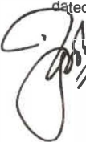
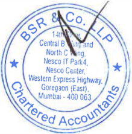
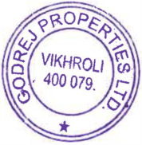
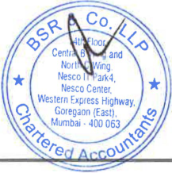
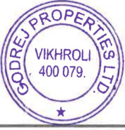
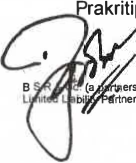
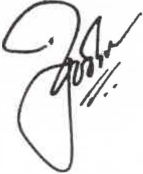
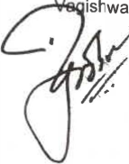
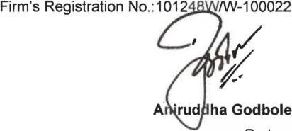
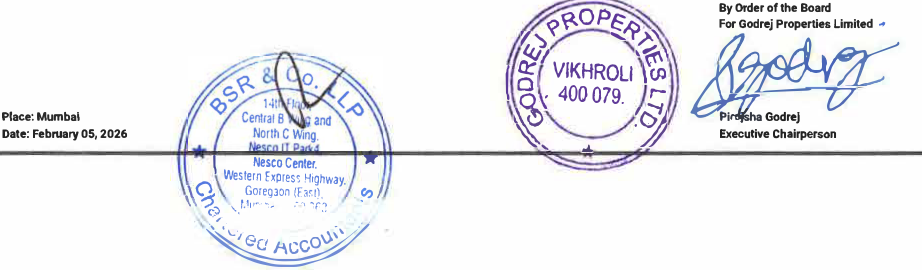

**Godrej Properties Limited Regd. Office:** Godrej One 5th Floor, Pirojshanagar, Eastern Express Highway, Vikhroli (E), Mumbai - 400 079. India Tel.: +91-22-6169-8500 Website: www.godrejproperties.com CIN: L74120MH1985PLC035308 

February 05, 2026 

# **BSE Limited** 

Phiroze Jeejeebhoy Towers, Dalal Street, Mumbai -400 001 

# **National Stock Exchange of India Limited** 

Exchange Plaza, Plot No. C/1, G Block, Bandra Kurla Complex, Bandra (East), Mumbai-400 051 

# **Ref: Godrej Properties Limited** 

BSE- Script Code: 533150, Scrip ID - GODREJPROP 

BSE- Security Code-974950, 974951, 975090, 975091, 975856, 975857, 976000-Debt Segment NSE - GODREJPROP 

# **Sub: Unaudited standalone and consolidated fnancial results fr the quarter and nine months** **<u>ended December 31, 2025.</u>** 

Dear Sir/ Madam, 

Please note that the Board of Directors of the Company, at its meeting held on Thursday, February 05, 2026, has, **_inter alia,_** considered and approved the Unaudited Standalone and Consolidated Financial Results for the quarter and nine months ended December 31, 2025. 

Pursuant to Regulation 30, 33, 51, 52 and other applicable Regulations read with Schedule III of the Securities and Exchange Board of India (Listing Obligations and Disclosure Requirements) Regulations, 2015, please find enclosed the Unaudited Standalone and Consolidated Financial Results for the quarter and nine months ended December 31, 2025, duly reviewed and recommended by the Audit Committee and approved by the Board of Directors along with the Limited Review Report thereon issued by Mis.B S R & Co. LLP, the Statutory Auditors of the Company. 

The meeting of the Board of Directors of the Company commenced at 12:00 noon and the financial results were approved at 12.40 p.m. Thereafter, the Board Meeting continued for consideration of other agenda items. 

Kindly take the aforesaid on record. 

Thank you. 

Yours truly, **For Godrej Properties Limited Ashish Karyekar** �;3}\L **Company Secretary** 

**[Image: Dec2025Result.pdf-0001-17.png (176x176, 51.6KB)]**

## **_Enclosed as above_** 

**[Image: Dec2025Result.pdf-0001-19.png (165x82, 13.8KB)]**

14th Floor, Central B Wing and North C Wing Nesco IT Park 4, Nesco Center Western Express Highway Goregaon (East), Mumbai - 400 063, India Telephone: +91 (22) 6257 1000 Fax: +91 (22) 6257 1010 

**BS R & Co. LLP** Chartered Accountants 

**Limited Review Report on unaudited standalone financial results of Godrej Properties Limited for the quarter ended 31 December 2025 and year to date results for the period from 1 April 2025 to 31 December 2025 pursuant to Regulation 33 and Regulation 52(4) read with Regulation 63 of Securities and Exchange Board of India (Listing Obligations and Disclosure Requirements) Regulations, 2015, as amended, as prescribed in Securities and Exchange Board of India operational circular SEBI/HO/DDHS/P/CIR/2021/613 dated 10 August 2021, as amended** 

## **To the Board of Directors of Godrej Properties Limited** 

1. We have reviewed the accompanying Statement of unaudited standalone financial results of Godrej Properties Limited (hereinafter referred to as "the Company") for the quarter ended 31 December 2025 and year to date results for the period from 1 April 2025 to 31 December 2025 ("the Statement") (in which are included interim financial information from branches in Singapore, Qatar and Dubai). 

2. This Statement, which is the responsibility of the Company's management and approved by its Board of Directors, has been prepared in accordance with the recognition and measurement principles laid down in Indian Accounting Standard 34 _"Interim Financial Reporting'_ ("Ind AS 34"), prescribed under Section 133 of the Companies Act, 2013, and other accounting principles generally accepted in India and in compliance with Regulation 33 and Regulation 52(4) read with Regulation 63 of the Securities and Exchange Board of India (Listing Obligations and Disclosure Requirements) Regulations, 2015, as amended ("Listing Regulations"), as prescribed in Securities and Exchange Board of India operational circular SEBI/HO/DDHS/P/CIR/2021/613 dated 10· August 2021, as amended. Our responsibility is to issue a report on the Statement based on our review. 

3. We conducted our review of the Statement in accordance with the Standard on Review Engagements (SRE) 2410 _"Review of Interim Financial Information Performed by the Independent Auditor of the Entity",_ issued by the Institute of Chartered Accountants of India. A review of interim financial information consists of making inquiries, primarily of persons responsible for financial and accounting matters, and applying analytical and other review procedures. A review is substantially less in scope than an audit conducted in accordance with Standards on Auditing and consequently does not enable us to obtain assurance that we would become aware of all significant matters that might be identified in an audit. Accordingly, we do not express an audit opinion. 

4. Based on our review conducted as above, nothing has come to our attention that causes us to believe that the accompanying Statement, prepared in accordance with the recognition and measurement principles laid down in the aforesaid Indian Accounting Standard and other accounting principles generally accepted in India, has not disclosed the information required to be disclosed in terms of Regulation 33 and Regulation 52(4) read with Regulation 63 of the Listing Regulations, as prescribed in Securities and Exchange Board of India operational circular SEBI/HO/DDHS/P/CIR/2021/613 ted 7,ugust 2021, as amended, including the manner in which it is to be disclosed, or that it f 

**[Image: Dec2025Result.pdf-0002-08.png (107x177, 16.7KB)]**

**Registered Office:** 

**BS R & Co. (a partnership fim, with Registration No. BA61223) converted into BS R & Co. LLP (a Limited Liability Partnership with LLP Registration No. AAB-8181) with effect from October 14, 2013** 

**14th Floor, Central B Wing and North C Wing, Nesco IT Park 4, Nesco Center, Western Express Highway, Goregaon (East), Mumbai - 400063** Page 1 of 2 

**BS R & Co. LLP** 

**Limited Review Report** **_(Continued)_ Godrej Properties Limited** 

contains any material misstatement. 

Mumbai 05 February 2026 

For **B S R** & **Co. LLP** _Chartered Accountants_ **a Godbole** _Partner_ Membership No.: 105149 UDIN:26105149YEVWXF9273 

**[Image: Dec2025Result.pdf-0003-05.png (412x184, 33.7KB)]**

<!-- Start of picture text -->
a Godbole <!-- End of picture text -->

Page 2 of2 

#### **GODREJ PROPERTIES LIMITED** 

**CIN: L74120MH1985PLC035308** 

**PROPERTIES** � I 

||**Regd Office: Godrej One, 5th Floor, Pirojshanagar, Eastern Expres**|**s Highway, Vikhroli {**|**East), Mumbai -**|**400 079. www.go**|**drejproperties.**|**com**||
|---|---|---|---|---|---|---|---|
||**statement o Unaudited standalone Financial Result**|**s for the Quarer and**|**Nine Months En**|**ded December 31**|**, 2025**|||
||||||||**(INR in Crore)**|
|**Sr**|||**Quarter Ended**||**Nine Mon**|**th Ended**|**Year Ended**|
|**.** **No.**|**Pariculars** |**31.12.2025** |**30.09.2025** |**31.12 2024**|**31.12.2025**|**31.12.2024**|**31.03.2025** |
|||**Unaudied**|**Unaudied**|**Unaudited**|**Unaudited**|**Unaudited**|**Auited**|
|**1**|**Income**|||||||
||**Revenue from operations**|**268.48**|**92.26**|**184.99**|**466.81**|**1,037.93**|**1,949.62**|
||**Other income**|**442.42**|**569.51**|**400.42**|**1,483.31**|**1,762.35**|**2,207.76**|
||**Total Income**|**710.90**|**661.77**|**585.41**|**1,950.12**|**2,800.28**|**4,157.38**|
|**2**|**Expnses**|||||||
||**Cost of materials consumed**|**2,641.41**|**1,253.83**|**2,396.01**|**5,809.26**|**4,939.31**|**7,265.02**|
||**Changes in inventories of finishedgoods and construction work-n-progress**|**{2,473.85)**|**(1,216.41)**|**{2,297.26)**|**{5,556.38}**|**{4,314.24)**| **{6,052.07}**|
||**Employee benefits expense**|**84.24**|**113.19**|**69.47**|**292.63**|**214.77**|**283.57**|
||**Finance costs**|**140.36**|**120.08**|**155.41**|**376.97**|**415.76**|**565.42**|
||**Depreciation and amortisation expense**|**18.91**|**16.07**|**8.36**|**47.64**|**25.96**|**37.43**|
||**Other expenses**|**191.45**|**349.67**|**197.51**|**766.81**|**615.30**|**793.19**|
||**Total Expenses**|**602.52**|**636.43**|**529.50**|**1,736.93**|**1,896.86**|**2,892.56**|
|**3**|**Profit before Exceptional Items and Tax**|**108.38**|**25.34**|**55.91**|**213.19**|**903.42**|**1,264.82**|
||**Excptional item(Reier Note 4)**|**16.12**||~~.~~|**16.12**|||
|**4**|**Profit before tax for th period / year**|**92.26**|**25.34**|**55.91**|**197.07**|**903.42**|**1,264.82**|
|**5**|**Tax expense charge **|||||||
||**Current tax**|**41.10**|**{0.98)**|**22.09**|**63.04**|**91.67**|**172.01**|
||**Deferred tax charged/(credit}**|**{9.18}**|**13.22**|**{1.03)**|**4.47**|**79.28**|**81.80**|
|**6**|**Profit afer tax for te prod / year**|**60.34**|**13.10**|**34.85**|**129.56**|**732.47**|**1,011.01**|
|**7**|**other Comprehensive Income for the prio / year**|||||||
||**Items that will not be subsequently reclassifie toprofit or loss**|||||||
||**Remeasurements of the defined benefitplan**|**{1.20}**|**{1.20)**|**{0.37}**|**(3.59}**|**(1.12}**| **(7.62)**|
||**Tax on Above**|**0.30**|**0.30**|**0.09**|**0.90**|**0.28**|**1.92**|
|**8**|**Total Coprehensie Incom for the priod/ year**|**59.44**|**12.20**|**34.57**|**126.87**|**731.63**|**1,005.31**|
|**9**|**Paid-up Equity Share Capital**|**150.60**|**150.60**|**150.59**|**150.60**|**150.59**|**150.59**|
||**Face Value - INR****_Si·_per share**|||||||
|**10**|**Reseres Exclding Revaluation Resere and Debenture Redemption Resere**||||||**17,293.55**|
|**11**|**Net-Woh**|**17,573.94**|**17,512;96**|**17,168.62**|**17,573.94**|**17,168.62**|**17,444.14**|
|**12**|**Earing Per Equity Share (EPS) (Amunt in INR)**|||||||
||**Basic EPS {* not annualized}**|**2.00•**|**0.44***|**1.22***|**4.30***|**26.11***|**35.40**|
||**Diluted EPS {* not annualized)**|**2.00***|**0.43***|**1.22***|**4.30***|**26.11***|**35.39**|
|**13**| **Ke Ratios and Fnancial Indicators(Refer Note 5)**|||||||
||**Debt Equity Ratio (Gross)**|**0.99**|**0.89**|**0.82**|**0.99**|**0.82**|**0.69**|
||**Debt Equity Ratio (Net)**|**0.46**|**0.37**|**0.24**|**0.46**|**0.24**|**0.25**|
||**Debt Service Coverage Ratio (DSCR)**|**0.26**|**0.16**|**0.83**|**0.42**|**1.87**|**1.91**|
||**Interest Service Coverage Ratio {ISCR}**|**0.93**|**0.62**|**0.83**|**0.81**|**1.87**|**1.91**|
||**Current Ratio**|**1.44**|**1.48**|**1.72**|**1.44**|**1.72**|**1.73**|
||**Long Term Debt to Working Capital**|**0.22**|**0.22**|**0.26**|**0.22**|**0.26**|**0.24**|
||**Bad Debts to Account Receivable Ratio**|~~.~~|~~.~~|**o.oo**|~~.~~|**0.00**|**0.00**|
||**Current Liability Ratio**|**0.91**|**0.90**|**0.84**|**0.91**|**0.84**|**0.85**|
||**Total Debts to Total Assets** |**0.32**|**0.30**|**0.33**|**0.32**|**0.33**|**0.27**|
||**Debtors Turover (annualized}**|**6.32**|**1.83**|**3.52**|**2.88**|**5.85**|**7.11**|
||**Inventory Turnover (annualized)**|**0.03**|**0.01**|**0.03**|**0.02**|**0.07**|**0.10**|
||**Operating Margin{%)**|**(63.23%)**| **(440.16%)**|**{94.98%)**|**(179.12%)**| **(37.58%)**| **(15.22%)**|
||**Adjusted EBITDA {%}**|**38.35%**| **24.69%**|**38.39%**|**33.19%**| **49.01%**| **45.97%**|
||**Net Profit Margin(%}**|**8.49%**| **1.98%**|**5.95%**|**6.64%**| **26.16%**| **24.32%**|

**[Image: Dec2025Result.pdf-0004-04.png (219x222, 85.8KB)]**

**[Image: Dec2025Result.pdf-0004-05.png (178x182, 56.1KB)]**

- **PROPERTIES** 

- ,,,,,, I 

- **Notes: 1 The above statement of unaudited standalone financial results which are published in accordance with Regulation 33 and 52(4) of the SEBI (Listing Obligations & Disclosure Requirements) Regulations, 2015, as amended, have been reviewed by the Audit Committee and approved by the Board of Directors at their meeting held on February 05, 2026. The above results have been subjected to "limited review� by the statutory auditors of the Company. The unaudited standalone flnancial results are in accordance with the Indian Accounting Standards (Ind AS) as prescribed under Section 133 of the Companies Act, 2013.** 

**The Company's business activities which are primarily real estate development and related activities falls within a single reportable segment as the management of the Company views the entire business activities as real estate development. Accordingly, there are no additional disclosures to be furnished in accordance with the requirement of Ind AS 108 - Operating Segments with respect to single reportable segment. Further, the operations of the Company are domiciled in India and therefore there are no reportable geographical segments. During the nine months ended December 31, 2025 the Company has granted 26,239 new stock lo eligible employees, 9,538 stock grants lapsed and 21,466 equity shares were aliened upon the exercise of stock grants under the Employee Stock Grant Scheme.** 

- **4 The Government of India has implemented four new Labour Codes ("Codes"), including the Code on Wages, 2019, with effect from November 21, 2025. The Company has assessed and accounted for the incremental impact of these changes as per the guidance provided by the Institute of Chartered Accountants of India, which has resulted in the recognition of incremental employee benefit liability of INR 26 crore and employee benefit expense of INR 16. 12 crore (net of capitalization) charged to the Statement of Unaudited Standalone Financial Results for the quarter and nine months ended 31 December 2025. Considering the materiality, regulatory-driven and an enactment of the new legislation, which is an event of non­ recurring nature, the Company has presented such incremental impact as "Exceptional items" in the statement of Unaudited Standalone Financial Results for the quarter and nine months ended 31 December 2025. The Company continues to monitor the developments pertaining lo Labour Codes and will evaluate impact, if any, on the measurement of liabiltty pertaining to employee benefits.** 

**Formula used for Calculation of Ratio and Financial Indicators are as below: Debt-Equity Ratio (Gross) = (Current Borrowing+ Non-<:urrent Borrowing)/ Shareholder's Equrty (Total Equity) Debt-Equity Ratio (Net)= (Current Borrowing+ Non-<:urrent Borrowing· Cash and Bank Balances• Fixed Deposits• Liquid investments)/ Shareholder's Equity (Total Equity) DSCR= EBITOA / (Finance Cost (excludes interest accounted on customer advance as per EIR Principal)+ Principal Payment due to Non-current Borrowing repayable wrthin one year) ISCR= EBITDA / Finance Cost (excludes interest accounted on customer advance as per EIR PrinclpaQ EBITDA= Profit before Exceptional items and Tax+ Finance cost+ Finance cost included ln Cost of Sales+ Depreciation and amortisation expense Current Ratio = Current Assets/ Current Liabilities Long Term Debt to Working Capital= Non-Current Borrowing/ (Current Assets• Current Liabilrties) Bad Debts to Account Receivable Ratio= Bad Debts /Average Trade Receivables Current Liability Ratio = Current Liabilities/ Total Liabilrties Total Debts to Total Assets = (Current Borrowing+ Non-<:urrent Borrowing)/ Total Assets Debtors Turnover = Revenue from Operations/ Average Trade Receivables Inventory Turnover = (Cost of Materlal Consumed+ Changes in inventories of finished goods and construction work****4** **in-progress) / Average Inventory Operating Margin** (%) **== (Earning before Exceptlonal items, Interest, taxes, depreciation, amortisation expenses, interest included in cost of sales and other income) / Revenue from Operations Adjusted EBITDA (%) =(Earning before Exceptional items, interest. taxes, depreciation, amortisation expenses and interest included in cost of sales)/ Total Income) Net Profit Margin(%)= ProfiV(loss) for the year/ Total Income 6 The statutory auditors of Godrej Properties Limited have expressed an unmodified opinion on the unaudited standalone financial results for the quarter and nine months ended December 31, 2025. By Order of the Board Place: Mumbai Date: February 05, 2026 Executive Chairperson** 

**[Image: Dec2025Result.pdf-0005-04.png (217x218, 87.5KB)]**

**[Image: Dec2025Result.pdf-0005-05.png (177x183, 58.4KB)]**

**[Image: Dec2025Result.pdf-0005-06.png (239x106, 40.2KB)]**

14th Floor, Central B Wing and North C Wing Nesco IT Park 4, Nesco Center Western Express Highway Goregaon (East), Mumbai - 400 063, India Telephone: +91 (22) 6257 1000 Fax: +91 (22) 6257 1010 

**BS R & Co. LLP** Chartered Accountants 

**Limited Review Report on unaudited consolidated financial results of Godrej Properties Limited for the quarter ended 31 December 2025 and year to date results for the period from 1 April 2025 to 31 December 2025 pursuant to Regulation 33 and Regulation 52(4) read with Regulation 63 of Securities and Exchange Board of India (Listing Obligations and Disclosure Requirements) Regulations, 2015, as amended, as prescribed in Securities and Exchange Board of India operational circular SEBI/HO/DDHS/P/CIR/2021/613 dated 10 August 2021, as amended** 

## **To the Board of Directors of Godrej Properties Limited** 

1. We have reviewed the accompanying Statement of unaudited consolidated financial results of Godrej Properties Limited (hereinafter referred to as "the Parent"), and its subsidiaries (the Parent and its subsidiaries together referred to as "the Group") and its share of the net loss after tax and total comprehensive loss of its associate and joint ventures for the quarter ended 31 December 2025 and year to date results for the period from 1 April 2025 to 31 December 2025 ("the Statement"), being submitted by the Parent pursuant to the requirements of Regulation 33 and Regulation 52(4) read with Regulation 63 of the Securities and Exchange Board of India (Listing Obligations and Disclosure Requirements) Regulations, 2015, as amended (''Listing Regulations"), as prescribed in Securities and Exchange Board of India operational circular SEBI/HO/DDHS/P/CIR/2021/613 dated 10 August 2021, as amended. 

2. This Statement, which is the responsibility of the Parent's management and approved by the Parent's Board of Directors, has been prepared in accordance with the recognition and measurement principles laid down in Indian Accounting Standard 34 _"Interim Financial Reporting'_ ("Ind AS 34"), prescribed under Section 133 of the Companies Act, 2013, and other accounting principles generally accepted in India and in compliance with Regulation 33 and Regulation 52(4) read with Regulation 63 of the Listing Regulations, as prescribed in Securities and Exchange Board of India operational circular SEBI/HO/DDHS/P/CIR/2021/613 dated 10 August 2021, as amended. Our responsibility is to express a conclusion on the Statement based on our review. 

3. We conducted our review of the Statement in accordance with the Standard on Review Engagements (SRE) 2410 _"Review of Interim Financial Information Performed by the Independent Auditor of the Entity",_ issued by the Institute of Chartered Accountants of India. A review of interim financial information consists of making inquiries, primarily of persons responsible for financial and accounting matters, and applying analytical and other review procedures. A review is substantially less in scope than an audit conducted in accordance with Standards on Auditing and consequently does not enable us to obtain assurance that we would become aware of all significant matters that might be identified in an audit. Accordingly, we do not express an audit opinion. 

We also performed procedures in accordance with the circular issued by the Securities and Exchange Board of India under Regulation 33(8) of the Listing Regulations, to the extent applicable. 

**4.** The Statement includes the results of the following entities: 

### **Name of the entity** 

Godrej Projects Development Limited 

Godrej Garden City Properties Private Limited Godrej Hillside Properties Private Limited Godrej Home Developers Private Limited Godrej Prakriti Facilities Private Limited 

**[Image: Dec2025Result.pdf-0006-12.png (136x163, 18.0KB)]**

<!-- Start of picture text -->
• • (a (a <!-- End of picture text -->

rakritiplaza Facilities Management Private Limited 

**• • (a (a ership firm with Registration No. BA61223) converted into B S R & Co. LLP (a rtnership with LLP Registration No. AAB-8181) with effect from October 14, 2013** 

### **Relationship** 

Wholly owned subsidiary Wholly owned subsidiary Wholly owned subsidiary Wholly owned subsidiary Wholly owned subsidiary Wholly owned subsidiary 

**Registered Office:** 

**14th Floor. Central B Wng and North C Wng. Nesco IT Part<. 4, Nesco Center, Western Express Highway, Goregaon (East}, Mumbai - 400063** Page 1 of 4 

# **BS R & Co. LLP** 

# **Limited Review Report** **_(Continued)_ Godrej Properties Limited** 

Godrej Highrises Properties Private Limited 

Godrej Genesis Facilities Management Private Limited Citystar lnfraProjects Limited Godrej Highrises Realty LLP Godrej **Skyview** LLP Godrej Green Properties LLP Godrej Projects (Soma) LLP Godrej Athenmark LLP 

Godrej Project Developers & Properties Private Limited (formerly known as Godrej Project Developers & Properties LLP) 

Godrej City Facilities Management LLP 

Godrej Florentine Private Limited (Godrej Florentine LLP) Godrej Olympia LLP 

Ashank Projects Development LLP (formerly known as Ashank Realty Management LLP) 

Godrej Green Woods Private Limited Godrej Realty Private Limited Godrej Buildwell Projects LLP Godrej Living Private Limited Ashank Land & Building Private Limited Ashank Facility Management LLP Godrej Vestamark LLP 

Godrej Real Estate Distribution Company Private Limited Wonder City Buildcon Limited 

Godrej Home Constructions Limited) 

Godrej Skyline Developers Limited (formerly known as Godrej Skyline Developers Private Limited) 

Pearlshine Home Developers Private Limited 

Godrej Highview LLP 

Godrej SSPDL Green Acres Private Limited (formerly known as Godrej SSPDL Green Acres LLP) Godrej Amitis Developers Private Limited (formerly known as Godrej Amitis Developers LLP) 

Embellish Houses Private Limited (formerly known as Embellish Houses LLP) 

Godrej lrismark LLP 

**[Image: Dec2025Result.pdf-0007-17.png (143x174, 17.5KB)]**

Wholly owned subsidiary Wholly owned subsidiary Wholly owned subsidiary Wholly owned subsidiary Wholly owned subsidiary Wholly owned subsidiary Wholly owned subsidiary Wholly owned subsidiary Wholly owned subsidiary 

Wholly owned subsidiary Wholly owned subsidiary Wholly owned subsidiary Wholly owned subsidiary 

Wholly owned subsidiary Wholly owned subsidiary Wholly owned subsidiary Wholly owned subsidiary Wholly owned subsidiary Wholly owned subsidiary Wholly owned subsidiary Wholly owned subsidiary Wholly owned subsidiary 

Wholly owned Subsidiary 

Wholly owned subsidiary (w.e.f. 3 February 2025) 

Wholly owned subsidiary (w.e.f. 31 March 2025) Joint Venture (upto 30 March 2025) 

Subsidiary (w.e.f. 28 March 2025) Joint Venture (upto 27 March 2025) 

Wholly owned subsidiary (w.e.f. 19 June 2025) Joint Venture (upto 18 June 2025) 

Wholly owned subsidiary (w.eJ. 24 September 2025) Joint Venture (upto 23 September 2025) 

Wholly owned subsidiary (w.e.f. 6 December 2025) 

Page 2 of4 

BS R & Co. LLP 

# **Limited Review Report** **_(Continued)_** 

# **Godrej Properties Limited** 

Joint Venture (upto 5 December 2025) 

Godrej Redco Consultancies L.L.C 

Maan-Hinje Township Developers Private Limited (formerly Subsidiary known as Maan-Hinje Town ship Developers LLP) 

Oasis Landmark LLP 

Godrej Residency Private Limited Godrej Reserve LLP Dream World Landmarks LLP Caroa Properties LLP Manjari Housing Projects LLP 

Mahalunge Township Developers Private Limited 

(formerly known as Mahalunge Township Developers LLP) 

Oxford Realty LLP M S Ramaiah Ventures LLP Godrej Macbricks Private Limited Suncity Infrastructure (Mumbai) LLP Godrej Greenview Housing Private Limited Godrej Housing Projects LLP Wonder Projects Development Private Limited AR Landcraft LLP Godrej Real View Developers Private Limited Pearlite Real Properties Private Limited Godrej Odyssey LLP Prakhhyat Dwellings LLP Roseberry Estate LLP Godrej Project North Star LLP Godrej Developers & Properties LLP Manyata Industrial Parks LLP Godrej Redevelopers (Mumbai) Private Limited Universal Metro Properties LLP Godrej Projects North LLP Mosiac Landmarks LLP Yerwada Developers Private Limited 

Wholly owned subsidiary (w.e.f. 28 November 2025) 

Subsidiary Subsidiary Subsidiary Subsidiary Subsidiary 

Subsidiary (w.e.f. 2 June 2025) Joint Venture (upto 1 June 2025) Subsidiary (w.e.f. 31 May 2025) Joint Venture (upto 30 May 2025) 

Joint Venture Joint Venture Joint Venture Joint Venture Joint Venture Joint Venture Joint Venture Joint Venture Joint Venture Joint Venture Joint Venture Joint Venture Joint Venture Joint Venture Joint Venture Joint Venture Joint Venture Joint Venture Joint Venture Joint Venture Joint Venture 

Vivrut Developers Private Limited Madhuvan Enterprises Private Limited Munjal Hospitality Private Limited wari Land Developers Private Limited 

**[Image: Dec2025Result.pdf-0008-17.png (143x182, 19.4KB)]**

<!-- Start of picture text -->
. , <!-- End of picture text -->

Joint Venture (upto 1 July 2025) Joint Venture (upto 24 June 2025) Joint Venture (upto 24 June 2025) Joint Venture (upto 24 June 2025) 

Page 3 of 4 

BS R & Co. **LLP** 

# **Limited Review Report** **_(Continued)_ Godrej Properties Limited** 

Godrej One Premises Management Private Limited 

Associate 

5. Based on our review conducted and procedures performed as stated in paragraph 3 above, nothing has come to our attention that causes us to believe that the accompanying Statement, prepared in accordance with the recognition and measurement principles laid down in the aforesaid Indian Accounting Standard and other accounting principles generally accepted in India, has not disclosed the information required to be disclosed in terms of Regulation 33 and Regulation 52(4) read with Regulation 63 of the Listing Regulations, as prescribed in Securities and Exchange Board of India operational circular SEBI/HO/DDHS/P/CIR/2021/613 dated 10 August 2021,as amended, including the manner in which it is to be disclosed, or that it contains any material misstatement. 

6. The Statement also includes the Group's share of net profit / (loss) after tax of Rs 3.74 crores and Rs (13.53) crores and total comprehensive income / (loss) of Rs 3.74 crores and Rs (13.53) crores, for the quarter ended 31 December 2025 and for the period from 1 April 2025 to 31 December 2025 respectively, as considered in the Statement, in respect of one (1) associate and two (2) joint ventures, based on their interim financial information which have not been reviewed. According to the information and explanations given to us by the management, these interim financial information are not material to the Group. 

Our conclusion is not modified in respect of this matter. 

For **B S R** & **Co. LLP** _Chartered Accountants_ 

### Mumbai 

05 February 2026 

**[Image: Dec2025Result.pdf-0009-10.png (412x185, 34.8KB)]**

_Partner_ 

Membership No.: 105149 UDIN:26105149NONYBV2636 

Page 4 of 4 

||**GODREJ PRO** **CIN: L74120**|**PERTIES LIM** **MH1985PLC035308**|**ITED** |||� I|PROPERTES|
|---|---|---|---|---|---|---|---|
||**Regd Office: Godrej One, 5th Floor, Pirojshanagar, Eastern Express** |**Highway, Vikhrol** |**i (East), Mumbai -** |**400 079. www.g** |**odrejproperties.c** |**om**||
||**Statement of Unaudited Consolidated Financial Resul**|**ts for the Quarer**|**and Nine Months E**|**nded December**|**31, 2025**|||
||||||||**INR I C**|
||||**Quarer Ended**||**Nine Mont**|**h Ended**|**( n roe)** **Year Ended**|
|**Sr. No.**|**Pariculars**|**31.12.2025** |**30.09.2025** |**31.12.2024** |**31.12.2025** |**31.12.2024** |**31.03.2025** |
|||**Unaudited**|**Unaudited**|**Unaudited**|**Unaudited**|**Unaudited**|**Audited**|
|**1**|**Income** **Revenue from operations**|**498.36**|**740.38**|**968.88**|**1,673.30**|**2,801.11**|**4,922.84**|
||**Other income(Refer Note 4)**|**535.48**|**1,209.67**|**271.09**| **2,930.93**| **1,484.88**| **2,044.21**|
|**2**|**Total Income** **Expenses**|**1,033.84**|**1,950.05**|**1,239.97**|**4,604.23**|**4,285.99**|**6,967.05**|
|| **Cost of materials consumed**|**4,212.18** |**3,853.17**|**3,379.15**|**11,609.19**|**7,770.88**|**11,463.47** |
||**Purchases of stock-in-trade**|**2.26**||**1.55**|**2.26**|**17.09**|**19.12**|
||**Changes In inventories of finished goods and construction work-in-progress** **Emloee benefits exense**|**(4,064.81)** **12982**|**(3,208.14)** **16774**|**(2,907.60)** **11395**|**(10,640.65)** **44686**|**(6,207.93)** **32053**| **(8,558.04)** **45087**|
||**py  p** **finance costs**|**.** **31.03**|**.** **21.51**|**.** **42.41**|**.** **85.23**|**.** **127.71**|**.** **173.69**|
||**Depreciation and amortisation expense** **Other expenses**|**31.57** **40165**|**26.35** **44035**|**17.69** **35428**|**79.96** **1194.41**|**52.59** **96614**|**73.66** **150306**|
|| **Total Epeses** |**.** **743.70**|**.** **1,300.98**|**.** **1,001.43**|**,** **2,777.26**|**.** **3,047.01**|**,.** **5,125.83**|
|**3**|**Proft before share of (Loss) of Joint ventures, associate, exceptional items and tax**|**290.14**|**649.07**|**238.54**|**1,826.97**|**1,238.98**|**1,841.22**|
|**4** **s**|**Share of(Loss) of Joint Ventures and Associate(net of tax)** **Profi bfore Exceptinal Items and tax** |**(14.35)** **275.79** |**(83.14)** **565.93**|**(18.28)** **220.26**|**(124.68)** **1,702.29** |**(83.24)** **1,155.74**| **(118.60)** **1,722.62**|
|**6** **7**|**Exceptional items(Refer Note 5)** **Profrt before tax for theperiod /year** **Tax expnse chrge **|**21.08** **254.71**|**565.93**|**220.26**|**21.08** **1,681.21**|~~.~~ **1,155.74**|~~.~~ **1,722.62**|
|| |**360**|||||**2**|
||**Current tax** **Deferred tax** |**7.** **23.24**|**14.08** **148.86**|**31.60** **30.46**|**102.27** **383.68**|**116.05** **28.90**|**13.97** **119.42**|
|**8** |**Profit afer tax for theperiod /year** |**193.87**|**402.99**|**158.20**|**1,195.26**|**1,010.79**|**1,389.23**|
|**9**|**Other Coprehensive In for the po / year** **Items that will not be subsequently reclassified to profit or loss**|||||||
||**Remeasurements of the defined benefit plan** **Tax on Above**|**(1.19)** **030**|**(1.20)** **030**|**(0.37)** **009**|**(3.59)** **086**|**(1.12)** **029**| **(8.58)** **211**|
|**10**| **Total Comprehensive Income for the period/ year (net of tax)** |**.** **192.98**|**.** **402.09**|**.** **157.92**|**.** **1,192.53**|**.** **1,009.96**|**.** **1,382.76**|
|**11**|**Profit(loss) attributable to:** **Equity holders of Parent** |**195.16** |**405.08** |**162.64** |**1,200.36** |**1,017.90** |**1,399.89** |
||**Non-Controlling Interests** |**(1.29)**|**(2.09)**|**(4.44)**|**(5.10)**|**(7.11)**|**(10.66)**|
|**12** |**other Comprehensive Income atributable to:** **Equity holders of Parent** **Non-Controlling Interests** |**(0.89)** **(0.00)**|**(0.90)** **(0.00)**|**(0.28)** **(0.00)**|**(2.73)** **(0.00)**|**(0.83)** **(0.00)**| **(6.47)** **(0.00)**|
|**13**|**Total Comprehensive Income /(Loss) attribuable to:** **Equity holders of Parent** **Non-Controllin Interests**|**194.27** **(129)**|**404.18** **(209)**|**162.36** **(444)**|**1,197.63** **(510)**|**1,017.07** **(711)**|**1,393.42** **(1066)**|
|**14**|**g  ** **Paid-up Equit Share Capital**|**.** **150.60**|**.** **150.60**|**.** **150.59**|**.** **150.60**|**.** **150.59**|**.** **150.59**|
|**15**|**Face Value - INR 5/- per share** **Resees Excluding Revaluation Resere and Debeture Redemption Reseie**||||||**17,161.87**|
|**16** **17**| **Net-Worh** **Earning Per Equit Share(EPS) (Amount in INR)**|**18,506.57**|**18,311.06**|**16,934.26**|**18,506.57**|**16,934.26**| **17,312.46**|
||**Basic EPS (* not annualized)**|**6.48***|**13.45***|**5.70***|**39.85***|**36.29***|**49.02**|
|**18**|**Diluted EPS (* not annualized)** **Key Ratios and Financial Indicators(Refer Note 7)**|**6.48***|**13.45***|**5.70***|**39.85***|**36.28***|**49.01**|
||**Debt Equity Ratio(Gross)**|**0.97**|**0.88**|**0.88**|**0.97**|**0.88**|**0.73**|
||**Debt Equity Ratio (Net)** |**0.37** |**0.30** |**0.23** |**0.37** |**0.23** |**0.19** |
||**Debt Service Coverage Ratio(DSCR)**|**0.33**|**0.59**|**0.96**|**1.14**|**1.82**|**1.92**|
||**Interest service Coverage Ratio(ISCR)** **Current Ratio**|**1.15** **1.31**|**1.95** **1.33**|**0.96** **1.52**|**2.06** **1.31**|**1.82** **1.52**|**1.92** **1.51**|
||**Long Term Debt to Working Capital** |**0.19**|**0.20**|**0.24** |**0.19**|**0.24** |**0.23** |
||**Bad Debts to Account Receivable Ratio** **Cunent Liability Ratio**|~~.~~ **0.93**|~~.~~ **0.93**|**0.00** **0.89**|~~.~~ **0.93**|**0.00** **0.89**|**0.00** **0.89**|
||**Total Debts to Total Assets** |**0.23** |**0.22** |**0.28** |**0.23** |**0.28** |**0.23** |
||**Debtors Turnover(annualized)** **Invetor Turnover(annualized)**|**4.50** **0.01**|**6.77** **0.06**|**9.90** **0.07**|**4.79** **0.03**|**9.99** **0.08**| **11.13** **0.11**|
||**Operating Margin(%)**|**(34.19%)**|**(67.12%)**|**5.76%**| **(53.81%)**|**3.14%**| **4.85%**|
||**Adtd EBITDA%** |**3440%**|**3372%**|**2526%**|  **4254%**|**3544%**| **3160%**|
||**juse()** **Net Profit Margin(%)** ~~.~~ �**1:� ** |**.** **19.02%**|**.** **21.59%**|**.** **12.95%**|   **.** **26.68%**|**.** **24.05%**|   **.** **20.29%**|
|| .'._<_ **�** **14Ih'· ** <||||**_OP_**|**_'_**||
||**<**    < **Cenlral 8 v** **and** **Norlh C** ||||**_<�_** ' | � ||
|| **Wing.**    **Nesco iT P14**||||    |    | |
||I   * **ar** **Nesco Cenler '***||||VIKHR |OLI  | |
||     **(** **Weslern Ex** **press Highway .** **Goregaon (East)** **�**   |||| T·400 01|) 9 •_s_| |
||   **.**   **.**   i**Mumbai •**_400_**063** **�** **� ** **\** **'**|||||.||
|| **.** **(** **�**   _rer_Acco-,||||* --| -||

**[Image: Dec2025Result.pdf-0010-01.png (105x20, 4.2KB)]**

#### **PROPERTIES** ,.,,,,,,, I 

**Notes: 1** The above statement of unaudited consolidated financial results which are published in accordance with Regulation 33 and 52(4) of the SEBI (Listing Obligations & Disclosure Requirements) Regulations, 2015, as amended, have been reviewed by the Audit Committee and approved by the Board of Directors at their meeting held on February 05, 2026. The above unaudited consolidated financial results have been subjected to "limited review" by the statutory auditors of the Group. The unaudited consolidated financial results are in accordance with the Indian Accounting Standards( Ind AS) as prescribed under Section 133 of the Companies Act, 2013. 

- 2 Financial Results of Godrej Properties limited (standalone lnfomnation): 

|2 Financial Results of GodrejProperties limited(standalone lnfomnation):||||||**(INR In Crore)**|
|---|---|---|---|---|---|---|
|**Pariculars**||**Quarer Ended**||**Nine Mont**|**h Ended**|**Year Ended**|
||**31.12.2025**|**30.09.2025**|**31.12.2024**|**31.12.2025**|**31.12.2024**|**31.03.2025**|
||**Unaudited**|**Unaudited**|**Unaudited**|**Unaudited**|**Unaudited**|**Audited**|
|Total Income*|710.90|661.77|585.41|1,950.12|2,800.28|4,157.38|
|Profrt before tax for the period / year|92.26|25.34|55.91|197.07|903.42|1,264.82|
|Profit after tax for the period/ year|60.34|13.10|34.85|129.56|732.47|1,011.01|

* Includes Revenue from operations and Other Income. 

|3|Unaudited Consolidated Segment wise Revenue, Results, Assets and|Liabilities for quarter and nine mon|ths December 31,|2025||||
|---|---|---|---|---|---|---|---|
||||Quarer Ended||**Nine Mon**|**th Ended**|**Year Ended**|
|**Sr.N.**| **Pariculars**|31.12.2025|30.09.2025|**31.12.2024**|**31.12.2025**|**31.12.2024**|**31.03.2025**|
|||**Unaudited**|**Unaudited**|**Unaudited**|**Unaudited**|**Unaudited**|**Audited**|
|1)|**Semnt Reveue**|||||||
||Real Estate|466.34|714.32|938.56|1,587.62|2,725.75|4,815.55|
||Hospitality|32.02|26.06|30.32|85.68|75.36|107.29|
||Total Segment Revenue|**498.36**|**740.38**|**968.88**|**1,673.30**|**2,801.11**|**4,922.84**|
||**Nt Incm fro Operations**|**498.36**|**740.38**|**968.88**|**1,673.30**|**2,801.11**|**4,922.84**|
|**2)**|**Segmnt Results (Proft before tax)**|||||||
||Real Estate |248.65|563.32|216.02|1,667.54|1,147.11|1,707.21|
||Hospitali|6.06|2.61|4.24|13.67|8.63|15.41|
|| **Total Results**|**254.71**|**565.93**|**220.26**|**1,681.21**|**1,155.74**|**1,722.62**|
|**3)**|**Segment Assets**|||||||
|a|Real Estat e|77,211.12|71,391.65|51,690.95|77,211.12|51,690.95|54,701.34|
|b|Hospitality|778.30|773.12|758.52|778.30|758.52|764.18|
||**Total Assets**|**77,989.42**|**72,164.77**|**52,449.47**|**77,989.42**|**52,449.47**|**55,465.52**|
|**4)**|**Segment Uabilities**|||||||
|a|Real Estate|58,465.01|52,834.04|34,497.50|58,465.01|34,497.50|37,138.12|
|b|Hospitality|755.22|756.13|753.23|755.22|753.23|753.67|
||**Total Liabilities**|**59,220.23**|**53,590.17**|**35,250.73**|**59,220.23**|**35,250.73**|**37,891.79**|

- 4 During the quarter ended December 31, 2025, the Group has acquired control of one of itsj oint ventures. Consequently, fair value gain upon re-measurement of Group's existing investments have been recorded under the head other income. 

- 5 The Government of India has Implemented four new Labour Codes ("Codes"), including the Code on Wages, 2019, with effect from November 21, 2025. The Group has assessed and accounted for the incremental impact of these changes as per the guidance provided by the Institute of Chartered Accountants of India, which have resulted in the recognition of an incremental employee benefit liability of INR 34.50 crore and employee benefit expense of INR 21.08 crore (net of capitalization) charged to the Statement of Unaudited Consolidated Financial Results for the quarter and nine months ended 31 December 2025. Considering the materiality, regulatory-driven and an enactment of the new legislation, which is an event of non­ recurring nature, the Group has presented such incremental impact as "Exceptional items" in the Statement of Unaudited Consolidated Financial Results for the quarter and nine months ended 31 December 2025. The Group continues to monitor the developments pertaining to Labour Codes and will evaluate impact, if any, on the measurement of liability pertaining to employee benefits. 

- 6 During the nine months ended December 31, 2025 the Holding Company has granted 26,239 new stock to eligible employees, 9,538 stock grants lapsed and 21,466 equity shares were allotted upon the exercise of stock grants under the Employee Stock Grant Scheme. 

- 7 Formula used for Calculation of Ratio and Financial Indicators are as below : 

   - Debt-Equity Ratio (Gross)= (Current Borrowing+ Non-current Borrowing)/ Shareholde�s Equity (Total Equity) 

   - Debt-Equity Ratio (Net) = (Current Borrowing + Non-current Borrowing - Cash and Bank Balances - Fixed Deposits• liquid Investments)/ Shareholder's Equity (Total Equity) (excludes non controlling interest) 

   - DSCR= EBITDA /( Finance Cost( excludes interest accounted on customer advance as per EIR Principal)+ Principal Payment due to Non-Current Borrowing repayable within one year) ISCR= EBITDA / Finance Cost (excludes interest accounted on customer advance as per EIR Principal) 

EBITDA= Profit/(loss) before Exceptional items and tax+ Finance cost+ Finance cost included in Cost of Sales+ Depreciation and amortisation expense Current Ratio= Current Assets/ Current Liabilities 

Long Term Debt to Working Capital= Non-Current Borrowing _I_ (Current Assets- Current Liabilities) Bad Debts to Account Receivable Ratio= Bad Debts / Average Trade Receivables Current Liability Ratio= Current Liabilities/ Total Liabilities 

Total Debts to Total Assets =( Current Borrowing+ Non-current Borrowing)/ Total Assets 

Debtors Turnover= Revenue from Operations/ Average Trade Receivables 

Inventory Turnover= { Cost of Material Consumed+ Chang es in inventories of finished goods and construction work-in-progress) / Average Inventory Operating Margin (%) = (Earning before share of Profit / (loss) in joint ventures, exceptional items, interest, taxes, depreciation and amortisation expenses, interest included in cost of sales and other Income) / Revenue from Operations 

Adjusted EBITDA (%) = (Earning before exceptional iteams, interest, taxes, depreciation and amortisation expenses and interest included in cost of sales)/ (Total Income+ Share of (loss) of Joint Ventures and Associate (net of tax)) 

Net Profit Margin( %)= ProfiV( loss) for the year/ (Total Income+ Share of (loss) of Joint Ventures and Associate (net of tax) ) 

- 8 The statutory auditors of Godrej Properties Limited have expressed an unmodified opinion on the unaudited consolidated financial results for theq uarter and nine months ended December 31, 2025. 

**[Image: Dec2025Result.pdf-0011-21.png (922x270, 151.2KB)]**

<!-- Start of picture text -->
By Order of the Board <?�OP�ly  For Godre j  Properties Limited  .., - " I  g VIKHROU �  t  f  __,, // QV 400 079.  r-- ( Place: Mumbai  n7  Pimjsha Godrej  ./ Date: FebNary 05, 2026  Executive Chairperson \�\ �.  .' <:j-:--1 ... I  Nesco Center.  "'" \\ \() 1� ")  ,_t.GoregJon (Eas1),  l w·---:,.  ,-.'17f.'.":  � / � �  f�·� Weslern Express Highway. <!-- End of picture text -->

---

## Extracted Images

| # | File | Dimensions | Size |
|---|------|------------|------|
| 1 | Dec2025Result.pdf-0001-17.png | 176x176 | 51.6KB |
| 2 | Dec2025Result.pdf-0001-19.png | 165x82 | 13.8KB |
| 3 | Dec2025Result.pdf-0002-08.png | 107x177 | 16.7KB |
| 4 | Dec2025Result.pdf-0003-05.png | 412x184 | 33.7KB |
| 5 | Dec2025Result.pdf-0004-04.png | 219x222 | 85.8KB |
| 6 | Dec2025Result.pdf-0004-05.png | 178x182 | 56.1KB |
| 7 | Dec2025Result.pdf-0005-04.png | 217x218 | 87.5KB |
| 8 | Dec2025Result.pdf-0005-05.png | 177x183 | 58.4KB |
| 9 | Dec2025Result.pdf-0005-06.png | 239x106 | 40.2KB |
| 10 | Dec2025Result.pdf-0006-12.png | 136x163 | 18.0KB |
| 11 | Dec2025Result.pdf-0007-17.png | 143x174 | 17.5KB |
| 12 | Dec2025Result.pdf-0008-17.png | 143x182 | 19.4KB |
| 13 | Dec2025Result.pdf-0009-10.png | 412x185 | 34.8KB |
| 14 | Dec2025Result.pdf-0010-01.png | 105x20 | 4.2KB |
| 15 | Dec2025Result.pdf-0011-21.png | 922x270 | 151.2KB |
