**Godrej Properties Ltd.** Godrej One, 5th Floor, Piroj shanagar, Eastern Express Highway, Vikhroli (E), Mumbai - 400 079, India Tel.: +91-22-6169-8500 Fax:+91-22-6169-8888 Website: <u>www.godrejproperties.com</u> 

CIN: L74120MH1985PLC035308 

May 04, 2026 

#### **BSE Limited** 

Phiroze Jeejeebhoy Towers, Dalal Street, Mumbai - 400 001 

#### **National Stock Exchange of India Limited** 

Exchange Plaza, Plot No. C/1, G Block, Bandra Kurla Complex, Bandra (East), Mumbai - 400 051 

#### **Ref: Godrej Properties Limited** 

BSE - Script Code: 533150, Scrip ID - GODREJPROP 

BSE - Security Code- 974950, 974951, 975090, 975091, 975856, 975857, 976000 - Debt Segment NSE - GODREJPROP 

**Sub: Audited standalone and consolidated fnancial results fr the quarter and fnancial year** **<u>ended March 31, 2026.</u>** 

Dear Sir/ Madam, 

Please note that the Board of Directors of the Company, at its meeting held on Monday, May 04, 2026, has, _inter alia,_ approved the audited standalone and consolidated financial results for the quarter and financial year ended March 31, 2026 and audited standalone and consolidated financial statements for the financial year ended March 31, 2026. 

Pursuant to Regulation 30, 33, 51, 52 and other applicable Regulations read with Schedule III of the Securities and Exchange Board of India (Listing Obligations and Disclosure Requirements) Regulations, 2015, please find enclosed the audited standalone and consolidated financial results for the quarter and financial year ended March 31; 2026, duly reviewed and recommended by the Audit Committee and approved by the Board of Directors along with the Statutory Auditor's Report. 

In compliance with Regulation 33(3)(d) of the Securities and Exchange Board of India (Listing Obligations and Disclosure Requirements) Regulations, 2015, we hereby declare that the Company's Statutory Auditors _Mis._ B S R & Co LLP ., have issued audit reports on the standalone and consolidated financial results for the fmancial year ended March 31, 2026, with an unmodified opinion. 

# **GODREJ** �-■ **•1 PROPERTIES** 

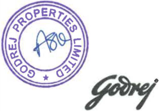

**[Image: Mar2026RResult.pdf-0001-16.png (314x219, 72.5KB)]**

12:15 

BS R & Co. LLP 

Chartered Accountants 

14th Floor, Central B Wing and North C Wing Nesco IT Park 4, Nesco Center Western Express Highway Goregaon (East), Mumbai - 400 063, India Telephone: +91 (22) 6257 1000 Fax: +91 (22) 6257 1010 

## Independent Auditor's Report 

##### **To the Board of Directors of Godrej Properties Limited** 

##### **Report on the audit of the Standalone Annual Financial Results** 

###### **Opinion** 

We have audited the accompanying standalone annual financial results of Godrej Properties Limited (hereinafter referred to as the "Company") for the year ended 31 March 2026, attached herewith, (in which are included financial information from branches in Singapore, Qatar and Dubai), being submitted by the Company pursuant to the requirement of Regulation 33 and Regulation 52(4) read with Regulation 63 of the Securities and Exchange Board of India (Listing Obligations and Disclosure Requirements) Regulations, 2015, as amended ("Listing Regulations"), as prescribed in Securities and Exchange Board of India operational circular SEBI/HO/DDHS/P/CIR/2021/613 dated 10 August 2021. 

In our opinion and to the best of our information and according to the explanations given to us, the aforesaid standalone annual financial results: 

- a. are presented in accordance with the requirements of Regulation 33 and Regulation 52(4) read with Regulation 63 of the Listing Regulations, as prescribed in Securities and Exchange Board of India operational circular SEBI/HO/DDHS/P/CIR/2021/613 dated 10 August 2021 in this regard; and 

- b. give a true and fair view in conformity with the recognition and measurement principles laid down in the applicable Indian Accounting Standards, and other accounting principles generally accepted in India, of the net profit and other comprehensive loss and other financial information for the year ended 31 March 2026. 

###### **Basis for Opinion** 

We conducted our audit in accordance with the Standards on Auditing ("SAs") specified under section 143(10) of the Companies Act, 2013 ("the Act"). Our responsibilities under those SAs are further described in the _Auditor's Responsibilities for the Audit of the Standalone Annual Financial Results_ section of our report. We are independent of the Company, in accordance with the Code of Ethics issued by the Institute of Chartered Accountants of India together with the ethical requirements that are relevant to our audit of the financial statements under the provisions of the Act, and the Rules thereunder, and we have fulfilled our other ethical responsibilities in accordance with these requirements and the Code of Ethics. We believe that the audit evidence obtained by us, is sufficient and appropriate to provide a basis for our opinion on the standalone annual financial results. 

###### **Emphasis of Matter** 

- a. We draw attention to Note 5 to the standalone financial results which states that the managerial remuneration paid/payable by the Company in relation to its Executive Chairperson is in excess of the limits laid down under Section 197 of the Companies Act, 2013, read with schedule V to the Act by Rs 21 .57 crores. Further, the remuneration paid/payable by way of commission to the non executive directors for the current year as per the limits laid down under Section 197 of the Companies Act, 2013, read with schedule V to the Act is Rs 2.00 crores. In accordance with the provisions of the Act, read with schedule V of the Act, the excess remuneration to the Executive Chairperson and remuneration to non executive directors is subject to shareholders' approval, which the Company proposes to seek at the forthcoming Annual General Meeting. 

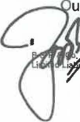

**[Image: Mar2026RResult.pdf-0003-15.png (102x155, 14.0KB)]**

<!-- Start of picture text -->
a ~nersh <!-- End of picture text -->

ur opinion is not modified in respect of this matter. 

a ~nersh ip firm with Registration No. BA61223) converted Into BS R & Co. LLP (a ~artner1hip with LLP Reg istration No. AAB-81B1 ) with effe ct from October 14, 201 3 

Registered Office: 

14th Floor, Central B Wing and North C Wing, Nescc IT Park 4, Nescc Center, Western Express Highway, Gcregaon (East), Mumbai . 400063 Page 1 of 3 

**BS R** & Co. LLP 

**Independent Auditor's Report** **_(Continued)_ Godrej Properties Limited** 

**Management's and Board of** Directors' **Responsibilities for** the Standalone Annual Financial **Results** 

These standalone annual financial results have been prepared on the basis of the standalone annual financial statements. 

The Company's Management and the Board of Directors are responsible for the preparation and presentation of these standalone annual financial results that give a true and fair view of the net profit/ loss and other comprehensive income and other financial information in accordance with the recognition and measurement principles laid down in Indian Accounting Standards prescribed under Section 133 of the Act and other accounting principles generally accepted in India and in compliance with Regulation 33 and Regulation 52(4) read with Regulation 63 of the Listing Regulations, as prescribed in Securities and Exchange Board of India operational circular SEBI/HO/DDHS/P/CIR/2021/613 dated 10 August 2021. This responsibility also includes maintenance of adequate accounting records in accordance with the provisions of the Act for safeguarding of the assets of the Company and for preventing and detecting frauds and other irregularities; selection and application of appropriate accounting policies; making judgments and estimates that are reasonable and prudent; and the design, implementation and maintenance of adequate internal financial controls, that were operating effectively for ensuring accuracy and completeness of the accounting records, relevant to the preparation and presentation of the standalone annual financial results that give a true and fair view and are free from material misstatement, whether due to fraud or error. 

In preparing the standalone annual financial results, the Management and the Board of Directors are responsible for assessing the Company's ability to continue as a going concern, disclosing, as applicable, matters related to going concern and using the going concern basis of accounting unless the Board of Directors either intends to liquidate the Company or to cease operations, or has no realistic alternative but to do so. 

The Board of Directors are responsible for overseeing the Company's financial reporting process. 

###### **Auditor's Responsibilities for the Audit of the Standalone Annual Financial Results** 

Our objectives are to obtain reasonable assurance about whether the standalone annual financial results as a whole are free from material misstatement, whether due to fraud or error, and to issue an auditor's report that includes our opinion. Reasonable assurance is a high level of assurance, but is not a guarantee that an audit conducted in accordance with SAs will always detect a material misstatement when it exists. Misstatements can arise from fraud or error and are considered material if, individually or in the aggregate, they could reasonably be expected to influence the economic decisions of users taken on the basis of these standalone annual financial results. 

As part of an audit in accordance with SAs, we exercise professional judgment and maintain professional skepticism throughout the audit. We also: 

- Identify and assess the risks of material misstatement of the standalone annual financial results, whether due to fraud or error, design and perform audit procedures responsive to those risks, and obtain audit evidence that is sufficient and appropriate to provide a basis for our opinion. The risk of not detecting a material misstatement resulting from fraud is higher than for one resulting from error, as fraud may involve collusion, forgery, intentional omissions, misrepresentations, or the override of internal control. 

- Obtain an understanding of internal control relevant to the audit in order to design audit procedures that are appropriate in the circumstances. Under Section 143(3) (i) of the Act, we are also responsible for expressing our opinion through a separate report on the complete set of financial statements on whether the company has adequate internal financial controls with reference to financial statements in place and the operating effectiveness of such controls. 

- Evaluate the appropriateness of accounting policies used and the reasonableness of accounting estimates and related disclosures in the standalone annual financial results made by the Management and Board of Directors. 

- Conclude on the appropriateness of the Management's and Board of Directors' use of the going basis of accounting and, based on the audit evidence obtained, whether a material Page 2 of 3 

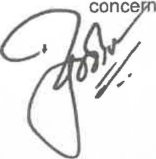

**[Image: Mar2026RResult.pdf-0004-14.png (156x159, 16.3KB)]**

**[Image: Mar2026RResult.pdf-0004-15.png (157x9, 1.1KB)]**

BS R & Co. **LLP** 

#### **Independent Auditor's Report** **_(Continued)_ Godrej Properties Limited** 

uncertainty exists related to events or conditions that may cast significant doubt on the appropriateness of this assumption. If we conclude that a material uncertainty exists, we are required to draw attention in our auditor's report to the related disclosures in the standalone annual financial results or, if such disclosures are inadequate, to modify our opinion. Our conclusions are based on the audit evidence obtained up to the date of our auditor's report. However, future events or conditions may cause the Company to cease to continue as a going concern. 

- Evaluate the overall presentation, structure and content of the standalone annual financial results, including the disclosures, and whether the standalone annual financial results represent the underlying transactions and events in a manner that achieves fair presentation. 

We communicate with those charged with governance regarding, among other matters, the planned scope and timing of the audit and significant audit findings, including any significant deficiencies in internal control that we identify during our audit. 

We also provide those charged with governance with a statement that we have complied with relevant ethical requirements regarding independence, and to communicate with them all relationships and other matters that may reasonably be thought to bear on our independence, and where applicable, related safeguards. 

###### **Other Matter** 

- a. The standalone annual financial results include the results for the quarter ended 31 March 2026 being the balancing figure between the audited figures in respect of the full financial year and the published unaudited year to date figures up to the third quarter of the current financial year which were subject to limited review by us. 

**[Image: Mar2026RResult.pdf-0005-08.png (205x17, 3.8KB)]**

<!-- Start of picture text -->
For  B S R  &  Co. LLP <!-- End of picture text -->

_Chartered Accountants_ 

**[Image: Mar2026RResult.pdf-0005-10.png (412x189, 34.4KB)]**

Mumbai 

04 May 2026 

Membership No.: 105149 UDIN:26105149HCQIPZ6871 

Page 3 of 3 

**[Image: Mar2026RResult.pdf-0006-00.png (77x38, 2.8KB)]**

|••■**GODREJ** • **PROPERTIES** **GODREJPROPER** |**TIESLIMITED** |||||
|---|---|---|---|---|---|
|   CIN:L74120MH19 RegdOffice: GodrejOne,5th Floor, Pirojshanagar, Eastern Express**High**|5PLC035308 **way,**Vikhroli {East), M|umbai - 400 07|9.www.godreJpr|operties.com||
|**Statement ofAuditedStandalone Financial Results f**|**ortheQuarterandY **|**earEndedMarch**|**31, 2026**|||
||||||**{INR**In**Crore)** |
|||**QuarterEnded**||**YearEnded**|**YearEnded**|
|**Sr. **Particulars **No.**|**~~31 .03.2026~~**|**~~31.12.2025~~**|**~~31.03.2025~~** |**~~31.03.2026~~**|**~~31.03.2025~~**|
||**Audited** **!Refer Note 81**|**Unaudited**|**Audited** **<Refer Note 81 **|**Audited**|**Audited**|
|**1** Income||||||
|Revenue from opera1ions|928.35|26B.48|911.69|1,395.16|1,949.62|
|Other income|507.96|442.42|445.41|1,991.27|2,207.76|
|**Total Income**|**1,436.31**|**710.90**|**1,357.10**|**3,386.0**|**4,157.38**|
|**2** **Expenses**||||||
|Costofmaterials consumed|5,896.48|2,641.41|2,325.71|11,705.74|7,265.02|
|Changesininventoriesoffinished goodsandconstruction work-in-progress|(5,376.46)|(2,473.85)|(1,737.83)|(10,932.84)| (6,052.07)|
|Employee benefits expense|86.01|84.24|68.80|378.64|283.57|
|Finance costs|165.28|140.36|**149.66**|542.25|565.42|
|Depreciation and amortisation expense|21.93|18.91|11.47|69.57|37.43|
|Other expenses|349.01|191.45|177.89|1,115.81|793.19|
|**TotalExpenses**|**1,142.25**|**602.52**|**995.70**|**2,879.17**|**2,892.56**|
|**3** Profitbefore Exceptional**Itemsand**Tax|**294.06**|**108.38**|**361 ,40**|**507.26**|**1,264.82**|
|Exceotional item(Refer Note 41|1.98|16.12||1B.10|~~.~~|
|**4** **Profit before tax for theperiod/y ..r **|**292.08**|**92.26**|**361 .40**|**489.16**|**1,264.82**|
|**5** **Tax expense charge**||||||
|Current tax|118.90|41.10|80.33|181.94|172.01|
|Deferred tax (credit)/charge|(46.00)|(9.18)|2.53|(41.53)| 81.80|
|**6** **Profit aftertaxfor theperiod**/**year**|**219.20**|**60.34**|**278.54**|**348.75**|**1,011.01**|
|7 **Other Comprehensive Income for theperiod**/**year**||||||
|**Items that willnotbesubsequently reclassified to profitorloss**||||||
|Remeasurementsofthe defined benefitplan|(1.51)|(1.20)|(6.50)|(5.11)|(7.62)|
|Tax on Above|0.38|0.30|1.63|1.29|1.92|
|**8** **Total Comprehensive Income for theperiod/year**|**218.07**|**59.44**|**273.67**|**344.93**|**1,005.31**|
|**9** **Paid-up Equity Share Capltal**|**150.60**|**150.60**|**150.59**|**150.60**|**150.59**|
|Face Value - INR5/·per share||||||
|**10** **Reserves**ExcludingRevaluation**Reserve**and Debenture Redemption**Reserve**||||17,642.53|17,293.55|
|11 Net-Worth|17,793.13|17,573.94|17,444.14|17,793.13|17,444.14|
|12 EarningPer EquityShare(EPS) (Amount in INR)||||||
|BasicEPS(•not annualized)|**7.28***|**2.00-**|**9.25***|**11.58**|**35.40**|
|DilutedEPS(•not annualized)|**7.28***|**2.00•**|**9.25***|**11.58**|**35.39**|
|13**Key RatloaandFinancial Indicators(Refer Note 7)**||||||
|Debt EquityRatio(Gross)|**0.84**|**0.99**|**0.69**|**0.84**|**0.69**|
|Debt EquityRatio(Net)|**0.45**|**0.46**|**0.25**|**0.45**|**0.25**|
|Debt Service Coverage Ratio(DSCR)|**0.24**|**0.26**|**2.03**|**0.40**|**1.91**|
|Interest Service Coverage Ratio(ISCR)|**1.65**|**0.93**|**2.03**|**1.04**|**1.91**|
|Current Ratio|**1.39**|**1.44**|**1.73**|**1.39**|**1.73**|
|LongTerm Debt to WorkingCapital|**0.16**|**0.22**|**0.24**|**0.16**|**0.24**|
|Bad DebtstoAccount Receivable Ratio||~~.~~||~~.~~|**0.00**|
|Current LiabilityRatio|**0.93**|**0.91**|**0.85**|**0.93**|**0.85**|
|Total Debts to Total Assets|**0.27**|**0.32**|**0.27**|**0.27**|**0.27**|
|Debtors Turnover(annualized)|**30.06**|**6.32**|**14.83**|**7.29**|**7.11**|
|InventoryTurnover(annualized)|**0.09**|**0.03**|**0.16**|**0.04**|**0.10**|
|OperatingMargin(%)|**(1.72'llo)**|**(63.23'.\\)**|**10.24'.\\**|**(61.07'.\\)**|**(15.22%)**|
|AdjustedEBITDA(%)|**34.26'.\\**|**38.35'llo**|**39.70'.\\**|**33.64'llo**|**45.97%**|
|Net Profit Margin(%)|**15.26'.\\**|**8.49'llo**|**20.52'.\\**|**10.30'llo**|**24.32%**|

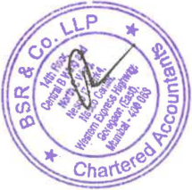

**[Image: Mar2026RResult.pdf-0006-02.png (215x213, 82.4KB)]**

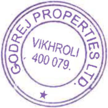

**[Image: Mar2026RResult.pdf-0006-03.png (178x178, 52.5KB)]**

|•• ■GODREJ PROPERTIES||~|
|---|---|---|
|Audtted Standalone Statement ofAssets&LlablitlesasatMarch 31, 2026|||
|||**IINR**I CJ|
|Ptil|Aaat 31032026|n rore **Asat** 31032025|
|_::._arcuars|.. **Audited**|.. **Audited**|
|**A** **ASSETS** |||
|Non-current**As****~~..~~ts** **a** Propeny,Plant and EoulDment   |502.53 |313.29 |
|**b** Rioht-of-Use Asset |229.15 |72.52 |
|c Capital Work~rtt'rooress d InvestmentProoertv|104.64 150.51|93.53 135.44|
|**e** Other lntancible assets|11.61|13.82|
|f lntanoibleAssets under Develooment a Financial Assets||0.59|
| InvestmentsinSubsidiaries, JointVentures and Associate|1,498.71 |1,442.49 |
|Other Investments|2,214.24|2,014.11|
|Loans Other Non-Current Financial Assets|912.89 588.65|732.44 178.52|
|h Deferred Tax Assets /Nell|34.54||
|    h Income Tax Assets(Net)| 162.22|94.17|
|Other Non-Current Non Financial Assets|9.43|18.91|
|Total Non-Current **Assets**|**6419.12**|**5,109.83**|
|**2** **CurrentAssets**|||
|   |2625321|1531268|
|a Inventories b Financial Assets|,.|,.|
|Investments|2,659.88|3,453.68|
|Trade Receivables|98.83|283.89|
|Cash andCashEoulvalents |942.74 |821.60 |
|Bank Balances Other than Above|2,876.15|3,238.38|
|Loans |11,850.62 |9,842.38 |
|Other Current Flnancial Assets c Other Current Non Financial Assets|2,507.23 2820.72|2,284.08 3,597.07|
|   **Total current Assets**|, **SO009.38**| **38,833.76**|
|**Total Assets**|**56,428.50**|**43,943.59**|
|**B** **EQUITYANDLIABILITIES**|||
|**EQUITY**|||
|**a** Eoull\'Share Capttal   |150.60 |150.59 |
|**b** Other Eaultv|17,642.53|17,293.55|
|**TotalEcuilY**   |**17,793.13**|**17,444.14**|
|**2** **LIABILITIES** **2.1Non-currentLlabllttles**|||
| Financial Liabilities Borrowinr::is|2250.00|4,000.00|
| |,  21187| 6390|
|LeaseLiabilities|.|. |
|OtherNon·Current Financial Liabilities|15.70|7.85|
|b Provisions |56.00|25.27 |
|**c** **Deferred Tax **Liabilities **(Net]**||8.28|
|**Total Non-Curnnt Uabllltles** |**2,533.57**|**4,105.30**|
|**2.2 Current Uabllnles** a Financial Liabilities|||
|   Borrowincs|12,717.40|7,968.09|
|LeaseLiabiltiies Trade Pavables|32.11|10.56|
|total outstanding duesofmicro enterprises and smell enterorises|303.35|110.33|
| ttl ttdi dfdit th th i tidll ti|175935|129693|
|oa ousannc uesocreors oer an mcro enercrsesansma enerprses OtherCurrentFinancial Liabilities|,. 1,002.41|,. 814.96|
|b OtherCurrentNon Financial Liabifittes|20,210.91 |12,122.97 |
|c Provisions **d** CurrentTax Liabilities**!Net)**|32.66 4361|27.42 4289|
|     Total CurrentLiabilill•s|.  **36101 .80**|. **22 394.15**|
|Total Uabillties|**38,635.37**|26**499.45**|
|TotalEauitYandLiabilities|56,428.50|43,943.59|

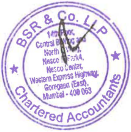

**[Image: Mar2026RResult.pdf-0007-01.png (214x216, 83.1KB)]**

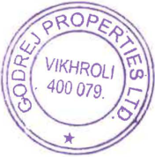

**[Image: Mar2026RResult.pdf-0007-02.png (176x178, 51.7KB)]**

**[Image: Mar2026RResult.pdf-0007-03.png (222x13, 1.2KB)]**

**[Image: Mar2026RResult.pdf-0008-00.png (78x41, 2.9KB)]**

• GODREJ • I PROPERTIES 

|AudHedStan<1aloneStatementofCash Flowsforthe YearEndedMarch 31,2026|(INRIn Crore)|
|---|---|
|Forthey.., | FortheYear |
|Particulars Ended 31.03.2026 **Aditd**|Ended 31.03.2025 **Aditd**|
|**ue** cashFlows rrom OperatingActivities|**ue**|
|Profit before Tax 489.16|1,264.82|
|Depreciation and amortisation expense 69.57 |37.43|
|Finance costs 542.25|565.42|
|Profit on saleofpropeny, plant and equipment(net) 13.86|(0.50|
|ShareofLoss in Limited LiabilityPartnerships 120.47|41.41|
|Share basedpavments to emplo~ees 4.05 Provision/Liabilities written back {5.57|4.82 (2.24|
|Interest income (1,582.03 |(1,256.83|
|Dividend income 10.00|(0.00|
|Profit on saleofInvestments(net) **(164.99**     |1211.32 |
|Fair value aain uccn rellnauishmentofloint control !131.09|(618.87|
|Income from investment measured atFVTPL (66.61|(115.74|
|Provision/exoected credit loss written back on investments(Nell 120.43|11.22|
|Lease rentfrominvestmentpropeny (6.99|11.81|
|Provision/Exoecled Credit Loss on other asset(net) 24.07|21.37|
|Intangibles/Other financial assets Writtenoff 0.57 |5.02 |
|Write downofinventories     |9.55 |
|**Oaaratlnu Loisbeforeworking capitalchanges** **(731.43]**|**(258.69**|
|**Chanoes**in**Working CaDltal:**||
|Increase in Non·Financial Liabilities 7,116.07|6,318.51|
|Increase/(Decrease) inFinancial Liabilities 799.51|192.23|
|Increase)in Inventories (7,761.98   |{4,870.51 |
|Increase)in Non-Financial Assets (793.59|(2,666.03|
|(lncreasei in Financial Assets {68.41 |(25.91 |
|**C708.40l** Taxes**Paid**lnetl 1249261|11336.17 116298|
| . Net cash flows(usedIn)operatingactlvftles **/1689.09**|. 11**757.84**|
|Cash Flowsfromlnv•stlno**Activities**||
|Acauisitionoforooertv.Dlant and eculcment,Investmentprooenv and intanaible assets,lncludinaca11ital creditors and advances 1317.23}|(166.991|
|Proceeds from saleofpropeny, plant and eQuipmentandintangible assets 14.66|3.51|
|Redemotion//Purchaselofinvestmentinmutual funds Inell 1,050.89        |11558.12 |
|Purchaseofinvestmentsinfixed deposits(net) (13.27 Investmentinsubsidiaries and iointventures (198.34|(2,122.53 (53.61|
|Investmentindebentures ofioint ventures (18.76|(55.40|
|Investmentindebentures (20.07    ||
|Investment In eauitv {13.94||
|WithdrawaloffluctuatinacaPltal fromLLP 240.21 |42.67 |
|Loan oiven to subsidiaries and loint ventures lnetl 11356.56|(1,602.62|
|Loangiventoothers Inell [32.88 |{21.49 |
|Interest received 554.10|313.76|
|ProceedsfromSaleofInvestmentinJointventure 1188|4669|
| .  Dividendreceived 0.00|. 0.00|
|Lease rentfrominvestment Property 6.99|1.81|
|**Net Cash Flows(used**lnl**lnvestinoActivHles** **f92.32l**|**15172.32l**|
|**CashFlowsfromFinanclnaActivities** Proceedsfrom issue ofeoutlYshare caoital(net ofissue expenses> 0.01|5,921.72|
|Proceedsfrom LonaTerm Borrowinas|1,340.00|
|Proceeds from short-term borrowinos Cnet1 225399|47547|
| ,. Interest and other borrowlna costpaid (1,091.82|. (920.69|
|Pavment ofminimum leaseliabilities /20.08|17.01|
|**NetCash Flows generated **from**FinancinQ Activities** **1142.10**|**6 809.49**|
|Net•IH>CN!&Se) InCashand Cash Equivalents (639.31    |f120.67) |
|ash and Cash Eauivalents - Ooenina Balance 820.48 Cashand Cash Equivalents•CloslnaBalance 181.17|941.15 **820.48**|

Net • IH>CN!&Se) In Cash and <u>Cash Equivalents</u> Cash and Cash Eauivalents - Ooenina Balance <u>Cash and Cash Equivalents • Closlna Balance</u> 

Reconci~ation of Cash **and** Cash equivalents•• per the Standalone Statement of Cash flows Cash and Cash equivalents as <u>per</u> the **above** comprlsa of lhe following • **Particulars** 

**Asal** Asat **<u>31.03.2026 31.03.2025 942.74 821.60</u>** <u>761 .57 1.12</u> **<u>181 .17 820.48</u>** 

Cash and Cash Eauivalents Less: Bank Overdrafts reoavable on demand Cash and Cash EQuivalents as per standalone statement of Cash Flows 

INR 0.00 represent amount less than INR 50,000 

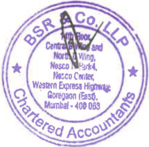

**[Image: Mar2026RResult.pdf-0008-08.png (215x213, 83.0KB)]**

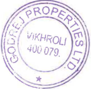

**[Image: Mar2026RResult.pdf-0008-09.png (180x175, 48.8KB)]**

**[Image: Mar2026RResult.pdf-0008-10.png (530x11, 1.9KB)]**

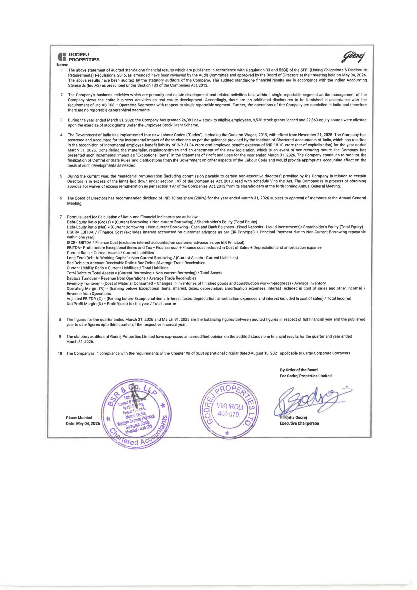

**[Image: Mar2026RResult.pdf-0009-00.png (1240x1754, 734.0KB)]**

<!-- Start of picture text -->
••  GODREJ •  ■  PROPERTIES Notes: 1  The  above statement of audited standalone financial results which are pubished in  accordance with Regulation 33 and 52(4) of the SEBI  (Listing Obligations & Disclosure Requirements) Regulations, 2015, as amended, have been reviewed by the Audit Committee and approved by the Board of Directors at their meeting held on May 04, 2026. The  above  results  have  been  audited  by  the  statutory  auditors  of the  Company.  The  audited  standalone  financial  results  are  in  accordance  wtth  the  Indian  Accounting Standards (Ind AS) as prescribed under Section 133 of the Companies Act, 2013. The  Company's business activities which are primarily real estate development and related activities falls within a single reportable segment as the management of the Company  Views  the  entire  business  activities  as  real  estate  development.  Accordingly,  there  are  no  additional  disclosures  to  be  furnished  in  accordance  with  the requirement of Ind AS  108 - Operating Segments with respect to single reportable segment. Further, the operations of the Company are domiciled in  India  and  therefore there are no reportable geographical  segments. During the year ended March 31, 2026 the Company has granted 26,391  new stock to eligible employees, 9,538 stock grants lapsed and 22,863 equity shares were allotted upon the exercise of stock grants under the Employee Stock Grant Scheme. 4  The Government of India has implemented four new Labour Codes ("Codes"), including the Code on Wages, 2019, with effect from November 21, 2025. The Company has assessed and  accounted for the incremental Impact of these changes as per the guidance provided by the Institute of Chartered Accountants of India, which has resulted in the recognition  of incremental employee benefit liability of INR  31.84 crore and employee benefit expense of INR  18.10 crore (net of capitalisation) for the year ended March 31, 2026. Considering  the  materiality. regulatory-driven and  an  enactment  of the new  Jegislation,  which  is  an  event  of non;ecurring  nature,  the Company has presented  such  incremental impact as "Exceptional  items• in  the  Statement of Profit and  Loss for the year ended  March  31, 2026.  The Company continues to monitor the finalization of Central or State  Rules  and clarifications from the  Government on other aspects  of the  Labour  Code  and  would  provide appropriate  accounting  effect on  the basis of such developments as needed. 5  During  the  current  year,  the  managerial remuneration  {including  commission  payable  to  certain  non-executive  directors)  provided  by  the  Company  in  relation  to  certain Directors is  in  excess  of the limits laid down under section 197 of the Companies Act, 2013, read with schedule V to the Act. The Company  Is  In  process  of obtaining approval for waiver of excess  remuneration as  per section  197 of the Companies Act,  2013 from its shareholders at the forthcoming Annual General Meeting. 6  The  Board  of Directors has recommended dividend of INR  10 per share (200%) for the year ended March 31,  2026 subj~t to approval of members at the Annual General Meeting. 7  Formula used for Calculation of Ratio and Financial  Indicators  are  as below  : Debt-Equity Ratio (Gross)• (Current Borrowing+ Non-current Borrowing)/ Shareholder's Equity (Total Equity) Debt-Equity Ratio (Net)= (Current Borrowing+ Non-<:urrent Borrowing - Cash  and  Bank Balances - Fixed Deposits - Liquid Investments)/ Shareholder's Equity (Total Equity) DSCR=  EBITDA  / (Finance Cost (excludes interest accounted on customer advance as per  EIR  Principal) + Principal Payment due to Non-Current Borrowing repayable wrthin  one year) ISCR=  EBITDA / Finance Cost (excludes interest accounted on customer advance as per EIR Principal) EBITDA= Profit before Exceptional items and Tax+ Finance cost+ Finance cost included in Cost of Sales+ Depreciation and amortisation expense Current Ratio = Current Assets/ Current Liabilities Long Term Debt to Working Capital= Non-Current Borrowing/ (Current Assets- Current Liabllltles) Bad Debts to Account Receivable Ratio= Bad Debts /Average Trade Receivables Current Liability Ratio= Current  Liabilities/ Total  liabilities Total Debts to Tatel Assets= (Current Borrowing  t  Non-current Borrowing)/ Tatel Assets Debtors Turnover: Revenue from Operations/ Average Trade Receivables Inventory Turnover: (Cost of Material Consumed+ Changes in inventories of finished goods and construction work-in-progress)/ Average  Inventory Operating  Margin  (%)  =  (Earning  before  Exceptlonal  items,  interest,  taxes,  depreciation,  amortisation  expenses,  Interest  included  in  cost  of  sales  and  other  income)  / Revenue from Operations Adjusted EBITDA (%)•(Earning before Exceptional items, interest, taxes, depreciation, amortisation expenses and interest included In cost of sales)/ Total Income) Net Profit Margin(%)• Profil/(loss) for the year  I  Total Income The figures for the quarter ended March 31, 2026 and March  31 ,  2025 are the balancing figures between audited figures  in  respect of full financial year and the published year to date figures upto third quarter of the  respective financial  year. 9  The statutory auditors of Godrej  Properties Limited  have expressed an unmodified opinion on the audited standalone financial results for the quarter and  year ended March 31, 2026. 1 O The Company is in compliance with the requirements of the Chapter XII  of SEBI operational circular dated August t 0, 2021  applicable to Large Corporate Borrowers. By Order of the Board For Godrej Properties Llmhed Place: Mumbai Date: May 04, 2026  Executive Chairperson <!-- End of picture text -->

**BS R** & Co. LLP 

Chartered Accountants 

14th Floor, Central B Wing and North C Wing Nesco IT Park 4, Nesco Center Western Express Highway Goregaon (East), Mumbai - 400 063, India Telephone: +91 (22) 6257 1000 Fax: +91 (22) 6257 1010 

## Independent Auditor's Report 

##### **To the Board of Directors of Godrej Properties Limited** 

**Report on the audit of the Consolidated Annual Financial Results** 

###### **Opinion** 

We have audited the accompanying consolidated annual financial results of Godrej Properties Limited (hereinafter referred to as the "Holding Company") and its subsidiaries (Holding Company and its subsidiaries together referred to as "the Group"), its joint ventures and an associate for the year ended 31 March 2026, attached herewith, being submitted by the Holding Company pursuant to the requirement of Regulation 33 and Regulation 52(4) read with Regulation 63 of the Securities and Exchange Board of India (Listing Obligations and Disclosure Requirements) Regulations, 2015, as amended ("Listing Regulations"), as prescribed in Securities and Exchange Board of India operational circular SEBI/HO/DDHS/P/CIR/2021/613 dated 10 August 2021 . 

In our opinion and to the best of our information and according to the explanations given to us , the aforesaid consolidated annual financial results: 

a. include the annual financial results of the following entities 

###### **Name of the entity** 

Godrej Projects Development Limited 

Godrej Garden City Properties Private Limited 

Godrej Hillside Properties Private Limited Godrej Home Developers Private Limited 

Godrej Prakriti Facilities Private Limited 

Prakritiplaza Facilities Management Private Limited Godrej Highrises Properties Private Limited 

Godrej Genesis Facilities Management Private Limited Citystar lnfraProjects Limited 

Godrej Highrises Realty LLP 

Godrej **Skyview** LLP Godrej Green Properties LLP 

Godrej Projects (Soma) LLP 

Godrej Athenmark LLP 

Godrej Project Developers & Properties Private Limited merly Godrej Project Developers & Properties LLP) 

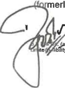

**[Image: Mar2026RResult.pdf-0010-22.png (135x182, 17.6KB)]**

<!-- Start of picture text -->
:  _!.ii <!-- End of picture text -->

_/)_ 

_:_ _!.ii partnership firm with Registration No. BA61223} converted into BS R & Co. LLP (a b"jJjty Partnership with LLP Registration No. AAB-8181) with effect from October 14, 2013 

###### **Relationship** 

Wholly owned subsidiary 

Wholly owned subsidiary 

Wholly owned subsidiary Wholly owned subsidiary Wholly owned subsidiary Wholly owned subsidiary Wholly owned subsidiary Wholly owned subsidiary Wholly owned subsidiary Wholly owned subsidiary Wholly owned subsidiary Wholly owned subsidiary Wholly owned subsidiary 

Wholly owned subsidiary 

Wholly owned subsidiary 

Registered Office: 

1~th Floor, Central B v-.lng and North C Wng, Nesco IT Parl< ~. Nesco Center, Western Express Highway, Goregaon (East}, Mumbai - 400063 Page 1 of 7 

BS R & Co. **LLP** 

**Independent Auditor's Report** **_(Continued)_ Godrej Properties Limited** 

|Godrej City Facilities Management LLP||Wholly owned subsidiary|
|---|---|---|
|Godrej Florentine Private Limited FlorentineLLP)|(formerly Godrej|Wholly owned subsidiary|
|Godrej OlympiaLLP||Wholly owned subsidiary|
|Ashank Projects Development LLP Realty ManagementLLP)|(formerly Ashank|Wholly owned subsidiary|
|Godrej Green Woods Private Limited||Wholly owned subsidiary|
|Godrej Realty Private Limited||Wholly owned subsidiary|
|Godrej Buildwell ProjectsLLP||Wholly owned subsidiary|
|Godrej Living Private Limited||Wholly owned subsidiary|
|Ashank Land & Building Private Limited||Wholly owned subsidiary|
|Ashank Facility ManagementLLP||Wholly owned subsidiary|
|Godrej VestamarkLLP||Wholly owned subsidiary|
|Godrej Real Estate Distribution Compan|y Private Limited|Wholly owned subsidiary|
|Wonder City Buildcon Limited||Wholly owned subsidiary|
|Godrej Township Development Limited Home Constructions Limited)|(formerly Godrej|Wholly owned subsidiary|

Godrej Skyline Developers Limited (formerly Godrej Wholly owned subsidiary Skyline Developers Private Limited) 

|Oasis LandmarkLLP|Wholly owned subsidiary|
|---|---|
|PearlshineHomeDevelopers Private Limited|Wholly owned subsidiary (w.e.f. 3 February 2025)|
|Godrej HighviewLLP|Wholly owned subsidiary (w.e.f.31March 2025); Joint Venture (upto30March 2025)|
|Godrej SSPDL Green Acres Private Limited (formerlyLLP)|Subsidiary (w.e.f.28March 2025); Joint Venture (upto27March 2025)|
|Godrej Amitis Developers Private Limited (formerlyLLP)|Wholly owned subsidiary (w.e.f.19June 2025); Joint Venture (upto18June 2025)|
|Embellish Houses Private Limited (formerlyLLP)|Wholly owned subsidiary (w.e.f. 24 September 2025); Joint Venture (upto23September 2025)|
|Godrej lrismark Private Limited (formerly knownasGodrej ~-....-.arkLL)|Wholly owned subsidiary (w.e.f. 6 December 2025);|
||Joint Venture (upto 5 December 2025) Page 2of7|

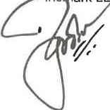

**[Image: Mar2026RResult.pdf-0011-05.png (156x156, 15.7KB)]**

**BS R** & Co. LLP 

###### Godrej REDCO Consultancies LLC 

**Independent Auditor's Report** **_(Continued)_ Godrej Properties Limited** Wholly owned Subsidiary (w.e.f. 28 November 2025) 

Maan-Hinje Township Developers Private Limited Subsidiary (formerly LLP) 

Godrej Residency Private Limited 

Subsidiary Subsidiary 

Godrej Reserve LLP 

Subsidiary 

Dream World Landmarks LLP 

Subsidiary 

Caroa Properties LLP 

Subsidiary (w.e.f. 2 June 2025); Joint Venture (upto 1 June 2025) 

Manjari Housing Projects LLP 

Mahalunge Township Developers Private Limited (formerly Subsidiary (w.e.f. 31 May 2025); LLP) 

Joint Venture (upto 30 **May** 2025) 

###### Joint Venture 

Oxford Realty LLP 

M S Ramaiah Ventures LLP 

M S Ramaiah Ventures LLP Joint Venture Godrej Macbricks Private Limited Joint Venture Suncity Infrastructure (Mumbai) LLP Joint Venture Godrej Greenview Housing Private Limited Joint Venture Godrej Housing Projects LLP Joint Venture Wonder Projects Development Private Limited Joint Venture AR Landcraft LLP Joint Venture Godrej Real View Developers Private Limited Joint Venture Pearlite Real Properties Private Limited Joint Venture Godrej Odyssey LLP Joint Venture Prakhhyat Dwellings LLP Joint Venture Roseberry Estate LLP Joint Venture Godrej Project North Star LLP Joint Venture Godrej Developers & Properties LLP Joint Venture Manyata Industrial Parks LLP Joint Venture Godrej Redevelopers (Mumbai) Private Limited Joint Venture Universal Metro Properties LLP Joint Venture Godrej Projects North LLP Joint Venture Joint Venture Page 3 of 7 

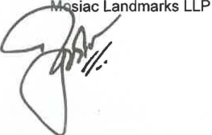

**[Image: Mar2026RResult.pdf-0012-19.png (263x168, 22.0KB)]**

### BS R & Co. **LLP** 

#### **Independent Auditor's Report** **_(Continued)_ Godrej Properties Limited** 

Yerwada Developers Private Limited 

Vivrut Developers Private Limited 

Madhuvan Enterprises Private Limited 

Munjal Hospitality Private Limited 

Vagishwari Land Developers Private Limited 

Godrej One Premises Management Private Limited 

###### Joint Venture 

Joint Venture (upto 1 July 2025) Joint Venture (upto 24 June 2025) Joint Venture (upto 24 June 2025) Joint Venture (upto 24 June 2025) 

###### Associate 

- b. are presented in accordance with the requirements of Regulation 33 and Regulation 52(4) read with Regulation 63 of the Listing Regulations, as prescribed in Securities and Exchange Board of India operational circular SEBI/HO/DDHS/P/CIR/2021/613 dated 10 August 2021 in this regard; and 

- c. give a true and fair view in conformity with the recognition and measurement principles laid down in the applicable Indian Accounting Standards, and other accounting principles generally accepted in India, of consolidated net profit and other comprehensive loss and other financial information of the Group for the year ended 31 March 2026. 

###### **Basis for Opinion** 

We conducted our audit in accordance with the Standards on Auditing ("SAs") specified under section 143(10) of the Companies Act, 2013 ("the Act"). Our responsibilities under those SAs are further described in the _Auditor's Responsibilities for the Audit of the Consolidated Annual Financial Results_ section of our report. We are independent of the Group, its joint ventures and an associate in accordance with the Code of Ethics issued by the Institute of Chartered Accountants of India together with the ethical requirements that are relevant to our audit of the financial statements under the provisions of the Act, and the Rules thereunder, and we have fulfilled our other ethical responsibilities in accordance with these requirements and the Code of Ethics. We believe that the audit evidence obtained by us, along with the consideration of report of the other auditors referred to in sub paragraph no. (a) of the "Other Matters" paragraph below, is sufficient and appropriate to provide a basis for our opinion on the consolidated annual financial results. 

###### **Emphasis of Matter** 

- a. We draw attention to Note 5 to the consolidated annual financial results which states that the managerial remuneration paid/payable by the Holding Company in relation to its Executive Chairperson is in excess of the limits laid down under section 197 of the Companies Act, 2013, read with schedule V to the Act by Rs 21.57 crores. Further, the remuneration paid/payable by way of commission to the non executive directors for the current year as per the limits laid down under Section 197 of the Companies Act, 2013, read with schedule V to the Act is Rs 2.00 crores. In accordance with the provisions of the Act, read with schedule V to the Act, the excess remuneration to the Executive Chairperson and remuneration to non executive directors is subject to shareholders' approval, which the Holding Company proposes to seek at the forthcoming Annual General Meeting. 

Our opinion is not modified in respect of this matter. 

###### **Management's and Board of Directors'/Designated Partners' Responsibilities for the Consolidated Annual Financial Results** 

These consolidated annual financial results have been prepared on the basis of the consolidated annual financial statements. 

The Holding Company's Management and the Board of Directors are responsible for the preparation and pre ntation of these consolidated annual financial results that give a true and fair view of the consolidated 

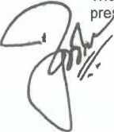

**[Image: Mar2026RResult.pdf-0013-21.png (144x166, 16.7KB)]**

<!-- Start of picture text -->
pre <!-- End of picture text -->

Page 4 of7 

**BS R** & Co. LLP 

**Independent Auditor's Report** **_(Continued)_** 

**Godrej Properties Limited** 

net profit/ loss and other comprehensive income and other financial information of the Group including its joint ventures and an associate in accordance with the recognition and measurement principles laid down in Indian Accounting Standards prescribed under Section 133 of the Act read with relevant rules issued thereunder and other accounting principles generally accepted in India and in compliance with Regulation 33 and Regulation 52(4) read with Regulation 63 of the Listing Regulations, as prescribed in Securities and Exchange Board of India operational circular SEBI/HO/DDHS/P/CIR/2021/613 dated 10 August 2021. The respective Management and Board of Directors of the companies/Designated Partners of limited liability partnerships (LLP) included in the Group and the respective Management and Board of Directors/Designated Partners of its joint ventures and an associate are responsible for maintenance of adequate accounting records in accordance with the provisions of the Act for safeguarding of the assets of each company/ LLP and for preventing and detecting frauds and other irregularities; selection and application of appropriate accounting policies; making judgments and estimates that are reasonable and prudent; and the design, implementation and maintenance of adequate internal financial controls, that were operating effectively for ensuring accuracy and completeness of the accounting records, relevant to the preparation and presentation of the consolidated annual financial results that give a true and fair view and are free from material misstatement, whether due to fraud or error, which have been used for the purpose of preparation of the consolidated annual financial results by the Management and the Board of Directors of the Holding Company, as aforesaid. 

In preparing the consolidated annual financial results, the respective Management and the Board of Directors of the companies/Designated Partners of LLPs included in the Group and the respective Management and Board of Directors/Designated Partners of its joint ventures and an associate are responsible for assessing the ability of each company/ LLP to continue as a going concern, disclosing, as applicable, matters related to going concern and using the going concern basis of accounting unless the respective Board of Directors/Designated partners either intends to liquidate the company/ LLP or to cease operations, or has no realistic alternative but to do so. 

The respective Board of Directors of the companies/ Designated Partners of the LLP included in the Group and the respective Management and Board of Directors/ Designated Partners of its joint ventures and an associate is responsible for overseeing the financial reporting process of each company/ LLP. 

###### **Auditor's Responsibilities for the Audit of the Consolidated Annual Financial Results** 

Our objectives are to obtain reasonable assurance about whether the consolidated annual financial results as a whole are free from material misstatement, whether due to fraud or error, and to issue an auditor's report that includes our opinion. Reasonable assurance is a high level of assurance, but is not a guarantee that an audit conducted in accordance with SAs will always detect a material misstatement when it exists. Misstatements can arise from fraud or error and are considered material if, individually or in the aggregate, they could reasonably be expected to influence the economic decisions of users taken on the basis of these consolidated annual financial results. 

As part of an audit in accordance with SAs, we exercise professional judgment and maintain professional skepticism throughout the audit. We also: 

- Identify and assess the risks of material misstatement of the consolidated annual financial results, whether due to fraud or error, design and perform audit procedures responsive to those risks, and obtain audit evidence that is sufficient and appropriate to provide a basis for our opinion. The risk of not detecting a material misstatement resulting from fraud is higher than for one resulting from error, as fraud may involve collusion, forgery, intentional omissions, misrepresentations, or the override of internal control. 

- Obtain an understanding of internal control relevant to the audit in order to design audit procedures that are appropriate in the circumstances. Under Section 143(3) (i) of the Act, we are also responsible for expressing our opinion through a separate report on the complete set of financial statements on whether the company has adequate internal financial controls with reference to financial statements in place and the operating effectiveness of such controls. 

- Evaluate the appropriateness of accounting policies used and the reasonableness of accounting estimates and related disclosures in the consolidated annual financial results made by the Management and Board of Directors. 

- C~clude on the appropriateness of the Management's and Board of Directors' use of the going 

- rf Page5of7 

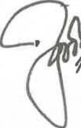

**[Image: Mar2026RResult.pdf-0014-13.png (103x162, 12.5KB)]**

BS R & Co. **LLP** 

**Independent Auditor's Report** **_(Continued)_ Godrej Properties Limited** 

concern basis of accounting and, based on the audit evidence obtained, whether a material uncertainty exists related to events or conditions that may cast significant doubt on the appropriateness of this assumption. lfwe conclude that a material uncertainty exists, we are required to draw attention in our auditor's report to the related disclosures in the consolidated annual financial results or, if such disclosures are inadequate, to modify our opinion. Our conclusions are based on the audit evidence obtained up to the date of our auditor's report. However, future events or conditions may cause the Group and its joint ventures and an associate to cease to continue as a going concern. 

- Evaluate the overall presentation, structure and content of the consolidated annual financial results, including the disclosures, and whether the consolidated annual financial results represent the underlying transactions and events in a manner that achieves fair presentation. 

- Obtain sufficient appropriate audit evidence regarding the financial results of the entities within the Group and its joint ventures and an associate to express an opinion on the consolidated annual financial results. We are responsible for the direction, supervision and performance of the audit of financial results of such entities included in the consolidated annual financial results of which we are the independent auditors. For the other entity included in the consolidated annual financial results, which has been audited by other auditors, such other auditors remain responsible for the direction, supervision and performance of the audit carried out by them. We remain solely responsible for our audit opinion. Our responsibilities in this regard are further described in paragraph (a) of the Other Matters paragraph in this audit report. 

We communicate with those charged with governance of the Holding Company and such other entities included in the consolidated annual financial results of which we are the independent auditors regarding, among other matters, the planned scope and timing of the audit and significant audit findings, including any significant deficiencies in internal control that we identify during our audit. 

We also provide those charged with governance with a statement that we have complied with relevant ethical requirements regarding independence, and to communicate with them all relationships and other matters that may reasonably be thought to bear on our independence, and where applicable, related safeguards. 

We also performed procedures in accordance with the circular Ne CIR/CFD/CMD1/44/2019 issued by the Securities and Exchange Board of India under Regulation 33(8) of the Listing Regulations, to the extent applicable. 

###### **Other Matters** 

- a. The consolidated annual financial results include the Group's share of total net profit after tax of Rs Nil (before consolidation adjustments) for the year ended 31 March 2026, as considered in the consolidated annual financial results, in respect of one (1) associate, whose financial statements have been audited by its independent auditors. The independent auditor's report on the financial statements of this entity has been furnished to us by the management. 

Our opinion on the consolidated annual financial results, in so far as it relates to the amounts and disclosures included in respect of this entity, is based solely on the report of such auditors and the procedures performed by us are as stated in paragraph above. 

Our opinion on the consolidated annual financial results is not modified in respect of the above matter with respect to our reliance on the work done and the report of the other auditors. 

- b. The consolidated annual financial results include the Group's share of total net profit after tax (before consolidation adjustments) of Rs 58.07 crores for the year ended 31 March 2026, as considered in lidated annual financial results, in respect of two (2) joint ventures. These unaudited 

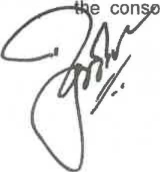

**[Image: Mar2026RResult.pdf-0015-13.png (160x172, 17.3KB)]**

Page 6 of 7 

BS R & Co. **LLP** 

#### **Independent Auditor's Report** **_(Continued)_ Godrej Properties Limited** 

financial information have been furnished to us by the Board of Directors. 

Our opinion on the consolidated annual financial results, in so far as it relates to the amounts and disclosures included in respect of these joint ventures is based solely on such financial information. In our opinion and according to the information and explanations given to us by the Board of Directors, these financial information are not material to the Group. 

Our opinion on the consolidated annual financial results is not modified in respect of the above matter with respect to the financial information certified by the Board of Directors. 

- c. The consolidated annual financial results include the results for the quarter ended 31 March 2026 being the balancing figure between the audited figures in respect of the full financial year and the published unaudited year to date figures up to the third quarter of the current financial year which were subject to limited review by us. 

###### For **8 S R** & **Co. LLP** 

_Chartered Accountants_ 

Mumbai 

04 May 2026 

Firm's Registration No.: 101248W/W-100022 

**[Image: Mar2026RResult.pdf-0016-11.png (160x174, 22.4KB)]**

**a Godbole** _Partner_ 

Membership No.: 105149 UDIN:26105149KGGQJl3842 

**[Image: Mar2026RResult.pdf-0016-14.png (120x11, 0.6KB)]**

Page 7 of 7 

|**• ****eG ** I**P**|**ODREJ** **GODREJPROPERTIE** **ROPERTIES** CIN: L74120MH1985PLC|**SLIMITED** 035308||||~|
|---|---|---|---|---|---|---|
| |   Regd Office: GodrejOne.5th Floor, Pirojshanagar, Eastern Express Highway, V| ikhroli (Ezist), Mu|mbai - 400 079.|www.godrejpropert|ies.com||
||St•tementof**AuditedConsolidotedF"onancialResults**for**th**|**eQw,rterand**v..|r**EndedMarch**3|1,2026||INRI|
|||||||( ncro,.)|
||||**QuarterEnded**||Yezir|Ended|
|Sr.No.| Pertietders|31.03.2026|31.12.2025|31.03.2025|31.03.2026|31.03.2025|
|||**Audited** (Refer Note 9)|**Unaudited**|**Audited** (Refer Note9)|**Audited**|**Audltad**|
|**1**|**Income**||||||
||Revenue from operations |3,458.13 |498.36 |2,121.73 |5,131.43 |4,922.84 |
||Other income|348.52|535.48|559.33|3,279.45|2,044.21|
|2|Total Income **Expemes**|**3,806.65**|1,033.84|2,681.06|8,410.88|**6,967.05**|
||Costofmaterials consumed|7,980.70|4,212.18|3,692.59|19,590.15|11,463.47|
||Purchasesofstock-in-trade|1.26|2.26|2.03|3.52|19.12|
||Changes in inventoriesoffinished goods,stockin trade and construction work--in- progress| (6,003.91)|(4,064.81)| (2,350.11)|(16,644.74)|(8,558.04)|
||Employee benefits expense|149.09|129.82|130.34|595.95|450.87|
||Finance costs|51.63|31.03|45.98|136.86|173.69|
||Depreciation and amortisation expense|35.62|31.57|21.07|115.58|73.66|
||Other expenses|808.75|401.65|536.92|2,003.12|1,503.06|
||Total Exenses|302314|74370|207882|580044|512583|
|3|p Profitbefore shareofProfJt / {Loss)ofJointventures,auociate,ew:oeptlonal ttem1 and tax|,. 783.51|. 290.14|,. 602.24|,. 2,610.44|,. 1,841.22|
|**4**|ShareofProfit/(Loss)ofJointVentures and Associate(ne1oftax)|87.92|(14.35)|(35.36)|(36.75)|(118.60)|
|5|Prof'Jt before Exceptional Items and tax|871.43|275.79|566.88|2,573.69|1,722.62|
||Exceptional Items (Refer Note 4)|2.03|21.08||23.11||
|**6**|Profit beforetaxfortheperiod /**year**|869.40|254.71|566.88|2,550.58|1,722.62|
|7|Tu:expense charge||||||
||Current tax|216.35|37.60|97.92|318.62|213.97|
||Deferred tax|7.61|23.24|90.52|391.30|119.42|
|**8**|Profit after tax fortheperiod / year|645.44|193.87|378.44|1,840.66|1,389.23|
|9|Other Comprehensive Income for**theperiod**/yur Itemsthatwillnotbeaul>HquentlyrecLuslfoed toprofitorloss||||||
||Remeasurementsofthe defined benefit plan|(2.57)|(1.19)|(7.46)|(6.16)|(8.58)|
||Tax on Above|0.58|0.30|1.82|1.44|2.11|
|10|TotalCornprehen&ri•Income fortheperiod/year (net oftax)|643.45|192.98|372.80|1,835.94|1,382.76|
|11| ProfiV(Jon)**lrllribwible**to:||||||
||Ownersofthe Company|649.88|195.16|381.99|1,850.20|1,399.89|
||Non-Controlling Interests|(4.44)|(1.29)|(3.55)|(9.54)|(10.66)|
|12|Other Comprehenafve Income attributableto:||||||
||ownersofthe Company|(1.99)|(0.89)|(5.64)|(4.72)|(6.47)|
|13|Non-ControllingInterests **TotalComprehen•lv• Income/(Lon) attributable**to:|(0.00)|(0.00)|(0.00)|(0.00}|(0.00)|
||Ownersofthe Company|647.89|194.27|376.35|1,845.48|1,393.42|
||Non-Controlling Interests|(4.44)|(1.29)|(3.55)|(9.54}|(10.66)|
|14|Paid-upEquityShore Capital|**150.60**|**150.60**|**150.59**|150.60|150.59|
||Face Value - INR 5/-per share||||||
|15|Reserves Excluding Revaluation Reserve and Ditbenture Redemption Reserve||||**19,004.94**|17,161.87|
|16 |**Net-Worth**|**19,155.54**|18,506.57|17,312.46|**19,155.54**|17,312.46|
|17|EarningPer EquityShare (EPS)(AmountInINR)||||||
||BasicEPS(*not annualized)|21.sa•|6.48*|12.68'|61.43|49.02|
||DilutedEPS(•notannualized)|21.57•|**6.48***|12.68'|61.42|49.01|
|18|**KeyRatioaand**Financial Indicators (Refer Note 8)||||||
|| Debt EquityRatio(Gross)|0.82|0.97|0.73|0.82|0.73|
||Debt EquityRatio (Net) |0.33 |0.37 |0.19 |0.33 |**0.19** |
||Debt Service Coverage Ratio(DSCR} fnterest Service Coverage Ratio{ISCR)|0.50 302|0.33 1.15|2.21 221|0.98 233|1.92 1.92|
|| Current Ratio|.  1.27| 1.31|. 1.51|.  1.27| 1.51|
||Long Tem DebttoWorking Capital|**0.14**|0.19|0.23|**0.14**|0.23|
||,   Bad DebtstoAccount Receivable Ratio Current Liability Ratio| 0.95| ~~.~~ 0.93| 0.89| 0.95|0.00 0.89|
|| Total DebtstoTotal Assets| 0.19|0.23| 0.23| 0.19| 0.23|
||Debtors Turnover (annualized)|26.36|4.50|19.23|9.02|11.13|
||Inventory Turnover (annualized)|**0.14**|0.01|0.17|0.07|0.11|
||Operating Margin{%) |17.7711 |**(34.1911)** |7.1111 |**(5.58%)** |**4.8511** |
||AdjustedEBITDA(91) Net ProfitMargin(")|26.9891 16.5711|34.40% 19.0211|25.50% 14,30'k,|35.3191 21.98'k,|31.6011 20.2911|

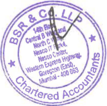

**[Image: Mar2026RResult.pdf-0017-01.png (213x211, 81.0KB)]**

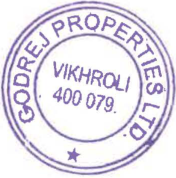

**[Image: Mar2026RResult.pdf-0017-02.png (176x178, 52.8KB)]**

|**• ****eG ** IPR|**ODREJ** OPERTIES|_PW/_|
|---|---|---|
||AucfrtedConsol'idated StatementofAaaets&Liabillties••atMarch 31,2026|I (INRInCror•)|
||| **Al**|
|Sr. No.|A..t **Partlculoro** **31 .03.2026** |**u** **31.03.2025** |
|**A** **1**|**Audited** **ASSETS** Non-current Aul!t:a|**Audited**|
| ~~•~~ |Property, Plant and Equipment 1,280.73 RihfA |1,043.42 7776|
|**b** **C**|gt-<>-Usesset 263.32 Capital Work•ln·Progress 169.40|.  113.13|
|**d** ~~•~~|lnvestmen1 Property 150.51 Goodwill on consolidation 0.07|135.44 0.07|
| **f**|other Intangible assets 1372|1419|
| **g** | . Intangible Assets under Development 2.61   |. 2.53 |
|h I|Equity accounted investees 625.62 FinancialAsse1s|817.47|
||Other Investments 2,000.83|1,404.13|
||TradeReceivables 73,91 Loans 12772|75.96 -|
|J| . Other Non-Current Financial Assets 717.07 Deferred Tax Assets (Net) 304.61|208,73 204.20|
|**k** I|Income Tax Assets (Net) 335.28 Other Non-Current Non Financial Assets 10.75|203.97 20.15|
||Touil Non-Current**Assot<** **6,076.15**|**4,321.15**|
|**2**|Current Assets||
|**a**|Inventories 57,806.91|32,927.66|
|**b**|Financial Assets||
||Investments 2,884.23 TradeReceivables 554.01~~I~~   |3,729.48   433.78 |
||Cash and Cash Equivalents 1,860.74 BankBalancesOtherthanAbove 3,857.08|1,502.05 3,883.74|
||Loans 2,108.35 Other Current Financial Assets 1,538.03|2,129.15 1,568.03|
|**C**|Other Current Non FinancialAssets 5208.87|4970.48|
|| , TotalCUrrentAssets **75,818.28**|, **51,144.37**|
||**TotalAssets** **81,894.43**|**55,46S.S2**|
|**B** **1**|**EQUITYANDLIABILITIES** **EQUITY**||
| I | Equity Share Capital 150.60   |150.59 |
|**b** **C**|otherEquity **19,004.94** Non-controllinginterests 199.35|17.161 .87 261.27|
||**TotalEquity** **19,354.89**|**17,573.73**|
|**2**     |**LIABILITIES** ||
|**2.1**   ~~•~~|Non-current Liabilities Financial Liabilities||
||Borrowings 2,250.00 Lease Liabilities 234.74|4,000.00 67.84|
||otherNon - Current Financial Liabilities 17.04|7.85|
|**b** |   Pii 7062| 3079|
|   **C** |rovsons . DeferredTall::Liabilities (Net) 442.03|. 15.80|
||**Tolal Non·CurnmIJabllltles** **3,014.43**|**4,122.28**|
|**2.2**   ~~•~~ |Current Liabilities Financial Liabilities||
| | Borrowings 13,364.87   |8,561.16 |
||Lease Uabiltlies 44.48 Trade Payables|12.40|
||total outstanding duesofmicro enterprises and small enterprises 1,002.74|291.05|
||total outstanding duesofcreditors other than micro enterprises and small enterprises **4,896.94** thCt Fidl Libiliti  95126|3,232.04 **66476**|
|**b** |oerurren nana aes . Other Current Non Financial Liabilities 39,087.42 |**.** 20,907.41 |
|**C**   **d**   |Provisions 51.63 Current Tax Liabilitles (Net) 125.77 **TotalCurrentliablliti..** **59,525.11**|43.09 57.60 **33,769.51**|
||**TotalllabHIII..** **62,539.54**|**37,891.79**|
||Total Equity andUabYtt!ff 81,894.43|55,465.52|
||~o._Ll_ ~~-~~ _<?OP!?_ ||
||_~~· _ ~~ _c:o~i_ • ~ '.) ~   ||
||Q)t,~"  f I  ||
||;VIKHROLI~ -  ~~;ta'~•**_ll_** ||
||    ""~~'/,_i}.\,_ **_c::_** 0~ .400079.~ i',.i.;!f-1~~~~~_.Jg_ .() ||
||~   ~ . ~ ~ (.~ \I 0-s ~~*~~ ~-~, vc;||

**[Image: Mar2026RResult.pdf-0018-01.png (131x36, 9.2KB)]**

<!-- Start of picture text -->
vc; <!-- End of picture text -->

|**• ****eGODREJ** I**PROPERTIES**||~|
|---|---|---|
|**AuditedConaolidated**StatementofCuhFlowaforthe**VearEndedMan:h**31, 2026||INRlC~|
||FortheYear|(nro) FortheYNr|
|| **Ended**| **Ended**|
|PartlCI.Ura **CashFlows**from**OperatingActlvitiH**|**31.03.2026** **Audited**|31.03.2025 **Audtted**|
| Profit before Tax|255058| 172262|
| |,.| ,.|
|Adiullmlmllar:: Depreciation and amortisation expense|115.58| 73.66|
|Finance costs Profit on saleofproperty, plant and equipment (net)|136.86 (7.10)| 173.69   (0.60)|
|ShareofLoss in joint ventures and associate (netoftax)|36.75|118.60|
| Share based paymentstoemployees |4.05 | **4.82**   |
|Liabilities/Provisions written back Interest income|(5.97) (869.91)| **(20.45)**   (739.82)|
|Dividend income Profit on saleofInvestments (net)|**(0.00)** (204.56)| (0.00)   (214.41)|
|Fair value gain upon acquisitionofcontrol (net) Fair value gain upon relinquishmentofjoint control|(1,677.31) (41570| (160.22)   (72223)|
| Incomefrominvestment measured at FVTPL|. (75.89)| .   (129.57)|
|Lease rentfrominvestment property|(7.07)| (2.20)|
|Provision_I_Expected credit loss on otherasse1s(net)|**45.56**|**28.94**|
|Intangible/ Other Financial assets writtenoff Wri1edownofinventories|4.70 37.26| 7.45 **48.30**|
|**Operating(Loss)/ Profflbeforeworkingcapitalchanges**|(332.17)| **188.58**|
|**Ch•nge,,**In**WorkingC•pltal:** Increase in Non-Financial Uebili1ies|13.432.31|9,448.22|
|Increase/(Decrease) in Financial Liabilities (Increase) in Inventories|1,259.35 (14,932.32)|(613.66) (7,811.92)|
|(Increase) in Non-Financial Assets (Increase) in Financial Assets|(668.03) 38878| (3,036.20) 17117|
||(.) |(.) |
|**DirectTaxesPaid(net)**|**(1,297.47)** (373.70)|**(2,184.73)**   (246.23)|
|**Net calhflows(und**in)**_,.iJng actlvltlas**|**(2,003.34)**|**(2,242.38)**|
|Cash FlowsfromInvesting Activities|||
| Acquisitionofproperty, plant end equipment, investment property and intangible assets Pi!dflft lt d it|(406.04) 2788| (211.53) **438**|
|rocesromsaeopropery, pan an equpmen Redemption/(Purchase)ofinvestment in mutual funds (net) |. 1,129.18 |**.** (1,698.90)   |
|Purchaseofinvestments in fixed deposits (net) Investment in jointven1ures|(360.37) (226.91)| (2,367.98)   (35.40)|
|Investment in equity Investment in debentures|**(13.94)** (20.07)||
| Investment in debenturesofjoint ventures | (22.35) | (62.42) |
|Acquisitionofsubsidiaries Loan repaid by joint ventures (net)|(111.52) 319.63|(49.90) 41.77|
|Loan giventoothers (net) Interest received|(131.86) 427.10| **(169.58)** 230.23|
|AcquisitionofNon ControSingInterest Proceeds from SaleofInvestment in Joint Ventures|**(58.85)** 6282|(37.00) **4669**|
| Dividend received |. 0.00 |**.** 0.00 |
|Lease rent from investment property **N<-1CashFlow•generatedfrom/(used**in)**InvestingActivttles**|7.07 **621.77**|2.20 **{4,307.44)**|
|**CashFlow•fromFinancing Activities**|||
|Proceedsfromissueofequity share capital (netofissue expenses) ProceedsfromLon!r Term Borrowins|0.01|5,921.71 134000|
|;  g ProceedsfromShort-Term Borrowings (net) Interest and other borrowingcostpaid|2,213.61 (1.247.22)|,. 510.28 (1,050.30)|
|Paymen1ofminimum lease liabilities Net Ca1h Flow$ generatedfromFblanclng Activities|(28.79) **937.61**|(12.16) **6,709.53**|
|**Net(De<rease)/lncreue**in**Ca•handCashEquivalents** |**(443.96)** |**159.71** 16|
|Cash and Cash Equiv!llents - Opening Balance |1,500.44 |,30.00 |
|Cash and Cash Equivalen1sofsubsidiaries acquired during the year Cash and Cash Equivalents - Closing Balance|41.88 **1,098.36**|34.73 **1,500.44**|
|ReconciliationofCash and Cash equivalents as pertheConsolidated StatementofCashflows Cash andCashequivalents**asper**theabove comprise of**the**fo-lng :|||
|**PartlcuJarw**|**Aul** **31 .03.2026**|Asat **31.03.2025**|
|**CashandCashEqulvalenta**|1,860.74|1,502.05|
|Less: Bank Overdrafts repayable on demand Cash and Cash Equivalents as per Consolidated StatementofCash Flows ~~~|762.38 **1,098.36**|1.61 **1,500.44**|
|INR0.00 repres__,--,--.. ,.,...':."-.,-v;R50)'00 **~~//~~~ T'_-** **,...A,',_',.**  |||
|~~~~~ J"" '/•~~r~  **g****_VIKHROU_** **CJJ· **J|||
|_~(JJ~_   I      **t'I'** .400079. ,- mtl_~--(-_ )i:?     |||
|~  _,_   ~~<~ C:I \ _.el_|||
|;,.   "" ~~~t~_.!!!_ ~~*~~ ~.~-~ _§_ ~~-~~ _01_ c,O _~rter_df>-0|||

• ■ ■ **GOOREJ PROPERTIES** 

Notes: 

**[Image: Mar2026RResult.pdf-0020-02.png (82x57, 3.4KB)]**

<!-- Start of picture text -->
P1f <!-- End of picture text -->

|1|The above statementofaudited consolidated financial results which ere published in accordance with Re |gulation 33 and |52(4)oftheSEBI |(Listing Obligati |ons & Disclosure |
|---|---|---|---|---|---|
||Requirements) Regulations, 2015, as amended, have been reviewedbythe Audit Committee end approvedbyth consolidated financial results have been auditedbythe statutory auditors. The .audited consolidated financial res asprescribed under Section 133ofthe Companies Act, 2013.|e BoardofDirecto utts are in accord|rsattheir meetin ance withtheInd|g held on May 04, ianAccounting S|2026. The above tandards (Ind AS)|
|2|Financial ResuttsofGodrej Properties Limited (Standalone Information):||||**(INR**In**Crore)**|
||**PartictJlans**|**QuarterEnded**||**Year **|**Ended**|
|| **31.03.2026**|**31.12.2025**|**31.03.2025**|**31.03.2026**|**31.03.2025**|
|Totalln|cOO'le* 1,436.31|710.90|1.357.10|3,386.43|4.157.38|
|Profrt b|efore tax for the period / year 292.08|92.26|361.40|489.16|1,264.82|
|Profit a|fter tax for the period / year 219.20|60.34|278.54|348.75|1,011.01|
|*Includ|es Revenue from operations and Other Income.|||||
|3|Audited Consolidated Segment wise Revenue, Results, Assets and Liabilltles for quarter end year ended March3|1,2026||||
|||**QuarterEnded**||**Year **|**Ended**|
|Sr.No.| **Partleulars** **31.03.2026**|**31.12.2025**|**31.03.2025**|**31.03.2026**|**31.03.2025**|
||**Audited** **(ReferNot•9)**|**Unaudited**|**Audited** **(ReferNote9)**|**Audited**|**Audited**|
|**1)**|Segment Revenue|||||
|~~•~~|RealEstate 3,424.17|466.34|2,089.79|5,011.79|4,815.55|
|**b**|Hospltality 33.96|32.02|31.94|119.64|107.29|
||Total Segment Revenue **3,458.13**|**498.36**|**2,121.73**|**5,131.43**|**4,922.84**|
||Net IncomefromOpm-atlons **3,458.13**|**498.36**|**2,121.73**|**5,131.43**|**4,922.84**|
|**2)**|**SegmentResulb(Profitbeforetax)**|||||
|**a**|RealEstate 865.18|248.65|560.10|2,532.69|1,707.21|
|b|Hospitality 4.22|6.06|6.78|17.89|15.41|
||**TotalR ..ults** **869.40**|**254.71**|**566.88**|**2,550.58**|**1,722.62**|
|3)|**SegmentAneto**|||||
|**a**|Real Estate 81,105.35|n.211.12|54,701.34|81,105.35|54,701.34|
|b|Hospitality 789.08|n8.30|764.18|789.08|764.18|
||Total Assets **81,894.43**|**n,989.42**|**55,465.52**|**81,894.43**|**55,465.52**|
|**4)**|**SegmentLiabilities**|||||
|~~•~~|Real Estate 61.n6.90|58,465.01|37,138.12|61.776.90|37,138.12|
|b|Hosoltality 762.64|755.22|753.67|762.64|753.67|
||**TotalLlabillties** **6253954**|**5922023**|**3789179**|**6253954**|3789179|
|| **,. **|**,. **|**,. **|**,. **|, .|
|**4**|The Government or India has implementedfournew Labour Codes C-Codesj, including the Code on Wages, 2019 accounted for_the_incremental impactofth@sechangesasper the guidance providedbythe InstituteofChart incremental employee benefrt liabilrtyofINR39.18 crore and employtle benefit expenseoflNR23.11crore (neto materiality, regulatory requirement andanenactmentofthe new legislation, which isaneventofnon-recurr ·Exceptional items" in the StatementofProfit end Loss for the year ended March31,2026. The Group continues t fromthe Governmentonother aspectsofthe Labour Code and would provide appropriate accounting effect on th|, with effect from ered Accountant fcspitalization) f ing nature, the o monitor the fin e basisofsuch d|November21,20 sofIndia, which or the year ended Group has prt:lsen alizationorCentra evelopments as n|25. The Group ha has resulted In th March31,2026. ted such increm l or State Rules a eeded.|s assessed and e recognitionof Considering the ental impact as nd clarifications|
|5|During the current year, the managerial remuneration (including commission payable to certain non~xecutive Directors is in excessofthe limits laid down undersection 197ofthe Companies Act, 2013, read with schedule V  for waiverofexcess remunerationesper section 197ofthe Companies Act,2013fromIts shareholders at the fort|directors) provid  tothe Act. The H hcoming Annual|ed by the Holdin olding Company is General Meeting.|g Company in re in processofob|lationtocertain taining approval|

- 6 The Board of Directors of the Holding Company has recommended dividend of INR 10 per share (200%) for the year ended March 31, 2026 subject to approval of members at the Annual General Meeting. 

- 7 During the year ended March 31, 2026 the Holding Company has granted 26,391 new stock to '=lligible employees, 9,538 stock grants lapsed and 22,863 equity shares were allotted upon the exercise of stock grants under the Employee Stock Grant Scheme. 

- 8 Formula used for Calculation of Ratio and Financial Indicators are as below : Debt-Equity Ratio (Gross)'"' {Current Borrowing+ Non-current Borrowing)/ Shereholder's Equity (Total Equity) Debt-Equity Ratio (Net) = (Current Borrowing+ Non-current Borrowing - Cash and Bank Balances - Fixed Deposits - Liquid Investments)/ Shareholder's Equity (Total Equity) (excludes non controlling interest) DSCR .. EBITDA / (Finance Cost (excludes intertist accounted on customer advance as per EIR PrincipaQ + Principal Peymen1 due to Non-current Borrowing repayable within one year) ISCR= EBITDA / Finance Cost (excludes inhuest accounted on customer advance as per EIR Principal) EBITDA= ProfiV(loss) before Exceptional items and tax+ Finance cost+ Finance cost included in Cost of Sales+ Depreciation and amortisation expense Current Ratio • Current Assets/ Current Liabilities 

Long Term Debt to Working Capital"' Non-Current Borrowing/ (Current Assets-Current Liabilities) Bed Debts to Account Receivable Ratio= Bad Debts /Average Trade Receivables 

Current Liability Ratio :=: Current liabHrties / Total Liabilities 

Total Debts to Total Assets • (Current Borrowing+ Non-current Borrowing)/ Total Assets Debtors Turnover= Revenue from Operations/ Average Trade Receivables 

Inventory Turnover = (Cost of Material Consumed+ Changes in inventoriu of finished goods and construction work-in-progrtiss) / Average Inventory Operating Margin (~) • (Earning beforn share of Profit / (loss) in joint ventures, exceptional items, interest, taxes, depreciation and amortisation tixpenses, Interest included in cost of sales and other income)/ Revenue from Operations 

Adjusted EBITDA (%) = (Earning before exceptional iteams, interest, taxes, depreciation and amortisation expenses and interest included in cost of sales)/ (Total Income+ Share or profiV(loss) of Joint Ventures and Associate (net of tax)) 

Net Profit Margin (Oi{.) = Profit/~oss) for the year/ (Total Income+ Share of profit/(loss) of Joint Ventures and Associate (net of tax)) 

- 9 The figures for the Quarter ended March 31, 2026 and March 31, 2025 are the balancing figures between audited figures in respect of full financial year and the published year to date figures upto third quarter of the respective financial year. 

- 10 The statutory auditors of Godrej Properties Limited have expressed an unmodified opinion on the audited consolidated financial resuhs for the quarter end year ended March 31, 2026. 

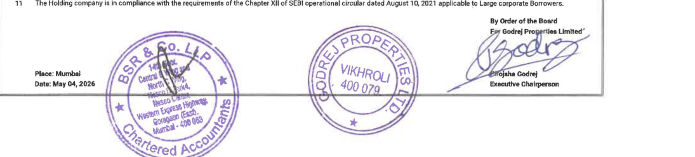

**[Image: Mar2026RResult.pdf-0020-14.png (1095x249, 200.7KB)]**

<!-- Start of picture text -->
11  The Holding company Is in compliance with the requirements of the Chapter XII of SEBI  operational circular dated August 1 o, 2021  applicable to Large corporate Borrowers. - By Order  of  the Board - ~ROP~ &. '- Q_·  l.1  '°  '.'?· 0:  /\ Place: Mumbai Dato:  May 04, 2026  co~~ c,~~ j  I  ~ , , ,..~,  .  •  - ,Q a  ~ • 400 'vlKHRou 07a  ~  ~- ~  ,person  . ~)~\11~-:r." C ,:)~  ::r-fdJ~ ~o-s  # J!:  -v - y l"fered  t,..c:.v. <!-- End of picture text -->

---

## Extracted Images

| # | File | Dimensions | Size |
|---|------|------------|------|
| 1 | Mar2026RResult.pdf-0001-16.png | 314x219 | 72.5KB |
| 2 | Mar2026RResult.pdf-0003-15.png | 102x155 | 14.0KB |
| 3 | Mar2026RResult.pdf-0004-14.png | 156x159 | 16.3KB |
| 4 | Mar2026RResult.pdf-0004-15.png | 157x9 | 1.1KB |
| 5 | Mar2026RResult.pdf-0005-08.png | 205x17 | 3.8KB |
| 6 | Mar2026RResult.pdf-0005-10.png | 412x189 | 34.4KB |
| 7 | Mar2026RResult.pdf-0006-00.png | 77x38 | 2.8KB |
| 8 | Mar2026RResult.pdf-0006-02.png | 215x213 | 82.4KB |
| 9 | Mar2026RResult.pdf-0006-03.png | 178x178 | 52.5KB |
| 10 | Mar2026RResult.pdf-0007-01.png | 214x216 | 83.1KB |
| 11 | Mar2026RResult.pdf-0007-02.png | 176x178 | 51.7KB |
| 12 | Mar2026RResult.pdf-0007-03.png | 222x13 | 1.2KB |
| 13 | Mar2026RResult.pdf-0008-00.png | 78x41 | 2.9KB |
| 14 | Mar2026RResult.pdf-0008-08.png | 215x213 | 83.0KB |
| 15 | Mar2026RResult.pdf-0008-09.png | 180x175 | 48.8KB |
| 16 | Mar2026RResult.pdf-0008-10.png | 530x11 | 1.9KB |
| 17 | Mar2026RResult.pdf-0009-00.png | 1240x1754 | 734.0KB |
| 18 | Mar2026RResult.pdf-0010-22.png | 135x182 | 17.6KB |
| 19 | Mar2026RResult.pdf-0011-05.png | 156x156 | 15.7KB |
| 20 | Mar2026RResult.pdf-0012-19.png | 263x168 | 22.0KB |
| 21 | Mar2026RResult.pdf-0013-21.png | 144x166 | 16.7KB |
| 22 | Mar2026RResult.pdf-0014-13.png | 103x162 | 12.5KB |
| 23 | Mar2026RResult.pdf-0015-13.png | 160x172 | 17.3KB |
| 24 | Mar2026RResult.pdf-0016-11.png | 160x174 | 22.4KB |
| 25 | Mar2026RResult.pdf-0016-14.png | 120x11 | 0.6KB |
| 26 | Mar2026RResult.pdf-0017-01.png | 213x211 | 81.0KB |
| 27 | Mar2026RResult.pdf-0017-02.png | 176x178 | 52.8KB |
| 28 | Mar2026RResult.pdf-0018-01.png | 131x36 | 9.2KB |
| 29 | Mar2026RResult.pdf-0020-02.png | 82x57 | 3.4KB |
| 30 | Mar2026RResult.pdf-0020-14.png | 1095x249 | 200.7KB |
