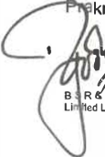
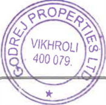
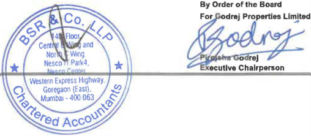

**Godrej Properties Limited Regd. Office:** Godrej One 5th Floor, Pirojshanagar, Eastern Express Highway, Vikhroli (E), Mumbai - 400 079. India Tel.: +91-22-6169-8500 Fax: +91-22-6169-8888 Website: www.godrejproperties.com 

CIN: L74120MH1985PLC035308 

July 31, 2024 

# **BSE Limited** 

Phiroze Jeejeebhoy Towers, Dalal Street, Mumbai - 400 001 

# **The National Stock Exchange of India Limited** 

Exchange Plaza, Plot No. C/1, G Block, Bandra Kurla Complex, Bandra (East), Mumbai - 400 051 

# **Ref: Godrej Properties Limited** 

BSE - Script Code: 533150, Scrip ID - GODREJPROP BSE - Security Code-974950, 974951, 975090, 975091, 975856, 975857 - Debt Segment NSE - GODREJPROP 

**Sub: Unaudited standalone and consolidated fmancial results fr the quarter ended June** **<u>30, 2024.</u>** 

Dear Sir/ Madam, 

Please note that the Board of Directors of the Company, at its meeting held on Wednesday, July 31, 2024 has, _inter alia,_ considered and approved the unaudited standalone and consolidated financial results for the quarter ended June 30, 2024. 

Pursuant to Regulation 30, 33 and 52 read with Schedule III of the Securities and Exchange Board oflndia (Listing Obligations and Disclosure Requirements) Regulations, 2015, please find enclosed the unaudited standalone and consolidated financial results for the quarter ended June 30, 2024, duly reviewed and recommended by the Audit Committee and approved by the Board of Directors along with the Limited Review Report issued by _Mis._ B S R & Co. LLP, the Statutory Auditors of the Company. 

The meeting of the Board of Directors of the Company commenced at 10:30 a.m. and the results were approved at 11.15 a.m. 

Kindly take the aforesaid on record. Thank you. 

Yours truly, **For Godrej Properties Limited Ashish Karyekar** M,ih\� **j Company Secretary** 

**[Image: June2024.pdf-0001-16.png (182x91, 25.8KB)]**

**_Enclosed as above_** 

14th Floor, Central B Wing and North C Wing Nesco IT Park 4, Nesco Center Western Express Highway Goregaon (East), Mumbai - 400 063, India Telephone: +91 (22) 6257 1000 Fax:+91 (22) 62571010 

**BS R & Co. LLP** Chartered Accountants 

**Limited Review Report on unaudited standalone financial results of Godrej Properties Limited for the quarter ended 30 June 2024 pursuant to Regulation 33 and Regulation 52(4) read with Regulation 63 of Securities and Exchange Board of India (Listing Obligations and Disclosure Requirements) Regulations, 2015, as amended, as prescribed in Securities and Exchange Board of India operational circular SEBI/HO/DDHS/P/CIR/2021/613 dated 10 August 2021** 

## **To the Board of Directors of Godrej Properties Limited** 

1. We have reviewed the accompanying Statement of unaudited standalone financial results of Godrej Properties Limited (hereinafter referred to as "the Company") for the quarter ended 30 June 2024 ("the Statement") (in which are included interim financial information from branches in Singapore, Qatar and Dubai). 

2. This Statement, which is the responsibility of the Company's management and approved by its Board of Directors, has been prepared in accordance with the recognition and measurement principles laid down in Indian Accounting Standard 34 _"Interim Financial Reporting''_ ("Ind AS 34"), prescribed under Section 133 of the Companies Act, 2013, and other accounting principles generally accepted in India and in compliance with Regulation 33 and Regulation 52(4) read with Regulation 63 of the Securities and Exchange Board of India (Listing Obligations and Disclosure Requirements) Regulations, 2015, as amended ("Listing Regulations"), as prescribed in Securities and Exchange Board of India operational circular SEBI/HO/DDHS/P/CIR/2021/613 dated 10 August 2021. Our responsibility is to issue a report on the Statement based on our review. 

3. We conducted our review of the Statement in accordance with the Standard on Review Engagements (SRE) 2410 _"Review of Interim Financial Information Performed by the Independent Auditor of the Entity",_ issued by the Institute of Chartered Accountants of India. A review of interim financial information consists of making inquiries, primarily of persons responsible for financial and accounting matters, and applying analytical and other review procedures. A review is substantially less in scope than an audit conducted in accordance with Standards on Auditing and consequently does not enable us to obtain assurance that we would become aware of all significant matters that might be identified in an audit. Accordingly, we do not express an audit opinion. 

4. Attention is drawn to the fact that the figures for the three months ended 31 March 2024 as reported in the Statement are the balancing figures between audited figures in respect of the full previous financial year and the published year to date figures up to the third quarter of the previous financial year. The figures up to the end of the third quarter of previous financial year had only been reviewed and not subjected to audit. 

5. Based on our review conducted as above, nothing has come to our attention that causes us to believe that the accompanying Statement, prepared in accordance **with** the recognition and measurement principles laid down in the aforesaid Indian Accounting Standard and other accounting principles generally accepted in India, has not disclosed the information required to be disclosed in terms of Regulation 33 and Regulation 52(4) read with Regulation 63 of the Listing Regulations, as prescribed in Securities and Exchange Board of India operational circular SEBI/HO/DDHS/P/CIR/2021/613 

....... ,:nm.,., 10 August 2021, including the manner in which it is to be disclosed, or that it contains any / 

**�** 

**[Image: June2024.pdf-0002-09.png (107x160, 12.3KB)]**

**Registered Office:** 

**14th Floor, Central B Wing and Nor1h C Wing, Nesco IT Park 4, Nesco Center, Western Express Highway, Goregaon (East), Mumbai • 400063** Page 1 of 2 

**B S R & Co. (a partnership firm wtth RegislraUon No. BA61223) converted into B S R & Co. LLP (a Limited Uabllty Partnership wtth LLP Registration No. AAB-8181) wtth effect from October 14, 2013** 

**8** SR & Co. **LLP** 

**Limited Review Report** **_(Continued)_ Godrej Properties Limited** 

material misstatement. 

For **B S R & Co. LLP** _Chartered Accountants_ Firm's Registration No.:101248W/W-100022 

Mumbai 31 July 2024 

**[Image: June2024.pdf-0003-05.png (207x168, 20.7KB)]**

_Partner_ Membership No.: 105149 UDIN:24105149BKEXEB7127 

Page 2 of 2 

## **GODREJ PROPERTIES LIMITED** 

, 'PAOPeATIES _?_ ,,, 

#### CIN: L74120MH1985PLC035308 

Regd Office : Godrei One 5th Floor Piroishanaqar, Eastern Express Hiqhwav. Vikhroli (East), Mumbai - 400 079. www.Qodreiproperties.com **Statement of Unaudited Standalone Financial Results for the Quarter Ended June 30, 2024** 

|| ||**Quarter Ended**||**(INR**In Crore) **Year Ended**|
|---|---|---|---|---|---|
|**Sr.No**|**.** **Pariculars**|**30.06.2024**|**31.03.2024**|**30.06.2023**|**31.03.2024**|
|||**Unaudited**|**Audited** **/Refer Note 6)**|**Unaudited**|**Audited**|
|**1**|**Income**|||||
||Revenue from Operations|189.47|659.90|309.98|1,330.61|
||Other Income (Refer Note 4)|986.77|346.32|257.53|1,195.00|
||**Total Income**|**1,176.24**|**1,006.22**|**567.51**|**2,525.61**|
|**2**|**Expenses**|||||
||Cost of Materials Consumed|1,849.01|1,888.19|758.23|3,952.33|
||Changes in inventories of finished goods and construction work-in- progress|(1,747.60)|(1,553.26)|(579.77)| (3,307.04)|
||Employee Benefits Expense|71.19|77.69|40.57|221.37|
||Finance Costs|112.50|121.36|55.47|380.02|
||Depreciation and Amortisation Expense|8.26|7.24|5.38|24.34|
||Other Expenses|213.45|197.84|129.52|540.34|
||**Total Expenses**|**506.81**|**739.06**|**409.40**|**1,811.36**|
|**3**|**Profit before Tax for theperiod / year**|**669.43**|**267.16**|**158.11**|**714.25**|
|**4**|**Tax expense**|||||
||Current Tax|26.37|46.09|31.90|118.29|
||Deferred Tax |151.74|4.18|4.87|31.61|
|**5**|**Profit afer Tax for theperiod/year**|**491.32**|**216.89**|**121.34**|**564.35**|
|**6**|**Other Comprehensive Income /(Loss) for theperiod/year**|||||
||**Items that will not be subsequently reclassified to profit or loss**|||||
||Remeasurements of the defined benefitplan|(0.37)|(2.44)|0.31|(1.50)|
||Tax on Above|0.09|0.62|(0.08)|0.38|
|**7**|**Total Comprehensive Income for theperiod/year**|**491.04**|**215.07**|**121.57**|**563.23**|
||**Paid-u Equity Share Caital**|**13903**|**13902**|**13901**|**13902**|
|**8**|**p   p** FaceValue-INR 5/-pershare |**.**|**.**|**.**|**.**|
|**9**|**Reseres Excluding Revaluation Resere and Debenture** **Redemotion Resere **||||**10,373.26**|
|**10**|**Net-Worth**|**11,004.27**|**10,512.28**|**10,067.73**|**10,512.28**|
|**11**|**Earning Per Equity Share(EPS) (Amount**in**INR)**|||||
||Basic EPS(*not annualized)|**17.67***|**7.80***|**4.46***| **20.30**|
||Diluted EPS(*not annualized)|**17.67***|**7.80***|**4.46***| **20.29**|
|**12**|**Key Ratios and Financial Indicators(Refer Note 4)**|||||
||Debt Equity Ratio (Gross)|**1.04**|**0.96**|**0.75**|**0.96**|
||Debt Equity Ratio (Net)|**0.70**|**0.62**|**0.56**|**0.62**|
||Debt Service Coverage Ratio(DSCR)|**3.76**|**1.91**|**0.20**|**1.59**|
||Interest Serice Coverage Ratio (ISCR)|**3.76**|**1.91**|**1.66**|**1.59**|
||Current Ratio|**1.53**|**1.61**|**1.56**|**1.61**|
||LongTerm Debt to WorkingCapital|**0.29**|**0.30**|~~-~~|**0.30**|
||Bad Debts to Account Receivable Ratio|~~-~~|**0.05**|~~-~~|**0.05**|
||Current LiabilityRatio|**0.86**|**0.85**|**1.00**|**0.85**|
||Total Debts to Total Assets|**0.37**|**0.36**|**0.36**|**0.36**|
||Debtors Turnover(annualized)|**3.09**|**11.30**|**5.39**|**5.14**|
||InventorTurnover(annualized)|**0.04**|**0.16**|**0.11**|**0.08**|
|| Operating Margin (%) ~~�.-~~**~~-~~**~~�~~ | **(100.89%)**|**10.02%**|**(9.51%)**|**(3.16%)**|
|| Adjusted EBITDA %~~-~~ **_/cY/_**_~~-~~__~~r ~~t_ -� ·--·  | ~~&~~ **67.64%** |**40.99%**|**40.19%**|**45.65%**|
||     Net Profit Margin**(%��OP� ** f v/Cer�I�n\|'  **41.77%**|**21.55%**|**21.38%**|**22.35%**|
||_'(/_ y,"    | *l||||
||   IgVIKHROLY       •  | ||||
||       _$_400 019.1�_V_    **_G_**    _�_ _r_   | ||||
||      _"_ _�_ **_&_****_-_**|||||
|| _�_     **_red Acc_****_0 _**|||||

**[Image: June2024.pdf-0004-05.png (123x30, 6.0KB)]**

**[Image: June2024.pdf-0005-00.png (128x36, 6.1KB)]**

- **Notes: 1** The above unaudited standalone financial results which are published in accordance with Regulation 33 and 52(4) of the SEBI (Listing Obligations & Disclosure Requirements) Regulations, 2015, as amended, have been reviewed by the Audit Committee and approved by the Board of Directors at their meeting held on July 31, 2024. The above results have been subjected to "limited review" by the statutory auditors of the Company. The unaudited standalone financial results are in acoordance with the Indian Accounting Standards (Ind AS) as prescribed under Section 133 of the Companies Act, 2013. 

- 2 As ·the Company's business activity falls within a single business segment viz. 'Development of Real Estate Property·, the unaudited standalone financial results are reflective of the information required by Ind AS 108 "Operating Segments". 

- 3 During the quarter ended June 30, 2024, the Company granted 22,015 new stock grants to eligible employees, and 15,491 equity shares were allotted upon the exercise of stock grants under the Employee Stock Grant Scheme. 

- **4** During the quarter ended June 30, 2024, the Company has sold 5% equity stake held by it in Godrej Green Homes Private Limited ("GGHPL") (one of its joint venture entities), resulting into gain of Rs 46.66 crores which has been included in Other income. The conditions set out in the Share Purchase Agreement, have resulted in loss of joint control by the Company in the said joint venture entity. Consequently, upon relinquishment of joint-control, Company's remaining Investments have been fair valued as per IND AS 109 and resultant gain has been recorded under the head other inoome. 

- 5 Formula used for calculation of Ratios and Financial Indicators are as below: Debt-Equity Ratio (Gross)= Total Debt (Current Borrowing + Non-current Borrowing)/ Shareholder's Equity (Total Equity) Debt-Equity Ratio **(Net)**= Total Debt (Current Borrowing + Non-current Borrowing) - Cash and Bank Balances • Fixed Deposits(excluding Fixed Deposit in escrow) - Liquid Investments)/ Shareholder's Equity (Total Equity) DSCR= EBITDN (Finance Cost (excludes interest accounted on customer advance as per EIR Principal)+Principal Payment due to Non-Current Borrowing repayable within one year) 

   - ISCR= EBITDN Finance Cost (excludes interest accounted on customer advance as per EIR Principal) EBITDA= Profit/(loss) before tax + Finance cost+ Finance cost included in Cost of Sales+ Depreciation and amortisation expense Current Ratio= Current Assets / Current Liabilities 

   - Long Term Debt to Worl<ing Capital = Non-Current Borrowing I (Current Assets - Current Liabilities) Bad Debts to Account Receivable Ratio= Bad Debts /Average Trade Receivables Current Liability Ratio= Current Liabilities/ Total Liabilities 

   - Total Debts to Total Assets= (Current Borrowing+ Non-current Borrowing} I Total Assets Debtors Turnover= Revenue from Operations/ Average Trade Receivables Inventory Turnover= (Cost of Material Consumed + Changes in inventories of finished goods and oonstruclion worl<-in-progress) / Average Inventories Operating Margin (%}= (Earning before interest, taxes, depreciation, amortisation expenses, interest included in cost of sales and other income) I Revenue from operations 

   - Adjusted EBITDA (%}=(Earning before interest, taxes, depreciation, amortisation expenses. interest included in cost of sales)/ Total Income Net Profit Margin (%)= Profit/(loss) for the period/ year/ Total Income 

- 6 The figures for the quarter ended March 31, 2024 are the balancing figures between audited figures in respect of the full financial year and the published year to date figures upto the third quarter of the respective financial year. 

- 7 The statutory auditors of Godrej Properties Limited have expressed an unmodified opinion on the unaudited standalone financial results for the quarter ended June 30, 2024. 

**[Image: June2024.pdf-0005-12.png (299x212, 58.8KB)]**

<!-- Start of picture text -->
Place: Mumbai Date: July 31, 2024 <!-- End of picture text -->

**[Image: June2024.pdf-0005-13.png (213x218, 84.8KB)]**

**[Image: June2024.pdf-0005-14.png (272x166, 46.9KB)]**

<!-- Start of picture text -->
By Order of the Board For G drej Properties Limited  ,, <!-- End of picture text -->

14th Floor, Central B Wing and North C Wing Nesco IT Park 4, Nesco Center Western Express Highway Goregaon (East), Mumbai - 400 063, India Telephone: +91 (22) 6257 1000 Fax: +91 (22) 6257 1010 

**BS R & Co. LLP** Chartered Accountants 

**Limited Review Report on unaudited consolidated financial results of Godrej Properties Limited for the quarter ended 30 June 2024 pursuant to Regulation 33 and Regulation 52(4) read with Regulation 63 of Securities and Exchange Board of India (Listing Obligations and Disclosure Requirements) Regulations, 2015, as amended, as prescribed in Securities and Exchange Board of India operational circular SEBI/HO/DDHS/P/CIR/2021 /613 dated 10 August 2021** 

## **To the Board of Directors of Godrej Properties Limited** 

1. We have reviewed the accompanying Statement of unaudited consolidated financial results of Godrej Properties Limited (hereinafter referred to as "the Parent"), and its subsidiaries (the Parent and its subsidiaries together referred to as "the Group") and its share of the net loss after tax and total comprehensive loss of its associate and joint ventures for the quarter ended 30 June 2024 ("the Statement"), being submitted by the Parent pursuant to the requirements of Regulation 33 and Regulation 52(4) read with Regulation 63 of the Securities and Exchange Board of India (Listing Obligations and Disclosure Requirements) Regulations, 2015, as amended ("Listing Regulations"), as prescribed in Securities and Exchange Board of India operational circular SEBI/HO/DDHS/P/CIR/2021/613 dated 10 August 2021. 

2. This Statement, which is the responsibility of the Parent's management and approved by the Parent's Board of Directors, has been prepared in accordance with the recognition and measurement principles laid down in Indian Accounting Standard 34 _"Interim Financial Reporting"_ ("Ind AS 34"), prescribed under Section 133 of the Companies Act, 2013, and other accounting principles generally accepted **_in_** India and in compliance with Regulation 33 and Regulation 52(4) read with Regulation 63 of the Listing Regulations, as prescribed in Securities and Exchange Board of India operational circular SEBI/HO/DDHS/P/CIR/2021/613 dated 10 August 2021. Our responsibility is to express a conclusion on the Statement based on our review. 

3. We conducted our review of the Statement in accordance with the Standard on Review Engagements (SRE) 2410 _"Review of Interim Financial Information Performed by the Independent Auditor of the_ matters, and applying analytical and other review procedures. A review is substantially less in scope _Entity",_ information consists of making inquiries, primarily of persons responsible for financial and accountingissued by the Institute of Chartered Accountants of India. A review of interim financial than an audit conducted in accordance with Standards on Auditing and consequently does not enable us to obtain assurance that we would become aware of all significant matters that might be identified in an audit. Accordingly, we do not express an audit opinion. 

We also performed procedures in accordance with the circular issued by the Securities and Exchange Board oflndia under Regulation 33(8) of the Listing Regulations, to the extent applicable. 

4. The Statement includes the results of the following entities: 

Name of the entity 

Godrej Projects Development Limited Godrej Garden City Properties Private Limited Godrej Hillside Properties Private Limited 

Godrej Home Developers Private Limited Godrej Prakriti Facilities Private Limited 

**[Image: June2024.pdf-0006-12.png (115x172, 14.6KB)]**

kr7za Facilities Management Private Limited **Rt partnership firm wilh Regislralion No. BA61223) converted into BS R & Co. LLP (a ed Liabilty Partnership wtth LLP Registra1ion No. AAB�181) with effect from Oc1ober 14, 2013** 

Relationship 

Wholly owned subsidiary Wholly owned subsidiary Wholly owned subsidiary Wholly owned subsidiary Wholly owned subsidiary Wholly owned subsidiary 

**Registered Office: 141h Floor, Central B Wing and North C Wing, Nesco IT Park 4, Nesco Center, Western Express Highway, Goregaon (East), Mumbai -400063** Page 1 of 4 

BS R & Co. LLP 

Godrej Highrises Properties Private Limited Godrej Genesis Facilities Management Private Limited Citystar lnfraProjects Limited Godrej Highrises Realty LLP Godrej Skyview LLP Godrej Green Properties LLP Godrej Projects (Soma) LLP Godrej Athenmark LLP Godrej Project Developers & Properties LLP Godrej City Facilities Management LLP Godrej Florentine LLP Godrej Olympia LLP 

**Limited Review Report** **_(Continued)_ Godrej Properties Limited** Wholly owned subsidiary Wholly owned subsidiary Wholly owned subsidiary Wholly owned subsidiary Wholly owned subsidiary Wholly owned subsidiary Wholly owned subsidiary Wholly owned subsidiary Wholly owned subsidiary Wholly owned subsidiary Wholly owned subsidiary Wholly owned subsidiary 

Ashank Projects Development LLP (formerly known as AshankWholly owned subsidiary Realty Management LLP) 

Godrej Green Woods Private Limited Godrej Precast Construction Private Limited Godrej Realty Private Limited Godrej Buildwell Projects LLP Godrej Living Private Limited Ashank Land & Building Private Limited Ashank Facility Management LLP Godrej Vestamark LLP Godrej Real Estate Distribution Company Private Limited 

Wonder City Buildcon Limited 

Wholly owned subsidiary Wholly owned subsidiary Wholly owned subsidiary Wholly owned subsidiary Wholly owned subsidiary Wholly owned subsidiary Wholly owned subsidiary Wholly owned subsidiary Wholly owned subsidiary Wholly owned subsidiary 

Godrej Township Development Limited (formerly known as GodrejWholly owned subsidiary Home Constructions Limited) 

Maan-Hinje Township Developers Private Limited (formerly knownSubsidiary as Maan-Hinje Township Developers LLP) 

Oasis Landmark LLP Subsidiary Godrej Residency Private Limited Subsidiary Godrej Reserve LLP Subsidiary 

Godrej Skyline Developers Limited (formerly known as GodrejSubsidiary Skyline Developers Private Limited) 

Dream World Landmarks LLP Subsidiary Caroa Properties LLP Subsidiary Godrej Property Developers LLP Subsidiary Oxford Realty LLP Joint Venture Embellish Houses LLP Joint Venture M S Ramaiah Ventures LLP Joint Venture Godrej Macbricks Private Limited Joint Venture Joint Venture l,uncity Infrastructure (Mumbai) LLP _r_ 

**[Image: June2024.pdf-0007-12.png (101x176, 11.2KB)]**

Page 2 of4 

BS R & Co. LLP 

**Limited Review Report** **_(Continued)_ Godrej Properties Limited** Joint Venture Yerwada Developers Private Limited Godrej Highview LLP Joint Venture Godrej Greenview Housing Private Limited Joint Venture Godrej Housing Projects LLP Joint Venture Godrej Amitis Developers LLP Joint Venture Wonder Projects Development Private Limited Joint Venture AR Landcraft LLP Joint Venture Godrej Real View Developers Private Limited Joint Venture Pearlite Real Properties Private Limited Joint Venture Godrej Odyssey LLP Joint Venture Manjari Housing Projects LLP Joint Venture Godrej SSPDL Green Acres LLP Joint Venture Prakhhyat Dwellings LLP Joint Venture Roseberry Estate LLP Joint Venture Godrej Project North Star LLP Joint Venture Godrej Developers & Properties LLP Joint Venture Godrej lrismark LLP Joint Venture Godrej Green Homes Private Limited Joint Venture (upto 4 June 2024) Manyata Industrial Parks LLP Joint Venture Mahalunge Township Developers LLP Joint Venture Munjal Hospitality Private Limited Joint Venture Godrej Redevelopers (Mumbai) Private Limited Joint Venture Universal Metro Properties LLP Joint Venture Madhuvan Enterprises Private Limited Joint Venture Vivrut Developers Private Limited Joint Venture Vagishwari Land Developers Private Limited Joint Venture Godrej Projects North LLP Joint Venture Mosiac Landmarks LLP Joint Venture Godrej One Premises Management Private Limited Associate 

5. Attention is drawn to the fact that the figures for the three months ended 31 March 2024 as reported in the Statement are the balancing figures between audited figures in respect of the full previous financial year and the published year to date figures up to the third quarter of the previous financial year. The figures up to the end of the third quarter of previous financial year had only been reviewed and not subjected to audit. 

6. Based on our review conducted and procedures performed as stated in paragraph 3 above, nothing has come to our attention that causes us to believe that the accompanying Statement, prepared in accordance with the recognition and measurement principles laid down in the aforesaid Indian Accounting Standard and other accounting principles generally accepted in India, has not disclosed 

_lie information required to be disclosed in terms of Regulation 33 and Regulation 52(4) read with 

.r'.�egulation 63 of the Listing Regulations, as prescribed in Securities and Exchange Board of India operational circular SEBI/HO/DDHS/P/CIR/2021/613 dated 10 August 2021, including the manner in which it is to be disclosed, or that it contains any material misstatement. 

r Page 3 of 4 

**[Image: June2024.pdf-0008-04.png (117x166, 12.5KB)]**

BS R & Co. LLP 

# **Limited Review Report** **_(Continued)_** 

# **Godrej Properties Limited** 

- The Statement also includes the Group's share of net loss after tax of Rs 3.57 crores and total comprehensive loss of Rs 3.57 crores, for the quarter ended 30 June 2024, as considered in the Statement, in respect of three (3) joint ventures, based on its interim financial results which have not been reviewed. According to the information and explanations given to us by the management, these interim financial results are not material to the Group. 

- 7. 

Our conclusion is not modified in respect of this matter. 

For **B S R & Co. LLP** _Chartered Accountants_ Firm's Registration No.:101248W/W-100022 

## Mumbai 

31 July 2024 

**[Image: June2024.pdf-0009-08.png (205x178, 24.0KB)]**

_Partner_ Membership No.: 105149 UDIN:24105149BKEXEC7659 

Page 4 of4 

_f'-·__rr-_ 

### **GODREJ PROPERTIES LIMITED** 

|**CIN: L74120MH1985PLC03530** **Regd Ofice: Godre****j****One, 5th Floor, Piro****j****shnagar, Easter Express Highway, Vikhr** **Statement of Unaudited Consolidated Financial Results fo**|**8** **oli (East****}****, Mumbai** **r the Quarer E**|**-400 079. w.go** **nded June 30, 2**|**dre****j****propertles.c** **024**|**om**|
|---|---|---|---|---|
|||||**(INR In Crore)**|
|||**Quarer Ended**||**Year Ended**|
|**Sr.** **Pariculars** |**30.06.2024**| **31.03.2024**|**30.06.2023**|**31.03.2024**|
| **No.**|**Unaudited**|**Audited** **(Refer Note 7****}**|**Unaudited**|**Audited**|
|**1** **Income** |||||
|**Revenue from operations**|**739.00**|**1,426.09**|**936.09**|**3,035.62**|
|**Other income ( Refer note 4 }** **Ttl I**|**960.48** |**488.73** |**329.89** |**1,298.60** **433422**|
|**oa ncome** **2** **Expenses**|**1,699.48**|**1,914.82**|**1,265.98**|**,.**|
|**Cost of materials consumed**|**2,578.46**|**2,711.63**|**1,119.19**|**6,787.01**|
|**Purchases of stock-in-trade ( Refer note 8****)** |**13.21**|**48.46**|**2.12**|**178.05**|
|**Changes in inventores of fnished goods, stock-in.rade and constrction work�r** **progress** |**(2,096.99}**|**(1,899.84)**|**(440.41)**| **(5,157.03}**|
|**Employee benefts expense**|**98.73**|**118.85**|**59.23**|**331.32**|
| **Finance costs** |**40.75** |**31.46** |**29.67** |**152.11** |
|**Depreciation and amortisation expense**|**16.64**|**16.08**|**6.93**|**4.56**|
|**Other expenses**|**270.65**|**324.24**|**345.16**|**1,025.95**|
|**Total Expenses**     |**921.45** |**1,350.88** |**1,121.89** |**3,361.97** |
|**3** **Profit before shar of Profit of Joint ventures, associate and tax** **4** **Share of {loss)/ Proft of Joint Ventures and Associate****(****net of tax)**|**778.03** **(61.80)**|**563.94** **37.05**|**14.09** **48.83**|**972.25** **27.74**|
| **5** **Profit before tax for the period / year**   |**716.23**|**600.99**|**192.92**|**999.99**|
|**6** **Tax expense** **Current tax**|**30.32**|**68.88**|**65.76**|**187.01**|
|**Deferred tax**|**16711**|**5410**|**{653)**| **6592**|
| **7** **Profit after tax for the period / year**|**.** **518.80**|**.** **478.01**|**.** **133.69**| **.** **747.06**|
|**8** **Other Comprehensive Income for the period / year** |||||
|**Iems that will not be subsequently reclassified to profit or loss** |||||
| |||||
|**Remeasurements of the defined beneft plan**|**(0.37)**|**(2.83)**|**0.30**|**(1.92)**|
|**Tax on Above** **Iems that will be subsequently reclasslfled to proft or loss** |**0.10**|**0.68**|**(0.08)**| **0.45**|
| **Exchange diferences in tanslating the fnancial statements of a foreign operation**|-|**0.00**|**0.15**|**0.17**|
|**9** **Total Comprehensive Income for the period/year** |**518.53**|**475.86**|**134.06**|**745.76**|
|**10** **Profit I (loss} atributable to:** |||||
|**Equily holders of Parent**|**520.05**|**471.26**|**124.94**|**725.27**|
|**Nor>-Controlling Interests** **11** **Oher Comprehensive Income attributable to:**|**(1.25)**|**6.75**|**8.75**|**21.79**|
|   **Equity holders of Parent**|**(0.27)**|**{2.13}**|**0.37**|**(1.28)**|
|**Non-Controlling Interests** **12Total Comprehensive Income atributable to:**|**0.00**|**(0.02)**|~~-~~|**(0.02)**|
| **Equity holders of Parent** **Non-Controlling Interests** |**519.78** **(1.25)**|**469.13** **6.73**|**125.31** **8.75**|**723.99** **21.77**|
|**13** **Paid-p Equity Share Capital** **F Vl  INR 5/  h** |**139.03**|**139.02**|**139.01**|**139.02**|
|**ace aue -  - per sare** **14Reseres Excluding Revaluation Resere and Debenture Redemption Reserve** ||||**9,853.49**|
|**15** **Net-Worh** **16Erin Per Euit Shar (EPS) Aount In INR)**|**10,513.23**|**9,992.51**|**9,389.40**|**9,992.51**|
|**ag  qy e  (** **Basic EPS (• not annualized****)**|**18.70***|**16.95***|**4.59***|**26.09**|
|**Diluted EPS (* not annualized)**   **i d i  f**|**18.70***|**16.95***|**4.59***|**26.08**|
|**17** **Key Ratos an Fnancial Indicators (Reer Note 6****)** **Debt Equity Ratio****(****Gross)**|**1.15**|**1.07**|**0.81**|**1.07**|
|**Debt Equity Ratio {Net****}** |**0.71**|**0.62**|**0.56**|**0.62**|
|**Debt Serice Coverage Ratio****{****DSCR****}**    |**3.23**|**2.72**|**0.27**|**1.53** |
|**Interest Service Coverage Ratio(ISCR)** |**3.23**|**2.72**|**2.07**|**1.53**|
|**Curent Ratio** **Lon Term Debt to Workin Caital**|**1.38** **028**|**1.43** **027**|**1.43** |**1.43** **027**|
|**g    g p** **Bad Debts to Account Receivable Ratio**|**.**|**.** **0.04**|~~-~~ .|**.** **0.03**|
|**Current Liability Ratio**|**0.90**|**0.89**|**1.00**|**0.89**|
|**Total Debts to Total Assets**   |**0.31** |**0.30** |**0.31** |**0.30** |
|**Debtors Turver{annualized)** |**7.94**|**16.33**|**8.34**|**6.79**|
|**Inventory Turover {annualized****)** **O****p****erating Margin(%}**|**0.08** **(636o,****)**|**0.16** **1338%** |**0.20** **(66****°****/****)**|**0.10** **172%**|
|     |**.** |**.** **°**|**.**  |**.** |
|**Ad****j****usted EBITDA{%)** ~~�~~ **Net Proft Margin(%)** **f� ****~~o~~lv **_~~I~~, I__~~�~~_ |**52.01%** **31.68%**|**36.71/ ** **24.49%**|**24.08%** **10.17%**|**31.61%** **17.13%**|
|  **INR 000** ~~-~~ **•- th INR 50000** **/Q�141�� **\.-�|||||
|**. repres** **ss an  ,**              |||||
|(.Vrt1   _1_ **/**  **lhC** **,ng**      \\|||||
|�� � t     * **1** **Nsco lli'4.** **Nsco Cenler **      I|||||
|VIKHROLI      **Wstern Ex****p****ress Hi****g****hway**          |||||
|I    _��_  _0_ **G****e****(East).** _._ :� Mub11 • 40 063_,_   |||||
| _-_       ' �� �red Accov|||||
|  * ) |||||

**[Image: June2024.pdf-0010-03.png (115x30, 6.0KB)]**

<!-- Start of picture text -->
* <!-- End of picture text -->

##### **Notes:** 

- **1 The above unaudited consolidated financial results which are published in accordance with Regulation 33 and 52(4) of the SEBI (listing Obligations & Disclosure Requirements) Regulations, 2015, as amended, have been reviewed by the AUdit Committee and approved by the Board** _of_ **Directors at their meeting held on July 31, 2024. The above unaudited consolidated financial results have been subjected to limited review by the statutory auditors. The unaudited consolidated financial results are in accordance with the Indian Accounting Standards (Ind AS) as prescribed under Section 133** _of_ **the Companies Act, 2013.** 

- **2 Financial Results of Godrej Properties Limited (Standalone Information):** 

|**2**|**Financial Results of Godrej Properties Limited (Standalone Information):**||||**(INR in Crore)**|
|---|---|---|---|---|---|
||**Pariculars**||**Quarer Ended**||**Year Ended**|
|||**30.06.2024**|**31.03.2024**|**30.06.2023**|**31.03.2024**|
||**Total Income•** |**1,176.24**|**1,006.22**|**567.51**|**2,525.61**|
||**Proft before tax for the period / year**|**669.43**|**267.16**|**158.11**|**714.25**|
||**Profit after tax for the perod/ year**|**491.32**|**216.89**|**121.34**|**564,35**|
|**3**|**• Includes Revenue from operations and Other Income.** **Unaudited Consolidated Segment wise Revenue, Results, Assets and Liabilities for**|**quarter ended June 30, 20**|**24:** **Quarer Ended**||**Year Ended**|
|**Sr.** |**Pariculars**|**30.06.2024**|**31.03.2024**|**30.06.2023**|**31.03.2024**|
|**No.**||**Unaudited**|**Audited** **(Refer Note 7)**|**Unaudited**|**Audited**|
|**1**|**Segment Revenue**|||||
|**a**|**Real Estate**|**715.95**|**1,402.42**|**936.09**|**2,994.96**|
|**b**|**Hospitality**|**23.05**|**23.67**|~~.~~|**40.66**|
||**Total Segment Revenue**|**739.00**|**1,426.09**|**936.09**|**3,035.62**|
||**Net Income from Operations**|**739.00**|**1,426.09**|**936.09**|**3,035.62**|
|**2**|**Segment Results (Proft before tax)**|||||
|**a**|**Real Estate**|**713.40**|**596.42**|**193.26**|**999.48**|
|**b**|**Hospitality** |**2.83**|**4.57**|**(0.34)**|**0.51**|
||**Total Segmnt Results**|**716.23**|**600.99**|**192.92**|**999.99**|
|**3**|**Segment Assets**|||||
|**a**|**Real Estate**|**38,062.90**|**34,984.14**|**23,974.50**|**3,984.14**|
|**b**|**Hospitality**|**753.76**|**750.72**|**624.40**|**750.72**|
||**Total Assets**|**38,816.66**|**35,734.86**|**24,598.90**|**35,73.86**|
|**4**|**Segment Llabllltles**|||||
|**a**|**Real Estate**|**27,280.68**|**24,680.49**|**14,580.83**|**24,680.49**|
|**b**|**Hospitality**|**752.43**|**752.93**|**627.46**|**752.93**|
||**Total Llabllitles**|**28,033.11**|**25,433.42**|**15,208.29**|**25,433.42**|

- **4 During the quarter ended June 30, 2024, the Holding Company has sold 5% equity stake held by it in Godrej Green Homes Private Limited ('GGHPL") (one of its joint venture entities), resulting Into gain of Rs 46.66 Crores which has been included in Other income. The conditions set out in the Share Purchase Agreement, have resulted in loss of joint control by the Holding Company in the said joint venture entity. Consequently, _upon relinquishment of joint-<:anttol, the Group's remaining investments** _have_ **be n fair valued as per IND AS 109 and resultant gain has been recorded under the head other Income.** 

- **5 During the quarter ended June 30, 2024, the Holding Company granted 22,015 new stock grants to eligible employees, and 15,491 equity shares were allotted upon the exercise of stock grants under the Employee Stock Grant Scheme.** 

- **6 Formula used for Calculation** _of_ **Ratio and Financial Indicators are as below: Debt-Equity Ratio (Gross)= (Current Borrowing+ Non-current Borrowing) I Total Equity (excludes non controlling interest) Debt-Equity Ratio (Net)= (Current Borrowing+ No~urrent Borrowing - Cash and Bank Balances. Fixed Deposits - Liquid Investments) I Total Equity (excludes non controlling interest) DSCR= EBITDAI (Finance Cost (excludes interest accounted on customer advance as per EIR Principal) + Principal Payment due to Non-Current Borrowing repayable within one year)** 

**ISCR= EBITDAI Finance Cost (excludes interest accounted on customer advance as per EIR Principal) EBITDA= Profit before tax + Finance cost + Finance cost included in Cost of Sales + Depreciation and ammortizatioin expense Current Ratio = Current Assets I Current Liabilities** 

**Long Tenm Debt to Worl<.ing Capital = Non-Current Borrowing I (Current Assets• Current Liabilities) Bad Debts to Account Receivable Ratio= Bad Debts/ Average Trade Receivables Current Liability Ratio= Current Liabilities I Total Liabilities** 

   - **Total Debts to Total Assets= (Current Borrowing+ Non-current Borrowing) I Total Assets Debtors Turnover = Revenue from Operalions I Average Trade Receivables** 

   - **Inventory Turnover = (Cost of Material Consumed+ Changes in inventories of finished goods and construction work-in-progress) I Average Inventory Operaling Margin (%) = (Earning before share of profit/(loss) in joint ventures (net of tax), interest, taxes, depreciation, amortisation expenses.interest included in cost of sales and other income)/ Revenue from Operations** 

   - **Adjusted EBITDA (%) = (Earning before interest, taxes, depreciation, amortisation expenses and interest included in cost of sales)/ (Total Income + Share of profit/(loss) of Joint Ventures and Associate (net of tax)) Net Profit Margin (%)= Profit for the period/year/ (Total Income+ Share of profit/(loss) of Joint Ventures and Associate (net of tax))** 

- **7 The figures for the quarter ended March 31, 2024 are the balancing figures between audited figures in respect of the financial year and the published year to date figures upto the third quarter of the respective financial** _year._ 

- **8 During the quarter ended March 31 2024, with a view to refining the presentation of the cost of material consumed, the group had split the cost of raw material consumed and stock-in-trade. In order to enhance inter-period comparability of infomnation, the group has reclassified the comparative infonmalion for the quarter ended June 30 2023.** 

- **9 The statutory auditors of Godrej Properties Limited have expressed an unmodified opinion on the unaudited consolidated financial results for the quarter ended June 30, 2024.** 

**[Image: June2024.pdf-0011-15.png (175x174, 53.0KB)]**

**[Image: June2024.pdf-0011-16.png (116x29, 3.1KB)]**

<!-- Start of picture text -->
Place: Mumbai Date: July 31, 2024 <!-- End of picture text -->

**[Image: June2024.pdf-0011-17.png (508x222, 130.0KB)]**

---

## Extracted Images

| # | File | Dimensions | Size |
|---|------|------------|------|
| 1 | June2024.pdf-0001-16.png | 182x91 | 25.8KB |
| 2 | June2024.pdf-0002-09.png | 107x160 | 12.3KB |
| 3 | June2024.pdf-0003-05.png | 207x168 | 20.7KB |
| 4 | June2024.pdf-0004-05.png | 123x30 | 6.0KB |
| 5 | June2024.pdf-0005-00.png | 128x36 | 6.1KB |
| 6 | June2024.pdf-0005-12.png | 299x212 | 58.8KB |
| 7 | June2024.pdf-0005-13.png | 213x218 | 84.8KB |
| 8 | June2024.pdf-0005-14.png | 272x166 | 46.9KB |
| 9 | June2024.pdf-0006-12.png | 115x172 | 14.6KB |
| 10 | June2024.pdf-0007-12.png | 101x176 | 11.2KB |
| 11 | June2024.pdf-0008-04.png | 117x166 | 12.5KB |
| 12 | June2024.pdf-0009-08.png | 205x178 | 24.0KB |
| 13 | June2024.pdf-0010-03.png | 115x30 | 6.0KB |
| 14 | June2024.pdf-0011-15.png | 175x174 | 53.0KB |
| 15 | June2024.pdf-0011-16.png | 116x29 | 3.1KB |
| 16 | June2024.pdf-0011-17.png | 508x222 | 130.0KB |
