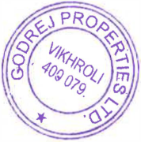
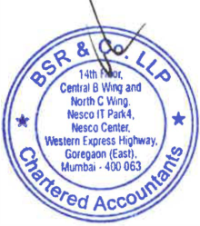
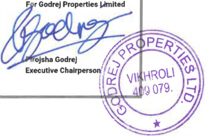
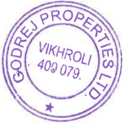
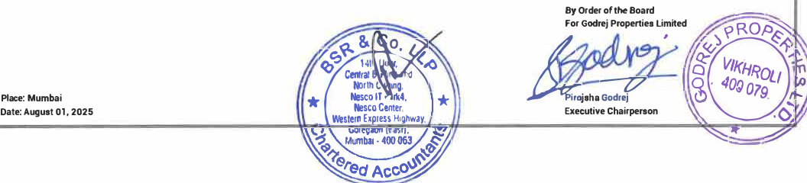

**Godrej Properties Limited Regd. Office:** Godrej One 5**1**h Floor, Pirojshanagar, Ea�tem Express Highway, Vikhroli (E), Mumbai- 400 079. India Tel.: +91-22-6169-8500 Website: www.godrejproperties.com 

CIN: L74120MH1985PLC035308 

August O 1, 2025 

## **BSELimited** 

Phiroze Jeejeebhoy Towers, Dalal Street, Mumbai - 400 001 

## **National Stock Exchange of India Limited** 

Exchange Plaza, Plot No. C/1, G Block, Bandra Kurla Complex, Bandra (East), Mumbai -400 051 

## **Ref: Godrej Properties Limited** 

BSE- Script Code: 533150, Scrip ID - GODREJPROP BSE - Security Code-974950, 974951, 975090, 975091, 975856, 975857, 976000-Debt Segment NSE - GODREJPROP 

**Sub: Unaudited standalone and consolidated fnancial results fr the quarter ended June 30, 2025** 

Dear **Sir/** Madam, 

Please note that the Board of Directors of the Company, at its meeting held on Friday, August 01, 2025, has, _inter alia,_ considered and approved the unaudited standalone and consolidated financial results for the quarter ended June 30, 2025. 

Pursuant to Regulation 30, 33, 52 and other applicable Regulations read with Schedule III of the Securities and Exchange Board of India (Listing Obligations and Disclosure Requirements) Regulations, 2015, please find enclosed the unaudited standalone and consolidated financial results for the quarter ended June 30, 2025, duly reviewed and recommended by the Audit Committee and approved by the Board of Directors along with the Limited Review Report issued by Ms.B S R & Co. LLP, the Statutory Auditors of the Company. 

The meeting of the Board of Directors of the Company commenced at 12:00 noon and the financial results were approved at 12.30 p.m. Thereafter, the Board Meeting continued for consideration of other Agenda Items. 

Kindly take the aforesaid on record. 

Thank you. 

Yours truly, **For Godrej Properties Limited t Ashish Karyekar** �;�'r-- **Company Secretary** 

_Enclosed as above_ 

**[Image: June2025.pdf-0001-18.png (164x80, 13.7KB)]**

14th Floor, Central B Wing and North C Wing Nesco IT Park 4, Nesco Center Western Express Highway Goregaon (East), Mumbai - 400 063, India Telephone: +91 (22) 6257 1000 Fax: +91 (22) 6257 1010 

**BS R & Co. LLP** Chartered Accountants 

**Limited Review Report on unaudited standalone financial results of Godrej Properties Limited for the quarter ended 30 June 2025 pursuant to Regulation 33 and Regulation 52(4) read with Regulation 63 of Securities and Exchange Board of India (Listing Obligations and Disclosure Requirements) Regulations, 2015, as amended, as prescribed in Securities and Exchange Board of India operational circular SEBI/HO/DDHS/P/CIR/2021/613 dated 10 August 2021, as amended** 

### **To the Board of Directors of Godrej Properties Limited** 

1. We have reviewed the accompanying Statement of unaudited standalone financial results of Godrej Properties Limited (hereinafter referred to as "the Company") for the quarter ended 30 June 2025 ("the Statement") (in which are included interim financial information from branches in Singapore, Qatar and Dubai). 

2. This Statement, which is the responsibility of the Company's management and approved by its Board of Directors, has been prepared in accordance with the recognition and measurement principles laid down in Indian Accounting Standard 34 _"Interim Financial Reporting"_ ("Ind AS 34"), prescribed under Section 133 of the Companies Act, 2013, and other accounting principles generally accepted in India and in compliance with Regulation 33 and Regulation 52(4) read with Regulation 63 of the Securities and Exchange Board of India (Listing Obligations and Disclosure Requirements) Regulations, 2015, as amended ("Listing Regulations"), as prescribed in Securities and Exchange Board of India operational circular SEBI/HO/DDHS/P/CIR/2021/613 dated 10 August 2021, as amended. Our responsibility is to issue a report on the Statement based on our review. 

3. We conducted our review of the Statement in accordance with the Standard on Review Engagements (SRE) 2410 _"Review of Interim Financial Information Performed by the Independent Auditor of the Entity",_ issued by the Institute of Chartered Accountants of India. A review of interim financial information consists of making inquiries, primarily of persons responsible for financial and accounting matters, and applying analytical and other review procedures. A review is substantially less in scope than an audit conducted in accordance with Standards on Auditing and consequently does not enable us to obtain assurance that we would become aware of all significant matters that might be identified in an audit. Accordingly, we do not express an audit opinion. 

4. Attention is drawn to the fact that the figures for the three months ended 31 March 2025 as reported in the Statement are the balancing figures between audited figures in respect of the full previous financial year and the published year to date figures up to the third quarter of the previous financial year. The figures up to the end of the third quarter of previous financial year had only been reviewed and not subjected to audit. 

5. Based on our review conducted as above, nothing has come to our attention that causes us to believe that the accompanying Statement, prepared in accordance with the recognition and measurement principles laid down in the aforesaid Indian Accounting Standard and other accounting principles generally accepted in India, has not disclosed the information required to be disclosed in terms of Regulation 33 and Regulation 52(4) read with Regulation 63 of the Listing Regulations, as prescribed in Securities and Exchange Board of India operational circular SEBI/HO/DDHS/P/CIR/2021/613 ed 10 August 2021, as amended, including the manner in which it is to be disclosed, or that it 

**[Image: June2025.pdf-0002-09.png (178x197, 25.1KB)]**

**Registered Office:** 

**14th Floor, Central 8 Wing and North C Wing, Nesco IT Park 4, Nesco Center, Western Express Highway, Goregaon (East), Mumbai w 400063** Page 1 of 2 

**BS R & Co. (a partnership firm wtth Registration No. BA61223) converted into BS R & Co. LLP (a Limited Liability Partnership with LLP Registration No. AAB�181) with effect from October 14, 2013** 

BS R & Co. LLP 

**Limited Review Report** **_(Continued)_ Godrej Properties Limited** 

contains any material misstatement. 

For **B S R** & **Co. LLP** 

Mumbai 01 August 2025 

_Chartered Accountants_ **a Godbole** _Partner_ Membership No.: 105149 UDIN:25105149BMLWZR9021 

**[Image: June2025.pdf-0003-06.png (413x201, 37.4KB)]**

<!-- Start of picture text -->
a Godbole Partner <!-- End of picture text -->

Page 2 of 2 

##### **GODREJ PROPERTIES LIMITED** 

###### **CIN : L7 4120MH1985PLC035308** 

###### **p,,,,jPROPERTIES** 

Regd Office: Godrej One, 5th Floor, Pirojshanagar, Eastern Express Highway, Vikhroli (East), Mumbai - 400 079. www.godrejproperties.com 

###### **Statement of Unaudited Standalone Financial Results for the Quarter Ended June 30, 2025** 

||||||**(INR in Crore)**|
|---|---|---|---|---|---|
||||**Quarer Ended**||**Year Ended**|
|**Sr.** |**Pariculars**|**30.06.2025**|**31.03.2025**|**30.06.2024**|**31.03.2025**|
|**No.**||**Unaudited**|**Audited** **(Refer Note 6)**|**Unaudited**|**Audited**|
|**1**|**Income**|||||
||**Revenue from operations**|106.07|911.69|189.47|1,949.62|
||Other income(Refer Note 4)|471.38|445.41|986.77|2,207.76|
||**Total Income**|**577.45**|**1,357.10**|**1,176.24**|**4,157.38**|
|**2**|**Expenses**|||||
||**Cost of materials consumed**|1914.02|2,325.71|1,849.01|7,265.02|
||Changes in inventories of finished goods and construction work-in· progress|(1,866.12)|(1,737.83)|(1,747.60)|(6,052.07)|
||Employee benefits expense|95.20|68.80|71.19|283.57|
||**Finance costs**|116.53|149.66|112.50|565.42|
||**Depreciation and amortisation expense**|12.66|11.47|8.26|37.43|
||Other expenses|225.69|177.89|213.45|793.19|
||**Total Expenses**|**497.98**|**995.70**|**506.81**|**2,892.56**|
|**3**|**Profit before· tax for the period / year**|**79.47**|**361.40**|**669.43**|**1,264.82**|
|**4**|**Tax expense charge**|||||
||Current tax|22.93|80.33|26.37|172.01|
||Deferred tax|0.43|2.53|151.74|81.80|
|**5**|**Proft afer tax for the period/year**|**56.11**|**278.54**|**491.32**|**1,011.01**|
|**6**|**Other Comprehensive Income for the period/ year**|||||
||**Items that will not be subsequently reclassified to**profit**or loss**|||||
||Remeasurements of the defined benefit plan|(1.20)|(6.50)|(0.37)|(7.62)|
||Tax on Above|0.30|1.63|0.09|1.92|
|**7**|**Total Comprehensive Income for the period/ year**|**55.21**|**273.67**|**491.04**|**1,005.31**|
|**8**|**Paid-up Equity Share Capital**|**150.60**|**150.59**|**139.03**|**150.59**|
||Face Value - INR 5/- per share|||||
|**9**|**Reserves Excluding Revaluation Resere and Debenture Redemption Reserve**||||**17,293.55**|
|**10**|**Net-Worh**|**17,499.99**|**17,444.14**|**11,004.27**|**17,444.14**|
|**11**| **Earning Per Equity Share (EPS) (Amount**in**INR)**|||||
||Basic EPS (* not annualized)|**1.86***|**9.25***|**17.67***|**35.40**|
||Diluted EPS(* not annualized)|**1.86***|**9.25***|**17.67***|**35.39**|
|**12**|**Key Ratios and Financial Indicators (Refer Note 5)**|||||
||Debt Equity Ratio (Gross)|**0.77**|**0.69**|**1.04**|**0.69**|
||Debt Equity Ratio (Net)|**0.32**|**0.25**|**0.70**|**0.25**|
||Debt Service Coverage Ratio(DSCR)|**0.87**|**2.03**|**3.76**|**1.91**|
||Interest Service Coverage Ratio(ISCR)|**0.87**|**2.03**|**3.76**|**1.91**|
||Current Ratio|**1.63**|**1.73**|**1.53**|**1.73**|
||LongTerm Debt to WorkingCapital|**0.25**|**0.24**|**0.29**|**0.24**|
||Bad Debts to Account Receivable Ratio|~~-~~|~~-~~|~~-~~|**0.00**|
||Current Liablllty Ratio|**0.86**|**0.85**|**0.86**|**0.85**|
||Total Debts to Total Assets|**0.28**|**0.27**|**0.37**|**0.27**|
||Debtors Turnover(annualized)|**1.71**|**14.83**|**3.09**|**7.11**|
||Inventory Turnover (annualized)|**0.01**|**0.16**|**0.04**|**0.10**|
||OperatingMargin(%)|**(245.39%)**|**10.24%**|**(100.89%)**|**(15.22%)**|
||Adjusted EBITDA(%)|**36.56%**|**39.70%**|**67.64%**|**45.97%**|
||Net Profit Margin (%)|**9.72%**|**20.52%**|**41.77%**|**24.32%**|

**[Image: June2025.pdf-0004-06.png (178x180, 54.5KB)]**

**[Image: June2025.pdf-0004-07.png (220x249, 91.1KB)]**

**Notes:** 

**[Image: June2025.pdf-0005-01.png (166x36, 2.7KB)]**

<!-- Start of picture text -->
�IPROPEFmES <!-- End of picture text -->

- **1 The above unaudited standalone financial results which are published in accordance with Regulation 33 and 52(4) of the SEBI (Listing Obligations & Disclosure Requirements) Regulations, 2015, as amended, have been reviewed by the Audit Committee and approved by the Board of Directors at their meeting held on August 01, 2025. The above results have been subjected to "limited review" by the statutory auditors of the Company. The unaudited standalone financial results are in accordance with the Indian Accounting Standards (Ind AS) as prescribed under Section 133 of the Companies Act, 2013.** 

- **2 As the Company's business activity falls within a single business segment viz. 'Development of Real Estate Property', the unaudited standalone financial results are reflective of the information required by Ind AS 1 08 "Operating Segments".** 

- **During the quarter ended June 30, 2025, the Company has granted 25,292 new stock grants to eligible employees, 2,726 stock grants lapsed and 21,248 equity shares were allotted upon the exercise of stock grants under the Employee Stock Grant Scheme.** 

- **4 During the quarter ended June 30, 2025, the Company has sold 2.5% equity stake held by it in Madhuvan Enterprises Private Limited ("MEPL")(one of its joint ventures), resulting into gain of Rs 1.52 Crores which has been included in Other income. The conditions set out in the Share Purchase Agreement, have resulted in loss of joint control by the Company in the said joint venture entity. Consequently, upon relinquishment of joint-control, the Company's remaining investments have been fair valued as per IND AS 109 and resultant gain has been recorded under the head other Income.** 

- **5 Formula used for Calculation of Ratio and Financial Indicators are as below : Debt-Equity Ratio (Gross)= (Current Borrowing+ Non-current Borrowing)/ Shareholder's Equity (Total Equity) Debt-Equity Ratio (Net) = (Current Borrowing + Non-current Borrowing - Cash and Bank Balances - Fixed Deposits - Liquid Investments)/ Shareholder's Equity (Total Equity) DSCR= EBITDA / (Finance Cost (excludes interest accounted on customer advance as per EIR Principal) + Principal Payment due to Non-Current Borrowing repayable within one year)** 

- **ISCR= EBITDA / Finance Cost (excludes Interest accounted on customer advance as per EIR Principal) EBITDA= Profit/(loss) before tax+ Finance cost+ Finance cost included in Cost of Sales+ Depreciation and amortisation expense Current Ratio = Current Assets / Current Liabilities** 

- **Long Term Debt to Working Capital= Non-Current Borrowing/ (Current Assets -Current Liabilities) Bad Debts to Account Receivable Ratio= Bad Debts /Average Trade Receivables Current Liability Ratio= Current Liabilities/ Total Liabilities Total Debts to Total Assets= (Current Borrowing+ Non-current Borrowing)/ Total Assets Debtors Turnover= Revenue from Operations/ Average Trade Receivables Inventory Turnover= (Cost of Material Consumed+ Changes in inventories of finished goods and construction work-in-progress)/ Average Inventory Operating Margin (%) = (Earning before interest, taxes, depreciation and amortisation expenses, interest included in cost of sales and other income) / Revenue from Operations Adjusted EBITDA (%)=(Earning before Interest, taxes, depreciation and amortisation expenses and interest included in cost of sales)/ Total Income) Net Profit Margin (%)= Profit/(loss) for the year/ Total Income** 

- **6 The figures for the quarter ended March 31, 2025 are the balancing figures between audited figures in respect of full financial year and the published year to date figures upto third quarter of the respective financial year.** 

- **7 The statutory auditors of Godrej Properties Limited have expressed an unmodified opinion on the unaudited standalone financial results for the quarter ended June 30, 2025.** 

**[Image: June2025.pdf-0005-11.png (219x222, 94.5KB)]**

**[Image: June2025.pdf-0005-12.png (340x226, 102.4KB)]**

14th Floor, Central B Wing and North C Wing Nesco IT Park 4, Nesco Center Western Express Highway Goregaon (East), Mumbai - 400 063, India Telephone: +91 (22) 6257 1000 Fax: +91 (22) 6257 1010 

**BS R & Co. LLP** Chartered Accountants 

**Limited Review Report on unaudited consolidated financial results of Godrej Properties Limited for the quarter ended 30 June 2025 pursuant to Regulation 33 and Regulation 52(4) read with Regulation 63 of Securities and Exchange Board of India (Listing Obligations and Disclosure Requirements) Regulations, 2015, as amended, as prescribed in Securities and Exchange Board of India operational circular SEBI/HO/DDHS/P/CIR/2021/613 dated 10 August 2021, as amended** 

### **To the Board of Directors of Godrej Properties Limited** 

1. We have reviewed the accompanying Statement of unaudited consolidated financial results of Godrej Properties Limited {hereinafter referred to as "the Parent"), and its subsidiaries (the Parent and its subsidiaries together referred to as "the Group") and its share of the net loss after tax and total compreherisive loss of its associate and joint ventures for the quarter ended 30 June 2025 ("the Statement"), being submitted by the Parent pursuant to the requirements of Regulation 33 and Regulation 52(4) read with Regulation 63 of the Securities and Exchange Board of India (Listing Obligations and Disclosure Requirements) Regulations, 2015, as amended ("Listing Regulations"), as prescribed in Securities and Exchange Board of India operational· circular SEBI/HO/DDHS/P/CIR/2021/613 dated 10 August 2021, as amended. 

2. This Statement, which is the responsibility of the Parent's management and approved by the Parent's Board of Directors, has been prepared in accordance with the recognition and measurement principles laid down in Indian Accounting Standard 34 _"Interim Financial Reporting"_ ("Ind AS 34"), prescribed under Section 133 of the Companies Act, 2013, and other accounting principles generally accepted in India and in compliance with Regulation 33 and Regulation 52(4) read with Regulation 63 of the Listing Regulations, as prescribed in Securities and Exchange Board of India operational circular SEBI/HO/DDHS/P/CIR/2021/613 dated 10 August 2021, as amended. Our responsibility is to express a conclusion on the Statement based on our review. 

3. We conducted our review of the Statement in accordance with the Standard on Review Engagements (SRE) 2410 _"Review_ of _Interim Financial Information Performed by the Independent Auditor of the Entity",_ issued by the Institute of Chartered Accountants of India. A review of interim financial information consists of making inquiries, primarily of persons responsible for financial and accounting matters, and applying analytical and other review procedures. A review is substantially less in scope than an audit conducted in accordance with Standards on Auditing and consequently does not enable us to obtain assurance that we would become aware of all significant matters that might be identified in an audit. Accordingly, we do not express an audit opinion. Board of India under Regulation 33(8) of the Listing Regulations, to the extent applicable.We also performed procedures in accordance with the circular issued by the Securities and Exchange 

4. The Statement includes the results of the following entities: 

#### **Name of the entity** 

Godrej Projects Development Limited 

Godrej Garden City Properties Private Limited Godrej Hillside Properties Private Limited Godrej Home Developers Private Limited 

Godrej Prakriti Facilities Private Limited 

**[Image: June2025.pdf-0006-12.png (109x189, 18.7KB)]**

k,m7 acillties Management Private um;ted & �rtnershipfim, with Registration No. BA61223) converted into BS R & Co. LLP (a **Lim d Liability Partnership with LLP Registration No. AAB--8181) with effect from October 14, 2013** 

#### **Relationship** 

Wholly owned subsidiary Wholly owned subsidiary Wholly owned subsidiary Wholly owned subsidiary Wholly owned subsidiary Wholly owned subsidiary 

**Registered Office:** 

**14th Floor, Central B Wing and North C Wing, Nesco IT Par1<. 4, Nesco Center, Western Express Highway, Goregaon (East), Mumbai - 400063** Page 1 of 4 

BS R & Co. **LLP** 

Godrej Highrises Properties Private Limited Godrej Genesis Facilities Management Private Limited Citystar lnfraProjects Limited Godrej Highrises Realty LLP Godrej Skyview LLP Godrej Green Properties LLP Godrej Projects (Soma) LLP Godrej Athenmark LLP Godrej Project Developers & Properties LLP Godrej City Facilities Management LLP Godrej Florentine LLP Godrej Olympia LLP 

**Limited Review Report** **_(Continued)_ Godrej Properties Limited** Wholly owned subsidiary Wholly owned subsidiary Wholly owned subsidiary Wholly owned subsidiary Wholly owned subsidiary Wholly owned subsidiary Wholly owned subsidiary Wholly owned subsidiary Wholly owned subsidiary Wholly owned subsidiary Wholly owned subsidiary Wholly owned subsidiary 

Ashank Projects Development LLP (formerly known as AshankWholly owned subsidiary Realty Management LLP) 

Godrej Green Woods Private Limited 

Godrej Realty Private Limited Godrej Buildwell Projects LLP Godrej Living Private Limited Ashank Land & Building Private Limited Ashank Facility Management LLP Godrej Vestamark LLP 

Godrej Real Estate Distribution Company Private Limited 

Wonder City Buildcon Limited 

Wholly owned subsidiary Wholly owned subsidiary Wholly owned subsidiary Wholly owned subsidiary Wholly owned subsidiary Wholly owned subsidiary Wholly owned subsidiary Wholly owned subsidiary Wholly owned subsidiary 

Godrej Township Development Limited (formerly known as GodrejWholly owned subsidiary Home Constructions Limited) 

Pearlshine Home Developers Private Limited 

Godrej Highview LLP 

Wholly owned subsidiary (w.e.f. 3 February 2025) 

Wholly owned subsidiary (w.e.f. 31 March 2025) 

Joint Venture (upto 30 March 2025) 

Godrej SSPDL Green Acres Private Limited (formerly known asSubsidiary (w.e.f. 28 March 2025) Godrej SSPDL Green Acres LLP) 

Joint Venture (upto 27 March 2025) 

Wholly owned subsidiary (w.e.f. 19 June 2025) 

Godrej Amitis Developers LLP 

Joint Venture (upto 18 June 2025) 

Maan-Hinje Township Developers Private Limited (formerly knownSubsidiary as Maan-Hinje Township Developers LLP} 

Oasis Landmark LLP Subsidiary Godrej Residency Private Limited Subsidiary Godrej Reserve LLP Subsidiary 

Godr. j Skyline Developers Limited (formerly known as GodrejSubsidiary S ine Developers Private Limited) 

**[Image: June2025.pdf-0007-23.png (144x185, 20.7KB)]**

<!-- Start of picture text -->
S <!-- End of picture text -->

Page 2 of4 

BS R & Co. **LLP** 

Dream World Landmarks LLP Caroa Properties LLP Manjari Housing Projects LLP 

Mahalunge Township Developers LLP 

Oxford Realty LLP Embellish Houses LLP M S Ramaiah Ventures LLP Godrej Macbricks Private Limited Suncity Infrastructure (Mumbai) LLP Godrej Greenview Housing Private Limited Godrej Housing Projects LLP Wonder Projects Development Private Limited AR Landcraft LLP Godrej Real View Developers Private Limited Pearlite Real Properties Private Limited Godrej Odyssey LLP Prakhhyat Dwellings LLP Roseberry Estate LLP Godrej Project North Star LLP Godrej Developers & Properties LLP Godrej lrismark LLP Manyata Industrial Parks LLP Godrej Redevelopers (Mumbai) Private Limited Universal Metro Properties LLP Yerwada Developers Private Limited Vivrut Developers Private Limited Madhuvan Enterprises Private Limited Munjal Hospitality Private Limited Vagishwari Land Developers Private Limited Godrej Projects North LLP Mosiac Landmarks LLP Godrej One Premises Management Private Limited 

**Limited Review Report** **_(Continued)_ Godrej Properties Limited** Subsidiary Subsidiary Subsidiary (w.e.f. 2 June 2025) Joint Venture (upto 1 June 2025) Subsidiary (w.e.f. 31 May 2025) Joint Venture (upto 30 May 2025) Joint Venture Joint Venture Joint Venture Joint Venture Joint Venture Joint Venture Joint Venture Joint Venture Joint Venture Joint Venture Joint Venture Joint Venture Joint Venture Joint Venture Joint Venture Joint Venture Joint Venture Joint Venture Joint Venture Joint Venture Joint Venture Joint Venture Joint Venture (upto 24 June 2025) Joint Venture (upto 24 June 2025) Joint Venture (upto 24 June 2025) Joint Venture Joint Venture Associate 

5. Attention is drawn to the fact that the figures for the three months ended 31 March 2025 as reported in the Statement are the balancing figures between audited figures in respect of the full previous financial year and the published year to date figures up to the third quarter of the previous financial year. The figures up to the end of the third quarter of previous financial year had only been reviewed 7,not subjected to audit. Page 3 of4 _r._ 

**[Image: June2025.pdf-0008-06.png (122x189, 17.5KB)]**

Page 3 of4 

# **BS R** & Co. **LLP** 

## **Limited Review Report** **_(Continued)_ Godrej Properties Limited** 

6. Based on our review conducted and procedures performed as stated in paragraph 3 above, nothing has come to our attention that causes us to believe that the accompanying Statement, prepared in accordance with the recognition and measurement principles laid down in the aforesaid Indian Accounting Standard and other accounting principles generally accepted in India, has not disclosed the information required to be disclosed in terms of Regulation 33 and Regulation 52(4) read with Regulation 63 of the Listing Regulations, as prescribed in Securities and Exchange Board of India operational circular SEBI/HO/DDHS/P/CIR/2021/613 dated 10 August 2021,as amended, including the manner in which it is to be disclosed, or that it contains any material misstatement. 

7. The Statement also includes the Group's share of net loss after tax of Rs 0.33 crores and total comprehensive Joss of Rs 0.33 crores, for the quarter ended 30 June 2025, as considered in the Statement, in respect of one (1) associate and one (1) joint venture, based on their interim financial information which have not been reviewed. According to the information and explanations given to us by the management, these interim financial information are not material to the Group. 

Our conclusion is not modified in respect of this matter. 

#### Mumbai 

01 August 2025 

For **B S R & Co. LLP** _Chartered Accountants_ Firm's Registration No.:101 -100022 

**[Image: June2025.pdf-0009-08.png (181x195, 29.4KB)]**

**a Godbole** _Partner_ 

Membership No.: 105149 UDIN:25105149BMLWZS1096 

Page 4 of 4 

#### **GODREJ PROPERTIES LIMITED** 

**CIN; L74120MH1985PLC035308** 

**I PROPERTIES** **_Po/_** 

**Regd Office . Godrej One, 5th Floor, Pirojshanagar, Eastern Express Highway, Vikhroli (East), Mumbai - 400 079. www.godrejproperties.com Statement of Unaudited Consolidated Financial Results for the Quarter Ended June 30, 2025** 

||||**Quarer Ended**||**(INR in Crore)** **Year Ended**|
|---|---|---|---|---|---|
|**Sr.No**|**.** **Pariculars**|**30.06.2025**| **31.03.2025**|**30.06.2024**|**31.03.2025**|
|||**Unaudited**|**Audited** **/Refer Note 8l**|**Unaudited**|**Audited**|
|**1**|**Income**|||||
||**Revenue from operations**|**434.56**|**2,121.73**|**739.00**|**4,922.84**|
||**Other income (Refer Note 4 & 5)**|**1,185.78**|**559.33**|**960.48**|**2,044.21**|
||**Total Income**|**1,620.34**|**2,681.06**|**1,699.48·**|**6,967.05**|
|**2**|**Expenses**|||||
||**Cost of materials consumed**|**3,543.84**|**3,692.59**|**2,578.46**|**11.463.47**|
||**Purchases of stock-in-trade**|-|**2.03**|**13.21**|**19.12**|
||**Changes in inventories of finishedgoods and construction work-in- progress**|**(3,367.70)**|**(2,350.11)**|**(2,096.99)**|**(8,558.04)**|
||**Employee benefits expense**|**149.30**|**130.34**|**98.73**|**450.87**|
||**Finance costs**|**32.69**|**45.98**|**40.75**|**173.69**|
||**Depreciation and amortisation expense**|**22.04**|**21.07**|**16.64**|**73.66**|
||**Other expnses**|**352.41**|**536.92**|**270.65**|**1,503.06**|
||**Total Expenses**|**732.58**|**2,078.82**|**921.45**|**5,125.83**|
|**3**|**Proft before share of (Loss} of Joint ventures, associate and tax**|**887.76**|**602.24**|**778.03**|**1,841.22**|
|**4**|**Share of (Loss) of Joint Ventures and Associate (net of tax)**|**(27.19)**|**(35.36)**|**(61.80)**|**(118.60)**|
|**5**|**Proft before tax for the period / year**|**860.57**|**566.88**|**716.23**|**1,722.62**|
|**6**|**Tax expese charg**|||||
||**Current tax**|**50.59**|**97.92**|**30.32**|**213.97**|
||**Deferred tax** |**211.58**|**90.52**|**167.11**|**119.42**|
|**7**|**Profit afer tax for theperiod /year**|**598.40**|**378.44**|**518.80**|**1,389.23**|
|**8**|**Other Comprehensive Income for the period /year** |||||
||**Items that will not be subsequently reclassified toproft or loss**|||||
||**Remeasurements of te defned benefit plan**|**(1.20)**|**(7.46)**|**(0.37)**|**(8.58)**|
||**Tax on Above**|**0.26**|**1.82**|**0.10**|**2. ll**|
|**9**|**Total Comprehensive Inome for the period/ year**|**597.46**|**372.80**|**518.53**|**1,382.76**|
|**10**|**Proft attributable to:**|||||
||**Equity holders of Parent**|**600.12**|**381.99**|**520.05**|**1,399.89**|
||**Non-Controlling Interests**|**(1.72)**|**(3.55)**|**(1.25)**|**(10.66)**|
|**11**|**Othe Compehensive Incom atribtale to:**|||||
||**Equity holders of Parent**|**(0.94)**|**(5.64)**|**(0.27)**|**(6.47)**|
||**Non-Controlling Interests**|**(0.00)**|**(0.00)**|**(0.00)**|**(0.00)**|
|**12**| **Total Comprehensive Income /(Loss) atribuable to:**|||||
|| **Equity holders of Parent**|**599.18**|**376.35**|**519.78**|**1,393.42**|
||**Non-Controlling Interests**|**(1.72)**|**(3.55)**|**(1.25)**|**(10.66)**|
|**13**|**Paid-up Equity Share Capial**|**150.60**|**150.59**|**139.03**|**150.59**|
||**Face Value - INR 5/- per share**|||||
|**14**|**Reseres Excluing Revaluation Reserve and Dbenture Reemption Resere**||||**17,161.87**|
|**15**|**Net-Worh**|**17,912.64**|**17,312.46**|**10,513.23**|**17,312.46**|
|**16**| **Earning Per Equity Share(EPS) (Amount in INR)**|||||
||**Basic EPS(• not annualized)**|**19.92•**|**12.68•**|**18.70•**|**49.02**|
||**Diluted EPS(• not annualized)** |**19.92•**|**12.68•**|**18.70•**|**49.01**|
|**17**|**Key Ratios and Financial Indicatos(Refer Note 7)**|||||
|| **Debt Equity Ratio (Gross)**|**0.78**|**0.73**|**1.15**|**0.73**|
||**Debt Equity Ratio (Net)**|**0.26**|**0.19**|**0.71**|**0.19**|
|| **Debt Service Coverage Ratio(DSCR)**|**3.13**|**2.21**|**3.23**|**1.92**|
||**Interest Service Coverage Ratio(ISCR)**|**3.13**|**2.21**|**3.23**|**1.92**|
|| **Current Ratio**| **1.42**| **1.51**| **1.38**| **1.51**|
||**Long Term Debt to Working Capital**|**0.23**|**0.23**|**0.28**|**0.23**|
||**Bad Debts to Account Receivable Ratio**||~~-~~||**0.00**|
|| **Current Liability Ratio**|**0.91**|**0.89**|**0.90**|**0.89**|
|| **Total Debts to Total Assets**|**0.22**|**0.23**|**0.31**|**0.23**|
||**Debtors Turnover (annualized)**|**3.78**|**19.23**|**7.94**|**11.13**|
|| **Inventory Turnover (annualized)**| **0.02**| **0.17**| **0.08**| **0.11**|
||**Opeating Margin (%)**|**(53.6%)**|**7.11%**|**(6.36')**|**4.85%**|
||**Adjusted EBITDA(%)**|**58.09%**|**25.50%**|**52.01%**|**31.60%**|
|| **Net Profit Margin(')**|**37.56%**|**14.30%**|**31.68%**|**20.29%**|

**[Image: June2025.pdf-0010-05.png (180x180, 54.8KB)]**

**[Image: June2025.pdf-0010-06.png (222x210, 91.6KB)]**

**Notes:** 

**PROPERTIES p,,1** 

- **l The above unaudited consolidated financial results which are published in accordance with Regulation 33 and 52(4) of the SEBI (Listing Obligations & Disclosure Requirements) Regulations, 2015, as amended, have be n reviewed by the Audit Committee and approved by the Board of Directors at their meeting held on August 01, 2025. The above unaudited consolidated financial results have been subjected to "limited review" by the statutory auditors of the Company. The unaudited consolidated financial results are in accordance with the Indian Accounting Standards (Ind AS) as prescribed under Section 133 of the Companies Act, 2013.** 

- **2 Financial Results of Godrej Properties Limited (Standalone Information):** 

|**2** **Financial Results of Godrej Properties Limited(Standalone Information): **||||**(INR in Crore)**|
|---|---|---|---|---|
|**Pil**||**Quarer Ended**||**Year Ended**|
|**arcuars**|**30.06.2025**|**31.03.2025**|**30.06.2024**|**31.03.2025**|
||**Unaudited**|**Audited** **!Refer Note 81**|**Unaudited**|**Audited**|
|**Total Income•**|**577.45**|**1,357.10**|**1,176.24**|**4,157.38**|
|**Profit before tax for the period / year**|**79.47**|**361.40**|**669.43**|**1,264.82**|
|**Profit after tax for the period/ year**|**56.11**|**278.54**|**491.32**|**1,011.01**|

|**• Includes Revenue from operations and Other Income.**|
|---|

- **3 Unaudited Consolidated Segment wise Revenue, Results, Assets and Liabilities for quarter June 30, 2025** 

||||**Quarer Ended**||**Year Ended**|
|---|---|---|---|---|---|
|**Sr. No**|**.** **Particulars**|**30.06.2025**|**31.03.2025**|**30.06.2024**|**31.03.2025**|
|||**Unaudited**|**Audited** **(Refer Note 8\**|**Unaudited**|**Audited**|
|**1)**|**Segmnt Revenue**|||||
|**a**| **Real Estate**|**406.96**|**2,089.79**|**715.95**|**4,815.55**|
|**b**|**Hospitality**|**27.60**|**31.94**|**23.05**|**107.29**|
||**Total Segment Revenue**|**434.56**|**2,121.73**|**739,00**|**4,922.84**|
||**Ne Incom fro Oprations**|**434.56**|**2,121.73**|**739.00**|**4,922.84**|
|**2)**|**Segment Resuls (Profit before tax)**|||||
|**a**| **Real Estate**|**855.58**|**560.10**|**713.40**|**1,707.21**|
|**b**|**Hospitality**|**4.99**|**6.78**|**2.83**|**15.41**|
||**Tota Results**|**860.57**|**566.88**|**716.23**|**1,722.62**|
|**3)**|**Segment Assets**|||||
|**a**|**Real Estate**|**64,016.63**|**54,701.34**|**38,062.90**|**54,701.34**|
|**b**|**Hospitality**|**769.87**|**764.18**|**753.76**|**764.18**|
||**Total Assets**|**64,786.50**|**55,465.52**|**38,816.66**|**55,465.52**|
|**4)**|**Segment Liabilities**|||||
|**a**|**Real Estate**|**45,860.03**|**37,138.12**|**27,280.68**|**37,138.12**|
|**b**|**Hospitality**|**754.64**|**753.67**|**752.43**|**753.67**|
||**Total Liabilities**|**46,614.67**|**37,891.79**|**28,033.11**|**37,891.79**|

- **4 During the quarter ended June 30, 2025, the Group has acquired control of three of its joint ventures. Consequently, fair value gain upon re-measurement of Group's existing investments have been recorded under the head other income.** 

- **5 During the quarter ended June 30, 2025, the Group has sold 2.5% equity stake held by it in Madhuvan Enterprises Private Limited ("MEPL ") (through the Holding Company), Vagishwari Land Developers Private Limited ("VLDPL") & Munjal Hospitality Private Limited ("MHPL") (through Godrej Projects Development Limited, a wholly owned subsidiary) (three of its joint venture entities), resulting into realised gain of INR 28.29 Crores which has been included in Other income. The conditions set out in the Share Purchase Agreement, have resulted in loss of joint control by the Group in the said joint venture entities. Consequently, upon relinquishment of joint-control, the Group's remaining investments have been fair valued as per IND AS l 09 and the resulting gain has been recorded under the head other Income.** 

- **6 During the quarter ended June 30, 2025 the Holding Company has granted 25,292 new stock to eligible employees, 2,726 stock grants lapsed and 21,248 equity shares were allotted upon the exercise of stock grants under the Employee Stock Grant Scheme.** 

- **7 Formula used for Calculation of Ratio and Financial Indicators are as below : Debt-Equity Ratio (Gross) = (Current Borrowing+ Non-current Borrowing)/ Shareholder's Equity (Total Equity)** 

   - **Debt-Equity Ratio (Net) = (Current Borrowing+ Non-current Borrowing - Cash and Bank Balances - Fixed Deposits - Liquid Investments)/ Shareholder's Equity (Total Equity) (excludes non controlling interest) DSCR= EBITDA / (Finance Cost (excludes interest accounted on customer advance as per EIR Principal)+ Principal Payment due to Non-Current Borrowing repayable within one year) ISCR= EBITDA / Finance Cost (excludes interest accounted on customer advance as per EIR Principal)** 

**EBITDA= Profit/(loss) before tax+ Finance cost+ Finance cost included in Cost of Sales+ Depreciation and amortisation expense Current Ratio= Current Assets/ Current Liabilities** 

**Long Term Debt to Working Capital• Non-Current Borrowing/ (Current Assets - Current Liabilities) Bad Debts to Account Receivable Ratio= Bad Debts/ Average Trade Receivables Current Liability Ratio = Current Liabilities/ Total Liabilities** 

**Total Debts to Total Assets• (Current Borrowing+ Non-current Borrowing)/ Total Assets Debtors Turnover = Revenue from Operations/ Average Trade Receivables** 

   - **Inventory Turnover• (Cost of Material Consumed+ Changes in inventories of finished goods and construction work-in-progress)/ Average Inventory** 

   - **Operating Margin (%) • (Earning before share of Profit/ (loss) in joint ventures, interest, taxes, depreciation and amortisation expenses, interest included in cost of sales and other income) / Revenue from Operations Adjusted EBITDA (%) = (Earning before interest, taxes, depreciation and amortisation expenses and interest included in cost of sales)/ (Total Income+ Share of (loss) of Joint Ventures and Associate (net of tax))** 

   - **Net Profit Margin (%) • ProfiV(loss) for the year/ (Total Income+ Share of (loss) of Joint Ventures and Associate (net of tax))** 

- **8 The figures for the quarter ended March 31, 2025 are the balancing figures between audited figures in respect of full financial year and the published year to date figures upto third quarter of the respective financial year.** 

- **9 The statutory auditors of Godrej Properties Limited have expressed an unmodified opinion on the unaudited consolidated financial results for the quarter ended June 30, 2025.** 

**[Image: June2025.pdf-0011-21.png (1056x240, 139.1KB)]**

<!-- Start of picture text -->
By Order of the Board  - For Godrej Properties Lim�ed , � & � �  ) ?ROp� -- entral 14I  I  r,  ��  a VlkHRoLt  n Place: Mumbai  *  Nesco IT  North  � ing.  11(4,  J � . I i'  4 oQ079  .  I -.,, t-- Date: August 01. 2025  (j Nesco Center. n Express H,ohway,  }  *  -t{; Executive Chairperson  ..:r �� ,◊ \'"· "' %. ��  - � mbal • 400 063 �t§' � ed Acco -S  �..:: <!-- End of picture text -->

**[Image: June2025.pdf-0011-22.png (30x117, 7.2KB)]**

<!-- Start of picture text -->
- n -.,, t-- <!-- End of picture text -->

---

## Extracted Images

| # | File | Dimensions | Size |
|---|------|------------|------|
| 1 | June2025.pdf-0001-18.png | 164x80 | 13.7KB |
| 2 | June2025.pdf-0002-09.png | 178x197 | 25.1KB |
| 3 | June2025.pdf-0003-06.png | 413x201 | 37.4KB |
| 4 | June2025.pdf-0004-06.png | 178x180 | 54.5KB |
| 5 | June2025.pdf-0004-07.png | 220x249 | 91.1KB |
| 6 | June2025.pdf-0005-01.png | 166x36 | 2.7KB |
| 7 | June2025.pdf-0005-11.png | 219x222 | 94.5KB |
| 8 | June2025.pdf-0005-12.png | 340x226 | 102.4KB |
| 9 | June2025.pdf-0006-12.png | 109x189 | 18.7KB |
| 10 | June2025.pdf-0007-23.png | 144x185 | 20.7KB |
| 11 | June2025.pdf-0008-06.png | 122x189 | 17.5KB |
| 12 | June2025.pdf-0009-08.png | 181x195 | 29.4KB |
| 13 | June2025.pdf-0010-05.png | 180x180 | 54.8KB |
| 14 | June2025.pdf-0010-06.png | 222x210 | 91.6KB |
| 15 | June2025.pdf-0011-21.png | 1056x240 | 139.1KB |
| 16 | June2025.pdf-0011-22.png | 30x117 | 7.2KB |
