**Godrej Properties Ltd.** Godrej One, 5th Floor, Pirojshanagar, Eastern Express Highway, Vikhroli (E), Mumbai- 400 079. India Tel.: +91-22-6169-8500 Fax: +91-22-6169-8888 Website: www.godrejproperties.com CIN: L 74120MH1985PLC035308 

August 04, 2026 

# **BSE Limited** 

Phiroze Jeejeebhoy Towers, Dalal Street, Mumbai-400 001 

# **National Stock Exchange of India Limited** 

Exchange Plaza, Plot No. C/1, G Block, Bandra Kurla Complex, Bandra (East), Mumbai-400 051 

# **Ref: Godrej Properties Limited** 

BSE- Scrip Code: 533150, Scrip ID- GODREJPROP BSE - Security Code- 974951, 975090, 975091, 975856, 975857, 976000-Debt Segment NSE - GODREJPROP 

**Sub: Unaudited Standalone and Consolidated Financial Results fr the quarter ended June 30,** **<u>2026.</u>** 

Dear Sir/ Madam, 

Please note that the Board of Directors of the Company, at its meeting held on Tuesday, August 04, 2026, has, _inter alia,_ considered and approved the Unaudited Standalone and Consolidated Financial Results for the quarter ended June 30, 2026. 

Pursuant to Regulation 30, 33, 51, 52 and other applicable Regulations read with Schedule III of the Securities and Exchange Board of India (Listing Obligations and Disclosure Requirements) Regulations, 2015, please find enclosed the Unaudited Standalone and Consolidated Financial Results for the quarter ended June 30, 2026, duly reviewed and recommended by the Audit Committee and approved by the Board of Directors along with the Limited Review Report thereon issued by M/s. B S R & Co. LLP, the Statutory Auditors of the Company. 

The meeting of the Board of Directors of the Company commenced at 10:30 a.m. and the financial results were approved at 11: 15 a.m. Thereafter, the Board Meeting continued for consideration of other agenda items. 

Kindly take the aforesaid on record. 

Thank you. 

Yours truly, **For Godrej Properties Limited Ashish Karyekar** M��'?- **Company Secretary** 

**[Image: June2026result.pdf-0001-16.png (175x171, 50.2KB)]**

_Enclosed as above_ 

**[Image: June2026result.pdf-0001-18.png (117x59, 5.4KB)]**

**•• GODREJ** •■ **PROPERTIES** 

BS R & Co. LLP 

Chartered Accountants 

14th Floor, Central B Wing and North C Wing Nesco IT Park **4,** Nesco Center Western Express Highway Goregaon (East), Mumbai - 400 063, India Telephone: +91 (22) 6257 1000 Fax: +91 (22)62571010 

**Limited Review Report on unaudited standalone financial results of Godrej Properties Limited for the quarter ended 30 June 2026 pursuant to Regulation 33 and Regulation 52(4) read with Regulation 63 of Securities and Exchange Board of India (Listing Obligations and Disclosure Requirements) Regulations, 2015, as amended, as prescribed in Securities and Exchange Board of India operational circular SEBI/HO/DDHS/P/CIR/2021/613 dated 10 August 2021, as amended** 

### **To the Board of Directors of Godrej Properties Limited** 

1. We have revi•ewed the accompanying Statement of unaudited standalone financial results of Godrej Properties Limited (hereinafter referred to as "the Company") for the quarter ended 30 June 2026 ("the Statement") (in which are included interim financial information from branches in Singapore, Qatar and Dubai). 

2. This Statement, which is the responsibility of the Company's management and approved by its Board of Directors, has been prepared in accordance with the recognition and measurement principles laid down in Indian Accounting Standard 34 _"Interim Financial Reporting"_ ("Ind AS 34"), prescribed under Section 133 of the Companies Act, 2013, and other accounting principles generally accepted in India and in compliance with Regulation 33 and Regulation 52(4) read with Regulation 63 of the Securities and Exchange Board of India (Listing Obligations and Disclosure Requirements) Regulations, 2015, as amended ("Listing Regulations"), as prescribed in Securities and Exchange Board of India· operational circular SEBI/HO/DDHS/P/CIR/2021/613 dated 10 August 2021, as amended. Our responsibility is to issue a report on the Statement based on our review. 

3. We conducted our review of the Statement in accordance with the Standard on Review Engagements (SRE) 2410 _"Review of Interim Financial Information Performed by the Independent Auditor of the Entity",_ issued by the Institute of Chartered Accountants of India. A review of interim financial information consists of making inquiries, primarily of persons responsible for financial and accounting matters, and applying analytical and other review procedures. A review is substantially less in scope than an audit conducted in accordance with Standards on Auditing and consequently does not enable us to obtain assurance that we would become aware of all significant matters that might be identified in an audit. Accordingly, we do not express an audit opinion. 

4. Attention is drawn to the fact that the figures for the three months ended 31 March 2026 as reported in the Statement are the balancing figures between audited figures in respect of the full previous financial year and the published year to date figures up to the third quarter of the previous financial year. The figures up to the end of the third quarter of previous financial year had only been reviewed and not subjected to audit. 

5. Based on our review conducted as above, nothing has come to our attention that causes us to believe that the accompanying Statement, prepared in accordance with the recognition and measurement principles laid down in the aforesaid Indian Accounting Standard and other accounting principles generally accepted in India, has not disclosed the information required to be disclosed in terms of Regulation 33 and Regulation 52(4) read with Regulation 63 of the Listing Regulations, as prescribed in Securities and Exchange Board of India operational circular SEBI/HO/DDHS/P/CIR/2021/613 dated 10 August 2021, as amended, including the manner in which it is to be disclosed, or that it contains any material misstatement. 

6. We draw attention to Note 6 to the unaudited standalone financial results which states that the managerial remuneration paid/payable by the Company to the Executive Chairperson for the year ended 31 March 2026 exceeded the limits laid down under Section 197 of the Companies Act, 2013, read with schedule V to the Act by Rs 21.76 crores. The aforesaid amount includes an additional provision of Rs 0.19 crores recognised during the quarter ended 30 June 2026, consequent to the final uneration determined based on the recommendation/approval of the Nomination and 

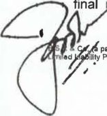

**[Image: June2026result.pdf-0002-11.png (157x169, 24.2KB)]**

<!-- Start of picture text -->
final 1l~ty ~ <!-- End of picture text -->

**Registorod** Offico: 

partno1'1hip finn with Rogiotration No. BA61223) convortod into BS R & Co. LLP **(1** 14th Floor, Contra! B \Mng and North C Wing, Nuco IT Park _4,_ No1co 1l~ty Partnership with LLP Regi1tr1tion No. AAB-8181) with effect from Octobar 14, 2013 Center, Weatem Expre11 Highway, Goregaon (E ■ at), Mumbai - 400063 ~ Page 1 of 2 

BS R & Co. LLP 

**Limited Review Report** **_(Continued)_** 

## **Godrej Properties Limited** 

Remuneration Committee. Further, the remuneration by way of commission amounting to Rs 2.00 crores was paid/payable to the non-executive directors for the year ended 31 March 2026 as per the limits laid down under Section 197 of the Companies Act, 2013, read with schedule V to the Act. In accordance with the provisions of the Act, read with schedule V of the Act, the excess remuneration to the Executive Chairperson and remuneration to non-executive directors is subject to shareholders' approval, which the Company proposes to seek at the forthcoming Annual General Meeting. 

Our conclusion is not modified in respect of this matter. 

For **B S R** & **Co. LLP** _Chartered Accountants_ Firm's Registration No.:101248W/W-100022 _1_ 

**[Image: June2026result.pdf-0003-06.png (199x151, 22.0KB)]**

<!-- Start of picture text -->
1 <!-- End of picture text -->

_Partner_ 

Mumbai 04 August 2026 

Membership No. : 105149 UDIN:26105149TSGPV81309 

Page 2 of 2 

|| **GODREJ** **GODREJPROPERTIESLIMITED**   |||**_P"f_**|
|---|---|---|---|---|
|•=| **PROPERTIES** CIN:L74120MH1985PLC035308 ||||
|| RegdOffice•_Godrej_One, 5th Floor, Pirojshanagar, Eastern Express Highway, Vikhroli (East), Mumbai - 400 07|9.www.godrejpr|operties.com||
||**Statement of Unaudited Standalone Financial Results for the QuarterEndedJune 30**|**,2026**|||
|||||**(INRinCrore)**|
|||**QuarterEnded**||**YearEnded**|
|**Sr.** **No**| **Particulars** **~~30.06.2026~~** |**~~31.03.2026~~**|**~~30.06.2025~~**|**~~31 .03.2026~~**|
|**.**| **Unaudited**|**Audited** **/Refer Note **51|**Unaudited**|**Audited**|
|**1**|**Income**||||
||**Revenuefromoperations** 121.09|928.35|106.07| 1,395.16|
||**Otherincome** 464.67|507.96|471.38|1,991.27|
||**Total Income** **585.76**|**1,436.31**|**577.45**|**3,386.43**|
|**2**|**Expenses**||||
||**Costofmaterialsconsumed** 1,626.19|5,896.48|1,914.02|11,705.74|
||**Changesininventoriesoffinishedgoodsandconstructionwork-in-progress** (1,572.85)| (5,376.46)|(1,866.12)| (10,932.84)|
||**Employeebenefitsexpense** 105.30|86.01|95.20|378.64|
|| **Financecosts** 100.47|165.28|116.53|542.25|
||**Depreciationandamortisationexpense** 18.42|21.93|12.66|69.57|
||**Otherexpenses** 222.17|349.01|225.69|1,115.81|
||**TotalExpenses** **499.70**|**1,142.25**|**497.98**|**2,879.17**|
|**3**|**ProfitbeforeExceptionalitemsandTax** **86.06**|**294.06**|**79.47**|**507.26**|
||**Exceptionalitem**|1.98||18.10|
|**4**|**Profit before tax**for**theperiod**/**year** **86.06**|**292.08**|**79.47**|**489.16**|
|**5**|**Taxexpensecharge**||||
|| **currenttax** 16.80|118.90|22.93|781.94|
||Deferred tax (credit)/ charge 8.72|(46.00)|0.43|(41.53)|
|**6**|**Profit after tax for**the**period**/**year** **60.54**|**219.20**|**56.11**|**348.75**|
|7|Other Comprehensive Incomefortheperiod / year||||
|| **Items thatwillnotbesubsequently reclassified to profitorloss**||||
||**Remeasurementsofthedefinedbenefitplan** (1.28)|(1.51)|(1.20)|(5.11)|
||   **TaxonAbove** 0.32| 0.38| 0.30| 1.29|
|**8**|**TotalComprehensiveIncomefortheperiod/year** **59.58**|**218.07**|**55.21**|**344.93**|
|**9**|**Paid-up Equity Share Capital** **150.61**|**150.60**|**150.60**|**150.60**|
||Face Value - INR 5/- per share||||
|**10**|**ReservesExcludingRevaluationReserveandDebentureRedemptionReserve**|||**17,642.53**|
|**11**|**Net-Worth** **17,853.07**|**17,793.13**|**17,499.99**|**17,793.13**|
|**12**|**Earning Per Equity Share(EPS)(Amount**in**INR)**•||||
||BasicEPS(*notannualized) **2.01•**|**7.28***|**1.86***|**11.58**|
||DilutedEPS(*not annualized) **2.01•**|**7.28***|**1.86***|**11 .58**|
|13| **Key **Ratios and Financial Indicators (Refer Note**4)**||||
|| Debt EquityRatio (Gross) 1.03|**0.84**|**0.77**|**0.84**|
||Debt Equity Ratio (Net) **0.53**|**0.45**|**0.32**|**0.45**|
||Debt Service Coverage Ratio(DSCR) **0.10**|**0.24**|**0.87**|**0.40**|
||Interest Service Coverage Ratio (iSCR) **0.68**|**1.65**|**0.87**|**1.04**|
||   **CurrentRatio** **1.34**| **1.39**| **1.63**| **1.39**|
||Long Term DebttoWorking Capital **0.16**|**0.16**|**0.25**|**0.16**|
|| **BadDebtstoAccountReceivableRatio**||||
||**CurrentLiabilityRatio** **0.94**|**0.93**|**0.86**|**0.93**|
||Total DebtstoTotal Assets **0.30**|**0.27**|**0.28**|**0.27**|
||Debtors Turnover (annualized) **5.40**|**30.06**|**1.71**|**7.29**|
||Inventory Turnover (annualized) **0.01**|**0.09**|**0.01**|**0.04**|
||Operating Margin(%) **(213.78%)**|**(1 .72%)**|**(245.39%)**|**(61 .07%)**|
||Adjusted EBITDA(%) **35.13%**|**34.26%**|**36.56%**|**33.64%**|
|| Net Profit Margin(%) **10.33%**|**15.26%**|**9.72%**|**10.30%**|

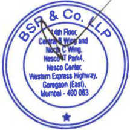

**[Image: June2026result.pdf-0004-01.png (215x215, 84.0KB)]**

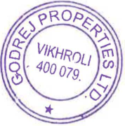

**[Image: June2026result.pdf-0004-02.png (178x180, 54.5KB)]**

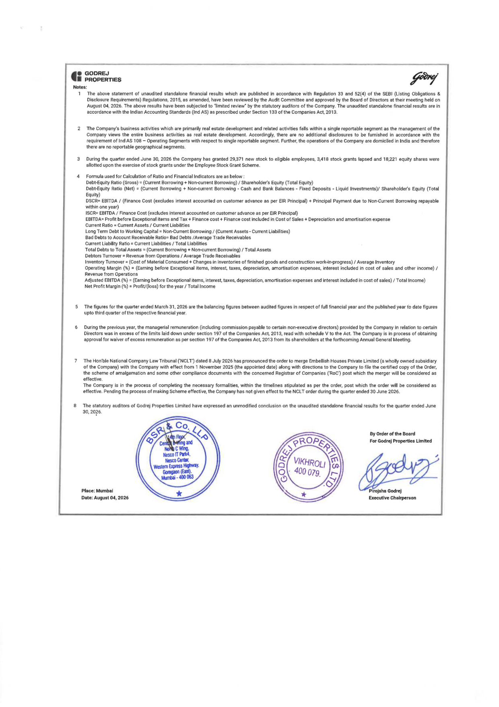

**[Image: June2026result.pdf-0005-00.png (1240x1754, 702.6KB)]**

<!-- Start of picture text -->
■  GODREJ  ~ • ■  PROPERTIES  ,--- 7 Notes: 1  The above statement  of unaudited standalone financial results which are published  in  accordance with Regulation  33  and 52(4)  of the  SEBI  (Listing Obligations & Disclosure  Requirements)  Regulations,  2015, as  amended,  have  been  reviewed  by the Audit Committee and  approved  by the  Board  of  Directors  at  their meeting  held on August 04, 2026.  The  above  results  have  been  subjected to  nlimited  review~  by the  statutory  auditors  of the  Company.  The  unaudited standalone  financial  results  are  in accordance with the Indian Accounting Standards (Ind AS) as prescribed under Section 133 of the Companies Act, 2013. 2  The  Company's business activities which  are  primarily real  estate development and  related  activities  falls  within  a single reportable segment as  the  management of the Company  views  the  entire  business  activities  as  real  estate  development.  Accordingly,  there  are  no  additional  disclosures  to  be  furnished  in  accordance  with  the requirement of Ind AS  108 - Operating Segments with respect to  single reportable segment  Further, the operations of the Company are domiciled  in India  and therefore there are no reportable geographical segments. During the quarter ended June 30,  2026 the Company has granted  29,371  new stock to eligible employees, 3,418 stock grants lapsed and  18,221  equtty shares were allotted upon the exercise of stock grants under the Employee Stock Grant Scheme. 4  Formula used for Calculation of Ratio and Financial Indicators are  as below: Debt-Equity Ratio (Gross)= (Current Borrowing+ Non-current Borrowing)/ Shareholder's Equity (Total Equity) Debt-Equity Ratio (Net) = (Current Borrowing + Non-current Borrowing - Cash  and  Bank Balances - Fixed Deposits - Liquid Investments)/ Shareholder's Equity (Total Equity) DSCR=  EBITDA  /  (Finance  Cost  (excludes  interest  accounted  on  customer  advance  as  per  EIR  Principal)  + Principal  Payment  due  to  Non-Current  Borrowing  repayable within one year) ISCR= EBITOA /  Finance Cost (excludes interest accounted on customer advance as per EJR Principal} EBITDA= Profit before Exceptional items and Tax+ Finance cost+ Finance cost Included in  Cost of Sales+ Depreciation and amortisation expense Current Ratio  = Current Assets/ Current Liabilities Long Term Debt to Working Capital= Non-Current Borrowing/ (Current Assets- Current Liabilities) Bad Debts to Account Receivable Ratio= Bad  Debts /Average Trade Receivables Current Liability Ratio= Current Liabilities/ Total Liabilities Total Debts to Total Assets= (Current Borrowing+ Non-current Borrowing)/ Total Assets Debtors Turnover= Revenue from Operations/  Average  Trade Receivables Inventory Turnover=  (Cost of Material Consumed+ Changes in  inventories of finished  goods and construction work-in1)rogress) / Average Inventory Operating  Margin  (%)  =  {Earning  before  Exceptional  items,  interest.  taxes,  depreciation,  amortisation  expenses,  interest  included  in  cost  of  sales  and  other  income)  / Revenue from  Operations Adjusted EBITDA (%)=(Earning before Exceptional items, interest, taxes, depreciation, amortisation expenses and Interest Included in cost of sales)/ Total Income) Net Profit Margin(%)= ProfiV(loss) for the year/ Total Income The figures  for the quarter ended March 31, 2026  are the balancing  figures between  audited figures  in  respect of full  financial  year and  the published year fo  date figures upto third quarter of the respective financial year. 6  During the previous year, the  managerial  remuneration  (including  commission payable to certain  non~executive directors) provided  by the  Company  in  relation  to  certain Directors was in  excess of the  limits  laid down under section  197 of the  Companies Act,  2013, read  with  schedule V to  the  Act.  The  Company is  in process  of obtaining approval for waiver of excess remuneration  as  per section  197 of the Companies Act, 2013 from  its shareholders at the forthcoming Annual General Meeting. 7  The Hon'ble National Company Law Tribunal ('NCL T') dated 8 July 2026 has pronounced the order to merge Embellish Houses Private Limited (a wholly owned subsidiary of the Company) with the Company with effect from 1 November 2025 (the appointed date) along with directions to the Company to file the certified copy of the Order, the  scheme of amalgamation  and  some  other  compliance  documents  with  the  concerned  Registrar of Companies  ('RoC')  post which  the  merger  will  be  considered  as effective. The  Company  is  in  the  process  of  completing  the  necessary  formalities,  within  the  tlmelines  stipulated  as  per  the  order,  post  which  the  order  will  be  considered  as effective. Pending the process of making Scheme effective, the Company has not given effect to the NCL T order during the quarter ended 30 June 2026. 8  The  statutory  auditors  of  Godrej  Properties  Limited  have  expressed an  unmodified conclusion  on  the  unaudited standalone  financial  results  for the quarter ended June 30, 20?6. By Order of the Board For Godrej Properties Limited Place: Mumbai Date: August 04, 2026  Executive Chairperson <!-- End of picture text -->

**BS R & Co. LLP** 

Chartered Accountants 

14th Floor, Central 8 Wing and North C Wing Nesco IT Park 4, Nesco Center Western Express Highway Goregaon (East), Mumbai - 400 063, India Telephone: +91 (22) 6257 1000 Fax: +91 (22) 6257 1010 

**Limited Review Report on unaudited consolidated financial results of Godrej Properties Limited for the quarter ended 30 June 2026 pursuant to Regulation 33 and Regulation 52(4) read with Regulation 63 of Securities and Exchange Board of India (Listing Obligations and Disclosure Requirements) Regulations, 2015, as amended, as prescribed in Securities and Exchange Board of India operational circular SEBI/HO/DDHS/P/CIR/2021/613 dated 10 August 2021, as amended** 

### **To the Board of Directors of Godrej Properties Limited** 

1. We have reviewed the accompanying Statement of unaudited consolidated financial results of Godrej Properties Limited (hereinafter referred to as "the Parent"), and its subsidiaries (the Parent and its subsidiaries together referred to as "the Group") and its share of the net loss after tax and total comprehensive loss of its associate and joint ventures for the quarter ended 30 June 2026 ("the Statement"), being submitted by the Parent pursuant to the requirements of Regulation 33 and Regulation 52(4) read with Regulation 63 of the Securities and Exchange Board of India (Listing Obligations and Disclosure Requirements) Regulations, 2015, as amended ("Listing Regulations"), a1> prescribed in Securities and Exchange Board of India operational circular SEBI/HO/DDHS/P/CIR/2021/613 dated 10 August 2021, as amended. 

2. This Statement, which is the responsibility of the Parent's management and approved by the Parent's Board of Directors, has been prepared in accordance with the recognition and measurement principles laid down in Indian Accounting Standard 34 _"Interim Financial Reporting"_ ("Ind AS 34"), prescribed under Section 133 of the Companies Act, 2013, and other accounting principles generally accepted in India and in compliance with Regulation 33 and Regulation 52(4) read with Regulation 63 of the Listing Regulations, as prescribed in Securities and Exchange Board of India operational circular SEBI/HO/DDHS/P/CIR/2021 /613 dated 1 O August 2021, as amended. Our responsibility is to express a conclusion on the Statement based on our review. 

3. We conducted our review of the Statement in accordance with the Standard on Review Engagements (SRE) 2410 _"Review of Interim Financial Information Performed by the Independent Auditor of the Entity",_ issued by the Institute of Chartered Accountants of India. A review of interim financial information consists of making inquiries, primarily of persons responsible for financial and accounting matters, and applying analytical and other review procedures. A review is substantially less in scope than an audit conducted in accordance with Standards on Auditing and consequently does not enable us _to_ obtain assurance that we would become aware of all significant matters that might be identified in an audit. Accordingly, we do not express an audit opinion. 

We also performed procedures in accordance with the circular issued by the Securities and Exchange Board of India under Regulation 33(8) of the Listing Regulations, to the extent applicable. 

4. The Statement includes the results of the following entities: 

#### **Name of the entity** 

#### **Relationship** 

Godrej Projects Development Limited 

Wholly owned subsidiary 

Godrej Garden City Properties Private Limited 

Wholly owned subsidiary 

Godrej Hillside Properties Private Limited 

Wholly owned subsidiary 

Godrej Home Developers Private Limited 

Wholly owned subsidiary 

Godrej Prakriti Facilities Private Limited 

Wholly owned subsidiary 

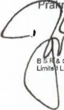

**[Image: June2026result.pdf-0006-22.png (108x185, 18.4KB)]**

<!-- Start of picture text -->
•  • Limite <!-- End of picture text -->

Wholly owned subsidiary 

i i~acilities Management Private Limited 

**Registered Office:** 

• **Limite** • **Liability f-•• Partnership** •~ **with** "'" **LLP ,.,,n0o, Registration** "· **No.** =m•J **AAB.8181)** """"' **with effect** '"",,, **from October** • ~. **14,** = **2013** ,, **Center, Western Expre11** 14th Floor, Central B Wng **Highway,** and Nor1h **Goregaon** C Wng, **{EHi),** NHco IT **Mumbai.** P1r1< ~. **400063** Nosco Page 1 of 4 

BS R & Co. LLP 

## **Limited Review Report** **_(Continued)_** 

## **Godrej Properties Limited** 

Godrej Highrises Properties Private Limited Wholly owned subsidiary Godrej Genesis Facilities Management Private Limited Wholly owned subsidiary Citystar lnfraProjects Limited Wholly owned subsidiary Godrej Highrises Realty LLP Wholly owned subsidiary Godrej Skyview LLP Wholly owned subsidiary Godrej Projects (Soma) LLP Wholly owned subsidiary Godrej Athenmark LLP Wholly owned subsidiary Godrej Project Developers & Properties Private Limited Wholly owned subsidiary (formerly known as Godrej Project Developers & Properties LLP) Godrej City Facilities Management LLP Wholly owned subsidiary Godrej Florentine Private Limited Wholly owned subsidiary (formerly Godrej Florentine LLP) Godrej Olympia LLP Wholly owned subsidiary Ashank Projects Development LLP Wholly owned subsidiary Godrej Green Woods Private Limited Wholly owned subsidiary Godrej Realty Private Limited Wholly owned subsidiary Godrej Buildwell Projects LLP Wholly owned subsidiary Godrej Living Private Limited Wholly owned subsidiary Ashank Land & Building Private Limited Wholly owned subsidiary Ashank Facility Management LLP Wholly owned subsidiary Godrej Vestamark LLP Wholly owned subsidiary Godrej Real Estate Distribution Company Private Limited Wholly owned subsidiary Wonder City Buildcon Limited Wholly owned subsidiary Godrej Township Development Limited Wholly owned subsidiary Godrej Skyline Developers Limited Wholly owned subsidiary Oasis Landmark LLP Wholly owned subsidiary Pearlshine Home Developers Private Limited Wholly owned subsidiary Godrej Highview LLP Wholly owned subsidiary 

Godrej SSPDL Green Acres Private Limited (formerly known asWholly owned subsidiary Godrej SSPDL Green Acres LLP) 

Godrej Amitis Developers Private Limited (formerly known asWholly owned subsidiary (w.e.f. 19 Godrej Amitis Developers LLP) June 2025) 

Joint Venture (upto 18 June 2025) 

Embellish Houses Private Limited 

(formerly known as Embellish Houses LLP) 

Wholly owned subsidiary (w.e.f. 24 September 2025) 

Joint Venture (upto 23 September 2025) 

Godrej lrismark Private Limited 

(formerly known as Godrej lrismark LLP) 

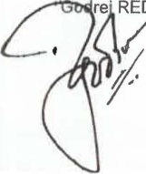

**[Image: June2026result.pdf-0007-13.png (161x191, 26.6KB)]**

<!-- Start of picture text -->
, <!-- End of picture text -->

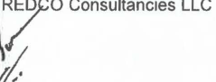

**[Image: June2026result.pdf-0007-14.png (239x91, 10.2KB)]**

<!-- Start of picture text -->
70  Consultancies LLC . , <!-- End of picture text -->

Wholly owned subsidiary (w.e.f. 6 December 2025) 

Joint Venture (upto 5 December 2025) Wholly owned subsidiary (w.e.f. 28 Novemver 2025) 

Page 2 of 4 

BS R & Co. LLP 

## **Limited Review Report** **_(Continued)_** 

#### Godrej Housing Projects LLP 

Maan-Hinje Township Developers Private Limited Godrej Residency Private Limited Godrej Reserve LLP Dream World Landmarks LLP Caroa Properties LLP Manjari Housing Projects LLP 

Mahalunge Township Developers Private Limited (formerly known as Mahalunge Township Developers LLP) 

Oxford Realty LLP 

M S Ramaiah Ventures LLP Godrej Macbricks Private Limited Suncity Infrastructure (Mumbai) LLP Godrej Greenview Housing Private Limited Wonder Projects Development Private Limited AR Landcraft LLP 

Godrej Real View Developers Private Limited Pearlite Real Properties Private Limited Godrej Odyssey LLP Prakhhyat Dwellings LLP Roseberry Estate LLP Godrej Project North Star LLP Godrej Developers & Properties LLP Manyata Industrial Parks LLP Godrej Redevelopers (Mumbai) Private Limited Universal Metro Properties LLP Godrej Projects North LLP Mosiac Landmarks LLP Yerwada Developers Private Limited Vivrut Developers Private Limited Madhuvan Enterprises Private Limited Munjal Hospitality Private Limited Vagishwari Land Developers Private Limited 

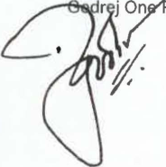

**[Image: June2026result.pdf-0008-08.png (184x185, 26.3KB)]**

<!-- Start of picture text -->
r  j r <!-- End of picture text -->

r j 7remises Management Private Limited 

**Godrej Properties Limited** Wholly owned subsidiary (w.e.f. 30 June 2026) 

Joint Venture (upto 29 June 2026) Subsidiary Subsidiary Subsidiary Subsidiary Subsidiary Subsidiary (w.e.f. 2 June 2025) Joint Venture (upto 1 June 2025) Subsidiary (w.e.f. 31 May 2025) Joint Venture (upto 30 May 2025) Joint Venture Joint Venture Joint Venture Joint Venture Joint Venture Joint Venture Joint Venture Joint Venture Joint Venture Joint Venture Joint Venture Joint Venture Joint Venture Joint Venture Joint Venture Joint Venture Joint Venture Joint Venture Joint Venture Joint Venture Joint Venture (upto 1 July 2025) Joint Venture (upto 24 June 2025) Joint Venture (upto 24 June 2025) Joint Venture (upto 24 June 2025) Associate 

Page 3 of 4 

BS R & Co. LLP 

**Limited Review Report** **_(Continued)_ Godrej Properties Limited** 

5. Attention is drawn to the fact that the figures for the three months ended 31 March 2026 as reported in the Statement are the balancing figures between audited figures in respect of the full previous financial year and the published year to date figures up to the third quarter of the previous financial year. The figures up to the end of the third quarter of previous financial year had only been reviewed and not subjected to audit. 

6. Based on our review conducted and procedures performed as stated in paragraph 3 above, nothing has come to our attention that causes us to believe that the accompanying Statement, prepared in accordance with the recognition and measurement principles laid down in the aforesaid Indian Accounting Standard and other accounting principles generally accepted in India, has not disclosed the information required to be disclosed in terms of Regulation 33 and Regulation 52(4) read with Regulation 63 of the Listing Regulations, as prescribed in Securities and Exchange Board of India operational circular SEBI/HO/DDHS/P/CIR/2021/613 dated 10 August 2021,as amended, including the manner in which it is to be disclosed, or that it contains any material misstatement. 

7. We draw attention to Note 7 to the unaudited consolidated financial results which states that the managerial remuneration paid/payable by the Holding Company to the Executive Chairperson for the year ended 31 March 2026 exceeded the limits laid down under Section 197 of the Companies Act, 2013, read with schedule V to the Act by Rs 21.76 crores. The aforesaid amount includes an additional provision of Rs 0.19 crores recognised during the quarter ended 30 June 2026, consequent to the final remuneration determined based on the recommendation/approval of the Nomination and Remuneration Committee. Further, the remuneration by way of commission amounting to Rs 2.00 crores was paid/payable to the non-executive directors for the year ended 31 March 2026 as per the limits laid down under Section 197 of the Companies Act, 2013, read with schedule V to the Act. In accordance with the provisions of the Act, read with schedule V of the Act, the excess remuneration to the Executive Chairperson and remuneration to non-executive directors is subject to shareholders' approval, which the Holding Company proposes to seek at the forthcoming Annual General Meeting. 

Our conclusion is not modified in respect of this matter. 

8. The Statement also includes the Group's share of net loss after tax of Rs 2.86 crores and total comprehensive loss of Rs 2.86 crores, for the quarter ended 30 June 2026, as considered in the Statement, in respect of one (1) associate and two (2) joint ventures, based on their interim financial information which have not been reviewed. According to the information and explanations given to us by the management, these interim financial information are not material to the Group. 

Our conclusion is not modified in respect of this matter. 

**[Image: June2026result.pdf-0009-08.png (207x18, 4.4KB)]**

<!-- Start of picture text -->
For  B S R  &  Co. LLP <!-- End of picture text -->

_Chartered Accountants_ 

Mumbai 

04 August 2026 

**[Image: June2026result.pdf-0009-12.png (412x198, 43.7KB)]**

<!-- Start of picture text -->
Partner <!-- End of picture text -->

_Partner_ Membership No.: 105149 

UDIN:26105149LPNFKG3100 

Page 4 of 4 

|• •   ■|**GODREJ** **GODREJPROPERTIESLIMITE** **PROPERTIES** CIN: L74120MH1985PLC035308|**D**|||~|
|---|---|---|---|---|---|
||      RegdOffice : GodrejOne,5th Floor, Pirojshanagar, EastemExpress Highway, Vikhroli (Eas|t), Mumbai - 400 0|79.www.godrejpro|perties.com||
|| StatementofUnaudited Consolidated Financial Resultsforthe Q| uarter Ended June 3| 0, 2026|||
||||Quarter Ended||**(INR**In**Crore)** **Year**Ended|
|**Sr.No **|**.** Particulars|**30.06.2026**|**31.03.2026** |**30.06.2025**|**31.03.2026**|
|||Unaudited|**Audited** **(Refer Note9)**|**Unaudited**|**Audited**|
|**1**|Income|||||
||Revenuefrom operations|506.17|3.458,13|434.56|5,131.43|
||Other income (Refer Note 4)|838.87|348.52|1,185.78|3,279.45|
|| Total Income|**1,345.04**|**3,806.65**| **1,620.34**| **8,410.88**|
|**2**|Expanses|||||
||Costofmaterials consumed|**2,914.33**|7,980.70|**3,543.84**|19,590.15|
||Purchasesofstock-in-trade Changes in inventoriesoffinishedgoods, stock in trade and construction work-in-progress|0.84 (2,714.75)|1.26   (6,003.91)|(3,367.70)|3.52 **(16,644.74)**|
||Employee benefits expense |168.54 |149.09 |149.30 |595.95 |
||Finance costs|35.54|**51 .63**|**32.69**|136.86|
||Depreciation and amortisation expense|30.12|**35.62**|**22.04**|**115.58**|
|| Other expenses|422.18|808.75|352.41|2,003.12|
||Total Expenses|**856.80**|**3,023.14**|**732.58**|**5,800.44**|
|**3**|Profit before shareof(Loss)/ProfitofJointventures, associate, exceptional items and tax|**488.24**|**783.51**|**887.76**|**2,610.44**|
|**4**|Shareof(Loss)/Profit of Joint Ventures and Associate(netoftax)|(8.53)|87.92|(27.19)|(36.75)|
|**5**|Profit before Exceptional Items and tax Exceptional items|**479.71**|**871 .43** 2.03|**860.57**|**2,573.69** 23.11|
|**6**| Profit beforetaxfor theperiod /year|**479.71**|**869.40**|**860.57**|**2,550.58**|
|7|Tax expense charge Current tax|26.25|216.35|50.59|318.62|
||Deferred tax|104.08|7.61|211.58|391.30|
|**8**|Profitaftertax for the period / year|**349.38**|**645.44**|**598.40**|**1,840.66**|
|**9**|Other Comprehensive Incomefortheperiod/year |||||
||Itemsth8twillnotbe subsequently reclassffied toprofitorloss Remeasuremen1s of the defined benefit plan|(1.28)|(2.57)|(1.20)|(6.16)|
|| TaxonAbove| 0.32| 0.58| 0.26| 1.44|
|**10**|**TotalComprehensiveIncome for theperiod/year (net of tax)**|**348.42**|**643.45**|**597.46**|**1,835.94**|
|**11**|**ProfiV(loss) attributableto:**|||||
||Owners of the Company|350.10|649.88|600.12|1,850.20|
|| Non-Controlling Interests|(0,72)|(4.44)|(1.72)|(9.54)|
|**12**|Other Comprehensive Income attributable to:|||||
|| Ownersofthe Company|(0.96)|(1.99)|(0,94)|(4.72)|
||Non-ControllingInterests |(0.00)|(0.00)|(0.00)|(0.00)|
|**13**|**Total Comprehensive Income/ (Loss) attributableto: ** Ownersofthe Company|349,14|647.89|599.18|1,845.48|
||Non-ControllingInterests|(0.72)|**(4.44)**|(1.72)|**(9.54)**|
|**14**|**Paid-up **EquityShare Capital|**150.61**|**150.60**|**150.60**|**150.60**|
||Face Value - INR5/-per share|||||
|**15**|Reserves ExcludingRevaluation Reserve and Debenture Redemption Reserve||||**19,004.94**|
|**16**|**Net-Worth**|**19,505,04**|**19,155.54**|**17,912.64**|**19,155.54**|
|**17** |**Earning PerEquity Share (EPS)**(Amount in**INR)**|||||
||BasicEPS(*not annualized)|**11 .62***|**21.58***|**19.92***|**61.43**|
|| DilutedEPS(*not annualized)| **11.62***| **21.57***| **19.92***| **61.42**|
|**18**  |**Key RatiosandFinancial Indicators(Refer Note 6)** Debt Equity Ratio (Gross)|**0.97**|**0.82**|**0.78**|**0.82**|
||Debt EquityRatio**(Net)**|**0.39**|**0.33**|**0.26**|**0.33**|
||Debt Service Coverage Ratio(DSCR)|**0.26**|**0.50**|**3.13**|**0.98**|
|I |nterest Service Coverage Ratio(ISCR) Current Ratio|**1.56** **1.26**|**3.02** **1.27**|**3.13** **1.42**|**2.33** **1.27**|
||LongTerm DebttoWorkingCapital|**0.13**|**0.14**|**0.23**|**0.14**|
||Bad Debts to AccountReceivable Ratio|~~.~~||~~.~~||
||Current LiabilityRatio|**0.95**|**0.95**|**0.91**|**0.95**|
||Total DebtstoTotal Assets|**0.21**|**0.19**|**0.22**|**0.19**|
||Debtors Turnover (annualized)|**3.50**|**26,36**|**3.78**|**9.02**|
| I| nventory Turnover (annualized)|**0.01**|**0.14**|**0,02**|**0.07**|
||OperatingMargin("-) |**(54.04"-)** |**17.77'!1.** |**(53.64'!1.)** **'**|**(5.58'!1.)** **'**|
|N|djusted EBITDA(%) et Profit Margin(%)|**41.66%** **26.14'!1.**|**_26.98%_** **16.57'!1.**|**58.09!1.** **37.56'!1.**|**35.31!1.** **21 .98'!1.**|

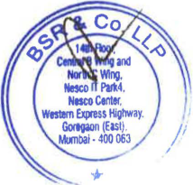

**[Image: June2026result.pdf-0010-01.png (214x205, 73.8KB)]**

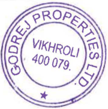

**[Image: June2026result.pdf-0010-02.png (180x182, 56.2KB)]**

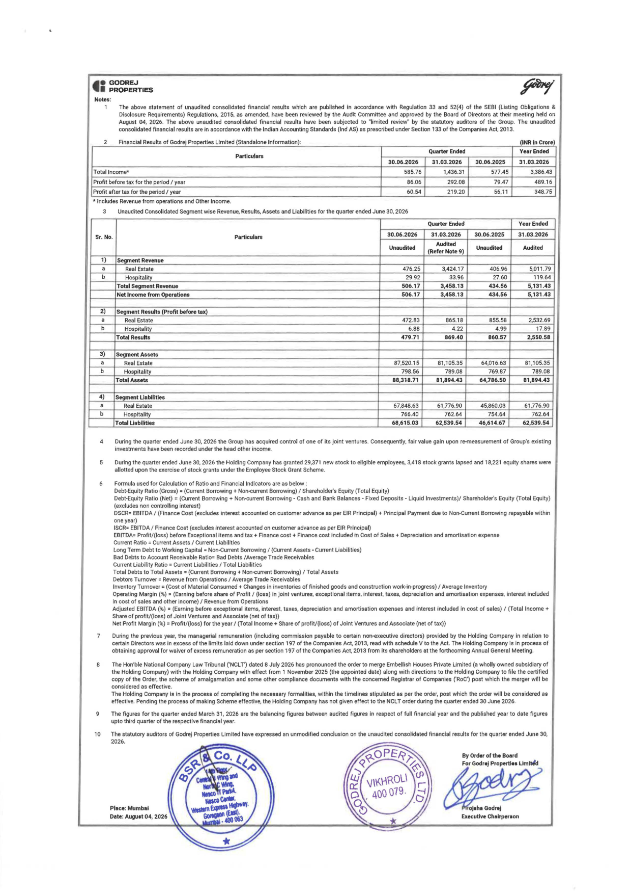

**[Image: June2026result.pdf-0011-00.png (1240x1754, 1007.2KB)]**

<!-- Start of picture text -->
... GODREJ •■  PROPERTIES Notes: 1  The  above statement  of unaudited consolidated financial results whlch are published in accordance with Regulation  33  and 52(4)  of the  SEBI  {listing  Obligations & Disclosure Requirements) Regulations, 2015,  as  amended, have been reviewed by the Audit Committee and approved by the Board  of Directors at their meeting held on August  04,  2026.  The  above unaudited consolidated financial results have  been  subjected to "limited review''  by  the statutory auditors  of  the Group. The unaudited consolidated financlal results are in accordance with the Indian Accounting Standards (Ind AS)  as prescribed under Section 133 of the Companies Act. 2013. 2  Financial Results of Godrej Properties limited (Standalone Information):  (INR  in  Crore) Quarter Ended  Year Ended Particulars 30.06.2026  31.03.2026  30.06.2025  31 .03.2026 Total Income*  585.76  1,436.31  577.45  3,386.43 Profit before tax for the period/ year  86.06  292.08  79.47  489.16 Profit after tax for the period/ year  60.54  219.20  56.11  348.75 * Includes Revenue from operations and Other Income. 3  Unaudited Consolidated Segment wise Revenue, Results, Assets and Liabilities for the quarter ended June 30, 2026 Quarter Ended  Vear Ended Sr. No.  Particulars  30.06.2026  31.03.2026  30.06.2025  31 .03.2026 Audited Unaudited  Unaudited  Audited (Refer Note 9) 1) Segment Revenue a  Real  Estate  476.25  3,424.17  4-06.96  5,011.79 b  Hospitality 29.92  33.96  27.60  119.64 Total Segment Revenue  506.17  3,458.13  434.56  5,131 ,43 Net Income from Operations  506.17  3,458.13  434.56  5,131 .43 2)  Segment Results (Profit before tax) a  Real  Estate  472.83  865.18  855.58  2,532.69 b  Hospitality 6.88  4.22  4.99  17.89 Total Results  479.71  869.40  860.57  2,550.58 3)  Segment Assets a  Real  Estate  87,520.15  81,105.35  64,016.63  81,105.35 b  Hospitality  798.56  789.08  769.87  789.08 Total Assets  88,318.71  81,894.43  64,786.50  81,894.43 4)  Segment liabllities a  Real  Estate  67,848.63  61,776.90  45,860.03  61,776.90 b  Hospitality  766.40  762.64  754.64  762.64 Total Liabilities  68,615.03  62,539.54  46,614.67  62,539.54 4  During the quarter ended June 30,  2026 the Group  has  acquired control of one of its joint ventures. Consequently, fair value gain upon re-measurement of Group's existing investments have been recorded under the head other income. 5  During the quarter ended June 30,  2026 the Holding Company has granted 29,371  new stock to eligible employees, 3,418 stock grants lapsed and 18,221  equity shares were allotted upon the exercise of stock grants under the Employee Stock Grant Scheme. 6  Formula used for Calculation of Ratio and Financial Indicators are as below: Debt-Equity Ratio (Gross)= (Current Borrowing+ Non-current Borrowing)/ Shareholders Equity (Total Equity) Debt-Equity Ratio (Net)  :::  (Current Borrowing+ Non-current Borrowing - Cash and Bank Balances - Fixed Deposits - Liquid Investments)/ Shareholder's Equity (rota! Equity) (excludes non controlling interest) DSCR=  EBITDA / (Finance Cost (excludes interest accounted on customer  advance  as per EIR  Principal) + Principal Payment due to Non-Current Borrowing repayable within one year) ISCR= EBITDA / Finance Cost (excludes interest accounted on customer advance as per EIR Principal) EBITDA=  Profit/(loss) before Exceptional items and tax+ Finance cost+ Finance cost included in Cost of Sales + Depreciation and amortisation expense Current Ratio = Current Assets/ Current Liabilities Long Term Debt to Working Capital= Non~urrent Borrowing / (Current Assets - Current Liabilities) Bad  Debts to Account Receivable Ratio=  Bad Debts /Average Trade Receivables Current Liability Ratio= Current Liabilities / Total Liabilities Total Debts to Total Assets= (Current Borrowing+ Non-current Borrowing)/ Total Assets Debtors Turnover= Revenue from Operations/ Average Trade Receivables Inventory Turnover::: (Cost of Material Consumed+ Changes in inventories of finished goods and construction work-in-progress)/ Average Inventory Operating Margin  (%)  = (Earning before share of Profit/ (loss) in Joint ventures, exceptional items, interest. taxes, depreciation and amortisation expenses, interest included In cost of sales and other income)/ Revenue from Operations Adjusted  EBITDA  (%)  = (Earning before exceptional items, interest. taxes, depreciation and amortisation expenses and interest included in cost of sales)  I  (Total Income+ Share of profit/(loss) of Joint Ventures and Associate (net of tax)) Net Profit Margin(%)= Profit/(loss) for the year/ (Total Income+ Share of profit/(loss) of Joint Ventures and Associate (net of tax)) 7  During the previous  year,  the managerial remuneration (including commission payable to certain non-executive directors) provided by the Holding Company in relation to certain Directors was in  excess of the limits laid down under section 197 of the Companies Act, 2013, read with schedule V to the Act.  The H~ding Company is in process of obtaining approval for waiver of excess remuneration as per section 197 of the Companies Act, 2013 from its shareholders at the forthcoming Annual General Meeting. 8  The Hon'ble National Company Law Tribunal ('NCL T') dated 8 July 2026 has  pronounced the order to merge Embellish Houses Private Limited (a  wholly owned subsidia,y of the Holding Company) with the Holding Company with effect from 1 November 2025 (the appointed date) along with directions to the Holding Company to file the certified copy of the Order, the scheme  of amalgamation and some other compliance documents with the concerned Registrar of Companies ('RoC') post which the merger will be considered as effective. The Holding Company is In the process of completlng the necessary formalities, within the timelines stipulated as  per the order, post which the order will be considered as effective. Pending the process of making Scheme effective, the Holding Company has not given effect to the NCL T order during the quarter ended 30 June 2026. 9  The figures  for  the quarter ended March 31 , 2026  are  the balancing figures between audited figures  In  respect  of full financial year and the published year to date figures upto third quarter of the respective financial year. 10  The  statutory auditors of  Godrej  Properties Limited have expressed an unmodified conclusion  on  the unaudited consolidated financial results for the quarter ended June 30, 2026.  _  - By Order of  tho  Board For Godroj ProportlH Llmltld I I  ~ = Place: Mumbai Date:  Auguot 04, 2026  Executive Chairperson <!-- End of picture text -->

---

## Extracted Images

| # | File | Dimensions | Size |
|---|------|------------|------|
| 1 | June2026result.pdf-0001-16.png | 175x171 | 50.2KB |
| 2 | June2026result.pdf-0001-18.png | 117x59 | 5.4KB |
| 3 | June2026result.pdf-0002-11.png | 157x169 | 24.2KB |
| 4 | June2026result.pdf-0003-06.png | 199x151 | 22.0KB |
| 5 | June2026result.pdf-0004-01.png | 215x215 | 84.0KB |
| 6 | June2026result.pdf-0004-02.png | 178x180 | 54.5KB |
| 7 | June2026result.pdf-0005-00.png | 1240x1754 | 702.6KB |
| 8 | June2026result.pdf-0006-22.png | 108x185 | 18.4KB |
| 9 | June2026result.pdf-0007-13.png | 161x191 | 26.6KB |
| 10 | June2026result.pdf-0007-14.png | 239x91 | 10.2KB |
| 11 | June2026result.pdf-0008-08.png | 184x185 | 26.3KB |
| 12 | June2026result.pdf-0009-08.png | 207x18 | 4.4KB |
| 13 | June2026result.pdf-0009-12.png | 412x198 | 43.7KB |
| 14 | June2026result.pdf-0010-01.png | 214x205 | 73.8KB |
| 15 | June2026result.pdf-0010-02.png | 180x182 | 56.2KB |
| 16 | June2026result.pdf-0011-00.png | 1240x1754 | 1007.2KB |
