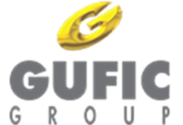
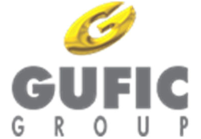
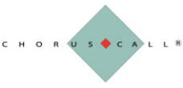
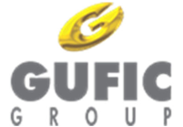

**[Image: Written_Transcript_020625.pdf-0001-00.png (201x138, 19.7KB)]**

“Gufic Biosciences Limited Q4 FY25 Earnings Conference Call” 

# **June 02, 2025** 

Disclaimer: E&OE – This transcript is edited for factual errors. 

**[Image: Written_Transcript_020625.pdf-0001-04.png (201x139, 19.7KB)]**

**[Image: Written_Transcript_020625.pdf-0001-05.png (228x110, 10.1KB)]**

**MANAGEMENT: MR. PRANAV CHOKSI – CEO & WHOLE-TIME DIRECTOR MR. DEVKINANDAN ROONGHTA – CHIEF FINANCIAL OFFICER MR. AVIK DAS – INVESTOR RELATIONS MS. AMI SHAH – COMPANY SECRETARY** 

Page 1 of 18 

**[Image: Written_Transcript_020625.pdf-0002-00.png (201x139, 19.5KB)]**

### **Moderator:** 

## _Gufic Biosciences Limited June 02, 2025_ 

Ladies and gentlemen, good day, and welcome to the Q4 and FY '25 Earnings Conference Call of Gufic Biosciences Limited. 

As a reminder, all participant lines will be in the listen-only mode and there will be an opportunity for you to ask questions after the presentation concludes. Should you need assistance during the conference call, please signal an operator by pressing star then zero on your touchtone phone. Please note that this conference is being recorded. 

I now hand the conference over to Ms. Ami Shah – Company Secretary – Gufic Biosciences Limited. Thank you, and over to you, ma'am. 

### **Ami Shah:** 

Thank you, Steve. Good evening, everyone. I, Ami Shah, Company Secretary, welcome you all to Gufic Biosciences Limited Earning Conference Call for the 4th Quarter of FY '24-'25. 

We have with us today Mr. Pranav Choksi – CEO and Director; Mr. Devkinandan Roonghta – CFO; and Mr. Avik Das from Investor Relations team, to give the highlights of the business and financial performance of the company. 

Before we begin, I would like to say that some of the statements that will be made in today's discussion may include certain forward-looking statements which are projections or estimates about future events. This estimate reflects management's current expectations about the future performance of the company. This estimate involves a number of risks and uncertainties that could cause an actual result to differ materially from what is expressed or implied. Gufic does not undertake any obligation to publicly update any forward-looking statement, whether because of new confirmations, future events or otherwise. 

We will now begin the call with the opening remarks from Mr. Avik followed by a financial overview from Mr. Roonghta. Thereafter, we will have our forum open for the interactive Q&A session. Over to you, Avik. 

### **Avik Das:** 

Good evening and thank you for joining. I provide a concise update on the quarter focusing on why we took certain actions and how they position us. 

I will start with a critical care cluster. We shifted our sales teams to concentrate on hospitals with greatest prescribing potential. This right sizing ensures that each call delivers maximum impact, strengthening relationships in ICU and emergency settings where timely antibiotic access is critical. 

We conducted over 125 engagements that reached to almost 1,500 consultants on antimicrobial stewardship and sepsis control by anchoring a message in real-world evidence and hosting a national KOL Board Advisory. We refined our product support programs. So, clinicians see our offerings as both reliable and cutting edge. 

Page 2 of 18 

**[Image: Written_Transcript_020625.pdf-0003-00.png (201x139, 19.5KB)]**

## _Gufic Biosciences Limited June 02, 2025_ 

Our World Sepsis Day initiative engaged almost 3,000 HCPs to spotlight Thymosin Alpha’s role. And we launched Eclin and IVIG in phases using market service to guide broader rollouts. These steps reinforce our science-first image and open doors for formulary placements. 

Cavim now leads the Ceftazidime+Avibactam segment in 195 centers, and we hold top positions in antifungals such as Caspofungin and Micafungin range. These shared gains validate our focus and create a springboard for new critical care introductions in the coming year. 

I will touch upon our Sparsh cluster, which is the direct-to-hospital segment: 

We tested our contrast-media offerings with key hospitals to gather early feedback. This entry strategy allowed us to confirm product reliability before scaling. This will be an essential product line given the shortages in this product segment from time to time. 

By initiating internal trials and independent comparative studies for contrast-media, we are gathering data that will convince procurement teams to switch from incumbents. This evidenceled approach addresses clinician concerns head-on and accelerates future adoption. 

Looking ahead, the full launch of our in-house contrast-media range will further boost Sparsh's profile and drive incremental volume. 

I will come to our Fertility cluster now: 

Dr. Rajeev Agarwal joined us to leverage his decade-long IVF experience. His mandate is to sharpen our scientific positioning, particularly for gonadotrophins. Having a recognized leader elevates our credibility in a highly relationship-driven specialty that the IVF segment is. 

We deepened collaboration with reproductive medicine communities. To highlight, Guficin Alpha's novel approach for recurrent implantation failure, simultaneously multi-centric trials for Guficin Alpha and Supergraf, which is India's purest HMG, are underway. This data will solidify our claim against established peers and drive formulary access. 

As we complete these trials, our plan is to broaden IVF practitioner engagement using robust clinical evidence to convert the initial interest into prescriptions. This puts us in a strong position to capture share in the rapidly expanding fertility market. 

Now coming to Aesthaderm: 

Mr. Vijay Kumar with extensive Galderma pedigree now leads Aesthaderm. Our flagship, Stunnox, which is India's first domestically produced Botulinum Toxin Type A, has treated 50,000 patients since launch, demonstrating strong practitioner and patient trust. In the quarter 

Page 3 of 18 

**[Image: Written_Transcript_020625.pdf-0004-00.png (201x139, 19.5KB)]**

## _Gufic Biosciences Limited June 02, 2025_ 

that went by, we held almost 112 training sessions and upscaled 608 doctors, ensuring consistent application and optimal outcomes. 

We also launched local clinical studies to generate Indian patient data crucial for building conviction in a market where real-world evidence drives adoptions. This dual focus on training and evidence means practitioners feel confident prescribing Stunnox, which should accelerate adoption. As we scale, we expect to expand share in a fragmented aesthetic market that values quality, affordability, and outcomes. 

### Now coming to NeuroCare: 

We are 100% dedicated to expanding Botulinum Toxin use in neurology, covering chronic migraines, spasticity, dystonia, and new areas like neurosurgery and pain. This singular focus of this division simplifies messaging and maximizes specialist engagements. 

Our dedicated team now covers new major regions such as Lucknow, Chennai, Cochin, Pune and has expanded their outreach in states of Gujarat, Punjab, Jharkhand, and Uttarakhand. This broader presence underpins our 17% market share, which is up by 10% points on a year-on-year basis. 

Through hands-on training, PG programs and speaker sessions at key scientific meetups, we ensure that neurologists, neurosurgeons, and pain specialists understand both the clinical protocols and patient selection criteria. And we intend to drive growth for NeuroCare through upgradation of knowledge as well as skills of the existing practitioners. 

### Coming to Zenova Division: 

We merged Spark and Stellar to eliminate overlap, rationalize territories and concentrate resources on our highest margin brands. This ensures that each sales call is more productive, and each territory is fully optimized. Rationalizing low-yield headquarters and pre-allocating manpower led to lower overheads without sacrificing coverage. We now have a very specialized field force focused on Stretchnil, Dydrofic, Vonobase and QF3, which is our top contributors in this combined division. 

### In the Healthcare Division: 

We concentrate on high incidence, underserved categories like cervical spondylosis, osteoarthritis and gout while extending into wound healing through our brand WH5 Gel and GI Health through a molecule launch of Vonoprazan. This alignment directs resources towards segments with clear demand and differentiated needs. 

Page 4 of 18 

**[Image: Written_Transcript_020625.pdf-0005-00.png (201x139, 19.5KB)]**

## _Gufic Biosciences Limited June 02, 2025_ 

We ran almost 475 targeted screening camps, identifying 3,200 at-risk patients. By converting these referrals into Gufispon and Baryl-DX prescriptions, we accelerate patient uptake and reinforce our therapy protocols at the ground level. We also patented WH5 Gel, making us first movers in Ayurvedic wound healing. And our next-gen anti-arthritic oil is all set for a pilot launch in the coming quarter. 

Now I will move to our international marketing division: 

Appointing Dr. Rajasekar as President of International Business brings his two decades of MNC expertise to accelerate a push into regulated and emerging markets. 

We signed a landmark distribution agreement that now covers almost 17 LATAM countries. This will enable us to rapidly launch our products in those markets. 

We secured seven product approvals in Myanmar, Sri Lanka, and Cambodia. The Thai FDA GMP extension for Unit-2 underscores our manufacturing quality and we hope it will unlock new registration opportunities in the future. Winning the Sri Lankan tender for two complex injectable products demonstrates our competitive pricing and reliability. 

We are also setting up rep offices in Vietnam and evaluating a presence in Philippines that would lay the groundwork for deeper local engagement in the future. 

So, to conclude, across every division, our guiding principle has been targeted execution backed by evidence. We were realigned sales forces, strengthened our KOL partnerships, built scientific credibility through trials, and expanded in key geographies, both domestic and international. These moves are designed to convert our near-term investments into durable market leadership and better realizations in the coming quarters. 

I would like to update you all on the Indore facility and its near-term impact on our profitability. As we have communicated in our earlier calls, in order to ensure full compliance with evolving export market requirements, we extended certain media-fill and aseptic process validations. 

This broadened our validation scope to include additional worst-case simulations, more extensive documentation, and deeper site qualification steps. While it pushed our commercial start by a few months, but it definitely de-risked future audits and customer approvals. 

The plant was capitalized in Q3 FY '25. So, in this quarter, we are absorbing higher fixed costs of salaries, utilities, depreciation and interest. As a result, Indore adds roughly Rs. 8 crores of incremental depreciation and interest in Q4. We expect EBITDA breakeven from Indore in FY '26 when incremental interest and depreciation will total around 36 crores for the full year. 

Page 5 of 18 

**[Image: Written_Transcript_020625.pdf-0006-00.png (201x139, 19.5KB)]**

## _Gufic Biosciences Limited June 02, 2025_ 

To accelerate ramp-up, we have made some initiatives. We booked 16 major customer audits for our CMO business. We have notified 5 global regulatory inspections with mock inspections already underway. We have initiated technology transfers for 33 SKUs from Navsari and 18 site transfers from other CMO partners. We are also in advanced stages of completing our development of 15 new products at our Indore R&D center. 

So, our immediate focus is on completing all domestic customer audits and initiating stability batches for each product while simultaneously finalizing Dossier filings for international markets to trigger global audits. We have headroom to accept additional domestic orders today, but excessive production could increase wear and tear during this critical regulatory audit phase. 

First, we will ramp up to approximately 30% capacity, achieving EBITDA breakeven this year while prioritizing asset integrity ahead of global inspection. This measured approach ensures Indore transitions into a bottom-line accretive facility by FY '27 backed by both domestic and international approvals. 

With that, I will hand over the call to Mr. Roonghta, our CFO, for update on the financials. 

### **Devkinandan Roonghta:** 

Thank you, Avik. 

I will go in to highlight the Financial Result of Q4 of FY’25 versus Q4 of  FY'24 and full Financial Result of FY'25 versus the financial result of FY’23-24. 

Total revenue for Q4 of '25 is Rs. 205 crores compared to Q4 of '24 was Rs. 195 crores. EBITDA for the current Q4 is Rs. 27 crore compared to Rs. 35.1 crore. There is a downfall because of the basically Indore absorption of fixed cost of interest, depreciation, and salary wages. The EBITDA margin for current Q4 is 13.17% compared to Q4 of 18%. 

The profit before tax for the Q4 is Rs. 10.8 crores compared to Rs. 27.1 crores of Q4 of last year. The PBT margin has been 5.27% for Q4 of  FY24-'25 versus Q4 of  FY23-24 was 13.9%. The profit after tax for Q4 is Rs. 8 crores compared to Q4 of last year, 20 crores. The PAT margin For Q4 is 3.90% compared to Q4 of '24, 10.26%. 

Now I highlight the financial results of whole year '24-'25 versus '23-'24: 

Total revenue from the operation is Rs. 819.8 crores compared to Rs. 806.7 crores. EBITDA for the whole year is Rs. 138.6 crores compared to last year Rs. 148 crores. EBITDA margin for current FY‘24-'25 is 16.91% compared to 18.35% last year. 

The profit before tax for the current FY’24-'25 is Rs. 94.4 crore compared to last year Rs. 115.7 crores. The PBT margin for the current financial year is 11.52% compared to 14.34% last year. The profit after tax for the current year is Rs. 69.9 crores compared to last year Rs. 86.2 crores. 

Page 6 of 18 

**[Image: Written_Transcript_020625.pdf-0007-00.png (201x139, 19.5KB)]**

## _Gufic Biosciences Limited June 02, 2025_ 

The PAT margin for the current financial year is 8.53% compared to last year 10.69%. This major drop in the Q4 result as well as the Financial Year ‘24-'25 versus '23-'24 is mainly because of the Indore capitalization where we absorb additional cost towards fixed cost towards salary wages, other manufacturing expenses as well as interest and depreciation. Thank you. 

**Ami Shah:** 

Steve, we can connect for Q&A session now. 

**Moderator:** Yes, ma'am. We will now begin the question-and-answer session. The first question is from the line of Vishal Mehta from Oakland Capital. Please go ahead. 

**Vishal Mehta:** Just had two questions. One is, could you talk about the scale of the Botulinum Toxin as on date, as in what are the revenues and what are the profit numbers for FY ‘24 and '25? We have spent a lot of time trying to set up the market itself. And how do you see this scale up over the next two to three years? 

**Pranav Choksi:** Hi, Pranav here. So, just to understand your question, Vishal, that what is the total market size and how much have we penetrated and what do you see the market size expanding in the next 2-3 years? Is that the question? 

**Vishal Mehta:** Actually, I was asking more of Gufic scale. I mean, if you could help us with the market size also, it would be beneficial. 

Gufic scale in terms of manufacturing or market penetration? 

**Pranav Choksi:** Gufic scale in terms of manufacturing or market penetration? **Vishal Mehta:** What is the revenue and profit? Revenue and profit today. And where do you see that in the next couple of years? 

**Pranav Choksi:** I will just start with the market also. So, the market, that will help you to understand our scale and what is our penetration and all that are available. So, the market is divided into two parts. One is the aesthetic and the next is the neurological. 

So, even though globally it is much higher market, India for a population of our size, the market is still around close to 70 to 75,000 vials per year for aesthetics and around 55 to 60,000 vials for neurology. We have already reached 9% market share in terms of aesthetics and in neurology or therapeutic indication, we have reached approximately 15% to 16% market share. So, that normally contributes to approximately, I would say, a little bit less than around 3% of our revenue today. 3% to 4% of our revenue of Gufic is here. 

The gross margins on the products, of course, are much higher in terms of 80%-85%. But the amount which we spend on clinical trials, on marketing spends and others, which are still close to around 40% to 45% of our annual revenue apart from salary and expense and distribution and other overheads. So, that's how the thing is. 

Page 7 of 18 

_Gufic Biosciences Limited June 02, 2025_ 

**[Image: Written_Transcript_020625.pdf-0008-01.png (201x139, 19.5KB)]**

We grow by almost 50% to 55%, I mean maybe, if you see year-on-year, this year we must have grown on around 50%-55%. The year before was around 70-72%, because the scale is quite small. So, that is our overall, our presence in the market. 

Now with Vijay Bhai coming in from Galderma and along with Dr. Jyoti Jha and other team members, we want to first reach 20% to 22% market share this year in aesthetics. And in neurology, we hope to come to at least 25% to 26% market penetration. We feel the market itself is growing by only 22% and that is where we need to put a little more effort in terms of expansion. 

Two things are there. In neurology or therapeutic conditions, the insurance still doesn't cover this Botulinum Toxin use in therapy. And that is where we have been trying to talk to some insurance companies and others to take it for. 

So, aesthetic market will definitely evolve much faster because there are the headwinds of the doctors pushing the patients also and now awareness and other things we are also investing on in terms of creating more awareness via social media also and via whatever mediums where we are permitted as per law to create more awareness via doctors. 

However, for therapy, it might still take more time, because there it might be more inclusive when the insurance starts taking care of it, so affordability can be also accessed. But I still feel we hope that we can reach a Rs. 100 crore figure in terms of revenue in the next 3 years max for toxin as a whole. 

### **Vishal Mehta:** 

### **Pranav Choksi:** 

### **Vishal Mehta:** 

### **Pranav Choksi:** 

Great, sir, that's very encouraging. Also, we have got some good inroads in the international business. Where do you see that stabilizing in the next 2-3 years? I mean, what are the targets we have set for that? 

For toxin you are saying or overall you are saying? 

No, no, overall. That's Gufic. 

Yes, that makes sense. Yes, because right now for toxin we are not focusing on the international market. It requires a separate manufacturing infrastructure which we have not considered in the near term in the next 3 years at least. 

So, coming to the other products, yes, definitely. So, if you see the numbers also, even though you see a flat top line this year, because we had limited capacity in terms of lyophilized injectables and injection manufacturing, Indore starting little bit late. International business is something which we feel should gradually move from that 16%-18% revenue share to close to 25% revenue share in the next 2 to 3 years. 

Page 8 of 18 

_Gufic Biosciences Limited June 02, 2025_ 

**[Image: Written_Transcript_020625.pdf-0009-01.png (201x139, 19.5KB)]**

Also I am assuming as a company when I mean 16%-18% of Rs. 800 crores, we hope that in the next 2 years when we go for the growth of at least 15% to 20% year-over-year of total revenue, 25% of the revenue should be international business itself aided by Navsari and Indore. So, I foresee that at least the international, I mean the export business would be at least close to 1.5x to 2x in the next 3 to 5 years. 

**Vishal Mehta:** 

I will just get back in the queue. 

**Moderator:** 

The next question is from the line of Srikant Parak from Prudent investment. Please go ahead. 

**Srikant Parak:** 

Sir, I just want to understand, I joined late, so what was the reason for a shrinkage in the margin in this particular quarter or this is a one-time effect or this will be dependent on the other factors? 

**Avik Das:** 

I will request Roonghta sir to please reply to this. You can talk to him about the quarter and overall going forward also, sir. So, please go ahead. 

**Devkinandan Roonghta:** Basically, if you see the contribution, GC margin, GC margin has been jumped by 2%, but because of the fixed cost of Indore and also increasing in the fixed cost of the Navsari plant, the salary wages has been, for existing Navsari plant, we have given annual increments. The salary wages has been raised. Then in case of Indore plant, there was a capacity utilization was not there. And Indore plant, we have incurred the salary wages cost, interest cost, as well as depreciation. 

So, if you see, the gross margin has been increased, but because of the fixed cost, the profit has been come down. And this pressure will be continued for next two, three quarters, looking to the capacity utilization of the Indore plant because fixed costs, cost of interest and depreciation, that is accounting to be around Rs. 36 crore as a whole year. So, every quarter we have to incur around Rs. 9 crore. That will be going to have pressure on the margin. And so, it will continue the pressure on the margin for at least next 2 quarters. 

**Srikant Parak:** So, are we seeing this happen, particularly if we talk about the Indore facility, are we seeing a kind of a break-even in gap by '25-'26? 

**Devkinandan Roonghta:** Yes, '25-'26 already Avik has mentioned you that we are expected to have an EBITDA positive. So, EBITDA will be positive, but because of the interest and depreciation, there will be losses at the level of net profit level from the Indore plant. 

**Srikant Parak:** 

That was from all my side. I will get back again in a queue. 

**Moderator:** 

The next question is from the line of Vidit Shah from Spark Capital. Please go ahead. 

Page 9 of 18 

_Gufic Biosciences Limited June 02, 2025_ 

**[Image: Written_Transcript_020625.pdf-0010-01.png (201x139, 19.5KB)]**

### **Vidit Shah:** 

Hi, thanks for taking my question. Firstly, I just wanted some clarification on the revenue breakup that you provided on Slide 6 of your presentation. If you could give us numbers for the domestic, international, CMO, Bulk Drug business for FY ‘25 along with Criticare and infertility would be great. 

**Pranav Choksi:** Yes, so if you broadly see the 52% to 53% of our revenue comes from a domestic space this year. That is the domestic revenue. I will further take you down division wise in terms of percentage. And around close to 16% to 18% comes from international markets and remaining around 25% comes from our CMO business and the remaining would be APIs. This is a broad breakup of percentage-wise revenues of overall Gufic as a strategic business unit, what we call. 

Further, in the domestic space, which contributes to 52%, almost more than 50% revenue comes from critical care. Critical care, I am also including Sparsh right now for discussion purposes, because it's all having the life-saving injectable space. The next 30% odd would be in range of fertility or a Gynec range, followed by a mass marketing range of health care, where the nutraceutical and ayurvedic products would be there. Those would be another close to I think around 20%. The remaining, like I said, would be the neurological as well as the aesthetic, that is the Botulinum Toxin business as such. 

### **Vidit Shah:** 

So, from the domestic business, about 50% is critical care, 30% is infertility. 

**Pranav Choksi:** Yes. So, infertility would be around 25% to be precise, and another 16%-17% would be mass marketing, and remaining would be toxin. 

### **Vidit Shah:** 

So, this quarter, we obviously saw an increase in fixed costs from the Indore facility. But in your presentation, you said a 30% utilization, we should break even. Assuming this facility does about Rs. 750-800 crores of peak revenue, given your Rs. 300 crore spend, is that to assume that we can do Rs. 250 crores of revenue run rate in FY ‘26? 

**Pranav Choksi:** So, not exactly. You have to understand now the peak turnover has been achieved from Navsari, so whatever major increase in revenue what you will see this year will be from Indore. But the way we have done the product selection, we feel at least EBITDA breakeven should happen this year. And what you rightly said in terms of even managing the interest and the depreciation, we should be breaking even next year. That's how we would say it. 

So, when we say 30% is when we are committing on even the interest and, what do you call, the depreciation also to be taken care of on a monthly basis. That would happen next year only. This year only the EBITDA, we would be breakeven and a little bit positive. 

### **Vidit Shah:** 

And in terms of revenue, we have seen fairly flat revenues over all the quarters this year, despite Indore coming up in the 3rd Quarter. I understand there was some pricing pressures from 3Q onwards. But if you could help explain what's causing, is it that volume is also not growing? 

Page 10 of 18 

**[Image: Written_Transcript_020625.pdf-0011-00.png (201x139, 19.5KB)]**

## _Gufic Biosciences Limited June 02, 2025_ 

Because Navsari is chock-a-blocked, are we likely to see any revenue growth in FY ‘26 besides the Indore commissioning? 

**Pranav Choksi:** 

So, very frankly, if you see Navsari is chock-a-blocked, only way of growth has been penems and toxin where we have capacity. And that is where the actual growth has happened. And also there has been a quantity increase also from Navsari in spite of Indore beginning to contributing in their own way for the last two quarters. 

Now, if you see the 800 number of last year and the 800 number of this year, there has been almost 25% of our revenue contributed by around 10 to 12 molecules where the erosion of the pricing of those molecules almost happening from 0 to 30 or 0 to 40 or 0 to 50.  So, I would name them also. 

So, Meropenem, then Human Chorionic Gonadotropin, then even Enoxaparin, and like that there are around 10-12 molecules which contribute to that 25%. All of them have eroded in terms of their API pricing itself, where the benefits have to be passed on to the market also. 

Even our Ceftazidime+Avibactam, Cavim brand, even though being a market leader, has gone from a selling rate of almost Rs. 1,200 to an average rate of around Rs. 680 to Rs. 700. 

So, this is also somewhere where the, even though the margins percentage is intact, but the rupee value margins have got suffered in all these products because of the price erosion which has happened, which we feel should be the bottoming out. This actually bottoming out happened last September to December 2024. And after that, we have not seen any further drop of prices happening since the last four to five months. 

So, we hope that's the most bottom out. So, whatever numbers we predict now in this year with the volumes also going up and no further erosion of prices, we have seen, I would say, the bottom pit last year and we should see just revenue increase. So, you will see the benefit of Indore coming in. Plus, of course, you will see the benefit of Penem block volumes, even toxin volumes and the natural progressive growth of a little bit of CMO moving to an upgraded export business of UK and Europe. 

So, with all that, you will see some help in revenue numbers this year. And that's why we are confident that even though Indore not being at 30% this year or even at 40% this year, we should still see an EBITDA breakeven at Indore. 

### **Vidit Shah:** 

And just the last one on the phased rollout of the Eclin and IVIG launches. How big is the market opportunity for Gufic out here? 

So, Eclin is basically an add-on to an existing brand which was having a patent protection where Cipla was the only one who got the patent from Venus. So, we feel that there, there will be more 

**Pranav Choksi:** 

Page 11 of 18 

**[Image: Written_Transcript_020625.pdf-0012-00.png (201x139, 19.5KB)]**

## _Gufic Biosciences Limited June 02, 2025_ 

entrants also. But since we have taken the early mover advantage, we feel as a size for us, we are hoping that we can create at least a Rs. 20-22 crore brand from this going forward for Eclin. 

For IVIG, very frankly, it is not only complementing us in terms of our high-end nest, but especially in the neuro space, where we have Botulinum only. So, right now when my NeuroCare team goes and talks to experts about toxin, we are a single product division. And there IVIG is also one product which we can actually space to get that PCPM high and get some cost taken care of. So, it's a product basket expansion keeping in mind to take care of overheads and that also we feel the numbers should at least help us for that Rs. 10 crore mark going forward in that NeuroCare division. 

### **Vidit Shah:** 

And what's the PCPM that we are doing at Sparsh right now? 

**Pranav Choksi:** Sparsh, we are doing anything around, I think state-wise, but it's around Rs. 9 to 10 lakhs per month. 

### **Vidit Shah:** 

Thank you So Much. I will get back in queue. 

**Moderator:** The next question is from the line of Nayan Kapadia, an individual investor. Please go ahead. 

**Nayan Kapadia:** My question is, actually it is answered. So, I will not take any questions. I don't have any further questions. 

**Moderator:** The next question is from the line of Shrey Gandhi from Kothari Stock Broking. Please go ahead. **Shrey Gandhi:** Hi, thanks for the opportunity. My question is regarding the revenue potential from Indore facility which we are expecting in FY ‘26 at 30% utilization. 

**Pranav Choksi:** 

So, we hope to touch close to 20% to 25% for sure. 30% is of course where the efforts are ongoing. Because we are anyway running out of capacity. We don't have capacity since last year in Navsari. So, again, using the same logic, assuming that the total potential of Indore is at least same as Navsari. So, that is where we look at anything around 700 to 900. 

So, let's say on average Rs. 800 crore mark is the capacity of revenue which can be extracted from Indore. So, we hope that anything around Rs. 100 to 150 crores bare minimum we need to extract from Indore this year. 

**Shrey Gandhi:** 

And this peak revenue which you are seeing close to Rs. 800-900 CR. 

**Pranav Choksi:** Yes, that would be again that product mix and all that. But yes, let's see the average price of a vial, what we achieve in Navsari. I am just using that as a projection and keeping that 800 around plus or minus Rs. 50 crores as the revenue projected. 

Page 12 of 18 

**[Image: Written_Transcript_020625.pdf-0013-00.png (201x139, 19.5KB)]**

_Gufic Biosciences Limited June 02, 2025_ 

**Shrey Gandhi:** So, this will be achieved in FY ‘28 or FY ‘27, the peak revenue? **Pranav Choksi:** I think '28 is a better bet because we have a lot of, I would say, registrations and processes. International market, what we are mostly trying to cater from Indore would be the regulated market. And that is why we hope that '28 should be a good time where we can see at least majority reaching to at least close to 70%-75%, yes, or more. **Shrey Gandhi:** This is mainly because after getting USFDA approval now. **Pranav Choksi:** Even U.S., EU, the product line also plus. We always have seen in certain markets, there are always, like what we saw last year in terms of the API pricing and intermediate pricing going up and down. So, always I would not link everything. But as a safety forward-looking statement, I would say that '28, we can achieve 70%-75% of that revenue even keeping in mind all these parameters, factors which might not be in our control. That is how we normally work. Of course, internal numbers are much more aggressive. But just to talk to investors, we normally say that 28 would be at 70%-75%, yes. 

**Shrey Gandhi:** And my second question is regarding debt repayment. Are we looking for debt repayment post the EBITDA breakeven from the brand? **Pranav Choksi:** Yes, I will request Roonghta sir to talk about. Already repayment of debt has started from last year. But to be more precise, I think Roonghta sir is the best person to answer. Go ahead, sir. **Devkinandan Roonghta:** Basically, we have taken a loan of Rs. 160 crore for Indore plant. That is Rs. 100 crore we have taken from Saraswat Bank and Rs. 60 crore we have taken from HDFC Bank. There is a twoyear moratorium period. The loan has been started, repayment from 1st April 2024 and already 12 months equivalent to 16 months repayment has already been done. 

That's it from my side. 

**Shrey Gandhi:** That's it from my side. **Moderator:** The next question is from the line of Srikant Parak from Prudent Investment. Please go ahead. **Srikant Parak:** Sir, just one question on the Indore plant itself. Being fully utilized at FY ‘26 and ‘27, what would be the top line which we are expecting from it in a general sense in a normal situations? **Pranav Choksi:** We just answered, the last gentleman asked the same question. So, just to again tell you, but no problem. I don't mind answering once again for you so there is no ambiguity. So, we hope that by 2028 we can reach to 70%-75% of capacity utilization. Always there will be challenges of environment and other regulation and all that. 

But like I said, we foresee the max revenue from, I will not say max. The most optimum max revenue should be around 800, which we hope that in the next four to five years we can achieve 

Page 13 of 18 

**[Image: Written_Transcript_020625.pdf-0014-00.png (201x139, 19.5KB)]**

## _Gufic Biosciences Limited June 02, 2025_ 

that because this requires regulatory maturity also of the plant, the registrations of the products. Every country like U.S. or Europe, others take at least 18 months to 24 months to take it a country like South Africa takes almost 30 months sometimes. 

So, keeping all these factors in mind, all that work has started from October 2024. We already have got WHO GMP, we already got 2, 3 countries like from the Middle East who have approved us now. We are hoping for Saudi audits this year. We are hoping for EU audit by the end of this year, U.S. audits next year and then the piling of dossiers. So, the entire maturation and time is almost two to three years, and then we can start getting commercial revenue. So, I still feel '28'29 is where you should see the actual peak from there. 

### **Moderator:** 

### **Rahul Girish Shah:** 

**Pranav Choksi:** 

The next question is from the line of Rahul Girish Shah from Glostar LLP. Please go ahead. 

My question is again pertaining to Indore facility only. I would like to know Navsari is already fully utilized and Indore in your presentation, you said that we are doing some validations for future. So, I would like to know, is it possible to devote some part-time production to help out the growth and take out the expenses also? Or is it that the whole plant has to go validation without revenue? Can you explain this in a bit more detail? 

Yes, so I think I will just tell you where the confusion is. The revenue generation has already started from Indore. It's not that it's working on a zero-revenue model as of now. From October to December 2024 quarter, production had started December for the first month of some revenue. And then we saw in March some more revenue. 

So, right now, as you rightly said, the first process was that we are doing tech transfers, which started from October onwards. And even before that, for that matter, where validation and qualification were happening. 

We have four lines in Indore. Two lines of lyophilization, one line of ampule and one line of vial, where we started validation of multiple products. Like Avik also mentioned in his start and it's mentioned in the presentation also, 33 product tech transfer had been initiated. Out of that 18 have been successfully done, or 15 I believe. 15 or 18 have been successfully done. 

So, the revenue, it's not that we are running without revenue. Even this year, we will definitely see at least a minimum Rs. 100 crore to a maximum Rs. 150 crore revenue coming out of Indore, which might be either some capacity which is not being done in Navsari will be pushed there plus some new or I would say organic business completely starting from Indore for some of our clients. So, mix of both. 

But yes, one thing for sure, most of the revenue this year will be domestic market centric. International market revenue would start coming by the end of this financial year and majority of next financial year. So, that is how we would look at that. 

Page 14 of 18 

**[Image: Written_Transcript_020625.pdf-0015-00.png (201x139, 19.5KB)]**

_Gufic Biosciences Limited June 02, 2025_ 

**Moderator:** The next question is from the line of Yohansh Geswani from Mittal Analytics. Please go ahead. **Yohansh Geswani:** Hi sir, thanks for the opportunity. So, Pranavji, I have one question on your fertility segment. So, last con call you had mentioned about our two of our products, Urofollitropin Alpha and Supergraf. And we had mentioned about the clinical trials that we are doing in one of these products and we had enlisted several patients. So, could you just help us, give us more updates on the progress of these two products? Am I audible sir? Yes sir, you are audible. Should I repeat my question?. 

**Pranav Choksi:** Oh yes sir, please. I just got disconnected by mistake So, I got your question. So, your question if I am not mistaken, was Supergraf and was it Urofollitropin alpha? 

**Yohansh Geswani:** 

Yes, sir. 

**Pranav Choksi:** 

So, the Urofollitropin alpha is basically our recombinant FSH which we will be initiating the clinical trials for DCGI or the CDSCO first, and then we hope to get approvals next year. It normally takes 2 years to get the approval. So, that process is already on. So, those clinical trials will be done purely for registration and against the innovator for getting in India. So, there will be no commercial revenue seen for that product till end of next year. 

However, for Supergraf, of course, the trials have been initiated, plus not only at one center, we have done two different set of trials. We are very happy that one of the big centers of India also has agreed to take the product on trial against their standard of care, which is again an imported innovative product. So, we hope that these trials will happen side by side and we should have some results by the end of this year for Supergraf. 

In spite of the trials happening, a lot of doctors are using the product already because it's already being currently sold in the market. And we are seeing good response and we see that division also of Fertimax. It's a part of the Infertility segment, but it's a division which has 33 people. They are almost growing by around 10%-15% month-over-month. So, this is also doing quite well. At least in the last 3-4 months we saw that delta. So, we hope that at least there will be a good enough jump of Supergraf this year itself in the revenue. 

**Yohansh Geswani:** 

So, sir, in terms of any commercial numbers that you can share with us on the potential of Guficin Alpha, which might come in, say, one or two years down the line? And similarly, what would be the contribution for Supergraf? 

### **Pranav Choksi:** 

Sir, now this third question, Guficin Alpha is our third product, which is our immunomodulator for recurrent implantation failure and also for endometriosis where we have ongoing trial with DCGI. So, that third product, we hope that the market itself has to be created because right now there are other standard of cares of recurrent implantation failure. 

Page 15 of 18 

**[Image: Written_Transcript_020625.pdf-0016-00.png (201x139, 19.5KB)]**

## _Gufic Biosciences Limited June 02, 2025_ 

So, we also are going to the government and asking them for approved indications so we can offer because that we need to do some trials before that. And that's the third trial which we are doing for that third different product. So, we still feel that it's a concept which is being established. However, at least we can reach to a close to Rs. 8 crore to Rs. 9 crore mark in this year would be great for Guficin Alpha as such. 

So, that is also with the same 33 people team. So, this 33 people team of Fertimax sales is Guficin Alpha and Supergraf. And there we see Guficin should contribute to come to Rs. 8 crores to Rs. 9 crores bare minimum this year. 

### **Yohansh Geswani:** 

### **Pranav Choksi:** 

**Yohansh Geswani:** 

**Pranav Choksi:** 

Sorry, I was a little confused. When I asked the question, I was asking for Guficin Alpha and Supergraf only. 

That's what I thought. I think that Urofollitropin is our future product. That's why even I was confused anyway. But no problem. Anyway, you got your answer for all three of them. So, anything else you would like to know? 

Sir, one question on the contrast-media side. We have mentioned that we have made a soft launch. So, if you could just talk a bit about this soft launch, how is the progress and what is our expectation from this? And this product, have we launched from the Indore facility or from Navsari? 

Yes, exactly. So, right now, the first few batches, of course, are small batch sizes. So, we took it from Navsari last year. And when I mean last year means in November, December 2024. And we had got these samples made to be given to certain high-end, I would say, imaging centers around India for getting the feedback because most of them use GE's product, which is an imported product. And they always had issues with some other products available in the India market. So, that's why a lot of people had been asking us for a product which has a quality compared to GE. 

So, we are quite happy with the results what we got. We did the final batch of trials in April 2025. And last report I think was received by 16th May 2025. So, now officially we will be launching this product in the month of June 2025. And they will be made in Navsari till this last batch and from July onwards they will be shipped to Indore. Because Indore already our other batches are being tech transferred. Every technology transfer takes time. 

So, Indore will normally start when the batch size goes to minimum 15-20,000 per batch. Right now, for 5-5,000 batches, we are sticking it in Navsari only. Because in Navsari, at least for liquid filling, we don't have capacity constraints. Lyophilization is where our major capacity constraints are there. 

And in terms of revenue potential and margin of this, if you could talk a bit? 

**Yohansh Geswani:** 

Page 16 of 18 

**[Image: Written_Transcript_020625.pdf-0017-00.png (201x139, 19.5KB)]**

### **Pranav Choksi:** 

## _Gufic Biosciences Limited June 02, 2025_ 

Margins would be like a critical care thing. Gross margins would be anything around 50%-55%. Not more because they are iodine-based products where the iodine pricing are very, I would say, erratic depending on the supply which comes from South America. 

However, in terms of volume, it has a good market space even though it's not captured in IQVIA. Based on the import data and what we could see, we hope that as a contrast-media basket should at least remain of become a 5% to 6% contributor in the entire critical care segment thing down the line in next two to three years. So, that is what it is. 

So, anything around Rs. 15-20 crores is something we minimum feel for the iodine products. Also in the future we will be launching some Gado-based products also and the basket will expand. So, there will be more revenue uptrends seen after we launch those products also. 

### **Yohansh Geswani:** 

**Moderator:** 

### **Shivnil Giri:** 

**Pranav Choksi:** 

That’s it from my side, sir. Thank You. 

The next question is from the line of Shivnil Giri from Centrum PMS. Please go ahead. 

First of all, thanks for taking my question. So, I mean, your Indore facility is, I think, 2x the size of your existing Navsari facility. And I think you mentioned the peak revenues would be similar to what you are doing right now, where Navsari is at peak. So, I mean, if you can explain that, because I thought that revenue potential would be much higher from there, I mean, for the Indore facility. 

So, actually it is 1.3x to 1.5x Navsari. So, that's why totally with Navsari and this being added, of course I am not counting the Penems and the Toxins and the Hormones. So, if you see Navsari also has Penems, Toxins and Hormones also contributing which is not part of that. So, if I minus the Penems, Toxins and Hormones out of Navsari, there is an X revenue. And out of that X revenue, we are looking at 1.5x that X revenue of Navsari, which we see around is Rs. 800 crores to Rs. 900 crores. 

So, if you see the total revenue, what you see right now of Gufic also includes the Belgaum factory where there is nutraceuticals, the Penem line, the hormone line of HCG, HMG, FSH, and also the, what do you call, toxin, whatever, even though it's a very small amount, maybe 5% to 7% of the revenue, but all this is part of Navsari. So, when we just remove all that and we do, then it will be 1.5x, which comes to roughly around Rs. 800 crores to Rs. 900 crores. 

### **Shivnil Giri:** 

**Pranav Choksi:** 

And the Belgaum facility, is it fully utilized? Is that also fully utilized? Or is it... 

Yes, that's fully for self-consumption for our Sallaki, Nucart range of products. So, still it is working on one shift as of now. If required, we can go to two to three shifts. So, that is mostly for in-house consumption only for tablet capsule nutraceuticals and Ayurvedic products. 

Page 17 of 18 

**[Image: Written_Transcript_020625.pdf-0018-00.png (201x139, 19.5KB)]**

_Gufic Biosciences Limited June 02, 2025_ 

**Shivnil Giri:** And across your divisions, I mean domestic, international and CMO, can you give us a rank of the margins? Like which one is more, higher margin and lower margin? **Pranav Choksi:** Yes, it would be international first, second would be domestic and third would be CMO. 

**Moderator:** As there are no further questions from the participants, I now hand the conference over to Ms. Ami Shah for closing comments. 

**Ami Shah:** Well, thank you very much. I appreciate all of you joining us today. If any of your questions remains unanswered, you can get back to our Investor Relations team and we will be happy to assist you. With that, we conclude today's call. Take care. Thank you. **Moderator:** Thank you. On behalf of Gufic Biosciences Limited, that concludes this conference. Thank you for joining us and you may now disconnect your lines. Thank you. 

Page 18 of 18 

---

## Extracted Images

| # | File | Dimensions | Size |
|---|------|------------|------|
| 1 | Written_Transcript_020625.pdf-0001-00.png | 201x138 | 19.7KB |
| 2 | Written_Transcript_020625.pdf-0001-04.png | 201x139 | 19.7KB |
| 3 | Written_Transcript_020625.pdf-0001-05.png | 228x110 | 10.1KB |
| 4 | Written_Transcript_020625.pdf-0002-00.png | 201x139 | 19.5KB |
| 5 | Written_Transcript_020625.pdf-0003-00.png | 201x139 | 19.5KB |
| 6 | Written_Transcript_020625.pdf-0004-00.png | 201x139 | 19.5KB |
| 7 | Written_Transcript_020625.pdf-0005-00.png | 201x139 | 19.5KB |
| 8 | Written_Transcript_020625.pdf-0006-00.png | 201x139 | 19.5KB |
| 9 | Written_Transcript_020625.pdf-0007-00.png | 201x139 | 19.5KB |
| 10 | Written_Transcript_020625.pdf-0008-01.png | 201x139 | 19.5KB |
| 11 | Written_Transcript_020625.pdf-0009-01.png | 201x139 | 19.5KB |
| 12 | Written_Transcript_020625.pdf-0010-01.png | 201x139 | 19.5KB |
| 13 | Written_Transcript_020625.pdf-0011-00.png | 201x139 | 19.5KB |
| 14 | Written_Transcript_020625.pdf-0012-00.png | 201x139 | 19.5KB |
| 15 | Written_Transcript_020625.pdf-0013-00.png | 201x139 | 19.5KB |
| 16 | Written_Transcript_020625.pdf-0014-00.png | 201x139 | 19.5KB |
| 17 | Written_Transcript_020625.pdf-0015-00.png | 201x139 | 19.5KB |
| 18 | Written_Transcript_020625.pdf-0016-00.png | 201x139 | 19.5KB |
| 19 | Written_Transcript_020625.pdf-0017-00.png | 201x139 | 19.5KB |
| 20 | Written_Transcript_020625.pdf-0018-00.png | 201x139 | 19.5KB |
