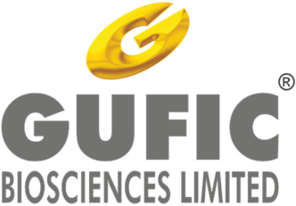
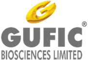
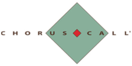
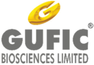

**[Image: Written_Transcript_140825.pdf-0001-00.png (332x231, 37.6KB)]**

“Gufic Biosciences Limited Q1 FY26 Earnings Conference Call” 

# August 14, 2025 

Disclaimer: E&OE – This transcript is edited for factual errors. 

**[Image: Written_Transcript_140825.pdf-0001-04.png (181x123, 16.6KB)]**

**[Image: Written_Transcript_140825.pdf-0001-05.png (224x113, 8.8KB)]**

**MANAGEMENT: MR. PRANAV CHOKSI – CEO & WHOLE-TIME DIRECTOR MR. DEVKINANDAN ROONGHTA – CHIEF FINANCIAL OFFICER MR. AVIK DAS – INVESTOR RELATIONS MS. AMI SHAH – COMPANY SECRETARY** 

Page **1** of **20** 

_Gufic Biosciences Limited August 14, 2025_ 

**[Image: Written_Transcript_140825.pdf-0002-01.png (158x110, 13.7KB)]**

## **Moderator:** 

Ladies and gentlemen, good day, and welcome to Gufic Biosciences Limited Investor Call for Q1 25-26. As a reminder, all participant lines will be in the listen-only mode and there will be an opportunity for you to ask questions after the presentation concludes. Should you need assistance during the conference call, please signal an operator by pressing star and then zero on your touchtone phone. Please note that this conference is being recorded. 

I now hand the conference over to Ms. Ami Shah. Thank you, and over to you, ma'am. 

## **Ami Shah:** 

Thank you so much. Good afternoon, everyone. I'm Ms. Ami Shah, Company Secretary. Welcome you all to Gufic Biosciences Limited Earnings Conference Call for the first quarter of FY '25-'26. We have with us today for the call Mr. Pranav Choksi, CEO and Director; Mr. Devkinandan Roonghta, CFO; and Mr. Avik Das from Investor Relations team to give the highlights of the business and financial performance of the company. 

Before we begin, I would like to say that some of the statements will be forward-looking and today's discussion may include projections or estimates about future events. These estimates reflect management's current expectations about future performance of the company, and these estimates involve a number of risks and uncertainties that could cause our actual results to differ materially from what is expressed or implied. 

Gufic does not take any obligation to publicly update any forward-looking statements, whether because of new confirmation, future events or otherwise. I hope you all have received the investor presentation that we have posted on the Stock Exchange website and on the company's website. I'll now hand over the call to Mr. Avik for sharing the business highlights. Thank you. 

## **Avik Das:** 

Thank you, Ami, and good afternoon, everyone. Thank you very much for joining our call. As always, I'll start with a quick overview of all our business units and divisions. And even before that, I'll bring you all to speed of our developments at Indore. So over the past year, a significant portion of our efforts has been invested in bringing the Indore facility from build to -- which is a benchmark facility today. 

This facility is one of our most advanced in terms of lyophilized injectable capability. It's been designed to meet WHO GMP, EU, ANVISA, MHRA as well as the US FDA standards. Since October 2024, our focus has been on a deliberate stepwise qualification process, starting with equipment qualifications and subsequently, even our utilities qualification, performance qualifications, which we've done it with multiple container formats and then we've done a full aseptic process simulation across all four lines. These stages were critical to ensure stability validation and long-term compliance readiness. 

On the product side, we have secured almost 145 state FDA approvals to date with additional products in the pipeline. On the tech transfer from Navsari side, which is well underway, we've already completed nine lyophilized injectable products, three liquid products and three ampule products and another eight are on the process as we speak. This shift is also freeing up capacity 

Page **2** of **20** 

_Gufic Biosciences Limited August 14, 2025_ 

**[Image: Written_Transcript_140825.pdf-0003-01.png (158x110, 13.7KB)]**

at Unit 2 for exports, while Indore, the Indore site takes over our domestic CMO work and begins to build its own commercial momentum. 

In terms of vendor audits from leading Indian pharma majors, we've completed 15. We have some more lined up in this quarter. And this, of course, will be an ongoing process. We've also explained in a timeline of how we see the Indore plant shaping up in the coming quarters and years. One of the key milestones will be the global regulatory audit, which we hope to receive from the EU side -- EU and UK MHRA side by Q1 of FY '27. US FDA, of course, will be triggered by client timelines as Gufic is a pure-play CDMO partner for the US foray. 

Looking ahead, our road map is very clear. We reached 30% capacity utilization in FY '26, which is the current year, breakeven on EBITDA for Indore in the same year and positioned Indore as a margin-accretive asset from FY '27 onwards. The focus will remain on disciplined scale-up, ensuring every stage of qualification, tech transfer and audit readiness is completed to global standards before accelerating volumes. 

Now I'll take you through the key updates in our divisions. I'll start with Critical Care division. In Critical Care, our direction remains focused on deepening our position as a trusted hospital partner through scientific engagement and therapy leadership. This quarter, we've used various national scientific platforms, not just for presence, but to shape clinical discussions, especially in invasive fungal diseases, antimicrobial resistance and stewardship and sepsis management. 

The intent has been to strengthen our reputation in high science, high dependence segments. On the portfolio side, we've begun refreshing the anti-infective baskets with a differentiated combination launch immediately post patent expiry of the innovator. This is, this particular product is targeting resistant pathogens while also promoting rational antibiotic use. The emphasis is on strategic need-based introductions of new products that add value to clinicians rather than just volume-driven launches. 

On Sparsh, Sparsh is undergoing a strategic shift under new leadership to drive deeper penetration in hospital accounts and widen the breadth of high science offerings. While nearterm growth will come from proven products like dual chamber bags, the medium-term strategy is anchored around entering new hospital categories such as contrast media and come up with next-gen Critical Care injectables like albumin. 

We are going through the development and regulatory approval process for these and testing for these products. The division is also investing in building a stronger corporate positioning with larger hospital groups by bringing certain changes in our distribution methodology. This will shorten sales cycles and improve customer retention. 

On the entire Ferticare Cluster, under strengthened leadership and with an upgraded portfolio. Ferticare is now focusing on sharper scientific positioning, improving field productivity and very selectively introducing differentiated therapies in reproductive medicine. 

A key highlight this quarter was the launch and scale-up of our immune therapy for recurrent implantation failure. This is the first such therapy in India addressing a highly specific and 

Page **3** of **20** 

_Gufic Biosciences Limited August 14, 2025_ 

**[Image: Written_Transcript_140825.pdf-0004-01.png (158x110, 13.7KB)]**

challenging patient segment in IVF. On our core brands, which are progressing well. Puregraf, which is our flagship gonadotropin offering is on track towards INR25 crores annual run rate. 

Cetrocare is moving into the top three in its category. Supergraf, which is positioned directly against an innovative product, is targeting INR15 crores within 2 years of its launch. Guficin Alpha is on course for INR10 crores annually. And our legacy brands like Dydrofic, Lomocare continue to post steady growth. Over the coming quarters, our focus will remain on deepening our relationships with IVF specialists, scaling first-to-market therapy offerings and expanding the portfolio to capture a greater share of clinician spend. 

Now I come on our toxin segment. I'll start with Aesthaderm. We are building on our strong base in the therapeutic and aesthetic botulinum toxin by broadening into more complete aesthetic portfolio, including fillers, skin boosters and biostimulators, which was a key gap in our product portfolio in that segment. This approach expands our clinician reach, engaging practitioners who may not currently use toxin and creating a progression pathway towards adoption of toxin. The result is a larger, more diverse customer base and long-term cross-category growth potential. 

So we made efforts to accomplish this in the first quarter. We've advanced in-licensing discussions for one of the world's top filler biosimulator brands to accelerate market entry and enhance our portfolio in India. Stunnox continues its sustained growth momentum. We're already number two in India, only second to the innovator of the product. We are also strengthening our footprint in Tier 1 and Tier 2 aesthetic markets via very targeted clinician network expansion. 

On the NeuroCare division, NeuroCare continues to focus on expanding the therapeutic botulinum toxin usage beyond just core neurology into neurosurgery, urology, ophthalmology and pain management. The emphasis is on category building, driving adoption through skills training, presence in various scientific initiatives and targeted specialty outreach. The aim is to gradually increase the user base familiar with therapeutic toxin application, leading to, we hope, a very sustained prescription retention. 

Now coming to our mass market specialties. I'll start with Healthcare division. In Healthcare, our strategy blends brand leadership in established segments with differentiated innovations. Sallaki and its Extensions remain the leader in joint care, positioned as a cure pathway rather than just symptomatic relief. 

Ridol continues to grow in the antidiarrheal category. The Ayurveda++ approach, which is combining traditional formulations with modern evidence underpins launches like Gufican Oil, Gufispon in very niche markets and strengthens our -- we also have a good wound healing product in this portfolio. 

Here, we have added vonoprazan as well, and we are seeing good early traction with this molecule as well. And we hope with this entire portfolio, the target market is pretty big and pretty niche, and we hope to gradually make inroads into that. Coming to Zenova, Zenova's focus is on strengthening engagement at the point of care in gynecology and expanding a highscience women's health portfolio. 

Page **4** of **20** 

_Gufic Biosciences Limited August 14, 2025_ 

**[Image: Written_Transcript_140825.pdf-0005-01.png (158x110, 13.7KB)]**

The patient support programs are also designed to build trust and preference at the prescriberpatient interface, which is the clinics. And upcoming differentiated launches in pain management and fertility-related antioxidants will broaden our relevance in reproductive health. 

The intent is to sustain the kind of growth that we've seen while gradually rebalancing the portfolio mix towards higher-margin segments and which is visible in the Rx-to-injections ratio now moving favorably towards Rx in this division. 

Lastly, I'll update on the international business. In our slides, we have presented the current market size of select molecules in which we have complete dossier readiness. These are products, of course, developed and already approved and being sold to some of these markets from Navsari Unit 2. 

Indore will add its own set of products to this as well in time to come. We are targeting a 3- to 5-year horizon to capture 5% to 10% market share across these high-potential molecules in the identified market as shown in the presentation. The addressable the total addressable market is about $824 million. 

Current manufacturing for these molecules is undertaken at our EU GMP-approved Unit 2 at Navsari with subsequent options to manufacture these at Indore facility as well. The Indore plant will not only debottleneck capacity of Unit 2 Navsari, but also expand this basket with additional products, which will add to the addressable market in the future. 

Export momentum is already visible, supported by opening up of Unit 2 capacity at Navsari through tech transfer to Indore and gradual relocation of domestic CMO business to Indore. Early wins reinforce our execution capability of this strategy. Something that I'll highlight here is the U.K. NHS tender award, which is already being serviced from Unit 2 Navsari in the current financial year. 

So with that, I wrap up the business updates for Q1. I'll now hand over the call to Mr. Roonghta for an update on the financials. 

## **Devkinandan Roonghta:** 

Thank you, Avik. I will going to highlight the financial performance for Q1 of '25-'26 versus the Q4 of '24-'25. I'm not able to compare the Q1 of '24-'25 versus Q1 of '25-'26 because of the Indore plant started operation from Q3 of '24-'25. I'm making a comparison of the financial results of Q1 of '25-'26 versus Q4 of '24-'25. The total revenue from the operation from Q4 of '24-'25 was INR205 crores, where Q1 of '25-'26 is INR226.9 crores, which is basically because of the startup of the Indore facility. 

The EBITDA in Q4 of '24-'25 was INR27 crores in Q1 of '25-'26 INR33.2 crores. The EBITDA margin in Q4 of '24-'25 was 13.17% and it has improved in Q1 of '25-'26 to 14.63%. The profit before tax Q4 of '24-'25 was INR10.8 crores and Q1 of '25-'26 was INR16.3 crores. The PBT margin in Q4 of '24-'25 was 5.27% in Q1 for '25-'26 is 7.18%. The profit after tax for Q4 of '24'25 was INR8 crores, whereas the Q1 of '25-'26 was INR12.1 crores. The PAT margin in Q4 of '24-'25 was 3.9%, whereas Q1 '25-'26 is 5.33%. Thank you. 

Sagar, we can now begin with the Q&A session. 

**Ami Shah:** 

Page **5** of **20** 

_Gufic Biosciences Limited August 14, 2025_ 

**[Image: Written_Transcript_140825.pdf-0006-01.png (158x110, 13.7KB)]**

**Moderator:** 

Our first question comes from the line of Bhavya Sonawala from Samaasa Capital. Please go ahead. 

**Bhavya Sonawala:** Just a couple of questions. Is it possible to give kind of a number on what kind of revenues have come in this quarter from the Indore plant? 

**Pranav Choksi:** Yes. So if you see, Bhavya, last time also in the last call, I think Navsari was more or less saturated in the entire year last year in terms of unlocking any revenue there. So whatever increase you see around close to INR25 crores to INR26 crores is mostly at the benefit of Indore. 

**Bhavya Sonawala:** Okay. No, sir, where I was coming from, I just wanted to understand, has there been any, we have spoken about Critical Care having, some products having price erosion. Has that continued? Or have we seen some kind of stability there? 

**Pranav Choksi:** Yes. So in Critical Care, the price erosion has stopped. There is no further price erosion happening in Critical Care as of now. Hello? Am I audible? 

**Bhavya Sonawala:** 

Hello. Yes, I can hear you. 

**Pranav Choksi:** Yes. So there is no erosion of Critical Care pricing in the last -- this quarter, April to June. 

**Bhavya Sonawala:** Okay. Understood. And just a last question. The tech transfer that we are seeing from Navsari to Indore, what timelines are we seeing for the whole thing to be completed? And when can we see some revenue starting from those transfers so that I think then the plan is for Navsari to start exports because we are already of existing products. So if you can just throw some light on that? 

**Pranav Choksi:** 

Yes. So basically, the tech transfer will be an ongoing thing. As Avik must have mentioned, there are more than 15 tech transfers, some of them have been completed, some are ongoing, and there will be more and more tech transfers happening of products where we know for a fact the capacity constraints are there. 

More importantly, the products which we are seeking for tech transfer as of now are two things: one, which we know for a fact will have a global impact on a higher batch size. When we export abroad, there is a QP release cost. So when the batch size is around 40,000 per batch in Navsari, here in Indore it's going to be 100,000 batch size. 

So those are the candidates which we have taken for a tech transfer in Phase I, followed by also those products which are relevant in the domestic market in terms of CMO as well as the Critical Care and infertility space, those products are also being considered for tech transfer. 

Down the line, once these products are done, there are also tech transfers, which will be done by our both the R&Ds of Indore and Navsari also directly to Indore fortheir products like daptomycin and propofols and the depo injection. So those also will be continued. So the process of tech transfer will be ongoing, but there will be new and new molecules coming in. 

Answering your second question. I mean, answering your fourth question in terms of when do we unlock the exports. So we already have lined up. We already have done the application of EU GMP at 2 different, I would say, geographies. So we are hoping to get the slot either at the 

Page **6** of **20** 

_Gufic Biosciences Limited August 14, 2025_ 

**[Image: Written_Transcript_140825.pdf-0007-01.png (158x110, 13.7KB)]**

end of the year or early next year. So once the EU gets approved, hopefully, by Q1 '27, as we have mentioned in the presentation, we'll be immediately starting the exports from that. 

Apart from EU, of course, other parts like Southeast Asia or even for that matter, Africa countries, ongoing audits are planned in the next 3 to 6 months. So I'm hoping to be full-fledged by December or by early next year, we should see exports also being initiated from Indore. 

## **Moderator:** 

## **Kumar Saurabh:** 

Our next question comes from the line of Kumar Saurabh from Scientific Investing. 

Sir, this year, FY '26, we have planned for 30% capacity utilization. So correct me, our assumption is by in next 4 years, this whole plant and INR800 crores of additional revenue should be possible in 4 years. That is one. And the other question is, when do you see operating leverage playing out in favor? 

Because right now, we'll have expenses at the employee level, other expenses level, which is also visible in the current quarter. So what is the capacity utilization level at which you can expect the margins to reverse for upward journey? 

## **Pranav Choksi:** 

Yes. So I'll comment about the capacity utilization, and then I'll request Roonghta sir to comment about the margins. And I think he already has mentioned about being EBITDA positive by the end of the year, but I'll ask him to elaborate on that further. In terms of capacity utilization, we already are on around 18% to 20% in Q1. So we foresee that and I'm talking, of course, about the lyophilization capacity. 

Liquid and ampule, we hope that by somewhere by around October or November, we should be close to 25%. But by the end of the year or maybe by November. I mean, by the third quarter of this financial year, we should be around 30% and maybe beyond also. So that is where we foresee that the capacity utilization will happen. And based on that, we have a prediction that we should be breaking even in EBITDA this year. Roonghta sir, do you want to add anything on this, sir? 

**Devkinandan Roonghta:** 

**Pranav Choksi:** 

**Devkinandan Roonghta:** 

Yes, I'll just add, sir. 

Yes. 

Now, I already mentioned the capacity utilization has reached to 18% to 20%, but there are certain capacity which has been utilization for validation of the batch. So capacity utilization is depending upon how much we sell to the market. 

It also includes the validation. So once the capacity utilization reached around 25% only for sale, that moment of time, we are expecting the EBITDA will be breakeven. And if we reach the capacity utilization around 35%, that moment of time, we will be able to recover the interest and depreciation cost also. 

## **Kumar Saurabh:** 

**Devkinandan Roonghta:** 

Got it, sir. And 4 years, is it a fair estimate? I mean, business is around certain -- so 4 years is it. 

It's too early to comment on this because we are in the process of how much live validation batches we're going to take, how much time the U.S. FDA is going to take the permission. It's 

Page **7** of **20** 

_Gufic Biosciences Limited August 14, 2025_ 

**[Image: Written_Transcript_140825.pdf-0008-01.png (158x110, 13.7KB)]**

too early to comment. I'm not in a position to say that after 4 years, it will be -- we will be able to reach to INR800 crores or not. 

## **Kumar Saurabh:** 

Okay. Okay. And sir, second question is on the cash flows. Of late, the EBITDA to cash flow conversion has not been great. And I'm sorry, I'm new to the company, I'm still studying. But one of the reasons have been the Sparsh project. My understanding was because it helps us a direct connect with the hospitals, it should help us even to better the operating cash flows. 

So if you can explain a little bit on why EBITDA to cash flow in the last 1, 2 years has not been like how we used to do in history? And is Sparsh project having any impact on that? And what is the future plan on that to improve the EBITDA to cash flow conversion? 

## **Pranav Choksi:** 

**Devkinandan Roonghta:** 

**Pranav Choksi:** 

I think, Roonghta sir, I'll answer just about the Sparsh program and then you can definitely comment on the cash flow and the EBITDA question. Can I continue? Or is there some issue? 

Yes, you are audible, sir. 

Yes. Okay. So Sparsh, I think like we clearly mentioned, was a clear-cut division launch to increase the margins which we have. So if you see overall, the margins which were there of Gufic some years ago were close to around 48% to 50%. Now at least we have been able to increase it to around 54% to 55% year-over-year in spite of the erosion of pricing happening. 

So Sparsh was done that we, of course, try to go to the there are 2 purposes, not only for margin improvement, but also that we have a control of our predictive business in terms of the primary, secondary as well as tertiary hospitals. 

So we know actually what is the buying patterns, what molecules work in what geography and what hospitals are interested in what products, specifically keeping in mind that particular area and geography as well as economic background. So that is where the thing was, and we expected more of margin improvement. But always, when you know that whenever we try to go for the direct approach, the hospitals in India, unfortunately, have a habit of paying almost after 120, 150 or sometimes even 180 days. 

And that is something which we were recalculating. So there might be an approach change down the line, maybe in the next 3 to 6 months, and that's why there has been a leadership change also in Sparsh even the numbers and sales were happening, the cash flow was a little bit, of course, stretched, especially keeping the debtors in mind and also the inventories also. 

So we would be maybe going back in the next 3 to 6 months back to the CNF model where we again get the what you call the distributors in place where at least our collection and our, I would say, outstanding, which is currently around 120 to 150 days in that division comes back to that 45-day average, but it will take time, but it's worth exploring. So that will be my comment on Sparsh. I think, Roonghta, sir, you can comment about the EBITDA and the cash flow. 

**Devkinandan Roonghta:** 

Basically, if you see the cash flow has been basically our inventory has almost maintained around INR215 crores. There has been an increase in the debtors because of the -- after COVID, generally, previously before COVID, we are getting the payment average in 90 days. But after 

Page **8** of **20** 

_Gufic Biosciences Limited August 14, 2025_ 

**[Image: Written_Transcript_140825.pdf-0009-01.png (158x110, 13.7KB)]**

COVID, the payment circle has been increased by almost all the people from 90 days to 120 days. So that is one of the major changes in the payment cycle time. 

And second thing, because of the increasing in the sale of Indore plant, we expect there will be an additional requirement of the working capital. So the working capital requirement will be under pressure for this current year because of the Indore picking up. 

## **Kumar Saurabh:** 

## **Moderator:** 

## **Nitya Shah:** 

Got it, sir. Got it. That's it from my side. I really have gone through the previous con calls. I really like the disclosures and the transparency with which you update irrespective of something good, bad, positive, negative. So really looking forward for next quarter. 

Our next question comes from the line of Nitya Shah from KamayaKya Wealth Management. 

Yes. My question was now I've been a shareholder for quite a few years. So I've seen that the revenues have largely ranged between, say, the INR190 crores to INR200 crores -- INR200 crores range. And now we've shown a 10% growth. 

So looking at the various segments, so there's a lot of innovation and interesting, exciting segments in the company. But why has the top line not been reflecting all these changes in the sense that you surveyed around 8,000 hospitals? There's lots of interesting feedback as it was seen in the presentation. 

But why is this not flowing into the revenue numbers? Like when will we start seeing like strong growth of, say, 20% year-on-year? Like now we've reached 10%. So just could you throw some light on other than the Indore products like all your other therapies, what's exactly happening there? And when can we see a material change in our numbers due to that? 

**Pranav Choksi:** 

Yes, Nitya. So as you know, 50% of our revenue comes from the domestic market and then from CMO and then from exports, which are the major 3 parts. Further, if I go below after 50%, around almost 50% comes from Critical Care, which comprises of Critical Care, Sparsh and overall setup and then 30% from infertility and the remaining would be from mass marketing. 

So till -- if you see the numbers which have evolved from, I think, INR690 crores, INR800 crores, INR800 crores and then whatever comes this year, we -- especially last, INR690 crores to INR800 crores was one jump and then INR800 became flat at INR800 because of 2 reasons as I mentioned last time. 

One was, of course, erosion of prices, which was to the tune of INR120 crores to -- but more importantly, that capacity was the biggest concern which we faced. And because almost Indore project was delayed by 6 to 8 months, almost 9 months, we had -- and because of the introduction of the new validation, the revenues almost got pushed ahead. 

At the same time, there was a heavy order book, which was just got bloated in the meanwhile. So unfortunately, in pharma, as you are aware, we cannot just start a plant and start manufacturing immediately. There is a process of 3 batches sorry, tech transfer, anal method transfer, the validation then stability. And once the stability is okay, then your QA allows to take the batches ongoing. 

Page **9** of **20** 

_Gufic Biosciences Limited August 14, 2025_ 

**[Image: Written_Transcript_140825.pdf-0010-01.png (158x110, 13.7KB)]**

So this process, which was actively started by October 2024 is throwing some light, and that's why you have seen a 10% sort of uptrend in revenues in Q1. We hope that this 10% should further definitely increase in the quarters to come because more and more capacity will be unlocked from Navsari to Indore. At the same time, I mentioned that there is no further erosion of rival, which is happening in our major category, that is CMO as well as Critical Care and Sparsh. 

So there also, we see that we have bottomed out last year in terms of price erosion. And we foresee that there would be no other impact of that coming in this year. So the natural progression, the natural growth of those divisions, coupled with the capacity unlocking from Navsari to Indore, would help us achieve the numbers you desire, but in a step-by-step manner. 

**Nitya Shah:** Understood. So currently, your branded business, Sparsh, where you're selling your own medicine, what part of revenue has that become around about? 

**Pranav Choksi:** It is around INR55 crores to INR56 crores on annually. That is Sparsh. Critical Care is of course, the highest one, which is around INR22-20 crores. 

**Nitya Shah:** So where do you envision Sparsh reaching in, say, the next 2 to 3 years, you're at, say, INR50odd crores annually. What's like the internal targets? 

**Pranav Choksi:** Internal targets would be close to INR100. **Nitya Shah:** Okay. In the next 2 to 3 years? **Pranav Choksi:** 2 years -- 2, 3 years, yes. **Nitya Shah:** Okay. And would you give a guidance of some sort that in, say, FY '26, you touch around INR1,000 crores of revenue, looking at the capacity utilization and increase in other segments? 

**Pranav Choksi:** I would love to put a number on it. But yes, our efforts are fully on to reach that magical figure as soon as possible. 

**Moderator:** Ladies and gentlemen, as there are no further questions from the participants, I now hand the conference over to Ms. Ami Shah for closing comments. 

**Ami Shah:** Thank you very much for joining us. 

**Avik Das:** Ami, we have one question. If you want, we can take it... 

**Moderator:** We have the last-minute registration coming from the line of Shubham Selvadia from Tikri Investments. 

**Shubham Selvadia:** Congratulations, sir, on a good set of numbers. Sir, I just wanted to know the volume growth which we have earned during the quarter. 

**Pranav Choksi:** If I understand your question right, volume growth would be the total number of vials and capsules and tablets. 

Page **10** of **20** 

_Gufic Biosciences Limited August 14, 2025_ 

**[Image: Written_Transcript_140825.pdf-0011-01.png (158x110, 13.7KB)]**

**Shubham Selvadia:** No, sir, in percentage terms, like what last -- during quarter 4 of FY '25 and quarter 1 of FY '26. So what is the volume growth? **Pranav Choksi:** Very frankly, it will be very difficult for me to comment on that. I'm not normally, we take it molecule by molecule, we take division by division. Overall as a company, I will not be able to give you any molecule growth. But at least we know I can just add that our mostly facility in Navsari was saturated. So Indore is the additional volume which we have obtained, like I mentioned, 18%. 

## **Shubham Selvadia:** 

So around, I would say, 18% or 18 lakh vials or including ampules is the capacity which we have unlocked in the last 3 months. So that would be additional, I think, from April to June. Again, it's a good question. Sorry, I'm a little bit I'm not able to give you the exact number. I'll get back to you. I'll take your details, and I think we'll ask Avik for Ami to get back to you with these details specific. 

**Shubham Selvadia:** Okay, sir. And sir, what percentage of the revenue is coming from exports? **Pranav Choksi:** I think according to me, the export would be around 20%, 20 to 22% of increasing this year. But Roonghta, sir, is that the right understanding? **Devkinandan Roonghta:** Yes, yes, sir, out of INR800 crores of sales, INR820 crores, INR160 crores was revenue from last year '24-'25, which is around 20% in Q1 also INR53 crores out of prudencing is around 20%. **Pranav Choksi:** Yes. All right. So I think around 20%, 22% is the export revenue. Yes. **Shubham Selvadia:** Okay. And sir, what is the revenue breakdown from each division? 

**Devkinandan Roonghta:** Generally... 

**Pranav Choksi:** Sorry, go ahead. 

**Devkinandan Roonghta:** You can see that our segment is only one segment. So we will not be legally liable to give any information in the interest of the competitive to give us the breakup of segment-wise details from all the sectors. Just broadly that total our business is 50% is domestic sales and 30% is 20% is export, 20%, 25% is CMO sale and remaining is API sale. But number, we will not be able to share because of the competitive mix. 

**Pranav Choksi:** If you just understand and just addition to what Roonghta sir said in the last 2 conversations just, I think, 5 to 7 minutes ago, I've given a broad percentage of the domestic mass marketing, IVF and Critical Care also. So I think we'll get the details there. 

## **Moderator:** 

Our next question comes from the line of Akshada Deo from Niveshaay. 

**Akshada Deo:** So I've been following your company in progress for a while. But this quarter, we are seeing a good amount of margin stability and margins have started to come back to a little bit of normalization. So can we expect that this should be maintained going forward now that the Indore plant has started to accrue revenues as well? 

Page **11** of **20** 

_Gufic Biosciences Limited August 14, 2025_ 

**[Image: Written_Transcript_140825.pdf-0012-01.png (158x110, 13.7KB)]**

## **Pranav Choksi:** 

I think actually you're mostly talking about gross margins, right? 

**Akshada Deo:** No, I'm talking EBITDA actually... 

**Pranav Choksi:** Yes. EBITDA, Roonghta rightly replied. I think the issue would be just encashing on the assets which we just invested, you rightly said once Indore, because there's no further erosion happening in pricing. So once Indore, of course, comes and takes the load off of the company, we hope that these margins should improve. Yes. 

**Akshada Deo:** Is it right understanding now that the Navsari plant would also start to get more freed up because as the tech transfers keep on happening, more of the sales will start to happen from the Indore plant. So Navsari would also, the bottleneck that was happening in terms of validations, etc., and just a lot of the sales were stopped also. So that capacity would also start to accrue to sales? 

**Pranav Choksi:** Yes, absolutely. 

**Akshada Deo:** Okay. Okay. So that way it is not just the new Indore plant, right? Then Navsari would also start contributing more because the utilization would be towards sales. 

**Pranav Choksi:** Yes, absolutely. So there would be some domestic business and CMO business moving to Indore, and that would help us to open up certain export opportunities from Navsari where, of course, the margins also would be driven. But yes, you rightly said, it's both the factories more importantly, contributing to our growth going forward by amortization of capacities, yes. 

**Akshada Deo:** So sir, for the Navsari plant, then how much we can say as of now that's been utilized for the tech transfer. I don't think the tech transfer would necessarily stop business, but just capex, say, from what I can understand because remember, you were at 80%, 90% capacity already there, even more because validation batches were also ongoing for various products. Now what would be the free up that has happened from there? 

**Pranav Choksi:** There's absolutely no free up because more and more like I said, the order book, order booking. I mean, the order thing is still there. Order book is still there, bloated. So we are trying to get all those things done. So we -- I hope we never reached a level where we see Navsari is now 20%, 30% free. We hope it continues at that 80%, 90%. And of course, Indore starts filling more with this amortization also. So that is the thought process going forward. 

**Avik Das :** Just to add to that Akshada, it is not that Navsari, the bottleneck caused underutilization of capacity. It's just that the product mix and the market mix will evolve from Navsari, even though the output may remain same, which could have some positive delta subject to no price erosions in API, just to clarify that understanding. 

**Akshada Deo:** Got it. No, no, no. Please feel free to tell me that would always be great. You mentioned Aesthaderm also, we've added more products, right? There are fillers, boosters and biosimulators is something that you've added along with Stunnox to give like a more holistic portfolio. So there can you expand more? 

Page **12** of **20** 

_Gufic Biosciences Limited August 14, 2025_ 

**[Image: Written_Transcript_140825.pdf-0013-01.png (158x110, 13.7KB)]**

**Pranav Choksi:** 

No, no. I think what Avik meant was that we are in the process of in licensing international big brand who has, of course, fillers and bio boosters as well as other aesthetic cosmetic options, which further strengthen and fortify our basket surrounding Stunnox. 

So we hope that with that tie-up, maybe in Q3 or by Q4, let's be more realistic, maybe by Q4, we should get an additional benefit of strengthening Stunnox further with the help of these fillers and other products also. So that's what I think he meant in his part. 

## **Akshada Deo:** 

## **Pranav Choksi:** 

So where are our aspirations for this? Because as they rightly said, the turnaround that is happening, especially due to just awareness of these procedures, and they're becoming more and more available even in Tier 2, Tier 3 cities. So where like, where are we with the marketing side? How deep has our reach been, how we have grown here? 

So if, I'll answer this question and I'll end up with a question for you also, and you can maybe tell me your feedback also. So we in India, always feel that the consumption is increasing, and we also and of course, that's why you see that our numbers, the way the toxin is increasing and the acceptance and awareness is there. We are still waiting for that hockey stick figure. And that is where when the actual consumption and the actual expenditure of all the people in India free up. 

So we feel that, let's say, the out-of-pocket expenses of an average Indian consumer, both male or female on an aesthetic and cosmetic space, which would be around maybe INR3,000 to INR5,000. I'm seeing an average. I'm not going through all socioeconomic strata. I'm seeing the one who are relevant and who pay for that. 

Even that go from INR3,000 to INR5, 000 to INR7,000 to INR9,000 that's still not good enough. The thing would come when the average Indian consumer, even if we look at that strata comes to an average of around INR18,000 to INR25,000 per month expenditure, that is when the hockey stick will come in. 

So we still, as a society in India have to evolve. Of course, we are growing, and we see the number. But if you expect the ones like even forget the US and the Koreas and all that of the world. But even if you expect the Turkey and the Thailand and even Poland and the Russia of the world, where we compare their, I would say, adoption of cosmetic procedures as to India, we are still lagging far behind. But of course, we hope that we make a difference. 

We try to bring the awareness we all I mean, when I mean all the entire cosmetic, pharmaceutical as well as aesthetic industry tries to make it more. And then, of course, like I said, I would like to ask you as a consumer, how do you feel your delta has evolved in the last 3 years? Have you started spending 5x or even 3x what you used to spend or still not? 

**Akshada Deo:** 

Yes, absolutely. I mean it hurts my pockets sometimes as a young female. And it's not just these fillers. There are so many laser procedures as well that are now in the market gaining more and more utility. I mean even if I, and they're getting cost effective as well. When I compare, for example, one of the most popular procedures that used to be there was laser hair reduction. That used to be about INR10,000, INR12,000 per session. 

Page **13** of **20** 

_Gufic Biosciences Limited August 14, 2025_ 

**[Image: Written_Transcript_140825.pdf-0014-01.png (158x110, 13.7KB)]**

And now the packages have come to INR25,000, INR30,000 for 12 sessions. So the cost there has also reduced. But if we see the volume, overall volume that has happened like even.  I'm from Surat. So even when I see in a city like Surat, the amount of uptake that's happening is absolutely crazy. 

And when I'm talking to, like I've seen clinics rapidly expand just to gain more of this market share. So fillers as well as BOTOX, I feel because this was more restricted to metro cities, this has started to now come here as well, especially with the bridal side of things getting more and more popular. 

**Pranav Choksi:** Absolutely. And I think as a Gufic shareholder, please start using the word Stunnox now instead of BOTOX that really helps us. 

## **Akshada Deo:** 

That's absolutely true. That is exactly what I mean. 

**Pranav Choksi:** You are really appreciated. Any more questions, feel free to reach out to Avik and Investor relations. 

**Moderator:** Our next question comes from the line of Yash Tanna from ithought PMS. 

**Yash Tanna:** 

So Pranav sir, I had a question. So on the new product launches that we have had in the presentation, you have mentioned in Sparsh and even Critical Care, like which are the big products that we are betting on? Like we had avibactam, for example, which I think was a fairly successful product for us. So some new products that could be similar to the size of avibactam. And if you can give some indication of the market size for these molecules? 

**Pranav Choksi:** 

Yes. So ceftazidime/avibactam was, of course, launched in 2022, I believe, and that has seen sorry, 2023, and that has seen the road map being close to the INR25 crores mark, which we had. Going further in Critical Care, there are some combination products, which are right now at DCG like aztreonam/avibactam or others, which would come in, which has that, I would say, road map going forward. 

There are two, three more, one once a week antifungal. I think if you refer our Slide 2 post Indore, there we have a pipeline mentioned. In terms of Sparsh, as a focus, we are focusing on the dual chamber bags where we have just applied to NPPA for meropenem price increase of almost 30%. But I think we have got an intimation of it would be around 15% to around 15%. 

So that would help us for the dual chamber bag development front in Sparsh along with teicoplanin. And then followed by contrast media and the end of the year, hopefully, by total parental nutrition. So that would be the road map in Sparsh. So these so anti-infectives would be mostly the Critical Care lineup. And here in Sparsh would be the dual chamber bag, it's followed by contrast media and then the parental nutrition by the end of the year. 

## **Yash Tanna:** 

Sure, sir. Got it. And you mentioned like with Indore coming in, our Navsari capacity becomes free. You also mentioned about the UK tender that you have. But what sort of an export visibility do we have that you can cater to from the field capacity from Indore? 

Page **14** of **20** 

_Gufic Biosciences Limited August 14, 2025_ 

**[Image: Written_Transcript_140825.pdf-0015-01.png (158x110, 13.7KB)]**

## **Pranav Choksi:** 

## **Yash Tanna:** 

**Pranav Choksi:** 

By both the factories you're asking, right? 

Yes. So I'm just trying to understand the visibility that we have in terms of exports. 

I think Avik has made a wonderful slide. I think it's the last slide of our investor presentation about the market addressable only of 8 molecules of us. So the 8 molecules where we have already have a dossier ready and we have filed from Navsari and hopefully, we are filing from Indore also. And these are common molecules which can be made on either of the sites. 

So there just to give an example. So there are molecules beyond that, but just to show the work which is happening in the background, there is an $824 million, I would say, market addressable market, which is possible for those molecules where we are trying at least for 5% to a little bit to 8% to 10% in the next 3 to 5 years. 

## **Yash Tanna:** 

## **Pranav Choksi:** 

So those are the work happening beyond in the background to give you just an indication. Like that, there are around every quarter, 3 to 4 molecules where dossiers are being formed in ampules, liquids and a vial, which we are trying to take it forward. So let's say, step by step, we are trying a level to unlock the Navsari and Indore with that sort of a road map. Sure. So fair to assume that the scale up of this INR800 crores  sorry, $800 million opportunity will happen over the next -- we don't have the orders currently, but obviously, over 2 to 3 years, we'll try to scale that opportunity. 

No. Some of the orders, like I said, already have been coming to us from Brazil, Canada, U.K., Europe, Portugal for that matter and other countries also I'm not going to name all of them. And those are already have been being unlocked from Navsari. 

So as more and more capacity is being shifted to Indore as a CMO as well as the domestic space, domestic own brand, we are hoping that we can cater to that. So already the process has started in terms of numbers also, what you have seen, assuming Navsari will contribute more this year in terms of export. And hopefully, from next year, both Navsari and Indore should start contributing in exports. 

## **Yash Tanna:** 

## **Pranav Choksi:** 

Got it, sir. Very clear. The last question was I mean, on BOTOX sorry, on botulinum toxin, so the question was, I mean, you spoke about the hockey stick growth, right? You're still awaiting hockey stick growth in this product. I mean I wanted to understand, and you have discussed this in the past, your plans for the international foray with this product. I mean maybe that could be the hockey stick growth that we are looking for. So any plans we have firmed up for this product in the international market since it's well accepted and there's a ready market for it. 

Very frankly, if you see now beyond Stunnox also, there's a lot to do with the Indore and Navsari and our domestic business piece. So right now, we are very clear and very focused that Stunnox first has to be a strength in the home ground, that is India. And there is enough, I would say, opportunity available here where we can make it up. Unfortunately, even though being in a very exciting and a very cool world of Stunnox, still it contributes only a small percentage of our total business. And the other business also has a lot of higher road map and a higher ceiling still to be achieved. 

Page **15** of **20** 

_Gufic Biosciences Limited August 14, 2025_ 

**[Image: Written_Transcript_140825.pdf-0016-01.png (158x110, 13.7KB)]**

So our focus is in domestic market to focus and bringing the bring, and that's why we are inlicensing these other I would say, multinational brands to beef up, Stunnox basket also. However, maybe after 2, 3 years, once we are a little bit better leveraged in terms of capex and all that, we foresee to take the international route. Till then, we feel that there's enough work to be done in India. And we have, I think also you have to remember, it's not the question only of money and resources, the bandwidth of the people. 

So the bandwidth would be better suited to first exploit Indore, exploit Navsari, exploit our domestic business, CMO business as well as exports of our main business and take Stunnox and the basket in India and make it at least close to Allergan's presence or already we are numbe two. But number two, by having only 12% market share is not good enough, increase the market share to at least 30%, 40% and create a good, I would say, equity here in India first and then take it abroad. 

## **Yash Tanna:** 

Sure, sir. Got it. Very clear. And one last question, if I may. I wanted to know plans on debt repayment and utilization of the cash that the equity that we had raised from institutional investor or so. 

**Pranav Choksi:** You are talking about the 2023 influx, right, of Motilal Oswal? 

**Yash Tanna:** Right of Motilal Oswal. And I mean, what's the plan on debt? 

**Pranav Choksi:** Yes. So I think Roonghta sir will be a better person to answer that. However, I'll just talk about the utilization of the inflow. Some part was used for, of course, debt repayment, which was already existing there of Navsari before of the Penem factory. 

Then we used in almost 30% to 40% in our, more than actually 40% to 45% in our dossiers and other, I would say, finishing off. And the remaining was used, of course, as a part of our working capital to fortify Indore further. I think Roonghta, sir, maybe you can make it more precise and give a better person than me. 

**Devkinandan Roonghta:** Yes. Basically, for the year '25, '26, the cash flow will be under pressure because the Indore facility will require additional working capital when the sale will be going to pick up. So we feel there will be no surplus cash at least for '27. After '27, the cash flow will start generating the cash, which we'll be utilizing to repay the term loan as early as possible and the remaining will be to repay the working capital loan. So I think the company will become debt-free by 2029. 

**Moderator:** Our next follow-up question comes from the line of Nitya Shah from KamayaKya Wealth Management. 

**Nitya Shah:** I also remember that friend of mine visited your Arisia Bombay gave me some excellent reviews that it was a world-class clinic. So I just wanted to ask that have you opened any other clinics in the country? Or is this the only one yet? 

**Pranav Choksi:** 

Yes. So again, I think, Nitya, our main focus is to make Stunnox and the entire basket big. Opening multiple clinics is not our first interest I mean, it's not our interest because we opened 

Page **16** of **20** 

_Gufic Biosciences Limited August 14, 2025_ 

**[Image: Written_Transcript_140825.pdf-0017-01.png (158x110, 13.7KB)]**

Arisia as an experience center, as a training center where we can actually fortify the skills and the what you call, the application of doctors in India. 

We know we have excellent doctors, but sometimes there are new techniques coming from abroad where we use Arisia as an interface to not only train them, develop them, but also give knowledge to other doctors. So as of now, our focus would be to increase the Stunnox brand name and the basket aesthetic revenues purely clinics would be not a focus right now, again, because our core competency is different. It's more about branding, about market penetration. 

And Arisia will continue and will flourish because as a training center, we are getting a lot of positive feedback, and thanks to you also for your positive feedback. A lot of doctors are visiting. Maybe some doctors don't have a facility or they don't have anything. They come and use Arisia for their own practice, and there's a lot of collaboration happening there. So that is where the focus would be. 

## **Nitya Shah:** 

Just a suggestion from my end. I know your focus is not on the clinics, but in my view, like I've noticed as per market trends that Delhi, Chandigarh have a lot of demand for this kind of product. Like I feel with the advent of Arisia and all these things, you should have like this is just my suggestion to have another semaglutide clinic experience center in a Posche location in Delhi. 

It will help a lot with like awareness of your brand and the fact that India has a domestic player doing all of this kind of work because most of the people have of doing this work abroad, like they want to keep it under their apps and all of those kind of things. 

But I feel that if you increase your awareness in the metro cities like Delhi, where there's demand for this kind of product, you could suddenly see an influx. It might hurt the pocket in the start, but you will see the benefits come in later. 

## **Pranav Choksi:** 

So I think excellent point. So I'll tell you how we work on that. I think so Nitya, what our strategy is that a lot of doctors or a lot of doctors, kids who are just starting out, they have the capital, they have the space, and they want to set up the clinic. So we Arisia actually all our doctors at Arisia plus our entire team helps these doctors set up their teams and set up their practices. 

We import SOPs of ours about the best practices also, and we help them set up a clinic. And what we ask them in return is, of course, help us to create data about Stunnox and the different products on the Indian population. And as you rightly said, we are an interface of getting, I would say, international global new products, energy devices where we empower these things. 

So just to answer your question in a much more specific way, we don't want to replicate our own, and we don't want to go for that capital route where we invest capital and create our own setup. We want and we want to empower doctors in India and train them to set up their own and become independent cost centers and profit centers on their own by which we service them via products, services and best practices. That's how we foresee in the next 3 to 5 years, we'll make a big brand. 

Got it. And also, could you throw some more light on the licensing deal for Stunnox, what you mentioned that there's a licensing deal with a foreign major. I just want to understand that. 

**Nitya Shah:** 

Page **17** of **20** 

_Gufic Biosciences Limited August 14, 2025_ 

**[Image: Written_Transcript_140825.pdf-0018-01.png (158x110, 13.7KB)]**

**Pranav Choksi:** 

Yes. So we had got an offer in the middle where we had to form a separate entity where we had to dilute some equity. We got an offer, but then we realized and as Roonghta sir also rightly said, maybe in the next 2 years, we should have our own, I would say, cash flows, which can fund our own independent foray rather than giving someone equity at this time in our, even if it's a separate entity of Gufic, it doesn't make sense. So we got the deal, but at this time, we have decided to let it go, focus on the India market. And in the next 2 to 3 years, maybe foray into the international markets on our own . 

**Avik Das:** 

The larger portfolio that we are in-licensing I think the bistimulators and fillers. 

**Pranav Choksi:** Sorry, sorry. So I think Avik you can answer that. 

**Nitya Shah:** 

What was mentioned in the PPTs. 

**Pranav Choksi:** Okay. Sorry. I think I missed your question. Avik, please go ahead. Yes. 

**Avik Das:** 

Yes. So there is, as we've mentioned in our PPT, in our aesthetic space, we are only offering the toxin as of now. But we see the   very first application done on a patient is typically not a toxin and it's a road map. So you have fillers very widely used now. Now you have bistimulators, you have skin boosters. And all of this will just help us create a wider portfolio, and we can start engaging with clinicians for a much bigger basket of indications. 

We had options to either develop it on our own and being an R&D-driven company, which was it was a very tempting thought. However, we felt like it is it may help Stunnox if we can inlicense an existing player, a well-accepted player who has done a lot of clinical studies, has a lot of clinical data to prove against the current offerings in the market. 

So we are in talks with, as we mentioned, one of the largest filler brands in the world. They have almost $100 million sales of fillers just in the US, and they have a lot of clinical trial data as well. We should be closing that deal. We've had our handshake deal, but we should be closing that deal very soon on the commercial. And so that's largely, it will just widen our portfolio, create a larger ramp for Stunnox to move doctors on to Stunnox as well as even our clients and patients in the future. 

**Nitya Shah:** 

So just for me to understand, like if you could share like a range of possible revenue potential for Gufic from this licensing agreement, because I feel this could like change force for the company, like getting a licensing agreement would be very good at this stage for the product? 

**Pranav Choksi:** 

Yes. So I think let's keep something for the coming few quarters also. That will really help us. In the meanwhile, let us first sign the deal, get a road map, get a projection and then we'll keep something. We'll discuss that in the times to come, please. 

## **Nitya Shah:** 

And my last question is regarding, you mentioned of commercialization of the immunology therapy. So any timeline you would like to share on that and the potential for that? 

**Pranav Choksi:** 

No. At this moment, no. I think it's too preliminary. It's happening in the background. Once it comes to any relevant thing, we'll definitely share it with you. 

Page **18** of **20** 

_Gufic Biosciences Limited August 14, 2025_ 

**[Image: Written_Transcript_140825.pdf-0019-01.png (158x110, 13.7KB)]**

## **Moderator:** 

Our next question comes from the line of Bhavya Sonawala from Samaasa Capital. 

**Bhavya Sonawala:** Just one question. We spoke about how we might consider moving away from the direct-tohospital approach. Will that affect our margins going ahead? Any thoughts on that? 

**Pranav Choksi:** Definitely, there would be some impact. I don't say that. But I think that would be that will be offset with the products which we are coming up also right now. So I don't feel that there would be that much of an impact by moving them. That's where the strategy is happening. That is where Mr. Kaul is coming on board right now. 

We are working with the product mix with the help of the dual chamber bags and the contrast media, where we offset this by using a different channel, distribution channel option against thing. There will be definitely a loss of revenue because of things, but that will be offset overall as a Sparsh when we have other products in place. 

**Bhavya Sonawala:** Okay. Can this work in a hybrid model or that's difficult. **Pranav Choksi:** No, no, no. It makes no sense. I mean it's a little bit challenging because then there will be a lot of things to -- as a system and SOP is in place, it's becoming challenging if we do that. So better to have a single thing where we take care of the cash flow in a better way… 

**Moderator:** Our next question comes from the line of Kumar Saurabh from Scientific Investors. 

**Pranav Choksi:** Sorry, I think I just have a hard stop at one. So let's hope that, can we take this last question and then we can just go on to the next thing, if it's open with everyone. It's okay with everyone. **Kumar Saurabh:** Sure, sir. So sir, I have a question regarding the growth and the margins. So one, the Indore plant will contribute to growth and also the 18% export number, we are hopeful of taking it to 25%. In terms of the business units, where do you see a higher share of growth coming? That is one. And second is because export will, if export increases from 18% to 25% and Indore is a new plant technology-wise, it will be much better. Do you see better margins in export going up and Indore contributing? 

**Pranav Choksi:** Yes. So I think I've answered some part of it, but I'll request Avik to take this question. Avik, if you don't mind, and Roonghta sir can take it forward. Avik, are you there? 

**Avik Das:** Yes, I'm there. I'm there. I think Roonghta sir can guide on the margin side product side, we've already showed on the potential. 

**Pranav Choksi:** Yes, go ahead, Roonghta sir. 

**Devkinandan Roonghta:** Yes. Basically, if you see EBITDA, in '25, '26 because of the Indore coming, we already said the capacity utilization will be going to pick up slowly. So there will be a margin pressure in the year '26-'27. Then '27-'28, we will expect the margin will improve. But definitely, after increasing the export as well as export has been touched to 25%, there will be increasing in the EBITDA margin by 1%. So I feel that EBITDA margin will going to come only after 2 years, not from not '26-'27 and '27-'28. '28-'29 onwards, I will see that the EBITDA margin will start picking up. 

Page **19** of **20** 

_Gufic Biosciences Limited August 14, 2025_ 

**[Image: Written_Transcript_140825.pdf-0020-01.png (158x110, 13.7KB)]**

**Kumar Saurabh:** Okay. And sir, in terms of incremental growth by business units like where do you see bigger growth coming in. 

**Devkinandan Roonghta:** It's a very difficult question because there are a lot of things depending upon FDA permission from US, the permission from Europe and all these validation batch is going to take time. So this moment of time to anticipate exact the expected turnover is very difficult. **Moderator:** Ladies and gentlemen, as there are no further questions, I now hand the conference back to Ms. Ami Shah for closing comments. **Ami Shah:** Thank you thank you all for joining us today. If you have any further questions or any questions have remained unanswered, we request you to reach out to our Investor Relations team, and we'll be happy to address them separately. With that, we conclude today's call. Thank you. Take care. **Moderator:** Thank you. On behalf of Gufic Biosciences Limited, that concludes this conference. Thank you all for joining us, and you may now disconnect your lines. 

Page **20** of **20** 

---

## Extracted Images

| # | File | Dimensions | Size |
|---|------|------------|------|
| 1 | Written_Transcript_140825.pdf-0001-00.png | 332x231 | 37.6KB |
| 2 | Written_Transcript_140825.pdf-0001-04.png | 181x123 | 16.6KB |
| 3 | Written_Transcript_140825.pdf-0001-05.png | 224x113 | 8.8KB |
| 4 | Written_Transcript_140825.pdf-0002-01.png | 158x110 | 13.7KB |
| 5 | Written_Transcript_140825.pdf-0003-01.png | 158x110 | 13.7KB |
| 6 | Written_Transcript_140825.pdf-0004-01.png | 158x110 | 13.7KB |
| 7 | Written_Transcript_140825.pdf-0005-01.png | 158x110 | 13.7KB |
| 8 | Written_Transcript_140825.pdf-0006-01.png | 158x110 | 13.7KB |
| 9 | Written_Transcript_140825.pdf-0007-01.png | 158x110 | 13.7KB |
| 10 | Written_Transcript_140825.pdf-0008-01.png | 158x110 | 13.7KB |
| 11 | Written_Transcript_140825.pdf-0009-01.png | 158x110 | 13.7KB |
| 12 | Written_Transcript_140825.pdf-0010-01.png | 158x110 | 13.7KB |
| 13 | Written_Transcript_140825.pdf-0011-01.png | 158x110 | 13.7KB |
| 14 | Written_Transcript_140825.pdf-0012-01.png | 158x110 | 13.7KB |
| 15 | Written_Transcript_140825.pdf-0013-01.png | 158x110 | 13.7KB |
| 16 | Written_Transcript_140825.pdf-0014-01.png | 158x110 | 13.7KB |
| 17 | Written_Transcript_140825.pdf-0015-01.png | 158x110 | 13.7KB |
| 18 | Written_Transcript_140825.pdf-0016-01.png | 158x110 | 13.7KB |
| 19 | Written_Transcript_140825.pdf-0017-01.png | 158x110 | 13.7KB |
| 20 | Written_Transcript_140825.pdf-0018-01.png | 158x110 | 13.7KB |
| 21 | Written_Transcript_140825.pdf-0019-01.png | 158x110 | 13.7KB |
| 22 | Written_Transcript_140825.pdf-0020-01.png | 158x110 | 13.7KB |
