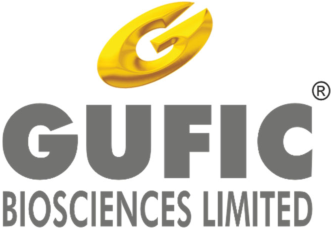
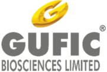
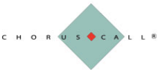
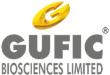

**[Image: Written_Transcript_141125.pdf-0001-00.png (332x230, 37.3KB)]**

# “Gufic Biosciences Limited 

# Q2 FY26 Earnings Conference Call” 

## **November 17, 2025** 

Disclaimer: E&OE – This transcript is edited for factual errors. 

**[Image: Written_Transcript_141125.pdf-0001-05.png (181x122, 16.6KB)]**

**[Image: Written_Transcript_141125.pdf-0001-06.png (228x108, 10.1KB)]**

**MANAGEMENT:** 

**MR. PRANAV CHOKSI – CEO & WHOLE-TIME DIRECTOR MR. DEVKINANDAN ROONGHTA – CHIEF FINANCIAL OFFICER MR. AVIK DAS – INVESTOR RELATIONS** 

**MS. SHWETA SHETTY – ASSISTANT COMPANY SECRETARY** 

Page 1 of 18 

**[Image: Written_Transcript_141125.pdf-0002-00.png (181x124, 16.6KB)]**

#### **Moderator:** 

_Gufic Biosciences Limited November 17, 2025_ 

Ladies and gentlemen, good day and welcome to the Gufic Biosciences Ltd. Q2 FY2025-'26 Investor Conference Call. 

As a reminder, all participant lines will be in the listen only mode and there will be an opportunity for you to ask questions after the presentation concludes. Should you need assistance during the conference call, please signal an operator by pressing 

‘*’ then ‘0’ on your touchtone phone. Please note that this conference is being recorded. 

I now hand the conference over to Ms. Shweta Shetty. Thank you and over to you, ma'am. 

#### **Shweta Shetty:** 

Good afternoon, everyone. I welcome you all to Gufic Biosciences Limited Earnings Conference Call for the second quarter of financial year 2025-'26. 

We have with us today for the call Mr. Pranav Choksi – CEO and Whole-Time Director Mr. Devkinandan Roonghta – CFO and Mr. Avik Das from Investor Relations Team to give the highlights of the Business and Financial Performance of the Company and to take questions, if any. 

Before we begin, I would like to say that some of the statements that will be made in today's discussion may include certain forward-looking statements which are projections or estimates about future events. This estimate reflects management's current expectations about future performance of the Company. This estimate involves a number of risks and uncertainties that could cause our actual results to differ materially from what is expressed or implied. Gufic does not undertake any obligation to publicly update any forward-looking statement whether because of new confirmation, future events or otherwise. I hope you have received the investor presentation that we have posted on our website. 

I will now hand over the call to Mr. Avik for sharing the business highlights. Over to you, Avik. 

#### **Avik Das:** 

Thank you, Shweta and Good Evening everyone and thank you for joining. I will provide an update on the direction and what is changing inside the business units. I will start with our hospital injectable platforms which include Critical Care and Sparsh. 

In Critical Care, our approach remains hospital-first and science-led. We are concentrating resources where protocols drive segments such as sepsis, resistant infection and invasive fungal diseases. The intent is to win depth in the existing accounts, embed our therapies in care pathways and let molecules-class compounds shared. Portfolio additions are chosen to strengthen our AMR stewardship and reduce escalations to the use of last-line drugs. 

On Sparsh, Sparsh is being shaped as a platform for offering niche products to a wider segment of hospitals and nursing homes where service reliability matters as much as the brand. Our medium-term focus areas are contrast media, parenteral nutrition and cardiac Critical Care. In 

Page 2 of 18 

**[Image: Written_Transcript_141125.pdf-0003-00.png (181x124, 16.6KB)]**

### _Gufic Biosciences Limited November 17, 2025_ 

this division, we are tightening our execution levers which include coverage, distribution control and increases in hospital rate contracts. So, when contrast media and TPN go live, we scale within our existing accounts and we don't have to go out looking for greenfield accounts. 

#### Moving to our women's health platform which includes Ferticare and Zenova: 

Ferticare's path is category creation in advanced fertility, particularly in the reproductive immunology. The first to market immune therapy for recurrent implantation failure is about solving a very difficult clinical problem and earning specialist trust there and adoption here will be steady and not spiky. On brands, our working guardrails have remained unchanged as we have indicated in the previous quarter. Puregraf is trending towards a 25 crore annual run rate. Supergraf is on a two-year path to a 15 crore brand. Guficin Alpha is well-headed towards a 10 crore brand and Cetrocare is positioned to be the top choice in the antagonist class. The objective is a coherent basket that captures more of the IVF journey and not to have a long tail of just SKUs. 

Now on Zenova: 

Zenova is a stable specialty platform in women's health and we are building preference at the point of care and balancing the mix with differentiated launches. The near-term job even here is execution quality which is consistent prescription depth and very disciplined brand rollouts. So, growth here is durable rather than promotion driven. 

Now moving to our toxin platform which has Aesthaderm and Neurocare: 

On the Aesthaderm front, we are extending from a toxin anchor into a fuller aesthetic ecosystem which will include filler skin boosters and bio-stimulators. We intend to do this without diluting our focus on toxins. The logic is very simple here. A broader portfolio enlarges the clinician funnel and creates a progression path into toxins over time. We have advanced our in-licensing for global quality fillers and bio-stimulators. We are building a scalable practitioner training engine, so launches convert efficiently here. 

Now on the Neurocare front which is our therapeutic toxin, the strategy is a long cycle but high lifetime value which is create new injectors, widen indications where guidelines already support use and expand specialty coverage beyond neurology. This is methodical market making which is covering training, evidence creation and awareness building so that usage is repeatable and protocols remain. 

Now moving to our last platform here which is a nutraceutical platform where healthcare division operates: 

This particular division blends modern evidence-based Ayurveda with musculoskeletal care. Our flagship over here is Sallakhi which is positioned as a care pathway rather than a 

Page 3 of 18 

**[Image: Written_Transcript_141125.pdf-0004-00.png (181x124, 16.6KB)]**

### _Gufic Biosciences Limited November 17, 2025_ 

symptomatic pill. RIDOL continues to build relevance in the acute GI segment. We are adding selectively here. We have added molecules such as Vonoprazan and other molecules where science and prescriber behavior are shifting in order to keep the portfolio focused and relevant to the market trends. So, that wraps up our domestic branded formulation business. 

I will move to our international business: 

Our international business continues to progress as planned with focus on strengthening our global partnering model and expanding regulatory reach. During the first half of the year, Gufic Ireland secured its first marketing authorization in EU. This gives us direct access to regulated markets, an important milestone that establishes a platform for future filings. We also received 24 key product and facility approvals across regulated and emerging markets including markets such as South Africa, Colombia, Portugal, Myanmar, Sri Lanka, Cambodia, Thailand and Lithuania. These approvals enhance our footprint across Critical Care, industrial and antiinfective portfolios. 

Now on the broader opportunity which we had indicated in the last quarter, the combined addressable market for our primary molecules stands at about 800 million across identified countries. We are finalizing the sequence and timeline for market entry based on local intelligence and have begun the filing of dossiers across multiple geographies. The partnering model remains strong with continued engagement from leading global health organizations and regional partners. This is enabling us to scale our complex injectable portfolio internationally in a disciplined and compliance led manner. 

Now on the last part, I will give you a quick update on the Indore facility as well: 

So, the facility continues to progress as per plan. Over the past quarter, the focus has remained on steady scale-up. Tech transfers have now been completed for 40 products and an additional 27 are under development and stability testing, expanding the base of both lyophilized and liquid injectable offerings. Vendor audits by more Indian pharma partners continue and with multiple new audits scheduled through the second half of FY'26. Our global audit timelines remain unchanged with EU GMP and UK MHRA targeted for latest by Q1 of FY'27 and the US FDA milestone to follow client-triggered timelines thereafter. Operationally, the plant is on track to achieve its utilization and EBITDA target for FY'26 and we maintain our guidance of Indore becoming margin accretive by FY'27 onwards. Overall, the project remains aligned with our roadmap and is scaling in a disciplined, compliance-first manner. 

With that, I hand over the call to Mr. Roonghta – our CFO for the financial update. Thank you. 

**Devkinandan Roonghta:** 

Thank you, Avik. I am going to give the financial highlight of Q2 of FY'25-'26 versus Q1 of FY'25-'26 because Q2 of FY'24-'25 versus Q2 of FY'25-'26 is not comparable because Q2 of FY'24-'25 do not include the Indore plant. Likewise, the half-yearly result of H1 of FY'25-'26 is 

Page 4 of 18 

_Gufic Biosciences Limited November 17, 2025_ 

**[Image: Written_Transcript_141125.pdf-0005-01.png (181x124, 16.6KB)]**

not comparable with H1 of FY'24-'25. Therefore, I am highlighting the result of Q2 of FY'25'26 versus Q1 of FY'25-'26. 

The total revenue for Q2 FY26 is Rs. 230 crores compared to Q1 FY26 is Rs. 227 crores. EBITDA for Q2 is Rs. 37.9 crores compared to Q1 of Rs. 33.2 crores. EBITDA margin has improved to 16.45% compared to 14.63% in Q1. The profit before tax has been increased to Rs. 20.5 crores compared to Q1 of Rs. 16.3crores. The PBT margin has further improved to Rs. 8.9% compared to Q1 of Rs. 7.18%. The profit after tax for Q2 is Rs. 14.9 crores compared to Q1 of Rs. 12.1 crores. PAT margin has further improved in Q2 to 6.47% versus Q1 of 5.32%. 

Thank you very much. 

#### **Moderator:** 

#### **Nitin Gosar:** 

#### **Pranav Choksi:** 

#### **Nitin Gosar:** 

Thank you very much. We will now begin the question-and-answer session. The first question comes from the line of Nitin Gosar from Bank of India Mutual Fund. Please go ahead. 

Hi team. Thanks for the opportunity. One thing which I think would want to point out in PPT that you guys give out, I think somewhere we need to also start putting in numbers in terms of revenue share because graphical representation is not giving us optically every quarter how things are shaping up. So, if you intend to disclose data, I would request you guys to do put in efforts to also disclose the numerical numbers so that life becomes easy for us to track your Company. Coming to the question, sir, I would like to understand that in the last first half, things have progressed on the revenue part, but when it comes to gross margin, we have shown good improvement. However, the employee expense and the other expenditure have been constantly going up. Could you help us understand what has changed in the last four quarters where the costs have been going up? But on the sales mix part, definitely things are improving. Hence, the gross margins have improved. So, if you could reflect back what has happened in the last four quarters and as we stand today, would this be the true desirable gross margin that our business can showcase with the current sales mix or there is any one off? 

Pranav, here. So, I think I will take the question and I think Roonghta sir, I will just request you to come in in terms of the margins going forward. So, just to understand, sir, about your question, so you see, would you like us to give a breakup of Indore and Navsari individually or would it be more preferred for you in terms of the four SBUs, strategic business units only? 

Strategic business unit will help because eventually both the plant will start to run at optimal levels, right? While our business strength relies on or the inherent strength is between the different SBUs. So, I think, if going forward, if you can give a breakdown of how the SBUs have done on numbers, that will help our situation because then we will be able to closely monitor how things are progressing. Otherwise, we will be, you know, indicatively we will be close, but we will still not be sure, how things are. 

Page 5 of 18 

**[Image: Written_Transcript_141125.pdf-0006-00.png (181x124, 16.6KB)]**

#### **Pranav Choksi:** 

### _Gufic Biosciences Limited November 17, 2025_ 

And I think you're right. I think mostly we discuss it during the investor call, but if it's in the form of a PowerPoint representation, it will really be able to track that on a Q2Q basis. Fine. So, I really got that message. So, I will ask my team also to work on that. Coming to your question specifically, yes, as you know, we had mentioned in the earlier few times also about the Indore plant finally contributing in terms of de-clogging the backlog of orders. That is one of the reasons where you see the revenue going up. So, I will just tell you the reasons for the revenue and the gross margin, then I will come to the employee costs specifically. And also, if you're not asked, but the other expenses also would be part of the mind. So, I would just talk about that also in general, just to give everyone a perspective. So, the revenue would be because of the declogging, October 2024 onwards is when the Indore plant commercially started raising invoices. I think December was the month when the first invoice was raised. And that's why you see the capitalization stopped from Q4 on a whole and others were there. Now, in specifically regard to the margin increasing is because we also have in this first six months gone a little bit more higher in the international business. And I think that is something which, again, answer your question. If we give you that breakup of how the international business has little bit moved up as compared to the other sectors, that would give you an understanding of how the margins would go up and also would continue to go up in the next few quarters also. Domestic business is also growing. CMO business has a little bit, I would say, suffered in these six months because most of the capacity which was available, we are mostly focusing on exports. And we have already requested most of our CMO partners to shift to Indore. But this is a long run process because of audits involved as well as also validation batches and three batch data they wait for at least six months stability. And then every company has their own, I would say, requirements in terms of QA and then they transition to the new facility. But we hope that the CMO business also would start picking up from Q3 onwards and we would see a whole some, I would say, revenue to be captured hopefully by Q4 or maximum by Q1 2027. Coming to the employee cost, as you know, you must have seen the announcements in the last, I would say, three quarters in terms of getting Dr. Rajiv Agarwal or we got Mr. Vijay Kumar from Galderma or Dr. Rajiv Agarwal from BSV or we had already taken Dr. Rajsekar from International Business. He joined way back also in end of Q4 last year. Q1 was when he was full fledged there this year. And then also followed by Mr. Rajesh Kaul who joined in Q2 this year. So, there have been some, in case of domestic business as well as international business, some recruitments and additions done. I am just highlighting the top people and along them also the team has been structured by which we have got some additions coming in which will, of course they will already have started contributing but you'll see the add-ons happening in the quarters to come in terms of the regulatory, in terms of the market penetration, in terms of business intelligence and so on and so forth. And also with the regulatory department also being a little bit more expanded, keeping in mind the demands of Indore. So, that's why there have been some products which have been, I would say, validated for the Indian market where there are some Phase 3 is going or maybe there are some validation batches and testing going on, bioequivalence being done for certain products which we are going to launch in the next year. As well as some clinical data being worked on some complex injectables and that's the reason other expenses also have a little bit gone up in terms of R&D as well as dossier. An employee, like I mentioned, because of these restructurings and addition of 

Page 6 of 18 

**[Image: Written_Transcript_141125.pdf-0007-00.png (181x124, 16.6KB)]**

### _Gufic Biosciences Limited November 17, 2025_ 

team members, this is what has happened. Plus the areas also, of course, is one of the points. But again, I will hand it over to Mr. Roonghta sir. Maybe he can elaborate in a little more specific manner. So, Roonghta sir, please take it forward. 

#### **Devkinandan Roonghta:** 

#### **Nitin Gosar:** 

#### **Pranav Choksi:** 

**Nitin Gosar:** 

Basically, if you see there, employee expenses have been gone up because of the Indore plant, we have to incur approximately Rs. 4.5 crores per quarter salary. And that is one of the reasons the employee expenses have been gone up approximately high because Rs. 9 crore is extra employee expenses in the Q2 of current year compared to Q2 of last year. And other than this, there is annual increment has been given to the employees. That is another one of the reasons for increasing the employee expenses. The finance cost has been gone up because of the capitalization. Previously, the interest was capitalized in Q2 of the last year, whereas the current quarter, the interest has been charged to the P&L. Similarly, the appreciation has been increased because of only because of the Indore. Interest is also increased because of the Indore. Other expenses have been increased because of the Indore also because there is a light electricity bill, there is a consumable consumption, and there is a fuel expenses. All these expenses are also contributing because of the Indore because including interest, depreciation, employee costs and other expenses around Rs. 18 crores per quarter, we are incurring for Indore expenses. 

Got it. This is very clear, sir. This is very helpful. Apart from this, I just wanted to understand on the domestic part, how this business is scaling up because we don't have the past track record of how the quarterly numbers have shaped up. So, any heads up, how first half the domestic growth would have been? And same for the international business? 

So, international business, of course, is growing almost by 32% to 33%. That is also the reason because of some tenders from the UK market as well as some new markets also opened up like Canada and South Africa and Brazil. And in terms of the domestic market specifically, the infertility division has really taken steam with the Puregraf and Guficin Alpa along with even Supergraf which was launched. So, the infertility division is one of the growth, I would say, players. The Critical Care as well as Sparsh, I think, are growing at around 8% to 10%, but that is in spite of that is the value growth. But the main issue would be, of course, the erosion of units. I am sorry, the units are growing much higher, but the value is being eroded. So, you see a net of around 4% to 6% only coming there because there has been some erosions in pricing. So, it's not the margins getting affected, but the topline being affected because there's an overall price downward strength of the API, which has to be passed on to the market. But that's not that major. Like I said, because of the capacity priorities, the CMO has definitely taken a dip in this first six months. But again, coming back to the domestic market, the healthcare business and Zenova are in that 10% to 15% trajectory. This Ferticare is a little bit on a higher 18% and the domestic Ferticare, I mean, Critical Care and Sparsh would be around 5% to 6%. 

Perfect, sir. Very clear. I have more questions, but I will join the queue and come back. 

Page 7 of 18 

**[Image: Written_Transcript_141125.pdf-0008-00.png (181x124, 16.6KB)]**

#### **Pranav Choksi:** 

**Moderator:** 

#### **Bhavya Sonawala:** 

#### **Pranav Choksi:** 

**Bhavya Sonawala:** 

#### **Pranav Choksi:** 

_Gufic Biosciences Limited November 17, 2025_ 

Thank you. Actually, before we go to the next question, I forgot. I just got nudge from my colleague. We forgot to mention the Botulin toxin part of the business and the Botulin toxin business is also growing at around 22% for both that is neuro as well as aesthetic. So, that completes the domestic basket. Sorry, let's proceed to the next question. Sorry, I just had to add that. 

Thank you. The next question comes from the line of Bhavya Sonawala from Samaasa Capital. Please go ahead. 

Thank you for the opportunity. Just two questions. So, last call you had kind of spoken about how we were in talks with some US brands for licensing of Stunnox? Has there been any update on that? Are we still in talks? 

Yes. So, I think that was around two quarters ago. Last quarter, already, I also clarified that we had received a commercial offer, which we found not worth pursuing in terms of the bandwidth, which we had to employ in terms of setting up a separate entity only for the regulated markets. So, talks are still on. But like I said, for us, the priority right now would be to completely scale up Indore. Because as you understand, if tomorrow, even if the money comes in from someone else, the entire bandwidth to create a new facility, again, would put us into some sort of capital investment for the next two years. My team would be engaged. So, the priority right now as a conscious call between the CFO, myself and the team that we have Indore, we have the dual chamber bag, we have Botulin toxin. Let's go for, I would say, focus on these three things, which are already available with us. Again, the debt off the books, go for a topline and increase the margins. Also, there'll be a sort of a GLP-1 contract manufacturing opportunity also where we will be putting in some money, which is anyway ongoing since the last few months. So, let's focus on all this where our I would say bandwidth is already there, and we already have our hand in the field. And then maybe after a year or after two years, if that opportunity comes up, we can explore it. 

Understood. So, these other opportunities, like GLP-1 you spoke about, the timeline would be another few quarters to get some solid kind of business coming in. 

So, the GLP-1 is a pure CMO model with Hetero, which is there, and one more company, but mostly with Hetero, where we are going to take the brand forward. Like, even Remdesivir, as you all are aware, with Gufic has tied up with Hetero for the front-ending. Similarly, here we are purely looking at a CMO role for Hetero, for semaglutide, for the India and some other markets also. For those, I think from Q1, the patent goes off in March '2026. So, we see that I think Q1 revenue should capture that, depending on the other market players, depending on the regulatory approval, DCI approval, that is, and depending on how the market goes. So, it's too preliminary to talk about GLP-1. But like I said, there is important bandwidth being utilized for that. But yes, that should, if whatever comes upside, would come in Q1. 

Page 8 of 18 

**[Image: Written_Transcript_141125.pdf-0009-00.png (181x124, 16.6KB)]**

#### **Bhavya Sonawala:** 

**Pranav Choksi:** 

**Bhavya Sonawala:** 

**Pranav Choksi:** 

**Moderator:** 

**Aditya Pal:** 

### _Gufic Biosciences Limited November 17, 2025_ 

Understood. So, just a last question. I think you spoke about it, but this time, reconfirm. From the last quarter to this quarter the revenue increase has been quite nominal. So, is that of the result of, one, that you spoke about some API prices have taken a dip, and the second, that the CMO business has taken a hit, because I am assuming Indore would have scaled up quite a bit considering 40 molecules already that transfer has been done. So, is that those reasons, or is it something else that is kind of making the revenue look very marginal in terms of last quarter? 

So, when you compare April to June to July to September, if you see the additional revenue, which whatever you can see as compared to the last year, it's purely Indore related. Because, you know, as you know, we were almost out of capacity in Navsari. Now, answering your question specifically about Q1 versus Q2. So, there's always a transition where, you know, some quarters you take a product like a teicoplanin, and some quarters you take a product like a pantoprazole. So, even though the capacity utilized in terms of units is increasing from Q2 to Q1, but of course, we had more production of like a Vancomycin, Azithromycin, and what do you call, Pantoprazole products happening in Q2, whereas in Q1, we had orders more of tigecycline and Ticoplanin, where the topline was a little bit more higher. So, this averaging also as the batches get transferred, they are campaign-based production, which is happening in Indore. So, you will see the cumulative effect coming in maybe Q4, where you will have both the basket and product being stabilized. Because the advantage of Indore is that once I take a batch of a Teicoplanin, 105,000 vials or a Tigecycline which is almost 44,000 vials, then the repeat orders come after almost a quarter. So, you know, with the existing clients, what we have, or even our domestic business, the inventory buildup. So, the advantage of the large, I would say, batch size in Indore, helps us to keep the capacity free for any opportunity business coming in. So, the Q1 was mostly where you had high-pricing and high-revenue molecules as a mix. Even though the quantity increased in Q2, you had then low-revenue products like Pantoprazole, Vancomycin, or Azithromycin being part of the tech transfer. As you go more in the Q3, there will be some fungins with a mixture of even, I would say, Glutathione and Doxycycline, which again are a mixture of medium and high-end products. But the volumes of fungins are less, and the, I mean, the low transfer pricing models are high. So, that mixture will continue, and you will see the benefit from Q4, like I said, as a whole. 

Okay. Thank you so much. I will come back in the queue. 

Thank you. 

Thank you. The next question comes from the line of Aditya Pal from MSA Capital Partners. Please go ahead. 

Thank you so much for the opportunity. Just a lot of my questions have been answered. Just wanted to understand., so, now that a lot of CMO partners have audited or are in the process of auditing our Indore plant, a large part of that revenue will move to Indore. So, there'll be a dual effect, right? Navsari will start contributing a lot to exports, and the CMO will move from Indore. 

Page 9 of 18 

_Gufic Biosciences Limited November 17, 2025_ 

**[Image: Written_Transcript_141125.pdf-0010-01.png (181x124, 16.6KB)]**

So, if you can just touch upon how the current Q3 is looking and the Q4 is looking in terms of plant audits for my existing customers? 

#### **Pranav Choksi:** 

So, almost four of our clients have gone full-fledged to Indore. Except, of course, there's some residual products which always go depending on the media field. The liposomal amphotericin B and the depo injections are not shifted to Indore because there we want to go for a one-time validation for international market and domestic market together. So, we hope that around three more clients would be onboarded along with the four clients also. I am looking at purely domestic CMOs right now. Of course, there are small, small individual clients which normally have one product or a couple of products at max, which also are going to be added. But the major, like I said, we had around 12 to 14 major clients. Out of the 12 to 14, we can assume that 50% should be on boarded there by Q3. And also, there will be a new product line in terms of the vials as well as the ampoules, which we are looking at CMO beyond the existing product line in Navsari. So, those also should start kicking in from Q4 and Q1 next year. So, that's why I mentioned that by Q4, you get a little bit of a holistic view. And again, to say that the erosion in prices do not contribute much in terms of the Indore project as such. But that is mostly the Critical Care and I would say sparsh division, which is normally an ongoing thing which happens year on year also. So, this is what I feel. I think Q3, you will see three more. And then by Q4, you will see a mixture of existing clients coming in plus new clients coming in for new product lines. 

**Aditya Pal:** So, there's a bit of color. Can I say Q3 and Q4 will be because I assume Q2 will be flat in terms of CMO revenue, but Q3 and Q4 could be a large bump up in terms of CMO revenue, along with our existing scale up of our domestic branded business as well as slight uptick in exports because of being cleared and upside. Is that the way to look at it? 

**Pranav Choksi:** 

So, I think large as compared to your definition might be different. I am just saying that on a lighter side. But yes, definitely there will be an upside. How much will that be? We are trying to fit in as many pending orders as possible. So, I would hope that the QA clearances from the other clients come a little bit faster so we can shift them. But you also have to understand that these clients also actually build up almost three months inventory from Navsari before they shift because they also keep this transition risk in place before they actually shift from site A to site B, keeping in mind any issues or anything which comes in troubleshooting, which is a normal protocol which happens. So, I still expect a decent, I would say, I would expect an upside in Q3. But in Q4, I would definitely expect a little bit, I would say, more decent or a better upside. 

#### **Aditya Pal:** 

Just one last question. So, first of all, congratulations on the GLP-1. The other thing is just wanted to understand your view in terms of biosimilars or biologics because a large part of those molecules are lyophilized. So, are we planning to enter that value chain either through CMO or export? Are we already in discussions? What is your view on that? 

Page 10 of 18 

**[Image: Written_Transcript_141125.pdf-0011-00.png (181x124, 16.6KB)]**

### _Gufic Biosciences Limited November 17, 2025_ 

**Pranav Choksi:** 

So, biological become, I would say, defined in many parameters like a monoclonal antibody or a recombinant set of products or for that matter even conjugates going on and there are the molecules also. So, botulin toxin also I consider as a part of that thing which we already are into. The vaccine thing is something which we already do, but that will have its own time period of whatever X5 years. Recombinant products in terms of, in hormones beyond HCG, FSH is what we are already working on and we are working on HCG also. So, we have our own set of biological work happening in our pipeline or maybe launch in terms of botulin toxin which would be more relevant to our therapeutic focus. But in terms of monoclonal antibodies, I think we would not be going into because that's not our core competency plus all other companies already have a better lead than us and we are too late. I mean, very frankly, first of all, we don't have our basic therapeutic prowess there and I think even if you want to get into there, there are better people than us who are doing it and the pricing and the lead they have, I think, will be not economically viable for me to get into the monoclonal antibodies. So, this is my opinion. I may be wrong, but this is my opinion as of now. 

**Aditya Pal:** No, just wanted to understand your thought process. It's very clear and thank you so much and wishing you and the team all the very best for the upcoming years. Thank you. **Moderator:** Thank you. The next question comes from the line of Shubham from Tikri Investments. Please go ahead. **Shubham:** Congratulations, sir, for a good set of number. So, sir, our revenue have grown by 6% quarter on quarter basis. So, can I assume that it is fully contributed by Indore division? So, around in the last conference call, you told that you were utilizing around 18% to 20% of Indore total capacity. So, it would be around 24% to 25% this quarter. **Pranav Choksi:** Right. So, yes, I think Roonghta sir can give a better percentage idea because he does this also on a monthly and a quarterly basis. But yes, you would be somewhat right. Roonghta sir, would he be right that 18% would have evolved to 24 or around? I am sure that 22 to 23 was last to last month. I am sure it would be around 24 now. **Devkinandan Roonghta:** Yes. Basically, whatever the topline has come, basically, is only from Indore. There is no change in the revenue from the Navsari because Navsari capacity has been fully utilized. Presently, the production capacity is around 25%, but the sale will be around 23% during this quarter. Because certainly, certain material are lying in the stock, but the production was around 25% and sale is around 23%. **Pranav Choksi:** Yes, because something will be the validation which we will keep, which will not be selling also. Absolutely. Yes. **Shubham:** Okay. And sir, there is a steep increase in our current tax effect. So, can you give a brief about it? 

Page 11 of 18 

**[Image: Written_Transcript_141125.pdf-0012-00.png (181x124, 16.6KB)]**

### _Gufic Biosciences Limited November 17, 2025_ 

**Pranav Choksi:** Sir, can you repeat that again? **Devkinandan Roonghta:** Yes, I can. Basically, what's happened, it is not increasing the debts. If you see the cash in hand, it is 70 crore lying in the cash in hand. Because on 30th September, the bank has requested that instead of you repaying our cash, you fully utilize our cash credit and keep the balance in current account. That is the reason if you remove the Rs. 65 crore which has been showing as a cash in hand compared to last quarter, last half yearly, then you will see the loan has also come down. **Shubham:** Okay. And sir, are we expecting EBITDA break-even in Indore facility in this year? **Devkinandan Roonghta:** Yes. In Q4, we are expecting the EBITDA break-even is going to come. **Shubham:** Okay, sir. Thanks for answering the question. Thank you. **Devkinandan Roonghta:** Thank you. **Moderator:** Thank you. The next question comes from the line of Rajakumar Vaidyanathan from RK Investments. Please go ahead. **Rajakumar Vaidyanathan:** Good evening. Thanks for the opportunity. Just a few questions. So, the first one is on the CAPEX that we have incurred so far. I just wonder what is the maximum asset term we can expect? I think we have about Rs. 500 crores worth of CAPEX, right? I mean, in terms of fixed assets. So, is 4 a good number to look at? **Pranav Choksi:** If I understood your question correctly, what is the total CAPEX and what sort of returns can we expect on that CAPEX? Is that right? **Rajakumar Vaidyanathan:** What is the topline it can be? **Devkinandan Roonghta:** The total CAPEX for Indore, including the interest capitalization, everything is around 350 crores-355 crores. And according to our estimate, if the product base is, topline is depending upon a lot of factors, product base, the result is depending upon international market as well as domestic market. But we are expecting that the topline will be in the range of 750 crores-800 crores at 70%-80% capacity utilization. **Rajakumar Vaidyanathan:** Okay. So, that's about 3 times the number. Okay. So, the next question is, what is the output on the borrowing side? So, where do you see this number in the next 2-3 years? **Devkinandan Roonghta:** Basically, we do not have any major CAPEX plan in next 2 years. And there will be revenue generation. Today, our borrowing including working capital as well as term loan is around between Rs. 350 crores-Rs. 360 crores. And for Indore also, whenever there is an increase in the working capital requirement, because whenever there is a topline increase, you are required to have outstanding debtors as well as working capital requirement for inventory also. So, whatever 

Page 12 of 18 

**[Image: Written_Transcript_141125.pdf-0013-00.png (181x124, 16.6KB)]**

### _Gufic Biosciences Limited November 17, 2025_ 

the increasing in the topline will going to come, that working capital requirement we will not going to borrow. So, we feel that 2 years till whatever the additional working capital is required for Indore plant, we will be able to generate from internal revenue. And the loan should come down to from 350 to 300 after 2 years. 

**Rajakumar Vaidyanathan:** Okay. Thank you so much. 

**Moderator:** 

Thank you. The next question comes from the line of Nitin Gosar from Bank of India Mutual Fund. Please go ahead. 

#### **Nitin Gosar:** 

Thanks again. So, this would be more broader question. I wanted to understand over next 3 years if I were to understand the packing order in which the business is going to shape up. I think from bandwidth perspective, Indore utilization is the top priority. But then within the business segment, if you could help us understand where does botulinum or women health care or CMO business, how do they stack up on priorities? We understand the efforts that you are putting in through the PPT or press release that you give out. But how should we understand the gravity of those efforts in terms of what is the big picture looking like? Would hospital segment become the critical part of our COG or would women healthcare will become a critical part of our COG in 2028? If you could just help us put the broad jigsaw puzzle? 

#### **Pranav Choksi:** 

Yes. So, if you see, I divide our entire business into purely injectables. And injectables also, if you see the product lineup, we have either a Critical Care or we have, so we have a Life Saving and we have a Life Giving, let's put it that way. Botulinum toxin, of course, becomes like the third anchor because that's sort of a separate thing. So, let me first focus on the life saving part. That's the Critical Care part of business where we have two divisions, which is Critical Care. Of course, it has further divisions down, but major parent division is Critical Care and the second parent division is Sparsh. Where we, because of the product baskets, which we are getting from Navsari and now in Indore, we have gone for a little bit more of a focused approach. So, in Critical Care, we have COX and MycoCare and then we have PrimaCare. In Sparsh, we have a complete focus on dual chamber bags, contrast medias, as well as total parenteral nutrition. So, we have clearly done that the entire manufacturing backward core competency of Gufic should be focused in the market going forward, by which there are in the pipeline, we have also more products coming in all these, I would say, two divisions, which will take it through. So, this in spite of having no product approval in this year. So, if you saw in the last two years, ceftazidime and avibactam were the only launch of prominence. And then in DCGI, we have almost now 3- 4 products coming in, in terms of aztreonam, avibactam and minocycline and then Rezafungin. So, every year, if we hope to even launch one new product and increase the penetration by, I would say, more hospitals, we hope that in Critical Care with the erosion, 8% to 10% should be the way going forward. Sparsh would be a little bit of a different approach, because there we are looking into contrast media, total parenteral nutrition, and dual chamber bag. But even after two years of launching the dual chamber bag, we finally got the approval of the price increase in the month of September 2025. So, Meropenem bag, which we have always wanted to have a 30% 

Page 13 of 18 

**[Image: Written_Transcript_141125.pdf-0014-00.png (181x124, 16.6KB)]**

### _Gufic Biosciences Limited November 17, 2025_ 

premium, we finally got a 15% premium allowed by the government. So, that is a big headwind for us that, that will help us to now launch the dual chamber in a much more relevant way, because the hospital also has to look into the margins, they also get selling a while against the DCB also. So, these two, Sparsh would go for a higher trajectory in terms of growth, because the base is also hardly 50-60 crores, whereas Critical Care is around 200 crores. So, that is what is it. Infertility, which is right now around 100 and around, combined with two segments of Ferticare and Ferticare Life, or we call it, Fertimax, these two would combine to cross close to 100 or more than 100 this year again, and then go for, after the launch of the new NeuroGen another Superpure FSH, we hope that that journey would be around 15% to 20% year-over-year. Botulin toxin is a very small base. So, even though we grow by, like I said, 22%, because or we grow by even a little bit higher, we hope that that requires a little bit more of plan building, environmental and capacity, I mean, I would say, category building, and that I always talk about the hockey stick, I don't know when it will come, but our efforts are on to get the hockey stick going on because of the margins available in the product that we can really invest in the category building part of it also. The international business, of course, would be growing at a much higher percentage, and that is would have come once as India, as Indore declutters Navsari you will see more and more back orders being taken care of from Navsari and that is the time and we also have an audit coming up. So, we hope that by January to March, Indore also would be EU GMP approved. So, then we can see some, site addendums or tech transfers happening from, not tech transfer, I would say some product transfer happening for the international market also from Q1Q2 2027 to Indore, which will again, I would say declutter the capacity further. So, international business overall, which is mostly injectables, the same thing, they are the same injectables what we sell in the India market, there's no separate product basket. So, life-saving, the life-giving, and also the toxin, that's our focus in the international market also. The approach is different. In some countries, we have a full force, in some countries, we do it via distributors, in some countries, we direct supply to the MA holder and then they distribute. So, these are the three approaches which will continue. But overall, we hope that the focus of a jump of 20% year on year or 15%-20% year on year should continue with all these things started, once they start kicking in together. 

**Nitin Gosar:** 

**Pranav Choksi:** 

Very clear. And Selvax, if you could help us understand SVX, how much amount we are putting in as an NCR, ND or any budget, any timeline that you have in mind, how much you want to invest in this kind of products? 

So, Selvax was just a pure investment in terms of to see how it goes. It's a very interesting thing where we have taken the India rights and also the development thing, but I believe the company in South Australia is still working on the preclinical and the cell line capitalization. So, I would just say it's not, I think the total investment also would not be more than 100,000-150,000 right now, then followed by certain milestones where we have taken some, I think, 6% take in that company and hoping that, once we get a breakthrough there, we should get the front end advantage in India and also some other countries where we have exclusivity. Because I feel in solid tumors, there's nothing better than the immuno-oncology, which was my thesis topic also 

Page 14 of 18 

**[Image: Written_Transcript_141125.pdf-0015-00.png (181x124, 16.6KB)]**

### _Gufic Biosciences Limited November 17, 2025_ 

way back in the US. So, I really believe in what they are doing. The combination of CD40 antibodies and interleukins are solid science to take care of solid tumors specifically. And I think in the next 2-3 years, we will come to know whether the success is there or if they cannot take it through, I am sure someone else will show interest and might just take them ahead, take it over. And it's for me, it's like I am more of a passenger there rather than, I would say, a contributor here. The vaccine and the toxin part is something as biological, which I would like to pursue taking it forward. So, that's the reality of Selvax as of now. 

#### **Nitin Gosar:** 

Got it. Very clear. And today's cross-margin, do they reflect the true picture or the potential that our Company carries over the next 3 years or we should also expect change over here? 

**Pranav Choksi:** 

I think Roonghta sir will answer that. 

**Nitin Gosar:** On the gross-margin part, I understand there is an operating leverage available because of Indore. 

**Devkinandan Roonghta:** 

If you see the past history of Gufic, from last 2 years, the gross-margin is between 18%-19% and after 2-3 years, after Indore, I feel that the cross-margin should at least be at 20%. It may touch 21% after we increase our sale ratio. Presently, our sale ratio is around 20%-25% to international market. If it is touched to 30%-35%, then the gross-margin may touch to 21%-22%. EBITDA margin will **.** 

**Nitin Gosar:** 

Got it. Perfect, sir. You're doing a good job and we want to back you up for that. It might be a long journey, but yes. Good show, sir. Thank you. 

**Moderator:** Thank you. The next question comes from the line of Nitya Shah from KamayaKya Wealth Management. Please go ahead. 

**Nitya Shah:** 

Firstly, I want to thank you for the detailed question and answer that you do every call. From my understanding, I feel that you have a novel product in the Botox space. You have intellectual property and you mentioned that in the future, you may have to do a capacity expansion to cater to the proposal that you said that you will consider at a later point in time. I realized that there are a lot of segments which you're already catering to. Why not focus more towards the Botox side of things considering it's a novel product rather than trying to cater to so many different segments? Maybe throw some more light on that? 

**Pranav Choksi:** If I understand your question correctly, our legacy and our core competency is injectable, lyophilized manufacturing, and all these life-giving, life-saving and toxin, I call it Stunnox just because it's our trademark. I avoid selling Botox. But yes, all these are part of the legacy of the same lyophilin and the core competency of the Company. If you see today also the scalability, I will first answer your toxin question first and why the focus is India and then maybe the world. If you see in the entire world, the total market would be anything around 5.5 to 6 billion or with a projection of around 7-8. In some reports, it's around 7-8. In some reports, it's 5.5 to 6. There 

Page 15 of 18 

**[Image: Written_Transcript_141125.pdf-0016-00.png (181x124, 16.6KB)]**

### _Gufic Biosciences Limited November 17, 2025_ 

is a legacy of Botox; Allergan, AbbVie or Galderma for that matter. In India, the current infrastructure what we have created and at least we can enter or we can really focus on the Indian market with the total revenue of the toxin both in therapeutic as well as neurological segment is only 25 million or even less than that. If I am correct, it's anything around 18% to 20% million. That's the only revenue of toxin in India. If I compare the population of every other country and the actual sales thing, I think India is still the penetration and a lot of work has to be done. And we feel that for me to tomorrow to create another asset of 25 million in terms of even and very frankly, we are not looking at taking any debt also to create that asset maybe after 1 or 2 years, it's very clear that there would be a debt funded by a partner which is something in lines of what we got earlier as an offer and tomorrow the partner will get the rights of the front end in certain markets and certain markets would open to us also. That's the strategy which we are going to follow. But the important strategy is that when you come up with that sort of a setup, you need an entire bandwidth of regulatory, of quality, of my CEO Mr. Nagesh also to be there hands on when the entire thing happens. We have seen what happened with Indore also. The entire bandwidth gets sucked onto that and we feel that already we are sitting on quite decent, I would say, pillars or bases, anchors which we can focus on. And even in case of toxin, if we focus on the Indian market with the current setup which we have, we should do that just to cater that international business and international market where anyway competition is higher and there's a lot of a different mindset because once you get into the regulatory process there, you need a pharmacovigilance, you need something else. There's a lot of other things also which get associated with the toxin business. It's not as simple. I feel even if in the next two years, again I am saying, if you focus on India, get it to Rs. 100 crore level business as Gufic as such, already we have launched the product 3 years or 4 years ago, three years in aesthetics and maybe 2-2.5 years in neurology and we already are number two. So, we already have crossed the other players and reached to a revenue where we are number two after AbbVie. So, we feel let's focus there. Of course, focus on our Critical Care infertility for which we have this amazing infrastructure in Indore. We have a great pipeline coming up also. And with the 15%-20% headway coming down the line once we cash positive much more than what we are right now. We already are cashed up a little bit more cash positive and the debt has been repaid. We can take a little bit more bolder steps in terms of the regulatory as well as the bandwidth creation also. And that's why I am thinking in this year also, if you see a lot of bandwidth has been created by addition of these new, I would say, leaders for our international business, gynae, infertility business, our botulin toxin business and even for Sparsh with Mr. Rajesh Kaul. So, this structuring happened this year and we will see the benefits in the next 2 to 3 years. And then once we are ready and a little bit more mature there, then of course, we should look at a bandwidth addition also. For me as management also, we should be very clear how many reviews, how many MIS we need to take and any new division coming up always takes more time of us. So, I feel we are okay for the next two years to go for that 15%-20% year on year and become a little bit comfortable more with debt and more cash flow. And I would be more than happy to satisfy you also in terms of the international appetite of botulinum toxin. 

Page 16 of 18 

_Gufic Biosciences Limited November 17, 2025_ 

**[Image: Written_Transcript_141125.pdf-0017-01.png (181x124, 16.6KB)]**

#### **Nitya Shah:** 

Right, sir. Because I remember just a few, I would say a year or two ago, we had discussed this where you had mentioned that there was a clear price differential between the pricing of botulinum toxin here and abroad. That's why I just thought that capturing export market share through a lower price differential would really benefit. And it's like a very niche novel product, which is why I was saying that maybe we could be more... 

#### **Pranav Choksi:** 

So, when I meant it that time also, I didn't mean the pricing part of it. I mean, the price was there. But in order to get that price also, like today, if you go to Dubai or to the US or Europe, when anyone is going for an aesthetic use of toxin, they want to do the best. I mean, for them, a small delta of price doesn't make a decision that I want. So, they always say, if I am paying so much for my, I would say, cosmetic treatment, which is anything around 50,000 to maybe 5 lakhs, whatever, I would prefer to have the best of the brands. So, for us also to go, it was only the infrastructure which would be there. There would be a lot of clinical trials we need to be done ahead on data, which has to be created country-wise. You also have to go for... Which anyway, we are doing in India right now. Right now, a lot of our revenue goes in creating all this data for the India market. But that would have to be replicated on a much higher scale and where the cost is also much higher to enter for the regulatory process, to go for the clinical data. So, even the entry point to all these countries for getting that delta and pricing would require a very high upfront, which I feel we should do after two years. And of course, I think even in the last 30 years of this molecule, there have been only 6 to 7 players of this toxin. I am sure the next 2 to 3 years will not get a plethora of people coming in. So, we still, I feel we still have time. 

#### **Nitya Shah:** 

That's a great point. Yes. And so, our last question from my side is that you had mentioned regarding semaglutide, right? That you would be contract manufacturing. Could you throw some more light on that? What is the potential of this? 

#### **Pranav Choksi:** 

Very frankly, I don't have that knowledge because we are pure CMOs of Hetero. And they have done the market analysis. We have invested in the backend to support them. So, it will be very preliminary of me to comment on this because the front-end strategy is completely handled by Hetero. Of course, we have the projections for next year and all that. But like I said, it's not something I control. So, I would refrain from talking anything right now. I would rather let the lead company to take the initiative. I am more than happy as a CMO partner backing them up. 

**Nitya Shah:** Got it. Thank you, sir, for the detailed answers. Wish you all the best. 

**Pranav Choksi:** 

Thank you. 

#### **Moderator:** 

Thank you. Ladies and gentlemen, as there are no further questions from the participants, I would now like to hand the conference over to Ms. Shweta Shetty for closing comments. 

Page 17 of 18 

_Gufic Biosciences Limited November 17, 2025_ 

**[Image: Written_Transcript_141125.pdf-0018-01.png (181x124, 16.6KB)]**

**Shweta Shetty:** 

**Moderator:** 

Thank you very much for joining us today. If you have any further questions, please feel free to reach out to our investor relations team and we will be happy to address them separately. With that, we conclude today's call. Thank you. Take care. 

Thank you, ma'am. On behalf of Gufic Biosciences Ltd, that concludes this conference. Thank you for joining us and you may now disconnect your lines. Thank you. 

Page 18 of 18 

---

## Extracted Images

| # | File | Dimensions | Size |
|---|------|------------|------|
| 1 | Written_Transcript_141125.pdf-0001-00.png | 332x230 | 37.3KB |
| 2 | Written_Transcript_141125.pdf-0001-05.png | 181x122 | 16.6KB |
| 3 | Written_Transcript_141125.pdf-0001-06.png | 228x108 | 10.1KB |
| 4 | Written_Transcript_141125.pdf-0002-00.png | 181x124 | 16.6KB |
| 5 | Written_Transcript_141125.pdf-0003-00.png | 181x124 | 16.6KB |
| 6 | Written_Transcript_141125.pdf-0004-00.png | 181x124 | 16.6KB |
| 7 | Written_Transcript_141125.pdf-0005-01.png | 181x124 | 16.6KB |
| 8 | Written_Transcript_141125.pdf-0006-00.png | 181x124 | 16.6KB |
| 9 | Written_Transcript_141125.pdf-0007-00.png | 181x124 | 16.6KB |
| 10 | Written_Transcript_141125.pdf-0008-00.png | 181x124 | 16.6KB |
| 11 | Written_Transcript_141125.pdf-0009-00.png | 181x124 | 16.6KB |
| 12 | Written_Transcript_141125.pdf-0010-01.png | 181x124 | 16.6KB |
| 13 | Written_Transcript_141125.pdf-0011-00.png | 181x124 | 16.6KB |
| 14 | Written_Transcript_141125.pdf-0012-00.png | 181x124 | 16.6KB |
| 15 | Written_Transcript_141125.pdf-0013-00.png | 181x124 | 16.6KB |
| 16 | Written_Transcript_141125.pdf-0014-00.png | 181x124 | 16.6KB |
| 17 | Written_Transcript_141125.pdf-0015-00.png | 181x124 | 16.6KB |
| 18 | Written_Transcript_141125.pdf-0016-00.png | 181x124 | 16.6KB |
| 19 | Written_Transcript_141125.pdf-0017-01.png | 181x124 | 16.6KB |
| 20 | Written_Transcript_141125.pdf-0018-01.png | 181x124 | 16.6KB |
