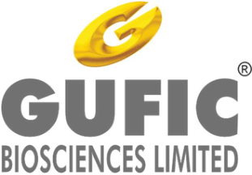
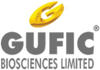
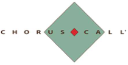
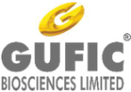

**[Image: Written_Transcript_160226.pdf-0001-00.png (311x216, 35.0KB)]**

# “Gufic Biosciences Limited 

Q3 FY '26, Earnings Conference Call” 

# **February 16, 2026** 

Disclaimer: E&OE – This transcript is edited for factual errors. 

**[Image: Written_Transcript_160226.pdf-0001-05.png (168x118, 14.8KB)]**

**[Image: Written_Transcript_160226.pdf-0001-06.png (210x107, 10.4KB)]**

**MANAGEMENT: MR. PRANAV CHOKSI – CEO & WHOLE-TIME DIRECTOR MR. DEVKINANDAN ROONGHTA – CHIEF FINANCIAL OFFICER MR. AVIK DAS – INVESTOR RELATIONS MS. SHWETA SHETTY – ASSISTANT COMPANY SECRETARY** 

Page **1** of **17** 

_Gufic Biosciences Limited February 16, 2026_ 

**[Image: Written_Transcript_160226.pdf-0002-01.png (147x103, 12.2KB)]**

## **Moderator:** 

Ladies and gentlemen, good day, and welcome to the Gufic Biosciences Limited Q3 FY '26 Earnings Conference Call. As a reminder, all participant lines will be in the listen-only mode and there will be an opportunity for you to ask questions after the presentation concludes. Should you need assistance during this conference call, please signal an operator by pressing the star key followed by zero on your touchtone phone. Please note that this conference is being recorded. 

I now hand the conference over to Ms. Shweta Shetty, Assistant Company Secretary at Gufic Biosciences Limited. Thank you, and over to you, ma'am. 

## **Shweta Shetty:** 

Good afternoon, everyone. I welcome you all to Gufic Biosciences Limited Earnings Conference Call for the Third Quarter of Financial Year '25-'26. We have with us today for the call Mr. Pranav Choksi, CEO and Whole-Time Director; Mr. Devkinandan Roonghta, CFO; and Mr. Avik Das from Investor Relations team to give the highlights of the business and financial performance of the company and to take questions, if any. 

Before we begin, I would like to say that some of the statements that will be made in today's discussion may include certain forward-looking statements, which are projections or estimates about future events. These estimates reflect management's current expectations about future performance of the company. This estimate involves a number of risks and uncertainties that could cause our actual results to differ materially from what is expressed or implied. 

Gufic does not undertake any obligation to publicly update any forward-looking statements, whether because of new confirmation, future events or otherwise. I hope you have received the investor presentation that we have posted on our website. I will now hand over the call to Mr. Avik for sharing the business highlights. Over to you, Avik. 

## **Avik Das:** 

Good afternoon, everyone, and thank you for joining. I'll start with a brief update on what progressed across our business units, where execution is tightening before Pranav takes you through the divisional performance trajectory and Indore ramp-up. So across the domestic branded portfolio, the focus remains consistent, which is drive protocol-led depth, improve mix through science-backed differentiation. 

And scale through repeatable execution rather than only through launches. So first, on our Hospital Injectable Platform, execution remains hospital-first and account depth-driven. In Critical Care, we continue to concentrate on protocol-heavy segments of sepsis and other resistant infections and invasive fungal diseases, where the adoption translates into repeat ordering. 

Over the period, we progressed evidence-led positioning and hospital adoption for some of our advanced molecules, including Thymosin Alpha-1, which is Immunocin-Alpha and sepsis adjacent immune dysfunction and Dalbavancin, our brand Dalbavan for resistant gram-positive infections and Isavuconazole, where we have a brand called Isavufic, in complex fungal infections. The emphasis remains on increasing molecule class share within existing ICU accounts and scaling through corporate chain and tertiary hospital penetration. 

Page **2** of **17** 

_Gufic Biosciences Limited February 16, 2026_ 

**[Image: Written_Transcript_160226.pdf-0003-01.png (147x103, 12.2KB)]**

In Sparsh, we tightened the operating engine. We brought in a lot of distribution control and collection discipline and conversion inside hospitals while continuing to build differentiation through formats like dual chamber bags. The next category triggers in Sparsh will be contrast media and the total parenteral nutrition range, which we will be launching. The progress to expand wallet share within existing accounts is also progressing well. 

Now on our Women's Health Platform, it's been a shift towards prescription-led engine with deeper life cycle coverage. In Ferticare, the strategy remains centred on reproductive immunology and increasing share of cycle in IVF. Core brands continue to compound very well, Guficin Alpha in recurrent implantation failure alongside Puregraf and Cetrocare. And we progressed pipeline work on super pure urinary FSH to expand the stimulation opportunity with high purity and yet very cost-efficient propositions. 

In Zenova, the execution cadence improved and our power brands continue to anchor growth, which is DD1 and Stretchnil. With fertility adjacency building through Fertiforce, the pipeline remains focused on the larger women's health therapy tools of endometriosis, PCOS and menopause. This will help us widen our long-term prescriber relevance. 

Coming to the Toxin Platform. There, we are building a high lifetime value franchise through capability creation and structured market development. In Aesthaderm, we continued scaling Stunnox, which is our botulinum type A, while building the capability bridge to a broader aesthetic platform. Injector creation and chain-clinic readiness and Indian clinical data generation is something that we focused on to support premium adoption. 

In Neurocare, the progress remains very methodical, which is expanding the therapeutic toxin coverage just beyond neurology, into urology, ophthalmology, pain and neurosurgery and of course, anchored on indications where adoption is guideline and guideline-driven and long duration. 

Coming to our Nutra, Ayurveda Platform, where we are sharpening our focus into a chroniccare platform. We continued strengthening a differentiated pain propositions such as the upgraded Gufican Oil while building on the GI opportunity with Vonoprazan, where we have a brand called Vonpha as a prescription-led growth lever. 

Now I'll give you all a quick highlight of our International Business, where we are moving towards an IP-controlled complex injectable-led market access model. During the period, we saw regulatory progress in regulated and priority and regulated markets, including colistimethate approval in Germany and regulatory continuity actions for Pantoprazole injection in Portugal and Vancomycin Injection in Lithuania. 

We expanded registrations in Myanmar across a basket, including Pantoprazole, Azithromycin and fertility hormones and strengthened the quality gateway through Unit-2 GMP approval in Oman, which opens up the lucrative Middle East market for us. 

Finally, on Indore, the ramp-up continues in a step-wise compliance-first manner with disciplined tech transfer and scaling aligned to our audit readiness. Pranav will address the 

Page **3** of **17** 

_Gufic Biosciences Limited February 16, 2026_ 

**[Image: Written_Transcript_160226.pdf-0004-01.png (147x103, 12.2KB)]**

Indore ramp-up curve and how the divisional execution has translated into our overall performance trajectory. Now over to Roonghta, sir, for the overall quarter numbers. 

**Devkinandan Roonghta:** Thank you, Avik. I will going to give a financial highlight for Q3 of financial year '25-'26 versus Q2 of financial year '25-'26. I'm not able to compare the Q3 of '25-'26 versus Q3 of '24-'25 because the Indore plant was capitalized during the last week of December 2024. So I'm making a comparison of Q3 versus Q2 of financial year '25-'26. 

The turnover for Q3 is INR231.1 crores compared to Q2 is INR230.4 crores. The EBITDA for Q3 is INR37.1 crores compared to Q2 is INR37.9 crores. The EBITDA margin for Q3 is 16.05% compared to Q2 is 16.45%. The Profit Before Tax for Q3 is INR21.1 crores compared to Q2 is INR20.5 crores. The PBT margin is 9.13% in Q3 compared to 8.90% in Q2. The profit after tax is INR15.6 crores in Q3 compared to INR14.9 crores in Q2. The PAT margin is 6.75% in Q3 compared to 6.47% in Q2. Thank you. 

**Moderator:** 

Sir, shall we go ahead and proceed with the Q&A session? 

**Shweta Shetty:** Yes, we can. 

**Moderator:** Thank you. Our first question comes from the line of Nitya Shah from KamayaKya Wealth Management. 

**Nitya Shah:** Yes. I just wanted to understand some more that the ramp-up, as was discussed in the last call that Q3 and Q4 will see a disproportionate rise as more of regulatory approvals come in and exports pick up. But the numbers are saying otherwise that there are many segments, many interesting developments going on, but we are seeing growth of only 11% to 12% on a year-onyear basis and even quarter-on-quarter, it's flat. So any colour that is this due to some Critic Care price erosion? Or what is the scenario here? 

**Pranav Choksi:** Nitya, Pranav here. So yes, if you remember, recall the call of Q2, we already had got Mr. Rajesh Kaul for Sparsh. And in Critical Care also, if you remember, we are directly billing to the hospitals, and we were in the process of revamping our operations, a part of Critical Care and also Sparsh from going from direct hospital supply to taking it back as a stockiest because a lot of our working capital was getting affected in the long cycle. 

So last quarter also, we took a hit of around, I think, INR5 crores, INR6 crores. This quarter also, we have taken a hit of INR14 crores to INR16 crores. And if you remember, the debtors, at a turnover of INR800 crores, was around INR320 crores last year, approximately, I might be rushing through this. 

And this year, our target is also with the jump from INR800 crores to whatever we end up, INR900 crores plus, maybe INR920 crores, INR930 crores, whatever, so that way also, we want to bring the debtors sub INR300 crores. So when in July, Mr. Rajesh Kaul came in, we did a reiki of the market that which are the primary, secondary or tertiary hospitals where, what is the reason that the money is not coming? Is it stock? Or is it just cycles? Or is it some other evaluation? 

Page **4** of **17** 

_Gufic Biosciences Limited February 16, 2026_ 

**[Image: Written_Transcript_160226.pdf-0005-01.png (147x103, 12.2KB)]**

So there has been a comprehensive approach, which started in, of course, Q2 where the impact was only INR5 crores, INR6 crores. This quarter has been INR14 crores to INR16. As per our estimates in Q4, it might be between INR3 crores to INR5 crores more. But that is what we have taken a hit once to get that product out and get the debtors in control because it should not happen that the expiry of the product also gives and the hospital still refuse to pay because they are ready to keep the stock at our expenses. 

And at the same time, we saw an uptrend in exports, and we saw an uptrend in Ferticare as well as in rather segments. And now Indore is also ramping up. So we don't want to compromise the ramp-up of Indore in terms of the working capital by just in the Indian market, still give those 3Vs without any recourse. And that's the reason that this consciously has been done this year. Because -- like, I started the call in Q1 or Q2 also, the INR320 crores of our, over INR800 crores was quite not digestible neither for the CFO, not for me. And it would not be a good sign in the market also. 

So that is how this is the thing which we have done. Majority has been finished, like I said, INR5 crores, INR6 crores last quarter and INR14 crores to INR16 crores this quarter. Next quarter, even with that INR3 crores to INR5 crores, we are still looking at that improvements to come in because other things start kicking in. Even without the GLP uptick, we look at some positivity, yes. 

**Nitya Shah:** Okay. And is there any like price erosion in the Critic Care segment, or have the prices stabilized? 

## **Pranav Choksi:** 

No, no. If you see, the gross margins are not a concern. If you see, that's not a concern, very frankly. On the contrary, the Aztreonam-Avibactam, which was supposed to be launched, will be launching hopefully by this quarter or maybe Q1. I think that will also add in the margin. So erosion, I think that the worst has failed, the APIs and all that is done. 

So I don't think that's the process. At the same time, even in fertility, the price is quite stable. On the contrary, even taking this hit back, the exports have compensated. So that's why you see the gross margins not getting affected much. 

## **Nitya Shah:** 

Yes. Right, right. Understood. So what is your outlook for FY '27? Say, that once you move onwards from, say, 30% capacity utilization, are we looking to see a 20% plus kind of growth number in FY '27? Because it's been a very large capacity expansion. So when will we start seeing like a tangible payoff? I understand after the debtors have been sorted out. But when are we seeing a larger growth come in, in FY '27? What is your expectation on that? 

## **Pranav Choksi:** 

I would still stick to that, that if from an INR800-odd crores number, INR800 crores, INR810 crores last year to maybe whatever INR920 crores plus this year, yes, definitely a minimum of 15% is what we look for next year. But like I said, it's a mandate given by the CFO and myself to the team that whatever has to be done, we want to migrate to that, stockiest billing as soon as possible, and don't go for that, I would say, stretched working capital. So I don't think the impact of that what you call Sparsh and Critical Care would stretch on beyond this year. So 15% bare minimum is what we target for '27. 

Page **5** of **17** 

_Gufic Biosciences Limited February 16, 2026_ 

**[Image: Written_Transcript_160226.pdf-0006-01.png (147x103, 12.2KB)]**

## **Nitya Shah:** 

Understood. And on the regulatory side, is there any updates you would like to give in terms of 

**Pranav Choksi:** So there has been our EU audit has been completed in the month of December, and that went well. So we hope, like I mentioned that the certificate should come by March or April. So we already are advancing. And so we hope that the business, as we are committing, if you see the earlier slide also, I think Avik must have presented it in the presentation, we look at Q2, max Q3 for uplift of EU markets at least from Indore. In the meanwhile, there have been certain other contracts for Indore, which hopefully also should start paying off. So that is the possibility, yes. **Moderator:** Our next question comes from the line of Adityapal from MSA. **Adityapal:** So a lot of my questions have been answered, but I wanted to understand, so you explained the domestic business, and you explained the international business. We were also expecting some uptick in our CMO business this quarter and going towards next quarter. So how is that panning out to be? 

**Pranav Choksi:** So if I don't go for the correction, we are still looking against that INR200 crores, almost a 20% jump Q-on-Q if we remove this INR14 crores to INR16 crores, what I'm trying to say. So definitely, the Indore is, because as you all know, Navsari is chock-a-block and saturated. So if Indore is getting the offtake, there have been some GLP-1s validation batches also we have taken. Apart from the audit, there have been other clients also who have come in. So that is happening. So if you let's say, I'll give you some sort of a numbers. Whatever exposure was, around maybe INR20 crores to INR25 crores total output from Indore per quarter, that has at least gone to around INR36 crores to INR38 crores. So that's a positive sign, and we hope that should go to close to INR40 crores, INR42 crores. 

I'm saying this includes not only the external numbers but our internal production also. So these are all positive signs from Indore which will help us to take that uplift. And this is even without the exports kicking in and this is without it. So all this is coming, is because of our internal and CMO only. **Adityapal:** Understood. Understood. And in terms of the cost base, right, so employee benefit expenses has been going up quarter-on-quarter for the last 4 quarters. Today, it's at INR40-odd crores. How much of this would be the -- because of the onetime labour cost, and how much would it be due to organic? **Pranav Choksi:** I think Roonghta sir will be a better person to answer that, and maybe I'll key in terms of output later. Roonghta sir, you want to talk about the employee expense and then I'll come in terms of the output also? **Devkinandan Roonghta:** Basically, if you go to see the other expenses, it also includes the R&D and validation expenses. And at least for 2, 1.5 to 2 years, these expenses is going to be in part of recurring expenses because enrol requires a lot of validation... **Adityapal:** Sir, my question is on employee benefit expenses, not other expenses. 

Page **6** of **17** 

_Gufic Biosciences Limited February 16, 2026_ 

**[Image: Written_Transcript_160226.pdf-0007-01.png (147x103, 12.2KB)]**

|**Devkinandan Roonghta:**|Employee benefit expenses today is around INR40 crores per quarter. It will go to INR160 crores per year. Next year, another package, you can see a hike of around 7% annual increment. The number is, now, see, it's only annual increment which has to be given to the employees. So it may touch from INR160 crores to INR175 crores.|
|---|---|
|**Adityapal:**|Understood. And now this is a standard now, cost base. INR40 is the largest quarterly expenses coming opex?|
|**Devkinandan Roonghta:**|Almost all recruitment has been completed. There is no fresh recruitment, and only the increase is going to come an annual increment to the employees. This may increase from INR160 crores to INR175 crores.|
|**Adityapal:**|Understood. Understood. Pranav, the question on productivity. So how are we looking at.|
|**Pranav Choksi:**|There have been some 6 high-profile appointments also this year, as you must have read. So apart from getting Dr. Rajasekar for the international business, then ramping up his team for international business, and that's why you see the international business growing from almost INR120 crores to -- on a higher side to going to around -- so almost -- the majority of the growth almost around INR60 crores to INR70 crores is coming from the international business with a base of around INR120 crores. I'm talking about the formulation exports, not the API exports.|
||Similarly, for Rajeev Agarwal for infertility and then Rajesh Kaul for Sparsh. At the same time, Vijay Kumar for Galderma. From Galderma, of course, for Stunnox. And at the same time also, we also have ramped up, like what Roonghta sir rightly explained. If you see Indore, which was an average of around 350 people on an average, and of course, I'm saying post the capitalization was out. So let's take the January to March quarter, which is a full quarter where there was no capitalization.|
||There, the 350 has gone to a rightly peak of around 480, 500, which is what Roonghta sir rightly said where we need to take care of all our requirements in Indore. So even though the output on productivity has gone only from, I would say, INR25 crores, INR26 crores to around INR38 crores to INR42 crores, the employees are full-fledged now.|

||Now even if I want to get my sales increase from INR42 crores beyond, we are almost at the peak, except for the yearly increments which would come in, in terms of Indore. And of course, for Navsari and for field force that you rightly said the average increment would come to 6% to|
|---|---|
||7%, assuming, of course, the attrition and the average, that would -- normally 6%, 7% is what we foresee from year to year from now on.|
|**Adityapal:**|Understood. Understood. Just last question before we come back in the queue. So you answered|
||to the previous participant that we are looking at a 15-odd percent on the bare minimum for coming in FY '27-'28, year FY '27 and year FY '28. Now the question is that because a lot of|
||things are happening, we've got GLP-1, a lot of our CMO customers moving from Navsari to Indore and fingers crossed, we get our EU GMP earlier than expected or as expected maybe by|
||FY '26. And you said that by Q2 or Q3, the revenues from the international business from Indore|
||should start materializing. So where -- what is keeping us on the fence to say that not 20%, but|
||15%? Is there anything that we should be aware of?|

Page **7** of **17** 

_Gufic Biosciences Limited February 16, 2026_ 

**[Image: Written_Transcript_160226.pdf-0008-01.png (147x103, 12.2KB)]**

## **Pranav Choksi:** 

No. So I again say that one thing we have realized that as you try to go on the international front, the working capital is the most crucial thing. And that is something that has become a little bit more sacrosanct in the organization right now. So even though this year, we could get those numbers, we have been very disciplined about it. So I don't want to have one more year where I submit something and I don't deliver. So at least what -- minimum what we give is what we should deliver. 

And of course, if we -- there are, of course, many other moving parts, which are positive. But if that comes anyway, that's always a positive sign. You will never question me for it. So I always feel that when you are putting me on the block, 15% is high time we give you bare minimum. And whatever goes beyond, we all should be -- we'll take it at that time and be happy or not, let's decide at that time, yes. 

## **Adityapal:** 

**Pranav Choksi:** 

Understood. Understood. And on the CMO front. So last quarter, when we were discussing, you said that 50% of the client of the 12, 14 major clients had moved to Navsari -- sorry, Indore from Navsari, and we are also introducing a couple of new vial products within them. The question is that -- and you also mentioned that Q3 might not be that big of a quarter, Q4, we can expect a good quarter. So if you can shed some light on that, how to look at it, how to, because at a INR925 crores, what will be the CMO percentage -- CMO revenue percentage? 

Absolutely. So if you see, when I mean 50% of my -- so we have a Unit-1, which is a hormone and other general facility, which is the legacy facility. Then we have a Penem Block. Then we have a Unit-2 at Navsari. These are the 3 main units apart from, of course, the bottle and toxin. So the Unit-2, which is EU, Brazil, Canada and all these other accredations are there, that is -- out of that, 50% clients have all moved to Indore because we had to get the capacity free for our export orders to be taken care of. 

So even right now, the order book which we have is more than around INR150 crores to INR155 crores at any time which we are running it, which is very high. I want to bring that order book down to at least INR80 crores, INR90 crores, and it's something -- it's almost like a 90-day window, which I want to bring it down to 60-day window. So that is the main purpose. So that definitely has happened in Indore from the Unit-2. And that is where we feel that this will take on. 

Now more interestingly, we also have got certain projects for GLP-1 in Indore also apart from what we had in Navsari. So a little bit, because of those validation batches and because of -- almost that went for almost 33 for one of the big pharma. They have gone for a little bit bohemian approach to GLP-1 from Indore apart from the normal conventional liquid product. So that is where our facility also little bit -- look, we see a big upside happening there also. 

So that validation batches also are now getting done -- I mean, it got done in January, and we are seeing the testing everything in February. So a little bit of that December and Jan also went in that validation batches of the GLP-1 from Indore for those things where we feel when you go for any validation or anything, almost your entire equipment is blocked for 3 days or 4 days where it's initially blocked only for 1.5 days. So those are the 2 factors I feel should also take it more. 

Page **8** of **17** 

_Gufic Biosciences Limited February 16, 2026_ 

**[Image: Written_Transcript_160226.pdf-0009-01.png (147x103, 12.2KB)]**

And we also are pushing more and more of our clients. So we hope that by March or maximum by June, at least the remaining 75%, 80% remaining 50% 75%, 80% also move through. So we've become a little bit decluttered because Navsari orders from U.K. and Germany sorry, U.K., Portugal and Brazil and all, are also ramping up. So we hope that, that positivity, we can pass it on in terms of numbers. 

## **Moderator:** 

## **Vishal Mehta:** 

## **Pranav Choksi:** 

Our next question comes from the line of Vishal Mehta from Oaklane Capital. 

Pranav, I just had one question on the Botulinum Toxin piece of our business. We've been working on it, developing it for almost 3 to 5 years now. What is the current size of that business? And how is it -- compared to the last couple of years, how has it grown? And with the team expanding, how do you see the growth in this segment for the next, say, maybe 2, 3 years? And also, if you could just highlight what is our capacity here in terms of sales potential? And if there is any potential in terms of exports for this product? 

Yes. So if you see, the total Botulin Toxin market in India is around USD20 million to USD25 million, both for therapeutic and aesthetics. We are approximately at 23% of the market share right now in terms of IQVIA, which is there. So we are around INR25 crores to INR30 crores right now, which is a total market share, which includes our aesthetics, our therapeutics and of course, our government supply also. 

Now this has, of course, evolved from 2021, '22, where the actual launch -- first, the aesthetic division was launched and then in 2022, the therapeutic division was launched. And we grow on an average around -- I mean, this year, of course, it was around 22% to 25%. But last 2 years, it has been 30% and 40% because the base is very low. 

Now this, I foresee for it to grow in this thing. Luckily with the team coming in in the month of February of Mr. Vijay, Dr. Jha and Dr. Jyotii Jha and the entire team, a little bit there also, we have a little bit upgraded our selling talent. So there also, we have taken some teams from Galderma and toxin, which brings a lot of credibility. 

The perception what was earlier, it's an Indian toxin. Now you have multinational team members endorsing it. We have now clinical trials, also now published I mean one published, the second one being published by the end of this month in February. So those are bringing today also, I'm right now in Navsari just attending the call because we had some doctors visiting in terms of a scientific presentation discussion on Botulin Toxin. 

So we hope that this is more of an educative thing, and it's more of a scientific thing, which will, of course, gather space in terms of 20%, 25%. There might be a hockey stick, which might come for the entire country. When the entire category gets expanded, and we hope that we are in the first few to take it up. 

More importantly, what we lack, I'll tell you, what we lack right now is that right now, doctors when they endorse our toxin, they said, "Do you have an incomplete toxin, or do you have a filler? So when they go to Galderma for Allergan, they have a toxin, they have a filler. 

Page **9** of **17** 

_Gufic Biosciences Limited February 16, 2026_ 

**[Image: Written_Transcript_160226.pdf-0010-01.png (147x103, 12.2KB)]**

And as in combination, they feel if I stop buying an x something, I have to keep everyone happy, so I get only some part of the shelf. With our agreement with the Canadian company, which will be which has been signed up for this has been signed now, so I can officially say that right now. So with that coming in, we should be hoping to get that product launched by June, July. 

Now with that product coming in, we always will there will be no excuse that why our doctor should not endorse a product because we have a product of fillers, which is number 2 or number 3 in U.S., which has a total revenue of more than $110 million, and we can back on that along with our toxin, and it can be a good, I would say, complementary basket. And then that also helps us to get a little bit more market share. 

So even without the filler, we are able to get that 23% market share in a market where, of course, Allergan is almost like a 50% dominant market. So we hope we can take more share from them in the years to come. And more importantly, the category expansion to come. So that will help us to take the Indian market. 

Coming to the international market, very frankly, let us first -- I mean, my view is that for the next 2, 3 years, let us focus on revamping the Indore, getting the, I would say, domestic market taken care of, have a robust system in place for both aesthetics and therapeutics and get the fillers also in place. And then maybe from next year-end, once the Indore is fully ramped up, maybe in '27, '28, start thinking for toxin for the international market. There have been opportunities, but we would like to keep it in the future. 

**Vishal Mehta:** Great. Sorry, in terms of sales potential and in terms of capacity expansion, would not be a challenge in this segment, if at all demand comes? 

## **Pranav Choksi:** 

No, I think sorry, I missed your question about the capacity. So the capacity is I mean, right now, I sell almost around 20,000 vials per month. My capacity can be even 20. I mean, 10 lakhs, 15 lakhs also. That's not a problem. So right now, with 20,000 per month, these are the revenues what we have, INR25 crores to INR30 crores. So that's not a bottleneck for Botulinum Toxin. Even and as you know, it's a product which we have our own strain. So we are not dependent on any third party also for APIs or toxin or something. Everything is made in. 

## **Vishal Mehta:** 

Great. That's very encouraging. And also one small question on the margin side. We've given a 15% top line bare minimum growth guidance. What is it that we look at in terms of margin trajectory with Indore ramping up? How do you see that panning out over the next 2, 3 years? 

**Pranav Choksi:** Can I request Roonghta sir to take this question? He will be more precise, yes. 

**Devkinandan Roonghta:** So if you see the present EBITDA margin, is around 16%. After 2, 3 years, when the capacity utilization of Indore will rise more than 50%, we expect the margin again, EBITDA margin will rise from 16% to 19%. And once the utilization reached more than 75%, then EBITDA margin may touch between 20%, 21%. 

## **Moderator:** 

Our next question comes from the line of Rahul Girish Shah from Glostar LLP. 

Page **10** of **17** 

_Gufic Biosciences Limited February 16, 2026_ 

**[Image: Written_Transcript_160226.pdf-0011-01.png (147x103, 12.2KB)]**

**Rahul Girish Shah:** 

Yes. My question is already answered. The same question I was going to ask about the margin part because this quarter, what I could see is that the same almost we are nearing 30% utilization at Indore and still margin is compressed to 16% because this was earlier you mentioned that Indore it will get EBITDA positive or EBITDA accretive at 30% utilization. So is there any fixed cost? Is it the only thing which is dragging the market or the opex has slightly increased this year? That was my question. 

**Devkinandan Roonghta:** Basically, today, only -- because of the fixed cost, today, the EBITDA margin, we are expecting at a breakeven in the Q4 of financial year '25-'26. And in '27, we are expecting it will end of the '27, we are expecting that interest and depreciation will also be absorbed by the Indore. And after '27, it will start giving cash margins and as well as profit margin. **Rahul Girish Shah:** Are we expecting Indore to reach 50% utilization in FY '27, by end of FY '27? **Devkinandan Roonghta:** By end of  you can expect in Q4 of '25, FY '26-'27, the utilization will touch to 50%, but not at the average of the full year. **Rahul Girish Shah:** Okay. That's great. And one more the last question, if I can add it too. When is the U.K. MHRA planned because it was originally planned for Q1. Is there any definitive date available there? **Pranav Choksi:** You're talking about Indore, right, sir? **Rahul Girish Shah:** Yes. in Indore. **Pranav Choksi:** Yes. So Indore, actually audit has happened in the first week of December from EU, Portugal. And if that goes through, then the U.K. also accept the same in terms of harmonization. So that audit has been done in the first week of December 2025, sorry. **Rahul Girish Shah:** Okay. Okay. So the Q2 or Q3, you said the orders and other things will start kicking in, which was hindering the growth, right, the export growth? **Pranav Choksi:** Yes, yes. So the export revenue from Indore will start kicking in for the Europe and the regulated markets from Q3, Q4 because we also have a Saudi audit also in April. In the meanwhile, there are some basic registrations like Southeast Asian and the other markets where the export already has started from Q4 '26, and it will continue going, like Africa, Southeast Asia should already - - has already started from this Jan 2026. **Rahul Girish Shah:** You can update something about Selvax, the new investment you've done and the progress over there, if you can just give a little bit views? **Pranav Choksi:** So I think it's a very far thing. But just to share with you, as you know, this is a cancer vaccine therapy for solid tumours. They had a very good remission rate, of more than 68%, 78%. Maybe more. I think Avik will be more precise with the numbers. And right now, they are plasmid, and their gene is fully ramped up. They also are now in the process of getting it outsourced to Syngene to get their final construct ready. 

For that, there was a requirement from all investors to pitch in something, and that's why we also felt that we should be part of the story because we have 100% India rights and we have also 

Page **11** of **17** 

_Gufic Biosciences Limited February 16, 2026_ 

**[Image: Written_Transcript_160226.pdf-0012-01.png (147x103, 12.2KB)]**

rights for the, some part of Europe also. So this is a thing which I still totally, I believe we must have invested close to $150,000 till now in the last 4, 5 years, is something very long term, but I have a lot of hope and expectations. Let's see when it comes, which is very far. It will still take 5, 6 years. 

## **Rahul Girish Shah:** 

**Pranav Choksi:** 

## **Moderator:** 

**Bhavya Sonawala:** 

**Pranav Choksi:** 

Yes, yes. It's like investing in a start-up sort of thing, yes? 

Yes. More start-up with good clinical background and good clinical data and it is on an animal level. So it's not completely proof of concept. It's proof of concept based animal data. 

Our next question comes from the line of Bhavya Sonawala from Samaasa Capital. 

Just 2 questions. First, I just want to understand that when we started the direct-to-hospital approach, we thought we would get some kind of understanding of the patterns, etc. And now we are rolling it back. So what exactly are we -- what issues did we face that we are trying to roll it back? 

If you see, during Sparsh and some part of primary care and critical care, we wanted to go through the primary and secondary nursing homes apart from the tertiary thing. Because we always thought that the tertiary nursing homes, I mean tertiary, I mean the big guns of the Indian, I mean, hospital industry, they normally pay in 150, 180 days, but there we have distributors. So when we thought that there will be a better margin improvement and there will be more penetrated data, that the where the margins will improve. 

So the margins, of course, did improve, but the problem is when the margins improve at the cost of a payment coming after almost 150 days or 180 days, where earlier we were a little bit, I would say, shielded by the distributor used to pay us in 30 to 45 days. But now that thing happened in the last 2 years. And that's how from September. I mean, from August and September, we started changing this. 

Now instead of, the main thing was the database, I'll come to the database. So what we tried last year where we knew this could not carry on. So from, I think, around October, November 2024, I believe we also started requesting all our stockists to install Marg. So Marg is a particular software in India, where the sales from a stockist to the primary, secondary or tertiary home can be checked and at what rate, is checked. 

So that took us almost 8 to 10 months to convince the stockist that when we are installing this Marg patch or this data, none of their IP data will come to us. It's only that we will get data related to Gufic. So that implementation took time. It started in November and it eventually got done by September 2025. 

And at that time, once we knew that now the Marg data is good enough, we thought this transition makes sense because at least we can still keep a control where our products are going. And then we started this call that once now the Marg data is in place, let's start getting a little bit more strict about those hospitals, which are eventually laggards and not paying us on time, at the same time, stretching our working capital. 

Page **12** of **17** 

_Gufic Biosciences Limited February 16, 2026_ 

**[Image: Written_Transcript_160226.pdf-0013-01.png (147x103, 12.2KB)]**

So yes, of course, with this, there will be a hit of around some x percentage more. But that, when I compare the working capital and the interest cost, I think, almost makes no difference. So this is what we took a call in August, September 2025. 

## **Bhavya Sonawala:** 

Okay. Understood. Just one more question. I think in your presentation, you've spoken about in Aesthaderm, you've spoken about the global in-licensing. And I'm assuming that the same you refer to the Canadian brand. So is this any kind of tech transfer? Or is it a pure licensing deal? Can you just throw some light on that and what potential does it have? 

## **Pranav Choksi:** 

It's a pure licensing thing. The total fillers market in India is around INR200 crores to INR230 crores. The toxin market is around close to, around INR120 crores to INR140 crores, depending on the exchange rate and all that. So we feel that the fillers also once coming in, we can also play around. And more than the fillers, they have a good product in the pile in terms of PDRNs and those other conjugates, which are the new age thing. So fillers are now, but the future products are going to be PDRN and exosomes. 

And also, they have some unique medical devices, which help us for administration of certain specific aesthetic products also. So it's a good collaboration. Plus they also have 2 big training centres in U.K. as well as in Canada, where a lot of new age development of combination treatment of fillers along with GLP-1s and also other things are coming in. So that's also going to add value to us. So this is what we feel it's a good mix for us. 

**Bhavya Sonawala:** Okay. Understood. Just the last question, if I can squeeze in. I think you spoke about a -- previous question about Sparsh that we -- this quarter took a rate of, let's say, 15%, 20%. And if you take it on the higher side, that's on a Q-o-Q basis, that's still a 5% to 6% growth. So is there something more to it? Because we were of the idea that Q3 will show some decent ramp-up considering tech transfers have started and then Indore -- sorry, Navsari will be free for some exports. So can you just clarify that? 

**Pranav Choksi:** I didn't understand your question. So you're saying that, that 14% to 16% impact was there. I mean I -- can you repeat your question again? Sorry, I missed it. Maybe I didn't understand. 

**Bhavya Sonawala:** No, no. So I'm just trying to understand that even if we take the INR20 crores write-off or the issue that we have and consider that -- that was considered as a revenue, that's still a 5% to 6% growth on our previous quarter, and we were of the idea that Q3 will be... 

**Pranav Choksi:** 

Q-on-Q? 

**Bhavya Sonawala:** Yes, Q-on-Q. Yes. And we were of the idea Q3 would be quite better considering the these tech transfers happened and then Navsari is also free for exports. So I just wanted to clarify. 

**Pranav Choksi:** No, no, I'll explain. So if you see I got your question. So if you see, Navsari's revenue are mostly saturated at the INR800 crores mark. And of course, the normal domestic growth, which comes, which comes. So the additional, if you see the entire growth, which has been coming in, is because of the Indore ramping up coming in. So what the expectation of doing 10% or 15% on INR230 crores is not what the statement I gave. But yes, definitely, I gave that we would be coming close to that INR250 crores mark. 

Page **13** of **17** 

_Gufic Biosciences Limited February 16, 2026_ 

**[Image: Written_Transcript_160226.pdf-0014-01.png (147x103, 12.2KB)]**

So if you see last year in the same period with Indore starting in October 2024, from October to December, we had, I believe, INR200 crores or INR205 crores. From there, revenue a year would be almost at a 20% jump. But yes, Q-on-Q, I don't foresee that drastic jump coming in of 10%, 15% Q-on-Q. But definitely, like I said, overall as a business, 15% to 20% is what we are foreseeing because regulations take time, validation batches are still ongoing. 

Also, there have been a correction of in terms of debtors control this year. So that's why overall, as a package, we feel that this year will be a little affected. Next year again, I think someone pushed me to answer that. I said, yes, minimum 15% what we should look for. But yes, hopefully, with other positives kicking in, 20% is what we should aim for or more. 

But I think 15% is basically what I give. Like you said, there are erosions coming in, there might be environmental factors. There might be something else. We don't know how the GLP landscape will also come in. So I'm keeping in terms of my word, I'm trying to be a little bit conservative and try to achieve first and then talk more. 

**Bhavya Sonawala:** Got it. Got it. And this new the audit that happened that's the same as EU GMP, right? Is the understanding correct? 

**Pranav Choksi:** It was EU GMP only. It was from Portugal, so EU GMP only, yes. 

**Bhavya Sonawala:** And that allows us all across Europe is the... **Pranav Choksi:** It allows Europe, Colombia, South Africa, U.K., everything, yes, which is same thing in our side. 

**Moderator:** We have a follow-up question from the line of Adityapal from MSA. **Adityapal:** Sir, just wanted to get the numbers of our SBUs and how they have performed Y-o-Y and Q-oQ. And then you can also maybe segregate how the domestic branded business has performed? **Pranav Choksi:** Sorry, sorry. Can you repeat that, brother? I just missed it because of the network issue. **Adityapal:** Yes, sorry. So what I'm requesting is that if you can also if you can tell us how the SBUs have performed, that is domestic branded business, international API, CMO and then... 

**Pranav Choksi:** Domestic branded business. **Adityapal:** Yes, you can even double-click on the domestic branded business as well, how each sub SBU has performed in the DBB? **Pranav Choksi:** Got it. Okay. So coming to the primary divisions, of course, domestic business this year, because of this ramp down because of these 2 major divisions of Sparsh and Critical Care, we have we will be growing only at around maybe around 8% plus or minus. I'll still give you an exact number, hopefully, in the next call. But I look at it, I think it's around 8%. The CMO business is more or less the same because most of the capacity which we have, we are trying to use for the export division. Export division is growing by almost 40%, but the base is less of around INR120 

Page **14** of **17** 

_Gufic Biosciences Limited February 16, 2026_ 

**[Image: Written_Transcript_160226.pdf-0015-01.png (147x103, 12.2KB)]**

crores. That's where that thing is there. API is, like I say, most of the APIs which we make are for in-house. So this is where the entire thing is there. 

After coming now to a deep down of all our domestic business, then the Critical Care and the Sparsh, we'll see mostly like a stagnant year this year or maybe because of all these, I think, almost INR14 plus INR5 crores, INR19 plus and maybe INR3 crores more, a INR22 crores, I would say, correction would be there this year. 

Totally I'm saying, even including Q4. So at the end of the Q4, we would be a little bit more on the same level as last year, but of course, with a better data profile. Infertility has increased by around 16% to 17%. Botulin Toxin has increased by almost 20% to 25%, but the base is small. And our aesthetics sorry, our Ayurveda and mass marketing has grown by around 12%. So this is a broad percentage. 

**Adityapal:** This is very helpful. And on your strategy of Critic Care and Sparsh, the domestic business. So if I were to look at your debtor days, and how much would it impact the working capital, how it would impact the working capital cycle? And how much would the working capital cycle fall by? 

**Pranav Choksi:** There are 2 reasons why we have to be a little more cautious in Critical Care and Sparsh. Firstly, the procurement of the RM, the testing of the RM because these are sterile materials. The starts I mean, the entire working capital starts from there. So the RM testing, the RM procurement and the lyophilization process is around 5 to 10 days depending on the product, then there's a 15 days stability, then. 

**Adityapal:** No, no. I understand the inventory cycle and everything, but because we are tweaking the. **Pranav Choksi:** The thing, only for the debtors you are asking? 

**Adityapal:** Yes, only for the debtors because I just want to understand how will it impact the net working capital. Inventory and all remains the same. 

**Pranav Choksi:** Yes. So right now, because the number of validation batches are increasing in, so let me answer. I think we are, with the help of the cash flow coming in, there's a lot of cash flow required for ramping up Indore in terms of the new products like Daptomycin and others. So for that, we don't want to go for debt, and we want to go for our in-house, what you call, cash generation only. And that's how we are doing that and taking it. 

**Adityapal:** Pranav sir, debtor days as in because we are revamping our entire strategy of Critic Care and Sparsh, because we are not giving them so much receivable days, and we want to get our money faster. That is what I've understood from the call. So I just want to understand we were at close to, say, in FY '25 we were, we used to get money in 140 days. How far. 

**Pranav Choksi:** Okay, number of days, sorry. Okay. I think this question is better for Roonghta sir and Avik than me, but I'm still trying to answer it. 

**Adityapal:** Yes, Roonghta sir and Avik can answer. 

Page **15** of **17** 

_Gufic Biosciences Limited February 16, 2026_ 

**[Image: Written_Transcript_160226.pdf-0016-01.png (147x103, 12.2KB)]**

|**Avik Das:**|I'll take this up. So Aditya, as you understand, the overall, the number,  the question was only the receivables, sticky receivables in Sparsh and Critical Care. And that's the number that we had given. So if you take that number and you find a number of days, you'll get your answer. So overall, the other businesses, it sort of remains the same. And going forward.|
|---|---|
|**Pranav Choksi:**|Let me let me give an answer, which I hope...|
|**Devkinandan Roonghta:**|I will answer. Sorry. I will answer.|
|**Pranav Choksi:**|Yes, okay, go ahead.|
|**Devkinandan Roonghta:**|Last year, our average days was around 140 days. And in '26, we are expecting it should come down to around 120 days.|
|**Adityapal:**|120 days?|
|**Devkinandan Roonghta:**|Yes.|
|**Moderator:**|We have a follow-up question from the line of Vishal Mehta from Oaklane Capital.|
|**Vishal Mehta:**|I just wanted to check what is the debt number as on date? And how do you plan to reduce this, say, maybe up? Or what is the deleveraging plan over the next 2, 3 years?|
|**Devkinandan Roonghta:**|See, presently, we have only 2 types of loans. One is term loan which has been taken for Indore plant, and one is working capital requirement. Including both the loans, I can say, today, it is around INR375 crores, and it may remain at the same level at least for '27. And after '27, it will start come down. Because a lot of working capital is required for, whenever there is a sales jump over, there is increasing the inventory as well as debt.|
||So instead of borrowing working capital from the bank, we are making from internal accruals. Hence, we are not in a position to prepay the, prepayment of the term loan, and we will start prepayment of the term loan from '28 onwards. So I think the loan will remain at INR375 crores till March '27 also.|
|**Vishal Mehta:**|Got it. So sir, depreciation interest would be at similar levels in Q3 for FY '27 as well?|
|**Devkinandan Roonghta:**|It is around -- today, it is around INR35 crores to INR36 crores. I think it will going to remain in the same level in next year also.|
|**Vishal Mehta:**|And same is the case for depreciation as well, sir, everything is now in the business?|
|**Devkinandan Roonghta:**|Yes, everything is now.|
|**Moderator:**|Thank you. As there are no further questions from the participants, I now hand the conference over to Ms. Shweta Shetty for closing comments.|

Page **16** of **17** 

_Gufic Biosciences Limited February 16, 2026_ 

**[Image: Written_Transcript_160226.pdf-0017-01.png (147x103, 12.2KB)]**

**Shweta Shetty:** Thank you very much for joining us today. If you have any further questions, please feel free to reach out to our Investor Relations team, and we will be happy to address them separately. With that, we conclude today's call. Take care. **Moderator:** Thank you. On behalf of Gufic Biosciences Limited, that concludes this conference. Thank you all for joining us. You may now disconnect your lines. **Shweta Shetty:** Thank you. 

Page **17** of **17** 

---

## Extracted Images

| # | File | Dimensions | Size |
|---|------|------------|------|
| 1 | Written_Transcript_160226.pdf-0001-00.png | 311x216 | 35.0KB |
| 2 | Written_Transcript_160226.pdf-0001-05.png | 168x118 | 14.8KB |
| 3 | Written_Transcript_160226.pdf-0001-06.png | 210x107 | 10.4KB |
| 4 | Written_Transcript_160226.pdf-0002-01.png | 147x103 | 12.2KB |
| 5 | Written_Transcript_160226.pdf-0003-01.png | 147x103 | 12.2KB |
| 6 | Written_Transcript_160226.pdf-0004-01.png | 147x103 | 12.2KB |
| 7 | Written_Transcript_160226.pdf-0005-01.png | 147x103 | 12.2KB |
| 8 | Written_Transcript_160226.pdf-0006-01.png | 147x103 | 12.2KB |
| 9 | Written_Transcript_160226.pdf-0007-01.png | 147x103 | 12.2KB |
| 10 | Written_Transcript_160226.pdf-0008-01.png | 147x103 | 12.2KB |
| 11 | Written_Transcript_160226.pdf-0009-01.png | 147x103 | 12.2KB |
| 12 | Written_Transcript_160226.pdf-0010-01.png | 147x103 | 12.2KB |
| 13 | Written_Transcript_160226.pdf-0011-01.png | 147x103 | 12.2KB |
| 14 | Written_Transcript_160226.pdf-0012-01.png | 147x103 | 12.2KB |
| 15 | Written_Transcript_160226.pdf-0013-01.png | 147x103 | 12.2KB |
| 16 | Written_Transcript_160226.pdf-0014-01.png | 147x103 | 12.2KB |
| 17 | Written_Transcript_160226.pdf-0015-01.png | 147x103 | 12.2KB |
| 18 | Written_Transcript_160226.pdf-0016-01.png | 147x103 | 12.2KB |
| 19 | Written_Transcript_160226.pdf-0017-01.png | 147x103 | 12.2KB |
