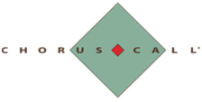

**[Image: Written_Transcript_17022025.pdf-0001-00.png (201x141, 19.5KB)]**

# “Gufic Biosciences Limited 

# Q3 FY25 Earnings Conference Call” 

## **February 17, 2025** 

Disclaimer: E&OE – This transcript is edited for factual errors. 

**[Image: Written_Transcript_17022025.pdf-0001-05.png (203x138, 19.6KB)]**

**[Image: Written_Transcript_17022025.pdf-0001-06.png (224x113, 8.9KB)]**

**MANAGEMENT: MR. PRANAV CHOKSI – CEO & WHOLE-TIME DIRECTOR MR. DEVKINANDAN ROONGHTA – CHIEF FINANCIAL OFFICER MR. AVIK DAS – INVESTOR RELATIONS MS. AMI SHAH – COMPANY SECRETARY** 

Page **1** of **20** 

_Gufic Biosciences Limited February 17, 2025_ 

**[Image: Written_Transcript_17022025.pdf-0002-01.png (203x139, 19.7KB)]**

#### **Moderator:** 

Ladies and gentlemen, good day, and welcome to the Gufic Biosciences Limited Investor Call for Q3 FY24-25. As a reminder, all participant lines will be in the listen-only mode and there will be an opportunity for you to ask questions after the presentation concludes. Should you need assistance during the conference call, please signal an operator by pressing star then zero on your touchtone phone. Please note that this conference is being recorded. 

I now hand the conference over to Ms. Ami Shah. Thank you, and over to you, ma'am. 

#### **Ami Shah:** 

Thank you, Sagar. Good evening, and a warm welcome to everyone. Today in this call, we have with us Mr. Pranav Choksi, CEO and Director; Mr. Devkinandan Roonghta, CFO; and Mr. Avik Das from Investor Relations team, and we will give the overview of the business and financial performance of the company and take questions, if any. 

Before we begin, I would like to say that some of the statements that will be made in today's discussion may be forward-looking in nature. It is subject to unfortunate risks and uncertainties, and the actual results could materially differ. The company takes no obligation to update or revise any forward-looking statements, whether as a result of new information or future events or otherwise. I hope you all must have received the investor presentation that we have posted on the stock exchange as well as our website. 

We will now begin the call with the opening remarks from Mr. Avik followed by a financial overview from Mr. Roonghta. Thereafter, we can have the forum open for the interactive Q&A session. 

Over to you, Avik. 

#### **Avik Das:** 

Hello. Good evening, and welcome to Gufic Biosciences Third Quarter Conference Call. We appreciate you joining us today as we share key updates on our performance, strategy and vision for the future. As always, our focus remains on driving innovation, expanding our market presence and enhancing the lives of patients through high quality and scientifically driven pharmaceutical solutions. 

So I'll begin by discussing some of the key milestones from the quarter that are contributing to Gufic's continued evolution. So first, I'd like to start with our Criticare division, which remains a cornerstone of our business. Our division continues to solidify its position as a trusted partner for hospitals offering a comprehensive portfolio of advanced injectables in antibacterial and antifungal space. 

As infection trends evolve and antimicrobial resistance becomes an increasingly urgent issue, we are addressing these challenges head on with cost effective and scientifically backed solutions that not only help reduce resistance, but also optimize patient outcomes in the critical care setting. 

Page **2** of **20** 

**[Image: Written_Transcript_17022025.pdf-0003-00.png (203x139, 19.7KB)]**

_Gufic Biosciences Limited February 17, 2025_ 

In the quarter that went by, we've taken several strategic steps that underscore our commitment to responsible antimicrobial use. We launched an awareness campaign focused on UTI management, which underscores the importance of rational antimicrobial prescribing. This initiative is critical, especially in India, where burden of UTI is high, and antimicrobial stewardship is essential in curbing the rise of resistance. 

Additionally, we continue to strengthen our market presence through participation in leading medical forums, including a MAHACRITICON in Pune, ISCCM in Bangalore, where we engaged with key clinicians and hospital networks. These interactions allow us to stay at the forefront of infection management, share the latest insights and ensure that Gufic's offering remain aligned with global best practices, including ICU and sepsis-related infections. 

Moving on to Ferticare cluster. We continue to grow this cluster in the entire ART space. As the fertility landscape grows more complex in India, our focus on scientifically superior and processdriven solution is helping IVF practitioners navigate increasingly challenging cases, particularly in treating poor responders and patients experiencing multiple IVF failures. 

These are areas where solutions have traditionally been scarce, but Gufic is providing targeted treatments like Guficin Alpha and Supergraf to directly address these challenges. One of the most exciting developments this quarter is the progress we've made in Guficin Alpha. It's a breakthrough treatment for recurrent implantation failure. We believe this is a game changer in the fertility space as RIF continues to be one of the most persistent challenges in ART. 

Guficin Alpha leverages thymosin alpha hormone with over 2,000 published studies. It's a molecule accepted by US FDA, has the DCGI approval. And it's been scientifically validated therapy, and it has been validated by independent practitioners, some of the leading chains in India. And we've come up with the conclusions, which further back our findings that this enhances uterine receptivity and improves embryo implantation. 

Along with that, in parallel, Supergraf is India's first ultra highly-purified HMG. This is setting a new benchmark in IVF stimulation. This next-generation purification technology ensures better ovarian response, lower dose requirements and improved success rates, especially in the poor responder category. 

This is further strengthening our leadership in this space. These innovations, along with early clinical validation, has positioned us as a trusted partner for IVF centers and fertility specialists, especially the ones that are not seeing good results in the poor responder category. 

Now let's talk about Stellar and Spark divisions. Both divisions are driving growth in key therapeutic areas such as orthopedics, gastroenterology, women's wellness and reproductive health. Stellar, in particular, is making strides with its Vonoprazan launch, which has gained strong uptake in the gastroenterology as a potassium -- PCAB, potassium-competitive acid blocker, helping doctors manage acid-related disorders more effectively. 

Page **3** of **20** 

**[Image: Written_Transcript_17022025.pdf-0004-00.png (203x139, 19.7KB)]**

_Gufic Biosciences Limited February 17, 2025_ 

Looking ahead, we are also excited about Guficoxib-P. It's a new combination therapy in orthopedics designed to address musculoskeletal pain with enhanced anti-inflammatory and analgesic effects. 

Additionally, Stellar is expanding its reproductive health portfolio, including antioxidants, to support both male and female fertility, making an important step in Gufic's effort to cater to the growing infertility management market. 

Meanwhile, the Spark division continues to leverage scientific engagement and product diversification to strengthen its presence in specialty segments, while actively contributing to patient outreach and education through our initiatives in gynecology and ENT Care. 

Next, I want to highlight our Healthcare division, which remains committed to bridging the gap between traditional Ayurveda and modern pain management solution. As more patients seek integrated therapies, Gufic is offering clinically validated Ayurveda driven solutions that align with global trends in natural and holistic care. 

Gufispon, for example, has emerged as a preferred non-surgical solution for cervical spondylitis, an area that traditional treatments often fall short. With increasing cases of musculoskeletal conditions driven by modern lifestyle, Gufispon offers a natural effective alternative to noninvasive to, rather, invasive procedures. 

Additionally, our Sallaki range, which continues to grow in popularity, has become a leader in the joint care market, positioning us as a key player in the natural anti-inflammatory therapies. We are also seeing tremendous engagement through initiatives like bone mineral density screenings, which we've done this quarter, the lead diagnosis and preventive care for conditions like osteoporosis and arthritis. 

Lastly, I'll talk about Sparsh division, which has made significant strides in expanding its product portfolio and reinforcing its direct-to-hospital model. This quarter, Sparsh expanded its offering with select contrast media. 

As we all know, contrast media is a specialized product for diagnostic imaging, and few companies in India are providing this product. This additionally significantly enhances Sparsh's competitive position and expands its footprint into critical care and the fast-growing diagnostic imaging market. 

By directly addressing the needs of midsize and smaller hospitals, Sparsh continues to deepen its relationship with health care providers, positioning itself as a key partner in even now diagnostic solutions. This strategic expansion allows Sparsh to capture larger share of hospital budgets, further reinforcing our strategy in direct-to-hospital model. 

Page **4** of **20** 

**[Image: Written_Transcript_17022025.pdf-0005-00.png (203x139, 19.7KB)]**

### _Gufic Biosciences Limited February 17, 2025_ 

Finally, our International division continues to strengthen its position with key product approvals across global markets. The most recent approvals in regions like Sri Lanka, Lithuania, Ecuador and Kenya reinforce our commitment to expanding our global footprint. 

These approvals are essential for opening doors to new markets and increasing Gufic's presence as a leading supplier of high-quality pharmaceutical products worldwide. As we continue to grow our presence in regulated markets, these strategic registrations pave the way for future opportunities, especially coming out of a new plant at Indore, which has now commenced production. 

Thank you all for your continued trust and support in us. I'll now hand over the call to Mr. Roonghta for detailed discussion of our financial performance. After which, we'll be happy to take your questions. 

#### **Devkinandan Roonghta:** 

#### **Moderator:** 

#### **Devkinandan Roonghta:** 

Thank you, Avik. I will now discuss the financial results for Q3 financial year '25... 

Sorry to interrupt. Sir, you are sounding a bit distant. 

I'm just highlighting the financial results of Q3 of financial year '25 versus Q3 of financial year in the '23- '24. The total revenue for the operation for the financial year '24- '25 in Q3 is INR 207.8 crores compared to Q3 of financial year '23- '24 of INR 201.8 crores. 

The EBITDA for the current  financial year Q3 is INR35.8 crores compared to the previous Q3 of financial year '24 INR36.9 crores. The EBITDA margins for the current Q3 is 17.23% compared to Q3 of last year, 18.29%. The profit before tax for Q3 of financial year '25 is INR26.3 crores compared to Q3 of financial year '24, INR29.6 crores. 

The PBT margin for the Q3 of financial year '25 is 12.66% compared to Q3 of financial year '24, 14.67%. The profit after tax for the Q3 financial year is INR19.4 crores compared to Q3 of financial year, INR22.3 crores. The PAT margin for Q3 of financial year is 9.34% compared to Q3 of financial year '24, 11.05%. 

I am now highlighting the financial results from for 9 months of financial year '25 versus financial year '24. The total revenue for the 9 months of current financial year, INR614.8 crores compared to INR616.7 crores last year. 

The EBITDA for current financial year 9 months is INR 111.6 crores compared to previous year's 9 months, INR 112.9 crores. The EBITDA margin for current 9 months is 18.15% compared to last year's 9 months, 18.31%. The profit before tax for this current year 9 months is INR 83.6 crores compared to 9 months of last year's 9 months, INR88.6 crores. 

The PBT margin for current 9 months is 13.60% compared to 9 months of last year, 14.37%. The profit after tax for 9 months of current financial is INR61.9 crores compared to 9 months of 

Page **5** of **20** 

**[Image: Written_Transcript_17022025.pdf-0006-00.png (203x139, 19.7KB)]**

_Gufic Biosciences Limited February 17, 2025_ 

last year, INR66.1 crores. The PAT margin for current 9 months is 10.07% compared to 10.72% of last 9 months of financial year. Thank you. 

**Ami Shah:** 

**Moderator:** 

#### **Nayan Taparia:** 

**Pranav Choksi:** 

We can now start with the question answers round. 

Sure. Thank you very much. We will now begin the question and answer session. Our first question comes from the line of Nayan Taparia, an individual investor. 

Congratulations for the stable set of numbers for the Q3. I would just like to know what is the top line we will do from the Indore facility. The revenue is still not seeing from that facility because it is a new facility. What is the top line you will have from there? 

Nayan, thank you for your call. So I'll answer your questions. Firstly, sir, the numbers are not something, which we would have predicted. So even in spite of a congratulations, we are still working hard to change that. I'll leave a little bit of logic also behind that why the numbers are. But let me answer your question for Indore. 

The -- as we had mentioned also in the earlier presentation and also in the announcement, the production of Indore has started from October 2024. And the first revenues were captured to the tune of INR6 crores in this quarter. And the total potential loss of Indore, of course, is much higher. 

But you can just imagine that Navsari right now helps us to contribute to this INR800 crores. And with Indore coming in, Indore has almost 1.5x capacity, plus 2, 3 new product lines also of ampules and speciality formulations. So the potential of Indore can be considered 1.5x Navsari, with all these things, and that is the highest potential. 

But of course, it will be a gradual increase, which will happen once the regulation starts coming in, the validation data has been completed, like I mentioned in October, and then the first set of products started being manufactured. And now more and more validation will get completed and more and more orders and more and more clients will approve us, followed by there will be -- WHO GMP has just been finished, and we have achieved that in the month of January. 

And now we are going to go for EU down the line, along with other countries' approvals also. So we will foresee growth happening of around 25% to 30% capacity utilization in the next year and then followed by 50% to 60% the year after that. 

#### **Nayan Taparia:** 

**Pranav Choksi:** 

**Nayan Taparia:** 

**Pranav Choksi:** 

Nice. Okay, sir. One more is you had attended the CPHI? 

Yes. Which one, sir? The one in... 

Delhi and Saudi Arabia. 

Yes. 

Page **6** of **20** 

**[Image: Written_Transcript_17022025.pdf-0007-00.png (203x139, 19.7KB)]**

**Nayan Taparia:** 

So how was your experience there? Are you able to... 

_Gufic Biosciences Limited February 17, 2025_ 

#### **Pranav Choksi:** 

So CPHI, always good. As long as it gets transferred into business, it is good. But yes, right now, we will be attending a lot of exhibition and conferences. We also attend a lot of -- our team is also going to DCAT next year -- next month, sorry, in March also for the US business. So we keep on attending. The response has been good. But until it translates into numbers, business, top line, bottom line, we are working very hard for that. 

**Nayan Taparia:** Okay. So one more, sir. Regarding debt, are you going to take more debt? Or it is now for time being, this will be the... **Pranav Choksi:** No, this is the peak debt, sir. I think Mr. Roonghta, sir, will answer this question actually better than me. So I'll hand it over to him. But according to me, this is a peak debt, and there'll be -- until Indore starts generating and we become cash positive, we will not. Mr. Roonghta, sir, can you answer this, please? 

**Devkinandan Roonghta:** Yes. Definitely, sir. So we are having the 2 types of loans. One is term loan. Term loan is we have taken for Indore as well as a term loan for Navsari. The term loan outstanding is around INR155 crores. And working loan right now is INR200 crores. Utilization is around 80%. 

So today outstanding is around -- loan outstanding is around between INR300 crores, and I don't think that there will be any possibility of further increasing the loan. I think this is a peak loan. And over a period of time after the cash generation from Indore, the loan will come down. 

**Moderator:** Next question comes from the line of Yogansh Jeswani from Mittal Analytics. **Yogansh Jeswani:** Thanks for the Opportunity. Am I audible? 

**Moderator:** Yes, sir. But there is an echo from your line. So if you're using speaker phone, may we request to use handset, please. 

**Yogansh Jeswani:** Sure. Is it better now? **Moderator:** Much better, sir. Please go ahead. 

**Yogansh Jeswani:** Yes. Sir, in your opening remarks, you mentioned about several new products that we have launched in Ferticare and similarly on other segments. So if you could just broadly help us understand what are the potential and at what stage are they in terms of their market launch. And what is the kind of response you are getting? And how much of a revenue can we add to, say, in quarter 4 or FY '26? 

#### **Pranav Choksi:** 

So there are 2 things. So the first thing is in Ferticare specifically, and since your question is for Ferticare, we have launched, one, Guficin Alpha, which is for recurrent implantation failure. There, right now, the product is already launched since May 2024. We had started with a patient 

Page **7** of **20** 

**[Image: Written_Transcript_17022025.pdf-0008-00.png (203x139, 19.7KB)]**

_Gufic Biosciences Limited February 17, 2025_ 

pool of around, I think, 80 patients in the first month, and now we have reached a total patient pool per month of around and close to, I think, 300 or 330, I think, patients per month. 

So this is something which is more of a concept billing where there is hardly any other solution available. So we're working with the, I would say, FDA and the CTRI also to do a Phase IV sideby-side because it's already an approved product. So we're trying to get it approved for a new indication, and that is where we are doing some trials. So once the trials are also done parallelly, we will see more and more uptake where it becomes part of the protocol going forward. 

So recurrent implantation failure are normally 15% to 20% of the IVF cases right now. So it's quite a big market. There are conventional other products used, but focusing on immunology as one of the option where there is inflammatory parameters by which certain times, the implantation is affected is something new, and that's why a more scientific data has been done. So this is the case and the current status of that. 

Our next product is Supergraf, which is, I think, doesn't require so much time. But we are, of course, doing more of sampling and product pool. That is getting a much faster response. But it's a more highly, I would say, a super purified version of HMG, which is anyway conventional option used by doctors in the field of infertility. 

This product is taking higher fraction. It's taking momentum much faster because it's a wellestablished concept and it's a much more superior product. So this product is actually increasing by almost 8% to 10% month-over-month. So we hope that this would be one of our main anchor products, not only in Q4, but probably the year to come also. 

So the total market size of HMG in India is around INR484 crores. This is, of course, as per December AVAX, what I'm referring to. Out of that -- this is MAT number. Out of that, we have Puregraf, which is already around INR25 crores to INR26 crores. We feel if Supergraf handled efficiently and done properly, Supergraf can be close to INR10 crores brand in the next year. So that is how we are looking at in step 1. 

But down the line, we're seeing the INR484 crores market potential. We hope that we can start to go to at least 10% to 15% of the market share in the next 2 to 3 years. So we will see a small use happening and then directly going from 10% to 25% in 25 and beyond. Because we right now have only around 22 people promoting this, down the line, we have plans to gradually bring it to the other divisions also once we know that enough data and enough endorsement of doctors is there. And then we take it to a higher audience. 

So that is the second product. And of course, there are others, but let me focus on these 2 right now, which is going to be the main focus products of Ferticare. 

Got it. And sir, similarly, for other divisions, you were -- I'm sorry, I couldn't take a couple of names because I miss out on the exact name. But I think in Critical Care and then in Stellar also, you were mentioning a few of the launches. So this commentary was quite helpful, how you 

**Yogansh Jeswani:** 

Page **8** of **20** 

**[Image: Written_Transcript_17022025.pdf-0009-00.png (203x139, 19.7KB)]**

_Gufic Biosciences Limited February 17, 2025_ 

explained for Puregraf and Supergraf. Similarly, if you could explain us for Stellar and Critical Care. 

#### **Pranav Choksi:** 

Critical Care, the issue what we have faced, not only in Critical Care but also for HCG this year, right, around -- there are around 7 molecules of Gufic, which are not only in part of our domestic marketing, but even for export and even for contract manufacturing. They have faced sort of a price erosion. 

So why I'm giving you this factor is to answer your question is because there are products like Ceftazidime Avibactam, which was launched and there has been a price erosion. And then there has been now this combination of what you call aztreonam-avibactam we are working on. So that is still yet to start the clinical trial. 

So these all products will -- are adding value in the last 3, 4 months, but then we have a conventional set of 7 molecules who are 20%, 25% of our revenue generator of last year where the pricing is almost down by 60% to 80%. So when I give you these new numbers of perspective, always just keep that in mind. Also, there are certain products where the API price has gone down. Other things have gone down. So that is why also, we are seeing that thing. 

So in Critical Care, to answer the question specifically, we have now aztreonam-avibactam, which is planned. Before that, Dalbavancin was launched. Dalbavancin, we have again gone from -- we again followed a patient pool mechanism where we hope that it becomes close to a INR10 crores brand. 

Aztreonam-avibactam is something which you have just started the DCGI process. So that will be -- the revenues will be captured in the next 6 months. However, Ceftazidime Avibactam, where we are known for and has been thinking that as, even though there has been a price erosion by almost 80% of the price, what do you sell last year, but the quantities have increased by almost 30%. So even though we are a little bit net down, the growth is still there. 

So like that, I'm just giving you 2 molecules example of each division. In botulinum toxin, it's a different thing in the aesthetic division. That is having no price impact on things. So that is actually growing. Again, like I said, the base is small. But the growth has been almost another 60%, 65% year-over-year, but the base being hardly in those, I think, INR10 crores, INR15 crores in aesthetics and remaining around INR8 crores, INR10 crores in the neuro space. 

The base hardly increase of around INR10 crores increase is not showing overall in the entire company's revenue -- Because that -- but that botulinum toxin followed by pillars to be launched in the next 3 to 6 months will be the growth, I would say, factors in Aestharderm. 

And then we have Sparsh. But then I can keep on going on. We have too many divisions, but I'll focus on the top 3 divisions that is a Ferticare, Critical Care and Aesthaderm where I have given you answers. If anything more is there, please write to us. We'll give you a especially divisionwise feedback for all the remaining 4 divisions also. 

Page **9** of **20** 

**[Image: Written_Transcript_17022025.pdf-0010-00.png (203x139, 19.7KB)]**

**Yogansh Jeswani:** 

#### **Pranav Choksi:** 

_Gufic Biosciences Limited February 17, 2025_ Sure, sir. Really, really helpful. I'll reach out to the team. I will write to Avik-ji and seek those details. Sir, secondly, on the Indore side. In terms of the expense, are we left with any more expenses or the expenses are already done and just once these trial batches are accepted and the approvals come in, we can scale up? 

Yes. So scaling up, will -- always in pharma and injectable especially take time because one is, of course, our domestic business, which we will start immediately, already, you've seen INR5 crores, INR6 crores revenue capture of our domestic business in the first quarter. And, therefore, in the last quarter, that is Q4, you will see more business there. We have more products coming in. 

Some, I would say, companies have given -- started giving us an authorization to start the CMO business, which we see around Q1 next year. And then by the end of Q1, we will have the EU GMP coming in also because certain validation will be submitted. So you will start seeing liquidity of export also by Q3. 

So you will see that revenue transitioning from baseline to Q4 2025, which will be Gufic oriented. Then from next year, it will be a mixture of CD CMO opportunities, along with the export starting kicking in. So that's why the graduation -- I mean, gradual that happened. 

Answering your question, expenses are all done now. Roonghta, sir also said, we have not only the opex, operation expenses, which are happening every month, which will be there, which will be there, correctly. But in terms of capex, I think everything is done. 

#### **Yogansh Jeswani:** 

Okay. And sir, last one question, and then I'll get back in the queue. So if you look at the longerterm trajectory of our operating margins, that has been something around 17% to 19%. While in past, our endeavor or guidance has always been that the model we are working on that we want to bring out products, which are different maybe in terms of how they are delivered to the patients or maybe something or the other we are trying to do. 

And the intent is to increase our margins. So now with so many of the launches already out there in the market and then few more coming up, when do you see the benefits of increasing margins reflecting into numbers? Do you see FY '26 to be the year? 

#### **Pranav Choksi:** 

So again, I will talk to you what I have limited knowledge about. And then, of course, I'll ask Roonghta, sir, to come in. But before he comes in, I would like to tell you 2 things from my side. So if you see the gross margins in the last few quarters have anyway improved because of the product mix, which is happening and also because of the increase of UK business and export business. Anyway, there were capacity constraints still last quarter, so that is I'm saying in Q3 2024. 

So we always had to take a choice between what we do, and sometimes it's not that we could only do the high-margin stuff because we had an obligation to fill the domestic contracts also. 

Page **10** of **20** 

**[Image: Written_Transcript_17022025.pdf-0011-00.png (203x139, 19.7KB)]**

_Gufic Biosciences Limited February 17, 2025_ 

Now that is about the gross margin. In terms of the other margins in terms of employee and also in terms of the other expenses, you will see a peak coming for the next 2, 3 quarters maximum. 

Because that is where Indore will still have to -- the revenue of Indore will be catching up to the expense of Indore, which will be anyway fully fledged captured also. So those margins for the next 2 to 3 quarters will be seen on the lower side because of these employee expense and the other expenses and the depreciation and the interest cost. 

And then once the Indore revenue starts coming in, which we are expecting, then you will feel that line of baseline increasing again the other -- I would say, the EBITDA margins also. Till then the gross margin should definitely improve. That is what I wanted to make a point. 

However, I think Roonghta, sir, you want to add something to what I have missed or something more. 

**Devkinandan Roonghta:** Basically, if you see our gross margin, that is basically sales minus raw material and I think that has improved by around 2% from last 2 years. But because of the increase in the employee cost as well as other expenses, the EBITDA margin has been coming down by 1%. Because of the increase in the depreciation and other expenses in the near future after Indore start up, we feel that there will be pressure on the EBITDA margin as well as PAT margin. But after '26, when the capacity utilization of Indore will be picked up, I think that the EBITDA margin and PAT margin is going to improve after '26 onwards. 

**Moderator:** Next question comes from the line of Rahul Girish Shah from Glostar LLP. 

**Rahul Shah:** 

This is Rahul Shah from Glostar LLP. My question is to Mr. Pranav. Can you give overall Indian lyophilization industry overview and its future ahead and Gufic's competitive advantage among rate and market share? Just elaborate the whole utilization industry for me? 

**Pranav Choksi:** Rahul, if I understood your question right, you want me to talk about the Indian or the global pharmaceutical industry and their perspective, vis-a-vis.... 

**Rahul Shah:** No. Lyophilization, in particular how the Indian utilization industry is placed and how Gufic -- what are the and Gufic's competitive advantage among rate and market share? 

**Pranav Choksi:** Okay. Only in specific to the lyophilization, right? 

**Rahul Shah:** 

Age over the competition. 

#### **Pranav Choksi:** 

Yes. So again, I think if you have been following my discussion, because it's a very broad end question, but I'll still try to complete it in the next 2 to 3 minutes. So if you see the lyophilization is just -- in 10, 15 years ago, it was something which was worthwhile. Now it's become a commodity. 

Page **11** of **20** 

**[Image: Written_Transcript_17022025.pdf-0012-00.png (203x139, 19.7KB)]**

_Gufic Biosciences Limited February 17, 2025_ 

So the capacity is something where you can say Gufic is one -- having one of the biggest or the largest capacity now, not only in India, but in the major parts of the world, if you compare it as a single unit. We have a huge capacity, and that is where the advantage comes out. But the advantage of capacity is a small part of the entire, I would say, offerings of Gufic. 

The product pipeline, the capability of handling complex injectables and also the wide range of flexibility of having different dosage forms, and then the application of lyophilization of Gufic into botulin toxin and now future biologicals is something where Gufic's offering is a little bit different than just being a lyophilized CMO or a lyophilized manufacturer. 

Because -- so that is where I would differentiate -- or I would say this -- I would classify or perceive Gufic from an outside view. The Indian lyophilization market overall is -- must be growing in terms of volumes a little bit higher in double digits. Value-wise, it might be single or high digit because that is again because of the product pipeline. 

But like I said, it's a very -- often things, because lyophilization has multiple applications in oncology, in food industry and others, whereas we are focusing mostly as Gufic only in the general antibiotic and intensive care and ICU-based products along with peripheral nutrition, infertility and, like I mentioned, aesthetic, neurology and others. 

So our product segment and the product focus is also very sharp, and we are not into everything what lyophilization is into. But in whatever we are, we are trying to be a dominant player in terms of the pipeline, the capacity as well as the efficiency in terms of the differentiation products and new drug delivery system. That's how I would like to classify it. I don't know if Id answer your question, but I tried my level best to do it in 2 minutes. 

#### **Moderator:** 

#### **Shirish:** 

#### **Pranav Choksi:** 

Next question comes from the line of Shirish from PKD Advisors. 

Yes. My question is for Pranav. Pranav, could you kind of elaborate more on the botulinum toxin revenue, which you're probably seeing by FY '26? And what are you strategies to grow that? 

Sure. So like I said, I already gave a little bit of hint in the 2 questions before in terms of the numbers, how I'm looking at the growth of 65%. A little bit changes we have done recently. I don't know if you have been keeping a note on us that we just have got Mr. Vijay Kumar to join us. Right now, this aesthaderm wasn't actually part of a strategic business unit under a common unit of women's health care and aesthetics. 

We just have got 2 senior members, 1 senior member from DSV. That is Mr. Rajeev Agarwal who will be handling infertility as a separate cluster. And then we have got Mr. Vijay Kumar who had spent more than 6 to 8 years in Galderma and before that also in like doctor even other companies where they are focused on aesthetics purely. So he has joined me -- or he has joined us. 

Page **12** of **20** 

**[Image: Written_Transcript_17022025.pdf-0013-00.png (203x139, 19.7KB)]**

_Gufic Biosciences Limited February 17, 2025_ 

Along with that, we have a separate team member who is handling what you call the neuro care side of it or the therapeutic application of botulinum toxin who has been working in MERZ than before that other neurological companies. So we have a demarcation we have done this year from January onwards because we feel the base has come, and now it's time for us to go to the next level in terms of the -- getting our act together because on UMP-CMP guidelines have always been there. 

So we are looking at more and more scientific base and more and more engagement where as formed the UMP-CMP and go for more scientific discussion and create more clinical data in different, I would say, therapeutic indications in the aesthetic space as well as the neuro space and also focus more and more on training. 

With Mr. Vijay Kumar coming in, we also have a -- we get a clear cut, I would say, legacy lead into doctor engagement because there, also, what the doctor expects in terms of the cadaver training, what are the multinational guidelines in terms of creating SOPs, also creating protocols, that just makes it much more easier. 

And also a lot of doctors who used to consider Gufic as a new player would also now endorse as much faster because then we have a big brand ex-MMC colleague who is endorsing our brand and bringing them as an offering also. 

So this is our plan into it, and this is how I again feel that with these factors and these, like I said, clinical data, scientific input and also trials and also more and more trainings, which have always been our main forte, we invest more than what we earn only in training and development because we feel someone has to get this category expanded. 

You can't just keep on -- it's not a category where you have to take a market share. We already number 2. We are after Allergan. But we have to not only increase the market share. But at the same time, we have to increase the overall market size also via category conversion. That is always -- category upgradation by doing more and more doctors converted to -- and equip them with the skills to do these aesthetic as well as neurological techniques. 

So this will be the way forward qualitatively. And hopefully, that will help us in the quantitative numbers, which we have envisioned where we hope that this year, we did on 65%, but we were hoping to double. So we could not do that, even though we have done the huge amount of investment in terms of category building, but I'm sure that appetite will still continue for us. 

#### **Shirish:** 

Understood. I have a follow-up question, Pranav. So pardon me if I missed something in the past, but do you plan to expand this internationally, trying to capture the East Asian markets or the US? 

We do. But very frankly, right now, our entire bandwidth is very focused on 2, 3 things which are very important, the Indian space. Once we get into the international space, we had options. Very frankly, there were opportunities also which we had to. But at that time, we very frankly 

**Pranav Choksi:** 

Page **13** of **20** 

**[Image: Written_Transcript_17022025.pdf-0014-00.png (203x139, 19.7KB)]**

_Gufic Biosciences Limited February 17, 2025_ 

put it on hold because a lot of things would -- bandwidth would have been used now to create a new infrastructure to then take the product to the international market. 

So we purposely have stayed away from it. Our next focus is to first get Indore running. Then the domestic business is a little bit more aggressive along with the help of Indore capacities. And then botulinum toxin, let's focus on the next 1 year at least on the domestic market, bringing to some more because the GCs are very high. And we really feel India is a market which really has to take a lot of bandwidth and work. 

And then maybe after 1 year, we will definitely look at thinking of the international market where new infrastructure will either have to be created or we might need to outsource it from an existing CMO or something. So we can always discuss this after 1 year when we have a little bit less things on our mind and a lot of things have picked up by then. 

#### **Moderator:** 

#### **Vidit Shah:** 

#### **Pranav Choksi:** 

The next question comes from the line of Vidit Shah from Spark Capital. 

My first question was on the new product launches we've had quite a few of them over the last of 6 to 8 quarters. If you could just help me understand what are the blockbuster ones now that we've seen some sort of feedback come. What are the products that you believe can be INR50 crores to INR100 crores of revenue from the new launches over the next -- over the medium to long term for Gufic itself? 

So right now, I'll focus on the domestic space purely. Internationally, it's a different ballgame. So in domestic space, the Ceftazidime Avibactam followed by Dalbavancin, other 2 products in Criticare, which I just mentioned some time ago, which have that blockbuster thing. 

Dalbavancin has reached, only because it's the first time we have launched, even the MNC or innovator is not here. So we have still reached a basic scale of only around INR3 crores to INR4 crores in a year. But we hope that with more and more resistance and other issues coming in with teicoplanin and vancomycin and linelozid, vancomycin will have its own position. 

So we feel vancomycin -- sorry, Dalbavancin, I was talking about Dalbavancin. Dalbavancin has a potential of going from INR3 crores to at least INR15 crores, INR20 crores and then eventually more once the positioning and the market acceptance comes up. 

We also have reduced, slash the prices of Dalbavancin by almost one-third now because of the efficiency of the API and all that to make more and more doctors start using it. So this has a potential value of a high -- of at least INR40 crores, INR50 crores down the line, as I talked about. 

Secondly, for Ceftazidime Avibactam adding a INR20 crores molecule for us in the last 2 years of launch. January 2023, I think, it was launched. So this is going to grow more. Of course, this might a little bit be affected by our next launch of aztreonam-avibactam, which is right now in 

Page **14** of **20** 

**[Image: Written_Transcript_17022025.pdf-0015-00.png (203x139, 19.7KB)]**

_Gufic Biosciences Limited February 17, 2025_ 

DCGI because that is another having a blockbuster potential where the entire market size can be around INR3 crores. 

And whoever launches this first, right now, Pfizer has just got the approval in August 2024, and we are the first Indian company to apply to DCGI for it. So let's hope how that works out. And once we get approval, hopefully, by next year, we can get some feedback. 

Coming to fertility, I already mentioned about Guficin Alpha, where it will be a little bit of a slow painful journey because it's more of science and getting trials done to get the product big. It has the potential to become in that number, which we mentioned. 

And Supergraf, Supergraf already had -- like I already mentioned, it's a INR 484 crores market. Other HMGs already around 2025, and this potential has itself to bring it to that level. I think, at least for the first year of launch, it should be INR10 crores and then followed by much more. 

And then, of course, we have botulinum toxin, where botulinum toxin both in neuro care and aesthetic space can be that in a molecule. So like I say, I will only focus on these 3 divisions right now and tell you more insights about them. Other divisions, we are more than happy to write back. You can write to us, and we will give you more about that. 

**Vidit Shah:** 

Okay. Understood. No, this is helpful as well the detail. The other one -- the other question I had was on the Indore facility. If you could just help explain if we are tracking the amount of cash burn that is happening currently. And when do we expect this to be breaking even? 

**Pranav Choksi:** Okay. I think this is the queue for Roonghta, sir, to step in. So Roonghta, sir, you will take this question. 

**Devkinandan Roonghta:** Basically, just now, we started the production. And for Q4, we are expecting that the revenue can come around INR20 crores. From '25, '26 onwards, we feel that the revenue should be minimum INR150 crores additional revenue from the Indore plant. That is our expectation. And depending upon the valuation, the approvals as well as the audit by the third parties. But we expect the revenue from Indore should be INR150 crores in next financial year. 

**Vidit Shah:** Okay. Sorry. 

**Pranav Choksi:** Yes, I'll ask your question. I think Roonghta, sir, didn't answer. Roonghta, sir, they're asking whether -- how long would the cash burn last and when would we breaking even. 

**Devkinandan Roonghta:** Breaking even, I think the breaking even will be going to take around 4 to 6 -- 4 to 5 quarters. It will be in the fourth quarter of '25, '26, I think the breakeven will be. 

#### **Vidit Shah:** 

Got it. Just sorry if I can... 

#### **Pranav Choksi:** 

Indore in isolation, just to clarify that, yes. 

Page **15** of **20** 

**[Image: Written_Transcript_17022025.pdf-0016-00.png (203x139, 19.7KB)]**

#### **Vidit Shah:** 

#### **Pranav Choksi:** 

_Gufic Biosciences Limited February 17, 2025_ Sure. if I sneak in a clarification. In one of your opening remarks, I think you said that you expect the utilization to go up about 30% to 40% in FY '26. So that would translate to a revenue much higher than INR150 crores, like what Roonghta, sir, said, right? 

Yes. So I'll tell you, there are 2 types of businesses. One is of course, the CMO business, which only conversion cost is captured. And one is, of course, the third party business there. Of course, the actual revenue is captured. So initially, before a registration comes in, only the domestic business will be capturing the revenue on a TP basis. Whereas in the first year, we expect a lot of loan licensing work done for MNCs and big companies until our export registrations kicks in. 

So those revenues even though has a projected revenue of much higher because this is purely on the conversion cost space, so there will be a 50%, which will be transfer pricing and 50% of the revenue -- or 60% of the revenue will be still CCPC. And that's why that revenue would be a little bit lower, but it's more purely CCPC, not RMPM involved. 

#### **Vidit Shah:** 

#### **Pranav Choksi:** 

Got it. And just the last one. So I guess, we ramp up Indore by FY '28 to full utilization. Any other capex that we have in mind that we are looking at or contemplating given that will also take a couple of years to come up? So what is the management thinking about the next steps of capex? 

So '28 will be great if it's done. I think '28 or '29. But like I said, we are very selective and very -- I would say, we are very careful what we get into Indore because it has a US FDA appetite. So just to fill capacities, we might not be just getting anything just for capacity utilization. So '28 or '29, I think time will tell, but our efforts, I want to get it done as soon as possible, just to clarify that. 

Coming to the next point, yes, right now, as of now, if you see, as a company, most of our efforts, which have been in the past also in the R&D scale, so we are evaluating post Indore maybe something to be done on the botulinum toxin space. Otherwise, most of the work will happen in R&D where we are looking also at strategic tie-ups where, instead of investing in our own, I would say, capacities, maybe, at least utilize somewhere as a CMO and then use that money for filing and regulatory focuses, which are a little bit much more. 

Because we do talk about botulinum toxin and then we talk about in fertility and then we talk about the oral vaccines in the future. All of them would be in a much better off that, instead of putting money in our own capacity, you can always have, I would say, outside CMOs available, which can help us to take it to the next level. So that is the approach right now. Maybe in 1 year, we will be more clear, and we'll share with you more information. 

#### **Moderator:** 

**Chintan Shah:** 

The next question comes from Chintan Shah from JM Financial Family Office. 

I have two questions. So one is, if I look at the Indore facility, we are planning to go to regulated market share. And please correct me if I wrong, but this is the first time we would be going under audit for these regulated markets. 

Page **16** of **20** 

**[Image: Written_Transcript_17022025.pdf-0017-00.png (203x139, 19.7KB)]**

#### **Pranav Choksi:** 

_Gufic Biosciences Limited February 17, 2025_ So my question is, is the Indore facility ramp-up, say, beyond FY '27 beyond the 30%, 40%, 45% utilization, depending on those regulatory markets picking up? Or do we think that even if that gets delayed or there's some issue and it doesn't happen, we have enough to ramp this up without the approvals from the regulated market? That is my first question. 

Yes. So very frankly, when I mentioned this capacity, I'm only using for next year, mostly Indian domestic business, both CMO as well as own brands as well as a little bit of export in semiregulated to maybe a little bit of a European business also starting by Q4. So we are expecting an EU GMP, hopefully, in Q2 or max Q3 2026. 

So US has not been factored in my capacity utilization for next year. Also US, our main focus is purely as a CMO because we also want to learn and evolve in the process. We don't want to take any short cuts. So a lot of people guiding us. We already had 4 audits by 4 different agencies and 2 different companies. 

So the 6 audits have happened for the US market specifically, and they all have been landing as an handholding us. So I would again refrain from putting any numbers or capacities of US as of now in the next 1 or 1.5 years. It would all start coming in after that, which would, of course, be a different volume. But it's too, I would say, preliminary for me to commenting on US right now for their facility. 

There are other -- so answering your question, this 30% to 40% would be something which we wish to take care of the domestic and the semi-regulated and the European and other markets, except US and Japan as of now. 

#### **Chintan Shah:** 

#### **Pranav Choksi:** 

That is fair enough. Just one clarification here. Just excluding the -- suppose it doesn't happen, does this -- do you think there's enough potential sales in the domestic or semi-regulated markets for the Indore ramp-up or it would be dependent on... 

Yes. Right now, if you've seen the order books in such a way that I'm struggling in Navsari right now, we have seen almost a revenue plateau happening. Because we have orders, like I said, UK order is lying with us, but we are not able to capture in the last quarter. We will be doing partly in Q4 and partly in Q1 next year, even though I had to deliver that way back in December or maximum by Jan. 

These are challenges I'm already facing in Navsari, which would be, of course, easing off in the next 1, 1.5 years with this thing. So answering your question, Navsari, should be chock-a-block by -- already, it is, but I think more if I start removing the domestic also. It should be saturated with export orders only by the end of Q2, Q3 2026. That is this coming year. 

I'm saying let's talk on the calendar year by around October to December 2025, and that is where we will need that capacity for those markets also from Indore. So that is how the thing will eventually hopefully plan out, and we don't see any other capacity issues coming in. 

Page **17** of **20** 

**[Image: Written_Transcript_17022025.pdf-0018-00.png (203x139, 19.7KB)]**

#### **Chintan Shah:** 

_Gufic Biosciences Limited February 17, 2025_ Got it. Understood. And the second question is just one clarification. When you say that you'll reach EBITDA breakeven for the Indore facility by Q4 of next year, does it also factor in the regulatory cost, funding cost, etc., that will be incurring for the regulated markets or that would be some additional cost that we have incurred? 

**Pranav Choksi:** No. Already, that is being -- because already if you've seen the last 2 quarters, we have really increased our other expenses. All that cost has been -- other expenses have gone to this 45 levels. And that will further increase in the next 4 quarters also because of those things. 

So I'm assuming. And again, I'll just ask Roonghta, sir, for this confirmation. But yes, more than you see on a standalone basis, we are assuming by Q4, it should eventually start breaking even and then the actual margin should come. But I think we have considered this cost. Roonghta, sir, am I right? 

**Devkinandan Roonghta:** Yes. You consider all these cost. 

**Pranav Choksi:** So I'm saying, because already that, if you've seen the current P&L, already, they have started hitting us from last 2 quarters itself. 

**Chintan Shah:** Okay. Perfect. And just one last question from my side. If you could just throw some light on revenue contribution from a top 5 or 10 molecules basically. 

**Pranav Choksi:** Sorry. Can you repeat that again? I just got a call in the second. I could not hear you. 

**Chintan Shah:** Can you just mention what will be the revenue contribution from a top 5 or top 10 molecules? 

**Pranav Choksi:** So top 7, I just did it because we have seen now erosion happening there. So top 6 to 7 molecules contribute to almost 20% to 25% of our revenue as of now in various CMOs and all that. So that is something. I would say, yes, top 6 or top 7 contribute that. Otherwise, let me get back to you because I don't have offhand. I can get it sent to you. 

**Moderator:** Next question comes from the line of Yash Tanna from ithought PMS. 

**Yash Tanna:** Yes. I think one question had been answered. I just have one question. Sir, we created the subsidiary called Gufic-Prime Bio recently. So if you can share any developments that -- and what's our plan with the subsidiary. And also, I think you briefly mentioned about botulinum toxin for international markets. But have you taken a call not to take that international? Or if you can throw some light on that as well? 

**Pranav Choksi:** So we had an opportunity some time back to take it international, and it was quite good. Of course, the talks are still on, but I think we never say never. But right now, just for the fact that because of the time which is there and our other Indore and the domestic market as well as the US, I would say the validation batches and the European validation batches are taking a big part of the bandwidth. 

Page **18** of **20** 

**[Image: Written_Transcript_17022025.pdf-0019-00.png (203x139, 19.7KB)]**

_Gufic Biosciences Limited February 17, 2025_ 

And also if you must have seen, we just have got a new President of International business, who has joined as well. He is excellent regulated market experience, Dr. Rajasekar. So our bandwidth is, right now, fully focused on getting these existing assets, working to the best of the ability. If we -- we would, of course, love to go to botulinum toxin international market. 

But maybe we feel it would be better suited to all of us that if we do it after 1 year, once we have these all other guns blazing and then we can start to ignite a new gun. So otherwise, it should not happen that the CEO or the COO also get occupied in this new thing. Of course, not me. More than me, actually, my COO will get occupied in this new bandwidth of setting up a new facility for botulinum toxin. 

And we foresee that maybe in a year's time, there are certain assets coming up where we can actually go with our tech transfer and can start manufacturing rather than creating any -- taking more debt or creating an asset on our own, which can be a little bit more -- I rather put on money in the regulatory process, the tech transplant, and to use that, especially to take our botulinum toxin right. 

So there are a lot of options we are exploring. And keeping in mind, the company's bandwidth and are immediate, I would say, targets, we are taking it one day at a time. So let's hope we can share something good with you all in the future. 

#### **Yash Tanna:** 

#### **Pranav Choksi:** 

Right. Sure, sir. That makes sense. And anything on Gufic-Prime Bio, what's our... 

Yes. Gufic-Prime Bio, basically, since there are, apart from botulinum toxin, other products also being made in terms of oral Dengue vaccine and oral -- other vaccines of COVID. And I think now, we had also started working on one more option. 

So those eventually would be, I would say, routed in a different way because it's a subsidiary. Because Dr. Bal Ram Singh also has some plans of, I would say, raising capital, which is in a very preliminary state because there are certain things which we, as Gufic as a company, can take it to the next level. 

So at least to certain, I would say, clinical, I would say, roadmap maybe of a preclinical Phase I, Phase II, we can do it. Beyond that, how do we take it forward? We will always need external help. And external, I would say, interest, will drive it to the next orbit. 

So Gufic will have limitations to drive a project, except in the scientific way. Because then, there'll be more investments involved. And there'll be more and more, I would say, other responses required. For that, we have created this vehicle. And as and when we get our successful Phase I or preclinical and Phase I and Phase II, we will start updating you, definitely, which, will again be a good thing. 

Page **19** of **20** 

**[Image: Written_Transcript_17022025.pdf-0020-00.png (203x139, 19.7KB)]**

_Gufic Biosciences Limited February 17, 2025_ So you understand, right? So we can't take certain projects through and through. There might be a time where we can just exit certain projects at the right time and then give it to the next person to take it to the next level, and then we start working on another R&D project. 

#### **Moderator:** 

Next question comes from Shrey Gandhi from C.R. Kothari Stock Broking. 

**Shrey Gandhi:** Just a small question regarding the macro environment that the USA. has been planning to put import tariff on pharmaceutical business. So do we see any impact on that considering our CMO segment from the vertical, which you're planning to go maybe next year or year after that? 

**Pranav Choksi:** To be very honest, we are very small and we have not even entered it. So right now, it will be very myopic of me to comment on this. I need to study more and I need to research more. But - - and since as a CMO, I'm sure clients, both Indian as well as international, would be more in tune with this than me. So at this moment, I will not be able to comment because I really have not much idea into this. So I will not be able to give you any structural reply. 

**Shrey Gandhi:** Okay. And I have one other question. The INR6 crores revenue, which we reported from the Indore facility in this quarter, was it from all manufacturing? Or was it from CMO vertical? 

**Pranav Choksi:** Yes, it was from our own brand. Like I said, right now, the first thing, you can start only own branded because other companies will wait for our 3 -- I would say 3 batches and then 6 months data for them to start. So until then, it will be own manufacturing. Even this Q1 -- I'm sorry, Q4 would you also be own manufacturing. And then opefully, not hopefully, I'm surely from Q1, Q2, you will see CMO kicking in. 

**Shrey Gandhi:** Okay. How much do we expect in the next quarter from Indore plant? 

**Pranav Choksi:** Again, it's a very forward-looking thing. So I'll just say that, right now, the start has happened. We hope that we can reach at least 2x to 3x that what we did already in this quarter. So just give you an indication around that. 

**Moderator:** Thank you. As there are no further questions from the participants, I now hand the conference over to Ms. Ami Shah for closing comments. 

**Ami Shah:** Well, thank you so much. I appreciate all of you joining us today. So if you have any further questions, you can contact Mr. Avik Das. Please, with that, we conclude today's call. Thank you. **Moderator:** On behalf of Gufic Biosciences Limited, that concludes this conference. Thank you for joining us. You may now disconnect your lines. 

Page **20** of **20** 

---

## Extracted Images

| # | File | Dimensions | Size |
|---|------|------------|------|
| 1 | Written_Transcript_17022025.pdf-0001-00.png | 201x141 | 19.5KB |
| 2 | Written_Transcript_17022025.pdf-0001-05.png | 203x138 | 19.6KB |
| 3 | Written_Transcript_17022025.pdf-0001-06.png | 224x113 | 8.9KB |
| 4 | Written_Transcript_17022025.pdf-0002-01.png | 203x139 | 19.7KB |
| 5 | Written_Transcript_17022025.pdf-0003-00.png | 203x139 | 19.7KB |
| 6 | Written_Transcript_17022025.pdf-0004-00.png | 203x139 | 19.7KB |
| 7 | Written_Transcript_17022025.pdf-0005-00.png | 203x139 | 19.7KB |
| 8 | Written_Transcript_17022025.pdf-0006-00.png | 203x139 | 19.7KB |
| 9 | Written_Transcript_17022025.pdf-0007-00.png | 203x139 | 19.7KB |
| 10 | Written_Transcript_17022025.pdf-0008-00.png | 203x139 | 19.7KB |
| 11 | Written_Transcript_17022025.pdf-0009-00.png | 203x139 | 19.7KB |
| 12 | Written_Transcript_17022025.pdf-0010-00.png | 203x139 | 19.7KB |
| 13 | Written_Transcript_17022025.pdf-0011-00.png | 203x139 | 19.7KB |
| 14 | Written_Transcript_17022025.pdf-0012-00.png | 203x139 | 19.7KB |
| 15 | Written_Transcript_17022025.pdf-0013-00.png | 203x139 | 19.7KB |
| 16 | Written_Transcript_17022025.pdf-0014-00.png | 203x139 | 19.7KB |
| 17 | Written_Transcript_17022025.pdf-0015-00.png | 203x139 | 19.7KB |
| 18 | Written_Transcript_17022025.pdf-0016-00.png | 203x139 | 19.7KB |
| 19 | Written_Transcript_17022025.pdf-0017-00.png | 203x139 | 19.7KB |
| 20 | Written_Transcript_17022025.pdf-0018-00.png | 203x139 | 19.7KB |
| 21 | Written_Transcript_17022025.pdf-0019-00.png | 203x139 | 19.7KB |
| 22 | Written_Transcript_17022025.pdf-0020-00.png | 203x139 | 19.7KB |
