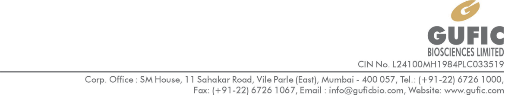
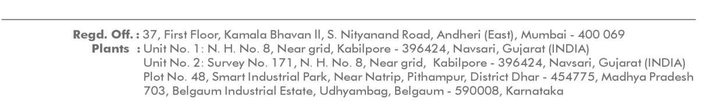
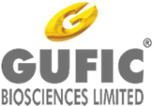
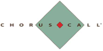

**[Image: ec34b89f-694e-4f14-9cf2-05906673889e.pdf-0001-00.png (1170x224, 67.4KB)]**

161/LG/SE/JUN/2026/GBSL 

June 05, 2026 

To, To, **BSE Limited** , **National Stock Exchange of India Limited,** Phiroze Jeejeebhoy Towers, Exchange Plaza, Bandra Kurla Complex, Dalal Street, Fort, Mumbai – 400 001 Bandra (E), Mumbai – 400 051 **Scrip Code: 509079 Scrip Symbol: GUFICBIO** 

## **Subject: Written Transcript of Earnings Conference Call** 

Dear Sir/Madam, 

In continuation of our intimation letter dated June 01, 2026, regarding the Earnings Conference Call and pursuant to Regulation 30 read with Part A of Schedule III of SEBI (Listing Obligations and Disclosure Requirements) Regulations, 2015, please find enclosed herewith the written transcript of the Company’s Earnings Conference Call held on June 01, 2026 at 04:30 PM. 

Kindly take the same on record. 

Thanking You, 

Yours truly, 

## **For Gufic Biosciences Limited** 

Digitally signed by AMI SHAH AMI Date: 2026.06.05 SHAH 17:54:06 +05'30' 

**Ami Shah** 

**Company Secretary & Compliance Officer Membership No. A39579** 

**[Image: ec34b89f-694e-4f14-9cf2-05906673889e.pdf-0001-14.png (1210x191, 64.0KB)]**

**[Image: ec34b89f-694e-4f14-9cf2-05906673889e.pdf-0002-00.png (311x216, 35.0KB)]**

# “Gufic Biosciences Limited 

# Q4 & FY26, Earnings Conference Call” 

# **June 01, 2026** 

Disclaimer: E&OE – This transcript is edited for factual errors. 

**[Image: ec34b89f-694e-4f14-9cf2-05906673889e.pdf-0002-05.png (168x116, 14.6KB)]**

**[Image: ec34b89f-694e-4f14-9cf2-05906673889e.pdf-0002-06.png (210x105, 10.0KB)]**

**MANAGEMENT:** 

**MR. PRANAV CHOKSI – CEO & WHOLE-TIME DIRECTOR MR. DEVKINANDAN ROONGHTA – CHIEF FINANCIAL OFFICER MR. AVIK DAS – INVESTOR RELATIONS MS. AMI SHAH – COMPANY SECRETARY** 

Page **1** of **18** 

_Gufic Biosciences Limited June 01, 2026_ 

**[Image: ec34b89f-694e-4f14-9cf2-05906673889e.pdf-0003-01.png (147x103, 12.2KB)]**

### **Moderator:** 

Ladies and gentlemen, good day, and welcome to Gufic Biosciences Limited Q4 and FY26 Earnings Conference Call. As a reminder, all participant lines will be in the listen-only mode and there will be an opportunity for you to ask questions after the presentation concludes. Should you need assistance during this conference call, please signal an operator by pressing star then zero on your touchtone phone. Please note that this conference is being recorded. 

I now hand the conference over to Ms. Ami Shah, Company Secretary, Gufic Biosciences Limited. Thank you, and over to you, ma'am. 

### **Ami Naresh Shah:** 

Thank you, Yusuf. Good afternoon, everyone, and I thank you all for joining us today to discuss Gufic Biosciences Limited's financial results for the fourth quarter and financial year ended FY26. The press release and investor presentation relating to today's results have been submitted to the stock exchanges and are also available on our website for your reference. 

Let me now begin with introducing the management team who has joined today's call. We have with us Mr. Pranav Choksi, CEO and Director; Mr. Devkinandan Roonghta, CFO; and Mr. Avik Das from the Investor Relations team. We will now commence the session with the opening remarks from Avik, following which we will open the floor for an interactive Q&A session. 

Please note that this conference call is being recorded. The record will be made available on our website later today and the transcript will be shared within the prescribed time line. Before we begin, I would like to remind everyone on the safe harbor statement. Certain comments made during this call may contain forward-looking statements. These statements are based on management's current expectations and are subject to various risks and uncertainties that could cause actual results, performance or achievements to differ materially from those expressed or implied in such statements. We encourage participants to review the relevant disclosures and risk factors available in our public filings. 

With that, I would now like to hand over the call to Avik for his opening remarks. Thank you. 

### **Avik Das:** 

Thank you, Ami, and Good Evening, everyone. Thank you for joining us today. Before I get into the business updates, I want to take a step back for a moment because I think Q4 FY26 and actually the full year deserves a bit of context before we jump into the divisional performance. 

FY26 was a year we came in knowing would be heavy. We were carrying the full fixed cost load of a new facility that was just finding its feet. We were simultaneously making a deliberate call to fix our working capital structure in one of our main divisional clusters, which cost us revenue in the short-term. 

And we were investing significantly in the leadership bandwidth, bringing in new heads across international infertility, aesthetics and the hospital care platform, people whose contribution will reflect more in FY27 than in FY26. So when you look at the full year numbers, INR940-odd crores in revenue and a PAT of INR63 crores on the surface, it may look like a flattish year. 

Page **2** of **18** 

_Gufic Biosciences Limited June 01, 2026_ 

**[Image: ec34b89f-694e-4f14-9cf2-05906673889e.pdf-0004-01.png (147x103, 12.2KB)]**

But the more important story is what Q4 looks like versus where we started. Revenue in Q4 was around INR252 crores, our strongest quarter ever. EBITDA came in at almost INR44.7 crores with a margin of 17.7%, up from 13.2% in Q4 of the prior year, and the PAT more than doubled year-over-year in this quarter. 

The sequential trajectory from Q1 through Q4 is exactly what we said it would be, and it ends in a place that gives us genuinely a cleaner runway heading into FY27. That's the context. Now let me take you through what actually moved within each of the divisions and business units. 

So Indore, I want to start here because Indore has been the centerpiece of our journey for the last 6 quarters. And Q4 is where we closed the loop on what we committed. We told you at the start of the year that we would reach 30% capacity utilization by year-end. We got there on target. Indore in Q4 reached its EBITDA breakeven with the capacity scaling up. 

What I want to flag because it matters for how you think about FY27 is that Indore so is now moving into a different phase, the qualification, tech transfer, validation batch phase, that's essentially behind us. We have 40 product tech transfers complete with another 27 under development and stability testing. 

We have almost 200-plus state FDA approvals in hand. We have more than 20 Indian pharma companies that have audited or actively using Indore as the CMO base. That's not just revenue, that's third-party quality validation of the facility and builds the foundation for the next leg of our growth. 

The EU GMP audit, which was also committed was completed in the first week of December 2025 by the Portuguese Competent Authority. The certificate is pending. We expect that to come through soon, and that will open up multiple EU markets for us. 

Now on the international business front, the international business grew highest ever in FY26, but the number itself is less important part of the journey. What actually changed this year is our model. We spent several years building up an opportunistic distributor-led filing model where the distributor held the marketing authorization, and we were essentially a price-sensitive supplier. That model has its limits and ceilings. 

We've spent FY26 switching to a model where Gufic now holds the marketing authorization through Gufic Ireland for the EU market, for example, and to our own filings in key markets. We control the IP in this setup. And when you hold the MA, you monetize the asset in 3 distinct ways: the direct supply, the out-licensing and the tech transfer fees. That's a structurally different and a more durable business in our opinion. 

So to give you all a sense of the progress in Q4 alone, we've received new product approvals in Myanmar, the Philippines, South Africa, Colombia, Germany and Ecuador. We filed dossiers in 18 new countries for multiple of our complex injectable molecules. And a major global health organization has now finally partnered with us on our most complex injectable asset, giving us access to public health procurement across 109 countries. 

Page **3** of **18** 

_Gufic Biosciences Limited June 01, 2026_ 

**[Image: ec34b89f-694e-4f14-9cf2-05906673889e.pdf-0005-01.png (147x103, 12.2KB)]**

This is the kind of partnering that takes years to build credibility for, and it tells us that international positioning is working for us. The 824 million addressable market across select molecules in the identified geographies that we laid out in our presentation, that number hasn't changed. 

What has changed is the quality and structure of how we are going after it. Now coming to our domestic business. On the domestic business side, there are 2 very different journeys this year, and I want to be clear about both. The first is the working capital reset within the Critical Care cluster. 

We went into FY26 with outstanding receivables from direct hospital billing that was sitting at almost 140, 150 days plus, and that was simply not sustainable. Over the course of FY26, we made a conscious decision to shift back to CFA-led stockist-driven distribution architecture. 

That transition roughly caused INR22 crores in revenue impact spread across the second, third and the fourth quarter, but we took it because the alternative was continuing to fund hospital working capital at our own balance sheet expense. 

The marg data layer we rolled out to our distribution partners means we haven't lost visibility. We've just moved the credit risk now again. The collection is now essentially complete, and it does we are very certain this will not recur in FY27. The second story on the domestic side is a genuine growth that was happening in parallel. 

The women's health platform, which spans our fertility and gynecology businesses delivered its strongest year ever. The reproductive immunology franchise in Ferticare achieved category leadership. Our gonadotropin flagship hit its highest ever annual sales milestone. Our new hormone introduced 2 years ago crossed its annual target and was ranked among the best new introduction in its segment by IQVIA in the last quarter of this year. 

Zenova's power brands continued to compound, and we began building out into chronic therapy adjacencies in women's health that gives this platform a much longer runway. On the botulinum toxin front, we are now firmly the number 2 brand in India, sitting at approximately 23% market share in a market where the innovator holds dominant position. 

We had a strong growth this year. The more important development in Q4 is that we formally signed an in-licensing agreement with a leading Canadian aesthetics company, one that holds a significant market share in U.S. for fillers and biostimulators. 

This deal fills what was the biggest gap in our aesthetic portfolio, a credible filler offering. Doctors who currently hesitate to shift their full aesthetic business to us because we offer only a toxin will now have a reason to consolidate with Gufic. 

Launch preparations are underway targeting maybe the third or fourth quarter of this financial year. The neurology side of our toxin platform, our therapeutic franchise, continued its methodical expansion into urology, ophthalmology, pain management and neurosurgery. This is a long-cycle business built on guideline-driven indications where adoption once established, is sticky and recurring. 

Page **4** of **18** 

_Gufic Biosciences Limited June 01, 2026_ 

**[Image: ec34b89f-694e-4f14-9cf2-05906673889e.pdf-0006-01.png (147x103, 12.2KB)]**

In our mass specialty Nutraceutical and Ayurveda division, we continue to sharpen the portfolio around chronic therapies, pain, arthritis and GI. Some differentiated formulation launches in Q4 includes a first in India formulation in our heritage orthopedic brand using an upgraded delivery format. 

This showed meaningful early traction and reinforce our conviction that modern formulation science applied to a well-trusted brand is a durable competitive edge. So with that, it wraps up our update on all the divisions, and I'll hand over the call to Roonghta sir for finance updates. 

### **Devkinandan Roonghta:** 

Thank you, Avik. I will be going to highlight the financial for the Q4 of the financial year '26 versus the Q4 of the financial year '25 as well as the financial results for the financial year '25'26 versus the financial results for '24-'25. 

The Q4 of the financial year '24-'25, the top line was INR205 crores. The Q4 of the financial year '25-'26, the top line is INR252 crores. There is a jump of around more than 15%. The EBITDA for the Q4 of the financial year '25 was INR27 crores. 

The EBITDA for the  Q4 of the financial year '25-'26 is INR44.7 crores. The EBITDA margin in the Q4 of last financial year was 13.17%. The EBITDA margin for Q4 of the current financial year is 17.73%. Profit before tax Q4 of the last year was INR10.8 crores and the Q4 for the current financial year is 27.6 crores. The PBT margin in last year Q4 was 5.27% and the current Q4 was 10.95%. Profit after tax Q4 of the last year was INR8 crores. This year, Q4 is INR20.5 crores. The PAT margin has further increased in Q4, it was 3.90% and Q4 of this year is 8.13%. Now I will highlight the financial results for the financial year '24-'25 versus '25-'26. The top line for financial year '24-'25 was INR820 crores. The top line for financial year '25-'26 was INR940.50 crores. 

The EBITDA for the financial year '24-'25 was INR 138.6 crores. The EBITDA for the financial year '25-'26 is INR 152.9 crores. The EBITDA margin for the financial year '24-'25 was 16.91%. The EBITDA margin for the financial year '25-'26 is 16.26%. 

The profit before tax for financial year '24-'25 was INR94.4 crores for financial year '25-'26 is INR85.5 crores. The profit after tax for the financial year '24-'25 was INR69.9 crores, the financial year '25-'26 is 63.2 crores. The PAT margin for the financial year'24-'25 was 8.53% and '25-'26 was 6.72%. Thank you very much. 

### **Moderator:** 

First question is from the line of Bhavya Sonawala from Samaasa Capital. 

**Bhavya Sonawala: Thank you for the Opportunity.** Congratulations to the whole team for a good set of results. Just a couple of questions. Can you just talk about how sustainable these margins are? Is it operating leverage playing in or some product mix or something that's changed? 

### **Pranav Choksi:** 

So, Hi. Pranav here. I am audible and clear. So in regard to the operating margins, as you must have seen in the last few call I mean, the conferences also in the quarters and otherwise, we always feel that there will be an improvement happening in the gross margins for 2 or 3 main reasons. The first reason is, of course, the business reset happening between domestic and 

Page **5** of **18** 

_Gufic Biosciences Limited June 01, 2026_ 

**[Image: ec34b89f-694e-4f14-9cf2-05906673889e.pdf-0007-01.png (147x103, 12.2KB)]**

international versus the CMO, also launch of new molecules and also in international market, upgrading to more profitable geographies. 

So these are the main things which will be also where, as Avik also rightly mentioned, where most of the efforts are also being put that these continues to mature further, and there's still a huge scope before saturation kicks in. So these will continue to help us to go for the improvement of 0.5% to 1% year-over-year gross margin improvement. 

**Bhavya Sonawala:** Okay. Understood. Also, I think in the presentation, the GLP-1 validation batches were spoken about. Just trying to understand, is this like a confirmed contract or deal or how is it working? If you can just throw some light on that? **Pranav Choksi:** So basically, there are various drug delivery systems for the GLP-1 right now, mostly I'm talking in the injectable space, there are mostly vials and cartridges, which are being there. So from the Navsari factory, as you mentioned in the last few conferences, we are working on the cartridge and the pen type. And now from Indore, we have signed an agreement with another player who will be focusing on the lyophilized vial form. 

So we are very clear that our focus and our, I would say, play in this entire supply chain would be purely as a CDMO or CMO, let's put it very specifically. And that is where we see that we will be playing a role. Our front-end ambitions right now are limited maybe to a couple of brands in India. But for international markets, we would be riding the wave with our partners. 

**Bhavya Sonawala:** Okay. Is it possible to quantify what kind of revenues can come from this? Or is it too premature? **Pranav Choksi:** It's too premature. If you see both India and international are going to have 2 different road maps. Of course, they will be quite as you must have seen in the IQVIA data for the last few quarters and even before when Mounjaro came in, this is here to stay, and it's going to be growing. Maybe the margins, what you see might come down, but definitely, the markets will be increasing. 

So we see a good upside, but how much  how  and because like I said, our projections never spoke about this. This is an additional benefit which will come via the CMO operations of the organization and where our front-end partners have more of a role to play. So it will be very immature on my part or very preliminary on my part to comment on the numbers. It depends on my customers and my partners' front-end efforts. 

**Bhavya Sonawala:** Just a last question. When you spoke about the in-licensing, so just to understand it better, and sorry for my English, but it's only going to be for India, right, whatever we get the in-licensing? Or do we manufacture and can supply it internationally, too? **Pranav Choksi:** The in-licensing, you're referring to which particular product line? 

**Bhavya Sonawala:** Sorry, the Canadian filler and yes. **Pranav Choksi:** Yes. So as you know, toxin and fillers are always go hand-in-hand in every aesthetic practice. So currently, the in-licensing is for the India market only. And down the line, if economic of scale comes, there are, of course, other trigger points which hit the relationship going forward. 

Page **6** of **18** 

_Gufic Biosciences Limited June 01, 2026_ 

**[Image: ec34b89f-694e-4f14-9cf2-05906673889e.pdf-0008-01.png (147x103, 12.2KB)]**

But right now, very frankly for the next 2 to 3 years or maximum till 5 years, we are looking at in-licensing of the molecule to complement our toxin journey in the India market only. **Moderator:** Next question is from the line of Nitya Shah from KamayaKya Wealth Management. **Nitya Shah:** Congrats on a good set of numbers. Nice to see the capacity finally reaching breakeven. So I had more of a book-keeping question. So I saw there's an investment made into a cooperative bank of INR6.5 crores. So I just wanted to understand what is the entire arrangement? Is this due to some regulatory requirement? And what kind of benefits do we get out of doing this investment? **Pranav Choksi:** Yes. So Roonghta sir, you like to take this? **Devkinandan Roonghta:** Yes, basically, the Saraswat Bank is one of the leading bank with a Gufic, and we are associated with this bank from last more than 15 years. The bank has come with the proposal to allot only around 24 top customers for this year allotment as a face value of INR10 each. The past history of the bank is that they are giving a dividend of around 15% every year. And if we get a 15% return on the investment, whereas we borrow the same amount at 8%, one advantage is that we will going to earn because of this extra income of 7% to 8%. That is one reason. And secondly, to keep the relationship with the bank, we decided to go for this investment. **Nitya Shah:** Okay. Understood. And what's the total exposure you'll have with this bank in terms of borrowings? **Devkinandan Roonghta:** Total, I think the total exposure, including fund-based, nonfund-based and term loan will be around INR250 crores. **Nitya Shah:** Okay. INR250 crores. And your interest rate, you said is around 8%, right? **Devkinandan Roonghta:** In case of Saraswat Bank, there is  one is term loan, one is WCDL and one is working capital loan. Working capital is 8.2%, term loan and WCDL is 8%. **Nitya Shah:** Okay. Understood. So in the future, you since you plan to continue working with this bank, that's why you have made this? **Devkinandan Roonghta:** Yes. We want to continue because this bank has been associated with the group and all the difficult times, this bank has been given a very big help to the company to grow this level. And for a pity of amount, we do not want to shift the bank. We want to continue with that. Yes, we added another bank also. Now in a consortium banking, there is HDFC Bank, ICICI Bank and Axis Bank. **Nitya Shah:** And say, for example, once you finish all  for example, you finish banking arrangements with this bank, do they return you this investment? Or does it continue to stay? **Devkinandan Roonghta:** Yes, you can any time when you want to break the relationship with Saraswat, you can sell the same share to the Saraswat Bank. They will go into return only the face value, not any premium and all. 

Page **7** of **18** 

_Gufic Biosciences Limited June 01, 2026_ 

**[Image: ec34b89f-694e-4f14-9cf2-05906673889e.pdf-0009-01.png (147x103, 12.2KB)]**

**Moderator:** Next question is from the line of Vishal Mehta from Oaklane Capital. **Vishal Mehta:** I just had a couple of questions. One is regarding Botulinum Toxin, what is the size of the revenues and profit for Gufic today as on FY26? **Pranav Choksi:** Yes. Sorry, actually, I was on mute. So the total Botulinum Toxin market is divided into therapy and aesthetics. Totally, it must be contributing to around 3.5% plus or minus to the total revenue. **Vishal Mehta:** Okay. So in terms of this fillers, do we need to do any capex for that or that will not be anything significant? **Pranav Choksi:** No, no. So as if you see in the last few calls also, currently for the India and ROW markets and emerging markets, I think the capacity has already been built in, in the last 4, 5 years. Tomorrow, if we decide to go to the international markets, specifically regulated markets like U.S., Europe or for that matter, even for Japan or others, then there is a different capex required, where also when the time comes, there will always be other options of joint investment or getting someone else in for the capex and focusing on the front end on our own. So those are the thoughts which were explored in the past also. And in the future, also, if need be because it's a very selective and a niche thing, there'll always be takers who help us to take care of the investments to join with us going forward for the regulated markets. **Vishal Mehta:** Sure. Sorry, I was asking about this fillers in-licensing. Will that.. **Pranav Choksi:** Filler? I thought as a pillar. Okay, filler. No, no fillers in-license, there is no capex involved. It's a direct product manufactured in Canada, and we are importing it and selling it in India in our brand name. Not in our brand name, in the international brand name only, sorry, my mistake. **Vishal Mehta:** So how do you see this  say, maybe from 3.5% today, how do you see the Botulinum Toxin growth over the next 2, 3 years? **Pranav Choksi:** Yes. So to put it into perspective, always the reason for getting them as a compliment is the toxin and fillers go hand in hand, and that is where the doctors also normally, if I want to use your toxin, I am getting arm twisted with the competition when I have to use their fillers and I. So that is one thing which we have that we will get the upside because of that. Going forward also, like I said before, the total market of India of toxin and filler versus the total population versus when we compare it with Russia, Turkey, Philippines, Thailand or any other country of that sort, where the penetration also is much higher, there's still a long way to go. 

So apart from not only helping us an additional tool to satisfy the doctor's need, the use of toxin and fillers with the help of when the Canadian comes in, company comes in, they already are the top 2 or the top 3 players in the U.S. also, it's a U.S. FDA-approved thing. They also have the best doctors of the world, especially in U.S., in Europe, endorsing their brand. 

Those will be also called as special speakers here to get the new development and training done of toxin and fillers in combination. There are certain beauty trends, which are not being done by 

Page **8** of **18** 

_Gufic Biosciences Limited June 01, 2026_ 

**[Image: ec34b89f-694e-4f14-9cf2-05906673889e.pdf-0010-01.png (147x103, 12.2KB)]**

the Indian doctors can be further enhanced. So we feel that market expansion also will be helpful. At the same time of market share increase also would be there because of this relationship. 

### **Vishal Mehta:** 

Got it. Very interesting. Also, my second question is regarding your guidance. So if you could just give us some guidance in terms of what are your expectations of how the top line growth will pan out over the next 2 to 3 years? 

And how do you see the margin profile changing with the new higher exports or the new plant coming on stream and operating leverage playing out? If you could just give us some guidance on that? And also, if you could add how do you see the debt panning out over that period? 

### **Pranav Choksi:** 

So I think part of this question, I'll request Roonghta sir to help me. Before that, I'll just give you a little bit of a revenue guidance. In terms of the debt and in terms of the margins also, then Roonghta sir will come and help me answer the remaining questions. So firstly, as I always have been saying for the past few quarters, we expect a 15% revenue jump year-over-year. 

That's how of course, the effort is for much more, but of course, those are internal targets, but we feel our 15% year-over-year is something which we feel is achievable. Secondly, the gross margins, as already discussed some time ago, we expect that 0.5% to 1% gross margins improvement will always be there. 

That is what we factor in for, we factor in for more because of the product mix, the geography mix and the pricing, I mean, budgeting when we get into. But always something like what happened just recently like the Middle East issue, and there are always challenges and the rupee and the dollar equation also changing, sometimes at 1%, 1.1% suddenly goes to 0.5%, 0.6%. So that's why but I still feel on a minimum level, 0.5% gross margins will be possible. Coming to the debt thing and the other margins, I'll request Roonghta sir to please address it. 

**Devkinandan Roonghta:** If you see the EBITDA margin for the financial year '25, '26 was 16.26%. After the scale-up of the Indore, I feel the EBITDA margin for '26, '27 should be in the range of around 18%. And over a year -- year-by-year, there will be improvement of about between 0.5% to 1% over the year-to-year to come. And it can go up to  by 2030, it can go above 20%. That is our EBITDA margin. 

Today, our debt is around INR400 crores, total debt, gross debt is around INR400 crores. And looking to the present situation because the top line is going to increase, there will be additional requirement of working capital. So we feel this INR400 crores will be the top test loan, and it is going to remain at this level only. 

**Moderator:** 

Next question is from the line of Kumar Saurabh from Scientific Investing. 

**Kumar Saurabh:** Sir, my question is on the Slide number 12, the international business, the business model change going from the traditional distribution model to more IP-based. How this is going to impact in terms of P&L? Will there be any change if you can update? 

**Pranav Choksi:** So 2 things to answer that. Two things are there. One is whenever you go for this change in model, the additional cost which comes in are most important in terms of dossier and also in 

Page **9** of **18** 

_Gufic Biosciences Limited June 01, 2026_ 

**[Image: ec34b89f-694e-4f14-9cf2-05906673889e.pdf-0011-01.png (147x103, 12.2KB)]**

terms of the registration cost. So every year, you see that in our other expenses also, these have been already factored. I mean, if you remember in 2023, this thought process was already initiated, and that's how when Motilal Oswal also invested with us, we wanted that cash flow coming in to ignite and to kickstart this process of having our own IP creation globally. 

So year-over-year, you will see I mean, in the last 3 years also, you've seen in the other expenses and so going forward, you'll see in the other expenses, our registration costs, dossier cost goes up. Even our gross margins in spite of getting the RM, PM and the consumption done of all the consumable matter to get dossiers and tree batch filings done. 

In spite of them, we will see a 0.5% to 1% improvement because more and more investment is being done in terms of getting the dossier processes done. However, there's a natural improvement also happening because once we move on to more countries, or we have gone from a B2B to a B2C in certain countries like Africa, Southeast Asia or for Philippines going forward, we see those margins improvement happening. 

Of course, initially, there is a little bit of a cost escalation because of registration costs because of, again, dossier costs and also manpower costs because last year also, there was some expansion of manpower done for certain geographies. Again, this year, we continue for having our own head office in the Philippines. 

We're also having a separate team in Africa, which is directly working on the field on our thing then some other team members have been taken for Mexico to control the Central and the South America. We also are looking at a Southeast Asian market head based in the Southeast Asian market outside India. So such things will be all factored in, in our expense going forward. Hopefully hopefully, I'm sure, leading to a gross margin improvement year-over-year. 

### **Kumar Saurabh:** 

Sure, sir. And we have a slide on R&D regarding peptide and API self-reliance. So one question currently, what percentage of our raw material cost we outsource and how these projects can change that raw material dependence? 

And if you can tell something more I mean more in layman terms because pharma is very technical. So how the peptide and now NDDS, whatever they are working on, if you can give more information in terms of layman terms so that we can understand the opportunity for these? 

### **Pranav Choksi:** 

Yes. So synthetic  there are 2 types of peptide applications. One is the synthetic peptides like a Thymosin, Leuprolide, Octreotide, Cetrorelix. Again, I'm getting you into technical part, but please bear with me. These are peptides which are used for our gynaec portfolio or our aesthetic portfolio or they are used for our anti-infective portfolio. 

There are also aminoglycopeeptides, which are used for antibiotics and all that. So somehow this peptide, I would say, foray was important for us because they complement our parent products. Also since some years, we have gone into APIs backward integration for our fungins, for anti-infectives, also for our antifungals, specifically also for these monobactams like Avibactam and now very soon, we'll be filing our Radibactum also. 

Page **10** of **18** 

_Gufic Biosciences Limited June 01, 2026_ 

**[Image: ec34b89f-694e-4f14-9cf2-05906673889e.pdf-0012-01.png (147x103, 12.2KB)]**

So the API foray is much more where we focus on again, I'll be very upfront that it's not that we are changing the our percentage, but we are getting more and more deeper where we are importing higher key starting materials by which the value addition, let's say, we are buying an item at 100, but now we are starting to manufacture item locally by which the costing goes down to 70. 

So that is where expansion margins also takes place, but also we become more controlling. So right now, if you have registered some suppliers API, then you are stuck with them for some international market. But when you file a dossier where you file your own API in your own dossier, then you are independent. 

You can always change around the key starting material by validating 2, 3 different suppliers from day 1. So then you are not stuck to someone and the price increase and price falling now do not hold you at ransom. So that's why backward integration always helps you to control the business, make it more stability, the supply is more consistent. 

And this also leads to margin expansion going forward. Third thing is there are certain APIs which are not available in the market where we have to be much more upfront. So that is where the peptides market comes in. There are some future peptides for aesthetics where we feel that there are not many, I would say, dependable supplies coming in, and there are also where the quantity is also very low. And that's why not many people are interested. 

However, for us, as an injection portfolio, they really make sense. So these are the peptides we want to be backward integrated from -- completely from scratch, where we import the amino acids and we completely sequence the peptide on our own so that we're not dependent on anyone. 

So these are the 3 different type of applications which help us, and that is where our thought process goes to become more and more independent. Earlier, maybe we were 80%, 85% outsourced. Now we have come to around 65%. Down the line, we hope that 50% of our API can be done in-house eventually. Of course, this 50% will still come from outside because the product basket expansion is also happening with new suppliers helping us. 

### **Kumar Saurabh:** 

### **Pranav Choksi:** 

Got it, sir. Thanks for the detailed response. Just one question. Will it require any kind of capex or given we are done with our major capex next 2, 3 years, you see mainly maintenance capex? 

So again, our capex has been very clear that except it's some strategic new thing coming in, I think for the next 2 years, we don't see any, for say capex. But of course, as you know, Navsari is almost now some machines are 20 years old, some are 15 years old, some are recent. 

So always, there will be a replacement capex of around INR20 crores year-over-year, which will keep on happening to ensure the continuation of business. But any new greenfield capex will not at least as of now, I don't foresee any greenfield capex happening in the next 2 years. 

**Moderator:** 

### **Harsh Shah:** 

Next question is from the line of Harsh Shah from Seven Rivers Holdings. 

Sir, my question is on the margins. Again, you mentioned that the Indore equity is now operating at breakeven. We are at 30% utilization and it is operating at breakeven. So if I exclude that, 

Page **11** of **18** 

_Gufic Biosciences Limited June 01, 2026_ 

**[Image: ec34b89f-694e-4f14-9cf2-05906673889e.pdf-0013-01.png (147x103, 12.2KB)]**

then the margin for our Navsari business comes to somewhere around 21%, 22%. Is that sustainable? And should we assume similar margins, say, 3, 4 years down the line once Indore is fully ramped up? **Pranav Choksi:** Roonghta Sir, would you like to take this? 

**Devkinandan Roonghta:** Yes, yes. Indore margin, we have touched to 20% EBITDA, but over a period of time, the Indore capacity has been fully utilized. But the cost is increasing every year by year. There is an increasing in the salary, other expenses. So the Indore margin, sorry, Navsari margin was 20%, and because of increasing the cost every year, we feel that Navsari margin is going to remain at around 18% to 18.5%. 

Whereas in case of Indore, because of the new plant, energy efficient plant and large size of lifeleisure product. Therefore, the Indore margin, we expect around 31% to 32%. The overall EBITDA margin will be going to Indore in the range of 20%. **Harsh Shah:** Okay. And sir, has the tech transfer for our Navsari products already happened for Indore? **Pranav Choksi:** So it's a continuous process. Already like Avik mentioned, most of them are done. We are not going to take all the products from Navsari to Indore. Indore has its own complex injectable portfolio also. But however, there will be always a calendar set out for the next 12 to 14 months where there will be not only new tech transfers coming directly from the Indore R&D, from the Navsari R&D also. 

And at the same time, there will be some molecules from the Navsari pipeline, which will also come in as we foresee some saturation happening in capacities in Navsari also. But our major focus in Indore would be the complex injectable depot and liposomal followed by more suspensions going forward, which will be directly tech transfers coming in from the R&D now. 

**Harsh Shah:** Okay. And sir, how are we where are we in terms of new launches? I mean Esjanam, Reza Fungin, Contrast Media, etcetera, and even on the infertility side. So how much should we expect the new launches to contribute in FY27 and FY28? **Pranav Choksi:** Newer launches generally depending on like last year, we did not have any new launch. So most of the  except like I mentioned, what Avik mentioned, the HMG was there, which came in the top 10 launches of the year by IQVIA. Aztreonam, avibactam has just been launched by us this week. 

So it would be figuring in from the not actually, and also in Q1, it will start seeing more prominent side from Q2 '27. But we foresee that every year, there will be around INR20 crores, INR30 crores of new launches, depending on the molecules. And also, there are around INR5 crores, INR10 crores of molecules, which we stop also the tail-end molecules. 

So the net delta would be around INR20 crores, INR25 crores till, of course, some also new blockbuster comes, which we foresee some of them might coming in '28, '29 or '27, '28 with some special unique molecules for osteoarthritis, one for pain management, other one for 

Page **12** of **18** 

_Gufic Biosciences Limited June 01, 2026_ 

**[Image: ec34b89f-694e-4f14-9cf2-05906673889e.pdf-0014-01.png (147x103, 12.2KB)]**

infertility. So these things would come with a higher delta media of maybe around INR40 crores, INR50 crores also adding to the top line. 

**Harsh Shah:** Got it. And sir, do you well, how much CMO separately contributes to revenue? **Pranav Choksi:** Yes, I just did it around sometime over again I will do it for you. So export is around 20%, 22%. CMO was around 18%, 19%, and domestic business would be around 48% to 50% and remaining would be APIs and tenders and other businesses. 

**Harsh Shah:** Sure. And once we fully ramp up Indore, where would our CMO business be in terms of contribution? 

**Pranav Choksi:** So right now, because of GLP-1 this year, we will see this CMO business this year go a little bit higher by 1%, 2% more, maybe at the cost of domestic because of it's not that domestic will increase further, but the CMO might be a little bit more higher because of the GLP-1 for this year specifically going up. 

So I still say that, if you see at peak also, it would be at around 40% to 45% of domestic, CMO will be around 15% to 18% and export will be around 30% plus or minus. That is what we see at peak is our main aim, I think. 

**Moderator:** Next question is from the line of Kumar Saurabh from Scientific Investing. **Kumar Saurabh:** Sir, my question is on the critical care vertical, given how we have done that from the direct hospital model. What kind of cash flow improvement, one, should be achieved? And last year, we have lost some revenue because of that. So how do you see the growth happening in the critical care vertical and how you see the cash flows shaping up? If you can at a consolidated level, if you can say EBITDA, what kind of percentage of EBITDA will be converting into operating cash flows? 

**Pranav Choksi:** So I'll just talk about critical care, and I'll request Roonghta to talk about the EBITDA converting to cash flow. So for the critical care, we foresee because even when the volumes are increasing higher, there's always a price erosion, which happens there. 

But even if the volumes increased by maybe double digits, the growth which we are putting up this year and budgeting will be around 6% to 8% only or maximum to 9%, except the new launch, which will add to a different delta for sure. But that is what is our expectation from the critical care as of now, assuming still the volumes would still be to double digits. In terms of now the cash flow, Roonghta, can you take it? 

**Devkinandan Roonghta:** Yes. Basically, the cash flow is basically depending upon a lot of factors. It's collection as well as different sales. In case of domestic sales, our collection will be around 30 to 45 days. In case of CMO business, it is around 90 to 120 days. The cash flow generation will be around 12% to 13% of the total sales of the critical care division. 

**Kumar Saurabh:** And if we look at the incremental growth for next 3, 4 years, it looks like bulk of the growth might come from export, correct me if I'm wrong. And also primarily from the European market 

Page **13** of **18** 

_Gufic Biosciences Limited June 01, 2026_ 

**[Image: ec34b89f-694e-4f14-9cf2-05906673889e.pdf-0015-01.png (147x103, 12.2KB)]**

in case we are targeting that 5% to 10% market share, which comes around INR400 crores to INR800 crores. The general sense is usually regulated markets, they trade at a higher EBITDA margin. So given the incremental revenue ideally might come from a regulated market, do you see that also contributing to the margin expansion? 

### **Pranav Choksi:** 

No. Actually, I would still say that the main delta would still come from domestic as well as international. Domestic, I will just give you a brief about the critical care, but the new product launches of aztreonam-avibactam and also future other molecules would add up to that. 

Also, you have to figure out that we -- as I mentioned in the previous few calls, we also have the dual chamber bags, which have been launched by Sparsh. So Sparsh, which is other offshoot of the critical care division also would start growing at a much faster rate. So there, we have 2, 3 other molecules also launched, but their inherent business changes happened in the strategy. 

The IVF division, which was in double-digit last year would still continue because we have a recombinant product also being launched in the next 1 year, and then in the year after that, there is one other recombinant product, which is going to be launched in addition to the current portfolio what we have. So IVF also would be in domestic space growing at a decent percentage. 

The botulinum toxin, of course, even though the base is quite small, like I mentioned, it's around 3.53% to 4% of the current revenue but they will be growing at a much faster rate. So this, along with the ortho, gyno portfolio where we are launching some injectables, which are the only one in India, first time for osteoarthritis. And there's, like I said, next year, we'll be launching for pain management also. The domestic piece of business, which continued the growth going forward. 

Overall, the international market, of course, comes with a higher margin expansion, but I see the margin expansion happening both in domestic as well as international business. CMO business is something which again, I'm repeating, the GLP-1 is a, I would say, this year, maybe next year phenomena also because you see that saturation coming in down the line as a CMO partner. 

So we foresee there will be a static margins happening there. There is other CMO business, which anyway our capacity is being diverted to international domestic market, the CMO business would also a little bit to lead to a margin reduction. So that is why keeping all these 3 factors in mind, we still say that margin expansion is happening more. But again, due to both domestic as well as international business. 

**Kumar Saurabh:** 

### **Pranav Choksi:** 

Got it. And I have one request. I know we provide a lot of detailed information on all the businesses, how they're doing qualitatively. But if you can have 1 or 2 slides highlighting each business financial numbers, I think it will become easier for us to have all the slices and dices of how each of the businesses units are performing. It’s just a request. That's all I have. 

Already, in all my season, investors tell me you're giving too much information, don't give more because of the competitors. So I don't know. But on the lighter side, of course. But if I see some merit, I will discuss. In the meantime, we'll get back to you for this point, yes. 

Next follow-up question is from the line of Nitya Shah from KamayaKya Wealth Management. 

**Moderator:** 

Page **14** of **18** 

_Gufic Biosciences Limited June 01, 2026_ 

**[Image: ec34b89f-694e-4f14-9cf2-05906673889e.pdf-0016-01.png (147x103, 12.2KB)]**

### **Nitya Shah:** 

### **Pranav Choksi:** 

I just had a question that in your investor presentation, FY29 you say U.S. FDA and Gufic will be a pure-play CDMO partner. So could you speak a little bit more about this in terms of vision with regards to CDMO, and how you see this shaping up, say, once you receive approvals in FY29. Just for me to understand how the management is thinking? 

Sure. So as you see U.S. FDA is a, I would say, a very new  I would not say a new thing for us, but it's more in terms of the risk appetite, we are going step by step. And over the years, we always  I always feel there are so many other delta of opportunities in the rest of the world and Europe and other markets where even the IP would be more focused and we would be much better to have IP created there, which are the next growth levers. 

U.S. was done simply because there were some products and some complex injectables, which are available to us, which we feel there's a need there. So just give you, again, telling you about the time lines. We have taken some batches. There are some batches that are going to be taken in July and August, which would trigger our U.S. FDA inspection by the end of the year once we file them. 

We hope for, I would say, inspection maybe as per them. Of course, that our clients and the U.S. FDA, depending on their calendars, they will trigger the inspection maybe next year or something. And that's why we are confident of 2029 or 2028 also, U.S. operations to start, provided everything goes well. Again, U.S. FDA is a very complex market, and the front-end risk are quite I would say, different than what we are used to. 

So we foresee that for the next 2, 3 or 4 years, we want to be very clear. We want to start to be as a CMO, then a CDMO, where our risks are very well defined and controlled in a black-andwhite manner, without going overboard, which should not affect our other growth levers of the rest of the world markets, European markets, Brazil, South Africa, and for that matter, even in Canada and even the Far East. So we don't want to compromise on that. As well as, like I said, domestic also, we have a bandwidth quite sorted. So this is our approach to the U.S. market in a nutshell. 

### **Nitya Shah:** 

### **Pranav Choksi:** 

Okay, understood. And also regarding the debt levels or if I'm not wrong, I heard that the debt levels will continue to be the same for the next 2 to 3 years. But I saw that even your cash and cash equivalents are also going up at the same time. I think currently the INR75 crores cash on the March '26 balance sheet. So I was under the assumption that could be a scale down in terms of debt. So just correct me if my understanding is wrong. 

So I think what Roonghta sir tried to explain was keeping in mind the working capital, which might be required for the next 2 to 3 years, we are confident that the current short-term debt level is enough to take care of that. Of course, the long-term debt, as you see, has been reducing yearover-year. And yes, there will be no more greenfield project, of course, except for replacement investment, which might come, which might be part of the capex going forward. Those are the only plus or minus changes which will happen. 

At the same time, just to give you a small example, when this GLP-1 opportunity came up, in the last 2 years also, we have invested more than INR30 crores, INR35 crores from these 

Page **15** of **18** 

_Gufic Biosciences Limited June 01, 2026_ 

**[Image: ec34b89f-694e-4f14-9cf2-05906673889e.pdf-0017-01.png (147x103, 12.2KB)]**

numbers to ensure that we become like a suitable CMO player also in terms of machinery, in terms of validation, in terms of even certain dossier requirements also for our partners. 

So that's why since that growth, and Gufic always has been that  we always keep on investing for the future in terms of dossiers, new products or licensing or something. We foresee that always, there will be some investments done in that direction. Like you just saw how we did it for Selvax we are doing it for one more other like a normal clinical trial, which we just inlicensed some time ago, it is going to cost us some INR40 crores, INR50 crores or some  which is going to be a long-acting product, but a short-acting clinical trial is always INR15 crores to INR20 crores. 

So all that also, we don't want any debt to happen. We want it to be done from our own cash flow. So we foresee that this will be the peak. I'm sure that there will be a reduction of debt, but we don't want to say a comment anything on that. Let it come very naturally when we don't want to compromise our growth levers just for the sake of reducing debt. Thanks for detailed answers and Wish you All the Best. 

### **Moderator:** 

Next question is from the line of Madhur Rathi from Counter Cyclical Investments. 

**Madhur Rathi:** Sir, I am relatively new to the company. So I wanted to understand, sir, there is a competitor called Sakar Healthcare. Even they are into lyophilization. So how are we different from them? And why do they make upwards of 25%, 26% margin? 

### **Pranav Choksi:** 

So, I think you're asking me to do your job, right, sir? Because Sakar, how are we different from them. 

### **Madhur Rathi:** 

So what I  from my understanding, their margins were higher than us due to a larger share of exports and oncology products. So do we have like so you mentioned that the Navsari facility will move towards manufacturing more export-oriented lyophilization injectables. So how should I look at the margin for this particular facility going forward? Can that delta between us and them reduce going forward? Is that a fair understanding? 

### **Pranav Choksi:** 

Okay. So I'll not comment anything on Sakar because I really don't know anything about it. But for my and I know it's a good company. But for my I'll tell you, Gufic is more if you divide the business of Gufic, it's a domestic business, it's an export business, it's a CMO business and APIs. So if you see in the last few last 2 to 3 years, most of our interest going up or our depreciation going up is where most of the investment is because of the Indore facility. 

Also till last year, the Indore, what do you call cost was capitalized till the third quarter and then you see a sudden cost increase this year and that's the reason where you see certain costs coming in our P&L, coming especially the business side of it. Whenever we do an expansion, I don't know what is the life cycle of the company there. We are right now starting our life cycle of the next foray of Gufic. 

So when we have to go for the international market, the expansion of capacity. Right now, we have one of the largest lyophilization capacity. So anyone  for anyone in the market who wants 

Page **16** of **18** 

_Gufic Biosciences Limited June 01, 2026_ 

**[Image: ec34b89f-694e-4f14-9cf2-05906673889e.pdf-0018-01.png (147x103, 12.2KB)]**

to create a capacity of our level, they will at least take 2 to 3 years, and also to get to the level of maybe around 1 million vial capacity in that period is very difficult. 

So our efforts in the last 2 to 3 years have been to not only focus and take care of the Indore expansion but also a side-by-side, blended with a proper dossier as well as regulatory expansion, which is seen in other expenses, which is another load on our P&L, but it's all investment runs for the future. And that's why you see even the employee cost suddenly came up because of the recruitment of now people in the international market, which have taken up. 

Most until when I was a B2B supplier around 4 to 5 years ago before Indore started, I also had a very healthy set of, what you say, numbers. But when the expansion time come when you want to go to a particular scale, there are certain things which we need to invest in the near term to ensure your long-term, you are taken care of. 

Because at that time, also what we realized that today in any country, tomorrow they find a manufacturer who is cheaper than me, they can easily replace me and get it done from them because they have a lower overhead and my overhead year-over-year will always increase. 

Tomorrow, when you go for your own product investment, your own market authorization and you have a basket to control, your, I would say, pillar or your base is much more solid, it's much more intact and you can actually get a much better pie because the margins are much better. 

Whenever we in-license any new products from the international market or from our own -- when we do an R&D development. Because every year, we do almost R&D, which is worth almost 10% at least 8% to 12% depending on the year and how the CFO gives us any budget. But we spend 8% to 10% of our top line revenue in our R&D budget every year, which I don't know how many companies of our size do that. So the IP created, our patents created are much higher. 

So answering your question related to the Gufic, we foresee that whatever investment was supposed to be done in capex is done. Our dossiers, which was supposed to be done, which is an ongoing thing, but still we have reached that we have done a good -- I mean, decent amount. 

And we foresee in the next 2 to 3 years to 4 years, we should now reap the benefits of what we have invested in the last 2 to 3 years in terms of our other P&L and other parameters being improvement, what you investors want to see eventually. 

So let's hope the next 2 to 3 years with our hard work and my team's hard work, we can deliver and we can get those numbers high and get those, I would say, percentages as per your requirement for which we have worked for the last 3 years. 

Got it. And also, sir, you mentioned that gross margin improvement, one of the drivers or catalyst would be the higher share of international business, in the CMO business. So where are you on that trend? Have we been able to get any orders or some kind of commitment from customers? What kind of products are we targeting? If you could help us understand? 

**Madhur Rathi:** 

Page **17** of **18** 

_Gufic Biosciences Limited June 01, 2026_ 

**[Image: ec34b89f-694e-4f14-9cf2-05906673889e.pdf-0019-01.png (147x103, 12.2KB)]**

### **Pranav Choksi:** 

Yes. So again, my reason has not been CMO for gross margin expansion. I've said that the gross margin expansion would be, of course, because of the domestic, some pieces and international pieces for sure. So in terms of the international business, there are marketing authorization, which we are working on, where front-end business would be a little bit more controlled by us and not only in terms of tenders, but in terms of actual private markets also. 

So this is where we see the margin expansions coming in where for which we have put in people for the last 2 years. There are 2 markets. One is, of course, the Europe, which is a tender market. At the same time, there is the rest of the world markets where it's more than tender, it's the private markets also where our field force goes and actually works in the market similar to how we have in India. 

So those are the margin expansion. Also with geography is being added in the B2B market like Europe, tomorrow maybe U.S., before that already South Africa and Canada and Brazil and others. There, we see the margin expansion coming in because of not only the existing molecule, but we keep on adding more and more molecules year-over-year. 

So this is in regard to the margin expansion due to international market, domestic market also, I explained that there are new product launches, there are IVF, I would say, toxin and orthogynaec and other markets and in divisions where we're going to introduce new products and also there are already the natural growth progression also happening by which market expansion will be done. 

**Avik Das:** So as you read more about us, you can reach out to me. I think there are many things to piece in Gufic. I'll be happy to take you through it as you build your thesis. 

**Moderator:** Thank you. Ladies and gentlemen, as there are no further questions from the participants, I now hand the conference over to Ms. Ami Shah for her closing comments. Over to you, ma'am. 

**Ami Naresh Shah:** Thanks, Yusuf. Thank you, everyone, for joining the call. Should you have any additional questions or queries, please get in touch with the IR team, and we will be happy to address them. Thank you, everyone. Take care. 

**Moderator:** Thank you. On behalf of Gufic Biosciences Limited, that concludes this conference. Thank you all for joining us, and you may now disconnect your lines. 

Page **18** of **18** 

---

## Extracted Images

| # | File | Dimensions | Size |
|---|------|------------|------|
| 1 | ec34b89f-694e-4f14-9cf2-05906673889e.pdf-0001-00.png | 1170x224 | 67.4KB |
| 2 | ec34b89f-694e-4f14-9cf2-05906673889e.pdf-0001-14.png | 1210x191 | 64.0KB |
| 3 | ec34b89f-694e-4f14-9cf2-05906673889e.pdf-0002-00.png | 311x216 | 35.0KB |
| 4 | ec34b89f-694e-4f14-9cf2-05906673889e.pdf-0002-05.png | 168x116 | 14.6KB |
| 5 | ec34b89f-694e-4f14-9cf2-05906673889e.pdf-0002-06.png | 210x105 | 10.0KB |
| 6 | ec34b89f-694e-4f14-9cf2-05906673889e.pdf-0003-01.png | 147x103 | 12.2KB |
| 7 | ec34b89f-694e-4f14-9cf2-05906673889e.pdf-0004-01.png | 147x103 | 12.2KB |
| 8 | ec34b89f-694e-4f14-9cf2-05906673889e.pdf-0005-01.png | 147x103 | 12.2KB |
| 9 | ec34b89f-694e-4f14-9cf2-05906673889e.pdf-0006-01.png | 147x103 | 12.2KB |
| 10 | ec34b89f-694e-4f14-9cf2-05906673889e.pdf-0007-01.png | 147x103 | 12.2KB |
| 11 | ec34b89f-694e-4f14-9cf2-05906673889e.pdf-0008-01.png | 147x103 | 12.2KB |
| 12 | ec34b89f-694e-4f14-9cf2-05906673889e.pdf-0009-01.png | 147x103 | 12.2KB |
| 13 | ec34b89f-694e-4f14-9cf2-05906673889e.pdf-0010-01.png | 147x103 | 12.2KB |
| 14 | ec34b89f-694e-4f14-9cf2-05906673889e.pdf-0011-01.png | 147x103 | 12.2KB |
| 15 | ec34b89f-694e-4f14-9cf2-05906673889e.pdf-0012-01.png | 147x103 | 12.2KB |
| 16 | ec34b89f-694e-4f14-9cf2-05906673889e.pdf-0013-01.png | 147x103 | 12.2KB |
| 17 | ec34b89f-694e-4f14-9cf2-05906673889e.pdf-0014-01.png | 147x103 | 12.2KB |
| 18 | ec34b89f-694e-4f14-9cf2-05906673889e.pdf-0015-01.png | 147x103 | 12.2KB |
| 19 | ec34b89f-694e-4f14-9cf2-05906673889e.pdf-0016-01.png | 147x103 | 12.2KB |
| 20 | ec34b89f-694e-4f14-9cf2-05906673889e.pdf-0017-01.png | 147x103 | 12.2KB |
| 21 | ec34b89f-694e-4f14-9cf2-05906673889e.pdf-0018-01.png | 147x103 | 12.2KB |
| 22 | ec34b89f-694e-4f14-9cf2-05906673889e.pdf-0019-01.png | 147x103 | 12.2KB |
