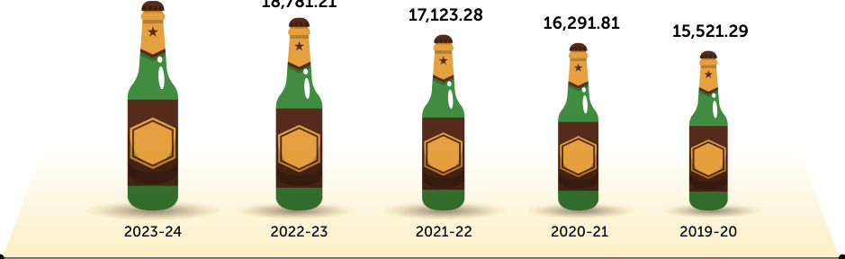
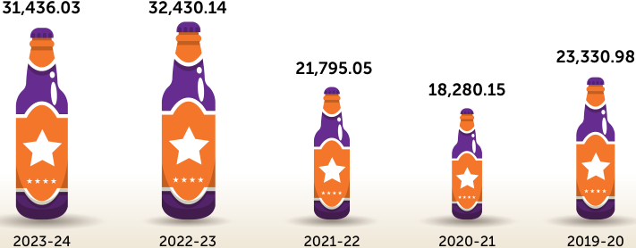
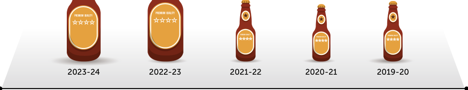
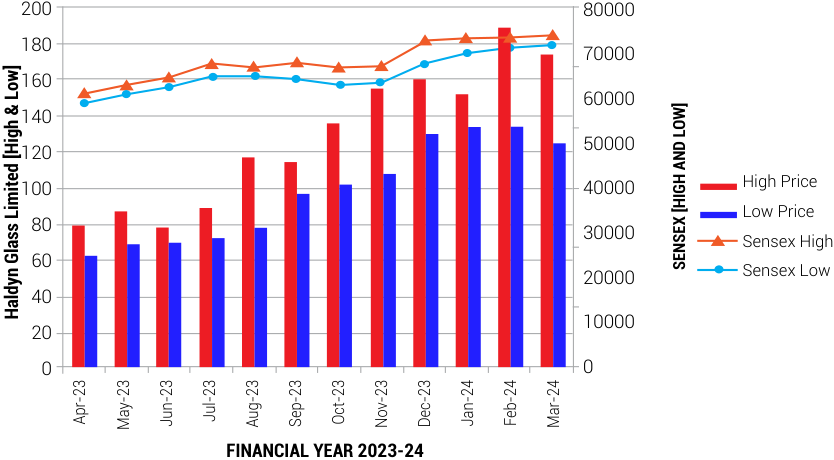

Ref: BBY/CS/001/26/24 

August 28, 2024 

###### **The BSE Limited** 

Department of Corporate Services, Phiroze Jeejeebhoy Towers, Dalal Street, Mumbai - 400 001 

###### **Sub: Annual Report of the Company for the financial year 2023-24** 

###### **Ref: 1. Regulation 34(1) of the Securities and Exchange Board of India (Listing** **<u>Obligations and Disclosure Requirements) Regulations, 2015, as amended (“SEBI Listing Regulations”)</u>** 

###### **2. Scrip Code: 515147** 

Dear Sir(s)/Madam(s), 

We hereby wish to inform you that the 33rd Annual General Meeting (“AGM”) of the members of the Company will be held on Thursday, September 19, 2024 at 11:30 a.m. at Village Gavasad, Taluka Padra, Dist. Vadodara – 391 430. 

Pursuant to Regulation 34(1) of SEBI Listing Regulations, we hereby submit the Annual Report of the Company along with the Notice of the 33rd Annual General Meeting of the Company for the Financial Year 2023-24 which has been sent through electronic mode to the Members whose email ids are registered with the Company. 

The Notice of 33rd AGM and Annual Report 2023-24 are also available on the website of the Company at www.haldynglass.com. 

This is for your information and records. 

Thanking you, 

Yours faithfully 

###### **FOR HALDYN GLASS LIMITED** 

Dhruv Digitally signed by Dhruv Jignesh Mehta Jignesh Date: 2024.08.28 Mehta 21:48:40 +05'30' 

**DHRUV MEHTA COMPANY SECRETARY & COMPLIANCE OFFICER ACS-46874** 

Encl: As above 

**CIN: L51909GJ1991PLC015522** 

ANNUAL REPORT 2023–2024 

**[Image: 2024.pdf-0002-01.png (111x70, 3.1KB)]**

## Performance at a Glance 

###### **For Standalone Results** 

#### NET WORTH 

[ ` in Lakhs] 

**[Image: 2024.pdf-0003-04.png (939x288, 46.1KB)]**

<!-- Start of picture text -->
 17,123.28  16,291.81  15,521.29 2023-24 2022-23 2021-22 2020-21 2019-20 <!-- End of picture text -->

#### TOTAL INCOME 

**[Image: 2024.pdf-0003-06.png (711x278, 42.4KB)]**

<!-- Start of picture text -->
31,436.03 32,430.14 23,330.98  21,795.05 18,280.15 2023-24 2022-23 2021-22 2020-21 2019-20 <!-- End of picture text -->

**[Image: 2024.pdf-0003-07.png (153x24, 3.8KB)]**

**[Image: 2024.pdf-0003-08.png (122x20, 2.7KB)]**

#### PROFIT AFTER TAX 

**[Image: 2024.pdf-0003-10.png (153x216, 11.2KB)]**

<!-- Start of picture text -->
PREMIUM  QUALITY <!-- End of picture text -->

**[Image: 2024.pdf-0003-11.png (939x182, 35.2KB)]**

<!-- Start of picture text -->
PREMIUM  QUALITY PREMIUM  QUALITY PREMIUM  QUALITY PREMIUM  QUALITY PREMIUM  QUALITY 2023-24 2022-23 2021-22 2020-21 2019-20 <!-- End of picture text -->

### **<u>BOARD OF DIRECTORS</u>** 

Mr. Narendra Shetty DIN: 00025868 

Executive Chairman 

Mr. Tarun Shetty DIN: 00587108 

Managing Director 

Mrs. Kishori Udeshi DIN: 01344073 

Mr. Sikandar Talwar DIN: 01630705 

Mr. Rohan Ajila DIN: 01549005 

Mr. Ajit Shah DIN: 02396765 

Mr. G. Padmanabhan DIN: 07130908 

Ms. Mona Cheriyan [w.e.f. August 13, 2024] DIN: 10479050 

###### **Auditors** 

M/s. KNAV & CO. LLP Chartered Accountants FRN: 120458W/W100679 

###### **Registered Office & Works** 

Village Gavasad, Taluka Padra, District Vadodara-391430, Gujarat Telephone : +91 2662 242339/42  |  Fax : +91 2662 245081 E-mail: baroda@haldynglass.com Website: <u>www.haldynglass.com</u> 

###### **Corporate Office** 

B-1201, Lotus Corporate Park, Off Western Express Highway, Goregaon [East], Mumbai - 400 063 Telephone : + 91 22 4287 8900  |  Fax : + 91 22 4287 8910 E-mail: cosec@haldyn.com 

###### **Bankers** 

State Bank of India HDFC Bank Limited 

###### **Registrar & Share Transfer Agents** 

**Chief Executive Officer** Mr. Niraj Tipre 

###### **Chief Financial Officer** 

Mr. Ganesh P. Chaturvedi FCA No.: 27636 

###### **Company Secretary** 

Mr. Dhruv Mehta ACS No.: 46874 

Link Intime India Private Limited Unit: Haldyn Glass Limited C-101, 247 Park, L.B.S. Marg, Vikhroli [West], Mumbai - 400083 Telephone : +91 22 4918 6000  |  Fax : +91 22 4918 6060 E-mail: rnt.helpdesk@linkintime.co.in, Website: <u>www.linkintime.co.in</u> 

###### **THIRTY THIRD ANNUAL GENERAL MEETING** 

Day : Thursday Date : September 19, 2024 Time : 11.30 a.m. Venue :  Village Gavasad, Taluka Padra, Dist. Vadodara - 391430 

###### **<u>COMMITTEES AS ON MARCH 31, 2024</u>** 

###### **Audit Committee** 

Mr. Ajit Shah Chairman Mrs. Kishori Udeshi Mr. G. Padmanabhan Mr. Tarun Shetty 

###### **Nomination and Remuneration Committee** 

Mrs.  Kishori Udeshi Chairperson Mr. G. Padmanabhan Mr. Rohan Ajila 

###### **Stakeholders Relationship Committee** 

Mr. Ajit Shah Chairman Mr. Sikandar Talwar Mr. Rohan Ajila 

###### **Corporate Social Responsibility Committee** 

Mr. Tarun Shetty Chairman Mr. Sikandar Talwar Mrs. Kishori Udeshi 

|**CO**|**NTENTS**|**PAGE**|
|---|---|---|
|»|Directors’ Report|**2**|
|»|Secretarial Audit Report|**25**|
|»|Corporate Governance Report|**29**|
|»|Independent Auditors’ Report|**51**|
|»|Balance Sheet |**62**|
|»|Statement of Proft and Loss|**63**|
|»|Statement of Changes in Equity|**64**|
|»|Cash Flow Statement|**65**|
|»|Notes on Financial Statements|**67**|
|»|Independent Auditors’ Report on|**123**|
||Consolidated Financial Statements||
|»|Consolidated Balance Sheet |**132**|
|»|Consolidated Statement of Proft and Loss|**133**|
|»|Consolidated Statement of Changes in Equity|**134**|
|»|Consolidated Cash Flow Statement|**135**|
|»|Notes to the Consolidated Financial Statements|**136**|

**[Image: 2024.pdf-0004-38.png (161x55, 3.0KB)]**

<!-- Start of picture text -->
1 <!-- End of picture text -->

33RD ANNUAL REPORT | 2023-2024 

# **DIRECTORS’ REPORT** 

###### Dear Shareholders, 

Your Directors are pleased to present the 33rd Annual Report on business and operations of Haldyn Glass Limited [“the Company”] along with the Audited Financial Statements [Standalone and Consolidated] for the financial year [“FY”] ended March 31, 2024 and the report of the Auditors thereon. 

###### **1] FINANCIAL RESULTS:** 

The financial performance of the Company for the year ended March 31, 2024 on a Standalone and Consolidated basis, is summarized below: 

|||||[`in Lakhs]|
|---|---|---|---|---|
|Particulars|Standa|lone|Consolid|ated|
||**For the** **year ended** **March 31, 2024**|For the year ended March 31, 2023|**For the** **year ended** **March 31, 2024**|For the year ended March 31, 2023|
|Total Income|31,436.03|32,430.14|31,436.03|32,429.61|
|Earnings before interest, depreciation and tax [EBIDT]|5,487.19|3,429.29|5,537.91|3,463.29|
|Interest and Finance Charges|952.53|121.28|952.53|121.28|
|Depreciation |1,878.72|754.01|1,879.80|754.30|
|Proft before Tax|2,655.94|2,554.00|2,705.58|2,587.71|
|Provision for Current Tax|–|724.57|10.19|733.40|
|Provision for Deferred Tax|669.25|[24.74]|668.67|[24.11]|
|Short / [Excess]provision of earlieryears |111.08|[115.36]|111.08|[115.36]|
|Proft after tax|1,875.61|1,969.53|2,456.72|2,691.60|
|Share of Proft/[loss] of Joint venture|–|–|541.08|697.82|
|Other comprehensive income|146.24|[24.12]|154.10|[21.98]|
|Total comprehensive income for theperiod net of Tax|2,021.85|1,945.41|2,610.82|2,669.62|
|Surplus brought forward from previous year|17,533.91|15,911.01|16,478.77|14,131.66|
|**Proft available for appropriation**|**19,555.76**|**17,856.42**|**19,089.59**|**16,801.28**|
|Dividend paid|[376.26]|[322.51]|[376.26]|[322.51]|
|**Balance carried forward to Balance Sheet**|**19,179.50**|**17,533.91**|**18,713.33**|**16,478.77**|

###### **2] OPERATIONAL PERFORMANCE / STATE OF COMPANY’S AFFAIRS:** 

###### [a] Standalone Performance: 

During the year under review, the total income of your Company stood at ₹ 31,436.03 lakhs as against ₹ 32,430.14 lakhs in the previous year, showing a decline of 3.07%. 

The Company earned a profit after tax of ₹ 1,875.61 lakhs as against ₹ 1,969.53 lakhs in the previous year, thereby registering a decline of 4.77%. 

Due to decline in the profit, the earning per share decreased from ₹ 3.66 in the previous year to ₹ 3.49 in the year under review. 

###### [b] Consolidated Performance: 

During the year under review, the total income of your Company stood at ₹ 31,436.03 lakhs as against ₹ 32,429.61 lakhs in the previous year, showing a decline of 3.06%. 

The Company earned a profit after tax of ₹ 2,456.72 lakhs as against ₹ 2,691.60 lakhs in the previous year, thereby registering a decline of 8.73%. 

**[Image: 2024.pdf-0005-15.png (161x55, 3.2KB)]**

<!-- Start of picture text -->
2 <!-- End of picture text -->

Due to decline in the profit, the earning per share decreased from ₹ 5.01 in the previous year to ₹ 4.57 in the year under review. 

###### **3] DIVIDEND:** 

The Board has recommended a dividend of 70% i.e. ₹ 0.70 per share of face value of ₹ 1/- each, for the approval of the shareholders at the ensuing Annual General Meeting [“AGM”]. The total pay-out on account of dividend, if approved, by the shareholders will be ₹ 376.26 lakhs which will be subject to deduction of tax at source as applicable and shall be payable during financial year 2024-25. 

###### **4] TRANSFER TO RESERVES:** 

Your directors do not propose to transfer any amount to reserves for the financial year under review. 

###### **5] SHARE CAPITAL:** 

###### [a] Authorized Capital: 

The Authorized share capital of the Company as on March 31, 2024 stood at ` 1,500 lakhs comprising of 15,00,00,000 Equity shares of ` 1/- each. 

###### [b] Paid-up Capital: 

The paid-up share capital of the Company as on March 31, 2024 stood at ` 537.52 lakhs comprising of 5,37,51,700 shares of ` 1/- each. 

The Company has not issued and allotted any securities during the year ended March 31, 2024. 

###### **6]** 

###### **EMPLOYEE STOCK APPRECIATION RIGHTS PLAN:** 

- [i] The Company has one ongoing Employee Stock Appreciation Rights Plan - 2021 [“ESAR Plan  2021”]. The Members approved the ESAR Plan by way of Postal Ballot on May 27, 2021 for issuance of the Employee Stock Appreciation Rights [“ESARs”] to the identified employees of the Company. 

The Nomination and Remuneration Committee of the Company, _inter-alia_ , administers and monitors ESARs, implemented by the Company in accordance with the relevant provisions of the Act and the SEBI [Share Based Employee Benefits and Sweat Equity] Regulations, 2021, [including any statutory modification[s] and / or re enactment[s] thereof for the time being in force] [“SEBI SBEB Regulations”]. 

During the year under review, there were no material changes in the ESARs of the Company. The details of the ESARs granted under the aforesaid ESAR Plan and the disclosure in compliance with SEBI SBEB Regulations for the year ended March 31, 2024 is annexed as “Annexure-I” to this report and has also been uploaded on the website of the Company at <u>www.haldyglass.com.</u> 

- [ii] In light of growing business and to align interests of shareholders with that of employees, your company has proposed a new employee stock appreciation rights [“ESARs”] plan namely “Haldyn Glass Limited - Stock Appreciation Rights Plan 2024” [“ESAR Plan 2024”] seeking to cover eligible employees of the Company and of its subsidiaries. 

Accordingly, the Nomination and Remuneration Committee of the Directors [“Committee”] and the Board of Directors of the Company at their respective meetings held on March 14, 2024, and April 04, 2024 had approved the introduction of ESAR 2024, subject to approval of members at the ensuing annual general meeting. 

###### **7] FINANCIAL STATEMENT:** 

The Audited standalone and consolidated financial statements for the year ended on March 31, 2024 have been prepared in accordance with the Indian Accounting Standards [Ind AS], provisions of the Companies Act, 2013 [hereinafter referred to as “The Act”] read with the Companies [Accounts] Rules, 2014 as amended from time to time and Regulation 33 of the Securities Exchange Board of India [Listing Obligations and Disclosure Requirements] Regulations, 2015 [hereinafter referred to as “SEBI Listing Regulations”]. The estimates and judgements relating to the Financial Statements are made on a prudent basis, so as to reflect in a true and fair manner, the form and substance of transactions and reasonably present the Company’s state of 

**[Image: 2024.pdf-0006-20.png (161x55, 3.2KB)]**

<!-- Start of picture text -->
3 <!-- End of picture text -->

33RD ANNUAL REPORT | 2023-2024 

affairs, profits and cash flows for the year ended March 31, 2024. The Notes to the Financial Statements adequately cover the standalone and consolidated Audited Statements and form an integral part of this Report. The Audited financial statements together with Auditor’s Report form part of the Annual Report. 

###### **8] DEPOSITS COVERED UNDER CHAPTER V OF THE ACT:** 

During the year under review, the Company has not invited / accepted any deposit within the meaning of Section 73 of the Act and rules made thereunder, as amended from time to time. 

###### **9] PARTICULARS OF LOANS, GUARANTEES OR INVESTMENTS:** 

Loans, guarantee and investment covered under section 186 of the Act, form part of the notes to the financial statement provided in this Annual Report. 

###### **10] MANAGEMENT DISCUSSION AND ANALYSIS:** 

###### **i] INDUSTRY STRUCTURE & DEVELOPMENTS:** 

Your Company is engaged in the business of manufacturing glass containers for packaging alcoholic & non-alcoholic beverages, food, personal care and homecare products. While the liquor industry remains the largest customer segment, your company continues to invest in infrastructure modernization, talent acquisition and skills development to enhance capabilities to diversify product offerings. Consequently, your Company has been able to make good progress in acquiring new international as well as domestic customers/brands in various markets. 

###### **ii] OPPORTUNITIES AND THREATS:** 

The World Economic Outlook report has retained the global growth projection at 3.2% for this year but has projected a faster pace of expansion in emerging markets and developing countries driven by India and China. The International Monitory Fund [IMF] has projected growth in India’s GDP at 7% during the current financial year 2024-25. Furthermore, Asian Development Bank [ADB] also has retained India’s growth forecast for financial year 2024-25 at 7%. 

India’s GDP expanded at 8.2% during financial year 2023-24 and is expected to continue to grow. Amid a boost in private consumption, especially in rural areas and against the backdrop of an expected good monsoon, the Indian economy will remain the fastest growing major economy even in financial year 2025-26. Robust growth in the manufacturing industry, strong demand for construction and stronger than expected fiscal position of the country are expected to further boost growth. The National Council of Applied Economic Research [NCAER] further highlighted that the Indian economy is expected to achieve a growth rate of higher than 7% growth in financial year 2024-25. 

###### Challenges: 

The challenge of rising inflation, household debt, high interest costs and diminishing savings could weigh on longterm growth sustainability. However, inflation is expected to moderate in the second half of the fiscal year barring any surprises from rising oil or food prices, which may exert further pressure on overall prices. The Asian Development Bank has warned that the growth forecast should be considered in light of potential risks from weather related events and geopolitical disturbances. The Economic Survey 2023-24 also highlighted concerns over increasing protectionism due to ongoing geopolitical tensions and the impacts of climate change. 

###### **iii] SEGMENT WISE OR PRODUCT WISE PERFORMANCE:** 

Your Company’s business activity falls within a single primary business segment viz. Glass bottles / containers. As such there are no separate reporting segments. 

###### **iv] OUTLOOK:** 

Prospects for growth shall remain positive due to emerging consumer spending patterns in India. The rise of the middleincome class and resultant shift in consumption patterns towards demand for premium products is expected to increase consumer spending. This will further drive overall private consumer expenditure and support higher growth. 

**[Image: 2024.pdf-0007-18.png (161x55, 3.1KB)]**

<!-- Start of picture text -->
4 <!-- End of picture text -->

Buoyed by an 8.2% GDP growth and a boom in tax receipts the fiscal deficit is expected to decrease from 5.9% of GDP last year to 4.9% this year. India is on the cusp of a significant boost to the private capital expenditure cycle. High capital expenditure spending plans by the Government over the past few years is now expected to increase private investments. 

The recent budget has proposed abolishment of angle tax, reduction in corporate tax on branches of foreign firms and reduction in import duty. Furthermore, the budget has allocated infrastructure capex of 3.4% of GDP, schemes to spur employment and provided income tax relief to cheer the middle class to boost the economy. 

Management is hopeful that the Indian economy will remain resilient and continue to be the fastest growing major economy for the current fiscal year and the next year. India will emerge as a preferred destination for multinational companies looking to relocate their operations under China+1 policies _._ 

###### Haldyn’s Highlight and Outlook: 

During the fiscal year 2023-24, we successfully completed the relining and expansion of one of our furnaces and modernised our other furnace with state-of-the-art inspection and packaging technology. With this infrastructure upgrade, Haldyn is well poised to take advantage of the opportunities in the domestic as well as international markets. 

###### **v] RISKS AND CONCERNS:** 

Global economy could encounter headwinds from further escalation of Russian war with Ukraine and the conflict in Gulf region. Moreover, continued tension between China and Taiwan- could further impede global economic recovery. Slowing growth in euro area, Russia and the US, has major consequences for global outlook. Such geopolitical and economic uncertainties are dampening business confidence. 

Competitive environment due to the current surplus capacity in the glass industry will continue to pose some challenges. The Company also faces the risk of volatility in forex, freight & fuel prices. However, we remain confident in our ability to navigate these challenges and take advantage of opportunities that lie ahead through innovation and transformation. 

We work towards our vision for sustained growth and value creation for all our stakeholders. Hence, management is of the opinion that the current challenges are temporary and the future augurs well for the Company. 

###### **vi] INTERNAL CONTROL SYSTEMS AND THEIR ADEQUACY:** 

The Company’s internal financial control systems are designed to provide assurance regarding the reliability of financial reporting and are commensurate with the nature of its business, it’s size and complexity of its operations. Internal controls at the Plant, Corporate Office and key areas of business are regularly tested and certified by Internal Auditors. Important internal audit observations and follow up actions thereon are reported to the Audit Committee which also reviews the adequacy and effectiveness of the Company’s internal control environment and monitors the implementation of audit recommendations including those relating to strengthening of the Company’s risk management policies and system. 

###### **vii] DISCUSSION ON FINANCIAL PERFORMANCE WITH RESPECT TO OPERATIONAL PERFORMANCE:** 

During the year under review, we undertook several initiatives to improve productivity as well as the quality of products which were well appreciated by our customers. One of the furnaces remained shut for 90 days to undertake relining. Inspite of the furnace closer, we could achieve 93% of previous years’ revenue and achieved a 4% growth in profit before tax. 

###### **viii] MATERIAL DEVELOPMENTS IN HUMAN RESOURCE / INDUSTRIAL RELATIONS FRONT, INCLUDING NUMBER OF EMPLOYEES EMPLOYED:** 

Your Directors would like to place on record their appreciation of the commitment and efficient services rendered by all employees of the Company. The industrial relations continued to remain cordial during the year. Employees being a key factor, the Company encourages employees for continuous learning by conducting periodical training programmes throughout the year. 

**[Image: 2024.pdf-0008-15.png (161x55, 3.2KB)]**

<!-- Start of picture text -->
5 <!-- End of picture text -->

33RD ANNUAL REPORT | 2023-2024 

###### **ix] KEY FINANCIAL RATIOS:** 

The key financial ratios are as below: 

|Sr.|Particulars||Standalone|||Consolidated||
|---|---|---|---|---|---|---|---|
|No.||Financial Year 2023-24|Financial Year 2022-23|Change [%]|Financial Year 2023-24|Financial Year 2022-23|Change [%]|
|1|Debtors Turnover|4.62|5.69|1.07%|4.62|5.69|1.07%|
|2|Inventory Turnover|9.01|12.33|3.32%|9.01|12.24|3.23%|
|3|Interest Coverage Ratio|6.80|22.06|15.26%|7.69|28.09|20.40%|
|4|Current Ratio|0.96|1.87|0.91%|0.96|1.88|0.92%|
|5|Debt Equity Ratio|0.59|0.23|-0.36%|0.60|0.24|-0.36%|
|6|Operating Proft Margin [%]|11.06|8.37|-2.69%|13.03|10.66|-2.37%|
|7|Net Proft Margin [%]|6.28|6.16|-0.12%|8.22|8.42|0.20%|
|8|Return on Net worth [%]|9.57|10.97|1.40%|13.04|16.28|3.24%|

Note: 

- Ratios for the previous year are aligned with the current year wherever required due to reclassification and in consistent with industry practice. 

- Refer Note 44 of standalone as well as consolidated financial statements for reasons relating to significant changes as compared to previous year. 

###### **11] DIRECTORS & KEY MANAGERIAL PERSONNEL:** 

###### a] Directors: 

During the year under review, the Board comprises of 7 [Seven] Directors, out of which 4 [Four] Directors are Non-Executive Independent Directors [including a Woman Director], 1 [One] Director is Non-Executive Non-Independent Director and 2 [Two] are Executive Directors including 1 [One] Chairman and 1 [One] Managing Director as follows: 

- i] Mr. Narendra Shetty [DIN: 00025868] - Executive Chairman 

- ii] Mr. Tarun Shetty [DIN: 00587108] - Managing Director 

- iii] Mr. Rohan Ajila [DIN: 01549005] - Non-Executive Non-Independent Director 

- iv] Mrs. Kishori Udeshi [DIN: 01344073] - Non-Executive Independent Director 

- v] Mr. Sikandar Talwar [DIN: 01630705] - Non-Executive Independent Director 

- vi] Mr. Ajit Shah [DIN: 02396765] - Non-Executive Independent Director 

- vii] Mr. G. Padmanabhan [DIN: 07130908] - Non-Executive Independent Director 

On recommendation of Nomination and Remuneration Committee, the Board of Directors at its meeting held on August 13, 2024, recommended to the shareholders, appointment of Ms. Mona Cheriyan [DIN: 10479050] as an Independent Director of the Company. 

###### b] Key Managerial Personnel: 

In terms of the provisions of Section 2[51] and Section 203 of the Act, the following are the Key Managerial Personnel [KMP] of the Company during the year under review: 

- i] Mr. Narendra Shetty [DIN: 00025868] - Executive Chairman 

- ii] Mr. Tarun Shetty [DIN: 00587108] - Managing Director 

- iii] Mr. Niraj Tipre - Chief Executive Officer 

- iv] Mr. Ganesh P. Chaturvedi - Chief Financial Officer 

- v] Mr. Dhruv Mehta - Company Secretary & Compliance Officer 

**[Image: 2024.pdf-0009-25.png (161x55, 3.2KB)]**

<!-- Start of picture text -->
6 <!-- End of picture text -->

###### c] Re-appointment / Resignation: 

In terms of Section 152 of the Act and the Articles of Association of the Company, Mr. Narendra Shetty [DIN: 00025868], having age 84 years, Executive Chairman of the Company, retires by rotation at the ensuing AGM and being eligible offers himself for re-appointment. 

Mr. Ajit Shah [DIN: 02396765], Independent Director has completed their tenure of five consecutive years on July 16, 2024. On recommendation of Nomination and Remuneration Committee, the Board of Directors at its meeting held on May 24, 2024, has recommended his re-appointment as an Independent Director of the Company for a second term of five consecutive years with effect from July 17, 2024 till July 16, 2029 [both days inclusive], to the members in the 33rd Annual General Meeting. 

Mr. G. Padmanabhan [DIN: 07130908], Independent Director has completed their tenure of five consecutive years on July 16, 2024. On recommendation of Nomination and Remuneration Committee, the Board of Directors at its meeting held on May 24, 2024, has recommended his re-appointment as an Independent Director of the Company for a second term of five consecutive years with effect from July 17, 2024 till July 16, 2029 [both days inclusive], to the members at the 33rd Annual General Meeting. 

On recommendation of Nomination and Remuneration Committee, the Board of Directors at its Meeting held on August 13, 2024, has recommended the appointment of Ms. Mona Cheriyan [DIN: 10479050] as an Independent Director of the Company for a term of five consecutive years with effect from August 13, 2024 till August 12, 2029 [both days inclusive], to the members at the 33rd Annual General Meeting. 

As required under the SEBI Listing Regulations, particulars of Director seeking appointment / re-appointment at the ensuing General Meeting has been given in the Notice of the 33rd Annual General Meeting. The aforesaid Director is not disqualified from being appointed as Director, as specified in Section 164 of the Act. 

The proposal regarding the appointment / re-appointment of the aforesaid Directors are placed for your approval. 

The Board of Directors recommends their appointment / re-appointment. 

###### d] Declaration by Independent Directors: 

All the Independent Directors of Company have given the declarations that they meet the criteria of Independence as prescribed pursuant to the provisions of Section 149[6] of the Act and Regulation 25[8] and 16[1][b] of SEBI Listing Regulations, as amended from time to time and are independent of the management. 

The Independent Directors have complied with the Code for Independent Directors prescribed under Schedule IV of the Act and SEBI Listing Regulations. The Board is of the opinion that the Independent Directors of the Company possess requisite qualifications, experience and expertise and they hold highest standards of integrity. 

###### e] Number of meetings of the Board: 

During the year under review, 4 [Four] Board Meetings were convened and held. The intervening gap between the Meetings was within the period prescribed under the Act and the Listing Regulations. Detailed information on the meetings of the Board is included in the Corporate Governance Report, which forms a part of this Annual Report. 

###### f] Committees of the Board: 

The Company has constituted various Committees of the Board as required under the Act and the SEBI Listing Regulations. For details like composition, number of meetings held, attendance of members, etc. of such Committees, please refer to the Corporate Governance Report which forms a part of this Annual Report. 

###### g] Familiarization program for Independent Directors: 

The Company has set Familiarization programme for Independent Directors with regard to their roles, rights, responsibilities in the Company, nature of the industry in which the Company operates, the business model of the Company etc. 

For details of the Familiarisation programme conducted, kindly refer Corporate Governance Report which forms part of this Annual Report. 

**[Image: 2024.pdf-0010-18.png (161x55, 3.1KB)]**

<!-- Start of picture text -->
7 <!-- End of picture text -->

33RD ANNUAL REPORT | 2023-2024 

###### h] Evaluation of the Board, its committees and Directors: 

In terms of the provisions of the Act and the Listing Regulations, a structured questionnaire was prepared after taking into consideration the various aspects of the Board functioning like composition of the Board and its committees, culture, execution and performance of specific duties, obligations and governance. 

The board carried out an annual performance evaluation of its own performance, individual directors as well as the working of the committees of the board. The performance evaluation of board and committees was carried out by the board after seeking all inputs from all the directors on the basis of criteria such as composition, structure, effectiveness and functioning of the Board and its respective committees. 

The performance evaluation of the individual directors was carried out by the entire board excluding the director being evaluated. 

In the separate meeting of independent directors, performance evaluation of the Chairperson and the Non-Independent Directors and board as a whole was carried out taking into account views of Executive and Non-Executive Directors. The overall performance of chairman, Executive directors, Non-Executive Directors, Board and Committees of the Board was found satisfactory. 

###### **12] CORPORATE GOVERNANCE REPORT:** 

A separate section on Corporate Governance practices followed by the Company, together with a certificate from the Practising Company Secretary confirming compliance, forms a part of this Annual Report, as per the Listing Regulations. 

###### **13] CONSERVATION OF ENERGY, TECHNOLOGY ABSORPTION, FOREIGN EXCHANGE EARNINGS AND OUTGO:** 

As required by the Companies [Accounts] Rules, 2014, the relevant information pertaining to conservation of energy, technology absorption, foreign exchange earnings and outgoings respectively, is given in the “Annexure-II” to this report. 

###### **14] CORPORATE SOCIAL RESPONSIBILITY [CSR] – INITIATIVES:** 

In terms of the provisions of Section 135 of the Act read with Companies [Corporate Social Responsibility] Rules, 2014, as amended from time to time, the Board of Directors has constituted a Corporate Social Responsibility [“CSR”] Committee under the Chairmanship of Mr. Tarun Shetty, Managing Director [DIN:00587108]. The other members of the Committee are Mr. Sikandar Talwar, Independent Director [DIN: 01630705] and Mrs. Kishori Udeshi, Independent Director [DIN: 01344073]. Your Company also has in place a CSR policy and the same is available on your Company’s website at http://www.haldynglass. <u>com/direct/csr-policy.pdf.</u> 

During the year under review, the Company was required to spend ` 36,73,207/- towards CSR initiatives. The CSR Committee has approved the activities to be undertaken for spending CSR towards promotion of healthcare. 

During the financial year 2023-24, the Company has spent the amount of ` 36,75,280/- towards CSR initiatives. The Report on CSR activities as required under the Companies [Corporate Social Responsibility] Rules, 2014, as amended from time to time, is annexed as “Annexure-III” forming part of this Report. 

###### **15] EXTRACT OF ANNUAL RETURN:** 

Pursuant to Section 92[3] read with Section 134[3][a] of the Act, the Annual Return as on March 31, 2024 is available on the Company’s website at <u>http://www.haldynglass.com/direct/AnnualReturn/MGT-7/2023-24.pdf</u> 

###### **16] MATERIAL CHANGES AND COMMITMENTS, IF ANY, AFFECTING THE FINANCIAL POSITION OF THE COMPANY WHICH HAVE OCCURRED BETWEEN THE END OF THE FINANCIAL YEAR OF THE COMPANY TO WHICH THE FINANCIAL STATEMENTS RELATE AND THE DATE OF THE REPORT:** 

There have been no reportable material changes and commitments affecting the financial position of the Company which have occurred between the end of the financial year of the Company to which the financial statements relate and the date of this report. 

###### **17] DETAILS OF SIGNIFICANT AND MATERIAL ORDERS PASSED BY THE REGULATORS/ COURTS/ TRIBUNALS IMPACTING THE GOING CONCERN STATUS AND THE COMPANY’S OPERATIONS IN FUTURE:** 

There are no significant and material orders passed by the Regulators/courts that would impact the going concern status of 

**[Image: 2024.pdf-0011-20.png (161x55, 3.3KB)]**

<!-- Start of picture text -->
8 <!-- End of picture text -->

the Company and its future operations. 

###### **18] DETAILS OF SUBSIDIARY / JOINT VENTURES / ASSOCIATE COMPANIES:** 

The Company has one wholly owned subsidiary as well as one joint venture Company as at the end of the financial year ended March 31, 2024. Details of the same are as follows: 

|**Sr.** **No.**|**Name and Address of the Company**|**CIN/GLN/EIN**|**Holding/** **Subsidiary/** **Associate**|**% of equity** **shares held**|**Applicable** **Section**|
|---|---|---|---|---|---|
|1.|Haldyn Glass USA Inc.|92-0490518|Wholly Owned Subsidiary|100%|2[87] of the Act|
|2.|Haldyn Heinz Fine Glass Private Limited[“HHFGPL”] B-1202, Lotus Corporate Park, Off Western Express Highway, Goregaon [East], Mumbai - 400 063|U26960MH2015PTC261972|Associate|56.80%*|2[6] of the Act|

- The shareholding of the Company in HHFGPL is 56.80% as on March 31, 2024. Though this has resulted in HHFGPL becoming a subsidiary of the Company based on percentage holding, however, the Company will exercise rights and control in accordance with the terms of the agreements entered with joint venture partners. As the Company’s substantive rights would remain restricted, HHFGPL will continue to be an Associate/ Joint Venture of the Company. 

Pursuant to the provisions of section 129[3] of the Act, a statement containing salient features of the financial statements of the Company’s wholly owned subsidiary as well as associate Company in Form AOC-1 is attached to the financial statements of the Company as “Annexure-IV” to this Report. 

Further, pursuant to the provisions of section 136 of the Act, the financial statements of the Company, consolidated financial statements along with relevant documents are available on the website of the Company at <u>www.haldyglass.com.</u> 

###### **PERFORMANCE HIGHLIGHTS:** 

###### **Haldyn Heinz Fine Glass Private Limited:** 

The Board of Directors is pleased to inform you that in our joint venture company [“JV”], the furnace has been rebuild during the year with expanded capacity. This will help us in our endeavour to build world class capabilities to address the potential of global markets. In spite of closure of the furnace for a part of the year, the JV has reported healthy profit – being proportionate to the level of full operations of previous year. 

###### **Haldyn Glass, USA Inc.:** 

The Company has incorporated a wholly owned subsidiary in USA to provide marketing services. 

###### **19] CONSOLIDATED FINANCIAL STATEMENT:** 

As stipulated under the provisions of the Act and the Listing Regulations, the Consolidated Financial Statements have been prepared by the Company in accordance with the applicable Accounting Standards issued by Institute of Chartered Accountants of India [ICAI]. The Audited Consolidated Financial Statement together with Auditors’ Report forms part of the Annual Report. 

###### **20] NOMINATION AND REMUNERATION POLICY:** 

In terms of the provisions of the Act and the SEBI Listing Regulations as amended from time to time, the policy on nomination and remuneration of Directors, Key Managerial Personnel, Senior Management and other Employees has been formulated by the Committee and approved by the Board of Directors. The details of the policy is available on the Company’s website at <u>http://www.haldynglass.com/direct/nomination-remunerationpolicy.pdf.</u> 

**[Image: 2024.pdf-0012-16.png (161x55, 3.2KB)]**

<!-- Start of picture text -->
9 <!-- End of picture text -->

33RD ANNUAL REPORT | 2023-2024 

###### **21] PARTICULARS OF EMPLOYEES AND RELATED DISCLOSURES:** 

Disclosures pertaining to remuneration and other details as required under Section 197[12] of the Act read with Rule 5[1], Rules 5[2] and 5[3] of the Companies [Appointment and Remuneration of Managerial Personnel] Rules, 2014 is attached herewith as “Annexure-V”. 

###### **22] VIGIL MECHANISIM / WHISTLE BLOWER POLICY:** 

The Company has a vigil mechanism / Whistle Blower Policy to deal with instance of fraud and mismanagement, if any. The objective of the Policy is to explain and encourage the directors and employees to report genuine concerns or grievances about unethical behaviour, actual or suspected fraud or violation of the company’s Code of Conduct. The Vigil Mechanism is available on the website of the Company at <u>http://www.haldynglass.com/direct/vigil-mech.pdf.</u> 

###### **23] RISK MANAGEMENT:** 

We firmly believe that efficient monitoring and management of risks are essential for the Company to achieve its strategic objectives. To accomplish this, the Company has in place a Risk Management Policy. The main objective of this policy is to ensure sustainable business growth with stability and to promote proactive approach to identifying, evaluating and resolving risks associated with its business. In order to achieve the key objective, the policy establishes structured and disciplined approach to risk management in order to guide decisions on risk related issues. 

Under the current challenging, competitive and disruptive environment, the strategy for mitigating inherent risks in accomplishing the growth plan of the Company is imperative. The common risks inter-alia are regulatory risk, competition, financial risk, technology obsolescence, human resources risk, political risks, investments, retention of talents, expansion of facilities and product price risk. 

###### **24] DIRECTORS’ RESPONSIBILITY STATEMENT:** 

Pursuant to the requirements under Section 134[3][C] of the Act, your Directors hereby state and confirm that: 

- i] In the preparation of the annual accounts, the applicable Accounting Standards have been followed and there have been no material departures. 

- ii] Appropriate accounting policies have been selected and applied consistently and judgments and estimates have been made that are reasonable and prudent to give a true and fair view of the Company’s state of affairs as on March 31, 2024 and of the Company’s profit for the year ended on that date. 

- iii] Proper and sufficient care has been taken for the maintenance of adequate accounting records in accordance with the provisions of the Act, for safeguarding the assets of the Company and for preventing and detecting fraud and other irregularities. 

- iv] The annual financial statements have been prepared on a going concern basis. 

- v] The internal financial controls were laid down to be followed and that such internal financial controls were adequate and were operating effectively. 

- vi] Proper systems were devised to ensure compliance with the provisions of all laws applicable to the Company and that such systems were adequate and operating effectively. 

###### **25] RELATED PARTY TRANSACTIONS:** 

All related party transactions that were entered into during the financial year 2023-24 were on arm’s length basis and in the ordinary course of business and in compliance with the applicable provisions of the Act, Rules made thereunder and the Listing Regulations. 

All Related Party Transactions are placed before the Audit Committee, the Board and the shareholders, if required for approval. Prior omnibus approval of the Audit Committee is obtained for transactions which are foreseen and repetitive in nature. The transactions entered into pursuant to omnibus approval so granted, are subsequently audited and a statement giving details of all related party transactions is placed before the Audit Committee and the Board of Directors for their approval on a quarterly basis. 

**[Image: 2024.pdf-0013-19.png (161x55, 3.4KB)]**

<!-- Start of picture text -->
10 <!-- End of picture text -->

The details of transactions with Related Parties are given in the notes to the Financial Statements in accordance with the Accounting Standards. 

Particulars of contracts/ arrangements with related parties entered into under section 188[1] are available in Form AOC-2 as “Annexure-VI” to this report. 

The Company has not given any loan to its Associate Company and hence disclosure under Part A of Schedule V read with regulation 34 [3] of Listing Regulations is not required. 

As required under Regulation 23[1] of the Listing Regulations, the Company has formulated a policy on dealing with Related Party Transactions. The policy on dealing with Related Party Transactions as approved by the Board is uploaded on the Company’s website at <u>http://www.haldynglass.com/direct/relatedparty.pdf.</u> 

###### **26] AUDITORS AND AUDITORS REPORTS:** 

###### a] Statutory Auditor: 

At the Company’s 31st Annual General Meeting held on September 14, 2022, M/s. KNAV & CO. LLP [Firm Registration No. 120458W / W100679], Chartered Accountants were appointed as statutory Auditors of the Company for a period of 5 [five]years, till the conclusion of 36th Annual General Meeting. 

The Auditors Report to the shareholders for the year under review does not contain any qualification, reservation, disclaimers or adverse remarks. 

###### b] Secretarial Auditor: 

Pursuant to the provisions of Section 204 of the Act and the Companies [Appointment and Remuneration of Managerial Personnel] Rules, 2014, as amended from time to time, the Company had appointed M/s. SPANJ & ASSOCIATES, Practicing Company Secretaries, to undertake the Secretarial Audit of the Company for the financial year 2023-24. The Report of the Secretarial Audit carried out is annexed herewith as “Annexure-VII”. 

The Secretarial Audit report, as issued by the auditors in Form MR-3 does not contain any observation or qualification requiring explanation or comments from the Board under Section 134[3] of the Act. 

The Board has on the recommendation of the Audit Committee appointed M/s. P. Diwan & Associates, Company Secretaries, as Secretarial Auditor, for conducting Secretarial Audit of the Company for the financial year 2024-2025. 

###### c] Cost Audit: 

Maintenance of cost records and requirements of cost audit as prescribed under the provisions of Section 148[1] of the Act are not applicable for the business activities carried out by the Company. 

###### **27] DISCLOSURE UNDER THE SEXUAL HARASSMENT OF WOMEN AT WORKPLACE [PREVENTION, PROHIBITION AND REDRESSAL] ACT, 2013:** 

The Company has zero tolerance for sexual harassment at workplace and has adopted a ‘Respect for Gender’ Policy on prevention, prohibition and redressal of sexual harassment in line with the provisions of the Sexual Harassment of Women at Workplace [Prevention, Prohibition and Redressal] Act, 2013 and the Rules framed thereunder. 

The said policy is uploaded on the website of the Company at <u>http://www.haldynglass.com/direct/sexualharassment.pdf.</u> 

Your directors state that during the year under review, there were no cases filed pursuant to the Sexual Harassment of Women at Workplace [Prevention, Prohibition and Redressal] Act, 2013. 

###### **28] REPORTING OF FRAUDS:** 

There was no instance of fraud during the year under review, which required the Statutory Auditors to report to the Audit Committee and /or Board under Section 143[12] of the Act and Rules framed thereunder. 

**[Image: 2024.pdf-0014-20.png (161x55, 3.2KB)]**

<!-- Start of picture text -->
11 <!-- End of picture text -->

33RD ANNUAL REPORT | 2023-2024 

###### **29] TRANSFER TO INVESTOR EDUCATION AND PROTECTION FUND [IEPF]:** 

During the year under review, your Company has transferred a sum of ` 5,82,231 [Rupees Five Lakh Eighty-Two Thousand Two Hundred and Thirty-One only] to Investor Education and Protection Fund, in compliance with the provisions of Section 125 of the Companies Act, 2013. The said amount represents dividend for the FY 2015-16 which remained unclaimed by the members of the Company for a period exceeding 7 years from its due date of payment. 

As per the Investor Education and Protection Fund Authority [Accounting, Audit, Transfer and Refund] Rules, 2016, as amended [‘IEPF Rules’], the Company has uploaded the information in respect of the unclaimed dividends on the website of the Company at <u>www.haldynglass.com.</u> 

Pursuant to the provisions of Section 124 of the Act read with the IEPF Rules, all the shares on which dividends remain unpaid or unclaimed for a period of seven consecutive years or more shall be transferred to the demat account of the IEPF Authority as notified by the Ministry of Corporate Affairs. Accordingly, the Company has transferred 19,316 Equity Shares of face value ` 1/- per share to the demat account of the IEPF Authority during FY 2023-24. 

The Company had sent individual notice to all the Members whose shares were due to be transferred to the IEPF Authority and had also published newspaper advertisements in this regard. The details of such shares transferred to IEPF are uploaded on the website of the Company at <u>www.haldynglass.com.</u> 

The Company has appointed a Nodal Officer under the provisions of IEPF, the details of which are available on the Company’s website at <u>www.haldynglass.com.</u> 

###### **30] THE DETAILS OF APPLICATION MADE OR ANY PROCEEDING PENDING UNDER THE INSOLVENCY AND BANKRUPTCY CODE, 2016 [31 OF 2016] DURING THE YEAR ALONGWITH THEIR STATUS AS AT THE END OF THE FINANCIAL YEAR:** 

There was no application made against the company or no proceeding pending under the Insolvency and Bankruptcy Code, 2016 [31 of 2016] during the year. 

###### **31] GREEN INITIATIVE:** 

Your Company has considered and adopted the initiative of going green minimizing the impact on the environment. To support the company’s ‘Green Initiative’, members who have not yet registered their email addresses are requested to register the same with their DPs in case the shares are held by them in electronic form and with our Registrar and Share Transfer AgentM/s. Link Intime India Private Limited [“RTA”] in case the shares are held by them in physical form. Your Company appeals other Members also to register themselves for receiving Annual Report/documents in electronic form. 

###### **32] ACKNOWLEDGEMENT:** 

The Directors would like to extend their sincere gratitude to the Company’s customers, vendors, and investors for their unwavering confidence and patronage. We are deeply appreciative of the continuous support received from financial institutions, business associates, regulatory and governmental authorities, whose cooperation, support, and guidance have been instrumental in our success. 

The Directors express their utmost appreciation for the dedicated efforts and contributions of every employee including the workmen at our manufacturing plants, who have demonstrated unwavering support and resilience during these challenging times. It is through the collective efforts of our stakeholders and employees that we continue to thrive and achieve our goals. 

For and on behalf of the Board 

**Narendra Shetty** Executive Chairman [DIN: 00025868] 

Place : Mumbai Date : August 13, 2024 

**[Image: 2024.pdf-0015-17.png (161x55, 3.3KB)]**

<!-- Start of picture text -->
12 <!-- End of picture text -->

##### Annexure-I to the Directors’ Report 

Disclosure as per Regulation 14 of SEBI [Share Based Employee Benefits and Sweat Equity] Regulations, 2021 as on March 31, 2024: 

|**Sr.** **No.**|**Particulars**|**Details**|
|---|---|---|
|1|Relevant disclosures in terms of the accounting standards prescribed by the Central Government in terms of section 133 of the Companies Act, 2013 [18 of 2013] including the ‘Guidance note on accounting for employee share-based payments’ issued in that regard from time to time.|Relevant disclosures are given in notes of Standalone as well as Consolidated Financial Statements for the year ended March 31, 2024.|
|2|Diluted EPS on issue of shares pursuant to all the schemes covered under the regulations shall be disclosed in accordance with ‘Accounting Standard - Earnings Per Share’ issued by Central Government or any other relevant accountingstandards as issued from time to time.|The Basic and Diluted EPS has been disclosed in accordance with the Ind AS 33 in note no. 34 of Standalone as well as Consolidated Financial Statements for the year ended March 31, 2024.|
|3|**Details related to ESARs:**||
|i]|a] Date of shareholders’ approval|May27, 2021 [throughpostal ballot]|
||b] Total number of shares approved under the ESAR plan Total number of shares approved under the ESARplan|Not exceeding 10,00,000 [Ten Lakh] equity shares of face value of `1/- each fully paid-upof the Company.|
||c] Vesting requirements|All the ESARs granted on any date shall vest not earlier than minimum of 1 [One] year and not later than a maximum of 5 [Five] years from the date of grant of ESARs as may be determined by the Committee.|
|||The Committee may extend, shorten or otherwise vary the vesting period from time to time subject to these minimum and maximum vesting period.|
||d] ESARs price or pricing formula|The price per ESAR shall not be less than the face value of equity shares of the Companyas on thegrant date of such ESARs.|
||e] Maximum term of ESARs granted|Maximum term of ESARs refers to aggregate of maximum vesting period i.e 5 years from date of grant and maximum exercise period i.e. 5years from date of vesting.|
||f] Source of shares [primary, secondaryor combination]|Primary|
||g] Variation in terms ofplan|Duringthe relevant fnancialyear, there was no variation|
|ii]|Method used to account for ESARs - Intrinsic or fair value.|Fair value|
|iii]|Where the company opts for expensing of the ESARs using the intrinsic value of the ESARs, the difference between the employee compensation cost so computed and the employee compensation cost that shall have been recognized if it had used the fair value of the ESARs shall be disclosed. The impact of this difference on profts and on EPS of the companyshall also be disclosed.|Not applicable as the Company has used Fair Value method of accounting.|
|iv]|**ESARs movement during theyear [For each ESARplan]:**||
||Number of options outstandingat the beginningof theperiod|11,11,000|
||Number of optionsgranted duringtheyear|-|
||Number of options forfeited duringtheyear|-|
||Number of options lapsed duringtheyear|-|
||Number of options vested duringtheyear|-|
||Number of options exercised duringtheyear|-|
||Number of shares arisingas a result of exercise of options|-|
||Money realized by exercise of options [INR], if scheme is implemented directlybythe company|-|
||Loan repaid bythe Trust duringtheyear from exerciseprice received|-|
||Number of options outstandingat the end of theyear|11,11,000|
||Number of options exercisable at the end of theyear|11,11,000|

**[Image: 2024.pdf-0016-03.png (161x55, 3.3KB)]**

<!-- Start of picture text -->
13 <!-- End of picture text -->

33RD ANNUAL REPORT | 2023-2024 

|**Sr.** **No.**|**Particulars** **Details**|
|---|---|
|v]|**Weighted-average exerciseprices and weighted average fair values of ESARs:**|
||Weighted-average exercise prices of ESARs granted during the year for ESARs whose  � Exercise price equals to market price of the stock – Not Applicable  � Exercise price exceeds market price of the stock – Not Applicable  � Exercise price is less than the market price of the stock – Not Applicable|
||Weighted-average fair values of ESARs granted during the year for ESARs whose  � Fair value equals to market price of the stock – Not Applicable  � Fair value exceeds market price of the stock – Not Applicable  � Fair value is less than the market price of the stock - Not Applicable |
|vi]|**Employee-wise details of ESARsgranted during the fnancialyear 2023-24:**Not Applicable|
|vii]|Description of the method and signifcant assumption used during the year to estimate the fair value of ESARs including the following information:|
||The weighted-average values of share price, exercise price, expected volatility, expected option life, expected dividends, the risk-free interest rate and anyother inputs to the model;|
||Please refer Note No. 45 of Standalone as well as Consolidated Financial Statements for the ear ended The method used and the assumptions made to incorporate the effects of expected earlyexercise|
||y March 31, 2024 How expected volatility was determined, including an explanation of the extent to which expected volatilitywas based on historical volatility;|
||Whether and how any other features of the ESARs grant were incorporated into the measurement of fair value, such as market condition|

For and on behalf of the Board 

Place : Mumbai Date : August 13, 2024 

**Narendra Shetty** Executive Chairman [DIN: 00025868] 

**[Image: 2024.pdf-0017-05.png (161x55, 3.3KB)]**

<!-- Start of picture text -->
14 <!-- End of picture text -->

##### Annexure-II to the Directors’ Report 

###### **CONSERVATION OF ENERGY, TECHNOLOGY ABSORPTION AND FOREIGN EXCHANGE EARNINGS AND OUTGO** 

###### **A. CONSERVATION OF ENERGY:** 

In our endeavour to promote ‘green living’, your Company initiated several measures to prevent water and air pollution at all the departments of the Plant. 

Simultaneously, your Company is also making continuous efforts to reduce wastage and optimise energy consumption by adopting innovative measures. 

Following steps are in place/planned for energy conservation: 

- At present 1.5 MW of Company’s power requirement is met through renewable power. 

- Energy audit conducted by certified agency and recommendations are being implemented. 

- All conventional lights in the plant are being replaced by LED lights. 

- Hired a consultant for GHG study to enable us to further reduce our CO2 emission. 

- Recycled water is being used in cooling tower, scrapper cullet yard, effluent treatment plant [ETP / STP], toilets and garden, which has resulted in water saving. 

- State-of-the-art German melting technology has been incorporated in one of the furnaces. 

- Electric boosting technology has been also incorporated in both furnaces. 

- Installed energy efficient blowers, lehrs. 

###### **B. TECHNOLOGY ABSORPTION, ADAPTATION AND INNOVATION:** 

Your Company focused its efforts on process improvement and product re-development, which has helped in optimising productivity. 

###### Efforts in brief, made towards technology absorption, adaptation and innovation: 

During the year, the Company upgraded many of its processes using efficient/ automatic equipment imbibing advanced technology to optimise productivity and cost. 

Followings technology upgradation has been done in various areas: 

- State-of-the-art _automatic_ inspection machines are installed on all production lines. 

- New IS machines installed for manufacturing with optimum speed & efficiency. 

- One of the furnaces was rebuilt using state-of-the-art German design. 

- Best in class, blowers and lehrs are installed. 

###### **C. FOREIGN EXCHANGE EARNINGS AND OUTGO:** 

|**Sr. No.**|**Particulars**|**Amount [**`**in lakhs]**|
|---|---|---|
|1.|Foreign Exchange Earnings|8,061.43|
|2.|Foreign Exchange Outgo|4,735.78|

For and on behalf of the Board 

###### **Narendra Shetty** 

Place: Mumbai Date: August 13, 2024 

Executive Chairman [DIN: 00025868] 

**[Image: 2024.pdf-0018-29.png (161x55, 3.3KB)]**

<!-- Start of picture text -->
15 <!-- End of picture text -->

33RD ANNUAL REPORT | 2023-2024 

##### Annexure-III to the Directors’ Report 

###### **ANNUAL REPORT ON CSR ACTIVITIES TO BE INCLUDED IN THE BOARD’S REPORT FOR FINANCIAL YEAR 2023-24** 

###### **1. Brief outline on CSR Policy of the Company:** 

Corporate Social Responsibility [“CSR”] embodies the various initiatives and programs of the Company in the communities and environment in which Company operates. It represents the continuing commitment and actions of the Company to contribute towards economic and social development and growth. 

The projects undertaken are within the broad framework of schedule VII of the Companies Act, 2013. 

Details of the CSR Policy and projects or programs undertaken by the Company are available on the website of the Company on <u>www.haldynglass.com</u> 

###### **2. Composition of CSR Committee:** 

|Sr. No.|Name of Director|Designation / Nature of Directorship|Number of meetings of CSR Committee held duringtheyear|Number of meetings of CSR Committee attended duringtheyear|
|---|---|---|---|---|
|1.|Mr. Tarun Shetty|Chairman of CSR Committee [ManagingDirector]|2|2|
|2.|Mrs. Kishori Udeshi|Member of CSR Committee [Non-Executive, Independent Director]|2|2|
|3.|Mr. Sikandar Talwar|Member of CSR Committee [Non-Executive, Independent Director]|2|2|

###### **3. Provide the web-link where Composition of CSR committee, CSR Policy and CSR projects approved by the board are disclosed on the website of the company:** 

|Sr.|Particulars|Web-link|
|---|---|---|
|No.|||
|1.|Composition of the CSR Committee|http://www.haldynglass.com/direct/csr-committeecomposition.pdf|
|2.|CSRpolicy|http://www.haldynglass.com/direct/csr-policy.pdf|
|3.|CSRprojects|http://www.haldynglass.com/direct/csr-projects-2023-24.pdf|

**4. Provide the executive summary along with web-link[s] of Impact Assessment of CSR Projects carried out in pursuance of sub-rule [3] of rule 8, if applicable:** Not applicable 

**5.** [a] Average net profit of the company as per sub-section [5] of section 135: ` 18,36,60,333/- 

   - [b] Two percent of average net profit of the company as per sub-section [5] of section 135: ` 36,73,207/- 

   - [c] Surplus arising out of the CSR projects or programmes or activities of the previous financial years: Nil 

   - [d] Amount required to be set off for the financial year, if any: Nil 

   - [e] Total CSR obligation for the financial year [[b]+[c]-[d]]: ` 36,73,207/- 

**6.** [a] Amount spent on CSR Projects [both Ongoing Project and other than Ongoing Project]: ` 36,75,280/- spent on other than ongoing projects. 

**[Image: 2024.pdf-0019-18.png (161x55, 3.4KB)]**

<!-- Start of picture text -->
16 <!-- End of picture text -->

- [b] Amount spent in Administrative Overheads: Nil 

- [c] Amount spent on Impact Assessment, if applicable: Not applicable 

- [d] Total amount spent for the Financial Year [[a]+[b]+[c]]: ` 36,75,280/- 

- [e] CSR amount spent or unspent for the Financial Year: 

||Total Amount |Amount Unspent|[in`]||||
|---|---|---|---|---|---|---|
||Spent for the Financial Year [in`] **Total Amount transferred to Unspent CSR** **Account as per sub-section [6] of section** **135**|**Amount transfer** **per second**|**red to any** **proviso to**|**fund speci** **sub-secti**|**fed under Sc** **on [5] of sect**|**hedule VII as** **ion 135**|
||**Amount** **Date of Transfer**|**Name of the Fu**|**nd**|**Amount**|**Date**|**of Transfer**|
||`36,75,280/- Nil Nil|Nil||Nil||Nil|
|]|Excess amount for set off, if any: Sr. No. Particular||A|mount [in|`]||
||[i] Two percent of average net proft of the company as per sub- section [5] of section 135|`36,73,207/-|||||
||[ii] Total amount spent for the Financial Year|`36,75,280/-|||||
||[iii] Excess amount spent for the fnancial year [[ii]-[i]]|`2,073/-|||||
||[iv] Surplus arising out of the CSR projects or programmes or activities of the previous fnancial years, if any|Nil|||||
||[v] Amount available for set off in succeeding fnancial years [[iii]-[iv]]|`2,073/-|||||
|eta Sr. No.|ils of Unspent Corporate Social Responsibility amount for th Preceding Financial Year[s] Amount transferred to Unspent CSR Account under Sub-section [6] of section 135 [in`] Balance Amount in Unspent CSR Account under sub- section [6] of section 135 [in`] A   Fi|e preceding thr mount Spent in the nancial Amount as spec VII as p se|ee fnanc transferred ifed under er sub-secti ction 135, if|ial years: to a fund Schedule on [5] of any|Amount remaining to be spent in succeeding |Defciency, if any|
|||Year [in`] Name of the fund|Amount [in`]|Date of transfer|fnancial years [in Rs.]||
|1.|FY-1||||||
|2. 3.|FY-2 FY-3|N.A.|||||

   - [f] Excess amount for set off, if any: 

7. Details of Unspent Corporate Social Responsibility amount for the preceding three financial years: 

8. Whether any capital assets have been created or acquired through Corporate Social Responsibility amount spent in the Financial Year: 

Yes No 

If Yes, enter the number of Capital assets created/ acquired: NA 

Furnish the details relating to such asset[s] so created or acquired through Corporate Social Responsibility amount spent in the Financial Year: Not Applicable 

**[Image: 2024.pdf-0020-11.png (161x55, 3.2KB)]**

<!-- Start of picture text -->
17 <!-- End of picture text -->

33RD ANNUAL REPORT | 2023-2024 

|**Sl.**|**Short**|**Pincode of**|**Date of  creation**|**Amount of CSR**|**Details of entity/ Auth**|**ority/benefciary**|**of the registered owner**|
|---|---|---|---|---|---|---|---|
|**No.**|**particulars of** **the property or** **asset[s]** **[including** **complete** **address and** **location of the** **property]**|**the** **property** **or asset[s]**||**amount spent** N.A.|**CSR Registration** **Number, if** **applicable**|**Name**|**Registered address**|

[All the fields should be captured as appearing in the revenue record, flat no, house no, Municipal Office/Municipal Corporation/ Gram panchayat are to be specified and also the area of the immovable property as well as boundaries] 

**9. Specify the reason[s], if the company has failed to spend two per cent of the average net profit as per sub-section [5] of section 135:** Not applicable 

Tarun Shetty Managing Director and Chairman of CSR Committee DIN: 00587108 

**[Image: 2024.pdf-0021-05.png (161x55, 3.4KB)]**

<!-- Start of picture text -->
18 <!-- End of picture text -->

##### Annexure-IV to the Directors’ Report 

###### **Form AOC-1** 

[Pursuant to first proviso to sub-section [3] of section 129 read with rule 5 of Companies [Accounts] Rules, 2014] 

###### Statement containing salient features of the financial statement of subsidiaries/ associate companies/joint ventures 

###### Part “A”: Subsidiaries 

###### [information in respect of each subsidiary to be presented with amounts in ` lakhs] 

|S. No.|Particulars|Details|
|---|---|---|
|1.|Name of the subsidiary|Haldyn Glass USA Inc.|
|2.|The date since when subsidiary acquired|December 19,  2022|
|3.|Reporting period for the subsidiary concerned, if different from the holding Company’s reporting period|March 31, 2024|
|4.|Reporting currency and Exchange rate as on the last date of the relevant fnancial year in the case of foreign subsidiaries|INR [`83.3739/$]|
|5.|Share Capital|0.83|
|6.|Reserves and surplus|66.12|
|7.|Total assets|268.51|
|8.|Total Liabilities|201.55|
|9.|Investments|Nil|
|10.|Turnover|892.81|
|11.|Proft / [loss] before taxation|50.85|
|12.|Provision for taxation|9.61|
|13.|Proft / [loss] after taxation|41.24|
|14.|Proposed Dividend|Nil|
|15.|Extent of shareholding [in percentage]|100%|

|1.|Names of subsidiaries which are yet to commence operations.|- N.A.|
|---|---|---|
|2.|Names of subsidiaries which have been liquidated or sold during the year.|- N.A.|

For and on behalf of the Board 

Place : Mumbai Date : August 13, 2024 

**Narendra Shetty** Executive Chairman [DIN: 00025868] 

**[Image: 2024.pdf-0022-11.png (161x55, 3.3KB)]**

<!-- Start of picture text -->
19 <!-- End of picture text -->

33RD ANNUAL REPORT | 2023-2024 

###### **Part “B”: Associates and Joint Ventures** 

**Statement pursuant to section 129 [3] of the Act related to Associate Companies and Joint Ventures** 

|**Sr. No.**|**Particulars**|**Details**|
|---|---|---|
|1|Name of associates/Joint Ventures|Haldyn Heinz Fine Glass Private Limited|
|2|Latest audited Balance Sheet Date|March 31, 2024|
|3|Date on which the Associate or Joint Venture was associated or acquired|June 24, 2015|
|4|Shares of Associate/Joint Ventures held by the company on the year end:||
||[a] Number of shares|1,04,37,500 Equity Shares of`10 each|
||[b] Amount of Investment in Associates/Joint Venture|`4,175 lakhs|
||[C] Extent of Holding [in percentage]|56.80%|
|5|Description of how there is signifcant influence|Both Joint Venture Partners have equal management rights as per terms and conditions of JV Agreement|
|6|Reason why the associate/joint venture is not consolidated|N.A.|
|7|Net worth attributable to shareholding as per latest audited Balance Sheet [Total Net worth of JV –`5,958.61]|`3,384.49 Lakhs|
|8|Proft / [Loss] for the year :||
||[a] Considered in Consolidation|`541.08 Lakhs|
||[b] Not Considered in Consolidation|Nil|
|1. Na|mes of associates or joint ventures which are yet to commence oper|ations – Nil|

2. Names of associates or joint ventures which have been liquidated or sold during the year – Nil 

For and on behalf of the Board 

###### **Narendra Shetty** 

Place : Mumbai Date : August 13, 2024 

Executive Chairman [DIN: 00025868] 

**[Image: 2024.pdf-0023-09.png (161x55, 3.5KB)]**

<!-- Start of picture text -->
20 <!-- End of picture text -->

##### Annexure-V to the Directors’ Report 

###### **I. DETAILS PERTAINING TO REMUNERATION AS REQUIRED UNDER SECTION 197(12) OF THE ACT READ WITH RULE 5(1) OF THE COMPANIES (APPOINTMENT AND REMUNERATION OF MANAGERIAL PERSONNEL) RULES, 2014** 

- a) The percentage increase in remuneration of each Director, Chief Financial Officer, Chief Executive Officer and Company Secretary during the financial year (“FY”) 2023-24, ratio of the remuneration of each Director to the median remuneration of the employees of the Company for the financial year 2023-24: 

|**Sr.** **No.**|**Name of Director / KMP**|**Designation**|**% increase in** **remuneration in FY** **2023-24**|**Ratio of remuneration of** **each Director / to median** **remuneration of employees**|
|---|---|---|---|---|
|1.|Mr. Narendra Shetty|Executive Chairman|–|52.62|
|2.|Mr. Tarun Shetty|Managing Director|*29.47%|72.39|
|3.|Mr. Niraj Tipre**|Chief Executive Offcer|**57.14%|–|
|4.|Mr. Ganesh Prasad Chaturvedi|Chief Financial Offcer|15.56%|–|
|5.|Mr. Dhruv Mehta|Company Secretary & Compliance Offcer|8.36%|–|

   - As approved by the shareholders at 32nd Annual General Meeting of the Company. 

   - **  Percentage increase in remuneration of Mr. Niraj Tipre is not comparable as it includes provision for financial year 2023-24 which has been subsequently paid. 

- b) The median remuneration of employees of the Company during the financial year was 3,68,250/-. 

- c) In the financial year, there was an increase of 10% in the median remuneration of employees; 

- d) There were 421 permanent employees including directors on the rolls of Company as on March 31, 2024. 

- e) Average percentile increases already made in the salaries of employees other than the managerial personnel in the last financial year was 10% whereas the percentile increase in the managerial remuneration for the same financial year was 16.95%. 

- f) It is hereby affirmed that the remuneration paid is as per the as per the Remuneration Policy for Directors, Key Managerial Personnel and other Employees. 

###### Notes: 

- a] Remuneration of the Executive Chairman and the Managing Director includes Salary, House Rent Allowance/Rent free furnished accommodation, Commission, Reimbursement of Medical Expenses, Leave Travel Assistance and other perquisites evaluated as per the Income-tax Rules, 1962, excluding Company’s Contribution to Provident Fund. 

- b] Appointment of the Executive Chairman and the Managing Director are on contractual basis. Other terms and conditions are as per the agreement / terms of appointment between the incumbents and the Company. 

- c] Mr. Narendra Shetty and Mr. Tarun Shetty are related to each other and to Mr. Rohan Ajila, Non-Executive Director. 

**[Image: 2024.pdf-0024-15.png (161x55, 3.3KB)]**

<!-- Start of picture text -->
21 <!-- End of picture text -->

33RD ANNUAL REPORT | 2023-2024 

|   **Whether any such** **employee is a relative of** **any director or manager** **of the company and if so,** **name of such director or** **manager**|No|Yes Related to Mr. Narendra Shetty, Executive Chairman and to Mr. Rohan Ajila, Non- Executive Non-Independent Director|Yes Related to Mr. Tarun Shetty, Managing Director and to Mr. Rohan Ajila, Non- Executive Non-Independent Director|No|No|No|No|No|No|No||
|---|---|---|---|---|---|---|---|---|---|---|---|
|**Percentage of** **equity shares** **held by the** **employee in** **the company**|–|1092960 [2.03%]|–|—|36014 [0.07%]|—|—|1195 [Negligible]|–|815 [Negligible]||
|**Last employment** **held by such** **employee before** **joining the** **company**|Piramal Glass|–|–|Asahi Glass [I] Ltd.|SAH Petroleum Limited|Frigo Glass Ltd. - Nigeria|AGI Glaspac|Canpack India Pvt. Ltd.|Frigo Glass Ltd. - Nigeria|Ineos Styrolution India Ltd.||
|**Age of** **such** **employee**|58|50|84|55|66|51|59|55|35|46|paid.|
|**Date of** **commencement** **of employment**|n April 07, 2021|August 01, 2009|April 25, 1991|August 04, 2014|November 13, 2013|July 01, 2021|March 17, 2023|July 27, 2020|November 10, 2021|September 5, 2023|s been subsequently|
| **Qualifcations and** **experience of the** **employee**|Master in Diploma i Business Administration 33 Years|B.Com, MBA 25 Years|Intermediate 60 Years|B.E, MBA 33 Years|M.Com, FCA 36 Years|B.Tech Mechanical 27 Years|B.E. [Automobiles]|B.Com, CA, ICWA – Inter 27 Years|Diploma in Electronics 13 Years|PGDBM [HR & MIS]|cial year 2023-24 which ha|
| **Nature of** **Employment** **whether** **Contractual or** **otherwise** **E= Employee** **C= Contract**|E|C|C|E|E|E|E|E|E|E|ovision for fnan|
|**Remuneration** **Received** **during the** **year**|357.42*|266.56|193.79|74.57|65.38|59.89|58.86|53.24|44.02|29.07|includes es pr|
|**Name/ Designation** |**Mr. Niraj Ramesh Tipre** Chief Executive Offcer|**Mr. Tarun Shetty** Managing Director|**Mr. Narendra Shetty** Executive Chairman|**Mr. Narendra A. Shetty** Vice President – Supply Chain Commercial|**Mr. Ganesh Prasad Chaturvedi** Chief Financial Offcer|**Mr. Dharmendra Kumar Dhaka** Vice President – Plant Head|**Mr. Shrinivas Guddad** Senior Vice President – Sales and Marketing|**Mr. Kosuru Govinda Rao** Senior General Manager – Accounts and Finance|**Mr. Manraj Meena** Senior General Manager – Engineering Head|**Mr. Raghavendra Yeluri** Head HR|*  Remuneration of Mr. Niraj Tipre|

**[Image: 2024.pdf-0025-04.png (161x55, 3.2KB)]**

<!-- Start of picture text -->
22 <!-- End of picture text -->

##### Annexure-VI to the Directors’ Report 

###### **Form No. AOC-2** 

[Pursuant to clause [h] of sub-section [3] of section 134 of the Act and Rule 8[2] of the Companies [Accounts] Rules, 2014005D 

**Form for disclosure of particulars of contracts/arrangements entered into by the company with related parties referred to in subsection [1] of section 188 of the Act including certain arm’s length transactions under third proviso thereto** 

###### **1. Details of contracts or arrangements or transactions not at arm’s length basis** 

|**S.** **No.**|**Particulars**|**Details**|
|---|---|---|
|[a]|Name[s] of the relatedpartyand nature of relationship||
|[b]|Nature of contracts/arrangements/transactions||
|[c]|Duration of the contracts / arrangements/transactions||
|[d]|Salient terms of the contracts or arrangements or transactions including the value, if any|Not Alicable|
|[e]|Justifcation for enteringinto such contracts or arrangements or transactions|pp|
|[f]|date[s] of approval bythe Board||
|[g]|Amountpaid as advances, if any:||
|[h]|Date on which the special resolution was passed in general meeting as required under frstproviso to section 188||

**2. Details of material contracts or arrangement or transactions at arm’s length basis** 

|**S.** **No.**|**Particulars**|**Details**|
|---|---|---|
|[a]|Name[s] of the related party and nature of relationship|As per annexure|
|[b]|Nature of contracts/arrangements/transactions|As per annexure|
|[c]|Duration of the contracts / arrangements/transactions|On going|
|[d]|Salient terms of the contracts or arrangements or transactions including the value, if any:|As per annexure|
|[e]|Date[s] of approval by the Board, if any|All related party transactions are covered by the omnibus approvalgiven bythe Board on February05, 2023|

For and on behalf of the Board 

Place : Mumbai Date : August 13, 2024 

**Narendra Shetty** Executive Chairman [DIN: 00025868] 

**[Image: 2024.pdf-0026-11.png (161x55, 3.4KB)]**

<!-- Start of picture text -->
23 <!-- End of picture text -->

33RD ANNUAL REPORT | 2023-2024 

###### **Annexure to details of material contracts or arrangement or transactions at arm’s length basis:** 

[ ` in Lakhs] 

|**Sr.** **No.**|**Transactions**|**Salient terms of** **the contracts or** **arrangements or** **transactions**|**Haldyn Corporation** **Limited**|**Mr. Tarun** **Shetty**|**Mrs. Sadhana** **Chaturvedi**|**Haldyn Heinz** **Fine Glass Pvt.** **Ltd.**|
|---|---|---|---|---|---|---|
||||**Enterprise owned or** **signifcant influenced** **by key managerial** **personnel** **and their relatives**|**Managing** **Director**|**Relative of** **Chief** **Financial** **Offcer**|**J. V.**|
|1.|Purchases|Terms as mentioned onpurchase order|1,974.97|–|–|4.64|
|2.|Royalty Expense|As per terms and conditions of royalty agreement|283.82|–|–|–|
|3.|Motor Car Hire Charges|As per terms and conditions of lease agreement|–|–|3.60|–|
|4.|Rent/License Fee|As per terms and conditions of leave and license  agreement|79.20|48.00|–|–|
|5.|Reimbursement of Expenses [paid / [received]]|Terms and conditions as mutually agreed arrangements|9.42|–|–|[4.69]|
|6.|Sales of goods|Terms as mentioned on sales order|7.23|–|–|1.57|
|7.|Rendering of Professional Services|Terms and conditions as mutually agreed arrangements|–|–|–|87.76|

**[Image: 2024.pdf-0027-04.png (161x55, 3.4KB)]**

<!-- Start of picture text -->
24 <!-- End of picture text -->

Annexure-VII to the Directors’ Report 

###### **Form No. MR-3** 

###### **SECRETARIAL AUDIT REPORT** 

###### **FOR THE FINANCIAL YEAR ENDED ON MARCH 31, 2024** 

[Pursuant to section 204[1] of the Companies Act, 2013 and rule No.9 of The Companies [Appointment and Remuneration of Managerial Personnel] Rules, 2014] 

To, 

The Members 

###### **HALDYN GLASS LIMITED** 

Regd. Off: Village: Gavasad Dist: Padra, Vadodara – 391430 [Gujarat] 

We have conducted the secretarial audit of the compliance of applicable statutory provisions and the adherence to good corporate practices by **HALDYN GLASS LIMITED** [hereinafter called “the Company”]. Secretarial Audit was conducted in a manner that provided us a reasonable basis for evaluating the corporate conducts/statutory compliances and expressing our opinion thereon. 

Based on our verification of the books, papers, minute books, forms and returns filed and other records maintained by the Company and also the information, management representations provided by the Company, its officers, agents and authorized representatives and based on the draft independent auditors report during the conduct of the Secretarial Audit, the explanations and clarifications given to us and the representations made by the Management, we hereby report that in our opinion, the Company has, during the audit period covering the financial year ended on March 31, 2024, complied with the statutory provisions listed hereunder and also that the Company has proper board-processes and compliance mechanism in place to the extent, in the manner and subject to the reporting made hereinafter: 

We have examined the books, papers, minute books, forms and returns filed and other records maintained by the Company as per <u>Annexure-A for the Financial Year ended on 31</u>st March, 2024 according to the provisions of: 

- [i] The Companies Act, 2013 [the Act] and the rules made thereunder; 

- [ii] The Securities Contracts [Regulation] Act, 1956 [‘SCRA’] and the rules made thereunder; 

- [iii] The Depositories Act, 1996 and the Regulations and Bye-laws framed thereunder; 

- [iv] Foreign Exchange Management Act, 1999 and the rules and regulations made thereunder to the extent of Foreign Direct Investment, Overseas Direct Investment and External Commercial Borrowings; 

- [v] The following Regulations and Guidelines prescribed under the Securities and Exchange Board of India Act, 1992 [‘SEBI Act’]:- 

   - [a] The Securities and Exchange Board of India [Substantial Acquisition of Shares and Takeovers] Regulations, 2011; 

   - [b] The Securities and Exchange Board of India [Prohibition of Insider Trading] Regulations, 2015; 

   - [c] The Securities and Exchange Board of India [Issue of Capital and Disclosure Requirements] Regulations, 2018 and amendments from time to time; [Not Applicable during the audit period] 

   - [d] The Securities and Exchange Board of India [Share Based Employee Benefits] Regulations, 2014; 

   - [e] Securities and Exchange Board of India [Share Based Employee Benefits and Sweat Equity] Regulations, 2021; [not applicable to the company during the review period] 

   - [f] The Securities and Exchange Board of India [Issue and Listing of Debt Securities] Regulations, 2008; [Not Applicable during the audit period] 

   - [g] The Securities and Exchange Board of India [Registrars to an Issue and Share Transfer Agents] Regulations, 1993 regarding the Companies Act and dealing with client; 

**[Image: 2024.pdf-0028-24.png (161x55, 3.4KB)]**

<!-- Start of picture text -->
25 <!-- End of picture text -->

33RD ANNUAL REPORT | 2023-2024 

- [h] The Securities and Exchange Board of India [Delisting of Equity Shares] Regulations, 2009; and **[Not Applicable during the audit period]** 

- [i] The Securities and Exchange Board of India [Buyback of Securities Regulations, 2018; **[Not Applicable during the audit period]** 

- [j] The Securities and Exchange Board of India [Listing Obligations and Disclosure Requirements] Regulations, 2015; [SEBI LODR] and 

- [k] The Securities and Exchange Board of India [Depositories and Participants] Regulations, 2018; 

We have also examined compliance with the applicable clauses & Regulations of the following: 

   - I. Secretarial Standards issued by The Institute of Company Secretaries of India. 

   - II. The Listing Agreements entered into by the Company with stock exchanges; 

- [vi] We further report that we have been given to understand that there are no sector specific laws applicable to the company considering the nature of business activities carried on by the company however having regard to the compliance management system prevailing in the Company relating to product laws, manufacturing laws and safety laws, upon examination of the relevant documents and records on test-check basis, we report that the Company has adequate compliance management system. 

We further report that, based on the information provided and the representation made by the Company and also on the review of the compliance reports of Company Secretary / Chief Financial Officer taken on record by the Board of Directors of the Company that 

We further report that the compliance by the Company of applicable financial laws like direct and indirect tax laws and maintenance of financial records and books of accounts has not been reviewed in this Audit since the same have been subject to review by statutory financial audit and other designated professionals. 

We further report that Board of Directors of the Company is duly constituted with proper balance of the Executive Directors and the Non-executive Directors [Independent and Non-independent] and Women Director in terms of Companies Act, 2013 and Regulation 17 of SEBI [LODR], 2015. 

Adequate notice is given to all directors to schedule the Board Meetings [including meetings of the committees], agenda and detailed notes on agenda were sent in advance, and a system exists for seeking and obtaining further information and clarifications on the agenda items before the meeting and for meaningful participation at the meeting. 

All decisions at Board Meetings and Committee Meetings are carried out either unanimously or by majority as recorded in the minutes of the meetings of the Board of Directors or Committee of the Board, as the case may be. 

We further report that there are adequate systems and processes in the Company commensurate with the size and operations of the Company to monitor and ensure compliance with applicable sector specific laws, rules, regulations and guidelines. 

We further report that during the audit period of the Company there were no specific events / actions having a major bearing on the Company’s affairs in pursuance of the above referred laws, rules, regulations, guidelines, standards, etc. 

|||Sd/-|
|---|---|---|
||Name of practicing CS :|Jigarkumar Gandhi, Partner SPANJ & ASSOCIATES|
|||Company Secretaries|
||ACS/FCS No. :|F7569|
|Place: Mumbai|C P No. :|8108|
|Date: May 24, 2024|UDIN :|F007569F000441607|
||Peer Review No:|702/2020|

Note : This report is to be read with our letter of even date which is annexed as **<u>Annexure B</u>** and forms  an integral part of this report. 

**[Image: 2024.pdf-0029-18.png (161x55, 3.5KB)]**

<!-- Start of picture text -->
26 <!-- End of picture text -->

###### **ANNEXURE - A** 

###### List of documents verified. 

1. Memorandum & Articles of Association of the Company. 

2. Minutes of the meetings of the Board of Directors and various committees comprising of Audit Committee, Nomination & Remuneration Committee etc. held during the period under report. 

3. Minutes of General Body Meetings held during the period under report. 

4. Statutory Registers/Records under the Companies Act and rules made there under 

5. Agenda papers submitted to all the directors / members for the Board Meetings and Committee Meetings. 

6. Declarations received from the Directors of the Company pursuant to the provisions of 184 of the Companies Act, 2013. 

7. E-Forms filed by the Company, from time-to-time, under applicable provisions of the Companies Act, 1956 and Companies Act, 2013 and attachments thereof during the period under report. 

8. Intimations received from directors under the prohibition of Insider Trading and SEBI Takeover Code 

9. Various policies framed by the company from time to time as required under the statutes applicable to the company. 

10. Processes and procedure followed for Compliance Management System for applicable laws to the Company 

11. Documents related to payments of dividends made to its shareholders during the period under report. 

12. Communications / Letters issued to and acknowledgements received from the Independent directors for their appointment 

13. Various policies framed by the company from time to time as required under the Companies Act as well as SEBI LODR Regulations. 

**[Image: 2024.pdf-0030-15.png (161x55, 3.3KB)]**

<!-- Start of picture text -->
27 <!-- End of picture text -->

33RD ANNUAL REPORT | 2023-2024 

###### **ANNEXURE - B** 

To, 

The Members 

###### **HALDYN GLASS LIMITED** 

Regd. Off: Village: Gavasad Dist: Padra, Vadodara – 391430 [Gujarat] 

Sir, 

###### Sub: Secretarial Audit Report for the Financial Year ended on 31st March, 2024. 

Our report of even date is to be read along with this letter. 

1. Maintenance of secretarial record is the responsibility of the management of the company. Our responsibility is to express an opinion on these secretarial records based on our audit. 

2. We have followed the audit practices and processes as were appropriate to obtain reasonable assurance about the correctness of the contents of the Secretarial records. The verification was done on test basis to ensure that correct facts are reflected in secretarial records. We believe that the processes and practices, we followed provide a reasonable basis for our opinion. 

3. We have not verified the correctness and appropriateness of financial records and Books of Accounts of the company. 

4. Wherever required, we have obtained the Management representation about the compliance of laws, rules and regulations and happening of events etc. 

5. The compliance of the provisions of Corporate and other applicable laws, rules, regulations, standards is the responsibility of management. Our examination was limited to the verification of procedures on test basis. 

6. The Secretarial Audit report is neither an assurance as to the future viability of the company nor of the efficacy or effectiveness with which the management has conducted the affairs of the company. 

||Name of practicing CS :|Sd/- Jigarkumar Gandhi, Partner SPANJ & ASSOCIATES|
|---|---|---|
|||Company Secretaries|
||ACS/FCS No. :|F7569|
|Place: Mumbai|C P No. :|8108|
|Date: May 24, 2024|UDIN :|F007569F000441607|
||Peer Review No:|702/2020|

**[Image: 2024.pdf-0031-16.png (161x55, 3.5KB)]**

<!-- Start of picture text -->
28 <!-- End of picture text -->

### **Corporate Governance Report** 

The Board of Directors present the Company’s report on Corporate Governance for the Financial Year [“FY”] 2023-24 as hereunder, pursuant to the requirements of Regulation 34[3] read with Schedule V[C] of SEBI [Listing Obligations and Disclosure Requirements] Regulations, 2015 [hereinafter referred to as “Listing Regulations”] and other provisions as may be applicable. 

###### 1] COMPANY’S PHILOSOPHY ON CORPORATE GOVERNANCE: 

Our corporate governance philosophy drives our business strategies, ensuring fiscal accountability, ethical behaviour and fairness to all stakeholders. The Corporate Governance is ongoing process and your Company has always focused on good corporate governance, which is a key driver of sustainable growth, value creation, and trust. The management and employees of the Company are committed to uphold the core values of transparency, integrity, honesty and accountability. 

Your Company confirms the compliance of various provisions relating to Corporate Governance stipulated in Listing Regulations, the details of which are given below: 

###### 2] BOARD OF DIRECTORS: 

###### a] Appointment and Tenure: 

The Directors of the Company are appointed by the Shareholders at General Meetings. At every Annual General Meeting, 1/3rd of Directors as are liable to retire by rotation, if eligible, generally offer themselves for re-election, in accordance with the provisions of Companies Act, 2013 [“the Act”]. Independent Directors are not liable to retire by rotation. The Executive Directors on the Board serve in accordance with the terms of their contracts of service with the Company. 

###### b] Composition of Board of Directors and attendance record of each Director: 

The Company has an optimum mix of Executive and Non-Executive Independent Directors including woman director. All the members of the Board are competent and are persons of repute with strength of character, professional eminence, having the expertise in their respective disciplines to deal with the management functions of the company. 

As on March 31, 2024, the Company’s Board consists of 7 [Seven] Directors out of which 4 [Four] Directors are NonExecutive Independent Directors [including a Woman Director], 1 [One] Director is Non-Executive Non-Independent Director and 2 [Two] are Executive Directors including 1 [One] Chairman and 1 [One] Managing Director. 

The composition of the Board of Directors of the Company is in conformity with Regulation 17 of SEBI Listing Regulations. 

The details of composition of the Board, the attendance record of the Directors at the Board Meetings held during the financial year ended March 31, 2024 and at the last Annual General Meeting [“AGM”] and the details of their other Directorships and Committee Chairmanships and Memberships are given below: 

|Name of Directors|Category|Position / Designation|Attendance a FY|t meetings during 2023-24|Other Directorships in Indian Public Companies as on|Committee Cha Membership[s] i as on Marc|irmanship[s] / n all Companies h 31, 2024|
|---|---|---|---|---|---|---|---|
||||Board Meetings|32ndAnnual General Meeting|March 31, 2024|Chairperson|Member|
|Mr. Narendra Shetty [Din: 00025868]|Executive Director [Promoter Group]|Chairman|4|Yes|1|–|–|
|Mr. Tarun Shetty [Din: 00587108]|Executive Director [Promoter group]|Managing Director|4|Yes|–|–|–|
|Mr. Rohan Ajila [Din: 01549005]|Non-Executive, Non- Independent Director [Promoter group]|Director|4|Yes|1|–|–|
|Mrs. Kishori Udeshi [Din: 01344073]|Non-Executive, Independent Director|Director|4|No|6|2|3|

**[Image: 2024.pdf-0032-14.png (161x55, 3.4KB)]**

<!-- Start of picture text -->
29 <!-- End of picture text -->

33RD ANNUAL REPORT | 2023-2024 

|Name of Directors|Category|Position / Designation|Attendance a FY|t meetings during 2023-24|Other Directorships in Indian Public Companies as on|Committee Cha Membership[s] in as on Marc|irmanship[s] / all Companies h 31, 2024|
|---|---|---|---|---|---|---|---|
||||Board Meetings|32ndAnnual General Meeting|March 31, 2024|Chairperson|Member|
|Mr. Sikandar Talwar [Din: 01630705]|Non-Executive, Independent Director|Director|4|No|–|–|–|
|Mr. Ajit Shah [Din: 02396765]|Non-Executive, Independent Director|Director|4|Yes|1|2|–|
|Mr. G. Padmanabhan [Din: 07130908]|Non-Executive, Independent Director|Director|4|No|2|–|–|
|Ms.  Mona Cheriyan* [Din: 10479095]|Non-Executive, Independent Director|Director|–|–|–|–|–|

*  On recommendation of Nomination and Remuneration Committee, the Board of Directors at its meeting held on August 13, 2024, recommended to the shareholders, appointment of Ms. Mona Cheriyan [DIN: 10479050] as an Independent Director of the Company. 

###### Notes: 

- Directorships held by Directors as mentioned above, excludes directorship in Haldyn Glass Limited and also excludes directorship in Private Limited Companies, Overseas Companies and Section 8 Companies. 

- In terms of Regulation 26[1][b] of Listing Regulations, Chairmanship / membership of the Audit Committee and Stakeholder Relationship Committee in other Indian Public Companies [listed and unlisted] excluding Haldyn Glass Limited are considered. 

- Mr. Narendra Shetty, Executive Chairman is a father of Mr. Tarun Shetty, Managing Director and father-in-law of Mr. Rohan Ajila, Non-Executive Non-Independent Director. Mr. Tarun Shetty, Managing Director is a son of Mr. Narendra Shetty, Executive Chairman and brother-in-law of Mr. Rohan Ajila, Non-Executive Non-Independent Director. Mr. Rohan Ajila, is a son-in-law of Mr. Narendra Shetty, Executive Chairman and brother-in-law of Mr. Tarun Shetty, Managing Director of the Company. None of the other directors are related to each other. 

- The number of Directorship[s], committee membership[s]/chairmanship[s] of all Directors is/are within the respective limits prescribed under the Act and Listing Regulations. 

###### c] Details of Directorships in other listed Companies as on March 31, 2024: 

|Sr. No.|Name of Directors|Name of the Listed Companies|Category of Directorship|
|---|---|---|---|
|1.|Mr. Narendra Shetty|Nil|–|
|2.|Mr. Tarun Shetty|Nil|–|
|3.|Mr. Rohan Ajila|Nil|–|
|4.|Mrs. Kishori Udeshi|Thomas Cook [India] Limited|Non-Executive Independent Director|
|||Ion Exchange [India] Limited|Non-Executive Independent Director|
|||CarTrade Tech Limited|Non-Executive Independent Director|
|||Kalyan Jewellers India Limited|Non-Executive Independent Director|
|5.|Mr. Sikandar Talwar|Nil|–|
|6.|Mr. Ajit Shah|Sunshield Chemicals Limited|Non-Executive Independent Director|
|7.|Mr. G. Padmanabhan|Axis Bank Limited|Non-Executive Independent Director|

**[Image: 2024.pdf-0033-10.png (161x55, 3.5KB)]**

<!-- Start of picture text -->
30 <!-- End of picture text -->

###### d] Details of Skills/expertise/competence of the Board of Directors: 

The Board of Directors of your Company comprises of qualified members who have the skills, expertise and competencies to make effective contribution to the growth of the Company as well as on matters discussed in the Board and the Committee meetings and ensuring that the Company is in compliance with the requisite standards of Corporate Governance. 

The following table summarises the list of core skills, expertise and competencies of the Board members individually: 

|Sr.|Name of the Director[s]|Skills / Expertise / Competencies|
|---|---|---|
|No.|||
|1.|Mr. Narendra Shetty|Leadership, HR skills and hands on experience of technology in production, marketing & management of the business of glass bottles manufacturing.|
|2.|Mr. Tarun Shetty|Leadership, Business and HR Management skills. Hands on experience of glass bottles manufacturing.|
|3.|Mr. Rohan Ajila|Financial, Business Strategy & Management skills.|
|4.|Mr. Sikandar Talwar|Finance, Tax Accounting & Audit skills|
|5.|Mrs. K. J. Udeshi|Leadership skills and experience in fnancial & regulatory matters.|
|6.|Mr. Ajit Shah|Professional Experience and skills in Accounting & Audit.|
|7.|Mr. G. Padmanabhan|Leadership skills and experience in fnancial regulatory matters audits and Information Technology.|
|8.|Ms. Mona  Cheriyan*|Leadership skills and experience in Human Resource Management.|

*  On recommendation of Nomination and Remuneration Committee, the Board of Directors at its meeting held on August 13, 2024, recommended to the shareholders, appointment of Ms. Mona Cheriyan [DIN: 10479050] as an Independent Director of the Company. 

###### e] Board Meetings: 

During financial year 2023-24, Four [4] Board Meetings were held on [1] May 25, 2023 [2] August 03, 2023 [3] November 10, 2023 and [4] February 05, 2024. The Board met at least once in every Calendar Quarter and the gap between two Meetings did not exceed one hundred and twenty days. 

###### f] Independent Directors: 

Considering the requirement of skill sets on the Board, eminent people having an independent standing in their respective field/ profession and who can effectively contribute to the Company’s business and policy decisions, are considered by the Nomination and remuneration Committee for appointment as Independent Directors on the Board. The Committee, _inter-alia_ , considers qualification, positive attributes, area of expertise and number of Directorships and Memberships held in various committees of other companies by such persons. The Board considers the Committee’s recommendation and takes appropriate decision. 

During the FY 2023-24, the Company has received declarations on criteria of independence as provided in Section 149[6] of the Act and confirmations under Regulation 16[1][b] of Listing Regulations from the directors who have been classified as Independent Directors as on March 31, 2024. In the opinion of the Board, all Independent Directors meet the criteria of Independence as laid down under Section 149[6] of the Act and regulation 16[1[ [b] of Listing Regulations, as amended from time to time and they are independent of management. 

In terms of Regulation 25[8] of Listing Regulations, Independent Directors have confirmed that they are not aware of any circumstance or situation which exists or may be reasonably be anticipated that could impair or impact their ability to discharge their duties. 

Further, the Independent Directors have in terms of Section 150 of the Act read with Rule 6 of the Companies [Appointment & Qualification of Directors] Rules, 2014, as amended from time to time, confirmed that they have enrolled themselves in the Independent Directors’ Databank maintained with the Indian Institute of Corporate Affairs. 

- Number of Independent Directorships: 

As per Regulation 17A of the Listing Regulations, Independent Directors of the Company do not serve as Independent Director in more than seven listed companies. Further, the Managing Director of the Company does not serve as an Independent Director in any listed entity. 

**[Image: 2024.pdf-0034-14.png (161x55, 3.4KB)]**

<!-- Start of picture text -->
31 <!-- End of picture text -->

33RD ANNUAL REPORT | 2023-2024 

- Separate Meeting of Independent Directors: 

During the year under review, the independent Directors met on March 18, 2024, _inter-alia_ to discuss: 

- i. Evaluation of the performance of Non-Independent Directors and the Board of Directors as a whole. 

- ii. Evaluation of the performance of the Chairman of the Company, taking into account the views of the Executive and Non-Executive Directors. 

- iii. Evaluation of the quality, content and timeliness of the flow of information between the Management and the Board of Directors that is necessary for the Board to effectively and reasonably perform the duties. 

The Meeting was attended by all the Independent Directors. 

- Formal Letter of appointment to the Independent Directors: 

The Company has issued formal letters of appointment to all the Independent Directors on their appointment explaining _inter-alia_ , their roles, responsibilities, code of conduct, functions and duties as Directors of the Company. The terms and conditions of appointment of Independent Directors have been posted on the website of the Company i.e. <u>www.haldynglass.com and the weblink thereto is http://www.haldynglass.com/direct/termsofappointment.pdf</u> 

###### � Familiarization Programme for Independent Directors: 

The familiarization programme is an ongoing process. Pursuant to Regulation 25[7] of Listing Regulations, the Company has familiarized its Independent Directors with the Company, their roles, rights, responsibilities in the Company, nature of the industry in which the Company operates, business model of the Company etc. The Independent Directors are provided with necessary information, documents, reports, regulatory updates at Board and Audit Committee Meetings and internal policies to enable them to familiarize with the Company’s procedures and practices. 

The details of the Familiarization Programme for Independent Directors are posted on the website of the Company i.e. <u>www.haldynglass.com</u> and the weblink thereto is <u>http://www.haldynglass.com/direct/familiarisationprogramme-2023-24.pdf</u> 

###### g] Shareholding of Directors: 

The details of shares held by Directors as on March 31, 2024 are as under: 

|Sr.|Names of Director|Number of Shares|% of total Shareholding|
|---|---|---|---|
|No.||||
|1.|Mr. Narendra Shetty|0*|0|
|2.|Mr. Tarun Shetty|1092960|2.03|

*Off-market inter-se transfer from Mr. Narendra Shetty to Mr. Tarun Shetty on September 21, 2023. 

Except above, none of the Directors holds any shares in the Company as on March 31, 2024. 

###### h] Code of Conduct: 

The Company has framed a code of conduct for the Non-Executive Directors, Executive Directors and Senior Management Personnel of the Company which is posted on website of the Company i.e <u>www.haldynglass.com and the weblink thereto</u> is <u>http://www.haldynglass.com/direct/condeofconduct.pdf. All the Board Members and Senior Management of the</u> Company have affirmed compliance with the code of conduct for the financial year ended March 31, 2024. A declaration to this effect, duly signed by Mr. Niraj Tipre, Chief Executive Officer is annexed hereto. 

###### **3] COMMITTEES** 

As mandated by the Act and Listing Regulations, the Company has constituted an Audit Committee, a Stakeholders Relationship Committee, Nomination & Remuneration Committee and a Corporate Social Responsibility Committee. The functioning of these Committees is regulated by the mandatory terms of reference, roles and responsibilities and powers. The Minutes of the meetings of all these Committees are placed before the Board for noting. 

**[Image: 2024.pdf-0035-21.png (161x55, 3.5KB)]**

<!-- Start of picture text -->
32 <!-- End of picture text -->

###### a] AUDIT COMMITTEE: 

The Audit Committee acts as a link between the Statutory and Internal Auditors and the Board of Directors. 

- Composition of the Committee: 

   - The Audit Committee comprises of 4 members i.e. Mr. Ajit Shah, Mrs. Kishori Udeshi and Mr. G. Padmanabhan, Non- Executive Independent Directors and Mr. Tarun Shetty, Managing Director. 

Mr. Ajit Shah is the Chairman of the Audit Committee. 

The Committee’s composition meets the requirements of Section 177 of the Act and Regulation 18 of the Listing Regulations as amended from time to time. The members possess adequate knowledge of accounts, audits & finance etc. 

- Brief Description of terms of reference: 

The terms of reference of the Committee, _inter-alia_ , covers the matters specified under Regulation 18 of Listing Regulations as amended from time to time as well as specified in Section 177 of the Act read along with rules made thereunder. 

The Broad terms of reference of the Audit Committee _inter-alia_ , includes the following: 

- 1] Oversight of the Company’s financial reporting process and the disclosure of its financial information to ensure that the financial statement is correct, sufficient and credible; 

- 2] Recommending the Board, appointment, re-appointment, replacement or removal [in the event of necessity] of Statutory Auditors, Cost Auditors and / or any other auditors including fixation of remuneration; 

- 3] Approval of payment to Statutory Auditors for any other services rendered by the Statutory Auditors; 

- 4] Reviewing, with the management, the annual financial statements before submission to the Board for approval, with particular reference to: 

   - a] matters required to be included in the Director’s Responsibility Statement to be included in the Board’s report in terms of sub section [5] of Section 134 of the Act; 

   - b] changes, if any, in accounting policies and practices and reasons for the same; 

   - c] major accounting entries involving estimates based on the exercise of judgment by management; 

   - d] significant adjustments made in the financial statements arising out of audit findings; 

   - e] compliance with listing and other legal requirements relating to financial statements; 

   - f] disclosure of any related party transactions; and 

   - g] qualifications in the draft audit report 

- 5] Reviewing, with the management the quarterly financial statements before submission to the Board for approval; 

- 6] Performance of Auditors, Internal Auditors, adequacy of the internal control systems; 

- 7] Review and monitor the auditor’s independence and performance and effectiveness of audit process; 

- 8] Review the adequacy of Internal Audit function including the structure of the internal audit department, staffing and seniority of the head of the department, reporting structure coverage and frequency of internal audit; 

- 9] Approval or any subsequent modification of transactions of the Company with the related parties; 

- 10] Approval on appointment of Chief Financial Officer including the Whole Time Director- Finance or any other person heading the finance function or discharging that function after assessing the qualification, experience and background etc., of such incumbent; 

**[Image: 2024.pdf-0036-26.png (161x55, 3.5KB)]**

<!-- Start of picture text -->
33 <!-- End of picture text -->

33RD ANNUAL REPORT | 2023-2024 

- 11] Scrutiny of inter-corporate loans and investments; 

- 12] Monitoring the end use of funds raised through public offers and related matters; 

- 13] Evaluation of internal financial controls and risk management systems; 

- 14] Discussing with internal auditors any significant findings and follow up there on; 

- 15] Reviewing the findings of any internal investigations by the internal auditors into matters where there is suspected fraud or irregularity or a failure of internal control systems of a material nature and reporting the matter to the Board; 

- 16] Discussion with statutory auditors before the audit commences, about the nature and scope of audit as well as post-audit discussion to ascertain any area of concern; 

- 17] To look into the reasons for defaults, if any, in the payment to the Shareholders [in case of non-payment of declared dividends] and creditors; 

- 18] Review the functioning of the Whistle Blower mechanism; 

- 19] Carry out such other function as may be delegated by the Board from time to time; 

- 20] Review various investment proposals before the same is submitted to the Board of Directors and also to review the guidelines for investing surplus funds of the Company; 

The Audit Committee is vested with the necessary powers to achieve its objectives. 

In addition, the powers and role of the Audit Committee are as laid down under Regulation 18 and Schedule II Part C of the Listing Regulations and Section 177 of the Act. 

###### � 

###### **Meeting Details:** 

During the year under review the Committee met four times i.e. on [1] May 25, 2023, [2] August 03, 2023, [3] November 10, 2023 and [4] February 05, 2024. 

Necessary quorum was present at the meetings. The details of the attendance of Committee Members at the aforesaid meetings are as follows: 

|Name|Category|Number of Meetings attended out of 4 held|
|---|---|---|
|Mr. Ajit Shah [Chairman]|Non-Executive, Independent Director|4|
|Mrs. Kishori Udeshi|Non-Executive, Independent Director|4|
|Mr. G. Padmanabhan|Non-Executive, Independent Director|4|
|Mr. Tarun Shetty|Managing Director|4|

The Audit Committee invites such of the executives as it considers appropriate [particularly Chief Financial Officer] to be present at its meetings. 

The Chairman of the Audit Committee attended 32nd AGM held on Wednesday, September 13, 2024. 

The Company Secretary acts as a Secretary to the Committee. 

###### b] NOMINATION & REMUNERATION COMMITTEE: 

- Composition of the Committee: 

The Nomination and Remuneration Committee comprises of 3 members i.e. Mrs. Kishori udeshi and Mr. G. Padmanabhan, Non - Executive Independent Directors and Mr. Rohan Ajila, Non-Executive Non-Independent Director. 

Mrs. Kishori Udeshi is the Chairperson of Committee. 

**[Image: 2024.pdf-0037-25.png (161x55, 3.4KB)]**

<!-- Start of picture text -->
34 <!-- End of picture text -->

The Committee’s composition meets with requirements of Section 178 of the Act and Regulation 19 of the Listing Regulations. 

- 

###### Brief Description of terms of reference: 

The Broad terms of reference of the Nomination and Remuneration Committee, _inter-alia_ , includes the following: 

- 1] To formulate the criteria for determining qualifications, competencies, positive attributes and independence for appointment of a director [executive and non-executive] and recommend to the Board, a policy relating to the remuneration of the directors, key managerial personnel and other employees; 

- 2] To formulate the criteria for evaluation of performance of Independent Directors and the Board; 

- 3] To devise a policy on Board diversity; 

- 4] To identify persons who are qualified to become directors and who may be appointed in senior management in accordance with the criteria laid down and recommend to the Board their appointment and removal. 

- 5] To recommend to the Board on remuneration, performance bonus etc., payable to the Executive Director[s] / Managing Director and Commission payable to Independent Directors. 

In addition, the powers and role of the Nomination and Remuneration Committee are as laid down under Regulation 19 and Schedule II Part D of the Listing Regulations and Section 178 of the Act. 

###### � 

###### Meeting Details: 

During the year, under review the Committee met thrice i.e. on [1] July 31, 2023, [2] October 31, 2023 and [3] March 14, 2024. 

Necessary quorum was present at the meeting. The details of the attendance of Committee Members at the aforesaid meetings are as follows: 

|Name|Category|Number of Meetings|
|---|---|---|
|||attended out of 3 held|
|Mrs. Kishori Udeshi [Chairperson]|Non-Executive, Independent Director|3|
|Mr. G. Padmanabhan|Non-Executive, Independent Director|3|
|Mr. Rohan Ajila|Non-Executive, Non-Independent Director|3|

The Company Secretary acts as a Secretary to the Committee. 

###### � 

###### Performance evaluation criteria for independent directors: 

In terms of the provisions of the Act and Listing Regulations, a structured questionnaire was prepared after taking into consideration the various aspects of the Board functioning like composition of the Board and its committees, culture, execution and performance of specific duties, obligations and governance. 

The Board carried out an annual performance evaluation of its own performance, the individual Directors as well as the working of the Committees of the Board in its meeting held on April 29, 2024 pursuant to the provisions of the Act and Guidance Note on Board Evaluation issued by SEBI. 

Accordingly, the performance evaluation of board and committees was evaluated by the Board after seeking all inputs from all the directors on the basis of criteria such as Composition, structure, effectiveness and functioning of the Board and its respective Committees. 

The evaluation of every Director’s performance was carried out by the entire Board excluding the director being evaluated in the Board Meeting held on April 29, 2024. 

In the separate meeting of Independent Directors held on March 18, 2024, performance evaluation of the Chairperson and the Non-Independent Directors and Board as a whole was carried out taking into account views of executive and non- executive directors. 

**[Image: 2024.pdf-0038-23.png (161x55, 3.5KB)]**

<!-- Start of picture text -->
35 <!-- End of picture text -->

33RD ANNUAL REPORT | 2023-2024 

###### c] STAKEHOLDERS RELATIONSHIP COMMITTEE: 

- Composition of the Committee: 

The Stakeholder Relationship Committee comprises of 3 members i.e. Mr. Ajit Shah and Mr. Sikandar Talwar, Non - Executive Independent Directors and Mr. Rohan Ajila, Non-Executive Non-Independent Director. 

Mr. Ajit Shah is the Chairman of Committee. 

The Committee’s composition meets with requirements of Section 178 of the Act and Regulation 20 of the Listing Regulations. 

- Brief Description of terms of reference: 

The Broad terms of reference of the Stakeholder Relationship Committee, _inter-alia_ , includes the following: 

- 1] To resolve the grievances of the security holders of the listed entity including complaints related to transfer/ transmission of shares, non-receipt of annual report, non-receipt of declared dividends, issue of new/duplicate certificates and general meetings, etc. 

- 2] To Review measures taken for effective exercise of voting rights by shareholders. 

- 3] To Review adherence to the service standards adopted by the listed entity in respect of various services being rendered by the Registrar & Share Transfer Agent. 

- 4] To Review the various measures and initiatives taken by the listed entity for reducing the quantum of unclaimed dividends and ensuring timely receipt of dividend warrants/annual reports/statutory notices by the shareholders of the company. 

The terms of reference of the Committee have been aligned to Section 178 of Act and Regulation 20 and Schedule II Part D of the Listing Regulations. 

- Meeting Details: 

During the year, under review the Committee met once on March 18, 2024. 

Necessary quorum was present at the meeting. The details of the attendance of Committee Members at the aforesaid meetings are as follows: 

|Name|Category|Number of Meetings|
|---|---|---|
|||attended out of 1 held|
|Mr. Ajit Shah [Chairman]|Non-Executive, Independent Director|1|
|Mr. Sikandar Talwar|Non-Executive, Independent Director|1|
|Mr. Rohan Ajila|Non-Executive, Non-Independent Director|1|

The Chairman of the Stakeholder Relationship Committee attended 32nd AGM held on Wednesday, September 13, 2023. 

The Company Secretary acts as a Secretary to the Committee. 

- Name & designation of Compliance Officer: 

Mr. Dhruv Mehta, Company Secretary is the Compliance Officer of the Company as required under Regulation 6 of the Listing Regulations. 

- Investor Grievance Redressal: 

|Particulars|Details|
|---|---|
|Number on Investor Complaints unresolved at the beginningof theyear|0|
|Number on Investor Complaints received duringtheyear|0|
|Number on Investor Complaintspendingat the end of theyear|0|

The investors can register their complaints electronically by sending an email at the e-mail id <u>cosec@haldyn.com.</u> 

**[Image: 2024.pdf-0039-24.png (161x55, 3.5KB)]**

<!-- Start of picture text -->
36 <!-- End of picture text -->

###### d] CORPORATE SOCIAL RESPONSIBILITY COMMITTEE: 

- Composition of the Committee: 

The Corporate Social Responsibility Committee comprises of 3 members i.e. Mr. Tarun Shetty, Managing Director and Mrs. Kishori Udeshi and Mr. Sikandar Talwar, Non-Executive Independent Directors. 

Mr. Tarun Shetty is the Chairman of Committee. 

The Committee’s composition meets with requirements of Section 135 of the Act. 

- 

###### Brief Description of terms of reference: 

The broad terms of reference of the Corporate Social Responsibility Committee, _inter-alia_ , includes the following: 

- 1] Formulate and recommend to the Board, a CSR Policy which shall indicate the activities to be undertaken by the company as specified in Schedule VII of the Act; 

- 2] Recommend the amount of expenditure to be incurred on the activities referred to in CSR Policy; 

- 3] Monitor, implementation and adherence to the CSR Policy of the Company from time to time; 

- 4] Prepare a transparent monitoring mechanism for ensuring implementation of the projects/ programmes/ activities proposed to be undertaken by the Company; and 

- 5] Such other activities as the Board may determine from time to time. 

CSR Committee of the Board has formulated a CSR Policy and the same is available on the website of the Company i.e. <u>www.haldynglass.com and the weblink thereto is http://www.haldynglass.com/direct/csr-policy.pdf</u> 

- Meeting details: 

During the year under review, the Committee met twice on 1] May 25, 2023 and 2] July 27, 2023. 

Necessary quorum was present at the meeting. The details of the attendance of Committee Members at the aforesaid meetings are as follows: 

|Name|Category|Number of Meetings attended out of 2 held|
|---|---|---|
|Mr. Tarun Shetty [Chairman]|Managing Director|2|
|Mrs. Kishori Udeshi|Non-Executive, Independent Director|2|
|Mr. Sikandar Talwar|Non-Executive, Independent Director|2|

The Company Secretary acts as a Secretary to the Committee. 

###### **4] Senior Management:** 

In terms of the provisions of Regulation 16[1][D] the following personnel falls under the definition of Senior Management of the Company as on date: 

- i] Mr. Niraj Tipre - Chief Executive Officer 

- ii] Mr. Ganesh P. Chaturvedi - Chief Financial Officer 

- iii] Mr. Dhruv Mehta - Company Secretary & Compliance Officer 

- iv] Mr. Shrinivas Guddad - Senior Vice President – Sales and Marketing [upto July 31, 2024] 

- v] Mr. Narendra A. Shetty – Vice President - Supply Chain Commercial 

- vi] Mr. Dharmendra Kumar Dhaka – Vice President Production 

- vii] Mr. Manraj Meena – Head of Technical Operations 

viii] Mr. Govinda Rao – Senior General Manager – Accounts and Finance 

**[Image: 2024.pdf-0040-29.png (161x55, 3.4KB)]**

<!-- Start of picture text -->
37 <!-- End of picture text -->

33RD ANNUAL REPORT | 2023-2024 

###### **5] Details of Remuneration paid to all Directors:** 

Remuneration payable to all the Directors is considered and is recommended by the Nomination and Remuneration Committee and is approved by the Board within the ceiling fixed by the members. The Nomination and remuneration policy of the Company as approved by the Board of Directors of the Company is uploaded on website of the Company at <u>www.haldynglass.com.</u> 

The details of Remuneration paid to the Directors during the Financial Year 2023-24 are as under: 

###### 1] Payment to Executive Directors: 

- Payment of remuneration to the Executive Director is governed by the terms of appointment approved by the Board of Directors and the Members in terms of Sec 197, 198 and Schedule V to the Act. Details of remuneration and perquisites paid to the Executive Chairman and Managing Director for the financial year ended March 31, 2024 and their tenure are as under: 

||||||[`|in Lakhs]|
|---|---|---|---|---|---|---|
|**Name of Directors**|Position|Salary|Perquisites/ allowances and other contributions|Total|Tenu|re|
|Mr. Narendra Shetty [Din: 00025868]|Executive Chairman|180.00|13.79*|193.79|2 years [till August|15, 2025]|
|Mr. Tarun Shetty|Managing|264.00|2.56#|266.56|3 years||
|[Din: 00587108]|Director||||[till August|15, 2026]|

* It includes provision of ` 0.29 lakhs. 

# It includes provision of ` 0.09 lakhs. 

###### 2] Fixed Component / Performance Linked Incentive / Criteria: 

Performance related incentives are payable to the Executive Chairman and Managing Director, as per the terms of appointment between the Company and the Executive Chairman and Managing Director. 

###### 3] Service Contract / Notice Period / Severance Fees: 

- a] The Contract of Service entered into by the Company with Mr. Narendra Shetty, Executive Chairman, provides that the Company and the Executive Chairman shall be entitled to terminate the agreement by giving 3 months’ notice in writing on either side. 

- b] The Contract of Service entered into by the Company with Mr. Tarun Shetty, Managing Director, provides that the Company and the Managing Director shall be entitled to terminate the agreement by giving 3 months’ notice in writing on either side. 

- c] No severance fee is payable by the Company to the Executive Chairman or Managing Director on termination of the agreement/s. 

###### d] Payment to Non-Executive Directors: 

Non-Executive Directors are paid sitting fees for each meeting attended by them as well as remuneration by way of commission*. 

Details of remuneration paid to Non- Executive Directors for the financial year ended March 31, 2024 are as under: 

[ ` in Lakhs] 

|Name of Directors|Position|SittingFees|Commission*|Total|
|---|---|---|---|---|
|Mrs. Kishori Udeshi [Din: 01344073|Non-Executive Independent Director|6.56|6.00*|12.56|
|Mr. Sikandar Talwar [Din: 01630705]|Non-Executive Independent Director|3.54|6.00*|9.54|
|Mr. Ajit Shah [Din: 02396765]|Non-Executive Independent Director|5.74|6.00*|11.74|
|Mr. G. Padmanabhan [Din: 07130908]|Non-Executive Independent Director|6.26|6.00*|12.26|
|Mr. Rohan Ajila [Din: 01549005]|Non-Executive Non-Independent Director|3.76|6.00*|9.76|

*Commission paid to all Non-Executive Directors during the year under review pertains to financial year 2022-23. 

**[Image: 2024.pdf-0041-21.png (161x55, 4.1KB)]**

<!-- Start of picture text -->
38 <!-- End of picture text -->

###### 5] Pecuniary relationship or transactions with Non-Executive Directors: 

None of the Non-Executive Directors has any pecuniary relationship or transactions with the Company. 

###### **6] GENERAL BODY MEETINGS:** 

###### a] Annual General Meeting: 

The last three AGMs were held as under: 

|No. / Date of AGM|Time|Venue|Particulars of Special Resolutions Passed thereto|
|---|---|---|---|
|30thAGM - September 23, 2021|11.30 a.m.|Through video conferencing|No Special Resolution was passed.|
|31stAGM - September 14, 2022|11.30 a.m.|Through video conferencing|Approval for payment of remuneration to Non- Executive Directors as well as Independent Directors by way of Commission.|
|32ndAGM - September 13, 2023|11.30 a.m.|Village Gavasad, Taluka Padra, Dist. Vadodara, Gujarat - 391430|� Re-appointment of Mr. Narendra Shetty [DIN:00025868], having age of 83 years, as Executive Chairman of the Company for a period of 2 [Two] years.|
||||� Re-appointment of Mr. Tarun Shetty [DIN:00587108], as Managing Director of the Company for a period of 3 [Three] years.  � payment of remuneration to Non-Executive Directors as well as Independent Directors by way of Commission.|

All the resolutions as set out in the notices were passed by requisite majority by the members of the Company. 

###### b] Extra-Ordinary General Meeting [EOGM]: 

No EOGM was held during last three years. 

###### c] Postal Ballot: 

No postal ballot conducted during the year under review. 

###### **7] MEANS OF COMMUNICATION:** 

###### a] Financial results: 

The quarterly, half-yearly and annual financial results of the Company are filed with the Stock Exchange immediately after approved by the Board. 

###### b] Newspaper Releases: 

The quarterly, half-yearly and annual financial results of the Company are published in the prescribed proforma within 48 hours of the conclusion of the Meeting of the Board, in Business Standard [English Edition], Sakal [Marathi Edition] and the Financial Express [English & Gujarati Editions] as required under Regulation 47 of Listing Regulations. In addition to that, the Company also publishes notices, as required or mandated by SEBI / MCA Circulars. 

###### c] Website: 

The Company’s website www.haldynglass.com contains a separate dedicated section “Investor Relations” where latest Shareholders information is available. The financial results and official news releases are posted on the website in compliance with regulation 46 of Listing Regulations. 

###### d] Stock Exchange Intimations: 

All price-sensitive information and matters that are material to shareholders are disclosed to the Stock Exchange where the securities of the Company are listed. The Company electronically files data such as Shareholding Pattern, Corporate Governance Report, Financial results, Corporate Announcements etc. on the BSE online portal viz <u>http://listing.bseindia. com/home.htm</u> the time frame prescribed in this regard. 

**[Image: 2024.pdf-0042-20.png (161x55, 3.5KB)]**

<!-- Start of picture text -->
39 <!-- End of picture text -->

33RD ANNUAL REPORT | 2023-2024 

###### e] Annual Report: 

The Annual Report containing, inter-alia, Audited Financial Statements, Directors’ Report, Auditors’ Report and other important information is sent to Members and others entitled thereto. The Management’s Discussion and Analysis Report [MDAR] forms part of the Annual Report. The Annual Report for FY 2023-24 is being sent in electronic mode to all members who have registered their email ids for the purpose of receiving documents / communication in electronic mode with the Company and / or Depository Participants. The Annual Report is also available in the “Investors” section on the Company’s website <u>www.haldynglass.com</u> 

###### f] Letter and Reminders to Shareholders: 

Pursuant to the provisions of the Act, the Company sends reminder letters to those shareholders whose unclaimed dividend/shares are liable to be transferred to the Investor Education and Protection Fund [IEPF] account. The Company has uploaded the names of the Members and the details of the unclaimed dividend by the Members on its website. Other Letters & Reminders are also communicated to the shareholders for various matters like updating their KYC, PAN, Email addresses, Updation of bank account and other details for dividend payment and TDS etc. 

###### **8] GENERAL SHAREHOLDER INFORMATION:** 

|a.|Date of Incorporation|April 25, 1991|
|---|---|---|
|b.|Corporate Identity Number [CIN] |L51909GJ1991PLCO15522|
|c.|Registered Offce and Works|Village Gavasad, Taluka Padra District Vadodara, Gujarat - 391430 Telephone : +91 2662 242339 / 42 • Fax : +91 2662 245081 Email: baroda@haldynglass.com • Website: www.haldynglass.com|
|d.|33rdAnnual General Meeting – day, date, time and venue|Thursday, September 19, 2024 at 11.30 a.m. at Village Gavasad, Taluka Padra District Vadodara, Gujarat- 391430 Telephone: +91 2662 242339 /42 Fax: +91 2662 245081 E-mail:baroda@haldynglass.com Website: www.haldynglass.com|
|e.|Financial Year|April 01, 2023 to March 31, 2024|
|f.|Dividend payment date|On or after September 19, 2024, if declared by the members at the AGM|
|g.|The name and address of each stock exchange[s] at which the listed entity’s securities are listed and a confrmation  about payment of annual listing fee to each of such stock exchange[s]|BSE Limited Phiroze Jeejeebhoy Towers, Dalal Street, Mumbai - 400 023 The Company has duly paid the Listing Fees to the Stock Exchange for the fnancial year 2024-25|
|h.|BSE Stock Code|515147|
|i.|ISIN No.|INE506D01020|
|j.|Performance in comparison to broad-based indices such as BSE, Sensex, CRISIL Index etc.|As per market data provided in this report|
|k.|In case the securities are suspended from trading, the directors report shall explain the reason thereof|Not Applicable|
|l.|Date of Book Closure|From Friday, September 13, 2024 to Thursday, September 19, 2024 [both days inclusive]|

**[Image: 2024.pdf-0043-07.png (161x55, 3.4KB)]**

<!-- Start of picture text -->
40 <!-- End of picture text -->

|m. Registrar to an issue and share transfer agents|Link Intime India Pvt. Ltd. Unit: Haldyn Glass Limited C-101, 247 Park, L.B.S. Marg, Vikhroli [West], Mumbai - 400083 Telephone: +91 22 4918 6000 Fax: +91 22 4918 6060 Email:rnt.helpdesk@linkintime.co.in Website: www.linkintime.co.in|
|---|---|
|n. Share Transfer System|Pursuant to SEBI circular dated January 25, 2022, the listed companies shall issue the securities in dematerialised form only, for processing any service request from shareholders viz., issue of duplicate share certifcates, endorsement, transmission, transposition etc. Accordingly, Members are requested to make service requests by submitting a duly flled and signed Form ISR-4, the format of which is available on the Company’s website at www. haldynglass.com.|
||After processing the service request, a letter of confrmation will be issued to the shareholders and shall be valid for a period of 120 days, within which the shareholder shall make a request to the Depository Participant for dematerialising those shares.|

If the shareholders fail to submit the dematerialisation request within 120 days, then the Company shall credit those shares in the Suspense Escrow Demat account held by the Company. Shareholders can claim these shares transferred to Suspense Escrow Demat account on submission of necessary documentation. In view of the aforesaid, Members who are holding shares in physical form are hereby requested to convert their holdings in electronic mode to avail various benefits of dematerialisation. 

- o. Dematerialization of shares and liquidity 

Out of 53751700 shares, 53191100 shares equivalent to 98.96% of the paid-up capital of the Company have been dematerialised till March 31, 2024. The details are as under: 

||No. of shares|% of share capital|
|---|---|---|
|CDSL|9123138|16.97%|
|NSDL|44067962|81.99%|
|Physical|560600|1.04%|
|Total|53751700|100%|

- p. Outstanding global depository receipts or american depository receipts or warrants or any convertible instruments, conversion date and likely impact on equity 

- q. Commodity price risk or foreign exchange risk and hedging activities 

- r. Plant Location 

The Company has not issued any Global Depository Receipts or American Depository Receipts or Warrants or any Convertible Instruments. 

During the year 2023-2024, the Company had managed the foreign exchange risk and hedged to the extent considered necessary. The details of foreign currency exposure are disclosed in Note No. 43 to the Financial Statements. 

Village Gavasad, Taluka Padra, District Vadodara-391430, Gujarat Tel.: +91 2662 242339 / 42 • Fax: +91 2662 245081 E-mail: baroda@haldynglass.com Website: <u>www.haldynglass.com</u> 

**[Image: 2024.pdf-0044-11.png (161x23, 2.3KB)]**

**~~41~~** 

33RD ANNUAL REPORT | 2023-2024 

- s. Address for correspondence 

###### Corporate Office: 

B-1201, Lotus Corporate Park, Off Western Express Highway, Goregaon [East], Mumbai - 400 063 

Telephone No.: + 91 22 4287 8999 • Fax No: + 91 22 4287 8910 E-mail: cosec@haldynglass.com 

- t. Details of Credit Rating provided by CARE Rating Limited for the Bank facilities availed by the Company: 

|Facilities|Amount [`in Crore]|Rating|RatingAction |
|---|---|---|---|
|Long Term Bank Facilities|185.67 [Reduced from 189.67]|CARE A-; Negative [Single A Minus; Outlook:Negative]|Re-affrmed|
|Short Term Bank Facilities|4.00|CARE A2 [A Two]|Assigned |
|Short Term Bank Facilities|14.00|CARE A2 [A Two]|Re-affrmed|
|Total Facilities|203.67 [`Two  hundred and Three Crores and Sixty Seven Lakhs Only]|||

- STOCK PRICE DATA: 

High, Low market price on BSE during each month in the last financial year in comparison with BSE Sensex is as under: 

|Period|HGL Pri|ce Data|BSE S|ensex|
|---|---|---|---|---|
||High [`]|Low [`]|High|Low|
|April 2023|79.50|62.50|61209.46|58793.08|
|May 2023|87.00|69.00|63036.12|61002.17|
|June 2023|78.39|69.60|64768.58|62359.14|
|July 2023|89.00|72.50|67619.17|64836.16|
|August 2023|116.83|78.00|66658.12|64723.63|
|September 2023|114.65|97.00|67927.23|64818.37|
|October 2023|135.50|102.10|66592.16|63092.98|
|November 2023|155.00|108.00|67069.89|63550.46|
|December 2023|160.50|129.80|72484.34|67149.07|
|January 2024|152.00|134.10|73427.59|70001.6|
|February 2024|188.90|134.00|73413.93|70809.84|
|March 2024|174.00|125.00|74245.17|71674.42|

**[Image: 2024.pdf-0045-10.png (161x55, 3.4KB)]**

<!-- Start of picture text -->
42 <!-- End of picture text -->

� 

- Performance in Comparision: 

The performance of the Company’s shares relative to the BSE sensex index is given in the chart below: 

**[Image: 2024.pdf-0046-02.png (834x460, 47.9KB)]**

<!-- Start of picture text -->
200 80000 180 70000 160 60000 140 50000 120 100 40000 High Price Low Price 80 30000 Sensex High 60 20000 Sensex Low 40 10000 20 0 0 FINANCIAL YEAR 2023-24 SENSEX [HIGH AND LOW] Haldyn Glass Limited [High & Low] Apr-23 May-23 Jun-23 Jul-23 Aug-23 Sep-23 Oct-23 Nov-23 Dec-23 Jan-24 Feb-24 Mar-24 <!-- End of picture text -->

- Shareholding pattern as on March 31, 2024: 

|Sr.|Catego|ry|No. of Shares held|% of shareholding|
|---|---|---|---|---|
|No.|||||
|A.|Promot|ers Holding|||
||a. Ind|ian Promoters|31249728|58.14|
||b. Fo|reign Promoters|–|–|
|||Sub-total[A]|31249728|58.14|
|B.|Non-Pr|omoters Holding|||
||1. Ins|titutional Investors|||
||a.| Mutual Funds and UTI|–|–|
||b.| Alternate Investment Funds|809511|1.51|
||c.| Banks, Financial Inst, Insurance Company, NBFC’s registered with RBI [Central/State Govt. Inst./Non- Govt. Inst.]|–|–|
||d.| FII Holding/ FPI|–|~~–~~|
|||Sub-Total[B1]|809511|1.51|
||2. Ot|hers Holding|||
||a.|BodyCorporate|2001218|3.72|
||b.|Indian Public|16411340|30.53|
||c.|HUF|1491176|2.77|
||d.|NRIs/OCBs/Foreign Nationals|1026332|1.91|
||e.|Unclaimed Shares|27000|0.05|
||f.|Clearingmembers|1150|0.00|
||g.|IEPF|677094|1.26|
||h.|LLP|21137|0.04|
||i.|KMPs|36014|0.07|
|||Sub-total[B2]|21692461|40.35|
|||Total[A +B[1]+B[2]]|53751700|100%|

**[Image: 2024.pdf-0046-05.png (161x55, 3.4KB)]**

<!-- Start of picture text -->
43 <!-- End of picture text -->

33RD ANNUAL REPORT | 2023-2024 

- Distribution Schedule of Equity Shareholding as on March 31, 2024: 

|Number of shares held||Number of shareholders|% of shareholders|Number of shares held|% of shareholding|
|---|---|---|---|---|---|
|1 -500||17988|80.65|2130215|3.96|
|500-1000||2264|10.15|1944081|3.62|
|1001-2000||896|4.02|1421400|2.64|
|2001-3000||326|1.46|854590|1.59|
|3001-4000||196|0.88|718895|1.34|
|4001-5000||162|0.73|768028|1.43|
|5001-10000||255|1.14|1920969|3.57|
|10001  above||216|0.97|43993522|81.85|
||Total|22303|100|53751700|100|

- Transfer to Investor Education and Protection Fund [“IEPF”]: 

###### 1] Transfer of unclaimed / unpaid dividend: 

Under the provisions of Section 124 of the Act, amounts that remain unclaimed for a period of seven [7] years are to be transferred to the Investor Education and Protection Fund [IEPF] administered by the Central Government. In view of the same, dividend of ` 5,82,231/- [Rupees Five Lakh Eighty-Two Thousand Two Hundred and Thirty-One only] pertaining to FY 2015-16 which remained unpaid or unclaimed was transferred to the IEPF Authority within the time frame prescribed in this regard. 

The unclaimed amounts that are due for transfer to the IEPF are as follows: 

|Financial Year|Date of declaration of dividend|Unclaimed dividend amount as on March 31, 2023[Amount in`]|Last date for claiming unpaid dividend|
|---|---|---|---|
|2016-17|September 27,2017|5,99,113.35|October 26, 2024|
|2017-18|September 27, 2018|1,90,621.00|October 28, 2025|
|2018-19|September 06, 2019|3,12,659.60|October 06, 2026|
|2019-20|September 30, 2020|2,63,752.00|November 02, 2027|
|2020-21|September 23, 2021|2,46,181.40|October 28, 2028|
|2021-22|September 14, 2022|2,29,305.80|October 18, 2029|
|2022-23|September 13, 2023|2,71,458.00|October 16, 2030|

Members can check the details of the unclaimed dividend amount on the website of the Company at www. <u>haldynglass.com. The said information is also available on the Ministry of Corporate Affairs website at www. mca.gov.in. Members who have not claimed their dividend amount may approach M/s. Link Intime India</u> Private Limited for obtaining payments thereof immediately, before they are due to be transferred to the IEPF Authority. 

###### 2] Transfer of shares: 

**[Image: 2024.pdf-0047-10.png (161x55, 3.2KB)]**

<!-- Start of picture text -->
44 <!-- End of picture text -->

In terms of the provisions of section 124[6] of the Act read with Investor Education and Protection Fund Authority [Accounting, Audit, Transfer and Refund] Rules, 2016 as amended from time to time, all the shares in respect of which dividend has not been paid or claimed for seven consecutive years or more as provided under sub section [6] of Section 124 were transferred to the Special demat account of IEPF Authority. Accordingly, 34,310 shares were transferred to IEPF Authority Account within the time frame prescribed in this regard. The Company had sent notices to all such members in this regard and published newspaper advertisement and thereafter transferred the shares to the IEPF during the Financial year 2023-24. The details of the shareholders whose shares are transferred to IEPF Authority has been uploaded on the Company’s website at <u>www. haldynglass.com. Further, upon transfer of shares all the benefits [like bonus etc] if any, accruing on such</u> shares shall also be credited to Demat account of IEPF. 

###### � Secretarial Audit and Other Certificates: 

M/s. SPANJ & ASSOCIATES, Practicing Company Secretaries, has conducted a secretarial audit of the Company for FY 2023-24. Their Audit Report confirms that the Company has complied with the applicable provisions of the Act and the Rules made thereunder, its Memorandum and Articles of Association, SEBI Listing Regulations and the other applicable SEBI Regulations. The Secretarial Audit Report forms part of the Director’s Report as an Annexure. 

In accordance with the SEBI Circular dated February 8, 2019 and additional affirmations required under Circulars issued by BSE dated March 16, 2023 and April 10, 2023 read with Regulation 24A of the SEBI Listing Regulations, the Company has obtained an Annual Secretarial Compliance Report from M/s. SPANJ & ASSOCIATES, Practicing Company Secretaries, confirming compliances with all applicable SEBI Regulations, Circulars and Guidelines for the year ended March 31, 2024. 

The Company obtains from M/s. SPANJ & ASSOCIATES, Practicing Company Secretary, yearly Certificate of Compliance with share transfer formalities as required under Regulation 40[9] of the Listing Regulations and files a copy of the said Certificate with the stock exchange. 

M/s. SPANJ & ASSOCIATES, Practicing Company Secretaries, has carried out a quarterly Reconciliation of Share Capital Audit to reconcile the total admitted capital with NSDL & CDSL and the total issued and listed capital. The audit confirms that the total issued/paid-up capital is in agreement with the aggregate of the total number of shares in physical form and the total number of shares in dematerialised form [held with NSDL and CDSL]. 

###### **9] OTHER DISCLOSURES** 

- a. Disclosures on materially significant related party There were no materially significant related party transactions which transactions that may have potential conflict with could have potential conflict with interest of the Company at large. the interests of listed entity at large 

All the contracts / arrangements/ transactions entered by the Company during the financial year with related parties were in its ordinary course of business and on an arm’s length basis. 

The Company’s policy on materiality of related party transactions and on dealing with related party transactions is available on the website of the Company at <u>http://www.haldynglass.com/direct/relatedparty.pdf</u> 

- b. Details of non-compliance by the listed entity, There were no instances of any material non-compliance nor have penalties, strictures imposed on the listed any penalties, strictures been imposed by Stock Exchange or SEBI or entity by stock exchange[s] or the board or any any other statutory authority during the last three years on any matter statutory authority, on any matter related to related to the capital markets. capital markets, during the last three years 

c. Details of establishment of vigil mechanism, Pursuant to Section 177[9] and [10] of the Act and Regulation 22 of whistle blower policy and affirmation that no Listing Regulations, the Company has established vigil mechanism personnel has been denied access to the audit for directors and employees to report genuine concerns regarding committee unethical behaviour, actual or suspected fraud or violation of the Company’s code of conduct. The said mechanism also provides for the safeguards against victimization of persons who use such mechanism and makes provision for direct access to the Chairman of the Audit Committee. We affirm that no employee of the company has been denied access to the audit committee. 

The Vigil Mechanism Policy is available on the website of the Company at <u>http://www.haldynglass.com/direct/vigil-mech.pdf</u> 

**[Image: 2024.pdf-0048-12.png (161x55, 3.4KB)]**

<!-- Start of picture text -->
45 <!-- End of picture text -->

33RD ANNUAL REPORT | 2023-2024 

- d. Details of compliance with mandatory requirements and adoption of the non-mandatory requirements 

- The Company has complied with all material respects and adopted the mandatory requirements as laid down under Regulations 17 to 27 and clauses [b] to [i] of sub-regulation 46 of the Listing Regulations. 

###### Discretionary requirements: 

The auditors’ report on financial statements of the Company are unmodified. 

||Internal auditors of the Company make quarterly presentations to the Audit Committee on their reports.|
|---|---|
|e. Details of material subsidiaries of the listed entity; including the date and place of incorporation and the name and date of appointment of the statutory auditors of such subsidiaries and web link where policy for determining ‘material’ subsidiaries is disclosed|The Company does not have any material subsidiary Company. The policy for determining material subsidiaries is available on the website of the Company athttp://www.haldynglass.com/direct/ materialsubsidiary.pdf|
|f. Disclosure by listed entity and its subsidiaries of ‘Loans and advances in the nature of loans to frms/ companies in which directors are interested by name and amount|The Company has not given any loans or advances to any frm / Company in which its directors are interested.|
|g. Details of utilization of funds raised through preferential allotment or qualifed institutions placement as specifed under Regulation 32[7A]|The Company has not raised any funds through preferential allotment or qualifed institutions placement.|
|h. Disclosure of commodity price risks and commodity hedging activities|The Company has adequate risk assessment and minimization system in place for commodities. The Company does not have material exposure of any commodity and accordingly no hedging activities for the same are carried out.|
|i. Insider Trading Regulations|The Company has adopted an insider trading policy to regulate, monitor and report trading by insiders under SEBI [Prohibition of Insider Trading] Regulations, 2015. This Policy also includes practices and procedures for fair disclosure of unpublished price sensitive information, initial and continual disclosure and the same is hosted on the website of the Company at www.haldynglass.com and the weblink thereto is: http:// www.haldynglass.com/direct/condeofconductinsidertrading.pdf Pursuant to the provisions of the SEBI [ PIT] Regulations, the Company is also maintaining a Structured digital database.|
|j. Directors and Offcers Insurance|In line with the requirements of Regulation 25[10] of the Listing Regulations, the Company has in place a Directors and Offcers Liability Insurance Policy.|
|k. Agreements relating to the Company|There are no agreements with any party which impact the management or control of the Company or impose any restriction or create any liability upon the Company.|
|l. Compliance with Accounting Standards|In the preparation of fnancial statements, the company has followed the Indian Accounting Standards [Ind AS] specifed under section 133 of the Act read with relevant rules thereunder. The Signifcant Accounting policies which are consistently applied have been set out in the notes to the fnancial statements.|

**[Image: 2024.pdf-0049-06.png (161x55, 3.5KB)]**

<!-- Start of picture text -->
46 <!-- End of picture text -->

- m. Total Fees paid to the statutory auditors for the ` 24.00 lakhs towards statutory audit fees, ` 6.00 lakhs towards year under review taxation matters, ` 0.81 lakhs towards certification fees and ` 2.89 lakhs towards out of pocket expenses. 

- n. A certificate from a Company Secretary in A certificate from Company Secretary in practice is attached herewith practice that none of the Directors on the as part of this report. board of the Company have been debarred or disqualified from being appointed or continuing as directors of companies by the Board / Ministry of Corporate Affairs or any such Statutory Authority 

###### **10] NON-COMPLIANCE OF ANY REQUIREMENT OF CORPORATE GOVERNANCE REPORT OF SUB PARAS [2] TO [10] ABOVE, WITH REASONS THEREOF SHALL BE DISCLOSED:** 

The Company has complied with the provisions of Corporate Governance under SEBI Listing Regulations till date. 

###### **11] DISCLOSURES OF COMPLIANCE WITH CORPORATE GOVERNANCE REQUIREMENTS SPECIFIED IN REGULATION 17 TO 27 AND CLAUSES [B] TO [I] OF SUB-REGULATION [2] OF REGULATION 46 SHALL BE MADE IN THE SECTION ON CORPORATE GOVERNANCE OF THE ANNUAL REPORT:** 

###### a] Subsidiary 

During the year under review, the Company has only one wholly owned subsidiary i.e. Haldyn Glass USA Inc. 

###### b] Risk Management 

The Company has in place a mechanism to inform Board Members about the risk assessment and minimization procedures and periodical review to ensure that executive management controls risks by means of a properly defined frame work. 

The Company has formulated a Policy on Risk Management. 

The provisions relating to Risk Management Committee shall not be applicable to the Company as the Company is not falling in category of top 1000 listed entities determined on the basis of market capitalization as at the end of the immediate previous financial year and high value debt listed entity. 

###### c] Code of Conduct 

The Board of Directors of the Company has adopted a Code of Conduct for Directors and Senior Management and the same is available on Company’s website at www.haldynglass.com and the weblink thereto is http://www.haldynglass. <u>com/direct/condeofconduct.pdf.</u> 

###### d] Listing Regulation Compliance 

The Company has complied with the mandatory requirements of the Listing Regulations as applicable to it till date. 

###### e] Board Procedure 

The Company has established procedures to enable its Board to review compliance of all laws applicable to the Company as well as steps taken to rectify instances of non-compliance, if any. 

###### f] SEBI Complaints Redressal System [SCORES] 

Investor complaints are processed at SEBI in a centralised web-based complaints redress system. The salient features of this system are centralised database of all complaints, online upload of Action Taken Reports [ATRs] by concerned companies and online viewing by investors of actions taken on the complaints and their current status. The Company has not received any complaint during the year under review. 

**[Image: 2024.pdf-0050-18.png (161x55, 3.3KB)]**

<!-- Start of picture text -->
47 <!-- End of picture text -->

33RD ANNUAL REPORT | 2023-2024 

###### g] CEO / CFO certification 

As required by Regulation 17[8] of the SEBI Listing Regulations, the Chief Executive Officer and the Chief Financial Officer have submitted a Certificate to the Board of Directors in the prescribed format for the financial year ended March 31, 2024, confirming the correctness of the financial statements and cash flow statement, and adequacy of the internal control measures and reporting of matters to the Audit Committee. 

- h] the Board has not accepted any recommendation of any committee of the Board which is mandatorily required, in the relevant financial year: Not Applicable 

- i] Disclosures in relation to the sexual Harassment of Women at Workplace [Prevention, prohibition and Redressal] Act, 2013: 

|Particulars|Details|
|---|---|
|Number on Complaints fled during the fnancial year|0|
|Number on Complaints disposed of during the fnancial year|0|
|Number on Complaints pending at the end of the year|0|

- j] The details with respect to demat suspense account/unclaimed suspense account: 

|Particulars|No. of shareholders|No. of equity shares|
|---|---|---|
|Aggregate number of shareholders and the outstanding shares in the suspense account lying as on April 11, 2024 [i.e. date of frst transfer]|26|27000|
|Number of shareholders who approached the Company for transfer of shares from suspense account during the year.|-|-|
|Number of shareholders to whom shares were transferred from the suspense account during the year.|-|-|
|Aggregate number of shareholders and the outstanding shares in the suspense account lying as on March 31, 2024.|26|27000|

For and on behalf of the Board 

Place: Mumbai Dated: August 13, 2024 

**Narendra Shetty** Executive Chairman DIN: 00025868 

### Certificate on Compliance with Code of Conduct 

As provided under Regulation 26[3] of the SEBI [Listing Obligations and Disclosure Requirements] Regulations, 2015, all the Board Members and Senior Management Personnel have affirmed compliance with code of Business Conduct and Ethics for the year ended March 31, 2024. 

Place : Mumbai Dated : August 13, 2024 

**Niraj Tipre** Chief Executive Officer 

**[Image: 2024.pdf-0051-15.png (161x55, 3.5KB)]**

<!-- Start of picture text -->
48 <!-- End of picture text -->

### **CERTIFICATE OF NON-DISQUALIFICATION OF DIRECTORS** 

[Pursuant to Regulation 34[3] and Schedule V Para C clause [10] [i] of the SEBI [Listing Obligations and Disclosure Requirements] Regulations, 2015] 

To, The Members of, Haldyn Glass Limited Village Gavasad, Taluka Padra, District Vadodara, Gujarat – 391 430 

We have examined the relevant registers, records, forms, returns and disclosures received from the Directors of Haldyn Glass Limited having CIN: L51909GJ1991PLC015522 [hereinafter referred to as the “Company”] produced before us by the Company for the purpose of issuing this Certificate, in accordance with Regulation 34 [3] read with Schedule V Para-C Sub clause 10[i] of the Securities Exchange Board of India [Listing Obligations and Disclosure Requirements] Regulations, 2015. 

In Our opinion and to the best of our information and according to the verifications [including Directors Identification Number [DIN] status at the portal of Ministry of Corporate Affairs [MCA] i.e. www.mca.gov.in] as considered necessary and explanations furnished to us by the Company & its officers, we hereby certify that none of the Directors on the Board of the Company as stated below for the Financial Year ending on March 31, 2024 have been debarred or disqualified from being appointed or continuing as Directors of Companies by the Securities and Exchange Board of India, Ministry of Corporate Affairs, or any such other Statutory Authority. 

|Sr. No.|Name of Director|DIN|Date of appointment in the Company|
|---|---|---|---|
|1.|Narendra Dejoo Shetty|00025868|25/04/1991|
|2.|Tarun Narendra Shetty|00587108|31/10/2006|
|3.|Kishori Jayendra Udeshi|01344073|30/07/2008|
|4.|Sikandar Talwa|01630705|31/10/2008|
|5.|Ajit Chinubhai Shah|02396765|17/07/2019|
|6.|Padmanabhan Gopalaraman|07130908|17/07/2019|
|7.|Rohan Ajila|01549005|15/04/2012|

###### **Footnotes** 

* Dates of Appointment of Directors as stated above are based on information appearing on the MCA Portal. 

Ensuring the eligibility of / for the appointment / continuity of every Director on the Board is the responsibility of the management of the Company. Our responsibility is to express an opinion on these based on our verification. This certificate is neither an assurance as to the future viability of the Company nor of the efficiency or effectiveness with which the management has conducted the affairs of the Company. 

Name of Practicing CS Jigarkumar Gandhi Partner 

SPANJ & ASSOCIATES 

Place : Mumbai Dated : August 13, 2024 

Company Secretaries ACS/FCS No. : F7569 C P No. : 8108 UDIN: F007569F000969191 Peer Review No.: 702/2020 

**[Image: 2024.pdf-0052-13.png (161x55, 3.4KB)]**

<!-- Start of picture text -->
49 <!-- End of picture text -->

33RD ANNUAL REPORT | 2023-2024 

### COMPLIANCE CERTIFICATE ON CORPORATE GOVERNANCE 

[Pursuant to Regulation 34[3] and Schedule V Para E of the SEBI [Listing Obligations and Disclosure Requirements] Regulations, 2015] 

To, The Members of, Haldyn Glass Limited 

We have examined all the relevant records of Haldyn Glass Limited [“the Company”] for the purpose of certifying compliance of the conditions of the Corporate Governance under the SEBI [Listing Obligations and Disclosure Requirements] Regulations, 2015 for the financial year ended March 31, 2024. We have obtained all the information and explanations which to the best of our knowledge and belief were necessary for the purposes of certification. 

The compliance of conditions of corporate governance is the responsibility of the Management. Our examination was limited to procedures and implementation thereof, adopted by the Company for ensuring the compliance of conditions of Corporate Governance. 

This Certificate is neither an assurance as to the future viability of the Company nor the efficiency or effectiveness with which the management has conducted the affairs of the Company. 

In our opinion, and to the best of our information and according to the explanations and information furnished to us, we certify that the Company has complied with all the mandatory requirements of Corporate Governance as stipulated in Schedule II of the said Regulations. As regards Discretionary Requirements specified in Part E of Schedule II of the SEBI [Listing Obligations and Disclosure Requirements] Regulations, 2015, the Company has complied with items C and E. 

This certificate is issued solely for the purposes of complying with the aforesaid Regulations and may not be suitable for any other purpose. 

Place : Mumbai Dated : August 13, 2024 

Name of Practicing CS Jigarkumar Gandhi Partner SPANJ & ASSOCIATES Company Secretaries ACS/FCS No. : F7569 C P No. : 8108 UDIN: F007569F000969244 Peer Review No.: 702/2020 

**[Image: 2024.pdf-0053-11.png (161x55, 3.5KB)]**

<!-- Start of picture text -->
50 <!-- End of picture text -->

### **Independent Auditors’ Report** 

###### To the Members of Haldyn Glass Limited 

###### Report on the Audit of the Standalone Financial Statements 

###### Opinion 

We have audited the standalone financial statements of Haldyn Glass Limited [“the Company”], which comprise the Standalone Balance Sheet as at March 31, 2024, the Standalone Statement of Profit and Loss including the Other Comprehensive Income, Standalone Statement of Changes in Equity and the Standalone Statement of Cash Flows for the year then ended, and notes to standalone financial statements, including a summary of material accounting policies and other explanatory information [hereinafter referred to as “standalone financial statements”]. 

In our opinion and to the best of our information and according to the explanations given to us, the aforesaid standalone financial statements give the information required by the Companies Act, 2013, as amended [“the Act”] in the manner so required and give a true and fair view in conformity with the accounting principles generally accepted in India, of the state of affairs of the Company as at March 31, 2024, its profit including other comprehensive income, changes in equity and its cash flows for the year ended on that date. 

###### Basis for Opinion 

We conducted our audit of the standalone financial statements in accordance with the Standards on Auditing [SAs], as specified under section 143[10] of the Act. Our responsibilities under those Standards are further described in the Auditor’s Responsibilities for the Audit of the Standalone Financial Statements section of our report. We are independent of the Company in accordance with the Code of Ethics issued by the Institute of Chartered Accountants of India together with the ethical requirements that are relevant to our audit of the standalone financial statements under the provisions of the Act and the Rules thereunder, and we have fulfilled our other ethical responsibilities in accordance with these requirements and the Code of Ethics. We believe that the audit evidence we have obtained is sufficient and appropriate to provide a basis for our opinion on the standalone financial statements. 

###### Key Audit Matters 

Key audit matters are those matters that, in our professional judgment, were of most significance in our audit of the standalone financial statements for the financial year ended March 31, 2024. These matters were addressed in the context of our audit of the standalone financial statements as a whole, and in forming our opinion thereon, and we do not provide a separate opinion on these matters. 

|**Key audit matter**|**How our audit addressed the key audit matter**|
|---|---|
|**Revenue recognition**||
|Refer Note 2 of accounting policy and Note 26 of the|Our audit procedures included the following:|

Refer Note 2 of accounting policy and Note 26 of the standalone financial statements. 

|–|Assessing the Company’s accounting policy in respect of revenue recognition by comparing with applicable accounting standards.|
|---|---|
|–|Evaluating the design, testing the implementation, and operating effectiveness of the Company’s internal controls over recognition of revenue.|
|–|Performing substantive testing throughout the year, by selecting samples of revenue transactions recorded during the year and verifying the underlying documents, which included sales invoices and other related documents, depending on the terms of contracts with customers.|
|–|Performing cut off testing by selecting samples of sales transactions pre- and post- year end and testing the period of revenue recognition based on the underlying documents.|
|–|Evaluating the adequacy of disclosures given in Note 2 and 26 of the standalone fnancial statements.|

The Company recognises revenues when control of the goods is transferred to the customer at an amount that reflects the consideration to which the Company expects to be entitled in exchange for those goods. The terms of arrangements in case of domestic and exports sales, including the timing of transfer of control and delivery specifications including inco-terms involves judgment in determining revenue from the sale of goods. 

Therefore, the risk, is that revenue may not be recognised in accordance with the terms of Ind AS 115 ‘Revenue from contracts with customers’, and accordingly, it is determined to be a key audit matter in our audit of the standalone financial statements. 

**[Image: 2024.pdf-0054-15.png (161x55, 3.3KB)]**

<!-- Start of picture text -->
51 <!-- End of picture text -->

33RD ANNUAL REPORT | 2023-2024 

|**Key audit matter**|**How our audit addressed the key audit matter**|
|---|---|
|**Capitalization of property, plant and equipment**||
|Refer Note 2 of accounting policy and Note 3 of the standalone fnancial statements.|Our audit procedures included the following: – We obtained an understanding and evaluated the system of internal control process|
|During the year ended March 31, 2024, there is an addition of Rs. 19,198.32 lakhs under the head Plant & Machinery. It constitutes the signifcant portion of the total value of property, plant and equipment and total assets as per the balance sheet as on March 31, 2024. Signifcant level of judgement is involved to ensure that the aforesaid capital expenditure/additions meet the recognition criteria of Ind AS 16 - Property, Plant and Equipment. Considering above, the aforesaid matter was determined to be a key audit matter.|over the capital projects including capital work in progress [CWIP], with reference to identifcation and testing of key controls. – For plant & machineries capitalized during the year and CWIP, we obtained management’s assessment in respect of meeting the recognition and measurement criteria as prescribed in Indian Accounting Standard [Ind AS] 16, Property, Plant and Equipment. – Reviewed the Board minutes relating to approvals of the capital projects and changes in estimates thereof, if any. – Tested the direct and indirect costs capitalised, on a sample basis, with the underlying supporting documents to ascertain nature of costs and basis for allocation and evaluated management’s assessment for capitalisation.|
||– Obtained the documentation for the project completion to determine whether the asset is in the location and condition necessary for it to be capable of operating in the manner intended by the management and assessed the management’s estimate for useful lives of the assets.|
||– Ensured adequacy of disclosures in the standalone fnancial statements.|

###### Other Information 

The Company’s Board of Directors is responsible for the other information. The other information comprises the information included in the Company’s Annual Report which consist of the Board of Director’s Report [including Management Discussion and Analysis and annexures thereto], the Corporate Governance Report [collectively referred to as “other information”] but does not include the standalone financial statements and our auditor’s report thereon. These reports are expected to be made available to us after the date of our auditor’s report. 

Our opinion on the standalone financial statements does not cover the other information and we do not express any form of assurance conclusion thereon. 

In connection with our audit of the standalone financial statements, our responsibility is to read the other information and, in doing so, consider whether the other information is materially inconsistent with the standalone financial statements or our knowledge obtained in the audit or otherwise appears to be materially misstated. 

When we read the other information, if we conclude that there is a material misstatement therein, we are required to communicate the matter to those charged with governance and make other appropriate reporting as prescribed. 

###### Management’s Responsibilities for the Standalone Financial Statements 

The Company’s Board of Directors is responsible for the matters stated in Section 134[5] of the Act with respect to the preparation of these standalone financial statements that give a true and fair view of the financial position, financial performance including other comprehensive income, changes in equity and cash flows of the Company in accordance with the accounting principles generally accepted in India, including the Indian Accounting Standards [Ind AS] specified under Section 133 of the Act, read with the Companies [Indian Accounting Standard] Rules, 2015, as amended. This responsibility also includes maintenance of adequate accounting records in accordance with the provisions of the Act for safeguarding of the assets of the Company and for preventing and detecting frauds and other irregularities; selection and application of appropriate accounting policies; making judgments and estimates that are reasonable and prudent; and design, implementation and maintenance of adequate internal financial controls, that were operating effectively for ensuring the accuracy and completeness of the accounting records, relevant to the preparation and presentation of the standalone financial statements that give a true and fair view and are free from material misstatement, whether due to fraud or error. 

**[Image: 2024.pdf-0055-09.png (161x55, 3.5KB)]**

<!-- Start of picture text -->
52 <!-- End of picture text -->

In preparing the standalone financial statements, management is responsible for assessing the Company’s ability to continue as a going concern, disclosing, as applicable, matters related to going concern and using the going concern basis of accounting unless management either intends to liquidate the Company or to cease operations, or has no realistic alternative but to do so. 

The Board of Directors is also responsible for overseeing the Company’s financial reporting process. 

###### Auditor’s Responsibilities for the Audit of the Standalone Financial Statements 

Our objectives are to obtain reasonable assurance about whether the standalone financial statements as a whole are free from material misstatement, whether due to fraud or error, and to issue an auditor’s report that includes our opinion. Reasonable assurance is a high level of assurance but is not a guarantee that an audit conducted in accordance with SAs will always detect a material misstatement when it exists. Misstatements can arise from fraud or error and are considered material if, individually or in aggregate, they could reasonably be expected to influence the economic decisions of users taken on the basis of these standalone financial statements. 

As part of an audit in accordance with SAs, we exercise professional judgment and maintain professional skepticism throughout the audit. We also: 

- Identify and assess the risks of material misstatement of the standalone financial statements, whether due to fraud or error, design and perform audit procedures responsive to those risks, and obtain audit evidence that is sufficient and appropriate to provide a basis for our opinion. The risk of not detecting a material misstatement resulting from fraud is higher than for one resulting from error, as fraud may involve collusion, forgery, intentional omissions, misrepresentations, or the override of internal control. 

- Obtain an understanding of internal control relevant to the audit in order to design audit procedures that are appropriate in the circumstances. Under section 143[3][i] of the Act, we are also responsible for expressing our opinion on whether the company has adequate internal financial controls with reference to the standalone financial statements in place and the operating effectiveness of such controls. 

- Evaluate the appropriateness of accounting policies used and the reasonableness of accounting estimates and related disclosures made by management. 

- Conclude on the appropriateness of management’s use of the going concern basis of accounting and, based on the audit evidence obtained, whether a material uncertainty exists related to events or conditions that may cast significant doubt on the Company’s ability to continue as a going concern. If we conclude that a material uncertainty exists, we are required to draw attention in our auditor’s report to the related disclosures in the standalone financial statements or, if such disclosures are inadequate, to modify our opinion. Our conclusions are based on the audit evidence obtained up to the date of our auditor’s report. However, future events or conditions may cause the Company to cease to continue as a going concern. 

- Evaluate the overall presentation, structure, and content of the standalone financial statements, including the disclosures, and whether the standalone financial statements represent the underlying transactions and events in a manner that achieves fair presentation. 

Materiality is the magnitude of misstatements in the standalone financial statements that, individually or in aggregate, makes it probable that the economic decisions of a reasonably knowledgeable user of the standalone financial statements may be influenced. We consider quantitative materiality and qualitative factors in [i] planning the scope of our audit work and in evaluating the results of our work; and [ii] to evaluate the effect of any identified misstatements in the standalone financial statements. 

We communicate with those charged with governance regarding, among other matters, the planned scope and timing of the audit and significant audit findings, including any significant deficiencies in internal control that we identify during our audit. 

We also provide those charged with governance with a statement that we have complied with relevant ethical requirements regarding independence, and to communicate with them all relationships and other matters that may reasonably be thought to bear on our independence, and where applicable, related safeguards. 

**[Image: 2024.pdf-0056-13.png (161x55, 3.5KB)]**

<!-- Start of picture text -->
53 <!-- End of picture text -->

33RD ANNUAL REPORT | 2023-2024 

From the matters communicated with those charged with governance, we determine those matters that were of most significance in the audit of the standalone financial statements for the financial year ended March 31, 2024 and are therefore the key audit matters. We describe these matters in our auditor’s report unless law or regulation precludes public disclosure about the matter or when, in extremely rare circumstances, we determine that a matter should not be communicated in our report because the adverse consequences of doing so would reasonably be expected to outweigh the public interest benefits of such communication. 

###### Report on Other Legal and Regulatory Requirements 

1. As required by the Companies [Auditor’s Report] Order, 2020 [“the Order”], issued by the Central Government of India in terms of sub-section [11] of section 143 of the Act, we give in the “Annexure 1” a statement on the matters specified in paragraphs 3 and 4 of the Order, to the extent applicable. 

2. As required by Section 143[3] of the Act, we report that: 

   - [a] We have sought and obtained all the information and explanations which to the best of our  knowledge and belief were necessary for the purposes of our audit. 

   - [b] In our opinion, proper books of account as required by law have been kept by the Company so far as  it appears from our examination of those books except for the matters stated in the paragraph 2[i][vi] below on reporting under Rule 11[g] of the Companies [Audit and Auditors] Rules, 2014. 

   - [c] The Standalone Balance Sheet, the Standalone Statement of Profit and Loss including the Other Comprehensive Income, the Standalone Statement of Changes in Equity and the Standalone Statement of Cash Flows dealt with by this Report are in agreement with the books of account. 

   - [d] In our opinion, the aforesaid standalone financial statements comply with the Indian Accounting Standards specified under Section 133 of the Act, read with Companies [Indian Accounting Standards] Rules, 2015, as amended. 

   - [e] On the basis of the written representations received from the directors as on March 31, 2024 taken on record by the Board of   Directors, none of the directors is disqualified as on  March 31, 2024 from being appointed as a director in terms of Section 164 [2] of the Act. 

   - [f] The modifications relating to the maintenance of accounts and other matters connected therewith are as stated in the paragraph 2[b] above on reporting under Section 143[3][b] of the Act paragraph 2[i][vi] below on reporting under Rule 11[g] of the Companies [Audit and Auditors] Rules, 2014. 

   - [g] With respect to the adequacy of the internal financial controls with reference to standalone financial statements of the Company and the operating effectiveness of such controls, refer to our separate Report in “Annexure 2”. 

      - With respect to the matters to be included in the Auditor’s Report in accordance with the requirements of section 197[16] of the Act, as amended, in our opinion and to the best of our information and according to the explanations given to us, the remuneration paid by the Company to its directors during the year is in accordance with the provisions of section 197 of the Act read with Schedule V to the Act. 

   - [h] With respect to the other matters to be included in the Auditor’s Report in accordance with Rule 11 of the Companies [Audit and Auditors] Rules, 2014, as amended, in our opinion and to the best of our knowledge and as per information and explanations given to us: 

      - i. The Company has disclosed the impact of pending litigations as at March 31, 2024 on its financial position in its standalone financial statements – Refer Note 35 [A] and 41 of the standalone financial statements; 

      - ii. The Company did not have any long-term contracts including derivative contracts for which there were any material foreseeable losses; 

      - iii. There were no delays in transferring amounts, required to be transferred, to the Investor Education and Protection Fund by the Company. 

      - iv. a. The management has represented that, to the best of its knowledge and belief, no funds have been advanced or loaned or invested [either from borrowed funds or share premium or any other sources or kinds of funds] 

**[Image: 2024.pdf-0057-18.png (161x55, 3.4KB)]**

<!-- Start of picture text -->
54 <!-- End of picture text -->

by the Company to or in any other person[s] or entity[ies], including foreign entities [“Intermediaries”], with the understanding, whether recorded in writing or otherwise, that the Intermediary shall, whether, directly or indirectly lend or invest in other persons or entities identified in any manner whatsoever by or on behalf of the Company [“Ultimate Beneficiaries”] or provide any guarantee, security or the like on behalf of the Ultimate Beneficiaries. 

   - b. The The management has represented that, to the best of its knowledge and belief, no funds have been received by the Company from any person[s] or entity[ies], including foreign entities [“Funding Parties”], with the understanding, whether recorded in writing or otherwise, that the Company shall, whether, directly or indirectly lend or invest in other persons or entities identified in any manner whatsoever by or on behalf of the Funding Party [“Ultimate Beneficiaries”] or provide any guarantee, security or the like on behalf of the Ultimate Beneficiaries. 

   - c. Based on such audit procedures performed that we consider reasonable and appropriate in the circumstances, nothing has come to our notice that has caused us to believe that the representations under sub-clause [iv] [a] and [iv] [b] contain any material misstatement. 

- v. The The final dividend proposed with respect to the previous year, declared and paid by the Company during the year is in compliance with section 123 of the Act, as applicable. 

As stated in Note 14.1 [e] of the standalone financial statements, the Board of Directors of the Company has proposed a final dividend for the year ended March 31, 2024, which is subject to the approval of the members in the ensuing Annual General Meeting. The amount of the dividend proposed is in accordance with the section 123 of the Act to the extent it applies to declaration of dividend. 

- vi. Based on our examination, which included test checks, the Company has used accounting software for maintaining its books of account for the financial year ended March 31, 2024 which has a feature of recording audit trail [edit log] facility and the same has operated throughout the year for all relevant transactions recorded in the software except that audit trail feature was not enabled at the database level for accounting software to log any direct data changes. 

Further, during the course of our audit, we did not come across any instance of audit trail feature being tampered with, in respect of accounting software for the period for which the audit trail feature was enabled and operating. 

As proviso to Rule 3[1] of the Companies [Accounts] Rules, 2014 is applicable from April 1, 2023, reporting under Rule 11 [g] of the Companies [Audit and Auditors] Rules, 2014 on preservation of audit trail as per the statutory requirements for record retention is not applicable for the year ended March 31, 2024. 

**For KNAV & CO. LLP** Chartered Accountants [Firm Registration No. 120458W/W100679] 

Date : May 24, 2024 Place : Mumbai 

**Samir Parmar** Partner M. No. 113505 UDIN : 23113505BGXESN3033 

**[Image: 2024.pdf-0058-11.png (161x55, 3.4KB)]**

<!-- Start of picture text -->
55 <!-- End of picture text -->

33RD ANNUAL REPORT | 2023-2024 

##### **Annexure 1** to the Independent Auditor’s Report of even date on the Standalone Financial Statements of Haldyn Glass Limited 

###### Referred to in paragraph 1 under the heading “Report on Other Legal and Regulatory Requirements” of our report of even date 

In terms of the information and explanations sought by us and given by the Company and the books of account and records examined by us in the normal course of audit, we state that: 

- [i] [a] [A] The Company has maintained proper records showing full particulars, including quantitative details and situation of Property, Plant and Equipment including Right of Use assets. 

      - [B] The Company has maintained proper records showing full particulars of intangible assets. 

   - [b] The Company has designed the phased programme for physical verification of Property, Plant and Equipment and Right of Use assets over a period of three years, which in our opinion, is reasonable having regard to the size of the Company and the nature of its assets. Pursuant to the programme, during the year, the management has physically verified the items which were due for verification. No material discrepancies were noticed on such verification. 

   - [c] The title deeds of freehold land and building included under the immovable properties [other than properties where the Company is the lessee and the lease agreements are duly executed in favor of the lessee] are held in the name of the Company, except for the cases mentioned below. In respect of title deeds which are deposited with lenders, we have verified the title from the photocopies of those agreements and we have relied on the certificate provided by the bank. 

|Description of property|Gross carrying value|Held in name of|Whether promoter, director or their relative or employee|Period held|Reason for not being held in name of Company|
|---|---|---|---|---|---|
|Land|`15.19 lakhs|1. Ravjibhai Patel 2. Ghyanshyam- bhai Patel 3. Dahiben Patel|No|17/08/95 till date|As informed to us, conveyance can be done in name of the Company only after owners [sellers] get it converted into a non- agriculture land|

   - [d] The Company has not revalued its Property, Plant and Equipment [including Right of Use assets] or Intangible Assets during the year ended March 31, 2024. Accordingly, paragraph 3 [i] [d], of the Order is not applicable to the Company. 

   - [e] There are no proceedings initiated or are pending against the Company for holding any benami property under the Benami Transactions [Prohibition] Act, 1988 [45 of 1988] [as amended] and rules made thereunder. 

- [ii] [a] The management has conducted physical verification of inventory at reasonable intervals during the year. In our opinion, the frequency of verification by the management is reasonable and the coverage and the procedure of such verification by the management is appropriate. The discrepancies noticed on such verification by the management, were less than 10% in aggregate for each class of inventory and have been appropriately dealt in the books of account. 

   - [b] The Company has been sanctioned working capital limits in excess of Rs. 5 crores, in aggregate, from banks during the year on the basis of security of current assets of the Company. We have observed differences / reconciliation items in the quarterly returns or statements to the extent filed by the Company with such banks as compared to the books of account maintained by the Company. However, we have not carried out a specific audit of such statements. The details of such differences / reconciliation items are per Note 46 [j] of the standalone financial statements of the Company. 

- [iii] The Company has not made any investments, provided any guarantee or security or granted any loans or advances in the nature of loans, secured or unsecured, to companies, firms, limited liability partnerships or any other parties. Accordingly, the requirement to report on clause 3 [iii] [a], [b], [c], [d], [e] and [f] of the Order is not applicable to the Company. 

- [iv] The Company has complied with the provisions of section 186 of the Act in respect of investments made. There are no loans, 

**[Image: 2024.pdf-0059-15.png (161x55, 3.5KB)]**

<!-- Start of picture text -->
56 <!-- End of picture text -->

guarantees, and securities granted in respect of which provisions of sections 185 and 186 of the Act are applicable and accordingly, the requirement to report on clause 3 [iv] of the Order is not applicable to the Company. 

[v] The Company has not accepted any deposits or any amounts which are deemed to be deposits within the meaning of sections 73 to 76 of the Act and the rules made thereunder, to the extent applicable. We are informed that no order relating to the Company has been passed by the Company Law Board or National Company Law Tribunal or Reserve Bank of India or any Court or any other Tribunal. 

- [vi] The Central Government has not prescribed maintenance of cost records under section 148[1] of the Act for the goods and services rendered by the Company. Accordingly, clause 3 [vi] of the Order is not applicable to the Company. 

- [vii] [a] Undisputed statutory dues including goods and services tax, sales tax, service tax, duty of custom, duty of excise, value added tax, cess and other statutory dues, as applicable have been regularly deposited with the appropriate authorities though there has been a slight delay in a few cases with respect to provident fund, employee’s state insurance, income tax and tax deducted at source [TDS] on vendor payments. 

According to the information and explanations given to us and based on audit procedures performed by us, no undisputed amounts payable in respect of these statutory dues were outstanding, at the year end, for a period of more than six months from the date they became payable except in the below mentioned case: 

|Name of the statute|Nature of the dues|Amount [`in lakhs]|Period to which the amount relates|
|---|---|---|---|
|Provident Fund Act, 1952|Provident Fund|1.22|FY 2021-22 to FY 2022-23|
|Employees State Insurance Act, 1948|Employees State Insurance|0.21|FY 2022-23|
|Income Tax Act, 1961|Tax deducted at source on vendorpayments|13.28|FY 2008-09 to FY 2023-24|
|Income Tax Act, 1961|Tax deducted at source on vendorpayments|0.12|FY 2023-24|
|Professional Tax Act, 1987|Professional Tax|0.23|FY 2022-23|

- [b] There are no statutory dues of goods and services tax, provident fund, employees’ state insurance, income tax, sales tax, service tax, duty of custom, duty of excise, value added tax, cess, and other statutory dues, as applicable, that have not been deposited on account of any dispute, except as mentioned below: 

|Name of the statue|Nature of the dues|Amount [`in lakhs]*|Period to which the amount relates|Forum where dispute is pending|
|---|---|---|---|---|
|Central Sales Tax Act, 1956|Sales Tax|439.73|FY 1999-2000 to FY 2003-04 and FY 2009-10 to FY 2011-12|Deputy Commissioner of State Tax Appeal-5 Vadodara|
|Income Tax Act, 1961|Income Tax|3.46|FY 2016-17|Commissioner of Income Tax [Appeals]|
|CGST Act, 2017|Goods and Service Tax|527.97|July 2017 to March 2020|Deputy Assistant Commissioner|

***** Net of amounts paid in protest 

[viii] There were no transactions relating to previously unrecorded income that have been surrendered or disclosed as income during the year in the tax assessments under the Income Tax Act, 1961 [43 of 1961]. 

- [ix] [a] The Company has not defaulted in repayment of loans or other borrowings or in the payment of interest thereon to any lender. 

   - [b] The Company has not been declared wilful defaulter by any bank or financial institution or government or any government authority. 

   - [c] The term loans were applied for the purpose for which the loans were obtained. 

   - [d] On an overall examination of the standalone financial statements of the Company, no funds raised on short-term basis have been used for long-term purposes by the Company. Hence, the requirements to report on clause 3[ix][d] of the Order is not applicable to the Company. 

**[Image: 2024.pdf-0060-14.png (161x55, 3.4KB)]**

<!-- Start of picture text -->
57 <!-- End of picture text -->

33RD ANNUAL REPORT | 2023-2024 

   - [e] On an overall examination of the standalone financial statements of the Company, the Company has not taken any funds from any entity or person on account of or to meet the obligations of its subsidiary or joint venture. The Company doesn’t have any associate. Hence, the requirement to report on clause 3 [ix] [e] of the Order is not applicable to the Company. 

   - [f] The Company has not raised loans during the year on the pledge of securities held in its subsidiary or joint venture. The Company does not have any associate company. Hence, the requirement to report on clause 3 [ix] [f] of the Order is not applicable to the Company. 

- [x] [a] The Company has not raised any money during the year by way of initial public offer / further public offer [including debt instruments]. Hence, the requirement to report on clause 3 [x] [a] of the Order is not applicable to the Company. 

   - [b] The Company has not made any preferential allotment or private placement of shares or fully or partially or optionally convertible debentures during the year.  Hence, the requirement to report on clause 3 [x] [b] of the Order is not applicable to the Company. 

- [xi] [a] Based on examination of the books and records of the Company and considering the principles of materiality outlined in Standards on Auditing, we report that no fraud by the Company or on the Company has been noticed or reported during the course of the audit. 

   - [b] During the year, no report under sub-section [12] of section 143 of the Companies Act, 2013 has been filed by cost auditor/secretarial auditor or by us in Form ADT – 4 as prescribed under Rule 13 of Companies [Audit and Auditors] Rules, 2014 with the Central Government. 

   - [c] There are no whistle blower complaints received by the Company during the year. 

- [xii] The Company is not a Nidhi Company. Therefore, the requirement to report on clause 3 [xii] [a], [b] and [c] of the Order is not applicable to the Company. 

- [xiii]  In our opinion, the transactions with the related parties are in compliance with sections 177 and 188 of the Act where applicable and the details of such transactions have been disclosed in the Note 36 of the standalone financial statements, as required by the applicable accounting standards. 

- [xiv] [a] The Company has an internal audit system commensurate with the size and nature of its business. 

   - [b] The internal audit reports of the Company issued till the date of the audit report, for the period under audit, have been considered by us. 

- [xv] During the year, the Company has not entered into any non-cash transactions with its directors or persons connected with its directors and therefore, the provisions of section 192 of the Act are not applicable to the Company. 

- [xvi] [a] The Company is not required to be registered under section 45-IA of the Reserve Bank of India Act, 1934. Therefore, clause 3 [xvi] [a] of the Order is not applicable to the Company. 

   - [b] During the year, the Company has not conducted any Non-Banking Financial or Housing Finance activities. Therefore, the requirement to report on clause 3 [xvi] [b] of the Order is not applicable to the Company. 

   - [c] The Company is not a Core Investment Company as defined in the regulations made by Reserve Bank of India. Therefore, the requirement to report on clause 3 [xvi] [c] of the Order is not applicable to the Company. 

   - [d] There is no Core Investment Company as a part of the Group [as defined in the Core Investment Companies [Reserve Bank] Directions, 2016]. Therefore, the requirement to report on clause 3 [xvi] [d] of the Order is not applicable to the Company. 

- [xvii] The Company has not incurred cash losses in the current financial year and immediately preceding financial year. 

- [xviii] There has been no resignation of the statutory auditors during the year and accordingly clause 3 [xviii] is not applicable. 

- [xix] On the basis of the financial ratios disclosed in Note 44 of the standalone financial statements, ageing and expected dates of realisation of financial assets and payment of financial liabilities, other information accompanying the standalone financial statements, our knowledge of the Board of Directors and management plans and based on our examination of the evidence 

**[Image: 2024.pdf-0061-20.png (161x55, 3.6KB)]**

<!-- Start of picture text -->
58 <!-- End of picture text -->

supporting the assumptions, nothing has come to our attention, which causes us to believe that any material uncertainty exists as on the date of the audit report that Company is not capable of meeting its liabilities existing at the date of balance sheet as and when they fall due within a period of one year from the balance sheet date. We, however, state that this is not an assurance as to the future viability of the Company. We further state that our reporting is based on the facts up to the date of the audit report and we neither give any guarantee nor any assurance that all liabilities falling due within a period of one year from the balance sheet date, will get discharged by the Company as and when they fall due. 

- [xx] [a] In respect of other than ongoing projects, there is no unspent amount to be transferred to a Fund specified in Schedule VII to the Companies Act, 2013. Therefore, question of commenting on compliance with second proviso to sub-section [5] of section 135 of the Act does not arise. 

   - [b] The Company has no amount which has remained unspent under sub-section [5] of section 135 of the Act, pursuant to any ongoing project. Therefore, question of commenting on compliance with sub-section [6] of section 135 of the Act does not arise. 

**For KNAV & CO. LLP** Chartered Accountants [Registration No: 120458W/W100679] 

###### **Samir Parmar** 

Date : May 24, 2024 Place : Mumbai 

Partner Membership No. 113505 UDIN : 23113505BGXESN3033 

**[Image: 2024.pdf-0062-07.png (161x55, 3.5KB)]**

<!-- Start of picture text -->
59 <!-- End of picture text -->

33RD ANNUAL REPORT | 2023-2024 

**Annexure 2** to the Independent Auditor’s Report of even date on the Standalone Financial Statements of Haldyn Glass Limited 

Referred to in paragraph 2 [f] under the heading “Report on Other Legal and Regulatory Requirements” of our report of even date 

###### Report on the Internal Financial Controls under Clause [i] of Sub-section 3 of Section 143 of the Companies Act, 2013 [“the Act”] 

We have audited the internal financial controls with reference to standalone financial statements of Haldyn Glass Limited [“the Company”] as of March 31, 2024 in conjunction with our audit of the standalone financial statements of the Company for the year ended on that date. 

###### **Management’s Responsibility for Internal Financial Controls** 

The Company’s management is responsible for establishing and maintaining internal financial controls based on the internal control over financial reporting criteria established by the Company considering the essential components of internal control stated in the Guidance Note on Audit of Internal Financial Controls Over Financial Reporting [the “Guidance Note”] issued by the Institute of Chartered Accountants of India [“ICAI”]. These responsibilities include the design, implementation and maintenance of adequate internal financial controls that were operating effectively for ensuring the orderly and efficient conduct of its business, including adherence to company’s policies, the safeguarding of its assets, the prevention and detection of frauds and errors, the accuracy and completeness of the accounting records, and the timely preparation of reliable financial information, as required under the Act. 

###### Auditors’ Responsibility 

Our responsibility is to express an opinion on the Company’s internal financial controls with reference to these standalone financial statements based on our audit. We conducted our audit in accordance with the Guidance Note and the Standards on Auditing prescribed under section 143[10] of the Companies Act, 2013, to the extent applicable to an audit of internal financial controls, both applicable to an audit of Internal Financial Controls and, both issued by the ICAI. Those Standards and the Guidance Note require that we comply with ethical requirements and plan and perform the audit to obtain reasonable assurance about whether adequate internal financial controls with reference to these standalone financial statements was established and maintained and if such controls operated effectively in all material respects. 

Our audit involves performing procedures to obtain audit evidence about the adequacy of the internal financial controls with reference to these standalone financial statements and their operating effectiveness. Our audit of internal financial controls with reference to these standalone financial statements included obtaining an understanding of internal financial controls with reference to these standalone financial statements, assessing the risk that a material weakness exists, and testing and evaluating the design and operating effectiveness of internal control based on the assessed risk. The procedures selected depend on the auditor’s judgement, including the assessment of the risks of material misstatement of the standalone financial statements, whether due to fraud or error. 

We believe that the audit evidence we have obtained is sufficient and appropriate to provide a basis for our audit opinion on the Company’s internal financial controls system with reference to these standalone financial statements. 

###### Meaning of Internal Financial Controls With Reference to Standalone Financial Statements 

A company’s internal financial control with reference to standalone financial statements is a process designed to provide reasonable assurance regarding the reliability of financial reporting and the preparation of standalone financial statements for external purposes in accordance with generally accepted accounting principles. A company’s internal financial control with reference to standalone financial statements includes those policies and procedures that [1] pertain to the maintenance of records that, in reasonable detail, accurately and fairly reflect the transactions and dispositions of the assets of the company; [2] provide reasonable assurance that transactions are recorded as necessary to permit preparation of standalone financial statements in accordance with generally accepted accounting principles, and that receipts and expenditures of the company are being made only in accordance with authorisations of management and directors of the Company; and [3] provide reasonable assurance regarding prevention or timely detection of unauthorised acquisition, use, or disposition of the Company’s assets that could have a material effect on the standalone financial statements. 

**[Image: 2024.pdf-0063-13.png (161x55, 3.5KB)]**

<!-- Start of picture text -->
60 <!-- End of picture text -->

###### **Inherent Limitations of Internal Financial Controls With Reference to Standalone Financial Statements** 

Because of the inherent limitations of internal financial controls with reference to standalone financial statements, including the possibility of collusion or improper management override of controls, material misstatements due to error or fraud may occur and not be detected. Also, projections of any evaluation of the internal financial controls with reference to standalone financial statements to future periods are subject to the risk that the internal financial control with reference to standalone financial statements may become inadequate because of changes in conditions, or that the degree of compliance with the policies or procedures may deteriorate. 

###### **Opinion** 

In our opinion, the Company has, in all material respects, adequate internal financial controls with reference to standalone financial statements and such internal financial controls with reference to standalone financial statements were operating effectively as at March 31, 2024, based on the internal control over financial reporting criteria established by the Company considering the essential components of internal control stated in the Guidance Note issued by the ICAI. 

###### **For KNAV & CO. LLP** 

Date : May 25, 2023 Place : Mumbai 

Chartered Accountants [Registration No: 120458W/W100679] **Samir Parmar** Partner Membership No. 113505 UDIN : 23113505BGXESN3033 

**[Image: 2024.pdf-0064-07.png (161x55, 3.4KB)]**

<!-- Start of picture text -->
61 <!-- End of picture text -->

33RD ANNUAL REPORT | 2023-2024 

### **Standalone Balance Sheet** as at March 31, 2024 

||||[`in Lakhs]|
|---|---|---|---|
|Particulars|Note No.|As at|As at|
|||March 31, 2024|March 31,2023|
|**I]** **ASSETS**||||
|A] Non-current assets||||
|[i] Property, plant and equipment |3|23,766.54|5,363.37|
|[ii] Capital work inprogress [iii] Riht f  t|3 3|874.54 24517|2,276.78 34850|
|go use asses||.|.|
|[iv] Intangible assets|3|15.83|16.23|
|[v] Financial assets||||
|[a] Investments|4|4,831.66|4,587.32|
|[b] Trade receivables  |5|607.92|–|
|[c] Other fnancial assets|6|1,132.95|978.74|
|[vi] Income tax assets[net]|7|160.93|65.36|
|[vii] Deferred tax assets[net] |7|–|227.50|
|[viii] Other non-current assets|8|193.15|2,529.22|
|**Total non-current assets[A]**||**31,828.69**|**16,393.02**|
|B] Current assets||||
|[i] Inventories|9|4,225.39|2,122.10|
|[ii] Financial assets||||
|[a] Trade receivables |10|6,404.52|5,926.18|
|[b] Cash and cash equivalents|11.1|255.60|421.43|
|[c] Bank balances other than[b]above |11.2|811.00|2,105.72|
|[d] Other fnancial assets|12|1,188.81|848.08|
|[iii] Other current assets|13|733.05|365.53|
|**Total current assets[B]**||**13,618.37**|**11,789.04**|
|**Total assets[A+B]**||**45,447.06**|**28,182.06**|
|**II]** **EQUITY AND LIABILITIES**||||
|C] Equity||||
|[i] Equityshare capital|14.1|537.52|537.52|
|[ii] Other equity|14.2|19,886.62|18,243.69|
|**Total Equity [C]**||**20,424.14**|**18,781.21**|
|Liabilities||||
|D] Non-current liabilities||||
|[i] Financial liabilities||||
|[a] Borrowings|15|6,666.47|2,570.17|
|[b] Lease liabilities |16|163.13|271.41|
|[c] Others fnancial liabilities|17|3,046.44|-|
|[ii] Provisions|18|203.73|271.51|
|[iii] Deferred tax liabilities[Net]|7|483.47|-|
|[iv] Other non current liabilities|19|215.50|-|
|**Total non-current liabilities[D]** ||**10,778.74**|**3,113.09**|
|E] Current Liabilities||||
|[i] Financial liabilities||||
|[a] Borrowings|20|5,356.74|1,723.65|
|[b] Lease liabilities|21|108.28|99.49|
|[c] Tradepayables |22|||
|Total outstandingdues of micro and small enterprises||811.12|402.47|
|Total outstandingdues of creditors other than micro and small enterprises ||3,114.98|2,318.98|
|[d] Other fnancial liabilities|23|2,204.99|1,112.73|
|[ii] Other current liabilities|24|2,359.88|429.06|
|[iii] Provisions|25|288.19|201.38|
|**Total current liabilities[E]**||**14,244.18**|**6,287.76**|
|**Total liabilities -[F = D+E]**||**25,022.92**|**9,400.85**|
|**Total equity and liabilities[C+F]**||**45,447.06**|**28,182.06**|

###### **The notes form an integral part of these standalone financial statements - Refer Note 1 to 48** 

As per our Report of even date attached 

###### For **KNAV & CO. LLP** 

Chartered Accountants Firm Registration No. 120458W/W10079 

###### **Samir Parmar** 

Partner Membership No. 113505 Place : Mumbai Date : May 24, 2024 

For and on behalf of the Board of Directors of Haldyn Glass Limited 

**N. D. Shetty** Executive Chairman DIN: 00025868 

**T. N. Shetty** 

Managing Director DIN: 00587108 

Place : Mumbai Date: May 24, 2024 

Place : Mumbai Date: May 24, 2024 

**Niraj Tipre** Chief Executive Officer 

**G. P. Chaturvedi** Chief Financial Officer FCA-27636 

Place: Mumbai Date: May 24, 2024 

Place: Mumbai Date: May 24, 2024 

**Dhruv Mehta** Company Secretary ACS No. 46874 

Place: Mumbai Date: May 24, 2024 

**[Image: 2024.pdf-0065-21.png (161x55, 3.5KB)]**

<!-- Start of picture text -->
62 <!-- End of picture text -->

### for the Year Ended March 31, 2024 **Standalone Statement of Profit and Loss** 

|||||[`in Lakhs]|
|---|---|---|---|---|
|Parti|culars|Note No.|For the Year Ended March 31, 2024|For the Year Ended March 31, 2023|
|**I]**|**INCOME**||||
||Revenue from operations|26|29,876.99|31,994.33|
||Other income|27|1,559.04|435.81|
||**Total income  [I]**||**31,436.03**|**32,430.14**|
|**II]**|**EXPENSES**||||
||Cost of raw materials consumed||8,016.15|9,360.14|
||Purchases of stock-in-trade|28|–|0.84|
||Changes in inventory of fnished goods and work in progress |29|[1,544.04]|950.69|
||Employee benefts expense|30|3,424.72|2,767.68|
||Finance costs|31|952.53|121.28|
||Depreciation and amortisation expense|32|1,878.72|754.01|
||Other expenses|33|16,052.01|15,921.50|
||**Total expenses [II]**||**28,780.09**|**29,876.14**|
|**III]**|**Proft before tax [I-II]**||**2,655.94**|**2,554.00**|
|**IV]**|**Tax expenses**|**7**|||
||Current tax||–|724.57|
||Deferred tax charge / [credit]||669.25|[24.74]|
||Short / [excess] provision of earlier years||111.08|[115.36]|
||||**780.33**|**584.47**|
|**V]**|**Proft after tax for the year [III-IV]**||**1,875.61**|**1,969.53**|
|**VI]**|**Other Comprehensive income/[Loss]**||||
||Items that will not be reclassifed subsequently to proft and loss||||
||– Remeasurements of defned beneft liability - gain / [loss]||[56.35]|5.09|
||– Fair value equity instruments - gain / [loss]||244.31|[65.00]|
||– Income tax relating to remeasurements of defned beneft liability||14.18|[1.28]|
||– Income tax relating to fair value equity instruments||[55.90]|37.07|
||**Other comprehensive income / [loss] for the year [net of tax] [VI]**||**146.24**|**[24.12]**|
|**VII]**|**Total comprehensive income for the year [V+VI]**||**2,021.85**|**1,945.41**|
|**Earni**|**ngs per equity share:[Face Value**`**1 each fully paid up]**||||
||[1] Basic -`|**34**|3.49|3.66|
||[2] Diluted -`||3.48|3.64|

**The notes form an integral part of these standalone financial statements - Refer Note 1 to 48** 

As per our Report of even date attached For **KNAV & CO. LLP** Chartered Accountants Firm Registration No. 120458W/W10079 

**Samir Parmar** Partner Membership No. 113505 Place : Mumbai Date : May 24, 2024 

For and on behalf of the Board of Directors of Haldyn Glass Limited **N. D. Shetty T. N. Shetty** Executive Chairman Managing Director DIN: 00025868 DIN: 00587108 Place : Mumbai Place : Mumbai Date: May 24, 2024 Date: May 24, 2024 **Niraj Tipre G. P. Chaturvedi** Chief Executive Officer Chief Financial Officer 

**G. P. Chaturvedi** Chief Financial Officer FCA-27636 

Place: Mumbai Date: May 24, 2024 

Place: Mumbai Date: May 24, 2024 

**Dhruv Mehta** Company Secretary ACS No. 46874 Place: Mumbai Date: May 24, 2024 

**[Image: 2024.pdf-0066-10.png (161x55, 3.5KB)]**

<!-- Start of picture text -->
63 <!-- End of picture text -->

33RD ANNUAL REPORT | 2023-2024 

### **Standalone Statement of Changes in Equity** for the year ended March 31, 2024 

###### **A] Equity Share Capital** 

|||[`in Lakhs]|
|---|---|---|
|Particulars|As at March 31, 2024|As at March 31, 2023|
|Balance as at beginning of the year|**537.52**|537.52|
|Add: Changes in Equity share capital|**–**|–|
|Balance as at end of the year|**537.52**|**537.52**|

|**B]** **Other Equity** As at March 31, 2024|||||||[`in Lakhs]|
|---|---|---|---|---|---|---|---|
|Particulars|Capital Redemption Reserve|Securities Premium|General Reserve|Employee Stock Appreciation Rights [ESAR] Reserve|Retained Earnings|Other Comprehensive Income|Total Other Equity|
|**Balance as at March 31, 2023**|**82.00**|**592.75**|**6,660.09**|**35.03**|**10,389.30**|**484.52**|**18,243.69**|
|**Changes in equity for the year ended March 31, 2024**||||||||
|Proft for the year|–|–|–|–|1,875.61|–|1,875.61|
|Final equity dividend for FY 2022-23|–|–|–|–|[376.26]|–|[376.26]|
|Remeasurements of defned beneft liability - loss|–|–|–|–|–|[56.35]|[56.35]|
|Income tax relating to remeasurements of defned beneft liability|–|–|–|–|–|14.18|14.18|
|Fair value equity instruments - gain|–|–|–|–|–|244.31|244.31|
|Income tax relating to fair value equity instruments|–|–|–|–|–|[55.90]|[55.90]|
|ESAR reversal for the year|–|–|–|[2.66]|–|–|[2.66]|
|**Balance as at March 31, 2024**|**82.00**|**592.75**|**6,660.09**|**32.37**|**11,888.65**|**630.76**|**19,886.62**|

|As at March 31, 2023|||||||[`in Lakhs]|
|---|---|---|---|---|---|---|---|
|Particulars|Capital Redemption Reserve|Securities Premium|General Reserve|Employee Stock Appreciation Rights [ESAR] Reserve|Retained Earnings|Other Comprehensive Income|Total Other Equity|
|**Balance as at March 31, 2022**|**82.00**|**592.75**|**6,660.09**|**–**|**8,742.28**|**508.64**|**16,585.76**|
|**Changes in equity for the for year ended March 31, 2023**||||||||
|Proft for the year|–|–|–|–|1,969.53|–|1,969.53|
|Final equity dividend for FY 2021-22|–|–|–|–|[322.51]|–|[322.51]|
|Remeasurements of defned beneft liability - gain|–|–|–|–|–|5.09|5.09|
|Income tax relating to remeasurements of defned beneft liability|–|–|–|–|–|[1.28]|[1.28]|
|Fair value equity instruments - loss|–|–|–|–|–|[65.00]|[65.00]|
|Income tax relating to fair value equity instruments [including for earlier year]|–|–|–|–|–|37.07|37.07|
|ESAR expenses for the year|–|–|–|35.03|–|–|35.03|
|**Balance as at March 31, 2023**|**82.00**|**592.75**|**6,660.09**|**35.03**|**10,389.30**|**484.52**|**18,243.69**|

**The notes form an integral part of these standalone financial statements - Refer Note 1 to 48** As per our Report of even date attached For and on behalf of the Board of Directors of Haldyn Glass Limited For **KNAV & CO. LLP N. D. Shetty T. N. Shetty** Chartered Accountants Executive Chairman Managing Director Firm Registration No. 120458W/W10079 DIN: 00025868 DIN: 00587108 **Samir Parmar** Place : Mumbai Place : Mumbai Partner Date: May 24, 2024 Date: May 24, 2024 Membership No. 113505 **Niraj Tipre G. P. Chaturvedi Dhruv Mehta** Place : Mumbai Chief Executive Officer Chief Financial Officer Company Secretary Date : May 24, 2024 FCA-27636 ACS No. 46874 Place: Mumbai Place: Mumbai Place: Mumbai Date: May 24, 2024 Date: May 24, 2024 Date: May 24, 2024 

**[Image: 2024.pdf-0067-07.png (161x23, 2.4KB)]**

### **Standalone Statement of Cash Flows** for the year ended March 31, 2024 

|||[`in Lakhs]|
|---|---|---|
|Particulars|For the year ended March 31,2024|For the year ended March 31,2023|
|**I.** **Cash Flow from operating activities** |||
|Proft before tax asper the standalone statement ofproft and loss|2,655.94|2,554.00|
|Other income|||
|Adjustment for :|||
|Depreciation and amortisation expenses |1,878.72|754.01|
|Interest on fxed deposits|[186.74]|[118.45]|
|Unwindingof deferred liabilities for longtermpayables|[276.01]|-|
|Dividend on investments|[1.37]|[1.86]|
|Allowances /[reversal]for expected credit loss|[576.56]|80.80|
|Allowances /[reversal]for impairment for other receivables|[101.74]|101.74|
|Deferred Income - Government Grant|[734.12]|-|
|Unwindingof discount on securitydeposits|[7.36]|[6.93]|
|Bad Debts|82.90|-|
|Employee Stock Appreciation Rights expenses[net of reversal]|[2.66]|35.03|
|Unwinding of discounting on royalty deposit|4.76|4.72|
|Rental expense|2.67|2.67|
|Finance costs|952.53|121.28|
|[Proft]/loss on sale / discard of property, plant and equipments [net]|[783.42]|[51.12]|
|Foreign exchange[gain]/loss|[78.74]|[29.17]|
|**Operating proft before working capital adjustments**|**2,828.80**|**3,446.72**|
|Adjustment for :|||
|Trade receivables - non-current|[607.92]|-|
|Trade receivables - current|9.86|[663.74]|
|Inventories|[2,103.29]|941.12|
|Other non-current fnancial assets|0.44|[627.86]|
|Other non-current assets|37.96|[111.24]|
|Other current fnancial assets|63.27|[83.11]|
|Other current assets|[367.52]|[189.18]|
|Other non-current liabilities|215.50|[118.82]|
|Other current fnancial liabilities|422.91|187.84|
|Other current liabilities|473.25|213.62|
|Non-currentprovisions|[67.78]|[38.23]|
|Currentprovisions|30.46|16.56|
|Tradepayables|1,204.65|624.30|
||**[688.21]**|**151.26**|
|**Cashgenerated from operating activities**|2,140.59|3,597.98|
|Income taxes[paid]/refund[net]|[206.65]|[556.33]|
|**Net cash flowsgenerated from operating activities[A]**|**1,933.94**|**3,041.65**|
|**II.** **Cash Flow from Investing Activities**|||
|Acquisition of property, plant and equipment [including Capital work in progress|[10,423.67]|[6,316.83]|
|and capital advance]|||
|Sale ofproperty, plant and equipment|839.37|-|
|[Purchase]/ Sale of Investments[Net]|[0.03]|[0.83]|
|Movement in fxed deposits[Other than cash and cash equivalents],net|910.42|361.01|
| Dividend received on investments|1.37|1.86|
|Interest received|121.49|123.24|
|**Net Cash used in investing activities[B]**|**[8,551.05]**|**[5,831.55]**|

**[Image: 2024.pdf-0068-02.png (161x55, 3.5KB)]**

<!-- Start of picture text -->
65 <!-- End of picture text -->

33RD ANNUAL REPORT | 2023-2024 

|||[`in Lakhs]|
|---|---|---|
|Particulars|For the year ended March 31,2024|For the year ended March 31,2023|
|**III. Cash Flow from Financing Activities**|||
|Proceeds from non-current borrowings includingcurrent maturities|5,027.51|2,684.26|
|Repayment of non-current borrowings|[278.00]|–|
|Proceeds from/[repayment of]current borrowings[net]|2,979.88|879.57|
|Finance costspaid[Excludinginterest on lease liability]|[774.65]|[77.42]|
|Equitydividendpaid|[376.26]|[322.51]|
|Unpaid dividend accounts|–|[5.56]|
|Repayment of lease liabilityincludinginterest |[127.20]|[127.20]|
|**Net cashgenerated from fnancing activities[C]**|**6,451.28**|**3,031.14**|
|**Net increase /[decrease] in cash and cash equivalents[A+B+C]**|**[165.83]**|**241.24**|
|**Cash and cash equivalents as at the beginning of theyear**|**421.43**|**180.19**|
|**Cash and cash equivalents as at the end of theyear**|**255.60**|**421.43**|
|Components of Cash and Cash Equivalents||[`in Lakhs]|
|Particulars|For the year ended|For the year ended|
||March 31,2024|March 31,2023|
|Cash on hand|0.30|0.22|
|Balance with Banks|||
|– In Current Accounts|255.30|283.16|
|– Fixed Deposits with Banks[original maturityof less than 3 months]|–|138.05|
||**255.60**|**421.43**|

###### Notes: 

- 1] The above standalone statement of cash flows has been prepared under the ‘Indirect Method’ as set out in the Indian Accounting Standard [IND AS] 7 - “Statement of Cash Flows”. 

- 2] Figures in bracket indicate outflows. 

- 3] Reconciliation between the opening and closing balances in the balance sheet for liabilities arising from financing activities as required under Ind AS 7, ‘Statement of cash flows’ 

|||||[`in Lakhs]|
|---|---|---|---|---|
|Particulars|As at April 1,2023|Cash Flows[Net]|Non Cash Changes[Net]|As at March 31,2024|
|Longterm borrowings[includingcurrent maturities]|2,684.26|4,749.51|–|7,433.77|
|Short term borrowings|1,609.56|2,979.88|–|4,589.44|
|Lease liabilities |370.90|[127.20]|27.71|271.41|
|**Total liabilities from fnancing activities**|**4,664.72**|**7,602.19**|**27.71**|**12,294.62**|
|||||[`in Lakhs]|
|Particulars|As at April 1,2022|Cash Flows[Net]|Non Cash Changes[Net]|As at March 31,2023|
|Longterm borrowings[includingcurrent maturities]|–|2,684.26|–|2,684.26|
|Short term borrowings|729.99|879.57|–|1,609.56|
|Lease liabilities|493.02|[127.20]|5.08|370.90|
|**Total liabilities from fnancing activities**|**1,223.01**|**3,436.63**|**5.08**|**4,664.72**|

**The notes form an integral part of these standalone financial statements - Refer Note 1 to 48** 

As per our Report of even date attached 

For **KNAV & CO. LLP** Chartered Accountants Firm Registration No. 120458W/W10079 

**Samir Parmar** 

Partner Membership No. 113505 Place : Mumbai Date : May 24, 2024 

**[Image: 2024.pdf-0069-12.png (161x55, 3.3KB)]**

<!-- Start of picture text -->
66 <!-- End of picture text -->

For and on behalf of the Board of Directors of Haldyn Glass Limited 

**N. D. Shetty** Executive Chairman DIN: 00025868 Place : Mumbai Date: May 24, 2024 **Niraj Tipre** Chief Executive Officer 

**T. N. Shetty** Managing Director DIN: 00587108 Place : Mumbai Date: May 24, 2024 **G. P. Chaturvedi** Chief Financial Officer FCA-27636 

Place: Mumbai Date: May 24, 2024 

Place: Mumbai Date: May 24, 2024 

**Dhruv Mehta** Company Secretary ACS No. 46874 

Place: Mumbai Date: May 24, 2024 

**NOTES** forming part of the  Standalone Financial Statements for the Year Ended March 31, 2024 

###### **1. Company Overview** 

Haldyn Glass Limited [CIN: L51909GJ1991PLCO15522] [the “Company”] was incorporate under the provisions of the Companies Act, 1956 as applicable in India on April 25, 1991. The Company is a Public Limited Company incorporated and domiciled in India with its registered office at Village Gawasad, Tal. Padra, Dist. Vadodara-391 430, Gujarat, India. The Company’s equity shares are listed on the BSE Ltd. [Bombay Stock Exchange]. 

The Company is presently engaged in the business of manufacturing of glass bottles. 

###### **2. Material Accounting Policies** 

###### 2.1 Statement of Compliance 

The Standalone Financial Statements of the Company have been prepared in compliance with Indian Accounting Standards [Ind AS] notified under section 133 of the Companies Act, 2013 read with Rule 3 of the Companies [Indian Accounting Standards] Rules, 2015 as amended and other relevant provisions of the Act and the guidelines issued by Securities and Exchange Board of India. The Standalone Financial Statements of the Company for the year ended March 31, 2024 were approved for issue in accordance with the resolution of the Board of Directors on May 24, 2024. Accounting policies have been consistently applied except where newly issued accounting standard is initially adopted or a revision to an existing accounting standard requires a change in accounting policy hitherto in use. 

###### 2.2 Basis of Preparation 

The Standalone Financial Statements have been prepared on a historical cost basis, except for the following assets and liabilities which have been measured at fair value: 

- certain financial assets and liabilities, including derivative instruments, that are measured at fair value 

- assets held for sale, if any 

- defined benefit plan 

- share-based payments. 

Further, the guidance notes / announcements issued by the Institute of Chartered Accountants of India [ICAI] are also considered, wherever applicable, except to the extent where compliance with other statutory promulgations override the same requiring a different treatment. 

###### 2.3 Presentation of Standalone Financial Statements 

The Standalone Balance Sheet, the Standalone Statement of Profit and Loss, the Standalone Statement of Changes in Equity and the Standalone Statement of Cash Flows are prepared and presented in the format prescribed in the Schedule III to the Companies Act, 2013 [“the Act”]. The disclosure requirements with respect to items in the Standalone Balance Sheet and Standalone Statement of Profit and Loss, as prescribed in the Schedule III to the Act, are presented by way of notes forming part of the Standalone Financial Statements along with the other notes required to be disclosed under the notified Accounting Standards. 

###### 2.4 Significant Accounting Judgements, Estimates and Assumptions 

The preparation of the Standalone Financial Statements in conformity with Ind AS requires management to make estimates, judgments and assumptions. These estimates, judgments and assumptions affect the application of accounting policies and the reported amounts of assets and liabilities, the disclosures of contingent liabilities at the date of the Standalone Financial Statements and reported amounts of revenues and expenses during the period. Accounting estimates could change from period to period. Actual results could differ from those estimates. Appropriate changes in estimates are made as management becomes aware of changes in circumstances surrounding the estimates. Changes in estimates are reflected in the Standalone Financial Statements in the period in which changes are made and, if material, their effects are disclosed in the notes to the Standalone Financial Statements. 

**[Image: 2024.pdf-0070-18.png (161x55, 3.4KB)]**

<!-- Start of picture text -->
67 <!-- End of picture text -->

33RD ANNUAL REPORT | 2023-2024 

### **NOTES** forming part of the  Standalone Financial Statements for the Year Ended March 31, 2024 

This note provides an overview of the areas that involved a higher degree of judgement or complexity and of items which are more likely to be materially adjusted due to estimates and assumptions turning out to be different than those originally assessed. Detailed information about each of these estimates and judgements is included in the relevant note. 

Estimates and underlying assumptions are reviewed on an ongoing basis. Revisions to accounting estimates are recognised prospectively. The following are the key assumptions concerning the future, and other key sources of estimation uncertainty at the end of the reporting period that may have a significant risk of causing a material adjustment to the carrying amounts of assets and liabilities within the next financial year. 

###### a] Useful life of Property, Plant and Equipment 

Determination of the estimated useful lives of tangible assets and the assessment as to which components of the cost may be capitalized. Useful lives of tangible assets are based on the life prescribed in Schedule II of the Companies Act, 2013. In cases, where the useful lives are different from that prescribed in Schedule II, they are based on technical advice, taking into account the nature of the asset, the estimated usage of the asset, the operating conditions of the asset, past history of replacement, anticipated technological changes, manufacturers’ warranties and maintenance support. 

###### b] Recognition and measurement of Defined Benefit Obligations 

The Cost of the defined benefit plan and other post-employment benefits and the present value of such obligation are determined using actuarial valuations. An actuarial valuation involves making various assumptions that may differ from actual developments in the future. These include the determination of the discount rate, future salary increases, mortality rates and attrition rate. The discount rate is determined based on the prevailing market yields of Indian Government Securities as at the balance sheet Date for the estimated term of the obligations. Due to the complexities involved in the valuation and its long-term nature, a defined benefit obligation is highly sensitive to changes in these assumptions. All assumptions are reviewed at each reporting date. 

###### c] Recognition of Deferred Tax Assets / Liabilities 

A deferred tax asset / liability is recognised for all the deductible temporary differences to the extent that it is probable that taxable profit will be available against which the deductible temporary difference can be utilised. 

###### d] Provisions or Contingent Liabilities 

A provision is recognised when the Company has a present obligation [legal or constructive] as a result of past event and it is probable that an outflow of resources will be required to settle the obligation, in respect of which a reliable estimate can be made. If the effect of time value of money is material, provisions are discounted using a current pre-tax rate that reflects, when appropriate, the risk specific to the liability. When discounting is used, the increase in the provision due to the passage of time is recognised as a finance cost. These are reviewed at each balance sheet date and adjusted to reflect the current best estimates. 

A disclosure for a contingent liability is made when there is a possible obligation or a present obligation that may, but probably will not require an outflow of resources. When there is a possible obligation or a present obligation in respect of which likelihood of outflow of resources is remote, no provision or disclosure is made. 

###### e] Impairment of Financial Assets 

When the fair values of financial assets and financial liabilities recorded in the Standalone Balance Sheet cannot be measured based on quoted prices in active markets, their fair value is measured using valuation techniques including the DCF model. The inputs to these models are taken from observable markets where possible, but where this is not feasible, a degree of judgment is required in establishing fair values. Judgements include considerations of inputs such as liquidity risk, credit risk and volatility. Changes in assumptions about these factors could affect the reported fair value of financial instruments. 

**[Image: 2024.pdf-0071-15.png (161x55, 3.6KB)]**

<!-- Start of picture text -->
68 <!-- End of picture text -->

**NOTES** forming part of the  Standalone Financial Statements for the Year Ended March 31, 2024 

###### f] Right of Use Assets 

The Company has entered commercial property leases for its offices. The Company evaluates if an arrangement qualifies to be a lease as per the requirements of Ind AS 116. Identification of a lease requires significant judgment. The Company uses significant judgement in assessing the lease term and the applicable discount rate. The Company has lease contracts which include extension and termination option, and this requires exercise of judgement by the Company in evaluating whether it is reasonably certain whether to exercise the option to renew or terminate the lease. The discount rate is generally based on the incremental borrowing rate specific to the lease period. 

###### g] Impairment of investments in Subsidiary and Joint Venture 

The Company reviews its carrying value of investments carried at cost [net of impairment, if any] annually, or more frequently when there is an indication of impairment. Management inter alia considers various inputs such as macro-economic environment, industry specific matters, financial projections and other relevant information for purposes of such assessment. 

###### h] Fair valuation of Employee Stock Appreciation Right [ESAR] 

The fair valuation of the employee stock grants is based on the Black-Scholes model used for valuation of options. Key assumptions made with respect to expected volatility includes share price, expected dividends and discount rate, under this option pricing model. 

###### i] Capitalisation of Borrowing Cost 

Substantial period of time for the purpose of qualifying asset as per Ind AS 23- ‘Borrowing Cost’, is set by the Company as 12 months. 

###### j] Impairment of Trade Receivables and other receivables. 

The Company recognises loss allowances using the expected credit loss [ECL] model for the financial assets which are not fair valued through profit or loss. Loss allowance for trade receivables with no significant financing component is measured at an amount equal to lifetime ECL. For all other financial assets, expected credit losses are measured at an amount equal to the 12-month ECL, unless there has been a significant increase in credit risk from initial recognition in which case those are measured at lifetime ECL. The Company determines the allowance for credit losses based on historical loss experience adjusted to reflect current and estimated future economic conditions. The amount of ECLs [or reversal] that is required to adjust the loss allowance at the reporting date to the amount that is required to be recognised is recognised as an impairment gain or loss in Standalone Statement of Profit and Loss. 

###### 2.5 Functional and presentation currency 

These Standalone Financial Statements are presented in Indian Rupees [INR], which is also the Company’s functional currency. All amounts have been rounded-off to the nearest lakhs, unless otherwise indicated. 

###### 2.6 Property, Plant and Equipment 

Items of property, plant and equipment are measured at cost, which includes capitalised borrowing costs, less accumulated depreciation and accumulated impairment losses, if any. 

Cost of an item of property, plant and equipment comprises its purchase price, including import duties and non-refundable purchase taxes, after deducting trade discounts and rebates, any directly attributable cost of bringing the item to its working condition for its intended use and estimated costs of dismantling and removing the item and restoring the site on which it is located. 

Income and expenses related to the incidental operations, not necessary to bring the item to the location and condition necessary for it to be capable of operating in the manner intended by management, are recognised in the Standalone Statement of Profit and Loss. 

**[Image: 2024.pdf-0072-17.png (161x36, 3.1KB)]**

<!-- Start of picture text -->
69 <!-- End of picture text -->

33RD ANNUAL REPORT | 2023-2024 

### **NOTES** forming part of the  Standalone Financial Statements for the Year Ended March 31, 2024 

If significant parts of an item of property, plant and equipment have different useful lives, then they are accounted and depreciated for as separate items [major components] of property, plant and equipment. 

Any gain or loss on disposal of an item of property, plant and equipment is recognised in the Standalone Statement of Profit and Loss. 

Subsequent expenditure is capitalised only if it is probable that the future economic benefits associated with the expenditure will flow to the Company. 

Capital work-in-progress includes cost of property, plant and equipment under installation / under development as at the balance sheet date. 

The assets’ residual values, useful lives and method of depreciation are reviewed at each reporting date and are adjusted prospectively, if appropriate. 

###### 2.7 Inventories 

Inventories are carried in the Standalone Balance Sheet as follows: 

- [a] Raw materials, Packing materials, Stock in Trade and Stores & Spares: At lower of cost and net realisable value. 

- [b] Work-in-progress-: At lower of cost of materials, plus appropriate production overheads and net realisable value. 

- [c] Finished Goods: At lower of cost of materials, plus appropriate production overheads and net realisable value. 

Cost of inventories are determined on FIFO basis. 

The cost of inventories has been computed to include all cost of purchases, cost of conversion and other related costs incurred in bringing the inventories to the present location and condition. Slow and non-moving material, obsolescence, defective inventories are duly provided for and valued at net realisable value. Net realisable value is the estimated selling price in the ordinary course of business, less estimated costs of completion and estimated costs necessary to make the sale. However, materials and other items held for use in the production of inventories are not written down below cost if the finished products in which they will be used are expected to be sold at or above cost. Goods and materials in transit are valued at actual cost incurred upto the date of balance sheet. Materials and supplies held for use in the production of inventories are not written down if the finished products in which they will be used are expected to be sold at or above cost. 

###### 2.8 Impairment of non-financial assets 

The Company assesses at each balance sheet date whether there is any indication that an asset or cash generating unit [CGU] may be impaired. If any such indication exists, the Company estimates the recoverable amount of the asset. The recoverable amount is the higher of an asset’s or CGU’s net selling price or its value in use. Where the carrying amount of an asset or CGU exceeds its recoverable amount, the asset is considered impaired and is written down to its recoverable amount. 

In assessing value in use, the estimated future cash flows are discounted to their present value using a pre-tax discount rate that reflects current market assessments of the time value of money and the risks specific to the asset. 

An impairment loss is recognised if the carrying amount of an asset or CGU exceeds its recoverable amount. 

Impairment losses are recognised in the Standalone Statement of Profit and Loss. 

An impairment loss is reversed only to the extent that the asset’s carrying amount does not exceed the carrying amount that would have been determined, net of depreciation or amortisation, if no impairment loss had been recognised. 

###### 2.9 Financial Instruments 

A financial instrument is any contract that gives rise to a financial asset of one entity and a financial liability or equity instrument of another entity. 

**[Image: 2024.pdf-0073-22.png (161x55, 3.4KB)]**

<!-- Start of picture text -->
70 <!-- End of picture text -->

**NOTES** forming part of the  Standalone Financial Statements for the Year Ended March 31, 2024 

###### a] Financial Assets 

###### Initial Recognition and Measurement 

All financial assets and liabilities are recognised at fair value on initial recognition except for trade receivables which are initially measured at transaction price. Transaction costs that are directly attributable to the acquisition or issue of financial assets and financial liabilities, which are not at fair value through profit or loss, are added to the fair value on initial recognition. 

Financial assets are classified, at initial recognition, as financial assets measured at fair value or as financial assets measured at amortised cost. 

###### Subsequent measurement 

For the purpose of subsequent measurement, financial assets are classified in two broad categories:- 

- i] Financial assets at fair value 

- ii] Financial assets at amortised cost 

Where assets are measured at fair value, gains and losses are either recognised entirely in the Standalone Statement of Profit and Loss [i.e. fair value through profit or loss] or recognised in other comprehensive income [i.e. fair value through other comprehensive income]. 

A financial asset is subsequently measured at amortised cost if it is held within a business model whose objective is to hold the asset in order to collect contractual cash flows and the contractual terms of the financial asset give rise on specified dates to cash flows that are solely payments of principal and interest on the principal amount outstanding. 

###### Equity instruments 

The Company subsequently measures all equity investments [except investment in Subsidiary and Joint Venture at fair value]. Where the Company’s management has elected to present fair value gains and losses on equity investments in other comprehensive income, there is no subsequent reclassification of fair value gains and losses to profit or loss following the derecognition of the investment. Dividends from such investments are recognised in Standalone Statement of Profit and Loss as other income when the Company’s right to receive payments is established. Changes in the fair value of financial assets at fair value through profit or loss are recognised in other gain/ losses in the Standalone Statement of Profit and Loss. Impairment losses [and reversal of impairment losses] on equity investments measured at FVOCI are not reported separately from other changes in fair value. 

###### Trade Receivables 

Trade receivables are amounts due from customers for goods sold in the ordinary course of business. All financial assets are recognised initially at fair value, plus in the case of financial assets not recorded at fair value through profit or loss [FVTPL], transaction costs that are attributable to the acquisition of the financial asset. However, trade receivables that do not contain a significant financing component are measured at transaction price. The Company holds the trade receivables with the objective of collecting the contractual cash flows and therefore measures them subsequently at amortised cost using the effective interest method, less allowance for excepted credit loss. 

###### b] Equity investments in Subsidiary and Joint venture 

The Company has accounted for its investment in its Subsidiary and Joint Venture at cost. 

###### Derecognition 

The Company derecognises a financial asset when the contractual rights to the cash flows from the financial asset expire, or it transfers the rights to receive the contractual cash flows in a transaction in which substantially all of the risks and rewards of ownership of the financial asset are transferred or in which the Company neither transfers nor retain substantially all of the risks and rewards of ownership and it does not retain control of the financial asset. 

**[Image: 2024.pdf-0074-19.png (161x55, 3.2KB)]**

<!-- Start of picture text -->
71 <!-- End of picture text -->

33RD ANNUAL REPORT | 2023-2024 

### **NOTES** forming part of the  Standalone Financial Statements for the Year Ended March 31, 2024 

###### Impairment of financial asset 

For impairment of financial assets, Company applies expected credit loss [ECL] model. Following financial assets and credit risk exposure are covered within the ECL model: 

- i] Financial assets that are debt instruments, and are measured at amortised cost e.g. loans, debt securities, deposits, trade receivables and bank balance; 

- ii] Trade receivables or any contractual right to receive cash or another financial asset that result from transactions that are within the scope of Ind AS 11 and Ind AS 18. 

The Company follows ‘simplified approach’ for recognition of impairment loss allowance on trade receivables including receivables recognised under service concession arrangements. 

The application of simplified approach does not require the Company to track changes in credit risk. Rather, it recognises impairment loss allowance based on lifetime ECLs at each reporting date, right from its initial recognition. For recognition of impairment loss on other financial assets and risk exposure, the Company determines that whether there has been a significant increase in the credit risk since initial recognition. If credit risk has not increased significantly, 12-month ECL is used to provide for impairment loss. However, if credit risk has increased significantly, then the impairment loss is provided based on lifetime ECL. If in a subsequent period, credit quality of the instrument improves such that there is no longer a significant increase in credit risk since the initial recognition, then the entity reverts to recognising the impairment loss allowance based on 12 months ECL. 

###### c] Financial liabilities 

###### Initial recognition 

The Company initially recognises borrowings, trade payables and related financial liabilities on the date on which they are originated. 

All other financial instruments [including regular-way purchases and sales of financial assets] are recognised on the trade date, which is the date on which the Company becomes a party to the contractual provisions of the instrument. 

###### Subsequent measurement 

Financial liabilities are subsequently carried at amortized cost using the effective interest method, except for contingent consideration recognised in a business combination which is subsequently measured at fair value through profit and loss. For trade and other payables maturing within one year from the balance sheet date, the carrying amounts approximates fair value due to the near term [less than a year] maturity of these instruments. 

###### Derecognition 

A financial liability is derecognised when the obligation under the liability is discharged or cancelled or expires. When an existing financial liability is replaced by another from the same lender on substantially different terms, or the terms of an existing liability are substantially modified, such an exchange or modification is treated as the derecognition of the original liability and the recognition of a new liability. The difference in the respective carrying amounts is recognised in the Standalone Statement of Profit and Loss. 

###### Offsetting of financial instruments 

Financial assets and financial liabilities are offset, and the net amount is reported in the Standalone Balance Sheet if there is a currently enforceable legal right to offset the recognised amounts and there is an intention to settle on a net basis, to realise the assets and settle the liabilities simultaneously. The legally enforceable right must not be contingent on future events and must be enforceable in the normal course of business and in the event of default, insolvency or bankruptcy of the Company or the counterparty. 

**[Image: 2024.pdf-0075-18.png (161x55, 3.3KB)]**

<!-- Start of picture text -->
72 <!-- End of picture text -->

**NOTES** forming part of the  Standalone Financial Statements for the Year Ended March 31, 2024 

###### 2.10 Leases 

###### Company as a Lessee 

The determination of whether an arrangement is [or contains] a lease is based on the substance of the arrangement at the inception of the lease. The arrangement is, or contains, a lease if fulfilment of the arrangement is dependent on the use of a specific asset or assets and the arrangement conveys a right to use the asset or assets, even if that right is not explicitly specified in an arrangement. 

The Company recognises right-of-use asset and a corresponding lease liability for all lease arrangements in which the Company is a lessee, except for a short-term lease of 12 months or less and leases of low-value assets. For short term lease and low-value asset arrangements, the Company recognises the lease payments as an operating expense on straight-line basis over the lease term. 

Certain lease arrangements include the options to extend or terminate the lease before the end of the lease arrangement. Right-of- use assets and lease liabilities are measured according to such options when it is reasonably certain that the Company will exercise these options. The right-of-use asset are recognised at the inception of the lease arrangement at the amount of the initial measurement of lease liability adjusted for any lease payments made at or before the commencement date of lease arrangement reduced by any lease incentives received, added by initial direct costs incurred and an estimate of costs to be incurred by the Company in dismantling and removing the underlying asset or restoring the underlying asset or site on which it is located. 

The right-of-use assets are depreciated using the straight-line method from the commencement date over the shorter of lease term or useful life of right-of- use asset. Estimated useful life of right-of-use assets is determined based on useful life of property, plant and equipment. Right-of-use assets are tested for impairment whenever there is an indication that their carrying value may not be recoverable. Impairment loss, if any is recognised in the Standalone Statement of Profit and Loss. 

The lease liability is measured at amortised cost, at the present value of the future lease payments. The lease payments are discounted using the interest rate implicit in the lease arrangement or, if not readily determinable, at the incremental borrowing rate in the country of domicile of such leases. Lease liabilities are remeasured with corresponding adjustments to right-of-use assets to reflect any reassessment or lease modifications. 

###### Company as a Lessor 

Leases for which the Company is a lessor is classified as finance or operating lease. If the terms of the lease arrangement transfers substantially all the risks and rewards of ownership to the lessee, such lease arrangement is classified as finance lease. All other leases are classified as operating leases. 

In case of sub-lease, the Company recognises investment in sub-lease separately in the financial statements. The sub-lease is classified as a finance or operating lease by reference to the right-of-use asset arising from such lease arrangement. For operating leases, rental income is recognised on a straight-line basis over the term of the lease arrangement. 

###### 2.11 Provisions and Contingencies 

Provisions involving substantial degree of estimation in measurement are recognised when there is a present obligation as a result of past events, it is probable that there will be an outflow of resources and a reliable estimate can be made of the amount of the obligation. These are reviewed at each balance sheet date and adjusted to reflect the current best estimate. 

If the effect of the time value of money is material, provisions are discounted using a current pre-tax rate that reflects, when appropriate, the risks specific to the liability. When discounting is used, the increase in the provision due to the passage of time is recognised as a finance cost in the Standalone Statement of Profit and Loss. 

**[Image: 2024.pdf-0076-14.png (161x55, 3.4KB)]**

<!-- Start of picture text -->
73 <!-- End of picture text -->

33RD ANNUAL REPORT | 2023-2024 

### **NOTES** forming part of the  Standalone Financial Statements for the Year Ended March 31, 2024 

Contingent liabilities are not provided for and are disclosed by way of notes. Contingent assets are not recognised but disclosed in the notes to the Standalone Financial Statements when economic inflow is probable. However, when the realisation of income is virtually certain, then the related asset is no longer a contingent asset, but it is recognised as an asset. 

###### 2.12 Revenue recognition 

Revenue from contracts with customers are recognised when the performance obligation towards customer have been made i.e. on transfer of control of promised goods or services to a customer at an amount that reflects the consideration to which the Company is expected to be entitled to in exchange for those goods or services. 

Revenue towards satisfaction of a performance obligation is measured at the amount of transaction price [net of variable consideration and net of taxes] allocated to that performance obligation. Revenue is recognised net of sales reductions such as discounts, sales incentives granted and any taxes or duties collected on behalf of the Government such as Goods and Service Tax, etc. This variable consideration is estimated based on the expected value of outflow. 

###### Sale of goods 

Revenue from the sale of products is recognised when the Company has transferred control of the goods to the buyer and the buyer obtains the benefits from the goods, the potential cash flows and the amount of revenue [the transaction price] can be measured reliably, and it is probable that the Company will collect the consideration to which it is entitled to in exchange for the goods. 

###### Rendering of services 

Revenue from services is recognised over time by measuring progress towards satisfaction of performance obligation for the services rendered. 

###### Other operating income 

Incentives on exports and other Government incentives related to operations are recognised in the Standalone Statement of Profit and Loss after due consideration of certainty of utilization / receipt of such incentives. 

###### Interest and dividend income 

Interest income is recognised in the Standalone Statement of Profit and Loss using the effective interest method. Dividend Income is recognised when the right to receive the payment is established. 

###### 2.13 Depreciation 

Depreciation is calculated on cost of items of property, plant and equipment less their estimated residual values over their estimated useful lives, using straight line method as per useful life prescribed in Schedule II to the Companies Act, 2013 except in respect of the following categories of assets, in whose case the life of the assets has been assessed and estimated by the management based on technical evaluation. 

Captive Power Plant where depreciation is provided on written down value method over a period of 15 years. 

Furnaces which are depreciated under straight line method over a period of 8 years and moulds which are depreciated under straight line method over a period of 2-4 years. 

Intangible Assets are amortised over its useful life of 3 years on a straight-line basis and is generally recognised in the Standalone Statement of Profit and Loss. Freehold land is not depreciated. 

Depreciation on the property, plant and equipment which are added/disposed of during the year, is provided on pro-rata basis with reference to date of addition/deletion. 

**[Image: 2024.pdf-0077-20.png (161x55, 3.3KB)]**

<!-- Start of picture text -->
74 <!-- End of picture text -->

**NOTES** forming part of the  Standalone Financial Statements for the Year Ended March 31, 2024 

###### 2.14 Foreign currency reinstatement and translation: 

Transactions in foreign currencies are initially recorded by the Company at rates prevailing at the date of the transaction. Subsequently monetary items are translated at closing exchange rates as on balance sheet date and the resulting exchange difference recognised in Standalone Statement of Profit and Loss. Differences arising on settlement of monetary items are also recognised in Standalone Statement of Profit and Loss. Non-monetary items that are measured in terms of historical cost in a foreign currency are translated using the exchange rates at the dates of the transaction. Non-monetary items carried at fair value that are denominated in foreign currencies are translated at the exchange rates prevailing at the date when the fair value was determined. The gain or loss arising on translation of non-monetary items measured at fair value is treated in line with the recognition of the gain or loss on the change in fair value of the item [i.e., translation differences on items whose fair value gain or loss is recognised in OCI or profit or loss are also recognised in OCI or profit or loss, respectively]. Foreign exchange differences regarded as an adjustment to borrowing costs are presented in the Standalone Statement of Profit and Loss, within finance costs. All other finance gains / losses are presented in the Standalone Statement of Profit and Loss on a net basis. 

###### 2.15 Borrowings and Borrowing Costs 

Borrowings are initially recognised at fair value, net of transaction costs incurred. Borrowings are subsequently measured at amortised cost. Any difference between the proceeds [net of transaction costs] and the redemption amount is recognised in the profit or loss over the period of the borrowings using the effective interest method. 

Borrowings are removed from the Standalone Balance Sheet when the obligation specified in the contract is discharged, cancelled or expired. The difference between the carrying amount of a financial liability that has been extinguished or transferred to another party and the consideration paid is recognised in the profit or loss as other income/ [expenses]. 

Borrowings are classified as current liabilities unless the Company has an unconditional right to defer settlement of the liability for at least 12 months after the reporting period. Where there is a breach of a material provision of a long-term loan arrangement on or before the end of the reporting period with the effect that the liability becomes payable on demand on the reporting date, the entity does not classify the liability as current, if the lender agreed, after the reporting period and before the approval of the Standalone Financial Statements for issue, not to demand payment as a consequence of the breach. 

Borrowing costs are interest and other costs [including exchange differences relating to foreign currency borrowings to the extent that they are regarded as an adjustment to interest costs] incurred in connection with the borrowing of funds. Borrowing costs directly attributable to acquisition or construction of an asset which necessarily take a substantial period of time to get ready for their intended use are capitalised as part of the cost of that asset. Other borrowing costs are recognised as an expense in the period in which they are incurred. 

###### 2.16 Earnings per equity share 

Basic earnings per equity share is computed by dividing the net profit or loss attributable to the equity holders of the Company by the weighted average number of equity shares outstanding during the period. Diluted earnings per equity share is computed by dividing the net profit or loss attributable to the equity holders of the Company by the weighted average number of equity shares considered for deriving basic earnings per equity share and also the weighted average number of equity shares that could have been issued upon conversion of all dilutive potential equity shares. The dilutive potential equity shares are adjusted for the proceeds receivable had the equity shares been actually issued at fair value [i.e. the average market value of the outstanding equity shares]. Dilutive potential equity shares are deemed converted as of the beginning of the period, unless issued at a later date. Dilutive potential equity shares are determined independently for each period present. 

###### 2.17 Cash Flow statement 

Cash flows are reported using the indirect method, whereby profit for the period is adjusted for the effects of transactions 

**[Image: 2024.pdf-0078-12.png (161x55, 3.3KB)]**

<!-- Start of picture text -->
75 <!-- End of picture text -->

33RD ANNUAL REPORT | 2023-2024 

### **NOTES** forming part of the  Standalone Financial Statements for the Year Ended March 31, 2024 

of a non-cash nature, any deferrals or accruals of past or future operating cash receipts or payments and item of income or expenses associated with investing or financing cash flows. The cash flows from operating, investing and financing activities of the Company are segregated. 

###### 2.18 Employee Benefits 

###### Short Term Employment benefits 

All employee benefits payable wholly within twelve months of rendering the service are classified as short-term employee benefits. Benefits such as salaries, wages etc. and the expected cost of ex-gratia are recognised in the period in which the employee renders the related service. A liability is recognised for the amount expected to be paid if the Company has a present legal or constructive obligation to pay this amount as a result of past service provided by the employee and the obligation can be estimated reliably. 

###### Post-Employment Employee Benefits 

Retirement benefits to employees comprise payments to government provident funds, gratuity fund and Employees State Insurance. 

###### Defined Contribution Plans 

The Company’s contribution to defined contributions plans such as Provident Fund, Employee State Insurance are recognised in the Standalone Statement of Profit and Loss in the year when the contributions to the respective funds are due. There are no other obligations other than the contribution payable to the respective Funds. 

###### Defined Benefit Plans: 

Gratuity liability is defined benefit obligation. The Company’s net obligation in respect of the gratuity benefit scheme is calculated by estimating the amount of future benefit that employees have earned in return for their service in the current and prior periods; that benefit is discounted to determine its present value. 

The present value of the obligation under such defined benefit plan is determined based on actuarial valuation by an independent actuary, using the projected unit credit method, which recognises each period of service as giving rise to additional unit of employee benefit entitlement and measures each unit separately to build up the final obligation. 

The obligation is measured at the present value of the estimated future cash flows. The discount rates used for determining the present value of the obligation under defined benefit plan, are based on the market yields on Government securities as at the balance sheet date. 

Remeasurement of the net defined benefit liability, which comprise actuarial gains and losses, the return on plan assets [excluding interest] and the effect of the asset ceiling [if any, excluding interest], are recognised immediately in Other Comprehensive Income. Net interest expense / [income] on the net defined liability / [assets] is computed by applying the discount rate, used to measure the net defined liability / [asset], to the net defined liability/ [asset] at the start of the financial year after taking into account any changes as a result of contribution and benefit payments during the year. Net interest expense and other expenses related to defined benefit plans are recognised in Standalone Statement of Profit and Loss. 

When the benefits of a plan are changed or when a plan is curtailed, the resulting change in benefit that relates to past service or the gain or loss on curtailment is recognised immediately in Standalone Statement of Profit and Loss. The Company recognises gains and losses on the settlement of a defined benefit plan when the settlement occurs. 

Actuarial gains/losses are recognised in the other comprehensive income. 

###### Other Long-term Benefits: 

The Company has other long-term benefits in the form of leave benefits. The present value of the obligation is determined 

**[Image: 2024.pdf-0079-19.png (161x55, 3.4KB)]**

<!-- Start of picture text -->
76 <!-- End of picture text -->

### **NOTES** forming part of the  Standalone Financial Statements for the Year Ended March 31, 2024 

based on actuarial valuation using the projected unit credit method carried out by independent actuary. The rate used to discount defined benefit obligation is determined by reference to market yields at the balance sheet date on Indian Government Bonds for the estimated term of obligations. Actuarial gains or losses arising on account of experience adjustment and the effect of changes in actuarial assumptions are recognised immediately in the Standalone Statement of Profit and Loss as income or expense. Gains or losses on the curtailment or settlement of other long-term benefits are recognised when the curtailment or settlement occurs. 

###### 2.19 Income Taxes 

###### Current Tax 

Current tax comprises the expected tax payable or receivable on the taxable income or loss for the year and any adjustment to the tax payable or receivable in respect of previous years. The amount of current tax reflects the best estimate of the tax amount expected to be paid or received after considering the uncertainty, if any, related to income taxes. It is measured using tax rates [and tax laws] enacted or substantively enacted by the reporting date 

Current tax assets and current tax liabilities are offset only if there is a legally enforceable right to set off the recognised amounts, and it is intended to realise the asset and settle the liability on a net basis or simultaneously. 

###### Deferred Tax 

Deferred tax is recognised in respect of temporary differences between the carrying amounts of assets and liabilities for financial reporting purposes and the corresponding amounts used for taxation purposes. Deferred tax is also recognised in respect of carried forward tax losses and tax credits. Deferred income tax assets and liabilities are measured using tax rates and tax laws that have been enacted or substantively enacted by the balance sheet date and are expected to apply to taxable income in the years in which those temporary differences are expected to be recovered or settled. The effect of changes in tax rates on deferred income tax assets and liabilities is recognised as income or expense in the period that includes the enactment or the substantive enactment date. A deferred income tax asset is recognised to the extent that it is probable that future taxable profit will be available against which the deductible temporary differences and tax losses can be utilized. The Company offsets deferred tax assets and deferred tax liabilities, where it has a legally enforceable right to set off current tax assets against current tax liabilities and the deferred tax assets and deferred tax liabilities relate to the income tax levied by the same taxation authorities. 

###### 2.20 Fair value measurement 

Fair value is the price that would be received to sell an asset or paid to transfer a liability in an orderly transaction between market participants at the measurement date. The fair value measurement is based on the presumption that the transaction to sell the asset or transfer the liability takes place either: 

- In the principal market for the asset or liability, or 

- In the absence of a principal market, in the most advantageous market for the asset or liability 

The principal or the most advantageous market must be accessible by the Company. The fair value of an asset or a liability is measured using the assumptions that market participants would use when pricing the asset or liability, assuming that market participants act in their economic best interest. 

For cash and other liquid assets, the fair value is assumed to approximate to book value, given the short term nature of these instruments. For those items with a stated maturity exceeding twelve months, fair value is calculated using a discounted cash flow methodology. 

A fair value measurement of a non-financial asset considers a market participant’s ability to generate economic benefits by using the asset in its highest and best use or by selling it to another. 

**[Image: 2024.pdf-0080-15.png (161x55, 3.2KB)]**

<!-- Start of picture text -->
77 <!-- End of picture text -->

33RD ANNUAL REPORT | 2023-2024 

### **NOTES** forming part of the  Standalone Financial Statements for the Year Ended March 31, 2024 

The Company uses valuation techniques that are appropriate in the circumstances and for which sufficient data are available to measure fair value, maximizing the use of relevant observable inputs and minimizing the use of unobservable inputs. 

- Level 1 — Quoted [unadjusted] market prices in active markets for identical assets or liabilities 

- Level 2 — Valuation techniques for which the lowest level input that is significant to the fair value measurement is directly or indirectly observable 

- Level 3 — Valuation techniques for which the lowest level input that is significant to the fair value measurement is unobservable 

For assets and liabilities that are recognised in the Standalone Financial Statements on a recurring basis, the Company determines whether transfers have occurred between levels in the hierarchy by re-assessing categorisation [based on the lowest level input that is significant to the fair value measurement as a whole] at the end of each reporting period. 

For the purpose of fair value disclosures, the Company has determined classes of assets and liabilities based on the nature, characteristics and risks of the asset or liability and the level of the fair value hierarchy as explained above. 

###### 2.21 Segment Reporting 

Operating segments, if applicable are reported in a manner consistent with the internal reporting provided to the chief operating decision maker, which is identified as Board of Directors. The Board of Directors assesses the financial performance and position of the Company and makes strategic decisions. Refer Note 38.2 on segmental information presented in the notes to accounts. 

###### 2.22 Employee Stock Appreciation Right [ESAR] 

- a. Employees of the Company receive remuneration in the form of ESAR, whereby employees render services as consideration for equity instruments [equity-settled transactions]. 

- b. The cost of equity-settled transactions is determined by the fair value at the date when the grant is made using an appropriate valuation model. 

- c. That cost is recognised, together with a corresponding increase in ESAR in equity, over the period in which the performance and/or service conditions are fulfilled. The cumulative expense recognised for equity-settled transactions at each reporting date until the vesting date reflects the extent to which the vesting period has expired and the Company’s best estimate of the number of equity instruments that will ultimately vest. 

- d. When the terms of an equity-settled award are modified, the minimum expense recognised is the expense had the terms had not been modified, if the original terms of the award are met. An additional expense is recognised for any modification that increases the total fair value of the share-based payment transaction or is otherwise beneficial to the employee as measured at the date of modification. Where an award is cancelled by the entity or by the counterparty, any remaining element of the fair value of the award is expensed immediately through the Statement of Profit or Loss. 

- e. The dilutive effect of outstanding options is reflected as additional share dilution in the computation of diluted earnings per share. 

###### 2.23 Events after reporting date 

Where events occurring after the balance sheet date provide evidence of conditions that existed at the end of the reporting period, the impact of such events is adjusted with the standalone financial statements. Otherwise, events after the balance sheet date of material size or nature are only disclosed. 

###### 2.24 Government Grants 

Government from the government [EPCG – Custom duty waiver] are recognised at their fair value where there is a 

**[Image: 2024.pdf-0081-20.png (161x55, 3.5KB)]**

<!-- Start of picture text -->
78 <!-- End of picture text -->

**NOTES** forming part of the  Standalone Financial Statements for the Year Ended March 31, 2024 

reasonable assurance that the grant will be received and the Company will comply with all the attached conditions. 

Government grants in relation to duty saved on import of Capital goods [under the EPCG scheme] are capitalised to Capital goods with corresponding impact in Deferred Income. These grants are provided by the government based on commitment by the Company for achieving required export obligations over a period of 6 years from date of EPCG License. Subsequently such grants [deferred income] are released to Standalone Statement of Profit and Loss based on fulfilment of related export obligations. 

###### 2.25 Current and non-current classification 

The Company presents assets and liabilities in statement of financial position based on current/non-current classification. The Company has presented non-current assets and current assets before equity, non-current liabilities and current liabilities in accordance with Schedule III, Division II of Companies Act, 2013 notified by MCA. 

An asset is classified as current when it is: 

- a] Expected to be realised or intended to be sold or consumed in normal operating cycle, 

- b] Held primarily for trading, 

- c] Expected to be realised within twelve months after the reporting period, or 

- d] Cash or cash equivalent unless restricted from being exchanged or used to settle a liability for at least twelve months after the reporting period. 

All other assets are classified as non-current. 

A liability is classified as current when it is: 

- a] Expected to be settled in normal operating cycle, 

- b] Held primarily for trading, 

- c] Due to be settled within twelve months after the reporting period, or 

- d] There is no unconditional right to defer the settlement of the liability for at least twelve months after the reporting period. 

All other liabilities are classified as non-current. 

The operating cycle is the time between the acquisition of assets for processing and their realisation in cash or cash equivalents. Deferred tax assets and liabilities are classified as non-current assets and liabilities. The Company has identified twelve months as its normal operating cycle. 

###### 2.26 Material Accounting Policy Information 

The Company adopted disclosure of Accounting policies [Amendments to Ind AS 1] from April 01, 2023. Although the amendments did not result in any changes in the accounting policies themselves, they impacted accounting policy information disclosed in the financial statements. 

The amendments require the disclosure of ‘material’ rather than ‘significant’ accounting policies. The amendments also provide the guidance on the application of materiality to disclosure of accounting policies, assisting entities to provide useful, entity specific accounting policy information that users need to understand other information in the financial statements. 

###### 2.27 Recent Accounting Pronouncements 

Ministry of Corporate Affairs [“MCA”] notifies new standards or amendments to the existing standards under Companies [Indian Accounting Standards] Rules as issued from time to time. For the year ended March 31, 2024, MCA has not notified any new standards or amendments to the existing standards applicable to the Company. 

**[Image: 2024.pdf-0082-23.png (161x55, 3.4KB)]**

<!-- Start of picture text -->
79 <!-- End of picture text -->

33RD ANNUAL REPORT | 2023-2024 

|[`in Lakhs] Intangible Assets Computer Software Total|**56.89  56.89** 19.09  19.09 – –|**75.98  75.98** 8.88 8.88 – –|**84.86  84.86** **55.38  55.38** 4.37 4.37 – –|**59.75  59.75** 9.28 9.28 – **69.03  69.03**|**15.83  15.83** **16.23  16.23** n the name of the|for not being held in me of the Company|nce can be done in f the Company only wners [sellers]  get rted in to a non- re land|
|---|---|---|---|---|---|---|---|
|e Assets ] Total|**555.45** – [38.79]|**516.66** – –|**516.66** **69.76** 98.40 –|**168.16** 103.33 – **271.49**|**245.17** **348.50** gistered i|Reason the na|Conveya name o after o it conve agricultu|
|Right of Us [ROU Right of Use [leasehold premises]|**555.45** – [38.79]|**516.66** – –|**516.66** **69.76** 98.40 –|**168.16** 103.33 – **271.49**|**245.17** **348.50** of being re|rty held hich date|95 till date ote 35].|
|Total|**9,147.98** **2,055.64** **[98.27]**|**11,105.35** **20,225.23** **[2,532.91]**|**28,797.67** **5,171.27** **655.95** **[85.24]**|**5,741.98** **1,766.11** **[2,476.96]** **5,031.13**|**23,766.54** **5,363.37** he process|Prope since w|17-08-19 ent [Refer N|
|Computers|**95.17** 57.80 –|**152.97** 24.62 –|**177.59** **61.50** 17.13|**78.63** 32.54 **111.17**|**66.42** **74.34** s which is t|d holder is tor or their ployee|nd Equipm|
|Furniture and Fixtures |**214.91** 14.07 –|**228.98** 28.55 –|**257.53** **150.56** 22.75|**173.31** 16.96 – **190.27**|**67.26** **55.67** 15.19 lakh|hether title dee promoter, direc relative or em|No erty, Plant a|
|Vehicles|**170.28** 43.75 [24.21]|**189.82** 150.92 [10.71]|**330.03** **78.32** 19.97 [11.18]|**87.11** 36.24 [7.35] **116.00**|**214.03** **102.71** t Block of`|W a|atel on of Prop|
|ngible Assets Offce Equipments|**76.48** 47.83 –|**124.31** 43.65 –|**167.96** **60.91** 8.36|**69.27** 18.45 – **87.72**|**80.24** **55.04** Block and Ne|deeds held e name of|avjibhai Patel hyanshyam Bhai P ahiben Patel the acquisiti|
|Ta Plant and Machinery @|**6,416.12** 1,262.26 [74.06]|**7,604.32** 19,198.32 [2,522.20]|**24,280.44** **4,269.43** 488.91 [74.06]|**4,684.28** 1,531.61 [2,469.61] **3,746.28**|**20,534.16** **2,920.04** aving Gross|alue Title in th|s 1.  R 2.  G 3.  D executed for ote 15 & 20|
|Leasehold Improve- ments |**88.87** – –|**88.87** – –|**88.87** **64.92** 7.38|**72.30** 7.38 **79.68**|**9.19** **16.57** q. meters h low :|ross carrying v|`15.19 Lakh aining to be urity refer N|
|Buildings|**1,776.56** 629.93 –|**2,406.49** 779.17 –|**3,185.66** **485.63** 91.45|**577.08** 122.93 **700.01**|**2,485.65** **1,829.41** for 7,492 s re given be|of G|92 sq. ntracts rem dged as sec|
|Freehold Land #|**309.59** – –|**309.59** – –|**309.59** **–** – –|**–** **–**|**309.59** **309.59** plot of Land the same a|ription of item property|measuring 7,4 lock no. 1002] ount of co ipment ple|
|Particulars|**Gross Block** **As at March 31, 2022** Additions during the year Deletions / Adjustments during the year|**As at March 31, 2023** Additions during the year Deletions / Adjustments during the year|**As at March 31, 2024** **Depreciation and Amortisation** As at March 31, 2022 Charge for the year Deletions / Adjustments during the year|**As at March 31, 2023** Charge for the year Deletions / Adjustments during the year **As at March 31, 2024** |**Net book value** **As at March 31, 2024** **As at March 31, 2023** 3.1 Freehold land included a Company. The details for|Particulars Desc|Land Land ad meters [B 3.2 Disclosure of estimated am 3.3 For Property, Plant and Equ|

**[Image: 2024.pdf-0083-03.png (161x55, 3.6KB)]**

<!-- Start of picture text -->
80 <!-- End of picture text -->

**NOTES** forming part of the  Standalone Financial Statements for the Year Ended March 31, 2024 

###### **3.4 : CAPITAL WORK-IN-PROGRESS AGING SCHEDULE** 

|**As at March 31, 2024**|||||[`in Lakhs]|
|---|---|---|---|---|---|
|Particulars||Amount in CWI|P for a period of||Total|
||Less than 1 year|1-2 years|2-3 years|More than 3 years||
|Projects in Progress|855.20|–|19.34|–|874.54|
|**TOTAL**|**855.20**|**–**|**19.34**|**–**|**874.54**|
|**As at March 31, 2023**|||||[`in Lakhs]|
|Particulars||Amount in CWI|P for aperiod of||Total|
||Less than 1year|1-2years|2-3years|More than 3years||
|Projects in Progress|2,203.97|72.81|—|—|2,276.78|
|**TOTAL**|2,203.97|72.81|—|—|2,276.78|

3.5 In accordance with Ind AS 23, the borrowing cost of ` 164.81 lakhs [PY: 32.42 Lakhs] has been capitalised to property, plant and equipment/ capital work in progress. 

3.6 There are no projects which are temporarily suspended or which are delayed or for which cost has exceeded its budget. 

3.7 The Company has not revalued its Property, Plant and Equipment [including ROU] during the current and previous year. 

###### **NOTE 4: INVESTMENTS** 

|||[`in Lakhs]|
|---|---|---|
|Particulars|As at March 31, 2024|As at March 31,2023|
|Investments measured at cost|||
|Unquoted FullyPaid up|||
|EquityInstruments|||
|Investment in Joint Venture|||
|Haldyn Heinz Fine Glass Private Limited|4,175.00|4,175.00|
|[1,04,37,500 Equityshares of`10 each fully paid up]|||
|[As at March 31,2023 :  1,04,37,500 Equityshares of`10 each fully paid up]|||
|Investment in Whollyowned Subsidiary|||
|Haldyn Glass USA Inc|0.83|0.83|
|[10 EquityShares of USD 100 each]|||
|[As at March 31,2023 : 10 Equityshares of USD 100 each]|||
|Investments at Fair Value through Other Comprehensive Income[FVTOCI]|||
|Quoted FullyPaid up|||
|EquityInstruments|||
|IDBI Bank Limited|1.68|0.94|
|[2,080 EquityShares of`10 each]|||
|[As at March 31,2023 : 2,080 Equityshares of`10 each]|||
|F.D.C Limited|169.96|102.52|
|[40,000 EquityShares of`1 each]|||
|[As at March 31,2023 : 40,000 Equityshares of`1 each]|||

**[Image: 2024.pdf-0084-08.png (161x55, 3.4KB)]**

<!-- Start of picture text -->
81 <!-- End of picture text -->

33RD ANNUAL REPORT | 2023-2024 

**NOTES** forming part of the  Standalone Financial Statements for the Year Ended March 31, 2024 

###### **NOTE 4: INVESTMENTS [CONTD.]** 

||||[`in Lakhs]|
|---|---|---|---|
|Particulars||As at|As at|
|||March 31, 2024|March 31,2023|
|IPCA Laboratories Limited||371.22|243.11|
|[30,000 EquityShares of`1 each]||||
|[As at March 31,2023 : 30,000 Equityshares of`1 each]||||
|Larsen & Toubro Limited||112.92|64.92|
|[3,000 EquityShares of`2 each]||||
|[As at March 31,2023 : 3,000 Equityshares of`2 each]||||
|Unquoted FullyPaid up||||
|EquityInstruments||||
|SVC Co-operative Bank Limited||0.05|–|
|[100 Equityshares of`1 each]||||
|[As at March 31,2023 : Nil]||||
||**Total**|**4,831.66**|**4,587.32**|
|Aggregate cost value ofquoted investments||24.66|24.66|
|Aggregate market value ofquoted investments||655.83|411.49|
|Aggregate book value of unquoted Investments||4,175.88|4,175.83|
|Category wise non-current investments:|||[`in Lakhs]|
|Particulars||As at|As at|
|||March 31,2024|March 31,2023|
|Investments measured at cost||4,175.83|4,175.83|
|Investments measured at fair value through Other Comprehensive Income||655.83|411.49|
||**Total**|**4,831.66**|**4,587.32**|
|**NOTE 5: TRADE RECEIVABLES**|||[`in Lakhs]|
|Particulars||As at|As at|
|||March 31, 2024|March 31, 2023|
|Trade receivables consideredgood - Secured||–|–|
|Trade receivables consideredgood - Unsecured||607.92|–|
|Trade receivables which have signifcant increase in credit risk||–|–|
|Trade receivables  - credit impaired||–|–|
|Less: Allowance for expected credit loss||–|–|
||**Total**|**607.92**|**–**|

###### **NOTE 5.1:  RECEIVABLES FROM PRIVATE COMPANY IN WHICH DIRECTOR OF THE COMPANY IS A DIRECTOR** 

||||[`in Lakhs]|
|---|---|---|---|
|Particulars||As at March 31, 2024|As at March 31, 2023|
|Haldyn Heinz Fine Glass Private Limited||607.92|–|
|Less: Allowance for expected credit loss||–|–|
||**Total**|**607.92**|**–**|

**[Image: 2024.pdf-0085-06.png (161x55, 3.5KB)]**

<!-- Start of picture text -->
82 <!-- End of picture text -->

**NOTES** forming part of the  Standalone Financial Statements for the Year Ended March 31, 2024 

###### **NOTE 5.2:  TRADE RECEIVABLES OUTSTANDING - AGEING SCHEDULE AS AT MARCH 31, 2024** 

|||||||[|`in Lakhs]|
|---|---|---|---|---|---|---|---|
|Particulars|Not Due|Outstandin|gfor followi|ng periods fr|om due date|of receipt|Total|
|||Less than 6 months|6 months -1year|1-2 years|2-3 years|More than 3years||
|(i)Undisputed Trade receivables – consideredgood|–|–|–|34.22|189.20|384.50|**607.92**|
|(ii) Undisputed Trade Receivables – which have signifcant increase in credit risk|–|–|–|–|–|–|**–**|
|(iii)Undisputed Trade Receivables – credit impaired|–|–|–|–|–|–|**–**|
|(iv)Disputed Trade Receivables–consideredgood|–|–|–|–|–|–|**–**|
|(v) Disputed Trade Receivables – which have signifcant increase in credit risk|–|–|–|–|–|–|**–**|
|(vi)Disputed Trade Receivables – credit impaired|–|–|–|–|–|–|**–**|
|Less: Allowance for expected credit loss|–|–|–|–|–|–|**–**|
|Total|–|–|–|**34.22**|**189.20**|**384.50**|**607.92**|

###### **NOTE 5.2:  TRADE RECEIVABLES OUTSTANDING - AGEING SCHEDULE AS AT MARCH 31, 2023** 

|||||||[`|in Lakhs]|
|---|---|---|---|---|---|---|---|
|Particulars|Not Due|Outstandin|gfor followi|ng periods fr|om due date|of receipt|Total|
|||Less than 6 months|6 months -1year|1-2 years|2-3 years|More than 3years||
|(i)Undisputed Trade receivables – consideredgood|–|–|–|–|–|–|**–**|
|(ii) Undisputed Trade Receivables – which have signifcant increase in credit risk|–|–|–|–|–|–|**–**|
|(iii)Undisputed Trade Receivables – credit impaired|–|–|–|–|–|–|**–**|
|(iv)Disputed Trade Receivables–consideredgood|–|–|–|–|–|–|**–**|
|(v) Disputed Trade Receivables – which have signifcant increase in credit risk|–|–|–|–|–|–|**–**|
|(vi)Disputed Trade Receivables – credit impaired|–|–|–|–|–|–|**–**|
|Less: Allowance for expected credit loss|–|–|–|–|–|–|**–**|
|Total|–|–|–|**–**|**–**|**–**|**–**|

###### **NOTE 6: OTHER FINANCIAL ASSETS** 

||||[`in Lakhs]|
|---|---|---|---|
|Particulars||As at March 31, 2024|As at March 31, 2023|
|Unsecured, consideredgood||||
|Security Deposits-Related Party||||
|– Promoters - Haldyn Corporation Limited||120.70|114.75|
|– Keymanagerialpersonnel||18.19|16.78|
|Securitydeposits - others* ||231.77|232.21|
|Interest accrued on fxed deposits||37.64|-|
|Fixed deposits with banks with remainingmaturityof more than 12 months #||724.65|615.00|
||**Total**|**1,132.95**|**978.74**|

* This includes deposits mainly given to electricity department, etc. 

# Includes ` 615.00 Lakhs [PY ` 615.00 Lakhs] given as margin money towards Letter of Credit / Bank Guarantees. 

**[Image: 2024.pdf-0086-09.png (161x55, 3.5KB)]**

<!-- Start of picture text -->
83 <!-- End of picture text -->

33RD ANNUAL REPORT | 2023-2024 

**NOTES** forming part of the  Standalone Financial Statements for the Year Ended March 31, 2024 

###### **NOTE 7: DEFERRED TAX ASSETS [NET]** 

||||[`in Lakhs]|
|---|---|---|---|
|Particulars||As at March 31, 2024|As at March 31, 2023|
|Deferred Tax Assets: ||||
|Disallowances for post retirement benefts and other employee benefts||123.81|116.45|
|Allowances for expected credit loss||54.48|225.26|
|EPCG licence - deferred income||501.72|–|
|Deferred tax asset on loss as per Income tax laws*||510.02|–|
|Other temporary differences||14.75|47.66|
||**Total**|**1,204.78**|**389.37**|
|Deferred Tax Liability:||||
|Property, plant and equipment - depreciation and amortisation||1,626.21|161.87|
|Other temporary differences||62.04|-|
|||1,688.25|161.87|
|Deferred tax assets [Net]||**[483.47]**|**227.50**|
|Deferred tax credit / [charge]||**[710.97]**|**60.53**|
|– Recognised in statement of proft and loss - credit / [charge]||[669.25]|24.74|
|– Recognised in statement of other comprehensive income - credit / [charge]||**[41.72]**|**35.79**|

*  Company has recognised deferred tax assets on losses and other temporary differences as there is a reasonable certainty that sufficient future taxable income will be available against which such deferred tax assets can be realised. 

###### **Deferred tax credit/[charge] recognised in the statement of profit and loss for the year ended March 31, 2024** 

|||[`in Lakhs]|
|---|---|---|
|Particulars|Recognised in Proft and Loss|Recognised in OCI|
|Deferred Tax Assets: |||
|– Disallowances for post retirement benefts and Other employee benefts|[6.82]|14.18|
|– Allowances for expected credit loss|[170.78]|–|
|– EPCG licence - deferred income|501.72|–|
|– Deferred Tax Asset on Loss as per Income tax Laws|510.02|–|
|– Other temporary differences|[32.91]|–|
||**801.23**|**14.18**|
|Deferred Tax Liability:|||
|Property, plant and equipment - depreciation and amortisation|[1,464.34]|–|
|Other temporary differences|[6.14]|[55.90]|
||**[1,470.48]**|**[55.90]**|
|**Total credit/[charge]**|**[669.25]**|**[41.72]**|

**[Image: 2024.pdf-0087-07.png (161x55, 3.5KB)]**

<!-- Start of picture text -->
84 <!-- End of picture text -->

**NOTES** forming part of the  Standalone Financial Statements for the Year Ended March 31, 2024 

###### **Deferred tax credit/[charge] recognised in the statement of profit and loss for the year ended March 31, 2023** 

|||[`in Lakhs]|
|---|---|---|
|Particulars|Recognised in Proft and Loss|Recognised in OCI|
|Deferred Tax Assets:|||
|Disallowances for post retirement benefts and Other employee benefts|[21.46]|[1.28]|
|Provisions for advances and doubtful debts|33.63|–|
|Other temporary differences|2.85|37.07|
||**15.03**|**35.79**|
|**Deferred Tax Liability:**|||
|Property, plant and equipment - depreciation and amortisation|1.98|–|
|Other temporary differences - prepaid rentals|7.73|–|
||**9.71**|**–**|
|**Total credit/[charge]**|**24.74**|**35.79**|

###### **Effective Tax Reconciliation** 

|||[`in Lakhs]|
|---|---|---|
|Particulars |As at March 31, 2024|As at March 31, 2023|
|Proft before tax|2,655.94|2,554.00|
|Tax rate|25.17%|25.17%|
|Income Tax - Computed|668.45|642.79|
|Add: Impact of permanent differences|0.80|49.76|
|Less: Excess provision for tax of earlier years|–|[115.36]|
|Add: Short provision for tax of earlier years|111.08|–|
|Add: Others |–|7.29|
|**Income Tax as per Standalone Statement of Proft and Loss**|**780.33**|**584.48**|

###### **Reconciliation of net deferred tax liabilities is as follows:** 

|||[`in Lakhs]|
|---|---|---|
|Particulars|As at March 31, 2024|As at March 31, 2023|
|Balance as at beginning of the year |227.50|166.97|
|Tax [charge] / credit income during the year recognised in standalone statement of proft or loss|[669.25]|24.74|
|Tax [charge] / credit during the year recognised in other comprehensive income|[41.72]|35.79|
|**Balance as at end of the year**|**[483.47]**|**227.50**|

**[Image: 2024.pdf-0088-07.png (161x55, 3.5KB)]**

<!-- Start of picture text -->
85 <!-- End of picture text -->

33RD ANNUAL REPORT | 2023-2024 

**NOTES** forming part of the  Standalone Financial Statements for the Year Ended March 31, 2024 

|**Income tax assets [net]**||[`in Lakhs]|
|---|---|---|
|Particulars|As at March 31, 2024|As at March 31, 2023|
|Advance tax  and tax deducted at source [net of provision]|160.93|65.36|
|**Balance as at end of the year**|**160.93**|**65.36**|

###### **B. CURRENT TAX EXPENSES** 

||||[`in Lakhs]|
|---|---|---|---|
|Particulars||For the year ended March 31, 2024|For the year ended March 31, 2023|
|Current tax*||–|724.57|
|Deferred tax charge / [credit]||669.25|[24.74]|
|Short / [excess] provision of earlier years||111.08|[115.36]|
||**Total**|**780.33**|**584.47**|

*  One of the furnaces at the plant of the Company was shut down from June 08, 2023 to September 09, 2023 for relining/expansion/ modernisation. Due to the said relining/expansion/modernisation there has been substantial increase in depreciation as per Income Tax leading to loss under Income Tax laws. Accordingly, provision for current tax is Nil for the current year. 

###### **NOTE 8: OTHER NON-CURRENT ASSETS** 

||||[`in Lakhs]|
|---|---|---|---|
|Particulars||As at March 31, 2024|As at March 31, 2023|
|[Unsecured, Considered Good]||||
|Capital advances||161.93|2,452.61|
|Prepaid expenses||31.22|76.61|
||**Total**|**193.15**|**2,529.22**|
|**NOTE 9: INVENTORIES [NET]**|||[`in Lakhs]|
|Particulars||As at March 31, 2024|As at March 31, 2023|
|Raw materials||820.20|383.96|
|Work-in-progress||67.27|58.97|
|Finished goods||2,626.75|1,091.02|
|Packing material, stores and spares||711.17|588.15|
||**Total**|**4,225.39**|**2,122.10**|

Note 9.1:  Inventories are valued at lower of cost and net realisable value and are hypothecated as security for the working capital facilities. 

Note 9.2:  The write down of inventories to net realisable value during the year ended March 31, 2024 amounted to ` 149.00 lakhs [March 31, 2023 - ` 170.31 lakhs]. The write down / provisions are included in the cost of material consumed. 

**[Image: 2024.pdf-0089-10.png (161x55, 3.6KB)]**

<!-- Start of picture text -->
86 <!-- End of picture text -->

**NOTES** forming part of the  Standalone Financial Statements for the Year Ended March 31, 2024 

###### **NOTE 10:  TRADE RECEIVABLES** 

||||[`in Lakhs]|
|---|---|---|---|
|Particulars||As at March 31, 2024|As at March 31, 2023|
|Trade receivables considered good - Secured||–|–|
|Trade receivables considered good - Unsecured||6,404.52|5,926.18|
|Trade receivables which have signifcant increase in credit Risk||–|–|
|Trade receivables - Credit impaired||216.48|793.03|
|Less: Allowance for expected credit loss||[216.48]|[793.03]|
||**Total**|**6,404.52**|**5,926.18**|

###### **NOTE 10.1:  RECEIVABLES FROM PRIVATE COMPANY IN WHICH DIRECTOR OF THE COMPANY IS A DIRECTOR [REFER NOTE 5]** 

||||[`in Lakhs]|
|---|---|---|---|
|Particulars||As at March 31, 2024|As at March 31, 2023|
|Haldyn Heinz Fine Glass Private Limited||59.42|562.29|
|Less: Allowance for expected credit loss||–|[429.42]|
||**Total**|**59.42**|**132.87**|

###### **NOTE 10.2:  TRADE RECEIVABLES OUTSTANDING - AGEING SCHEDULE AS AT MARCH 31, 2024** 

|||||||[|`in Lakhs]|
|---|---|---|---|---|---|---|---|
|Particulars|Not Due|Outstandin|g for followi|ng periods fr|om due date|of receipt|Total|
|||Less than 6 months|6 months -1 year|1-2 years|2-3 years|More than 3 years||
|(i) Undisputed Trade receivables – considered good|4,101.50|2,221.62|26.84|54.56|-|-|**6,404.52**|
|(ii) Undisputed Trade Receivables – which have signifcant increase in credit risk|–|–|–|–|–|–|**–**|
|(iii) Undisputed Trade Receivables – credit impaired|–|10.74|6.22|46.07|5.65|147.80|**216.48**|
|(iv) Disputed Trade Receivables–considered good||||||||
|(v) Disputed Trade Receivables – which have signifcant increase in credit risk||||||||
|(vi) Disputed Trade Receivables – credit impaired|–|–|–|–|–|–|**–**|
|Less: Allowance for expected credit loss|–|[10.74]|[6.22]|[46.07]|[5.65]|[147.80]|**[216.48]**|
|**Total**|4,101.50|2,221.62|26.84|54.56|–|–|**6,404.52**|

**[Image: 2024.pdf-0090-07.png (161x55, 3.4KB)]**

<!-- Start of picture text -->
87 <!-- End of picture text -->

33RD ANNUAL REPORT | 2023-2024 

**NOTES** forming part of the  Standalone Financial Statements for the Year Ended March 31, 2024 

###### **Trade Receivables outstanding - ageing schedule as at March 31, 2023** 

|||||||[`|in Lakhs]|
|---|---|---|---|---|---|---|---|
|Particulars|Not Due|Outstandin|g for followi|ng periods fr|om due date|of receipt|Total|
|||Less than 6 months|6 months -1 year|1-2 years|2-3 years|More than 3 years||
|(i) Undisputed Trade receivables – considered good|4,219.15|1,427.87|192.99|86.17|–|–|**5,926.18**|
|(ii) Undisputed Trade Receivables – which have signifcant increase in credit risk|–|–|–|–|–|–|**–**|
|(iii) Undisputed Trade Receivables – credit impaired|–|7.18|48.25|86.17|233.33|418.10|**793.03**|
|(iv) Disputed Trade Receivables–considered good|–|–|–|–|–|–|**–**|
|(v) Disputed Trade Receivables – which have signifcant increase in credit risk|–|–|–|–|–|–|**–**|
|(vi) Disputed Trade Receivables – credit impaired|–|–|–|–|–|–|**–**|
|Less: Allowance for expected credit loss|–|[7.18]|[48.25]|[86.17]|[233.33]|[418.10]|**[793.03]**|
|**Total**|4,219.15|1,427.87|192.99|86.17|–|–|5,926.18|

|Movement in allowance for credit impairment||[`in Lakhs]|
|---|---|---|
|Particulars|As at March 31, 2024|As at March 31, 2023|
|Balance at beginning of the year|793.04|712.24|
|Reversal on account of write off|[82.90]|–|
|Expected credit loss provided/[reversal] during the year|[493.66]|80.80|
|**Balance at end of the year**|**216.48**|**793.04**|

###### **NOTE 11.1: CASH AND CASH EQUIVALENTS** 

||||[`in Lakhs]|
|---|---|---|---|
|Particulars||As at March 31, 2024|As at March 31, 2023|
|Cash and Cash Equivalents||||
|Cash on hand||0.30|0.22|
|Balance with banks||||
|– In current accounts||255.30|283.16|
|– Fixed deposits with banks[original maturityof less than 3 months]||–|138.05|
||**Total**|**255.60**|**421.43**|

**[Image: 2024.pdf-0091-07.png (161x55, 3.3KB)]**

<!-- Start of picture text -->
88 <!-- End of picture text -->

**NOTES** forming part of the  Standalone Financial Statements for the Year Ended March 31, 2024 

###### **NOTE 11.2: BANK BALANCES OTHER THAN CASH AND CASH EQUIVALENTS** 

|||[`in Lakhs]|
|---|---|---|
|Particulars|As at March 31, 2024|As at March 31, 2023|
|Other Bank Balances|||
|Earmarked balance with banks|||
|– In unpaid dividend accounts|21.13|24.51|
|– In fxed deposits under lien [for an original maturity of less than 3 months] [Note 2 below]|-|100.50|
|Balance with Bank in|||
|– Fixed Deposit with bank [for an original maturity of more than 3 months but less than 12 months [note 1 & note 2 below]|789.87|1,980.71|
|**Total**|**811.00**|**2,105.72**|

Note 1:  As at March 31, 2024 the fixed deposit with banks consist of ` 236.92 Lakhs [PY ` 229.39 lakhs] pertains to the amount received by virtue of order of Hon’ble Additional Chief Magistrate as interim custody. [Refer Note 41]. This is restricted bank balance. 

- Note 2:  As at March 31, 2024 the fixed deposit with bank consist restricted bank balance and margin money towards Letter of Credit/ Bank Guarantees. 

|||[`in Lakhs]|
|---|---|---|
|Particulars |As at March 31, 2024|As at March 31, 2023|
|– In fxed deposits under lien[for an original maturityof less than 3 months]|–|100.50|
|– Fixed Deposit with bank [for an original maturity of more than 3 months but less than 12 months[Note 1 & Note 2 above]|198.09|447.30|
|**NOTE 12: OTHER FINANCIAL ASSETS**||[`in Lakhs]|
|Particulars|As at March 31, 2024|As at March 31, 2023|
|[Unsecured, Considered Good]|||
|Fixed deposits with banks  [for remaining maturity less than 12 months] [Refer Note 1 below]|931.64|656.99|
|Interest accrued on deposits|96.08|68.47|
|Other advances [refer note 2 below] |23.24|38.59|
|Exports license beneft|137.85|84.03|
|[Unsecured, Considered Doubtful]|||
|Other advances [Refer note 41]|152.38|147.37|
|Less: Allowance for expected credit loss [Refer note 41]|[152.38]|[147.37]|
|**Sub-Total**|**–**|**–**|
|**Total**|**1,188.81**|**848.08**|

Note 1:  As at March 31, 2024 the fixed deposit with bank consist of ` 464.01 lakhs [PY. ` 472.69 lakhs] is restricted bank balance on account of margin money towards Letter of Credit/ Bank Guarantees 

**[Image: 2024.pdf-0092-07.png (161x55, 3.5KB)]**

<!-- Start of picture text -->
89 <!-- End of picture text -->

33RD ANNUAL REPORT | 2023-2024 

### **NOTES** forming part of the  Standalone Financial Statements for the Year Ended March 31, 2024 

Note 2:  Debts due from Private Company in which director of the Company is a Director 

||||[`in Lakhs]|
|---|---|---|---|
|Particulars||As at March 31, 2024|As at March 31, 2023|
|Haldyn Heinz Fine Glass Private Limited||–|101.74|
|Less: Allowance for expected credit loss||–|[101.74]|
||Total|**–**|**–**|

Note 3: Movement in allowance for credit impairment 

|||[`in Lakhs]|
|---|---|---|
|Particulars|As at March 31, 2024|As at March 31, 2023|
|Balance at beginning of the year|249.11|147.37|
|Allowance for the year|5.01|101.74|
|Reversal during the year|[101.74]|–|
|Balance at end of the year|**152.38**|**249.11**|

###### **NOTE 13: OTHER CURRENT ASSETS** 

||||[`in Lakhs]|
|---|---|---|---|
|Particulars||As at March 31, 2024|As at March 31, 2023|
|[Unsecured, Considered Good]||||
|Advances to suppliers||405.87|116.71|
|Prepaid expenses||69.24|58.22|
|Balance with government authorities||195.97|128.63|
|Assets held in trust [Refer note 41]||61.97|61.97|
|[Unsecured, Considered Doubtful]||||
|Other advances [Refer note 41]||68.57|68.57|
|Less: Allowance for expected credit loss [Refer note 41]||[68.57]|[68.57]|
||**Sub-Total**|**–**|**–**|
||**Total**|**733.05**|**365.53**|

###### **NOTE 14.1: EQUITY SHARE  CAPITAL** 

||||[`in Lakhs]|
|---|---|---|---|
|Particulars||As at March 31, 2024|As at March 31, 2023|
|Authorised :||||
|15,00,00,000  Equity Shares of`1 each||1,500.00|1,500.00|
|||**1,500.00**|**1,500.00**|
|Issued, Subscribed and Paid Up :||||
|5,37,51,700  Equity Shares of`1 each||537.52|537.52|
||TOTAL|**537.52**|**537.52**|

**[Image: 2024.pdf-0093-10.png (161x55, 3.6KB)]**

<!-- Start of picture text -->
90 <!-- End of picture text -->

**NOTES** forming part of the  Standalone Financial Statements for the Year Ended March 31, 2024 

###### **NOTE 14.1: EQUITY SHARE  CAPITAL [CONTD.]** 

- [a] Reconciliation of number of shares outstanding at the beginning and at the end of year 

|Particulars|For Year Ended M|arch 31, 2024|For Year Ended Ma|rch 31, 2023|
|---|---|---|---|---|
||No. of Shares|`in Lakhs|No. of Shares|`in Lakhs|
|No. of Shares at the beginning of the year|5,37,51,700|537.52|5,37,51,700|537.52|
|Add : Issue of Shares during the year|–|–|–|–|
|Less: Shares Bought back during the year|–|–|–|–|
|**No. of Shares at the end of the year**|**5,37,51,700**|**537.52**|**5,37,51,700**|**537.52**|

- [b] List of Shareholders Holding more than 5% of Share Capital 

|Particulars|As at March 31, 2024|As at March|31, 2023|
|---|---|---|---|
||No. of Shares % of Holding|No. of Shares|% of Holding|
|– Haldyn Corporation Limited [Ultimate Holding Company]|2,95,14,088 54.91%|2,94,99,088|54.88%|

###### [c] Promoter’s Shareholding 

|Particulars|As at March |31, 2024 |As at March |31, 2023 |% Change|
|---|---|---|---|---|---|
||No. of Shares|% of Holding|No. of Shares|% of Holding||
|– Haldyn Corporation Limited [Ultimate Holding Company]|2,95,14,088|54.91%|2,94,99,088|54.88%|0.03%|
|– Narendra Shetty|–|–|7,63,960|1.42%|1.42%|
|– Shakuntala N Shetty|200|0.00%|200|0.00%|–|
|– Tarun N Shetty|10,92,960|2.03%|3,29,000|0.61%|1.42%|
|– Vinita Rohan Ajila|6,42,480|1.20%|6,42,480|1.20%|–|

###### [d] Terms and Rights attached to equity shares 

   - [i] The Company has only one class of Equity Shares having a par value of ` 1 per share. Each holder of Equity Shares is entitled to one vote per share. 

   - [ii] The dividend proposed by the Board of Directors is subject to the approval of the shareholders in the ensuing Annual General Meeting. 

   - [iii] In the event of liquidation the equity shareholders are entitled to receive the remaining assets of the Company after distribution of all preferential amount, in proportion to their shareholding. 

- [e] Dividends paid during the year ended March 31, 2024 include an amount of ` 0.70 per equity share towards final dividend for the year ended March 31, 2023. 

Dividends paid during the year ended March 31, 2023 include an amount of ` 0.60 per equity share towards final dividend for the year ended March 31, 2022. 

On May 24, 2024, the Board of Directors of the Company have proposed a final dividend of ` 0.70 per share in respect of the year ended March 31, 2024 subject to the approval of shareholders at the Annual General Meeting, and if approved, would result in a cash outflow of approximately ` 376.26 lakhs. 

**[Image: 2024.pdf-0094-15.png (161x55, 3.4KB)]**

<!-- Start of picture text -->
91 <!-- End of picture text -->

33RD ANNUAL REPORT | 2023-2024 

### **NOTES** forming part of the  Standalone Financial Statements for the Year Ended March 31, 2024 

- [f] As per the records of the Company, including its register of shareholders / members & other declarations received from shareholders regarding beneficial interest, the above shareholding represents both legal and beneficial ownership of shares. 

- [g] The Company during the preceding 5 years: 

   - i. has not allotted shares pursuant to contracts without payment received in cash. 

   - ii. has not issued bonus shares . 

   - iii. has not bought back any shares. 

###### **NOTE 14.2: OTHER EQUITY** 

|||||[`in Lakhs]|
|---|---|---|---|---|
|Particular|s||As at March 31, 2024|As at March 31, 2023|
|[a] Sum|maryof Other EquityBalance||||
|[i]|Capital Redemption Reserve||82.00|82.00|
|[ii]|Securities Premium||592.75|592.75|
|[iii]|General Reserve||6,660.09|6,660.09|
|||**Sub - Total**|**6,660.09**|**6,660.09**|
|[iv]|Retained Earnings||||
||As at Beginningof theyear||10,389.30|8,742.28|
||Add: Proft for theyear||1,875.61|1,969.53|
||Less: Final equitydividendpayment||[376.26]|[322.51]|
|||**Sub - Total**|**11,888.65**|**10,389.30**|
|[v]|Other Comprehensive Income[OCI]||||
||As at Beginningof theyear ||484.52|508.64|
||Remeasurement on defned beneftplan - Gain ||[56.35]|5.09|
||Income tax relatingto remeasurement on defned beneftplan||14.18|[1.28]|
||Fair value change in equityinstruments||244.31|[65.00]|
||Income tax relatingto fair value change in equityinstruments||[55.90]|37.07|
|||**Sub - Total**|**630.76**|**484.52**|
|[vi]|Employee Stock Appreciation Rights[ESAR]Reserve||||
||As at Beginningof theyear||35.03|–|
||Add: ESAR charge for theyear||[2.66]|35.03|
|||**Sub - Total**|**32.37**|**35.03**|
||**Grand Total[**|**i+ii+iii+iv+v+vi]**|**19,886.62**|**18,243.69**|

**[Image: 2024.pdf-0095-09.png (161x55, 3.5KB)]**

<!-- Start of picture text -->
92 <!-- End of picture text -->

**NOTES** forming part of the  Standalone Financial Statements for the Year Ended March 31, 2024 

###### **NOTE 14.2: OTHER EQUITY [CONTD.]** 

###### **[b] Nature and purpose of reserves** 

###### [i] Capital Redemption Reserve 

The Company has recognised Capital Redemption Reserve on buyback of equity shares from its retained earnings. The amount in Capital Redemption Reserve is equal to nominal amount of the equity shares bought back. 

###### [ii] Securities Premium 

Securities premium account comprises of premium on issue of equity shares. The reserve is utilised in accordance with the specific provision of the Companies Act, 2013. 

###### [iii] General Reserve 

The General reserve is used from time to time to transfer profits from retained earnings for appropriation purposes. As the General reserve is created by a transfer from one component of equity to another and is not an item of other comprehensive income, items included in the General Reserve will not be reclassified subsequently to the Standalone statement of profit and loss. Mandatory transfer to general reserve is not required under the Companies Act, 2013. 

###### [iv] Retained Earnings 

Retained Earnings are the profits that the Company has earned till date, less any transfers to general reserve, dividends or other distributions paid to shareholders. 

###### [v] Other Comprehensive Income [OCI] 

Other comprehensive income represents the exchange differences arising on remeasurements of the defined benefit gratuity plan; comprising of actuarial gains and losses on its net liabilities and fair valuation of equity instruments. 

###### [vi] ESAR Reserve - Refer Note 45 

Employee stock options reserve is used to record the share-based payments, expense under the ESAR scheme. The reserve is used for the settlement of ESAR. 

###### **NOTE 15: NON CURRENT BORROWINGS** 

||||[`in Lakhs]|
|---|---|---|---|
|Particulars||As at March 31, 2024|As at March 31, 2023|
|Secured||||
|Term loans from banks||7,433.77|2,684.26|
|Less: Current maturities of borrowings||[767.30]|[114.09]|
||**Total**|**6,666.47**|**2,570.17**|

###### **Nature of security and terms of payment for loans** 

i) Term Loan from banks are primarily secured by hypothecation & mortgage of Property, plant and equipment of Company on first charge basis and collaterally secured by hypothecation of stock & book debts on first charges basis. 

- ii) Term Loan carries interest rate in range of 9.00% p.a. to 9.30% p.a. [PY 8.35% p.a. to 9.30% p.a.] 

**[Image: 2024.pdf-0096-20.png (161x55, 3.5KB)]**

<!-- Start of picture text -->
93 <!-- End of picture text -->

33RD ANNUAL REPORT | 2023-2024 

**NOTES** forming part of the  Standalone Financial Statements for the Year Ended March 31, 2024 

###### **NOTE 15: NON CURRENT BORROWINGS [CONTD.]** 

Repayment details are as under: 

||||[`in Lakhs]|
|---|---|---|---|
|HDFC Bank||As at March 31, 2024|As at March 31, 2023|
|F.Y . 2024-25||583.30|135.88|
|F.Y . 2025-26||954.93|181.17|
|F.Y . 2026-27||954.93|181.17|
|F.Y . 2027-28||954.93|181.17|
|F.Y . 2028-29||954.93|181.17|
|F.Y . 2029-30||954.93|181.17|
|F.Y . 2030-31||194.43|45.29|
||**Sub total**|**5,552.38**|**1,087.02**|

||||[`in Lakhs]|
|---|---|---|---|
|State Bank of India||As at March 31, 2024|As at March 31, 2023|
|F.Y . 2023-24||-|114.09|
|F.Y . 2024-25||184.00|228.18|
|F.Y . 2025-26||308.00|228.18|
|F.Y . 2026-27||308.00|228.18|
|F.Y . 2027-28||308.00|228.18|
|F.Y . 2028-29||308.00|228.18|
|F.Y . 2029-30||308.00|228.18|
|F.Y . 2030-31||157.39|114.07|
||**Sub total**|**1,881.39**|**1,597.24**|
||**Total**|**7,433.77**|**2,684.26**|

###### **NOTE 16: LEASE LIABILITIES** 

||||[`in Lakhs]|
|---|---|---|---|
|Particulars||As at March 31, 2024|As at March 31, 2023|
|**Non-current**||**163.13**|**271.41**|
||**Total**|**163.13**|**271.41**|

**[Image: 2024.pdf-0097-08.png (161x55, 3.5KB)]**

<!-- Start of picture text -->
94 <!-- End of picture text -->

**NOTES** forming part of the  Standalone Financial Statements for the Year Ended March 31, 2024 

###### **NOTE 17: OTHER FINANCIAL LIABILITIES** 

||||[`in Lakhs]|
|---|---|---|---|
|Particulars||As at March 31, 2024|As at March 31, 2023|
|Payables for capital goods||3,046.44|–|
||**Total**|**3,046.44**|**–**|

###### **NOTE 18: NON CURRENT PROVISIONS** 

||||[`in Lakhs]|
|---|---|---|---|
|Particulars||As at March 31, 2024|As at March 31, 2023|
|Provision for employees benefts - [Refer Note 39]||||
|– Gratuity||113.01|50.31|
|– Compensated absence||90.72|221.20|
||**Total**|**203.73**|**271.51**|

###### **NOTE 19: OTHER NON-CURRENT LIABILITES** 

||||[`in Lakhs]|
|---|---|---|---|
|Particulars||As at March 31, 2024|As at March 31, 2023|
|Deferred liabilities for long term payables||215.50|–|
||**Total**|**215.50**|**–**|

###### **NOTE 20: CURRENT BORROWINGS** 

||||[`in Lakhs]|
|---|---|---|---|
|Particulars||As at March 31, 2024|As at March 31, 2023|
|Secured Loans||||
|Loans repayable on demand||||
|– Working capital loans from banks||4,542.75|1,609.56|
|Current maturities of borrowings - term loan [Refer note 15]||767.30|114.09|
|Secured Loans||||
|From bank||||
|– Bill discounting||46.69|–|
||**Total**|**5,356.74**|**1,723.65**|

20.1  Working Capital facilities from bank are secured by hypothecation of entire current assets of the company present & future, on pari passu basis. 

- 20.2  Working capital facilities carry interest rate ranging from 0.75% to 1.86% [Previous Year  0.75 % to 1.64%] above bank base rate/ Tbill payable on monthly rest. 

**[Image: 2024.pdf-0098-11.png (161x55, 3.5KB)]**

<!-- Start of picture text -->
95 <!-- End of picture text -->

33RD ANNUAL REPORT | 2023-2024 

**NOTES** forming part of the  Standalone Financial Statements for the Year Ended March 31, 2024 

###### **NOTE 21: LEASE LIABILITIES** 

||||[`in Lakhs]|
|---|---|---|---|
|Particulars||As at March 31, 2024|As at March 31, 2023|
|Current portion lease liabilities||108.28|99.49|
||**Total**|**108.28**|**99.49**|
|**NOTE 22: TRADE PAYABLES**|||[`in Lakhs]|
|Particulars||As at March 31, 2024|As at March 31, 2023|
|[a] Total outstanding dues of Micro and Small Enterprises [MSME]||||
|Total payables for Goods and Services||||
|Total outstanding dues of Micro Enterprises and Small Enterprises||811.12|402.47|
||**Total**|**811.12**|**402.47**|
|[b] Total outstanding dues Other than Micro and Small Enterprises||||
|Total payables for Goods & Services||||
|Total outstanding dues - Other than Micro Enterprises and Small Enterprises||3,114.98|2,318.98|
||**Total**|**3,114.98**|**2,318.98**|

###### **NOTE 22.1:** 

###### **Trade Payable outstanding - ageing schedule As at March 31, 2024** 

||||||||[`in Lakhs]|
|---|---|---|---|---|---|---|---|
|Particulars||Not Due|Outstanding fo|r following perio|ds from due date|of payment|Total|
||||Less than 1 year|1-2 years|2-3 years|More than 3 years||
|[i] MSME||500.78|303.64|1.44|-|5.26|**811.12**|
|[ii] Others||2,382.34|664.77|8.05|7.77|52.05|**3,114.98**|
|[iii] Disputed dues - MSME||–|–|–|–|–|**–**|
|[iv] Disputed dues - Others||–|–|–|–|–|**–**|
||Total|**2,883.12**|**968.41**|**9.49**|**7.77**|**57.31**|**3,926.10**|

###### **Trade Payable outstanding - ageing schedule As at March 31, 2023** 

||||||||[`in Lakhs]|
|---|---|---|---|---|---|---|---|
|Particulars||Not Due|Outsta|nding for foll due date o|owing period f payment|s from|Total|
||||Less than 1 year|1-2 years|2-3 years|More than 3 years||
|[i] MSME||186.75|215.49|-|-|0.23|**402.47**|
|[ii] Others||1,788.79|471.73|9.57|11.28|37.61|**2,318.98**|
|[iii] Disputed dues - MSME||–|–|–|–|–|**–**|
|[iv] Disputed dues - Others||–|–|–|–|–|**–**|
||Total|**1,975.54**|**687.22**|**9.57**|**11.28**|**37.84**|**2,721.45**|

**[Image: 2024.pdf-0099-09.png (161x55, 3.6KB)]**

<!-- Start of picture text -->
96 <!-- End of picture text -->

**NOTES** forming part of the  Standalone Financial Statements for the Year Ended March 31, 2024 

###### **NOTE 22.2:** 

Micro, Small and Medium Enterprises under the Micro, Small and Medium Enterprises Development Act, 2006 [MSMED 2006] have been determined based on the information as available with the Company and the details of amount outstanding due to them are as given below: 

||||[`in Lakhs]|
|---|---|---|---|
|Part|iculars|As at March 31, 2024|As at March 31, 2023|
|a]|Principal amount outstanding|811.12|402.47|
|b]|Interest due thereon|2.80|1.38|
|c]|Interest paid by the Company in terms of Section 16 of MSMED 2006, alongwith amount of thepayment made to the suppliers beyond the appointed dayduringtheyear .|–|–|
|d]|Interest due and payable for the period of delay in making payment [which has been paid but beyond the appointed day during the year] but without adding the interest specifed under MSMED 2006.|39.59|8.64|
|e]|Interest accrued and remainingunpaid|42.39|10.02|
|f]|Further interest remainingdue andpayable in the succeeding years|1.51|–|

###### **NOTE 23: OTHER FINANCIAL LIABILITIES** 

||||[`in Lakhs]|
|---|---|---|---|
|Particulars||As at March 31, 2024|As at March 31, 2023|
|Unpaid dividends@||21.13|24.51|
|Securitydeposits||316.80|343.65|
|Payables for capitalgoods||720.71|111.87|
|Interest accrued but not due||67.83|7.32|
|Book overdraft||291.64|–|
|Otherpayables # *||786.88|625.38|
||**Total**|**2,204.99**|**1,112.73**|

- @ There are no amounts due for payments to the Investors Education and Protection Fund at the year end. 

- Other payables includes ` 291.36 lakhs [As at March 31, 2023 : ` 291.36 lakhs] on account of amount received by virtue of order of Hon’ble Additional Chief Magistrate. [Refer note 41] 

# Remaining balance of other payable represent liability towards employees payables, credit card dues etc. 

###### **NOTE 24: OTHER CURRENT LIABILITIES** 

||||[`in Lakhs]|
|---|---|---|---|
|Particulars||As at March 31, 2024|As at March 31, 2023|
|Deferred income  -governmentgrants - refer note below and note 35||1,778.00|44.42|
|Advance from customers||173.71|144.83|
|Deferred liabilities for longtermpayables||293.95|–|
|Statutoryliabilities||114.22|239.81|
||**Total**|**2,359.88**|**429.06**|

Note:  This comprise of grants [in the nature of export benefits] relating to property, plant and equipment imported under the Export Promotion Capital Goods [EPCG] scheme. Under such scheme, the Company is committed to export prescribed times of the duty saved on import of capital goods over a specified period of time. In case such commitments are not met, the Company would be required to pay the duty saved along with interest to the regulatory authorities. 

**[Image: 2024.pdf-0100-12.png (161x55, 3.4KB)]**

<!-- Start of picture text -->
97 <!-- End of picture text -->

33RD ANNUAL REPORT | 2023-2024 

**NOTES** forming part of the  Standalone Financial Statements for the Year Ended March 31, 2024 

###### **NOTE 25: CURRENT PROVISIONS** 

||||[`in Lakhs]|
|---|---|---|---|
|Particulars||As at March 31, 2024|As at March 31, 2023|
|Provision for Employee Benefts [Refer note 39]||||
|– Gratuity||52.82|47.37|
|– Compensated absence||225.18|143.82|
|Provision for sales tax [refer note below]||10.19|10.19|
||Total|288.19|201.38|

|Movement of sales tax provision as per Ind AS 37 :||[`in Lakhs]|
|---|---|---|
|Particulars|As at March 31, 2024|As at March 31, 2023|
|Opening provision for sales tax|10.19|14.84|
|Add : Additional provision made during the year|–|–|
|Less : Utilised/reversed during the year|–|[4.65]|
|Closing provision for sales tax|10.19|10.19|

The above provision is primarily on account of possible claims against the Company and expected to be utilised upon closure of sales tax demand as appearing in Note 35. 

###### **NOTE 26: REVENUE FROM OPERATIONS** 

||||[`in Lakhs]|
|---|---|---|---|
|Particulars||For the Year Ended March 31, 2024|For the Year Ended March 31, 2023|
|Sale ofproducts[Glass bottles]||28,606.61|31,727.05|
|Other operatingrevenues||1,270.38|267.28|
||**Total**|**29,876.99**|**31,994.33**|
|Breakupof Other OperatingRevenues||||
|Scrapsales||70.02|119.52|
|Export benefts||881.79|97.50|
|Mould development charges||289.52|34.32|
|Other miscellaneous operatingrevenue||29.05|15.94|
||**Total**|**1,270.38**|**267.28**|

i) Segmentwise revenue information - The Company has only one Operating Segment as per IND-AS 108 “Operating Segment” i.e. manufacturing of glass bottles. Revenue of ` 6,456.37 lakhs [PY: ` 13,616.00 lakhs] is derived from major customers. 

ii) Unsatisfied performance obligation - Aggregated amount of Transaction Price allocated to the contracts that are fully or partially unsatisfied at the end of the reporting period. 

**[Image: 2024.pdf-0101-10.png (161x55, 3.6KB)]**

<!-- Start of picture text -->
98 <!-- End of picture text -->

**NOTES** forming part of the  Standalone Financial Statements for the Year Ended March 31, 2024 

|||[`in Lakhs]|
|---|---|---|
|Particulars|For the Year Ended|For the Year Ended|
||March 31, 2024|March 31, 2023|
|Contract Liabilities  - Advance from customers - Refer Note 24|173.71|144.83|

- iii) During the year, the Company has not recognised any revenue on account of performance obligations satisfied in the previous year. 

iv) Change in contract assets and contract liabilities are on account of transactions undertaken in the normal course of business. 

###### v) Disaggregation of revenue - Geographically 

||||[`in Lakhs]|
|---|---|---|---|
|Particulars||For the Year Ended March 31, 2024|For the Year Ended March 31,2023|
|Sales in India||20,694.46|27,444.06|
|Sales outside India||7,912.15|4,282.99|
||**Total**|**28,606.61**|**31,727.05**|

###### **NOTE 27: OTHER  INCOME** 

||||[`in Lakhs]|
|---|---|---|---|
|Particulars ||For the Year Ended March 31, 2024|For the Year Ended March 31, 2023|
|Interest on fxed deposits||186.74|107.97|
|Interest on others||9.56|10.48|
|Dividend on equity investments ||1.37|1.86|
|Proft on sale of property, plant and equipments||783.42|53.11|
|Foreign exchange gain [net]||51.46|129.78|
|Unwinding of discount on security deposits||7.36|6.93|
|Shared service income||87.76|84.32|
|Unwinding of deferred liability for long term payables||276.01|-|
|Other miscellaneous income*||155.36|41.36|
||**Total**|**1,559.04**|**435.81**|

* Includes sundry balances / provisions no longer required written back ` 152.63 lakhs [PY : ` 36.09 lakhs] 

###### **NOTE 28: PURCHASES OF STOCK-IN-TRADE** 

||||[`in Lakhs]|
|---|---|---|---|
|Particulars||For the Year Ended March 31, 2024|For the Year Ended March 31, 2023|
|Store material||–|0.84|
||**Total**|**–**|**0.84**|

**[Image: 2024.pdf-0102-11.png (161x55, 3.5KB)]**

<!-- Start of picture text -->
99 <!-- End of picture text -->

33RD ANNUAL REPORT | 2023-2024 

**NOTES** forming part of the  Standalone Financial Statements for the Year Ended March 31, 2024 

###### **NOTE 29: CHANGES IN INVENTORY OF FINISHED GOODS AND WORK IN PROGRESS** 

|||||[`in Lakhs]|
|---|---|---|---|---|
|Particula|rs||For the Year Ended March 31, 2024|For the Year Ended March 31, 2023|
|[A] At t|he end of the year||||
|[i]|Finished Goods||2,626.75|1,091.01|
|[ii]|Work-in-Progress||67.27|58.97|
|||**Sub-Total [A]**|**2,694.02**|**1,149.98**|
|[B] At t|he beginning of the year||||
|[i]|Finished Goods||1,091.01|2,061.52|
|[ii]|Work-in-Progress||58.97|39.15|
|||**Sub-Total [B]**|**1,149.98**|**2,100.67**|
|||**Total [B-A]**|**[1,544.04]**|**950.69**|

###### **NOTE 30: EMPLOYEE BENEFITS EXPENSE** 

||||[`in Lakhs]|
|---|---|---|---|
|Particulars||For the Year Ended March 31, 2024|For the Year Ended March 31, 2023|
|Salaries, wages, bonus and allowances||3,116.12|2,451.30|
|ESAR expenses [net of reversal] [Refer note 45]||[2.66]|35.03|
|Contribution to provident fund and other funds||194.44|151.29|
|Gratuity expenses||45.51|38.96|
|Employee's welfare expenses||71.31|91.10|
||**Total**|**3,424.72**|**2,767.68**|

###### **NOTE 31: FINANCE COSTS** 

||||[`in Lakhs]|
|---|---|---|---|
|Particulars||For the Year Ended March 31, 2024|For the Year Ended March 31, 2023|
|Interest on borrowings #||647.78|77.42|
|Interest on latepayment of income tax||16.50|–|
|Other borrowingcosts||288.25|43.86|
||**Total**|**952.53**|**121.28**|

#  In accordance with Ind AS 23, the borrowing cost of Rs. 164.81 lakhs [PY: 32.42 Lakhs] has been capitalised to property, plant and equipment/capital work in progress. 

###### **NOTE 32: DEPRECIATION & AMORTISATION EXPENSE** 

||||[`in Lakhs]|
|---|---|---|---|
|Particulars||For the Year Ended March 31, 2024|For the Year Ended March 31, 2023|
|Depreciation ofproperty,plant and equipment||1,766.11|651.25|
|Depreciation of right of use assets||103.33|98.40|
|Amortisation of intangible assets||9.28|4.36|
||**TOTAL**|**1,878.72**|**754.01**|

**[Image: 2024.pdf-0103-11.png (161x55, 3.4KB)]**

<!-- Start of picture text -->
100 <!-- End of picture text -->

**NOTES** forming part of the  Standalone Financial Statements for the Year Ended March 31, 2024 

###### **NOTE 33: OTHER EXPENSES** 

|||[`in Lakhs]|
|---|---|---|
|Particulars|For the Year Ended March 31, 2024|For the Year Ended March 31, 2023|
|[a] ManufacturingExpenses|||
|Consumption ofpackingmaterial, stores and spareparts|3,225.77|3,767.28|
|Power and fuel|7,969.10|7,566.25|
|Repairs to machinery|334.98|223.22|
|Repairs to buildings|119.33|47.10|
|Other manufacturingexpenses - labour charges / freight etc|1,293.56|1,025.26|
|**Sub-Total**|**12,942.74**|**12,629.11**|
|[b] Sellingand Distribution Expenses|||
|Salespromotion and advertisement expenses|62.44|29.77|
|Marketingsupport services [refer note 36]|891.62|564.70|
|Brokerage, discount and commission|0.74|0.39|
|Carriage outwards|1,028.45|773.79|
|Royalty|288.58|314.36|
|Other sellingand distribution expenses|9.46|38.65|
|**Sub-Total**|**2,281.29**|**1,721.66**|
|[c] Administrative and General Expenses|||
|Rent|26.57|14.15|
|Rates, taxes and fees|102.02|179.93|
|Insurance|84.35|65.77|
|Auditors Remuneration:|||
|– Statutoryaudit fees *|24.00|21.50|
|– Taxation matters |6.00|-|
|– Certifcation fees|0.81|0.53|
|– Out of pocket expense|2.89|1.17|
|Director's sittingfees|25.86|20.40|
|Commission to directors|30.00|20.00|
|Travellingand conveyance|140.69|151.68|
|Legal and professional charges|265.46|284.15|
|Repair & maintenance - others|158.38|119.56|
|Loss on sale / discard of Property, Plant & Equipment's|–|1.98|
|Bank charges|100.41|70.56|
|Corporate Social ResponsibilityExpenses [refer note 38]|36.75|28.79|
|Donation|115.58|168.91|
|Bad debts|82.90|–|
|Sundrybalances written off|25.05|–|
|Allowance for expected credit loss [net of reversal] [refer note 5 and 10]|[576.56]|80.80|
|Allowance / [reversal] for credit impairment [refer note 12]|[101.74]|101.74|
|Miscellaneous Expenses|278.56|239.11|
|**Sub-Total**|**827.98**|**1,570.73**|
|**Total [a+b+c]**|**16,052.01**|**15,921.50**|

* In previous year, figure of audit fees includes ` 1.50 Lakhs paid to earstwhile auditor. 

**[Image: 2024.pdf-0104-04.png (161x55, 3.5KB)]**

<!-- Start of picture text -->
101 <!-- End of picture text -->

33RD ANNUAL REPORT | 2023-2024 

**NOTES** forming part of the  Standalone Financial Statements for the Year Ended March 31, 2024 

###### **NOTE 34: BASIC AND DILUTED EARNINGS PER EQUITY SHARE** 

||||[`in Lakhs]|
|---|---|---|---|
|Part|iculars|For the Year Ended March 31, 2024|For the Year Ended March 31, 2023|
|For t amo |he purpose of calculation of Basic and Diluted Earnings Per Share, the following unts are considered: |||
|Prof|t Attributable to EquityShareholders|1,875.61|1,969.53|
||**Total**|**1,875.61**|**1,969.53**|
|[a]|Weighted Average No. of Equity Shares Outstanding during the year|||
||– For Basic EPS|5,37,51,700|5,37,51,700|
||– For Diluted EPS|5,38,40,900|5,41,08,000|
|[b]|Earnings Per Share|||
||– Basic EPS[in`]|3.49|3.66|
||– Diluted EPS[in`]|3.48|3.64|
||– Face Value Per EquityShare[in`]|1.00|1.00|
|[c]|Reconciliation between number of shares used for calculating basic and diluted earningsper share|||
||– No. of Shares used for calculatingBasic EPS|5,37,51,700|5,37,51,700|
||– Add: Potential equity shares expected to be allotted pursuant to ESAR scheme|89,200|3,56,300|
||– No. of Shares used for calculating Diluted EPS|**5,38,40,900**|**5,41,08,000**|

###### **NOTE 35: CONTINGENT LIABILITIES AND COMMITMENTS** 

||||[`in Lakhs]|
|---|---|---|---|
|Part|iculars|For the Year Ended March 31, 2024|For the Year Ended March 31, 2023|
|[A]|Contingent Liabilities|||
||Sales Tax Demand [_Refer note 1 below_]|442.55|442.55|
||Demand for Income Tax appealed by the Company [_Refer note 1 below_]|–|4.32|
||Claims against company not acknowledged as debts [_Refer note 2 below_]|22.08|22.08|
||Demands by GST Authority under dispute|527.97|486.39|
||Labour Law Cases / Other Court Cases [_Refer note 3 below_]|35.65|43.74|
||Letter of Credits outstanding & Bank Guarantees|890.49|6,811.47|
|[B]|Commitments|||
||Estimated amount of Contracts remaining to be Executed on Capital Account|649.09|1,091.25|
||EPCG Export Obligation [_Refer note 4 below_]|10,668.00|266.52|

###### **Notes:** 

1. Excluding penalty and other levies the quantum of which is presently not determinable. 

2. The Company had in earlier year filed complaint against its ex-employees for purported misappropriation within the Company. These employees have levied counter charges/complaint against the management of the Company with various authorities. The Company has suitably replied to those clarifications sought for. The management of the Company does not perceive that any financial/other adjustment is required to be made in the books of accounts of the Company arising out of the said matter. 

**[Image: 2024.pdf-0105-09.png (161x55, 3.6KB)]**

<!-- Start of picture text -->
102 <!-- End of picture text -->

**NOTES** forming part of the  Standalone Financial Statements for the Year Ended March 31, 2024 

3. Estimated amount for cases under labour court. 

4. Out of the EPCG License issued to the Company as at March 31, 2024 of Rs. 2,512.13 lakhs [P.Y. Rs. 44.42 lakhs] [custom duty saved], the Company has utilised licenses to the tune of ` 734.13 lakhs [P.Y. Nil] and licenses amounting to ` 1,778.00 [P.Y. ` 44.42 lakhs] lakhs are yet to be utilised for which are shown under current liabilities. To the extent of pending utilisation, the Company has an export obligation of 6 times amounting to ` 10,668.00 Lakhs [P.Y. ` 266.52 Lakhs]. 

- **Note:** Future cash outflows, if any, in respect  of matters stated above is dependent upon the outcome of judgments / decisions etc or non-fulfilment of export obligation. 

###### **NOTE 36: RELATED PARTY DISCLOSURES** 

Related party disclosures in accordance with the requirements of Ind AS 24 are as given below: 

###### [A] Relationships 

Category I : Enterprise owned or significant influenced by key managerial personnel and their relatives 

Haldyn Corporation Limited - Holding Company 

Robbins International TBM Private Limited 

|Category II : Subsidiary|Country of incorporation|**% of equit** **As at** **March 31, 2024**|**y interest** As at March 31, 2023|
|---|---|---|---|
|Haldyn Glass USA Inc.|USA|100%|100%|
|Category III : Jointly Controlled Entity|Country of|**% of equit**|**y interest**|
||incorporation|**As at**|As at|
|||**March 31, 2024**|March 31, 2023|
|Haldyn Heinz Fine Glass Private Limited|India|56.80%|56.80%|

###### Category IV : Key Management Personnel and their Relatives 

Mr. Narendra D. Shetty Executive Chairman Mr. Tarun N. Shetty Managing Director Mr. Rohan Y. Ajila Director Mrs. Kishori Udeshi Director Mr. Padmanabhan Gopalaraman Director Mr. Ajit Shah Director Mr. Sikandar Talwar Director Mr. Niraj Tipre Chief Executive Officer Mr. Ganesh P. Chaturvedi Chief Financial Officer Mr. Dhruv Mehta Company Secretary Mrs. Vinita R. Ajila Relative of Director Mrs. Shakuntala N. Shetty Relative of Director Mrs. Sadhana G. Chaturvedi Relative of Chief Financial Officer 

**[Image: 2024.pdf-0106-13.png (161x55, 3.6KB)]**

<!-- Start of picture text -->
103 <!-- End of picture text -->

33RD ANNUAL REPORT | 2023-2024 

|[`in Lakhs] or the year ended March 31, 2023 1.91 8.87 79.29 2,785.40 2.12 309.63 3.60 79.20 48.00|187.42 205.88 227.46 56.06 6.74 4.01 2.90 5.05 2.85 4.70 4.90 4.00 4.00 4.00 4.00 4.00 564.70 164.90|47.53 0.53|.|
|---|---|---|---|
|For the year ended March 31, 2024 F 7.23 1.57 87.76 1,974.97 4.64 283.82 3.60 79.20 48.00|193.79 266.56 357.42 65.38 9.42 4.69 3.76 6.56 3.54 5.74 6.26 6.00 6.00 6.00 6.00 6.00 891.62 [531.16]|– –|Valuation for the Company|
|Category Category I Category III Category III Category I Category III Category I Category IV Category I Category IV|Category IV Category IV Category IV Category IV Category I Category III Category IV Category IV Category IV Category IV Category IV Category IV Category IV Category IV Category IV Category IV Category II Category III|Category II Category II|hrough an Actuarial|
|Name of Related Parties Haldyn Corporation Limited Haldyn Heinz Fine Glass Private Limited Haldyn Heinz Fine Glass Private Limited Haldyn Corporation Limited Haldyn Heinz Fine Glass Private Limited Haldyn Corporation Limited Mrs. Sadhana G. Chaturvedi Haldyn Corporation Limited Mr. Tarun N. Shetty|Mr. Narendra D. Shetty Mr. Tarun N. Shetty Mr. Niraj Tipre Mr. Ganesh P. Chaturvedi Haldyn Corporation Limited Haldyn Heinz Fine Glass Private Limited Mr. Rohan Y. Ajila Mrs. K J Udeshi Mr. Sikandar Talwar Mr. Ajit Shah Mr. G Padmanabhan Mr. Rohan Y. Ajila Mrs. K J Udeshi Mr. Sikandar Talwar Mr. Ajit Shah Mr. G Padmanabhan Haldyn Glass USA INC es/ Haldyn Heinz Fine Glass Private Limited|Haldyn Glass USA INC Haldyn Glass USA INC|d Compensated Absences which is determined t|
|**E 36 [CONTD.]** Transactions with the related parties Sr. No. Transactions 1 Sales of Goods $ [Net of sales return] 2 Rendering of Services [Misc. Income] 3 Purchases $ [Net of purchase return] 4 Royalty expense $ 5 Motor Car Hire expense 6 Rent expense $|7 Directors Remuneration @ 8 Employee Remuneration @ 9 Reimbursement of Expenses [paid] Reimbursement of Expenses [Received] 10 Sitting  Fees & Out of Pocket Expenses 11 Commission paid 12 Selling & Distribution Expenses 13 Provision/[reversal of provision] against Receivabl other advances|14 Advance paid 15 Miscellaneous Income   |$ Exclusive of taxes. @ Does not include liabilities in respect of Gratuity an|

**[Image: 2024.pdf-0107-05.png (161x55, 3.5KB)]**

<!-- Start of picture text -->
104 <!-- End of picture text -->

|[`in Lakhs]|For the year ended March 31, 2023|676.82 **676.82**|[`in Lakhs]|**As at** **March 31, 2023**|114.75 16.78 **131.53** 4,175.00|0.83 **4,175.83** – 101.74 47.53|**149.27** 562.29 – **562.29** 297.87 4.77 - **302.64** 429.42|101.74 0.53 –|
|---|---|---|---|---|---|---|---|---|
||For the year ended March 31, 2024|883.15 **883.15**||**As at** **March 31, 2024**|120.70 18.19 **138.89** 4,175.00|0.83 **4,175.83** – – –|**–** 667.34 7.81 **675.15** 399.60 5.90 224.27 **629.77** –|– – 67.14|
|||**Total**||**Category**|Category I Category IV Category III|Category II Category I Category III Category II|Category III Category I Category I Category III Category II Category III|Category III Category II Category IV|
||nnel|||**Name of Related Parties**|Haldyn Corporation Limited Mr. Tarun N. Shetty Haldyn Heinz Fine Glass Private Ltd|Haldyn Glass USA INC Haldyn Corporation Limited Haldyn Heinz Fine Glass Private Limited Haldyn Glass USA INC|Haldyn Heinz Fine Glass Private Limited Haldyn Corporation Limited Haldyn Corporation Limited Haldyn Heinz Fine Glass Private Limited Haldyn Glass USA INC es Haldyn Heinz Fine Glass Private Limited|Haldyn Heinz Fine Glass Private Limited Haldyn Glass USA INC Mr. Niraj Tipre|
|**[CONTD.]**|Compensation paid to Key Management Perso |Short-term employee benefts|nces due from/to the related parties:|**Transactions**|Security Deposits Investment in Equity Shares|Other Financial Assets [Other Receivables/Advances]|Trade Receivables [gross] Trade Payables Expected Credit Loss/Provision towards Advanc – Trade Receivable|– Other Advances Interest Accrued on deposits and receivables Payable to employees|
|**E 36**|Sr. No.|1.|Bala|**Sr.** **No.**|1. 2.|3.|4. 5. 6.|7. 8.|

**[Image: 2024.pdf-0108-03.png (161x55, 3.6KB)]**

<!-- Start of picture text -->
105 <!-- End of picture text -->

33RD ANNUAL REPORT | 2023-2024 

**NOTES** forming part of the  Standalone Financial Statements for the Year Ended March 31, 2024 

###### **NOTE 37: LEASES** 

- i] For Movement in ROU - refer Note 3 - ROU [Leasehold Property]. 

- ii] The break-up of current and non-current lease liabilities as at March 31, 2024 and March 31, 2023 is as follows: 

||||[`in Lakhs]|
|---|---|---|---|
|Particulars||As at March 31, 2024|As at March 31, 2023|
|Current Lease Liability||108.28|99.49|
|Non-Current Lease Liability||163.13|271.41|
||**Total**|**271.41**|**370.90**|

iii] The movement in lease liabilities during the years ended March 31, 2024 and March 31, 2023 is as follows: 

|||[`in Lakhs]|
|---|---|---|
|Particulars|As at March 31, 2024|As at March 31, 2023|
|Balance as at the beginningof theyear|370.90|493.02|
|Additions|–|–|
|Finance cost accrued duringtheyear|27.71|43.86|
|Payment of lease liabilities|[127.20]|[127.20]|
|Other Adjustments|–|[38.78]|
|**Balance as at the end of the year**|**271.41**|**370.90**|

iv] The details regarding the contractual maturities of lease liabilities as at March 31, 2024 and March 31, 2023 on an undiscounted basis are as follows: 

||||[`in Lakhs]|
|---|---|---|---|
|Particulars||As at March 31, 2024|As at March 31, 2023|
|Less than oneyear||127.20|127.20|
|One to Five Years ||174.60|301.80|
|More than fveyears||–|–|
||**Total**|**301.80**|**429.00**|

v] The details of amounts debited to Statement of Profit and Loss towards Leases is as follows: 

|||[`in Lakhs]|
|---|---|---|
|Particulars|For the year ended March 31, 2024|For the year ended March 31, 2023|
|Depreciation on ROU|103.33|98.40|
|Interest on Lease Liability|27.71|43.86|
|Rent [Short Term & Variable]|26.57|14.15|

###### **NOTE 38: CORPORATE SOCIAL RESPONSIBILITY [CSR] EXPENDITURE:** 

As per Section 135 of the Companies Act, 2013 a CSR Committee has been formed by the Company. The funds are utilised during the year on activities which are specified in schedule VII of the Act. The utilisation is done by the way of direct contribution towards various activities. Gross amount required and amount approved by the Board to be spent by the Company during the year was ` 36.75 lakhs [PY ` 28.79 lakhs] 

**[Image: 2024.pdf-0109-14.png (161x55, 3.6KB)]**

<!-- Start of picture text -->
106 <!-- End of picture text -->

**NOTES** forming part of the  Standalone Financial Statements for the Year Ended March 31, 2024 

**Details of expenditure towards CSR as shown in Note 33 is given below:** 

|||[`in Lakhs]|
|---|---|---|
|Particulars|For the year ended March 31, 2024|For the year ended March 31, 2023|
|1. Amount required to be spent by the Company during the year [after previous year set off of excess spend]|36.73|28.76|
|2. Amount of expenditure incurred on:|||
|i. Construction/acquisition of any asset|–|–|
|ii. On purposes other than [i] above|36.75|28.79|
|3. Excess at the end of the year|[0.02]|[0.03]|
|4. Nature of CSR activities|Promoting healthcare|Promoting Education|

###### **NOTE 39: EMPLOYEE BENEFITS** 

39.1  As per Ind AS 19 ‘Employee Benefits’, the disclosure of Employee benefits as defined in the Ind AS are given below: 

- [a] Defined Contribution Scheme: 

Contribution to Defined Contribution Plan, recognised as expense for the years are as under: 

[ ` in Lakhs] 

|Particulars|For the year ended March 31, 2024|For the year ended March 31, 2023|
|---|---|---|
|Employer’s Contribution to provident fund|180.75|137.97|
|Employer’s Contribution to employee's state insurance corporation [ESIC]|13.69|13.32|
|**Total**|**194.44**|**151.29**|
|The contribution to provident fund is made to Employees’ Provident Fund managed by Provident Fund Commissioner. The contribution towards ESIC made to Employees State Insurance Corporation. The obligation of the Company is limited to the amount contributed and it has no further contractual nor any constructive obligation.|||
|[b] Defned Beneft Scheme - Gratuity:|||
|i] The amounts recognised in Standalone Balance Sheet are as follows:|||
|Amount to be recognised in Balance Sheet |||
|Present value of defned beneft obligation|472.59|370.18|
|Less: Fair value of plan assets|[306.76]|[272.50]|
|**Amount to be recognised as liability or [asset]**|**165.83**|**97.68**|

|||[`in Lakhs]|
|---|---|---|
|Particulars |For the year ended March 31, 2024|For the year ended March 31, 2023|
|ii] The amounts recognised in the Standalone Proft and Loss Statement are as follows:|||
|Current service cost|40.26|34.26|
|Net interest [income]/expenses|5.25|4.70|
|**Net Cost Recognised**|**45.51**|**38.96**|

**[Image: 2024.pdf-0110-10.png (161x55, 3.5KB)]**

<!-- Start of picture text -->
107 <!-- End of picture text -->

33RD ANNUAL REPORT | 2023-2024 

**NOTES** forming part of the  Standalone Financial Statements for the Year Ended March 31, 2024 

###### **NOTE 39: EMPLOYEE BENEFITS [CONTD.]** 

|||[`in Lakhs]|
|---|---|---|
|Particulars|For the year ended March 31, 2024|For the year ended March 31, 2023|
|iii] The amounts recognised in the statement of other comprehensive income [OCI]: |||
|Due to change in fnancial assumptions|50.03|[2.18]|
|Due to change in demographic assumption|[23.43]|1.61|
|Due to experience adjustments|29.55|[6.00]|
|Return onplan assets excludingamounts included in interest income||–|
|**Total remeasurements cost/[credit] for theyear recognised in OCI**|**56.15**|**[6.57]**|
|Add: Expected return onplan assets|0.20|1.48|
|**Closing balances remeasurement[gain]/loss**|**56.35**|**[5.09]**|
|||[`in Lakhs]|
|Particulars |For the year ended March 31, 2024|For the year ended March 31, 2023|
|iv] Movement in thepresent value of defned beneft obligation |||
|Movement in present value of defned beneft obligation|||
|Obligation at the beginningof theyear|370.18|339.93|
|Current service cost|40.26|34.26|
|Past service cost|–|–|
|Short term compensated absences|–|–|
|Interest cost |24.16|22.28|
|Beneftspaid|[18.16]|[19.72]|
|Actuarial[Gain]/loss on obligation|56.15|[6.57]|
|**Obligation at the end of theyear**|**472.59**|**370.18**|
|||[`in Lakhs]|
|Particulars|For the year ended|For the year ended|
||March 31, 2024|March 31, 2023|
|v] Movement in the fair value ofplan assets|||
|Movement in present value of plan assets|||
|Fair value at the beginningof theyear|272.50|238.95|
|Adjustment to openingfair value ofplan asset|–|–|
|Interest income|18.91|17.58|
|Expected return onplan assets|[0.20]|[1.48]|
|Contribution byemployer|33.71|37.17|
|Beneftspaid|[18.16]|[19.72]|
|**Fair value at the end of theyear**|**306.76**|**272.50**|

**[Image: 2024.pdf-0111-04.png (161x55, 3.7KB)]**

<!-- Start of picture text -->
108 <!-- End of picture text -->

**NOTES** forming part of the  Standalone Financial Statements for the Year Ended March 31, 2024 

###### **NOTE 39: EMPLOYEE BENEFITS [CONTD.]** 

|||[`in Lakhs]|
|---|---|---|
|Particulars|For the year ended March 31, 2024|For the year ended March 31, 2023|
|vi] The broad categories of plan assets as a percentage of total plan assets as at March 31, 2024 and March 31, 2023 of Employee’s Gratuity Scheme are as under:|||
|Policyof insurance|100%|100%|
|Other investments|0%|0%|
|**Total**|**100%**|**100%**|
|Basis used to determine the overall expected return: Since the scheme funds are invested with LIC of India Expected Rate on Planned Assets managers.|is based on rate of re|turn declared by fund [`in Lakhs]|
|Particulars|As at March 31, 2024|As at March 31, 2023|
|vii] Principal actuarial assumptions at the balance sheet date|||
|Actuarial assumptions|||
|Mortality Table|IALM [2012-14] Ult|IALM [2012-14] Ult|
|Salary escalation rate [%]|10.00%|8.50%|
|Discount rate [%]|6.97%|7.18%|
|Average Remaining Service [years]|8.62|10.46|
|Employee attrition rate [%]|||
|– up to 5 years|9.25%|6.89%|
|– above 5 years|5.41%|2.75%|

Since the scheme funds are invested with LIC of India Expected Rate on Planned Assets is based on rate of return declared by fund managers. 

The estimate of rate of escalation in Salary considered in actuarial valuation takes into account inflation, seniority, promotion and other retirement factors including supply & demand in the employment market. The above information is certified by the actuary. 

###### viii] General descriptions of defined plans: 

###### Gratuity Plan: 

The Company operates gratuity plan wherein every employee is entitled to the benefit equivalent to fifteen days salary last drawn for each completed year of service.  The same is payable on termination of service or retirement whichever is earlier. The benefit vests after five years of continuous service. 

**[Image: 2024.pdf-0112-08.png (161x55, 3.6KB)]**

<!-- Start of picture text -->
109 <!-- End of picture text -->

33RD ANNUAL REPORT | 2023-2024 

**NOTES** forming part of the  Standalone Financial Statements for the Year Ended March 31, 2024 

###### **NOTE 39: EMPLOYEE BENEFITS [CONTD.]** 

- [ix] Sensitivity analysis: 

Sensitivity analysis indicates the influence of a reasonable change in certain significant assumptions on the outcome of the Present value of obligation [PVO]. Sensitivity analysis is done by varying [increasing/ decreasing] one parameter by 100 basis points [1%]. 

|||[`in Lakhs]|
|---|---|---|
|Particulars|Changes in assumptions|Effect on Gratuity obligation|
|For theyear ended March 31, 2024|||
|Salaryescalation rate|+1%|496.23|
||-1%|[432.41]|
|Discount rate|+1%|[430.40]|
||-1%|499.40|
|For theyear ended March 31, 2023|||
|Salaryescalation rate|+1%|387.39|
||-1%|[336.04]|
|Discount rate|+1%|[334.84]|
||-1%|389.27|

[x] Weighted average remaining duration of Defined Benefit Obligation - 6.91 years [As at March 31, 2023 - 7.62 years] 

- [xi] Other long-term employee benefits: 

Compensated absences are payable to employees at the rate of daily salary for each day of accumulated leave on death or on resignation or upon retirement. The amount of compensated absences outstanding as at  March 31, 2024,based on actuarial valuation using the projected accrued benefit method is ` 315.90 Lakhs [Previous year ` 365.01 Lakhs]. 

###### **NOTE 40: CAPITAL MANAGEMENT** 

For the purpose of Company’s capital management, capital includes issued capital, all other equity reserves and debts. The primary objective of the Company’s capital management is to maximise shareholders value. The Company manages its capital structure and makes adjustments in the light of changes in economic environment and the requirements of the financial covenants. The Company monitors capital using gearing ratio, which is net debt divided by total capital [equity plus net debt]. Net debt are noncurrent and current debts as reduced by cash and cash equivalents, other bank balances and current investments. Equity comprises all components including other comprehensive income. One of the furnaces at the plant of the Company was shut down from June 08, 2023 to September 09, 2023 for relining / expansion / modernisation. For the said purpose, the Company has availed term loan from banks resulting in substantial increase in gearing ratio. 

|||[`in Lakhs]|
|---|---|---|
|Particulars|As at March 31, 2024|As at March 31, 2023|
|**Total Debt**|**12,023.21**|**4,293.82**|
|Less:- Cash and cash equivalent, Bank Balances other than cash and cash equivalent|1,066.60|2,527.16|
|**Net Debt**|**10,956.61**|**1,766.67**|
|**Total Equity [Equity Share Capital plus Other Equity]**|**20,424.14**|**18,781.21**|
|**Gearing ratio**|**53.65%**|**9.41%**|

**[Image: 2024.pdf-0113-12.png (161x55, 3.4KB)]**

<!-- Start of picture text -->
110 <!-- End of picture text -->

**NOTES** forming part of the  Standalone Financial Statements for the Year Ended March 31, 2024 

###### **NOTE 41:** 

In the earlier years, the Company had filed a complaint against its ex-employees for purported misappropriation of funds. By virtue of the Order of Hon’ble Additional Chief Magistrate received during the F.Y. 2016-17, the Company had received interim custody of certain valuables and amounts [invested in fixed deposits] which were accounted for in the books of account. Further, as per the Order, the Company was allowed to let-out the immovable property involved in the matter on leave and license basis. The valuables and Fixed Deposits have been shown under Other Current Assets. Further, the Company has recorded the corresponding liability and necessary provisions have already been made against the other receivables on a conservative basis. Final adjustments, if any, in respect of amounts recorded in the books and other amounts will be made on the settlement of the litigation. Refer note no. 11.2, 12, 13 and 23. 

###### **NOTE 42: FAIR VALUES** 

###### 42.1 Fair value of financial assets and liabilities: 

Set out below is a comparison by class of the carrying amounts and fair value of the Company’s financial assets and liabilities that are recognised in the financial statements. 

||||||[`in Lakhs]|
|---|---|---|---|---|---|
|Particulars||As at March|31, 2024|As at March|31, 2023|
|||Carrying Value|Fair Value|Carrying Value|Fair Value|
|**Financial Assets:***||||||
|Financial Assets designated at amortised cost:||||||
|– Cash and cash equivalents||255.60|255.60|421.43|421.43|
|– Other bank balances||811.00|811.00|2,105.72|2,105.72|
|– Trade receivables ||7,012.44|7,012.44|5,926.18|5,926.18|
|– Other fnancial assets||2,321.76|2,321.76|1,826.82|1,826.82|
|Financial Assets designated at fair value through other comprehensive income:||||||
|– Investment in equityinstruments||655.83|655.83|411.49|411.49|
||**Total**|**11,056.63**|**11,056.63**|**10,691.64**|**10,691.64**|
|**Financial Liabilities :**||||||
|Financial Liabilities designated at amortised cost:||||||
|– Borrowings||12,023.21|12,023.21|4,293.82|4,293.82|
|– Tradepayable||3,926.10|3,926.10|2,721.45|2,721.45|
|– Other fnancial liabilities||5,251.43|5,251.43|1,112.73|1,112.73|
|– Lease Liability||271.41|271.41|370.90|370.90|
||**Total**|**21,472.15**|**21,472.15**|**8,498.90**|**8,498.90**|

*excluding financial assets measured at cost 

###### 42.2 Fair Valuation techniques used to determine fair value: 

The Company maintains procedures to value financial assets or financial liabilities using the best and most relevant data available. The fair values of the financial assets and liabilities are included at the amount that would be received to sell an asset or paid to transfer a liability in an orderly transaction between market participants at the measurement date. 

The following methods and assumptions were used to estimate the fair values: 

- i] Fair value of cash and cash equivalents, trade payables, borrowings and other financial assets and liabilities are approximate at their carrying amounts largely due to the short-term maturities of these instruments. 

- ii] The fair values of trade receivables and non-current loans are calculated based on expected credit loss method and 

**[Image: 2024.pdf-0114-13.png (161x55, 3.2KB)]**

<!-- Start of picture text -->
111 <!-- End of picture text -->

33RD ANNUAL REPORT | 2023-2024 

### **NOTES** forming part of the  Standalone Financial Statements for the Year Ended March 31, 2024 

discounted cash flow using a current lending rate respectively. They are classified as level 3 fair values in the fair value hierarchy due to the inclusion of unobservable inputs including credit risk [refer note 42.3 below]. The fair values of noncurrent loan are approximate at their carrying amount due to interest bearing features of these instruments. 

- iii] The Company uses valuation techniques that are appropriate in the circumstances and for which sufficient data are available to measure fair value, maximising the use of relevant observable inputs and minimising the use of unobservable inputs. 

- iv] Fair values of quoted financial instruments are derived from quoted market prices in active markets. 

- v] Equity Investments in jointly venture entity and subsidiary are stated at cost. 

###### 42.3 Fair value hierarchy 

The Company uses the following hierarchy for determining and disclosing the fair value of financial instruments by valuation techniques: 

- i] Level 1 : Quoted prices / published NAV [unadjusted] in active markets for identical assets or liabilities. It includes fair value of financial instruments traded in active markets and are based on quoted market prices at the balance sheet date and financial instruments like mutual funds for which net assets value [NAV] is published by mutual fund operators at the balance sheet date. 

- ii] Level 2 : Inputs, other than quoted prices included within level 1, that are observable for the asset or liability, either directly [that is, as prices] or indirectly [that is, derived from prices]. It includes fair value of the financial instruments that are not traded in an active market [for example, over-the-counter derivatives] is determined by using valuation techniques. These valuation techniques maximise the use of observable market data where it is available and rely as little as possible on the Company specific estimates. If all significant inputs required to fair value an instrument are observable then instrument is included in level 2. 

- iii] Level 3 : Inputs for the asset or liability that are not based on observable market data [that is, unobservable inputs]. If one or more of the significant inputs is not based on observable market data, the instrument is included in level 3. 

Investment in Jointly Controlled Entity, Cash and Cash Equivalents, Other Financial Assets, Long Term and Short Term Borrowings, Trade Payables and Other financial liabilities are measured at amortised cost. The following table provides hierarchy of the fair value measurement of Company’s asset and liabilities, grouped into Level 1 [Quoted prices in active markets], Level 2 [Significant observable inputs] and Level 3 [Significant unobservable inputs] as described below: 

[ ` in Lakhs] 

|Particulars|||March 31, 202|4|
|---|---|---|---|---|
|||Level 1|Level 2|Level 3|
|Financial Assets:|||||
|Financial Assets designated at amortised cost:|||||
|– Cash and cash equivalents||–|–|255.60|
|– Other bank balances||–|–|811.00|
|– Trade receivables||–|–|7,012.44|
|– Other fnancial assets||–|–|2,321.76|
|Financial Assets designated at fair value through other compr|ehensive income:||||
|– Investment in equityinstruments||655.78|0.05|–|
||**Total**|**655.78**|**0.05**|**10,400.80**|
|Financial Liabilities:|||||
|Financial Liabilities designated at amortised cost:|||||
|– Borrowings||–|–|12,023.21|
|– Tradepayable||–|–|3,926.10|
|– Other fnancial liabilities||–|–|5,251.43|
|– Lease Liability||–|–|271.41|
||**Total**|**–**|**–**|**21,472.15**|

**[Image: 2024.pdf-0115-14.png (161x55, 3.3KB)]**

<!-- Start of picture text -->
112 <!-- End of picture text -->

### **NOTES** forming part of the  Standalone Financial Statements for the Year Ended March 31, 2024 

|Particulars|||March 31, 202|3|
|---|---|---|---|---|
|||Level 1|Level 2|Level 3|
|Financial Assets:|||||
|Financial Assets designated at amortised cost:|||||
|– Cash and cash equivalents||–|–|421.43|
|– Other bank balances||–|–|2,105.72|
|– Trade receivables||–|–|5,926.18|
|– Other fnancial assets||–|–|1,826.82|
|Financial Assets designated at fair value through other compr|ehensive income:||||
|– Investment in equityinstruments||411.49|–|–|
||**Total**|**411.49**|**–**|**10,280.15**|
|Financial Liabilities:|||||
|Financial Liabilities designated at amortised cost:|||||
|– Borrowings||–|–|4,293.82|
|– Tradepayable||–|–|2,721.45|
|– Other fnancial liabilities||–|–|1,112.73|
|– Lease Liability||–|–|370.90|
||**Total**|**–**|**–**|**8,498.90**|

There were no transfers between level 1 and level 2 during the year. 

###### 42.4 Description of the valuation processes used by the Company for fair value measurement categorised within level 3. 

At each reporting date, the Company analysis the movements in the values of financial assets and liabilities which are required to be remeasured or re-assessed as per the accounting policies. For this analysis, the Company verifies the major inputs applied in the latest valuation by agreeing the information in the valuation computation to contracts and other relevant documents. The Company also compares the change in the fair value of each financial asset and liability with relevant external sources to determine whether the change is reasonable. The Company also discusses of the major assumptions used in the valuations. For the purpose of fair value disclosures, the Company has determined classes of financial assets and liabilities on the basis of the nature, characteristics and risks of the asset or liability and the level of the fair value hierarchy as explained above. 

###### **NOTE 43: FINANCIAL RISK MANAGEMENT - OBJECTIVES AND POLICIES** 

The Company is exposed to market risk, credit risk and liquidity risk. Risk management is carried out by the Company under policies approved by the Board of Directors. This Risk management plan defines how risks associated with the Company will be identified, analysed, and managed. It outlines how risk management activities will be performed, recorded, and monitored by the Company. The basic objective of risk management plan is to implement an integrated risk management approach to ensure all significant areas of risks are identified, understood and effectively managed, to promote a shared vision of risk management and encourage discussion on risks at all levels of the organization to provide a clear understanding of risk/benefit trade-offs, to deploy appropriate risk management methodologies and tools for use in identifying, assessing, managing and reporting on risks, and to determine the appropriate balance between cost and control of risk and deploy appropriate resources to manage/optimize key risks. Activities are developed to provide feedback to management and other interested parties [e.g. Audit committee, Board etc.]. The results of these activities ensure that risk management plan is effective in the long term. 

**[Image: 2024.pdf-0116-07.png (161x55, 3.3KB)]**

<!-- Start of picture text -->
113 <!-- End of picture text -->

33RD ANNUAL REPORT | 2023-2024 

### **NOTES** forming part of the  Standalone Financial Statements for the Year Ended March 31, 2024 

###### 43.1 Market risk 

Market risk is the risk that the fair value or future cash flows of a financial instrument will fluctuate because of changes in market prices. Market prices comprise of three types of risk: foreign currency rate risk, interest rate risk and other price risks, such as equity price risk and commodity risk. Financial instruments affected by market risk include loans and borrowings, deposits and investments. The sensitivity analysis is given relating to the position as at March 31, 2024 and March 31, 2023. The sensitivity analysis excludes the impact of movements in market variables on the carrying value of post-employment benefit obligations, provisions and on the non-financial assets and liabilities. The sensitivity of the relevant statement of profit and loss item is the effect of the assumed changes in the respective market risks. The Company’s activities expose it to a variety of financial risks, including the effects of changes in foreign currency exchange rates and interest rates. This is based on the financial assets and financial liabilities held as at March 31, 2024 and March 31, 2023. 

###### [a] Foreign exchange risk and sensitivity 

Foreign currency risk is the risk that the fair value or future cash flows of a financial instrument will fluctuate because of changes in foreign exchange rates. The Company’s exposure to the risk of changes in foreign exchange rates relates primarily to the Company’s operating activities. The Company transacts business primarily in USD and Euro. The Company has foreign currency trade payables and receivables and is therefore, exposed to foreign exchange risk. The Company regularly reviews and evaluates exchange rate exposure arising from foreign currency transactions. 

The carrying amount of foreign currency denominated financial assets and liabilities including derivative contracts, are as follows: 

|Particulars||Currency|As at March|31, 2024|As at March|31, 2023|
|---|---|---|---|---|---|---|
||||Amount in Foreign Currency#|`in Lakhs|Amount in Foreign Currency#|`in Lakhs|
|Advance to Creditors/Capital Advances||USD|29,328|24.45|593,515|464.10|
|Advance to Creditors/Capital Advances||EURO|112,536|98.49|1,748,185|1,456.00|
|Advance to Creditors/Capital Advances||GBP|46,657|49.48|37,791|36.15|
|Advance to Creditors/Capital Advances||SGD|905|0.58|–|–|
|Trade Receivable||USD|2,351,468|1,960.51|984,891|809.75|
|Cash and Cash Equivalents||USD|306,217|255.30|341,697|282.98|
||**Total**|||**2,388.81**||**3,048.98**|
|Security deposit received||USD|21,980|15.89|48,561|36.23|
|Trade payables||USD|39,618|33.03|–|–|
|Sundry Creditor for Capital Goods||EURO|3,965,324|3,577.43|–|–|
|Sundry Creditor for Capital Goods||GBP|32,760|34.49|–|–|
|Advance received from customers||USD|137,423|113.67|86,426|68.48|
||**Total**|||**3,774.51**||**104.71**|

# Amounts are in absolute value 

**[Image: 2024.pdf-0117-09.png (161x55, 3.3KB)]**

<!-- Start of picture text -->
114 <!-- End of picture text -->

### **NOTES** forming part of the  Standalone Financial Statements for the Year Ended March 31, 2024 

###### Foreign currency sensitivity: 

1% increase or decrease in foreign exchange rates will have the following impact on profit before tax [PBT] [for trade receivables, trade payables and sundry creditors for capital goods]: 

|||||[`in Lakhs]|
|---|---|---|---|---|
|Particulars|March 3|1, 2024|March 3|1, 2023|
||1% Increase - Increase/ [Decrease] in PBT|1% Decrease - Increase/ [Decrease] in PBT|1% Increase - Increase/ [Decrease] in PBT|1% Decrease - Increase/ [Decrease] in PBT|
|USD|21.83|[21.83]|10.93|[10.93]|
|EURO|[35.77]|35.77|14.56|[14.56]|
|GBP |[0.34]|0.34|0.36|[0.36]|
|**Increase / [Decrease] inproft before tax**|**[14.29]**|**14.29**|**25.85**|**[25.85]**|

###### [b] Interest rate risk and sensitivity: 

Interest rate risk is the risk that the fair value or future cash flows of a financial instrument will fluctuate because of changes in market interest rates. During the year, the company is having long term borrowings in the form of term loan and short term borrowings in the form of Working Capital Loan & Term Loan. 

At the reporting date the interest rate profile of the Company’s interest bearing financial instruments are follows: 

|||||[`in Lakhs]|
|---|---|---|---|---|
|Particulars||Interest rates|As at March 31, 2024|As at March 31, 2023|
|Workingcapital loan from banks||Variable|4,542.75|1,609.56|
|Term Loans from Banks||Variable|7,433.77|2,684.26|
||**Total**||**11,976.52**|**4,293.82**|

The table below illustrates the impact of a 1% increase in interest rates on interest on financial liabilities assuming that the changes occur at the reporting date and has been calculated based on risk exposure outstanding as of date. The year end balances are not necessarily representative of the average debt outstanding during the year. This analysis also assumes that all other variables, in particular foreign currency rates, remain constant. 

|||||[`in Lakhs]|
|---|---|---|---|---|
|**Particulars**|**2023**|**-24**|2022|-23|
||1% Increase- Increase/ [Decrease] in PBT|1% Decrease- Increase/ [Decrease] in PBT|1% Increase- Increase/ [Decrease] in PBT|1% Decrease- Increase/ [Decrease] in PBT|
|Working capital loan / Term Loan from Banks|[119.77]|119.77|[42.94]|42.94|

The assumed movement in basis points for interest rate sensitivity analysis is based on the currently observable market environment. 

###### [c] Commodity price risk: 

The Company is exposed to the movement in price of key traded materials in domestic and international markets. The Company has entered into contracts for procurement of material. However, the Company is not exposed to significant risk. 

###### [d] Equity price risk: 

The Company has decided to fair value its equity instruments through Other Comprehensive Income and carry investment in jointly controlled entities at Cost. Therefore neither profit or loss nor equity will be affected by the equity price risk of those instruments. Accordingly, no sensitivity analysis is required. 

**[Image: 2024.pdf-0118-15.png (161x36, 2.9KB)]**

<!-- Start of picture text -->
115 <!-- End of picture text -->

33RD ANNUAL REPORT | 2023-2024 

**NOTES** forming part of the  Standalone Financial Statements for the Year Ended March 31, 2024 

###### 43.2 Credit risk 

Credit risk is the risk that a counter party will not meet its obligations under a financial instrument or customer contract, leading to a financial loss. The Company is exposed to credit risk from its operating activities [primarily trade receivables] and from its financing activities, including deposits with banks, foreign exchange transactions and other financial instruments. 

- [a] Trade Receivables: The Company extends credit to customers in normal course of business. The Company considers factors such as credit track record in the market and past dealings with the Company for extension of credit to customers. The Company monitors the payment track record of the customers. Outstanding customer receivables are regularly monitored. The Company evaluates the concentration of risk with respect to trade receivables as low, as its customers are located in several jurisdictions and industries and operate in largely independent markets. The Company has also taken security deposits in certain cases from its customers, which mitigate the credit risk to some extent. The Company has adopted an Expected Credit Loss Model as per Ind AS 109 “Financial Instruments”, wherein the provision is made for expected losses for non-recovery of receivables and also for loss in value of money due to delayed receipt of money. However, the Company does not expect any material risk on account of non-performance by Company’s counterparties. 

- [b] Financial instruments and cash deposits: 

   - The Company considers factors such as track record, size of the institution, market reputation and service standards to select the banks with which balances are maintained. Credit risk from balances with bank is managed by the Company’s finance department. Investment of surplus funds are also managed by finance department. The Company does not maintain significant cash in hand. Excess balance of cash other than those required for its day to day operations is deposited into the bank. 

For other financial instruments, the finance department assesses and manage credit risk based on internal assessment. Internal assessment is performed for each class of financial instrument with different characteristics. 

###### 43.3 Liquidity risk 

Liquidity risk is the risk that the Company may not be able to meet its present and future cash and collateral obligations without incurring unacceptable losses. The Company’s objective is to, at all times, maintain optimum levels of liquidity to meet its cash and collateral requirements. The Company relies on operating cash flows and short term borrowings in the form of Working Capital Loan to meet its needs for funds. Company has not breached any covenants [where applicable] on any of its borrowing facilities. The Company has access to a sufficient variety of sources of funding as per requirement. 

The table below provides undiscounted cash flows towards financial liabilities into relevant maturity based on the remaining period at the balance sheet to the contractual maturity date. 

[ ` in Lakhs] 

|Particulars|||Matur|ity||Total|
|---|---|---|---|---|---|---|
|||0 - 12 Months|1 - 2 Years|2 - 5 Years|More than 5 years||
|As at March 31, 2024|||||||
|Lease Liabilities||127.20|115.20|59.40|–|301.80|
|Long term borrowings||–|1,262.93|3,788.79|1,614.75|6,666.47|
|Other non current fnancial liabilities||–|–|3,046.44|–|3,046.44|
|Short term borrowings||5,356.74|–|–|–|5,356.74|
|Trade payable||3,926.10|–|–|–|3,926.10|
|Other current fnancial liabilities||2,204.99|–|–|–|2,204.99|
||**Total**|**11,615.03**|**1,378.13**|**6,894.63**|**1,614.75**|**21,502.54**|

**[Image: 2024.pdf-0119-13.png (161x55, 3.4KB)]**

<!-- Start of picture text -->
116 <!-- End of picture text -->

**NOTES** forming part of the  Standalone Financial Statements for the Year Ended March 31, 2024 

|||||||[`in Lakhs]|
|---|---|---|---|---|---|---|
|Particulars|||Matu|rity||Total|
|||0 - 12 Months|1 - 2 Years|2 - 5 Years|More than 5 years||
|As at March 31, 2023|||||||
|Lease Liabilities||127.20|127.20|174.60|–|429.00|
|Long term borrowings||–|363.99|1,227.78|978.40|2,570.17|
|Short term borrowings||1,723.65|–|–|–|1,723.65|
|Trade payable||2,721.45|–|–|–|2,721.45|
|Other current fnancial liabilities||1,112.73|–|–|–|1,112.73|
||**Total**|**5,685.03**|**491.19**|**1,402.38**|**978.40**|**8,557.00**|

###### 43.4 Competition and price risk 

The Company faces competition from local and foreign competitors. Nevertheless, it believes that it has competitive advantage in terms of high quality products,  cost advantage and by continuously upgrading its expertise and range of products to meet the needs of its customers. 

**[Image: 2024.pdf-0120-04.png (161x55, 3.2KB)]**

<!-- Start of picture text -->
117 <!-- End of picture text -->

33RD ANNUAL REPORT | 2023-2024 

| **Remarks**|Note 1|Note 2|Note 3|Not applicable|Note 4|Not applicable  Note 5|Note 6|Not applicable|Not applicable|Note 7||||
|---|---|---|---|---|---|---|---|---|---|---|---|---|---|
|**Variance** **[%]**|[49]%|157%|[69]%|[13]%|[27]%|[19]%  [35]%|[922]%|2%|[13]%|[28]%||ise.|ants|
|**March** **31, 2023**|1.87|0.23|13.48|10.97%|12.33|5.69 3.89|5.81|6.16%|11.52%|0.04%|y practise.|Industry pract|government gr|
|**March** **31, 2024**|0.96|0.59|4.18|9.57%|9.01|4.62 2.54|[47.74]|6.28%|10.03%|0.03%|ent with Industr|consistent with|rred income -|
|**Denominator**|Current Liabilities [including borrowings]|Shareholders Equity|epreciation Interest + repayment of lease liabilities and term loan during the year|Average shareholder’s equity|Average Inventory|Average Trade Receivables Average Trade Payables|Current Assets - Current Liabilities|Revenue from Operations|Total equity + Borrowings + Deferred Tax|Average Investments|s wherever required due to reclassification and in consist|nt year’s wherever required due to reclassification and in m borrowings. orrowings. borrowings. ity upon expansion of the furnace and lower sales|ables as compared to previous year. emand loans availed during the year and increase in defe ng the year.|
|**Numerator**|Current assets|Borrowings|Net profit after taxes + Interest+d|Profit after Tax|Sale of product|Revenue from Operations Purchase|Revenue from Operations|Profit after Tax|Profit before tax and interest|Income from Investment|rs are aligned with the current year’|us years are aligned with the curre y on account of increase in short ter rease in short term and long term b crease in short term and long term unt of increase in production capac|unt of increase in overall trade pay is on account of working capital d unt of lower dividend received duri|
||tio|y Ratio|ce Coverage Ratio|Equity Ratio|urnover ratio|eivables turnover ables turnover ratio|turnover ratio|atio|Capital employed|investment|for the previous yea|Ratios for the previo : Reduction is mainl : Increase due to inc : Decrease due to in : Decrease on acco|: Decrease on acco : Substantial change : Decrease on acco|
|**Particulars**|[a] Current Ra|[b] Debt-Equit|[c] Debt Servi|[d] Return on|[e] Inventory t|[f] Trade Rec ratio [g] Trade pay|[h] Net capital|[i] Net profit r|[j] Return on|[k] Return on|Notes: Ratios|Notes: Note 1 Note 2 Note 3 Note 4|Note 5 Note 6 Note 7|

**[Image: 2024.pdf-0121-05.png (161x55, 3.4KB)]**

<!-- Start of picture text -->
118 <!-- End of picture text -->

**NOTES** forming part of the  Standalone Financial Statements for the Year Ended March 31, 2024 

###### **NOTE 42 : EMPLOYEE STOCK APPRECIATION RIGHTS [‘ESAR’]** 

Pursuant to ESAR scheme/plan approved by the shareholders of the Company on May 27,2021, the Nomination and Remuneration Committee of the Board of Directors on May 24, 2022 approved for issue of 11,11,000 ESAR’s to the employee of the Company. The Members approved ESARs to the employee of the Company, which upon conversion into equity shall not exceed 10 Lakh equity shares from time to time. 

As per the Scheme/Plan of the total ESAR’s granted shall vest not earlier than minimum of 1 year and not later than a maximum of 5 years from the date of grant of ESARs as may be determined by the Committee and is subject to continued employment of the employee with the Company and upon achievement of prescribed performance conditions as prescribed in the Scheme. The employee pays the exercise price upon exercise of ESAR’s. 

A summary of the activity in the Company’s ESAR [Scheme 2021] is as follows: 

|**Particulars**||**Year En**|**ded**||
|---|---|---|---|---|
||**March 3** |**1, 2024** |March 3 |1, 2023 |
||Shares  arising from ESAR's|Weighted average exerciseprice|Shares  arising from ESAR's|Weighted average exerciseprice|
|Outstandingat beginningofyear|1,111,000|30|–|–|
|Granted|–|–|11,11,000|`30|
|Exercised|–|–|–|–|
|Forfeited|–|–|–|–|
|Outstandingat end of theyear|11,11,000|`30|11,11,000|`30|
|Vested ESAR's|–|–|–|–|
|Unvested ESAR's|11,11,000|`30|11,11,000|`30|

During the previous year, the Company has granted 11,11,000 ESAR’s under ESAR Plan 2021  at an exercise price of ` 30. The weighted average share price for the year over which stock ESAR’s were exercised was ` Nil [March 31, 2023 - ` Nil]. The weighted average fair value of ESAR’s granted is ` 23.96. 

The fair value of the awards are estimated using the Black-Scholes Model for time and non-market performance-based options and Monte Carlo simulation model is used for estimating the future performance considering the following inputs: 

|Particulars|For the Year Ended March 31, 2024|For the Year Ended March 31, 2023|
|---|---|---|
|Weighted average share price [in`]|23.96|23.96|
|Exercise Price [in`]|30.00|30.00|
|Expected Volatility|49.85|49.85|
|Weighted average life [in years]|6.51|6.51|
|Expected dividend rate|1.47%|1.47%|
|Average risk-free interest rate %|7.20|7.20|

**[Image: 2024.pdf-0122-09.png (161x55, 3.3KB)]**

<!-- Start of picture text -->
119 <!-- End of picture text -->

33RD ANNUAL REPORT | 2023-2024 

### **NOTES** forming part of the  Standalone Financial Statements for the Year Ended March 31, 2024 

The expected volatility was determined based on historical volatility data; historical volatility includes early years of the Company’s life; the Company expects the volatility of its share price to reduce as it matures. 

|||[`in Lakhs]|
|---|---|---|
|Particulars|For the Year Ended March 31, 2024|For the Year Ended March 31, 2023|
|Proft after tax as reported|1,875.61|1,969.53|
|Employee compensation cost recognized during the year|[2.66]|35.03|
|Total carrying amount in Employee Stock Appreciation Rights Reserve|32.37|35.03|
|Earnings per share|3.49|3.66|
|Diluted|3.48|3.64|

###### **NOTE 46: OTHER DISCLOSURES** 

- [a] The Company does not have any benami property held in its name. No proceedings have been initiated on or are pending against the Company for holding benami property under the Benami Transactions [Prohibition] Act, 1988 [45 of 1988] and Rules made thereunder. 

- [b] The Company has not traded or invested in crypto currency or virtual currency during the financial year. 

- [c] There are no loans or advances in the nature of loans granted to Promoters, Directors, KMPs and their related parties [as defined under Companies Act, 2013], either severally or jointly with any other person, that are: [a] repayable on demand; or [b] without specifying any terms or period of repayment. 

- [d] The Company has complied with the requirements of the number of layers prescribed under clause [87] of section 2 of the Companies Act, 2013 read with Companies [Restriction on number of Layers] Rules, 2017. 

- [e] The Company has not been declared wilful defaulter by any bank or financial institution or other lender or government or any government authority. 

- [f] Utilisation of borrowed funds and share premium : 

   - [i] The Company has not advanced or loaned or invested funds to any other person[s] or entity[ies], including foreign entities [Intermediaries] with the understanding that the Intermediary shall: 

      - [a] Directly or indirectly lend or invest in other persons or entities identified in any manner whatsoever by or on behalf of the Company [Ultimate Beneficiaries] or 

      - [b] Provide any guarantee, security or the like to or on behalf of the ultimate beneficiaries 

   - [ii] The Company has not received any fund from any person[s] or entity[ies], including foreign entities [Funding Party] with the understanding [whether recorded in writing or otherwise] that the Company shall: 

      - [a] Directly or indirectly lend or invest in other persons or entities identified in any manner whatsoever by or on behalf of the Funding Party [Ultimate Beneficiaries] or 

      - [b] Provide any guarantee, security or the like to or on behalf of the ultimate beneficiaries 

- [g] There is no income surrendered or disclosed as income during the year in tax assessments under the Income Tax Act, 1961 [such as search or survey], that has not been recorded in the books of account. 

- [h] The Company does not have any charge which is yet to be registered or satisfied with Registrar of Companies[ROC] beyond the statutory period. 

**[Image: 2024.pdf-0123-19.png (161x55, 3.6KB)]**

<!-- Start of picture text -->
120 <!-- End of picture text -->

### **NOTES** forming part of the  Standalone Financial Statements for the Year Ended March 31, 2024 

[i] The Code on Social Security, 2020 [‘Code’] relating to employee benefits during employment and post- employment benefits received Indian Parliament’s approval and Presidential assent in September 2020. The Code has been published in the Gazette of India and subsequently, on November 13, 2020, draft rules were published and stakeholders’ suggestions were invited. However, the date on which the Code will come into effect has not been notified. The Company will assess the impact of the Code when it comes into effect and will record any related impact in the period the Code becomes effective. 

- [j] Details of reconciliation of inventories and trade receivables [gross] towards borrowings: 

For the year ended March 31, 2024 

[ ` in Lakhs] 

|**Particulars** |**As at Jun-23**|**As at Sep-23**|**As at Dec-23**|**As at Mar-24**|
|---|---|---|---|---|
|Value asperquarterlyreturns /statements fled with Banks|8,247.13|6,982.39|10,745.72|10,927.81|
|Value of current assets asper IND-AS fnancial statements|8,938.36|7,626.84|11,327.19|11,454.31|
|Differences*|[691.23]|[644.45]|[581.47]|[526.50]|

For the year ended March 31, 2023 

[ ` in Lakhs] 

|**Particulars**|**As at Jun-22**|**As at Sep-22**|**As at Dec-22**|**As at Mar-23**|
|---|---|---|---|---|
|Value asperquarterlyreturns /statements fled with Banks|8,995.67|9,245.37|9,859.17|8,440.99|
|Value of current assets asper IND-AS fnancial statements|9,815.01|10,122.25|10,341.83|8,841.32|
|Differences*|[819.34]|[876.88]|[482.66]|[400.33]|

* These differences mainly relate to related party receivables, Ind AS impact and changes in inventory valuation. 

[k] Expenditure incurred during the year and capitalised/included in Capital work-in-progress as follows: 

|||[`in Lakhs]|
|---|---|---|
|Particulars|For the Year Ended March 31, 2024|For the Year Ended March 31, 2023|
|Stores and spares|201.23|139.51|
|Power and fuel|96.34|20.58|
|Payroll expenses|412.85|247.72|
|Depreciation|4.72|4.72|
|Interest|164.81|32.42|
|Miscellaneous manufacturing expenses|2.64|2.28|
|**Total**|**882.59**|**447.23**|

[l] Company does not have transactions with the companies struck off under section 248 of Companies Act, 2013 or Section 560 of Companies Act, 1956 for the year ended March 31, 2024 and March 31, 2023. 

[m] The Company has used the borrowings from banks for the purpose for which it was taken. 

[n] The Company has not entered into any scheme of arrangement which has an accounting impact on current or previous financial year. 

**[Image: 2024.pdf-0124-15.png (161x55, 3.4KB)]**

<!-- Start of picture text -->
121 <!-- End of picture text -->

33RD ANNUAL REPORT | 2023-2024 

**NOTES** forming part of the  Standalone Financial Statements for the Year Ended March 31, 2024 

###### **NOTE 47: EVENTS AFTER REPORTING PERIOD** 

There were no significant events that occurred subsequent to the reporting period which need any adjustment or disclosure in these financial statements. 

###### **NOTE 48** 

The figures for previous year have been regrouped to conform to those for current year. 

As per our Report of even date attached For **KNAV & CO. LLP** Chartered Accountants Firm Registration No. 120458W/W10079 

**Samir Parmar** Partner Membership No. 113505 

Place : Mumbai Date : May 24, 2024 

For and on behalf of the Board of Directors of Haldyn Glass Limited **N. D. Shetty T. N. Shetty** Executive Chairman Managing Director DIN: 00025868 DIN: 00587108 Place : Mumbai Place : Mumbai Date: May 24, 2024 Date: May 24, 2024 **Niraj Tipre G. P. Chaturvedi** Chief Executive Officer 

**T. N. Shetty** Managing Director DIN: 00587108 Place : Mumbai Date: May 24, 2024 

**G. P. Chaturvedi Dhruv Mehta** Chief Financial Officer Company Secretary FCA-27636 ACS No. 46874 Place: Mumbai Place: Mumbai Date: May 24, 2024 Date: May 24, 2024 

Place: Mumbai Date: May 24, 2024 

**[Image: 2024.pdf-0125-13.png (161x55, 3.3KB)]**

<!-- Start of picture text -->
122 <!-- End of picture text -->

### Independent Auditor’s Report 

###### **To the Members of Haldyn Glass Limited** 

###### **Report on the Audit of Consolidated Financial Statements** 

###### Opinion 

We have audited the consolidated financial statements of Haldyn Glass Limited [“the Holding Company”] and its subsidiary [Holding Company and its subsidiary together referred to as “the Group”], and its joint venture, which comprise the Consolidated Balance Sheet as at March 31, 2024, the Consolidated Statement of Profit and Loss, including the Other Comprehensive Income, Consolidated Statement of Changes in Equity and the Consolidated Statement of Cash Flows for the year then ended, and notes to consolidated financial statements, including a summary of material accounting policies and other explanatory information [hereinafter referred to as “consolidated financial statements”]. 

In our opinion and to the best of our information and according to the explanations given to us, the aforesaid consolidated financial statements give the information required by the Companies Act, 2013, as amended [“the Act”] in the manner so required and give a true and fair view in conformity with the accounting principles generally accepted in India, of their consolidated state of affairs of the Group and joint venture as at March 31, 2024, of the consolidated profit including other comprehensive income, consolidated statement of changes in equity and its consolidated cash flows for the year ended on that date. 

###### Basis for Opinion 

We conducted our audit of the consolidated financial statements in accordance with the Standards on Auditing [SAs], as specified under section 143[10] of the Act. Our responsibilities under those Standards are further described in the Auditor’s Responsibilities for the Audit of the Consolidated Financial Statements section of our report. We are independent of the Group and its joint venture in accordance with the Code of Ethics issued by the Institute of Chartered Accountants of India together with the ethical requirements that are relevant to our audit of the consolidated financial statements under the provisions of the Act and the Rules thereunder, and we have fulfilled our other ethical responsibilities in accordance with these requirements and the Code of Ethics. We believe that the audit evidence we have obtained is sufficient and appropriate to provide a basis for our opinion on the consolidated financial statements. 

###### Key Audit Matter 

Key audit matter are those matters that, in our professional judgment, were of most significance in our audit of the consolidated financial statements for the financial year ended March 31, 2024. These matters were addressed in the context of our audit of the consolidated financial statements as a whole, and in forming our opinion thereon, and we do not provide a separate opinion on these matters. 

|Key audit matter|How our audit addressed the key audit matter|
|---|---|
|Revenue recognition||
|Refer Note 2 of accounting policy and Note 26 of the consolidated fnancial statements. The Holding Company recognises revenues when control of the goods is transferred to the customer at an amount that reflects the consideration to which the Holding Company expects to be entitled in exchange for those goods. The terms of arrangements in case of domestic and export sales, including the timing of the transfer of control and delivery specifcations including inco-terms involves judgment in determining the revenue from the sale of goods.|Our audit procedures included the following: – Assessing the Holding Company’s accounting policy in respect of revenue recognition by comparing with applicable accounting standards. – Evaluating the design, testing the implementation and operating effectiveness of the Holding Company’s internal controls over recognition of revenue. – Performing substantive testing throughout the year, by selecting samples of revenue transactions recorded during the year and verifying the underlying documents, which included sales invoices and other related documents, depending on the terms of contracts with customers.|
|Therefore, the risk is, that revenue may not be recognised in accordance with the terms of Ind AS 115 ‘Revenue from contracts with customers’, and accordingly, it is determined to be a key audit matter in our audit of the consolidated fnancial statements.|– Performing cut off testing by selecting samples of sales transactions pre- and post-year end and testing the period of revenue recognition based on the underlying documents. – Evaluating the adequacy of disclosures given in Note 2 and 26 of the consolidated fnancial statements.|

**[Image: 2024.pdf-0126-11.png (161x55, 3.6KB)]**

<!-- Start of picture text -->
123 <!-- End of picture text -->

33RD ANNUAL REPORT | 2023-2024 

|Key audit matter|How our audit addressed the key audit matter|
|---|---|
|Capitalization of property, plant and equipment||
|Refer Note 2 of accounting policy and Note 3 of the consolidated fnancial statements.|Our audit procedures included the following: – We obtained an understanding and evaluated the system of internal control|
|During the year ended March 31, 2024, there is an addition of Rs. 19,198.32 lakhs under the head Plant & Machinery in the Holding Company. It constitutes the signifcant portion of the total value of property, plant and equipment and total assets as per the balance sheet as on March 31, 2024. Signifcant level of judgement is involved to ensure that the aforesaid capital expenditure/additions meet the recognition criteria of Ind AS 16 - Property, Plant and Equipment. Considering above, the aforesaid matter was determined to be a key audit matter.|process over the capital projects including capital work in progress [CWIP], with reference to identifcation and testing of key controls. – For plant & machineries capitalized during the year and CWIP, we obtained management’s assessment in respect of meeting the recognition and measurement criteria as prescribed in Indian Accounting Standard [Ind AS] 16, Property, Plant and Equipment. – Reviewed the Board minutes relating to approvals of the capital projects and changes in estimates thereof, if any. – Tested the direct and indirect costs capitalised on a sample basis, with the underlying supporting documents to ascertain nature of costs and basis for allocation and evaluated management’s assessment for capitalization.|
||– Obtained the documentation for the project completion to determine whether the asset is in the location and condition necessary for it to be capable of operating in the manner intended by the management and assessed the management’s estimate for useful lives of the assets. – Ensured adequacy of disclosures in the consolidated fnancial statements.|

###### Other Information 

The Holding Company’s Board of Directors is responsible for the other information. The other information comprises the information included in the Holding Company’s Annual Report which consist of the Board of Directors’ Report [including Management Discussion and Analysis and annexures thereto], the Corporate Governance Report, [collectively referred to as “other information”] but does not include the consolidated financial statements and our auditor’s report thereon. These reports are expected to be made available to us after the date of our auditor’s report. 

Our opinion on the consolidated financial statements does not cover the other information and we do not express any form of assurance conclusion thereon. 

In connection with our audit of the consolidated financial statements, our responsibility is to read the other information and, in doing so, consider whether the other information is materially inconsistent with the consolidated financial statements or our knowledge obtained in the audit or otherwise appears to be materially misstated. 

When we read the other information, if we conclude that there is a material misstatement therein, we are required to communicate the matter to those charged with governance and make other appropriate reporting as prescribed. 

###### Management’s Responsibilities for the Consolidated Financial Statements 

The Holding Company’s Board of Directors is responsible for the matters stated in Section 134[5] of the Act with respect to the preparation of these consolidated financial statements that give a true and fair view of the consolidated financial position, consolidated financial performance including other comprehensive income, consolidated changes in equity and consolidated cash flows of the Group including its joint venture in accordance with the accounting principles generally accepted in India, including the Indian Accounting Standards [Ind AS] specified under Section 133 of the Act, read with the Companies [Indian Accounting Standard] Rules, 2015, as amended. The respective Board of Directors of the companies included in the Group and of its joint venture are responsible for maintenance of adequate accounting records in accordance with the provisions of the Act for safeguarding the assets of the Group and its joint venture and for preventing and detecting frauds and other irregularities; selection and application of appropriate accounting policies; making judgments and estimates that are reasonable and prudent; and the design, implementation and maintenance of adequate internal financial controls, that were operating effectively for ensuring accuracy and completeness of the accounting records, relevant to the preparation and presentation of the financial statements that give a true and fair view and are free from material misstatement, whether due to fraud or error, which have been used for the purpose of preparation of the consolidated financial statements by the Directors of the Holding Company, as aforesaid. 

In preparing the consolidated financial statements, the respective Board of Directors of the companies included in the Group and its 

**[Image: 2024.pdf-0127-10.png (161x55, 3.5KB)]**

<!-- Start of picture text -->
124 <!-- End of picture text -->

joint venture are responsible for assessing the ability of the Group and its joint venture to continue as a going concern, disclosing, as applicable, matters related to going concern and using the going concern basis of accounting unless management either intends to liquidate the Group and its joint venture or to cease operations, or has no realistic alternative but to do so. 

The respective Board of Directors of the companies included in the Group and of its joint venture are responsible for overseeing the financial reporting process of each company. 

###### Auditor’s Responsibilities for the Audit of the Consolidated Financial Statements 

Our objectives are to obtain reasonable assurance about whether the consolidated financial statements as a whole are free from material misstatement, whether due to fraud or error, and to issue an auditor’s report that includes our opinion. Reasonable assurance is a high level of assurance but is not a guarantee that an audit conducted in accordance with SAs will always detect a material misstatement when it exists. Misstatements can arise from fraud or error and are considered material if, individually or in aggregate, they could reasonably be expected to influence the economic decisions of users taken on the basis of these consolidated financial statements. 

As part of an audit in accordance with SAs, we exercise professional judgment and maintain professional skepticism throughout the audit. We also: 

- Identify and assess the risks of material misstatement of the consolidated financial statements, whether due to fraud or error, design and perform audit procedures responsive to those risks, and obtain audit evidence that is sufficient and appropriate to provide a basis for our opinion. The risk of not detecting a material misstatement resulting from fraud is higher than for one resulting from error, as fraud may involve collusion, forgery, intentional omissions, misrepresentations, or the override of internal control. 

- Obtain an understanding of internal control relevant to the audit in order to design audit procedures that are appropriate in the circumstances. Under section 143[3][i] of the Act, we are also responsible for expressing our opinion on whether adequate internal financial controls with reference to the consolidated financial statements are in place and are operating effectively. 

- Evaluate the appropriateness of accounting policies used and the reasonableness of accounting estimates and related disclosures made by management. 

- Conclude on the appropriateness of management’s use of the going concern basis of accounting and, based on the audit evidence obtained, whether a material uncertainty exists related to events or conditions that may cast significant doubt on the ability of the Group and its joint venture to continue as a going concern. If we conclude that a material uncertainty exists, we are required to draw attention in our auditor’s report to the related disclosures in the consolidated financial statements or, if such disclosures are inadequate, to modify our opinion. Our conclusions are based on the audit evidence obtained up to the date of our auditor’s report. However, future events or conditions may cause the Group and its joint venture to cease to continue as a going concern. 

- Evaluate the overall presentation, structure, and content of the consolidated financial statements, including the disclosures, and whether the consolidated financial statements represent the underlying transactions and events in a manner that achieves fair presentation. 

- Obtain sufficient appropriate audit evidence regarding the financial information of the entities or business activities within the Group and its joint venture to express an opinion on the consolidated financial statements. For the other entities included in the consolidated financial statements, which have been audited by other auditors, such other auditors remain responsible for the direction, supervision and performance of the audits carried out by them. We remain solely responsible for our audit opinion. 

Materiality is the magnitude of misstatements in the consolidated financial statements that, individually or in aggregate, makes it probable that the economic decisions of a reasonably knowledgeable user of the consolidated financial statements may be influenced. We consider quantitative materiality and qualitative factors in [i] planning the scope of our audit work and in evaluating the results of our work; and [ii] to evaluate the effect of any identified misstatements in the consolidated financial statements. 

We communicate with those charged with governance of the Holding Company regarding, among other matters, the planned scope and timing of the audit and significant audit findings, including any significant deficiencies in internal control that we identify during our audit. 

**[Image: 2024.pdf-0128-13.png (161x55, 3.5KB)]**

<!-- Start of picture text -->
125 <!-- End of picture text -->

33RD ANNUAL REPORT | 2023-2024 

We also provide those charged with governance with a statement that we have complied with relevant ethical requirements regarding independence, and to communicate with them all relationships and other matters that may reasonably be thought to bear on our independence, and where applicable, related safeguards. 

From the matters communicated with those charged with governance, we determine those matters that were of most significance in the audit of the consolidated financial statements for the financial year ended March 31, 2024 and are therefore the key audit matters. We describe these matters in our auditor’s report unless law or regulation precludes public disclosure about the matter or when, in extremely rare circumstances, we determine that a matter should not be communicated in our report because the adverse consequences of doing so would reasonably be expected to outweigh the public interest benefits of such communication. 

###### Other Matters 

We did not audit the financial information / financial statements of one subsidiary and one joint venture. The consolidated financial statements reflect total assets [before consolidation adjustments] of ` 268.52 lakhs as at March 31, 2024, total revenue [before consolidation adjustments] of Rs. 892.81 lakhs and net cash outflow [before consolidation adjustments] of Rs. 38.48 lakhs for the year ended March 31, 2024. The consolidated financial statements also include the Group’s share of net profit after tax of ` 541.08 lakhs for the year ended March 31, 2024, as considered in the consolidated financial statements, in respect of one joint venture. These financial statements / financial information have been audited by other auditors whose reports have been furnished to us by the Management and our opinion on the consolidated financial statements, in so far as it relates to the amounts and disclosures included in respect of the joint venture, and our report in terms of sub-sections [3] and [11] of Section 143 of the Act, in so far as it relates to the aforesaid joint venture is based solely on the reports of the other auditors. 

Our opinion is not modified in respect of the above matter. 

###### Report on Other Legal and Regulatory Requirements 

1. As required by the Companies [Auditor’s Report] Order, 2020 [“the Order”], issued by the Central Government of India in terms of sub-section [11] of section 143 of the Act, based on our audit and on the consideration of report of the other auditors on the separate financial statements and the other financial information of the joint venture, incorporated in India, as noted in the ‘Other Matter’ paragraph, we give in the “Annexure 1” a statement on the matters specified in paragraph 3 [xxi] of the Order. 

2. As required by Section 143[3] of the Act, we report that: 

   - a. We have sought and obtained all the information and explanations which to the best of our knowledge and belief were necessary for the purposes of our audit of the aforesaid consolidated financial statements. 

   - b. In our opinion, proper books of account as required by law relating to preparation of the aforesaid consolidated financial statements have been kept so far as it appears from our examination of those books except for the matters stated in the paragraph 2[i][vi] below on reporting under Rule 11[g] of the Companies [Audit and Auditors] Rules, 2014. 

   - c. The Consolidated Balance Sheet, the Consolidated Statement of Profit and Loss including the Other Comprehensive Income, the Consolidated Statement of Changes in Equity and the Consolidated Statement of Cash Flows dealt with by this Report are in agreement with the relevant books of account maintained for the purpose of preparation of the consolidated financial statements. 

   - d. In our opinion, the aforesaid consolidated financial statements comply with the Indian Accounting Standards specified under Section 133 of the Act, read with Companies [Indian Accounting Standards] Rules, 2015, as amended. 

   - e. On the basis of the written representations received from the directors of the Holding Company as on March 31, 2024 taken on record by the Board of Directors of the Holding Company and report of the other auditors of its joint venture incorporated in India, none of the directors of the Holding company and its joint venture incorporated in India is disqualified as on  March 31, 2024 from being appointed as a director in terms of Section 164 [2] of the Act. 

   - f. The modifications relating to the maintenance of accounts and other matters connected therewith are as stated in the paragraph 2[b] above on reporting under Section 143[3][b] of the Act and paragraph 2[i][vi] below on reporting under Rule 11[g] of the Companies [Audit and Auditors] Rules, 2014. 

**[Image: 2024.pdf-0129-15.png (161x55, 3.6KB)]**

<!-- Start of picture text -->
126 <!-- End of picture text -->

- g. With respect to the adequacy of the internal financial controls with reference to consolidated financial statements of the Holding Company and its joint venture incorporated in India and the operating effectiveness of such controls, refer to our separate Report in “Annexure 2”. 

- h. With respect to the matters to be included in the Auditor’s Report in accordance with the requirements of section 197[16] of the Act, as amended, in our opinion and to the best of our information and according to the explanations given to us and based on the consideration of reports of other auditors of the joint venture incorporated in India, the remuneration paid by the Holding Company and its joint venture to its directors during the year is in accordance with the provisions of section 197 of the Act read with Schedule V to the Act. 

- i. With respect to the other matters to be included in the Auditor’s Report in accordance with Rule 11 of the Companies [Audit and Auditors] Rules, 2014, as amended, in our opinion and to the best of our information and according to the explanation given to us: 

   - i. The consolidated financial statements disclose the impact of pending litigations on the consolidated financial position – Refer Note 35 [A] and 41 of the consolidated financial statements. 

   - ii. The Group and its joint venture did not have any material foreseeable losses on long-term contracts including derivative contracts. 

   - iii. There were no delays in transferring amounts, required to be transferred, to the Investor Education and Protection Fund by the Holding Company and its joint venture incorporated in India. 

- iv. a. The respective management of the Holding Company and its joint venture and whose financial statements have been audited under the Act have represented to us and the other auditors of the joint venture respectively that, to the best of their knowledge and belief, no funds have been advanced or loaned or invested [either from borrowed funds or share premium or any other sources or kinds of funds] by the Holding Company or the joint venture to or in any other person[s] or entity[ies], including foreign entities [“Intermediaries”], with the understanding, whether recorded in writing or otherwise, that the Intermediary shall, whether, directly or indirectly lend or invest in other persons or entities identified in any manner whatsoever by or on behalf of the respective Holding Company or the joint venture [“Ultimate Beneficiaries”] or provide any guarantee, security or the like on behalf of the Ultimate Beneficiaries 

   - b. The respective management of the Holding Company and its joint venture and whose financial statement have been audited under the Act have represented to us and the other auditors of the joint venture respectively that, to the best of their knowledge and belief, no funds have been received by the Holding Company or the joint venture from any person[s] or entity[ies], including foreign entities [“Funding Parties”], with the understanding, whether recorded in writing or otherwise, that the Holding Company or the joint venture shall, whether, directly or indirectly lend or invest in other persons or entities identified in any manner whatsoever by or on behalf of the Funding Party [“Ultimate Beneficiaries”] or provide any guarantee, security or the like on behalf of the Ultimate Beneficiaries. 

   - c. Based on such audit procedures performed that we consider reasonable and appropriate in the circumstances performed by us and that performed by the auditors of the joint venture whose financials statements have been audited under the Act, nothing has come to our or other auditor’s notice that has caused us or other auditors to believe that the representations under sub-clause iv [a] and iv [b] contain any material misstatement. 

- v. The final dividend proposed with respect to the previous year, declared and paid by the Holding Company during the year is in compliance with section 123 of the Act, as applicable. 

As stated in Note 14.1 [e] of the consolidated financial statements, the Board of Directors of the Holding Company has proposed a final dividend for the year ended March 31, 2023 which is subject to the approval of the members in the ensuing Annual General Meeting. The amount of the dividend proposed is in accordance with the section 123 of the Act to the extent it applies to declaration of dividend. 

No dividend has been declared or paid during the year by its joint venture incorporated in India. 

- vi. Based on our examination, which included test checks and as communicated by the auditor of the joint venture, the Holding Company and its joint venture incorporated in India has used accounting software for maintaining its books 

**[Image: 2024.pdf-0130-13.png (161x55, 3.4KB)]**

<!-- Start of picture text -->
127 <!-- End of picture text -->

33RD ANNUAL REPORT | 2023-2024 

of account for the financial year ended March 31, 2024 which has a feature of recording audit trail [edit log] facility and the same has operated throughout the year for all relevant transactions recorded in the software except that audit trail feature was not enabled at the database level for accounting software to log any direct data changes. 

Further, during the course of our audit, we did not come across any instance of audit trail feature being tampered with in case of Holding Company and its joint venture incorporated in India, in respect of accounting software for the period for which the audit trail feature was enabled and operating. 

As proviso to Rule 3[1] of the Companies [Accounts] Rules, 2014 is applicable from April 1, 2023, reporting under Rule 11 [g] of the Companies [Audit and Auditors] Rules, 2014 on preservation of audit trail as per the statutory requirements for record retention is not applicable for the year ended March 31, 2024. 

**For KNAV & CO. LLP** Chartered Accountants [Firm Registration No. 120458W/W100679] 

**Samir Parmar** 

Place: Mumbai Date: May 24, 2024 

Partner [Membership No. 113505] UDIN : 23113505BGXESO4467 

**[Image: 2024.pdf-0131-08.png (161x55, 3.6KB)]**

<!-- Start of picture text -->
128 <!-- End of picture text -->

###### ANNEXURE 1 TO THE INDEPENDENT AUDITOR’S REPORT OF EVEN DATE ON THE CONSOLIDATED FINANCIAL STATEMENTS OF HALDYN GLASS LIMITED 

Referred to in paragraph 1 under the heading “Report on Other Legal and Regulatory Requirements” of our report of even date 

In terms of the information and explanations sought by us and given by the Company and the books of account and records examined by us in the normal course of audit and to the best of our knowledge and belief, we state that: 

[xxi]  Qualifications or adverse remarks given in the Companies [Auditors Report] Order [CARO] report in the standalone auditor’s report of the Holding Company issued by us and as reported by the other auditors of the joint venture are as under: 

|Name|CIN|Holding Company / Joint Venture [which are incorporated in India]|Clause number of CARO report which is qualifed or is adverse|
|---|---|---|---|
|Haldyn Glass Limited|L51909GJ1991PLC015522|HoldingCompany|[i] [c], [vii]|
|Haldyn Heinz Fine Glass Private Limited|U26960MH2015PTC261972|Joint Venture|–|

###### **For KNAV & CO. LLP** 

Chartered Accountants [Firm Registration No. 120458W/W100679] 

###### **Samir Parmar** 

Place: Mumbai Date: May 24, 2024 

Partner [Membership No. 113505] UDIN : 23113505BGXESO4467 

**[Image: 2024.pdf-0132-10.png (161x55, 3.6KB)]**

<!-- Start of picture text -->
129 <!-- End of picture text -->

33RD ANNUAL REPORT | 2023-2024 

###### ANNEXURE 2 TO THE INDEPENDENT AUDITOR’S REPORT OF EVEN DATE ON THE CONSOLIDATED FINANCIAL STATEMENTS OF HALDYN GLASS LIMITED 

Referred to in paragraph 2 [f] under the heading “Report on Other Legal and Regulatory Requirements” of our report of even date 

Report on the Internal Financial Controls under Clause [i] of Sub-section 3 of Section 143 of the Companies Act, 2013 [“the Act”] 

We have audited the internal financial controls with reference to consolidated financial statements of Haldyn Glass Limited [“the Holding Company”] as of March 31, 2024 in conjunction with our audit of the consolidated financial statements of the Holding Company and its joint venture which is company incorporated in India for the year ended on that date. 

###### **Management’s Responsibility for Internal Financial Controls** 

The respective Board of Directors of the companies included in the Holding Company and its joint venture which is company incorporated in India, are responsible for establishing and maintaining internal financial controls based on the internal control over financial reporting criteria established by the Holding Company and its joint venture considering the essential components of internal control stated in the Guidance Note on Audit of Internal Financial Controls Over Financial Reporting [the “Guidance Note”] issued by the Institute of Chartered Accountants of India [“ICAI”]. These responsibilities include the design, implementation and maintenance of adequate internal financial controls that were operating effectively for ensuring the orderly and efficient conduct of its business, including adherence to company’s policies, the safeguarding of its assets, the prevention and detection of frauds and errors, the accuracy and completeness of the accounting records, and the timely preparation of reliable financial information, as required under the Act. 

###### Auditors’ Responsibility 

Our responsibility is to express an opinion on the internal financial controls with reference to these consolidated financial statements based on our audit. We conducted our audit in accordance with the Guidance Note and the Standards on Auditing prescribed under section 143[10] of the Companies Act, 2013, to the extent applicable to an audit of internal financial controls, both applicable to an audit of Internal Financial Controls and, both issued by the ICAI. Those Standards and the Guidance Note require that we comply with ethical requirements and plan and perform the audit to obtain reasonable assurance about whether adequate internal financial controls with reference to these consolidated financial statements was established and maintained and if such controls operated effectively in all material respects. 

Our audit involves performing procedures to obtain audit evidence about the adequacy of the internal financial controls with reference to these consolidated financial statements and their operating effectiveness. Our audit of internal financial controls with reference to these consolidated financial statements included obtaining an understanding of internal financial controls with reference to these consolidated financial statements, assessing the risk that a material weakness exists, and testing and evaluating the design and operating effectiveness of internal control based on the assessed risk. The procedures selected depend on the auditor’s judgement, including the assessment of the risks of material misstatement of the consolidated financial statements, whether due to fraud or error. 

We believe that the audit evidence we have obtained and the audit evidence obtained by the other auditor in terms of their report referred to in the Other Matter paragraph below, is sufficient and appropriate to provide a basis for our audit opinion on the internal financial controls with reference to consolidated financial statements. 

###### Meaning of Internal Financial Controls With Reference to Consolidated Financial Statements 

A company’s internal financial control with reference to consolidated financial statements is a process designed to provide reasonable assurance regarding the reliability of financial reporting and the preparation of financial statements for external purposes in accordance with generally accepted accounting principles. A company’s internal financial control with reference to consolidated financial statements includes those policies and procedures that [1] pertain to the maintenance of records that, in reasonable detail, accurately and fairly reflect the transactions and dispositions of the assets of the company; [2] provide reasonable assurance that transactions are recorded as necessary to permit preparation of consolidated financial statements in accordance with 

**[Image: 2024.pdf-0133-13.png (161x55, 3.6KB)]**

<!-- Start of picture text -->
130 <!-- End of picture text -->

generally accepted accounting principles, and that receipts and expenditures of the company are being made only in accordance with authorisations of management and directors of the company; and [3] provide reasonable assurance regarding prevention or timely detection of unauthorised acquisition, use, or disposition of the company’s assets that could have a material effect on the consolidated financial statements. 

###### **Inherent Limitations of Internal Financial Controls With Reference to Consolidated Financial Statements** 

Because of the inherent limitations of internal financial controls with reference to consolidated financial statements, including the possibility of collusion or improper management override of controls, material misstatements due to error or fraud may occur and not be detected. Also, projections of any evaluation of the internal financial controls with reference to consolidated financial statements to future periods are subject to the risk that the internal financial control with reference to consolidated financial statements may become inadequate because of changes in conditions, or that the degree of compliance with the policies or procedures may deteriorate. 

###### **Opinion** 

In our opinion, the Holding Company and its joint venture which is company incorporated in India have, maintained in all material respects, adequate internal financial controls with reference to consolidated financial statements and such internal financial controls with reference to consolidated financial statements were operating effectively as at March 31, 2024, based on the internal control over financial reporting criteria established by the respective companies considering the essential components of internal control stated in the Guidance Note issued by ICAI. 

###### Other Matter 

Our report under Section 143[3][i] of the Act on the adequacy and operating effectiveness of the internal financial controls with reference to consolidated financial statements, in so far as it relates to one joint venture, which is a company incorporated in India, is based on the corresponding report of the auditors of such joint venture incorporated in India. 

###### **For KNAV & CO. LLP** 

Chartered Accountants [Firm Registration No. 120458W/W100679] 

Place: Mumbai Date: May 24, 2024 

**Samir Parmar** Partner [Membership No. 113505] UDIN : 23113505BGXESO4467 

**[Image: 2024.pdf-0134-11.png (161x55, 3.5KB)]**

<!-- Start of picture text -->
131 <!-- End of picture text -->

33RD ANNUAL REPORT | 2023-2024 

|**Consolidated Balance Sheet** as at March 31, 2024|||[`in Lakhs]|
|---|---|---|---|
|Particulars|Note No.|As at|As at|
|||March 31, 2024|March 31, 2023|
|**I]** **ASSETS**||||
|A] Non-current assets||||
|[i] Property, plant and equipment |3|23,768.44|5,366.27|
|[ii] Capital work inprogress|3|874.54|2,276.78|
|[iii] Right of use assets|3|245.17|348.50|
|[iv] Intangible assets|3|15.83|16.23|
|[v] Financial assets||||
|[a] Investments|4|4,298.93|3,507.10|
|[b] Trade receivables |5|607.92|–|
|[c] Other fnancial assets|6|1,132.95|978.74|
|[vi] Income tax assets[net]  |7 |160.93|65.36 |
|[vii] Deferred tax assets[net]|7|–|226.87|
|[viii] Other non-current assets|8|193.15|2,529.22|
|**Total non-current assets[A]**||**31,297.86**|**15,315.07**|
|B] Current assets||||
|[i] Inventories|9|4,225.39|2,122.10|
|[ii] Financial assets||||
|[a] Trade receivables|10|6,404.52|5,926.18|
|[b] Cash and cash equivalents|11.1|297.92|502.23|
|[c] Bank balances other than[b]above |11.2|811.00|2,105.72|
|[d] Other fnancial assets|12|1,188.81|848.08|
| [iii] Other current assets|13|733.03|318.00|
|**Total current assets[B]**||**13,660.67**|**11,822.31**|
|**Total assets[A+B]**||**44,958.53**|**27,137.38**|
|**II]** **EQUITY AND LIABILITIES**||||
|C] Equity||||
|[i] Equityshare capital|14.1|537.52|537.52|
|[ii] Other equity|14.2|19,420.45|17,188.55|
|**Total Equity [C]**||**19,957.97**|**17,726.07**|
|Liabilities||||
|D] Non-current liabilities||||
|[i] Financial liabilities||||
|[a] Borrowings|15|6,666.47|2,570.17|
|[b] Lease liabilities|16|163.13|271.41|
|[c] Others fnancial liabilities|17|3,046.44|–|
|[ii] Provisions  |18 |203.73 |271.51|
|[iii] Deferred tax liabilities[Net]|7|483.53|–|
|[iv] Other non current liabilities|19|215.50|–|
|**Total non-current liabilities[D]**  ||**10,778.80**|**3,113.09**|
|E] Current Liabilities||||
|[i] Financial liabilities||||
|[a] Borrowings|20|5,356.74|1,723.65|
|[b] Lease liabilities|21|108.28|99.49|
|[c] Tradepayables||||
|Total outstandingdues of micro and small enterprises|22|811.12|402.47|
|Total outstandingdues of creditors other than micro and small enterprises |22|2,898.16|2,318.99|
|[d] Other fnancial liabilities|23|2,393.25|1,114.34|
|[ii] Other current liabilities|24|2363.90|437.90|
|[iii] Provisions|25|, 288.19|201.38|
|[iv] Current tax liabilities[net]|7|2.12|–|
|**Total current liabilities[E]** ||**14,221.76**|**6,298.22**|
|**Total liabilities - F =[D+E]**||**25,000.56**|**9,411.31**|
|**Total equity and liabilities [C+F]**||**44,958.53**|**27,137.38**|

###### **The notes form an integral part of these consolidated financial statements - Refer Note 1 to 50** 

As per our Report of even date attached 

For **KNAV & CO. LLP** Chartered Accountants Firm Registration No. 120458W/W10079 

###### **Samir Parmar** 

Partner Membership No. 113505 Place : Mumbai Date : May 24, 2024 

**[Image: 2024.pdf-0135-07.png (161x55, 3.6KB)]**

<!-- Start of picture text -->
132 <!-- End of picture text -->

For and on behalf of the Board of Directors of Haldyn Glass Limited 

**N. D. Shetty** 

###### **T. N. Shetty** 

Executive Chairman DIN: 00025868 

Managing Director DIN: 00587108 

Place : Mumbai Date: May 24, 2024 

Place : Mumbai Date: May 24, 2024 

**Niraj Tipre** Chief Executive Officer 

**G. P. Chaturvedi** Chief Financial Officer FCA-27636 

Place: Mumbai Date: May 24, 2024 

Place: Mumbai Date: May 24, 2024 

**Dhruv Mehta** Company Secretary ACS No. 46874 

Place: Mumbai Date: May 24, 2024 

### for the Year Ended March 31, 2024 **Consolidated Statement of Profit and Loss** 

[ ` in Lakhs] 

|Partic|ulars|Note No.|For the Year Ended March 31, 2024|For the Year Ended March 31, 2023|
|---|---|---|---|---|
|**I]**|**INCOME**||||
||Revenue from operations|26|29,876.99|31,992.35|
||Other income |27|1,559.04|437.26|
||**Total income  [I]**||**31,436.03**|**32,429.61**|
|**II]**|**EXPENSES**||||
||Cost of raw materials consumed||8,016.15|9,360.14|
||Purchases of stock-in-trade|28|–|0.84|
||Changes in inventories of fnishedgoods and work-in-progress|29|[1,544.04]|950.69|
||Employee benefts expense|30|4,158.01|3,256.64|
||Finance costs|31|952.53|121.28|
||Depreciation and amortisation expense|32|1,879.80|754.30|
||Other expenses|33|15,268.00|15,398.01|
||**Total expenses [II]** ||**28,730.45**|**29,841.90**|
|**III]**|**Proft from operations beforeproft ofjoint venture, exceptional items and tax [I-II]** ||**2,705.58**|**2,587.71**|
|**IV]**|**Share ofproft ofjoint venture  [net]** |**4**|**541.08**|**697.82**|
|**V]**|**Proft before tax [II-III]**||**3,246.66**|**3,285.53**|
|**VI]**|**Tax expense :**|**7**|||
||Current tax||10.19|733.40|
||Deferred tax charge / [credit]||668.67|[24.11]|
||Short / [excess]provision of earlieryears||111.08|[115.36]|
||**Total tax expense**||**789.94**|**593.93**|
|**VII]**|**Proft for theyear [IV-V]**||**2,456.72**|**2,691.60**|
|**VIII]**|**Other comprehensive income** ||||
||Items that will not be reclassifed subsequentlytoproft and loss:||||
||– Remeasurements of defned beneft liability-gain / [loss]||[56.35]|5.09|
||– Fair value equityinstruments -gain / [loss] ||244.31|[65.00]|
||– Income tax relatingto remeasurements of defned beneft liability- [charge] / credit||14.18|[1.29]|
||– Income tax relatingto fair value equityinstruments - [charge] / credit||[55.90]|37.07|
||– Share of other comprehensive income for theyear net of tax ofjoint venture|4|6.41|2.15|
||Items that will be reclassifed subsequentlytoproft and loss :-||||
||– Exchange difference on translation of foreign operations*||1.45|0.00|
||Other comprehensive income/[loss] for theyear [Net of tax]||**154.10**|**[21.98]**|
|**IX]**|**Total comprehensive income for theyear [net of tax] [VI+VII]**||**2,610.82**|**2,669.62**|
||Totalproft for theyear attributable to:||||
||Owners of the company||2,456.72|2,691.60|
||Non-controllinginterest||–|–|
||Other comprehensive income / [loss] for theyear attributable to:||||
||Owners of the company||154.10|[21.98]|
||Non-controllinginterest||–|–|
||Total comprehensive income for theyear attributable to:||||
||Owners of the company||2,610.82|2,669.62|
||Non-controllinginterest||–|–|
||**Earnings per equity share:[Face Value**`**1 each fully paid up]**||||
||[1] Basic -`|**34**|4.57|5.01|
||[2] Diluted -`||4.56|4.98|

**The notes form an integral part of these consolidated financial statements - Refer Note 1 to 50** 

As per our Report of even date attached 

For **KNAV & CO. LLP** 

Chartered Accountants Firm Registration No. 120458W/W10079 

**Samir Parmar** 

Partner Membership No. 113505 

Place : Mumbai Date : May 24, 2024 

For and on behalf of the Board of Directors of Haldyn Glass Limited 

**N. D. Shetty** 

**T. N. Shetty** 

Executive Chairman 

Managing Director DIN: 00587108 Place : Mumbai Date: May 24, 2024 

DIN: 00025868 

Place : Mumbai Date: May 24, 2024 

**Niraj Tipre** Chief Executive Officer 

**G. P. Chaturvedi** Chief Financial Officer FCA-27636 

Place: Mumbai Date: May 24, 2024 

Place: Mumbai Date: May 24, 2024 

**Dhruv Mehta** Company Secretary ACS No. 46874 

Place: Mumbai Date: May 24, 2024 

**[Image: 2024.pdf-0136-23.png (161x55, 3.6KB)]**

<!-- Start of picture text -->
133 <!-- End of picture text -->

33RD ANNUAL REPORT | 2023-2024 

### **Consolidated Statement of Changes in Equity** for the year ended March 31, 2024 

###### **A] Equity Share Capital** 

||||||||[`in Lakhs]|
|---|---|---|---|---|---|---|---|
|Particulars||||As at March 31|, 2024|As at March 3|1, 2023|
|Balance as at beginning of the year||||**537.52**||537.5|2|
|Add: Changes in Equity share capital||||**–**||–||
|**Balance as at end of the year**||||**537.52**||**537.5**|**2**|
|**B]** **Other Equity**||||||||
|As at March 31, 2024|||||||[`in Lakhs]|
|Particulars|Capital |Securities |General |Employee Stock |Retained |Other |   Total |
||Redemption|Premium|Reserve|Appreciation|Earnings|Comprehensive| Other|
||Reserve|||Rights [ESAR] Reserve||Income| Equity|
|**Balance as at March 31, 2023**|**82.00**|**592.75**|**6,660.09**|**35.03**|**9,313.16**|**505.52**|**17,188.55**|
|**Changes in equity for the year ended March 31, 2024** ||||||||
|Proft for the year|–|–|–|–|2,456.72|–|2,456.72|
|Final equity dividend for FY 2022-23|–|–|–|–|[376.26]|–|[376.26]|
|Remeasurements of defned beneft liability - Gain |–|–|–|–|–|[56.35]|[56.35]|
|Income tax relating to remeasurements of defned |–|–|–|–|–|14.18| 14.18|
|beneft liability - [charge] / credit||||||||
|Fair value equity instruments - Gain / [Loss]|–|–|–|–|–|244.31| 244.31|
|Income tax relating to fair value equity instruments - |–|–|–|–||[55.90]|[55.90]|
|[charge] / credit||||||||
|Share of other comprehensive income for the year net of |–|–|–|–|–|6.41| 6.41|
|tax of joint venture ||||||||
|Items that will be reclassifed subsequently to proft and |–|||||1.45| 1.45|
|loss [foreign currency translation difference]||||||||
|ESAR reversal for the year|–|–|–|[2.66]|–|–|[2.66]|
|**Balance as at March 31, 2024**|**82.00**|**592.75**|**6,660.09**|**32.37**|**11,393.62**|**659.62**|**19,420.45**|
|As at March 31, 2023|||||||[`in Lakhs]|
|Particulars|Capital|Securities|General|Employee Stock|Retained|Other| Total|
||Redemption|Premium|Reserve|Appreciation|Earnings|Comprehensive| Other|
||Reserve|||Rights [ESAR] ||Income| Equity|
|||||Reserve||||
|**Balance as at March 31, 2022**|**82.00**|**592.75**|**6,660.09**|**–**|**6,944.07**|**527.50**|**14,806.41**|
|**Changes in equity for the year ended March 31, 2023** ||||||||
|Proft for the year|–|–|–|–|2,691.60|–|2,691.60|
|Final equity dividend for FY 2021-22|–|–|–|–|[322.51]|–|[322.51]|
|Remeasurements of defned beneft liability - gain|–|–|–|–|–|5.09| 5.09|
|Income tax relating to remeasurements of defned |–|–|–|–|–|[1.29]|[1.29]|
| beneft liability - [charge] / credit||||||||
|Fair value equity instruments - loss|–|–|–|–|–|[65.00]|[65.00]|
|Income tax relating to fair value equity instruments [including for earlier year] - [charge] / credit|–|–|–|–|–|37.07| 37.07|
|Share of other comprehensive income for the year net|–|–|–|–|–|2.15| 2.15|
|of tax of joint venture||||||||
|ESAR expense for the year|–|–|–|35.03|–|–|35.03|
|**Balance as at March 31, 2023**|**82.00**|**592.75**|**6,660.09**|**35.03**|**9,313.16**|**505.52**|**17,188.55**|

**The notes form an integral part of these consolidated financial statements - Refer Note 1 to 50** 

As per our Report of even date attached 

As per our Report of even date attached For and on behalf of the Board of Directors of Haldyn Glass Limited For **KNAV & CO. LLP N. D. Shetty T. N. Shetty** Chartered Accountants Executive Chairman Managing Director Firm Registration No. 120458W/W10079 DIN: 00025868 DIN: 00587108 **Samir Parmar** Place : Mumbai Place : Mumbai Partner Date: May 24, 2024 Date: May 24, 2024 Membership No. 113505 **Niraj Tipre G. P. Chaturvedi Dhruv Mehta** Place : Mumbai Chief Executive Officer Chief Financial Officer Company Secretary Date : May 24, 2024 FCA-27636 ACS No. 46874 Place: Mumbai Place: Mumbai Place: Mumbai Date: May 24, 2024 Date: May 24, 2024 Date: May 24, 2024 

**[Image: 2024.pdf-0137-07.png (161x23, 2.4KB)]**

### **Consolidated Statement of Cash Flows** for the year ended March 31, 2024 

|||[`in Lakhs]|
|---|---|---|
|Particulars|For the year ended March 31,2024|For the year ended March 31,2023|
|**I.** **Cash Flow from operating activities** |||
|Proft before tax asper the consolidated statement ofproft and loss|3,246.66|3,285.53|
|Adjustment for :|||
|Depreciation and amortisation expenses|1,879.80|754.30|
|Interest on fxed deposits|[186.74]|[118.45]|
|Unwindingof deferred liabilities for longtermpayables|[276.01]|–|
|Dividend on investments|[1.37]|[1.86]|
|Share ofproft ofjoint venture|[541.08]|[697.82]|
|Allowances /[reversal]for expected credit loss|[576.55]|80.80|
|Allowances /[reversal]for impairment for other receivables|[101.74]|101.74|
|Deferred income -governmentgrant|[734.12]|–|
|Unwindingof discount on securitydeposits|[7.36]|[6.93]|
|Bad debts|82.90|–|
|Employee stock appreciation rights expenses|[2.66]|35.03|
|Unwinding of discounting on royalty deposit|4.76|4.72|
|Rental expense|2.67|2.67|
|Finance costs|952.53|121.28|
|[Proft]/loss on sale / discard of property, plant and equipments [net]|[783.42]|[51.12]|
|Foreign exchange[gain]/loss|[77.29]|[29.17]|
|**Operating proft before working capital adjustments**|**2,880.98**|**3,480.72**|
|Trade receivables - non current|[607.92]|–|
|Trade receivables - current|9.85|[663.74]|
|Inventories |[2,103.29]|941.12|
|Other non-current fnancial assets|0.44|[627.86]|
|Other non-current assets|37.96|[111.24]|
|Other current fnancial assets|63.27|[79.94]|
|Other current assets|[415.03]|[141.67]|
|Other non-current liabilities |215.50|[118.82]|
|Other current fnancial liabilities|609.57|187.84|
|Other current liabilities|477.27|212.07|
|Non-currentprovisions|[67.78]|[38.23]|
|Currentprovisions|30.46|16.56|
|Tradepayables|987.82|624.32|
||**[761.88]**|**200.41**|
|**Cashgenerated from operating activities**|2,119.10|3,681.13|
|Income taxespaid[net of refund received]|[223.55]|[556.32]|
|**Net cash flowsgenerated from operating activities[A]**|**1,895.55**|**3,124.81**|
|**II.** **Cash Flow from Investing Activities**|||
|Acquisition of property, plant and equipment [including capital work in progress,|[10,423.76]|[6,320.02]|
| capital advance and creditors for capitalgoods]|||
|Sale ofproperty, plant and equipment|839.37|–|
|[Purchase]/ sale of investments[net]|[0.03]|–|
|Movement in fxed deposits[other than cash and cash equivalents],net|910.42|361.01|
|Dividend received on investments|1.37|1.86|
|Interest received|121.49|123.24|
|**Net Cash used in investing activities[B]**|**[8,551.14]**|**[5,833.91]**|

**[Image: 2024.pdf-0138-02.png (161x55, 3.6KB)]**

<!-- Start of picture text -->
135 <!-- End of picture text -->

33RD ANNUAL REPORT | 2023-2024 

**NOTES** forming part of the  Consolidated Financial Statements for the Year Ended March 31, 2024 

|||[`in Lakhs]|
|---|---|---|
|Particulars|For the year ended March 31,2024|For the year ended March 31,2023|
|**III. Cash Flow from Financing Activities**|||
|Proceeds from non-current borrowings includingcurrent maturities|5,027.51|2,684.26|
|Repayment of non-current borrowings|[278.00]|–|
|Proceeds from /[repayment of]short-term borrowings[net]|2,979.88|879.57|
|Finance costspaid[excludinginterest on lease liabilities]|[774.65]|[77.42]|
|Equitydividendpaid|[376.26]|[322.51]|
|Unpaid dividend accounts|–|[5.56]|
|Repayment of lease liabilityincludinginterest |[127.20]|[127.20]|
|**Net cashgenerated from fnancing activities[C]**|**6,451.28**|**3,031.14**|
|**Net increase /[decrease] in cash and cash equivalents[A+B+C]**|**[204.31]**|**322.04**|
|**Cash and cash equivalents as at the beginning of theyear**|**502.23**|**180.19**|
|**Cash and cash equivalents as at the end of theyear**|**297.92**|**502.23**|
|Components of Cash and Cash Equivalents||[`in Lakhs]|
|Particulars|For the year ended March 31,2024|For the year ended March 31,2023|
|Cash on hand|0.30|0.22|
|Balance with Banks|||
|– In Current Accounts|297.62|363.96|
|– Fixed Deposits with Banks [original maturityof less than 3 months]|–|138.05|
||**297.92**|**502.23**|

###### Note: 

The above consolidated statement of cash flows has been prepared under the ‘Indirect Method’ as set out in the Indian Accounting Standard [IND AS] 7 - “Statement of Cash Flows”. 

Figures in bracket indicate outflows. 

Reconciliation between the opening and closing balances in the balance sheet for liabilities arising from financing activities as required under Ind AS 7, ‘Statement of cash flows’ 

||||||[`in Lakhs]|
|---|---|---|---|---|---|
|Particulars|As at April 1,2023|Cash Flows[Net]|Non Cash Chan|ges[Net]|As at March 31,2024|
|Longterm borrowings[includingcurrent maturities]|2,684.26|4,749.51||–|7,433.77|
|Short term borrowings|1,609.56|2,979.88||–|4,589.44|
|Lease liabilities |370.90|[127.20]||27.71|271.41|
|**Total liabilities from fnancing activities**|**4,664.72**|**7,602.19**||**27.71**|**12,294.62**|
||||||[`in Lakhs]|
|Particulars|As at April 1,2022|Cash Flows[Net]|Non Cash Chan|ges[Net]|As at March 31,2023|
|Longterm borrowings[includingcurrent maturities]|–|2,684.26||–|2,684.26|
|Short term borrowings|729.99|879.57||–|1,609.56|
|Lease liabilities |493.02|[127.20]||5.08|370.90|
|**Total liabilities from fnancing activities**|**1,223.01**|**3,436.63**||**5.08**|**4,664.72**|
|**The notes form an integral part of these consolidated fna**|**ncial statements - Refer**|**Note 1 to 50**||||
|As per our Report of even date attached For a|nd on behalf of the Board|of Directors of Haldyn Gl|ass Limited|||
|For**KNAV & CO. LLP** Chartered Accountants **N. D.** Exec|**Shetty** utive Chairman|**T. N.** Man|**Shetty** aging Director|||
|Firm Registration No. 120458W/W10079 DIN:|00025868|DIN:|00587108|||
|**Samir Parmar** Place|: Mumbai|Plac|e : Mumbai|||
|Partner Date:|May 24, 2024|Date|: May 24, 2024|||
|Membership No. 113505 **Niraj** |**Tipre** |**G. P.** |**Chaturvedi** ||**Dhruv Mehta**|
|Place : Mumbai Date : May 24, 2024 Chief|Executive Offcer|Chief FCA-|Financial Offcer 27636||Company Secretary ACS No. 46874|
|Place|: Mumbai|Plac|e: Mumbai||Place: Mumbai|
|Date:|May 24, 2024|Date|: May 24, 2024||Date: May 24, 2024|

**[Image: 2024.pdf-0139-08.png (161x36, 3.2KB)]**

<!-- Start of picture text -->
136 <!-- End of picture text -->

**NOTES** forming part of the  Consolidated Financial Statements for the Year Ended March 31, 2024 

###### **1. Company Overview** 

Haldyn Glass Limited [CIN: L51909GJ1991PLCO15522] [the “Company” or “Holding Company”] was incorporated under the provisions of the Companies Act, 1956 as applicable in India on April 25, 1991. The Company is a Public Limited Company incorporated and domiciled in India with its registered office at Village Gavasad, Tal. Padra, Dist. Vadodara-391 430, Gujarat, India. The Company’s equity shares are listed on the BSE Ltd. [Bombay Stock Exchange]. 

The Company and its subsidiary [the “Group”] and its joint venture is presently engaged in the business of manufacturing of glass bottles. 

The Company has following subsidiary and jointly venture: 

|Company|Countryof Incorporation|Holding%|Relationship|
|---|---|---|---|
|Haldyn Glass USA Inc.|United States of America|100%|Subsidiary|
|Haldyn Heinz Fine Glass Private Limited|India|56.80%|Joint venture|

###### **2. Material Accounting Policies** 

###### 2.1 Statement of Compliance 

The Consolidated Financial Statements of the Group and its joint venture have been prepared in compliance with Indian Accounting Standards [Ind AS] notified under section 133 of the Companies Act, 2013 read with Rule 3 of the Companies [Indian Accounting Standards] Rules, 2015 as amended and other relevant provisions of the Act and the guidelines issued by Securities and Exchange Board of India. The Consolidated Financial Statements of the Group and its joint venture for the year ended March 31, 2024 were approved for issue in accordance with the resolution of the Board of Directors on May 24, 2024. Accounting policies have been consistently applied except where newly issued accounting standard is initially adopted or a revision to an existing accounting standard requires a change in accounting policy hitherto in use. 

###### 2.2 Basis of Preparation 

The Consolidated Financial Statements have been prepared on a historical cost basis, except for the following assets and liabilities which have been measured at fair value: 

- certain financial assets and liabilities, including derivative instruments, that are measured at fair value 

- assets held for sale, if any 

- defined benefit plan 

- share-based payments. 

Further, the guidance notes / announcements issued by the Institute of Chartered Accountants of India [ICAI] are also considered, wherever applicable, except to the extent where compliance with other statutory promulgations override the same requiring a different treatment. 

###### 2.3 Basis of consolidation 

The Consolidated Financial Statements comprise the financial statements of the Company, its subsidiary and joint venture as listed out in Note 1. Control is achieved when the Company: 

- has power over the investee 

- is exposed to, or has rights, to variable returns from its involvement with the investee 

- 

- has the ability to use its power to affect its returns 

The Company reassess whether or not it controls an investee if facts and circumstances indicate that there are changes to one or more of the three elements of control listed above. 

**[Image: 2024.pdf-0140-23.png (161x55, 3.5KB)]**

<!-- Start of picture text -->
137 <!-- End of picture text -->

33RD ANNUAL REPORT | 2023-2024 

### **NOTES** forming part of the  Consolidated Financial Statements for the Year Ended March 31, 2024 

Consolidation of a subsidiary begins when the Company obtains control over the subsidiary and ceases when the Company loses control of the subsidiary. Specifically, income and expenses of a subsidiary acquired or disposed of during the year are included in the Consolidated Statement of Profit and Loss and other comprehensive income from the date the Company gains control until the date when the Company ceases to control the subsidiary. 

Where the cost of the investment is higher than the share of equity in the subsidiary at the time of acquisition, the resulting difference is treated as goodwill. Where the cost of the equity is lower than the share of equity in the subsidiary, the difference is treated as capital reserve. 

###### Consolidation procedure: 

###### <u>Subsidiary</u> 

- Combine like items of assets, liabilities, equity, income, expenses and cash flows of the parent with those of its subsidiary. For this purpose, income and expenses of the subsidiary are based on the amounts of the assets and liabilities recognised in the consolidated financial statements at the acquisition date. 

- Offset [eliminate] the carrying amount of the parent’s investment in the subsidiary and the parent’s portion of equity of the subsidiary. 

- Eliminate in full intragroup assets and liabilities, equity, income, expenses and cash flows relating to transactions between entities of the group. Ind AS 12 Income Taxes applies to temporary differences that arise from the elimination of profits and losses resulting from intragroup transactions. 

When necessary, adjustments are made to the financial statements of subsidiary to bring their accounting policies into line with the Holding Company’s accounting policies. 

###### <u>Joint Venture</u> 

The Company holds 56.80% of the shareholding in Haldyn-Heinz Fine Glass Private Limited [Haldyn Heinz]. However, in accordance with the terms of the agreement with the joint venture partner, the Company’s substantive rights would remain restricted and hence, the Company continues to consolidate the profit/ loss and investments in Haldyn-Heinz in accordance with Ind-AS 28-Investment in Associates and Joint Ventures. 

###### 2.4 Presentation of Consolidated Financial Statements 

The Consolidated Balance Sheet, the Consolidated Statement of Profit and Loss,  Consolidated Statement of Changes in Equity and the Consolidated Statement of Cash Flows are prepared and presented in the format prescribed in the Schedule III to the Companies Act, 2013 [“the Act”]. The disclosure requirements with respect to items in the Consolidated Balance Sheet and Consolidated Statement of Profit and Loss, as prescribed in the Schedule III to the Act, are presented by way of notes forming part of the Consolidated Financial Statements along with the other notes required to be disclosed under the notified Accounting Standards. 

###### 2.5 Significant Accounting Judgements, Estimates and Assumptions 

The preparation of the Consolidated Financial Statements in conformity with Ind AS requires management to make estimates, judgments and assumptions. These estimates, judgments and assumptions affect the application of accounting policies and the reported amounts of assets and liabilities, the disclosures of contingent liabilities at the date of the Consolidated Financial Statements and reported amounts of revenues and expenses during the period. Accounting estimates could change from period to period. Actual results could differ from those estimates. Appropriate changes in estimates are made as management becomes aware of changes in circumstances surrounding the estimates. Changes in estimates are reflected in the Consolidated Financial Statements in the period in which changes are made and, if material, their effects are disclosed in the notes to the Consolidated Financial Statements. 

This note provides an overview of the areas that involved a higher degree of judgement or complexity and of items which are more likely to be materially adjusted due to estimates and assumptions turning out to be different than those originally assessed. Detailed information about each of these estimates and judgements is included in the relevant note. 

**[Image: 2024.pdf-0141-17.png (161x55, 4.0KB)]**

<!-- Start of picture text -->
138 <!-- End of picture text -->

### **NOTES** forming part of the  Consolidated Financial Statements for the Year Ended March 31, 2024 

Estimates and underlying assumptions are reviewed on an ongoing basis. Revisions to accounting estimates are recognised prospectively. 

The following are the key assumptions concerning the future, and other key sources of estimation uncertainty at the end of the reporting period that may have a significant risk of causing a material adjustment to the carrying amounts of assets and liabilities within the next financial year. 

- a] Useful life of Property, Plant and Equipment 

   - Determination of the estimated useful lives of tangible assets and the assessment as to which components of the cost may be capitalized. Useful lives of tangible assets are based on the life prescribed in Schedule II of the Companies Act, 2013. In cases, where the useful lives are different from that prescribed in Schedule II, they are based on technical advice, taking into account the nature of the asset, the estimated usage of the asset, the operating conditions of the asset, past history of replacement, anticipated technological changes, manufacturers’ warranties and maintenance support. 

- b] Recognition and measurement of Defined Benefit Obligations 

The Cost of the defined benefit plan and other post-employment benefits and the present value of such obligation are determined using actuarial valuations. An actuarial valuation involves making various assumptions that may differ from actual developments in the future. These include the determination of the discount rate, future salary increases, mortality rates and attrition rate. The discount rate is determined based on the prevailing market yields of Indian Government Securities as at the balance sheet date for the estimated term of the obligations. Due to the complexities involved in the valuation and its long-term nature, a defined benefit obligation is highly sensitive to changes in these assumptions. All assumptions are reviewed at each reporting date. 

- c] Recognition of Deferred Tax Assets / Liabilities 

   - A deferred tax asset / liability is recognised for all the deductible temporary differences to the extent that it is probable that taxable profit will be available against which the deductible temporary difference can be utilised. 

- d] Provisions or Contingent Liabilities 

A provision is recognised when the Group and its joint ventures has a present obligation [legal or constructive] as a result of past event and it is probable that an outflow of resources will be required to settle the obligation, in respect of which a reliable estimate can be made. If the effect of time value of money is material, provisions are discounted using a current pre-tax rate that reflects, when appropriate, the risk specific to the liability. When discounting is used, the increase in the provision due to the passage of time is recognised as a finance cost. These are reviewed at each balance sheet date and adjusted to reflect the current best estimates. 

A disclosure for a contingent liability is made when there is a possible obligation or a present obligation that may, but probably will not require an outflow of resources. When there is a possible obligation or a present obligation in respect of which likelihood of outflow of resources is remote, no provision or disclosure is made. 

- e] Impairment of Financial Assets 

When the fair values of financial assets and financial liabilities recorded in the Consolidated Balance Sheet cannot be measured based on quoted prices in active markets, their fair value is measured using valuation techniques including the DCF model. The inputs to these models are taken from observable markets where possible, but where this is not feasible, a degree of judgment is required in establishing fair values. Judgements include considerations of inputs such as liquidity risk, credit risk and volatility. Changes in assumptions about these factors could affect the reported fair value of financial instruments. 

- f] Right of Use Assets 

The Group and its joint ventures has entered commercial property leases for its offices. The Group evaluates if an arrangement qualifies to be a lease as per the requirements of Ind AS 116. Identification of a lease requires significant judgment. The Group and its joint venture uses significant judgement in assessing the lease term and 

**[Image: 2024.pdf-0142-16.png (161x55, 3.6KB)]**

<!-- Start of picture text -->
139 <!-- End of picture text -->

33RD ANNUAL REPORT | 2023-2024 

### **NOTES** forming part of the  Consolidated Financial Statements for the Year Ended March 31, 2024 

the applicable discount rate. The Group and its joint venture has lease contracts which include extension and termination option, and this requires exercise of judgement by the Group and its joint venture in evaluating whether it is reasonably certain whether to exercise the option to renew or terminate the lease. The discount rate is generally based on the incremental borrowing rate specific to the lease period. 

- h] Fair valuation of Employee Stock Appreciation Right [ESAR] 

The fair valuation of the employee stock grants is based on the Black-Scholes model used for valuation of options. Key assumptions made with respect to expected volatility includes share price, expected dividends and discount rate, under this option pricing model. 

- i] Capitalisation of Borrowing Cost 

   - Substantial period of time for the purpose of qualifying asset as per Ind AS 23- ‘Borrowing Cost’, is set by the Group as 12 months. 

- j] Impairment of Trade Receivables and other receivables. 

The Group and its joint venture recognise loss allowances using the expected credit loss [ECL] model for the financial assets which are not fair valued through profit or loss. Loss allowance for trade receivables with no significant financing component is measured at an amount equal to lifetime ECL. For all other financial assets, expected credit losses are measured at an amount equal to the 12-month ECL, unless there has been a significant increase in credit risk from initial recognition in which case those are measured at lifetime ECL. The Group and its joint venture determine the allowance for credit losses based on historical loss experience adjusted to reflect current and estimated future economic conditions. The amount of ECLs [or reversal] that is required to adjust the loss allowance at the reporting date to the amount that is required to be recognised is recognised as an impairment gain or loss in Consolidated Statement of Profit and Loss. 

###### 2.6 Functional and presentation currency 

These Consolidated Financial Statements are presented in Indian Rupees [INR], which is also the Company’s functional currency. All amounts have been rounded-off to the nearest lakhs, unless otherwise indicated. 

The Group’s and its joint ventures consolidated financial statements are presented in Indian Rupees [“INR”], which is also the Holding Company’s functional currency. For each entity the Group and its joint venture determines the functional currency and items included in the financial statements of each entity are measured using that functional currency. 

On consolidation, the assets and liabilities of foreign operations are translated into INR at the rate of exchange prevailing at the reporting date and their Consolidated Statement of Profit and Loss are translated at average rate during the year. The exchange differences arising on translation for consolidation are recognised in other comprehensive income. On disposal of a foreign operation, the component of other comprehensive income relating to that particular foreign operation is recognised in Consolidated Statement of Profit and Loss. 

###### 2.7 Property, Plant and Equipment 

Items of property, plant and equipment are measured at cost, which includes capitalised borrowing costs, less accumulated depreciation and accumulated impairment losses, if any. 

Cost of an item of property, plant and equipment comprises its purchase price, including import duties and non-refundable purchase taxes, after deducting trade discounts and rebates, any directly attributable cost of bringing the item to its working condition for its intended use and estimated costs of dismantling and removing the item and restoring the site on which it is located. 

Income and expenses related to the incidental operations, not necessary to bring the item to the location and condition necessary for it to be capable of operating in the manner intended by management, are recognised in the Consolidated Statement of Profit and Loss. 

**[Image: 2024.pdf-0143-17.png (161x55, 3.6KB)]**

<!-- Start of picture text -->
140 <!-- End of picture text -->

### **NOTES** forming part of the  Consolidated Financial Statements for the Year Ended March 31, 2024 

If significant parts of an item of property, plant and equipment have different useful lives, then they are accounted and depreciated for as separate items [major components] of property, plant and equipment. 

Any gain or loss on disposal of an item of property, plant and equipment is recognised in the Consolidated Statement of Profit and Loss. 

Subsequent expenditure is capitalised only if it is probable that the future economic benefits associated with the expenditure will flow to the Group and its joint venture. 

Capital work-in-progress includes cost of property, plant and equipment under installation / under development as at the balance sheet date. 

The assets’ residual values, useful lives and method of depreciation are reviewed at each reporting date and are adjusted prospectively, if appropriate. 

###### 2.8 Inventories 

Inventories are carried in the Consolidated Balance Sheet as follows: 

- [a] Raw materials, Packing materials, Stock in Trade and Stores & Spares: At lower of cost and net realisable value. 

- [b] Work-in-progress-: At lower of cost of materials, plus appropriate production overheads and net realisable value. 

- [c] Finished Goods: At lower of cost of materials, plus appropriate production overheads and net realisable value. 

Cost of inventories are determined on FIFO basis. 

The cost of inventories has been computed to include all cost of purchases, cost of conversion and other related costs incurred in bringing the inventories to the present location and condition. Slow and non-moving material, obsolescence, defective inventories are duly provided for and valued at net realisable value. Net realisable value is the estimated selling price in the ordinary course of business, less estimated costs of completion and estimated costs necessary to make the sale. However, materials and other items held for use in the production of inventories are not written down below cost if the finished products in which they will be used are expected to be sold at or above cost. Goods and materials in transit are valued at actual cost incurred upto the date of balance sheet. Materials and supplies held for use in the production of inventories are not written down if the finished products in which they will be used are expected to be sold at or above cost. 

###### 2.9 Impairment of non-financial assets 

The Group and its joint ventures assesses at each balance sheet date whether there is any indication that an asset or cash generating unit [CGU] may be impaired. If any such indication exists, the Group and its joint venture estimates the recoverable amount of the asset. The recoverable amount is the higher of an asset’s or CGU’s net selling price or its value in use. Where the carrying amount of an asset or CGU exceeds its recoverable amount, the asset is considered impaired and is written down to its recoverable amount. 

In assessing value in use, the estimated future cash flows are discounted to their present value using a pre-tax discount rate that reflects current market assessments of the time value of money and the risks specific to the asset. 

An impairment loss is recognised if the carrying amount of an asset or CGU exceeds its recoverable amount. 

Impairment losses are recognised in the Consolidated Statement of Profit and Loss. 

An impairment loss is reversed only to the extent that the asset’s carrying amount does not exceed the carrying amount that would have been determined, net of depreciation or amortisation, if no impairment loss had been recognised. 

###### 2.10 Financial Instruments 

A financial instrument is any contract that gives rise to a financial asset of one entity and a financial liability or equity instrument of another entity. 

**[Image: 2024.pdf-0144-21.png (161x55, 3.4KB)]**

<!-- Start of picture text -->
141 <!-- End of picture text -->

33RD ANNUAL REPORT | 2023-2024 

**NOTES** forming part of the  Consolidated Financial Statements for the Year Ended March 31, 2024 

###### a] Financial Assets 

###### Initial Recognition and Measurement 

All financial assets and liabilities are recognised at fair value on initial recognition except for trade receivables which are initially measured at transaction price. Transaction costs that are directly attributable to the acquisition or issue of financial assets and financial liabilities, which are not at fair value through profit or loss, are added to the fair value on initial recognition. 

Financial assets are classified, at initial recognition, as financial assets measured at fair value or as financial assets measured at amortised cost. 

###### Subsequent measurement 

For the purpose of subsequent measurement, financial assets are classified in two broad categories:- 

- i] Financial assets at fair value 

- ii] Financial assets at amortised cost 

Where assets are measured at fair value, gains and losses are either recognised entirely in the Consolidated Statement of Profit and Loss [i.e. fair value through profit or loss] or recognised in other comprehensive income [i.e. fair value through other comprehensive income]. 

A financial asset is subsequently measured at amortised cost if it is held within a business model whose objective is to hold the asset in order to collect contractual cash flows and the contractual terms of the financial asset give rise on specified dates to cash flows that are solely payments of principal and interest on the principal amount outstanding. 

###### Equity instruments 

The Group and its joint ventures subsequently measures all equity investments [except investment in Joint Venture at fair value]. Where the Group and joint venture’s management has elected to present fair value gains and losses on equity investments in other comprehensive income, there is no subsequent reclassification of fair value gains and losses to profit or loss following the derecognition of the investment. Dividends from such investments are recognised in Consolidated Statement of Profit and Loss as other income when the Group and joint venture’s right to receive payments is established. Changes in the fair value of financial assets at fair value through profit or loss are recognised in other gain/ losses in the Consolidated Statement of Profit and Loss. Impairment losses [and reversal of impairment losses] on equity investments measured at FVOCI are not reported separately from other changes in fair value. 

###### Trade Receivables 

Trade receivables are amounts due from customers for goods sold in the ordinary course of business. All financial assets are recognised initially at fair value, plus in the case of financial assets not recorded at fair value through profit or loss [FVTPL], transaction costs that are attributable to the acquisition of the financial asset. However, trade receivables that do not contain a significant financing component are measured at transaction price. The Group and its joint ventures holds the trade receivables with the objective of collecting the contractual cash flows and therefore measures them subsequently at amortised cost using the effective interest method, less allowance for excepted credit loss. 

###### b] Investments in Joint venture 

A joint venture is a joint arrangement whereby the parties that have joint control of the arrangement have rights to the net assets of the joint arrangement. Joint control is the contractually agreed sharing of control of an arrangement, which exists only when decisions about the relevant activities require unanimous consent of the parties sharing control. 

The results and assets and liabilities of joint venture is incorporated in these consolidated financial statements using the equity method of accounting. Under the equity method, an investment in a joint venture is initially recognised 

**[Image: 2024.pdf-0145-19.png (161x55, 3.5KB)]**

<!-- Start of picture text -->
142 <!-- End of picture text -->

### **NOTES** forming part of the  Consolidated Financial Statements for the Year Ended March 31, 2024 

in the consolidated statement of financial position at cost and adjusted thereafter to recognise the Group’s share of the profit or loss and other comprehensive income of the joint venture. When the Group’s share of losses of a joint venture exceeds the Group’s interest in that joint venture [which includes any long-term interests that, in substance, form part of the Group’s net investment in the joint venture], the Group discontinues recognising its share of further losses. Additional losses are recognised only to the extent that the Group has incurred legal or constructive obligations or made payments on behalf of the joint venture. 

An investment in a joint venture is accounted for using the equity method from the date on which the investee becomes a joint venture. On acquisition of the investment in a joint venture, any excess of the cost of the investment over the Group’s share of the net fair value of the identifiable assets and liabilities of the investee is recognised as goodwill, which is included within the carrying amount of the investment. Any excess of the Group’s share of the net fair value of the identifiable assets and liabilities over the cost of the investment, after reassessment, is recognised immediately in Consolidated Statement of Profit and Loss in the period in which the investment is acquired. 

After application of the equity method of accounting, the Group determines whether there is any objective evidence of impairment as a result of one or more events that occurred after the initial recognition of the net investment in a joint venture and that event [or events] has an impact on the estimated future cash flows from the net investment that can be reliably estimated. If there exists such an objective evidence of impairment, then it is necessary to recognise impairment loss with respect to the Group’s investment in a joint venture. 

When a group entity transacts with a joint venture of the Group, profits and losses resulting from the transactions with the joint venture are recognised in the Group’s consolidated financial statements only to the extent of interests in the joint venture that are not related to the Group. 

###### Derecognition 

The Group and its joint ventures derecognises a financial asset when the contractual rights to the cash flows from the financial asset expire, or it transfers the rights to receive the contractual cash flows in a transaction in which substantially all of the risks and rewards of ownership of the financial asset are transferred or in which the Group and its joint venture neither transfers nor retain substantially all of the risks and rewards of ownership and it does not retain control of the financial asset. 

###### Impairment of financial asset 

For impairment of financial assets, Group and its joint venture applies expected credit loss [ECL] model. Following financial assets and credit risk exposure are covered within the ECL model: 

- i] Financial assets that are debt instruments, and are measured at amortised cost e.g. loans, debt securities, deposits, trade receivables and bank balance; 

- ii] Trade receivables or any contractual right to receive cash or another financial asset that result from transactions that are within the scope of Ind AS 11 and Ind AS 18. 

The Group and its joint ventures follows simplified approach’ for recognition of impairment loss allowance on trade receivables including receivables recognised under service concession arrangements. 

The application of simplified approach does not require the Group and its joint venture to track changes in credit risk. Rather, it recognises impairment loss allowance based on lifetime ECLs at each reporting date, right from its initial recognition. For recognition of impairment loss on other financial assets and risk exposure, the Group and its joimt venture determines that whether there has been a significant increase in the credit risk since initial recognition. If credit risk has not increased significantly, 12-month ECL is used to provide for impairment loss. However, if credit risk has increased significantly, then the impairment loss is provided based on lifetime ECL. If in a subsequent period, credit quality of the instrument improves such that there is no longer a significant increase in credit risk since the initial recognition, then the entity reverts to recognising the impairment loss allowance based on 12 months ECL. 

**[Image: 2024.pdf-0146-13.png (161x55, 3.5KB)]**

<!-- Start of picture text -->
143 <!-- End of picture text -->

33RD ANNUAL REPORT | 2023-2024 

**NOTES** forming part of the  Consolidated Financial Statements for the Year Ended March 31, 2024 

###### c] Financial liabilities 

###### Initial recognition 

The Group and its joint ventures initially recognises borrowings, trade payables and related financial liabilities on the date on which they are originated. 

All other financial instruments [including regular-way purchases and sales of financial assets] are recognised on the trade date, which is the date on which the Group and its joint venture becomes a party to the contractual provisions of the instrument. 

###### Subsequent measurement 

Financial liabilities are subsequently carried at amortized cost using the effective interest method, except for contingent consideration recognised in a business combination which is subsequently measured at fair value through profit and loss. For trade and other payables maturing within one year from the balance sheet date, the carrying amounts approximates fair value due to the near term [less than a year] maturity of these instruments. 

###### Derecognition 

A financial liability is derecognised when the obligation under the liability is discharged or cancelled or expires. When an existing financial liability is replaced by another from the same lender on substantially different terms, or the terms of an existing liability are substantially modified, such an exchange or modification is treated as the derecognition of the original liability and the recognition of a new liability. The difference in the respective carrying amounts is recognised in the Consolidated Statement of Profit and Loss. 

###### Offsetting of financial instruments 

Financial assets and financial liabilities are offset, and the net amount is reported in the Consolidated Balance Sheet if there is a currently enforceable legal right to offset the recognised amounts and there is an intention to settle on a net basis, to realise the assets and settle the liabilities simultaneously. The legally enforceable right must not be contingent on future events and must be enforceable in the normal course of business and in the event of default, insolvency or bankruptcy of the Group and its joint ventures or the counterparty. 

###### 2.11 Leases 

###### Group and its joint venture as a Lessee 

The determination of whether an arrangement is [or contains] a lease is based on the substance of the arrangement at the inception of the lease. The arrangement is, or contains, a lease if fulfilment of the arrangement is dependent on the use of a specific asset or assets and the arrangement conveys a right to use the asset or assets, even if that right is not explicitly specified in an arrangement. 

The Group and its joint venture recognises right-of-use asset and a corresponding lease liability for all lease arrangements in which the Company is a lessee, except for a short-term lease of 12 months or less and leases of low-value assets. For short term lease and low-value asset arrangements, the Group and its joint venture recognises the lease payments as an operating expense on straight-line basis over the lease term. 

Certain lease arrangements include the options to extend or terminate the lease before the end of the lease arrangement. Right-of- use assets and lease liabilities are measured according to such options when it is reasonably certain that the Group and its joint venture will exercise these options. The right-of-use asset are recognised at the inception of the lease arrangement at the amount of the initial measurement of lease liability adjusted for any lease payments made at or before the commencement date of lease arrangement reduced by any lease incentives received, added by initial direct costs incurred and an estimate of costs to be incurred by the Company in dismantling and removing the underlying asset or restoring the underlying asset or site on which it is located. 

**[Image: 2024.pdf-0147-17.png (161x55, 3.3KB)]**

<!-- Start of picture text -->
144 <!-- End of picture text -->

### **NOTES** forming part of the  Consolidated Financial Statements for the Year Ended March 31, 2024 

The right-of-use assets are depreciated using the straight-line method from the commencement date over the shorter of lease term or useful life of right-of- use asset. Estimated useful life of right-of-use assets is determined based on useful life of property, plant and equipment. Right-of-use assets are tested for impairment whenever there is an indication that their carrying value may not be recoverable. Impairment loss, if any is recognised in the Consolidated Statement of Profit and Loss. 

The lease liability is measured at amortised cost, at the present value of the future lease payments. The lease payments are discounted using the interest rate implicit in the lease arrangement or, if not readily determinable, at the incremental borrowing rate in the country of domicile of such leases. Lease liabilities are remeasured with corresponding adjustments to right-of-use assets to reflect any reassessment or lease modifications. 

###### Group and its joint venture as a Lessor 

Leases for which the Group and its joint venture is a lessor is classified as finance or operating lease. If the terms of the lease arrangement transfers substantially all the risks and rewards of ownership to the lessee, such lease arrangement is classified as finance lease. All other leases are classified as operating leases. 

In case of sub-lease, the Group and its joint venture recognises investment in sub-lease separately in the financial statements. The sub-lease is classified as a finance or operating lease by reference to the right-of-use asset arising from such lease arrangement. For operating leases, rental income is recognised on a straight-line basis over the term of the lease arrangement. 

###### 2.12 Provisions and Contingencies 

Provisions involving substantial degree of estimation in measurement are recognised when there is a present obligation as a result of past events, it is probable that there will be an outflow of resources and a reliable estimate can be made of the amount of the obligation. These are reviewed at each balance sheet date and adjusted to reflect the current best estimate. 

If the effect of the time value of money is material, provisions are discounted using a current pre-tax rate that reflects, when appropriate, the risks specific to the liability. When discounting is used, the increase in the provision due to the passage of time is recognised as a finance cost in the Consolidated Statement of Profit and Loss. 

Contingent liabilities are not provided for and are disclosed by way of notes. Contingent assets are not recognised but disclosed in the notes to the Consolidated Financial Statements when economic inflow is probable. However, when the realisation of income is virtually certain, then the related asset is no longer a contingent asset, but it is recognised as an asset. 

###### 2.13 Revenue recognition 

Revenue from contracts with customers are recognised when the performance obligation towards customer have been made i.e. on transfer of control of promised goods or services to a customer at an amount that reflects the consideration to which the Group and its joint venture is expected to be entitled to in exchange for those goods or services. 

Revenue towards satisfaction of a performance obligation is measured at the amount of transaction price [net of variable consideration and net of taxes] allocated to that performance obligation. Revenue is recognised net of sales reductions such as discounts, sales incentives granted and any taxes or duties collected on behalf of the Government such as Goods and Service Tax, etc. This variable consideration is estimated based on the expected value of outflow. 

###### Sale of Goods 

Revenue from the sale of products is recognised when the Group and its joint venture has transferred control of the goods to the buyer and the buyer obtains the benefits from the goods, the potential cash flows and the amount of revenue [the transaction price] can be measured reliably, and it is probable that the Group and its joint venture will collect the consideration to which it is entitled to in exchange for the goods. 

**[Image: 2024.pdf-0148-15.png (161x55, 3.5KB)]**

<!-- Start of picture text -->
145 <!-- End of picture text -->

33RD ANNUAL REPORT | 2023-2024 

**NOTES** forming part of the  Consolidated Financial Statements for the Year Ended March 31, 2024 

###### Rendering of Services 

Revenue from services is recognised over time by measuring progress towards satisfaction of performance obligation for the services rendered. 

###### Other Operating Income 

Incentives on exports and other Government incentives related to operations are recognised in the Consolidated Statement of Profit and Loss after due consideration of certainty of utilization / receipt of such incentives. 

###### Interest and Dividend Income 

Interest income is recognised in the Consolidated Statement of Profit and Loss using the effective interest method. Dividend Income is recognised when the right to receive the payment is established. 

###### 2.14 Depreciation 

Depreciation is calculated on cost of items of property, plant and equipment less their estimated residual values over their estimated useful lives, using straight line method as per useful life prescribed in Schedule II to the Companies Act, 2013 except in respect of the following categories of assets, in whose case the life of the assets has been assessed and estimated by the management based on technical evaluation. 

- Captive Power Plant where depreciation is provided on written down value method over a period of 15 years 

- Furnaces which are depreciated under straight line method over a period of 8 years and moulds which are depreciated under straight line method over a period of 2-4 years 

Intangible Assets are amortised over its useful life of 3 years on a straight-line basis and is generally recognised in the Consolidated Statement of Profit and Loss. Freehold land is not depreciated. 

Depreciation on the property, plant and equipment which are added/disposed of during the year, is provided on pro-rata basis with reference to date of addition/deletion. 

###### 2.15 Foreign currency reinstatement and translation: 

Transactions in foreign currencies are initially recorded by the Group and its joint ventures at rates prevailing at the date of the transaction. Subsequently monetary items are translated at closing exchange rates as on balance sheet date and the resulting exchange difference recognised in Consolidated Statement of Profit and Loss. Differences arising on settlement of monetary items are also recognised in Consolidated Statement of Profit and Loss. Non-monetary items that are measured in terms of historical cost in a foreign currency are translated using the exchange rates at the dates of the transaction. Non-monetary items carried at fair value that are denominated in foreign currencies are translated at the exchange rates prevailing at the date when the fair value was determined. The gain or loss arising on translation of non-monetary items measured at fair value is treated in line with the recognition of the gain or loss on the change in fair value of the item [i.e., translation differences on items whose fair value gain or loss is recognised in OCI or profit or loss are also recognised in OCI or profit or loss, respectively]. Foreign exchange differences regarded as an adjustment to borrowing costs are presented in the Consolidated Statement of Profit and Loss, within finance costs. All other finance gains / losses are presented in the Consolidated Statement of Profit and Loss on a net basis. 

###### 2.16 Borrowings and Borrowing Costs 

Borrowings are initially recognised at fair value, net of transaction costs incurred. Borrowings are subsequently measured at amortised cost. Any difference between the proceeds [net of transaction costs] and the redemption amount is recognised in the profit or loss over the period of the borrowings using the effective interest method. 

Borrowings are removed from the Consolidated Balance Sheet when the obligation specified in the contract is discharged, cancelled or expired. The difference between the carrying amount of a financial liability that has been extinguished or transferred to another party and the consideration paid is recognised in the profit or loss as other income/ [expenses]. 

**[Image: 2024.pdf-0149-19.png (161x55, 3.6KB)]**

<!-- Start of picture text -->
146 <!-- End of picture text -->

**NOTES** forming part of the  Consolidated Financial Statements for the Year Ended March 31, 2024 

Borrowings are classified as current liabilities unless the Group and its joint venture has an unconditional right to defer settlement of the liability for at least 12 months after the reporting period. Where there is a breach of a material provision of a long-term loan arrangement on or before the end of the reporting period with the effect that the liability becomes payable on demand on the reporting date, the entity does not classify the liability as current, if the lender agreed, after the reporting period and before the approval of the Consolidated Financial Statements for issue, not to demand payment as a consequence of the breach. 

Borrowing costs are interest and other costs [including exchange differences relating to foreign currency borrowings to the extent that they are regarded as an adjustment to interest costs] incurred in connection with the borrowing of funds. Borrowing costs directly attributable to acquisition or construction of an asset which necessarily take a substantial period of time to get ready for their intended use are capitalised as part of the cost of that asset. Other borrowing costs are recognised as an expense in the period in which they are incurred. 

###### 2.17 Earnings per equity share 

Basic earnings per equity share is computed by dividing the net profit or loss attributable to the equity holders of the Company by the weighted average number of equity shares outstanding during the period. Diluted earnings per equity share is computed by dividing the net profit or loss attributable to the equity holders of the Company by the weighted average number of equity shares considered for deriving basic earnings per equity share and also the weighted average number of equity shares that could have been issued upon conversion of all dilutive potential equity shares. The dilutive potential equity shares are adjusted for the proceeds receivable had the equity shares been actually issued at fair value [i.e. the average market value of the outstanding equity shares]. Dilutive potential equity shares are deemed converted as of the beginning of the period, unless issued at a later date. Dilutive potential equity shares are determined independently for each period present. 

###### 2.18 Cash Flow statement 

Cash flows are reported using the indirect method, whereby profit for the period is adjusted for the effects of transactions of a non-cash nature, any deferrals or accruals of past or future operating cash receipts or payments and item of income or expenses associated with investing or financing cash flows. The cash flows from operating, investing and financing activities of the Group are segregated. 

###### 2.19 Employee Benefits 

###### Short Term Employment benefits 

All employee benefits payable wholly within twelve months of rendering the service are classified as short-term employee benefits. Benefits such as salaries, wages etc. and the expected cost of ex-gratia are recognised in the period in which the employee renders the related service. A liability is recognised for the amount expected to be paid if the Group and its joint venture has a present legal or constructive obligation to pay this amount as a result of past service provided by the employee and the obligation can be estimated reliably. 

###### Post-Employment Employee Benefits 

Retirement benefits to employees comprise payments to government provident funds, gratuity fund and Employees State Insurance. 

###### Defined Contribution Plans 

The Group and its joint venture’s contribution to defined contributions plans such as Provident Fund, Employee State Insurance are recognised in the Consolidated Statement of Profit and Loss in the year when the contributions to the respective funds are due. There are no other obligations other than the contribution payable to the respective Funds. 

**[Image: 2024.pdf-0150-14.png (161x55, 3.4KB)]**

<!-- Start of picture text -->
147 <!-- End of picture text -->

33RD ANNUAL REPORT | 2023-2024 

**NOTES** forming part of the  Consolidated Financial Statements for the Year Ended March 31, 2024 

###### Defined Benefit Plans 

Gratuity liability is defined benefit obligation. The Group and its joint venture’s net obligation in respect of the gratuity benefit scheme is calculated by estimating the amount of future benefit that employees have earned in return for their service in the current and prior periods; that benefit is discounted to determine its present value. 

The present value of the obligation under such defined benefit plan is determined based on actuarial valuation by an independent actuary, using the projected unit credit method, which recognises each period of service as giving rise to additional unit of employee benefit entitlement and measures each unit separately to build up the final obligation. 

The obligation is measured at the present value of the estimated future cash flows. The discount rates used for determining the present value of the obligation under defined benefit plan, are based on the market yields on Government securities as at the balance sheet date. 

Remeasurement of the net defined benefit liability, which comprise actuarial gains and losses, the return on plan assets [excluding interest] and the effect of the asset ceiling [if any, excluding interest], are recognised immediately in Other Comprehensive Income. Net interest expense / [income] on the net defined liability / [assets] is computed by applying the discount rate, used to measure the net defined liability / [asset], to the net defined liability/ [asset] at the start of the financial year after taking into account any changes as a result of contribution and benefit payments during the year. Net interest expense and other expenses related to defined benefit plans are recognised in Consolidated Statement of Profit and Loss. 

When the benefits of a plan are changed or when a plan is curtailed, the resulting change in benefit that relates to past service or the gain or loss on curtailment is recognised immediately in Consolidated Statement of Profit and Loss. The Group and its joint ventures recognises gains and losses on the settlement of a defined benefit plan when the settlement occurs. 

Actuarial gains/losses are recognised in the other comprehensive income. 

###### Other Long-term Benefits: 

The Group and its joint venture has other long-term benefits in the form of leave benefits. The present value of the obligation is determined based on actuarial valuation using the projected unit credit method carried out by independent actuary. The rate used to discount defined benefit obligation is determined by reference to market yields at the balance sheet date on Indian Government Bonds for the estimated term of obligations. Actuarial gains or losses arising on account of experience adjustment and the effect of changes in actuarial assumptions are recognised immediately in the Consolidated Statement of Profit and Loss as income or expense. Gains or losses on the curtailment or settlement of other long-term benefits are recognised when the curtailment or settlement occurs. 

###### 2.20 Income Taxes 

###### Current Tax 

Current tax comprises the expected tax payable or receivable on the taxable income or loss for the year and any adjustment to the tax payable or receivable in respect of previous years. The amount of current tax reflects the best estimate of the tax amount expected to be paid or received after considering the uncertainty, if any, related to income taxes. It is measured using tax rates [and tax laws] enacted or substantively enacted by the reporting date. 

Current tax assets and current tax liabilities are offset only if there is a legally enforceable right to set off the recognised amounts, and it is intended to realise the asset and settle the liability on a net basis or simultaneously. 

###### Deferred Tax 

Deferred tax is recognised in respect of temporary differences between the carrying amounts of assets and liabilities for financial reporting purposes and the corresponding amounts used for taxation purposes. Deferred tax is also recognised in respect of carried forward tax losses and tax credits. Deferred income tax assets and liabilities are measured using tax 

**[Image: 2024.pdf-0151-17.png (161x55, 3.6KB)]**

<!-- Start of picture text -->
148 <!-- End of picture text -->

**NOTES** forming part of the  Consolidated Financial Statements for the Year Ended March 31, 2024 

rates and tax laws that have been enacted or substantively enacted by the balance sheet date and are expected to apply to taxable income in the years in which those temporary differences are expected to be recovered or settled. The effect of changes in tax rates on deferred income tax assets and liabilities is recognised as income or expense in the period that includes the enactment or the substantive enactment date. A deferred income tax asset is recognised to the extent that it is probable that future taxable profit will be available against which the deductible temporary differences and tax losses can be utilized. The Group and its joint venture offsets deferred tax assets and deferred tax liabilities, where it has a legally enforceable right to set off current tax assets against current tax liabilities and the deferred tax assets and deferred tax liabilities relate to the income tax levied by the same taxation authorities. 

###### 2.21 Fair value measurement 

Fair value is the price that would be received to sell an asset or paid to transfer a liability in an orderly transaction between market participants at the measurement date. The fair value measurement is based on the presumption that the transaction to sell the asset or transfer the liability takes place either: 

- In the principal market for the asset or liability, or 

- In the absence of a principal market, in the most advantageous market for the asset or liability 

The principal or the most advantageous market must be accessible by the Group and its joint venture. The fair value of an asset or a liability is measured using the assumptions that market participants would use when pricing the asset or liability, assuming that market participants act in their economic best interest. 

For cash and other liquid assets, the fair value is assumed to approximate to book value, given the short term nature of these instruments. For those items with a stated maturity exceeding twelve months, fair value is calculated using a discounted cash flow methodology. 

A fair value measurement of a non-financial asset considers a market participant’s ability to generate economic benefits by using the asset in its highest and best use or by selling it to another. 

The Group and its joint venture uses valuation techniques that are appropriate in the circumstances and for which sufficient data are available to measure fair value, maximizing the use of relevant observable inputs and minimizing the use of unobservable inputs. 

- Level 1 — Quoted [unadjusted] market prices in active markets for identical assets or liabilities 

- Level 2 — Valuation techniques for which the lowest level input that is significant to the fair value measurement is directly or indirectly observable 

- Level 3 — Valuation techniques for which the lowest level input that is significant to the fair value measurement is unobservable 

For assets and liabilities that are recognised in the Consolidated Financial Statements on a recurring basis, the Group and its joint venture determines whether transfers have occurred between levels in the hierarchy by re-assessing categorisation [based on the lowest level input that is significant to the fair value measurement as a whole] at the end of each reporting period. 

For the purpose of fair value disclosures, the Group and its joint venture has determined classes of assets and liabilities based on the nature, characteristics and risks of the asset or liability and the level of the fair value hierarchy as explained above. 

###### 2.22 Segment Reporting 

Operating segments, if applicable are reported in a manner consistent with the internal reporting provided to the chief operating decision maker, which is identified as Board of Directors. The Board of Directors of the Company assesses the financial performance and position of the Group and its joint venture and makes strategic decisions. Refer Note 38.2 on segmental information presented in the notes to accounts. 

**[Image: 2024.pdf-0152-17.png (161x55, 3.6KB)]**

<!-- Start of picture text -->
149 <!-- End of picture text -->

33RD ANNUAL REPORT | 2023-2024 

**NOTES** forming part of the  Consolidated Financial Statements for the Year Ended March 31, 2024 

###### 2.23 Employee Stock Appreciation Right [ESAR] 

- a. Employees of the Company receive remuneration in the form of ESAR, whereby employees render services as consideration for equity instruments [equity-settled transactions]. 

- b. The cost of equity-settled transactions is determined by the fair value at the date when the grant is made using an appropriate valuation model. 

- c. That cost is recognised, together with a corresponding increase in ESAR in equity, over the period in which the performance and/or service conditions are fulfilled. The cumulative expense recognised for equity-settled transactions at each reporting date until the vesting date reflects the extent to which the vesting period has expired and the Company’s best estimate of the number of equity instruments that will ultimately vest. 

- d. When the terms of an equity-settled award are modified, the minimum expense recognised is the expense had the terms had not been modified, if the original terms of the award are met. An additional expense is recognised for any modification that increases the total fair value of the ESAR or is otherwise beneficial to the employee as measured at the date of modification. Where an award is cancelled by the entity or by the counterparty, any remaining element of the fair value of the award is expensed immediately through the Consolidated Statement of Profit and Loss. 

- e. The dilutive effect of outstanding options is reflected as additional share dilution in the computation of diluted earnings per share. 

###### 2.24 Events after reporting date 

Where events occurring after the balance sheet date provide evidence of conditions that existed at the end of the reporting period, the impact of such events is adjusted with the consolidated financial statements. Otherwise, events after the balance sheet date of material size or nature are only disclosed. 

###### 2.25 Government Grants 

Government from the government [EPCG – Custom duty waiver] are recognised at their fair value where there is a reasonable assurance that the grant will be received and the Group will comply with all the attached conditions. 

Government grants in relation to duty saved on import of Capital goods [under the EPCG scheme] are capitalised to Capital goods with corresponding impact in Deferred Income. These grants are provided by the government based on commitment by the Group for achieving required export obligations over a period of 6 years from date of EPCG License. Subsequently such grants [deferred income] are released to Consolidated Statement of Profit and Loss based on fulfilment of related export obligations. 

###### 2.26 Current and non-current classification 

The Group presents assets and liabilities in statement of financial position based on current/non-current classification. The Group and its joint venture has presented non-current assets and current assets before equity, non-current liabilities and current liabilities in accordance with Schedule III, Division II of Companies Act, 2013 notified by MCA. 

An asset is classified as current when it is: 

- a] Expected to be realised or intended to be sold or consumed in normal operating cycle, 

- b] Held primarily for trading, 

- c] Expected to be realised within twelve months after the reporting period, or 

- d] Cash or cash equivalent unless restricted from being exchanged or used to settle a liability for at least twelve months after the reporting period. 

**[Image: 2024.pdf-0153-20.png (161x55, 3.6KB)]**

<!-- Start of picture text -->
150 <!-- End of picture text -->

**NOTES** forming part of the  Consolidated Financial Statements for the Year Ended March 31, 2024 

All other assets are classified as non-current. 

A liability is classified as current when it is: 

- a] Expected to be settled in normal operating cycle, 

- b] Held primarily for trading, 

- c] Due to be settled within twelve months after the reporting period, or 

- d] There is no unconditional right to defer the settlement of the liability for at least twelve months after the reporting period. 

All other liabilities are classified as non-current. 

The operating cycle is the time between the acquisition of assets for processing and their realisation in cash or cash equivalents. Deferred tax assets and liabilities are classified as non-current assets and liabilities. The Group and its joint venture has identified twelve months as its normal operating cycle. 

###### 2.27 Material Accounting Policy Information 

The Company adopted disclosure of Accounting policies [Amendments to Ind AS 1] from April 01, 2023. Although the amendments did not result in any changes in the accounting policies themselves, they impacted accounting policy information disclosed in the financial statements. 

The amendments require the disclosure of ‘material’ rather than ‘significant’ accounting policies. The amendments also provide the guidance on the application of materiality to disclosure of accounting policies, assisting entities to provide useful, entity specific accounting policy information that users need to understand other information in the financial statements. 

###### 2.28  Recent Accounting Pronouncement 

Ministry of Corporate Affairs [“MCA”] notifies new standards or amendments to the existing standards under Companies [Indian Accounting Standards] Rules as issued from time to time. For the year ended March 31, 2024, MCA has not notified any new standards or amendments to the existing standards applicable to the Company. 

**[Image: 2024.pdf-0154-14.png (161x55, 3.5KB)]**

<!-- Start of picture text -->
151 <!-- End of picture text -->

33RD ANNUAL REPORT | 2023-2024 

|[`in Lakhs] Intangible Assets Computer Software Total|**56.89  56.89** 19.09  19.09 – – **75.98  75.98** 8.88 8.88 – –|**84.86  84.86** – **55.38  55.38** 4.38 4.38 – – **59.76  59.76** 9.28 9.28 – **69.04  69.04**|**–** **15.83  15.82** **16.23  16.23** n the name of the|for not being held in me of the Company|nce can be done e of the Company fter owners[sellers] nverted in to a Non re land|
|---|---|---|---|---|---|
|e Assets ] Total|**555.45** – [38.79] **516.66** – –|**516.66** **69.76** 98.40 – **168.16** 103.33 – **271.49**|**245.17** **348.50** gistered i|Reason the na|Conveya in nam only a get it co Agricultu|
|Right of Us [ROU Right of Use [leasehold premises]|**555.45** – [38.79] **516.66** – –|**516.66** **69.76** 98.40 – **168.16** 103.33 – **271.49**|**–** **245.17** **348.50** of being re|ty held hich date|95 till date ote 35].|
|Total|**9,147.98** **2,058.83** **[98.27]** **11,108.54** **20,225.30** **[2,532.91]**|**28,800.93** **5,171.27** **656.23** **[85.24]** **5,742.26** **1,767.19** **[2,476.96]** **5,032.49**|**23,768.44** **5,366.27** he process|Proper since w|17-08-19 ent [Refer N|
|Computers|**95.17** 60.99 – **156.16** 24.62 –|**180.78** **61.50** 17.41 – **78.91** 33.62 – **112.53**|**68.25** **77.25** s which is t|d holder is tor or their ployee|nd Equipm|
|Furniture and Fixtures |**214.91** 14.07 – **228.98** 28.55 –|**257.53** **150.56** 22.75 – **173.31** 16.96 – **190.27**|**–** **67.26** **55.67** 15.19 lakh|hether title dee promoter, direc relative or em|No erty, Plant a|
|Vehicles|**170.28** 43.75 [24.21] **189.82** 150.92 [10.71]|**330.03** **78.32** 19.97 [11.18] **87.11** 36.24 [7.35] **116.00**|**214.03** **102.71** t Block of`|W a|atel on of Prop|
|ngible Assets Offce Equipments|**76.48** 47.83 – **124.31** 43.72 –|**168.03** **60.91** 8.36 **69.27** 18.45 – **87.72**|**80.31** **55.04** Block and Ne|deeds held e name of|vjibhai Patel yanshyam Bhai P hiben Patel the acquisiti|
|Ta Plant and Machinery @|**6,416.12** 1,262.26 [74.06] **7,604.32** 19,198.32 [2,522.20]|**24,280.44** **4,269.43** 488.91 [74.06] **4,684.28** 1,531.61 [2,469.61] **3,746.28**|**20,534.16** **2,920.04** aving Gross|alue Title in th|s 1. Ra 2. Gh 3. Da executed for ote 15 & 20.|
|Leasehold Improve- ments |**88.87** – – **88.87** – –|**88.87** **64.92** 7.38 **72.30** 7.38 – **79.68**|**9.19** **16.57** q. meters h low:|ross carrying v|`15.19 Lakh aining to be urity refer N|
|Buildings|**1,776.56** 629.93 – **2,406.49** 779.17 –|**3,185.66** **485.63** 91.45 **577.08** 122.93 – **700.01**|**2,485.65** **1,829.41** for 7,492 s re given be|of G|92 sq. ntracts rem dged as sec|
|Freehold Land # |**309.59** – – **309.59** – –|**309.59** **–** – – **–** – – **–**|**309.59** **309.59** plot of Land the same a|ription of item property|measuring 7,4 lock no. 1002] ount of co ipment ple|
|Particulars|**Gross Block** **As at March 31, 2022** Additions during the year Deletions / Adjustments during the year **As at March 31, 2023** Additions during the year Deletions / Adjustments during the year|**As at March 31, 2024** **Depreciation and Amortisation** As at March 31, 2022 Charge for the year Deletions / Adjustments during the year **As at March 31, 2023** Charge for the year Deletions / Adjustments during the year **As at March 31, 2024**|**Net book value** **As at March 31, 2024** **As at March 31, 2023** 3.1 Freehold land included a Company. The details for|Particulars Desc|Land Land ad meters [B 3.2 Disclosure of estimated am 3.3 For Property, Plant and Equ|

**[Image: 2024.pdf-0155-03.png (161x55, 3.6KB)]**

<!-- Start of picture text -->
152 <!-- End of picture text -->

**NOTES** forming part of the  Consolidated Financial Statements for the Year Ended March 31, 2024 

###### **3.4 : CAPITAL WORK-IN-PROGRESS AGEING SCHEDULE** 

|**As at March 31, 2024**|||||[`in Lakhs]|
|---|---|---|---|---|---|
|Particulars||Amount in CWI|P for a period of||Total|
||Less than 1 year|1-2 years|2-3 years|More than 3 years||
|Projects in Progress|855.20|–|19.34|–|874.54|
|**TOTAL**|**855.20**|**–**|**19.34**|**–**|**874.54**|
|**As at March 31, 2023**|||||[`in Lakhs]|
|Particulars||Amount in CWI|P for aperiod of||Total|
||Less than 1year|1-2years|2-3years|More than 3years||
|Projects in Progress|2,203.97|72.81|—|—|2,276.78|
|**TOTAL**|2,203.97|72.81|—|—|2,276.78|

3.5 In accordance with Ind AS 23, the borrowing cost of Rs. 164.81 lakhs [PY: ` 32.42 Lakhs] has been capitalised to property, plant and equipment/ capital work in progress. 

3.6 There are no projects which are temporarily suspended or which are delayed or for which cost has exceeded its budget. 

3.7 The Company has not revalued its Property, Plant and Equipment [including ROU] during the current and previous year. 

###### **NOTE 4: INVESTMENTS** 

|||[`in Lakhs]|
|---|---|---|
|Particulars|As at March 31, 2024|As at March 31,2023|
|Investments measured at cost|||
|Unquoted FullyPaid up|||
|EquityInstruments|||
|Investment in Joint Venture|||
|Haldyn Heinz Fine Glass Private Limited|4,175.00|4,175.00|
|[1,04,37,500 Equityshares of`10 each fully paid up]|||
|[As at March 31,2023 : 1,04,37,500 EquityShares of`10 each fully paid up]|||
|Less: Share of loss for earlieryears|[1,079.39]|[1,777.20]|
|Add : Share ofproft and other comprehensive income for theyear|547.49|697.81|
||**3,643.10**|**3,095.61**|
|Investments at fair value through other comprehensive income[FVTOCI]|||
|Quoted fully paid up|||
|Quoted fully paid up|||
|A]Equityinstruments|||
|IDBI Bank Limited|1.68|0.94|
|[2,080 Equityshares of`10 each]|||
|[As at March 31,2023 : 2,080 Equityshares of`10 each]|||
|F.D.C Limited|169.96|102.52|
|[40,000 Equityshares of`1 each]|||
|[As at March 31,2023 : 40,000 Equityshares of`1 each]|||
|IPCA Laboratories Limited|371.22|243.11|
|[30,000 EquityShares of`1 each]|||
|[As at March 31,2023 : 30,000 Equityshares of`1 each]|||

**[Image: 2024.pdf-0156-08.png (161x36, 3.1KB)]**

<!-- Start of picture text -->
153 <!-- End of picture text -->

33RD ANNUAL REPORT | 2023-2024 

**NOTES** forming part of the  Consolidated Financial Statements for the Year Ended March 31, 2024 

###### **NOTE 4: INVESTMENTS [CONTD.]** 

||||[`in Lakhs]|
|---|---|---|---|
|Particulars||As at March 31, 2024|As at March 31,2023|
|Larsen & Toubro Limited||112.92|64.92|
|[3,000 EquityShares of`2 each]||||
|[As at March 31,2023 : 3,000 Equityshares of`2 each]||||
|Unquoted FullyPaid up||||
|EquityInstruments||||
|SVC Co-operative Bank Limited||0.05|–|
|[100 Equityshares of`1 each]||||
|[As at March 31,2023 : Nil]||||
||**Total**|**4,298.93**|**3,507.10**|
|Aggregate cost value ofquoted investments||24.66|24.66|
|Aggregate market value ofquoted investments||655.83|411.49|
|Aggregate book value of unquoted investments||3,643.10|3,095.61|
|Category wise non-current investments:|||[`in Lakhs]|
|Particulars||As at|As at|
|||March 31,2024|March 31,2023|
|Investments measured at cost||3,643.10|3,095.61|
|Investments measured at fair value through Other Comprehensive Income||655.83|411.49|
||**Total**|**4,298.93**|**3,507.10**|

###### **NOTE 5: TRADE RECEIVABLES** 

||||[`in Lakhs]|
|---|---|---|---|
|Particulars||As at March 31, 2024|As at March 31, 2023|
|Trade receivables consideredgood - Secured||–|–|
|Trade receivables consideredgood - Unsecured ||607.92|–|
|Trade receivables which have signifcant increase in credit risk||–|–|
|Trade receivables  - credit impaired||–|–|
|Less: Allowance for expected credit loss||–|–|
||**Total**|**607.92**|**–**|

###### **NOTE 5.1:  Receivables from Private Company in which director of the Company is a director** 

||||[`in Lakhs]|
|---|---|---|---|
|Particulars||As at March 31, 2024|As at March 31, 2023|
|Haldyn Heinz Fine Glass Private Limited||607.92|–|
|Less: Allowance for expected credit loss||–|–|
||**Total**|**607.92**|**–**|

**[Image: 2024.pdf-0157-08.png (161x55, 3.5KB)]**

<!-- Start of picture text -->
154 <!-- End of picture text -->

**NOTES** forming part of the  Consolidated Financial Statements for the Year Ended March 31, 2024 

**NOTE 5.2:  Non-current trade receivables outstanding - ageing schedule as at March 31, 2024** 

|||||||[|`in Lakhs]|
|---|---|---|---|---|---|---|---|
|Particulars|Not Due|Outstandin|gfor followi|ng periods fr|om due date|of receipt|Total|
|||Less than 6 months|6 months -1year|1-2 years|2-3 years|More than 3years||
|[i] Undisputed Trade receivables – consideredgood|–|–|–|34.22|189.20|384.50|**607.92**|
|[ii] Undisputed Trade Receivables – which have signifcant increase in credit risk|–|–|–|–|–|–|**–**|
|[iii] Undisputed Trade Receivables – credit impaired|–|–|–|–|–|–|**–**|
|[iv] Disputed Trade Receivables–consideredgood|–|–|–|–|–|–|**–**|
|[v] Disputed Trade Receivables – which have signifcant increase in credit risk|–|–|–|–|–|–|**–**|
|[vi] Disputed Trade Receivables – credit impaired|–|–|–|–|–|–|**–**|
|Less: Allowance for expected credit loss|–|–|–|–|–|–|**–**|
|Total|–|–|–|**34.22**|**189.20**|**384.50**|**607.92**|

###### **NOTE 5.2:  Non-current trade receivables outstanding - ageing schedule as at March 31, 2023** 

||||||||[`in Lakhs]|
|---|---|---|---|---|---|---|---|
|Particulars|Not Due|Outstandin|gfor followi|ng periods fr|om due date|of receipt|Total|
|||Less than 6 months|6 months -1year|1-2 years|2-3 years|More than 3years||
|[i] Undisputed Trade receivables – consideredgood|–|–|–|–|–|–|**–**|
|[ii] Undisputed Trade Receivables – which have signifcant increase in credit risk|–|–|–|–|–|–|**–**|
|[iii] Undisputed Trade Receivables – credit impaired|–|–|–|–|–|–|**–**|
|[iv] Disputed Trade Receivables–consideredgood|–|–|–|–|–|–|**–**|
|[v] Disputed Trade Receivables – which have signifcant increase in credit risk|–|–|–|–|–|–|**–**|
|[vi] Disputed Trade Receivables – credit impaired|–|–|–|–|–|–|**–**|
|Less: Allowance for expected credit loss|–|–|–|–|–|–|**–**|
|Total|–|–|–|**–**|**–**|**–**|**–**|

###### **NOTE 6: OTHER FINANCIAL ASSETS** 

||||[`in Lakhs]|
|---|---|---|---|
|Particulars||As at March 31, 2024|As at March 31, 2023|
|Unsecured, consideredgood||||
|Security Deposits-Related Party||||
|– Promoters - Haldyn Corporation Limited||120.70|114.75|
|– KeyManagerial Personnel||18.19|16.78|
|Securitydeposits - others*||231.77|232.21|
|Interest accrued on deposits||37.64|–|
|Fixed Deposits with banks with remainingmaturityof more than 12 months #||724.65|615.00|
||**Total**|**1,132.95**|**978.74**|

* This includes deposits mainly given to electricity department, etc. 

# Includes ` 615.00 Lakhs [PY ` 615.00 Lakhs] given as margin money towards Letter of Credit/Bank Guarantees. 

**[Image: 2024.pdf-0158-09.png (161x55, 3.6KB)]**

<!-- Start of picture text -->
155 <!-- End of picture text -->

33RD ANNUAL REPORT | 2023-2024 

**NOTES** forming part of the  Consolidated Financial Statements for the Year Ended March 31, 2024 

###### **NOTE 7: DEFERRED TAX ASSETS [NET]** 

||||[`in Lakhs] |
|---|---|---|---|
|Particulars||As at March 31, 2024|As at March 31, 2023|
|Deferred Tax Assets: ||||
|Disallowances for post retirement benefts and other employee benefts||123.81|116.45|
|Allowances for expected credit loss||54.48|225.26|
|EPCG licence - deferred income||501.72|–|
|Deferred tax asset on loss as per income tax laws*||510.02|–|
|Other temporary differences||14.69|47.66|
||**Total**|**1,204.72**|**389.37**|
|Deferred Tax Liability:||||
|Property, plant and equipment - depreciation and amortisation||1,626.21|162.50|
|Other temporary differences - prepaid rentals||62.04|–|
|||1,688.25|162.50|
|Deferred Tax Assets [Net]||**[483.53]**|**226.87**|
|Deferred tax credit / [charge]||**[710.40]**|**59.90**|
|– Recognised in statement of proft and loss - credit / [charge]||[668.67]|24.11|
|– Recognised in statement of other comprehensive income - credit / [charge]||[41.72]|35.78|

*  Group has recognised deferred tax assets on losses and other temporary differences as there is a reasonable certainty that sufficient future taxable income will be available against which such deferred tax assets can be realised. 

###### **Deferred tax credit/[charge] recognised in the statement of profit and loss for the year ended March 31, 2024** 

|||[`in Lakhs]|
|---|---|---|
|Particulars|Recognised in Proft and Loss|Recognised in OCI|
|Deferred Tax Assets: |||
|– Disallowances for post retirement benefts and other employee benefts|[6.82]|14.18|
|– Provisions for advances and doubtful debts|[170.78]|–|
|– EPCG Licence - deferred income|501.72|–|
|– Deferred tax asset on loss as per Income tax laws|510.02|–|
|– Other temporary differences|[32.33]|–|
||**801.81**|**14.18**|
|Deferred Tax Liability:|||
|Property, plant and equipment - depreciation and amortisation|[1,464.34]|–|
|Other temporary differences - prepaid rentals|[6.14]|[55.90]|
||**[1,470.48]**|**[55.90]**|
|**Total credit/[charge]**|**[668.67]**|**[41.72]**|

**[Image: 2024.pdf-0159-07.png (161x55, 3.6KB)]**

<!-- Start of picture text -->
156 <!-- End of picture text -->

**NOTES** forming part of the  Consolidated Financial Statements for the Year Ended March 31, 2024 

###### **Deferred tax credit/[charge] recognised in the statement of profit and loss for the year ended March 31, 2023** 

|||[`in Lakhs]|
|---|---|---|
|Particulars|Recognised in Proft and Loss|Recognised in OCI|
|Deferred Tax Assets:|||
|Disallowances for post retirement benefts and other employee benefts|[21.46]|[1.28]|
|Provisions for advances and doubtful debts|33.62|–|
|Other temporary differences|2.87|37.06|
||**15.03**|**35.78**|
|**Deferred Tax Liability:**|||
|Property, plant and equipment - depreciation and amortisation|1.35|–|
|Other temporary differences - prepaid rentals|7.73|–|
||**9.08**|**–**|
|**Total credit/[charge]**|**24.11**|**35.78**|

###### **Effective Tax Reconciliation** 

|||[`in Lakhs] |
|---|---|---|
|Particulars |As at March 31, 2024|As at March 31, 2023|
|Proft before tax|3,246.66|3,285.53|
|Tax rate|25.17%|25.17%|
|Income tax - computed|817.12|826.90|
|Add: Impact of permanent differences |0.04|49.76|
|Less: Tax impact of share of proft of joint venture|[136.18]|[175.63]|
|Less: Excess provision for tax of earlier years|–|[115.36]|
|Add: Short provision for tax of earlier years|111.08|–|
|Less: Income taxed at difference rate|[2.12]|–|
|Add: Others |–|8.26|
|**Income tax as per consolidated statement of proft and loss**|**789.94**|**593.93**|

###### **Reconciliation of net deferred tax liabilities is as follows:** 

|||[`in Lakhs]|
|---|---|---|
|Particulars|As at March 31, 2024|As at March 31, 2023|
|Balance as at beginning of the year|226.87|166.97|
|Tax [charge] / credit income during the year recognised in consolidated statement of proft or loss|[668.67]|24.11|
|Tax [charge] / credit during the year recognised in other comprehensive income|[41.72]|35.79|
|**Balance as at end of the year**|**[483.53]**|**226.87**|

**[Image: 2024.pdf-0160-07.png (161x55, 3.5KB)]**

<!-- Start of picture text -->
157 <!-- End of picture text -->

33RD ANNUAL REPORT | 2023-2024 

**NOTES** forming part of the  Consolidated Financial Statements for the Year Ended March 31, 2024 

|**Income tax assets [net]**||[`in Lakhs]|
|---|---|---|
|Particulars|As at March 31, 2024|As at March 31, 2023|
|Advance tax  and tax deducted at source [net of provision]|160.93|65.36|
|**Balance as at end of the year**|**160.93**|**65.36**|
|**Current tax liabilities**||[`in Lakhs]|
|Particulars|As at March 31, 2024|As at March 31, 2023|
|Provision for tax [to the extent not available as a set off against income tax assets]|2.12|–|
|**Balance as at end of the year**|**2.12**|**–**|

###### **B. CURRENT TAX EXPENSES** 

||||[`in Lakhs]|
|---|---|---|---|
|Particulars||For the year ended March 31, 2024|For the year ended March 31, 2023|
|Current tax *||10.19|733.40|
|Deferred tax charge / [credit]||668.67|[24.11]|
|Short / [excess] provision of earlier years||111.08|[115.36]|
||**Total**|**789.94**|**593.93**|

*  One of the furnaces at the plant of the Holding Company was shut down from June 08, 2023 to September 09, 2023 for relining / expansion / modernisation. Due to the said relining/expansion/modernisation there has been substantial increase in depreciation as per Income Tax leading to loss under Income Tax laws. Accordingly, provision for current tax is Nil for the current year for Holding Company and ` 10.19 lakhs [P.Y. ` 8.39 lakhs] pertains to subsidiary company. 

###### **NOTE 8: OTHER NON-CURRENT ASSETS** 

||||[`in Lakhs]|
|---|---|---|---|
|Particulars||As at March 31, 2024|As at March 31, 2023|
|[Unsecured, Considered Good]||||
|Capital advances||161.93|2,452.61|
|Prepaid expenses||31.22|76.61|
||**Total**|**193.15**|**2,529.22**|

**[Image: 2024.pdf-0161-08.png (161x55, 3.7KB)]**

<!-- Start of picture text -->
158 <!-- End of picture text -->

**NOTES** forming part of the  Consolidated Financial Statements for the Year Ended March 31, 2024 

###### **NOTE 9: INVENTORIES [NET]** 

||||[`in Lakhs]|
|---|---|---|---|
|Particulars||As at March 31, 2024|As at March 31,2023|
|Raw materials||820.20|383.96|
|Work-in-progress||67.27|58.97|
|Finishedgoods||2,626.75|1,091.02|
|Packingmaterial,stores and spares||711.17|588.15|
||**Total**|**4,225.39**|**2,122.10**|

Note 9.1:   Inventories are valued at lower of cost and net realisable value and are hypothecated as security for the working capital facilities. Note 9.2:  The write down of inventories to net realisable value during the year ended March 31, 2024 amounted to ` 149.00 lakhs [March 31, 2023 - ` 170.31 lakhs]. The write down / provisions are included in the cost of material consumed. 

###### **NOTE 10:  TRADE RECEIVABLES** 

||||[`in Lakhs]|
|---|---|---|---|
|Particulars||As at March 31, 2024|As at March 31, 2023|
|Trade receivables consideredgood - Secured||–|–|
|Trade receivables consideredgood - Unsecured ||6,404.52|5,926.18|
|Trade receivables which have signifcant increase in credit risk||–|–|
|Trade receivables - credit impaired||216.48|793.03|
|Less: Allowance for expected credit loss||[216.48]|[793.03]|
||**Total**|**6,404.52**|**5,926.18**|

###### **NOTE 10.1:  Receivables from Private Company in which director of the Company is a director [Refer note 5]** 

||||[`in Lakhs]|
|---|---|---|---|
|Particulars||As at March 31, 2024|As at March 31, 2023|
|Haldyn Heinz Fine Glass Private Limited||59.42|562.29|
|Less: Allowance for expected credit loss||–|[429.42]|
||**Total**|**59.42**|**132.87**|

###### **NOTE 10.2:  Current trade receivables outstanding - ageing schedule as at March 31, 2024** 

|||||||[ |`in Lakhs] |
|---|---|---|---|---|---|---|---|
|Particulars|Not Due|Outstandin|gfor followi|ng periods fr|om due date|of receipt|Total|
|||Less than 6 months|6 months -1year|1-2 years|2-3 years|More than 3years||
|[i]Undisputed Trade receivables – consideredgood|4,101.50|2,221.62|26.84|54.56|–|–|**6,404.52**|
|[ii] Undisputed Trade Receivables – which have signifcant increase in credit risk|–|–|–|–|–|–|**–**|
|[iii]Undisputed Trade Receivables – credit impaired|–|10.74|6.22|46.07|5.65|147.80|**216.48**|
|[iv] Disputed Trade Receivables–considered good|–|–|–|–|–|–|**–**|
|[v] Disputed Trade Receivables – which have signifcant increase in credit risk|–|–|–|–|–|–|**–**|
|[vi] Disputed Trade Receivables – credit impaired|–|–|–|–|–|–|**–**|
|Less: Allowance for expected credit loss|–|[10.74]|[6.22]|[46.07]|[5.65]|[147.80]|**[216.48]**|
|**Total**|**4,101.50**|**2,221.62**|**26.84**|**54.56**|**–**|**–**|**6,404.52**|

**[Image: 2024.pdf-0162-10.png (161x55, 3.6KB)]**

<!-- Start of picture text -->
159 <!-- End of picture text -->

33RD ANNUAL REPORT | 2023-2024 

**NOTES** forming part of the  Consolidated Financial Statements for the Year Ended March 31, 2024 

###### **Current trade receivables outstanding - ageing schedule as at March 31, 2023** 

|||||||[`|in Lakhs]|
|---|---|---|---|---|---|---|---|
|Particulars|Not Due|Outstandin|gfor followi|ng periods fr|om due date|of receipt|**Total**|
|||Less than 6 months|6 months -1year|1-2 years|2-3 years|More than 3years||
|[i] Undisputed Trade receivables – consideredgood|4,219.15|1,427.87|192.99|86.17|–|–|**5,926.18**|
|[ii] Undisputed Trade Receivables – which have signifcant increase in credit risk|–|–|–|–|–|–|**–**|
|[iii] Undisputed Trade Receivables – credit impaired|–|7.18|48.25|86.17|233.33|418.10|**793.03**|
|[iv] Disputed Trade Receivables–consideredgood|–|–|–|–|–|–|**–**|
|[v] Disputed Trade Receivables – which have signifcant increase in credit risk|–|–|–|–|–|–|**–**|
|[vi] Disputed Trade Receivables – credit impaired|–|–|–|–|–|–|**–**|
|Less: Allowance for expected credit loss|–|[7.18]|[48.25]|[86.17]|[233.33]|[418.10]|**[793.03]**|
|**Total**|**4,219.15**|**1,427.87**|**192.99**|**86.17**|**–**|**–**|**5,926.18**|

###### Movement in allowance for credit impairment 

|||[`in Lakhs]|
|---|---|---|
|Particulars|As at March 31, 2024|As at March 31, 2023|
|Balance at beginning of the year|793.03|712.24|
|Reversal on account of write off|[82.90]|–|
|Expected credit loss provided/[reversal] during the year|[493.65]|80.80|
|**Balance at end of the year**|**216.48**|**793.03**|

###### **NOTE 11.1: Cash and Cash Equivalents** 

||||[`in Lakhs]|
|---|---|---|---|
|Particulars||As at March 31, 2024|As at March 31, 2023|
|Cash and Cash Equivalents||||
|Cash on hand||0.30|0.22|
|Balance with banks||||
|– In current accounts||297.62|363.96|
|– Fixed deposits with banks[original maturityof less than 3 months]||–|138.05|
||**Total**|**297.92**|**502.23**|

**[Image: 2024.pdf-0163-08.png (161x55, 3.6KB)]**

<!-- Start of picture text -->
160 <!-- End of picture text -->

**NOTES** forming part of the  Consolidated Financial Statements for the Year Ended March 31, 2024 

###### **NOTE 11.2: Bank Balances other than Cash and Cash Equivalents** 

|||[`in Lakhs]|
|---|---|---|
|Particulars|As at March 31, 2024|As at March 31, 2023|
|Other Bank Balances|||
|Earmarked Balance with Banks|||
|– In unpaid dividend accounts|21.13|24.51|
|– In fxed deposits under lien [for an original maturity of less than 3 months] [Note 2 below]|–|100.50|
|Balance with Bank in|||
|– Fixed deposit with bank [for an original maturity of more than 3 months but less than 12 months [Note 1 & Note 2 below]|789.87|1,980.71|
|**Total**|**811.00**|**2,105.72**|

Note 1:  As at March 31, 2024 the fixed deposit with banks consist of ` 236.92 Lakhs [PY. Rs. 229.39 lakhs] paid out of the amount received by virtue of order of Hon’ble Additional Chief Magistrate as interim custody. [Refer Note 41]. This is restricted bank balance. 

- Note 2:  As at March 31, 2024 the fixed deposit with bank consist restricted bank balance and margin money towards Letter of Credit/ Bank Guarantees. 

|||[`in Lakhs]|
|---|---|---|
|Particulars |As at March 31, 2024|As at March 31, 2023|
|– In fxed deposits under lien[for an original maturityof less than 3 months]|–|100.50|
|– Fixed deposit with bank [for an original maturity of more than 3 months but less than 12 months[Note 1 & Note 2 above]|198.09|447.30|

###### **NOTE 12: OTHER FINANCIAL ASSETS** 

|||[`in Lakhs]|
|---|---|---|
|Particulars|As at March 31, 2024|As at March 31, 2023|
|[Unsecured, Considered Good]|||
|Fixed deposits with banks  [for remaining maturity less than 12 months] [refer note 1 below]|931.64|656.99|
|Interest accrued on deposits|96.08|68.47|
|Other advances [refer note 2 below]|23.24|38.59|
|Exports license beneft|137.85|84.03|
|[Unsecured, Considered Doubtful]|||
|Other advances [Note 41]|152.38|147.37|
|Less: Allowance for expected credit loss [Note 41]|[152.38]|[147.37]|
|**Sub-Total**|**–**|**–**|
|**Total**|**1,188.81**|**848.08**|

Note 1:  As at March 31, 2024 the fixed deposit with bank consist of ` 464.01 lakhs [PY. ` 472.69 lakhs] is restricted bank balance on account of margin money towards Letter of Credit/ Bank Guarantees. 

**[Image: 2024.pdf-0164-09.png (161x55, 3.5KB)]**

<!-- Start of picture text -->
161 <!-- End of picture text -->

33RD ANNUAL REPORT | 2023-2024 

### **NOTES** forming part of the  Consolidated Financial Statements for the Year Ended March 31, 2024 

Note 2:  Debts due from Private Company in which director of the Company is a director 

||||[`in Lakhs]|
|---|---|---|---|
|Particulars||As at March 31, 2024|As at March 31, 2023|
|Haldyn Heinz Fine Glass Private Limited||–|101.74|
|Less: Allowance for expected credit loss||–|[101.74]|
||Total|**–**|**–**|

Note 3: Movement in allowance for credit impairment 

|||[`in Lakhs]|
|---|---|---|
|Particulars|As at March 31, 2024|As at March 31, 2023|
|Balance at beginning of the year|249.11|147.37|
|Allowance for the year|5.01|101.74|
|Reversal during the year|[101.74]|–|
|Balance at end of the year|**152.38**|**249.11**|

###### **NOTE 13: OTHER CURRENT ASSETS** 

||||[`in Lakhs]|
|---|---|---|---|
|Particulars||As at March 31, 2024|As at March 31, 2023|
|[Unsecured, Considered Good]||||
|Advances to suppliers||405.86|69.17|
|Prepaid expenses||69.23|58.22|
|Balance with government authorities||195.97|128.64|
|Assets held in trust [Note 41]||61.97|61.97|
|[Unsecured, Considered Doubtful]||||
|Other advances [Note 41]||68.57|68.57|
|Less: Allowance for expected credit loss [Note 41]||[68.57]|[68.57]|
||**Sub-Total**|**-**|**-**|
||**Total**|**733.03**|**318.00**|

###### **NOTE 14.1: Equity Share Capital** 

||||[`in Lakhs]|
|---|---|---|---|
|Particulars||As at March 31, 2024|As at March 31, 2023|
|Authorised :||||
|15,00,00,000  Equity Shares of`1 each||1,500.00|1,500.00|
|||**1,500.00**|**1,500.00**|
|Issued, Subscribed and Paid Up :||||
|5,37,51,700  Equity Shares of`1 each||537.52|537.52|
||TOTAL|**537.52**|**537.52**|

**[Image: 2024.pdf-0165-10.png (161x55, 3.6KB)]**

<!-- Start of picture text -->
162 <!-- End of picture text -->

**NOTES** forming part of the  Consolidated Financial Statements for the Year Ended March 31, 2024 

###### **NOTE 14.1: Equity Share Capital [CONTD.]** 

- [a] Reconciliation of number of shares outstanding at the beginning and at the end of year 

|Particulars|For Year Ended M|arch 31, 2024|For Year Ended Ma|rch 31, 2023|
|---|---|---|---|---|
||No. of Shares|`in Lakhs|No. of Shares|`in Lakhs|
|No. of shares at the beginning of the year|5,37,51,700|537.52|5,37,51,700|537.52|
|Add: Issue of shares during the year|–|–|–|–|
|Less: Shares bought back during the year|–|–|–|–|
|**No. of shares at the end of the year**|**5,37,51,700**|**537.52**|**5,37,51,700**|**537.52**|

- [b] List of Shareholders Holding more than 5% of Share Capital 

|Particulars|As at March 31, 2024|As at March|31, 2023|
|---|---|---|---|
||No. of Shares % of Holding|No. of Shares|% of Holding|
|– Haldyn Corporation Limited [Ultimate Holding Company]|2,95,14,088 54.91%|2,94,99,088|54.88%|

###### [c] Promoter’s Shareholding 

|Particulars|As at March |31, 2024 |As at March |31, 2023 |% Change|
|---|---|---|---|---|---|
||No. of Shares|% of Holding|No. of Shares|% of Holding||
|– Haldyn Corporation Limited [Ultimate Holding Company]|2,95,14,088|54.91%|2,94,99,088|54.88%|0.03%|
|– Narendra Shetty|–|–|7,63,960|1.42%|1.42%|
|– Shakuntala N Shetty|200|0.00%|200|0.00%|-|
|– Tarun N Shetty|10,92,960|2.03%|3,29,000|0.61%|1.42%|
|– Vinita Rohan Ajila|6,42,480|1.20%|6,42,480|1.20%|-|

###### [d] Terms and Rights attached to equity shares 

   - [i] The Company has only one class of Equity Shares having a par value of ` 1 per share. Each holder of Equity Shares is entitled to one vote per share. 

   - [ii] The dividend proposed by the Board of Directors is subject to the approval of the shareholders in the ensuing Annual General Meeting . 

   - [iii] In the event of liquidation the equity shareholders are entitled to receive the remaining assets of the Company after distribution of all preferential amount, in proportion to their shareholding. 

- [e] Dividends paid during the year ended March 31, 2024 include an amount of ` 0.70 per equity share towards final dividend for the year ended March 31, 2023. 

Dividends paid during the year ended March 31, 2023 include an amount of ` 0.60 per equity share towards final dividend for the year ended March 31, 2022. 

On May 24, 2024, the Board of Directors of the Company have proposed a final dividend of ` 0.70 per share in respect of the year ended March 31, 2024 subject to the approval of shareholders at the Annual General Meeting, and if approved, would result in a cash outflow of approximately ` 376.26 lakhs 

**[Image: 2024.pdf-0166-15.png (161x55, 3.6KB)]**

<!-- Start of picture text -->
163 <!-- End of picture text -->

33RD ANNUAL REPORT | 2023-2024 

### **NOTES** forming part of the  Consolidated Financial Statements for the Year Ended March 31, 2024 

- [f] As per the records of the Company, including its register of shareholders / members & other declarations received from shareholders regarding beneficial interest, the above shareholding represents both legal and beneficial ownership of shares. 

- [g] The Company during the preceding 5 years: 

   - i. has not allotted shares pursuant to contracts without payment received in cash. 

   - ii. has not issued bonus shares . 

   - iii. has not bought back any shares. 

###### **NOTE 14.2: Other Equity** 

||||[`in Lakhs]|
|---|---|---|---|
|Particular|s|As at March 31, 2024|As at March 31, 2023|
|[a] Sum|maryof Other EquityBalance|||
|[i]|Capital Redemption Reserve|82.00|82.00|
|[ii]|Securities Premium|592.75|592.75|
|[iii]|General Reserve|6,660.09|6,660.09|
|[iv]|Retained Earnings|||
||As at Beginningof theyear |9,313.16|6,944.07|
||Add: Proft for theyear|2,456.72|2,691.60|
||Less: Final equitydividendpayment|[376.26]|[322.51]|
||**Sub - Total**|**11,393.62**|**9,313.16**|
|[v]|Other Comprehensive Income[OCI]|||
||As at Beginningof theyear |505.52|527.50|
||Remeasurement on defned beneftplan - Gain/[Loss]|[56.35]|5.09|
||Income tax relatingto remeasurement on defned beneftplan|14.18|[1.29]|
||Fair value change in equityinstruments|244.31|[65.00]|
||Income tax relatingto fair value change in equityinstruments|[55.90]|37.07|
||Share of other comprehensive income for theperiod net of tax of Joint Venture |6.41|2.15|
||Items that will be reclassifed subsequently to proft and loss [foreign currency translation difference]|1.45|–|
||**Sub - Total**|**659.62**|**505.52**|
|[vi]|Employee Stock Appreciation Rights[ESAR]Reserve|||
||As at Beginningof theyear|35.03|–|
||Add: ESAR charge for theyear|[2.66]|35.03|
||**Sub - Total**|**32.37**|**35.03**|
||**Grand Total[i+ii+iii+iv+v+vi]**|**19,420.45**|**17,188.55**|

**[Image: 2024.pdf-0167-09.png (161x55, 3.6KB)]**

<!-- Start of picture text -->
164 <!-- End of picture text -->

**NOTES** forming part of the  Consolidated Financial Statements for the Year Ended March 31, 2024 

###### **NOTE 14.2: OTHER EQUITY [CONTD.]** 

###### **[b] Nature and purpose of reserves** 

###### [i] Capital Redemption Reserve 

The Company has recognised Capital Redemption Reserve on buyback of equity shares from its retained earnings. The amount in Capital Redemption Reserve is equal to nominal amount of the equity shares bought back. 

###### [ii] Securities Premium 

Securities premium account comprises of premium on issue of equity shares. The reserve is utilised in accordance with the specific provision of the Companies Act, 2013. 

###### [iii] General Reserve 

The General reserve is used from time to time to transfer profits from retained earnings for appropriation purposes. As the General reserve is created by a transfer from one component of equity to another and is not an item of other comprehensive income, items included in the General Reserve will not be reclassified subsequently to the consolidated statement of profit and loss. Mandatory transfer to general reserve is not required under the Companies Act, 2013. 

###### [iv] Retained Earnings 

Retained Earnings are the profits that the Company has earned till date, less any transfers to general reserve, dividends or other distributions paid to shareholders. 

###### [v] Other Comprehensive Income [OCI] 

Other comprehensive income represents the exchange differences arising on remeasurements of the defined benefit gratuity plan; comprising of actuarial gains and losses on its net liabilities and fair valuation of equity instruments. 

###### [vi] ESAR Reserve - Refer Note 45 

Employee stock options reserve is used to record the share-based payments, expense under the ESAR scheme. The reserve is used for the settlement of ESAR. 

###### **NOTE 15: NON-CURRENT BORROWINGS** 

||||[`in Lakhs]|
|---|---|---|---|
|Particulars||As at March 31, 2024|As at March 31, 2023|
|Secured||||
|Term loans from banks||7,433.77|2,684.26|
|Less: Current maturities of borrowings||[767.30]|[114.09]|
||**Total**|**6,666.47**|**2,570.17**|

###### **Nature of security and terms of payment for loans** 

i) Term Loan from banks are primarily secured by hypothecation & mortgage of Property, plant and equipment of Company on first charge basis and collaterally secured by hypothecation of stock & book debts on first charges basis. 

- ii) Term Loan carries interest rate in range of 9.00% p.a. to 9.30% p.a. [PY 8.35% p.a. to 9.30% p.a.] 

**[Image: 2024.pdf-0168-20.png (161x55, 3.6KB)]**

<!-- Start of picture text -->
165 <!-- End of picture text -->

33RD ANNUAL REPORT | 2023-2024 

**NOTES** forming part of the  Consolidated Financial Statements for the Year Ended March 31, 2024 

###### **NOTE 15: NON CURRENT BORROWINGS [CONTD.]** 

Repayment details are as under: 

||||[`in Lakhs]|
|---|---|---|---|
|HDFC Bank||As at March 31, 2024|As at March 31, 2023|
|F.Y. 2024-25||583.30|135.88|
|F.Y. 2025-26||954.93|181.17|
|F.Y. 2026-27||954.93|181.17|
|F.Y. 2027-28||954.93|181.17|
|F.Y. 2028-29||954.93|181.17|
|F.Y. 2029-30||954.93|181.17|
|F.Y. 2030-31||194.43|45.29|
||**Total**|**5,552.38**|**1,087.02**|

||||[`in Lakhs]|
|---|---|---|---|
|State Bank of India||As at March 31, 2024|As at March 31, 2023|
|F.Y. 2023-24||–|114.09|
|F.Y. 2024-25||184.00|228.18|
|F.Y. 2025-26||308.00|228.18|
|F.Y. 2026-27||308.00|228.18|
|F.Y. 2027-28||308.00|228.18|
|F.Y. 2028-29||308.00|228.18|
|F.Y. 2029-30||308.00|228.18|
|F.Y. 2030-31||157.39|114.07|
||**Sub-Total**|**1,881.39**|**1,597.24**|
||**Total**|**7,433.77**|**2,684.26**|

###### **NOTE 16: LEASE LIABILITIES** 

||||[`in Lakhs]|
|---|---|---|---|
|Particulars||As at March 31, 2024|As at March 31, 2023|
|**Non-current**||**163.13**|**271.41**|
||**Total**|**163.13**|**271.41**|

**[Image: 2024.pdf-0169-08.png (161x55, 3.4KB)]**

<!-- Start of picture text -->
166 <!-- End of picture text -->

**NOTES** forming part of the  Consolidated Financial Statements for the Year Ended March 31, 2024 

###### **NOTE 17: OTHER FINANCIAL LIABILITIES** 

||||[`in Lakhs]|
|---|---|---|---|
|Particulars||As at March 31, 2024|As at March 31, 2023|
|Payables for capital goods||3,046.44|–|
||**Total**|**3,046.44**|**–**|

###### **NOTE 18: NON-CURRENT PROVISIONS** 

||||[`in Lakhs]|
|---|---|---|---|
|Particulars ||As at March 31, 2024|As at March 31, 2023|
|Provision for employees benefts - [Refer note 39]||||
|– Gratuity||113.01|50.31|
|– Compensated absence||90.72|221.20|
||**Total**|**203.73**|**271.51**|

###### **NOTE 19: OTHER NON-CURRENT LIABILITES** 

||||[`in Lakhs]|
|---|---|---|---|
|Particulars||As at March 31, 2024|As at March 31, 2023|
|Deferred Liabilities for long term payables||215.50|–|
||**Total**|**215.50**|**–**|

###### **NOTE 20: CURRENT BORROWINGS** 

||||[`in Lakhs]|
|---|---|---|---|
|Particulars||As at March 31, 2024|As at March 31, 2023|
|Secured Loans||||
|Loans Repayable on demand||||
|– Working capital loans from banks||4,542.75|1,609.56|
|Current maturities of borrowings - term loan [Refer note 15]||767.30|114.09|
|Secured Loans||||
|From bank||||
|– Bill discounting||46.69|–|
||**Total**|**5,356.74**|**1,723.65**|

20.1  Working Capital facilities from bank are secured by hypothecation of entire current assets of the company present & future, on pari passu basis. 

- 20.2  Working capital facilities carry interest rate ranging from 0.75% to 1.86% [Previous Year  0.75 % to 1.64%] above bank base rate/ Tbill payable on monthly rest. 

**[Image: 2024.pdf-0170-11.png (161x55, 3.5KB)]**

<!-- Start of picture text -->
167 <!-- End of picture text -->

33RD ANNUAL REPORT | 2023-2024 

**NOTES** forming part of the  Consolidated Financial Statements for the Year Ended March 31, 2024 

###### **NOTE 21: LEASE LIABILITIES** 

||||[`in Lakhs]|
|---|---|---|---|
|Particulars||As at March 31, 2024|As at March 31, 2023|
|Current portion lease liabilities||108.28|99.49|
||**Total**|**108.28**|**99.49**|
|**NOTE 22: TRADE PAYABLES**|||[`in Lakhs]|
|Particulars||As at March 31, 2024|As at March 31, 2023|
|[a] Total outstanding dues of Micro and Small Enterprises [MSME]||||
|Total payables for Goods and Services||||
|Total outstanding dues of Micro Enterprises and Small Enterprises||811.12|402.47|
||**Total**|**811.12**|**402.47**|
|[b] Total outstanding dues Other than Micro and Small Enterprises||||
|Total payables for Goods & Services||||
|Total outstanding dues - other than Micro Enterprises and Small Enterprises||2,898.16|2,318.99|
||**Total**|**2,898.16**|**2,318.99**|

###### **NOTE 22.1:** 

###### **Trade Payable outstanding - ageing schedule as at March 31, 2024** 

||||||||[`in Lakhs]|
|---|---|---|---|---|---|---|---|
|Particulars||Not Due|Outstanding fo|r following perio|ds from due date|of payment|Total|
||||Less than 1 year|1-2 years|2-3 years|More than 3 years||
|[i] MSME||500.78|303.64|1.44|–|5.26|**811.12**|
|[ii] Others||2,165.52|664.77|8.05|7.77|52.05|**2,898.16**|
|[iii] Disputed dues - MSME||–|–|–|–|–|**–**|
|[iv] Disputed dues - Others||–|–|–|–|–|**–**|
||Total|**2,666.30**|**968.41**|**9.49**|**7.77**|**57.31**|**3,709.28**|

###### **Trade Payable outstanding - ageing schedule as at March 31, 2023** 

||||||||[`in Lakhs]|
|---|---|---|---|---|---|---|---|
|Particulars||Not Due|Outsta|nding for foll due date o|owing period f payment|s from|Total|
||||Less than 1 year|1-2 years|2-3 years|More than 3 years||
|[i] MSME||186.75|215.49|–|–|0.23|**402.47**|
|[ii] Others||1,788.80|471.73|9.57|11.28|37.61|**2,318.99**|
|[iii] Disputed dues - MSME||–|–|–|–|–|**–**|
|[iv] Disputed dues - Others||–|–|–|–|–|**–**|
||Total|**1,975.55**|**687.22**|**9.57**|**11.28**|**37.84**|**2,721.46**|

**[Image: 2024.pdf-0171-09.png (161x55, 3.7KB)]**

<!-- Start of picture text -->
168 <!-- End of picture text -->

**NOTES** forming part of the  Consolidated Financial Statements for the Year Ended March 31, 2024 

###### **NOTE 22.2:** 

Micro and Small Enterprises under the Micro, Small and Medium Enterprises Development Act, 2006 [MSMED 2006] have been determined based on the information as available with the Company and the details of amount outstanding due to them are as given below: 

||||[`in Lakhs]|
|---|---|---|---|
|Pa|rticulars|As at March 31, 2024|As at March 31, 2023|
|a]|Principal amount outstanding|811.12|402.47|
|b]|Interest due thereon|2.80|1.38|
|c]|Interest paid by the Company in terms of Section 16 of MSMED 2006, along with amount of thepayment made to the suppliers beyond the appointed dayduringtheyear .|–|–|
|d]|Interest due and payable for the period of delay in making payment [which has been paid but beyond the appointed day during the year] but without adding the interest specifed under MSMED 2006.|39.59|8.64|
|e]|Interest accrued and remainingunpaid|42.39|10.02|
|f]|Further interest remaining due and payable in the succeeding years until such date when the interest dues as above are actually paid to the small enterprises|1.51|–|

###### **NOTE 23: OTHER FINANCIAL LIABILITIES** 

||||[`in Lakhs]|
|---|---|---|---|
|Particulars||As at March 31, 2024|As at March 31,2023|
|Unpaid dividends@||21.13|24.51|
|Securitydeposits||316.80|343.64|
|Payables for capitalgoods||720.71|111.88|
|Interest accrued but not due||67.83|7.32|
|Book overdraft||291.64|–|
|Otherpayables # *||975.14|626.99|
||**Total**|**2,393.25**|**1,114.34**|

- @ There are no amounts due for payments to the Investors Education and Protection Fund at the year end. 

- Other payables includes ` 291.36 lakhs [As at March 31, 2023 : ` 291.36 lakhs] on account of amount received by virtue of order of Hon’ble Additional Chief Magistrate [Refer Note No. 41]. 

# Remaining balance of other payable represent liability towards employees payables, credit card dues etc. 

###### **NOTE 24: OTHER CURRENT LIABILITIES** 

||||[`in Lakhs]|
|---|---|---|---|
|Particulars||As at March 31, 2024|As at March 31, 2023|
|Deferred income  -governmentgrants - refer note below and note 35||1,778.00|44.42|
|Advance from customers||173.71|144.83|
|Deferred liabilities longtermpayables||293.95|–|
|Statutoryliabilities||118.24|248.65|
||**Total**|**2,363.90**|**437.90**|

Note:  This comprise of grants [in the nature of export benefits] relating to property, plant and equipment imported under the Export Promotion Capital Goods [EPCG] scheme. Under such scheme, the Company is committed to export prescribed times of the duty saved on import of capital goods over a specified period of time. In case such commitments are not met, the Company would be required to pay the duty saved along with interest to the regulatory authorities. 

**[Image: 2024.pdf-0172-12.png (161x55, 3.6KB)]**

<!-- Start of picture text -->
169 <!-- End of picture text -->

33RD ANNUAL REPORT | 2023-2024 

**NOTES** forming part of the  Consolidated Financial Statements for the Year Ended March 31, 2024 

###### **NOTE 25: CURRENT PROVISIONS** 

||||[`in Lakhs]|
|---|---|---|---|
|Particulars||As at March 31, 2024|As at March 31, 2023|
|Provision for Employee Benefts [Refer note 39]||||
|– Gratuity||52.82|47.37|
|– Compensated absence||225.18|143.82|
|Provision for sales tax [refer note below]||10.19|10.19|
||Total|288.19|201.38|

|Movement of sales tax provision as per Ind AS 37 :||[`in Lakhs]|
|---|---|---|
|Particulars|As at March 31, 2024|As at March 31, 2023|
|Opening provision for sales tax|10.19|14.84|
|Add: Additional provision made during the year|–|–|
|Less: Utilised/reversed during the year|–|[4.65]|
|Closing provision for sales tax|10.19|10.19|

The above provision is primarily on account of possible claims against the Company and expected to be utilised upon closure of sales tax demand as appearing in Note 35. 

###### **NOTE 26: REVENUE FROM OPERATIONS** 

||||[`in Lakhs]|
|---|---|---|---|
|Particulars||For the Year Ended March 31, 2024|For the Year Ended March 31, 2023|
|Sale ofproducts[Glass bottles]||28,606.61|31,727.05|
|Other operatingrevenues||1,270.38|265.30|
||**Total**|**29,876.99**|**31,992.35**|
|Breakupof Other OperatingRevenues||||
|Scrapsales||70.02|119.52|
|Export benefts||881.79|97.50|
|Mould development charges||289.52|32.34|
|Other miscellaneous operatingrevenue||29.05|15.94|
||**Total**|**1,270.38**|**265.30**|

i) Segment wise revenue information - The Company has only one Operating Segment as per IND-AS 108 “Operating Segment” i.e. manufacturing of glass bottles. Revenue of ` 6,456.37 lakhs [PY: ` 13,616.00 lakhs] is derived from major customers. 

ii) Unsatisfied performance obligation - Aggregated amount of Transaction Price allocated to the contracts that are fully or partially unsatisfied at the end of the reporting period. 

**[Image: 2024.pdf-0173-10.png (161x55, 3.5KB)]**

<!-- Start of picture text -->
170 <!-- End of picture text -->

**NOTES** forming part of the  Consolidated Financial Statements for the Year Ended March 31, 2024 

|||[`in Lakhs]|
|---|---|---|
|Particulars|For the Year Ended|For the Year Ended|
||March 31, 2024|March 31, 2023|
|Contract liabilities - Advance from customers - Refer Note 24|173.71|144.83|

- iii) During the year, the Company has not recognised any revenue on account of performance obligations satisfied in the previous year. 

iv) Change in contract assets and contract liabilities are on account of transactions undertaken in the normal course of business. 

###### v) Disaggregation of revenue - Geographically 

||||[`in Lakhs]|
|---|---|---|---|
|Particulars||For the Year Ended March 31, 2024|For the Year Ended March 31, 2023|
|Sales in India||20,694.46|27,444.06|
|Sales outside India||7,912.15|4,282.99|
||**Total**|**28,606.61**|**31,727.05**|

###### **NOTE 27: OTHER  INCOME** 

||||[`in Lakhs] |
|---|---|---|---|
|Particulars||For the Year Ended March 31, 2024|For the Year Ended March 31, 2023|
|Interest on fxed deposits||186.74|118.45|
|Interest on others||9.56|–|
|Dividend on equity investments ||1.37|1.86|
|Proft on sale of property, plant and equipments||783.42|53.11|
|Foreign exchange gain [net]||51.46|129.78|
|Unwinding of discount on security deposits||7.36|6.93|
|Shared service income||87.76|84.32|
|Unwinding of deferred liabilities for long term payables||276.01|–|
|Other miscellaneous income*||155.36|42.81|
||**Total**|**1,559.04**|**437.26**|

* Includes sundry balances / provisions no longer required written back ` 152.63 lakhs [PY: ` 36.09 lakhs] 

###### **NOTE 28: PURCHASES OF STOCK-IN-TRADE** 

||||[`in Lakhs]|
|---|---|---|---|
|Particulars||For the Year Ended March 31, 2024|For the Year Ended March 31, 2023|
|Store material||–|0.84|
||**Total**|**–**|**0.84**|

**[Image: 2024.pdf-0174-11.png (161x55, 3.4KB)]**

<!-- Start of picture text -->
171 <!-- End of picture text -->

33RD ANNUAL REPORT | 2023-2024 

**NOTES** forming part of the  Consolidated Financial Statements for the Year Ended March 31, 2024 

###### **NOTE 29: CHANGES IN INVENTORY OF FINISHED GOODS AND WORK IN PROGRESS** 

|||||[`in Lakhs]|
|---|---|---|---|---|
|Particula|rs||For the Year Ended March 31, 2024|For the Year Ended March 31, 2023|
|[A] At t|he end of the year||||
|[i]|Finished Goods||2,626.75|1,091.01|
|[ii]|Work-in-Progress||67.27|58.97|
|||**Sub-Total [A]**|**2,694.02**|**1,149.98**|
|[B] At t|he beginning of the year||||
|[i]|Finished Goods||1,091.01|2,061.52|
|[ii]|Work-in-Progress||58.97|39.15|
|||**Sub-Total [B]**|**1,149.98**|**2,100.67**|
|||**Total [B-A]**|**[1,544.04]**|**950.69**|

###### **NOTE 30: EMPLOYEE BENEFITS EXPENSE** 

||||[`in Lakhs]|
|---|---|---|---|
|Particulars||For the Year Ended March 31, 2024|For the Year Ended March 31, 2023|
|Salaries, wages, bonus and allowances||3,771.24|2,940.26|
|ESAR expenses [Refer note 44]||[2.66]|35.03|
|Contribution to provident fund and other funds||238.52|151.29|
|Gratuity expenses||45.51|38.96|
|Employee's welfare expenses||105.40|91.10|
||**Total**|**4,158.01**|**3,256.64**|

###### **NOTE 31: FINANCE COSTS** 

||||[`in Lakhs]|
|---|---|---|---|
|Particulars||For the Year Ended March 31, 2024|For the Year Ended March 31, 2023|
|Interest on borrowings #||647.78|77.42|
|Interest on latepayment of income tax||16.50|–|
|Other borrowingcosts||288.25|43.86|
||**Total**|**952.53**|**121.28**|

#  In accordance with Ind AS 23, the borrowing cost of ` 164.81 Lakhs [PY: ` 32.42 Lakhs] has been capitalised to property, plant and equipment/capital work in progress. 

###### **NOTE 32: DEPRECIATION & AMORTISATION EXPENSE** 

||||[`in Lakhs]|
|---|---|---|---|
|Particulars||For the Year Ended March 31, 2024|For the Year Ended March 31,2023|
|Depreciation ofproperty, plant and equipment||1,767.19|651.54|
|Depreciation of right of use assets||103.33|98.40|
|Amortisation of intangible assets||9.28|4.36|
||**TOTAL**|**1,879.80**|**754.30**|

**[Image: 2024.pdf-0175-11.png (161x55, 3.5KB)]**

<!-- Start of picture text -->
172 <!-- End of picture text -->

**NOTES** forming part of the  Consolidated Financial Statements for the Year Ended March 31, 2024 

###### **NOTE 33: OTHER EXPENSES** 

|||[`in Lakhs]|
|---|---|---|
|Particulars|For the Year Ended March 31, 2024|For the Year Ended March 31, 2023|
|[a] ManufacturingExpenses|||
|Consumption ofpackingmaterial, stores and spareparts|3,225.76|3,767.28|
|Power and fuel|7,969.10|7,566.25|
|Repairs to machinery|334.98|223.22|
|Repairs to buildings|119.33|47.10|
|Other manufacturingexpenses - labour charges / freight etc|1,293.56|1,025.26|
|**Sub-Total**|**12,942.73**|**12,629.11**|
|[b] Sellingand Distribution Expenses|||
|Salespromotion and advertisement expenses|76.11|37.58|
|Brokerage, discount and commission|0.74|0.39|
|Carriage outwards|1,028.45|773.79|
|Royalty|288.58|314.36|
|Other sellingand distribution expenses|9.46|38.65|
|**Sub-Total**|**1,403.34**|**1,164.76**|
|[c] Administrative and General Expenses|||
|Rent|40.18|19.55|
|Rates, taxes and fees|102.39|180.12|
|Insurance|84.35|65.77|
|Auditors remuneration:|–|–|
|– Statutoryaudit fees*|24.00|21.50|
|– Tax audit fees |6.00|–|
|– Certifcation fees|0.81|0.53|
|– Out ofpocket expense|2.89|1.17|
|Director's sittingfees|25.86|20.40|
|Commission to directors|30.00|20.00|
|Travellingand conveyance|191.84|170.97|
|Legal and professional charges|288.12|289.23|
|Repair & maintenance - others|158.38|119.77|
|Loss on sale / discard of property, plant and equipment's|–|1.98|
|Bank charges|101.42|70.83|
|Corporate Social ResponsibilityExpenses [Refer Note 35]|36.75|28.79|
|Donation|115.58|168.91|
|Bad debts|82.90|–|
|Sundrybalances written off|25.05|–|
|Allowance for expected credit loss [net of reversal] [Refer Note 5 and 10]|[576.55]|80.80|
|Allowance / [reversal] for credit impairment [Refer Note 11]|[101.74]|101.74|
|Miscellaneous expenses|283.70|242.07|
|**Sub-Total**|**921.93**|**1,604.14**|
|**Total [a+b+c]**|**15,268.00**|**15,398.01**|

* In previous year, figure of audit fees includes ` 1.50 Lakhs paid to earstwhile auditor. 

**[Image: 2024.pdf-0176-04.png (161x55, 3.5KB)]**

<!-- Start of picture text -->
173 <!-- End of picture text -->

33RD ANNUAL REPORT | 2023-2024 

**NOTES** forming part of the  Consolidated Financial Statements for the Year Ended March 31, 2024 

###### **NOTE 34: BASIC AND DILUTED EARNINGS PER EQUITY SHARE** 

||||[`in Lakhs]|
|---|---|---|---|
|Part|iculars|For the Year Ended March 31, 2024|For the Year Ended March 31, 2023|
|For t amo |he purpose of calculation of Basic and Diluted Earnings Per Share, the following unts are considered : |||
|Prof|t Attributable to EquityShareholders|2,456.72|2,691.60|
||**Total**|**2,456.72**|**2,691.60**|
|[a]|Weighted Average No. of Equity Shares Outstanding during the year|||
||– For Basic EPS|5,37,51,700|5,37,51,700|
||– For Diluted EPS|5,38,40,900|5,41,08,000|
|[b]|Earnings Per Share|||
||– Basic EPS[in`]|4.57|5.01|
||– Diluted EPS[in`]|4.56|4.98|
||– Face Value Per EquityShare[in`]|1|1|
|[c]|Reconciliation between number of shares used for calculating basic and diluted earningsper share|||
||– No. of Shares used for calculatingBasic EPS|5,37,51,700|5,37,51,700|
||– Add: Potential equity shares expected to be allotted pursuant to ESAR scheme|89,200|3,56,300|
||– No. of Shares used for calculating Diluted EPS|**5,38,40,900**|**5,41,08,000**|

###### **NOTE 35: CONTINGENT LIABILITIES AND COMMITMENTS** 

||||[`in Lakhs]|
|---|---|---|---|
|Part|iculars|For the Year Ended March 31, 2024|For the Year Ended March 31, 2023|
|[A]|Contingent Liabilities|||
||Sales tax demand [_Refer note 1 below_]|442.55|442.55|
||Demand for income tax appealed by the Company [_Refer note 1 below_]|-|4.32|
||Claims against company not acknowledged as debts [_Refer note 2 below_]|22.08|22.08|
||Demands by GST authority under dispute|527.97|486.39|
||Labour law cases / other court cases [_Refer note 3 below_]|35.65|43.74|
||Letter of credits outstanding & bank guarantees|890.49|6,811.47|
|[B]|Commitments|||
||Estimated amount of contracts remaining to be executed on capital account|649.09|1,091.25|
||EPCG export obligation [_Refer note 4 below_]|10,668.00|266.52|

###### **Notes:** 

1. Excluding penalty and other levies the quantum of which is presently not determinable. 

2. The Company had in earlier year filed complaint against its ex-employees for purported misappropriation within the Company. These employees have levied counter charges/complaint against the management of the Company with various authorities. The Company has suitably replied to those clarifications sought for. The management of the Company does not perceive that any financial/other adjustment is required to be made in the books of accounts of the Company arising out of the said matter. 

**[Image: 2024.pdf-0177-09.png (161x55, 3.4KB)]**

<!-- Start of picture text -->
174 <!-- End of picture text -->

**NOTES** forming part of the  Consolidated Financial Statements for the Year Ended March 31, 2024 

3. Estimated amount for cases under labour court. 

4. Out of the EPCG License issued to the Company as at March 31, 2024 of ` 2,512.13 lakhs [P.Y. ` 44.42 lakhs] [custom duty saved], the Company has utilised licenses to the tune of ` 734.13 lakhs [P.Y. Nil] and licenses amounting to Rs. 1,778.00 [P.Y. ` 44.42 lakhs] lakhs are yet to be utilised for which are shown under current liabilities. To the extent of pending utilisation, the Company has an export obligation of 6 times amounting to ` 10,668.00 Lakhs [P.Y. ` 266.52 Lakhs]. 

- **Note:** Future cash outflows, if any, in respect  of matters stated above is dependent upon the outcome of judgments / decisions etc or non-fulfilment of export obligation. 

###### **NOTE 36: RELATED PARTY DISCLOSURES** 

Related party disclosures in accordance with the requirements of Ind AS 24 are as given below: 

###### [A] Relationships 

Category I : Enterprise owned or significant influenced by key managerial personnel and their relatives 

Haldyn Corporation Limited - Ultimate Holding Company 

Robbins International TBM Private Limited 

|Category II : Jointly Controlled Entity|Country of |**% of equit**|**y interest**|
|---|---|---|---|
||incorporation|**As at**|As at|
|||**March 31, 2024**|March 31, 2023|
|Haldyn Heinz Fine Glass Private Limited|India|56.80%|56.80%|

###### Category III : Key Management Personnel and their Relatives 

Mr. Narendra D. Shetty Executive Chairman Mr. Tarun N. Shetty Managing Director Mr. Rohan Y. Ajila Director Mrs. Kishori Udeshi Director Mr. Padmanabhan Gopalaraman Director Mr. Ajit Shah Director Mr. Sikandar Talwar Director Mr. Niraj Tipre Chief Executive Officer Mr. Ganesh P. Chaturvedi Chief Financial Officer Mr. Dhruv Mehta Company Secretary Mrs. Vinita R. Ajila Relative of Director Mrs. Shakuntala N. Shetty Relative of Director Mrs. Sadhana G. Chaturvedi Relative of Chief Financial Officer 

**[Image: 2024.pdf-0178-13.png (161x55, 3.5KB)]**

<!-- Start of picture text -->
175 <!-- End of picture text -->

33RD ANNUAL REPORT | 2023-2024 

|[`in Lakhs] or the year ended March 31, 2023 1.91 8.87 79.29 2,785.40 2.12 309.63 3.60 79.20 48.00 187.42 205.88 227.46 56.06 6.74 4.01 2.90 5.05 2.85 4.70 4.90 4.00 4.00 4.00 4.00 4.00 164.90||
|---|---|
|For the year ended March 31, 2024 F 7.23 1.57 87.76 1,974.97 4.64 283.82 3.60 79.20 48.00 193.79 266.56 357.42 65.38 9.42 4.69 3.76 6.56 3.54 5.74 6.26 6.00 6.00 6.00 6.00 6.00 [531.16]|luation for the Company.|
|Category Category I Category II Category II Category I Category II Category I Category III Category I Category III Category III Category III Category III Category III Category I Category II Category III Category III Category III Category III Category III Category III Category III Category III Category III Category III Category II|rough an actuarial va|
|Name of Related Parties Haldyn Corporation Limited Haldyn Heinz Fine Glass Private Limited Haldyn Heinz Fine Glass Private Limited Haldyn Corporation Limited Haldyn Heinz Fine Glass Private Limited Haldyn Corporation Limited Mrs. Sadhana G. Chaturvedi Haldyn Corporation Limited Mr. Tarun N. Shetty Mr. Narendra D. Shetty Mr. Tarun N. Shetty Mr. Niraj Tipre Mr. Ganesh P. Chaturvedi Haldyn Corporation Limited Haldyn Heinz Fine Glass Private Limited Mr. Rohan Y. Ajila Mrs. K J Udeshi Mr. Sikandar Talwar Mr. Ajit Shah Mr. G Padmanabhan Mr. Rohan Y. Ajila Mrs. K J Udeshi Mr. Sikandar Talwar Mr. Ajit Shah Mr. G Padmanabhan vables/ Haldyn Heinz Fine Glass Private Limited|and compensated absences which is determined th|
|Transactions with the related parties Sr. No. Transactions 1 Sales of Goods $ [Net of sales return] 2 Rendering of Services [Misc. Income] 3 Purchases $ [Net of purchase return] 4 Royalty expense $ 5 Motor car hire expense 6 Rent expense $ 7 Directors remuneration @ 8 Employee remuneration @ 9 Reimbursement of expenses [paid] Reimbursement of expenses [Received] 10 Sitting fees & out of pocket expenses 11 Commission paid 12 Provision/[reversal of provision] against recei other advances|$ Exclusive of taxes. @ Does not include liabilities in respect of gratuity|

**[Image: 2024.pdf-0179-05.png (161x55, 3.5KB)]**

<!-- Start of picture text -->
176 <!-- End of picture text -->

|[`in Lakhs]|For the year ended March 31, 2023|676.82 **676.82**|[`in Lakhs]|**As at** **March 31, 2023**|114.75 16.78 **131.53** 4,175.00|– 101.74|**101.74** 562.29 – **562.29** 297.87 4.77 **302.64** 429.42 101.74 –|
|---|---|---|---|---|---|---|---|
||For the year ended March 31, 2024|883.15 **883.15**||**As at** **March 31, 2024**|120.70 18.19 **138.89** 4,175.00|– –|**–** 667.34 7.81 **675.15** 399.60 5.90 **405.50** – – 67.14|
|||**Total**||**Category**|Category I Category III Category II|Category I Category II|Category II Category I Category I Category II Category II Category II Category III|
||Compensation paid to Key Management Personnel|Short-term employee benefts|nces due from/to the related parties:|**Transactions** **Name of Related Parties**|Security deposits Haldyn Corporation Limited Mr. Tarun N. Shetty Investment in equity shares Haldyn Heinz Fine Glass Private Ltd|Other fnancial assets Haldyn Corporation Limited [Other Receivables/Advances] Haldyn Heinz Fine Glass Private Limited|Trade receivables [gross] Haldyn Heinz Fine Glass Private Limited Haldyn Corporation Limited Trade payables Haldyn Corporation Limited Haldyn Heinz Fine Glass Private Limited Expected credit loss/provision towards advances – Trade Receivable Haldyn Heinz Fine Glass Private Limited – Other Advances Haldyn Heinz Fine Glass Private Limited Payable to employees Mr. Niraj Tipre|
||Sr. No.|1.|Bala|**Sr.** **No.**|1. 2.|3.|4. 5. 6. 7.|

**[Image: 2024.pdf-0180-04.png (161x55, 3.4KB)]**

<!-- Start of picture text -->
177 <!-- End of picture text -->

33RD ANNUAL REPORT | 2023-2024 

**NOTES** forming part of the  Consolidated Financial Statements for the Year Ended March 31, 2024 

###### **NOTE 37: LEASES** 

- i] For movement in ROU - refer Note 3 - ROU [Leasehold Property]. 

- ii] The break-up of current and non-current lease liabilities as at March 31, 2024 and March 31, 2023 is as follows : 

||||[`in Lakhs]|
|---|---|---|---|
|Particulars||As at March 31, 2024|As at March 31, 2023|
|Current lease liability||108.28|99.49|
|Non-current lease liability||163.13|271.41|
||**Total**|**271.41**|**370.90**|

iii] The movement in lease liabilities during the years ended March 31, 2024 and March 31, 2023 is as follows : 

|||[`in Lakhs]|
|---|---|---|
|Particulars|As at March 31, 2024|As at March 31, 2023|
|Balance as at the beginningof theyear|370.90|493.02|
|Additions|–|–|
|Finance cost accrued duringtheyear|27.71|43.86|
|Payment of lease liabilities|[127.20]|[127.20]|
|Other adjustments|–|[38.78]|
|**Balance as at the end of the year**|**271.41**|**370.90**|

iv] The details regarding the contractual maturities of lease liabilities as at March 31, 2024 and March 31, 2023 on an undiscounted basis are as follows : 

||||[`in Lakhs]|
|---|---|---|---|
|Particulars||As at March 31, 2024|As at March 31, 2023|
|Less than oneyear ||127.20|127.20|
|One to fveyears ||174.60|301.80|
|More than fveyears||–|–|
||**Total**|**301.80**|**429.00**|

v] The details of amounts debited to Statement of Profit and Loss towards Leases is as follows: 

|||[`in Lakhs]|
|---|---|---|
|Particulars|For the year ended March 31, 2024|For the year ended March 31, 2023|
|Depreciation on ROU|103.33|98.40|
|Interest on lease liability|27.71|43.86|
|Rent [short term & variable]|26.57|14.15|

###### **NOTE 38: CORPORATE SOCIAL RESPONSIBILITY [CSR] EXPENDITURE:** 

As per Section 135 of the Companies Act, 2013 a CSR Committee has been formed by the Holding Company. The funds are utilised during the year on activities which are specified in schedule VII of the Act. The utilisation is done by the way of direct contribution towards various activities. Gross amount required and amount approved by the Board to be spent by the company during the year was ` 36.75 lakhs [Previous year ` 28.79 lakhs] 

**[Image: 2024.pdf-0181-14.png (161x55, 3.6KB)]**

<!-- Start of picture text -->
178 <!-- End of picture text -->

**NOTES** forming part of the  Consolidated Financial Statements for the Year Ended March 31, 2024 

###### **Details of expenditure towards CSR as shown in Note 33 is given below:** 

|||[`in Lakhs]|
|---|---|---|
|Particulars|For the year ended March 31, 2024|For the year ended March 31, 2023|
|1. Amount required to be spent by the Company during the year [after previous year set off of excess spend]|36.73|28.76|
|2. Amount of expenditure incurred on:|||
|i. Construction/acquisition of any asset|–|–|
|ii. On purposes other than [i] above|36.75|28.79|
|3. Excess at the end of the year|[0.02]|[0.03]|
|4. Nature of CSR activities|Promoting healthcare|Promoting Education|

###### **NOTE 39: EMPLOYEE BENEFITS** 

39.1  As per Ind AS 19 ‘Employee Benefits’, the disclosure of Employee benefits as defined in the Ind AS are given below: 

- [a] Defined Contribution Scheme: 

Contribution to Defined Contribution Plan, recognised as expense for the years are as under : 

[ ` in Lakhs] 

|Particulars|For the year ended March 31, 2024|For the year ended March 31, 2023|
|---|---|---|
|Employer’s contribution toprovident fund|180.75|137.97|
|Employer’s contribution to employee's state insurance corporation [ESIC] and other funds|57.77|13.32|
|**Total**|**238.52**|**151.29**|
|The contribution to provident fund is made to Employees’ Provident Fund managed by Provident Fund Commissioner. The contribution towards ESIC made to Employees State Insurance Corporation. The obligation of the Group is limited to the amount contributed and it has no further contractual nor any constructive obligation. |||
|[b] Defned Beneft Scheme - Gratuity:|||
|i] The amounts recognised in Consolidated Balance Sheet are as follows:|||
|Amount to be recognised in Balance Sheet |||
|Present value of defned beneft obligation|472.59|370.18|
|Less: fair value ofplan assets|[306.76]|[272.50]|
|**Amount to be recognised as liability or[asset]**|**165.83**|**97.68**|
|||[`in Lakhs]|
|Particulars|For the year ended March 31, 2024|For the year ended March 31, 2023|
|ii] The amounts recognised in the Consolidated Proft and Loss Statement are as follows :|||
|Current Service Cost|40.26|34.26|
|Net Interest [income]/expenses|5.25|4.70|
|**Net Cost Recognised**|**45.51**|**38.96**|

**[Image: 2024.pdf-0182-09.png (161x55, 3.5KB)]**

<!-- Start of picture text -->
179 <!-- End of picture text -->

33RD ANNUAL REPORT | 2023-2024 

**NOTES** forming part of the  Consolidated Financial Statements for the Year Ended March 31, 2024 

###### **NOTE 39: EMPLOYEE BENEFITS [CONTD.]** 

|||[`in Lakhs]|
|---|---|---|
|Particulars|For the year ended March 31, 2024|For the year ended March 31, 2023|
|iii] The amounts recognised in the statement of other comprehensive income [OCI]: |||
|Due to Change in fnancial assumptions|50.03|[2.18]|
|Due to change in demographic assumption|[23.43]|1.61|
|Due to experience adjustments|29.55|[6.00]|
|Return onplan assets excludingamounts included in interest income||-|
|**Total Remeasurements Cost/[Credit] for theyear recognised in OCI**|**56.15**|**[6.57]**|
|Add: Expected Return on Plan Assets|0.20|1.48|
|**Closing balances remeasurement[gain]/loss**|**56.35**|**[5.09]**|
|||[`in Lakhs]|
|Particulars |For the year ended March 31, 2024|For the year ended March 31, 2023|
|iv] Movement in thepresent value of defned beneft obligation : |||
|Movement in present value of defned beneft obligation|||
|Obligation at the beginningof theyear|370.18|339.93|
|Current service cost|40.26|34.26|
|Past service cost|–|–|
|Short term compensated absences|–|–|
|Interest cost |24.16|22.28|
|Beneftspaid|[18.16]|[19.72]|
|Actuarial[Gain]/loss on obligation|56.15|[6.57]|
|**Obligation at the end of theyear**|**472.59**|**370.18**|
|||[`in Lakhs]|
|Particulars|For the year ended|For the year ended|
||March 31, 2024|March 31, 2023|
|v] Movement in the fair value ofplan assets:|||
|Movement in present value of plan assets|||
|Fair value at the beginningof theyear|272.50|238.95|
|Adjustment to openingfair value ofplan asset|–|–|
|Interest income|18.91|17.58|
|Expected return onplan assets|[0.20]|[1.48]|
|Contribution byemployer|33.71|37.17|
|Beneftspaid|[18.16]|[19.72]|
|**Fair value at the end of theyear**|**306.76**|**272.50**|

**[Image: 2024.pdf-0183-04.png (161x55, 3.7KB)]**

<!-- Start of picture text -->
180 <!-- End of picture text -->

**NOTES** forming part of the  Consolidated Financial Statements for the Year Ended March 31, 2024 

###### **NOTE 39: EMPLOYEE BENEFITS [CONTD.]** 

|||[`in Lakhs]|
|---|---|---|
|Particulars|For the year ended March 31, 2024|For the year ended March 31, 2023|
|vi] The broad categories of plan assets as a percentage of total plan assets as at March 31, 2024 and March 31, 2023 of Employee’s Gratuity Scheme are as under:|||
|Policyof insurance|100%|100%|
|Other investments|0%|0%|
|**Total**|**100%**|**100%**|
|Basis used to determine the overall expected return: Since the scheme funds are invested with LIC of India Expected Rate on Planned Assets managers.|is based on rate of re|turn declared by fund [`in Lakhs]|
|Particulars|As at March 31, 2024|As at March 31, 2023|
|vii] Principal actuarial assumptions at the balance sheet date|||
|Actuarial assumptions|||
|Mortality Table|IALM|IALM|
||[2012-14] Ult|[2012-14] Ult|
|Salary escalation rate [%]|10.00%|8.50%|
|Discount rate [%]|6.97%|7.18%|
|Average remaining service [years]|8.62|10.46|
|Employee attrition rate [%]|||
|– up to 5 years|9.25%|6.89%|
|– above 5 years|5.41%|2.75%|

Since the scheme funds are invested with LIC of India Expected Rate on Planned Assets is based on rate of return declared by fund managers. 

The estimate of rate of escalation in Salary considered in actuarial valuation takes into account inflation, seniority, promotion and other retirement factors including supply & demand in the employment market. The above information is certified by the actuary. 

###### viii] General descriptions of defined plans 

###### Gratuity Plan: 

The Holding Company operates gratuity plan wherein every employee is entitled to the benefit equivalent to fifteen days salary last drawn for each completed year of service. The same is payable on termination of service or retirement whichever is earlier. The benefit vests after five years of continuous service. 

**[Image: 2024.pdf-0184-08.png (161x55, 3.5KB)]**

<!-- Start of picture text -->
181 <!-- End of picture text -->

33RD ANNUAL REPORT | 2023-2024 

**NOTES** forming part of the  Consolidated Financial Statements for the Year Ended March 31, 2024 

###### **NOTE 39: EMPLOYEE BENEFITS [CONTD.]** 

###### [ix] Sensitivity analysis: 

Sensitivity analysis indicates the influence of a reasonable change in certain significant assumptions on the outcome of the Present value of obligation [PVO]. Sensitivity analysis is done by varying [increasing/ decreasing] one parameter by 100 basis points [1%]. 

|||[`in Lakhs]|
|---|---|---|
|Particulars|Changes in assumptions|Effect on Gratuity obligation|
|For theyear ended March 31, 2024|||
|Salaryescalation rate|+1%|496.23|
||-1%|[432.41]|
|Discount rate|+1%|[430.40]|
||-1%|499.40|
|For theyear ended March 31, 2023|||
|Salaryescalation rate|+1%|387.39|
||-1%|[336.04]|
|Discount rate|+1%|[334.84]|
||-1%|389.27|

- [x] Weighted average remaining duration of Defined Benefit Obligation - 6.91 years [As at March 31, 2023 - 7.62 years] 

- [xi] Other long-term employee benefits: 

Compensated absences are payable to employees at the rate of daily salary for each day of accumulated leave on death or on resignation or upon retirement. The amount of compensated absences outstanding as at  March 31, 2024,based on actuarial valuation using the projected accrued benefit method is ` 315.90 Lakhs [Previous year ` 365.01 Lakhs]. 

###### **NOTE 40: CAPITAL MANAGEMENT** 

For the purpose of Group’s capital management, capital includes issued capital, all other equity reserves and debts. The primary objective of the Group’s capital management is to maximise shareholders value. The Group manages its capital structure and makes adjustments in the light of changes in economic environment and the requirements of the financial covenants. The Group monitors capital using gearing ratio, which is net debt divided by total capital [equity plus net debt]. Net debt are non-current and current debts as reduced by cash and cash equivalents, other bank balances and current investments. Equity comprises all components including other comprehensive income. One of the furnaces at the plant of the Company was shut down from June 08, 2023 to September 09, 2023 for relining / expansion / modernisation. For the said purpose Company has availed term loan from banks resulting in substantial increase in gearing ratio. 

|||[`in Lakhs]|
|---|---|---|
|Particulars|As at March 31, 2024|As at March 31, 2023|
|**Total Debt**|**12,023.21**|**4,293.82**|
|Less:- Cash and cash equivalent, Bank Balances other than cash and cash equivalent|1,108.92|2,607.96|
|**Net Debt**|**10,914.29**|**1,685.86**|
|**Total Equity [Equity Share Capital plus Other Equity]**|**19,957.97**|**17,726.07**|
|**Gearing ratio**|**54.69%**|**9.51%**|

**[Image: 2024.pdf-0185-12.png (161x55, 3.6KB)]**

<!-- Start of picture text -->
182 <!-- End of picture text -->

### **NOTES** forming part of the  Consolidated Financial Statements for the Year Ended March 31, 2024 

###### **NOTE 41:** 

In the earlier years, the holding company had filed a complaint against its ex-employees for purported misappropriation of funds. By virtue of the Order of Hon’ble Additional Chief Magistrate received during the F.Y. 2016-17, the Group had received interim custody of certain valuables and amounts [invested in fixed deposits] which were accounted for in the books of account. Further, as per the Order, the Group was allowed to let-out the immovable property involved in the matter on leave and license basis. The valuables and Fixed Deposits have been shown under Other Current Assets. Further, the Group has recorded the corresponding liability and necessary provisions have already been made against the other receivables on a conservative basis. Final adjustments, if any, in respect of amounts recorded in the books and other amounts will be made on the settlement of the litigation. Refer note no. 11.2, 12, 13 and 23. 

###### **NOTE 42: FAIR VALUES** 

###### 42.1 Fair value of financial assets and liabilities: 

Set out below is a comparison by class of the carrying amounts and fair value of the group’s financial assets and liabilities that are recognised in the financial statements. 

||||||[`in Lakhs]|
|---|---|---|---|---|---|
|Particulars||As at March|31, 2024|As at March|31, 2023|
|||Carrying Value|Fair Value|Carrying Value|Fair Value|
|**Financial Assets:***||||||
|Financial Assets designated at amortised cost:||||||
|– Cash and cash equivalents||297.92|297.92|502.23|502.23|
|– Other bank balances||811.00|811.00|2,105.72|2,105.72|
|– Trade receivables ||7,012.44|7,012.44|5,926.18|5,926.18|
|– Other fnancial assets||2,321.76|2,321.76|1,826.82|1,826.82|
|Financial Assets designated at fair value through other comprehensive income:||||||
|– Investment in equityinstruments||655.83|655.83|411.49|411.49|
||**Total**|**11,098.95**|**11,098.95**|**10,772.45**|**10,772.45**|
|**Financial Liabilities :**||||||
|Financial Liabilities designated at amortised cost:||||||
|– Borrowings||12,023.21|12,023.21|4,293.82|4,293.82|
|– Tradepayable||3,709.28|3,709.28|2,721.46|2,721.46|
|– Other fnancial liabilities||5,439.69|5,439.69|1,114.34|1,114.34|
|– Lease Liability||271.41|271.41|370.90|370.90|
||**Total**|**21,443.59**|**21,443.59**|**8,500.52**|**8,500.52**|

*excluding financial assets measured at cost 

###### 42.2 Fair Valuation techniques used to determine fair value: 

The group maintains procedures to value financial assets or financial liabilities using the best and most relevant data available. The fair values of the financial assets and liabilities are included at the amount that would be received to sell an asset or paid to transfer a liability in an orderly transaction between market participants at the measurement date. 

The following methods and assumptions were used to estimate the fair values: 

- i] Fair value of cash and cash equivalents, trade payables, borrowings and other financial assets and liabilities are approximate at their carrying amounts largely due to the short-term maturities of these instruments. 

- ii] The fair values of trade receivables and non-current loans are calculated based on expected credit loss method and discounted cash flow using a current lending rate respectively. They are classified as level 3 fair values in the fair value 

**[Image: 2024.pdf-0186-13.png (161x55, 3.7KB)]**

<!-- Start of picture text -->
183 <!-- End of picture text -->

33RD ANNUAL REPORT | 2023-2024 

**NOTES** forming part of the  Consolidated Financial Statements for the Year Ended March 31, 2024 

hierarchy due to the inclusion of unobservable inputs including credit risk [refer note 42.3 below]. The fair values of noncurrent loan are approximate at their carrying amount due to interest bearing features of these instruments. 

- iii] The group uses valuation techniques that are appropriate in the circumstances and for which sufficient data are available to measure fair value, maximising the use of relevant observable inputs and minimising the use of unobservable inputs. 

- iv] Fair values of quoted financial instruments are derived from quoted market prices in active markets. 

- v] Equity Investment in jointly venture entity is stated at cost. 

###### 42.3 Fair value hierarchy 

- The group uses the following hierarchy for determining and disclosing the fair value of financial instruments by valuation techniques: 

- i] Level 1 : Quoted prices / published NAV [unadjusted] in active markets for identical assets or liabilities. It includes fair value of financial instruments traded in active markets and are based on quoted market prices at the balance sheet date and financial instruments like mutual funds for which net assets value [NAV] is published by mutual fund operators at the balance sheet date. 

- ii] Level 2 : Inputs, other than quoted prices included within level 1, that are observable for the asset or liability, either directly [that is, as prices] or indirectly [that is, derived from prices]. It includes fair value of the financial instruments that are not traded in an active market [for example, over-the-counter derivatives] is determined by using valuation techniques. These valuation techniques maximise the use of observable market data where it is available and rely as little as possible on the group specific estimates. If all significant inputs required to fair value an instrument are observable then instrument is included in level 2. 

- iii] Level 3 : Inputs for the asset or liability that are not based on observable market data [that is, unobservable inputs]. If one or more of the significant inputs is not based on observable market data, the instrument is included in level 3. 

Investment in Jointly Controlled Entity, Cash and Cash Equivalents, Other Financial Assets, Long Term and Short Term Borrowings, Trade Payables and Other financial liabilities are shown at amortised cost. The following table provides hierarchy of the fair value measurement of group’s asset and liabilities, grouped into Level 1 [Quoted prices in active markets], Level 2 [Significant observable inputs] and Level 3 [Significant unobservable inputs] as described below: 

|||||[`in Lakhs]|
|---|---|---|---|---|
|Particulars||M|arch 31, 202|4|
|||Level 1|Level 2|Level 3|
|Financial Assets:|||||
|Financial Assets designated at amortised cost:|||||
|– Cash and cash equivalents||–|–|297.92|
|– Other bank balances||–|–|811.00|
|– Trade receivables ||–|–|7,012.44|
|– Other fnancial assets||–|–|2,321.76|
|Financial Assets designated at fair value through other compr – Investment in equityinstruments|ehensive income:|655.78|0.05|–|
||**Total**|**655.78**|**0.05**|**10,443.12**|
|Financial Liabilities:|||||
|Financial Liabilities designated at amortised cost:|||||
|– Borrowings||–|–|12,023.21|
|– Tradepayable ||–|–|3,709.28|
|– Other fnancial liabilities||–|–|5,439.69|
|– Lease Liability||–|–|271.41|
||**Total**|**–**|**–**|**21,443.59**|

**[Image: 2024.pdf-0187-13.png (161x55, 3.6KB)]**

<!-- Start of picture text -->
184 <!-- End of picture text -->

### **NOTES** forming part of the  Consolidated Financial Statements for the Year Ended March 31, 2024 

|Particulars|||March 31, 202|3|
|---|---|---|---|---|
|||Level 1|Level 2|Level 3|
|Financial Assets:|||||
|Financial Assets designated at amortised cost:|||||
|– Cash and cash equivalents||–|–|502.23|
|– Other bank balances||–|–|2,105.72|
|– Trade receivables||–|–|5,926.18|
|– Other fnancial assets||–|–|1,826.82|
|Financial Assets designated at fair value through other compr|ehensive income:||||
|– Investment in equityinstruments||411.49|–|–|
||**Total**|**411.49**|**–**|**10,360.96**|
|Financial Liabilities:|||||
|Financial Liabilities designated at amortised cost:|||||
|– Borrowings||–|–|4,293.82|
|– Tradepayable||–|–|2,721.46|
|– Other fnancial liabilities||–|–|1,114.34|
|– Lease Liability||–|–|370.90|
||**Total**|**–**|**–**|**8,500.52**|

There were no transfers between level 1 and level 2 during the year. 

###### 42.4 Description of the valuation processes used by the group for fair value measurement categorised within level 3. 

- At each reporting date, the group analysis the movements in the values of financial assets and liabilities which are required to be remeasured or re-assessed as per the accounting policies. For this analysis, the group verifies the major inputs applied in the latest valuation by agreeing the information in the valuation computation to contracts and other relevant documents. The group also compares the change in the fair value of each financial asset and liability with relevant external sources to determine whether the change is reasonable. The group also discusses of the major assumptions used in the valuations. For the purpose of fair value disclosures, the group has determined classes of financial assets and liabilities on the basis of the nature, characteristics and risks of the asset or liability and the level of the fair value hierarchy as explained above. 

###### **NOTE 43: FINANCIAL RISK MANAGEMENT - OBJECTIVES AND POLICIES** 

The group is exposed to market risk, credit risk and liquidity risk. Risk management is carried out by the group under policies approved by the Board of Directors. This Risk management plan defines how risks associated with the group will be identified, analysed, and managed. It outlines how risk management activities will be performed, recorded, and monitored by the group. The basic objective of risk management plan is to implement an integrated risk management approach to ensure all significant areas of risks are identified, understood and effectively managed, to promote a shared vision of risk management and encourage discussion on risks at all levels of the organization to provide a clear understanding of risk/benefit trade-offs, to deploy appropriate risk management methodologies and tools for use in identifying, assessing, managing and reporting on risks, and to determine the appropriate balance between cost and control of risk and deploy appropriate resources to manage/optimize key risks. Activities are developed to provide feedback to management and other interested parties [e.g. Audit committee, Board etc.]. The results of these activities ensure that risk management plan is effective in the long term. 

**[Image: 2024.pdf-0188-07.png (161x55, 3.6KB)]**

<!-- Start of picture text -->
185 <!-- End of picture text -->

33RD ANNUAL REPORT | 2023-2024 

**NOTES** forming part of the  Consolidated Financial Statements for the Year Ended March 31, 2024 

###### 43.1 Market risk 

Market risk is the risk that the fair value or future cash flows of a financial instrument will fluctuate because of changes in market prices. Market prices comprise of three types of risk: foreign currency rate risk, interest rate risk and other price risks, such as equity price risk and commodity risk. Financial instruments affected by market risk include loans and borrowings, deposits and investments. The sensitivity analysis is given relating to the position as at March 31, 2024 and March 31, 2023. The sensitivity analysis excludes the impact of movements in market variables on the carrying value of post-employment benefit obligations, provisions and on the non-financial assets and liabilities. The sensitivity of the relevant statement of profit and loss item is the effect of the assumed changes in the respective market risks. The group’s activities expose it to a variety of financial risks, including the effects of changes in foreign currency exchange rates and interest rates. This is based on the financial assets and financial liabilities held as at March 31, 2024 and March 31, 2023. 

###### [a] Foreign exchange risk and sensitivity 

Foreign currency risk is the risk that the fair value or future cash flows of a financial instrument will fluctuate because of changes in foreign exchange rates. The group’s exposure to the risk of changes in foreign exchange rates relates primarily to the group’s operating activities. The group transacts business primarily in USD and Euro. The group has foreign currency trade payables and receivables and is therefore, exposed to foreign exchange risk. The group regularly reviews and evaluates exchange rate exposure arising from foreign currency transactions. 

The carrying amount of foreign currency denominated financial assets and liabilities including derivative contracts, are as follows: 

|Particulars||Currency|As at March|31, 2024|As at March|31, 2023|
|---|---|---|---|---|---|---|
||||Amount in Foreign Currency#|`in Lakhs|Amount in Foreign Currency#|`in Lakhs|
|Advance to Creditors/Capital Advances||USD|29,328|24.45|535,700|416.57|
|Advance to Creditors/Capital Advances||EURO|112,536|98.49|1,748,185|1,456.00|
|Advance to Creditors/Capital Advances||GBP|46,657|49.48|37,791|36.15|
|Advance to Creditors/Capital Advances||SGD|905|0.58|–|–|
|Trade Receivable||USD|2,351,468|1,960.51|984,891|809.75|
|Cash and Cash Equivalents||USD|356,977|297.63|439,970|363.78|
||**Total**|||**2,431.14**||**3,082.25**|
|Security deposit received||USD|21,980|15.89|48,561|36.23|
|Trade payables||USD|48,148|40.14|–|–|
|Sundry Creditor for Capital Goods||EURO|3,965,324|3,577.43|–|–|
|Sundry Creditor for Capital Goods||GBP|32,760|34.49|–|–|
|Other Payables||USD|225,814|188.27|–|–|
|Advance received from customers||USD|137,423|113.67|86,426|68.48|
||**Total**|||**3,969.89**||**104.71**|

# Amounts are in absolute value 

**[Image: 2024.pdf-0189-09.png (161x55, 3.7KB)]**

<!-- Start of picture text -->
186 <!-- End of picture text -->

### **NOTES** forming part of the  Consolidated Financial Statements for the Year Ended March 31, 2024 

###### Foreign currency sensitivity: 

1% increase or decrease in foreign exchange rates will have the following impact on profit before tax [PBT] [for trade receivables, trade payables and sundry creditors for capital goods] : 

|||||[`in Lakhs]|
|---|---|---|---|---|
|Particulars|March 3|1, 2024|March 3|1, 2023|
||1% Increase - Increase/ [Decrease] in PBT|1% Decrease - Increase/ [Decrease] in PBT|1% Increase - Increase/ [Decrease] in PBT|1% Decrease - Increase/ [Decrease] in PBT|
|USD|20.30|[20.30]|11.74|[11.74]|
|EURO|35.77|35.77|14.56|[14.56]|
|GBP |0.34|[0.34]|0.36|[0.36]|
|**Increase / [Decrease] inproft before tax**|**56.42**|**15.13**|**26.66**|**[26.66]**|

###### [b] Interest rate risk and sensitivity: 

Interest rate risk is the risk that the fair value or future cash flows of a financial instrument will fluctuate because of changes in market interest rates. During the year, the group is having long term borrowings in the form of term loan and short term borrowings in the form of Working Capital Loan & Term Loan. 

At the reporting date the interest rate profile of the Group’s interest bearing financial instruments are follows: 

|||||[`in Lakhs]|
|---|---|---|---|---|
|Particulars||Interest rates|As at March 31, 2024|As at March 31, 2023|
|Workingcapital loan from banks||Variable|4,542.75|1,609.56|
|Term Loans from Banks||Variable|7,433.77|2,684.26|
||**Total**||**11,976.52**|**4,293.82**|

The table below illustrates the impact of a 1% increase in interest rates on interest on financial liabilities assuming that the changes occur at the reporting date and has been calculated based on risk exposure outstanding as of date. The year end balances are not necessarily representative of the average debt outstanding during the year. This analysis also assumes that all other variables, in particular foreign currency rates, remain constant. 

|||||[`in Lakhs]|
|---|---|---|---|---|
|**Particulars**|**2023**|**-24**|2022|-23|
||1% Increase- Increase/ [Decrease] in PBT|1% Decrease- Increase/ [Decrease] in PBT|1% Increase- Increase/ [Decrease] in PBT|1% Decrease- Increase/ [Decrease] in PBT|
|Working capital loan / Term Loan from Banks|[119.77]|119.77|[42.94]|42.94|

The assumed movement in basis points for interest rate sensitivity analysis is based on the currently observable market environment. 

###### [c] Commodity price risk: 

The group is exposed to the movement in price of key traded materials in domestic and international markets. The group has entered into contracts for procurement of material. However, the group is not exposed to significant risk. 

###### [d] Equity price risk: 

The group has decided to fair value its equity instruments through Other Comprehensive Income and carry investment in jointly controlled entities at Cost. Therefore neither profit or loss nor equity will be affected by the equity price risk of those instruments. Accordingly, no sensitivity analysis is required. 

**[Image: 2024.pdf-0190-15.png (161x55, 3.5KB)]**

<!-- Start of picture text -->
187 <!-- End of picture text -->

33RD ANNUAL REPORT | 2023-2024 

**NOTES** forming part of the  Consolidated Financial Statements for the Year Ended March 31, 2024 

###### 43.2 Credit risk 

Credit risk is the risk that a counter party will not meet its obligations under a financial instrument or customer contract, leading to a financial loss. The group is exposed to credit risk from its operating activities [primarily trade receivables] and from its financing activities, including deposits with banks, foreign exchange transactions and other financial instruments. 

- [a] Trade Receivables: The group extends credit to customers in normal course of business. The group considers factors such as credit track record in the market and past dealings with the group for extension of credit to customers. The group monitors the payment track record of the customers. Outstanding customer receivables are regularly monitored. The group evaluates the concentration of risk with respect to trade receivables as low, as its customers are located in several jurisdictions and industries and operate in largely independent markets. The group has also taken security deposits in certain cases from its customers, which mitigate the credit risk to some extent. The group has adopted an Expected Credit Loss Model as per Ind AS 109 “Financial Instruments”, wherein the provision is made for expected losses for non-recovery of receivables and also for loss in value of money due to delayed receipt of money. However, the group does not expect any material risk on account of non-performance by group’s counterparties. 

- [b] Financial instruments and cash deposits: 

   - The group considers factors such as track record, size of the institution, market reputation and service standards to select the banks with which balances are maintained. Credit risk from balances with bank is managed by the group’s finance department. Investment of surplus funds are also managed by finance department. The group does not maintain significant cash in hand. Excess balance of cash other than those required for its day to day operations is deposited into the bank. 

For other financial instruments, the finance department assesses and manage credit risk based on internal assessment. Internal assessment is performed for each class of financial instrument with different characteristics. 

###### 43.3 Liquidity risk 

Liquidity risk is the risk that the group may not be able to meet its present and future cash and collateral obligations without incurring unacceptable losses. The group’s objective is to, at all times, maintain optimum levels of liquidity to meet its cash and collateral requirements. The group relies on operating cash flows and short term borrowings in the form of Working Capital Loan to meet its needs for funds. group does not breach any covenants [where applicable] on any of its borrowing facilities. The group has access to a sufficient variety of sources of funding as per requirement. 

The table below provides undiscounted cash flows towards financial liabilities into relevant maturity based on the remaining period at the balance sheet to the contractual maturity date. 

[ ` in Lakhs] 

|Particulars|||Matu|rity||Total|
|---|---|---|---|---|---|---|
|||0 - 12 Months|1 - 2 Years|2 - 5 Years|More than 5 years||
|As at March 31, 2024|||||||
|Lease Liabilities||127.20|115.20|59.40|–|301.80|
|Long term borrowings||–|1,262.93|3,788.79|1,614.75|6,666.47|
|Other non current fnancial liabilities||–|–|3,046.44||3,046.44|
|Short term borrowings||5,356.74|–|–|–|5,356.74|
|Trade payable ||3,709.28|–|–|–|3,709.28|
|Other current fnancial liabilities||2,393.25|–|–|–|2,393.25|
||**Total**|**11,586.47**|**1,378.13**|**6,894.63**|**1,614.75**|**21,473.98**|

**[Image: 2024.pdf-0191-13.png (161x55, 3.5KB)]**

<!-- Start of picture text -->
188 <!-- End of picture text -->

**NOTES** forming part of the  Consolidated Financial Statements for the Year Ended March 31, 2024 

|||||||[`in Lakhs]|
|---|---|---|---|---|---|---|
|Particulars|||Matu|rity||Total|
|||0 - 12 Months|1 - 2 Years|2 - 5 Years|More than 5 years||
|As at March 31, 2023|||||||
|Lease Liabilities||127.20|127.20|174.60|–|429.00|
|Long term borrowings||–|363.99|1,227.78|978.40|2,570.17|
|Short term borrowings||1,723.65|–|–|–|1,723.65|
|Trade payable||2,721.45|–|–|–|2,721.45|
|Other current fnancial liabilities||1,114.34|–|–|–|1,114.34|
||**Total**|**5,686.64**|**491.19**|**1,402.38**|**978.40**|**8,558.61**|

###### 43.4 Competition and price risk 

The group faces competition from local and foreign competitors. Nevertheless, it believes that it has competitive advantage in terms of high quality products,  cost advantage and by continuously upgrading its expertise and range of products to meet the needs of its customers. 

**[Image: 2024.pdf-0192-04.png (161x55, 3.7KB)]**

<!-- Start of picture text -->
189 <!-- End of picture text -->

33RD ANNUAL REPORT | 2023-2024 

|**Variance** **[%]** **Remarks**|[49]% Note 1 149% Note 2 [73]% Note 3 [20]% Not applicable [26]% Note 4 [19]% Not applicable [38]% Note 5 [1020]% Note 6 [2]% Not applicable [22]% Not applicable [41]% Note 7 tise. grants|
|---|---|
|**March** **31, 2023**|1.88 0.24 17.22 16.28% 12.24 5.69 4.26 5.79 8.42% 15.43% 0.06% ry practise. Industry prac government|
|**March** **31, 2024**|0.96 0.60 4.73 13.04% 9.01 4.62 2.63 [53.25] 8.22% 12.00% 0.04% tent with Indust consistent with erred income  -|
|March 31, 2024 and March 31, 2023 are as follows: **Numerator** **Denominator**|Current assets Current Liabilities [including borrowings] Borrowings Shareholders Equity Net profit after taxes + Interest + depreciation Interest + repayment of lease liabilities and term loan during the year Profit after Tax Average shareholder’s equity Sale of product Average Inventory r Revenue from Operations Average Trade Receivables Purchase Average Trade Payables Revenue from Operations Current Assets - Current Liabilities Profit after Tax Revenue from Operations Profit before tax and interest Total equity + Borrowings + Deferred Tax Income from Investment Average Investments rs are aligned with the current year’s wherever required due to reclassification and in consis us years are aligned with the current year’s wherever required due to reclassification and in y on account of increase in short term borrowings. rease in short term and long term borrowings. crease in short term and long term borrowings. unt of increase in production capacity upon expansion of the furnace and lower sales unt of increase in overall trade payables as compared to previous year. is on account of working capital demand loans availed during the year and increase in def unt of lower dividend received during the year.|
|The ratios for the years ended **Particulars**|[a] Current Ratio [b] Debt-Equity Ratio [c] Debt Service Coverage Ratio [d] Return on Equity Ratio [e] Inventory turnover ratio [f] Trade Receivables turnove ratio [g] Trade payables turnover ratio [h] Net capital turnover ratio [i] Net profit ratio [j] Return on Capital employed [k] Return on investment Notes: Ratios for the previous yea Notes: Ratios for the previo Note 1: Reduction is mainl Note 2: Increase due to inc Note 3: Decrease due to in Note 4: Decrease on acco Note 5 : Decrease on acco Note 6: Substantial change Note 7 : Decrease on acco|

**[Image: 2024.pdf-0193-05.png (161x55, 3.6KB)]**

<!-- Start of picture text -->
190 <!-- End of picture text -->

**NOTES** forming part of the  Consolidated Financial Statements for the Year Ended March 31, 2024 

###### **NOTE 45 : EMPLOYEE STOCK APPRECIATION RIGHTS [‘ESAR’]** 

Pursuant to ESAR scheme/plan approved by the shareholders of the Holding Company on May 27, 2021, the Nomination and Remuneration Committee of the Board of Directors on May 24, 2022 approved for issue of 11,11,000 ESAR’s to the employee of the Company. The Members approved ESARs to the employee of the Holding Company, which upon conversion into equity shall not exceed 10 Lakh equity shares from time to time. 

As per the Scheme/Plan of the total ESAR’s granted shall vest not earlier than minimum of 1 year and not later than a maximum of 5 years from the date of grant of ESARs as may be determined by the Committee and is subject to continued employment of the employee with the Company and upon achievement of prescribed performance conditions as prescribed in the Scheme. The employee pays the exercise price upon exercise of ESAR’s. 

A summary of the activity in the Company’s ESAR [Scheme 2021] is as follows: 

|**Particulars**||**Year En**|**ded**||
|---|---|---|---|---|
||**March 3**|**1, 2024**|March 3|1, 2023|
||Shares  arising from ESAR's|Weighted average exerciseprice|Shares  arising from ESAR's|Weighted average exerciseprice|
|Outstandingat beginningofyear|1,111,000|30|–|–|
|Granted|–|–|11,11,000|`30|
|Exercised|–|–|–|–|
|Forfeited|–|–|–|–|
|Outstandingat end of theyear|11,11,000|`30|11,11,000|`30|
|Vested ESAR's|–|–|–|–|
|Unvested ESAR's|11,11,000|`30|11,11,000|`30|

During the previous year, the Holding Company has granted 11,11,000 ESAR’s under ESAR Plan 2021 at an exercise price of ` 30. 

The weighted average share price for the year over which stock ESAR’s were exercised was ` Nil [March 31, 2023 - ` Nil]. 

The weighted average fair value of ESAR’s granted is ` 23.96 

The fair value of the awards are estimated using the Black-Scholes Model for time and non-market performance-based options and Monte Carlo simulation model is used for estimating the future performance considering the following inputs: 

|Particulars|For the Year Ended March 31, 2024|For the Year Ended March 31, 2023|
|---|---|---|
|Weighted average share price [in`]|23.96|23.96|
|Exercise Price [in`]|30.00|30.00|
|Expected Volatility|49.85|49.85|
|Weighted average life [in years]|6.51|6.51|
|Expected dividend rate|1.47%|1.47%|
|Average risk-free interest rate %|7.20|7.20|

**[Image: 2024.pdf-0194-11.png (161x55, 3.5KB)]**

<!-- Start of picture text -->
191 <!-- End of picture text -->

33RD ANNUAL REPORT | 2023-2024 

### **NOTES** forming part of the  Consolidated Financial Statements for the Year Ended March 31, 2024 

The expected volatility was determined based on historical volatility data; historical volatility includes early years of the Holding Company’s life; the Holding Company expects the volatility of its share price to reduce as it matures. 

|||[`in Lakhs]|
|---|---|---|
|Particulars|For the Year Ended March 31, 2024|For the Year Ended March 31, 2023|
|Proft after tax as reported|2,456.72|2,691.60|
|Employee compensation cost recognized during the year|[2.66]|35.03|
|Total carrying amount in Employee Stock Appreciation Rights Reserve|32.37|35.03|
|Earnings per share|4.57|5.01|
|Diluted|4.56|4.98|

###### **NOTE 46: OTHER DISCLOSURES** 

- [a] The Group does not have any benami property held in its name. No proceedings have been initiated on or are pending against the Group for holding benami property under the Benami Transactions [Prohibition] Act, 1988 [45 of 1988] and Rules made thereunder. 

- [b] The Group has not traded or invested in crypto currency or virtual currency during the financial year. 

- [c] There are no loans or advances in the nature of loans granted to Promoters, Directors, KMPs and their related parties [as defined under Companies Act, 2013], either severally or jointly with any other person, that are: [a] repayable on demand; or [b] without specifying any terms or period of repayment. 

- [d] The Group has complied with the requirements of the number of layers prescribed under clause [87] of section 2 of the Companies Act, 2013 read with Companies [Restriction on number of Layers] Rules, 2017. 

- [e] The Group has not been declared wilful defaulter by any bank or financial institution or other lender or government or any government authority. 

- [f] Utilisation of borrowed funds and share premium: 

   - [i] The Group has not advanced or loaned or invested funds to any other person[s] or entity[ies], including foreign entities [Intermediaries] with the understanding that the Intermediary shall: 

      - [a] Directly or indirectly lend or invest in other persons or entities identified in any manner whatsoever by or on behalf of the Group [Ultimate Beneficiaries] or 

      - [b] Provide any guarantee, security or the like to or on behalf of the ultimate beneficiaries 

   - [ii] The Group has not received any fund from any person[s] or entity[ies], including foreign entities [Funding Party] with the understanding [whether recorded in writing or otherwise] that the Group shall: 

      - [a] Directly or indirectly lend or invest in other persons or entities identified in any manner whatsoever by or on behalf of the Funding Party [Ultimate Beneficiaries] or 

      - [b] Provide any guarantee, security or the like to or on behalf of the ultimate beneficiaries 

- [g] There is no income surrendered or disclosed as income during the year in tax assessments under the Income Tax Act, 1961 [such as search or survey], that has not been recorded in the books of account. 

- [h] The Group does not have any charge which is yet to be registered or satisfied with Registrar of Companies[ROC] beyond the statutory period. 

**[Image: 2024.pdf-0195-19.png (161x55, 3.6KB)]**

<!-- Start of picture text -->
192 <!-- End of picture text -->

### **NOTES** forming part of the  Consolidated Financial Statements for the Year Ended March 31, 2024 

- [i] The Code on Social Security, 2020 [‘Code’] relating to employee benefits during employment and post- employment benefits received Indian Parliament’s approval and Presidential assent in September 2020. The Code has been published in the Gazette of India and subsequently, on November 13, 2020, draft rules were published and stakeholders’ suggestions were invited. However, the date on which the Code will come into effect has not been notified. The Group will assess the impact of the Code when it comes into effect and will record any related impact in the period the Code becomes effective. 

- [j] Details of reconciliation of inventories and trade receivables [gross] towards borrowings : 

For the year ended March 31, 2024 

|||||[`in Lakhs]|
|---|---|---|---|---|
|**Particulars** |**As at Jun-23**|**As at Sep-23**|**As at Dec-23**|**As at Mar-24**|
|Value asperquarterlyreturns /statements fled with Banks |8,247.13|6,982.39|10,745.72|10,927.81|
|Value of current assets asper IND-AS fnancial statements|8,938.36|7,626.84|11,327.19|11,454.31|
|Differences*|[691.23]|[644.45]|[581.47]|[526.50]|

For the year ended March 31, 2023 

|||||[`in Lakhs]|
|---|---|---|---|---|
|**Particulars**|**As at Jun-22**|**As at Sep-22**|**As at Dec-22**|**As at Mar-23**|
|Value asperquarterlyreturns /statements fled with Banks|8,995.67|9,245.37|9,859.17|8,440.99|
|Value of current assets asper IND-AS fnancial statements|9,815.01|10,122.25|10,341.83|8,841.32|
|Differences*|[819.34]|[876.88]|[482.66]|[400.33]|

* These differences mainly relate to related party receivables, Ind AS impact and changes in inventory valuation. 

[k] Expenditure incurred during the year and capitalised/included in Capital work-in-progress as follows: 

[ ` in Lakhs] 

|Particulars||For the Year Ended March 31, 2024|For the Year Ended March 31, 2023|
|---|---|---|---|
|Stores and spares||201.23|139.51|
|Power and fuel||96.34|20.58|
|Payroll expenses||412.85|247.72|
|Depreciation||4.72|4.72|
|Interest||164.81|32.52|
|Miscellaneous manufacturing expenses||2.64|2.28|
||**Total**|**882.59**|**447.33**|

[l] The Company does not have transactions with the companies struck off under section 248 of Companies Act, 2013 or Section 560 of Companies Act, 1956 for the year ended March 31, 2024 and March 31, 2023. 

[m] The Company has used the borrowings from banks for the purpose for which it was taken. 

[n] The Company has not entered into any scheme of arrangement which has an accounting impact on current or previous financial year. 

**[Image: 2024.pdf-0196-14.png (161x55, 3.6KB)]**

<!-- Start of picture text -->
193 <!-- End of picture text -->

33RD ANNUAL REPORT | 2023-2024 

|% 77% 2% 21% 0% **100%**|% 73% 1% 26% 0% **100%**|
|---|---|
|Share in total comprehensive income 2,021.85 41.23 547.49 0.25 **2,610.82**|Share in total comprehensive income 1,945.40 24.24 699.97 0.01 **2,669.62**|
|% 95% 0% 4% 1% **100%**|% 110% 0% [10%] 0% **100%**|
|Share in other com- prehensive income or [loss] 146.24 – 6.41 1.45 **154.10**|Share in other com- prehensive income or [loss] [24.13] – 2.15 – **[21.98]**|
|% 76% 2% 22% [0%] **100%**|% 72% 1% 27% 0% **100%**|
|Share in Proft or [loss] 1,875.61 41.23 541.08 [1.20] **2,456.72**|Share in Proft or [loss] 1,969.53 24.24 697.82 0.01 **2,691.60**|
|% 102% 1% – [3]% **100%**|% 107% 0% – [7%] **100%**|
|Net Assets i.e. total assets minus total liabilities 20,424.14 66.95 – [533.12] **19,957.97**|Net Assets i.e. total assets minus total liabilities 18,781.21 25.07 – [1,080.21] **17,726.07**|
|March 31, 2024 Name of the Entity **Parent** Haldyn Glass Limited **Subsidiaries** Foreign Haldyn Glass USA Inc **Joint Venture** Indian Haldyn Heinz Fine Glass Private Limited Adjustments arising out of consolidation **Total**|March 31, 2023 Name of the Entity Parent Haldyn Glass Limited **Subsidiaries** Foreign Haldyn Glass USA Inc **Joint Venture** Indian Haldyn Heinz Fine Glass Private Limited Adjustments arising out of consolidation **Total**|

**[Image: 2024.pdf-0197-03.png (161x55, 3.6KB)]**

<!-- Start of picture text -->
194 <!-- End of picture text -->

**NOTES** forming part of the  Consolidated Financial Statements for the Year Ended March 31, 2024 

###### **NOTE 48: INTEREST IN JOINT VENTURE** 

- A. List of the company [Jointly Venture Company] included in the consolidation is mentioned below: 

|Joint Venture|Country of Incorporation|As at Mar As at March 31, 2024|ch 31, 2024 As at March 31, 2023|
|---|---|---|---|
|Haldyn Heinz Fine Glass Private Limited|India|56.80%|56.80%|

- B. Summarized Financial Information 

|Parti|culars||As at March 31, 2024|As at March 31, 2023|
|---|---|---|---|---|
|[A]|Non current assets||14,395.29|10,016.28|
|[B]|Current assets||||
||i] Cash and cash equivalent||527.09|88.31|
||ii] Other current assets||6,121.50|6,555.60|
|||Total current assets|6,648.59|6,643.91|
|||Total assets [A + B]|21,043.88|16,660.19|
|[C] N|on current liabilities||||
||i] Financial liabilities||2,853.09|3,001.32|
||ii] Non fnancial liabilities||225.69|200.20|
|||Total non current liabilities|3,078.78|3,201.52|
|[D]|Current liabilities||||
||i] Financial liabilities||11,158.70|8,310.53|
||ii] Non fnancial liabilities||847.79|153.43|
|||Total current liabilities|12,006.49|8,463.96|
|||Total liabilities [C + D]|15,085.27|11,665.48|
|||Net assets|5,958.61|4,994.71|

###### Summarized performance 

|Particulars|As at March 31, 2024|As at March 31, 2023|
|---|---|---|
|Revenue|14,357.95|17,709.58|
|Proft / [Loss] before tax|1,361.54|1,635.53|
|Tax expense|408.92|406.98|
|Proft / [Loss] after tax|952.62|1,228.55|
|Other comprehensive income|11.28|3.78|
|Total comprehensive income|963.90|1,232.33|
|Depreciation and amortization|1,001.47|1,151.39|
|Interest income|29.33|6.39|
|Finance Cost|519.98|498.04|

**[Image: 2024.pdf-0198-08.png (161x55, 3.6KB)]**

<!-- Start of picture text -->
195 <!-- End of picture text -->

33RD ANNUAL REPORT | 2023-2024 

### **NOTES** forming part of the  Consolidated Financial Statements for the Year Ended March 31, 2024 

Reconciliation of net assets considered for consolidated financial statement to net asset as per Joint Venture financial statements 

|Particulars|As at March 31, 2024|As at March 31, 2023|
|---|---|---|
|Net assets asper entity's fnancial statements|5,958.61|4,994.71|
|Add /[Less]: Consolidation adjustments|||
|i] Fair value adjustments|–|–|
|ii] Dividend distributed|–|–|
|iii] Accumulated share of loss of otherjoint ventureparty|[2,315.51]|[1,899.10]|
|Net assets asper consolidated fnancial statements|3,643.10|3,095.61|
|Reconciliation of Proft / [Loss] and OCI considered for consolidated fna fnancial statements|ncial statement to net asset|as per Joint Venture|
|Particulars|For the Year Ended March 31, 2024|For the Year Ended March 31, 2023|
|Proft /[Loss]asper entity's fnancial statements|952.62|1,228.55|
|Add /[Less]: Consolidation adjustments|||
|i] Dividend distributed|–|–|
|ii] Share ofproft of otherjoint ventureparty|[411.54]|[530.73]|
|Proft /[Loss]asper consolidated fnancial statements |541.08|697.82|
|OCI asper entity's fnancial statements|11.28|3.78|
| Add /[Less]: Consolidation adjustments|||
|i] Fair valuation |–|–|
|ii] Share ofproft of otherjoint ventureparty|[4.87]|[1.63]|
|OCI asper consolidated fnancial statements|6.41|2.15|
|Movement of investment in Joint Ventures using equity method|||
|Particulars|For the Year Ended|For the Year Ended|
||March 31, 2024|March 31, 2023|
|Openinginterest|3,095.61|2,395.64|
|Add: Share ofproft for theperiod|541.08|697.82|
|Add: Share of OCI for theperiod|6.41|2.15|
|Closinginterest|3,643.10|3,095.61|

###### **NOTE 49: EVENTS AFTER REPORTING PERIOD** 

There were no significant events that occurred subsequent to the reporting period which need any adjustment or disclosure in these financial statements. 

###### **NOTE 50:** 

The figures for previous year have been regrouped to conform to those for current year. 

As per our Report of even date attached For and on behalf of the Board of Directors of Haldyn Glass Limited For **KNAV & CO. LLP N. D. Shetty T. N. Shetty** Chartered Accountants Executive Chairman Managing Director Firm Registration No. 120458W/W10079 DIN: 00025868 DIN: 00587108 **Samir Parmar** Place : Mumbai Place : Mumbai Partner Date: May 24, 2024 Date: May 24, 2024 Membership No. 113505 **Niraj Tipre G. P. Chaturvedi Dhruv Mehta** Place : Mumbai Chief Executive Officer Chief Financial Officer Company Secretary Date : May 24, 2024 FCA-27636 ACS No. 46874 Place: Mumbai Place: Mumbai Place: Mumbai Date: May 24, 2024 Date: May 24, 2024 Date: May 24, 2024 

**[Image: 2024.pdf-0199-09.png (161x55, 3.6KB)]**

<!-- Start of picture text -->
196 <!-- End of picture text -->

**[Image: 2024.pdf-0200-00.png (59x52, 1.9KB)]**

**[Image: 2024.pdf-0200-01.png (1219x141, 25.1KB)]**

**[Image: 2024.pdf-0200-02.png (409x1001, 117.4KB)]**

**[Image: 2024.pdf-0200-03.png (544x117, 58.4KB)]**

**[Image: 2024.pdf-0200-04.png (341x692, 58.9KB)]**

**We shall satisfy our customers by consistently meeting their requirements on time and rendering support they expect from us.** 

To achieve this, we shall 

- Provide reliable products at cost efficient prices 

- Deliver Goods on time 

- Manufacture products to laid down specifications 

**[Image: 2024.pdf-0200-10.png (861x335, 199.9KB)]**

**[Image: 2024.pdf-0200-11.png (623x330, 171.6KB)]**

**[Image: 2024.pdf-0200-12.png (332x52, 6.2KB)]**

**[Image: 2024.pdf-0201-00.png (82x89, 2.5KB)]**

www.haldynglass.com 

**[Image: 2024.pdf-0201-02.png (120x120, 30.9KB)]**

B-1201, Lotus Corporate Park, Off. Western Express Highway, Goregaon ( East ), Mumbai- 400 063. Maharashtra, India. Tel: 91–22–42878999; Fax: 91–22–42878910; E-mail: info@haldyn.com, bombay@haldyn.com 

Village Gavasad, Taluka padra, District Vadodara- 391 430. Tel.: 91–2662–242339; Fax: 91–2662–245081; E-mail: baroda@haldyn.com 

---

## Extracted Images

| # | File | Dimensions | Size |
|---|------|------------|------|
| 1 | 2024.pdf-0002-01.png | 111x70 | 3.1KB |
| 2 | 2024.pdf-0003-04.png | 939x288 | 46.1KB |
| 3 | 2024.pdf-0003-06.png | 711x278 | 42.4KB |
| 4 | 2024.pdf-0003-07.png | 153x24 | 3.8KB |
| 5 | 2024.pdf-0003-08.png | 122x20 | 2.7KB |
| 6 | 2024.pdf-0003-10.png | 153x216 | 11.2KB |
| 7 | 2024.pdf-0003-11.png | 939x182 | 35.2KB |
| 8 | 2024.pdf-0004-38.png | 161x55 | 3.0KB |
| 9 | 2024.pdf-0005-15.png | 161x55 | 3.2KB |
| 10 | 2024.pdf-0006-20.png | 161x55 | 3.2KB |
| 11 | 2024.pdf-0007-18.png | 161x55 | 3.1KB |
| 12 | 2024.pdf-0008-15.png | 161x55 | 3.2KB |
| 13 | 2024.pdf-0009-25.png | 161x55 | 3.2KB |
| 14 | 2024.pdf-0010-18.png | 161x55 | 3.1KB |
| 15 | 2024.pdf-0011-20.png | 161x55 | 3.3KB |
| 16 | 2024.pdf-0012-16.png | 161x55 | 3.2KB |
| 17 | 2024.pdf-0013-19.png | 161x55 | 3.4KB |
| 18 | 2024.pdf-0014-20.png | 161x55 | 3.2KB |
| 19 | 2024.pdf-0015-17.png | 161x55 | 3.3KB |
| 20 | 2024.pdf-0016-03.png | 161x55 | 3.3KB |
| 21 | 2024.pdf-0017-05.png | 161x55 | 3.3KB |
| 22 | 2024.pdf-0018-29.png | 161x55 | 3.3KB |
| 23 | 2024.pdf-0019-18.png | 161x55 | 3.4KB |
| 24 | 2024.pdf-0020-11.png | 161x55 | 3.2KB |
| 25 | 2024.pdf-0021-05.png | 161x55 | 3.4KB |
| 26 | 2024.pdf-0022-11.png | 161x55 | 3.3KB |
| 27 | 2024.pdf-0023-09.png | 161x55 | 3.5KB |
| 28 | 2024.pdf-0024-15.png | 161x55 | 3.3KB |
| 29 | 2024.pdf-0025-04.png | 161x55 | 3.2KB |
| 30 | 2024.pdf-0026-11.png | 161x55 | 3.4KB |
| 31 | 2024.pdf-0027-04.png | 161x55 | 3.4KB |
| 32 | 2024.pdf-0028-24.png | 161x55 | 3.4KB |
| 33 | 2024.pdf-0029-18.png | 161x55 | 3.5KB |
| 34 | 2024.pdf-0030-15.png | 161x55 | 3.3KB |
| 35 | 2024.pdf-0031-16.png | 161x55 | 3.5KB |
| 36 | 2024.pdf-0032-14.png | 161x55 | 3.4KB |
| 37 | 2024.pdf-0033-10.png | 161x55 | 3.5KB |
| 38 | 2024.pdf-0034-14.png | 161x55 | 3.4KB |
| 39 | 2024.pdf-0035-21.png | 161x55 | 3.5KB |
| 40 | 2024.pdf-0036-26.png | 161x55 | 3.5KB |
| 41 | 2024.pdf-0037-25.png | 161x55 | 3.4KB |
| 42 | 2024.pdf-0038-23.png | 161x55 | 3.5KB |
| 43 | 2024.pdf-0039-24.png | 161x55 | 3.5KB |
| 44 | 2024.pdf-0040-29.png | 161x55 | 3.4KB |
| 45 | 2024.pdf-0041-21.png | 161x55 | 4.1KB |
| 46 | 2024.pdf-0042-20.png | 161x55 | 3.5KB |
| 47 | 2024.pdf-0043-07.png | 161x55 | 3.4KB |
| 48 | 2024.pdf-0044-11.png | 161x23 | 2.3KB |
| 49 | 2024.pdf-0045-10.png | 161x55 | 3.4KB |
| 50 | 2024.pdf-0046-02.png | 834x460 | 47.9KB |
| 51 | 2024.pdf-0046-05.png | 161x55 | 3.4KB |
| 52 | 2024.pdf-0047-10.png | 161x55 | 3.2KB |
| 53 | 2024.pdf-0048-12.png | 161x55 | 3.4KB |
| 54 | 2024.pdf-0049-06.png | 161x55 | 3.5KB |
| 55 | 2024.pdf-0050-18.png | 161x55 | 3.3KB |
| 56 | 2024.pdf-0051-15.png | 161x55 | 3.5KB |
| 57 | 2024.pdf-0052-13.png | 161x55 | 3.4KB |
| 58 | 2024.pdf-0053-11.png | 161x55 | 3.5KB |
| 59 | 2024.pdf-0054-15.png | 161x55 | 3.3KB |
| 60 | 2024.pdf-0055-09.png | 161x55 | 3.5KB |
| 61 | 2024.pdf-0056-13.png | 161x55 | 3.5KB |
| 62 | 2024.pdf-0057-18.png | 161x55 | 3.4KB |
| 63 | 2024.pdf-0058-11.png | 161x55 | 3.4KB |
| 64 | 2024.pdf-0059-15.png | 161x55 | 3.5KB |
| 65 | 2024.pdf-0060-14.png | 161x55 | 3.4KB |
| 66 | 2024.pdf-0061-20.png | 161x55 | 3.6KB |
| 67 | 2024.pdf-0062-07.png | 161x55 | 3.5KB |
| 68 | 2024.pdf-0063-13.png | 161x55 | 3.5KB |
| 69 | 2024.pdf-0064-07.png | 161x55 | 3.4KB |
| 70 | 2024.pdf-0065-21.png | 161x55 | 3.5KB |
| 71 | 2024.pdf-0066-10.png | 161x55 | 3.5KB |
| 72 | 2024.pdf-0067-07.png | 161x23 | 2.4KB |
| 73 | 2024.pdf-0068-02.png | 161x55 | 3.5KB |
| 74 | 2024.pdf-0069-12.png | 161x55 | 3.3KB |
| 75 | 2024.pdf-0070-18.png | 161x55 | 3.4KB |
| 76 | 2024.pdf-0071-15.png | 161x55 | 3.6KB |
| 77 | 2024.pdf-0072-17.png | 161x36 | 3.1KB |
| 78 | 2024.pdf-0073-22.png | 161x55 | 3.4KB |
| 79 | 2024.pdf-0074-19.png | 161x55 | 3.2KB |
| 80 | 2024.pdf-0075-18.png | 161x55 | 3.3KB |
| 81 | 2024.pdf-0076-14.png | 161x55 | 3.4KB |
| 82 | 2024.pdf-0077-20.png | 161x55 | 3.3KB |
| 83 | 2024.pdf-0078-12.png | 161x55 | 3.3KB |
| 84 | 2024.pdf-0079-19.png | 161x55 | 3.4KB |
| 85 | 2024.pdf-0080-15.png | 161x55 | 3.2KB |
| 86 | 2024.pdf-0081-20.png | 161x55 | 3.5KB |
| 87 | 2024.pdf-0082-23.png | 161x55 | 3.4KB |
| 88 | 2024.pdf-0083-03.png | 161x55 | 3.6KB |
| 89 | 2024.pdf-0084-08.png | 161x55 | 3.4KB |
| 90 | 2024.pdf-0085-06.png | 161x55 | 3.5KB |
| 91 | 2024.pdf-0086-09.png | 161x55 | 3.5KB |
| 92 | 2024.pdf-0087-07.png | 161x55 | 3.5KB |
| 93 | 2024.pdf-0088-07.png | 161x55 | 3.5KB |
| 94 | 2024.pdf-0089-10.png | 161x55 | 3.6KB |
| 95 | 2024.pdf-0090-07.png | 161x55 | 3.4KB |
| 96 | 2024.pdf-0091-07.png | 161x55 | 3.3KB |
| 97 | 2024.pdf-0092-07.png | 161x55 | 3.5KB |
| 98 | 2024.pdf-0093-10.png | 161x55 | 3.6KB |
| 99 | 2024.pdf-0094-15.png | 161x55 | 3.4KB |
| 100 | 2024.pdf-0095-09.png | 161x55 | 3.5KB |
| 101 | 2024.pdf-0096-20.png | 161x55 | 3.5KB |
| 102 | 2024.pdf-0097-08.png | 161x55 | 3.5KB |
| 103 | 2024.pdf-0098-11.png | 161x55 | 3.5KB |
| 104 | 2024.pdf-0099-09.png | 161x55 | 3.6KB |
| 105 | 2024.pdf-0100-12.png | 161x55 | 3.4KB |
| 106 | 2024.pdf-0101-10.png | 161x55 | 3.6KB |
| 107 | 2024.pdf-0102-11.png | 161x55 | 3.5KB |
| 108 | 2024.pdf-0103-11.png | 161x55 | 3.4KB |
| 109 | 2024.pdf-0104-04.png | 161x55 | 3.5KB |
| 110 | 2024.pdf-0105-09.png | 161x55 | 3.6KB |
| 111 | 2024.pdf-0106-13.png | 161x55 | 3.6KB |
| 112 | 2024.pdf-0107-05.png | 161x55 | 3.5KB |
| 113 | 2024.pdf-0108-03.png | 161x55 | 3.6KB |
| 114 | 2024.pdf-0109-14.png | 161x55 | 3.6KB |
| 115 | 2024.pdf-0110-10.png | 161x55 | 3.5KB |
| 116 | 2024.pdf-0111-04.png | 161x55 | 3.7KB |
| 117 | 2024.pdf-0112-08.png | 161x55 | 3.6KB |
| 118 | 2024.pdf-0113-12.png | 161x55 | 3.4KB |
| 119 | 2024.pdf-0114-13.png | 161x55 | 3.2KB |
| 120 | 2024.pdf-0115-14.png | 161x55 | 3.3KB |
| 121 | 2024.pdf-0116-07.png | 161x55 | 3.3KB |
| 122 | 2024.pdf-0117-09.png | 161x55 | 3.3KB |
| 123 | 2024.pdf-0118-15.png | 161x36 | 2.9KB |
| 124 | 2024.pdf-0119-13.png | 161x55 | 3.4KB |
| 125 | 2024.pdf-0120-04.png | 161x55 | 3.2KB |
| 126 | 2024.pdf-0121-05.png | 161x55 | 3.4KB |
| 127 | 2024.pdf-0122-09.png | 161x55 | 3.3KB |
| 128 | 2024.pdf-0123-19.png | 161x55 | 3.6KB |
| 129 | 2024.pdf-0124-15.png | 161x55 | 3.4KB |
| 130 | 2024.pdf-0125-13.png | 161x55 | 3.3KB |
| 131 | 2024.pdf-0126-11.png | 161x55 | 3.6KB |
| 132 | 2024.pdf-0127-10.png | 161x55 | 3.5KB |
| 133 | 2024.pdf-0128-13.png | 161x55 | 3.5KB |
| 134 | 2024.pdf-0129-15.png | 161x55 | 3.6KB |
| 135 | 2024.pdf-0130-13.png | 161x55 | 3.4KB |
| 136 | 2024.pdf-0131-08.png | 161x55 | 3.6KB |
| 137 | 2024.pdf-0132-10.png | 161x55 | 3.6KB |
| 138 | 2024.pdf-0133-13.png | 161x55 | 3.6KB |
| 139 | 2024.pdf-0134-11.png | 161x55 | 3.5KB |
| 140 | 2024.pdf-0135-07.png | 161x55 | 3.6KB |
| 141 | 2024.pdf-0136-23.png | 161x55 | 3.6KB |
| 142 | 2024.pdf-0137-07.png | 161x23 | 2.4KB |
| 143 | 2024.pdf-0138-02.png | 161x55 | 3.6KB |
| 144 | 2024.pdf-0139-08.png | 161x36 | 3.2KB |
| 145 | 2024.pdf-0140-23.png | 161x55 | 3.5KB |
| 146 | 2024.pdf-0141-17.png | 161x55 | 4.0KB |
| 147 | 2024.pdf-0142-16.png | 161x55 | 3.6KB |
| 148 | 2024.pdf-0143-17.png | 161x55 | 3.6KB |
| 149 | 2024.pdf-0144-21.png | 161x55 | 3.4KB |
| 150 | 2024.pdf-0145-19.png | 161x55 | 3.5KB |
| 151 | 2024.pdf-0146-13.png | 161x55 | 3.5KB |
| 152 | 2024.pdf-0147-17.png | 161x55 | 3.3KB |
| 153 | 2024.pdf-0148-15.png | 161x55 | 3.5KB |
| 154 | 2024.pdf-0149-19.png | 161x55 | 3.6KB |
| 155 | 2024.pdf-0150-14.png | 161x55 | 3.4KB |
| 156 | 2024.pdf-0151-17.png | 161x55 | 3.6KB |
| 157 | 2024.pdf-0152-17.png | 161x55 | 3.6KB |
| 158 | 2024.pdf-0153-20.png | 161x55 | 3.6KB |
| 159 | 2024.pdf-0154-14.png | 161x55 | 3.5KB |
| 160 | 2024.pdf-0155-03.png | 161x55 | 3.6KB |
| 161 | 2024.pdf-0156-08.png | 161x36 | 3.1KB |
| 162 | 2024.pdf-0157-08.png | 161x55 | 3.5KB |
| 163 | 2024.pdf-0158-09.png | 161x55 | 3.6KB |
| 164 | 2024.pdf-0159-07.png | 161x55 | 3.6KB |
| 165 | 2024.pdf-0160-07.png | 161x55 | 3.5KB |
| 166 | 2024.pdf-0161-08.png | 161x55 | 3.7KB |
| 167 | 2024.pdf-0162-10.png | 161x55 | 3.6KB |
| 168 | 2024.pdf-0163-08.png | 161x55 | 3.6KB |
| 169 | 2024.pdf-0164-09.png | 161x55 | 3.5KB |
| 170 | 2024.pdf-0165-10.png | 161x55 | 3.6KB |
| 171 | 2024.pdf-0166-15.png | 161x55 | 3.6KB |
| 172 | 2024.pdf-0167-09.png | 161x55 | 3.6KB |
| 173 | 2024.pdf-0168-20.png | 161x55 | 3.6KB |
| 174 | 2024.pdf-0169-08.png | 161x55 | 3.4KB |
| 175 | 2024.pdf-0170-11.png | 161x55 | 3.5KB |
| 176 | 2024.pdf-0171-09.png | 161x55 | 3.7KB |
| 177 | 2024.pdf-0172-12.png | 161x55 | 3.6KB |
| 178 | 2024.pdf-0173-10.png | 161x55 | 3.5KB |
| 179 | 2024.pdf-0174-11.png | 161x55 | 3.4KB |
| 180 | 2024.pdf-0175-11.png | 161x55 | 3.5KB |
| 181 | 2024.pdf-0176-04.png | 161x55 | 3.5KB |
| 182 | 2024.pdf-0177-09.png | 161x55 | 3.4KB |
| 183 | 2024.pdf-0178-13.png | 161x55 | 3.5KB |
| 184 | 2024.pdf-0179-05.png | 161x55 | 3.5KB |
| 185 | 2024.pdf-0180-04.png | 161x55 | 3.4KB |
| 186 | 2024.pdf-0181-14.png | 161x55 | 3.6KB |
| 187 | 2024.pdf-0182-09.png | 161x55 | 3.5KB |
| 188 | 2024.pdf-0183-04.png | 161x55 | 3.7KB |
| 189 | 2024.pdf-0184-08.png | 161x55 | 3.5KB |
| 190 | 2024.pdf-0185-12.png | 161x55 | 3.6KB |
| 191 | 2024.pdf-0186-13.png | 161x55 | 3.7KB |
| 192 | 2024.pdf-0187-13.png | 161x55 | 3.6KB |
| 193 | 2024.pdf-0188-07.png | 161x55 | 3.6KB |
| 194 | 2024.pdf-0189-09.png | 161x55 | 3.7KB |
| 195 | 2024.pdf-0190-15.png | 161x55 | 3.5KB |
| 196 | 2024.pdf-0191-13.png | 161x55 | 3.5KB |
| 197 | 2024.pdf-0192-04.png | 161x55 | 3.7KB |
| 198 | 2024.pdf-0193-05.png | 161x55 | 3.6KB |
| 199 | 2024.pdf-0194-11.png | 161x55 | 3.5KB |
| 200 | 2024.pdf-0195-19.png | 161x55 | 3.6KB |
| 201 | 2024.pdf-0196-14.png | 161x55 | 3.6KB |
| 202 | 2024.pdf-0197-03.png | 161x55 | 3.6KB |
| 203 | 2024.pdf-0198-08.png | 161x55 | 3.6KB |
| 204 | 2024.pdf-0199-09.png | 161x55 | 3.6KB |
| 205 | 2024.pdf-0200-00.png | 59x52 | 1.9KB |
| 206 | 2024.pdf-0200-01.png | 1219x141 | 25.1KB |
| 207 | 2024.pdf-0200-02.png | 409x1001 | 117.4KB |
| 208 | 2024.pdf-0200-03.png | 544x117 | 58.4KB |
| 209 | 2024.pdf-0200-04.png | 341x692 | 58.9KB |
| 210 | 2024.pdf-0200-10.png | 861x335 | 199.9KB |
| 211 | 2024.pdf-0200-11.png | 623x330 | 171.6KB |
| 212 | 2024.pdf-0200-12.png | 332x52 | 6.2KB |
| 213 | 2024.pdf-0201-00.png | 82x89 | 2.5KB |
| 214 | 2024.pdf-0201-02.png | 120x120 | 30.9KB |
