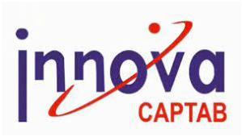
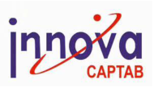

INNOVA CAPTAB LIMITED 1281/1, Hilltop Industrial Estate, Near EPIP, Phase-I, Jharmajri, Baddi, Dist. Solan (H.P.)-173205 India. Phone: +91-1795-650820 

**[Image: Aug2025.pdf-0001-01.png (225x107, 9.3KB)]**

## **13****th** **August, 2025** 

To, To, **BSE Limited** Phiroze Jeejeebhoy Towers, Dalal Street, Mumbai – 400001 **BSE Symbol: INNOVACAP BSE Scrip Code: 544067** 

**National Stock Exchange of India Limited** Exchange Plaza, 5th Floor Plot No. C/1, “G” Block Bandra-Kurla Complex Bandra (E), Mumbai – 400051 **NSE Symbol: INNOVACAP** 

## **Subject: Transcript of the Investor/Analyst Earnings Call held on Friday, 08****th** **August, 2025** 

Dear Sir/Madam, 

This is in continuation to our letter dated 08th August 2025, wherein we had informed regarding the audio link of the earnings call with analysts/investors for the quarter ended 30th June, 2025. 

In this regard, please find enclosed herewith the transcript of the said call. 

The transcript is also available on the Company’s website i.e. 

- <u>https://www.innovacaptab.com/financial results.php</u> 

You are requested to take this information on record. 

Thanking you, 

Yours faithfully, For **Innova Captab Limited** 

NEEHARIKA Digitally signed by NEEHARIKA SHUKLA SHUKLA Date: 2025.08.13 16:44:14 +05'30' **Neeharika Shukla Company Secretary and Compliance Officer Membership No.: A42724** 

Encl.: A/a 

Registered Office - 1513, 15th Floor, Satra Plaza, CHS Ltd. Plot No. 19&20, Sector-19D, Vashi, Navi Mumbai-400703, Maharashtra, India. CIN - L24246MH2005PLC150371, email - <u>mail@innovacaptab.com</u> 

**[Image: Aug2025.pdf-0002-00.png (299x170, 57.3KB)]**

# “Innova Captab Limited 

# Q1 FY26 Earnings Conference Call” 

# August 08, 2025 

E&OE - This transcript is edited for factual errors. In case of discrepancy, the audio recordings uploaded on the stock exchange on 08th August 2025 will prevail. 

**[Image: Aug2025.pdf-0002-05.png (190x109, 25.6KB)]**

**[Image: Aug2025.pdf-0002-06.png (221x111, 5.5KB)]**

**– – MANAGEMENT: MR. VINAY LOHARIWALA MANAGING DIRECTOR INNOVA CAPTAB LIMITED – – MR. LOKESH BHASIN CHIEF FINANCIAL OFFICER INNOVA CAPTAB LIMITED – MR. AYUSH KUMAR GARG HEAD INVESTOR RELATIONS -- INNOVA CAPTAB LIMITED** 

Page **1** of **13** 

_Innova Captab Limited August 08, 2025_ 

**[Image: Aug2025.pdf-0003-01.png (165x93, 19.4KB)]**

### **Moderator:** 

Ladies and gentlemen, good afternoon, and welcome to the Innova Captab Limited Q1 FY '26 Earnings Conference Call. This conference call may contain forward-looking statements about the company, which are based on the beliefs, opinions and expectation of the company as on date of this call. These statements are not the guarantee of future performance of the company, and it may involve risks and uncertainties that are difficult to predict. 

As a reminder, all participant lines will be in the listen-only mode, and there will be an opportunity for you to ask questions after the presentation concludes. Should you need assistance during the conference call, please signal an operator by pressing star then zero on your touchtone phone. Please note that this conference is being recorded. 

I will now hand the conference to Mr. Ayush Kumar Garg from Innova Captab Limited for opening remarks. Thank you, and over to you. 

### **Ayush Garg:** 

Thank you, Ryan. Good afternoon, everyone, and thank you for joining us on our earnings call today to review the operational and financial performance for Q1 FY '26. We have here with us Mr. Vinay Lohariwala, Managing Director; Mr. Lokesh Bhasin, Chief Financial Officer; and representatives from SGA, our Investor Relations advisor. 

I trust you had the opportunity to review our financial results and the investor presentation, both of which are available on our website, as well as on the stock exchange website. The transcript of this call will be posted on the company's website within the next week. Should you have any further questions after this call, our Investor Relations team will be happy to assist you. 

With that, I'll now hand over the call to Mr. Vinay for his opening remarks. Thank you, and over to you, sir. 

### **Vinay Lohariwala:** 

Thank you, Ayush. Good  afternoon and thank you all for joining us on today's earnings call. I'm pleased to report that Innova Captab has continued to demonstrate strong growth momentum in Q1 FY '26. We recorded revenue of ₹ 352 crores during the quarter, making a 19% year-onyear growth despite drop in the API prices. 

Profitability also saw a significant boost with EBITDA rising by 28% to ₹ 57 crores. As part of our ongoing efforts to drive strategic clarity and operational focus, we have reorganized our business into two streamlined verticals, CDMO and branded generics. 

With Sharon now fully integrated within the Innova framework and keeping in mind our business modality, we believe that this new structure better reflects the way we operate today and how we create value across our portfolio. The CDMO business now comprises our legacy CDMO operation, Sharon business as well as part of our international branded generic portfolio that operates under a CDMO framework. 

The branded generic business includes our domestic branded generic business, along with the portion of the international branded generic portfolio that is run on a front-end on branded model. 

Page **2** of **13** 

_Innova Captab Limited August 08, 2025_ 

**[Image: Aug2025.pdf-0004-01.png (165x93, 19.4KB)]**

We believe this reclassification will provide greater transparency, better aligned with our longterm growth strategy and enhance stakeholders' understanding of our business performance. 

Coming to each business area. 

CDMO business - We continue to be the partner of the choice for over 300 global pharmaceutical companies. Over the years, we have expanded our offering to a comprehensive portfolio of over 3,700 products across multiple dosage forms. The business contributes 71% of our total revenue in Q1 FY '26. We remain focused on deepening existing relationships while building new partnerships to drive sustainable growth. 

Branded Generics -  Our branded generics business signifies our front-end operation with direct presence across India and key regulated and semi-regulated market across the globe. Over the years, we have achieved significant strides in the business by consistently adding new products and thorough market expansion, both in India and other international markets. 

Now let me talk about our manufacturing capability, which remain our key business driver. Enhancing this, this year we commercialized our greenfield facility in Kathua, Jammu in January 2025. I am pleased to inform you that the scale-up is going as planned. We are witnessing strong interest from our CDMO client as well as good demand in branded generic business, which gives us confidence in a swift ramp-up in the coming quarter. 

Looking ahead, we are seeing strong traction across both our business areas -  partner-led CDMO and front-end branded generics. Expanded product portfolio, deep client engagement and geographical expansion with our branded generic business, both in India and internationally will be the fuel for our growth journey in upcoming quarters and years. We are proud to be progress we have made and remain committed to executing our strategic road map with discipline and agility to drive sustainable growth across all our verticals. 

Thank you once again for your continued support and trust in Innova Captab. I now hand over the call to Mr. Lokesh to take you through the financial performance in more detail. 

### **Lokesh Bhasin:** 

Thank you, sir, and good afternoon, everyone. I will now take you through the financial highlights for Q1 FY '26. Our consolidated revenue stood at ₹ 351.5 crores, registering a yearon-year growth of 19%. CDMO business, which constituted around 71% of the total revenue in the quarter, clocked ₹ 249.5 crores of revenue as compared to ₹ 230.1 crores, registering yearon-year growth of 8%. Enhanced client traction, both new and existing, served as the main catalyst for growth. 

Branded Generic business delivered stellar growth of 59% to ₹ 101.2 crores, fuelled by a broader geographic reach and increased penetration in the domestic market. EBITDA grew to ₹ 56.6 crores for the quarter versus ₹ 44.3 crores in Q1 FY '25, signifying solid growth of 28%. 

EBITDA margins improved to 16.1% vis-a-vis 15.1% in Q1 FY '25, mainly supported by expanded gross margins. PAT improved 5% year-on-year to ₹ 31 crores, reflecting resilience in the face of increased depreciation and finance expenses. PAT margin stood at 8.8%. 

Page **3** of **13** 

_Innova Captab Limited August 08, 2025_ 

**[Image: Aug2025.pdf-0005-01.png (165x93, 19.4KB)]**

With this, we would like to conclude our opening remarks and open the floor for question and answers. Thank you very much. 

**Moderator:** The first question comes from the line of Parth Mehta from Vallum Capital. Please go ahead **Parth Mehta:** Yeah. Hi Team. Congratulations on the good set of numbers. I have a few questions. Firstly, is it possible to provide the new revenue -- new segmental breakup for the previous quarter? **Lokesh Bhasin:** So you are seeing the reorganized number for previous quarter, right? **Parth Mehta:** Yes, yes. **Lokesh Bhasin:** Surely, we will work out and Ayush will reach to you offline on this. **Parth Mehta:** No problem. Second is, possible to share what would be the revenue from the new Jammu plant for this quarter? **Lokesh Bhasin:** Okay. And what is your next question? I maybe answer -- maybe to answer you in one go **Parth Mehta:** Yes, yes, sure. So earlier, you have mentioned that revenue from the Jammu plant will be coming from the existing customer base by gaining the wallet share. So what is your strategy to gain the wallet share? And what would be -- what is the differentiating factor versus the competition? And what is the ratio of the outsourcing that is done by your clients? **Lokesh Bhasin:** Okay. See, the Jammu revenue anticipated for this financial year as we submitted in our earlier discussions is ₹ 400 crores. See, this ₹ 400 crores of revenue was estimated on constant pricing of our API, which is a key raw material for us. As everyone knows, during last few months, the API prices are showing a declining trend, which as high as 20% in certain cases. So we are still monitoring the situation. And we should be able to reach to a final conclusion or a more concrete conclusion where our this  year of Jammu revenue will lie and subject to the stabilization of API prices. 

**Parth Mehta:** Got it. And actually my question -- yes, yes, please continue. **Lokesh Bhasin:** And just to update, our current quarter's revenue for Jammu's plant was ₹ 60 crores. **Parth Mehta:** This would be including the Baddi transfer, right? The products that would have transferred from Baddi? 

**Vinay Lohariwala:** Yes, yes. **Lokesh Bhasin:** Yes. **Parth Mehta:** How much of that would be the transfer from Baddi? **Vinay Lohariwala:** So that is a bit difficult to comment on, but the overall revenue from the Jammu is ₹ 60 crores. 

Page **4** of **13** 

_Innova Captab Limited August 08, 2025_ 

**[Image: Aug2025.pdf-0006-01.png (165x93, 19.4KB)]**

### **Parth Mehta:** 

### **Vinay Lohariwala:** 

Okay. Okay. That helps. My second question was on the strategy. What would be the -- what is the strategy to gain the wallet share, the differentiating factor versus your competition? And what is the ratio of outsourcing that is done by your clients? 

So the -- if you see this facility, Jammu facility is built with the ₹ 480 crore investment. So it is up to mark with the CGMP norms and all the automation is in place. So as the facility is new and has come out very well, all of our big customers are auditing us visiting our site. And from there also, we are getting good comments that the plant has come out very well, right? 

So facility-wise, we are having a good edge over our competitors that being a new facility and everything has been taken care. So, as far as the productivity or the output is concerned or the zero-defect concept is concerned, we are having a very good edge and that is also a very attractive point for the customer also. 

And the other part is like ensure supply because a large capacity in CDMO, supply chain supply -- timely supply is very, very important. So there also, we are having a winning edge. And third, but not the least, but the third one is the prices. As you know that we have planned some incentive pass-through model, right. So that pricing is again in our favor. So all these 3, 4 points are in our favor. That's why we are hopeful that we will win more and more contracts in Jammu. 

### **Parth Mehta:** 

**Vinay Lohariwala:** 

### **Parth Mehta:** 

### **Vinay Lohariwala:** 

Right. Got it. And what is the strategy to gain the wallet share or strategy to utilize this facility? 

So we have the relationship with the all top companies in India, domestic front, as well as we will register our plants in the ROW and regulated market as well. So that is how we will -- we are approaching our partners regularly, and we'll try to get the maximum product what we can manufacture in Jammu for onboarding of that. 

Right, sir. Just one last thing. I wanted to understand, we have seen higher growth in the exports business. And earlier, if I remember, you had mentioned that we were having some capacity constraints to cater with the export market. So have we started some manufacturing in the Baddi plant for the export market? Or how are we getting this export revenue from which segments or from which geographies also are we getting this revenue? 

So capacity-wise, like if you see that in Jammu -- in Baddi, we have like a tablet and being a new facility in Jammu, our Cephalosporin capacity constraint has been already been removed. And in general category, we have the free capability -- capacity in tablet, capsule. The only oral liquid section is now we have the constraint. 

Otherwise, there is no concern as far as the capacity is concerned. So once we -- if we are getting the new product registered continuously from the ROW and other market, and there, our export is being started. So this quarter, I think we have shown a good growth in the export market as well. 

### **Parth Mehta:** 

Sure, sir. Just one last on the generic side. If I want to -- just wanted to understand there has been a huge growth in the generics segment for the quarter Y-o-Y. So what -- which therapeutic segments or from which geographies would the growth have contributed for the generics business? 

Page **5** of **13** 

_Innova Captab Limited August 08, 2025_ 

**[Image: Aug2025.pdf-0007-01.png (165x93, 19.4KB)]**

**Vinay Lohariwala:** 

So that you are talking about the branded generic business? 

**Parth Mehta:** 

Yes, yes. 

**Vinay Lohariwala:** Right. So that branded generic business includes our export as well as domestic branded generic business. 

**Parth Mehta:** 

Yes, yes, I get that. But which therapeutic segment... 

**Vinay Lohariwala:** This quarter, we have a very good growth in our export market, export branded generic business. That's why as an overall composition, you are seeing -- you are looking at the growth. 

**Parth Mehta:** Yes, I get that. Just wanted to know which therapeutic segment or from which geographies this growth would have come? **Vinay Lohariwala:** So therapeutic category, it's overall business spread across 10 to 15 therapeutic category. And as far as the territorial is concerned, so that is from the ROW. **Parth Mehta:** Ok Sir. Thank you for answering all the questions. **Moderator:** The next question comes from the line of Sudarshan Padmanabhan from ASK NDPMS. 

**Sudarshan Padmanabhan:** Yeah. Thank you for taking my question. Sir, my question is to understand more on the Baddi plant. I mean I understand that the Jammu plant is new and there are some products getting shifted from Baddi to Jammu. And that is why we are seeing a drop in sales of Baddi, but now growth happening in Jammu. But if I'm trying to understand, say, 1 or 2 quarters down the line, I would understand that a fair amount of shifting would happen and Baddi would come back to its usual revenue run rate. Just to understand in terms of time lines, where are we in terms of normalizing the entire Baddi plant transfer? 

And second is, earlier, last quarter when we talked about the ₹ 400-odd crores, I remember that we mentioned Jammu is incrementally going to contribute ₹ 400 crores. But the rest of the business, that is typically the international business will also grow. So the number was -- overall number is expected to be over ₹ 400 crores. That is Jammu plus others. Would there be a meaningful drawdown in your Baddi plant that could be a negative surprise? 

### **Vinay Lohariwala:** 

So overall, if you try to understand the mathematics behind the numbers, so there is, I think, a net increase of ₹ 60 crores quarter-on-quarter. So if you multiply by 4, that is translating approximately, say, ₹ 240 crores on a yearly basis, right. So if we see ₹ 400-plus crores, our statement was like that ₹ 400 crores from Jammu and plus, few percentage point growth from even the Baddi. 

So that is deeply affected by the price erosion, especially in the antibody segment like the amoxicillin or the potassium clavulanate or the cephalosporin, these price in a few of the API hit by more than 20%, as Lokesh ji has already covered. 

Page **6** of **13** 

_Innova Captab Limited August 08, 2025_ 

**[Image: Aug2025.pdf-0008-01.png (165x93, 19.4KB)]**

Still, we -- even in Q1, we have maintained the trajectory of ₹ 250 crores, right? I think -- I hope you understand what I'm trying to say. Even in Q1, we have shown the trajectory of the ₹ 250 crores, right? 

So we are very hopeful that there should not be any further decrease in the prices, still we able to maintain what we have stated earlier, right. The Jammu facility is being audited by all the leading customer and product onboarding are expected in the Q3 and Q4 at a much rapid speed. 

**Sudarshan Padmanabhan:** So there will be a quarter-on-quarter jump every quarter going forward? So there will be a quarter-on-quarter increase in the utilization? 

### **Vinay Lohariwala:** 

Put us on the same trajectory. So we have already -- in the last tele call, we also covered that it is how fast we reach at ₹ 100 crore level at Jammu facility, that is our priority. As a company, it is our top priority that how fast we reach at a ₹ 100 crore level from Jammu. 

**Sudarshan Padmanabhan:** Sure, sir. And sir, to understand -- I understand that API is a pass-through. We work on a costplus business model. But 2 things here. One is, if the API prices come down and I understand that your anti-infective business is seeing a pricing pressure. The second is, I would also understand your Jammu facility has capabilities of manufacturing more complex products. Is it possible to shift one towards more complex products? 

And in terms of your contract, if I look at the gross margins have substantially improved. One is, of course, the Jammu facility tax coming back to the GST. The second is when the prices come down, do we work on EBITDA per kg in the sense that optically then your gross margins look higher, then your EBITDA will not change irrespective of your top line. So just wanted to understand these two. 

**Vinay Lohariwala:** So your question regarding like complex product, we are already working on that. Our R&D is -- have developed a couple of products. So that validation is going on there. So especially in the category of respules and the other sterile products, we are again working on the few -- we are exploring the few new products as well, so that can improve our GC as well, right? 

- **Sudarshan Padmanabhan:** Yes. The second question is to understand the gross margin. So one is your GST that you're getting back. The second is, if the API price comes down, if there's a gross contribution per kg, if it comes down, then your optically margins, gross margins look higher. If you're working on a margin basis, then it hits you on both sides. I mean your EBITDA comes down. So just wanted a clarity. 

**Vinay Lohariwala:** Yes, yes. Yes. So our pass-through model is like we have the 2 component of our gross conversion. One is constant and it is fixed. And the other part is the -- based on the profitability is the percentage base. So even -- you can say that a 50-50 type arrangement. So if the price goes down, then still our absolute per tablet or per capsule or per unit also goes down. 

**Sudarshan Padmanabhan:** Okay. So we are partly getting impacted. I mean it's not... 

### **Vinay Lohariwala:** 

Yes, yes. Partially -- generally, what happened, the API price move from 5%, 10% here and there. So in that case, there is no substantial impact. But this time, we have seen that the prices 

Page **7** of **13** 

_Innova Captab Limited August 08, 2025_ 

**[Image: Aug2025.pdf-0009-01.png (165x93, 19.4KB)]**

have crashed like potassium clavulanate ₹ 18,500 to ₹ 13,000 level. So that creates a very big turmoil for the market. 

**Sudarshan Padmanabhan:** Sure. So one final question before I join back the queue is on the cost side. If I look at the fourth quarter versus this quarter, we have, as you mentioned, seen a jump of about ₹ 50 - ₹ 60 crores. But if I look at the operating cost, the operating cost has also improved on a Q-on-Q basis. 

So the rationale, what I wanted to understand is today, when we are running at ₹ 60 crores, I mean, this is going to only improve from here, ₹ 60 crores can to ₹ 70 crores, ₹ 80 crores, ₹ 100 crores. I mean, past ₹ 100 crores is good for everyone. But as the operating leverage happens, I'd just like to understand from here on, how do we see the cost curve coming down? 

**Lokesh Bhasin:** See, you are absolutely right. Our major cost, especially on employee and other operating expense is more on a semi-variable basis. So as we have already reached around ₹ 60 crores from Jammu and Baddi is already running at steady-state level. 

From here, the increase in revenue or increase in operation would not result in the proportionate or pro rata increase in costs. So of course, we are still monitoring the situation. But as and when the Jammu plant will reach to a certain level of, say, ₹ 100 crores of revenue per quarter, we should be saving a slightly better position from here. 

**Sudarshan Padmanabhan:** Sure, sir. Any number that you have or we will re-evaluate it once we reach it? 

**Lokesh Bhasin:** See, Jammu is still in the ramp-up stage, and there are lots of variables and moving parts, and we are observing the situation. We are still in the process of customer onboarding. So a firm number may not be -- we may not be able to share as of now. 

**Sudarshan Padmanabhan:** Sure, sir. And anti-infectives as a proportion of your overall business, would it be meaningful enough to see a meaningful dent in your earlier guidance or probably we will still be plus or minus that figure, that you earlier talked about in the fourth quarter? 

**Lokesh Bhasin:** See, our overall revenue -- our overall revenue is a very complex combination of our capabilities, our categories in which we produce, our dosages, the clientele, the geographies. So the exact impact of API reduction as of now may not be able to reveal or share. But yes, it is slightly having an impact on our overall revenue. But as I said, that we are monitoring the situation very closely. And hopefully, if the prices stabilize, we should be able to retain our guidance. 

**Sudarshan Padmanabhan:** Thank You. I’ll join back the queue. 

### **Moderator:** 

The next question comes from the line of Avnish Burman from Vaikarya. 

**Avnish Burman:** Hi. Thanks for taking my question. My question was again on the export side. It seems that the Cepha business has been transferred from Baddi to Jammu and Baddi has catered to the export markets because of which the export revenues have grown so fast. You had mentioned earlier that there was a backlog. So my question is, now is the backlog over or there is still backlog that Baddi can continuously supply? And on a continuous basis, you can move the domestic business from Baddi to Jammu? 

Page **8** of **13** 

_Innova Captab Limited August 08, 2025_ 

**[Image: Aug2025.pdf-0010-01.png (165x93, 19.4KB)]**

**Vinay Lohariwala:** 

So how the product transfer is working that we need to have the client consent for that. So as we are getting the client consent for transferring, we are transferring our domestic business from, say, Jammu's cephalosporin to -- Baddi cephalosporin to Jammu cephalosporin. 

So I think the transfer activity will go up to the third or max by up to fourth quarter. This year, all these events will be closed. And your analysis was perfect that due to transfer of a few business from Baddi, we have created a vacuum in the Baddi capacity. So that was fulfilled with the export orders. 

### **Avnish Burman:** 

### **Vinay Lohariwala:** 

**Avnish Burman:** 

**Vinay Lohariwala:** 

**Avnish Burman:** 

### **Lokesh Bhasin:** 

### **Avnish Burman:** 

Yes. So I'm guessing that earlier your Baddi cepha line was 100% utilized and the other capacity still had empty capacity. So my guess is that what is being catered to the export market from Baddi incrementally is the cepha orders only. So, question was that... 

That's why we call it the incremental business. Yes. 

Correct. So my question was that as you transfer more to Jammu, do you have sufficient export orders to fill that Cepha line so that the export growth comes very, very strong in the coming 3 quarters till the time you keep transferring to Jammu? 

So again, Avnish Ji, this is a very complex question. And even commenting on all these things is very, very difficult because the order flow, again, we have the tablet, capsule, dry syrup, dry powder injectable, different line systems. But as we progress, our planning is that the Baddi Cephalosporin will be 100% move towards the export-oriented business. And the Jammu facility as we have the domestic GST benefit as well, so that will cater to the domestic business. 

Yes, that makes sense. I was just trying to get an indication of the export growth if you look on a full year basis, like the export growth that you've shown 59% and the branded generic growth because now we don't know exactly how much is export. But the branded generic growth of 59%, is that going to sustain? Or is that going to come down on a full year basis if you look at FY '26? 

Avnish Ji, see, we are still working on it. See, in coming quarters, my branded generic business is going to show a healthy growth trend, both in -- which constitutes both domestic as well as my international markets. The exact percentage, we're still working on that. 

Okay. Okay, sir. Second question, Lokesh, for you. I can understand that the SG&A -- I mean, the other expense has gone up because of Jammu. But if I look at the stand-alone business, any increase because of Jammu should also reflect in the sequential increase of other expenses on the stand-alone side. 

If you look at standalone sequential increase in other expense, it's ₹ 3 crores, whereas on the consol level, it is ₹ 6 crores. So apart from Jammu also, there has been some increase in cost on a sequential basis. If you can give some color on it. 

### **Lokesh Bhasin:** 

Yes. So see, my consol results consist of all 3 legal entities, which is Innova Captab, Univentis as well as Sharon Bio-Medicine. You rightly said the standalone reflects my Innova's Baddi as 

Page **9** of **13** 

_Innova Captab Limited August 08, 2025_ 

**[Image: Aug2025.pdf-0011-01.png (165x93, 19.4KB)]**

well as Jammu operations and cost. The rest of the costs, which we see -- which you see in consol comes from -- slightly from Univentis and Sharon also. 

### **Avnish Burman:** 

Yes. So I mean, this ₹ 40 crores of consol, is that expected to grow even higher from here? Or how should we see the other expenses on a consol basis? 

### **Lokesh Bhasin:** 

See, Avnish Ji, exact number, I may not be able to tell you as of now. But see, these other expenses consist of -- if I talk about consol, it consists of my manufacturing operation, other expenses, which is both in variable as well as semi-variable nature. Univentis, which is mostly towards my semi-variable, most towards fixed expenses, and Sharon. So it all depends upon how each and every business grows and how the cost responds. 

**Avnish Burman:** Thanks Lokesh ji. Thanks Vinay ji 

Thank You. 

**Lokesh Bhasin:** Thank You. **Moderator:** The next question comes from the line of Saket from Sagari Capital. Please go ahead. **Saket:** Thanks for the opportunity and good set of results given the difficult circumstances. So sir, first question would be on API pricing. So is the API pricing largely being, say, the dip in pricing is driven by Chinese dumping? Or do you see overcapacity in, say, domestic space also? So even domestic APIs are also seeing price headwinds? 

**Vinay Lohariwala:** So let's say, post-COVID, the capacity expansion is also one of the reason of the decreasing in the price. And post-COVID, let's say, like the Pen G or the 7ACA whatever the core KSM, so there is a sufficient expansion in the capacity. So that is one of the big reason in the drop in the price. 

**Saket:** Got it. Got it. Do you see this -- one concern that investor community is having that we are also seeing similar kind of capacity expansion in the formulation space. So your Jammu plant is also a very large capacity. Other listed CDMO players have also come up with recent capacity, then a few CMO players like Leeford have also come up with capacity. 

So do you think that this playbook being repeated in the formulation space as well, so which is putting some bit of pressure -- pricing pressure beyond the API pricing. So just my simple question is, is the competition on the rise in the formulation space as well, sir? 

**Vinay Lohariwala:** So the capacity-wise, if there is an increase in capacity vis-a-vis we have the market expansion as well. So let's say, overall, if the market is growing with the 10%, 12% -- so in the say, 6, 7 years, you need doubling your capacity. Otherwise, there will be a scarcity of the capacity. 

So these are the balancing every time, let's say, the balancing -- demand and supply balance always goes on. So if we see from our Innova perspective, our new capacity is having a good fiscal incentive. So we are not having any such challenges. 

**Saket:** Okay. Got it, sir. So another question would be this schedule M implementation, right. So there were a possibility that a few smaller or marginal players might go out of business because they might not be able to carry out all those activities that the regulator is asking them. So do you see 

Page **10** of **13** 

_Innova Captab Limited August 08, 2025_ 

**[Image: Aug2025.pdf-0012-01.png (165x93, 19.4KB)]**

that in anticipation of them going out of the business, so they are also, say, dumping their products. 

So the channel inventory might be slightly on the higher side in the formulation space. Is this something that you are seeing on a market basis or this is just more of an interpretation? 

**Vinay Lohariwala:** This is difficult to comment, sir, on these questions. 

**Saket:** Okay, sir. And sir, another question is the GST benefit. So in case there is, say, any change on GST rates of, say, pharma products and something that we are catering to, does that also have an impact on the kind of GST incentive that we would be getting? So I think it's right now at 12% slab. So if it moves to 18% or say, it comes down to 5% and does that also impact our incentive, sir? 

**Vinay Lohariwala:** See, if the GST rate reduces, then we will be adversely impacted. But let's say, the total incentive available to us is fixed. Let's say, that incentive is like approximately ₹ 75 crores, that is fixed. So to achieve the ₹ 75 crore incentive, today, we need to sell approximately, let's say, ₹ 600 crores plus, ₹ 620 crores. If the duty reduced to, say, 8%, then we need to make the ₹ 900 crores sale to achieve that incentive. And if it become 18%, then say, let's say, our only ₹ 400 crores sale will be subject to the incentive. **Saket:** Okay. Okay. So then we can reach those levels. So broadly, I think some bit of change in the revenue would help us arrive at that depending on the rate changes, right? So that's how you are going to calibrate yours. **Vinay Lohariwala:** But again, sir, all these questions are very hypothetical that I don't think so any GST reason will change so sudden. **Saket:** No, no, Good that sir you are highlighting because there's always that rationalization of slabs. So I was just wondering if there is something on the works. But fair point that you said that these are hypothetical. So another question on the Univentis part. So your branded generics has been doing quite well even in Q4. So just for our understanding, is that a, say, ethical marketing business where you reach out to doctors? Or is it more of a trade generic kind of a business where you reach out to chemists? **Vinay Lohariwala:** Yes. Our Univentis Medicare is 100% trade generic business. **Saket:** Ok sir. OK Sir. Thanks again for answering the questions and once again congratulations on a good result and best of luck for the future, sir. **Vinay Lohariwala:** Thank you. **Moderator:** The next question comes from the line of Abdulkader Puranwala from ICICI Securities. **Abdulkader Puranwala:** Sir, first question is with regards to your base CDMO business. So including Jammu and Baddi, if you could provide us some color as to how your base business has grown despite the pricing pressure you talked -- just talked about? 

Page **11** of **13** 

_Innova Captab Limited August 08, 2025_ 

**[Image: Aug2025.pdf-0013-01.png (165x93, 19.4KB)]**

**Lokesh Bhasin:** Abdul, so if I talk about ICL stand-alone basis, basically, this is the business which showcased our manufacturing capability business. So it has grown by around 26.5% year-on-year, which constitutes of my entire manufacturing capabilities of Baddi as well as Jammu. 

**Abdulkader Puranwala:** Understood. Got it. And sir, secondly, now the export business is surging on the branded generic side, any color you could provide on margins with the incentives coming from Jammu and the traction what you're seeing in exports. Any ballpark guidance you would like to provide for this year, next year? How should we look at the EBITDA margin profile of the company? 

**Lokesh Bhasin:** See, Abdul, as we submitted in our earlier tele call also, see, we are looking at the Jammu rampup as of now, and there are too much moving parts on that. It's a complex business consisting of multiple business areas, multiple legal entities. In the long run, when we are anticipating that Jammu will stabilize, we are surely anticipating a certain upward movement on our margins, but we should be able to provide a more clear picture in our coming quarters. 

**Abdulkader Puranwala:** Understood. And one final one, if I may. So Jammu, I know it's quite clear about the revenue what you guys are targeting. But any color you can provide on how soon this facility can turn cash positive, that is it can generate free cash flows. And by when can we expect that to happen? **Lokesh Bhasin:** So if I talk at a PAT level, as Vinay sir earlier said that our internal target is to reach at ₹ 100 crore quarterly revenue. So this is a level where somewhere around ₹ 100 crores, ₹ 105 crores of quarterly revenue, we should be able to break even at PAT level. And from there on, it should be cash positive at PAT level, not only cash, but at PAT neutral also. **Abdulkader Puranwala:** Got it Sir. Thank You. **Lokesh Bhasin:** Thank You **Moderator:** We take the next question from the line of Pritesh from Lucky Investments. **Pritesh:** So sir, this Jammu unit, when does it operationally breakeven at what level of sales and which quarter? **Lokesh Bhasin:** So Pritesh, we are anticipating the breakeven level at PAT level at ₹ 100 crore quarterly revenue. **Vinay Lohariwala:** And operation level. **Lokesh Bhasin:** And operational level is somewhere around ₹ 60 - ₹ 65 crores of revenue. **Pritesh:** And when do you think you'll achieve ₹ 60 -  ₹ 65 crores and ₹ 100 crores, these are the 2 milestones? **Vinay Lohariwala:** So this year, we are at a ₹ 60 crore level, and I think the EBITDA loss was hardly ₹ 1 crore. So it's just -- at a EBITDA level, if you see, we are already on -- even in the second quarter of the operation, we are already on the breakeven site. **Pritesh:** So quarter 4 last year and quarter 1 this year, these are the first 2 quarters... **Vinay Lohariwala:** Yes, yes. So because of this incentive help us to achieve that breakeven level. And we're hopeful that by the end of the year, we will be the PAT positive as well. 

Page **12** of **13** 

_Innova Captab Limited August 08, 2025_ 

**[Image: Aug2025.pdf-0014-01.png (165x93, 19.4KB)]**

**Pritesh:** And this incentive it's booked and it is received or it is just booked in your P&L as of now? **Lokesh Bhasin:** It is accounted on an accrual basis, subject to our eligibility and permission to GST authorities. And there may be a lag of 1 or 2 quarters from cash flow on this. **Pritesh:** And at this ₹ 60 crores, ₹ 65 crores, what is the utilization of the asset? **Lokesh Bhasin:** Hardly 5%, sir -- I think less than 5%. **Pritesh:** It cannot be 5%, right. The asset can make ₹ 5,000 crores revenue? No, no? **Vinay Lohariwala:** No, no, no. So that can make like a top revenue could be like ₹ 1,500 -  ₹ 2,000 crores. **Pritesh:** So then it is 65x4 divided by ₹ 2,000 crores, about 10% -- 15% utilization. Okay. Thank you. **Moderator:** Ladies and gentlemen, we take that as the last question and conclude the question-and-answer session. I now hand the conference over to the management for their closing comments. **Vinay Lohariwala:** Thank you once again for continued support and confidence in Innova Captab. We remain committed to deliver sustained growth and creating long-term value for all our stakeholders. Thank you once again. **Lokesh Bhasin:** Thank you. **Moderator:** Thank you. On behalf of Innova Captab Limited, that concludes this conference. Thank you for joining us, and you may now disconnect your lines. 

Page **13** of **13** 

---

## Extracted Images

| # | File | Dimensions | Size |
|---|------|------------|------|
| 1 | Aug2025.pdf-0001-01.png | 225x107 | 9.3KB |
| 2 | Aug2025.pdf-0002-00.png | 299x170 | 57.3KB |
| 3 | Aug2025.pdf-0002-05.png | 190x109 | 25.6KB |
| 4 | Aug2025.pdf-0002-06.png | 221x111 | 5.5KB |
| 5 | Aug2025.pdf-0003-01.png | 165x93 | 19.4KB |
| 6 | Aug2025.pdf-0004-01.png | 165x93 | 19.4KB |
| 7 | Aug2025.pdf-0005-01.png | 165x93 | 19.4KB |
| 8 | Aug2025.pdf-0006-01.png | 165x93 | 19.4KB |
| 9 | Aug2025.pdf-0007-01.png | 165x93 | 19.4KB |
| 10 | Aug2025.pdf-0008-01.png | 165x93 | 19.4KB |
| 11 | Aug2025.pdf-0009-01.png | 165x93 | 19.4KB |
| 12 | Aug2025.pdf-0010-01.png | 165x93 | 19.4KB |
| 13 | Aug2025.pdf-0011-01.png | 165x93 | 19.4KB |
| 14 | Aug2025.pdf-0012-01.png | 165x93 | 19.4KB |
| 15 | Aug2025.pdf-0013-01.png | 165x93 | 19.4KB |
| 16 | Aug2025.pdf-0014-01.png | 165x93 | 19.4KB |
