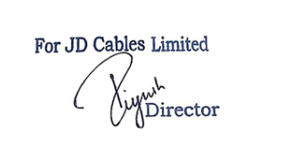

**[Image: 2e2897f8-9c81-452b-b362-c51c3da2b5b3.pdf-0001-00.png (887x164, 124.5KB)]**

**Date: June 06****th** **2026** 

**To** 

**The Manager- Listing Department, BSE Limited P.J. Towers, Dalal Street, Fort, Mumbai- 400001, Maharashtra, India.** 

**Scrip ID/Code: JDCABLES/544524** 

**Respected Sir/ Madam,** 

**Subject: Submission of Transcript of the Earnings Conference call held on June 04****th** **2026 at 02:00 p.m.** 

**Ref: Regulation 30(6) read with Schedule III Part A of SEBI (Listing Obligations and Disclosure Requirements) Regulations, 2015 (“SEBI Listing Regulations”)** 

**With reference to our intimation dated June 01****st** **2026 related to the Earnings Conference call, the Company is submitting the transcripts of Earnings Conference call of the analyst/investor conference call which was held on June 04th 2026 at 02:00 p.m. to discuss the earnings of the Company for the half year and year ended as on 31****st** **March 2026.** 

**Submitted for your kind information and necessary records.** 

**Kindly take the same on your records.** 

**Thank you! Yours Faithfully. For JD Cables Limited** 

**[Image: 2e2897f8-9c81-452b-b362-c51c3da2b5b3.pdf-0001-12.png (345x168, 22.4KB)]**

**Piyush Garodia Managing Director DIN: 07194809** 

**[Image: 2e2897f8-9c81-452b-b362-c51c3da2b5b3.pdf-0001-14.png (887x120, 61.6KB)]**

_JD Cables Limited June 04, 2026_ 

**[Image: 2e2897f8-9c81-452b-b362-c51c3da2b5b3.pdf-0002-01.png (172x65, 16.8KB)]**

**[Image: 2e2897f8-9c81-452b-b362-c51c3da2b5b3.pdf-0002-02.png (405x151, 60.4KB)]**

# “JD Cables Limited 

# H2 FY26 Results Conference Call” 

June 04, 2026 

**[Image: 2e2897f8-9c81-452b-b362-c51c3da2b5b3.pdf-0002-06.png (268x101, 31.9KB)]**

**[Image: 2e2897f8-9c81-452b-b362-c51c3da2b5b3.pdf-0002-07.png (189x67, 22.6KB)]**

**[Image: 2e2897f8-9c81-452b-b362-c51c3da2b5b3.pdf-0002-08.png (209x105, 10.4KB)]**

**MANAGEMENT: MR. PIYUSH GARODIA – MANAGING DIRECTOR – JD CABLES LIMITED MR. RAJESH JHUNJHUNWALA – WHOLE-TIME DIRECTOR – JD CABLES LIMITED MR. ABHISHEK GUPTA – MANAGER, ACCOUNTS AND FINANCE – JD CABLES LIMITED** 

**MODERATOR: MS. DHRUVI – EQUIBRIDGEX ADVISORS PRIVATE LIMITED** 

Page **1** of **15** 

_JD Cables Limited June 04, 2026_ 

**[Image: 2e2897f8-9c81-452b-b362-c51c3da2b5b3.pdf-0003-01.png (172x65, 16.8KB)]**

## **Moderator:** 

Ladies and gentlemen, good day and welcome to the H2 FY26 Results Conference Call of JD Cables Limited, hosted by EquiBridgeX Advisors Private Limited. As a reminder, all participant lines will be in the listen-only mode and there will be an opportunity for you to ask questions after the presentation concludes. Should you need assistance during this conference, please signal an operator by pressing star then zero on your touchtone phone. Please note that this conference is being recorded. 

This conference may contain forward-looking statements about the company which are based on the beliefs, opinions, and expectations of the company as on the date of this call. These statements are not guarantees of future performance and involve risks and uncertainties that are difficult to predict. 

I now hand the conference over to Ms. Dhruvi from EquiBridgeX Advisors. Thank you and over to you, ma'am. 

## **Dhruvi:** 

Thank you and a very good afternoon to everyone. Welcome to the H2 FY26 earnings call of JD Cables Limited. From the management team, we have with us Mr. Piyush Garodia, Managing Director; Mr. Rajesh Jhunjhunwala, Whole-Time Director; and Mr. Abhishek Gupta, Manager. The call will begin with opening remarks from the management, after which we will open the floor for Q&A. 

With that, I would now like to hand over the call to the management for opening remarks. Thank you and over to you, sir. 

**Piyush Garodia:** 

Good afternoon, everyone and thank you for joining JD Cables Limited's financial year '26 earnings call. A warm welcome to all our investors, analysts, and stakeholders joining us today. I thank all our shareholders and stakeholders for their continued trust and support in our journey. 

JD Cables Limited continues to focus on manufacturing high-quality wires, cables, and conductors, catering primarily to the power transmission and distribution sectors. Over the years, we have built strong capabilities across manufacturing, product development, and project execution, enabling us to serve utilities, infrastructure projects, industrial customers, and state electricity boards across India. 

During FY26, we continued strengthening our operational capabilities, enhancing manufacturing efficiency, and expanding our market presence across key geographies. Our focus on quality, customization, and execution excellence enabled us to capitalize on growing opportunities arising from increasing investment in power infrastructure, electrification programs, and industrial development across the country. 

Today, we have established a strong presence across Northern, Eastern, and North-Eastern India and are an approved vendor for multiple state electricity boards. Our diversified product portfolio includes power cables, control cables, instrumentation cables, service cables, and conductors such as AAC, AAAC, ACSR conductors, which continue to support our long-term growth strategy. 

Page **2** of **15** 

_JD Cables Limited June 04, 2026_ 

**[Image: 2e2897f8-9c81-452b-b362-c51c3da2b5b3.pdf-0004-01.png (172x65, 16.8KB)]**

Our manufacturing operations are supported by two production facilities with a combined installed capacity of approximately 28,000 kilometers per annum, comprising 6,000 kilometers at Unit I and 22,000 kilometers at Unit II. During FY26, we achieved healthy capacity utilization levels of approximately 82.4% at Unit I and 84.6% at Unit II, reflecting strong demand across power transmission, distribution, infrastructure, and industrial sectors. 

In line with our long-term growth strategy, we acquired a new industrial facility at Jamshedpur, spanning approximately 1.18 lakh square feet. The facility supports future capacity expansion and operational efficiencies. We have also continued investing in plant and machinery while expanding our product portfolio with the addition of new product lines, including MVCC, AL59 conductors, HTLS conductors, and HE cables, enabling us to address a broader spectrum of customer requirements. 

Coming to the financial performance of FY26, Abhishek Gupta will be on the line. 

**Abhishek Gupta:** Good afternoon, everyone. For FY26, the total income stood at INR365 crores, registering a growth of 45.67% year-on-year. Our EBITDA increased to INR48.11 crores, reflecting a growth of 40%, while profit after tax grew to INR31.72 crores, registering a strong growth of 44% over FY25. 

Our half-yearly financial performance was also encouraging. Total income for the half-year stood at INR243 crores against INR143 crores turnover in half-year FY25, registering a strong growth of 70%. Our EBITDA increased to INR28 crores, reflecting a strong growth of 52%, while our PAT stood at INR19 crores, registering a robust growth of 69%. Mr. Piyush sir will continue from here. 

**Piyush Garodia:** Our strong execution capabilities, expanding customer base, and growing demand across power, infrastructure, and industrial sectors continued to support healthy business momentum throughout the year. We also maintained a robust order book of approximately INR515 crores as of March 31, 2026, providing strong revenue visibility and supporting our growth outlook for the coming years. 

Beyond our core manufacturing operations, we have established a strategic presence in the infrastructure and EPC segment. Our ongoing execution of a key National Highway Development Project involving civil and electrical works demonstrates our capability to undertake complex infrastructure assignments and paves an additional avenue for long-term growth. 

Going forward, we remain focused on strengthening our manufacturing capabilities, enhancing operational efficiency, expanding our product portfolio, and capitalizing on opportunities arising from India's growing investments in power transmission, electrification, and infrastructure development. Supported by a strong order book, expanding capacities, diversified product offerings, and a healthy balance sheet, we believe JD Cables is well-positioned to deliver sustainable growth and create long-term value for all stakeholders. 

Page **3** of **15** 

_JD Cables Limited June 04, 2026_ 

**[Image: 2e2897f8-9c81-452b-b362-c51c3da2b5b3.pdf-0005-01.png (172x65, 16.8KB)]**

||Before we begin the discussion, I would like to thank our employees, customers, business|
|---|---|
||partners, and shareholders for their continued trust and support. With that, I now hand over the call for further discussion and question and answer.|
|**Moderator:**|Thank you very much. We will now begin the question-and-answer session. Our first question comes from the line of Vishvender Singh from Prudent Equity. Please go ahead.|
|**Vishvender Singh:**|Hello. Hi sir, am I audible?|
|**Moderator:**|Sir, you are audible. You may proceed.|
|**Vishvender Singh:**|Sir, I wanted to ask about the timeline for the new capacity to commission and what sort of utilization do we expect for this year, FY27?|
|**Piyush Garodia:**|It is already under process and we are expecting our electricity connection within this month only. Our conductor division is already in place, so we are waiting for the electricity connection. I think very soon our conductor division will start and then our coming next, our cable division will also get started in the next two months, we are expecting.|
|**Vishvender Singh:**|Okay. And how much of this total capacity can be utilized for this year and next year?|
|**Piyush Garodia:**|For the next year, I can tell that it will be utilized fully. It will be running at full capacity, like 70% to 80% capacity at least. And for this year, like by September end, I think we will be operating at a good pace and we are expecting good revenue from this unit as well.|
|**Vishvender Singh:**|Got it. And on the margin front, our margins from the first half to second half have declined. So any comment on that and what expected margins do we see going ahead?|
|**Piyush Garodia:**|Margin is like almost, as I can see, if you compare, like if you see from the last year and this year it’s mostly same.|
|**Vishvender Singh:**|No, from the first half, like H1. From H1, our margins from 15% to 12% they have come. So what was the reason behind that?|
|**Piyush Garodia:**|It is because there were lots of expenses and if you will see, like, we have supplied in bulk quantities and so there is a marginal decline, if I am not wrong. Our EBITDA margin declined from...|
|**Vishvender Singh:**|Okay. So what sort of margin range do we expect going ahead, sir, for the company as a whole?|
|**Piyush Garodia:**|We are expecting -- like going forward, similar margins, we are expecting.|
|**Vishvender Singh:**|Okay. 12% to 13%?|
|**Piyush Garodia:**|Yes. Like, same margin, we are expecting the same margin.|
|**Vishvender Singh:**|Got it. And on the EPC side, sir, I wanted to ask how much of the total EPC order have we completed yet?|

Page **4** of **15** 

_JD Cables Limited June 04, 2026_ 

**[Image: 2e2897f8-9c81-452b-b362-c51c3da2b5b3.pdf-0006-01.png (172x65, 16.8KB)]**

|**Piyush Garodia:**|Right now, we have completed around 10% approx.|
|---|---|
|**Vishvender Singh:**|And for FY27, do we expect the full execution?|
|**Piyush Garodia:**|Mostly, sir. We are expecting a good percentage of completion by FY27.|
|**Vishvender Singh:**|Okay. And lastly on the debt part, do you plan to increase debt to fund the working capital and the EPC execution and by how much do we expect to grow debt?|
|**Piyush Garodia:**|Yes sir, we may plan for debt from banks, etcetera. We have already participated in lots of tenders, and so if we get that tenders and for executing that orders, we will definitely look for debt from banks, etcetera.|
|**Vishvender Singh:**|Okay sir. That will be all. Thank you, sir.|
|**Piyush Garodia:**|Thank you.|
|**Moderator:**|Thank you. Our next question comes from the line of Deeya with Sapphire Capital. Please go ahead.|
|**Deeya:**|Okay. Am I audible?|
|**Moderator:**|You are audible, ma'am. You may proceed.|
|**Deeya:**|So what is the current order pipeline that we have and the timeline for it?|
|**Piyush Garodia:**|Ma'am, we have around INR500 crores order book as of now and the timeline is normally one and a half years.|
|**Deeya:**|And any more tenders that we are bidding for?|
|**Piyush Garodia:**|Yes ma'am, we have already participated in around INR1,000 crores tenders, more than in fact INR1,000 crores tenders comprising of both EPC and cable tenders and the tender outcome or the results are due.|
|**Deeya:**|And what is our conversion ratio in this?|
|**Piyush Garodia:**|Since like if you will see like, transmission and distribution, we have participated in several transmission distribution tenders. So, we didn't have prior experience in participating in this sort of tenders. So, it's quite difficult to tell like conversion ratio. But still, we are expecting good favorable results in some of the tenders.|
|**Deeya:**|Okay. And what sort of revenue growth are we targeting in FY27?|
|**Piyush Garodia:** **Deeya:**|We are expecting 50% to 60% revenue growth in this financial year and even in the next financial year. 50% to 60%, right?|

Page **5** of **15** 

_JD Cables Limited June 04, 2026_ 

**[Image: 2e2897f8-9c81-452b-b362-c51c3da2b5b3.pdf-0007-01.png (172x65, 16.8KB)]**

|**Piyush Garodia:**|Yes.|
|---|---|
|**Deeya:**|And on the margins?|
|**Piyush Garodia:**|Margins, ma'am, we are expecting a similar level of margins.|
|**Deeya:**|Okay. And as you said, EPC we have completed INR10 crores, right?|
|**Piyush Garodia:**|No ma'am, 10%. I told 10% of the project.|
|**Deeya:**|Okay, okay. And the rest we are going to finish in this year?|
|**Piyush Garodia:**|Yes, we are expecting a good percentage to be finished by the end of this financial year.|
|**Deeya:**|And what capex are we planning?|
|**Piyush Garodia:**|Ma'am capex, we are planning around INR20 crores, approx INR20 crores to INR30 crores. It depends upon the like -- once this like new units starts, it depends upon the orders, the level of orders we will get. And like, it will not be a tough task to, like, install newer machines because we have good space in our new plant. So it depends upon the order. So basically, still we are expecting around INR20 crores to be like new INR20 crores to be on the capex side. We are already, like, in the process of procuring land adjacent to our newer factory. We have already given some of the payments and we will be, like, increasing our land. We are taking further land next to our factory.|
|**Deeya:**|So have we already purchased this land?|
|**Piyush Garodia:**|Ma'am, we have made some advance payments.|
|**Deeya:**|Okay. And this new facility that is going to be operational, so by September end what utilization can be achieved?|
|**Piyush Garodia:**|See, actually we will be manufacturing lots of newer products in this like HTLS connector, AL59, MVCC, and so HT cables So, it may take some time, like, to get the approval to get the BIS license. So, it will be operational, but we will try to get that license approvals very shortly so that we can run at full capacity.|
|**Deeya:**|Okay, okay. And what is the revenue potential from this?|
|**Piyush Garodia:**|The revenue potential is almost double. And as you can see, we can even 3x, 4x within next two years. It's got a lot of potential. As I said earlier, our new plant has lots of space, so we can install the newer plant and machines. So our capacity can be expanded to 3x, 4x within next two years, say.|
|**Deeya:**|Okay, that's all from my side. Thank you.|
|**Piyush Garodia:**|Thank you. Thank you.|

Page **6** of **15** 

_JD Cables Limited June 04, 2026_ 

**[Image: 2e2897f8-9c81-452b-b362-c51c3da2b5b3.pdf-0008-01.png (172x65, 16.8KB)]**

**Moderator:** Thank you. Our next question comes from the line of Abhi Jain with Feynman Capital. Please go ahead. **Abhi Jain:** Hi, good afternoon. Am I audible? **Moderator:** You are audible, sir. You may proceed. **Abhi Jain:** Hello? **Moderator:** One moment please, sir. Sir, you may proceed with your question. **Abhi Jain:** My question is around working capital. And obviously, you are undergoing massive growth right now. But the problem is the cash track. Now, even this year, the inventory cycle, inventory days have gone up significantly. So, I just want to understand that going forward for FY27, do you think that you can reduce the cash track? And do you -- or do you think that you would need equity or debt funding to proceed with the growth that you are investing for FY27? **Piyush Garodia:** Can you repeat the question, if you don't mind? **Abhi Jain:** I wanted to ask you that in FY27 and FY27, if you look at FY26, then almost INR70 crores of cash deficit is coming from the operations, right? Because your growth was solid, so obviously you had to invest cash in the business to fund it. But your inventory has also increased this year and your payables have decreased. So, you didn't have the lever to stretch the payables this year. Now, in FY27 and FY28, you are targeting growth of 50%-50%, but can you improve your cash position in the growth that you are targeting? Or do you think that this cash track, which was a cash deficit of INR70 crores this year, will continue to move forward in the same way? I mean, do you have a plan or do you think that you will have to dilute your equity or debt to sustain the growth of FY27 and FY28? **Piyush Garodia:** Right now, if we will need any working capital, we are looking for like debt funding from banks only and we have already applied to banks and like they are ready to do that. And as of now, also, we have sufficient cash and bank balance in our bank and like banks are willing to give like further debt funding as and when required. So, we don't think we will have any problem in like executing the new orders and for this financial year. **Abhi Jain:** In FY27 -- so in FY27, you don't see much improvement in your cash from operations? Because, you know, or do you think this working capital cycle will improve for you in FY27? Today, you almost need, I think, about 110, 120 odd days of working capital. You need 3-4 months of working capital. So, do you see that cycle becoming more sustainable going ahead? How will the growth continue? So, I just want to understand that. **Piyush Garodia:** Working capital cycle has gone up due to execution of EPC projects. As you can see, in the last 2-3 months, there has been a lot of funding in EPC projects. So, the revenues of that will be in cash and all the bills will be deducted. So, there is a fund in EPC as well. So, all the bills will be deducted at once. 

Page **7** of **15** 

_JD Cables Limited June 04, 2026_ 

**[Image: 2e2897f8-9c81-452b-b362-c51c3da2b5b3.pdf-0009-01.png (172x65, 16.8KB)]**

|**Abhi Jain:**|Okay. Sir, can you give us an idea about how much external funding you need in FY27? We|
|---|---|
||have figured out something. As of now, I think I have almost INR55-odd crores of debt. So, how much additional funding do you need in FY27?|
|**Piyush Garodia:**|It depends. Right now, we are sitting on comfortable cash position, cash and bank balance. We don't have any such issue with executing current orders and the orders in hand and the current running projects. But, going forward, as I said, we have participated in more than INR1,000 crores of orders. So, if we get good favorable orders in our name, then we will definitely be looking for the fund. And for that also, we are already in touch with banks and they are ready to give funds. So, as of now, I don't think we will face any such problem.|
|**Abhi Jain:**|Thank you, sir. Thank you and all the best.|
|**Piyush Garodia:**|Thank you, sir.|
|**Moderator:**|Thank you. Our next question comes from the line of[Achyuth Reddy with Rockstar Equity Research 0:21:45]. Please go ahead.|
|**Achyuth Reddy:**|Hello sir. Sir, I want to understand more about your EPC business. In the current year, how much revenue you got from cables and how much revenue you got from EPC and how much is the breakup for FY27?|
|**Piyush Garodia:**|You want to say 1how much revenue we got last year?|
|**Achyuth Reddy:**|Yes. In FY26, how much revenue you got from EPC and how much you will be getting in FY27?|
|**Piyush Garodia:**|In '26, we have booked around INR30 crores and for '27, we are expecting minimum INR200 crores to[inaudible 0:22:34]on the minimum side. And it will go higher. I am taking conservative approach.|
|**Achyuth Reddy:**|So this is pure EPC business, right sir? Like tender-based pure EPC business, right?|
|**Piyush Garodia:**|So, EPC business is already going on. During the last quarter, we entered into the EPC segment. It's already running and going on. And we are participating in several other EPC tenders. So, we are expecting the results very soon.|
|**Achyuth Reddy:**|Sir, the main issue, I mean, I want to ask you that because cash -- operating cash flows are already minus INR74 crores in FY28. Now, you are entering EPC business. As we already know, in EPC business, it will be able to go higher. Now, again, if you are doing more EPC business in FY27, don't you think that cash flows will take a hit more, sir, in FY27? Because EPC business definitely will have negative cash flows.|
|**Piyush Garodia:**|Coming on to your first part, like yes, as you said, our cash flow was negative. I truly understand from your point, but if you will see the growth factor, taking into account the growth factor, if any company is growing around let's say 50%, 60%, you can understand the like debtor inventory days will definitely go up. So it will definitely affect the cash flow. So we believe we|

Page **8** of **15** 

_JD Cables Limited June 04, 2026_ 

**[Image: 2e2897f8-9c81-452b-b362-c51c3da2b5b3.pdf-0010-01.png (172x65, 16.8KB)]**

are in a growing phase and like obviously in a growth phase, there will be a cash flow, some of the cash flow will be negative. 

|**Achyuth Reddy:**|Okay sir, thank you so much.|
|---|---|
|**Piyush Garodia:**|Thank you.|
|**Moderator:**|Thank you. Our next question comes from the line of[Tejas Shirodkar with Vyom Capital 0:24:43].Please go ahead.|
|**Tejas Shirodkar:**|Yes hi, am I audible?|
|**Moderator:**|You are audible, sir. You may proceed.|
|**Tejas Shirodkar:**|Yes, thank you for this opportunity. I just wanted to understand when the new capacities are going to come up, what kind of margin profile are we seeing in the new products? What incremental margins can we achieve in them?|
|**Piyush Garodia:**|Yes, as I said earlier, our conductor facility is already been installed and we are waiting for the power very soon and it's expected that we will get the power within this month. And coming to your incremental, yes, in incremental like profit in the newer products, we are expecting good margins from our newer products, definitely better than our existing products. So once we will start executing, then only we can tell you the exact margins, but still we are expecting good margins from that, definitely a greater margin than our existing products.|
|**Tejas Shirodkar:**|Just can you answer if the margins are going to be in double-digit or not?|
|**Piyush Garodia:**|Sorry?|
|**Tejas Shirodkar:**|I just wanted to understand if the margins are going to be in double-digit or not in newer products?|
|**Piyush Garodia:**|We are expecting.|
|**Tejas Shirodkar:**|Okay. I understand. Okay, that was it from my end. Thank you.|
|**Piyush Garodia:**|Thanks.|
|**Moderator:**|Thank you. Our next question comes from the line of Himanshu Agarwal, an Individual Investor. Please go ahead.|
|**Himanshu Agarwal:**|Hi sir, am I audible?|
|**Moderator:**|Sir, you are audible. You may proceed.|
|**Himanshu Agarwal:**|Yes. Sir, as you mentioned that your EPC revenue will be approx INR200 crores this year. Against INR30 crores in FY26. So the 50% growth will come from EPC only. So like other cable and conductor business will be flat or is there -- or will there be growth from that segment also?|

Page **9** of **15** 

_JD Cables Limited June 04, 2026_ 

**[Image: 2e2897f8-9c81-452b-b362-c51c3da2b5b3.pdf-0011-01.png (172x65, 16.8KB)]**

|**Piyush Garodia:**|As we rightly said, like we are growing from say INR30 crores to INR200 crores in that segment|
|---|---|
||and as I said, like in cables and conductor also, we are expecting good increment, say 30% to 40% we are expecting increment, but overall if you will see, we are expecting minimum 50% to 60% growth in our revenue.|
|**Himanshu Agarwal:**|Okay sir. And sir, what will be the margins in EPC?|
|**Piyush Garodia:**|We are operating at around say around 8% margin we are operating at in EPC. And once the project is in the completion stage, we can tell the exact margin and then, but we are expecting like 8% margin around in EPC also.|
|**Himanshu Agarwal:**|So sir, the combined overall margin will be in double-digits, right, for FY27?|
|**Piyush Garodia:**|Sorry, combined?|
|**Himanshu Agarwal:**|Combined margin will be in double-digits for FY27?|
|**Piyush Garodia:**|Double-digit, you mean to say PAT or what?|
|**Himanshu Agarwal:**|No, margins. Operating margins, EBITDA.|
|**Piyush Garodia:**|EBITDA, yes, it will be -- it should be.|
|**Himanshu Agarwal:**|Okay sir. Thank you.|
|**Moderator:**|Thank you. Our next question comes from the line of Surya Prakash, an Individual Investor. Please go ahead.|
|**Surya Prakash:**|Sir, thank you for the opportunity and congratulations on a great set of numbers, sir. Sir, in our presentation, we have given like our order book is INR500 crores plus. So my question is, do we have a revenue from non-order book in this upcoming financial year and also you can give me the breakup of non-order book revenue in the financial year '25-'26?|
|**Piyush Garodia:**|Sorry sir, you mean to say in this INR515 crores order book?|
|**Surya Prakash:**|Sir, this is our order book, sir, that is as on 31st March 2026. So do we have something like non- order book, like a regular customer, a repetitive customer apart from this order book which we are seeing in the financial year '26-'27?|
|**Piyush Garodia:**|Yes, yes, definitely. There are lots of orders like say customer places order say today they are placing the order and they want the material within say next week. There are lots of running orders like that. And as I said earlier, like we have already participated in several tenders also.|
|**Surya Prakash:**|Sir, just one more question, sir. Like in financial year '25-'26, like can you give me a breakup like how much revenue has come from order book and non-order book, sir? Can you please give me a breakup of that, sir?|
|**Piyush Garodia:**|Sir, we have not sorted that out still. If you will need, we have to, I'll tell my team to segregate.|

Page **10** of **15** 

_JD Cables Limited June 04, 2026_ 

**[Image: 2e2897f8-9c81-452b-b362-c51c3da2b5b3.pdf-0012-01.png (172x65, 16.8KB)]**

|**Surya Prakash:**|Sure, sir. And just one more question, sir. How much order book are we forecasting for, are we targeting at the end of financial year 31st March 2027, sir?|
|---|---|
|**Piyush Garodia:**|Sir, definitely we will be targeting much more, but still, we are expecting INR700 crores or INR800 crores at least our order book to be implemented. We are targeting but still on the conservative side, I am telling that INR700 crores to 800 crores, we are expecting.|
|**Surya Prakash:**|Okay, so currently our order book is INR515 crores you are saying, and end of 31st March 2027, we'll be having INR500 crores plus order book, that's what you mean to say?|
|**Piyush Garodia:**|Yes, yes, definitely we will be targeting much more.|
|**Surya Prakash:**|Okay, okay sir. Sir, thank you very much, sir, for giving me this opportunity, sir. Thank you.|
|**Piyush Garodia:**|Thank you.|
|**Moderator:**|Our next question is from the line of Shivam from MB Investments. Please go ahead.|
|**Shivam:**|Hello sir, can you please break down the current order book by segment?|
|**Piyush Garodia:**|Sorry sir, I didn't get your question.|
|**Shivam:**|I was just asking, can you please break down the current order book by segment-wise, like cable, conductor, and EPC?|
|**Piyush Garodia:**|It's mixed. Still, I can tell you, in this -- it's around INR300 crores is from say around EPC and INR200 crores is from cables and conductor.|
|**Shivam:**|Okay sir, thank you.|
|**Moderator:**|Our next question comes from the line of Meet Mehta, an Individual Investor. Please go ahead.|
|**Meet Mehta:**|Yes, very good afternoon. Sir, first of all, regarding our capacity, how much will the 28,000 kilometers increase to in Phase 1 by September 2026?|
|**Piyush Garodia:**|We will be like doubling our capacity as I said earlier, double capacity, and we still have good scope to expand whenever required.|
|**Meet Mehta:**|Okay, so we are targeting around 4x in the next two years, right?|
|**Piyush Garodia:**|Yes, sir, we are targeting like say 3x, 4x depending upon the order book we have, we will expand it.|
|**Meet Mehta:**|Sir, one more question is that since last year, we were operating at around 80% capacity and for|
||FY27. Now we are targeting around 50% to 60% of growth. So where will this growth come from because we were already running at optimal capacity last year?|

Page **11** of **15** 

_JD Cables Limited June 04, 2026_ 

**[Image: 2e2897f8-9c81-452b-b362-c51c3da2b5b3.pdf-0013-01.png (172x65, 16.8KB)]**

**Piyush Garodia:** If you will see, we have established a new unit in [ <mark>Dankuni 0:33:50]</mark> , that's around 1.18 lakh square feet and we are procuring further land beside that. So, we will be having a good revenue from there. **Meet Mehta:** Okay. And sir, other expenses are up from INR4 crores to INR24 crores. So, sir, can you give some breakup of where we had expended this 6x in our other expenses? **Piyush Garodia:** Actually, as we started our newer segment, EPC business, and we have incurred lots of expenditure in that and the bills are pending for that invoice. **Meet Mehta:** Okay, okay. And sir, one question on West Bengal. How is the demand from West Bengal after the government change? **Piyush Garodia:** A good question, sir. As you know, the government has been changed and we are expecting good business and good investment in West Bengal. Already like there are lots of, we have heard lots of investments and lots of infrastructure development will be happening in West Bengal, and lots of projects are in pipeline as we are in regular context with the officers. And yes, West Bengal will definitely be a good opportunity for us. **Meet Mehta:** So, sir, have orders started coming in? Do you have any inquiries from that particular region? **Piyush Garodia:** That is correct, sir. Actually, the cabinet expansion is currently underway. From next week, the portfolios will be allocated, and the Power Minister will be expected to join next week. From then onwards, we can expect more, but still the government has sanctioned lots of projects for West Bengal. **Meet Mehta:** Okay, thank you so much sir and all the very best for coming years. **Piyush Garodia:** Thank you, sir. **Moderator:** Thank you. Our next question is from the line of [ <mark>Rohan Soni with Sony Investors 0:36:00]</mark> . Please go ahead. **Rohan Soni:** Hello. Sir, very good afternoon. Actually, I have a question that the company has branched out from product manufacturing into infrastructure, civil and electrical work for like six-laning National Highway project, which is under Phase 5 of NHDP, which is between Bihar-Jharkhand border. So, what prompted this major strategic shift outside of your core cable manufacturing expertise? **Piyush Garodia:** We have a dedicated EPC team which is being led by Mr. Rajesh Jhunjhunwala and he has a vast experience in this EPC segment, and he is guiding us in that business and like EPC is a forward integration for us and it will be quite beneficial in the longer term because all the electrical works require electrification works require cables and conductors. So as you know, we are manufacturing cables and conductors and as I said that we have already participated in several other EPC tenders like transmission and distribution sector. So going forward, it will be a huge advantage for us considering that we ourselves is manufacturing cables and conductors. 

Page **12** of **15** 

_JD Cables Limited June 04, 2026_ 

**[Image: 2e2897f8-9c81-452b-b362-c51c3da2b5b3.pdf-0014-01.png (172x65, 16.8KB)]**

|**Rohan Soni:**|Okay sir. So is this infrastructure segment like going to be a recurring part of your corporate identity for going forward?|
|---|---|
|**Piyush Garodia:**|Sorry sir can you repeat?|
|**Rohan Soni:**|I was asking that, is this infrastructure segment going to be a recurring part of your corporate identity for going forward? Or this will be a tactical engineering procurement contract?|
|**Piyush Garodia:**|Sorry. I didn’t understand your question.|
|**Rohan Soni:**|Actually sir, I was asking about that, this infrastructure segment is it going to be a recurring for your corporate identity for going forward? Or it will be the tactical part? This is my simple question I was asking.|
|**Piyush Garodia:**|Yes, it will be recurring in nature. We will be participating in several other like projects.|
|**Rohan Soni:**|Okay sir, I think I got my answer and thank you for this opportunity.|
|**Piyush Garodia:**|Thank you, sir.|
|**Rohan Soni:**|Thank you.|
|**Moderator:**|Thank you. Our next question is from the line of Sonia Gupta, an Individual Investor. Please go ahead.|
|**Sonia Gupta:**|Hello sir, good afternoon. My question is you are introducing premium and high voltage product lines including MVCC, AL-59, HTLS, and HT cables. So what type of client testing or qualification processes are required before state electricity boards begin placing bulk commercial orders for these new lines?|
|**Piyush Garodia:**|Yes ma'am. Actually, we already have our in-house team dedicated, our engineers are well- equipped and like they are well-trained in this product. They have worked for several other big companies and they have the good knowledge first of all. And secondly, as you know, we are already supplying to various state electricity boards and EPC contractors.|
||So more or less the processes are same and just we have to enlist ourselves as a vendor in newer product after submitting say different state electricity boards have different like rules. Some electricity boards will like conduct the factory inspection and after approval they provide us vendor registration certificate and some electricity boards after taking the reports from the external lab, they just like give the approvals. So it depends upon the electricity board we will get the like approvals.|
|**Sonia Gupta:**|Okay sir. And how do the EBITDA margins of these value-added technology cables compare to your baseline cables and wire segment, which brought in roughly 76% of your revenue in FY26?|
|**Piyush Garodia:**|As I said, ma'am, we are expecting good margins, definitely better than our existing products and once we start selling that, I'll be in better position to like answer the questions.|

Page **13** of **15** 

_JD Cables Limited June 04, 2026_ 

**[Image: 2e2897f8-9c81-452b-b362-c51c3da2b5b3.pdf-0015-01.png (172x65, 16.8KB)]**

|**Sonia Gupta:**|Okay sir, thank you.|
|---|---|
|**Piyush Garodia:**|Yes ma'am, thank you.|
|**Moderator:**|Thank you. Our next question is from the line of Meet Mehta, an Individual Investor. Please go ahead. Meet Mehta your line has been unmuted you may proceed with your question.|
|**Meet Mehta:**|Thanks for the follow-up. So sir, I wanted to understand that for EPC we are targeting 8% kind of EBITDA margins, right? In this year. Sir you know we are currently.|
|**Moderator:**|Sorry to interrupt. Your line is not very clear sir.|
|**Meet Mehta:**|Is it clear now?|
|**Moderator:**|This is much better sir please go ahead.|
|**Meet Mehta:**|So I wanted to understand that currently we are doing around 12% to 13 % kind of EBITDA margin. And in EPC we will be doing around 8%. We will have an.|
|**Piyush Garodia:**|8% is the PAT margin, sir.|
|**Meet Mehta:**|8% is the PAT margins?|
|**Piyush Garodia:**|Yes, around 8%.|
|**Meet Mehta:**|Okay, so on an average 12% to 13% is what we are targeting for EPC as well?|
|**Piyush Garodia:**|Yes sir, more or less you can tell.|
|**Meet Mehta:**|Okay, okay. Thank you so much.|
|**Piyush Garodia:**|Okay. Thanks.|
|**Moderator:**|Thank you. As we have no further questions, I would now like to hand the conference over to Ms. Dhruvi for closing comments. Over to you, ma'am.|
|**Dhruvi:**|On behalf of JD Cables Limited and EquiBridgeX Advisors, I would like to thank everyone for taking the time to join today's conference call. Should you have any further queries, please feel free to connect with us at info@equibridgex.com. Thank you everyone.|
|**Moderator:**|Thank you. On behalf of EquiBridgeX Advisors Private Limited, that concludes this conference.|
||Thank you all for joining us. You may now disconnect your lines.|

Page **14** of **15** 

---

## Extracted Images

| # | File | Dimensions | Size |
|---|------|------------|------|
| 1 | 2e2897f8-9c81-452b-b362-c51c3da2b5b3.pdf-0001-00.png | 887x164 | 124.5KB |
| 2 | 2e2897f8-9c81-452b-b362-c51c3da2b5b3.pdf-0001-12.png | 345x168 | 22.4KB |
| 3 | 2e2897f8-9c81-452b-b362-c51c3da2b5b3.pdf-0001-14.png | 887x120 | 61.6KB |
| 4 | 2e2897f8-9c81-452b-b362-c51c3da2b5b3.pdf-0002-01.png | 172x65 | 16.8KB |
| 5 | 2e2897f8-9c81-452b-b362-c51c3da2b5b3.pdf-0002-02.png | 405x151 | 60.4KB |
| 6 | 2e2897f8-9c81-452b-b362-c51c3da2b5b3.pdf-0002-06.png | 268x101 | 31.9KB |
| 7 | 2e2897f8-9c81-452b-b362-c51c3da2b5b3.pdf-0002-07.png | 189x67 | 22.6KB |
| 8 | 2e2897f8-9c81-452b-b362-c51c3da2b5b3.pdf-0002-08.png | 209x105 | 10.4KB |
| 9 | 2e2897f8-9c81-452b-b362-c51c3da2b5b3.pdf-0003-01.png | 172x65 | 16.8KB |
| 10 | 2e2897f8-9c81-452b-b362-c51c3da2b5b3.pdf-0004-01.png | 172x65 | 16.8KB |
| 11 | 2e2897f8-9c81-452b-b362-c51c3da2b5b3.pdf-0005-01.png | 172x65 | 16.8KB |
| 12 | 2e2897f8-9c81-452b-b362-c51c3da2b5b3.pdf-0006-01.png | 172x65 | 16.8KB |
| 13 | 2e2897f8-9c81-452b-b362-c51c3da2b5b3.pdf-0007-01.png | 172x65 | 16.8KB |
| 14 | 2e2897f8-9c81-452b-b362-c51c3da2b5b3.pdf-0008-01.png | 172x65 | 16.8KB |
| 15 | 2e2897f8-9c81-452b-b362-c51c3da2b5b3.pdf-0009-01.png | 172x65 | 16.8KB |
| 16 | 2e2897f8-9c81-452b-b362-c51c3da2b5b3.pdf-0010-01.png | 172x65 | 16.8KB |
| 17 | 2e2897f8-9c81-452b-b362-c51c3da2b5b3.pdf-0011-01.png | 172x65 | 16.8KB |
| 18 | 2e2897f8-9c81-452b-b362-c51c3da2b5b3.pdf-0012-01.png | 172x65 | 16.8KB |
| 19 | 2e2897f8-9c81-452b-b362-c51c3da2b5b3.pdf-0013-01.png | 172x65 | 16.8KB |
| 20 | 2e2897f8-9c81-452b-b362-c51c3da2b5b3.pdf-0014-01.png | 172x65 | 16.8KB |
| 21 | 2e2897f8-9c81-452b-b362-c51c3da2b5b3.pdf-0015-01.png | 172x65 | 16.8KB |
