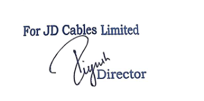
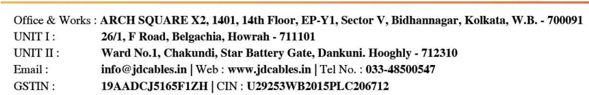

**[Image: a8b81103-af49-45ed-8e77-71df873cdfa7.pdf-0001-00.png (1031x188, 161.3KB)]**

**Date: November 25****th** **, 2025** 

**To The Manager- Listing Department, BSE Limited P.J. Towers, Dalal Street, Fort, Mumbai- 400001, Maharashtra, India.** 

### **Scrip ID/Code: JDCABLES/544524** 

Respected Sir/ Madam, 

**Subject: Submission of Transcript of the Earnings Conference call held on November 21, 2025 at 04:00 p.m.** 

### **Ref: Regulation 30(6) read with Schedule III Part A of SEBI (Listing Obligations and Disclosure Requirements) Regulations, 2015 (“SEBI Listing Regulations”)** 

With reference to our intimation dated November 14th, 2025 related to the Earnings Conference call, the Company is submitting the transcripts of Earnings Conference call of the analyst/investor conference call which was held on November 21, 2025 at 04:00 p.m. to discuss the Unaudited Financial Results of the Company for the Half Year ended 30th September 2025. 

Submitted for your kind information and necessary records. 

Kindly take the same on your records. 

Thank you! **Yours Faithfully. For JD Cables Limited** 

**[Image: a8b81103-af49-45ed-8e77-71df873cdfa7.pdf-0001-11.png (343x170, 22.2KB)]**

**Piyush Garodia Managing Director DIN: 07194809** 

**[Image: a8b81103-af49-45ed-8e77-71df873cdfa7.pdf-0001-13.png (960x155, 84.5KB)]**

**[Image: a8b81103-af49-45ed-8e77-71df873cdfa7.pdf-0002-00.png (269x100, 32.4KB)]**

# “JD Cables Limited H1 FY'26 Earnings Conference Call” 

## **November 21, 2025** 

**[Image: a8b81103-af49-45ed-8e77-71df873cdfa7.pdf-0002-03.png (268x101, 32.8KB)]**

**[Image: a8b81103-af49-45ed-8e77-71df873cdfa7.pdf-0002-04.png (222x70, 20.3KB)]**

**[Image: a8b81103-af49-45ed-8e77-71df873cdfa7.pdf-0002-05.png (214x101, 11.6KB)]**

**MANAGEMENT: MR. PIYUSH GARODIA - MANAGING DIRECTOR, JD CABLES LIMITED MR. RAJESH JHUNJHUNWALA - WHOLE-TIME DIRECTOR, JD CABLES LIMITED MR. ABHISHEK GUPTA – MANAGER (ACCOUNTS & FINANCE), JD CABLES LIMITED MODERATOR: MS. CHANDNI - EQUIBRIDGEX ADVISORS PRIVATE LIMITED** 

Page 1 of 13 

_JD Cables Limited November 21, 2025_ 

**[Image: a8b81103-af49-45ed-8e77-71df873cdfa7.pdf-0003-01.png (268x101, 32.4KB)]**

#### **Moderator:** 

Ladies and gentlemen, good day and welcome to JD Cables Limited H1 FY'26 Earnings Conference Call hosted by EquibridgeX Advisors Private Limited. 

As a reminder, all participant lines will be in the listen-only mode and there will be an opportunity for you to ask questions after the presentation concludes. Should you need assistance during the conference call, please signal an operator by pressing ‘*’ then ‘0’ on your touchtone phone. Please note that this conference is being recorded. 

I now hand the conference over to Ms. Chandni from EquibridgeX Advisors Private Limited. Thank you and over to you, ma'am. 

#### **Chandni:** 

Thank you very much. A very good evening to everyone. Welcome to the H1 FY'26 earnings call of JD Cables Limited. 

From the management team, we have with us Mr. Piyush Garodia – Managing Director; Mr. Rajesh Jhunjhunwala – Whole-Time Director; Mr. Abhishek Gupta – Manager, Accounts & Finance. 

We will have opening remarks from the Management Team post which we will open the floor for Q&A. 

With that, I would like to hand over the call to Mr. Piyush Garodia for the opening remarks. Over to you, sir. 

**Piyush Garodia:** 

Thank you, ma'am. Good afternoon, ladies and gentlemen. It is my pleasure to welcome all of you to JD Cables Limited first ever Earnings Conference Call. This is a proud and memorable moment for all of us not only because it marks our inaugural conference call but also because it follows the remarkable milestone of our successful IPO which saw an overwhelming response and got subscribed more than 128 times and we received subscription worth more than Rs. 8,100 crores against the issue size of Rs. 96 crores followed by successful listing on BSE SME platform. 

I want to begin by expressing my sincere gratitude to our shareholders, investors, customers, partners and all stakeholders. Thanks for the trust you have placed in our Company. Your support reinforces our commitment to delivering sustainable value and strengthening JD Cable's position in India's power infrastructure landscape. 

Before we discuss the financial performance, I would like to give a brief overview of our Company. We are an ISO certified and BIS certified manufacturer of LT AB cables, LT XLPE and PVC power and control cables and aluminum conductors including double AAC, AAAC and ACSR conductors. With two modern manufacturing units in West Bengal, equipped with advanced machinery and in-house testing labs, we cater extensively to the power, transmission and distribution sector. We are an approved vendor for multiple state electricity boards across 

Page 2 of 13 

_JD Cables Limited November 21, 2025_ 

**[Image: a8b81103-af49-45ed-8e77-71df873cdfa7.pdf-0004-01.png (268x101, 32.4KB)]**

more than 10 states with a strong and growing presence pan-India. The first half of financial year 2026 has been an encouraging period for JD Cables where we saw total income grew 13% year-on-year basis to Rs. 121.44 Cr. EBITDA increased 25% year-on-year basis to Rs. 19.24 Cr. with margins expanding to 15.85%. Net profit rose 16% year-on-year basis to Rs. 11.92 Cr. maintaining strong profitability at 9.82%. 

Operationally, we achieved several strategic milestones during this phase. Acquisition of a new industrial facility in Dankuni Hooghly spanning 1,18,000 square feet which enhances our production capabilities. Order book stands at a robust Rs. 286.21 Cr. as of September 30, 2025, about 2.36x H1 revenue, providing strong visibility for the coming quarters. Vendor approvals from key states, Himachal Pradesh and Punjab significantly strengthening our reach in Northern India. We have also placed a Rs 5.72 crore machinery order for our Conductor Division to support capacity expansion and faster delivery timelines. These achievements reflect our focus on strengthening operational efficiency, expanding our geographical footprint and scaling our manufacturing capabilities to meet rising demand. These numbers highlight both the scalability of our business model and the solid foundation on which the Company is progressing. 

Looking ahead, we remain focused on scaling capability across cables and conductors to meet the rising requirements of distribution and infrastructure projects. Strengthening our state electricity board network across additional states to unlock new markets. Optimizing working capital and supply chain efficiency aided by proceeds from the IPO. Leveraging governmentled power distribution and transmission investments, including RDSS and major grid expansion programs, enhancing automation, improving product quality and pursuing new generation cable technologies aligned with sustainability. We are aggressively expanding our presence in EPC projects and have created a dedicated EPC division headed by Mr. Rajesh Jhunjhunwala, our Whole-Time Director, which will provide a strong forward integration advantage. We are targeting an order book of Rs. 1,000 crores by FY26-27. We have already participated in tenders aggregating approximately Rs. 60 crores and are awaiting the results, and we will be bidding for several more such contracts in the coming days. With a strong order book, expanded capacity pipeline and increased geographic reach, we believe JD Cables is well-positioned to accelerate growth in the coming periods. 

Before I conclude, I want to thank our customers, suppliers and employees for their unwavering commitment and our investors and shareholders for the confidence shown in our vision. The successful IPO and our strong H1 performance mark the beginning of an exciting new chapter for JD Cables. 

Thank you once again for joining us today. We are now happy to take questions from participants. 

**Moderator:** 

Thank you very much. We will now begin the question-and-answer session. The first question is from the line of Rahul Kothari, an individual investor. Please go ahead. 

Page 3 of 13 

_JD Cables Limited November 21, 2025_ 

**[Image: a8b81103-af49-45ed-8e77-71df873cdfa7.pdf-0005-01.png (268x101, 32.4KB)]**

**Rahul Kothari:** Good evening, Piyushji. Congratulations on a good set of numbers and a successful IPO. So, few questions I have, like what is our model in terms of whether we are supplying directly to the government or is it through subcontractors or EPC companies? And second, what is the margin profile between Cables and Wireless? What is the EBITDA margin there and in the aluminum conductors? **Piyush Garodia:** Good afternoon, sir. First of all, we are majorly supplying to EPC contractors and we are also participating in direct government tenders also. We are aggressively participating right now in government tenders for supply of cables also. And margin will be explained by Mr. Abhishek. **Abhishek Gupta:** So, for FY'25, we did an EBITDA margin of 13.62% and for half-year FY'26, our EBITDA margins are around 15.85% and our PAT margins for FY'I25, it was 8.84% and for half-year FY'26, it's 9.82%. So, these margins are cumulatively for the entire business and not separately for cables or conductors. **Rahul Kothari:** Okay. Thank you, sir. And one more question regarding this expansion of Dankuni facility. So, after the installation of, let's say, all the machinery and the setup, what will be our peak capacity? Because right now, I think we are already in those current facilities, we are already producing 70% of the production capacity. So, what will be the peak capacity and how much revenue we can generate by expanding into this facility? **Piyush Garodia:** So, you're asking about the current facility or the newer facility which we will bring to expand the newer facility? **Rahul Kothari:** The newer facility. **Piyush Garodia:** Sir, newer we will be expanding in phased manner. As you can see, we have ordered the plant and machinery for our Conductor Division at first. So, when the Conductor Division will get installed, then the cable division will come up. So, we are expecting the Conductor Division will be installed in December only. So, we will be getting the handover of property on 12th or 13th December, and we have already placed the machine. By that time, all the machines will be at our place only and we are trying to start the Conductor Division within December or maybe in January 1st week. And then after that, we will be installing our cables machinery and going forward, as you asked, the capacity; capacity within March 2026, we will be doubling our present capacity. It will be 2x our current capacity. And after that, we are targeting around 4x to 5x expansion within the next 2 to 3 years. **Rahul Kothari:** Okay. So, that's great to hear. So, we can expect significant growth in the coming couple of years. **Piyush Garodia:** Yes, definitely. **Rahul Kothari:** Definitely. Thank you so much. 

Page 4 of 13 

_JD Cables Limited November 21, 2025_ 

**[Image: a8b81103-af49-45ed-8e77-71df873cdfa7.pdf-0006-01.png (268x101, 32.4KB)]**

|**Piyush Garodia:**|Thank you.|
|---|---|
|**Moderator:**|Thank you. The next question is from the line of Sahil Garg from CCV Emerging Opportunities Fund. Please go ahead.|
|**Sahil Garg:**|Hi, sir. Good afternoon and thank you for giving the opportunity. Sir, I have two questions. My first question is once we have this capacity doubled by March 2026, so how the utilization levels would look like on a year-on-year basis? And my second question is that do we also have any plan to enter into OPGW wires?|
|**Piyush Garodia:**|That's also a good segment. But right now, we are focusing on like the present transmission and distribution sectors at present because we already have so much lots of order book and we are expecting good orders in the upcoming months also. And like as you said, like OPGW, we will be definitely looking for that sector also. Once we install, once we like this plant and machinery gets installed and like we have good order book coming and then we can in the future, we will definitely look for OPGW cables also. It's a good project.|
|**Sahil Garg:**|Okay. I guess my first question is still not answered, sir.|
|**Piyush Garodia:**|Can you repeat the first question?|
|**Sahil Garg:**|I was asking that what would be the utilization levels once we have this 100% capacity expansion by March 2026, like how the growth would be done around in FY'27, FY'28?|
|**Piyush Garodia:**|I think by the end of September, we will be like 80% capacity, you can say it will be in 80% capacity within September, like next September.|
|**Sahil Garg:**|80% would be the utilization levels, you are saying?|
|**Piyush Garodia:**|Yes.|
|**Sahil Garg:**|Of the total capacity, new plus old?|
|**Piyush Garodia:**|Yes, sir.|
|**Sahil Garg:**|Okay. And what kind of revenue we can expect from that 80% utilization?|
|**Piyush Garodia:**|We, as I said, like we are planning to double the revenue like after March '26, we will be like, we are planning to double the revenue in the next financial year. We are targeting 80%.|
|**Sahil Garg:**|Okay. And would the margins be remain same or it would improve or like?|

Page 5 of 13 

_JD Cables Limited November 21, 2025_ 

**[Image: a8b81103-af49-45ed-8e77-71df873cdfa7.pdf-0007-01.png (268x101, 32.4KB)]**

**Piyush Garodia:** I think it will, it will remain more or less same only because going forward, we are also adding new products also in that facility, like HTLS conductor, MVCC, AL-59 conductors, and module 11kV cables HT cables, etc. We will be adding new products also in that unit. **Sahil Garg:** Okay. Thank you, sir. That's it. **Piyush Garodia:** Thank you, sir. Thank you. **Moderator:** Thank you. The next question is from the line of Tanmay Bhatt, an individual investor. Please go ahead. **Tanmay Bhatt:** Good afternoon. So, the order book stands at Rs. 286.21 crores as of September '25, right? Like what proportion of this is expected to convert into revenue, like in H2 FY'26 and FY'27? **Piyush Garodia:** I think the projects are generally awarded to contractors in like, say, 24 months, 18 months, 36 months. So, there are lots of orders which are of like 18 months, 12 months. So, we are expecting this to be completed within 1.5 years. **Tanmay Bhatt:** Okay. So, you can highlight on the topline and bottom-line of the Company, revenue and PAT for FY'28? **Piyush Garodia:** So, we are targeting at least Rs. 500 Cr. in the next financial year Rs. 500 Cr. to Rs. 600 Cr. and Rs. 1,000 CR in the next two years with more or less same PAT margins. **Tanmay Bhatt:** And you secured vendor approvals from Himachal Pradesh and Punjab, right? How do these new approvals change revenue of the Company and margins? **Piyush Garodia:** It's just a geographical expansion, because as we will be expanding our facility and we will be like doubling our capacity. So, we will be needing, for the more pan-India basis, we want to be present in pan-India basis. So, and as I said earlier, like we will be exploring new products. So, we are expanding to Himachal Pradesh. Then we will be also like, we are expanding into Rajasthan. We have already got approval in Punjab. So, it will definitely help in getting like orders of newer products from these newer regions. And as we scale up, it will definitely help in like procuring orders from there also. **Tanmay Bhatt:** Okay. And are there any EPC plans for the near future? **Piyush Garodia:** Yes, definitely. As I said in my opening speech, that we have already participated in tenders worth more than Rs. 60 Cr. And we have already like working on several other projects, which is headed by Mr. Rajesh Jhunjhunwala, who has around 30 years' experience in this field. So, and this will definitely give us a forward integration advantage. And we are like looking quite aggressively to this EPC line as well. 

Page 6 of 13 

_JD Cables Limited November 21, 2025_ 

**[Image: a8b81103-af49-45ed-8e77-71df873cdfa7.pdf-0008-01.png (268x101, 32.4KB)]**

**Tanmay Bhatt:** Okay. And what was the CAPEX spend during H1 and like what is the full year CAPEX plan? So, Rs. 16.45 Cr. to be precise, we have already spent on the existing facility, including the land and building cost and the plant and machinery cost. And we will be like further spending around Rs. 6 Cr. to Rs. 7 Cr. in the upcoming few days only for the cables division. **Abhishek Gupta:** Sir, Abhishek from management side. Sir, so for the half year till September, we didn't do a major CAPEX. Our CAPEX was done in the month of October and it's continuing in the second half of the year. **Tanmay Bhatt:** Okay. And one more thing, like the capacity utilization is already 79% to 81% in both the units. So, will the Company consider a further capacity expansion beyond the Dankuni facility? **Piyush Garodia:** Yes sir, we have already purchased a newer facility of 1,18,000 square feet. As I said, we have already placed the orders of plant and machinery. So, we are expanding in that facility. **Tanmay Bhatt:** Okay. And as you just mentioned regarding that Himachal Pradesh and Punjab, are there any additional major states in the pipeline for the vendor approval? **Piyush Garodia:** Yes. As I said, Rajasthan, there is three discoms, Jodhpur and two other divisions are there. So, discoms are there. So, we put the files there also. So, we are expecting the approval to come very soon. **Tanmay Bhatt:** Okay. And as you are expanding further in different states, in which state do you expect better PAT margins? **Piyush Garodia:** So, it's not about the better PAT margins. It's about like we want to be present pan India. So, suppose there are several projects going on. Suppose a good inquiry comes from a deputed client, we don't want to miss that opportunity. That's why we are expanding to pan-India level so that we don't have to face any problem in the near future that we lose order just because we don't have a vendor approval. So, that's why we are expanding to pan-India basis. **Tanmay Bhatt:** Okay. Great. Thanks a lot. **Piyush Garodia:** Thank you. **Moderator:** Thank you. The next question is from the line of Rahul Kothari, an individual investor. Please go ahead. **Rahul Kothari:** Hi, just a follow-up question. So, I just wanted to understand that the products we are manufacturing, are they primarily related to the electrification thing or are we also doing something on the like home usage or like for example, is there any data center opportunity where we can provide our cables? 

Page 7 of 13 

_JD Cables Limited November 21, 2025_ 

**[Image: a8b81103-af49-45ed-8e77-71df873cdfa7.pdf-0009-01.png (268x101, 32.4KB)]**

**Piyush Garodia:** Good question. There is a lot of opportunity in the data center as well. We will definitely like to explore data center and solar cables in the near future, very soon And yes, our products are being used for electrification only for transmission and distribution. First, you have to transfer the electricity to transmission which is done through conductors, mainly from conductors like ACH conductor. And then after that, we do a distribution through ALBH cables and like also power cables are being used, control cables are used in substations line. **Rahul Kothari:** So, but we have the capability and capacity or the expertise to go into this data center? **Piyush Garodia:** Yes, definitely. We can manufacture and we have the qualification also. We can easily manufacture. It's just copper cables which are mainly used and like we are planning very soon to enter that segment also. And I missed your house wire question. House wire is again a completely different sector. There we are planning to enter through distributorship like all the big companies are doing and we have plans to enter house wire segment also in the near future. **Rahul Kothari:** Thank you. That's great to hear. **Piyush Garodia:** Thank you, sir. **Moderator:** Thank you. The next question is from the line of Rupesh Thakur from JSR Investments. Please go ahead. **Rupesh Thakur:** Thank you, sir. So, my question is regarding the raw material. So, in your raw material, mainly aluminum and copper are there. So, regarding the price volatility, have you implemented any hedging or pass-through process? And what is the impact on the EBITDA margins if the raw material prices goes 5% to 10%? **Piyush Garodia:** Sir, can you repeat your last thing? What will be the…? **Rupesh Thakur:** So, my question is, if the raw material prices increases by 5% to 10%, what will be the impact on the EBITDA? **Piyush Garodia:** First of all, all the major projects which are going on have PV, price variation clauses in the government tenders because it's not possible for the contractor to work at the same price for the next upcoming 18 months or 24 months. So, normally all the major contracts are having price variation clauses. So, we raise debit note or credit note depending upon the LME prices of the raw materials. **Rupesh Thakur:** Understood. So, basically our EBITDA margin is very sustainable in this matter. **Piyush Garodia:** Yes. We are also keeping the track of price and we ensure like we maintain sufficient inventory levels and we have strong relations with several suppliers. So, we negotiate like competitive price always from them. 

Page 8 of 13 

**[Image: a8b81103-af49-45ed-8e77-71df873cdfa7.pdf-0010-00.png (267x99, 32.3KB)]**

||_JD Cables Limited_ _November 21, 2025_|
|---|---|
|**Rupesh Thakur:**|Okay. Understood, sir. And regarding the order book, your order book stands at Rs. 286.21 crores as of September '25. So, how much of this is executable by March 31st, 2026? And what is the expected conversion timeline?|
|**Piyush Garodia:**|Yes. As I said, Rs. 286 crores comprises of several orders, like some are of 12 months, some are of 18 months, depending upon the contractor's requirement, they ask to supply the materials. And like this figure constantly changes. Like suppose we got a Rs. 5 crores newer order and then we have executed suppose Rs. 10 crores earlier orders. So, it keeps on changing.|
|**Rupesh Thakur:**|Okay. So, from the investor presentation that you have, you got new vendor pool from Himachal and Punjab. So, what is the expected annual revenue potential from these two states? And how soon we can expect any order inflow?|
|**Piyush Garodia:**|Order inflow can be expected in the upcoming say 1 to 2 months. And like it depends again, it depends upon the requirement of contract. And basically, you will see the effect, more prominent effect in the upcoming 12 months to 14 months, you can say.|
|**Rupesh Thakur:**|Okay. So, are there any delay in the government payments since your government payments are off?|
|**Piyush Garodia:**|We are mainly supplying right now to major EPC players and like we have good understanding with them and like some of them are quite a big name. So, we are supplying regularly to them. And like suppose the delay, maybe if it's say 10-15-20 days, like but not a major delay normally.|
|**Rupesh Thakur:**|Okay, not a major delay. Because I was asking this question because the trade receivable increased to around Rs. 68 crores, if I'm right.|
|**Piyush Garodia:**|Yes.|
|**Rupesh Thakur:**|Okay. So, if I think so, in the coming 1 to 3 years, your internal accruals is enough. So, there is no need of any equity infusion in the future?|
|**Piyush Garodia:**|We need equity in the further six months or one year. Because we are expanding to like EPC contracts as well, where there will be a fund requirement. And if we will win, like say a good sizable amount of order, we will be needing a sizable amount of capital for executing those projects.|
|**Rupesh Thakur:**|But in the EPC business, it's already very cluttered, what we say already, there are a lot of players in this segment.|
|**Piyush Garodia:**|Like see, competition is already in each and every segment, sector there is a competition. And like if you see the major players like KEC, KSC, Polycab, and then Calcutta-based, there are|

Page 9 of 13 

_JD Cables Limited November 21, 2025_ 

**[Image: a8b81103-af49-45ed-8e77-71df873cdfa7.pdf-0011-01.png (268x101, 32.4KB)]**

many companies like Laser, Lumino and Cabcon, all are into manufacturing cables as well as they are taking the EPC, because it gives you the forward integration advantage. 

**Rupesh Thakur:** Okay, understood. So, along with applying for the tender for the wires and cables, we can apply for the EPC tender also? **Piyush Garodia:** Yes, sir. **Rupesh Thakur:** Okay. So, any future expected revenue from this segment in the coming future? **Piyush Garodia:** So, we are like targeting Rs. 1,000 crores or order book in the upcoming, say, two years. **Rupesh Thakur:** In the Rs. 1,000 crores in the two years order book? **Piyush Garodia:** Yes. **Rupesh Thakur:** That's good. Okay. Thank you, sir. Thank you so much for your patience and all the best for the coming years. **Piyush Garodia:** Thank you very much, sir. Thank you. **Moderator:** Thank you. The next question is from the line of Ishima Bansal from Venturex Fund. Please go ahead. **Ishima Bansal:** Hello. I just wanted to get an idea on the total CAPEX that we expect to do to achieve a revenue of Rs. 1,000 crores in the next two years? **Piyush Garodia:** You want to know the CAPEX? **Ishima Bansal:** Yes, the total capital expenditure that we can infuse in the business to reach a revenue of Rs. 1,000 crores. **Piyush Garodia:** Yes, I'll explain to you. Suppose, right now, we have already done a CAPEX of, say, 16.45 crores. We are expecting to do a CAPEX of, say, 7 Cr. to 8 Cr. right now. And it will turn to 25 Cr. and we are expecting it, like our cable and Conductor Division to double the revenue by the next year. We are expecting to double the revenue from our cable and Conductor Division in the next financial year, say 600 Cr.-700 Cr. And then we are also expecting a good number of, say, 400 Cr.-500 Cr. in the upcoming years for the EPC division. You can expect 100 Cr.-150 Cr. like 30% if you assume that Rs. 500 crores of projects require 30% capital requirements. It will turn to 150 Cr. and 10 Cr. approx.. for the cable and Conductor Division. So, you may expect like Rs. 160 Cr.-Rs. 170 Cr. to like, we will be needing 160 Cr.-170 Cr. to achieve a target of Rs. 1,000 Cr. 

Page 10 of 13 

_JD Cables Limited November 21, 2025_ 

**[Image: a8b81103-af49-45ed-8e77-71df873cdfa7.pdf-0012-01.png (268x101, 32.4KB)]**

|**Ishima Bansal:**|Got it. And, sir, as you mentioned that we will be entering into the EPC segment. So, basically, what kind of EPC work will we be doing? Like underground cables, transmission cables, or will we also be manufacturing the substations? What kind of EPC will we be doing?|
|---|---|
|**Piyush Garodia:**|Sir, I think Mr. Rajesh Jhunjhunwalaji, who is a Whole-Time Director, he will explain to you.|
|**Rajesh Jhunjhunwala:**|In this there are transmission and distribution. That is why we make substation. And we distribute 11kV to 33 kV lines. Now the projects are coming for underground cables. It is implemented in several cities.|
|**Ishima Bansal:**|And for which states we have applied tenders for?|
|**Piyush Garodia:**|We cannot disclose this right now because it is the execution part only.|
|**Ishima Bansal:**|Okay. And, sir, moving forward in the next two years, Rs. 1,000 Cr. how much revenue do we see from our EPC business in FY27?|
|**Piyush Garodia:**|In FY27, again, it depends upon the order we achieve. Most of the tenders are coming in January, February, March period only. So, it depends upon the order book order, like how much orders we get. Then we are targeting around at least, say, 150 Cr.-200 Cr, like revenue to be booked in the next financial year. And after that, like a major 500 Cr.-700 Cr.|
|**Ishima Bansal:**|Got it. And what margins can we expect in our EPC business? Bottomline margins?|
|**Piyush Garodia:**|Say, it's around like 7%-8%-9%. It should remain in that range only.|
|**Ishima Bansal:**|Okay. And, sir, one last question on the growth that we can expect in FY'26. What numbers can we expect in FY'26?|
|**Piyush Garodia:**|Sir, we are targeting around 350 Cr.-360 Cr. like revenue in this financial year.|
|**Ishima Bansal:**|Okay. And how much of this revenue will be contributed from our new facility, the new plant that we have just bought?|
|**Piyush Garodia:**|It's around, say, 50 Cr.-60 Cr.|
|**Ishima Bansal:**|Got it. Thank you so much, sir. Wish you all the best.|
|**Moderator:**|Thank you. The next question is from the line of Deeya from Sapphire Capital. Please go ahead.|
|**Deeya:**|Hello, sir. So, what kind of margins are we expecting from the EPC division?|
|**Piyush Garodia:**|We are expecting that these are like 8%-9% from something sort of 8%-9%.|

Page 11 of 13 

_JD Cables Limited November 21, 2025_ 

**[Image: a8b81103-af49-45ed-8e77-71df873cdfa7.pdf-0013-01.png (268x101, 32.4KB)]**

|**Deeya:**|Okay, sir. And what kind of EBITDA margins for this year, FY'26?|
|---|---|
|**Piyush Garodia:**|EBITDA margins should remain around 15% or 16%, like something like that only.|
|**Deeya:**|And for FY'27 can we expect a similar range?|
|**Piyush Garodia:**|We are expecting like it should remain like the same level.|
|**Deeya:**|Okay. And last time you had mentioned the Mizoram order. We were expecting like a 200 Cr. EPC order from that?|
|**Piyush Garodia:**|Yes, ma'am. As I said, we are expecting the tenders to come in the upcoming months, in December-January, when the tenders will be included and we are actively participating. Not only in Mizoram, we are actively participating in several states. So, we are expecting a good order book from the EPC division as well.|
|**Deeya:**|All right, sir. Thank you so much.|
|**Piyush Garodia:**|Thank you.|
|**Moderator:**|Thank you. The next question is from the line of Neelam, an individual investor. Please go ahead.|
|**Neelam:**|Good evening, sir. Sir, my first question is, the new Dankuni facility spanning 1.18 lakh square feet is a major milestone. How should we think about the ramp-up timeline? And when does it start contributing meaningfully to volumes and EBITDA?|
|**Piyush Garodia:**|Ma'am, it's starting in a phased manner, like I would say in December ending or by say January 1stweek, we are expecting to start our conductor and then gradually our cable users will be starting and like we're expecting, then we can definitely in future we can definitely ramp up to 3x, 4x in the like near future depending upon the execution and orders.|
|**Neelam:**|Okay. And my second question is, wire and cable industry is seeing aggressive scaling by several players. What specific trends, operational or product level are helping you win share in competitive tenders?|
|**Piyush Garodia:**|Yes, ma'am. Because several players are expanding just because there's a huge demand of cables and conductors. So, that's why. So, gradually, if you see that like the demand will be more in the near future and it's already, the demands are very, so the players are expanding their levels also. So, it should remain at this level only.|
|**Neelam:**|Okay. Thank you, sir. And all the best.|
|**Piyush Garodia:**|Thank you.|

Page 12 of 13 

**[Image: a8b81103-af49-45ed-8e77-71df873cdfa7.pdf-0014-00.png (268x101, 32.4KB)]**

_JD Cables Limited November 21, 2025_ 

**Moderator:** Thank you. Ladies and gentlemen, we'll take that as the last question for today. I now hand the conference over to Ms. Chandni for closing comments. Thank you and over to you, ma'am. **Chandni:** On behalf of JD Cables and EquibridgeX Advisors, I thank everyone for taking the time to join today's earnings call. If you have any queries, you can connect to us at info@equibridgex.com. Once again, thank you for joining the conference. **Moderator:** Thank you, ma'am. On behalf of EquibridgeX Advisors Private Ltd. that concludes this conference. Thank you for joining us and you may now disconnect your line. 

Page 13 of 13 

---

## Extracted Images

| # | File | Dimensions | Size |
|---|------|------------|------|
| 1 | a8b81103-af49-45ed-8e77-71df873cdfa7.pdf-0001-00.png | 1031x188 | 161.3KB |
| 2 | a8b81103-af49-45ed-8e77-71df873cdfa7.pdf-0001-11.png | 343x170 | 22.2KB |
| 3 | a8b81103-af49-45ed-8e77-71df873cdfa7.pdf-0001-13.png | 960x155 | 84.5KB |
| 4 | a8b81103-af49-45ed-8e77-71df873cdfa7.pdf-0002-00.png | 269x100 | 32.4KB |
| 5 | a8b81103-af49-45ed-8e77-71df873cdfa7.pdf-0002-03.png | 268x101 | 32.8KB |
| 6 | a8b81103-af49-45ed-8e77-71df873cdfa7.pdf-0002-04.png | 222x70 | 20.3KB |
| 7 | a8b81103-af49-45ed-8e77-71df873cdfa7.pdf-0002-05.png | 214x101 | 11.6KB |
| 8 | a8b81103-af49-45ed-8e77-71df873cdfa7.pdf-0003-01.png | 268x101 | 32.4KB |
| 9 | a8b81103-af49-45ed-8e77-71df873cdfa7.pdf-0004-01.png | 268x101 | 32.4KB |
| 10 | a8b81103-af49-45ed-8e77-71df873cdfa7.pdf-0005-01.png | 268x101 | 32.4KB |
| 11 | a8b81103-af49-45ed-8e77-71df873cdfa7.pdf-0006-01.png | 268x101 | 32.4KB |
| 12 | a8b81103-af49-45ed-8e77-71df873cdfa7.pdf-0007-01.png | 268x101 | 32.4KB |
| 13 | a8b81103-af49-45ed-8e77-71df873cdfa7.pdf-0008-01.png | 268x101 | 32.4KB |
| 14 | a8b81103-af49-45ed-8e77-71df873cdfa7.pdf-0009-01.png | 268x101 | 32.4KB |
| 15 | a8b81103-af49-45ed-8e77-71df873cdfa7.pdf-0010-00.png | 267x99 | 32.3KB |
| 16 | a8b81103-af49-45ed-8e77-71df873cdfa7.pdf-0011-01.png | 268x101 | 32.4KB |
| 17 | a8b81103-af49-45ed-8e77-71df873cdfa7.pdf-0012-01.png | 268x101 | 32.4KB |
| 18 | a8b81103-af49-45ed-8e77-71df873cdfa7.pdf-0013-01.png | 268x101 | 32.4KB |
| 19 | a8b81103-af49-45ed-8e77-71df873cdfa7.pdf-0014-00.png | 268x101 | 32.4KB |
