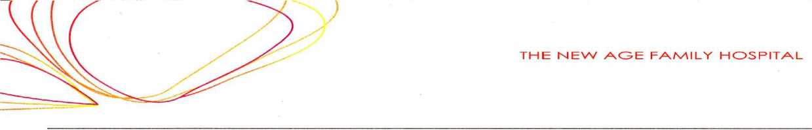

**[Image: March2025.pdf-0001-00.png (1239x200, 115.4KB)]**

**03****rd** **March, 2025** 

To 

BSE Limited Corporate Relationship Department P J Towers, Dalal Street, Fort Mumbai –  400 001. 

Dear Sir/Madam, 

###### **Sub: Intimation under Regulation 30 of SEBI (Listing Obligations and Disclosure Requirements) Regulations, 2015 – Investor Presentation** 

Pursuant to Regulation 30 of SEBI (Listing Obligations and Disclosure Requirements) Regulations, 2015, we enclose herewith the Investor Presentation (Q3 FY 2024-25). The same will also be available on the website of the company. 

This is for your information and records. 

Thanking You 

Yours faithfully, 

###### For **KMC SPECIALITY HOSPITALS (INDIA) LIMITED** 

### SUSHMA 

Digitally signed by SUSHMA Date: 2025.03.03 13:23:33 +05'30' 

**Sushma K** 

**Company Secretary** 

**[Image: March2025.pdf-0001-15.png (1239x167, 135.9KB)]**

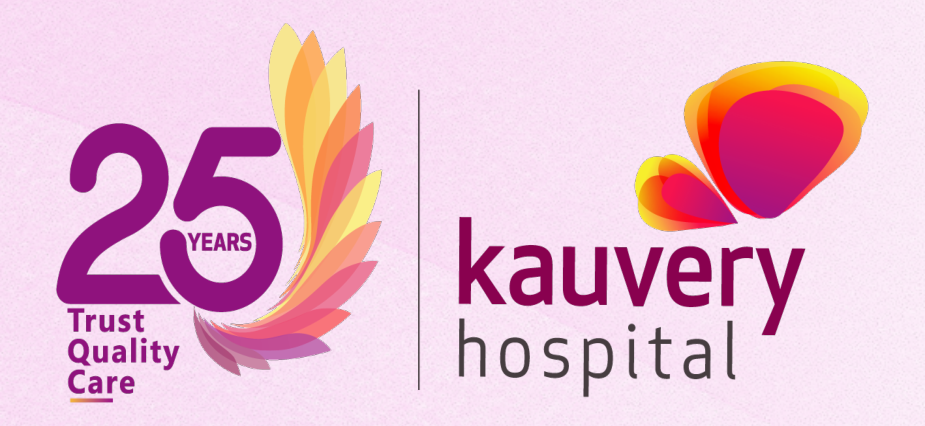

**[Image: March2025.pdf-0002-00.png (925x426, 467.5KB)]**

##### Making great healthcare affordable 

###### **KMC SPECIALITY HOSPITALS (INDIA) LTD** 

**INVESTOR PRESENTATION Q3 FY’2025** 

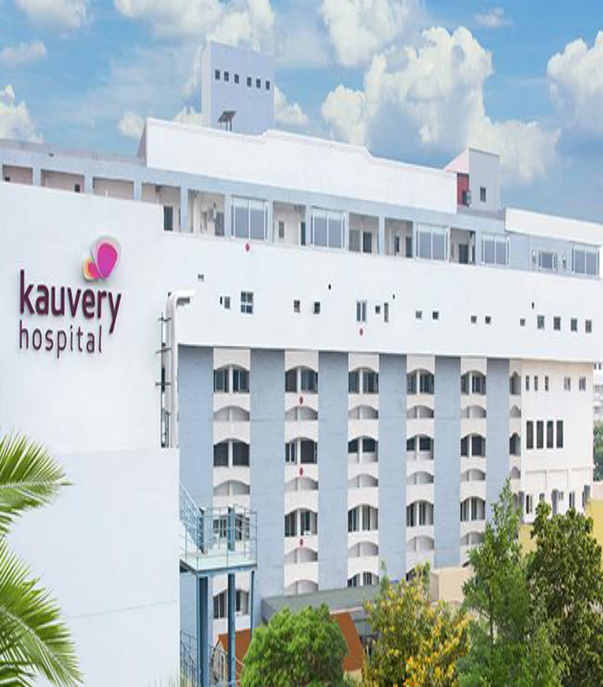

**[Image: March2025.pdf-0002-04.png (988x1125, 1667.2KB)]**

# Contents 

|ABOUT US|3|
|---|---|
|HOSPITAL OVERVIEW|5|
|SUSTAINABLE GROWTH STRATEGY|6|
|MAJOR EVENTS|7|
|LEADERSHIP TEAM|9|
|BOARD OF DIRECTORS|11|
|FY’2025 Q3 PERFORMANCE SUMMARY|12|
|HISTORICAL FINANCIAL PERFORMANCE|24|

**[Image: March2025.pdf-0003-02.png (261x194, 34.1KB)]**

2 

**[Image: March2025.pdf-0004-00.png (261x194, 34.1KB)]**

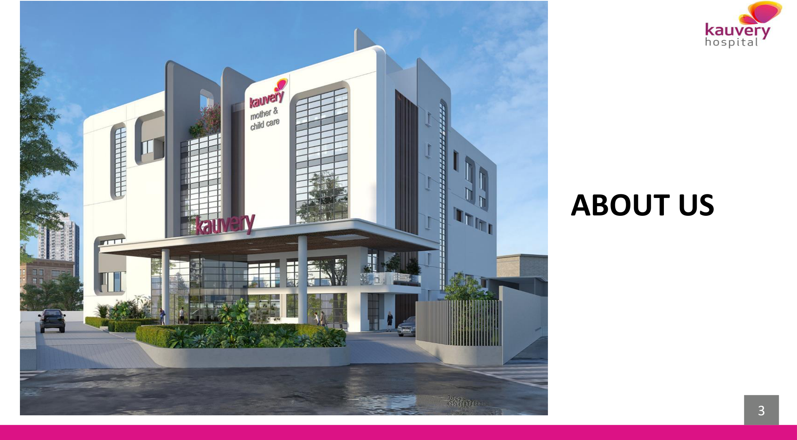

**[Image: March2025.pdf-0004-01.png (2000x1105, 1903.4KB)]**

<!-- Start of picture text -->
ABOUT US 3 <!-- End of picture text -->

**[Image: March2025.pdf-0005-00.png (261x194, 34.2KB)]**

#### **About us** 

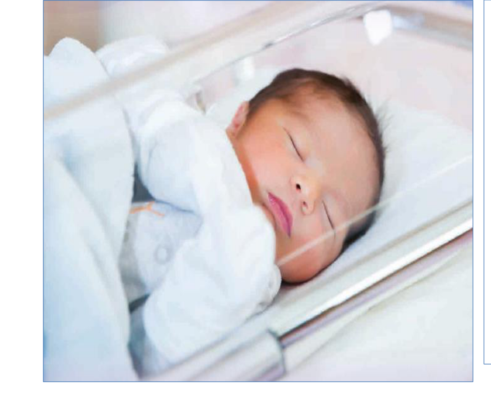

**[Image: March2025.pdf-0005-02.png (1116x896, 823.9KB)]**

- KMC Speciality Hospitals (India) Limited operates a 450bedded Multi-Specialty Hospital at Trichy, a major city in the State of Tamil Nadu 

- The Hospital focusses on providing Multi-Specialty services focused on: 

   - Mother & Child Care Services; 

   - Neurosciences; 

   - Gastro Sciences; 

   - Orthopedics; 

   - Plastic surgeries; 

   - Organ Transplants (Liver & Bone Marrow Transplant); 

   - • Critical care; 

- The Hospital facilities are centrally located and draws patients from over 200 kilometers for Neonatal, Pediatrics, Neuro and Gastro sciences and other tertiary care services. 

- Further, we operationalised our new facility comprising of 200 beds focused on providing Mother and Child Care services from January 29, 2024. 

4 

#### **Hospital Overview : Key Specialities and Advanced Infrastructure** 

**[Image: March2025.pdf-0006-01.png (261x157, 28.0KB)]**

**[Image: March2025.pdf-0006-02.png (109x111, 2.7KB)]**

###### **2 Healthcare Facilities    Operational Beds** 

1 Existing Facility                             250 Beds 

1 New Facility (Maa Kauvery)          200 Beds 

###### **Centre of Excellence** 

  Mother & Child Care Orthopaedics  Neuro Science  Critical Care   Gastro Science Bone Marrow Transplant   Plastic Surgery Liver Transplant 

###### **Well equipped with Advanced Infrastructure** 

 OT Theatres (Incl. Labour OT)  Mammogram  ICU’s (Incl. PICU, NICU etc)  Ventilators   CT Dexa Scan  MRI  Lab 

###### **Our catchment area** 

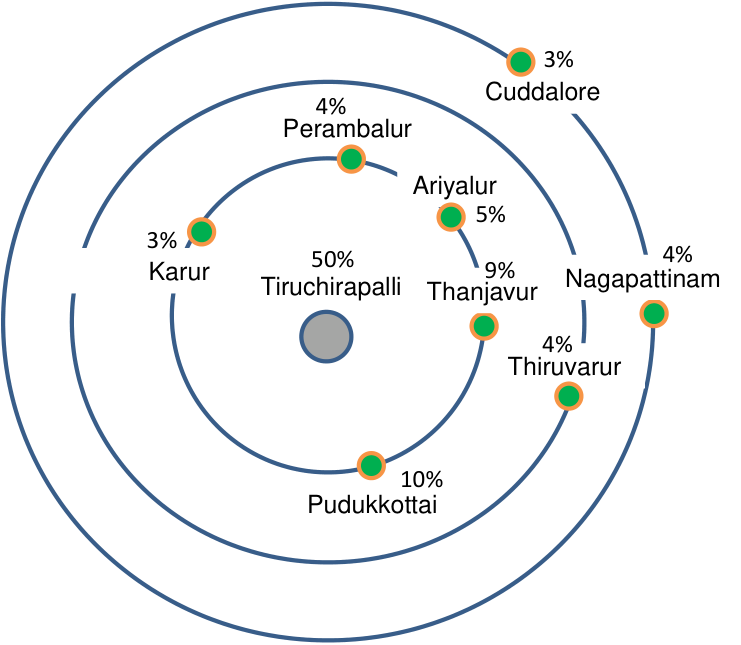

**[Image: March2025.pdf-0006-11.png (741x645, 67.2KB)]**

<!-- Start of picture text -->
3% Cuddalore 4% Perambalur Ariyalur 5% 3% 50% 4% Karur 9% Nagapattinam Tiruchirapalli Thanjavur 4% Thiruvarur 10% Pudukkottai <!-- End of picture text -->

**[Image: March2025.pdf-0006-12.png (128x107, 7.2KB)]**

Full-time employees and Associates including 100 Doctors 

~92% of IP comes from various cities in and around Tiruchirapalli as represented above 

1500+ 

5 

**[Image: March2025.pdf-0007-00.png (260x175, 31.1KB)]**

#### **Sustainable Growth Strategy** 

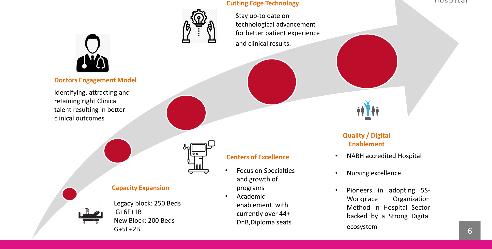

**[Image: March2025.pdf-0007-02.png (2000x1013, 205.3KB)]**

<!-- Start of picture text -->
Cutting Edge Technology Stay up-to date on technological advancement for better patient experience and clinical results. Doctors Engagement Model Identifying, attracting and retaining right Clinical talent resulting in better clinical outcomes Quality / Digital Enablement Centers of Excellence • NABH accredited Hospital • Focus on Specialties  • Nursing excellence and growth of Capacity Expansion programs • Pioneers in adopting 5S- • Academic Workplace Organization Legacy block: 250 Beds enablement  with Method in Hospital Sector G+6F+1B currently over 44+  backed by a Strong Digital New Block: 200 Beds DnB,Diploma seats G+5F+2B ecosystem 6 <!-- End of picture text -->

**[Image: March2025.pdf-0008-00.png (261x193, 34.1KB)]**

#### **Major Events** 

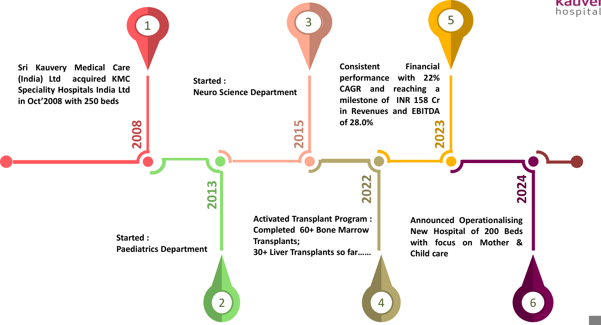

**[Image: March2025.pdf-0008-02.png (1751x947, 145.6KB)]**

<!-- Start of picture text -->
Sri Kauvery Medical Care Consistent Financial (India) Ltd acquired KMC Started : performance with 22% Speciality Hospitals India Ltd CAGR and reaching a Neuro Science Department in Oct’2008 with 250 beds milestone of INR 158 Cr in Revenues and EBITDA of 28.0% Activated Transplant Program : Announced Operationalising Completed 60+ Bone Marrow New Hospital of 200 Beds Started : Transplants; with focus on Mother & Paediatrics Department 30+ Liver Transplants so far…… Child care 2 4 6 2008 2015 2023 2022 2024 2013 <!-- End of picture text -->

7 

#### **Sri Kauvery Medical Care (India) Limited  (“The Group / The Parent”)** 

**[Image: March2025.pdf-0009-01.png (261x194, 34.1KB)]**

- The Group was founded 25 years ago and currently operates 12 Multi-Speciality Hospitals having over 2,500 beds in capacity across Chennai, Trichy, Bengaluru, Salem, Hosur and Tirunelveli; 

- 10 of the Hospitals are directly run in the Parent entity; 

- The Parent owns 75% of its listed subsidiary, KMC Speciality Hospitals (India) Ltd and runs 2 Multi-Speciality Hospitals with combined capacity of 450 Beds. (Legacy block: 250 Beds and New block: 200 Beds); 

- The Group is promoted by Dr. S Chandrakumar and Dr. S Manivannan and has marquee private equity / financial Investors as its shareholders. 

8 

#### **Leadership Team** 

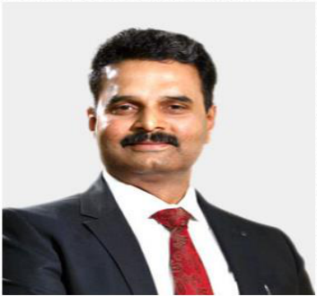

**[Image: March2025.pdf-0010-01.png (353x330, 129.1KB)]**

**Dr. S. Chandrakumar** _Founder & Executive Chairman_ 

- A qualified and experienced anesthesiologist and critical care specialist with 20+ experience; 

- Former Chairman of CII TN State Council (21-22); 

- Life Member in Indian Society of Anaesthesiologists & Critical Care Medicine. 

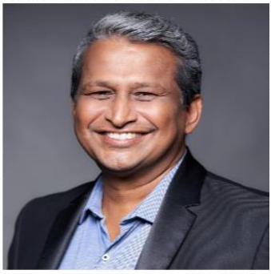

**[Image: March2025.pdf-0010-06.png (339x342, 164.8KB)]**

###### **Dr. S. Manivannan** 

_Founder & Managing Director_ 

- Qualified Anesthesiologist with 20+ years of clinical experience; 

- Outstanding Anaesthesiologist for 2010(Indian Society of Anesthesiology); 

- Leading Medical Entrepreneur 2018 by Indian Medical Association; 

- Certified Assessor in NABH (National Accreditation Board for Hospitals & Healthcare); 

- Founder of India’s largest medical equipment expo – MEDICALL. 

**[Image: March2025.pdf-0010-14.png (261x194, 34.4KB)]**

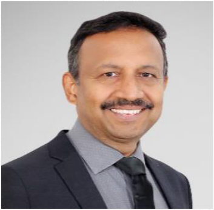

**[Image: March2025.pdf-0010-15.png (353x345, 133.7KB)]**

**Dr. D. Senguttuvan** 

- _SBU Head – Co-Founder, Executive Director & Key Managerial Person_ 

- SBU head of KMC Specialty Hospitals Limited; 

- A Leader in Advanced Paediatric Care and Healthcare Excellence in Tamil Nadu; 

- Chief Pediatrician with over With over 3 decades of Clinical expertise; 

- Past Secretary – IAP (2008-2010); 

- Former Healthcare Convener in CII (2016-17); 

- Chairman – CII Trichy Zone (2021-22); 

- Founder President of NNF, Trichy chapter. 

9 

#### **Our vision, mission and values** 

**[Image: March2025.pdf-0011-01.png (868x580, 79.4KB)]**

**[Image: March2025.pdf-0011-02.png (261x194, 34.1KB)]**

**[Image: March2025.pdf-0011-03.png (555x580, 15.4KB)]**

10 

#### **Board of Directors** 

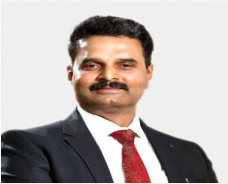

**[Image: March2025.pdf-0012-01.png (228x184, 49.0KB)]**

**Dr S Chandrakumar (Executive Chairman) is a passionate leader, with over 20 years of reputed clinical experience and managing Multi Speciality hospitals. He is one of the Promoters of Sri Kauvery Medical Care (India) Limited.** 

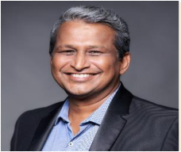

**[Image: March2025.pdf-0012-03.png (228x192, 64.5KB)]**

**Dr S Manivannan (Managing Director) is an Anaesthesiologist, with over 20 years of reputed clinical experience and managing Multi Speciality hospitals. He is one of the Promoters of Sri Kauvery Medical Care (India) Limited. He is also the founder of MEDICALL, India’s largest Medical Equipment Exhibition** 

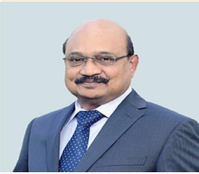

**[Image: March2025.pdf-0012-05.png (221x193, 54.6KB)]**

**Dr T Senthilkumar M.S.,M.Ch., (Non-Executive Director) is a senior consultant Cardiothoracic Surgeon with over 2 decades of professional experience. He was instrumental in establishing a focused open Heart Surgery programe in Trichy. He has rich teaching experience and is an examiner for B.P.T. (Bachelor in Physiotherapy) course for more than 12 years.** 

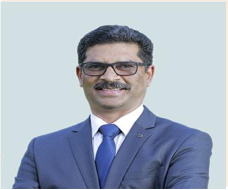

**[Image: March2025.pdf-0012-07.png (228x190, 52.8KB)]**

**Dr. Vijayabaskaran (Non-Executive Director) excels in various areas, like Project Management, Turnaround Specialist / Mergers & Acquisitions, Business Development, and Stakeholder Management. Best Integrated Farming System Research Scientist for the year 2013 at the National Level (ICAR). Best Extension Scientist for the year 2008 at the State level.** 

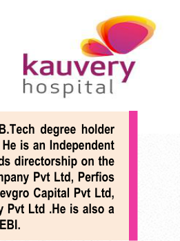

**[Image: March2025.pdf-0012-09.png (261x348, 52.0KB)]**

<!-- Start of picture text -->
B.Tech degree holder Capital Pvt Ltd, <!-- End of picture text -->

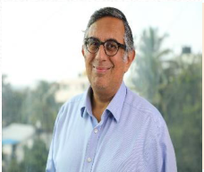

**[Image: March2025.pdf-0012-10.png (228x192, 80.8KB)]**

**Mr. Sunil Satyapal Gulati (Independent Director) is a B.Tech degree holder from the IIT, Delhi and a Gold Medalist from the IIM Ahmedabad. He is an Independent Director on the Board of Fedbank Financial Services Ltd. He holds directorship on the Board of Merisis Advisors Pvt Ltd, SBI Mutual Fund Trustee Company Pvt Ltd, Perfios Account Aggregation Services Pvt Ltd, Kinara Capital Pvt Ltd, Revgro Capital Pvt Ltd, Tapstart Capital Pvt Ltd, Arthan Finance Pvt Ltd & Carefin Money Pvt Ltd .He is also a member of the Mutual Fund Advisory Committee constituted by SEBI.** 

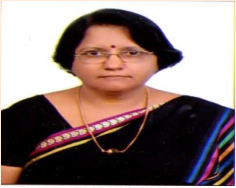

**[Image: March2025.pdf-0012-12.png (236x188, 68.5KB)]**

**Mrs Jayanthi Narayanaswamy (Independent Director) is a qualified Company Secretary with over 20 years of postqualification experience** 

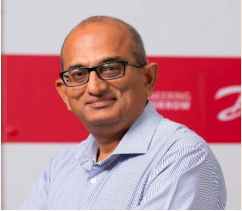

**[Image: March2025.pdf-0012-14.png (242x211, 80.4KB)]**

**Mr. Ravichandran (Independent Director) is a qualified Electronics & Communication Engineer and has completed his management education program from IIM, Ahmedabad. He has participated in Strategic Leadership & International Business Programs in European Business schools and Executive Leadership Program from Singularity University California. He has been associated with Danfoss group since 2002 and currently is the President of Danfoss Industries Pvt Ltd.** 

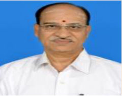

**[Image: March2025.pdf-0012-16.png (240x190, 60.9KB)]**

**Mr. S. Mohan (Independent Director) is a qualified Chartered Accountant practicing as a partner of the firm, Patel Mohan Ramesh & Co for 41 Yrs. Presently he is a vice president of the Society of Auditors, Chennai. He holds directorship in the board of RELYON Softech Limited, Bangalore and Unicorp Advisors Private Limited, Chennai** 

11 

**[Image: March2025.pdf-0013-00.png (261x194, 34.1KB)]**

## **FY’2025 (Q3) PERFORMANCE SUMMARY** 

12 

#### **Q3 FY’2025 Performance Summary** 

**[Image: March2025.pdf-0014-01.png (261x194, 34.4KB)]**

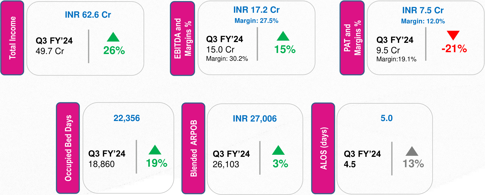

**[Image: March2025.pdf-0014-02.png (1864x751, 826.9KB)]**

<!-- Start of picture text -->
INR 17.2 Cr INR 7.5 Cr INR 62.6 Cr Margin: 27.5% Margin: 12.0% Q3 FY’24 Q3 FY’24 Q3 FY’24 49.7 Cr 26% 15.0 Cr 15% 9.5 Cr -21% Margin: 30.2% Margin:19.1% 22,356 INR 27,006 5.0 Q3 FY’24 Q3 FY’24 Q3 FY’24 18,860 19% 26,103 3% 4.5 13% PAT and Margins % Margins % Total Income EBITDA and ALOS (days) Blended  ARPOB Occupied Bed Days <!-- End of picture text -->

13 

**[Image: March2025.pdf-0015-00.png (261x194, 34.4KB)]**

#### **Key operating metrics : Revenue & Profitability** 

###### **Total Income (INR Cr)** 

###### **EBITDA (INR Cr & margin %)** 

**[Image: March2025.pdf-0015-04.png (722x9, 1.9KB)]**

**[Image: March2025.pdf-0015-05.png (722x10, 2.2KB)]**

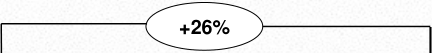

**[Image: March2025.pdf-0015-06.png (432x53, 14.6KB)]**

<!-- Start of picture text -->
+26% <!-- End of picture text -->

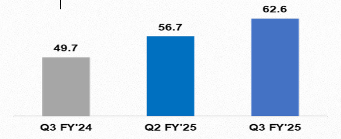

**[Image: March2025.pdf-0015-07.png (691x282, 107.9KB)]**

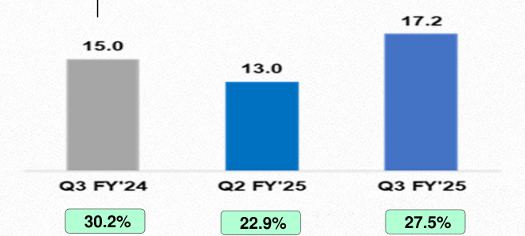

**[Image: March2025.pdf-0015-08.png (659x297, 109.1KB)]**

<!-- Start of picture text -->
30.2% 22.9% 27.5% <!-- End of picture text -->

###### **Profit before tax  (INR Cr & margin %)** 

**[Image: March2025.pdf-0015-10.png (722x7, 0.9KB)]**

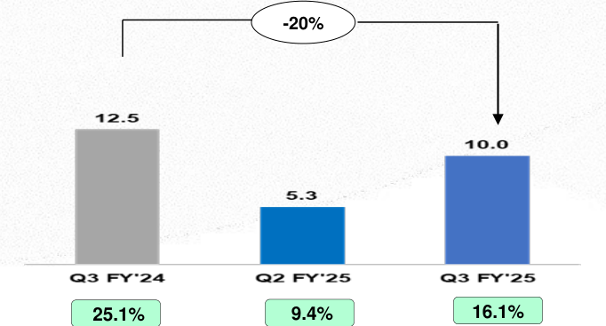

**[Image: March2025.pdf-0015-11.png (682x367, 115.4KB)]**

<!-- Start of picture text -->
-20% 25.1% 9.4% 16.1% <!-- End of picture text -->

###### **Profit after tax  (INR Cr & margin %)** 

**[Image: March2025.pdf-0015-13.png (722x7, 0.4KB)]**

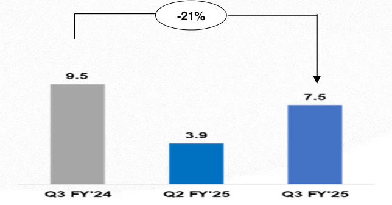

**[Image: March2025.pdf-0015-14.png (644x336, 108.0KB)]**

<!-- Start of picture text -->
-21% <!-- End of picture text -->

14 

15 

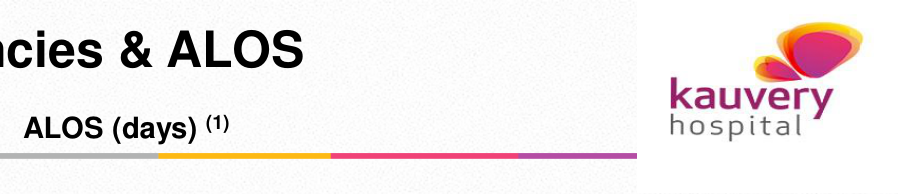

**[Image: March2025.pdf-0016-01.png (898x194, 113.9KB)]**

<!-- Start of picture text -->
ALOS (days)  (1) <!-- End of picture text -->

#### **Key operating metrics : Volumes, Occupancies & ALOS** 

###### **Average census and occupied beds per day** 

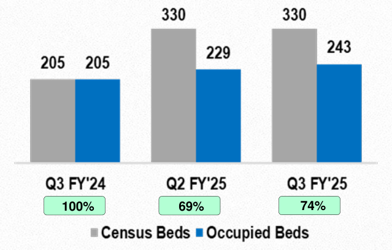

**[Image: March2025.pdf-0016-04.png (639x407, 143.2KB)]**

<!-- Start of picture text -->
100% 69% 74% <!-- End of picture text -->

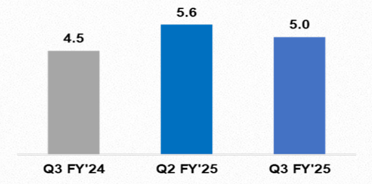

**[Image: March2025.pdf-0016-05.png (628x311, 99.2KB)]**

###### **OPD volumes****(2)** 

###### **IPD volumes****(3)** 

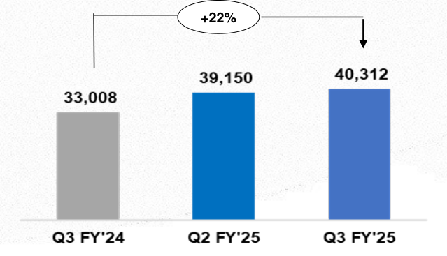

**[Image: March2025.pdf-0016-08.png (639x367, 119.7KB)]**

<!-- Start of picture text -->
+22% <!-- End of picture text -->

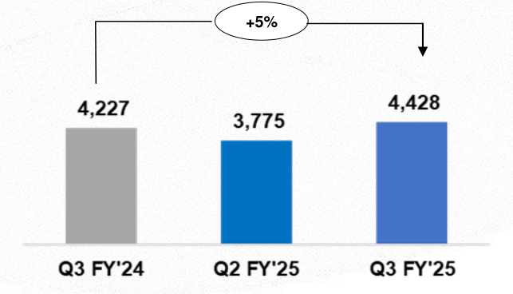

**[Image: March2025.pdf-0016-09.png (643x368, 130.4KB)]**

<!-- Start of picture text -->
+5% <!-- End of picture text -->

1. ALOS is the average length of stay of patients in a specific period calculated as Census occupied beds days divided by In-patient volume  2. Out-patient volume refers to the total number of Out-patient visits recorded in a specific period.  3. In-Patient volume refers to the total number of In-patient discharged in a specific period irrespective of admission date. 

16 

**[Image: March2025.pdf-0017-01.png (261x193, 34.2KB)]**

#### **Key operating metrics : ARPP, ARPOB & Revenue mix** 

###### **ARPP OP (INR)****(2)** 

###### **ARPP IP (INR)****(1)** 

**[Image: March2025.pdf-0017-05.png (719x7, 0.4KB)]**

**[Image: March2025.pdf-0017-06.png (721x9, 1.0KB)]**

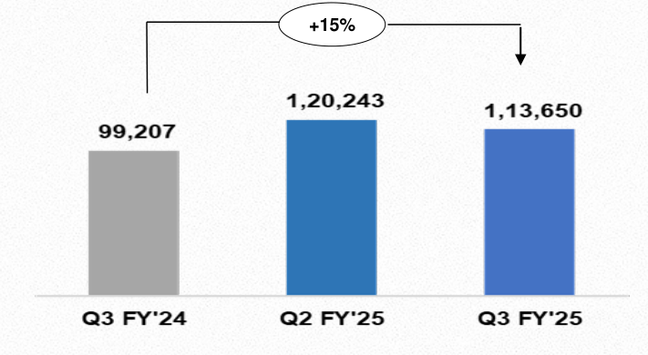

**[Image: March2025.pdf-0017-07.png (711x390, 158.9KB)]**

<!-- Start of picture text -->
+15% <!-- End of picture text -->

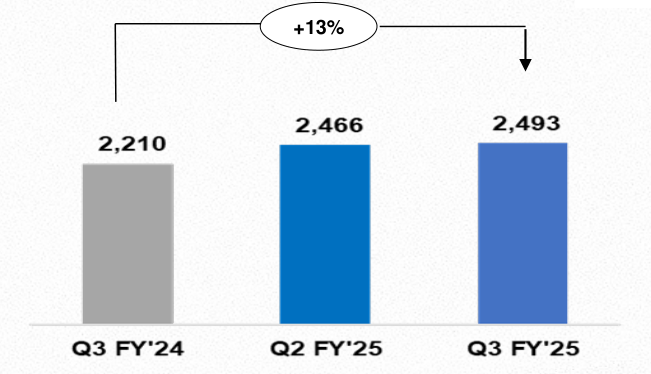

**[Image: March2025.pdf-0017-08.png (651x374, 132.3KB)]**

<!-- Start of picture text -->
+13% <!-- End of picture text -->

###### **Blended ARPOB (INR)****(3)** 

###### **Revenue mix by payor category** 

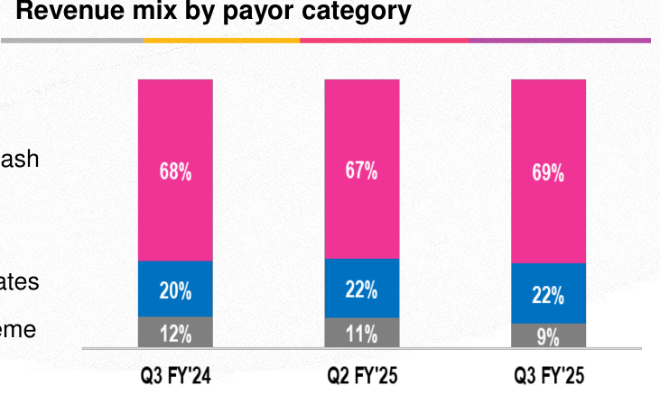

**[Image: March2025.pdf-0017-11.png (731x448, 157.3KB)]**

<!-- Start of picture text -->
Revenue mix by payor category <!-- End of picture text -->

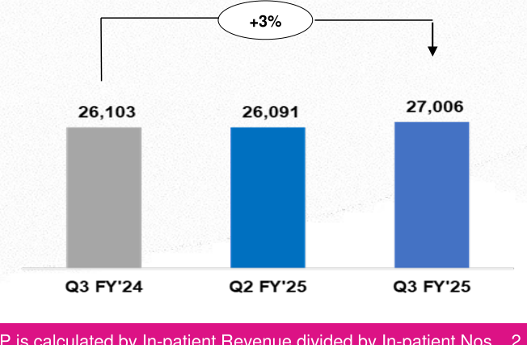

**[Image: March2025.pdf-0017-12.png (652x427, 122.4KB)]**

<!-- Start of picture text -->
+3% <!-- End of picture text -->

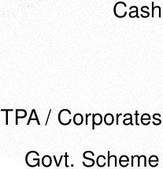

**[Image: March2025.pdf-0017-13.png (207x214, 29.9KB)]**

<!-- Start of picture text -->
Cash TPA / Corporates Govt. Scheme <!-- End of picture text -->

1. ARPP IP is calculated by In-patient Revenue divided by In-patient Nos    2. ARPP OP is calculated by Out-patient Revenue divided by Out-patient Nos patient & Out-patient Revenue divided by occupied bed days 

3. Blended ARPOB is calculated by adding In- 

#### **Diverse Revenue Mix** 

###### **Significant contribution from specialities** 

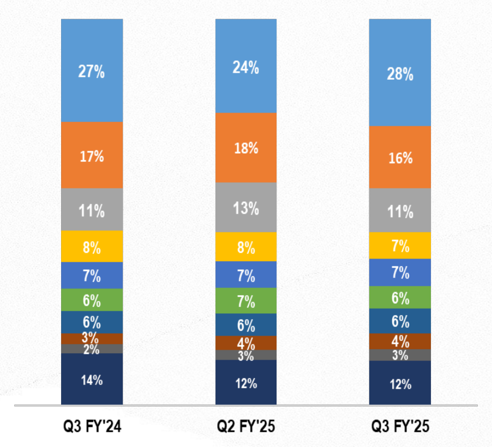

**[Image: March2025.pdf-0018-02.png (838x762, 318.1KB)]**

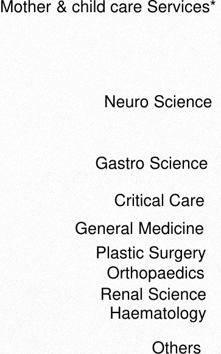

**[Image: March2025.pdf-0018-03.png (363x581, 154.2KB)]**

<!-- Start of picture text -->
Mother & child care Services* Neuro Science Gastro Science Critical Care General Medicine Plastic Surgery Orthopaedics Renal Science Haematology Others <!-- End of picture text -->

**[Image: March2025.pdf-0018-04.png (261x194, 34.4KB)]**

17 

*Mother & Child care Services include Neonataology, Obstetrics and Gynec and Pediatric services; 

#### **Performance Highlights and Commentary** 

**[Image: March2025.pdf-0019-01.png (261x194, 34.1KB)]**

- Total Income has increased by INR 12.9 Cr. (26%) compared to the Q3 previous year; 

- This was achieved on the back of across of all our with trend seen strong-performance specialties increasing 

- in volumes and revenue mix; 

- Consistent strong performance of 28% on Total Income in Q3 FY’25 in our Mother and Child Care services. 

- Total EBITDA earned has increased by INR 2.2 Cr (15%) compared to the Q3 previous year; 

- EBITDA as a % of revenue for FY’25 (Q3) is 27.5% as compared to 30.2% in the Q3 previous year; 

- Reduction in EBITDA% is on account of additional Fixed overheads incurred during the initial period of the newly operational facility comprising of 200 beds 

- PBT & PAT as a % of revenue for FY’25 (Q3) is 16.1% & 12.0% respectively as compared to 25.1% & 19.1% in the Q3 previous year. 

The aforesaid reduction is primarily on account of interest expenditure incurred in relation to the long term borrowings availed from bank for the new facility and depreciation attributed to newly capitalized facility. 

18 

**[Image: March2025.pdf-0020-00.png (261x193, 34.2KB)]**

#### **Annexure: Profit & Loss Statement** 

||**Nine Mont**|**hs ended**||**Q**|**uarter ended**|||
|---|---|---|---|---|---|---|---|
|**INR Cr**|**9M FY'24**|**9M FY'25**|**Y-o-Y Growth %**|**Q3 FY'24**|**Q2 FY'25**|**Q3 FY'25**|**Y-o-Y Growth** **%**|
|**Income**||||||||
|Revenue from operations|132.3|170.7|29%|49.1|56.2|61.4|25%|
|Other income|2.8|2.3|-18%|0.6|0.5|1.2|111%|
|**Total income**|**135.1**|**173.0**|28%|**49.7**|**56.7**|**62.6**|26%|
|Cost of Goods Sold|18.1|24.2|34%|6.2|8.1|8.8|43%|
|Employee benefits expense|28.2|39.1|39%|10.0|13.0|13.6|35%|
|Other Expenses|50.5|65.9|31%|18.5|22.6|23.0|24%|
|**EBITDA**|**38.4**|**43.8**|14%|**15.0**|**13.0**|**17.2**|15%|
|**EBITDA Margins %**|**28%**|**25%**||**30%**|**23%**|**28%**||
|Finance costs|0.7|7.1|966%|0.2|2.7|2.3|858%|
|Depreciation and amortisation expense|6.6|13.9|111%|2.3|5.0|4.8|115%|
|**PBT**|**31.1**|**22.8**|-27%|**12.5**|**5.3**|**10.0**|-20%|
|**PBT Margins %**|**23%**|**13%**|**-43%**|**25%**|**9%**|**16%**|**-36%**|
|Income tax expense|7.8|5.9|-25%|3.0|1.5|2.5|-16%|
|**PAT**|**23.3**|**16.9**|-27%|**9.5**|**3.9**|**7.5**|-21%|
|**PAT Margins %**|**17%**|**10%**||**19%**|**7%**|**12%**||

19 

20 

**[Image: March2025.pdf-0021-01.png (261x193, 34.2KB)]**

#### **Annexure: Balance Sheet** 

|**Equities & Liabilities  (INR Cr)**|**FY'25 as on** **Dec'24**|**FY'24**|**Assets (INR Cr)**|**FY'25 as on** **Dec'24**|**FY'24**|
|---|---|---|---|---|---|
|**Total Equity**|**160.35**|**143.58**|**Non-Current Assets**|**255.58**|**230.20**|
|Share Capital|16.31|16.31|Property, Plant and Equipment|230.09|195.55|
|Other Equity|144.04|127.27|Right-of-Use-Assets|7.42|9.65|
|**Non-Current Liabilities**|**83.83**|**73.68**|CWIP|5.04|0.64|
|**Financial Liabilities**|||Investment Property|0.40|0.40|
|(i) Borrowings|75.92|63.85|Other Intangible assets|0.05|0.06|
|(ii) Lease Liabilities|5.31|7.63|**Financial Assets**|||
|(iii) Other Financial Liabilities|-|-|(i) Investments|0.00|0.00|
|Deferred Tax Liabilities|0.50|0.64|(ii) Loans|-|-|
|Other Non-Current Liabilities|0.10|0.08|(iii) Other Financial Assets|6.05|4.26|
|Provisions|2.00|1.49|Other Non-Current Assets (Net)|6.52|19.62|
|**Current Liabilities**|**37.47**|**46.45**|**Current Assets**|**26.07**|**33.52**|
|**Financial Liabilities**|||Inventories|3.55|2.05|
|(i) Borrowings|8.06|8.55|**Financial Assets**|||
|(ii) Lease Liabilities|2.00|1.79|(ii) Trade receivables|6.42|4.38|
|(iii) Trade payables|15.85|7.56|(ii) Cash and cash equivalents|5.80|4.85|
|(iv) Other Financial Liabilities|4.75|23.80|(iii) Bank Balances other than above|4.10|17.83|
|Other Current Liabilities|3.84|2.93|(iv) Loans|0.29|0.16|
|Provisions|2.97|1.82|(v) Other Financial Assets|4.65|3.00|
||||Other Current Assets|1.26|1.25|
|**Total Equity & Liabilities**|**281.65**|**263.72**|**Total Assets**|**281.65**|20 **263.72**|

1 **. Networth at the end of FY’25 (YTD Dec’24) is INR 160 Cr** 

**2.Total Borrowings (Term Loan + CC) at the end of FY’25 (YTD Dec’24) is INR 84.0 Cr (out of which INR 83.9 Cr is for new facility) 3.Total Cash Balance (including Fixed Deposit)  at the end of FY’25 (YTD Dec’24) is INR 9.9 Cr** 

#### **Annexure: Cash Flow Statement** 

|**Particluars (INR Cr)**|**FY'25** **(YTD Dec'24)**|**FY'24**|
|---|---|---|
|**Net Profit Before Tax**|**22.78**|**40.56**|
|Adjustments for: Non -Cash Items / Other Investment or Financial Items|20.81|8.39|
|**Operating profit before working capital changes**|**43.59**|**48.95**|
|**Changes in Working Capital**|3.85|(0.42)|
|**Cash generated from Operations**|**47.44**|**48.53**|
|Taxes (movement)|(6.82)|(10.11)|
|**Net Cash from Operating Activities**|**40.62**|**38.42**|
|**Net Cash from Investing Activities**|**(42.88)**|**(55.91)**|
|**Net Cash from Financing Activities**|**3.21**|**20.50**|
|**Net Increase in Cash and Cash Equivalents**|**0.95** |**3.01**|
|**Cash and Cash equivalents at the beginning of the period**|**4.85**|**1.84**|
|**Cash and Cash equivalents at the end of the period**|**5.80**|**4.85**|

**[Image: March2025.pdf-0022-02.png (261x194, 34.4KB)]**

21 

**Total Cash Balance (including Fixed Deposit)  at the end of FY’25 (YTD Dec’24) is INR 9.9 Cr** 

22 

#### **Annexure: Financial Ratios** 

**[Image: March2025.pdf-0023-02.png (261x194, 34.4KB)]**

|**Financial Ratios**|**FY'25** **(YTD Dec'24)**|**FY'24**|
|---|---|---|
|Networth (INR Cr)|160|144|
|Return on Capital Employed (%)|16%|29%|
|Return on Equity (%)|14%|21%|
|Debt Equity Ratio|0.52|0.50|
|Net Debt / EBITDA (Times)|1.27|0.98|
|Current Ratio (Times)|0.7|0.7|
|DSCR (Times)|3.1|4.0|
|Interest Coverage Ratio(Times)|6.2 |9.3|

**1. FY’24 ROCE is calculated by excluding the Loan availed for new facility “Maa Kauvery” whereas the same is included in FY’25 (YTD Dec’24) 2. FY’24 & FY’25 (YTD Dec’24), Debt Equity Ratio and Net Debt to EBITDA is calculated by including the Loan availed for new facility Maa Kauvery. 3. Net Debt is calculated by reducing Cash and Bank Balances from Gross Debt.** 

**4. Current Ratio is calculated by including Capital creditors (current liabilities) of New facility “Maa Kauvery” INR 15.0 Cr in FY’24 and INR 4.1 Cr in FY’25 (YTD Dec’24** ) 

**[Image: March2025.pdf-0024-00.png (261x193, 34.1KB)]**

#### **Annexure: Operational Parameters** 

||**N**|**ine months e**|**nded**||**Quarter**|**ended**||
|---|---|---|---|---|---|---|---|
|**Key Metrics**|**9M FY'24**|**9M FY'25**|**Y-o-Y Growth %**|**Q3 FY'24**|**Q2 FY'25**|**Q3 FY'25**|**Y-o-Y Growth %**|
|Census Beds|205|330|61%|330|330|330|0%|
|Occupied Beds|189|228|20%|205|229|243|19%|
|Average Occupied Bed Days|52,097|62,669|20%|18,860|21,099|22,356|19%|
|Avg Occupancy Rate %|92%|69%||62%|69%|74%||
|Blended ARPOB (INR)|25,481|26,597|4%|26,103|26,091|27,006|3%|
|ALOS (Days)|4.9|5.3|8%|4.5|5.6|5.0|13%|
|In-Patient Volumes|10,592|11,769|11%|4,227|3,775|4,428|5%|
|Out-Patient Volumes|91,953|1,13,781|24%|33,008|39,150|40,312|22%|
|ARPP IP (INR)|1,05,862|1,17,854|11%|99,207|1,20,243|1,13,650|15%|
|ARPP OP (INR)|2,243|2,459|10%|2,210|2,466|2,493|13%|

23 

**[Image: March2025.pdf-0025-00.png (261x194, 34.1KB)]**

## **HISTORICAL FINANCIAL PERFORMANCE** 

24 

**[Image: March2025.pdf-0026-00.png (261x194, 34.4KB)]**

#### **Key operating metrics : Revenue & Profitability** 

###### **Total Income (INR Cr)** 

###### **EBITDA (INR Cr & margin %)** 

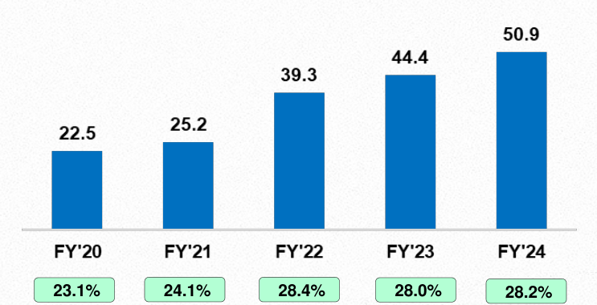

**[Image: March2025.pdf-0026-04.png (743x380, 149.4KB)]**

<!-- Start of picture text -->
23.1% 24.1% 28.4% 28.0% 28.2% <!-- End of picture text -->

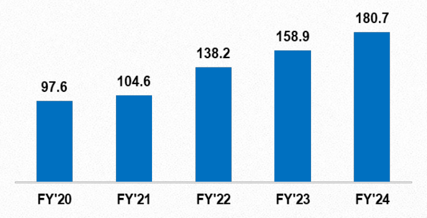

**[Image: March2025.pdf-0026-05.png (722x368, 146.1KB)]**

###### **Profit before tax  (INR Cr & margin %)** 

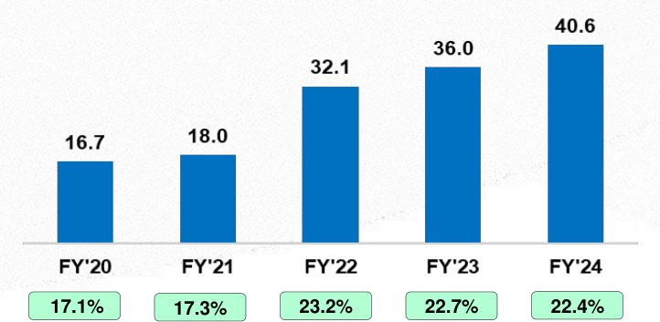

**[Image: March2025.pdf-0026-07.png (722x353, 120.2KB)]**

<!-- Start of picture text -->
17.1% 17.3% 23.2% 22.7% 22.4% <!-- End of picture text -->

###### **Profit after tax  (INR Cr & margin %)** 

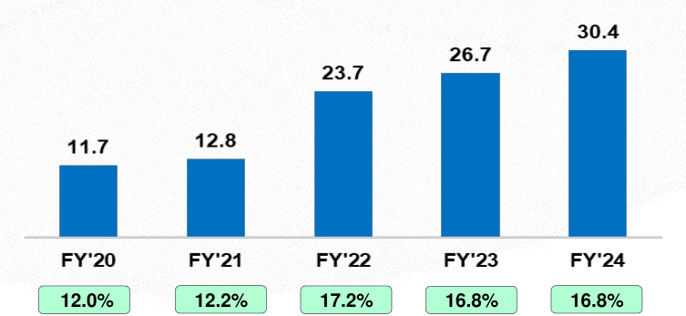

**[Image: March2025.pdf-0026-09.png (753x347, 125.2KB)]**

<!-- Start of picture text -->
12.0% 12.2% 17.2% 16.8% 16.8% <!-- End of picture text -->

**[Image: March2025.pdf-0026-10.png (91x78, 0.9KB)]**

<!-- Start of picture text -->
25 <!-- End of picture text -->

26 

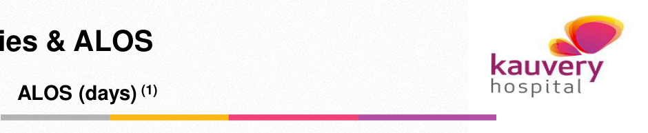

**[Image: March2025.pdf-0027-01.png (940x193, 116.9KB)]**

<!-- Start of picture text -->
ALOS (days) (1) <!-- End of picture text -->

#### **Key operating metrics : Volumes, Occupancies & ALOS** 

###### **Average census and occupied beds per day** 

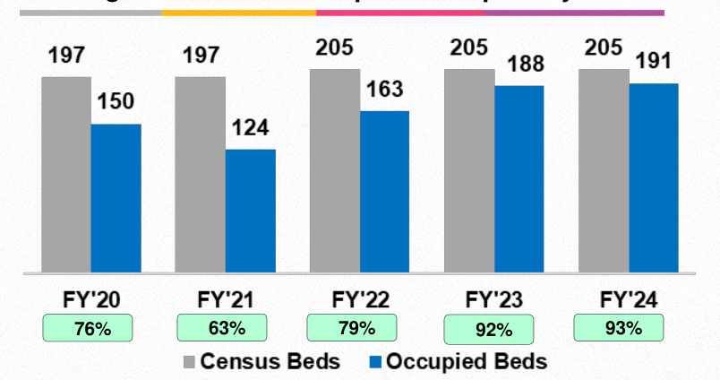

**[Image: March2025.pdf-0027-04.png (804x424, 166.3KB)]**

<!-- Start of picture text -->
76% 63% 79% 92% 93% <!-- End of picture text -->

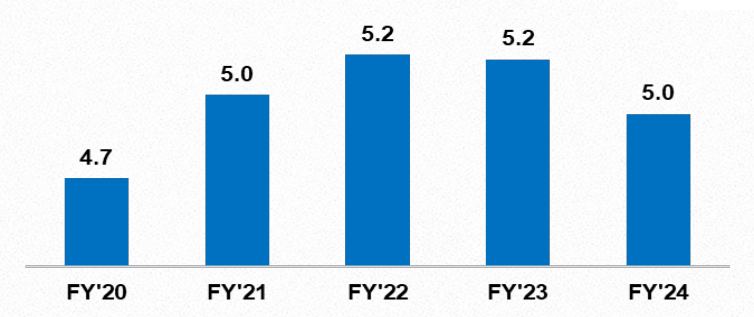

**[Image: March2025.pdf-0027-05.png (754x317, 123.3KB)]**

###### **IPD volumes****(3)** 

###### **OPD volumes****(2)** 

**[Image: March2025.pdf-0027-08.png (720x8, 0.4KB)]**

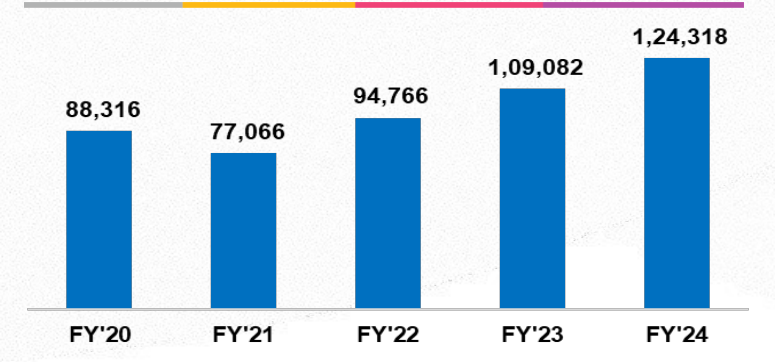

**[Image: March2025.pdf-0027-09.png (775x362, 138.4KB)]**

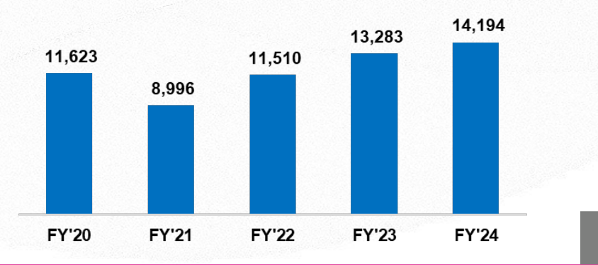

**[Image: March2025.pdf-0027-10.png (844x374, 152.4KB)]**

1. ALOS is the average length of stay of patients in a specific period calculated as Census occupied beds days divided by In-patient volume  2. Out-patient volume refers to be total number of Out-patient 

visits recorded in a specific period  3. In-Patient volume refers to the total number of In-patient discharged in a specific period irrespective of admission date. 

27 

#### **Key operating metrics : ARPP & ARPOB** 

###### **ARPP IP (INR)****(1)** 

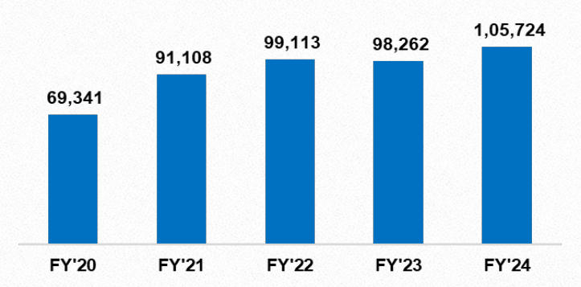

**[Image: March2025.pdf-0028-03.png (723x357, 137.4KB)]**

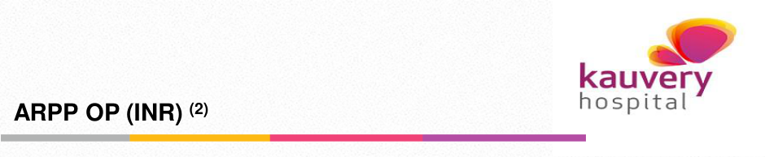

**[Image: March2025.pdf-0028-04.png (940x194, 115.3KB)]**

<!-- Start of picture text -->
ARPP OP (INR)  (2) <!-- End of picture text -->

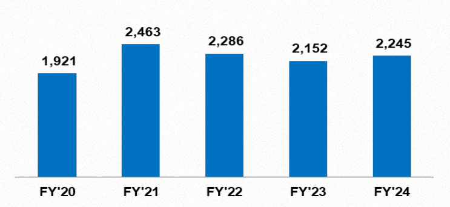

**[Image: March2025.pdf-0028-05.png (743x343, 130.6KB)]**

**Blended ARPOB (INR)****(3)** 

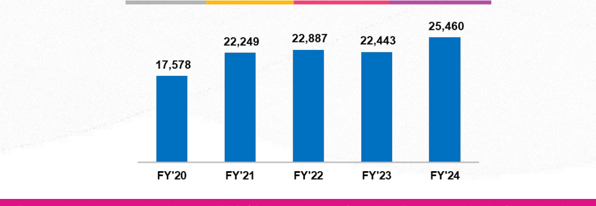

**[Image: March2025.pdf-0028-07.png (1173x408, 203.7KB)]**

1. ARPP IP is calculated by In-patient Revenue divided by In-patient Nos    2. ARPP OP is calculated by Out-patient Revenue divided by Out-patient Nos patient & Out-patient Revenue divided by occupied bed days 

3. Blended ARPOB is calculated by adding In- 

28 

#### **Key operating metrics : ROCE & ROE** 

###### **ROCE****(1)** 

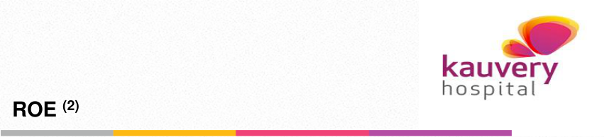

**[Image: March2025.pdf-0029-03.png (851x194, 104.5KB)]**

<!-- Start of picture text -->
ROE  (2) <!-- End of picture text -->

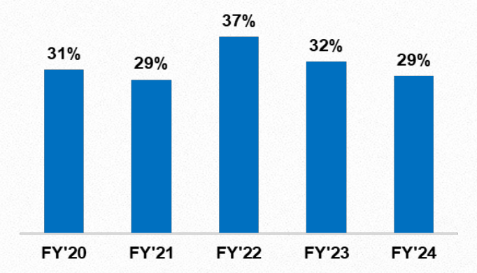

**[Image: March2025.pdf-0029-04.png (682x391, 141.9KB)]**

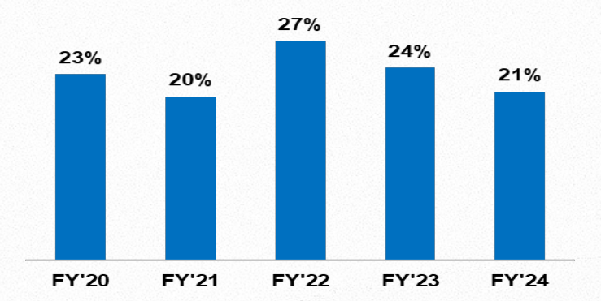

**[Image: March2025.pdf-0029-05.png (739x371, 139.0KB)]**

###### **<u>Note:</u>** 

**ROCE is calculated by excluding the Loan availed for New facility “Maa Kauvery”, which commenced its operations from January 2024** . 

1. ROCE is calculated as EBIT (Earnings before Interest and Tax) divided by capital employed (Shareholder’s equity plus long term borrowings)   2. ROE is calculated as PAT (Profit after Tax) divided by ``Shareholder’s Equity. 

**[Image: March2025.pdf-0030-00.png (261x194, 34.4KB)]**

#### **Annexures - Historical Profit and Loss Statement** 

|**INR Cr**|**FY'24**|**FY'23**|**FY'22**|**FY'21**|**FY'20**|
|---|---|---|---|---|---|
|**Income**||||||
|Revenue from operations|177.2|155.8|136.1|102.6|96.2|
|Other income|3.6|3.1|2.1|1.9|1.4|
|**Total income**|**180.7**|**158.9**|**138.2**|**104.6**|**97.6**|
|Cost of materials consumed|3.6|2.9|2.7|2.7|1.5|
|Purchase of traded goods|20.7|20.4|17.9|13.5|13.0|
|Changes in inventory of traded goods|0.2|(0.31)|(0.02) |0.2 -|0.7|
|Cost of Goods Sold|24.4|23.0|20.6|16.3|13.8|
|Employee benefits expense|38.3|31.2|27.1|21.5|21.6|
|Other Expenses|67.1|60.3|51.2|41.6|39.7|
|**EBITDA**|**50.9**|**44.4**|**39.3**|**25.2**|**22.5**|
|**EBITDA Margins %**|**28.2%**|**28.0%**|**28.4%**|**24.1%**|**23.1%**|
|Finance costs|1.16|0.8|0.7|1.0|0.9|
|Depreciation and amortisation expense|9.22|7.6|6.5|6.2|4.9|
|**PBT**|**40.6**|**36.0**|**32.1**|**18.0**|**16.7**|
|**PBT Margins %**|**22.4%**|**22.7%**|**23.2%**|**17.3%**|**17.1%**|
|Income tax expense|10.2|9.3|8.4|5.3|5.0|
|**PAT**|**30.4**|**26.7**|**23.7**|**12.8**|**11.7**|
|**PAT Margins %**|**16.8%**|**16.8%**|**17.2%**|**12.2%**|**12.0%**|

29 

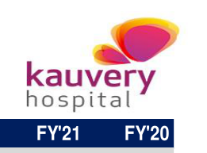

**[Image: March2025.pdf-0031-00.png (261x193, 35.6KB)]**

<!-- Start of picture text -->
FY'21 FY'20 <!-- End of picture text -->

#### **Annexures - Historical Balance Sheet** 

|**Equities & Liabilities (INR Cr)**|**FY'24**|**FY'23**|**FY'22**|**FY'21**|**FY'20**|**Assets (INR Cr)**|**FY'24**|**FY'23**|**FY'22**|**FY'21**|**FY'20**|
|---|---|---|---|---|---|---|---|---|---|---|---|
|**Total Equity**|**143.58**|**113.50**|**86.80**|**63.33**|**50.66**|**Non-Current Assets**|**230.20**|**129.80**|**86.29**|**78.86**|**52.29**|
|Share Capital|16.31|16.31|16.31|16.31|16.31|Property, Plant and Equipment|195.55|78.36|72.53|71.16|37.55|
|Other Equity|127.27|97.19|70.49|47.02|34.35|Right-of-Use-Assets|9.65|5.13|1.68|1.97|0.84|
|**Non-Current Liabilities**|**73.68**|**45.61**|**22.45**|**29.11**|**6.95**|CWIP|0.64|34.04|5.64|1.61|0.07|
|**Financial Liabilities**||||||Investment Property|0.40|0.40|0.40|0.40|0.40|
|(i) Borrowings|63.85|39.87|19.61|25.74|5.80|Other Intangible assets|0.06|0.39|0.80|0.50|0.62|
|(ii) Lease Liabilities|7.63|4.56|1.54 |1.84|0.67|**Financial Assets**||||||
|(iii) Other Financial Liabilities|0.00|-|- |0.12|0.08|(i) Investments|0.00|0.00|0.00|0.00|0.00|
|Deferred Tax Liabilities|0.64|-|0.06|0.58|-|(ii) Loans|0.00|-|-|0.74|3.93|
|Other Non-Current Liabilities|0.08|0.08|0.11|-|-|(iii) Other Financial Assets|4.26|1.77|1.08 |0.02|0.08|
|Provisions|1.49|1.10|1.14|0.84|0.41|Other Non-Current Assets (Net)|19.62|9.71|4.14|2.45|8.80|
|**Current Liabilities**|**46.45**|**22.54**|**19.51**|**12.55**|**12.39**|**Current Assets**|**33.52**|**51.86**|**42.48**|**26.13**|**17.70**|
|**Financial Liabilities**||||||Inventories|2.05|2.27|1.87|1.75|2.22|
|(i) Borrowings|8.55|4.63|7.27|-|-|**Financial Assets**||||||
|(ii) Lease Liabilities|1.79|0.88|0.36|0.26|0.19|(ii) Trade receivables|4.38|4.37|3.54|2.55|2.10|
|(iii) Trade payables|7.56|6.41|5.41|5.21|4.35|(ii) Cash and cash equivalents|4.85|1.84|1.67|2.13|1.12|
|(iv) Other Financial Liabilities|23.80|4.57|2.09|3.18|5.02|(iii) Bank Balances other than above|17.83|36.95|31.49|15.57|8.87|
|Other Current Liabilities|2.93|3.16|2.29|2.31|1.45|(iv) Loans|0.16|0.18|0.13|0.12|1.13|
|Provisions|1.82|2.89|2.08|1.60|1.38|(v) Other Financial Assets|3.00|4.41|2.63|2.87|1.55|
|||||||Other Current Assets|1.25|1.83|1.15|1.13|0.71|
|**Total Equity & Liabilities**|**263.72**|**181.65**|**128.76**|**104.99**|**69.99**|**Total Assets**|**263.72**|**181.65**|**128.76**|**104.99**|**69.99**|

30 

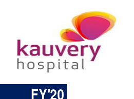

**[Image: March2025.pdf-0032-00.png (261x193, 35.2KB)]**

<!-- Start of picture text -->
FY'20 <!-- End of picture text -->

#### **Annexures - Historical Cash Flow Statement** 

|**Particluars (INR Cr)**|**FY'24**|**FY'23**|**FY'22**|**FY'21**|**FY'20**|
|---|---|---|---|---|---|
|**Net Profit After Tax**|**30.4**|**26.7**|**23.7**|**12.8**|**11.7**|
|Adjustments for: Non -Cash Items / Other Investment or Financial Items|18.6|16.6|14.8|12.1|10.0|
|**Operating profit before working capital changes**|**49.0**|**43.2**|**38.5**|**24.9**|**21.7**|
|**Changes in Working Capital** |(0.4)|(1.7)|(0.2)|3.3|(7.7)|
|**Cash generated from Operations**|**48.5**|**41.5**|**38.3**|**28.2**|**14.0**|
|Direct taxes paid (net of fund)|(10.1)|(9.2)|(9.2) |(2.6)|(3.3)|
|**Net Cash from Operating Activities**|**38.4**|**32.3**|**29.1**|**25.6**|**10.7**|
|**Net Cash from Investing Activities**|**(55.9)**|**(48.0)**|**(28.5)**|**(42.6)**|**(7.8)**|
|**Net Cash from Financing Activities**|**20.5**|**15.8**|**(1.1)**|**18.0**|**(3.6)**|
|**Net Increase in Cash and Cash Equivalents** |**3.0**|**0.2**|**(0.5)**|**1.0**|**(0.7)**|
|**Cash and Cash equivalents at the beginning of the period** |**1.8**|**1.7**|**2.1**|**1.1**|1.8|
|**Cash and Cash equivalents at the end of the period** |**4.8**|**1.8**|**1.7**|**2.1**|**1.1**|

31 

#### **Annexure: Historical Operational Parameters** 

|**Key Metrics**|**FY'24**|**FY'23**|**FY'22**|**FY'21**|**FY'20**|
|---|---|---|---|---|---|
|Census Beds|205|205|205|197|197|
|Occupied Beds|191|188|163|124|150|
|Average Occupied Bed Days|69,906|68,635|59,313|45,260|54,750|
|Avg Occupancy Rate %|93%|92%|79%|63%|76%|
|Blended ARPOB (INR)|25,460|22,443|22,887|22,249|17,578|
|ALOS (Days)|5.0|5.2|5.2|5.0|4.7|
|In-Patient Volumes|14,194|13,283|11,510|8,996|11,623|
|Out-Patient Volumes|1,24,318|1,09,082|94,766|77,066|88,316|
|ARPP IP (INR)|1,05,724|98,262|99,113|91,108|69,341|
|ARPP OP (INR)|2,245|2,152|2,286|2,463|1,921|

**[Image: March2025.pdf-0033-02.png (261x194, 34.4KB)]**

32 

**[Image: March2025.pdf-0034-00.png (261x194, 34.4KB)]**

## **THANK YOU** 

33 

---

## Extracted Images

| # | File | Dimensions | Size |
|---|------|------------|------|
| 1 | March2025.pdf-0001-00.png | 1239x200 | 115.4KB |
| 2 | March2025.pdf-0001-15.png | 1239x167 | 135.9KB |
| 3 | March2025.pdf-0002-00.png | 925x426 | 467.5KB |
| 4 | March2025.pdf-0002-04.png | 988x1125 | 1667.2KB |
| 5 | March2025.pdf-0003-02.png | 261x194 | 34.1KB |
| 6 | March2025.pdf-0004-00.png | 261x194 | 34.1KB |
| 7 | March2025.pdf-0004-01.png | 2000x1105 | 1903.4KB |
| 8 | March2025.pdf-0005-00.png | 261x194 | 34.2KB |
| 9 | March2025.pdf-0005-02.png | 1116x896 | 823.9KB |
| 10 | March2025.pdf-0006-01.png | 261x157 | 28.0KB |
| 11 | March2025.pdf-0006-02.png | 109x111 | 2.7KB |
| 12 | March2025.pdf-0006-11.png | 741x645 | 67.2KB |
| 13 | March2025.pdf-0006-12.png | 128x107 | 7.2KB |
| 14 | March2025.pdf-0007-00.png | 260x175 | 31.1KB |
| 15 | March2025.pdf-0007-02.png | 2000x1013 | 205.3KB |
| 16 | March2025.pdf-0008-00.png | 261x193 | 34.1KB |
| 17 | March2025.pdf-0008-02.png | 1751x947 | 145.6KB |
| 18 | March2025.pdf-0009-01.png | 261x194 | 34.1KB |
| 19 | March2025.pdf-0010-01.png | 353x330 | 129.1KB |
| 20 | March2025.pdf-0010-06.png | 339x342 | 164.8KB |
| 21 | March2025.pdf-0010-14.png | 261x194 | 34.4KB |
| 22 | March2025.pdf-0010-15.png | 353x345 | 133.7KB |
| 23 | March2025.pdf-0011-01.png | 868x580 | 79.4KB |
| 24 | March2025.pdf-0011-02.png | 261x194 | 34.1KB |
| 25 | March2025.pdf-0011-03.png | 555x580 | 15.4KB |
| 26 | March2025.pdf-0012-01.png | 228x184 | 49.0KB |
| 27 | March2025.pdf-0012-03.png | 228x192 | 64.5KB |
| 28 | March2025.pdf-0012-05.png | 221x193 | 54.6KB |
| 29 | March2025.pdf-0012-07.png | 228x190 | 52.8KB |
| 30 | March2025.pdf-0012-09.png | 261x348 | 52.0KB |
| 31 | March2025.pdf-0012-10.png | 228x192 | 80.8KB |
| 32 | March2025.pdf-0012-12.png | 236x188 | 68.5KB |
| 33 | March2025.pdf-0012-14.png | 242x211 | 80.4KB |
| 34 | March2025.pdf-0012-16.png | 240x190 | 60.9KB |
| 35 | March2025.pdf-0013-00.png | 261x194 | 34.1KB |
| 36 | March2025.pdf-0014-01.png | 261x194 | 34.4KB |
| 37 | March2025.pdf-0014-02.png | 1864x751 | 826.9KB |
| 38 | March2025.pdf-0015-00.png | 261x194 | 34.4KB |
| 39 | March2025.pdf-0015-04.png | 722x9 | 1.9KB |
| 40 | March2025.pdf-0015-05.png | 722x10 | 2.2KB |
| 41 | March2025.pdf-0015-06.png | 432x53 | 14.6KB |
| 42 | March2025.pdf-0015-07.png | 691x282 | 107.9KB |
| 43 | March2025.pdf-0015-08.png | 659x297 | 109.1KB |
| 44 | March2025.pdf-0015-10.png | 722x7 | 0.9KB |
| 45 | March2025.pdf-0015-11.png | 682x367 | 115.4KB |
| 46 | March2025.pdf-0015-13.png | 722x7 | 0.4KB |
| 47 | March2025.pdf-0015-14.png | 644x336 | 108.0KB |
| 48 | March2025.pdf-0016-01.png | 898x194 | 113.9KB |
| 49 | March2025.pdf-0016-04.png | 639x407 | 143.2KB |
| 50 | March2025.pdf-0016-05.png | 628x311 | 99.2KB |
| 51 | March2025.pdf-0016-08.png | 639x367 | 119.7KB |
| 52 | March2025.pdf-0016-09.png | 643x368 | 130.4KB |
| 53 | March2025.pdf-0017-01.png | 261x193 | 34.2KB |
| 54 | March2025.pdf-0017-05.png | 719x7 | 0.4KB |
| 55 | March2025.pdf-0017-06.png | 721x9 | 1.0KB |
| 56 | March2025.pdf-0017-07.png | 711x390 | 158.9KB |
| 57 | March2025.pdf-0017-08.png | 651x374 | 132.3KB |
| 58 | March2025.pdf-0017-11.png | 731x448 | 157.3KB |
| 59 | March2025.pdf-0017-12.png | 652x427 | 122.4KB |
| 60 | March2025.pdf-0017-13.png | 207x214 | 29.9KB |
| 61 | March2025.pdf-0018-02.png | 838x762 | 318.1KB |
| 62 | March2025.pdf-0018-03.png | 363x581 | 154.2KB |
| 63 | March2025.pdf-0018-04.png | 261x194 | 34.4KB |
| 64 | March2025.pdf-0019-01.png | 261x194 | 34.1KB |
| 65 | March2025.pdf-0020-00.png | 261x193 | 34.2KB |
| 66 | March2025.pdf-0021-01.png | 261x193 | 34.2KB |
| 67 | March2025.pdf-0022-02.png | 261x194 | 34.4KB |
| 68 | March2025.pdf-0023-02.png | 261x194 | 34.4KB |
| 69 | March2025.pdf-0024-00.png | 261x193 | 34.1KB |
| 70 | March2025.pdf-0025-00.png | 261x194 | 34.1KB |
| 71 | March2025.pdf-0026-00.png | 261x194 | 34.4KB |
| 72 | March2025.pdf-0026-04.png | 743x380 | 149.4KB |
| 73 | March2025.pdf-0026-05.png | 722x368 | 146.1KB |
| 74 | March2025.pdf-0026-07.png | 722x353 | 120.2KB |
| 75 | March2025.pdf-0026-09.png | 753x347 | 125.2KB |
| 76 | March2025.pdf-0026-10.png | 91x78 | 0.9KB |
| 77 | March2025.pdf-0027-01.png | 940x193 | 116.9KB |
| 78 | March2025.pdf-0027-04.png | 804x424 | 166.3KB |
| 79 | March2025.pdf-0027-05.png | 754x317 | 123.3KB |
| 80 | March2025.pdf-0027-08.png | 720x8 | 0.4KB |
| 81 | March2025.pdf-0027-09.png | 775x362 | 138.4KB |
| 82 | March2025.pdf-0027-10.png | 844x374 | 152.4KB |
| 83 | March2025.pdf-0028-03.png | 723x357 | 137.4KB |
| 84 | March2025.pdf-0028-04.png | 940x194 | 115.3KB |
| 85 | March2025.pdf-0028-05.png | 743x343 | 130.6KB |
| 86 | March2025.pdf-0028-07.png | 1173x408 | 203.7KB |
| 87 | March2025.pdf-0029-03.png | 851x194 | 104.5KB |
| 88 | March2025.pdf-0029-04.png | 682x391 | 141.9KB |
| 89 | March2025.pdf-0029-05.png | 739x371 | 139.0KB |
| 90 | March2025.pdf-0030-00.png | 261x194 | 34.4KB |
| 91 | March2025.pdf-0031-00.png | 261x193 | 35.6KB |
| 92 | March2025.pdf-0032-00.png | 261x193 | 35.2KB |
| 93 | March2025.pdf-0033-02.png | 261x194 | 34.4KB |
| 94 | March2025.pdf-0034-00.png | 261x194 | 34.4KB |
