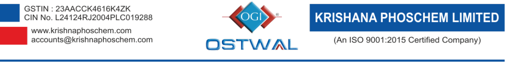
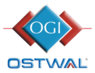

**[Image: KRISHANA_18072026175449_NSETRANS140726SIOUP.pdf-0001-00.png (1240x155, 66.3KB)]**

Date: 18 .07.2026 

To, National Stock Exchange of India Ltd. Exchange Plaza, C-1, Block G, Bandra Kurla Complex, Bandra (E) Mumbai – 400 051 

Dear Sir / Madam, 

# **Subject:  Earnings Conference Call Transcript of Q1  FY27** 

Pursuant to Regulation 30 and 46 read with clause 15 of Para A of Part A of Schedule III of the SEBI (Listing obligations and Disclosure Requirements) Regulations, 2015, we enclose herewith the transcript of Q1 FY27 Earnings Conference Call organized by the Company on July 14, 2026 at 4.00 P.M. (IST). 

The Transcript of the same is available on Company's website at following link :- 

<u>https://api.ostwal.in/api/v1/media/kpl/investor-info/83b3e523-feb9-440e-a409-b13f6bd5d7c0</u> 

Kindly take the above-information on records. Thanking you, 

Yours faithfully, For Krishana Phoschem Limited 

ANIL Digitally signed by ANIL SHARMA SHARMA Date: 2026.07.18 17:38:01 +05'30' Anil Sharma ( **Company Secretary) M.No. ACS - 25045** 

Place :-Bhilwara 

Registered off. : Wing A/2, 1st Floor, Ostwal Heights, Urban Forest, Atun, Bhilwara 311802(Raj.) Works : AKVN Industrial Area, Meghnagar-457779, Distt.Jhabua(M.P.)Ph.77730 01157, 92570 11857 

**[Image: KRISHANA_18072026175449_NSETRANS140726SIOUP.pdf-0002-00.png (138x105, 12.6KB)]**

## **Krishana Phoschem Limited Q1 FY27 Earnings Conference Call July 14, 2026** 

**Moderator:** 

Good afternoon, ladies and gentlemen, a very warm welcome to Q1 FY27 Earnings Call of Krishana Phoschem Limited. 

From the Senior Management, we have with us today Mr. Praveen Ostwal – Managing Director & Mr. Anil Sharma – Company Secretary. 

As a reminder, all participant lines will be in a listen-only mode and there will be an opportunity for you to ask questions after the presentation concludes. Should you need assistance during the conference call, please signal an operator by pressing “*”, then “0” on your touch-tone phone. Please note, this conference is being recorded. 

I now hand the conference over to Mr. Anil Sharma – Company Secretary. Thank you and over to you, sir. 

**Anil Sharma:** Thank you, Steve. Good afternoon, everyone, and a warm welcome to the Earnings Call of Krishana Phoschem Limited. 

Before we begin the Earnings Call, I would like to mention that some of the statements made during the call might be forward-looking in nature and hence it may involve risks and uncertainties, including those related to the future financial and operating performance. 

Please bear with us if there is a call drop during the course of the conference call. We would ensure the call is reconnected the soonest. I would like to hand over the conference to Mr. Praveen Oswal, Managing Director. Over to you, Praveen, sir. 

**Praveen Ostwal:** 

Good afternoon, everyone, and thank you for joining us for Krishana Phoschem Limited's Q1 FY27 Earnings Conference Call. The 1st Quarter witnessed a challenging operating environment for the phosphatic supplier industry, primarily driven by global supply-side disruptions, elevated raw material prices, and geopolitical uncertainties. 

Despite these external headwinds, Krishana Phoschem delivered a resilient performance, supported by our integrated manufacturing platform, backward integration, efficient procurement practices, and disciplined working capital management. 

I will begin by discussing the industry environment, followed by our operational and financial performance, corporate development, and growth outlook. We will then open the floor for your questions. 

### **Macro and Industry Environment:** 

The quarter began amid heightened uncertainty after the IMD forecast the southwest monsoon at 92% of the Long Period Average (LPA), while the anticipated development of El Niño conditions raised concerns over Kharif sowing and fertilizer demand.By the end of June, cumulative rainfall was nearly 40% below normal, resulting in national Kharif sowing declining by 22.7% year-on-year to 182.7 lakh hectares, compared to 236.5 lakh hectares during the corresponding period last year. 

However, rainfall improved materially during early July, resulting in a rapid recovery in sowing progress, improved farmer sentiment, and accelerated fertilizer offtake across several key markets for the remainder of the Kharif season. 

### **Industry Production and Demand Environment:** 

During the April-May 2026 period, industry-wide production declined by 28% year-on-year, while SSP production dropped by around 7% year-on-year. 

Despite lower production levels, sales remained strong, with NPK sales increasing by 33% yearon-year and SSP sales growing by 28% year-on-year during the same period. This indicates that the decline in production was primarily due to supply-side constraints, including raw material availability and logistic challenges, rather than any weakness in underlying fertilizer demand. 

### **West Asia Conflict and Raw Material Inflation:** 

Geopolitical tensions in West Asia, particularly surrounding critical shipping lanes through the Strait of Hormuz, introduced considerable uncertainty across global industry, global fertilizer supply chains during the quarter. Given India's dependence on imported rock phosphate, phosphatic acid, sulfur, and ammonia, the broader phosphatic industry remained vulnerable to these disruptions. The uncertainty surrounding shipping routes resulted in higher freight costs, delay in vessel movement, and increased procurement costs. 

At the same time, prices of key inputs such as ammonia and sulfur increased, while phosphatic acid and rock phosphate prices also remained elevated, placing additional cost pressure on the industry. 

Despite elevated raw material prices, our diversified sourcing strategy, prudent inventory planning, and disciplined procurement practices helped partially mitigate cost inflation. We also continued to maintain tight control over working capital while implementing calibrated MRP revisions to preserve competitiveness across our core markets. 

### **Favorable Development:** 

Despite these macro variables, the operating environment improved meaningfully toward the tail end of the quarter due to a few critical structural developments. 

- **Minimum Support Prices Hiked:** The Government of India announced higher MSPs of all 14 mandatory Kharif crops for the 2026-27 marketing season, featuring meaningful increases for key commercial and food crops like soybean, groundnut, cotton, and pulses. These revisions will directly strengthen farmgate economics, enhance purchasing power, and support optimal fertilizer application rates. 

- **Government The Nutrient Based Subsidy (NBS) Support:** Despite significant inflation in global raw material prices, the Government continues to support the phosphatic fertilizer sector through higher nutrient-based subsidy rates, thereby helping maintain affordability for farmers while ensuring industry continuity. 

- **National Energy Security Initiative:** The recent West Asia conflict highlighted India's vulnerability regarding energy and feedstock imports. In response, the Government's initiation of work on India's first strategic “Natural Gas Storage System” reinforced longterm resource security which will ultimately safeguard vital input supply lines for the domestic fertilizer sector. 

- **Monsoon Revival** : Most importantly, monsoon activity revived strongly in early July, rapidly cutting the all-India rainfall deficit from nearly 40% at June and to approximately 24% by the first week of July. This pivot has triggered a massive acceleration in Kharif growing across our primary marketing zone. 

Over the medium to long term, the structural shift towards balanced nutrient applications supported by favorable agricultural fundamentals and Government initiatives continues to provide a constructive outlook for the phosphatic fertilizer industry. 

### **Financial Performance Q1 FY27:** 

### **Coming to our financial performance for the quarter:** 

Despite a challenging operating environment, the company delivered reasonable quarterly performance. 

- Quarterly revenue from operations stood at ₹ 532 crore, registering a 35% year-onyear growth, showing our operational strength and efficiency. 

- Quarterly EBITDA stood at ₹ 89 crore, reflecting a 36% year-on-year growth, supported by disciplined cost management, despite volatility in raw material prices. 

- Quarterly profit after tax stood at ₹ 47 crore, increasing 54% year-on-year. 

- Quarterly earnings per share stood at ₹ 1.52 compared with ₹ 0.99 in the corresponding quarter of the previous year. 

For the quarter, 

- Achieved fertilizer production of 89,747 metric tonnes, showcasing our consistent operational efficiency. 

- 43% capacity utilization of NPK-DAP unit and 121% capacity utilization of SSP unit, which was beyond the core. 

### **Share Capital Optimization:** 

Recently, the company successfully executed a 5-for-1 stock split, subdividing the face value of our equity shares from ₹ 10 per share to ₹ 2 per share. This corporate action was strategically undertaken to enhance market liquidity, improve affordability for retail investors and broaden our long-term shareholder base. 

### **Strategic Business Initiatives** : 

During the quarter, in response to evolving crop nutrition requirements and the growing demand for balanced nutrient applications across our key markets, we strengthened our product portfolio by introducing additional variants of complex fertilizers, further expanding our offerings to meet the evolving nutrient requirements of Indian agriculture. 

As part of this initiative, we introduced 12:32:16, 16:20:0:13, 15:15:15, 8:21:21, & 9:24:24. These additions complement our existing product portfolio and enhance our ability to serve diverse crop and soil nutrient requirements across different agricultural regions. This strategic expansion is expected to strengthen our market presence, improve product mix and support long-term sustainable volume growth over the coming years. 

Our integrated manufacturing platform, diversified product portfolio, spanning SSP, NPK and an efficient operations, strong raw material sourcing capabilities and expanding distribution networks continue to differentiate Krishana Phoschem within the phosphatic fertilizer industry. These structural strengths position us well to navigate cyclical volatility while capitalizing on long-term growth opportunities. 

### **Growth Outlook:** 

Looking ahead, we remain confident in our growth trajectory, supported by improving industry fundamentals and our continued focus on disciplined execution. 

### **Capacity Ramp-Up:** 

The NPK capacity commission during the previous quarter is expected to witness a steady ramp-up in utilization over the coming quarters. 

Higher utilization combined with a growing contribution from our higher margin complex fertilizer portfolio is expected to drive revenue growth, improve operating leverage and support stronger profitability. 

### **Portfolio Expansion:** 

During the quarter, we expanded our product portfolio by introducing additional variants of complex fertilizers, enabling us to cater to a wider range of crop nutrient requirements and strengthen our presence across key agricultural markets. 

### **Favorable Industry Environment:** 

Improving in monsoon conditions, higher MSP and continued government support through the Nutrient Based Subsidy (NBS) framework are expected to support the fertilizer demand during the remainder of FY27. While the geopolitical situation in West Asia continues to remain uncertain, we remain focused on disciplined procurement, diversified sourcing and operational execution. 

Our priorities remain centered on maximizing capacity utilization, improving product mix, driving operational efficiencies and maintaining disciplined cost management to deliver sustainable and profitable growth. 

### **In my closing remarks in summary** : 

In summary, the first quarter reinforced the resilience of our business model and our ability to execute effectively despite a challenging operating environment. 

With improving industry conditions and our continued focus on operational excellence and growth, we remain confident in our outlook for the remainder of FY27. 

I would like to thank all our shareholders for their continued trust and confidence in Krishana Phoschem. 

With that, we will now be happy to take your questions. 

**Moderator:** Thank you. We will now begin the question-and-answer session. Ladies and gentlemen, we will wait for a moment while the question queue assembles. The first question comes from the line of Parth Sodha with Trinetra Asset Management. Please go ahead. 

**Parth Sodha:** Yes, so my question is regarding the revenue growth. Do you still expect 35-40% is achievable? **Praveen Ostwal:** So, we have already told you in our speech that we are working to smoothen our new expansion activity. We are confident that we will start production at full level for the newer capacity. We hope that we will be able to achieve our target for this year, which comes to 

||around 25% of last year's revenue. So, your figure of 30%–35%, we can say that we will be able to achieve it.|
|---|---|
|**Parth Sodha:**|Okay, thank you, sir.|
|**Moderator:**|Thank you. The next question comes from the line of Nishika Sanklecha with Sapphire Capital. Please go ahead.|
|**Nishika Sanklecha:**|Yes. Actually, your voice was breaking a little. Could you please reiterate your response to the previous participant? I just wanted to understand, you mentioned that we will be able to achieve 35%–40% growth, right?|
|**Praveen Ostwal:**|What statement do you want to know?|
|**Nishika Sanklecha:**|I just wanted to understand, you mentioned that we will be able to achieve 35%-40% growth, right?|
|**Praveen Ostwal:**|Yes. As we have already mentioned, we have expanded our NPK-DAP capacity by 165,000 MT. We are hoping that over the remaining quarters, we will be able to smoothen our production, and we will be able to achieve an additional 30%–35% turnover over last year.|
|**Nishika Sanklecha:**|Okay, understood. And my next question is, in the previous call, you mentioned that from the NPK-DAP facility itself, we can achieve revenue of around ₹ 400 crore to ₹ 500 crore and that is at conservative utilization. So, when can we reach those levels of revenue from that facility?|
|**Praveen Ostwal:**|From the old facility or from the new facility?|
|**Nishika Sanklecha:**|So, I want to understand this ₹ 500 crore of revenue that we can do from NPK-DAP, that is from the total facility of 495 MTP or is it just from the new facility?|
|**Praveen Ostwal:**|Our existing NPK-DAP capacity is 330,000 MT, and we have added another 165,000 MT, taking the total capacity to 495,000 MT. The revenue potential of over ₹500 crore per quarter is based on the combined capacity of our NPK-DAP and SSP operations. We expect to achieve a quarterly turnover of more than ₹500 crore over the remaining three quarters of FY27, supported by improved capacity utilization and production.|
|**Nishika Sanklecha:**|So, are we saying that the Company can achieve this ₹500 crore quarterly revenue run-rate during FY27?|
|**Praveen Ostwal:**|Definitely, again I would like to tell you that capacity utilization is not a problem. The primary challenge during the first quarter was the availability of raw materials. So, the raw material availability has smoothened and we expect production to operate at planned levels in the coming quarters.|

|**Nishika Sanklecha:**|Okay, understood. Are we planning any CAPEX in FY27? If so, what is the amount of CAPEX that we plan to spend in FY27?|
|---|---|
|**Praveen Ostwal:**|We are currently evaluating certain capacity expansion opportunities. Since these have not yet been approved or disclosed through the statutory channels, we are not in a position to share details at this stage. Once the proposals are finalized and approved by the Board, we will make the necessary public disclosures.|
|**Nishika Sanklecha:**|Okay, understood. Thank you so much.|
|**Moderator:**|Thank you. The next question comes from the line of Anuj Arya with Intergroup Services. Please go ahead.|
|**Anuj Arya:**|Hi, could you just give me the breakup of the revenue that the ₹ 532 crore of revenue that we have achieved this quarter. How much was it from trading, SSP and NPK-DAP? If you could just give me the breakup for the revenue and EBITDA.|
|**Praveen Ostwal:**|Yes, I can give you for the trading and the manufacturing. Trading was around ₹ 173 crore and the remaining was for the manufacturing. And for different fertilizers, right now I don't have the data. But if you want, you can send the questions on the mail, we can give it to you on the mail.|
|**Anuj Arya:**|Okay, and what was the EBITDA on the ₹ 173 crore trading volume?|
|**Praveen Ostwal:**|EBITDA remains at around 7%-8% for the trading and for the fertilizer, For the manufacturing business, margins vary depending on the product mix.|
|**Anuj Arya:**|Understood.|
|**Praveen Ostwal:**|On an average, it is around 16%.|
|**Anuj Arya:**|Sorry, I couldn't hear you.|
|**Praveen Ostwal:**|The EBITDA margin is approximately 7%–8% for trading and around 16% for manufacturing.|
|**Anuj Arya:**|Understood. And just want to confirm for Quarter 2, a lot of raw material problems have been resolved. Is that what you are saying? So, for Quarter 2 numbers, the NPK and DAP facility utilization will be higher than Quarter 1?|
|**Praveen Ostwal:**|Yes, definitely it will be higher than Quarter 1.|
|**Anuj Arya:**|Okay. And in the last call, you had mentioned that due to the raw material price hike, not all|
||the raw material price hikes will be able to be passed on to the customer. What is the current scenario as to what percentage of increase in costs are you able to pass on to the customer?|

|**Praveen Ostwal:**|Overall, we have been able to pass on ~ 25%–30% of the increase in input costs. This has been|
|---|---|
||achieved through a combination of higher subsidy support and revisions in MRPs. Accordingly, the increase in raw material costs has largely been offset through these mechanisms.|
|**Anuj Arya:**|Understood. Okay, thank you. Thank you, that will be all from my end.|
|**Moderator:**|Thank you. Thank you. The next question comes from the line of Harsh with ABC. Please go ahead.|
|**Harsh:**|Yes, my first question is that as I can see that the revenue has increased by 34.6% year-on-year, but it declined to around 30% compared to previous quarter. So, what are the key factors behind it, can you explain?|
|**Praveen Ostwal:**|The primary reason is the seasonal nature of the fertilizer business. Historically, the fourth quarter is stronger than the first quarter of the following financial year due to seasonal demand patterns. This trend has been consistent over the years and can also be observed in our historical performance. Accordingly, while revenue has grown on a year-on-year basis, the sequential decline from Q4 FY26 to Q1 FY27 is largely attributable to normal business seasonality.|
|**Harsh:**|Okay, sir. Understood.|
|**Moderator:**|Thank you. The next question comes from the line of Ajit Sethi with Ipro Quantum Solutions. Please go ahead.|
|**Ajit Sethi:**|Thank you for the opportunity. Sir, I want to understand at the current asset base, at peak utilization, how much revenue we can generate? At peak utilization, at 100% utilization of current asset base, so what revenue we can generate?|
|**Praveen Ostwal:**|You can calculate it yourself. Our capacity is 495,000 tons, and the product price is around ₹60,000. For SSP, the product price is around ₹20,000. Based on the capacity and the pricing I have mentioned, the total revenue potential can be more than ₹3,000 crore.|
|**Ajit Sethi:**|Sir, how should we look forward with the trading manufacturing ratio? Currently, it is around 33% trading and rest manufacturing. So, going forward, how should we look at this ratio?|
|**Praveen Ostwal:**|The reason we undertake trading is to facilitate farmers. For products that we are not able to manufacture, we import and trade them. This adds value for the farmers as well as for the company, where we earn an EBITDA margin of around 6%–8%. As and when there is demand for these products, we will continue importing them.|
|**Ajit Sethi:**|Sir, the reason for asking this is because these are diluting our margins. So, can we expect that this 30% ratio should be sustainable for trading or it can increase further?|

|**Praveen Ostwal:**|Sir, again what I want to tell you is that basically the imported products complement our|
|---|---|
||manufactured products. We understand that the EBITDA on imported products is lower, but they are imported, packed and sold to farmers. Complementing our manufactured products with imported products creates value for the farmers, improves soil nutrition and benefits all stakeholders.|
|**Ajit Sethi:**|Sir, last question is what was the reason for the increase in EBITDA margin? Margin increased from 12% to around 17%. What was the reason for that?|
|**Praveen Ostwal:**|As you would have heard in our opening remarks, we have been developing new NPK products. The production and sales of these new NPK products during the quarter contributed to the improvement in EBITDA. We expect that the initial sales of these products will help farmers achieve better crop yields in the coming season, and we will continue developing different types of products going forward.|
|**Ajit Sethi:**|So, new NPK grades have higher margins. So, should we expect this margin to increase from this level or to sustain at this level I think so.|
|**Praveen Ostwal:**|EBITDA margin of 16% is already a good margin in the fertilizer industry. However, we will continue working on better products that are beneficial for both the company and the farmers. This is a continuous process, and we are confident that, with new products, we will be able to achieve higher EBITDA while providing better nutrients for farmers in the future.|
|**Moderator:**|Thank you. The next question is from the line of Archit Agarwal with StepTrade Capital. Please go ahead.|
|**Archit Agarwal:**|My question is about the EBITDA margin. So, the management in the last call has said that there will be pressure on the EBITDA margin in Q1. But EBITDA margin has recovered well. It is like 16.7%. So, can you tell me what drives this EBITDA margin growth?|
|**Praveen Ostwal:**|As per our earlier assessment, we were expecting EBITDA margins to remain under pressure in the coming quarters. However, our performance in this quarter has been better than expected, and we believe EBITDA margins will remain healthy in the coming quarters as well. The reason is that we have introduced different products, and we are now confident about the manufacturing and marketing of these new products. We are also confident of marketing these products in different regions. As a result, we have been able to achieve better EBITDA margins than we had initially expected.|
|**Archit Agarwal:**|So, you mean to say that it is the product mix that drives the EBITDA margins?|
|**Praveen Ostwal:**|We have already told you in our speech also that we have manufactured different NPK grades and that is why we are able to achieve better EBITDA margins than expected. And we are now confident that we will be able to keep track of the EBITDA margins which we have already achieved in the first quarter.|

|**Archit Agarwal:**|And one more question is about the receivables. You have mentioned that Rs. 700 crore receivables will be collected in Q1. So, what is the update on that?|
|---|---|
|**Praveen Ostwal:**|700 crore receivables will be collected in Q1?|
|**Archit Ostwal:**|You have said that Rs. 700 crore receivables will be collected in Q1. So, like out of that how much is collected?|
|**Praveen Ostwal:**|Regarding collection of Rs. 700 crore. Because last quarter the debtors was around Rs. 300 crore. Collection is more than Rs. 700 crore.|
|**Archit Agarwal:**|Okay. Thank you sir.|
|**Moderator:**|Thank you. The next question comes from the line of Rishi Mehta, an Individual Investor. Please go ahead. Hello?|
|**Rishi Mehta:**|Sir, PAT margin actually declined from 11% to 8.9% on quarter-on-quarter basis. Even though our revenue and EBITDA margins improved. Can you explain that?|
|**Praveen Ostwal:**|It is largely a function of the sharp rise in finance costs and depreciation following the commissioning of the new capacity. As you are aware, the new plants have become operational. Depreciation increased from around ₹8.7 crore to ₹13 crore, while finance costs increased from around ₹13 crore to ₹20 crore. These costs have increased because of the newly commissioned plant. However, as utilization of the new capacities improves, we expect the operating leverage to more than offset these additional costs. Therefore, this is not a major concern. It is only an impact of the new production capacity that has come on stream.|
|**Rishi Mehta:**|Okay. Another question is you have signed a 10 year 70,000 MTPA Green Ammonia Agreement with SECI. What is the actual financial benefit to all and when does it start contributing to us?|
|**Praveen Ostwal:**|See this capacity of green ammonia is of a third-party capacity and we will buy this green ammonia with an arrangement from the Government of India, Department of Fertilizer one thing. And this capacity will start in FY29 after 2 years. So, one point I have cleared. Now coming to the additional financial benefits which are going to come from the company. From this Ammonia Agreement one thing is clear that our cost price will be in matching to the international grey ammonia prices. If the grey ammonia prices are higher than our contractual price then the contractual price will be our price. If the grey ammonia price is lower then the price for us will be grey ammonia price. So, we will be the lowest cost raw material buyer in the country for green ammonia after this facility comes in.|
|**Rishi Mehta:**|Okay. Thank you.|
|**Moderator:**|Thank you. The next question comes from the line of Dhwanil with iWealth Fund. Please go ahead.|

|**Dhwanil:**|Hi sir. Thank you for the opportunity. Sir just wanted to check on our sales volume data. If you|
|---|---|
||can help me with that number on the manufacturing of NPK-DAP, SSP and on the trading sir.|
|**Praveen Ostwal:**|For NPK-DAP, it was 53,500 MT, for SSP 36,300 MT|
|**Dhwanil:**|Okay. And for trading sir?|
|**Praveen Ostwal:**|And for trading 21,000 MT.|
|**Dhwanil:**|So, sir if I am seeing from last three quarters our volume growth is declining but we are increasing our trading right. So, is it some different grade which we are doing the trading or how to kind of understand this because we have ample capacity currently and we have expanded further to that. So, just wanted to understand last two, three quarters we are doing roughly 53,000-54,000 on an average.|
|**Praveen Ostwal:**|This quarter, we definitely faced raw material issues. At the same time, we also manufactured different NPK grades. As you would understand, every time we switch to a different NPK grade, we need to stop production temporarily. Given the raw material constraints, we focused on optimizing our product mix and improving EBITDA, which we have been successful in achieving. Now that the raw material issues have been resolved and supplies are moving in a smooth direction, we are confident that we will be able to achieve optimal capacity utilization during the remaining quarters.|
|**Dhwanil:**|Got your point sir. Excluding the trading business, our current margins are significantly higher than those of other industry players. For example, companies like Paradeep and Coromandel are reporting EBITDA margins of around**8%–9%**, while we are at around**17%**, despite their larger capacities. Could you help us understand the reason for this difference?|
|**Praveen Ostwal:**|Everybody understands elevation in the raw material prices but then we have the diversified sourcing strategies, inventory management is there. There are many issues which are related to the business practices which can always mitigate that cost inflation and achieve a better EBITDA or better PBT levels. This is how we operate, and it is not new for our company. If you compare our performance over the last five years, you will find that our margins have consistently been better than the industry.|
|**Dhwanil:**|Got it sir. Great sir, thank you.|
|**Moderator:**|Thank you. Next question comes from the line of Anuj Heria with Interglobe Services, please go ahead.|
|**Anuj Heria:**|Hi, thank you for the opportunity again. Could you just repeat the NPK-DAP volume that you answered to the previous participants, sorry I couldn't hear you clearly.|
|**Praveen Ostwal:**|53,500 MT.|

|**Anuj Heria**:|Okay 53,500.  And just repeating my previous question, so basically if you say a 7%-8% trading|
|---|---|
||margin that we had on a ₹ 173 crore top line which effectively means that on the manufactured products that are sulfone manufactured we have earned an EBITDA of approximately ₹ 77 crore resulting in a 21% EBITDA margin. So, would you attribute that most of the increase in margin is due to the new varieties of NPK blends that we have manufactured or from the SSP as well that earlier our EBITDA margins were in the 8-9% range, we have witnessed an increase in the SSP margins also?|
|**Praveen Ostwal:**|The EBITDA of those products has definitely increased. At the same time, we have introduced different varieties of new products and new nutrient combinations. So, the increase in EBITDA is attributable to both cost efficiencies as well as improved selling prices.|
|**Anuj Heria:**|And would you attribute some of this EBITDA gain to the lower cost inventory that we had, or you think that these 21% EBITDA margins would be sustainable for the near future?|
|**Praveen Ostwal:**|Yes, the inventory carried forward from the previous quarter at lower costs did contribute to the higher EBITDA margins. However, I would also like to point out that we are now able to manufacture different variants of NPK products, and we are confident of maintaining higher EBITDA margins in the coming quarters as well. In addition, our backward integration into sulphuric acid and phosphoric acid continues to benefit us, giving us an additional cushion compared to many of our competitors.|
|**Anuj Heria:**|Understood, understood. Thank you, thank you. That will be all from my end. Thank you.|
|**Moderator:**|Thank you. The next question comes from the line of Lohit Saini, Vijayaram Wealth Managers, Private Limited. Please go ahead.|
|**Lohit Saini:**|Thank you for the opportunity. Can you share your outlook on Sulfur prices over the coming months?|
|**Praveen Ostwal:**|Forecasting sulphur prices, or any other raw material prices, is always difficult. Every time we expect prices to decline, they end up increasing. Sulphur prices have risen from around ₹65,000–₹70,000 per tonne in April to almost ₹1 lakh per tonne in June and July. The issues related to the Strait of Hormuz have significantly impacted sulphur prices. Over the last 7–8 days, we have seen the Strait of Hormuz reopen and then close again. So, let's see what happens going forward. At present, ₹1 lakh per tonne is the highest price level, and sulphur production at refineries is also at a lean stage. We hope prices do not increase further, but we will have to wait and see how the situation evolves. As a company, we have contracts with sulphuric acid manufacturers, and we also have our own sulphuric acid plant. We are working to optimize the mix between our own sulphuric acid production and external procurement, which has enabled us to sustain our operations effectively.|
|**Lohit Saini:**|Okay. Thank you for the detailed explanation.|

**Moderator:** Thank you. There are no further questions at this time. I would like to hand the conference over to the Management for closing comments. **Anil Sharma:** Thank you again for joining us. If you have any further questions, please don't hesitate to reach out to our investor relations team. Thank you and have a great day. **Moderator:** Thank you. On behalf of Krishana Phoschem Limited I conclude this conference. Thank you for joining us and you may now disconnect your lines. Thank you. Disclaimer: This transcript has been refined to improve clarity, ensure readability, and maintain financial accuracy 

---

## Extracted Images

| # | File | Dimensions | Size |
|---|------|------------|------|
| 1 | KRISHANA_18072026175449_NSETRANS140726SIOUP.pdf-0001-00.png | 1240x155 | 66.3KB |
| 2 | KRISHANA_18072026175449_NSETRANS140726SIOUP.pdf-0002-00.png | 138x105 | 12.6KB |
