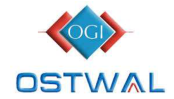

**[Image: KRISHANA_28072025164503_KPLTRANS230725MERGTOUPSIGN.pdf-0001-00.png (1167x147, 96.5KB)]**

Date: 2 8 .07.2025 

To, 

National Stock Exchange of India Ltd. 

Exchange Plaza, C-1, Block G, Bandra Kurla Complex, Bandra (E) Mumbai – 400 051 

Dear Sir / Madam, 

# **Subject:  Earnings Conference Call Transcript of Q1 FY26** 

Pursuant to Regulation 30 and 46 read with clause 15 of Para A of Part A of Schedule III of the SEBI (Listing obligations and Disclosure Requirements) Regulations, 2015, we enclose herewith the transcript of Q1 FY26 Earnings Conference Call organized by the Company on July 23, 2025 at 4.00 P.M. (IST). 

The Transcript of the same is available on Company's website at following link :- 

<u>https://www.krishnaphoschem.com/wp-content/uploads/2025/07/KPL-Earning-ConferenceCall-Transcript-Q1FY26.pdf</u> 

Kindly take the above-information on records. Thanking you, 

Yours faithfully, For Krishana Phoschem Limited 

ANIL Digitally signed by ANIL SHARMA SHARMA Date: 2025.07.28 16:32:23 +05'30' Anil Sharma ( **Company Secretary)** 

Place :-Bhilwara 

Registered off. : Wing A/2, 1st Floor, Ostwal Heights, Urban Forest, Atun, Bhilwara 311802(Raj.) Works : AKVN Industrial Area, Meghnagar-457779, Distt.Jhabua(M.P.)Ph.77730 01157, 92570 11857 

**[Image: KRISHANA_28072025164503_KPLTRANS230725MERGTOUPSIGN.pdf-0002-00.png (174x99, 20.0KB)]**

# **Krishana Phoschem Limited Q1 FY26 Conference Call** 

# **July 23, 2025** 

**Moderator:** 

Good afternoon, ladies and gentlemen, a very warm welcome to Q1 FY '26 Earning Call of Krishana Phoschem Limited. 

From the Senior Management, we have with us today Mr. Praveen Ostwal - Managing Director and Promoter; Mr. Sunil Kothari – Whole-Time Director and Chief Financial Officer and Mr. Pukhraj Kanther - Group Financial Advisor. 

As a reminder, all participant lines will be in the listen-only mode and there will be an opportunity for you to ask questions after the presentation concludes. Should you need assistance during the conference call, please signal an operator by pressing ‘*’, than ‘0’ on your touch-tone phone. Please note that this conference is being recorded. 

I now hand the conference over to Mr. Pukhraj Kanther. Thank you and over to you, sir. 

**Pukhraj Kanther:** 

Thank you and good afternoon to everyone, our stakeholders and welcome to this Earning Call for Krishana Phoschem Limited. 

Before we begin the earning call, I would like to mention that some of the statements made during this call may be forward-looking in nature and hence it may involve risks and uncertainties including those relating to future financial and operating performance. Please bear with us if there is a call drop during the course of conference call, we would ensure that call is reconnected as soon as possible. 

Now, I would like to hand over the conference to Mr. Praveen Ostwal - Managing Director. Over to Praveenji. 

## **Praveen Ostwal:** 

Good afternoon, everyone. Welcome to Krishana Phoschem Limited, Q1 FY26 Earnings Call. 

We are pleased to report a strong start to the year with our highest ever quarterly EBITDA driven by robust revenue, margin expansion and record production for the quarter ended June 30, 2025. This reflects the success of our strategic initiatives and strong year-on-year growth. 

## **Industry Overview** 

Page 1 of 11 

The first quarter typically sees a seasonal uptick in demand owing to Kharif sowing activity. This quarter was no exception, with the sector experiencing strong seasonal traction, particularly in complex and phosphate-based fertilizers. While demand fundamentals were supportive, the industry also faced inflationary pressures on key raw materials and intense supply-side competitiveness. 

## **Raw material headwinds** 

Raw material prices remained highly volatile. While Ammonia saw a moderate softening, key inputs like Sulphur experienced sharp price escalations, nearly doubling in some cases over recent quarters. These fluctuations reinforce the importance of our disciplined procurement strategy and strong cost management, which enabled us to maintain our operational momentum. 

## **Q1 FY26 Financial Performance: Delivering Strong Year-on-Year Growth** 

Our financial performance this quarter is testament to strong execution and resilient growth with remarkable year-on-year improvements. 

- Revenue from Operations surged to ₹395.5 crore, marking an impressive 40.8% YoY increase. 

- We delivered our highest-ever EBITDA (excluding other income) at ₹65.6 crore, a 56.6% YoY increase, supported by optimal operational execution. EBITDA margin expanded to 16.6%. 

- Profit After Tax (PAT) grew by an outstanding 86.6% YoY to ₹30.6 crore, with a PAT margin of 7.8%. 

- Basic EPS rose significantly to ₹4.95 (from ₹2.65 in Q1 FY25). 

## **Operational Highlights** 

The operational momentum achieved during the quarter is clearly reflected in our financial performance. 

- Total Fertiliser production during the quarter stood at 94,222 MT, up from 79,644 MT year-on-year. 

- Sales volume rose to 90,949 metric tons from 83,959 metric tons, driven by strong seasonal demand and improved throughput. 

- SSP sales marked sales down to 25,970 from 36,044 metric tons. 

- NPK DAP sales stood at 64,979 metric tons up from 53,355 metric tons with a healthy 81% capacity utilization. 

## **Strategic Product Innovation: Driving Value-Led Growth** 

Page 2 of 11 

We continue to drive value-led growth through strategic product innovation. 

- Bharat Urea SSP: A novel formulation designed to enhance nutrient use efficiency. 

- Annadata Super 6: A fortified SSP enriched with Zinc, Boron, and Magnesium, specifically targeting micronutrient-deficient soils. 

Both products have been successfully launched and are poised to contribute meaningfully to our performance in the upcoming quarters. 

## **Expansion and Strategic Investment: Advancing Our Growth Roadmap** 

Our strategic expansion roadmap is advancing effectively, positioning us for future growth: 

- Meghnagar capacity Expansion: Our proposed project involves adding 1,65,000 MTPA of NPK/DAP Complex and 99,000 MTPA of Sulphuric Acid capacity at a project cost of ₹142 crore. As of Q1 FY26, approximately ₹4 crore has been spent, civil work has commenced, and orders for plant & machinery have been released. All necessary approvals have been applied for, with commercial production targeted by March 2026. 

- New Growth Opportunities: We are actively evaluating new growth opportunities to further scale, diversify, and strengthen our integrated operations. 

## **Outlook: Optimistic for FY26 and Beyond** 

As we look ahead, we remain optimistic about our performance trajectory for the remainder of FY26, supported by favourable market dynamics, increasing product acceptance, and our well-structured capacity expansion roadmap. 

- **Meghnagar expansion on track:** The Meghnagar expansion project is progressing as planned. Once operational, it will significantly augment our NPK/DAP and Sulphuric Acid capacities, enhance backward integration, and unlock stronger economies of scale, supporting both topline growth and margin improvement. 

- **Operation excellence:** We continue to focus on improving process efficiency and optimizing product mix to protect margins amid input cost volatility. Our investments in quality assurance and production yield optimization are already delivering measurable gains. 

- **R&D and innovation** : Our in-house team is actively developing farmer-centric products tailored to specific soil and crop needs. We remain committed to introduce our fortified and customized nutrient solution in the coming quarters, aligned with evolving agricultural practices. Overall, we are confident in our ability to deliver sustainable growth and longterm value to all stakeholders, while contributing meaningfully to the vision of a more efficient, productive and resilient Indian agriculture sector. Thank you. 

Page 3 of 11 

|**Moderator:**|Thank you very much. We will now begin the question-and-answer session. The first question|
|---|---|
||is from the line of Raman KV from Sequent Investments. Please go ahead.|
|**Raman KV:**|Sir, what was the current EBITDA per ton for this quarter?|
|**Praveen Ostwal:**|EBITDA per ton for the quarter, there are two products in this.|
|**Raman KV:**|What was the EBITDA per ton for this quarter?|
|**Praveen Ostwal:**|For NPK, the EBITDA margin was around 16%, which translates to ~ ₹6,000 per ton.For SSP, the margin is lower, ~ 7–8%.|
|**Raman KV:**|What is your volume guidance for FY26?|
|**Pukhraj Kanther:**|We expect to sell ~ 2,40,000 MT of NPK and 1,15,000 MT of SSP.|
|**Raman KV:**|Sir, I just wanted to understand your capacity when you are giving, you give it either DAP or NPK. So the plant which we have, does it manufacture NPK or does it manufacture DAP or you can switch between both of them?|
|**Praveen Ostwal:**|The plant is flexible and can manufacture both DAP and NPK, depending on market conditions.|
|**Raman KV:**|And sir, with respect to our demand outlook, how is the demand outlook and do you expect margins to improve in the coming quarters or it will stabilize at 17%?|
|**Praveen Ostwal:**|The demand outlook is positive, as rainfall has been good, which supports overall demand. There's also a shortage of fertilizers in the Indian market. As for margins, we believe the current levels are healthy and sustainable. We expect margins to remain broadly stable.|
|**Raman KV:**|Sir, basically you are saying that 16% margin in NPK business is sustainable?|
|**Praveen Ostwal:**|Yes.|
|**Raman KV:**|Thank you, sir.|
|**Moderator:**|Thank you. The next question is from the line of Rishi Mehta, an Individual Investor. Please go ahead.|
|**Rishi Mehta:**|Hello. Sir, what is your expectation regarding business growth for the rest of FY26?|
|**Pukhraj Kanther:**|In absolute terms, last year we closed the year with ₹ 1,358 crores turnover and we expect it to touch ₹ 1,500 crore this year|
|**Rishi Mehta:**|How is the company positioned to deal with rising competition in fertilizer sector?|

Page 4 of 11 

|**Praveen Ostwal:**|India continues to remain a net importer of fertilizers. Given our strong backward and forward|
|---|---|
||integration, along with the strategic location of our operations, we believe we are well- positioned to compete effectively both in terms of raw material sourcing and sales.|
|**Rishi Mehta:**|Thank you, sir.|
|**Moderator:**|Thank you. The next question is from the line of Yashovardhan Banka from Tiger Assets. Please go ahead.|
|**Yashovardhan Banka:**|Namaste, sir. Sir, I just wanted to understand what is the peak revenue that we can sort of generate from the CAPEX that we are doing?|
|**Pukhraj Kanther:**|We are targeting a capacity utilization of around 81%, which we have already achieved in Q1. We aim to maintain this level over the next two quarters. In the last quarter, there may be some slackness due to potential maintenance or other operational reasons, but overall, we expect to sustain the current momentum in quantity terms.|
|**Yashovardhan Banka:**|So let me simplify it. I was asking if for the new CAPEX that we are, I think you mentioned you have incurred ₹ 4 crores. So for the new CAPEX, what can be, any internal target of peak revenues that we can generate from that?|
|**Pukhraj Kanther:**|This is a 500 tons per day capacity plant. Typically, in the first year that is FY26-27, we expect to achieve around 50% capacity utilization. From the following year onwards, we expect reaching 60%, and by the third year, we aim to scale up to 80% utilization.|
|**Yashovardhan Banka:**|Understood, sir. Thank you.|
|**Moderator:**|Thank you. The next question is from the line of Ajit Sethi from Eiko Quantum Solutions. Please go ahead.|
|**Ajit Sethi:**|Thank you for the opportunity. My question is from the raw material perspective. As with several refineries globally expected to shut down or reduce operation, are we likely to face a shortage of Sulphur in the near future?|
|**Praveen Ostwal:**|Currently, our sulphur requirements are being met through Indian refineries, and we do not foresee any disruption in the local supply chain. Additionally, we source sulphuric acid from smelters. There's also an upcoming expansion by Adani, so at present, we don’t anticipate any major supply disruptions.|
|**Ajit Sethi:**|Sir, correct me if I’m wrong, but sulphur from smelters is not of the grade typically used for fertilizer production, right?|

Page 5 of 11 

|**Praveen Ostwal:**|No, that acid has been used in fertilizer production for many years, and it will continue to be used.|
|---|---|
|**Ajit Sethi:**|Thank you.|
|**Moderator:**|Thank you. The next question is from the line of Raman KV from Sequent Investments. Please go ahead.|
|**Raman KV:**|Sir, what are the current price trends with respect to Sulphur prices?|
|**Praveen Ostwal:**|International prices are currently ~ $270–$280 per ton. Domestically, sulphur is priced at approximately ₹28,000–₹29,000 per ton.|
|**Raman KV:**|Thank you, sir.|
|**Moderator:**|Thank you. The next question is from the line of Shyam Sundar, an Individual Investor. Please go ahead.|
|**Shyam Sunder:**|Good afternoon, sir. I would like to ask you if there is any update on export and plans to take international markets?|
|**Praveen Ostwal:**|Right now, India is itself fertilizer deficient. So our main products we are catering to domestic demand only. But still the group is exploring opportunities for other nutrients, but it will be mainly domestic only.|
|**Shyam Sunder:**|Thank you very much.|
|**Praveen Ostwal:**|Thank you.|
|**Moderator:**|Thank you. The next question is from the line of Shashi Prasad, an Individual Investor. Please go ahead.|
|**Sashi Prasad:**|Hello. Good afternoon, sir. My question is what is the current status of new product launching fortified SSP?|
|**Praveen Ostwal:**|Fortified SSP and Urea SSP has been successfully launched in the market and we hope good demand from market.|
|**Sashi Prasad:**|Thank you, sir.|
|**Moderator:**|Thank you. The next question is from the line of Harish Sharma from Mehta Associates. Please go ahead.|

Page 6 of 11 

**Harish Sharma:** Hello. Thanks for the opportunity, sir. What are your plans for online marketing? **Praveen Ostwal:** We are currently selling a small quantity through online platforms, but the overall share of online sales in this segment is still very limited. In the coming years, it may gradually increase. However, due to subsidy-related challenges, we expect physical sales through our distributor and dealer network to remain the primary channel for the foreseeable future. **Harish Sharma:** Are you looking at expanding to larger platforms like Flipkart or Amazon? **Praveen Ostwal:** No, since these are subsidized products and sold in 50 kg bags, it's not feasible to sell them on platforms like Flipkart or Amazon due to high delivery costs and other challenges. **Harish Sharma:** Thank you, sir. Thank you. **Praveen Ostwal:** Thank you. **Moderator:** Thank you. The next question is from the line of Garima from R Dange Associates. Please go ahead. **Garima:** Good afternoon, sir. My question is, in this sector, particularly in industry sector, the margins are very less. What are the expansion plans and what are the future plans so that the margins can get improved? Profit margins? **Pukhraj Kanther:** I think it would be unfair to say that profit margins are low. Our margins are slightly better than the industry trend, and we aim to maintain that. It's important to understand that fertilizers are highly regulated and subsidized products. A portion of the production cost is reimbursed by the government through subsidies. Given this framework, the profit we are generating should be seen as reasonable. **Garima:** Thank you, sir. **Moderator:** Thank you. The next question is from the line of Anush Jain from Finterest Capital. Please go ahead. **Anush Jain:** Hello, sir. Congratulations for this beautiful quarter. Just a question regarding the revenue and the OPM. We see there was a good jump in the revenue compared to the last quarter. Could you help us understand the breakup of the revenue? And even the OPM margins had a significant jump compared to the last 6 quarters, so what made the expenses so less? **Praveen Ostwal:** Thank you. The revenue growth was driven by strong volume performance. Sales volume of NPK/DAP stood at 64,979 MT, up from 53,355MT in the previous quarter and 52,618 MT in the same quarter last year. Production volume of NPK also increased from 42,000 MT to 66,570 MT YoY. As a result, revenue rose from ₹280 crore to ₹395 crore QoQ, and up from ₹312 crore 

Page 7 of 11 

YoY. Operating margins improved, supported by backward integration and better cost efficiencies. 

**Pukhraj Kanther:** As mentioned in our last earnings call, we undertook a debottlenecking process at our phosphoric acid plant. And this has resulted into a better production of Phosphoric acid. **Anush Jain:** And another question, sir, regarding the expansion plan, it was mentioned like ₹ 142 crores of CAPEX will be acquired and it would be a mix of debt and accrual payments. So could you kindly help us understand the proportion of that, like how much debt will be taken and what would be the inbuilt capital? **Praveen Ostwal:** Out of the ₹142 crore CAPEX, we plan to raise ₹75 crore through debt. The remaining amount will be funded from internal accruals. **Anush Jain:** Thank you, sir. **Moderator:** Thank you. The next question is from the line of Dakshay Parwani, an Individual Investor. Please go ahead. **Dakshay Parwani:** Hi, sir. Thank you for the opportunity and congratulations on the good set of numbers. My first question will be, I think we have achieved 81% capacity utilization in NPK for this quarter, right, and I think as per our guidance, you are saying that we will be maintaining this 81% for the next Q2 and Q3 as well and Q4 there might be some lumpiness. But my question here is, if you say there is good rainfall happening and if there is good demand for the fertilizers and there is shortage of fertilizers, why are we not going aggressive in this? Is there any constraint on the capacity that can hinder our growth? **Praveen Ostwal:** See, capacity utilization of 81% is also far above from industry averages. we are actively working on debottlenecking our facilities and aim to enhance capacities further in the future. **Pukhraj Kanther:** This is a large and complex integrated plant, especially with the involvement of phosphoric acid production. Operational challenges do exist—for example, rock phosphate sometimes contains impurities that can lead to breakdowns. So, from an industry perspective, 81% utilization is quite commendable. That said, we believe the market has the appetite—even if we produce at 100%, we can sell it. So marketing is not a constraint. Our efforts are ongoing to push utilization beyond 81%. And with your best wishes, I am hopeful that we will be able to achieve that. **Dakshay Parwani:** Sir, to carry on this further, I believe in March 2026, we will be coming up with new capacities in NPK, right? If I am not wrong, there should be around 165,000 metric tons. So is it fair to assume that until that period, unless and until there are some efficiencies which we generate in our plant, our capacity utilization and our sales growth in the NPK segment would be more or less flat unless we achieve some de-bottlenecking as you mentioned earlier? 

Page 8 of 11 

|**Praveen Ostwal:**|Yes, more or less same.|
|---|---|
|**Dakshay Parwani:**|More or less same, right? And I was able to see that currently, we are having around capacity of 3,30,000 metric tons, right and the additional capacity is 165,000. So I just wanted to understand that in the past 3 years, we have been able to grow our sales by more than 50% every year on a CAGR basis, if I am not wrong. And now, with the additional capacity of 50% of our existing capacity, what kind of growth rate we are comfortable for the next 3 years in the NPK segment?|
|**Pukhraj Kanther:**|With the 50% capacity expansion, we expect an initial growth of around 20%–25% once the new plant becomes operational. After achieving that, further growth will primarily come from ramping up capacity utilization at the new plant. The existing plant is already running at an optimal level of 80%–82%. Our target is to gradually scale up the new plant as well, and we aim to reach around 80% utilization within the next three years.|
|**Dakshay Parwani:**|Thank you so much.|
|**Moderator:**|Thank you. The next question is from the line of Ajit Sethi from Eiko Quantum Solutions. Please go ahead.|
|**Ajit Sethi:**|Thanks for the follow-up. Sir, you said India is facing shortage of fertilizer. Can you provide a demand and supply dynamics on that?|
|**Praveen Ostwal:**|Certainly. India’s annual phosphatic requirement is ~25 million tons. At present, inventory levels across the country are very low at many locations, inventory is either minimal or nearly zero. While domestic production and imports together aim to meet this demand, raw material availability constraints continue to impact the supply side. Despite these challenges, we are maintaining our market share and ensuring steady supply to our regions|
|**Ajit Sethi:**|And you expect this 17% EBITDA margin to be sustainable, right?|
|**Praveen Ostwal:**|Yes. This will continue to be maintained.|
|**Ajit Sethi:**|Thank you, sir.|
|**Moderator:**|Thank you. The next question is from the line of Raman KV from Sequent Investments. Please go ahead.|
|**Raman KV:**|Sir, my question is on the follow-up of what the previous participant has asked. You said the total NPK demand in India is around 25 million tons per annum. And what is the current capacity at which the supply is coming at?|

Page 9 of 11 

|**Praveen Ostwal:**|he 25 million tons figure refers to the total_phosphatic_nutrient requirement in India, which|
|---|---|
||includes NPK, DAP, and SSP. The demand is being met through a combination of domestic production and imports. However, there is a global shortage of key raw materials, which is impacting supply.|
|**Raman KV:**|No, I just wanted to understand the figure, the supply figure?|
|**Praveen Ostwal:**|The supply depends on the importers, seasonal requirements, and production planning. Currently, the industry is preparing for the Rabi season, where demand is estimated to be around 5 million tons. The government and importers are working to ensure steady inflow, and production efficiencies are improving across plants. Overall, while efforts are ongoing, inventory levels remain low and we do expect tightness in supply throughout the year.|
|**Raman KV:**|No, I just wanted to understand what is the installed capacity in India with respect to only Indian players?|
|**Praveen Ostwal:**|Roughly 30% of the total requirement is met by Indian manufacturing; the rest ~60%–70% comes from imports. Within domestic capacity, the setup varies some plants are fully integrated with backward linkages like Phosphoric Acid and Ammonia, while others are not. So capacity utilization differs by plant. We can certainly share detailed capacity data if you could send us a mail post the call.|
|**Raman KV:**|Sure. Thank you, sir.|
|**Moderator:**|Thank you. The next question is from the line of Yashovardhan Banka from Tiger Assets. Please go ahead. Mr. Banka, your line has been unmuted. Please go ahead with your question.|
|**Yashovardhan Banka:**|Sir, I just wanted a bit of understanding on the new CAPEX of ₹ 142 crores that we are incurring. So what is the break-up of that into the Sulphuric and the DAP?|
|**Pukhraj Kanther:**|DAP, we will be spending about Rs. 65 crores and Sulphuric acid, ₹ 39 crores and rest in common utilities.|
|**Yashovardhan Banka:**|Alright.|
|**Pukhraj Kanther**|And it includes working capital margin also.|
|**Yashovardhan Banka:**|Right. Sir, historically, I was just going through and we have maintained around 2-3x of asset turns, so we are planning on maintaining that movement.|
|**Pukhraj Kanther:**|Asset turnover, look here, because of the bulk procurement of raw material, and then during|
||the off-season, the subsidy which is disbursed only after the farmers buy fertilizer, we have to|

Page 10 of 11 

carry a higher degree of assets and therefore, asset turnover ratio, what we are carrying on, we can improve only a little bit, not substantially. **Yashovardhan Banka:** And sir, last question, so any medium-term, say, internal vision or target of, say, turnover, say, in the next 2-3 years? **Pukhraj Kanther:** As I told you earlier, once this new plant comes, we will be clocking a growth rate of 20% for first year and then, subsequently, with better capacity utilization, growth will come. **Yashovardhan Banka:** Understood, sir. Thank you so much. All the best. **Moderator:** Thank you. As there are no further questions, I would now like to hand the conference over to the management for closing comments. **Pukhraj Kanther:** Thank you very much. Thank you once again for joining this call. And if you have any further questions, please don't hesitate to reach out to our Investor Relations team, either through mail or through WhatsApp. We will be happy to respond. Thank you very much and good day. **Moderator:** Thank you. On behalf of Krishana Phoschem Limited, that concludes this conference. Thank you for joining us and you may now disconnect your lines. 

Disclaimer: This transcript has been refined to improve clarity, ensure readability, and maintain financial accuracy 

Page 11 of 11 

---

## Extracted Images

| # | File | Dimensions | Size |
|---|------|------------|------|
| 1 | KRISHANA_28072025164503_KPLTRANS230725MERGTOUPSIGN.pdf-0001-00.png | 1167x147 | 96.5KB |
| 2 | KRISHANA_28072025164503_KPLTRANS230725MERGTOUPSIGN.pdf-0002-00.png | 174x99 | 20.0KB |
