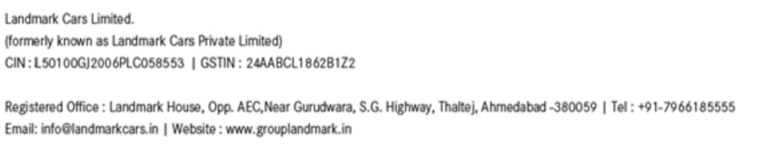

**[Image: Feb2025.pdf-0001-00.png (234x163, 14.7KB)]**

## **February 18, 2025** 

To, To, The Secretary, The Secretary, **BSE Limited National Stock Exchange of India Limited** P. J. Towers, Exchange Plaza, C-1, Block- G, Dalal Street, Bandra Kurla Complex, Bandra(E) Mumbai- 400 001 Mumbai – 400 051 **Scrip Code – 543714 Symbol – LANDMARK** 

**Sub:** **<u>Transcript of Earnings Call with Analysts/Institutional Investors/Funds</u> Ref:** **<u>Regulation 30 of SEBI (Listing Obligations and Disclosure Requirements) Regulations, 2015</u>** 

Dear Sir/Madam, 

This is further to our letter dated February 10, 2025 wherein we had given advance intimation of the earnings conference call scheduled to be held on Thursday, February 13, 2025 with several Analysts/Institutional Investors/Funds with respect to discussion on the Unaudited Standalone and Consolidated Financial results of the Company for the quarter and nine months ended on December 31, 2024. 

In compliance with the SEBI LODR Regulations, please �ind attached the transcript of the earnings conference call held on Thursday, February 13, 2025. 

The Investor Presentation may also be accessed on the website of the Company at <u>https://www.grouplandmark.in/investor-relation.html.</u> 

You are requested to take the above information on record. 

## **For, Landmark Cars Limited** 

AMOL Digitally signed by ARVIND AMOL ARVIND RAJE Date: 2025.02.18 RAJE 17:24:31 +05'30' ____________________________ **Amol Arvind Raje Company Secretary and Compliance Of�icer Membership No: A19459** 

**Place:** Mumbai 

**[Image: Feb2025.pdf-0001-12.png (855x167, 45.6KB)]**

**[Image: Feb2025.pdf-0002-00.png (322x230, 40.9KB)]**

# “Landmark Cars Limited 

# Q3 FY '25 Earnings Conference Call” February 13, 2025 

E&OE: This transcript is edited for factual errors. In case of discrepancy, the audio recordings uploaded on the stock exchange on February 13, 2025, will prevail 

**[Image: Feb2025.pdf-0002-04.png (159x114, 13.4KB)]**

**[Image: Feb2025.pdf-0002-05.png (226x105, 20.7KB)]**

**[Image: Feb2025.pdf-0002-06.png (211x105, 7.9KB)]**

**MANAGEMENT: MR. SANJAY THAKKER – CHAIRMAN AND EXECUTIVE DIRECTOR – LANDMARK CARS LIMITED MR. ARYAMAN THAKKER – EXECUTIVE DIRECTOR – LANDMARK CARS LIMITED MR. SURENDRA AGARWAL – CHIEF FINANCIAL OFFICER – LANDMARK CARS LIMITED** 

**MODERATOR: MR. AKHIL PAREKH – B&K SECURITIES** 

Page **1** of **18** 

_Landmark Cars Limited February 13, 2025_ 

**[Image: Feb2025.pdf-0003-01.png (145x101, 10.2KB)]**

### **Moderator:** 

Ladies and gentlemen, good day, and welcome to the Landmark Cars Limited Q3 FY '25 Earnings Conference Call hosted by Batlivala & Karani Securities India Private Limited. As a reminder, all participant lines will be in the listen-only mode and there will be an opportunity for you to ask questions after the presentation concludes. Should you need assistance during the conference call, please signal an operator by pressing star, then zero on your touch-tone phone. 

Also, this conference call may contain forward-looking statements about the company, which are based on the beliefs, opinions and expectations of the company, as on the date of this call. These statements are not guarantees of future performance and involve risks and uncertainties that are difficult to predict. 

I now hand the conference over to Mr. Akhil Parekh from B&K Securities. Thank you, and over to you, sir. 

### **Akhil Parekh:** 

Thank you. Hello, everyone. Good morning. On behalf of B&K Securities, I welcome you all for third quarter FY '25 earnings call for Landmark Cars. From the management, we have Mr. Sanjay Thakker, Promoter, Executive Chairman; Mr. Aryaman Thakker, Executive Director; and Mr. Surendra Agarwal, Chief Financial Officer. 

Without taking much time, I'll hand it over to Sanjay, sir for your opening remarks, post which we'll open the floor for Q&A session. Over to you, sir. 

### **Sanjay Thakker:** 

Thank you, Akhil, and thank you, B&K team, for hosting us. The results and the presentations are uploaded on the stock exchanges and the company website. I hope everybody had a chance to have a look at it. The global auto industry is going through quite an uncertain time currently. The change in guard in USA has resulted in environmental goals of many countries being reset. The threat of tariff has also made the situation more complex. 

The Indian auto market grew at 4% in volume and 9% in value terms in calendar year 2024 after a rapid growth in 2022 and '23. The October-December quarter, however, was positive one, showing much better growth than the previous quarters. In Q3 of financial year '25, we achieved significant growth in revenue on year-on-year, as well as Q-on-Q basis. In this quarter, we achieved the highest quarterly EBITDA, as well as the highest turnover that the company has seen. 

The highest EBITDA has been in the last 8 quarters. The solid foundation that we have built over the past few quarters is now yielding positive results and is reflected in our improved performance. At Landmark, we had confidence in our strategic direction and execution capability to achieve these results. 

Over the past decade, Landmark's service business has maintained a strong CAGR of approximately 15%. However, the recently added workshops have yet not reached its full operational capacity. As these new workshops scale up and achieve optimum utilization, the service business is expected to regain its historic growth trajectory. It is also noteworthy to note that the service revenue for Landmark will soon touch INR1,000 crores per annum number, which is a big milestone in our journey. 

Page **2** of **18** 

_Landmark Cars Limited February 13, 2025_ 

**[Image: Feb2025.pdf-0004-01.png (145x101, 10.2KB)]**

We had set a target to reduce personnel expenses and other expenses below 4% on pro forma revenue by end of 2025. Through the effective implementation of cost optimization initiatives, this objective was successfully achieved ahead of its schedule. As of quarter 3, the personnel expenses stood at 3.9%, while the other expenses were reduced to 3.5%. Our disciplined approach to expense management has strengthened our financial position. 

The seamless implementation of our outlet opening and cost reduction strategies demonstrate our ability to execute effectively. I'm happy to report that we have further reduced our inventory and now it stands at near normal 35 days. I have reason to believe that this is amongst the best in the industry. 

Clearly, the period ahead will be full of speed bumps and surprises this year. I'm more confident than ever before that Landmark will not only overcome all odds, but increase its lead over competition. With this, I pass it over to Aryaman, who will share his insights. 

### **Aryaman Thakker:** 

Thank you. Our revenue and profitability saw significant growth this quarter, supported by a strong festive period, the operationalization of new outlets and the positive impact of recent car launches. In FY '25, 23 out of the 24 planned outlets have already started operations, including 7 facilities for Mahindra & Mahindra and Kia in Hyderabad, which became operational in November. We also acquired a Kia sales outlet in Hyderabad from a co-dealer in December. These stores will achieve scale and start contributing as expected over the next 3 quarters. 

Let me now give you a highlight of some of our partner OEMs. Mercedes-Benz has maintained its position as the number one luxury carmaker in India for 10 years in a row. They sold 19,565 vehicles in calendar year '24, which was an over 12% increase over '23. 25% of these sales came from top-end vehicles, which are cars priced over INR1.5 crores. They now have over 2 lakh cars sold in India since inception. Landmark continues to be the largest partner for Mercedes-Benz with over a 16% volume share. 

Our upcoming facilities in Patna are likely to begin operations in the beginning of financial year '26. Mahindra & Mahindra has an exciting year ahead. The Thar Roxx is seeing a strong momentum and the upcoming launches of the new BE 6E and the XUV 9e have garnered a lot of excitement and are seeing a strong customer interest. Our facilities in Hyderabad, which began operations in November are seeing a ramp-up in volumes. 

The MG Windsor has been a successful launch and continues to be the largest selling EV car in the country. The brand has a new product planned every 3 to 6 months. Landmark has already achieved a close to 5% market share for MG Motors in India. A new vertical, MG Select has been launched recently. This will cater to the accessible luxury market. Initially, 2 products will be launched, the MG Cyberster and the MG M9 MPV with more to follow going ahead. Sales are expected to begin in May of '25. 

Landmark has received the letter of intent to begin operations for MG Select in Ahmedabad and Kolkata. In Kia, our operations for Hyderabad, which started in November are ramping up. However, the workshop in Hyderabad will start operating only from next month, post which we are expecting to see the service revenues to begin kicking in. The new Kia Syros, which 

Page **3** of **18** 

_Landmark Cars Limited February 13, 2025_ 

**[Image: Feb2025.pdf-0005-01.png (145x101, 10.2KB)]**

was launched in January, has garnered a positive response, and we expect it to add around 15% to our Kia volumes this year. 

BYD closed calendar year '24 with a retail of nearly 3,500 cars. The Seal, the homologated Atto 3 and the eMAX 7 have received a strong response. The brand has an ambition to sell upwards of 10,000 units in the current calendar year. And to achieve this, they have a number of new launches planned. The first amongst them being the Sealion 7 SUV, which was recently unveiled at the Bharat Mobility Show and is receiving a positive and a strong customer response. 

The eMAX 7 has also recently received its homologation certificate, and we expect this to help increase its volumes. We are further expecting another 2 launches during the course of this year, and Landmark continues to be the largest partner for BYD in India. 

Landmark is the OEM's partner of choice. This is reiterated by the receipt of the letter of intent to open MG Select dealerships in Ahmedabad and Kolkata and Mercedes-Benz sales in Bihar as well as Jharkhand. This will help us to deepen our existing presence in these geographies and strengthen ties with our partner OEMs. Majority of our planned expansions are now completed with the focus being on ramping up business volumes. Please refer to the graph in our investor presentation to get a detailed insight into the different phases of stabilizing a new outlet. 

I will now hand it over to our CFO, Surendra Agarwal, to take us through financial highlights. 

### **Surendra Agarwal:** 

Thank you, Aryaman. We consistently lead in volume contribution across various OEMs, bringing meaningful outcome to each partnership. Now I will brief you the performance for Q3 FY '25. We added and operationalized new outlets throughout the year that contribute to revenue growth. 

Our total pro forma revenue for the quarter is the highest ever, which stand at INR1,668 crores, as compared to INR1,301 crores in the same quarter of the previous year with a growth of 28% year-on-year. Our new vehicle pro forma sale was around INR1,421 crores vis-a-vis INR1,074 crores in Q3 FY '24 across all our OEM partners. 

Our aftersales revenue was INR247 crores against INR227 crores in Q3 FY '24. In Q3 FY '25, our preowned vehicle sales revenue stood at INR36.6 crores with a sequential growth of 32.1%. In the service business, new outlets are currently contributing half as much as existing one, impacting gross margin. However, service revenue is steady in new outlet increasing each month. And once these outlets reach their full potential, overall gross margins are expected to improve. 

The company has reported the EBITDA of INR69.5 crores at a 5.82% margin on reported revenue versus INR54.8 crores at 6.4% margin in Q2 FY '25 and INR67.1 crores at 6.99% margin in Q3 FY '24. In Q2 FY '25 (this was said erroneously. It should be read as “In Q3FY25”) the company recorded the highest quarterly EBITDA in the last 8 quarters. 

Page **4** of **18** 

_Landmark Cars Limited February 13, 2025_ 

**[Image: Feb2025.pdf-0006-01.png (145x101, 10.2KB)]**

PAT for Q3 FY '25 stood at INR11.8 crores with 1% margin vis-a-vis INR0.3 crores at 0.04% margin in the previous quarter. PAT is impacted primarily due to high depreciation and Ind AS effect by addition of new outlet and impact of ESOP grant. 

Depreciation for the quarter is INR34 crores, increased by 29.8%, mainly due to addition of new outlet. Cash PAT for the quarter stood at INR28.7 crores with 2.4% margin as against INR17.2 crores with 1.9% margin in the previous quarter. The company has further reduced its new car inventory to near 35 days, far below the industry average of 55 to 60 days. 

Thank you. With this, now I open the floor for Q&A. 

**Moderator:** 

First question is from Arnav Sakhuja from Ambit. 

**Arnav Sakhuja:** 

So I just wanted to ask within the Mercedes-Benz segment, I wanted to understand that for the ultra-high-end models that you were speaking about earlier, which you said contributed to around 25% of the company's sales and the car price above INR1.5 crores, does Landmark enjoy a better margin for these cars? 

**Sanjay Thakker:** Arnav, the margin percentage is more or less similar. So in absolute terms, we make more money. But in percentage terms, it is same. 

**Arnav Sakhuja:** 

Okay, Thank You **.** And I also just wanted to get a bit of an understanding into the macroeconomic environment of EVs, so because I was reading some news that globally apparently POPs have recently announced that they will be scaling back on some of their EV plans, and they will be increasing their share of internal combustion engines instead. So I just wanted a bit of an insight into the environment, if you could just highlight the same? 

**Sanjay Thakker:** 

Yes. Arnav, this is a question, which is in everybody's mind currently. And depending on which period you are answering this question, the answer keeps on getting modified a little. I think directionally, the world has decided that they want to go in with EVs and let go of the fossil fuel. I mean, I think that I don't think anybody has a doubt in their mind. The discussion is mainly around the time lines. 

The earlier time lines that were put mainly in Europe and some other countries were very, very onerous and stringent and which has led to job losses. We have seen a lot of Chinese OEMs taking significant lead in this. So -- and with Mr. Trump -- Donald Trump coming in as the President of America, we are -- the subsidy of $7,500 in US has also been removed for buying the EVs. So this is a question up in the air. There is globally, this has no real answer. 

From an Indian perspective, our penetration has been only 2% or thereabouts till last year. With the launches of mainstream players like Mahindra, Hyundai, MG, this penetration is definitely going to go up this year. Now our view is that this number will go to maybe around 7%, 8% to begin with of the overall market and kind of stabilize there. 

And -- but this is quite a policy-driven kind of a business. It's going to happen. The government regulations on the RTO tax, the GST, the depreciation that you get will also play a 

Page **5** of **18** 

_Landmark Cars Limited February 13, 2025_ 

**[Image: Feb2025.pdf-0007-01.png (145x101, 10.2KB)]**

big role in the adaptation over here. So we'll have to wait and watch on the speed of implementation. I hope I've answered your question, Arnav. 

**Moderator:** 

**Lokesh Manik:** 

### **Sanjay Thakker:** 

The next question is from Lokesh Manik from Vallum Capital.Please go ahead 

Hello, Good Morning to the team **.** Firstly, congratulations on the execution of both the strategies that is store expansion and on cost reduction. So my question was on this sort of raises hopes for us as investors for the forthcoming year. Do you have visibility for another 25 stores either in calendar year '25 or financial year '26? 

Lokesh, no, I wouldn't want to go that way right now. As Aryaman said, we -- the focus right now is to get all the stores up and running that we have done and make them profitable. Having said that, the new OEMs, who we have partnered with, for example, Mahindra, I'm sure that neither we or them have kind of signed up for 2 cities for Landmark. But there is no number. 

And I would like to take this opportunity to kind of talk about why did we do nearly 25 stores in a year, which we had never done, though the execution of this gives me a huge amount of confidence in our team's ability. The thing is that we needed to change the constitution of our company. 

The company was dependent on some OEMs, which were not really participating in India's growth story. And this, please understand from a global perspective, situation is so fluid. Only today, then there is news that Honda and Nissan Alliance has been called off. 

Now we read some 1 month back, 3 weeks back that this was happening. Now there is so much uncertainty in the global market as far as the OEs are concerned globally because of the fuel type and whether the regulations and all that, that it's important to have a portfolio approach and to rejig the portfolio of our offering. 

Now we represent 10 brands   in 13 states. So it was very important to basically get MG, Mahindra and Kia, the mainstream guys, who are looking like doing pretty well in India, and our decision has been turned right. So it's not that every year we will want some new OEMs and so much infrastructure to be put in. 

We are also mindful of generating profit. We are also mindful that this year is a little uncertain from a macro perspective, but we are also mindful of the fact that this is the time when great opportunities come. We have acquired 26% of our outlets. So -- but I don't want to call out anything as yet because there is nothing that I can see happening for a certainty. 

**Lokesh Manik:** 

Fair enough. Sir, actually, I was coming on the back of that the numbers that we have reported, if I look at the unit economics level, we are still very well intact. Nothing has gone wrong out there as such. On the P&L absolute numbers, yes, you see the new store impact coming in. But if you're looking at a long-term perspective, the unit economics are intact for your existing outlets. 

Page **6** of **18** 

_Landmark Cars Limited February 13, 2025_ 

**[Image: Feb2025.pdf-0008-01.png (145x101, 10.2KB)]**

So I was looking at it from a perspective, does that give you the confidence to fuel this further maybe 20, 25 more stores coming this year? And you seem to have cracked the recipe for opening stores and executing it in a short manner. So from a more -- a little more optimistic point of view is where I was coming from. **Sanjay Thakker:** Yes, the optimism stems from the fact that we were able to operationalize. We were able to stabilize a lot of our stuff, but there is nothing that I have to do. Let's see how the year unfolds and what opportunities come our way. **Moderator:** Next question is from Devesh Kayal from Monarch AIF. **Devesh Kayal:** Sir, I just want to understand gross margins on the stand-alone side has contracted by almost 800 bps year-on-year and 500 bps quarter-on-quarter. So just want to understand what's the reason behind that? **Sanjay Thakker:** Yes, Devesh, sure. So this is an important question. And that is why our presentation, we tried to make it a little clear and also in Surendra's speech. What is happening is that in the new stores, which are -- and we have called it out in our slide, there are some 19, I think, outlets, which are classified under new 11 and 8, yes, it is 19. So now over there, the service contribution in the new outlets is as of now, half of our old outlets service contribution. Now you understand what I'm saying. The point is that the Mahindra, Kia workshops are in a ramp-up stage. In fact, in Kia, we haven't yet opened our workshop in Hyderabad, which is going to be opened inaugurated next month. And every month of opening of our workshop, we are seeing increase in the throughput. Now we need to have the throughput of our new outlets in the workshops reach our normal level. 

Now what is the normal level of the overall turnover, around 16%, 17% of our total turnover should come from service, which is right now less than half for the new outlets. But the thing is that we are talking about OEs, who have a car parc like a Mahindra or a Kia have a car parc in the towns that we are operational. So it is not that we will need to sell cars for those cars to come back to our workshops. So we just have to garner these units in operation, the car parc, and we are seeing that result every single month. So once we have this contribution of aftersales increase from current, say, 7%, 8% going up to nearly 15%, you will see the gross margins improve automatically. **Devesh Kayal:** Sir, I would assume that stand-alone is mostly Mercedes. So -- and Mercedes, they have opened, I think, just one workshop. So on the stand-alone side, it has also contracted a bit. So that's what my question was. **Sanjay Thakker:** My sense is that it is a marginal thing. Also, the sales has increased for these brands. So the contribution of aftersales even in existing ones as a percentage has dropped by some maybe 1% or so. So that is why it is there. But I would not see it as a cause of worry in the existing ones. The new ones need to ramp up, and they are looking like ramping up quickly. 

Page **7** of **18** 

_Landmark Cars Limited_ 

_February 13, 2025_ 

**[Image: Feb2025.pdf-0009-02.png (145x101, 10.2KB)]**

**Devesh Kayal:** Okay. And sir, can you give the breakup of interest cost into lease interest and the normal debt interest? So our interest cost has been going up. So 9 months is INR53.2 crores. So can you just give the breakup into how much of the interest cost is into lease and on the normal borrowings? 

**Sanjay Thakker:** Yes. So Surendra will answer this question. But before that, let me kind of explain what has have happened. We have put up our close to 25 stores from our internal accruals, pulling out money from our working capital. And we had kind of said that close to INR75 crores of capex will happen in these stores. We are within that budget. I believe we have spent much lower than that. Now -- but the money has been pulled out from there. So this is one part. We have added new OEMs, where the inventories have kind of started, which were not there in the previous year. But to answer your question, here is Surendra. **Surendra Agarwal:** So Devesh, the -- I can give you the 9-month figure I have right now available with me. It's INR54 crores in the total, INR31 crores is on account of the inventory funding, working capital funding and the INR22 crores is on account of the lease impact. **Devesh Kayal:** Okay. And so -- and what is the overall debt currently including vehicle – floor plan table? **Surendra Agarwal:** Yes, just a minute. So overall debt is INR560 crores, Devesh. Out of that around INR150 crores debt is from the Mercedes-Benz demo car, which is the interest free. **Sanjay Thakker:** What has happened as far as the debt is concerned, Devesh, is that we have been able to reduce that quarter-on-quarter. **Moderator:** Next question is from Pritesh Chheda from Lucky Investments. **Pritesh Chheda:** Sir, what will be the cash flow for 9 months? **Surendra Agarwal:** The free cash generated... **Pritesh Chheda:** Operating cash flow. **Surendra Agarwal:** So operating cash flow is around... **Sanjay Thakker:** INR200 crores. **Surendra Agarwal:** INR200 crores. **Pritesh Chheda:** So this will include the inventory build-up considered in it. **Surendra Agarwal:** Yes, yes, change in working capital, yes. **Pritesh Chheda:** Is also considered, right? **Surendra Agarwal:** Right. 

Page **8** of **18** 

_Landmark Cars Limited February 13, 2025_ 

**[Image: Feb2025.pdf-0010-01.png (145x101, 10.2KB)]**

|**Pritesh Chheda:**|Now post this so -- post this operating cash flow, how much capex did we do for these 23 stores?|
|---|---|
|**Surendra Agarwal:**|So 23 store, the capex would be around INR70 crores. And then we have some other capex also for the existing store and the vehicle purchase. So total capex for the 9 months is around INR125 crores.|
|**Pritesh Chheda:**|INR125 crores. Vehicle purchase means that that should be a part of inventory, right? Is that vehicle purchase what you...|
|**Surendra Agarwal:**|So in some of the brands, we provide the courtesy car, the person, who come from the service...|
|**Sanjay Thakker:**|Let me explain this in a slightly better way. In Mercedes-Benz, to popularize the EVs adaptation mainly, what the company has come up with is a scheme of courtesy car, what Surendra was mentioning, means that in case the car comes for service in our workshops, we give a replacement car to the person, whose car is standing in our workshop for more than, say, 2 days. Now this is a revenue-neutral thing, where the company is reimbursing -- Mercedes-Benz is reimbursing the EMI of these cars, but it is -- they are using our balance sheet to popularize the EVs. So that is the thing what Surendra is telling. So as to understand in a simple language.|
|**Surendra Agarwal:**|And some of the few of the brands, we also have demo car in our capex.|
|**Pritesh Chheda:**|Okay. So sum total when you consider these for the newer stores that you are putting now, so I'm assuming that a lot of the newer stores are for newer brands like Mahindra, Kia and MG and BYD, right?|
|**Sanjay Thakker:**|That is right.|
|**Pritesh Chheda:**|Right. So here what is the inventory turn that you would, or the capital employed turn that you would look at the optimum level of the business plan that you would have made? So all these investments that you have done in the last 1, 1.5 years, what is the capital employed done in these 23 stores?|
|**Surendra Agarwal:**|So these 23 stores, as I told you, the capex and the deposits. So the 2 elements, which is the long-term kind of thing is the capex is around INR65 crores and around INR5 crores is on the deposit, which we give to the landlord. Apart from that is all the stocks, which we have in this thing.|
|**Pritesh Chheda:**|So I asked that's why -- so that's why I asked capital employed, including the stock, what was it...|
|**Sanjay Thakker:**|Can we -- see, we are brand-wise, Pritesh, we are not reporting it, but...|
|**Pritesh Chheda:**|I didn't want brand-wise, actually. I wanted incrementally these 23 stores combined what it would be?|

Page **9** of **18** 

_Landmark Cars Limited_ 

_February 13, 2025_ 

**[Image: Feb2025.pdf-0011-02.png (145x101, 10.2KB)]**

|**Surendra Agarwal:**|So the stock is another INR100 crores. So if you take the total of this INR100 crores is the stock and the INR70 crores is the capex and the deposit. So INR170 crores.|
|---|---|
|**Pritesh Chheda:**|So basically, we have invested INR170 crores in this growth expansion. This INR170 crores at whatever -- when you are saying today that these stores are operating at half the number on service because cars will build up, right? When you sell cars, then they come for service. So usually, in your business plan, these type of investments about INR170 crores that you have done, what should be the capital employed turn on that? And what should be the margin on that at the peak level or at the optimum business level.|
|**Sanjay Thakker:**|So Pritesh, one correction in what you just said and what I called out. The point is that in case of Kia, Mahindra or MG, we do not need to sell cars for those cars to come up -- come to our workshop. In fact, from the first month of operations, we are seeing a decent amount of traffic in our workshops. So that is a kind of a clarification because we are not the first dealer. There are lakhs of cars on the street of the brands that we have spoken about.|
||So this will reach our normal kind of a business very quickly. There is no special thing about these. In fact, the gestation period for these businesses is going to be significantly shorter than the newer brands that you would generally tie up with.|
|**Pritesh Chheda:**|Okay. Can you share the capital employed churn number that one would look at on this?|
|**Sanjay Thakker:**|We can -- Pritesh, if you are -- we can maybe connect and give you that later on, if you're okay.|
|**Pritesh Chheda:**|No problem. And last question, in the 9 months number of the pro forma revenue number, can you tell us the share of the contribution now ex Mercedes, what is the contribution of brands? And can you share -- contribution the share of revenue? And can you share the share of business for these 4 new brands, if you can give that clarity on the 9 months?|
|**Sanjay Thakker:**|We will give it. If you want, we can do that later on. But it is in the pro forma reported difference is the Mercedes revenue. I mean that's really easy to find. The rest of the brands, we are not giving a contribution brand-wise, but I think we are in a good mix right now soon.|
|**Pritesh Chheda:**|And to one of the participants, you said that this year's 23, 25 stores that we have opened -- we are not going to open stores next year. That's how I should read it, or I didn't understand that comment.|
|**Sanjay Thakker:**|Yes. That is -- as of now, that is our going in position. We are not opening 25 stores in the next year, no.|
|**Pritesh Chheda:**|But we will open some stores, right?|
|**Sanjay Thakker:**|Yes. Off and on, if there is something which will happen with, say, a Mahindra or a Mercedes- Benz or something, which looks very juicy, we will do it. But it is not a continuous process that we are wanting to get into.|

Page **10** of **18** 

_Landmark Cars Limited_ 

_February 13, 2025_ 

**[Image: Feb2025.pdf-0012-02.png (145x101, 10.2KB)]**

|**Pritesh Chheda:**|Okay. So basically, you might land up opening maybe 4, 5 stores at max next year. That's how we should read it, right?|
|---|---|
|**Sanjay Thakker:**|Unless something really juicy comes in -- as of now, we are not seeing any great number. What we have done broadly what we have to do.|
|**Pritesh Chheda:**|So which means that every quarter from now, you will actually get into a situation, where if you use up the existing infrastructure better, we might see margins flowing in, right?|
|**Sanjay Thakker:**|That is our intention, honestly. That is where we want to go and satisfy ourselves. We have satisfied ourselves with the thing that we can build so much infrastructure. We have satisfied ourselves with the fact that we can control and operationalize them and these OEs then like us and to offer us more growth along with this.|
||Now we have to satisfy ourselves that these stores, we don't need to wait for all 25, but a good amount of them to reach our profitability metrics before we can get into acceleration mode.|
|**Moderator:**|Next question is from Bhargav from Ambit Asset Management.|
|**Bhargav:**|Sir, just want to get some clarification. So the free cash flow of INR75 crores in 9 months is post capex, post rent, right, everything post.|
|**Surendra Agarwal:**|Yes, post capex, yes.|
|**Bhargav:**|And rent also you have deducted, right?|
|**Surendra Agarwal:**|No, rent is the lease impact. So this is the Ind AS cash flow. So if you reduce the rent is for the period is another INR50 crores, you can reduce. That's the repayment of lease liability because this is as per the Ind AS accounting, I'm telling you.|
|**Bhargav:**|And as far as the actual cash post capex and rent is INR25 crores for 9 months, right?|
|**Surendra Agarwal:**|Yes. That's the figure.|
|**Bhargav:**|And fair to say that next year, the capex will be in the range of INR15 crores to INR25-odd crores, meaning substantial reduction in capex?|
|**Sanjay Thakker:**|I mean it's a little early to call that, Bhargav. But we -- as I told Pritesh over there, it is -- see, the previous year, we knew what we were doing, and we had to do that kind of current -- to rejuvenate our organization, get it into a growth path and have a different OE mix. This year, we don't have any such compulsion. We are in a good zone, and we will have to see how the market behaves and take a call based on that. But our historic numbers have not been at all anywhere near what we did last year, as far as the capex is concerned.|

Page **11** of **18** 

_Landmark Cars Limited February 13, 2025_ 

**[Image: Feb2025.pdf-0013-01.png (145x101, 10.2KB)]**

|**Bhargav:**|Secondly, sir, nowadays, this extended warranty is getting very popular. So how do we account for this revenue for this extended warranty because to that extent, the service revenue gets impacted, right?|
|---|---|
|**Surendra Agarwal:**|So what we are doing is the extended warranty, what we receive from the customer that amount, we apportion the income we apportion during the period of the extended warranty. So if it is 3 years, we apportion the monthly income in 3 years period. So it's a 36 months, we apportion the income.|
|**Bhargav:**|And you show it in the service revenue only.|
|**Surendra Agarwal:**|Yes, yes.|
|**Sanjay Thakker:**|Yes. So -- but we -- so you are right. The point is that we have received money. The accounting of it, we are prudent accounting. We are not following a cash basis of accounting. If we had then the service revenue would have been significantly higher.|
|**Bhargav:**|And the INR1,000 crores the guidance which you gave on service revenue, I presume it is for FY '26?|
|**Sanjay Thakker:**|See, we are at a pace of around INR250 crores last quarter. So that -- I mean, I'm just doing a simple math, and we are already there. We should grow above that clearly.|
|**Bhargav:**|Sir, and if I look at the profit after tax on your existing showroom and just do a PAT margin, it comes to about 1.1%. On a steady-state basis, what should we look at in terms of PAT margin from existing stores?|
|**Sanjay Thakker:**|See, the global average and in good times, we have seen a 2% plus net profit margin. I'm not giving this as a guidance. Please -- I'm putting that as a caveat right now. But we -- our kind of North Star thought process has been that we need to go about 2% PAT. Now this is where our minds are working, and we will work towards getting there. When I can't really say. We are also in an industry, where the consumers and the customer sentiment plays a role. We need to sell cars and for us to sell cars and after that to service it. So the timing of it, we had the situation with elections and some other hiccups last year. And the last year, calendar year for the auto industry and a lot of other consumer durables was not as strong as what we had seen in the previous 2 years. So let's hope we get there sooner rather than later.|
|**Bhargav:**|And lastly, sir, on these new logos, which you have entered into, is it fair to say that therein, the share of service revenue will be higher because you said there's already an installed base. So once the -- once you get up to speed compared to Mercedes, here, the service revenue share will be higher or nothing?|
|**Sanjay Thakker:**|I won't say that the service revenue share will be higher because the sales are also good. So what we are -- what percentage we are talking about is a percentage of overall revenue. Now the service overall revenue can get higher for cars, which are not getting sold. Now it is not the|

Page **12** of **18** 

_Landmark Cars Limited February 13, 2025_ 

**[Image: Feb2025.pdf-0014-01.png (145x101, 10.2KB)]**

best metrics to track really because if you don't sell cars, your service revenue percentage will be very high. 

But that's not what you want because going ahead, you don't want a situation when the service revenue also starts dropping. So here, we need a good mix, where the cars are also sold, and the service revenue is also good. So we need to be in these brands. And we believe right now that we are in that -- those brands. 

**Bhargav:** And lastly, sir, for EV also, you believe that the service revenue ratio will be similar to ICE? **Sanjay Thakker:** So it will be a little lesser. The accident repair is more expensive. The periodic maintenance is cheaper. The global -- and we are not able to kind of give an exact number, but the global data and the news from China -- and all what we have is showing us that there is around 13%, 14% lesser revenue as far as the EV is concerned at a 40% gross margin, that will be around 5% kind of impact on the EV cars. 

Now EV as a penetration, as you know, is 2% of our overall thing. And all estimates show that by 2030 also, we will be selling more ICE cars than EV. The car park, what we will have will be significantly higher. 

**Moderator:** Next question is from Sabyasachi Mukerji from Bajaj Finserv Asset Management. **Sabyasachi Mukerji:** Sanjay, ji, 2 questions. Firstly, on the gross margins, and I'm delving it a little deeper. So while I understand that your -- I mean, our new vehicle sales is growing faster than the service business, and that's why the gross margin are under pressure. But trying to understand on, let's say, on a vehicle sales gross margin on a like-to-like basis, and I'm sure you must track it internally. Is there any change from the gross margin levels of the vehicle sales business internally that you see? **Sanjay Thakker:** So it is also, Sabyasachi, a seasonality kind of an impact. In the last quarter, the discounts level go up for new cars, I'm talking about, where the 2024 cars are generally sold, a lot of discounts are given by the OEs and a lot of some discount is also goes from our pocket. So in the quest for reducing the stock, we had also let go and which we had reported in the previous quarter that we had let gone of some wholesale opportunities. 

And by virtue of that, we had let go of our margins on new cars. The OEs typically give margin on wholesales. So we had let go of that with the idea to reduce our stocks. Structurally, there is no difference in what has happened. And once the stock levels are good and the market is stabilized, I think we should get back to our earlier on. 

**Sabyasachi Mukerji:** Right. So last quarter, 2Q, I remember -- I mean, we clearly highlighted that we have forgone some wholesale incentives. There were ongoing discount levels are higher by OEMs. I mean, just checking whether that has continued in 3Q, this... 

**Sanjay Thakker:** I would say not as bad, but it did continue. The point is that whatever inventory we had, and this is, again, Sabyasachi, I'm pointing out that this is, again, a seasonality thing. There is a pressure on all retailers to clear the 2024 stock in December rather than having a calendar year 

Page **13** of **18** 

_Landmark Cars Limited February 13, 2025_ 

**[Image: Feb2025.pdf-0015-01.png (145x101, 10.2KB)]**

shift. So we had a very good December month from a sales perspective, not necessarily from a margin perspective, but we were able to flush out the system because of that. 

**Sabyasachi Mukerji:** The other question that I had on -- again, on gross margins and looking at the product portfolio, the mix, the changing mix from having probably 2, 3 years back, we are very heavy on Merc. And now the non-Merc sales is picking up because we have been adding many brands, many OEs. Does that have a structural impact on the gross margins? Just trying to understand that bit. 

**Sanjay Thakker:** No, I hope not. I don't think that is what is happening. What has happened is that we are kind of replacing 3, 4, 5 years back, there were companies like Jeep in our case, earlier, Honda and Volkswagen, which were very heavy in our portfolio. The terms that we have with, say, Mahindra or a Kia are similar to what we have with those brands that I just mentioned. 

The idea is to get these kind of stable brands. I don't think that we will want to expand with companies, which give lesser margin and don't give better terms of trade. So our starting position has been that we are a premium and luxury retailer. We do a better job and we need to be better paid. So this is where -- what is our starting position, which has not really changed. 

And we would rather have a better portfolio mix with higher margins. If you see our average service revenue has also increased in spite of adding these brands. So that's, again, a testimony to what we are really focused on productivity of manpower and getting better margins is what is going to be the focus. 

**Sabyasachi Mukerji:** That's very comforting to hear, Sanjay ji. On the service revenue front, I mean, it has been almost 3, 4 quarters, where we are seeing that service revenue growth is a little slow despite we adding workshops. Ideally, one would have expected that growth to be higher while at the cost of margins because I understand that the ramp-up takes time. But at least the growth, someone, I mean, would have expected to be a little higher. 

The last call, when I asked this question, you mentioned that probably this is because of a cyclical phenomenon, where 7, 8 years back, the overall car sales was lower. And hence, it's a cyclical downtick that probably the service business is going through. Any color or any sense when we can probably go back to that double-digit kind of a growth in aftersales service? 

**Sanjay Thakker:** Yes. So Sabyasachi, this is actually a very, very important question, and this is something we are also tracking very closely. Now just to kind of explain what I said on the last call, right now also, I'll explain the same thing. What has happened is that there are brands, like say, I'll give you an example of, say, Honda, which we all know that's why I'm giving you that example. 

In the year 2016, '17, the cars sold by the company were, if my memory serves me right, 150,000 cars. The cars that they sold that they are going to be selling this year will be in the region of 70,000 cars. Now what does it mean is that the cars coming in of the service pool, the service pool that we have, we have typically a 7-year pool, 7-, 8-year pool, the cars come in for service. That is our -- the target audience. 

Page **14** of **18** 

_Landmark Cars Limited February 13, 2025_ 

**[Image: Feb2025.pdf-0016-01.png (145x101, 10.2KB)]**

Now the cars for some OEMs, which are going out, so 2000 -- say '17 or '18 will go out and 2023 and '24 will come in. So the pool going out is more than the pool coming in, in some brands. That is where the impact has happened. And the moment we replace these with brands like Mahindra and MG and Kia, you will see that this number will come in. 

We have seen this earlier also, where we have -- that's why we kind of plotted a rolling 10-year kind of a CAGR, which is around 15% for us. So the hope is -- and we'll do the math, but I believe that once these workshops, which are in progress will start ramping up, we will get to that double-digit growth. Not that far away, I hope. 

**Sabyasachi Mukerji:** Because Sanjay ji, actually, I was looking at the numbers and somehow I get a feeling that despite adding new workshops probably if I do some math that number of services per workshop is probably going down, number of services per workshop per day, that kind of math, if I do, that number is probably going down every quarter. So that's the concern. 

**Sanjay Thakker:** We were -- we shut down also some Renault workshops just so that the number of workshop -- services, I'm also Sabyasachi pointing it out to you. We can do a whole detailed math and see you will realize what I'm saying. 

**Moderator:** Next question is from Lokesh Manik from Vallum Capital. **Lokesh Manik:** Sanjay, sir, a few months back, there was an article of the MD, Mr. Santosh Iyer of Mercedes. He mentioned about the expansion plans, and he also mentioned during the interview that they are looking to also refurbish the existing outlets with the support of the dealers, and they are expecting a capex of about INR400 crores to INR500 crores. 

So if you have had any discussion with the Mercedes team on that issue or that topic? And if you can just share how the mechanism works, how do we get compensated if we invest in refurbishment? Or does that suppress our ROCE for the midterm? Something on that front would be great. 

**Sanjay Thakker:** Yes. So in our case, Lokesh, I think most of it has already happened. This is what is known as the MAR20, a new kind of a CI guidelines that they have come up with. And that has been happening. I think he is talking about a cumulative number that may have happened. In our case, that has already happened. 

The new outlets, which are happening like in a Patna or a Bhopal for us will have those kind of a thing. So there will be no change -- material change in what we have to do really over here. 

**Lokesh Manik:** In our existing outlets as well, no major change required. 

**Sanjay Thakker:** No, no, no. Lokesh, they are all done over a period of time. **Moderator:** Next question is from Khush Nahar from Electrum PMS. 

**Khush Nahar:** A couple of questions. One, sir, how do we see the domestic EV market in terms of some guidance for the next 2, 3 years? And also... 

Page **15** of **18** 

_Landmark Cars Limited February 13, 2025_ 

**[Image: Feb2025.pdf-0017-01.png (145x101, 10.2KB)]**

**Sanjay Thakker:** Yes, go ahead, Khush. **Khush Nahar:** Also, same -- some industry perspective on the preowned markets. Do we expect as a percentage of our revenue also for this share to increase going ahead? And sir, lastly, can you also provide a share of business, if possible, from our top 5 customers? Like how much are we -- how much share do we have in India with them? **Sanjay Thakker:** What is the third question, if you can please repeat what share of what? **Khush Nahar:** So can you share the market share, the share of business that we have from our top 5 clients in India? Yes. It is there. This is a simple one, Khush. In our presentation, we are -- 1 in 6 Mercedes sold is by Landmark for Mercedes-Benz. As far as Jeep is concerned, 1 in 4, if you refer to Page 3 of our presentation, you will get that answer. So we are the largest partners for a lot of people that we basically do work with. 

Now as far as the industry is concerned, I think the expectation of -- and people have gone right and people have gone wrong in predicting the market. But last year was a 4% volume growth as far as the calendar year is concerned. As of now, the industry guys are talking about a similar growth. 

So` it's not going to be a flying kind of a year. The year -- with the macro environment being what it is, we will have to wait and watch. But every month surprises us when in September, we thought that it was all doom and gloom. October and December turned out to be blockbuster. So really, I wish I knew the answer. 

As far as the POC business is concerned, it is something, which is clearly on our focus area. It is a missing link in what we need to do, and we need to do and execute really well. We are internally working on a lot of stuff. And hopefully, we will come up with a good plan in the times to come. But the industry is at around 1.3x that of the passenger car industry currently. 

### **Moderator:** 

Next question is from Amar Kant Gaur from Axis Capital. 

**Amar Kant Gaur:** My question was more on the performance of other businesses other than Mercedes. So if you look at the subsidiaries, the PBT is nearly at breakeven levels right now. But that is also due to higher utilization of new cars business typically in Q3. And also, there has been a steady improvement in the profitability of the new stores that you have been adding. So keeping both those things in mind, how do you expect this profitability to move in Q4? 

**Sanjay Thakker:** Yes. So Amar, we -- because of our structure and each of our director or a CEO is a brand director, everybody has a P&L to kind of meet. So in our system, anything, which does not make money is not kind of allowed over a period of time. We have -- I'll not talk about the new brands right now because they are in a ramp-up stage. 

As far as MG is concerned, we are now comfortable with the Windsor coming in. And we believe that we are -- we have gotten into a profitability zone. Honda has been profitable for us all the time. Volkswagen will be profitable. Renault Mumbai is now profitable because of the support that we are getting from the company. 

Page **16** of **18** 

_Landmark Cars Limited February 13, 2025_ 

**[Image: Feb2025.pdf-0018-01.png (145x101, 10.2KB)]**

BYD, it depends on the supplies that we get. When we get supplies, those months, we make a huge amount of money, and then we wait for the next lot of cars to come. So all in all, we are in a good zone. We have cut the expenses on -- and infrastructure on companies like Jeep and Renault, we have resized it. We are in further talks, where these things are not working out. 

And you will see some more action and some more support coming in from the OEs for that. 

**Amar Kant Gaur:** Okay. That's good to know. My question was more on -- on probably on the optics of profitability, right? Because in the last quarter, I mean, in terms of the number of stores that you had disclosed new stores were 23 and now that has turned to 19, obviously, those 4 stores coming into operations last year. 

If I look at the profitability of, let's say, the new 19 stores that you have given out, the profit is about INR10 crores of loss. As compared to, let's say, those 4 stores that did go out, what would be the profits that you would have made there? Roughly, would they be profitable now? 

**Sanjay Thakker:** Those stores were profitable that went out, but not like a profitable in a huge way to offset this. It has added some amount of profit to the old stores. It would have been -- those were profitable stores, but they had just started making money in a single-digit crore kind of a thing. 

**Amar Kant Gaur:** Understood. So my question was more from that perspective only that once the store is there in operation for, let's say, 12 to 15 months, the typical profitability would start to improve and this is... 

**Sanjay Thakker:** That is exactly what we are seeing. And that's why I, in fact, put it up very clearly and transparently that what we kind of put it out and that those have become profitable after 4 quarters as predicted. I hope my prediction turns out to be true every time. But in this case, it did turn out to be true. And we believe that the rest of it also looking in the same zone. 

**Amar Kant Gaur:** Understood. And then on the top line growth, particularly on the new vehicle sales side, I mean, Mercedes, as we can see from stand-alone business plus the overall consolidated pro forma numbers, Mercedes obviously has grown quite meaningfully. I'm hoping that is -- that has something to do with the new launches, the Mercedes had E-Class availability that improved. 

But what has aided the growth in the non-Mercedes business as far as top line is concerned? Is it just the addition of new stores or some of these existing -- I mean, existing brands... 

**Sanjay Thakker:** We are seeing even in existing brands like Honda, the new Amaze came, which does very well in our part, where we are operational in Gujarat, Madhya Pradesh, Rajasthan. We also acquired the Honda other dealership in Jaipur, which is our service capacity is already full up. Now -- so there are things, which are happening in each brand. 

Next year, for example, Amar, I believe that Renault will come back strongly, where 2, 3 new launches will happen. So this is a cyclic kind of a thing. Obviously, MG has contributed last quarter meaningfully with the Windsor coming in. Ashok Leyland continue -- we don't ever talk about it, but Ashok Leyland also for us is doing pretty fine. 

Page **17** of **18** 

_Landmark Cars Limited February 13, 2025_ 

**[Image: Feb2025.pdf-0019-01.png (145x101, 10.2KB)]**

So it's a mix of a lot of stuff. October, December months were good for auto retail in India. 

**Amar Kant Gaur:** No. So this is particularly remarkable, and that's why I was asking because you have on purpose, let go of certain businesses because you wanted to probably lower your inventory a little bit more than what the industry was maybe struggling with. And on top of that to get this kind of growth is quite remarkable? 

**Sanjay Thakker:** Thanks, Amar. The team has really worked hard, and we believe that we have our task on hand, and we'll try to execute it well. 

**Amar Kant Gaur:** And my final question was again on the service business, where I think Sabyasachi had also asked you about relatively lower growth on the volumes in the aftersales business. Maybe I think you have discussed quite a bit on this, if you have some comments to make here or otherwise, we can take it offline? 

**Sanjay Thakker:** So we can take it offline also. But just to tell you, Honda and Volkswagen have -- in our portfolio historically have been a very big apart from Mercedes-Benz, which I'm not even talking about. So Honda and Volkswagen as luck would have it, had a very good like till 2015, '16, '17 run. And after that, they kind of went down quite rapidly. So there is a mix of Volkswagen and Honda, where the growth is not coming in those workshops. We are seeing kind of a flattish business in these 2 brands, which is pulling down the growth percentages. But I believe that the moment we kind of add the new brand and the constitution changes from that, the growth will return. There is no reason for the growth not to return. It is something that is happening because of our 2 brands currently in this phase of life. **Moderator:** We'll take that as the last question. I would now like to hand the conference back to the management team for closing comments. **Sanjay Thakker:** Yes. Thank you, B&K team. I mean, it was a very insightful thing. We actually value these kind of conversations. It gives us a direction, the missing points in what we do or are not able to do. And thank you all the participants for positive comments and the feedback. See you next time. Thank you. **Moderator:** Thank you very much. On behalf of B&K Securities, that concludes this conference. Thank you for joining us. Ladies and gentlemen, you may now disconnect your lines. 

Page **18** of **18** 

---

## Extracted Images

| # | File | Dimensions | Size |
|---|------|------------|------|
| 1 | Feb2025.pdf-0001-00.png | 234x163 | 14.7KB |
| 2 | Feb2025.pdf-0001-12.png | 855x167 | 45.6KB |
| 3 | Feb2025.pdf-0002-00.png | 322x230 | 40.9KB |
| 4 | Feb2025.pdf-0002-04.png | 159x114 | 13.4KB |
| 5 | Feb2025.pdf-0002-05.png | 226x105 | 20.7KB |
| 6 | Feb2025.pdf-0002-06.png | 211x105 | 7.9KB |
| 7 | Feb2025.pdf-0003-01.png | 145x101 | 10.2KB |
| 8 | Feb2025.pdf-0004-01.png | 145x101 | 10.2KB |
| 9 | Feb2025.pdf-0005-01.png | 145x101 | 10.2KB |
| 10 | Feb2025.pdf-0006-01.png | 145x101 | 10.2KB |
| 11 | Feb2025.pdf-0007-01.png | 145x101 | 10.2KB |
| 12 | Feb2025.pdf-0008-01.png | 145x101 | 10.2KB |
| 13 | Feb2025.pdf-0009-02.png | 145x101 | 10.2KB |
| 14 | Feb2025.pdf-0010-01.png | 145x101 | 10.2KB |
| 15 | Feb2025.pdf-0011-02.png | 145x101 | 10.2KB |
| 16 | Feb2025.pdf-0012-02.png | 145x101 | 10.2KB |
| 17 | Feb2025.pdf-0013-01.png | 145x101 | 10.2KB |
| 18 | Feb2025.pdf-0014-01.png | 145x101 | 10.2KB |
| 19 | Feb2025.pdf-0015-01.png | 145x101 | 10.2KB |
| 20 | Feb2025.pdf-0016-01.png | 145x101 | 10.2KB |
| 21 | Feb2025.pdf-0017-01.png | 145x101 | 10.2KB |
| 22 | Feb2025.pdf-0018-01.png | 145x101 | 10.2KB |
| 23 | Feb2025.pdf-0019-01.png | 145x101 | 10.2KB |
