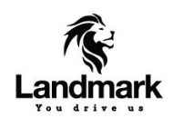
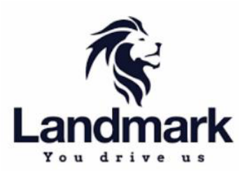

**[Image: Feb2026.pdf-0001-00.png (201x141, 15.5KB)]**

## **Date: February 18, 2026** 

To, To, **BSE Limited, National Stock Exchange of India Limited** Phiroze Jeejeebhoy Towers, Exchange Plaza, Dalal Street, Bandra Kurla Complex, Mumbai- 400001 Bandra (E), Mumbai- 400001 **Scrip Code: 543714 Symbol: LANDMARK** 

**Sub.:** **<u>Transcript of Analyst/ Investor Earnings Conference Call held on February 11, 2026</u>** 

**Ref:** **<u>Regulation 30 of SEBI (Listing Obligations and Disclosure Requirements) Regulations, 2015</u>** 

## **Dear Sir/Madam,** 

Further to our communication dated February 06, 2026, please find enclosed the transcript of the Earning Conference Call held on Wednesday, February 11, 2026 at 10:30 A.M. (IST) to discuss the unaudited standalone & consolidated financial results for the quarter and nine months ended December 31, 2025. 

The said Transcript is also available on the website of the Company at <u>https://www.grouplandmark.in/investor-relation.html.</u> 

Request you to please take the same on your record. 

Thanking You, 

Yours faithfully, 

## **For Landmark Cars Limited** 

AMOL Digitally signed by AMOL ARVIND ARVIND RAJE Date: 2026.02.18 RAJE 15:47:35 +05'30' 

**Amol Arvind Raje Company Secretary & Compliance Officer Mem. No.: A19459** 

## **Encl. as above** 

**Landmark Cars Limited CIN** : L50100GJ2006PLC058553 | **GSTIN** : 24AABCL1862B1Z2 

**Registered Office** : Landmark House, Opp. AEC, Near Gurudwara, S. G. Highway, Thaltej, Ahmedabad – 380059 **Tel** .: +91-7966185555 | **Email** : info@landmarkcars.in | **Website** : www.grouplandmark.in 

**[Image: Feb2026.pdf-0002-00.png (343x245, 64.9KB)]**

# “Landmark Cars Limited 

# Q3 FY '26 Earnings Conference Call” 

# February 11, 2026 

E&OE: This transcript is edited for factual errors. In case of discrepancy, the audio recordings uploaded on the stock exchange on February 11, 2026, will prevail 

**[Image: Feb2026.pdf-0002-05.png (169x122, 19.3KB)]**

**[Image: Feb2026.pdf-0002-06.png (159x61, 14.1KB)]**

**[Image: Feb2026.pdf-0002-07.png (224x111, 5.5KB)]**

**– MANAGEMENT: MR. SANJAY THAKKER PROMOTER, CHAIRMAN AND** 

**– EXECUTIVE DIRECTOR LANDMARK CARS LIMITED – – MR. ARYAMAN THAKKER EXECUTIVE DIRECTOR LANDMARK CARS LIMITED** 

**– MR. SURENDRA AGARWAL CHIEF FINANCIAL – OFFICER LANDMARK CARS LIMITED** 

**– MODERATOR: MR. RAHUL DANI MONARCH NETWORTH CAPITAL LIMITED** 

Page **1** of **16** 

_Landmark Cars Limited February 11, 2026_ 

**[Image: Feb2026.pdf-0003-01.png (150x110, 8.7KB)]**

### **Moderator:** 

Ladies and gentlemen, good day, and welcome to Landmark Cars' Q3 FY'26 Earnings Call hosted by Monarch Networth Capital Limited. This conference call may contain forwardlooking statements about the company, which are based on the beliefs, opinions and expectations of the company as on the date of this call. These statements are not the guarantees of future performance and involve risks and uncertainties that are difficult to predict. 

As a reminder, all participant lines will be in the listen-only mode and there will be an opportunity for you to ask questions after the presentation concludes. Should you need assistance during the conference call, please signal an operator by pressing star then zero on your touchtone phone. Please note that this conference is being recorded. 

I now hand the conference over to Mr. Rahul Dani from Monarch Networth Capital Limited. Thank you, and over to you, sir. 

**Rahul Dani:** 

Yes. Thank you. Good morning, everyone. On behalf of Monarch Networth Capital, I welcome you all to Landmark Cars' Q3 FY'26 Earnings Call. From the management side, we have Mr. Sanjay Thakker, Promoter, Chairman and Executive Director; Mr. Aryaman Thakker, Executive Director; Surendra Agarwal, CFO; and SGA IR Advisors. 

We will start the call with opening remarks from the management and then Q&A. Thank you, and over to you, sir. 

**Sanjay Thakker:** 

On behalf of the company, I extend a sincere welcome to everybody who has joined us today on this call. As explained by Rahul, we have Aryaman Thakker, Executive Director; and Surendra Agarwal, CFO, who are with me on this call. The results and the presentations are uploaded on the stock exchanges and on the company website. I hope everybody had a chance to look at it. 

I'm pleased to share that this quarter was our strongest so far with revenue, gross profit and EBITDA all at record levels. With that context, I now step back and look at the broader industry environment because what we have seen in the last few months are some structural shifts in the Indian passenger vehicle market. 

Following the GST reforms, the conclusions of the India-EU FTA, along with the interim U.S. trade deal marks a slew of policy milestones, which are expected to support and strengthen the Indian automotive industry over the long-term. 

From the EU FTA perspective, multiple of our OEMs such as Mercedes-Benz, Renault, Volkswagen and Stellantis brands are well poised to benefit. For those OEMs, the FTA not only improves the long-term pricing flexibility, but also enables the introduction of select models into India on a measured basis, allowing them to test the market response and build demand ahead of wider launches. 

While some of these changes may be phased out and calibrated over the time, this is expected to expand the addressable market in the premium and luxury segment and support a healthier, more sustained growth runway for both our OEM partners as well as Landmark. As per current year's 

Page **2** of **16** 

_Landmark Cars Limited February 11, 2026_ 

**[Image: Feb2026.pdf-0004-01.png (150x110, 8.7KB)]**

data, over 50% of Landmark volume is coming from these OEMs, who are likely to benefit in one way or another due to these pathbreaking FTAs. 

In the last 18 months, Landmark has set up large capacities. The new outlets have now stabilized. We have demonstrated our capacity to rapidly and profitably grow when the opportunity arises. The Auto Retail business is a cash-generating, predictable business when run properly. 

In the first nine months, the company has generated over INR265 crores of net cash flow from operating activities. With the modified landscape, the company has several exciting opportunities that it is exploring. We at Landmark are committed to build on a solid platform that we are now standing on. With this, I'll hand it over to Aryaman for his comments. 

**Aryaman Thakker:** 

Thank you. Let me start by giving a brief update of our OEM partners. Mercedes-Benz continues to perform very well in India with a clear focus on value over volumes and increasing the contribution to the top-end vehicles. 

They continue to be the largest luxury brand in India. The decision to locally produce the Maybach GLS and expand the product line-up with 12 new model introductions is indicative of their confidence in the premium demand environment of the country. The brand will soon launch the new V Class and the CLA sedan. Globally, Mercedes will be launching over 40 new products starting this year. 

BYD delivered a robust growth, recording close to 80% volume growth in calendar year 2025. This growth was achieved in spite of low supplies in November and December. Few supplies have started from the end of January, though we expect it to fully regularize only from April. With most models now in the process of being homologated in India, we expect BYD to build further on this volume in the coming financial year. 

Mahindra has started 2026 with two big product launches. The brand saw strong booking momentum for the XEV 9S and the XUV 7XO, which together recorded over 93,000 bookings just in a few hours. This reflected strong acceptance for the brand and demand for its products. We expect this brand to continue their momentum over the next few years. 

Renault has seen renewed traction led by the relaunch of the all-new Duster, which is the first of multiple new launches over the next few years. The deliveries will begin from April, and we expect the brand's contribution to gradually improve. 

MG continues to perform well and is positioned for even stronger growth this year, supported by multiple product launches. The MG Select brand contributed positively to the business performance and has seen good acceptance in the premium segment. 

Jeep has recently outlined a refreshed strategic direction with plans to introduce new models in India from 2027, signalling a renewed focus on the market. These developments are positive and indicate that the brand is steadily working towards establishing a more sustainable footing in the country. 

Post the GST cuts, we have seen a robust demand for the Ashok Leyland commercial vehicle business, and we expect that this will continue. 

Page **3** of **16** 

_Landmark Cars Limited February 11, 2026_ 

**[Image: Feb2026.pdf-0005-01.png (150x110, 8.7KB)]**

Our aftersales business also delivered a record quarter with highest revenue and year-on-year growth outperforming recent trends. 

Our newer workshops are progressively ramping up, and we expect them to get us to historic growth rates going forward. We have remained disciplined on costs, keeping employee and operating expenses within our targeted threshold even as volumes improved. At the same time, our focus on working capital efficiency continues with inventory levels well below industry averages. 

During the quarter, we also expanded our network with the addition of new outlets for MercedesBenz in Bhopal and Mahindra & Mahindra in Hyderabad. The coming quarter will be supported by a healthy pipeline of new model launches like the Mercedes-Benz V Class, the Mercedes CLA, the VW Tayron, MG Majestor and the Renault Duster. Deliveries will ramp up for recently introduced products such as the Mahindra XUV 7XO, the XUV 9S as well as the KIA Seltos. 

Looking ahead, we expect demand to stay supported by positive sentiment, ongoing product launches and disciplined inventory management. While there may be near-term challenges, the medium- to long-term opportunity, especially in the premium luxury and electric vehicle space remains compelling. 

With a diversified OEM portfolio, a growing aftersales annuity and a strong balance between growth and discipline, we believe Landmark Cars' is well positioned to navigate the current environment and meaningfully participate in the next phase of industry growth. 

With that overview of the operating environment and the product pipeline, I will now hand it over to Surendra Agarwal to take us through the financial highlights. Thank you. 

### **Surendra Agarwal:** 

Thank you, Aryaman, and good morning, everyone. Let me now take you through the financial highlights for the quarter and the nine months ended 31st December 2025. We continue to be the highest contributor in terms of terms of volume for multiple OEMs, and this translates into meaningful numbers for our all OEM partners. 

Talking about our Q3 FY '26 performance. Total proforma revenue for the quarter stood at INR1,851 crores on a high base of INR1,669 crores in the same quarter last year, representing a year-on-year growth of 11%. With this, proforma revenue for new car sales grew by 10.6% yearon-year to INR1,572 crores, while aftersales revenue stood at INR279 crores, reflecting a growth of 13.1% year-on-year. 

Our reported revenue for the quarter was INR1,345 crores, making a year-on-year growth of 12.6%. Gross profit for the quarter stood at INR220 crores, reflecting a sequential improvement of 13.6%. The gross margin came at 16.4%. During the quarter, employee cost and other operating expenses were kept below the target 4.4% of proforma revenue. The company remains committed to its stated plan of cost optimization. 

EBITDA for the quarter stood at INR79 crores, reflecting a year-on-year growth of 13.3% with an EBITDA margin of 5.9% on reported revenue. Depreciation for the quarter was INR38 crores and the interest cost for the quarter stood at INR20 crores. During the quarter, the company also 

Page **4** of **16** 

_Landmark Cars Limited February 11, 2026_ 

**[Image: Feb2026.pdf-0006-01.png (150x110, 8.7KB)]**

recognized an exceptional item of INR2 crores on account of implementation of new Labour Code. 

PAT for the quarter INR14 crores, while cash PAT for the quarter at INR34 crores with margin 1.1% and 2.5%, respectively. This is the highest in the last seven quarters. Total comprehensive income on a reported basis stood at INR15.2 crores. Moving to the nine-month performance of FY '26, total proforma revenue stood at INR4,924 crores compared to INR4,100 crores in the same period last year, reflecting a year-on-year growth of 20.1%. 

With this proforma revenue for new car sales was INR4,156 crores, registering a growth of 21.9%, while aftersales revenue stood at INR768 crores, reflecting a year-on-year growth of 10.9%. Reported revenue for the nine months was INR3,618 crores with a gross profit of INR601 crores, translating into gross margin percentage of 16.6%. 

EBITDA for the period at INR204 crores with an EBITDA margin of 5.6%. PAT before net Ind AS impact stood at INR26 crores. 

For the new cars sold, we saw an average selling price increase from INR20.6 lakh nine months FY '25 to INR21.6 lakh nine-month FY '26. 

On a nine-month basis, the number of services increased by 11%, reaching to 293,000 (to be read as 2,93,037). This is while the workshop is still at a ramp-up phase. As of 31st December 2025, the company generated net operating cash flow of approximately INR265 crores, reflecting improved working capital discipline. We continue to prioritize cash generation in our operations. With this, we now open the floor for question-and-answer session. 

### **Moderator:** 

### **Bhargav Buddhadev:** 

### **Sanjay Thakker:** 

### **Bhargav Buddhadev:** 

Thank you very much. The first question is from the line of Bhargav Buddhadev from Ambit Asset Management. Please go ahead. 

Good Morning Team, and Congratulations on a very good performance. Sir, my first question is that if you look at your new workshops, almost 20% of your workshops have opened just about 18 months ago. So, is it fair to say that maybe next year, the revenue growth from aftersales should actually be much faster and higher as compared to the new car sales? That's my first question. 

Yeah, you want me to answer that now or you want to ask the second question, and we answer both together? 

Sure. And the second question is, sir, that in your presentation also, you highlighted the benefits of EU FTA. So is it fair to say that this FTA will benefit primarily expensive cars with CV and not CKD, so which means that there will not be any fall in demand per se. So, people will not wait for the EU FTA to happen and then buy Mercedes or maybe, say, Volkswagen? 

So, demand will continue to still exist next year given that majority of the cars are CKD and hence, the benefit of the FTA may not be applicable to those. So, is that a fair understanding? Because the fear is that the demand may get postponed to after the FTA? Those are my two questions. 

Page **5** of **16** 

_Landmark Cars Limited February 11, 2026_ 

**[Image: Feb2026.pdf-0007-01.png (150x110, 8.7KB)]**

### **Sanjay Thakker:** 

Okay. So, let's answer it in the sequence that you have asked. Yes, our workshops for new brands and some newly opened locations are in a ramp-up phase. And every month, we are seeing a better performance from them as the car parc increases and our service revenue is also increasing. 

So, what is happening is that the mix of our sales and service will get more in favour of service, which will lead to a higher gross profit in those brands. Currently, if I may broadly say our mature brands have approximately 15% or thereabouts of contribution coming from aftersales in that business. In the newer brands, it is still just around 9%, 10%. So once this increases and that it will, so the growth will happen. But to kind of say that it will be a significant year-onyear growth, it is a little premature. 

Of course, we are back on our growth trajectory. And we'll be kind of doing our math. The aftersales growth also depends on the sales of the new cars that we do in that year. So, it's a little complex mechanism, but the growth is clearly backed. On the second question on the FTA, now a lot of things have been written about it, a lot of things have not been written about it. So, the discussions have been on the Fully Built Units where the duties are going to be falling meaningfully as soon as this implementation happens. 

Now the implementation may happen a year from now or a little longer based on when the EU parliament approves this, though I'm made to understand that the intent on both sides is really very, very heavy. Around 92% of the vehicles that we sell, say, in Mercedes-Benz, I believe, are the CKD vehicles where the price drop may not be anything meaningful and the currency fluctuations may kind of mitigate any kind of drop in the CKD things. 

The CBU is something that will see a big drop. So, I do not expect any kind of postponement or anything because the CKD operation is what is heavy in Mercedes-Benz. Now what is exciting and which is less reported in the press is that the, within the import category, I believe there are subcategories, EUR15,000 - EUR30,000, EUR30,000 - EUR50,000. And there are categories within that one can import a certain number of vehicles. 

Now this opens up avenue for vehicles that were not initially imported by brands like a Volkswagen or a Jeep or Renault. Now that will come at a significantly lower duty. Those were not in consideration at all. Now that may not be on the overall industry perspective, a very meaningful number because the numbers would be maybe 20,000/30,000 vehicles that may come initially under this, but it will have a meaningful impact on Landmark because we are the largest partners for these brands. 

And it will open up a new kind of a business which doesn't exist. The duties on parts also will fall over a period of time. The cost of ownership will go down. So, it has a lot of long-term benefits. Also, Bhargav, what we are seeing is that after the EU FTA has been signed, we have had senior level visits from practically all European manufacturers into India. We have had meetings with them, and it is really visible on what the possibilities suddenly are. So, let's see, time will tell. Things look good. 

The next question is from the line of Pritesh from Lucky Investments. 

**Moderator:** 

Page **6** of **16** 

_Landmark Cars Limited February 11, 2026_ 

**[Image: Feb2026.pdf-0008-01.png (150x110, 8.7KB)]**

**Pritesh:** 

Just one question on Mercedes as a portfolio brand. So, there the performance of that brand when you look at the nine-month number and the segmental mix and all that you've given, has grown fairly less than the company growth and we know the brand status there? 

And on the other side, obviously, you've added a lot of cost and a lot of other brands. So, it's imperative that even Mercedes being 40% of the revenue has to start moving the needle. So, what's your assessment based on the product portfolio, based on your conversations with them and they have lost some share in India. So, what do you think about this particular brand in the next 24 months based on the launches that they have, pipeline that you would have seen? So, some comments there and what growth do you see in this particular piece of the portfolio? 

**Sanjay Thakker:** Yes. Thanks, Pritesh. Mercedes is our crown jewel clearly. Now the thing is that the Mercedes brand and as explained in their investor presentations, it has grown in value terms. They have lost market share in volume terms that has been the global strategy so far. Now let's see how the strategy plays out. 

Now as Aryaman spoke about in his speech, there are 40 new models which are getting launched globally, which has never happened in the history of Mercedes-Benz. They will not all come into India this year. But the industry works on kind of spurts that you get when the new models are launched, then you get into a kind of a steady growth. 

So, Mercedes is in that phase. The volumes will grow this year. But the numbers, it is difficult to kind of put any number from my side as to what numbers will happen. Things look pretty decent to us sitting here, and we are exploring possibilities with the EU FTA and what will happen. So, things only look good from here. 

**Pritesh:** So, when do these models launches start? And for CY '26, how many models one can assume to come from Mercedes? **Sanjay Thakker:** 12 have been kind of announced by the company. And they will start from next month. **Pritesh:** These are upgrades or these are completely new models? **Sanjay Thakker:** It's a mix of both. **Pritesh:** And does it plug the gap versus the other competitor where there was a product gap between us and them on the SUV portfolio and the EV portfolio? Does it all plug all those gaps, perceptible gaps? 

**Sanjay Thakker:** We'll find out, Pritesh. Some things I'm not at liberty to kind of talk on this. But what I can say is that things look pretty okay. And it remains to be a very profitable and a good brand for us. 

**Pritesh:** And the other part is on the expansion side. We had said that we went through a large expansion into and beef up our operation. We incrementally will only look at tactical expansion, if any. Are we on that course or is there a change in that thought process? 

**Sanjay Thakker:** As of now, we have done rapid expansion and for us also to kind of prove to ourselves that we can very rapidly go back to our profitability and other metrices is important. Now we are on its 

Page **7** of **16** 

_Landmark Cars Limited February 11, 2026_ 

**[Image: Feb2026.pdf-0009-01.png (150x110, 8.7KB)]**

path. When we said that we will get into a 4% cost, a lot of people doubted that, we put our neck out and said that this is what it is, and we went ahead and did it. 

Now we are on our way to getting our EBITDA margin increased 1% this quarter-on-quarter. So, this is something which we have been able to, and this is not even that all the locations are fully kind of mature. So, this is something which is for us also to understand that we are able to do it. We are in a position to, at will, if I may sound a little pompous, but we are at will, we are able, we'll be able to expand and grow our, with organic and inorganic thing. 

So, growth in the last year, for example, in the calendar year, we grew at 20%, I believe, as against industry growth of 10%. Now that growth in my mind, is not a fear. We can grow as and when we want. We have demonstrated that, and we will press the accelerator when the need arises. Nothing that looks like some big ticket or big expansions in the pipeline. 

**Pritesh:** Lastly, what will be your budget plan for growth and margin expansion next year, FY '27? 

**Sanjay Thakker:** I didn't understand, Pritesh. **Pritesh:** What will be your internal or what would be your outlook for growth and margin expansion basis points next year, that is FY '27? 

**Sanjay Thakker:** We'll maybe answer this question in the next quarter. Let the year come. We are in midst of getting the new models and the business plans of a lot of OEs. The business model works are in talks with all OEs for the next year. Let that happen. Maybe next year, next quarter, we'll answer this question. 

**Moderator:** The next question is from the line of Akhil Parekh from B&K Securities. **Akhil Parekh:** Many congrats on the good set of numbers. Sir, my first question is on the aftersales part of the business. With the EU FTA coming in, do we see an improved visibility for aftersales service once the FTA kind of rectifies. Will we see more parts or components getting sold for the European OEMs and whether that component as a percentage of car sales will kind of go up basically? That's my first question. 

**Sanjay Thakker:** Yes. Akhil, so these details are still awaited because there is no written document that I have personally seen. I don't know whether it has even been published. So, whatever we have is from interviews and kind of press notes that we have heard. I don't think that the spare parts per se will sell more just because the prices will fall. It will help in the cost of ownership, and it will help the new car sales in the medium and long-term when the parts, spare parts and the repair cost come down. 

**Akhil Parekh:** Okay. But like unorganized to organized can happen, right, given that the prices may fall, and we might see better traction from authentic parts? 

**Sanjay Thakker:** That is true. That is true. **Akhil Parekh:** Sir, second, on the gross margin front, last quarter, you had alluded that we'll see 100 bps of improvement in second half of the gross margin level, if I remember correctly. But it's still 

Page **8** of **16** 

_Landmark Cars Limited February 11, 2026_ 

**[Image: Feb2026.pdf-0010-01.png (150x110, 8.7KB)]**

flattish on a Y-o-Y basis at 16-odd percent on net reported revenue basis. So, is it to do with the Mercedes sales relatively weaker as compared to our overall growth and hence, the GM improvement is not there? And how should one look at the gross margin or rather EBITDA margin in subsequent quarters? 

**Sanjay Thakker:** So, there has been a marginal, I think, a 20-bps improvement in the gross profit. And this gross profit has everything to do with the mix of sales and aftersales. So, once the aftersales grows or the sales, for example, doesn't grow as much, then the percentage margin mathematically increases. What we have been able to substitute that is with the significant jump in the EBITDA margin on a sequential basis. Now I think that is what we are also focusing on to generate a net profit and an EBITDA margin. Many a times, we look at gross profit so that EBITDA and net profit also come, we have been able to deliver on that. 

**Akhil Parekh:** And third and last question, aftersales service, you have said that we go back to 14% plus and we are kind of closer to that number. From a growth perspective, should that continue and improve from here on as the newer brands of the OEMs have now stabilized? So, kind of 15%, 16% plus growth rate in aftersales service can be expected. And hence, the EBITDA margins, which we saw in our previous peak cycle in FY '23, which was at close to 7%, that's a possibility if things fall in place in FY '27? 

**Sanjay Thakker:** Yes. The answer is it is possible, and that's all what we are working towards. I don't want to kind of put a number around me. But if you're asking a theoretical question, then I'm saying, yes, it can happen. 

**Moderator:** The next question is from the line of Ajox Frederick H from Sundaram Mutual Fund. 

**Ajox Frederick H:** So again, on the aftermarket, we used to be at around, I mean, the way I look at it is as a percentage of slightly deferred sales. So, on a rolling basis, about 23%, 24% of rolling 12 months, we take a quarter or a half year lag. Now we are sitting at 21%, primarily because of new showrooms being opened? 

Now steady state, if I look back, the growth can be much stronger going a year ahead. It can be even touching 18%, 20% when we hit back to a steady state based on the current revenues, whatever we are doing. Is that too optimistic or we can still hit that 18% kind of growth in, let's say, 1.5 years now based on the what we're doing right now? 

**Sanjay Thakker:** Yes. Sorry, I didn't get the percentages that you just mentioned. You said after. 

**Ajox Frederick H:** Yes, yes. The percentage of sale of aftermarket business to the historical 12 months pro forma revenue. So basically, whatever we are doing right now, it's a base and I'm projecting to the next subsequent time frames where the aftermarket will come through? 

**Sanjay Thakker:** Yes. So currently, it is at around 15%. I think that's where we are. 

**Ajox Frederick H:** And historically, where we, sir, let's say, last year before the ramp-up happened? 

Page **9** of **16** 

_Landmark Cars Limited February 11, 2026_ 

**[Image: Feb2026.pdf-0011-01.png (150x110, 8.7KB)]**

**Sanjay Thakker:** Surendra is just checking these numbers. They are not with me immediately. So just to kind of tell you is that once we build up a car parc, then the business is a kind of an annuity type of a business that happens. So that is something that we are in the process of doing, and that's something which will play out in the future. It was very, very long back, it was around 20% plus around in the year '21, the COVID years when the sales was down. So, what had happened is that that's where the aftersales percentage went up because the sales were not there. **Ajox Frederick H:** Got it. So steady state, this number will be also close to 18% in your math? **Sanjay Thakker:** We somehow have not been tracking the way you are tracking. Let me kind of check it and answer that. But because we have been like our 10-year CAGR has been, say, 14% growth. That's how we have been tracking, but this is also a good way of looking at things. Let me look at it as a percentage of overall revenue. That's also a fair point. Let me give me some answer on this. **Ajox Frederick H:** Sure, sir. No problem. And sir, secondly, other than Mercedes, are there any, you mentioned, right, there are other baskets which are CBUs, which can open up in Mercedes. Similar to that, are there other OEs which can also come in because of the FTA? **Sanjay Thakker:** Yes, my friend. So, a lot of them, all the European manufacturers, Volkswagen already has been importing some of the other vehicles but paying higher duty. And consequently, also selling less. They were also constrained by a 2,500-unit cap on those cars. Now that cap will go away. So that will open up an avenue clearly. Stellantis brands, which is Citroën and Jeep and their other brands can also get it from Europe, Renault, which is a European brand and Duster, which is going to be a success. They can get some imported vehicles. So, it has opened up a lot of new avenues. **Moderator:** The next question is from the line of Vijay Pandey from Nuvama. **Vijay Pandey:** I have a couple of questions. Sir, in terms of unit economics for unit showroom economics and unit workshop economics, what is our expectation in terms of nominal run rate for the sales and for both showroom as well as workshop? Because if I calculate it for first quarter, especially the workshops, they have been declining as compared to what we saw last year. So, if you can explain that it will be pretty helpful to understand why it's happening? **Sanjay Thakker:** So, see, each workshop, in our case, one store is not like every other store. Every store, every brand is different. A workshop, for example, you mentioned, Vijay. Now workshops are of different shapes and sizes. We have a workshop, which is a five-bay workshop, and we have a workshop, which is a fifty-five-bay workshop. 

I'm just giving you kind of a stark contrast to what we already do. So, it is difficult to compare a five-bay workshop with a lower productivity with a fifty-five-bay workshop. So, it is a little very simplistic to kind of look at unit economics by that basis. And we can set up your call with Surendra to kind of explain this better at a later date because it may require a deeper discussion. 

Page **10** of **16** 

_Landmark Cars Limited February 11, 2026_ 

**[Image: Feb2026.pdf-0012-01.png (150x110, 8.7KB)]**

**Vijay Pandey:** 

Okay. Sure. Secondly, sir, I wanted to check in terms of employee expenses and our depreciation. So, both have come down sequentially. So how should we look employee expenses as a percentage of sales and DNA? 

**Sanjay Thakker:** This will remain within the 4% as we committed, and depreciation will remain INR38 crores with the Ind AS impact. That will continue to be the same, which I had given in my earlier quarters also that depreciation would be around, for the yearly basis, it will be around INR150 crores for the year with the Ind AS thing. And expense of employee expenses will remain within 4%. **Vijay Pandey:** Okay. Employee expenses will remain within 4%? **Sanjay Thakker:** Yes, yes. **Surendra Agarwal:** We have only committed. Yes. **Sanjay Thakker:** We had basically said that last quarter was in a way an aberration where we had to spend more money to liquidate a lot of stuff and all that. So many things were happening, many stores were on a ramp-up basis. We are on a steady state right now. **Vijay Pandey:** It is trending at around 6%. For this quarter, it was 5.5% **Sanjay Thakker:** So, Vijay, you are looking that on the reported turnover whereas we are saying in the pro forma because we are tracking all the line item on the pro forma revenue. **Moderator:** The next question is from the line of Parth from Vallum Capital Advisors. **Parth:** So, I had a couple of questions. The first one is what is driving the other income line item? **Sanjay Thakker:** So, Parth, the other income line item consists multiple items. It is some write-back some of the locations which we have closed down. So, the lease gain is also reflected in the other income line item and the interest cost. So, we had given some, we have some bank guarantee against that we have given the FD. So, the interest income on those lines. **Parth:** And the second question is what has been the Ind AS impact on depreciation for the REU assets and on interest for lease liabilities for this quarter? **Surendra Agarwal:** Yes. I'll give you. I'll give you. You want that for the quarter? **Parth:** Yes, for the quarter. **Surendra Agarwal:** So, the amortization for the quarter, which is part of the depreciation is INR20 crores. And interest on lease liability is around INR8 crores, INR7.7 crores. **Moderator:** The next question is from the line of Jyoti Singh from Arihant Capital Markets Limited. **Jyoti Singh:** So just wanted to understand a few things. One is on the new brand that is contributing 20% of revenue. So, these are margin accretive or dilutive for us. And also, on the earlier question on 

Page **11** of **16** 

_Landmark Cars Limited February 11, 2026_ 

**[Image: Feb2026.pdf-0013-01.png (150x110, 8.7KB)]**

the workshop side, so that generates around 30% plus ROCE. So, what is the blended group ROCE post stabilization of the new outlet? And another on the inventory days that has reduced to 31 versus industry, what we are expecting going forward? And also, on the EU and U.S. FTA could benefit 50% plus portfolio? And what is quantified earnings sensitiveness, if you can explain? 

**Sanjay Thakker:** It's a very complex question, three, four of them that you asked, Jyoti. I can't answer on the quantification of the U.S. FTA currently. We haven't seen the fine print, and we don't know when it will be implemented exactly. So, it will be difficult to kind of put a number to it at this stage. It is a little premature. The announcements have been made, but we don't have the details and the implementation date. 

Inventory days at our end, we have been publishing this for a very long time. And we have tried to always maintain it much lower than the industry standard with a disciplined approach. Now we are at, say, 31 days currently. Our desire would be to bring it even down. The less you have, the more money you make. 

So hopefully, the demand stays and this should further reduce every quarter. Difficult to put a number to it, but we are in a good zone currently. We had said that 30 is an acceptable number. Anything below that is very good. So, we are at that threshold already. 

**Jyoti Singh:** Okay. And sir, on the new brand that contribute 20% of revenue, so any margin accretive or dilutive for us? 

**Sanjay Thakker:** So yes, they are clearly not as profitable as the old brands. Some of them have already turned profitable. Some are on their way. So, it's a matter of a few more quarters, and they will get to a much better zone than they are. We gave this breakup of new and old for nearly a year, then everything more or less has become a year old. But yes, they are not contributing as much as the other brands as yet, but they will in the time to come. 

**Jyoti Singh:** Okay, sir. And sir, on the workshop side, like you mentioned earlier, so what will be the blended group ROCE post stabilization of the new outlets? 

**Sanjay Thakker:** Maybe give us some more time. We'll discuss this later. 

**Moderator:** The next question is from the line of Vaishnavi Gurung from Craving Alpha Wealth Fund. **Vaishnavi Gurung:** My first question is on depreciation interest? 

**Moderator:** Sorry to interrupt Vaishnavi you please speak a little louder. We have lost the line for Vaishnavi. We'll take the next question from Subhanu Bangal from 3 Head Capital. 

**Subhanu Bangal:** Good morning, sir. Sir, I have a basic question. If our 40% revenue comes from AMD, after the EU deal, obviously, ASP will reduce. After ASP reduces, the brand value of the brand will be affected. The brand can affect maybe affect. Is my understanding correct? 

**Sanjay Thakker:** Can you please repeat, I didn't understand your question? 

Page **12** of **16** 

_Landmark Cars Limited February 11, 2026_ 

**[Image: Feb2026.pdf-0014-01.png (150x110, 8.7KB)]**

**Subhanu Bangal:** I'm saying that after the EU deal with India, the brand value of the car may be affected because ASP will be reduced? **Sanjay Thakker:** No, ASP will be reduced only on imported cars, not on locally built cars. So locally built is 92% of what we sell right now. **Moderator:** The next question is from the line of Vaidik Bafna from Monarch Networth Capital Limited. **Vaidik Bafna:** Congratulation, sir, on a good set of numbers. Sir, I have two questions. Firstly, sir, on a ninemonth basis, what would be our capex number? **Surendra Agarwal:** Okay. So, our capex number on a nine-month basis is INR50 crores Vaidik. **Vaidik Bafna:** INR50 crores. Okay, sir. And sir, secondly, can you give us an outlook on our margins side on the gross and as well as the OPM side? In FY '24, we had achieved 19.5% gross margin and 6.6% on EBITDA level. So, by when can we reach that level? **Sanjay Thakker:** So, EBITDA, we are already at what, 5.9% and I don't want to give a guidance on this. We are on a path for better numbers from now on. **Vaidik Bafna:** So, sir, in FY '27 would we surpass our FY '25 gross and EBITDA level? **Sanjay Thakker:** Let me make up my budgets and answer this question next quarter. But what I'm saying is that things only look much better than where we stood. Our net profit is highest in last 7 quarters, and every day is a better day. **Vaidik Bafna:** Okay, sir. And sir, on the aftersales side, earlier we used to grow at a much faster pace. So now since now all the workshops have been in place and are about to mature, so can we expect a 15% revenue growth in that division? **Sanjay Thakker:** See, the point is that we have been growing last 10 years at 14% CAGR. So, I really don't know whether 13%, 14%, 15%, it's a very fine kind of a thing. I understand where you are coming from because that 1% will have a big improvement in everything. But I wouldn't want to put a number right now. 

**Moderator:** The next question is from the line of Arnav Sakhuja from AMBIT Capital. **Arnav Sakhuja:** So recently, Jetour announced that they are likely to launch in India through the JV route with JSW Group. So, I mean, in your opinion, do you expect that there are many more Chinese OEMs to follow suit and also launch in India through the JV route through which they can do local assembly? And if so, what would be the impact on the Indian automotive landscape? 

**Sanjay Thakker:** Yes. So yes, we also know about the Jindal, the JV, which is happening. There have been some other, it's very early days to kind of comment on any impact on it. It's an evolving kind of a thing. So maybe in the next few quarters, we will know who are the new players and how they would like to kind of come and all that. Right now, as things stand, their investments are not allowed unless it's possibly a JV route and all that. Early days, Arnav. Right now, I won't have any smart answer to give. 

Page **13** of **16** 

_Landmark Cars Limited February 11, 2026_ 

**[Image: Feb2026.pdf-0015-01.png (150x110, 8.7KB)]**

### **Arnav Sakhuja:** 

Right. Fair enough. So, my next question is with regards to the midsized SUV segment. So, I think currently in India, that's probably one of the fastest-growing segments at INR15 lakh to INR20 lakh price range and there are so many models Jeep Compass, KIA Seltos et cetera, et cetera. So, I mean, just to understand that landscape a bit better in this segment, what are some key features that customers look out for? And what are some distinguishing factors that some brands are able to offer that others are not? 

### **Aryaman Thakker:** 

So, I think you're right, Arnav. I think that is, that has been one of the fastest-growing segments, but it is quite a competitive segment also. Most of the brands we represent have a very strong presence with the KIAs and MGs as well as now the Duster, also Duster entering it and Mahindra, who has kind of been leading from the front in this segment. 

So, I think what we have seen is that, that segment has been impacted quite a bit from the premiumization trend that the industry has been witnessing for the last couple of years. And in terms of features, I think the few things that I think the customers are now understanding and valuing more; one, of course, is the safety of the products, where now we've seen that most of these manufacturers have also started focusing on the global NCAP and the India NCAP ratings, the 4-star, 5-star safety ratings. 

The customers are also choosing to go with the top-end variants, which are loaded with the best infotainment, the sunroof, heads-up display, all of those things. And SUVs, one of the main reasons is that it kind of caters to most needs and the Indian driving conditions. So that in itself has kind of been one of the key reasons why it's been ruling the customers' mind space right now. 

**Moderator:** The next question is from the line of Vijay Pandey from Nuvama. 

**Vijay Pandey:** Thank you for the follow-up. We have added around 20 new touch points over the last two quarters. Just want to understand where these new touch points, new showrooms and workshops are in terms of the peak revenue cycle. So how much time will it take for them to be from here onto equal lands? 

**Sanjay Thakker:** There is some error in the numbers. Last two quarters, we have not added 20 outlets. It is in the last whole year or maybe five quarters is what we are talking about. In the last two quarters, very few three, four outlets have been added at best. 

**Vijay Pandey:** Okay. Because I think in the first quarter, it was mentioned that 65 showrooms and 57 workshops. So that came around 122, now it's 140. 

**Sanjay Thakker:** No, no. I don't know. Maybe we'll offline talk to you. There is some. 

**Vijay Pandey:** We'll take it offline. 

**Sanjay Thakker:** Yes. 

Page **14** of **16** 

_Landmark Cars Limited February 11, 2026_ 

**[Image: Feb2026.pdf-0016-01.png (150x110, 8.7KB)]**

### **Moderator:** 

### **Nilesh Doshi:** 

Ladies and gentlemen, we will take the last question from Nilesh Doshi from Prospero Tree. And due to time constraints, we would request to kindly limit yourself to two questions only. Please go ahead. 

Sanjay bhai, my question is related to the revenue growth and GP margin. Sir, are we growing at an OEM growth rate or below the OEM growth rate? Because I'm tracking the volume data from the VAHAN portal. And my understanding suggests that Landmark growth rate is a little bit below the OEM growth rate, number one? 

Number two is the question is related to GP margin. Sir, our GP grew by 0.2% or 20 basis points and our guidance to grow by 1% by quarter four, '26, number one. And then quarter two witnessed the company might have offered the higher discount in quarter two to recover the cessto buy because the GST was implemented or the reintroduced GST, there was some changes in the GST law? 

But in quarter three, all OEM has witnessed the higher demand. So, I think the Landmark has to offer the lower discount compared to quarter two. So, our GP should grow higher than the 0.2 basis points. And moreover, the contribution of the aftersales, which contribute the higher, which offer the higher GP margin and higher EBITDA margin is higher. So, our GP margin must be much more than the 20 basis points? Please answer my question. 

### **Sanjay Thakker:** 

The first question, which is a new question is an interesting thing. No, I do not think that we are growing less than the OEs. One will have to kind of look at the blended number of everything. In fact, what has happened, what we do on our second page of our presentation or the first page of our presentation, we give the contribution, our contribution to that particular OE sale in India. 

Now if I'm correct, we are either stable or more on a sequential basis on how we have grown. So, we continue to inch up in our contribution to that OEs numbers. So, the confusion, Nilesh bhai happens many times because people sometimes track wholesale numbers. Sometimes we track the VAHAN numbers. So, there are two, three multiple points from which one can look at the same scenario. So, I do not think there is any change in what is happening. We are not worse off in any kind of a thing. As far as our own OEs are concerned. 

And the question of GP, I have answered earlier also that finally, the focus to get the GP is to get a better EBITDA and to get a better net profit, which is what we are focusing on. The mix is something which is the predominant thing in a GP, sales versus aftersales mix. Just let me explain a little more. The aftersales business comes with a 40% gross profit and the sales at a single digit. So, the blended is what we are talking about, whether we talk about 16% or 17% or 18%. 

Now the contribution mathematically of aftersales has to be going up much more for the GP to grow to that level. We are committed to going back where we are, and you will see the results going ahead. But it is basically a mix which we should kind of see. I think the gentleman from Sundaram Mutual Fund, he asked this question that what is the, of the overall turnover, how much is your aftersales. 

Page **15** of **16** 

_Landmark Cars Limited February 11, 2026_ 

**[Image: Feb2026.pdf-0017-01.png (150x110, 8.7KB)]**

**Moderator:** Thank you. I would now like to hand the conference over to the management for closing comments. **Sanjay Thakker:** Yes. I think the question answers were all very kind of enlightening and my closing comments are all there in the questions that are there. We stand at a threshold of greater profitability and bigger opportunities, and good luck to everybody. Thank you. 

**Moderator:** Thank you very much. On behalf of Monarch Networth Capital Limited, that concludes this conference. Thank you all for joining us today, and you may now disconnect your lines. 

Page **16** of **16** 

---

## Extracted Images

| # | File | Dimensions | Size |
|---|------|------------|------|
| 1 | Feb2026.pdf-0001-00.png | 201x141 | 15.5KB |
| 2 | Feb2026.pdf-0002-00.png | 343x245 | 64.9KB |
| 3 | Feb2026.pdf-0002-05.png | 169x122 | 19.3KB |
| 4 | Feb2026.pdf-0002-06.png | 159x61 | 14.1KB |
| 5 | Feb2026.pdf-0002-07.png | 224x111 | 5.5KB |
| 6 | Feb2026.pdf-0003-01.png | 150x110 | 8.7KB |
| 7 | Feb2026.pdf-0004-01.png | 150x110 | 8.7KB |
| 8 | Feb2026.pdf-0005-01.png | 150x110 | 8.7KB |
| 9 | Feb2026.pdf-0006-01.png | 150x110 | 8.7KB |
| 10 | Feb2026.pdf-0007-01.png | 150x110 | 8.7KB |
| 11 | Feb2026.pdf-0008-01.png | 150x110 | 8.7KB |
| 12 | Feb2026.pdf-0009-01.png | 150x110 | 8.7KB |
| 13 | Feb2026.pdf-0010-01.png | 150x110 | 8.7KB |
| 14 | Feb2026.pdf-0011-01.png | 150x110 | 8.7KB |
| 15 | Feb2026.pdf-0012-01.png | 150x110 | 8.7KB |
| 16 | Feb2026.pdf-0013-01.png | 150x110 | 8.7KB |
| 17 | Feb2026.pdf-0014-01.png | 150x110 | 8.7KB |
| 18 | Feb2026.pdf-0015-01.png | 150x110 | 8.7KB |
| 19 | Feb2026.pdf-0016-01.png | 150x110 | 8.7KB |
| 20 | Feb2026.pdf-0017-01.png | 150x110 | 8.7KB |
