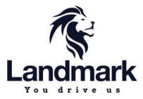
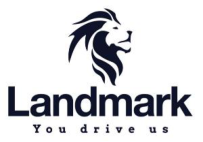
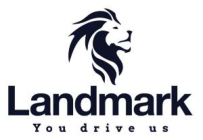
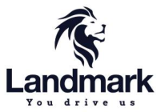

**[Image: Jun2025.pdf-0001-00.png (189x133, 10.8KB)]**

### **Date: May 29, 2025** 

To, To, **BSE Limited, National Stock Exchange of India Limited** Phiroze Jeejeebhoy Towers, Exchange Plaza, Dalal Street, Bandra Kurla Complex, Mumbai- 400001 Bandra (E), Mumbai- 400001 

**Scrip Code: 543714 Symbol: LANDMARK** 

**Sub.:** **<u>Transcript of Analyst/ Investor Earnings Conference Call held on May 29, 2025</u>** 

### **Ref:** **<u>Regulation 30 of SEBI (Listing Obligations and Disclosure Requirements) Regulations, 2015</u>** 

### **Dear Sir/Madam,** 

Further to our communication dated May 26, 2025, please find enclosed the transcript of the Earning Conference Call held on Thursday, May 29, 2025 at 5:30 P.M. (IST) to discuss the audited standalone & consolidated financial results for the quarter and year ended March 31, 2025. 

The said Transcript is also available on the website of the Company at <u>https://www.grouplandmark.in/investor-relation.html.</u> 

Request you to please take the same on your record. 

Thanking You, 

Yours faithfully, 

### **For Landmark Cars Limited** 

AMOL Digitally signed by AMOL ARVIND RAJE ARVIND RAJE Date: 2025.06.03 15:41:24 +05'30' 

**Amol Arvind Raje Company Secretary & Compliance Officer Mem. No.: A19459** 

### **Encl. as above** 

**Landmark Cars Limited CIN** : L50100GJ2006PLC058553 | **GSTIN** : 24AABCL1862B1Z2 

**Registered Office** : Landmark House, Opp. AEC, Near Gurudwara, S. G. Highway, Thaltej, Ahmedabad – 380059 **Tel** .: +91-7966185555 | **Email** : info@landmarkcars.in | **Website** : www.grouplandmark.in 

**[Image: Jun2025.pdf-0002-00.png (203x141, 24.0KB)]**

# “Landmark Cars Limited Q4 FY '25 Earnings Conference Call” 

## **May 29, 2025** 

E&OE: This transcript is edited for factual errors. In case of discrepancy, the audio recordings uploaded on the stock exchange on May 29, 2025, will prevail 

**[Image: Jun2025.pdf-0002-04.png (203x142, 24.2KB)]**

**[Image: Jun2025.pdf-0002-05.png (270x80, 36.0KB)]**

**[Image: Jun2025.pdf-0002-06.png (228x107, 13.5KB)]**

**– MANAGEMENT: MR. SANJAY THAKKER CHAIRMAN AND EXECUTIVE – DIRECTOR LANDMARK CARS LIMITED – – MR. ARYAMAN THAKKER EXECUTIVE DIRECTOR LANDMARK CARS LIMITED – MR. SURENDRA AGARWAL CHIEF FINANCIAL – OFFICER LANDMARK CARS LIMITED** 

**– MODERATOR: MR. RAHUL DANI MONARCH NETWORTH CAPITAL LIMITED** 

Page 1 of 17 

_Landmark Cars Limited May 29, 2025_ 

**[Image: Jun2025.pdf-0003-01.png (203x140, 24.0KB)]**

#### **Moderator:** 

Ladies and gentlemen, good day, and welcome to the Landmark Cars Q4 FY '25 Earnings Call hosted by Monarch Networth Capital Limited. 

As a reminder, all participant lines will be in the listen-only mode and there will be an opportunity for you to ask questions after the presentation concludes. Should you need assistance during this conference, please signal an operator by pressing star and then zero on your touchtone phone. Please note that this conference is being recorded. 

Also, this conference may contain forward-looking statements about the company, which are based on the beliefs, opinions and expectations of the company, as on the date of this call. These statements are not guarantees of future performance and involve risks and uncertainties that are difficult to predict. 

I now hand the conference over to Rahul Dani from Monarch Networth Capital Limited. Thank you, and over to you, sir. 

#### **Rahul Dani:** 

Thank you, Darwin. Good evening, everyone. On behalf of Monarch Networth Capital, I would like to welcome you all to the Q4 FY „25 Earnings Call of Landmark Cars. 

Today we have with us, Mr. Sanjay Thakker – Promoter and Executive Chairman; Mr. Aryaman Thakker – Executive Director; Mr. Surendra Agarwal – CFO and SGA, the IR partners. 

We will start the call with opening comments from the Management and followed by Q&A. Thank you, and over to you, sir. 

**Sanjay Thakker:** Thanks, Rahul. On behalf of the company, I extend a sincere welcome to everybody who has joined the call today. 

The Results and the Presentations are uploaded on the stock exchanges and the company website. I hope everyone had a chance to have a look at it. 

Financial Year '25 has been a defining year for us,  marked by strategic expansion, strong execution, and disciplined growth. On the top line front, we recorded the highest ever proforma revenue for the full year, an outcome of our wide brand bouquet which resonates with every customer aspiring to own a premium or a luxury car in India. 

In Financial Year '25, on a year-on-year basis, the passenger vehicle industry grew at 5%, whereas Landmark grew at about 21%. Our expansion into three fast-growing brands, Kia, MG and Mahindra, has bolstered this growth. 

Page 2 of 17 

_Landmark Cars Limited May 29, 2025_ 

**[Image: Jun2025.pdf-0004-01.png (203x140, 24.0KB)]**

At the start of Financial Year '25, we had set out a goal of opening 24 new outlets. I am proud to share that we have successfully operationalized 23 of them, ahead of timelines and well within budgeted costs. We will operationalize the remaining outlet from June 2025, which is next month. With this, we have demonstrated not only our executional excellence but also our readiness to scale with discipline. 

Turning now to the broader macroeconomic landscape and the Indian passenger vehicle segment: 

The last quarter has been marked by macroeconomic headwinds, including global trade tensions and domestic unrest, which particularly weighed heavily on consumer sentiments. 

The Liberation Day announcements have shaken the auto industry globally. The Indian auto industry, long protected by high tariff barriers of over 100%, is likely to see a drop in import duties over a period of time. 

India remains a bright spot on global map. Various ongoing Free Trade Agreements discussions are improving the prospects for auto business. With discussions around reducing import duties gaining traction, the Indian auto market could become even more attractive for global brands. As a multi-brand retailer aligned with leading international OEMs, Landmark is well poised to capitalize on these developments. 

Landmark is also a large partner for BYD as well as MG Motors, leaders in EV space with clear price and product advantage. Rising EV adoption in India will clearly benefit Landmark in the times to come. 

Global benchmarks show that leading auto retailers in U.S. and China hold between 1.5% to 2% market share in passenger vehicle space. Compared to this, our current share in PV market is approximately 0.5% by volume and a little more by value, indicating the significant longterm growth potential that lies ahead. With stable macroeconomic backdrop and strategic initiatives, we are well poised to capitalize on the long-term growth opportunities and aspire to increase our market share in this growing market. 

Coming to Financial Year '26: 

The industry is projected to grow in mid-single digit. Our focus remains on significantly outperforming the industrial growth in top line as well as the bottom-line. 

With this, I pass this over to Aryaman who will share his insights. 

Thank you. Our Q4 FY „25 performance was satisfactory. Mercedes‟ sales were temporarily affected due to a weak customer sentiment driven mainly due to capital market volatility. 

**Aryaman Thakker:** 

Page 3 of 17 

_Landmark Cars Limited May 29, 2025_ 

**[Image: Jun2025.pdf-0005-01.png (203x140, 24.0KB)]**

Because of this, we had to forgo our variable earnings which impacted on the margins. However, we are seeing it as an aberration and the volumes have returned to their normal growth pace this quarter. 

The top-end vehicles priced over Rs. 1.5 crores continue to contribute to 25% of the sales volumes. And the brand is expecting double-digit growth for the rest of the calendar year. 

BYD is having its best year in India so far and has achieved a sale of over 700 cars in both April as well as May. For context, they sold a total of 3,000 cars in Calendar Year '24. The new launches along with the homologation of the eMax 7 and the Atto 3 is helping to drive this volume growth. 

Our strategic choice to build a portfolio of multiple OEMs enables us to navigate OEMspecific or market-driven fluctuations. Over the full year, our newly added brands, including BYD, contributed approximately 21% to the total proforma sales revenue. We are hopeful that within a few quarters, the new brand share will increase further. 

New brands like MG, Kia, Mahindra and Mahindra are shaping up well. We have already become the top 3 dealers for MG with a 4.5% market share and growing steadily. With new launches planned across all of these brands, we continue to remain optimistic for their future. 

Several of our OEM partners have announced price hikes. Kia and Mahindra & Mahindra implemented an approximate 3% price hike from April 2025, while Mercedes-Benz has announced a price hike of up to 1.5%, effective June 2025, with another one to follow in September. This will further solidify our average selling price. 

On the heavy commercial vehicles front, Ashok Leyland is doing well for us. The volumes are increasing and with the industry expected to go through a replacement cycle, we expect this business to perform over the next few quarters. 

In our after-sales business, workshops for newly added brands have started contributing to the revenue as per expectation. Workshops for Kia Hyderabad will get operational in quarter 1 ofFY26 and the impact will be felt in subsequent quarters. We are expecting to return to our 10-year growth rate in the after-sales business this year. 

One of the key advantages of Landmark's growing scale is our enhanced bargaining power with our vendors. Due to the large volume of vehicles we service across our network, we were able to renegotiate contracts and secure more favorable rates for high consumption products such as paint, tires, engine oil etc. 

We have also negotiated favorable terms with finance and insurance companies. These efficiencies are expected to support improved profitability. This has been made possible due to 

Page 4 of 17 

_Landmark Cars Limited May 29, 2025_ 

**[Image: Jun2025.pdf-0006-01.png (203x140, 24.0KB)]**

senior industry people who have been recruited to have a sharp focus on the finance and insurance business. 

Our efforts on cost rationalization delivered tangible results over the course of FY25. By H2 of FY25, we successfully brought down employee cost and other operating expense to approximately 4% and 3.8% of proforma revenue respectively, meeting our sub 4% target. This disciplined approach will continue to guide our cost structure as we scale. We are aiming to further reduce these costs by 10% in the next year. 

An update on our operations in Punjab: 

We have exited the state of Punjab by selling our two remaining showrooms and one workshop for the Jeep brand. This move aligns with our ongoing strategy to consolidate operations where we are not seeing store level profitability and to drive efficiencies. 

For the coming months, we can look forward to a variety of new models from our partner OEMs. MG is gearing up to introduce the new Majestor along with the M9 and Cyberster under the MG Select brand. Kia has an upcoming launch of the Carens Clavis, which is already getting a very positive response. 

I will now hand it over to our CFO – Surendra Agarwal, to take us through the financial highlights. 

#### **Surendra Agarwal:** 

Thank you, Aryaman. A very good evening, everyone. Allow me to share some key performance metrics that will represent what we have performed in Quarter 4, FY25. 

Our total proforma revenue for the quarter stands at Rs. 1,526 crore as compared to Rs. 1,300 crore in the same quarter of the previous year with a growth of 17.4% on a year-on-year basis. Of this, our new car proforma sale was around Rs. 1,281 crore across all our OEM partners and the after-sale revenue was booked at Rs. 245 crore. 

The gross profit for the quarter is Rs. 188 crore with a 17.2% margin on reported revenue as against a gross profit of Rs. 171 crore in Q4 FY 24. This was despite the lower than expected sale of Mercedes-Benz on year-on-year basis. Despite the lower-than-expected sale of Mercedes-Benz on year-on-year basis, all the new workshops are yet to reach their full capacity, thus impacting the gross profit margin. 

The EBITDA stood at Rs. 60.8 crore with 8.14% year-on-year growth. The EBITDA margin was recorded at 5.57% on a reported revenue basis. The depreciation stood at Rs. 35.6 crore, reflecting the impact of Ind AS 16 for newly launched outlet. It was marginally higher than the previous quarter due to the operationalization of new incremental outlets. An increase in 

Page 5 of 17 

_Landmark Cars Limited May 29, 2025_ 

**[Image: Jun2025.pdf-0007-01.png (203x140, 24.0KB)]**

finance cost was mainly driven by higher inventory on the back of addition of new showroom and CapEx requirement for recently opened locations. 

Our profit after tax before the net impact of Ind AS stood at Rs. 5 crore versus Rs. 13 crore in Quarter 4 FY24. Cash PAT for Q4 FY25 is Rs. 19 crores. 

Other notable quarterly operational metrics include the steady and sustainable rise in the average selling price of new car sales. The average selling price of the car for the quarter has gone up Rs. 20.38 lakhs in the previous quarter to Rs. 21.24 lakhs in Q4 FY '25. 

The number of service was 89,340 with average revenue per vehicle service at Rs. 27,420. Our new car inventory is maintained at under 45 days lower than the industry average of approximately 50 to 55 days. 

Now for the corresponding figure for the full year FY25: 

We achieved total proforma revenue of Rs. 5,626 crore in FY25 compared to Rs. 4,655 crore in FY24, showing a 20.9% year-on-year growth. 

Our gross profit for FY „25 was Rs. 710 crore as against Rs. 651 crore in Financial Year '24 reported 9% growth on year-on-year basis. EBITDA for FY '25 stood at Rs. 235 crore and the corresponding figure of FY '24 was Rs. 227 crore. 

Our profit after tax before the net Ind AS impact stood at Rs. 25.8 crore versus Rs. 62.9 crore in previous year. In Financial Year '25, we reported approximately Rs. 152 crore net operating cash flow, our best performing since listing. 

I would like to update you that the Board has approved dividend of Rs. 0.50 per share. In the coming time, we are opening 9 new outlets. Including this, our depreciation for the year is estimated at approximately Rs. 145 crore including the Ind AS impact. The final impact may vary depending on outlet size and commencing timeline. 

With this, I open the floor for Q&A. 

#### **Moderator:** 

#### **Pritesh Chheda:** 

Thank you very much. We will now begin the question-and-answer session. We have the first question from the line of Pritesh Chheda from Lucky. Please go ahead. 

Sir, I couldn't understand the last line that you mentioned about x9 new outlets that you open. So, I think until the last presentation you were saying that they have taken this 24 outlet so we have done all of it. So, if you could also highlight that? And I have a couple of more questions. Maybe first you want to take this. 

Page 6 of 17 

**[Image: Jun2025.pdf-0008-00.png (203x140, 24.0KB)]**

_Landmark Cars Limited May 29, 2025_ 

#### **Sanjay Thakker:** 

Pritesh, there is nothing new over here. We had announced that our Patna Mercedes-Benz would start in June or so. So, that is something which will be operationalized in the next maybe 45 days or so, which is already something that we had said. That was work in progress. We announced some weeks back that we are acquiring a workshop, a ready workshop of our competitor in Hyderabad of Kia. Now that will get operationalized next week or maybe 15 days. And our own workshop of Kia, which was the only project that was delayed in this whole 24 outlets that we are talking, that will get operationalized. 

So in Patna, the sales and service are counted as two. They are actually not two. It is actually one, but the sales and workshop are counted as two. And the MG Select outlets in Ahmedabad, which is also going to be a part of the MG showroom itself where we are carving out the MG showroom are technically counted as different outlets. So, there is really not any major expansion or any new outlets that we are doing which are not reported. 

**Pritesh Chheda:** 

So, my second question is on the car sales margins. So, if you want to highlight some granular details there because our car sales is up, let's say, on a proforma basis, by about 20%, plus 20%. But when we look at EBITDA, and I am just doing a rough math, ex of the repair EBITDA, the residual EBITDA is obviously the car sale EBITDA, so that doesn't go up. So, you know, what all comes into play there, and to Aryaman‟s observation that you guys have renegotiated the rates on with car companies and on finance and insurance which should bring higher margin. So, you may want to quantify what kind of margin expansion on that renegotiation is possible next year because these questions split into two parts, sir? 

**Sanjay Thakker:** 

What was the first question, Pritesh? Since you are on the road, I am not able to hear you. There is some road noise coming. So, not clearly able to understand. 

#### **Pritesh Chheda:** 

So, on the car sales, you are up 20%. But your margins, the absolute EBITDA is down and the margin is down. So, may be you want to highlight a little bit more granular what went into play here? 

**Sanjay Thakker:** So, in new cars, Pritesh, the last quarter especially was one of the few in recent memory where we were unable to meet our Mercedes-Benz targets. Now, as far as our margins are concerned, they comprise of what is known as a fixed margin and what is a variable margin. Now, variable margin is an important component of our business. 

Now, for once in, I don't know, maybe three years or four years that we were not able to, we means I think the entire Mercedes network did not meet their targets. The good news is that this is corrected and the numbers are clocking from April onwards. So, that is not something that we are so much concerned about. But that took away approximately 1.5% of our Mercedes sales margin, which is an important aspect of what we are doing. 

Page 7 of 17 

_Landmark Cars Limited May 29, 2025_ 

**[Image: Jun2025.pdf-0009-01.png (203x140, 24.0KB)]**

Also, it is the newer brands that we have had a play, where we are entering the market, there was some amount of discounting for those brands, and we hope to get back to some decent margins in this current year. 

Now, as far as your second question is concerned, what we have been able to renegotiate, Aryaman spoke about with, say, a paint vendor or banks for finance commission and insurance commission, is a little better than what we had. On a percentage basis, I would say that it would have on the after-sales business a 0.1 or a 0.2 impact on our margins. It's on a base of maybe Rs. 1,000 crore plus. Now we will cross Rs. 1,000 crore plus of after sales revenue. So, that's what we would kind of hope to get out of that. 

**Pritesh Chheda:** 

#### **Sanjay Thakker:** 

**Pritesh Chheda:** 

**Moderator:** 

**Lokesh Manik:** 

#### **Sanjay Thakker:** 

And the finance and the insurance? 

So, finance and insurance, again, we have been able to negotiate better commission rates for both of these. I wouldn't have the number on a percentage basis to answer you, maybe later on tomorrow or so. 

Thank you and I will come back if I have more questions. 

Our next question comes from the line of Lokesh Manik from Vallum Capital. Please go ahead. 

Hi. Good evening, Sanjay sir and team. Sir, my first question is on the slides and the presentation slide you said you have nicely shown that any outlet takes about roughly 13 months from start to maturity, profitability. So, given that context, in the first half, we have opened 14 outlets. So, by that logic, can we expect Q3 of this year to have optimum profitability coming in from these 14 outlets which you have shown in the first half that you have started? Would that be a fair assessment? 

Yes, I mean, what we have given is a kind off, it's not a hard coded number. This is our experience that in approximately 12 months‟ time, things turn around. Our experience for the outlets which have completed, 7 outlets I think we reported, which had completed 12 months and which we moved to what we call the existing or old outlets, have turned profitable and we have moved them. So, they are of different shapes and sizes. 

Our Kia outlet will take a little because the workshops are getting operationalized only next month, so, if the outlet that you are talking about includes a Kia outlet, it won't happen. But generally, the answer is yes. 

**Lokesh Manik:** 

And, sir, by when? So, we have also seen a drop in our gross margins for this FY '25, which was about 18%-19% has come down to 16.5%. So, do you envisage reaching 18%-19% gross margin in FY '26? That was my second question. 

Page 8 of 17 

**[Image: Jun2025.pdf-0010-00.png (203x140, 24.0KB)]**

**Sanjay Thakker:** 

### _Landmark Cars Limited May 29, 2025_ 

Yes, so the reason for this drop in margin which Surendra explained a little in his talk is because of the after sales mix for new brands is still around 9% approximately of their total turnover for the new brands. And that will obviously increase. Kia workshops will get added. The business of Mahindra and MG after sales will also increase. 

For a reference point, for existing brands, this number is around 17%. So, the gross margin of after sales business, as you know, is around 40%. So, every kind of a percentage added on to that mix in the newer brands will increase the gross margin. So, we are hoping to get back to that pace in this year. 

#### **Lokesh Manik:** 

**Sanjay Thakker:** 

**Lokesh Manik:** 

**Moderator:** 

**Abhisar Jain:** 

**Sanjay Thakker: Abhisar Jain:** 

Last question, sir, if I squeeze one in. Today, there was an article that Chinese companies are restricting supply of magnets, which is expected to impact Indian car productions. In that scenario, would that be an advantage? How do you see it as an advantage or a disadvantage? Advantage in the sense you won't have to give any discounts to dispose off your inventory or sell your car. The disadvantage is there may be a shortage of supply. So, how do you see this, your outlook on that? 

So, yes, Lokesh, it's difficult to, see, I also read this article as you did in the papers today. My initial reaction was, in fact, positive. And in fact, on our group of our core team members, I wrote this message saying that please show this to the customer so the decision making becomes faster. We can also reduce our inventory. So, I don't see this problem. I mean, I really don't know this subject as well, but in the short term, this would be positive. It should be good to clean up the inventory. 

That's it from my side. 

Our next question is from the line of Abhisar Jain from Monarch AIF. Please go ahead. 

Hi, sir, good evening. 

Good evening Abhisar. 

Sir, my question is on Slide No. 17 where you have shown the breakup between the existing outlets and new outlets in terms of the key matrix, how they did for Q4 as well as for full year FY „25. So, sir, a two-part question on this. One is that out of the 17 outlets that we are qualifying still as new, which has given a negative Rs. 40 crore PBT for us in FY „25, how is the traction coming up? Because some of them would be three months old, some of them would be six, nine months old. 

So, out of these 17, how many do you see turning PBT breakeven within the next 6 months? And the second part of the question is this Rs. 40 crore negative PBT number, do you have any 

Page 9 of 17 

_Landmark Cars Limited May 29, 2025_ 

**[Image: Jun2025.pdf-0011-01.png (203x140, 24.0KB)]**

internal target or estimate that how much it should be for FY „26? How much lower it should be? 

**Sanjay Thakker:** So, Abhisar, the answer is that yes, this number, but just to put the number of approximately Rs. 40 crores in perspective, it includes a lot of rent and salaries that we had to pay before we started the operation, since we cannot capitalize this. 

So, what I was saying is that our loss actually was because of the front loading of expenses before we started the operations. So, these are in any case not operating losses in any case which will never such quantum cannot happen. 

The answer to your second thing is that we are hoping that only a few outlets remain nonprofitable at worst by the end of the six months‟ period that you kind of mentioned and all come into a breakeven or a profitable zone. 

**Abhisar Jain:** So, sir, in that context for the full year number including the 8-9 new outlets that will come in, and I understand that not all of them are particularly big or brand new outlets, they are the adjustments that you mentioned earlier in the call. But for the whole for the new outlets, what kind of negative PBT number we should pencil in as a range, if not exactly? 

**Sanjay Thakker:** Yes, that's a fair question. Let's look at what we are going to be opening out of that. We are opening Kia workshops. Now, I don't see any way that Kia workshops will make a loss. In fact, they will be profitable. We are talking about the MG Select brand where we have a situation where the entire sales has been sold. I don't know whether we have mentioned that on the call. Right now from what it appears is that the small volume of cars which is going to be coming in is already sold out before the cars are launched, the Cyberster as well as the M9. So, I don't think that there will be a loss making. Again, they should also be profitable businesses only. That leaves us with the Mercedes-Benz Patna operations. Our Mercedes Benz business has been good. Patna is an uncharted territory for luxury cars. We will wait to see how it happens, but it is not a very heavy cost operation generally. 

**Abhisar Jain:** So, second question is on BYD. As Aryaman mentioned that the sales for BYD picked up in India in April and May, right? So, just wanted to understand that any specific reason for this pickup because the PV industry as such still continues to be slow and has some limit increase for BYD to be able to sell more number of cars this calendar year in India? Do you have any estimate from them or your own channel checks? 

**Sanjay Thakker:** Yes, so the thing which has happened, Abhisar, is that their homologation has happened for two of the four models that we are selling currently, which is the eMax 7 and the Atto 3. Now, what it means is that the 2,500-unit limit which is applicable generally doesn't apply to these two models. So, the supply becomes infinite theoretically. So, that's what has happened, and we are seeing traction in those models which are now supplied without any limit. 

Page 10 of 17 

**[Image: Jun2025.pdf-0012-00.png (201x140, 24.0KB)]**

_Landmark Cars Limited May 29, 2025_ **Abhisar Jain:** Yes, but Sanjayji, there was earlier issues of also clearance at the custom level for all these semi-built up units for all these cars and other issues also creating the volumes despite the homologation. **Sanjay Thakker:** The cars are classified as CBUs, and duty has been paid as per CBU. They are not trying to get any duty concessions. They are paying full duty and paying it and selling it here. **Abhisar Jain:** So, sir, BYD volumes, is there any outlook for this year, for their whole? And are we able to maintain 20% market share in even the higher volume? **Sanjay Thakker:** Give or take, give or take. Yes, more or less. Maybe if not 20%, then 17%, 18% kind of a thing. Because a small volume, a little, 5-7 cars will change the percentage. If this pace continues, then their volume could be in the region of anywhere between 7,000 to 9,000 cars for the year, all India. **Abhisar Jain:** Sir, just the last question. What would be the total rental expense for all the outlets that we have in place for full year now in FY „25 or for this 130-132 outlets so that we can…? **Sanjay Thakker:** We will have to get Surendra in. He has a computer open. Let's use him. **Surendra Agarwal:** Hold on, sir. So, last year it was around Rs. 100 crore and the next year it will be around Rs. 110 crore. This is I am telling without Ind AS thing. **Sanjay Thakker:** Right. Just the rental that we have to pay to the landowner. **Abhisar Jain:** Okay, sir, thank you so much and best wishes for a better FY „26. **Moderator:** Our next question comes from the line of Lokesh Manik from Vallum Capital. Lokesh, you may go ahead. **Lokesh Manik:** Hi, thank you, sir, for the opportunity again. Sir, I just needed a clarification that these 25 outlets that we have opened in the Financial Year '25, are they operational or they are expected to be operational now going forward? And if so, then when do you expect complete operationalization of all these outlets? **Sanjay Thakker:** They are operational. When we have said operational, that means that they are operational, not like a ready to start business, but in business. **Lokesh Manik:** And another one. Surendra sir just gave a number for Rs. 100 crores rental expense. This is for new outlets. Just a clarification. **Surendra Agarwal :** No, no, it's a total company. Total company. 

Page 11 of 17 

**[Image: Jun2025.pdf-0013-00.png (203x140, 24.0KB)]**

_Landmark Cars Limited May 29, 2025_ 

**Lokesh Manik:** Okay, total company level, it is Rs. 100 crores. Yes. 

**Surendra Agarwal:** 

**Lokesh Manik:** That‟s it from my side, sir. Thank you again so much. 

**Moderator:** Our next question is from the line of Sabyasachi Mukherjee from Bajaj Finserv Asset Management. Please go ahead. 

**Sabyasachi Mukherjee:** Hi, thanks for the opportunity. Sanjayji, a few questions here. First one, again on the gross margins. Now if I look at the car sales gross margins, you mentioned that this quarter Mercedes-Benz sales were not that great. Missed the target for the first time, not only you, but Mercedes-Benz as a whole. And the second thing probably you mentioned that the other brands had some discounting. 

Now, I had this opinion or maybe I don't know, I remember discussing with you that whenever a brand gives discounts, I thought we don't have to bear that. But apparently, we had to bear some portion of it in this quarter. Can you clarify that? 

**Sanjay Thakker:** 

In the markets that we are getting into, we need to make our presence felt. The new brands where we were new entrants into the markets with the brands, we had to kind of get the customer buying for our brands. Now, the discounting is completely out of the window as far as Mercedes-Benz is concerned because that is All India One Price. 

Now, by definition, discounts can happen. The discount is also passed on by the manufacturer as the consumer offers. But for new entrants where we don't have exclusivities, and just to remind you, we have exclusivity for most brands for many geographies. There we don't have this kind of pressure. But in newer brands and newer geographies to make a mark, this kind of an entry-level strategy we need to play. 

**Sabyasachi Mukherjee:** 

Sanjayji, again a clarification here. Let's say in Hyderabad, we have M&M, we have Kia outlets, right? And I believe there are other franchises who have the outlets of these brands. You mean to say that for us as a new entrant in this market, we had to give extra discount to attract customers over and above what the brand is giving. 

#### **Sanjay Thakker:** 

That is correct to say, but that, Sabyasachi, is generally given by dealers, give a part of their margins by way of discounts as a nature of the business. It is just that because we have a geographical exclusivity, our margins are protected in those regions because we don't have a competing code that comes in. But to answer your question in a, I mean, if it was a Hyderabad, yes, we need to give a little bit of a discount away from our margins to attract customers and popularize our new showroom. 

Page 12 of 17 

_Landmark Cars Limited May 29, 2025_ 

**[Image: Jun2025.pdf-0014-01.png (203x140, 24.0KB)]**

**Sabyasachi Mukherjee:** And the same thing I believe happened in West Bengal as well. **Sanjay Thakker:** Theoretically, I am just giving you the answer, not specifically getting market by market, but yes. **Sabyasachi Mukherjee:** And to your opinion, how long we have to do this? **Sanjay Thakker:** Not for long. So, what happens is that the similar thing had happened, say, in MG Motors, when we had started where which was of the three new brands that we have started, it was the first of the block. So, what we are seeing is that there we are able to roll back those discounts once we have established ourselves in the market. So, this is the initial burst of maybe six months or so where our people get accustomed, the customers also start talking about us and all that. **Sabyasachi Mukherjee:** Sanjayji, I mean I hope you understand where I am coming from. Pritesh, first question I think Pritesh asked that our proforma revenue grew by 20%, and this is new car sales I am saying, and the EBITDA has declined by 44%, just halved Y-o-Y. I am not sure. I mean, this is extremely disappointing to the core. **Sanjay Thakker:** We can actually do the math, Sabyasachi, maybe in the next one or two days if you want. We are not really that alarmed by this situation. The new brands and what is the impact we have also given on our presentation slide. What is the break-up of, what brands gave, how much contribution to our business? And we have also given the break-up of new and old brands. So, if you look at it, this is in the market which was really soft in January and February. This we think is something that is, I think, steered the ship quite okay. **Sabyasachi Mukherjee:** Again a follow up on the other expenses line item in the P&L. I see it has increased quarter-onquarter from Rs. 59 crores odd in 3rd Quarter to Rs. 63 crores, Rs. 62.5 crores in this quarter. I thought since majority of the store openings, outlet openings have been done with Q2 and Q3, I believed Q4 would have been similar to what we had incurred in Q3. But still there is a jump from Q3 levels. What exactly happened here? **Sanjay Thakker:** Yes, so surely. So, if you will see the trajectory of our other costs as a percentage of turnover, what we had kind of said, and this was what we were kind of and this was we were many quarters back where we stuck our neck out and said that our other costs will go down below 4%. And that has gone below 4%. And we are again guiding that it will go down further in the current year by approximately 10% further. 

Now, there are costs which are incurred in our business. We can't really look at it on an absolute quarter-on-quarter basis. I will give you an example. Like a Mercedes Golf Tournament is held in this quarter. It is just held in this quarter every year. I am giving you a very basic example. We have some drive events which are very high-end and costly. They are 

Page 13 of 17 

**[Image: Jun2025.pdf-0015-00.png (203x140, 24.0KB)]**

### _Landmark Cars Limited May 29, 2025_ 

done once in a year. So, if you look at it, our business in a yearly basis, it will help because that is how the nature is somehow. So, it is mainly advertisement expenses that we have incurred. There are small, small items, but the major chunk is those large scale events that we do during this period. 

**Sabyasachi Mukherjee:** On an overall basis, FY26, if you can help us with probably what could be the total other expenses and employee cost, that would be helpful. 

**Sanjay Thakker:** So, the guidance is, see, we are already below the 4% threshold in both of it. We have given a half yearly breakup also for the other costs as well as the manpower cost. And we are saying that we are as of now internally looking at 10% reduction in both as a percentage of turnover. 

**Sabyasachi Mukherjee:** 10% from the absolute value of FY '25 or is it like 4%? **Sanjay Thakker:** No, no, no. As a percentage of turnover. **Surendra Agarwal:** Like if it is a 4%, then it's a 0.4 reduction and it will become a 3.6%. 

**Sabyasachi Mukherjee:** 3.6% basically. **Surendra Agarwal:** Yes, yes. That's what he is trying to say. 

**Sabyasachi Mukherjee:** That's all from my side. 

**Moderator:** The next question is from the line of Dhiraj Kaswan from RRR Investments. Please go ahead. 

**Dhiraj Kaswan:** So, my first question would be like this year we have seen that most of our margins have been affected in the business like the material cost has been high because of discounting or variable margin. Yet the employee cost has been higher than 2023 and 2022 numbers. It has been lower than FY „24. Yes, and it's because of up-fronting of cost for the new outlets and also the other expenses cost has been higher. And then if you go beyond EBITDA, we also see that the depreciation and interest cost as a percentage of revenue has gone up. So, we are seeing that all these five major components of our balance sheet of our income statement, all have gone up, and our EBITDA margins have eroded to 5%. The management's guidance for long-term PAT margin has been around 2% to 3%. So, how are we looking to like go up to that for the next year, and after next year what are our projections for the margins? 

**Sanjay Thakker:** So, I think the important aspect that we haven't yet discussed on this call is the upfronting of the depreciation because of Ind AS also. As the retail outlets open, the depreciation is higher in the initial years and then they start going down. 

Page 14 of 17 

_Landmark Cars Limited May 29, 2025_ 

**[Image: Jun2025.pdf-0016-01.png (203x140, 24.0KB)]**

So, the good news is that once the business gets mature and starts delivering, at that time, simultaneously, the depreciation will also start coming down. The component of after sales and this is something which I had mentioned earlier, for new business, for gross margin to click in, we need after sales business which is a 40% gross margin business. 

For older brands, that is 17% of the turnover of those brands. For newer brands, it is 9% currently. Now this 9% will keep on going up and it will reach at one point 15%, 16%, 17% in the times to come. Now once that happens, the stable state margins will be reflected. 

The good news, and I am also drawing this from Pritesh's question, are we on a continuous type of a treadmill that new outlets keep on opening and this margin is under pressure? No, we did what we had to do as a one-time kind of a blood transfusion kind of a thing where we added three brands where we wanted to have the turnover back in. You rightly said that we are a percentage of the turnover. First get the turnover in. Now we have solved the first issue clearly. 

We are also guiding that we will significantly outperform the industry growth this year. Now, once the turnover comes, everything else, one by one, starts falling in line. The EBITDA will fall in line, the gross margins will fall in line, and the PAT will fall in line. And depreciation over a period of time will taper down. 

**Dhiraj Kaswan:** 

#### **Sanjay Thakker:** 

Thank you for that answer. And one more thing about our business model that I had a bit of concern was that we had opened a lot of outlets this year. A lot in the past 2 years and most of them were through acquisitions I think. And the problem with this is that if we are going to expand a lot in the future, open a lot of outlets, do a lot of sales, the key part is in India we already will have a lot of outlets of brands. So, like is the expansion going to be acquisition from now on or how will that work? 

Our expansions out of this 24 outlets that we are talking about is not that high. It could be, my sense is, 3 or 4 locations out of 24 were acquired. Really not that many. And if they were acquisitions, then we would have hit the ground running. Now we look at build versus buy kind of a scenario. The number is around 7, 8 out of 24 were acquired in this period. So, wherever the acquisitions have happened, those have hit the ground running and many of them are already profitable. 

But the point is that whatever we start Greenfield takes a little bit of time to ramp up. It is cheaper, but it takes a little time to ramp up, around a year for it to kind of come to the decent level. So, over a period of time, we don't have a strategy that is defined, but today around 25% of what we are, we have done acquisitions. I am talking about the 130 odd outlets that we have. 

Page 15 of 17 

**[Image: Jun2025.pdf-0017-00.png (203x140, 24.0KB)]**

_Landmark Cars Limited May 29, 2025_ 

**Dhiraj Kaswan:** Yes, sir, but the concern is that, going forward, if we are going to do Greenfield even 50%, 75% of the outlets, but that will be much difficult because if we are going to put an MG outlet or a Kia outlet, or any of the others, most of the top spots where cars are sold, most of the those markets will already have a Kia or many Kia showrooms and MG showrooms. 

**Sanjay Thakker:** I agree with you. I agree with you. That is why what has happened is that once we have, I will give you an example of what happened in KIA. In Hyderabad, as soon as we started our Greenfield, we were able to acquire our competing dealer‟s showroom as well as workshop in like six months‟ time. So, this is the strategy that we follow that first get into a geography, first get into a brand and then try to eliminate the local level competition. 

**Dhiraj Kaswan:** That's nice. But that's also I was getting out that after this, if we are going to expand our business in the Mercedes segment, the market in India, Mercedes is already there. That's why we are doing a Greenfield in Patna. But the highest selling market, the highest per capita income cities in the country will already have a Mercedes outlet, right? 

**Sanjay Thakker:** That is so, but then there will be additional outlets because the business will be viable for every entrant like Bombay there are two dealers of Mercedes Benz, Delhi there are three dealers of Mercedes Benz. So, once the volume goes up, there will be a space for third or a fourth. That doesn't matter. Once the market expands, it is not that the first guy only does the business. 

**Dhiraj Kaswan:** 

Yes, I am coming to that like most of the market... 

**Moderator:** Sorry to interrupt, sir. We request you to please rejoin the queue for follow-up questions. Our next question is from the line of Pritesh Chheda from Lucky Investments. Please go ahead. 

**Pritesh Chheda:** 

Sir, can you tell me the number of cars sold in total in FY „25 and number of cars sold in FY „24? And then this BYD number that you mentioned of 700 cars for the month of April and May, so now basically it's a clean runway, at least for this kind of volume for the year or how should we look at it? 

**Sanjay Thakker:** Pritesh, just to clarify that 700 BYD cars is not what we sold. That is the sale of BYD in India. 

**Pritesh Chheda:** 

Yes. 

**Sanjay Thakker:** So, just as a clarification, I am saying, and so we believe that the demand is fine. The supply needs to be consistent. We have had some past experiences where some consignments and as somebody, I think Abhisar mentioned, things look okay as of now. But with import model there is always a disruption possibility. So, difficult to stick my neck out and say that this will happen. As of now things look good in the month of April and May, and these are published figures that I am talking to you about like Vahan registrations all India and all which is showing a 700-800 range sale in these two months. 

Page 16 of 17 

**[Image: Jun2025.pdf-0018-00.png (203x140, 24.0KB)]**

_Landmark Cars Limited May 29, 2025_ 

**Pritesh Chheda:** And how much car did we sell in total across all the brands in FY '25 versus FY '24? **Sanjay Thakker:** Pritesh, we had stopped reporting that sometime back, if you don't mind. **Pritesh Chheda:** No problem. No problem. No problem, sir. And my last question is this new car sales margin that we were discussing. So, you mentioned that Mercedes' incentives was not available this year. So, would you like to quantify? 

**Sanjay Thakker:** It is only this quarter. **Pritesh Chheda:** Only this quarter. So can you quantify the absolute Mercedes incentive this year and absolute Mercedes incentive last year? Is it possible to quantify that? 

**Sanjay Thakker:** We will have to check that. But it says on this call, let us avoid it right now. **Pritesh Chheda:** No problem, sir. No problem. **Moderator:** Thank you. Ladies and gentlemen, we will take that as our last question for today. I would now like to hand the conference over to the management for closing comments. Over to you, sir. **Sanjay Thakker:** So, thank you all. Sorry for the glitch in between that we had. So, we are cautiously optimistic and we are looking forward to this being a year where we actually turn things around and many of the questions that you have had get answered by themselves when the numbers get published a few quarters from now. I believe that every quarter is going to be the better quarter and our expansion is behind us. So, we are also, as a team, looking forward to execution and getting the profitability which has been the only reason why we have been doing business. And the Free Trade Agreement that we have been talking about, let us hope that we see clarity on that and some new doors open up for us which will change the trajectory of our business. So, these are my comments as the ending comments. Thank you. 

**Moderator:** Thank you. On behalf of Monarch Networth Capital Limited, that concludes this conference. Thank you all for joining us. You may now disconnect your lines. 

Page 17 of 17 

---

## Extracted Images

| # | File | Dimensions | Size |
|---|------|------------|------|
| 1 | Jun2025.pdf-0001-00.png | 189x133 | 10.8KB |
| 2 | Jun2025.pdf-0002-00.png | 203x141 | 24.0KB |
| 3 | Jun2025.pdf-0002-04.png | 203x142 | 24.2KB |
| 4 | Jun2025.pdf-0002-05.png | 270x80 | 36.0KB |
| 5 | Jun2025.pdf-0002-06.png | 228x107 | 13.5KB |
| 6 | Jun2025.pdf-0003-01.png | 203x140 | 24.0KB |
| 7 | Jun2025.pdf-0004-01.png | 203x140 | 24.0KB |
| 8 | Jun2025.pdf-0005-01.png | 203x140 | 24.0KB |
| 9 | Jun2025.pdf-0006-01.png | 203x140 | 24.0KB |
| 10 | Jun2025.pdf-0007-01.png | 203x140 | 24.0KB |
| 11 | Jun2025.pdf-0008-00.png | 203x140 | 24.0KB |
| 12 | Jun2025.pdf-0009-01.png | 203x140 | 24.0KB |
| 13 | Jun2025.pdf-0010-00.png | 203x140 | 24.0KB |
| 14 | Jun2025.pdf-0011-01.png | 203x140 | 24.0KB |
| 15 | Jun2025.pdf-0012-00.png | 201x140 | 24.0KB |
| 16 | Jun2025.pdf-0013-00.png | 203x140 | 24.0KB |
| 17 | Jun2025.pdf-0014-01.png | 203x140 | 24.0KB |
| 18 | Jun2025.pdf-0015-00.png | 203x140 | 24.0KB |
| 19 | Jun2025.pdf-0016-01.png | 203x140 | 24.0KB |
| 20 | Jun2025.pdf-0017-00.png | 203x140 | 24.0KB |
| 21 | Jun2025.pdf-0018-00.png | 203x140 | 24.0KB |
