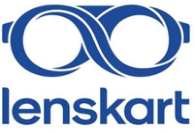

### **Lenskart Solutions Limited** 

(Earlier known as Lenskart Solutions Private Limited) Corporate Office: Ground Floor, Vipul Tech Square, Golf Course Road, Sector- 43, Gurugram, Haryana 122009 

**[Image: Feb2026.pdf-0001-02.png (195x133, 38.0KB)]**

Date: February 16, 2026 

National Stock Exchange of India Limited BSE Limited The Listing Department, Department of Corporate Services, Exchange Plaza, Phiroze Jeejeebhoy Towers, Bandra Kurla Complex, Dalal Street, Fort, Mumbai - 400 051 Mumbai - 400 001 **Scrip Symbol: LENSKART Scrip Code: 544600** 

**<u>Sub.: Transcript of Earnings Call with respect to Financial Results for the quarter and nine months ended December 31, 2025</u>** 

Dear Sir/ Ma’am, 

Pursuant to Regulation 30 of the Securities and Exchange Board of India (Listing Obligations and Disclosure Requirements) Regulations, 2015, please find enclosed transcript of the Earnings Call conducted on February 11, 2026. 

The above information will also be hosted on the Company’s website viz. <u>https://www.lenskart.com/corporate/investorrelations.</u> 

Kindly take the same on record. 

Thanking you, 

Yours Sincerely, 

**For Lenskart Solutions Limited** 

**(** **_Formerly known as Lenskart Solutions Private Limited)_** 

Ashish Kumar Digitally signed by Ashish Kumar Srivastava Srivastava Date: 2026.02.16 17:30:29 +05'30' **Ashish Kumar Srivastava Company Secretary and Chief Compliance Officer Membership No.: F5325** 

**Place:** Gurugram 

**[Image: Feb2026.pdf-0001-16.png (1167x106, 29.1KB)]**

<!-- Start of picture text -->
Regd. Office: Plot No. 151, Okhla Industrial Estate, Phase III, New Delhi 110020 Website: www.lenskart.comwww.lenskart.com, Email:   Email:  compliance.officer@lenskart.com , Phone No: 0124 – 4293191 <!-- End of picture text -->

Regd. Office: Plot No. 151, Okhla Industrial Estate, Phase III, New Delhi 110020 Website: www.lenskart.comwww.lenskart.com, Email: **compliance.officer@lenskart.com** , Phone No: 0124 – 4293191 CIN — L33100DL2008PLC178355 

**[Image: Feb2026.pdf-0001-18.png (1167x106, 13.8KB)]**

<!-- Start of picture text -->
CIN — L33100DL2008PLC178355 <!-- End of picture text -->

**[Image: Feb2026.pdf-0002-00.png (372x97, 9.7KB)]**

# Lenskart Solutions Limited 

# Q3 FY26 Earnings Conference Call 

# **February 11, 2026** 

## **MANAGEMENT:** 

Peyush Bansal – Co-Founder and Chief Executive Officer, Lenskart Solutions Limited 

Abhishek Gupta – Chief Financial Officer, Lenskart Solutions Limited Nikunj Mall – Head of Investor Relations, Lenskart Solutions Limited 

Page 1 of 19 

Lenskart Solutions Limited February 11, 2026 

**[Image: Feb2026.pdf-0003-01.png (184x49, 4.6KB)]**

#### **Moderator:** 

Ladies and gentlemen, good evening and welcome to Lenskart Q3 FY26 Earnings Conference Call. 

To present the results, we have with us Mr. Peyush Bansal – Co-founder and Chief Executive Officer, Mr. Abhishek Gupta – Chief Financial Officer and Mr. Nikunj Mall – Head of Investor Relations. 

As a reminder, all participant lines will be in the listen-only mode and there will be an opportunity for you to ask questions after the presentation concludes. Should you need assistance during the conference call, you may use the chat option to interact with the moderator and for participants connected through audio, you may press ‘*’ then ‘0’. Please note that this conference is being recorded. 

I now hand the conference over to Mr. Nikunj Mall – Head of Investor Relations from Lenskart. Thank you and over to you. 

#### **Nikunj Mall:** 

Thank you, Yash. Good evening, everyone and thank you for joining Lenskart's Earnings Call for the 3rd Quarter of Fiscal Year 2026. 

Before we begin, I would like to remind you that some of the statements we make today may be forward-looking in nature and are subject to risks and uncertainties. The conference call may contain forward-looking statements about the company which are based on the beliefs, opinions and expectations of the company as on the date of this call. These statements are not a guarantee of future performance and involve risks and uncertainties that are difficult to predict. We have uploaded our Q3 Results and a detailed shareholder's letter on our website and stock exchanges. 

Please note that during the call, consistent with our IPO perspective, the financial numbers we are going to be presenting are referring to the proforma financial statements for like-to-like comparison unless stated otherwise. Reported financial statements reflect acquisition of Dealskart, Meller and GeoIQ from their respective transaction closing dates. Proforma financial statements present these financials as if the acquired business had always been a part of the company and hence represent a clearer trend analysis. However, for Q3 FY26 numbers, there is no difference between proforma and reported financials. 

We will begin today's session with opening remarks from the management team. During the time, everyone would be on mute. Following the presentation, we will open up for Q&A. To ensure we accommodate as many participants as possible, please limit yourself to one question and re-enter the queue. 

With that, I would like to hand over to Peyush. 

Page 2 of 19 

Lenskart Solutions Limited February 11, 2026 

**[Image: Feb2026.pdf-0004-01.png (184x49, 4.6KB)]**

#### **Peyush Bansal:** 

Good evening, everyone and thank you for joining us. I really appreciate your trust in us both with your capital and your glasses. 

I want to start with a number that does not appear in our P&L: 

This quarter, we conducted 6.3 million eye tests globally. A 11% increase quarter-onquarter and a 54% increase year-on-year. In India alone, 5.5 million eye tests, up 60% yearon-year. And the number that matters the most, 49% of these were first-time eye exams. Every eye test we conduct expands the addressable market itself. This is the engine behind our financial results this quarter. 

In my last letter, I spoke about entering a compounding phase, where every incremental Rupee and Dollar in revenue will add more to the EBITDA. This quarter continues to validate that thesis. Revenue grew 37% year-on-year to ₹2,308 crores. Our strongest quarter as a public company and a record SSSG of 28% in India. EBITDA grew 90% yearon-year to ₹462 crores. EBITDA margin expanded 550 basis points, crossing the 20% threshold for the first time. Pre-Ind AS EBITDA1 tripled year-on-year to reach ₹265 crores and 11.5%. PAT grew more than 3x the same quarter last year, reaching ₹133 crores. For the first 9 months, PAT has already more than doubled to ₹326 crores versus ₹137 crores for 9 months last year. 

Let me share with you what is fundamentally accelerating this growth: 

We are living through a moment where Artificial Intelligence has stopped being a promise and become the foundation of how companies build, operate and imagine the future. At Lenskart, the same is happening. What we are able to do today with AI, was not possible a year back. I am glad we made the choice to invest in technology and AI years ago when we invested in Tango Eye, Virtual Try On, and our Location Intelligence, GeoIQ. These bets are now paying off. A single optometrist in Kolkata today conducts precise eye exams for customers hundreds of kilometres away in Jaisalmer, in Sitarganj, in Udalguri and more. Through our remote optometry platform, we have scaled from 168 stores in March to 369 stores today in India. And almost every new store we open, now opens with a remote optom attached to it. Our remote optometry tests have grown by 330% now (year-onyear). The driver of this remote eye exam, you need to understand, is our technology and AI layer which is becoming better with every eye test. Every eye test is recorded, and data is captured between the prescription movements and what is the conversation between the optometrist and the customer. 

This is enabling us to do 60% growth in eye tests in India. In the last 9 months, we have added more than 4 million people to the eyewear TAM. 

Page 3 of 19 

Lenskart Solutions Limited February 11, 2026 

**[Image: Feb2026.pdf-0005-01.png (184x49, 4.6KB)]**

I am glad to announce that from January this year, we started Kids Eye Test for children aged 8+ for the first time across all our stores in India. This was also made possible by building our own proprietary technology for Kids Eye Test. 

We have added 169 stores in India in Q3. This is more than what we added in 9 months last year. And we did it with 28% SSSG and 36% same pin code sales growth - showing we are expanding the market, not splitting it. This kind of acceleration and unit economics can only be driven by deep data science. We today are tracking mobility patterns, satellite imagery, every retail cluster, every delivery rider, every rent agreement and thousands of more data points and correlate this with performance of our existing 2000+ stores. Allowing us to predict revenue of every latitude-longitude before we choose a new store location. And the system is getting better and better, and learning with every new store we open; our prediction becomes better. Our platform now even analyses cannibalization, predicts impact on nearby stores and makes better decisions - faster. Our stores recently launched a new face scan feature to help consumers choose best frames for their face. With user consent in a short period of time, we now get 100,000+ face scans daily. Our recommendation engine is learning with every interaction - understanding face shape, preferences, prescription history and personalizing the experience instantly. This was earlier possible only in online. But launching it in the stores has made this exponential. The smart engine is core behind our growth and consumer experience. We understood years ago that giving vision to a billion people would require technology that learns and improves with every interaction. 14 years of data and millions of customer interaction feed into a learning loop that strengthens with every transaction. This is our compounding advantage. We are transforming eyewear from atoms to algorithms. 

I will now hand over to Abhishek for the operational and financial details. 

#### **Abhishek Gupta:** 

Thank you, Peyush. Good evening, everyone. 

#### Let me first talk about the India business: 

The revenue growth was primarily volume-driven, with eyewear units growing 32% yearon-year in Q3. This was powered by a 60% increase in the eye tests, like Peyush mentioned. In the last 9 months, we conducted 14.8 million eye tests in India, up 55% yearon-year. ASP contributed 7% increase year-on-year, driven by customers choosing premium lens options and not just by the price increases. Our Owndays premium lenses now represent 38% of the India revenue. The same store sales growth came in at 28% in Q3, driven by volume expansion from new customers acquired, and also deepening relationships with gold members driving repeat purchases. Gold membership has now over 8 million active members, with 37% of Q3 sales coming from members acquired in prior quarters. This is recurring compounding revenue, requiring zero incremental CAC. This confirms strong organic momentum in existing stores. We added 169 net new stores 

Page 4 of 19 

Lenskart Solutions Limited February 11, 2026 

**[Image: Feb2026.pdf-0006-01.png (184x49, 4.6KB)]**

in India in Q3, a 160% acceleration over the 65 stores in Q3 last year. Year-to-date, we have added 372 stores in India, taking the total India store count to 2,439. 

#### Now talking about the financials of India: 

India revenue increased 40% year-on-year in Q3. And on profitability, India pre-AS EBITDA1 margin reached 14.9%, which is a 4.9% increase over the 10% that we clocked last year. This is structural. If I look at all the different line items of our P&L, we see efficiency everywhere. Marketing costs declined by 70 basis points year-on-year, reflecting a strong brand pull. Employee costs improved, led by technology-enabled productivity and AI. And other expenses benefited from overall operating leverage and reduced2 COCO mix in the overall mix. 

#### Now moving on to the international business: 

International business, again, seeing a volume-driven growth with both units up 21% yearon-year and eye tests also up 20% to 0.8 million eye tests. We have added 26 net new stores in Q3, resulting in 48 net additions year-to-date. Hence, international store growth or international revenue growth is largely driven by same store performance. Talking about financials of international business, we grew 32.7% year-on-year in revenue in current currency construct. And if you look at constant currency also, we grew 24%. This is an acceleration from H1. International EBITDA reached 18.8% in Q3, up from 10.9% a year ago. At post-rent basis1 , the margin expanded to 6.4% in Q3 from a (-) 3.6% one year back in Q3. On a 9-month basis, we are at now 6.1% versus 2% that we did last year. So, you can see that there is operating leverage in both India and international business. 

From a cash flow standpoint, in the first 9 months of this year, we generated ₹485 crores of cash flow from operating activities. This was used to fund the store expansion. And we used ₹288 crores to open 420 new stores and also invested ₹267 crores in manufacturing, including the new Hyderabad facility. So, excluding the IPO proceeds and M&A, in the first 9 months of the year, we generated ₹7 crores of cash. 

This means our cash flow from operations was sufficient to fund our store expansion as well as plant expansion in the last 9 months. And closing cash balance, including the IPO proceeds, stands at ₹ 3,978 crores. 

#### **Peyush Bansal:** 

With that, let me give it back to Peyush to talk more about the drivers and the business. Thank you, Abhishek. Let me add some more context to the numbers Abhishek shared. 

Page 5 of 19 

Lenskart Solutions Limited February 11, 2026 

**[Image: Feb2026.pdf-0007-01.png (184x49, 4.6KB)]**

On new store economics, our model is fundamentally different from lifestyle retail. We are not opening destination stores. We are building a neighbourhood network. 

Our stores are experience centres, not inventory warehouses. And hence, they can be much smaller. Our stores are asset-light order booking engines powered by a centralized supply chain. And hence, we are not necessarily limited by space of store for growth. Revenue per new store is growing at a 15% CAGR. This ensures low paybacks for new stores also. And our Tier-2 + new stores are our best performing cohort today at ₹ 13.2 lakhs average monthly revenue for a new store. We are continuously modelling for cannibalization in our location intelligence, as I mentioned before. The same is validated in our 9 months SSSG of 20% and SPSG of 26%, broadly similar across metro, Tier-1 and Tier-2 +. 

The second point is on international: 

In our shareholder letter this time, we have provided a detailed section explaining our international business. 

Let me share the key takeaways: 

Our international segment, at 705 stores, is already at a 6.1% EBITDA margin pre-IndAS1 . On a 9-month basis versus 2% for 9 months FY25. So, from 2% it has already grown to 6% post-rent EBITDA1 . Approximately 4x year-on-year from a ₹42 crores to ₹166 crores. But the key point here is India was at 0.3% EBITDA3 in FY23 with nearly double the store count at about 1,400 stores. International is tracking way ahead of where India was at the same stage. The margin acceleration comes from structurally higher product margins of 75.7% internationally versus 63.5% in India. And in markets where supply chain integration is advanced, like Singapore and UAE, product margins are trending even higher. So, we have a clear playbook and a long runway ahead for further margin improvement. 

We have achieved the number one position in Singapore and replicating that playbook across Japan, Middle East, Thailand, and rest of Southeast Asia, step-by-step. I would encourage you to read the international section in our shareholder letter for the full picture. 

Now the question I get asked most, how long can India sustain growth? Our addressable market is beyond the ₹79,000 crores eyewear industry today. It is the ₹4 lakh crores opportunity projected by FY45. With every eye test, the market expands. We serve 25 million eyewear units annually. India needs much over 500 million. We are serving less than 5% of this need. The runway ahead is immense. In categories like paints, automobiles, airlines, organized leaders command 25% to 50% plus market share. There is no structural reason eyewear should be different. 

Page 6 of 19 

Lenskart Solutions Limited February 11, 2026 

**[Image: Feb2026.pdf-0008-01.png (184x49, 4.6KB)]**

Also, the market is moving from unorganized to organized. A recent survey of 3,000+ Lenskart customers revealed 47% buyers shifting to Lenskart from the unorganized sector. Most cited limited collection as the primary reason, highlighting the opportunity. 32% of customers said they bought their first eyewear from Lenskart. This correlates with 49% of our own eye test data being new. 

#### Now, I want to give you an update about Meller: 

One of my favourite brands, I repeat. Meller grew more than 42% year-on-year in first 9 months this year, unlocking fashion sunglasses as a new category for Lenskart. Within weeks of India's launch, we went out of stock, saw tremendous success in Middle East too. As I mentioned before, Meller has the potential to become one of the defining eyewear brands globally. It demonstrates our ability to integrate brand assets that expand our category presence and customer choice. This is the blueprint of our House of Brands strategy. Our platform can take a sub-brand and scale it globally at a fraction of the standalone cost. 

#### And the biggest transformation is yet to come. 

B by Lenskart, our smart glasses, will have its soft launch in Q4 this year. We believe the future of consumer technology is in wearable intelligence. This shift from looking down at a screen to looking up into the world is bound to happen. The first version of our glasses will allow customers to take photos and videos, log their meals, and chat with AI for answers and dialogue. Post-launch, we will begin continuous software and firmware updates, adding features based on user feedback. We will learn, iterate, and continuously improve as we build the ecosystem that will define smart eyewear. Stay tuned. 

We are investing for the long term, from remote eye testing to fully AI-enabled eye testing, the Hyderabad facility, and a lot more. Bets that will pay off over decades. And as we grow, we remember what matters most, our customer love. This quarter, we did our record NPS of 80.9. Beyond commercial impact, through the Lenskart Foundation, we served over 150,000 people with free eye screening and provided eyewear to many, often their first pair. The Indian government's budget commitment to allied health professionals, especially optometry, aligns with our vision of democratizing vision correction at scale. 

In summary, we delivered a strong quarter, 37% revenue growth, 20% EBITDA margins, and tripled our PAT, while accelerating SSSG, store expansion, deepening our technology moat, and building new categories. The runway is long, the moat is widening, and the best years are ahead of us. It's still day zero, with that, we will open for questions. 

#### **Moderator:** 

Thank you very much. We will now begin the question-and-answer session. We will take our first question from the line of Garima Mishra from Kotak Securities. Please go ahead. 

Page 7 of 19 

Lenskart Solutions Limited February 11, 2026 

**[Image: Feb2026.pdf-0009-01.png (184x49, 4.6KB)]**

**Garima Mishra:** Thank you so much for the opportunity. First question, super strong SSSG performance in India. Most of it was volume driven, but part of it was on account of ASP growth as well. You have elaborated some of the reasons for the same. Of the 7% ASP growth, was Meller a big contributing factor since it has scaled up its store presence in India in the last 3 to 6 months? **Peyush Bansal:** Hi Garima, thanks for asking the question. The ASP growth largely came at the back of more Progressive. We invested a lot in digitizing our Progressive eye testing because this was an area we were still working on. And so, we worked on that and that allowed more people to buy Progressive from us. And then we have a premium share of lenses which is from our own brand Owndays which is the chain in Japan. We saw adoption there and we continue to launch more lenses. We have an iShield lens where we saw significant adoption. Meller, to be honest, was not a part of this ASP increase yet because within I think within 2-3 weeks, it went off the shelf. Nothing from Meller yet so far, I would say. **Garima Mishra:** This number is sustainable. Sorry, just to complete the loop, this ASP growth. **Peyush Bansal:** Well, I don't want to get ahead of ourselves and not make future guidance, but it is structural. I will not say this is because of any particular one-time activity. **Abhishek Gupta:** Garima, if you look at the volume growth, that is the most important part and there are no price increases. **Peyush Bansal:** Yes, we have not taken any price increases. **Garima Mishra:** Understood. Got it. Thank you so much. I will come back in the queue. **Moderator:** Thank you. Next question is from the line of Percy from IIFL. Please go ahead. **Percy:** Hi, Peyush and team. Congrats on a fantastic set of results. I just wanted to ask on the international business. While the margins are growing, I was just wondering on the cost part of it. So, if I look at the employee cost as well as the other expenses, both these have grown for the YOY at 20%. The number of stores added on a YOY basis is just about 7%8%. And of course, there are non-store employee costs also. So just wanted to understand why we have such a high-cost inflation when the store base is not increasing so fast. And therefore, it has implications on margins as well. 

**Abhishek Gupta:** Thank you, Percy. Let me take that. So, if you see overall, let's first talk about the EBITDA3 improvement. From the 3.6% that we did full year last year and 2% EBITDA3 that we did in the first 9 months, we have done 6% in the first 9 months this year. And if you look at the point by point that you mentioned on the employee cost, we were at 30.6% of revenue on employee cost last year, and in Q3, we are at 29.4%. Marketing has gone up a little bit because we are investing in brand building, mostly on Owndays side. And other expenses 

Page 8 of 19 

Lenskart Solutions Limited February 11, 2026 

**[Image: Feb2026.pdf-0010-01.png (184x49, 4.6KB)]**

last year was 18% of revenue and this Quarter it is 17%. So even the rent number has gone down from 13.6% to 12.5%. So overall, on a post-rent basis1 , this quarter is 6.4%. But I would still say that India margins, like you said, in FY23, were at 0.3% with 1,400 stores. At 700 stores, we have reached 6%. But each market is in a different stage of growth and development. Singapore and UAE are more mature markets where we are leading market share. And then there are markets like Thailand and KSA where we are still investing. Growth is in the currency 8%, if you look at the overall revenue growth you see, there is 8% coming from currency impact also. 

#### **Percy:** 

#### **Peyush Bansal:** 

Got it. On the India business, the SSSG has accelerated by about 12-13 percentage points this quarter. You have given some information in your shareholder letter what you have done. But these measures were there in the previous quarters as well. So just wanted to understand why suddenly in Q3 we have seen such a huge acceleration. And also, I just wanted to understand what is the way ahead. Is 25% growth which you have been doing in the past, that is a more realistic number? Or is this 40% which you have done this quarter, that is a more realistic number? 

Thanks for asking. I was expecting the question on this for sure. So firstly, I think SSSG, we break it down. There is a significant increase if you see has come because of just increased eye test. We have accelerated the number of eye tests that we are doing. We were growing at about I think 45% odd in eye tests and that number in India now is 60% from maybe 50% last year approximately. So, we are accelerating eye tests in the process. Second, I think from a conversion perspective, we do deploy a lot of measurement around conversion of customers or traffic into the stores. And there is not one activity. There are a series of activities where we study, okay, how to place products in a store, how to decide movement. For example, this face scan that I spoke about. Earlier when you would come into a Lenskart store, you would give your phone number, OTP, you have to give an OTP too many times, you have to stand in a queue. Now there is a repair queue. If you look at our new stores, the collection queues are separate from our eye tests queue. We have actually reduced our eye tests time this quarter from what it was before. So that helped in increasing again. The other thing which we are seeing is our Gold subscriber base. Of course, we had Gold subscribers earlier, but we have activated more intelligent CRM now. Earlier, the CRM was more, I would say, linear, but now it has become more personalized, which results in my existing subscriber base to repeat more with us. And lastly, I would say, see, we believe that NPS is a leading indicator of growth. And we have seen this because our NPS has grown over the years from 58 to 60 to 65 to 70. So, an increased NPS, which has come at the back of reduced wait time, higher eye test quality is also factoring to it. Now, whether this is the new normal, I cannot comment on that. And I don't want to get again ahead of ourselves and set any, we are just working on the structural, everything is structural, whether it is eye test, whether it is opening more stores in markets where we feel prediction is right, whether it is investing in more selection across, so quarterly 

Page 9 of 19 

Lenskart Solutions Limited February 11, 2026 

**[Image: Feb2026.pdf-0011-01.png (184x49, 4.6KB)]**

performance can always fluctuate. I would look at our business on a 9 to 12 month trailing and we will continue to invest in the long term. 

#### **Percy:** 

**Moderator:** 

#### **Vivek M:** 

**Peyush Bansal:** 

Very helpful. Thank you and all the best. That is all from me. 

Thank you. Next question is from the line of Vivek M from Jefferies. Please go ahead. 

Hi, Peyush and team. Two questions. First on the smart glasses, you are a very interesting company, you are at the intersection of, let's say, technology and glasses. But do you think, we have seen in case of, let's say, wearables in the past that there were a lot of factors who also entered into this wearable space and then ultimately brought down pricing and so on and so forth. So, two parts to this question. One, from an opportunity perspective, how do you think about it? And secondly, do you see a risk of let's say, a tech first company entering into the space? Because one can argue that smart glasses you wear only for specific occasions and you can always buy regular glasses from Lenskart and smart glasses from a tech first company. How do you think about that issue? 

Great question, Vivek. Thank you. See, this is our first step in transitioning from an eyewear company to an intelligence company. You made some comparable to the wearable industry. I think this is structurally very different from what we are trying to do. Firstly, there is a lot of data that is involved here which we are capturing. We are not getting a product and retailing it and labelling it. We are actually building the ecosystem where we are capturing photos, videos, building the algorithm and then capturing that data and learning more about the consumer. So, we own the full pipe here. We are not labelling and selling a product. But what we need to understand is that at the end of the day, the strategic rationale is very simple. 

We have 33,000+4 stores, 20 million annual customers and the largest optometry network in the markets we operate. 

We are uniquely positioned to distribute smart eyewear at scale, whether it is our own or someone else. Eventually people need prescription lenses even in smart glasses, not just in normal glasses. And which is why you see even in the current ecosystem of whatever is happening globally, these glasses are being sold through an optical ecosystem. 

And Meta doesn't have 3,000 stores where you can try, fit, get surveys, get a prescription. So, I think our view is that our distribution network, our eye testing network is core to making this a success. But I just want to set the expectation clearly. This is version one. We are not projecting material revenue contribution in the near term. We are going to learn, build the ecosystem, but the long-term focus that we are going in here is with data and not the hardware. 

Page 10 of 19 

Lenskart Solutions Limited February 11, 2026 

**[Image: Feb2026.pdf-0012-01.png (184x49, 4.6KB)]**

And that data capturing is what we are relying on and what we have been building. When the B will launch, you will see that we have spent so much energy on image and video optimization. And that is the level we are working on this. 

#### **Vivek M:** 

One more question, Peyush. Thank you for the response. The other question is, and I can't help but to ask you this. Your India business growth margin is great. International growth margin is great. And there are hundreds of inputs, I am sure. But Peyush, personally, or as an organization, what do you worry about the most? 

#### **Peyush Bansal:** 

A lot of things. But I think, at least what I have seen is execution at scale is always sometimes understated. I think ensuring that customer experience remains intact and grows when we are opening so many stores, growing internationally, the risk is always stretching too thin. That's why I think the key is to invest in systems, whether it is running of the stores, or finding where to open a new store, or eye test for, I mean, a good example is Progressive eye test. The increase in our Progressive share can never come because of us doing a lot of training, because that is going to be short term. But if we can structurally build it into the ecosystem, then it can work. So, I think the centralized supply chain definitely helps in keeping that customer experience intact, the more it gets distributed, that comes under risk. But the system that scale is the only solution and retaining our customer experience is most important thing. Short term risks are also there, I would say there is a currency element that is involved in our business, although we have a good hedge from our earnings perspective coming from different geographies. But yes, I would say execution and keeping customer experience at the core. 

#### **Vivek M:** 

Got it. Thank you. Wishing you all the very best. Great numbers again. 

**Moderator:** Thank you. Next question is from the line of Tejas Shah from Avendus Spark Institutional Equities. Please go ahead. 

**Tejas Shah:** Hi, Peyush and team. Thanks for the opportunity and congratulations on three crowns, strong numbers, a very well drafted newsletter, and more importantly, giving us time to read the letter before the call starts. So, first question, you have highlighted a couple of times on the call as well that eye test, the first one is actually very crucial for us. So, 49% of eye tests were first time this quarter. As you go deeper into Tier-2 cities or even spread wider, are you finding that the cost of reaching the next wave of first-time customers going down or is it remaining steady with the with the infrastructure that we have created? 

#### **Peyush Bansal:** 

To be honest, I haven't measured this in the same way. What I can tell you is that in Tier-2 what we definitely see is the demand is more for sure. Because the options that you have are more limited. I am going to look into this data, what you are really asking is in Tier-2, do we see this 

Page 11 of 19 

Lenskart Solutions Limited February 11, 2026 

**[Image: Feb2026.pdf-0013-01.png (184x49, 4.6KB)]**

to be higher? I have not necessarily tracked data in that sense. We definitely see the new store revenue in Tier-2 to 

be significant, or I would say decently higher than what we have seen the other Tiers right now. And when we look deeper into it, it was largely because of lack of choice and selection. My gut says it would largely hold true what you are saying, but we will get back to you offline on this. 

#### **Abhishek Gupta:** 

And Tejas, if you are talking about our ability to execute in the remote areas, that I think if you had asked this question one year back, our answers would be different. But today, with the remote optometry in almost 370 centres, we feel very confident that now we do not have to find optometrists in every remote location. So, we can deliver and fulfil that experience in any part of… 

#### **Peyush Bansal:** 

And this will continue to get better because we are headed towards an era where a lot of this is going to get even more optimized. The time to do an eye test is already reducing. Our remote optom use co-piloting. Their quality of eye test is much higher. So, this is only going to keep getting better, I would say. 

#### **Tejas Shah:** 

Perfect. Thanks. Thanks for that answer. Second question, Peyush you called out in the newsletter also that we are entering the compounding phase and mid to long-term margin expansion is embedded in the business model now. So, the way you gave us lens to think about market share, referring to certain industries where it is, we don't have a peer here, at least comparable at our scale. So how should we think about that? At what point the trade-off of margin versus reinvesting back in growth actually comes to surface and you say, okay, this is a ceiling for now and let us reinvest for the growth? 

#### **Peyush Bansal:** 

I would say we are only prioritizing growth. There is the share, the market size is growing very rapidly. So, for one to gain market share, you have to grow significantly higher because fundamentally the market is growing in India at 13% to 14%, I believe. From whatever we can measure, it could be even more. So, you have to grow a lot more to gain market share. So, growth is our top priority. The key is if we have a margin of 63.5 in India, and that also we think structurally will grow from the investments we are making, growth and profitability are not indirectly proportional. I mean, we have not reduced our marketing spend this quarter. We have added 10 crores more to the marketing spend. But there is only that much money you can spend, and we do not believe in push advertising. So that could be an area to accelerate growth. I think we are today living in a world where you want to build brands that are full and that you build through storytelling and that does not require that much money. Content is getting cheaper. So, I have not yet tried to refrain in spending on anything. The key is to hire best talent. And there, my learning and our learning has been, again, we have leveraged today almost every person we hire in the store. In fact, every person we are hiring in the corporate today, the interviews are taken by AI, even at a CXO level. That has really improved the quality of hire. So that's your only large talent is going to be your biggest, largest expense. And that cannot compound at the 

Page 12 of 19 

Lenskart Solutions Limited February 11, 2026 

**[Image: Feb2026.pdf-0014-01.png (184x49, 4.6KB)]**

same rate. I do not think we are holding back - growth continues to be our top priority. It's not a trade-off. I want to add there is customer experience. I don't think we would ever want to do a growth where our customer experience is at cost. 

**Tejas Shah:** 

**Moderator:** 

#### **Avi Mehta:** 

**Peyush Bansal:** 

#### **Avi Mehta:** 

#### **Peyush Bansal:** 

#### **Avi Mehta:** 

You spoke about NPS also. Thank you. 

We will take our next question from the line of Avi Mehta from Macquarie. Avi, please unmute your connection and go ahead with your question, please. 

Peyush, Abhishek, I wanted to understand the India sales growth again better. And the context is if you remember last quarter, you had indicated some disruptions because of the GST change which were normalized. Now, in that context, and just to appreciate the nature, could you give us a sense on what's the number between the months or how January has trended just basically to understand how much of it was just a normalization versus the last quarter versus the underlying trends and the benefits of the initiatives that you have taken? So that was my first question. 

Thanks, Avi. So, we did have a GST reduction from 18%5 to 5%. But if you look at our numbers the impact is not visible and that's actually the point. The growth is sitting in eye tests and volume and not in pricing. And people don't get more eye tests because now there is a reduced GST. These are more structural and people discovering their need for glasses for the first time. And the ASP increase which tells us that customers are trading up to Progressives and Premium, not buying more because of things got cheaper. We did pass the full GST benefit to customers and I think over time, this will make eyewear more accessible at lower price points, which is aligned with our market creation thesis, but Quarter 3 growth is not a GST story, it's an eye test story, it's a volume story and it is also a store expansion story, which is embedded in the 40%. There is 28% SSG, but then there is a new store acceleration expansion. So, that's what I would say. 

But Peyush, basically where I was coming from is 2Q we did see an impact in sales. So that's why I thought something of that did flow through. That was my understanding. Hence the question between months if there was any trend. 

I was expecting it to flow. To be honest, we also made our blue computer glasses more affordable, but I think it will come more in the long term. I am sure it will come more in the long term. At least in this quarter, we did not see GST impact. 

Got it. So, nothing one off between is what would be the reasonable way. Okay. The second bit, if I may, on just a bookkeeping. You did highlight about currency impact or currency volatility that you were exposed to. So how much of our frame, what is the salience that gets hit from currency? If you would give us any colour over here on, how should we look at currency risks, which currency. That that's all from my side. 

Page 13 of 19 

Lenskart Solutions Limited February 11, 2026 

**[Image: Feb2026.pdf-0015-01.png (184x49, 4.6KB)]**

#### **Peyush Bansal:** 

So, in the India business, of course, there is a significant part of frames we import and that has a currency risk. What is good is that we have a natural hedge to some extent because we are earning in JPY, SGD, Singapore Dollar And we are yet still net importers from that perspective. But this is more in the short term, I would say, with our Hyderabad factory coming in, and even in our existing factory, we are really accelerating our in-house manufacturing for frames. That is largely our only exposure to currency on the negative side. On the international business, it's more positive and the earnings get hedged. But on India side, in the mid to long term, as we move more of our frame manufacturing, we would see actually growth in product margin in India which will surface, which actually has been absorbed by the Rupee RMB depreciation. 

**Avi Mehta:** 

If I may rephrase, let's say currency, this FX exposure for frame manufacturing would be 10% of the cost or 10% of sales, sorry, 50% of sales, which would reduce to 30%. Any sense on that kind of numbers, would you be able to give or it's too early right now to kind of go there? 

**Abhishek Gupta:** 

Avi, at a net level for the consolidated P&L, the impact is not meaningful. 

**Avi Mehta:** Got it. Perfect, Abhishek. That's all from my side. Thank you. **Moderator:** Thank you. We'll take our next question from the line of Devanshu Bansal from Emkay Global. Please go ahead. 

**Devanshu Bansal:** 

Hi, Peyush and team. Thanks for the opportunity. Peyush, first question is on international growth trends. Currency adjusted growth is pretty encouraging with 24%. Has this trend come as a surprise to you as well, specifically for international markets? And what is the level of confidence on continuation of this growth in the coming years as well? 

**Peyush Bansal:** 

Almost all of this growth is because of 21% growth in volume, and we have a 20% growth in eye test. I think the playbook that we are following is the same. And then there is a 2%2.5% increase in ASP which is because of the mix changes which happen quarter to quarter. I think we will continue to keep our playbook same, very similar. We are right now extremely focused on a few things in international. One is growing our eye test just like in India. We are still away from installing our location intelligence in the international markets which we are working very aggressively on to get more insights, to learn from the data. We are very focused on making sure our gold membership ecosystem starts coming into place more strongly for which Omnichannel is getting very active. We have seen our Omnichannel, a lot of success in Omnichannel in some of the markets. So, I would say, we are right now disproportionately investing in growth. It is also visible in our marketing spend and we will continue to do so. It is still quite early, and I would not want to make a future projection on this right now. We have barely opened new stores in international, so it is coming at the back of SSSG. 

Page 14 of 19 

Lenskart Solutions Limited February 11, 2026 

**[Image: Feb2026.pdf-0016-01.png (184x49, 4.6KB)]**

#### **Devanshu Bansal:** 

#### **Peyush Bansal:** 

**Devanshu Bansal:** 

**Moderator:** 

#### **Amit Sachdeva:** 

**Peyush Bansal:** 

Yes, that's visible, Peyush. Second question, ticket size increase has been there due to premiumization and progressive in India. However, this did not reflect into gross margin gains again, right? So how are you thinking on flow through of these allied gains for the India operations going ahead? 

Firstly, we have to look at gross margin, product margin improvements in India in the long term. It is very difficult to move these quarterly. And we like to work on things which are structural, which is moving our production to India is one of the big key levers. Currently, there is, of course, a currency impact which has been absorbed in this. We have also been aggressively scaling campaigns like new lens replacement, where we are passing a lot of benefit to the customers, to acquire new customers. So, it is a combination of that. So, while, it is a great question, it is an astute question that with Progressive increasing margin should increase, but it is getting offset with us passing that benefit to the customer and some of it in currency, which is more short term and in the long term - it should surface. 

Thanks for taking my question, Peyush and all the best for coming quarter. Thank you. 

Thank you. Next question is from the line of Amit Sachdeva from UBS. Please go ahead. 

Hi, good evening, everyone. Thank you for taking my question. Peyush, I just have a small question. First of all, congratulations on adding an accelerated volume in India and unlocking exponential growth. My question is that, is there a way that you are tracking also while there is exponential deluge of customers by way of eye testing are getting added, are you also at the same time tracking the consumers who are leaving the ecosystem? Or how do you track or define a customer who's a leaver? And why I am asking this is, is there a journey of consumer with you? And if there is a leaver, how do you define it? And what sort of trends are you observing from it and what sort of learning so far and how you have tweaked your model from those learnings? I am just thinking aloud that in an exponential growth, is there also an opportunity where lifetime journey of consumer is being also analysed and if they are leavers and why they leave? 

Thanks for asking this question, Amit. See, churn is a very important number we and I think it is a key metric for us. And our Gold membership actually was designed many years back to address this, because we realized when people churn, majority of the time we saw the churn happens not because of a reason, when we ask questions, why did you not come back? They won't have an answer. Like this, okay, I will come back. But this time I saw something else, and I bought and that is where the genesis of Gold membership is. And if we look at our 2-year repeat rate right now is about 98%. But that being said, consumers do churn. We have been investing a lot in AI based CRM and to make it more conversational. In the past, CRMs have been quite static and not intelligent. So, we keep getting the same messages, the same products for customers, and not necessarily 

Page 15 of 19 

Lenskart Solutions Limited February 11, 2026 

**[Image: Feb2026.pdf-0017-01.png (184x49, 4.6KB)]**

addressing their needs. So, I think that is very important. The reason consumers may also churn is because while we may have an 80 NPS, we also have some portion of them that become detractors. So, detractor handling is an opportunity for us. I won't say we are fully there; we have a lot of work to do there. This is an area we need to invest in more and we are continuously investing; we have reduced the number of contacts we used to have by almost 30%. And that is a sign that less people are having to reach out with any kind of problems. And prescription as a business, it's not a product, it's a sale and service business. People are requiring constant hand holding. Sometimes they don't adapt to a power. So, there is a lot of opportunity here for us to do. But I do think in the new world of AI, this can be done much faster than before. 

#### **Amit Sachdeva:** 

#### **Peyush Bansal:** 

#### **Amit Sachdeva:** 

#### **Moderator:** 

#### **Vedant Sarda:** 

#### **Peyush Bansal:** 

Got it. That's very, very helpful. The reason I was also asking is that, is there a way to observe any opportunities for premiumization or scaling consumers up or down? That's where I was also coming from. Is there an opportunity to see where consumer cohort is changing or migrating or something like that as well? These are too detailed and I can obviously take it offline as well. 

Yes, we can take it offline, but we do track every consumer cohort very deeply and we do upgrade consumers. We have our entry level pricing all the way from ₹2,000 - we had shared a data in DRHP also, that we have as many consumers above ₹10,000 as we have below ₹2,000. And most of these consumers above ₹10,000 are the people who upgrade into the ladder. But we can connect offline for more. 

Sure. Thanks so much. Great, to interact with you on this call. Thanks. 

Thank you. I now invite Vedant Sarda from Nirmal Bang Securities. Vedant, please unmute your microphone and go ahead with your question. 

Hi team, congratulations on a wonderful set of numbers. My question is, can you give us some kind of understanding on replacement demand, the factors driving our replacement demand, average period of a user replacing his or her eyewear? Can you give some understanding on that? 

Yes, sure. I think great question. See, overall macro level eyewear is trending to be more and more high frequency product. And that is fundamentally sitting in the fact that it has become more affordable and there is more selection and there is more access. The moment all three come together, frequency increases. Our own frequency has been growing year-on-year. We disclosed in DRHP our frequency over 2 years is 3.6 units of eyewear. And we only see this growing quarter-on-quarter. The key is to bring in more selection. I think today consumers do not have enough triggers to buy more eyewear. One good example is our wedding collection, which was again a super success in Quarter 3, a collection called Bidri that we launched, and it ran out of stock very fast. So, I think there is a lot of opportunity here. We saw a very similar pattern of a frequency increasing trigger 

Page 16 of 19 

Lenskart Solutions Limited February 11, 2026 

**[Image: Feb2026.pdf-0018-01.png (184x49, 4.6KB)]**

in Southeast Asia when we launched Popmart in Quarter 3. It was our best ever selling collection where a non-discretionary purchase happened by people because they were fans of the character and they came and bought. So, I think we have to continuously - there is a lot of opportunity here to take this frequency up and in the long term, I think it will get closer to what it is. Shoes was not very different from where eyewear is a decade back or maybe even 5-7 years back. So, the trend is in the same direction. 

#### **Moderator:** 

Thank you. We will take our next question from Mihir Shah from Nomura. Mihir, please unmute your audio and go ahead with your question. 

#### **Mihir Shah:** 

Hi, Peyush and team. Congrats on a great set of numbers. Thank you for taking my question. First question is on the difference between the eye tests done at 60% growth and the volume growth of 30% or 31%. What explains the difference in the number? What is the reason? Why, while in India we saw a stark difference in this number, however, in international markets that difference is quite negligible. So that is my first question. 

**Peyush Bansal:** 

Hi, Mihir. I think that's a great question. See, in India, we are opening the top of the funnel. Majority of the eye exams we are doing are people who have never got their eye test done. They didn't know they needed correction before we made it accessible. So, the propensity to purchase immediately is naturally lower than in other markets. And I think what we see is, while a majority of them end up buying right on the visit, but a lot of them actually take time, they want to go back, they want to digest, they want to explore and come back in the long term. So, we do track these cohorts. But I think this number widening is actually a good sign, because this is a positive indication of market creation strategy. 

**Moderator:** Thank you. I now invite Ashish Kanodia from Citi to please ask his question. Ashish, please go ahead. 

**Ashish Kanodia:** 

Peyush, the first question was on the international business. And the background here is you shared an interesting insight in terms of the survey which you did in India. So, when you look at this international market customer acquisition, and some of these markets are very different versus how India is whether it's Japan, Singapore or Middle East. In your insight, what is driving the customer acquisition? Is it, again, better eye testing? Is it better pricing, better designing? What's driving the customer acquisition in this international market, especially given relatively this market are more matured versus where India is and also slightly more organized? 

#### **Peyush Bansal:** 

Firstly, I think there is a similarities between India and these markets from a perspective that refractive error prevalence is very high, and it is growing. It is not static; it is compounding every year. And so that is one thing that I want to clearly state that in Singapore, for example, myopia rates are now 83%, 84%. This was not the same. So, while the markets could be more mature, they are fundamentally not so mature when it comes to eyewear. And organized market share was where it was earlier, firstly, it is lower in 

Page 17 of 19 

Lenskart Solutions Limited February 11, 2026 

**[Image: Feb2026.pdf-0019-01.png (184x49, 4.6KB)]**

many of the markets. But it is shifting from a traditional retailer now to the new D2C retailer. So, when we look at the D2C growth, in all of these markets, it is the same. And I think that change is bringing. Now, in all these markets, what is happening is consumers need glasses and they want affordable glasses. As we are evolving, the middle class and the larger population wants glasses which have more designs, very similar to India, I would say. When you get choice and you get to spend lesser, and then you can buy more pairs in a year, that is what is happening. So, I am not seeing. Now, what is driving growth in these markets is actually what Lenskart is addressing is something is a 10x gap. It is not even incremental. Because in a market where you would earlier spending $400 on a pair of glasses, now you can get $100. Second, you are getting a one-year warranty on this product, you can get a 14-day money back, you are getting a full online ecosystem, we are doing same day and next day delivery. So, the disproportionate in the value that you are getting is very high. So actually, I think the proposition for the customer is very high. Because we are not an alternate to anything else. Either they have this, in a lot of markets, of course, in Japan, there are other players that provide this, but in a market like UAE, where we entered Singapore, where we entered, and we are not an NRI brand. And if you know, our proposition resonates with local customers. If you go to Abu Dhabi, we are most popular with Emirati customers, you go to Singapore, most of our stores are not in the central area of Singapore - they are outside. So, the proposition is actually quite strong for them. 

#### **Moderator:** 

#### **Sheila Rathi:** 

#### **Peyush Bansal:** 

Thank you. Next question is from Sheila Rathi from Morgan Stanley. Sheila, please unmute your connection and go ahead with your question. 

Thanks for taking my question. My first question is with respect to the acquisition in Thailand. The shareholders’ letter led to talks about the potential shift of manufacturing of frames from China to Thailand. The earlier sense, Peyush, was that frame manufacturing would move to India at some point. How does this plan now work out in future? And will there be any investments required around it? 

So, there is no change in plan, and we are strengthening our frame manufacturing in India. But Thailand just adds to it because it actually derisks our supply chain from China as we are building in India. Thailand has an existing ecosystem today of raw material suppliers or component suppliers. And it is not a very massive project. It is a small project to strengthen our manufacturing capabilities and derisk our supply chain. And between India and Thailand, there is actually a tax treaty, so there are no duties involved. And it provides the regional manufacturing hub for Southeast Asia. So, it is a very strategic investment because in India, we today have zero ecosystem. And we saw this in China. Our China factory we built about seven years back and because of that we have been able to move so much manufacturing into India. Now, the same we are doing in Thailand because of the whole evolution where Thailand is on frame manufacturing in terms of components, spare 

Page 18 of 19 

Lenskart Solutions Limited February 11, 2026 

**[Image: Feb2026.pdf-0020-01.png (184x49, 4.6KB)]**

parts. It allows us to actually have a nearer bridge of knowledge transfer between Thailand and India. And it actually derisks us even more. 

#### **Moderator:** 

Thank you. We will take a last question from Aditya Bansal from Motilal Oswal. Aditya, please unmute your microphone and go ahead with your question. 

#### **Aditya Bansal:** 

Thanks for taking my question. My question is on the international product margin. They are at 75%, but if I look at the product cost, they are nearly double compared to India. What drives that? And what is the potential scope for reduction here? You have mentioned that in your newsletter, but any potential scope that you can highlight? 

#### **Peyush Bansal:** 

A lot of scope here. Thanks for asking this. So, in markets where we are there for longer, like Singapore and UAE, we have seen our margins grow beyond our total international average. And I have explained this in the shareholder letter. This is a massive opportunity for Lenskart. Why it is higher today is because we had acquired Owndays as a business. We have integrated our supply chain in certain markets like Singapore and now Middle East. In the other markets, our integration is still ongoing. As more supply chain integration happens, this margin will continue to grow. So, we definitely see a huge opportunity here. And yes, there is no reason for it to be 2x. There will be some marginal difference because of logistic cost, etc. But otherwise, this gap is going to diminish, and the cost will converge similar to India and keeping the same premium ASP. 

#### **Moderator:** 

Thank you. Ladies and gentlemen, that was the last question for today. I now hand the conference over to Mr. Nikunj Mall for closing comments. Over to you. 

#### **Nikunj Mall:** 

Thank you, everyone and thanks for joining today. If you have any further questions, please feel free to reach out to me or drop us a note at <u>investor.relations@lenskart.in and we look</u> forward to seeing you next quarter. Thank you so much. 

**Peyush Bansal:** 

Thank you. 

**Moderator:** Thank you. On behalf of Lenskart, that concludes this conference. Thank you for joining us and you may now disconnect your lines. 

> 1 Any reference to pre-AS EBITDA or pre-IND AS EBITDA or post-rent EBITDA across the document should be read as EBITDA (pre-IndAS 116) 

- 2 “increased” has been inadvertently stated as ‘reduced’ 

- 3 ‘EBITDA (pre-IndAS 116)’ has been inadvertently stated as ‘EBITDA’ 

- 4 3,100+ has been inadvertently stated as 33,000+ 

- 5 GST rate has been inadvertently stated as 18%, instead of 12% 

Page 19 of 19 

---

## Extracted Images

| # | File | Dimensions | Size |
|---|------|------------|------|
| 1 | Feb2026.pdf-0001-02.png | 195x133 | 38.0KB |
| 2 | Feb2026.pdf-0001-16.png | 1167x106 | 29.1KB |
| 3 | Feb2026.pdf-0001-18.png | 1167x106 | 13.8KB |
| 4 | Feb2026.pdf-0002-00.png | 372x97 | 9.7KB |
| 5 | Feb2026.pdf-0003-01.png | 184x49 | 4.6KB |
| 6 | Feb2026.pdf-0004-01.png | 184x49 | 4.6KB |
| 7 | Feb2026.pdf-0005-01.png | 184x49 | 4.6KB |
| 8 | Feb2026.pdf-0006-01.png | 184x49 | 4.6KB |
| 9 | Feb2026.pdf-0007-01.png | 184x49 | 4.6KB |
| 10 | Feb2026.pdf-0008-01.png | 184x49 | 4.6KB |
| 11 | Feb2026.pdf-0009-01.png | 184x49 | 4.6KB |
| 12 | Feb2026.pdf-0010-01.png | 184x49 | 4.6KB |
| 13 | Feb2026.pdf-0011-01.png | 184x49 | 4.6KB |
| 14 | Feb2026.pdf-0012-01.png | 184x49 | 4.6KB |
| 15 | Feb2026.pdf-0013-01.png | 184x49 | 4.6KB |
| 16 | Feb2026.pdf-0014-01.png | 184x49 | 4.6KB |
| 17 | Feb2026.pdf-0015-01.png | 184x49 | 4.6KB |
| 18 | Feb2026.pdf-0016-01.png | 184x49 | 4.6KB |
| 19 | Feb2026.pdf-0017-01.png | 184x49 | 4.6KB |
| 20 | Feb2026.pdf-0018-01.png | 184x49 | 4.6KB |
| 21 | Feb2026.pdf-0019-01.png | 184x49 | 4.6KB |
| 22 | Feb2026.pdf-0020-01.png | 184x49 | 4.6KB |
