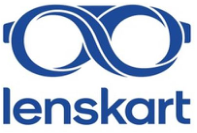

### **Lenskart Solutions Limited** 

(Earlier known as Lenskart Solutions Private Limited) Corporate Office: Ground Floor, Vipul Tech Square, Golf Course Road, Sector- 43, Gurugram, Haryana 122009 

**[Image: May2026.pdf-0001-02.png (197x133, 37.8KB)]**

#### Date: May 27, 2026 

National Stock Exchange of India Limited BSE Limited The Listing Department, Department of Corporate Services, Exchange Plaza, Phiroze Jeejeebhoy Towers, Bandra Kurla Complex, Dalal Street, Fort, Mumbai - 400 051 Mumbai - 400 001 **Scrip Symbol: LENSKART Scrip Code: 544600** 

**<u>Sub.: Transcript of Earnings Call with respect to Financial Results for the quarter and year ended March 31, 2026</u>** 

Dear Sir/ Ma’am, 

Pursuant to Regulation 30 of the Securities and Exchange Board of India (Listing Obligations and Disclosure Requirements) Regulations, 2015, please find enclosed transcript of the Earnings Call conducted on May 20, 2026. 

The above information will also be hosted on the Company’s website viz. <u>https://www.lenskart.com/corporate/investorrelations.</u> 

Kindly take the same on record. 

Thanking you, 

Yours Sincerely, 

#### **For Lenskart Solutions Limited** 

#### **(** **_Formerly known as Lenskart Solutions Private Limited)_** 

Ashish Kumar Digitally signed by Ashish Kumar Srivastava Srivastava Date: 2026.05.27 17:04:50 +05'30' 

**Ashish Kumar Srivastava Company Secretary and Chief Compliance Officer Membership No.: F5325** 

**Place:** Gurugram 

**[Image: May2026.pdf-0001-17.png (1168x106, 24.9KB)]**

<!-- Start of picture text -->
Regd. Office: Plot No. 151, Okhla Industrial Estate, Phase III, New Delhi 110020 Website: www.lenskart.com, Email: www.lenskart.com, Email: , Email:  compliance.officer@lenskart.com , Phone No: 0124 – 4293191 <!-- End of picture text -->

Regd. Office: Plot No. 151, Okhla Industrial Estate, Phase III, New Delhi 110020 Website: www.lenskart.com, Email: www.lenskart.com, Email: , Email: **compliance.officer@lenskart.com** , Phone No: 0124 – 4293191 CIN — L33100DL2008PLC178355 

**[Image: May2026.pdf-0001-19.png (1168x106, 13.3KB)]**

<!-- Start of picture text -->
CIN — L33100DL2008PLC178355 <!-- End of picture text -->

**[Image: May2026.pdf-0002-00.png (278x55, 21.6KB)]**

# Lenskart Solutions Limited 

# Q4 FY26 Earnings Conference Call 

# **May 20, 2026** 

## **MANAGEMENT:** 

Peyush Bansal – Co-Founder and Chief Executive Officer, Lenskart Solutions Limited Abhishek Gupta – Chief Financial Officer, Lenskart Solutions Limited Nikunj Mall – Head of Investor Relations, Lenskart Solutions Limited 

Page 1 of 18 

_Lenskart Solutions Limited May 20, 2026_ 

**[Image: May2026.pdf-0003-01.png (281x55, 20.2KB)]**

#### **Moderator:** 

Ladies and gentlemen, good evening and welcome to Lenskart Q4 FY26 Earnings Conference Call. 

To present the results, we have with us Mr. Peyush Bansal, Co-Founder and Chief Executive Officer; Mr. Abhishek Gupta, Chief Financial Officer; and Mr. Nikunj Mall, Head of Investor Relations. 

Please note that this call is being hosted on Zoom with a presentation on display. For participants who would like to view the presentation alongside the discussion, please join via the Zoom link shared in advance. 

As a reminder, all participant lines will be in the listen-only mode, and there will be an opportunity for you to ask questions after the presentation concludes. Should you need assistance during the conference call, you may use the chat option to interact with the moderator. Please note that this conference is being recorded. I now hand the conference over to Mr. Nikunj Mall, Head of Investor Relations from Lenskart. Thank you, and over to you. 

#### **Nikunj Mall:** 

Thank you, Yash. Good evening everyone, and thank you for joining Lenskart's earnings call for the 4th quarter and full-year of Fiscal Year 2026. Before we begin, I would like to remind you that some of the statements we make today may be forward-looking in nature and are subject to risks and uncertainties. 

The conference call may contain forward-looking statements about the company which are based on the beliefs, opinions, and expectations of the company as on the date of this call. These statements are not a guarantee of future performance and involve risks and uncertainties that are difficult to predict. We have uploaded our Q4 shareholders' letter on our website and the stock exchanges. 

Please note during the call, consistent with our IPO prospectus, the financial numbers we are going to be presenting refer to the pro forma financial statements for like-to-like comparison, unless stated otherwise. 

Reported financial statement reflect acquisition of Dealskart, Meller, and GeoIQ from their respective transaction closing dates, while pro forma statements present these financials as if the acquired business had always been a part of the company and hence represent a clearer trend analysis. 

For Q4 FY26, there is no difference between pro forma and reported financials. The difference exists only in the comparative period for the prior year and will diminish further over time. Additionally, when comparing against Q4 FY25 and full year FY25, please note that the FY25 PAT is adjusted to exclude the one-time non-cash FVTPL gain of ₹1,672 million recorded in other income related to deferred consideration for Owndays acquisition. 

Page **2** of **18** 

_Lenskart Solutions Limited May 20, 2026_ 

**[Image: May2026.pdf-0004-01.png (281x55, 20.2KB)]**

We'll begin today's session with opening remarks from Peyush and Abhishek. During this time, everyone will be on mute. Following the presentation, we'll open up for Q&A. With that, I would like to hand over to Peyush. 

#### **Peyush Bansal:** 

Hi. Good evening, everyone. Thank you for joining us as we close our first year as a public company. We are grateful for your trust - you've continued to place in us, both with your capital and your eyes. We are still learning and our customers and shareholders have been incredibly supportive of us. Also, a note of thank you to our 20,000+ colleagues across 30+ nationalities, without whom none of this would be possible. 

In Q2, we told you we were entering a compounding phase where every incremental rupee and dollar of revenue would add more to EBITDA. Q3 reinforced this thesis and Q4 confirms it. Let me walk you through our Q4 FY26 numbers. Revenue grew 41% year-onyear to ₹2,516 crores, our strongest quarter as a public company. 

EBITDA grew 61% year-on-year in Q4 with EBITDA margins expanding 2.7 percentage points to 21.3%. EBITDA pre-Ind AS almost doubled year-on-year to ₹322 crores, with margins expanding from 9.1% to 12.8% in Q4. We delivered ₹204 crores of PAT this quarter, rising consistently over the last four quarters. 

Looking at the full year performance, we crossed three key milestones for the first time: ₹1,700 crores of EBITDA, ₹1,000 crores of pre-Ind AS EBITDA, and ₹500 crores of PAT. 

We conducted 6.8 million eye tests globally this quarter, 45% growth year-on-year. Approximately half of those eye tests in India this quarter too were first-time eye exams. Units grew 25% year-on-year in both Q4 and full year. We added 183 net new stores globally in Q4, taking total count to 3,327 stores. 

In Q4, India delivered Same Store Sales Growth of 24% with Same Pincode Sales Growth of 31%. Similarly, international growth of 35% was also largely same-store led. And finally, most important number, NPS in India reached an all-time high of 81.4. 

Let me share three key takeaways from this quarter. First, the deeper we go, the wider the problem we are solving. For a long time, the assumption was that Lenskart's largest opportunity was Tier 1. What we have realized this quarter and this year is that the opportunity is in fact even larger in Tier 2 and beyond. 

Our value proposition is strong in Metros, but in smaller towns it is exponentially stronger. Consumers there simply do not have a choice, do not have access to quality, speed, and do not have the customer experience that an organized centralized platform is able to provide. 

The proof is in the catchments themselves. This year, we opened a Lenskart store inside an army cantonment in Srinagar, the first branded retail store of any category inside the premise, bringing full Lenskart access to a community that did not have it before. 

Page **3** of **18** 

_Lenskart Solutions Limited May 20, 2026_ 

**[Image: May2026.pdf-0005-01.png (281x55, 20.2KB)]**

We saw the same pattern in towns like Saharsa in Bihar, Shahdol in Madhya Pradesh, Golaghat in Assam, and Jhargram in West Bengal, each delivering about ₹16 lakhs to ₹17 lakhs per month revenue in their first year. The deeper we go, the larger the underserved market we are finding, and our centralized eye test, manufacturing, and supply chain platform is uniquely placed to serve it. 

Second, international is not an experiment, it is a business. The conventional assumption that international markets are mature and therefore slow-growing simply does not hold - - as per our data. The problem in these markets is growing very rapidly. Consumers have a real need and they do not yet have an organized solution at scale. 

What we have learned is that bringing the full Lenskart proposition into an international market is a gradual process. As we integrate each market deeper into our centralized supply chain, roll out our omnichannel model, extend our Gold subscription program, and build the full depth of our product and lens portfolio, the value proposition becomes genuinely compelling. 

And once that happens, consumers naturally shift through ‘word of mouth’ and the full power of the Lenskart ecosystem starts to get realized in that market. Japan is a great example. It delivered record revenue growth and same-store growth this year in a market many would have assumed is mature and saturated. The same playbook is now traveling well across Southeast Asia and Middle East. 

Third, premiumization on customer's terms. At Lenskart, our mission is to make eyewear accessible to all. We are constantly launching products at the lower end of the price spectrum to enable mass adoption. And we are seeing the bottom of the pyramid open up meaningfully. An example of this is the New Lens Replacement program we launched last year. 

Alongside this, premiumization continues to play out, and the two are not in conflict. What we are seeing is that consumers are choosing to upgrade into the premium offerings we are bringing: Owndays lenses, progressives, Meller sunglasses, Owndays frames, and more. And the reason is that while these products sit at the relatively premium end of our portfolio, they still deliver roughly 10x value compared to the competitive brands at the same or higher price points. When we speak to these customers, they love the product. 

It also reinforces that the brand resonates across the full customer spectrum, from value seekers to the most affluent, which is precisely the positioning we have been building towards. It gives us the conviction to keep innovating along these lines, including B by Lenskart, our premium priced smart eyewear product, which we are very excited to be rolling out. With that, let me hand it over to Abhishek to walk you through the operational and financial details for Q4. 

#### **Abhishek Gupta:** 

Thank you, Peyush. Good evening, everyone. Let me start with the India business. In Q4, India delivered a revenue of ₹1,475 crores, which was a 44% growth year-on-year. As we 

Page **4** of **18** 

_Lenskart Solutions Limited May 20, 2026_ 

**[Image: May2026.pdf-0006-01.png (281x55, 20.2KB)]**

have stated earlier, in our business, growth and profitability are positively correlated. So you'll see that the India EBITDA pre-Ind AS 116 margin reached 15.3% in Q4, which is a 6 percentage points margin expansion over the 9% that we had clocked in Q4 last year. 

If you see across the P&L, the expansion was broad-based. Employee cost moved by 2.7 percentage points. Marketing improved by 80 bps even though we invested more in the absolute terms. 

Other expenses (excl. Marketing) improved 1.31 percentage points and rent, driven by the same-store growth, reduced by 70 bps. Product margin was held steady at 64%, because the rupee depreciation absorbed all the benefits of vertical integration and premiumization. 

In terms of operational metrics, India revenue growth was primarily volume-driven with eyewear units growing 24.3% year-on-year in Q4 to 7.9 million units. The volume growth was powered by a 50% increase in eye tests to 6 million in the quarter. 

Remote optometry stores expanded 3.7 times in a single year to 623 stores. Gold active members reaching 8.8 million are up 29.5% year-on-year. Same Store Sales Growth of 24% in Q4 was broad-based across Metro, Tier 1, and Tier 2 markets, and Same Pincode Sales Growth of 31% confirms that stores densification continues to unlock incremental demand. 

We added 170 net new stores in Q4 versus 131 in Q4 last year, taking net additions for the year to 542, which is twice of what we did last year. As of 31st March, our total store count in India stands at 2,609. 

Moving to the international business, international revenue grew 35.4% year-on-year in Q4 to ₹1,054 crores. On a constant currency basis, this is 25% growth. Our international EBITDA (pre-Ind AS 116) margin reached 9.2% in Q4, up from 8.1% in Q4 last year. The key thing to note here is that full year EBITDA margin reached 7%, which is a 3.4 percentage improvement from 3.6% that we delivered in FY25, led by both product margin improvement and operating leverage. 

In terms of operational metrics, business was again volume-driven with eyewear units growing in international in Q4 -  29%year-on-year. Growth was broad-based across Japan, Southeast Asia, and Middle East, and Japan delivering the strongest performance. 

We added 13 net new stores in Q4. The total international stores at year-end exited at 718 with 61 additions in the full year. In Middle East, which is about 6% of our international store count, had a temporary dip in the store traffic, but the business has otherwise proved resilient and recovered back to near normal. 

Page **5** of **18** 

_Lenskart Solutions Limited May 20, 2026_ 

**[Image: May2026.pdf-0007-01.png (281x55, 20.2KB)]**

We generated operating cash flows of ₹887 crores in FY26, which is about 91% of our reported EBITDA (pre-IndAS 116). This fully funded our store capex of 603 net new stores while also investing in manufacturing, including the new Hyderabad facility. 

Closing net cash balance, excluding the IPO-related payables, which were (largely) settled in April, stands at ₹3,881 crores. In terms of return on capital employed, we clocked 23% excluding the undeployed IPO proceeds. This is an expansion of 9 percentage points versus what we did in the prior year. With that, let me hand back to Peyush to talk about the longer-term performance and the outlook for FY27. 

#### **Peyush Bansal:** 

Thank you, Abhishek. Let me pause here and step back to reflect on the last three years on where we started and where we have come. Over the last three years, our revenue has grown at a CAGR of 28%, taking FY26 revenue to ₹9,000+ crores. 

But the beauty of the upfront investments we made early is this: a 25% revenue growth is translating into near doubling EBITDA every year, reaching a ₹1,000+ crores of pre-Ind AS EBITDA in FY26, and PAT has scaled from negligible to ₹530 crores. 

The compounding is visible in both segments, India and international. In India, revenue grew from ₹3,109 crores in FY24 to ₹5,265 crores in FY26, a three-year CAGR of 30%. EBITDA pre-Ind AS has grown from ₹203 crores in FY24 to ₹753 crores in FY26, a 92% three-year CAGR with margins expanding from 6.5% to 14.3%. 

We are at 14% today with roughly another 10 percentage points of runway to our steadystate margin expectation of approximately 25%. India eyewear units reached 29 million in FY26, up from 18 million two years ago, with the next key milestone we are working towards is 100 million. This is the part we want to accelerate the most. 

Internationally, revenue grew from ₹2,465 crores in FY24 to ₹3,790 crores in FY26, a threeyear CAGR of 24%. EBITDA pre-Ind AS has grown nearly 8x in three years from ₹34 crores in FY24 to ₹264 crores in FY26, when margins expanded from 1.4% to now 7%. 

International is now a real business, just earlier in its journey than India but far ahead. To put that in context, at 718 stores, we are at 7% margin internationally, while India was at 0.3% with nearly twice the store count at the same stage in FY23. 

As I look at these numbers, what stands out is how much of that what we are seeing today is the result of investments we made many quarters ago, sometimes many years ago. For example, take our NPS of 81 this year. The foundation was laid when we set up our Bhiwadi factory, and that automation in manufacturing, including logistics and sortation, is what enables next-day delivery across 78 cities today. 

Similarly, take our product margin holding at 64% in India through a year of significant rupee depreciation, a resilience built on starting frame manufacturing seven years ago, and then localizing it to India two years ago. Take our store expansion of 542 stores this 

Page **6** of **18** 

_Lenskart Solutions Limited May 20, 2026_ 

**[Image: May2026.pdf-0008-01.png (281x55, 20.2KB)]**

year, which was only made possible because of investment in GeoIQ, which we started building seven years ago. 

And lastly, take remote optometry, which is enabling Tier + expansion, the outcome of a 36-month journey that began when we identified optometry shortage as a core constraint to our mission. The pattern of long-term thinking is consistent at Lenskart. 

FY26 has been a defining year, but this is not the peak. We are only serving 50 million people in a world where billions need better vision. The myopia problem is big and getting bigger, and as we go deeper, the opportunity widens. Smart glasses have opened an entirely new dimension over and above, and AI has given us wings we didn't know were possible. The best is yet to come. 

Looking ahead at FY27, let me share with you our key priorities. 

First, an AI-first operating model. Our single biggest priority of FY27 is growth, and the engine for that growth is the transformation of Lenskart from a consumer tech company into a consumer AI company. Building a consumer tech company was never about installing software or hiring engineers. It was about embedding technology forward thinking into every problem. And we now need to do same with AI at every level and function. This is not an easy task, but it is going to be one of our biggest moves. Years ago, the hardest problem we solved was convincing the best of engineers to come and join an eyewear company. We now have to do the same for AI talent and we are on it. 

Second, scaling to 100 million customers. Our ambition is not 30 million eye tests. It is 100 million at the least and eventually a billion. Given the global shortage of optometrists, technology is the only way to get there. We will step up our investments in R&D this year for automating eye testing and also accelerating new customer acquisition through innovation in products, formats, access points, pricing, and offers. 

Third, an integrated system. Our learning has been the bigger the surface, the bigger the impact of AI. Being vertically integrated lets us wire intelligence into the connections between every layer of our value chain. So eye test data informs product design, social trends reach manufacturing in days and factory floors now moves towards near full automation from the current 75%. 

Our ambition is to own even a greater share of the value chain now, from equipment to raw material to manufacturing, distribution, and the final mile to the customer, and then use AI to close the feedback loop across every layer of it. 

Fourth, evolving stores into multi-role community hubs. We believe our 3,300+ store network should be more than just a showroom. Each store is a neighbouring hub: part warehouse, part clinic, part service center, part last-mile node, within a few kilometres of the customer, much like a local chemist serves its community. 

Page **7** of **18** 

_Lenskart Solutions Limited May 20, 2026_ 

**[Image: May2026.pdf-0009-01.png (281x55, 20.2KB)]**

The role of our stores will only deepen from here, helping us penetrate further into every micro-market. As quick commerce reshapes customer expectations, this density also becomes a natural logistics advantage for Lenskart. 

Fifth, building a global consumer brand. We have started work on building eyewear brands of the future, ambitiously borderless, serving distinct cohorts and occasions. This year we will be stepping up our cultural collaborations like Stranger Things, Devil Wears Prada 2, and Pop Mart, combined with disciplined M&A as demonstrated by Meller, which is a stepping stone for the next generation of brands we want to build. 

Sixth, reinventing customer experience end-to-end. Customer experience is our North Star. Every time we have felt it was lacking, we have stopped, fixed, and moved forward. In an AI-led world, we need to reinvent every step, from app-led discovery to AI-powered planogramming to myopia management of kids. We are working on initiating thousands of experiments, challenging ourselves to deliver new and surprising moments of customer delight. 

Another key area here is consistency and reliability. We want to invest in getting the last 2% to 3% of every experience to be predictable. The relentless focus on customer experience has been the single biggest driver of the numbers we see today. 

Lastly, make eyewear do more for you. Eyewear sits a few millimeters away from your eyes, 12+ hours a day. No other consumer device has that kind of proximity. In Q4, we launched B by Lenskart with over 30,000 customers joining the waitlist already and increasing every day. 

Smart glasses are a multi-year journey and with our stores, optometry network, and prescription capability, we have a structural advantage. Hence, we want to increase our investment in R&D to develop various forms of eyewear with multiple product launches coming this year. 

This wraps our top seven priorities for FY27. 

On operating outlook, net new store additions for FY27 are expected to be around FY26 levels. Our long-term steady-state EBITDA pre-Ind AS margin expectation remains unchanged to approximately 25%. Quarterly margin will vary based on store opening phasing, market seasonality, and the long-term bets we choose to make ahead of the curve. 

The external environment will continue to throw up uncertainty, geopolitics, currency, and demand cycles could create short-term bumps. We will stay the course and where these moments create opportunities, we will lean in further. We urge investors to track trailing 12-month volume growth as the cleanest measure of underlying market expansion. It strips out ASP mix, currency translation, and campaign timing effects and most directly reflects the customers we are bringing into the category. 

Page **8** of **18** 

_Lenskart Solutions Limited May 20, 2026_ 

**[Image: May2026.pdf-0010-01.png (281x55, 20.2KB)]**

The compounding effect of revenue and margin will continue, but we will always prioritize action for long-term value creation over short-term linearity. With that, we will open for questions, and while the queue builds, we will give you a sneak peek to the B Smart glasses. 

#### **Moderator:** 

We'll take our first question from the line of Vivek Maheshwari from Jefferies. Please go ahead. 

#### **Vivek Maheshwari:** 

Hi. Good evening, Peyush and team. With your permission, I'll ask two questions. First is, you know, a rather basic question given that, you know, we don't have much history or we are still understanding your company. From a geopolitical standpoint, what should we, you know, monitor? Are there anything that worry you, both whether it's raw material side or the fact that, you know, you get some of the products manufactured from China, or even from a revenue perspective across different markets? Are there any areas that you worry about or anything that we should monitor? 

#### **Peyush Bansal:** 

Thanks, Vivek. Great question. I'll cover first the supply chain side. So far, we have not seen a meaningful impact due to freight and raw material, largely because I think it is a fraction of our total cost. Currency, of course, is the biggest variable. Rupee depreciation on imports is a headwind, but since 42% of our business is international and we continue to do more vertical integration, this has been offset so far. 

I think Hyderabad and Thailand JV are structural answers, which will reduce import dependence over time. I think there is also large growth in volume which is bringing decent amount of economies of scale, which is helping us right now to manage the currency so far. But this is the situation so far. 

As far as demand is concerned, so far no material impact on Indian demand, I would say, or international. Domestic consumption-driven eye health is non-discretionary, I would say, and we saw that. I mean, it's difficult to predict these things, but I'll give you example of Middle East where we saw disturbance, but we saw the eyewear category was quite resilient. 

We didn't see such a significant dip in the business. It was a smaller dip and only for a limited time and it bounced back pretty quickly. And I think so there is, while the category is becoming very fashion, first I think there is a discretionary element we have seen. 

I think the key driver here is growing eye tests. As long as, and I think that is our top of the funnel. We have been growing our eye tests about 50%. That is where we want to continue. And I think we have a good opportunity, because as you know our eye tests are growing at about 50%, volume growth is at about 25%. So there's a big opportunity here for us to improve that conversion post eye test, and that is where our focus will be. 

I also feel that, you know, in -- if there is consumption pressure as people move towards cheaper alternatives, Lenskart being more value-conscious, having more value- 

Page **9** of **18** 

_Lenskart Solutions Limited May 20, 2026_ 

**[Image: May2026.pdf-0011-01.png (281x55, 20.2KB)]**

conscious offerings, it should be a strong alternative when times are weak. But yeah, I think we'll wait and watch and see what happens. So far, I would say, it's all okay. 

#### **Vivek Maheshwari:** 

Okay. Good to know that, Peyush. And the second question is, you know, when I look at your India business, and two parts to this question. The first is your ASP in the base quarter was quite low and you have given the reasons why, but you know, the gross margins in each of the quarter in the last 12 -- sorry, eight quarters that I have numbers for, it has been broadly at about 64%. 

So my question is not about this quarter why, you know, this number is 64%, but how is it that you maintain that in the base quarter despite so, you know, despite the promotions and, you know, the lens bit that you have explained? 

And the other part is, you know, the SSS growth, let's say, broadly about 25% and 15% price or ASP increase, does that mean that SSS on a volume basis is about 10%? So can you just elaborate on both these points? 

#### **Peyush Bansal:** 

So firstly, I think see our margin, if you look at a three-year picture, there is an increase in the India margin. It used to be around 61% odd and it grew to 64%. And usually what we have seen with margin is this, if it is a structural margin increase, because we don't take any price increase -- any meaningful price increase. These come with either stronger vertical integration or a change in process that we are bringing about or something like that. So I think in the last two years we have done some of those changes. This year particularly a lot, and which is why you see margin being flat. Otherwise, you know, with the RMB going from 11 to 14 and, you know, the dollar-rupee depreciation. 

So I would say a lot of that structural improvement in margin is -- has been offset because of the currency. So when as we move production more to India with Hyderabad plant coming up and we are accelerating some of that, we will see that margin visibility will come quickly into the ecosystem. 

Coming to your point on why the margin was decent when we were running a lower cost campaign, because even in the lower cost campaign -- the way the campaigns are designed in a way that a lot of people end up upgrading while the OPP (Opening price point) offering is at a lower cost, and that kind of offsets and ensures that margin. This is a rulebook that we follow in most of our mass customer acquisition campaigns. And I think there was a question on SSG. Yeah. So sorry, there was a question on SSG, right? 

**Vivek Maheshwari:** 

Yeah, on SSG. Yeah, sure. What I'm saying, Peyush, is SSS if you look at is about 25% give or take and the price hikes are just over 15%. So that means the volumes on a SSS basis is about 10%. Is that a fair way of looking at things? 

**Peyush Bansal:** 

No, I think so firstly two things here, right? I think that would not end up at the right number. We are not disclosing SSG by value and volume, and particularly because this 

Page **10** of **18** 

_Lenskart Solutions Limited May 20, 2026_ 

**[Image: May2026.pdf-0012-01.png (281x55, 20.2KB)]**

fluctuations will happen. But that number that you have calculated is not correct. The number is higher than that, meaningfully higher than that. 

But I'll give you what is happening here, right? And I think it is important for you to model how to think about our business. See, we are operating at two ends of the spectrum. One is opening up mass consumer demand, and I think we have stated it clearly even in our FY27 priorities we'll continue to open that. 

And every time we open mass consumer demand, usually we open up OPPs (Opening Price Points), we bring out product offerings. Last year when we brought about New Lens Replacement campaign, we saw that. This year we are bringing about Hustlr as a campaign for that. But at the same time, what we are seeing is, so whenever that happens, you see a temporary ASP (decline). 

But what we are also seeing is that we are -- a lot of people are upgrading with Lenskart with offerings like Owndays, Meller, and progressives, we have seen a difference. So when we operate at these both these spectrum, you see quarterly fluctuations in ASP volume, and which is why I would say the best way to look at the business is probably looking at a full 12-month number, because this will continue moving forward also. 

And there are quarters when, you know, we open both the bottom end of the spectrum and the top end of the spectrum together then the number looks even more attractive. So it's difficult to look at it, but yeah, I would say the number of volume is higher. 

#### **Vivek Maheshwari:** 

Got it, Peyush. Thank you. Wish you and your team all the very best. 

**Peyush Bansal:** 

Thank you. 

**Moderator:** 

We'll take our next question from the line of Tejash Shah from Avendus Spark Institutional Equities. Please go ahead. 

#### **Tejash Shah:** 

Hi, Peyush and team. Thanks for the opportunity, and congrats on good numbers. Peyush, this quarter, meaningful part of operating leverage surfaced in improved employee productivity, and you called out that there are some structural interventions that we have made there. So directionally, how should we think about trajectory of this efficiency, and especially for international business where the arbitrage is huge versus Indian operation on this cost line item? 

#### **Abhishek Gupta:** 

Yeah. Let me take this one. Thank you for the question. I think the main driver of the operating leverage that is coming in the employee cost is actually the same-store growth and the volume expansion. Whenever the stores grow, right, we are adding stores, even though we are adding new stores which are less productive in the beginning, but the increase in the SSG helps to spread the fixed cost base over a larger thing. 

At the same time, our HQ cost and our tech cost has been largely flattish, because we are not increasing head count as more and more, you know, tasks are getting automated. As 

Page **11** of **18** 

_Lenskart Solutions Limited May 20, 2026_ 

**[Image: May2026.pdf-0013-01.png (281x55, 20.2KB)]**

we go further, the increase in the scale of the business and the compounding of the SSG is expected to bring on further operating leverage. And as we use more and more AI into this, you know, we'll see more output from the same number of people. 

Similar to how, you know, we look at remote optometry, for example. You know, you can do more output with the same optician in a remote setup, because you can channelize demand across multiple stores. So technology is helping us do more with the same resources. 

#### **Tejash Shah:** 

Very clear. And Tier 2 has been a very bright spot in this quarter's letter also. So looking at how the demand has surprised us versus our initial expectation, does this superior throughput in smaller markets suggest that our long-term runway of 4,500 stores that we have set for ourselves, does it that number expand materially, and does it also mean it gives us confidence to kind of expedite our store expansion versus what the initial target has been? 

#### **Peyush Bansal:** 

Yeah. So I think in Tier 2, like I have said that we are seeing that the opportunity is larger because the value creation for the customer is multi-fold. And as we go deeper, I think what is happening, the way our model works is that the more stores we open, the more we learn in any segment. And the GeoIQ model learns with every new store that opens because then more variables flow into it. 

The fact that we have added, you know, 200-plus Tier 2 stores, these data will now is flowing into GeoIQ by the day, right? And that will evolve more markets, more micromarkets where we'll open. So it's like an ongoing cycle. So I think yes, more markets are evolving. We are definitely seeing more stores than the initial 4,500. I think we always saw more than that, but I think that was at least a clear articulation of the numbers that we saw. 

I also want to say that, you know, we are not seeing slowdown in Metros -- all the growth that you are seeing in the same-store is largely coming from stores in Metros or Tier 1 markets. So I think Metros -- the eye test number which is growing at 45%+ and the SSG is largely driven by Metros. So I think Metros are also expanding. We, in fact, are right now working on solutions to reduce eye test wait time in Metros more aggressively. 

So yeah, I think the market is much bigger. In Q2 letter we had shared that the actually number of pin codes which are without any organized player right now is even more significant. But this is evolving with every new store we open. 

One way to look at it is that we have 60,000 to 70,000 eyewear stores in India. We have about 20 times more jewellery stores. Even if I look at the optical density for eyewear stores globally, for this number should at least bare minimum we would have another 70,000 to 80,000 eyewear stores. So in that incremental 70,000 to 80,000 eyewear stores, I think we have a long way to open enough Lenskart stores, I would say. 

Page **12** of **18** 

_Lenskart Solutions Limited May 20, 2026_ 

**[Image: May2026.pdf-0014-01.png (281x55, 20.2KB)]**

**Tejash Shah:** 

Interesting perspective. And last one if I may, Peyush sir, the whole smartglasses space is becoming very, very competitive now. Last night, last evening, Google also announced its ambition to come back in this space and they are using Gemini Live, which we are also using. So not on specific to this, but how should we think about preserving Lenskart's long-term positioning and ambition when this space is now getting very, very heated up as we see? 

#### **Peyush Bansal:** 

See, firstly, I would say we are very early in this journey. I don't think anybody has a form factor which is a clear home run right now. I think what everybody is excited about that this is a form factor which sits on the face for a pretty long time, and that is the part that I would say. I think eventually smart glasses are going to be prescription glasses in our view. And from that perspective, we play a pretty important role in the prescription and the distribution of smart glasses. 

And then, you know, with Lenskart because of the entire vertical integration, we do have a lot of people downloading our app, interacting with us. So there's a data layer that is already operating in the ecosystem. 

Google launching a smart glass is like, you know, like an Android Pixel, you know, in some sense, because I think they also want to experiment with the schematics and see what they are able to build on the Android XR. So I think I would say it is a very, very long journey. I do think this is going to take a lot of learning. Nobody has a form factor. 

Our view on this is that this is not about this year or next year. We need to stay very agile, build capability which like we have been building, make sure that whatever we are launching we are getting input from that rather than just, you know, focusing on the sales right now, because we want to capture the conversational styles, we want to understand how people are using, what use cases. 

That is what is going to give us leverage in opening up the market. And then the price points at which people will be comfortable, that is also a learning for us. So I see a large role for Lenskart to play. Eventually these glasses are going to be sold through an optical network is my belief. So we have a large role to play irrespective. 

**Tejash Shah:** 

Thanks, and best wishes for coming quarters. 

#### **Moderator:** 

Thank you. We’ll take our next question is from the line of Siddhesh Deshmukh from IIFL Capital. Please go ahead. 

#### **Percy Panthaki:** 

Hi, everyone. This is Percy Panthaki here. Sir just wanted to understand the international business margin journey. You, in your shareholders' letter sometimes compare it to the journey of India. India today is sitting at about a 15% pre-Ind AS margin. For international to get there, how would you compare it? When you compare it to India, would it get there at the same rupees million sale, would it get there at the same number of stores, or is 

Page **13** of **18** 

_Lenskart Solutions Limited May 20, 2026_ 

**[Image: May2026.pdf-0015-01.png (281x55, 20.2KB)]**

there some other metric that we should be using to sort of understand the journey of margins here? 

#### **Peyush Bansal:** 

Yeah. Hi, Percy. Thank you. Yeah, I guess we could make it that predictable. But see, I think the way to look at it is that the -- we are operating in multiple markets in the international. There is Southeast Asia, there's Middle East, there's Japan as three key markets. And what we have said is that there is a big delta between the ACP of India, which is the average cost price of India, and what we are delivering in international markets. 

If you see, we are beginning to see ACP reduction in international markets every year significantly, and that is happening as we keep integrating every market. That is also a big driver for growth for us, by the way, because as we reduce that ACP, that allows us to invest more in the market, that changes the payback profile of our stores -- vicious loop. 

It's difficult for me to comment on how you should model it -- in what quarter it will land to 15%, but based on what I can see is that the number to look out for is the margin expansion, despite all the macroeconomic trends, margin in international has still grown by another percent this year, and I think this will continue to grow in the future. It's difficult to time it on a quarter. We are making the integrations happen as fast as possible. 

Also, in international, there are markets which are very early. So the operating leverage only kicks in beyond a certain scale -- which we saw in Singapore, then we saw in Dubai, which we've started now begin to see in Japan. So I think I would take a longer-term view on this and look at the current trends and wait and watch. 

#### **Percy Panthaki:** 

And just a sub-question within this, KSA, I believe was a relatively new venture, and therefore not break-even. Any news to share there in terms of EBITDA breakeven, has it happened or are you expecting it to happen in FY27? 

#### **Peyush Bansal:** 

See, we continue to be bullish. The only thing I would be able to share (because of) competitive reasons -- it is ahead of where Dubai was for us, or UAE was for us. We are about two year in the journey of KSA. We still stay bullish. We are continuing to open stores. When I look at where UAE was two years into the journey, KSA is far ahead. 

#### **Percy Panthaki:** 

Got it. Second question is on the India sort of store clustering and how you are going to approach that. There are certain pin codes in which you already have a store. There are certain pin codes in which you don't have a store. 

First of all, two sub-questions to this. One is in the near term, that is over the next one to two years, is your plan more -- of course, there will be a bit of both, but I'm asking which side you're leaning on. Is it more to saturate the pin codes that you are in rather than opening up new pin codes, or it's the other way around? 

And when you open up a store in the Same Pincode, what is the effect on the SSSG of the incumbent store within that pin code? Let's say you have one store in a pin code, you open 

Page **14** of **18** 

_Lenskart Solutions Limited May 20, 2026_ 

**[Image: May2026.pdf-0016-01.png (281x55, 20.2KB)]**

up a second one. Of course, the overall pin code sales goes up, there is no doubt about that. But how do you see the incumbent store which has been there, what kind of effect do you see on the SSSG of that? 

The reason I ask this is that we've seen sometimes in retail formats that beyond a point, suddenly we see a some amount of cannibalization effect coming in which is not visible till a particular point of time and then there is a tipping point at which it comes through. So the question is from that lens, so to say. 

#### **Peyush Bansal:** 

Yeah. I think great question. I think see, firstly, when we are opening stores, we are not necessarily looking at the pin code map. I think that's a good way to look at it top-down. The way we work is we look at bottoms-up. And for us, this is a data science problem versus going after a particular market. 

The way we look at it and the models -- in the last one year have become even more sophisticated than they were before. And we had shared data in the last letter where we had shown that while adding stores in the Same Pincode, you know, we have seen stores grow. In fact, a lot of our stores are in the Same Pincodes in the Tier 1 city. So we had shared that data. 

So the way this works is that what we do is we look at mobility patterns. So if I mean, a good example is a place like Whitefield in Bangalore, where we already have three stores and we are now looking to add a few more stores there. With a huge amount of confidence (we are) able to see where people come from and where do they go to. 

And on the basis of that, we see clusters forming around a micro-market, around a shopping market where people travel to. And then we look at -- what our learning has been that this is a lot of it is related to the travel time. So what we optimize for, because that was your question -- what do we are optimizing for. We are optimizing for a market share within a 10-minute traveling distance radius. That is what we are optimizing for. 

And if you see this year's results so far, I mean, all of this -- a large part of this SSG has come from stores which have multiple pin codes across -- multiple stores in a pin code. So it is a matter of (where) are we opening -- and I think it's a fair question to say -- we have seen this in other brands, but the approach that Lenskart uses is very, very different. 

We are in fact looking at if a store at a particular location, which towers and buildings are people coming to from in that location. So if we see a gap now in that particular -- and pin code is pretty large for us. Like pin code is three layers above. We look at every city in multiples of hexagons, which are very, very small, and then we divide the market. 

So I would say that problem should not come. But you know, we tripled the store count in in a lot of the cities while the revenue doubled for us and we had shared this data in quarter two, specifically to give confidence. I think the science will further evolve. We have -- I am honestly been very amazed with what data analytics is able to do today. The 

Page **15** of **18** 

_Lenskart Solutions Limited May 20, 2026_ 

**[Image: May2026.pdf-0017-01.png (281x55, 20.2KB)]**

cannibalization modelling is very, very sophisticated. So that is what we are optimizing for. 

I think that challenge comes when you're looking at math at a pin code level. But if you look at bottom-up and look at where people coming from, where are they shopping, too, this problem won't arise. 

**Percy Panthaki:** 

Got it, sir. Thank you so much. All the best. That's all from me. 

**Moderator:** 

Thank you. Next question is from the line of Devanshu Bansal from Emkay Global. Please go ahead. 

#### **Devanshu Bansal:** 

Yes. Hi Peyush. Congratulations on good numbers. Thanks for the opportunity. Peyush, the letter mentions that we are shifting from a tech-led company to now an AI-led company. One of the outcome of this exercise should definitely be faster delivery. Checking if you could share some targets around the same-day delivery, maybe in the near term, will be helpful. 

**Peyush Bansal:** 

Yeah. Thanks. Thanks, Devanshu, for asking a good question. See, I think firstly we have expanded our next-day delivery network further to 78 cities now. This journey was started with 7 cities, moved to about 30 cities, and now we are in 78 cities, still delivering out of a centralized facility in Bhiwadi. And I think that we are seeing in our net promoter scores and consumers are loving it. And as you know, we give a promise of returning a portion of the money in case we don't meet the promise. 

For same-day delivery, I think we are still running a lot of experiments. We ran it in Singapore. We are piloting it in some markets in India, and it is too early for me to comment. We haven't taken a specific target. I think what we want to see is, what is the tipping point at which one could unlock more demand and what is the problem that we are solving through this and what is the choice level that needs to be given. 

So yes, we are looking at and that is the point that I spoke about that our stores, are looking more as a multi-modal network now. I'll keep you guys posted as we get some meaningful data on these experiments. 

#### **Devanshu Bansal:** 

Just a small follow-up here. In one of the statement, it also mentions the stores as warehouses. So maybe I may be reading too much, but are you sort of hinting at a inventory-led model which might help you in same-day deliveries or am I reading it too much here? 

#### **Peyush Bansal:** 

Yeah. I think maybe a little bit. It is to say that, you know, there are of course OTC products that we sell like sunglasses, etc. And, you know, we are doing some experiments which allow people to try frames at home in the past. We have that those services. We are now using stores as a model network in certain experiments to use and serve that micro- 

Page **16** of **18** 

_Lenskart Solutions Limited May 20, 2026_ 

**[Image: May2026.pdf-0018-01.png (281x55, 20.2KB)]**

market. I think the way we are looking at it is a chemist, and I've tried to explain this in the letter, but not necessarily a warehouse the way you are thinking about it. 

#### **Devanshu Bansal:** 

Got it, got it. Sir, last one. Can you talk about traction for Meller so far, maybe the current distribution reach for the brand, both in India as well as internationally? We have also indicated addition of more brands across price points in the sunglass segment. What is the scale that we are targeting for this particular category? 

#### **Peyush Bansal:** 

It's great. I think Meller, to be honest, is delivering beyond what we had planned for. The brand is scaling very, very well in its own markets where it existed, because it's an onlinefirst model. But we have now launched the brand in India across 1,000+ stores. We launched the brand in Middle East. We have launched the brand in Southeast Asia across all Lenskart stores. We are now about to launch the brand in Japan also. 

So far we are running super out of stock in all markets, including Southeast Asia, which was something we were not anticipating to do well. But I think one of the Korean pop stars wore it organically and that became viral. So, you know, we are -- we see a lot of promise in the brand. We see a lot of promise in the brand. 

And we are seeing a lot of growth come from Europe as well where people are latching onto the brand. We are getting calls from the top malls in our markets -- they want to open a Meller store. So yeah, overall our plan here is -- can we create the next Gentle Monster out of it for a very different cohort of customer. It appeals to Gen Zs. It is appealing to very different cohort. 

Two examples there, we launched two products very, very unconventional in the last quarter. There's a product called Meller Lab, you should check out, and there is another series that we have launched which at the outset, I would have personally felt that I may not wear it, but actually people are wearing it. 

So I think this whole concept of leading demand through product design and innovation, Meller is doing extremely well. And right now the challenge that we have and which we are solving for is how do we deliver, how do we solve for sudden increase in volume demand for the product. 

#### **Devanshu Bansal:** 

Got it, Peyush. Thanks for taking my questions. 

#### **Peyush Bansal:** 

Thank you. 

#### **Moderator:** 

Thank you. Ladies and gentlemen, we'll take that as the last question for today. I now hand the conference over to Mr. Nikunj Mall for closing comments. Over to you. 

#### **Nikunj Mall:** 

Thank you. Thank you everyone and thanks for joining today. If you have any further questions, please feel free to reach out me or drop us a note at investor.relations@lenskart.in and we look forward to seeing you next quarter. Thank you. 

Page **17** of **18** 

_Lenskart Solutions Limited May 20, 2026_ 

**[Image: May2026.pdf-0019-01.png (281x55, 20.2KB)]**

**Peyush Bansal:** Thank you. 

**Abhishek Gupta:** Thank you. 

**Moderator:** Thank you. On behalf of Lenskart, that concludes this conference. Thank you for joining us and you may now disconnect your lines. 

**_Note_** _: Any reference to ’pre-AS EBITDA’ or ’pre-IND AS EBITDA’ or ’post-rent EBITDA’ across the document should be read as EBITDA (pre-IndAS 116).  Any reference to ‘SSS’ or “SSSG’ across the document should be read as ‘Same Store Sales Growth’. We have also refined the syntax and streamlined speech fillers to enhance readability, while strictly preserving the context and intent of the discussion._ 

- 1 ‘Other expenses (excl. marketing)’ has been inadvertently stated as 1.3 instead of 2.3%. 

Page **18** of **18** 

---

## Extracted Images

| # | File | Dimensions | Size |
|---|------|------------|------|
| 1 | May2026.pdf-0001-02.png | 197x133 | 37.8KB |
| 2 | May2026.pdf-0001-17.png | 1168x106 | 24.9KB |
| 3 | May2026.pdf-0001-19.png | 1168x106 | 13.3KB |
| 4 | May2026.pdf-0002-00.png | 278x55 | 21.6KB |
| 5 | May2026.pdf-0003-01.png | 281x55 | 20.2KB |
| 6 | May2026.pdf-0004-01.png | 281x55 | 20.2KB |
| 7 | May2026.pdf-0005-01.png | 281x55 | 20.2KB |
| 8 | May2026.pdf-0006-01.png | 281x55 | 20.2KB |
| 9 | May2026.pdf-0007-01.png | 281x55 | 20.2KB |
| 10 | May2026.pdf-0008-01.png | 281x55 | 20.2KB |
| 11 | May2026.pdf-0009-01.png | 281x55 | 20.2KB |
| 12 | May2026.pdf-0010-01.png | 281x55 | 20.2KB |
| 13 | May2026.pdf-0011-01.png | 281x55 | 20.2KB |
| 14 | May2026.pdf-0012-01.png | 281x55 | 20.2KB |
| 15 | May2026.pdf-0013-01.png | 281x55 | 20.2KB |
| 16 | May2026.pdf-0014-01.png | 281x55 | 20.2KB |
| 17 | May2026.pdf-0015-01.png | 281x55 | 20.2KB |
| 18 | May2026.pdf-0016-01.png | 281x55 | 20.2KB |
| 19 | May2026.pdf-0017-01.png | 281x55 | 20.2KB |
| 20 | May2026.pdf-0018-01.png | 281x55 | 20.2KB |
| 21 | May2026.pdf-0019-01.png | 281x55 | 20.2KB |
