**RED HERRING PROSPECTUS** Dated: January 21, 2026 Please read Section 26 and 32 of the Companies Act, 2013 100% Book Built Issue 

**[Image: Final_RHP.pdf-0001-01.png (126x124, 4.8KB)]**

# **(Please scan this QR Code** 

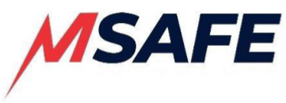

**[Image: Final_RHP.pdf-0001-03.png (361x130, 42.4KB)]**

**to view the RHP) MSAFE EQUIPMENTS LIMITED** 

# <u>CIN: U29309DL2019PLC353936</u> 

|**REGISTERED OFFICE**|**CORPORATE OFFICE**|**CONTACT PERSON**|**EMAIL AND** **TELEPHONE**|**WEBSITE**|
|---|---|---|---|---|
|F-311, 3rd Floor, Aditya Arcade Plot No. 30, Community Center, Preet Vihar, East Delhi, Delhi, India,110092|A-57, Sector-136, 5 & 7th Floor, Noida, Uttar Pradesh- 201301|Renuka Uniyal Company Secretary & Compliance Officer|**E-mail:** info@msafegroup.com **Tel No:**+91-88822 07104|**Website:** www.msafegroup.com|
|**PROMOTERS OF THE COMP**|**ANY** Pradeep Aggarwal, Aja Monika Agarwal and Ra|y Kumar Kanoi, Vansh Agga jani Ajay Kanoi|rwal, Rushil Agarwal, Gaura|v Ajay Kumar Kanoi,|

|||**DE**   |**TAILS OF THE OFFER**   |
|---|---|---|---|
|**TYPE** |**FRESH ISSU** **(IN ₹ LAK** |**E SIZE** **HS)** **OFS SIZE** **(BY NO. OF SHARES** **OR BY AMOUNT IN** **₹)**   |**TOTAL OFFER** **SIZE (IN ₹ LAKHS)** **ELIGIBILITY**   |
|Fresh Issue & OFS|Upto 44,00,000 Shares aggregat [●]Lakhs|Equity ing to ₹   Upto 10,00,000 Equity Shares aggregating to ₹ [●]Lakhs|Up to 54,00,000 Equity shares aggregating to ₹ [●]Lakhs This Offer is being made in terms of regulation 229(2) and 253(1) of chapter IX of the SEBI (ICDR) Regulations, 2018 as amended.|
|||**DETA**|**ILS OF OFFER FOR SALE**|
|**Name**|**of the Selling**|**Category of**|**No of Shares Offered** **Weighted average cost of acquisition (in**|
|**Sh**|**areholder**|**Shareholder**|**Rs. Per Equity Share)**|
|Ajay|Kumar Kanoi|Promoter 5,00,000 Equ|ityShares aggregatingupto ₹[●]Lakhs. 0.00|
|Vans|h Aggarwal|Promoter 5,00,000 Equ|ityShares aggregatingupto ₹[●]Lakhs. 0.00|

# **<mark>RISK IN RELATION TO THE FIRST OFFER</mark>** 

This being the first issue of the issuer, there has been no formal market for the securities of the issuer. The face value of the Equity Shares is ₹10 each. The Floor Price, Cap Price and Offer Price determined by our Company, in consultation with the Book Running Lead Manager, on the basis of the assessment of market demand for the Equity Shares by way of the Book Building Process, as stated under **_“Basis for Offer Price”_** on page 112 should not be considered to be indicative of the market price of the Equity Shares after the Equity Shares are listed. No assurance can be given regarding an active or sustained trading in the Equity <u>Shares nor regarding the price at which the Equity Shares will be traded after listing.</u> 

### **<mark>GENERAL RISKS</mark>** 

Investments in Equity and Equity-related securities involve a degree of risk and investors should not invest any funds in this Issue unless they can afford to take the risk of losing their entire investment. Investors are advised to read the risk factors carefully before taking an investment decision in the offer. For taking an investment decision, investors must rely on their own examination of our Company and the offer including the risks involved. The Equity Shares issued in the Offer have not been recommended or approved by the Securities and Exchange Board of India (“SEBI”), nor does SEBI guarantee the accuracy or adequacy of <u>the Red Herring Prospectus. Specific attention of the investors is invited to the section</u> **_“Risk Factors”_** <u>beginning on page 29 of this Red Herring Prospectus.</u> 

### **<mark>ISSUER & PROMOTER SELLING SHAREHOLDERS ABSOLUTE RESPONSIBILITY</mark>** 

The Company, having made all reasonable inquiries, accepts responsibility for and confirms that this Red Herring Prospectus contains all information with regard to the Company and the Offer, which is material in the context of the Offer, that the information contained in this Red Herring Prospectus is true and correct in all material aspects and is not misleading in any material respect, that the opinions and intentions expressed herein are honestly held and that there are no other facts, the omission of which makes this Red Herring Prospectus as a whole or any of such information or the expression of any such opinions or intentions, misleading in any material respect. Further, the Promoter Selling Shareholder, severally and not jointly, accepts responsibility for only such statements specifically confirmed or specifically undertaken by such Promoter Selling Shareholder in this Red Herring Prospectus to the extent such statements specifically pertain to itself and/or its Offered Shares and confirms that such statements are true and correct in all material respects and are not misleading in any material respect. However, none of the Promoter Selling Shareholder assume any responsibility for any other statements, disclosures or undertakings, including without limitation, any and all of the statements, disclosures or undertakings made by or in relation to our Company, its business, or any other <u>Promoter Selling Shareholder, in this Red Herring Prospectus.</u> 

# **<mark>LISTING</mark>** 

The Equity Shares Issued through Red Herring Prospectus are proposed to be listed on the SME Platform of BSE (“BSE SME”). In terms of the Chapter IX of the SEBI (ICDR) Regulations, 2018 as amended from time to time, our Company has received “in-principle” approval letter dated December 30, 2025 from BSE (BSE SME) for using its name in the <u>Offer Document. For the purpose of this Offer, the Designated Stock Exchange will be the BSE Limited (“BSE”).</u> 

| BSE(BSESME)forusingitsnameinthe Offer Document **BOOK R** | .Forthe purpose ofthis Offer, theDesignated Sto **UNNING LEAD MANAGER TO THE OF** | ck Exchange willbe theBSE Limited (“BSE”). **FER** |
|---|---|---|
|**Name and Logo**|**Contact Person**|**Email & Telephone**|
|**Seren Capital Private Limited**|Akun Goyal/Tripti Pathani|**Email:**info@serencapital.in **Tel. No.:**+91- 22- 46011058|
|**Name and Logo**|**REGISTRAR TO THE OFFER** **Contact Person**|**Email & Telephone**|
|**Maashitla Securities Private Limited**|Mukul Agrawal|**Email:**investor.ipo@maashitla.com  **Tel No.:**011-47581432|
||**BID/OFFER PERIOD**||
|**ANCHOR PORTION OFFER** **OPENS/CLOSES ON: TUESDAY, JANUARY** **27, 2026***|**BID/OFFER OPENS ON:** **WEDNESDAY, JANUARY 28, 2026**|****BID/OFFER CLOSES ON: FRIDAY,** **JANUARY 30, 2026*****|

_*The Company and the Promoter Selling Shareholders may, in consultation with the Book Running Lead Manager, consider participation by Anchor Investors in accordance with the SEBI ICDR Regulations. The Anchor Investor Bid/Offer Period shall be one Working Day prior to the Bid/Offer Opening Date._ 

_**Our Company and the Promoter Selling Shareholders may, in consultation with the BRLM, consider closing the Bid/Offer Period for QIBs one Working Day prior to the Bid/Offer Closing Date in accordance with the SEBI ICDR Regulations._ 

_***The UPI mandate end time and date shall be at 5:00 p.m. on Bid/Issue Closing Day._ 

**RED HERRING PROSPECTUS** 100% Book Built Issue **Dated: January 21, 2026** Please read Section 26 and 32 of the Companies Act, 2013 

**[Image: Final_RHP.pdf-0002-01.png (322x116, 34.6KB)]**

# **MSAFE EQUIPMENTS LIMITED** 

# **CIN:** U29309DL2019PLC353936 

Our Company was incorporated on August 19, 2019, under the name of “Msafe Equipments Private Limited’, a Private limited Company under the provisions of the Companies Act, 2013, pursuant to a Certificate of Incorporation issued by Registrar of Companies, Delhi. Further our Company was converted from private limited to public limited, pursuant to special resolution passed by the shareholders of the Company at the Extraordinary general meeting held on May 19, 2025, and the name of our Company was changed from “Msafe Equipments Private Limited” to “Msafe Equipments Limited” vide fresh certificate of incorporation dated May 26, 2025 issued by the Registrar of Companies, Central Processing Centre. 

**Registered Office:** F-311, 3rd Floor, Aditya Arcade Plot No. 30, Community Center, Preet Vihar, East Delhi, Delhi, India, 110092 **Corporate Office:** A-57, Sector-136, 5 & 7th Floor, Noida, Uttar Pradesh-201301 

**Contact Person:** Renuka Uniyal, Company Secretary & Compliance Officer 

**Tel No:** +91-8882207104; **E-mail:** <u>info@msafegroup.com</u> ; **Website:** <u>www.msafegroup.com</u> **<u>Promoters of our Company:</u>** <u>Pradeep Aggarwal, Ajay Kumar Kanoi, Vansh Aggarwal, Rushil Agarwal, Gaurav Ajay Kumar Kanoi, Monika Agarwal and Rajani Ajay Kanoi</u> 

### **<u><mark>DETAILS OF THE OFFER</mark></u>** 

**INITIAL PUBLIC OFFER OF UPTO 54,00,000 EQUITY SHARES OF FACE VALUE OF ₹ 10/- EACH (THE "EQUITY SHARES") OF MSAFE EQUIPMENTS LIMITED (“OUR COMPANY” OR “MEL” OR “THE ISSUER”) AT AN OFFER PRICE OF ₹ [●] PER EQUITY SHARE FOR CASH, AGGREGATING UP TO ₹[●] LAKHS(“PUBLIC OFFER”) COMPRISING OF A FRESH ISSUE OF UPTO 44,00,000 EQUITY SHARES AGGREGATING TO ₹ [●] LAKHS (THE “FRESH ISSUE”) AND AN OFFER FOR SALE OF UPTO 10,00,000 EQUITY SHARES BY THE PROMOTER SELLING SHAREHOLDERS, AJAY KUMAR KANOI AND VANSH AGGARWAL (“OFFER FOR SALE”) AGGREGATING TO ₹ [●] LAKHS, (HEREINAFTER REFFERD AS “PROMOTER SELLING SHAREHOLDERS”) OUT OF WHICH 2,98,000 EQUITY SHARES OF FACE VALUE OF ₹ 10 EACH, AT AN OFFER PRICE OF ₹ [●] PER EQUITY SHARE FOR CASH, AGGREGATING ₹ [●] LAKHS WILL BE RESERVED FOR SUBSCRIPTION BY THE MARKET MAKER TO THE OFFER (THE "MARKET MAKER RESERVATION PORTION") .THE PUBLIC OFFER LESS MARKET MAKER RESERVATION PORTION I.E. OFFER OF 51,02,000 EQUITY SHARES OF FACE VALUE OF ₹ 10 EACH, AT AN OFFER PRICEOF ₹ [●] PER EQUITY SHARE FOR CASH, AGGREGATING ₹ [●] LAKHS IS HEREIN AFTER REFERRED TO AS THE "NET OFFER". THE PUBLIC OFFER AND NET OFFER WILL CONSTITUTE 26.47% AND 25.01 % RESPECTIVELY OF THE POST- OFFER PAID-UP EQUITY SHARE CAPITAL OF OUR COMPANY.** 

**THE PRICE BAND AND THE MINIMUM BID LOT WILL BE DECIDED BY OUR COMPANY IN CONSULTATION WITH THE BRLM AND WILL BE ADVERTISED IN ALL EDITION OF FINANCIAL EXPRESS (A WIDELY CIRCULATED ENGLISH NATIONAL DAILY NEWSPAPER) AND ALL EDITION OF JANSATTA (A WIDELY CIRCULATED HINDI NATIONAL DAILY NEWSPAPER, AND ALL EDITION OF PRATAH KIRAN, A REGIONAL NEWSPAPER WHERE OUR REGISTERED OFFICE IS LOCATED), AT LEAST TWO WORKING DAYS PRIOR TO THE BID/OFFER OPENING DATE AND SHALL BE MADE AVAILABLE TO THE SME PLATFORM OF BSE (“BSE SME”) FOR THE PURPOSES OF UPLOADING ON THEIR** **<u>WEBSITE</u>** 

In case of any revision in the Price Band, the Bid/Offer Period shall be extended for at least three additional Working Days after such revision of the Price Band, subject to the total Bid/Offer Period not exceeding 10 Working Days. In cases of force majeure, banking strike or similar circumstances, our Company, for reasons to be recorded in writing extend the Bid/Offer Period for a minimum of three Working Days, subject to the Bid/Offer Period not exceeding 10 Working Days. Any revision in the Price Band, and the revised Bid/Offer Period, if applicable, shall be widely disseminated by notification to the Stock Exchanges by issuing a press release and also by indicating the change on the website of the BRLM <u>and at the terminals of the Members of the Syndicate and by intimation to Designated Intermediaries and Sponsor Bank.</u> The Offer is being made through the Book Building Process, in terms of Rule 19(2)(b)(i) of the Securities Contracts (Regulation) Rules, 1957, as amended (“SCRR”) read with Regulation 253 of the SEBI ICDR Regulations, as amended, wherein not more than 50% of the Net Offer shall be allocated on a proportionate basis to Qualified Institutional Buyers (“QIBs”, the “QIB Portion”), provided that our Company may, in consultation with the Book Running Lead Managers, allocate up to 60% of the QIB Portion to Anchor Investors on a discretionary basis in accordance with the SEBI ICDR Regulations (“Anchor Investor Portion”) of which 33.33% of the Anchor Investor Portion, shall be reserved, for domestic Mutual Funds and 6.67% for Life Insurance Companies and Pension Funds (aggregating to 40%), subject to valid Bids being received from them at or above the Anchor Investor Allocation Price in accordance with the SEBI ICDR Regulations. In the event of under-subscription in Life Insurance Companies and Pension Funds portion the same may be allocated to domestic Mutual Funds. In case of under-subscription or non-allocation in the Anchor Investor Portion, the balance Equity Shares shall be added to the “Net QIB Portion”. Further, 5% of the Net QIB Portion shall be available for allocation on a proportionate basis only to Mutual Funds, and the remainder of the Net QIB Portion shall be available for allocation on a proportionate basis to all QIBs, including Mutual Funds, subject to valid Bids being received at or above the Offer Price. However, if the aggregate demand from Mutual Funds is less than 5% of the Net QIB Portion, the balance Equity Shares available for allocation in the Mutual Fund Portion will be added to the remaining Net QIB Portion for proportionate allocation to QIBs. Further, the SEBI ICDR Regulations read with SEBI ICDR (Amendment) Regulations, 2025, states that not less than 35% of the Net Offer shall be available for allocation to Individual Investors who applies for minimum application size. Not less than 15% of the Net Offer shall be available for allocation to Non-Institutional Investors of which one-third of the Non-Institutional Portion will be available for allocation to Bidders with an application size of more than two lots and up to such lots as equivalent to not more than ₹ 10.00 Lakhs and two-thirds of the Non-Institutional Portion will be available for allocation to Bidders with an application size of more than ₹ 10.00 Lakhs and under-subscription in either of these two sub-categories of Non-Institutional Portion may be allocated to Bidders in the other sub-category of Non-Institutional Portion. Subject to the availability of shares in non-institutional investors’ category, the allotment to each Non-Institutional Investors shall not be less than the minimum application size in Non-Institutional Category and the remaining available Equity Shares, if any, shall be allocated on a proportionate basis in accordance with the conditions specified in this regard in Schedule XIII of the SEBI (ICDR) (Amendment) Regulations, 2025. All Potential Bidders, other than Anchor Investors, are required to participate in the Offer by mandatorily utilizing the Application Supported by Blocked Amount (“ASBA”) process by providing details of their respective ASBA Account (as defined hereinafter) in which the corresponding Bid Amounts will be blocked by the Self-Certified Syndicate Banks (“SCSBs”) or under the UPI Mechanism, as the case may be, to the extent of respective Bid Amounts. Anchor Investors are not permitted to participate <u>in the Offer through the ASBA process. For details, please refer to the chapter titled “Offer Procedure” on page 382 of this Red Herring Prospectus.</u> 

### **<u><mark>RISK IN RELATION TO THE FIRST OFFER</mark></u>** 

This being the first issue of the issuer, there has been no formal market for the securities of the issuer. The face value of the Equity Shares is ₹10 each. The Floor Price, Cap Price and offer Price determined by our Company, in consultation with the Book Running Lead Managers, on the basis of the assessment of market demand for the Equity Shares by way of the Book Building Process, as stated under **_“Basis for Offer Price”_** on page 112 should not be considered to be indicative of the market price of the Equity Shares after the Equity Shares <u>are listed. No assurance can be given regarding an active or sustained trading in the Equity Shares nor regarding the price at which the Equity Shares will be traded after listing</u> **<u><mark>GENERAL RISKS</mark></u>** Investments in Equity and Equity-related securities involve a degree of risk and investors should not invest any funds in this Offer unless they can afford to take the risk of losing their entire investment. Investors are advised to read the risk factors carefully before taking an investment decision in the Offer. For taking an investment decision, investors must rely on their own examination of our Company and the Offer including the risks involved. The Equity Shares issued in the Offer have not been recommended or approved by the Securities and Exchange Board of India (“SEBI”), nor does SEBI guarantee the accuracy or adequacy of the Red Herring Prospectus. Specific attention of the investors is invited to the <u>section</u> **_“Risk Factors”_** <u>beginning on page 29 of this Red Herring Prospectus.</u> 

### **<u><mark>ISSUER & PROMOTER SELLING SHAREHOLDER’S ABSOLUTE RESPONSIBILITY</mark></u>** 

The Company, having made all reasonable inquiries, accepts responsibility for and confirms that this Red Herring Prospectus contains all information with regard to the Company and the Offer, which is material in the context of the Offer, that the information contained in this Red Herring Prospectus is true and correct in all material aspects and is not misleading in any material respect, that the opinions and intentions expressed herein are honestly held and that there are no other facts, the omission of which makes this Red Herring Prospectus as a whole or any of such information or the expression of any such opinions or intentions, misleading in any material respect. Further, the Promoter Selling Shareholder accepts responsibility for only such statements specifically confirmed or specifically undertaken by such Promoter Selling Shareholder in this Red Herring Prospectus to the extent such statements specifically pertain to him and/or his Offered Shares and confirms that such statements are true and correct in all material respects and are not misleading in any material respect. However, none of the Promoter Selling Shareholder assume any responsibility for any other statements, disclosures or undertakings, including without limitation, any and all <u>of the statements, disclosures or undertakings made by or in relation to our Company, its business, or any other Promoter Selling Shareholder, in this Red Herring Prospectus.</u> 

**<u><mark>LISTING</mark></u>** The Equity Shares offered through this Red Herring Prospectus are proposed to be listed on the SME Platform of BSE (BSE SME). In terms of the Chapter IX of the S (ICDR) Regulations, 2018 as amended from time to time, our Company has received “in-principle” approval letter dated December 30, 2025 from BSE (BSE SME) for using its name in the <u>Offer Document. For the purpose of this Offer, the Designated Stock Exchange will be the BSE Limited. (“BSE”)</u> 

| **BOOK RUNNING LEAD MANAGER TO THE OFFER** **REGISTRAR TO THE OFFER**|
|---|
|**Seren Capital Private Limited** **Address:**Office no. 601 to 605, Raylon Arcade, Kondivita, J.B. Nagar, Mumbai, Maharashtra – 400059 **Tel. No.:**+91-22-46011058 **Email:**info@serencapital.in  **Investor Grievance Email:**investor@serencapital.in **Website:**https://serencapital.in/ **Contact Person:**Akun Goyal/Tripti Pathani **SEBI Regn. No.**INM000013156 **Maashitla Securities Private Limited** **Address:** 451, Krishna Apra, Business Square, Netaji Subhash Place, Pitampura, Delhi 110034, India. **Telephone:**011-47581432 **Email: **investor.ipo@maashitla.com **Investor Grievance Email: **investor.ipo@maashitla.com **Website:**www.maashitla.com **Contact Person:**Mukul Agrawal **SEBI Registration Number: **INR000004370|
|**OFFER PROGRAMME**|
|**ANCHOR PORTION OFFER OPENS/CLOSES ON: TUESDAY,** **JANUARY 27, 2026* ** **BID/OFFER OPENS ON: WEDNESDAY,** **JANUARY 28, 2026** ****BID/OFFER CLOSES ON: FRIDAY,** **JANUARY30, 2026*****|

_*The Company may, in consultation with the Book Running Lead Manager, consider participation by Anchor Investors in accordance with the SEBI ICDR Regulations. The Anchor Investor Bid/Offer Period shall be one Working Day prior to the Bid/Offer Opening Date._ 

_**Our Company may, in consultation with the BRLM, consider closing the Bid/Offer Period for QIBs one Working Day prior to the Bid/Offer Closing Date in accordance with the SEBI ICDR Regulations._ 

_***The UPI mandate end time and date shall be at 5:00 p.m. on Bid/Issue Closing Day._ 

# **<u>TABLE OF CONTENTS</u>** 

|**SECTION**|**CONTENTS**|**PAGE NO.**|
|---|---|---|
|**I.**|**GENERAL**||
||DEFINITIONS AND ABBREVIATIONS|1|
||CERTAIN CONVENTIONS, USE OF FINANCIAL INFORMATION AND MARKET DATA AND CURRENCY OF FINANCIAL PRESENTATION|16|
||FORWARD LOOKING STATEMENTS|18|
|**II**.|**SUMMARY OF RED HERRING PROSPECTUS**|19|
|**III.**|**RISK FACTORS**|29|
|**IV**.|**INTRODUCTION**||
||THE OFFER|57|
||SUMMARY OF OUR FINANCIAL STATEMENTS|60|
||GENERAL INFORMATION|64|
||CAPITAL STRUCTURE|74|
||OBJECTS OF THE OFFER|90|
||BASIS FOR OFFER PRICE|112|
||STATEMENT OF POSSIBLE TAX BENEFITS|119|
|**V.**|**ABOUT THE COMPANY**||
||INDUSTRY OVERVIEW|122|
||OUR BUSINESS|156|
||KEY INDUSTRIAL REGULATIONS AND POLICIES|186|
||HISTORY AND CORPORATE STRUCTURE|193|
||OUR MANAGEMENT|196|
||OUR PROMOTERS & PROMOTER GROUP|213|
||DIVIDEND POLICY|221|
|**VI.**|**FINANCIAL INFORMATION OF THE COMPANY**||
||RESTATED FINANCIAL STATEMENTS|222|
||OTHER FINANCIAL INFORMATION|293|
||STATEMENT OF FINANCIAL INDEBTEDNESS|294|
||MANAGEMENT’S DISCUSSION AND ANALYSIS OF FINANCIAL CONDITIONS AND RESULTS OF OPERATIONS|299|
||CAPITALISATION STATEMENT|319|
|**VII.**|**LEGAL AND OTHER INFORMATION**||
||OUTSTANDING LITIGATION AND MATERIAL DEVELOPMENTS|320|
||GOVERNMENT AND OTHER STATUTORY APPROVALS|340|
||OUR GROUP COMPANIES|352|
||OTHER REGULATORY AND STATUTORY DISCLOSURES|356|
|**VIII.**|**OFFER RELATED INFORMATION**||
||TERMS OF THE OFFER|368|
||OFFER STRUCTURE|377|
||OFFER PROCEDURE|382|
||RESTRICTIONS ON FOREIGN OWNERSHIP OF INDIAN SECURITIES|411|
|**IX.**|**MAIN PROVISIONS OF ARTICLES OF ASSOCIATION OF OUR COMPANY**|413|
|**X.**|**OTHER INFORMATION**||
||MATERIAL CONTRACTS AND DOCUMENTS FOR INSPECTION|431|
||DECLARATION|433|

**<u>SECTION I – GENERAL</u>** 

# **<u>DEFINITIONS AND ABBREVIATIONS</u>** 

_This Red Herring Prospectus uses certain definitions and abbreviations which, unless the context otherwise indicates or implies, shall have the meaning as provided below. References to any legislation, act, regulation, rule, guideline or policy shall be to such legislation, act, regulation, rule, guideline or policy, as amended, supplemented or re-enacted from time to time, and any reference to a statutory provision shall include any subordinate legislation made from time to time under that provision._ 

_The words and expressions used in this Red Herring Prospectus but not defined herein, shall have, to the extent applicable, the meaning ascribed to such terms under the Companies Act, 2013, the SEBI (ICDR) Regulations, 2018, the Securities Contracts Regulation Act, 1956 (“SCRA”), the Depositories Act or the rules and regulations made there under._ 

_Notwithstanding the foregoing, terms used in of the sections “Statement of Possible Tax Benefits”, “Financial Information of the Company” and “Main Provisions of the Articles of Association” on page 119, 222 and 413 respectively, shall have the meaning ascribed to such terms in such sections._ 

# **<u>General Terms</u>** 

|**Terms**|**Description**|
|---|---|
|“MEL”, “the Company”, “our Company”, “Issuer” or “Msafe Equipments Limited”|Msafe Equipments Limited, a Company incorporated in India under the Companies Act, 2013, having its Registered office at F-311, 3rd Floor, Aditya Arcade, Plot No. 30, CommunityCenter,Preet Vihar,East Delhi,Delhi,India - 110092|
|“we”,“us” or “our”|Unless the context otherwise indicates or implies refers to our Company.|
|“you”,“your” or “yours”|Prospective investors in this Offer.|

# **<u>Company related terms</u>** 

| **Term**|**Description**|
|---|---|
|AOA/ Articles/ Articles of Association|The articles of association of our Company, as amended.|
|Audit Committee|Audit Committee of our Company as described in the chapter titled**_“Our Management”_** beginningonpage 196 of this Red HerringProspectus.|
|Auditors/ Statutory Auditors|The Statutory Auditors of our Company being M/s.**V. K. KILA & CO**, (Firm Registration No. as 007772C).|
|Bankers to our Company|ICICI Bank Limited|
|Board of Directors/ the Board/ our Board|The board of directors of our Company, as constituted from time to time. For further details of our Directors, please refer to section titled**_“Our Management”_**beginning on page 196 of this Red HerringProspectus.|
|Chief Financial Officer/ CFO|The Chief Financial Officer of our CompanybeingSombir.|
|CIN|Corporate Identification Number in this case U29309DL2019PLC353936.|
|Companies Act/ Act|The Companies Act, 2013 and amendments thereto and erstwhile Companies Act 1956 as applicable.|
|Company Secretary and Compliance Officer|The Company Secretary & Compliance Officer of our Company, CS Renuka Uniyal.|
|Depositories|A depository registered with SEBI under the Securities and Exchange Board of India (Depositories and Participants) Regulations, 1996 as amended from time to time, being. National Securities Depository Limited (NSDL) and Central Depository Services (India) Limited(CDSL).|
|Director(s) / our Directors|The Director(s) of our Company, unless otherwise specified. For details of our directors, see **_“Our Management”_**onpage 198 of this Red HerringProspectus.|
|DP/ DepositoryParticipant|A depository participant as defined under the Depositories Act.|
|DP ID|Depository’s Participant’s IdentityNumber.|
|Equity Shareholders/ Shareholders|Persons/ Entities holding Equity Shares of our Company|
|Equity Shares|Equity Shares of the Company of Face Value of ₹ 10/- each unless otherwise specified in the context thereof.|
|Executive Directors|Executive Directors are the ManagingDirector & Whole-time Directors of our Company.|

1 

|**Term** Fugitive economic offender|**Description** Shall mean an individual who is declared a fugitive economic offender under section 12 of the Fugitive Economic Offenders Act,2018(17 of 2018).|
|---|---|
|Group Companies|Our group companies in accordance with the SEBI ICDR Regulations and the Materiality Policyas set out in section titled**“****_Our Group Companies”_** onpage 352 of this RHP.|
|Independent Director|An Independent Director as defined under Section 2(47) of the Companies Act, 2013 and as defined under the Listing Regulations. For details of our Independent Directors, see**_“Our_** **_Management”_**onpage 199 of this Red HerringProspectus.|
|ISIN|International Securities Identification Number. In this case beingINE2B5L01011.|
|Key Management Personnel/ KMP|Key Management Personnel of our Company in terms of Regulation 2(1)(bb) of the SEBI Regulations and the Companies Act, 2013. For details, see section titled**_“Our Management”_** onpage 196 of this Red HerringProspectus.|
|MOA/ Memorandum/ Memorandum of Association|Memorandum of Association of Msafe Equipments Limited as amended from time to time.|
|MD or ManagingDirector Materiality Policy|The ManagingDirector of our Company,PradeepAggarwal. The policy adopted by our Board on August 26, 2025 for identification of Group Companies, material outstanding litigation and material outstanding dues to creditors, pursuant to the disclosure requirements under the SEBI (ICDR) Regulations, 2018 as amended from time to time.|
|Nomination and Remuneration Committee|The nomination and remuneration committee of our Board constituted in accordance with Section 178 of the Companies Act, 2013 as described in the chapter titled**_“Our_** **_Management”_**beginningonpage 196 of this Red HerringProspectus.|
|Non-Executive Director|A Director not beingan Executive Director.|
|NRIs / Non-Resident Indians|A person resident outside India, as defined under Foreign Exchange Management Act, 1999 and who is a citizen of India or a Person of Indian Origin under Foreign Exchange Management (Transfer or Issue of Security by a Person Resident Outside India) Regulations, 2000.|
|Promoter(s)|Shall mean promoters of our Company i.e. Pradeep Aggarwal, Ajay Kumar Kanoi, Vansh Aggarwal, Rushil Agarwal, Gaurav Ajay Kumar Kanoi, Rajani Ajay Kanoi and Monika Aggarwal. For further details, please refer to section titled**_“Our Promoters & Promoter_** **_Group” _**beginningonpage 213 of this Red HerringProspectus.|
|Promoter Group|Includes such Persons and companies constituting our Promoter Group covered under Regulation 2(1) (pp) of the SEBI (ICDR) Regulations, 2018 as enlisted in the section**_“Our_** **_Promoters and Promoter Group”_**beginningonpage 213 of this Red HerringProspectus.|
|Person or Persons|Any individual, sole proprietorship, unincorporated association, unincorporated organization, body corporate, corporation, company, partnership, limited liability company, joint venture, or trust or any other entity or organization validly constituted and/or incorporated in thejurisdiction in which it exists and operates,as the context requires.|
|RBI Act|The Reserve Bank of India Act,1934 as amended from time to time.|
|Registered Office of our Company|The Registered Office of our Company situated at F-311, 3rd Floor, Aditya Arcade, Plot No. 30,CommunityCenter,Preet Vihar,East Delhi,Delhi,India,110092.|
|Reserve Bank of India/ RBI|Reserve Bank of India constituted under the RBI Act.|
|Restated Financial Information/ Statements|The Restated Financial statements of our Company comprising of the Restated Statement of Assets and Liabilities for the period ended September 30, 2025 and Financial year ended on March 31, 2025, March 31, 2024  and March 31, 2023,  the Restated Statement of Profit & Loss for the  for the period ended September 30, 2025 and Financial year ended on March 31, 2025, March 31, 2024 and March 31, 2023 and the Restated Cash Flows Statement for the for the period ended September 30, 2025 and Financial year ended on March 31, 2025, March 31, 2024 and March 31, 2023 of our Company prepared in accordance with Indian GAAP and the Companies Act and restated in accordance with the SEBI (ICDR) Regulations, 2018 and the Revised Guidance Note on Reports in Company Prospectus (Revised 2019) issued bythe ICAItogether with the schedulesnotes and annexure thereto.|
|RoC/ Registrar of Companies|,, Unless specified otherwise refers to ROC Delhi, situated at 04thFloor, IFCI Tower, 61, Nehru PlaceNewDelhi-110019|
|Selling Shareholder (s)|,  . Shall mean Selling shareholders/ Promoter selling shareholders of our Company i.e. Ajay Kumar Kanoi and Vansh Aggarwal. For further details, please refer to section titled**_"Our_** **_Promoters & Promoter Group"_**beginningonpage 213 of this Red HerringProspectus.|

2 

|**Term**|**Description**|
|---|---|
|Stakeholders’ Relationship Committee|Stakeholders’ relationship committee of our Company constituted in accordance with Section 178 of the Companies Act, 2013 and as described in the chapter titled “**_Our Management_**” beginningonpage 196 of this Red HerringProspectus.|
|Stock Exchange|Unless the context requires otherwise,refers to BSE SME.(SME Platform of BSE Limited)|
|Shareholders|Shareholders of our Companyfrom time to time.|
|Subscriber to MOA|Initial Subscribers to MOA & AOA beingAjayKumar Kanoi and Rushil Agarwal.|

# **<u>Offer Related Terms</u>** 

|**Terms**|**Description**|
|---|---|
|Abridged Prospectus|Abridged prospectus means a memorandum containing such salient features of a prospectus as maybe specified bySEBI in this behalf.|
|Acknowledgement Slip|The slip or document issued by the Designated Intermediary to a bidder as proof of registration of the Application.|
|Allotment/ Allot/ Allotted|Unless the context otherwise requires, means the allotment of Equity Shares, pursuant to the Fresh Issue and transfer of the Offered Shares by the Selling Shareholders pursuant to the Offer for Sale to successful Bidders.|
|Allotment Advice|A note or advice or intimation of Allotment sent to the successful Bidders who have been or are to be Allotted the Equity Shares after the Basis of Allotment has been approved by the Designated Stock Exchange.|
|Allottee(s)|A successful applicant to whom the EquityShares are allotted.|
|Anchor Investor(s)|A Qualified Institutional Buyer, applying under the Anchor Investor Portion in accordance with the requirements specified in the SEBI (ICDR) Regulations and the Red Herring Prospectus and who has Bid for an amount of at least ₹ 200 lakhs.|
|Anchor Investor Allocation Price|The price at which Equity Shares will be allocated to the Anchor Investors in terms of the Red Herring Prospectus and the Prospectus, which will be decided by our Company in consultation with the Book RunningLead Managers duringthe Anchor Investor Bid/ Offer Period.|
|Anchor Investor Application Form|The application form used by an Anchor Investor to make a Bid in the Anchor Investor Portion and which will be considered as an application for Allotment in terms of the Red Herring Prospectus and Prospectus.|
|Anchor Investor Bid/ Offer Period|One Working Day prior to the Bid/ Offer Opening Date, on which Bids by Anchor Investors shall be submitted and allocation to the Anchor Investors shall be completed.|
|Anchor Investor Offer Price|The final price at which the Equity Shares will be Allotted to the Anchor Investors in terms of the Red Herring Prospectus and the Prospectus, which price will be equal to or higher than the Offer Price but not higher than the Cap Price. The Anchor Investor Offer Price will be decided by our Company, in consultation with the Book RunningLead Managers.|
|Anchor Investor Portion|Up to 60% of the QIB Portion i.e. up to 15,25,000 equity shares which may be allocated by our Company, in consultation with the Book Running Lead Manager, to the Anchor Investors on a discretionary basis in accordance with the SEBI (ICDR) Regulations, out of which 33.33% of the Anchor Investor Portion, shall be reserved, for domestic Mutual Funds and 6.67% for Life Insurance Companies and Pension Funds (aggregating to 40%) , subject to valid Bids being received from them at or above the Anchor Investor Allocation Price in accordance with the SEBI ICDR Regulations. In the event of undersubscription in Life Insurance Companies and Pension Funds portion the same may be allocated to domestic Mutual Funds. In case of under- subscription or non-allocation in the Anchor Investor Portion, the balance Equity Shares shall be added to the NetQIB Portion.|
|Application Supported by Block Amount (ASBA)|An application, whether physical or electronic, used by ASBA Bidders, to make a Bid and authorising an SCSB to block the Bid Amount in the ASBA Account and will include amounts blocked by the SCSB upon acceptance of UPI Mandate Request by the UPI Bidders using the UPI Mechanism.|
|ASBA Account|A bank account maintained by ASBA Bidders with an SCSB and specified in the ASBA Form submitted by such ASBA Bidder in which funds will be blocked by such SCSB to the extent of the specified in the ASBA Form submitted by such ASBA Bidder and includes a bank account maintained by an individual investors who applies for minimum application size, linked to a UPI ID, which will be blocked in relation to a Bid by a individual investors who applies for minimum application size Biddingthrough the UPI Mechanism.|

3 

|**Terms**|**Description**|
|---|---|
|ASBA Application Location(s)/ Specified Cities|Locations at which ASBA Applications can be uploaded by the SCSBs, namely Mumbai, New Delhi,Chennai,Kolkata and Ahmedabad.|
|ASBA Applicant/ ASBA Investor|Any prospective investor(s)/applicants(s) in this Offer who apply (ies) through the ASBA process in terms of the Prospectus.|
|Banker to the Offer Agreement/ Cash Escrow and Sponsor Bank Agreement|Agreement dated January 10, 2026 entered amongst the Company, Selling Shareholders, Lead Manager, the Registrar, Sponsor Bank and the Banker to the Offer.|
|Bankers to the Offer / Public Offer Bank/ Sponsor Bank|Banks which are clearing members and registered with SEBI as Bankers to an Offer and with whom the Public Offer Account will be opened,in this case beingICICI Bank.|
|Basis of Allotment|The basis on which the Equity Shares will be Allotted to successful bidders under the Offer and which is described in the chapter titled**_“Offer Procedure”_**beginning on page 382 of this Red HerringProspectus.|
|Bid|An indication to make an offer during the Bid/ Offer Period by a Bidder (other than an Anchor Investor) pursuant to submission of the ASBA Form, or during the Anchor Investor Bid/ Offer Period by an Anchor Investor, pursuant to submission of the Anchor Investor Application Form, to subscribe to or purchase the Equity Shares at a price within the Price Band, including all revisions and modifications thereto as permitted under the SEBI ICDR Regulations and in terms of the Red Herring Prospectus and the Bid cum Application Form. The term “Bidding” shall be construed accordingly.|
|Bid Amount|The highest value of optional Bids indicated in the Bid cum Application Form and in the case of individual investors who applies for minimum application size Bidding at Cut Off Price, the Cap Price multiplied by the number of Equity Shares Bid for by such individual investors who applies for minimum application size and mentioned in the Bid cum Application Form and payable by the individual investors who applies for minimum application size or blocked in the ASBA Account upon submission of the Bid in the Offer.|
|Bid Lot|[●] equity shares of face value of Rs. 10 each and in multiples of [●] equity shares of face value of Rs 10 each thereafter|
|Bid/ Offer Opening Date|.   . Except in relation to any Bids received from the Anchor Investors, the date on which the Syndicate, the Designated Branches and the Registered Brokers shall start accepting Bids, which shall be notified in in all editions of the English national newspaper Financial Express, all editions of Hindi national newspaper Jansattaand all Edition of Regional newspaper Pratah Kiran where the registered office of the company is situated, each with wide circulation, and in case of any revision, the extended Bid/ Offer Opening Date also to be notified on the website and terminals of the Syndicate and SCSBsas required under the SEBI ICDR Regulations.|
|Bid/ Offer Closing Date|,    Except in relation to any Bids received from the Anchor Investors, the date after which the Syndicate, the Designated Branches and the Registered Brokers shall not accept the Bids, which shall be notified in in all editions of the English national newspaper Financial Express, all editions of Hindi national newspaper Jansatta and all Edition of Regional newspaper Pratah Kiran where the registered office of the company is situated, each with wide circulation, and in case of any revision, the extended Bid/ Offer closing Date also to be notified on the website and terminals of the Syndicate, SCSB’s and Sponsor Bank, as required under the SEBI ICDR Regulations.|
|Bid/ Offer Period| Except in relation to any Bids received from the Anchor Investors, the period between the Bid/ Offer Opening Date and the Bid/ Offer Closing Date or the QIB Bid/ Offer Closing Date inclusive of both days, during which Bidders can submit their Bids, including any revisions thereof. Provided however that the Bidding/ Offer Period shall be kept open for a minimum of three WorkingDays for all categories of Bidders.|
|Bidders /First Bidder/Applicant|Bidder(s) whose name shall be mentioned in the Bid cum Application Form or the Revision Form and in case of joint bids, whose name shall also appear as the first holder of the beneficiary account held injoint names.|
|Bidding| Theprocess of makinga Bid|
|Bidding/ Collection Centers|. Centers at which the Designated intermediaries shall accept the ASBA Forms, i.e. Designated SCSB Branches for SCSBs, specified locations for syndicates, broker centers for registered brokers,designated RTA Locations for RTAs and designated CDP locations for CDPs.|
|Book Building Process/ Book BuildingMethod|Book building process, as provided in Part A of Schedule XIII of the SEBI ICDR Regulations, in terms of which the Offer is beingmade.|
|BRLM / Book Running Lead Manager|Book Running Lead Manager to the Offer in this case being Seren Capital Private Limited, SEBI Registered Category-I Merchant Banker.|

4 

|**Terms**|**Description**|
|---|---|
|Broker Centres|Broker Centres notified by the Stock Exchanges, where the investors can submit the Bid-cum Application Forms to a Registered Broker. The details of such Broker Centers, along with the names and contact details of the Registered Brokers are available on the websites of the Stock Exchange.|
|Business Day|Mondayto Friday (exceptpublic holidays).|
|BSE SME|SME Platform of BSE Limited.|
|CAN or Confirmation of Allocation Note|The Note or advice or intimation sent to each successful Applicant indicating the Equity which will be allotted,after approval of Basis of Allotment bythe designated Stock Exchange.|
|Cap Price|The higher end of the price band above which the Offer Price will not be finalized and above which no Bids(or a revision thereof)will be accepted.|
|Client Id|Client Identification Number maintained with one of the Depositories in relation to Demat account.|
|Collecting Depository Participants or CDPs|A depository participant as defined under the Depositories Act, 1996, registered with SEBI and who is eligible to procure Applications at the Designated CDP Locations in terms of circular no. CIR/CFD/POLICYCELL/11/2015 dated November 10,2015 issued bySEBI.|
|Collecting Registrar and Share Transfer Agent|Registrar to an Offer and share transfer agents registered with SEBI and eligible to procure Bids at the Designated RTA Locations in terms of circular no. CIR/CFD/POLICYCELL/11/2015 dated November 10,2015 issued bySEBI.|
|Controlling Branches of the SCSBs|Such branches of the SCSBs which coordinate with the BRLM, the Registrar to the Offer and the Stock Exchange.|
|Cost Accountant Certificate|Certificate on Cost Analysis dated September 01, 2025, obtained by our Company from Shailesh Patel & Company, Cost Accountants, certifying the calculation of in-house manufacturing cost of equipments,namelyscaffoldingand ladders.|
|Cut Off Price|The Offer Price, which shall be any price within the Price band as finalized by our Company in consultation with the BRLM. None of the categories of bidders are allowed to bid at the cut off price.|
|Demographic Details|The demographic details of the Bidders such as their Address, PAN, name of the Bidders father/husband,investor status,occupation and Bank Account details.|
|Depositor/ Depositories|A depository registered with SEBI under the Securities and Exchange Board of India (Depositories and Participants) Regulations, 1996 as amended from time to time i.e. National Securities Depository Limited (NSDL) and Central Depository Services (India) Limited (CDSL).|
|Depositories|National Securities Depository Limited (NSDL) and Central Depository Services (India) Limited (CDSL).|
|DIN|Director Identification Number.|
|Depositories Act|The Depositories Act,1996,as amended from time to time.|
|Designated CDP Locations|Such locations of the CDPs where Applicant can submit the Bid-cum-Application Forms to Collecting Depository Participants. The details of such Designated CDP Locations, along with names and contact details of the Collecting Depository Participants eligible to accept Bid-Cum-Application Forms are available on the website of the Stock Exchange i.e.www.bseindia.com.|
|Designated Date|The date on which funds are transferred from the Escrow Account(s) and the amounts blocked are transferred from the ASBA Accounts, as the case may be, to the Public Offer Account(s) or the Refund Account(s), as applicable, in terms of the Prospectus and the Prospectus, after the finalisation of the Basis of Allotment in consultation with the Designated Stock Exchange, followingwhich EquityShares maybe Allotted to successful Bidders in the Offer.|
|Designated Intermediaries/ Collecting Agent|An SCSB’s with whom the bank account to be blocked, is maintained, a syndicate member (or sub-syndicate member), a Stock Broker registered with recognized Stock Exchange, a Depositary Participant, a registrar to an offer and share transfer agent (RTA) (whose names is mentioned on website of the stock exchange as eligible for this activity).|
|Designated Market Maker|Evermore Share BrokingPrivate Limited|
|Designated RTA Locations|Such locations of the RTAs where Bidder can submit the Bid-Cum-Application Forms to RTAs. The details of such Designated RTA Locations, along with names and contact details of the RTAs eligible to accept Bid-Cum-Application Forms are available on the websites of the Stock Exchange i.e. www. bseindia.com.|
|Designated SCSB Branches|Such branches of the SCSBs which shall collect the ASBA Application Form from the Applicant and a list of which is available on the website of SEBI at|

5 

|**Terms**|**Description**|
|---|---|
||https://www.sebi.gov.in/sebiweb/other/OtherAction.do?doRecognised=yes. Recognized- |
||Intermediaries or at such other website as maybeprescribed bySEBI from time to time.|
|Designated Stock Exchange|BSE Ltd.(“SME Exchange”) (“BSE SME”).|
|DP ID|Depository’s Participant’s IdentityNumber.|
|DP/ DepositoryParticipant|A depository participant as defined under the Depositories Act,1996.|
|Draft Red HerringProspectus|Draft Red HerringProspectus dated September 05,2025 as filed with BSE SME.|
|Electronic Transfer of Funds|Refunds through NACH,NEFT,Direct Credit or RTGS as applicable.|
|Eligible NRI|A Non Resident Indian in a jurisdiction outside India where it is not unlawful to make an offer or invitation under the Offer and in relation to whom this Red Herring Prospectus will constitute an invitation to subscribe for the EquityShares.|
|Eligible QFIs|QFIs from such jurisdictions outside India where it is not unlawful to make an offer or invitation under the Offer and in relation to whom the Prospectus constitutes an invitation to purchase the Equity shares issued thereby and who have opened Demat accounts with SEBI registered qualified depositary participants.|
|FII/ Foreign Institutional Investors|Foreign Institutional Investor as defined under SEBI (Foreign Institutional Investors) Regulations,1995,as amended)registered with SEBI under applicable laws in India.|
|Floor Price|The lower end of the Price Band, subject to any revision(s) thereto, at or above which the Offer Price and the Anchor Investor Offer Price will be finalised and below which no Bids will be accepted.|
|First/ Sole Applicant|The Applicant whose name appears first in the Application Form or Revision Form.|
|Fresh Issue|The fresh issue of up to 44,00,000 Equity Shares by our Company, at ₹ [●] per Equity Share (includingapremium of ₹[●] per EquityShare)aggregatingupto ₹[●]lakhs.|
|Foreign Venture Capital Investors|Foreign Venture Capital Investors registered with SEBI under the SEBI (Foreign Venture Capital Investor)Regulations,2000.|
|FPI/ Foreign Portfolio Investor|A Foreign Portfolio Investor who has been registered pursuant to the of Securities and Exchange Board of India (Foreign Portfolio Investors) Regulations, 2014, provided that any FII or QFI who holds a valid certificate of registration shall be deemed to be a foreign portfolio investor till the expiry of the block of three years for which fees have been paid as per the SEBI (Foreign Institutional Investors)Regulations,1995,as amended.|
|Fugitive Economic Offender|An individual who is declared a fugitive economic offender under Section 12 of the Fugitive Economic Offenders Act2018.|
|General Corporate Purposes|, Include such identified purposes for which no specific amount is allocated or any amount so specified towards general corporate purpose or any such purpose by whatever name called, in the offer document. Provided that any offer related expenses shall not be considered as a part of general corporate purpose merely because no specific amount has been allocated for such expenses in the offer document.|
|General Information Document (GID)|The General Information Document for investing in public issues, prepared and issued in accordance with the SEBI circular (SEBI/HO/CFD/DIL1/CIR/P/2020/37) dated March 17, 2020 and the UPI Circulars. The General Information Document shall be available on the websites of the Stock Exchanges,and the Book RunningLead Manager.|
|Individual Bidders/ Individual Investors/ Individual investors who     |Individual Bidders, submitting Bids, who applies for minimum application size for two lots. Provided that the minimum application size shall be above ₹ 2,00,000/- (including HUFs applying through their Karta and Eligible NRIs and does not include NRIs other than Eligible |
|applies for minimum|NRIs).|
|application size||
|ListingAgreement|The EquityListingAgreement to be signed between our Companyand the Stock Exchange.|
|LLP|Limited LiabilityPartnership.|
|Lot Size|[●]|
|Mandate Request|Mandate Request means a request initiated on the Individual Investors who applies for minimum application size by sponsor bank to authorize blocking of funds equivalent to the application amount and subsequent debit to funds in case of allotment.|
|Market Maker Reservation Portion|The reserved portion of 2,98,000 Equity Shares of face value of ₹10 each at an Offer price of ₹ [●]each is aggregatingto ₹[●]Lakhs to be subscribed byMarket Maker in this offer.|
|Market Making Agreement MonitoringAgency|The Market Making Agreement dated December 01, 2025 and addendum thereon dated January 10,2026 between our Company,Book RunningLead Manager and Market Maker. Care Ratings Limited|

6 

|**Terms**|**Description**|
|---|---|
|Monitoring Agency Agreement|The agreement entered between our Company and the Monitoring Agency dated October 25, 2025.|
|Mordor / Mordor Intelligence|Mordor Intelligence Private Limited|
|Mordor Report|Industry Research Report on “India Scaffolding and Ladders Market” dated August 11, 2025, prepared by Mordor, appointed by our Company on July 21, 2025, exclusively commissioned andpaid for byour Companyin connection with the Issue.|
|Mutual Fund Portion|5% of the Net QIB Portion, or 51,000 Equity Shares of face value of Rs. 10 each, which shall be available for allocation to Mutual Funds only on a proportionate basis, subject to valid Bids being received at or above the Offer Price.|
|Mutual Funds|A mutual fund registered with SEBI under the SEBI (Mutual Funds) Regulations, 1996, as amended from time to time.|
|Net Offer|The Offer (excluding the Market Maker Reservation Portion) of 51,02,000 equity Shares of ₹10/- each at a price of ₹ [●] per Equity Share (the “Offer Price”), including a share premium of ₹ [●] per equityshare aggregatingto ₹[●]Lakhs.|
|Net Proceeds|The Offer Proceeds received from the fresh Offer excluding Offer related expenses. For further information on the use of Offer Proceeds and Offer expenses, please refer to the section titled **_“Objects of the Offer”_**beginningonpage 90 of this Red HerringProspectus.|
|Net QIB Portion|The portion of the QIB Portion less the number of Equity Shares Allocated to the Anchor Investors.|
|Non- Resident|Aperson resident outside India,as defined under FEMA and includes NRIs,FPIs and FVCIs.|
|Non-Institutional Bidders/Investors|All Investors/Bidders (other than QIBs or individual investors who applies for minimum application size), who have Bid for Equity Shares of face value of Rs. 10 each, for more than two lots(but not includingNRIs other than Eligible NRIs)|
|Non-Institutional Portion|The portion of the Offer being not less than 15% of the Net Offer, consisting of 7,74,000 Equity Shares, which shall be available for allocation on a proportionate basis to Non-Institutional Investors,subject to valid Bids beingreceived at or above the Offer Price.|
|Offer/Public Offer/Offer size/Initial Public Offer/Initial Public Offering/ IPO|The Initial Public Offer of up to 54,00,000 Equity shares of face value of Rs. 10/- each at Offer price of Rs. [●]/- per Equity share, including a premium of Rs. [●]/- per equity share aggregating to Rs. [●] lakhs comprising of a Fresh Issue of 44,00,000 Equity Shares and the Offer for Sale of 10,00,000 EquityShares of face value of Rs. 10 each bySellingShareholders.|
|Offer Price|The final price at which the Equity shares will be allotted in terms of the Red Herring Prospectus and the Prospectus, as determined by our company in consultation with BRLM on the Pricing date in accordance with the Book Building process and the Red HerringProspectus.|
|Offer Proceeds|Proceeds to be raised by our Company through this Offer, for further details please refer chapter titled**_“Objects of the Offer”_**beginningonpage 90 of this Red HerringProspectus.|
|Offered Shares|Offer of up to 10,00,000 Equity shares aggregating to Rs. [●] lakhs being offered for sale by the promoter sellingshareholders in the offer.|
|Offer Agreement|The Offer Agreement dated August 30, 2025 between our Company, Selling Shareholders and Book RunningLead Manager,Seren Capital Private Limited.|
|Offer ClosingDate|The date on which Offer closes for subscription. In this case January30,2026.|
|Offer OpeningDate|The date on which Offer opens for subscription In this case January282026|
| Offer Price|. ,. The Price at which the Equity Shares are being issued by our Company under this Red Herring Prospectus being ₹ [●] per Equity share, as determined by our Company and the Selling Shareholders,in consultation with the BRLM.|
|Offer Proceeds|Proceeds to be raised by our Company through this Offer, for further details please refer chapter titled**_“Objects of the Offer”_**beginningonpage 90 of this Red HerringProspectus.|
|Offer/ Public Offer/ Offer size/ Initial Public Offer/ Initial Public Offering/ IPO|The Initial Public Offer of up to 54,00,000 Equity shares of face value of ₹ 10/- each at offer price of ₹ [●]/- per Equity share, including a premium of ₹ [●]/- per equity share aggregating to ₹[●]lakhs comprisingthe Fresh Issue and the Offer for Sale.|
|Offer for Sale|The offer for sale component of the Offer, comprising of an offer for sale of up to 10,00,000 Equity Shares of face value of Rs. 10 each at ₹ [●] per Equity Share aggregating up to ₹ [●] lakhs bySellingShareholders.|
|Pay-in-Period|The period commencing on the Bid/Offer Opening date and extended till the closure of the Anchor Investor Pay-in-Date.|
|Payment through electronic transfer of funds|Payment through NECS, NEFT or Direct Credit, as applicable.|

7 

|**Terms**|**Description**|
|---|---|
|Portion of individual investors who applies for minimum application size|The portion of the Issue being not less than 35% of the Net Offer, consisting of 17,86,000 Equity Shares of face value of Rs. 10 each, available for allocation to individual investors who applies for minimum application size.|
|Person/ Persons|Any individual, sole proprietorship, unincorporated association, unincorporated organization, body corporate, corporation, company, partnership, limited liability company, joint venture, or trust or any other entity or organization validly constituted and/ or incorporated in the jurisdiction in which it exists and operates,as the context requires.|
|Price Band|Price Band of a minimum price (Floor Price) of ₹ [●] and the maximum price (Cap Price) of ₹ [●] and includes revisions thereof. The Price Band will be decided by our Company in consultation with the BRLM and advertised in two national daily newspapers (one each in English and in Hindi) with wide circulation and one daily regional newspaper with wide circulation at least two workingdaysprior to the Offer OpeningDate.|
|PricingDate|The date on which our Companyin consultation with the BRLM,will finalize the Offer Price.|
|Project Report|Project Report dated November 25, 2025, obtained by our Company from Rajul Garg, Chartered Engineer,Garg& Associates,in respect of theproposed manufacturingfacility.|
|Prospectus|The Prospectus, to be filed with the Registrar of Companies in accordance with the provisions of Section 26 & 32 of the Companies Act, 2013, containing, inter alia, the Offer Price, size of the Offer and certain other information.|
|Public Offer Account|Account to be opened with the Bankers to the Offer to receive monies from the SCSBs from the bank account of the Applicant,on the Designated Date.|
|QIB Category/ QIB Portion|The portion of the Net Offer (including the Anchor Investor Portion) being not more than 50% of the Net Offer, consisting of 25,42,000 Equity Shares of face value of Rs. 10 each aggregating to ₹[●] lakhs which shall be Allotted to QIBs (including Anchor Investors) on a proportionate basis, including the Anchor Investor Portion (in which allocation shall be on a discretionary basis, as determined by our Company in consultation with the BRLMs), subject to valid Bids|
||beingreceived at or above the Offer Price or Anchor Investor Offer Price(for Anchor Investors).|
|Qualified Institutional Buyers/QIBs/QIB Bidders|Qualified institutional buyers as defined under Regulation 2(1)(ss) of the SEBI ICDR Regulations.|
|Red Herring Prospectus / RHP|The Red Herring Prospectus to be issued in accordance with Section 32 of the Companies Act, 2013 and the provisions of the SEBI (ICDR) Regulations, which will not have complete particulars of the price at which the Equity Shares will be offered and the size of the Offer including any addenda or corrigenda thereto. The Red Herring Prospectus will be filed with the RoC at least three Working Days before the Bid/Offer Opening Date and will become the Prospectus upon filingwith the RoC after the PricingDate.|
|Refund Account|The ‘no-lien’ and ‘non-interest bearing’ account opened with the Refund Bank, from which refunds,if any,of the whole orpart,of the Bid Amount to the Anchor Investors shall be made.|
|Refund Bank/ Refund Banker|Bank which is / are clearing member(s) and registered with the SEBI as Bankers to the Offer at which the Refund Account will be opened,in this case beingICICI Bank.|
|Refund through electronic transfer of funds|Refunds through NECS, direct credit, RTGS or NEFT, as applicable.|
|Registered Broker|The stockbrokers registered with the stock exchanges having nationwide terminals, other than the members of the Syndicate and eligible toprocure Bids.|
|Registrar Agreement|The agreement dated August 30, 2025 entered into between our Company and the Registrar to the Offer in relation to the responsibilities and obligations of the Registrar to the Offer pertaining to the Offer.|
|Registrar and Share Transfer Agents or RTAs|Registrar and share transfer agents registered with SEBI and eligible to procure Applications at the Designated RTA Locations in terms of circular no. CIR/CFD/POLICYCELL/11/2015 dated November 10,2015 issued bySEBI.|
|Registrar/ Registrar to the Offer/ RTA/ RTI|Registrar to the Offer, in this case being Maashitla Securities Private Limited.|
|Regulation S|Regulation S under the U.S. Securities Act of 1933,as amended from time to time.|
|Reservation Portion|The portion of the Offer reserved for category of eligible Applicants as provided under the SEBI (ICDR)Regulations,2018.|
|Reserved Category/ Categories|Categories of persons eligible for making application under reservation portion.|
|Revision Form|The form used by the Bidders to modify the quantity of Equity Shares or the Bid Amount in any of their Bid-cum-Application Forms or any previous Revision Form(s),as applicable None of|

8 

|**Terms**|**Description**|
|---|---|
||the bidders are allowed to withdraw or lower their Bids (in terms of quantity of Equity Shares or the Bid Amount)at anystage.|
|SCPL|Seren Capital Private Limited.|
|SEBI|Securities and Exchange Board of India constituted under the SEBI Act,1992.|
|SEBI Act|Securities and Exchange Board of India Act,1992,as amended.|
|SEBI AIF Regulations|Securities and Exchange Board of India (Alternate Investments Funds) Regulations, 2012, as amended.|
|SEBI FII Regulations|Securities and Exchange Board of India (Foreign Institutional Investors) Regulations, 1995, as amended from time to time.|
|SEBI FPI Regulations|Securities and Exchange Board of India (Foreign Portfolio Investors) Regulations, 2014, as amended from time to time.|
|SEBI FVCI Regulations|Securities and Exchange Board of India (Foreign Venture Capital Investor) Regulations, 2000, as amended from time to time.|
|SEBI SBEB Regulations|Securities and Exchange Board of India(Share Based Employee Benefits)Regulations,2014.|
|SEBI (PFUTP) Regulations/ PFUTP Regulations|Securities and Exchange Board of India (Prohibition of Fraudulent and Unfair Trade Practices relatingto Securities Markets)Regulations,2003|
|Securities laws|Means the Act, the Securities Contracts (Regulation) Act, 1956, the Depositories Act, 1996 and the rules and regulations made thereunder and the general or special orders, guidelines or circulars made or issued by the Board thereunder and the provisions of the Companies Act, 2013 or any previous company law and any subordinate legislation framed thereunder, which are administered bythe Board.|
|SEBI (ICDR) Regulations/ ICDR Regulation/ Regulation|SEBI (Issue of Capital and Disclosure Requirements) Regulations, 2018 issued by SEBI on September 11, 2018, as amended, including instructions and clarifications issued by SEBI from time to time.|
|SEBI (Venture Capital) Regulations|Securities Exchange Board of India (Venture Capital) Regulations, 1996 as amended from time to time.|
|SEBI Insider Trading Regulations|The Securities and Exchange Board of India (Prohibition of Insider Trading) Regulations, 2015 as amended,includinginstructions and clarifications issued bySEBI from time to time.|
|SEBI Listing Regulations, 2015/ SEBI Listing Regulations/ Listing|The Securities and Exchange Board of India (Listing Obligation and Disclosure Requirements) Regulations, 2015 as amended, including instructions and clarifications issued by SEBI from time to time.|
|Regulations/ SEBI(LODR)||
|SEBI Takeover Regulations or SEBI(SAST)Regulations|Securities and Exchange Board of India (Substantial Acquisition of Shares and Takeover) Regulations,2011,as amended from time to time.|
|Self-Certified Syndicate Bank(s) / SCSB(s)|Shall mean a Banker to an Offer registered under Securities and Exchange Board of India (Bankers to an Issue) Regulations, 1994, as amended from time to time, and which offer the service of making Application/s Supported by Blocked Amount including blocking of bank account and a list of which is available on https://www.sebi.gov.in/sebiweb/other/OtherAction.do?doRecognised=yes or at such other website as maybeprescribed bySEBI from time to time.|
|Sub- Account|Sub- accounts registered with SEBI under the Securities and Exchange Board of India (Foreign Institutional Investor) Regulations, 1995, other than sub-accounts which are foreign corporate or foreign individuals.|
|Selling Shareholders/|Selling Shareholders being Ajay Kumar kanoi and Vansh Aggarwal.|
| Promoter Selling||
|Shareholders||
|Share Escrow Agent|The Share Escrow Agent appointed pursuant to the Share Escrow Agreement, namely Maashitla Securities Private Limited.|
|Share Escrow Agreement|The agreement dated January 09, 2026, entered into between our Company, the Promoter Selling Shareholder and the Share Escrow Agent in connection with the transfer of the Offered Shares by the Promoter Selling Shareholder and credit of such Equity Shares to the demat account of the Allottees in accordance with the Basis of Allotment.|
|SME Exchange|SME Platform of the BSE i.e. BSE SME.|
|Specified Locations|Collection centres where the SCSBs shall accept application form, a list of which is available on the website of SEBI(https://www.sebi.gov.in/)and updated from time to time.|
|Specified Securities|Equityshares offered through this Red HerringProspectus.|

9 

|**Terms**|**Description**|
|---|---|
|Sponsor Bank|Sponsor Bank means a Banker to the Issue registered with SEBI, which is appointed by the Issuer to act as a conduit between the Stock Exchanges and NPCI (National Payments Corporation of India) in order to push the mandate, collect requests and / or payment instructions of the category of individual investors who applies for minimum application size into the UPI.|
|Sub Syndicate Member|A SEBI Registered member of BSE appointed by the BRLM and/ or syndicate member to act as a Sub Syndicate Member in the Offer.|
|Systemically Important Non- BankingFinancial Company|Systemically important non-banking financial company as defined under Regulation 2(1)(iii) of the SEBI ICDR Regulations.|
|Transaction Registration Slip/ TRS|The slip or document issued by the member of the Syndicate or SCSB (only on demand) as the case maybe,to the Applicant asproof of registration of the Application.|
|U.S. Securities Act|U.S. Securities Act of 1933,as amended|
|Underwriter|The BRLM, Seren Capital Private Limited, who shall underwrite this Offer pursuant to the provisions of the SEBI (ICDR) Regulations, 2018 and the Securities and Exchange Board of India(Underwriters)Regulations,1993,as amended from time to time.|
|Underwriting Agreement|The Agreement dated December 01, 2025 and addendum thereon dated January 10, 2026 entered between the Underwriter,our Company,SellingShareholders and BRLM.|
|UPI|UPI is an instant payment system developed by the NCPI, it enables merging several banking features, seamless fund routing & merchant payment into one hood. UPI allow instant transfer of money between any two bank accounts using a payment address which uniquely identifies a person’s bank account|
|UPI Circulars| SEBI circular no. CFD/DIL2/CIR/P/2018/22 dated February 15, 2018, SEBI circular no. |
||SEBI/HO/CFD/DIL2/CIR/P/2018/138 dated November 1, 2018, SEBI circular no.|
||SEBI/HO/CFD/DIL2/CIR/P/2019/50 dated April 3 2019 SEBI circular no|
||     , ,     . SEBI/HO/CFD/DIL2/CIR/P/2019/76 dated June 28, 2019, SEBI circular no.|
||SEBI/HO/CFD/DIL2/CIR/P/2019/85 dated July 26, 2019 SEBI circular no.|
||SEBI/HO/CFD/DCR2/CIR/P/2019/133 dated November 8, 2019, SEBI Circular no SEBI/HO/CFD/DIL2/CIR/P/2020/50 dated March 30, 2020, SEBI Circular no. SEBI/HO/CFD/DIL2/CIR/P/2021/2480/1/M dated March 16, 2021, SEBI circular no.|
||SEBI/HO/CFD/DIL1/CIR/P/2021/47 dated March 31, 2021, SEBI circular no. SEBI/HO/CFD/DIL2/P/CIR/2021/570 dated June 2, 2021, SEBI circular no.|
||SEBI/HO/CFD/DIL2/CIR/P/2022/45 dtd Ail 5 2022 SEBI il |
|| ae pr , ,   crcuar no. SEBI/HO/CFD/DIL2/CIR/P/2022/51 dated April 20, 2022 SEBI Circular No: SEBI/HO/MIRSD/MIRSD_RTAMB/P/CIR/2022/76 dated May 30, 2022, SEBI circular number SEBI/HO/CFD/TPD1/CIR/P/2023/140 dated August 9, 2023, along with the circular issued by the National Stock Exchange of India Limited having reference no. 25/2022 dated August 3, 2022 and the circular issued by BSE Limited having reference no. 20220803-40 dated August 3, 2022 and an subseuent circulars or notifications issued b SEBI or the Stock Exchanes in|
||y q     y     g this regard.|
|UPI ID|ID created on the UPI for single-window mobilepayment system developed bythe NPCI.|
|UPI Mandate Request/ Mandate Request|A request (intimating the UPI Bidders by way of a notification on the UPI-linked mobile application and by way of an SMS on directing the UPI Bidders to such UPI mobile application) to the UPI Bidders initiated by the Sponsor Bank(s) to authorise blocking of funds on the UPI application equivalent to Bid Amount and subsequent debit of funds in case of Allotment.|
|UPI Mechanism|The mechanism that was used by an RIB to make a Bid in the Offer in accordance with the UPI Circulars on Streamliningof Public Issues.|
|UPI PIN|Password to authenticate UPI transaction.|
|Venture Capital Fund/ VCF|Foreign Venture Capital Funds (as defined under the Securities and Exchange Board of India |
||(Venture Capital Funds)Regulations,1996)registered with SEBI under applicable laws in India.|
|Wilful Defaulter(s)|Wilful defaulter as defined under Regulation 2(1)(lll)of the SEBI(ICDR)Regulations,2018.|
|Working Day|In accordance with Regulation 2(1) (mmm) of SEBI (ICDR) Regulations, 2018, working days means, all days on which commercial banks in Mumbai are open for business. However, in respect of– (a) announcement of Price Band; and (b) Offer period, working days shall mean all days, excluding Saturdays, Sundays and public holidays, on which commercial banks in Mumbai are open for business; (c) the time period between the Offer Closing Date and the listing of the Equity Shares on the Stock Exchange, working day shall mean all trading days of the Stock Exchange, excluding Sundays and bank holidays,asper circulars issued bySEBI.|

10 

# **<u>Technical and Industry Related Terms</u>** 

|**Term**|**Description**|
|---|---|
|AMC|Annual Maintenance Contract|
|ASEAN|Association of Southeast Asian Nations|
|CNC|Computer Numerical Control|
|DBO|Design-Build-Operate|
|EMDEs|EmergingMarkets and DevelopingEconomies|
|EN|European Norm|
|FRP|Fiber-Reinforced Plastic|
|HVAC|Heating,Ventilation,and Air Conditioning|
|MEP|Mechanical, Electrical, and Plumbing|
|MS|Mild Steel|
|MT|Metric Tonnes|
|NBC|National BuildingCode|
|QCO|QualityControl Order|
|RDSO|Research Designs and Standards Organization|
|UTM|Universal TestingMachine|

# **<u>Conventional terms and Abbreviations</u>** 

|**Abbreviation**|**Full Form**|
|---|---|
|Rs./ Rupees/ INR/ ₹|Indian Rupees|
|AS / AccountingStandard|AccountingStandards as issued bythe Institute of Chartered Accountants of India|
|A/c|Account|
|ACS|Associate CompanySecretary|
|AGM|Annual General Meeting|
|ASBA|Applications Supported byBlocked Amount|
|Amt.|Amount|
|AIF|Alternative Investment Funds registered under the Securities and Exchange Board of India (Alternative Investment Funds)Regulations,2012,as amended.|
|AY|Assessment Year|
|AOA|Articles of Association|
|Approx|Approximately|
|B. Com|Bachelor of Commerce|
|B. E|Bachelor of Engineering|
|B. Sc|Bachelor of Science|
|B. Tech|Bachelor of Technology|
|BA|Bachelor of Arts|
|Bn|Billion|
|BG/LC|Bank Guarantee / Letter of Credit|
|BIFR|Board for Industrial and Financial Reconstruction|
|BSE|BSE Limited|
|CDSL|Central DepositoryServices(India)Limited|
|CAGR|Compounded Annual Growth Rate|
|CAN|Confirmation of Allocation Note|
|Companies Act, 2013|Companies Act, 2013 to the extent in force pursuant to the notification of sections of the Companies Act,2013 alongwith the relevant rules made thereunder as amended.|
|Companies Act, 1956|Companies Act, 1956 (without reference to the provisions that have ceased upon notification of the Companies Act,2013)alongwith the relevant rules made thereunder.|
|CA|Chartered Accountant|
|CAIIB|Certified Associate of Indian Institute of Bankers|

11 

|**Abbreviation**|**Full Form**|
|---|---|
|CB|ControllingBranch|
|CC|Cash Credit|
|CIN|Corporate Identification Number|
|CIT|Commissioner of Income Tax|
|CS|CompanySecretary|
|CS & CO|CompanySecretary& Compliance Officer|
|CFO|Chief Financial Officer|
|CSR|Corporate Social Responsibility|
|C.P.C.|Code of Civil Procedure,1908|
|CrPC|Code of Criminal Procedure,1973|
|CPI|Consumer Price Index|
|CENVAT|Central Value Added Tax|
|CST|Central Sales Tax|
|CWA/ICWA|Cost and Works Accountant|
|CMD|Chairman and ManagingDirector|
|CY|Calendar Year|
|DIN|Director Identification Number|
|DIPP|Department of Industrial Policy and Promotion, Ministry of Commerce, Government of India|
|DP|DepositoryParticipant|
|DP ID|DepositoryParticipant’s Identification Number|
|EBITDA|Earnings Before Interest,Taxes,Depreciation & Amortization|
|ECS|Electronic ClearingSystem|
|ESIC|Employee’s State Insurance Corporation|
|EPFA|Employee’s Provident Funds and Miscellaneous Provisions Act,1952|
|EMI|Equated MonthlyInstalment|
|EPS|Earnings Per Share|
|EGM /EOGM|ExtraordinaryGeneral Meeting|
|ESOP|Employee Stock Option Plan|
|ESPS|Employee Stock Purchase Scheme|
|SAR|Stock Appreciation Rights|
|EXIM/ EXIM Policy|Export – Import Policy|
|FCNR Account|Foreign CurrencyNon-Resident Account|
|FIPB|Foreign Investment Promotion Board|
|FY / Fiscal/Financial Year|Period of twelve months ended March 31 of thatparticularyear,unless otherwise stated|
|FEMA|Foreign Exchange Management Act, 1999 as amended from time to time, and the regulations|
||framed there under.|
|FCNR Account|Foreign CurrencyNon Resident Account|
|FBT|Fringe Benefit Tax|
|FDI|Foreign Direct Investment|
|FIs|Financial Institutions|
|FIIs|Foreign Institutional Investors (as defined under Foreign Exchange Management (Transfer or Issue of Security by a Person Resident outside India) Regulations, 2000) registered with SEBI under applicable laws in India|
|FPIs|“Foreign Portfolio Investor” means a person who satisfies the eligibility criteria prescribed under regulation 4 and has been registered under Chapter II of Securities And Exchange Board of India (Foreign Portfolio Investors) Regulations, 2014, which shall be deemed to be an intermediaryin terms of theprovisions of the SEBI Act,1992|
|FTA|Foreign Trade Agreement|
|FVCI|Foreign Venture Capital Investors registered with SEBI under the Securities and Exchange Board of India(Foreign Venture Capital Investors)Regulations,2000.|
|FEMA|Foreign Exchange Management Act,1999,includingthe rules and regulations thereunder|
|FEMA Rules|Foreign Exchange Management(Non-debt Instruments)Rules,2019|
|Finance Act|Finance Act,1994|
|Fraudulent Borrower|A fraudulent borrower as defined in Regulation 2(1)(lll)of the SEBI ICDR Regulations.|
|FV|Face Value|

12 

|**Abbreviation**|**Full Form**|
|---|---|
|Fugitive Economic Offender|An individual who is declared a fugitive economic offender under Section 12 of the Fugitive Economic Offenders Act,2018|
|GoI/Government|Government of India|
|GDP|Gross Domestic Product|
|GIR Number|General Index RegistryNumber|
|GST|Goods and Services Tax|
|GVA|Gross Value Added|
|HUF|Hindu Undivided Family|
|HNI|High Net Worth Individual|
|IBC|The Insolvencyand BankruptcyCode,2016|
|IBBI|Insolvencyand BankruptcyBoard of India|
|ICA|Independent Chartered Accountant|
|ICAI|The Institute of Chartered Accountants of India|
|ICE|Independent Chartered Engineer|
|ISIN|International Securities Identification Number|
|IST|Indian Standard Time|
|ICWAI|The Institute of Cost Accountants of India|
|IMF|International MonetaryFund|
|IIP|Index of Industrial Production|
|IPO|Initial Public Offer|
|ICSI|The Institute of CompanySecretaries of India|
|IT|Information Technology|
|IFRS|International Financial ReportingStandards|
|INR / ₹/ Rupees|Indian Rupees,the legal currencyof the Republic of India|
|I.T. Act|Income Tax Act,1961,as amended from time to time|
|IT Authorities|Income Tax Authorities|
|IT Rules|Income Tax Rules,1962,as amended,except as stated otherwise|
|Indian GAAP|GenerallyAccepted AccountingPrinciples in India|
|Ind AS|Indian AccountingStandards as referred to in and notified bythe Ind AS Rules|
|Ind AS Rules|The Companies(Indian AccountingStandard)Rules,2015|
|IRDA|Insurance Regulatoryand Development Authority|
|JV/ Joint Venture|A commercial enterprise undertaken jointly by two or more parties which otherwise retain their distinct identities.|
|KMP|KeyManagerial Personnel|
|KPI|KeyPerformance Indicators|
|LLB|Bachelor of Law|
|BRLM|Book RunningLead Manager|
|Ltd.|Limited|
|LLP|Limited LiabilityPartnership|
|MAT|Minimum Alternate Tax|
|MoF|Ministryof Finance,Government of India|
|MoU|Memorandum of Understanding|
|M. A|Master of Arts|
|MCA|Ministryof Corporate AffairsGovernment of India|
| M. B. A|,  Master of Business Administration|
|MAT|Minimum Alternate Tax|
|M. Com|Master of Commerce|
|Mn|Million|
| M. E| Master of Engineering|
|M. Tech|Masters of Technology|
|Merchant Banker|Merchant Banker as defined under the Securities and Exchange Board of India (Merchant Bankers)Regulations,1992|
|MSME|Micro,Small and Medium Enterprises|
|MAPIN|Market Participants and Investors Database|
|NA|Not Applicable|

13 

|**Abbreviation**|**Full Form**|
|---|---|
|NCLT|National CompanyLaw Tribunal|
| Net worth| The aggregate of paid-up Share Capital and Share Premium account and Reserves and Surplus (Excluding revaluation reserves) as reduced by aggregate of Miscellaneous Expenditure(to the extent not written off)and debit balance of Profit & Loss Account.|
|NACH|National Automated ClearingHouse|
|NEFT|National Electronic Funds Transfer|
|NECS|National Electronic ClearingSystem|
|NAV|Net Asset Value|
|NCT|National Capital Territory|
|NPV|Net Present Value|
|NRIs|Non-Resident Indians|
|NRE Account|Non-Resident External Account|
|NRO Account|Non-Resident OrdinaryAccount|
|NSE|National Stock Exchange of India Limited|
|NOC|No Objection Certificate|
|NSDL|National Securities DepositoryLimited|
|OCB or Overseas Corporate Body|A company, partnership, society or other corporate body owned directly or indirectly to the extent of at least 60% by NRIs including overseas trusts in which not less than 60% of the beneficial interest is irrevocably held by NRIs directly or indirectly and which was in existence on October 3, 2003 and immediately before such date was eligible to undertake transactions pursuant to the general permission granted to OCBs under the FEMA. OCBs are not allowed to invest in the Offer.|
|P.A.| Per Annum|
|PF|Provident Fund|
|PG|Post Graduate|
|PGDBA|Post Graduate Diploma in Business Administration|
|PGDIRPM|Post Graduate Diploma in Industrial Relations and Personnel Management|
|PLR|Prime LendingRate|
|PAC|Persons Actingin Concert|
|P/E Ratio|Price/Earnings Ratio|
|PAN|Permanent Account Number|
|PAT|Profit After Tax|
|PGeMBA|Post Graduate in e- Management and Business Administration Programme|
|P.O.|Purchase Order|
|PBT|Profit Before Tax|
|PLI|Postal Life Insurance|
|POA|Power of Attorney|
|PSU|Public Sector Undertaking(s)|
|Pvt.|Private|
|Q.C.|QualityControl|
|RoC|Registrar of Companies|
|RBI|The Reserve Bank of India|
|Registration Act|Registration Act,1908|
|ROE|Return on Equity|
|R&D|Research & Development|
|RONW|Return on Net Worth|
| RTGS| Real Time Gross Settlement|
|SCRA|Securities Contracts(Regulation)Act,1956,as amended from time to time|
|SCRR|Siti CttRltiRl1957dd f ti t ti|
||ecures onracs(eguaon)ues, ,as amene rom me o me|
|SMP|Senior Management Personnel|
| SME| Small and Medium Enterprises|
| SCSB| Self-Certified syndicate Banks|
|STT|Securities Transaction Tax|
|Sub-Account|Sub-accounts registered with SEBI under the SEBI (Foreign Institutional Investor) Regulations, 1995, other than sub-accounts which are foreign corporate or foreign individuals.|

14 

|**Abbreviation**|**Full Form**|
|---|---|
|Sec.|Section|
|SPV|Special Purpose Vehicle|
|TAN|Tax Deduction Account Number|
|TRS|Transaction Registration Slip|
|Trade Marks Act|Trade Marks Act,1999|
|TIN|Taxpayers Identification Number|
|UIN|Unique identification number|
|U.N.|United Nations|
|US/United States|United States of America|
|USD/ US$/ $|United States Dollar,the official currencyof the Unites States of America|
|U.S. GAAP|GenerallyAccepted AccountingPrinciples in the United States of America|
|VAT|Value Added Tax|
|VCF/ Venture Capital Fund|Venture Capital Funds (as defined under the Securities and Exchange Board of India (Venture Capital Funds) Regulations, 1996) registered with SEBI under applicable laws in India.|
|Wilful Defaulter(s)|Company or person categorized as a wilful defaulter by any bank or financial institution (as defined under the Companies Act, 2013) or consortium thereof, in accordance with the guidelines on wilful defaulters issued by the Reserve Bank of India and includes any company whose director or promoter is categorized as such and as defined under Regulation 2(1)(lll)of the SEBI(ICDR)Regulations,2018.|
|WDV|Written Down Value|
|WPI|Wholesale Price Index|
|WTD|Whole Time Director|
|w.e.f.|With effect from|
|-, (₹)|Represent Outflow|

**Key Performance Indicators terms** 

|**Terms**|**Description**|
|---|---|
|Revenue from Operations|Revenue from Operations is used by our management to track the revenue profile of the business and in turn helps to assess the overall financial performance of our Company and volume of our business|
|EBITDA|EBITDAprovides information regardingthe operational efficiencyof the business|
|EBITDA Margin (%)|EBITDA Margin (%) is an indicator of the operational profitability and financial performance of our business|
|PAT|Profit after taxprovides information regardingthe overallprofitabilityof the business.|
|PAT Margin (%)|PAT Margin (%) is an indicator of the overall profitability and financial performance of our business.|
|Net Worth|Net worth is used by the management to ascertain the total value created by the entity and provides a snapshot of current financialposition of the entity.|
|ROE(%)|RoEprovides how efficientlyour Company generatesprofits from shareholders’ funds.|
|ROCE (%)|RoCE provides how efficiently our Company generates earnings from the capital employed in the business.|
|Total Number of Customer|The total number of customer represents the count of unique customers to whom the Company has either sold products or provided rental/contractual services during the respective financial year, as per the sales register. Each customer is considered only once in a year, irrespective of multiple transactions, and the computation is based on internal records.|

For details, please refer to the section **_“Basis for Offer Price – Key Performance Indicators”_** on page 114 of the RHP. The words and expressions used but not defined in this Red Herring Prospectus will have the same meaning as assigned to such terms under the Companies Act, 2013, the Securities and Exchange Board of India Act, 1992 (the “SEBI Act”), the SCRA, SEBI (Issue of Capital and Disclosure Requirements) Regulations, 2018 the Depositories Act and the rules and regulations made thereunder. 

Notwithstanding the foregoing, terms in **_“Main Provisions of the Articles of Association”_** _,_ **_“Statement of Possible Tax Benefits”_** _,_ **_“Industry Overview”_** _,_ **_“Regulations and Policies in India”_** _,_ **_“Financial Information of the Company”_** _,_ **_“Outstanding Litigations_** _and_ **_Material Developments”_** _and_ **_“Offer Procedure”_** _,_ will have the meaning ascribed to such terms in these respective sections. 

15 

# **<u>CERTAIN CONVENTIONS, USE OF FINANCIAL INFORMATION AND MARKET DATA AND CURRENCY OF FINANCIAL PRESENTATION</u>** 

# **Certain Conventions** 

All references in the Red Herring Prospectus to “India” are to the Republic of India. All references in the Red Herring Prospectus to the “U.S.”, “USA” or “United States” are to the United States of America. 

In this Red Herring Prospectus, unless the context otherwise requires, all references to one gender also refers to another gender and the word “Lac / Lakh” means “one hundred thousand”, the word “million (mn)” means “Ten Lac / Lakh”, the word “Crore” means “ten million” and the word “billion (bn)” means “one hundred crore”. In this Red Herring Prospectus, any discrepancies in any table between total and the sum of the amounts listed are due to rounding-off. All figures in decimals have been rounded off to the second decimal and all percentage figures have been rounded off to two decimal places. In certain instances, (i) the sum or percentage change of such numbers may not conform exactly to the total figure given; and (ii) the sum of the numbers in a column or row in certain tables may not conform exactly to the total figure given for that column or row. 

# **Use of Financial Data** 

Unless stated otherwise, throughout this Red Herring Prospectus, all figures have been expressed in Rupees and Lakh. Unless stated otherwise, the financial data in the Red Herring Prospectus is derived from our restated financial information prepared for the period 6 months ended September 30, 2025 and financial years ended March 31, 2025, March 31, 2024 and March 31, 2023 in accordance with Indian GAAP, the Companies Act and SEBI (ICDR) Regulations, 2018 included under Section titled **_“Financial Information of the Company”_** beginning on page 222 of this Red Herring Prospectus. Further, it may be noted that the half-yearly financial figures disclosed for the period from April 2025 to September 2025 in this DRHP have not been annualized. 

There are significant differences between Indian GAAP, the International Financial Reporting Standards (“IFRS”) and the Generally Accepted Accounting Principles in the United States of America (“U.S. GAAP”). Accordingly, the degree to which the Indian GAAP financial statements included in this Red Herring Prospectus will provide meaningful information is entirely dependent on the reader’s level of familiarity with Indian accounting practice and Indian GAAP. Any reliance by persons not familiar with Indian accounting practices on the financial disclosures presented in this Red Herring Prospectus should accordingly be limited. We have not attempted to explain those differences or quantify their impact on the financial data included herein, and we urge you to consult your own advisors regarding such differences and their impact on our financial data. 

Any percentage amounts, as set forth in **_“Risk Factors”, “Our Business”, “Management’s Discussion and Analysis of Financial Condition and Results of Operations”_** and elsewhere in the Red Herring Prospectus unless otherwise indicated, have been calculated on the basis of the Company‘s restated financial statements prepared in accordance with the applicable provisions of the Companies Act, Indian GAAP and restated in accordance with SEBI (ICDR) Regulations, 2018, as stated in the report of our Peer Review Auditor, set out in section titled **_“Financial Information of the Company”_** beginning on page 222 of this Red Herring Prospectus. Our fiscal year commences on April 1 of every year and ends on March 31st of every next year. 

For additional definitions used in this Red Herring Prospectus, see the section **_“Definitions and Abbreviations”_** on page 1 of this Red Herring Prospectus. In the section titled **“** **_Main Provisions of the Articles of Association”_** , on page 413 of the Red Herring Prospectus defined terms have the meaning given to such terms in the Articles of Association of our Company. 

# **Use of Industry & Market Data** 

Unless otherwise indicated or unless the context requires otherwise, industry and market data used in this section have been derived from the industry report titled “ _Industry Report for India Scaffolding and Ladders Market_ , dated August 11, 2025 (“ _Mordor Report_ ”), prepared and issued by _Mordor Intelligence Private Limited_ exclusively for the purpose of this offer, and commissioned and paid for by our Company. Mordor has stated in its consent letter that all information contained in the Report included in this Red Herring Prospectus has been reproduced by the Company strictly on an ‘as-is’ or verbatim basis, without any modification, alteration or adjustment, and that the contents so reproduced reflect the information reviewed and approved by Mordor Intelligence Private Limited. Mordor has further clarified that authorship and source credit must be clearly attributed to Mordor Intelligence Private Limited wherever the Report or its extracts are used in this Offer Document. Mordor has also expressly disclaimed any responsibility or liability for the accuracy or completeness of such information or for any losses or damages arising from reliance on such Report, except where liability may arise due to breach of applicable laws. 

As such, a blanket, generic use of the derived results or the methodology is not encouraged. There are no standard data gathering methodologies in the industry in which we conduct our business, and methodologies and assumptions vary widely among different industry sources. Further, such assumptions may change based on various factors. We cannot assure you that Mordor assumptions are correct or will not change and, accordingly, our position in the market may differ, favorably or unfavorably, from that presented in this Red Herring Prospectus. Further, the commissioned report is not a recommendation to invest or disinvest in our Company. Prospective investors are advised not to unduly rely on the commissioned report or extracts thereof as included in this Red Herring 

16 

Prospectus, when making their investment decisions. For risks in relation to commissioned reports, see “ _Risk Factors –Internal Risks – Certain sections of this Red Herring Prospectus disclose information from industry report commissioned and paid for by us and any reliance on such information for making an investment decision in the Issue is subject to inherent risks_ .” on page 52 of this RHP. 

In accordance with the SEBI (ICDR) Regulations, 2018 the section titled “ _Basis for Offer Price_ ” on page 112 of the Red Herring Prospectus includes information relating to our peer group companies. Such information has been derived from publicly available sources, and neither we, nor the BRLM, have independently verified such information. 

# **_Disclaimer of Mordor_** 

_Any information and/or material provided by Mordor Intelligence, including any and all the analysis and/or research from Mordor Intelligence, is provided to a selected group of customers, response to for such information, material, analysis, and/or research. As a customer of Mordor Intelligence, you acknowledge that information, material, and/or services are for internal use only, and not for any external use and/or dissemination, or general publication, and/or disclosure to any third parties._ 

_Any and all of the information and/or material provided by Mordor Intelligence are based on primary interviews and/or secondary research, are therefore, subject to fluctuation and variance. Mordor Intelligence takes no responsibility for any incorrect information and/or material supplied to us by sources we rely on, and no part of our analysis or research may be given, lent, resold, or disclosed to any third parties, including non-customers, without explicit or written permission from Mordor Intelligence._ 

_Unauthorized reproduction and/or transmission of our information, material, analysis, and/or research in any form and by any means, including photocopying, mechanical/electronic recording, or otherwise, without the explicit and written permission of Mordor Intelligence, is expressly and clearly prohibited._ 

_Any use of the information, material, analysis, and/or research provided by Mordor Intelligence is at your sole risk; you acknowledge that the information, material, analysis, and/or research is provided "as is" and that Mordor Intelligence provides no warranty of any kind, express or implied, with regard to the information, material, analysis, and/or research, including but not limited to, merchantability and fitness for any purpose and/or use._ 

Industry sources and publications generally state that the information contained therein has been obtained from sources generally believed to be reliable, but their accuracy, completeness and underlying assumptions are not guaranteed, and their reliability cannot be assured and accordingly, investment decisions should not be based on such information. Although the industry and market data used in this Red Herring Prospectus is reliable, it has not been independently verified by us, the BRLM, or any of their respective affiliates or advisors. The data used in these sources may have been re-classified by us for the purposes of presentation. 

Data from these sources may also not be comparable. Industry sources and publications are also prepared based on information as of specific dates and may no longer be current or reflect current trends. Industry sources and publications may also base their information on estimates, projections, forecasts and assumptions that may prove to be incorrect. Such data involves risks, uncertainties and numerous assumptions and is subject to change based on various factors, including those discussed in the section ‘Risk Factors’ on page 29 of this RHP. 

Accordingly, investors should not place undue reliance on, or base their investment decision on this information. The extent to which the market and industry data used in this Red Herring Prospectus is meaningful depends on the reader’s familiarity with and understanding of the methodologies used in compiling such data. There are no standard data gathering methodologies in the industry in which business of our Company is conducted, and methodologies and assumptions may vary widely among different industry sources. 

# **Currency of Financial Presentation** 

All references to “Rupees” or “INR” or “₹” are to Indian Rupees, the official currency of the Republic of India. Except where specified, including in the section titled **_“Industry Overview”_** throughout the Red Herring Prospectus all figures have been expressed in Lakhs. 

Any percentage amounts, as set forth in **_“Risk Factors”_** , **_“Our Business”, “Management's Discussion and Analysis of Financial Conditions and Results of Operations”_** on page 29, 156 and 299 respectively of this Red Herring Prospectus, unless otherwise indicated, have been calculated based on our restated financial statements prepared in accordance with Indian GAAP. 

The Red Herring Prospectus contains conversion of certain US Dollar and other currency amounts into Indian Rupees that have been presented solely to comply with the requirements of the SEBI (ICDR) Regulations, 2018. These conversions should not be construed as a representation that those US Dollar or other currency amounts could have been, or can be converted into Indian Rupees, at any particular rate. 

17 

# **<u>FORWARD LOOKING STATEMENTS</u>** 

This Red Herring Prospectus includes certain “forward-looking statements”. We have included statements in the Red Herring Prospectus which contain words or phrases such as “will”, “aim”, “is likely to result”, “believe”, “expect”, “will continue”, “anticipate”, “estimate”, “intend”, “plan”, “contemplate”, “seek to”, “future”, “objective”, “goal”, “project”, “should”, “will pursue” and similar expressions or variations of such expressions, that are “forward-looking statements”. Also, statements which describe our strategies, objectives, plans or goals are also forward looking statements. 

All forward looking statements are subject to risks, uncertainties and assumptions about us that could cause actual results to differ materially from those contemplated by the relevant forward-looking statement. Forward-looking statements reflect our current views with respect to future events and are not a guarantee of future performance. These statements are based on our management’s beliefs and assumptions, which in turn are based on currently available information. Although we believe the assumptions upon which these forward-looking statements are based are reasonable, any of these assumptions could prove to be inaccurate, and the forwardlooking statements based on these assumptions could be incorrect. Important factors that could cause actual results to differ materially from our expectations include but are not limited to: 

1. General economic and business conditions in the markets in which we operate and in the local, regional, national and international economies; 

2. Changes in consumer demand; 

3. Failure to successfully upgrade our service portfolio, from time to time; 

4. Any change in government policies resulting in increases in taxes payable by us; 

5. Our ability to retain our key managements persons and other employees; 

6. Changes in laws and regulations that apply to the industries in which we operate. 

7. Our failure to keep pace with rapid changes in technology; 

8. Our ability to grow our business; 

9. Our ability to make interest and principal payments on our existing debt obligations and satisfy the other covenants contained in our existing debt agreements; 

10. general economic, political and other risks that are out of our control; 

11. Inflation, deflation, unanticipated turbulence in interest rates, equity prices or other rates or prices; 

12. Company’s ability to successfully implement its growth strategy and expansion plans; 

13. failure to comply with regulations prescribed by authorities of the jurisdictions in which we operate; 

14. inability to successfully obtain registrations in a timely manner or at all; 

15. occurrence of Environmental Problems & Uninsured Losses; 

16. conflicts of interest with affiliated companies, the promoter group and other related parties; 

17. any adverse outcome in the legal proceedings in which we are involved; 

18. Concentration of ownership among our Promoter; 

19. The performance of the financial markets in India and globally; 

20. Global distress due to pandemic, war or by any other reason. 

For further discussion of factors that could cause our actual results to differ, see the Section titled **_“Risk Factors”, “Our Business” and “Management’s Discussion and Analysis of Financial Condition and Results of Operations”_** beginning on page 29, 156 and 299 respectively of the Red Herring Prospectus. By their nature, certain market risk disclosures are only estimates and could be materially different from what actually occurs in the future. As a result, actual future gains or losses could materially differ from those that have been estimated. 

There can be no assurance to investors that the expectations reflected in these forward-looking statements will prove to be correct. Given these uncertainties, investors are cautioned not to place undue reliance on such forward-looking statements and not to regard such statements to be a guarantee of our future performance. 

Neither our Company or our Directors or the Selling Shareholders or our Officers or Book Running Lead Manager or Underwriter nor any of their respective affiliates have any obligation to update or otherwise revise any statements reflecting circumstances arising after the date hereof or to reflect the occurrence of underlying events, even if the underlying assumptions do not come to fruition. In accordance with SEBI requirements, our Company and the BRLM will ensure that investors in India are informed of material developments until such time as the grant of listing and trading permission by the Stock Exchange for the Equity Shares allotted pursuant to this Offer. 

18 

**<u>SECTION II: SUMMARY OF RED HERRING PROSPECTUS</u>** 

# **A.** **<u>OVERVIEW OF BUSINESS</u>** 

Incorporated in 2019, we are engaged in the business of manufacturing, sales and rental of access and height-safety equipments, primarily used to facilitate safe working at heights. Our product portfolio includes aluminium scaffoldings, mild steel (MS) scaffoldings, aluminium ladders and fibre reinforced plastic (FRP) ladders, which are designed to meet varied operational and safety requirements across construction, maintenance, installation, repair and infrastructure development activities. 

# **B.** **<u>OVERVIEW OF THE INDUSTRY</u>** 

The India Scaffolding Market was valued at INR 7208.97 crores in 2024 and is expected to reach INR 12811.78 crores in 2030, registering a CAGR of 10.06% for the forecast period (2024-2030). This market expansion is anticipated to be driven by a new wave of highway expansions, metro-rail corridors, and industrial-park developments. The India Ladders Market studied was valued at INR 1358.27 crores in 2024 and is expected to reach INR 2233.90 crores in 2030, registering a CAGR of 8.65% for the forecast period (2024-2030). (Source: Mordor Report) 

# **C.** **<u>PROMOTERS</u>** 

Pradeep Aggarwal, Ajay Kumar Kanoi, Vansh Aggarwal, Rushil Agarwal, Gaurav Ajay Kumar Kanoi, Monika Agarwal and Rajani Ajay Kanoi are the Promoters of our Company. 

# **D.** **<u>DETAILS OF THE OFFER</u>** 

This offer comprises of a Fresh Issue of up to 44,00,000 Equity Shares of face value of Rs. 10 each aggregating To ₹ [●] Lakhs (The “Fresh Issue”) and an offer for sale of up to 10,00,000 equity shares of face value of Rs. 10 each by the promoter selling shareholders, Ajay Kumar Kanoi and Vansh Aggarwal (“Offer For Sale”) Aggregating to ₹ [●] Lakhs, (hereinafter referred as “Promoter Selling Shareholders”) out of which 2,98,000 equity shares of face value of ₹ 10 each, at an offer price of ₹ [●] per equity share for cash, aggregating ₹ [●] lakhs will be reserved for subscription by the market maker to the offer (the "market maker reservation portion") . The public offer less market maker reservation portion i.e. offer of 51,02,000 equity shares of face value of ₹ 10 each, at an offer price of ₹ [●] per equity share for cash, aggregating ₹ [●] lakhs is herein after referred to as the "Net Offer". 

# **E.** **<u>OBJECTS OF THE OFFER</u>** 

Our Company intends to utilize the Net Proceeds of the Offer to meet the following objects: 

|**S. No.**|**Particulars**|**Amount**  **(₹ in Lakhs)**|
|---|---|---|
|1.|Fundingof Capital expenditure towards setupof a new ManufacturingFacility|3225.92|
|2.|Fundingof Capital expenditure for manufacturingof equipments for rentalpurpose|600.00|
|3.|Utilization towards workingcapital requirements|800.00|
|4.|General corporatepurposes*|[●]|
||**Total**|[●]|

_*To be finalized upon determination of the Issue Price and will be updated in the Prospectus prior to filing with the RoC. The amount utilized for general corporate purposes shall not exceed 15% of the Gross Proceeds or ₹ 10.00 Crores; whichever is lower_ 

# **F.** **<u>AGGREGATE PRE-OFFER AND POST OFFER SHAREHOLDING OF OUR PROMOTERS, THE MEMBER OF OUR PROMOTER GROUP AND PROMOTER SELLING SHAREHOLDER</u>** 

Aggregate Pre-offer and post offer shareholding of our promoter, the member of our Promoter Group and Promoter selling shareholder as on the date of Red Hearing Prospectus is set out below: 

|**Name**|**Pre- **|**Offer**|**Post O**|**ffer****|
|---|---|---|---|---|
||**Number of Equity** **Shares** **of face value of ₹10** **each**|**Percentage of pre-** **offer Equity Share** **capital (%)**|**Number of Equity** **Shares** **of face value of ₹10** **each**|**Percentage of post** **offer Equity Share** **capital (%)**|
|**Promoters (A)**|||||
|Ajay Kumar Kanoi*|5,532,000|34.58%|5,032,000|[●]|
|Vansh Aggarwal*|3,840,000|24.00%|3,340,000|[●]|

19 

|Pradeep Aggarwal|33,60,000|21.00%|3,360,000|[●]|
|---|---|---|---|---|
|Gaurav Ajay Kumar Kanoi|16,00,000|10.00%|16,00,000|[●]|
|Rajani Ajay Kanoi|8,00,000|5.00%|800,000|[●]|
|Rushil Agarwal|3,20,000|2.00%|320,000|[●]|
|Monika Agarwal|3,20,000|2.00%|320,000|[●]|
|**Sub Total (A)**|**15,772,000**|**98.58**|**14,772,000**|[●]|
|**Promoter Group (B)**|||||
|Shanker Lalchand Kanoi|36,000|0.23|36,000|[●]|
|Raj Kumar Kanoi|20,000|0.13|20,000|[●]|
|Ruchika Kanoi|16,000|0.1|16,000|[●]|
|Ananya Gupta|8,000|0.05|8,000|[●]|
|Rahul Kandoi|8,000|0.05|8,000|[●]|
|**Sub Total (B)**|**88,000**|**0.55**|**88,000**|[●]|
|**Total (A)+ (B)**|**15,860,000**|**99.13**|**14,860,000**|[●]|

_*Also, a Promoter selling shareholder._ 

_**Subject to completion of the Offer and finalization of the Basis of Allotment._ 

# **G.** **<u>AGGREGATE PRE-OFFER SHAREHOLDING OF OUR PROMOTERS, OUR PROMOTER GROUP AND THE ADDITIONAL TOP 10 SHAREHOLDERS</u>** 

The aggregate pre-offer shareholding of our Promoters, our Promoter Group and any other top 10 Shareholders as a percentage of the pre-offer paid-up Equity Share capital of our Company is set out below: 

|**Name**|**Pre offe**|**r**|**Pos**|**t-offer sharehold**|**ing as at Allotm**|**ent****|
|---|---|---|---|---|---|---|
||**No. of Equity Shares** **of face value of ₹10** **each**|**Percentage of** **pre-** **offer** **Equity Share**|**At the lower** **band (₹[●])** |**end of the price** |**At the upper** **band (₹[●])**   |**end of the price** |
|||**capital (%)**|**Number of** **Equity** **Shares** **of** **face** **value** **of ₹10 each**|**Percentage of** **post** **offer** **Equity Share** **capital (%)**|**Number** **of** **Equity** **Shares** **of** **face value of** **₹10 each**|**Percentage of** **post** **offer** **Equity Share** **capital (%)**|
|**Promoters (A)**|||||||
|Ajay Kumar Kanoi*|5,532,000|34.58%|[●]|[●]|[●]|[●]|
|Vansh Aggarwal*|3,840,000|24.00%|[●]|[●]|[●]|[●]|
|Pradeep Aggarwal|33,60,000|21.00%|[●]|[●]|[●]|[●]|
| Gaurav Ajay Kumar Kanoi|16,00,000|10.00%|[●]|[●]|[●]|[●]|
|Rajani Ajay Kanoi|8,00,000|5.00%|[●]|[●]|[●]|[●]|
|Rushil Agarwal|3,20,000|2.00%|[●]|[●]|[●]|[●]|
| Monika Agarwal|3,20,000|2.00%|[●]|[●]|[●]|[●]|
| **Sub Total (A)**|**15,772,000**|**98.58%**|[●]|[●]|[●]|[●]|
|**Promoter Grou**|**p (B)**||||||
|Shanker Lalchand Kanoi|36,000|0.23%|[●]|[●]|[●]|[●]|
|Raj Kumar Kanoi|20,000|0.13%|[●]|[●]|[●]|[●]|
|Ruchika Kanoi|16,000|0.10%|[●]|[●]|[●]|[●]|
|Ananya Gupta|8,000|0.05%| [●]| [●]| [●]| [●]|
| Rahul Kandoi|8,000|0.05%| [●]| [●]| [●]| [●]|
|**Sub Total (B)**|**88,000**|**0.55%**|[●]|[●]|[●]|[●]|
| **Top 10 shareho**| **lders other than the abov**|**e (C)**|||||
|Akshay Mahendra Jain|40,000|0.25%|[●]|[●]|[●]|[●]|

20 

|Sant Gianeshwar Kwatra|40,000|0.25%|[●]|[●]|[●]|[●]|
|---|---|---|---|---|---|---|
|Anubhuti Properties Private Limited|24,000|0.15%|[●]|[●]|[●]|[●]|
|Mihir Pandya|20,000|0.13%|[●]|[●]|[●]|[●]|
|Vivek Golcha|16,000|0.10%|[●]|[●]|[●]|[●]|
|**Sub Total (C)**|**1,40,000**|**0.87%**|[●]|[●]|[●]|[●]|
|**TOTAL** **(A+B+C)**|**1,60,00,000**|**100.00%**|[●]|[●]|[●]|[●]|

_*Also, a Promoter selling shareholder._ 

** _Subject to completion of the Offer and finalization of the Basis of Allotment. To be included in the Prospectus._ 

# **H.** **<u>SUMMARY OF FINANCIAL INFORMATION</u>** 

Following are the details as per the Restated financial statements for the six months period ended September’25 and for the financial years ended on March 31, 2025, March 31, 2024, and March 31, 2023: 

|**Particulars**|**For the** **period ended** **September’25**|**March 31,** **2025**|**March 31,** **2024**|**(₹ in lakhs)** **March 31,** **2023**|
|---|---|---|---|---|
|EquityShare Capital|1600.00|100.00|100.00|100.00|
|Total Net Worth|3,614.94|2,564.92|1,263.71|608.53|
|Total Income|4,907.28|7,162.18|4,833.75|2,971.22|
|Profit after tax|1,050.03|1,301.21|655.18|364.74|
|Earnings per Share_(based on weighted average number of_ _shares)_|6.56|8.13|4.09|2.28|
|Net Asset Value per Share_(based on weighted average_ _number of shares after considering bonus)_|22.59|16.03|7.90|3.80|
|Total Borrowings|3,766.78|3,255.86|2,586.94|2,037.42|

# **I.** **<u>AUDITOR QUALIFICATIONS NOT GIVEN EFFECT IN THE RESTATED FINANCIAL STATEMENTS</u>** 

There are no audit qualifications which have not been given effect in the restated financial information. 

# **J.** **<u>SUMMARY OF OUTSTANDING LITIGATIONS</u>** 

Our Company is involved in certain legal proceedings. A brief detail of such outstanding litigations as on the date of this Red Herring Prospectus are as follows: 

# **Litigations by our Company:** 

|||**(₹ in lakhs)**|
|---|---|---|
|**Nature of Cases**|**No. of** **Outstanding** **Cases**|**Amount in** **dispute/demanded to the** **extent ascertainable**|
|Criminal proceedings filed by the Company|94|203.07|
|**Tax Proceedings:**|||
|Direct Tax|-|-|
|Indirect Tax|-|-|
|Other pending material litigations filed by the company|7|24.27|
|**Total**|**101**|**227.34**|

**Litigation against our Company:** 

|||**(₹ in lakhs)**|
|---|---|---|
|**Nature of Cases**|**No. of Outstanding Cases**|**Amount in dispute/demanded** **to the extent ascertainable**|
|Criminal proceedings against the Company|-|-|
|**Tax Proceedings:**|||
|Direct Tax|-|-|

21 

|Indirect Tax|1 3.37|
|---|---|
|Other pending material litigations against the company|- -|
|**Total**|**1** **3.37**|

_Amount mentioned to the extent quantifiable. The amount may be subject to additional interest/other charges being levied by the concerned authorities which are unascertainable as on date of this Red Herring Prospectus. For further details, please refer to the chapter titled_ **_“Outstanding Litigations and Material Developments”_** _on page 320 of this Red Herring Prospectus._ 

# **K.** **<u>RISK FACTORS</u>** 

For details on the risks involved in our business, please see the Chapter titled **_“Risk Factors”_** beginning on page 29 of this Red Herring Prospectus. 

# **L.** **<u>SUMMARY OF CONTINGENT LIABILITIES</u>** 

Following is the summary of the Contingent Liabilities and Commitments of the Company: 

|**Particulars**|**As at September** **30,**|**As at**|**(Rs. I** **March**|**n lakhs)** **31,**|
|---|---|---|---|---|
||**2025**|**2025**|**2024**|**2023**|
|**Contingent Liabilities**|-|-|-|-|
|(a) Claims against the company not acknowledged as debt;|-|-|-|-|
|(b) Guarantees excluding financial guarantees (Against UP Pollution Control Board)|1.80|0.60|-|-|
|(c) Other money for which the company is contingently liable|-|-|-|-|
|**Commitments**|-|-|-|-|
|(a) Estimated amount of contracts remaining to be executed on capital account and not provided for|-|-|-|-|
|(b) Uncalled liability on shares and other investments partly paid|-|-|-|-|
|(c) Other commitments|-|-|-|-|
|**Total **|1.80|**0.60**|**-**|**-**|

For further details, please refer to Annexure 33 - Contingent Liabilities of the chapter titled **_“Financial Information of the Company”_** on page 222 of this Red Herring Prospectus. 

# **M.** **<u>SUMMARY OF RELATED PARTY TRANSACTIONS</u>** 

Following is the summary of the related party transactions entered by the Company (based on Restated Financial Statements) for the six months period ended September 30, 2025 and financial year ended on March 31, 2025, March 31, 2024 and March 31, 2023: 

# **(i) Names of the related party and nature of relationship where control/significant influence exists** 

|**Name of the related party**|**Nature of relationship**|
|---|---|
|**Key Management Personnel & Directors**||
|A K Ki|Director w.e.f. 19.08.2019|
|jay umar ano|Whole-time Director w.e.f. 23.07.2025|
|Rushil Agarwal|Director w.e.f. 19.08.2019 Whole-time Director w.e.f. 29.08.2025|
|Pd Al|Director from 25.08.2022|
|raeep ggarwa|Chairman and Managing Director w.e.f. 23.07.2025|
|Rajani Ajay Kanoi|Director w.e.f. 01.06.2023|
|Sombir|Chief Financial Officer w.e.f. 23.07.2025|
|Manish Kankani|Independent Director w.e.f. 28.08.2025|
|Vaibhav Mandhana|Independent Director w.e.f. 28.08.2025|
|Renuka Uniyal|Company Secretary & Compliance office w.e.f. 23.08.2025|
|**Relative of Key Management Personnel** **& Directors**|**Nature of relationship**|
|Gaurav AjayKumar Kanoi|Son of Director|
|RajKumar Kanoi|Brother of Director|

22 

|Vansh Aggarwal|Brother of Director|
|---|---|
|Monika Agarwal|Wife of Director|
|Mahabir Prasad|Father of Director|
|Sunil Kumar Kanoi|Brother of Director|

# **(ii) Entity controlled or jointly controlled by a person identified in (i) above** 

|MGRV Enterprises Private Limited|Common Director - AjayKumar Kanoi & Rushil Agarwal|
|---|---|
|MDECK Equipments Private Limited|Common Director - AjayKumar Kanoi|
|MSAFE Construction Equipment Trading L.L.C. (Foreign Entity)|Common Director - Ajay Kumar Kanoi & Pradeep Aggarwal|

23 

**(iii) Details of transactions with related parties and balances:** 

**_<u>(Rs. In Lakhs)</u>_** 

|**Sr. No.**|**Particulars**||**For the period** **ended**|**For the Year**|**ended March 3**|**1,**|
|---|---|---|---|---|---|---|
||||**30-09-2025**|**2025**|**2024**|**2023**|
||Transactions with Director /Promoters in KMP|Key Managerial Personnel|||||
|||AjayKumar Kanoi|36.00|54.00|42.00|-|
|1|Di Ri & B|Rushil Agarwal|12.00|34.51|27.51|18.25|
||rector emuneraton  onus|PradeepAggarwal|36.00|37.50|36.00|17.50|
|||Rajani AjayKanoi|39.60|48.51|30.51|-|
|||KeyManagerial Personnel|||||
|||AjayKumar Kanoi|4.08|13.40|11.73|11.16|
|||Rushil Agarwal|6.09|28.83|24.21|18.64|
|||Rajani AjayKanoi|12.22|25.93|18.83|18.12|
|2|Itt E||||||
||neres xpenses|Relative of Keymanagerial Personnel|||||
|||Gaurav AjayKumar Kanoi|12.14|21.90|16.32|10.48|
|||RajKumar Kanoi|3.00|5.99|5.56|6.28|
|||Vansh Aggarwal|25.01|29.09|13.55|9.28|
|||Sunil Kumar Kanoi|-|-|-|0.61|
|||Relative of Keymanagerial Personnel|||||
|3|Consultancy Charges|Vansh Aggarwal|-|15.00|24.00|14.40|
|||Mahabir Prasad|6.00|19.50|12.00|12.00|
|||Relative of Keymanagerial Personnel|||||
|||Gaurav AjayKumar Kanoi|30.00|36.51|27.51|12.00|
|||Monika Agarwal|33.00|0.42|15.51|-|
|4|Salary & Bonus|PradeepAggarwal|-|-|-|12.50|
|||Rajani AjayKanoi|-|-|-|30.00|
|||Keymanagerial Personnel|||||
|||Sombir Bisla|7.50|-|-|-|

24 

|Renuka Uniyal|1.17|-|-|-|
|---|---|---|---|---|
|Key Managerial Personnel|||||
|AjayKumar Kanoi|-|13.50|31.85|36.80|
|Rushil Agarwal|-|113.00|91.00|76.00|
|Rajani AjayKanoi|90.00|100.10|41.50|14.50|
|5 Loan Taken|||||
|Relative of Keymanagerial Personnel|||||
|Gaurav AjayKumar Kanoi|11.00|63.42|74.15|93.00|
|RajKumar Kanoi|-|5.00|-|13.35|
|Vansh Aggarwal|-|366.50|106.00|30.00|
|Key Managerial Personnel|||||
|AjayKumar Kanoi|10.00|55.90|16.50|16.00|
|Rushil Agarwal|25.00|294.74|-|-|
|Rajani AjayKanoi|214.26|49.76|-|14.00|
|6 Loan Repaid|||||
| Relative of Keymanagerial Personnel|||||
|Gaurav AjayKumar Kanoi|21.13|18.60|-|-|
|RajKumar Kanoi|-|-|10.00|-|
|Sunil Kumar Kanoi|-|-|-|10.00|
|Vansh Aggarwal|57.12|-|-|-|
|Balances Outstanding KeyManagerial Personnel|||||
|AjayKumar Kanoi|89.40|99.40|141.80|126.45|
|Rushil Agarwal|119.61|144.61|326.35|235.35|
|Rajani AjayKanoi|172.55|296.81|246.47|204.97|
|7 |||||
|Long Term Borrowings Relative of Keymanagerial Personnel|||||
|Gaurav AjayKumar Kanoi|260.28|270.42|225.60|151.45|
|RajKumar Kanoi|66.55|66.55|61.55|71.55|
|Vansh Aggarwal|525.38|582.50|216.00|110.00|

25 

|Payable KeyManagerial Personnel|||||
|---|---|---|---|---|
|AjayKumar Kanoi|4.31|3.17|2.40|-|
|Dit Rti Rushil Agarwal|1.76|0.94|1.05|0.82|
|recor emuneraon PradeepAggarwal|2.29|0.06|1.97|0.25|
| Rajani AjayKanoi|4.63|2.60|1.80|0.60|
|8 Relative of Keymanagerial Personnel|||||
|Gaurav AjayKumar Kanoi|3.64|2.12|1.30|0.35|
|Sl Monika Agarwal|4.02|3.80|1.25|-|
|aary Keymanagerial Personnel|||||
|Sombir Bisla|1.12|-|-|-|
|Renuka Uniyal|0.66|-|-|-|

26 

**(iv) Entity controlled or jointly controlled by a person identified in (i) above** 

**_<u>(Rs. In Lakhs)</u>_** 

|**Sr.** **No.**|**Particulars**||**For the** **period** **ended** **300920**|**For the** **March 3**|**Year end** **1,**|**ed**|
|---|---|---|---|---|---|---|
||||**..** **25**|**2025**|**2024**|**2023**|
||Sale of|MDECK Equipments Private Limited|-|0.53|-|-|
|1| Goods|MSAFE Construction Equipment Trading L.L.C. (Foreign Entity)|123.19|119.47|-|-|
|2|Purchases|MGRV Enterprises Private Limited||-|7.61|121.14|
||Of Goods|MDECK Equipments Private Limited|12.17|-|-|-|
|3|Purchases of Machinery|MGRV Enterprises Private Limited|-|-|34.86|-|
|3|Repair/Job Work Charges|MGRV Enterprises Private Limited|-|-|-|337.70|
|4|Office Rent|MGRV Enterprises Private Limited|-|36.00|36.00|3.00|
||Trade|MDECK Equipments Private Limited||0.62|-|-|
|5| Receivable|MSAFE Construction Equipment Trading L.L.C. (Foreign Entity)|108.53|99.33|-|-|

# **N.** **<u>DETAILS OF FINANCING ARRANGEMENTS</u>** 

There are no financing arrangements whereby the promoters, members of the Promoter Group, the directors of the issuer and their relatives have financed the purchase by any other person of securities of the issuer other than in the normal course of the business of the financing entity during the period of six months immediately preceding the date of this Red Herring Prospectus. 

# **O.** **<u>WEIGHTED AVERAGE PRICE OF THE SHARES ACQUIRED BY PROMOTERS IN LAST ONE YEAR</u>** 

|**Sr. No.**|**Name of the Promoters**|**No. of Shares** **held** **of** **Face** **Value of ₹ 10** **each)**|**Average cost of Acquisition** **(in ₹)**|
|---|---|---|---|
|1|AjayKumar Kanoi|55,32,000|0.00|
|2|Vansh Aggarwal|38,40,000|0.00|
|3|PradeepAggarwal|33,60,000|0.00|
|4|Gaurav AjayKumar Kanoi|16,00,000|0.00|
|5|Rajani AjayKumar Kanoi|8,00,000|0.00|
|6|Monika Agarwal|3,20,000|0.00|
|7|Rushil Agarwal|3,20,000|0.00|

27 

# **P.** **<u>AVERAGE COST OF ACQUISITION OF SHARES BY OUR PROMOTERS AND SELLING SHAREHOLDERS</u>** 

The average cost of acquisition of Equity Shares by our Promoters and Selling shareholders is set forth in the table below: 

|**Sr. No.**|**Name of the Promoters**|**No. of Shares of** **face value of Rs.** **10 each held**|**Average cost of Acquisition** **(in ₹)**|
|---|---|---|---|
|1.|Ajay Kumar Kanoi (“Selling Shareholder”)|55,32,000|0.00|
|2.|Vansh Aggarwal (“Selling Shareholder”)|38,40,000|0.00|
|3.|Pradeep Aggarwal|33,60,000|0.00|
|4.|Gaurav Ajay Kumar Kanoi|16,00,000|0.00|
|5.|Rajani Ajay Kumar Kanoi|8,00,000|0.00|
|6.|Monika Agarwal|3,20,000|0.00|
|7.|Rushil Agarwal|3,20,000|0.00|

# **Q.** **<u>EQUITY SHARES ISSUED FOR CONSIDERATION OTHER THAN CASH</u>** 

Except for bonus issue of 1,50,00,000 Equity shares of face value of Rs 10/- each made on August 26, 2025, our Company has not issued any Equity Shares for consideration other than cash in the last one year. 

# **R.** **<u>SPLIT/ CONSOLIDATION OF EQUITY SHARES</u>** 

Our company has not done any split/consolidation/ subdivision of equity shares of the Company since incorporation. 

# **S.** **<u>EXEMPTION FROM COMPLYING WITH ANY PROVISIONS OF SECURITIES LAWS, IF ANY, GRANTED BY SEBI</u>** 

As on date of the Red Herring Prospectus, our Company has not availed any exemption from complying with any provisions of securities laws granted by SEBI. 

# **T.** **<u>PRE-IPO PLACEMENT</u>** 

Our Company is not considering any pre-IPO Placement of equity shares of the Company. 

28 

# **<u>SECTION III: RISK FACTORS</u>** 

_An investment in our Equity Shares involves a high degree of financial risk. Prospective investors should carefully consider all the information in the Red Herring Prospectus, particularly the_ **_“Financial Information of the Company”_** _and the related notes,_ **_“Our Business”_** _and_ **_“Management’s Discussion and Analysis of Financial Condition and Results of Operations”_** _on page 222, 156 and 299 respectively of this Red Herring Prospectus and the risks and uncertainties described below, before making a decision to invest in our Equity Shares._ 

_The risk factors set forth below are not exhaustive and do not purport to be complete or comprehensive in terms of all the risk factors that may arise in connection with our business or any decision to purchase, own or dispose of the Equity Shares. This section addresses general risks associated with the industry in which we operate and specific risks associated with our Company. Any of the following risks, individually or together, could adversely affect our business, financial condition, results of operations or prospects, which could result in a decline in the value of our Equity Shares and the loss of all or part of your investment in our Equity Shares. While we have described the risks and uncertainties that our management believes are material, these risks and uncertainties may not be the only risks and uncertainties we face. Additional risks and uncertainties, including those we currently are not aware of or deem immaterial, may also have an adverse effect on our business, results of operations, financial condition and prospects._ 

_This Red Herring Prospectus contains forward-looking statements that involve risks and uncertainties. Our actual results could differ materially from those anticipated in these forward-looking statements as a result of certain factors, including the considerations described below and elsewhere in this Red Herring Prospectus. The financial and other related implications of risks concerned, wherever quantifiable, have been disclosed in the risk factors below. However, there are risk factors the potential effects of which are not quantifiable and therefore no quantification has been provided with respect to such risk factors. In making an investment decision, prospective investors must rely on their own examination of our Company and the terms of the Issue, including the merits and the risks involved. You should not invest in this Issue unless you are prepared to accept the risk of losing all or part of your investment, and you should consult your tax, financial and legal advisors about the particular consequences to you of an investment in our Equity Shares._ 

_Unless stated otherwise, industry and market data used in this section has been obtained or derived from publicly available information as well as industry publications, other sources and the report titled “India Scaffolding And Ladder Market” dated August 11, 2025 (the “Mordor Report”) prepared by Mordor Intelligence Private Limited and such report has been commissioned and paid for by our Company vide engagement letter dated July 21, 2025 exclusively in relation to the Issue. A copy of the Mordor Report is available on the website of our Company at https://msafegroup.com/. Unless otherwise indicated, all financial, operational, industry and other related information derived from the Mordor Report and included herein with respect to any particular year refers to such information for the relevant calendar year._ 

# **_<u>Materiality</u>_** 

_The Risk factors have been determined on the basis of their materiality. The following factors have been considered for determining the materiality._ 

_1. Some events may not be material individually but may be found material collectively._ 

_2. Some events may have material impact qualitatively instead of quantitatively._ 

_3. Some events may not be material at present but may be having material impact in future._ 

# **_Note:_** 

_The risk factors as envisaged by the management along with the proposals to address the risk if any. Unless specified or quantified in the relevant risk factors below, we are not in a position to quantify the financial implication of any of the risks described in this section._ 

_In this Red Herring Prospectus, any discrepancies in any table between total and the sums of the amount listed are due to rounding off. Any percentage amounts, as set forth in_ **_“Risk Factors”_** _on page 29 and_ **_“Management Discussion and Analysis of Financial Condition and Results of Operations”_** _on page 299 of this Red Herring Prospectus unless otherwise indicated, has been calculated on the basis of the amount disclosed in the_ **_"Restated Financial Statements”_** _._ 

29 

# **<u>INTERNAL RISK FACTORS</u>** 

**_1. Our business is significantly dependent on the performance of the construction and infrastructure sector, and any slowdown or adverse developments in these sectors may adversely affect our business, financial condition, results of operations and cash flows._** 

Our product portfolio includes aluminium scaffoldings, mild steel (MS) scaffoldings, aluminium ladders and fibre reinforced plastic (FRP) ladders, which are primarily used across construction, maintenance, installation, repair and infrastructure development activities. Demand for these products, whether sold or rented, is largely dependent on activity levels in the construction and infrastructure sector. The performance of these sectors in India is influenced by several factors, including government policies and budgetary allocations, availability of finance and credit, interest rates, cost of raw materials, labour availability, regulatory clearances, and overall economic conditions. 

Any slowdown, delay, or adverse development in these factors may result in reduced investments, cancellations or deferment of projects, which in turn could lower the demand for our products and services. Further, project-specific risks such as delays in land acquisition, legal disputes, shortage of skilled manpower and escalation in project costs may also impact the pace of execution of construction and infrastructure projects. In addition, reduced government spending, changes in applicable safety standards or adoption of alternative access equipment and technologies may adversely affect the demand for scaffoldings and ladders. 

While we also cater to customers in industries such as facility management, HVAC solutions, MEP contracting, interior contracting, electrical contracting, warehousing and logistics, firefighting and safety systems, among others, a significant portion of our revenues continues to be derived from customers in the construction and infrastructure sector. Accordingly, any prolonged slowdown or adverse developments in these sectors may materially and adversely affect our business, financial condition, results of operations, cash flows and future growth prospects. 

**_2. We derived a significant portion of our revenue from the sale and rental of our key product i.e. Aluminium Scaffolding. Any decline in the sale or rental services of our key offering could have an adverse effect on our business, results of operations and financial condition._** 

We generate a significant portion of our revenue from our key product i.e. Aluminium Scaffolding. Revenue from the rental of aluminium scaffolding accounted for 39.64% for the six months period ended September 2025 and 48.87%, 50.50%, and 59.94% of our revenue from operations in Fiscal 2025, 2024, and 2023, respectively, while revenue from sale contributed 36.68%, 35.94%, 37.34%, and 26.17% during the corresponding periods. Accordingly, the aggregate contribution of aluminium scaffoldings (rental and sales combined) to our revenue from operations was 76.32%, 84.81%, 87.85% and 86.11% for the 6 months period ended Sept.’25 and Fiscal 2025, 2024 and 2023, respectively. 

Aluminium scaffoldings are modular, lightweight structures made from high-grade aluminium, designed to provide safe and stable access to elevated work areas. They are widely used in construction, industrial maintenance, and interior fit-outs due to their portability, ease of assembly, and corrosion resistance. These are offered in various configurations such as stairway, narrow-width, extra reach, podium, cantilever, and bridge sections. For details on our products, please refer to section “Our Business – Product-wise revenue bifurcation” on page 157 of this RHP. 

The following table sets forth information on our product mix in terms of revenue contribution in the periods indicated: 

||||||||**_(Rs_** |**_. in lakhs)_** |
|---|---|---|---|---|---|---|---|---|
|**Category**|**For the** **half year** **ended** **30.09.2025**|**% of** **revenue**|**Fiscal** **2025**|**% of** **revenue**|**Fiscal** **2024**|**% of** **revenue**|**Fiscal** **2023**|**% of** **revenue**|
|**Sale of Products**|||||||||
|Aluminium Scaffolding|1,797.65|36.68%|2,563.92|35.94%|1,797.40|37.34%|777.33|26.17%|
|Ladder (Aluminium & FRP)|62.85|1.28%|67.56|0.95%|14.89|0.31%|-|-|
|Mild Steel (MS) Scaffolding|488.33|9.96%|147.96|2.07%|2.95|0.06%|-|-|

30 

|Aerial Work Platform - Scissor lift|-|-|-|-|-|-|9.93|0.33%|
|---|---|---|---|---|---|---|---|---|
|**Total- A**|**2,348.83**|**47.92%**|**2,779.45**|**38.96%**|**1,815.24**|**37.71%**|**787.26**|**26.51%**|
|**Rental Services**|||||||||
|Aluminium Scaffolding|1,942.68|39.64%|3,486.66|48.87%|2,430.74|50.50%|1,780.05|59.94%|
|Ladder (Aluminium & FRP)|67.95|1.39%|78.21|1.10%|46.05|0.96%|-|0.00%|
|Mild Steel (MS) Scaffolding|97.94|2.00%|73.41|1.03%|15.76|0.33%|-|0.00%|
|Aerial Work Platform - Scissor lift|2.25|0.05%|46.20|0.65%|24.49|0.51%|90.05|3.03%|
|**Total– B**|**2,110.82**|**43.07%**|**3,684.48**|**51.65%**|**2,517.04**|**52.30%**|**1,870.10**|**62.97%**|
|**Grand** **Total** **(A+B)**|**4,459.65**|**90.99%**|**6,463.93**|**90.61%**|**4,332.28**|**90.01%**|**2,657.36**|**89.48%**|
|Other Operating Income(C)|441.43|9.01%|670.14|9.39%|480.82|9.99%|312.41|10.52%|
|**Revenue** **from** **Operations** **(A+B+C)**|**4,901.08**|**100.00%**|**7134.07**|**100%**|**4813.09**|**100%**|**2969.77**|**100%**|

Any decline in the rental or sales of aluminium scaffoldings, whether due to increased competition, pricing pressures, supply chain disruptions, changes in safety standards, adoption of alternative access solutions, or evolving customer preferences, may adversely affect our revenues. We cannot assure that we will be able to maintain historical levels of sales or rentals of aluminium scaffoldings in the future. Any failure to anticipate and adapt to technological changes, industry developments or customer requirements could materially and adversely affect our business prospects, financial performance, and cash flows. 

**_3. We do not have long-term agreements with our customers, and our revenues are dependent on purchase orders or work orders, which may not be renewed in the future._** 

Our business model for both sales and rental is primarily based on customer purchase orders and work orders, without long-term commitments from our customers. Most of our rental orders are for monthly, fortnightly or weekly tenures with extensions being made on a case-to-case basis, while product sales are also executed against specific purchase orders. Accordingly, we face the risk that our customers may not continue to place orders with us at historical levels, may reduce the volume of business, or may not renew rental arrangements upon expiry. Any reduction, cancellation, or delay in orders or rental renewals could lead to volatility in our revenue streams and may adversely affect our financial condition and results of operations. 

Further, since our arrangements with customers are typically not backed by firm long-term commitments, we are dependent on maintaining strong relationships, timely execution, and competitive pricing to secure repeat orders. For details, in respect of repeat business, please refer to section “Our Business – Well diversified customer base spread across various industries & geography” on page 162 of this RHP. In certain cases, we may be required to extend favourable terms, such as credit facilities, flexible rental extensions, or customized equipment configurations, in order to retain customers. Such concessions may place constraints on our resources and margins. 

We cannot assure you that our customers will continue to source products and rental equipment from us in the future, or that they will do so at levels consistent with past practice. Since our orders are not long-term in nature, our revenues remain exposed to fluctuations in customer demand, project execution cycles, and procurement preferences. Any material reduction in the level of repeat business from existing customers, or any failure to continuously generate new customer orders, could adversely affect our sales, rental income, cash flows and overall financial performance. 

**_4. The object of the Offer relating to expansion of our rental segment is based on estimates and assumptions and the actual cost and implementation may vary from those disclosed._** 

31 

One of the Objects of the Offer pertains to funding capital expenditure towards manufacturing of equipment for our rental business, aggregating to ₹600.00 lakhs. The object of the Offer relating to the expansion of our rental segment has been formulated based on management estimates and assumptions, supported by vendor quotations and duly certified cost report issued by the Cost Accountant, M/s. Shailesh Patel & Co., vide certificate dated January 21, 2026, and a certificate issued by the Chartered Accountant, M/s. Mohit Agarwal & Company, dated January 10, 2026, as considered appropriate at the time of preparation of the Report. Notwithstanding such certifications, the estimates remain subject to uncertainties and are dependent on factors such as changes in market conditions, input costs, specifications, availability of equipment, execution timelines and other operational considerations. 

Accordingly, the actual expenditure incurred and the manner and timing of implementation of this object may differ from the estimates disclosed in this Red Herring Prospectus. Any variation in the actual cost or delay in implementation may require the Company to re-allocate funds among the objects of the Offer or to fund such variations through internal accruals or borrowings. There can be no assurance that the Company will be able to implement this object within the estimated cost or timeframe or achieve the intended benefits from the expansion of the rental segment, which may adversely affect our business, financial condition, results of operations and cash flows. 

**_5. A significant portion of our revenue is derived from our rental business, and any decline in rental demand, changes in customer preferences or adverse developments in our rental operations may adversely affect our business, financial condition, results of operations and cash flows._** 

We derive a substantial portion of our revenue from providing aluminium scaffoldings, MS scaffoldings and ladders (FRP and aluminium) on a rental basis across India. For the half year ended September 30, 2025 and in Fiscal 2025, 2024 and 2023, revenue from rental services accounted for 43.07%, 51.65%, 52.30% and 62.97% of our revenue from operations, respectively. Our business model involves offering equipment on monthly, fortnightly or weekly rental terms, with rentals commencing from dispatch until equipment is returned. Given this significant reliance on rental income, our performance is inherently dependent on sustaining and growing rental demand. 

Demand for our rental services is closely linked to activity levels in construction, infrastructure and industrial projects. Any slowdown in these sectors due to factors such as reduced government spending, regulatory hurdles, delay in project execution, shortage of skilled labour, rising project costs or macro-economic conditions could adversely affect utilization of our rental equipment. Further, competition from other scaffolding rental providers, adoption of alternative access solutions, or a shift in customer preferences from renting to purchasing equipment could reduce demand for our rental services. 

Additionally, our rental business is subject to operational complexities such as equipment dispatch, erection, dismantling, training, maintenance, and timely recovery of equipment. Delays or lapses in these processes could lead to customer dissatisfaction, disputes, or loss of repeat business. Any prolonged decline in rental demand or inability to effectively manage rental operations could materially and adversely affect our revenue, profitability, cash flows and future growth prospects. 

**_6. Our products are used in elevated-work environments with inherent safety risks, and any accidents or safety incidents involving our scaffoldings or ladders could expose us to claims, litigation, regulatory action or reputational harm._** 

Our aluminium scaffoldings, MS scaffoldings and ladders are deployed at customer sites for activities such as building exterior works (including facade and cladding installation), painting and plastering, HVAC and MEP works, electrical cabling and fittings, ceiling and interior finishing, fire-fighting works and warehouse operations. These activities involve working at heights and other occupational safety hazards. Although our products are designed to meet industry standards and we provide safety guidelines & manuals to customers, the actual usage and assembly of equipment remains outside our control. Improper installation, failure to adhere to prescribed safety protocols, or overloading of equipment by customers or their workers could result in accidents or injuries. In such cases, even if our equipment is not at fault, we may face claims alleging defects, design issues or inadequate warnings. 

Any accident or safety incident involving our products could expose us to compensation claims, insurance disputes, litigation or regulatory investigations, particularly if such incidents result in serious injury, loss of life, or damage to property. While we seek to limit liability through contractual terms and disclaimers, there can be no assurance that such measures will fully protect us from financial exposure. In addition, adverse findings in regulatory or judicial proceedings could result in penalties, restrictions, or mandatory recalls, thereby increasing our costs and impacting profitability. 

Beyond financial liability, safety-related incidents could damage our brand reputation and customer trust. Given that repeat business and referrals are an important driver of our sales and rentals, any perception that our products are 

32 

unsafe or unreliable could materially affect demand. Negative publicity arising from safety failures may also impact our ability to secure new business, particularly with large institutional clients that place strong emphasis on vendor safety records. Accordingly, any accidents or safety incidents involving our products, whether or not attributable to us, could materially and adversely affect our business, financial condition, results of operations and prospects. 

**_7. We have recently commenced in-house manufacturing of scaffoldings and ladders, and given our limited operating history in manufacturing, we may face challenges that could adversely affect our business, financial condition, results of operations and future growth prospects._** 

Until Fiscal 2022-23, our Company relied on third parties for the supply of aluminium scaffoldings, which were procured either through job work arrangements or direct purchases. In Fiscal 2023-24, we transitioned from such thirdparty sourcing to in-house manufacturing and expanded our product portfolio to include aluminium scaffoldings, ladders (FRP and aluminium) and MS scaffoldings. Prior to this, our product offerings primarily comprised aluminium scaffoldings and aerial work platform (AWP) scissor lifts. 

As we have commenced in-house manufacturing in F.Y. 2023-24, we have limited operating history in the manufacturing line of business. We may face several challenges in scaling up our manufacturing operations, optimizing production processes, maintaining cost efficiency, ensuring uninterrupted supply of raw materials, achieving and maintaining quality standards, and meeting customer expectations. In addition, we are exposed to risks associated with capacity utilization, requirement of skilled manpower, compliance with applicable safety and regulatory standards, and efficient management of production facilities. 

Further, we face competition from established players with longer track records, greater experience in large-scale manufacturing, wider distribution networks and stronger brand recognition. If we are unable to successfully manage our transition from reliance on third-party sourcing to in-house manufacturing, or if we fail to effectively address the associated risks and challenges, our business operations, financial condition, results of operations and future growth prospects may be adversely affected. 

**_8. We are significantly dependent on a limited number of suppliers for procurement of our raw materials, with which we do not have any long term agreements and any disruption in supply or volatility in raw material prices may adversely affect our business, financial condition, results of operations and cash flows._** 

The manufacturing of our products, namely aluminium scaffoldings, mild steel (MS) scaffoldings and ladders (FRP and aluminium), requires raw materials such as aluminium extrusion, which we source from multiple vendors, primarily located in Haryana, Uttar Pradesh, Delhi and Punjab. Our cost of raw materials consumed for the half year ended September 30, 2025 and in Fiscal 2025, 2024 and 2023 was ₹1661.86 lakhs, ₹2017.82 lakhs, ₹1532.90 lakhs and ₹653.58 lakhs, respectively, representing 33.91%, 28.28%, 31.85% and 22.01% of our revenue from operations in the corresponding periods. For details in relation to our raw materials, please refer to section “Our Business – Raw Materials” on page 179 of this RHP. 

Our purchases from our top 10 suppliers for the period ended September 30, 2025 and in Fiscal 2025, 2024 and 2023 aggregated to ₹1778.10 lakhs, ₹3,935.67 lakhs, ₹2,462.60 lakhs and ₹1,579.28 lakhs, respectively, constituting 75.12%, 86.38%, 89.60% and 95.33% of our total purchases for those periods. 

Details of top 1, 3, 5 and 10 suppliers purchase from suppliers for the period ended September 30, 2025, and for the financial year ended March 2025, 2024 and 2023: - 

|**For the six mo** |**nthsperiod ended September 30, 2025**   ||
|---|---|---|
|**Sr. No.**|**Particulars** **Amount (Rs. in lakhs)**|**% of purchase**|
|1|Top 1 Supplier 566.34|23.93%|
|2|Top 3 Suppliers 1042.84|44.06%|
|3|Top 5 Suppliers 1375.36|58.11%|
|4|Top 10 Suppliers 1778.10|75.12%|
|**F.Y. 2024-25**|||
|**Sr. No.**|**Particulars** **Amount (Rs. in lakhs)**|**% of purchase**|
|1|Top 1 Supplier 923.15|20.26%|
|2|Top 3 Suppliers 2,436.60|53.48%|
|3|Top 5 Suppliers 3,272.13|71.82%|
|4|Top 10 Suppliers 3,935.67|86.38%|

33 

|**F.Y. 2023-24**||||
|---|---|---|---|
|**Sr. No.**|**Particulars**|**Amount (Rs. in lakhs)**|**% of purchase**|
|1|Top 1 Supplier|915.08|33.30%|
|2|Top 3 Suppliers|1,872.53|68.13%|
|3|Top 5 Suppliers|2,193.05|79.79%|
|4| Top 10 Suppliers|2,462.60|89.60%|
|**F.Y. 2022-23**||||
|**Sr. No.**|**Particulars**|**Amount (Rs. in lakhs)**|**% of purchase**|
|1|Top 1 Supplier|591.96|35.73%|
|2| Top 3 Suppliers|1,071.73|64.69%|
|3|Top 5 Suppliers|1,352.68|81.65%|
|4|Top 10 Suppliers|1,579.28|95.33%|

This significant reliance on a limited number of suppliers exposes us to risks relating to availability, timely supply, quality, and pricing of raw materials. Any disruption in supply from one or more of these suppliers, whether due to operational, financial or other difficulties faced by them, may adversely affect our ability to manufacture and deliver products to our customers on time. 

In addition, we do not have long-term agreements or contracts with our suppliers, and procurements are generally based on purchase orders. As a result, we are exposed to risks of price volatility, supply shortages and quality inconsistencies. Factors such as supply-demand imbalances, global commodity price trends, changes in trade policies, indirect taxes and import duties, transportation costs and fluctuations in foreign currency exchange rates may influence raw material prices. In case of a significant increase in raw material costs, there can be no assurance that we will be able to pass on such increases to our customers without affecting demand for our products. If we increase product prices to offset higher costs, customers may defer or reduce orders, adversely impacting our revenue and profitability. Conversely, if we are unable to increase product prices, our margins may be adversely affected. 

Accordingly, our dependence on a concentrated group of suppliers, coupled with exposure to raw material price fluctuations, could materially and adversely affect our business operations, financial condition, results of operations and cash flows. 

**_9. There are outstanding legal proceedings involving our Company. Any adverse decisions could impact our cash flows and profit or loss to the extent of demand amount, interest and penalty, divert management time and attention and have an adverse effect on our business, prospects, results of operations and financial condition._** 

There are outstanding legal proceedings involving our Company. For details, see “ **_Outstanding Litigation and Material Developments_** ” beginning on page 320 of this Red Herring Prospectus. 

**Litigation by our Company:** 

|**Nature of Cases**|**No. of Outstanding** **Cases**|**_(₹ in lakhs)_** **Amount in** **dispute/demanded to the** **extent ascertainable**|
|---|---|---|
|Criminal proceedings filed by the Company|94|203.07|
|**Tax Proceedings:**|||
|Direct Tax|-|-|
|Indirect Tax|-|-|
|Other pending material litigations filed by the company|7|24.27|
|**Total **|**101 **|**227.34 **|

**Litigation against our Company:** 

34 

|**Nature of Cases**|**No. of Outstanding** **Cases**|**Amount in** **dispute/demanded to the** **extent ascertainable**|
|---|---|---|
|Criminal proceedings against the Company|-|-|
|**Tax Proceedings:**|||
|Direct Tax|-|-|
|Indirect Tax|1|3.37|
|Other pending material litigations against the company|-|-|
|**Total**|**1**|**3.37**|

_Amount mentioned to the extent quantifiable. The amount may be subject to additional interest/other charges being levied by the concerned authorities which are unascertainable as on date of this Red Herring Prospectus. For further details, please refer to the chapter titled “_ **_Outstanding Litigations and Material Developments_** _” on page 320 of this Red Herring Prospectus._ 

Any adverse decisions in the above cases could impact our cashflows and profit or loss to the extent of demand amount, interest and penalty, divert management time and attention and have an adverse effect on our business, prospects, results of operations and financial condition. 

# **_10.Our business requires significant investment in equipments and inventories, and any under-utilisation of our rental equipments or inability to efficiently manage inventories could adversely affect our profitability, working capital and return on capital employed._** 

We invest substantial capital in procuring, fabricating and maintaining our scaffolding and ladder fleet for the rental business. For the period ended September 30, 2025, and for F.Y. ended March 31, 2025, rental services contributed 43.07% and 51.65% of our revenue from operations, reflecting the critical role of asset deployment in our business model. The viability of this segment depends on achieving optimum utilisation levels across equipment categories. However, utilisation is inherently subject to fluctuations in demand, seasonal variations in construction activity, delays in project execution, and competition from other providers. Periods of under-utilisation may result in inadequate recovery of fixed costs, including depreciation, warehousing, insurance and refurbishment expenses, leading to pressure on margins and reduced return on invested capital. 

In addition, we are required to hold inventories of finished goods, work-in-progress and raw materials to service both sales and rental requirements. Our inventories represented approximately 36.18%, 27.86%, 17.98% and 7.49% of our current assets for the period ended September 30, 2025, and as of March 31, 2025, 2024 and 2023, respectively. Further, our inventory turnover days stood at approximately 196 days, 123 days, 58 days and 36 days in the same periods. Any mismatch between demand forecasts and actual offtake may result in excess stock, obsolescence, or higher carrying costs. Conversely, shortages or delays in inventory replenishment could disrupt timely execution of customer orders or rental commitments. Both excess inventory and under-utilized fleet assets tie up working capital, reduce asset turnover and may adversely impact our liquidity position. 

Further, inventories and fixed assets is subject to market conditions, technological changes and customer preferences. For instance, if newer equipment designs or alternative access solutions gain acceptance, demand for our existing fleet and products may decline, necessitating write-downs or accelerated depreciation. Accordingly, any sustained underutilisation of our rental assets or inefficiencies in managing inventories could materially and adversely affect our business, financial condition, results of operations and overall return on capital employed. 

# **_11.Our rental business exposes us to credit risks, collection delays and equipment recovery issues, which may adversely affect our cash flows and profitability._** 

Our rental arrangements typically require advance payment of rental and collection of security instruments such as security cheques, deposits or post-dated cheques. Despite these measures, we are exposed to risks of delayed payments, disputes with customers about billing or damage, and partial or non-recovery of charges. In certain cases, payment release is subject to site certification or approval from the client’s project manager, which may cause delays in raising invoices and realization of dues. Any delay in customer payments directly impacts on our working capital cycle and cash flows. 

The process of equipment return involves inspection and verification of material quantity and physical condition. Disputes arise where customers contest damage assessments, shortage claims, or refurbishment costs. While we have defined penalties for component value for lost materials and for damaged items, recovery of such charges is not always assured. In cases where customers delay or refuse to settle dues, our security instruments may be insufficient to cover actual losses, thereby impacting on our profitability. 

35 

Further, our equipment undergoes refurbishment and quality checks after each rental cycle. Any increase in refurbishment costs due to higher incidence of damage or misuse at client sites may further strain margins. If we are unable to effectively mitigate credit risks, ensure timely recovery of payments, and manage refurbishment and replacement costs, our business operations, profitability, cash flows and overall financial condition could be materially and adversely affected. 

- **_12.We are subject to stringent quality requirements, and any failure to meet prescribed standards may result in cancellation of orders, product recalls, warranty claims, liability exposure and reputational damage._** 

Our products, including aluminium scaffoldings, MS scaffoldings and ladders (aluminium and FRP), are used in elevated work environments where safety and reliability are critical. Accordingly, our manufacturing processes and finished products are subject to strict quality standards and customer specifications. Any failure to comply with prescribed quality standards, safety norms or order requirements could result in rejection of consignments, cancellation of purchase orders, non-renewal of rental contracts, or loss of business to competitors. 

Defects in design, raw materials or workmanship, or improper assembly or usage by customers, could also give rise to allegations of product failure. Such instances may expose us to claims for damages, product liability proceedings or mandatory recalls. We may further be required to indemnify customers against losses caused by defective products, and reimburse them for administrative, repair or replacement costs. These events could result in financial liability, diversion of management attention and reputational harm. 

Although we have not experienced product recalls or significant quality-related disputes in the last three financial years, there can be no assurance that such events will not occur in the future. Any significant lapse in quality compliance, or perception of product unreliability, could materially and adversely affect our business operations, financial condition, results of operations and cash flows. 

**_13. All our offices (including registered office) are located on third party premises which are taken by us on rental basis. If these arrangements/agreements are terminated or not renewed on terms acceptable to us, it could have a material adverse effect on our business, financial condition and results of operations._** 

We operate from multiple premises, including our registered office, corporate office, manufacturing facilities and warehouses, all of which have been obtained on a rental basis except for one of the manufacturing facility. In addition, a majority of these agreements have been executed for a short tenure of 11 months. The short duration of such agreements exposes us to the risk of frequent renewals and possible non-renewal or termination by the counterparty. In the event of termination or non-renewal of such rental agreements, we may be required to vacate the premises concerned. Such an eventuality may lead to operational disruptions, relocation costs, interruptions in business continuity and administrative inconvenience, which could materially and adversely affect our business, financial condition, results of operations and growth prospects. For further details, see ‘Our Business – Property’ on page 182.” 

Furthermore, certain of our lease agreements have not been duly registered as required under the Registration Act, 1908, and appropriate stamp duty has not been paid in accordance with the Indian Stamp Act, 1899. These irregularities may affect the enforceability of such lease agreements, potentially impacting our operations and financial condition. 

There can be no assurance that we will, in the future, be able to renew the agreements for the existing locations on same or similar terms or will be able to find alternate locations for the offices on similar terms favourable to us, or at all. We may also fail to negotiate the renewal of our rent agreements for our premises, either on commercially acceptable terms or at all, which could result in increased rental rates for subsequent renewals or searching of new premises, affecting our financial condition and operations. In the event where the rent agreement is terminated or they are not renewed on commercially acceptable terms, we may suffer a disruption in our manufacturing operations which could materially and adversely affect our business, financial condition and results of operations. 

**_14. Setting up of a new manufacturing facility requires substantial capital outlay before we realize any benefits or returns on investments._** 

We currently manufacture scaffolding systems at three of our facilities (Unit-I, Unit-II and Unit III) located at Gautam Buddha Nagar, Greater Noida, Uttar Pradesh. To drive revenue growth, expand production capabilities and capitalize on emerging market opportunities, we plan to establish a new manufacturing facility at A-3/B Kosi Kotwan Industrial Area, District: Mathura, Uttar Pradesh. For further details, please refer to chapter titled _“Objects of the Offer - Funding of capital expenditure towards setup of new manufacturing facility”_ on page 91 of this RHP. 

We expect our long-term capital requirements to increase significantly to fund our intended growth and we cannot assure that we shall efficiently be able to obtain sufficient capital resources for these expansion plans. Our ability to 

36 

arrange financing and the costs of capital of such financing are dependent on numerous factors, including general economic and capital market conditions, credit availability from banks, investor confidence, the continued success of our operations and other laws that are conducive to our raising capital in this manner. Any downgrade in our credit ratings could increase our borrowing costs and adversely affect our access to capital. Further, in case we decide to raise additional funds through the issuance of equity or equity-linked instruments, the interests of our shareholders may be diluted. Further, if we decide to meet our capital requirements through debt financing, our interest obligations shall increase and we may be subject to additional restrictive covenants under our respective financing arrangements. If we are unable to raise adequate capital in a timely manner and on acceptable terms, or at all, our business, results of operations and financial condition could be adversely affected. Additionally, on account of such expansion, our finance cost, depreciation and other related expenses might increase in the near future which can adversely impact our results of operations, cash flows and financial condition. 

Our expansion plans remain subject to the potential problems and uncertainties that construction projects face including timely allotment of project land by concerned authorities, cost overruns or delays, labour shortages, increased costs of equipment or manpower, inadequate performance of the equipment and machinery installed in our manufacturing facilities, delays in completion, defects in design or construction, the possibility of unanticipated future regulatory restrictions, delays in receiving governmental, statutory and other regulatory approvals, incremental preoperating expenses, environment and ecology costs and other external factors which may not be within the control of our management. There can be no assurance that our budgeted costs may be sufficient to meet our proposed capital expenditure requirements. If our actual capital expenditures significantly exceed our budgets, or even if our budgets were sufficient to cover these projects, we may not be able to achieve the intended economic benefits of these projects, which in turn may materially and adversely affect our financial condition, results of operations, cash flows, and prospects. 

The proposed expansion will require us to obtain various statutory approvals or amend existing statutory approvals, including consent to establish, consent to operate, factory license etc. There can be no assurance that we will be able to obtain these registrations and approvals including approvals in relations to power and water procurement in a timely manner or at all, which in turn may materially and adversely affect our growth prospects, financial condition, results of operations and cash flows. 

Our expansion plans and business growth could also strain our managerial, operational and financial resources. Our ability to manage future growth will depend on our ability to continue to implement and improve operational, financial and management information systems on a timely basis and to attract, expand, train, motivate, retain and manage our workforce. We cannot assure you that our personnel, systems, procedures and controls will be adequate to support our future growth. Failure to effectively manage our expansion may lead to increased costs and reduced profitability and may adversely affect our growth prospects. Any of these factors may cause us to delay, modify or forego some or all aspects of our expansion plans. 

Our return on our investment depends upon, among other things, successful implementation of our strategy, competition, demand of our products, government policies, interest rates and general economic conditions. If our return on investment does not meet our or market expectations, this could materially and adversely affect our business, cash flows, results of operations and financial condition. 

**_15. Any disruptions or shutdown of our manufacturing operations at our existing facility could have an adverse effect on our business, financial condition and results of operations._** 

We conduct our manufacturing operations from our facility (Unit-I, Unit-II and Unit-III) located at Gautam Buddha Nagar, Greater Noida, Uttar Pradesh. Our business is dependent upon our ability to effectively manage our facility, which is subject to various operating risks, including those beyond our control, such as the machinery breakdown, failure of equipment or industrial accidents, labour disputes, severe weather conditions, fire, power interruption, natural disasters etc. While there have been no such instances during half year ended Sept.’25 and Fiscals 2025, 2024 and 2023, any significant malfunction or breakdown of our machinery, our equipment, our production setup, our IT systems or any other part of our manufacturing processes or systems may entail significant repair and maintenance costs and cause delays in our operations. If we are unable to repair or properly maintain manufacturing assets in a timely manner or at all, our operations may need to be suspended until we repair or replace them and there can be no assurance that the new manufacturing assets will be repaired, procured and/or integrated in a timely manner. 

We also require substantial electricity for our facilities which is sourced from state electricity board. In case, the supply is not available for any reason, our production schedule may be hampered or if our electricity suppliers increase the price for electricity, our cost of production and profitability would be materially adversely affected. Further, natural 

37 

disasters or adverse conditions may occur in the geographical areas in which we operate including severe weather, tropical storms, floods, excessive rainfalls as well as other events beyond our control. If for any reason electricity is not available, we may need to shut down our plants until an adequate supply of electricity is restored. Interruptions of electricity supply can also result in production shutdowns; increased costs associated with restarting production and the loss of production in progress. While there have been no significant electricity disruptions during the half year ended Sept.’25 and Fiscals 2025, 2024 and 2023, however, we cannot assure you that there will not be any electricity disruption in the future. 

Our customers rely significantly on the timely delivery of our products and our ability to provide an uninterrupted and timely supply of our products is critical to our business. While we seek to ensure a continuous supply of our products to our customers, our customer relationships, business and financial results may be adversely affected by any disruption of operations at our manufacturing facility due to any of the factors mentioned above. 

**_16. Our Company has unsecured loans which are repayable on demand. Any demand from lenders for repayment of such unsecured loans may adversely affect our cash flows._** 

Our Company has availed unsecured loans which may be recalled by lenders at any time with or without the existence of an event of default, on short or no notice. As of September 30, 2025, and March 31, 2025, such loans amounted to ₹ ₹ 1780.72 lakhs and 1937.98 lakhs respectively. In the event that any lender seeks a repayment of any such loan, our Company would need to find alternative sources of financing, which may not be available on commercially reasonable terms, or at all. As a result, any such demand may materially affect our business, cash flows, financial condition and results of operations. For further details, please see the section entitled “Statement of Financial Indebtedness” on page 294 of this Red Herring Prospectus 

**_17. Our business operations are majorly concentrated in certain geographical regions and any adverse developments affecting our operations in these regions could have a significant impact on our revenue and results of operations._** 

Currently, our Company operates three manufacturing facilities located at Gautam Buddha Nagar, Greater Noida, Uttar Pradesh. For details, please refer to section “Our Business – Property” on page 182 of this RHP. Due to the geographical concentration of our manufacturing operations in Greater Noida, our operations are susceptible to local, regional and environmental factors, such as social and civil unrest, regional conflicts, civil disturbances, economic and weather conditions, natural disasters, demographic and population changes and other unforeseen events and circumstances. Such disruptions could result in the damage or destruction of a significant portion of our manufacturing abilities, significant delays in the transport of our products and raw materials, loss of key managerial personnel or senior management personnel and/or otherwise adversely affect our business, financial condition and results of operations. While there have been no such regional disruptions during the half year ended Sept.’25 and Fiscals 2025, 2024 and 2023, however, we cannot assure you that there will not be any such disruption in the future. 

In addition, we generate major domestic sales through our customers situated in Maharashtra, Uttar Pradesh and Karnataka. Such geographical concentration of our business in these regions heightens our exposure to adverse developments related to competition, as well as economic and demographic changes in these regions, which may adversely affect our business prospects, financial conditions and results of operations. 

The following table sets forth the bifurcation of revenue (geography-wise) for the six months period ended September 30, 2025, and for the fiscal years 2025, 2024 and 2023. 

||||||||**_(Rs._** |**_in Lakhs)_** |
|---|---|---|---|---|---|---|---|---|
|**Particulars**|**For the** **half** **year** **ended** **Septem** **ber 30,** **2025**|**% of** **Reven** **ue**|**F.Y.** **2024-25**|**% of** **Revenue**|**F.Y.** **2023-24**|**% of** **Revenue**|**F.Y.** **2022-23**|**% of** **Revenue**|
|**In India**|||||||||
|Maharashtra|1,153.5 2|23.54 %|2,205.78|30.92%|1,625.83|33.78%|883.42|29.75%|
|Karnataka|577.31|11.78 %|906.82|12.71%|489.60|10.17%|362.50|12.21%|

38 

|Tamil Nadu|399.20|8.15%|572.90|8.03%|369.20|7.67%|260.72|8.78%|
|---|---|---|---|---|---|---|---|---|
|Gujarat|37940|774%|55785|782%|40778|847%|22585|760%|
| Haryana|. 364.78|. 7.44%|. 506.96|. 7.11%|. 386.55|. 8.03%|. 279.96|. 9.43%|
| Delhi|264.99|5.41%|482.23|6.76%|408.56|8.49%|282.00|9.50%|
|Uttar Pradesh|610.33|12.45 %|440.55|6.18%|287.05|5.96%|230.29|7.75%|
|West Bengal|148.97| 3.04%|322.71|4.52%|203.36|4.23%|143.02|4.82%|
|Telangana|209.91|4.28%|270.67|3.79%|156.82|3.26%|77.79|2.62%|
|Orissa|152.69|3.12%|114.93|1.61%|71.32|1.48%|11.98|0.40%|
|Rajasthan|166.83|3.40%|112.69|1.58%|77.24|1.60%|42.49|1.43%|
|Assam|49.22|1.00%|102.67|1.44%|32.84|0.68%|5.61|0.19%|
|Madhya Pradesh|81.36|1.66%|89.84|1.26%|95.02|1.97%|73.77|2.48%|
|Andhra Pradesh|32.32|0.66%|71.54|1.00%|38.20|0.79%|9.83|0.33%|
|Bihar|15.29|0.31%|61.02|0.86%|43.50|0.90%|7.22|0.24%|
|Punjab|8.64|0.18%|35.39|0.50%|20.20|0.42%|6.45|0.22%|
|Goa|26.67|0.54%|29.44|0.41%|9.30|0.19%|10.17|0.34%|
|Kerala|10.46|0.21%|28.72|0.40%|25.36|0.53%|2.69|0.09%|
|Uttarakhand|15.94|0.33%|22.77|0.32%|22.71|0.47%|20.41|0.69%|
|Himachal Pradesh|6.56|0.13%|12.86|0.18%|13.51|0.28%|3.29|0.11%|
|Jharkhand|12.50|0.26%|11.10|0.16%|10.34|0.21%|11.51|0.39%|
|Chhattisgarh |64.94|1.33%|10.77|0.15%|3.32|0.07%|8.29|0.28%|
|Jammu and Kashmir|5.48|0.11%|2.42|0.03%|2.85|0.06%|0.44|0.01%|
| Chandigarh|4.25|0.09%|1.07|0.01%|1.30|0.03%|0.87|0.03%|
|Dadar and Nagar Haveli & Daman and Diu|2.44|0.05%|1.00|0.01%|4.49|0.09%|8.85|0.30%|
|Andaman And Nicobar|0.70|0.01%|-|-|-|-|-|-|
|Ladakh|1.08|0.02%|-|-|-|-|-|-|
|Nagaland|1.05|0.02%|-|-|-|-|-|-|
|Manipur|0.82|0.02%|-|-|-|-|-|-|
| Mizoram|0.33|0.01%|-|-|-|-|-|-|
|Pondicherry|**-**|**-**|**-**|**-**|**-**|**-**|0.34|0.01%|
|**Total (A)**|**4,767.9** **9**|**97.28** **%**|**6,974.70**|**97.77%**|**4,806.24**|**99.86%**|**2,969.77**|**100.00%**|
|**Other** **Countries**|||||||||
|Bhutan|9.88|0.20%|-|-|-|-|-|-|
|Mauritius|**-**|**-**|**-**|**-**|1.10|0.02%|**-**|**-**|
|Saudi Arabia|**-**|**-**|**-**|**-**|5.76|0.12%|**-**|**-**|
|China|0.20|0.00%|-|-|-|-|-|-|
|UAE|123.19|2.51%|151.97|2.13%|**-**|**-**|**-**|**-**|
|Nigeria|-|-|4.43|0.06%|**-**|**-**|**-**|**-**|
| Maldives|-|-|2.98|0.04%|**-**|**-**|**-**|**-**|
|**Total (B)**|**133.09**|**2.72** **%**|**159.37**|**2.23%**|**6.86**|**0.14%**|-|-|
|**Grand Total** **(A+B)**|**4901.08**|**100.0** **0%**|**7,134.07**|**100.00%**|**4,813.09**|**100.00%**|**2,969.77**|**100.00%**|

39 

**_18. We require certain approvals, licenses, registrations and permits to operate our business, and failure to obtain or renew them in a timely manner or maintain the statutory and regulatory permits and approvals required to operate our business may adversely affect our operations and financial conditions._** 

We require certain statutory and regulatory permits, licenses and approvals to operate our business. As mentioned in the chapter titled **“** **_Government and Other Approvals_ ”,** we believe that we have obtained requisite permits and licenses which are adequate to run our business, however we cannot assure that there is no other statutory/regulatory requirement which we are required to comply with. Further, some of these approvals are granted for fixed periods of time and need renewal from time to time. We are required to renew such permits, licenses and approvals. There can be no assurance that the relevant authorities will issue any of such permits or approvals in time or at all. Failure by us to renew, maintain or obtain the required permits or approvals in time may result in the interruption of our operations and may have a material adverse effect on our business, financial condition and results of operations. 

As on the date of this Red Herring Prospectus, we are yet to make an application for obtaining the Fire No Objection Certificate (NOC) for its Unit-I situated at G-103, Greater Noida, Gautam Buddha Nagar, Uttar Pradesh. Further, we are yet to make an application for the trade license in respect of our warehouse situated at Chennai, Tamil Nadu and Zirakpur, Punjab. Pursuant to the recent change in the registered office address of our Company, we are also required to make applications for updation of our registrations and approvals with the applicable statutory authorities to reflect the new address. In addition, while we have obtained registrations under the new name, “Msafe Equipments Limited”, for Permanent Account Number (PAN), Tax Deduction and Collection Account Number (TAN), Goods and Services Tax (GST) and Importer-Exporter Code (IEC), among others, we are yet to update the new name in all statutory records and registrations.For details regarding pending approvals, please refer to section titled “ **_Government and Other Approvals – Applications yet to apply_** ” beginning on page 350 of the Red Herring Prospectus. 

Further, we have also filed applications under the applicable Shops and Establishment Act in respect of our warehouses located at (i) Ground Floor, Industrial Plot No. 384–385, Block–Ecotech Extension–1, Sector Ecotech–1, Greater Noida, Noida, Gautam Buddh Nagar, Uttar Pradesh – 201310 and (ii) 0–1 Complex, Godown Area, Bhabat, Zirakpur, S.A.S. Nagar, Punjab – 140603. The approvals for these applications are currently pending. For details regarding pending approvals, please refer to section titled “ **_Government and Other Approvals – Applications made but pending approval_** ” beginning on page 350 of the Red Herring Prospectus. 

There can be no assurance that the relevant authorities will issue the approvals or licenses in a timely manner, or at all. Failure by us to renew, maintain or obtain the required permits or approvals in time may result in the interruption of our operations and may have a material adverse effect on our business, financial condition and results of operations. 

We cannot assure you that the approvals, licenses, registrations and permits already issued to us will not be suspended or revoked in the event of non-compliance with any terms or conditions thereof, or pursuant to any regulatory action. Any denial, suspension or revocation of the approvals, licenses, registrations and permits that has been or may be issued to us may affect our business and results of operations. For further details regarding the material approvals, licenses, registrations and permits, which have not been obtained by our Company or are pending to be obtained, see "Government and Other Approvals" on page 340 of this Red Herring Prospectus. 

**_19. There have been certain delays in payment of statutory dues in the past. Any delay in payment of statutory dues in future, may result in the imposition of penalties and in turn may have an adverse effect on our business, financial condition, results of operation and cash flows._** 

Our Company is required to pay certain statutory dues including employee provident fund contributions and employee state insurance contributions under the Employees’ Provident Funds and Miscellaneous Provisions Act, 1952 and the Employees’ State Insurance Act, 1948, respectively, GST and Professional Taxes.  In compliance with the provisions of the Income-tax Act, we are also required to deduct taxes at source at prescribed rates. 

There have been certain instances of delays in payment of statutory dues in the past by our Company, which have been belatedly paid by us with an additional fee or an interest. In particular, during the months of September 2024, December 2024, January 2025, April 2025 and May 2025 employee-related statutory filings were made for 115, 139, 134, 150 and 134 employees, respectively, during which there were minor delays in remittance of Provident Fund (PF) contributions. These delays have since been fully regularized, and all outstanding PF dues have been paid along with the applicable interest or late charges. The details of such delays are set out below: 

40 

# **<u>EPF Returns:</u>** 

|**Financial Year**|**Month**|**Number of Days Delay**|
|---|---|---|
||September-2024|25 Days|
|2024-25|December-2024|42 Days|
||January-2025|11 Days|
|**Financial Year**|**Month**|**Number of Days Delay**|
|202526|April-2025|37 Days|
|-|May-2025|11 Days|

While our Company has subsequently made payment of all pending dues, we cannot assure you that there will not be any delays in the future. Any delay in payment of statutory dues in future, may result in the imposition of penalties and in turn may have an adverse effect on our business, financial condition, results of operation and cash flows. 

**_20. We intend to utilize a portion of the Net Proceeds for funding our capital expenditure requirements. We have shortlisted vendors and obtained quotations from them, however, we are yet to place orders or enter into definitive agreements with the vendors in relation to such capital expenditure requirements._** 

As disclosed in the chapter titled **_“Objects of the Offer”_** of this Red Herring Prospectus, we intend to utilize up to ₹ 3225.92 lakhs out of the Net Proceeds for funding capital expenditure requirements for the proposed set up of our new facility at A-3/B Kosi Kotwan Industrial Area, District: Mathura, Uttar Pradesh. Out of ₹ 3225.92 lakhs earmarked for funding capital expenditure requirements for the proposed facility, our Company has estimated the cost of land as ₹ 2100.58 lakhs, building construction cost as ₹ 867.97 lakhs, plant and machinery as ₹ 257.37 lakhs. 

As of the date of Red Herring Prospectus, towards the proposed acquisition of land, we have already issued a cheque aggregating approximately ₹300.00 lakhs to the seller in accordance with the terms of the proposed transaction. The said amount will be deployed from the internal accruals of the Company. 

Our Management expects that the possession of land will be completed by March’26 subject to completion of the full payment in accordance with the agreed terms, however there can be no assurance that we will successfully acquire this land within the stipulated timeframe or at all. Potential delays in payment or the execution of definitive agreements may necessitate us to request an extension from the proposed sellers. In the event such extension is not granted, we may be required to identify and acquire alternative land for the proposed manufacturing facility, which could adversely impact the project implementation schedule and the utilization of the Net Proceeds. 

Further, as possession of the proposed land has not yet been obtained, we have not applied for the requisite statutory and regulatory approvals in relation to the said land, including the Consent to Establish (“CTE”), Consent to Operate (“CTO”) and factory license. Any delay in acquisition of the land and obtaining such approvals may impact the commencement of operations at the proposed facility and the deployment of the Net Proceeds, as disclosed in the risk factor titled **_“Any variation in the utilization of the Net Proceeds would be subject to certain compliance requirements, including prior shareholders’ approval”_** on page 51 of this Red Herring Prospectus. 

**_21. Trade receivables form a major part of our current assets and net worth. Failure to manage our trade receivables could have an adverse effect on our net sales, profitability, cash flow and liquidity._** 

Trade receivables form a major part of our current assets and net worth. For the six months period ended September 30, 2025, and as on March 31, 2025, our trade receivables amounted to Rs. 2024.82 lakhs and Rs. 1623.33 lakhs respectively. We cannot assure that our Company will be able to effectively manage its trade receivables in future. Any such failure in management of trade receivables could result into bad debts, delays in recoveries and / or write-offs which could lead to a liquidity crunch, thereby adversely affecting our business and results of operations. For details on cases/suits filed by us on various customers, please refer “Outstanding Litigation and Material Developments” on page 320 of this RHP. A liquidity crunch may also result in case of increased working capital borrowings and, consequently, higher finance cost which will adversely impact our profitability. We may be subject to working capital risks due to delays or defaults in payment by clients, which may restrict our ability to procure raw materials and make payments when due. 

**_22. Our Group Companies forming part of the Promoter Group are engaged in a similar line of business. Any conflict of interest in the future may occur between the business of our Group Companies and us, which may adversely affect our business, prospects, results of operations and financial condition._** 

41 

As on the date of this Red Herring Prospectus, certain of our Group Companies are engaged in a similar line of business as ours. MSAFE Construction Equipment Trading L.L.C., Dubai, forming part of the Promoter Group and classified as a Group Company, is engaged in the trading of scaffolding and ladder equipment, which may be construed as a similar line of business to that of our Company. Further, the main objects of Mdeck Equipments Private Limited (“MEPL”), a Group Company, permit it to undertake manufacturing and trading of scaffolding and ladders, which is also similar to our business activities, although, as on the date of this Red Herring Prospectus, MEPL is not engaged in such activities. 

We have not entered into any non-compete agreement with any of our Group Companies or Promoter Group entities. While we will endeavour to take adequate steps to address any conflict of interest by adopting the necessary procedures and practices, as permitted under applicable law, we cannot assure you that our Promoters will not favour the interests of our Promoter Group entities or Group Companies over our interests in the future, or that we will be able to suitably resolve any such conflict without an adverse effect on our business or operations. 

**_23. Under-utilization of our manufacturing capacities and an inability to effectively utilize our expanded manufacturing capacities could have an adverse effect on our business, future prospects and future financial performance._** 

Our ability to achieve optimal capacity utilization is contingent upon a number of internal and external factors, including uninterrupted manufacturing operations at our facilities, timely and adequate availability of raw materials at competitive prices, sustained demand for our products in the market and availability of skilled manpower. As of the date of this Red Herring Prospectus, we operate from three manufacturing facilities (Unit-I, Unit-II and Unit-III) located at Greater Noida, Gautam Buddha Nagar, Uttar Pradesh with an installed capacity of with installed capacities of 7,20,000 Kg, 7,92,000 Kg and 32,85,000 Kg, respectively. However, our actual capacity utilization levels have varied across different periods on account of factors such as fluctuations in market demand, availability of raw materials, scheduling of maintenance activities, and other operational considerations and there can be no we cannot assure that we will be able to operate at such capacity levels in the future. 

Further, as we expand or upgrade our manufacturing facilities, we may not be able to immediately achieve optimal utilization on account of factors such as ramp-up delays, workforce constraints or prevailing market conditions. Suboptimal capacity utilization may lead to higher fixed costs per unit, lower operating efficiency and reduced profitability. 

Prolonged underutilization of our manufacturing assets may affect our return on investment and cash flows and could limit our ability to fund future expansions or meet financial commitments. 

The installed capacity and capacity utilization for these units for the six months period ended September 30, 2025, and for the Fiscals 2025, 2024 and 2023, as certified by the Chartered Engineer, are set out below: 

_UNIT I: (Industrial Property No. G-103 Unit-2 Site-V, UPSIDC Greater Noida, Gautam Buddha (GB) Nagar, Uttar_ _<u>Pradesh)</u>_ 

|**_Particulars_**|**_F.Y. 2022-23*_**|**_F.Y. 2023-24_**|**_F.Y. 2024-25_**|**_Apr.’25-Sept.’25_** **_(06 Months)_**|
|---|---|---|---|---|
|_Installed Capacity (in kg)_|_-_|_720,000.00_|_720,000.00_|_3,60,000.00_|
|_Actual Capacity (in kg)_|_-_|_6,21,270.88_|_5,80,553.03_|_2,87,463.70_|
|_Capacity utilization (in %)_|_-_|_86.28%_|_80.63%_|_79.85%_|

_As certified by Mr. Rajul Garg, Chartered Engineer, through certificate_ **_dated January_** _10, 2026_ 

_*Unit-I commenced manufacturing operations in Financial Year 2023-24. Accordingly, no installed capacity, actual production, or capacity utilization figures are available for Financial Year 2022-23._ 

**UNIT II: (K-446 Industrial Unit, Surajpur Site V, Village: - Kasna Tehsil:- Sadar Gautam Buddha (GB)Nagar, Uttar Pradesh)** 

|**_Particulars_**|**_F.Y. 2022-23*_**|**_F.Y. 2023-24_**|**_F.Y. 2024-25_**|**_Apr.’25-Sept.’25_** **_(06 Months)_**|
|---|---|---|---|---|
|_Installed Capacity (in kg)_|_-_|_252,000.00_|_504,000.00_|_3,96,000.00_|
|_Actual Capacity (in kg)_|_-_|_200,379.25_|_410,934.44_|_3,37,219.30_|

42 

|_Capacity utilization (in %)_ _-_|_79.51_|_81.53_|_85.15%_|
|---|---|---|---|

_As certified by Mr. Rajul Garg, Chartered Engineer, through certificate dated January 10, 2026_ 

_*Unit-II commenced manufacturing operations in Financial Year 2023-24. Accordingly, no installed capacity, actual production, or capacity utilization figures are available for Financial Year 2022-23._ 

**Unit-III: (Plot no. 350, Kasna, Ecotech-1 Extension, Greater Noida, Gautam Budha Nagar, Uttar Pradesh)** 

|**_Particulars_**|**_F.Y. 2022-23*_**|**_F.Y. 2023-24*_**|**_F.Y. 2024-25*_**|**_May’25-Sept.’25_** **_(06 Months)_**|
|---|---|---|---|---|
|_Installed Capacity (in kg)*_|_-_|_-_|_-_|_13,68,750.00_|
|_Actual Capacity (in kg)*_|_-_|_-_|_-_|_11,03,465.00_|
|_Capacity utilization (in %)*_|_-_|_-_|_-_|_80.62%_|

_As certified by Mr. Rajul Garg, Chartered Engineer, through certificate dated January 10, 2026_ 

_*Unit-III commenced manufacturing operations in May 2025. Accordingly, no installed capacity, actual production, or capacity utilization figures are available for F.Y. 2022-23, 2023-24 and 2024-25._ 

_Unit III has an existing installed capacity of 32,85,000 kg p.a. for the production of MS Scaffolding._ 

_*The installed capacity has been derived based on certain assumptions. For details, please refer to risk factor “Information relating to our production capacities and the historical capacity utilization of our production facilities included in this Red Herring Prospectus is based on certain assumptions and has been subjected to rounding off, and future production and capacity utilization may vary.” on page 51 of this RHP._ 

Our capacity utilization levels are dependent on our ability to carry out uninterrupted operations at manufacturing facility, the availability of raw materials, industry/ market conditions, product demand and procurement practice followed by our customers. In the event we face prolonged disruptions at our facility including due to interruptions in the supply of power or as a result of labour unrest, or are unable to procure sufficient raw materials, we would not be able to achieve full capacity utilization of our current manufacturing facility, resulting in operational inefficiencies which could have a material adverse effect on our business and financial condition. 

**_24. Any negative publicity regarding our Company, brand or products, whether substantiated or not, including concerns about product quality, misbranding or customer service issues, could adversely impact our reputation, consumer trust and market position, which may materially affect our business, financial condition and results of operations._** 

Our business and financial performance heavily depend on our brand reputation, consumer trust and the perceived quality of our products. Any negative publicity, whether valid or not, regarding our company, brand or products could significantly impact our market position, revenue and growth prospects. Issues related to product quality, misbranding, vendor inconsistencies or operational failures could lead to widespread dissatisfaction and harm our credibility. Additionally, negative consumer feedback, particularly on social media and e-commerce platforms, can spread rapidly, further amplifying reputational risks. If our products are perceived as substandard, defective or unsafe, consumer confidence may decline, leading to reduced demand and loss of market share. Allegations of misleading claims or misbranding could also result in legal actions or financial penalties. Moreover, any quality-related issues from our suppliers or vendors could affect our product performance, leading to potential recalls or warranty claims. Operational inefficiencies, such as delayed deliveries, inadequate customer support or after-sales service concerns, may further contribute to negative sentiment. Persistent negative publicity could not only damage our brand value but also deter potential customers, impact investor confidence and strain relationships with business partners and suppliers. Additionally, legal actions or compliance failures could impose significant financial liabilities on the company. While we have implemented stringent quality control measures, we cannot entirely eliminate the possibility of adverse publicity. Any such event could materially affect our operations, financial stability and long-term sustainability. Further, while there has not been any such instance in the last three fiscal years, we cannot assure that such events will not occur in the future. 

**_25. Our failure to identify and adapt to evolving industry trends, technological developments and customer preferences may materially and adversely affect our business._** 

Our ability to remain competitive depends on anticipating technological developments, evolving safety requirements, and changing customer preferences, and upgrading our product portfolio accordingly. However, there can be no 

43 

assurance that we will be able to acquire or develop the necessary technical expertise, whether through in-house capability, collaborations, or other arrangements, in a timely and cost-effective manner. If we are unable to introduce new or enhanced products that meet evolving customer demands or comply with updated standards, our existing solutions could face reduced acceptance or obsolescence. Further, new product development carries inherent risks such as delays in design and fabrication, higher costs, or lower than expected customer acceptance. Any such challenges may limit our ability to respond to industry changes and adversely affect our business operations, financial condition, results of operations and future growth prospects. 

**_26. We  are  dependent  upon  the  experience  and  skill  of  our  Promoters,  Key  Managerial  Personnel  and Senior Management Personnel for conducting our business and undertaking our day to day operations. The loss of or our inability to retain, such persons could materially and adversely affect our business performance. In addition, excess rate of attrition amongst the personnel engaged by our Company may have an adverse impact on our business operations._** 

Our  business  is  dependent  upon  our  Promoters,  Key  Managerial  Personnel,  and  Senior  Management  Personnel, who oversee and supervise our day-to-day operations, strategy and growth of our business. For details pertaining to the profile of our Directors please refer to heading titled ‘Brief Profile of our Directors’ in chapter ‘Our Management’ on page 198 of  this  Red  Herring  Prospectus  and  for  details  pertaining  to  the  Key  Management  Personnel  and Senior Management Personnel of our Company and their respective functions, please refer to chapter ‘Our Management’ on page 207 and 208 respectively of this Red Herring Prospectus. 

In the event, any of our Promoters or one or more members of our Key Managerial Personnel and Senior Management Personnel are unable or unwilling to continue in their present positions, it would be challenging for us to replace such person in a timely and cost-effective manner or at all. There can be no assurance that we will be able to retain or replace these personnel. The loss of any of such personnel or our inability to replace them may restrict our growth prospects, affect our ability to make strategic decisions and to manage the overall running of our operations, which would have a material adverse impact on our business, results of operations, financial position and cash flows. 

In addition, our attrition rate has been consistently high over the past few years, exceeding 50% in both FY22-23 and FY24-25. This elevated level of employee turnover can impact our productivity by increasing training costs and disrupting operational efficiency. Furthermore, replacing skilled personnel can be time-consuming and expensive, potentially hindering our ability to execute our business strategy effectively. These factors could ultimately have an adverse impact on our business, results of operations and overall financial condition. 

The following table outlines the attrition rate of employees for the specified periods: 

|**Particulars**|**F.Y. 2022-23**|**F.Y. 2023-24**|**F.Y. 2024-25**|**30-09-2025**|
|---|---|---|---|---|
|Attrition rate*|52.46%|15.33%|70.64%|39.03%|

- _Calculated as the number of employees who left during the period divided by the average of employee strength at the beginning of April and at the end of month of the respective financial year/period._ 

**_27. The Promoters (including Promoter Group) and Directors hold 100.00% of the Equity Shares of our Company and are therefore interested in the Company's performance in addition to their remuneration and reimbursement of expenses._** 

Our Promoters and Directors are interested in our Company, in addition to regular remuneration or benefits and reimbursement of expenses, to the extent of their shareholding in our Company or their relatives, dividend entitlement, properties given by them on lease/rental basis or loans advanced by them to the Company, and benefits deriving from the directorship in our Company. There can be no assurance that our Promoters will exercise their rights as shareholders to the benefit and best interest of our Company. Our Promoters will continue to exercise significant control over us, including being able to control the composition of our Board of Directors and determine decisions requiring simple or special majority voting of shareholders, and our other shareholders may be unable to affect the outcome of such voting. For further information, please refer to the chapters/section titled “Our Business”, “Our Promoters and Promoter Group” and “Annexure-30 - Related Party Transactions”, beginning on pages 156, 213 and 280 respectively of this Red Herring Prospectus. 

**_28. We operate in a competitive industry and increased competition may lead to a reduction in our revenues, reduced profit margins or a loss of market share._** 

44 

The access and height-safety equipment industry in India is highly fragmented, with competition from regional unorganised players as well as established organised players. Local unorganised vendors often operate with lower overheads and may offer products or rental services at aggressive price points, which can exert pressure on our pricing and margins. Larger organised players may also benefit from economies of scale, wider product portfolios, stronger brand recognition and established distribution networks, which may give them a competitive advantage. 

Further, some of our current and potential competitors include large entities that have longer operating histories, better name recognition, greater ability to influence industry standards, access to larger customer bases and significantly greater financial, sales and marketing, etc. Some of our significant competitors in the organized segment includes Technocraft Industries India Limited, Y-Access Manufacturing Private Limited, Mtandt Rentals Ltd and Sagar Asia Private Limited. 

A number of our competitors are larger than we are, and some competitors have greater financial and other resources than we do and other economic advantages as compared to our business, such as patents, existing underutilized capacity, lower labor costs, lower health care costs, lower tax rates and, in some cases, export or raw materials subsidies. Among other things, our competitors may: 

- have presence, or expand their presence, in higher number of geographic markets than we are present in; 

• reduce, or offer discounts on, their prices for similar products as ours; while we may respond by matching their prices, by offering comparable or more attractive commercial terms or by increasing our advertising and promotions in order to retain or attract customers, it may increase our costs and limit our ability to maintain our operating margins or growth rate; 

- target the same products or applications as us or develop different products that compete with our current solutions; 

• attract or retain a key managerial or sales personnel with relationships with a key customer or confidential information regarding our future product pipeline and growth plans; 

• be able to source raw materials at more competitive prices; 

- harness better process or improved process yield and respond more quickly and effectively than we do to new or changing opportunities, applications, standards, or customer requirements; 

- benefit from a wider range of products and services and a broader customer base needed to bring competitive solutions to the market; 

- possess greater economies of scale if they are larger than us and operating efficiencies such as higher production capacities; or 

- possess greater financial resources than we do, and may be able to devote greater resources to pricing and promotional programs. 

If any or a combination of the foregoing factors occur, we may not be able to maintain our growth rate and our revenues and operating margins may decline. We cannot assure you that we will continue to effectively compete with our competitors in the future, and our inability to compete effectively could affect our ability to retain our existing customers or attract new customers, which may in turn materially and adversely affect our business, financial condition, results of operations and prospects. 

**_29. Our international sales expose us to various risks, including foreign currency fluctuations, regulatory changes, and geopolitical uncertainties, which could adversely affect our revenues, margins and financial condition._** 

Although our contribution from exports has been limited in recent years (₹133.09 lakhs or 2.72% of Revenue for the period ended September 30, 2025, ₹159.37 lakhs or 2.23% of revenue in Fiscal 2025, ₹6.86 lakhs in Fiscal 2024 and nil in Fiscal 2023), we remain exposed to risks associated with international operations. These include demand volatility in overseas markets, competitive pressures from established global players, and challenges in building sustainable customer relationships in regions where competitors may have greater experience, stronger networks and early access to opportunities. 

International business is inherently subject to risks beyond our control, including adverse social, economic and political developments, geopolitical tensions, civil disturbances, natural disasters, terrorism, war or other military conflicts. Any such events may disrupt our ability to supply products to customers, impact customer demand or impair the safety of our assets and operations in affected regions. Further, changes in environmental, health, safety, labour, trade, import/export or tax laws, tariffs, duties and policies in foreign jurisdictions may adversely affect our ability to operate or increase the cost of compliance. The inability to effectively enforce contractual or legal rights in certain jurisdictions could further add to the risks of operating internationally. 

In addition, our export revenues are denominated in foreign currencies, while most of our costs are incurred in Indian Rupees. Consequently, fluctuations in foreign exchange rates directly impact the Rupee realisation of our export 

45 

earnings and profitability. An appreciation of the Rupee against foreign currencies could reduce the competitiveness of our products in overseas markets, while a depreciation may increase the cost of imports, if any, including raw materials or components sourced internationally. Since we do not follow a formal hedging policy, our ability to mitigate the impact of such movements is limited, and our margins and cash flows may be affected by significant volatility in exchange rates. 

Accordingly, even though our present exposure to overseas sales is limited, the risks associated with international operations and foreign currency fluctuations could adversely impact our revenues, profitability and overall financial condition, particularly if export volumes increase in the future. 

# **_30. We have in the past entered into related party transactions and may continue to do so in the future._** 

Our Company has entered into various transactions with our Directors, Promoters and Promoter Group members/entities. These transactions, inter-alia includes, rent, sales, purchase, remuneration, loans and advances etc. For details, please refer to Annexure 30 - Related Party Transactions” under Section titled “ **_Financial Information of the Company_** ” and Chapter titled “ **_Capital Structure_** ” beginning on page 222 and 74 respectively of this Red Herring Prospectus. 

While our Company trust that all such transactions have been conducted on an arm’s length basis and are accounted as per AS 18 and are in compliance with the provisions of the Companies Act, 2013 and other applicable laws, however there can be no assurance that we could not have achieved more favorable terms had such transactions not been entered into with related parties. Our Company has entered into such transactions due to easy proximity and quick execution. 

Although all related-party transactions that we may enter into in the future are subject to approval by Board or shareholders, as required under the Companies Act, we cannot assure you that such future transactions or any other future transactions, individually or in aggregate, will not have an adverse effect on our financial condition and results of operations or that we could not have achieved more favorable terms if such transactions are not entered into with related parties. Furthermore, it is likely that we may enter into related party transactions in the future. Any future transactions with our related parties could potentially involve conflicts of interest. Accordingly, there can be no assurance that such transactions, individually or in the aggregate, will not have a material adverse effect on our business, financial condition, cash flows, results of operations and prospects. 

# **_31. Our operations and the work force are exposed to a variety of occupational and operational hazards, which may adversely affect our business, financial condition and results of operations._** 

We conduct site evaluations and implement safety measures to identify potential risks in our operations; however, unanticipated or unforeseen hazards may still arise due to adverse weather and geological conditions such as storms, lightning, floods, landslides, or earthquakes. In addition, our operations are inherently subject to occupational risks such as equipment failure, collisions, worksite accidents, fire or explosion, which may result in injury or loss of life, damage to property and equipment, and environmental harm. Any such incidents, particularly those involving fatalities, could adversely affect our reputation, lead to fines or investigations by regulatory authorities, and expose us to litigation claims from injured workers or their dependents. 

While our workers have not faced any loss of life or severe injuries in the six months period ended Sept.’25, Financial Years 2025, 2024 and 2023 at our project sites, if any one of such hazards or other hazards were to occur involving our workforce, customers and/or third parties on project sites, our business, financial condition and results of operations may be adversely affected. Further, we may incur additional costs for repair or replacement of our equipment, facilities or rental assets damaged by such hazards which may not be covered adequately or at all by the insurance coverage we maintain, and this may adversely affect our business, financial condition and results of operations. 

# **_32. Dependence upon transportation services for supply and transportation of our products are subject to various uncertainties and risks, and delays in delivery may result in rejection of products by customer._** 

We do not have an in-house transportation facility and engage transport service providers on a need basis, without having entered into any long-term or definitive agreements with them. The transportation services in the markets in which we operate are typically fragmented and availability may not always be assured. Any delay, disruption or deficiency in such services may result in delay in delivery of our products, which in turn could lead to rejection of orders by customers, loss of business and reputational impact. Further, the value of our products being transported is significantly higher than the freight consideration paid, making it difficult for us to recover adequate compensation in 

46 

case of damage, delay or loss during transit. Any such event could materially and adversely affect our business, results of operations and financial condition. 

**_33. If we are not able to successfully manage our growth, our business and results of operations may be adversely affected._** 

Continued growth of our business and customer base requires us to expand our product portfolio, strengthen our product quality, expand and enhance our sales channels, better manage our supply chain, upgrade our information systems and technologies and devote other resources to our business expansions, among others. As we continue to grow, managing our business will become more complicated as we develop a wider product mix, some of which we may have less experience in. In addition, as we increase our product offerings, we will need to work with a larger number of clientele and maintain and expand mutually beneficial relationships with our existing and new clientele. Our inability to manage the expansion of our products range, customer base and manufacturing capacities, and execute our growth strategy in a timely manner or within budget estimates, or our inability to meet the expectations to track the changing preferences of our customers or other stakeholders could have an adverse effect on our business, results of operations and financial condition. For details in respect of our business strategies, please refer to section “Business – Strategies” on page 164 of this RHP. 

We cannot assure you that we will be able to effectively manage our growth, that our current personnel, infrastructure, systems, procedures and controls or any measures to enhance them will be adequate and successful to support our expanding operations or that our strategies and new business initiatives will be executed successfully. Our failure to manage our anticipated growth effectively could reduce our ability to execute our business strategies, recruit and retain personnel, innovate, and manage costs, all of which could adversely affect our business, results of operations, cash flows and financial condition. 

**_34. We may be subject to third-party claims, indemnification obligations or invocation of guarantees arising from defects, accidents or damages related to our scaffoldings and ladders. Any such claims or liabilities could adversely impact our business operations, cash flows, financial condition, results of operations and reputation_** . 

As part of our business, we manufacture and rent scaffoldings and ladders which are used at construction sites, industrial facilities and other high-risk environments. Given the nature of our products, we are exposed to potential third-party liability claims arising from accidents, injuries, property damage or equipment malfunction during the use of our products. In the rental segment in particular, any improper use of our equipment by customers or their workforce may result in accidents or damages, for which liability claims could be raised against our Company. Further, we may be required to indemnify customers for any losses or damages caused by defects in products supplied or rented by us. 

Any such claims, disputes or proceedings could result in significant financial outflows, disruption of operations, diversion of management time and resources, and reputational harm. Any of these events could materially and adversely affect our business, financial condition, results of operations and growth prospects. 

**_35. Our operations are subject to high working capital requirements. Our inability to maintain an optimal level of working capital required for our business may impact our operations adversely._** 

Our business operation requires significant working capital specifically for raw materials, work in progress and finished goods to undertake manufacturing operations. The working capital requirements of our Company are as under: 

|||||_(Rs. in lakhs)_|
|---|---|---|---|---|
|**Particulars**|**For** **the** **period ended** **September** **30, 2025**|**Fiscal 2025**|**Fiscal 2024**|**Fiscal 2023**|
|Current Assets (excluding cash and cash equivalents)|4236.46|3218.04|1899.71|1031.08|
|Current Liabilities (excluding short- term borrowings)|1299.91|1,472.77|929.66|686.75|
|**Working Capital**|**2936.55**|**1,745.28**|**970.05**|**344.33**|

Our growing scale and expansion may result in increase in the quantum of current assets. Our inability to maintain sufficient cash flow, credit facility and other sources of funding, in a timely manner, or at all, to meet the requirement of working capital or pay out debts, could adversely affect our financial condition and result of our operations. 

47 

**_36. We may be unable to adequately protect our intellectual property rights, and any actual or alleged infringement or misappropriation may adversely affect our business, financial condition and reputation._** 

As on the date of Red Herring Prospectus, the Company has six (6) registered trademarks in India in respect of its brands and logos, registered with the Registrar of Trademarks. We cannot assure that our existing registered trademarks or any other intellectual property rights will be renewed upon expiry or will continue to provide meaningful protection. 

While the Company has not experienced any instances of misappropriation, infringement or related claims concerning its intellectual property rights during the past three Financial Years, there can be no assurance that such claims will not arise in the future. Any failure to protect, enforce or defend our intellectual property rights, whether through registration, contractual arrangements or otherwise, may adversely impact our competitive position. 

Further, we cannot assure that our intellectual property rights will not be challenged, invalidated, circumvented or infringed by third parties, or that any legal remedies available to us would be adequate or effective. Any actual or alleged infringement or misappropriation claims, whether asserted by us or against us, could result in significant costs, diversion of management time, litigation expenses and reputational harm. 

Such risks may increase as we expand our product offerings, enhance our branding initiatives and enter new geographical markets. Any of the foregoing could have a material adverse effect on our business, financial condition, results of operations and reputation. 

# **_37. The average cost of acquisition of Equity Shares by our Promoters could be lower than the Offer price._** 

Our Promoters’ average cost of acquisition of Equity Shares in our Company may be lower than the Offer Price as may be decided by the Company in consultation with the Book Running Lead Manager. For further details regarding average cost of acquisition of Equity Shares by our Promoters in our Company and build-up of Equity Shares by our Promoters in our Company, please refer to the chapters “Risk Factors” and “Capital Structure” beginning on page 29 and 74 respectively of this RHP. 

# **_38. Our industry is labour intensive, and our business operations may be materially adversely affected by strikes, work stoppages or increased wage demands by our employees or those of our suppliers._** 

We believe that the industry in which we operate faces competitive pressures in recruiting and retaining skilled and unskilled labour. Our industry being labour intensive, is highly dependent on labour force for carrying out its manufacturing operations. Shortage of skilled / unskilled personnel or work stoppages caused by disagreements with employees could have an adverse effect on our business and results of operations. We have not experienced any major disruptions in our business operations due to disputes or other problems with our work force in the past, however there can be no assurance that we will not experience any such disruptions in the future. Such disruptions may adversely affect our business and results of operations and may also divert the management's attention and result in increased costs. 

India has stringent labour legislation that protects the interests of workers, including legislation that sets forth detailed procedures for the establishment of unions, dispute resolution and employee removal and legislation that imposes certain financial obligations on employers upon retrenchment. We are also subject to laws and regulations governing relationships with employees, in such areas as minimum wage and maximum working hours, overtime, working conditions, hiring and terminating employees and work permits. Although our employees are not currently unionized, there can be no assurance that they will not unionize in the future. If our employees unionize, it may become difficult for us to maintain flexible labour policies, and we may face the threat of labour unrest, work stoppages and diversion of our management's attention due to union intervention, which may have a material adverse impact on our business, results of operations and financial condition. 

# **_39. Our insurance coverage may not be adequate to protect us against certain operating hazards, and this may have a material adverse effect on our business._** 

Our operations are subject to risks inherent in manufacturing facilities such as risk of equipment failure, work accidents, fire, earthquakes, flood and other force majeure events, acts of terrorism and explosions including hazards that may cause injury and loss of life, severe damage to and the destruction of property and equipment and environmental damage. Our significant insurance policies consist of, among others, property and asset insurance, complete fire insurance, marine inland open declaration policies, burglary insurance, flexi property protector policy, contractors plant and machinery insurance (covering accidental and unforeseen physical damage to construction and 

48 

industrial equipment, whether at work, at rest or during maintenance) and group personal accident insurance. For further details, please refer to section titled “Our Business – Insurance” on page 185 of the RHP. While we believe that we maintain insurance coverage in adequate amounts consistent with size of our business, our insurance policies do not cover all risks, specifically risks such as machinery breakdown, goods in transit, public liability insurance and others. Failure to effectively cover ourselves against the associated risks may potentially lead to material losses. There can be no assurance that our insurance policies will be adequate to cover the losses/ damages suffered or that such insurance coverage will continue to be available on reasonable terms or will be available in sufficient amounts to cover one or more large claims, or that the insurer will not disclaim coverage as to any future claim. If we suffer a significant uninsured loss or if insurance claim in respect of the subject matter of insurance is not accepted or any insured loss suffered by us significantly exceeds our insurance coverage, our business, financial condition and results of operations may be materially and adversely affected. Our Company has not filed any insurance claim for six months period ended September’25 and Fiscals 2025, 2024 and 2023. 

**_40. We engage contract labour for carrying out certain operations, and we may be held responsible for the payment of wages and other obligations of such workers if the independent contractors through whom they are engaged default on their obligations. Any such liability imposed on us could increase our costs and may have an adverse effect on our business, financial condition, results of operations and prospects._** 

In order to retain flexibility and control costs, our Company engages independent contractors, who in turn appoint contract labour for carrying out certain operations at our manufacturing facilities. Although such labourers are not directly engaged by us, our Company may be held responsible for wage payments in the event of any default by the independent contractors. Any such liability may increase our costs and adversely impact our results of operations and financial condition. Further, any non-compliance with applicable labour laws, including the Contract Labour (Regulation and Abolition) Act, 1970, as amended, may expose us to penalties or regulatory actions. Any adverse order from a regulatory authority or court in this regard may materially affect our business, results of operations and financial condition. 

# **_41. We have incurred significant indebtedness which exposes us to various risks which may have an adverse-effect on our business and results of operations._** 

Our ability to borrow and the terms of our borrowings will depend on our financial condition, the stability of our cash flows, general market conditions, economic and political conditions in the markets where we operate and our capacity to service debt. As on December 31, 2025, our total outstanding indebtedness was ₹ 4035.58 lakhs. 

Our significant indebtedness in future may result in a substantial amount of debt service obligations which could lead to: 

1. increasing our vulnerability to general adverse economic, industry and competitive conditions; 

2. limiting our flexibility in planning for, or reacting to, changes in our business and the industry; 

3. affecting our credit rating; 

4. limiting our ability to borrow more money both now and in the future; and 

5. increasing our interest expenditure and adversely affecting our profitability. 

The occurrence of these events may have an adverse effect on our cash flow and financial conditions of the company. For further details regarding our indebtedness, see “ **_Statement of Financial Indebtedness_** ” on page 294 of this Red Herring Prospectus. 

**_42. Loans availed by our Company has been secured on personal guarantees of our Promoters. Our business, financial condition, results of operations, cash flows and prospects may be adversely affected in case of invocation of any personal guarantees provided by our Promoters._** 

Our Promoters and Directors, Mr. Pradeep Aggarwal, Mr. Rushil Agarwal, Mr. Ajay Kumar Kanoi & Mrs. Rajani Ajay Kanoi has provided personal guarantee to secure a significant portion of our existing borrowings taken from the banks and may continue to provide such guarantees and other security post listing. In case of a default under our loan agreements, any of the personal guarantees provided by the aforesaid may be invoked which could negatively impact their reputation and net worth. Also, we may face certain impediments in taking decisions in relation to our Company, which in turn would result in a material adverse effect on our financial condition, business, results of operations and prospects and would negatively impact our reputation. We may also not be successful in procuring alternate guarantees/ alternate security satisfactory to the lenders, as a result may need to repay outstanding amounts under such facilities or seek additional sources of capital, which could affect our financial condition and cash flows. For further details 

49 

regarding loans availed by our Company, please refer “ **_Statement of Financial Indebtedness_** ” on page 294 of this Red Herring Prospectus. 

**_43. Fraud, theft, employee negligence or similar incidents may adversely affect our results of operations and financial condition._** 

Our operations may be subject to incidents of theft or damage to inventory. The business may also encounter some inventory part/components loss on account of employee theft, vendor fraud and general administrative error. While we have not experienced any such instance in the recent past, there can be no assurance that we will not experience any fraud, theft, employee negligence, security lapse or similar incidents in the future, which could adversely affect our results of operations and financial condition. Though we have insurance losses due to theft, fire, breakage or damage caused by other casualties, could adversely affect our results of operations and financial condition. 

**_44. We could be harmed by employee misconduct or errors that are difficult to detect and any such incidences could adversely affect our financial condition, results of operations and reputation._** 

Employee misconduct or errors could expose us to business risks or losses, including regulatory sanctions and serious harm to our reputation. There can be no assurance that we will be able to detect or deter such misconduct. Moreover, the precautions we take to prevent and detect such activity may not be affective in all cases. Our employees may also commit errors that could subject us to claims and proceedings for alleged negligence, as well as regulatory actions on account of which our business, financial condition, results of operations and goodwill could be adversely affected. While we have not experienced any such instance in the recent past, there can be no assurance that we will not experience any such adverse event in future. 

**_45. We have not identified any alternate source of funding and hence any failure or delay on our part to mobilize the required resources or any shortfall in the Offer proceeds may delay the implementation schedule._** 

The proposed fund requirement for capital expenditure and working capital requirements, as detailed in the section titled **_"Objects of the Offer"_** , is to be funded from the proceeds of this Offer. We have not identified any alternate source of funding and hence any failure or delay on our part to mobilize the required resources or any shortfall in the Offer proceeds may delay the implementation schedule. We therefore cannot assure that we would be able to execute our future plans/strategy within the given timeframe. For details, please refer to the section **_“Objects of the OfferDetails of Utilization of Net Proceeds”_** beginning on page 91 of this Red Herring Prospectus. 

**_46. We are subject to the restrictive covenants of banks in respect of the Loans/ Credit Limits and other banking facilities availed from them._** 

Our financing arrangements contain restrictive covenants whereby we are required to obtain approval from our lender, regarding, among other things such as major changes in share capital, management, changes in fixed assets, creation of any other charge, undertake any guarantee obligation etc. There can be no assurance that such consents will be granted or that we will be able to comply with the financial covenants under our financing arrangements. In the event we breach any financial or other covenants contained in any of our financing arrangements, we may be required under the terms of such financing arrangements to immediately repay our borrowings either in whole or in part, together with any related costs. This may adversely impact our results of operations and cash flows. For further details on the Cash Credit Limits and other banking facilities, please see “ **_Statement of Financial Indebtedness_** ” on page 294 of the Red Herring Prospectus. 

# **_47. Our Company will not receive any proceeds from the Offer for Sale portion of the Offer._** 

The Offer includes an Offer for Sale of up to 10,00,000 Equity Shares of face value ₹ 10 each, in the aggregate, by the Selling Shareholders. Our Company will not receive any proceeds of the Offer for Sale by the Selling Shareholders. However, in the event that the Offer is withdrawn or not completed for any reason whatsoever, all the Offer related expenses will be exclusively borne by our Company. The expenses of the Selling Shareholder will, at the outset, be borne by our Company and each Selling Shareholder will reimburse our Company for such expenses incurred by our Company on behalf of such Selling Shareholder, in relation to the Offer, upon successful completion of the Offer in the manner as prescribed under applicable law and agreed amongst the Company and the Selling Shareholder. See chapter titled “ **_Objects of the Offer_** ” on page 90. 

**_48. The Objects of the Offer for which funds are being raised, are based on our management estimates and have not been appraised by any bank or financial institution or any independent agency._** 

50 

The deployment of funds will be entirely at our discretion, based on the parameters as mentioned in the chapter titled “Objects of the Offer”. The fund requirement and deployment, as mentioned in the “ **_Objects of the Offer_** ” on page 90 of this Red Herring Prospectus is based on the estimates of our management and has not been appraised by any bank or financial institution or any other independent agency. These fund requirements are based on our current business plan. We cannot assure that the current business plan will be implemented in its entirety or at all. In view of the highly competitive and dynamic nature of our business, we may have to revise our business plan from time to time and consequently these fund requirements. The deployment of the funds as stated under chapter “Objects of the Offer” is at the discretion of our Board of Directors and is not subject to monitoring by any external independent agency. Further, we cannot assure that the actual costs or schedule of implementation as stated under chapter “Objects of the Offer” will not vary from the estimated costs or schedule of implementation. Any such variance may be on account of one or more factors, some of which may be beyond our control. Occurrence of any such event may delay our business plans and/or may have an adverse bearing on our expected revenues and earnings. 

**_49. Any variation in the utilization of the Net Proceeds would be subject to certain compliance requirements, including prior shareholders’ approval._** 

We intend to use Net offer proceeds towards (a)setting up of a new manufacturing facility; (b) manufacturing of equipments for rental purpose; (c) working capital requirements and (d) general corporate purposes. For further details of the proposed objects of the Offer, see “Objects of the Offer - Details of Utilization of Net Proceeds” on page 91. At this stage, we cannot determine with any certainty if we would require Net Proceeds to meet any other expenditure or fund any exigencies arising out of competitive environment, business conditions, economic conditions or other factors beyond our control. In accordance with Section 13(8) and 27 of the Companies Act, 2013, we cannot undertake any variation in the utilization of the Net Proceeds without obtaining the shareholders’ approval by way of a special resolution. In the event of any such circumstances that require us to undertake variation in the disclosed utilization of the Net Proceeds, we may not be able to obtain the shareholders’ approval in a timely manner, or at all. Any delay or inability in obtaining such shareholders’ approval may adversely affect our business or operations. 

Further, our Promoters would be required to provide an exit opportunity to the Shareholders who do not agree with our proposal to change the objects of the Offer or vary the terms of such contracts, at a price and manner as prescribed by SEBI. Additionally, the requirement on Promoters or controlling shareholders to provide an exit opportunity to such dissenting shareholders may deter the Promoters or controlling shareholders from agreeing to the variation of the proposed utilization of the Net Proceeds, even if such variation is in the interest of our Company. Further, we cannot assure you that the Promoters or the controlling shareholders of our Company will have adequate resources at their disposal at all times to enable them to provide an exit opportunity at the price prescribed by SEBI. 

In light of these factors, we may not be able to undertake variation of objects of the Offer to use any unutilized proceeds of the Offer, if any, or vary the terms of any contract referred to in this Red Herring Prospectus, even if such variation is in the interest of our Company. This may restrict our Company’s ability to respond to any change in our business or financial condition by re-deploying the unutilized portion of Net Proceeds, if any, or varying the terms of contract, which may adversely affect our business and results of operations. 

**_50. Information relating to our production capacities and the historical capacity utilization of our production facilities included in this Red Herring Prospectus is based on certain assumptions and has been subjected to rounding off, and future production and capacity utilization may vary._** 

Information relating to our production capacities and the historical capacity utilization of our production facilities included in this Red Herring Prospectus is based on various assumptions and estimates of our management, including proposed operations, assumptions relating to nature of products to be manufactured and assumptions relating to operational efficiencies. Thus, actual utilization rates may differ significantly from the estimated production capacities or historical estimated capacity utilization information of our facility. Undue reliance should therefore not be placed on our production capacity or historical estimated capacity utilization information for our existing facility included in this Red Herring Prospectus. For further information, see the section titled “Our Business - Installed Capacity & Capacity Utilizations” on page 176 of this Red Herring Prospectus. 

**_51. Our ability to pay any dividends will depend upon future earnings, financial condition, cash flows, working capital requirements and capital expenditures._** 

We may retain all our future earnings, if any, for use in the operations and expansion of our business. As a result, we may not declare dividends in the foreseeable future. Any future determination as to the declaration and payment of 

51 

dividends will be at the discretion of our Board of Directors and will depend on factors that our Board of Directors deem relevant, including among others, our results of operations, financial condition, cash requirements, business prospects and any other financing arrangements. Accordingly, realization of a gain on shareholders investments may largely depend upon the appreciation of the price of our Equity Shares. There can be no assurance that our Equity Shares will appreciate in value. For details of our Dividend history refer to the Section “ **_Dividend Policy_** ” on page 221 of the Red Herring Prospectus. 

**_52. Certain key performance indicators for certain listed industry peers included in this Red Herring Prospectus have been sourced from public sources and there is no assurance that such financial and other industry information is complete_** 

Pursuant to the requirements of the SEBI ICDR Regulations, we have included certain key performance indicators, comprising financial and operational information, for certain listed industry peers, in the “ **_Basis for Offer Price_** ” beginning on page 112 of the Red Herring Prospectus. Although this information is sourced from and relied upon on the consolidated audited financial statements of the relevant listed industry peers as available on the websites of the Stock Exchanges, including the annual reports of the respective companies submitted to Stock Exchanges, there is no assurance that this information with respect to industry peers is either complete. There may be different methodologies and formulas used to compute various ratios. 

**_53. Our Promoter and the Promoter Group will jointly continue to retain majority shareholding in our Company after the Offer, which will allow them to determine the outcome of the matters requiring the approval of shareholders._** 

Our promoter along with the promoter group will continue to hold collectively [●] % of the Equity share capital of the company. As a result of the same, they will be able to exercise significant influence over the control of the outcome of the matter that requires approval of the majority shareholder’s vote. Such a concentration of the ownership may also have the effect of delaying, preventing or deterring any change in the control of our company. In addition to the above, our promoter will continue to have the ability to take actions that are not in, or may conflict with our interest or the interest of some or all of our minority shareholders, and there is no assurance that such action will not have any adverse effect on our future financials or results of operations. 

**_54. There is no guarantee that the Equity Shares of our Company will be listed on the Stock Exchanges in a timely manner or at all_** 

In accordance with applicable Indian law and practice, permission for listing and trading of our Equity Shares will not be granted until after certain actions have been completed in relation to this Offer and until the Allotment of Equity Shares pursuant to this Offer. In accordance with current regulations and circulars issued of SEBI, our Equity Shares are required to be listed on the Stock Exchanges within such time as mandated under UPI Circulars, subject to any change in the prescribed timeline in this regard.  However, we cannot assure you that the trading in our Equity Shares will commence in a timely manner or at all. Any failure or delay in obtaining final listing and trading approvals may restrict your ability to dispose of your Equity Shares. 

**_55. Certain sections of this Red Herring Prospectus disclose information from industry report commissioned and paid for by us and any reliance on such information for making an investment decision in the Issue is subject to inherent risks._** 

This Red Herring Prospectus includes industry-related information that is derived from the industry report titled “India Scaffolding and Ladder Market” issued on August 11, 2025 (“the Mordor Report”), prepared and issued by Mordor Intelligence Private Limited, appointed by our Company exclusively for the purpose of the Issue. We commissioned and paid for this report for the purpose of confirming our understanding of the industry exclusively for the purpose of the Offer. The Mordor Report shall be available on the website of our Company at _https://msafegroup.com/_ compliance with applicable laws. Our Company, our Promoters, and our directors are not related to Mordor Intelligence Private Limited in any manner whatsoever. 

Mordor Intelligence has prepared this study in an independent and objective manner, and it has taken all reasonable care to ensure its accuracy and completeness. We believe that this study presents a true and fair view of the industry within the limitations of, among others, secondary statistics, and research, and it does not purport to be exhaustive. The results that can be or are derived from these findings are based on certain assumptions and parameters/conditions. As such, a blanket, generic use of the derived results or the methodology is not encouraged. Industry sources and publications generally state that the information contained therein has been obtained from sources generally believed to be reliable, but their accuracy, completeness and underlying assumptions are not guaranteed, and their reliability 

52 

cannot be assured and accordingly, investment decisions should not be based on such information. Although the industry and market data used in this Red Herring Prospectus is reliable, it has not been independently verified by us, the BRLM, or any of their respective affiliates. The data used in these sources may have been re-classified by us for the purposes of presentation. Data from these sources may also not be comparable. Industry sources and publications are also prepared based on information as of specific dates and may no longer be current or reflect current trends. Industry sources and publications may also base their information on estimates, projections, forecasts and assumptions that may prove to be incorrect. Such data involves risks, uncertainties and numerous assumptions and is subject to change based on various factors, including those discussed in the section ‘ **_Risk Factors’_** on page 29. 

Accordingly, investors should not place undue reliance on or base their investment decision on this information. The extent to which the market and industry data used in this Red Herring Prospectus is meaningful depends on the reader’s familiarity with and understanding of the methodologies used in compiling such data. There are no standard data gathering methodologies in the industry in which business of our Company is conducted, and methodologies and assumptions may vary widely among different industry sources. 

# **_<u>EXTERNAL RISK FACTORS</u>_** 

# **_56. A slowdown in economic growth in India could have a negative impact on cause our business, results of operations and financial conditions to suffer._** 

The economy and securities markets in India are influenced by economic developments and volatility in securities markets in other nations across the globe. Investors’ responses to developments in one country may have adverse effects on the market price of securities of companies located in other countries, including India. Negative developments in the economy, such as increase in trade deficits, decline in India’s foreign exchange reserves or a default on national debt, in other emerging countries may also affect investor confidence and cause increase in volatility in Indian securities markets and affect the Indian economy in general. Any financial instability across the globe may also have a negative impact on the Indian economy, including the movement of exchange rates and interest rates in India and may adversely affect our business, financial performance and the price of our Equity Shares. Any other global economic developments or the probability of their occurrence may continue to have an adverse effect on global economic conditions and the stability of financial markets across the globe and may significantly reduce global market liquidity and restrict the ability of key market participants to operate in certain financial markets. Any of these factors could decrease economic activity and restrict our access to capital, which could have an adverse effect on our business, financial condition and results of operations and reduce the price of our equity shares. Any financial disruption could have an adverse effect on our business, cash flows, future financial performance, shareholders’ equity and the price of our Equity Shares. 

# **_57. Natural disasters, acts of war, terrorist attacks and other events could materially and adversely affect our business and profitability._** 

Natural disasters (such as earthquakes, fire, typhoons, cyclones, hurricanes and floods), pandemics, epidemics, strikes, civil unrest, terrorist attacks and other events, which are beyond our control, may lead to global or regional economic instability, which may in turn materially and adversely affect our business, financial condition, cash flows and results of operations. Any of these occurrences could cause severe disruptions to our daily operations and may warrant a temporary closure of our Devarapalli Facility. Such closures may disrupt our business operations and adversely affect our results of operations. Such an outbreak or epidemic may significantly interrupt our business operations as health or governmental authorities may impose quarantine and inspection measures on us or our clients. 

Moreover, certain regions in India have witnessed terrorist attacks and civil disturbances and it is possible that future terrorist attacks or civil unrest, as well as other adverse social, economic and political events in India could have a negative effect on us. Transportation facilities, including vehicles, can be targets of terrorist attacks, which could lead to, among other things, increased insurance and security costs. Regional and global political or military tensions or conflicts strained or altered foreign relations, protectionism and acts of war or the potential for war could also cause damage and disruption to our business, which could materially and adversely affect our business, financial condition, cash flows and results of operations. Such incidents could create the perception that investments in Indian companies involve a higher degree of risk, and such perception could adversely affect our business and the price of the Equity Shares. 

Developments in the ongoing conflict between Russia and Ukraine, between Israel and Hamas, Hezbollah and Iran and between Houthi rebels and certain western countries, have resulted in and may continue to result in a period of sustained instability across global financial markets, induce volatility in commodity prices, adversely impact 

53 

availability of natural gas, increase in supply chain, logistics times and costs, increase borrowing costs, cause outflow of capital from emerging markets and may lead to overall slowdown in economic activity in India. 

If we are unable to successfully anticipate and respond to changing economic and market conditions, our business, results of operations and financial condition may be adversely affected. 

**_58. Any future issuance of Equity Shares may dilute your shareholdings and sale of the Equity Shares by our major shareholders may adversely affect the trading price of our Equity Shares._** 

Any future equity issuance by our Company may lead to the dilution of investors’ shareholdings in our Company. In addition, any sale of substantial Equity Shares in the public market after the completion of this Offer, including by our major shareholders, or the perception that such sales could occur, could adversely affect the market price of the Equity Shares and could significantly impair our future ability to raise capital through offerings of the Equity Shares. We cannot predict what effect, if any, market sales of the Equity Shares held by the major shareholders of our Company or the availability of these Equity Shares for future sale will have on the market price of our Equity Shares. 

**_59. Financial instability in other countries may cause increased volatility in Indian and other financial markets._** 

The Indian financial market and the Indian economy are influenced by economic and market conditions in other countries, particularly in emerging market in South - East Asian countries. Although economic conditions are different in each country, investors’ reactions to developments in one country can have an adverse effect on the securities of companies in other countries, including India. A loss in investor confidence in the financial systems of other emerging markets may cause increased volatility in Indian financial markets and, indirectly, in the Indian economy in general. Any global financial instability, including further deterioration of credit conditions in the U.S. market, could also have a negative impact on the Indian economy. Financial disruptions may occur again and could harm our results of operations and financial condition. 

The Indian economy is also influenced by economic and market conditions in other countries. This includes, but is not limited to, the conditions in the United States, Europe and certain economies in South East Asia. Any worldwide financial instability may cause increased volatility in the Indian financial markets and, directly or indirectly, adversely affect the Indian economy and financial sector and its business. 

**_60. The Equity Shares have never been publicly traded and, after the Offer, the Equity Shares may experience price and volume fluctuations and an active trading market for the Equity Shares may not develop. Further, the price of the Equity Shares may be volatile and you may be unable to resell the Equity Shares at or above the Offer Price, or at all._** 

Prior to the Offer, there has been no public market for the Equity Shares and an active trading market on the Stock Exchanges may not develop or be sustained after the Offer. Listing and quotation does not guarantee that a market for the Equity Shares will develop, or if developed, the liquidity of such market for the Equity Shares. The Offer Price of the Equity Shares is proposed to be determined through the book building process in accordance with the SEBI ICDR Regulations and may not be indicative of the market price of the Equity Shares at the time of commencement of trading of the Equity Shares or at any time thereafter. The market price of the Equity Shares may be subject to significant fluctuations in response to, among other factors, variations in our operating results of our Company, market conditions specific to the industry we operate in, developments relating to India, volatility in securities markets in jurisdictions other than India, variations in the growth rate of financial indicators, variations in revenue or earnings estimates by research publications and changes in economic, legal and other regulatory factors. 

**_61. Our business is substantially affected by prevailing economic, political and other prevailing conditions in emerging markets._** 

Political, economic or other factors that are beyond our control may have an adverse effect on our business, financial condition, results of operations and cash flows. 

The Indian economy and capital markets are influenced by economic, political and market conditions in India and globally. We are incorporated in and currently functioning only in India and, as a result, are dependent on prevailing economic conditions in India. Our results of operations are significantly affected by factors influencing the Indian economy. Factors that may adversely affect the Indian economy and hence our results of operations, may include: 

- 

- the macroeconomic climate, including any increase in Indian interest rates or inflation; 

54 

- any exchange rate fluctuations, the imposition of currency controls and restrictions on the right to convert or repatriate currency or export assets; 

- any scarcity of credit or other financing in India, resulting in an adverse effect on economic conditions in India and scarcity of financing for our expansions; 

- volatility in and actual or perceived trends in trading activity on, India’s principal stock exchanges; 

- changes in India’s tax, trade, fiscal or monetary policies; 

- political instability, terrorism or military conflict in India or in countries in the region or globally, including in India’s various neighboring countries; 

- ongoing conflict between Russia and Ukraine, between Israel and Hamas, Hezbollah and Iran and between Houthi rebels and certain western countries 

- occurrence of natural or man-made disasters (such as hurricanes, typhoons, floods, earthquakes, tsunamis and fires) which may cause us to suspend our operations; 

- civil unrest, acts of violence, terrorist attacks, regional conflicts or situations or war may adversely affect the Indian markets as well as result in a loss of business confidence in Indian companies; 

- epidemics, pandemics or any other public health concerns in India or in countries in the region or globally, including in India’s various neighboring countries, such as the highly pathogenic H7N9, H5N1 and H1N1 strains of influenza in birds and swine and more recently, the COVID-19 pandemic; 

- any downgrading of India’s debt rating by a domestic or international rating agency; 

- international business practices that may conflict with other customs or legal requirements to which we are subject, including anti-bribery and anti-corruption laws; 

- protectionist and other adverse public policies, including local content requirements, import/export tariffs, 

- increased regulations or capital investment requirements; and 

- being subject to the jurisdiction of foreign courts, including uncertainty of judicial processes and difficulty enforcing contractual agreements or judgments in foreign legal systems or incurring additional costs to do so. 

While our results of operations may not necessarily track India’s economic growth figures, the Indian economy’s performance nonetheless affects the environment in which we operate. Any slowdown or perceived slowdown in the Indian economy, or in specific sectors of the Indian economy, could adversely affect our business, financial condition and results of operations and the price of the Equity Shares. 

**_62. Changing laws, rules and regulations and legal uncertainties in India, including adverse application of tax laws and regulations, may adversely affect our business and financial performance._** 

The regulatory and policy environment in which we operate is evolving and subject to change. Such changes, including the instances mentioned below, may adversely affect our business, results of operations, financial condition, cash flows and future prospects, to the extent that we are unable to suitably respond to and comply with any such changes in applicable law and policy. Adverse modifications to, or changes in interpretations of, existing policies, laws, rules or regulations, or the introduction of new statutes, rules or regulations (including those related to foreign investment and stamp duty) that govern our business activities could lead to our operations being considered as noncompliant or adversely affect our business, prospects and operating results. For example, regulatory authorities in India and abroad may introduce new rules or policies, or pass new legislations that impact EVs or the broader automotive sector. Such circumstances could result in additional compliance obligations, necessitating us to secure further approvals and licences from relevant government and regulatory agencies, who may impose stringent conditions. It could also cause uncertainty in our business practices, potentially disrupting our operations. Adapting to such changes could result in higher costs and additional demands on our management and resources. Any lapses in compliance could negatively impact our business operations, financial performance, cash flow and growth prospects. 

Additionally, the Government of India has introduced (a) the Code on Wages, 2019 (“Wages Code”); (b) the Code on Social Security, 2020 (“Social Security Code”); (c) the Occupational Safety, Health and Working Conditions Code, 2020; and (d) the Industrial Relations Code, 2020 (collectively, the “Labour Codes”) which consolidate, subsume and replace numerous existing central labour legislations. The Government of India has postponed the enactment of the respective Labour Codes and they shall come into force from such dates as may be notified. It is possible that different provisions within the Labour Codes may come into effect at various times. While the rules for implementation under these codes have not been notified in its entirety, as an immediate consequence, their introduction could potentially increase our company's financial obligations, negatively affecting our profit margins. We have not yet fully assessed the impact that these or similar laws might have on our business operations, which could potentially limit our ability to expand in the future. For instance, the Social Security Code is designed to standardise social security benefits for employees, which were previously divided under various acts with differing 

55 

scopes and coverage. Additionally, the Wages Code restricts the portion of wages that can be excluded from calculations for employment benefits (such as gratuity and maternity benefits) to a maximum of 50% of the total wages paid to employees. The enforcement of these laws could lead to higher employee and labour costs, which in turn could have a detrimental effect on our operational results, cash flow, business and overall financial health. 

Further, pursuant to the Finance (No.2) Act of 2024, notified on August 16, 2024, the Government of India has introduced new income tax slabs, an increase in standard deduction and an increase in the deduction available in respect of private sector employer’s contribution to National Pension Scheme from 10% to 14% of the salary of the concerned employees. There is no certainty on the impact of the full union budget on tax laws or other regulations, which may adversely affect our business, financial condition, results of operations or on the industry in which we operate. 

# **_63. Increase in Indian inflation may lead to increased costs and a decline in profits._** 

We may experience inflation volatility in India and continue to face historically persistent high inflation rates. Escalating inflation may increase interest rates and operational costs, including transportation, salaries and other business-related expenses, negatively impacting our financial health. Inflationary pressures could also complicate cost estimation and management. Should operating expenses rise due to inflation, our inability to fully transfer these costs to customers could adversely affect our profitability and financial standing. Moreover, inflation-induced interest rate rises could slow economic growth and credit expansion, further straining our financial performance. Our future success depends on our ability to increase revenue to counterbalance inflation-related cost hikes, failing which our business prospects, financial condition, operational results and cash flow could suffer. Although the Government of India has implemented measures to mitigate inflation, there can be no assurance that these measures remain effective. 

# **_64. Volatile conditions in the Indian securities market may affect the price or liquidity of the Equity Shares._** 

The Indian securities markets have experienced significant volatility from time to time. The regulation and monitoring of the Indian securities market and the activities of investors, brokers and other participants differ, in some cases significantly, from those in the United States, Europe and certain economies in Asia. Instability in the global financial markets has negatively affected the Indian economy in the past and may cause increased volatility in the Indian financial markets and, directly or indirectly, adversely affect the Indian economy, financial sector and business in the future. For instance, recent concerns relating to the United States and China trade tensions have led to increased volatility in the global capital markets. In addition, the United States, the United Kingdom and Europe are some of India’s major trading partners and there are rising concerns of a possible slowdown in these economies. 

Although economic conditions vary across markets, loss of investor confidence in one emerging economy may cause increased volatility across other economies, including India. Financial instability in other parts of the world could have a global influence and thereby impact the Indian economy. Financial disruptions in the future could adversely affect our business, prospects, financial condition and results of operations. In response to such developments, legislators and financial regulators in the United States and other jurisdictions, including India, have implemented a number of policy measures designed to improve the stability of the global financial markets. However, the overall long-term impact of these and other legislative and regulatory efforts is uncertain and they may not have had the intended stabilising effects. Adverse economic developments overseas in countries where we have operations or other significant financial disruptions could have a material adverse effect on our business, future financial performance and the trading price of the Equity Shares. 

56 

# **<u>SECTION IV – INTRODUCTION</u>** 

# **<u>THE OFFER</u>** 

|**PRESENT OFFER IN TERMS OF THIS RE**|**D HERRING PROSPECTUS**|
|---|---|
|**Equity Shares Offered****(1)**|Offer of up to 54,00,000 Equity Shares of face value of ₹ 10 each for cash at a price of ₹ [●] (including a Share premium of ₹[●] per EquityShare) per share aggregatingto ₹[●]Lakhs.|
|**_Consisting of:_**||
|**Fresh Issue**|Up to 44,00,000 Equity Shares of face value of ₹ 10 each for cash at a price of ₹ [●] (including a Share premium of ₹ [●] per Equity Share) per share aggregating₹[●]lakhs.|
|**Offer for Sale**|Offer for sale by Selling shareholders of up to 10,00,000 equity shares of face value of ₹ 10 each at a price of ₹ [●] per equity share aggregatingto ₹[●]lakhs.|
|**_The offer consist of:_**||
|**Offer Reserved for the Market Makers**|Up to 2,98,000 Equity Shares of face value of ₹ 10 each for cash at a price of ₹ [●] (including a Share premium of ₹ [●] per Equity Share) per share aggregatingto ₹[●]Lakhs|
|**Net Offer to the Public**|Up to 51,02,000 Equity Shares of face value of ₹ 10 each for cash at a price of ₹ [●] (including a Share premium of ₹ [●] per Equity Share) per share aggregatingto ₹[●]Lakhs|
|**_Out of which*_**||
|QIB Portion(3)(4)|Not more than 25,42,000 Equity Shares of ₹ 10 each for cash at a price of ₹ [●] (including a Share premium of ₹[●] per Equity Share) pershare aggregating to₹[●]Lakhs|
|**_Of Which_**||
|Anchor Investor|Upto 15,25,000 Equity Shares of face value of ₹ 10 each for cash at a price of ₹ [●] (including a Share premium of ₹ [●] per Equity Share) pershare aggregating to₹[●]Lakhs|
|Net QIB Portion (assuming Anchor Investor Portion is fully subscribed)|Up to 10,17,000 Equity Shares of face value of ₹ 10 each for cash at a price of ₹ [●] (including a Share premium of ₹[●] per Equity Share) pershare aggregating to₹[●]Lakhs|
|**_Of Which_**||
|Available for allocation to Mutual Funds only (5% of the Net QIB Portion)|Up to 51,000 Equity Shares of face value of ₹ 10 each for cash at a price of ₹ [●] (including a Share premium of ₹[●] per Equity Share) per share aggregatingto ₹[●]Lakhs|
|Balance of QIB Portion for all QIBs including Mutual Funds|Up to 9,66,000 Equity Shares of face value of ₹ 10 each for cash at a price of ₹ [●] (including a Share premium of ₹[●] per Equity Share) per share aggregatingto ₹[●]Lakhs|
|Non-Institutional Portion|Not less than 7,74,000 Equity Shares of face value of ₹ 10 each for cash at a price of ₹ [●] (including a Share premium of ₹[●] per EquityShare) per share aggregatingto ₹[●]Lakhs|
|**_Of which_**||
|One-third of the portion available to NIBs shall be reserved for applicants with an application size of more than two lots and up to such lots equivalent to not more than ₹10,00,000/-|Up to 2,58,000 Equity Shares of face value of ₹10/- each aggregating up to ₹ [●] lakhs|
|Two-third of the portion available to NIBs shall be reserved for applicants with an application size of more than ₹ 10,00,000/|Up to 5,16,000 Equity Shares of face value of ₹10/- each aggregating up to ₹ [●] lakhs|
|Individual investors who applies for minimum application size Portion **Pre and Post– Offer Equity Shares**|Not less than 17,86,000 Equity Shares of face value of ₹ 10 each for cash at a price of ₹ [●] (including a Share premium of ₹[●] per Equity Share) per share aggregatingto ₹[●]Lakhs|

57 

|**Equity Shares outstanding prior to the** **Offer**|1,60,00,000 Equity Shares of face value of ₹ 10 each|
|---|---|
|**Equity Shares outstanding after the Offer**|Upto 2,04,00,000 EquityShares of face value ₹ 10 each|
|**Use of Net Proceeds by our Company**|Please see the chapter titled**_“Objects of the offer”_**onpage 90**_._** of this Red HerringProspectus.|

- _(1) The Offer is being made in terms of Chapter IX of the SEBI (ICDR) Regulations, 2018, as amended from time to time. This Offer is being made by our company in terms of Regulation of 229(2) of SEBI (ICDR) Regulations read with Rule 19(2)(b)(i) of SCRR wherein not less than 25% of the Post – Offer paid up equity share capital of our company are being offered to the public for subscription._ 

- _(2) The present offer has been authorized by our Board pursuant to a resolution passed at its meeting held on August 26, 2025 and by our Shareholders pursuant to a special resolution passed pursuant to Section 62(1)(c) of the Companies Act, 2013 at the Extra Ordinary General meeting held on August 28,2025. Further, our Board has taken on record the consents of the Selling Shareholders by a resolution of our Board dated August 28, 2025._ 

- _(3) The Selling shareholders have consented to participate in the offer for sale in the following manner:_ 

|**_Name of the Selling_** **_Shareholders_**|**_Authorisation Letter_** **_Dated_**|**_No of equity shares (of_** **_face value of Rs. 10 each)_** **_held_**|**_No of equity shares (of_** **_face value of Rs. 10 each_** **_)offered_**|
|---|---|---|---|
|_Ajay Kumar Kanoi_|_August 28, 2025_|_55,32,000_|_5,00,000_|
|_Vansh Aggarwal_|_August 28, 2025_|_38,40,000_|_5,00,000_|
|**_Total_**||**_93,72,000_**|**_10,00,000_**|

_The Selling Shareholders have confirmed that the Equity Shares proposed to be offered and sold in the Offer are eligible in term of SEBI (ICDR) Regulations, 2018 and that they have not been prohibited from dealings in securities market and the Equity Shares offered and sold are free from any lien, encumbrance or third-party rights. The Selling Shareholders have also severally confirmed that they are the legal and beneficial owners of the Equity Shares being offered by them under the Offer for Sale._ 

_Further, Selling Shareholders have confirmed that the Offered Shares have been held by such Selling Shareholders for a period of at least one year immediately preceding the date of this Red Herring Prospectus and are accordingly eligible for being offered for sale in the Offer in compliance with the SEBI ICDR Regulations and amendments thereto. Further, Selling Shareholders have confirmed that their respective Offered Shares are compliant with Regulation 230(1) (f) and 230(1) (g) of the SEBI ICDR Regulations 2018 read with SEBI ICDR (Amendment) Regulations, 2025._ 

- _(4) The SEBI ICDR Regulation, 2018 read with SEBI ICDR (Amendment) Regulations, 2025, permits the offer of securities to the public through the Book Building Process, which states that not less than 35% of the Net Offer shall be available for allocation to Individual Investors who applies for minimum application size. Not less than 15% of the Net Offer shall be available for allocation to Non-Institutional Investors of which one-third of the Non-Institutional Portion will be available for allocation to Bidders with an application size of more than two lots and up to such lots as equivalent to not more than ₹ 10.00 Lakhs and two thirds of the Non-Institutional Portion will be available for allocation to Bidders with an application size of more than ₹ 10.00 Lakhs and under-subscription in either of these two sub-categories of Non-Institutional Portion may be allocated to Bidders in the other sub-category of Non Institutional Portion. Subject to the availability of shares in non-institutional investors’ category the, allotment to each Non-Institutional Investors shall not be less than the minimum application size in Non-Institutional Category and the remaining available Equity Shares, if any, shall be allocated on a proportionate basis in accordance with the conditions specified in this regard in Schedule XIII of the SEBI ICDR Regulations 2018 read with SEBI ICDR (Amendment) Regulations, 2025. Not more than 50% of the Net Offer shall be allotted to QIBs, subject to valid Bids being received at or above the Offer Price._ 

- _(5) Subject to valid Bids being received at or above the Offer Price, under subscription, if any, in any category, except in the QIB Portion, would be allowed to be met with spill-over from any other category or combination of categories of Bidders at the discretion of our Company in consultation with the Book Running Lead Managers and the Designated Stock Exchange, subject to applicable laws._ 

Our Company and Selling Shareholders, in consultation with the Book Running Lead Manager, allocate up to 60% of the QIB Portion to Anchor Investors on a discretionary basis in accordance with the SEBI ICDR Regulations, out of which 33.33% of the Anchor Investor Portion, shall be reserved, for domestic Mutual Funds and 6.67% for Life Insurance Companies and Pension Funds (aggregating to 40%) , subject to valid Bids being received from them at or 

58 

above the Anchor Investor Allocation Price in accordance with the SEBI ICDR Regulations. In the event of undersubscription in Life Insurance Companies and Pension Funds portion the same may be allocated to domestic Mutual Funds. In case of under-subscription or non-allocation in the Anchor Investor Portion, the balance Equity Shares shall be added to the Net QIB Portion. Further, 5% of the Net QIB Portion shall be available for allocation on a proportionate basis to Mutual Funds only, and the remainder of the QIB Portion shall be available for allocation on a proportionate basis to all QIB Bidders (other than Anchor Investors), including Mutual Funds, subject to valid Bids being received at or above the Offer Price. However, if the aggregate demand from Mutual Funds is less than 5% of the Net QIB Portion, the balance Equity Shares available for allotment in the Mutual Fund Portion will be added to the Net QIB Portion and allocated proportionately to the QIB Bidders (other than Anchor Investors) in proportion to their Bids. For further details, please refer section titled **_“Offer Procedure”_** beginning on page 382 of this Red Herring Prospectus. 

59 

# **<u>SUMMARY OF OUR FINANCIAL STATEMENTS</u>** 

# **ANNEXURE - 1 RESTATED FINANCIAL STATEMENT OF ASSETS AND LIABILITIES** 

**<u>(₹ In Lakhs)</u>** 

|**Particulars**|**Annexur** **e No.**|**As at** **Septembe** **r 30,**|**As**|**at Marc**|**h 31,**|
|---|---|---|---|---|---|
|||**2025**|**2025**|**2024**|**2023**|
|**I. EQUITY AND LIABILITIES**||||||
|**(1) Shareholder's Funds**||||||
|(a) Share Capital|5|1,600.00|100.00|100.00|100.00|
|(b) Reserves and Surplus|6|2,014.94|2,464.9 2|1,163. 71|508.53|
|**(2) Non-Current Liabilities**||||||
|(a) Long-Term Borrowings|7|1,073.21|456.43|370.71|390.62|
|(b) Deferred Tax Liability(Net)|8|-|-|-|-|
|(c) Other Long-term liabilities||-|-|-|-|
|(d) Long-term Provisions|9|85.64|65.65|39.17|21.64|
|**(3) Current Liabilities**||||||
|(a) Short Term Borrowing|10|2,693.57|2,799.4 2|2,216. 23|1,646.80|
|(b) Trade Payables||||||
|(i) total outstanding dues of micro enterprises and small enterprises; and|11|183.31|547.89|358.63|327.07|
|(ii) total outstanding dues  other than micro enterprises and small enterprises|11|192.22|102.07|89.77|96.16|
| (c) Other current liabilities|12|473.44|348.41|225.03|127.69|
| (d) Short-Term Provisions|13|450.94|474.39|256.24|135.84|
|**Total**||**8,767.27**|**7,359.1** **9**|**4,819.** **47**|**3,354.34**|
|**II.ASSETS**||||||
|**(1) Non-Current Assets**||||||
|(a) Property, Plant and Equipment and Intangible Assets||||||
|(i)  Property, Plant and Equipment|14|3,999.45|3,935.5 2|2,696. 44|2,228.93|
|(ii) Intangible Assets|14|12.12|7.87|9.85|6.09|
|(iii) Capital WIP|14|-|-|-|-|
|(b)  Non-Current Investment|15|-|-|60.00|60.00|
|(c) Deferred Tax Assets (net)|8|121.04|57.78|35.47|3.65|
|(d) Long-term loans and advances||-|-|-|-|
| (e) Other non-current assets|16|342.37|85.92|86.09|2.00|
| **(2) Current Assets**||-|-|-|-|
| (a) Inventories|17|1,552.84|911.59|347.28|78.92|
|(b) Trade receivables|18|2,024.82|1,623.3 3|1,189. 44|709.91|
| (c) Cash & Bank Balances|19|55.83|54.06|31.92|22.59|
|(d) Short-Term Loans And Advances|20|102.49|99.35|38.00|28.47|
| (e) Other Current Assets|21|556.30|583.78 |324.98 |213.77|
|**Total**||**8,767.27**|**7,359.1** **9**|**4,819.** **47**|**3,354.34**|

The accompanying summary of significant accounting policies, restated notes to accounts and notes on adjustments for restated financial Statement (Annexure 4 to Annexure 38) are an integral part of this statement. 

60 

# **ANNEXURE – 2 RESTATED  STATEMENT OF PROFIT AND LOSS** 

**<u>(₹ In Lakhs)</u>** 

|**Pa**|**rticulars**|**Annexure** **No**|**As at** **September 30,**|**For th**|**e year ended Mar**|**ch 31,**|
|---|---|---|---|---|---|---|
|||**.**|**2025**|**2025**|**2024**|**2023**|
|**A**|**_Revenue:_**||||||
||Revenue From Operations|22|4,901.08|7,134.07|4,813.09|2,969.77|
||Other Income|23|6.20|28.11|20.65|1.45|
||**_Total Revenue_**||**4,907.28**|**7,162.18**|**4,833.75**|**2,971.22**|
||**_Expenses:_**||||||
|**B**|Cost of Material Consumed|24|1,661.86|2,017.82|1,532.90|653.58|
||Changes in inventories of finished goods and work in progress|25|-515.20|-153.99|-190.55|-26.42|
||Employee benefit expenses|26|631.88|966.01|598.06|336.78|
||Finance Costs|27|156.95|268.75|204.05|127.88|
||Depreciation and amortization expenses|28|361.64|624.20|452.45|304.23|
||Others Expenses|29|1,201.29|1,696.49|1,361.18|1,086.94|
||**_Total Expenses_**||**3,498.41**|**5,419.26**|**3,958.09**|**2,483.00**|
|**C**|**Profit before  exceptional** **,extraordinary items and** **tax**||**1,408.87**|**1,742.92**|**875.65**|**488.22**|
||Less: Exceptional Items||||**-**|**-**|
||**Profit before  extraordinary** **items and tax (A-B)**||**1,408.87**|**1,742.92**|**875.65**|**488.22**|
||Prior Period Items||||**-**|**-**|
||Extra ordinaryitems||||**-**|**-**|
|**D**|**Profit before tax**||**1,408.87**|**1,742.92**|**875.65**|**488.22**|
||**Tax expense :**||||||
||Current tax||422.10|464.03|252.30|133.83|
||Tax Related to Earlieryear||||||
||Deferred Tax Expense/(income)||-63.26|-22.31|-31.82|-10.35|
||Profit/(Loss) for the period After Tax- **PAT**||**1,050.03**|**1,301.21**|**655.18**|**364.74**|
|**E**|Weighted Average no. of Shares||1,60,00,000.00|1,60,00,000.00|1,60,00,000.00|1,60,00,000.00|
|**F**|Earning per Equity Share of face value of Rs.10/-each.||||||
||(1) Basic in Rs.||6.56|8.13|4.09|2.28|
|| (2) Diluted in Rs.||6.56|8.13|4.09|2.28|

The accompanying summary of significant accounting policies, restated notes to accounts and notes on adjustments for restated financial Statement (Annexure 4 to Annexure 38) are an integral part of this statement. 

61 

# **ANNEXURE – 3 RESTATED STATEMENT OF CASH FLOW** 

||**As at** |**For the**|**year ended M**|**arch 31,**|
|---|---|---|---|---|
|**Particulars**|**September 30,**||||
||**2025**|**2025**|**2024**|**2023**|
|**Cash Flow From Operating Activities:**|||||
|Net Profit before tax as per Profit And Loss A/c|1,408.87|1,742.92|875.65|488.22|
|**Adjustments for:**|||||
|Depreciation & Amortization Expense|361.64|624.20|452.45|304.23|
| Sundry Balances W/off|41.47|22.74|2.47|43.40|
|Bad debt recovered|-1.25|-12.83|-16.22|-|
|Interest on Fixed Deposit|-0.07|-0.09|-0.04|-0.05|
|Interest Expenses|156.95|268.75|204.05|127.88|
| Provision for Gratuity & Earned Leave|24.69|32.91|19.46|16.10|
|Gain on Foreign Exchange Fluctuation|-1.62|-1.91|-|-|
|Loss on Sale of Fixed Asset|211.57|23.38|57.49|41.13|
|Profit on Sale of Investment|-|-9.37|-|-1.07|
|**Operating Profit Before Working Capital Changes**|**2,202.23**|**2,690.69**|**1,595.32**|**1,019.84**|
|**Adjusted for (Increase)/ Decrease in:**|||||
|(Increase)/Decrease in Short Term Loans & Advances|-3.14|-61.35|-9.53|-20.79|
| (Increase)/Decrease in Trade Receivable|-440.08|-441.88|-465.79|-249.63|
|(Increase)/Decrease in Inventories|-641.26|-564.31|-268.36|-34.48|
|Increase/(Decrease) in Other Current Liabilities|125.02|123.39|97.34|62.90|
|Increase/(Decrease) in Trade Payables|-274.43|201.57|25.16|-166.94|
| (Increase)/Decrease in Other Non Current Assets|-256.45|0.17|-84.09|-|
| (Increase)/Decrease in Other Current Assets|27.47|-258.79|-111.21|-86.38|
|**Cash Generated From Operations**|**-1,462.87**|**-1,001.21**|**-816.46**|**-495.32**|
|Appropriation of Profit|||||
| Net Income Tax paid/ refunded|-450.25|-252.30|-133.83|-72.47|
| **Net Cash Flow from/(used in) Operating Activities: (A)**|**289.11**|**1,437.19**|**645.03**|**452.05**|
|**Cash Flow From Investing Activities:**|||||
|Purchases of Fixed Assets|-743.43|-2,114.31|-1,123.16|-1,297.55|
|Proceed from Sales of Property, Plant & Equipment|102.05|229.64|141.96|35.02|
|Interest on Fixed Deposit|0.07|0.09|0.04|0.05|
|(Increase)/Decrease in Investments|-1.00|67.47|1.05|-33.17|
|**Net Cash Flow from/(used in) Investing Activities: (B)**|**-642.31**|**-1,817.11**|**-980.11**|**-1,295.65**|
| **Cash Flow from Financing Activities:**|||||
|Repayment of  Long Term Borrowings|-|-|-19.91|-|
|Proceeds from Long Term Borrowings|616.78|85.72|-|261.25|
|Increase/(Decrease) in Short Term Borrowing|-105.86|583.20|569.43|723.16|
|Interest Expenses|-156.95|-268.75|-204.05|-127.88|
| Net Cash Flow from/(used in) Financing Activities ( C)|**353.97**|**400.17**|**345.47**|**856.53**|
|Net Increase/(Decrease) in Cash & Other Bank Balances (A+B+C)|0.77|20.25|10.39|12.93|
|Cash & Cash Equivalents as at Beginning of the Year|52.17|31.92|21.54|8.60|
| **Cash & Cash Equivalents As At End of the Year**|**52.94**|**52.17**|**31.92**|**21.54**|

Notes: 

|Particulars|For the period ended September 30,|For the ye|ar ended Ma|rch 31,|
|---|---|---|---|---|
|1. Components of Cash & Cash Equivalents|2025|2025|2024|2023|
|Cash In Hand|2.43|2.59|4.70|3.53|
|Balances with Bank in Current Accounts|50.51|49.58|27.23|18.01|
|Total|52.94|52.17|31.92|21.54|

62 

2. Cash flows are Reported using the indirect method, whereby profit before tax is adjusted for the effects of transactions of a non-cash nature and any deferrals or accruals of past or future receipts and payments. The cash flows from regular revenue generating, financing and investing activities of the company are segregated. 

3. The accompanying summary of significant accounting policies, restated notes to accounts and notes on adjustments for restated financial Statement (Annexure 4 to Annexure 38) are an integral part of this statement. 

63 

# **<u>GENERAL INFORMATION</u>** 

# **Brief Summary:** 

Our Company was originally incorporated as a Private limited Company under the name of “Msafe Equipments Private Limited” on August 19, 2019 under the provisions of the Companies Act, 2013 with the Registrar of Companies, Delhi. Thereafter, our Company was converted from private limited to public limited, pursuant to special resolution passed by the shareholders of the Company at the Extraordinary general meeting held on May 19, 2025 and the name of our Company was changed from “Msafe Equipments Private Limited” to “Msafe Equipments Limited” vide fresh certificate of incorporation dated May 26, 2025 issued by the Registrar of Companies, Central Processing Centre. The Corporate identification number of our Company is U29309DL2019PLC353936. For further details please refer to chapter titled **“** **_History and Corporate Structure”_** beginning on page 193 of this Red Herring Prospectus. 

**<mark>Registered Office</mark>** F-311, 3rd Floor, Aditya Arcade, Plot No. 30, Community Center, Preet Vihar, East Delhi, Delhi, India - 110092 **Tel. No.:** +91-8882207104 **Email** : info@msafegroup.com **Website** : www.msafegroup.com **CIN** : U29309DL2019PLC353936 **<u>Registration Number</u>** <u>: 353936</u> 

# **Address of the ROC:** 

**Registrar of Companies, Delhi** 04th Floor, IFCI Tower, 61, Nehru Place, New Delhi-110019 **Phone** : 011-26235703 **Email** : roc.delhi@mca.gov.in **Website** : www.mca.gov.in 

# **Board of Directors:** 

The Board of Directors of our Company as on the date of filing of this Red Herring Prospectus consists of: 

|**DIN**|**Name of Director**|**Designation**|**Address**|
|---|---|---|---|
|00675952|Pradeep Aggarwal|Chairman and Managing Director|C-186, Vivek Vihar Phase-1, Jhilmil, Vivek Vihar, East Delhi-110096|
|08381615|Ajay Kumar Kanoi|Whole-Time Director|A/103 Oberoi Garden-1, Dattani Park Road, Thakur Village, Kandivali East, Mumbai, Maharashtra- 400101.|
|08381616|Rushil Agarwal|Whole-Time Director|C-186, Vivek Vihar Phase-1, Jhilmil, Vivek Vihar, East Delhi-110096|
|06655849|Rajani Ajay Kanoi|Non- Executive Director|A/103 Oberoi Garden-1, Dattani Park Road, Thakur Village, Kandivali East, Mumbai, Maharashtra- 400101.|
|07007166|Vaibhav Mandhana|Independent Director|A – 589, Vidyut Nagar, Prince Road,Vaishali Nagar, Jaipur, Rajasthan–30202|
|07777901|Manish Kankani|Independent Director|Kankani Gali, Jayal, Jael, Nagaur, Rajasthan - 341023|

For further details in relation to our Directors, please refer to chapter titled **_“Our Management”_** on page 196 of this Red Herring Prospectus. 

|**Chief Financial Officer**|**Company Secretary and Compliance Officer**|
|---|---|
|**Sombir**|**Renuka Uniyal**|
|**Msafe Equipments Limited**|**Msafe Equipments Limited**|
|**Address:**F-311, 3rd Floor, Aditya Arcade, Plot No. 30,|**Address:**F-311, 3rd Floor, Aditya Arcade, Plot No. 30,|
|Community Center, Preet Vihar, East Delhi, Delhi, India, 110092|Community Center, Preet Vihar, East Delhi, Delhi, India, 110092|
|**Tel. No.:**+91-8882207104|**Tel. No.:**+91 9205050964|
|**Email:**info@msafegroup.com|**Email:**cs@msafegroup.com|

64 

# **<u>Investor Grievances:</u>** 

**Investors can contact the Company Secretary and Compliance Officer, the BRLM or the Registrar to the Offer in case of any pre-Offer or post-Offer related problems, such as non-receipt of letters of Allotment,  of Allotted Equity Shares in the respective beneficiary account, non-receipt of refund orders and non-receipt of funds by electronic mode.** 

All grievances relating to the Offer other than the Anchor Investors may be addressed to the Registrar to the Offer with a copy to the relevant Designated Intermediary with whom the ASBA Form was submitted. The Bidders should give full details such as name of the sole or first Bidder, ASBA Form number, Bidder DP ID, Client ID, PAN, date of the ASBA Form, details of UPI IDs (if applicable), address of the Bidder, number of Equity Shares applied for and the name and address of the Designated Intermediary where the ASBA Form was submitted by the ASBA Bidder. 

Further, the investors shall also enclose the Acknowledgment Slip from the Designated Intermediaries in addition to the documents/information mentioned hereinabove. 

All grievances relating to the Anchor Investors may be addressed to the BRLM, giving full details such as name of the sole or first Bidder, Bid cum Application Form number, Bidders DP ID, Client ID, PAN, date of the Anchor Investor Application Form, address of the Bidder, number of Equity Shares applied for, Bid Amount paid on submission of the Anchor Investor Application Form. 

For all Offer related queries and for redressal of complaints, investors may also write to the Book Running Lead Manager. 

# **Details of Key Intermediaries pertaining to this Offer and Our Company:** 

|**Book Running Lead Manager to the Offer**|**Legal Advisor to the Offer**|
|---|---|
|**Seren Capital Private Limited** **Address:**Office no. 601 to 605, Raylon Arcade, Kondivita, J.B. Nagar, Mumbai, Maharashtra - 400059 **Tel No.:**+91-22-46011058 **Email:**info@serencapital.in **Investor Grievance Email:**investor@serencapital.in   **Website:**https://serencapital.in/ **Contact Person:**Akun Goyal/Tripti Pathani **SEBI Reg. No.:**INM000013156|**M/s Asha Agarwal & Associates** **Address:**118, Shila Vihar, Gokulpura, Jhotwara, Jaipur 302012, Rajasthan **Tel No.:**+91 9950933137 **Email:**ashaagarwalassociates@gmail.com **Contact Person**: Ms. Asha Agarwal|
|**Registrar to the Offer**|**Peer Reviewed Statutory Auditor**|
|**Maashitla Securities Private Limited** **Address:**451, Krishna Apra Business Square, Netaji Subhash Place, Pitampura, Delhi -110034, India. **Telephone:**011- 47581432 **Email id::**investor.ipo@maashitla.com **Investor Grievance Email:**investor.ipo@maashitla.com  **Website:**www.maashitla.com **Contact Person:**Mr. Mukul Agrawal **SEBI Registration Number:**INR000004370|**V. K. KILA & CO** **Chartered Accountants** **Address:**51, 2ndFloor, Mandir Wali Gali, Yusuf Sarai, New- Delhi- 110016 **Email:**info@cakila.in **Contact Person:**Vikas Kumar Gogasaria **Membership No:**503474 **F.R.N**.: 007772C **Peer Review Certificate No:**015756 **Tel No.:**+91 8800296617|
|**Banker to the Company**|**Banker to the Offer/Refund Banker/ Sponsor Bank***|
|**Name:**ICICI Bank Limited **Address:**Express Trade Tower 2, Plot No. B 36, Sector 132, Noida- 201303 **Contact Person:**Naman Jain **Email:**naman.jain2@icicibank.com **Phone:**+91 11-30597117 **Website:**www.icicibank.com|**Name:**ICIC Bank Limited **Address:**Capital Market Division, 163 5thFloor, H T Parekh Marg Churchgate, Mumbai – 400020 **Telephone:**022-68052182 **E-mail:**varun.badai@icicibank.com **Website:**www.icicibank.com **Contact Person:**Varun Badai **SEBI Reg. no:**INBI00000004 **CIN No:**L65190GJ1994PLC02101**2**|
|**Syn **|**dicate Member***|
|**Name**: Evermore Shar **Address**: Unit-1-A, 15thFloor, Tower-1, G **Contact Perso** **Email**: nama **Phone**:+9|e Broker Private Limited andhinagar, GIFT City, Gujarat, India, 382050 **n**: Naman Bothra n@evermore.in 1-9967783160|

65 

**<mark>Website</mark>** <mark>: www.evermore.in</mark> 

# **Designated Intermediaries:** 

# **Self-Certified Syndicate Banks (SCSB’s)** 

The list of SCSBs, as updated till date, is available on website of Securities and Exchange Board of India at below link 

<u>https://www.sebi.gov.in/sebiweb/other/OtherAction.do?doRecognisedFpi=yes&intmId=34; and https://www.sebi.gov.in/sebiweb/other/OtherAction.do?doRecognisedFpi=yes&intmId=35</u> 

Investors are requested to refer the SEBI website for updated list of SCSBs and their 33 designated branches. 

# **Self-Certified Syndicate Banks eligible as Sponsor Banks for UPI** 

The list of Self Certified Syndicate Banks that have been notified by SEBI to act as Investors Bank or Issuer Bank for UPI mechanism are provide on the website of SEBI on <u>https://www.sebi.gov.in/sebiweb/other/OtherAction.do?doRecognisedFpi=yes&intmId=41</u> 

# **Syndicate SCSB Branches** 

In accordance with SEBI Circular No. SEBI/HO/CFD/DIL2/CIR/P/2019/76 dated June 28, 2019 and SEBI Circular No. SEBI/HO/CFD/DIL2/CIR/P/2019/85 dated July 26, 2019, individual investors who applies for minimum application size applying using the UPI Mechanism may apply through the SCSBs and mobile applications whose names appears on the website of the SEBI (https://www.sebi.gov.in/sebiweb/other/OtherAction.do?doRecognisedFpi=yes&intmId=40) and updated from time to time. A list of SCSBs and mobile applications, which are live for applying in public issues using UPI mechanism is provided as ‘Annexure A’ for the SEBI circular number SEBI/HO/CFD/DIL2/CIR/P/2019/85 dated July 26, 2019, as amended. 

# **Registered Brokers** 

The list of the Registered Brokers eligible to accept ASBA forms, including details such as postal address, telephone number and e-mail address, is provided on the website of the SEBI at (https://www.sebi.gov.in/sebiweb/other/OtherAction.do?doRecognised=yes ), respectively, as updated from time to time. 

# **Registrar and Share Transfer Agents** 

list of the Registrar to Offer and Share Transfer Agents (RTAs) eligible to accept Applications forms at the Designated RTA Locations, including details such as address, telephone number and e-mail address, are provided at <u>https://www.sebi.gov.in/sebiweb/other/OtherAction.do?doRecognisedFpi=yes&intmId=10</u> , as updated from time to time. 

# **Collecting Depository Participants** 

The list of the Collecting Depository Participants (CDPs) eligible to accept Bid-cum-Application Forms at the Designated CDP Locations, including details such as name and contact details, are provided at <u>https://www.sebi.gov.in/sebiweb/other/OtherAction.do?doRecognisedFpi=yes&intmId=19</u> for NSDL CDPs and at <u>https://www.sebi.gov.in/sebiweb/other/OtherAction.do?doRecognisedFpi=yes&intmId=18</u> for CDSL CDPs, as updated from time to time. The list of branches of the SCSBs named by the respective SCSBs to receive deposits of the Bid cum Application Forms from the Designated Intermediaries will be available on the website of the SEBI (www.sebi.gov.in) and updated from time to time. 

# **Brokers to the Offer** 

All members of the recognized stock exchanges would be eligible to act as Brokers to the Offer. 

# **Expert Opinion** 

Except for (i) the Installed Capacity and Actual Capacity Utilization Certificate issued by the Independent Chartered Engineer, (ii) the Independent Chartered Accountant Certificates issued in connection with this Offer, and (iii) the certificates provided in the sections titled “Restated Financial Statements” and “Statement of Possible Tax Benefits” on pages 222 and 119 respectively, of this Red Herring Prospectus by the Statutory Auditor, our Company has not obtained any expert opinions. However, the term “expert” shall not be interpreted as defined under the U.S. Securities Act of 1933. 

# **Inter-se Allocation of Responsibilities** 

66 

Since, Seren Capital Private Limited is the sole Book Running Lead Manager to this Offer, a statement of inter se allocation of responsibilities among Book Running Lead Manager is not applicable. 

# **Appraisal and Monitoring Agency** 

As per regulation 262(1) of SEBI ICDR Regulations, the requirement of monitoring agency is mandatory if the Offer size is more than ₹ 5,000 Lakh. Since the Offer size is above ₹ 5,000 Lakh, our Company has appointed Care Ratings Limited as monitoring agency for this Offer to monitor the utilization of the Net Proceeds, in accordance with Regulation 262 of the SEBI ICDR Regulations. For details in relation to the proposed utilization of the Net Proceeds, see “Objects of the Offer” on page 90. 

# **Green Shoe Option** 

No Green Shoe Option is applicable for this Offer. 

# **Credit Rating** 

As this is an Offer of Equity Shares, there is no credit rating for the Offer. 

# **IPO Grading** 

No credit rating agency registered with SEBI has been appointed for grading the Offer. 

# **Trustees** 

As the Offer is of Equity Shares, the appointment of trustees is not required. 

# **Debenture Trustees** 

As this is an Offer of Equity Shares, the appointment of Debenture trustees is not required. 

# **Filing of Offer Documents with the Designated Stock Exchange/SEBI/ROC** 

The Red Herring Prospectus is being filed with BSE Limited, Phiroze Jeejeebhoy Towers, Dalal St, Kala Ghoda, Fort, Mumbai, Maharashtra 400001. 

The Draft Red Herring Prospectus was not filed with SEBI, nor SEBI issued any observation on the Offer Document in terms of Regulation 246(2) of SEBI (ICDR) Regulations, 2018. Pursuant to Regulation 246(5) of SEBI (ICDR) Regulations, 2018 and SEBI Circular Number SEBI/HO/CFD/DIL1/CIR/P/2018/011 dated January 19, 2018, a copy of Prospectus will be filed online through SEBI Intermediary Portal at https://siportal.sebi.gov.in. 

A copy of the Red Herring Prospectus along with the material contracts and documents required to be filed under Section 32 of the Companies Act, 2013 would be filed with the RoC at its office through the electronic portal at <u>http://www.mca.gov.in</u> and a copy of the Prospectus to be filed under Section 26 of the Companies Act, 2013 would be filed with the RoC at its office and through the electronic portal at http://www.mca.gov.in. 

# **Book Building Process** 

Book Building, with reference to the Offer, refers to the process of collection of Bids on the basis of the Red Herring Prospectus within the Price Band. The Price Band shall be determined by our Company in consultation with the Book Running Lead Manager in accordance with the Book Building Process, and advertised in in all editions of the English national newspaper Financial Express, all editions of Hindi national newspaper Jansatta and all edition of Regional newspaper Pratah Kiran where our registered office is situated at least two working days prior to the Bid/ Offer Opening date. The Offer Price shall be determined by our Company in consultation with the Book Running Lead Manager in accordance with the Book Building Process after the Bid/ Offer Closing Date. Principal parties involved in the Book Building Process are:- 

- Our Company 

- The Book Running Lead Manager in this case being **Seren Capital Private Limited** , 

- The Syndicate Member(s) who are intermediaries registered with SEBI/ registered as brokers with BSE and eligible to act as Underwriters. The Syndicate Member(s) will be appointed by the Book Running Lead Manager; 

- The Registrar to the Offer, in this case being the **Maashitla Securities Private Limited** ; 

67 

- The Escrow Collection Banks/ Bankers to the Offer and; 

- The Designated Intermediaries and Sponsor bank 

The SEBI (ICDR) Regulations have permitted the Issue of securities to the public through the Book Building Process, wherein allocation to the public shall be made as per Regulation 253 of the SEBI ICDR Regulations. 

The Offer is being made through the Book Building Process wherein not more than 50% of the Net Offer shall be available for allocation on a proportionate basis to QIBs, provided that our Company, in consultation with the BRLM allocate upto 60% of the QIB Portion to Anchor Investors on a discretionary basis in accordance with the SEBI (ICDR) Regulations (the “Anchor Investor Portion”), out of which 33.33% of the Anchor Investor Portion, shall be reserved, for domestic Mutual Funds and 6.67% for Life Insurance Companies and Pension Funds (aggregating to 40%) , subject to valid Bids being received from them at or above the Anchor Investor Allocation Price in accordance with the SEBI ICDR Regulations. In the event of undersubscription in Life Insurance Companies and Pension Funds portion the same may be allocated to domestic Mutual Funds. In case of under-subscription or non-allocation in the Anchor Investor Portion, the balance Equity Shares shall be added to the Net QIB Portion. 5% of the QIB Portion shall be available for allocation on a proportionate basis to Mutual Funds only, and the remainder of the QIB Portion shall be available for allocation on a proportionate basis to all QIB Bidders, including Mutual Funds, subject to valid Bids being received at or above the Offer Price. Further, not less than 15% of the Net Offer shall be available for allocation on a proportionate basis to Non-Institutional Bidders out of which (a) one third of the portion available to non-institutional investors shall be reserved for applicants with application size of more than two lots and up to such lots equivalent to not more than ₹10 lakhs and (b) two third of the portion available to non-institutional investors shall be reserved for applicants with application size of more than ₹10 lakhs, Provided that the unsubscribed portion in either of the sub-categories specified in clauses (a) or (b), may be allocated to applicants in the other sub-category of non-institutional investors and not less than 35% of the Net Offer shall be available for allocation to individual investors who applies for minimum application size, in accordance with the SEBI Regulations, subject to valid Bids being received at or above the Offer Price. All potential Bidders may participate in the Offer through an ASBA process by providing details of their respective bank account which will be blocked by the SCSBs. All Bidders are mandatorily required to utilize the ASBA process to participate in the Offer. Under subscription if any, in any category, except in the QIB Category, would be allowed to be met with spill over from any other category or a combination of categories at the discretion of our Company in consultation with the BRLM and the Designated Stock Exchange. 

All Bidders, except Anchor Investors, are mandatorily required to use the ASBA process for participating in the Offer. In accordance with the SEBI ICDR Regulations, none of the bidders/investors are allowed to withdraw or lower the size of their Bids (in terms of the quantity of the Equity Shares or the Bid Amount) at any stage. Further, Anchor Investors cannot withdraw their Bids after the Anchor Investor Bid/Offer Period. Allocation to the Anchor Investors will be on a discretionary basis. 

Subject to valid Bids being received at or above the Offer Price, allocation to all categories in the Net Offer, shall be made on a proportionate basis, except for individual investors who applies for minimum application size Portion where allotment to each individual investors who applies for minimum application size shall not be less than the minimum bid lot, subject to availability of Equity Shares in individual investors who applies for minimum application size Portion, and the remaining available Equity Shares, if any, shall be allotted on a proportionate basis. Under – subscription, if any, in any category, would be allowed to be met with spill – over from any other category or a combination of categories at the discretion of our Company in consultation with the Book Running Lead Manager and the Stock Exchange. However, under-subscription, if any, in the QIB Portion will not be allowed to be met with spill over from other categories or a combination of categories. 

In terms of SEBI Circular No. CIR/CFD/POLICYCELL/11/2015 dated November 10, 2015 and the SEBI (Issue of Capital and Disclosure Requirements) Regulations, 2018, all the investors (except Anchor Investors) applying in a public Issue shall use only Application Supported by Blocked Amount (ASBA) process for application providing details of the bank account which will be blocked by the Self Certified Syndicate Banks (SCSBs) for the same. Further, pursuant to SEBI Circular No. SEBI/HO/CFD/DIL2/CIR/P/2018/138 dated November 01, 2018, individual investors who applies for minimum application size applying in public Issue may use either Application Supported by Blocked Amount (ASBA) facility for making application or also can use UPI as a payment mechanism with Application Supported by Blocked Amount for making application. For details in this regards, specific attention are invited to the chapter titled **_“Offer Procedure”_** beginning on page 382 of the Red Herring Prospectus. 

The process of Book Building under the SEBI ICDR Regulations is subject to change from time to time and the investors are advised to make their own judgment about investment through this process prior to making a Bid or application in the Offer. 

For further details on the method and procedure for Bidding, please see section entitled **_“Offer Procedure”_** on page 382 of this Red Herring Prospectus. 

**Illustration of the Book Building and Price Discovery Process:** Bidders should note that this example is solely for illustrative purposes and is not specific to the Offer; it also excludes Bidding by Anchor Investors. Bidders can bid at any price within the 

68 

Price Band. For instance, assume a Price Band of ₹20 to ₹ 24 per share, Offer size of 3,000 Equity Shares and receipt of five Bids from Bidders, details of which are shown in the table below. The illustrative book given below shows the demand for the Equity Shares of the Issuer at various prices and is collated from Bids received from various investors. 

|**Bid Quantity**|**Bid Amount (₹)**|**Cumulative Quantity**|**Subscription**|
|---|---|---|---|
|500|24|500|16.67%|
|1,000|23|1,500|50.00%|
|1,500|22|3,000|100.00%|
|2,000|21|5,000|166.67%|
|2,500|20|7,500|250.00%|

The price discovery is a function of demand at various prices. The highest price at which the Issuer is able to Issue the desired number of Equity Shares is the price at which the book cuts off, i.e., ₹ 22.00 in the above example. The Issuer, in consultation with the BRLM, may finalise the Offer Price at or below such Cut-Off Price, i.e., at or below ₹ 22.00. All Bids at or above this Offer Price are valid Bids and are considered for allocation in the respective categories. 

# **Steps to be taken by the Bidders for Bidding:** 

- Check eligibility for making a Bid (see section titled **_“Offer Procedure”_** on page 382 of this Red Herring Prospectus); 

- Ensure that you have a demat account and the demat account details are correctly mentioned in the Bid cum Application Form; 

- • Ensure correctness of your PAN, DP ID and Client ID mentioned in the Bid cum Application Form. Based on these parameters, the Registrar to the Offer will obtain the Demographic Details of the Bidders from the Depositories. 

- Except for Bids on behalf of the Central or State Government officials, residents of Sikkim and the officials appointed by the courts, who may be exempt from specifying their PAN for transacting in the securities market, for Bids of all values ensure that you have mentioned your PAN allotted under the Income Tax Act in the Bid cum Application Form. The exemption for Central or State Governments and officials appointed by the courts and for investors residing in Sikkim is subject to the Depositary Participant’s verification of the veracity of such claims of the investors by collecting sufficient documentary evidence in support of their claims. 

- Ensure that the Bid cum Application Form is duly completed as per instructions given in this Red Herring Prospectus and in the Bid cum Application Form; 

# **<u>Bid/Offer Program:</u>** 

|**Event**|**Indicative Dates**|
|---|---|
|Bid/Offer Opening Date(1)|January 28, 2026|
|Bid/Offer Closing Date(2)|January 30, 2026|
|Finalization of Basis of Allotment with the Designated Stock Exchange|February 02, 2026|
|Initiation of Allotment / Refunds / Unblocking of Funds from ASBA Account or UPI ID linked bank account|February 03, 2026|
|Credit of Equity Shares to Demat accounts of Allottees|February 03, 2026|
|Commencement of trading of the Equity Shares on the Stock Exchange|February 04, 2026|

_(1) Our Company in consultation with the Book Running Lead Manager may consider participation by Anchor Investors in accordance with the SEBI (ICDR) Regulations. The Anchor Investor Bid/ Offer Period shall be one Working Day prior to the Bid/ Offer Opening Date in accordance with the SEBI (ICDR) Regulations._ 

_(2) Our Company in consultation with the BRLM, may decide to close the Bid/Offer Period for QIBs one Working Day prior to the Bid/Offer Closing Date, in accordance with the SEBI (ICDR) Regulations._ 

The above timetable is indicative and does not constitute any obligation on our Company or the Book Running Lead Manager. Whilst our Company shall ensure that all steps for the completion of the necessary formalities for the listing and the commencement of trading of the Equity Shares on the Stock Exchange are taken within 3 Working Days of the Bid/ Offer Closing Date, the timetable may change due to various factors, such as extension of the Bid/Offer Period by our Company, revision of the Price Band or any delays in receiving the final listing and trading approval from the Stock Exchange. The Commencement of trading of the Equity Shares will be entirely at the discretion of the Stock Exchange and in accordance with the applicable laws. 

Bid Cum Application Forms and any revisions to the same will be accepted only between 10.00 A.M. to 5.00 P.M. (IST) during the Offer Period (except for the Bid/ Offer Closing Date). On the Bid/ Offer Closing Date, the Bid Cum Application Forms will be accepted only between 10.00 A.M. to 3.00 P.M. (IST) for individual investors who applies for minimum application size and non-institutional Bidders. The time for applying for individual investors who applies for minimum application size on 

69 

Bid/Offer Closing Date maybe extended in consultation with the BRLM, RTA and BSE taking into account the total number of applications received up to the closure of timings. 

Due to the limitation of time available for uploading the Bid Cum Application Forms on the Bid/Offer Closing Date, Bidders are advised to submit their applications one (1) day prior to the Bid/ Offer Closing Date and, in any case, not later than 3.00 P.M. (IST) on the Bid/ Offer Closing Date. Any time mentioned in this Red Herring Prospectus is IST. Bidders are cautioned that, in the event a large number of Bid Cum Application Forms are received on the Bid/Offer Closing Date, as is typically experienced in public Offer, some Bid Cum Application Forms may not get uploaded due to the lack of sufficient time. Such Bid Cum Application Forms that cannot be uploaded will not be considered for allocation under this Offer. Applications will be accepted only on Working Days, i.e., Monday to Friday (excluding any public holidays). Neither our Company nor the BRLM is liable for any failure in uploading the Bid Cum Application Forms due to faults in any software/hardware system or otherwise. 

In accordance with SEBI (ICDR) Regulations, none of the bidders/investors are allowed to withdraw or lower the size of their Application (in terms of the quantity of the Equity Shares or the Application amount) at any stage.. 

In case of discrepancy in the data entered in the electronic book vis-à-vis the data contained in the physical Bid Cum Application Form, for a particular Bidder, the details as per the file received from Stock Exchange may be taken as the final data for the purpose of Allotment. In case of discrepancy in the data entered in the electronic book vis-à-vis the data contained in the physical or electronic Bid Cum Application Form, for a particular ASBA Bidder, the Registrar to the Offer shall ask the relevant SCSBs/ RTAs / DPs / stock brokers, as the case may be, for the rectified data. 

# **Withdrawal of the Offer** 

Our Company and Selling Shareholders in consultation with the BRLM, reserve the right to not to proceed with the Issue at any time before the Bid/ Issue Opening Date without assigning any reason thereof. 

If our Company along with Selling Shareholders withdraws the Offer anytime after the Bid/ Offer Opening Date but before the allotment of Equity Shares, a public notice within 2 (two) working days of the Bid/ Offer Closing Date, providing reasons for not proceeding with the Offer shall be issued by our Company. The notice of withdrawal will be issued in the same newspapers where the pre- Issue advertisements have appeared and the Stock Exchange will also be informed promptly. The BRLM, through the Registrar to the Offer, will instruct the SCSBs to unblock the ASBA Accounts within 1 (one) working Day from the day of receipt of such instruction. 

If our Company and Selling Shareholders withdraws the Offer after the Bid/ Offer Closing Date and subsequently decides to proceed with an Issue of the Equity Shares, our Company will have to file a fresh Draft Red Herring Prospectus with the stock exchange where the Equity Shares may be proposed to be listed. 

Notwithstanding the foregoing, the Offer is subject to obtaining (i) the final listing and trading approvals of the Stock Exchange with respect to the Equity Shares issued through the Red Herring Prospectus, which our Company will apply for only after Allotment; and (ii) the registration of Red Herring Prospectus/ Prospectus with RoC. 

# **Underwriting** 

The Company and Selling Shareholders and the Book Running Lead Manager to the Offer hereby confirm that the Offer will be 100% Underwritten by the underwriter Seren Capital Private Limited. 

Pursuant to the terms of the Underwriting Agreement dated December 01, 2025 and addendum thereon dated January 10, 2026 entered into by Company, Selling Shareholders and Underwriter, the obligations of the Underwriter are subject to certain conditions specified therein. The Details of the Underwriting commitments are as under: 

|**Details of the Underwriter**|**No. of shares** **underwritten**|**Amount** **Underwritten (**₹**in** **Lakhs)**|**% of Total Offer** **Size** **Underwritten**|
|---|---|---|---|
|Seren Capital Private Limited (SCPL)|Upto 54,00,000|6642.00|100.00%|

_*Includes 2,98,000 Equity Shares of the Market Maker Reservation Portion which are to be subscribed by the Market Maker, in its own account in compliance with the requirements of Regulation 261 of the SEBI (ICDR) Regulations, 2018, as amended._ 

70 

In the opinion of the Board of Directors of our Company, the resources of the above-mentioned Underwriter are sufficient to enable them to discharge their respective obligations in full. 

# **Change in Auditors during the last three (3) years** 

There has been no change in our Company’s auditors in the last three (3) years. 

# **Details of the Market Making arrangement for this Offer** 

Our Company and the BRLM has entered into Market Making Agreement dated December 01, 2025 and addendum thereon dated January 10, 2026 with the following Market Maker, to fulfill the obligations of Market Making for this Offer: 

|**Name**|Evermore Share Broking Private Limited |
|---|---|
|**Correspondence Address**|Unit-1-A, 15thFloor, Tower-1, Gandhinagar, GIFT City, Gujarat, India, 382050|
|**Tel No.**|+91-9967783160|
|**E-mail**|naman@evermore.in|
|**Website**|www.evermore.in|
|**Contact Person**|Naman Bothra|
|**SEBI Registration No.**|INZ000022431|

In accordance with Regulation 261 of the SEBI (ICDR) Regulations, we have entered into an agreement with the Book Running Lead Manager and the Market Maker (duly registered with BSE to fulfill the obligations of Market Making) dated December 01, 2025  and addendum thereon dated January 10, 2026 to ensure compulsory Market Making for a minimum period of three years from the date of listing of equity shares offered in this Issuer. 

Evermore Share Broking Private Limited registered with BSE will act as the Market Maker and has agreed to receive or deliver of the specified securities in the market making process for a period of three years from the date of listing of our Equity Shares or for a period as may be notified by any amendment to SEBI (ICDR) Regulations. 

The Market Maker shall fulfill the applicable obligations and conditions as specified in the SEBI ICDR Regulations, as amended from time to time and the circulars issued by BSE and SEBI in this matter from time to time. 

# **Following is a summary of the key details pertaining to the Market making arrangement:** 

- ⮚ The Market Maker(s) (individually or jointly) shall be required to provide a 2-way quote for 75% of the time in a day. The same shall be monitored by the stock exchange. Further, the Market Maker(s) shall inform the exchange in advance for each and every black out period when the quotes are not being offered by the Market Maker(s). 

- ⮚ The prices quoted by Market Maker shall be in compliance with the Market Maker Spread Requirements and other particulars as specified or as per the requirements of the BSE SME and SEBI from time to time. 

- ⮚ The investors with holdings less than the minimum lot size shall be allowed to Issue their holding to the Market Maker(s) (individually or jointly) in that scrip provided that he sells his entire holding in that scrip in one lot along with a declaration to the effect to the selling broker. 

- ⮚ The Market Maker shall not sell in lots less than the minimum contract size allowed for trading on the SME platform of BSE (in this case currently the minimum trading lot size is [●] equity shares; however the same may be changed by the SME platform of BSE from time to time). 

- ⮚ After a period of three (3) months from the market making period, the Market Maker would be exempted to provide quote if the Shares of Market Maker in our company reaches to 25% of Issue Size. Any Equity Shares allotted to Market Maker under this Issue over and above 25% of Issue Size would not be taken in to consideration of computing the threshold of 25% of Issue Size. As soon as the Shares of Market Maker in our Company reduces to 24% of Issue Size, the Market Maker will resume providing 2 way quotes. 

- ⮚ There shall be no exemption/threshold on downside. However, in the event the Market Maker exhausts his inventory through market making process, BSE may intimate the same to SEBI after due verification. 

- ⮚ Execution of the order at the quoted price and quantity must be guaranteed by the Market Maker(s), for the quotes given by him. 

71 

- ⮚ There would not be more than five Market Makers for a script at any point of time and the Market Makers may compete with other Market Makers for better quotes to the investors. 

- ⮚ On the first day of the listing, there will be pre-opening session (call auction) and there after the trading will happen as per the equity market hours. The circuits will apply from the first day of the listing on the discovered price during the pre-open call auction. 

- ⮚ The Market maker may also be present in the opening call auction, but there is no obligation on him to do so. 

- ⮚ There will be special circumstances under which the Market Maker may be allowed to withdraw temporarily/fully from the market-for instance due to system problems, any other problems. All controllable reasons require prior approval from the Exchange, while _force-majeure_ will be applicable for non-controllable reasons. The decision of the Exchange for deciding controllable and non-controllable reasons would be final. 

- ⮚ The Market Maker(s) shall have the right to terminate said arrangement by giving a six months’ notice or on mutually acceptable terms to the Merchant Banker, who shall then be responsible to appoint a replacement Market Maker(s) and execute a fresh arrangement. 

In case of termination of the above mentioned Market Making agreement prior to the completion of the compulsory Market Making period, it shall be the responsibility of the BRLM to arrange for another Market Maker in replacement during the term of the notice period being served by the Market Maker but prior to the date of releasing the existing Market Maker from its duties in order to ensure compliance with the requirements of regulation 261 of the SEBI (ICDR) Regulations, 2018, as amended. Further our Company and the BRLM reserve the right to appoint other Market Makers either as a replacement of the current Market Maker or as an additional Market Maker subject to the total number of Designated Market Makers does not exceed five or as specified by the relevant laws and regulations applicable at that particulars point of time. The Market Making Agreement is available for inspection at our office from 10.00 a.m. to 5.00 p.m. on working days. 

   - ⮚ **Risk containment measures and monitoring for Market Makers:** BSE SME will have all margins, which are applicable on BSE main board viz., Mark-to-Market, Value-At-Risk (VAR) Margin, Extreme Loss Margin, Special Margins and Base Minimum Capital etc. BSE can impose any other margins as deemed necessary from time-to-time. 

   - ⮚ **Punitive Action in case of default by Market Makers:** BSE will monitor the obligations on a real time basis and punitive action will be initiated for any exceptions and/or non-compliances. Penalties/ fines may be imposed by the Exchange on the Market Maker, in case he is not able to provide the desired liquidity in a particular security as per the specified guidelines. These penalties/ fines will be set by the Exchange from time to time. The Exchange will impose a penalty on the Market Maker in case he is not present in the market (offering two way quotes) for at least 75% of the time. The nature of the penalty will be monetary as well as suspension in market making activities / trading membership. The Department of Surveillance and Supervision of the Exchange would decide and publish the penalties/ fines/ suspension for any type of misconduct/ manipulation/ other irregularities by the Market Maker from time to time. 

   - ⮚ **Price Band and Spreads:** The SEBI Circular bearing reference no: CIR/MRD/DP/ 02/2012 dated January 20, 2012, has laid down that for Issue size up to Rs. 250 crores, the applicable price bands for the first day shall be: 

- i. In case equilibrium price is discovered in the Call Auction, the price band in the normal trading session shall be 5% of the equilibrium price. 

- ii. In case equilibrium price is not discovered in the Call Auction, the price band in the normal trading session shall be 5% of the Issue price. 

Additionally, the trading shall take place in TFT segment for first 10 days from commencement of trading. The price band shall be 20% and the market maker spread (difference between the sell and the buy quote) shall be within 10% or as intimated by Exchange from time to time. 

|The following spread will be applicable on the SME platform:|
|---|

|**S.** **No.**|**Market Price Sl** **sale price)**|**ab (in Rs.) Proposed Spread (in % to**|**Market Price Slab (in Rs.) Proposed Spread (in % to** **sale price)**|
|---|---|---|---|
|1.||Up to 50|9|
|2.||50 to 75|8|
|3.||75 to 100|6|
|4.||Above 100|5|

72 

- ⮚ Pursuant to SEBI Circular number CIR/MRD/DSA/31/2012 dated November 27, 2012, limits on the upper side for market makers during market making process has been made applicable, based on the Issue size and as follows: 

|**Issue Size**|**Buy quote exemption threshold (including** **mandatory initial inventory of 5% of the** **Issue Size)**|**Re-Entry threshold for buy quote (including** **mandatory initial inventory of 5% of the** **Issue Size)**|
|---|---|---|
|Up to ₹20 Crore|25%|24%|
|₹20 to ₹50 Crore|20%|19%|
|₹50 to ₹80 Crore|15%|14%|
|Above₹80 Crore|12%|11%|

The Market Making arrangement, trading and other related aspects including all those specified above shall be subject to the applicable provisions of law and/or norms issued by SEBI/ BSE from time to time. 

All the above mentioned conditions and systems regarding the Market Making Arrangement are subject to change based on changes or additional regulations and guidelines from SEBI and Stock Exchange from time to time. 

73 

# **<u>CAPITAL STRUCTURE</u>** 

Set forth below are the details of the Equity Share Capital of our Company as on the date of this Red Herring Prospectus: 

|||**(₹ in Lakhs** |**, except share data)** |
|---|---|---|---|
|**Sr.**|**Particulars**|**Aggregate**|**Aggregate**|
|**No.**||**Value at Face** **Value**|**Value at Offer** **Price**|
|**A**|**Authorized Share Capital** 2,50,00,000Equity ShareshavingFace Value of ₹ 10/-each|2500.00|-|
|**B**|**Issued, Subscribed & Paid-up Share Capital prior to the Issue** 1,60,00,000Equity ShareshavingFace Value of ₹10/-each|1600.00|-|
|**C**|**Present Offer in terms of this Red Herring Prospectus** Up to 54,00,000 Equity Shares having Face Value of ₹ 10/- each at a price of ₹[●] pershare. (1)|540.00|[●]|
||**Consisting of**|||
||Fresh Issue of Upto 44,00,000 Equity Shares of face value of ₹ 10/- each at a premiumof ₹[●] pershare|440.00|[●]|
||Offer for sale of up to 10,00,000 Equity Shares of face value of ₹ 10/ each at aPremiumof ₹[●] pershare(2)|100.00|[●]|
||**_Which comprises of:_**|||
|**D**|**Reservation for Market Maker Portion** 2,98,000 Equity Shares of ₹10/- each at a price of ₹[●] per Equity Share reserved asMarketMaker Portion|29.80|[●]|
|**E**|**Net Offer to Public** Net Offer to Public of51,02,000 Equity Shares of ₹10/- each at a price of ₹[●] per Equity Share to thePublic|510.20|[●]|
||**_Of which:_**|||
||At least 17,86,000 Equity Shares aggregating up to ₹[●] lakhs will be available for allocation to individual investors/bidders who applies for minimumapplicationsize|178.60|[●]|
||At least 7,74,000 Equity Shares aggregating up to ₹[●] lakhs will be availableforallocationto Non-Institutional Bidders|77.40|[●]|
||Not more than 25,42,000 Equity Shares aggregating up to ₹ [●] lakhs will be available for allocation to Qualified Institutional Buyers, five per cent. ofwhichshallbe allocated tomutual funds.|254.20|[●]|
|**F**|**Issued, Subscribed and Paid-up Equity Share Capital after the Offer***|||
|| 2,04,00,000Equity Shares of face value of ₹10/-each|204|0.00|
|**G**|**Securities Premium Account**|||
||Before the Offer (as on date of this Red Herring Prospectus)|N|il|
||After the Offer|[|●]|

_(1)The Present Offer of up to 54,00,000 Equity Shares of face value of ₹ 10/- each in terms of this Red Herring Prospectus has been authorized pursuant to a resolution of our Board of Directors dated August 26, 2025 and by special resolution passed under Section 62(1)(c) of the Companies Act, 2013 at an Extra Ordinary General Meeting of the members held on August 28, 2025._ 

_(2)The Offer for Sale has been authorized by the Promoter Selling Shareholders by authorization letter dated August 28, 2025_ 

|**Sr No.**|**Name of the Promoter** **Shareholders**|**Selling** **No. of Equity Shares offered (of face** **value of ₹ 10/- each)**|**% of the pre-Offer** **paid-up Equity Share** **capital**|
|---|---|---|---|
|1.|AjayKumar Kanoi|5,00,000|3.13%|
|2.|Vansh Aggarwal|5,00,000|3.13%|
||**Total**|**10,00,000**|**6.25%**|

_Allocation to all categories shall be made on a proportionate basis subject to valid Applications received. Under subscription, if any, in any of the categories (except for the QIB Potion), would be allowed to be met with spill-over from any of the other categories. Such inter-se spill over, if any, would be affected in accordance with applicable laws, rules, regulations and guidelines._ 

74 

# **Classes of Shares:** 

Our Company has only one class of share capital i.e., Equity Shares of face value of ₹ 10/- each only. All the issued Equity Shares are fully paid-up. Our Company has no outstanding convertible instruments as on the date of this Red Herring Prospectus. 

# **<u>NOTES TO THE CAPITAL STRUCTURE:</u>** 

# 1. **Changes in Authorized Equity Share Capital of our Company:** 

|**Sr.** **No.**|**Particulars**|**Cumulative** **No. of Equity** **Shares**|**Face Value** **of Equity** **Share**|**Cumulative** **Authorized Share** **Capital**|**Date of** **Meeting**|**Whether** **AGM/** **EGM**|
|---|---|---|---|---|---|---|
|1.|On incorporation|1,00,000|10/-|10,00,000|On Incorporation|N.A.|
|2.|Increase in Authorized Share Capital from ₹1,00,000 to ₹ 10,00,000|10,00,000|10/-|1,00,00,000|March 02, 2023|EGM|
|3.|Increase in Authorized Share Capital from ₹ 1,00,00,000 to ₹ 10,00,00,000|1,00,00,000|10/-|10,00,00,000|December 20, 2024|EGM|
|4.|Increase in Authorized Share Capital from ₹ 10,00,00,000 to ₹ 25,00,00,000|2,50,00,000|10/-|25,00,00,000|July 22, 2025|EGM|

# 2. **Equity Share Capital History of our Company:** 

a) The following table sets forth details of the history of the Equity Share capital of our Company: 

|**Date of** **Allotme** **nt**|**No. of** **Equity** **Shares** **allotted**|**Face** **Valu** **e** **(**₹**)**|**Issue** **Price** **(including** **Premium** **if** **applicable** **) (**₹**)**|**Nature of** **Consideration**|**Nature of** **Allotment**|**Cumulat** **ive No. of** **Equity** **Shares**|**Cumulativ** **e Securities** **Premium** **(₹)**|**Cumulative** **Paid up** **Capital (₹)**|
|---|---|---|---|---|---|---|---|---|
|Upon Incorpora tion|10,000|10/-|10/-|Cash|Subscriptio n to MOA(i)|10,000|-|1,00,000|
|March 25, 2023|9,90,000|10/-|Nil|Nil|Bonus in the ratio of 99:1(ii)|10,00,000|-|1,00,00,000|
|August 26, 2025|1,50,00,000|10/-|Nil|Nil|Bonus in the ratio of 15:1(iii)|1,60,00,0 00|-|16,00,00,00 0|

_All the above-mentioned shares are fully paid up since the date of allotment._ 

- _(i) Initial Subscribers to the Memorandum of Association subscribed 10,000 Equity Shares of Face Value of ₹ 10/- each, details of which are given below:_ 

|**Sr. No.**|**Name of Subscribers**|**Number of Shares** **Subscribed**|
|---|---|---|
|1.|Rushil Agarwal|5,000|
|2.|Ajay Kumar Kanoi|5,000|
||**Total**|**10,000**|

- _(ii) Bonus Issue of 9,90,000 Equity Shares of Face Value of ₹ 10/- each in the ratio of 99:1, details of which are given below:_ 

**Sr. No. Name of Subscribers Number of Shares** **<u>Subscribed</u>** 

75 

|1.|Ajay Kumar Kanoi||4,95,000|
|---|---|---|---|
|2.|Rushil Agarwal||2,47,500|
|3.|Vansh Aggarwal||2,47,500|
|||**Total**|**9,90,000**|

_(iii) Bonus Issue of 1,50,00,000 Equity Shares of Face Value of ₹ 10/- each in the ratio of 15:1, details of which are given below:_ 

|**Sr. No.**|**Name of Allottees**|**Number of Shares Allotted**|
|---|---|---|
|1.|Ajay Kumar Kanoi|52,50,000|
|2.|Vansh Aggarwal|37,50,000|
|3.|Pradeep Aggarwal|31,50,000|
|4.|Gaurav Ajay Kumar Kanoi|15,00,000|
|5.|Rajani Ajay Kanoi|7,50,000|
|6.|Rushil Agarwal|3,00,000|
|7.|Monika Agarwal|3,00,000|
||**Total**|**1,50,00,000**|

- b) As on the date of this Red Herring Prospectus, our Company does not have any Preference Share Capital. 

3. Except as mentioned below, the Company has not issued any Equity Share in the last two years preceding the date of the Red Herring Prospectus. 

_Bonus Issue of 1,50,00,000 Equity Shares of Face Value of ₹ 10/- each in the ratio of 15:1, details of which are given below:_ 

|**Sr. No.**|**Name of Allottees**|**Number of Shares Allotted**|
|---|---|---|
|1.|Ajay Kumar Kanoi|52,50,000|
|2.|Vansh Aggarwal|37,50,000|
|3.|Pradeep Aggarwal|31,50,000|
|4.|Gaurav Ajay Kumar Kanoi|15,00,000|
|5.|Rajani Ajay Kanoi|7,50,000|
|6.|Rushil Agarwal|3,00,000|
|7.|Monika Agarwal|3,00,000|
||**Total **|**1,50,00,000**|

4. **Issue of Equity Shares for consideration other than cash:** 

   - Except as set out below, we have not issued Equity Shares for consideration other than cash: 

|**S.** **No.**|**Date of** **Allotment**|**Number of** **Equity** **Shares**|**Face** **Value** **(₹)**|**Issue** **Price** **(₹)**|**Reason of** **Allotment**|**Benefits** **Accrued to** **our Company**|**Name of** **Allottees**|**No. of Shares** **Allotted**|
|---|---|---|---|---|---|---|---|---|
||||||||Ajay Kumar Kanoi|4,95,000|
|1|March 25,|990000|1000|Nil|Bonus Issue i th ti|Capitalization f R &|Rushil Agarwal|2,47,500|
|.|2023|,,|.||n e rao of 99:1|o eserves Surplus|Vansh Aggarwal|2,47,500|
|||||||| **TOTAL**|**9,90,000**|
||||||||Ajay Kumar Kanoi|52,50,000|
||||||||Vansh Aggarwal|37,50,000|
|2.|August 26, 2025|1,50,00,000|10.00|Nil|Bonus Issue in the ratio of 15:1|Capitalization of Reserves & Surplus| Pradeep Aggarwal Gaurav Ajay Kumar Kanoi|31,50,000 15,00,000|
||||||||Rajani Ajay Kanoi|7,50,000|
||||||||Rushil Agarwal|3,00,000|

76 

|**S.** **No.**|**Date of** **Allotment**|**Number of** **Equity** **Shares**|**Face** **Value** **(₹)**|**Issue** **Price** **(₹)**|**Reason of** **Allotment**|**Benefits** **Accrued to** **our Company**|**Name of** **Allottees**|**No. of Shares** **Allotted**|
|---|---|---|---|---|---|---|---|---|
||||||||Monika Agarwal **TOTAL**|3,00,000 **1,50,00,000**|

5. No Equity Shares have been allotted pursuant to any scheme approved under sections 230-234 of the Companies Act, 2013 or under the erstwhile corresponding provisions of the Companies Act, 1956. 

6. Our Company has not issued any shares pursuant to an Employee Stock Option Scheme, Employee Stock Option Purchase Scheme and Stock Appreciation Rights. 

7. Except for Point 4(2) above, Our Company has not issued Equity shares at price below the Offer price within last one year from the date of the Red Herring Prospectus. 

8. We have not revalued our assets since inception and have issued any Equity Shares (including bonus shares) by capitalizing any revaluation reserves. 

# 9. **Shareholding Pattern of the Company** 

The table below represents the shareholding pattern of our Company in accordance with Regulation 31 of the SEBI (Listing Obligations and Disclosure Requirements) Regulations, 2015, as on the date of this Red Herring Prospectus: 

77 

# **<u>I - Our Shareholding Pattern:-</u>** 

|**Categ** **ory**|**Category of** **shareholder**|**Nos.** **of** **share**|**No. of** **fully paid** **up equity**|**No.** **of** **Part**|**No. of** **shares** **under**|**Total nos.** **shares held**|**Shareh** **olding** **as a %**|**Number of V** **class of secur**|**oting** **ities***|**Rights held i**|**n each**|**No.** **of** **Shar**|**Sharehold** **ing , as a** **%**|**Number** **of** **Locked**|**Number of** **Shares** **pledged or**|**Num** **ber** **of**|
|---|---|---|---|---|---|---|---|---|---|---|---|---|---|---|---|---|
|||**holde** **rs**|**shares** **held**|**ly** **paid**|**lying** **Depos**||**of total** **no. of**|||||**es** **Unde**|**assuming** **full**|**in shares**|**otherwise** **encumber**|**equit** **y**|
|||||**-up**|**itory**||**shares**|||||**rlyin**|**conversio**||**ed**| **shar**|
|||||**equi**|**Recei**||**(calcula**|**No of Voting**|**Rights**||**Total as**|**g**|**n**|**N** **As a**|**No.** **As a**|**es**|
|||||**ty**|**pts**||**ted as**|**Class**|**Cla**|**Tot**|**a**|**Outst**|**of**|**o.** **%**|**(a)** **%**|**held**|
||||| **shar** **es** **held**|||**per** **SCRR,** **1957)**|**Equity** **Shares of** **₹10/-**|**ss** **eg:** **y**|**al**|**% of** **(A+B+** **C)**|**andi** **ng** **conv**|**convertible** **securities (** **as a**| **(a** **)** **of** **tota** **l**| **of** **total** **Sha**|**in** **dem** **ateri** |
||||||||**As a %** **of** **(A+B+** **C2)**|**each^**||||**ertibl** **e**|**percentag** **e of** **diluted** **share** **capital)** **As a % of** **(A+B+C2)**|**Sha** **res** **held** **(b)**|**re s** **held** **(b)**|**alize** **d** **form**|
|**I**|**II**|**III**|**IV**|**V**|**VI**|**VII =** **IV+V+VI**|**VIII**|**IX**||||**X**| **XI=VII+** **X**|**XII**|**XIII**|**XIV**|
|(A)|Promoters & Promoter Group|12|1,58,60,0 00|-|-|1,58,60,000|99.13|1,58,60,000|-|1,58,60,0 00|99.13|-|99.13|-|-|1,58, 60,00 0|
|(B)| Public|5|1,40,000|-|-|1,40,000|0.87|1,40,000|-|1,40,000|0.87|-|0.87|-|-|1,40, 000|
|(C)|Non Promoter- Non Public|-|-|-|-|-|-|-|-|-|-|-|-|-|-|-|
|(C1)|Shares underlying DRs|-|-|-|-|-|-|-|-|-|-|-|-|-|-|-|
|(C2)|Shares held by Emp. Trusts|-|-|-|-|-|-|-|-|-|-|-|-|-|-|-|
||**Total**|**17**|**1,60,00,0** **00**|**-**|**-**|**1,60,00,000**|**100**|**1,60,00,000**|**-**|**1,60,00,0** **00**|**100**|**-**|**100**|**-**|**-**|**1,60,** **00,00** **0**|

78 

The term “Encumbrance” has the same meaning as assigned under regulation 28(3) of SEBI (Substantial Acquisition of Shares and Takeovers) Regulations, 2011 

79 

# **<u>Notes:</u>** 

- _As on date of this Red Herring Prospectus 1 Equity share holds 1 vote._ 

- _We have only one class of Equity Shares of face value of ₹ 10/- each._ 

- _We have entered into tripartite agreement dated July 18, 2025 with NSDL._ 

- _We have entered into tripartite agreement dated July 23, 2025 with CDSL._ 

- _Our Company will file the shareholding pattern in the form prescribed under Regulation 31 of the SEBI (Listing Obligations and Disclosure Requirements), Regulations, 2015, one day prior to the listing of the Equity shares. The shareholding pattern will be uploaded on the website of the BSE before commencement of trading of such Equity Shares._ 

10. **List of Shareholders of the Company holding 1% or more of the paid up Share Capital of the Company:-** 

- a) As on the date of filing of this Red Herring Prospectus: 

|**Sr. No.**|**Names of Shareholders**|**Shares held (Face** **Value of ₹ 10 each)**|**% Pre-Offer paid up** **Share Capital**|
|---|---|---|---|
|1.|Ajay Kumar Kanoi|55,32,000|34.58%|
|2.|Vansh Aggarwal|38,40,000|24.00%|
|3.|Pradeep Aggarwal|33,60,000|21.00%|
|4.|Gaurav Ajay Kumar Kanoi|16,00,000|10.00%|
|5.|Rajani Ajay Kanoi|8,00,000|5.00%|
|6.|Rushil Agarwal|3,20,000|2.00%|
|7.|Monika Agarwal|3,20,000|2.00%|
||**Total**|**1,57,72,000**|**98.58%**|

- b) Ten days prior to the date of filing of this Red Herring Prospectus: 

|**Sr. No.**|**Names of Shareholders**|**Shares held (Face** **Value of ₹ 10 each)**|**% Pre-Offer paid up** **Share Capital**|
|---|---|---|---|
|1.|Ajay Kumar Kanoi|56,00,000|35.00%|
|2.|Vansh Aggarwal|40,00,000|25.00%|
|3.|Pradeep Aggarwal|33,60,000|21.00%|
|4.|Gaurav Ajay Kumar Kanoi|16,00,000|10.00%|
|5.|Rajani Ajay Kanoi|8,00,000|5.00%|
|6.|Rushil Agarwal|3,20,000|2.00%|
|7.|Monika Agarwal|3,20,000|2.00%|
||**Total**|**1,60,00,000**|**100.00%**|

- c) One year prior to the date of filing of this Red Herring Prospectus 

|**Sr. No.**|**Names of Shareholders***|**Shares held (Face** **Value of ₹ 10 each)**|**% Pre-Offer paid up** **Share Capital**|
|---|---|---|---|
|1.|Ajay Kumar Kanoi|5,00,000|50.00%|
|2.|Rushil Agarwal|2,50,000|25.00%|
|3.|Vansh Aggarwal|2,50,000|25.00%|
||**Total**|**10,00,000**|**100.00%**|

_*Details of shares held on January 21, 2025 and percentage held has been calculated based on the paid-up capital of our Company as on January 21, 2025._ 

- d) Two Years prior to the date of filing of this Red Herring Prospectus: 

|**Sr. No.**|**Names of Shareholders***|**Shares held (Face** **Value of ₹ 10 each)**|**% Pre-Offer paid up** **Share Capital**|
|---|---|---|---|
|1.|Ajay Kumar Kanoi|5,00,000|50.00%|

80 

|2.|Rushil Agarwal|2,50,000|25.00%|
|---|---|---|---|
|3.|Vansh Aggarwal|2,50,000|25.00%|
||**Total**|**10,00,000**|**100%**|

_**Details of shares held on January 21, 2024 and percentage held has been calculated based on the paid-up capital of our Company as on January 21, 2024._ 

11. Our Company has not made any Initial Public Offer of specified securities in the preceding two years. 

12. There will be no further offer of capital, whether by way of issue of bonus shares, preferential allotment, Right issue or in any other manner during the period commencing from the date of the Red Herring Prospectus until the Equity Shares of our Company have been listed or application money unblocked on account of failure of Issue. 

13. Further, except for the allotment of equity shares pursuant to the offer, our Company does not intend to alter its capital structure within six months from the date of opening of the Issue, by way of split/ consolidation of the denomination of Equity Shares. However, our Company may further issue Equity shares (including issue of securities convertible into Equity Shares) whether preferential or otherwise after the date of the listing of equity shares to finance an acquisition, merger or joint venture or for regulatory compliance or such other scheme of arrangement or any other purpose as the Board of Directors may deem fit, if an opportunity of such nature is determined by the Board of Directors to be in the interest of our Company. 

# 14. **Capital Build-up in respect of Shareholding of our Promoters** 

As on the date of this Red Herring Prospectus, Our Promoters, Rushil Agarwal, Pradeep Aggarwal, Ajay Kumar Kanoi, Rajani Ajay Kanoi, Monika Aggarwal, Vansh Aggarwal and Gaurav Ajay Kumar Kanoi collectively holds 1,57,72,000 Equity Shares of our Company. 

None of the Equity Shares held by our Promoters is subject to any pledge. 

<u>Set forth below is the build-up of the shareholding of our Promoters in our Company since incorporation.</u> 

|**Date of** **Allotment** **and made** **fully paid** **up/ Transfer**|**No. of** **Equity** **Shares**|**Face** **Value** **Per** **Share** **(₹)**|**Issue/** **Acquisition** **/** **Transfer** **Price (₹)**|**Consideratio** **n**|**Nature of** **Issue**|**Pre-Offer** **Shareholdin** **g %**|**Post-Offer** **Shareholdin** **g %**|
|---|---|---|---|---|---|---|---|
|**Rushil Agarw**|**al**|||||||
|Upon incorporatio n|5,000|10|10|Cash|Subscriptio n to MOA|0.03|[●]|
|June 06, 2022|-2500|10|Nil|Nil|Disposal of Shares by way of Transfer(i)|-0.02|[●]|
|March 25, 2023|2,47,500|10|Nil|Nil|Bonus Issue|1.55|[●]|
|January 21, 2025|-2,50,000|10|Nil|Nil|Disposal of Shares by way of Transfer(ii)|-1.56|[●]|
|March 31, 2025|20,000|10|Nil|Nil|Acquisition of shares by way of gift(iii)|0.13|[●]|
|August 26, 2025|3,00,000|10|Nil|Nil|Bonus Issue|1.88|[●]|
|**Total (A)**|**3,20,000**|||||**2.00**|[●]|

81 

|**Date of** **Allotment** **and made** |**No. of** **Equity** **Shares**|**Face** **Value** **Per** |**Issue/** **Acquisition** **/** |**Consideratio** **n**|**Nature of** **Issue**|**Pre-Offer** **Shareholdin** **g %**|**Post-Offer** **Shareholdin** **g %**|
|---|---|---|---|---|---|---|---|
|**fully paid**||**Share**|**Transfer**|||||
| **up/ Transfer**||**(₹)**|**Price (₹)**|||||
| **Ajay Kumar**|**Kanoi**|||||||
|Upon||||||||
| incorporatio n|5,000|10|10|Cash|Subscriptio n to MOA|0.03|[●]|
|March 25, 2023|4,95,000|10|Nil|Nil|Bonus Issue|3.09|[●]|
|March 31, 2025|-1,00,000|10|Nil|Nil|Disposal of Shares by way of Transfer(v)|-0.63|[●]|
|March 31, 2025|-50,000|10|Nil|Nil|Transfer of Shares(vi)|-0.31||
|August 26, 2025|52,50,000|10|Nil|Nil|Bonus Issue|32.81|[●]|
|January 16, 2026|-68,000|10|123|Cash|Transfer of Shares(vii)|-0.42|[●]|
|**Total (B)**|**55,32,000**|||||**34.58**|[●]|
|**Vansh Aggar**|**wal**|||||||
||||||Acquisition |||
|June 6, 2022|2500|10|Nil|NA|of shares by way of gift(i)|0.02|[●]|
|March 25, 2023|2,47,500|10|Nil|NA| Bonus Issue|1.55|[●]|
|August 26, 2025|37,50,000|10|Nil|NA|Bonus Issue|23.44|[●]|
|January16, 2026|-1,60,000|10|123|Cash|Transfer of Shares(viii)|-1.00|[●]|
|**Total (C)**|**38,40,000**|||||**24.00**|[●]|
| **Pradeep Agga**| **rwal**|||||||
||||||Acquisition|||
|January 21, 2025|2,50,000|10|Nil|NA|of shares by way of gift(ii)|1.56|[●]|
|March 31, 2025|-20,000|10|Nil|Nil| Disposal of Shares by way of Transfer(iii)|-0.13|[●]|
|March 31, 2025|-20,000|10|Nil|Nil|Disposal of Shares by way of Transfer(iv)|-0.13|[●]|
|August 26, 2025|31,50,000|10|Nil|Nil|Bonus Issue|19.69|[●]|
| **Total (D)**|**33,60,000**|||||**21.00**|[●]|
| **Gaurav Ajay**| **Kumar Kan**|**oi**||||||
|March 31, 2025|1,00,000|10|Nil|Nil|Acquisition of shares by way of gift(v)|0.63|[●]|

82 

|**Date of** **Allotment** **and made** **fully paid** **up/ Transfer**|**No. of** **Equity** **Shares**|**Face** **Value** **Per** **Share** **(₹)**|**Issue/** **Acquisition** **/** **Transfer** **Price (₹)**|**Consideratio** **n**|**Nature of** **Issue**|**Pre-Offer** **Shareholdin** **g %**|**Post-Offer** **Shareholdin** **g %**|
|---|---|---|---|---|---|---|---|
|August 26, 2025|15,00,000|10|Nil|Nil|Bonus Issue|9.38|[●]|
|**Total (E)**|**16,00,000**|||||**10.00**|[●]|
|**Rajani Ajay K**|**anoi**|||||||
|March 31, 2025|50,000|10|Nil|Nil|Acquisition of shares by way of gift(vi)|0.31|[●]|
|August 26, 2025|7,50,000|10|Nil|Nil|Bonus Issue|4.69|[●]|
|**Total (F)**|**8,00,000**|||||**5.00**|[●]|
|**Monika Agga**|**rwal**|||||||
|March 31, 2025|20,000|10|Nil|Nil|Acquisition of shares by way of gift(iv)|0.13|[●]|
|August 26, 2025|3,00,000|10|Nil|Nil|Bonus Issue|1.88|[●]|
|**Total (G)**|**3,20,000**|||||**2.00**|[●]|
|**GRAND** **TOTAL**|**1,57,72,00** **0**|||||**99.58**|[●]|

_i. Details of acquisition by Vansh Aggarwal by way of transfer of 2,500 equity shares_ 

|**Sr. No.**|**Date of Transfer**|**Name of Transferor**|**No. of Share Transfer**|
|---|---|---|---|
|1.|June 06, 2022|Rushil Agarwal|2,500|
|||**Total**|**2,500**|

_ii. Details of acquisition by Pradeep Aggarwal by way of transfer of 2,50,000 equity shares_ 

|**Sr. No.**|**Date of Transfer**|**Name of Transferor**|**No. of Share Transfer**|
|---|---|---|---|
|1.|January 21, 2025|Rushil Aggarwal|2,50,000|
|||**Total**|**2,50,000**|

_iii. Details of acquisition by Rushil Agarwal by way of transfer of 20,000 equity shares_ 

|**Sr. No.**|**Date of Transfer**|**Name of Transferor**|**No. of Share Transfer**|
|---|---|---|---|
|1.|March 31, 2025|Pradeep Aggarwal|20,000|
|||**Total**|**20,000**|

_iv. Details of acquisition by Monika Agarwal by way of transfer of 20,000 equity shares_ 

|**Sr. No.**|**Date of Transfer**|**Name of Transferor**|**No. of Share Transfer**|
|---|---|---|---|
|1.|March 31, 2025|Pradeep Aggarwal|20,000|
|||**Total**|**20,000**|

_Details of acquisition by Gaurav Ajay Kumar Kanoi by way of transfer of 1,00,000 equity shares_ 

|**Sr. No.** **Date of Transfer** **Name of Transferor** **No. of Share Transfer**|
|---|

_v._ 

83 

|1. March 31, 2025|Ajay Kumar Kanoi|1,00,000|
|---|---|---|
||**Total**|**1,00,000**|

_vi. Details of acquisition by Rajani Ajay Kanoi by way of transfer of 50,000 equity shares_ 

|**Sr. No.**|**Date of Transfer**|**Name of Transferor**|**No. of Share Transfer**|
|---|---|---|---|
|1.|March 31, 2025|Ajay Kumar Kanoi|50,000|
|||**Total**|**50,000**|

_vii.       Details of Transfer by Ajay Kumar Kanoi of 68,000 equity shares_ 

|**Sr. No.**|**Date of Transfer**|**Name of Transferee**|**No. of Share Transfer**|
|---|---|---|---|
|1.|January 16, 2026|Raj Kumar Kanoi|20,000|
|2.|January 16, 2026|Ruchika Kanoi|16,000|
|3.|January 16, 2026|Vivek Golcha|16,000|
|4|January 16, 2026|Ananya Gupta|8,000|
|5.|January 16, 2026|Rahul Kandoi|8,000|
|||**Total**|**68,000**|

_viii.       Details of Transfer by Vansh Aggarwal of 1,60,000 equity shares_ 

|**Sr. No.**|**Date of Transfer**|**Name of Transferee**|**No. of Share Transfer**|
|---|---|---|---|
|1.|January 16, 2026|Akshay Mahendra Jain|40,000|
|2.| January 16, 2026| Sant Gianeshwar Kwatra|40,000|
|3.|January 16, 2026|Shanker Lalchand Kanoi|36,000|
|4|January 16, 2026|Anubhuti Properties Private Limited|24,000|
|5.|January 16, 2026|Mihir Pandya|20,000|
|||**Total**|**1,60,000**|

# 15. **The average cost of acquisition of shares by our Promoters is set forth in the table below:** 

|**Sr. No.**|**Name of the Promoters**|**No. of Shares** **held**|**Average cost of Acquisition** **(in ₹)**|
|---|---|---|---|
|1.|Ajay Kumar Kanoi|5,532,000|0.00|
|2.|Vansh Aggarwal|3,840,000|0.00|
|3.|Pradeep Aggarwal|3,360,000|0.00|
|4.|Gaurav Ajay Kumar Kanoi|1,600,000|0.00|
|5.|Rajani Ajay Kanoi|800,000|0.00|
|6.|Rushil Agarwal|320,000|0.00|
|7.|Monika Agarwal|320,000|0.00|

# 16. **Shareholding of Promoters & Promoter Group** 

Following are the details of pre and post offer shareholding of persons belonging to the category **“Promoters and Promoter Group”** : 

|**Sr.**||**Pre I**|**PO**|**Post**|**IPO**|
|---|---|---|---|---|---|
|**No**|**Names**|**Shares Held**|**% Shares** **Held**|**Shares Held**|**% Shares** **Held**|
||**Promoters (A)**|||||
|1.|Ajay Kumar Kanoi*|5,532,000|34.58%|5,032,000|[●]|
|2.|Vansh Aggarwal*|3,840,000|24.00%|3,340,000|[●]|
|3.|Pradeep Aggarwal|3,360,000|21.00%|3,360,000|[●]|

84 

|**Sr.**||**Pre I**|**PO**|**Post**|**IPO**|
|---|---|---|---|---|---|
|**No**|**Names**|**Shares Held**|**% Shares** **Held**|**Shares Held**|**% Shares** **Held**|
|4.|Gaurav Ajay Kumar Kanoi|1,600,000|10.00%|1,600,000|[●]|
|5.|Rajani Ajay Kanoi|800,000|5.00%|800,000|[●]|
|6.|Rushil Agarwal|320,000|2.00%|320,000|[●]|
|7.|Monika Agarwal|320,000|2.00%|320,000|[●]|
||**Sub Total (A)**|**15,772,000**|**98.58**|**14,772,000**|[●]|
||**Promoter Group (B)**|||||
|1.|Shanker Lalchand Kanoi|36,000|0.23|36,000|[●]|
|2.|Raj Kumar Kanoi|20,000|0.13|20,000|[●]|
|3.|Ruchika Kanoi|16,000|0.10|16,000|[●]|
|4.|Ananya Gupta|8,000|0.05|8,000|[●]|
|5.|Rahul Kandoi|8,000|0.05|8,000|[●]|
||**Sub Total (B)**|**88,000**|**0.55**|**88,000**|[●]|
||**Total**|**15,860,000**|**99.13**|**14,860,000**|[●]|

_*Ajay Kumar Kanoi and Vansh Aggarwal are Promoter selling shareholders in this Offer._ 

17. Except as mentioned below, no Equity Shares were acquired/ purchased/ sold by the Promoters and Promoter Group, Directors and their immediate relatives within six months immediately preceding the date of filing of this Red Herring Prospectus: 

# a) Details <u>of Acquisition through allotments</u> 

|**Date of** **Allotment**|**Name of** **Shareholder**|**No. of Equity** **Share (Face** **value of Rs. 10** **each)**|**% of Pre Offer** **Capital**|**Allotment/** **Acquire/** **Transfer**|**Category of** **Allottees** **(Promoters/** **Promoter** **Group/** **Director)**|
|---|---|---|---|---|---|
|August 26, 2025|Rushil Agarwal|300,000|1.88%|Bonus issue|Promoter|
|August 26, 2025|Ajay Kumar Kanoi|5,250,000|32.81%|Bonus issue|Promoter|
|August 26, 2025|Vansh Aggarwal|3,750,000|23.44%|Bonus issue|Promoter|
|August 26, 2025|Pradeep Aggarwal|3,150,000|19.69%|Bonus issue|Promoter|
|August 26, 2025|Gaurav Ajay Kumar Kanoi|1,500,000|9.38%|Bonus issue|Promoter|
|August 26, 2025|Rajani Ajay Kanoi|750,000|4.69%|Bonus issue|Promoter|
|August 26, 2025|Monika Agarwal|300,000|1.88%|Bonus issue|Promoter|
|||**15,000,000**|**93.75%**|||

- b)    Details of disposal by Ajay Kumar Kanoi by way of transfer of 68,000 equity shares 

|**Sr.** **No.**|**Date of Transfer**|**Name of Transferee**|**No. of Share** **Transfer**|**Transfer Price** **(per share)**|**Consideration** **(Cash/Non-** **Cash)**|
|---|---|---|---|---|---|
|1.|January16,2026|RajKumar Kanoi|20,000|123|Cash|
|2.|January16,2026|RuchikaKanoi|16,000|123|Cash|
|3.|January16,2026|VivekGolcha|16,000|123|Cash|
|4.|January16,2026|Ananya Gupta|8,000|123|Cash|
|5.|January16,2026|Rahul Kandoi|8,000|123|Cash|
|||**Total**|**68,000**|||

85 

- c)    Details of disposal by Vansh Aggarwal by way of transfer of 1,60,000 equity shares 

|**Sr.** **No.**|**Date of Transfer**|**Name of Transferee**|**No. of Share** **Transfer**|**Transfer Price** **(per share)**|**Consideration** **(Cash/Non-** **Cash)**|
|---|---|---|---|---|---|
|1.|January16,2026|AkshayMahendra Jain|40,000|123| Cash|
|2.|January16,2026|Sant Gianeshwar Kwatra|40,000|123|Cash|
|3.|January16,2026|Shanker LalchandKanoi|36,000|123|Cash|
|4.|January 16, 2026|Anubhuti Properties PrivateLimited|24,000|123|Cash|
|5.|January16,2026|Mihir Pandya|20,000|123|Cash|
|||**Total**|**1,60,000**|||

18. None of our Promoters, Promoter Group, our Directors and their relatives has entered into any financing arrangement or financed the purchase of the Equity Shares of our Company by any other person during the period of six months immediately preceding the date of filing of the Red Herring Prospectus. 

# 19. **Details of Promoters’ Contribution Locked-in for Three Years** 

Pursuant to Regulation 236 and 238 of SEBI (ICDR) Regulations, 2018, an aggregate of 20% of the post issue capital held by our Promoters shall be considered as Promoter’s Contribution **(“Promoters Contribution”)** and shall be locked-in for a period of three years from the date of allotment of Equity shares issued pursuant to this offer The lock in of Promoter’s Contribution would be created as per applicable law and procedure and details of the same shall also be provided to the Stock Exchange before listing of the Equity Shares. 

As on the date of this Red Herring Prospectus, our Promoters hold 1,57,72,000 Equity Shares constituting [●]  % of the Post-offered, subscribed and paid up Equity Share Capital of our Company. 

Our Promoters, Ajay Kumar Kanoi and Vansh Aggarwal, have given written consent to include 41,20,000 Equity Shares held by them and subscribed by them as part of Promoters Contribution constituting 20.20 % of the post issue Equity Shares of our Company. Further, they have agreed not to sell or transfer or pledge or otherwise dispose of in any manner, the Promoters contribution, for a period of three years from the date of allotment in the offer. 

|**Date** **of** **Allotment/** **Transfer** **and** **made fully Paid** **Up** **Ajay Kumar Kano**|**No. of Equity** **Shares locked-** **in** **i**|**Face** **Value Per** **Share (₹)**|**Issue/** **Acquisition/** **Transfer** **Price** **(₹)**|**Nature of** **transactio** **n** Bonus|**Post-Offer** **Shareholdin** **g %**|**Lock** **in** **Period**|
|---|---|---|---|---|---|---|
|August 26, 2025|20,60,000|10|Nil| Issue|[●]|3 years|
|**Total**|**20,60,000**||||||
|**Vansh Aggarwal**|||||||
|August 26, 2025|20,60,000|10|Nil|Bonus Issue|[●]|3 years|
|**Total**|**20,60,000**||||||
||**41,20,000**||||||

The minimum Promoter’s contribution has been brought in to the extent of not less than the specified minimum lot and from persons defined as **“Promoter”** under the SEBI (ICDR) Regulations. All Equity Shares, which are being locked in are not ineligible for computation of Minimum Promoters Contribution as per Regulation 237 of the SEBI (ICDR) Regulations and are being locked in for 3 years as per Regulation 238(a) of the SEBI (ICDR) Regulations i.e. for a period of three years from the date of allotment of Equity Shares in this Offer. 

86 

The entire pre-issue shareholding of the Promoters and Promoter Group, excluding (i) shares being offered in the Offer for Sale and (ii) the Minimum Promoters' Contribution, which shall be locked in for a period of three years, will be subject to a lock-in period, with 50% of the shareholding locked in for two years and the remaining 50% locked in for one year from the date of allotment in this Issue. 

# **Details Promoters and Public Lock-in as per Regulation 238(b) of the Sebi (ICDR) Regulations, 2018** 

In terms of Regulation 238(b) and 239 of the SEBI (ICDR) Regulations, 2018, in addition to the Minimum Promoters contribution which is locked in for three years, as specified above, the entire pre-issue equity share capital of Promoters (except for 10,00,000 equity shares which are to be offered in the Offer for Sale) constituting 1,06,52,000 Equity Shares shall be locked in two tranches in the manner prescribed below. 

|**Particulars**|**No of Shares**|**Period of lock in**|
|---|---|---|
|50% of Promoters holdings other than Minimum Contribution|53,26,000|2 years|
|Remaining 50% of Promoters|||
|holding other than minimum Contribution|53,26,000|1 year|
|**Total **|**1,06,52,000**||

In addition, 2,28,000 equity shares having Face value of Rs. 10 each as held by the persons other than the promoters i.e. Promoter Group members and Public shall be locked in for a period of one year from the date of allotment in this offer. 

In terms of Regulation 241 of the SEBI (ICDR) Regulations, 2018, the Equity Shares which are subject to lock-in shall carry inscription **‘non-transferable’** along with the Ratio of specified non-transferable period mentioned in the face of the security certificate. The shares which are in dematerialized form, if any, shall be locked-in by the respective depositories. The details of lock-in of the Equity Shares shall also be provided to the Designated Stock Exchange before the listing of the Equity Shares. 

**Eligibility of Share for “Minimum Promoters Contribution in terms of clauses of Regulation 237(1) of SEBI (ICDR) Regulations, 2018** 

|**Reg. No.**|**Promoters’ Minimum Contribution Conditions**|**Eligibility Status of Equity Shares** **forming part of Promoter’s Contribution**|
|---|---|---|
|237(1) (a) (i)|Specified securities acquired during the preceding three years, if they are acquired for consideration other than cash and revaluation of assets or capitalization of intangible assets is involved in such transaction|The minimum Promoter’s contribution does not consist of such Equity Shares. **Hence Eligible**|
|237 (1) (a) (ii)|Specified securities acquired during the preceding three years, resulting from a bonus issue by utilization of revaluation reserves or unrealized profits of the issuer or from bonus issue against Equity Shares which are ineligible for minimum promoters’contribution|The minimum Promoter’s contribution does not consist of such Equity Shares. **Hence Eligible**|
|237 (1) (b)|Specified securities acquired by promoters during the preceding one year at a price lower than the price at which specified securities are being offered to public in the initial public offer|The minimum Promoter’s contribution does not consist of such Equity Shares. **Hence Eligible.**|
|237(1) (c)|Specified securities allotted to promoters during the preceding one year at a price less than the Issue price, against funds brought in by them during that period, in case of an issuer formed by conversion of one or more partnership firms, where the partners of the|The minimum Promoter’s contribution does not consist of such Equity Shares. **Hence Eligible.**|

87 

|**Reg. No.**|**Promoters’ Minimum Contribution Conditions**|**Eligibility Status of Equity Shares** **forming part of Promoter’s Contribution**|
|---|---|---|
||erstwhile partnership firms are the promoters of the issuer and there is no change in the management: Provided that specified securities, allotted to promoters against capital existing in such firms for a period of more than one year on a continuous basis, shall be eligible||
|237 (1) (d)|Specified securities pledged with any creditor.|Our Promoters have not Pledged any shares with any creditors. Accordingly, the minimum Promoter’s contribution does not consist of such Equity Shares.**Hence** **Eligible.**|

**_Explanation:_** _It is clarified that the price per share for determining securities ineligible for minimum promoters’ contribution has been determined after adjusting the same for corporate actions such as share split, bonus issue, etc. undertaken by the issuer._ 

# **Other requirements in respect of lock-in:** 

1. In terms of Regulation 242 of the SEBI (ICDR) Regulations, the locked in Equity Shares held by the Promoters, as specified above, can be pledged with any scheduled commercial bank or public financial institution or a systemically important non-banking finance company or a housing finance company as collateral security for loan granted by such bank or institution provided that the pledge of Equity Shares is one of the terms of the sanction of the loan. Provided that securities locked in as minimum promoter’s contribution may be pledged only if, in addition to fulfilling the above requirements, the loan has been granted by such bank or institution, for the purpose of financing one or more of the objects of the Offer. 

2. In terms of Regulation 243 of the SEBI (ICDR) Regulations, the Equity Shares held by persons other than the Promoters prior to the Offer may be transferred to any other person holding the Equity Shares which are locked in as per Regulation 239 of the SEBI (ICDR) Regulations, subject to continuation of the lock-in in the hands of the transferees for the remaining period and compliance with the SEBI (Substantial Acquisition of Shares and Takeovers) Regulations, 2011, as applicable. 

3. Further in terms of Regulation 243 of the SEBI (ICDR) Regulations, the specified securities held by the promoters and locked-in as per regulation 238 may be transferred to another promoters or any person of the Promoter Group or a new promoters or a person in control of the issuer subject to continuation of the lock-in in the hands of the transferees for the remaining period and compliance with SEBI (Substantial Acquisition of Shares and Takeovers) Regulations, 2011, as applicable. 

20. Neither, we nor our Promoters, Directors and the BRLM to this offer have entered into any buyback and/ or standby arrangements and/ or similar arrangements for the purchase of our Equity Shares from any person. 

21. As on the date of this Red Herring Prospectus, the entire Issued Share, Subscribed and Paid-up Share Capital of our Company is fully paid up. Since the entire offer price in respect of the offer is payable on application, all the successful applicants will be allotted fully paid up Equity Shares. 

22. The BRLM i.e. Seren Capital Private Limited and their associates do not hold any Equity Shares in our Company as on the date of filing of this Red Herring Prospectus. 

23. As on the date of this Red Herring Prospectus, we do not have any Employees Stock Option Scheme/ Employees Stock Purchase Scheme/Stock Appreciation Rights and we do not intend to allot any shares to our employees under Employee Stock Option Scheme/ Employee Stock Purchase Plan/Stock Appreciation Rights from the proposed offer. As and when, options are granted to our employees under the Employee Stock Option Scheme Employee Stock Purchase Plan/Stock Appreciation Rights, our Company shall comply with the SEBI (Share Based Employee Benefits) Regulations, 2014. 

88 

24. We have 7 (Seven) shareholders as on the date of filing of this Red Herring Prospectus. 

25. As on the date of filing of this Red Herring Prospectus, there are no outstanding warrants, options or rights to convert debentures, loans or other instruments which would entitle Promoters or any shareholders or any other person any option to acquire our Equity Shares after this Initial Public Offer. 

26. Our Company has not raised any bridge loan against the proceeds of the offer. 

27. As on the date of this Red Herring Prospectus, none of the shares held by our Promoters/ Promoter Group are subject to any pledge. 

28. We hereby confirm that there will be no further issue of capital whether by way of issue of bonus shares, preferential allotment, rights issue or in any other manner during the period commencing from the date of the Red Herring Prospectus until the Equity Shares Issued have been listed or application money unblocked on account of failure of offer. 

29. An over-subscription to the extent of 1% of the offer, subject to the maximum post Issue paid up capital of Rs. 25 Crores, can be retained for the purpose of rounding off to the nearest integer during finalizing the allotment, subject to minimum allotment, which is the minimum application size in this offer. Consequently, the actual allotment may go up by a maximum of 1% of the offer, as a result of which, the post-Issue paid up capital after the Issue would also increase by the excess amount of allotment so made. In such an event, the Equity Shares held by the Promoter and subject to 3-year lock- in shall be suitably increased; so as to ensure that 20% of the post offer paid-up capital is locked in. 

30. At any given point of time there shall be only one denomination of the Equity Shares, unless otherwise permitted by law. 

31. Our Company shall comply with such disclosure and accounting norms as may be specified by BSE, SEBI and other regulatory authorities from time to time. 

32. There are no Equity Shares against which depository receipts have been issued. 

33. Other than the Equity Shares, there is no other class of securities issued by our Company. 

34. There are no safety net arrangements for this public offer. 

35. As per RBI regulations, OCBs are not allowed to participate in this offer. 

36. Our Promoters and Promoter Group will not participate in this offer. 

37. This offer is being made through Book Building Process. 

38. Our Company has not made any public issue or rights issue of any kind or class of securities since its incorporation. 

39. In terms of Rule 19(2)(b)(i) of the Securities Contracts (Regulation) Rules, 1957, as amended, (the SCRR) the offer is being made for at least 25% of the post-Issue paid-up Equity Shares Share capital of our Company. Further, this offer is being made in terms of Chapter IX of the SEBI (ICDR) Regulations, 2018, as amended from time to time. 

40. No person connected with the offer shall offer any incentive, whether direct or indirect, in the nature of discount, commission, and allowance, or otherwise, whether in cash, kind, services or otherwise, to any Applicant. 

We shall ensure that transactions in Equity Shares by the Promoters and members of the Promoter Group, if any, between the date of filing the Red Herring Prospectus with the Registrar of companies and the offer Closing Date are reported to the Stock Exchanges within 24 hours of such transactions being completed. 

89 

# **<u>OBJECTS OF THE OFFER</u>** 

The Offer comprises a Fresh Issue of up to 44,00,000 Equity Shares of face value of ₹10 each, aggregating up to ₹ [●] Lakhs by our Company and an Offer for Sale of up to 10,00,000 Equity Shares of face value of ₹ 10 each aggregating to up to ₹ [●] Lakhs by the Selling Shareholders. 

# **Offer for Sale** 

Our Company will not receive any proceeds of the Offer for Sale by the Selling Shareholders. Each of the selling Shareholders will be entitled to the respective proportion of the proceeds of the Offer for Sale after deducting their portion of the Offer related expenses and relevant taxes thereon. Other than the listing fees for the Offer, all cost, fees and expenses in respect of the Offer will be shared amongst our Company and Selling Shareholders, respectively, in proportion to the proceeds received for the Fresh issue and their respective portion of Offered Shares, as may be applicable, upon the successful completion of the Offer. 

# **Fresh Issue** 

Our Company proposes to utilize the funds which are being raised through the Fresh Issue, up to ₹ [●] lakhs, after deducting the Offer related expenses to the extent payable by our Company with respect to the Fresh Issue, towards funding the following objects: 

1. Funding of Capital expenditure towards setup of a new Manufacturing Facility; 

2. Funding of Capital expenditure for manufacturing of equipments for rental purpose; 

3. Utilization towards working capital requirements; and 

4. General corporate purposes. 

In addition, we expect to achieve the benefit of listing of the Equity Shares on the Stock Exchanges, enhancement of our Company’s visibility and brand name amongst our existing and potential customers and creation of a public market for the Equity Shares in India. The main objects clause and matters necessary for furtherance of the main objects clause as set out in the Memorandum of Association enables our Company: (i) to undertake our existing business activities; and (ii) to undertake the proposed activities for which the funds are being raised by us pursuant to the Fresh Issue. 

# **Net Proceeds** 

The details of the Net Proceeds are set forth below: 

|**Particulars**|**Amount (₹ in Lakhs)**|
|---|---|
|Gross Proceeds from the Fresh Issue|**[●] **|
|Less: Issue related expenses in relation to Issue*|**[●] **|
|Net Proceeds|**[●] **|

*Except for the Listing fees, which will be borne by our Company, all other expenses relating to the Offer as mentioned above will be borne by our Company and the Selling Shareholders in proportion to the Equity Shares contributed / issued in the offer. 

# **Proposed deployment of Net Proceeds** 

The Net Proceeds are proposed to be used in accordance with the details as set forth below: 

|**S. No**|**Particulars**|**Amount (₹ in Lakhs)**|
|---|---|---|
|1.|Funding of Capital expenditure towards setup of a new Manufacturing Facility|3225.92|
|2.|Funding of Capital expenditure for manufacturing of equipments for Rental purpose|600.00|
|3.|Utilization towards working capital requirements|800.00|
|4.|General corporate purposes*|[●]|
||**Total**|[●]|

_*To be finalized upon determination of the Issue Price and will be updated in the Prospectus prior to filing with the RoC. The amount utilized for general corporate purposes shall not exceed 15% of the Gross Proceeds or ₹ 10.00 Crores; whichever is lower._ 

90 

# **Means of Finance** 

# **(i) Funding of capital expenditure towards setup of a new manufacturing facility –** 

The fund requirements for the capital expenditure towards setup of a new manufacturing facility is proposed to be entirely funded from the Net Proceeds and internal accruals and hence, no amount is proposed to be raised through any other means of finance. Accordingly, we confirm that there are no requirements to make firm arrangements of finance under Regulation 230(1)(e) of the SEBI ICDR Regulations through verifiable means towards at least 75% of the stated means of finance, excluding the amount to be raised from the Fresh Issue and existing identifiable internal accruals. 

# **(ii) Funding of Capital expenditure for manufacturing of equipments for Rental purpose-** 

The fund requirements for the capital expenditure towards setup of a new manufacturing facility is proposed to be entirely funded from the Net Proceeds and internal accruals and hence, no amount is proposed to be raised through any other means of finance. Accordingly, we confirm that there are no requirements to make firm arrangements of finance under Regulation 230(1)(e) of the SEBI ICDR Regulations through verifiable means towards at least 75% of the stated means of finance, excluding the amount to be raised from the Fresh Issue and existing identifiable internal accruals. 

# **(iii) Funding of Working Capital Requirements–** 

The fund requirements for the working capital requirements are proposed to be entirely funded from the Net Proceeds, existing sanctioned bank borrowings and internal accruals and hence, no amount is proposed to be raised through any other means of finance. Accordingly, we confirm that there are no requirements to make firm arrangements of finance 81 under Regulation 230 (1)(e) of the SEBI ICDR Regulations through verifiable means towards at least 75% of the stated means of finance, excluding the amount to be raised from the Fresh Issue and existing identifiable internal accruals. 

In case of any increase in the actual utilization of funds earmarked for the Objects, such additional funds for a particular activity will be met by way of means available to our Company, including from internal accruals. If the actual utilization towards any of the Objects is lower than the proposed deployment such balance will be used for future growth opportunities including funding existing objects, if required. In case of delays in raising funds from the Issue, our Company may deploy certain amounts towards any of the above-mentioned Objects through a combination of Internal Accruals or Unsecured Loans (Bridge Financing) and in such case the Funds raised shall be utilized towards repayment of such unsecured Loans or recouping of Internal Accruals. However, we confirm that no bridge financing has been availed as on date, which is subject to being repaid from the Offer Proceeds. 

As we operate in competitive environment, our Company may have to revise its business plan from time to time and consequently our fund requirements may also change. Our Company’s historical expenditure may not be reflective of our future expenditure plans. Our Company may have to revise its estimated costs, fund allocation and fund requirements owing to various factors such as economic and business conditions, increased competition and other external factors which may not be within the control of our management. This may entail rescheduling or revising the planned expenditure and funding requirements, including the expenditure for a particular purpose at the discretion of the Company’s management. For further details on the risks involved in our business plans and executing our business strategies, please see the section titled “Risk Factors” beginning on page 29 of this Red Herring Prospectus. 

For further details on the risks involved in our business plans and executing our business strategies, please see the section titled “ **_Risk Factors_** ” beginning on page 29 of this Red Herring Prospectus. 

# **Details of Utilization of Net Proceeds** 

The details of utilization of the Net Proceeds are set forth herein below: 

91 

# **1. Funding of capital expenditure towards setup of a new manufacturing facility –** 

We are engaged in the business of manufacturing, sales and rental of access and height-safety equipments, primarily used to facilitate safe working at heights. Our product portfolio includes aluminium scaffoldings, mild steel (MS) scaffoldings, aluminium ladders and fibre reinforced plastic (FRP) ladders, which are designed to meet varied operational and safety requirements across construction, maintenance, installation, repair and infrastructure development activities. The manufacturing operations are carried out from Unit I, Unit II and Unit III, located at Gautam Buddha Nagar, Greater Noida, Uttar Pradesh, based on land area admeasuring 1,541.85 sq. mt., 500 sq. mt. and 1,000 sq. mt., respectively. These facilities have an aggregate installed capacity of 32,85,000 kg of MS Scaffolding and 15,12,000 kg of aluminium scaffolding and ladders. (Source: Chartered Engineer’s Report dated January 10, 2026), issued by Rajul Garg, Chartered Engineer, Garg and Associates). For details of capacity utilization, please refer to _“Our Business – Installed Capacity and Capacity Utilization”_ on page 176 of this RHP. 

As a part of our growth strategy, we are focused on addressing the rising demand from our existing and new clients in the construction and infrastructure sector, while also expanding our presence in the access equipment and scaffolding industry. In line with industry trends, we intend to expand into the hanging scaffolding segment, which is increasingly being adopted in high-rise construction, metro projects, bridges, industrial maintenance, facade and glazing works. According to the Mordor Report, the increasing focus on urban maintenance and renovation in India is driving demand for suspended scaffolding. Tasks like facade cleaning, repainting, joint sealing, and structural repairs in high-rise and mid-rise buildings have made suspended access systems indispensable. A 2024 market summary highlights that growing refurbishment activities are fueling repeated use of hanging platforms. The flexibility these systems offer, along with their long-term compliance benefits, is anticipated to be a significant driver of this trend. (Source: Mordor Report) 

Further, we aim to enhance our presence in the ladders segment also, which as per the Mordor Report, will continue to witness steady demand across diverse sectors such as industrial, transportation, construction & infrastructure, electrical and telecommunications, driven by enhanced workplace safety standards and the shift towards durable, lightweight, and user-friendly solutions. 

The India Scaffolding Market studied was valued at INR 7208.97 crores in 2024 and is expected to reach INR 12811.78 crores in 2030, registering a CAGR of 10.06% for the forecast period (2024-2030). The scaffolding industry is witnessing significant advancements, driven by large-scale infrastructure projects and evolving contractor needs. Scaffolding demand is on the rise for projects including metro rails, highway flyovers, airport terminals, smart city zones, and affordable housing. Industrial access solutions, particularly aluminum towers, are emerging as a lucrative sub-segment with substantial rental income potential. (Source: Mordor Report) 

To support our growth objectives and strengthen our presence in the access equipment and scaffolding market, our Company proposes to set up a new manufacturing facility at A-3/B, Kosi Kotwan Industrial Area, District: Mathura, Uttar Pradesh. Upon completion of the proposed facility, the aggregate installed capacity across all units, including the proposed unit is expected to be 62,85,000 kg per annum for MS Scaffoldings and 25,12,000 kg per annum for Aluminum Scaffoldings and Ladders. ( _Source: Project Report dated January 14, 2026, issued by Rajul Garg, Chartered Engineer, Garg and Associates_ ). The proposed project entails investment in acquisition of land, civil construction, purchase and installation of plant and machinery, and related infrastructure. We intend to utilize a portion of the Net Offer Proceeds, aggregating to ₹3225.92 lakhs, towards funding the capital expenditure for the establishment of this facility, including acquisition of land, civil construction and procurement of plant and machinery. The total estimated cost of the project is ₹3702.22 lakhs, of which ₹3225.92 lakhs is proposed to be financed from the Net Proceeds of the Offer and the balance from internal accruals. 

# **Estimated Proposed Project Cost** 

The total estimated cost of the proposed manufacturing facility is ₹ 3702.22 lakhs, as per the Project Report dated January 14, 2026, obtained by our Company from Garg & Associates, Chartered Engineers & Government Approved Valuers (“Project Report”). Pursuant to the Board Resolution dated January 12, 2026, , our Company proposes to utilize an amount of up to ₹ 3225.92 lakhs from the Net Proceeds for funding capital expenditure requirements of our Company towards setting up the Proposed Facility. 

92 

The fund requirements, the deployment of funds and the intended use of the Net Proceeds for the Proposed Project as described herein are based on our current business plan, management estimates, current and valid quotations from suppliers. However, such total estimated cost and related fund requirements have not been appraised by any bank or financial institution. 

The total estimated cost for setting up the Proposed Facility comprises the following: 

||||||_(Rs. in lakhs)_|
|---|---|---|---|---|---|
|**S.** **No**|**Particulars**|**Estimated** **Cost**|**Funds** **Deployed** **from** **Internal** **Accruals**|**Funds** **to** **be** **deployed** **from** **Internal** **Accruals**|**To be met from** **Offer Proceeds**|
|1.|Land|2400.58|-|300.00*|2100.58|
|2.|Civil Construction Work|867.97|-|-|867.97|
|3.|Plant & Machinery|257.37|-|-|257.37|
|4.|Contingency**|176.30|-|176.30|-|
||**Total Cost**|**3702.22**|**-**|**476.30**|**3225.92**|

* _For the purpose of acquisition of the proposed land, we have already issued a cheque aggregating approximately ₹300.00 lakhs to the seller in accordance with the terms of the proposed transaction. The said amount will be deployed from the internal accruals of the Company towards completion of the other formalities_ 

** _Our Company has allocated a contingency amount of 5% of the project cost i.e. ₹ 176.30 Lakhs from the net proceeds to cover potential expenses arising from increases in machinery costs (if any), land development charges and obtaining permissions, associated transportation & installation charges and expense related to furniture and fixtures and other utilities which will be borne through internal accruals._ 

# **Break - up of the estimated cost** 

# _Land_ 

The proposed manufacturing facility is proposed to be established on a land parcel situated at A-3/B, Kosi Kotwan Industrial Area, District: Mathura, Uttar Pradesh admeasuring 13,979 sq mtrs. The said land has been recently purchased by us from its previous owner namely, M/s Frisco Fab Dying and Printing (P) Ltd. pursuant to an agreement to sell dated November 19, 2025 for an aggregate base consideration of ₹2,175.00 lakhs. The transaction has been undertaken on an arm’s length basis and does not constitute a related party transaction.. 

For the purpose of acquisition of the proposed land, we have already issued a cheque aggregating approximately ₹300.00 lakhs to the seller in accordance with the terms of the proposed transaction The said amount will be deployed from the internal accruals of the Company. Based on the agreed terms, the total estimated cost of the land, including transfer memorandum charges, stamp duty and other incidental charges, aggregates to ₹2,400.58 lakhs, out of which ₹300.00 lakhs is proposed to be funded from internal accruals and the balance amount of ₹2,100.58 lakhs is proposed to be met out of the Net Proceeds of the Offer. 

Further, a land valuation report dated November 08, 2025, issued by Garg and Associates, Chartered Engineers, has assessed the fair market value of the aforesaid land at ₹2,187.07 lakhs. 

The break-up of the cost of land is given below: 

||||||**_(Rs. In Lakhs)_**|
|---|---|---|---|---|---|
|**S.** **No**|**Particulars**|**Estimated Cost**|**Funds Deployed** **from** **Internal** **Accruals**|**Funds** **to** **be** **deployed** **from** **Internal Accruals**|**To be met from** **Offer Proceeds**|
|1.|Base Consideration|2175.00||300.00|1875.00|
|2.|TM Charges|51.58|-|-|51.58|
|3.|Stamp duty (7% of total consideration)|152.25|-|-|152.25|

93 

|4.|Other Charges (1% of total consideration)|21.75|- -|21.75|
|---|---|---|---|---|
||**Total**|**2400.58**|**-** **300.00**|**2100.58**|

# **Notes:** 

- For the purpose of acquisition of the proposed land, we have already issued a cheque aggregating approximately ₹300.00 lakhs to the seller in accordance with the terms of the proposed transaction. The said amount will be deployed from the internal accruals of the Company towards completion of the other formalities towards fulfilment of the remaining advance obligations. These payments collectively form part of the total consideration payable for the acquisition of the land. 

- Pursuant to the agreement to sell entered into by the Company, the possession of the land is expected to be handed over by the end of March 2026, subject to completion of all payments as stipulated thereunder. In line with the utilization plan, a sum of ₹2100.58 lakhs from the Net Offer Proceeds is proposed to be deployed towards the balance land acquisition cost and applicable TM charges, stamp duty and other charges. Any additional or incidental charges, including registration fees, mutation charges, documentation expenses, or other statutory levies pertaining to the land acquisition, shall be met from internal accruals. 

- TM Charges (The Transfer of Memorandum Charges) have been calculated on the following basis: 

***** Transfer memorandum charges refer to the statutory charges payable for recording the transfer of land in the revenue and registration records pursuant to the execution of the conveyance deed.* 

= Plot Area x Applicable Circle Rate x 10% = 13,979 Sqm x ₹ 3,690/-** per Sqm x 10% 

= ₹ 51.58 Lakh 

** FY 2024-25 Circle Rate for Kosi- Kotwan Industrial Area has been considered (refer UPSIDSA Office Order Ref No: 2347-2351/SIDA/ IA/ Rates- 2015-16 Dated 18.09.2024.) 

- Stamp Duty Calculations: 

   - = Land Consideration x 7% Stamp Duty 

   - = ₹ 2,175/- Lakh x 7% Stamp Duty 

   - = ₹ 152.25/- Lakh. 

_Source: https://igrsup.gov.in/igrsup/stampFeesCalculator.action_ 

- Other Charges Calculations: 

   - = Land Consideration x 1% Registration Charges 

   - = ₹ 2,175/- Lakh x 1% Registration Charges 

   - = ₹ 21.75/- Lakh 

_Source: https://igrsup.gov.in/igrsup/stampFeesCalculator.action_ 

Our Promoters, Directors, Key Managerial Personnel or Senior Management Personnel do not have any relationship with the proposed sellers. 

_Civil Construction work_ 

Based on the technical proposal submitted by Willus Infrastructure Pvt. Ltd., the land parcel measures 13,979 sq. metres, of which 10,080 sq. metres has been earmarked for construction. The civil construction cost comprises. 

_Set out below is a break-up of the estimated cost towards civil construction work:_ 

||||||**_(Rs. In Lakhs)_**|
|---|---|---|---|---|---|
|**S.**|**Particulars**|**Quotation Details**|**Area (Sq. ft)**|**Unit**|**Amount**|
|**No**||||||

94 

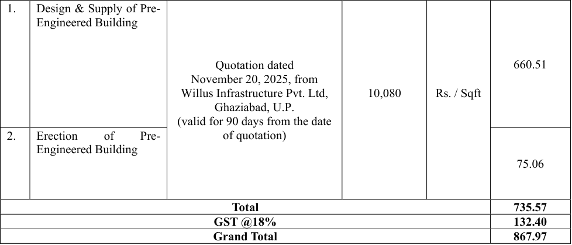

**[Image: Final_RHP.pdf-0098-00.png (978x419, 46.4KB)]**

<!-- Start of picture text -->
1.  Design & Supply of Pre- Engineered Building Quotation dated  660.51 November 20, 2025, from Willus Infrastructure Pvt. Ltd,  10,080  Rs. / Sqft Ghaziabad, U.P. (valid for 90 days from the date 2.  Erection  of  Pre- of quotation) Engineered Building 75.06 Total  735.57 GST @18%  132.40 Grand Total  867.97 <!-- End of picture text -->

# **Notes:** 

- (a) The above project cost has been derived from the quotation dated November 20, 2025, obtained from Willus Infrastructure Pvt. Ltd. . The quotation has a validity of 90 days period. 

- (b) We have considered the above quotation for the budgetary estimate purpose and have not placed orders for them. The actual cost of procurement and actual supplier may vary. Further, the estimated cost and related fund requirements have not been appraised by any bank or financial institution. In case of any shortfall of funds, the same shall be met through internal accruals/borrowings. 

- (c) The GST component has been included in the quotation for civil construction works since input tax credit (ITC) on construction of immovable property is not available under the provisions of Section 17(5)(c) and (d) of the Central Goods and Services Tax Act, 2017. 

As the civil construction pertains to the development of factory buildings and related immovable structures, the GST paid thereon becomes a cost to the Company and cannot be claimed as credit against output tax liability. Accordingly, the GST has been rightly included in the total project cost to reflect the actual expenditure to be incurred by the Company for execution of the construction work. 

The above quotation received from the vendor is valid as on the date of RHP. However, we have not entered into any definitive agreements with such vendor and there can be no assurance that the same vendor would be engaged to eventually initiate the civil construction work. 

# **_Plant and Machinery_** 

A detailed breakup of estimated cost of plant and machineries which are proposed to be funded from the net offer proceeds is set forth below: 

|**_Imported M_**|**_achineries_**|||**_(Rs. In Lakhs)_**|
|---|---|---|---|---|
|**S. No**|**Machinery Details**|**Qty**|**Quotation details**|**Total Amount**|
|1.|Ladder Making Machine- Household ladder Assembly Workbench|4|Quotation dated January 10, 2026 f Yk Ji|11.91|
|2.|Punching Machine (Workstation Punching Machine) Model No.: JOM-D001|2|, rom ongang nou Machinery Co. Ltd. (Quotation valid till 180 days from the date f tti|4.51|
|3.|Punching Machine (CNC Punching Machine)|1|o quoaon)|9.93|

95 

|Model No.: JOM-D002A|||
|---|---|---|
|4. Ladder Riveting Machine-Tube Expanding Machine Model No.: JOM-D005B|1|5.78|
|5. Ladder Riveting Machine Model No.: JOM-D007B|1|5.78|
|6. Punching Machine (Automatic Punching Machine for Multipurpose Ladder) Model No.: JOM-D003|1|19.86|
|7. Arc Punching machine|1|3.25|
|8. Ladder Making Machine-Manual Pipe Forming Machine Model No.: JOM-D015|1|5.42|
|9. Punching Machine (Punching Press Machine) Model No: JOM-D012|1|8.941|
|10. Punching machine for rear rail|1|7.04|
|11. Ladder Making Machine- Automatic Tube Shrinking Machine Model No: JOM-R005|1|5.24|
|12. Punching Machine (Step Punching and Cutting) Model No.: JOM-J004|1|4.60|
|13. Ladder Making Machine-Dual Head Inner Tube Squeezing Machine Model No: JOM-R006A|1|7.94|
|14. Ladder Making Machine-Dual Head Outer Tube Squeezing Machine Model No.: JOM-R006A|1|8.67|
|15. Punching Machine (Step Punching and Cutting Machine) Model No: JOM-R009|1|20.76|
|16. Ladder Making Machine- Automatic CNC Drilling Machine Model No: JOM-R007|1|15.34|
|17. Ladder Making Machine - Durability Test Equipment|1|9.93|
| Model No.: JOM-C001|||
|**Total Cargo Value**||**154.90**|
| **Add:**Freight Charges||9.03|
| Marine Insurance (0.5% of Cargo Value)||0.77|
| Total CIF Value|| 164.70|
|Basic Custom Duty (7.5% of CIF Value)||12.35|
| Social Welfare surcharge (7.5% of BCD)||1.23|
| Goods and Service Tax||32.09|
|Grand Total (A)||210.38|
| Inland Transportation charges||0.36|
|Custom Broker Charges||0.10|
|**Grand Total (Lending Cost)**||**210.83**|

96 

_# Landing cost of the machinery proposed to be imported from China, has been certified by Chartered Accountant, Mr. Mohit Aggarwal through certificate dated January 14, 2026. The landed cost has been computed based on an exchange rate of 1 USD = ₹90.2677 as on January 13, 2026 as per RBI website. Any variation in the exchange rate at the time of actual import may result in a corresponding change in the landed cost of such machinery. s_ 

|_Machi_ |_neries to be purchased from D_ |_omestic_ |_Vendors:_ ||||
|---|---|---|---|---|---|---|
|**S.** **No**|**Particulars**|**Qty**|**Quotation Details**|**Quotation** **Amount**|**GST @** **18%**|**Total** **Amount**|
|1.|MMC-50 Tons, C Frame, Steel Plate Fabricated Construction|2|Quotation dated January 09, 2026, from Milap Industrial Corporation, Ludhiana, Punjab (Quotation valid till 150 days from the date of quotation)|9.34|1.68|11.02|
|2.|Cuplock Ledger End Welding Machine|2|Quotation dated January09, 2026, from|12.50|2.25|14.75|
|3.|Standard Cuplock Welding Machine|2|Sohal welding works, Ludhiana, Punjab (Quotation valid till 90 days from the date of quotation)|17.60|3.17|20.77|
|**Gran**|**d Total**|||**39.44**|**7.10**|**46.54**|

Summary of machineries to be purchased from imported and domestic vendors:- 

|**S.** **No**|**Particulars**|**Total Amount** **(inc. all taxes)** **(Rs. in lakhs)**|
|---|---|---|
|1.|Imported machineries|210.83|
|2.|Domestic machineries|46.54|
|**Gran**|**d Total**|**257.37**|

# **Notes:** 

a) We have considered the above quotations for the budgetary estimate purpose and have not placed orders for them. The actual cost of procurement and actual supplier/dealer may vary. Further, the estimated cost and related fund requirements have not been appraised by any bank or financial institution. In case of any shortfall of funds, the same shall be met through internal accruals/borrowings. 

b) All quotations received from the vendors mentioned above are valid as on the date of this Red Herring Prospectus. However, we have not entered into any definitive agreements with any of these vendors and there can be no assurance that the same vendors would be engaged to eventually supply the machineries/ equipment or at the same cost. 

c) We are not acquiring any second-hand machinery. 

d) The quotations relied upon by us in arriving at the above cost are valid for a specific period of time and may lapse after the expiry of the said period. Consequent upon which, there could be a possible escalation in the cost of machineries proposed to be acquired by us at the actual time of purchase, resulting in increase in the estimated cost. Further, cost will be escalated on account of Packing & Forwarding, Transportation, Transit Insurance, Octroi / Entry tax if any etc. will be met through internal accruals. 

e) The inclusion of GST in the project cost has been considered as it represents an actual cash outflow at the time of procurement of goods and services related to the project. While we may be eligible to claim input tax credit against 

97 

the GST paid, such credit will be realized only over a period of time, depending upon the commencement of commercial operations and the nature of set-off available under applicable GST laws. 

Accordingly, for the purpose of presenting the total project cost, GST has been included to reflect the gross cash outlay required for execution of the project, ensuring a realistic depiction of funding requirements 

f) The aforementioned quotations received from the vendors are valid as on the date of RHP. However, we have not entered into any definitive agreement with any vendor, and there can be no assurance that the same vendor will be engaged for the proposed procurement. Further, we may procure machineries of varying configurations, makes and models depending upon system and technology requirements, timing of procurement and operational needs prevailing at the relevant time. 

# **Means of finance of the project** 

The total estimated cost for the proposed manufacturing unit is ₹ 3702.22  lakhs. We intend to fund the cost of the project as follows: 

|_(Rs. In Lakhs)_|
|---|

|**S.** **No**|**Particulars**|**Estimated Cost**|**Funds** **from** **Accrual**|**Deployed** **Internal** **s**|**Funds** **deployed** **Internal** **Accruals**|**to** **be**   **from** |**To be met from** **Offer Proceeds**|
|---|---|---|---|---|---|---|---|
|1.|Land*|2400.58|-||300.00*||2100.58|
|2.|Civil Construction Work|867.97|-||-||867.97|
|3.|Plant & Machinery|257.37|-||-||257.37|
||Contingency**|176.30|-||176.30||-|
||**Total Cost**|**3702.22**|**-**||**476.30**||**3225.92 **|

* _For the purpose of acquisition of the proposed land, we have already issued a cheque aggregating approximately ₹300.00 lakhs to the seller in accordance with the terms of the proposed transaction. The said amount will be deployed from the internal accruals of the Company towards completion of the other formalities._ 

** _Our Company has allocated a contingency amount of 5% of the project cost i.e. ₹ 176.30 Lakhs from the net proceeds to cover potential expenses arising from increases in machinery costs (if any), land development charges and obtaining permissions, associated transportation & installation charges and expense related to furniture and fixtures and other utilities which will be borne through internal accruals._ 

# **_Proposed schedule of implementation of the Proposed Project_** 

The proposed schedule of activities in respect of the Proposed Project are as follows: 

|**Particulars**|**Estimated** **Commencem**|**Date** **ent**|**of**|**Estimated** **completion**|**date**|**of**|
|---|---|---|---|---|---|---|
|Procurement of the land, land development work and obtaining of pre-construction approvals|February’202|6||March’2026|||
|Civil & Construction Work (including obtaining necessary approvals)|April’2026|||February’202|7||
|Plant and Machinery Installation|February’202|7||March’2027|||
|Trial run & Commencement of Commercial Production|April’2027|||April’2027|||
|Commercialoperation||May|’202|7 onwards|||

# **_Government approvals_** 

In relation to the proposed project, we will require to apply and obtain certain approvals as provided in the table below. 

|**S. No**|**List of Major Approvals***|**Stage at which approvals are required***|
|---|---|---|
|1.|Completion of land allotment process by YEIDA|Prior commencement of construction|

98 

|2.|Approval for the building plans for the proposed factory|Prior commencement of construction|
|---|---|---|
|3.|Approval of the factory layout from Directorate of Industrial Safety and Health|Prior commencement of construction|
|4.|Electricity Board Connection from State Electricity Board|Prior commencement of construction|
|5.|CTE (Consent to Establishment) from State Pollution Control Board|Prior commencement of construction|
|6.|Fire NOC from Regional Development Authority|Before the installation and commissioning of the machines|
|7.|Consolidated Consent to operate and authorization from Maharashtra Pollution Control Board|Before the commissioning of the factory operations|
|8.|Factory License from Directorate of Industrial Safety and Health|Before the commissioning of the factory operations|

_As per the Project Report dated September 04, 2025, issued by Garg & Associates, Chartered Engineers and Government-Approved Valuers._ 

Power and water - The requirements for the power shall be met from the local state electricity board and the requirement for water shall be met from external sources. 

# **2. Funding of Capital expenditure for manufacturing of equipments for Rental purpose –** 

Our revenues are derived from two primary sources – sale of products and rental services. Over the last three fiscal years, the rental model has consistently contributed a higher share to our revenues, accounting for 51.65% in FY 202425, 52.30% in FY 2023-24, and 62.97% in FY 2022-23. Under the rental model, we provide aluminium scaffoldings, ladders and MS scaffoldings on weekly, fortnightly or monthly terms to customers across India. This model enables customers to access scaffolding systems without upfront capital investment, while providing us with recurring revenue streams. 

The products deployed for rental purposes are not treated as inventory but are recognized and capitalized under ‘Fixed Assets’ in our financial statements. These assets are subsequently utilized over multiple rental cycles, enabling us to generate recurring revenue while ensuring optimum utilization of our product portfolio. The rental business, therefore, complements our manufacturing and sales operations and forms an integral part of our growth strategy. 

The sales and rental data presented below illustrates our business mix and operational model: 

|(Rs. in lakhs)|
|---|

|**Particular** **s**|**For the** **period** **Ended** **Septembe** **r 30, 2025**|**% of** **Revenue** **from** **operation** **s**|**FY** **2024-25**|**% of** **Revenue** **from** **operation** **s**|**FY** **2023-24**|**% of** **Revenue** **from** **operation** **s**|**FY** **2022-23**|**% of** **Revenue** **from** **operatio** **n**|
|---|---|---|---|---|---|---|---|---|
|Sale of Products|2348.83|47.92%|2,779.4 5|38.96%|1,815.2 4|37.71%|787.26|26.51%|
|Rental Services|2110.82|43.07%|3,684.4 8|51.65%|2,517.0 4|52.30%|1,870.1 0|62.97%|
|**Total**|**4459.65**|**90.99%**|**6,463.9** **3**|**90.61%**|**4,332.2** **8**|**90.01%**|**2,657.3** **6**|**89.48%**|

For details, please refer to _“Our Business - Product-wise revenue bifurcation”_ on page 157 of this RHP. 

According to the Mordor Report, the ladder and scaffolding market in India are experiencing significant growth, driven by the expansion of organized rental networks. These networks are providing cost-effective and flexible solutions, particularly for businesses with infrequent or project-based needs. This trend is further supported by the construction boom, rapid urbanization, and a growing preference for renting over purchasing across various industries. 

Organized rental networks are boosting the ladder and scaffolding market in India through the following factors: 

99 

Cost-Effectiveness: Renting eliminates the high upfront costs associated with purchasing ladders and scaffolding, making it a budget-friendly option for businesses, especially startups and those with limited capital. 

Convenience: Rental services offer access to a wide range of equipment without the burden of maintenance, storage, or eventual disposal. This is particularly appealing to businesses with short-term projects or fluctuating needs. 

Access to Advanced Equipment: Rental networks provide a variety of specialized ladders and scaffolding, including those with advanced features. This allows businesses to utilize the right equipment for specific tasks without significant investment. 

To achieve our growth objectives, we propose to expand into the rental segment by leveraging our existing portfolio of aluminum and steel scaffoldings and ladders. The expansion of this segment will involve capital expenditure towards in-house manufacturing of additional equipments specifically for rental purposes, rather than acquisition from third parties. These products will be manufactured in-house, thereby allowing us to maintain strict control over quality standards, specifications, and cost efficiencies. Once manufactured, these products will be capitalized under ‘Fixed Assets’ in our financial statements and will be deployed across multiple projects for rental use. This approach enables us to generate recurring revenues from the same assets over their useful life, optimize asset utilization, and strengthen our rental business. 

The estimated expenditure for such manufacturing has been duly assessed and certified by the Cost Accountant and forms part of the overall project cost proposed to be funded from the Net Offer Proceeds. 

Pursuant to the Board Resolution dated January 12, 2026, our Company has approved a capital expenditure of ₹600 lakhs over a period of two financial years i.e. F.Y. 2025-26 & 2026-27, for carrying in-house manufacturing of equipments for expansion in the rental segment. The estimated cost of such manufacturing has been duly certified by Shailes Patel & Co., Cost Accountants, through a Certificate on Cost Analysis dated January 21, 2026. The entire capital expenditure is proposed to be funded from the Net Offer Proceeds. 

_Break-up of proposed capital expenditure in terms of product and Cost Component:_ 

|**Particulars**|**Aluminium** **Scaffolding** **(52,326 Kg)**|**Aluminium** **Ladder** **(17,022 Kg)**|**Steel  (MS)** **Scaffolding** **(6,59,395 Kg)**| **FRP Ladder** **(20,028  Kg)**|**_(₹ in lakhs)_** **Total** **(7,48,771** **Kg)**|
|---|---|---|---|---|---|
|Material Cost (Annexure B)|180.53|50.51|231.11|48.82|510.97|
|Freight and Cartages (Annexure C)|1.07|0.35|8.24|0.41|10.07|
|Job Work Charges (Annexure C)|1.31|0.43|0.26|0.50|2.51|
|Power & Fuel (Annexure C)|0.89|0.29|1.52|0.34|3.04|
|Manpower Cost (Annexure C)|25.80|8.39|28.88|9.87|72.94|
|**Total Amount to be** **Invested**|**210.0**|**60.00**|**270.00**|**60.00**|**600.00**|

_(As certified by Shailesh Patel & Co., Cost Accountants, through a Certificate on Cost Analysis dated_ January 21, 2026 _)_ 

# **Notes:** 

- i. The total proposed investment of ₹600lakhs has been allocated as follows: ₹210 lakhs towards Aluminium Scaffolding, ₹60 lakhs towards Aluminium Ladders, ₹270 lakhs towards Steel (MS) Scaffolding, and ₹60 lakhs towards FRP Ladders. The Company has allocated a higher portion of the proceeds towards aluminium scaffolding and MS scaffolding, as a higher proportion of the Company’s revenue has been derived from aluminium scaffolding during the last three financial years and the six-month period ended September 30, 2025, and accordingly, an amount of ₹210.00 lakhs has been proposed to be allocated towards aluminium scaffolding. Further, considering the future demand potential of MS scaffolding, including its wider applicability across 

100 

infrastructure, construction and industrial projects, the Company has proposed to allocate a higher amount of ₹270.00 lakhs from the proceeds towards MS scaffolding, in order to align the utilisation of funds with the Company’s growth strategy and operational requirements. In respect of other products, namely aluminium ladders and FRP ladders, a comparatively lower allocation of ₹60.00 lakhs each has been proposed, considering their respective demand profile and historical revenue contribution. 

- ii. The projected production has been calculated by dividing the total projected investment by the cost per unit of respective product . 

- iii. The cost allocated to each expense item from the fund has been calculated by multiplying the projected production volume by the cost per piece of each item of each product. 

- iv. The allocation of Freight & Cartage, Job Work charges, Power & Fuel and Manpower costs has been carried out on the basis of production volumes (in kilograms) for the period from April 2025 to September 2025. Accordingly, such common costs have been apportioned to the respective product categories in proportion to the actual production achieved, measured in kilograms and corresponding number of units (pieces), during the said period . 

- v. The cost of materials has been ascertained with reference to the most recent quotations obtained from multiple approved vendors. These source documents have been duly examined and relied upon for the purpose of verifying and substantiating the pricing adopted in the report 

|||||**_A_**|**_mount(in Lakhs)_**|
|---|---|---|---|---|---|
|**Particulars**|**Aluminium** **Scaffolding**|**Aluminium** **Ladder**|**FRP Ladder**|**MS Scaffolding**|**Total**|
|**2025-26**|42.00|12.00|12.00|54.00|120.00|
|**2026-27**|168.00|48.00|48.00|216.00|480.00|
|**Grand Total **|**210.00**|**60.00**|**60.00**|**270.00**|**600.00**|

**Note:** _The proposed investment has been phased over a period of five quarters, based on the assumption that the proceeds from the Offer are received in February 2026. Accordingly, the utilization schedule includes one quarter in FY 2025-26 and the balance four quarters in FY 2026-27._ 

**Note:** _Based on the existing production capacity and prevailing market demand, the proposed allocation has been distributed as follows: aluminium scaffolding at ₹210.00 lakhs, Aluminium ladders at ₹60.00 lakhs, FRP products at ₹60.00 lakhs, and MS scaffolding at ₹270.00 lakhs_ 

**Projected Projection out of the Proposed Investment:** 

|**Projected Production** **(In Kgs)**|**Aluminium** **Scaffolding**|**Aluminium Ladder**|**FRP Ladder**|**MS Scaffolding**|
|---|---|---|---|---|
|2025-26|10,404|3,400|4,000|1,31,675|
|2026-27|41,922|13,622|16,028|5,27,720|
|**Grand Total (Prod in Kg)**|**52,326**|**17,022**|**20,028**|**6,59,395**|
|**Cost Per Pcs**|**61,286.96**|**8,870.62 **|**8,551.60**|**20,818.27**|

**_Note :_** _The projected production has also been considered based on the proposed investment being allocated over a five-quarter period, assuming IPO funds are received in February 2026, with one quarter falling in FY 2025–26 and the remaining four quarters in FY 2026–27._ 

**_Note:_** _Formula for calculation of projected production (in kg):_ 

Projected production (in kg) = Number of units produced (in pieces) × Weight per unit (in kg) for the respective product 

**Projected Projection out of the Proposed Investment:** 

|**Projected**|**Aluminium**|**Aluminium Ladder** **FRP Ladder**|**MS Scaffolding**|
|---|---|---|---|
|**Production (in Pcs)**|**Scaffolding **|||

101 

|**2025-26**|68|135|140|259|
|---|---|---|---|---|
|**2026-27**|274|541|561|1038|
|**Grand Total**|**342**|**676**|**701**|**1297**|

**Note:** The projected production (in kilograms), when divided by the standard weight of the respective product, results in the projected number of units (in pieces). 

Details of Material Consumed and its computation for each of the product: 

# **<u>Aluminum Scaffolding:</u>** 

|**Particulars**|**Material to be Produce (K.G.)**|**Total Cost of Material(₹)**|
|---|---|---|
|Material Cost|153.00|52,787.81|
|Freight And Cartage||312.12|
|Job Work Charges||384.03|
|Power & Fuel||260.10|
|Manpower Cost||7,542.90|
|**Total**|**153.00**|**61,286.96**|

**Notes:** 

- (i) The total material cost of **₹52,787.81** comprises the following components: Aluminium Cost – ₹36,644.81, Plywood Cost – ₹1,935.00, Wheel Cost – ₹5,600.00, and Other Material Cost per piece – ₹8,608.00. 

- _(ii)_ The allocation basis for Freight & Cartage, Job Work charges, Power & Fuel & Man power cost is based on actual production in Kg. for the period April to September 2025 _(refer Annexure C)._ 

- _(iii)_ The weight of 153 kg has been considered based on the standard weight of the respective scaffolding product, as determined in accordance with the Company’s standard product specifications and industry norms. This standard weight is consistently used by the Company for production planning. 

# **<u>Aluminium Ladder:</u>** 

|**Particulars**|**Material to be Produce (K.G.)**|**Total Cost of Material(₹)**|
|---|---|---|
|Material Cost|25.18|7,471.88|
|Freight And Cartage||51.37|
|Job Work Charges||63.20|
|Power & Fuel||42.80|
|Manpower Cost||1,241.37|
|**Total**|**25.18**|**8,870.62**|

**Notes:** 

- (i) The total material cost of **₹7471.88** comprises the following components: Total Aluminium Cost – ₹5,071.20 and Other Material Cost per piece – ₹2400.68. 

- _(ii)_ The allocation basis for Freight & Cartage, Job Work charges, Power & Fuel & Man power cost is based on actual production in Kg. for the period April to September 2025. 

- (iii) The weight of 25.18 kg has been considered based on the standard weight of the respective product, as determined in accordance with the Company’s standard product specifications and industry norms. This standard weight is consistently used by the Company for production planning. 

# **<u>FRP Ladder:</u>** 

|**Particulars**|**Material to be Produce (K.G.)**|**Total Cost of Material(₹)**|
|---|---|---|
|Material Cost|28.57|6964.54|
|Freight And Cartage||58.28|
|Job Work Charges||71.71|
|Power & Fuel||48.57|

102 

|Manpower Cost||1408.50|
|---|---|---|
|**Total**|**28.57**|**8551.60**|

**Notes:** 

- (i) The total material cost of **₹6964.54** comprises the following components: Total Aluminium Cost – ₹2657.10, Total FRP Cost – ₹1938.10 and Other Material Cost per piece – ₹2369.34. 

- (ii) The allocation basis for Freight & Cartage, Job Work charges, Power & Fuel & Man power cost is based on actual production in Kg. for the period April to September 2025. 

# **<u>MS Scaffolding:</u>** 

|**Particulars**|**Material to be Produce (K.G.)**|**Total Cost of Material(₹)**|
|---|---|---|
|Material Cost|508.40|17,818.71|
|Freight And Cartage||635.50|
|Job Work Charges||20.34|
|Power & Fuel||116.93|
|Manpower Cost||2,226.79|
|**Total**|**508.40**|**20,818.27**|

**Notes:** 

- (i) The total material cost of ₹17818.71 comprises the following components: Vertical- 3mtr– ₹6157.61, Laser Blade – ₹3000.00, Base jack 18"– ₹759.50, Joint Pin Hole- ₹84.00, MS Pipe 6 meter- ₹3564.60, Swivel Coupler₹392.00 & Plank 1.5 meter- ₹3861.00. 

- (ii) The allocation basis for Freight & Cartage, Job Work charges, Power & Fuel & Man power cost is based on actual production in Kg. for the period April to September 2025. 

**<u>Working Note for Calculation of Freight and Cartage, Job Work Charges, Power & Fuel and Manpower Cost:</u>** 

|**ALLOCATION**|**OF COST-PRO** **Productio** |**DUCT WISE (** **n Unit** |**APR. 25-SEP**|**T. 25)** **Unit-I & II** |||**Unit III** |
|---|---|---|---|---|---|---|---|
||**Production**|**in Kg**||**4,41,399**|**13,811**|**26,325**|**11,02,728**|
||||**Total**|||||
|**Particulars**|**Unit I & II**|**Unit III**| **Expense**|||||
|**Freight** **And** **Cartage**|9,84,199.00|13,75,742.00|23,59,941. 00|9,02,166.00|28,228.00|53,805.00|13,75,742.0 0|
|**Job** **Work** **Charges**|12,10,058.00|49,140.00|12,59,198. 00|11,09,200.00|34,706.00|66,152.00|49,140.00|
|**Power & Fuel**|8,18,224.00|2,56,828.00|10,75,052. 00|7,50,025.00|23,468.00|44,731.00|2,56,828.00|
|**Manpower** **Cost**|2,37,37,617. 00|48,23,877.00|2,85,61,49 4.00|2,17,59,073.0 0|6,80,836.0 0|12,97,708.0 0|48,23,877.0 0|

**_Note:_** _The above expenses represent actual expenditures incurred during the period from April to September 2025 and have been allocated based on the actual production levels achieved during the same period._ 

**_For example:_** _Freight and cartage expenses relating to aluminium scaffolding have been allocated in proportion to the actual production of aluminium scaffolding during the said period._ 

**_Note:_** _Allocated expenses =_ 

_(Total expenses of Units I & II ÷ Total production of Units I & II) × Actual production of aluminium scaffolding_ 

_Calculation:_ 

103 

_₹9,84,199 ÷ (4,41,399 + 13,811 + 26,325) × 4,41,399_ 

_= ₹9,02,165.90_ 

|**COST ALLOCATION**|**PER KG- PRODUC** |**T WISE (APR. 25-  ** |**SEPT. 25)** ||
|---|---|---|---|---|
|**Product Name**|**Aluminium** **Scaffolding**|**Aluminium** **Ladder**|**FRP** **Ladder**|**MS** **Scaffolding**|
|**Production in Kg**|4,41,399|13,811|26,325|11,02,728|
|Freight And Cartage|2.04|2.04|2.04|1.25|
|Job Work Charges|2.51|2.51|2.51|0.04|
|Power & Fuel|1.7|1.7|1.7|0.23|
|Manpower Cost|49.3|49.3|49.3|4.38|

_Note: The table sets out the per-kilogram allocation of common manufacturing expenses across various product categories for the period from April 2025 to September 2025. Such common expenses have been allocated in a systematic and reasonable manner based on the respective production volumes (in kilograms) to ensure consistent cost attribution._ 

# **3. Utilization towards Working Capital requirements-** 

With the expansion of the business company will be in the need of additional working capital requirements. We fund a majority of our working capital requirements in the ordinary course of business from banking facilities and internal accruals. Our Company requires additional working capital for funding its incremental working capital requirements. 

Our Company proposes to utilize ₹ 1500.00 lakhs of the Net Proceeds towards our Company’s working capital requirements (as per detail given below). The balance portion of our Company working capital requirement shall be met from the working capital facilities availed from the banks and internal accruals. The incremental and proposed working capital requirements and key assumptions with respect to the determination of the same are mentioned below: 

Details of estimation of working capital requirement are as follows: 

|**_(Rs. In Lakhs)_**|
|---|

|**Particulars**|**FY** **2022-** **23**|**FY** **2023-** **24**|**FY** **2024-** **25**|**For the** **period** **ended** **Septembe** **r’ 25**|**FY 2025-** **26** **(Estimate** **d)**|**FY 2026-** **27** **(Projecte** **d)**|
|---|---|---|---|---|---|---|
|**Current Assets**|||||||
|Inventories|78.92|347.28|911.59|1,552.84|1,005.21|1,348.82|
|Trade receivables|709.91|1,189.4 4|1,623.3 3|2,024.82|2,368.82|2,939.51|
|Short-Term Loans and Advances|28.47|38.00|99.35|102.49|119.35|149.35|
|Other Current Assets|213.77|324.98|583.78|556.30|616.31|699.70|
|**Total Current Assets(A)**|**1,031.0** **8**|**1,899.7** **1**|**3,218.0** **4**|**4,236.46**|**4,109.69**|**5,137.38**|
|**Current Liabilities**|||||||
|Trade Payables|423.23|448.40|649.96|375.53|676.87|1,123.79|
|Other Current Liabilities|127.69|225.03|348.41|473.44|368.41|393.41|
|Short-Term Provisions|135.84|256.24|474.39|450.94|673.76|901.96|
|**Total Current Liabilities(B)**|**686.75**|**929.66**|**1,472.7** **7**|**1,299.91**|**1,719.04**|**2,419.16**|
|**Total Working Capital** **Requirement(A-B)**|**344.33**|**970.05**|**1,745.2** **8**|**2,936.55**|**2,390.65**|**2,718.21**|
|**Funding Pattern:**|||||||

104 

|**From Short Term Borrowing**|**344.33**|**970.05**|**1,745.2** **8**|**2,693.57**|**1,882.04**|**1,693.84**|
|---|---|---|---|---|---|---|
|**From Internal Accruals**||||**242.98**|**208.61**|**524.38**|
|**Issue Proceeds**|||||**300.00**|**500.00**|

_The basis of the working capital requirement has been certified by M/s V.K. Kila & Co., Chartered Accountants, vide their certificate dated January 13, 2026._ 

# **_<u>Assumptions for working capital requirements</u>_** 

The following table sets forth the details of the holding period (with days rounded to the nearest whole number) considered for the period ended September’25 and for the financial years ended March 31, 2025, March 31, 2024 and March 31, 2023, as well as projections for financial year ended March 31, 2026 and March 31, 2027 

|**Particulars**|**Unit**|**March 31,** **2023**|**March 31,** **2024** **Restated**|**March 31,** **2025** **Financials**|**For the** **period** **ended** **September** **30, 2025**|(n **March 31,** **2026** **Projections**|umber of days) **March 31,** **2027** **Projections**|
|---|---|---|---|---|---|---|---|
|Inventories|Days|36|58|123|196|120|120|
|Debtors|Days|75|72|72|68|72|72|
|Creditors|Days|280|99|83|52|90|90|

# **<u>Justification:</u>** 

- **Inventories** The Company’s inventory days increased from 36 days in FY 2022-23 to 123 days in FY 2024-25 and are projected to remain at approximately 120 days in FY 2025-26 and FY 202627. Manufacturing operations commenced in FY 2023-24 and became operational in FY 2024-25, resulting in higher inventory levels to support operations and sales. For the period ended September 2025, inventory days increased to 196 days due to inventory procurement in advance of production and project execution and timing differences between inventory procurement and revenue recognition during the interim period. From FY 202526 onwards, inventory days are expected to stabilize at around 120 days, reflecting inventory <u>levels in line with the scale of operations.</u> 

|**Debtors**|Debtors days have remained broadly stable between 72 and 75 days across FY23 to FY25. This indicates that the company has maintained a consistent credit policy with customers, in line with the standard industry range of two to three months. For the period ended September 2025, debtor days reduced to 68 days, reflecting collections during the interim period. The projection for FY26 and FY27 assumes the same trend of 72 days, ensuring continuity of working capital planning.|
|---|---|
|**Creditors**|Creditor days declined from 280 days in FY 2022-23 to a range of 83 to 99 days from FY 2023-24 onwards. The higher creditor days in FY 2022-23 were due to extended supplier credit during the initial phase of operations. For the period ended September 2025, creditor days reduced to 52 days, reflecting settlements during the interim period. From FY 2025-26 onwards, creditor days are projected at approximately 90 days in FY 2025- 26 and FY 2026-27, in line with supplier credit terms and working capital planning.|

The total working capital requirement has increased from ₹1,745.28 lakhs in FY 2024-25 to ₹2,390.65 lakhs in FY 2025-26, mainly due to: 

1. Increase in trade receivables from ₹1,623.33 lakhs to ₹2,368.82 lakhs, corresponding to the higher projected turnover for FY 2025-26. 

2. Higher inventory levels (₹911.59 lakhs to ₹1,005.21 lakhs) planned to support expanded order volumes and ensure uninterrupted supply. For the purpose of projections, the inventory has been considered on an average aggregate basis, and no separate bifurcation among raw materials, work-in-progress and finished goods has 

105 

been undertaken. Accordingly, the total inventory value has been considered for determining stock levels for the projected periods. 

3. The increase in short-term loans and advances and other current assets is in line with business growth. Shortterm loans and advances primarily comprise advances to employees, advances to suppliers, security deposits for rented premises and prepaid expenses, while other current assets mainly include balances with government authorities and accrued interest on fixed deposits. For the purpose of projections, these items have been estimated on an average basis and considered in proportion to the projected turnover for the relevant periods. 

4. Trade payables and other current liabilities have also increased; however, the rise is relatively lower compared to the growth in current assets, leading to an overall increase in the net working capital requirement. 

Accordingly, the increase in working capital gap is attributable to scale-up in business operations and higher current asset requirements to support projected revenue growth for FY 2025-26. 

The increase in the total working capital requirement from ₹2,390.65 lakhs in FY 2025-26 to ₹2,718.21 lakhs in FY 2026-27 is attributable to further growth in the scale of operations and projected increase in revenues. 

The working capital requirement for FY 2026-27 has increased primarily due to the following: 

1. Increase in inventories from ₹1,005.21 lakhs to ₹1,348.82 lakhs, reflecting higher stock levels planned to support increased order volumes, expanded operations, and continuity of supply. For the purpose of projections, the inventory has been considered on an average aggregate basis, and no separate bifurcation among raw materials, work-in-progress and finished goods has been undertaken. Accordingly, the total inventory value has been considered for determining stock levels for the projected periods. 

2. Increase in trade receivables from ₹2,368.82 lakhs to ₹2,939.51 lakhs, corresponding to the projected increase in turnover for FY 2026-27 while maintaining consistent credit terms with customers. 

3. Increase in short-term loans and advances and other current assets from ₹735.66 lakhs to ₹849.05 lakhs, in line with the expanded scale of operations and higher advances to suppliers and statutory balances. Shortterm loans and advances primarily comprise advances to employees, advances to suppliers, security deposits for rented premises and prepaid expenses, while other current assets mainly include balances with government authorities and accrued interest on fixed deposits. For the purpose of projections, these items have been estimated on an average basis and considered in proportion to the projected turnover for the relevant periods. 

4. Increase in current liabilities, with total current liabilities rising from ₹1,719.04 lakhs to ₹2,419.16 lakhs, primarily on account of higher trade payables and short-term provisions; however, the increase in current liabilities is proportionately lower than the increase in current assets, resulting in a higher net working capital requirement. 

Accordingly, the increase in the working capital gap for FY 2026-27 is attributable to the increase in current asset requirements in line with projected operations. 

**Note 1:** As per audited financials for the period ended September 30, 2025, the Company has recorded revenue from services amounting to ₹2,110.82 lakhs and revenue from sale of goods amounting to Rs.2,348.83 lakhs. 

**Note 2:** The Company does not maintain an order book for sale of products, as sales are executed based on quotations and recorded upon delivery. Order records are maintained only in respect of rental income, and as on September 30, 2025, the outstanding monthly rental order value stood at Rs. 370.83 lakhs. 

**4.  General Corporate Purpose-** 

106 

Our management, in accordance with the policies of our Board, will have flexibility in utilizing the proceeds earmarked for general corporate purposes. We intend to deploy the balance Fresh Issue proceeds aggregating ₹ [●] Lakhs towards the general corporate purposes to drive our business growth. In accordance with the policies set up by our Board, we have flexibility in applying the remaining Net Proceeds, for general corporate purpose including but not restricted to, meeting operating expenses, initial development costs for projects other than the identified projects, and the strengthening of our business development and marketing capabilities, meeting exigencies, which the Company in the ordinary course of business may not foresee or any other purposes as approved by our Board of Directors, subject to compliance with the necessary provisions of the Companies Act, 2013. 

We confirm that any issue related expenses shall not be considered as a part of General Corporate Purpose. Further in case, our actual issue expenses turn to be lesser than the estimated issue expenses of ₹ [●] lakhs, such surplus amount shall be utilized for General Corporate Purpose in such a manner that the amount for general corporate purposes, as mentioned in the Red Herring Prospectus/ Prospectus, shall not exceed 15% of the amount raised by our Company through this Issue or Rs. 10 crores, whichever is less. 

The total estimated Issue Expenses are ₹ [●] Lakhs, which is [●] % of the total Issue Size. The details of the Issue Expenses are tabulated below: 

||||_(Rs. In Lakhs)_ |
|---|---|---|---|
|**Activity**|**(₹ in Lakh)**|**As a % of Estimates** **Issue Expenses**|**As a % of Issue** **Size**|
|Book Running Lead Manger Fees (including underwriting commission and all other fees by whatever name called)|[●]|[●]|[●]|
|Fees Payable to Registrar to the Issue|[●]|[●]|[●]|
|Fees Payable for Advertising and Publishing Expenses|[●]|[●]|[●]|
|Fees Payable to Regulators including Stock Exchanges|[●]|[●]|[●]|
|Payment for Printing & Stationery, Postage, etc.|[●]|[●]|[●]|
|Fees Payable to StatutoryAuditor, Legal Advisors and other Professionals|[●]|[●]|[●]|
|Others (Commission/processing fee for SCSBs, Sponsor Bank and Banker(s) to the Issue and brokerage and selling commission and bidding charges for Members of the Syndicate, Registered Brokers, RTAs and CDPs|[●]|[●]|[●]|
|**Total **|[●]|[●]|[●]|

> _(1) Amounts will be finalised and incorporated in the Prospectus on determination of Offer Price. Issue expenses include applicable taxes, where applicable. Issue expenses are estimates and are subject to change._ 

- _(2) Selling commission payable to the SCSBs on the portion for Individual investors who applies for minimum application size. Non-Institutional Bidders, which are directly procured by the SCSBs, would be as follows_ 

_Portion for Individual investors who 0.10% of the Amount Allotted* (plus applicable taxes)_ _<u>applies for minimum application size * Portion for Non-Institutional Bidders* 0.10% of the Amount Allotted* (plus applicable taxes)</u>_ 

_*Amount allotted is the product of the number of Equity Shares Allotted and the Offer Price. The selling commission payable to the SCSBs will be determined on the basis of the bidding terminal ID as captured in the Bid Book of BSE._ 

- _(3) No uploading/ processing fees shall be payable by our Company to the SCSBs on the applications directly procured by them. Processing fees payable to the SCSBs on the portion for Individual investors who applies for minimum application size and Non-Institutional Bidders which are procured by the members of the Syndicate/ sub-Syndicate/ Registered Broker/ CRTAs/ CDPs and submitted to SCSB for blocking, would be as follows:_ 

_Portion for Individual investors who ₹ 10 per valid Bid cum Application Form (plus applicable taxes)_ _<u>applies for minimum application size</u>_ 

107 

_<u>Portion for Non-Institutional Bidders ₹ 10 per valid Bid cum Application Form (plus applicable taxes)</u> Notwithstanding anything contained above the total processing fee payable under this clause will not exceed ₹1 lakh (plus applicable taxes) and in case if the total processing fees exceeds ₹ 1 lakh (plus applicable taxes) then processing fees will be paid on pro-rata basis._ 

- _(4) The processing fees for applications made by Individual investors who applies for minimum application size using the UPI Mechanism would be as follows:_ 

|_Members of the Syndicate/ RTAs/_ _CDPs (uploading charges)_|_₹ 10 per valid application (plus applicable taxes)_|
|---|---|
|_Sponsor Bank_|_₹ 6.5 per valid Bid cum Application Form* (plus applicable taxes) The_ _Sponsor Bank shall be responsible for making payments to the third parties_ _such as remitter bank, NPCI and such other parties as required in_ _connection with the performance of its duties under the SEBI circulars,_ _other agreements and other applicable laws._|

_*For each valid application by respective Sponsor Bank_ 

_Notwithstanding anything contained above in this clause the total Uploading charges/ Processing fees payable to Members of the Syndicate/ RTAs/ CDPs for applications made by Individual investors who applies for minimum application size (2 lots), Non-Institutional Bidders (for an amount more than ₹200,000 and up to ₹500,000) using the UPI Mechanism and in case if the total uploading charges/ processing fees exceeds ₹ 1 lakh (plus applicable taxes) then uploading charges/ processing fees using UPI Mechanism will be paid on pro-rata basis._ 

- _(5) Selling commission on the portion for Individual investors who applies for minimum application size and NonInstitutional Bidders which are procured by members of the Syndicate (including their sub-Syndicate Members), Registered Brokers, CRTAs and CDPs or for using 3-in-1 type accounts- linked online trading, demat & bank account provided by some of the Registered Brokers which are Members of the Syndicate (including their Sub-Syndicate Members) would be as follows:_ 

_Portion for Individual investors who 0.10% of the Amount Allotted* (plus applicable taxes)_ _<u>applies for minimum application size</u> Portion for Non-Institutional Bidders 0.10% of the Amount Allotted* (plus applicable taxes)_ 

_*Amount Allotted is the product of the number of Equity Shares Allotted and the Offer Price_ 

_Uploading charges payable to Members of the Syndicate (including their sub-Syndicate Members), CRTAs and CDPs on the applications made by Individual investors who applies for minimum application size using 3-in-1 accounts and Non-Institutional Bidders which are procured by them and submitted to SCSB for blocking or using 3-in- 1 accounts, would be as follows: ₹10 plus applicable taxes, per valid application bid by the Syndicate (including their subSyndicate Members), CRTAs and CDPs._ 

_Bidding charges payable to the Registered Brokers, CRTAs/ CDPs on the portion for Individual investors who applies for minimum application size and Non-Institutional Bidders which are directly procured by the Registered Brokers or CRTAs or CDPs and submitted to SCSB for processing, would be as follows:_ 

|_Portion for Individual investors who_|_₹10 per valid application (plus applicable taxes)_|
|---|---|
| _applies for minimum application size*_||
|_Portion for Non-Institutional Bidders*_|_₹10 per valid application (plus applicable taxes)_|

_* Based on valid applications_ 

_Notwithstanding anything contained above the total uploading/ bidding charges payable under this clause will not exceed ₹ 1 lakh (plus applicable taxes) and in case if the total uploading/ bidding charges exceeds ₹ 1 lakh (plus applicable taxes) then uploading charges will be paid on pro-rata basis._ 

_The Selling Commission payable to the Syndicate/ Sub-Syndicate Members will be determined on the basis of the application form number/ series, provided that the application is also bid by the respective Syndicate/ Sub-Syndicate Member. For clarification, if a Syndicate ASBA application on the application form number/ series of a Syndicate/ Sub-Syndicate Member, is bid by an SCSB, the Selling Commission will be payable to the SCSB and not the Syndicate/ Sub-Syndicate Member. Bidding Charges payable to members of the Syndicate (including their sub-Syndicate_ 

108 

_Members), CRTAs and CDPs on the portion for Individual investors who applies for minimum application size and Non-Institutional Bidders which are procured by them and submitted to SCSB for blocking, would be as follows: ₹ 10 plus applicable taxes, per valid application bid by the Syndicate (including their sub-Syndicate Members), CRTAs and CDPs._ 

_The selling commission and bidding charges payable to Registered Brokers the CRTAs and CDPs will be determined on the basis of the bidding terminal ID as captured in the Bid Book of BSE._ 

All such commissions and processing fees set out above shall be paid as per the timelines in terms of the Syndicate Agreement and Escrow and Sponsor Bank Agreement. Further, the processing fees for applications made by UPI Bidders using the UPI Mechanism may be released to the remitter banks (SCSBs) only after such banks provide a written confirmation on compliance with SEBI Circular No: SEBI/HO/CFD/DIL2/P/CIR/2021/570 dated June 2, 2021 read with SEBI Circular No: SEBI/HO/CFD/DIL2/CIR/P/2021/2480/1/M dated March 16, 2021 _._ 

# **Monitoring of Utilization of Funds** 

In accordance with Regulation 262 of the SEBI ICDR Regulations, our Company has appointed Care Ratings Limited as the monitoring agency (“Monitoring Agency”) to monitor the utilisation of the Net Proceeds. Our Company undertakes to place the Net Proceeds in a separate bank account which shall be monitored by the Monitoring Agency for utilisation of the Net Proceeds. Our Company undertakes to place the report(s) of the Monitoring Agency on receipt before the Audit Committee without any delay and in accordance with the applicable laws. Our Company will disclose the utilisation of the Net Proceeds, including interim use under a separate head in its balance sheet for such financial year/periods as required under the SEBI ICDR Regulations, the SEBI Listing Regulations and any other applicable laws or regulations, specifying the purposes for which the Net Proceeds have been utilised. Our Company will also, in its balance sheet for the applicable financial year, provide details, if any, in relation to all such Net Proceeds that have not been utilised, if any, of such currently unutilized Net Proceeds. 

# **Proposed Schedule of Implementation:** 

The proposed year wise break up of deployment of funds and Schedule of Implementation of Net Offer Proceeds is as under: 

||||_(Rs. In Lakhs)_|
|---|---|---|---|
|**S.** **No.**|**Particulars**|**Estimated Amount** **to be deployed and** **utilized in F.Y. 25-26**|**Estimated Amount** **to be deployed and** **utilized in F.Y. 26-27**|
|1.|Funding of Capital expenditure towards setup of a new Manufacturing Facility|2100.58|1125.34|
|2.|Funding of Capital expenditure for manufacturing of equipments for Rental purpose|120.00|480.00|
|3.|Utilization towards working capital requirements|300.00|500.00|
|4.|General corporate purposes*|[●]|[●]|
||**Total**|[●]|[●]|

*To be finalized upon determination of the Issue Price and updated in the Prospectus Prior to filing with the RoC. 

# **Appraisal** 

The fund requirements, deployment of funds and the intended use of the Net Proceeds as described in the Red Herring Prospectus and the Prospectus are based on our current business plan, management estimates, prevailing market conditions and other commercial considerations. However, such fund requirements and deployment of funds have not been appraised by any external agency or any bank or financial institution or any other independent agency. 

We may have to revise our funding requirements and deployment on account of a variety of factors such as our financial and market condition, our business and growth strategies, competitive landscape, general factors affecting our results of operations, financial condition and access to capital and other external factors such as changes in the business environment or regulatory climate and interest or exchange rate fluctuations, which may not be within the control of our management. This may entail reviewing the proposed utilisation of the Net Proceeds and changing the allocation of funds from its planned allocation at the discretion of our management, subject to compliance with applicable law. 

109 

# **Shortfall of Funds** 

Any shortfall in meeting the fund requirements will be met by way of internal accruals and or unsecured Loans. 

# **Bridge Financing Facilities** 

As on the date of the Red Herring Prospectus, we have not raised any bridge loans which are proposed to be repaid from the Net Proceeds. 

# **Interim Use of Proceeds** 

Pending utilization of the Offer proceeds of the Issue for the purposes described above, our Company will deposit the Net Proceeds with scheduled commercial banks included in schedule II of the RBI Act. 

Our Company confirms that it shall not use the Net Proceeds for buying, trading or otherwise dealing in shares of any listed company or for any investment in the equity markets or investing in any real estate product or real estate linked products. 

# **Variation in Objects** 

In accordance with Section 27 of the Companies Act, 2013, our Company shall not vary the Objects of the Offer without our Company being authorized to do so by the Shareholders by way of a Special Resolution. In addition, the notice issued to the Shareholders in relation to the passing of such special resolution shall specify the prescribed details as required under the Companies Act and shall be published in accordance with the Companies Act and the rules there under. As per the current provisions of the Companies Act, our Promoter or controlling Shareholders would be required to provide an exit opportunity to such shareholders who do not agree to the proposal to vary the objects, at such price, and in such manner, as may be prescribed by SEBI, in this regard. 

# **Other confirmations** 

There are no material existing or anticipated transactions with our Promoter, our Directors, our Company’s key Managerial personnel or Senior Management Personnel or Selling Shareholders in relation to the utilization of the Net Proceeds. No part of the Net Proceeds will be paid by us as consideration to our Promoter, our directors or key managerial personnel or Senior Management Personnel or Selling Shareholders except in the normal course of business and in compliance with the applicable laws. 

# **Monitoring of Funds and Utilization of net proceeds:** 

Seren Capital Private Limited, as BRLM to the Issue and Msafe Equipments Limited (herein after referred to as **“Issuer Company”** and/ or **“Company”** ) hereby undertake that a separate bank account ( **“Special Bank Account”** ) be opened, and the Net Proceeds being raised from the IPO will be transferred immediately to such Special Bank Account from escrow account upon listing of the company. This account shall be utilized only for the ‘Objects of the Offer’ as disclosed in this Red Herring Prospectus ( **“RHP”** ) and as may be mentioned and disclosed in the corresponding page numbers of the section ‘Objects of the Offer’ as would be mentioned in the Red Herring Prospectus and the Prospectus (“ **Objects of the Offer”** ) as a whole. 

The said Bank account will be required to be monitored by an independent Monitoring Agency. Further, the Issuer Company to ensure that all the payments towards the objects as mentioned in the section ‘Objects of the Offer’ will be made from this Special Bank Account. 

Issuer Company to submit ‘Utilization Certificate’ w.r.t utilization of funds towards the Objects of the Offer with the Exchange, on quarterly basis. 

**Change in Objects:** If the company decides to deviate from the Objects as disclosed in the ‘Objects of the Offer’ to any new Object by way of addition/ deletion. 

In all or any of the above cases, the company will have to observe strict compliance with the Provisions of Section 27(2) of the Companies Act. 2013 read with Schedule XX of SEBI (ICDR) Regulations, 2018 and any other applicable laws not limited to obtaining shareholders approval via Special Resolution as required under the SEBI (ICDR) Regulations, 2018 and respective provisions of Companies Act, 2013 read with the Companies Rules w.r.t variation in objects of the issue. The notice issued to the Shareholders in relation to the passing of such special resolution shall 

110 

specify the prescribed details as required under the Companies Act. The Company to also agree to provide exit opportunity to dissenting shareholders in terms of the provisions of Law, as applicable. 

In case there is any amount pending utilization in the said Special Bank Account mentioned under point no 1 (above), such amount will be released only after obtaining shareholders approval via Special Resolution w.r.t deviation in utilization of such proceeds by the Company. The notice issued to the Shareholders in relation to the passing of such special resolution shall specify the prescribed details as required under the Companies Act. Only after submission of such special resolution to the monitoring agency, shall the funds be released for its usage as approved by the shareholders, from the said Special Bank Account. 

111 

# **<u>BASIS FOR OFFER PRICE</u>** 

_Investors should read the following summary with the section titled_ **_“Risk Factors”_** _, the details about our Company under the section titled_ **_“Our Business”_** _and its financial statements under the section titled_ **_“Financial Information of the Company”_** _beginning on page 29, 156 and 222 respectively of the Red Herring Prospectus. The trading price of the Equity Shares of Our Company could decline due to these risks and the investor may lose all or part of his investment._ 

The Offer Price will be determined by our Company in consultation with the BRLM on the basis of the quantitative and qualitative factors as described below. The face value of the Equity Shares is ₹ 10.00 each and the Issue Price is ₹ [●] times of the face value. 

# **QUALITATIVE FACTORS** 

Our business strengths include the following: 

   - a) Multi-Model Source of Revenue through Product Sales and Rental Services. 

   - b) In-House Manufacturing facilities supported by quality certifications. 

   - c) Well diversified customer base spread across various industries & geography. 

- d) Experienced Promoters and management team having domain knowledge. 

For a detailed discussion on the qualitative factors which form the basis for computing the price, please refer to sections titled **_“Our Business”_** beginning on page 156 of this Red Herring Prospectus. 

# **QUANTITATIVE FACTORS** 

The information presented below relating to our Company is based on the Restated Financial Statements. For details, please refer section titled **_“Financial Information of the Company”_** on page 222 of this Red Herring Prospectus. 

Some of the quantitative factors which may form the basis for calculating the Offer Price are as follows: 

# **1. Basic & Diluted Earnings per share (EPS) (Face value of ₹ 10 each):** 

As per the Restated Financial Statements: 

|**Sr.** **No**|**F.Y.**|**Basis & Diluted** **(₹)**|**Weights**|
|---|---|---|---|
|1.|Financial Year ending March 31, 2025|8.13|3|
|2|Financial Year ending March 31, 2024|4.09|2|
|3.|Financial Year ending March 31, 2023|2.28|1|
||**Weighted Average**|**5.81**|**6**|
||For six Months Period Ended September 30, 2025|**6.56**||

# **_Notes:_** 

- _i. The figures disclosed above are based on the Restated Financial Statements of the Company._ 

_ii. The face value of each Equity Share is ₹10.00._ 

- _iii. Earnings per Share has been calculated in accordance with_ **_Accounting Standard 20 – “Earnings per Share”_** _issued by the Institute of Chartered Accountants of India._ 

- _iv. The above statement should be read with Significant Accounting Policies and the Notes to the Restated Financial Statements as appearing in Annexure 4._ 

- _v. Basic Earnings per Share = Net Profit/(Loss) after tax, as restated attributable to equity shareholders / Weighted average number of equity shares outstanding during the year/ period after considering issue of bonus shares._ 

- _vi. Diluted Earnings per Share = Net Profit/(Loss) after tax, as restated attributable to equity shareholders / Weighted average number of diluted potential equity shares outstanding during the year/ period._ 

112 

**2. Price Earning (P/E) Ratio in relation to the Price Band of ₹ [●] to ₹ [●] per Equity Share of Face Value of ₹ 10/- each fully paid up:** 

|**Particulars**|**(P/E) Ratio at** **the Floor** **Price**|**(P/E) Ratio at** **the Cap Price**|
|---|---|---|
|P/E ratio based on the Basic & Diluted EPS, as restated for Fiscal 2025|[●]|[●]|
|P/E ratio based on the Weighted Average EPS, as restated.|[●]|[●]|
|**Industry P/E Ratio***||**(P/E) Ratio**|
|Highest||19.90|
|Lowest||19.90|
|**Industry Average**||**19.90**|

_*We have mentioned listed peer which falls in the similar line of business as of our Company for broad comparison purpose, however there is a distinction in the product portfolio between our company and those of our selected peer i.e. Techno Craft Industries Limited._ 

# **_Note:_** 

i) The P/E ratio of peers has been computed by dividing Market price as on December 30, 2025 with EPS for the F.Y. 2024-25. 

# **3. Return on Net worth (RoNW)** 

|**Sr.** **No**|**Period**|**RONW**|**Weights**|
|---|---|---|---|
|1.|Period ending March 31, 2025|50.73%|3|
|2.|Period ending March 31, 2024|51.85%|2|
|3.|Period ending March 31, 2023|59.94%|1|
||**Weighted Average**|**52.64%**|**6**|
||For six Months Period Ended September 30, 2025 (not annualized)|29.05%||

# **_Note:_** 

_i.The figures disclosed above are based on the Restated Financial Statements of the Company._ 

_ii.The RoNW has been computed by dividing restated net profit after tax (excluding exceptional items) with restated Net worth as at the end of the year_ 

_iii. Weighted average = Aggregate of year-wise weighted RoNW divided by the aggregate of weights i.e. (RoNW x Weight) for each year/Total of weights._ 

# **4. Net Asset Value (NAV) per Equity Share:** 

|**Sr.** **No**|**NAV Per Equity Share**|**(Amount in ₹)**|
|---|---|---|
|1.|As at March 31, 2023|3.80|
|2.|As at March 31, 2024|7.90|
|3.|As at March 31, 2025|16.03|
|4|As at September 30, 2025|22.59|
|5.|NAV per Equity Share after the Issue|[●]|
|6.|Issue Price|[●]|

_*The above NAV has been calculated based on weighted number of shares outstanding at the end of the respective year._ 

# **_Notes:_** 

_i. The figures disclosed above are based on the Restated Financial Statements of the Company._ 

113 

- _ii. NAV per share=Restated Net worth at the end of the year divided by weighted average number of equity shares outstanding at the end of the year_ 

- _iii. Net worth is computed as the sum of the aggregate of paid-up equity share capital, all reserves created out of the profits, securities premium account received in respect of equity shares and debit or credit balance of profit and loss account._ 

- _iv. Issue Price per Equity Share will be determined by our Company in consultation with the Book Running Lead Manager._ 

**5. Comparison of Accounting Ratios with Industry Peers** 

|**Name of Company**|**Current** **Market** **Price** **(₹)**|**Face** **Value**|**EPS(Basic/Diluted)**|**PE**|**RoNW** **(%)**|**Book** **Value** **(₹)**|**Total** **Revenue (₹** **In lakhs)**|
|---|---|---|---|---|---|---|---|
|Msafe Equipments Limited|[●]|10.00|8.13|[●]|50.73%|16.03|7,134.07|
|**Peer Group**||||||||
|Techno Craft India Industries Limited|2,235.30|10.00|112.32|19.90|14.84%|777.00*|2,59,558.39|

_* The Weighted Average number of Shares for calculation of book value of peer is taken for FY 2024-25._ 

# **_Notes:_** 

- _(i) Source – All the financial information for listed industry peer mentioned above is sourced from the Financial Results of the aforesaid companies for the year ended March 31, 2025 and stock exchange data dated December 30, 2025 to compute the corresponding financial ratios._ 

- _(ii) For our Company, we have taken Current Market Price as the issue price of equity share. Further, P/E Ratio is based on the current market price of the respective scrips._ 

- _(iii) The EPS, NAV, RoNW and total Income of our Company are taken as per Restated Financial Statement for the F.Y. 2024-25._ 

- _(iv) NAV per share is computed as the closing net worth divided by the weighted average number of paid-up equity shares as on March 31, 2025._ 

- _(v) RoNW has been computed as net profit after tax divided by closing net worth._ 

- _(vi) Net worth has been computed in the manner as specifies in Regulation 2(1) (hh) of SEBI (ICDR) Regulations, 2018._ 

- _(vii) The face value of Equity Shares of our Company is ₹ 10/- per Equity Share and the Issue price is [●] times the face value of equity share._ 

# **6. Key Performance Indicators** 

The KPIs disclosed below have been used historically by our Company to understand and analyze the business performance, which in result, help us in analyzing the growth of our company. 

The KPIs disclosed below have been approved by a resolution of our Audit Committee dated January 05th , 2026 and the members of the Audit Committee have verified the details of all KPIs pertaining to our Company. Further, the members of the Audit Committee have confirmed that there are no KPIs pertaining to our Company that have been disclosed to any investors at any point of time during the three years period prior to the date of filing of this Red Herring Prospectus. Further, the KPIs herein have been certified by V.K. Kila & Co. (Chartered Accountants), by their certificate dated January 12th , 2026. 

The KPIs of our Company have been disclosed in the sections titled **_“Our Business”_** and **_“Management’s Discussion and Analysis of Financial Condition and Results of Operations – Key Performance Indicators”_** on pages 156 and 299 respectively. We have described and defined the KPIs as applicable in **_“Definitions and Abbreviations”_** on page 15 of this RHP. 

114 

Our Company confirms that it shall continue to disclose all the KPIs included in this section on a periodic basis, at least once in a year (or any lesser period as determined by the Board of our Company), for a duration of one year after the date of listing of the Equity Shares on the Stock Exchange or till the complete utilization of the proceeds of the Fresh Issue as per the disclosure made in the Objects of the Issue, whichever is later or for such other duration as may be required under the SEBI ICDR Regulations. Further, the ongoing KPIs will continue to be certified by a member of an expert body as required under the SEBI ICDR Regulations. 

# **Key performance indicators of our Company:** 

|**Key Financials Performance**|**For the Period ended** **September’25**|**(****_₹ In L_** **F.Y. 2024-25**|**_akhs except percen_** **F.Y. 2023-24**|**_tages and ratios)_** **F.Y. 2022-23**|
|---|---|---|---|---|
|Revenue from Operations(1)|4901.08|7134.07|4813.09|2969.77|
|EBITDA(2)|1921.25|2607.75|1511.50|918.89|
|EBITDA margin (%)(3)|39.20|36.55|31.40|30.94|
|PAT(4)|1050.03|1301.21|655.18|364.74|
|PAT margin (%)(5)|21.42|18.24|13.61|12.28|
|ROE (%)(6)|33.98|67.97|69.99|85.68|
|ROCE (%)(7)|21.21|34.56|28.04|23.28|
|Total Number of Customer(8)|_2,022_|2,581|2,157|1,539|

# **_Notes:_** 

> (1) _Revenue from operation means revenue from sale of products & services and other operating revenues_ 

_(2) EBITDA is calculated as Profit before tax + Depreciation + Finance Cost - Other Income_ 

_(3) EBITDA Margin’ is calculated as EBITDA divided by Revenue from Operations_ 

_(4  PAT is calculated as Profit before tax – Tax Expenses_ 

_(5) PAT Margin’ is calculated as PAT for the period/year divided by revenue from operations._ 

_(6) Return on Equity is ratio of Profit after Tax and Average Shareholder Equity_ 

_(7) Return on Capital Employed is calculated as EBIT divided by capital employed, which is defined as Shareholders Fund + Long term borrowing + Short term borrowing+ Deferred Tax Liability._ 

_(8) The total number of customers has been determined from the sales register and includes both customers to whom sales have been made as well as those availing rental services._ 

# **Explanation for KPI metrics:** 

|**KPI**|**Explanations**|
|---|---|
|Revenue from Operations|Revenue from Operations is used by our management to track the revenue profile of the business and in turn helps to assess the overall financial performance of our Company and volume of our business|
|EBITDA|EBITDA provides information regarding the operational efficiency of the business|
|EBITDA Margin (%)|EBITDA Margin (%) is an indicator of the operational profitability and financial performance of our business|
|PAT|Profit after tax provides information regarding the overall profitability of the business.|
|PAT Margin (%)|PAT Margin (%) is an indicator of the overall profitability and financial performance of our business.|
|Net Worth|Net worth is used by the management to ascertain the total value created by the entity and provides a snapshot of current financial position of the entity.|
|RoE (%)|RoE provides how efficiently our Company generates profits from shareholders’funds.|
|ROCE (%)|RoCE provides how efficiently our Company generates earnings from the capital employed in the business.|
|Total Number of Customer|The total number of customer represents the count of unique customers to whom the Company has either sold products or provided rental/contractual services during the respective financial year, as per the sales register. Each customer is considered only once in a year, irrespective of multiple transactions, and the computation is based on internal records.|

115 

# **7. Set forth below are the details of comparison of key performance of indicators with our listed industry peer:** 

**_<u>(₹ In Lakhs except percentages and ratios)</u>_** 

|**Key Financial Performance**|**For the period** **ended** **September’25**|**FY 2024-25**|**FY 2023-24**|**FY 2023-22**|
|---|---|---|---|---|
|Revenue from operations(1)|1,38,484.68|2,59,558.39|2,18,162.84|1,98,453.19|
|EBITDA(2)|23,559.99|41,539.67|38,959.53|40,335.46|
|EBITDA Margin(%) (3)|17.01|16.00|17.86|20.32|
|PAT(4)|16,151.13|26,295.68|27,975.18|27,454.27|
|PAT Margin(%) (5)|11.66|10.13|12.82|13.83|
|RoE(%) (6)*|8.84|15.26|18.10|29.92|
|RoCE(%) (7)*|8.76|15.59|17.59|18.85|

_*ROE  and ROCE are calculated using the below mentioned Formula in Note 6 and 7 as the same is not available at the public sources._ 

# **_Notes:_** 

_(1) Revenue from operation means revenue from sales, service and other operating revenues_ 

_(2) EBITDA is calculated as Profit before tax + Depreciation + Finance Cost - Other Income_ 

_(3) EBITDA Margin is calculated as EBITDA divided by Revenue from Operations_ 

_(4) PAT is calculated as Profit before tax – Tax Expenses_ 

_(5) PAT Margin is calculated as PAT for the period/year divided by revenue from operations._ 

_(6) Return on Equity is ratio of Profit after Tax and Average Shareholder Equity_ 

_(7) Return on Capital Employed is calculated as EBIT divided by capital employed, which is defined as shareholders’ equity plus Long term borrowings and Short term borrowings+ deferred tax liability (net)._ 

# **8. Weighted average cost of acquisition** 

- a) Price per share of our Company (as adjusted for corporate actions, including split) based on primary issuances of Equity Shares or convertible securities (excluding Equity Shares issued under employee stock option schemes and issuance of Equity Shares pursuant to a bonus issue) during the eighteen months preceding the date of this Red Herring Prospectus, where such issuance is equal to or more than 5% of the fully diluted paid-up share capital of our Company (calculated based on the pre-Offer capital before such transaction(s) and excluding ESOPs granted but not vested) in a single transaction or multiple transactions combined together over a span of rolling 30 days (“Primary Issuances”). 

There has been no Primary issuance  of the Equity Shares or convertible securities of our Company during the  eighteen months preceding the date of this Red Herring Prospectus, where such issuance is equal to or more  than 5% of the fully diluted paid-up share capital of our Company in a single transaction or multiple transactions combined together over a span of rolling 30 days. 

- b) Price per share of our Company (as adjusted for corporate actions, including split) based on secondary sale or acquisition of equity shares or convertible securities (excluding gifts) involving our Promoters, members of the Promoter Group , Selling Shareholder, or Shareholder(s) having the right to nominate Director(s) on our Board during the eighteen months preceding the date of filing of this Red Herring Prospectus, where the acquisition or sale is equal to or more than 5% of the fully diluted paid-up share capital of our Company (calculated based on the pre-Offer capital before such transaction/s and excluding ESOPs granted but not vested), in a single transaction or multiple transactions combined together over a span of rolling 30 days (“Secondary Transactions”) 

There have been no Secondary Transactions of the Equity Shares or convertible securities of our Company during the eighteen months preceding the date of this Red Herring Prospectus, where such issuance is equal to or more than 5% of the fully diluted paid-up share capital of our Company in a single transaction or multiple transactions combined together over a span of rolling 30 days. 

- c) Since there are no such transactions to report to under (a) and (b) therefore, information based on last 5 primary or secondary transactions (secondary transactions where Promoter / Promoter Group entities or shareholder(s) having 

116 

the right to nominate director(s) in the Board of our Company, are a party to the transaction), not older than 3 years prior to irrespective of the size of transactions, is as below: 

# **<u>Primary Transaction</u>** 

|**Date** **Allotme**|**of** **nt**|**No. of equity** **Shares** **allotted**| **Face** **value** **per** **Equity** **share (₹)**|**Issue** **price** **per** **Equity** **share (₹)**|   **Nature** **o** **allotment**|**f** **Nature** **consider**|**of** **ation**|   **Total** **Consideration** **(in ₹ lakhs)**|
|---|---|---|---|---|---|---|---|---|
|March 2023|25,|9,90,000|10|Nil|Bonus Issue| Other Cash|than| Nil|
|August 2025 **Secondar**|26, **y Tra**|1,50,00,000 **nsaction**|10|Nil|Bonus Issue| Other Cash|than| Nil|
|**Date of** **Transfer**||**Name of** **Transferor**|**Name of** **Transferee**|**No. of** **Equity** **Shares**|**Price per** **Equity** **shares**|**Nature of** **Considerat**|**ion**|**Total** **Consideration**|
|January 2026|16,|Vansh Aggarwal|Akshay Mahendra Jain|40,000|123|Cash||49,20,000|
|January 2026|16,|Vansh Aggarwal|Sant Gianeshwar Kwatra|40,000|123|Cash||49,20,000|
|January 2026|16,|Vansh Aggarwal|Shanker Lalchand Kanoi|36,000|123|Cash||44,28,000|
|January 2026|16,|Ajay Kumar Kanoi|Raj Kumar Kanoi|20,000|123|Cash||24,60,000|
|January 2026|16,|Ajay Kumar Kanoi|Ruchika Kanoi|16,000|123|Cash||19,68,000|

# **<u>Secondary Transaction</u>** 

Weighted average cost of acquisition & Issue price: 

|**Types of transactions**|**Weighted average cost of** **acquisition (₹ per Equity** **Shares)**|**Floor Price*** **(i.e. ₹ [●])**| **Issue** **price*** **(i.e. ₹ [●])**|
|---|---|---|---|
|Weighted average cost of acquisition of primary / new issue as per paragraph 8(a) above.| NA|**[●]**| **[●]**|
|Weighted average cost of acquisition for secondary sale / acquisition as per paragraph 8(b) above.|NA|**[●]**|**[●]**|
| Weighted average cost of acquisition of primary issuances / secondary transactions as per paragraph 8(c) above|123|**[●]**|**[●]**|
| _Note:_||||

_*There were no primary/ new issue of shares (equity/ convertible securities) as mentioned in paragraph 8(a) above, in last 18 months from the date of this Red Herring Prospectus._ 

_**There were no secondary sale/ acquisitions as mentioned in paragraph 8(b) above, in last 18 months from the date of this Red Herring Prospectus._ 

_* To be updated at Prospectus stage._ 

This is a Book Built Issue and the price band for the same shall be published 2 working days before opening of the Issue in all editions of the English national daily newspaper i.e. Financial express and all editions of Jansatta, a Hindi 

117 

national daily newspaper and all edition of  Pratah kiran, a regional newspaper each with wide circulation where the registered office of the company is situated. 

The Price Band/ Floor Price/ Issue Price shall be determined by our Company in consultation with the BRLM and will be justified by us in consultation with the BRLM on the basis of the above information. Investors should read the above-mentioned information along with **_“Our Business”, “Risk Factors” and “Restated Financial Statements”_** on pages 156, 29 and 222 respectively, to have a more informed view. The trading price of the Equity Shares of our Company could decline due to the factors mentioned in **“Risk Factors”** or any other factors that may arise in the future and you may lose all or part of your investments. 

118 

# **STATEMENT OF POSSIBLE TAX BENEFITS** 

**To** , 

# **The Board of Directors Msafe Equipments Limited, Address:** 

F-311, 3rd Floor, Aditya Arcade Plot No. 30, Community Center, Preet Vihar, East Delhi, Delhi, India, 110092 

# And 

# **Seren Capital Private Limited** 

601 to 605, Raylon Arcade, Kondivita, J.B. Nagar, Mumbai-400059 

**(Seren Capital Private Limited referred to as the “Book Running Lead Manager” or the “BRLM”)** 

**Re: Statement of Possible Special Tax Benefit (‘the Statement’) available to Msafe Equipments Limited (“the company”) ,and its shareholders prepared in accordance with the requirements under Schedule VI-Clause 9L of the Securities and Exchange Board of India (Issue of Capital and Disclosure Requirements) Regulations, 2018 as amended (the ‘Regulations’)** 

# **Dear Sirs,** 

We hereby confirm that the enclosed annexure, prepared by **Msafe Equipments Limited (“the company”)** states the possible special tax benefits available to the Company and the shareholders of the Company under the Income Tax Act, 1961 (‘Act’) as amended from time to time, presently in force in India. Several of these benefits are dependent on the Company or its shareholders fulfilling the conditions prescribed under the relevant provisions of the Act. Hence, the ability of the Company or its shareholders to derive the tax benefits depends upon fulfilling such conditions, which are based on the business imperatives the company may or may not choose to fulfill. 

The benefits discussed in the enclosed Annexure cover only special tax benefits available to the Company and its Shareholders and do not cover any general tax benefits. Further, these benefits are neither exhaustive nor conclusive and the preparation of the contents stated is the responsibility of the Company’s management. We are informed that this statement is only intended to provide general information to the investors and hence it is neither designed nor intended to be a substitute for professional tax advice. In view of the individual nature of the tax consequences, the changing tax laws, each investor is advised to consult his or her own tax consultant with respect to the specific tax implications arising out of their participation in the issue. We are neither suggesting nor advising the investor whether to invest money or not to invest money based on this statement. 

Our views are based on the existing provisions of the Act and its interpretations, which are subject to change or modification by subsequent legislative, regulatory, administrative or judicial decisions. Any such change, which could also be retroactive, could have an effect on the validity of our views stated herein. We assume no obligation to update this statement on any event subsequent to its issue, which may have a material effect on the discussions herein. 

We do not express any opinion or provide any assurance as to whether: 

- the Company or its Shareholders will continue to obtain these benefits in future; or 

- the conditions prescribed for availing of the benefits, where applicable have been/would be met. 

The contents of this annexure are based on information, explanations and representations obtained from the Company and on the basis of our understanding of the business activities and operations of the Company and the provisions of the tax laws. 

No assurance is given that the revenue authorities / courts will concur with the views expressed herein. The views are 

119 

based on the existing provisions of law and its interpretation, which are subject to change from time to time. We would not assume responsibility to update the view, consequence to such change. 

We shall not be liable to the Company for any claims, liabilities or expenses relating to this assignment except to the extent of fees relating to this assignment, as finally judicially determined to have resulted primarily from bad faith of intentional misconduct. The enclosed Annexure is intended solely for your information and for inclusion in the Red Herring Prospectus/Prospectus or any other issue related material in connection with the proposed issue of equity shares and is not to be used, referred to or distributed for any other purpose without our prior written consent. Signed in terms of our separate report of even date. 

# **Annexure to the statement of possible Tax Benefits** 

Outlined below are the possible Special tax benefits available to the Company and its shareholders under the Income Tax Act, 1961, presently forced in India. It is not exhaustive or comprehensive and is not intended to be a substitute for professional advice. Investors are advised to consult their own tax consultant with respect to the tax implications of an investment in Equity Shares particularly in view of the fact that certain recently enacted legislation may not have a direct legal precedent or may have different interpretation on the benefits, which an investor can avail. 

## **YOU SHOULD CONSULT YOUR OWN TAX ADVISORS CONCERNING THE INDIAN TAX IMPLICATIONS AND CONSEQUENCES OF PURCHASING, OWNING AND DISPOSING OF EQUITY SHARES IN YOUR PARTICULAR SITUATION.** 

# **1. Special Tax Benefits available to the Company under the Act:** 

The Company is eligible to claim deduction under Section 80JJAA of the Income-tax Act, 1961 in respect of additional employee cost, subject to fulfillment of the conditions prescribed thereunder. The deduction is allowable at the rate of 30% of such additional employee cost for three consecutive assessment years, commencing from the assessment year relevant to the financial year in which employment is provided. 

The computation of deduction under Section 80JJAA of the Income-tax Act, 1961 for the financial year 2025–26 shall be carried out at the end of the financial year based on eligible employees and in accordance with the provisions of the Income-tax Act, 1961 and the rules made thereunder. 

# **2. Special Tax Benefits available to the shareholders of the Company** 

The Shareholders of the company are not entitled to any Special tax benefits under the Act. 

# **Notes:** 

1. All the above benefits are as per the current tax laws and will be available only to the sole / first name holder where the shares are held by joint holders. 

2. The above statement covers only certain relevant direct tax law benefits and does not cover any indirect tax law benefits or benefit under any other law. 

No assurance is given that the revenue authorities/courts will concur with the views expressed herein. Our views are based on the existing provisions of law and its interpretation, which are subject to changes from time to time. We do not assume responsibility to updating the views consequent to such changes. We do not assume responsibility to updating the views consequent to such changes. We shall not be liable to any claims, liabilities or expenses relating to this assignment except to the extent of fees relating to this assignment, as finally judicially determined to have resulted primarily from bad faith or intentional misconduct. We will not be liable to any other person in respect of this statement. 

Signed in terms of our separate report of even date. 

# **Restriction on Use:** 

120 

This certificate is issued on the request of the Company for the purpose of SME - Initial Public Offer for submission to the concerned authorities and should not be used for any other purpose. Accordingly we do not accept or assume any liability or duty in case the certificate is used for any other purpose or into whose hands it may come without our prior consent in writing. 

Yours faithfully, 

**For V.K. Kila & Co. Chartered Accountants (Firm Regn. No. 007772C)** 

**VIKAS KUMAR GOGASARIA (Partner) M. No.-503474 UDIN: 26503474WUYIZT3275 Place: New Delhi Date: January 05th, 2026** 

121 

# **<u>SECTION V – ABOUT THE COMPANY</u>** 

# **<u>INDUSTRY OVERVIEW</u>** 

_Unless otherwise indicated, industry and market data used in this section have been derived from the report titled ‘Industry Report for India Scaffolding and Ladders Market’ dated August 11, 2025 (the “Mordor Report”) prepared and issued by Mordor Intelligence Private Limited, which has been commissioned by and paid for by our Company exclusively in connection with the Issue for the purposes of confirming our understanding of the industry in which we operate. Neither we, nor the BRLM, nor any other person connected with the Issue has independently verified any third-party statistical, financial and other industry information in the Mordor Report. Unless otherwise indicated, all financial, operational, industry and other related information derived from the Mordor Report and included herein with respect to any particular year, refers to such information for the relevant year. The data included herein includes excerpts from the Mordor Report and may have been re-ordered by us for the purposes of presentation. For further details and risks in relation to the Mordor Report, see “Risk Factors –Internal Risks – Certain sections of this Red Herring Prospectus disclose information from industry report commissioned and paid for by us and any reliance on such information for making an investment decision in the Issue is subject to inherent risks.” on page 52. The Mordor Report will form part of the material documents for inspection and will be available on the website of our Company at www.msafegroup.com from the date of filing of this Red Herring Prospectus until the Issue Closing Date._ 

# **<mark>GLOBAL OVERVIEW</mark>** 

The global economic landscape is experiencing rapid changes amid significant geopolitical uncertainties. The intensification of military conflicts in West Asia, specifically between Israel, Iran, and the United States, has amplified international tensions. 

This conflict generated concerns regarding maritime economic activities in the Strait of Hormuz, a vital passage in the Persian Gulf that channels approximately 20% of global oil and liquefied natural gas transportation. Market fears of a broader conflict and potential Iranian blockade of the strait drove Brent crude futures up by nearly 20% monthover-month. 

Subsequently, a ceasefire announcement led to oil prices falling to USD 67 per barrel on 24 June 2025, negating previous increases. Though immediate blockade concerns have diminished, the sustainability of peace remains uncertain. 

According to the World Bank's Global Economic Prospects - June 2025, global gross domestic product (GDP) growth is projected at 2.3% for 2025 and 2.4% for 2026, reduced from its January 2025 forecasts of 2.7 % for both years. The organization anticipates global trade growth to decline from 3.4% in 2024 to 1.8% in 2025, with the 2025 projection adjusted downward by 0.4 percentage points compared to January 2025. 

# _<u>Global Inflation Trends and Projections</u>_ 

Global headline consumer price inflation has remained elevated above pre-pandemic levels throughout 2024, with a slight increase in some advanced economies in early 2025. The persistent tightness in labor markets has maintained core inflation at elevated levels across numerous economies. In Emerging Markets and Developing Economies (EMDEs), headline inflation showed volatility in early 2025, while core inflation increased due to rising services prices and wage pressures. The global inflation outlook has become more uncertain since 2024 due to multiple economic shocks. 

The implementation of substantial tariff increases is expected to drive up consumer inflation in key economies through higher prices for imported consumer goods and production inputs. This situation is further complicated by the redirection of demand toward domestic production, which shows limited elasticity in the short term. Short-term inflation expectations have increased in 2025, particularly in major economies, reflecting the anticipated impact of tariff hikes on consumer prices, despite trade tensions negatively affecting economic activity and commodity prices. 

# _<u>Inflation Expectations and Future Projections</u>_ 

The combination of underlying inflationary pressures and the effects of rising tariffs and trade protectionist measures is expected to slow the normalization of global inflation toward target levels. Global inflation, on a GDP-weighted 

122 

basis, is projected to maintain an average of 2.9 percent in both 2025 and 2026, before decreasing to 2.5 percent in 2027, aligning with the average inflation target. However, inflation projections vary significantly across regions. EMDEs are expected to experience slightly lower inflation in 2025 due to weakened demand for traded goods, while advanced economies, particularly the United States, face significantly higher inflation projections. 

# _<u>Global Financial Outlook and Implications</u>_ 

The current financial landscape reflects a complex interplay between global trade tensions, monetary policy decisions, and market responses. While advanced economies navigate divergent policy paths, EMDEs face unique challenges in maintaining financial stability. The combination of elevated debt levels, potential trade disruptions, and market volatility suggests a period of continued careful policy management will be necessary across all economies. Success will depend on balancing growth objectives with risk mitigation strategies while maintaining sufficient flexibility to respond to evolving global conditions. 

_Note: Currency conversion to USD is based on OANDA exchange rates as of December 31, 2024._ 

**ESTIMATED GLOBAL INFLATION RATE, AVERAGE CONSUMER PRICES (ANNUAL PERCENT CHANGE), FROM 2023-2030** 

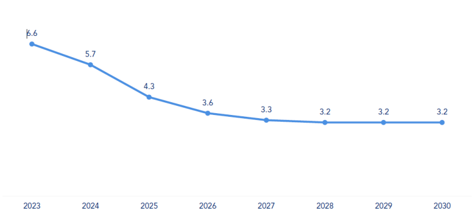

**[Image: Final_RHP.pdf-0126-05.png (778x355, 17.2KB)]**

**PROJECTED GLOBAL GDP, IN TRILLION USD, FROM 2025 TO 2030** 

**(USD 1 = INR 83.67)** 

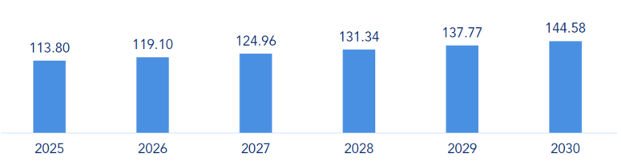

**[Image: Final_RHP.pdf-0126-08.png (775x201, 15.9KB)]**

_Source: International Monetary Fund (IMF)_ 

123 

# **<mark>INDIAN ECONOMY</mark>** 

India's economic growth has been remarkable, positioning it as one of the fastest-growing major economies in the world. Currently ranked as the fourth-largest economy globally, India is expected to become the third-largest by the fiscal year 2030-31, with a projected GDP of USD 7.3 trillion. 

This advancement is the result of a decade of targeted governance, structural reforms, and strengthened global positioning. Robust domestic demand, favorable demographics, and consistent policy reforms have enabled India to expand its global footprint in trade, investment, and innovation. 

Over the last decade, India's GDP has grown significantly, increasing from USD 1.23 trillion in FY15 to an estimated USD 3.82 trillion in FY25, effectively tripling in ten years. In FY25, nominal GDP rose by 9.9%, while real GDP grew by 6.5%. Similar growth patterns are anticipated in FY26, indicating sustained economic momentum. 

This progress is supported by macroeconomic stability, a resilient external sector, a narrowing fiscal deficit, easing inflation, and strong consumption expenditure. Furthermore, improving employment opportunities and the government's emphasis on long-term structural reforms are expected to maintain this growth trajectory. 

India's export performance has also seen remarkable growth over the past decade, reflecting the increasing global demand and credibility of Indian products. Total exports rose from USD 468 billion in FY14 to USD 825 billion in FY25, marking a significant 76% increase. 

At the same time, India's share in global merchandise exports improved from 1.66% to 1.81%, elevating the country's global ranking from 20th to 17th. India's demographic transition, characterized by declining infant mortality rates and rising literacy levels, further enhances its competitive position. 

With more equitable income distribution, higher employment rates, and globally competitive social amenities, India's per capita GDP is expected to grow over the next 25 years, replicating the progress achieved in the past 75 years. 

In the Union Budget for 2025-26, the Indian government allocated Rs. 11.21 lakh crore (USD 129 billion) for capital expenditure, representing a 10.1% increase from the revised estimate of Rs. 10.18 lakh crore (USD 117.2 billion) in FY25. 

# <u>In FY25, key indicators showcased notable improvements:</u> 

- Private Final Consumption Expenditure (PFCE) is set to rise by 7.2% in FY25, up from a 5.6% growth in FY24. 

- June 2025 saw a CPI – Combined inflation of 2.10%, a drop from 5.08% in June 2024 

- Services PMI rose to 61.1 in July 2025, up from 60.4 in June 2025 

- India’s Index of Industrial Production (IIP) for May 2025 was recorded at 156.6, an increase from 154.7 in May 2024. 

- The combined index of eight core industries was 166.7 for FY26 (April-June), up from 164.5 for FY25 (April-June). In June 2025, it was slightly lower at 166.5. 

- Major ports handled cargo traffic of 220.04 million tonnes (MMT) in FY26 (April-June). 

- In June 2025, saw e-way bills surge to 11.94 crore, marking a 19.3% increase from June 2024 

- June 2025's gross GST (Goods and Services Tax) revenue collection was INR 1,84,597 crore (USD 21.38 billion). 

- May 2025 recorded Unified Payments Interface (UPI) transactions at 14,006.48 million, totaling INR 18,41,801 crore (USD 213.27 billion). 

- Merchandise exports for June 2025 were valued at INR 3,03,469 crore (USD 35.14 billion). 

- June 2025 merchandise imports reached INR 4,65,653 crore (USD 53.92 billion). 

- As of July 11, 2025, India’s foreign exchange reserves were INR 59,78,149 crore (USD 692.56 billion). 

- On July 23, 2025, the rupee was valued at INR 86.37/USD. 

- In FY25 (January-March 2025), India attracted a total foreign direct investment (FDI) equity inflow of USD 17.47 billion. 

- According to the Reserve Bank of India (RBI): 

   - As of June 27, 2025, bank credit was INR 1,84,83,098 crore (USD 2.14 trillion). 

124 

- Non-food industries received credit amounting to INR 1,84,18,709 crore (USD 2.13 trillion) as of June 27, 2025. 

# _<u>India's Inflation Reaches Multi-Year Low as Job Market Shows Recovery</u>_ 

- India's headline annual retail inflation decreased from 2.82% in May to 2.10% in June 2025, reaching its lowest level since January 2019. This decline was primarily due to food prices turning negative at -1.06%. The job market showed improvement in May 2025, with an 8.9% increase in job listings after eight consecutive months of decline. Key sectors driving this growth included childcare (27%), personal care and home health (25%), education (24%), and manufacturing (22%), according to Indeed. 

- Private equity (PE) and venture capital (VC) investments in June 2025 totaled INR 14,681 crore (USD 1.7 billion). For Q2 2025 (April-June), these investments reached INR 45,771 crore (USD 5.3 billion) across 248 deals. 

- The Economic Survey 2024-25 reported an 8.2% increase in government capital expenditure from July to November 2024. Defense, railways, and road transport sectors accounted for 75% of the total capital outlay. 

- Service activity-maintained growth momentum with consistent Purchasing Managers' Index (PMI) levels from October 2024 to June 2025, supported by output growth and favorable demand conditions. Rail freight, port traffic, and domestic aviation sectors showed positive trends. Additional indicators of healthy demand included strong fuel consumption, domestic vehicle sales, and high Unified Payments Interface (UPI) transactions 

# _<u>External Trade and Fiscal Outlook</u>_ 

The reduction in merchandise trade deficit and increasing net services receipts are expected to improve India's current account deficit. 

Union Budget 2025-26 Priorities: 

The Union Budget 2025-26, under the theme "Sabka Vikas," aims for balanced regional growth. It focuses on agriculture, Micro, Small and Medium Enterprises (MSMEs), investment, and exports as growth drivers. Key initiatives include the Prime Minister Dhan-Dhaanya Krishi Yojana for agriculture, support for first-time entrepreneurs, and domestic manufacturing promotion through customs duty rationalization. The budget allocates resources for education and healthcare, including plans for 50,000 Atal Tinkering Labs and new medical colleges. 

_Note: Currency conversion to USD is based on OANDA exchange rates as of December 31, 2024._ 

# **<u>IMPACT OF GLOBAL TRENDS ON CONSTRUCTION/INFRASTRUCTURE SECTORS</u>** 

# **INVESTMENT IN ENERGY TRANSITION AND RENEWABLE ENERGY MOMENTUM** 

Industry Association estimates suggest that to meet the emissions targets set by the Paris Agreement, an annual investment of USD 5 trillion in energy transition infrastructure is essential from 2023 to 2050. 

In 2024, fundraising for renewable energy constituted a significant 69% of the total infrastructure capital, highlighting the sector's robust momentum. Additionally, Alter Domus Infrastructure is emerging as a favored choice for long-term investors, being viewed as a natural hedge against inflation amidst prevailing macroeconomic uncertainties. 

# **<u>KEY RISKS: INFLATION, SUPPLY CHAIN, REGULATIONS</u>** 

# **GLOBAL INFLATION EASES, PAVING THE WAY FOR ECONOMIC STABILITY** 

125 

Global inflation is projected to decline steadily, starting from approximately 5.9% in 2024, decreasing to 4.2% in 2025, and further dropping to 3.6% in 2026. This trend aligns inflation rates more closely with central bank targets in many regions. 

The downward movement, driven by improved supply conditions and moderating commodity prices, provides policymakers with the opportunity to gradually implement more supportive monetary policies. The goal is to stimulate economic growth while mitigating the risk of market volatility. Although inflation remains elevated in the U.S., evidence suggests a tapering trend. This may enable the Federal Reserve to consider rate relief by late 2025 or during the first 

# **GLOBAL TRADE AGREEMENTS BOOST CONFIDENCE AMID GEOPOLITICAL TENSIONS** 

In the face of geopolitical tensions and occasional shifts in tariff policies, new trade agreements—such as those forged between the U.S., EU, UK, Japan, and ASEAN—along with selective tariff exemptions, are steadily restoring faith in global trade frameworks. 

Central banks around the globe are enjoying robust support for their independence and policy credibility. This backing is vital for stabilizing inflation expectations and ensuring financial stability. Thanks to this solid foundation, advanced economies have managed to navigate a "soft landing" scenario, despite lingering trade frictions. 

# **<u>GLOBAL CONSTRUCTION GROWTH AND INVESTMENT FLOWS</u>** 

# **GLOBAL CONSTRUCTION SET TO FLOURISH, LED BY CHINA, U.S., AND INDIA** 

China, the U.S., and India are set to spearhead a surge in global construction activity, primarily fueled by infrastructure investments that resonate with green energy and digital transformation objectives. This anticipated growth finds its roots in escalating investments, bolstered by initiatives such as the U.S. Inflation Reduction Act, China's projected rebound post-2025, and India's swift modernization drive. 

# **<u>GLOBAL CONSTRUCTION SET TO SURGE, OVERCOMING SHORT-TERM HURDLES</u>** 

Despite encountering short-term hurdles, the global construction sector stands poised for substantial expansion. After a minor setback in 2025, output is projected to rebound in 2026, largely fueled by infrastructure and civil engineering endeavors. These sectors foresee a growth of roughly 3% in 2025, with a surge to approximately 4–5% in 2026, propelled by the momentum of significant stimulus initiatives. 

Governments are increasingly focusing on green infrastructure and clean energy initiatives. Notably, civil engineering now accounts for nearly one-third of the global construction value, bolstering growth even as residential and commercial sectors show signs of softness. 

# **GLOBAL TRADE AGREEMENTS BOOST CONFIDENCE AMID GEOPOLITICAL TENSIONS** 

Infrastructure & Public-Private Partnerships (PPPs): Governments worldwide are collaborating with private investors to develop roads, ports, energy grids, and clean energy initiatives. Europe has committed a substantial EUR 800 billion (approximately USD 833.24 billion) under its Next Generation EU initiative. Meanwhile, both the US and India are rapidly advancing their large-scale infrastructure projects. 

Technology & Sustainability Integration: Digital innovations—such as AI, Building Information Modeling (BIM), cloud platforms, and modular and 3D printing—are revolutionizing the construction sector. These tools not only boost efficiency but also minimize waste and reduce costs. Many companies are leveraging AI for enhanced planning, predictive maintenance, and optimized workflows. Furthermore, green building practices are gaining traction, driven by policy incentives and a surge in capital allocation focused on Environmental, Social, and Governance (ESG) criteria. 

Cross-Border Investments & Emerging Market Capital: India, leading the charge, has positioned the Asia-Pacific region as a magnet for global real estate and development investments. As of June 2025, India proudly stands as the 7th top global destination for land and development projects. Bolstered by robust fundamentals and a maturing real estate landscape, India is solidifying its status as a premier investment hub in the Asia-Pacific. Concurrently, Africa is witnessing a surge in urban developments, highlighted by the emergence of private startup cities. Nations such as Kenya, Ghana, and Nigeria are capturing the spotlight, enticing both institutional and impact investors. 

126 

# **<u>SCAFFOLDING INDUSTRY</u>** 

Scaffolding, a temporary elevated structure, supports workers, tools, and materials during the construction, maintenance, or repair of buildings, bridges, and other artificial structures. Typically crafted from steel, iron, or bamboo, scaffolding can be either modular (prefabricated) or custom-built on-site. 

# **SIGNIFICANCE OF SCAFFOLDING** 

# **1. Ensures Worker Safety** 

By providing a stable platform at height, scaffolding minimizes the risk of falls and accidents. It facilitates secure movement for workers engaged in tasks like plastering, welding, or painting. 

With India's heightened enforcement of occupational safety standards, scaffolding has become pivotal in ensuring job site compliance, which is critical for companies aiming to establish a strong reputation in the market. 

# **2. Improves Accessibility and Efficiency** 

Scaffolding provides access to challenging areas, especially on tall or irregular structures. By offering ergonomic positions and simplifying the transport of tools and materials, scaffolding accelerates work speed and boosts productivity, a key factor for companies looking to enhance operational efficiency and meet investor expectations. Example: In projects like metro rail construction or airport terminals, scaffolding allows for concurrent multi-level work, drastically cutting down project timelines and showcasing the ability to handle large-scale operations effectively. 

# **3. Supports Structural Stability During Work** 

Scaffolding serves as a supportive framework, holding up sections, slabs, or walls under assembly or curing. This reliability underscores the importance of scaffolding in maintaining project quality, a critical aspect for companies. 

# **4. Integral to India’s Urban Infrastructure Boom** 

With India's ambitious infrastructure initiatives, such as PM Gati Shakti, there's a heightened demand for safe, modular, and compliant scaffolding—especially in large-scale urban, industrial, and real estate endeavors. 

Companies entering the public market can leverage this demand to highlight their role in supporting the nation’s infrastructure growth. 

# **5. Encourages Standardization and Industrial Best Practices** 

Modern scaffolding systems, including aluminum stairway towers and ring locks, offer rapid assembly, modular scalability, and adherence to global safety standards like EN 12811, ANSI, and OSHA. 

Indian companies are swiftly adopting these systems to align with both domestic and international quality standards, a move that positions them as reliable and forward-thinking entities in the eyes of potential investors. 

# **SCAFFOLDING: A PILLAR OF SUPPORT ACROSS KEY SECTORS (Construction, Maintenance & Restoration, and Industrial)** 

Scaffolding is indispensable in sectors demanding elevated access, structural integrity, and worker safety. Here are the three primary domains of its application: 

# <u>Building Construction</u> 

Purpose: Ensures safe access to every level of a building, from foundation to rooftop. 

Key Applications: 

- High-rise residential and commercial developments 

- Support for concrete formwork 

- Elevated masonry and brickwork 

- External plastering, cladding, and facade treatments 

127 

- Installation of windows, electrical conduits, and plumbing 

Example (India): 

- Projects such as Mumbai's Coastal Road, Smart City townships, and urban redevelopment zones leverage modular scaffolding systems (like cup lock and aluminum towers) for enhanced speed and safety. 

- These projects highlight the growing demand for advanced scaffolding solutions, presenting significant opportunities for companies entering the market. 

# <u>Building Maintenance & Restoration</u> 

Purpose: Enables routine repairs, upgrades, and treatments on existing buildings. 

Key Applications: 

- Painting, waterproofing, and facade cleaning 

- Roof repairs and Heating, Ventilation, and Air Conditioning (HVAC) installations 

- Structural inspections and retrofitting 

- Glass replacements and signage setups 

Example: 

In cities like Jaipur and Kolkata, scaffolding aids in maintaining heritage structures, while in Bengaluru and Gurugram, it is pivotal for glass facades on IT and commercial towers. The increasing focus on infrastructure maintenance and restoration underscores the potential for scalable growth in this segment 

# <u>Industrial & Infrastructure Applications</u> 

Purpose: Offers safe platforms in factories and infrastructure sites for constructing or servicing complex systems. 

Key Applications: 

- Refineries, petrochemical facilities, and thermal power stations 

- Steel manufacturing plants and shipyards 

- Bridge and flyover constructions 

- Interiors of metro rail and airport terminals 

- Maintenance of wind and solar plants 

Example: 

India’s industrial corridors, such as the Delhi-Mumbai Industrial Corridor (DMIC), and its defense and aerospace hubs, heavily utilize mobile scaffolding towers for tasks like equipment assembly, ductwork, and large-scale metal fabrication. The robust industrial and infrastructure development pipeline in India offers a lucrative growth avenue for companies poised to capitalize on this demand. 

# **TYPES OF SCAFFOLDING** 

Scaffolding has advanced from traditional bamboo frameworks to modern, engineered systems, supporting diverse applications in construction, infrastructure, and industrial projects. Below are key scaffolding types and their uses. 

- Single Scaffolding 

- Double Scaffolding 

- Suspended Scaffolding 

- Cantilever Scaffolding 

- Trestle Scaffolding 

- Steel Scaffolding 

- Patented Scaffolding 

- Bamboo Scaffolding 

- Kwik Stage Scaffolding 

128 

- Independent Scaffolding 

# I **NDIA SCAFFOLDING MARKET, VALUE IN INR CRORES, 2019-2030** 

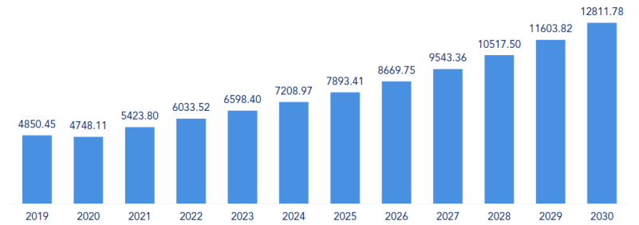

**[Image: Final_RHP.pdf-0132-02.png (801x282, 26.6KB)]**

The India Scaffolding Market studied was valued at INR 7208.97 crores in 2024 and is expected to reach INR 12811.78 crores in 2030, registering a CAGR of 10.06% for the forecast period (2024-2030). 

# **HISTORICAL PERFORMANCE (2019–2024)** 

From 2019 to 2024, India's scaffolding market saw consistent mid-single-digit annual growth, driven by an unprecedented push in infrastructure. Major public initiatives—primarily under the National Infrastructure Pipeline, Smart Cities Mission, and housing schemes like Pradhan Mantri Awas Yojana (PMAY)—spurred a surge in demand for modular steel and aluminum scaffolding systems. 

These systems, known for their quicker setup and enhanced safety, outperformed traditional tube-and-clamp and bamboo alternatives. At the same time, the emergence of rental business models and service-oriented offerings enabled organized players to secure a larger project share. However, they faced challenges from raw-material price fluctuations and a fragmented, unorganized sector, which squeezed margins and caused execution delays. 

# **FORECAST PROJECTIONS (2025–2030)** 

This market expansion is anticipated to be driven by a new wave of highway expansions, metro-rail corridors, and industrial-park developments. The integration of digital technologies—like IoT-enabled load monitoring and QRbased asset tracking—coupled with a stricter enforcement of Bureau of Indian Standards/Indian Standards (BIS/IS) safety standards, is likely to steer demand more towards premium modular scaffolding systems and all-encompassing servitization contracts. Despite challenges from raw-material cost swings and a shortage of skilled labor, the market is poised for robust growth through 2030. This optimism is bolstered by government incentives, new urban infrastructure projects, and a rising focus on eco-friendly scaffolding solutions aligned with ESG principles. 

# **SCAFFOLDING INDUSTRY - BUSINESS MODELS** 

The scaffolding industry is witnessing significant advancements, driven by large-scale infrastructure projects and evolving contractor needs. 

Infrastructure projects demand uninterrupted access to critical areas. To meet this requirement, Engineering, Procurement, and Construction (EPC) firms involved in the Mumbai Coastal Road Project and the Delhi-Meerut Expressway opted to purchase aluminum stairway towers outright. This approach ensures asset availability throughout the project duration, eliminating reliance on rentals during critical phases 

The Mumbai Metro Line 3 project has driven innovation in construction practices. Contractors adopted Bureau of Indian Standards (BIS)-compliant modular towers with quick-lock systems for efficiency. Extended-warranty packages enabled on-site reconfigurations for diverse project needs. Manufacturers responded with hybrid buy-back schemes, training programs, and digital tools like 3D layout previews, enhancing precision and workforce readiness. 

Mid-sized builders in Tier 2 cities face cost barriers in adopting standard aluminum tower sets, priced above INR 1 lakh (USD 1,200). Builders in cities like Indore and Bhubaneswar often rely on rentals or lower-grade steel towers 

129 

due to high capital expenditure (CapEx) requirements. Additional costs for maintenance, storage, and compliance inspections further strain small and medium enterprises (SMEs). 

Despite a broader industry trend leaning towards ownership, the rental model remains pivotal in the scaffolding sector, especially for select market segments. 

In Tier 2 cities, mid-sized builders often turn to rentals or opt for lower-grade steel towers instead of investing in standard aluminum tower sets. 

This choice stems from the hefty capital expenditure (CapEx) tied to buying scaffolding equipment. With standard aluminum tower sets costing over INR 1 lakh (USD 1,200), the price tag poses a considerable financial hurdle for these builders. 

Moreover, added expenses like maintenance, storage, and compliance inspections further burden small and medium enterprises (SMEs), making rentals a more attractive financial solution. 

While rentals are available, major Engineering, Procurement, and Construction (EPC) firms, engaged in significant projects such as the Mumbai Coastal Road and the Delhi-Meerut Expressway, have chosen to buy aluminum stairway towers outright. 

This choice aims to eliminate rental dependencies during crucial project phases, ensuring consistent access and asset availability over the project's multi-year span. Such a move underscores the potential drawbacks of the rental model for long-term, critical projects. 

# **SUMMARY OF RENTAL MODEL ROLE** 

The rental model emerges as a vital solution for mid-sized builders and SMEs grappling with capital expenditure challenges. It offers them essential equipment access without the burdens of hefty upfront investments and ongoing ownership costs. Conversely, for large-scale infrastructure endeavors, the preference leans towards outright purchases, emphasizing strategic asset control and minimizing rental-related disruptions. 

# **KEY GROWTH TRENDS IN THE INDIAN SCAFFOLDING MARKET** 

# <u>1. Government Infrastructure Push Fuels Scaffolding Demand</u> 

India's National Infrastructure Pipeline (NIP) and PM Gati Shakti are set to invest over INR 143 lakh crore (USD 1,711 billion) by 2030, targeting sectors like transport, logistics, housing, and energy. 

Application Impact: Scaffolding demand is on the rise for projects including metro rails, highway flyovers, airport terminals, smart city zones, and affordable housing. 

Growth Insight: As projects grow in volume and duration, there's a marked shift towards modular and safety-certified systems, moving away from traditional bamboo or steel tube setups. This trend presents a significant opportunity for companies to align their offerings with evolving market needs, ensuring scalability and compliance. 

# <u>2. Transition to Modular, Lightweight & Compliant Systems</u> 

There's a clear shift from using bamboo and basic mild steel pipes to advanced systems like cup lock, ring lock, and aluminum stairway towers. 

This transition is largely driven by the adoption of standards such as EN 12811, EN 131, American National Standards Institute (ANSI), and Occupational Safety and Health Administration (OSHA), especially among private developers, Engineering, Procurement, and Construction (EPC) contractors, and Multinational Corporation (MNC)-owned sites. 

Growth Insight: In Tier 1 & Tier 2 construction markets, modular scaffolding and aluminum access systems are projected to grow in the coming years. Companies entering the market can capitalize on this growth by offering innovative, compliant solutions tailored to these segments. 

# <u>3. Surge in Industrial Maintenance and Plant Access Needs</u> 

130 

Industries like refineries, chemical plants, and pharma factories are increasingly relying on mobile scaffolding for swift maintenance, inspections, and upgrades. 

There's a notable demand in locations like Bhiwandi, Sanand, and Pune for rental-based mobile access platforms, especially during shutdowns and Annual Maintenance Contract (AMC) projects. 

Growth Insight: Industrial access solutions, particularly aluminum towers, are emerging as a lucrative sub-segment with substantial rental income potential. Companies with a focus on industrial scaffolding can leverage this demand to establish a strong foothold in the market. 

# <u>4.</u> Rising Popularity of the Rental Model 

Capex-sensitive Micro, Small & Medium Enterprises (MSMEs), Tier 2 contractors, and industrial clients are leaning towards rentals for their short-term or rotating project needs. 

Organized rental players, such as Msafe Group, are capturing market share from unorganized fabricators, thanks to their quicker service, safety compliance, and thorough documentation. 

Growth Insight: By 2030, rentals are anticipated to account for a major share of the industry's revenue, with a pronounced emphasis on infrastructure and industrial sectors. Companies entering the rental market can benefit from this shift by offering competitive, safety-compliant rental solutions. 

_Source: Indian Standards (BIS/ISI), Government Safety Guidelines (e.g. CPWD), Manufacturer Specifications, and Expert Interviews_ 

# **<mark>ALUMINUM SCAFFOLDING MARKET</mark>** 

# **USE CASES:** 

- High-Rise Construction & Fast-Track Residential Towers 

- Industrial & Manufacturing Maintenance 

- Infrastructure & Rail Bridges 

- Commercial Interiors, Malls & Airports 

# **KEY TRENDS** 

# **MODULAR, CONSUMABLE ALUMINUM SYSTEMS GAIN GROUND** 

In early 2024, India's construction sector saw a notable shift toward modular aluminum scaffolding systems, such as ring-lock and cuplock architectures. These systems, designed for repeated reuse, enable quick assembly and easy transportation. Their demand has risen, particularly in metro rail and civil infrastructure projects, where standardized layouts allow frequent component reuse, improving efficiency and material utilization. 

For instance, tenders for metro rail corridors in major cities emphasized the need for “standardized, reusable aluminum scaffolding solutions.” This approach has helped meet tight project timelines while ensuring consistent build quality. Additionally, between late 2024 and early 2025, the government introduced a BIS Quality Control Order (QCO), setting Indian standards (IS) for aluminum alloy products like tubing and structural rods. Effective from March 2024 and extended in 2025, the order mandates ISI certification for infrastructure components, ensuring traceable quality marks. 

In conclusion, the growing adoption of modular aluminum scaffolding systems reflects the sector's focus on efficiency and standardization. Regulatory measures like the BIS QCO have further supported this trend, ensuring quality compliance. As infrastructure projects expand, demand for these systems is expected to grow, driving innovation and improved practices in the construction sector. 

# **PRIORITIZING LIGHTWEIGHT ERGONOMIC DESIGN TO CUT COSTS AND RISKS** 

In 2024, India revised its scaffolding system selection criteria for industrial and construction projects, focusing on workforce safety, quick deployment, and strict quality compliance. This shift was driven by the Ministry of Commerce 

131 

and Industry's phased implementation of Quality Control Orders (QCOs) in October 2023, April 2024, and July 2025, mandating BIS standards for aluminum and aluminum alloy products. 

The QCOs impacted raw materials like extrusions, rods, and bars used in aluminum scaffolding. Manufacturers and contractors adopted certified, lighter aluminum systems that are easier to handle and meet safety standards. Aluminum scaffolds, being 30–35% lighter than steel, simplify transport, assembly, and disassembly, which is crucial for sites requiring mobility and fast turnarounds. 

India’s airport expansions and metro rail projects in 2024 reinforced this trend. Tender requirements emphasized reusability and safe, rapid setups. For instance, Delhi Metro and Mumbai Metro extension projects in 2024 specified BIS-compliant materials and modular equipment, areas where aluminum scaffolding excels over steel. 

The preference for lightweight, ergonomic systems reflects efforts to reduce downtime, minimize injuries, and avoid non-compliance penalties on monitored public infrastructure sites. With rising insurance costs and contractor liabilities, these systems are becoming the industry standard. 

# **SUSTAINABILITY & CIRCULARITY — ALUMINUM’S RISING APPEAL IN INDIAN CONSTRUCTION** 

In 2023, India began shifting its construction policies to embrace circular economy principles. By January 2025, several reports highlighted aluminum's compatibility with the national "6-R philosophy" (Reduce, Reuse, Recycle, Recover, Redesign, Remanufacture), emphasizing its recyclability and its critical role in sustainable material strategies. 

In late 2023, the Material Recycling Association of India (MRAI) advocated for maintaining zero duty on aluminum scrap imports. This initiative aims to support domestic secondary aluminum production while highlighting aluminum's low-carbon benefits and its importance in building a green aluminum ecosystem. 

Producing secondary aluminum requires only about 5% of the energy needed for primary aluminum, resulting in up to 95% savings in energy-related emissions. This makes secondary aluminum an ideal material for construction, aligning with certifications such as Green Rating for Integrated Habitat Assessment (GRIHA), Leadership in Energy and Environmental Design (LEED), and Net-Zero mandates. 

Why it matters: Aluminum's energy efficiency, recyclability, and alignment with India's evolving waste-management regulations position it as a preferred material for sustainable construction. Reusable aluminum scaffolding frames help minimize construction waste and reduce greenhouse gas emissions, supporting national goals for circular materials and ensuring compliance with regulatory standards. 

# **DIGITAL & SMART SCAFFOLDING — MERGING SAFETY WITH DATA IN RENTAL OPERATIONS** 

In 2024, India is experiencing rapid growth in scaffolding inventory management and digital safety compliance tools. Many technology platforms now offer features such as Quick Response (QR)-coded tracking, digital inspection checklists, image-annotated safety logs, and inventory dashboards, all designed to improve safety compliance and traceability at construction sites. 

Global scaffolding management tools are introducing advanced functionalities, including real-time usage monitoring, automatic alerts for missed safety checks, and audit-ready reporting. These features are being piloted in large-scale infrastructure projects, such as metro rail developments, across India in 2024 and 2025. Although fully Internet of Things (IoT)-enabled scaffolding sensors are still in the early stages, digitized workflows for safety audits and material tracking are increasingly being included in tender requirements for major infrastructure projects. 

Why it matters: Data-driven scaffold tracking and safety compliance systems enhance worksite safety, accountability, and audit readiness. These digital rental services enable contractors and project owners to ensure safer operations and optimize inventory usage, laying the foundation for scalable and trackable access-as-a-service models. 

# **INDIA ALUMINUM SCAFFOLDING MARKET, VALUE IN INR CRORES, SALES MODEL, 2019-2030** 

_CAGR (2024 - 2030): 9.86%_ 

132 

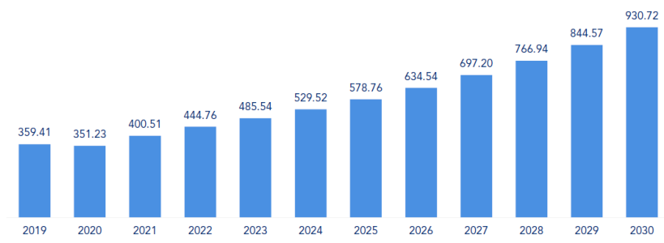

**[Image: Final_RHP.pdf-0136-00.png (819x300, 26.3KB)]**

The Sales Model segment of the India Aluminum Scaffolding Market studied was valued at INR 529.52 crores in 2024 and is expected to reach INR 930.72 crores in 2030, registering a CAGR of 9.86% for the forecast period (2024-2030). 

# **-** **<u>HISTORICAL PERFORMANCE (2019 2024):</u>** 

Between 2019 and 2024, the adoption of aluminum scaffolding in India grew significantly, primarily due to the rapid development of urban infrastructure. This trend was particularly evident in metro corridors and mid-rise commercial real estate, where the need for lightweight and flexible systems became a priority. During this time, the demand for construction equipment in India experienced notable growth. 

By 2024, modular scaffolding systems, including those made of aluminum, represented a substantial share of construction access tools in Tier-1 cities. This shift was largely driven by regulatory requirements emphasizing safety and site efficiency. Additionally, urban building mandates increasingly recommend aluminum scaffolding for use in maintenance zones. 

# **-** **<u>FORECAST PROJECTIONS (2025 2030):</u>** 

As India continues to advance its infrastructure projects under the National Infrastructure Pipeline and smart-city initiatives, the use of lightweight aluminum scaffolding is expected to rise. This is particularly relevant for applications such as interior fit-outs, periodic inspections, and Heating, Ventilation, and Air Conditioning (HVAC) access in projects that prioritize reusability and labor efficiency. 

Rental providers and contractors are anticipated to increasingly prefer aluminum scaffolding for short-to-mediumterm projects in corporate campuses and institutional buildings. This preference is likely to be influenced by a growing focus on sustainability and cost-efficiency, including the reduced potential for scrap material. 

# **INDIA ALUMINUM SCAFFOLDING MARKET, VALUE IN INR CRORES, RENTAL MODEL, 2019-2030** 

_CAGR (2024–2030): 10.54%_ 

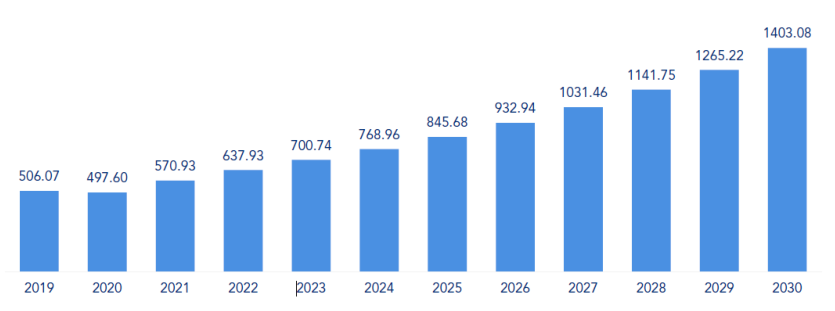

**[Image: Final_RHP.pdf-0136-10.png (835x311, 27.1KB)]**

133 

The Rental Model segment of the India Aluminum Scaffolding Market studied was valued at INR 768.96 crores in 2024 and is expected to reach INR 1403.08 crores in 2030, registering a CAGR of 10.54% for the forecast period (2024-2030). 

# **-** **<u>HISTORICAL PERFORMANCE (2019 2024):</u>** 

During 2023–24, companies such as 360 Degree Global Equipment Pvt. Ltd., based in Bengaluru, and The Creative Ladder, located in Chennai, actively promoted aluminum scaffolding rentals. They provided transparent pricing models, including daily and weekly rates, for products like 4-meter towers and stairway systems. These services primarily supported contractors in the construction, Mechanical, Electrical, and Plumbing (MEP), and industrial maintenance sectors. 

In March 2024, a tender in West Bengal was issued for aluminum scaffolding spares to support operational maintenance. This development reflects the government’s growing familiarity with aluminum scaffolding and its potential inclusion in maintenance-related contracts. 

# **-** **<u>FORECAST PROJECTIONS (2025 2030):</u>** 

The demand for short-term aluminum scaffolding rentals is anticipated to grow across both metro and non-metro regions. Fit-out contractors, general trades, and maintenance teams are expected to drive this trend, as they seek costeffective solutions that eliminate the need for capital investment and storage. By 2024, firms in cities like Chennai, Bengaluru, and Delhi had already adopted platform-based pricing and weekly rental models. 

As maintenance contracts and Public Sector Undertaking (PSU) tenders continue to rise, there is a strong likelihood that future tenders will incorporate rental frameworks. This is particularly relevant for environments requiring frequent access, such as hospitals, universities, and infrastructure corridors, where storage limitations or capital constraints may pose challenges. 

# **<mark>STEEL SCAFFOLDING MARKET</mark>** 

# **USE CASES – STEEL SCAFFOLDING IN INDIAN INFRASTRUCTURE, INDUSTRY & HERITAGE PROJECTS** 

- Metro & Bridge Construction Support Systems 

- Industrial Plant Turnaround & Maintenance 

- Large-Scale Civil & Casting Projects 

- Heritage Restoration & Facade Maintenance 

# **KEY TRENDS:** 

# **INFRASTRUCTURE-DRIVEN STEEL DEMAND FUELS STEEL SCAFFOLDING GROWTH** 

As India continues to prioritize infrastructure development, the demand for steel is steadily increasing, with steel scaffolding playing a crucial role in enabling access and supporting formwork operations. 

In Fiscal Year (FY) 24, India's consumption of finished steel reached 136 million tonnes(Mt), reflecting a ~13% growth compared to FY 23. Infrastructure and construction sectors collectively accounted for 60–68% of this consumption. 

At a construction conclave held at IIT Patna in July 2025, industry experts emphasized that 46% of India’s steel production is now directed toward infrastructure projects, highlighting steel’s indispensable role in large-scale elevated construction activities. 

# **ACCELERATED ADOPTION OF MODULAR SCAFFOLDING SYSTEMS (CUPLOCK/RING-LOCK)** 

Major infrastructure and building projects are increasingly adopting modular scaffolding systems, emphasizing faster assembly and improved safety compliance. 

Infrastructure projects in Tier 1 cities, such as metro developments, smart city initiatives, and high-rise constructions, are moving away from traditional tube-and-coupler scaffolding. Instead, they are opting for modular systems like cuplock and frame scaffolds. This transition is motivated by the need for efficiency, standardized safety measures, and 

134 

the repeatability of modular designs, which align more effectively with IS compliance standards, including IS 2750 and IS 3696. 

The growing regulatory focus on safety has further accelerated the adoption of modular scaffolding. These factoryengineered systems address compliance requirements—such as guardrails, load design, and stability—more effectively by reducing assembly errors and ensuring consistent adherence to safety standards on-site. 

# **SUSTAINABILITY & REUSABILITY — CIRCULAR CONSTRUCTION IN SCAFFOLDING** 

Indian scaffolding suppliers are increasingly adopting environmentally responsible practices, focusing on modular reuse and minimizing waste. 

For example, Cosmos Construction Machinery highlights that its scaffold components can be refurbished and reused up to 100 times across multiple 20-story buildings. This approach not only reduces material waste but also supports sustainable construction practices. 

The adoption of highly reusable scaffolding systems is helping reduce reliance on timber and bamboo supports, contributing to deforestation prevention. These efforts align with broader sustainability goals, such as EPR (Extended Producer Responsibility) and green building certifications. 

# **INDUSTRY COLLABORATIONS & INNOVATION PARTNERSHIPS** 

Collaborations between global scaffold system manufacturers and Indian firms are introducing advanced modular scaffolding technologies to local infrastructure projects. 

In October 2024, Dutch company Scafom-rux entered into a strategic partnership with India’s Kirtanlal Scaffolding & Formwork. This partnership aims to bring Cuplok and Ring lock systems to Indian infrastructure and industrial projects. 

Such collaborations enable Indian manufacturers to enhance their product portfolios, adhere to international safety standards, and accelerate the adoption of factory-engineered systems in large-scale civil and Engineering, Procurement, and Construction (EPC) projects. 

# **SAFETY-FIRST DIGITAL ADVANCEMENTS IN SCAFFOLD MONITORING** 

The integration of Internet of Things (IoT) and digital tools into scaffolding systems is transforming safety practices on Indian construction sites. and digital tools into scaffolding systems is transforming safety practices on Indian construction sites. 

IoT-enabled sensors are now embedded in scaffolding structures to monitor real-time data, such as displacement, load stress, and platform tilt. These systems automatically send alerts when thresholds are exceeded, enabling timely interventions that can save lives. 

Smart-scaffold management platforms, which combine Quick Response (QR) tracking and digital inspection logs, are being piloted in India after gaining traction globally. 

# **INDIA STEEL SCAFFOLDING MARKET, VALUE IN INR CRORES, SALES MODEL, 2019-2030** 

_CAGR (2024 - 2030): 9.69%_ 

135 

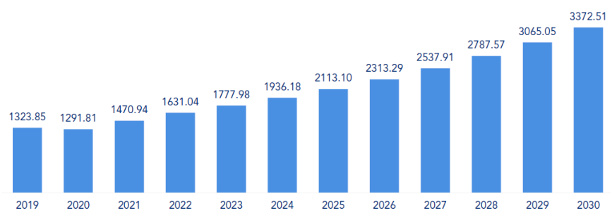

**[Image: Final_RHP.pdf-0139-00.png (867x303, 31.1KB)]**

The Sales Model segment of the India Steel Scaffolding Market studied was valued at INR 1936.18 crores in 2024 and is expected to reach INR 3372.51 crores in 2030, registering a CAGR of 9.69% for the forecast period (20242030). 

# **-** **<u>HISTORICAL PERFORMANCE (2019 2024):</u>** 

The National Infrastructure Pipeline (NIP) in India, which encompasses over 7,400 infrastructure projects slated for completion by 2025, has been a key driver of increasing steel demand. This demand has been particularly notable in sectors such as railways, roads, urban transport, and energy. Consequently, the need for steel scaffolding, especially for formwork and elevated access applications, has remained consistent. 

Although the construction equipment sector experienced a slowdown, with growth decelerating to approximately 3% in FY25 due to election-year restrictions and delays in project execution, the demand for scaffolding equipment demonstrated resilience. This was especially evident in critical infrastructure corridors. 

# **-** **<u>FORECAST PROJECTIONS (2025 2030):</u>** 

The execution of projects under the NIP, coupled with the development of industrial corridors and smart-city initiatives, is expected to drive the continued growth of steel usage in infrastructure. This sustained momentum is likely to support stable growth in the sales of advanced steel scaffolding solutions. 

While demand for construction equipment may follow cyclical trends, the steady progress in infrastructure development—particularly in highways, metro rail, and energy sectors—will continue to create opportunities for steel scaffolding. This is especially true as formwork-intensive delivery models remain prevalent. 

# **INDIA STEEL SCAFFOLDING MARKET, VALUE IN INR CRORES, RENTAL MODEL, 2019-2030** 

_CAGR (2024–2030): 10.54%_ 

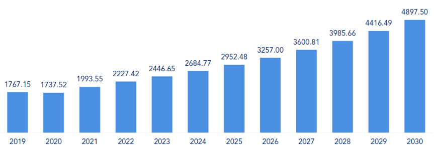

**[Image: Final_RHP.pdf-0139-10.png (863x311, 30.3KB)]**

136 

The Rental Model segment of the India Steel Scaffolding Market studied was valued at INR 2684.77 crores in 2024 and is expected to reach INR 4897.50 crores in 2030, registering a CAGR of 10.54% for the forecast period (20242030). 

# **-** **<u>HISTORICAL PERFORMANCE (2019 2024):</u>** 

In FY 25, the Indian government allocated a significant INR 11.11 trillion (approximately 3.4% of GDP) for capital expenditure. This investment supported the use of rent-based scaffolding across metros, highways, and public works, reflecting the ongoing demand for flexible rental solutions in access systems. 

Many contractors increasingly opted for rental frameworks due to challenges such as project seasonality and limited capital availability. Insights from the equipment sector reveal that approximately 67% of construction equipment sales were facilitated through rentals, emphasizing the growing preference for renting over ownership in India. 

# **-** **<u>FORECAST PROJECTIONS (2025 2030):</u>** 

With infrastructure spending expected to rise and capex remaining a priority in FY 26, the adoption of scaffold rental models is anticipated to grow further. Rentals provide contractors with scalability while eliminating the financial burden of ownership as project demands increase. 

The increasing penetration of rentals is also being driven by digital platforms that enable the timely delivery of equipment. These platforms simplify the process of renting steel scaffolds, particularly for medium-sized contractors in metropolitan areas, thereby encouraging the wider adoption of modular steel scaffolding in access systems. 

# **<mark>ALUMINUM AND STEEL HANGING SCAFFOLDING MARKET</mark>** 

# **USE CASES:** 

- High-Rise Building Facade Cleaning & Glass Maintenance 

- Elevated Metro Pillar and Flyover Finishing 

- Chimney And Stack Maintenance in Power/Industrial Plants 

- Interior Overhead Access in Industrial Warehouses & Mechanical, Electrical, And Plumbing (Mep) Fit-Outs. 

# **KEY TRENDS:** 

# **SURGING HIGH-RISE & ELEVATED INFRASTRUCTURE ACTIVITY** 

India's urban infrastructure is expanding upward, with metro rail corridors, high-rise towers, and elevated expressways driving demand for aluminum and steel hanging scaffolding systems. Projects like the Delhi and Bengaluru Metro require suspended scaffolding for pier and span work at heights of 25–30 meters in congested areas. Certified systems, compliant with CPWD specifications and IS 15764 guidelines, are now mandatory, featuring dual-suspension support and fall arrest mechanisms. This has led builders to adopt durable aluminum and steel solutions over makeshift alternatives. 

Aluminum scaffolds, known for their lightweight and easy repositioning, are commonly used in high-rise façade and cladding projects, while steel systems are favored for infrastructure projects requiring greater load capacity and stability. Stricter safety norms, audits, and penalties for uncertified methods have driven the adoption of certified scaffolding systems, reflecting India's construction growth and regulatory advancements. 

# **TIGHTENING WORK-AT-HEIGHT REGULATIONS AND SAFETY STANDARDS** 

India's construction sector is under stricter regulations for work-at-height safety, particularly for suspended scaffolding systems. Concerns over fall-related fatalities and public infrastructure oversight are driving developers to adopt compliant solutions. For example, CPWD Safety Rule 1410 requires suspension points to support four times the maximum intended load and mandates daily inspection logs, making traditional bamboo scaffolds non-compliant and boosting demand for aluminum and steel alternatives. 

137 

New Standard Operating Procedures (SOPs) require scaffolding systems to be tagged, certified, and re-inspected weekly or after weather-related damage. With liability for accidents shifting to contractors and equipment owners, developers face penalties or delays without proper maintenance and inspection records. These changes are transforming procurement practices, positioning aluminum and steel hanging scaffolds as the preferred choice for safety and compliance. 

# **RENOVATION, MAINTENANCE & REPEAT-SERVICE DEMAND DRIVES HANGING SCAFFOLDING** 

The increasing focus on urban maintenance and renovation in India is driving demand for suspended scaffolding. Tasks like façade cleaning, repainting, joint sealing, and structural repairs in high-rise and mid-rise buildings have made suspended access systems indispensable. A 2024 market summary highlights that growing refurbishment activities are fueling repeated use of hanging platforms. For instance, Kolkata's New Market clock tower restoration relied on scaffolding for precise repairs despite limited ground access. 

Industrial maintenance, such as cooling tower inspections and chimney cleaning, also depends on reusable hanging systems for safe and efficient operations. Aluminum scaffolds are preferred for lighter tasks, while steel platforms handle heavier interventions. These recurring needs make renting suspended scaffolding a cost-effective and reliable solution for elevated work environments. 

# **-** **<u>HISTORICAL PERFORMANCE (2019 2024):</u>** 

Over the past few years, the demand for aluminum and steel hanging scaffolding has grown steadily in major cities, driven by Engineering, Procurement, and Construction (EPC) contractors and metro infrastructure projects. Many contractors have chosen to purchase their equipment outright to avoid delays associated with rentals and to ensure full compliance with safety standards outlined in Indian Standard (IS) 3696 and the Building and Other Construction Workers (BOCW) Act. 

Additionally, there has been a clear shift toward modular aluminum systems, particularly in high-rise commercial and residential projects. Developers and contractors in metropolitan areas have increasingly moved away from traditional tubular steel setups, favoring lighter and faster-to-assemble options that align more effectively with modern construction timelines. 

# **-** **<u>FORECAST PROJECTIONS (2025 2030):</u>** 

Looking ahead, the adoption of turnkey and Design-Build-Operate (DBO) infrastructure contracts is expected to encourage more contractors to invest in standardized hanging scaffolding. The flexibility these systems offer, along with their long-term compliance benefits, is anticipated to be a significant driver of this trend. 

As worker safety regulations become more stringent, particularly with respect to IS3696 standards, private developers are likely to increasingly invest in owning their scaffolding systems. This approach not only minimizes the risk of project delays but also helps developers avoid penalties or legal challenges during inspections. 

# **-** **<u>HISTORICAL PERFORMANCE (2019 2024):</u>** 

During the period from 2019 to 2024, India's urban infrastructure witnessed significant growth, with projects such as metros, bridges, and smart city initiatives expanding at a rapid pace. To manage operational costs effectively and avoid the burden of idle assets, many contractors increasingly rely on rental hanging scaffolding solutions. In response to this growing demand, rental firms expanded their fleet sizes, particularly in Tier 1 cities. 

Government-led infrastructure programs, including the National Infrastructure Pipeline and smart city missions, further encouraged firms to adopt rental solutions. Between 2022 and 2024, there was a notable rise in the use of specialized aluminum and steel hanging scaffolds, especially for short-cycle construction projects in key urban centers like Mumbai, Delhi, and Bangalore. 

# **-** **<u>FORECAST PROJECTIONS (2025 2030):</u>** 

138 

Looking ahead to the period from 2025 to 2030, the demand for rental scaffolding solutions is expected to grow further. Ongoing large-scale infrastructure projects and an increase in retrofitting and restoration activities, such as upgrades to older metro lines and bridges, will likely drive this growth. Modular aluminum and steel hanging systems, which are well-suited for intermittent and project-specific access needs, are anticipated to play a pivotal role in meeting this demand. 

Rental providers are evolving their offerings to include comprehensive services, such as certified setup crews, maintenance support, and Internet of Things (IoT)-enabled condition monitoring. These value-added services are fostering trust and repeat business from EPC players and facility managers, who seek dependable access solutions without the long-term commitment of ownership. 

# **<mark>ALUMINUM STAIRWAY TOWER MARKET</mark>** 

# **USE CASES:** 

- Construction And Building Maintenance 

- Industrial Settings 

- Infrastructure Development 

- Commercial And Retail Spaces 

- Aviation 

- Events And Entertainment 

# **INDIA ALUMINUM STAIRWAY TOWER MARKET, VALUE IN INR CRORES, SALES MODEL, 2019-2030** 

_CAGR (2024 - 2030): 10.06%_ 

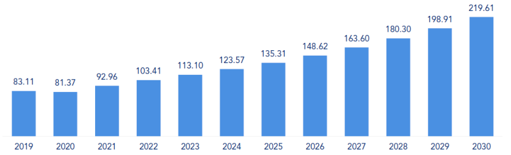

**[Image: Final_RHP.pdf-0142-12.png (833x253, 25.2KB)]**

The Sales Model segment of the India Aluminum Stairway Tower Market studied was valued at INR 123.57 crores in 2024 and is expected to reach INR 219.61 crores in 2030, registering a CAGR of 10.06% for the forecast period (2024-2030). 

# **-** **<u>HISTORICAL PERFORMANCE (2019 2024):</u>** 

Between 2019 and 2024, sales of aluminum stair towers in India surged, riding the wave of a nationwide construction boom. Fueled by rapid urbanization and a slew of government infrastructure initiatives – from roads and housing to metro lines – contractors increasingly opted to buy durable aluminum towers for their projects, rather than renting them. 

During this timeframe, there was a noticeable shift towards lightweight modular systems. Aluminum towers, known for their easy assembly and adherence to stringent safety standards, became the preferred choice. Industry reports highlight the rising popularity of aluminum scaffolding among contractors, citing its lightweight nature, rust resistance, and ease. Notably, sales of stair towers were bolstered by construction and industrial maintenance endeavors, such as work in factories and power plants. 

# **-** **<u>FORECAST PROJECTIONS (2025 2030):</u>** 

139 

From 2025 to 2030, ongoing infrastructure and housing projects will keep generating orders, particularly from large developers purchasing towers for frequent or long-term use. 

Manufacturers are innovating with lighter, stronger aluminum designs and eco-friendly materials to meet sustainability goals. However, rentals are likely to capture more of the market, as many contractors prefer pay-per-use models to avoid tying up capital. Key trends include a further shift to modular, reusable systems and digital support (e.g., design apps, inventory management) that enhance efficiency and safety. Despite robust demand, sales growth grapples with challenges from ongoing aluminum price volatility and mounting competition from rental services. 

# **INDIA ALUMINUM STAIRWAY TOWER MARKET, VALUE IN INR CRORES, RENTAL MODEL, 20192030** 

_CAGR (2024–2030): 10.67%_ 

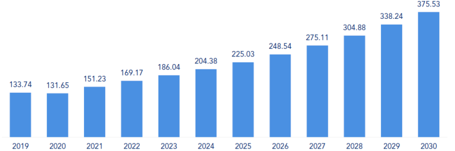

**[Image: Final_RHP.pdf-0143-04.png (775x257, 24.0KB)]**

The Rental Model segment of the India Aluminum Stairway Tower Market studied was valued at INR 204.38 crores in 2024 and is expected to reach INR 375.53 crores in 2030, registering a CAGR of 10.67% for the forecast period (2024-2030). 

# **-** **<u>HISTORICAL PERFORMANCE (2019 2024):</u>** 

Small and mid-sized contractors, seeking towers for short-term or project-specific needs, increasingly turned to rentals. This shift not only alleviated capital expenditure burdens but also removed the maintenance obligation, making rentals especially appealing for seasonal projects. Rentals initially gained traction in metros and industrial hubs, where construction activity was significantly high, due to the demand for cost-effective and flexible solutions. 

Over time, their utility expanded to other sectors. Beyond construction, rentals became indispensable in facility maintenance, utilities, event management, and industrial turnarounds. These industries benefited from the flexibility and reduced financial risks associated with rentals, enabling them to address project-specific requirements efficiently without long-term commitments. 

# **-** **<u>FORECAST PROJECTIONS (2025 2030):</u>** 

As more firms embrace asset-light models, rentals are set to surpass sales. The increasing preference for operational flexibility and cost efficiency drives this shift. An expansion into Tier 2 and Tier 3 cities is on the horizon, fueled by rising demand for rental services in these regions. 

Enhancements in service delivery will stem from online booking portals, Internet of Things (IoT)-driven inventory tracking, and advanced fleet management platforms, which are expected to streamline operations and improve customer satisfaction. To draw in major corporate clients, rental firms are turning their focus towards premium, safetycertified aluminum towers, which offer enhanced durability and compliance with safety standards. With mounting competitive pressures, the industry may witness a wave of mergers and alliances, paving the way for organized players to take the lead in the market and consolidate their positions. 

140 

# **<u>SCAFFOLDING MARKET- KEY MARKET DRIVERS</u>** 

# **1. ROBUST INFRASTRUCTURE DEVELOPMENT** 

The infrastructure development initiatives in India are significantly driving the growth of the ladder and scaffolding market. Government-led projects and increased investments in infrastructure are creating substantial demand for these essential construction tools. 

Government initiatives, such as the National Infrastructure Pipeline (NIP), Smart Cities Mission, and expansions of metro rails, airports, and highways, are driving a surge in demand for ladders and scaffolding. These projects require extensive use of ladders and scaffolding for construction, maintenance, and repair activities. 

Large-scale commercial and residential real estate projects are further accelerating the usage of ladders and scaffolding. These tools are indispensable for construction, repairs, and façade work, making them critical components in the real estate sector. 

In February 2025, the interim budget for FY 2025-26 earmarked a substantial INR 11,210 billion (USD 134.5 billion) for infrastructure development, with a focus on transport, energy, urban development, and digital connectivity to spur economic growth. For FY 2025-26, the government boosted the Road Transport and Highways Ministry's budget to INR 2,873.33 billion, marking a 2.43 percent rise from the previous year's INR 2,805.18 billion. The National Highways Authority of India (NHAI) also saw its budget swell to INR 1,878.03 billion, up from last year's INR 1,693.71 billion. 

Furthermore, the Maritime Development Fund received an allocation of around INR 250 billion for FY 2025-26, aiming to bolster private sector involvement and enhance maritime infrastructure. These measures, alongside the policy announcements and tax proposals outlined in this alert, underscore the government's comprehensive approach to strengthening India's infrastructure and laying the groundwork for sustainable economic growth. 

In conclusion, the Indian government's focus on infrastructure development is directly boosting the ladders and scaffolding market. The increasing investments and large-scale projects are creating a robust demand for these essential tools, positioning the market for significant growth in the coming years. 

# **2. SHIFT TOWARDS ALUMINUM-BASED AND MODULAR PRODUCTS** 

The scaffolding market in India is experiencing a transformative boost, driven by the adoption of aluminum-based and modular products. This shift is underpinned by the need for enhanced safety, efficiency, and long-term costeffectiveness, making these products a preferred choice over traditional steel or bamboo alternatives. 

One of the key factors driving this growth is the lightweight nature of aluminum scaffolding, which is up to 50% lighter than steel. This feature simplifies transportation, assembly, and dismantling, significantly reducing labor requirements and worker fatigue. For example, a 10 m aluminum tower can be erected in just 15-20 minutes, compared to approximately an hour for mild steel scaffolding. This efficiency accelerates project timelines and lowers labor costs, particularly for projects requiring frequent repositioning or those located in remote or challenging areas. 

Another critical factor is aluminum's natural resistance to corrosion, which eliminates the need for galvanization or painting, as required for steel. This makes aluminum ladders and scaffolds ideal for India's diverse climatic conditions, including humid and coastal regions. 

Safety features in modular aluminum systems also play a significant role in boosting the market. These systems often include non-slip platforms, integrated ladders, guardrails, and secure locking mechanisms. Their lightweight design reduces the risk of injuries during handling and assembly. 

Additionally, aluminum's non-conductive property, when appropriately insulated, enhances safety for electrical work. Products from manufacturers like Sendhamarai Engineering and Bharath Ladders incorporate built-in access ladders, anti-slip surfaces, and lockable caster wheels, ensuring safer working environments and compliance with safety standards such as the Indian Standard (IS) 3696 and Occupational Safety and Health Administration (OSHA) regulations. 

141 

In conclusion, the adoption of aluminum-based and modular products is fundamentally transforming the scaffolding market in India. By offering tangible benefits in terms of safety, efficiency, and cost savings, these products enable the construction and industrial sectors to execute projects faster, safer, and more sustainably. Manufacturers and rental providers across the country are actively responding to this demand by introducing a diverse range of innovative aluminum and modular access solutions, further driving market growth. 

# **EXPANSION OF ORGANIZED RENTAL NETWORKS** 

The ladder and scaffolding market in India are experiencing significant growth, driven by the expansion of organized rental networks. These networks are providing cost-effective and flexible solutions, particularly for businesses with infrequent or project-based needs. This trend is further supported by the construction boom, rapid urbanization, and a growing preference for renting over purchasing across various industries. 

Organized rental networks are boosting the ladder and scaffolding market in India through the following factors: 

Cost-Effectiveness: Renting eliminates the high upfront costs associated with purchasing ladders and scaffolding, making it a budget-friendly option for businesses, especially startups and those with limited capital. 

Convenience: Rental services offer access to a wide range of equipment without the burden of maintenance, storage, or eventual disposal. This is particularly appealing to businesses with short-term projects or fluctuating needs. Access to Advanced Equipment: Rental networks provide a variety of specialized ladders and scaffolding, including those with advanced features. This allows businesses to utilize the right equipment for specific tasks without significant investment. 

In conclusion, the organized rental networks in India are playing a pivotal role in driving the growth of the ladder and scaffolding market. By offering cost-effective, convenient, and advanced solutions, these networks are meeting the evolving needs of businesses, particularly those with project-based or short-term requirements. This trend is expected to continue shaping the market in the coming years. 

# **INSIGHTS ON GOVERNMENT INITIATIVES AND REGULATIONS** 

The Indian scaffolding market is witnessing robust growth, propelled by a surging construction sector and heightened government emphasis on infrastructure development. This expansion is closely linked to a series of government initiatives and stringent regulations; all aimed at upholding safety and quality standards. 

# <u>Government Initiatives Fueling the Scaffolding Market:</u> 

<u>Infrastructure Investments: The Indian government is channeling significant funds into vast infrastructure</u> undertakings, spanning roads, power plants, smart cities, and industrial corridors. Such endeavors inherently boost the demand for scaffolding, a vital element in construction. 

As an illustration, the Union Budget 2024 earmarked considerable capital for infrastructure, including INR 11.11 Lakh crores for general infrastructure, INR 10 Lakh crores for the PM Awas Yojana Urban 2.0 (targeting affordable housing), and INR 26,000 crores dedicated to road connectivity projects. 

Furthermore, initiatives like the National Infrastructure Pipeline (NIP) amplify the need for scaffolding systems in expansive construction projects. 

<u>Affordable Housing Initiatives: Schemes such as the Pradhan Mantri Awas Yojana (PMAY) have spurred the creation</u> of millions of housing units, significantly bolstering the demand for scaffolding. 

<u>Renewable Energy Ambitions: India's bold renewable energy targets, such as achieving 500 GW by 2030, are</u> catalyzing extensive energy infrastructure projects, necessitating comprehensive scaffolding solutions. 

142 

<u>Local Manufacturing Push: The overarching "Make in India" initiative, while not solely focused on scaffolding,</u> champions domestic production of construction materials. This not only bolsters the scaffolding industry but also spurs local innovation 

<u>Skill Development Emphasis: Acknowledging the importance of a skilled workforce, the government promotes</u> programs like the National Initiative for Promoting Upskilling of Nirman. Such initiatives aim to equip construction workers with modern technologies, enhancing scaffolding safety and efficiency. 

Regulatory Framework and Safety Standards in India's Scaffolding Market: 

India's scaffolding operations are governed by a comprehensive set of regulations and standards, ensuring safety and quality. Key highlights include: 

<u>Bureau of Indian Standards (BIS) Oversight: The BIS is instrumental in establishing benchmarks for scaffolding</u> materials and methodologies. Notable Indian Standards (IS codes) encompass: 

INSIGHTS ON GOVERNMENT INITIATIVES AND REGULATIONS 

- ➢ IS 3696 (Parts 1 & 2): This standard delineates the safety protocols for scaffolds and ladders. Part 1 emphasizes structural design and construction, while Part 2 addresses safety measures during operation. 

- ➢ IS 4014 (Parts 1 & 2): This standard outlines the best practices for steel tubular scaffolding, detailing definitions, materials, and safety measures. 

- ➢ IS 2750:1964: While this standard lays down the criteria for steel scaffolding, there's a consensus on the necessity to revise it, integrating contemporary practices and materials, especially modular scaffolding. 

The Building and Other Construction Workers' (Regulation of Employment and Conditions of Service) Central Rules, 1998: This legislation mandates stringent safety and health protocols for construction workers, emphasizing the need for adequate scaffolding. It also stipulates that metal scaffolds must meet national standards. 

# **FUTURE GROWTH OUTLOOK** 

The Indian scaffolding market is experiencing significant growth, driven by large-scale infrastructure projects, rising real estate and industrial activity, and a shift towards advanced modular systems. Stricter safety regulations and sustainability initiatives further support this growth, positioning the market for steady expansion through 2033. 

<u>Massive Public Infrastructure Spending</u> 

- ➢ National Infrastructure Pipeline (NIP): NIP plans projects worth over INR 111 trillion (~USD 1.34 trillion) through 2025, with highways, metros, and airports driving a surge in scaffolding demand. 

- ➢ Smart Cities Mission: From 2015 to 2025, 7,479 of the 8,058 Smart Cities projects consumed INR 150,002 crore (~USD 18 billion) in infrastructure works, directly fueling scaffolding needs for urban retrofitting and new builds. 

- ➢ AMRUT (Atal Mission for Rejuvenation & Urban Transformation): Since 2015, AMRUT has allocated INR 78,910 crore (~USD 10 billion) for water, sewerage, and urban network projects, further bolstering scaffolding demand. 

<u>Surging Real Estate & Industrial Activity</u> 

- ➢ Residential and commercial construction, buoyed by initiatives like PMAY (Pradhan Mantri Awas Yojana) and corporate capital expenditure, is driving a robust demand for modular scaffolds. 

143 

- ➢ Industrial corridor expansions, such as Delhi–Mumbai and Chennai–Bengaluru, necessitate large-span, highload scaffolding systems. 

# <u>Shift to Advanced Modular & System Scaffolding</u> 

- ➢ Contractors are transitioning from traditional tube-and-clamp or bamboo scaffolds to prefabricated, systembased aluminum and steel modules, citing benefits like faster erection, enhanced safety, and reusability. 

- ➢ This shift, commanding premium pricing, bolsters rental business models and elevates average project revenues. 

# <u>Stricter Safety & Sustainability Norms</u> 

- ➢ With Bureau of Indian Standards (BIS) standards (e.g., IS 3696) and National Building Code (NBC) guidelines in force, there's a push for engineered scaffolds and fall-arrest systems, leading to a rise in highermargin product usage. 

- ➢ There's a growing focus on eco-friendly materials, such as recyclable aluminum and low-Volatile Organic Compound (VOC) coatings, aligning with corporate Environmental, Social, and Governance (ESG) objectives and green building certifications. 

- ➢ In summary, bolstered by substantial infrastructure investments and a pivot towards safer, modular products, the Indian scaffolding market is poised for steady growth. While challenges like raw material volatility and labor constraints loom, advancements in digital monitoring, rental services, and skills development will spotlight the frontrunners in a projected mid-single-digit growth landscape through 2033. 

# **CHALLENGES** 

The Indian scaffolding market faces several challenges that hinder its growth and development. These challenges, if not addressed, could impact the safety, efficiency, and profitability of market players. Below are the key threats affecting the industry: 

# <u>Surge of Unregulated, Budget Providers</u> 

Approximately 95% of construction projects in India continue to depend on traditional tube-and-clamp or bamboo scaffolding, predominantly sourced from a multitude of small, unlicensed operators. This fragmented market not only drives down prices but also leads to inconsistent safety and quality standards, ultimately squeezing the profit margins of organized, certified suppliers. 

# <u>Recurring Safety Mishaps & Associated Liabilities</u> 

Scaffolding failures pose a significant threat: Bonafide Research highlights that accidents stemming from scaffold collapses or improper setups are “common,” escalating risks of site shutdowns, insurance costs, and legal battles for both contractors and rental firms. 

# <u>Severe Shortage of Trained Scaffold Erectors</u> 

India’s booming infrastructure sector is grappling with a labor shortage. In July 2024, L&T highlighted a deficit of 25,000–30,000 construction workers, including certified scaffolders, leading to project delays and soaring labor costs as companies vie for limited talent. 

# <u>Significant Initial Investment for Premium Materials & Systems</u> 

Shifting from basic tube-and-clamp setups to advanced modular aluminum or steel systems brings enhanced safety and efficiency but requires a hefty capital investment. Due to these financial hurdles, many small contractors opt out of quality alternatives, risking safety and performance. 

# <u>Regulatory Disparities & Compliance Challenges</u> 

144 

While the stringent enforcement of BIS/IS 3696 standards and the Building & Other Construction Workers Act bolsters on-site safety, inconsistent interpretations at the state level and irregular inspection practices can lead to fines, project holdups, and reputational harm for companies that falter in compliance. 

In conclusion, the Indian scaffolding market is navigating a complex landscape marked by unregulated competition, safety concerns, labor shortages, high material costs, and regulatory challenges. Addressing these issues will be critical for fostering a safer, more efficient, and profitable market environment 

# **THREATS** 

<u>Fragmented competition from unorganized players:</u> The Indian scaffolding market is fragmented, dominated by numerous unorganized players. These smaller firms often turn to traditional, cost-effective materials like bamboo. While these materials reduce costs, they compromise safety. This poses a significant threat to organized players who emphasize high-quality, modern scaffolding systems. The unorganized sector's competitive pricing attracts costconscious contractors, intensifying competition and hindering organized players from solidifying their market presence. 

<u>Awareness gaps in safety standards:  Government regulations and safety standards for scaffolding exist, yet awareness</u> and adherence are inconsistent. This inconsistency is especially pronounced in smaller projects and Tier-II and TierIII cities. Such awareness gaps hinder manufacturers of advanced, safety-compliant scaffolding from effectively competing against cheaper, non-compliant alternatives. The threat is further magnified by weak enforcement mechanisms and a scarcity of training programs for workers, complicating the push for safer scaffolding practices. 

<u>Modular systems demand hefty investments:  Modular and system scaffolding, known for their safety and efficiency,</u> come with a steep price. This significant upfront cost can deter small and mid-sized contractors, who often opt for more affordable solutions to manage cash flow in developing economies. The expense of modular systems is heightened by the necessity for specialized training, making them even less accessible to smaller market players. 

<u>Raw material price volatility:</u> The scaffolding industry relies heavily on materials like steel and aluminum. Fluctuations in these raw material prices can significantly impact production costs, threatening manufacturers' ability to maintain stable pricing and profitability. These price changes often stem from global supply chain disruptions, geopolitical tensions, and shifts in demand across industries. For example, between Q2 FY 2019 and Q2 FY 2025, steel prices in major Indian cities saw a notable uptick. In Chennai and Hyderabad, prices climbed from INR 48/kg to INR 66/kg. Bangalore's prices jumped from INR 48/kg to INR 65/kg. Pune's prices ascended from INR 48/kg to INR 64/kg, while Mumbai's rose from INR 48/kg to INR 63/kg. Delhi witnessed a rise from INR 47/kg to INR 63/kg. This trend underscores a consistent six-year rise in steel prices across all analyzed cities. 

Overall, the Indian scaffolding market faces significant threats, including competition from unorganized players, inconsistent safety standard adherence, high costs of modular systems, and raw material price volatility. Addressing these threats requires a concerted effort from stakeholders to promote safety awareness, enforce regulations, and provide cost-effective solutions to ensure sustainable growth in the market. 

# **<mark>OVERVIEW OF CONSTRUCTION AND INFRASTRUCTURE SECTOR IN INDIA</mark>** 

145 

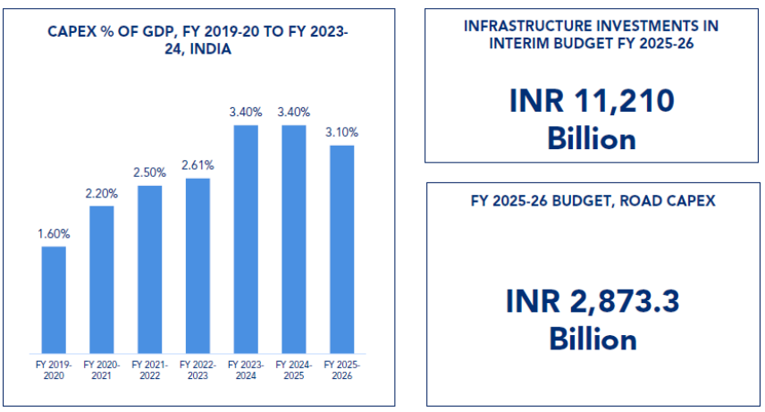

**[Image: Final_RHP.pdf-0149-00.png (856x461, 67.5KB)]**

<u>OVERVIEW OF INDIA'S INFRASTRUCTURE AND CONSTRUCTION LANDSCAPE</u> 

In February 2025, the interim budget for FY 2025-26 allocated INR 11,210 billion for infrastructure development, prioritizing transport, energy, urban development, and digital connectivity to stimulate economic growth. 

For the fiscal year 2025-26, the government allocated INR 2,873.33 billion to the Road Transport and Highways Ministry, reflecting a 2.41 percent increase from the previous year's allocation of INR 2,805.18 billion. Additionally, the budget for the state-owned National Highways Authority of India (NHAI) increased to INR 1,878.03 billion, compared to INR 1,693.71 billion in the prior year. 

Moreover, for FY 2025-26, approximately INR 250 billion was allocated to the Maritime Development Fund to encourage private sector participation and strengthen maritime infrastructure. These initiatives, along with the policy announcements and tax proposals outlined in this alert, highlight the government's comprehensive strategy to enhance India's infrastructure and establish a robust foundation for sustainable economic progress 

_Source: Ministry of Finance_ 

# **CHANGE % ON GDP FROM CONSTRUCTION, Q3 (OCT - DEC) FY 2021 TO Q3 (OCT - DEC) FY 2025, INDIA** 

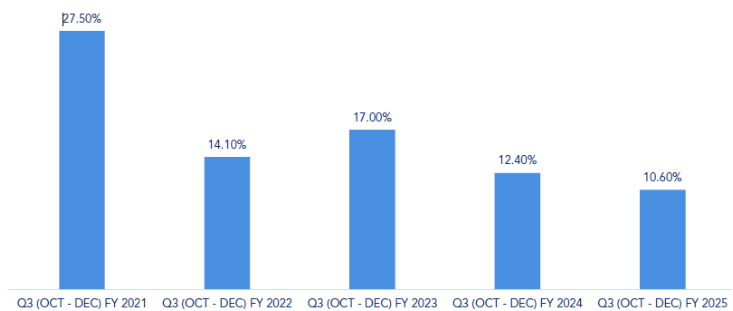

**[Image: Final_RHP.pdf-0149-07.png (733x311, 21.3KB)]**

# **THE ECONOMIC IMPLICATIONS OF INFRASTRUCTURE INVESTMENT** 

146 

In the past decade, India has embarked on an ambitious infrastructure development journey, aiming to rejuvenate its economy. To bolster this endeavor, in February 2025, the government proposed a staggering INR 11,210 billion for capital expenditure, representing 3.1% of the nation's GDP, earmarked in FY 2025-26. 

This allocation has seen a meteoric rise, increasing over fivefold in the last decade. Notably, the most pronounced surge in CAPEX occurred in the past five years, boasting an impressive annual growth rate of 27%. Looking ahead, the government pledges to maintain this momentum, ensuring robust fiscal support for infrastructure. 

This commitment is further underscored by the rising share of the Centre's capital expenditure directed towards infrastructure, jumping from 28% in FY 2014-15 to an anticipated ~60% in FY 2025-26F alongside its other priorities. 

These milestones were propelled by the government's strategic interventions, including the establishment of the National Infrastructure Pipeline (NIP) with projects worth INR 111,000 billion, the National Monetization Pipeline (NMP) valued at INR 6,000 billion, and the PM Gati Shakti National Master Plan. 

Furthermore, large-scale national programs like Bharatmala, Sagarmala, the Regional Connectivity Scheme-UDAN, Dedicated Freight Corridors, the High-Speed Rail network, Railway Station Redevelopment, BharatNet, Jal Jeevan Mission, Atal Mission for Rejuvenation and Urban Transformation (AMRUT), and the Smart Cities Mission have all played pivotal roles... Phase IV of Pradhan Mantri Gram Sadak Yojana (PMGSY) is set to enhance connectivity for 25,000 rural residents. 

_Source: Ministry of Finance_ 

# **KEY ANNOUNCEMENTS FOR CAPITAL EXPENDITURE** 

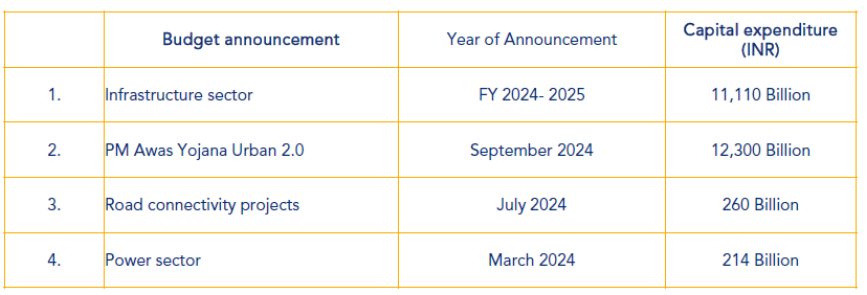

**[Image: Final_RHP.pdf-0150-07.png (867x295, 52.5KB)]**

_Source: Ministry of Finance_ 

# **TREND IN CAPITAL EXPENDITURE, FY 2016-17 TO FY 2024-25, IN INR BILLION** 

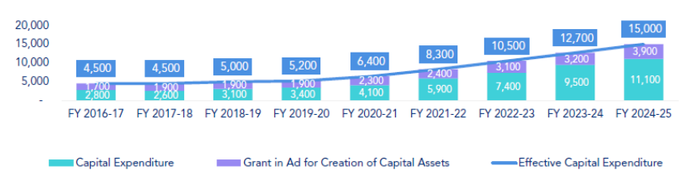

**[Image: Final_RHP.pdf-0150-10.png (863x215, 58.9KB)]**

**INFRASTRUCTURE AND CONSTRUCTION CAPITAL EXPENDITURE, IN INR BILLION, FY 2020-21 TO FY 2029-30F** 

147 

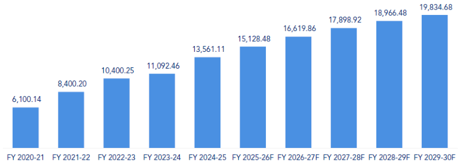

**[Image: Final_RHP.pdf-0151-00.png (775x280, 29.8KB)]**

# _Sources:_ 

_Actual Figures: Ministry of Finance, NITI Aayog, State Public Works Departments (PWDs), and Urban Development Authorities_ 

_Forecasted Figures: Mordor Intelligence, IMF_ 

**<u>CONSTRUCTION AND CONSTRUCTION-SERVICES CAPITAL EXPENDITURE, IN INR BILLION, IN INDIA (FY 2020-21 TO FY 2029-30)</u>** 

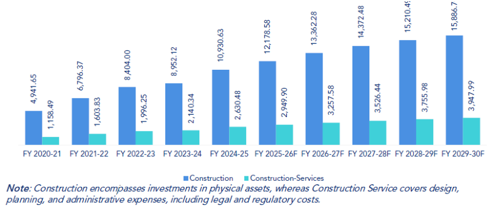

**[Image: Final_RHP.pdf-0151-05.png (813x343, 77.3KB)]**

# _Source:_ 

_Actual Figures: Ministry of Finance, NITI Aayog, State Public Works Departments (PWDs) and Urban Development Authorities_ 

_Forecasted Figures: Mordor Intelligence, IMF, World Bank_ 

# **GOVERNMENT POLICIES AND BIG-TICKET INITIATIVES (SMART CITIES, HOUSING FOR ALL, ETC.)** 

Initiated in June 2015, the Smart Cities Mission aimed to enhance urban infrastructure and services across 100 cities, seamlessly integrating technology with sustainability and improved quality of life. By January 2025, an impressive 93% of the projects (7,507 out of 8,058) had reached completion, with a substantial investment of INR 1,470 billion (USD 17.19 billion). 

This investment has led to the successful rollout of initiatives such as smart water pipelines, intelligent traffic systems, e-health centers, Closed-Circuit Television (CCTV) installations, and upgrades in urban mobility. While the mission officially concluded on March 31, 2025, the generated momentum and established institutional frameworks continue to serve cities, paving the way for scalable models in future urban development. 

148 

Since its inception in 2015, the Pradhan Mantri Awas Yojana (PMAY) has been pivotal in reshaping India's housing landscape, both in urban and rural settings. With over 4.21 crore homes sanctioned, many have been completed and occupied. Initiatives like the Credit Linked Subsidy Scheme (CLSS), Affordable Housing in Partnership (AHP), Beneficiary Led Construction (BLC), and In-Situ Slum Redevelopment (ISSR) have played a crucial role in upgrading slum dwellings into safe, amenity-rich homes. 

In June 2024, the government greenlit PMAY-U 2.0, setting an ambitious goal of adding one crore urban houses. This endeavor is bolstered by a massive investment of INR 10,000 billion (USD 120 billion) and augmented credit guarantees through the Credit Risk Guarantee Fund Trust for Low Income Housing (CRGFT), now under the stewardship of the National Credit Guarantee Trustee Company Ltd. (NCGTC). By March 2025, approvals for over 3.53 lakh homes in underserved categories were granted, underscoring a commitment to inclusivity: over 2.67 lakh homes were allocated to women, alongside specific provisions for Scheduled Caste (SC), Scheduled Tribe (ST), Other Backward Class (OBC), and transgender beneficiaries. 

Uttar Pradesh has seen a significant allocation of INR 120.31 billion (USD 1.40 billion) under PMAY-U 2.0, emphasizing geo-tagging, progress monitoring, and disaster-resilient designs. Overall, PMAY stands as a formidable catalyst, driving GDP growth, expanding housing finance, boosting demand for materials, and generating employment in construction-related sectors 

_Note: Currency conversion to USD is based on OANDA exchange rates as of December 31, 2024_ 

# **<mark>OVERVIEW OF LADDERS INDUSTRY</mark>** 

**INDIA LADDERS MARKET, VALUE IN INR CRORES, 2019-2030** _CAGR (2024 - 2030): 8.65%_ 

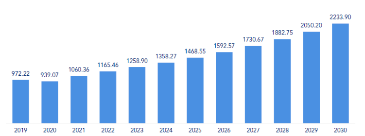

**[Image: Final_RHP.pdf-0152-06.png (751x280, 24.7KB)]**

The India Ladders Market studied was valued at INR 1358.27 crores in 2024 and is expected to reach INR 2233.90 crores in 2030, registering a CAGR of 8.65% for the forecast period (2024-2030). 

# **–** **<u>HISTORICAL PERFORMANCE (2019 2024)</u>** 

From 2019 to 2024, demand for ladders surged in India, driven by sectors like construction, manufacturing, and facilities maintenance. This uptick was largely a response to the nation's swift urbanization and ongoing infrastructure projects. 

As workplace safety standards tightened, industries such as construction, oil & gas, and electrical manufacturing increasingly turned to certified, high-quality ladder solutions. 

Online retail platforms broadened access to ladder products, further propelling market growth. Consumers showed a growing inclination towards lightweight, portable, and multi-purpose ladders, appealing to both professionals and DIY enthusiasts. 

149 

# **–** **<u>FORECAST PROJECTIONS (2025 2030)</u>** 

Spurred by rapid urbanization, residential and commercial construction is expected to remain a significant driver of the ladder market in India during the forecast period. As industries increasingly prioritize safety, the demand for certified, high-quality ladders is set to grow. 

Furthermore, there's a noticeable market shift towards lightweight, multi-functional, and easily storable ladders, thanks in part to advancements in aluminum, fiberglass, and composite materials. 

# **FRP LADDERS - SALES MODEL** 

**INDIA FRP LADDERS MARKET, VALUE IN INR CRORES, SALES MODEL, 2019-2030** _CAGR (2024 - 2030): 9.97%_ 

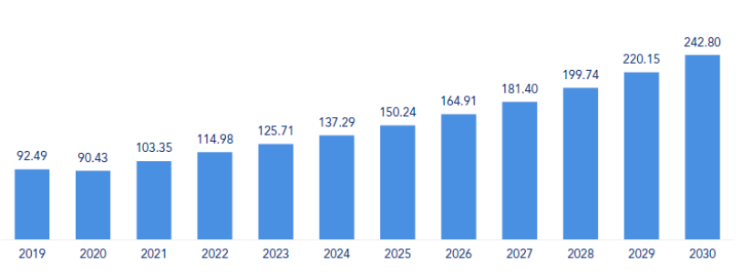

**[Image: Final_RHP.pdf-0153-05.png (825x299, 26.7KB)]**

The Sales Model segment of the India FRP Ladders Market studied was valued at INR 137.29 crores in 2024 and is expected to reach INR 242.80 crores in 2030, registering a CAGR of 9.97% for the forecast period (2024-2030). 

# <u>Growth of FRP Ladder Market in India</u> 

India's consumption of Fiber-Reinforced Plastic (FRP) Ladders is on the rise, driven by heightened industrial safety standards and expansions across sectors like utilities, telecom, oil & gas, and construction. 

Take, for instance, the Indian government's endorsement of the Broadcasting Infrastructure & Network Development (BIND) scheme, spanning 2021-26, with a hefty budget of INR 25,396 million (USD 303.5 million). 

This initiative focuses on modernizing the nationwide Doordarshan network. Currently, Doordarshan's Free Dish, a complimentary Direct to Home (DTH) service, boasts nationwide coverage. Moreover, the Andaman & Nicobar Islands benefit from a dedicated 10-channel C-Band Satellite DTH service. 

Distribution platforms, including Direct to Home (DTH) and Headend in the Sky (HITS), utilize satellites and airwaves to broadcast TV channels. This capability allows them to cater to remote and hilly terrains, ensuring comprehensive coverage across India. 

On another note, infrastructure investments in India have surged, influenced by both public and private sector contributions. Budget allocations for infrastructure spending skyrocketed to INR 1000 billion (USD 119.50 billion) in 2023-24. Such robust investments in infrastructure signal a promising trajectory for the FRP ladder market in India. 

# **FRP LADDERS - RENTAL MODEL** 

**INDIA FRP LADDERS MARKET, VALUE IN INR CRORES, RENTAL MODEL, 2019-2030** _CAGR (2024 - 2030): 10.14%_ 

150 

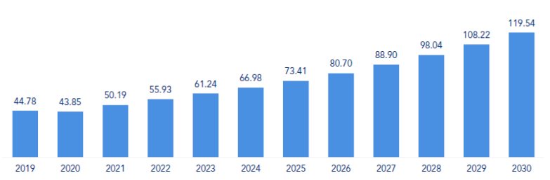

**[Image: Final_RHP.pdf-0154-00.png (783x257, 23.3KB)]**

The Rental Model segment of the India FRP Ladders Market studied was valued at INR 66.98 crores in 2024 and is expected to reach INR 119.54 crores in 2030, registering a CAGR of 10.14% for the forecast period (2024-2030). 

# <u>FRP LADDER RENTAL MODEL IN INDIA</u> 

In the Fiber-Reinforced Plastic (FRP) Ladder market in India, specialist access-equipment providers, such as Y Equipment Services (formerly Youngman India), are increasingly shaping the FRP ladder rental model. With a panIndia network of 24 outlets, these firms offer both aluminum and FRP ladders. Before dispatch, these ladders undergo rigorous safety testing—including base slip, lateral deflection, bending, and torsion checks—to meet EN 131 standards. This safety certification is central to the model’s value proposition: companies rent ladders with confidence, assured of their compliance with workplace safety norms. 

Clients, including construction contractors, industrial maintenance teams, and facility management firms, seek flexible height-access solutions without the burden of ownership. Rental providers enhance their offerings with services like delivery (including same-day in metros), on-site training, and ongoing inspections. The allure of renting is heightened for maintenance, electrical, Heating, Ventilation, and Air Conditioning (HVAC), and event-related projects, thanks to the combination of non-conductive FRP construction, certified compliance, and rapid availability. 

# <u>DIVERSE FRP LADDER FLEET: MEETING VARIED INDUSTRIAL AND SAFETY NEEDS</u> 

The rental fleets boast a variety of FRP ladder types—straight self-supported ladders, platform-style units with wheels, telescopic variants, and integrated mobile platforms. These diverse offerings cater to a broad spectrum of needs, from indoor retail maintenance to industrial electrical tasks. 

Providers like K2 Scaffold emphasize the safety edge of FRP ladders by offering rentals specifically for electrically insulated fiberglass ladders. These ladders are crucial for tasks like painting, bulb replacements, plastering, and working near live electrical installations—situations where aluminum ladders pose significant safety risks. This underscores the FRP ladder’s safety advantage and bolsters its rental appeal in sectors with sporadic access needs. 

# **ALUMINUM LADDERS – SALES MODEL** 

**INDIA ALUMINUM LADDERS MARKET, VALUE IN INR CRORES, SALES MODEL, 2019-2030** _CAGR (2024 - 2030): 8.37%_ 

151 

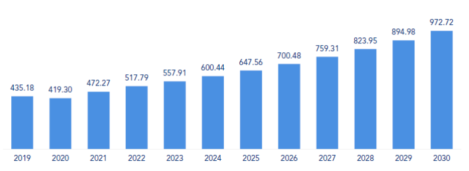

**[Image: Final_RHP.pdf-0155-00.png (788x288, 26.4KB)]**

The Sales Model segment of the India Aluminum Ladders Market studied was valued at INR 600.44 crores in 2024 and is expected to reach INR 972.72 crores in 2030, registering a CAGR of 8.37% for the forecast period (2024-2030). 

# - <u>HISTORICAL PERFORMANCE (2019 2024):</u> 

Over the past few years, as urban areas have expanded and governments have pushed infrastructure initiatives like smart cities and housing schemes, the demand for aluminum ladders has surged in India. Particularly, aluminum ladders, prized for their lightweight, durability, and resistance to corrosion, find extensive use in construction, utilities, telecommunications, and maintenance. 

Additionally, heightened awareness and enthusiasm for home improvement, Do-It-Yourself (DIY) repairs, and gardening have driven up the demand for compact and user-friendly aluminum ladders. Among these, telescopic, folding, and multi-purpose variants have gained traction in residential settings. 

# - <u>FORECAST PROJECTIONS (2025 2030):</u> 

Industries are expected to turn increasingly to certified aluminum ladders equipped with advanced safety features, driven by stricter safety regulations and standards. For commercial and industrial users, adherence to international safety benchmarks like American National Standards Institute (ANSI) and the Occupational Safety and Health Administration (OSHA) is now pivotal in their purchasing choices. 

In a bid to bolster ladder safety and usability, manufacturers in India are set to channel further investments into research and development, unveiling innovative designs and features. Consumers are showing a marked preference for innovations, including anti-slip treads, extendable frames, locking mechanisms, and versatile multi-functional ladders. 

# **ALUMINUM LADDERS – RENTAL MODEL** 

**INDIA ALUMINUM LADDERS MARKET, VALUE IN INR CRORES, RENTAL MODEL, 2019-2030** _CAGR (2024–2030): 9.25%_ 

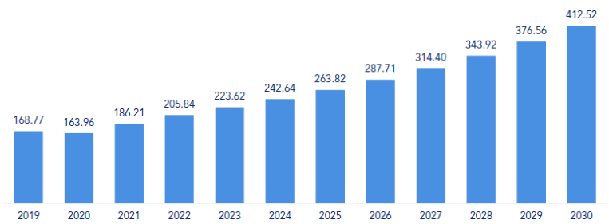

**[Image: Final_RHP.pdf-0155-10.png (763x281, 24.2KB)]**

The Rental Model segment of the India Aluminum Ladders Market studied was valued at INR 242.64 crores in 2024 and is expected to reach INR 412.52 crores in 2030, registering a CAGR of 9.25% for the forecast period (2024-2030). 

152 

# - <u>HISTORICAL PERFORMANCE (2019 2024):</u> 

During the period from 2019 to 2024, companies and contractors in India, driven by a surge in infrastructure projects and short-term construction activities, increasingly turned to aluminum rental ladders over outright purchases, effectively optimizing their capital expenditure. These rental services offered businesses the flexibility to use ladders solely for the duration of specific projects. 

Organized rental startups and platforms, such as Ladder Kart and RentSher, have emerged, prominently featuring aluminum ladders in their equipment catalogs. These platforms have streamlined the process with easy online booking, doorstep delivery, and pickup, significantly enhancing accessibility for small contractors and individual users. 

Companies, especially Small and Medium Enterprises (SMEs) and startups, have increasingly turned to rental models, sidestepping hefty upfront costs and minimizing maintenance duties. This trend has gained notable traction in metropolitan and industrial centers like Mumbai, Bengaluru, and Delhi National Capital Region (NCR). 

# - <u>FORECAST PROJECTIONS (2025 2030):</u> 

During the forecast period, the pipeline of government initiatives, including the Smart Cities Mission, Industrial Corridors, and renewable energy projects, is poised to drive a consistent demand for short-term access equipment, notably rented aluminum ladders. 

Technology-driven rental platforms are set to take the lead, boasting features like online booking, real-time availability checks, doorstep delivery, and flexible rental durations. By integrating Internet of Things (IoT) and asset tracking, these platforms aim to enhance ladder utilization and maintenance, thereby boosting renter trust. 

# **LADDERS MARKET** 

# **MARKET DRIVERS** 

<u>RISING DEMAND DRIVEN BY RAPID URBANIZATION</u> 

In India, rapid urban development and extensive infrastructure projects are driving up the demand for lightweight, portable access tools, notably aluminum ladders. This surge is especially pronounced in the industrial, telecom, and utility sectors, which prefer aluminum for its superior strength-to-weight ratio and resistance to corrosion. 

According to a report by the Indian Brand Equity Foundation (IBEF), cities are poised to create 70% of net new jobs by 2030, contribute approximately 70% to India's GDP, and propel a nearly fourfold surge in per capita incomes nationwide. India's urban populace is set to swell to 590 million by 2030. To cater to this burgeoning urban demand, the economy must construct between 700 million and 900 million m2 of residential and commercial space annually. These trends are fueling the market for ladders in India. 

# <u>BOOM IN CONSTRUCTION & MANUFACTURING SECTORS FUELS THE MARKET</u> 

Widespread development and industrialization, especially in infrastructure construction, manufacturing, and maintenance, are fueling robust market growth for Fiber-Reinforced Plastic (FRP) ladders in India. 

In the Union Budget for FY26, the government has boosted the capital investment outlay for infrastructure to INR 11.21 lakh crore (USD 128.64 billion), marking a significant 3.1% of the nation's GDP. To boost the infrastructure sector, the Indian government has unveiled the National Infrastructure Pipeline (NIP) alongside initiatives such as 'Make in India' and the Production-Linked Incentives (PLI) scheme. 

According to the Indian Brand Equity Foundation (IBEF), India's manufacturing sector has attracted Foreign Direct Investment (FDI) amounting to INR 14,45,781 crore (USD 165.1 billion). This marks a 69% surge over the last decade, largely fueled by production-linked incentive (PLI) schemes. Over the next five years, Adani Group is set to invest 

153 

INR 30,237 crore (USD 3.46 billion) in Kerala, with a primary focus on infrastructure, logistics, and manufacturing. These trends indicate a demand for ladders in India. 

# <u>INCREASING FOCUS ON SAFETY REGULATIONS</u> 

With a growing focus on fire retardancy, electrical safety, UV protection and overall safety, the market for Fiber Reinforced Polymer (FRP) ladders has been receiving a boost in India. FRP ladders offer key safety benefits like the prevention of electrical accidents and shocks, reduction in the risk of falls and injuries, enhancement of balance during work, and need for reduced maintenance. 

FRP ladders, designed to meet stringent safety regulations, offer peace of mind to both employers and workers in India. By adhering to standards like European Norm 131 (EN131), these ladders undergo rigorous testing, ensuring they meet essential criteria for strength, stability, and performance. 

# **<u>THREATS</u>** 

<u>Low-Quality Imports & Counterfeit Products: India's open import channels facilitate a steady influx of cheap,</u> uncertified ladders—often sourced from low-cost manufacturing hubs—that bypass rigorous safety norms. Such practices erode consumer trust, particularly in the wake of workplace accidents, and compel domestic players to compete primarily on price rather than quality. These low-quality imports not only compromise safety but also create a perception that ladders, as a product category, are unreliable, further impacting the market's growth potential. 

<u>Substitute Access Solutions: As industries increasingly turn to aerial lifts, scaffolding systems, and hydraulic platforms</u> for quicker and safer access, traditional ladders are becoming less relevant in high-value projects, including industrial maintenance, airports, and major construction sites. This evolution confines ladder sales to smaller, low-margin segments. Additionally, the growing preference for these advanced solutions is driven by their ability to enhance worker productivity and safety, making them a more attractive option for large-scale projects. 

<u>Economic Slowdowns & Demand Fluctuations: Given the ladder market's close ties to India's construction,</u> manufacturing, and infrastructure sectors, downturns—like real estate slumps or postponed public works—can lead to sudden order cancellations and inventory surpluses. These fluctuations not only disrupt the supply chain but also create financial strain for manufacturers, particularly those with limited cash flow or high inventory holding costs. 

<u>Price-Intensive Market Competition: The prevalence of unorganized sector players offering rock-bottom prices</u> squeezes profitability for established brands. This "race to the bottom" stifles reinvestment in product innovation, durability enhancements, and compliance upgrades. Furthermore, the lack of stringent regulations allows these unorganized players to thrive, making it challenging for organized brands to differentiate themselves solely on quality and safety standards. 

<u>Weak Occupational Safety Culture: In small workshops, construction teams, and the informal service sector</u> (comprising unregulated, small-scale, or unregistered businesses operating outside formal legal and safety norms), there's a pronounced lack of awareness regarding ladder safety. This oversight leads to a preference for price over safety compliance, resulting in stagnant demand for certified, premium ladders despite evident safety hazards. The absence of mandatory safety training and enforcement further exacerbates the issue, leaving workers vulnerable to accidents and injuries. The Indian ladder market faces significant threats from low-quality imports, substitute solutions, economic fluctuations, and weak safety awareness. These factors collectively challenge the market's ability to maintain quality, safety, and profitability, particularly in the face of price-driven competition. 

# **<u>CHALLENGES</u>** 

<u>Raw Material Price Volatility: Indian ladder manufacturers, heavily dependent on imported aluminum and fiberglass,</u> find themselves at the mercy of global commodity price fluctuations. For instance, in 2022, the price surged to USD 2,705 per metric ton, up from USD 2,473 in 2021. Such sudden spikes can strain margins, especially for those locked into fixed-price contracts. This volatility also makes it difficult for manufacturers to plan long-term pricing strategies, impacting their competitiveness in both domestic and export markets. 

154 

<u>Regulatory Compliance & Certification Costs: Securing Bureau of Indian Standards (BIS) certification or meeting</u> European Norm/International Organization for Standardization (EN/ISO) standards demands significant investment in testing facilities, precision tooling, and rigorous quality audits. For many smaller Indian ladder manufacturers, these expenses often eclipse immediate market returns. Additionally, the lack of streamlined processes for obtaining certifications further increases the time and cost burden, discouraging smaller players from entering or expanding in the organized market. 

- <u>Safety Related Liability Risks: In India, frequent workplace accidents involving ladders pose legal and reputational</u> challenges for manufacturers. When issues arise from defective products or misuse, the repercussions can be severe, leading to expensive recalls and insurance claims. Moreover, the growing awareness of workplace safety among endusers is increasing the scrutiny on manufacturers, making it imperative for them to invest in robust quality control and safety measures to mitigate liability risks. 

<u>Fragmented Supply Chain: The Indian ladder market's dependence on local dealers and small distributors results in</u> inconsistent quality control. This fragmentation can lead to uneven after-sales support and mixed safety messaging across regions, undermining brand credibility. Furthermore, the lack of centralized distribution networks increases logistical inefficiencies, making it harder for manufacturers to ensure timely delivery and uniform product availability across the country. 

<u>Slow Pace of Technology Adoption: While global competitors are rolling out ladders featuring ergonomic designs,</u> smart safety indicators, and eco-friendly materials, many Indian manufacturers, especially the smaller ones, are lagging in adopting these innovations. This delay causes them to miss lucrative opportunities in premium exports and urban markets. Additionally, the reluctance to invest in advanced manufacturing technologies stems from high initial costs and a lack of technical expertise, further widening the gap between Indian and global players in terms of product offerings. The challenges faced by the Indian ladder market, including raw material price volatility, regulatory costs, liability risks, supply chain fragmentation, and slow technology adoption, hinder its growth potential. Addressing these issues is critical for manufacturers to remain competitive and capitalize on emerging opportunities. 

155 

# **<u>OUR BUSINESS</u>** 

_Some of the information contained in the following discussion, including information with respect to our plans and strategies, contain forward-looking statements that involve risks and uncertainties. You should read the section “Forward-Looking Statements” for a discussion of the risks and uncertainties related to those statements and also the section “Risk Factors” for a discussion of certain factors that may affect, financial condition, or results of operations. Our actual results may differ materially from those expressed in or implied by these forward-looking statements. Our fiscal year ends on March 31 of each year, so all references to a particular fiscal are to the Twelvemonth period ended March 31 of that year. Only to the extent explicitly indicated, industry and market data used in this section has been derived from the report titled “India Scaffolding and Ladders Market” dated August 11, 2025 (the “Mordor Report”), prepared and issued by Mordor Intelligence, commissioned by and paid for by our Company. The Mordor Report has been prepared and issued by Mordor Intelligence Private Limited for the purpose of understanding the industry exclusively in connection with the Issue. In this section, a reference to the “Company” or “we”, “us” or “our” means Msafe Equipments Limited._ 

_All financial information included herein is based on our_ **“** **_Financial information of the Company”_** _included on page 222 of this Red Herring Prospectus._ 

# **OVERVIEW** 

Incorporated in 2019, we are engaged in the business of manufacturing, sales and rental of access and height-safety equipments, primarily used to facilitate safe working at heights. Our product portfolio includes aluminium scaffoldings, mild steel (MS) scaffoldings, aluminium ladders and fibre reinforced plastic (FRP) ladders, which are designed to meet varied operational and safety requirements across construction, maintenance, installation, repair and infrastructure development activities. These products provide safe and stable access for vertical and elevated operations, enabling workers to undertake a wide range of activities such as building exterior works (including facade and cladding installation), painting and plastering, HVAC and MEP works, electrical cabling and fittings, ceiling and interior finishing, fire-fighting works and warehouse stacking and retrieval, among others, while significantly reducing the risk of workplace accidents. 

The India Scaffolding Market was valued at Rs. 7208.97 crores in 2024 and is expected to reach Rs. 12811.78 crores in 2030, registering a CAGR of 10.06% for the forecast period (2024-2030). The scaffolding industry is moving away from traditional bamboo and basic mild steel pipes to advanced, safety-certified systems like cup lock, ring lock, and Aluminium stairway towers. Aluminium scaffolding is becoming increasingly popular due to its lightweight nature, ease of transportation, rapid assembly, corrosion resistance and extended lifespan. (Source: Mordor Report) 

The India Ladders Market was valued at Rs. 1,358.27 crores in 2024 and is expected to reach Rs. 2,233.90 crores in 2030, registering a CAGR of 8.65% for the forecast period (2024–2030). Growth in this sector is driven by infrastructure development, urbanization, industrial expansion, stringent safety regulations, and innovations in ladder design and materials. (Source: Mordor Report) 

We offer various types of aluminium scaffoldings such as stairway, narrow-width, extra reach, podium, cantilever, and bridge sections. Aluminium scaffoldings are lightweight, modular systems known for rapid assembly and scalability. MS scaffoldings are steel structures used in long-duration construction and infrastructure projects that require higher structural strength and load-bearing capacity. Aluminium and FRP ladders include A-type, straight, platform and cage variants. Aluminium ladders are commonly used where mobility is required, while FRP ladders are non-conductive and suitable for electrical applications. 

Our customer base extends across a wide spectrum of industries, including civil construction, infrastructure development, facility management, HVAC solutions, MEP contracting, interior contracting, electrical contracting, warehousing and logistics, firefighting and safety systems, among others. During FY 2024-25, we served more than 2,500 customers through both sales and rental channels. 

Our revenues are derived from two primary sources – sale of products and rental services. Over the  six months period ended September 30, 2025 and last three fiscal years, the rental model has consistently contributed significant portionto our revenues, accounting for 43.07% for the period ended September 30, 2025, 51.65% in FY 2024-25, 52.30% in FY 2023-24 and 62.97% in FY 2022-23. Under the rental model, we provide aluminium scaffoldings, 

156 

ladders and MS scaffoldings on weekly, fortnightly or monthly terms to customers across India. This model enables customers to access scaffolding systems without upfront capital investment, while providing us with recurring revenue streams. According to the Mordor Report, organized rental networks are expanding, providing cost-effective and flexible solutions, particularly benefiting Micro, Small, and Medium Enterprises (MSMEs) and Tier-II contractors with short-term project needs. 

# **Product-wise revenue bifurcation:** 

The following table sets forth the bifurcation of revenue (product-wise) for the six months period ended September 30, 2025, and for the fiscal years 2025, 2024 and 2023: 

||||||||(Rs |. in lakhs) |
|---|---|---|---|---|---|---|---|---|
|**Category**|**For the**|**% of**|**Fiscal**|**% of**|**Fiscal**|**% of**|**Fiscal**|**% of**|
||**period** **ended** **Septembe** **r 30, 2025**|**revenue** **from** **operatio** **n**|**2025**|**revenue** **from** **operation** **s**|**2024**|**revenue** **from** **operation** **s**|**2023**|**revenue** **from** **operation** **s**|
|**Sale** **of** **Products**|||||||||
|Aluminium Scaffolding|1,797.65|36.68%|2,563.9 2|35.94%|1,797.4 0|37.34%|777.33|26.17%|
| Ladder (Aluminiu m & FRP)|62.85|1.28%|67.56|0.95%|14.89|0.31%|-|-|
| Mild Steel (MS) Scaffolding|488.33|9.96%|147.96|2.07%|2.95|0.06%|-|-|
| Aerial Work Platform - Scissor lift|-||-|-|-|-|9.93|0.33%|
|**Total- A**|**2,348.83**|**47.92%**|**2,779.4** **5**|**38.96%**|**1,815.2** **4**|**37.71%**|**787.26**|**26.51%**|
|**Rental** **Services**|||||||||
|Aluminium Scaffolding|1,942.68|39.64%|3,486.6 6|48.87%|2,430.7 4|50.50%|1,780.0 5|59.94%|
|Ladder (Aluminiu m & FRP)|67.95|1.39%|78.21|1.10%|46.05|0.96%|-|0.00%|
| Mild Steel (MS) Scaffolding|97.94|2.00%|73.41|1.03%|15.76|0.33%|-|0.00%|
|Aerial Work Platform - Scissor lift|2.25|0.05%|46.20|0.65%|24.49|0.51%|90.05|3.03%|
|**Total– B**|**2,110.82**|**43.07%**|**3,684.4** **8**|**51.65%**|**2,517.0** **4**|**52.30%**|**1,870.1** **0**|**62.97%**|
|**Total** **(A+B)**|**4,459.65**|90.99%|**6,463.9** **3**|**90.61%**|**4,332.2** **8**|**90.01%**|**2,657.3** **6**|**89.48%**|
|Other Operating Income (C)|441.43|9.01%|670.14|9.39%|480.82|9.99%|312.41|10.52%|

157 

|**Revenue**|||||||||
|---|---|---|---|---|---|---|---|---|
|**from** **Operations** **(A+B+C)**|**4,901.08**|**100.00%**|**7,134.0** **7**|**100%**|**4,813.0** **9**|**100%**|**2,969.7** **7**|**100%**|

Until FY 2022-23, our Company relied on third parties for the supply of aluminium scaffoldings, which were procured either through job-work or direct purchases. In FY 2023-24, we commenced in-house manufacturing covering aluminium scaffoldings, ladders (FRP and Aluminium) and MS scaffoldings, while earlier our product portfolio primarily comprised aluminium scaffoldings and aerial work platform (AWP) scissor lifts. In FY 2023-24, we not only expanded our product offering to include ladders (FRP and Aluminium) and MS scaffoldings but also transitioned from reliance on third-party sourcing to in-house manufacturing, thereby integrating production within our operations. 

We carry out our manufacturing operations through three facilities located within the Industrial Estate of Greater Noida, Uttar Pradesh. These units are dedicated to specific product lines, with production covering aluminium scaffoldings, ladders (aluminium and FRP) and MS scaffoldings. While each facility is primarily allocated to a defined product category, certain components are also produced across units depending on order requirements. 

Our operations are supported by a network of 21 warehouses located across Assam, Gujarat, Karnataka, Madhya Pradesh, Maharashtra, Odisha, Punjab, Tamil Nadu, Telangana, Chennai, and West Bengal. These facilities are used for storage, dispatch and collection of products supplied or rented to customers. They are also utilized for inspection, refurbishment, and quality checks of equipment returned under the rental model. The warehouses facilitate servicing of customers in the respective regions and support both our sales and rental operations. 

We undertake in-house product development and design as part of our business operations, with a focus on developing safe and market-relevant access solutions. We employ industry-standard software tools such as SolidWorks and other CAD applications for structural and product design. As of the date of this Red Herring Prospectus, our product development and design team comprises 4 employees who work in coordination with operations, procurement, production and quality control functions to ensure that products are manufacturable, compliant with applicable standards and aligned with end-user requirements. 

During Fiscal 2025, we sold our products in India across 22 States and 3 Union Territories, including Maharashtra, Karnataka, Tamil Nadu, Delhi, Chandigarh and Dadra & Nagar Haveli & Daman and Diu, covering both sales and rental requirements of clients across different sectors and geographies. In addition to our domestic presence, we also exported our products to international markets such as the United Arab Emirates, Nigeria and Maldives, with exports contributing 2.23% of our total revenue during the year. As on December 31, 2025, our sales and marketing team comprised 48 employees, responsible for managing client relationships and overseeing sales operations. Overall, we had 350 permanent full-time employees at our units as of the same date. 

We are led by an experienced management team comprising our Directors and Promoters, including Mr. Pradeep Aggarwal, Mr. Ajay Kumar Kanoi, and Mr. Rushil Agarwal. Mr. Pradeep Aggarwal, Promoter, Chairman, and Managing Director, has over 16 years of experience in the scaffolding industry and has been instrumental in driving the Company’s overall growth and strategic direction. He is responsible for key decision-making and overall business operations. Mr. Ajay Kumar Kanoi, Promoter and Whole-Time Director, has approximately 14 years of experience in the scaffolding industry and currently oversees the Company’s sales function. Mr. Rushil Agarwal, Promoter and Whole Time Director, has 5 years of experience and currently heads the production function, which involves overseeing manufacturing operations, planning, procurement, and coordination with logistics and quality control teams. We have also been recognized with industry accolades such as MSME Global Platinum Business Excellence Award 2025 and MSME Leadership Award 2022. 

**Key performance indicators of our Company:** 

**<u>(</u>** **_₹ In Lakhs except percentages and ratios)_** 

|**Key Financial Performance** |**For the period** **ended** **September 30,** **2025**|**FY 2024-25**|**FY 2023-24**|**FY 2022-23**|
|---|---|---|---|---|
|Revenue from operations(1)|4901.08|7134.07|4813.09|2969.77|

158 

|EBITDA(2)|1921.25|2607.75|1511.50|918.89|
|---|---|---|---|---|
|EBITDA Margin(3)|39.20%|36.55%|31.40%|30.94%|
|PAT(4)|1050.03|1301.21|655.18|364.74|
|PAT Margin(5)|21.42%|18.24%|13.61%|12.28%|
|RoE (%)(6)|33.98%|67.97%|69.99%|85.68%|
|RoCE (%)(7)|21.21%|34.56%|28.04%|23.28%|
|Total Customers(8)|2,022|2,581|2,157|1,539|

# **_Notes:_** 

_(1) Revenue from operation means revenue from sales, service and other operating revenues_ 

_(2) EBITDA is calculated as Profit before tax + Depreciation + finance cost - Other Incomes_ 

_(3) EBITDA Margin is calculated as EBITDA divided by Revenue from Operations_ 

_(4) PAT is taken as Profit for the year attributable to the Shareholders of the Company_ 

_(5) PAT Margin is calculated as Profit for the year attributable to Shareholders of the Company divided by revenue from operations._ 

_(6) Return on Equity is the ratio of Profit for the year attributable to Shareholders of the Company and Average Shareholder Equity._ 

_(7) Return on Capital Employed is calculated as EBIT divided by capital employed, which is defined as shareholders’ equity plus long-term borrowings and short-term borrowings + deferred tax liability_ 

_8) The total number of customers has been determined from the sales register and includes both customers to whom sales have been made as well as those availing rental services._ 

**Images of our products deployed at client sites across different locations:** 

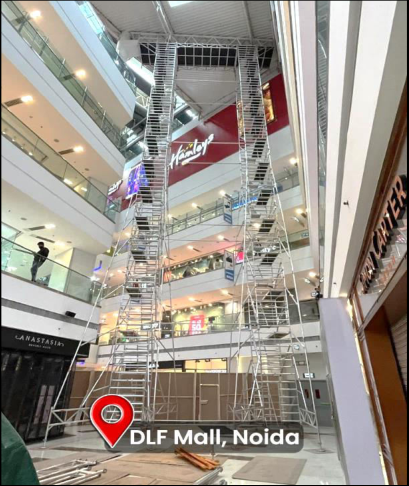

**[Image: Final_RHP.pdf-0162-11.png (409x486, 449.6KB)]**

**Rental supply of Aluminium Scaffolding (Model MS 134) at DLF Mall of India, Noida** 

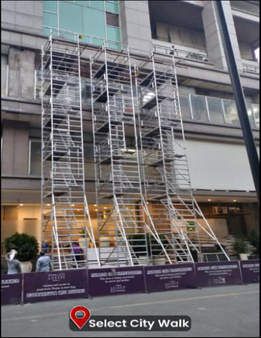

**[Image: Final_RHP.pdf-0162-13.png (374x484, 383.2KB)]**

**Rental supply of Aluminium Scaffolding (Model MST125-06 and 2.5m Bridge Sections) at Select City Walk Mall, Saket, New Delhi** 

159 

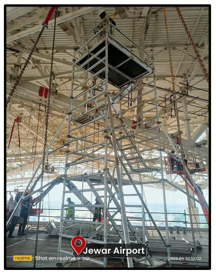

**[Image: Final_RHP.pdf-0163-00.png (428x543, 506.5KB)]**

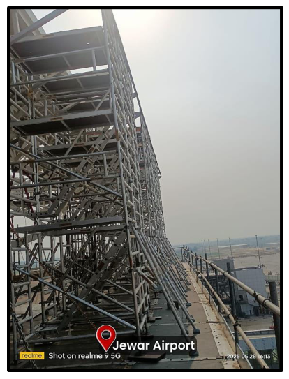

**[Image: Final_RHP.pdf-0163-01.png (414x543, 326.1KB)]**

**Rental supply of Aluminium Scaffolding (Models MST105-C, MST094-C, and MST074) at (Jewar Airport) Noida International Airport Project, Uttar Pradesh** 

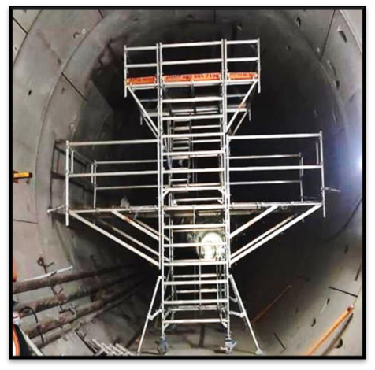

**[Image: Final_RHP.pdf-0163-03.png (476x470, 392.8KB)]**

**Supply of Aluminium Scaffolding (Model MWS054) for Chennai Metro Terminal Project, Tamil Nadu** 

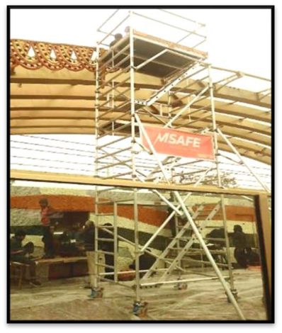

**[Image: Final_RHP.pdf-0163-05.png (398x470, 377.3KB)]**

**Rental Supply of Aluminium Scaffolding (Model MST114) for Republic Day celebration, Delhi** 

# **OUR COMPETITIVE STRENGTHS** 

# **_Multi-Model Source of Revenue through Product Sales and Rental Services_** 

Our revenues are derived from two primary sources, namely product sales and rental services, providing us with a balanced and recurring stream of income. Over the period , the rental model has consistently contributed to our revenues, accounting for 43.07% for the period ended September 30, 2025, 51.65% in FY 2024-25, 52.30% in FY 

160 

2023-24 and 62.97% in FY 2022-23, with the balance derived from sales. While sales contribute to one-time revenue generation, the rental model provides recurring income and revenue predictability. Under the rental model, aluminium scaffoldings, ladders and MS scaffoldings are provided to customers across India on weekly, fortnightly or monthly terms, generally supported by advance payments and security deposits. This multi-model source of revenue enables us to cater to both long-term infrastructure and industrial projects as well as short-term site requirements, thereby diversifying our revenue base. 

Some of the notable work/purchase orders executed by us in the sales and rental model in the last three fiscal years include: - 

|**S.** **No**|**Site/Project**|**Product Description & Work** **involved**|**Invoice Date**|(Rs. in lakhs) **Invoice Value** _(inclusive_ _taxes)_|
|---|---|---|---|---|
|1.|Medical College Construction Site at Guwahati, Assam|Supply of Aluminium scaffolding with wheels and triangular stabilizer|May 24, 2024|25.40|
|2.|Civil Construction Project at Unnao, Uttar Pradesh|Supply of MS scaffoldings covering verticals, ledgers, base jacks and MS pipes|March 18, 2025|22.33|
|3.|Airport Terminal Construction Site at Udaipur, Rajasthan|Supply of MS scaffolding covering vertical-standard with socket.|November 25, 2024|21.71|
|4.|Tech Facility at Sanand, Gujarat|Supply of Customized Aluminium mobile platforms with staircases|March 13, 2025|20.30|
|5.|Airport Terminal Building at Guwahati, Assam|Supply of Customized Aluminium movable stairway scaffoldings with working heights up to 9.5 meters|February 29, 2024|18.38|
|6.|IT Park, Juinagar, Navi Mumbai|Supply of Aluminium mobile scaffolding (on rental basis for 122 days)|January 11, 2025|12.75|
|7.|Hospital at Gurugram, Haryana|Supply of FRP mega platform ladder with cage and with handrail and Hulk Ladders|February 05, 2025|5.75|
|8.|Navi Mumbai International Airport at Navi Mumbai, Maharashtra|Supply of Aluminium scaffolding (on rental basis – part for 38 days and part for 18 days)|February 13, 2024|5.42|
|9.|Commercial Mall at Bengaluru, Karnataka|Rental supply of Aluminium scaffolding for HVAC and building works (on rental basis for 153 days)|September 11, 2023|5.31|
|10.|Commercial Building at Mumbai,Maharashtra|Supply of Aluminium scaffolding (on rentalbasisfor517 days)|September 14, 2023|5.14|

# **_In-House Manufacturing facilities supported by quality certifications_** 

Our manufacturing operations are carried out across three facilities located within the Industrial Estate of Greater Noida, Uttar Pradesh. As on the date of RHP, the facility at G-103, Site-V, Kasna, UPSIDC, Greater Noida, District Gautam Budh Nagar has an installed capacity of 720,000 kg per annum and is primarily utilized for the production of ladders. The second facility, located at K-446, Industrial Unit, Surajpur Site-V, UPSIDA, Noida, Gautam Budh Nagar has an installed capacity of 7,92,000 kg per annum and is primarily utilized for the production of aluminium scaffoldings. Depending on production requirements, certain components of aluminium scaffoldings may also be manufactured at G-103, while certain components of ladders may be manufactured at K-446. The third facility, situated at Industrial Plot No. 350, Kasna, Ecotech-1 Extension, Greater Noida, Gautam Budh Nagar has an installed capacity of 32,85,000 kg per annum and is exclusively utilised for the production of MS scaffoldings. 

To support production activities at these facilities, our units are equipped with requisite machineries such as Welding machine, Riveting & Expanding machine, Pneumatic ladder making machine, Pneumatic cutting machine, Mechanical material shifter, 5 - station multi head press and Vibro deburring machine. 

161 

Additionally, we are certified under ISO 9001:2015 (Quality Management), ISO 14001:2015 (Environmental Management), ISO 45001:2018 (Occupational Health & Safety Management) and ISO/IEC 27001:2022 (Information Security Management). In addition, our products comply with CE certification under the Machinery Directive 2006/42/EC, EN 131-1:2015 for ladders and EN 1004-1:2020 for aluminium mobile scaffold towers. 

# **_Well diversified customer base spread across various industries & geography_** 

Our customer base extends across a wide spectrum of industries, including civil construction, infrastructure development, facility management, HVAC solutions, MEP contracting, interior contracting, electrical contracting, warehousing and logistics, firefighting and safety systems, among others. During FY 2024-25, we served more than 2,500 customers through both sales and rental channels. 

For the fiscal year ended 2025, our company generated 97.77% of its total revenue from 22 states and 3 union territories in India, with key markets in Maharashtra, Karnataka and Tamil Nadu. During Fiscal 2025, Fiscal 2024, Fiscal 2023 our exports reached markets including UAE, Nigeria, Maldives, Saudi Arabia and Mauritius. 

The following table sets forth the bifurcation of revenue (geography-wise) for the six months ended September’25 and fiscal years 2025, 2024 and 2023. 

||||||||**_(Rs._** |**_in Lakhs)_** |
|---|---|---|---|---|---|---|---|---|
|**Particulars**|**For the** **six** **months** **period** **ended** **Septem** **ber 30,** **2025**|**% of** **Reve** **nue**|**F.Y.** **2024-25**|**% of** **Revenue**|**F.Y.** **2023-24**|**% of** **Revenue**|**F.Y.** **2022-23**|**% of** **Revenue**|
|**In India**|||||||||
|Maharashtra|1,153.5 2|23.54 %|2,205.78|30.92%|1,625.83|33.78%|883.42|29.75%|
|Karnataka|577.31|11.78 %|906.82|12.71%|489.60|10.17%|362.50|12.21%|
|Tamil Nadu|399.20|8.15%|572.90|8.03%|369.20|7.67%|260.72|8.78%|
|Gujarat|379.40|7.74%|557.85|7.82%|407.78|8.47%|225.85|7.60%|
|Haryana|364.78|7.44%|506.96|7.11%|386.55|8.03%|279.96|9.43%|
|Delhi|264.99|5.41%|482.23|6.76%|408.56|8.49%|282.00|9.50%|
|Uttar Pradesh|610.33|12.45 %|440.55|6.18%|287.05|5.96%|230.29|7.75%|
|West Bengal|148.97|3.04%|322.71|4.52%|203.36|4.23%|143.02|4.82%|
|Telangana|209.91|4.28%|270.67|3.79%|156.82|3.26%|77.79|2.62%|
|Orissa|152.69|3.12%|114.93|1.61%|71.32|1.48%|11.98|0.40%|
|Rajasthan|166.83|3.40%|112.69|1.58%|77.24|1.60%|42.49|1.43%|
|Assam|49.22|1.00%|102.67|1.44%|32.84|0.68%|5.61|0.19%|
|Madhya Pradesh|81.36|1.66%|89.84|1.26%|95.02|1.97%|73.77|2.48%|

162 

|Andhra Pradesh|32.32|0.66%|71.54|1.00%|38.20|0.79%|9.83|0.33%|
|---|---|---|---|---|---|---|---|---|
|Bihar|15.29|0.31%|61.02|0.86%|43.50|0.90%|7.22|0.24%|
|Punjab|8.64|0.18%|35.39|0.50%|20.20|0.42%|6.45|0.22%|
|Goa|26.67|0.54%|29.44|0.41%|9.30|0.19%|10.17|0.34%|
|Kerala|10.46|0.21%|28.72|0.40%|25.36|0.53%|2.69|0.09%|
|Uttarakhand|15.94|0.33%|22.77|0.32%|22.71|0.47%|20.41|0.69%|
|Himachal Pradesh|6.56|0.13%|12.86|0.18%|13.51|0.28%|3.29|0.11%|
|Jharkhand|12.50|0.26%|11.10|0.16%|10.34|0.21%|11.51|0.39%|
|Chhattisgarh|64.94|1.33%|10.77|0.15%|3.32|0.07%|8.29|0.28%|
|Jammu and Kashmir|5.48|0.11%|2.42|0.03%|2.85|0.06%|0.44|0.01%|
|Chandigarh|4.25|0.09%|1.07|0.01%|1.30|0.03%|0.87|0.03%|
|Dadar and Nagar Haveli & Daman and Diu|2.44|0.05%|1.00|0.01%|4.49|0.09%|8.85|0.30%|
|Pondicherry|**-**|**-**|**-**|**-**|**-**|**-**|0.34|0.01%|
|Andaman And Nicobar|0.70|0.01%|-|**-**|-|**-**|-|**-**|
|Ladakh|1.08|0.02%|-|**-**|-|**-**|-|**-**|
|Nagaland|1.05|0.02%|-|**-**|-|**-**|-|**-**|
|Manipur|0.82|0.02%|-|**-**|-|**-**|-|**-**|
|Mizoram|0.33|0.01%|-|**-**|-|**-**|-|**-**|
|**Total (A)**|**4,767.9** **9**|**97.28** **%**|**6,974.70**|**97.77%**|**4,806.24**|**99.86%**|**2,969.77**|**100.00%**|
|**Other** **Countries**|||||||||
|Bhutan|9.88|0.20%|-|-|-|-|-|-|
|Mauritius|**-**|**-**|**-**|**-**|1.10|0.02%|**-**|**-**|
|Saudi Arabia|**-**|**-**|**-**|**-**|576|012%|**-**|**-**|
| China|0.02|0.00%|-|-|. -|. -|-|-|
|UAE|123.19| 2.51%|151.97|2.13%|**-**|**-**|**-**|**-**|
|Nigeria|-|-|4.43|0.06%|**-**|**-**|**-**|**-**|
|Maldives|-|-|2.98|0.04%|**-**|**-**|**-**|**-**|
|**Total (B)**|**133.09**|**2.72** **%**|**159.37**|**2.23%**|**6.86**|**0.14%**|-|-|

163 

|**Grand Total** **(A+B)**|**4901.08**|**100.0** **0%**|**7,134.07**|**100.00%**|**4,813.09**|**100.00%**|**2,969.77**|**100.00%**|
|---|---|---|---|---|---|---|---|---|

As on the date of RHP, our operations are supported by a network of 21warehouses located across Andhra Pradesh, Assam, Gujarat, Karnataka, Madhya Pradesh, Maharashtra, Odisha, Punjab, Tamil Nadu, Telangana, Uttar Pradesh, and West Bengal. These warehouses are primarily used for storage, inventory management, and dispatch of products for both sales and rental requirements. 

Our business also benefits from a recurring customer base. Repeat customers contributed 26.26%, 53.00%, 34.25% and 31.23% of our revenue from operations  for the six months period ended September 30, 2025  and in Fiscal 2025, Fiscal 2024 and Fiscal 2023 respectively, as set forth in the table below. 

|||||**(Rs****_. in lakhs)_**|
|---|---|---|---|---|
|**Particulars**|**March 31,** **2023**|**March 31,** **2024**|**March 31,** **2025**|**September** **30, 2025**|
|Revenue from operations|2969.77|4813.09|7134.07|4901.08|
|Revenue from repeat customers|927.56|1648.71|3781.02|1,287.10|
|Percentage of revenue from operations from Repeat Customers*|31.23%|34.25%|53.00%|26.26%|

_*Repeat Customers are defined as customers who were invoiced during the particular fiscal year or period as well as in the previous fiscal year(s)._ 

# **_Experienced Promoters and management team having domain knowledge_** 

We are led by a qualified and experienced management team comprising our Promoters and Directors, each bringing domain expertise and strategic vision to the organization. Mr. Pradeep Aggarwal, Promoter, Chairman and Managing Director, has over 16 years of experience in the scaffolding and access solutions industry and oversees the overall management and business strategy of the Company. Mr. Ajay Kumar Kanoi, Promoter and Whole-Time Director, has approximately 14 years of experience in the scaffolding sector and is currently oversees the Company’s sales function. Mr. Rushil Agarwal, Promoter and Whole Time Director, has 5 years of experience and currently heads the production function, which involves overseeing manufacturing operations, planning, procurement, and coordination with logistics and quality control teams. As of December 31, 2025, the Company had 350 permanent employees and 66 contractual employees. 

# **OUR BUSINESS STRATEGIES** 

# **_Expand our production capabilities by setting up a new manufacturing facility_** 

The India Scaffolding Market was valued at Rs. 7208.97 crores in 2024 and is expected to reach Rs. 12811.78 crores in 2030, registering a CAGR of 10.06% for the forecast period (2024-2030). The scaffolding industry is moving away from traditional bamboo and basic mild steel pipes to advanced, safety-certified systems like cup lock, ring lock, and Aluminium stairway towers. Aluminium scaffolding is becoming increasingly popular due to its lightweight nature, ease of transportation, rapid assembly, corrosion resistance and extended lifespan. (Source: Mordor Report) 

The India Ladders Market was valued at Rs. 1,358.27 crores in 2024 and is expected to reach Rs. 2,233.90 crores in 2030, registering a CAGR of 8.65% for the forecast period (2024–2030). Growth in this sector is driven by infrastructure development, urbanization, industrial expansion, stringent safety regulations, and innovations in ladder design and materials. (Source: Mordor Report) 

We currently operate three manufacturing units located within the industrial estate of Gautam Buddha Nagar, Greater Noida, Uttar Pradesh. During Fiscal 2025, Unit-I (G-103, Site-V, Kasna, UPSIDC) operated at 79.85% of its installed capacity, while Unit-II (K-446, Surajpur Site-V, UPSIDA) operated at 85.15% of its capacity. We started Unit-III at Plot No. 350, Ecotech-1 Extension, Kasna, in May 2025 for production of mild steel (MS) scaffolding operated at 80.62% of its capacity.. ( _Source: Chartered Engineer Report dated January 10, 2026, issued by Rajul Garg, Chartered Engineer, Garg and Associates_ ) 

164 

To support our growth objectives and strengthen our presence in the scaffolding and ladder market, we propose to establish a new manufacturing facility at A-3/B, Kosi Kotwan, Industrial Area, District: Mathura, Uttar Pradesh, with an estimated area of approximately 13,979 sq. mt. Upon completion of the proposed facility, the aggregate installed capacity across all units, including the proposed unit, is expected to be 62,85,000 kg per annum for MS Scaffoldings and 25,12,000 kg per annum for Aluminium Scaffoldings and Ladders. _(Source: Chartered Engineer- Project Report dated January 14, 2026, issued by Rajul Garg, Chartered Engineer, Garg and Associates)._ 

This expansion is aimed at enabling us to cater to new orders from both existing and potential customers, tap into emerging market opportunities, and contribute to future revenue growth. The proposed project includes land acquisition, civil construction, and installation of plant and machinery, as further detailed in the section titled “Objects of the Offer – Funding of capital expenditure towards setup of new manufacturing facility” on page 91 of this Red Herring Prospectus. The total estimated cost of setting up the new unit is ₹ 3702.22 lakhs, of which ₹ 3225.92 lakhs is proposed to be financed from the Net Proceeds of the Offer. 

# **_Proposed Expansion into Hanging Scaffolding and Ladder Segments_** 

As part of our growth strategy, we are focused on addressing the increasing demand from existing and new clients in the scaffolding segment, while also expanding our presence into the hanging scaffolding market and further strengthening our offerings in the ladder segment. The planned entry into hanging scaffolding is intended to cater to specialized requirements in high-rise construction, facade work, and industrial maintenance, where conventional systems may have limitations. 

According to Mordor Report, in India's rapidly urbanizing regions, where traditional ground-based scaffolding often proves impractical, hanging or suspended scaffolding systems have become essential. These systems, typically anchored from rooftops or upper structures, are crucial for high-rise construction, maintenance, and facade works. They are extensively used in commercial towers, residential skyscrapers, infrastructure projects and for glass-andAluminium facades. Over the past few years, the demand for Aluminium and steel hanging scaffolding has grown steadily in major cities, driven by Engineering, Procurement, and Construction (EPC) contractors and metro infrastructure projects. 

Looking ahead, the adoption of Turnkey and Design-Build-Operate (DBO) infrastructure contracts is expected to encourage more contractors to invest in standardized hanging scaffolding. The flexibility these systems offer, along with their long-term compliance benefits, is anticipated to be a significant driver of this trend. (Source: Mordor Report) 

This proposed expansion is part of our strategy to broaden our product portfolio by introducing hanging scaffolding systems and enhancing our presence in the scaffolding segment, thereby enabling us to address a wider range of accessrelated applications across construction, industrial and infrastructure projects. 

# **_Focus on consistently meeting quality standards_** 

Our Company intends to focus on maintaining quality standards across the scaffolding and ladder product lines. Product quality is of utmost importance to us from the perspective of customer safety and satisfaction. Continuous review of production processes, systematic quality checks, and timely corrective actions in case of any deviations are central to maintaining the quality standards of our offerings. 

# **<u>OUR PRODUCT OFFERINGS:</u>** 

Our Product Portfolio includes: 

# **1. Aluminium Scaffoldings:** 

Aluminium scaffoldings are modular, lightweight structures made from high-grade aluminium, designed to provide safe and stable access to elevated work areas. They are widely used in construction, industrial maintenance, and interior fit-outs due to their portability, ease of assembly, and corrosion resistance. Compared to traditional steel scaffolding, Aluminium scaffoldings offer greater convenience in transportation, installation, and dismantling, making them suitable for both indoor and outdoor applications. 

165 

We are engaged in the manufacture, sale, and rental of Aluminium scaffolding systems in multiple configurations. The product range includes stairway, narrow-width, extra reach, Z-type, bridge sections, cantilevers and podium models, supporting working heights of up to 30 meters. We also offer end-to-end services such as transportation, erection, and dismantling, catering to both short-term and long-term project requirements. 

Each scaffolding variant offered by our company is engineered to address specific site conditions, access challenges, and operational requirements across diverse project environments: 

- ➢ **Stairway Scaffolding** : Equipped with internal stair access, this model allows safe, comfortable, and frequent climbing, ideal for tasks that require regular movement between levels. 

- ➢ **Narrow-Width Scaffolding** : Designed for use in confined or restricted spaces, these towers provide vertical access where standard-width scaffolding cannot be installed. 

- ➢ **Extra Reach Scaffolding** : Built for extended height requirements, this model enables safe access to elevated work areas up to 30 meters, commonly used in industrial or high-rise applications. 

- ➢ **Z-Type Scaffolding** : Features a zig-zag frame structure for enhanced structural strength and user support, suitable for both indoor and outdoor worksites with increased load demands. 

- ➢ **Bridge Sections** : Modular extensions that allow workers to move across horizontal gaps or obstructions, offering a continuous elevated platform across uneven or obstructed surfaces. 

- ➢ **Cantilever Scaffolding** : Designed to extend beyond the main scaffolding structure, cantilevers enable access to hard-to-reach areas such as ledges, facades, or overhangs. 

- ➢ **Podium Scaffolding** : A compact, portable work platform with guardrails and anti-slip features, ideal for indoor maintenance, electrical installations, and short-duration tasks at lower heights. 

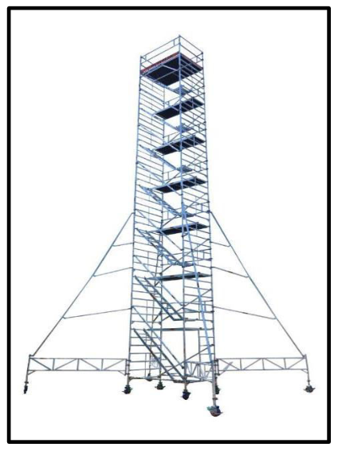

**[Image: Final_RHP.pdf-0169-09.png (424x565, 154.9KB)]**

**MSER (Msafe stairway extra reach) Scaffolding** 

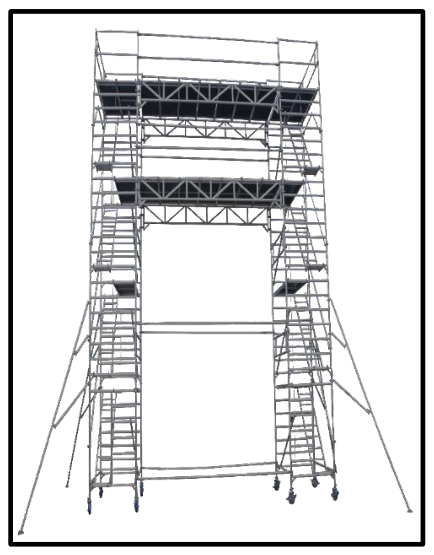

**[Image: Final_RHP.pdf-0169-11.png (434x555, 134.3KB)]**

**Bridge Section** 

166 

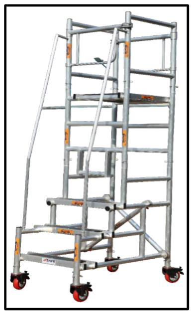

**[Image: Final_RHP.pdf-0170-00.png (388x632, 200.6KB)]**

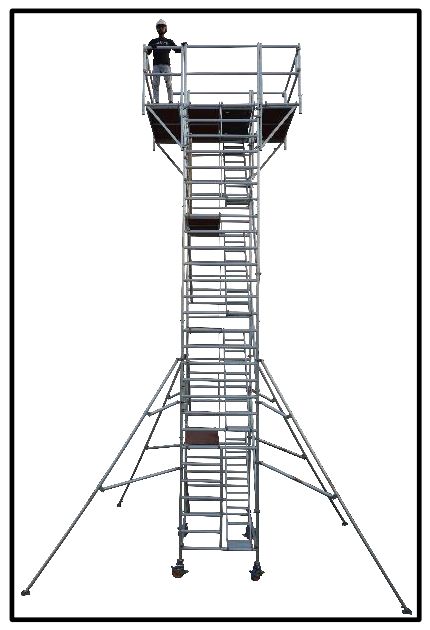

**[Image: Final_RHP.pdf-0170-01.png (430x630, 89.3KB)]**

# **Podium Scaffolding** 

# **Cantilever Scaffolding** 

**2. Aluminium and FRP Ladders:** 

Aluminium and FRP ladders are essential access solutions used across construction, industrial, commercial, and maintenance applications for safe vertical movement and elevated work. Aluminium ladders are known for their lightweight, corrosion resistance, and durability, while FRP (Fiber Reinforced Plastic) ladders offer non-conductive properties, making them ideal for electrical and high-safety environments. 

We are engaged in the manufacture, sale, and rental of a wide range of Aluminium and FRP ladders under our inhouse brands. Our product portfolio includes A-type ladders, straight ladders, platform ladders, and cage ladders, designed to meet diverse industrial requirements. 

Brief descriptions of the ladder types forming part of our product portfolio are as follows: 

- ➢ **A-Type Ladders** : Self-supporting ladders that form an 'A' shape, suitable for tasks that require stability without wall support, commonly used in maintenance and utility work. 

- ➢ **Straight Ladders** : Lean-to ladders that require support from a vertical surface; ideal for quick access to elevated areas in construction or warehousing. 

- ➢ **Platform Ladders** : Equipped with a wide top platform and guardrails, these ladders offer a stable working surface for prolonged tasks at height, enhancing user comfort and safety. 

- ➢ **Cage Ladders** : Fixed vertical ladders enclosed with a protective cage for fall protection, typically used for accessing roofs, towers, or industrial machinery. 

167 

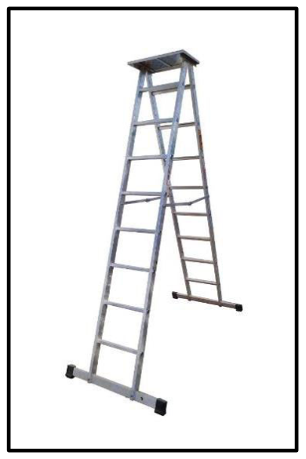

**[Image: Final_RHP.pdf-0171-00.png (390x585, 94.4KB)]**

**A type Ladder** 

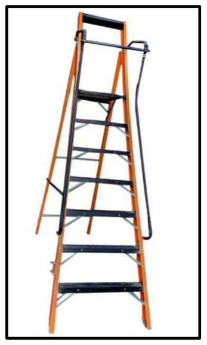

**[Image: Final_RHP.pdf-0171-02.png (347x578, 153.8KB)]**

**FRP Cage Ladder** 

# **3. MS (Mild Steel) Scaffoldings:** 

MS Scaffoldings, or Mild Steel Scaffoldings, are heavy-duty access structures made from mild steel pipes and fittings, used to support workmen and materials during construction, maintenance, and repair activities at elevated heights. Known for their strength and load-bearing capacity, MS scaffoldings are widely used in large-scale infrastructure projects, civil construction, and industrial settings where robustness and durability are critical. These scaffoldings are typically assembled using steel pipes, couplers, base plates, and platforms, and can be customized in various configurations. 

We are engaged in both the sale and rental of MS scaffoldings, offering customized solutions based on project scale, duration, and site conditions. 

168 

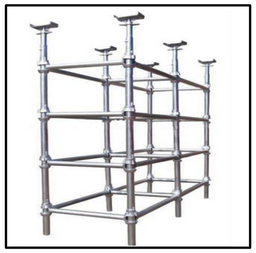

**[Image: Final_RHP.pdf-0172-00.png (520x514, 212.1KB)]**

**MS Scaffolding** 

# **4. Aerial Work Platform (AWP) – Scissor Lifts** 

Aerial Work Platform (AWP) – Scissor Lifts are mechanical platforms designed to provide safe and stable vertical access for personnel and materials. Operated through a criss-cross (scissor-like) mechanism, these lifts are widely used in construction, industrial maintenance, warehousing, and installation activities. They offer advantages such as high load-bearing capacity, ease of mobility, and enhanced safety for working at elevated heights. 

# **<u>OUR MANUFACTURING FACILITIES</u>** 

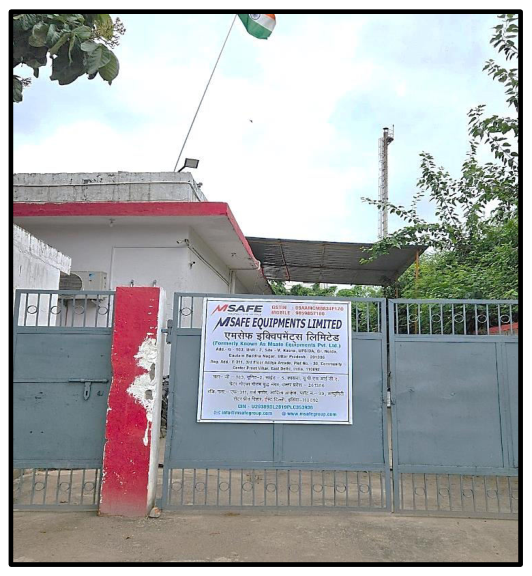

**[Image: Final_RHP.pdf-0172-05.png (532x576, 465.3KB)]**

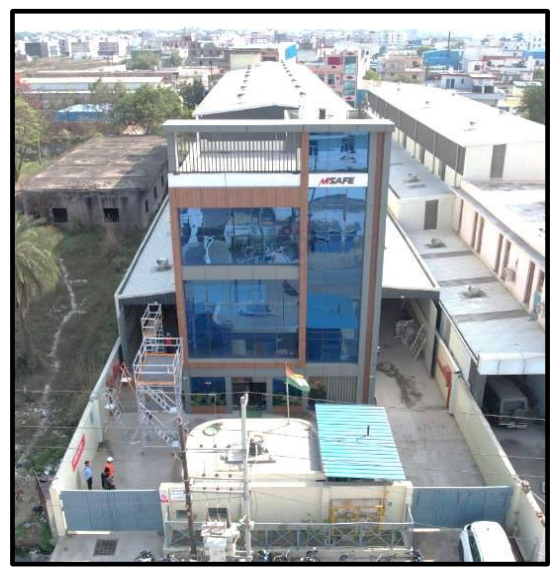

**[Image: Final_RHP.pdf-0172-06.png (560x576, 651.4KB)]**

169 

# **_Manufacturing Unit-I_** 

**_Property No-G-103 Site-V, Kasna, UPSIDC Greater Noida, District Gautam Budh Nagar, Uttar Pradesh-201306_** 

**_Manufacturing Unit-II_** 

**_K-446 UPSIDC, Surajpur Industrial Area, Site-5, District Gautam buddha Nagar, Noida, Uttar Pradesh- 201306_** 

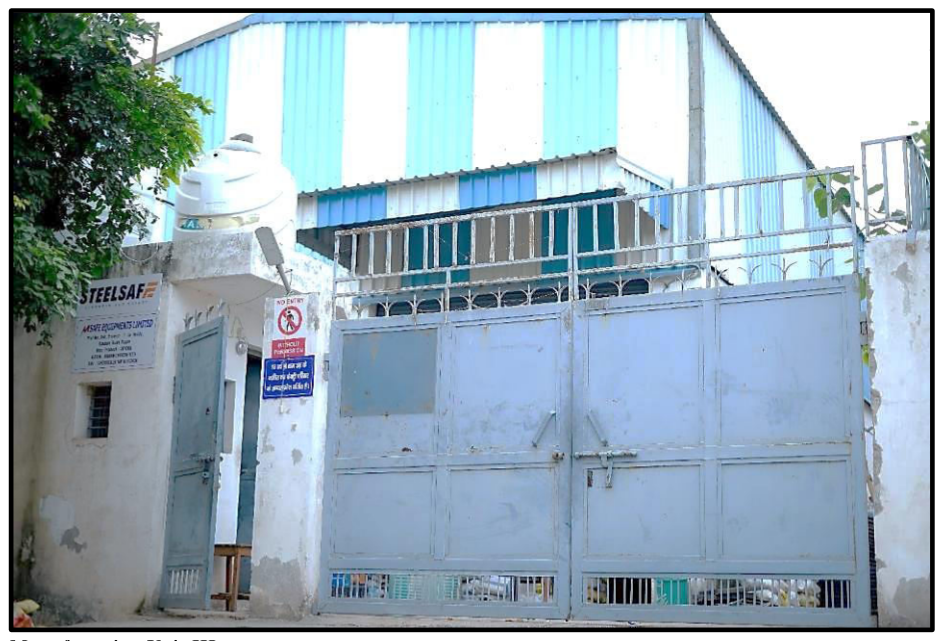

**[Image: Final_RHP.pdf-0173-04.png (944x641, 1016.2KB)]**

**_Manufacturing Unit-III Plot No 350, Kasna, Ecotech-1 Extension, Greater Noida, Gautam Budha Nagar Uttar Pradesh -201306_** 

# **<u>MANUFACTURING PROCESS</u>** 

# **ALUMINIUM SCAFFOLDING** 

The production process includes the following major stages:- 

170 

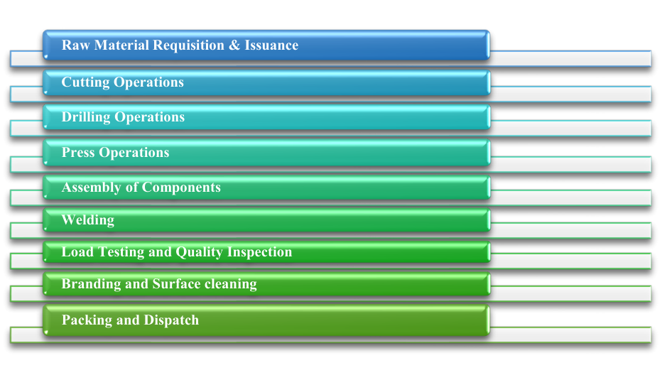

**[Image: Final_RHP.pdf-0174-00.png (932x528, 125.0KB)]**

<!-- Start of picture text -->
Raw Material Requisition & Issuance Cutting Operations Drilling Operations Press Operations Assembly of Components Welding Load Testing and Quality Inspection Branding and Surface cleaning Packing and Dispatch <!-- End of picture text -->

# **Raw Material Requisition & Issuance:** 

- A requisition for Aluminium extrusion is raised by the Production Supervisor based on the approved production plan. 

- The Storekeeper issues the required materials after verifying specifications and quantities. 

# **Cutting Operations:** 

Aluminium sections are cut to specified lengths using hydraulic and pneumatic cutting machines equipped with safety features. 

# **Drilling Operations:** 

Precision holes are drilled using vertical standing and hand drill machines, as per structural requirements. 

# **Press Operations:** 

Components are shaped and formed using hydraulic and mechanical press machines to meet design configurations. 

# **Assembly of Components:** 

Components are assembled using high-tensile bolts and nuts, followed by strength testing on a Universal Testing Machine (UTM). 

# **Welding** 

Structural welding is performed using TIG welding with 2.4mm filler wire, under strict safety protocols using PPE. 

# **Load Testing & Quality Inspection:** 

- Each product is tested to ensure a minimum load-bearing capacity of 200 kg/sq.m. 

- Items that pass quality checks move to the next phase. 

# **Branding & Surface Cleaning:** 

Conforming units are branded with our Msafe logo and subjected to cleaning and washing. 

# **Packing & Dispatch:** 

Products are securely wrapped, sealed, and transferred to the Finished Goods Store for dispatch. 

171 

# **LADDERS** 

The production process includes the following major stages:- 

**[Image: Final_RHP.pdf-0175-02.png (152x349, 31.9KB)]**

<!-- Start of picture text -->
Raw material Requistion and Issuance <!-- End of picture text -->

**[Image: Final_RHP.pdf-0175-03.png (132x349, 29.6KB)]**

<!-- Start of picture text -->
Cutting Operation <!-- End of picture text -->

**[Image: Final_RHP.pdf-0175-04.png (132x349, 30.0KB)]**

<!-- Start of picture text -->
Drilling Opeartion <!-- End of picture text -->

**[Image: Final_RHP.pdf-0175-05.png (132x349, 29.8KB)]**

<!-- Start of picture text -->
Press Opeartion <!-- End of picture text -->

**[Image: Final_RHP.pdf-0175-06.png (132x349, 29.9KB)]**

<!-- Start of picture text -->
Forming & Riveting <!-- End of picture text -->

**[Image: Final_RHP.pdf-0175-07.png (154x349, 33.4KB)]**

<!-- Start of picture text -->
Assembly of Components <!-- End of picture text -->

**[Image: Final_RHP.pdf-0175-08.png (134x349, 31.9KB)]**

<!-- Start of picture text -->
Load Testing & Quality Inspection <!-- End of picture text -->

**[Image: Final_RHP.pdf-0175-09.png (133x349, 31.2KB)]**

<!-- Start of picture text -->
Branding and Surface cleaning <!-- End of picture text -->

**[Image: Final_RHP.pdf-0175-10.png (138x349, 27.2KB)]**

<!-- Start of picture text -->
Packing & Dispatch <!-- End of picture text -->

# **Raw Material Requisition & Issuance:** 

- The Production Supervisor raises a raw material requisition based on the approved production plan. 

- The Storekeeper issues Aluminium or FRP profiles after validating specifications and required quantities. 

# **Cutting Operation:** 

Raw materials are cut to specific lengths using hydraulic and pneumatic cutting machines, equipped with safety sensors for operator protection. 

# **Drilling Operation:** 

Necessary holes are drilled using vertical drill machines and hand drills as per the technical design of each ladder type. 

# **Press Operation:** 

Material undergoes shaping through hydraulic and mechanical press machines to form ladder sub-components. 

# **Forming, Welding & Riveting:** 

Ladder structure is shaped via expanding, squeezing, inside and outside riveting, using pneumatic and hydraulic machinery to ensure precise joint formation. 

# **Assembly of Components:** 

- All parts are assembled using high-tensile bolts and nuts. 

- Universal Testing Machine (UTM) is used to test structural integrity and conformance to mechanical strength standards. 

# **Load Testing & Quality Inspection:** 

Finished ladders are tested under load at various points to validate structural stability and compliance with EN 131 safety standards. 

# **Branding & Surface Cleaning:** 

Approved ladders are branded with the Msafe mark and passed through cleaning and washing procedures for final finishing. 

# **Packing & Dispatch:** 

The completed ladders are wrapped, sealed, and handed over to the Finished Goods Store for dispatch to customers. 

172 

# **<u>MS (Mild Steel) Scaffolding</u>** 

The production process includes the following major stages: 

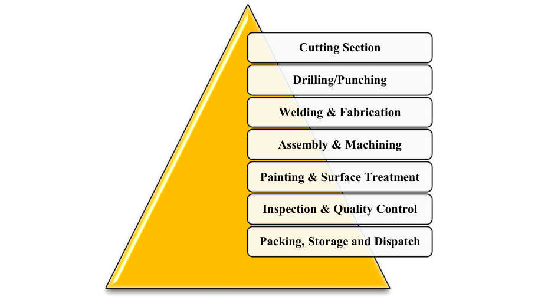

**[Image: Final_RHP.pdf-0176-02.png (912x509, 56.0KB)]**

<!-- Start of picture text -->
Cutting Section Drilling/Punching Welding & Fabrication Assembly & Machining Painting & Surface Treatment Inspection & Quality Control Packing, Storage and Dispatch <!-- End of picture text -->

**Raw Materials:** The key raw materials used in the process include mild steel pipes, tubes (rectangular and circular sections), and structural profiles such as C-channels and I-sections, which are sourced from suppliers. 

# **Cutting Section:** 

Steel pipes are cut to the required lengths depending on the component being manufactured. This includes: 

- **Verticals (Standards) –** vertical load-bearing components 

- **Horizontals (Ledgers) –** horizontal bracing elements 

- Base Jacks, Props, Outer and Inner Tubes, Joint Pins, and Challis 

Dedicated cutting lines are maintained for each type of component. 

# **Drilling / Punching:** 

After cutting, components are moved to drilling or punching stations to create precise holes or slots required for interlocking systems and fittings, particularly for ledgers and verticals. 

# **Welding and Fabrication:** 

This stage involves welding structural elements such as: 

- Cup joints on verticals (cup-lock system) 

- Blade ends on ledgers 

- Connectors on props and jacks 

Welding is performed using semi-automatic or MIG welding machines, ensuring strong joints and alignment. 

# **Assembly & Machining:** 

Sub-assemblies like props (inner and outer sections) and adjustable jacks are assembled using precision tools and fixtures to maintain tolerances and functionality. 

**Painting and Surface Treatment:** 

173 

All fabricated steel components are subjected to anti-corrosive surface treatment and painting, improving their durability and suitability for on-site conditions. Paint type and thickness are monitored as part of quality compliance. 

# **Inspection & Quality Control:** 

Inspections are conducted at each stage—including dimensional checks, weld quality verification, and paint/coating assessment. Final quality control ensures that each item meets the technical specifications and safety requirements. 

# **Packing, Storage & Dispatch:** 

Finished products are packed in predefined bundles or bags (e.g., 50 pcs per bag), stored in designated dispatch zones, and moved through our warehousing and logistics network to reach customers or project sites. 

# **<u>OUR RENTAL PROCESS</u>** 

We provide aluminium scaffoldings, FRP & Aluminium Ladders and MS scaffoldings on a monthly, fortnightly or weekly rental basis across India. Brief details of the rental process followed is given below: 

**[Image: Final_RHP.pdf-0177-07.png (309x126, 18.5KB)]**

<!-- Start of picture text -->
Client Onboarding & Documentation <!-- End of picture text -->

**[Image: Final_RHP.pdf-0177-08.png (309x130, 20.0KB)]**

<!-- Start of picture text -->
Equipment Preparation & Quality Check <!-- End of picture text -->

**[Image: Final_RHP.pdf-0177-09.png (309x121, 16.9KB)]**

<!-- Start of picture text -->
Rental Tenure Management <!-- End of picture text -->

**[Image: Final_RHP.pdf-0177-10.png (309x128, 18.6KB)]**

<!-- Start of picture text -->
Quotation & Order Confirmation <!-- End of picture text -->

**[Image: Final_RHP.pdf-0177-11.png (309x134, 17.3KB)]**

<!-- Start of picture text -->
Dispatch & Delivery <!-- End of picture text -->

**[Image: Final_RHP.pdf-0177-12.png (309x119, 19.4KB)]**

<!-- Start of picture text -->
Return, Inspection & Security Clearance <!-- End of picture text -->

**[Image: Final_RHP.pdf-0177-13.png (310x128, 17.8KB)]**

<!-- Start of picture text -->
Payment & Security Deposit <!-- End of picture text -->

**[Image: Final_RHP.pdf-0177-14.png (310x143, 19.2KB)]**

<!-- Start of picture text -->
Erection, Training & Handover <!-- End of picture text -->

# **Step 1: Client Onboarding & Documentation:** 

The rental process begins with the customer providing necessary documents for verification and onboarding: 

- GST Certificate of the Customer 

- PAN & Aadhaar of Owner/Director 

- TAN (if applicable) 

- Work Order / Purchase Order 

- Filled CRF (Customer Registration Form) 

# **Step 2: Quotation & Order Confirmation** 

We issue a formal quotation which includes: 

- Product description, platform height, tower height, and working height 

- Rental rate (monthly, fortnightly or weekly), freight (to & fro), erection and dismantling charges 

- GST %, security deposit value 

174 

- BOQ-level breakdown of components 

- Payment and commercial terms 

# **Step 3: Payment & Security Deposit** 

- Advance Payment of rental is taken. 

- Security Instruments: 

   - ➢ Security Cheque/Deposit (equivalent to equipment value) (on case to case basis) 

   - ➢ 3 Months Post-Dated Cheques (if required) 

# **Step 4: Equipment Preparation & Quality Check- (mainly manufacturing part)** 

Before dispatch, all equipment undergo visual inspection, and incoming materials as well as work-in-progress items are assessed using the following in-house machinery and testing tools: 

- Vibro Machine – Deburring and surface treatment 

- Ultrasonic Gauge – Wall thickness testing 

- Handheld Hardness Tester – Strength validation 

- Handheld Coder – Material traceability and tagging 

- Refurbishment and reassembly using: 

   - ➢ TIG Welding Machine 

   - ➢ Pipe Crimping, Riveting, Step Cutting Machines 

   - ➢ Pneumatic Ladder Making Machine 

# **Step 5: Dispatch & Delivery** 

- Equipment is dispatched from our warehouse to the client site. 

- Freight Charges (to and fro) are billed to client as per quote. 

- Loading & Unloading: Client’s responsibility at site. 

- Material Movement: Managed internally using mechanical material shifters. 

# **Step 6: Erection, Training & Handover** 

- If erection/training is opted by the client: 

   - ➢ Charged separately as per quotation 

   - ➢ 3–4 site labourers to be arranged by client 

   - ➢ Demo provided only for 1 set, irrespective of total quantity 

- Safety guidelines, user manuals and Do’s & Don’ts are shared. 

# **Step 7: Rental Tenure Management** 

- Rental tenure starts from dispatch date and continues until material is picked up by us. 

- Minimum rental period: a month or a week; extensions billed pro-rata. 

- De-hiring Notice: Must be given 7 days in advance via email. 

- Auto-extension applies in absence of formal de-hiring confirmation. 

# **Step 8: Return, Inspection & Security Clearance** 

- Returned materials are: 

   - ➢ We generally deploy personnel to verify quantities and inspect for any physical damage or shortages. ➢ Refurbished and checked using standard QC processes 

- Damage/Loss Charges: 

   - ➢ Lost material: 100% of component rate 

   - ➢ Damaged material: 60% of component rate 

- Security cheque returned within 7 working days after clearance of dues. 

# **<u>PLANT & MACHINERY</u>** 

175 

Our manufacturing facilities comprises a vast array of machineries, all of which are fully owned by the company. The list is as follows: 

|**S. No**|**Particulars**|**Usage**|
|---|---|---|
|1.|Welding Machine|Used for precision TIG welding to ensure high-quality joints.|
|2.|Vibro Machine|Deburrs Aluminium parts for smooth finish and safe handling.|
|3.|Ultrasonic Gauge|Measures wall thickness to ensure correct material strength.|
|4.|Step Cutting Machine|Cuts step materials for ladder assembly.|
|5.|Pipe Crimping Machine|Forms pipe joints for male-female ladder connectors.|
|6.|Riveting And Expanding Machine|Fixes ladder steps using hydraulic-pneumatic action.|
|7.|Pneumatic Ladder Making Machine|Assembles ladders using pneumatic control.|
|8.|5 Station Multi head Press|Performs multiple pressing tasks simultaneously.|
|9.|Handheld Hardness Tester|Tests product strength for quality control.|
|10.|Handheld Coder|Applies product codes for identification.|
|11.|Mechanical Material Shifter|Moves heavy material efficiently during production.|
|12.|Pneumatic CuttingMachine|Cuts aluminiumprofiles torequiredlengths.|

The following table sets out the unit-wise details of the machinery installed at our respective manufacturing units: 

|**S.No.**|**Particulars**|**Number of Ma** |**chine** ||
|---|---|---|---|---|
|||**Unit-I**|**Unit-II**|**Unit-III**|
|1|Welding Machine|7|17|2|
|2|Vibro Machine|1|1|-|
|3|Ultrasonic Gauge|-|1|-|
|4|Step Cutting Machine|1|1|1|
|5|Pipe Crimping Machine|1|1|-|
|6|Riveting & Expanding Machine|1|1|-|
|7|Pneumatic Ladder Making Machine|1|-|-|
|8|5 Station Multi Head Press|2|2|-|
|9|Handheld Hardness Tester|1|1|-|
|10|Handheld Coder|1|1|-|
|11|Mechanical Material Shifter|-|1|-|
|12|Pneumatic CuttingMachine|3|3|-|

_Note: In addition to the machinery specified above, Unit–3 also includes several other machines such as power press, drill machines and allied equipment, which form an integral part of the manufacturing process. These machines, while not individually listed in the table, are part of the overall Plant and Machinery of the unit._ 

# **<u>INSTALLED CAPACITY & CAPACITY UTILISATION</u>** 

As of the date of this Red Herring Prospectus, we operate from three of our manufacturing facilities (Unit-I, Unit-II and Unit-III) located within the Industrial Estate of Gautam Buddha Nagar, Greater Noida, Uttar Pradesh. 

**UNIT I: (Industrial Property No. G-103 Unit-2 Site-V, UPSIDC Greater Noida, Gautam Buddha (GB) Nagar, Uttar Pradesh)** 

|**Particulars**|**F.Y. 2022-23***|**F.Y. 2023-24**|**F.Y. 2024-25**|**For the** **period ended** **September** **30, 2025**|
|---|---|---|---|---|
|Installed Capacity (in kg)|-|720,000.00|720,000.00|3,60,000.00|
|Actual Capacity (in kg)|-|6,21,270.88|5,80,553.03|2,87,463.70|
|Capacity utilization (in %)|-|86.28%|80.63%|79.85%|

_As certified by Mr. Rajul Garg, Chartered Engineer, through certificate dated  January 10, 2026_ 

_*Unit-I commenced manufacturing operations in Financial Year 2023-24. Accordingly, no installed capacity,_ 

176 

_actual production, or capacity utilization figures are available for Financial Year 2022-23._ 

**UNIT II: (K-446 Industrial Unit, Surajpur Site V, Village:- Kasna Tehsil:- Sadar Gautam Buddha (GB)Nagar, Uttar Pradesh)** 

|**Particulars**|**F.Y. 2022-23***|**F.Y. 2023-24**|**F.Y. 2024-25**|**For the** **period ended** **September 30,** **2025**|
|---|---|---|---|---|
|Installed Capacity (in kg)|-|252,000.00|504,000.00|3,96,000.00|
|Actual Capacity (in kg)|-|200,379.25|410,934.44|3,37,219.30|
|Capacity utilization (in %)|-|79.51|81.53|85.15%|

_As certified by Mr. Rajul Garg, Chartered Engineer, through certificate dated January 10, 2026_ 

_*Unit-II commenced manufacturing operations in Financial Year 2023-24. Accordingly, no installed capacity, actual production, or capacity utilization figures are available for Financial Year 2022-23._ 

**Unit-III: (Plot no. 350, Kasna, Ecotech-1 Extension, Greater Noida, Gautam Budha Nagar, Uttar Pradesh)** 

|**Particulars**|**F.Y. 2022-23***|**F.Y. 2023-24***|**F.Y. 2024-25***|**May’25 to** **Sept.’25 (5** **months)**|
|---|---|---|---|---|
|Installed Capacity (in kg)*|-|-|-|13,68,750.00|
|Actual Capacity (in kg)*|-|-|-|11,03,465.00|
|Capacity utilization (in %)*|-|-|-|80.62%|

_As certified by Mr. Rajul Garg, Chartered Engineer, through certificate dated January 10, 2026_ 

_*Unit-III commenced manufacturing operations in May 2025. Accordingly, no installed capacity, actual production, or capacity utilization figures are available for F.Y. 2022-23, 2023-24 and 2024-25.However, Unit III has an existing installed capacity of 32,85,000 kg p.a. for the production of MS Scaffolding. Prior to_ 

# **<u>SALES AND MARKETING</u>** : 

We undertake our sales and marketing activities through a mix of direct sales and digital outreach. Our in-house sales team engages with institutional clients, infrastructure companies, contractors, and industrial users across India, following a regional sales model to address location-specific demand and ensure timely client support. We also participate in industry exhibitions, trade fairs, and safety seminars to showcase our product portfolio and strengthen brand visibility. Additionally, we utilize our website and digital platforms such as TradeIndia, JustDial, and Indiamart to generate customer enquiries and promote our product features, certifications, and technical specifications, thereby supporting customer outreach across both sales and rental business segments. 

Here are some of the images highlighting our participation in exhibitions over the past few years. 

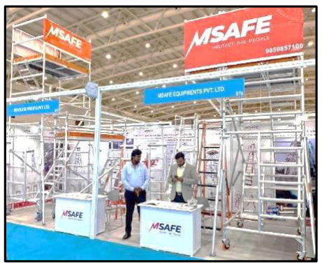

**[Image: Final_RHP.pdf-0180-12.png (461x382, 400.4KB)]**

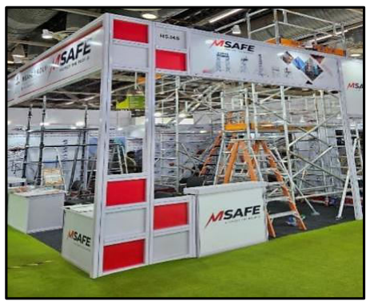

**[Image: Final_RHP.pdf-0180-13.png (463x382, 370.1KB)]**

177 

**ACREX Bengaluru’2025** 

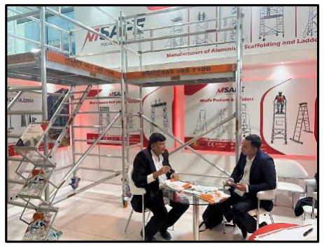

**[Image: Final_RHP.pdf-0181-01.png (463x355, 367.9KB)]**

**BAUMA Conexpo India Greater Noida’2024** 

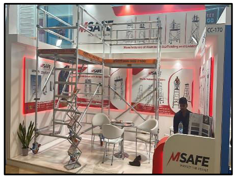

**[Image: Final_RHP.pdf-0181-03.png (468x355, 354.5KB)]**

**Big 5 Global Dubai 2023** 

Below are the details of revenue from top 10, 5, 3 and 1 customers for the period ended September 30, 2025, and for the financial year ended March 2025, 2024 and 2023. 

|**For the per** |**iod six months period ended September 30, 2025**   ||
|---|---|---|
|**Sr. No**|**Particulars** **Amount (Rs. in lakhs)**|**% of revenue**|
|1|Top 1 Customer 159.18|3.25%|
|2|Top 3 Customers 403.97|8.24%|
|3|Top 5 Customers 583.74|11.91%|
|4|Top 10 Customers 957.80|19.54%|

|**F.Y. 2024-25**||||
|---|---|---|---|
|**Sr. No**|**Particulars**|**Amount (Rs. in lakhs)**|**% of revenue**|
|1|Top 1 Customer|167.37|2.35%|
|2|Top 3 Customers|411.51|5.77%|
|3|Top 5 Customers|618.33|8.67%|
|4| Top10 Customers|988.10|13.85%|
|**F.Y. 2023-24**||||
|**Sr. No**|**Particulars**|**Amount (Rs. in lakhs)**|**% of revenue**|
|1|Top 1 Customer|138.40|2.88%|
|2| Top 3 Customers|304.18|6.32%|
|3|Top 5 Customers|431.96|8.97%|
|4|Top10 Customers|701.23|14.57%|
|**F.Y. 2022-23**||||
|**Sr. No**|**Particulars**|**Amount (Rs. in lakhs)**|**% of revenue**|
|1|Top 1 Customer|46.66|1.57%|
|2| Top 3 Customers|131.44|4.43%|
|3| Top 5 Customers|197.09|6.64%|
|4|Top10 Customers|335.18|11.29%|

# **<u>COMPETITION:</u>** 

We operate in a competitive segment of access and height-safety equipment, including scaffoldings and ladders. At the regional level, the competitive landscape primarily comprises unorganized players engaged in supplying scaffolding systems with limited height capabilities and standard configurations. Further, some of our current and 

178 

potential competitors include large entities with longer operating histories, better name recognition, greater ability to influence industry standards, larger customer bases and significantly greater financial, sales and marketing resources. Some of our significant competitors in the organized segment include Technocraft Industries India Limited, Y-Access Manufacturing Private Limited, Mtandt Rentals Limited and Sagar Asia Private Limited. 

# **<u>INFRASTRUCTURE & UTILITIES:</u>** 

**_Raw Materials:_** The production of our access and height-safety systems relies on a combination of raw materials and bought-out components sourced from various suppliers. Major raw materials include mild steel pipes, Aluminium extrusions, and which are procured from local and regional suppliers based on quality and delivery parameters. MS pipes are primarily used in the fabrication of MS scaffoldings and structural frames due to their high load-bearing strength and durability. Aluminium extrusions, comprising grades 6063-T6, 6063-T5, 6063-T4 are extensively used in the production of Aluminium scaffoldings and ladders for their strength-to-weight ratio and corrosion resistance. Additionally, we procure swivel caster wheels, anti-slip plywood, fasteners, and other hardware as bought-out parts to support assembly, mobility, and safe usage of our products. 

The following table sets forth the bifurcation of purchase (geography-wise) for the period ended September 30, 2025 and for the fiscal years 2025, 2024 and 2023. 

||**For the**|**% of**|**Year**||**Year**|(**_Rs. in la_** |**_khs except _** **Year**|**_percentage)_** |
|---|---|---|---|---|---|---|---|---|
|**Particulars**|**period** **ended** **Septembe** **r 30, 2025**|**Total** **Purchas** **e**|**ended** **31st** **March,** **2025**|**% of** **Total** **Purchas** **e**|**ended** **31st** **March,** **2024**|**% of** **Total** **Purchas** **e**|**ended** **31st** **March,** **2023**|**% of** **Total** **Purchas** **e**|
|**In India**|||||||||
|Haryana|587.87|24.84|1,976.89|43.39|812.28|29.55|298.93|18.04|
|Uttar Pradesh|827.71|34.97|1,263.15|27.72|1,235.02|44.94|792.74|47.85|
|Delhi|178.12|7.53|870.32|19.10|621.59|22.62|546.08|32.96|
|Punjab|476.29|20.12|240.48|5.28|6.53|0.24|-|-|
|Dadar and Nagar haveli|-||69.12|1.52|-|-|-|-|
|Chhattisgarh|213.54|9.02|53.84|1.18|58.12|2.11|-|-|
|Maharashtra|11.76|0.50|36.38|0.80|1.10|0.04|13.30|0.80|
|Telangana|3.26|0.14|24.13|0.53|-|-|-|-|
|Gujarat|32.88|1.39|19.13|0.42|7.96|0.29|-|-|
|Tamil Nadu|-||0.08|0.00|0.05|0.00|-|-|
|Chennai|-||0.01|0.00|-|-|-|-|
|Karnataka|0.13|0.01|0.01|0.00|0.00|0.00|-|-|
|Andhra Pradesh|-||0.01|0.00|-|-|-|-|
|Hyderabad|-||-|-|5.20|0.19|-|-|
|Rajasthan|31.96|1.35|-|-|-|-|2.30|0.14|
|West Bengal||-|-|-|0.13|0.00|-|-|
|**Total (A)**| **2,363.51**| **99.85**|**4,553.56**|**99.95**|**2,747.99**|**99.99**|**1,653.3** **4**|**99.80**|
|**Other** **Countries**|||||||||
|China|3.47|0.15|2.47|0.05|0.00|0.00|-|-|
|Belgium|-|-|-|-|0.39|0.01|3.34|0.20|
|**Total(B)**|**3.47**|**0.15**|**2.47**|**0.05**|**0.39**|**0.01**|**3.34**|**0.20**|

179 

|**Total (A+B)**|**2,366.98**|**100.00**|**4,556.03**|**100.00**|**2,748.38**|**100.00**|**1,656.6** **8**|**100.00**|
|---|---|---|---|---|---|---|---|---|

_Note: The geography-wise purchase statement has been compiled on the basis of the overall purchases recorded in the books of account of the Company during the respective year. Such purchases include certain items which, though initially procured as goods, were subsequently capitalized upon completion or utilized for repair purposes (refer to the restated financial statements for further details). Since the raw materials procured are common for both stock and capital goods, it is not practicable for the Company to provide a separate bifurcation of geography-wise purchases between capital goods and stock. Accordingly, the above statement represents the combined details of all geographywise purchases, irrespective of whether such goods were consumed as stock or capitalized_ **.** 

Details of top 1, 3, 5 and 10 suppliers purchase from suppliers for the period ended September 30, 2025, and for the financial year ended March 2025, 2024, and 2023:- 

|**For the period**|**ended September 30, 2025**|||
|---|---|---|---|
|**Sr. No.**|**Particulars**|**Amount (Rs. in lakhs)**|**% of purchase**|
|1|Top 1 Supplier|566.34|23.93%|
|2|Top 3 Suppliers|1042.83|44.06%|
|3|Top 5 Suppliers|1375.36|58.11%|
|4| Top 10 Suppliers|1778.10|75.12%|
|**F.Y. 2024-25**||||
|**Sr. No.**|**Particulars**|**Amount (Rs. in lakhs)**|**% of purchase**|
|1|Top 1 Supplier| 923.15| 20.26%|
|2|Top 3 Suppliers|2,436.60|53.48%|
|3| Top 5 Suppliers|3,272.13|71.82%|
|4|Top 10 Suppliers|3,935.67|86.38%|
|**F.Y. 2023-24**||||
|**Sr. No.**|**Particulars**|**Amount (Rs. in lakhs)**|**% of purchase**|
|1|Top 1 Supplier|915.08|33.30%|
|2| Top 3 Suppliers|1,872.53|68.13%|
|3|Top 5 Suppliers|2,193.05|79.79%|
|4| Top10 Suppliers|2,462.60|89.60%|
|**F.Y. 2022-23**||||
|**Sr. No.**|**Particulars**|**Amount (Rs. in lakhs)**|**% of purchase**|
|1|Top 1 Supplier|591.96|35.73%|
|2|Top 3 Suppliers|1,071.73|64.69%|
|3|Top 5 Suppliers|1,352.68|81.65%|
|4|Top 10 Suppliers|1,579.28|95.33%|

**_Power:_** The requirement of power for our manufacturing operations, like power for lighting and operating the plant/machinery/equipment, is met through the state electricity board i.e. NPCL (Noida Power Company Limited) 

**_Water:_** The existing water requirement for our factory units is met using local sources. 

**_Manpower:_** As of December 31, ,2025, we had a total of 350 permanent employees in our Company and 66 Contractual employees. 

Following is the department-wise breakup of permanent employees as of December 31,2025: - 

|**Department**|**Number of**|
|---|---|
||**Employees** **(Permanent)**|

180 

|Admin & HR Department|18|
|---|---|
|AR& Billing Department|10|
|Finance and Accounts|15|
|Management Department|4|
|Sales & Marketing Department|48|
|Operation Department|75|
|Production Department|159|
|Quality Department|6|
|IT Department|3|
|Logistic Department|5|
|Product Development & Design Team|4|
|Safety Department|1|
|Others|2|
|**Total**|**350**|

# **<u>PROPERTY:</u>** 

# **<u>Intellectual Property</u>** 

Some of the trademarks which are applied for registration: 

|**S.** **No**|**Brand Name/ Logo Trademark**|**Class**|**Registration/** **Application** **Number and date**|**Trademark** **Category**|**Current Status**|
|---|---|---|---|---|---|
|1.||37|5921069 May 03, 2023|Trademark|Registered|
|2.||06|5867297 March 27, 2023|Trademark|Registered|
|3.||37|4354807 November 21, 2019|Trademark|Registered|
|4.||37|6159088 October 21, 2023|Trademark|Registered|
|5.||06|5930762 May 10, 2023|Trademark|Registered|

181 

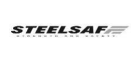

**[Image: Final_RHP.pdf-0185-00.png (240x100, 6.7KB)]**

|6.|06|6152835 October 17, 2023|Trademark|Registered|
|---|---|---|---|---|

# **IMMOVABLE PROPERTIES** 

The following are the details of the material properties owned/ leased/ rented by the company. 

|**Sr.** **No**|**Usage**|**Address**|**Owned/ Rented/ Leased**|
|---|---|---|---|
|1.|Manufacturing Unit -I|G-103, UNIT-2, SITE V, UPSIDC, Greater Noida District: - Buddha (G.B) Nagar, Uttar Pradesh|Obtained on rent vide agreement dated April 01, 2025, for a period of 11 months Effective from April 01, 2025. As on the date of RHP, the monthly consideration is Rs.2,50,000.|
|2.|Manufacturing Unit -II|K-446, Industrial Unit, Surajpur Site V, Village: - Kasna Tehsil:- Sadar Gautam Buddha Nagar, Uttar Pradesh, 201306|Obtained on lease vide lease deed dated February 25, 2023, for a period of 69 years effective from September 23, 2002. As on the date of RHP, lease rent payable amounts to ₹1,541.85 per month for the next 9 years, ₹3,854.63 per month for the subsequent 30 years and ₹7,709.26 per month for the following 30 years.|
|3.|Manufacturing Unit -III|Plot no. 350, Kasna, Ecotech-1 Extension, Greater Noida, Gautam Budha Nagar-201310| Obtained on rent vide Agreement dated April 28, 2025, for a period of 11 months effective from June 01, 2025, till April 30, 2026. As on the date of the RHP, the monthly consideration is Rs. 1,60,000.|
|4.|Registered Office|F-311, 3rd Floor, Aditya Arcade, Plot No. 30, Community Center, Preet Vihar, Delhi-110092| Obtained on rent vide agreement dated July 22, 2025, for a period of 11 months effective From July 22, 2025, to May 21, 2026. As on the date of RHP, the monthly consideration is Rs.10,000.|
|5.|Corporate Office|A-57, Sector-136, 5&7th Floor, Noida, UttarPradesh-201301|Obtained on lease vide lease deed dated November 05, 2024, for a period of 24 months effective from November 15, 2024, till November14, 2026. As on the date of RHP, the monthly consideration is Rs.90,000|
|6.|Sales and Marketing Office- I|Ground Floor, Office No. Gala No. 028 “Blue Rose Industrial Premises” Western Express Highway, Borivali East, Mumbai, Mumbai Suburban, Maharashtra, 400066| Obtained on lease vide lease deed dated April 22, 2025, for a period of 36 months effective from May 05, 2025, till May 04, 2028. As on the date of RHP, the monthly consideration shall be ₹1,05,000 for the first year of the lease term, which shall increase to ₹1,10,250 for the second year and further to ₹115762 for the third year.|
|7.|Warehouse-I|No. 7-10-41/1, Panthulugari Meda, Gajuwaka, Visakhapatnam, Andhra Pradesh - 530026, India|,, Obtained on lease vide lease deed dated July 03, 2025, for a period of 12 months effective from July 22, 2025, till July 21, 2026. As on the date of RHP, the monthly consideration is Rs.15,400.|

182 

|8.|Warehouse-II|Patta No. 91(old)/147(New) situated at Revenue Village – Boragaon, Mouza – Beltola, District – Kamrup (M), NH 37, Assam – 781035|Obtained on lease vide lease deed dated January 15, 2025, for a period of 11 months effective from January 01, 2025, till December 01, 2025. As on the date of RHP, the monthly consideration is Rs.30,450.|
|---|---|---|---|
|9.|Warehouse-III|Godown No-5, survey Number 191+192+193+194+195/1 Paiki, Bagba Green, Opposite, Narimanpura Gam, Dholka Road, Fatevadi, Ahmedabad, Gujarat – 382210| Obtained on lease vide lease deed dated July 26, 2025, for a period of 11 months effective from August 01, 2025, till July 01, 2026. As on the date of RHP, the monthly consideration is Rs.49,500.|
|10.|Warehouse-IV|Plot No.11 Kh No 3533 Gindan Khera Sarojini Nagar Lucknow U.P 226008 India.|Obtained on rent vide Agreement dated February 12, 2025, for a period of 11 months effective from March 01, 2025, till January 31, 2026. As on the date of the RHP, the monthly consideration is Rs. 20000.|
|11.|Warehouse-V|Site Number 3260, 1stBlock, Sir M. V. Layout, Bengaluru, Karnataka - 560056, India.|, Obtained on lease vide lease deed dated July 04, 2025, for a period of 11 months effective from July 13, 2025, till June 12, 2026. As on the date of RHP, the monthly consideration is Rs.80,700.|
|12.|Warehouse-VI|63/2/138, Telephone Layout, Magadi Road, Bengaluru Urban, Karnataka, 560091| Obtained on lease vide lease deed dated July 01, 2025, for a period of 11 months effective from August 01, 2025, till June 30, 2026. As on the date of RHP, the monthly consideration is Rs.31,500.|
|13.|Warehouse-VII|Plot No 78-79, Ram Ratan Colony, Pithampura, Dhar, Madhya Pradesh, 454774| Obtained on lease vide lease deed dated July 26, 2025, for a period of 11 months effective from October 30, 2025, till October 01, 2026. As on the date of RHP, the monthly consideration is Rs.17640.|
|14.|Warehouse-VIII|Shed No. A-01, A-02, A-46 at Balaji Plaza Located at Survey No. 37/1,37/2,37/5,38,39/2A,39/2B,39/1, situated at Village Usatane, Taluka, Ambernath, District Thane.| Obtained on lease vide lease deed dated July 18, 2025, for a period of 11 months effective from April 01, 2025, till March 01, 2026. As on the date of RHP, the monthly consideration is Rs.1,00,000.|
|15.|Warehouse-IX| GAT Number: -143, Location: - Chimbali Phata, Mauje Kuruli, Chakan Opposite Om Logistic, Kuruli, Pune, Building known “Mauli ware House” Pune Nashik- Maharashtra 410501| Obtained on lease vide lease deed dated August 26, 2023, for a period of 33 months effective from Sept 01, 2023, till May 31, 2026. As on the date of RHP, the monthly consideration is Rs. 55,125.|
|16.|Warehouse-X|, Ground Floor, Godown No. 7, H. No- 2915, ward No-4, Sariputra Society, Vikash Nagar, Khadgoan Road, Behind ARCO Road Lines, Dattawadi, Nagpur, Nagpur, Maharashtra440023|Obtained on lease vide lease deed dated July 16, 2025, for a period of 11 months effective from July 14, 2025, to June 13, 2026. As on the date of RHP, the monthly consideration is Rs. 20,066.|
|17.|Warehouse-XI|, A- 03 & A-04, Balaji Palaza, Survey No. 37, Usatane Village, Taluka: Ambernath, District - Thane, Maharashtra|Obtained on lease vide lease deed dated June 03, 2025, for a period of 22 months effective from June 01, 2025, to May 31, 2027. As on the date of RHP, the monthly consideration is Rs. 22,000.|

183 

|18.|Warehouse-XII|Plot Number: -462, 533, and 853, Khata Number 290 District: - Khordha, Odisha-752054|Obtained on lease vide lease deed dated April 29, 2025, for a period of 11 months effective from April 29,2025 till March 28, 2026. As on the date of RHP, the monthly consideration is Rs. 20,000.|
|---|---|---|---|
|19.|Warehouse-XIII|Shed At Village Nimbua, Derabassi, Punjab.|Obtained on lease vide lease deed dated January 27, 2025, for a period of 11 months effective from May 01, 2025, till March 31, 2026. As on the date of RHP, the monthly consideration is Rs. 35,000|
|20.|Warehouse-XIV|J.L. No.96, R.S.Khatian Nos.219(L.R. Khatan No.2 & 414/1), Mouza-Kharial, PS Dankuni Coal Complex, Dankuni,Hooghy,West Bengal-712311| Obtained  on lease deed dated August 01, 2025 for a period of 11 months effective from August 01, 2025 till July 01, 2026 as on date of RHP. the monthly consideration is Rs.65,000.|
|21.|Warehouse-XV|Door No. 7-3-145/3/32, Zone-4, Sub Zone B, Situated at Gagan Pahad, Katedhan, Ranga Reddy, Telangana, 500052|Obtained on lease vide lease deed dated July 26, 2025, for a period of 11 months effective from September 6, 2025, till August 05, 2026. As on the date of RHP, the monthly consideration is Rs. 38,896.|
|22.|Warehouse-XVI*|S/No. 102/3A2, Vasanthapuri-I, Malayam Bakkam, Thiruvallur, Chennai, 600123| Obtained on lease vide lease deed dated July 26, 2025, for a period of 11 months effective from December 01, 2024 till October 31, 2025. As on the date of RHP, the monthly consideration is Rs. 38,202. *Company in process for renewal agreement|
|23.|Warehouse-XVII|SF.593/5 Kuruchi Carmel Nagar, Kurichy Madukarai, Podanur, Coimbatore, Tamil Nadu, 641021| Obtained on lease vide lease deed dated July 26, 2025, for a period of 11 months effective from March 11, 2025, till March 31,2026. As on the date of RHP, the monthly consideration is Rs. 18,000.|
|24.|Warehouse-XVIII|Flat No. 19, Shree Dev Nagar Harmada, Jaipur-302013, Rajasthan|   Obtained on lease vide lease deed dated december 27, 2025 for period 11 months effective from December 21,2025 till November 2026 as on the date of RHP the monthly consideration is 16,000.|
|25.|Warehouse-XIX|Housing Chouraha, Pitampur, Dhar, Madhya Pradesh-454775| Obtained on lease vide lease deed dated December 12, 2025 for period 11month effective from December 12, 2025 till 11 November 2026 as on the date of RHP the monthly consideration is 30,000|
|26.|Warehouse XX|Industrial Plot No.384, 385 Block, Eotech Extension-I, Sector-Ecotech- I, Greater Noida,Gautam Budh Nagar| Obtained on lease vide lease deed dated November 24, 2025 for period 11 months effective from December 01, 2025 till November 01, 2026 as on the date of RHP the monthly consideration is 500000|
|27.|Warehouse XXI|Om ji Complex, O-I Complex Godown Area Bhabat, Zirakpur, Punjab-140603| Obtained on lease vide lease deed dated December 19, 2025, for a period of 11 months effective from December 01, 2025, till October 31, 2026. As on the date of RHP, the monthly consideration is Rs. 34,000|

184 

# **Insurance** 

Our operations are subject to inherent risks such as equipment failure, accidents, fire, earthquake, flood and other force majeure events that may result in damage to property, equipment or stock, and may also cause injury or loss of life. To mitigate such risks, we maintain insurance coverage including property and asset insurance, complete fire insurance, marine inland open declaration policies, burglary insurance, flexi property protector policy, contractors plant and machinery insurance (covering accidental and unforeseen physical damage to construction and industrial equipment, whether at work, at rest or during maintenance) and group personal accident insurance among others. However, such insurance coverage may not be sufficient to cover all potential economic losses. For further details, kindly refer the section on “Risk Factors - Our insurance coverage may not be adequate to protect us against certain operating hazards, and this may have a material adverse effect on our business” on page 48 of this Red Herring Prospectus. Our insurance coverage may not adequately protect us against all material hazards, which may affect our business, results of operations and financial condition. 

185 

# **KEY INDUSTRIAL REGULATIONS AND POLICIES** 

_The following description is a summary of the relevant regulations and policies as prescribed by the GOI and other regulatory bodies that are applicable to our business. The information detailed below has been obtained from various legislations, including rules and regulations promulgated by regulatory bodies, and the bye laws of the respective local authorities that are available in the public domain. The regulations set out below may not be exhaustive and are merely intended to provide general information to the shareholders and neither designed nor intended to substitute for professional legal advice. For details of government approvals obtained by us, seethe section titled_ **_“Government and Other Approvals”_** _on page 340 of this Red Herring Prospectus._ 

# **<mark>THECOMPANIES ACT</mark>** 

The Companies Act primarily regulates the formation, financing, functioning and restructuring of Companies as separate legal entities. The Act provides regulatory and compliance mechanism regarding all relevant aspects including organizational, financial and managerial aspects of companies. The provisions of the Act state the eligibility, procedure and execution for various functions of the company, the relation and action of the management and that of the shareholders. The law laid down transparency, corporate governance and protection of shareholders & creditors. The Companies Act plays a balancing role between these two competing factors, namely, management autonomy and investor protection. 

# **<mark>SEBI REGULATIONS</mark>** 

Securities And Exchange Board of India is the regulatory body for securities market transactions including regulation of listing and delisting of securities. It forms various rules and regulations for the regulation of listed entities, transactions of securities, exchange platforms, securities market and intermediaries thereto. Apart from the SEBI Act, 1992, SCRA 1956, SCRR 1957 and other rules and regulations, listed entities are mainly regulated by SEBI (Issue of Capital and Disclosure Requirements) Regulations, 2018 and SEBI (Listing Obligations and Disclosure Requirement) Regulations, 2015, SEBI (Substantial Acquisition of Shares and Takeover) Regulations, 2011 and SEBI (Prohibition of Insider Trading) Regulations, 2015. 

# **<mark>TAX RELATED REGULATIONS</mark>** 

# **Income Tax Act, 1961:** 

Income Tax Act, 1961 is applicable to every Domestic / Foreign Company whose income is taxable under the provisions of this Act or Rules made under it depending upon its “Residential Status” and “Type of Income” involved. U/s 139(1) every Company is required to file its Income tax return for every Previous Year by 31st October of the Assessment Year. Other compliances like those relating to Tax Deduction at Source, Advance Tax, Minimum Alternative Tax and like are also required to be complied by every Company. 

# **Goods and Service Tax Act, 2017:** 

The Central Goods and Services Tax Act, 2017 is an Act to make a provision for levy and collection of tax on intraState supply of goods or services or both by the Central Government and for matters connected therewith or incidental thereto. In line with CGST Act, each state Governments has enacted State Goods and Service Tax Act for respective states. 

Goods and Services Tax (GST) is a comprehensive indirect tax on manufacture, sale and consumption of goods and services throughout India to replace taxes levied by the central and state governments on goods as services. This method allows GST-registered businesses to claim tax credit to the value of GST they paid on purchase of goods or services or both as part of their normal commercial activity. The mechanism provides for two level taxation of interstate and intra state transactions. When the supply of goods or services happens within a state called as intra-state transactions, then both the CGST and SGST will be collected. Whereas if the supply of goods or services happens between the states called as inter-state transactions and IGST will be collected. Exports are considered as zero-rated supply and imports are levied the same taxes as domestic goods and services adhering to the destination-based taxation principle in addition to the Customs Duty which has not been subsumed in the GST. 

186 

# **State Tax on Profession, Trades, Callings and Employment Rules, 1975:** 

The professional tax slabs in India are applicable to those citizens of India who are either involved in any profession or trade. The State Government of each State is empowered with the responsibility of structuring as well as formulating the respective professional tax criteria and is also required to collect funds through professional tax. The professional taxes are charged on the incomes of individuals, profits of business or gains in vocations. The professional tax is charged as per the List II of the Constitution. The professional tax is classified under various tax slabs in India. The tax payable under the State Acts by any person earning a salary or wage shall be deducted by his employer from the salary or wages payable to such person before such salary or wages is paid to him, and such employer shall, irrespective of whether such deduction has been made or not when the salary and wage is paid to such persons, be liable to pay tax on behalf of such person and employer has to obtain the registration from the assessing authority in the prescribed manner. 

# **<mark>BUSINESS/TRADE RELATED LAWS/REGULATIONS</mark>** 

# **The Bureau of Indian Standards Act, 2016:** 

The Bureau of Indian Standards Act, 2016 (“BIS Act”) provides for the establishment of bureau for the standardization, marking and quality certification of goods. Functions of the bureau include, inter-alia, (a)  recognizing as an Indian standard, any standard established for any article or process by any other institution in India or elsewhere; (b) specifying a standard mark which shall be of such design and contain such particulars as may be prescribed to represent a particular Indian standard; and (c) conducting such inspection and taking such samples of any material or substance as may be necessary to see whether any article or process in relation to which the standard mark has been used conforms to the Indian Standard or whether the standard mark has been improperly used in relation to any article or process with or without a license. 

IS 3696(Part-I)-1987 have been prescribed for bamboo/ wood scaffolds and IS 2750-1964 has been prescribed for steel scaffolds. 

# **Bureau of Indian Standards Rules, 2018 (the “Bureau of Indian Standards Rules”):** 

The Bureau of India Standards Rules, 2018, as amended, have been notified, in supersession of the Bureau of Indian Standards Rules, 1987, in so far as they relate to Chapter IV A of the said rules relating to registration of the articles notified by the Central Government, and in supersession of the Bureau of Indian Standards Rules, 2017 except in relation to things done or omitted to be done before such supersession. Under the Bureau of Indian Standards Rules, the bureau is required to establish Indian standards in relation to any goods, article, process, system or service and shall reaffirm, amend, revise or withdraw Indian standards so established as may be necessary. 

# **Design Act, 2000 (“Design Act”):** 

The Design Act, which came into force in May 2001, along with the rules made thereunder consolidate and amend the law relating to protection of designs. A design refers to the features of shape, configuration, pattern, ornamentation or composition of lines or colours applied to any article, in two or three dimensional or both forms, by an industrial processor means, whether manual, mechanical or chemical, separate or combined, which in the finished article appeal to and are judged solely by the eye. In order to register a design, it must be new or original and must not be disclosed to the public anywhere in India or any other country by publication in tangible form or by use or in any other way prior to the filing date. A design should be significantly distinguishable from known designs or combination of known designs in order for it to be registered. A registered design is valid for a period of 10 years after which the same can be renewed for a second period of five years, before the expiration of the original period of 10 years. After such period, the design is made available to the public by placing it in the public domain. 

# **The Factories Act, 1948 (“Factories Act”)** 

The term ‘factory’, as defined under the Factories Act, includes any premises which employs or has employed on any day in the previous 12 months, 10 or more workers and in which any manufacturing process is carried on with the aid of power, or any premises wherein 20 or more workmen are employed at any day during the preceding 12 months and in which any manufacturing process is carried on without the aid of power. State Governments have issued rules in respect of the prior submission of plans and their approval for the establishment of factories and registration and licensing of factories. The Factories Act mandates the ‘occupier’ of a factory to ensure the health, safety and welfare of all workers in the factory premises. Further, the “occupier” of a factory is also required to ensure (i) the safety and proper maintenance of the factory such that it does not pose health risks to persons in the factory premises; (ii) the safe use, handling, storage and transport of factory articles and substances; (iii) provision of adequate instruction, 

187 

training and supervision to ensure workers’ health and safety; and (iv) cleanliness and safe working conditions in the factory premises. If there is a contravention of any of the provisions of the Factories Act or the rules framed thereunder, the occupier and manager of the factory may be punished with imprisonment or with a fine or with both. 

# **<mark>REGULATIONS RELATED TO FOREIGN TRADE AND INVESTMENT</mark>** 

# **The Foreign Direct Investment** 

The Government of India, from time to time, has made policy pronouncements on Foreign Direct Investment (“FDI”) through press notes and press releases. The Department for Promotion of Industry and Internal Trade (DPIIT), Ministry of Commerce & Industry, Government of India makes policy pronouncements on FDI through Consolidated FDI Policy Circular/Press Notes/Press Releases which are notified by the Department of Economic Affairs (DEA), Ministry of Finance, Government of India as amendments to the Foreign Exchange Management (Non-Debt Instruments) Rules, 2019 under the Foreign Exchange Management Act, 1999 (42 of 1999) (FEMA). DPIIT has issued consolidated FDI Policy Circular of 2020 (“FDI Policy 2020”), which with effect from October 15, 2020, consolidates and supersedes all previous press notes, press releases and clarifications on FDI Policy that were in force. The Government proposes to update the consolidated circular on FDI policy once every year and therefore, FDI Policy 2020 will be valid until an updated circular is issued. 

The reporting requirements for any investment in India by a person resident outside India under Foreign Exchange Management (Non-Debt Instruments) Rules, 2019 are specified by the RBI. Regulation 4 of the Foreign Exchange Management (Mode of Payment and Reporting of Non-Debt Instruments) Regulations, 2019 vide notification No. FEMA. 395/2019-RB dated 17.10.2019 issued by the RBI stipulates the reporting requirement for any investment in India by a person resident outside India. All the reporting is required to be done through the Single Master Form (SMF) available on the Foreign Investment Reporting and Management System (FIRMS) platform at https://firms.rbi.org.in. 

Under the current FDI Policy of 2020, foreign direct investment in micro and small enterprises is subject to sectoral caps, entry routes and other sectoral regulations. 

# **Foreign Exchange Management Act, 1999 (“FEMA”) and Regulations framed thereunder.** 

Foreign investment in India is governed primarily by the provisions of the FEMA which relates to regulation primarily by the RBI and the rules, regulations and notifications there under, and the policy prescribed by the Department of Promotion of Industry and Internal Trade, Ministry of Commerce & Industry, Government of India. As laid down by the FEMA Regulations no prior consents and approvals are required from the Reserve Bank of India, for Foreign Direct Investment under the ‘automatic route’ within the specified sectoral caps. In respect of all industries not specified as FDI under the automatic route, and in respect of investment in excess of the specified sectoral limits under the automatic route, approval may be required from the FIF and/or the RBI. The RBI, in exercise of its power under the FEMA, has notified the Foreign Exchange Management (Transfer or Issue of Security by a Person Resident Outside India) Regulations, 2017 ("FEMA Regulations") to prohibit, restrict or regulate, transfer by or issue security to a person resident outside India and Foreign Exchange Management (Export of Goods and Services) Regulations, 2015 for regulation on exports of goods and services. 

# **Ownership restrictions of FIIs** 

Under the portfolio investment scheme, the total holding of all FIIs together with their sub-accounts in an Indian company is subject to a cap of 24% of the paid-up capital of a company, which may be increased up to the percentage of sectoral cap on FDI in respect of the said company pursuant to a resolution of the board of directors of the company and the approval of the shareholders of the company by a special resolution in a general meeting. The total holding by each FII, or in case an FII is investing on behalf of its sub-account, each sub-account should not exceed 10% of the total paid-up capital of a company. 

# **Laws related to Overseas Investment by Indian Entities:** 

Overseas investment by Indian Entities are governed under Foreign Exchange Management Act, 1999 under which the central Government of India have notified Foreign Exchange Management (Overseas Investment) Rules, 2022 in suppression of Foreign Exchange Management (Transfer or Issue of Any Foreign Security) Regulations, 2004 and the Foreign Exchange Management (Acquisition and Transfer of Immovable Property Outside India) Regulations, 2015. Followed by the rules, RBI hasvide notification no. RBI/2022-2023/110, A.P. (DIR Series) Circular No.12 dated August 22, 2022 have issued Foreign Exchange Management (Overseas Investment) Directions, 2022 and Foreign 

188 

Exchange Management (Overseas Investment) Regulations, 2022. These legislations frame the investment fields, mode and cap for various sectors and regions, by any person resident in India and the reporting requirements. 

# **<mark>LAWS RELATED TO ENVIRONMENTAL LAWS</mark>** 

# **National Environmental Policy, 2006** 

The Policy seeks to extend the coverage, and fill in gaps that still exist, in light of present knowledge and accumulated experience. This policy was prepared through an intensive process of consultation within the Government and inputs from experts. It does not displace but builds on the earlier policies. It is a statement of India's commitment to making a positive contribution to international efforts. This is a response to our national commitment to a clean environment, mandated in the Constitution in Articles 48 A and 51 A (g), strengthened by judicial interpretation of Article 21. The dominant theme of this policy is that while conservation of environmental resources is necessary to secure livelihoods and well-being of all, the most secure basis for conservation is to ensure that people dependent on particular resources obtain better livelihoods from the fact of conservation, than from degradation of the resource. Following are the objectives of National Environmental Policy: - 

- Conservation of Critical Environmental Resources 

- Intra-generational Equity: Livelihood Security for the Poor 

- Inter-generational Equity 

- Integration of Environmental Concerns in Economic and Social Development 

- Efficiency in Environmental Resource Use 

- Environmental Governance 

- Enhancement of resources for Environmental Conservation 

# **The Air (Prevention & Control of Pollution) Act, 1981(the “Air Act”)** 

One Central Pollution Control Board, as well as state pollution control boards formed under water act shall be deemed to be Central Board & State Board for the Prevention and Control of air Pollution. The Air Act prohibits that no person operating any industrial plant, in any air pollution control area shall discharge or cause or permit to be discharged the emission of any air pollutant in excess of the standards laid down by the State Board.The Air Act prescribes specific amounts of fine and terms of imprisonment for various contraventions. 

# **Water (Prevention and Control of Pollution) Act, 1974 (the “Water Act”)** 

The Water Act provides for one Central Pollution Control Board, as well as state pollution control boards, tobe formed to implement its provisions, including enforcement of standards for factories discharging pollutantsintowater bodies. The Water Act prohibits the use of any stream or well for the disposal of polluting matter,in violation of the standards set down by the State PCB. The Water Act also provides that the consent of theState PCB must be obtained prior to opening of any new outlets or discharges, which are likely to dischargesewage effluent. The Water Act prescribes specific amounts of fine and terms of imprisonment for variouscontraventions. 

# **Environment (Protection) Act, 1986 as amended (“EPA”)** 

The EPA has been enacted for the protection and improvement of the environment. It stipulates that no person carrying on any industry, operation or process shall discharge or emit or permit to be discharged or emitted any environmental pollutant in excess of such standards as may be prescribed. Further, no person shall handle or cause to be handled any hazardous substance except in accordance with such procedure and after complying with such safeguards as may be prescribed. EPA empowers the Central Government to take all measures necessary to protect and improve the environment such as laying down standards for emission or discharge of pollutants, providing for restrictions regarding areas where industries may operate and generally to curb environmental pollution. Pollution control boards have been constituted in all states in India to exercise the powers and perform the functions provided for under these statutes for the purpose of preventing and controlling pollution. Companies are required to obtain consents of the relevant state pollution control boards for emissions and discharge of effluents into the environment. 

# **<mark>LAWS RELATING TO INTELLECTUAL PROPERTY</mark>** 

**Trademarks Act, 1999** 

189 

Under the Trademarks Act, 1999 (“Trademarks Act”), a trademark is a mark capable of being represented graphically and which is capable of distinguishing the goods or services of one person from those of others used in relation to goods and services to indicate a connection in the course of trade between the goods and some person having the right as proprietor to use the mark. A ‘mark’ may consist of a device, brand, heading, label, ticket, name signature, word, letter, numeral, shape of goods, packaging or combination of colors or any combination thereof. 

# **<mark>LAWS RELATED TO EMPLOYMENT OF MANPOWER:</mark>** 

# **Employees Provident Fund and Miscellaneous Provisions Act, 1952** 

Under the Employees’ Provident Funds and Miscellaneous Provisions Act, 1952 (EPF Act), compulsory provident fund, family pension fund and deposit linked insurance are payable to employees in factories and other establishments. The legislation provides that an establishment employing more than 20 (twenty) persons, either directly or indirectly, in any capacity whatsoever, is either required to constitute its own provident fund or subscribe to the statutory employee ‘s provident fund. The employer of such establishment is required to make a monthly contribution to the provident fund equivalent to the amount of the employee‘s contribution to the provident fund. There is also a requirement to maintain prescribed records and registers and filing of forms with the concerned authorities. The EPF Act also prescribes penalties for avoiding payments required to be made under the abovementioned schemes. 

# **Employees State Insurance Act, 1948, as amended (the “ESIC Act”)** 

The ESI Act, provides for certain benefits to employees in case of sickness, maternity and employment injury. All employees in establishments covered by the ESI Act are required to be insured, with an obligation imposed on the employer to make certain contributions in relation thereto. In addition, the employer is also required to register itself under the ESI Act and maintain prescribed records and registers. 

# **Employees Deposit Linked Insurance Scheme (EDLI)** 

The Employees Deposit Linked Insurance Scheme or EDLI is an insurance cover provided by the EPFO (Employees Provident Fund Organisation) for private sector salaried employees who are members of EPFO. The EDLI scheme was launched in 1976. The registered nominee receives a lump-sum payment in the event of the death of the person insured (employee) during the period of the service 

# **Payment of Gratuity Act, 1972, as amended (the “Gratuity Act”)** 

The Gratuity Act establishes a scheme for the payment of gratuity to employees engaged in every factory, mine, oil field, plantation, port and railway company, every shop or establishment in which ten or more persons are employed or were employed on any day of the preceding twelve months and in such other establishments in which ten or more employees are employed or were employed on any day of the preceding twelve months, as notified by the Central Government from time to time. Penalties are prescribed for non-compliance with statutory provisions. 

Under the Gratuity Act, an employee who has been in continuous service for a period of five years will be eligible for gratuity upon his retirement, resignation, superannuation, death or disablement due to accident or disease. However, the entitlement to gratuity in the event of death or disablement will not be contingent upon an employee having completed five years of continuous service. The maximum amount of gratuity payable may not exceed 1 million. 

Certain other laws and regulations that may be applicable to our Company in India include the following: 

- Minimum Wages Act, 1948 and Maharashtra Minimum Wages Rules, 1963 (“MWA Rules”) 

- Industrial (Development and Regulation) Act, 1951 (“IDRA”) 

- Industrial Disputes Act, 1947 (“ID Act”) 

- Payment of Bonus Act, 1965 (“POB Act”) 

- Child Labour (Prohibition and Regulation) Act, 1986 

- Inter-State Migrant Workers (Regulation of Employment and Conditions of Service) Act, 1979 

- Sexual Harassment of Women at Workplace (Prevention, Prohibition and Redressal) Act, 2013 ("SHWW Act") 

- Equal Remuneration Act, 1976 (“ER Act”) 

- Contract Labour (Regulation and Abolition) Act, 1970 (CLRA) and Contract Labour (Regulation and Abolition) Central Rules, 1971 (Contract Labour Rules) 

- Workmen Compensation Act, 1923 (“WCA”) 

190 

- Maternity Benefit Act, 1961 ("Maternity Act") 

- Industrial Employment Standing Orders Act, 1946 

- <mark>Apprentices Act, 1961</mark> 

<u>To rationalize and reform labour laws in India, the Government has enacted the following codes:</u> 

Code on Wages, 2019, which regulates and amalgamates wage and bonus payments and subsumes four existing laws namely – the Payment of Wages Act, 1936, the Minimum Wages Act, 1948, the Payment of Bonus Act, 1965, and the Equal Remuneration Act, 1976. It regulates, inter alia, the minimum wages payable to employees, the manner of payment and calculation of wages and the payment of bonus to employees. 

Industrial Relations Code, 2020, which consolidates and amends laws relating to trade unions, the conditions of employment in industrial establishments and undertakings, and the investigation and settlement of industrial disputes. It subsumes and simplifies the Trade Unions Act, 1926, the Industrial Employment (Standing Orders) Act, 1946 and the Industrial Disputes Act, 1947. 

Code on Social Security, 2020, which amends and consolidates laws relating to social security, and subsumes various social security related legislations, inter alia including the Employee’s State Insurance Act, 1948, the Employees’ Provident Funds and Miscellaneous Provisions Act, 1952, the Maternity Benefit Act ,1961 and the Payment of Gratuity Act, 1972. It governs the constitution and functioning of social security organisations such as the employee’s provident fund and the employee’s state insurance corporation, regulates the payment of gratuity, the provision of maternity benefits and compensation in the event of accidents that employees suffer, among others. 

Occupational Safety, Health and Working Conditions Code, 2020, which amends and consolidates laws regarding the occupational safety, health and working conditions of persons employed in an establishment. It subsumes various enactments including, among others, the Factories Act, 1948 and the Contract Labour (Regulation and Abolition) Act, 1970. 

While certain portions of the Code on Wages, 2019, have now been enforced by the Ministry of Labour and Employment, the remainder of these codes shall become effective on the day that the Government shall notify for this purpose. 

# **<mark>OTHER GENERAL REGULATIONS</mark>** 

# **The Competition Act, 2002** 

The Competition Act, 2002 is a law in India that aims to: Promote competition in markets, protect consumer interests, ensure freedom of trade, prevent practices that harm competition, and promote economic development. The act was passed by Parliament in 2002 and took effect on September 1, 2009. It replaced the Monopolies and Restrictive Trade Practices Act, 1969 (MRTP Act). The act prohibits:Anti-competitive agreements; Abuse of dominant position by enterprises; Combinations (mergers, amalgamations, and acquisitions) that could have an adverse effect on competition. The act also established the: Competition Commission of India and Competition Appellate Tribunal. 

# **State Laws** 

We operate in various states and accordingly, legislations passed by the respective state governments are applicable to us in that state including any other state where we are or might have dealers in future. These include legislations relating to, among others, Shops and Establishment Act, classification of fire prevention and safety measures and other local licensing. Further, we require several approvals from local authorities such as municipal bodies. The approvals required may vary depending on the state and the local area. 

# **Municipality Laws** 

Pursuant to the Constitution (Seventy-Fourth Amendment) Act, 1992, the respective state legislatures in India have power to endow the municipalities with power to implement schemes and perform functions in relation to matters listed in the Twelfth Schedule to the Constitution of India. The respective states of India have enacted laws empowering the municipalities to issue trade license for operating eating outlets and implementation of regulations relating to such license along with prescribing penalties for non-compliance. 

# **Approvals from Local Authorities** 

191 

Setting up of a factory or manufacturing / housing unit entails the requisite planning approvals to be obtained from the relevant Local Panchayat(s) outside the city limits and appropriate Metropolitan Development Authority within the city limits. Consents are also required from the state pollution control board(s), the relevant state electricity board(s), the state excise authorities, sales tax, among others, are required to be obtained before commencing the building of a factory or the start of manufacturing operations. 

# **Other regulations:** 

Apart from the above list of laws – which is inclusive in nature and not exhaustive - general laws like the Indian Contract Act 1872, Specific Relief Act 1963, Negotiable Instrument Act 1881, The Information Technology Act, 2000, Sale of Goods Act 1930, Consumer Protection Act 2019, The Arbitration & Conciliation Act, 1996 are also applicable to the company. 

# **<mark>PROPERTY RELATED LAWS</mark>** 

The Company is required to comply with central and state laws in respect of properties owned/ leased/ operated by it. Central Laws that may be applicable to our Company's operations include the Land Acquisition Act, 1894, the Transfer of Property Act, 1882, Registration Act, 1908, Indian Stamp Act, 1899, and Indian Easements Act, 1882. In addition to it state stamp act of respective state shall also apply. 

192 

# **<u>HISTORY AND CORPORATE STRUCTURE</u>** 

# **Brief history of our Company** 

Our Company was originally incorporated as a Private limited Company under the name of “Msafe Equipments Private Limited” on August 19, 2019, under the provisions of the Companies Act, 2013 with the Registrar of Companies, Delhi. Thereafter, our Company was converted from private limited to public limited, pursuant to special resolution passed by the shareholders of the Company at the Extraordinary General Meeting held on May 19, 2025 and the name of our Company was changed from “Msafe Equipments Private Limited” to “Msafe Equipments Limited” vide fresh certificate of incorporation dated May 26, 2025 issued by the Registrar of Companies, Central Processing Centre. The Corporate identification number of our Company is U29309DL2019PLC353936. 

Rushil Agarwal, and Ajay Kumar Kanoi were the initial subscribers to the Memorandum of Association of our Company. The current promoters of our Company are Pradeep Aggarwal, Ajay Kumar Kanoi, Gaurav Ajay Kumar Kanoi, Rajani Ajay Kumar Kanoi, Monika Agarwal, Vansh Aggarwal and Rushil Agarwal. 

# **Address of the Registered Office:** 

**Registered** F-311, 3rd Floor, Aditya Arcade Plot No. 30, Community Center, Preet Vihar, East Delhi, Delhi, **<u>Office</u>** <u>India, 110092</u> 

# **Changes in Registered Office of the Company:** 

On July 22, 2025 the company shifted its Registered Office from C-186, Vivek Vihar, Phase-1, Jhilmil, East Delhi, Delhi-110095 to F-311, 3rd Floor, Aditya Arcade Plot No. 30, Community Center, Preet Vihar, East Delhi, Delhi, India, 110092, for convenience purpose. 

# **Main Objects of Memorandum of Association:** 

The main objects of our Company as contained in our Clause III(A) of Memorandum of Association of our Company are as follows: 

The Company is engaged in the business of manufacturing, trading, designing, developing, engineering, processing, assembling, repairing, hiring, importing, exporting, and dealing in all kinds of ladders, folding equipment, scaffolds, mobile access platforms, aerial work platforms, lifting and construction equipment, industrial equipment, safety products, material handling and facility maintenance equipment, and related appliances, tools, gadgets, and components in India and abroad. 

It also provides manpower supply, operator training, consultancy, annual maintenance, refurbishment, customization, overhauling, and outsourcing services related to lifting, construction, capital, and industrial equipment, including lifts, elevators, escalators, conveyors, climbing equipment, and their mechanical, electrical, and electronic parts. 

The Company further acts as manufacturer, supplier, stockist, distributor, commission agent, and trader of the abovementioned equipment and components used across sectors such as construction, steel, metal, chemical, mineral, transportation, electronics, electrical, computer, and other industrial applications, including support services such as drawing, designing, and R&D activities. 

# **Amendments to the Memorandum of Association** 

Except as stated below, there has been no change in the Memorandum of Association of our Company since its incorporation: 

|**Date** **Meeting**|**of**|**Type of** **Meeting**|**Amendments**|
|---|---|---|---|

193 

|March 02, 2023|EGM|Increase in the authorized share capital of the Company from ₹10.00 Lakhs divided into 1,00,000 Equity Shares of ₹ 10/- each to ₹1.00 Crore divided into 10,00,000 Equity Shares of ₹10/-each.|
|---|---|---|
|December 20, 2024|EGM|Increase in the authorized share capital of the Company from ₹1.00 Crore divided into 10,00,000 Equity Shares of ₹ 10/- each to ₹10.00 Crores divided into 1,00,00,000 Equity Shares of ₹10/-each.|
|May 19, 2025|EGM|Clause I of our Memorandum of Association was amended to reflect the change in our name from ‘Msafe Equipments Private Limited’ to ‘Msafe Equipments Limited’ pursuant to conversion of our Company from a private limited company to a public limited company.|
|July 22, 2025|EGM|Increase in the authorized share capital of the Company from ₹10.00 Crore divided into 1,00,00,000 Equity Shares of ₹ 10/- each to ₹25.00 Crores divided into 2,50,00,000Equity Shares of ₹10/-each|

# **Amendments to the Articles of Association** 

Except as stated below, there has been no change in the Articles of Association of our Company since its incorporation: 

|**Date** **of** **Meeting**|**Type of** **Meeting**|**Amendments**|
|---|---|---|
|May 19, 2025|EGM|Adoption of new set of articles pursuant to conversion of the company from Private Limited to limited company|
|July 28, 2025|EGM|Alteration in Articles|

# **Major events and milestones of our Company:** 

The table below sets forth some of the major events in the history of our company: 

|**Year/ F.Y.**|**Key Events/ Milestone/ Achievements**|
|---|---|
|2019|Incorporation of our Company as “Msafe Equipments Private Limited” under the Companies Act, 2013.|
|2022|Won MSME Leadership Award 2022 by Dainik Jagran|
|2023-24|Commenced manufacturing operations (Aluminium Scaffolding and Ladders) from Unit – I and Unit II|
|2024-25|Commenced manufacturing operations of MS Scaffolding at 080, Ecotech-VI, Kasna, Greater Noida –201310|
|2024-25|Revenue from operations crossed ₹7,000 lakhs in Fiscal 2024-25|
|2025|Won MSME Global Platinum Business Excellence Award|
|May’25|Conversion of Company into Limited Company|
|May’25|Shifted manufacturing operations of MS Scaffolding to Unit-III|

# **Our holding company:** 

As on the date of this Red Herring Prospectus, our Company does not have a holding company. 

# **Our Associates and Joint Ventures:** 

As on date of this Red Herring Prospectus, our Company does not have any associates and joint ventures. 

# **Our Subsidiaries:** 

As on date of this Red Herring Prospectus, the Company does not have any subsidiary companies. 

# **Accumulated profits or losses:** 

194 

As on the date of this Red Herring Prospectus, there are no accumulated profits or losses of the firm that have not been accounted for or consolidated by our Company. 

# **Strategic or Financial Partnerships:** 

As on the date of this Red Herring Prospectus, our Company does not have any strategic or financial partnerships. 

# **Time and Cost Overruns in Setting up Projects:** 

There has been no time/ cost overrun in setting up projects by our Company. 

# **Other details about our Company:** 

For details of our Company’s activities, products, growth, awards & recognitions, capacity, location of plants, technology, marketing strategy, competition and our customers, please refer section titled **_“Our Business”, “Management’s Discussion and Analysis of Financial Conditions and Results of Operations” and “Basis for Offer Price”_** on page 156, 299 and 112 respectively of this Red Herring Prospectus. For details of our management and managerial competence and for details of shareholding of our Promoters, please refer to sections titled **_“Our Management”_** and **_“Capital Structure”_** beginning on page 196 and 74 of the Red Herring Prospectus respectively. 

# **Defaults or Rescheduling of Borrowings with Financial Institutions/ Banks:** 

There have been no defaults or rescheduling of borrowings with any financial institutions/banks as on the date of the Red Herring Prospectus. 

# **Details regarding material acquisitions or divestments of business/ undertakings, mergers, amalgamation, any revaluation of assets, etc.** 

Our Company has not made any material acquisitions or divestments of business/ undertakings, mergers, amalgamation, any revaluation of assets, etc. in the last 10 years preceding the date of this Red Herring Prospectus. 

# **Shareholders Agreements** 

There are no subsisting shareholder’s agreements among our shareholders in relation to our Company, to which our Company is a party or otherwise has notice of the same as on the date of the Red Herring Prospectus. 

# **Agreement with key managerial personnel or Directors or Promoters or any other employee of the Company** 

There are no agreements entered into by key managerial personnel or Directors or Promoters or any other employee, either by themselves or on behalf of any other person, with any shareholder or any other third party with regard to compensation or profit sharing in connection with dealings in the securities of the Company. 

# **Other Material Agreements** 

Our Company has not entered into any subsisting material agreements including with strategic partners, joint venture partners and/or financial partners, entered into, other than in the ordinary course of business of the Company. 

195 

# **<u>OUR MANAGEMENT</u>** 

# **Board of Directors:** 

The following table sets forth the details regarding the Board of Directors of our Company as on the date of filing of this Red Herring Prospectus: 

|**Name, designation, age, date of birth, address, experience, occupation,** **qualification, current term, date of appointment and DIN**|**Other Directorships**|
|---|---|
|**Pradeep Aggarwal** **Designation:**Chairman and Managing Director **Age:**56 years **Date of Birth:**September 23, 1969 **Address**: C-186, Vivek Vihar Phase-1, Jhilmil, Vivek Vihar, East Delhi-110095|**Companies:**|
|**Experience:**32 years **Occupation:**Business|● Nil|
|**Qualification:**Chartered Accountant||
|**Current Term:**For a period of 3 consecutive years w.e.f, July 23, 2025; liable to retire by rotation||
|**DIN:**00675952||
|**Ajay Kumar Kanoi**||
|**Designation:**Whole time Director **Age:**54 years **Date of Birth:**April 11,1971 **Address:**A/103 Oberoi Garden-1, Dattani Park Road, Thakur Village, Kandivali East, Mumbai, Maharashtra-400101.|**Companies:** ● Mdeck Equipments Private Limited ● MGRV Enterprises Private Limited|
|**Experience:**36 Years|**Foreign Companies**|
|**Occupation:**Business|● Msafe Construction|
|**Qualifications:**12th|Equipments Trading L.L.C|
|**Current Term:**Effective from July 23, 2025 for a period of 3 years and is liable to retire by rotation||
|**DIN:**08381615||
|**Rushil Agarwal**|**Companies:**|
|**Designation:**- Whole Time Director **Age:**27 years|● MGRV Enterprises Private Limited|

196 

|**Name, designation, age, date of birth, address, experience, occupation,** **qualification, current term, date of appointment and DIN**|**Other Directorships**|
|---|---|
|**Date of Birth:**July 01, 1998 **Address:**C-186, Vivek Vihar Phase-1, Jhilmil, Vivek Vihar, East Delhi-110096 **Experience:**5 years **Occupation:**Business **Qualification:**Bachelor of Commerce (Hons.) **Current Term:**Effective from August 29, 2025 and is liable to retire by rotation. **DIN:**08381616||
|**Rajani Ajay Kanoi** **Designation:**Non-Executive Director **Age:**53 years **Date of Birth:**November 29, 1972 **Address:**A/103 Oberoi Garden-1, Dattani Park Road, Thakur Village, Kandivali East, Mumbai, Maharashtra-400101. **Experience:**4 Years|**Companies:**Nil|
|**Occupation:**Business||
|**Qualifications:**10th||
|**Current Term:**Effective from June 01, 2023 and is liable to retire by rotation.||
|**DIN:**06655849||
|**Vaibhav Mandhana**||
|**Designation:**Independent Director **Age:**37 years||
|**Date of Birth:**July 27, 1988 **Address:**A – 589, Vidyut Nagar, Prince Road,Vaishali Nagar, Jaipur- 302021, Rajasthan, India **Experience:**15 years **Occupation:**Professional|**Companies:** ● Rajnandini Fashion India Limited ● Flookup Capital Advisors Private Limited|
|**Qualification:**Chartered Accountant||
|**Current Term:**For a period of 5 years with effect from August 26, 2025; not liable to retire by rotation. **DIN:**07007166||

197 

|**Name, designation, age, date of birth, address, experience, occupation,** **qualification, current term, date of appointment and DIN**|**Other Directorships**|
|---|---|
|**Manish Kankani**||
|**Designation:**Independent Director||
|**Age:**34 years||
|**Date of Birth:**October 31, 1991|**Companies:**|
|**Address:**Kankani Gali, Jayal, Jael, Nagaur- 341023, Rajasthan, India|● Manisha Textiles Limited|
|**Experience:**12 Years|● Deepak Chemtex Limited ● Hemant Surgical|
|**Occupation:**Professional|Industries Limited|
|**Qualification:**Chartered Accountant||
|**Current Term:**For a period of 5 years with effect from August 26, 2025; not liable to retire by rotation.||
|**DIN: **07777901||

# **<u>Brief Profile of Directors:</u>** 

1. **Pradeep Aggarwal** is the Promoter, Chairman and Managing Director of our Company. He completed his B.Com (Honours) in 1989 from Shri Ram College of Commerce, Delhi and qualified as a Chartered Accountant in 1993 from the Institute of Chartered Accountants of India. He has over 32 years of professional experience, including 16 years in the scaffolding industry. He began his career in 1993 with Ernst & Young as an Associate Consultant, where he worked until 1998. In 1998, he joined Harris RF Communications as Head – Finance and Operations. In 2002, he joined TCNS Clothing Company Pvt. Ltd. as Head – Finance and continued until 2006. From 2006 to 2009, he was associated with Onicra Credit Rating Agency of India Ltd. as Vice President – Finance and Operations. In 2009, he joined Mtandt Rentals Ltd. as Associate Director and continued there till 2019 he was responsible for the company and its group entities until 2019. He was also appointed as Director and Whole Time Director in M.M. Polyvinyls Private Limited during 2018-2025. In 2022, he joined our Company as a Director and was re-designated as Managing Director and Chairman on July 23, 2025. He is currently responsible for overseeing and monitoring the Company’s overall operations, finance and legal functions. 

2. **Ajay Kumar Kanoi** is the Promoter and Whole-time Director of our Company. He completed his 12th in 1988 from Gill Adarsh Matriculation Higher Secondary School. He has 36 years of experience in the steel industry, including 14 years in the scaffolding industry. He began his career in 1989 as a Sales Executive at Kanoi Metal Corporation and was re-designated as Senior Sales Executive in 1992, continuing there until 1999. In 1999, he established his proprietorship concern, Ever Shine Steel, and managed it until 2011. In 2011, he founded another proprietorship concern, Gaurav Steel, which he continued until 2012. In the year 2011 he joined Mtandt Rentals Limited as Regional Head- West region where he oversaw Sales & Operations and continued there till 2019. He co-founded our Company in 2019 as a Director and was re-designated as Whole-time Director on July 23, 2025. He currently oversees the sales and marketing functions of our Company, covering infrastructure sector clients and other domestic customer segments. 

3. **Rushil Agarwal** is the Promoter and Whole Time Director of our Company. He has been on the Board since inception and is also the Co-founder of the Company. He completed his B.com from the University of Delhi in 2020. He has 5 years of experience in the scaffolding industry, gained through his association with the Company. He oversees manufacturing operations, including procurement, production planning, logistics and quality control. He was recently re-designated as Whole Time Director of the company w.e.f August 29, 2025. 

4. **Rajani Ajay Kanoi** is the Promoter and Non-Executive Director of our Company. She completed her 10th standard in 1992 from Sardar English High School. She joined our Company in 2021 as a Senior Manager and was appointed 

198 

as Director in 2023. She has 4 years of experience in the scaffolding industry and is currently associated with our Company as a Non-Executive Director. She is responsible for receivables management and monitoring of debtors’ cash flows and provides oversight on the Company’s receivables management practices. 

5. **Vaibhav Mandhana** is the Independent Director of our Company since August 26, 2025. He completed his Chartered Accountant in the year 2011 from the Institute of Chartered Accountants of India. He is also an IBBI-registered valuer for Securities & Financial Assets. He has around 15 years of post-qualification experience in valuation, audit, finance and related advisory services. He started his career with Grant Thornton (Walker, Chandiok & Co.) – Audit & Assurance team in the year 2010 and continued there till 2015. He founded V. Mandhana & Associates in 2016, where he presently serves as Proprietor. 

6. **Manish Kankani** is the Independent Director of our Company since August 26, 2025. He qualified as a Chartered Accountant in 2013 from the Institute of Chartered Accountants of India and has about 12 years of experience in statutory, internal, concurrent, stock and GST audits as well as income tax matters. He began his career with KM Garg & Co., Chartered Accountants, as an Internal Auditor in April 2013 and continued there till August 2013. In September 2013, he co-founded DMKH & Co., where he is currently a Partner. 

# **Confirmations:** 

As on the date of this Red Herring Prospectus: 

- a) None of our Directors is or was a director of any listed company during the last five years preceding the date of this Red Herring Prospectus, whose shares has been or were suspended from being traded on the BSE or the NSE, during the term of their directorship in such company. 

- b) None of our Directors is or was a director of any listed company which has been or was delisted from any stock exchange during the tenure of their directorship in such company. 

- c) None of the Directors are categorized as a willful defaulter or a fraudulent borrower, as defined under Regulation 2(1)(lll) of SEBI (ICDR) Regulations. 

- d) None of our Directors is declared as fugitive economic offender under section 12 of the Fugitive Economic Offenders Act, 2018. 

# **Arrangements with major Shareholders, Customers, Suppliers or Others:** 

We have not entered into any arrangement or understanding with our major shareholders, customers, suppliers or others, pursuant to which any of our directors were selected as Directors or members of the senior management. 

# **Service Contracts:** 

The Directors of our Company have not entered into any service contracts with our company which provides for benefits upon termination of their employment. 

# **Details of Borrowing Powers of Directors:** 

Pursuant to a special resolution passed at an Extra-ordinary General Meeting of our Company held on July 28, 2025 and pursuant to provisions of Section 180(1)(c) and other applicable provisions, if any, of the Companies Act, 2013 and rules made thereunder, the Board of Directors of the Company have authorized to borrow monies from time to time, any sum or sums of money on such security and on such terms and conditions as the Board may deem fit, notwithstanding that the money to be borrowed together with the money already borrowed by our Company may exceed in the aggregate, its paid up capital and free reserves and security premium (apart from temporary loans obtained / to be obtained from bankers in the ordinary course of business), provided that the outstanding principal amount of such borrowing at any point of time shall not exceed in the aggregate of ₹ 100 Crore. 

# **Compensation of our Managing Director & Whole-time Director:** 

199 

The compensation payable to our Managing Director and Whole-time Director will be governed as per the terms of their appointment and shall be subject to the provisions of Sections 2(54), 2(94), 188, 196, 197, 198 and 203 and any other applicable provisions, if any of the Companies Act, 2013 read with Schedule V to the Companies Act, 2013 and the rules made there under (including any statutory modification(s) or re-enactment thereof or any of the provisions of the Companies Act, 1956, for the time being in force). 

# **The following compensation has been approved for Managing Director & other Director:** 

# **1. Pradeep Aggarwal: Chairman and Managing Director** 

- Pursuant to the resolutions passed by the Board of Directors on July 23, 2025, and subsequently approved by the shareholders on July 28, 2025, Pradeep Aggarwal has been re-designated as Chairman and Managing Director for term of 3 years. His remuneration, which may comprise salary, dearness allowance, perquisites, and other allowances or a combination thereof, shall not exceed ₹14 lakhs per month. 

# **2. Ajay Kumar Kanoi: Whole Time Director** 

   - Pursuant to the resolutions passed by the Board of Directors on July 23, 2025, and subsequently approved by the shareholders on July 28, 2025, Ajay Kumar Kanoi has been re-designated as Whole Time Director for term of 3 years. His remuneration, which may comprise salary, dearness allowance, perquisites, and other allowances or a combination thereof, shall not exceed ₹14 lakhs per month. 

**3. Rushil Agarwal: Whole Time Director** 

Pursuant to the resolutions passed by the Board of Directors on August 29, 2025, and subsequently approved by the shareholders on September 02, 2025, Rushil Agarwal has been re-designated as Whole Time Director for term of 3 years. His remuneration, which may comprise salary, dearness allowance, perquisites, and other allowances or a combination thereof, shall not exceed ₹8 lakhs per month 

**4. Rajani Ajay Kanoi: Non-Executive Director** 

   - Pursuant to the resolutions passed by the Board of Directors on August 23, 2025, and subsequently approved by the shareholders on August 25, 2025, the remuneration of Rajani Ajay Kanoi has been revised upto ₹8 Lakhs per month. 

# **Payments or benefits to Directors:** 

# **The remuneration paid to our Directors in Fiscal 2025 is as follows:** 

|**Name of Director**|**Remuneration paid in F.Y. 2024-25 (in Rs.)**|
|---|---|
|Pradeep Aggarwal|Rs. 37.5 lakhs|
|Ajay Kumar Kanoi|Rs. 54 lakhs|
|Rushil Agarwal|Rs. 34.51 lakhs|
|Rajani Ajay Kanoi|Rs. 48.51 lakhs|

# **Bonus or Profit-Sharing Plan for our Directors:** 

We have no bonus or profit-sharing plan for our Directors. 

# **Sitting Fees:** 

Our Board of Directors have resolved in their meeting dated August 26, 2025  for payment of sitting fees to Directors (including independent directors) of the Company, such sum as may be decided by the Board of Directors which shall be  Rs 10,000  (Rupees Ten thousand Only) per board meeting attended by such director. 

# **Shareholding of our Directors as on the date of this Red Herring Prospectus:** 

|**Sr.** **No.**|**Name of the Directors**|**No. of Shares Held**|**Holding** **in** **%** **(Pre-** **Offer)**|
|---|---|---|---|

200 

|1.|Pradeep Aggarwal|33,60,000|21.00|
|---|---|---|---|
|2.|Ajay Kumar Kanoi|55,32,000|35.00|
|3.|Rushil Agarwal|3,20,000|02.00|
|4.|Rajani Ajay Kanoi|8,00,000|05.00|
||**Total**|**1,00,80,000**|**63.00**|

_None of the Independent Directors of the Company holds any Equity Shares of Company as on the date of this Red Herring Prospectus._ 

As on date of this Red Herring Prospectus, the Company does not have any subsidiary companies. Our Articles of Association do not require our directors to hold any qualification Equity Shares in the Company. 

# **INTEREST OF DIRECTORS** 

All the Directors may be deemed to be interested to the extent of remuneration and reimbursement of expenses payable to them under the Articles, and to the extent of remuneration paid to them for services rendered as an officer or employee of the Company. For further details, please refer to Chapter titled **_“Our Management”_** beginning on page 196 of this Red Herring Prospectus. 

Our directors may also be regarded as interested to the extent of their shareholding and dividend payable thereon, if any, and to the extent of Equity Shares, if any held by them in our Company or held by their relatives. Further our directors are also interested to the extent of unsecured loans, if any, given by them to our Company or by their relatives or by the companies/ firms in which they are interested as directors/ Members/ Partners. Further our Directors are also interested to the extent of loans, if any, taken by them or their relatives or taken by the companies/ firms in which they are interested as Directors/ Members/ Partners and for the details of Personal Guarantee given by Directors towards Financial facilities of our Company please refer to **_“Statement of Financial Indebtedness”_** on page 294 _of_ this Red Herring Prospectus. 

Except as stated otherwise in this Red Herring Prospectus, our Company has not entered into any Contract, Agreements or Arrangements during the preceding two years from the date of the Red Herring Prospectus in which the Directors are interested directly or indirectly and no payments have been made to them in respect of the contracts, agreements or arrangements which are proposed to be entered into with them. 

# **Interest of Directors in the promotion and formation of our Company** 

As on the date of this Red Herring Prospectus, except for Pradeep Aggarwal, Ajay Kumar Kanoi, Rushil Agarwal and Rajani Ajay Kanoi the Promoters of our Company, none of our other Directors and Key Managerial Personnel are interested in the promotion of our Company. For further details, see “Our Promoters and Promoter Group” on page 213. 

# **Interest of Directors in the property of Our Company:** 

<mark>Our Directors do not have any interest in any property acquired by our Company in a period of two years before filing of this Red Herring Prospectus or proposed to be acquired by us as on date of this Red Herring Prospectus.</mark> 

# **Changes to our Board in the last three years** 

The changes in our Board in the last three years immediately preceding the date of this Red Herring Prospectus are as follows: 

|**Name of Director**|**Date of Change**|**Reasons for Change in Board**|
|---|---|---|
|Pradeep Aggarwal|July 23, 2025|Re-designated as Chairman and Managing Director|
|Ajay Kumar Kanoi|July 23, 2025|Re-designated as Whole Time Director|
|Rushil Agarwal|August29,2025|Re-designated as WholeTime|

201 

|||Director|
|---|---|---|
|Rajani Ajay Kanoi|June 01, 2023|Appointed as Non-Executive Director|
|Vaibhav Mandhana|August 26, 2025|Appointment as Independent Director|
|Manish Kankani|August 26, 2025|Appointment as Independent Director|

# **<u>MANAGEMENT ORGANISATION STRUCTURE</u>** 

The following chart depicts our Management Organization Structure – 

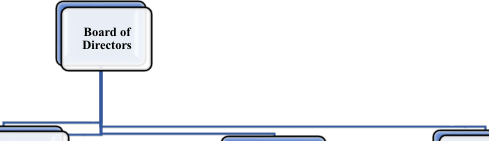

**[Image: Final_RHP.pdf-0205-03.png (489x141, 7.8KB)]**

<!-- Start of picture text -->
Board of Directors <!-- End of picture text -->

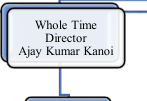

**[Image: Final_RHP.pdf-0205-04.png (147x101, 6.1KB)]**

<!-- Start of picture text -->
Whole Time Director Ajay Kumar Kanoi <!-- End of picture text -->

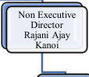

**[Image: Final_RHP.pdf-0205-05.png (114x99, 6.2KB)]**

<!-- Start of picture text -->
Non Executive Director Rajani Ajay Kanoi <!-- End of picture text -->

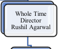

**[Image: Final_RHP.pdf-0205-06.png (115x96, 6.1KB)]**

<!-- Start of picture text -->
Whole Time Director Rushil Agarwal <!-- End of picture text -->

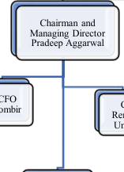

**[Image: Final_RHP.pdf-0205-07.png (157x217, 10.7KB)]**

<!-- Start of picture text -->
Chairman and Managing Director Pradeep Aggarwal CFO <!-- End of picture text -->

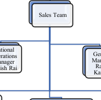

**[Image: Final_RHP.pdf-0205-08.png (209x207, 10.1KB)]**

<!-- Start of picture text -->
Sales Team Manager <!-- End of picture text -->

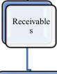

**[Image: Final_RHP.pdf-0205-09.png (82x107, 4.3KB)]**

<!-- Start of picture text -->
Receivable s <!-- End of picture text -->

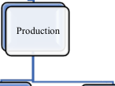

**[Image: Final_RHP.pdf-0205-10.png (146x109, 4.5KB)]**

<!-- Start of picture text -->
Production <!-- End of picture text -->

**[Image: Final_RHP.pdf-0205-11.png (78x63, 2.9KB)]**

<!-- Start of picture text -->
CFO Sombir <!-- End of picture text -->

**[Image: Final_RHP.pdf-0205-12.png (78x64, 3.3KB)]**

<!-- Start of picture text -->
CS Renuka Uniyal <!-- End of picture text -->

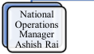

**[Image: Final_RHP.pdf-0205-13.png (118x68, 5.6KB)]**

<!-- Start of picture text -->
National Operations Manager Ashish Rai <!-- End of picture text -->

**[Image: Final_RHP.pdf-0205-14.png (80x71, 4.3KB)]**

<!-- Start of picture text -->
General Manager Rahul Kandoi <!-- End of picture text -->

**[Image: Final_RHP.pdf-0205-15.png (103x70, 5.1KB)]**

<!-- Start of picture text -->
Finance Controller Vipin Kumar Jha <!-- End of picture text -->

**[Image: Final_RHP.pdf-0205-16.png (89x66, 4.8KB)]**

<!-- Start of picture text -->
General Manager Harish Tantia <!-- End of picture text -->

**[Image: Final_RHP.pdf-0205-17.png (128x60, 4.9KB)]**

<!-- Start of picture text -->
Production Manager Jai Baksh <!-- End of picture text -->

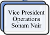

**[Image: Final_RHP.pdf-0205-18.png (99x70, 5.3KB)]**

<!-- Start of picture text -->
Vice President Operations Sonam Nair <!-- End of picture text -->

**[Image: Final_RHP.pdf-0205-19.png (107x67, 5.1KB)]**

<!-- Start of picture text -->
Head-Infra Sales Vibha Kapoor <!-- End of picture text -->

**[Image: Final_RHP.pdf-0205-20.png (97x69, 5.2KB)]**

<!-- Start of picture text -->
Head - Inside Sales Monika Agarwal <!-- End of picture text -->

**[Image: Final_RHP.pdf-0205-21.png (140x66, 4.9KB)]**

<!-- Start of picture text -->
Country Project Manager Pratyush Verma <!-- End of picture text -->

# **<u>COMPLIANCE WITH CORPORATE GOVERNANCE</u>** 

In addition to the applicable provisions of the Companies Act, 2013, provisions of the SEBI (Listing Obligations and Disclosure Requirements) Regulations, 2015 and SEBI (ICDR) Regulations, 2018 will be applicable to our Company immediately upon the listing of our Company’s Equity Shares on the SME platform of BSE. The requirements pertaining to the composition of the Board of Directors and the constitution of the committees such as the Audit Committee, Stakeholders Relationship Committee, Nomination & Remuneration Committee and Corporate Social Responsibility Committee as applicable on us, have been complied with. 

202 

Our Board has been constituted in compliance with the Companies Act, 2013 and in accordance with the best practices in corporate governance. Our Board functions either as a full board or through various committees constituted to oversee specific operational areas. The executive management provides our Board detailed reports on its performance periodically. 

Our Board of Directors consist of Six (6) directors out of which two (2) are Independent Directors, and we have One women director on the Board. The constitution of our Board is in compliance with Section 149 of the Companies Act, 2013. 

Our Company has constituted the following committees: 

# **1. Audit Committee** 

Our Company has formed an Audit Committee, vide Board Resolution dated August 26, 2025 as per the applicable provisions of the Section 177 of the Companies Act, 2013 read with rule 6 of the companies (Meeting of board and its power) Rules, 2014 and Regulation 18 of SEBI Listing Regulations. The Audit Committee comprises following members: 

|**Name of the Director**|**Status in Committee**|**Nature of Directorship**|
|---|---|---|
|Vaibhav Mandhana|Chairman|Independent Director|
|Manish Kankani|Member|Independent Director|
|Pradeep Aggarwal|Member|Chairman and Managing Director|

The Company Secretary of our Company shall act as a Secretary to the Audit Committee. The scope and function of the Audit Committee and its terms of reference shall include the following: 

# **A. Tenure of the committee:** 

The Audit Committee shall continue to be in function as a committee of the Board until otherwise resolved by the Board, to carry out the functions of the Audit Committee as approved by the Board. 

# **B. Meetings of the Committee:** 

The committee shall meet at least four times in a year and not more than one hundred and twenty days shall elapse between any two meetings. The quorum for the meeting shall be either two members or one third of the members of the committee, whichever is higher but there shall be presence of minimum two independent members at each meeting. The Chairman of the Audit Committee shall attend the Annual General Meeting of our Company to answer shareholder queries. 

# **C. Power of the Committee:** 

The Audit Committee shall have powers, including the following: 

- a) to investigate any activity within its terms of reference; 

- b) to seek information from any employee; 

- c) to obtain outside legal or other professional advice; 

- d) to secure attendance of outsiders with relevant expertise, if it considers necessary as may be prescribed under the Companies Act, 2013 (together with the rules thereunder) and SEBI Listing Regulations; and 

- e) To have full access to information contained in records of Company. 

# **D. Role of the Committee:** 

The Role of Audit Committee together with its powers as per Part C of Schedule II of SEBI Listing Regulation and Companies Act, 2013 shall be as under: 

- ⮚ Overseeing the Company’s financial reporting process and disclosure of its financial information to ensure that its financial statements are correct, sufficient and credible; 

- ⮚ Recommending to the Board for the appointment, re-appointment, replacement, remuneration and terms of appointment of the statutory auditors of the Company; 

203 

- ⮚ Reviewing and monitoring the statutory auditor’s independence and performance, and effectiveness of audit process; 

- ⮚ Approving payments to the statutory auditors for any other services rendered by the statutory auditors; 

- ⮚ Reviewing, with the management, the annual financial statements and auditor’s report thereon before submission to the Board for approval, with particular reference to: 

- a. Matters required to be included in the Director’s Responsibility Statement to be included in the Board’s report in terms of clause (c) of sub-section 3 of Section 134 of the Companies Act; 

- b. Changes, if any, in accounting policies and practices and reasons for the same; 

- c. Major accounting entries involving estimates based on the exercise of judgment by management; 

- d. Significant adjustments made in the financial statements arising out of audit findings; 

- e. Compliance with listing and other legal requirements relating to financial statements; f. Disclosure of any related party transactions; and 

- g. Qualifications and modified opinions in the draft audit report. 

- ⮚ Reviewing, with the management, the quarterly, half-yearly and annual financial statements before submission to the Board for approval; 

- ⮚ Reviewing, with the management, the statement of uses/ application of funds raised through an Offer (public Offer, rights issue, preferential issue, etc.), the statement of funds utilized for purposes other than those stated in the offer document/ prospectus/ notice and the report submitted by the monitoring agency monitoring the utilization of proceeds of a public or rights issue, and making appropriate recommendations to the Board to take up steps in this matter. This also includes monitoring the use/application of the funds raised through the proposed initial public offer by the Company; 

- ⮚ Approval or any subsequent modifications of transactions of the Company with related parties and omnibus approval for related party transactions proposed to be entered into by the Company subject to such conditions as may be prescribed; 

- ⮚ Scrutiny of inter-corporate loans and investments; 

- ⮚ Valuation of undertakings or assets of the Company, wherever it is necessary; 

- ⮚ Evaluation of internal financial controls and risk management systems; 

- ⮚ Establishing a vigil mechanism for directors and employees to report their genuine concerns or grievances; 

- ⮚ Reviewing, with the management, the performance of statutory and internal auditors, and adequacy of the internal control systems; 

- ⮚ Reviewing the adequacy of internal audit function if any, including the structure of the internal audit department, staffing and seniority of the official heading the department, reporting structure coverage and frequency of internal audit; 

- ⮚ Discussing with internal auditors on any significant findings and follow up thereon; 

- ⮚ Reviewing the findings of any internal investigations by the internal auditors into matters where there is suspected fraud or irregularity or a failure of internal control systems of a material nature and reporting the matter to the Board; 

- ⮚ Discussing with statutory auditors before the audit commences, about the nature and scope of audit as well as post-audit discussion to ascertain any area of concern; 

- ⮚ Looking into the reasons for substantial defaults in the payment to the depositors, debenture holders, shareholders (in case of non-payment of declared dividends) and creditors; 

- ⮚ Reviewing the functioning of the whistle blower mechanism; 

- ⮚ Approving the appointment of the chief financial officer or any other person heading the finance function or discharging that function after assessing the qualifications, experience and background, etc. of the candidate; 

- ⮚ Reviewing the utilization of loans and/ or advances from/investment by the holding company in any subsidiary exceeding ₹1,000 million or 10% of the asset size of the subsidiary, whichever is lower including existing loans / advances / investments; 

- ⮚ Considering and commenting on the rationale, cost-benefits and impact of schemes involving merger, demerger, amalgamation etc., on the Company and its shareholders; 

- ⮚ Such roles as may be delegated by the Board and/or prescribed under the Companies Act, 2013 and SEBI Listing Regulations or other applicable law. 

Further, the Audit Committee shall mandatorily review the following: 

204 

- 1) management discussion and analysis of financial condition and results of operations; 

- 2) statement of significant related party transactions (as defined by the audit committee), submitted by management; 

- 3) management letters / letters of internal control weaknesses issued by the statutory auditors; 

- 4) internal audit reports relating to internal control weaknesses; 

- 5) the appointment, removal and terms of remuneration of the chief internal auditor shall be subject to review by the audit committee; and 

- 6) statement of deviations: 

   - a. quarterly statement of deviation(s) including report of monitoring agency, if applicable, submitted to stock exchange(s) in terms of Regulation 32(1) of the SEBI ICDR Regulations; 

   - b. Annual statement of funds utilized for purposes other than those stated in the offer document/prospectus/notice in terms of Regulation 32(7) of the SEBI ICDR Regulations. 

# **2. Stakeholders Relationship Committee** 

Our Company has formed and Stakeholders Relationship Committee vide Board Resolution dated August 26, 2025 as per the applicable provisions of the Section 178(5) of the Companies Act, 2013 read with rule 6 of the companies (Meeting of board and its power) rules, 2014 and Regulation 20 of SEBI Listing Regulations. The Stakeholders Relationship Committee comprises following members: 

|**Name of the Director**|**Status in Committee**|**Nature of Directorship**|
|---|---|---|
|Vaibhav Mandhana|Chairman|Independent Director|
|Rushil Agarwal|Member|Whole Time Director|
|Ajay Kumar Kanoi|Member|Whole Time Director|

The scope and function of the Committee and its terms of reference shall include the following: 

# **i. Tenure of the committee:** 

The Stakeholders Relationship Committee shall continue to be in function as a committee of the Board until otherwise resolved by the Board, to carry out the functions of the Stakeholders Relationship Committee as approved by the Board. 

# **ii. Meetings of the committee:** 

The Stakeholders Relationship Committee shall meet at least once a year and shall report to the Board on a quarterly basis regarding the status of redressal of complaints received from the shareholders of the Company. The Chairman of the Stakeholders Relationship Committee shall be present at the Annual General Meeting to answer queries of the securities holders. The Quorum shall be two members present. 

# **iii. Terms of Reference:** 

The role of the Stakeholders Relationship Committee as per Part D of Schedule II of the SEBI Listing Regulations and Companies Act, 2013 shall be as under: 

1. Resolving the grievances of the security holders of the listed entity including complaints related to transfer/transmission of shares, non-receipt of annual report, non-receipt of declared dividends, issue of new/duplicate certificates, general meetings etc.; 

2. Review of measures taken for effective exercise of voting rights by shareholders; 

3. Review of adherence to the service standards adopted by the listed entity in respect of various services being rendered by the Registrar & Share Transfer Agent; 

4. Review of the various measures and initiatives taken by the listed entity for reducing the quantum of unclaimed dividends and ensuring timely receipt of dividend warrants/ annual reports/ statutory notices by the shareholders of the company; 

5. Allotment, transfer of shares including transmission, splitting of shares, changing joint holding into single holding and vice versa, issue of duplicate shares in lieu of those torn, destroyed, lost or defaced or where the space at back for recording transfers have been fully utilized; 

205 

6. Formulation of procedures in line with the statutory guidelines to ensure speedy disposal of various requests received from shareholders from time to time; 

7. To issue duplicate share or other security(ies) certificate(s) in lieu of the original share/security(ies) certificate(s) of the Company; 

8. Non-receipt of share certificate(s), non-receipt of declared dividends, non-receipt of interest/ dividend warrants, nonreceipt of annual report and any other grievance/ complaints with Company or any officer of the Company arising out in discharge of his duties; 

9. Oversee the performance of the Registrar & Share Transfer Agent and also review and take note of complaints directly received and resolved them; 

10. Oversee the implementation and compliance of the Code of Conduct adopted by the Company for prevention of Insider Trading for Listed Companies as specified in the Securities & Exchange Board of India (Prohibition of insider Trading) Regulations, 2015 as amended from time to time; 

11. Any other power specifically assigned by the Board of Directors of the Company from time to time by way of resolution passed by it in a duly conducted Meeting; and 

12. Such roles as may be delegated by the Board and/ or prescribed under the Companies Act, 2013 and SEBI Listing Regulations or other applicable law. 

# **3. Nomination and Remuneration Committee** 

Our Company has formed a Nomination and Remuneration Committee vide Board Resolution dated August 26, 2025 as per the applicable provisions of the Schedule V and other applicable provisions of the Companies Act, 2013 read with rule 6 of the companies (Meeting of board and its power) rules, 2014 and Regulation 19 of SEBI Listing Regulations. The Nomination and Remuneration Committee comprises following members: 

|**Name of the Director**|**Status in Committee**|**Nature of Directorship**|
|---|---|---|
|Vaibhav Mandhana|Chairman|Independent Director|
|Manish Kankani|Member|Independent Director|
|Rajani Ajay Kanoi|Member|Non-Executive Director|

The scope and function of the Committee and its terms of reference shall include the following: 

# **A. Tenure of the committee:** 

The Nomination and Remuneration Committee shall continue to be in function as a committee of the Board until otherwise resolved by the Board. 

# **B. Meetings of the committee:** 

The committee shall meet as and when the need arises, subject to at least once in a year. The quorum for a meeting of the Nomination and Remuneration Committee shall be either two members or one third of the members of the committee, whichever is greater, including at least one independent director in attendance. The Chairman of the Nomination and Remuneration Committee is entitled to attend the general Meeting of the company to furnish clarifications to the shareholders on any matter relating to remuneration. 

# **C. Role of Terms of Reference:** 

The role of the Nomination and Remuneration Committee as per Part D of Schedule II of the SEBI Listing Regulations and Companies Act, 2013 shall be as under: 

1. formulating the criteria for determining qualifications, positive attributes and independence of a director and recommend to the Board a policy relating to the remuneration of the directors, key managerial personnel and other employees; 

2. For the appointment of an independent director, the committee shall evaluate the balance of skills, knowledge and experience on the Board and on the basis of such evaluation, prepare a description of the role and capabilities required of an independent director. The person recommended to the board of directors of the Company for appointment as an independent director shall have the capabilities identified in such description. For the purpose of identifying suitable candidates, the Committee may: 

- a. use the services of external agencies, if required; b. consider candidates from a wide range of backgrounds, having due regard to diversity; and 

206 

- c. Consider the time commitments of the candidates. 

3. formulation of criteria for evaluation of the performance of independent directors and the Board; 

4. devising a policy on diversity of our Board; 

5. identifying persons, who are qualified to become directors or who may be appointed in senior management in accordance with the criteria laid down, recommending to the Board their appointment and removal and carrying out evaluation of every director’s performance; 

6. determining whether to extend or continue the term of appointment of the independent director, on the basis of the report of performance evaluation of independent directors; 

7. recommending remuneration of executive directors and any increase therein from time to time within the limit approved by the members of our Company; 

8. recommending remuneration to non-executive directors in the form of sitting fees for attending meetings of the Board and its committees, remuneration for other services, commission on profits; 

9. recommending to the Board, all remuneration, in whatever form, payable to senior management; 

10. performing such functions as are required to be performed by the compensation committee under the SEBI (Share Based Employee Benefits and Sweat Equity) Regulations, 2021, as amended; 

11. engaging the services of any consultant/professional or other agency for the purpose of recommending compensation structure/policy; 

12. analyzing, monitoring and reviewing various human resource and compensation matters; 

13. reviewing and approving compensation strategy from time to time in the context of the then current Indian market in accordance with applicable laws; 

14. framing suitable policies and systems to ensure that there is no violation, by an employee of any applicable laws in India or overseas, including: 

- a. The SEBI (Prohibition of Insider Trading) Regulations, 2015, as amended; or 

- b. The SEBI (Prohibition of Fraudulent and Unfair Trade Practices relating to the Securities Market) Regulations, 2003, as amended; and 

15. Performing such other functions as may be delegated by the Board and/or prescribed under the SEBI Listing Regulations, Companies Act, each as amended or other applicable law. 

# **KEY MANAGERIAL PERSONNEL** 

Our Company is supported by a team of professionals having exposure to various operational aspects of our business. A brief detail about the Key Managerial Personnel of our Company is provided below: 

|**Name, Designation & Educational** **Qualification**|**Age** **(Years)**|**Year of** **Joining**|**Remunerati** **on paid for** **F.Y. ended** **2024-25** **(in ₹ Lakhs)**|**Overall** **experience** **(in years)**|**Previous** **employment**|
|---|---|---|---|---|---|
|**Pradeep Aggarwal** **Designation:**Chairman and Managing Director **Educational Qualification:**Chartered Accountant **Term of office:**For a period of three years with effect from July 23, 2025; liable to retire by rotation|56|2022|37.5|32|Mtandt Rentals Limited|
|**Ajay Kumar Kanoi** **Designation:**Whole Time Director **Educational Qualification:**12th **Term of office:**For a period of three years with effect from July 23, 2025; liable to retire by rotation|54|2019|54|36|Mtandt Rentals Limited|
|**Rushil Agarwal** **Designation:**Whole Time Director **Educational Qualification:**B.com (Hons.)|27|2019|34.51|5|-|

207 

|**Name, Designation & Educational** **Qualification**|**Age** **(Years)**|**Year of** **Joining**|**Remunerati** **on paid for** **F.Y. ended** **2024-25** **(in ₹ Lakhs)**|**Overall** **experience** **(in years)**|**Previous** **employment**|
|---|---|---|---|---|---|
|**Term of office:**For a period of three years with effect from August 29, 2025; liable to retire by rotation||||||
|**Renuka Uniyal** **Designation:**Company Secretary and Compliance Officer **Educational Qualification:**Company Secretary CS Membership No. ACS-71663|30|2025|Nil|2|Ravinder Heights Limited|
|**Sombir**||2020|||Srithai|
|**Designation:**Chief Financial Officer **Educational Qualification:**Master in Business Administration (Finance)|43|(As Finance Manager)|13.82|20|Superware Manufacturing Pvt. Ltd.|

# **BRIEF PROFILE OF KEY MANAGERIAL PERSONNEL** 

**Pradeep Aggarwal-** Please refer to section **“Brief Profile of our Directors”** beginning on page 198 of this Red Herring Prospectus for details. 

**Ajay Kumar Kanoi** Please refer to section **“Brief Profile of our Directors”** beginning on page 198 of this Red Herring Prospectus for details. 

**Renuka Uniyal** is the Company Secretary and Compliance Officer of our Company, appointed with effect from 23rd August 2025. She holds a Bachelor of Commerce degree from Vivekananda College, University of Delhi (2015) and a Bachelor of Laws (LL.B.) degree from Chaudhary Charan Singh University, Meerut (2023). She has been an Associate Member of the Institute of Company Secretaries of India (ICSI) since 2023. She possess over 2 years of comprehensive experience in corporate compliance, secretarial practices, and Stock Exchange compliances. Previously, she has worked with Ravinder Heights Limited as the Company Secretary and Compliance Officer from April’2023 to August’2025. 

**Sombir** is the Chief Financial Officer of our Company. He holds a Bachelor of Commerce (Honors) degree from Maharshi Dayanand University, Rohtak (2002), and a Master of Business Administration (Finance) from Symbiosis Centre for Distance Learning, Pune (2013). He has over 20 years of experience in finance, including financial planning, audits, budgeting and taxation, of which seven years are in the scaffolding industry. He commenced his career with Wisec Global Limited in November 2004 as Executive – Finance and Accounts and subsequently held managerial positions in Eastman Industrial Co. and Eastman Hong Kong Pvt. Ltd., Gurugram, Mtandt Rentals Ltd., New Delhi, ACB (India) Ltd and Srithai Superware Manufacturing Pvt. Ltd. until 2020. He joined our Company in August 2020 as Finance Manager and was promoted as Chief Financial Officer on July 23, 2025. He looks after the accounts and finance operations in our Company. 

# **Senior Management Personnel of our Company** 

**Sonam Nair** is the Vice President – Operations of our Company. She holds a Post Graduate Diploma in Industrial Relations and Personnel Management from Bharatiya Vidya Bhavan (2013) and a Master of Arts in English Literature from Indira Gandhi National Open University (2017). She has been associated with our Company since 2019 and has 6 years of experience in managing B2B sales, key account management, inside sales leadership, lead generation, customer retention and sales team training. 

**Vipin Kumar Jha** is the Finance Controller of our Company. He holds a Master of Commerce degree from Himachal Pradesh University, Shimla (2005). He has over 22 years of experience in finance and accounts. He began his career with JCK & Co. (Chartered Accountants) in 2003 as Senior Accounts Executive, where he served until 2008. He then 

208 

worked with FK Publications Private Limited as Accounts Officer (2008), Pradeep Raj & Co. as Senior Accounts Officer (2009–2013), and Mtandt Rentals Limited as Senior Taxation Officer (2013). In January 2014, he joined Woodside Developments Private Limited as Senior Accounts Manager, where he served until 2021. He joined our Company in March 2021. He looks after the finance function in our Company. 

**Vibha Kapoor** is the Head – Infra Sales of our Company. She holds a Bachelor of Technology in Electronics & Instrumentation from the Institute of Engineering & Technology, Ropar (2004) and a Diploma in Business Management from the Institute of Management Technology, Ghaziabad (2006). She has over 13 years of experience in sales and business development. She began her career with Jindal Electricals, Ludhiana, as Technical and Business Development Officer, and has also worked with HDFC Bank as Relationship Manager and Deputy Manager during 2007–2013 and 2016–2017. She joined our Company in March 2024 and is responsible for the infra and contract sales vertical, manages tenders and compliance 

**Pratyush Verma** is the Country – Project Manager of our Company. He holds Bachelor of Engineering in Mechanical from Visvesvaraya Technological University, Belgaum (2017). He has 7 years of experience in project management, operations and maintenance. He commenced his career with Jay Gauri Projects (I) Pvt. Ltd. from July 2016 to February 2019, serving in various project and maintenance roles. Thereafter, he was associated with JSW Steel Limited as Senior Engineer – Maintenance and Projects (2019–2022), Youngman India Private Limited as Senior Project Manager – Projects and Operations (2023), and Mtandt Group as Project Manager – Projects and Operations (2023– 2024). He joined our Company in November 2024 and is responsible for overseeing project management, sales leadership, financial and operational oversight, reporting, stakeholder engagement and team development. 

**Ashish Rai** is the National Operations Manager of our Company. He holds a Bachelor of Commerce (Honors) degree from Purvanchal University, Varanasi, completed in 2007, and a Master of Business Administration (Marketing) from Tilak Maharashtra University, Pune, in 2010. He has over 15 years of experience in operations and supply chain management. He commenced his career with Abbee Consumables & Peripherals Shopee Limited as a Franchisee Operation Executive from June 2010 to October 2011. Subsequently, he was associated with Renovision Automation Services Private Limited as Senior Operation Associate from November 2011 to August 2016. Thereafter, he served as Operations Manager at Youngman India Private Limited from September 2016 to November 2023. He then held the position of Operations Head at Mainee Steel Works Private Limited from December 2023 to November 2024. He joined our Company in December 2024 and in his present role, he is responsible for overseeing warehousing practices, supply chain reporting, inventory planning, and purchase processes. 

In addition to Pradeep Aggarwal (Chairman and Managing Director), Ajay Kumar Kanoi (Whole time Director), Rushil Agarwal (Whole time Director), Sombir (CFO) and Renuka Uniyal, (Company Secretary and Compliance Officer) of the company, whose details are provided in “-Key Managerial Personnel”, the details of our other Senior Management Personnel as on the date of this Red Herring Prospectus are as set forth below: 

|**Name** **Designation** **and** **education Qualification**|**Age** **(Years)**|**Year of** **Joining**|**Remuneration** **paid for** **F.Y. ended** **2024-25** **(in ₹ Lakhs)**|**Overall** **Experience in** **Years**|**Previous** **Employment**|
|---|---|---|---|---|---|
|**Sonam** **Nair** **Designation:**Vice President – Operations **Educational** **Qualification:** Master of Arts (English Literature)|33|2019|10.53|6|NA|
|**Vipin Kumar Jha** Designation: Finance Controller Educational Qualification: M.com|42|2021|14.62|22|Woodside Developments Private Limited as Sr. Accounts Manager|
|**Vibha Kapoor** Designation: Head–Infra Sales|43|2024|13.17|17|HDFC Bank Limited|

209 

|Educational Qualification: B.Tech (Electronics & Instrumentation)|||||(Relationship Banking Head)|
|---|---|---|---|---|---|
|**Pratyush Verma** Designation: Country – Project Manager Educational Qualification: B.E (Mechanical)|32|2024|6.81|7|MTANDT Group as Project Manager|
|**Ashish Rai** Designation: National Operations Manager Educational Qualification: B.com (honors)|38|2024|4.55|15|Youngman India Pvt Ltd (Operation Manager)|

<u>The Remuneration paid to SMP’s for the fiscal 2025 is as follows:</u> 

|**Sr.** **No.**|**Name**|**Designation**|**Remuneration** **_(Rs. in Lakhs)_**|
|---|---|---|---|
|1.|Sonam Nair|Vice President–Operations|10.53|
|2.|Vipin Kumar Jha|Finance Controller|14.62|
|3.|Vibha Kapoor|Head–Infra Sales|13.17|
|4.|Ashish Rai|National Operations Manager|4.55|
|5.|Pratyush Verma|Country–Project Manager|6.81|

**We confirm that:** 

- a. All the persons named as our Key Managerial Personnel and Senior Management Personnel above are the permanent employees of our Company. 

- b. There is no understanding with major shareholders, customers, suppliers or any others pursuant to which any of the above-mentioned Key Managerial Personnel and Senior Management personnel have been recruited. 

- c. None of our KMPs except Pradeep Aggarwal, Ajay Kumar Kanoi are also part of the Board of Directors. 

- d. In respect of all above mentioned Key Managerial Personnel there has been no contingent or deferred compensation accrued for the Year ended March 2024. 

- e. Except for the terms set forth in the appointment letters, the Key Managerial Personnel and Senior Management personnel have not entered into any other contractual arrangements or service contracts (including retirement and termination benefits) with the issuer. 

- f. Our Company does not have any bonus/ profit sharing plan for any of the Key Managerial Personnel or Senior Management. 

- g. None of the Key Managerial Personnel and personnel of Senior Management in our Company hold any shares of our Company as on the date of filing of this Red Herring Prospectus except: 

|**Sr. No.**|**Name of the KMP’s/Senior Management Personnel**|**No. of Shares held**|
|---|---|---|
|1|Pradeep Aggarwal|33,60,000|
|2|Ajay Kumar Kanoi|55,32,000|
|3|Rushil Agarwal|3,20,000|
||**Total**|**92,80,000**|

- h. Presently, we do not have ESOP/ ESPS/SAR scheme for our employees. 

- i. The turnover of KMPs and SMPs is not high, compared to the industry to which our company belongs. 

**Nature of any family relationship between our Directors, Key Managerial Personnel (KMP) and Senior Management personnel.** 

The Directors ,KMPs and SMPs of the Company are related to each other within the meaning of section 2 (77) of the Companies Act, 2013. Details of which are as follows: 

210 

|**Sr.** **no.**|**Name of Director/KMP/Senior** **Management Personnel**|**Relationship with other Directors/KMPs/Senior Management** **Personnel**|
|---|---|---|
|1.|Pradeep Aggarwal (Chairman and Managing Director)|Father of Rushil Agarwal (Whole Time Director)|
|2.|Ajay Kumar Kanoi (Whole Time Director)|Husband of Rajani Ajay Kanoi (Non-Executive Director)|
|3.|Rushil Agarwal (Whole Time Director)|Son of Pradeep Aggrawal (Chairman and Managing Director)|
|4.|Rajani Ajay Kanoi (Non-Executive Director)|Wife of Ajay Kaumar Kanoi (Whole Time Director)|

# **Payment of benefits to officers of Our Company (** **_non-salary related_ )** 

Except as disclosed in this Red Herring Prospectus and any statutory payments made by our Company to its officers, our Company has not paid any sum, any non-salary related amount or benefit to any of its officers or to its employees including amounts towards super-annuation, ex-gratia/ rewards. 

Except statutory benefits upon termination of employment in our Company or superannuation, no officer of our Company is entitled to any benefit upon termination of such officer’s employment in our Company or superannuation. Contributions are made by our Company towards provident fund, gratuity fund and employee state insurance. 

# **Changes in the Key Managerial Personnel and Senior Management Personnel in last three years:** 

The changes in the Key Managerial Personnel of our Company during the last 3 (three) years are stated below: 

|**Name**|**Designation (at the time of** **appointment/ Change in** **designation/ Cessation)**|**Date of Appointment/** **Change in designation/** **Cessation**|**Reason**|
|---|---|---|---|
|Pradeep Aggarwal|Re-designated as Managing Director and Chairman|July 23, 2025|To ensure better|
|Ajay Kumar Kanoi|Re-designated as Whole Time Director|July 23, 2025|Corporate Governance|
|Rushil Agarwal|Re-designated as Whole Time Director|August 29, 2025|and compliance|
|Renuka Uniyal|Appointed as Company Secretary & Compliance Officer|August 23, 2025|with Companies |
|Sombir|Appointed as CFO|July23,2025|Act, 2013|
|Pratyush Verma|Appointment as Country Project Manager (SMP)|October 26, 2024||
|Ashish Rai|National Operations Manager(SMP)|October 28,2024||
|Vibha Kapoor|Head – Infra Sales|February06,2024||

# **Interest of Our Key Managerial Persons and Senior Management Personnel** 

Apart from the shares held in the Company and to extent of remuneration allowed and reimbursement of expenses incurred by them for or on behalf of the Company and to the extent of loans and advances made to or borrowed from the Company, none of our key managerial personnel and Senior Management Personnel are interested in our Company. For details, please refer section titled **_“Financial information of the Company – Annexure 30- Related Party Disclosures”_** beginning on page 280 of this Red Herring Prospectus. 

# **<mark>Interest of KMP’s and SMP’s in the property of Our Company:</mark>** 

<mark>Except as disclosed in the section titled “Our Business - Properties” and “Financial Information – Related party transactions” on pages 182 and 280, our KMP’s and SMP’s do not have any other interest in any property acquired</mark> 

211 

<mark>by our Company in a period of two years before filing of this Red Herring Prospectus or proposed to be acquired by us as on date of this Red Herring Prospectus.</mark> 

# **Other Interests in our Company** 

Except as stated in this section **_“Our Management”_** or the section titled **_“Financial information of the Company – Annexure-30 - Related Party Disclosure”_** beginning on page 196 and 280 _respectively_ of this Red Herring Prospectus, and except to the extent of shareholding in our Company, our KMPs and SMPs do not have any other interest in our business. 

# **Details of Service Contracts of the Key Managerial Personnel and Senior Management Personnel** 

Except for the terms set forth in the appointment letters, the Key Managerial Personnel and Senior Management Personnel have not entered into any other contractual arrangements with our Company for provision of benefits or payments of any amount upon termination of employment. 

# **Loans given/ availed by Directors/ Key Managerial Personnel/ Senior Management Personnel of Our Company** 

For details of unsecured loan taken from or given to our Directors/ KMPs/ SMPs and for details of transaction entered by them in the past please refer to **_“Annexure 30 – Related Party Disclosures_ ”** page 280 of this Red Herring Prospectus. 

# **Employee Stock Options** 

Presently, we do not have any ESOP/ ESPS/SAR Scheme for our employees. 

212 

# **OUR PROMOTERS & PROMOTER GROUP** 

# **<u>OUR PROMOTERS:</u>** 

Pradeep Aggarwal, Ajay Kumar Kanoi, Vansh Aggarwal, Gaurav Ajay Kumar Kanoi, Rajani Ajay Kanoi, Monika Agarwal and Rushil Agarwal are the promoters of our Company. 

As on date of this Red Herring Prospectus, Our Promoters, in aggregate, hold 1,57,72,000 Equity shares of our Company, representing 98.58% of the pre-issue paid-up Equity Share capital of our Company. For details of the buildup of the Promoters’ shareholding in our Company, see **_“Capital Structure – Capital Build-up in respect of Shareholding of our Promoters”,_** on page 81 of this Red Herring Prospectus. 

# **Brief Profile of our Promoters is as under:** 

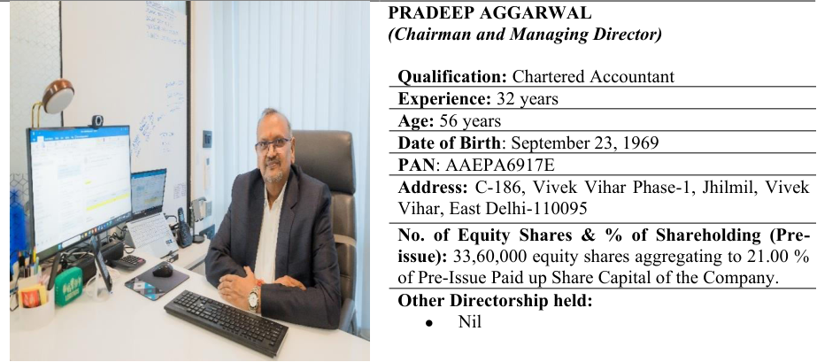

**[Image: Final_RHP.pdf-0216-05.png (923x409, 309.6KB)]**

<!-- Start of picture text -->
PRADEEP AGGARWAL (Chairman and Managing Director) Qualification:  Chartered Accountant Experience:  32 years Age:  56 years Date of Birth : September 23, 1969 PAN : AAEPA6917E Address:  C-186, Vivek Vihar Phase-1, Jhilmil, Vivek Vihar, East Delhi-110095 No. of Equity Shares & % of Shareholding (Pre- issue):  33,60,000 equity shares aggregating to 21.00 % of Pre-Issue Paid up Share Capital of the Company. Other Directorship held: • Nil <!-- End of picture text -->

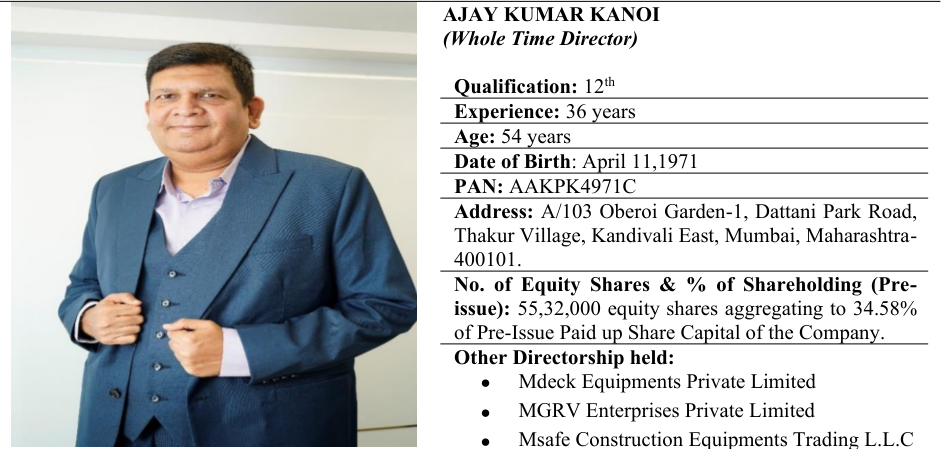

**[Image: Final_RHP.pdf-0216-06.png (942x449, 338.5KB)]**

<!-- Start of picture text -->
AJAY KUMAR KANOI (Whole Time Director) Qualification:  12 th Experience:  36 years Age:  54 years Date of Birth : April 11,1971 PAN:  AAKPK4971C Address:  A/103 Oberoi Garden-1, Dattani Park Road, Thakur Village, Kandivali East, Mumbai, Maharashtra- 400101. No. of Equity Shares & % of Shareholding (Pre- issue):  55,32,000 equity shares aggregating to 34.58% of Pre-Issue Paid up Share Capital of the Company. Other Directorship held: • Mdeck Equipments Private Limited • MGRV Enterprises Private Limited • Msafe Construction Equipments Trading L.L.C <!-- End of picture text -->

- Msafe Construction Equipments Trading L.L.C 

213 

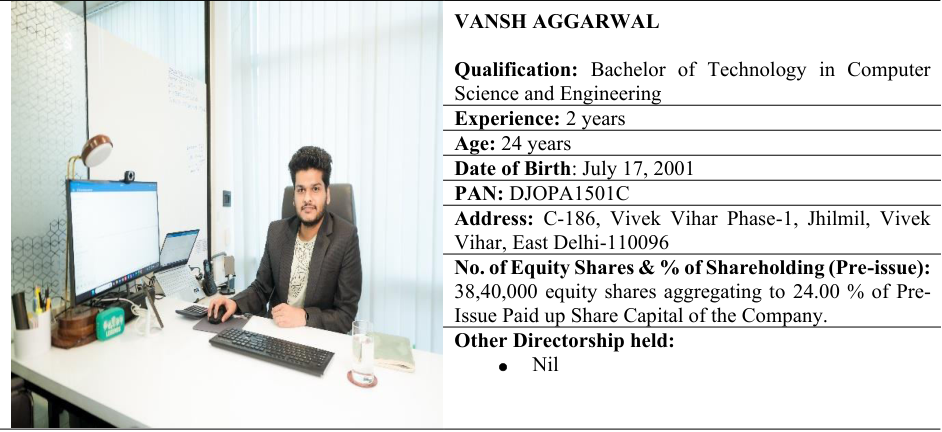

**[Image: Final_RHP.pdf-0217-00.png (942x432, 281.1KB)]**

<!-- Start of picture text -->
VANSH AGGARWAL Qualification:  Bachelor of Technology in Computer Science and Engineering Experience:  2 years Age:  24 years Date of Birth : July 17, 2001 PAN:  DJOPA1501C Address:  C-186, Vivek Vihar Phase-1, Jhilmil, Vivek Vihar, East Delhi-110096 No. of Equity Shares & % of Shareholding (Pre-issue): 38,40,000 equity shares aggregating to 24.00 % of Pre- Issue Paid up Share Capital of the Company. Other Directorship held: • Nil <!-- End of picture text -->

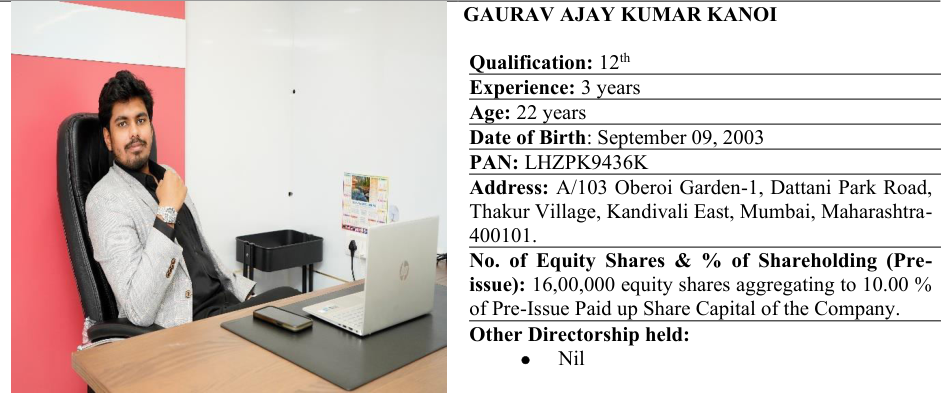

**[Image: Final_RHP.pdf-0217-01.png (942x394, 244.8KB)]**

<!-- Start of picture text -->
 GAURAV AJAY KUMAR KANOI Qualification:  12 th Experience:  3 years Age:  22 years Date of Birth : September 09, 2003 PAN:  LHZPK9436K Address:  A/103 Oberoi Garden-1, Dattani Park Road, Thakur Village, Kandivali East, Mumbai, Maharashtra- 400101. No. of Equity Shares & % of Shareholding (Pre- issue):  16,00,000 equity shares aggregating to 10.00 % of Pre-Issue Paid up Share Capital of the Company. Other Directorship held: • Nil <!-- End of picture text -->

214 

**[Image: Final_RHP.pdf-0218-00.png (441x428, 186.3KB)]**

# **RAJANI AJAY KANOI** 

**_(Non executive director)_** 

# **<u>Qualification:</u>** <u>10</u>th 

**<u>Experience:</u>** <u>4 years</u> 

**<u>Age:</u>** <u>53 years</u> 

**<u>Date of Birth</u>** <u>: November 29, 1972.</u> 

**<u>PAN</u>** <u>: AFHPK2589L.</u> 

**Address:** A/103 Oberoi Garden-1, Dattani Park Road, Thakur Village, Kandivali East, Mumbai, Maharashtra- <u>400101.</u> 

**No. of Equity Shares & % of Shareholding (Preissue):** 8,00,000 equity shares aggregating to 5.00 % of Pre-Issue Paid up Share Capital of the Company. 

# **Other Directorship held:** 

- **Nil** 

**[Image: Final_RHP.pdf-0218-12.png (459x422, 248.0KB)]**

# **MONIKA AGARWAL** 

**<u>Qualification:</u>** <u>Bachelors of Arts</u> 

**<u>Experience:</u>** <u>19 years</u> 

**<u>Age:</u>** <u>54 years</u> **<u>Date of Birth</u>** <u>: June 29, 1971.</u> **<u>PAN</u>** <u>: ADVPA5100B.</u> 

**Address** : 10, Ajanta Colony, Vaibhav Nagar, Agra, <u>Uttar Pradesh-282001</u> 

**No. of Equity Shares & % of Shareholding (Preissue):** 3,20,000 equity shares aggregating to 2.00 % of Pre-Issue Paid up Share Capital of the Company. 

# **Other Directorship held:** 

• Mdeck Equipments Private Limited 

215 

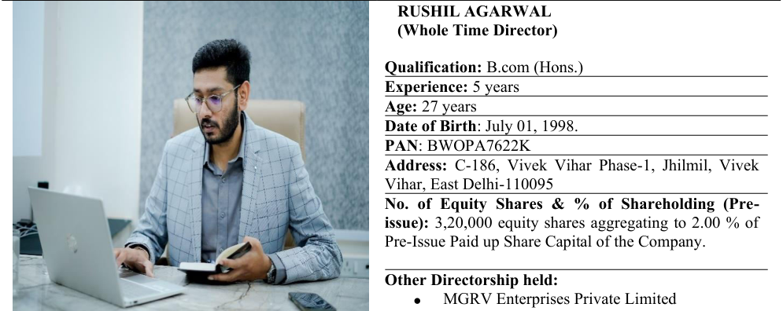

**[Image: Final_RHP.pdf-0219-00.png (995x396, 329.4KB)]**

<!-- Start of picture text -->
   RUSHIL AGARWAL    (Whole Time Director) Qualification:  B.com (Hons.) Experience:  5 years Age:  27 years Date of Birth : July 01, 1998. PAN : BWOPA7622K Address:  C-186, Vivek Vihar Phase-1, Jhilmil, Vivek Vihar, East Delhi-110095 No. of Equity Shares & % of Shareholding (Pre- issue):  3,20,000 equity shares aggregating to 2.00 % of Pre-Issue Paid up Share Capital of the Company. Other Directorship held: • MGRV Enterprises Private Limited <!-- End of picture text -->

# **Brief profile of our promoters** 

For brief profile of our Promoters, other than Monika Agarwal, Gaurav Ajay Kumar Kanoi and Vansh Aggarwal, please refer to Chapter “ _Our Management_ ” beginning on page 196 of this Red Herring Prospectus. 

# **Vansh Aggarwal, Promoter** 

Vansh Aggarwal completed his Bachelor of Engineering in Computer Science from Vellore Institute of Technology, Vellore, Tamil Nadu, in 2023. He began his career with Fareportel as a Software Engineer in 2023 and worked there until 2025. He joined the company in April 2025 and is currently looking after the IT operations of our Company. 

# **Monika Agarwal, Promoter** 

Monika Agarwal completed her Bachelor of Arts in English and Economics from Agra University in 1990. She began her career with Knits and Knots as an Export House Merchandiser in 2005 and subsequently worked with Buying Agency Elite International as Senior Merchandiser in 2007 and continued till 2012. Later in 2012, she joined Aero Club as Senior Merchandiser – Outsourcing, where she continued until 2018. She has been associated with our Company since its incorporation and currently heads the inside sales function. She has around 19 years of experience in sales, marketing and customer relations. 

# **Gaurav Ajay Kumar Kanoi, Promoter** 

Gaurav Ajay Kumar Kanoi completed his 12th in 2021 from SMT. Lilavatibai Podar High School, Mumbai. He began his career with the company in 2021 as Sales Executive, was promoted to Assistant Manager in April 2023, and to General Manager in April 2025. His areas of expertise include B2B and B2C sales, data-driven decision-making, and market expansion strategies. 

# **Confirmations:** 

Our Company undertakes that the details of Permanent Account Number, Bank Account Number(s), Aadhar Card Number, Driving License Number and Passport Number of the Promoters will be submitted at the time of submission of this Red Herring Prospectus to the BSE for listing of the securities of our Company on SME Platform of BSE. 

Our Promoters and the members of our Promoter Group have confirmed that they have not been identified as willful defaulter or a fraudulent borrower by the RBI or any other governmental authority. No violations of securities laws have been committed by our Promoters or members of our Promoter Group in the past or are currently pending against them. 

216 

None of (i) our Promoters and members of our Promoter Group or persons in control of ;(ii) the Companies with which any of our Promoters are or were associated as a promoters, director or person in control,are debarred or prohibited from accessing the capital markets or restrained from buying, selling, or dealing in securities under any order or directions passed for any reasons by the SEBI or any other authority or refused listing of any of the securities issued by any such entity by any stock exchange in India or abroad. 

Our Promoters have not been declared as fugitive economic offenders as defined under the SEBI (ICDR) Regulations. 

# **<u>Change in the control of our Company:</u>** 

There has been no change in the control of our Company during the last five years preceding the date of this Red Herring Prospectus. 

# **<u>Interest of our Promoters:</u>** 

# **i. Interest in promotion and shareholding of Our Company:** 

Our Promoters are interested in our Company to the extent that (i) they are the promoters of our Company and (ii) to the extent of their shareholding and shareholding of their relatives, from time to time, for which they are entitled to receive dividend payable, if any, and other distribution in respect of the Equity Shares held by them and their relatives. For details regarding the shareholding of our Promoters in our Company, please see **_“Capital Structure”_** on page 74 of this Red Herring Prospectus 

Our Promoters, who are also Directors and Key Managerial Personnel of our Company, may be deemed to be interested to the extent of the remuneration, as per the terms of their appointment and reimbursement of expenses payable to them for the rent, purchase and sale transactions. For details, please refer to **_Annexure - 30 – “Related Party Transactions”_** beginning on page 280 of this Red Herring Prospectus. 

# **ii. Interest in the property of Our Company:** 

Our Promoters do not have any other interest in any property acquired by our Company in a period of two years before filing of this Red Herring Prospectus or proposed to be acquired by us as on date of this Red Herring Prospectus. For further details of property, please refer to Chapter titled **_“Our Business”_** beginning on page 156 of this Red Herring Prospectus. 

# **iii. Other Interests in our Company** 

_For transactions in respect of loans and other monetary transactions entered in past please refer_ **_Annexure - 30_** _on_ **_“Related Party Transactions”_** _on page 280 forming part of_ **_“Financial Information of the Company”_** _of this Red Herring Prospectus._ 

Our Promoters have not given any material guarantee to any third party with respect to the Equity Shares as on the date of this Red Herring Prospectus. 

Further, our promoters may be interested to the extent of personal guarantees given by them in favor of the Company, for the details of Personal Guarantee given by Promoters towards Financial facilities of our Company please refer to **_“Statement of Financial Indebtedness”_** and “ **_“Financial Information of Our Company”_** on page 294 _and 222_ respectively of this Red Herring Prospectus. 

# **Payment or Benefits to our Promoter and Promoter Group during the last 2 years:** 

Save and except as disclosed under **_“Compensation of our Managing Director”_** in the chapter titled **_“Our Management”_** beginning on page 199 of this Red Herring Prospectus and also refer “ **_Annexure - 30 on “Related Party Transactions”_** on page 280 of this Red Herring Prospectus forming part of **_“Financial Information of the Company”_** , there has been no Payment or benefit to promoters during the two (2) years preceding the date of filing of this Red Herring Prospectus, nor is there any intention to pay or give any benefit to our Promoters as on the date of this Red Herring Prospectus 

217 

# **Companies/Firms with which our Promoters have disassociated in the last (3) three years** 

Except as mention below our promoters have not disassociated themselves from any of the Company, Firms or other entities during the last three years preceding the date of this Red Herring Prospectus. 

|**Sr. No**|**Name** **of** **the** **Promoter**|**Entity Name**|**Date of Cessation** **from Directorship/** **Partnership**|**Reason** **for** **Disassociation**|
|---|---|---|---|---|
|1.|Ajay Kumar Kanoi|Urban Roti Restaurant LLP|August 12, 2025|No Activities by the Firm|
|2.|Pradeep Aggarwal|MGRV Enterprises Private Limited M.M. Polyvinyls Private Limited|September 29, 2022 August 20, 2025|Due to Pre- Occupancy|

# **Other ventures of our Promoter** 

Save and except as disclosed in this section titled **_“Our Promoter & Promoter Group”_** beginning on page 213 of this Red Herring Prospectus, there are no ventures promoted by our Promoters in which they have any business interests/ other interests. 

# **Litigation details pertaining to our Promoter** 

For details on litigations and disputes involving our Promoters, please refer to the section titled “ **_Outstanding Litigations and Material Developments_** ” beginning on page 320 of this Red Herring Prospectus. 

# **Experience of Promoters in the line of business** 

Our Promoters have adequate experience in the business activities undertaken by our Company. For details in relation to experience of our Promoters in the business of our Company, please refer to the chapter titled “ **_Our Management_** ” beginning on page 196 of this Red Herring Prospectus. 

# **Related Party Transactions** 

Except as stated in **_“Annexure – 30 - Related Party Transactions”_** beginning on page 280 of this Red Herring Prospectus, and as stated therein, our Promoters or any of the Promoter Group Entities do not have any other interest in our business. 

# **<u>OUR PROMOTER GROUP:</u>** 

In addition to the Promoters named above, the following natural persons are part of our Promoter Group in terms of Regulation 2(1) (pp) of the SEBI (ICDR) Regulations, 2018: 

# **i. Individuals forming part of the Promoter Group:** 

|**Relationship**|**Ajay** **Kumar** **Kanoi**|**Vansh** **Aggarwal**|**Pradeep** **Aggarwal**|**Gaurav** **Ajay** **Kumar** **Kanoi**|**Rajani** **Ajay** **Kanoi**|**Monika** **Agarwal**|**Rushil** **Agarwal**|
|---|---|---|---|---|---|---|---|
|Father|Lt. Mahabir Prasad Kanoi|Pradeep Aggarwal|Mahabir Parshad|Ajay Kumar Kanoi|Narendra Kumar|Lt. Vijay Kumar Agarwal|Pradeep Aggarwal|

218 

||||||Rajaram Gupta|||
|---|---|---|---|---|---|---|---|
|||||Rajani||Santosh|Lt.|
|Mother|Sharda Devi Kanoi|Lt. Mridula Agarwal|Lt. Raj Dulari| Ajay Kanoi|Nirmala Devi Gupta|Devi Agarwal|Mridula Agarwal|
|Spouse|Rajani Ajay Kanoi|-|Monika Agarwal|-|Ajay Kumar Kanoi|Pradeep Aggarwal|-|
|Brother|Raj Kumar Kanoi Sunil Kumar Kanoi|Rushil Agarwal|Ajay Kumar|-|Kamal N Gupta Pramod Kumar Gupta|Sandeep Agarwal|Vansh Aggarwal|
|Sister|-|-|-|-|-|Nitiksha Gupta|-|
|Son|Gaurav Ajay Kumar Kanoi||Rushil Agarwal Vansh Aggarwal|-|Gaurav Ajay Kumar Kanoi||-|
|Daughter|-|-|-|-|-|-|-|
|Spouse’s Father|Narendra Kumar Rajaram Gupta|-|Lt. Vijay Kumar Agarwal|-|Lt. Mahabir Prasad Kanoi|Mahabir Prasad|-|
|Spouse’s Mother|Nirmala Devi Gupta|-|Santosh Devi Agarwal|-|Sharda Devi Kanoi|Lt. Raj Dulari|-|
|Spouse’s Brother|Kamal N Gupta Pramod Kumar Gupta|-| Sandeep Agarwal||Raj Kumar Kanoi Sunil Kumar Kanoi|Ajay Kumar|--|
|Spouse’s Sister|-|-|Nitiksha Gupta||-|-||

# **ii. Corporate Entities or Firms forming part of the Promoter Group:** 

As per Regulation 2(1)(pp)(iv) of the SEBI (ICDR) Regulations, 2018, the following entities would form part of our Promoter Group: 

|**S. No.**|**Nature of Relationship**|**Name of Entities**|
|---|---|---|
|1.|any body corporate in which twenty per cent or more of the equity share capital is held by the promoter or an immediate relative of the promoter or a firm or Hindu Undivided Family in which the promoter or any one or more of their relative is a member;|1. Mdeck Equipments Private Limited 2. MGRV Enterprises Private Limited 3. MSAFE Construction Equipments Trading L.L.C 4. Kanoi Metal LLP 5. KanoiStainlessPrivateLimited|
|2.|any body corporate in which a body corporate as provided in (A) above holds twenty per cent. or more, of the equity share capital; and|Not Applicable|

219 

|3.|any Hindu Undivided Family or Trust or firm in which the aggregate share of the promoter and their relatives is equal to|1. Ajay Kanoi HUF 2. Narendra Gupta HUF|
|---|---|---|
||or more than twenty per cent. Of the total capital;|3. Pradeep Aggarwal HUF 4. Hindustan Automobiles (Sandeep Agarwal and Santosh Devi AgarwalarePartners)|

# **iii. Other persons included in Promoter Group:** 

Except as Disclosed below none of other persons forms part of promoter group for the purpose of shareholding of the Promoter Group under Regulation 2(1)(pp)(v) of SEBI (ICDR) Regulations 2018. 

|**S. No.**||**Name of Entities / Person**|
|---|---|---|
|1.|Shanker Lalchand Kanoi||
|2.|Ruchika Kanoi||
|3.|Ananya Gupta||
|4.|Rahul Kandoi||

220 

# **DIVIDEND POLICY** 

Under the Companies Act, our Company can pay dividends upon a recommendation by our Board of Directors and approval by the shareholders at the general meeting of our Company. The Articles of Association of our Company give our shareholders, the right to decrease, and not to increase, the amount of dividend recommended by the Board of Directors. 

The Articles of Association of our Company also gives the discretion to our Board of Directors to declare and pay interim dividends. No dividend shall be payable for any financial except out of profits of our Company for that year or that of any previous financial year or years, which shall be arrived at after providing for depreciation in accordance with the provisions of Companies Act, 2013. 

Our Company does not have any formal dividend policy for declaration of dividend in respect of the Equity Shares. The declaration and payment of dividend will be recommended by our Board of Directors and approved by the shareholders of our Company at their discretion and may depend on a number of factors, including the results of operations, earnings, Company's future expansion plans, capital requirements and surplus, general financial condition, contractual restrictions, applicable Indian legal restrictions and other factors considered relevant by our Board of Directors. 

Our Company has not declared any dividend on the Equity Shares in the last three financial years to the date of the filing of this Red Herring Prospectus. Our Company’s corporate actions pertaining to payment of dividends in the past are not to be taken as being indicative of the payment of dividends by our Company in the future. The Board may, at its discretion, recommend or declare dividends in the future only after considering the factors stated above and in compliance with applicable laws. 

221 

**<u>SECTION VI- FINANCIAL INFORMATION OF THE COMPANY RESTATED FINANCIAL STATEMENTS</u>** 

# **<u>INDEPENDENT AUDITOR’S EXAMINATION REPORT ON RESTATED FINANCIAL STATEMENTS</u>** 

(As required by Section 26 and 32 of Companies Act, 2013) 

To, 

# **The Board of Directors, MSAFE EQUIPMENTS LIMITED** 

(Formerly Known as MSAFE EQUIPMENTS PRIVATE LIMITED) F-311, 3rd Floor, Aditya Arcade Plot No. 30 , Community Center, Preet Vihar, East Delhi, Delhi, India, 110092 

Dear Sir/Madam, 

1.    We  have  examined  the  attached  Restated  Financial  Statements  of **MSAFE EQUIPMENTS LIMITED** (formerly  known  as  “MSAFE EQUIPMENTS PRIVATE LIMITED”)  (here in after  referred  as  the “Company”  or “Issuer”),comprising of  Restated Statement of Assets and Liabilities as at, September 30, 2025, March 31, 2025, March 31,  2024  and  March  31,  2023,  the  Restated  Statement  of  Profit  and  Loss, the  Restated Cash Flow Statement for the Period ended September 30, 2025, and years ended March 31, 2025, March 31, 2024 and March 31, 2023, the Summary Statement of Significant Accounting Policies to the Restated Financial Statements (collectively, the “Restated Financial Statements”), as approved by the Board of Directors of the Company at their meeting held on 05th , January 2026 for the purpose of inclusion in the Red Herring Prospectus **(“RHP”)** prepared  by  the  Company  in  connection  with  its  proposed  Initial Public  Offer  of  equity  shares **(“IPO”)** prepared in terms of the requirements of: 

   - a. Section 26 and 32 of Part I of Chapter III of the Companies Act, 2013 as amended **("the Act").** 

   - b.  The Securities and Exchange Board of India (Issue of Capital and Disclosure Requirements) Regulations, 2018 as amended (“ICDR Regulations”) from time to time pursuant to theprovisions of the Securities and Exchange Board of India ,1992 **("the SEBI ICDR Regulations")** ; and 

   - c. The Guidance Note on Reports in Company Prospectuses (Revised 2019) issued by the Institute of Chartered Accountants of India **(“ICAI”)** as amended from time to time **(“the Guidance Note”).** 

2.    The Company’s Board of Directors is responsible for the preparation of the Restated Financial Statements for the purpose of inclusion in the RHP to be filed with SME Exchange, and Registrar of Companies, Delhi and Haryana in connection with the proposed IPO. The Restated Financial Information have been prepared by the Management of the company. The responsibility of the Board of Directors includes designing, implementing and maintaining adequate internal control relevant to the preparation and presentation of the Restated Financial Statements. The Board of Directors are also responsible for identifying and ensuring that the Group complies with the Act, ICDR Regulations and the Guidance Note read with the SEBI Communication, as applicable. 

3.    We have examined such Restated Financial Information taking into consideration: 

   - a. The terms of reference and terms of our engagement agreed upon with you in accordance with our engagement letter dated 19th April, 2025 in connection with the proposed IPO of equity shares of the Company; 

222 

      - b.   The Guidance Note also requires that we comply with the ethical requirements of the Code of Ethics issued by the ICAI; 

      - c. Concepts of test checks and materiality to obtain reasonable assurance based on verification of evidence supporting the Restated Financial Information; and 

      - d.   The requirements of Section 26 of the Act and the ICDR Regulations. Our work was performed solely to assist you in meeting your responsibilities in relation to your compliance with the Act, the ICDR Regulations and the Guidance Note in connection with the IPO. 

4.    These Restated Financial Information have been prepared and compiled by the management from: 

   - a)   The Audited financial statements of the company for the Period ended September 30, 2025, and years ended March 31,2025, March 31,2024 and March 31,2023 are prepared in accordance with accounting principles generally accepted in India including the Accounting Standards specified under Section133 of the Act, (“ Indian GAAP”) read with the Companies (Accounting Standards) Rules, 2015, as amended which have been approved by the Board of Directors at their meetings held on November 01, 2025, August 02, 2025, July 20, 2024, and August 26, 2023 respectively. 

   - b)   The Financial Statements of the company for the Period ended September 30, 2025, and years ended March 31, 2025, March 31, 2024 and March 31, 2023 were also audited by us. Accordingly, reliance has been placed on the audited statements of accounts and audit report thereon issued. 

5.   Our   Work has been carried out in accordance with the Standards on Auditing under section 143 (10) of  the Act,  Guidance  Note  on  reports  in  company  Prospectuses  (Revised  2016)  and  other  applicable authoritative pronouncements issued by the Institute of Chartered Accountants of India and pursuant to the requirements of Section 26 of the Act read with applicable rules and ICDR Regulations.  This work was performed solely to assist you in meeting your responsibilities in relation to your compliance with the Act and the ICDR Regulations in connection with the issue. 

# **Opinion** 

6.   In accordance with the requirements of Section 26 of Part I of Chapter III of the Act read with the Rules, the ICDR Regulations and the Guidance Note, we have examined the Restated Financial Information of the company which have been arrived after making adjustments and regrouping /reclassifications, which in our opinion were appropriate, and have been fully described in **Annexure 4 Significant Accounting Policy and Notes to The Restated Financial Statements** and based on our examination, we report that: 

   - i) The Restated Statement of Assets and Liabilities of the Company, as at, September 30, 2025, March 31, 2025, March 31, 2024 and March 31, 2023 are prepared by the Company and approved by the Board of Directors, as set out in **Annexure 1** to this report. These Restated Statement of Assets and Liabilities have been arrived at after making such adjustments and regroupings to the individual financial statements of the Company, as in our opinion were appropriate and more fully described in Significant Accounting Policies and Notes to Accounts as set out in **Annexure 4** to this Report. 

   - ii) The Restated Statement of Profit and Loss of the Company, for the Period ended September 30, 2025, and years ended March 31, 2025, March 31, 2024 and March 31, 2023 are prepared by the Company and approved by the Board of Directors, as set out in **Annexure 2** to this report. These Restated Statement of Profit & Losshave been arrived at after making such adjustments and regroupings to the individual financial statements of the Company, as in our opinion were appropriate and more fully described in Significant Accounting Policies and Notes to Accounts as set out in **Annexure 4** to this Report. 

223 

   - iii)        The Restated Statement of Cash Flows of the Company for the Period ended September 30, 2025, and years ended March 31,2025, March 31, 2024 and March 31, 2023, are prepared by the Company and approved by the Board of Directors, as set out in **Annexure3** to this report. These Restated Statement of Cash Flow have been arrived at after making such adjustments and regroupings to the individual financial statements of the Company, as in our opinion were appropriate and more fully described in Significant Accounting Policies and Notes to Accounts as set out in **Annexure 4** to this Report. 

7.   Based on the above and according to the information and explanations given to us, we further report that the Restated  Financial  Information  of  the  Company,  as  attached  to  this  report  and  as  mentioned  in paragraph 6 above, read with Notes on Adjustments for Restatement of Profit and Loss **(Annexure 4)** , Significant Accounting Policies and Notes forming part of the Financial Information **(Annexure 4)** have been prepared in accordance with the Act, the Rules, and the ICDR Regulations and; 

   - a) Have been made after incorporating adjustments for the changes in accounting policies of the company in respective financial years/period to reflect the same accounting treatment as per the changed accounting policy for all the reporting years/period; 

   - b) Have been made after incorporating adjustments for the material amounts in the respective financial years/period to which they relate; 

   - c) There are no qualifications in the Auditor’s Report on the audited financial statements of the company as at, September 30, 2025, March 31,2025, March 31,2024 and March 31,2023 which require any adjustments;and 

   - d)     There are no extra-ordinary items that needs to be disclosed separately. 

8.  We have also examined the following other financial information relating to the Company prepared by the Management and as approved by the Board of Directors of the Company and annexed to this report relating to the Company as at Period ended September 30, 2025, and year ended on March 31, 2025, March 31, 2024, and March 31, 2023 proposed to be included in the Red Herring Prospectus /Prospectus. 

|**S.No.**|**Name**|**Note No.**|
|---|---|---|
|1.|Restated financial statement of assets and liabilities|Annexure 1|
|2.|Restated  statement of profit and loss|Annexure 2|
|3.|Restated statement  of cash flow|Annexure 3|
|4.|Significant accounting policy and notes to the restated financial statements|Annexure 4|
|5.|Restated summary statement of share capital|Annexure 5, 5(A), 5(B), 5(C)|
|6.|Restated summary statement of reserves & surplus|Annexure 6|
|7.|Restated summary statement of long-term borrowings|Annexure 7|
|8.|Restated Summary Statement of Principal Terms of Secured & Unsecured Loans and Assets Charged as Security|Annexure 7(A)|
|9.|Restated summary statement of deferred tax (assets) / liabilities|Annexure 8|
|10.|Restated summary statement of other long term provisions|Annexure 9|
|11.|Restated summary statement of short-term borrowings|Annexure 10|
|12.|Restated Summary Statement of Principal Terms of Secured & Unsecured Loans and Assets Charged as Security|Annexure 10(A) and 10(B)|
|13.|Restated summary statement of trade payables|Annexure 11, 11(A) and 11(B)|
|14.|Restated summary statement of other current liabilities|Annexure 12|
|15.|Restated summary statement of short-term provisions|Annexure 13|
|16.|Restated summary statement of property, plant, equipment & intangible assets|Annexure 14|
|17.|Restated summary statement of non-current investments|Annexure 15|

224 

|18.|Restated summary statement of non-current assets|Annexure 16|
|---|---|---|
|19.|Restated summary statement of inventories|Annexure 17|
|20.|Restated summary statement of trade receivables|Annexure 18|
|21.|Restated summary statement of cash & bank balances|Annexure 19|
|22.|Restated summary statement of short-term loans & advances|Annexure 20|
|23.|Restated summary statement of other current assets|Annexure 21|
|24.|Restated statement of revenue from operations as restated|Annexure 22|
|25.|Restated summary statement of other income|Annexure 23|
|26.|Restated statement of material consumed|Annexure 24|
|27.|Restated summary statement of changes in inventories of finished goods, work in progress & stock-in-trade|Annexure 25 and 25(A)|
|28.|Restated summary statement of employee benefit expenses|Annexure 26|
|29.|Restated summary of finance cost|Annexure 27|
|30.|Restated summary statement of depreciation and amortization expenses|Annexure 28|
|31.|Restated summary statement of other expenses|Annexure 29 and 29(A)|
|32.|Restated statement of related party transactions|Annexure 30|
|33.|Restated summary statement of tax shelter|Annexure 31|
|34.|Restated statement of accounting ratios & additional regulatory informations|Annexure 32|
|35.|Restated summary statement of contingent liabilities and commitments|Annexure 33|
|36.|Restated summary statement of earnings and expenditure in foreign currency|Annexure 34|
|37.|Restated statement of corporate social responsibility [CSR] expenses|Annexure 35|
|38.|Restated statement of events occurring after the balance sheet date|Annexure 36|
|39.|Restated summary statement of other statutory/regulatory/other information|Annexure 37|
|40.|Restated Summary Statement of Capitalization as at 30th September,2025|Annexure 38|

9. We, M/s. **V.K. KILA & CO.** Chartered Accountants have been subjected to the peer review process of the Institute of Chartered Accountants of India (“ICAI”) and hold a valid peer review certificate issued by the “Peer Review Board” of the ICAI which is valid till 31st , August 2026. 

10.  We have complied with the relevant applicable requirements of the Standard on Quality Control (SQC) 1, Quality Control for Firms that Perform Audits and Reviews of Historical Financial Information, and Other Assurance and Related Services Engagements 

11. This report should not in any way be construed as a reissuance or re-dating of any of the previous audit reports issued by us, nor should this report be construed as a new opinion on any of the financial statements referred to herein. 

12.  We have no responsibility to update our report for events and circumstances occurring after the date of the report. 

225 

13. Our report is intended solely for use of the Board of Directors for inclusion in the Red Herring Prospectus/Prospectus to be filed with Securities and Exchange Board of India, SME Platform of BSE and Registrar of Companies, Delhi in connection with the proposed IPO. Our report should not be used, referred to, or distributed for any other purpose except with our prior consent in writing. Accordingly, we do not accept or assume any liability or any duty of care for any other purpose or to any other person to whom this report is shown or into whose hands it may come without our prior consent in writing. 

**For V.K. KILA & CO. Chartered Accountants (Firm Registration No.  007772C** 

**VIKAS KUMAR GOGASARIA (PARTNER) (M. No. 503474)** 

Place: New Delhi Date: 05-01-2026 UDIN: 26503474JCVAPD8042 

226 

# **Annexure 1 RESTATED FINANCIAL STATEMENTS OF ASSETS AND LIABILITIES** 

**_<u>(in lakhs)</u>_** 

|**Particulars**|**Annexure** **No.**|**As at** **September** **30,**|**As**|**at March**|**31,**|
|---|---|---|---|---|---|
|||**2025**|**2025**|**2024**|**2023**|
|**I. EQUITY AND LIABILITIES**||||||
|**(1) Shareholder's Funds** ||||||
|(a) Share Capital|5|1,600.00|100.00|100.00|100.00|
|(b) Reserves and Surplus|6|2,014.94|2,464.92|1,163.71|508.53|
|**(2) Non-Current Liabilities**||||||
|(a) Long-Term Borrowings|7|1,073.21|456.43|370.71|390.62|
|(b) Deferred Tax Liability(Net)|8|-|-|-|-|
|(c) Other Long-term liabilities||-|-|-|-|
|(d) Long-term Provisions|9|85.64|65.65|39.17|21.64|
|**(3) Current Liabilities**||||||
|(a) Short Term Borrowing|10|2,693.57|2,799.42|2,216.23|1,646.80|
|(b) Trade Payables||||||
|(i) total outstanding dues of micro enterprises and small enterprises; and|11|183.31|547.89|358.63|327.07|
|(ii) total outstanding dues  other than micro enterprises and small enterprises|11|192.22|102.07|89.77|96.16|
|(c) Other current liabilities|12|473.44|348.41|225.03|127.69|
|(d) Short-Term Provisions|13|450.94|474.39|256.24|135.84|
|**Total**||**8,767.27**|**7,359.19**|**4,819.47**|**3,354.34**|
|**II.ASSETS**||||||
|**(1) Non-Current Assets**||||||
|(a) Property, Plant and Equipment and Intangible Assets||||||
|(i)  Property, Plant and Equipment|14|3,999.45|3,935.52|2,696.44|2,228.93|
|(ii) Intangible Assets|14|12.12|7.87|9.85|6.09|
|(iii) Capital WIP|14|-|-|-|-|
|(b)  Non-Current Investment|15|-|-|60.00|60.00|
| (c) Deferred Tax Assets (net)|8|121.04|57.78|35.47|3.65|
|(d) Long-term loans and advances||-|-|-|-|
|(e) Other non-current assets|16|342.37|85.92|86.09|2.00|
| **(2) Current Assets**||-|-|-|-|
| (a) Inventories|17|1,552.84|911.59|347.28|78.92|
|(b) Trade receivables|18|2,024.82|1,623.33|1,189.44|709.91|
| (c) Cash & Bank Balances|19|55.83|54.06|31.92|22.59|
|(d) Short-Term Loans And Advances|20|102.49|99.35|38.00|28.47|
|(e) Other Current Assets|21|556.30|583.78|324.98|213.77|
|**Total **||**8,767.27**|**7,359.19**|**4,819.47**|**3,354.34 **|

227 

The accompanying summary of significant accounting policies, restated notes to accounts and notes on adjustments for restated financial Statement (Annexure 4 to Annexure 38) are an integral part of this statement. As per our report of even date 

**FOR  V. K. KILA & CO.** For and on  behalf of Board of Directors Chartered Accountants **MSAFE EQUIPMENTS LIMITED** Firm Registration No. 007772C (formerly known as Msafe Equipments Private Limited) 

Pradeep Aggarwal Rushil Agarwal Chairman & Managing Director Whole time Director Partner DIN: 00675952 DIN: 08381616 VIKAS KUMAR GOGASARIA Membership No. 503474 UDIN :  26503474JCVAPD8042 Place : New Delhi Date:05.01.2026 Sombir Renuka Uniyal Chief Financial Officer Company Secretary PAN:- ALBPB7848R M. No.: 71663 

228 

# **ANNEXURE-2** 

# **RESTATED  STATEMENT OF PROFIT AND LOSS** 

|||**Annexure** |**As at** **September 30,**|**For th**|**e year ended Ma**|**_(₹ In Lakhs)_** **rch 31,**|
|---|---|---|---|---|---|---|
|**Pa**|**rticulars**|**No.**|**2025**|**2025**|**2024**|**2023**|
|**A**|**_Revenue:_**||||||
||Revenue From Operations|22|4,901.08|7,134.07|4,813.09|2,969.77|
||Other Income|23|6.20|28.11|20.65|1.45|
||**_Total Revenue_**||**4,907.28**|**7,162.18**|**4,833.75**|**2,971.22**|
||**_Expenses:_**||||||
|**B**|Cost of Material Consumed|24|1,661.86|2,017.82|1,532.90|653.58|
||Changes in inventories of finished goods and work in progress|25|-515.20|-153.99|-190.55|-26.42|
||Employee benefit expenses|26|631.88|966.01|598.06|336.78|
||Finance Costs|27|156.95|268.75|204.05|127.88|
||Depreciation and amortization expenses|28|361.64|624.20|452.45|304.23|
||Others Expenses|29|1,201.29|1,696.49|1,361.18|1,086.94|
||**_Total Expenses_**||**3,498.41**|**5,419.26**|**3,958.09**|**2,483.00**|
|**C**|**Profit before  exceptional** **,extraordinary items and** **tax**||**1,408.87**|**1,742.92**|**875.65**|**488.22**|
||Less: Exceptional Items||||**-**|**-**|
||**Profit before  extraordinary** **items and tax (A-B)**||**1,408.87**|**1,742.92**|**875.65**|**488.22**|
||Prior Period Items||||**-**|**-**|
||Extra ordinaryitems||||**-**|**-**|
|**D**|**Profit before tax**||**1,408.87**|**1,742.92**|**875.65**|**488.22**|
||**Tax expense :**||||||
||Current tax||422.10|464.03|252.30|133.83|
||Tax Related to Earlieryear||||||
||Deferred Tax Expense/(income)||-63.26|-22.31|-31.82|-10.35|
||Profit/(Loss) for the period After Tax- **PAT**||**1,050.03**|**1,301.21**|**655.18**|**364.74**|
|**E**|Weighted Average no. of Shares||1,60,00,000.00|1,60,00,000.00|1,60,00,000.00|1,60,00,000.00|
|**F**|Earning per Equity Share of face value of Rs.10/-each.||||||
||(1) Basic in Rs.||6.56|8.13|4.09|2.28|
||(2) Diluted in Rs.||6.56|8.13|4.09|2.28|

229 

The accompanying summary of significant accounting policies, restated notes to accounts and notes on adjustments for restated financial Statement (Annexure 4 to Annexure 38) are an integral part of this statement. 

As per our report of even date 

**FOR  V. K. KILA & CO.** Chartered Accountants Firm Registration No. 007772C 

For and on  behalf of Board of Directors **MSAFE EQUIPMENTS LIMITED** 

(formerly known as Msafe Equipments Private Limited) 

Pradeep Aggarwal Chairman & Managing Director Partner DIN: 00675952 VIKAS KUMAR GOGASARIA Membership No. 503474 UDIN : 26503474JCVAPD8042 Place : New Delhi Date:05.01.2026 

Rushil Agarwal Whole Time Director DIN: 08381616 Renuka Uniyal Company Secretary M. No.: 71663 

Sombir Chief Financial Officer PAN:- ALBPB7848R 

230 

# **ANNEXURE - 3 RESTATED STATEMENT  OF CASH FLOW** 

**_<u>(₹ In Lakhs)</u>_** 

|**Particulars**|**As at** **September** **30,**|**For the**|**year ended M**|**arch 31,**|
|---|---|---|---|---|
||**2025**|**2025**|**2024**|**2023**|
|**Cash Flow From Operating Activities:**|||||
| Net Profit before tax as per Profit And Loss A/c|1,408.87|1,742.92|875.65|488.22|
| **Adjustments for:**|||||
|Depreciation & Amortization Expense|361.64|624.20|452.45|304.23|
|Sundry Balances W/off|41.47|22.74|2.47|43.40|
|Bad debt recovered|-1.25|-12.83|-16.22|-|
|Interest on Fixed Deposit|-0.07|-0.09|-0.04|-0.05|
|Interest Expenses|156.95|268.75|204.05|127.88|
| Provision for Gratuity & Earned Leave|24.69|32.91|19.46|16.10|
| Gain on Foreign Exchange Fluctuation|-1.62|-1.91|-|-|
| Loss on Sale of Fixed Asset|211.57|23.38|57.49|41.13|
|Profit on Sale of Investment|-|-9.37|-|-1.07|
|**Operating Profit Before Working Capital Changes**|**2,202.23**|**2,690.69**|**1,595.32**|**1,019.84**|
|**Adjusted for (Increase)/ Decrease in:**|||||
| (Increase)/Decrease in Short Term Loans & Advances|-3.14|-61.35|-9.53|-20.79|
| (Increase)/Decrease in Trade Receivable|-440.08|-441.88|-465.79|-249.63|
| (Increase)/Decrease in Inventories|-641.26|-564.31|-268.36|-34.48|
|Increase/(Decrease) in Other Current Liabilities|125.02|123.39|97.34|62.90|
|Increase/(Decrease) in Trade Payables|-274.43|201.57|25.16|-166.94|
|(Increase)/Decrease in Other Non Current Assets|-256.45|0.17|-84.09|-|
| (Increase)/Decrease in Other Current Assets|27.47|-258.79|-111.21|-86.38|
| **Cash Generated From Operations**|**-1,462.87**|**-1,001.21**|**-816.46**|**-495.32**|
| Appropriation of Profit|||||
|Net Income Tax paid/ refunded|-450.25|-252.30|-133.83|-72.47|
|**Net Cash Flow from/(used in) Operating Activities:** **(A)**|**289.11**|**1,437.19**|**645.03**|**452.05**|
|**Cash Flow From Investing Activities:**|||||
| Purchases of Fixed Assets|-743.43|-2,114.31|-1,123.16|-1,297.55|
|Proceed from Sales of Property, Plant & Equipment|102.05|229.64|141.96|35.02|
|Interest on Fixed Deposit|0.07|0.09|0.04|0.05|
|(Increase)/Decrease in Investments|-1.00|67.47|1.05|-33.17|
|**Net Cash Flow from/(used in) Investing Activities: (B)**|**-642.31**|**-1,817.11**|**-980.11**|**-1,295.65**|
|**Cash Flow from Financing Activities:**|||||
|Repayment of  Long Term Borrowings|-|-|-19.91|-|
| Proceeds from Long Term Borrowings|616.78|85.72|-|261.25|
| Increase/(Decrease) in Short Term Borrowing|-105.86|583.20|569.43|723.16|
| Interest Expenses|-156.95|-268.75|-204.05|-127.88|
|Net Cash Flow from/(used in) Financing Activities ( C)|**353.97**|**400.17**|**345.47**|**856.53**|
|Net Increase/(Decrease) in Cash & Other Bank Balances (A+B+C)|0.77|20.25|10.39|12.93|
|Cash & Cash Equivalents as at Beginning of the Year|52.17|31.92|21.54|8.60|
| **Cash & Cash Equivalents As At End of the Year **|**52.94 **|**52.17**|**31.92 **|**21.54 **|

231 

**Notes** 

||**For the period ended** **September 30,**|**For the y**|**ear ended** **31,**|**March**|
|---|---|---|---|---|
|**1. Components of Cash & Cash Equivalents**|**2025**|**2025**|**2024**|**2023**|
|Cash In Hand|2.43|2.59|4.70|3.53|
|Balances with Bank in Current Accounts|50.51|49.58|27.23|18.01|
|**Total**|**52.94**|**52.17**|**31.92**|**21.54**|

**2.** Cash flows are Reported using the indirect method, whereby profit before tax is adjusted for the effects of transactions of a non-cash nature and any deferrals or accruals of past or future receipts and payments. The cash flows from regular revenue generating, financing and investing activities of the company are segregated. 

**3** . The accompanying summary of significant accounting policies, restated notes to accounts and notes on adjustments for restated financial Statement (Annexure 4 to Annexure 38) are an integral part of this statement. 

As per our report of even date 

**FOR  V. K. KILA & CO.** Chartered Accountants Firm Registration No. 007772C 

For and on  behalf of Board of Directors **MSAFE EQUIPMENTS LIMITED** (formerly known as Msafe Equipments Private Limited) 

Partner 

Pradeep Aggarwal Chairman & Managing Director DIN: 00675952 

Rushil Agarwal Whole Time Director DIN: 08381616 

VIKAS KUMAR GOGASARIA Membership No. 503474 UDIN : 26503474JCVAPD8042 Place : New Delhi Date:05.01.2026 

Sombir Chief Financial Officer PAN:- ALBPB7848R 

Renuka Uniyal Company Secretary M. No.: 71663 

232 

# **ANNEXURE - 4 TO RESTATED FINANCIAL STATEMENTS** 

# **SIGNIFICANT ACCOUNTING POLICY AND NOTES TO THE RESTATED FINANCIAL STATEMENTS** 

# **I. BACKGROUND** 

The Company was originally incorporated as “Msafe Equipments Private Limited” on 19th August, 2019 under companies Act 2013 with the Registrar of Companies, Delhi with CIN U29309DL2019PTC353936, Subsequently, the name of the company was changed from “Msafe Equipments Private Limited” to “Msafe Equipments Limited” 26th May 2025 Thereafter, the Company was converted into a Public Limited Company and consequently the name of the Company was changed from “Msafe Equipments Private Limited” to “Msafe Equipments Limited” vide a fresh certificate of incorporation consequent upon conversion from private company to public company dated 26th May 2025 issued by the Registrar of Companies, Delhi  bearing CIN U29309DL2019PLC353936. 

Our company is primarily engaged in the manufacturing, sale, and rental of a comprehensive range of access and height-safety solutions, including aluminum scaffoldings, aluminum and FRP (Fiber Reinforced Plastic) ladders, and MS (Mild steel) scaffoldings designed to meet the diverse operational and safety requirements of various industries. 

# **II. SIGNIFICANT ACCOUNTING POLICIES** 

# **A. Basis of preparation of Financial Statements:** 

The Restated Statement of Assets and Liabilities as at September 30,2025, March 31, 2025,  March 31, 2024 and March 31, 2023,  the Restated Statements of Profit and Loss for the period ended September 30,2025, March 31, 2025, March 31, 2024 and March 31, 2023,  the Restated Cash Flow Statement for the period ended September 30,2025, March 31, 2025, March 31, 2024 and March 31, 2023, the Summary Statement of Material Accounting Policies, the Notes and Annexures as forming part of these Restated Financial Statements (collectively, the “Restated Financial Information”), as approved by the Board of Directors of the company. 

These financial statements are prepared in accordance with Indian Generally Accepted Accounting Principles (GAAP) under the historical cost convention on the accrual basis. GAAP comprises mandatory accounting standards as prescribed under Section 133 of the Companies Act, 2013 (‘the Act’) read with Rule 7 of the Companies (Accounts) Rules, 2014, the provisions of the Act. 

The accounting policies adopted in the preparation of financial statements have been consistently applied. All assets and liabilities have been classified as current or non-current as per the company’s normal operating cycle and other criteria set out in the Schedule III to the Companies Act, 2013. Based on the nature of operations and time difference between the provision of services and realization of cash and cash equivalents, the company has ascertained its operating cycle as 12 months for the purpose of current and non-current classification of assets and liabilities. 

# **B. Use of Estimates** 

The preparation of financial statements is in conformity with Indian GAAP requires judgments, estimates and assumptions to be made that affect the reported amount of assets and liabilities, disclosure of contingent liabilities on the date of the financial statements and the reported amount of revenues and expenses during the reporting period. Difference between the actual results and estimates are recognized in the period in which the results are known / materialized. 

# **C. Accounting Convention** 

The Company follows the mercantile system of accounting, recognizing income and expenditure on accrual basis. The accounts are prepared on historical cost basis and as a going concern. Accounting policies not referred to specifically otherwise, are consistent with the generally accepted accounting principles. 

The following significant accounting policies are adopted in the preparation and presentation of these financial statements: 

233 

# **1 Revenue Recognition** 

Revenue is recognized to the extent that it is probable that the economic benefits will flow to the Company and the revenue can be reliably measured. 

Revenue from sale of goods is recognized when the significant risk and rewards are transferred as per the terms of sale. Revenues are recorded at invoice value 

Income from Services in form of rental of scaffolding and ladders is recognized as and when the service is performed and the right to ultimate collection is reasonably assured. 

Income in respect of interest, insurance claims, export benefits, subsidy etc. is recognized to the extent the company is reasonably certain of its ultimate realization. 

The revenue is recognized net of Goods and service tax. 

# **2 Property, Plant and Equipment and Intangible Assets** 

# **i. Property, Plant & Equipments :** 

a) Property, Plant and Equipment are stated as per Cost Model i.e., at cost less accumulated depreciation and impairment, if any; Costs directly attributable to acquisition are capitalized until the Property, Plant and Equipment are ready for use, as intended by the management; 

b) Subsequent expenditures relating to Property, Plant and Equipment are capitalized only when it is probable that future economic benefits associated with these will flow to the Company and the cost of the item can be measured reliably. Repairs & maintenance costs are recognized in the Statement of profit & Loss when incurred; 

c) The Company is involved into sale and rental services of aluminum scaffolding, ladders, FRP ladders, and MS scaffolding (The Assets). The Assets which were used for rental services are manufactured by the Company itself by using Raw material purchased. 

Accordingly, the relevant finished goods have been capitalized as fixed assets under Property, Plant and Equipment, as they are intended for long-term use in the rental business. 

As of 30th September 2025, there is no pending capitalization of any finished goods related to rental use. All applicable transfers to capital assets have been duly recognized and depreciated as per the applicable accounting policy. 

d) The cost and related accumulated depreciated are eliminated from the financial statements upon sale or retirement of the asset and the resultant gains or losses are recognized in the Statement of Profit or Loss. Assets to be disposed of are reported at the lower of the carrying value or the fair value less cost to sell; 

e) Depreciation on fixed assets will be calculated using the Written Down Value (WDV) method, which involves applying depreciation rates prescribed under Schedule II to the Companies Act 2013. to the carrying amount of the asset. The carrying amount is reduced each year by the amount of depreciation charged. 

f) Depreciation methods, useful lives, and residual values are reviewed periodically, including at each financial year end; 

# **ii. Intangible assets :** 

Intangible assets are stated at cost of acquisition net of recoverable taxes less accumulated amortisation and Impairment. All costs, including financing costs till commencement of commercial production, net charges on foreign exchange contracts and adjustments arising from exchange rate variations attributable to the intangible assets are capitalised. Depreciation on Intangible assets is calculated on Written down value method. 

234 

# **3 Impairment** 

The Management periodically assesses, using external and internal sources, whether there is an indication that an asset may be impaired. An impairment loss is recognized wherever the carrying value of an asset exceeds its recoverable amount. The recoverable amount is higher of the asset's net selling price and value in use, which means the present value of future cash flows expected to arise from the continuing use of the asset and its eventual disposal. An impairment loss for an asset is reversed if, and only if, the reversal can be related objectively to an event occurring after the impairment loss was recognized. The carrying amount of an asset is increased to its revised recoverable amount, provided that this amount does not exceed the carrying amount that would have been determined (net of any accumulated amortization or depreciation) had no impairment loss been recognized for the asset in prior years. 

# **4 Inventories** 

# **Raw material, Work in Progress and finished goods :** 

Raw Materials -Lower of cost and net realizable value. However, materials and other items held for use in the production of inventories are not written down below cost if the finished products in which they will be incorporated are expected to be sold at or above cost. Cost is determined on First in First out (FIFO) basis. 

Finished goods and Work in progress are valued at the lower of cost and net realisable value. Cost is determined on First in First out (FIFO) basis. 

Net realisable value is the estimated selling price in the ordinary course of business, less the estimated cost of completion and the estimated costs necessary to make the sale. 

Work in Progress at various level is valued at lower of cost or net realizable value. The Management estimates the work in progress according to stage of completion. Cost of inventories comprises of cost of purchase, cost of conversion and other costs including manufacturing overheads incurred in bringing them to their respective present location and condition 

# **5 Foreign Exchange Transactions** 

All transactions in foreign currency are recorded at the rates of exchange prevailing at the date of transaction. Any gain/ loss on account of the fluctuation in the rate of exchange is recognized in the statement of Profit and Loss. Monetary items in the form of Loans, Current Assets and Current Liabilities in foreign currencies outstanding at the close of the year are converted in Indian currency at the appropriate rates of exchange prevailing on the date of Balance Sheet. Resultant gain or loss on account of the fluctuation in the rate of exchange is recognized in the statement of Profit and Loss. 

# **6 Cash Flow Statement** 

Cash flows are reported using the indirect method, whereby profit before tax is adjusted for the effects of transactions of a non- cash nature, any deferrals or accruals of past or future operating cash receipts or payments and item of income or expenses associated with investing or financing cash flows. The cash flows from operating, investing and financing activities are segregated. 

# **7 Borrowing Costs** 

Borrowing costs that are directly attributable to the acquisition or construction of a qualifying asset are capitalized as part of the cost of that asset till such time the asset is ready for its intended use. A qualifying asset is an asset that necessarily takes a substantial period of time to get ready for its intended use. Costs incurred in raising funds are amortized equally over the period for which the funds are acquired. All other borrowing costs are charged to profit and loss account. 

# **8 Income Tax** 

The accounting treatment for the Income Tax in respect of the Company’s income is based on the Accounting Standard on ‘Accounting for Taxes on Income’ (AS-22). The provision made for Income Tax in Accounts comprises 

235 

both, the current tax and deferred tax. Provision for Current Tax is made on the assessable Income Tax rate applicable to the relevant assessment year after considering various deductions available under the Income Tax Act, 1961. 

Deferred tax is recognized for all timing differences; being the differences between the taxable income and accounting income that originate in one period and are capable of reversal in one or more subsequent periods. Such deferred tax is quantified using the tax rates and laws enacted or substantively enacted as on the Balance Sheet date. The carrying amount of deferred tax asset/liability is reviewed at each Balance Sheet date and consequential adjustments are carried out. 

# **9 Earnings Per Share** 

Basic earnings per share is computed by dividing the net profit after tax by the weighted average number of equity shares outstanding during the period. Diluted earnings per share is computed by dividing the profit after tax by the weighted average number of equity shares considered for deriving basic earnings per share and also the weighted average number of equity shares that could have been issued upon conversion of all dilutive potential equity shares. 

The diluted potential equity shares are adjusted for the proceeds receivable had the shares been actually issued at fair value which is the average market value of the outstanding shares. Dilutive potential equity shares are deemed converted as of the beginning of the period, unless issued at a later date. Dilutive potential equity shares are determined independently for each period presented. 

|**Particulars** **Period ended** **September** **30, 2025**|**Year ended** **March 31,** **2025**|**Year ended** **March 31,** **2024**|**Year ended** **March 31,** **2023**|
|---|---|---|---|
|a)Profit/(loss)after tax(In Lakhs) 1,050.03|1,301.21|655.18|364.74|
|c) Profit Attributable to Equity Shareholders 1,050.03|1,301.21|655.18|364.74|
|d) Weighted Average Number of Ordinary Shares (In Nos.) after considering bonus 1,60,00,000.00 |1,60,00,000.00|1,60,00,000.00|1,60,00,000.00|
|e)Nominal Value of OrdinaryShares 10.00|10.00|10.00|10.00|
|f)EarningPer OrdinaryShare||||
|Basic 6.56|8.13|4.09|2.28|
|Diluted 6.56|8.13|4.09|2.28|
|**Calculation of Weighted Average Number of** **Ordinary Shares (In Nos.)** **Period** **ended** **September** **30, 2025**|**Year ended** **March 31,** **2025**| **Year ended** **March 31,** **2024**| **Year** **ended** **March 31,** **2023**|
|EquityShares at the beginningof theyear 10,00,000|10,00,000|10,00,000|10,000|
|Add: Fresh Shares issued duringtheyear -|-|-|-|
|Less: Shares Bought back duringtheyear -|-|-|-|
|Add: Bonus Issue of Equity Shares during the respective year/period 1,50,00,000|-|-|9,90,000|
|**Actual Number of Equity Shares** **1,60,00,000**|**10,00,000**|**10,00,000**|**10,00,000**|
|Add: Bonus Issue of Equity Shares after the Balance Sheet date dated 26.08.2025 -|1,50,00,000|1,50,00,000| 1,50,00,000|
|**Weighted Average Number of Equity** **Shares** **1,60,00,000**|**1,60,00,000**|**1,60,00,000**| **1,60,00,000**|

# **10. Provisions and Contingent Liabilities** 

Provisions are recognized only when there is a present obligation as a result of past events and when a reliable estimate of the amount of obligation can be made. 

236 

# **Contingent Liability is disclosed for:-** 

a) Possible obligation which will be confirmed only by future events not wholly within the control of the Company or 

b) Present obligations arising from the past events where it is not probable that an outflow of resources will be required to settle the obligation or a reliable estimate of the amount of the obligation cannot be made. c) Contingent Assets are not recognized in the financial statements since this may result in the recognition of income that may never be realized. 

A disclosure for a contingent liability is made when there is a possible obligation or a present obligation that may, but probably will not, require an outflow of resources. Where there is a possible obligation or a present obligation that the likelihood of outflow of resources is remote, no provision or disclosure is made. 

# **11. Cash and Cash Equivalents** 

Cash and cash equivalents comprise cash and cash on deposit with banks. The Company considers all highly liquid investments with a remaining maturity at the date of purchase of three months or less and that are readily convertible to known amounts of cash to be cash equivalents. 

# **12. Investments** 

Investment which are readily realizable and intended to be held for not more than one year from the date on which such investments are made, are classified as current investments. All other investments are classified as non-current investments. On initial recognition, all investments are measured at cost. The cost comprises purchase price and directly attributable acquisition charges such as brokerage, fees and duties. 

# **13. Government Grants and Subsidies** 

Government grants and subsidies are recognized when there is reasonable assurance that the Company will comply with the conditions attached to them and the grants / subsidy will be received. Government grants whose primary condition is that the Company should purchase, construct or otherwise acquire capital assets are presented by deducting them from the carrying value of the assets. The grant is recognised as income over the life of a depreciable asset by way of a reduced depreciation charge. 

When the grant or subsidy relates to an expense item, it is recognized as income over the periods necessary to match them on a systematic basis to the costs, which it is intended to compensate. 

# **14. Contingencies and events occurring after the Balance Sheet date** 

Events that occur between balance sheet date and date on which these are approved, might suggest the requirement for an adjustment(s) to the assets and the liabilities as at balance sheet date or might need disclosure. Adjustments are required to assets and liabilities for events which occur after balance sheet date which offer added information substantially affecting the determination of the amounts which relates to the conditions that existed at balance sheet date. 

# **15. Related Party Transactions** 

Related parties as defined under Accounting Standard - 18 ‘Related Party Disclosures’ have been identified based on representations made by management and information available with the Company. All transactions with related parties are in the ordinary course of business and on arms' length basis. 

# **16 Segment Reporting** 

# **Business Segment:** 

(a) The business segment has been considered as the primary segment. 

(b) The Company’s primary business segments are reflected based on principal business activities, the nature of service, the differing risks and returns, the organization structure and the internal financial reporting system. (c) The Company's primary business includes manufacturing of aluminum and steel scaffolding & ladders. Further the manufactured Goods are sold as well as used for providing rental services. The Board of Directors review the operating results as a whole. For purposes of making decisions about resources to be allocated and assess its 

237 

performance, the entire operations are to be classified as a single business segment as envisaged in Accounting Standard 17 'Segment Reporting' therefore disclosure for Segment Reporting is not applicable. 

# **Geographical Segment:** 

For the purpose of geographical segments the Company is operating its business activity in India only and for disclosure  India  is considered as Single geographical segment. Accordingly, there is no Geographical reportable segment as per Accounting Standard 17  Segments Reporting. 

# **17 Employee Benefits** 

# **Short term Employee Benefits:** 

Employee benefits payable wholly within twelve months of receiving employee services are classified as short-term employee benefits. These benefits include salaries and wages, performance incentives and compensated absences which are expected to occur in next twelve months. The undiscounted amount of short-term employee benefits to be paid in exchange for employee services is recognised as an expense as the related service is rendered by employees. 

# **Defined-contribution plans:** 

Retirement benefit in the form of Provident Fund and Employee State Insurance Corporation Fund (ESIC) are defined contribution schemes. The Company is statutorily required to contribute a specified portion of the basic salary of an employee to a provident fund and ESIC as a part of retirement benefits to its employees. The contributions during the period are charged to statement of profit and loss. The Company recognizes contribution payable to the Provident Fund and ESIC scheme as an expenditure when an employee renders related service. 

# **Defined Benefit Plans** : 

The Company provides for Gratuity, a defined benefit retirement plan (‘The Gratuity Plan’) covering eligible employees. The Gratuity Plan provides a lump-sum payment to vested employees at retirement, death, incapacitation or termination of employment of an amount based on the respective employee’s salary and the tenure of employment with the Company. 

Liabilities with regard to the Gratuity Plan are determined by actuarial valuation, performed by an independent actuary, at each Balance Sheet Date using the projected unit credit method. The Company recognizes the net obligation of the Gratuity Plan in the Balance Sheet as an asset or liability, respectively in accordance with Accounting Standard (AS-15) ‘Employee Benefits’. Actuarial gains and losses arising from experience adjustments and changes in actuarial assumptions are recognized in the Statement of Profit and Loss in the period in which they arise. The company’s gratuity plan is unfunded. 

|**Particulars**|**H1 of FY.** **2025-26**|**FY. 2024-25**|**FY. 2023-24**|**FY. 2022-** **23**|
|---|---|---|---|---|
|**1.The amounts recognized in the Balance** **Sheet are as follows:**|||||
|Present value of unfunded obligations Recognized|55.14|52.59|28.35|13.92|
|**Net Liability**|**55.14**|**52.59**|**28.35**|**13.92**|
|**2.The amounts recognized in the Profit & Loss** **A/c are as follows:**|||||
|Current Service Cost|9.39|13.41|9.36|4.62|
|Interest on Defined Benefit Obligation|1.73|2.04|1.03|0.34|
|Expected Return on Plan Assets|-|-|-|-|
|Net actuarial losses (gains) recognised in the year|-8.58|8.80|4.05|4.06|
|**Total, Included in “Salaries, Allowances &** **Welfare”**|**2.54**|**24.24**|**14.43**|**9.01**|
|**3.Changes in the present value of defined** **benefit obligation:**|||||

238 

|Defined benefit obligation as at the beginning of the year/period Net of Fair Value of Opening Plan Assets|52.59|28.35|13.92|4.90|
|---|---|---|---|---|
|Service cost|9.39|13.41|9.36|4.62|
|Interest cost|1.73|2.04|1.03|0.34|
|Expected Return on Plan Assets|-|-|-|-|
|Net actuarial losses (gains) recognised in the year|-8.58|8.80|4.05|4.06|
|(Benefit paid directly by the employer)|-|-|-|-|
|Contribution made by the Company|-|-|-|-|
|**Defined benefit obligation as at the end of the** **year/period**|**55.14**|**52.59**|**28.35**|**13.92**|
|**Benefit Description**|||||
|**Benefit type:** |**Gr** |**atuity Valuation** |**as per Actuaria** |**l** |
|Retirement Age:|60 years|60 years|60 years|60 years|
|Vesting Period:|5 years|5 years|5 years|5 years|
|**The principal actuarial assumptions for the** **above are:**|||||
|Future Salary Rise:|White Collar : 10.00% p.a., Blue Collar : 7.00% p.a.|White Collar : 10.00% p.a., Blue Collar : 7.00% p.a.|White Collar : 10.00% p.a., Blue Collar : 7.00% p.a.|White Collar : 10.00% p.a., Blue Collar : 7.00% p.a.|
|Discount rate per annum:|6.59% p.a.|7.19% p.a.|7.39% p.a.|6.84% p.a.|
|Mortality Rate:|Indian As|sured Lives Mort|ality (2012-14) U|ltimate|
|Current liability|5.76|5.66|0.93|0.06|
|Non Current liability|49.38|46.93|27.42|13.85|

# **III. CHANGES IN ACCOUNTING POLICIES IN THE YEARS COVERED IN THE RESTATED FINANCIALS** 

There were no changes in the accounting policies which required adjustments in the Restated Financial Statements, except for the following: 

**(a)** To Comply with the provisions of Accounting Standard – 15 “Employee Benefits” in respect of provisioning for gratuity, the Company had recognised the provision for Gratuity based on 15 days of last drawn Salary in its historical financial statements up to the year ended 31st March 2024. In the Restated Financial Statements, the Company has applied the principles of Accounting Standard – 15, and appropriate provision for gratuity based on the actuarial valuation has been made in accordance with the standard 

**(b)** The Company has not recognised the provision for Earned Leave in its historical financial statements up to the year ended 31st March 2024. In the Restated Financial Statements, the Company has recognised appropriate provision for earned leave based on the actuarial valuation 

# **IV. NOTES TO RESTATED SUMMARY STATEMENTS:** 

**1.** The financial statements including other financial information have been prepared after making such regroupings and adjustments, considered appropriate to comply with the same. As result of these regroupings and adjustments, the amount reported in the financial statements/information may not necessarily be same as those appearing in the respective audited financial statements for the relevant years. 

**2. Employee benefits:** 

239 

The Company has adopted the Accounting Standard 15 (revised 2005) on Employee Benefits as per an actuarial valuation carried out by an independent actuary. The disclosures as envisaged under the standard are given to Annexure - 9. 

**3. Disclosure under Micro, Small and Medium Enterprises Development Act, 2006** Outstanding dues of Micro or Small-Scale Industrial Enterprise(s) as per The Micro, Small & Medium Enterprise Development Act, the Company has disclosed the same as required by Schedule III to the Companies Act, 2013. 

**4. Provisions, Contingent liabilities and Contingent Assets (to the extent not provided for)** Contingent liabilities and commitments (to the extent not provided for) is disclosed in Annexure - 33 of the enclosed restated financial statements. 

# **5. Related Party Transactions** 

Related party transactions are already reported as per AS-18 of Companies (Accounting Standards) Rules, 2006, as amended, in the Annexure - 30 of the enclosed restated financial statements. 

**6. Accounting For Taxes on Income (AS 22)** Deferred Tax liability/Asset in view of Accounting Standard – 22: “Accounting for Taxes on Income” as at the end of the year is reported as in Annexure - 8 of the enclosed restated financials statements. 

**7. Earnings Per Share (AS 20):** 

Earnings per Share have been calculated is already reported in the Annexure – 32 of the enclosed restated financial statements. 

**8. Contingencies and events occurring after the Balance Sheet Date (AS -4)** Events that occur between balance sheet date and date on which these are approved, might suggest the requirement for an adjustment(s) to the assets and the liabilities as at balance sheet date or might need disclosure. Adjustments are required to assets and liabilities for events which occur after balance sheet date which offer added information substantially affecting the determination of the amounts which relates to the conditions that existed at the balance sheet date. The details of such events are reported in the Annexure – 36. 

**9. Disclosure under Micro, Small and Medium Enterprises Development Act, 2006** Disclosure of the outstanding dues of Micro or Small-Scale Industrial Enterprise(s) as per The Micro, Small & Medium Enterprise Development Act-2006, the Company has disclosed in the Annexure - 11 of the restated financial statements, the same as required by Schedule III to the Companies Act, 2013. 

# **10. Realizations** 

In the opinion of the Board and to the best of its knowledge and belief, the value on realization of current assets and loans and advances are approximately of the same value as stated. 

# **11. Material Adjustments** 

Appropriate adjustments have been made in the restated financial statements, whenever required, by a reclassification of the corresponding items of assets, liabilities, and cash flow statement, in order to ensure consistency and compliance with requirements of Companies Act, 2013 and Accounting Standards. 

**12.** The management has confirmed that adequate provisions have been made for all the known and determined liabilities and the same is not in excess of the amounts reasonably required to be provided for. 

**13.** The balances of trade payables, trade receivables, loans and advances are unsecured and considered as good are subject to confirmations of respective parties concerned. 

# **14. Contractual liabilities** 

   - All other contractual liabilities connected with business operations of the Company if any have been appropriately provided for. 

**15. Impact of Audit Qualifications/Observations in Statutory Auditor’s Report on Financial Statements** 

240 

There have been no audit qualifications/observations in Statutory Auditor’s Report for 2022-23 , 2023-24 , 202425 and for the period ended 30th September 2025 which requires adjustments in restated financial statements or does not require any adjustments. 

**16. Amounts in the financial statements** Amounts in the financial statements are rounded off to nearest lakhs. Figures in brackets indicate negative values. Differences if any in totals may arise due to such rounding off. 

**17. The Summary of results of restatements made in the audited financial statements of the Company for the respective years and their impact on the profit /(losses) of the Company is as under.** 

241 

# **<u>Statement of Adjustments in the Financial Statements:</u>** 

||||**(Rs**|**in lakhs)**|
|---|---|---|---|---|
|**Particulars**|**For** **the** **period** **ended September 30,**|**For the Year**|**Ended on 31s**|**t March**|
||**2025**|**2025**|**2024**|**2023**|
|Net Profit/(Loss) after Tax as per Audited Profit & Loss Account|1,066.28|1,301.21|653.41|360.80|
|**Adjustments for:**|||||
|Provision for Gratuityasper AS -15(Revised)|-|-|1.90|5.08|
|Provision for Earned Leave as per AS - 15(Revised)|-|-|-5.03|-7.09|
|Short/(Excess) Provision for Deferred Tax Liability|-15.39|-|4.90|5.95|
|Short/(Excess)Provision for Income tax|-0.86||||
|**Net Adjustment in Profit and Loss Account**|**-16.25**|**-**|**1.77**|**3.94**|
|**Net Profit/(Loss) After Tax as per Restated** **Financial Statements:**|**1,050.03**|**1,301.21**|**655.18**|**364.74**|

# **Explanation to Adjustments:** 

1. In 2022-23 to 2023-24 : There is change in valuation of Gratuity, The Company had recognised the provision for Grauity based on 15 days of last drawn salary basis but during restatement, Company has complied with the requirement of AS - 15 ''Employee Benefits" and accordingly booked Gratuity expenses basis of Actuarial Valuation Report. 

1.1. In 2024-25 and for the period ended 30th September 2025 : There is no any change in valuation of Gratuity, Company has complied with the requirement of AS - 15 ''Employee Benefits" and accordingly booked Gratuity expenses as per Actuarial Valuation Report. 

2. In 2022-23 to 2023-24 : There is change in valuation of Earned Leave, The Company has accounted earned leave on cash basis but during the restatement, Company has complied with the requirement of AS-15 " Employee Benefits" and accordingly booked Earned Leave Expenses as per Actuarial Valuation Reports. 

2.1. In 2024-25 and for the period ended 30th September 2025 : There is no any change in valuation of Earned Leave, The Company has complied with the requirement of AS - 15 ''Employee Benefits" and accordingly booked Earned Leave expenses as per Actuarial Valuation Report. 

3.During FY 2022-23 and 2023-24 due to Gratuity & Earned Leave provision for deferred tax component on the same has also undergone changed. 

4. During the period ended September 30, 2025, the computation of temporary differences was reassessed, and the resulting impact on deferred tax has been recognised in the Restated Financial Statements. 

5. During the period ended September 30, 2025, the computation of income tax was reassessed, and the resulting impact on provision for income tax has been recognised in the Restated Financial Statements. 

# **<u>RECONCILIATION OF EQUITY AND RESERVES:</u>** 

**<u>(Rs in lakhs)</u>** 

|**Adjustments for**|**For the** **period** **ended** **September** **30, 2025**|**For the Ye** **2025**|**ar Ended on 31st** **2024**|**March** **2023**|
|---|---|---|---|---|

242 

|**Equity and Reserve as per Audited Balance** **sheet**|3,601.48|2,564.92|1,257.11|603.71|
|---|---|---|---|---|
|**Adjustments for:**|||||
|Difference Due to Change in P&L|-16.25|-|1.77|3.94|
|Priorperiod Adjustments(Refer Note-1)|-0.00|-0.00|4.82|0.88|
|Preliminaryexpense for IPO|29.72||||
|**Equity and Reserve as per Re-stated Balance** **sheet**|**3,614.94**|**2,564.92**|**1,263.71**|**608.53**|

# **Explanatory notes to the above restatements made in the audited financial statements of the Company for the respective years.** 

# **Note 1 - Adjustments having impact on Profit:** 

Amounts relating to the prior period have been adjusted in the year to which the same relates to and the same amount is arrived on account of change in Opening Balance of Reserve and Surplus due to the restated effect on the profit / (loss) of prior period. 

From 2022-23 to 2023-24 Adjustment in Equity and Reserve difference due to change in P&L : Value of Employee benefit expense & Deferred Tax expense has been considered for the respective change. 

For the period ended September 30, 2025, the difference in equity and reserves arises from changes in the Statement of Profit and Loss on account of deferred tax expense & provision for income tax, and further in Statement of Assets and Liabilities the classification of preliminary expenses relating to the Initial Public Offer as short-term loans and advances instead of adjustment against reserves and surplus. 

# **Note - To give Explanatory Notes regarding Adjustments** 

Appropriate adjustments have been made in the restated financial statements, wherever required, by reclassification of the corresponding items of Income, expenses, assets and liabilities, in order to bring them in line with the groupings as per the audited financial of the company for all the years and requirements of the Securities and Exchange Board of India (Issue of Capital and Disclosure Requirements) Regulations 2018. 

**FOR  V. K. KILA & CO.** Chartered Accountants Firm Registration No. 007772C 

For and on  behalf of Board of Directors **MSAFE EQUIPMENTS LIMITED** (formerly known as Msafe Equipments Private Limited) 

Partner 

Pradeep Aggarwal Chairman & Managing Director DIN: 00675952 

Rushil Agarwal Whole time Director DIN: 08381616 

VIKAS KUMAR GOGASARIA Membership No. 503474 UDIN : 26503474JCVAPD8042 Place : New Delhi Date:05.01.2026 

Sombir Chief Financial Officer PAN:- ALBPB7848R 

Renuka Uniyal Company Secretary M. No.: 71663 

243 

# **ANNEXURE 5** 

# **RESTATED SUMMARY STATEMENT OF SHARE CAPITAL** 

|||**_(₹ In Lakh_**|**_s, Except no_**|**_of share)_**|
|---|---|---|---|---|
|**Particulars**|**As at September 30,**|**A**|**s at March 3**|**1,**|
||**2025**|**2025**|**2024**|**2023**|
|**A) Authorised Share Capital :**|||||
|2,50,00,000 Equity Share of Rs 10/-Each|2,500.00|1,000.00|100.00|100.00|
|(previous year 10,00,000  Equity Share of Rs 10/- Each)|||||
|EQUITY SHARE CAPITAL|**2,500.00**|**1,000.00**|**100.00**|**100.00**|
|**B) ISSUED, SUBSCRIBED AND PAID UP**|||||
|Equity Share Capital||`|||
|10,00,000 Equity Shares of Rs. 10/-Each (Fully Paid up)| 1,600.00|100.00|100.00|100.00|
|(As on 30-09-2025 1,60,00,000 Equity shares of Rs.10 Each as Company has issued 1,50,00,000 Equity Shares in total on 26th August 2025 by way of Bonus issue in the Ratio of 15:1) (As on 31-03-2024 & as on 31-03-2023 10,00,000 Equity shares of Rs. 10 Each)|||||
|**Total Paid-up Equity Share Capital**|**1,600.00**|**100.00**|**100.00**|**100.00**|
|**Reconciliation of number of shares outstanding at the** |**As at September 30,**|**A**|**s at March 3**|**1,**|
|**end of the year:**|**2025**|**2025**|**2024**|**2023**|
|Equity Shares at the beginning of the year Class|10,00,000|10,00,000|10,00,000|10,000|
|Add: Fresh Shares issued during the year|-|-|-|-|
|Less: Shares Bought back during the year|-|-|-|-|
|Add: Bonus Issue of Equity Shares|1,50,00,000|-|-|9,90,000|
|**TOTAL**|**1,60,00,000**|**10,00,000**|**10,00,000**|**10,00,000**|

# **Note :** 

The Company was converted to a public limited company with effect from 26th May, 2025 having CIN U29309DL2019PLC353936. The Company was incorporated with the authorized capital of Rs.10,00,000/-  divided into 1,00,000 Equity shares of face value Rs. 10/- each and paid-up capital of Rs. 1,00,000/- divided into 10,000 equity shares of face value of Rs. 10/- each. 

# **1. Terms/rights attached to equity shares** 

a. The Company has only one class of shares referred to as equity shares having a par value of  Rs.10/-. Each holder of equity shares is entitled to one vote per share. 

b. In the event of liquidation of the Company, the holders of equity shares shall be entitled to receive any of the remaining assets of the Company, after distribution of all preferential amounts. The amount will be distributed in proportion to the number of equity shares held by the shareholders. 

c. The Company has increased authorised capital from 10,00,000/- to 1,00,00,000/- on dated 2nd March 2023 & Fully paid Capital of Rs.100,00,000/- divided into 10,00,000/- equity share of face value Rs.10/- each 

d. The Company has increased authorised capital from 100,00,000/- to 10,00,00,000/- on dated 20th December 2024 divided in to 1,00,00,000/- equity share of face value Rs. 10/- each &  paid capital of Rs.100,00,000/- divided into 10,00,000/- equity share of face value Rs.10/- each 

244 

e.  The Company has increased authorised capital from 10,00,00,000/- to 25,00,00,000/- on dated 22nd July 2025 divided into 2,50,00,000/- equity share of face value Rs. 10/- each &  paid capital of Rs.16,00,00,000/- divided into 1,60,00,000/- equity share of face value Rs.10/- each 

f. During the year ended 31st March 2023, the company has issued Bonus issued of 9,90,000  Equity Shares of Face Value of ₹ 10/- each in the ratio of 99:1 i.e. Ninety Nine  (99) Bonus Equity Share for every One (1) Equity Shares held by shareholders allotted on, 25th March 2023. 

g. During the period ended 30th September 2025, the company has issued Bonus issued of 15000000  Equity Shares of Face Value of ₹ 10/- each in the ratio of 15:1 i.e. Fifteen (15) Bonus Equity Share for every One (1) Equity Shares held by shareholders allotted on, 26th August 2025. 

h. The figures disclosed above are based on the restated summary statement of assets and liabilities of the Company. 

i. Company does not have any Revaluation Reserve. 

# **ANNEXURE5(A)** 

# **<u>2. Shareholders holding more than 5% of shares of the Company:</u>** 

|**Particulars**||**As At 30th Sept, 2025** |
|---|---|---|
||**No. of share**|**% of Holding**|
|Ajay Kumar Kanoi|56,00,000|35.00%|
|Vansh Aggarwal|40,00,000|25.00%|
|Pradeep Aggarwal|33,60,000|21.00%|
|Gaurav Ajay Kumar Kanoi|16,00,000|10.00%|
|Rajani Ajay Kanoi|8,00,000|5.00%|
|**Total**|**1,53,60,000**|**96.00%**|
|**Ptil**||**As at March 31, 2025**|
|**arcuars**|**No. of share**|**% of Holding**|
|Ajay Kumar Kanoi|3,50,000|35.00%|
|Vansh Aggarwal|2,50,000|25.00%|
|Pradeep Aggarwal|2,10,000|21.00%|
|Gaurav Ajay Kumar Kanoi|1,00,000|10.00%|
|Rajani Ajay Kanoi|50,000|5.00%|
|**Total**|**9,60,000**|**96.00%**|
|**Particulars**||**As at March 31, 2024** |
||**No. of share**|**% of Holding**|
|Ajay Kumar Kanoi|5,00,000|50.00%|
|Rushil Agarwal|2,50,000|25.00%|
|Vansh Aggarwal|2,50,000|25.00%|
|**Total**|**10,00,000**|**100.00%**|
|**Particulars**||**As at March 31, 2023** |
||**No. of share**|**% of Holding**|
|Ajay Kumar Kanoi|5,00,000|50.00%|
|Rushil Agarwal|2,50,000|25.00%|
|Vansh Aggarwal|2,50,000|25.00%|
|**Total**|**10,00,000**|**100.00%**|

**3. Change in the Shareholding of the Promoters:** 

|**Particulars**|| **As at September 30,**|**ANNEXURE 5(B)** |
|---|---|---|---|
||**No of Shares**|**% of Holding**|**Change in %**|
|Ajay Kumar Kanoi|56,00,000|35.00%|0.00%|
|Pradeep Aggarwal|33,60,000|21.00%|0.00%|
|Vansh Aggarwal|40,00,000|25.00%|0.00%|

245 

|Rushil Agarwal|3,20,000|2.00%|0.00%|
|---|---|---|---|
|Monika Agarwal|3,20,000|2.00%|0.00%|
|Rajani Ajay Kanoi|8,00,000|5.00%|0.00%|
|Gaurav Ajay Kumar Kanoi|16,00,000|10.00%|0.00%|
|**Total**|**1,60,00,000**|**100.00%**|**0.00%**|

|**Particulars**||**As at March 31, 20** |**25** |
|---|---|---|---|
||**No of Shares**|**% of Holding**|**Change in %**|
|Ajay Kumar Kanoi|3,50,000|35.00%|-15.00%|
|Rushil Agarwal|20,000|2.00%|-23.00%|
|Vansh Aggarwal|2,50,000|25.00%|0.00%|
|Pradeep Aggarwal|2,10,000|21.00%|21.00%|
|Gaurav Ajay Kumar Kanoi|1,00,000|10.00%|10.00%|
|Rajani Ajay Kanoi|50,000|5.00%|5.00%|
|Monika Agarwal|20,000|2.00%|2.00%|
|**Total**|**10,00,000**|**100.00%**|**0.00%**|

|**Particulars**||**As at March 31, 202**|**4**|
|---|---|---|---|
||**No of Shares**|**% of Holding**|**Change in %**|
|Ajay Kumar Kanoi|5,00,000|50%|**-**|
|Rushil Agarwal|2,50,000|25%|**-**|
|Vansh Aggarwal|2,50,000|25%|**-**|
|**Total**|**10,00,000**|**100.00%**|**-**|
|||**As at March 31, 20**|**23**|
|**Particulars**|**No. of share**|**% of Holding**|**Change in %**|
|Ajay Kumar Kanoi|5,00,000|50%|-|
| Rushil Agarwal|2,50,000|25%|-25%|
| Vansh Aggarwal|2,50,000|25%|25%|
|**Total**|**10,00,000**|**100.00%**|**-**|

List of persons/entities classified as 'Promoters' and 'Promoter Group' has been determined by the Management and relied upon by the Auditors. The Auditors have not performed any procedure to determine whether the list is accurate and complete. 

**ANNEXURE 5(C) Further Disclosure of Share Capital issued in Five Year immediately preceding the latest period of Restatement.** 

|**Aggregate number and class of shares allotted as fully paid up by way of bonus shares.**|
|---|

|**Particulars**|**As at September 30,**|**As at March** **31,**|**As at March** **31,**|**As at March** **31,**|
|---|---|---|---|---|
||**2025**|**2025**|**2024**|**2023**|
|Ajay Kumar Kanoi|52,50,000|-|-|4,95,000|
|Rushil Agarwal|3,00,000|-|-|2,47,500|
|Vansh Aggarwal|37,50,000|-|-|2,47,500|
|Pradeep Aggarwal|31,50,000|-|-|-|
|Gaurav Ajay Kumar Kanoi|15,00,000|-|-|-|
|Rajani Ajay Kanoi|7,50,000|-|-|-|
|Monika Agarwal|3,00,000|-|-|-|

246 

**<mark>Total 1,50,00,000 - - 9,90,000</mark> Further Disclosure of Share Capital issued in Five Year immediately preceding the latest period of Restatement** . 

1. From FY 2019-20 to FY 2024-25, no buyback of equity shares done by the company. 2. From FY 2019-20 to FY 2024-25, no equity shares issued pursuant to a contract without payment being received in cash. 

3. The above statement should be read with the significant accounting policies and notes to restated summary statements of assets and liabilities, profits and losses and cash flows appearing in Annexures IV, I, II and III. 

# **ANNEXURE 6 RESTATED SUMMARY STATEMENT OF RESERVES & SURPLUS** 

|**Particulars**|**As at September** **30,**||**As at March 31,**|**(₹ In Lakhs)**|
|---|---|---|---|---|
||**2025**|**2025**|**2024**|**2023**|
|**Reserve & Surplus**|||||
|**Surplus :-**|||||
|_Opening Balance_|2,464.92|1,163.71|508.53|241.90|
|Less: Utilised in issue of Bonus Share*|-1,500.00|-|-|-99.00|
|Add-Current Year profit|1,050.03|1,301.21|655.18|364.74|
|Add/(Less) Provision for Gratuity and Earned Leave Earlier|-|-|-|0.88|
|Add/(Less) Provision for Deferred Tax Earlier|||||
|**TOTAL**|**2,014.94**|**2,464.92**|**1,163.71**|**508.53**|

**Notes:** 

1.The figures disclosed above are based on the restated summary statement of assets and liabilities of the Company. 2.Company does not have any Revaluation Reserve or Securities Premium Reserve 

3.The above statement should be read with the significant accounting policies and notes to restated summary statements of assets and liabilities, profits and losses and cash flows appearing in Annexures IV, I, II and III. * During the fiscal year 2022-23 The company has Utilised Free Reserves of Rs.99,00,000 against issuance of Bonus Shares 

* During the period ended September 30, 2025 the company has Utilised Free Reserves of Rs.15,00,00,000 against issuance of Bonus Shares 

# **ANNEXURE 7 RESTATED SUMMARY STATEMENT OF LONG-TERM BORROWINGS** 

|**Particulars**| **As at September 30,**| **As**|**(₹** **at March**|**In Lakhs)** **31,**|
|---|---|---|---|---|
||**2025**|**2025**|**2024**|**2023**|
|**Secured Loans**|||||
|From Banks|1,239.57|678.46|39.11|54.34|
|From NBFC|450.17|-|707.23|656.40|
|**Sub-total (a)**|**1,689.74**|**678.46**|**746.34**|**710.75**|
|**Unsecured Loans**|||||
|From related parties|-|-|-|-|
|From others|-|-|-|-|
|**Sub-total (b)**|**-**|**-**|**-**|**-**|
|**Total (a+b)**|**1,689.74**|**678.46**|**746.34**|**710.75**|
|Less: Current Maturities to Long Term Borrowings|616.53|222.03|375.63|320.12|

247 

||-|-|-|-|
|---|---|---|---|---|
|**Total**|**1,073.21**|**456.43**|**370.71**|**390.62**|

# **Notes:** 

1.The terms and conditions and other information in respect of Secured Loans and Unsecured Loans are given in annexure 7(A). 

2. The Company does not have any continuing default in repayment of loans and interest as on the reporting date. 

3. The company has not been declared as "wilful defaulter"  by any bank or financial Institution or other lender. 

4. The Company has not taken any loan from financial institution or banks for any specified purpose for which it is not utilized. 

5. The figures disclosed above are based on the restated summary statement of assets and liabilities of the Company 6. The above statement should be read with the significant accounting policies and notes to restated summary, statements of assets and liabilities, profits and losses and cash flows appearing in Annexures IV, I, II and III. 

248 

**ANNEXURE 7 (A)** 

**Restated Summary Statement of Principal Terms of Secured & Unsecured Loans and Assets Charged as Security** 

# **<u>Secured Loans</u>** 

**(Rs. In Lakhs)** 

# **-** **<u>Long Term Borrowings</u>** 

|**Sr.** **No**|**Name of** **Lender**|**Purpose**|**Sanctione** **d Amount**|**Date of** **Sanction**|**Rate of** **interest**|**Primary** **&** **Collatera**|**Re-** **Payment** **Schedule**|**As at** **Septembe** **r 30,**|**As**|**at March**|**31,**|
|---|---|---|---|---|---|---|---|---|---|---|---|
|**.**||||||**l Security**||**2025**|**2025**|**2024**|**2023**|
|1|HDFC Bank Ltd|Vehicle Loan|14.50|10.12.2020|7.80%|Note 1|To be repaid  in 60 monthly instalment s of Rs. 0.29 lakhs each| 0.87|2.53|5.73|8.67|
|2|HDFC Bank Ltd|Vehicle Loan|20.00|23.11.2021|7.30%|Note 1|To be repaid  in 60 monthly instalment s of Rs. 0.40 lakhs each| 5.70|7.84|11.89|15.66|
|3|HDFC Bank Ltd|Vehicle Loan|17.36|04.10.2022|8.15%|Note 1|To be repaid in 39 monthly instalment s  of Rs. 0.51 lakhs each| 2.00|4.90|10.35|15.38|
|4|HDFC Bank Ltd|Vehicle Loan|7.88|18.03.2023|8.76%|Note 1|To be repaid in 37 monthly instalment|1.66|3.01|5.55|7.88|

249 

||||||||s  of Rs. 0.24 lakhs each|||||
|---|---|---|---|---|---|---|---|---|---|---|---|
|5|HDFC Bank Ltd|Vehicle Loan|6.94|13.01.2023|8.90%|Note 1|To be repaid in 60 monthly instalment s  of Rs. 0.14 lakhs each|3.62|4.28|5.58|6.75|
|6|HDFC Bank Ltd|Vehicle Loan|12.00|08.07.2024|8.90%|Note 1|To be repaid in 39 monthly instalment s  of Rs. 0.36 lakhs each|8.08|9.81|-|-|
|7|HDFC Bank Ltd|Vehicle Loan|10.00|04.07.2024|8.90%|Note 1|To be repaid in 39 monthly instalment s  of Rs. 0.30 lakhs each|6.74|8.18|-|-|
|8|HDFC Bank Ltd|Vehicle Loan|80.00|28.06.2024|8.76%|Note 1|To be repaid 60 monthly instalment s  of Rs. 1.65 lakhs each|64.32|71.24|-|-|
|9|ICICI Bank Ltd.|Vehicle Loan|90.00|26.08.2025|8.40%|Note 1|Repayable in 1st 12 EMI of Rs.|90.00|-|-|-|

250 

||||||||2.14 lakhs each Repayable in next  12 EMI of Rs. 1.90 lakhs each Repayable in next 12 EMI of Rs. 1.84 lakhs each Repayable in next 12 EMI of Rs. 1.70 lakhs each Repayable in next 12 EMI of Rs.1.53 lakhs each|||||
|---|---|---|---|---|---|---|---|---|---|---|---|
|10|ICICI Bank Ltd.|Term Loan|400.00|(Original Sanction Date 05.11.2024, & Revised Saction Date 21.05.2025 )|(6.50 % linked with 3M Repo Rate) 6.00 % linked with 3M Repo |Note 2|To be Repaid in 60 monthly instalment s  of principal Rs. 6.67 lakhs each|326.67|366.6 7|-|-|
||||||Rate|||||||
|11|ICICI Bank Ltd.|Term Loan|400.00|21.05.2025|6.00 % linked with 3M|Note 2|Repayable in 60 EMI of Principal|373.33|-|-|-|

251 

||||||Repo Rate||Rs. 6.67 lakhs each|||||
|---|---|---|---|---|---|---|---|---|---|---|---|
|12|HDFC Bank Ltd|Term Loan|400.00|11.03.2025|8.65 % linked with 3M Repo Rate|Note 3|Repayble in 1 EMI of Rs.6.33 lakh Repayble in 2nd EMI of Rs.9.57 lakh Repayable from 3rd EMI to 35th monthly instalment s  of Rs. 12.90 lakhs each Last EMI of Rs.6.92 lakhs|356.58|200.0 0|-|-|
|13|Tata Capital Ltd|Term Loan|500.00|20.05.2025|12.00%|Note 4|Repayable in 1st  2 EMIs of Rs. 2.43 lakhs each Repayable in next 21 EMI of Rs. 26.13 lakhs each|450.17|-|-|-|
|14|Tata Capital Ltd|Term Loan|100.00|23.12.2020|11.60%|Note 4|Closed|-|-|-|26.68|
|15|Tata Capital Ltd|Term Loan|50.00|14.01.2021|11.95%|Note 4|Closed|-|-|-|14.91|
|16|Tata Capital Ltd|Term Loan|50.00|14.01.2021|11.47%|Note 4|Closed|-|-|-|16.53|

252 

|17|Tata Capital Ltd|Term Loan|46.38|16.05.2022|9.50%|Note 4|Closed|-|-|46.38|46.37|
|---|---|---|---|---|---|---|---|---|---|---|---|
|18|Tata Capital Ltd|Term Loan|300.00|19.11.2022|10.75%|Note 4|Closed|-|-|181.8 8|276.9 8|
|19|Tata Capital Ltd|Term Loan|300.00|29.01.2023|10.75%|Note 4|Closed|-|-|123.2 6|274.9 3|
|20|Tata Capital Ltd|Term Loan|300.00|22.03.2024|12.00%|Note 4|Closed|-|-|200.0 0|-|
|21|Tata Capital Ltd|Unsecured Term Loan|177.60|25.09.2023|11.50%|Note 4|Closed|-|-|155.7 1|-|
||||||**TOTA** **L**|||**1,689.74**|**678.4** **6**|**746.3** **4**|**710.7** **5**|
|||Less: Current|Maturity of|Long-Term Debt||||616.53|222.0 3|375.6 3|320.1 2|
||||**Total**|||||**1,073.21**|**456.4** **3**|**370.7** **1**|**390.6** **2**|

# **Primary & Collateral Security** 

Note :1  Secured against Hypothecation of respective Vehicle 

- Note :2  Mortgage following assets against OD Facility & Term Loan by ICICI Bank 

   - Property-1.  K-446, INDUSTRIAL UNIT, SURAJPUR SITE V UPSIDA, INDUSTRIAL AREA, Noida, Gautam Buddha Nagar, Uttar Pradesh-201301 Stock, Book Debts, Current Asset, Movable Fixed Assets, Personal Gurarntee of directors (Mr. Rushil Agarwal, Mr. Pradeep Aggarwal, Mr. Ajay Kumar Kanoi & Mrs. Rajani Ajay Kanoi) 

Note:-3 Property of Director (Mr. Pradeep Aggarwal): Unit No 1501 Plot No Gh- 05/a 15th Floor, Tower G, Exotica Fresco Noida Sector-137 Personal Guarantee of directors( Mr. Rushil Agarwal, Mr. Pradeep Aggarwal, Mr. Ajay Kumar Kanoi & Mrs. Rajani Ajay Kanoi) 

Note:-4 (a). Personal Guarantee of directors Mr. Pradeep Aggarwal and Mr. Ajay Kumar Kanoi . 

- (b). The assets purchased from the utilisation of facility granted by the lender shall stand hypothecated in favour of the lender. The Borrower acknowledges that the facility has been disbursed by the lender basis a proforma invoice, and the complete asset details could be available when the final invoices is issued. 

253 

# **ANNEXURE 8** 

# **RESTATED SUMMARY STATEMENT OF DEFERRED TAX (ASSETS) / LIABILITIES** 

**<u>(₹ In Lakhs)</u>** 

|**Particulars**|**As at** **September 30,**|**As**|**at March 31**|**,**|
|---|---|---|---|---|
||**2025**|**2025**|**2024**|**2023**|
|Deferred Tax Liabilities/Assets on account of WDV :-|||||
|WDV as per Companies Act, 2013|3,840.64|3,943.39|2,535.37|1,938.56|
|WDV as per Income Tax Act, 1961|4,220.88|4,096.95|2,633.19|1,929.39|
|**Timing Difference Due to WDV**|**380.23**|**153.57**|**97.82**|**-9.16**|
|Preliminary Expenses|-|-|0.02|0.03|
|Less : Allowed as per Income Tax Act,1961|-|-|0.02|0.02|
|**Carry Forward**|**-**|**-**|**-**|**0.02**|
|Provision for Gratuity|55.14|52.59|28.35|13.92|
|Provision for Earned Leave|45.57|23.43|14.76|9.73|
|**Temporary Difference**|**100.71**|**76.02**|**43.11**|**23.65**|
|**Deferred Tax Assets /(Liabilities)**|**480.94**|**229.59**|**140.93**|**14.50**|
|Deferred Tax Assets Carried to Balance Sheet|121.04|57.78|35.47|3.65|
|Less : Transfer to Reserves and Surplus Related to earlier|-|-|-|-|
|Balance Brought Forward|57.78|35.47|3.65|-6.71|
|**Amount Credited (Debited) to Profit & Loss A/c**|**63.26**|**22.31**|**31.82**|**10.35**|

**Notes:** 

1. The Company has created/reversed DTA/DTL as per AS-22 issued by ICAI. 

2. The figures disclosed above are based on the restated summary statement of assets and liabilities of the Company. 

# **ANNEXURE 9** 

# **RESTATED SUMMARY STATEMENT OF OTHER LONG TERM PROVISIONS** 

**<u>(₹ In Lakhs)</u>** 

|**Particulars**|**As at September 30,** ||**As at March 31** |**,** |
|---|---|---|---|---|
||**2025**|**2025**|**2024**|**2023**|
|Provision for Earned Leave|36.26|18.72|11.75|7.79|
|Provision for Gratuity|49.38|46.93|27.42|13.85|
|**TOTAL**|**85.64**|**65.65**|**39.17**|**21.64**|

**Notes:** 

1.The figures disclosed above are based on the restated summary statement of assets and liabilities of the Company. 2.The above statement should be read with the significant accounting policies and notes to restated summary statements of assets and liabilities, profits and losses and cash flows appearing in Annexures IV, I, II and III. 

3. The disclosure of Employee Benefits as defined in the Accounting Standard 15 - "Employee Benefits" as below: 

254 

# **<u>A. Defined Contribution Plans:</u>** 

|**Particulars**|**As at September 30,** |**A** |**s at March 3** |**1,** |
|---|---|---|---|---|
||**2025**|**2025**|**2024**|**2023**|
|Employer’s Contribution to Provident Fund|12.18|16.73|7.22|0.24|
|Employer's Contribution to Employee State Insurance Fund|3.16|6.05|3.39|0.74|
|**TOTAL**|**15.34**|**22.78**|**10.60**|**0.98**|

# **B. Defined Benefit Plans (Gratuity)** 

# **<u>1.1: Table Showing Changes in Present Value of Obligations:</u>** 

|**Particulars**|**As at September 30**|**,** **A**|**s at March 3**|**1,**|
|---|---|---|---|---|
||**2025**|**2025**|**2024**|**2023**|
|Present Value of Benefit Obligation at the Beginning of  the Period|52.59|28.35|13.92|4.90|
|Interest Cost|1.73|2.04|1.03|0.34|
|Current Service Cost|9.39|13.41|9.36|4.62|
|Past Service Cost - Non-Vested Benefit Incurred During the  Period|-|-|-|-|
|Past Service Cost - Vested Benefit Incurred During the Period|-|-|-|-|
|Liability Transferred In/ Acquisitions|-|-|-|-|
|(Liability Transferred Out/ Divestments)|-|-|-|-|
|(Benefit Paid Directly by the Employer)|-|-|-|-|
|(Benefit Paid From the Fund)|-|-|-|-|
|Actuarial (Gains)/Losses on Obligations - Due to Change in Demographic Assumptions|-|-|-|-|
|Actuarial (Gains)/Losses on Obligations - Due to Change in Financial Assumptions|0.08|1.36|0.27|-0.45|
|Actuarial (Gains)/Losses on Obligations - Due to Experience Adjustment|-8.66|7.43|3.78|4.51|
|Present Value of Benefit Obligation at the End of the Period|55.14|52.59|28.35|13.92|

# **<u>1.2: Table Showing Change in the Fair Value of Plan Assets:</u>** 

|**Particulars**|**As at September 30,**|**A**|**s at March 3**|**1,**|
|---|---|---|---|---|
||**2025**|**2025**|**2024**|**2023**|
|Fair Value of Plan Assets at the Beginning of the Period|-|-|-|-|
|Expected Return on Plan Assets|-|-|-|-|
|Contributions by the Employer|-|-|-|-|
|Assets Transferred In/Acquisitions|-|-|-|-|
|(Assets Transferred Out/ Divestments)|-|-|-|-|
|(Benefit Paid from the Fund)|-|-|-|-|
|Actuarial Gains/(Losses) on Plan Assets - Due to Experience Adjustment|-|-|-|-|

255 

<mark>Fair Value of Plan Assets at the End of the Period - - - -</mark> 

# **<u>1.3:Actual Return on Plan Assets:</u>** 

|**Particulars**|**As at September 30,**|**As**|**at March 3**|**1,**|
|---|---|---|---|---|
||**2025**|**2025**|**2024**|**2023**|
|Expected Return on Plan Assets|-|-|-|-|
|Actuarial Gains/(Losses) on Plan Assets - Due to Experience Adjustment|-|-|-|-|
|Actual Return on Plan Assets|-|-|-|-|

|**1.4: Actuarial (Gains)/Losses Recognized in the** **Particulars**|**Statement of Profit or L** **As at September 30,** |**oss for Cur** **As** |**rent Period:** **at March 31** |**,** |
|---|---|---|---|---|
||**2025**|**2025**|**2024**|**2023**|
|Actuarial (Gains)/Losses on Obligation For the Period|-8.58|8.80|4.05|4.06|
|Actuarial (Gains)/Losses on Plan Asset For the Period|-|-|-|-|
|Actuarial (Gains)/Losses Recognized in the Statement of Profit or Loss|-8.58|8.80|4.05|4.06|

# **<u>2.1: Amount Recognized in the Balance Sheet:</u>** 

|**Particulars**|**As at September 30,**|**As**|**at March 31**|**,**|
|---|---|---|---|---|
||**2025**|**2025**|**2024**|**2023**|
|(Present Value of Benefit Obligation at the end of the Period)|(55.14)|(52.59)|(28.35)|(13.92)|
|Fair Value of Plan Assets at the end of the Period|-|-|-|-|
|Funded Status (Surplus/ (Deficit))|(55.14)|(52.59)|(28.35)|(13.92)|
|Net (Liability)/Asset Recognized in the Balance |(55.14)|(52.59)|(28.35)|(13.92)|
|Sheet|||||
|**2.2: Net Interest Cost for Current Period:** **Particulars**|**As at September 30,** |**A** |**s at March 3** |**1,** |
||**2025**|**2025**|**2024**|**2023**|
|Present Value of Benefit Obligation at the Beginning|52.59|28.35|13.92|4.90|
|(Fair Value of Plan Assets at the Beginning)|-|-|-|-|
|Net Liability/(Asset) at the Beginning|52.59|28.35|13.92|4.90|
|Interest Cost|1.73|2.04|1.03|0.34|
|(Expected Return on Plan Assets)|-|-|-|-|
|Net Interest Cost for Current Period|1.73|2.04|1.03|0.34|

# **<u>2.2: Net Interest Cost for Current Period:</u>** 

|**2.3:Expenses Recognized in the Stateme** **Particulars**|**nt of Profit or Loss:** **As at September 30,** |**A** |**s at March 3** |**1,** |
|---|---|---|---|---|
||**2025**|**2025**|**2024**|**2023**|
|Current Service Cost|9.39|13.41|9.36|4.62|
|Net Interest Cost|1.73|2.04|1.03|0.34|
|Actuarial (Gains)/Losses|-8.58|8.80|4.05|4.06|

256 

|Past Service Cost - Non-Vested Benefit Recognized|-|-|-|-|
|---|---|---|---|---|
|Past Service Cost - Vested Benefit Recognized|-|-|-|-|
|Expenses Recognized in the Statement of Profit or Loss|2.54|24.24|14.43|9.01|

# **<u>2.4:Balance Sheet Reconciliation:</u>** 

|**Particulars**|**As at September 30,** |**A** |**s at March 3** |**1,** |
|---|---|---|---|---|
||**2025**|**2025**|**2024**|**2023**|
|OpeningNet Liability|52.59|28.35|13.92|4.90|
|Expense Recognized in Statement of Profit or Loss|2.54|24.24|14.43|9.01|
|Net Liability/(Asset) Transfer In|-|-|-|-|
|Net (Liability)/Asset Transfer Out|-|-|-|-|
|(Benefit Paid Directly by the Employer)|-|-|-|-|
|(Employer's Contribution)|-|-|-|-|
|**Closing Net Liability/(Asset) Recognized in** **the Balance Sheet**|**55.14**|**52.59**|**28.35**|**13.92**|

# **<u>2.5: Current and Non-Current Liability:</u>** 

|**Particulars**|**As at September 30,** |**A** |**s at March 3** |**1,** |
|---|---|---|---|---|
||**2025**|**2025**|**2024**|**2023**|
|Current Liability|5.76|5.66|0.93|0.06|
|Non-Current Liability|49.38|46.93|27.42|13.85|
|**Total Liability**|**55.14**|**52.59**|**28.35**|**13.92**|

# **<u>2.6: Experience Adjustment</u>** 

|**Particulars**|**As at September 30,** |**A** |**s at March 31** |**,** |
|---|---|---|---|---|
||**2025**|**2025**|**2024**|**2023**|
|Actuarial (Gains)/Losses on Obligations - Due to Experience Adjustment|-8.66|7.43|3.78|4.51|
|Actuarial Gains/(Losses) on Plan Assets - Due to Experience Adjustment|-|-|-|-|

# **<u>2.7: Sensitivity Analysis</u>** 

|**Particulars**|**As at September 30,** |**A** |**s at March 31** |**,** |
|---|---|---|---|---|
||**2025**|**2025**|**2024**|**2023**|
|Delta Effect of +1% Change in Rate of Discounting|-4.57%|-4.25%|-4.61%|-5.48%|
|Delta Effect of -1% Change in Rate of Discounting|5.00%|4.62%|5.02%|5.97%|
|Delta Effect of +1% Change in Rate of Salary Increase|5.34%|4.44%|4.82%|5.74%|
|Delta Effect of -1% Change in Rate of Salary Increase|-4.96%|-4.16%|-4.53%|-5.37%|
|Delta Effect of +1% Change in Rate of Employee Turnover|-1.74%|-1.58%|-2.17%|-3.52%|
|Delta Effect of -1% Change in Rate of EmployeeTurnover|1.83%|1.66%|2.24%|3.65%|

257 

The sensitivity analysis have been determined based on reasonably possible changes of the respective assumptions occurring at the end of the reporting period, while holding all other assumptions constant. 

The sensitivity analysis presented above may not be representative of the actual change in the defined benefit obligation as it is unlikely that the change in assumptions would occur in isolation of one another as some of the assumptions may be correlated. 

Furthermore, in presenting the above sensitivity analysis, the present value of the defined benefit obligation has been calculated using the projected unit credit method at the end of the reporting period, which is the same method as applied in calculating the defined benefit obligation as recognised in the balance sheet. 

There is no change in the methods and assumptions used in preparing the sensitivity analysis from previous year. 

# **<u>2.8: Benefits valued</u>** 

|**Particulars**|**As at September 30,**||**As at March 31,**||
|---|---|---|---|---|
||**2025**|**2025**|**2024**|**2023**|
|Type of Benefit|Gratuity|Gratuity|Gratuity|Gratuity|
|Country|India|India|India|India|
|Reporting Currency|INR|INR|INR|INR|
|Reporting Standard|Accounting Standard 15 (Revised 2005)| Accounting Standard 15 (Revised 2005)|Accounting Standard 15 (Revised 2005)|Accounting Standard 15 (Revised 2005)|
|Funding Status|Unfunded|Unfunded|Unfunded|Unfunded|
|Starting Period|01-Apr-25|01-Apr-24|01-Apr-23|01-Apr-22|
|Date of Reporting|30-Sep-25|31-Mar-25|31-Mar-24|31-Mar-23|
|Period of Reporting|6 Months|12 Months|12 Months|12 Months|

# **2.9 Actuarial assumptions provided by the company and employed for the calculations are tabulated (Opening** **<u>period)</u>** 

||**As at September 30,**||**As at March 31,**||
|---|---|---|---|---|
|**Particulars**|||||
||**2025**|**2025**|**2024**|**2023**|
|Expected Return on Plan Assets|N.A.|N.A.|N.A.|N.A.|
|Rate of Discounting|7.19%p.a.|7.19%p.a.|7.39%p.a.|6.84%p.a.|
|Rate of Salary Increase|White Collar : 10.00% p.a., Blue Collar : 7.00% p.a.|White Collar : 10.00% p.a., Blue Collar : 7.00% p.a.|White Collar : 10.00% p.a., Blue Collar : 7.00% p.a.|White Collar : 10.00% p.a., Blue Collar : 7.00% p.a.|
|Attrition Rate|20.00%p.a.|20.00%p.a.|20.00%p.a.|20.00%p.a.|
|Mortality Rate During Employment|Indian Assured Lives Mortality (2012-14) Ultimate|Indian Assured Lives Mortality (2012-14) Ultimate|Indian Assured Lives Mortality (2012-14) Ultimate|Indian Assured Lives Mortality (2012-14) Ultimate|
|**2.10 Assumptions (Closing Perio**|**d)**||||
||**As at September 3**|**0,**|**As at March 3**|**1,**|
|**Particulars**|**2025**|**2025**|**2024**|**2023**|
|Expected Return on Plan Assets|N.A.|N.A.|N.A.|N.A.|
|Rate of Discounting|6.56%p.a.|6.59%p.a.|7.19%p.a.|7.39%p.a.|

258 

|Rate of Salary Increase|White Collar : 10.00% p.a., Blue Collar : 7.00% p.a.|White Collar : 10.00% p.a., Blue Collar : 7.00% p.a.|White Collar : 10.00% p.a., Blue Collar : 7.00% p.a.|White Collar : 10.00% p.a., Blue Collar : 7.00% p.a.|
|---|---|---|---|---|
|Attrition Rate|20.00%p.a.|20.00%p.a.|20.00%p.a.|20.00%p.a.|
|Mortality Rate During Employment|Indian Assured Lives Mortality (2012-14) Ultimate|Indian Assured Lives Mortality (2012-14) Ultimate|Indian Assured Lives Mortality (2012-14) Ultimate|Indian Assured Lives Mortality (2012-14) Ultimate|

# **Method of Valuation:** 

**Projected Unit Credit (PUC) Method:** Projected Unit Credit (PUC) Method: is used to assess the plan liabilities, including those related to death‐in-service and incapacity benefits. Under this method a projected accrued benefit is calculated at the beginning of the year and again at the end of the year for each benefit that will accrue for all active members of the plan. The projected accrued benefit is based on the plans accrual formula and service as of the beginning or end of the year, but using final compensation, projected to the age at which the employee is assumed to exit. The plan liability is actuarial present value of the projected accrued benefits as on date of valuation. Actuarial Gains/ Losses are accounted for in the period of occurrence in the Statement of Profit or Loss. Salary escalation & attrition rate are considered as advised by the entity; they appear to be in line with the industry practice considering promotion and demand & supply of the employees During the year, there were no plan amendments, curtailments and settlements. 

# **Basis of Valuation:** 

1.Mortality is used as per Published rates under Indian Assured Lives Mortality. 

2.The figures disclosed above are based on the restated summary statement of assets and liabilities of the Company 3.The above statement should be read with the significant accounting policies and notes to restated summary statements of assets and liabilities, profits and losses and cash flows appearing in Annexures IV, I, II and III. 

# **ANNEXURE 10 RESTATED SUMMARY STATEMENT OF SHORT-TERM BORROWINGS** 

||||**_(₹_**|**_In Lakhs)_**|
|---|---|---|---|---|
|**Particulars**|**As at September 30,** |**As** |**at March** |**31,** |
||**2025**|**2025**|**2024**|**2023**|
|**I. Secured Loan**|-|-|-|-|
|**(a) Loans Repayable on Demand**|||||
|(i) from Banks:|296.32|639.41|395.46|296.82|
|**II. Unsecured Loan**|-|-|-|-|
|**(a) Loans Repayable on Demand**|||||
|(i) Loans and advances from Related Parties:|1,233.78|1,460.30|1,217.77|899.77|
|(ii) from other parties|545.00|475.00|225.00|130.00|
|(iii) from Banks: Credit Card|1.94|2.69|2.37|0.09|
|**III. Current Maturities of Long Term Borrowings**|616.53|222.03|375.63|320.12|
||-|-|-|-|
|**Total**|**2,693.57**|**2,799.42**|**2,216.23**|**1,646.80**|

# **Notes:** 

1. The terms and conditions and other information in respect of Secured Loans and Unsecured Loans are given in annexure 10(A) and 10(B). 

2. The Company does not have any continuing default in repayment of loans and interest as on the reporting date. 

259 

3. There is no such borrowing from banks and financial institutions taken by company for specific purpose but not used for same purpose. 

4. The Company has not taken any loan from financial institution or banks for any specified purpose for which it is not utilised. 

5. The stock records maintained by the company do not facilitate day to day valuation of inventory, despite of day to day quantitative records being maintained. 

However, year end Inventory is assigned valuation. In view of this, Quantitative stock statements submitted to bank are not subject to verification/ reconciliation with books. 

- 6.The figures disclosed above are based on the restated summary statement of assets and liabilities of the Company. 

7. The above statement should be read with the significant accounting policies and notes to restated summary, statements of assets and liabilities, profits and losses and cash flows appearing in Annexures IV, I, II and III. 

260 

**ANNEXURE 10 (A)** 

# **Restated Summary Statement of Principal Terms of Secured & Unsecured Loans and Assets Charged as Security Secured Loans Short-Term Borrowings** 

**<u>(Rs. In Lakhs)</u>** 

|**Sr.** **No.**|**Name of Lender**|**Purpose**|**Sanctioned** **Amount**|**Date of** **Saction**|**Rate of** **interest**|**Primary** **&** **Collateral**|**Re-** **Payment** **Schedule**|**As at** **September** **30,**||**As at Marc**|**h 31,**|
|---|---|---|---|---|---|---|---|---|---|---|---|
|||||||**Security**||**2025**|**2025**|**2024**|**2023**|
|1|ICICI Bank Ltd|Working Capital- Overdraft|(700.00) 800.00|(Original Sanction Date 05.11.2024) Revised Sanction Date 21.05.2025|ROI 6.00 PLR 3.02%(ROI 6.50% p.a. (PLR- 2.75%)|Note 1|Not Applicable|296.32|639.41|-|-|
|2|ICICI Bank Ltd.|Working capital- Cash Credit|323.00|27.12.2022|ROI 6.50% p.a. (PLR- 2.50%)|Note 2|Not Applicable|-|-|249.64|296.82|
|3|ICICI Bank Ltd.|Working capital -DLOD|157.00|27.12.2022|ROI 6.50% p.a. (PLR- 2.50%)|Note 2|Not Applicable|-|-|145.81|-|
||||||**TOTAL**|||**296.32**|**639.41**|**395.46**|**296.82**|

# **Primary & Collateral Security** 

**Note :1 Mortgage following assets against OD Facility & Term Loan by ICICI Bank** Property-1.  K-446, INDUSTRIAL UNIT, SURAJPUR SITE V UPSIDA, INDUSTRIAL AREA, Noida, Gautam Buddha Nagar, Uttar Pradesh 201301 Stock, Book Debts, Current Asset, Personal Guarantee of directors (Mr. Rushil Agarwal, Mr. Pradeep Aggarwal, Mr. Ajay Kumar Kanoi &Mrs. Rajani Ajay Kanoi) 

**Note :2 Mortgage following assets against CC Facility & DLOD by ICIC Bank (Now Convert in OD & Term Loan)** Property-1.  A/103 & 104, Oberoi Garden Dattani Park Road, Thakur Village Kandiwali East Mumbai -400101 Stock, Book Debts, Current Asset, Personal Guarantee of directors (Mr. Rushil Agarwal, Mr. Pradeep Aggarwal, Mr. Ajay Kumar Kanoi &Mrs. Rajani Ajay Kanoi) 

**For the Period ended 30th September 2025** 

261 

The Company has been sanctioned a bank overdraft facility of ₹8 crore from ICICI Bank, secured against the Factory Land and Building owned by the Company, along with hypothecation of Stock, Book Debts, and other Current Assets. The facility is further secured by the Personal Guarantee of the Directors. Since the loan facility is in the form of a bank overdraft, submission of stock statements is not required. 

The Quarterly Returns or Statement submitted to Banks pursuant to working capital facilities provided, are materially in agreement with Books of Accounts except the following figures for the restatement period: 

# **F.Y.2024-25** 

The Company has been sanctioned working capital limit of Rs.3.23 crore, and Drop Line Over Draft Limit of Rs. 1.57 Crore from ICICI Bank in aggregate Rs. 4.80 Crore on the basis of security of current assets (stocks, debtors) and property of Director. W.e.f. 05.11.2024 the above facility converted into Bank Overdraft of Rs. 7.00 Crore secured against the Factory Land and Building owned by the Company. The monthly returns or statements of current assets were filed by the Company with Bank upto second quarter only (on quarterly basis) and are generally in agreement with the unaudited books of accounts of the Company with minor and negligible differences, the details of which is as under 

|**Name** **of** **Bank**|**QTR**|**Particulars of** **Security**|**QUARTER ENDING**|**As per** **Books**|**As per** **Statement**|**DIFFERENCE**|**Reason for** **Discrepancies**|
|---|---|---|---|---|---|---|---|
|ICICI||Inventories||750.70|687.40|63.30|The differences are|
|Bank |I QTR|Trade Receivables|30.06.2024|1,278.51|1,305.10|-26.59|due to reconciliation of |
|Limited||Trade Payables||687.96|687.40|0.56|trade receivable, trade     |
|ICICI||Inventories||916.38|795.94|120.44|payable and inter bh t|
|Bank |II QTR|Trade Receivables|30.09.2024|1,385.90|1,385.47|0.43|ranc accoun. Variance in stock is|
|Limited||Trade Payables||760.56|780.61|-20.05| due conversion of|
|ICICI||Inventories||1,053.41|824.12|229.28|stock into fixed assets.|
|Bank |III QTR|Trade Receivables|31102024|1,370.48|1,328.38|42.11|Although the Drawing |
|Limited||Trade Payables|..|760.30|760.17|0.13|Power is not claimed in excess.|

# **F.Y.2023-24** 

The company has been sanctioned DLOD limit of Rs1.57 Crore, from ICICI bank on the basis of security of property of directors. 

The Company has been sanctioned working capital limit of Rs.3.23 crore, from ICICI Bank in aggregate, during the year from banks on the basis of security of current assets (stocks, debtors). The monthly returns or statements of current assets filed by the Company with banks are generally in agreement with the unaudited books of accounts of the Company with minor and negligible differences, the details of which is as under: 

|**Name** **of** **Bank**|**QTR**|**Particulars of** **Security**|**QUARTER ENDING**|**As per** **Books**|**As per** **Statement**|**DIFFERENCE**|**Reason for** **Discrepancies**|
|---|---|---|---|---|---|---|---|

262 

|ICICI|Inventories||315.93|200.97|114.96|The differences are|
|---|---|---|---|---|---|---|
|Bank   I QTR|Trade Receivables|30.06.2023|803.44|869.29|-65.84|due to reconciliation |
|Limited|Trade Payables||328.70|188.60|140.10|of trade receivable,     |
|ICICI|Inventories||442.84|325.04|117.81|trade payable and inter branch account|
|Bank   II QTR|Trade Receivables|30.09.2023|855.17|916.75|-61.59|. Variance in stock is|
|Limited|Trade Payables||402.27|476.29|-74.02|due conversion of|
|ICICI|Inventories||416.26|312.64|103.62|stock into fixed|
|Bank   III QTR|Trade Receivables|31.12.2023|1,029.92|1,112.24|-82.32|assets. Although the |
|Limited |Trade Payables||605.38|587.35|18.03|Drawing Power is not claimed in excess.|
|ICICI|Inventories||347.28|406.15|-58.88||
|Bank   IV QTR|Trade Receivables|31.03.2024|1,155.06|1,223.13|-68.07||
|Limited|Trade Payables||451.11|458.07|-6.96||

# **F.Y.2022-23** 

The Company has been sanctioned working capital limit of Rs.3.23 crore, from ICICI Bank in aggregate, during the year from banks on the basis of security of current assets. The quarterly returns or statements of current assets filed by the Company with banks are generally in agreement with the unaudited books of accounts of the Company with minor and negligible differences, the details of which is as under monthly returns or statements of current assets filed by the Company with banks are generally in agreement with the unaudited books of accounts of the Company with minor and negligible differences, the details of which <u>is as under:</u> 

|**Name** **of Bank**|**QTR**|**Particulars** **of** **Security**|**QUARTER** **ENDING**|**As per Books**|**As per Statement**|**DIFFERENCE**|**Reason for Discrepancies**|
|---|---|---|---|---|---|---|---|
|||Inventories||78.92|101.11|-22.18|The differences are due to|
|ICICI||Trade Receivables||723.22|763.22|-39.99|reconciliation of trade receivable, trade payable and |
| Bank Limited|IV QTR|Trade Payables|31.03.2023|319.84|320.70|-0.86|inter branch account. Variance in stock is due conversion of stock into fixed assets. Although the Drawing Power is not claimed in excess.|

263 

# **ANNEXURE 10(B)** 

# **Unsecured Loans** 

# **SHORT TERM BORROWINGS** 

# **FROM DIRECTORS FROM RELATIVES OF DIRECTORS &OTHERS** 

|**Sr. No.**|**Name of Lender**|**Purpose**|**Rate of** **Interest**|**Re-** **Payment** |**As at** **September** **30,**|**As**|**at March**|**31,**|
|---|---|---|---|---|---|---|---|---|
|||||**Schedule**|**2025**|**2025**|**2024**|**2023**|
|**A**|**Directors**||||||||
|1|Rajani Ajay Kanoi|Business Purpose|9.00|Payable on demand|172.55|296.81|246.47|204.97|
|2|Rushil Agarwal|Business Purpose|9.00|Payable on demand|119.61|144.61|326.35|235.35|
|3|Ajay Kumar Kanoi|Business Purpose|9.00|Payable on demand|89.40|99.40|141.80|126.45|
|||**Total(A)**|||**381.57**|**540.83**|**714.62**|**566.77**|
|**B**|**From Related party**||||||||
|1|Gaurav Kumar Kanoi|Business Purpose|9.00|Payable on demand|260.28|270.42|225.60|151.45|
|2|Raj Kumar Kanoi|Business Purpose|9.00|Payable on demand|66.55|66.55|61.55|71.55|
|3|Vansh Aggarwal|Business Purpose|9.00|Payable on demand|525.38|582.50|216.00|110.00|
|||**Total(B)**|||**852.21**|**919.47**|**503.15**|**333.00**|
|**C**|**Others**||||||||
|1|Amber Credit Co. Ltd|Business Purpose|9.00|Payable on demand|320.00|250.00|100.00|30.00|
|2|Kk Capital Services Ltd|Business Purpose|9.00|Payable on demand|125.00|125.00|125.00|100.00|
|3|Procasts India Autoparts Pvt Ltd|Business Purpose|9.00|Payable on demand|100.00|100.00|-|-|
|4|Bank Credit Card|Business Purpose||Payable on due|1.94|2.69|2.37|0.09|
|||**Total(C )**|||**546.94**|**477.69**|**227.37**|**130.09**|
||**TOTA**|**L(A+B+C)**|||**1,780.72**|**1,937.99**|**1,445.14**|**1,029.86**|

264 

# **ANNEXURE 11 RESTATED SUMMARY STATEMENT OF TRADE PAYABLES** 

|**Particulars**|**As at September 30,** ||**As at Marc** |**_(₹ In Lakhs)_** **h 31,** |
|---|---|---|---|---|
||**2025**|**2025**|**2024**|**2023**|
|a. Total outstanding dues of micro enterprises and small enterprises|183.31|547.89|358.63|327.07|
|b. Total outstanding dues of other than micro enterprises and small enterprises|192.22|102.07|89.77|96.16|
|**TOTAL**|**375.53**|**649.96**|**448.40**|**423.23**|

**Notes:** 

1.The figures disclosed above are based on the restated summary statement of assets and liabilities of the Company 

. 2.The above statement should be read with the significant accounting policies and notes to restated summary statements of assets and liabilities, profits and losses and cash flows appearing in Annexures IV, I, II and III. 

3.The above balances of trade payables are subject to confirmation from respective vendor / supplier. 

4.Amount due to entities covered under Micro, Small and Medium Enterprises as defined in the Micro, Small, Medium Enterprises Development Act, 2006, (MSMED Act, 2006) have been identified by the company on the basis of information available with it. The details are as follows: 

|**Particulars**|**As at** **September** **30,**||**AN** **As at March 3**|**NEXURE 11(A)** **1,**|
|---|---|---|---|---|
||**2025**|**2025**|**2024**|**2023**|
|**A.**Principal amount remaining unpaid|183.31|547.89|358.63|327.07|
|**B.**Interest due thereon|-|-|-|-|
|**C.**Interest paid by the company in term of section 16 of the Micro, Small and Medium Enterprises Development Act, 2006 along with the amount of the payment made to the suppliers beyond the appointed day during the year|-|-|-|-|
|**D**. Interest due and payable for the period of delay in making payment (which have been paid but beyond the appointed day during the year) but without adding the interest specifiedunder Micro, Small and Medium Enterprises Development Act, 2006|-|-|-|-|
|**E**. Interest accrued and remaining unpaid|-|-|-|-|
|**F.**Further interest remaining due and payable even in the succeeding years, until such date when the interest dues as above are actually paid to the small enterprise **5.**Interest on delayed payments to Micro and Small E September, 2025, as there were no dues exceeding 4 warrant provisioning of interest under the Micro, Sma|- nterprises has be 5 days during th ll and Medium E|- en provided o e other three nterprises Dev|- nly for the per reporting peri elopment Act,|- iod ended 30th ods that would 2006|

265 

# **6. Trade Payable Ageing Schedule as per Schedule III** 

**ANNEXURE 11(B)** **<u>(₹ In Lakhs)</u>** 

|**Particulars**|**As at September 30,**|**A**|**s at March 31**|**,**|
|---|---|---|---|---|
||**2025**|**2025**|**2024**|**2023**|
|**Outstanding for following periods from due** **date of payment**|||||
|**(i) MSME**|||||
|Unbilled dues not due|-|-|-|-|
|Less than 1year|183.31|547.89|358.63|327.07|
|1-2years|-|-|-|-|
|2-3years|-|-|-|-|
|More than 3years|-|-|-|-|
|**Total**|**183.31**|**547.89**|**358.63**|**327.07**|
|**(ii) Others**|||||
|Unbilled dues not due|-|-|-|-|
|Less than 1year|192.22|102.07|89.77|96.16|
|1-2years|-|-|-|-|
|2-3years|-|-|-|-|
|More than 3years|-|-|-|-|
|**Total**|**192.22**|**102.07**|**89.77**|**96.16**|
|**(iii) Disputed dues – MSME**|**-**|**-**|**-**|**-**|
|Less than 1year|**-**|**-**|-|-|
|1-2years|**-**|**-**|-|-|
|2-3years|**-**|**-**|-|-|
|More than 3years|**-**|**-**|-|-|
|**Total**|**-**|**-**|**-**|**-**|
|**(iv) Disputed dues - Others**|**-**|**-**|**-**|**-**|
|Less than 1year|**-**|**-**|-|-|
|1-2years|**-**|**-**|-|-|
|2-3years|**-**|**-**|-|-|
|More than 3years|**-**|**-**|-|-|
|**Total**|-|-|-|-|
|**TOTAL**|**375.53**|**649.96**|**448.40**|**423.23**|

# **ANNEXURE 12** 

# **RESTATED SUMMARY STATEMENT OF OTHER CURRENT LIABILITIES** 

|||||**(₹ In Lakhs)**|
|---|---|---|---|---|
|**Particulars**|**As at September 30,**|**A**|**s at March 3**|**1,**|
||**2025**|**2025**|**2024**|**2023**|
|Advances From Customers|106.38|77.43|62.18|31.64|
|Security from Customer|71.39|56.91|-|-|
|Audit fee Payable|2.10|1.35|1.35|1.35|
|Other Payables|79.71|43.14|44.90|16.55|
|Salary Payable|132.81|82.35|59.87|21.43|
|Statutory Dues|81.04|87.23|56.73|56.72|
|**Total**|**473.44**|**348.41**|**225.03**|**127.69**|

**Notes:** 

1. The figures disclosed above are based on the restated summary statement of assets and liabilities of the Company. 

266 

2. The above statement should be read with the significant accounting policies and notes to restated summary statements of assets and liabilities, profits and losses and cash flows appearing in Annexures IV, I, II and III. 

# **ANNEXURE 13 RESTATED SUMMARY STATEMENT OF SHORT-TERM PROVISIONS** 

|**Particulars**|**As at September 30,** **2025**|**As** **2025**| **at March 3** **2024**|**(₹ In Lakhs)** **1,** **2023**|
|---|---|---|---|---|
|Provision for Gratuity|5.76|5.66|0.93|0.06|
|Provision For Earned Leave|9.31|4.70|3.00|1.94|
|Income Tax Provision(Net of Income Tax Assets)|435.87|464.03|252.30|133.83|
|**Closing Balance**|**450.94**|**474.39**|**256.24**|**135.84**|

**Notes:** 

1. The figures disclosed above are based on the restated summary statement of assets and liabilities of the Company. 

2. The above statement should be read with the significant accounting policies and notes to restated summary statements of assets and liabilities, profits and losses and cash flows appearing in Annexures IV, I, II and III. 

267 

# **ANNEXURE -14 RESTATED SUMMARY STATEMENT OF PROPERTY, PLANT ,EQUIPMENT & INTANGIBLE ASSETS** 

# **For the Period Ended September’25** 

|**Sr**|||**Gros**|**s Block** **Deduction**|||**DEPREC** |**IATION** **Sold**||**(Rs. In Lak** **Net B** |**hs)** **lock** |
|---|---|---|---|---|---|---|---|---|---|---|---|
|**No.**|**Particulars**|**As At** **01-04-2025**|**Addition**| **during the** **year**|**As At** **30-09-2025**|**Upto** **1-04-2025**|**For the** **Year**| **during** **the year**|**upto** **30-09-2025**|**As At** **30-09-2025**|**As At** **31-3-2025**|
||**Property, Plant** **& Equipments**|||||||||||
|1|Building|127.92|-|-|127.92|22.95|5.00|-|27.95|99.97|104.97|
|2|Land|170.92|-|-|170.92|-|-|-|-|170.92|170.92|
|3|Plant & Machinery|4,657.13|624.52|445.72|4,835.92|1,151.26|321.64|132.17|1,340.74|3,495.18|3,505.87|
|4|Office Equipments|35.90|3.30|-|39.21|19.76|4.16|-|23.91|15.29|16.15|
|5|Computers and Laptops|52.32|8.56|0.34|60.54|35.35|6.56|0.29|41.62|18.92|16.97|
|6|Furniture & Fixture|12.05|1.32|-|13.36|3.75|1.13|-|4.88|8.48|8.30|
|7|Vehicle - car|192.00|100.88|-|292.88|79.66|22.54|-|102.20|190.68|112.34|
||**TOTAL (i)**|**5,248.24**|**738.58**|**446.07**|**5,540.75**|**1,312.72**|**361.04**|**132.45**|**1,541.30**|**3,999.45**|**3,935.52**|
||**Intangible Assets**|||||||||||
|1|Trademark|0.10|-|-|0.10|0.08|0.00|-|0.08|0.02|0.02|
|2|Software|13.61|4.85|-|18.46|5.76|0.60|-|6.36|12.10|7.85|
||**TOTAL (ii)**|**13.71**|**4.85**|**-**|**18.56**|**5.84**|**0.60**|**-**|**6.44**|**12.12**|**7.87**|
||**Total Assets**|**5,261.95**|**743.43**|**446.07**|**5,559.31**|**1,318.56**|**361.64**|**132.45**|**1,547.75**|**4,011.57**|**3,943.39**|
||**PY 2024-25**|**3,554.15**|**2,114.31**|**406.51**|**5,261.95**|**847.87**|**624.20**|**153.50**|**1,318.56**|**3,943.39**|**2,706.29**|

268 

# **For the FY 2024-25** 

# **RESTATED SUMMARY STATEMENT OF PROPERTY, PLANT, EQUIPMENT & INTANGIBLE ASSETS** 

**<u>(Rs. in Lakhs)</u>** 

||||**Gros**|**s Block**|||**DEPREC**|**IATION**||**Net**|**Block**|
|---|---|---|---|---|---|---|---|---|---|---|---|
|**Sr** **No.**|**Particulars**|**As At** **01-04-** **2024**|**Addition**|**Deduction** **during the** **year**|**As At** **31-03-** **2025**|**Upto** **1-04-** **2024**|**For the** **Year**|**Sold** **during** **the** **year**|**upto** **31-03-** **2025**|**As At** **31-03-** **2025**|**As At** **31-3-** **2024**|
||**Property, Plant & Equipments**|||||||||||
|1|Building|127.92|-|-|127.92|11.93|11.02|-|22.95|104.97|115.99|
|2|Land|170.92|-|-|170.92|-|-|-|-|170.92|170.92|
|3|Plant & Machinery|3,099.10|1,963.84|405.81|4,657.13|763.08|541.68|153.50|1,151.26|3,505.87|2,336.02|
|4|Office Equipments|21.35|15.26|0.71|35.90|10.81|8.94|0.00|19.76|16.15|10.54|
|5|Computers and Laptops|35.26|17.06|-|52.32|22.06|13.29|-|35.35|16.97|13.20|
|6|Furniture & Fixture|8.94|3.11|-|12.05|1.37|2.38|-|3.75|8.30|7.56|
|7|Vehicle - car|77.60|114.40|-|192.00|35.39|44.27|-|79.66|112.34|42.21|
||**TOTAL(i)**|**3,541.08**|**2,113.67**|**406.51**|**5,248.24**|**844.64**|**621.57**|**153.50**|**1,312.72**|**3,935.52**|**2,696.44**|
||**Intangible Assets**|||||||||||
|1|Trademark|0.10|-|-|0.10|0.07|0.01|-|0.08|0.02|0.03|
|2|Software|12.97|0.64|-|13.61|3.15|2.62|-|5.76|7.85|9.82|
||**TOTAL(ii)**|**13.07**|**0.64**|**-**|**13.71**|**3.22**|**2.63**|**-**|**5.84**|**7.87**|**9.85**|
||**Total Assets**|**3,554.15**|**2,114.31**|**406.51**|**5,261.95**|**847.87**|**624.20**|**153.50**|**1,318.56**|**3,943.39**|**2,706.29**|
||**PY 2023-24**|**2,749.27**|**1,123.16**|**318.28**|**3,554.15**|**514.25**|**452.45**|**118.83**|**847.87**|**2,706.29**|**2,235.03**|

269 

# **For the FY 2023-24 RESTATED SUMMARY STATEMENT OF PROPERTY, PLANT, EQUIPMENT & INTANGIBLE ASSETS** 

|||||||||||**(R**|**s In Lakhs)**|
|---|---|---|---|---|---|---|---|---|---|---|---|
||||**Gro**|**ss Block**|||**DEPREC**|**IATION**||**Net**|**Block**|
|**S**||||||||**Sold**||||
|**r** **No.**|**Particulars**|**As At01-** **04-2023**|**Addition**|**Deduction** **during the** **year**|**As At31-** **3-2024**|**Upto 1-** **04-2023**|**For the** **Year**|**during** **the** **year**|**upto31-** **3-2024**|**As At31-** **3-2024**|**As At31-** **3-2023**|
||Property, Plant & Equipments|||||||||||
|1|Building|125.55|2.37|-|127.92|-|11.93|-|11.93|115.99|125.55|
|2|Land|170.92|-|-|170.92|-|-|-|-|170.92|170.92|
|3|Plant & Machinery|2,331.07|1,086.31|318.28|3,099.10|475.14|406.78|118.83|763.08|2,336.02|1,855.93|
|4|Office Equipments|13.35|8.00|-|21.35|6.17|4.65|-|10.81|10.54|7.18|
|5|Computers and Laptops|22.48|12.79|-|35.26|11.24|10.82|-|22.06|13.20|11.24|
|6|Furniture & Fixture|1.56|7.38|-|8.94|0.45|0.92|-|1.37|7.56|1.10|
|7|Vehicle - car|77.60|-|-|77.60|20.59|14.80|-|35.39|42.21|57.01|
||TOTAL (i)|2,742.52|1,116.84|318.28|3,541.08|513.59|449.89|118.83|844.64|2,696.44|2,228.93|
||Intangible Assets|||||||||||
|1|Trademark|0.10|-|-|0.10|0.06|0.01|-|0.07|0.03|0.04|
|2|Software|6.65|6.32||12.97|0.59|2.56|-|3.15|9.82|6.06|
||TOTAL (ii)|6.75|6.32|-|13.07|0.66|2.56|-|3.22|9.85|6.09|
||**Total Assets**|**2,749.27**|**1,123.16**|**318.28**|**3,554.15**|**514.25**|**452.45**|**118.83**|**847.87**|**2,706.29**|**2,235.03**|
||**PY 2022-23**|**1,563.98**|**1,297.55**|**112.26**|**2,749.27**|**246.12**|**304.23**|**36.11**|**514.25**|**2,235.03**|**1,317.86**|

270 

# **For the FY 2022-23** 

# **RESTATED SUMMARY STATEMENT OF PROPERTY, PLANT, EQUIPMENT & INTANGIBLE ASSETS** 

|**Sr**||**A At**|**Gro**|**ss Block** **Ddti**|**A At**|**Ut**|**DEPREC**|**IATION** **Sld**|**t**|**(Rs** **Net B** **A At**|**. In Lakhs)** **lock** **A At**|
|---|---|---|---|---|---|---|---|---|---|---|---|
| **No.**|**Particulars**|**s** **01-04-** **2022**|**Addition**|**eucon** **during the** **year**|**s** **31-3-** **2023**|**po** **1-04-** **2022**|**For the** **Year**|**o** **during** **the year**|**upo** **31-3-** **2023**|**s** **31-3-** **2023**|**s** **31-3-** **2022**|
||Property, Plant & Equipments|||||||||||
|1|Building|-|125.55|-|125.55|-|-|-|-|125.55|-|
|2|Land|-|170.92|-|170.92|||||170.92||
|3|Plant & Machinery|1,503.56|939.77|112.26|2,331.07|232.57|278.68|36.11|475.14|1,855.93|1,271.00|
|4|Office Equipments|8.29|5.06|-|13.35|2.20|3.97|-|6.17|7.18|6.09|
|5|Computers and Laptops|8.83|13.65|-|22.48|2.96|8.27|-|11.24|11.24|5.87|
|6|Furniture & Fixture|1.06|0.50|-|1.56|0.12|0.34|-|0.45|1.10|0.94|
|7|Vehicle - car|42.14|35.46|-|77.60|8.23|12.37|-|20.59|57.01|33.91|
||**TOTAL (i)**|**1,563.88**|**1,290.90**|**112.26**|**2,742.52**|**246.07**|**303.63**|**36.11**|**513.59**|**2,228.93**|**1,317.81**|
||**Intangible Assets**|||||||||||
|1|Trademark|0.10|-|-|0.10|0.05|0.01|-|0.06|0.04|0.05|
|2|Software|-|6.65|-|6.65|-|0.59|-|0.59|6.06|-|
||**TOTAL (ii)**|**0.10**|**6.65**|**-**|**6.75**|**0.05**|**0.61**|**-**|**0.66**|**6.09**|**0.05**|
||**Total Assets**|**1,563.98**|**1,297.55**|**112.26**|**2,749.27**|**246.12**|**304.23**|**36.11**|**514.25**|**2,235.03**|**1,317.86**|
||**PY 2021-22**|**808.46**|**755.52**|**-**|**1,563.98**|**74.42**|**171.70**|**-**|**246.12**|**1,317.86**|**734.04**|

**Disclosure:** 

1. There has been no capital work in progress which has exceeded its cost compared to its original plan. 

271 

# **ANNEXURE 15 RESTATED SUMMARY STATEMENT OF NON-CURRENT INVESTMENTS** 

|**(₹ In Lakhs)**|
|---|

|**Pil** **As at Septemb**|**er 30,**|**A**|**s at March 31,**||
|---|---|---|---|---|
|**artcuars** **2025**|**2025**||**2024**|**2023**|
|**Trade Investment/ Other Investment**|||||
|Investment Mutual Fund -|-||60.00|60.00|
|**TOTAL** **-**|**-**||**60.00**|**60.00**|
|**Disclosure of Fair market value of Mutual Funds**|||||
|**Aggregate amount of quoted investments and market** **value thereof:-**|**As at** **September 30,**||**As at March**|**31,**|
||**2025**|**2025**|**2024**|**2023**|
|**Mutual Fund*(Tata Capital Loan)**|||||
|Axis Short Term-G(Units 77,739.952)|-|-|21.68|20.22|
|ICICI Pru Short Term-G(Units 40,014.566)|-|-|21.78|20.22|
|SBI Short Term Debt-G(Units 74,507.785)|-|-|21.68|20.21|

# **Notes:** 

1 **.** The figures disclosed above are based on the restated summary statement of assets and liabilities of the Company. 

2.Investment are in compliance of section 186 of the Companies Act, 2013 

3.The above statement should be read with the significant accounting policies and notes to restated summary statements of assets and liabilities, profits and losses and cash flows appearing in Annexures IV, I, II and III. 

# **ANNEXURE 16 RESTATED SUMMARY STATEMENT OF NON-CURRENT ASSETS** 

|**Particulars**|**As at September 30,** ||**As at March 31,** |**(₹ In Lakhs)** |
|---|---|---|---|---|
||**2025**|**2025**|**2024**|**2023**|
|Advance For Purchase of Property|327.79|80.48|80.48|-|
|Security Deposits-Rent|14.58|5.44|5.61|2.00|
|**TOTAL**|**342.37**|**85.92**|**86.09**|**2.00**|

# **ANNEXURE-17 RESTATED SUMMARY STATEMENT OF INVENTORIES** 

|||||**(₹ In Lakhs)**|
|---|---|---|---|---|
|**Particulars**|**As at September 30,**||**As at Marc**|**h 31,**|
||**2025**|**2025**|**2024**|**2023**|
|**Inventories**|||||
|Raw materials|622.23|496.18|85.87|8.06|
|Work in Progress|49.25|35.27|5.45|-|
|Finished Goods|881.35|380.14|255.96|70.86|
|**TOTAL**|**1,552.84**|**911.59**|**347.28**|**78.92**|

# **Note:** 

1. Refer Material Accounting Policy Annexure 4 

2. Entire inventory of the Company has been hypothecated as security against certain bank borrowings of the Company as at reporting dates. For more details of lien/charge against inventories refer ANNEXURE No. 10(a). 

3. These inventories are valued at lower of cost or net realisable value. 

4. Inventory has been physically verified by the management of the Company at the end of respective period/year. 

5. The figures disclosed above are based on the restated summary statement of assets and liabilities of the Company. 

6. The above statement should be read with the significant accounting policies and notes to restated summary statements of assets and liabilities, profits and losses and cash flows appearing in Annexures IV, I, II and III. 

# **ANNEXURE 18 RESTATED SUMMARY STATEMENT OF TRADE RECEIVABLES** 

272 

| **Particulars**| **As at** **September 30,** | | **As at March** |**(₹ In Lakhs)** **31,** |
|---|---|---|---|---|
||**2025**|**2025**|**2024**|**2023**|
|**Trade Receivables**|||||
|Secured & Considered Good|-|-|-|-|
|Unsecured and Considered Good|1,944.70|1,465.20|1,118.35|692.13|
|Doubtful|122.82|158.13|71.09|17.78|
|Less: Provision for doubtful debts|-42.70|-|-|-|
|**TOTAL**|**2,024.82**|**1,623.33**|**1,189.44**|**709.91**|

**Notes:** 

1. For lien/charge against trade receivables refer Annexure No. 10(a). 

2. List of persons/entities classified as 'Promoters' and 'Group Companies' has been determined by the Management and relied upon by the Auditors refer Annexure No.30 

3.The Auditors have not performed any procedure to determine whether the list is accurate and complete. For lien/charge against trade receivables refer Annexure No. 10(a) 

4.Balances of Trade Receivables are subject to confirmation from respective customer. 

5.The figures disclosed above are based on the restated summary statement of assets and liabilities of the Company. 6.The above statement should be read with the significant accounting policies and notes to restated summary statements of assets and liabilities, profits and losses and cash flows appearing in Annexures IV, I, II and III. 

|**Particulars**|**As at September 30,** |**As** |**at March 3** |**1,** |
|---|---|---|---|---|
||**2025**|**2025**|**2024**|**2023**|
|**Outstanding for following periods from due date of** **payment**|||||
|**(i) Undisputed Trade receivables – consideredgood**|||||
|Less than 6 months|1,580.43|1,215.99|897.19|589.97|
|6 months - 1year|235.18|157.39|125.11|73.78|
|1-2years|98.44|56.05|78.65|26.93|
|2-3years|23.26|26.75|16.44|1.33|
|More than 3years|7.39|9.02|0.96|0.13|
|**Total**|**1,944.70**|**1,465.20**|**1,118.35**|**692.13**|
|**(ii) Undisputed Trade Receivables – considered** **doubtful**|-|-|-|-|
|Less than 6 months|-|-|-|-|
|6 months - 1year|-|-|-|-|
|1-2years|-|-|-|-|
|2-3years|-|-|-|-|
|More than 3years|-|-|-|-|
|**Total**|**-**|**-**|**-**|**-**|
|**(iii) Disputed Trade Receivables consideredgood**|-|-|-|-|
|Less than 6 months|-|-|-|-|
|6 months - 1year|-|-|-|-|
|1-2years|-|-|-|-|
|2-3years|-|-|-|-|
|More than 3years|-|-|-|-|
|**Total**|**-**|**-**|**-**|**-**|
|**(iv) Disputed Trade Receivables considered doubtful**|-|-|-|-|
|Less than 6 months|2.53|19.29|19.61|2.45|
|6 months - 1year|20.65|17.62|20.22|4.10|
|1-2years|26.65|69.48|18.43|9.22|
|2-3years|52.11|41.69|10.83|2.00|
|More than 3years|20.88|10.05|2.00|-|
|**Total**|**122.82**|**158.13**|**71.09**|**17.78**|
|**TOTAL**|**2,067.52**|**1,623.33**|**1,189.44**|**709.91**|

273 

# **ANNEXURE 19 RESTATED SUMMARY STATEMENT OF CASH & BANK BALANCES** 

**<u>(₹ In Lakhs)</u>** 

|**Particulars**|**As at September 30,**||**As at Marc** |**h 31,** |
|---|---|---|---|---|
||**2025**|**2025**|**2024**|**2023**|
|**Cash & Cash Equivalents**|||||
|Cash on hand|2.43|2.59|4.70|3.53|
|Balances with Bank in Current Accounts|50.51|49.58|27.23|18.01|
|**Other Bank Balances**|||||
|Fixed Deposits having Maturity less than 1 Year but more than 3 months|1.25|1.25|-|1.05|
|Fixed Deposits having Maturity less than 1 Year but more than 3 months- (Pledged against Bank Guarantee)|1.64|0.64|-|-|
|**Total**|**55.83**|**54.06**|**31.92**|**22.59**|

# **Notes:** 

1These fixed deposits are pledged as  bank guarantees taken from banks for Pollution Department UP. 2.The figures disclosed above are based on the restated summary statement of assets and liabilities of the Company. 3.The above statement should be read with the significant accounting policies and notes to restated summary statements of assets and liabilities, profits and losses and cash flows appearing in Annexures IV, I, II and III. 

# **ANNEXURE 20 RESTATED SUMMARY STATEMENT OF SHORT TERM LOANS & ADVANCES** 

|**Particulars**|**As at** **September 30,**|| **As at March**|**(₹ In Lakhs)** **31,**|
|---|---|---|---|---|
||**2025**|**2025**|**2024**|**2023**|
|**Unsecured but Considered Good**|-|-|-|-|
|Advances to Employees|16.50|2.49|1.30|5.13|
|Advance to Suppliers|23.47|64.09|14.66|9.05|
|Security Deposits-Rent|30.32|27.47|15.28|11.19|
|Prepaid Expenses|2.49|5.31|6.77|3.11|
|PreliminaryExpenses for IPO|29.72|-|-|-|
|**TOTAL**|**102.49**|**99.35**|**38.00**|**28.47**|

1.There are no loans and advances due by directors or other officers of the company or any of them either severally or jointly with any other person or amounts due by firms or private companies respectively in which any director is a partner or a director or a member 

2.There are no Loans or Advances in the nature of loans are granted to promoters, directors, KMPs and the related parties (as defined under Companies Act, 2013,) either severally or jointly with any other person, that are: (a) repayable on demand or (b) without specifying any terms or period of repayment, therefore, no disclosure is given thereof. 

3. The figures disclosed above are based on the restated summary statement of assets and liabilities of the Company. 4.The above statement should be read with the significant accounting policies and notes to restated summary statements of assets and liabilities, profits and losses and cash flows appearing in Annexures IV, I, II and III. 

# **ANNEXURE 21 RESTATED SUMMARY STATEMENT OF OTHER CURRENT ASSETS** 

|||||**(₹ In Lakhs)**|
|---|---|---|---|---|
|**Particulars**|**As at September 30,**||**As at March 31,**||
||**2025**|**2025**|**2024**|**2023**|
|Balance with Government Authorities|465.99|583.73|324.98|213.77|
|Accrued rental income|85.22|-|-|-|
|Other receivable|5.03|-|-|-|
|Accrued Interest on FD|0.07|0.05|-|0.01|
|**TOTAL**|**556.30**|**583.78**|**324.98**|**213.77**|

**NOTE:-** 

1. The figures disclosed above are based on the restated summary statement of assets and liabilities of the Company. 

274 

2.The above statement should be read with the significant accounting policies and notes to restated summary statements of assets and liabilities, profits and losses and cash flows appearing in Annexures IV, I, II and III. 

# **ANNEXURE 22 RESTATED STATEMENT OF REVENUE FROM OPERATIONS AS RESTATED** 

|**Particulars**|**For the period ended** **September 30,** |**For th** |**(₹ In** **e year ended Ma** |**Lakhs)** **rch 31,** |
|---|---|---|---|---|
||**2025**|**2025**|**2024**|**2023**|
|**Supply of Goods:-**|||||
|Domestic Supply|2,215.74|2,620.07|1,808.38|787.26|
|Export Supply|133.09|159.37|6.86|-|
|**Supply of Services:-**|||||
|Sales of Services|2,110.82|3,684.48|2,517.04|1,870.10|
|**Sub Total (i)**|4,459.65|6,463.93|4,332.28|2,657.36|
|**(ii) Other Operating Income**|||||
|Damage Charges|73.25|118.20|56.50|24.19|
|Erection & Training Charges|18.52|10.79|7.27|9.36|
|Loading and Unloading Charges|0.88|0.97|1.05|0.07|
|Transportation Charges|258.96|449.21|380.27|262.07|
|Dismantling Charges|0.53|0.95|1.90|0.39|
|Scrap Sales|89.29|90.03|33.82|16.35|
|**Sub Total (ii)**|441.43|670.14|480.82|312.41|
|**Total Revenue From Operations (i+ii)**|**4,901.08**|**7,134.07**|**4,813.09**|**2,969.77**|

|**Details Sale of Product**|||||
|---|---|---|---|---|
|Aluminium Scaffolding|1,797.65|2,563.92|1,797.40|777.33|
|Ladder (Aluminium and FRP)|62.85|67.56|14.89|-|
|MS Scaffolding (Mild Steel)|488.33|147.96|2.95|-|
|AWP-Scissor lift|-|-|-|9.93|
||**2,348.83**|**2,779.45**|**1,815.24**|**787.26**|
|**Details of Revenue from Rental services**|||||
|Aluminium Scaffolding|1,942.68|3,486.66|2,430.74|1,780.05|
|Ladders (Aluminium and FRP)|67.95|78.21|46.05|-|
|MS Scaffolding (Mild Steel)|97.94|73.41|15.76|-|
|AWP-Scissor lift|2.25|46.20|24.49|90.05|
||**2,110.82**|**3,684.48**|**2,517.04**|**1,870.10**|
|**Geographical Disaggregation**|||||
|**Details of Sale Goods**|||||
|Sales in India|2,215.74|2,620.07|1,808.38|787.26|
|Sales Outside India|133.09|159.37|6.86|-|
||**2,348.83**|**2,779.45**|**1,815.24**|**787.26**|
|**Details of Sale Services**|||||
|Sales in India|2,110.82|3,684.48|2,517.04|1,870.10|
|Sales Outside India|-|-|-|-|
||**2,110.82**|**3,684.48**|**2,517.04**|**1,870.10**|

# **Notes:** 

1. Revenue from Operations and Other Operating Revenue doesn’t include the GST amount. 

2. Export earning are in  Foreign Currency for details refer ANNEXURE 34. 

3. Value of Revenue from Operations, does not include Goods & Service Tax and other taxes. 

4. The figures disclosed above are based on the restated summary statement of profit and loss of the Company. 

5. The above statement should be read with the significant accounting policies and notes to restated summary statements of assets and liabilities, profits and losses and cash flows appearing in Annexures IV, I, II and III. 

275 

# **ANNEXURE 23 RESTATED SUMMARY STATEMENT OF OTHER INCOME** 

**<u>(₹ In Lakhs)</u>** 

|**Particulars**|**For the period ended** **September 30,**|**For t**|**he year ended M**|**arch 31,**|
|---|---|---|---|---|
||**2025**|**2025**|**2024**|**2023**|
|Export Duty drawback|3.26|2.00|0.08|-|
|Interest on Fixed Deposit|0.07|0.09|0.04|0.05|
|Gain/Loss on Sale of Investment|-|9.37|-|1.07|
|Bad Debts Recovered|1.25|12.83|16.22|-|
|Interest on Income Tax Refund|-|1.92|0.85|0.29|
|Misc. Income|-|-|3.46|0.04|
|Gain on Foreign Exchange Fluctuation|1.62|1.91|-|-|
|**Total**|**6.20**|**28.11**|**20.65**|**1.45**|

# **Note :** 

1. The classification of other income as recurring/ not recurring, related/ not related to business activity is based on the current operations and business activity of the company as determined by the management. 

2. The figures disclosed above are based on the restated summary statement of profit and loss of the Company. 

3. The above statement should be read with the significant accounting policies and notes to restated summary statements of assets and liabilities, profits and losses and cash flows appearing in Annexures IV, I, II and III. 

# **ANNEXURE-24 RESTATED STATEMENT OF MATERIAL CONSUMED** 

**<u>(₹ In Lakhs)</u>** 

|**Particulars**|**For the period ended** **September 30,**|**For th**|**e year ended Mar**|**ch 31,**|
|---|---|---|---|---|
||**2025**|**2025**|**2024**|**2023**|
|Opening stock|496.18|85.87|8.06|-|
|Add: Purchase|1,787.91|2,428.13|1,610.71|661.64|
||**2,284.10**|**2,514.00**|**1,618.77**|**661.64**|
|Less: closing stock|622.23|496.18|85.87|8.06|
|**Cost of Raw Material Consumed**|**1,661.86**|**2,017.82**|**1,532.90**|**653.58**|
|**Total**|**1,661.86**|**2,017.82**|**1,532.90**|**653.58**|

# **Notes:** 

# **<u>1. Details of Principal Items of Raw Materials Purchased:</u>** 

|**Particulars**|**For the period ended** **September 30,** |**For the** |**year ended M** |**arch 31,** |
|---|---|---|---|---|
||**2025**|**2025**|**2024**|**2023**|
|CONSUMABLE STORES & TOOLS|561.12|1,049.99|794.68|233.09|
|WHEEL|169.18|259.96|134.93|85.86|
|ALUMINIUM EXTRUSION|1,020.93|2,760.25|1,534.62|1,066.32|
|MS SCAFFOLDING|505.44|272.18|111.15|-|
|PLYWOOD|77.43|213.64|167.80|164.73|
|CAPITAL GOODS TRADING|-|-|5.20|-|
|FRP LADDER|32.88|-|-|-|
|ALUMINIUM SCAFFOLDING COMPONENTS|-|-|-|106.69|
|**Total (A)**|**2,366.98**|**4,556.03**|**2,748.38**|**1,656.68**|
|**Less:**|||||
|Material Used in Repair|40.00|391.29|180.11|141.40|
|Material Capitalized (Converted into Fixed Assets)|539.06|1,736.61|957.56|853.65|
|**Total  (B)**|**579.07**|**2,127.90**|**1,137.67**|**995.05**|
|**Net Purchase (A-B)**|**1,787.91**|**2,428.13**|**1,610.71**|**661.64**|

# **Notes:** 

1. The figures disclosed above are based on the restated summary statement of profit and loss of the Company. 

276 

2. The above statement should be read with the significant accounting policies and notes to restated summary statements of assets and liabilities, profits and losses and cash flows appearing in Annexures IV, I, II and III. 

3.Our business is engaged in the manufacturing of aluminium scaffolding and ladders, which are offered for both sale and rental purposes. We procure raw materials and consumable items, which are then processed into finished products through our in-house manufacturing operations. These finished goods—aluminium scaffolding and ladders—are either sold to customers or deployed for generating rental income. 

4. The Company is involved into sale and rental services of aluminium scaffolding, ladders, FRP ladders, and MS scaffolding (the Assets). The Assets which were used for rental services are manufactured by the Company itself by using Raw material purchased. 

Accordingly, the relevant finished goods have been capitalized as fixed assets under Property, Plant and Equipment, as they are intended for long-term use in the rental business. 

As of 30th September 2025, there is no pending capitalization of any finished goods related to rental use. All applicable transfers to capital assets have been duly recognized and depreciated as per the applicable accounting policy. 

# **ANNEXURE 25** 

# **RESTATED SUMMARY STATEMENT OF CHANGES IN INVENTORIES OF FINISHED GOODS, WORKINPROGRESS & STOCK-IN-TRADE** 

|**Particulars**|**For the period ended** **September 30,**|**For th**|**(₹ In** **e year ended Ma**|**Lakhs)** **rch 31,**|
|---|---|---|---|---|
||**2025**|**2025**|**2024**|**2023**|
|**Opening Inventory**|||||
|Work in Progress|35.27|5.45|-|-|
|Finished Goods|380.14|255.96|70.86|44.45|
|**Sub Total (a)**|**415.40**|**261.41**|**70.86**|**44.45**|
|**Closing Inventory**|||||
|Work in Progress|49.25|35.27|5.45|-|
|Finished Goods|881.35|380.14|255.96|70.86|
|**Sub Total (b)**|**930.61**|**415.40**|**261.41**|**70.86**|
|**Total (a-b)**|**-515.20**|**-153.99**|**-190.55**|**-26.42**|

- 1.The Inventory has been physically verified on periodic basis by the management. 

2. The figures disclosed above are based on the restated summary statement of profit and loss of the Company. 

3. The above statement should be read with the significant accounting policies and notes to restated summary statements of assets and liabilities, profits and losses and cash flows appearing in Annexures IV, I, II and III. 

# **ANNEXURE25(A) Details of Closing Inventory of Finished Goods** 

**<u>(₹ In Lakhs)</u>** 

|**Particulars**|**For the** **period** **ended** **September** **30,**|**For the**|**year ended**|**March 31,**|
|---|---|---|---|---|
||**2025**|**2025**|**2024**|**2023**|
|Consumable Stores & Tools|225.44|162.22|24.80|1.68|
|Wheel|19.52|10.36|10.52|0.69|
|Aluminium Extrusion|258.19|288.80|50.54|5.69|
|FRP Raw Material|38.87|-|-|-|
|MS Scaffolding|80.21|34.81|-|-|
|**Raw Material**|622.23|496.18|85.87|8.06|
||-|-|-|-|
|Aluminium ScaffoldingComponents & Ladders|881.35|380.14|255.96|70.86|
|**Finished Goods**|881.35|380.14|255.96|70.86|
|WIP Items|49.25|35.27|5.45|-|
|**Work in Progress**|49.25|35.27|5.45|-|

277 

|**RESTATED SUMMARY ST** **Particulars**|**ANNEXURE 26** **ATEMENT OF EMP** **For the period** **ended September** **30,**|**LOYEE BEN** **For t**|**EFIT EXPEN** **(₹ In Lakh** **he year ended**|**SES** **s)** **March 31,**|
|---|---|---|---|---|
||**2025**|**2025**|**2024**|**2023**|
|**Salaries and wages**|||||
|Remuneration to Directors|123.60|174.52|136.02|35.75|
|Salary& Bonus|458.88|717.76|416.61|269.18|
|Leave Encashment|0.49|1.98|0.51|0.12|
|Contribution to PF,ESIC & Other Funds|15.34|22.78|11.20|1.05|
|Staff and Welfare Expenses|8.89|16.06|14.27|14.57|
|GratuityExpenses|2.54|24.24|14.43|9.01|
|Leave Expenses|22.15|8.67|5.03|7.09|
|**Total**|**631.88**|**966.01**|**598.06**|**336.78**|

**[Image: Final_RHP.pdf-0281-01.png (162x448, 1.1KB)]**

# **Notes:** 

1. Refer Note - 3 of Annexure - 9 for details and disclosure related to Gratuity and other retirement benefits, if any. 

2. The figures disclosed above are based on the restated summary statement of profit and loss of the Company. 

3. The above statement should be read with the significant accounting policies and notes to restated summary statements of assets and liabilities, profits and losses and cash flows appearing in Annexures IV, I, II and III. 

# **ANNEXURE-27 RESTATED SUMMARY OF FINANCE COST** 

**<u>(₹ In Lakhs)</u>** 

|**Particulars**|**For the period ended** **September 30,**|**For th**|**e year ended Marc**|**h 31,**|
|---|---|---|---|---|
||**2025**|**2025**|**2024**|**2023**|
|**Interest expense on:**|||||
|Interest on Workingcapital loan|13.72|42.55|31.19|7.31|
|Interest on Term Loan|49.02|58.48|63.13|29.16|
|Interest on Vehicle Loan|4.43|8.94|3.81|2.74|
|Interest on Unsecured Loan|86.67|155.81|105.06|82.56|
|**Other Borrowing Costs**|||||
|ProcessingCharges|3.11|2.97|0.87|6.10|
|**Total**|**156.95**|**268.75**|**204.05**|**127.88**|

# **Notes:** 

1. The figures disclosed above are based on the restated summary statement of profit and loss of the Company. 2. The above statement should be read with the significant accounting policies and notes to restated summary statements of assets and liabilities, profits and losses and cash flows appearing in Annexures IV, I, II and III. 

# **ANNEXURE 28** 

# **RESTATED SUMMARY STATEMENT OF DEPRECIATION AND AMORTIZATION EXPENSES** 

**<u>(₹ In Lakhs)</u>** 

|**Particulars**|**For the period** **ended** **September 30,**|**For the**|**year ended Ma**|**rch 31,**|
|---|---|---|---|---|
||**2025**|**2025**|**2024**|**2023**|
|Depreciation on Property,Plant & Equipment’s|361.04|621.57|449.89|303.63|
|Amortization of Intangible Assets|0.60|2.62|2.56|0.61|
|**Total**|**361.64 **|**624.20**|**452.45**|**304.23**|

# **Notes:** 

1. The figures disclosed above are based on the restated summary statement of profit and loss of the Company. 

1. The above statement should be read with the significant accounting policies and notes to restated summary statements of assets and liabilities, profits and losses and cash flows appearing in Annexures IV, I, II and III. 

278 

# **ANNEXURE 29 RESTATED SUMMARY STATEMENT OF OTHER EXPENSES** 

**<u>(₹ In Lakhs)</u>** 

|**Particulars**|**For the** **period ended** **September** **30,**|**For t**|**he year ended M**|**arch 31,**|
|---|---|---|---|---|
||**2025**|**2025**|**2024**|**2023**|
|**Manufacturing Expenses**|||||
|Power & Fuel|9.15|12.05|1.63|-|
|Transportation Expenses|5.64 |8.93 |7.09 |0.59|
|Factory Rent|20.38|29.64|27.59|-|
|Custom Charges|0.27|0.43|3.39|0.37|
|Job work Charges|-|-|3.06|270.09|
| Consumable Items|16.91|14.70|5.02|169.99|
|Repair Plant & Machinery|13.00|7.96|-|-|
|Wages & Salaries|224.12|177.18|156.00|-|
|**Other Expenses**|||||
|Audit Fees|0.75|1.50|1.50|1.50|
|Advertisement & Business Promotion Expenses|53.31|59.04|82.16|47.83|
| Charity & Donation|-|-|0.21|-|
| Transport expense|241.24|418.36|339.18|238.87|
| Loading and Unloading Charges|15.76|12.02|7.37|5.74|
| Commission Charges|10.28|106.44|80.67|85.16|
|Bank Charges|0.53|0.32|0.31|0.37|
|Festival Expenses|-|4.05|6.14|-|
|Insurance|7.47|8.96|5.16|2.92|
|Electricity Expenses (Office/Godown)|4.63|8.85|6.37|3.15|
|Ocean Freight & Forwarding Charges|4.74|7.60|1.28|-|
|Miscellaneous Expenses|1.85|4.90|0.96|0.16|
|Postage & Courier Charges|1.52|3.92|2.87|2.16|
|Printing & Stationery|4.37|8.14|5.92|4.64|
| Professional Fees|8.71|9.60|12.36|8.01|
|Consultancy Charges|11.70|51.72|48.87|26.40|
| Software Renewal Charges|1.49|4.44|2.26|0.22|
| Roc Fees|13.72|8.16|0.13|2.19|
|Rates & Taxes|7.68|2.15|4.38|0.99|
|Rent Expenses|70.15|96.18|66.85|51.08|
|Testing Expenses|1.27|1.89|1.85|0.21|
|Repairs & Maintenance|45.22|392.55|301.60|32.53|
|General Maintenance Expenses|21.69|56.37|16.45|10.11|
|Security Charges|12.22|12.00|7.36|0.60|
|CSR Expenditure|-|11.01|-|-|
|Loss on Foreign Exchange Fluctuation|-|-|0.01|0.12|
| Sundry Balances W/off|41.47|22.74|2.47|43.40|
| Loss on disposal of assets|211.57|23.38|57.49|41.13|
| Reversal of GST Input|1.18|8.99|3.76|-|
| Recruitment & Training Exp.|6.22|7.31|3.01|-|
|Telephone Expenses|10.58|11.51|10.18|3.71|
|Interest On Income Tax|-|-|0.12|3.41|
|Provision for doubtful debts|42.70|-|-|-|
|Director sitting fees|1.20|-|-|-|
| GST Expenses|0.42|0.33|1.45|0.10|
|Interest & Penalty|3.38|0.02|0.02|0.12|
|TravellingExpenses|52.80|81.18|76.67|29.11|

279 

|**Total**|**1,201.29**|**1,696.49**|**1,361.18**|**1,086.94**|
|---|---|---|---|---|

**ANNEXURE 29(A)** 

|**1. Payment to Auditors**|||**(**|**₹ In Lakhs) **|
|---|---|---|---|---|
|**Particulars**|**For the period ended September 30,**|**For th**|**e year ende** **31,**|**d March**|
||**2025**|**2025**|**2024**|**2023**|
|For Statutory/Tax Audit|0.75|1.50|1.50|1.50|
|**Total**|**0.75**|**1.50**|**1.50**|**1.50**|

# **ANNEXURE 30** 

# **RESTATED STATEMENT OF RELATED PARTY TRANSACTIONS** 

In accordance with the requirements of Accounting Standard - 18, name of the related party, related party relationship, transactions and outstanding balances including commitments where control exits and with whom transactions have taken place during reported periods, are reported as under: 

# **A. Name of related parties and description of relation:** 

<u>(i) 'Key management personnel (KMP) and their close members of family</u> 

|**Name of the related party**|**Nature of relationship**|
|---|---|
|**Key Management Personnel & Di**|**rectors** |
|A K Ki|Director w.e.f. 19.08.2019|
|jay umar ano|Whole-time Director w.e.f. 23.07.2025|
|Rhil Al|Director w.e.f. 19.08.2019|
|us garwa|Whole-time Director w.e.f. 29.08.2025|
|Pd  Al|Director from 25.08.2022|
|raeep  ggarwa|Chairman and Managing Director  w.e.f. 23.07.2025|
|Rajani Ajay Kanoi|Director w.e.f. 01.06.2023|
|Sombir|Chief Financial Officer w.e.f. 23.07.2025|
|Manish Kankani|Independent Director w.e.f. 26.08.2025|
|Vaibhav Mandhana|Independent Director w.e.f. 26.08.2025|
|Renuka Uniyal|Company Secretary & Compliance office w.e.f. 23.08.2025|

# **Relative of Key Management Personnel Nature of relationship & Directors** 

|Gaurav Ajay Kumar Kanoi|Son of Director|
|---|---|
|Raj Kumar Kanoi|Brother of Director|
|Vansh Aggarwal|Brother of Director|
|Monika Agarwal|Wife of Director|
|Mahabir Prasad|Father of Director|
|Sunil Kumar Kanoi|Brother of Director|

**(ii) Entity controlled or jointly controlled by a person identified in (i) above** 

|1|MGRV Enterprises Private Limited|Common Director - Ajay Kumar Kanoi & Rushil Agarwal|
|---|---|---|
|2|MDECK Equipments Private Limited|Common Director - Ajay Kumar Kanoi|
|3|MSAFE Construction Equipment Trading L.L.C. (Foreign Entity)|Common Director - Ajay Kumar Kanoi & Pradeep Aggarwal|

# **B. Related Party Transactions** 

Transactions with related parties are made on terms equivalent to those that prevail in arm's length transactions. Outstanding balances at the period-end are unsecured and interest free and settlement occurs in cash. There have been no guarantees 

280 

provided or received for any related party receivables or payables. The Group has not recorded any impairment of receivables relating to amounts owed by related parties as at reporting dates. This assessment is undertaken each financial period through examining the financial position of the related party and the market in which the related party operates. There are no commitments with related parties. 

**The following table provides the total amount of transactions that have been entered into with related parties for the relevant Period:** 

|**S**|**Parti**|**culars**|**As at**|**For the**|**Year ended M**|**arch 31,**|
|---|---|---|---|---|---|---|
|**r** **.** **N**|||**Septe** **mber** **30,**||||
|**o** |||**2025**|**2025**|**2024**|**2023**|
|**.** 1|**Transactions with Director /** **Promoters in KMP**|**Key Managerial Personnel**|||||
||**Director Remuneration &** **Bonus**|Ajay Kumar Kanoi|36.00|54.00|42.00|-|
|||Rushil Agarwal|12.00|34.51|27.51|18.25|
|||PradeepAggarwal|36.00|37.50|36.00|17.50|
|||Rajani AjayKanoi|39.60|48.51|30.51|-|
|2|**Interest Expenses**|**Key Managerial Personnel**|||||
|||AjayKumar Kanoi|4.08|13.40|11.73|11.16|
|||Rushil Agarwal|6.09|28.83|24.21|18.64|
|||Rajani AjayKanoi|12.22|25.93|18.83|18.12|
|||**Relative of Key managerial** **Personnel**|||||
|||Gaurav AjayKumar Kanoi|12.14|21.90|16.32|10.48|
|||RajKumar Kanoi|3.00|5.99|5.56|6.28|
|||Vansh Aggarwal|25.01|29.09|13.55|9.28|
|||Sunil Kumar Kanoi|-|-|-|0.61|
|3|**Consultancy Charges**|**Relative of Key managerial** **Personnel**|||||
|||Vansh Aggarwal|-|15.00|24.00|14.40|
|||Mahabir Prasad|6.00|19.50|12.00|12.00|
|4|**Salary & Bonus**|**Relative of Key managerial** **Personnel**|||||
|||Gaurav AjayKumar Kanoi|30.00|36.51|27.51|12.00|
|||Monika Agarwal|33.00|0.42|15.51|-|
|||PradeepAggarwal|-|-|-|12.50|
|||Rajani AjayKanoi|-|-|-|30.00|
|||**Key managerial Personnel**|||||
|||Sombir Bisla|7.50|-|-|-|
|||Renuka Uniyal|1.17|-|-|-|
|5|**Loan Taken**|**Key Managerial Personnel**|||||
|||AjayKumar Kanoi|-|13.50|31.85|36.80|
|||Rushil Agarwal|-|113.00|91.00|76.00|
|||Rajani AjayKanoi|90.00|100.10|41.50|14.50|
|||**Relative of Key managerial** **Personnel**|||||
|||Gaurav AjayKumar Kanoi|11.00|63.42|74.15|93.00|
|||RajKumar Kanoi|-|5.00|-|13.35|
|||Vansh Aggarwal|-|366.50|106.00|30.00|
|6|**Loan Repaid**|**Key Managerial Personnel**|||||
|||AjayKumar Kanoi|10.00|55.90|16.50|16.00|

281 

||Rushil Agarwal|25.00|294.74|-|-|
|---|---|---|---|---|---|
||Rajani AjayKanoi|214.26|49.76|-|14.00|
||**Relative of Key managerial** **Personnel**|||||
||Gaurav AjayKumar Kanoi|21.13|18.60|-|-|
||RajKumar Kanoi|-|-|10.00|-|
||Vansh Aggarwal|57.12|-|-|-|
||Sunil Kumar Kanoi|-|-|-|10.00|
|7**Balances Outstanding**|**Key Managerial Personnel**|||||
|**Long Term Borrowings **|AjayKumar Kanoi|89.40|99.40|141.80|126.45|
||Rushil Agarwal|119.61|144.61|326.35|235.35|
||Rajani AjayKanoi|172.55|296.81|246.47|204.97|
||**Relative of Key managerial** **Personnel**|||||
||Gaurav AjayKumar Kanoi|260.28|270.42|225.60|151.45|
||RajKumar Kanoi|66.55|66.55|61.55|71.55|
||Vansh Aggarwal|525.38|582.50|216.00|110.00|
|8**Payable**|**Key Managerial Personnel**|||||
|**Director Remuneration**|AjayKumar Kanoi|4.31|3.17|2.40|-|
||Rushil Agarwal|1.76|0.94|1.05|0.82|
||PradeepAggarwal|2.29|0.06|1.97|0.25|
||Rajani AjayKanoi|4.63|2.60|1.80|0.60|
|**Salary**|**Relative of Key managerial** **Personnel**|||||
||Gaurav AjayKumar Kanoi|3.64|2.12|1.30|0.35|
||Monika Agarwal|4.02|3.80|1.25|-|
||**Key managerial Personnel**|||||
||Sombir Bisla|1.12|-|-|-|
||Renuka Uniyal|0.66|-|-|-|
|9**Entity controlled or jointly c** |**ontrolled by a person identified in** |**above**||||
|Purchases of Goods|MGRV Enterprises Private Limited|-|-|7.61|121.14|
|Purchases of Machinery|MGRV Enterprises Private Limited|-|-|34.86|-|
|Purchases of Goods|MDECK Equipments Private Limited|12.17|-|-|-|
|Repair/Job Work Charges|MGRV Enterprises Private Limited|-|-|-|337.70|
|Office Rent|MGRV Enterprises Private Limited|-|36.00|36.00|3.00|
|Sale of Goods|MDECK Equipments Private Limited|-|0.53|-|-|
|Sale of Goods|MSAFE Construction Equipment Trading L.L.C. (Foreign Entity)|123.19|119.47|-|-|
|Trade Receivable| MDECK Equipments Private Limited|-|0.62|-|-|
|Trade Receivable|MSAFE Construction Equipment Trading L.L.C. (Foreign Entity)|108.53|99.33|-|-|

**Note: Related party relationship is as identified by the Company and relied upon by the auditors. Terms & Conditions:** 

**Sales:** 

282 

The sales to related parties are made on terms equivalent to those that prevail in arm’s length transactions and in the ordinary course of business. Sales transactions are based on prevailing price lists. For the financial years under reporting, the Group has not recorded any impairment of receivables relating to amounts owed by related parties 

# **Purchases:** 

The purchases from related parties are made on terms equivalent to those that prevail in arm’s length transactions and in the ordinary course of business. Purchase transactions are based on made on normal commercial terms and conditions and market rates. 

# **Loans from related parties:** 

The Company had taken loans from related parties for business requirement. These loans are unsecured in nature and is payable on demand as described in Annexure 10(B) 

# **ANNEXURE 31 RESTATED SUMMARY STATEMENT OF TAX SHELTER** 

**<u>(₹ In Lakhs)</u>** 

|**Pil**|**As at September 30,**|**Year e**|**nded Marc**|**h  31,**|
|---|---|---|---|---|
|**artcuars**|**2025**|**2025**|**2024**|**2023**|
|Restated Profit before tax (A)|1,408.87|1,742.92|875.65|488.22|
|Tax Rate (%)|25.17%|25.17%|25.17%|25.17%|
|**Adjustments:**|||||
|Donation|-|-|0.21|-|
|Section 37|0.03|0.07|-|-|
|Interest and Penalties|3.38|0.02|0.14|3.63|
|Loss on Disposal of Assets|211.57|23.38|57.49|-|
|CSR|-|11.01|-|-|
|ROC Fees|13.50|8.10|-|-|
|Depreciation as per Companies act, 2013|361.64|624.20|452.45|304.23|
|Gratuity|2.54|24.24|14.43|9.01|
|Leave|22.15|8.67|5.03|7.09|
|Other Allowance|-|-|-|-0.02|
|**Total Permanent Differences(B)**|**614.80**|**699.68**|**529.76**|**323.95**|
|**Timing Differences (C)**|||||
|Disallowance U/s 40 A (7)|-|-|-|-|
|Amt Disallowed during PY and allowed during CY|-|-|-|-|
|Decrease in profit due to Valuation of stock as per ICDS|-|-|-|-|
|Depreciation as per Income Tax act, 1961|346.54|591.83|402.96|280.42|
|**Total Timing Differences (C)**|346.54|591.83|402.96|280.42|
|**Income consider in House property Head (D)**|-|-|-|-|
|**Income consider in Capital Gain (E)**|-|9.37|-|1.07|
|**Net Adjustments F = (B+C+D+E)**|268.27|98.48|126.80|42.46|
|**Income from Business or Profession**|**1,677.13**|**1,841.40**|**1,002.45**|**530.68**|
|**Add Income from Capital Gain**|-|9.37|-|1.07|
|**Gross Total Income**|**1,677.13**|**1,850.77**|**1,002.45**|**531.75**|
|Less: Deduction u/s 80 JJAA|-|5.04|-|-|
|Taxable Income/(Loss) (A+D)|1,677.13|1,845.73|1,002.45|531.75|
|Brought Forward Losses|-|-|-|-|
|**Taxable Income**|1,677.13|1,845.73|1,002.45|531.75|
|**Income Tax as returned/computed**|**422.10**|**464.03**|**252.30**|**133.83**|

# **NOTE:** 

1.The aforesaid statement of tax shelters has been prepared as per the restated Summary statement of profits and losses of the Company. The permanent/timing differences have been computed considering the acknowledged copies of the income tax returns/Provisional computation of total income of respective years as stated above 

283 

2. The above statement is in accordance with Accounting Standard - 22, "Accounting for Taxes on Income" prescribed under Section 133 of the Act, read with Rule 7 of Companies (Accounts) Rules, 2014 (as amended). 

3. Statutory tax rate includes applicable surcharge, education cess and higher education cess of the year concerned 

- 4.Tax payable under Special Tax regime U/s 115BAA option, thus not MAT entitlement available to Company 

# **ANNEXURE 32** 

# **RESTATED STATEMENT OF ACCOUNTING RATIOS & ADDITIONAL REGULATORY INFORMATIONS A. MANDATORY RATIOS** 

|**Particulars**|**Period ended** **30.09.2025**|**(Rs** **Year ended** **31.03.2025**|**. in lakhs except** **Year ended** **31.03.2024**|**Nos., BEPS/DEPS)** **Year ended** **31.03.2023**|
|---|---|---|---|---|
|EBITDA|1,921.25|2,607.75|1,511.50|918.89|
|Net Profit/(Loss)as Restated|1,050.03|1,301.21|655.18|364.74|
|Net Worth|3,614.94|2,564.92|1,263.71|608.53|
|Return on Net worth(%)|29.05%|50.73%|51.85%|59.94%|
|Equity Share at the end of year (in Nos.) (Face Value Rs. 10)|1,60,00,000.00|10,00,000.00|10,00,000.00|10,00,000.00|
|Weighted Average Number of  Equity shares (Face Value Rs 10) after considering Bonus Issue of Shares (D)*|1,60,00,000.00|1,60,00,000.00|1,60,00,000.00|1,60,00,000.00|
|Basic and Diluted Earningsper EquityShare|||||
|Restated Basic and Diluted Earnings per Equity Share (Based on the Adjusted Net Worth and Weighted Average number of Shares after considering bonus shares)|6.56|8.13|4.09|2.28|
|Net Asset Value/Book Value per Equity share (Based on no of share at the end of year)|22.59|256.49|126.37|60.85|
|Net Asset Value/Book Value per Equity share (Based on the Weighted Average number of Shares after considering Bonus)|22.59|16.03|7.90|3.80|

**Bonus issue of 1,50,00,000 Equity Shares of Face Value of Rs.10/- each in the ratio of 15:1 i.e. Fifteen Bonus Equity Share for every One Equity Shars held by shareholders allotted on August 26, 2025".** 

# **Note:** 

1) The ratios have been computed as below: 

(a) Basic earnings per share (Rs.) :- Net profit after tax as restated for calculating basic EPS / Weighted average number of equity shares outstanding at the end of the period or year. 

(b) Diluted earnings per share (Rs. ) :- Net profit after tax as restated for calculating diluted EPS / Weighted average number of equity shares outstanding at the end of the period or year for diluted EPS. 

(c) Return on net worth (%) :- Net profit after tax (as restated) / Net worth at the end of the period or year. 

(d) Net assets value per share :- Net Worth at the end of the period or year / Total number of equity shares outstanding at the end of the period or year. 

2) Weighted average number of equity shares is the number of equity shares outstanding at the beginning of the period/year adjusted by the number of equity shares issued during period/year multiplied by the time weighting factor. The time weighting factor is the number of days for which the specific shares are outstanding as a proportion of total number of days during the period/year. 

3) ) Net worth for ratios is = Equity share capital + Reserves and surplus (including, Securities Premium, General Reserve and surplus in statement of profit and loss). 

4) The figures disclosed above are based on the  restated summary statements of the Company. 

5) EBITDA has been calculated as Profit before tax + Depreciation + Interest Expenses - Other Income 

6) Bonus shares in ration 15:1 issued on dated 26th August, 2025 consider for calculating Weighted Average number for every year. 

# **B RESTATED STATEMENT OF OTHER ACCOUNTING RATIOS** 

284 

|**Sr** **.** **N**|**Ratios**|**Formula** **Heads**|**Period** **ended** **30.09.20**|**Year** **ended** **31.03.20**|**Year** **ended** **31.03.20**|**Year** **ended** **31.03.20**|
|---|---|---|---|---|---|---|
|**o.**|||**25**|**25**|**24**|**23**|
|1|Current Ratio (in times)|Current Assets|4,292.29|3,272.11|1,931.63|1,053.67|
||(Current Assets/ Current Liabilities)|Current Liabilities|3,993.48|4,272.19|3,145.89|2,333.55|
|||Current Assets/ Current |1.07|0.77|0.61|0.45|
|||Liabilities|||||
|2|Debt Equity Ratio (in times)|Total Debt|3,766.78|3,255.86|2,586.94|2,037.42|
||(Total Debt/ Total Equity)|Equity|3,614.94|2,564.92|1,263.71|608.53|
|||Total Debt/ Total Equity|1.04|1.27|2.05|3.35|
|3|Debt Service Coverage Ratio (in times)|Earnings available for debt service|1,924.34|2,632.89|1,531.29|914.23|
||Earnings available for debt service/ (Finance Cost+Current payment of Principal amount)|Finance cost|156.95|268.75|204.05|127.88|
|||Current Payment of Principal amount|178.76|380.37|342.01|134.97|
|||Earnings available for debt service/ (Interest Expense + Current payment of Principal amount)|5.73|4.06|2.80|3.48|
|4|Return on Equity Ratio (in %)| Profit after tax|1,050.03|1,301.21|655.18|364.74|
||(Profit after tax/ Equity)|Average Equity|3,089.93|1,914.31|936.12|425.72|
|||Profit after tax/ Average Equity|33.98%|67.97%|69.99%|85.68%|
|5|Inventory Turnover Ratio (in times)| Cost of Goods Sold|1,146.66|1,863.83|1,342.35|627.16|
||(Cost of Goods Sold / Average Inventory)|Average Inventory|1,232.21|629.43|213.10|61.69|
|||Cost of Goods Sold / Average Inventory|0.93|2.96|6.30|10.17|
|6|Trade Receivables Turnover Ratio (in times)| Revenue from operations|4,901.08|7,134.07|4,813.09|2,969.77|
||(Sales /Average Trade Receivables)| Average Debtors|1,824.07|1,406.39|949.68|606.79|
|||Sales /Average Trade Receivables|2.69|5.07|5.07|4.89|
|7|Trade Payables Turnover Ratio (in times)|Purchases|1,787.91|2,428.13|1,610.71|661.64|
||(Purchases/Average Trade Payables)|Average Creditors|512.75|549.18|435.81|506.70|
|||Purchases/Aver age Trade Payables|3.49|4.42|3.70|1.31|
|8|Net Capital Turnover Ratio (in times)| Revenue from operations|4,901.08|7,134.07|4,813.09|2,969.77|
||(Revenue from Operations/Average Working Capital| Average working capital i.e. Total|-350.64|- 1,107.17|- 1,247.07|-294.04|

285 

|||current assets less Total current liabilities|||||
|---|---|---|---|---|---|---|
|||Revenue from Operations/Ave rage Working Capital|(13.98)|(6.44)|(3.86)|(10.10)|
|9|Net Profit Ratio (in %)|Profit for the year|1,050.03|1,301.21|655.18|364.74|
||(Profit for the year/Revenue from operations)| Revenue from operations|4,901.08|7,134.07|4,813.09|2,969.77|
|||Profit for the year/Revenue from operations|21.42%|18.24%|13.61%|12.28%|
|10|Return on Capital Employed (in %)|Profit before tax plus Interest|1,565.81|2,011.67|1,079.70|616.10|
||(Profit before tax and finance costs/ Equity and borrowings)|Capital Employed = Total Equity plus total borrowing plus deferred tax liabilities|7,381.72|5,820.77|3,850.64|2,645.95|
|||Profit before tax and Interest/ Equity and borrowings|21.21%|34.56%|28.04%|23.28%|
|11|Return on Investment (in %)|Net Return on Investment Final Value of Investment - Initial Value of Investment|-|9.37|-|1.07|
||(Net Return on Investment / Cost of Investment)|Cost of Investment|-|60.00|60.00|26.82|
|||Net Return on Investment / Cost of Investment|0.00%|15.61%|0.00%|3.97%|

# **<u>C.  REASON FOR CHANGE IN THE RATIO</u>** 

|**Sr.** **No.**|**Ratios**|**Formula Heads**|**Year** **ended** **31.03.2023**|**Year** **ended** **31.03.2024**|**Change in** **Ratio**|**Reason for** **Change in the** **Ratio**|
|---|---|---|---|---|---|---|
|1|Current Ratio (in times)|Current Assets/ Current Liabilities|0.45|0.61|35.99%|Ratio increased due to increase in current liabilities of the Company|
|2|Debt Equity Ratio (in times)|Total Debt/ Total Equity|3.35|2.05|-38.86%|Ratio decreased due to repayment of borrowings|
|3|Debt Service Coverage Ratio (in times)|Earnings available for debt service/ (Interest Expense + Current payment of Principal amount)|3.48|2.80|-19.38%|Ratio increased due to increase in earnings and repayment of borrowings|
|4|Return on Equity Ratio (in %)|Profit after tax/ Average Equity|85.68%|69.99%|-18.31%|NA, Being Less then 25%|

286 

|5|Inventory Turnover Ratio (in times)|Cost of Goods Sold / Average Inventory|10.17|6.30|-38.04%|Ratio decreased due to increase in inventory|
|---|---|---|---|---|---|---|
|6|Trade Receivables Turnover Ratio (in times)|Sales /Average Trade Receivables|4.89|5.07|3.55%|NA, Being Less then 25%|
|7|Trade Payables Turnover Ratio (in times)|Purchases/Average Trade Payables|1.31|3.70|183.04%|Ratio increased due to increase in purchases during the year.|
|8|Net Capital Turnover Ratio (in times)|Revenue from Operations/Average Working Capital|(10.10)|(3.86)|-61.79%|Ratio decreased due to increase in sales during the year.|
|9|Net Profit Ratio (in %)|Profit for the year/Revenue from operations|12.28%|13.61%|10.83%|NA, Being Less then 25%|
|10|Return on Capital Employed (in %)|Profit before tax and Interest/ Equity and borrowings|23.28%|28.04%|20.42%|NA, Being Less then 25%|
|11|Return on Investment (in %)|Net Return on Investment / Cost of Investment|3.97%|0.00%|-100.00%|Ratio decreased as there is NIL return on investment during the year.|

|**Sr.** **No** **.**|**Ratios**|**Formula Heads**|**Year** **ended** **31.03.202** **4**|**Year** **ended** **31.03.202** **5**|**Change** **in** **Ratio**|**Reason** **for** **Change** **in the** **Ratio**|
|---|---|---|---|---|---|---|
|1|Current Ratio (in times)|Current Assets/ Current Liabilities|0.61|0.77|24.74%|NA, Being Less then 25%|
|2|Debt Equity Ratio (in times)|Total Debt/ Total Equity|2.05|1.27|-38%|Ratio decreased due to repayment of borrowing s|
|3|Debt Service Coverage Ratio (in times)|Earnings available for debt service/ (Interest Expense + Current payment of Principal amount)|2.80|4.06|44.64%|Ratio increased due to increase in earnings and repayment of borrowing s|
|4|Return on Equity Ratio (in %)|Profit after tax/ Average Equity|69.99%|67.97%|2.88%|NA, Being Less then 25%|
|5|Inventory Turnover Ratio (in times)|Cost of Goods Sold / Average Inventory|6.30|2.96|- 52.99%|Ratio decreased due to increase|

287 

|||||||in average inventory|
|---|---|---|---|---|---|---|
|6|Trade Receivables Turnover Ratio (in times)|Sales /Average Trade Receivables|5.07|5.07|0.09%|NA, Being Less then 25%|
|7|Trade Payables Turnover Ratio (in times)|Purchases/Averag e Trade Payables|3.70|4.42|19.63%|NA, Being Less then 25%|
|8|Net Capital Turnover Ratio (in times)|Revenue from Operations/Avera ge Working Capital|(3.86)|(6.44)|66.95%|Ratio decreased due to increase in sales during the |
|||||||year|
|9|Net Profit Ratio (in %)|Profit for the year/Revenue from operations|13.61%|18.24%|33.99%|Ratio increased due to increase in revenue and  profit margin|
|10|Return on Capital Employed (in %)|Profit before tax and Interest/ Equity and borrowings|28.04%|34.56%|23.26%|NA, Being Less then 25%|
|11|Return on Investment (in %)|Net Return on Investment / Cost of Investment|0.00%|15.61%|100.00 %|Ratio increased as there is NIL return on investmen t during the previous financial year.|

# **D. Stock statement (10A) Part** 

The Company has taken borrowings / Cash Credit from banks or financial institutions on the basis of security of current assets, in Financial year 2024-25 (Upto November 2024) , 2023-24 and FY 2022-23 (From January 2023) for which returns or statements of current assets filed by the Company with banks or financial institutions are in agreement with the books of accounts except minor differences due to reconciliation of Trade Receivables, Trade Payables and Inter Branch Account and variance is stock is due to conversion of Stock into Fixed Assets. Although the Drawing Power is not claimed in Excess. 

**FOR  V. K. KILA & CO.** For and on  behalf of Board of Directors Chartered Accountants **MSAFE EQUIPMENTS LIMITED** Firm Registration No. 007772C (formerly known as Msafe Equipments Private Limited) 

288 

Partner 

Pradeep Aggarwal Chairman & Managing Director DIN: 00675952 

Rushil Agarwal Whole time Director DIN: 08381616 

VIKAS KUMAR GOGASARIA Membership No. 503474 UDIN: 26503474JCVAPD8042 Place: New Delhi Date:05.01.2026 

Sombir Chief Financial Officer PAN:- ALBPB7848R 

Renuka Uniyal Company Secretary M. No.: 71663 

# **ANNEXURE – 33** 

**RESTATED SUMMARY STATEMENT OF CONTINGENT LIABILITIES AND COMMITMENT** **<u>(₹ In Lakhs)</u>** 

|**Particulars**|**As at September 30,** |**As a** |**t March** |**31,** |
|---|---|---|---|---|
||**2025**|**2025**|**2024**|**2023**|
|**Contingent Liabilities**|-|-|-|-|
|(a) Claims against the company not acknowledged as debt;|-|-|-|-|
|(b) Guarantees excluding financial guarantees (Against UP Pollution Control Board)|1.80|0.60|-|-|
|(c) Other money for which the company is contingently liable|-|-|-|-|
|**Commitments**|-|-|-|-|
|(a) Estimated amount of contracts remaining to be executed on capital account and not provided for|-|-|-|-|
|(b) Uncalled liability on shares and other investments partly paid|-|-|-|-|
|(c) Other commitments|-|-|-|-|
|**Total**|**1.80**|**0.60**|**-**|**-**|

# **Notes:** 

1. The figures disclosed above are based on the restated summary statement of assets and liabilities of the Company. 2. The above statement should be read with the significant accounting policies and notes to restated summary statements of assets and liabilities, profits and losses and cash flows appearing in Annexures IV, I, II and III. 

# **ANNEXURE 34** 

# **RESTATED SUMMARY STATEMENT OF EARNINGS AND EXPENDITURE IN FOREIGN CURRENCY** 

| **Particulars**| **As at September 30,**|| **As at March 3**|**(₹ In Lakhs)** **1,**|
|---|---|---|---|---|
||**2025**|**2025**|**2024**|**2023**|
|**Income**|-|-|-|-|
|Export of Goods / Services on F.O.B|133.09|159.37|6.86|-|
|Royalty, know-how, professional and consultation fees|-|-|-|-|
|Interest and dividend|-|-|-|-|
|Other income, indicating the nature thereof|-|-|-|-|
|**Expenditure**|-|-|-|-|
|Purchase of Goods / Services (CIF)|-|-|-|-|
|Purchase of Capital Goods (CIF)|17.78|35.83|44.43|-|
|Spare Parts & Components (CIF)|-|-|2.64|3.32|
|Foreign Travelling Expenses|-|6.33|2.81|-|

# **Notes:** 

1. The figures disclosed above are based on the restated summary statement of assets and liabilities of the Company 2. The above statement should be read with the significant accounting policies and notes to restated summary statements of assets and liabilities, profits and losses and cash flows appearing in Annexures IV, I, II and III. 

289 

# **ANNEXURE 35** 

**RESTATED STATEMENT OF CORPORATE SOCIAL RESPONSIBILITY [CSR] EXPENSES** 

**<u>(₹ In Lakhs)</u>** 

|**Particulars**|**As at September 30,**||**As at March**|**31,**|
|---|---|---|---|---|
||**2025**|**2025**|**2024**|**2023**|
|**A. Gross amount required to be spent** **as per Sec.135 of Companies Act, 2013**|-|11.01|-|-|
|**B. Amount spent during the year on:**|-|-|-|-|
|(i) Acquisition / Construction of an Asset|-|-|-|-|
|(ii) on purpose other than (i) above|-|-|-|-|
|Direct Contribution to approved CSR Project/Activities /Programmes|-|-|-|-|
|Education Trust|-|11.01|-|-|
|**B. Total CSR Spent During the Year /** **Period (i+ii)**|**-**|**11.01**|**-**|**-**|
|**Short / (Excess) [A-B]**|**-**|**-0.00**|**-**|**-**|
|**Opening B/F - Short / (Excess)**|**-**|**-**|**-**|**-**|
|**Net C/F - Short / (Excess)**|**-**|**-**|**-**|**-**|
|**Details of Related Party Transactions**|**-**|**-**|**-**|**-**|
|**Other Disclosures related to CSR**|**-**|**-**|**-**|**-**|
||-|-|-|-|
|The amount of shortfall /(Excess) at the end of the year/Period out of the amount required to be spent by the company during the year|-|-|-|-|
|The total of previous years’ shortfall amounts|-|-|-|-|
|Whether unspent amount is required to be transferred to any fund specified in Schedule VII or to CSR Unspent Account (Yes/No)|-|-|-|-|
|Nature of CSR Activities undertaken|-|-|-|-|

# **Notes:** 

1. No CSR expenditure was incurred by the company during the period ended September 30, 2025 as the company does not fall within the limits prescribed under Section 135 of the Companies Act, 2013 for mandatory CSR compliance 

2. The Company has incurred CSR expenditure during the period ended 31-03.2025. The spent amount of ₹11.01 lakhs, determined in accordance with Section 135 of the Companies Act, 2013 

3. The figures disclosed above are based on the restated summary statement of assets and liabilities of the Company. 

4. The above statement should be read with the significant accounting policies and notes to restated summary statements of assets and liabilities, profits and losses and cash flows appearing in Annexures IV, I, II and III. 

# **ANNEXURE – 36** 

# **RESTATED STATEMENT OF EVENTS OCCURRING AFTER THE BALANCE SHEET DATE** 

The Company evaluates events and transactions that occur subsequent to the balance sheet date but prior to approval of the financial statements to determine the necessity for recognition and/or reporting of any of these events and transactions in the financial statements 

**Events Required Adjustment in Financial Statements: Nil Non- Adjusting Events: Nil** 

# **ANNEXURE – 37 RESTATED SUMMARY STATEMENT OF OTHER STATUTORY/REGULATORY/OTHER INFORMATION A. STATUTORY / REGULATORY INFORMATION** 

(i)The Company does not have any Benami property, where any proceeding has been initiated or pending against the Company for holding any Benami property under Benami Transactions (Prohibition) Act, 1988. 

290 

(ii)The Company has not traded or invested in Crypto currency or Virtual Currency during the restatement period. 

(iii)The Company has not advanced or loaned or invested funds to any other person(s) or entity(ies), including foreign entities (Intermediaries) with the understanding (whether recorded in writing or otherwise) that the Intermediary shall: (a) directly or indirectly lend or invest in other persons or entities identified in any manner whatsoever by or on behalf of the company (Ultimate Beneficiaries) or 

(b)provide any guarantee, security or the like to or on behalf of the Ultimate Beneficiaries. 

(iv)The Company has not received any fund from any person(s) or entity (ies), including foreign entities (Funding Party) with the understanding (whether recorded in writing or otherwise) that the Company shall: 

(a)directly or indirectly lend or invest in other persons or entities identified in any manner whatsoever by or on behalf of the Funding Party (Ultimate Beneficiaries) or 

(b)provide any guarantee, security or the like on behalf of the Ultimate Beneficiaries 

(v)The Company has not entered into any such transaction which is not recorded in the books of accounts that has been surrendered or disclosed as income during the period in the tax assessments under the Income Tax Act, 1961 (such as, search or survey or any other relevant provisions of the Income Tax Act, 1961). 

(vi) The provisions related to number of layers of companies, as prescribed under clause (87) of Section 2 of the Act read with the Companies (Restriction on number of Layers) Rules, 2017 are not applicable to the Company. 

(vii)The Company has not revalued its Property, Plant and Equipment and ROU Assets during the year, hence, regulatory information disclosure is not applicable for the Company. (viii)The Company has not revalued its Intangible Assets during the year, hence, regulatory information disclosure is not applicable for the Company. (ix)Additional Regulatory Information pursuant to amendment in Schedule III of the Companies Act, 2013 dated 24.03.2021 has been given to the extent applicable to the Company. 

(x)The Company does not have any relationship/ transaction with Struck-off Companies and has not entered into any transactions with struck off companies in the current and previous reporting period. (xi)The Company is not declared as a wilful defaulter by any bank or financial institution or other lender during the any reporting period. 

(xii)There is no immovable property whose title deeds are not held in the name of the company. 

(xiii)There are no pending registration or modification or satisfaction of Charge at the end of reporting periods, which required to filed with Registrar of Companies. 

(xiv) The Company has not entered into any Scheme of Arrangements and which has been approved by the Competent Authority in terms of sections 230 to 237 of the Companies Act, 2013 

(xv)The Code on Social Security, 2020 (‘Code’) relating to employee benefits during employment and post-employment benefits received Presidential assent in September 2020. The Code has been published in the Gazette of India. However, the date on which the Code will come into effect has not been notified and the final rules/interpretation have not yet been issued. The Company will assess the impact of the Code when it comes into effect and will record any related impact in the period the Code becomes effective. 

(xvi) Registration of charges or satisfaction with Registrar of Companies (ROC) 

The company has no pending charges or charges pending satisfaction which are yet to be registered with the ROC beyond the Statutory period. 

(xvii) Foreign Currency Fluctuation Risk 

The Company does not use derivative financial instruments such as forward exchange contracts or options to hedge its risks associated with foreign currency fluctuations or for trading/speculation purpose. 

(xviii)Details of Loans and advances 

The company has not granted any loans and advances to promoters, directors, key managerial personnel (KMPs) and the related parties which are repayable on demand or without specifying any terms or period of repayment. 

# **B. OTHER DISCLOSURES** 

(i) Impairment of Assets: 

In accordance with the provisions of the Accounting Standard on Impairment of Assets, AS –28, the management has made assessment of assets in use in respect of each cash-generating unit and considering the business prospects related thereto, no provision is considered necessary on account of impairment of assets. 

(ii) Leases: 

a) The company has taken Office & factory on lease and classified as an Operating lease and lease rentals are recognized in profit of loss account as per lease terms. 

b)  All leases entered into by the Company are cancellable in nature and hence, no disclosure of future minimum lease payments is required / given. 

# **C. OTHER INFORMATION** 

(i)Previous year's figures have been regrouped/ reclassified wherever necessary to correspond with the current year's classification/ disclosure and to comply with the requirements of Accounting Standards. 

291 

(ii) Balance of trade payables, trade receivables and loans and advances are subject to confirmation/ reconciliation and resultant adjustment(s) thereof. 

(iii) No dividend was declared and paid during the restated period 

(iv) Company does not have any intangible assets under development for the period ended 30th September 2025 and Financial Year 2024-25, 2023-24 & 2022-23. 

(v) There are no direct personal expenses debited to the profit and loss account. 

|**ANNEXURE 38** **Restated Summary Statement of Capitalization as at 30th September, 2025** **(₹ In Lakhs)** **As at September 30 2025**||
|---|---|
|**Particulars**   **,  ** ||
|**Pre Issue**|**Post Issue**|
|**Borrowings **||
|Short term debt (A) 2,077.04|-|
|LongTerm Debt(B) 1,689.74|-|
|**Total debts(C)** **3,766.78**|**-**|
|**Shareholders’ funds**||
|Equity share capital 1,600.00|*|
|Reserve and surplus-as restated 2,014.94|*|
|**Total shareholders’ funds** **3,614.94**|*|
|**Long term debt / shareholders funds** 0.47|*|
|**Total debt / shareholders funds** 1.04|*|

* The corresponding post issue figures are not determinable at this stage pending the completion of public issue and hence have not been furnished. 

1. Short term Debts represent which are expected to be paid/payable within 12 months and Excludes instalments of term loans repayable in within 12 months. 

2. Long term Debts represent debts other than Short term Debts as defined above. 

292 

# **<u>OTHER FINANCIAL INFORMATION</u>** 

The audited financial statements of our Company as at and for the six months period ended September’25 and for the financial year ended March 31, 2025, March 31, 2024 and March 31, 2023 and their respective Audit reports thereon (Audited Financial Statements) are available at https://msafegroup.com 

Our Company is providing a link to this website solely to comply with the requirements specified in the Securities and Exchange Board of India (Issue of Capital and Disclosure Requirement) Regulations, 2018. The Audited Financial Statements do not constitute, (i) a part of the Draft Red Herring Prospectus; (ii) Red Herring Prospectus or (ii) Prospectus, a statement in lieu of a prospectus, an advertisement, an offer or a solicitation of any offer or an offer document to purchase or sell any securities under the Companies Act, 2013, the Securities and Exchange Board of India (Issue of Capital and Disclosure Requirement) Regulations, 2018, or any other applicable law in India or elsewhere in the world. The Audited Financial Statements should not be considered as part of information that any investor should consider subscribing for or purchase any securities of our Company and should not be relied upon or used as a basis for any investment decision. 

Neither our Company, nor BRLM, nor any of their respective employees, directors, affiliates, agents or representatives accept any liability whatsoever for any loss, direct or indirect, arising from any information presented or contained in the Audited Financial Statements, or the opinions expressed therein. 

The accounting ratios required under Clause 11 of Part A of Schedule VI of the SEBI (ICDR) Regulations are given below: 

|**Particulars**|**For the period** **ended September** **30,**|**For the Y**|**ear ended M**|**arch 31,**|
|---|---|---|---|---|
||**2025**|**2025**|**2024**|**2023**|
|Profit after tax (Rs. In Lakhs)|1050.03|1,301.21|655.18|364.74|
|Basic and Diluted Earnings Per Share|6.56|8.13|4.09|2.28|
|Return on Net worth (%)|29.05%|50.73%|51.85%|59.94%|
|Net asset value per share (Based on weighted average number of shares-After considering Bonus)|22.59|16.03|7.90|3.80|
|Earnings Before Interest, Tax, Depreciation and Amortization (EBITDA) (Rs. In lakhs)|1,921.25|2,607.75|1,511.50|918.89|

293 

# **STATEMENT OF FINANCIAL INDEBTEDNESS** 

# To, 

# **The Board of Directors** 

# **Msafe Equipments Limited,** 

F-311, 3rd Floor, Aditya Arcade Plot No. 30, Community Center, Preet Vihar, East Delhi, Delhi, India, 110092 

# And 

# **Seren Capital Private Limited** 

601 to 605, Raylon Arcade, Kondivita, J.B. Nagar, Mumbai-400059 

# ( **Seren Capital Private Limited** referred to as the “ **Book Running Lead Manager** ” or the “ **BRLM** ”) 

**Re: Proposed initial public offering of equity shares of face value of Rs. 10 each (“Equity Shares” and such initial public offer, an “IPO” or “Issue”) of Msafe Equipments Limited. (the “Company”).** 

# **Dear Sirs,** 

We, **V. K. Kila & Co.** Chartered Accountants are statutory auditors of Msafe Equipments Limited have received a request from the Company to issue a certificate on the Financial Indebtedness of the Company based on restated financial information prepared by the management of the company. 

Based on the independent examination of Books of Accounts, Restated Financial Statements and other documents of Msafe Equipments Limited and as per the further explanations and information provided by the management of the company, which we believe to be true and correct to the best of our information and belief, the sanction amount of financial indebtedness, principal terms of security for loan and other related details as on 31st December, 2025 are mentioned below. 

# **Statement of Financial Indebtedness as on December 31, 2025** 

|**(Rs in Lakhs)**|
|---|

|**Particulars**|**Outstanding amount as on** **31.12.2025**|
|---|---|
|**(I) Long Term Borrowings:**||
|**Term loans**||
|a) From Banks (Secured)|1,552.42|
|b)    From NBFC (Secured)|384.62|
|**Total**|**1,937.04**|
|**Less: Current Maturities**|**(758.18)**|
|**Sub-total (I)**|**1,178.86**|
|**(II) Short Term Borrowings**||
|**Loan Repayable on Demand**||
|a) From Banks (Secured)|467.64|
|b) Loans and advances from related parties (Unsecured)|1219.57|
|c) Loans and advances from others (Unsecured)|411.32|
|**(III) Current Maturities of long-term borrowings**|758.18|
|**Sub-total (II)**|**2,856.71**|
|**Grand Total (I+II)**|**4,035.58**|

**_Encl: Annexure A for details_** 

294 

# **ANNEXURE A-** 

# **1.** **<u>Secured Loan: -</u>** 

- **Long Term Borrowings-** 

|**Sr.** **No** **.**|**Name of** **Lender**|**Purpose**|**Sanctione** **d** **Amount**|**Date of** **Sanction**|**Rate of** **Interest**|**Primary &** **Collateral** **Security**|**(** **Re-Payment Schedule**|**Rs in Lakhs)** **Outstanding** **amount as** **on** **31.12.2025** **as per books**|
|---|---|---|---|---|---|---|---|---|
|1|HDFC Bank Ltd|Vehicle Loan|6.94|13.01.2023|8.90%|Note 1|To be repaid in 60 monthly instalments  of Rs. 0.14 lakhs each|3.27|
|2|HDFC Bank Ltd|Vehicle Loan|12.00|08.07.2024|8.90%|Note 1|To be repaid in 39 monthly instalments  of Rs. 0.36 lakhs each|7.19|
|3|HDFC Bank Ltd|Vehicle Loan|10.00|04.07.2024|8.90%|Note 1|To be repaid in 39 monthly instalments  of Rs. 0.30 lakhs each|5.99|
|4|HDFC Bank Ltd|Vehicle Loan|80.00|28.06.2024|8.76%|Note 1|To be repaid 60 monthly instalments of Rs. 1.65 lakhs  each| 60.75|
|5|ICICI Bank Ltd.|Vehicle Loan|90.00|26.08.2025|8.40%|Note 1|Repayable in 1st 12 EMI of Rs.2.14 lakhs each For next 12 EMI of Rs. 1.90 lakhs each Next 12 EMI of Rs.1.84 lakhs each Next 12 EMI of Rs.1.70 lakhs each , Next 12 EMI of Rs.1.53 lakhs each|85.63|
|6|ICICI Bank Ltd.|Term Loan|400.00|(Original Sanction Date 05.11.2024, & Revised Sanction Date 15.12.2025)|(6.50 % linked with 3M Repo Rate) 6.00 % linked with 3M Repo Rate|Note 2|To be Repaid in 60 monthly instalments  of principal Rs. 6.67 lakhs each|306.67|
|7|ICICI Bank Ltd.|Term Loan|400.00|(Original Sanction Date 05.11.2024, & Revised Sanction Date 15.12.2025)|6.00 % linked with 3M Repo Rate|Note 2|Repayable in 60 EMI of Principal Rs. 6.67 lakhs each|353.33|

295 

|8|ICICI Bank Ltd.|Term Loan|400.00|(Original Sanction Date 05.11.2024, & Revised Sanction Date 15.12.2025)|6.00 % linked with 3M Repo Rate|Note 2|Repayable in 60 EMI of Principal Rs.11.08 lakhs each|398.80|
|---|---|---|---|---|---|---|---|---|
|9|HDFC Bank Ltd|Term Loan|400.00|11.03.2025|8.65 % linked with 3M Repo Rate|Note 3|Repayable in 1 EMI of Rs.6.33 lakh, 2nd EMI of Rs.9.57 lakh, From 3rd EMI to 35th monthly instalments  of Rs. 12.90 lakhs each Last EMI of Rs.6.92 lakhs|324.72|
|10|Tata Capital Ltd|Term Loan|500.00|20.05.2025|12.00%|Note 4|Repayable in 1st  2 EMIs of Rs.2.43 lakhs each Next 21 EMI of Rs.26.13 lakhs each|384.62|
|11|HDFC Bank|Vehicle loan|17.36|04.10.2022|8.15|Note 1|Repayable in 39 EMIs of Rs.0.51 lakhs each|0.50|
|12|HDFC Bank|Vehicle loan|7.88|18.03.2023|8.76|Note 1|Repayable in 37 EMIs of Rs.0.24 lakhs each|0.96|
|13|HDFC Bank|Vehicle loan|20.00|23.11.2021|7.30|Note 1|Repayable in 60 EMIs of Rs.0.40 |4.60|
||||||||lakhs each||
|||||**TOT**|**AL**|||**1,937.05**|
|||||Less: Current|Maturities|||758.18|
|||||**Net long term**|**borrowing**|||**1,178.86**|

# **Primary & Collateral Security** 

**Note :1** Secured against Hypothecation of respective Vehicle 

- **Note :2 Mortgage following assets against OD Facility & Term Loan by ICIC Bank** 

      - Property-1.  K-446, INDUSTRIAL UNIT, SURAJPUR SITE V UPSIDA, INDUSTRIAL AREA, Noida, Gautam  Buddha Nagar, Uttar Pradesh-201301 Stock, Book Debts, Current Asset, Movable Fixed Assets, Personal Guarantee of directors( Mr. Rushil Agarwal, Mr. Pradeep Aggarwal, Mr. Ajay Kumar Kanoi & Mrs. Rajani Ajay Kanoi) 

- Property of Director (Mr. Pradeep Aggarwal): Unit No 1501 Plot No Gh- 05/a 15th Floor, Tower G, Exotica FrescoNoida Sector-137  (Personal Guarantee of 

- **Note:3** directors( Mr. Rushil Agarwal, Mr. Pradeep Aggarwal, Mr. Ajay Kumar Kanoi & Mrs. Rajani Ajay Kanoi) 

- **Note :4** (a). Personal Guarantee of directors Mr. Pradeep Aggarwal and Mr. Ajay Kumar Kanoi . 

      - (b). The assets purchased from the utilisation of facility granted by the lender shall stand hypothecated in favour of the lender. The Borrower acknowledges that the facility has been disbursed by the lender basis a proforma invoice, and the complete asset details could be available when the final invoices is issued. 

   - **Short Term Borrowings** 

296 

**(Rs in lakhs)** 

|**Sr.** **No.**|**Name of** **Lender**|**Purpose**|**Sanctioned** **Amount**|**Date Of Sanction**|**Rate of interest**|**Primary &** **Collateral** **Security**|**Re-Payment** **Schedule**|**Outstanding** **amount as on** **31.07.2025 as per** **books**|
|---|---|---|---|---|---|---|---|---|
|1.|ICICI Bank Ltd.|Working Capital- overdraft|(700.00) 800.00|(Original sanction date 05.11.2024) Revised sanction date 15.12.2025|(ROI 6.50% p.a. (PLR-2.75%)) 6.00 % p.a. linked with 3M Repo Rate|Note 1|Not Applicable|467.64|
||**To**|**tal**|**800.00**|||||**467.64**|

# **Primary & Collateral Security** 

- **Not Mortgage following assets against OD Facility & Term Loan by ICIC** 

# **e 1: Bank** 

- Property-1.  K-446, INDUSTRIAL UNIT, SURAJPUR SITE V UPSIDA, INDUSTRIAL AREA, Noida, Gautam Buddha Nagar, Uttar Pradesh201301 

Stock, Book Debts, Current Asset, Personal Guarantee of directors (Mr. Rushil Agarwal, Mr. Pradeep Aggarwal , Mr. Ajay Kumar Kanoi  &  Mrs. Rajani Ajay Kanoi) 

# **<u>2.   Unsecured Loan: -</u>** 

# • **Loan from Directors & Relatives of Director -** 

**<u>(Rs in lakhs)</u>** 

|**S.No.**|**Name of Lender**|**Purpose**|**Rate of interest**|**Re-Payment Schedule**|**Outstanding amount as on** **31.12.2025 as per books**|
|---|---|---|---|---|---|
|**1**|Rajani Ajay Kanoi|Business Purpose|9.00|Payable on demand|172.55|
|**2**|Rushil Agarwal|Business Purpose|9.00|Payable on demand|105.41|
|**3**|Ajay Kumar Kanoi|Business Purpose|9.00|Payable on demand|89.40|
|**4**|Gaurav Kumar Kanoi|Business Purpose|9.00|Payable on demand|260.28|
|**5**|Raj Kumar Kanoi|Business Purpose|9.00|Payable on demand|66.55|
|**6**|Vansh Aggarwal|Business Purpose|9.00|Payable on demand|525.38|

297 

**1219.57** 

**Total** 

# • **Other Parties** 

||||||**(Rs in lakhs)**|
|---|---|---|---|---|---|
|**S.No.**|**Name of Lender**|**Purpose**|**Rate of interest**|**Re-Payment** **Schedule**|**Outstanding amount as** **on 31.12.2025 as per** **books**|
|1|Amber Credit Co. Ltd|Business Purpose|9.00|Payable on demand|270.00|
|2|KK Capital Services Ltd|Business Purpose|9.00|Payable on demand|100.00|
|3|Procasts India Autoparts Pvt Ltd|Business Purpose|9.00|Payable on demand|40.00|
|4|Bank Credit Card|Business Purpose|-|Payable on due|1.32|
|||**Total**|||**411.32**|

Yours faithfully, 

**For V.K. Kila & Co. Chartered Accountants Firm Regn. NO.: 007772C** 

**Vikas Kumar Gogasaria (Partner) Membership No.: 503474 UDIN:26503474RMFQDX9150** Place: New Delhi Date: 13.01.2026 

298 

# **MANAGEMENT’S DISCUSSION AND ANALYSIS OF FINANCIAL CONDITION AND RESULTS OF OPERATIONS** 

_The following discussion is intended to convey management’s perspective on our financial condition and results of operations for the period ended September’25 and for the Fiscals 2025, 2024 and 2023. You should read the following discussion and analysis of our financial condition and results of operations in conjunction with our Restated Financial Information as of and for the period ended September’25 and for the Fiscals 2025, 2024 and 2023, including the related annexures._ 

_Unless otherwise indicated or context otherwise requires, the financial information for the period ended September’25 and for the Fiscals 2025, 2024 and 2023, included herein is derived from the Restated Financial Information, included in this Red Herring Prospectus. For further information, see “Restated Financial Information” and “Summary of Financial Statement” on pages 222 and 60_ 

_Our Fiscal year ends on March 31 of each year. Accordingly, all references to a particular Fiscal are to the 12-month period ended March 31 of that year._ 

_This discussion contains forward-looking statements that involve risks and uncertainties and reflects our current view with respect to future events and financial performance. Actual results may differ from those anticipated in these forward- looking statements as a result of factors such as those set forth under “Forward Looking Statements” and “Risk Factors” on pages 18 and 29, respectively._ 

# **Industry Overview** 

The India Scaffolding Market studied was valued at INR 7208.97 crores in 2024 and is expected to reach INR 12811.78 crores in 2030, registering a CAGR of 10.06% for the forecast period (2024-2030). This market expansion is anticipated to be driven by a new wave of highway expansions, metro-rail corridors, and industrial-park developments. The integration of digital technologies—like IoT-enabled load monitoring and QR-based asset tracking—coupled with a stricter enforcement of Bureau of Indian Standards/Indian Standards (BIS/IS) safety standards, is likely to steer demand more towards premium modular scaffolding systems and all-encompassing servitization contracts. Despite challenges from raw-material cost swings and a shortage of skilled labor, the market is poised for robust growth through 2030. This optimism is bolstered by government incentives, new urban infrastructure projects, and a rising focus on eco-friendly scaffolding solutions aligned with ESG principles. (Source: Mordor Report) 

The India Ladders Market studied was valued at INR 1358.27 crores in 2024 and is expected to reach INR 2233.90 crores in 2030, registering a CAGR of 8.65% for the forecast period (2024-2030). From 2019 to 2024, demand for ladders surged in India, driven by sectors like construction, manufacturing, and facilities maintenance. This uptick was largely a response to the nation's swift urbanization and ongoing infrastructure projects. (Source: Mordor Report) 

# **Business Overview** 

Incorporated in 2019, we are engaged in the business of manufacturing, sales and rental of access and height-safety equipments, primarily used to facilitate safe working at heights. Our product portfolio includes aluminium scaffoldings, mild steel (MS) scaffoldings, aluminium ladders and fibre reinforced plastic (FRP) ladders, which are designed to meet varied operational and safety requirements across construction, maintenance, installation, repair and infrastructure development activities. These products provide safe and stable access for vertical and elevated operations, enabling workers to undertake a wide range of activities such as building exterior works (including facade and cladding installation), painting and plastering, HVAC and MEP works, electrical cabling and fittings, ceiling and interior finishing, fire-fighting works and warehouse stacking and retrieval, among others, while significantly reducing the risk of workplace accidents. 

# **Key Performance Indicators** 

Our key performance indicators for the last three Fiscals are as follows: 

|**Key Financials Performance**|**For the Period** **ended on** **30.09.2025**|**(****_₹ In Lak_** **F.Y. 2024-25**|**_hs except percen_** **F.Y. 2023-24**|**_tages and ratios)_** **F.Y. 2022-23**|
|---|---|---|---|---|
|Revenue from Operations(1)|4901.08|7134.07|4813.09|2969.77|
|EBITDA(2)|1921.25|2607.75|1511.50|918.89|

299 

|EBITDA margin(%)(3)|39.20|36.55|31.40|30.94|
|---|---|---|---|---|
|PAT(4)|1050.03|1301.21|655.18|364.74|
|PAT margin(%)(5)|21.42|18.24|13.61|12.28|
|ROE(%)(6)|33.98|67.97|69.99|85.68|
|ROCE(%)(7)|21.21|34.56|28.04|23.28|
|Total Number of Customer(8)|2,022|2,581|2,157|1,539|

# **_Notes:_** 

_(1) Revenue from operation means revenue from sales, service and other operating revenues_ 

_(2) EBITDA is calculated as Profit before tax + Depreciation + finance cost - Other Incomes_ 

_(3) EBITDA Margin is calculated as EBITDA divided by Revenue from Operations_ 

_(4) PAT is taken as Profit for the year attributable to the Shareholders of the Company_ 

_(5) PAT Margin is calculated as Profit for the year attributable to Shareholders of the Company divided by revenue from operations._ 

_(6) Return on Equity is the ratio of Profit for the year attributable to Shareholders of the Company and Average Shareholder Equity._ 

_(7) Return on Capital Employed is calculated as EBIT divided by capital employed, which is defined as shareholders’ equity plus long-term borrowings and short-term borrowings + deferred tax liability_ 

_8) The total number of customers has been determined from the sales register and includes both customers to whom sales have been made as well as those availing rental services._ 

# **Explanation for KPI metrics:** 

|KPI|Explanations|
|---|---|
|Revenue from Operations|Revenue from Operations is used by our management to track the revenue profile of the business and in turn helps to assess the overall financial performance of our Company and volume of our business|
|EBITDA|EBITDA provides information regarding the operational efficiency of the business|
|EBITDA Margin (%)|EBITDA Margin (%) is an indicator of the operational profitability and financial performance of our business|
|PAT|Profit after tax provides information regarding the overall profitability of the business.|
|PAT Margin (%)|PAT Margin (%) is an indicator of the overall profitability and financial performance of our business.|
|Net Worth|Net worth is used by the management to ascertain the total value created by the entity and provides a snapshot of current financial position of the entity.|
|ROE (%)|RoE provides how efficiently our Company generates profits from shareholders’ funds.|
|ROCE (%)|RoCE provides how efficiently our Company generates earnings from the capital employed in the business.|
|Total Number of Customer|The total number of customer represents the count of unique customers to whom the Company has either sold products or provided rental/contractual services during the respective financial year, as per the sales register. Each customer is considered only once in a year, irrespective of multiple transactions, and the computation is based on internal records.|

# **SIGNIFICANT ACCOUNTING POLICIES** 

# **Basis of preparation of Financial Statements:** 

The Restated Statement of Assets and Liabilities as at September 30, 2025, March 31, 2025,  March 31, 2024 and March 31, 2023,  the Restated Statements of Profit and Loss for the period ended September 30, 2025, March 31, 2025, March 31, 2024 and March 31, 2023,  the Restated Cash Flow Statement for the period ended September 30, 2025, March 31, 2025, March 31, 2024 and March 31, 2023, the Summary Statement of Material Accounting Policies, the Notes and Annexures as forming part of these Restated Financial Statements (collectively, the “Restated Financial Information”), as approved by the Board of Directors of the company. 

These financial statements are prepared in accordance with Indian Generally Accepted Accounting Principles (GAAP) under the historical cost convention on the accrual basis. GAAP comprises mandatory accounting standards as prescribed under Section 

300 

133 of the Companies Act, 2013 (‘the Act’) read with Rule 7 of the Companies (Accounts) Rules, 2014, the provisions of the Act. 

The accounting policies adopted in the preparation of financial statements have been consistently applied. All assets and liabilities have been classified as current or non-current as per the company’s normal operating cycle and other criteria set out in the Schedule III to the Companies Act, 2013. Based on the nature of operations and time difference between the provision of services and realization of cash and cash equivalents, the company has ascertained its operating cycle as 12 months for the purpose of current and non-current classification of assets and liabilities. 

# **Use of Estimates** 

The preparation of financial statements is in conformity with Indian GAAP requires judgments, estimates and assumptions to be made that affect the reported amount of assets and liabilities, disclosure of contingent liabilities on the date of the financial statements and the reported amount of revenues and expenses during the reporting period. Difference between the actual results and estimates are recognized in the period in which the results are known / materialized. 

# **Accounting Convention** 

The Company follows the mercantile system of accounting, recognizing income and expenditure on accrual basis. The accounts are prepared on historical cost basis and as a going concern. Accounting policies not referred to specifically otherwise, are consistent with the generally accepted accounting principles. 

The following significant accounting policies are adopted in the preparation and presentation of these financial statements: 

# **1. Revenue Recognition** 

Revenue is recognized to the extent that it is probable that the economic benefits will flow to the Company and the revenue can be reliably measured. Revenue from sale of goods is recognized when the significant risk and rewards are transferred as per the terms of sale. Revenues are recorded at invoice value. Income from Services in form of rental of scaffolding and ladders is recognized as and when the service is performed and the right to ultimate collection is reasonably assured. Income in respect of interest, insurance claims, export benefits, subsidy etc. is recognized to the extent the company is reasonably certain of its ultimate realization. The revenue is recognized net of Goods and service tax. 

# **2. Property, Plant and Equipment and Intangible Assets** 

# **i. Property, Plant & Equipments :** 

a) Property, Plant and Equipment are stated as per Cost Model i.e., at cost less accumulated depreciation and impairment, if any; Costs directly attributable to acquisition are capitalized until the Property, Plant and Equipment are ready for use, as intended by the management. 

b) Subsequent expenditures relating to Property, Plant and Equipment are capitalized only when it is probable that future economic benefits associated with these will flow to the Company and the cost of the item can be measured reliably. Repairs & maintenance costs are recognized in the Statement of profit & Loss when incurred. 

c) The Company is involved into sale and rental services of aluminium scaffolding, ladders, FRP ladders, and MS scaffolding (The Assets). The Assets which were used for rental services are manufactured by the Company itself by using Raw material purchased. 

Accordingly, the relevant finished goods have been capitalized as fixed assets under Property, Plant and Equipment, as they are intended for long-term use in the rental business. 

As of 30th September 2025, there is no pending capitalization of any finished goods related to rental use. All applicable transfers to capital assets have been duly recognized and depreciated as per the applicable accounting policy. 

d) The cost and related accumulated depreciated are eliminated from the financial statements upon sale or retirement of the asset and the resultant gains or losses are recognized in the Statement of Profit or Loss. Assets to be disposed of are reported at the lower of the carrying value or the fair value less cost to sell; 

e) Depreciation on fixed assets will be calculated using the Written Down Value (WDV) method, which involves applying depreciation rates prescribed under Schedule II to the Companies Act 2013. to the carrying amount of the asset. The carrying amount is reduced each year by the amount of depreciation charged. 

301 

f) Depreciation methods, useful lives, and residual values are reviewed periodically, including at each financial year end; 

# **ii. Intangible assets:** 

Intangible assets are stated at cost of acquisition net of recoverable taxes less accumulated amortization and Impairment. All costs, including financing costs till commencement of commercial production, net charges on foreign exchange contracts and adjustments arising from exchange rate variations attributable to the intangible assets are capitalized. Depreciation on Intangible assets is calculated on Written down value method. 

# **3. Impairment** 

The Management periodically assesses, using external and internal sources, whether there is an indication that an asset may be impaired. An impairment loss is recognized wherever the carrying value of an asset exceeds its recoverable amount. The recoverable amount is higher of the asset's net selling price and value in use, which means the present value of future cash flows expected to arise from the continuing use of the asset and its eventual disposal. An impairment loss for an asset is reversed if, and only if, the reversal can be related objectively to an event occurring after the impairment loss was recognized. The carrying amount of an asset is increased to its revised recoverable amount, provided that this amount does not exceed the carrying amount that would have been determined (net of any accumulated amortization or depreciation) had no impairment loss been recognized for the asset in prior years. 

# **4. Inventories** 

# **Raw material, Work in Progress and finished goods :** 

Raw Materials -Lower of cost and net realizable value. However, materials and other items held for use in the production of inventories are not written down below cost if the finished products in which they will be incorporated are expected to be sold at or above cost. Cost is determined on First in First out (FIFO) basis. 

Finished goods and Work in progress are valued at the lower of cost and net realizable value. Cost is determined on First in First out (FIFO) basis. 

Net realizable value is the estimated selling price in the ordinary course of business, less the estimated cost of completion and the estimated costs necessary to make the sale. 

Work in Progress at various level is valued at lower of cost or net realizable value. The Management estimates the work in progress according to stage of completion. Cost of inventories comprises of cost of purchase, cost of conversion and other costs including manufacturing overheads incurred in bringing them to their respective present location and condition 

# **5. Foreign Exchange Transactions** 

All transactions in foreign currency are recorded at the rates of exchange prevailing at the date of transaction. Any gain/ loss on account of the fluctuation in the rate of exchange is recognized in the statement of Profit and Loss. 

Monetary items in the form of Loans, Current Assets and Current Liabilities in foreign currencies outstanding at the close of the year are converted in Indian currency at the appropriate rates of exchange prevailing on the date of Balance Sheet. Resultant gain or loss on account of the fluctuation in the rate of exchange is recognized in the statement of Profit and Loss. 

# **6. Cash Flow Statement** 

Cash flows are reported using the indirect method, whereby profit before tax is adjusted for the effects of transactions of a noncash nature, any deferrals or accruals of past or future operating cash receipts or payments and item of income or expenses associated with investing or financing cash flows. The cash flows from operating, investing and financing activities are segregated. 

# 7. **Borrowing Costs** 

Borrowing costs that are directly attributable to the acquisition or construction of a qualifying asset are capitalized as part of the cost of that asset till such time the asset is ready for its intended use. A qualifying asset is an asset that necessarily takes a substantial period of time to get ready for its intended use. Costs incurred in raising funds are amortized equally over the period for which the funds are acquired. All other borrowing costs are charged to profit and loss account. 

# **8. Income Tax** 

302 

The accounting treatment for the Income Tax in respect of the Company’s income is based on the Accounting Standard on ‘Accounting for Taxes on Income’ (AS-22). The provision made for Income Tax in Accounts comprises both, the current tax and deferred tax. Provision for Current Tax is made on the assessable Income Tax rate applicable to the relevant assessment year after considering various deductions available under the Income Tax Act, 1961. 

Deferred tax is recognized for all timing differences; being the differences between the taxable income and accounting income that originate in one period and are capable of reversal in one or more subsequent periods. Such deferred tax is quantified using the tax rates and laws enacted or substantively enacted as on the Balance Sheet date. The carrying amount of deferred tax asset/liability is reviewed at each Balance Sheet date and consequential adjustments are carried out. 

# **9. Earnings Per Share** 

Basic earnings per share is computed by dividing the net profit after tax by the weighted average number of equity shares outstanding during the period. Diluted earnings per share is computed by dividing the profit after tax by the weighted average number of equity shares considered for deriving basic earnings per share and also the weighted average number of equity shares that could have been issued upon conversion of all dilutive potential equity shares. 

The diluted potential equity shares are adjusted for the proceeds receivable had the shares been actually issued at fair value which is the average market value of the outstanding shares. Dilutive potential equity shares are deemed converted as of the beginning of the period, unless issued at a later date. Dilutive potential equity shares are determined independently for each period presented. 

|**Particulars**|**For the Period** **ended** **September 30,** **2025**|**Year ended** **March 31, 2025**|**Year ended** **March 31,** **2024**|**Year ended** **March 31,** **2023**|
|---|---|---|---|---|
|a)Profit/(loss)after tax(In Lakhs)|1,050.03|1,301.21|655.18|364.74|
|c)Profit Attributable to EquityShareholders|1,050.03|1,301.21|655.18|364.74|
|d) Weighted Average Number of Ordinary Shares (In Nos.) after considering bonus|1,60,00,000|1,60,00,000|1,60,00,000|1,60,00,000|
|e)Nominal Value of OrdinaryShares|10|10|10|10|
|f)EarningPer OrdinaryShare|||||
|Basic|6.56|8.13|4.09|2.28|
|Diluted|6.56|8.13|4.09|2.28|

|**Calculation of Weighted Average Number of** **Ordinary Shares (In Nos.)**|**Period ended** **September 30,** **2025**|**Year** **ended** **March 31,** **2025**|**Year ended** **March 31,** **2024**|**Year ended** **March 31,** **2023**|
|---|---|---|---|---|
|EquityShares at the beginningof theyear|10,00,000|10,00,000|10,00,000|10,000|
|Add: Fresh Shares issued duringtheyear|-|-|-|-|
|Less: Shares Bought back duringtheyear|-|-|-|-|
|Add: Bonus Issue of Equity Shares during the respective year/period|1,50,00,000|-|-|9,90,000|
|Add: Bonus Issue of Equity Shares after the Balance Sheet date dated 26.08.2025|-|1,50,00,000|1,50,00,000|1,50,00,000|
|**Weighted Average Number of Equity Shares**|**1,60,00,000**|**1,60,00,000**|**1,60,00,000**|**1,60,00,000**|

# 10. **Provisions and Contingent Liabilities** 

Provisions are recognized only when there is a present obligation as a result of past events and when a reliable estimate of the amount of obligation can be made. 

# **Contingent Liability is disclosed for:-** 

a) Possible obligation which will be confirmed only by future events not wholly within the control of the Company or b) Present obligations arising from the past events where it is not probable that an outflow of resources will be required to settle the obligation or a reliable estimate of the amount of the obligation cannot be made. 

303 

c) Contingent Assets are not recognized in the financial statements since this may result in the recognition of income that may never be realized. 

A disclosure for a contingent liability is made when there is a possible obligation or a present obligation that may, but probably will not, require an outflow of resources. Where there is a possible obligation or a present obligation that the likelihood of outflow of resources is remote, no provision or disclosure is made. 

# **11. Cash and Cash Equivalents** 

Cash and cash equivalents comprise cash and cash on deposit with banks. The Company considers all highly liquid investments with a remaining maturity at the date of purchase of three months or less and that are readily convertible to known amounts of cash to be cash equivalents 

# **12. Investments** 

Investment which are readily realizable and intended to be held for not more than one year from the date on which such investments are made, are classified as current investments. All other investments are classified as non-current investments. On initial recognition, all investments are measured at cost. The cost comprises purchase price and directly attributable acquisition charges such as brokerage, fees and duties. 

# 13. **Government Grants and Subsidies** 

Government grants and subsidies are recognised when there is reasonable assurance that the Company will comply with the conditions attached to them and the grants / subsidy will be received. Government grants whose primary condition is that the Company should purchase, construct or otherwise acquire capital assets are presented by deducting them from the carrying value of the assets. The grant is recognised as income over the life of a depreciable asset by way of a reduced depreciation charge. 

When the grant or subsidy relates to an expense item, it is recognized as income over the periods necessary to match them on a systematic basis to the costs, which it is intended to compensate. 

# **14. Contingencies and events occurring after the Balance Sheet date** 

Events that occur between balance sheet date and date on which these are approved, might suggest the requirement for an adjustment(s) to the assets and the liabilities as at balance sheet date or might need disclosure. Adjustments are required to assets and liabilities for events which occur after balance sheet date which offer added information substantially affecting the determination of the amounts which relates to the conditions that existed at balance sheet date. 

# **15. Related Party Transactions** 

Related parties as defined under Accounting Standard - 18 ‘Related Party Disclosures’ have been identified based on representations made by management and information available with the Company. All transactions with related parties are in the ordinary course of business and on arms' length basis. 

# **16. Segment Reporting** 

# **Business Segment:** 

(a) The business segment has been considered as the primary Segment. 

(b) The Company’s primary business segments are reflected based on principal business activities, the nature of service, the differing risks and returns, the organization structure and the internal financial reporting system. 

(c) The Company's primary business includes manufacturing of Aluminium and steel scaffolding & ladders. Further the manufactured Goods are sold as well as used for providing rental services. The Board of Directors review the operating results as a whole. For purposes of making decisions about resources to be allocated and assess its performance, the entire operations are to be classified as a single business segment as envisaged in Accounting Standard 17 'Segment Reporting' therefore disclosure for Segment Reporting is not applicable. 

# **Geographical Segment:** 

304 

For the purpose of geographical segments the Company is operating its business activity in India only and for disclosure India is considered as Single geographical segment. Accordingly, there is no Geographical reportable segment as per Accounting Standard 17 Segments Reporting. 

# **17. Employee Benefits** 

# **Short term Employee Benefits:** 

Employee benefits payable wholly within twelve months of receiving employee services are classified as short-term employee benefits. These benefits include salaries and wages, performance incentives and compensated absences which are expected to occur in next twelve months. The undiscounted amount of short-term employee benefits to be paid in exchange for employee services is recognized as an expense as the related service is rendered by employees. 

# **Defined-contribution plans:** 

Retirement benefit in the form of Provident Fund and Employee State Insurance Corporation Fund (ESIC) are defined contribution schemes. The Company is statutorily required to contribute a specified portion of the basic salary of an employee to a provident fund and ESIC as a part of retirement benefits to its employees. The contributions during the period are charged to statement of profit and loss. The Company recognizes contribution payable to the Provident Fund and ESIC scheme as an expenditure when an employee renders related service. 

# **Defined Benefit Plans:** 

The Company provides for Gratuity, a defined benefit retirement plan (‘The Gratuity Plan’) covering eligible employees. The Gratuity Plan provides a lump-sum payment to vested employees at retirement, death, incapacitation or termination of employment of an amount based on the respective employee’s salary and the tenure of employment with the Company. 

Liabilities with regard to the Gratuity Plan are determined by actuarial valuation, performed by an independent actuary, at each Balance Sheet Date using the projected unit credit method. The Company recognizes the net obligation of the Gratuity Plan in the Balance Sheet as an asset or liability, respectively in accordance with Accounting Standard (AS-15) ‘Employee Benefits’. Actuarial gains and losses arising from experience adjustments and changes in actuarial assumptions are recognized in the Statement of Profit and Loss in the period in which they arise. The company’s gratuity plan is unfunded. 

|**Particulars**|**For the**||**(** |**Rs. In Lakhs)**|
|---|---|---|---|---|
||**period ended** **September’25**|**FY. 2024-25**|**FY. 2023-** **24**|**FY. 2022-23**|
|**1.The amounts recognized in the Balance Sheet are as** **follows:**|||||
|Present value of unfunded obligations Recognized|55.14|52.59|28.35|13.92|
|**Net Liability**|**55.14**|**52.59**|**28.35**|**13.92**|
|**2.The amounts recognized in the Profit & Loss A/c are** **as follows:**|||||
|Current Service Cost|9.39|13.41|9.36|4.62|
|Interest on Defined Benefit Obligation|1.73|2.04|1.03|0.34|
|Expected Return on Plan Assets|-|-|-|-|
|Net actuarial losses (gains) recognised in the year|-8.58|8.80|4.05|4.06|
|Total, Included in“Salaries, Allowances & Welfare”|**2.54**|**24.24**|**14.43**|**9.01**|
|**3.Changes in the present value of defined benefit** **obligation:**|||||
|Defined benefit obligation as at the beginning of the year/period Net of Fair Value of Opening Plan Assets|52.59|28.35|13.92|4.90|
|Service cost|9.39|13.41|9.36|4.62|
|Interest cost|1.73|2.04|1.03|0.34|
|Expected Return on Plan Assets|-|-|-|-|
|Net actuarial losses (gains) recognised in the year|-8.58|8.80|4.05|4.06|
|Benefit paid by the Company|-|-|-|-|
|Contribution made by the Company|-|-|-|-|
|**Defined benefit obligation as at the end of the** **year/period**|**55.14**|**52.59**|**28.35**|**13.92**|
|**Benefit Description**|||||

305 

|**Benefit type:**||**Gratuity V**|**aluation as pe**|**r Actuarial**|
|---|---|---|---|---|
|Retirement Age:|60 years|60 years|60 years|60 years|
|Vesting Period:|5 years|5 years|5 years|5 years|
|**The principal actuarial assumptions for the above** **are:**|||||
|Future Salary Rise:|White Collar : 10.00% p.a., Blue Collar : 7.00% p.a.|White Collar : 10.00% p.a., Blue Collar : 7.00% p.a.|White Collar : 10.00% p.a., Blue Collar : 7.00% p.a.|White Collar : 10.00% p.a., Blue Collar : 7.00% p.a.|
|Discount rate per annum:|6.59% p.a.|7.19% p.a.|7.39% p.a.|6.84% p.a.|
|Mortality Rate:||Indian Assure|d Lives Morta Ultimate|lity (2012-14)|
|Current liability|5.76|5.66|0.93|0.06|
|Non Current liability|49.38|46.93|27.42|13.85|

# **III. CHANGES IN ACCOUNTING POLICIES IN THE YEARS COVERED IN THE RESTATED FINANCIALS** 

There were no changes in the accounting policies which required adjustments in the Restated Financial Statements, except for the following: 

**(a)** To Comply with the provisions of Accounting Standard – 15 “Employee Benefits” in respect of provisioning for gratuity, the Company had recognized the provision for Gratuity based on 15 days of last drawn Salary in its historical financial statements up to the year ended 31st March 2024. In the Restated Financial Statements, the Company has applied the principles of Accounting Standard – 15, and appropriate provision for gratuity based on the actuarial valuation has been made in accordance with the standard. 

**(b)** The Company has not recognized the provision for Earned Leave in its historical financial statements up to the year ended 31st March 2024. In the Restated Financial Statements, the Company has recognized appropriate provision for earned leave based on the actuarial valuation. 

# **Key Components of Income and Expenses** 

We report our income and expenditure in the following manner: 

# **Total Income** 

Our total income comprises of revenue from operations and other income. 

_Revenue from operations_ : consists of revenue sale of products and sale of services, which includes sale of Aluminum scaffolding, ladder, MS Scaffolding, AWP-Scissor lift and services related there to. 

_Other income_ : primarily comprises of Interest Income on Fixed Deposits, and other Miscellaneous income consisting of Bad Debts recovered. 

# **Total Expenses** 

Total expenses consist of operating cost like cost of material consumed, Purchase of Stock in Trade, Change in inventories of Work in progress and Stock in Trade, Employee benefit expenses, Finance costs, Depreciation and Amortization Expenses and other expenses. 

# **Cost of material consumed:** 

Cost of Material consumed expenses primarily comprise of purchase of raw material and Direct Expenses for the Purchase of Raw Material, as adjusted with opening and closing stock, and Conversion of stock into PPE. 

# **Change in inventories of Work in progress and Finished Goods:** 

Changes in inventories of Work in Progress and Finished Goods between opening and closing dates of a reporting period. 

306 

# **Employee benefits expense:** 

Employee benefits expense primarily comprises of Salaries & wages, Bonus expenses, Director remuneration, Staff welfare expenses, Employers contribution to PF and ESIC, Gratuity Expenses and Incentives. 

# **Finance Costs:** 

Our finance cost includes Interest on Term Loan, Unsecured Loan, Vehicle Loans, working capital loan and other processing charges. 

# **Depreciation and Amortization Expenses:** 

Depreciation includes depreciation on Land & Building, Plant & Machinery, Office Equipment, Furniture & Fixtures, Computer and Printer, Motor Vehicle and amortization includes amortization of Intangible Assets. 

# **Other Expenses:** 

Other expenses primarily comprise manufacturing Expenses such as Transportation Expenses, power and fuel, factory rent, custom charges, job work Charges, consumable items, repairs, wages and salaries, audit Fees, advertisement and business promotion expenses, charity and Donation, Transport expense, loading and unloading expenses, consultancy fees, rent expense, repairs and maintenance, Loss on disposal of assets, Telephone expenses, general maintenance expense and travelling expenses. 

# **Our Results of Operations** 

The following table sets forth select financial data derived from our restated statement of profit and loss for six months period ended September 2025 and Fiscals 2025, 2024 and 2023 and we have expressed the components of select financial data as a percentage of total income for such years: 

|||**As at** **Sb**|**% to** **h**||**For they** |**ear ended M**|**arch 31,** |**(₹ In**|**Lakhs)** |
|---|---|---|---|---|---|---|---|---|---|
|||**eptem**|**te**||**% to the**||**% to the**||**% to the**|
||**Particulars**|**er** **30,2025**|**total** **Income**|**2025**| **total** **Income**|**2024**| **total** **Income**|**2023**| **total** **Income**|
|**A**|**_Revenue:_**|||||||||
||Revenue From Operations|4,901.08|99.87%|7,134.07|99.61%|4,813.09|99.57%|2,969.77|99.95%|
||Other Income|6.20|0.13%|28.11|0.39%|20.65|0.43%|1.45|0.05%|
||**_Total Income_**|**4,907.28**|**100%**|**7,162.18**|**100.00%**|**4,833.75**|**100.00%**|**2,971.22**|**100.00%**|
||**_Expenses:_**|||||||||
|**B**|Cost of Material Consumed|1,661.86|33.87%|2,017.82|28.17%|1,532.90|31.71%|653.58|22.00%|
||Changes in inventories of finished goods and work in progress|-515.20|-10.50%|-153.99|-2.15%|-190.55|-3.94%|-26.42|-0.89%|
||Employee benefit expenses|631.88|12.88%|966.01|13.49%|598.06|12.37%|336.78|11.33%|
|| Finance Costs|156.95|3.20%|268.75|3.75%|204.05|4.22%|127.88|4.30%|
||Depreciation and amortization expenses|361.64|7.37%|624.20|8.72%|452.45|9.36%|304.23|10.24%|
||Others Expenses|1,201.29|24.48%|1,696.49|23.69%|1,361.18|28.16%|1,086.94|36.58%|
||**_Total Expenses_**|**3,498.41**|**71.29%**|**5,419.26**|**75.66%**|**3,958.09**|**81.88%**|**2,483.00**|**83.57%**|
|**C**| **Profit before** **exceptional** **,extraordinary items** **and tax**|**1,408.87**|**28.71%**|**1,742.92**|**24.34%**|**875.65**|**18.12%**|**488.22**|**16.43%**|
||Less: Exceptional Items|||||**-**||**-**||
||**Profit before** **extraordinary  items** **and tax (A-B)**|**1,408.87**|**28.71%**|**1,742.92**|**24.34%**|**875.65**|**18.12%**|**488.22**|**16.43%**|
||Prior Period Items|||||**-**||**-**||

307 

|Extra ordinaryitems|||||**-**||**-**||
|---|---|---|---|---|---|---|---|---|
|**D** **Profit before tax**|**1,408.87**|**28.71%**|**1,742.92**|**24.34%**|**875.65**|**18.12%**|**488.22**|**16.43%**|
|**Tax expense :**||||||||**0.00%**|
|Current tax|422.10|8.60%|464.03|6.48%|252.30|5.22%|133.83|4.50%|
|Tax Related to Earlier year|||||||||
|Deferred Tax Expense/(income)|-63.26|-1.29%|-22.31|-0.31%|-31.82|-0.66%|-10.35|-0.35%|
|Profit/(Loss) for the period After Tax- **PAT**|**1,050.03**|**21.40%**|**1,301.21**|**18.17%**|**655.18**|**13.55%**|**364.74**|**12.28%**|

# **FINANCIAL PERFORMANCE HIGHLIGHTS FOR THE SIX PERIOD ENDED SEPTEMBER 2025:** 

# **Total Income:** 

Total income for the six months period ended September 30, 2025 stood at Rs 4907.28 Lakhs. The total income consists of revenue from operations and other income. 

# **Revenue from Operations:** 

During the period ended September 30, 2025 the net revenue from operation of our Company was Rs. 4,901.08 Lakhs mainly from the sale of rental service and sale of Manufactured Goods. It consist of aluminium scaffolding, Ladder (Aluminium and FRP), MS Scaffolding (Mild Steel), Aerial Work Platform (AWP)- Scissor lift. 

The Sale of product consist of Aluminium Scaffolding remains the highest contributor to product sales, amounting to ₹1,797.65 lakhs during six month period (36.68% of total revenue), Sales of ladders contributing ₹62.85 lakhs (1.28% of total revenue), MS Scaffolding recorded ₹488.33 lakhs (9.96% of total revenue) during the period ended September’25. 

The Sale of rental service consist of Aluminium Scaffolding amounting to ₹1,942.68 lakhs (39.64% of total revenue), ladders (Aluminium and FRP) contributing ₹67.95 lakhs (1.39% of total revenue), MS Scaffolding recorded ₹97.94 lakhs (2.00% of total revenue) and from AWP- Scissor lift generates Rs.2.25 lakhs (0.05% of total revenue). 

Other Operating Income consisted of damage charges, erection and training charges, transportation charges and Scrap Sales which amounted to Rs. 441.43 Lakhs during six month period ended September’25. 

# **Other Income:** 

During the six months Period ended September 30, 2025  the other income of our Company stood at Rs 6.20 Lakhs. Other income primarily comprises Interest on Fixed Deposits, Bad debts recovered and Gain on sale of investment. 

# **Total Expenses:** 

During the six months Period ended September 30, 2025, Total expenses consist of operating cost like cost of material consumed, Purchase of Stock in Trade, Changes in Inventories of finished goods and Work in Progress, Employee benefits expense, Finance cost, Depreciation and Amortization Expenses and other expenses. During the period ended September 30, 2025 the total expenses of our Company stood at Rs 3,498.41 Lakhs. 

# **Cost Of Material Consumed:** 

During the Period ended September 30,2025  the Cost of Material Consumed of our Company stood at Rs. 1,661.86 Lakhs. 

# **Change in inventories of Work in progress and finished goods:** 

During the period ended September 30, 2025 the Change in inventories of Work in progress and Finished Goods of our Company stood at Rs. (515.20) Lakhs. 

# **Employee benefits expense:** 

During the Period ended September 30,2025 the employee benefit expenses of our Company stood at Rs. 631.88 Lakhs. The main components of the employee benefit expenses are Salaries & Bonus, Director Remuneration, Gratuity Expense, PF, WF and ESIC Admin charges, Staff Welfare Expenses and Incentives. 

# **Finance Cost:** 

During the Period ended September 30, 2025 the finance cost expenses of our Company stood at Rs. 156.95 Lakhs. Our finance cost includes Interest on Working Capital, Term Loan, Unsecured Loan, Vehicle Loans and Loan Processing charges. 

308 

# **Depreciation and Amortization Expenses:** 

During the period ended September 30, 2025 the Depreciation and amortization charges of our Company stood at Rs. 361.64 Lakhs. 

# **Other Expenses:** 

Other expenses for the period ended September 30, 2025, were Rs.1201.29 Lakhs, including manufacturing expenses, administrative costs, repairs and maintenance, selling and distribution expenses, and other operational outflows. 

# **Restated Profit before tax:** 

The Company reported Restated profit before tax for the Period September 30, 2025 of Rs. 1,408.87 Lakhs. 

# **Restated profit after tax:** 

The Company reported Restated profit after tax for the Period September 30, 2025 of Rs. 1,050.03 Lakhs. 

# **FINANCIAL YEAR ENDED 31****st** **MARCH 2025 COMPARED TO FINANCIAL YEAR ENDED 31****st** **MARCH 2024** 

# **Total Income** 

The total income for FY 2024-25 stood at Rs. 7162.18 Lakhs, compared to Rs. 4833.75 Lakhs in FY 2023-24, reflecting a growth of 48.17%. This increase was primarily driven by higher revenue from operations. 

# **Revenue from Operations:** 

In FY 2024-25, revenue from operations stood at ₹7,134.07 lakhs, an increase of 48.22% over ₹4,813.09 lakhs in FY 2023-24. The growth was primarily driven by Revenue from manufactured products amounted to ₹2,779.45 lakhs, representing 38.96% of total revenue in FY 2024-25, against ₹1,815.24 lakhs representing 37.71% in FY 2023-24. The Revenue from Rental services contributed ₹3,684.48 lakhs representing 51.65% of total revenue in FY 2024-25, as compared to ₹2,517.04 lakhs representing 52.30% in FY 2023-24. The product-wise comparison is presented below. 

Aluminium Scaffolding remains the highest contributor to product sales, amounting to ₹2,563.92 lakhs in FY 2024-25, marking a substantial growth from ₹1,797.40 lakhs in FY 2023-24, reflecting an increase of 42.65%. Similarly, Rental revenue from Aluminium Scaffolding continues to be the dominant segment, contributing ₹3,486.66 lakhs in FY 2024-25, up from ₹2,430.74 lakhs in FY 2023-24, reflecting an increase of 43.44%. 

Sales of ladders have seen significant growth in FY 2024-25, contributing ₹67.56 lakhs (0.95% of total revenue), up from ₹14.89 lakhs (0.31%) in FY 2023-24. Similarly, Rental revenue from ladders is ₹78.21 lakhs in FY 2024-25 (1.10%), showing growth from ₹46.05 lakhs (0.96%) in FY 2023-24. 

MS Scaffolding recorded ₹147.96 lakhs (2.07% of total revenue) in FY 2024-25, which is a notable increase compared to ₹2.95 lakhs (0.06%) in FY 2023-24. MS scaffolding rental revenue has increased to ₹73.41 lakhs (1.03%) in FY 2024-25, up from ₹15.76 lakhs (0.33%) in FY 2023-24. 

Rental Revenue from AWP – Scissor lift generated ₹46.20 lakhs (0.65%) in FY 2024-25, growing from ₹24.49 lakhs (0.51%) in FY 2023-24. 

Other Operating Income consisted of damage charges, erection and training charges, transportation charges and Scrap Sales which amounted to Rs. 670.14 Lakhs in FY 2024-25 as compared to Rs. 480.82 Lakhs in FY 2023-24- a growth of 39.37%. 

# **Oher Income:** 

Other income for FY 2024-25 stood at Rs. 28.11 Lakhs, compared to Rs.20.65 Lakhs in FY 2023-24, marking a growth of 36.13%. This growth was attributable to Gain on sale of investment of Rs.9.37 lakhs in FY 2024-25 which is nil in FY 202324. 

# **Total Expenses:** 

Total expenses for FY 2024-25 were Rs. 5419.26 Lakhs, compared to Rs. 3958.09 Lakhs in FY 2023-24, reflecting a rise of 36.92%. This increase was due to increase in business operations of the Company resulting into higher material costs, employee benefits, depreciation and other operational expenses. 

# **Cost Of Material Consumed:** 

The cost of materials consumed increased to ₹2,017.82 lakhs in FY 2024-25 from ₹1,532.90 lakhs in FY 2023-24, representing a rise of 31.63%. This increase is attributable to the commencement of manufacturing operations in FY 2023-24 and their fullscale operations in FY 2024-25, resulting in higher material consumption in line with expanded business activity. 

309 

# **Purchase of Raw Material consumed:** 

The total value of principal raw materials purchased stood at ₹4,556.03 lakhs in FY 2024-25, marking a significant increase of 65.77% from ₹2,748.38 lakhs in FY 2023-24. This increase is attributable to the commencement of manufacturing operations in FY 2023-24 and their full-scale operations in FY 2024-25. 

# **1. Details of Principal Items of Raw Materials Purchased:** 

|**Particulars**|**For the**|**year ended M**|**arch 31,**|
|---|---|---|---|
||**2025**|**2024**|**2023**|
|Consumable Stores & Tools|1,049.99|794.68|233.09|
|Wheel|259.96|134.93|85.86|
|Aluminium Extrusion|2,760.25|1,534.62|1,066.32|
|MS Scaffolding|272.18|111.15|-|
|Plywood|213.64|167.80|164.73|
|Capital Goods Trading|-|5.20|-|
|Aluminium Scaffolding Components|-|-|106.69|
|**Total (A)**|**4,556.03**|**2,748.38**|**1,656.68**|
|**Less:**||||
|Material Used in Repair|391.29|180.11|141.40|
|Material Capitalized (Converted into Fixed Assets)|1,736.61|957.56|853.65|
|**Total  (B)**|**2,127.90**|**1,137.67**|**995.05**|
|**Net Purchase (A-B)**|**2,428.13**|**1,610.71 **|**661.64 **|

Out of the total raw material purchases of ₹4,556.03 lakhs in FY 2024-25, ₹391.29 lakhs was utilized for repairs and maintenance, compared to ₹180.11 lakhs in FY 2023-24, an increase of 117.25%. Further, ₹1,736.61 lakhs was capitalized into fixed assets in FY 2024-25, as against ₹957.56 lakhs in FY 2023-24, an increase of 81.36%. Accordingly, materials used for repairs and capitalization aggregated to ₹2,127.90 lakhs in FY 2024-25 as compared to ₹1,137.67 lakhs in FY 2023-24, an increase of 87.04%. The net raw materials consumed for manufacturing stood at ₹2,428.13 lakhs in FY 2024-25, representing 53.29% of total purchases, as compared to ₹1,610.71 lakhs representing 58.61% in FY 2023-24. 

# **Change in inventories of Work in progress and Finished goods:** 

Our Company has incurred Rs. (153.99) Lakhs as Change in inventories of Work in progress and stock in trade during the financial year 2024-25 as compared to Rs. (190.55) Lakhs in the financial year 2023-24. 

# **Employee benefits expense:** 

Our Company incurred ₹966.01 Lakhs as Employee Benefits Expense during the financial year 2024–25, as compared to ₹598.06 Lakhs in 2023–24 .The increase in FY 2024–25 was primarily attributable to, Salary, Bonus, and Wages increased from ₹416.61 Lakhs in FY 2023–24 to ₹717.76 Lakhs in FY 2024–25.Director’s Remuneration rose from ₹136.02 Lakhs in FY 2023–24 to ₹174.52 Lakhs in FY 2024–25,Contribution to Provident Fund, ESIC & Other Funds grew from ₹11.20 Lakhs in FY 2023–24 to ₹22.78 Lakhs in FY 2024–25, Gratuity Expenses increased from ₹14.43 Lakhs to ₹24.24 Lakhs, while Leave Encashment and Leave Expenses together rose from ₹5.53 Lakhs in FY 2023–24 to ₹10.65 Lakhs in FY 2024–25,Staff Welfare Expenses saw a slight increase from ₹14.27 Lakhs to ₹16.06 Lakhs. 

# **Finance Cost:** 

Our Company incurred a total of ₹268.75 Lakhs as Finance Costs during the financial year 2024–25, compared to ₹204.05 Lakhs in 2023–24 showing 31.71% increase over the previous year. The rise in finance cost during FY 2024–25 was primarily due to the Interest on Unsecured Loans increased from ₹105.06 Lakhs in FY 2023–24 to ₹155.81 Lakhs in FY 2024–25, Interest on Working Capital Loans grew from ₹31.19 Lakhs to ₹42.55 Lakhs, Interest on Vehicle Loans rose from ₹3.81 Lakhs to ₹8.94 Lakhs, Loan Processing Charges increased to ₹2.97 Lakhs in FY 2025 from ₹0.87 Lakhs in FY 2024, While Interest on Term Loans marginally declined from ₹63.13 Lakhs in FY 2024 to ₹58.48 Lakhs in FY 2025. 

# **Depreciation and Amortization Expenses:** 

Depreciation for the financial year 2024-25 stood at Rs. 624.20 Lakhs as against Rs. 452.45 Lakhs during the financial year 2023-24. The increase in depreciation was around 37.96% which was due to purchase Plant & machinery, furniture, vehicle, computer and printer and other office equipment. 

310 

# **Other Expenses** 

Our Company incurred ₹1,696.49 Lakhs in other expenses during FY 2024–25, compared to ₹1,361.18 Lakhs in FY 2023–24, marking an increase of 24.63% year-on-year. 

This rise was primarily driven by increased spending on Power & Fuel, Factory Rent, Consumable items, Repairs & Maintenance, Transport Expenses, Wages & Salaries, Commission charges, Ocean Freight & Forwarding charges, Rent Expenses, CSR Expenditure, Security Charges, Sundry balance w/off and travelling expenses — all reflecting the Company’s expanding scale of operations and infrastructure requirements. 

However, this increase was partially offset by reductions in Advertisement & Business Promotion, Loss on Disposal of Assets, Professional Fees, Festival Expenses, and Rates & Taxes. 

# **Restated profit before tax:** 

Net profit before tax for the financial year 2024-25 increased to Rs. 1742.92 Lakhs as compared to Rs. 875.65 Lakhs in the financial year 2023-24, marking an increase of 99.04%. This significant growth was primarily driven by the factors mentioned above. 

# **Restated profit for the year:** 

As a result of the foregoing factors, our profit after tax increased by 98.60%, rising from Rs. 655.18 Lakhs in the financial year 2023-24 to Rs. 1301.21 Lakhs in the financial year 2024-25. 

# **FINANCIAL YEAR ENDED 31****st** **MARCH 2024 COMPARED TO FINANCIAL YEAR ENDED 31****st** **MARCH 2023** 

# **Total Income** : 

The total income for FY 2023-24 stood at Rs 4,833.75 Lakhs, compared to Rs. 2,971.22 Lakhs in FY 2022-23, reflecting a growth of 62.69%. This increase was primarily driven by higher revenue from operations. 

# **Revenue from Operations** 

In FY 2023–24, the revenue from operations was ₹4,813.09 Lakhs, showing a substantial increase from ₹2,969.77 Lakhs in FY 2022–23, reflecting a growth of 62.07%. The growth was primarily driven by Revenue from manufactured products amounted to ₹1,815.24 lakhs, representing 37.71% of total revenue in FY 2023-24, against ₹787.26 lakhs representing 26.51% in FY 2022-23. The Revenue from Rental services contributed ₹2,517.04 lakhs representing 52.30% of total revenue in FY 2023-24, as compared to ₹1,870.10 lakhs representing 62.97% in FY 2022-23. The product-wise comparison is presented below. 

The growth was primarily driven by the sale of Aluminium Scaffolding, which contributed ₹1,797.40 lakhs (37.34% of total revenue) in FY 2023-24, up from ₹777.33 lakhs (26.17%) in FY 2022-23. Rental revenue from Aluminium Scaffolding also remained dominant, reaching ₹2,430.74 lakhs (50.50% of total revenue) in FY 2023-24, compared to ₹1,780.05 lakhs (59.94%) in FY 2022-23. 

In 2023-24 company introduce new products namely Ladders (Aluminium & FRP) and Mild Steel (MS) Scaffolding. Ladders (Aluminium & FRP) which contributing ₹14.89 lakhs (0.31% of total revenue), Rental income from ladders stood at ₹46.05 lakhs (0.96%) in FY 2023-24, up from no revenue in FY 2022-23. 

MS scaffolding which contributing ₹2.95 lakhs (0.06% of total revenue) in FY 2023-24. The rental revenue from MS scaffolding contributing to ₹15.76 lakhs (0.33%) in FY 2023-24. 

Rental income from AWP – Scissor lift contributed ₹24.49 lakhs (0.51%) in FY 2023-24, compared to ₹90.05 lakhs (3.03%) in FY 2022-23. The reduction was due to a decrease in rental demand for this product. 

Further, Other Operating Income, comprising damage charges, erection & training charges, transportation income, and scrap sales, totaled ₹480.82 Lakhs in FY 2023–24 compared to ₹312.41 Lakhs in FY 2022–23 — a growth of 53.90%. 

# **Other Income:** 

Other income for FY 2023–24 stood at ₹20.65 Lakhs, compared to ₹1.45 Lakhs in FY 2022–23.This growth was primarily driven by Bad Debts Recovered amounting to ₹16.22 Lakhs in FY 2023–24 (Nil in FY 2022–23), Interest on Income Tax Refund of ₹0.85 Lakhs in FY 2023–24 as against ₹0.29 Lakhs in FY 2022–23, export duty drawback of Rs.0.08 lakhs in FY 2023-24 from nil value in FY 2022-23 and Miscellaneous Income of ₹3.46 Lakhs in FY 2023–24 from ₹0.04 Lakhs in FY 2022–23. 

There is decline in Interest on Fixed Deposits of ₹0.04 Lakhs from ₹0.05 Lakhs in FY 2022–23. Further their was no income from investment sale, or foreign exchange gain in FY 2023–24 as compare to FY 2022–23. 

311 

# **Total Expenses:** 

Total expenses for FY 2023-24 were Rs. 3,958.09 Lakhs, compared to Rs. 2,483 Lakhs in FY 2022-23, reflecting a rise of 59.41%. This increase was due to increase in business operations of the Company resulting into higher material costs, employee benefits, depreciation and other operational expenses. 

# **Cost of raw Material consumed** 

The cost of raw material consumed increased to ₹1,532.90 Lakhs in FY 2023-24 from ₹653.58 Lakhs in FY 2022-23, representing a significant increase of 134.54%. This increase is attributable to the commencement of manufacturing operations in FY 2023-24, resulting in higher material consumption in line with expanded business activity. Further the company also introducing two new products during the FY 2023-24 which also increase the cost of raw material. Additionally the items wise detailed breakup prescribed below: 

# **Purchase of Raw Material consumed:** 

The total value of principal raw materials purchased stood at ₹2,748.38 lakhs in FY 2023–24, representing a significant increase of 65.90% from ₹1,656.68 lakhs in FY 2022–23. This growth reflects the Company’s expanded manufacturing operations to support increasing demand, especially in the domestic market and emerging rental business. 

# **1. Details of Principal Items of Raw Materials Purchased:** 

||**For they**|**ear ended**|**March 31,**|
|---|---|---|---|
|**Particulars**||||
||**2025**|**2024**|**2023**|
|Consumable Stores & Tools|1,049.99|794.68|233.09|
|Wheel|259.96|134.93|85.86|
|Aluminium Extrusion|2,760.25|1,534.62|1,066.32|
|MS Scaffolding|272.18|111.15|-|
|Plywood|213.64|167.80|164.73|
|Capital Goods Trading|-|5.20|-|
|Aluminium Scaffolding Components|-|-|106.69|
|**Total (A)**|**4,556.03**|**2,748.38**|**1,656.68**|
|**Less:**||||
|Material Used in Repair|391.29|180.11|141.40|
|Material Capitalized (Converted into Fixed Assets)|1,736.61|957.56|853.65|
|**Total  (B)**|**2,127.90**|**1,137.67**|**995.05**|
|**Net Purchase (A-B)**|**2,428.13**|**1,610.71**|**661.64**|

Out of the total raw material purchases of ₹2,748.38 lakhs in FY 2023-24, ₹180.11 lakhs was utilized for repairs and maintenance, representing an increase of 27.38% over ₹141.40 lakhs in FY 2022-23. Further, ₹957.56 lakhs of materials was capitalized into fixed assets, as compared to ₹853.65 lakhs in FY 2022-23. Accordingly, materials used for repairs and capitalization aggregated to ₹1,137.67 lakhs in FY 2023-24 as against ₹995.05 lakhs in FY 2022-23, an increase of 14.33%. The net raw materials consumed for manufacturing stood at ₹1,610.71 lakhs in FY 2023-24, as compared to ₹661.64 lakhs in FY 2022-23. 

# **Change in inventories of Work in progress, Finished goods and Stock-In-Trade:** 

Our Company has incurred Rs. (190.55) Lakhs as Change in inventories of Work in progress, finished goods and stock in trade during the financial year 2023-24 as compared to Rs. (26.42) Lakhs in the financial year 2022-23. 

# **Employee benefits expense:** 

Our Company incurred ₹598.06 Lakhs as employee benefit expenses during the financial year 2023–24, compared to ₹336.78 Lakhs in 2022–23, reflecting an increase of 77.58%. 

This increase was primarily attributable to rise in Salaries and Bonus from ₹269.18 Lakhs in FY 2022–23 to ₹416.61 Lakhs in FY 2023–24, Director's Remuneration increasing from ₹35.75 Lakhs to ₹136.02 Lakhs, Contribution towards PF, ESIC & Other Funds, which grew from ₹1.05 Lakhs in FY 2022–23 to ₹11.20 Lakhs in FY 2023–24, Increased Gratuity Expenses, increase from ₹9.01 Lakhs to ₹14.43 Lakhs. 

# **Finance Cost:** 

Our Company incurred a total of ₹204.05 Lakhs as Finance Costs during the financial year 2023–24, compared to ₹127.88 

312 

Lakhs in 2022–23, registering a significant increase of 59.56%. This increase was primarily driven by a rise in interest on unsecured loans, which grew from ₹82.56 Lakhs in FY 2022–23 to ₹105.06 Lakhs in FY 2023–24. Interest on working capital loans also saw a substantial increase from ₹7.31 Lakhs to ₹31.19 Lakhs, reflecting higher utilization of short-term credit facilities. Additionally, interest on term loans increased from ₹29.16 Lakhs to ₹63.13 Lakhs, indicating a rise in term borrowings. There was also a marginal rise in interest on vehicle loans from ₹2.74 Lakhs to ₹3.81 Lakhs. However, loan processing charges declined from ₹6.10 Lakhs in FY 2022–23 to ₹0.87 Lakhs in FY 2023–24. 

# **Depreciation and Amortization Expenses:** 

Depreciation for the financial year 2023–24 stood at ₹452.45 Lakhs, as against ₹304.23 Lakhs during the financial year 2022– 23, registering a increase of 48.72%. The rise in depreciation expense was primarily due to the addition of plant and machinery, vehicles, computers, printers, furniture, and other office equipment, which were capitalized during the year in line with the Company’s continued investments in expanding its operational infrastructure. 

# **Other Expense:** 

Our Company incurred ₹1,361.18 Lakhs in other expenses during FY 2023–24, compared to ₹1,086.94 Lakhs in FY 2022–23, registering a growth of 25.23%. 

This increase was mainly attributable to higher expenses on Power & Fuel, Factory Rent, Custom charges, Advertisement & business promotion expenses, festival expenses, insurance, Electricity expenses, Ocean Freight & Forwarding charges, Repairs & Maintenance, Transport Expenses, Consultancy Charges, Rates & taxes, General Maintenance, Rent Expenses, Security charges, loss on disposal of assets, telephone expenses, Wages & Salaries and travelling expenses indicating expanded operations and enhanced servicing capabilities. 

The increase was partly offset by a reduction in Job Work Charges, Consumable Items, Commission charges, Professional Fees, and Sundry Balances Written Off reflecting improved in-house capabilities and improving cost management. 

# **Restated Profit Before Tax** 

Net profit before tax for the financial year 2023–24 increased to ₹875.65 Lakhs from ₹488.22 Lakhs in FY 2022–23, registering a growth of 79.36%. This significant growth was primarily driven by the factors mentioned above. 

# **Restated profit after Tax** 

As a result of the foregoing factors, our profit after tax increased by 79.63%, rising from Rs. 364.74 Lakhs in the financial year 2022-23 to Rs. 655.18 Lakhs in the financial year 2023-24. 

# **Cash Flows and Cash and Cash Equivalents** 

||**For the period**|**For they**|**ear ended M**|**(₹ In Lakhs)** **arch 31,**|
|---|---|---|---|---|
|**arcuars**|||||
||**ended** **September’25**|**2025**|**2024**|**2023**|
|Net cash(used)/generated from operatingactivities|289.11|1437.19|645.03|452.05|
|Net cash(used)/generated from investingactivities|-642.31|(1817.11)|(980.11)|(1295.65)|
|Net cash(used)/generated from financingactivities|353.97|400.17|345.47|856.53|
|**Net increase / (decrease) in cash and cash equivalents at the** **end of the year**|**0.77**|**20.25**|**10.39**|**12.93**|
|Cash and Cash equivalents at the beginningof theyear|52.17|31.92|21.54|8.60|
|Cash and Cash equivalents at the end of theyear|52.94|52.17|31.92|21.54|

# **Operating Activities** 

# **For the period ended September’25** 

Net cash generated from operating activities was ₹289.11 lakhs for the six month period ended September’25. While our net profit before tax was ₹1,408.87 lakhs, we had an operating profit before working capital changes of ₹2,202.23 lakhs for the six month period ended September’25 which was primarily due to depreciation of ₹361.64 lakhs, interest expenses of ₹156.95 lakhs, Provision for Gratuity & Earned Leave of 24.69, sale of fixed assets for ₹211.57 lakhs and offset by interest income for (₹0.07) lakhs. Our changes in working capital for the six month period ended September’25 primarily consisted of an increase in trade receivables by ₹440.08 lakhs, increase in inventories by 641.26, decrease in other current assets by ₹27.47 lakhs, decrease in trade payables by ₹274.43 lakhs, increase in other current liabilities by ₹125.02 lakhs and increase in short term loans & advances by ₹3.14 lakhs, increase in other Non -current assets by Rs.256.45 lakhs . Our income taxes paid was ₹450.25 lakhs. 

# **FY 2024-25** 

313 

Net cash generated from operating activities was ₹1437.19 lakhs for the FY 2024-25. While our net profit before tax was ₹1742.92 lakhs, we had an operating profit before working capital changes of ₹2,690.69 lakhs for the FY 2024-25 which was primarily due to depreciation of ₹624.20 lakhs, interest expenses of ₹268.75 lakhs, Provision for Gratuity & Earned Leave of 32.91 and offset by interest income for (₹0.09) lakhs and sale of investment for (₹9.37) lakhs. Our changes in working capital for the FY 2024-25 primarily consisted of an increase in trade receivables by ₹441.88 lakhs, increase in inventories by 564.31, increase in other current assets by ₹258.79 lakhs, increase in trade payables by ₹201.57 lakhs, increase in other current liabilities by ₹123.39 lakhs and increase in short term loans & advances by ₹61.35 lakhs, decrease in other Non -current assets by 0.17 lakhs . Our income taxes paid was ₹252.30 lakhs for the financial year 2024-25. 

# **FY 2023-24** 

Net cash generated from operating activities was ₹645.03 lakhs for the FY 2023-24. While our net profit before tax was ₹ 875.65lakhs, we had an operating profit before working capital changes of ₹1,595.32 lakhs for the FY 2023-24 which was primarily due to depreciation of ₹452.45 lakhs, interest expenses of ₹204.05 lakhs, Provision for Gratuity & Earned Leave of ₹19.46 lakhs and offset by interest income for (₹0.04) lakhs, loss on sale of fixed assets ₹57.49. Our changes in working capital for the FY 2023-24 primarily consisted of an increase in trade receivables by ₹465.79 lakhs, increase in inventories by 268.36, increase in other current assets by ₹111.21 lakhs, increase in trade payables by ₹25.16 lakhs, increase in other current liabilities by ₹97.34 lakhs and increase in short term loans & advances by ₹9.53 lakhs, increase in other Non -current assets by ₹84.09 lakhs . Our income taxes paid was ₹133.83 lakhs for the financial year 2023-24. 

# **FY 2022-23** 

Net cash generated from operating activities was ₹452.05 lakhs for the FY 2022-23. While our net profit before tax was ₹ 488.22 lakhs, we had an operating profit before working capital changes of ₹1,019.84 lakhs for the FY 2022-23 which was primarily due to depreciation of ₹304.23 lakhs, interest expenses of ₹127.88 lakhs, Provision for Gratuity & Earned Leave of ₹16.10 lakhs and offset by interest income for (₹0.05) lakhs and profit on sale of investment (₹1.07) lakhs. Our changes in working capital for the FY 2022-23 primarily consisted of an increase in trade receivables by ₹249.63 lakhs, increase in inventories by Rs.34.48 lakhs, increase in other current assets by ₹86.38 lakhs, decrease in trade payables by ₹166.94 lakhs, increase in other current liabilities by ₹62.90 lakhs and increase in short term loans & advances by ₹20.79 lakhs. Our income taxes paid was ₹72.47 lakhs for the financial year 2022-23. 

# **Investing Activities** 

# **For the six month period ended September’25** 

Net cash outflow in investing activities was ₹(642.31) lakhs for the six month period ended September’25, primarily comprising payment for purchase of Fixed Assets of (₹743.43) lakhs, sales proceeds of Property plant & equipment 102.05 lakhs and interest income on fixed deposit received for ₹0.07 lakhs and increase in investments for Rs.1.00 lakhs. 

# **FY2024-25** 

Net cash outflow in investing activities was ₹(1817.11) lakhs for the FY 2024-25, primarily comprising payment for purchase of Fixed Assets of (₹2,114.31) lakhs, sales proceeds of Property plant & equipment 229.64 lakhs and interest income on fixed deposit received for ₹0.09 lakhs and decrease in investments for 67.47 lakhs. 

# **FY 2023-24** 

Net cash outflow in investing activities was ₹(980.11) lakhs for the FY 2023-24, primarily comprising payment for purchase of Fixed Assets of (₹1,123.16) lakhs, sales proceeds of Property plant & equipment ₹141.96 lakhs and interest income on fixed deposit received for ₹0.04 lakhs and decrease in investments for Rs.1.05 lakhs. 

# **FY 2022-23** 

Net cash outflow in investing activities was ₹(1295.65) lakhs for the FY 2022-23, primarily comprising payment for purchase of Fixed Assets of (₹1,297.55) lakhs, sales proceeds of Property plant & equipment ₹ 35.02 lakhs and interest income on fixed deposit received for ₹0.05 lakhs and increase in investments for (₹33.17) lakhs. 

# **Financing Activities** 

# **For the six month period ended September’25** 

Net cash flow generated from financing activities was ₹353.97 lakhs for the six month period ended September’25, primarily comprising of Proceeds from Long Term Borrowings of ₹616.78 lakhs, decrease in short term borrowings of ₹105.86 lakhs adjusted by payment of interest of (₹156.95) lakhs. 

# **FY 2024-25** 

Net cash flow generated from financing activities was ₹400.17 lakhs for the FY 2024-25, primarily comprising of Proceeds 

314 

from Long Term Borrowings of ₹85.72 lakhs, increase in short term borrowings of ₹583.20 lakhs adjusted by payment of interest of (₹268.75) lakhs. 

# **FY 2023-24** 

Net cash flow used in financing activities was ₹345.47 lakhs for the FY 2023-24, primarily comprising of repayment of long term borrowings for (₹19.91) lakhs, increase in short term borrowings of ₹569.43 lakhs adjusted by payment of interest of (₹204.05) lakhs. 

# **FY 2022-23** 

Net cash flow generated from financing activities was ₹856.53 lakhs for the FY 2022-23, primarily comprising of proceeds of long term borrowings of ₹261.25 lakhs and increase in short term borrowings of ₹723.16 lakhs adjusted by payment of interest of (₹127.88) lakhs. 

**Details of change in the Revenue, EBITDA and PAT year on year are as below:** 

||||**(Rs. in lakhs)**|
|---|---|---|---|
|**Particulars**|**FY 2024-25**|**FY 2023-24**|**FY 2022-23**|
|Revenue from Operation|7134.07|4813.09|2969.77|
|% rise in Revenue from operation year on year|48.22%|62.07%|-|
|EBITDA|2,607.75|1,511.50|918.89|
|EBITDA margin (%)|36.55%|31.40%|30.94%|
|% rise in EBITDA year on year|72.53%|64.49%|-|
|PAT|1301.21|655.18|364.74|
|%PAT margintorevenue|18.24%|13.61%|12.28%|

# **Rationale for increase/ decrease in Revenue, EBITDA and PAT from F.Y 2022-23 to F.Y 2023-24 to F.Y 2024- 25:** 

- ➢ The reasons for the increase/decrease in revenue have been discussed in detail in the section ‘Comparative Financial Performance’ for each of the respective years. 

- ➢ EBITDA increased by 72.53% from ₹1,511.50 lakhs in FY 2023-24 to ₹2,607.75 lakhs in FY 2024-25, primarily on account of growth in revenue, driven mainly by higher rental income, which contributed to margin improvement. Further, commencement of full-fledged manufacturing operations during FY 2024-25 also supported the increase in EBITDA. 

- ➢ EBITDA rose by 64.49%, from ₹918.89 lakhs in FY 2022-23 to ₹1,511.50 lakhs in FY 2023-24, primarily due to a substantial increase in aluminium scaffolding sales. The improvement was also supported by the commencement of manufacturing operations in FY 2023-24, whereas in FY 2022-23 the Company’s operations were largely dependent on trading activities. 

- ➢ PAT margin improved to 18.24% in FY 2024-25 as compared to 13.61% in FY 2023-24 and 12.28% in FY 2022-23. The increase in FY 2024-25 was primarily attributable to the commencement of full-fledged manufacturing operations and a significant rise in revenue from the rental business. 

# **Year-on-Year Analysis of Cost of Material Consumed in relation to Revenue from Operations:** 

||||**(Rs. in lakhs)**|
|---|---|---|---|
|**Particulars**|**FY 2024-25**|**FY 2023-24**|**FY 2022-23**|
|Cost of Material consumed(a)|2,017.82|1,532.90|653.58|
|Change in Inventories(b)|(153.99)|(190.55)|(26.42)|
|Total Cost(a+b)|1,863.83|1,342.35|627.16|
|Revenue from Operations|7,134.07|4,813.09|2,969.77|
|Cost as a % of Revenue from Operations|26.13%|27.89%|21.12%|

Rationale for changes in Cost of Material Consumed as a percentage of Revenue from Operations from FY 2022-23 to FY 2023-24 and FY 2024-25: 

315 

- ➢ The increase in cost of material consumed corresponds to the commencement of manufacturing operations in FY 2023-24 and their full-scale operation in FY 2024-25. The material cost has increased in absolute terms with the expansion of manufacturing activity and has remained consistent as a proportion of revenue in FY 2024-25. 

# **Balance sheet Line Items** 

# **1. Long Term Borrowings** 

As on September 30, 2025, the company’s net long-term borrowings (after current maturities) stood at ₹1073.21 lakhs, comprising secured loans of ₹1073.21 lakhs. The increase in borrowings as compared to ₹456.43 lakhs as at March 31, 2025 was primarily on account of availment of new loan during the period. Current maturities of long-term borrowings also increased to ₹616.53 lakhs as at September 30, 2025 from ₹222.03 lakhs as at March 31, 2025, availment of new loans. 

As on March 31, 2025, the Company’s net long-term borrowings (after current maturities) stood at ₹456.43 lakhs, compared to ₹370.71 lakhs in FY 2023-24, an increase of 23.12%. However, the total secured loans reduced to ₹678.46 lakhs in FY 202425 from ₹746.34 lakhs in FY 2023-24. The shift is attributable to the repayment of NBFC borrowings amounting to ₹707.23 lakhs in FY 2023-24, resulting in secured borrowings in FY 2024-25 being entirely sourced from banks. Accordingly, while the proportion of long-term borrowings increased, the overall gross loan exposure of the Company declined. 

Current maturities of long-term borrowings decreased substantially to ₹222.03 Lakhs in FY 2024-25 from ₹375.63 Lakhs in FY 2023-24, indicating repayment of loan obligations. 

As on March 31, 2024, net long-term borrowings (after current maturities) stood at ₹370.71 lakhs as against ₹390.62 lakhs in the FY 2022-23, a decrease of (5.10%).Total secured loans increased to ₹746.34 lakhs in FY 2023-24 from ₹710.75 lakhs in FY 2022-23, primarily on account of higher borrowings from NBFCs (₹707.23 lakhs in FY 2023-24 as compared to ₹656.40 lakhs in FY 2022-23).Current maturities of long-term borrowings increased to ₹375.63 lakhs in FY 2023-24 from ₹320.12 lakhs in FY 2022-23. 

# **2. Short Term Borrowings** 

As on September 30, 2025, short-term borrowings after the current maturities of long-term borrowings stood at ₹2,693.57 lakhs, reflecting a reduction from ₹2,799.42 lakhs as at March 31, 2025, mainly due to scheduled repayments during the period. 

In FY 2024-25 the total short-term borrowings increased to ₹2,799.42 Lakhs from ₹2,216.23 Lakhs in FY 2023-24, reflecting a 26.31% increase. Secured loans from banks rose to ₹639.41 Lakhs, increase from ₹395.46 Lakh, Unsecured loans from related parties increased to ₹1,460.30 Lakhs from ₹1,217.77 Lakhs. Unsecured loans from other parties also rise to ₹475.00 Lakhs from ₹225.00 Lakhs. 

Current maturities of long-term borrowings decreased to ₹222.03 Lakhs from ₹375.63 Lakhs. 

In FY 2023-24 the total short-term borrowings increased to ₹2,216.23 Lakhs from ₹1,646.80 Lakhs in FY 2022-23, a 34.58% increase. Bank borrowings (secured loans) rose to ₹395.46 Lakhs from ₹296.82 Lakhs. Loans from related parties increased to ₹1,217.77 Lakhs from ₹899.77 Lakhs. Loans from other parties rose to ₹225.00 Lakhs from ₹130.00 Lakhs. Current maturities of long-term borrowings increased to ₹375.63 Lakhs from ₹320.12 Lakhs. 

# **3. Trade Receivables** 

Our trade receivables have shown a consistent year-on-year increase, rising from ₹709.91 Lakhs in FY 2022–23 to ₹1,189.44 Lakhs in FY 2023–24, and further to ₹1,623.33 Lakhs in FY 2024–25 and during six month period ended September’25 amounted to Rs.2024.82 lakhs.This growth is primarily attributable to the significant rise in revenue from operations, which increased from ₹2,969.77 Lakhs in FY 2022–23 to ₹4,813.09 Lakhs in FY 2023–24, and further to ₹7,134.07 Lakhs in FY 2024–25 and ₹4901.08 for the period ended September 2025. 

# **4. Trade Payables** 

Our Trade Payables (Outstanding dues to micro and small enterprises) increased from 358.63 lakhs in FY 2023-2024 to ₹547.89 lakhs in FY 2024-25, showing a growth of approximately 52.78% and from ₹327.07 lakhs in FY 2022-23 to ₹358.63 lakhs in FY 2023-24, showing rise by 9.65%. 

Similarly, (Dues other than micro and small enterprises) rose from ₹89.77 lakhs in FY 2023-24 to ₹102.07 lakhs in FY 202425, showing an increase of about 13.70% and in FY 2022-23 decreased from ₹96.16 lakhs to ₹89.77 lakhs in FY 2023-24 showing down by approximately 6.65%. 

As on September30, 2025 Trade Payables stood as ₹375.53 lakhs out of which Outstanding dues to micro and small enterprises are ₹183.31 lakhs and other than MSMEs are ₹192.22 lakhs. 

316 

**5. Inventories** 

Our Inventories increased from ₹78.92 Lakhs in FY 2022–23 to ₹347.28 Lakhs in FY 2023–24, and further to ₹911.59 Lakhs in FY 2024–25 and as at September 30, 2025 stood at ₹1552.84 lakhs. This growth is primarily attributable to our manufacturing operations commenced in FY 2023-24 and became fully operational in FY 2024-25, which reflects higher stocking levels in line with the expansion of operations and the requirement to maintain adequate inventory to support sales. 

**6. Investments** 

The company held non-current investments in mutual funds amounting to ₹60.00 lakhs as of March 31, 2023, and March 31, 2024.These investments were fully divested by FY 2024-25. 

**7. Short term Loans and Advances** 

Short-term loans and advances increased significantly from ₹28.47 lakhs in FY 2022–23 to ₹38.00 lakhs in FY 2023–24. This rise was primarily due to an increase in advances to suppliers from Rs.9.05 lakhs in FY 2022-23 to Rs.14.66 lakhs in FY 202324, increase in security deposits from Rs.11.19 lakhs in FY 2022-23 to Rs,15.28 lakhs in FY 2023-24 and prepaid expenses increased from Rs.3.11 lakhs in FY 2022-23 to Rs.6.77 lakhs in FY 2023-24. 

Similarly in FY 2024-25, short term loans and advances increased to ₹99.35 lakhs from Rs.38.00 lakhs in FY 2023-24. This rise was primarily due to an increase in advances to suppliers from Rs.14.66 lakhs in FY 2023-24 to Rs.64.09 lakhs in FY 2024-25, increase in security deposits from Rs.15.28 lakhs in FY 2023-24 to Rs,27.47 lakhs in FY 2024-25 and Advance to Employees increased from Rs.1.30 lakhs in FY 2023-24 to Rs.2.49 lakhs in FY 2024-25. 

As on September30, 2025, short term loans and advances increased to ₹102.49 lakhs due to increase in advances to employees to ₹16.50 lakhs, preliminary expenses for IPO to Rs.29.72 lakhs and security deposits- Rent to ₹ 30.32 lakhs. 

# **<u>Information required as per Item (II)(C)(iv) of Part A of Schedule VI to the SEBI Regulations:</u>** 

**An analysis of reasons for the changes in significant items of income and expenditure is given hereunder:** 

**1. Unusual or infrequent events or transactions:** 

There has not been any unusual events or transactions on account of our business activity. 

**2. Significant economic changes that materially affected or are likely to affect income from continuing operations:** Other than as described in the section titled **_“Risk Factors”_** beginning on page 29 of this Red Herring Prospectus, to our knowledge there are no known significant economic changes that have or had or are expected to have a material adverse impact on revenues or income of our Company from continuing operations. 

**3. Known trends or uncertainties that have had or are expected to have a material adverse impact on sales, revenue or income from continuing operations:** 

Apart from the risks as disclosed under Section **_“Risk Factors”_** beginning on page 29 of the Red Herring Prospectus, in our opinion there are no other known trends or uncertainties that have had or are expected to have a material adverse impact on revenue or income from continuing operations. 

**4. Future changes in the relationship between costs and revenues:** Other than as described in the sections “Risk Factors”, “Our Business” and “Management’s Discussion and Analysis of Financial Condition and Results of Operations” on pages 29, 156 and 299 respectively, to our knowledge, no future relationship between expenditure and income is expected to have a material adverse impact on our operations and finances. 

**5. Segment Reporting:** 

# **Business Segment:** 

(a) The business segment has been considered as the primary segment. 

(b) The Company’s primary business segments are reflected based on principal business activities, the nature of service, the differing risks and returns, the organization structure and the internal financial reporting system. 

(c) The Company's primary business includes manufacturing of Aluminium and steel scaffolding & ladders. Further the manufactured Goods are sold as well as used for providing rental services. The Board of Directors review the operating results as a whole. For purposes of making decisions about resources to be allocated and assess its performance, the entire operations are to classified as a single business segment as envisaged in Accounting Standard 17 'Segment Reporting' therefore disclosure for Segment Reporting is not applicable. 

# **Geographical Segment:** 

317 

For the purpose of geographical segments, the Company operates its business activities only in India and, accordingly, India is considered as a single geographical segment. Hence, there are no geographical reportable segments as per Accounting Standard 17 – Segment Reporting. 

**6. Status of any publicly announced New Products or Business Segment:** 

In F.Y. 2023-24, our Company launched the new products i.e. ladders (FRP and Aluminium) and MS scaffoldings 

# **7. Seasonality of business:** 

Our business is not subject to seasonality. For further information, see “Industry Overview” and “Our Business” on pages 122 and 156 respectively. 

# 8. **Dependence on single or few customers:** 

The Company’s revenues are derived from a diversified customer base across its product sales and rental services. The Company does not depend on any single customer for a material portion of its revenues. Accordingly, there is no material revenue concentration risk arising from dependence on any particular customer. The Company continues to engage with multiple customers across geographies and end-use segments in the ordinary course of business. 

# **9.   Competitive conditions:** 

Competitive conditions are as described under the Chapter “Our Business – Competition” beginning on page 178 of this Red Herring Prospectus. 

# **10. Details of material developments after the date of last balance sheet i.e., September 30, 2025:** 

After the date of last Balance sheet i.e., September 30, 2025, no material developments have taken place or circumstances arisen which have materially and adversely affected: 

- (i) trading, profitability, performance or prospects of the Company; (ii) value of the assets of the Company; (iii) the ability of the Company to pay its liabilities. 

318 

# **<u>CAPITALISATION STATEMENT</u>** 

|**Particulars**|**Pre Issue as at 30.09.2025**|**As adjusted for the Proposed Issue***|
|---|---|---|
|**Borrowings **|||
|Short term debt (A)|2,077.04|-|
| LongTerm Debt(B)|1,689.74|-|
|**Total debts(C)**|**3,766.78**|**-**|
|**Shareholders’ funds**|||
|Equity share capital|1,600.00|*|
|Reserve and surplus-as restated|2,014.94|*|
| **Total shareholders’ funds**|**3,614.94**|*|
|**Long term debt / Shareholders funds**|0.47|*|
|**Total debt / Shareholders funds**|1.04|*|

* The corresponding post issue figures are not determinable at this stage pending the completion of public issue and hence have not been furnished. 

# **Notes:** 

1. Short term Debts represent which are expected to be paid/payable within 12 months and Excludes instalments of term loans repayable in within 12 months. 

2. Long term Debts represent debts other than short term Debts as defined above. 

3. The figures disclosed above are based on restated statement of Assets and Liabilities of the Company as at 30.09.2025. 

319 

_(i) (ii)_ 

# **<u>SECTION VII – LEGAL AND OTHER INFORMATION</u>** 

# **<u>OUTSTANDING LITIGATION AND MATERIAL DEVELOPMENTS</u>** 

_Except as stated in this section, there are no:(i) criminal proceedings; (ii) actions by statutory or regulatory authorities; (iii) claims relating to direct and indirect taxes; (iv) disciplinary actions including penalties imposed by SEBI or stock exchanges against the Promoter in the last five financial years, including outstanding action; or (v) Material Litigation (as defined below); involving our Company, its Directors and Promoters._ 

_Our Board, in its meeting held on August 26, 2025 determined that outstanding legal proceedings involving the Company, its Directors and Promoters will be considered as material litigation (“Material Litigation”) if the aggregate amount involved in such individual litigation exceeds 1% of profit after tax of the Company, as per the last restated financial statements of the Company or such litigations outcome could have a material impact on the business, operations, prospects or reputation of the Company. Further, as per the Securities and Exchange Board of India (Issue of Capital and Disclosure Requirements) (Amendment) Regulations, 2025, other pending litigations shall also be classified as material based on the lower of the threshold criteria mentioned below_ 

_As per the policy of materiality defined by the board of directors of the issuer and disclosed in the offer document; or Litigation where the value or expected impact in terms of value, exceeds the lower of the following:_ 

_(a) two percent of turnover, as per the latest annual restated financial statements of the issuer; or_ 

_(b) two percent of net worth, as per the latest annual restated financial statements of the issuer, except in case the arithmetic value of the net worth is negative; or_ 

_(c) five percent of the average of absolute value of profit or loss after tax, as per the last three annual restated consolidated financial statements of the issuer._ 

_Accordingly, other pending litigations involving the Company, Directors, Promoters and Subsidiary, which meet the abovementioned thresholds, has also been considered while determining material litigations._ 

_The Company has a policy for identification of Material Outstanding Dues to Creditors in terms of the SEBI (ICDR) Regulations, 2018 as amended for creditors where outstanding due to any one of them exceeds 5.00% of the Company’s trade payables as per the last restated financial statements._ 

# **<mark>A. LITIGATION INVOLVING THE COMPANY</mark>** 

# **(a) Criminal proceedings against the Company** 

As on the date of this Red Herring Prospectus, there are no outstanding criminal proceedings initiated against the Company. 

# **(b) Criminal proceedings filed by the Company** 

Following are the cases filed by the Company against various vendors, under the provisions of Section 138 of the Negotiable Instruments Act, 1881 r.w.s. 141 & 142 of the Act: 

|**Sr.** **No.**|**Case Number and Court** **Details**|**Defendant**|**Amount** **Involved**|**Brief Summary and** **status**|
|---|---|---|---|---|
|1.|CC NI ACT /2177/2023 Filed and Pending Before Hon’ble Court of the Chief Metropolitan Magistrate (N.I. Act), Karkardooma Court, District Shahdara, Delhi|1. M/s. Aegis Technology; 2. Shri Adhikesavan Hariharan (Party 2 herein have been made parties in this complaint in the capacity of Proprietor of Aegis Technology)|Rs. 60,000/-|**Cheque Details:** **Cheque Number**: 830458 **Date of Cheque**: September 27, 2023 **Date of Return memo**: September 29, 2023 **Date of Legal Notice**: October 09, 2023|
|2.|CC NI ACT /1073/2024 Filed and Pending Before Hon’ble Court of Chief Metropolitan Magistrate (N.I. Act),|1. M/s. Aegis Technology; 2. Shri Adhikesavan Hariharan (Party 2 herein have been made parties in|Rs. 2,00,000/-|**Cheque Details:** **Cheque Number**: 772223|

320 

||Karkardooma Court, District Shahdara, Delhi|this complaint in the capacity of Proprietor of Aegis Technology)||**Date of Cheque**: April 04, 2024 **Date of Return memo**: April 05, 2024 **Date of Legal Notice**: May 02, 2024|
|---|---|---|---|---|
|3.|CC NI ACT /784/2023 Filed and Pending Before Hon’ble Court of The Chief Metropolitan Magistrate f(N.I. Act), Karkardooma Court, District Shahdara, Delhi|1. M/s. AK Constructions; 2. Shri Nazma Malik (Party 2 herein have been made parties in this complaint in the capacity of Proprietor of AK Constructions)|Rs. 4,46,000/-|**Cheque Details:** **Cheque Number**: 000037 **Date of Cheque**: February 22, 2023 **Date of Return memo**: February 22, 2023 **Date of Legal Notice**: March 13, 2023|
|4.|CC NI ACT /953/2024 Filed and Pending Before Hon’ble Court of Chief Metropolitan Magistrate, (N.I. Act), District Shahdara, Karkardooma Court, Delhi|1. M/s. AK Engineering; 2. Shri Niraj Kumar; 3. Shri Sashi Bhushan (Party 2 and 3 herein have been made parties in this complaint in the capacity of Partner of AK Engineering)|Rs. 88,000/-|**Cheque Details:** **Cheque Number**: 461489 **Date of Cheque**: February07, 2024 **Date of Return memo**: February 09, 2024 **Date of Legal Notice**: February 28, 2024|
|5.|CC NI ACT /1667/2022 Filed and Pending Before the Court of Learned CMM, (N.I. Act), Karkardooma Courts, Shahdara District, Delhi|1. M/s Ambika Engineering; 2. Shri Nitin Damodar Tamhane (Party 2 herein have been made parties in this complaint in the capacity of Proprietor of Ambika Engineering)|Rs. 1,00,000/-|**Cheque Details:** **Cheque Number**: 041831 **Date of Cheque**: May17, 2022 **Date of Return memo**: May21, 2022 **Date of Legal Notice**: June06, 2022|
|6.|CC NI ACT /1827/2024 Filed and Pending Before Hon’ble Court of Judicial Magistrate First Class (N.I. Act), Karkardooma Court, District Shahdara, Delhi|1. M/s. AMP Contracts Private Limited; 2. Shri Parvez Khan; 3. Shri Nahid Khan (Party 2 to 3 herein have been made parties in this complaint in the capacity of Director of AMP Contracts Private Limited)|Rs. 2,26,560/-| **Cheque Details:** **Cheque Number**: 000864 **Date of Cheque**: July29, 2024 **Date of Return memo**: July29, 2024 **Date of Legal Notice**: July31, 2024|
|7.|CC NI ACT /393/2022 Filed and Pending Before Hon’ble Chief Metropolitan Magistrate, Shahdara, KKD, |1. Mr. Ashok, partner and Authorised signatory of Sri Balaji Enterprise|Rs. 1,00,000/-|**Cheque Details:** **Cheque Number**: 000817 **Date of Cheque**: September 15, 2021 **Date of Return memo**: October 22, 2021 **Date of Legal Notice**: November 15, 2021|
|8.|CC NI ACT /1051/2024 Filed and Pending Before Hon’ble Court of the Chief Metropolitan Magistrate (N.I. Act), Karkardooma Court, District Shahdara, Delhi|1. M/s Asmita Enterprises; 2. Shri Susmita Mukherjee (Party 2 herein have been made party in this complaint in the capacity of Proprietor of Asmita Enterprises)|Rs. 2,00,000/-| **Cheque Details:** **Cheque Number**: 000024 **Date of Cheque**: March 27, 2024 **Date of Return memo**: March 28, 2024 **Date of Legal Notice**: April 24, 2024|

321 

|9.|CC NI ACT/2140/2023 Filed and Pending Before Hon’ble Court of the Chief Metropolitan Magistrate, District Shahdara, Karkardooma Court, Delhi|1. M/s. BSPA Infratech Private Limited; 2. Shri Razi Ahmed; 3. Mrs. Farzan Parween (Parties 2 to 3 herein have been made parties in this complaint in the capacity of Director of BSPA Infratech Private Limited)|Rs. 1,29,800/-|**Cheque Details:** **Cheque Number**: 000071 **Date of Cheque**: September 14, 2023 **Date of Return memo**: September 18, 2023 **Date of Legal Notice**: September 27, 2023|
|---|---|---|---|---|
||CC NI ACT/2172/2023 Filed and Pendin Before Hon’ble|||**Cheque Details:** **Cheque Number**: 000047|
|10|g Court of the Chief Metropolitan Magistrate, District Shahdara, Karkardooma Court, Delhi|1. Coolex Fire Services; 2. Mr. Ankur Dwivedi (Proprietor)|Rs. 1,55,212/-|**Date of Cheque**: September 20, 2023 **Date of Return memo**: September 22, 2023 **Date of Legal Notice**: October 07, 2023|
|||||**Cheque Details:**|
|11.|CC NI ACT /650/2024 Filed and Pending Before Hon’ble Court of the Chief Metropolitan Magistrate (N.I. Act), District Shahdara, Karkardooma Court, Delhi|1. M/s. Dev and Associates; 2. Shri Lalchand Devkishan Kularia; (Party 2 herein have been made parties in this complaint in the capacity of Proprietor of Dev and Associates)|Rs. 2,00,000/-| **Cheque Number**: 000016 **Date of Cheque**: December 29, 2023 **Date of Return memo**: January01, 2024 **Date of Legal Notice**: January12, 2024|
|||||**Cheque Details:**|
|12.|CC NI ACT /1208/2023 Filed and Pending Before Hon’ble Court of the Chief Metropolitan Magistrate (N.I. Act), Karkardooma Court, District Shahdara, Delhi|1. M/s. Dubai Steel Engineering; 2. Shri Sandeep Sing (Party 2 herein have been made parties in this complaint in the capacity of Proprietor of Dubai Steel Engineering)|Rs. 2,00,000/-| **Cheque Number**: 427925 **Date of Cheque**: May20, 2023 **Date of Return memo**: May23, 2023 **Date of Legal Notice**: June 01, 2023|
||||| **Cheque Details:**|
|13.|CC NI ACT /353/2025 Filed and Pending Before Hon’ble Judicial Magistrate First Class (N.I. Act), Karkardooma Court, District Shahdara, Delhi|1. M/s Flexcon Engineering; 2. Shri Ramachandiran Yuvaraj (Party 2 herein have been made parties in this complaint in the capacity of Proprietor of Flexcon Engineering)|Rs. 2,80,840/-|**Cheque Number**: 000418 **Date of Cheque**: December18, 2024 **Date of Return memo**: December 18, 2024 **Date of Legal Notice**: December 20, 2024 **Cheque Details:**|
|14.|CC NI ACT /1070/2024 Filed and Pending Before Hon’ble Court of the Chief Metropolitan Magistrate (N.I. Act), Karkardooma Court, District Shahdara, Delhi|1. M/s Frontier Enterprises; 2. Shri Deepak Vijay Shirke; 3. Santhosh Velayudhan (Party 2 and 3 herein have been made parties in this complaint in the capacity of partner of Frontier Enterprises)|Rs. 1,19,770/-|**Cheque Number**: 236406 **Date of Cheque**: April04, 2024 **Date of Return memo**: April 05, 2024 **Date of Legal Notice**: |
|15.|CC NI ACT /779/2025 Filed and Pending Before Hon’ble Judicial Magistrate First Class (N.I. Act), Karkardooma Court, District Shahdara, Delhi|1. M/s. Glaze Techno Façade Systems Private Limited; 2. Shri Asha Niranjan Choudhary; 3. Shri Vinod Sudhir Jha; 4. Shri Minu Vinod Jha, 5. Shri Niranjan Damodar Choudhary (Party 2 to 5|Rs. 2,72,580/-|May 02, 2024 **Cheque Details:** **Cheque Number**: 937896 **Date of Cheque**: January 08, 2025|

322 

|||herein have been made parties in this complaint in the capacity of Director of Glaze Techno Façade Systems Private Limited)||**Date of Return memo**: January 09, 2025 **Date of Legal Notice**: February 05, 2025|
|---|---|---|---|---|
|16.|CC NI ACT /2337/2023 Filed and Pending Before Hon’ble Court of the Chief Metropolitan Magistrate (N.I. Act), District Shadara, Karkardooma Court, Delhi|1. M/s. Indoor Air Systems; 2. Shri KM Ummul Thaiyaba (Party 2 herein have been made parties in this complaint in the capacity of Proprietor of Indoor Air Systems)|Rs. 4,25,000/-|**Cheque Details:** **Cheque Number**: 000029 **Date of Cheque**: October 09, 2023 **Date of Return memo**: October 11, 2023 **Date of Legal Notice**: October 31, 2023|
|17.|CC NI ACT /793/2022 Filed and Pending Before Hon’ble Court of Learned CMM, Karkardooma Courts, Delhi|1. M/s J.B. Engineering Works; 2. Jafer Alam (Party 2 herein have been made parties in this complaint in the capacity of Partner of J.B. Engineering Works)|Rs. 85,000/-|**Cheque Details:** **Cheque Number**: 000133 **Date of Cheque**: January25, 2022 **Date of Return memo**: January25, 2022 **Date of Legal Notice**: February 14, 2022|
|18.|CC NI ACT /1126/2025 Filed and Pending Before Hon’ble Judicial Magistrate First Class (N.I. Act), Karkardooma Court, District Shahdara, Delhi|1. M/s Jyoti Enterprises; 2. Shri Nilesh Manohar Kolaskar (Party 2 herein have been made parties in this complaint in the capacity of Proprietor of Jyoti Enterprises)|Rs. 2,00,600/-| **Cheque Details:** **Cheque Number**: 516551 **Date of Cheque**: October 22, 2024 **Date of Return memo**: October 23, 2024 **Date of Legal Notice**: November 09, 2024|
|19.|CC NI ACT /704/2022 Filed and Pending Before Hon’ble Court of Learned District & Sessions Judge (N.I. Act), Karkardooma Court, District Shahdara, Delhi|1. M/s Lakshay Paints & Chemical Works; 2. Shri Anil Kumar (Party 2 herein have been made parties in this complaint in the capacity of Proprietor of Lakshay Paints & Chemical Works)|Rs. 72,479/-|**Cheque Details:** **Cheque Number**: 330618 **Date of Cheque**: January 22, 2022 **Date of Return memo**: January 31, 2022 **Date of Legal Notice**: February 08, 2022|
|20.|CC NI ACT /1834/2024 Filed and Pending Before Hon’ble Judicial Magistrate First Class (N.I. Act), Karkardooma Court, District Shadara, Delhi|1. M/s LDR Group of Associate; 2. Shri Bhim Kumar (Party 2 herein have been made party in this complaint in the capacity of Proprietor of LDR Group of Associate)|Rs. 4,80,000/-|**Cheque Details:** **Cheque Number**: 000013 **Date of Cheque**: July 29, 2024 **Date of Return memo**: July 30, 2024 **Date of Legal Notice**: July 31, 2024|
|21.|CC NI ACT /2302/2023 Filed and Pending Before Hon’ble Court of the Chief Metropolitan Magistrate (N.I. Act), Karkardooma Court, District Shahdara, Delhi|1. M/s. M Design Studio; 2. Shri Mohsina Mahamood Hasan Khan (Party 2 herein have been made parties in this complaint in the capacity of Proprietor of M Design Studio)|Rs. 36,580/-| **Cheque Details:** **Cheque Number**: 000011 **Date of Cheque**: September 21, 2023 **Date of Return memo**: October 05, 2023 **Date of Legal Notice**: October 28, 2023|
|22.|CC NI ACT /2202/2022 Filed and Pending Before Hon’ble|1. M/s. M Tech Projects; 2. Shri Vilas Dattatraya Varade (Party 2|Rs. 3,00,000/-|**Cheque Details:**|

323 

||Court of the Chief Metropolitan Magistrate (N.I. Act), Karkardooma Court, District Shahdara, Delhi|herein have been made parties in this complaint in the capacity of Proprietor of M Tech Projects)||**Cheque Number**: 030570 **Date of Cheque**: August 30, 2022 **Date of Return memo**: August 31, 2022 **Date of Legal Notice**: September14, 2022|
|---|---|---|---|---|
|23.|CC NI ACT /357/2025 Filed and Pending Before Hon’ble Judicial Magistrate First Class (N.I. Act), Karkardooma Court, District Shahdara, Delhi|1. M/s Marvel Works; 2. Ms. Saheba Rahman (Party 2 herein have been made party in this complaint in the capacity of Proprietor of Marvel Works)|Rs. 2,51,340/-| **Cheque Details:** **Cheque Number**: 163965 **Date of Cheque**: December 17, 2024 **Date of Return memo**: December 19, 2024 **Date of Legal Notice**: December 28, 2024|
|24.|CC NI ACT /1297/2024 Filed and Pending Before Hon’ble Court of the Chief Metropolitan Magistrate (N.I. Act), Karkardooma Court, District Shahdara, Delhi|1. M/s Mechpro Industries; 2. Shri Alam Dawood Hamdule (Party 2 herein have been made parties in this complaint in the capacity of Proprietor of Mechpro Industries)|Rs. 1,37,276/-|**Cheque Details:** **Cheque Number**: 000017 **Date of Cheque**: April 10, 2024 **Date of Return memo**: May 13, 2024 **Date of Legal Notice**: May 24, 2025|
|25.|CC NI ACT /356/2025 Filed and Pending Before Hon’ble Judicial Magistrate First Class (N.I. Act), Karkardooma Court, District Shahdara, Delhi|1. M/s. Maxwell Computer Solutions Private Limited; 2. Shri Durga Devi Yelisetti; 3. Shri Yelisetti Abhishek (Party 2 to 3 herein have been made parties in this complaint in the capacity of Director of Maxwell Computer Solutions Private Limited)|Rs. 1,04,000/-|**Cheque Details:** **Cheque Number**: 000080 **Date of Cheque**: December 18, 2024 **Date of Return memo**: December 19, 2024 **Date of Legal Notice**: January 03, 2025|
|26.|CC NI ACT /1756/2022 Filed and Pending Before Hon’ble Court of Learned C.M.M, (N.I. Act), Karkardooma Court, District Shahdara, Delhi|1. M/s. Mecwel Construction Private Limited; 2. Shri Prasad Rao Parchuri; 3. Shri Vijaya Ratnam Parchuri (Party 2 and 3 herein have been made parties in this complaint in the capacity of Directors of Mecwel Construction Private Limited)|Rs. 1,20,000/-|**Cheque Details:** **Cheque Number**: 054611 **Date of Cheque**: April27, 2022 **Date of Return memo**: May19, 2022 **Date of Legal Notice**: June14, 2022|
|27.|CC NI ACT /1608/2024 Filed and Pending Before Hon’ble Judicial Magistrate First Class (N.I. Act), Karkardooma Court, District Shahdara, Delhi |1. M/s. Nirmalkiran Nirmaan Infra Private Limited; 2. Shri Nirmal Narendra Thakre; 3. Shri Narendra Govindrao Thakre (Party 2 to 3 herein have been made parties in this complaint in the capacity of Director of Nirmalkiran Nirmaan Infra Private Limited)|Rs. 90,860/-| **Cheque Details:** **Cheque Number**: 000023 **Date of Cheque**: June 27, 2024 **Date of Return memo**: June 29, 2024 **Date of Legal Notice**: July 06, 2024|
|28.|CC NI ACT /359/2025 Filed and Pending Before Hon’ble Judicial Magistrate First Class (N.I. Act), Karkardooma Court, District Shahdara, Delhi| 1. M/s. Novum Structure; 2. Mr Rumiza Khatun Shaikh; (Party 2 herein have been made parties in this complaint in the capacity of Proprietor of Novum Structure)|Rs. 4,10,640/-| **Cheque Details:** **Cheque Number**: 188102 **Date of Cheque**: December 17, 2024 **Date of Return memo**: December 19, 2024|

324 

|||||**Date of Legal Notice**: December 28 2024|
|---|---|---|---|---|
|29.|CC NI ACT /467/2023 Filed and Pending Before Hon’ble Court of the Chief Metropolitan Magistrate (N.I. Act), Karkardooma Court, District Shahdara, Delhi|1. M/s. Nutan Nirman Pvt Ltd.; 2. Shri Srinivasa Subramanyavarma Datla; 3. Shri Datla Padmaja; 4. Shri Kalidindi Rayapa Raju; 5. Narasimha Subrahmanya Achuta Rangarajuranga Raju (Party 2 to 5 herein have been made parties in this complaint in the capacity of Director of Nutan Nirman Pvt Ltd)|Rs. 1,90,000/-|, **Cheque Details:** **Cheque Number**: 000152 **Date of Cheque**: December 26, 2022 **Date of Return memo**: January 25, 2023 **Date of Legal Notice**: February 08, 2023|
|30.|CC NI ACT 1121/2025 Filed and Pending Before Hon’ble Court of the Chief Judicial Magistrate (N.I. Act), Karkardooma Court, District Shahdara Delhi |1. M/s. Nutan Nirman Pvt Ltd.; 2. Shri Srinivasa Subramanyavarma Datla; 3. Shri Datla Padmaja; 4. Shri Kalidindi Rayapa Raju; 5. Narasimha Subrahmanya Achuta Rangarajuranga Raju (Party 2 to 5 herein have been made parties in this complaint in the capacity of Director of Nutan Nirman Pvt Ltd)|Rs. 50,000/-|**Cheque Details:** **Cheque Number**: 000411 **Date of Cheque**: February 21, 2025 **Date of Return memo**: April 02, 2025 **Date of Legal Notice**: April 07, 2025|
|31.|CC NI ACT /1746/2023 Filed and Pending Before Hon’ble Court of the Chief Metropolitan Magistrate (N.I. Act), Karkardooma Court, District Shahdara, Delhi|1. M/s. OK Network System; 2. Shri Istyak Khan (Party 2 herein have been made parties in this complaint in the capacity of Proprietor of OK Network System)|Rs. 4,00,000/-|**Cheque Details:** **Cheque Number**: 733783 **Date of Cheque**: August 05, 2023 **Date of Return memo**: August07, 2023 **Date of Legal Notice**: August19, 2023|
|32.|CC NI ACT /347/2025 Filed and Pending Before Hon’ble Judicial Magistrate First Class (N.I. Act), Karkardooma Court, District Shahdara, Delhi|1. M/s. Omkar Firewise Private Limited; 2. Shri Vikesh Champalal Jain; 3. Shri Prakash Ankush Gaikwad (Party 2 to 3 herein have been made parties in this complaint in the capacity of Director of Omkar Firewise Private Limited)|Rs. 56,142/-|**Cheque Details:** **Cheque Number**: 086996, 086995 and 086994 **Date of Cheque**: October18, 2024, September 18, 2024, and August19, 2024 **Date of Return memo**: November 06, 2024 **Date of Legal Notice**: November 25, 2024|
|33.|CC NI ACT /2555/2022 Filed and Pending Before Hon’ble Court of the Chief Metropolitan Magistrate (N.I. Act), Karkardooma Court, District Shahdara, Delhi|1. M/s. P and G Enterprises Software Services; 2. Shri Hanuman Prasad Dokala (Party2 herein have been made parties in this complaint in the capacity of Proprietor of P & G Enterprises Software Services)|Rs.1,81,040/-|**Cheque Details:** **Cheque Number**: 000122 **Date of Cheque**: September 30, 2022 **Date of Return memo**: November 03, 2022 **Date of Legal Notice**: November 03, 2022|
|34.|CC NI ACT /1821/2022 Filed and Pending Before Hon’ble Court of Learned CMM (N.I. Act), Karkardooma Court, District Shahdara, Delhi|1. M/s. Pacyfire Engineering LLP; 2. Shri Salman Shaikh (Party 2 herein have been made parties in this complaint in the capacity of authorized signatory of Pacyfire Engineering LLP)|Rs. 2,00,000/-|**Cheque Details:** **Cheque Number**: 000103 **Date of Cheque**: May 17, 2022 **Date of Return memo**: May 23, 2022 **Date of Legal Notice**: June 23, 2022|

325 

|35.|CC NI ACT /489/2024 Filed and Pending Before Hon’ble Court of the Chief Metropolitan Magistrate (N.I. Act), Karkardooma Court, District Shahdara, Delhi|1. M/s. Pratibha Electricals Contractors LLP; 2. Shri Harikesh Laxman Joshi; 3. Shri Anita Harikesh Joshi (Party 2 to 3 herein have been made parties in this complaint in the capacity of Partners of Pratibha Electricals Contractors LLP)|Rs. 1,50,224/-|**Cheque Details:** **Cheque Number**: 359240 **Date of Cheque**: December 26, 2023 **Date of Return memo**: January 04, 2024 **Date of Legal Notice**: January 20, 2024|
|---|---|---|---|---|
|36.|CC NI ACT /2162/2023 Filed and Pending Before Hon’ble Court of the Chief Metropolitan Magistrate (N.I. Act), Karkardooma Court, District Shahdara, Delhi|1. M/s. Priyanka Construction; 2. Shri Jay Prakash Choudhary (Party 2 herein have been made parties in this complaint in the capacity of Proprietor of Priyanka Construction)|Rs. 2,14,000/-|**Cheque Details:** **Cheque Number**: 132194 **Date of Cheque**: September 14, 2023 **Date of Return memo**: September 18, 2023 **Date of Legal Notice**: October 04, 2023|
|37.|CC NI ACT /2013/2024 Filed and Pending Before Hon’ble Judicial Magistrate First Class (N.I. Act), Karkardooma Court, District Shahdara, Delhi|1. M/s. Quauto Technologies Pvt Ltd; 2. Mr. Shailendra Chouhan Singh; 3. Mr. Hemant Panwar (Party 2 and3 herein have been made parties in this complaint in the capacity of Director of Quauto Technologies Pvt Ltd)|Rs. 2,98,000/-|**Cheque Details:** **Cheque Number**: 001791 **Date of Cheque**: July29, 2024 **Date of Return memo**: August13, 2024 **Date of Legal Notice**: August 24, 2024|
|||||**Cheque Details:**|
|38.|CC NI ACT /1819/2024 Filed and Pending Before Hon’ble Court of Chief Metropolitan Magistrate, District Shahdara, Karkardooma Court, Delhi|1. M/s RBHVAC; 2. Shri Allabakshi (Party 2 herein have been made parties in this complaint in the capacity of Proprietor of RBHVAC)|Rs. 1,36,290/-| **Cheque Number**: 000022 **Date of Cheque**: July 05, 2024 **Date of Return memo**: July 05, 2024 **Date of Legal Notice**: July19, 2024|
|39. 40.|CC NI ACT /646/2024 Filed and Pending Before Hon’ble Court of Chief Metropolitan Magistrate (N.I. Act), Karkardooma Court, District Shahdara, Delhi CC NI ACT /1061/2022 Filed and Pending Before Hon’ble Court of Learned Chief Metropolitan Magistrate First Class (N.I. Act), Karkardooma Court, District Shahdara, Delhi|1. M/s. Schnell Builders Private Limited; 2. Mr. Maheshwari Ashutosh; 3. Mrs. Aman Suri (Party 2 to 3 herein have been made parties in this complaint in the capacity of Director of Schnell Builders Private Limited) 1.M/s. Siva Energy Infrastructure Private Limited; 2. Shri Shakila Paiyazutheen;(Party 2 herein have been made parties in this complaint in the capacity of Director of Siva Energy Infrastructure Private Limited)|Rs. 10,00,000/- Rs. 39,978/-| **Cheque Details:** **Cheque Number**: 087581 **Date of Cheque**: February 12, 2024 **Date of Return memo**: February 13, 2024 **Date of Legal Notice**: February 22, 2024 **Cheque Details:** **Cheque Number**: 000142 and 000143 **Date of Cheque**: December18, 2021 and December 27, 2021 **Date of Return memo**: February 28, 2022 **Date of Legal Notice**: March05, 2022|
|41.|CC NI ACT /2336/2023 Filed and Pending Before Hon’ble Court of Chief Metropolitan Magistrate (N.I. Act),|1. M/s. SK Engineering Services; 2. Shri Shamim Akram Khan (Party 2 herein have been made parties in this complaint in the|Rs. 1,76,000/-|**Cheque Details:** **Cheque Number**: 000528 **Date of Cheque**: October06, 2023|

326 

||Karkardooma Court, District Shahdara, Delhi|capacity of Proprietor of SK Engineering Services)||**Date of Return memo**: October11, 2023 **Date of Legal Notice**: October31, 2023|
|---|---|---|---|---|
|42.|CC NI ACT /1833/2024 Filed and Pending Before Hon’ble Judicial Magistrate First Class (N.I. Act), Karkardooma Court, District Shahdara, Delhi|1. M/s. SK Robotics& Automation; 2. Shri Ankit; (Party 2 herein have been made parties in this complaint in the capacity of Proprietor of SK Robotics & Automation)|Rs. 2,35,410/-|**Cheque Details:** **Cheque Number**: 000022 **Date of Cheque**: July29, 2024 **Date of Return memo**: July30, 2024 **Date of Legal Notice**: July31, 2024|
|43.|CC NI ACT /783/2025 Filed and Pending Before Hon’ble Judicial Magistrate First Class (N.I. Act), Karkardooma Court, District Shahdara, Delhi|1. M/s SRK Engineering Work; 2. Shri Sikandar Hussain (Party 2 herein have been made parties in this complaint in the capacity of Proprietor of SRK Engineering Work)|Rs. 90,860/-| **Cheque Details:** **Cheque Number**: 007398 **Date of Cheque**: November 18, 2024 **Date of Return memo**: November 20, 2024 **Date of Legal Notice**: December 07, 2024|
|44.|CC NI ACT /1754/2023 Filed and Pending Before Hon’ble Court of the Chief Metropolitan Magistrate (N.I. Act), Karkardooma Court, District Shahdara, Delhi|1. M/s. SR Builders; 2. Shri Ramu Reddy Buktha (Party 2 herein have been made parties in this complaint in the capacity of Proprietor of SR Builders)|Rs. 2,50,000/-|**Cheque Details:** **Cheque Number**: 001172 **Date of Cheque**: August 05, 2023 **Date of Return memo**: August 07, 2023 **Date of Legal Notice**: August 19, 2023|
|45.|CC NI ACT /1005/2023 Filed and Pending Before Hon’ble Court of the Chief Metropolitan Magistrate (N.I. Act), Karkardooma Court, District Shahdara, Delhi|1. M/s. SS Power; 2. Sharmila Roy (Party 2 herein have been made parties in this complaint in the capacity of Proprietor of SS Power)|Rs. 2,50,000/-|**Cheque Details:** **Cheque Number**: 115040 **Date of Cheque**: April18, 2023 **Date of Return memo**: April 19, 2023 **Date of Legal Notice**: April 26, 2023|
|46.|CC NI ACT /6/2024 Filed and Pending Before Hon’ble Court of the Chief Metropolitan Magistrate (N.I. Act), Karkardooma Court, District Shahdara, Delhi|1. M/s. SS Power; 2. Sharmila Roy (Party 2 herein have been made parties in this complaint in the capacity of Proprietor of SS Power)|Rs. 2,00,000/-|**Cheque Details:** **Cheque Number**: 126307 **Date of Cheque**: July 25, 2023 **Date of Return memo**: October 09, 2023 **Date of Legal Notice**: October 31, 2023|
|47.|CC NI ACT /1305/2023 Filed and Pending Before Hon’ble Court of the Chief Metropolitan Magistrate, District Shahdara (N.I. Act), Karkardooma Court, Delhi|1. M/s. Taiyang Enterprises; 2. Shri Druk Thar (Party 2 herein have been made parties in this complaint in the capacity of Proprietor of Taiyang Enterprises)|Rs. 2,10,000/-|**Cheque Details:** **Cheque Number**: 000297 **Date of Cheque**: June 09, 2023 **Date of Return memo**: June 13, 2023 **Date of Legal Notice**: July 06, 2023|
|48.|CC NI ACT /1016/2023 Filed and Pending Before Hon’ble|1. M/s. Techrise Solution; 2. Shri Prasad Kamalakar Ghodvide|Rs. 2,40,000/-| **Cheque Details:**|

327 

||Court of the Chief Metropolitan Magistrate (N.I. Act), Karkardooma Court, District Shahdara, Delhi|(Party 2 herein have been made parties in this complaint in the capacity of Proprietor of Techrise Solution)||**Cheque Number**: 118568 **Date of Cheque**: April15, 2023 **Date of Return memo**: April 17, 2023 **Date of Legal Notice**: April 26, 2023|
|---|---|---|---|---|
|49.|CC NI ACT /1835/2024 Filed and Pending Before Hon’ble Judicial Magistrate First Class (N.I. Act), Karkardooma Court, District Shahdara, Delhi|1. M/s. Titliyan; 2. Shri Raja R Saroj (Party 2 herein have been made parties in this complaint in the capacity of Proprietor of Titliyan)|Rs. 1,60,000/-| **Cheque Details:** **Cheque Number**: 448639 and 448640 **Date of Cheque**: July 29, 2024 **Date of Return memo**: July 30, 2024 **Date of Legal Notice**: July 31, 2024|
|50.|CC NI ACT /1628/2023 Filed and Pending Before Hon’ble Court of the Chief Metropolitan Magistrate First Class (N.I. Act), Karkardooma Court, District Shahdara, Delhi|1. M/s. Unique Metabuilds & Projects; 2. Shri Sairesh Radhakrishnan Kochuveedu (Party 2 herein have been made parties in this complaint in the capacity of Proprietor of Unique Metabuilds & Projects)|Rs. 1,00,000/-| **Cheque Details:** **Cheque Number**: 000034 **Date of Cheque**: May 31, 2023 **Date of Return memo**: July17, 2023 **Date of Legal Notice**: August 04, 2023|
|51.|CC NI ACT /346/2025 Filed and Pending Before Hon’ble Judicial Magistrate First Class (N.I. Act), Karkardooma Court, District Shahdara, Delhi|1. M/s Utkarsh IT Services; 2. Shri Santosh Kumar Pandey (Party 2 herein have been made parties in this complaint in the capacity of Proprietor of Utkarsh IT Services)|Rs. 2,72,580/-| **Cheque Details:** **Cheque Number**: 000136 **Date of Cheque**: December 17, 2024 **Date of Return memo**: December 19, 2024 **Date of Legal Notice**: December 28, 2024|
|52.|CC NI ACT /2026/2022 Filed and Pending Before Hon’ble Court of the Chief Metropolitan Magistrate (N.I. Act), Karkardooma Court, District Shahdara, Delhi|1. M/s. Vaibhav Electricals; 2. Shri Vaibhav (Party 2 herein have been made parties in this complaint in the capacity of Partner of Vaibhav Electricals)|Rs.2,00,000/-|**Cheque Details:** **Cheque Number**: 272610 **Date of Cheque**: August 10, 2022 **Date of Return memo**: August 12, 2022 **Date of Legal Notice**: August 26, 2022|
|53.|CC NI ACT /358/2025 Filed and Pending Before Hon’ble Judicial Magistrate First Class (N.I. Act), Karkardooma Court, District Shahdara, Delhi|1. M/s. Visiontek Engineers Services Private Limited; 2. Shri Arun Saini; 3. Shri Kishunk Rajput (Party 2 to 3 herein have been made parties in this complaint in the capacity of Director of Visiontek Engineers Services Private Limited)|Rs. 2,57,937/-|**Cheque Details:** **Cheque Number**: 116447 **Date of Cheque**: December 15, 2024 **Date of Return memo**: December 17, 2024 **Date of Legal Notice**: December 28, 2024|
|54.|CC NI ACT /348/2025 Filed and Pending Before Hon’ble Judicial Magistrate First Class (N.I. Act), Karkardooma Court, District Shahdara, Delhi|1. M/s. Woodkraft India Private Limited; 2. Shri Manav Goel; 3. Shri Karan Goel (Party 2 to 3 herein have been made parties in this complaint in the capacity of Director of Woodkraft India Private Limited)|Rs. 4,20,832/-| **Cheque Details:** **Cheque Number**: 132434 and 132435 **Date of Cheque**: December 31, 2024, and January 31, 2025|

328 

|||||**Date of Return memo**: March 07, 2025 **Date of Legal Notice**: March 20, 2024|
|---|---|---|---|---|
|55.|CC NI ACT /780/2025 Filed and Pending Before Hon’ble Judicial Magistrate First Class (N.I. Act), Karkardooma Court, District Shahdara,Delhi|1. M/s. Woodkraft India Private Limited; 2. Shri Manav Goel; 3. Shri Karan Goel (Party 2 to 3 herein have been made parties in this complaint in the capacity of Director of Woodkraft India Private Limited)|Rs. 2,25,784/-|**Cheque Details:** **Cheque Number**: 132433 **Date of Cheque**: November 30, 2024 **Date of Return memo**: December 17, 2024 **Date of Legal Notice**: December 28, 2024|
|56.|CC NI ACT /651/2024 Filed and Pending Before Hon’ble Court of the Chief Metropolitan Magistrate (N.I. Act), Karkardooma Court, District Shahdara, Delhi|1. M/s. Yogya Electricals; 2. Shri Ravindra Meshram (Party 2 herein have been made parties in this complaint in the capacity of Proprietor of Yogya Electricals)|Rs. 2,97,000/-|**Cheque Details:** **Cheque Number**: 000031 **Date of Cheque**: January 16, 2024 **Date of Return memo**: January 17, 2024 **Date of Legal Notice**: February 16, 2024|
|57.|CC NI ACT /784/2025 Filed and Pending Before Hon’ble Judicial Magistrate First Class (N.I. Act), Karkardooma Court, District Shahdara, Delhi|1. M/s. YRK Engineering and Construction Private Limited; 2. Shri Yuvraj Raghunath Khandekar; 3. Shri Yallappa Sudhakar Salunkhe (Party 2 to 3 herein have been made parties in this complaint in the capacity of Director of YRK Engineering and Construction Private Limited)|Rs. 96,829.80/-| **Cheque Details:** **Cheque Number**: 000062 **Date of Cheque**: October 30, 2024 **Date of Return memo**: December 26, 2024 **Date of Legal Notice**: January 28, 2025|
|58.|CC NI ACT /2383/2022 Filed and Pending Before Hon’ble Court of the Chief Metropolitan Magistrate (N.I. Act), Karkardooma Court, District Shahdara, Delhi |1. M/s. 3S MEP Solutions; 2. Shri Syed Saifulla Suheel (Party 2 herein have been made parties in this complaint in the capacity of Proprietor of 3S MEP Projects)|Rs. 1,25,000/-|**Cheque Details:** **Cheque Number**: 000097 **Date of Cheque**: September16, 2022 **Date of Return memo**: September 16, 2022 **Date of Legal Notice**: September 27, 2022 **Date of Legal Notice:** 29th July 2025|
|59.|CC NI ACT /490/2024 Filed and Pending Before Hon’ble Court of the Chief Metropolitan Magistrate (N.I. Act), Karkardooma Court, District Shahdara, Delhi|1. M/s. Unique Metabuilds & Projects; 2. Shri Sairesh Radhakrishnan Kochuveedu (Party 2 herein have been made parties in this complaint in the capacity of Proprietor of Unique Metabuilds & Projects)|Rs. 2,50,000/-| **Cheque Details:** **Cheque Number**: 000045 **Date of Cheque**: October 09, 2023 **Date of Return memo**: November 01, 2023 **Date of Legal Notice**: November 30, 2023|
|60|CC NI ACT /1029/2024 Filed and Pending Before Hon’ble Court of the Chief Metropolitan Magistrate (N.I. Act), Karkardooma Court, District Shahdara, Delhi|1. M/s. Deep Constructions; 2. Shri Kuldeep Chauhan; 3. Shri Shivram (Party 2 and 3 herein have been made parties in this complaint in the capacity of Partner of Deep Constructions)|Rs. 70,000/-| **Cheque Details:** **Cheque Number**: 043878 **Date of Cheque**: March 15, 2024 **Date of Return memo**: March 18, 2024 **Date of Legal Notice**: April 05, 2024|

329 

|61.|CC NI ACT /1114/2025 Filed and Pending Before Hon’ble Judicial Magistrate First Class (N.I. Act), Karkardooma Court, District Shahdara, Delhi|1. M/s ACR Services; 2. Shri Mahadev Baburao Jadhav (Party 2 herein have been made parties in this complaint in the capacity of Proprietor of ACR Services)|Rs. 1,54,580/-|**Cheque Details:** **Cheque Number**: 000589 **Date of Cheque**: March 11, 2025 **Date of Return memo**: March 11, 2025 **Date of Legal Notice**: March 20, 2025|
|---|---|---|---|---|
|62.|CC NI ACT /777/2025 Filed and Pending Before Hon’ble Judicial Magistrate First Class (N.I. Act), Karkardooma Court, District Shahdara, Delhi|1. M/s ZA Infratech; 2. Shri Salama; 3. Mohamad Zafar (Parties 2 & 3 herein have been made parties in this complaint in the capacity of Proprietor of SRK Engineering Work)|Rs. 2,72,580/-|**Cheque Details:** **Cheque Number**: 011370 **Date of Cheque**: January18, 2025 **Date of Return memo**: January 20, 2025 **Date of Legal Notice**: February13, 2024|
|63.|CC NI ACT /778/2025 Filed and Pending Before Hon’ble Judicial Magistrate First Class (N.I. Act), Karkardooma Court, District Shahdara, Delhi|1. M/s. TCC Infraprojects India Private Limited; 2. Shri Dharmender Singh; 3.  Shri Lekhraj Singh; (Party 2 to 3 herein have been made parties in this complaint in the capacity of Director of TCC Infraprojects India Private Limited)|Rs. 1,75,000/-|**Cheque Details:** **Cheque Number**: 000034 **Date of Cheque**: January 18, 2025 **Date of Return memo**: January 20, 2025 **Date of Legal Notice**: February 11, 2025|
|||||**Cheque Details:**|
|64.|CC NI ACT /1118/2025 Filed and Pending Before Hon’ble Judicial Magistrate First Class (N.I. Act), Karkardooma Court, District Shahdara, Delhi|1. M/s Vishwakarma Enterprises; 2. Shri Gajender Kumar; 3. Mr. Vinay Sharma; (Parties 2 & 3 herein have been made parties in this complaint in the capacity of Proprietor of Vishwakarma Enterprises)|Rs. 5,51,651/-| **Cheque Number**: 428551 **Date of Cheque**: April 03, 2025 **Date of Return memo**: April 05, 2025 **Date of Legal Notice**: April 09, 2025|
||||| **Cheque Details:**|
|65.|CC NI ACT /1115/2025 Filed and Pending Before Hon’ble Judicial Magistrate First Class (N.I. Act), Karkardooma Court, District Shahdara, Delhi|1. M/s HR Furniture; 2. Shri Himatbhai Ruparam Chaudhry (Party 2 herein have been made parties in this complaint in the capacity of Proprietor of HR Furniture)|Rs. 1,30,000/-|**Cheque Number**: 007322 **Date of Cheque**: March11, 2025 **Date of Return memo**: March12, 2025 **Date of Legal Notice**: March20, 2025 |
|66.|CC NI ACT /1116/2025 Filed and Pending Before Hon’ble Judicial Magistrate First Class (N.I. Act), Karkardooma Court, District Shahdara, Delhi|1. M/s. Office Clinicals Adept Private Limited; 2. Shri Nidhi Juneja; 3. Shri Madhu Kapoor; (Parties 2 to 3 herein have been made parties in this complaint in the capacity of Director of Office Clinicals Adept Private Limited)|Rs. 72,000/-|**Cheque Details:** **Cheque Number**: 000402 **Date of Cheque**: March 11, 2025 **Date of Return memo**: March 12, 2025 **Date of Legal Notice**: March 20 2025|
|67.|CC NI ACT /1120/2025 Filed and Pending Before Hon’ble Court of the Chief Judicial Magistrate (N.I. Act), Karkardooma Court, District Shahdara, Delhi|1. M/s. Neon Engineers India Private Limited; 2. Shri Mayank Singh; 3. Shri Karamveer Singh Chahar; (Parties 2 & 3 herein have been made parties in this complaint in the capacity of|Rs. 96,760.56/-|, **Cheque Details:** **Cheque Number**: 000630 **Date of Cheque**: March 20, 2025|

330 

|||Director of Neon Engineers India Private Limited)||**Date of Return memo**: March 21, 2025 **Date of Legal Notice**: April 03, 2025|
|---|---|---|---|---|
|68.|CC NI ACT /1117/2025 Filed and Pending Before Hon’ble Judicial Magistrate First Class (N.I. Act), Karkardooma Court, District Shahdara, Delhi|1. M/s Jayshri Ma Ashapura Handling; 2. Shri Shailendrasinh Virendrasinh Solanki (Party 2 herein have been made parties in this complaint in the capacity of Proprietor of Jayshri Ma Ashapura Handling)|Rs. 2,38,950/-|**Cheque Details:** **Cheque Number**: 275193 **Date of Cheque**: March 24, 2025 **Date of Return memo**: April 05, 2025 **Date of Legal Notice**: April 09, 2025|
|69.|CC NI ACT /1395/2025 Filed and Pending Before Hon’ble Judicial Magistrate First Class (N.I. Act), Karkardooma Court, District Shahdara, Delhi|1. M/s Dux Engineers; 2. Shri Rakesh Singh (Party 2 herein have been made parties in this complaint in the capacity of Proprietor of M/s. Dux Engineers)|Rs. 1,83,000/-| **Cheque Details:** **Cheque Number**: 000462 **Date of Cheque**: May 21, 2025 **Date of Return memo**: May 22, 2025 **Date of Legal Notice**: June 13, 2025|
|70.|CC NI ACT /1393/2025 Filed and Pending Before Hon’ble Court of the Chief Judicial Magistrate (N.I. Act), Karkardooma Court, District Shahdara, Delhi|1. M/s Globson Engineering; 2. Shri Arun Nivriti Suryavanshi; 3. Shri Yashwant Nivrutti Suryavanshi (Parties 2 & 3 herein have been made parties in this complaint in the capacity of Partners of M/s. Globson Engineering)|Rs. 43,660/-|**Cheque Details:** **Cheque Number**: 547699 **Date of Cheque**: April 11,2025 **Date of Return memo**: April 16, 2025 **Date of Legal Notice**: May 07, 2025|
|71.|CC NI ACT /1392/2025 Filed and Pending Before Hon’ble Judicial Magistrate First Class (N.I. Act), Karkardooma Court, District Shahdara, Delhi|1. M/s National Infrastructures; 2. Shri Raghvendra Singh; Smt. Tumpa Mandal (Parties 2 & 3 herein have been made parties in this complaint in the capacity of Partners of M/s. National Infrastructures)|Rs. 4,47,220/-|**Cheque Details:** **Cheque Number**: 000835 **Date of Cheque**: May 21, 2025 **Date of Return memo**: May 21, 2025 **Date of Legal Notice**: June13, 2025|
|72.|CC NI ACT /1391/2025 Filed and Pending Before Hon’ble Judicial Magistrate First Class (N.I. Act), Karkardooma Court, District Shahdara, Delhi|1. M/s Kabir Construction; 2. Shri Sonu Agarwal; 3. Manoj Agarwal (Parties 2 & 3 herein have been made parties in this complaint in the capacity of proprietor and authorized representative of M/s. Kabir Construction)|Rs. 6,47,820/-|**Cheque Details:** **Cheque Number**: 000500 **Date of Cheque**: May 21, 2025 **Date of Return memo**: May 21, 2025 **Date of Legal Notice**: May 30, 2025|
|73.|CC NI ACT /1404/2025 Filed and Pending Before Hon’ble Court of the Chief Judicial Magistrate (N.I. Act), Karkardooma Court, District Shahdara, Delhi|1. M/s Shri Sainath Enterprises Private Limited; 2. Shri Sudhanshu Shivakant Jha; 3. Shri Prakashchandra Bairagi Mishra; 4. Shri Ghunghru Jha; 5. Sanghamitra Prakashchandra Mishra (Parties 2 to 5 herein have been made parties in this complaint in their capacity of directors of Shri Sainath Enterprises Private Limited)|Rs. 1,00,000/-| **Cheque Details:** **Cheque Number**: 000110 **Date of Cheque**: January 15, 2025 **Date of Return memo**: April 04, 2025 **Date of Legal Notice**: April 18, 2025|

331 

|74|CC NI ACT /1401/2025 Filed and Pending Before Hon’ble Judicial Magistrate First Class (N.I. Act), Karkardooma Court, District Shahdara, Delhi|1. M/s SN Infra Project; 2. Shri Nabeel Khan; 3. Sheeba Nabeel Khan (Parties 2 & 3 herein have been made parties in this complaint in their capacity of Proprietor and authorized representatives respectively of M/s. SN Infra Project)|Rs. 1,09,150/-|**Cheque Details:** **Cheque Number**: 000373 **Date of Cheque**: May 21, 2025 **Date of Return memo**: May 21, 2025 **Date of Legal Notice**: May24,2025|
|---|---|---|---|---|
|75.|CC NI ACT /1394/2025 Filed and Pending Before Hon’ble Judicial Magistrate First Class (N.I. Act), Karkardooma Court, District Shahdara, Delhi|1. M/s DSR Construction; 2. Shri Venkatakrishna Priya Dhanekula; (Party 2 herein have been made party in this complaint in his capacity of Proprietor of M/s. DSR Construction)|Rs. 2,35,410/-|**Cheque Details:** **Cheque Number**: 000728 **Date of Cheque**: May 21, 2025 **Date of Return memo**: May 21, 2025 **Date of Legal Notice**: May 24, 2025|
|76.|CC NI ACT /1115/2022 Filed and Pending Before Hon’ble Court of the Learned CMM (N.I. Act), Karkardooma Courts, District Shahdara, Delhi|1. M/s GBRN Projects India Private Limited; 2. Shri Mukesh Kumar Pandey; (Party 2 herein have been made party in this complaint in his capacity of Director of M/s. GBRN Projects India Private Limited)|Rs. 80,000/-| **Cheque Details:** **Cheque Number**: 206960, 206961& 206962 **Date of Cheque**: January 22, 2022, January 29, 2022, and February 08, 2022, respectively **Date of Return memo**: March 16, 2022 **Date of Legal Notice**: April 02, 2022|
|77.|CC NI ACT 1119/2025 Filed and Pending Before Hon’ble Court of the Chief Judicial Magistrate (N.I. Act), Karkardooma Court, District Shahdara, Delhi|1. Mr. Mehul Kumar Shah proprietor of M/s. Mahavir Construction|Rs. 3,15,650/-| **Cheque Details:** **Cheque Number**: 000364 **Date of Cheque**: April 03, 2025 **Date of Return memo**: April 05, 2025 **Date of Legal Notice**: April 09, 2025|
|78.|CC NI ACT 1931/2025 Filed and Pending Before Hon’ble Judicial Magistrate First Class (N.I. Act), Karkardooma Court, Delhi|1. DolantoEngineering Private Limited; 2. Sajeev Tangaswami Nadar; 3. Mohsin Shabbir Kanadia (Party 2 and 3 herein have been made party in this complaint in his capacity of Director of Dolanto Engineering Private Limited)|Rs. 2,44,000/-|**Cheque Details**: **Cheque Number**: 000399 **Date of Cheque**: May 21, 2025 **Date of Return memo**: May 21, 2025 **Date of Legal Notice**: May 28, 2025|
|79.|CC NI ACT 1927/2025 Filed and Pending Before Hon’ble Judicial Magistrate First Class (N.I. Act), Karkardooma Court, Delhi|1. Mecwel Construction Private Limited; 2. Vijaya Ratnam Parchuri; 3. Prasad Rao Parchuri (Party 2 and 3 herein have been made party in this complaint in his capacity of Director of Mecwel Construction Private Limited)|Rs. 1,20,000/-| **Cheque Details:** **Cheque Number**: 547444 **Date of Cheque**: June 17, 2025 **Date of Return memo**: July 16, 2025 **Date of Legal Notice**: August 7, 2025|

332 

|80.|CC NI ACT 1933/2025 Filed and Pending Before Hon’ble Judicial Magistrate First Class (N.I. Act), Karkardooma Court, Delhi|1.Disha Traders; 2. Srinivas Vemuganti; (Party 2 herein have been made party in this complaint in his capacity of Partner of Disha Traders)|Rs. 1,08,560/-|**Cheque Details**: **Cheque Number**: 903445 & 903446 **Date of Cheque**: June 27, 2025& July 07, 2025 **Date of Return memo**: August 08, 2025 **Date of Legal Notice**: August 27, 2025|
|---|---|---|---|---|
|81.|CC NI ACT 1932/2025 Filed and Pending Before Hon’ble Judicial Magistrate First Class (N.I. Act), Karkardooma Court, Delhi|1.Horizon Refcon; 2. Praneet Singh Tuteja; 3. Pradeep Nenumal Lala; 4.Sarla Pradeep Lala (Party 2 to 4 herein have been made party in this complaint in his capacity of Partners of Horizon Refcon)|Rs. 2,52,500/-|**Cheque Details**: **Cheque Number**: 257500 **Date of Cheque**: August 08, 2025 **Date of Return memo**: August 12, 2025 **Date of Legal Notice**: August 30, 2025|
|82.|CC NI ACT 1893/2025 Filed and Pending Before Hon’ble Judicial Magistrate First Class (N.I. Act), Karkardooma Court, Delhi|1. Minsun Infraa Projects Private Limited; 2. Priti Rahul Mahimkar; 3.Rahul Rajanikant Mahimkar (Party 2 and 3 herein have been made party in this complaint in his capacity of Directors of Minsun Infraa Projects Private Limited)|Rs. 1,94,000/-|**Cheque Details**: **Cheque Number**: 150401 **Date of Cheque**: July 21, 2025 **Date of Return memo**: July 28, 2025 **Date of Legal Notice**: August 20, 2025|
|83|CC NI ACT Filed and Pending Before Hon’ble Judicial Magistrate First Class (N.I. Act), Karkardooma Court, Delhi|1.Sankalpan Infrastructure Private Limited; 2. Ninad Ravindra Randive; 3.Kshitij Vijay Limaye; 4.Atin Vasant Kulkarni (Party 2 to 4 herein have been made party in this complaint in his capacity of Directors of Sankalpan Infrastructure Private Limited)|Rs. 1,44,793/-|**Cheque Details**: **Cheque Number**: 314934 **Date of Cheque**: August 21, 2025 **Date of Return memo**: August 26, 2025 **Date of Legal Notice**: September 18, 2025|
|84|filing no. CC NI ACT 23321/2025 Filed and Pending Before Hon’ble Judicial Magistrate First Class (N.I. Act), Karkardooma Court, Delhi|1.Myman Ventures Infra Projects Pvt Ltd; 2. Deepak Kumar; 3.Jyoti Saini (Party 2 and 3 herein have been made party in this complaint in his capacity of directors of Myman Ventures Infra Projects Pvt Ltd)|Rs. 3,50,000/-|**Cheque Details**: **Cheque Number**: 000648 **Date of Cheque**: September 15, 2025 **Date of Return memo**: September 15, 2025 **Date of Legal Notice**: September 29, 2025|

333 

|85|filing no. CC NI ACT 20096/2025 Filed and Pending Before Hon’ble Judicial Magistrate First Class (N.I. Act), Karkardooma Court, Delhi|1. Topvision Engineering India Pvt. Ltd.; 2. Pankaj Bhagatlal Patel; 3.Hari Dattatraya Shinde (Party 2 and 3 herein have been made party in this complaint in his capacity of Directors of Top Vision Engineering India Pvt. Ltd)|Rs. 1,50,000/-|**Cheque Details**: **Cheque Number**: 527308 **Date of Cheque**: September 15, 2025 **Date of Return memo**: September 17, 2025 **Date of Legal Notice**: September 26, 2025|
|---|---|---|---|---|
|86|filing no. CC NI ACT 20098/2025 Filed and Pending Before Hon’ble Judicial Magistrate First Class (N.I. Act), Karkardooma Court, Delhi|1. Disha Traders; 2. Srinivas Vemuganti; (Party 2 herein have been made party in this complaint in his capacity of Partner of Disha Traders)|Rs. 4,05,000/-|**Cheque Details**: **Cheque Number**: 903434 **Date of Cheque**: August19, 2025 **Date of Return memo**: August 20, 2025 **Date of Legal Notice**: September 15, 2025|
|87|filing no. CC NI ACT 23322/2025 Filed and Pending Before Hon’ble Judicial Magistrate First Class (N.I. Act), Karkardooma Court, Delhi|1. M/s. Glaze Techno Façade Systems Private Limited; 2. Shri Asha Niranjan Choudhary; 3. Shri Vinod Sudhir Jha; 4. Shri Minu Vinod Jha, 5. Shri Niranjan Damodar Choudhary (Party 2 to 5 herein have been made parties in this complaint in the capacity of Director of Glaze Techno Façade Systems Private Limited)|Rs. 2,45,440/-|**Cheque Details**: **Cheque Number**: 425219 **Date of Cheque**: September 15, 2025 **Date of Return memo**: September 18, 2025 **Date of Legal Notice**: September 26, 2025|
|88|filing no. CC NI ACT 23320/2025 Filed and Pending Before Hon’ble Judicial Magistrate First Class (N.I. Act), Karkardooma Court, Delhi|1. Nushqa Interiors; 2. Mohd Qaiser Khan; (Party 2 herein have been made party in this complaint in his capacity of Partner of Nushqa Interiors)|Rs. 2,00,000/-|**Cheque Details**: **Cheque Number**: 000001 **Date of Cheque**: September 15, 2025 **Date of Return memo**: September18, 2025 **Date of Legal Notice**: October 08, 2025|
|89|filing no. CC NI ACT 23718/2025 Filed and Pending Before Hon’ble Judicial Magistrate First Class (N.I. Act), Karkardooma Court, Delhi|1. Yukti Enterprises; 2. Vikas Sarjerao Patil; 3.Rahul Sarjerao Patil (Party 2 and 3 herein have been made party in this complaint in his capacity of Partner of Yukti Enterprises)|Rs. 2,51,340/-|**Cheque Details**: **Cheque Number**: 000070 **Date of Cheque**: September 30, 2025 **Date of Return memo**: November 03, 2025 **Date of Legal Notice**: November 25, 2025|

334 

|90|filing no. CC NI ACT 23323/2025 Filed and Pending Before Hon’ble Judicial Magistrate First Class (N.I. Act), Karkardooma Court, Delhi|1. K K HOLDING LLP; 2. Kapildev Suryanarayan Shukla; 3.Sangeeta Kapil Shukla (Party 2 and 3 herein have been made party in this complaint in his capacity of Partner of K K HOLDING LLP)|Rs. 2,00,000/-|**Cheque Details**: **Cheque Number**: 000030 **Date of Cheque**: July 21, 2025 **Date of Return memo**: August 29, 2025 **Date of Legal Notice**: September 20, 2025|
|---|---|---|---|---|
|91.|CC NI ACT Filed and Pending Before Hon’ble Judicial Magistrate First Class (N.I. Act), Karkardooma Court, Delhi|1. Crescent Technobuild Private Limited; 2. Nanjundappa Chennaveeraiah; 3. Ubedulla Shariff Habeebulla Shariff 4. Ubedulla Dillavar Shariff (Parties 2 to 4 herein have been made parties in this complaint in their capacity of Directors of Crescent Technobuild Private Limited)|Rs. 3,00,000/-|**Cheque Details**: **Cheque Number**: 597475 **Date of Cheque**: August 28, 2025 **Date of Return memo**: October 16, 2025 **Date of Legal Notice**: November 07, 2025|
|92|CC NI ACT 23324/2025 Filed and Pending Before Hon’ble Judicial Magistrate First Class (N.I. Act), Karkardooma Court, Delhi|1. M/s. Nutan Nirman Pvt Ltd.; 2. Shri Srinivasa Subramanyavarma Datla; 3. Shri Datla Padmaja; 4. Shri Kalidindi Rayapa Raju; 5. Narasimha Subrahmanya Achuta Rangarajuranga Raju (Party 2 to 5 herein have been made parties in this complaint in the capacity of Director of Nutan Nirman Pvt Ltd)|Rs. 1,80,000/-|**Cheque Details**: **Cheque Number**: 000120 **Date of Cheque**: September 11, 2025 **Date of Return memo**: September 15, 2025 **Date of Legal Notice**: October 08, 2025|
|93|CC NI ACT Filed and Pending Before Hon’ble Judicial Magistrate First Class (N.I. Act), Karkardooma Court, Delhi|1. M/s. Andamiro Supplies and Services Pvt Ltd.; 2. Senthil Kumar Rajendran; 3. Subramanian Siva Sakthi Kumar; 4. Murugesan Sureshkumar; 5. Mani Surendran (Party 2 to 5 herein have been made parties in this complaint in the capacity of Director of Andamiro Supplies andServices Pvt Ltd)|Rs. 4,01,200/-|**Cheque Details**: **Cheque Number**: 000074 **Date of Cheque**: October 17, 2025 **Date of Return memo**: October 17, 2025 **Date of Legal Notice**: November 07, 2025|
|94.|CC NI ACT 23325/2025 Filed and Pending Before Hon’ble Judicial Magistrate First Class (N.I. Act), Karkardooma Court, Delhi|1. Vishal Avankhedkar Partner of M/s Elite Enterprises (Party 1 herein have been made party in this complaint in his capacity of Partner of Elite Enterprises)|Rs. 50,000/- & Rs. 50,000/- & Rs. 70,589/-|**Cheque Details**: **Cheque Number**: 012892, 012893 & 012894 **Date of Cheque**: June 03, 2025 & June 10, 2025 & June 17, 2025 **Date of Return memo**: August 25, 2025 & August 29, 2025 **Date of Legal Notice**: September 20, 2025|
||**TOTAL**||**Rs.** **2,03,07,297.40/** **-**||

- **(c) Actions by statutory and regulatory authorities against the Company** 

335 

As on the date of this Red Herring Prospectus, there are no outstanding actions by statutory or regulatory authorities initiated against the Company. 

# **(d) Tax Proceedings:** 

- **(i) Direct Tax: -** NIL 

- **(ii) Indirect Tax:** 

|**M** |**safe Equipments ** |**Limited: -** |||**Amount**||
|---|---|---|---|---|---|---|
|**Sr.** **No**|**Entity and** **GSTIN**|**Name of** **Authority**|**Notice /Demand** **Order Id & Period**|**Notice /Order** **Description**|**in Dispute** **(Rs.)**|**Current Status**|
|1.|M/s. Msafe Equipments Limited 09AAMCM883 4F1Z0 (Uttar Pradesh)|Assistant Commission er Sector 5 G B Nagar|Order in the Form GST DRC-07 Reference No.: ZD0904250891090 dated April 11, 2025 Order in the Form GST MOV -05 Reference No.: ZD090425089121E dated April 11, 2025 Appellate Order in the Form GST APL -04 Reference No.:ZD09012605940 6A Dated January 09, 2026 Case ID AD090425043924V Period: April 2025|Order u/s 129(3) for imposing penalty after inspecting the goods conveyance bearing no. UP80KT5442 & making an order of detention of goods and conveyance. Followed by release order of goods and conveyance after making the payment of penalty charged in the Form GST DRC-07 Followed by appellate order for raising demand|Total Amount Rs.3,36,57 3/- (Penalty : Rs. 3,36,573/-)|The assessee has paid the penalty and release order has been passed dated April 11, 2025. Further the assessee has filed an appeal to Appellate Authority against the order vide Appeal No: AD090825009760X dated August 02, 2025 Appellate order has been passed by the Appellate Authority |

# **(e) Other pending material litigations against the Company** 

As on the date of this Red Herring Prospectus, there are no other pending material litigations against the Company. 

# **(f) Other Pending Material Litigations filed by the Company** 

The following are the material Litigations filed by the Company: 

|**Sr.** **No.**|**Case Number and Court** **Details**|**Defendant**|**Amount** **Involved**|**Brief Sum** **status**|**mary and**|
|---|---|---|---|---|---|
|1.|CIVIL SUIT /1472/2022 Filed and Pending Before Hon’ble Senior Civil Judge cum RC, Shahdara, KKD|1.Bajrang Electrical and Others, 2) Raj Verma, 3) Mr. Umeshchandra Jiyaram Tiwari, 4) Mr. Rajesh Verma, 5) M/S Bajrang Electrical;|Rs. 1,22,720/- being the outstanding amount payable and Rs. 1,30,286/- being in unlawful possession of Defendants|Suit for rec amount ag 1,22,720/- 1,30,286/- unlawful Defendant|overy of invoice gregating to Rs.   and Rs.   being in possession of s|

336 

|2.|CS (COMM) 362/2024 Filed and Pending Before District Judge, Commercial Court, Shahdara District, Karkardooma Court, Delhi|1. M/s. M Tech Projects; 2. Shri Vilas Dattatraya Varade (Party 2 herein have been made parties in this complaint in the capacity of Proprietor of M Tech Projects)|Rs. 7,46,176/- along with interest @24% P.A.|Suit for recovery of invoice amount aggregating to Rs. 7,46,176/-|
|---|---|---|---|---|
|3.|CS (COMM) 597/22. Filed and Pending Before District Judge, commercial court, Shahdara District, Karkardooma Court, Delhi|1. M/s. Nutech contractors Pvt Ltd.; 2. Mr. Rao khan Arshad Ali; 3. Mr. Ali Asjad Khan; (Party 2 to 3 herein have been made parties in this complaint in the capacity of Director of Nutech Contractors Pvt Ltd)|Rs. 5,11,823/-|Suit for recovery of invoices amount aggregating to Rs. 5,11,823/-|
|4.|CIC SUIT /911/2023 Filed and Pending Before Hon’ble Senior Civil Judge cum RC, Shahdara, KKD,| Rahul Gund Proprietor of RG Engineering Solutions|Rs. 1,84,697/-|Recovery suit for recovery of value of invoices aggregating to Rs. 1,84,697/-. As indicated in Court order dated January 24, 2025, payment of Rs. 1,20,000/- received. Notice issued for balance of Rs. 64,697/-|
|5.|CIVIL SUIT /35/2023 Filed and Pending Before Hon’ble Senior Civil Judge cum RC, Shahdara, KKD,|1. Sunrise Electricals And Engineering Works Through Its Proprietor Smt, 2) Jayahsir Ravinder Sangrulkar,|Rs. 1,81,699/-|Recovery suit for recovery of value of invoices aggregating to Rs. 1,81,699/-|
|6.|CIVIL SUIT /661/2024 Filed and Pending Before Hon’ble Senior Civil Judge cum RC, Shahdara, KKD, |1. M/s. SV Turnkey Projects private Limited; 2. Mr. Vivek Sushil Jhunthra; 3. Mr. Santosh Dhondiba Katkar (Parties 2 & 3 have been made party to the case in their capacity as Directors of SV Turnkey Projects private Limited)|Rs. 2,00,000/-|Recovery suit for recovery of value of invoices aggregating to Rs. 2,00,000/-|
|7.|CIVIL SUIT /466/2023 Filed and Pending Before Hon’ble Civil Judge (Junior Division), District Gautam Budh Nagar, UP|Nitish Kumr|Rs. 3,50,000/-|Recovery suit for recovery of damages incurred by the defendant during his employment with the plaintiff as area sales manager. As claimed by the plaintiff, the suit amount has majorly been calculated on the basis of discounts on rental terms and conditions and on the damages and losses, offered by the defendant to the customers of the plaintiff, in his capacity as area sales|
|||||manager.|
|**B. LI**|**TOTAL** **TIGATION INVOLVING TH**|**E DIRECTORS AND PROMO**|**Rs.  24,27,401/-** **TERS OF THE CO**| **MPANY**|

- **(a) Criminal proceedings against the Promoters & Directors of the company** 

337 

As on the date of this Red Herring Prospectus, there are no outstanding criminal proceedings initiated against the Promoters and Directors of the Company. 

# **(b) Criminal proceedings filed by the Promoters & Directors of the company** 

As on the date of this Red Herring Prospectus, there are no outstanding criminal proceedings filed by the Promoters and Directors of the Company. 

# **(c) Actions by statutory and regulatory authorities against the Promoters & Directors of the company** 

As on the date of this Red Herring Prospectus, there are no outstanding actions by statutory or regulatory authorities initiated against the Promoters and Directors. 

# **(d) Tax Proceedings:** 

(i) Direct tax – NIL (ii) Indirect Tax - NIL 

# **(e) Other pending material litigations against the Promoters & Directors of the company** 

As on the date of this DRHP, there are no outstanding litigations initiated against the Promoters & Directors, which have been considered material in accordance with the Materiality Policy. 

- **(f) Other pending material litigations filed by the Promoters & Directors of the company** 

As on the date of this DRHP, there are no outstanding litigations initiated by the Promoters & Directors, which have been considered material in accordance with the Materiality Policy. 

# **<mark>C. LITIGATIONS INVOLVING THE GROUP COMPANIES WHICH CAN HAVE A MATERIAL IMPACT ON THE COMPANY</mark>** 

As on the date of this Red Herring Prospectus, there are no outstanding material litigations involving group companies, which can have a material impact on our Company. 

# **<mark>D. CRIMINAL PROCEEDINGS INVOLVING KEY MANAGERIAL PERSONNEL(“KMP”) AND SENIOR MANAGEMENT PERSONNEL(“SMP”)</mark>** 

As on the date of this Red Herring Prospectus, there are no outstanding criminal proceedings involving KMP or SMP of the Company. 

# **<mark>E. ACTIONS BY REGULATORY AUTHORITIES AND STATUTORY AUTHORITIES AGAINST KEY MANAGERIAL PERSONNEL(“KMP”) AND SENIOR MANAGEMENT PERSONNEL(“SMP”)</mark>** 

As on the date of this Red Herring Prospectus, there are no actions initiated or pending by any regulatory or statutory authority against the KMPs or SMPs of the Company. 

# **<u>OUTSTANDING DUES TO SMALL SCALE UNDERTAKINGS OR ANY OTHER CREDITORS</u>** 

The Board of Directors of our Company considers dues exceeding 5% of our Company’s total Trade payables as per Restated financial statements, to small scale undertakings and other creditors as material dues for our Company. Our Board of Directors considers dues owed by our Company to the creditors exceeding 5% of the Company’s trade payables as per the last restated financial statements as material dues for the Company. 

The trade payables for the period ended on September 30, 2025, were ₹ 375.53 lakhs. Accordingly, a creditor has been considered ‘material’ if the amount due to such creditor exceeds ₹ 18.78 lakhs. This materiality threshold has been approved by our Board of Directors pursuant to the resolution passed on August 26th , 2025. As on September 30, 2025, there are 5 creditors to each of whom our Company owes amounts exceeding 5% of our Company’s Trade Payables and the aggregate outstanding dues to them being approximately ₹ 297.91 lakhs. The details pertaining to amounts due towards material creditors are available on the website of our Company. Further, our Company has 20 creditors which are registered under the Micro, 

338 

Small and Medium Enterprises Development Act, 2006 and the aggregate outstanding dues to them being approximately ₹ 41.09 lakhs. 

As on September 30, 2025, our Company owes amounts aggregating to ₹ 375.53 lakhs approximately towards 34 trade creditors. There are no disputes with such entities in relation to payments to be made to them. 

|**Particulars**|**Number** **of** **creditors**|**_(in ₹ lakhs)_** **Amount** **involved** **(₹ in Lakhs)**|
|---|---|---|
|Total outstanding dues of micro enterprises and small enterprises|20|41.09|
|Total outstanding dues of other than micro enterprises and small enterprises.|9|36.53|
|Material Creditors|5|297.91|
|**Total**|**34**|**375.53**|

The details pertaining to outstanding dues to the material creditors along with names and amounts involved for each such material creditor are available on the website at https://msafegroup.com/ 

# **MATERIAL DEVELOPMENTS OCCURRING AFTER LAST BALANCE SHEET DATE** 

Except as disclosed in Chapter titled “ **_Management’s Discussion & Analysis of Financial Conditions & Results of Operations_** ” beginning on page 299 of this Red Herring Prospectus, there have been no material developments that have occurred after the Last Balance Sheet date. 

339 

# **<u>GOVERNMENT AND OTHER APPROVALS</u>** 

_Our Company has received the necessary consents, licenses, permissions and approvals from the Central and State Governments and other government agencies/regulatory authorities/certification bodies required to undertake the issue or continue our business activities and except as mentioned below, no further approvals are required for carrying on our present or proposed business activities._ 

_In view of the approvals listed below, we can undertake this Issue and our current business activities and no further major approvals from any governmental or regulatory authority or any other entity are required to be undertaken in respect of the Issue or to continue our business activities. It must be distinctly understood that, in granting these approvals, the Central and State Governments and other government agencies/ regulatory authorities/ certification bodies does not take any responsibility for our financial soundness or for the correctness of any of the statements made or opinions expressed in this behalf. Unless otherwise stated, these approvals are all valid as of the date of this Red Herring Prospectus._ 

_The main objects clause of the Memorandum of Association of our Company and the objects incidental enable our Company to carry out its activities._ 

_The Company has got following licenses/registrations/approvals/consents/permissions from the Government and various other Government agencies required for its present business._ 

# **<u>Approvals In Relation To Our Company’s Incorporation</u>** 

|**S** **No**|**Nature** **of** **Registration**|**CIN**|**Applicable Law**|**Issuing Authority**|**Date** **certific**|**of** **ate**|**Date** **of** **Expiry**|
|---|---|---|---|---|---|---|---|
|1.|Certificate of Incorporation of “Msafe Equipments Private Limited”|U29309DL2019PTC35 3936|Companies Act 2013|Registrar of Companies, Central Registration Centre|August 2019|19,|Valid till Cancelled|
|2.|Certificate of Incorporation of “Msafe Equipments Limited”|U29309DL2019PLC35 3936|Companies Act 2013|Registrar of Companies, Central Processing Centre|May 2025|26,|Valid till Cancelled|

# **<u>Approvals for the Issue</u>** 

# **Corporate Approvals** 

1. Our Board of Directors has, pursuant to resolutions passed at its meeting held on August 26, 2025, authorized the Issue, subject to the approval by the shareholders of our Company under section 62(1) (c) of the Companies Act, 2013. 

2. Our shareholders have, pursuant to a resolution dated August 28, 2025, under Section 62(1) (c) of the Companies Act, 2013, authorized the Issue. 

3. Our Board of Directors has, pursuant to a resolution dated September 05, 2025, January 21, 2025 and [●] authorized our Company to take necessary action for filing the DRHP, Red Herring Prospectus and Prospectus respectively with BSE SME. 

# **Approvals from Stock Exchange** 

1. Our Company has received in- principle listing approval from the BSE SME dated December 30, 2025 for listing of Equity Shares issued pursuant to the issue. 

# **Agreements with CDSL and NSDL** 

1. The Company has entered into an agreement dated July 23, 2025 with the Central Depository Services (India) Limited (CDSL) and the Registrar and Transfer Agent, who in this case is Maashitla Securities Private Limited, for the dematerialization of its shares. 

340 

2. The Company has entered into an agreement dated July 18, 2025 with the National Securities Depository Limited (NSDL) and the Registrar and Transfer Agent, who in this case is Maashitla Securities Private Limited, for the dematerialization of its shares. 

3. The International Securities Identification Number (ISIN) of our Company is: INE2B5L01011 

# **<u>APPROVALS / LICENSES / PERMISSIONS IN RELATION TO OUR BUSINESS:</u>** 

**Tax Related Approvals:** 

|**S.** **No**|**Description**|**Address of Place of** **Business / Premises**|**Registration** **Number**|**Issuing Authority**|**Date of issue**| **Date of** **Expiry/** **Renewal**|
|---|---|---|---|---|---|---|
|1.|Permanent Account Number (PAN)|-|AAMCM8834F|Income Tax Department|August 19, 2019| Valid till Cancelled|
|2.|Tax Deduction and Collection Account Number (TAN)|F-311, 3rdFloor, Aditya Arcad, Plot No.30, Community Center, Preet Vihar 110092, Delhi|DELM35564E|Income Tax Department|August 19, 2019| Valid till Cancelled|

**<u>Registrations related to Labour Laws:</u>** 

|**S. No.**|**Description**|**Address** **of** **the** **Premises**|**License Number**|**Issuing** **Authority**|**Date of issue**|**Date of Expiry/** **Renewal**|
|---|---|---|---|---|---|---|
|1.|Registration under the Employees Provident fund (EPF)|C-186, VivekVihar,Phase-1, East Delhi, New Delhi-110095|Code- DSSHD24592920 00|Employees’ State Insurance Corporation, Delhi|September 06, 2021|Valid till Cancelled|

# **<u>Licenses And Registrations Obtained/ To Be Obtained In Relation To Our Premise:</u>** 

|**S.** **No**|**Address of** **Premise**|**State** **Professional** **tax** **Registration** **Number**|**Professional** **tax** **Enrollment** **Number**|**GST** **Registration**|**Registration under** **Shops and** **establishments Act**|**Trade License**|
|---|---|---|---|---|---|---|
|1|7-10-41/1, Visakhapatnam, Panthulugari Meda, Gajuwaka- 530026, Andhra Pradesh|Andhra Pradesh Profession Tax TIN: 37072564964 dated July 28, 2025 valid till Cancelled|NA|37AAMCM88 34F1Z1 Dated September 02, 2024 last updated on June 09, 2025|Registration Number: AP-03-30-006- 04031865 issued on August 05, 2025 valid till March 31, 2028|ROC No. 129292-2025- LD issued on July 18, 2025 valid till December 31, 2025|
|2|Ground Floor Patta No 91 Old, 147 New Boragaon Mouza, Bettola, Revenue Village Kamrup, Guwahati, Assam- 781035|Assam Registration Number: 18268995450 issued on August 06, 2025 Valid till Cancelled|Enrollment Number: 18359095449 dated August 06, 2025, Valid till Cancelled|18AAMCM88 34F1Z1 dated April 17, 2024 last amended on June 27, 2025|Registration Number: SHE/2025/8U1753 959019966X4 issued on July 31, 2025 valid till July 30, 2026|GMC/LZ/24/2 025-26/ 175393922554 4154 issued on July 31, 2025, valid till March 31, 2026|

341 

|**S.** **No**| **Address of** **Premise**|**State**|**Professional** **tax** **Registration** **Number**|**Professional** **tax** **Enrollment** **Number**|**GST** **Registration**|**Registration under** **Shops and** **establishments Act**|**Trade License**|
|---|---|---|---|---|---|---|---|
|3|No.5, Survey Number 191+192+193+19 4+195/1 Paiki Bagba Green Opposite Narimanpura Gam, Dholka Road, Fatevadi, Gujarat|Gujarat|Professional Tax Number: PRC01075800 0269 issued on August 07, 2025 Valid till Cancelled|Professional Tax Number: PEC01075800 1150 issued on August 07, 2025 Valid till Cancelled|24AAMCM88 34F1Z8 dated July 31, 2020 last amended on Amended July 28, 2025|Intimation Number: A20250811-10148- 400001-0007 Receipt No. III/FTWD/10177/0 012486(FATEHWA DI) issued on September 02, 2025 and valid till cancelled|NA|
|4|63/2/138,Telepho ne Layout, Magadi Road, Bengaluru (Bangalore) Urban, Karnataka, 560091|aka|Registration Number: 358477781 dated September 13, 2024 Valid till Cancelled|NA|29AAMCM88 34F1ZY registered on August 07, 2020 last amended on July 01, 2025|Registration Number: 30/KOD/CE/0008/2 024 dtd. July 04, 2024 valid till December 31, 2028|Applied vide Application Number: N2526200713 39566 Dated July 20, 2025|
|5|Site 3260, 1st Block, SIR M.V. Layout, Bengaluru, Karnataka, 560056|Karnat|NA|Enrolment certificate Number: 1037393003 dated April 29, 2023 Valid till Cancelled|29AAMCM88 34F1ZY registered on August 07, 2020 last amended on July 01, 2025|Registration Number: 48/KH- /S/0074/2025 dtd. April 21, 2025 valid till December 31, 2029|Applied vide Application Number: N2526190713 39445 Dated July 19, 2025|
|6|Plot No. 78-79, Ram Ratan Colony, Pithampura, Dhar, Madhya Pradesh- 454774|a Pradesh|79799029682 dated July 28, 2025 Valid till|NA|23AAMCM88 34F1ZA dated January 20, 2022 Last amended|Registration Number: DHAR220118SE00 7158 dtd. January 18, 2022 Valid till Cancelled|NA|
|7.|Housing Chouraha, Pithampur, Dhar, Madhya Pradesh,454775|Madhy| Cancelled|NA| on January 08, 2026|Registration Number: DHAR260116SE00 0206|NA|
|8| Plot No. 462/533/853, PS- Chandaka, Bhagabatipur, Bhubaneswar, 752054, Odisha|Odisha|Identification Number: 21292609818 dated July 26, 2025 valid till cancelled|NA|21AAMCM88 34F1ZE dated December 12, 2023 Latest amended dtd. July 17, 2025|Certificate no. KHU/OSCE/2025/0 10360 dtd. September 04, 2025 Valid till cancelled|Application No. TL-KHU- 2025-07-20- 156093 dtd. July 01, 2025 valid till October 01, 2025|

342 

|**S.** **No**| **Address of** **Premise**|**State**|**Professional** **tax** **Registration** **Number**|**Professional** **tax** **Enrollment** **Number**|**GST** **Registration**|**Registration under** **Shops and** **establishments Act**|**Trade License**|
|---|---|---|---|---|---|---|---|
|9|Pavitram Tubes Private Limited, Derabassi, Near Nimbua Greenfield Limited, Nimbuan, Sas Nagar, Punjab, 140507|Punjab|RC Number: E37AAMCM8 834F dated July 26, 2025 Valid till Cancelled|NA|03AAMCM88 34F1ZC Dated February 19, 2025 Last amended|Registration Number: SAS/N06/00343472 File Number: SCG125080600445 606 dtd. August 12, 2025, Validtilll Cancelled| Trade Licence Number:- PB-TL-2025- 07-20-073479 dtd. April 01, 2025 valid till March 31, 2026|
|10|0-1 Complex Godown Area, Bhabat, Zirakpur, Sass Nagar, Punjab-140603||NA|NA| on January 16, 2026|*File Number: SCG126011400457 346 Dated January 14, 2025 Pending for approval|To be applied|
|11|J.L. No.96, R.S.Khatian Nos.219(L.R. Khatan No.2 & 414/1), Mouza- Kharial, PS Dankuni Coal Complex, Dankuni,Hooghy, West Bengal- 712311|West Bengal|NA|Enrolment Certificate Number: 192141072019 dated August 27, 2021 Valid till Cancelled|19AAMCM88 34F1ZZ dtd. October 19, 2021 Latest Amended on October 09, 2025|Registration Number: HG00172N2025005 021 Dated August 29, 2025 Valid till Cancelled|Certificate Number: 0917P4730253 56566 Dated Validity from August 29, 2025 to August 28, 2026|
|12|Door No. 7-3- 145/3/32,Zone-4, Sub Zone B , Situated at Gagan Pahad, Katedhan,Tgran- 500052, Telangana|Telangana|PTIN: PT36AAMCM 8834F1Z3 dated December 19, 2022, Valid till Cancelled|P.T.E.C: PTIN: 36886061895 dated July 22, 2025, Valid till Cancelled|36AAMCM88 34F1Z3 dtd. March 08, 2021 Last amended June 19, 2025|Registration Number: SEA/RAN/ALO/SH /1162430/2025 valid till August 07, 2025 valid till December 31, 2025|TIN Number: TR-0948-028- 0088 dtd. August 06, 2025 valid till December 31, 2025|
|13|102/3, Vasanthapuri-I, Malayam Bakkam, Thiruvalluvar Appartments (T.N.S.C.Board), Thiruvalluvar Appartments, Tiruvottriyur, Chennai – 600123, Tamil Nadu|mil Nadu|PTNAN: 01-004-PE- 01517 dated April 30, 2025 Valid till|NA|33AAMCM88 34F1Z9 dtd. January 29, 2021 Latest amended June|Registration no. TNKPMAILSTMSE -6-25-00455 dtd. September 03, 2025 Valid till cancelled|Applied Vide Application Number: TLNT/2025- 26/167554 Dated August 28, 2025|
|14|SF.593/5 Kuruchi Carmel Nagar, Kurichy Madukarai, Podanur, Coimbatore, Coimbatore, Tamil Nadu, 641021|Ta| Cancelled|| 17, 2025|Registration No. TNCBEAIL8CBES E-6-25-00070 dtd. September 03, 2025|To be Applied|

343 

|**S.** **No**|**Address of** **Premise**|**State**|**Professional** **tax** **Registration** **Number**|**Professional** **tax** **Enrollment** **Number**|**GST** **Registration**|**Registration under** **Shops and** **establishments Act**|**Trade License**|
|---|---|---|---|---|---|---|---|
|15|Plot No 11 Kh No 3533, Sarojini Nagar, Gindan Khera, Lucknow, Uttar Pradesh, 226008||||09AAMCM88 34F1Z0 dtd. September 17,|Registration Number: UPSA28767806 dtd. August 06, 2025 Valid till Cancelled|NA|
|16.| 7thFloor, A-57, Sector-136, Noida, Gautam buddha Nagar, Uttar Pradesh- 201301|Pradesh|NA|NA|2019 last amended on December 11 , 2025|Registration Number: UPSA10739236 dtd. July 28, 2025 Valid till Cancelled||
|17|Ground Floor, Industrial Plot No. 384-385, Block-Ecotech Extension-1, Sector Ecotech-1 Greater Noida, Noida, Gautambuddha Nagar, Uttar Pradesh, 201310|Uttar|||ISD Registration no 09AAMCM88 34F2ZZ dtd. November 24, 2025  taken on  December 05 , 2025| Application Number:SA107544 34 Dated January 13, 2026 Pending for approval|NA|
|18|F 311, 3rdFloor Aditya Arcad Plot No.30, Community Center Preet Vihar New Delhi- 110092|Delhi|NA|NA|NA|Certificate Number: 2025104443 dtd. August 04, 2025 Valid till Cancelled|License Number: MGTL082526 30273829 dtd. August 08, 2025 Valid till Cancelled|
|19|Shop No. A-3, Rytham Developers, Usatane village, kalyan East, Thane, Maharashtra- 421306|Maharashtra|Registration Certificate Number: 27332320055P dated May 10, 2024 Valid till Cancelled|Enrolment certificate Number: 99664834235P dated May 05, 2024, Valid till Cancelled|27AAMCM88 34F1Z2 Dated December 19, 2019 Last amended on June 26, 2025|Application ID: 107826142503 dtd. August 05, 2025 Valid till Cancelled|NA|

344 

|**S.** **No**|**Address of** **Premise**|**State**|**Professional** **tax** **Registration** **Number**|**Professional** **tax** **Enrollment** **Number**|**GST** **Registration**|**Registration under** **Shops and** **establishments Act**|**Trade License**|
|---|---|---|---|---|---|---|---|
|20|Ground Floor, Godown No. 7, H.No-2915, ward No-4, Sariputra Society, Vikash Nagar, Khadgoan Road, Behind ARCO Road Lines, Dattawadi, Nagpur, Nagpur, Maharashtra, 440023|||||Application ID Number: 107684282503 dtd. August 01, 2025 Valid Till Cancelled||
|21|Gat Number 143, Chimbali Phata, Mauje Kuruli, Chakan, Mauli Ware House, Pune Nashik Road, Opposite Om Logistic, kuruli, Pune, Maharashtra- 410501|||||Application ID Number: 107688562503 dtd. August 01, 2025 Valid Till Cancelled||
|22|Ground Floor, Gala No. 028, Blue Rose Industrial Premises, Western Express Highway, Borivali East, Mumbai, Suburban, Maharashtra- 400066|||||Registration Number: 820400141/RC Ward/Commercial II dtd. July 26, 2025 Valid Till Cancelled||
|23|Shop No, Gala No.303,3rd Floor, Gundecha Industrila Complex, Akurli Road, Kandivali East, Mumbai (M.Corp), Mumbai,400101, Maharashtra|||||Address as per registr Enrolment certificate Maharashtra State tax Trade, Callings and E Act,1975 premise Vacated and h licenses not taken|ation and under on Professions, mployment ence other|

345 

|**S.** **No**|**Address of** **Premise**|**State** **Professional** **tax** **Registration** **Number**|**Professional** **tax** **Enrollment** **Number** **GST** **Registration** **Registrati** **Shops and** **establishm**|**on under**   **ents Act** **Trad**|**e License**|
|---|---|---|---|---|---|
|24|Shop No. 276, 2nd Floor, V Mall Apartment Owners Condominium Thakur Complex, Kandivali East Mumbai, Poisar, Mumbai Suburban, Maharashtra||Address as per ESIC Registr 31101317450020499 dtd. Ju Premise vacated and hence ot|ation for Code no ne 02, 2023 her registrations|. not taken.|
|25.|Flat No. 19, Shree Dev Nagar Harmada, Jaipur- 302013, Rh|Rajasthan Not Applicable|Not Applicable 08AAMCM8834 F1Z2 Dated January 05, 2026 Exempte notificati August 1 by Additi Labour Commiss|d vide on dtd. 9, 2025 onal ioner, Not Ap|plicable|
||ajastan||Jaipur, Rajasthan|||
|**Regist**|**rations related to m** **Address of** **Premise**|**anufacturing Units:** |**Registration and** **License to work**|||
|**S.** **No**||**State** **GST** **Registration**|**a factory Under** **Section 6 of The** **Factories** **Act1948** **NOC from Pollution** **control Board**|**ESIC** **Registration**|**Fire** **NOC**|
|1|K-446, Industrial Unit, Surajpur Site V Upsida, Noida, Gautambuddha Nagar, Uttar Pradesh, 201306|Pradesh 09AAMCM8834F 1Z0 dtd. September 17,|**,** Registration No. UPFA10006461 dtd. August 11, 2023 Renewed Till August 10, 2029 Consolidated consent under pollution control acts: 203481/UPPCB/Great er Noida (UPPCBRO)/CTO/bot h/Greater Noida/2024 Application Id: 24945099 Dtd. February 29, 2024 renewed upto March 31,2030|671013174500 10499 dtd |Fire NOC: UID Number: UPFS/20 23/98425/ GBN/GA UTAM BUDDH NAGAR/ 23512/CF O|
|2|G-103, Unit-2, Site V, Kasna, Noida, Gautambuddha Nagar, Uttar Pradesh, 201306|Uttar 2019 last amended August 28, 2025|Registration and License to work a factory Under Section 6 of The Factories Act,1948: Registration Number: UPFA10008183 dtd. July 19, 2025 Renewed Till July 18, 2026 Consolidated consent under pollution control acts: 245938/UPPCB/Great erNoida(UPPCBRO)/ CTO/both/Greater Application Id: 32946031 Dated July 24, 2025 valid till March 31, 2028|April 18, 2023|Pending|

346 

|**S.** **No**|**Address of** **Premise**|**State** **GST** **Registration**|**Registration and** **License to work** **a factory Under** **Section 6 of The** **Factories** **Act,1948**|**NOC from Pollution** **control Board**|**ESIC** **Registration**|**Fire** **NOC**|
|---|---|---|---|---|---|---|
|3|Plot No. 350, Kasna Ecotech- 1 Extension, Greater Noida, Gautambuddha Nagar, Uttar Pradesh, 201310||Registration and License to work a factory Under Section 6 of The Factories Act,1948: Registration Number: UPFA10008182 dtd. July 19, 2025 Renewed Till July18,2026|Consolidated consent under pollution control acts: 245944/UPPCB/Great erNoida(UPPCBRO)/ CTO/both/GREATER dtd. July 24, 2025 valid till March 31, 2028||UID Number: UPFS/20 25/15666 5/GBN/G AUTAM BUDDH NAGAR/ 32722/D D|

# **<u>Business Related Approvals:</u>** 

| |   | |**Registration**|**Issuing**|**Date** **of**|**Date**|**of**|
|---|---|---|---|---|---|---|---|
|**S.No.**| **Description**|**Address of the Premises**| **Number**| **Authority**|   **issue**| **Expiry**||
|1.|LEI Certificate|C-186, VivekVihar, Phase- 1110095JhilmilIn-Delhi|984500FD0CAA1 4547D55|Legal Entity Identifier India Limited|March 08, 2024|March 2026|08,|
|2.|ISO 9001:2015 (Quality Management System)|Unit-I: K-446 Industrial Unit Site V Upsida, Noida, Gautam Budh Nagar, Uttar Pradesh-201306 Unit II: G-103,Site V,UPSIDC Kasna Industrial Area,Greater Noida-201306(U.P) Unit III: Plot No.350, Kasna Ecotech-1, Extension, Greater Noida, Gautambuddha Nagar, Uttar Pradesh-201310|Certificate Number: QMS/25700|Optimum Certifications Inc.|July 07, 2025|July 2028|06,|
|3.|ISO 14001:2015 (Environmental Management System)|HO: C-186, Vivek Vihar, New Delhi-110095 Works at: G-103,Site V,UPSIDC Kasna Industrial Area,Greater Noida-201306(U.P)|Certificate Number: EMS/23N1228|Optimum Certifications Inc.|October 25, 2023|October 2026|24,|
|4.|ISO/IEC 27001:2022 (Information Security Management System)|HO: C-186, Vivek Vihar, New Delhi-110095 Works at: G-103,Site V,UPSIDC Kasna|Certificate Number: ISMS/23N1229|Optimum Certifications Inc.|October 25, 2023|October 2026|24,|

347 

|**S.No**|**.** **Description**|**Address of the Premises** Industrial Area,Greater Noida-201306(U.P)|**Registration** **Number**|**Issuing** **Authority**|**Date** **of** **issue**|**Date** **Expiry**|**of**|
|---|---|---|---|---|---|---|---|
|5.|ISO 45001:2018 (Occupational Health & Safety Management System)|HO: C-186, Vivek Vihar, New Delhi-110095 Works at: G-103,Site V,UPSIDC Kasna Industrial Area,Greater Noida-201306(U.P)|Certificate Number: OHSAS/23N1227|Optimum Certifications Inc.|October 25, 2023|October 2026|24,|
|6.|Certificate of Compliance Products: Msafe Aluminum Scaffolding, Msafe Aluminum Ladders, Msafe FRP Ladders, Steelsafe MS Scaffolding|Unit-I: K-446 Industrial Unit Site V UPSIDA, Noida, Gautam Budh Nagar, Uttar Pradesh- 201306 Unit II: G-103,Site V,UPSIDC Kasna Industrial Area,Greater Noida-201306(U.P) Unit III: Plot No.350, Kasna Ecotech-1, Extension, Greater Noida, Gautambuddha Nagar, Uttar Pradesh-201310|Certificate Number: CE/5701|Optimum Certifications Inc.|July 07, 2025|July 2028|06,|
|7.|Certificate of Registration EN 1004 -1:2020 Mobile Access and Working Towers Made of Prefabricated Elements. Materials, Dimensions, Design Loads, Safety and Performance Requirements|G-103, Site - V, Unit - II, Kasna, UPSIDC, Greater Noida - 201306 (Uttar Pradesh), India.|Certificate number: RSBV-2403-7369|Royal Stancert B.V.|March 30, 2024|March 2027|29,|
|8.| EN 131-1:2015 Ladders (Aluminum A- Type, Straight, Hulk and Multi- Propose Ladder, FRP Cage, Platform and A Type Ladders)|G-103, Site-V, Unit-II, Kasna, UPSIDC,Greater Noida,Uttar Pradesh- 201306|Certificate Number: RSBV-2406-7543|Royal Stancert B.V.|June 10, 2024|June 2027|09,|

348 

|**S.No.**| **Description**|**Address of the Premises**|**Registration** **Number**|**Issuing** **Authority**|**Date** **of** **issue**|**Date** **Expiry**|**of**|
|---|---|---|---|---|---|---|---|
|9.|Import Export Code (IEC)|K-446, Industrial Unit,Surajpur Site V, UPSIDA Greater Noida, Gautam Buddha Nagar, Uttar Pradesh-201306|IEC Number: AAMCM8834F|Ministry of Commerce and Industry, Directorate General of Foreign Trade, New Delhi|September 26, 2019 Last Modified Dated: July 01, 2025|Valid Cancelle|till d|
|10 .|Udyam Registration Certificate|C-186, Vivek Vihar Phase- 1, Block-C,Delhi-110095|UDYAM-DL-02- 0004747|Ministry of Micro, Small and Medium Enterprises, Delhi|November 08, 2020|Valid Cancelle|till d|
|11.|Agreement For Job Contract|K-446, Site-V, Industrial Area, Kasana, Greater Noida, Gautam Budha Nagar, UttarPradesh- 201308|--|M/s. Ambe Security and Aliied Services|July 31, 2025|July 2026|30,|
|12 .|Agreement for Contract by the issuing Company|Plot No. 350, Kasna Ecotech-1 Extension, Greater Noida, Gautambuddha Nagar, Uttar Pradesh, 201310|--|M/s. Perfect Manpower solutions|May 23, 2025|April 2026|31,|

# **Details of ESIC Registration and Contributions of our Company:** 

|Total no. of employees in the Company as on Septemb|er 30, 2025||339||
|---|---|---|---|---|
|Total no. of employees eligible to be registered under|ESIC as on September|30, 2025|138||
|Total no. of employees registered under ESIC as on Se |ptember 30, 2025 ||138   |**_(in Rs. Lakhs)_** |
|**ESIC Details**|**2022-23**|**2023-24**|**2024-25**|**Apr-Sept.’25**|
|Delhi-10001317450000499|0.73|0.08|-|-|
|Maharashtra- '31101317450020499|-|0.28|0.38|-|
|Uttar Pradesh-'67101317450010499|-|3.03|5.45|3.16|
|Telangana-'52101317450010499|-|-|0.04|-|
|Karnataka-'49101317450010499|-|-|0.17|-|
|**Total Employer’s Share of Contribution**|**0.73**|**3.39**|**6.04**|**3.16**|
|Delhi-10001317450000499|0.17|0.02|-|-|
|Maharashtra- '31101317450020499|-|0.07|0.09|-|
|Uttar Pradesh-'67101317450010499|-|0.70|1.26|0.73|
|Telangana-'52101317450010499|-|-|0.01|-|
|Karnataka-'49101317450010499|-|-|0.04|-|
|**Total Employee’sShare ofContribution**|**0.17**|**0.79**|**1.40**|**0.73**|

**Details of PF Registration and Contributions of our Company:** 

|Total no. of employees in the Company as on September 30, 2025|339|
|---|---|
|Total no. of employees eligible to be registered under PF as on September 30, 2025|137|
|Total no. of employees registered under PF as on September 30, 2025|137|

**_(In Rs. Lakhs)_** 

349 

|**PF Details**|**F.Y. 2022-23**|**F.Y. 2023-24**|**F.Y. 2024-25**|**Apr-Sept.’25**|
|---|---|---|---|---|
|Delhi-DSSHD2459292000|0.23|7.22|16.73|12.18|
|**Total Employer’s Share of Contribution**|**0.23**|**7.22**|**16.73**|**12.18**|
|Delhi-DSSHD2459292000|0.23|7.22|16.73|12.18|
|**Total Employee’s Share of Contribution**|**0.23**|**7.22**|**16.73**|**12.18**|

There have been instances of delays and non-deposit of certain statutory dues, including ESIC, PF and Professional Tax. For details, please refer to the risk factor **_“There have been certain delays in payment of statutory dues in the past. Any delay in payment of statutory dues in future, may result in the imposition of penalties and in turn may have an adverse effect on our business, financial condition, results of operation and cash flows.”_** . on page 40 of this DRHP. 

# **<u>Intellectual Property</u>** 

| **S.No.**| **Name/Logo**|**Class**|**Application** **Number**|**Owner**|**Validity**|**Authority**|**Status**|
|---|---|---|---|---|---|---|---|
|1.|Device” aluclimb”|6|5930762|M/s. Msafe Equipments Private Limited,|From May 10, 2023 to May 10, 2033|Trademark Registry, Mumbai|Registered|
|2.|Device” aluclimb”|37|5921069|M/s. Msafe Equipments Private Limited,|From May 03, 2023 to May 03, 2033|Trademark Registry, Mumbai|Registered|
|3|Device” MSAFE”|6|5867297|M/s. Msafe Equipments Private Limited,|From March 27, 2023 to March 27, 2033|Trademark Registry, Mumbai|Registered|
|4|Device” MSAFE”|37|4354807|M/s. Msafe Equipments Private Limited|From November 21, 2019 to November 21, 2029|Trademark Registry, Mumbai|Registered|
|5|Device” STEELSAFE”|37|6159088|M/s. Msafe Equipments Private Limited|From October 21, 2023 to October 21, 2033|Trademark Registry, Mumbai|Registered|
|6.|Device” STEELSAFE”|6|6152835|M/s. Msafe Equipments Private Limited|Date of Application: October 10, 2023|Trademark Registry, Delhi|Registered|

# **APPLICATIONS MADE BY OUR COMPANY BUT PENDING APPROVAL** 

1. Our Company has made an application dated January 13, 2026 for registration under applicable Shops and Establishment Act for its warehouses situated at Ground Floor, Industrial Plot No. 384-385, Block-Ecotech Extension-1, Sector Ecotech-1 Greater Noida, Noida, Gautam buddha Nagar, Uttar Pradesh – 201310 and 0-1 Complex Godown Area, Bhabat, Zirakpur, Sas Nagar, Punjab-140603 

# **MATERIAL LICENSES / APPROVALS FOR WHICH THE COMPANY IS YET TO APPLY** 

1. We are yet to make application for Fire No Objection Certificate (NOC) for our Unit-I situated at G-103, Greater Noida, Gautam Buddha Nagar, Uttar Pradesh. 

350 

2. We are yet to make application for trade license for the Warehouse situated at Chennai, Tamil Nadu and Zirakpur, Punjab. 

3. Pursuant to the recent change in the registered office address of our Company, we are yet to make applications for updation of our registrations and approvals with the applicable statutory authorities to reflect the new address. Further, while we have obtained registrations under the new name, ‘Msafe Equipments Limited’ for Permanent Account Number (PAN), Tax Deduction and Collection Account Number (TAN), Goods and Services Tax (GST) and Importer-Exporter Code (IEC), among others, we are yet to update the new name in all the statutory records and registrations. 

351 

# **<u>OUR GROUP COMPANIES</u>** 

As per the SEBI (ICDR) Regulations, 2018, for the purpose of identification of Group Companies, our Company has considered those companies as our Group Companies with which there were related party transactions as per the Restated Financial Statements of our Company in any of the last three financial years and stub period (if any) and others as considered material by our Board. Further, pursuant to a resolution of our Board dated August 26, 2025 for the purpose of disclosure in relation to Group Companies in connection with the Issue, a company shall be considered material and disclosed as Group Company if such company fulfils the below mentioned conditions: 

- a. the companies with which there were related party transactions (in accordance with AS-18), as disclosed in the Restated Financial Statements (“Restated Financial Statements”); or 

- b. if such company fulfils both the below mentioned conditions: - 

- i. Such company that forms part of the Promoter Group of our Company in terms of Regulation 2(1)(pp) of the SEBI (ICDR) Regulations; and 

- ii. Our Company has entered into one or more transactions with such company in preceding fiscal or audit period as the case may be exceeding 10% of total revenue of the company as per Consolidated Restated Financial Statements. 

Except as stated below, there are no other companies falling under definition of SEBI (Issue of Capital and Disclosure Requirements) Regulations, 2018 which are to be identified as group company 

1. MDECK Equipments Private Limited (“MEPL”) 

2. MGRV Enterprises Private Limited (“MGEPL”) 

3. MSAFE Construction Equipment Trading L.L.C (“MCETL”) 

# **<u>Details of our Group Company:</u>** 

# **1. MDECK EQUIPMENTS PRIVATE LIMITED (“MEPL”)** 

Mdeck Equipments Private Limited was incorporated on November 26, 2024 under the Companies Act, 2013 pursuant to a certificate of incorporation issued by the Registrar of Companies, Delhi, India. 

# **Its details are as follows:** 

|**CIN**|U24202DL2024PTC439310|
|---|---|
|**PAN**|AASCM7123K|
|**Registered Office**|C-186,Vivek Vihar, Phase-1 Jhilmil, East Delhi, Delhi, India-110095|

# **Nature of Business** 

The Company is engaged in the manufacturing of supporting and ancillary components that are utilized in the assembly of aluminium and steel scaffoldings. 

# **Capital Structure** 

As on the date of this Red Herring Prospectus, the authorised share capital of MEPL is ₹ 10,00,000 divided into 1,00,000 equity shares of ₹ 10 each and its issued, subscribed and paid-up share capital is ₹ 10,00,000 divided into 1,00,000 equity shares of ₹10 each. 

# **Financial Information** 

In accordance with the SEBI ICDR Regulations, details of reserves (excluding revaluation reserves), sales, profit after tax, earnings per share, basis/diluted earnings per share and Net Asset Value, derived from the latest audited financial statements of our group companies are available on the website of our company at https://msafegroup.com/ 

352 

It is clarified that such details available on our Group Companies’ websites do not form a part of this Red Herring Prospectus. Anyone placing reliance on any other source of information, including our Group Companies’ website, as mentioned above, would be doing so at their own risk. 

# **2. MGRV ENTERPRISES PRIVATE LIMITED (“MGEPL”)** 

MGRV Enterprises Private Limited was incorporated on March 05, 2019 under the Companies Act, 2013 pursuant to a certificate of incorporation issued by the Registrar of Companies, Delhi, India. 

# **Its details are as follows:** 

|**CIN**|U74999DL2019PTC346914|
|---|---|
|**PAN**|AAMCM5019L|
|**Registered Office**|C-186,Vivek Vihar, Phase-1 Jhilmil, East Delhi, Delhi, India-110095|

# **Nature of Business** 

MGRV Enterprises Private Limited was engaged in the manufacturing of aluminium scaffoldings until March 2023, operating in a similar line of business as Msafe Equipments Limited. With effect from April 2023, the manufacturing operations were transitioned from MGRV Enterprises Private Limited to Msafe Equipments Limited. Pursuant to this transition, MGRV Enterprises Private Limited has discontinued the manufacturing of scaffoldings and currently remains non-operational in that line of business. However, certain ancillary activities continue to be undertaken in MGRV Enterprises Private Limited, which are not related to the manufacturing of scaffoldings. 

# **Capital Structure** 

As on the date of this Red Herring Prospectus, the authorised share capital of MGEPL is ₹ 10,00,000 divided into 1,00,000 equity shares of ₹ 10 each and its issued, subscribed and paid-up share capital is ₹ 10,00,000 divided into 1,00,000 equity shares of ₹10 each. 

# **Financial Information** 

In accordance with the SEBI ICDR Regulations, details of reserves (excluding revaluation reserves), sales, profit after tax, earnings per share, basis/diluted earnings per share and Net Asset Value, derived from the latest audited financial statements of our group companies are available on the website of our company at https://msafegroup.com/ 

It is clarified that such details available on our Group Companies’ websites do not form a part of this Red Herring Prospectus. Anyone placing reliance on any other source of information, including our Group Companies’ website, as mentioned above, would be doing so at their own risk. 

# **3. MSAFE CONSTRUCTION EQUIPMENT TRADING L.L.C (MCETL)** 

MSAFE Construction Equipment Trading L.L.C was incorporated on June 13, 2024 under the UAE Commercial Companies Law, Federal Law No. 32/2021 pursuant to a License Issue date by issued by the Department of Economy and Tourism, Dubai, United Arab Emirates. 

# **Its details are as follows:** 

|**License No.**|1375466|
|---|---|
|**Register No.**|2342528|
|**Membership no.**|547269|
|**Registered Office**|203, Al Bahar Building, Al Khabeesi, Deira, Dubai, United Arab Emirates- 81658|

# **Nature of Business** 

The main object of MCETL is to engage in the trading of Construction Equipment and Machinery. MCETL is currently engaged in the trading of scaffolding and ladders. 

353 

# **Capital Structure** 

As on the date of this Red Herring Prospectus, share capital of MCETL is AED 2,00,000 divided into 200 equity shares of AED 1000 each. 

# **Financial Information** 

In accordance with the SEBI ICDR Regulations, details of reserves (excluding revaluation reserves), sales, profit after tax, earnings per share, basis/diluted earnings per share and Net Asset Value, derived from the latest audited financial statements of our group companies are available on the website of our company at https://msafegroup.com/ 

It is clarified that such details available on our Group Companies’ websites do not form a part of this Red Herring Prospectus. Anyone placing reliance on any other source of information, including our Group Companies’ website, as mentioned above, would be doing so at their own risk. 

# **Other Confirmations:** 

- a) None of our Group Companies is listed on any stock exchange nor any of the Group Companies have made any public and/or rights issue of securities in the preceding three years. 

- b) None of the above-mentioned Group Companies are in defaults in meeting any Statutory/bank/institutional dues and no proceedings have been initiated for economic offences against any of the Group Companies. 

- c) None of the above-mentioned Group Companies are a sick company within the meaning of the Sick Industrial Companies (Special Provisions) Act, 1985 or is under winding up/insolvency proceedings. 

- d) Our Group Companies have not been debarred from accessing the capital market for any reasons by the SEBI or any other authorities. 

# **<u>Common pursuits</u>** 

The Company has three group companies, namely MGRV Enterprises Private Limited, Mdeck Equipments Private Limited, and Msafe Construction Equipment Trading L.L.C. 

1. MGRV Enterprises Private Limited was engaged in the manufacturing of aluminium scaffoldings until March 2023, operating in a similar line of business as the Company. With effect from April 2023, the manufacturing operations were transitioned from MGRV Enterprises Private Limited to Msafe Equipments Limited with the objective of achieving operational efficiency and business consolidation within the group. Post such transition, MGRV has discontinued the manufacturing of scaffoldings. 

2. Mdeck Equipments Private Limited, although having similar objects under its Memorandum of Association, is not presently engaged in the manufacturing or trading of scaffoldings. The company is currently involved in the production of ancillary and supporting items which are supplied to Msafe Equipments Limited as part of its manufacturing process. Accordingly, Mdeck’s operations are complementary in nature and do not compete with the business of the Company. 

3. MSAFE Construction Equipment Trading L.L.C, incorporated in Dubai, is primarily engaged in the trading of aluminium and steel scaffoldings. The entity does not undertake any manufacturing activities and caters exclusively to overseas markets, particularly in Dubai and the Middle East region. Given its geographical focus and distinct operational nature, Msafe LLC does not compete or overlap with the business activities of the Company in India. 

Accordingly, presently, there exists no conflict of interest or competing business activity among the group entities, and each entity operates within clearly defined business parameters and geographical boundaries to ensure independence of operations and effective segregation of business interests. 

In view of the above, there exists a possibility of conflict of interest in respect of allocation of business opportunities amongst our Companies in circumstances where their respective interests diverge. Our Company will adopt and follow necessary procedures and practices, as permitted under applicable laws and regulatory guidelines, to address and resolve any such conflict of interest, as and when it may arise. 

# **<u>Nature and extent of interest of our Group Companies</u>** 

**a) Interest in the promotion of our Company** 

354 

None of our Group Companies has any interest in the promotion of our Company. 

# **b) Interest in the property acquired or proposed to be acquired by the Company** 

Our Group companies do not have any other interest in any property acquired by our Company in a period of three years before filing of this Red Herring Prospectus or proposed to be acquired by us as on date of this Red Herring Prospectus. 

# **c) Interest in transactions for acquisition of land, construction of building, or supply of machinery** 

None of our Group Companies is interested, directly or indirectly, in any transactions for acquisition of land, construction of building, supply of machinery, with our Company. 

# **<u>Related business transactions and their significance on the financial performance of our Company</u>** 

Other than the transactions disclosed in the section **_“Financial Information –Related Party Transactions”_** ,there are no related business transactions between the Group Companies and our Company. 

# **<u>Business interest of our Group Companies in our Company</u>** 

Except as disclosed in the section **_“Financial Information –Related Party Transaction,_** our Group Companies have no business interests in our Company. 

# **<u>Litigations</u>** 

Our Group Companies does not have any pending litigation which can have a material impact on our Company. 

# **<u>Undertaking / Confirmations by our Group Companies</u>** 

None of our Promoters or Promoter Group or Group Companies or person in control of our Company has been 

- i. Prohibited from accessing or operating in the capital market or restrained from buying, selling or dealing in securities under any order or direction passed by SEBI or any other authority; or 

- ii. Refused listing of any of the securities issued by such entity by any stock exchange, in India or abroad. 

None of our Promoters, person in control of our Company have ever been a Promoter, Director or person in control of any other Company which is debarred from accessing the capital markets under any order or direction passed by the SEBI or any other authority. 

Further, neither our Promoters, the relatives of our individual Promoters (as defined under the Companies Act) nor our Group companies/Promoter Group entities have been declared as a wilful defaulter or economic offender by the RBI or any other government authority and there are no violations of securities laws committed by them or any entities they are connected with in the past and no proceedings for violation of securities laws are pending against them. 

_The information as required by the SEBI ICDR Regulations with regards to the Group companies, are also available on the website of our company i.e. www.msafegroup.com_ 

355 

# **<u>OTHER REGULATORY AND STATUTORY DISCLOSURES</u>** 

# **Authority for the Offer** 

# **Corporate Approvals** 

The Board of Directors, pursuant to a resolution passed at their meeting held on August 26, 2025 authorized the Offer, subject to the approval of the shareholders of our Company under Section 62(1)(c) of the Companies Act, 2013, and such other authorities as may be necessary. The shareholders of our Company have, pursuant to a special resolution passed under Section 62(1)(c) of the Companies Act, 2013 at an Extra-Ordinary General Meeting held on August 28, 2025 authorized the Offer. 

# **Offer for Sale** 

# _<u>Approval from the selling shareholders</u>_ 

The Offer for Sale has been authorized by a resolution of the Board of Directors of the Company passed at their meeting held on August 26, 2025 and by shareholders of our Company at an Extra Ordinary General Meeting held on August 28, 2025. 

Each of the Selling shareholders have, severally and not jointly, confirmed and authorized the transfer of its respective proportion of the Offered Shares pursuant to the Offer for Sale, as set out below: 

|**Name of the Selling Shareholders**|**Date of Authorization** **Letter**|**No of Equity** **offered**|**Shares** **% of the pre-Offer** **paid-up Equity Share** **capital** **of** **our** **Company**|
|---|---|---|---|
|Ajay Kumar Kanoi|August 28, 2025|5,00,000|3.13%|
|Vansh Aggarwal|August 28, 2025|5,00,000|3.13%|
|**Total**||**10,00,000**|**6.26%**|

Each of the Selling Shareholders, severally and not jointly, confirm that it is in compliance with Regulation 8 of the SEBI (ICDR) Regulations, 2018 and it has held its respective portion of the Offered Shares for a period of at least one year prior to the date of filing of the Red Herring Prospectus. 

# **In-principal Approval** 

Our Company has obtained in-principal approval from the SME Platform of BSE (BSE SME) for using its name in this Red Herring Prospectus/ Prospectus pursuant to an approval letter dated December 30, 2025 BSE which is the Designated Stock Exchange. 

# **Prohibition by SEBI, RBI or governmental authorities** 

As on date of this Red Herring Prospectus, we confirm that our Company, our Promoters, our Promoter Group, our Directors, person(s) in control of the promoter, our Group Companies or the natural person(s) in control of our Company are not prohibited from accessing the capital market or debarred from buying, selling or dealing in securities under any order or direction passed by the Board or any securities market regulator in any other jurisdiction or any other authority/court. 

The companies, with which our Directors are or were associated as promoter, directors or persons in control are not prohibited or debarred from accessing capital markets under any order or direction passed by SEBI or any other regulatory authority. 

None of our Directors or the entities that our Directors are associated with as promoter or directors is in any manner associated with the securities market and there has been no action taken by the SEBI against our Directors or any entity in which our Directors are associated with as promoter or directors. 

# **Prohibition with respect to willful defaulter or a fraudulent borrower** 

Neither our Company, our Promoter, our Directors, Group Companies, relatives (as per Companies Act, 2013) of Promoter or the person(s) in control of our Company have been identified as willful defaulter or a fraudulent borrower as defined by the SEBI ICDR Regulations, 2018. 

356 

# **Compliance with the Companies (Significant Beneficial Ownership) Rules, 2018** 

Our Company, Promoters and Promoter Group are in compliance with the Companies (Significant Beneficial Ownership) Rules, 2018 to the extent applicable to each of them as on the date of the Red Herring Prospectus. 

# **Eligibility for the Offer** 

Our Company is eligible in terms of Regulations 230 of SEBI (ICDR) Regulations for this offer. 

Our Company is an “Unlisted Issuer” in terms of the SEBI (ICDR) Regulations; and this Offer is an Initial Public Offer in terms of the SEBI (ICDR) Regulations. 

Our Company is eligible for the Offer in accordance with Regulation 229(2) and other provisions of Chapter IX of the SEBI (ICDR) Regulations, as we are an Issuer whose post Offer paid up capital is more than ten crore rupees and we may hence Offer Equity Shares to the public and propose to list the same on the Small and Medium Enterprise Exchange [in this case being the “SME Platform of BSE (BSE SME)”]. 

# **We confirm that:** 

1. In accordance with Regulation 260 of the SEBI (ICDR) Regulations, this Offer will be 100% underwritten and that the BRLM to the Offer shall underwrite minimum 15% of the Total Offer Size. For further details pertaining to said underwriting please refer to section titled **_“General Information – Underwriting”_** beginning on page 70 of this Red Herring Prospectus. 

2. In accordance with Regulation 268 of the SEBI (ICDR) Regulations, we shall ensure that the total number of proposed allottees in the Offer shall be greater than or Equal to Two Hundred (200), otherwise, the entire application money will be unblocked forthwith. If such money is not repaid within four (4) Working Days. From the date our Company becomes liable to repay it, then our Company and every officer in default shall, on and from expiry of four (4) Working Days, be liable to repay such application money, with an interest at the rate as prescribed under the Companies Act, 2013. 

3. In terms of Regulation 246(3) of the SEBI (ICDR) Regulations, we shall ensure that our Book Running Lead Manager submits a copy of the Prospectus along with a Due Diligence Certificate including additional confirmations as required to SEBI at the time of filing the Prospectus with Stock Exchange and the Registrar of Companies. Further, in terms of Regulation 246(2), SEBI shall not Offer observation on the Draft Red Herring Prospectus/ Red Herring Prospectus/ Prospectus. 

4. In accordance with Regulation 261(1) of the SEBI (ICDR) Regulations, we hereby confirm that we will enter into an agreement with the Book Running Lead Manager and with Market Maker to ensure compulsory Market Making for a minimum period of three (3) years from the date of listing of Equity Shares on the SME Platform of BSE (BSE SME). For further details of the arrangement of market making please refer to section titled **_“General Information- Details of the Market Making Arrangements for this Offer”_** beginning on page 71 of this Red Herring Prospectus. 

5. In accordance with Regulation 228(c) of the SEBI (ICDR) Regulations, Neither the issuer nor any of its promoters or directors is a wilful defaulter or a fraudulent borrower. 

6. In accordance with Regulation 228(d) of the SEBI (ICDR) Regulations, None of the Issuer’s promoters or directors is a fugitive economic offender. 

7. In accordance with Regulation 230(1)(a) of the SEBI (ICDR) Regulations, Application is being made to SME Platform of BSE and BSE Ltd. is the Designated Stock Exchange. 

8. In accordance with Regulation 230(1)(b) of the SEBI (ICDR) Regulations, our Company has entered into agreement with depositories for dematerialization of specified securities already issued and proposed to be issued. 

9. In accordance with Regulation 230(1)(c) of the SEBI (ICDR) Regulations, all the present Equity share Capital is fully Paid-up. 

10. In accordance with Regulation 230(1)(d) of the SEBI (ICDR) Regulations, all the specified securities held by the promoters are already in dematerialized form. 

357 

11. Our Company shall mandatorily facilitate trading in Demat securities for which we have entered into an agreement with the Central Depositary Services Limited (CDSL) dated July 23, 2025 and National Securities Depository Limited (NSDL) dated July 18, 2025 for establishing connectivity. 

12. Our Company has a website i.e. www.msafegroup.com . 

13. In cases where there is a complete change of promoter of the Company or there are new promoter(s) of the issuer who have acquired more than fifty per cent of the shareholding of the issuer, the issuer shall file draft offer document only after a period of one year from the date of such final change(s): **Not Applicable** 

14. No regulatory action of suspension of trading against the promoter(s) or companies promoted by the promoters by any stock Exchange having nationwide trading terminals. 

The Promoter(s) or directors shall not be promoter(s) or directors (other than independent directors) of compulsory delisted companies by the Exchange and the applicability of consequences of compulsory delisting is attracted or companies that are suspended from trading on account of non-compliance. 

We further confirm that we shall be complying with all the other requirements as laid down for such an Offer under Chapter IX of SEBI (ICDR) Regulations, as amended from time to time and subsequent circulars and guidelines issued by SEBI and the Stock Exchange. 

We confirm that we comply with all the below requirements / conditions so as to be eligible to be listed on the SME Platform of BSE:- 

- 1) Our Company was incorporated as “Msafe Equipments Private Limited” on August 19, 2019, under the provisions of the Companies Act, 2013, pursuant to a Certificate of Incorporation issued by Registrar of Companies, Delhi, Delhi. Further, our Company was converted from private limited to public limited, pursuant to special resolution passed by the shareholders of the Company at the Extraordinary general meeting held on May 19, 2025 and the name of our Company was changed from “Msafe Equipments Private Limited” to “Msafe Equipments Limited” vide fresh certificate of incorporation dated May 26, 2025 issued by the Registrar of Companies, Central Processing Centre. The Corporate identification number of our Company is U29309DL2019PLC353936. 

- 2) The present paid-up capital of our Company is ₹ 16.00 Crores and we are proposing offer of up to 54,00,000 Equity Shares of ₹ 10/- each at offer price of ₹ [●] per Equity Share including share premium of ₹ [●] per Equity Share, including offer for sale of up to 10,00,000 Equity shares of Rs. 10 each at offer price of ₹ [●] per Equity Share including share premium of ₹ [●] per Equity Share, aggregating to ₹ [●] Lakh. The post offer paid up capital of the company will be up to 2,04,00,000 Equity shares of face value of ₹ 10/- aggregating up to ₹ 20,40,00,000 Crores which is less than ₹ 25 Crores. 

- 3) The Company has a track record of at least 3 years for the six month period ended September 30, 2025 and for the year ended March 31, 2025, March 31, 2024 and March 31, 2023 as on the date of filling Red Herring Prospectus. 

- 4) The Company has net tangible assets for the full financial year ended March 31, 2025 and for the period ended September 30, 2025 was more than Rs. 3 Crores and the working is given below: 

|**(Rs. in lakhs)**|
|---|

|**Particulars**|**September 30, 2025**|**March 31, 2025**|
|---|---|---|
|Net Worth|3,614.94|2,564.92|
|Less: Intangible Assets and deferred tax assets|133.16|65.65|
|Net Tangible Assets|3,481.78|2,499.27|

- 5) The company confirms that it has operating profit (earnings before interest and tax) from operations for at least 3 financial years preceding the application for the period ended September 30, 2025 and for the year ended March 31, 2025, March 31, 2024 and March 31, 2023 and its net worth is at least Rs.1 crore for preceding 2 full financial years ended on March 31, 2025, March 31, 2024 and for the period ended on September 30, 2025. 

. 

**(Rs. in Lakhs)** 

358 

|**Particulars**|**September 30, 2025**|**March 31, 2025**|**March 31, 2024**|**March 31, 2023**|
|---|---|---|---|---|
|Net Worth|3,614.94|2,564.92|1,263.71|608.53|
|EBIT*|1,559.61|1,983.55|1,059.05|614.65|

_* EBIT is calculated as Profit before tax + Finance Cost - Other Income_ 

- 6) The Leverage ratio (Total Debts to Equity) of the Company which is less than the limit of 3:1. The working is given below:- 

|||**(Rs. in lakhs)**|
|---|---|---|
|**Particulars**|**September 30, 2025**|**March 31, 2025**|
|Debt.(LT+ST)|3,766.78|3,255.86|
|Net worth|3,614.94|2,564.92|
|**Leverage Ratio**|1.04|1.27|

- 7) Our Company confirms that there is no material regulatory or disciplinary action by a stock exchange or regulatory authority in the past one year in respect of promoter, Group Companies, companies promoted by the promoter of the Company; 

- 8) Our Company has not been referred to the Board for Industrial and Financial Reconstruction (BIFR); 

- 9) Our Company has not been referred to the National Company Law Tribunal (NCLT) under Insolvency and Bankruptcy Code, 2016. 

- 10) None of the Directors of our Company have been categorized as a Wilful Defaulter or fraudulent borrower. 

- 11) There is no winding up petition against our Company that has been admitted by the Court or a liquidator has not been appointed of competent Jurisdiction against the Company. 

- 12) No material regulatory or disciplinary action by a stock exchange or regulatory authority in the past three years against the company 

- 13) The directors of the issuer are not associated with the securities market in any manner, and there is no outstanding action against them initiated by the Board in the past five years. 

- 14) We confirm that: 

- i. There is no material regulatory or disciplinary action taken by a stock exchange or regulatory authority in the past one year in respect of promoters/promoting company(ies), group companies, companies promoted by the promoters/promoting company(ies) of the applicant company. 

- ii. There is no default in respect of payment of interest and/or principal to the debenture/bond/fixed deposit holders, banks, FIs by the applicant, promoters/promoting company(ies), group companies, companies promoted by the promoters/promoting company(ies) during the past three years. 

- iii. There are no litigations record against the applicant, promoters/promoting company(ies), group companies, companies & promoted by the promoters/promoting company(ies) except as stated in the section titled “Outstanding Litigation and Material Developments” beginning on page 320 of this Red Herring Prospectus. 

- iv. There are no criminal cases/investigation/offences filed against the director of the company with regard to alleged commission of any offence by any of its directors and its effect on the business of the company, where all or any of the directors of issuer have or has been charge-sheeted with serious crimes like murder, rape, forgery, economic offences, except as stated in the section titled “Outstanding Litigation and Material Developments” beginning on page 320 of this Red Herring Prospectus. 

- 15) We have a functional website: www.msafegroup.com 

- 16) 100% of Equity Shares held by the Promoters are in dematerialized form. 

- 17) Our company has facilitated trading in demat securities and has entered into an agreement with both the depositories. 

359 

- 18) There has not been any complete change of promoters of our Company, nor have any new promoter(s) acquired more than 50% of the shareholding of our Company. Accordingly, the provisions of the SEBI ICDR Regulations, which require an issuer to file a draft offer document only after the expiry of one year from the date of such change, are not applicable to our Company. There has been no change in the Promoter(s) of our Company in the preceding one year from date of filing application to BSE for listing on BSE SME. 

- 19) Our composition of the board is in compliance with the requirements of Companies Act, 2013. 

- 20) The Net worth computation is computed as per the definition given in SEBI (ICDR) Regulations. 

- 21) Our Company has not been referred to the National Company Law Tribunal (NCLT) under Insolvency and Bankruptcy Code, 2016. 

- 22) We further confirm that we comply with all the above requirements / conditions so as to be eligible to be listed on the SME Platform of BSE. The Company has a track record of at least 3 years as on the date of filling Red Herring Prospectus. 

# **DISCLAIMER CLAUSE OF SEBI** 

**IT IS TO BE DISTINCTLY UNDERSTOOD THAT SUBMISSION OF DRAFT OFFER DOCUMENT/ OFFER DOCUMENT TO THE SECURITIES AND EXCHANGE BOARD OF INDIA (SEBI) SHOULD NOT IN ANY WAY BE DEEMED OR CONSTRUED THAT THE SAME HAS BEEN CLEARED OR APPROVED BY SEBI. SEBI DOES NOT TAKE ANY RESPONSIBILITY EITHER FOR THE FINANCIAL SOUNDNESS OF ANY SCHEME OR THE PROJECT FOR WHICH THE OFFER IS PROPOSED TO BE MADE OR FOR THE CORRECTNESS OF THE STATEMENTS MADE OR OPINIONS EXPRESSED IN THE DRAFT OFFER DOCUMENT/ OFFER DOCUMENT. THE BOOK RUNNING LEAD MANAGER, SEREN CAPITAL PRIVATE LIMITED HAS CERTIFIED THAT THE DISCLOSURES MADE IN THE DRAFT OFFER DOCUMENT/ OFFER DOCUMENT ARE GENERALLY ADEQUATE AND ARE IN CONFORMITY WITH THE SEBI (ISSUE OF CAPITAL AND DISCLOSURE REQUIREMENTS) REGULATIONS, 2018 IN FORCE FOR THE TIME BEING. THIS REQUIREMENT IS TO FACILITATE INVESTORS TO TAKE AN INFORMED DECISION FOR MAKING INVESTMENT IN THE PROPOSED OFFER.** 

**IT SHOULD ALSO BE CLEARLY UNDERSTOOD THAT WHILE THE ISSUER IS PRIMARILY RESPONSIBLE FOR THE CORRECTNESS, ADEQUACY AND DISCLOSURE OF ALL RELEVANT INFORMATION IN THE DRAFT OFFER DOCUMENT/ OFFER DOCUMENT, THE BOOK RUNNING LEAD MANAGER, SEREN CAPITAL PRIVATE LIMITED IS EXPECTED TO EXERCISE DUE DILIGENCE TO ENSURE THAT THE ISSUER DISCHARGES ITS RESPONSIBILITY ADEQUATELY IN THIS BEHALF AND TOWARDS THIS PURPOSE, THE BOOK RUNNING LEAD MANAGER, SEREN CAPITAL PRIVATE LIMITED, HAS FURNISHED TO SEBI A DUE DILIGENCE CERTIFICATE DATED SEPTEMBER 05, 2025 IN THE FORMAT PRESCRIBED UNDER SCHEDULE V(A)OF THE SEBI (ISSUE OF CAPITAL AND DISCLOSURE REQUIREMENTS) REGULATIONS, 2018.** 

**THE FILING OF THIS DRAFT OFFER DOCUMENT/ OFFER DOCUMENT DOES NOT, HOWEVER, ABSOLVE OUR COMPANY FROM ANY LIABILITIES UNDER THE COMPANIES ACT, 2013 OR FROM THE REQUIREMENT OF OBTAINING SUCH STATUTORY AND/ OR OTHER CLEARANCES AS MAY BE REQUIRED FOR THE PURPOSE OF THE PROPOSED OFFER. SEBI FURTHER RESERVES THE RIGHT TO TAKE UP AT ANY POINT OF TIME, WITH THE BOOK RUNNING LEAD MANAGER ANY IRREGULARITIES OR LAPSES IN THE DRAFT OFFER DOCUMENT/ OFFER DOCUMENT.** 

All legal requirements pertaining to the Offer will be complied with at the time of registration of the Red Herring Prospectus with the Registrar of Companies, Delhi in terms of sections 26 and 33 of the Companies Act, 2013. 

|**Statem** |**ent on Price I** |**nformatio** |**n of Past Is** |**sues handled b** |**y Seren Capi** |**tal Private Limit** |**ed:** ||
|---|---|---|---|---|---|---|---|---|
|**Sr.** **No.**|**Issue name**|**Issue** **size (**₹ **in** **Cr.)**|**Issue** **Price (**₹**)**|**Listing date**|**Opening** **Price** **on** **listing** **date**|**+/-% change** **in** **closing** **price, [+/- %** **change** **in** **closing** **benchmark]-** **30****th****calendar**|**+/- % change** **in** **closing** **price, [+/- %** **change** **in** **closing** **benchmark]-** **90****th****calendar**|**+/- % change** **in** **closing** **price, [+/- %** **change** **in** **closing** **benchmark]-** **180****th**|

360 

|||||||**days** **from** **listing**|**days** **from** **listing**|**calendar** **days** **from** **listing**|
|---|---|---|---|---|---|---|---|---|
|1.|Patil Automation Limited|69.61|120|23rdJune, 2025|155.00|+86.92% [+0.99%]|+62.58% [0.92%]|+57.88% [4.80%]|
|2.|Mehul Colours Limited*|21.66|72|6thAugust, 2025|85.00|+9.72% [+0.21%]|+14.58% [+3.62%]|NA|
|3.|Karbonsteel Engineering Limited**|59.30|159|16th September, 2025|185.10|+16.67% [+1.32%]|+8.18% [+3.44%]|NA|
|4.|Gallard Steel Limited***|37.50|150|26th November, 2025|223.10|35.67% [-0.66%]|NA|NA|

_Source: Price Information from www.nseindia.com and www.bseindia.com , Issue Information from respective Prospectus._ 

_*The scrip of Mehul Colours Limited has not completed its 180__th_ _day from date of listing._ 

_**The scrip of Karbonsteel Engineering Limited has not completed its180__th_ _day from date of listing._ 

_*** The scrip of Gallard Steel Limited has not completed its 90__th_ _day from date of listing._ 

# **<u>Summary statement of Disclosure:</u>** 

|**Financi** **al Year**|**Tot** **al** **no.** **of**|**Total** **amou** **nt of** **funds**|**No. o** **at**   **calen** **listin**|**f IPOs tra** **discount-** **dar days** **g**|**ding** **30****th** **from**|**No.** **at** **calen** **listin**|**of IPOs tra** **Premium-** **dar days** **g**|**ding** **30****th** **from**|**No. o** **at d** **calen** **listin**|**f IPOs tr** **iscount-** **dar days** **g**|**ading** **180****th** **from**|**No. o** **at P** **calen** **listin**|**f IPOs tr** **remium-** **dar days** **g**|**ading** **180****th** **from**|
|---|---|---|---|---|---|---|---|---|---|---|---|---|---|---|
||**IPO** **s**|**raised** **(**₹**Cr.)**|**Ove** **r** **50** **%**|**Betwe** **en 25-** **50%**|**Les** **s** **tha** **n** **25** **%**|**Ove** **r** **50** **%**|**Betwe** **en 25-** **50%**|**Les** **s** **tha** **n** **25** **%**|**Ove** **r** **50** **%**|**Betwe** **en 25-** **50%**|**Les** **s** **tha** **n** **25** **%**|**Ove** **r** **50** **%**|**Betwe** **en 25-** **50%**|**Les** **s** **tha** **n** **25** **%**|
|2025- 2026|4(1)|188.07|NA|NA|NA|1|1|2|NA|NA|NA|1|NA|NA|

_(1) The scrip of Patil Automation Limited was listed on 23rd June, 2025,Mehul Colours Limited was listed on August 06, 2025, Karbonsteel Engineering Limited was listed on September 16__th_ _, 2025 and Gallard Steel Limited was listed on November 26, 2025._ 

# **<u>Note:</u>** 

- a) Based on date of listing. 

- b) BSE SENSEX and CNX NIFTY have been considered as the benchmark index. 

- c) Prices on BSE/NSE are considered for all of the above calculations. 

- d) In case 30th /90th /180th day is not a trading day, closing price on BSE/NSE of the next trading day has been considered. 

- e) In case 30th /90th /180th day, scrips are not traded then last trading price has been considered. 

- f) N.A. – Period not completed. 

- g) As per SEBI Circular No. CIR/CFD/DIL/7/2015 dated October 30, 2015, the above table should reflect max. 10 issues (initial public offerings) managed by the Book Running Lead Manager. Hence, disclosures pertaining to recent 10 issues handled by Book Running Lead Manager are provided. 

# **Track Record of past issues handled by Seren Capital Private Limited** 

361 

For details regarding track record of BRLM to the Offer as specified in the Circular reference no. CIR/MIRSD/1/2012 dated January 10, 2012 issued by the SEBI, please refer the website of the BRLM at www.serencapital.in . 

# **Disclaimer from our Company and the Book Running Lead Manager** 

Our Company, the Directors and the Book Running Lead Manager accept no responsibility for statements made otherwise than those contained in this Red Herring Prospectus or, in case of the Company, in the advertisements or any other material issued by or at the instance of the Company and anyone placing reliance on any other source of information would be doing so at their own risk. 

The BRLM accept no responsibility, save to the limited extent as provided in the Agreement entered between the BRLM (Seren Capital Private Limited), and our Company on August 30, 2025. 

All information shall be made available by our Company, and the Book Running Lead Manager to the public and investors at large and no selective or additional information would be available for a section of the investors in any manner whatsoever including at road show presentations, in research or sales reports, at collection centers or elsewhere. 

The Book Running Lead Manager and their respective associates and affiliates may engage in transactions with, and perform services for, our Company, our Promoter Group, Group Companies, or our affiliates or associates in the ordinary course of business and have engaged, or may in future engage, in commercial banking and investment banking transactions with our Company, our Promoter Group, Group Companies, and our affiliates or associates for which they have received and may in future receive compensation. 

# **Note:** 

Investors who apply in the Offer will be required to confirm and will be deemed to have represented to our Company, and the Underwriter and their respective directors, officers, agents, affiliates and representatives that they are eligible under all applicable laws, rules, regulations, guidelines and approvals to acquire Equity Shares of our Company and will not offer, sell, pledge or transfer the Equity Shares of our Company to any person who is not eligible under applicable laws, rules, regulations, guidelines and approvals to acquire Equity Shares of our Company. Our Company, the Underwriter and their respective Directors, officers, agents, affiliates and representatives accept no responsibility or liability for advising any investor on whether such investor is eligible to acquire the Equity Shares in the Offer. 

Neither our Company nor Book Running Lead Manager is liable for any failure in (i) uploading the Applications due to faults in any software/ hardware system or otherwise, or (ii) the blocking of the Application Amount in the ASBA Account on receipt of instructions from the Sponsor Bank on the account of any errors, omissions or noncompliance by various parties involved, or any other fault, malfunctioning, breakdown or otherwise, in the UPI Mechanism. 

# **Disclaimer in Respect of Jurisdiction** 

This Offer is being made in India to persons resident in India (including Indian nationals resident in India who are majors, HUFs, companies, corporate bodies and societies registered under applicable laws in India and authorized to invest in shares, Indian mutual funds registered with SEBI, Indian financial institutions, commercial banks, regional rural banks, cooperative banks (subject to RBI permission), or trusts under applicable trust law and who are authorized under their constitution to hold and invest in shares, public financial institutions as specified in Section 2(72) of the Companies Act, 2013, VCFs, state industrial development corporations, insurance companies registered with the Insurance Regulatory and Development Authority, provident funds (subject to applicable law) with a minimum corpus of ₹ 2,500.00 Lakhs and pension funds with a minimum corpus of ₹ 2,500.00 Lakhs, and permitted non-residents including FIIs, Eligible NRIs, multilateral and bilateral development financial institutions, FVCIs and eligible foreign investors, insurance funds set up and managed by army, navy or air force of the Union of India and insurance funds set up and managed by the Department of Posts, India provided that they are eligible under all applicable laws and regulations to hold Equity Shares of our Company. This Red Herring Prospectus does not, however, constitute an offer to sell or an invitation to subscribe for Equity Shares offered hereby in any jurisdiction other than India to any person to whom it is unlawful to make an offer or invitation in such jurisdiction. Any person into whose possession this Red Herring Prospectus comes is required to inform himself or herself about, and to observe, any such restrictions. Any dispute arising out of this Offer will be subject to jurisdiction of the competent court(s) in Delhi, India only. 

No action has been, or will be, taken to permit a public offering in any jurisdiction where action would be required for that purpose. Accordingly, the Equity Shares represented hereby may not be offered or sold, directly or indirectly, and this Red Herring Prospectus may not be distributed in any jurisdiction, except in accordance with the legal requirements applicable in such jurisdiction. Neither the delivery of this Red Herring Prospectus nor any sale hereunder shall, under any circumstances, 

362 

create any implication that there has been no change in the affairs of our Company from the date hereof or that the information contained herein is correct as of any time subsequent to this date. 

# **Disclaimer Clause of the SME Platform of BSE** 

BSE Limited ("BSE") has vide its letter dated December 30, 2025 given permission to "Msafe Equipments Limited" to use its name in the Offer Document as the Stock Exchange on whose Small and Medium Enterprises Platform ("SME platform") the Company's securities are proposed to be listed. BSE has scrutinized this offer document for its limited internal purpose of deciding on the matter of granting the aforesaid permission to the Company. BSE does not in any manner: 

- i) warrant, certify or endorse the correctness or completeness of any of the contents of this offer document; or ii) warrant that this Company's securities will be listed on completion of Initial Public Offering or will continue to be listed on BSE; or 

- iii) take any responsibility for the financial or other soundness of this Company, its promoters, its management or any scheme or project of this Company. 

- iv) warrant, certify or endorse the validity, correctness or reasonableness of the price at which the equity shares are offered by the Company and investors are informed to take the decision to invest in the equity shares of the Company only after making their own independent enquiries, investigation and analysis. The price at which the equity shares are offered by the Company is determined by the Company in consultation with the Merchant Banker (s) to the issue and the Exchange has no role to play in the same and it should not for any reason be deemed or construed that the contents of this offer document have been cleared or approved by BSE. Every person who desires to apply for or otherwise acquire any securities of this Company may do so pursuant to independent inquiry, investigation and analysis and shall not have any claim against BSE whatsoever by reason of any loss which may be suffered by such person consequent to or in connection with such subscription/acquisition whether by reason of anything stated or omitted to be stated herein or for any other reason whatsoever. 

- v) BSE does not in any manner be liable for any direct, indirect, consequential or other losses or damages including loss of profits incurred by any investor or any third party that may arise from any reliance on this offer document or for the reliability, accuracy, completeness, truthfulness or timeliness thereof. 

- vi) The Company has chosen the SME platform on its own initiative and at its own risk, and is responsible for complying with all local laws, rules, regulations, and other statutory or regulatory requirements stipulated by BSE/other regulatory authority. Any use of the SME platform and the related services are subject to Indian laws and Courts exclusively situated in Mumbai. 

# **Disclaimer Clause under Rule 144A of the U.S. Securities Act** 

The Equity Shares have not been, and will not be, registered under the U.S. Securities Act 1933, as amended (the “Securities Act”) or any state securities laws in the United States and may not be offered or sold within the United States or to, or for the account or benefit of, “U.S. persons” (as defined in Regulations under the Securities Act), except pursuant to an exemption from, or in a transaction not subject to, the registration requirements of the Securities Act. Accordingly, the Equity Shares will be offered and sold outside the United States in compliance with Regulations of the Securities Act and the applicable laws of the jurisdiction where those offers and sales occur. The Equity Shares have not been, and will not be, registered, listed or otherwise qualified in any other jurisdiction outside India and may not be offered or sold, and Applications may not be made by persons in any such jurisdiction, except in compliance with the applicable laws of such jurisdiction. 

Further, each Applicant where required agrees that such Applicant will not sell or transfer any Equity Shares or create any economic interest therein, including any off-shore derivative instruments, such as participatory notes, issued against the Equity Shares or any similar security, other than pursuant to an exemption from, or in a transaction not subject to, the registration requirements of the Securities Act and in compliance with applicable laws and legislations in each jurisdiction, including India. 

# **Filing** 

The Draft Red Herring Prospectus was filed with SME Platform of BSE Limited, 25th Floor,P J Towers Dalal Street, Mumbai, Maharashtra, India, 400001. 

Further, in terms of Regulation 246(1) of the SEBI (ICDR) Regulations, 2018, a copy of the Red Herring Prospectus and Prospectus shall be filed with the Board (SEBI) through the Book Running Lead Manager, immediately upon filing of the Issue document with the Registrar of Companies. However, as per Regulation 246(2) of the SEBI (ICDR) Regulations, 2018, the Board (SEBI) shall not issue any observation on the issue document. 

363 

Pursuant to Regulation 246(5) of SEBI (ICDR) Regulations, 2018, the copy of the Red Herring Prospectus shall also be furnished to the SEBI in a soft copy. However, SEBI will not issue any observation on the Draft Red Herring Prospectus in terms of Regulation 246(2) of the SEBI (ICDR) Regulations, 2018. Pursuant to SEBI Circular No. SEBI/HO/CFD/DIL1/CIR/P/2018/011 dated January 19, 2018, a copy of the Red Herring Prospectus and Prospectus will be filed online through SEBI Intermediary portal at https://siportal.sebi.gov.in. 

A copy of the Red Herring Prospectus/ Prospectus, along with the material contract & documents required to be filed, will be filed with the RoC through the electronic portal at http://www.mca.gov.in and a copy of the Prospectus to be filed under Section 26 of the Companies Act, 2013 would be filed with the RoC at its office and through the electronic portal at <u>https://www.mca.gov.in.</u> 

# **Listing** 

The Equity Shares of our Company are proposed to be listed on BSE SME. Our Company has obtained in-principle approval from BSE Limited by way of its letter dated December 30, 2025 for listing of equity shares on SME Platform of BSE (BSE SME). 

BSE will be the Designated Stock Exchange, with which the Basis of Allotment will be finalized for the Offer. If the permission to deal in and for an official quotation of the Equity Shares on the BSE SME is not granted by BSE, our Company shall forthwith repay, all moneys received from the applicants in pursuance of the Red Herring Prospectus. If such money is not repaid within the prescribed time, then our Company becomes liable to repay it, then our Company and every officer in default shall, shall be liable to repay such application money, with interest, as prescribed under the applicable law. 

Our Company shall ensure that all steps for the completion of the necessary formalities for listing and commencement of trading at the BSE SME mentioned above are taken within three (3) Working Days of the Offer Closing Date. If Equity Shares are not Allotted pursuant to the Offer within three (3) Working Days from the Offer Closing Date or within such timeline as prescribed by the SEBI, our Company shall repay with interest all monies received from applicants, failing which interest shall be due to be paid to the applicants at the rate of 15% per annum for the delayed period. 

# **Impersonation** 

Attention of the Applicants is specifically drawn to the provisions of sub-section (1) of Section 38 of the Companies Act, 2013 which is reproduced below: 

Any person who- 

- i. Makes or abets making of an application in a fictitious name to a company for acquiring, or subscribing for, its securities; or 

- ii. Makes or abets making of multiple applications to a company in different names or in different combinations of his name or surname for acquiring or subscribing for its securities; or 

- iii. Otherwise induces directly or indirectly a company to allot, or register any transfer of, securities to him, or to any other person in a fictitious name, 

Shall be liable to action under section 447 of the Companies, Act 2013 

# **Consents** 

Consents in writing of Our Directors, Our Promoter, Our Company Secretary & Compliance Officer, Chief Financial Officer , Our Statutory Auditor, Our Banker to the Company, Book Running Lead Manager, Registrar to the Offer, Legal Advisor to the Offer, Independent Chartered Engineer, Independent Chartered Accountant, Mordor, Banker to the Offer/ Sponsor Bank, Underwriter to the Offer and Market Maker to the Offer to act in their respective capacities have been be obtained as required under section 26 and 32 of the Companies Act, 2013 and shall be filed along with a copy of the Prospectus with the RoC, as required under Sections 32 of the Companies Act, 2013 and such consents will not be withdrawn up to the time of delivery of the Prospectus for registration with the RoC. 

_*The aforesaid will be appointed prior to filing of Prospectus with RoC and their consents as above would be obtained prior to the filing of the Prospectus with RoC._ 

In accordance with the Companies Act and the SEBI (ICDR) Regulations, 2018, M/s. V.K. Kila & Co, Chartered Accountants, Statutory Auditors of the Company has agreed to provide their written consent to the inclusion of their respective reports on 

364 

Statement of Possible Tax Benefits relating to the possible tax benefits and restated financial statements as included in this Red Herring Prospectus/ Prospectus in the form and context in which they appear therein and such consent and reports will not be withdrawn up to the time of delivery of the Prospectus for registration with the RoC. 

# **Experts Opinion** 

Except for (i) the Installed Capacity and Actual Capacity Utilization Certificate issued by the Independent Chartered Engineer, (ii) the Independent Chartered Accountant Certificates issued in connection with this Offer, and (iii) the certificates provided in the sections titled “Restated Financial Statements” and “Statement of Possible Tax Benefits” on pages 222 and 119, respectively, of this Red Herring Prospectus by the Statutory Auditor, our Company has not obtained any expert opinions. However, the term “expert” shall not be interpreted as defined under the U.S. Securities Act of 1933. 

# **Fees, Brokerage and Selling Commission payable** 

The total fees payable to the Book Running Lead Manager will be as per the (i) Agreement dated August 30, 2025 with the selling shareholder and Book Running Lead Manager, (ii) the Underwriting Agreement dated December 01, 2025 and addendum thereon dated January 10, 2026 with the selling shareholder, BRLM and  Underwriter and (iii) the Market Making Agreement December 01, 2025and addendum thereon dated January 10, 2026 with the Market Maker, a copy of which is available for inspection at our Corporate Office from 10.00 AM to 5.00 PM on Working Days from the date of the Red Herring Prospectus until the Offer Closing Date. 

# **Fees Payable to the Registrar to the Offer** 

The fees payable to the Registrar to the Offer for processing of applications, data entry, printing of CAN, tape and printing of bulk mailing register will be as per the agreement between our Company, and the Registrar to the Offer dated August 30, 2025, a copy of which is available for inspection at our Company’s Registered Office. 

The Registrar to the Offer will be reimbursed for all out-of-pocket expenses including cost of stationery, postage, stamp duty, and communication expenses. Adequate funds will be provided to the Registrar to the Offer to enable it to send allotment advice by registered post/speed post. 

# **Particulars regarding Public or Rights Issues during the last five (5) years** 

Our Company has not made any previous public or rights issue in India or Abroad the five (5) years preceding the date of this Red Herring Prospectus. 

# **Previous issues of Equity Shares otherwise than for cash** 

For detailed description please refer to the section titled **_“Capital Structure”_** beginning on page 74 of this Red Herring Prospectus. 

# **Underwriting Commission, brokerage and selling commission on Previous Issues** 

Since this is the initial public offering of our Company’s Equity Shares, no sum has been paid or has been payable as commission or brokerage for subscribing for or procuring or agreeing to procure subscription for any of the Equity Shares since our incorporation. 

# **Previous capital issue during the last three years by listed Group Companies of our Company.** 

We do not have any listed Group Company. 

# **Performance vis-à-vis objects** 

Our Company is an “Unlisted Issuer” in terms of the SEBI (ICDR) Regulations, and this Offer is an “Initial Public Offering” in terms of the SEBI (ICDR) Regulations. Therefore, data regarding promise versus performance is not applicable to us. 

# **Outstanding Debentures or Bond Issues or Redeemable Preference Shares** 

As on the date of this Red Herring Prospectus, our Company has no outstanding debentures, bonds or redeemable preference shares. 

365 

# **Partly Paid-Up Shares** 

As on the date of this Red Herring Prospectus, there are no partly paid-up Equity Shares of our Company. 

# **Outstanding Convertible Instruments** 

Our Company does not have any outstanding convertible instruments as on the date of filing this Red Herring Prospectus. 

# **Option to Subscribe** 

- a. Investors will get the allotment of specified securities in dematerialization form only. b. The equity shares, on allotment, shall be traded on stock exchange in Demat segment only. 

# **Stock Market Data for our Equity Shares** 

Our Company is an “Unlisted Issuer” in terms of the SEBI (ICDR) Regulations, and this Offer is an “Initial Public Offering” in terms of the SEBI (ICDR) Regulations. Thus, there is no stock market data available for the Equity Shares of our Company. 

# **Investor Grievances and Redressal System** 

The agreement between the Registrar to the Offer, our Company provides for retention of records with the Registrar to the Offer for a period of at least three (3) years from the last date of dispatch of the letters of allotment and Demat credit to enable the investors to approach the Registrar to the Offer for redressal of their grievances. 

We hereby confirm that there are no investors complaints received during the three years preceding the filing of this Red Herring Prospectus. Since there are no investors complaints received, none are pending as on the date of filing of this Red Herring Prospectus. 

Investors may contact the BRLM for any complaint pertaining to the Offer. All grievances, may be addressed to the Registrar to the Offer, with a copy to the relevant Designated Intermediary, where the Application Form was submitted, quoting the full name of the sole or first Applicant, Application Form number, Applicants‘ DP ID, Client ID, PAN, address of the Applicant, number of Equity Shares applied for, date of Application Form, name and address of the relevant Designated Intermediary, where the Bid was submitted and ASBA Account number in which the amount equivalent to the Bid Amount was blocked. Further, the Applicant shall enclose the Acknowledgement Slip or provide the acknowledgement number received from the Designated Intermediaries in addition to the documents/information mentioned hereinabove. Our Company, BRLM and the Registrar accept no responsibility for errors, omissions, or commission of any acts of the Designated Intermediaries, including any defaults in complying with its obligations under the SEBI ICDR Regulations. 

# **Disposal of Investor Grievances by our Company** 

Our Company estimates that the average time required by our Company or the Registrar to the Offer for the redressal of routine investor grievances shall be within 15 Working Days from the date of receipt of the complaint. In case of complaints that are not routine or where external agencies are involved, our Company will seek to redress these complaints as expeditiously as possible. 

Our Company has appointed , as the Company Secretary and Compliance Officer to redress complaints, if any, of the investors participating in the Offer. Contact details for our Company Secretary and Compliance Officer are as follows: 

Renuka Uniyal Company Secretary and Compliance Officer **Msafe Equipments Limited Address:** F-311, 3rd Floor, Aditya Arcade Plot No. 30, Community Center, Preet Vihar, East Delhi, Delhi, India, 110092. **Tel. No.:** +91 **-** 8882207104 **Email:** <u>cs@msafegroup.com</u> **Website:** <u>www.msafegroup.com</u> 

Investors can contact the Compliance Officer or the Registrar in case of any pre-offer or post-offer related problems such as non-receipt of letters of allocation, credit of allotted Equity Shares in the respective beneficiary account etc. 

366 

Pursuant to the press release no. PR. No. 85/2011 dated June 8, 2011, SEBI has launched a centralized web-based complaints redress system “ **SCORES** ”. This would enable investors to lodge and follow up their complaints and track the status of redressal of such complaints from anywhere. For more details, investors are requested to visit the website www.scores.gov.in. 

Our Board by a resolution on August 26, 2025 constituted a Stakeholders Relationship Committee. For further details, please refer to section titled **_“Our Management”_** beginning on page 196 this Red Herring Prospectus. 

# **Status of Investor Complaints** 

We confirm that we have not received any investor compliant during the three years preceding the date of this Red Herring Prospectus and hence there are no pending investor complaints as on the date of this Red Herring Prospectus. 

# **Disposal of investor grievances by listed companies under the same management as our Company** 

We do not have any listed company under the same management. 

# **Tax Implications** 

Investors who are allotted Equity Shares in the Offer will be subject to capital gains tax on any resale of the Equity Shares at applicable rates, depending on the duration for which the investors have held the Equity Shares prior to such resale and whether the Equity Shares are sold on the Stock Exchanges. For details, please refer the section titled **_“Statement of Possible Tax Benefits”_** beginning on page 119 of this Red Herring Prospectus. 

# **Purchase of Property** 

Other than as disclosed in Section **_“Our Business”_** beginning on page 156 of this Red Herring Prospectus there is no property which has been purchased or acquired or is proposed to be purchased or acquired which is to be paid for wholly or partly from the proceeds of the present Offer or the purchase or acquisition of which has not been completed on the date of this Red Herring Prospectus. 

Except as stated elsewhere in this Red Herring Prospectus, our Company has not purchased any property in which the Promoters and/or Directors have any direct or indirect interest in any payment made there under. 

# **Capitalization of Reserves or Profits** 

Save and except as stated in **_“Capital Structure”_** on page 74 of this Red Herring Prospectus, our Company has not capitalized its reserves or profits at any time since inception. 

# **Revaluation of assets** 

There has not been any revaluation of assets since incorporation of the Company. 

# **Servicing Behavior** 

There has been no default in payment of statutory dues or of interest or principal in respect of our borrowings or deposits. 

# **Payment or benefit to officers of Our Company** 

Except statutory benefits upon termination of their employment in our Company or superannuation, no officer of our Company is entitled to any benefit upon termination of his employment in our Company or superannuation. 

Except as disclosed under chapter titled **_“Our Management”_** beginning on page 196 and chapter **_“Financial Information of the Company”_** beginning on page 222 of this Red Herring Prospectus none of the beneficiaries of loans and advances and sundry debtors are related to the Directors of our Company. 

# **Exemption from complying with any provisions of securities laws, if any** 

As on date of the Red Herring Prospectus, our Company has not availed any exemption from complying with any provisions of securities laws granted by SEBI. 

367 

# **<u>SECTION VIII: OFFER RELATED INFORMATION</u>** 

# **<u>TERMS OF THE OFFER</u>** 

_The Equity Shares being Issued are subject to the provisions of the Companies Act, SCRA, SCRR, SEBI (ICDR) Regulations, the SEBI Listing Regulations, our Memorandum and Articles of Association, the terms of the Red Herring Prospectus, Prospectus, Application Form, any Confirmation of Allocation Note (“CAN”), the Revision Form, Allotment advices, and other terms and conditions as may be incorporated in the Allotment advices and other documents/certificates that may be executed in respect of the Offer. The Equity Shares shall also be subject to all applicable laws, guidelines, rules, notifications and regulations relating to the Offer of capital and listing and trading of securities issued from time to time by SEBI, the GoI, the Stock Exchange, the RoC, the RBI and/or other authorities, as in force on the date of the Offer and to the extent applicable or such other conditions as may be prescribed by SEBI, RBI, the GoI, the Stock Exchange, the RoC and/or any other authorities while granting its approval for the Offer._ 

_Please note that, in terms of SEBI Circular No. CIR/CFD/POLICYCELL/11/2015 dated November 10, 2015 and the SEBI (Issue of Capital and Disclosure Requirements) Regulations, 2018, all the investors applying in a public Offer shall use only Application Supported by Blocked Amount (ASBA) process for application providing details of the bank account which will be blocked by the Self Certified Syndicate Banks (SCSBs) for the same. Further, SEBI through its circular no. SEBI/HO/CFD/DIL2/CIR/P/2018/138 dated November 1, 2018 read with its circular no. SEBI/HO/CFD/DIL2/CIR/P/2019/50 dated April 3, 2019, circular no. SEBI/HO/CFD/DIL2/CIR/P/2019/76 dated June 28, 2019, circular (SEBI/HO/CFD/DIL2/CIR/P/2019/85) dated July 26, 2019 and circular (SEBI/HO/CFD/DCR2/CIR/P/2019/133) dated November 8, 2019, the circular no. SEBI/HO/CFD/DIL2/CIR/P/2020/50 dated March 30, 2020 and any subsequent circulars issued by SEBI in this regard, SEBI has introduced an alternate payment mechanism using Unified Payments Interface (UPI) and consequent reduction in timelines for listing in a phased manner. From December 1, 2023, the UPI Mechanism for Individual investors who applies for minimum application size applying through Designated Intermediaries was made effective along-with the existing process existing timeline of T+3 days_ 

_Further vide the said circular Registrar to the offer and Depository Participants have been also authorized to collect the Application forms. Investor may visit the official website of the concerned for any information on operationalization of this facility of form collection by the Registrar to the offer and Depository Participants as and when the same is made available._ 

# **Authority for the offer** 

The present Public Offer of upto 54,00,000 Equity Shares includes a fresh issue of 44,00,000 equity shares and an offer for sale by the selling shareholder of 10,00,000 equity shares which have been authorized by a resolution of the Board of Directors of our Company at their meeting held on August 26, 2025 and was approved by the Shareholders of the Company by passing Special Resolution at the Extra Ordinary General Meeting held on August 28, 2025 in accordance with the provisions of Section 23(1)(c), 62(1)(c) and other applicable provisions, if any, of the Companies Act, 2013. 

The Offer for Sale has been authorized by the Selling Shareholder by their respective consent letters dated August 28, 2025. 

|**Name of the Selling Shareholders**|**Type**|**No. of Equity shares offered**|
|---|---|---|
|Ajay Kumar Kanoi|Promoter|5,00,000|
|Vansh Aggarwal|Promoter|5,00,000|
|**Total**||**10,00,000**|

# **Ranking of Equity Shares** 

The Equity Shares being issued shall be subject to the provisions of the Companies Act, 2013 and our MOA and AOA and shall rank pari-passu in all respects with the existing Equity Shares of our Company including rights in respect of dividend. The Allottees, upon Allotment of Equity Shares under this Offer, will be entitled to receive dividends and other corporate benefits, if any, declared by our Company after the date of Allotment. For further details, please refer to section titled, **_‘Main Provisions of Article of Association’_** , beginning on page 413 of this Red Herring Prospectus. 

# **Mode of Payment of Dividend** 

The declaration and payment of dividend will be as per the provisions of Companies Act, the Articles of Association, the provision of the SEBI (Listing Obligations and Disclosure Requirements) Regulations, 2015 and any other rules, regulations or guidelines as may be issued by the Government of India in connection thereto and as per the  recommendation by the Board 

368 

of Directors and the Shareholders at their discretion and will depend on a number of factors, including but not limited to earnings, capital requirements and overall financial condition of our Company. We shall pay dividends in cash and as per provisions of the Companies Act and our Articles of Association. Further Interim Dividend (if any declared) will be approved by the Board of Directors. For further details, please refer to section titled **_"Dividend Policy”_** and **_“Main Provisions of Article of Association”_** beginning on page 221 and 413 respectively of this Red Herring Prospectus. 

# **Face Value and Offer Price** 

The face value of each Equity Share is ₹ 10.00 and the Offer Price at the lower end of the Price Band is ₹ [●] per Equity Share (“Floor Price”) and at the higher end of the Price Band is ₹ [●] per Equity Share (“Cap Price”). The Anchor Investor Offer Price is ₹ [●] per Equity Share. 

The Price Band and the minimum Bid Lot size will be decided by our Company and the Selling Shareholders in consultation with the BRLM, and will be advertised, at least two Working Days prior to the Bid/ Offer Opening Date, in all editions of Financial Express, an English national daily newspaper and all editions of Jansatta, a Hindi national daily newspaper and all edition of Pratah Kiran, a regional newspaper each with wide circulation and shall be made available to the Stock Exchange for the purpose of uploading on its website. The Price Band, along with the relevant financial ratios calculated at the Floor Price and at the Cap Price, shall be pre filled in the Bid cum Application Forms available on the website of the Stock Exchange. The Offer Price shall be determined by our Company and in consultation with the BRLM, after the Bid/ Offer Closing Date, on the basis of assessment of market demand for the Equity Shares offered by way of Book Building Process. At any given point of time there shall be only one denomination of the Equity Shares of our Company, subject to applicable laws. 

# **The Offer** 

The Offer comprises a Fresh issue by our Company and an Offer for Sale by the Selling Shareholders. Expenses for the Offer shall be shared amongst our Company and each of the Selling Shareholders in the manner specified in **_“Objects of the Offer”_** on page 90 of Red Herring Prospectus. 

# **Compliance with SEBI ICDR Regulations, 2018** 

Our Company shall comply with all requirements of the SEBI (ICDR) Regulations. Our Company shall comply with all disclosure and accounting norms as specified by SEBI from time to time. 

# **Compliance with Disclosure and Accounting Norms** 

Our Company shall comply with all disclosure and accounting norms as specified by SEBI from time to time. 

# **Rights of the Equity Shareholders** 

Subject to applicable laws, rules, regulations and guidelines and the Articles of Association, the equity shareholders shall have the following rights: 

- a) Right to receive dividend, if declared; 

- b) Right to receive Annual Reports and notices to members; 

- c) Right to attend general meetings and exercise voting rights, unless prohibited by law; 

- d) Right to vote on a poll either in person or by proxy; 

- e) Right to receive offer for rights shares and be allotted bonus shares, if announced; 

- f) Right to receive surplus on liquidation; subject to any statutory or preferential claims being satisfied; 

- g) Right of free transferability of the Equity Shares; and 

- h) Such other rights, as may be available to a shareholder of a listed Public Limited Company under the Companies Act, terms of the SEBI (Listing Obligations and Disclosure Requirements) Regulations, 2015 and the Memorandum and Articles of Association of our Company. 

For a detailed description of the main provision of the Articles of Association of our Company relating to voting rights, dividend, forfeiture and lien, transfer, transmission and/ or consolidation/ splitting, etc., please refer to section titled **_"Main Provisions of the Articles of Association"_** beginning on page 413 of this Red Herring Prospectus. 

# **Allotment only in Dematerialized Form** 

As per the provisions of the Depositories Act, 1996 and the regulations made under and Section 29(1) of the Companies Act, 

369 

2013 the Equity Shares to be allotted must be in Dematerialized form i.e. not in the form of physical certificates but be fungible and be represented by the statement issued through electronic mode. Hence, the Equity Shares being offered can be applied for in the dematerialized form only. 

In this context, two agreements have been signed among our Company, the respective Depositories and the Registrar to the Offer: 

- Tripartite Agreement dated July 18, 2025 between NSDL, our Company and Registrar to the Offer; and 

- • Tripartite Agreement dated July 23, 2025 between CDSL, our Company and Registrar to the Offer. 

# **Market Lot and Trading Lot** 

The trading of the Equity Shares will happen in the minimum contract size of [●] Equity Shares and the same may be modified by the BSE SME (SME platform of BSE) from time to time by giving prior notice to investors at large. 

Allocation and allotment of Equity Shares through this Offer will be done in multiples of [●] Equity Shares is subject to a minimum allotment of [●] Equity Shares to the successful applicants in terms of the SEBI circular No. CIR/MRD/DSA/06/2012 dated February 21, 2012. 

# **Minimum Number of Allottees** 

In accordance with Regulation 268 of SEBI (ICDR) Regulations, 2018 the minimum number of allottees in the Offer shall be 200 shareholders.  In case the minimum number of prospective allottees is less than 200, no allotment will be made pursuant to this Offer and the monies collected shall be unblocked within four (4) working days of closure of Offer forthwith. 

# **Jurisdiction** 

Exclusive jurisdiction for the purpose of this Offer is with the competent courts / authorities in Delhi, India. 

The Equity Shares have not been and will not be registered under the Securities Act or any state securities laws in the United States, and may not be offered or sold within the United States, except pursuant to an exemption from or in a transaction not subject to, registration requirements of the Securities Act. Accordingly, the Equity Shares are only being offered or sold outside the United States in compliance with Regulation S under the Securities Act and the applicable laws of the jurisdictions where those offers and sales occur. 

The Equity Shares have not been and will not be registered, listed or otherwise qualified in any other jurisdiction outside India and may not be offered or sold, and applications may not be made by persons in any such jurisdiction, except in compliance with the applicable laws of such jurisdiction. 

# **Joint Holders** 

Where 2 (two) or more persons are registered as the holders of any Equity Shares, they will be deemed to hold such Equity Shares as joint-holders with benefits of survivorship. 

# **Nomination Facility to Investor** 

In accordance with Section 72 of the Companies Act, 2013 the sole or first applicant, along with other joint applicant, may nominate any one person in whom, in the event of the death of sole applicant or in case of joint applicant, death of all the applicants, as the case may be, the Equity Shares allotted, if any, shall vest. A person, being a nominee, entitled to the Equity Shares by reason of the death of the original holder(s), shall in accordance with Section 72 of the Companies Act, 2013 be entitled to the same advantages to which he or she would be entitled if he or she were the registered holder of the Equity Share(s). Where the nominee is a minor, the holder(s) may make a nomination to appoint, in the prescribed manner, any person to become entitled to Equity Share(s) in the event of his or her death during the minority. A nomination shall stand rescinded upon a sale of equity share(s) by the person nominating. A buyer will be entitled to make a fresh nomination in the manner prescribed. Fresh nomination can be made only on the prescribed form available on request at the Registered Office of our Company or to the Registrar and Transfer Agents of our Company. 

In accordance with Section 72 of the Companies Act, 2013 any Person who becomes a nominee by virtue of Section 72 of the Companies Act, 2013 shall upon the production of such evidence as may be required by the Board, elect either: 

370 

- (a) to register himself or herself as the holder of the Equity Shares; or 

(b) to make such transfer of the Equity Shares, as the deceased holder could have made. 

Further, the Board may at any time give notice requiring any nominee to choose either to be registered himself or herself or to transfer the Equity Shares, and if the notice is not complied with within a period of 90 (ninety) days, the Board may thereafter withhold payment of all dividends, bonuses or other moneys payable in respect of the Equity Shares, until the requirements of the notice have been complied with. 

Since the allotment of Equity Shares in the Offer is in dematerialized form, there is no need to make a separate nomination with us. Nominations registered with the respective depository participant of the applicant would prevail. If the investors require changing the nomination, they are requested to inform their respective depository participant. 

# **Period of Subscription List of Public Offer** 

|**Event**|**Indicative Date**|
|---|---|
|Bid/OfferOpeningDate|January28,2026|
|Bid/OfferClosingDate|January 30,2026|
|Finalizationof Basis of Allotment withtheDesignated Stock Exchange(T+1)|February 02,2026|
|Initiation of Allotment / Refunds / Unblocking of Funds from ASBA Account or UPI Id LinkedBank Account*(T+2)|February 03, 2026|
|Credit of Equity Shares toDematAccounts of Allottees (T+2)|February 03, 2026|
|Commencement of Trading of TheEquity Shares onthe Stock Exchange (T+3)|February 04,2026|

Note1 Our Company and the Selling Shareholders in consultation with the Book Running Lead Manager, may consider participation by Anchor Investors in accordance with the SEBI ICDR Regulations. The Anchor Investor Bid/Offer Period shall be one Working Day prior to the Bid/Offer Opening Date in accordance with the SEBI ICDR Regulations. 

2Our Company and the Selling Shareholders in consultation with the BRLM, consider closing the Bid/Offer Period for QIBs one Working Day prior to the Bid/Offer Closing Date in accordance with the SEBI ICDR Regulations. 

* In case of any delay in unblocking of amounts in the ASBA Accounts (including amounts blocked through the UPI Mechanism) exceeding two Working Days from the Bid/Offer Closing Date for cancelled/withdrawn/deleted ASBA Forms, the Bidder shall be compensated at a uniform rate of ₹100 per day or 15% per annum of the Bid Amount, whichever is higher, for the entire duration of delay exceeding two Working Days from the Bid/Offer Closing Date by the intermediary responsible for causing such delay in unblocking. The BRLM and shall, in their sole discretion, identify and fix the liability on such intermediary or entity responsible for such delay in unblocking. The Bidder shall be compensated by the manner specified in the SEBI circular no. SEBI/HO/CFD/DIL2/CIR/P/2021/2480/1/M dated March 16, 2021 read with the SEBI circular no. SEBI/HO/CFD/DIL2/P/CIR/2021/570 dated June 2, 2021, SEBI circular no. SEBI/HO/CFD/DIL2/CIR/P/2022/51 dated April 20, 2022 and SEBI circular no. SEBI/HO/CFD/DIL2/P/CIR/2022/75 dated May 30, 2022, and the SEBI ICDR Master Circular, which for the avoidance of doubt, shall be deemed to be incorporated in the deemed agreement of the Company with the SCSBs, to the extent applicable. The processing fees for applications made by UPI Bidders using the UPI Mechanism may be released to the remitter banks (SCSBs) only after such banks provide a written confirmation in compliance with SEBI circular no. SEBI/HO/CFD/DIL2/P/CIR/2021/570 dated June 2, 2021 read with SEBI circular no. SEBI/HO/CFD/DIL2/CIR/P/2021/2480/1/M dated March 16, 2021, SEBI circular no. SEBI/HO/CFD/DIL2/CIR/P/2022/51 dated April 20, 2022 and SEBI Circular No. SEBI/HO/CFD/DIL2/P/CIR/2022/75 dated May 30, 2022. 

The processing fees for applications made by the UPI Bidders may be released to the remitter banks (SCSBs) only after such banks provide a written confirmation on compliance with SEBI circular no. SEBI/HO/CFD/DIL2/P/CIR/2021/570 dated June 02, 2021 read with SEBI circular no. SEBI/HO/CFD/DIL2/CIR/P/2021/2480/1/M dated March 16, 2021 and SEBI circular no. SEBI/HO/CFD/DIL2/CIR/P/2022/51 dated April 20, 2022 and SEBI Circular No. SEBI/HO/CFD/DIL2/P/CIR/2022/75 dated May 30, 2022. and SEBI Master Circular no. SEBI/HO/MIRSD/POD1/P/CIR/2023/70 dated May 17, 2023, each to the extent applicable and not rescinded by the SEBI ICDR Master Circular in relation to the SEBI ICDR Regulations. 

**The above timetable is indicative and does not constitute any obligation on our Company or the Book Running Lead Manager. Whilst our Company shall ensure that all steps for the completion of the necessary formalities for the listing and the commencement of trading of the Equity Shares on the Stock Exchange are taken within 3 Working Days of the Bid/ Offer Closing Date, the timetable may change due to various factors, such as extension of the Bid/ Offer Period by our Company, revision of the Price Band or any delays in receiving the final listing and trading approval from the Stock Exchange. The Commencement of trading of the Equity Shares will be entirely at the discretion of the Stock Exchange** 

371 

# **and in accordance with the applicable laws.** 

Bid-Cum- Application Forms and any revisions to the same will be accepted only between 10.00 A.M. to 5.00 P.M. (IST) during the Offer Period (except for the Bid/ Offer Closing Date). On the Bid/ Offer Closing Date, the Bid-Cum- Application Forms will be accepted only between 10.00 A.M. to 3.00 P.M. (IST) for Individual investors who applies for minimum application size and non- individual investors who applies for minimum application size Bidders. The time for applying for Individual investors who applies for minimum application size on Bid/ Offer Closing Date maybe extended in consultation with the BRLM, RTA and BSE SME taking into account the total number of applications received up to the closure of timings. 

On the Bid/ Offer Closing Date, the Bids shall be uploaded until 04:00 p.m. for all categories of bidders. 

The Registrar to the Offer shall submit the details of cancelled/ withdrawn/ deleted applications to the SCSBs on a daily basis within 60 minutes of the Bid closure time from the Bid/ Offer Opening Date till the Bid/ Offer Closing Date by obtaining the same from the Stock Exchanges. The SCSBs shall unblock such applications by the closing hours of the Working Day and submit the confirmation to the BRLM and the RTA on a daily basis. 

To avoid duplication, the facility of re-initiation provided to Syndicate Members, if any shall preferably be allowed only once per Bid/batch and as deemed fit by the Stock Exchange, after closure of the time for uploading Bids. 

It is clarified that Bids not uploaded on the electronic bidding system or in respect of which the full Bid Amount is not blocked by SCSBs or not blocked under the UPI Mechanism in the relevant ASBA Account, as the case may be, would be rejected. 

Due to the limitation of time available for uploading the Bid-Cum-Application Forms on the Bid/ Offer Closing Date, Bidders are advised to submit their applications one (1) day prior to the Bid/ Offer Closing Date and, in any case, not later than 3.00 P.M. (IST) on the Bid/ Offer Closing Date. Any time mentioned in this Red Herring Prospectus is IST. Bidders are cautioned that, in the event a large number of Bid-Cum- Application Forms are received on the Bid/ Offer Closing Date, as is typically experienced in public Offer, some Bid-Cum- Application Forms may not get uploaded due to the lack of sufficient time. Such Bid-Cum- Application Forms that cannot be uploaded will not be considered for allocation under this Offer. Applications will be accepted only on Working Days, i.e., Monday to Friday (excluding any public holidays). Neither our Company nor the BRLM is liable for any failure in uploading the Bid-Cum- Application Forms due to faults in any software/hardware system or otherwise. 

In accordance with SEBI ICDR Regulations, none of the bidders are allowed to withdraw or lower the size of their application (in terms of the quantity of the Equity Shares or the Application amount) at any stage. Allocation to individual investors who applies for minimum application size, in this Offer will be on a proportionate basis. 

In case of discrepancy in the data entered in the electronic book vis-à-vis the data contained in the physical Bid-CumApplication Form, for a particular Bidder, the details as per the file received from Stock Exchange may be taken as the final data for the purpose of Allotment. In case of discrepancy in the data entered in the electronic book vis-à-vis the data contained in the physical or electronic Bid-Cum- Application Form, for a particular ASBA Bidder, the Registrar to the Offer shall ask the relevant SCSBs / RTAs / DPs / stock brokers, as the case may be, for the rectified data. 

Our Company in consultation with the BRLM, reserves the right to revise the Price Band during the Bid/ Offer Period. The revision in the Price Band shall not exceed 20% on either side, i.e. the Floor Price can move up or down to the extent of 20% of the Floor Price and the Cap Price will be revised accordingly. The Floor Price shall not be less than the face value of the Equity Shares. 

In case of any revision to the Price Band, the Bid/ Offer Period will be extended by at least three additional Working Days following such revision of the Price Band, subject to the Bid/ Offer Period not exceeding a total of 10 Working Days. In cases of force majeure, banking strike or similar circumstances, our Company in consultation with the BRLM, for reasons to be recorded in writing, extend the Bid/ Offer Period for a minimum of three Working Days, subject to the Bid/ Offer Period not exceeding 10 Working Days. Any revision in the Price Band and the revised Bid/ Offer Period, if applicable, will be widely disseminated by notification to the Stock Exchange, by issuing a public notice, and also by indicating the change on the respective websites of the BRLM and the terminals of the Syndicate Members, if any and by intimation to SCSBs, other Designated Intermediaries and the Sponsor Bank, as applicable. In case of revision of Price Band, the Bid Lot shall remain the same. 

# **Minimum Subscription and Underwriting** 

372 

This Offer is not restricted to any minimum subscription level. This Offer is 100% underwritten. As per Section 39 of the Companies Act, 2013, if the stated minimum amount‖ has not be subscribed and the sum payable on application is not received within a period of 30 days from the date of the Prospectus, the application money has to be returned within such period as may be prescribed. If our Company does not receive the 100% subscription of the Offer through the Offer Document including devolvement of Underwriters, if any, within sixty (60) days from the date of closure of the Offer, our Company shall forthwith refund the entire subscription amount received. If there is a delay beyond eight days after our Company becomes liable to pay the amount, our Company and every officer in default will, on and from the expiry of this period, be jointly and severally liable to repay the money, with interest or other penalty as prescribed under the SEBI Regulations, the Companies Act 2013 and applicable law. 

Further, in accordance with Regulation 268(1) of the SEBI (ICDR) Regulations, our Company shall ensure that the number of prospective allottees to whom the Equity Shares will allotted will not be less than 200 (Two hundred). 

In terms of Regulation 272(2) of SEBI ICDR Regulations, in case the Company fails to obtain listing or trading permission from the stock exchanges where the specified securities are proposed to be listed, it shall refund through verifiable means the entire monies received within four days of receipt of intimation from stock exchange(s) rejecting the application for listing of specified securities and if any such money is not repaid within four days after the issuer becomes liable to repay it, the issuer and every director of the company who is an officer in default shall, on and from the expiry of the fourth day, be jointly and severally liable to repay that money with interest at the rate of fifteen per cent per annum. 

In terms of Regulation 260 of the SEBI (ICDR) Regulations, 2018, the Offer is 100% underwritten. For details of underwriting arrangement, kindly refer the chapter titled “ **_General Information - Underwriting_** ” on page 70 of this Red Herring Prospectus. 

Further, in accordance with Regulation 267 of the SEBI (ICDR) Regulations, 2018, the minimum application size in terms of number of specified securities shall not be less than two lots per application. 

# **Migration to Main Board** 

As per Regulation 280(2) of the SEBI ICDR Regulation, 2018 read along with SEBI ICDR (Amendment) Regulations, 2025, Where the post-issue paid up capital of the Company listed on a BSE SME is likely to increase beyond twenty-five crore rupees by virtue of any further issue of capital by the Company by way of rights issue, preferential issue, bonus issue, etc. the Company shall migrate its equity shares listed on a BSE SME to the Main Board and seek listing of the equity shares proposed to be issued on the Main Board subject to the fulfilment of the eligibility criteria for listing of equity shares laid down by the Main Board: 

Provided that no further issue of capital shall be made unless- 

a) the shareholders have approved the migration by passing a special resolution through postal ballot wherein the votes cast by shareholders other than promoters in favour of the proposal amount to at least two times the number of votes cast by shareholders other than promoter shareholders against the proposal; 

b) the Company has obtained an in-principle approval from the Main Board for listing of its entire specified securities on it. 

Provided further that where the post-issue paid-up capital pursuant to further issue of capital including by way of rights issue, preferential issue, bonus issue, is likely to increase beyond ₹25 crores, the Company may undertake further issuance of capital without migration from SME exchange to the main board, subject to the undertaking to comply with the provisions of the Securities and Exchange Board of India (Listing Obligations and Disclosure Requirements) Regulations, 2015, as applicable to companies listed on the main board of the stock exchange(s).” 

If the Paid-up Capital of the company is more than ₹10 crores but below ₹25 crores, we may still apply for migration to the main board if the same has been approved by a special resolution through postal ballot wherein the votes cast by the shareholders other than the promoters in favour of the proposal amount to at least two times the number of votes cast by shareholders other than promoter shareholders against the proposal. 

Any company voluntarily desiring to migrate to the Main board from the SME Platform, amongst others, has to fulfil following conditions: 

|**Parameter**|**Migration policy from BSE SME Platform to BSE Main Board**|
|---|---|
|Paid up Capital & Market|Paid-up capital of more than 10 Crores and Market Capitalisation should be minimum Rs.|
|Capitalisation|25 Crores (Market Capitalisation will be the product of the price (average of the weekly high and low of the closing price of the related shares quoted on the stock exchange during 3|

373 

||(Three) months prior to the date of the application) and the post issue number of equity shares.)|
|---|---|
|Promoter Holding|Promoter(s) shall be holding at least 20% of equity share capital of the company at the time of making application|
|Financial Parameters|• The applicant company should have positive operating profit (earnings before interest, depreciation and tax) from operations for at least any 2 out of 3 financial years and has positive Profit after tax (PAT) in the immediate preceding Financial Year of making the migration application to Exchange. • The applicant company should have a Net worth of at least Rs. 15 crores for 2 preceding full financial years.|
|Track record of the company in terms of listing/regulatory actions, etc|The applicant company is listed on SME Exchange/ Platform having nationwide terminals for atleast 3 years.|
|Regulatory action|• No material regulatory action in the past 3 years like suspension of trading against the applicant company, promoters/promoter group by any stock Exchange having nationwide trading terminals. • No Debarment of company, promoters/promoter group, subsidiary company by SEBI. • No Disqualification/Debarment of directors of the company by any regulatory authority. • The applicant company has not received any winding up petition admitted by a NCLT.|
|Public Shareholder|The applicant company shall have a minimum of 250 public shareholders as per the latest shareholding pattern.|
|Other parameters like No. of shareholders, utilization of funds|• No proceedings have been admitted under the Insolvency and Bankruptcy Code against the applicant company and Promoting companies. • No pending Defaults in respect of payment of interest and/or principal to the debenture/bond/fixed deposit holders by the applicant, promoters/promoter group /promoting company(ies), Subsidiary Companies. • The applicant company shall obtain a certificate from a credit rating agency registered with SEBI with respect to utilization of funds as per the stated objective pursuant to IPO and/or further funds raised by the company, if any post listing on SME platform. • The applicant company has no pending investor complaints. • Cooling off period of 2 months from the date the security has come out of trade-to-trade category or any other surveillance action.|

Notes: 

1. Net worth definition to be considered as per definition in SEBI ICDR. 2. Company is required to submit Information Memorandum to the Exchange as prescribed in SEBI (ICDR) Regulations. 3. The application submitted to the Exchange for listing and mere fulfilling the eligibility criteria does not amount to grant of approval for listing. 

4. If the documents and clarification received from the applicant company are not to the satisfaction of BSE, BSE has the right to close the application at any point of time without giving any reason thereof. Thereafter, the company can make fresh application as per the extant norms. 

5. The Exchange may reject application at any stage if the information submitted to the Exchange is found to be incomplete / incorrect / misleading / false or for any contravention of Rules, Bye-laws and Regulations of the Exchange, Guidelines / Regulations issued by statutory authorities or for any reason in the interest of Investors and market integrity. The Exchange may also reject the application if the company is found not fulfilling internal BSE standards. 

6. Companies that have approached for listing on any stock exchange and has been denied listing for any reason whatsoever or has chosen to withdraw its application from the Exchange, they may reapply for listing after a minimum period of 6 months (6 months after date of rejection/ withdrawal). If rejected for a second time, the company would not be eligible to apply again. 

7. BSE decision w.r.t admission of securities for listing and trading is final. 8. BSE has the right to change / modify / delete any or all the above norms without giving any prior intimation to the company. 

9. The companies are required to submit documents and comply with the extant norms. 

10. The company shall use BSE’s reference regarding listing only after the Exchange grants its in-principle listing approval to the company 

# **Market Making** 

374 

The shares offered through this Offer are proposed to be listed on the SME Platform of BSE (BSE SME), wherein the Book Running Lead Manager to this Offer shall ensure compulsory Market Making through the registered Market Makers of the SME Exchange for a minimum period of 3 (three) years from the date of listing on the SME platform of BSE. 

For further details of the agreement entered into between the Company, the Book Running Lead Manager and the Market Maker please refer to section titled **_"General Information - Details of the Market Making Arrangements for this Offer"_** on page 71 of this Red Herring Prospectus. 

# **Arrangements for disposal of odd lots** 

The trading of the Equity Shares will happen in the minimum contract size of [●] shares in terms of the SEBI circular No. CIR/MRD/DSA/06/2012 dated February 21, 2012. However, the Market Maker shall buy the entire shareholding of a shareholder in one lot, where value of such shareholding is less than the minimum contract size allowed for trading on the SME platform of BSE Limited. 

# **As per the extent Guideline of the Government of India, OCBs cannot participate in this Offer.** 

The current provisions of the Foreign Exchange Management (Transfer or Issue of Security by a Person Resident outside India) Regulations, 2000, provides a general permission for the NRIs, FPIs and foreign venture capital investors registered with SEBI to invest in shares of Indian companies by way of subscription in an IPO. However, such investments would be subject to other investment restrictions under the Foreign Exchange Management (Transfer or Issue of Security by a Person Resident outside India) Regulations, 2000, RBI and/or SEBI regulations as may be applicable to such investors. 

The Allotment of the Equity Shares to Non-Residents shall be subject to the conditions, if any, as may be prescribed by the Government of India/RBI while granting such approvals. 

# **Allotment of Equity Shares in Dematerialized Form** 

Pursuant to Section 29 of the Companies Act, 2013, the Equity Shares in the Offer shall be allotted only in dematerialized form. Further, as per the SEBI ICDR Regulations, the trading of the Equity Shares shall only be in dematerialized form on the Stock Exchange. 

# **New Financial Instruments** 

There are no new financial instruments such as deep discounted bonds, debenture, warrants, secured premium notes, etc. issued by our Company through this Offer. 

# **Application by Eligible NRI’s, FPI’s, VCF’s, AIF’s registered with SEBI** 

It is to be understood that there is no reservation for Eligible NRIs, FPIs or VCF registered with SEBI. Such Eligible NRIs, FPIs or VCF registered with SEBI will be treated on the same basis with other categories for the purpose of Allocation. 

# **Restrictions on transfer and transmission of shares or debentures and on their consolidation or splitting** 

Except for lock-in of the Pre- Offer Equity Shares and Promoters minimum contribution in the Offer as detailed under section titled **_"Capital Structure"_** beginning on page 74 of this Red Herring Prospectus, and except as provided in the Articles of Association of our Company, there are no restrictions on transfers of Equity Shares. There are no restrictions on transfer and transmission of shares/ debentures and on their consolidation/ splitting except as provided in the Articles of Association. For further details, please refer to section titled **_"Main Provisions of the Articles of Association"_** beginning on page 413 of this Red Herring Prospectus. 

# **Pre-Offer Advertisement** 

Subject to Section 30 of the Companies Act, 2013 our Company shall, after registering the  Red Herring Prospectus with the RoC publish a pre-Offer advertisement, in the form prescribed by the SEBI (ICDR) Regulations, in one widely circulated English language national daily newspaper; one widely circulated Hindi language national daily newspaper and one regional newspaper with wide circulation where the Registered Office of our Company is situated. 

# **Withdrawal of the Offer** 

375 

Our Company and the Selling Shareholder in consultation with the Book Running Lead Manager, reserve the right to not to proceed with the Offer after the Offer Opening Date but before the Allotment. In such an event, our Company would issue a public notice in the newspapers in which the pre-Offer advertisements were published, within two (2) days of the Offer Closing Date or such other time as may be prescribed by SEBI, providing reasons for not proceeding with the Offer. The Book Running Lead Manager through, the Registrar to the Offer, shall notify the SCSBs or the Sponsor Bank to unblock the bank accounts of the ASBA Bidders within one (1) working day from the date of receipt of such notification. Our Company shall also inform the same to the Stock Exchange on which Equity Shares are proposed to be listed. 

_The above information is given for the benefit of the Applicants. The Applicants are advised to make their own enquiries about the limits applicable to them. Our Company and the Book Running Lead Manager do not accept any responsibility for the completeness and accuracy of the information stated hereinabove. Our Company and the Book Running Lead Manager are not liable to inform the investors of any amendments or modifications or changes in applicable laws and regulations, which may occur after the date of this Red Herring Prospectus. Applicants are advised to make their independent investigations and ensure that the number of Equity Shares applied for do not exceed the applicable limits under laws and regulations._ 

376 

# **<u>OFFER STRUCTURE</u>** 

This Offer is being made in terms of Regulation 229 (2) of Chapter IX of SEBI (ICDR) Regulations, 2018, read along with SEBI ICDR (Amendment) Regulations, 2025  as amended from time to time, whereby, an issuer whose post Offer paid up capital is more than or equal to ten Crore rupees but less than twenty five crore rupees, shall Offer shares to the public and propose to list the same on the Small and Medium Enterprise Exchange ( **"** **_SME Exchange_ "** , in this case being the BSE SME ). For further details regarding the salient features and terms of such an Offer please refer chapter titled **"** **_Terms of the Offer_ "** and **"** **_Offer Procedure_ ”** on page 368 and 382  respectively of this Red Herring Prospectus. 

# **Offer Structure:** 

The present offer is of up to 54,00,000 Equity Shares of face value of ₹10.00/- each (“Equity Shares”) for cash at a price of ₹ [●] per equity share including a share premium of ₹. [●] per equity share (the “Offer Price”) aggregating to ₹. [●] Lakhs (“the Offer”) by the issuer Company (the “Company”) comprising of a fresh issue of up to 44,00,000 equity shares aggregating to ₹ [●] Lakhs (the “Fresh Issue”) and an Offer for Sale of up to 10,00,000 equity shares by the selling shareholders (“Offer for Sale”) aggregating to ₹. [●] Lakhs of which up to 2,98,000 equity shares of face value of ₹10.00/- each for cash at a price of ₹ [●] per equity share including a share premium of ₹ [●] per equity share aggregating to ₹ [●] Lakhs will be reserved for subscription by Market Maker to The Offer (the “Market Maker Reservation Portion”). 

The Offer less the Market Maker Reservation Portion i.e., Net offer of 51,02,000 equity shares of face value of ₹. 10.00/- each at a price of ₹ [●] per equity share including a share premium of ₹ [●] per equity share aggregating to ₹. [●] lakhs (the “Net Offer”). The Offer and the Net Offer will constitute 26.47% and 25.01% respectively of the post offer paid up equity share capital of our company. The Offer is being made through the Book Building Process. For further details, please refer chapter titled **_"Terms of the Offer"_** on page 368 of this Red Herring Prospectus. 

|**Particulars of the** **Offer****(2)**|**Market Maker** **Reservation** **Portion**|**QIBs****(1)**|**Non-Institutional** **Bidders**|**Individual bidders who** **applies for minimum** **application size**|
|---|---|---|---|---|
|**Number of Equity** **Shares** **available** **for allocation**|Upto 2,98,000 Equity Shares of face value of Rs. 10 each|     Not more than 25,42,000 Equity Shares of face value of Rs. 10 each| Not less than 7,74,000 Equity Shares of face value of Rs. 10 each|Not less than 17,86,000 Equity Shares of face value of Rs. 10 each|
|**Percentage** **of** **Offer** **Size** **available** **for** **allocation**|     5.52% of the Offer Size| Not more than 50% of the Net Offer being available for allocation to QIB Bidders. However, up to 5% of the Net QIB Portion will be available for allocation proportionately to Mutual Funds only. Mutual Funds participating in the Mutual Fund Portion will also be eligible for allocation in the remaining QIB Portion. The unsubscribed portion in the Mutual Fund Portion will be added to the Net QIB Portion.|   Not less than 15% of the Net offer. Further (a) one third of the portion available to non - institutional investors shall be reserved for applicants with application size of more than two lots and up to such lots equivalent to not more than ₹10 lakhs; (b) two third of the portion available to noninstitutional investors shall be reserved for applicants with application size of more than ₹10 lakhs. Provided that the unsubscribed portion in either the subcategories mentioned above could be allocated to applicants in the other subcategory of NIBs|Not less than 35% of the Net Offer.|

377 

|**Particulars of the** **Offer****(2)**|**Market Maker** **Reservation** **Portion**|**QIBs****(1)**|**Non-Institutional** **Bidders**|**Individual bidders who** **applies for minimum** **application size**|
|---|---|---|---|---|
|**Basis** **of** **Allotment****(3)**| Firm Allotment|Proportionate as follows (excluding the Anchor Investor Portion): (a) Up to 51,000 Equity Shares shall be available for allocation on a proportionate basis to Mutual Funds only; and (b) Up to 9,66,000 Equity Shares shall be available for allocation on a proportionate basis to all QIBs, including Mutual Funds receiving allocation as per (a) above. Up to 60% of the QIB Portion (of up to 15,25,000 Equity Shares may be allocated on a discretionary basis to Anchor Investors, out of which 33.33% of the Anchor Investor Portion, shall be reserved, for domestic Mutual Funds and 6.67% for Life Insurance Companies and Pension Funds (aggregating to 40%) , subject to valid Bids being received from them at or above the Anchor Investor Allocation Price in accordance with the SEBI ICDR Regulations. In the event of undersubscription in Life Insurance Companies and Pension Funds portion the same may be allocated to domestic Mutual Funds. In case of under-subscription or non-allocation in the Anchor Investor Portion, the balance Equity Shares shall be added to the Net QIB Portion.|                                                                                     Subject to the availability of shares in noninstitutional investors’ category, the allotment of equity shares to each non institutional category shall not be less than the minimum application size in non-institutional investor category, and the remaining shares, if any, shall be allotted on a proportionate basis in accordance with the conditions specified in Schedule XIII to the SEBI ICDR Regulations,|                         Proportionate basis subject to minimum allotment of [●] Equity Shares of face value of Rs. 10 each|
|**Mode of Allotment**||Compulsorilyi|n dematerialized form.||
|**Minimum Bid Size**|2,98,000 Equity Shares| Application should be for minimum three lots (i.e. [●] Equity Shares of face value of Rs. 10 each.)|     For NIBs applying under one-third of the Non- Institutional Portion (with bid size of more than two|       Application should be for two lots (i.e. [●] Equity Shares of face value of Rs. 10 each)|

378 

|**Particulars of the** **Offer****(2)**|**Market Maker** **Reservation** **Portion** **QIBs****(1)**|**Non-Institutional** **Bidders**|**Individual bidders who** **applies for minimum** **application size**|
|---|---|---|---|
|||lots and up to such lots equivalent to not more than ₹10.00 lakhs) such number of Equity Shares in multiples of [●] Equity Shares, such that the Bid size exceeds two lots. For NIBs applying under two thirds of the Non- Institutional Portion (with bid size of more than ₹10.00 lakhs) such number of Equity Shares in multiples of [●] Equity Shares, such that the Bid Amount exceeds ₹10.00|     |
|||lakhs||
|**Maximum Bid Size**|2,98,000 Equity Shares Such number of Equity Shares in multiples of [●] Equity Shares of face value of Rs. 10 each not exceeding the size of the Net Offer, subject to applicable limits|           For Non-Institutional Bidders applying under one-third of the Non- Institutional Portion (with bid size of more than 2 lots and up to ₹10.00 lakhs) such number of Equity Shares in multiples of [●] Equity Shares, such that the Bid Amount does not exceeds ₹10.00 lakhs. For Non-Institutional Bidders applying under two-thirds of the Non- Institutional Portion (with bid size of more than ₹10.00 lakhs) such number of Equity Shares in multiples of [●] Equity Shares not exceeding the size of the Net Offer, (excluding the QIB Portion) subject to limits applicable to the Bidder|     Application should be for two lots (i.e. [●] Equity Shares of face value of Rs. 10 each)|
|**Trading Lot**|[●] Equity Shares, However the Market Maker may accept odd lots if any in the market as required under the SEBI (ICDR) Regulations,2018. [●] Equity Shares of face value of Rs. 10 each and in multiples thereof|   [●] Equity Shares of face value of Rs. 10 each and in multiples thereof| [●] Equity Shares of face value of Rs. 10 each and in multiples thereof|

379 

|**Particulars of the** **Offer****(2)**|**Market Maker** **Reservation** **Portion**|**QIBs****(1)** **Non-Institutional** **Bidders**|**Individual bidders who** **applies for minimum** **application size**|
|---|---|---|---|
|**Terms of Payment**|Full Bid Amount sh Anchor Investors) o Form at the time of bepayable bythe A|all be blocked by the SCSBs in the bank account of th r by the Sponsor Bank through the UPI Mechanism, th submission of the ASBA Form. In case of Anchor Inves nchor Investors at the time of submission of their Bids(4|e ASBA Bidder (other than at is specified in the ASBA tors: Full Bid Amount shall )|
|**Mode of Bid**|ASBA Process only (except in case of Anchor Investors)|   ASBA Process only (except in case of Anchor Investors) ASBA Process only (including the UPI Mechanism to the extent of Bids upto ₹5.00 lakhs|     ASBA Process only (including the UPI Mechanism)|

_* Subject to finalization of basis of allotment._ 

_This Offer is being made in terms of Chapter IX of the SEBI (ICDR) Regulations, 2018, as amended from time to time._ 

_(1) Our Company may, in consultation with the Book Running Lead Managers, allocate up to 60% of the QIB Portion to Anchor Investors on a discretionary basis in accordance with the SEBI ICDR Regulations out of which 33.33% of the Anchor Investor Portion, shall be reserved, for domestic Mutual Funds and 6.67% for Life Insurance Companies and Pension Funds (aggregating to 40%) , subject to valid Bids being received from them at or above the Anchor Investor Allocation Price in accordance with the SEBI ICDR Regulations. In the event of undersubscription in Life Insurance Companies and Pension Funds portion the same may be allocated to domestic Mutual Funds. In case of under-subscription or non-allocation in the Anchor Investor Portion, the balance Equity Shares shall be added to the Net QIB Portion._ 

_(2) In terms of Rule 19(2) of the SCRR read with Regulation 252 of the SEBI (ICDR) Regulations, 2018 this is an Offer for at least 25% of the post Offer paid-up Equity share capital of the Company. This Offer is being made through Book Building Process, wherein allocation to the public shall be as per Regulation 252 of the SEBI (ICDR) Regulations._ 

_(3) Subject to valid Bids being received at or above the Offer Price, under subscription, if any, in any category, except in the QIB Portion, would be allowed to be met with spill-over from any other category or combination of categories of Bidders at the discretion of our Company in consultation with the Book Running Lead Managers and the Designated Stock Exchange, subject to applicable laws._ 

_(4) Full Bid Amount shall be payable by the Anchor Investors at the time of submission of the Anchor Investor Bid cum Application Forms provided that any difference between the Anchor Investor Allocation Price and the Anchor Investor Offer Price shall be payable by the Anchor Investor Pay-In Date as indicated in the CAN._ 

The Bids by FPIs with certain structures as described under **_“Offer Procedure - Bids by FPIs including FII”_** on page 392 and having same PAN may be collated and identified as a single Bid in the Bidding process. The Equity Shares Allocated and Allotted to such successful Bidders (with same PAN) may be proportionately distributed. 

If the Bid is submitted in joint names, the Bid cum Application Form should contain only the name of the first Bidder whose name should also appear as the first holder of the depository account held in joint names. The signature of only the first Bidder would be required in the Bid cum Application Form and such first Bidder would be deemed to have signed on behalf of the joint holders. Bidders will be required to confirm and will be deemed to have represented to our Company, the Underwriters, their respective directors, officers, agents, affiliates and representatives that they are eligible under applicable law, rules, regulations, guidelines and approvals to acquire the Equity Shares. 

# **Withdrawal of the Offer** 

In accordance with SEBI (ICDR) Regulations, the Company, in consultation with the Book Running Lead Manager, reserves the right not to proceed with the Offer at any time before the Bid/Offer Opening Date, without assigning any reason thereof. 

In case, the Company wishes to withdraw the Offer after Bid/Offer Opening but before allotment, the Company will give public notice giving reasons for withdrawal of Offer. The public notice will appear in two widely circulated national newspapers _(one each in English and Hindi)_ and one in regional newspaper. 

The Book Running Lead Manager, through the Registrar to the Offer, will instruct the SCSBs, to unblock the ASBA Accounts within one Working Day from the day of receipt of such instruction. The notice of withdrawal will be issued in the same newspapers where the pre-Offer advertisements have appeared and the Stock Exchange will also be informed promptly. 

380 

If our Company withdraws the Offer after the Bid/Offer Closing Date and subsequently decides to undertake a public offering of Equity Shares, our Company will file a fresh Red Herring Prospectus with the stock exchange where the Equity Shares may be proposed to be listed. 

Notwithstanding the foregoing, the Offer is subject to obtaining (i) the final listing and trading approvals of the Stock Exchange, which our Company will apply for only after Allotment; and (ii) filing of the Red Herring Prospectus/ Prospectus with ROC. 

# **Offer Program** 

|**Event**|**Indicative Dates**|
|---|---|
|Anchor Investor Bid/Offer OpeningDate|January27,2026|
|Bid/ Offer OpeningDate|January28,20261|
|Bid/ Offer ClosingDate|January30,20262|
|Finalization of Basis of Allotment with the Designated Stock Exchange(T+1)|February02,2026|
|Initiation of Allotment/ Refunds/ Unblocking of Funds from ASBA Account or UPI ID linked bank account *(T+2)|February 03, 2026|
|Credit of EquityShares to Demat accounts of Allottees(T+2)|February03,2026|
|Commencement of tradingof the EquityShares on the Stock Exchange(T+3)|February04,2026|

_Note 1. Our Company in consultation with the Book Running Lead Manager, may consider participation by Anchor Investors in accordance with the SEBI ICDR Regulations. The Anchor Investor Bid/ Offer Period shall be one Working Day prior to the Bid/Offer Opening Date in accordance with the SEBI ICDR Regulations._ 

_2. Our Company in consultation with the BRLM, consider closing the Bid/Offer Period for QIBs one Working Day prior to the Bid/Offer Closing Date in accordance with the SEBI ICDR Regulations._ 

**The above time table is indicative and does not constitute any obligation on our Company. Whilst our Company shall ensure that all steps for the completion of the necessary formalities for the listing and the commencement of trading of the Equity Shares on BSE SME platform is taken within Three Working Days from the Offer Closing Date, the timetable may change due to various factors, such as extension of the Offer Period by our Company or any delays in receiving the final listing and trading approval from the Stock Exchange. The Commencement of trading of the Equity Shares will be entirely at the discretion of the Stock Exchange and in accordance with the applicable laws.** 

Applications and any revisions to the same will be accepted only between 10.00 A.M. to 5.00 P.M. (Indian Standard Time) during the Offer Period (excluding the Bid/ Offer Closing Date). 

Standardization of cut-off time for uploading of applications on the Bid/ Issue Closing Date: a) A standard cut-off time of 3.00 P.M. for acceptance of applications. b) A standard cut-off time of 4.00 P.M. for uploading of applications received from all categories of bidders. c) UPI Mandate Acceptance/ Confirmation shall be available upto 5:00 PM on the last day of bidding. 

It is clarified that Applications not uploaded would be rejected. In case of discrepancy in the data entered in the electronic form vis-à-vis the data contained in the physical Bid-Cum Application form, for a particular applicant, the details as per physical Bid-Cum application form of that Applicant may be taken as the final data for the purpose of allotment. 

Bids will be accepted only on Working Days, i.e., Monday to Friday (excluding bank holidays). 

381 

# **<u>OFFER PROCEDURE</u>** 

All Bidders should read the General Information Document for Investing in Public Offers prepared and issued in accordance with the circular no.  SEBI/HO/CFD/DIL1/CIR/P/2020/37 dated March 17, 2020, and the UPI Circulars (the “General Information Document”) which highlights the key rules, processes, and procedures applicable to public issues in general in accordance with the provisions of the Companies Act, the SCRA, the SCRR and the SEBI ICDR Regulations which is part of the Abridged Prospectus accompanying the Bid cum Application Form. The General Information Document is available on the websites of the Stock Exchanges and the BRLMs. Please refer to the relevant provisions of the General Information Document which are applicable to the Offer. 

Additionally, all Bidders may refer to the General Information Document for information, in relation to (i) category of Bidders eligible to participate in the Issue; (ii) maximum and minimum Application size; (iii) price discovery and allocation; (iv) payment instructions for ASBA Bidders (v) issuance of Confirmation of Allocation Note (“CAN”) and Allotment in the Issue; (vi) general instructions (limited to instructions for completing the Bid Cum Application Form); (vii) Designated Date; (viii) disposal of Applications and electronic registration of bids; (ix) submission of Bid Cum Application Form; (x) other instructions (limited to joint Applications in cases of individual, multiple Applications and instances when an Application would be rejected on technical grounds); (xi) applicable provisions of Companies Act, 2013 relating to punishment for fictitious Applications; (xii) mode of making refunds; and (xiii) interest in case of delay in Allotment or refund. 

SEBI vide press release bearing number 12/2023 has approved the proposal for reducing the time period for listing of shares in public issue from existing 6 working days to 3 working days from the date of the closure of the issue. The revised timeline of T+3 days shall be made applicable in two phases i.e. voluntary for all public issues opening on or after September 1, 2023 and mandatory on or after December 1, 2023. Further, SEBI has vide its circular no. SEBI/HO/CFD/TPD1/CIR/P/2023/140 dated August 9, 2023 reduced the time taken for listing of specified securities after the closure of a public issue to three Working Days. Accordingly, the Issue will be made under UPI Phase III on a mandatory basis, subject to any circulars, clarification or notification issued by the SEBI from time to time. 

The list of Banks that have been notified by SEBI as Issuer Banks for UPI are provided on https://www.sebi.gov.in/sebiweb/other/OtherAction.do?doRecognisedFpi=yes&intmId=40. The list of Stockbrokers, Depository Participants (DP), Registrar to an Offer and Share Transfer Agent (RTA) that have been notified by SME Platform of BSE Limited (“BSE SME”) to act as intermediaries for submitting Application Forms are provided on www.bsesme.com . For details on their designated branches for submitting Application Forms, please see the above -mentioned website of Platform of BSE Limited (“BSE SME”). 

The BRLMs shall be the nodal entity for any Issues arising out of the public issuance process. In terms of Regulation 23(5) and Regulation 52 of SEBI ICDR Regulations, the timelines and processes mentioned in SEBI RTA Master Circular, shall continue to form part of the agreements being signed between the intermediaries involved in the public issuance process and lead managers shall continue to coordinate with intermediaries involved in the said process. 

Please note that the information stated/covered in this section may not be complete and/or accurate and as such would be subject to modification/change. Our Company and Book Running Lead Manager do not accept any responsibility for the completeness and accuracy of the information stated in this section and the General Information Document. Our Company and Book Running Lead Manager would not be able to include any amendment, modification or change in applicable law, which may occur after the date of the Red Herring Prospectus. Bidders are advised to make their independent investigations and ensure that their application do not exceed the investment limits or maximum number of Equity Shares that can be held by them under applicable law or as specified in the Draft Red Herring Prospectus and this Red Herring Prospectus. 

Further, the Company, Selling Shareholders and the BRLM are not liable for any adverse occurrence’s consequent to the implementation of the UPI Mechanism for application in this Offer. 

# **_Phased implementation of Unified Payments Interface_** 

SEBI has issued the UPI Circulars in relation to streamlining the process of public Offer of inter alia, equity shares. Pursuant to the UPI Circulars, the UPI Mechanism has been introduced in a phased manner as a payment mechanism (in addition to mechanism of blocking funds in the account maintained with SCSBs under ASBA) for applications by RIBs through Designated Intermediaries with the objective to reduce the time duration from public Offer closure to listing from six Working Days to up to three Working Days. Considering the time required for making necessary changes to the systems and to ensure complete and smooth transition to the UPI payment mechanism, the UPI Circulars have introduced the UPI Mechanism in three phases in the following manner: 

382 

**Phase I** : This phase has become applicable from January 1, 2019 until March 31, 2019 or floating of five main board public issues, whichever is later. Subsequently, the timeline for implementation of Phase I was extended till June 30, 2019. Under this phase, a individual investors who applies for minimum application size had the option to submit the Application Form with any of the intermediary and use his / her UPI ID for the purpose of blocking of funds. The time duration from public Offer closure to listing continued to be six Working Days. 

**Phase II** : This phase has become applicable from July 1, 2019 and was to initially continue for a period of three months or floating of five main board public issues, whichever is later. Subsequently, it was decided to extend the timeline for implementation of Phase II until March 31, 2020. Further, as per SEBI circular SEBI/HO/CFD/DIL2/CIR/P/2020/50 dated March 30, 2020, the current Phase II of Unified Payments Interface with Application Supported by Blocked Amount is continued till further notice. Under this phase, submission of the ASBA Form by a individual investors who applies for minimum application size through Designated Intermediaries (other than SCSBs) to SCSBs for blocking of funds will be discontinued and will be replaced by the UPI payment mechanism. However, the time duration from public Offer closure to listing continues to be six Working Days during this phase. 

**Phase III** : This phase has become applicable on a voluntary basis for all issues opening on or after September 1, 2023 and on a mandatory basis for all issues opening on or after December 1, 2023, vide SEBI circular bearing number SEBI/HO/CFD/TPD1/CIR/P/2023/140 dated August 9, 2023 ("T+3 Notification”). In this phase, the time duration from public Offer closure to listing has been reduced to three Working Days. The Offer shall be undertaken pursuant to the processes and procedures as notified in the T+3 Notification as applicable, subject to any circulars, clarification or notification issued by the SEBI from time to time, including any circular, clarification or notification which may be issued by SEBI. 

The Offer is being made under Phase III of the UPI (on a mandatory basis). 

All SCSBs offering facility of making application in public issues shall also provide facility to make application using the UPI Mechanism. The Issuers will be required to appoint one of the SCSBs as a sponsor bank to act as a conduit between the Stock Exchanges and NPCI in order to facilitate collection of requests and / or payment instructions of the Individual investors who applies for minimum application size into the UPI mechanism. 

For further details, refer to the General Information Document available on the websites of the Stock Exchanges and the Book Running Lead Manager. 

# **<u>PART A</u>** 

# **Book Building Procedure** 

In terms of Rule 19(2)(b) of the Securities Contracts (Regulation) Rules, 1957, as amended (the “SCRR”) read with Regulation 252 of SEBI ICDR Regulations, 2018, the Offer is being made for at least 25% of the post-Offer paid-up Equity Share capital of our Company. The Offer is being made under Regulation 229(2) of Chapter IX of SEBI (Issue of Capital and Disclosure Requirements) Regulations, 2018 via book building process wherein not more than 50% of the Offer shall be allocated on a proportionate basis to QIBs, provided that our Company and may, in consultation with the BRLM, allocate up to 60% of the QIB Portion to Anchor Investors on a discretionary basis in accordance with the SEBI ICDR Regulations, out of which 33.33% of the Anchor Investor Portion, shall be reserved, for domestic Mutual Funds and 6.67% for Life Insurance Companies and Pension Funds (aggregating to 40%) , subject to valid Bids being received from them at or above the Anchor Investor Allocation Price in accordance with the SEBI ICDR Regulations. In the event of undersubscription in Life Insurance Companies and Pension Funds portion the same may be allocated to domestic Mutual Funds. In case of under-subscription or non-allocation in the Anchor Investor Portion, the balance Equity Shares shall be added to the Net QIB Portion. Further, 5% of the QIB Portion (excluding the Anchor Investor Portion) shall be available for allocation on a proportionate basis only to Mutual Funds, and the remainder of the QIB Portion shall be available for allocation on a proportionate basis to all QIBs (other than Anchor Investors), including Mutual Funds, subject to valid Bids being received at or above the Offer Price. Further, not less than 15% of the Offer shall be available for allocation on a proportionate basis to Non Institutional Investors and not less than 35% of the Offer shall be available for allocation to a individual investors who applies for minimum application size in accordance with the SEBI ICDR Regulations, subject to valid Bids being received at or above the Offer Price. 

Subject to valid Bids being received at or above the Offer Price, undersubscription, if any, in any category, except the QIB Portion, would be allowed to be met with spill-over from any other category or a combination of categories at the discretion of our Company in consultation with the BRLM, and the Designated Stock Exchange. However, under-subscription, if any, in the QIB Portion will not be allowed to be met with spillover from other categories or a combination of categories. 

383 

Bidders must ensure that their PAN is linked with Aadhaar and are in compliance with CBDT notification dated February 13, 2020 and press release dated June 25, 2021 read with press release dated September 17, 2021 and CBDT circular no.7 of 2022, dated March 30, 2022, read with press release dated March 28, 2023 

The Equity Shares, on Allotment, shall be traded only in the dematerialised segment of the Stock Exchanges. 

**_Investors should note that the Equity Shares will be Allotted to all successful Bidders only in dematerialized form. The Bid cum Application Forms which do not have the details of the Bidders’ depository account, including DP ID, Client ID, PAN and UPI ID, as applicable, shall be treated as incomplete and will be rejected. Bidders will not have the option of being Allotted Equity Shares in physical form._** 

**_However, they may get the Equity Shares rematerialized subsequent to Allotment of the Equity Shares in the Offer, subject to applicable laws._** 

# **Bid cum Application Form** 

Copies of the Bid cum Application Form (other than for Anchor Investors) and the abridged prospectus will be available at the offices of the BRLM, the Designated Intermediaries at Bidding Centres, and Registered Office of our Company. An electronic copy of the Bid cum Application Form will also be available for download on the websites of the BSE, at least one day prior to the Bid/Offer Opening Date. 

Copies of the Anchor Investor Application Form will be available at the offices of the BRLM. 

All Bidders (other than Anchor Investors) shall mandatorily participate in the Offer only through the ASBA process. ASBA Bidders must provide either (i) the bank account details and authorisation to block funds in the ASBA Form, or (ii) the UPI ID, as applicable, in the relevant space provided in the ASBA Form. The ASBA Forms that do not contain such details are liable to be rejected. Applications made by the Individual investors who applies for minimum application size using third party bank account or using third party linked bank account UPI ID are liable for rejection. Anchor Investors are not permitted to participate in the Offer through the ASBA process. ASBA Bidders shall ensure that the Bids are made on ASBA Forms bearing the stamp of the relevant Designated Intermediary, submitted at the relevant Bidding Centres only (except in case of electronic ASBA Forms) and the ASBA Forms not bearing such specified stamp are liable to be rejected. Since the Offer is made under Phase III of the UPI Circulars, ASBA Bidders may submit the ASBA Form in the manner below: 

- i. a individual investors who applies for minimum application size (other than the a individual investors who applies for minimum application size using UPI Mechanism) may submit their ASBA Forms with SCSBs (physically or online, as applicable), or online using the facility of linked online trading, demat and bank account (3 in 1 type accounts), provided by certain brokers. 

- ii. a individual investors who applies for minimum application size using the UPI Mechanism, may submit their ASBA Forms with the Syndicate, sub-syndicate members, Registered Brokers, RTAs or CDPs, or online using the facility of linked online trading, demat and bank account (3 in 1 type accounts), provided by certain brokers. 

- iii. QIBs and NIBs may submit their ASBA Forms with SCSBs, Syndicate, sub-syndicate members, Registered Brokers, RTAs or CDPs. 

# **Anchor Investors are not permitted to participate in the Offer through the ASBA process** . 

For Anchor Investors, the Anchor Investor Application Form will be available at the office of the BRLM. ASBA Bidders are also required to ensure that the ASBA Account has sufficient credit balance as an amount equivalent to the full Bid Amount which can be blocked by the SCSB. or the Sponsor Bank(s), as applicable, at the time of submitting the Bid. In order to ensure timely 241 information to investors, SCSBs are required to send SMS alerts to investors intimating them about Bid Amounts blocked / unblocked. 

The prescribed colour of the Bid cum Application Form for various categories is as follows: 

|**Category**|**Colour***|
|---|---|
|Anchor Investor**|White|
|Indian Public / eligible NRI's applyingon a non-repatriation basis(ASBA)|White|
|Non-Residents includingeligible NRI's,FPI’s,FIIs,FVCIs,etc. applyingon a repatriation basis(ASBA)|Blue|

384 

* _Excluding Electronic Bid cum Application Form_ 

_** Bid cum application for for Anchor Investor shall be made available at the Office of the BRLM._ 

Electronic Bid cum Application forms will also be available for download on the website of BSE (www.bseindia.com). 

Designated Intermediaries (other than SCSBs) after accepting Bid Cum Application Form submitted by a individual investors who applies for minimum application size (without using UPI for payment), NIIs and QIBs shall capture and upload the relevant details in the electronic bidding system of stock exchange(s) and shall submit/deliver the Bid Cum Application Forms to respective SCSBs where the Bidders has a bank account and shall not submit it to any non-SCSB Bank. 

Further, for applications submitted to designated intermediaries (other than SCSBs), with use of UPI for payment, after accepting the Bid Cum Application Form, respective intermediary shall capture and upload the relevant application details, including UPI ID, in the electronic bidding system of stock exchange(s). 

Bidders shall only use the specified Bid Cum Application Form for making an Application in terms of the Red Herring Prospectus. 

The Bid Cum Application Form shall contain information about the Bidder and the price and the number of Equity Shares that the Bidders wish to apply for. Bid Cum Application Forms downloaded and printed from the websites of the Stock Exchange shall bear a system generated unique application number. Bidders are required to ensure that the ASBA Account has sufficient credit balance as an amount equivalent to the full Application Amount can be blocked by the SCSB or Sponsor Bank at the time of submitting the Application. 

An Investor, intending to subscribe to this Offer, shall submit a completed Bid Cum Application Form to any of the following intermediaries (Collectively called – Designated Intermediaries”) 

|**Sr. No.**|**Designated Intermediaries**|
|---|---|
|1.|An SCSB, with whom the bank account to be blocked, is maintained|
|**2. **|A syndicate member (or sub-syndicate member)|
|**3. **|A stock broker registered with a recognized stock exchange (and whose name is mentioned on the website of the stock exchange as eligible for this activity) (‘broker’)|
|**4. **|A depository participant (‘DP’) (whose name is mentioned on the website of the stock exchange as eligible for this activity)|
|**5. **|A registrar to an Offer and share transfer agent (‘RTA’) (whose name is mentioned on the website of the stock exchange as eligible for this activity)|

_a individual investors who applies for minimum application size submitting application with any of the entities at (ii) to (v) above (hereinafter referred as “Intermediaries”), and intending to use UPI, shall also enter their UPI ID in the Bid Cum Application Form._ 

_The aforesaid intermediary shall, at the time of receipt of application, give an acknowledgement to investor, by giving the counter foil or specifying the application number to the investor, as a proof of having accepted the Bid Cum Application Form, in physical or electronic mode, respectively._ 

The upload of the details in the electronic bidding system of stock exchange will be done by: 

|**For Applications** **submitted** **by** **Investors to SCSB**|After accepting the form, SCSB shall capture and upload the relevant details in the electronic bidding system as specified by the stock exchange and may begin blocking funds available in the bank account specified in the form, to the extent of the application money specified.|
|---|---|
|**For applications** **submitted** **by** **investors** **to** **intermediaries** **other than SCSBs**|After accepting the Bid Cum Application Form, respective Intermediary shall capture and upload the relevant details in the electronic bidding system of the stock exchange. Post uploading, they shall forward a schedule as per prescribed format along with the Bid Cum Application Forms to designated branches of the respective SCSBs for blocking of funds within one day of closure of Offer.|
|**For applications** **submitted** **by investors to** **intermediaries** **other than SCSBs** **with use of UPI** **for payment**|After accepting the Bid Cum Application Form, respective intermediary shall capture and upload the relevant application details, including UPI ID, in the electronic bidding system of stock exchange. Stock exchange shall share application details including the UPI ID with sponsor bank on a continuous basis, to enable sponsor bank to initiate mandate request on investors for blocking of funds. Sponsor bank shall initiate request for blocking of funds through NPCI to investor. Investor to accept mandate request for blocking of funds, on his/her mobile application, associated withUPI ID linked bankaccount.|

385 

Stock exchange shall validate the electronic bid details with depository’s records for DP ID/Client ID and PAN, on a real-time basis and bring the inconsistencies to the notice of intermediaries concerned, for rectification and re-submission within the time specified by stock exchange. 

Stock exchange shall allow modification of selected fields viz. DP ID/Client ID or Pan ID (Either DP ID/Client ID or Pan ID can be modified but not BOTH), Bank code and Location code, in the bid details already uploaded. 

Upon completion and submission of the Bid Cum Application Form to Application Collecting intermediaries, the Bidders are deemed to have authorized our Company to make the necessary changes in the Red Herring Prospectus, without prior or subsequent notice of such changes to the Bidders. 

# **<u>Availability of Red Herring Prospectus and Bid Cum Application Forms</u>** 

Copies of the Bid cum Application Form and the abridged prospectus will be available at the offices of the BRLM, the Designated Intermediaries at Bidding Centres, and Registered Office of our Company. An electronic copy of the Bid cum Application Form will also be available for download on the websites of SCSBs (via Internet Banking) and BSE (www.bseindia.com) at least one day prior to the Bid/Offer Opening Date. 

Bid cum application for Anchor Investor shall be made available at the Office of the BRLM. 

# **Who can Bid?** 

Each Bidder should check whether it is eligible to apply under applicable law, rules, regulations, guidelines and policies. Furthermore, certain categories of Bidders, such as NRIs, FPIs and FVCIs may not be allowed to apply in the Offer or to hold Equity Shares, in excess of certain limits specified under applicable law. Bidders are requested to refer to the DRHP for more details. 

Subject to the above, an illustrative list of Bidders is as follows: 

- a) Indian nationals’ resident in India who are not incompetent to contract under the Indian Contract Act, 1872, as amended, in single or as a joint application and minors having valid Demat account as per Demographic Details provided by the Depositories. Furthermore, based on the information provided by the Depositories, our Company shall have the right to accept the Applications belonging to an account for the benefit of minor (under guardianship); 

- b) Hindu Undivided Families or HUFs, in the individual name of the Karta. The Bidder should specify that the application is being made in the name of the HUF in the Bid Cum Application Form as follows: -Name of Sole or First Bidder: XYZ Hindu Undivided Family applying through XYZ, where XYZ is the name of the Karta‖. Applications by HUFs would be considered at par with those from individuals; 

- c) Companies, corporate bodies and societies registered under the applicable laws in India and authorized to invest in the Equity Shares under their respective constitutional and charter documents; 

- d) Mutual Funds registered with SEBI; 

- e) Eligible NRIs on a repatriation basis or on a non-repatriation basis, subject to applicable laws. NRIs other than Eligible NRIs are not eligible to participate in this Offer; 

- f) Indian Financial Institutions, scheduled commercial banks, regional rural banks, co-operative banks (subject to RBI permission, and the SEBI Regulations and other laws, as applicable); 

- g) FPIs other than Category III FPI; VCFs and FVCIs registered with SEBI; h) Limited Liability Partnerships (LLPs) registered in India and authorized to invest in equity shares; i) Sub-accounts of FIIs registered with SEBI, which are foreign corporate or foreign individuals only under the NonInstitutional Bidder ‘s category; 

- j) Venture Capital Funds and Alternative Investment Fund (I) registered with SEBI; State Industrial Development Corporations; 

- k) Foreign Venture Capital Investors registered with the SEBI; l) Trusts/societies registered under the Societies Registration Act, 1860, as amended, or under any other law relating to Trusts and who are authorized under their constitution to hold and invest in equity shares; 

- m) Scientific and/or Industrial Research Organizations authorized to invest in equity shares; 

- n) Insurance Companies registered with Insurance Regulatory and Development Authority, India; 

- o) Provident Funds with minimum corpus of ₹ 25 Crores and who are authorized under their constitution to hold and invest in equity shares; 

- p) Pension Funds and Pension Funds with minimum corpus of ₹ 25 Crores and who are authorized under their constitution to hold and invest in equity shares; 

386 

- q) National Investment Fund set up by Resolution no. F. No. 2/3/2005-DDII dated November 23, 2005 of Government of India published in the Gazette of India; 

- r) Multilateral and bilateral development financial institution; 

- s) Eligible QFIs; 

- t) Insurance funds set up and managed by army, navy or air force of the Union of India; 

- u) Insurance funds set up and managed by the Department of Posts, India; 

- v) Any other person eligible to apply in this Offer, under the laws, rules, regulations, guidelines and policies applicable to them. 

# **Applications not to be made by:** 

1. Minors (except through their Guardians) 

2. Partnership firms or their nominations 

3. Foreign Nationals (except NRIs) 

4. Overseas Corporate Bodies 

**As per the existing regulations, OCBs are not eligible to participate in this Offer. The RBI has however clarified in its circular, A.P. (DIR Series) Circular No. 44, dated December 8, 2003 that OCBs which are incorporated and are not under the adverse notice of the RBI are permitted to undertake fresh investments as 138 incorporated non-resident entities in terms of Regulation 5(1) of RBI Notification No.20/2000-RB dated May 3, 2000 under FDI Scheme with the prior approval of Government if the investment is through Government Route and with the prior approval of RBI if the investment is through Automatic Route on case by case basis. OCBs may invest in this Offer provided it obtains a prior approval from the RBI. On submission of such approval along with the Bid Cum Application Form, the OCB shall be eligible to be considered for share allocation.** 

# **MAXIMUM AND MINIMUM APPLICATION SIZE** 

# **1. For individual investors who applies for minimum application size** 

The Application must be for minimum of two lots, so as to ensure that the Application Price payable by the Bidder shall not be less than ₹2,00,000. In case of revision of Applications, the individual investors who applies for minimum application size have to ensure only upward revision and they shall not withdraw or lower their bids.. 

**2. For Other than individual investors who applies for minimum application size (Non-Institutional Applicants and QIBs):** 

The Application must be more than two lots and in multiples of [●] Equity Shares thereafter. An application cannot be submitted for more than the Net Offer Size. However, the maximum Application by a QIB investor should not exceed the investment limits prescribed for them by applicable laws. Under existing SEBI Regulations, a QIB Bidder cannot withdraw its Application after the Offer Closing Date and is required to pay 100% QIB Margin upon submission of Application. 

In case of revision in Applications, the Non-Institutional Bidders, who are individuals, have to ensure that the Application Amount is for more than two lots for being considered for allocation in the Non-Institutional Portion. 

**Bidders are advised to ensure that any single Application from them does not exceed the investment limits or maximum number of Equity Shares that can be held by them under applicable law or regulation or as specified in this Red Herring Prospectus.** 

**The above information is given for the benefit of the Bidders. The Company and the BRLMs are not liable for any amendments or modification or changes in applicable laws or regulations, which may occur after the date of this Red Herring Prospectus. Bidders are advised to make their independent investigations and ensure that the number of Equity Shares applied for do not exceed the applicable limits under laws or regulations.** 

# **METHOD OF BIDDING PROCESS** 

Our Company in consultation with the BRLM will decide the Price Band and the minimum Bid lot size for the Offer and the same shall be advertised in all editions of the English national newspaper Financial Express, all editions of Hindi national newspaper Jansatta and all Edition of Regional newspaper Partah Kiran where the registered office of the company is situated, each with wide circulation at least two Working Days prior to the Bid/ Offer Opening Date. The BRLM and the SCSBs shall accept Bids from the Bidders during the Bid/ Offer Period. 

387 

- a) The Bid / Offer Period shall be for a minimum of three Working Days and shall not exceed 10 Working Days. The Bid/ Offer Period maybe extended, if required, by an additional three Working Days, subject to the total Bid/ Offer Period not exceeding 10 Working Days. Any revision in the Price Band and the revised Bid/ Offer Period, if applicable, will be published in all editions of the English national newspaper Financial Express, all editions of Hindi national newspaper Jansatta and all Edition of Regional newspaper Pratah Kiran where the registered office of the company is situated, each with wide circulation and also by indicating the change on the websites of the Book Running Lead Manager. 

- b) During the Bid/ Offer Period, individual investors who applies for minimum application size, should approach the BRLM or their authorized agents to register their Bids. The BRLM shall accept Bids from Anchor Investors and ASBA Bidders in Specified Cities and it shall have the right to vet the Bids during the Bid/ Offer Period in accordance with the terms of the Red Herring Prospectus. ASBA Bidders should approach the Designated Branches or the BRLM (for the Bids to be submitted in the Specified Cities) to register their Bids. 

- c) Each Bid cum Application Form will give the Bidder the choice to Bid for up to three optional prices (for details refer to the paragraph titled “Bids at Different Price Levels and Revision of Bids” below) within the Price Band and specify the demand (i.e., the number of Equity Shares Bid for) in each option. The price and demand options submitted by the Bidder in the Bid cum Application Form will be treated as optional demands from the Bidder and will not be cumulated. After determination of the Offer Price, the maximum number of Equity Shares Bid for by a Bidder/Applicant at or above the Offer Price will be considered for allocation/Allotment and the rest of the Bid(s), irrespective of the Bid Amount, will become automatically invalid. 

- d) The Bidder/ Applicant cannot Bid through another Bid cum Application Form after Bids through one Bid cum Application Form have been submitted to a BRLM or the SCSBs. Submission of a second Bid cum Application Form to either the same or to another BRLM or SCSB will be treated as multiple Bid and is liable to be rejected either before entering the Bid into the electronic bidding system, or at any point of time prior to the allocation or Allotment of Equity Shares in this Offer. However, the Bidder can revise the Bid through the Revision Form, the procedure for which is detailed under the paragraph “Buildup of the Book and Revision of Bids”. 

- e) Except in relation to the Bids received from the Anchor Investors, the BRLM/the SCSBs will enter each Bid option into the electronic bidding system as a separate Bid and generate a Transaction Registration Slip, (“TRS”), for each price and demand option and give the same to the Bidder. Therefore, a Bidder can receive up to three TRSs for each Bid cum Application Form 

- f) The BRLM shall accept the Bids from the Anchor Investors during the Anchor Investor Bid/ Offer Period i.e. one working day prior to the Bid/ Offer Opening Date. Bids by QIBs under the Anchor Investor Portion and the QIB Portion shall not be considered as multiple Bids. 

- g) Along with the Bid cum Application Form, Anchor Investors will make payment in the manner described in “Escrow Mechanism - Terms of payment and payment into the Escrow Accounts” in the section **_“Offer Procedure”_** beginning on page 382 of this Red Herring Prospectus 

- h) Upon receipt of the Bid cum Application Form, submitted whether in physical or electronic mode, the Designated Branch of the SCSB shall verify if sufficient funds equal to the Bid Amount are available in the ASBA Account, as mentioned in the Bid cum Application Form prior to uploading such Bids with the Stock Exchange. 

- i) If sufficient funds are not available in the ASBA Account, the Designated Branch of the SCSB shall reject such Bids and shall not upload such Bids with the Stock Exchange. 

- j) If sufficient funds are available in the ASBA Account, the SCSB shall block an amount equivalent to the Bid Amount mentioned in the Bid cum Application Form and will enter each Bid option into the electronic bidding system as a separate Bid and generate a TRS for each price and demand option. The TRS shall be furnished to the ASBA Bidder on request. 

- k) The Bid Amount shall remain blocked in the aforesaid ASBA Account until finalization of the Basis of Allotment and consequent transfer of the Bid Amount against the Allotted Equity Shares to the Public Offer Account, or until withdrawal/failure of the Offer or until withdrawal/rejection of the Bid cum Application Form, as the case may be. Once the Basis of Allotment is finalized, the Registrar to the Offer shall send an appropriate request to the SCSB for unblocking the relevant ASBA Accounts and for transferring the amount allocable to the successful Bidders to the 

388 

Public Offer Account. In case of withdrawal/failure of the Offer, the blocked amount shall be unblocked on receipt of such information from the Registrar to the Offer. 

# **BIDS AT DIFFERENT PRICE LEVELS AND REVISION OF BIDS** 

- a. Our Company in consultation with the BRLM, and without the prior approval of, or intimation, to the Bidders, reserves the right to revise the Price Band during the Bid/ Offer Period, provided that the Cap Price shall be less than or equal to 120% of the Floor Price and the Floor Price shall not be less than the face value of the Equity Shares. The revision in Price Band shall not exceed 20% on the either side i.e. the floor price can move up or down to the extent of 20% of the floor price disclosed. If the revised price band decided, falls within two different price bands than the minimum application lot size shall be decided based on the price band in which the higher price falls into. 

- b. Our Company and selling shareholders in consultation with the BRLM, will finalize the Offer Price within the Price Band, without the prior approval of, or intimation, to the Bidders. 

- c. The Bidders can Bid at any price within the Price Band. The Bidder has to Bid for the desired number of Equity Shares at a specific price. Placing bids on Cut-off price shall not be applicable/ available to any of the category of bidding. 

- d. The price of the specified securities offered to an anchor investor shall not be lower than the price offered to other applicants. 

# **<u>Participation by Associates /Affiliates of BRLM and the Syndicate Members</u>** 

The BRLM and the Syndicate Members, if any, shall not be allowed to purchase in this Offer in any manner, except towards fulfilling their underwriting obligations. However, the associates and affiliates of the BRLM and the Syndicate Members, if any, may subscribe the Equity Shares in the Offer, either in the QIB Category or in the Non-Institutional Category as may be applicable to such Bidders, where the allocation is on a proportionate basis and such subscription may be on their own account or on behalf of their clients. 

Neither the BRLM nor any persons related to the BRLM (other than Mutual Funds sponsored by entities related to the BRLM), Promoters and Promoter Group can apply in the Offer under the Anchor Investor Portion. 

# **<u>Option to Subscribe in the Offer</u>** 

- a. As per Section 29(1) of the Companies Act 2013, allotment of Equity Shares shall be made in dematerialized form only. Investors will not have the option of getting allotment of specified securities in physical form. 

- b. The Equity Shares, on allotment, shall be traded on the Stock Exchange in demat segment only. 

- c. A single application from any investor shall not exceed the investment limit/minimum number of Equity Shares that can be held by him/her/it under the relevant regulations/statutory guidelines and applicable law. 

# **<u>Information for the Bidders</u>** 

1. Our Company and the Book Running Lead Manager shall declare the Bid/ Offer Opening Date and Bid/ Offer Closing Date in the Red Herring Prospectus to be registered with the RoC and also publish the same in two national newspapers (one each in English and Hindi) and in a regional newspaper with wide circulation. This advertisement shall be in prescribed format. 

2. Our Company will file the Red Herring Prospectus with the RoC at least 3 (three) days before the Bid/ Offer Opening Date. 

3. Copies of the Bid Cum Application Form along with Abridge Prospectus and copies of the Red Herring Prospectus will be available with the, the Book Running Lead Manager, the Registrar to the Offer, and at the Registered Office of our Company. Electronic Bid Cum Application Forms will also be available on the websites of the Stock Exchange. 

4. Any Bidder who would like to obtain the Red Herring Prospectus and/ or the Bid Cum Application Form can obtain the same from our Registered Office. 

389 

5. Bidders who are interested in subscribing for the Equity Shares should approach Designated Intermediaries to register their applications. 

6. Bid Cum Application Forms submitted directly to the SCSBs should bear the stamp of the SCSBs and/or the Designated Branch, or the respective Designated Intermediaries. Bid Cum Application Form submitted by Applicants whose beneficiary account is inactive shall be rejected. 

7. The Bid Cum Application Form can be submitted either in physical or electronic mode, to the SCSBs with whom the ASBA Account is maintained, or other Designated Intermediaries (Other than SCSBs). SCSBs may provide the electronic mode of collecting either through an internet enabled collecting and banking facility or such other secured, electronically enabled mechanism for applying and blocking funds in the ASBA Account. The Individual investors who applies for minimum application size has to apply only through UPI Channel, they have to provide the UPI ID and validate the blocking of the funds and such Bid Cum Application Forms that do not contain such details are liable to be rejected. 

8. Bidders applying directly through the SCSBs should ensure that the Bid Cum Application Form is submitted to a Designated Branch of SCSB, where the ASBA Account is maintained. Applications submitted directly to the SCSB’s or other Designated Intermediaries (Other than SCSBs), the relevant SCSB, shall block an amount in the ASBA Account equal to the Application Amount specified in the Bid Cum Application Form, before entering the ASBA application into the electronic system. 

9. Except for applications by or on behalf of the Central or State Government and the Officials appointed by the courts and by investors residing in the State of Sikkim, the Bidders, or in the case of application in joint names, the first Bidder (the first name under which the beneficiary account is held), should mention his/her PAN allotted under the Income Tax Act. In accordance with the SEBI Regulations, the PAN would be the sole identification number for participating transacting in the securities market, irrespective of the amount of transaction. Any Bid Cum Application Form without PAN is liable to be rejected. The demat accounts of Bidders for whom PAN details have not been verified, excluding person resident in the State of Sikkim or persons who may be exempted from specifying their PAN for transacting in the securities market, shall be “suspended for credit” and no credit of Equity Shares pursuant to the Offer will be made into the accounts of such Bidders. 

10. The Bidders may note that in case the PAN, the DP ID and Client ID mentioned in the Bid Cum Application Form and entered into the electronic collecting system of the Stock Exchange Designated Intermediaries do not match with PAN, the DP ID and Client ID available in the Depository database, the Bid Cum Application Form is liable to be rejected. 

# **BIDS BY ANCHOR INVESTORS:** 

Our Company in consultation with the BRLM, may consider participation by Anchor Investors in the Offer for up to 60% of the QIB Portion in accordance with the SEBI Regulations. Only QIBs as defined in Regulation 2(1)(ss) of the SEBI Regulations and not otherwise excluded pursuant to Schedule XIII of the SEBI Regulations are eligible to invest. The QIB Portion will be reduced in proportion to allocation under the Anchor Investor Portion. In the event of undersubscription in the Anchor Investor Portion, the balance Equity Shares will be added to the QIB Portion. In accordance with the SEBI Regulations, the key terms for participation in the Anchor Investor Portion are provided below. 

- 1) Anchor Investor Bid cum Application Forms will be made available for the Anchor Investors at the offices of the BRLM. 

- 2) The Bid must be for a minimum of such number of Equity Shares so that the Bid Amount is at least ₹ 200.00 lakhs. A Bid cannot be submitted for over 60% of the QIB Portion. In case of a Mutual Fund, separate Bids by individual schemes of a Mutual Fund will be aggregated to determine the minimum application size of ₹ 200.00 lakhs 

- 3) One-third of the Anchor Investor Portion will be reserved for allocation to domestic Mutual Funds. 

- 4) Bidding for Anchor Investors will open one Working Day before the Bid/ Offer Opening Date and be completed on the same day. 

- 5) Our Company in consultation with the BRLM, will finalize allocation to the Anchor Investors on a discretionary basis, provided that the minimum and maximum number of Allottees in the Anchor Investor Portion will be, as mentioned below: 

   - where allocation in the Anchor Investor Portion is up to ₹ 200.00 Lakhs, maximum of 2 (two) Anchor Investors. 

390 

   - where the allocation under the Anchor Investor Portion is more than ₹ 200.00 Lakhs but upto ₹ 2500.00 Lakhs, minimum of 2 (two) and maximum of 15 (fifteen) Anchor Investors, subject to a minimum Allotment of ₹ 100.00 Lakhs per Anchor Investor; and 

   - where the allocation under the Anchor Investor portion is more than ₹ 2500.00 Lakhs:(i)minimum of 5 (five) and maximum of 15 (fifteen) Anchor Investors for allocation upto ₹ 2500.00 Lakhs; and (ii) an additional 10 Anchor Investors for every additional allocation of ₹ 2500.00 Lakhs or part thereof in the Anchor Investor Portion; subject to a minimum Allotment of ₹ 100.00 Lakhs per Anchor Investor. 

- 6) Allocation to Anchor Investors will be completed on the Anchor Investor Bid/ Offer Period. The number of Equity Shares allocated to Anchor Investors and the price at which the allocation is made will be made available in the public domain by the BRLM before the Bid/Offer Opening Date, through intimation to the Stock Exchange. 

- 7) Anchor Investors cannot withdraw or lower the size of their Bids at any stage after submission of the Bid. 

- 8) If the Offer Price is greater than the Anchor Investor Allocation Price, the additional amount being the difference between the Offer Price and the Anchor Investor Allocation Price will be payable by the Anchor Investors within 2 (two) Working Days from the Bid/ Offer Closing Date. If the Offer Price is lower than the Anchor Investor Allocation Price, Allotment to successful Anchor Investors will be at the higher price, i.e., the Anchor Investor Offer Price. 

- 9) At the end of each day of the bidding period, the demand including allocation made to anchor investors, shall be shown graphically on the bidding terminals of syndicate members and website of stock exchange offering electronically linked transparent bidding facility, for information of public. 

- 10) 50% of the Equity Shares Allotted to Anchor Investors in the Anchor Investor Portion shall be locked in for a period of 90 days from the date of Allotment, while the remaining 50% of the Equity Shares Allotted to Anchor Investors in the Anchor Investor Portion shall be locked in for a period of 30 days from the date of Allotment. 

- 11) The BRLM, our Promoters, Promoter Group or any person related to them (except for Mutual Funds sponsored by entities related to the BRLM) will not participate in the Anchor Investor Portion. The parameters for selection of Anchor Investors will be clearly identified by the BRLM and made available as part of the records of the BRLM for inspection by SEBI. 

- 12) Bids made by QIBs under both the Anchor Investor Portion and the QIB Portion will not be considered multiple Bids. 

13) Anchor Investors are not permitted to Bid in the Offer through the ASBA process. 

# **BIDS BY ELIGIBLE NRI’S:** 

Eligible NRIs may obtain copies of Bid cum Application Form from the offices of the BRLM and the Designated Intermediaries. Eligible NRI Bidders bidding on a repatriation basis by using the Non- Resident Forms should authorize their SCSB to block their Non-Resident External (“NRE”) accounts, or Foreign Currency Non-Resident (“FCNR”) ASBA Accounts, and eligible NRI Bidders bidding on a non-repatriation basis by using Resident Forms should authorize their SCSB to block their Non- Resident Ordinary (“NRO”) accounts for the full Bid Amount, at the time of the submission of the Bid cum Application Form. 

Eligible NRIs bidding on non-repatriation basis are advised to use the Bid cum Application Form for residents (white in colour). 

Eligible NRIs bidding on a repatriation basis are advised to use the Bid cum Application Form meant for Non-Residents (blue in colour). 

In accordance with the FEMA Rules, the total holding by any individual NRI, on a repatriation basis, shall not exceed 5% of the total paid-up equity capital on a fully diluted basis or shall not exceed 5% of the paid-up value of each series of debentures or preference shares or share warrants issued by an Indian company and the total holdings of all NRIs and OCIs put together shall not exceed 10% of the total paid-up equity capital on a fully diluted basis or shall not exceed 10% of the paid-up value of each series of debentures or preference shares or share warrant. Provided that the aggregate ceiling of 10% may be raised to 24% if a special resolution to that effect is passed by the members of the Indian company in a general meeting. 

NRIs will be permitted to apply in the Issue through Channel I or Channel II (as specified in the UPI Circulars). Further, subject to applicable law, NRIs may use Channel IV (as specified in the UPI Circulars) to apply in the Issue, provided the UPI facility is enabled for their NRE/ NRO accounts. 

391 

For details of restrictions on investment by NRIs, see “ _Restrictions on Foreign Ownership of Indian Securities_ ” beginning on page 411 of this Red Herring Prospectus. 

Participation of Eligible NRIs in the Issue shall be subject to the FEMA Rules. Only Bids accompanied by payment in Indian rupees or fully converted foreign exchange will be considered for Allotment. 

# **BIDS BY FPI INCLUDING FII’S:** 

In terms of the SEBI FPI Regulations, any qualified foreign investor or FII who holds a valid certificate of registration from SEBI shall be deemed to be an FPI until the expiry of the block of three years for which fees have been paid as per the SEBI FII Regulations. An FII or a sub-account may participate in this Offer, in accordance with Schedule 2 of the FEMA Regulations, until the expiry of its registration with SEBI as an FII or a sub-account. An FII shall not be eligible to invest as an FII after registering as an FPI under the SEBI FPI Regulations. 

In case of Bids made by FPIs, a certified copy of the certificate of registration issued by the designated depository participant under the FPI Regulations is required to be attached to the Bid cum Application Form, failing which our Company reserves the right to reject any Bid without assigning any reason. An FII or subaccount may, subject to payment of conversion fees under the SEBI FPI Regulations, participate in the Offer, until the expiry of its registration as a FII or sub-account, or until it obtains a certificate of registration as FPI, whichever is earlier. Further, in case of Bids made by SEBI-registered FIIs or subaccounts, which are not registered as FPIs, a certified copy of the certificate of registration as an FII issued by SEBI is required to be attached to the Bid cum Application Form, failing which our Company reserves the right to reject any Bid without assigning any reason. 

In terms of the SEBI FPI Regulations, the Offer of Equity Shares to a single FPI or an investor group (which means the same set of ultimate beneficial owner(s) investing through multiple entities) must be below 10% of our post-Offer Equity Share capital. Further, in terms of the FEMA Regulations, the total holding by each FPI shall be below 10% of the total paid-up Equity Share capital of our Company and the total holdings of all FPIs put together shall not exceed 24% of the paid-up Equity Share capital of our Company. The aggregate limit of 24% may be increased up to the sectorial cap by way of a resolution passed by the Board of Directors followed by a special resolution passed by the Shareholders of our Company and subject to prior intimation to RBI. In terms of the FEMA Regulations, for calculating the aggregate holding of FPIs in a company, holding of all registered FPIs as well as holding of FIIs (being deemed FPIs) shall be included. The existing individual and aggregate investment limits an FII or sub account in our Company is 10% and 24% of the total paid-up Equity Share capital of our Company, respectively. 

FPIs are permitted to participate in the Offer subject to compliance with conditions and restrictions which may be specified by the Government from time to time. 

Subject to compliance with all applicable Indian laws, rules, regulations, guidelines and approvals in terms of Regulation 22 of the SEBI FPI Regulations, an FPI, other than Category III foreign portfolio and unregulated broad based funds, which are classified as Category II foreign portfolio investor by virtue of their investment manager being appropriately regulated, may Offer or otherwise deal in offshore derivative instruments (as defined under the SEBI FPI Regulations as any instrument, by whatever name called, which is issued overseas by an FPI against securities held by it that are listed or proposed to be listed on any recognized stock exchange in India, as its underlying) directly or indirectly, only in the event (i) such offshore derivative instruments are issued only to persons who are regulated by an appropriate regulatory authority; and (ii) such offshore derivative instruments are issued after compliance with know your client norms. An FPI is also required to ensure that no further Offer or transfer of any offshore derivative instrument is made by or on behalf of it to any persons that are not regulated by an appropriate foreign regulatory authority. 

FPIs who wish to participate in the Offer are advised to use the Bid cum Application Form for Non- Residents (blue in colour). 

# **BIDS BY SEBI REGISTERED VCF’S, AIF’S AND FVCI’S:** 

The SEBI FVCI Regulations and the SEBI AIF Regulations inter-alia prescribe the investment restrictions on the VCFs, FVCIs and AIFs registered with SEBI. Further, the SEBI AIF Regulations prescribe, among others, the investment restrictions on AIF’s. 

The holding by any individual VCF registered with SEBI in one venture capital undertaking should not exceed 25% of the corpus of the VCF. Further, VCFs and FVCIs can invest only up to 33.33% of the investible funds by way of subscription to an initial public offering. 

392 

The category I and II AIFs cannot invest more than 25% of the corpus in one Investee Company. A category III AIF cannot invest more than 10% of the corpus in one Investee Company. A venture capital fund registered as a category I AIF, as defined in the SEBI AIF Regulations, cannot invest more than 1/3rd of its corpus by way of subscription to an initial public offering of a venture capital undertaking. Additionally, the VCFs which have not re-registered as an AIF under the SEBI AIF Regulations shall continue to be regulated by the VCF Regulation until the existing fund or scheme managed by the fund is wound up and such funds shall not launch any new scheme after the notification of the SEBI AIF Regulations. 

All FIIs and FVCIs should note that refunds, dividends and other distributions, if any, will be payable in Indian Rupees only and net of Bank charges and commission. 

Our Company or the BRLM will not be responsible for loss, if any, incurred by the Bidder on account of conversion of foreign currency. 

There is no reservation for Eligible NRIs, FPIs and FVCIs and all Bidders will be treated on the same basis with other categories for the purpose of allocation. 

# **BIDS BY HUFS:** 

Hindu Undivided Families or HUFs, in the individual name of the Karta. The Bidder should specify that the Application is being made in the name of the HUF in the Bid cum Application Form as follows: “Name of sole or first Applicant: XYZ Hindu Undivided Family applying through XYZ, where XYZ is the name of the Karta”. Bid cum Applications by HUFs may be considered at par with Bid cum Applications from individuals. 

# **BIDS BY MUTUAL FUNDS:** 

No Mutual Fund scheme shall invest more than 10% of its net asset value in equity shares or equity related instruments of any single company provided that the limit of 10% shall not be applicable for investments in index funds or sector or industry specific funds. No Mutual Fund under all its schemes should own more than 10% of any company‘s paid-up share capital carrying voting rights. 

With respect to Bids by Mutual Funds, a certified copy of their SEBI registration certificate must be lodged with the Bid cum Application Form. Failing this, our Company reserves the right to accept or reject any Bid cum Application in whole or in part, in either case, without assigning any reason thereof. 

In case of a mutual fund, a separate Bid cum Application can be made in respect of each scheme of the mutual fund registered with SEBI and such Applications in respect of more than one scheme of the mutual fund will not be treated as multiple applications provided that the Bids clearly indicate the scheme concerned for which the Bids has been made. 

The Bids made by the asset management companies or custodians of Mutual Funds shall specifically state the names of the concerned schemes for which the Applications are made. 

# **BIDS BY SYSTEMATICALLY IMPORTANT NON BANKING FINANCIAL COMPANIES:** 

In case of Applications made by Systemically Important Non-Banking Financial Companies, a certified copy of the certificate of registration issued by the RBI, a certified copy of its last audited financial statements on a standalone basis and a net worth certificate from its statutory auditor(s), must be attached to the Bid cum Application Form. Failing this, our Company reserve the right to reject any Application, without assigning any reason thereof. Systemically Important Non-Banking Financial Companies participating in the Offer shall comply with all applicable legislations, regulations, directions, guidelines and circulars issued by RBI from time to time. 

# **BIDS BY LIMITED LIABILITY PARTNERSHIPS:** 

In case of Bids made by limited liability partnerships registered under the Limited Liability Partnership Act, 2008, a certified copy of certificate of registration issued under the Limited Liability Partnership Act, 2008, must be attached to the Bid cum Application Form. Failing this, our Company reserves the right to reject any bid without assigning any reason thereof. Limited liability partnerships can participate in the Offer only through the ASBA process. 

# **BIDS BY INSURANCE COMPANIES:** 

In case of Bids made by insurance companies registered with the IRDA, a certified copy of certificate of registration issued by IRDA must be attached to the Bid cum Application Form. Failing this, our Company reserves the right to reject any Bid by 

393 

Insurance Companies without assigning any reason thereof. The exposure norms for insurers, prescribed under the Insurance Regulatory and Development Authority (Investment) Regulations, 2000, as amended, are broadly set forth below: 

- 1) equity shares of a company: the least of 10% of the investee company’s subscribed capital (face value) or 10% of the respective fund in case of life insurer or 10% of investment assets in case of general insurer or reinsurer; 

- 2) the entire group of the investee company: not more than 15% of the respective fund in case of a life insurer or 15% of investment assets in case of a general insurer or reinsurer or 15% of the investment assets in all companies belonging to the group, whichever is lower; and 

- 3) the industry sector in which the investee company belong to: not more than 15% of the fund of a life insurer or a general insurer or a reinsurer or 15% of the investment asset, whichever is lower. 

The maximum exposure limit, in the case of an investment in equity shares, cannot exceed the lower of an amount of 10% of the investment assets of a life insurer or general insurer and the amount calculated under (1), (2) and (3) above, as the case may be. Insurance companies participating in this Offer shall comply with all applicable regulations, guidelines and circulars issued by IRDAI from time to time. 

# **BIDS UNDER POWER OF ATTORNEY:** 

In case of Bids made pursuant to a power of attorney or by limited companies, corporate bodies, registered societies, FIIs, Mutual Funds, insurance companies and provident funds with a minimum corpus of ₹ 2500 Lakhs (subject to applicable law) and pension funds with a minimum corpus of ₹2500 Lakhs, a certified copy of the power of attorney or the relevant resolution or authority, as the case may be, along with a certified copy of the memorandum of association and articles of association and/or bye laws must be lodged along with the Bid cum Application Form. Failing this, our Company reserves the right to accept or reject any Bid in whole or in part, in either case, without assigning any reasons thereof. In addition to the above, certain additional documents are required to be submitted by the following entities: 

- a) With respect to Bids by FIIs and Mutual Funds, a certified copy of their SEBI registration certificate must be lodged along with the Bid cum Application Form. 

- b) With respect to Bids by insurance companies registered with the Insurance Regulatory and Development Authority, in addition to the above, a certified copy of the certificate of registration issued by the Insurance Regulatory and Development Authority must be lodged along with the Bid cum Application Form. 

- c) With respect to Bids made by provident funds with a minimum corpus of ₹ 2500 Lakhs (subject to applicable law) and pension funds with a minimum corpus of ₹ 2500 Lakhs, a certified copy of a certificate from a chartered accountant certifying the corpus of the provident fund/pension fund must be lodged along with the Bid cum Application Form. 

- d) With respect to Bids made by limited liability partnerships registered under the Limited Liability Partnership Act, 2008, a certified copy of certificate of registration issued under the Limited Liability Partnership Act, 2008, must be attached to the Bid cum Application Form 

- e) Our Company and selling shareholders in consultation with the BRLM in their absolute discretion, reserves the right to relax the above condition of simultaneous lodging of the power of attorney along with the Bid cum Application form, subject to such terms and conditions that our Company and the BRLM may deem fit. 

The above information is given for the benefit of the Bidders. Our Company, the BRLM and the Syndicate Members are not liable for any amendments or modification or changes in applicable laws or regulations, which may occur after the date of the Red Herring Prospectus. Bidders are advised to make their independent investigations and Bidders are advised to ensure that any single Bid from them does not exceed the applicable investment limits or maximum number of Equity Shares that can be held by them under applicable law or regulation or as specified in the Red Herring Prospectus. 

# **BIDS BY PROVIDENT FUNDS / PENSION FUNDS:** 

In case of Bids made by provident funds with minimum corpus of ₹ 25 Crore (subject to applicable law) and pension funds with minimum corpus of ₹ 25 Crore, a certified copy of certificate from a chartered accountant certifying the corpus of the provident fund/ pension fund must be lodged along with the Bid cum Application Form. Failing this, the Company reserves the right to accept or reject any bid in whole or in part, in either case, without assigning any reason thereof. 

# **BIDS BY BANKING COMPANY:** 

In case of Bids made by banking companies registered with RBI, certified copies of: (i) the certificate of registration issued by RBI, and (ii) the approval of such banking company’s investment committee are required to be attached to the Bid cum Application Form, failing which our Company reserves the right to reject any Bid by a banking company without assigning any reason. 

394 

The investment limit for banking companies in non-financial services companies as per the Banking Regulation Act, 1949, as amended (the “Banking Regulation Act”), and the Reserve Bank of India (Financial Services provided by Banks) Directions, 2016, is 10% of the paid-up share capital of the investee company not being its subsidiary engaged in non-financial services or 10% of the banks’ own paid-up share capital and reserves, whichever is lower. However, a banking company would be permitted to invest in excess of 10% but not exceeding 30% of the paidup share capital of such investee company if (i) the investee company is engaged in non-financial activities permitted for banks in terms of Section 6(1) of the Banking Regulation Act, or (ii) the additional acquisition is through restructuring of debt / corporate debt restructuring / strategic debt restructuring, or to protect the banks’ interest on loans / investments made to a company. The bank is required to submit a time bound action plan for disposal of such shares within a specified period to RBI. A banking company would require a prior approval of RBI to make (i) investment in a subsidiary and a financial services company that is not a subsidiary (with certain exception prescribed), and (ii) investment in a nonfinancial services company in excess of 10% of such investee company’s paid up share capital as stated in 5(a)(v)(c)(i) of the Reserve Bank of India (Financial Services provided by Banks) Directions, 2016. 

# **BIDS BY SCSB’S:** 

SCSBs participating in the Offer are required to comply with the terms of the SEBI circulars dated September 13, 2012 and January 2, 2013. Such SCSBs are required to ensure that for making Bid cum Applications on their own account using ASBA, they should have a separate account in their own name with any other SEBI registered SCSBs. Further, such account shall be used solely for the purpose of making Bid cum application in public issues and clear demarcated funds should be available in such account for such Bid cum applications. 

# **ISSUANCE OF A CONFIRMATION NOTE (“CAN”) AND ALLOTMENT IN THE OFFER:** 

1. Upon approval of the basis of allotment by the Designated Stock Exchange, the BRLM or Registrar to the Offer shall send to the SCSBs a list of their Bidders who have been allocated Equity Shares in the Offer. 

2. The Registrar will then dispatch a CAN to their Bidders who have been allocated Equity Shares in the Offer. The dispatch of a CAN shall be deemed a valid, binding and irrevocable contract for the Bidder 

# **<u>Offer Procedure for Application Supported by Blocked Account (ASBA) Bidders</u>** 

In accordance with the SEBI Circular No. CIR/CFD/POLICYCELL/11/2015 dated November 10, 2015 all the Bidders have to compulsorily apply through the ASBA Process. Our Company, Selling shareholders and the Book Running Lead Manager are not liable for any amendments, modifications, or changes in applicable laws or regulations, which may occur after the date of this Red Herring Prospectus. ASBA Bidders are advised to make their independent investigations and to ensure that the ASBA Bid Cum Application Form is correctly filled up, as described in this section. 

The lists of banks that have been notified by SEBI to act as SCSB (Self Certified Syndicate Banks) for the ASBA Process are provided on <u>https://www.sebi.gov.in/sebiweb/other/OtherAction.do?doRecognised=yes. For details on designated branches of</u> SCSB collecting the Bid Cum Application Form, please refer the above-mentioned SEBI link. 

# **<u>Terms of payment</u>** 

The entire Offer price of ₹ [●] per share is payable on application. In case of allotment of lesser number of Equity Shares than the number applied, the Registrar shall instruct the SCSBs to unblock the excess amount paid on Application to the Bidders. 

SCSBs will transfer the amount as per the instruction of the Registrar to the Public Offer Account, the balance amount after transfer will be unblocked by the SCSBs. 

The Bidders should note that the arrangement with Bankers to the Offer or the Registrar is not prescribed by SEBI and has been established as an arrangement between our Company, Banker to the Offer and the Registrar to the Offer to facilitate collections from the Bidders. 

# **<u>Payment mechanism</u>** 

The Bidders shall specify the bank account number in their Bid Cum Application Form and the SCSBs shall block an amount equivalent to the Application Amount in the bank account specified in the Bid Cum Application Form. The SCSB shall keep the Application Amount in the relevant bank account blocked until withdrawal/ rejection of the Application or receipt of instructions from the Registrar to unblock the Application Amount. None of the bidders shall neither withdraw nor lower the size of their applications at any stage. In the event of rejection of the Bid Cum Application Form or for unsuccessful Bid Cum 

395 

Application Forms, the Registrar to the Offer shall give instructions to the SCSBs to unblock the application money in the relevant bank account within one day of receipt of such instruction. The Application Amount shall remain blocked in the ASBA Account until finalization of the Basis of Allotment in the Offer and consequent transfer of the Application Amount to the Public Offer Account, or until withdrawal/ failure of the Offer or until rejection of the Application by the ASBA Bidder, as the case may be. 

Please note that, in terms of SEBI Circular No. CIR/CFD/POLICYCELL/11/2015 dated November 10, 2015 and the SEBI (Issue of Capital and Disclosure Requirements) Regulations, 2018, all the investors applying in a public Offer shall use only Application Supported by Blocked Amount (ASBA) process for application providing details of the bank account which will be blocked by the Self-Certified Syndicate Banks (SCSBs) for the same. Further, pursuant to SEBI Circular No. SEBI/HO/CFD/DIL2/CIR/P/2018/138 dated November 01, 2018, Individual investors who applies for minimum application size applying in public Offer have to use UPI as a payment mechanism with Application Supported by Blocked Amount for making application. 

# **<u>Payment into Escrow Account for Anchor Investors</u>** 

All the investors other than Anchor Investors are required to bid through ASBA Mode. Anchor Investors are requested to note the following: 

Our Company in consultation with the Book Running Lead Manager, in its absolute discretion, will decide the list of Anchor Investors to whom the CAN will be sent, pursuant to which the details of the Equity Shares allocated to them in their respective names will be notified to such Anchor Investors. For Anchor Investors, the payment instruments for payment into the Escrow Account should be drawn in Favor of: 

- a. In case of resident Anchor Investors: - “MSAFE EQUIPMENTS LIMITED  Anchor  R Account” 

- b. In case of Non-Resident Anchor Investors: - “MSAFE EQUIPMENTS LIMITED Anchor NR Account” 

- c. Bidders should note that the escrow mechanism is not prescribed by SEBI and has been established as an arrangement between our Company, the Syndicate, the Escrow Collection Bank and the Registrar to the Offer to facilitate collections from the Anchor Investors. 

# **<u>Electronic Registration of Applications</u>** 

1. The Designated Intermediaries will register the applications using the on-line facilities of the Stock Exchange. 

2. The Designated Intermediaries will undertake modification of selected fields in the application details already uploaded before 5.00 p.m. of the Offer Closing Date. 

3. The Designated Intermediaries shall be responsible for any acts, mistakes or errors or omissions and commissions in relation to, 

   - a) the applications accepted by them, 

   - b) the applications uploaded by them 

   - c) the applications accepted but not uploaded by them or 

   - d) With respect to applications by Bidders, applications accepted and uploaded by any Designated Intermediary other than SCSBs, the Bid Cum Application Form along with relevant schedules shall be sent to the SCSBs or the Designated Branch of the relevant SCSBs for blocking of funds and they will be responsible for blocking the necessary amounts in the ASBA Accounts. In case of Application accepted and Uploaded by SCSBs, the SCSBs or the Designated Branch of the relevant SCSBs will be responsible for blocking the necessary amounts in the ASBA Accounts. 

4. Neither the Book Running Lead Manager nor our Company nor the Registrar to the Offer, shall be responsible for any acts, mistakes or errors or omission and commissions in relation to, 

   - (i) The applications accepted by any Designated Intermediaries 

   - (ii) The applications uploaded by any Designated Intermediariesor 

   - (iii) The applications accepted but not uploaded by any Designated Intermediaries 

5. The Stock Exchange will offer an electronic facility for registering applications for the Offer. This facility will available at the terminals of Designated Intermediariesand their authorized agents during the Offer Period. The Designated Branches 

396 

or agents of Designated Intermediariescan also set up facilities for off-line electronic registration of applications subject to the condition that they will subsequently upload the off-line data file into the online facilities on a regular basis. On the Offer Closing Date, the Designated Intermediaries shall upload the applications till such time as may be permitted by the Stock Exchange. This information will be available with the Book Running Lead Manager on a regular basis. 

6. With respect to applications by Bidders, at the time of registering such applications, the Syndicate Bakers, DPs and RTAs shall forward a Schedule as per format given below along with the Bid Cum Application Forms to Designated Branches of the SCSBs for blocking of funds: 

|**S. No.**|**Details***|
|---|---|
|1.|Symbol|
|2.|Intermediary Code|
|3.|Location Code|
|4.|Application No.|
|5.|Category|
|6.|PAN|
|7.|DP ID|
|8.|Client ID|
|9.|Quantity|
|10.|Amount|

_*Stock Exchanges shall uniformly prescribe character length for each of the above-mentioned fields_ 

7. With respect to applications by Bidders, at the time of registering such applications, the Designated Intermediaries shall enter the following information pertaining to the Bidders into in the on-line system: 

   - Name of the Bidder; 

   - IPO Name: 

   - Bid Cum Application Form Number; 

   - Investor Category; 

   - PAN (of First Bidder, if more than one Bidder); 

   - DP ID of the demat account of the Bidder; 

   - Client Identification Number of the demat account of the Bidder; 

   - Number of Equity Shares Applied for; 

   - Bank Account details; 

   - Locations of the Banker to the Offer or Designated Branch, as applicable, and bank code of the SCSB branch where the ASBA Account is maintained; and 

   - Bank account number. 

8. In case of submission of the Application by a Bidder through the Electronic Mode, the Bidder shall complete the abovementioned details and mention the bank account number, except the Electronic ASBA Bid Cum Application Form number which shall be system generated. 

9. The aforesaid Designated Intermediaries shall, at the time of receipt of application, give an acknowledgment to the investor, by giving the counter foil or specifying the application number to the investor, as a proof of having accepted the Bid Cum Application Form in physical as well as electronic mode. The registration of the Application by the Designated Intermediaries does not guarantee that the Equity Shares shall be allocated / allotted either by our Company. 

10. Such acknowledgment will be non-negotiable and by itself will not create any obligation of any kind. 

11. In case of Non-Individual investors who applies for minimum application size Bidders and Individual investors who applies for minimum application size Bidders, applications would not be rejected except on the technical grounds as mentioned in the Red Herring Prospectus. The Designated Intermediaries shall have no right to reject applications, except on technical grounds. 

12. The permission given by the Stock Exchanges to use their network and software of the Online IPO system should not in any way be deemed or construed to mean that the compliance with various statutory and other requirements by our Company and/or the Book Running Lead Manager are cleared or approved by the Stock Exchanges; nor does it in any manner warrant, certify or endorse the correctness or completeness of any of the compliance with the statutory and other requirements nor does it take any responsibility for the financial or other soundness of our company; our Promoter, our management or any scheme or project of our Company; nor does it in any manner warrant, certify or endorse the 

397 

correctness or completeness of any of the contents of this Red Herring Prospectus, nor does it warrant that the Equity Shares will be listed or will continue to be listed on the Stock Exchanges. 

13. The Designated Intermediaries will be given time till 5.00 p.m. on the Bid/Offer Closing Date to verify the DP ID and Client ID uploaded in the online IPO system during the Offer Period, after which the Registrar to the Offer will receive this data from the Stock Exchange and will validate the electronic application details with Depository’s records. In case no corresponding record is available with Depositories, which matches the three parameters, namely DP ID, Client ID and PAN, then such applications are liable to be rejected. 

14. The SCSBs shall be given one day after the Bid/Offer Closing Date to send confirmation of Funds blocked (Final certificate) to the Registrar to the Offer. 

15. The details uploaded in the online IPO system shall be considered as final and Allotment will be based on such details for applications. 

# **<u>Build of the Book</u>** 

- a) Bids received from various Bidders through the Designated Intermediaries may be electronically uploaded on the Bidding Platform of the Stock Exchange on a regular basis. The book gets built up at various price levels. This information may be available with the BRLM at the end of the Bid/ Offer Period. 

- b) Based on the aggregate demand and price for Bids registered on the Stock Exchange Platform, a graphical representation of consolidated demand and price as available on the websites of the Stock Exchange may be made available at the Bidding centres during the Bid/ Offer Period. 

# **<u>Withdrawal of Bids</u>** 

None of the bidders can neither withdraw nor lower the size of their Bids at any stage. 

# **<u>Price Discovery and Allocation</u>** 

- a) Based on the demand generated at various price levels, our Company in consultation with the BRLM, shall finalise the Offer Price and the Anchor Investor Offer Price. 

- b) The SEBI ICDR Regulations, 2018 specify the allocation or Allotment that may be made to various categories of Bidders in an Offer depending on compliance with the eligibility conditions. Certain details pertaining to the percentage of Offer size available for allocation to each category is disclosed overleaf of the Bid cum Application Form and in the RHP. For details in relation to allocation, the Bidder may refer to the RHP. 

- c) Under-subscription in any category (except QIB Category) is allowed to be met with spillover from any other category or combination of categories at the discretion of the Issuer and the in consultation with the BRLM and the Designated Stock Exchange and in accordance with the SEBI ICDR Regulations. Unsubscribed portion in QIB Category is not available for subscription to other categories. 

- d) In case of under subscription in the Offer, spill-over to the extent of such under-subscription may be permitted from the Reserved Portion to the Offer. For allocation in the event of an undersubscription applicable to the Issuer, Bidders may refer to the RHP. 

- e) In case if the Individual investors who applies for minimum application size category is entitled to more than the allocated portion on proportionate basis, the category shall be allotted that higher percentage. 

- f) Allocation to Anchor Investors shall be at the discretion of our Company and in consultation with the BRLM, subject to compliance with the SEBI Regulations. 

**Illustration of the Book Building and Price Discovery Process:** Bidders should note that this example is solely for illustrative purposes and is not specific to the Offer; it also excludes Bidding by Anchor Investors. Bidders can bid at any price within the Price Band. For instance, assume a Price Band of ₹20 to ₹ 24 per share, Offer size of 3,000 Equity Shares and receipt of five Bids from Bidders, details of which are shown in the table below. The illustrative book given below shows the demand for the Equity Shares of the Offerr at various prices and is collated from Bids received from various investors. 

398 

|**Bid Quantity**|**Bid Amount (₹)**|**Cumulative Quantity**|**Subscription**|
|---|---|---|---|
|500|24|500|16.67%|
|1,000|23|1,500|50.00%|
|1,500|22|3,000|100.00%|
|2,000|21|5,000|166.67%|
|2,500|20|7,500|250.00%|

The price discovery is a function of demand at various prices. The highest price at which the Issuer is able to Offer the desired number of Equity Shares is the price at which the book cuts off, i.e., ₹ 22.00 in the above example. The Issuer, in consultation with the BRLM, may finalise the Offer Price at or below such Cut-Off Price, i.e., at or below ₹ 22.00. All Bids at or above this Offer Price and cut-off Bids are valid Bids and are considered for allocation in the respective categories. 

# **<u>Signing of Underwriting Agreement and Filing of Red Herring Prospectus/ Prospectus with RoC</u>** 

- a) Our company has entered into an Underwriting Agreement dated  December 01, 2025 and addendum thereon dated January 10, 2026 

- b) A copy of Red Herring Prospectus will be filed with the RoC and copy of Prospectus will be filed with RoC in terms of Section 32 of Companies Act, 2013 and Section 26 of Companies Act, 2013. 

# **<u>Pre-Offer Advertisement</u>** 

Subject to Section 30 of the Companies Act 2013, our Company shall, after filing the Red Herring Prospectus with the ROC, publish a pre-Offer advertisement, in the form prescribed by the SEBI Regulations, in (i) English National Newspaper; (ii) Hindi National Newspaper and (iii) Regional Newspaper each with wide circulation. In the pre-Offer advertisement, we shall state the Bid Opening Date and the Bid/Offer Closing Date and the floor price or price band along with necessary details subject to regulation 250 of SEBI ICRD Regulations. This advertisement, subject to the provisions of section 30 of the Companies Act, 2013, shall be in the format prescribed in Part A of Schedule X of the SEBI Regulations. 

# **ADVERTISEMENT REGARDING OFFER PRICE AND PROSPECTUS:** 

Our Company will Offer a statutory advertisement after the filing of the Red Herring Prospectus/ Prospectus with the RoC. This advertisement, in addition to the information that has to be set out in the statutory advertisement, shall indicate the final derived Offer Price. Any material updates between the date of the Red Herring Prospectus and the date of Prospectus will be included in such statutory advertisement. 

# **GENERAL INSTRUCTIONS:** 

Please note that none of the bidders are permitted to withdraw their bids or lower the size of Bids in terms of quantity of Equity Shares or Bid Amount) at any stage. 

Anchor investors are not allowed to withdraw their Bids after Anchor Investors bidding date. 

# **Do’s:** 

1. Check if you are eligible to apply as per the terms of the Red Herring Prospectus and under applicable law, rules, regulations, guidelines and approvals; 

2. Ensure that you have Bid within the Price Band; 

3. Read all the instructions carefully and complete the Bid cum Application Form in the prescribed form; 

4. Ensure that the details about the PAN, DP ID, Client ID, UPI ID are correct and the Bidders depository account is active, as Allotment of the Equity Shares will be in the dematerialized form only; 

5. Ensure that your Bid cum Application Form bearing the stamp of a Designated Intermediary is submitted to the Designated Intermediary at the Bidding Centre; 

6. If the first applicant is not the account holder, ensure that the Bid cum Application Form is signed by the account holder. Ensure that you have mentioned the correct bank account number in the Bid cum Application Form; 

7. In case of Joint bids, ensure the first bidder is the ASBA Account holder (or the UPI linked bank account holder, as the case may be) and the signature of the first bidder is included in the Bid cum Application Form; 

8. QIBs, Non-Institutional Bidders and the Individual investors who applies for minimum application size Bidders should submit their Bids through the ASBA process only. However, pursuant to SEBI circular dated November 01, 2018, Individual investors who applies for minimum application size may submit their bid by using UPI mechanism 

399 

for payment. 

9. Ensure that the name(s) given in the Bid cum Application Form is/are exactly the same as the name(s) in which the beneficiary account is held with the Depository Participant. In case of joint Bids, the Bid cum Application Form should contain only the name of the First Bidder whose name should also appear as the first holder of the beneficiary account held in joint names; 

10. Ensure that you request for and receive a stamped acknowledgement of the Bid cum Application Form for all your Bid options; 

11. Ensure that you have funds equal to the Bid Amount in the Bank Account maintained with the SCSB before submitting the Bid cum Application Form under the ASBA process or application forms submitted by Individual investors who applies for minimum application size using UPI mechanism for payment, to the respective member of the Syndicate (in the Specified Locations), the SCSBs, the Registered Broker (at the Broker Centers), the RTA (at the Designated RTA Locations) or CDP (at the Designated CDP Locations); 

12. Submit revised Bids to the same Designated Intermediary, through whom the original Bid was placed and obtain a revised acknowledgment; 

13. Except for Bids (i) on behalf of the Central or State Governments and the officials appointed by the courts, who, in terms of a SEBI circular dated June 30, 2008, may be exempt from specifying their PAN for transacting in the securities market, and (ii) Bids by persons resident in the state of Sikkim, who, in terms of a SEBI circular dated July 20, 2006, may be exempted from specifying their PAN for transacting in the securities market, all Bidders should mention their PAN allotted under the IT Act. The exemption for the Central or the State Government and officials appointed by the courts and for investors residing in the State of Sikkim is subject to (a) the Demographic Details received from the respective depositories confirming the exemption granted to the beneficiary owner by a suitable description in the PAN field and the beneficiary account remaining in “active status”; and (b) in the case of residents of Sikkim, the address as per the Demographic Details evidencing the same. All other applications in which PAN is not mentioned will be rejected; 

14. Ensure that the Demographic Details are updated, true and correct in all respects; 15. Ensure that the signature of the First Bidder in case of joint Bids, is included in the Bid cum Application Forms; 16. Ensure that thumb impressions and signatures other than in the languages specified in the Eighth Schedule to the Constitution of India are attested by a Magistrate or a Notary Public or a Special Executive Magistrate under official seal; 

17. Ensure that the category and the investor status is indicated; 18. Ensure that in case of Bids under power of attorney or by limited companies, corporate, trust etc., relevant documents are submitted; 

19. Ensure that Bids submitted by any person outside India should be in compliance with applicable foreign and Indian laws; 

20. Bidders should note that in case the DP ID, Client ID and the PAN mentioned in their Bid cum Application Form and entered into the online IPO system of the Stock Exchange by the relevant Designated Intermediary, as the case may be, do not match with the DP ID, Client ID and PAN available in the Depository database, then such Bids are liable to be rejected. Where the Bid cum Application Form is submitted in joint names, ensure that the beneficiary account is also held in the same joint names and such names are in the same sequence in which they appear in the Bid cum Application Form; 

21. Ensure that the Bid cum Application Forms are delivered by the Bidders within the time prescribed as per the Bid cum Application Form and the Red Herring Prospectus; 

22. Ensure that you have mentioned the correct ASBA Account number or UPI ID in the Bid cum Application Form; 23. Ensure that you have mentioned the details of your own bank account for blocking of fund or your own bank account linked UPI ID to make application in the Public Offer; 

24. Ensure that on receipt of the mandate request from sponsor bank, you have taken necessary step in timely manner for blocking of fund on your account through UPI ID using UPI application; 

25. Ensure that you have correctly signed the authorization / undertaking box in the Bid cum Application Form, or have otherwise provided an authorization to the SCSB via the electronic mode, for blocking funds in the ASBA Account equivalent to the Bid Amount mentioned in the Bid cum Application Form at the time of submission of the Bid; 

26. Ensure that you receive an acknowledgement from the concerned Designated Intermediary, for the submission of your Bid cum Application Form; and 

27. The Bid cum Application Form is liable to be rejected if the above instructions, as applicable, are not complied with. 

The Bid cum Application Form is liable to be rejected if the above instructions, as applicable, are not complied with. 

# **Don’ts:** 

1. Do not Bid for lower than the minimum Bid size; 2. Do not Bid / revise Bid Amount to less than the Floor Price or higher than the Cap Price; 

400 

3. Do not pay the Bid Amount in cash, by money order, cheques or demand drafts or by postal order or by stock invest; 4. Do not send Bid cum Application Forms by post; instead submit the same to the Designated Intermediary only; 5. Do not submit the Bid cum Application Forms to any non-SCSB bank or our Company; 6. Do not Bid on a Bid cum Application Form that does not have the stamp of the relevant Designated Intermediary; 7. Do not Bid at Cut-off Price (for Bids by all categories); 8. Do not instruct your respective Banks to release the funds blocked in the ASBA Account under the ASBA process; 9. Do not Bid for a Bid Amount less than ₹ 2,00,000/- (for Applications by individual investors who applies for minimum application size); 

10. Do not fill up the Bid cum Application Form such that the Equity Shares Application exceeds the Offer size and / or investment limit or maximum number of the Equity Shares that can be held under the applicable laws or regulations or maximum amount permissible under the applicable regulations or under the terms of the Red Herring Prospectus; 

11. Do not submit the General Index Register number instead of the PAN; 12. Do not submit the Bid without ensuring that funds equivalent to the entire Bid Amount are blocked in the relevant ASBA Account; 

13. Do not submit Bids on plain paper or on incomplete or illegible Bid cum Application Forms or on Bid cum Application Forms in a colour prescribed for another category of Applicant; 

14. Do not submit a Bid in case you are not eligible to acquire Equity Shares under applicable law or your relevant constitutional documents or otherwise; 

15. Bids by UPI Bidders with Bid Amount of a value of more than ₹200,000 (net of individual investors who applies for minimum application size discount); 

16. Do not Bid if you are not competent to contract under the Indian Contract Act, 1872 (other than minors having valid depository accounts as per Demographic Details provided by the depository); 

17. Do not submit a Bid by using details of the third party’s bank account or UPI ID which is linked with bank account of the third party. Kindly note that Bids made using third party bank account or using third party linked bank account UPI ID are liable for rejection. 

The Bid cum Application Form is liable to be rejected if the above instructions, as applicable, are not complied with. 

# **<u>Other instructions for the Bidders</u>** 

# **Joint Bids** 

In the case of Joint Bids, the Bids should be made in the name of the Bidders whose name appears first in the Depository account. The name so entered should be the same as it appears in the Depository records. The signature of only such first Bidders would be required in the Bid cum Application Form/Application Form and such first Bidder would be deemed to have signed on behalf of the joint holders. All payments may be made out in favour of the Bidder whose name appears in the Bid cum Application Form or the Revision Form and all communications may be addressed to such Bidder and may be dispatched to his or her address as per the Demographic Details received from the Depositories. 

# **Multiple Bids** 

Bidder should submit only one Bid cum Application Form. Bidder shall have the option to make a maximum of Bids at three different price levels in the Bid cum Application Form and such options are not considered as multiple Bids. Submission of a second Bid cum Application Form to either the same or to another member of the Syndicate, SCSB or Registered Broker and duplicate copies of Bid\ cum Application Forms bearing the same application number shall be treated as multiple Bids and are liable to be rejected. 

# **Investor Grievance** 

In case of any pre-Offer or post Offer related problems regarding demat credit/ refund orders/ unblocking etc. the Investors can contact the Compliance Officer of our Company. 

# **Nomination Facility to Bidders** 

Nomination facility is available in accordance with the provisions of Section 72 of the Companies Act, 2013. In case of allotment of the Equity Shares in dematerialized form, there is no need to make a separate nomination as the nomination registered with the Depository may prevail. For changing nominations, the Bidders should inform their respective DP. 

# **Submission of Bids** 

401 

- a) During the Bid/Offer Period, Bidders may approach any of the Designated Intermediaries to register their Bids. 

- b) For details of the timing on acceptance and upload of Bids in the Stock Exchange platform Bidders are requested to refer to the DRHP. 

# **<u>GROUNDS OF TECHNICAL REJECTIONS</u>** 

Bidders are advised to note that Bids are liable to be rejected inter alia on the following technical grounds: 

- Amount blocked does not tally with the amount payable for the Equity Shares applied for; 

- In case of partnership firms, Equity Shares may be registered in the names of the individual partners and no firm as such shall be entitled to apply; 

- Bid by persons not competent to contract under the Indian Contract Act, 1872 including minors, insane persons; 

- PAN not mentioned in the Bid cum Application Form; 

- Bids at a price less than the Floor Price and Bids at a price more than the Cap Price; 

- GIR number furnished instead of PAN; 

- Bid for lower number of Equity Shares than specified for that category of investors; 

- Bids at Cut-off Price; 

- Bids for number of Equity Shares which are not in multiples Equity Shares which are not in multiples as specified in the DRHP; 

- The amounts mentioned in the Bid cum Application Form/Application Form does not tally with the amount payable for the value of the Equity Shares Bid/Applied for; 

- Bids for lower number of Equity Shares than the minimum specified for that category of investors; 

- Category not ticked; 

- Multiple Bids as defined in the DRHP; 

- In case of Bids under power of attorney or by limited companies, corporate, trust etc., where relevant documents are not submitted; 

- Bid accompanied by Stock invest/ money order/ postal order/ cash/ cheque/ demand draft/ pay order; 

- Signature of sole Bidder is missing; 

- Bid cum Application Forms not delivered by the Bidder within the time prescribed as per the Bid cum Application Forms, Bid/Offer Opening Date advertisement and the DRHP and as per the instructions in the DRHP and the Bid cum Application Forms; 

- In case no corresponding record is available with the Depositories that matches three parameters namely, names of the Bidders (including the order of names of joint holders),the Depository Participant‘s identity (DP ID) and the beneficiary‘s account number; 

- Bids for amounts greater than the maximum permissible amounts prescribed by the regulations; 

- Bid by OCBs; 

- Bids by US persons other than in reliance on Regulation S or “qualified institutional buyers” as defined in Rule 144A under the Securities Act; 

- Inadequate funds in the bank account to block the Bid Amount specified in the Bid cum Application Form/Application Form at the time of blocking such Bid Amount in the bank account; 

- Bids not uploaded on the terminals of the Stock Exchanges; 

- Where no confirmation is received from SCSB for blocking of funds; 

- Bids by SCSBs wherein a separate account in its own name held with any other SCSB is not mentioned as the ASBA Account in the Bid cum Application Form/Application Form. Bids not duly signed by the sole/First Bidder; 

- Bids by any persons outside India if not in compliance with applicable foreign and Indian laws; 

- Bids that do not comply with the securities laws of their respective jurisdictions are liable to be rejected; 

- Bids by persons prohibited from buying, selling or dealing in the shares directly or indirectly by SEBI or any other regulatory authority; 

- Bids by persons who are not eligible to acquire Equity Shares of the Company in terms of all applicable laws, rules, regulations, guidelines, and approvals; and 

- Details of ASBA Account not provided in the Bid cum Application form. 

For details of instructions in relation to the Bid cum Application Form, Bidders may refer to the relevant section the GID. 

**BIDDERS SHOULD NOTE THAT IN CASE THE PAN, THE DP ID AND CLIENT ID MENTIONED IN THE BID CUM APPLICATION FORM AND ENTERED INTO THE ELECTRONIC APPLICATION SYSTEM OF THE STOCK EXCHANGES BY THE BIDS COLLECTING INTERMEDIARIES DO NOT MATCH WITH PAN, THE DP ID AND CLIENT ID AVAILABLE IN THE DEPOSITORY DATABASE, THE BID CUM APPLICATION FORM IS** 

402 

# **LIABLE TO BE REJECTED.** 

# **BASIS OF ALLOCATION** 

- a) The SEBI (ICDR) Regulations specify the allocation or Allotment that may be made to various categories of Bidders in an Issue depending on compliance with the eligibility conditions. Certain details pertaining to the percentage of Offer size available for allocation to each category is disclosed overleaf of the Bid cum Application Form and in the DRHP. For details in relation to allocation, the Bidder may refer to the RHP. 

- b) Under-subscription in any category (except QIB Category) is allowed to be met with spill over from any other category or combination of categories at the discretion of the Issuer and in consultation with the BRLM and the Designated Stock Exchange and in accordance with the SEBI (ICDR) Regulations, Unsubscribed portion in QIB Category is not available for subscription to other categories. 

- c) In case of under subscription in the Offer, spill-over to the extent of such under- subscription may be permitted from the Reserved Portion to the Offer. For allocation in the event of an under-subscription applicable to the Issuer, Bidders may refer to the RHP. 

# **ALLOTMENT PROCEDURE AND BASIS OF ALLOTMENT** 

The Allotment of Equity Shares to Bidders other than individual investors who applies for minimum application size and Anchor Investors may be on proportionate basis. For Basis of Allotment to Anchor Investors, Bidders may refer to DRHP. No individual investors who applies for minimum application size will be Allotted less than the minimum Bid Lot subject to availability of shares in Individual investors who applies for minimum application size Category and the remaining available shares, if any will be Allotted on a proportionate basis. The Issuer is required to receive a minimum subscription of 90% of the Offer. However, in case the Offer is in the nature of Offer for Sale only, then minimum subscription may not be applicable. 

# **Flow of Events from the closure of Bidding period (T DAY) Till Allotment:** 

- On T Day, RTA to validate the electronic bid details with the depository records and also reconcile the final certificates received from the Sponsor Bank for UPI process and the SCSBs for ASBA and Syndicate ASBA process with the electronic bid details . 

- RTA identifies cases with mismatch of account number as per bid file / FC and as per applicant’s bank account linked to depository demat account and seek clarification from SCSB to identify the applications with third party account for rejection. 

- Third party confirmation of applications to be completed by SCSBs on T+1 day. 

- RTA prepares the list of final rejections and circulate the rejections list with BRLM(s)/ Company for their review/ comments. 

- Post rejection, the RTA submits the basis of allotment with the Designated Stock Exchange (DSE). 

- The DSE, post verification approves the basis and generates drawal of lots wherever applicable, through a random number generation software. 

- The RTA uploads the drawal numbers in their system and generates the final list of allotees as per process mentioned below. 

# **Process for generating list of Allottees: -** 

- Instruction is given by RTA in their Software System to reverse category wise all the application numbers in the ascending order and generate the bucket /batch as per the allotment ratio. For example, if the application number is 78654321 then system reverses it to 12345687 and if the ratio of allottees to applicants in a category is 2:7 then the system will create lots of 7. If the drawal of lots provided by Designated Stock Exchange (DSE) is 3 and 5 then the system will pick every 3rd and 5th application in each of the lot of the category and these applications will be allotted the shares in that category. 

- In categories where there is proportionate allotment, the Registrar will prepare the proportionate working based on the oversubscription times. 

- In categories where there is undersubscription, the Registrar will do full allotment for all valid applications. 

- On the basis of the above, the RTA will work out the allotees, partial allotees and non- allottees, prepare the fund transfer letters and advice the SCSBs to debit or unblock the respective accounts. 

403 

# **MODIFICATION IN THE ALLOCATION TO THE NET OFFER** 

The SEBI ICDR Regulation, 2018 read along with SEBI ICDR (Amendment) Regulations, 2025, permits the offer of securities to the public through the Book Building Process, which states that not less than 35% of the Net Offer shall be available for allocation to Individual Investors who applies for minimum application size. Not less than 15% of the Net Offer shall be available for allocation to Non-Institutional Investors of which one-third of the Non-Institutional Portion will be available for allocation to Bidders with an application size of more than two lots and up to such lots as equivalent to not more than ₹ 10.00 Lakhs and two-thirds of the Non Institutional Portion will be available for allocation to Bidders with an application size of more than ₹10.00 Lakhs and undersubscription in either of these two sub-categories of Non-Institutional Portion may be allocated to Bidders in the other sub-category of Non-Institutional Portion. Subject to the availability of Equity Shares in the Non – Institutional investors category, the allotment to each Non-Institutional Investors shall not be less than the minimum application size in Non-Institutional Category and the remaining available Equity Shares, if any, shall be allocated on a proportionate basis in accordance with the conditions specified in this regard in Schedule XIII of the SEBI (ICDR) (Amendment) Regulations, 2025. Not more than 50% of the Net Offer shall be allotted to QIBs, subject to valid Bids being received at or above the Offer Price. 

# **BASIS OF ALLOTMENT** 

# a. **For individual investors who applies for minimum application size** 

Bids received from the individual investors who applies for minimum application size at or above the Offer Price shall be grouped together to determine the total demand under this category. The Allotment to all the successful Individual investors who applies for minimum application size Bidders will be made at the Offer Price. 

The Offer size less Allotment to Non-Institutional and QIB Bidders shall be available for Allotment to Individual investors who applies for minimum application size Bidders who have Bid in the Offer at a price that is equal to or greater than the Offer Price. If the aggregate demand in this category is less than or equal to [●] Equity Shares at or above the Offer Price, full Allotment shall be made to the Individual investors who applies for minimum application size Bidders to the extent of their valid Bids. 

If the aggregate demand in this category is greater than [●] Equity Shares at or above the Offer Price, the Allotment shall be made on a proportionate basis up to a minimum of [●] Equity Shares and in multiples of [●] Equity Shares thereafter. For the method of proportionate Basis of Allotment, refer below. 

# b. **For Non-Institutional Bidders** 

Bids received from Non-Institutional Bidders at or above the Offer Price shall be grouped together to determine the total demand under this category. The Allotment to all successful Non- Institutional Bidders will be made at the Offer Price. 

The Offer size less Allotment to QIBs and Individual investors who applies for minimum application size shall be available for Allotment to Non- Institutional Bidders who have Bid in the Offer at a price that is equal to or greater than the Offer Price. If the aggregate demand in this category is less than or equal to [●]Equity Shares at or above the Offer Price, full Allotment shall be made to Non-Institutional Bidders to the extent of their demand. 

In case the aggregate demand in this category is greater than [●] Equity Shares at or above the Offer Price, Allotment shall be made on a proportionate basis up to a minimum of [●] Equity Shares and in multiples of [●] Equity Shares thereafter. 

The Allocation to non-institutional investors’ category shall be as follows:- 

(a) one third of the portion available to non-institutional investors shall be reserved for applicants with application size of more than two lots and up to such lots equivalent to not more than ₹10 lakhs; 

(b) two third of the portion available to non-institutional investors shall be reserved for applicants with application size of more than ₹10 lakhs: 

Provided that the unsubscribed portion in either of the sub-categories specified in clauses (a) or (b), may be allocated to applicants in the other sub-category of non-institutional investors.” 

For the method of proportionate Basis of Allotment refer below 

404 

# c. **For QIBs** 

For the Basis of Allotment to Anchor Investors, Bidders/Applicants may refer to the SEBI ICDR Regulations or RHP / Prospectus. Bids received from QIBs Bidding in the QIB Category (net of Anchor Portion) at or above the Offer Price may be grouped together to determine the total demand under this category. The QIB Category may be available for Allotment to QIBs who have Bid at a price that is equal to or greater than the Offer Price. Allotment may be undertaken in the following manner: Allotment shall be undertaken in the following manner: 

- a) In the first instance allocation to Mutual Funds for [●]% of the QIB Portion shall be determined as follows: 

   - In the event that Bids by Mutual Fund exceeds [●]% of the QIB Portion, allocation to Mutual Funds shall be done on a proportionate basis for [●]% of the QIB Portion. 

   - In the event that the aggregate demand from Mutual Funds is less than [●]% of the QIB Portion then all Mutual Funds shall get full Allotment to the extent of valid Bids received above the Offer Price. 

   - Equity Shares remaining unsubscribed, if any, not allocated to Mutual Funds shall be available for Allotment to all QIB Bidders as set out in (b) below; 

- b) In the second instance Allotment to all QIBs shall be determined as follows: 

   - In the event that the oversubscription in the QIB Portion, all QIB Bidders who have submitted Bids above the Offer Price shall be allotted Equity Shares on a proportionate basis, upto a minimum of [●] Equity Shares and in multiples of [●] Equity Shares thereafter for [●]% of the QIB Portion. 

   - Mutual Funds, who have received allocation as per (a) above, for less than the number of Equity Shares Bid for by them, are eligible to receive Equity Shares on a proportionate basis, upto a minimum of [●] Equity Shares and in multiples of [●] Equity Shares thereafter, along with other QIB Bidders. 

   - Under-subscription below [●]% of the QIB Portion, if any, from Mutual Funds, would be included for allocation to the remaining QIB Bidders on a proportionate basis. The aggregate Allotment to QIB Bidders shall not be more than [●] Equity Shares. 

# d. **ALLOTMENT TO ANCHOR INVESTOR (IF APPLICABLE)** 

- a) Allocation of Equity Shares to Anchor Investors at the Anchor Investor Allocation Price will be at the discretion of the Issuer, in consultation with the BRLM, subject to compliance with the following requirements: 

   - i) out of which 33.33% of the Anchor Investor Portion, shall be reserved, for domestic Mutual Funds and 6.67% for Life Insurance Companies and Pension Funds (aggregating to 40%) , subject to valid Bids being received from them at or above the Anchor Investor Allocation Price in accordance with the SEBI ICDR Regulations. In the event of undersubscription in Life Insurance Companies and Pension Funds portion the same may be allocated to domestic Mutual Funds. In case of under-subscription or non-allocation in the Anchor Investor Portion, the balance Equity Shares shall be added to the Net QIB Portion. 

   - ii) allocation to Anchor Investors shall be on a discretionary basis and subject to: 

      - a maximum number of two Anchor Investors for allocation up to ₹ 2 crores; 

a minimum number of two Anchor Investors and maximum number of 15 Anchor Investors for allocation of more than ₹ 2 crores and up to ₹ 25 crores subject to minimum allotment of ₹ 1 crores per such Anchor Investor; and 

- in case of allocation above twenty five crore rupees; a minimum of 5 such investors and a maximum of 15 such investors for allocation up to twenty five crore rupees and an additional 10 such investors for every additional twenty five crore rupees or part thereof, shall be permitted, subject to a minimum allotment of one crore rupees per such investor. 

b) A physical book is prepared by the Registrar on the basis of the Anchor Investor Application Forms received from 

405 

Anchor Investors. Based on the physical book and at the discretion of the Issuer, in consultation with the BRLM, selected Anchor Investors will be sent a CAN and if required, a revised CAN. 

- c) 50% of the Equity Shares Allotted to the Anchor Investors in the Anchor Investor Portion shall be locked in for a period of 90 days from the date of Allotment, while the remaining 50% of the Equity Shares Allotted to Anchor Investors in the Anchor Investor Portion shall be locked in for a period of 30 days from the date of Allotment. 

# **d) In the event that the Offer Price is higher than the Anchor Investor Allocation Price:** 

Anchor Investors will be sent a revised CAN within one day of the Pricing Date indicating the number of Equity Shares allocated to such Anchor Investor and the pay-in date for payment of the balance amount. Anchor Investors are then required to pay any additional amounts, being the difference between the Offer Price and the Anchor Investor Allocation Price, as indicated in the revised CAN within the pay-in date referred to in the revised CAN. Thereafter, the Allotment Advice will be issued to such Anchor Investors 

# **e) In the event the Offer Price is lower than the Anchor Investor Allocation Price:** 

Anchor Investors who have been Allotted Equity Shares will directly receive Allotment Advice. 

# **f) Basis of Allotment for QIBs (other than Anchor Investors) and NIIs in case of Over Subscribed Offer:** 

In the event of the Offer being Over-Subscribed, the Issuer may finalise the Basis of Allotment in consultation with the BSE SME (The Designated Stock Exchange). The allocation may be made in marketable lots on proportionate basis as set forth hereunder: 

- a) The total number of Shares to be allocated to each category as a whole shall be arrived at on a proportionate basis i.e. the total number of Shares applied for in that category multiplied by the inverse of the oversubscription ratio (number of Bidders in the category multiplied by number of Shares applied for). 

- b) The number of Shares to be allocated to the successful Bidders will be arrived at on a proportionate basis in marketable lots (i.e. Total number of Shares applied for into the inverse of the over subscription ratio). 

- c) For Bids where the proportionate allotment works out to less than [●] equity shares the allotment will be made as follows: 

   - Each successful Bidder shall be allotted [●] equity shares; and 

   - The successful Bidder out of the total bidders for that category shall be determined by draw of lots in such a manner that the total number of Shares allotted in that category is equal to the number of Shares worked out as per (b) above. 

- d) If the proportionate allotment to a Bidder works out to a number that is not a multiple of [●] equity shares, the Bidder would be allotted Shares by rounding off to the nearest multiple of [●] equity shares subject to a minimum allotment of [●] equity shares. 

- e) If the Shares allotted on a proportionate basis to any category is more than the Shares allotted to the Bidders in that category, the balance available Shares or allocation shall be first adjusted against any category, where the allotted Shares are not sufficient for proportionate allotment to the successful Bidder in that category, the balance Shares, if any, remaining after such adjustment will be added to the category comprising Bidder applying for the minimum number of Shares. If as a result of the process of rounding off to the nearest multiple of [●] Equity Shares, results in the actual allotment being higher than the shares offered, the final allotment may be higher at the sole discretion of the Board of Directors, up to 110% of the size of the Offer specified under the Capital Structure mentioned in this DRHP. 

Individual investors who applies for minimum application size means an investor who applies for two lots. Investors may note that in case of over subscription allotment shall be on proportionate basis and will be finalized in consultation with BSE. 

The Executive Director/ Managing Director of BSE - the Designated Stock Exchange in addition to Book Running Lead Manager and Registrar to the Public Offer shall be responsible to ensure that the basis of allotment 

406 

is finalized in a fair and proper manner in accordance with the SEBI (ICDR) Regulations. 

# **Issuance of Allotment Advice** 

- 1) Upon approval of the Basis of Allotment by the Designated Stock Exchange. 

- 2) On the basis of approved Basis of Allotment, the Issuer shall pass necessary corporate action to facilitate the allotment and credit of equity shares. Bidders are advised to instruct their Depository Participants to accept the Equity Shares that may be allotted to them pursuant to the Offer. 

The Book Running Lead Manager or the Registrar to the Offer will dispatch an Allotment Advice to their Bidders who have been allocated Equity Shares in the Offer. The dispatch of Allotment Advice shall be deemed a valid, binding and irrevocable contract for the Allotment to such Bidder. 

- 3) Issuer will make the allotment of the Equity Shares and initiate corporate action for credit of shares to the successful Bidders Depository Account within 2 working days of the Offer Closing date. The Issuer also ensures the credit of shares to the successful Bidders Depository Account is completed within one working Day from the date of allotment, after the funds are transferred from ASBA Public Offer Account to Public Offer account of the issuer. 

# **Designated Date:** 

On the Designated date, the SCSBs shall transfers the funds represented by allocations of the Equity Shares into Public Offer Account with the Bankers to the Offer. 

The Company will issue and dispatch letters of allotment/ or letters of regret along with refund order or credit the allotted securities to the respective beneficiary accounts, if any within a period of 4 working days of the Bid/Offer Closing Date. The Company will intimate the details of allotment of securities to Depository immediately on allotment of securities under relevant provisions of the Companies Act, 2013 or other applicable provisions, if any 

# **<u>Instructions for Completing the Bid Cum Application Form</u>** 

The Applications should be submitted on the prescribed Bid Cum Application Form and in BLOCK LETTERS in ENGLISH only in accordance with the instructions contained herein and in the Bid Cum Application Form. Applications not so made are liable to be rejected. Applications made using a third-party bank account or using third party UPI ID linked bank account are liable to be rejected. Bid Cum Application Forms should bear the stamp of the Designated Intermediaries. ASBA Bid Cum Application Forms, which do not bear the stamp of the Designated Intermediaries, will be rejected. 

SEBI, vide Circular No.CIR/CFD/14/2012 dated October 04, 2012 has introduced an additional mechanism for investors to submit Bid Cum Application Forms in public issues using the stock broker (broker) network of Stock Exchanges, who may not be syndicate members in an Offer with effect from January 01, 2013. The list of Broker Centre is available on the websites of BSE i.e. <u>www.bseindia.com and NSE i.e. www.nseindia.com. With a view to broad base the reach of Investors by</u> substantial, enhancing the points for submission of applications, SEBI vide Circular No. CIR/CFD/POLICY CELL/11/2015 dated November 10, 2015 has permitted Registrar to the Offer and Share Transfer Agent and Depository Participants registered with SEBI to accept the Bid Cum Application Forms in Public Offer with effect front January 01, 2016. The List of ETA and DPs centres for collecting the application shall be disclosed is available on the websites of BSE i.e. www.bseindia.com and NSE i.e. www.nseindia.com. 

# **<u>Bidder’s Depository Account and Bank Details</u>** 

Please note that, providing bank account details, PAN No’s, Client ID and DP ID in the space provided in the Bid Cum Application Form is mandatory and applications that do not contain such details are liable to be rejected. 

Bidders should note that on the basis of name of the Bidders, Depository Participant's name, Depository Participant Identification number and Beneficiary Account Number provided by them in the Bid Cum Application Form as entered into the Stock Exchange online system, the Registrar to the Offer will obtain front the Depository the demographic details including address, Bidders bank account details, MICR code and occupation (hereinafter referred to as 'Demographic Details'). These Demographic Details would be used for all correspondence with the Bidders including mailing of the Allotment Advice. The Demographic Details given by Bidders in the Bid Cum Application Form would not be used for any other purpose by the Registrar to the Offer. 

407 

By signing the Bid Cum Application Form, the Bidder would be deemed to have authorized the depositories to provide, upon request, to the Registrar to the Offer, the required Demographic Details as available on its records. 

# **<u>Submission of Bid Cum Application Form</u>** 

All Bid Cum Application Forms duly completed shall be submitted to the Designated Intermediaries. The aforesaid intermediaries shall, at the time of receipt of application, give an acknowledgement to investor, by giving the counter foil or specifying the application number to the investor, as a proof of having accepted the Bid Cum Application Form, in physical or electronic mode, respectively. 

# **<u>Communications</u>** 

All future communications in connection with Applications made in this Offer should be addressed to the Registrar to the Offer quoting the full name of the sole or First Bidder, Bid Cum Application Form number, Bidders Depository Account Details, number of Equity Shares applied for, date of Bid Cum Application Form, name and address of the Designated Intermediary where the Application was submitted thereof and a copy of the acknowledgement slip. 

Investors can contact the Compliance Officer or the Registrar to the Offer in case of any pre-Offer or post Offer related problems such as non-receipt of letters of allotment, credit of allotted shares in the respective beneficiary accounts, etc. 

# **<u>Disposal of Application and Application Moneys and Interest in Case of Delay</u>** 

The Company shall ensure the dispatch of Allotment advice, and give benefit to the beneficiary account with Depository Participants and submit the documents pertaining to the Allotment to the Stock Exchange within 2 (two) working days of date of Allotment of Equity Shares. 

The Company shall use best efforts to ensure that all steps for completion of the necessary formalities for listing and commencement of trading at BSE SME where the Equity Shares are proposed to be listed are taken within 6 (Six) working days from Offer Closing Date. 

In accordance with the Companies Act, the requirements of the Stock Exchange and the SEBI Regulations, the Company further undertakes that: 

1. Allotment and Listing of Equity Shares shall be made within 3 (three) days of the Offer Closing Date; 

2. Giving of Instructions for refund by unblocking of amount via ASBA not later than 2(two) working days of the Offer Closing Date, would be ensured; and 

3. If such money is not repaid within prescribed time from the date our Company becomes liable to repay it, then our Company and every officer in default shall, on and from expiry of prescribed time, be liable to repay such application money, with interest as prescribed under SEBI (ICDR) Regulations, the Companies Act, 2013 and applicable law. Further, in accordance with Section 40 of the Companies Act, 2013, the Company and each officer in default may be punishable with fine and/or imprisonment in such a case. 

# **<u>Right to Reject Applications</u>** 

In case of QIB Bidders, the Company in consultation with the BRLM may reject Applications provided that the reasons for rejecting the same shall be provided to such Bidder in writing. In case of Non-Institutional Bidders, Individual investors who applies for minimum application size Bidders who applied, the Company has a right to reject Applications based on technical grounds. 

# **<u>Impersonation</u>** 

_Attention of the Bidders is specifically drawn to the provisions of sub-section (1) of Section 38 of the Companies Act, 2013 which is reproduced below_ : 

# **"Any person who—** 

- (a) Makes or abets making of an application in a fictitious name to a company for acquiring, or subscribing for, its securities; or 

408 

- (b) Makes or abets making of multiple applications to a company in different names or in different combinations of his name or surname for acquiring or subscribing for its securities; or 

- (c) Otherwise induces directly or indirectly a company to allot, or register any transfer of, securities to him, or to any other person in a fictitious name, shall be liable for action under Section 447." 

# **<u>Undertakings by Our Company</u>** 

We undertake as follows: 

We undertake as follows: 

1. That the complaints received in respect of the Issue shall be attended expeditiously and satisfactorily; 

2. That all steps will be taken for the completion of the necessary formalities for listing and commencement of trading on Stock Exchange where the Equity Shares are proposed to be listed within three working days from Issue Closure date. 

3. That the funds required for making refunds as per the modes disclosed or dispatch of allotment advice by registered post or speed post shall be made available to the Registrar and Share Transfer Agent to the Issue by our Company; 

4. Where refunds (to the extent applicable) are made through electronic transfer of funds, a suitable communication shall be sent to the applicant within three Working Days from the Issue Closing Date, giving details of the bank where refunds shall be credited along with amount and expected date of electronic credit of refund; 

5. That our Promoter ‘s contribution in full has already been brought in; 

6. That no further Issue of Equity Shares shall be made till the Equity Shares Issued through the Prospectus are listed or until the Application monies are refunded on account of non-listing, undersubscription etc.; 

7. That adequate arrangement shall be made to collect all Applications Supported by Blocked Amount while finalizing the Basis of Allotment; 

8. If our Company does not proceed with the Issue after the Bid/Issue Opening Date but before allotment, then the reason thereof shall be given as a public notice to be issued by our Company within two days of the Bid/Issue Closing Date. The public notice shall be issued in the same newspapers where the Pre-Issue advertisements were published. The stock exchange on which the Equity Shares are proposed to be listed shall also be informed promptly; 

9. If our Company withdraws the Issue after the Bid/Issue Closing Date, our Company shall be required to file a fresh Draft Red Herring Prospectus with the Stock exchange/ RoC/ SEBI, in the event our Company subsequently decides to proceed with the Issue; 

10. If allotment is not made within the prescribed time period under applicable law, the entire subscription amount received will be refunded/ unblocked within the time prescribed under applicable law. If there is delay beyond the prescribed time, our Company shall pay interest prescribed under the Companies Act, 2013, the SEBI Regulations and applicable law for the delayed period. 

# **<u>Undertakings by the Promoter Selling Shareholders</u>** 

Only statements and undertakings which are specifically “confirmed” or “undertaken” by the Selling Shareholders in this Red Herring Prospectus shall be deemed to be _“Statements and Undertakings made by the Selling Shareholders”._ All other statements and/ or undertakings in this Red Herring Prospectus shall be statements and undertakings made by our Company even if the same relates to the Selling Shareholders. The Selling Shareholders specifically confirms and undertakes the following in respect of himself and the Equity Shares being offered by him pursuant to the Offer for Sale: 

- i. The portion of the offered Shares shall be transferred in the Offer free and clear of any pre-emptive rights, liens, mortgages, charges, pledges, trusts or any other encumbrance or transfer restrictions, both present and future, in a 

409 

manner prescribed under Applicable Law in relation to the Offer, and without any objection by it and in accordance with the instructions of the Registrar to the Offer. 

- ii. it shall not offer, lend, pledge, charge, transfer or otherwise encumber, sell, dispose off any of its respective Offered Shares being offered pursuant to the Offer until such time that the lock-in (if applicable) remains effective save and except as may be permitted under the SEBI ICDR Regulations; 

- iii. The portion of the offered Shares have been held by the Selling Shareholders for a minimum period of one year prior to the date of filing the Red Herring Prospectus, such period determined in accordance with Regulation 26 (6) of the SEBI ICDR Regulations. 

- iv. He is the legal and beneficial owner and has full title of its respective portion of the offered Shares. 

- v. That he shall provide all reasonable co-operation as requested by our Company and the Book Running Lead Manager in relation to the completion of the Allotment and dispatch of the Allotment Advice and CAN, if required, and refund orders (as applicable) to the requisite extent of his portion of the offered Shares. 

- vi. He will not have recourse to the proceeds of the Offer for Sale, until approval for final listing and trading of the Equity Shares is received from the Stock Exchanges. 

- vii. He will deposit his respective portion of the offered Shares in an escrow account opened with the Share Escrow Agent prior to filing of the Prospectus with the RoC. 

- viii. He shall not offer any incentive, whether direct or indirect, in any manner, whether in cash or kind or services or otherwise, to any person for making a Application in the Offer, and shall not make any payment, whether direct or indirect, whether in the nature of discounts, commission, allowance or otherwise, to any person who makes a Application in the Offer, except as permitted under applicable law; 

- ix. That he will provide such reasonable support and extend such reasonable cooperation as may be required by our Company and the Book Running Lead Manager in redressal of such investor grievances that pertain to the Equity Shares held by him and being offered pursuant to the Offer. 

The Promoter Selling Shareholder has authorized the Company Secretary and Compliance Officer of our Company and the Registrar to the Offer to redress any complaints received from Applicants in respect of the Offer for Sale. 

# **<u>Utilization of Offer Proceeds:</u>** 

The Board of Directors of our Company certifies that: 

- 1) All monies received out of the Offer shall be credited/ transferred to a separate bank account other than the bank account referred to in sub section (3) of Section 40 of the Companies Act 2013; 

- 2) Details of all monies utilized out of the Offer referred above shall be disclosed and continue to be disclosed till the time any part of the Offer proceeds remains unutilized, under an appropriate head in our balance sheet of our company indicating the purpose for which such monies have been utilized; 

- 3) Details of all unutilized monies out of the Offer, if any shall be disclosed under the appropriate separate head in the balance sheet of our company indicating the form in which such unutilized monies have been invested and 

- 4) Our Company shall comply with the requirements of SEBI Listing Regulations, 2015 in relation to the disclosure and monitoring of the utilization of the proceeds of the Offer. 

- 5) Our Company shall not have recourse to the Offer Proceeds until the approval for listing and trading of the Equity Shares from the Stock Exchange where listing is sought has been received. 

- 6) The Book Running Lead Manager undertakes that the complaints or comments received in respect of the Offer shall be attended by our Company expeditiously and satisfactorily. 

# **<u>Equity Shares in Dematerialized Form with NSDL or CDSL</u>** 

To enable all shareholders of our Company to have their shareholding in electronic form, the Company has signed the following tripartite agreements with the Depositories and the Registrar and Share Transfer Agent: 

- Tripartite Agreement dated July 18, 2025 between NSDL, our Company and Registrar to the Offer; and 

- Tripartite Agreement dated July 23,2025 between CDSL, our Company and Registrar to the Offer. 

The Company's equity shares bear an ISIN No. INE2B5L01011. 

410 

# **<u>RESTRICTIONS ON FOREIGN OWNERSHIP OF INDIAN SECURITIES</u>** 

Foreign investment in Indian securities is regulated through the Industrial Policy, 1991 of the Government of India and Foreign Exchange Management Act, 1999 ("FEMA"). While the Industrial Policy, 1991 prescribes the limits and the conditions subject to which foreign investment can be made in different sectors of the Indian economy, FEMA regulates the precise manner in which such investment may be made. Under the Industrial Policy, unless specifically restricted, foreign investment is freely permitted in all sectors of Indian economy up to any extent and without any prior approvals, but the foreign investor is required to follow certain prescribed procedures for making such investment. The government bodies responsible for granting foreign investment approvals are the Reserve Bank of India ("RBI") and Department of Industrial Policy and Promotion, Ministry of Commerce and Industry, Government of India ("DIPP"). 

The Government of India has from time to time made policy pronouncements on FDI through press notes and press releases. The DPIIT issued the Consolidated Foreign Direct Investment Policy notified by the DPIIT File No. 5(2)/2020-FDI Policy dated October 15, 2020, with effect from October 15, 2020 (the “FDI Policy”), which consolidates and supersedes all previous press notes, press releases and clarifications on FDI issued by the DPIIT or the DPIIT that were in force and effect prior to October 15, 2020. The Government of India proposes to update the consolidated circular on FDI Policy once every year and therefore, the FDI Policy will be valid until the DPIIT issues an updated circular. 

In terms of the FEMA NDI Rules, a person resident outside India may make investments into India, subject to certain terms and conditions, and provided that an entity of a country, which shares land border with India or the beneficial owner of an investment into India who is situated in or is a citizen of any such country, shall invest only with government approval. 

The transfer of shares between an Indian resident and a non-resident does not require the prior approval of the RBI, provided that (i) the activities of the investee company are under the automatic route under the foreign direct investment policy and transfer does not attract the provisions of the Takeover Regulations; (ii) the non-resident shareholding is within the sectoral limits under the FDI policy; and (iii) the pricing is in accordance with the guidelines prescribed by the SEBI / RBI. 

Further, in accordance with Press Note No. 3 (2020 Series), dated April 17, 2020 issued by the DPIIT and the Foreign Exchange Management (Non-debt Instruments) Amendment Rules, 2020 which came into effect from April 22, 2020, any investment, subscription, purchase or sale of equity instruments by entities of a country which shares land border with India or where the beneficial owner of an investment into India is situated in or is a citizen of any such country (“Restricted Investors”), will require prior approval of the Government, as prescribed in the Consolidated FDI Policy and the FEMA Rules. Further, in the event of transfer of ownership of any existing or future foreign direct investment in an entity in India, directly or indirectly, resulting in the beneficial ownership falling within the aforesaid restriction/ purview, such subsequent change in the beneficial ownership will also require approval of the Government. Furthermore, on April 22, 2020, the Ministry of Finance, Government of India has also made a similar amendment to the FEMA Rules. Pursuant to the Foreign Exchange Management (Non-debt Instruments) (Fourth Amendment) Rules, 2020, a multilateral bank or fund, of which India is a member, shall not be treated as an entity of a particular country nor shall any country be treated as the beneficial owner of the investments of such bank of fund in India. Each Bidder should seek independent legal advice about its ability to participate in the Offer. In the event such prior approval of the Government of India is required, and such approval has been obtained, the Bidder shall intimate our Company and the Registrar to the Offer in writing about such approval along with a copy thereof within the Offer Period. 

As per the existing policy of the Government of India, OCBs cannot participate in this Offer and in accordance with the extant FDI guidelines on sectoral caps, pricing guidelines etc. as amended by Reserve bank of India, from time to time. Investors are advised to confirm their eligibility under the relevant laws before investing and / or subsequent purchase or sale transaction in the Equity Shares of our Company. Investors will not offer, sell, pledge or transfer the Equity Shares of our Company to any person who is not eligible under applicable laws, rules, regulations, guidelines. Our Company, the Underwriters and their respective directors, officers, agents, affiliates and representatives, as applicable, accept no responsibility or liability for advising any investor on whether such investor is eligible to acquire Equity Shares of our Company. 

# Investment conditions/restrictions for overseas entities 

Under the current FDI Policy 2020, the maximum amount of Investment (sectoral cap) by foreign investor in an issuing entity i s composite unless it is explicitly provided otherwise including all types of foreign investments, direct and indirect, regardless of whether it has been made for FDI, FPI, NRI/OCI, LLPs, FVCI, Investment Vehicles and DRs under Foreign Exchange Management. (Non-debt Instruments) Rules, 2019. Any equity holding by a person resident outside India resulting from conversion of any debt instrument under any arrangement shall be reckoned as foreign investment under the composite cap. 

Portfolio Investment upto aggregate foreign investment level of 49% or sectoral/statutory cap, whichever is lower, will not be subject to either Government approval or compliance of sectoral conditions, if such investment does not result in transfer of ownership and/or control of Indian entities from resident Indian citizens to non-resident entities. Other foreign investments will be subject to conditions of Government approval and compliance of sectoral conditions as per FDI Policy. The total foreign investment, direct and indirect, in the issuing entity will not exceed the sectoral/statutory cap. 

411 

# Investment by FPIs under Portfolio Investment Scheme (PIS) 

With regards to purchase/sale of capital instruments of an Indian company by an FPI under PIS the total holding by each FPI or an investor group as referred in SEBI (FPI) Regulations, 2014 shall not exceed 10% of the total paid-up equity capital on a fully diluted basis or less than 10% of the paid-up value of each series of debentures or preference shares or share warrants issued by an Indian company and the total holdings of all FPIs put together shall not exceed 24% of paid-up equity capital on fully diluted basis or paidup value of each series of debentures or preference shares or share warrants. The said limit of 10% and 24% will be called the individual and aggregate limit, respectively. However, this limit of 24 % may be increased up to sectoral cap/statutory ceiling, as applicable, by the Indian company concerned by passing a resolution by its Board of Directors followed by passing of a special resolution to that effect by its general body. 

# Investment by NRI or OCI on repatriation basis: 

The purchase/sale of equity shares, debentures, preference shares and share warrants issued by an Indian company (hereinafter referred to as "Capital Instruments") of a listed Indian company on a recognised stock exchange in India by Non-Resident Indian (NRI) or Overseas Citizen of India (OCI) on repatriation basis is allowed subject to certain conditions under Foreign Exchange Management (Non-debt Instruments) Rules, 2019. 

The total holding by any individual NRI or OCI shall not exceed 5% of the total paid-up equity capital on a fully diluted basis or should not exceed 5% of the paid-up value of each series of debentures or preference shares or share warrants issued by an Indian company and the total holdings of all NRIs and OCIs put together shall not exceed 10% of the total paid-up equity capital on a fully diluted basis or shall not exceed 10% of the paid-up value of each series of debentures or preference shares or share warrants; provided that the aggregate ceiling of 10% may be raised to 24% if a special resolution to that effect is passed by the general body of the Indian company. 

# Investment by NRI or OCI on non-repatriation basis 

As per current FDI Policy 2020, Foreign Exchange Management (Non-debt Instruments) Rules, 2019, Purchase/ sale of Capital Instruments or convertible notes or units or contribution to the capital of an LLP by a NRI or OCI on non- repatriation basis – will be deemed to be domestic investment at par with the investment made by residents. This is further subject to remittance channel restrictions. 

The Equity Shares have not been and will not be registered under the U.S. Securities Act of 1933, as amended ("US Securities Act") or any other state securities laws in the United States of America and may not be sold or offered within the United States of America, or to, or for the account or benefit of "US Persons" as defined in Regulation S of the U.S. Securities Act, except pursuant to exemption from, or in a transaction not subject to, the registration requirements of US Securities Act and applicable state securities laws. 

Accordingly, the equity shares are being offered and sold only outside the United States of America in an offshore transaction in reliance upon Regulation S under the US Securities Act and the applicable laws of the jurisdiction where those offers and sale occur. 

Further, no offer to the public (as defined under Directive 20003/71/EC, together with any amendments) and implementing measures thereto, (the "Prospectus Directive") has been or will be made in respect of the Offer in any member State of the European Economic Area which has implemented the Prospectus Directive except for any such offer made under exemptions available under the Prospectus Directive, provided that no such offer shall result in a requirement to publish or supplement a prospectus pursuant to the Prospectus Directive, in respect of the Offer. 

Any forwarding, distribution or reproduction of this document in whole or in part may be unauthorized. Failure to comply with this directive may result in a violation of the Securities Act or the applicable laws of other jurisdictions. Any investment decision should be made on the basis of the final terms and conditions and the information contained in this Red Herring Prospectus. 

The Equity Shares have not been and will not be registered, listed or otherwise qualified in any other jurisdiction outside India and may not be offered or sold, and Application may not be made by persons in any such jurisdiction, except in compliance with the applicable laws of such jurisdiction. 

The above information is given for the benefit of the Applicants. Our Company and the Book Running Lead Manager are not liable for any amendments or modification or changes in applicable laws or regulations, which may occur after the date of this Red Herring Prospectus. Applicants are advised to make their independent investigations and ensure that the Applications are not in violation of laws or regulations applicable to them and do not exceed the applicable limits under the laws and regulations. 

412 

# **SECTION IX - MAIN PROVISIONS OF ARTICLES OF ASSOCIATION OF OUR COMPANY** 

_The following regulations comprised in the Articles of Association were adopted pursuant to the member’s special resolution passed at the Extra Ordinary General Meeting held on July 23, 2025 In substitution for, and to the entire exclusion of, the earlier regulation comprised in the extant Articles of Association of the Company._ 

|**1. **|The regulations contained in the Table marked ‘F’ in Schedule I to the Companies Act, 2013 shall not apply to the Company, except in so far as the same are repeated, contained or expressly made applicable in these Articles or by the said Act, which shall be the regulations for the management of the company.|
|---|---|
||**INTERPRETATION**|
|2.|In these regulations —|
||**(a)** “Act” means the Companies Act, 2013 or any statutory modification or re-enactment thereof for the time being in force and any previous Company Law, so far as may be applicable. **(b)** “Articles” means these Articles of Association of the Company or as altered from time to time. **(c)** "Associate Company", in relation to another company, means a company in which that other company has a significant influence, but which is not a subsidiary company of the company having such influence and includes a joint venture company. Explanation.—for the purposes of this clause, "significant influence" means control of at least twenty per cent of total share capital, or of business decisions under an agreement; **(d)** “Board of Directors” or “Board”, means the collective body of the directors of the Company and shall include a Committee thereof. **(e)** “Company” means MSAFE EQUIPMENTS LIMITED. **(f)** “Control” shall include the right to appoint majority of the directors or to control the management or policy decisions exercisable by a person or persons acting individually or in concert, directly or indirectly, including by virtue of their shareholding or management rights or shareholders agreements or voting agreements or in any other manner. **(g)** “Depositories Act” means the Depositories Act, 1996, or any statutory modification or re-enactment thereof, for the time being in force. **(h)** “Depository” means a depository as defined under Section 2(1)(e) of the Depositories Act. **(i)** “Director” means a member of the Board appointed in accordance with these Articles, including any additional and/or alternate director. **(j)** “Debenture” includes Debenture stock, bonds or any other instrument of a Company evidencing a debt, whether constituting a charge on the assets of the Company or not. **(k)** “Document” includes summons, notice, requisition, order, declaration, form and register, whether issued, sent or kept in pursuance of this Act or under any other law for the time being in force or otherwise, maintained on paper or in electronic form. **(l)** “General Meeting” means a general meeting of the Shareholders of the Company, whether an annual general meeting or an extraordinary general meeting. **(m) **“Independent Director” shall have the meaning ascribed to it in the Act. **(n)** “Key Managerial Personnel” means the Chief Executive officer or the managing director or the manager; the company secretary; whole-time director; Chief Financial Officer; and such other officer as may be notified from time to time in the Rules.|

413 

||**(o)** “Ordinary & Special Resolution” shall have the meanings assigned to these terms by Section 114 of the Act. **(p)** “Promoter” means a person— a) who has been named as such in a prospectus or is identified by the company in the annual return referred to in Section 92; or b) who has control over the affairs of the Company, directly or indirectly whether as a shareholder, director or otherwise; or c) in accordance with whose advice, directions or instructions the Board of Directors of the Company is accustomed to act: _Provided that nothing in sub-clause (c) shall apply to a person who is acting merely in a professional capacity;_ **(q)** “Rules” means the applicable rules for the time being in force as prescribed under relevant Sections of the Act. **(r)** “Seal” means the Common Seal of the Company. **(s)** “Secretary” is a Key Managerial Person appointed by the Directors to perform any of the duties of a Company Secretary. **(t)** “The office” means the Registered Office for the time being of the Company. _Words importing the singular number shall include the plural number and words importing the masculine_ _gender shall, where the context admits, include the feminine and neuter gender._ _Reference in these articles to any provision of the Act shall, where the context so admits, be construed as a_ _reference by any statute for the time being in force._ _Unless the context otherwise requires words or expressions contained in these Articles shall bear the same_ _meaning as in the Act or Rules, or any statutory modification thereof in force at the date at which these Articles_ _b bidi  th C_|
|---|---|
||_ecome nng on e ompany._|
||**Share Capital**|
|3.| _The Authorized Share Capital of the Company shall be such amount and be divided into such shares as may_ _from time to time, be provided in clause V of Memorandum of Association with power to Board of Directors_ _to reclassify, subdivide, consolidate and increase and with power from time to time, to issue any shares of the_ _original capital or any new capital with and subject to any preferential, qualified or special rights, privileges,_ _or conditions may be, thought fit and upon the sub-division of shares to apportion the right to participate in_ _profits, in any manner as between the shares resulting from sub-division._|
|4.| _The Board may issue and allot shares in the Capital of the Company for consideration other than cash._|
||**Kinds of Share Capital**|
|5.|The Company may issue the following kinds of shares in  accordance with these Articles, the Act, the Rules and other applicable laws: **(a) **Equity share capital:|
||(i) with voting rights; and / or (ii) with differential rights as to dividend, voting or otherwise in accordance with the Rules; and|
||**(b) **Preference share capital|
|| **Certificate of Shares**|
|6.|(1)    Every person whose name is entered as a member in the register of members shall be entitled to receive within two months after allotment or within one month from the date of receipt by the Company of the application for the registration of transfer or transmission or within such other period as the conditions of|

414 

||issue shall provide: **(a) **one certificate for all his shares without payment of any charges; or **(b) **Several certificates, each for one or more of his shares, upon payment of such charges as may be fixed by the Board for each certificate after the first.|
|---|---|
||(2)      In respect of any share or shares held jointly by several persons, the Company shall not be bound to issue more than one certificate, and delivery of a certificate for a share to one of several joint holders shall be sufficient delivery to all such holders.|
|7.| A person opts to hold any shares with the depository, the Company shall intimate such depository the details of allotment of the shares to enable the depository to enter in its records the name of such person as the beneficial owner of that shares|
|8.|If any share certificate be worn out, defaced, mutilated or torn or if there be no further space on the back for endorsement of transfer, then upon production and surrender thereof to the Company, a new certificate may be issued in lieu thereof, and if any certificate is lost or destroyed then upon proof thereof to the satisfaction of the Company and on execution of such indemnity as the Board deems adequate, a new certificate in lieu thereof shall be given. Every certificate under this Article shall be issued on payment of fees for each certificate as may be fixed by the Board.|
|9.| The provisions of the foregoing Articles relating to issue of certificates shall mutatis mutandis apply to issue of certificates for any other securities including debentures (except where the Act otherwise requires) of the Company|
|10.|The Board may allow for sub-division/consolidation of share certificates|
||**Commission for placing of Shares**|
|11.| (1)   Subject to the provisions of the Act, the Company may   at any time pay a commission to any person for subscribing or agreeing to subscribe (whether absolutely or conditionally) for any shares, debentures or debenture-stock or other securities of the Company or procuring or agreeing to procure subscriptions (whether absolute or conditional) for shares, debentures or debenture-stock or other securities of the Company but so that the statutory conditions and requirements shall be observed and complied with. The amount of rate of commission shall not exceed the rate as may be fixed under the Companies Act, 2013, the Rules and SEBI guidelines wherever applicable.|
||(2) The commission may be paid or satisfied (subject to the provisions of the Act and these Articles) in cash or in share, debentures or debenture stock of the Company, (whether fully paid or otherwise) or in any combination thereof.|
||**Variation of members’ rights**|
|12.| (1) If at any time the share capital is divided into different classes of shares, the rights attached to any class (unless otherwise provided by the terms or issue of the shares of that class) may, subject to the provisions of the Act, and whether or not the Company is being wound up, be varied with the consent in writing of the holders of three-fourths of the issued shares of that class, or with the sanction of a special resolution passed at a separate general meeting of the holders of the shares of that class and all the provisions of these Articles relating to general meetings shall mutatis mutandis apply, but so that the necessary quorum shall be two persons at least holding or representing by proxy one-third of the issued shares of the class in question. (2) The rights conferred upon the holders of the shares of any class issued with preferred or other rights shall not, unless otherwise expressly provided by the terms of issue of the shares of that class, be deemed to be varied by the creation or issue of further shares ranking pari passu therewith.|
||**Issue and redemption of preference shares**|
|13.| Subject to the provisions of the Act and Rules made in this behalf, the Board shall have the power to issue or re-issue preference shares of one or more classes which are liable to be redeemed, or converted to equity shares, on such terms and conditions and in such manner as determined by the Board in accordance with the Act|
||. **Further issue of capital**|
|14.| (1) The Board or the Company, as the case may be, may, in accordance with the Act and the Rules, issue further shares to – **(a)** persons who, at the date of offer, are holders of equity shares of the Company; such offer shall be deemed to include a right exercisable by the person concerned to renounce the shares offered to him or any|

415 

||of them in favour of any other person; or **(b)** employees under any scheme of employees’ stock option; or **(c)** any persons, whether or not those persons include the persons referred to in clause (a) or clause (b) above.|
|---|---|
||(2) A further issue of shares may be made in any manner whatsoever as the Board may determine including by way of preferential offer or private placement, subject to and in accordance with the Act and the Rules and SEBI guidelines.|
|15.|**Issue of Securities at a Premium** The Company shall have power to issue Securities at a premium and shall duly comply with the provision of Sections 52 of the said Act. **LIEN**|
|16.|(1) The Company shall have a first and paramount lien - **(a)** on every share (not being a fully paid share), for all monies (whether presently payable or not) called, or payable at a fixed time, in respect of that share; and **(b)** on all shares (not being fully paid shares) standing registered in the name of a member, for all monies presently payable by him or his estate to the Company: _Provided that the Board may at any time declare any share to be wholly or in part exempt from the provisions_ _of this clause._ The Company’s lien, if any, on a share shall extend to all dividends payable and bonuses declared from time to time in respect of such shares|
||. The Company may sell, in such manner as the Board thinks fit, any shares on which the Company has a lien: _Provided that no sale shall be made—_|
|17.|**(a) **unless a sum in respect of which the lien exists is presently payable; or **(b) **until the expiration of fourteen days after a notice in writing stating and demanding payment of such part of the amount in respect of which the lien exists as is presently payable, has been given to the registered holder for the time being of the share or to the person entitled thereto by reason of his death or il|
|18.|nsovency. To give effect to such sale, the Board of Directors may authorize some person to transfer the shares sold to the purchaser thereof and the purchaser shall be registered as the holder of the shares comprised in any such transfer. The purchaser shall not be bound to see to the application of the purchase money, nor shall his title to the shares be affected by any irregularity or invalidity in the proceedings in reference to the sale.|
|19.| The net proceeds of the sale after payment of the costs of the sale shall be received by the Company and applied or towards payment or such part of the amount in respect of which the lien exists as is presently payable and the residue, if any, shall (subject to a like lien for debts or liabilities not presently payable as existed upon the shares before the sale) be paid to the person entitled to the shares at the date of the sale.|
|20.|In exercising its lien, the Company shall be entitled to treat the registered holder of any share as the absolute owner thereof and accordingly shall not (except as ordered by a court of competent jurisdiction or unless required by any statute) be bound to recognize any equitable or other claim to, or interest in, such share on the part of any other person, whether a creditor of the registered holder or otherwise. The Company’s lien shall prevail notwithstanding that it has received notice of any such claim.|
|21.| The provisions of these Articles relating to lien shall mutatis mutandis apply to any other securities including debentures of the Company.|
||**SHARE WARRANTS**|
|22.| _The Company may issue Share warrants subject to, and in accordance with, the provisions of the Act and the_ _applicable rules/ regulations/ guidelines. The Board may in its discretion, with respect to any Share which is_ _fully paid-up, on application in writing signed by the person registered as holder of the Share, and_ _authenticated by such evidence (if any) as the Board may from time to time, require as to the identity of the_ _person signing the application, and on receiving the certificate (if any) with respect to the Share, and the_ _amount of the stamp duty on the warrant and such fee as the Board may from time to time require, issue a_ _Share warrant._|
|23.|a) The bearer of a Share warrant may at any time deposit the warrant at the office of the Company, and so long as the warrant remains so deposited, the depositor shall have the same right of signing a requisition for calling a meeting of the Company, and of attending, and voting and exercising the other privileges of a|

416 

|24.|Shareholder at any meeting held after the expiry of two (2) clear days from the time of deposit, as if the depositor’s name were inserted in the Register of Members as the holder of the Shares included in the deposited warrant. b) Not more than one person shall be recognized as the depositor of the Share warrant. c) The Company shall, on two (2) days’written notice, return the deposited Share warrant to the depositor. 1) Except as herein otherwise expressly provided, no person shall, as bearer of a Share warrant, sign a requisition for calling a meeting of the Shareholders of the Company, or attend, or vote or exercise any other privilege of a Shareholder at a meeting of the Shareholders, or be entitled to receive any notices from the Company. (2) The bearer of a Share warrant shall be entitled in all other respects to the same privileges and advantages as if such person were named in the Register of Members as the holder of the Shares included in the warrant, and such person shall be a Shareholder.|
|---|---|
|25.| The Board may, from time to time, make rules as to the terms on which (if it deems fit) a new Share warrant or coupon may be issued by way of renewal in case of defacement, loss or destruction.|
|26.|**POWER TO BORROW** The Board may, from time to time, and at its discretion, subject to the provisions of the Act and these Articles, accept deposits from Shareholders either in advance of calls or otherwise and generally raise or borrow moneys, either from the Directors, their friends and relatives or from others for the purposes of the Company and/or secure the payment of any such sum or sums of money, provided however, where the moneys to be borrowed together with the moneys already borrowed by the Company (apart from the temporary loans obtained from the Company's bankers in ordinary course of business) and remaining outstanding and undischarged at that time exceed the aggregate of the paid-up capital of the Company and its free reserves (not being reserves set apart for any specific purpose), the Board shall not borrow such money without the consent of the Company in a General Meeting by an ordinary resolution. The Board may raise and secure the payment of such sum or sums in such manner and upon such terms and conditions as it thinks fit, and in particular by receiving deposits, issue of bonds, debentures perpetual, redeemable, debenture stock, or any security of the Company or by mortgage or charge or other security upon all or any part of the property or undertaking of the Company (both present and future), including its uncalled capital for the time being; provided that the Board shall not give any option or right to any person for making calls on the Shareholders in respect of the amount unpaid for the time being on the Shares held by them, without the previous sanction of the Company in a General Meeting.|
|| **CALLS ON SHARES**|
||(1)   The Board may, from time to time, make calls upon the   members in respect of any monies unpaid on their shares (whether on account of the nominal value of the shares or by way of premium) and not by the conditions of allotment thereof made payable at fixed times.|
|27.|(2) Each member shall, subject to receiving at least fourteen days’ notice specifying the time or times and place of payment, pay to the Company, at the time or times and place so specified, the amount called on his shares.|
||(3) A call may be revoked or postponed at the discretion of the Board.|
|28.| (1) A call shall be deemed to have been made at the time when the resolution of the Board authorizing the call was passed and may be required to be paid by installments.|
||_(2) The joint holders of a share shall be jointly and severally liable to pay all calls in respect   thereof_|
|29. 30.|_._ If a sum called in respect of the shares is not paid before or on the day appointed for payment thereof the person from whom the sum is due shall pay interest upon the sum at such rate not exceeding 10% per annum or at such lower rate, if any, as the Board may determine, but the Board of Directors shall be at liberty to waive payment of that interest wholly or in part. (1) Any sum which by the terms of issue of a share becomes payable on allotment or at any fixed date, whether on account of the nominal value of the share or by way of premium, shall, for the purposes of these Articles, be deemed to be a call duly made and payable on the date on which by the terms of issue such sum becomes payable.|

417 

|31.|(2)  In case of non-payment of such sum, all the relevant provisions of these Articles as to payment of interest and expenses, forfeiture or otherwise shall apply as if such sum had become payable by virtue of a call duly made and notified. The Board **(a) **may, if it thinks fit, receive from any member willing to advance the same, all or any part of the monies uncalled and unpaid upon any shares held by him; and **(b) **upon all or any of the monies so advanced, may (until the same would, but for such advance, become presently payable) pay interest at such rate as may be fixed by the Board. Nothing contained in this clause shall confer on the member (a) any right to participate in profits or dividends or (b) any voting rights in respect of the moneys so paid by him until the same would, but for such payment, become presently payable by him. **(c) **That option or right to call of shares shall not be given to any person except with the sanction of the Issuer in general meetings|
|---|---|
|32.|Neither a judgment nor a decree in favor of Company for calls or other moneys due in respect of any share, nor any part payment or satisfaction there under, nor the receipt by the Company of a portion of any money which shall, from time to time, be due from any member in respect of any share, either by way of principal or interest, nor any indulgence granted by the Company in respect of the payment of any such money, shall preclude the Company from thereafter proceeding to enforce a forfeiture of such shares as hereinafter provided|
|33.|The provisions of these Articles relating to calls shall mutatis mutandis apply to any other securities including debentures of the Company **TRANSFER OF SHARES**|
|34.|(1) The instrument of transfer shall be in writing and all provisions of the Companies Act, 2013 and of any statutory modification thereof for the time being shall be duly complied within respect of all transfer of shares and the registration thereof. _(2)  The instrument of transfer of any share shall be signed by or on behalf of both the transferor and the_ _transferee and the transferor shall be deemed to remain the holder of such share until the name of the_ _transferee is entered in the Register in respect thereof._|
|35.| The Board may, subject to the right of appeal conferred by Section 58 of the Act, decline to register any transfer of shares (not being fully paid shares) to a person of whom they shall not approve and they may also decline to register any transfer of shares on which the Company has a lien|
|36.| The Board of Directors may also decline to recognize any instrument of transfer unless: a. the instrument of transfer is duly executed and is in the form as prescribed in the Rules made under the Act; b. the instrument of transfer is accompanied by the certificate of shares to which it relates and such other evidence as the Board of Directors may reasonably require to show the right of transferor to make the transfer; and c. the instrument of transfer is in respect of only one class of shares.|
|37.|On giving not less than seven days’ previous notice or such lesser period in accordance with the Act and Rules made thereunder, the registration of transfers may be suspended at such times and for such periods as the Board may from time to time determine. Provided that such registration shall not be suspended for more than thirty days at any one time or for more than forty five days in the aggregate in any year. The provisions of these Articles relating to transfer of shares shall mutatis mutandis apply to any other securities including debentures of the Company|
|38.| The registration of transfer shall not be refused on the ground of the transferor being either alone or jointly with any other person or persons indebted to the Issuer on any account whatsoever, except when the company has a lien on the shares|
|39.|That a common form of transfer shall be used|
||**TRANSMISSION OF SHARES**|
|40.|On the death of a member, the survivor or survivors where the member was a joint holder, and his nominee or nominees or legal representatives where he was a sole holder, shall be the only persons recognized by the Company as having any title to his interest in the shares but nothing in this Article shall release the estate of a|

418 

||deceased joint holder from any liability in respect of any share which had been jointly held by him with other persons|
|---|---|
||(1) Any person becoming entitled to a share in consequence of the death or insolvency of member may, upon such evidence being produced as may from time to time, be required by the Board and subject as hereinafter provided, elect either:|
|41.|a. to be registered himself as holder of the shares; or|
||b. to make such transfer of the shares as the deceased or insolvent member could have made.|
||(2) The Board shall, in either case, have the same right to decline or suspend registration as they would have had, if the deceased or insolvent member had transferred the shares before his death or insolvency.|
||(1)    If the person so becoming entitled shall elect to be registered as holder of the shares himself, he shall deliver or send to the Company a notice in writing by him stating that he so elects.|
||If the person aforesaid shall elect to transfer the share, he shall testify his election by executing a transfer of the share.|
|42.|**(2) **All the limitations, restrictions and provisions or these regulations to the rights to transfer and the registration of transfer of shares shall be applicable to any such notice or transfer as aforesaid as if the death or insolvency of the member had not occurred and the notice of transfer were a transfer signed by that member. **(3) **A person becoming entitled to a share by reason of the death or insolvency of the holder shall be entitled to the same dividends and other advantages to which he would be entitled if he were the registered holder of the share except that he shall not before being registered as a member in respect of the share be entitled in respect of it to exercise any right conferred by membership in relation to meetings of the Company.|
||Provided that the Board may, at any time, give notice requiring any such person to elect either to be registered himself or transfer the share and if the notice is not complied with within ninety days, the Board may thereafter withhold payment of all dividends, bonuses or other monies payable in respect of the share, until the requirements of the notice have been complied with|
|43.| The provisions of these Articles relating to transmission by operation of law shall mutatis mutandis apply to any other securities including debentures of the Company. **FORFEITURE OF SHARES**|
|44.|If a member fails to pay any call or installment of a call, on the day appointed for payment thereof, the Board may at any time thereafter, during such time as the call or installment remains unpaid, serve a notice on him requiring to pay such call or installment together with interest which may have accrued.|
|45.| The notice shall name a further day (not earlier than the expiry of fourteen days from the date of service thereof) on or before which and the place where the payment required by the notice is to be made, and shall state that in the event of non- payment on or before the day and at the place appointed the shares in respect of which the call was made shall be liable to be forfeited.|
|46.|If the requirements of any such notice as aforesaid are not complied with, any share in respect of which the notice has been given may at any time thereafter before the payment required by the notice has been made, be forfeited by a Resolution of the Board of Directors to that effect.|
|47.| Neither the receipt by the Company for a portion of any money which may from time to time be due from any member in respect of his shares, nor any indulgence that may be granted by the Company in respect of payment of any such money, shall preclude the Company from thereafter proceeding to enforce a forfeiture in respect of such shares as herein provided. Such forfeiture shall include all dividends declared or any other moneys payable in respect of the forfeited shares and not actually paid before the forfeiture|
|48.| When any share shall have been so forfeited, notice of the forfeiture shall be given to the defaulting member and an entry of the forfeiture with the date thereof, shall forthwith be made in the register of members but no forfeiture shall be invalidated by any omission or neglect or any failure to give such notice or make such entry as aforesaid|
|49.|. The forfeiture of a share shall involve extinction at the time of forfeiture, of all interest in and all claims and demands against the Company, in respect of the share and all other rights incidental to the share|
|50.|A forfeited share shall become the property of the Company and may be sold, re-allotted or otherwise disposed of, either to the person who was before forfeiture the holder thereof or entitled thereof or entitled thereto, or to any other person, upon such terms and in such manner as the Board thinks fit, and at any time|

419 

|51.|before a sale, re-allotment or disposition the forfeiture may be cancelled on such terms as it thinks fit. A member whose shares have been forfeited shall cease to be a Member in respect of the forfeited shares, but shall not withstanding the forfeiture remain liable to pay to the Company all moneys which at the date of forfeiture were presently payable by him to the Company in respect of the shares, with interest thereon at such rate as the Board may determine|
|---|---|
|52.| A duly verified declaration in writing that the declarant is a Director, the Manager or the Secretary of the Company, and that a share has been duly forfeited on a date stated in the declaration, shall be conclusive evidence of the facts therein stated as against all persons claiming to be entitled to the share |
|53.|Upon any sale after forfeiture or for enforcing a lien in exercise of the powers hereinabove given, the Board may, if necessary, appoint some person to execute an instrument for transfer of the shares sold and cause the purchaser’s name to be entered in the Register of Members in respect of the shares sold and after his name has been entered in the Register of Members in respect of such shares the validity of the sale shall not be impeached by any person|
|54.| Upon any sale, re-allotment or other disposal under the provisions of the preceding Articles, the certificate(s), if any, originally issued in respect of the relative shares shall (unless the same shall on demand by the Company has been previously surrendered to it by the defaulting member) stand cancelled and become null and void and be of no effect, and the Board shall be entitled to issue a duplicate certificate(s) in respect of the said shares to the person(s) entitled thereto|
|55.|The Board may, subject to the provisions of the Act, accept a surrender of any share from or by any member desirous of surrendering them on such terms as they think fit|
|56.|The provisions of these Articles as to forfeiture shall apply in the case of non-payment of any sum which by the terms of issue of a share, becomes payable at a fixed time whether on account of the nominal value of the share or by way of premium, as if the same had been payable by virtue of a call duly made and notified|
|57.| The provisions of these Articles relating to forfeiture of shares shall mutatis mutandis apply to any other securities including debentures of the Company|
||**ALTERATION OF CAPITAL**|
||Subject to the provisions of the Act , the Company may – **(a)** increase the share capital by such sum, to be divided into shares of such amount as it thinks expedient;|
|58.|**(b)** consolidate and divide all or any of its share capital into shares of larger amount than its existing shares; Provided that any consolidation and division which results in changes in the voting percentage of members shall require applicable approvals under the Act; **(c)** convert all or any of its fully paid-up shares into stock, and reconvert that stock into fully paid-up shares of any denomination;|
||**(d)** sub-divide its existing shares or any of them into shares of smaller amount than is fixed by the memorandum;|
||**(e)** cancel any shares which, at the date of the passing of the resolution, have not been taken or agreed to be taken by any person|
|59.|Where any shares have been converted into stock: a. the holders of such stock may transfer the same, or any part thereof, in the same manner and subject to the same regulations as and subject to which the shares from which the stock arose might previously to conversion have been transferred or as near thereto as circumstances admit, but the Board may from time to time, if it thinks fit, fix the minimum amount of stock transferable, with power nevertheless at its discretion to waive the observance of such rules in any particular case, provided that such minimum shall not exceed the nominal amount of the shares from which the stock arose.|
||b. the holders of stock shall, according to the amount of stock held by them, have the same rights, privileges and advantages as regards dividends, voting at meetings of the Company, and other matters, as if they held the shares from which the stock arose; but no such privilege or advantage (except participation in the dividends and profits of the Company and in the assets on winding up) shall be conferred by an amount of stock which would not, if existing in shares, have conferred that privilege or advantage. c. suchoftheseArticles ofthe Company as are applicable to paid-up shares shallapply to stockand|

420 

||the words“share”and“shareholder”/“member”shall include“stock”and“stock-holder”respectively.|
|---|---|
|60.|_The Company may, by resolution as prescribed by the Act, reduce in any manner and in accordance with the_ _provisions of the Act and the Rules, —_ **(a) **its share capital; and/or **(b) **any capital redemption reserve account; and/or **(c) **any securities premium account; and/or **(d) **any other reserve in the nature of share capital. |
||**JOINT HOLDERS**|
||_Where two or more persons are registered as joint holders of any share, they shall be deemed to hold the same_ _as joint tenants with benefit of survivorship, subject to the following provisions:_ **a. **The person whose name stands first on the register in respect of such shares shall alone be entitled to delivery of certificate thereof.|
||**b. **Any one of such persons may give effectual receipts for any dividend, bonus or return of capital payable in respect of such share and such joint holders shall be severally, as well as jointly liable for payment of all installments and calls due in respect of such share/shares.|
|61.|**c. **Any one of two or more joint-holders may vote at any meeting either personally or by attorney or by proxy in respect of such shares as if he were solely entitled thereto and if more than one of such joint holders be present at any meeting personally or by proxy or by attorney then that one of such persons so present whose name stands first or higher (as the case may be) on the register in respect of such shares shall alone be entitled to vote in respect thereof. Several executors or administrators, of a deceased member in whose names any share stands shall be for the purpose of this Article be deemed joint holders thereof;|
||**d. **On death of any one or more of such joint holders, the survivors shall be the only persons, recognized by the Company as having any title to or interest in such share, but the Directors may require such evidence of death as they may deem fit, and nothing herein contained shall be taken to release the estate of a deceased joint holder from any liability on shares held by him jointly with any other person.|
||**e. **The provisions of these Articles relating to joint holders of shares shall mutatis mutandis apply to any other securities including debentures of the Company registered in joint names|
|| **CAPITALISATION OF PROFITS**|
|62.|(1) The Company in General Meeting may, upon the recommendation of the Board,      resolve: a. that it is desirable to capitalize any part of the amount for the time being standing to the credit of the Company’s reserve accounts or to the credit of the Profit & Loss Account or otherwise available for distribution; and b. that such sum is accordingly set free for distribution in the manner specified in clause (2) amongst the members who would have entitled thereto if distributed by way of dividend and in the same proportion. (2) The sum aforesaid shall not be paid in cash but shall be applied, subject to the provisions contained in clause (3) either in or towards; i. paying up any amounts for the time being unpaid on shares held by such members respectively; ii. paying up in full, unissued shares of the Company to be allotted and distributed, credited as fully paid up, to and amongst such members in the proportions aforesaid; or iii. partly in the way specified in sub-clause (i) and partly in that specified in sub-clause (ii). (3) A securities premium account and a capital redemption reserve account or any other permissible reserve account may, for the purposes of this Article, be applied in paying up of unissued shares to be issued to members of the Company as fully paid bonus shares;|
||(4) The Board shall give effect to the resolution passed by the Company in pursuance of this Article.|
|63.|_(1) Whenever such a resolution as aforesaid shall have been passed, the Board shall:_ a. make all appropriations and applications of the undivided profits resolved to be capitalized thereby and all allotments and issues of fully paid shares, if any, and b. generally do allacts and thingsrequired to give affect thereto.|

421 

|(2) The Board shall have full power: a. to make such provisions, by the issue of fractional certificates or by payment in cash or otherwise as it thinks fit, for the case of shares or other securities becoming distributable in fractions; and b. to authorize any person to enter, on behalf of all the members entitled thereto, into an agreement with the Company providing for the allotment to them respectively, credited as fully paid-up, of any further shares or other securities to which they may be entitled upon such capitalization, or (as the case may require) for the payment by the Company on their behalf, by the application thereto of their respective proportions of profits resolved to be capitalized, of the amount or any part of the amounts remaining unpaid on their existing shares. (3) Any agreement made under such authority shall be effective and binding on such members.|
|---|

||**BUY-BACK OF SHARES**|
|---|---|
|64.|Notwithstanding anything contained in these Articles but subject to all applicable provisions of the Act or any other law for the time being in force, the Company may purchase its own shares or other specified securities.|
||**GENERAL MEETINGS**|
|65.|All general meetings other than annual general meeting shall be called extraordinary general meeting.|
|66.|The Board may, whenever it thinks fit, call an extraordinary general meeting. A General Meeting of the Company may be called by giving at least clear twenty one day’s notice in writing or through electronic mode but a General Meeting may be called after giving shorter notice if consent is given in writing or by electronic mode by not less than ninety five percent of the members entitled to vote at such meeting. The accidental omission to give notice to or the non-receipt of notice by, any member or other person to whom it should be given shall not invalidate the proceedings at the meeting.|
||**PROCEEDINGS AT GENERAL MEETINGS**|
||(1) No business shall be transacted at any general meeting unless a quorum of members is present at the time when the meeting proceeds to business.|
|67.|(2) No business shall be discussed or transacted at any general meeting except election of Chairperson whilst the Chair is vacant.|
||(3) The quorum for a general meeting shall be as provided in the Act.|
|68.| The Chairperson of the Company shall preside as Chairperson at every general meeting of the Company|
|69.|If there is no such Chairperson, or if he is not present within fifteen minutes after the time appointed for holding the meeting, or is unwilling to act as chairperson of the meeting, the directors present shall elect one of their members to be Chairperson of the meeting|
|70|If at any meeting no director is willing to act as Chairperson or if no director is present within fifteen minutes after the time appointed for holding the meeting, the members present shall choose one of their members to be Chairperson of the meeting|
|71.|On any business at any general meeting, in case of an equality of votes, whether on a show of hands or electronically or on a poll, the Chairperson shall have a second or casting vote|
|72.|(1)    The Company shall cause minutes of the proceedings of every general meeting of any class of members or creditors and every resolution passed by postal ballot to be prepared and signed in such manner as may be prescribed by the Rules and kept by making within thirty days of the conclusion of every such meeting concerned or passing of resolution by postal ballot entries thereof in books kept for that purpose with their pages consecutively numbered. _(2)  The Chairman shall exercise an absolute discretion in the matters as are or could reasonably be regarded_ _as defamatory of any person, irrelevant or immaterial to the proceedings or detrimental to the interests of the_ _Company._ The minutes of the meeting kept in accordance with the provisions of the Act shall be evidence of the proceedings recorded therein|
|| **ADJOURNMENT OF MEETING**|
|73|The Chairman of the meeting may suo moto or with the consent of any meeting at which a quorum is present (and shall if so directed by the meeting) adjourn the meeting from time to time and from place to place, but no business shall be transacted at any adjourned meeting other than the business left unfinished at the meeting fromwhichthe adjournment tookplace. Whenameetingis adjournedforthirty days or more,notice ofthe|

422 

||adjourned meeting shall be given as in the case of an original meeting. Save as aforesaid, it shall not be necessary to give any notice on an adjournment or of the business to be transacted at an adjourned meeting **VOTING RIGHTS**|
|---|---|
|74.|Subject to any rights or restrictions for the time being attached to any class or classes of shares – **(a) **on a show of hands, every member present in person shall have one vote; and **(b) **on a poll, the voting rights of members shall be in proportion to his share in the paid-up equity share capital of the company.|
|75.|A member may exercise his vote at a meeting by electronic means in accordance with the Act and shall vote only once|
|76.|In case of joint holders, the vote of the senior who tenders a vote whether in person or by proxy, shall be accepted to the exclusion of the votes of the other joint holders and for this purpose, seniority shall be determined by the order in which the names stand in the Register of Members|
|77.|A member of unsound mind, or in respect of whom an order has been made by any court having jurisdiction in lunacy, may vote, whether on a show of hands or on a poll, by his committee or other legal guardian, and any such committee or guardian may, on a poll, vote by proxy, provided that such evidence as the Board may require of the authority of the person claiming to vote shall have been deposited at the office or such other office of the Company as may from time to time be designated by the Board, not less than forty eight hours before the time for holding the meeting or adjourned meeting at which such person claims to vote. If any member be a minor, the vote in respect of his share or shares shall be by his guardian or any one of his guardians.|
|78.|Any business other than that upon which a poll has been demanded may be proceeded with, pending the taking of the poll|
|79.| No member shall, unless the Board otherwise determines, be entitled to vote at any General Meeting, either personally or by proxy, or to exercise any privilege as a Member unless all calls or other sums presently payable by him in respect of shares in the Company have been paid or in regard to which the Company has exercised any right of lien|
|80.| No objection shall be raised to the qualification of any voter except at the meeting or adjourned meeting at which the vote objected to his given or tendered, and every vote not disallowed at such meeting shall be valid for all purposes. Any such objection made in due time shall be referred to the Chairman of the meeting, whose decision shall be final and conclusive|
||**PROXY**|
|81.|(1)   Any member entitled to attend and vote at a general meeting of the Company shall be entitled to appoint any person or attorney whether a member or not as his proxy to attend and vote instead of himself, but the proxy so appointed shall not, unless be a member, have any right to speak at the meeting and shall not be entitled to vote except on a poll. (2) The instrument appointing a proxy and the power-of-attorney or other authority, if any, under which it is signed or a notarized copy of that power or authority, shall be deposited at the registered office of the Company not less than 48 hours before the time for holding the meeting or adjourned meeting at which the person named |
|82.|in the instrument proposes to vote, and in default the instrument of proxy shall not be treated as valid. An instrument appointing a proxy shall be in the form as prescribed in the Rules|
|83.| A vote given in accordance with the terms of an instrument of proxy shall be valid, notwithstanding the previous death or insanity of the principal or the revocation of the proxy or of the authority under which the proxy was executed, or the transfer of the shares in respect of which the proxy is given Provided that no intimation in writing of such death, insanity, revocation or transfer shall have been received by the Company at its office before the commencement of the meeting or adjourned meeting at which the proxy is used|
|84.|**BOARD OF DIRECTORS** a) Unless otherwise determined by the Company in general meeting, the number of directors shall not be less than 3 (three) and shall not be more than 15 (Fifteen). b) Subject to the provisions of Section 149 of the Act, the Company may from time to time by Special Resolution increase or reduce the number of Directors within the limits fixed by these Articles, and may also determine in what rotation the increased or reduced number is to vacate the office. A person appointed as a Director shall not act as a Director unless he gives his consent to hold the office as director and such consent has been filed with the Registrar within thirty days of his appointment in such manner as prescribed in the relevant Rules. The Directors shall appoint one women director as per the requirements of section 149 of the Act.|

423 

||(i) The Company shall appoint such number of Independent Directors as it may deem fit, for a term specified in the resolution appointing him. An Independent Director may be appointed to hold office for a term of up to five consecutive years on the Board of the Company and shall be eligible for re-appointment on passing of Special Resolution and such other compliances as may be required in this regard. No Independent Director shall hold office for more than two consecutive terms. The provisions relating to retirement of directors by rotation shall not be applicable to appointment of Independent Directors. ii) Not less than two-thirds of the total number of Directors of the Company shall **(a) **be persons whose period of office is liable to determination by retirement of Directors by rotation; and **(b) **save as otherwise expressly provided in the said Act; be appointed by the Company in General Meeting. Explanation:- for the purposes of this Article “total number of Directors” shall not include Independent Directors appointed on the Board of the Company. The remaining Directors of the Company shall also be appointed by the Company in General Meeting except to the extent that the Articles otherwise provide or permit. (iii) The remaining Directors of the Company shall also be appointed by the Company in General Meeting except to the extent that the Articles otherwise provide or permit. (iv) Subject to the provisions of Section 152 of the Act at every Annual General Meeting, one- third of such of the Directors for the time being as are liable to retire by rotation, or if their number is not three or a multiple of three, then the number nearest to one-third, shall retire from office.|
|---|---|
|85.|(v) The Directors to retire by rotation at every Annual General Meeting shall be those who have been longest in office since their last appointment, but as between persons who become Directors on the same day, those who are to retire shall, in default of and subject to any agreement among themselves, be determined by lot. A retiring Director shall be eligible for re- election. (vi) At the Annual General Meeting at which a Director retires as aforesaid, the Company may fill up the vacancy by appointing the retiring Director or some other person thereto If the place of the retiring Director is not so filled up and the meeting has not expressly resolved not to fill the vacancy, the meeting shall stand adjourned till the same day in the next week, at the same time and place, or if that day is a National Holiday, till the next succeeding day which is not a holiday, at the same time and place|
||(vii) If at the adjourned meeting also, the place of the retiring Director is not filled up and that meeting also has not expressly resolved not to fill the vacancy, the retiring Director shall be deemed to have been re- appointed at the adjourned meeting unless :- **(a) **at the meeting or at the previous meeting a resolution for the reappointment of such Director has been put to the meeting and lost; **(b) **the retiring Director has, by a notice in writing addressed to the Company or its Board of Directors, expressed his unwillingness to be so re-appointed; **(c) **he is not qualified or is disqualified for appointment; **_(d) _**a resolution, whether special or ordinary, is required for his appointment or re- appointment by virtue of an rovisions of the said Act or|
|86. 87.|y p    ; (1) The remuneration of the directors shall, in so far as it consists of a monthly payment, be deemed to accrue from day-to-day. (2) The remuneration payable to the Directors, including any Managing or Whole-time Director or Manager, if any, shall be determined in accordance with and subject to the provisions of the Act by a resolution passed by the Company in General Meeting. (3) Every Director shall be paid a sitting fee not exceeding the limits prescribed in the Companies Act, 2013 or any amendment thereof for each meeting of the Board of Directors or of any committee thereof attended by him and shall be paid in addition thereto all travelling, hotel and other expenses properly incurred by him in attending and returning from the meetings of the Board of Directors or any committee thereof or General Meeting of the company or in connection with the business of the Company to and from any place. Allcheque, promissorynotes, drafts,hundis, bills ofexchange and other negotiableinstruments, and all|

424 

||receipts for monies paid to the Company, shall be signed, drawn, accepted, endorsed, or otherwise executed, as the case may be, by such person and in such manner as the Board shall from time to time by resolution determine|
|---|---|
||The Board of Directors shall have power at any time, and from time to time, to appoint any person other than a person who fails to get appointed as a director in a general meeting, as an additional director at any time who shall hold office only up to the date of the next Annual General Meeting, or the last date on which the annual general meeting should have been held, whichever is earlier, but shall be eligible for appointment by the Company at that meeting subject to the provisions of the Act.|
|88.|The Board of Directors may appoint a person, not being a person holding any alternate directorship for any other Director in the Company, to act as an Alternate Director to act for a Director (hereinafter called “the Original Director”) during his absence for a period of not less than three months from India. No person shall be appointed as an alternate director for an Independent Director unless he is qualified to be appointed as an Independent Director. An Alternate Director shall be entitled to notice of meetings of the Directors, and to attend and vote thereat accordingly. An Alternate Director shall vacate office if and when the Original Director returns to India. If the term of office of the Original Director is determined before he so returns to India as aforesaid any provision for the automatic reappointment of retiring Directors in default of another appointment shall apply to the Original Director and not to the Alternate Director. An Alternate Director may be removed by the Board of Directors which may appoint another Alternate Director in his place|
|89.| The Board may appoint any person as a director nominated by any financial institution, bank, corporation or any other statutory body, or if the Company has entered into any obligation with any such institution, bank, corporation or body in relation to any financial assistance by way of loan advanced to the Company or guarantee or given of any loan borrowed or liability incurred by the Company or so long as the Company is indebted. Such Nominee Director/s shall not be required to hold any share qualification in the Company, and such Nominee Director/s shall not be liable to retirement by rotation of Directors. Subject as aforesaid, the Nominee Director/s shall be entitled to the same rights and privileges and be subject to the same obligations as any other Director of the Company|
|90.| If the office of any Director appointed by the Company in general meeting is vacated before his term of office expires in the normal course, the resulting casual vacancy may, be filled by the Board of Directors at a meeting of the Board and the person so appointed shall hold office upto the date which the Director in whose place he is appointed would have held office, if it had not been vacated as aforesaid.|
||Subject to the provisions of Section 168 of the Act a Director may at any time resign from his office upon giving notice in writing to the Company of his intention so to do, and thereupon his office shall be vacated|
||**POWERS OF BOARD**|
|91.| The management and business of the Company shall be vested in the Board of Directors, who may exercise all such powers of the Company as are not by the Act or any statutory modification thereof for the time being in force, or by these presents, required to be exercised by the Company in General Meeting, subject nevertheless to any regulation of these presents, to the provisions of the said Act, and to such regulations being not inconsistent with the aforesaid regulations or provisions as may be prescribed by the Company in General Meeting, but no regulation made by the Company in General meeting shall invalidate any prior act of the Board which would have been valid if that regulation had not been made|
|92.| Subject to the provisions of Section 179 of the Act and other provisions of the Act and rules there under, the Board may delegate from time to time and at any time to committee formed out of the Directors any of its powers, authorities, and discretion for the time being vested in the Board and any such delegations may be made on such terms and subject to such conditions as the Board may think fit|
|93.| The Board may appoint, at any time and from time to time by a power of attorney under the Company’s seal any person to be the attorney of the company for such purposes and with such powers, authorities and discretions not exceeding those vested in or exercisable by the board under these Articles and for such period and subject to such conditions as the Board may from time to time thinks fit, and any such appointment may, if the Board thinks fit, be made in favour of the members or any of the members of any firm or company, or the members, directors, nominees or manufacturers of any firm or company or otherwise in favour of anybody or persons, whether nominated directly or indirectly by the Board, and any such power of attorney may contain such provision for the protection or convenience of persons dealing with such attorney as the Board may think fit|
|94.|The Board may authorize any such delegate, or attorney as aforesaid to sub-delegate all or any of the powers, authorities and discretions for the time being vested in it|
|95.| Subject to the provisions of Section 179, the Board may delegate all or any of their powers to any Directors jointly or severally or to any one Director at their discretion **PROCEEDINGS OF THE BOARD**|

425 

||(1) A minimum number of four meetings of the Directors shall have been held in every year in such a manner that not more than one hundred and twenty days shall intervene between two consecutive meetings of the Board. The Directors may meet together for the conduct of business, adjourn and otherwise regulate their meeting and proceedings, as they think fit.|
|---|---|
|96.|(2) The Chairperson may at any time summon a meeting of the Board and the Chairperson or a Secretary, on the requisition of a Director, shall at any time summon a meeting of the Board. Subject to provisions of Section 173 (3) of the Act, notice of not less than seven days of every meeting of the Board of Directors of the Company shall be given in writing to every Director at his address registered with the company and shall be sent by hand delivery or by post or through electronic means. The meeting of the Board may be called at a shorter notice to transact urgent business subject to the condition that at least one Independent Director of the Company shall be present at the meeting. In the event, any Independent Director is not present at the meeting called at shorter notice, the decision taken at such meeting shall be circulated to all the directors and shall be final only on ratification thereof by at least one Independent Director. (3) The quorum for a meeting of the Board shall be one-third of its total strength (any fraction contained in that one third being rounded off as one), or two directors whichever is higher and the directors participating by video conferencing or by other audio visual means shall also be counted for the purposes of quorum. Provided that where at any time the number of interested Directors exceeds or is equal to two-thirds of the total strength, the number of the remaining Directors, that is to say, the number of the Directors who are not interested, being not less than two, shall be the quorum during such time.|
||Explanation: The expressions “interested Director” shall have the meanings given in Section 184(2) of the said Act and the expression “total strength” shall have the meaning as given in Section 174 of the Act|
||(4) With regard to every meeting conducted through video conferencing or other permitted means, the scheduled venue of the meetings shall be deemed to be in India, for the purpose of specifying the place of the said meeting and for all recordings of the proceedings at the meeting.|
|97.| (1)    Save as otherwise expressly provided in the Act, a meeting of the Board for the time being at which a quorum is present shall be competent to exercise all or any of the authorities, powers and discretions by or under the regulations of the Company for the time being vested in or exercisable by the Directors generally and all questions arising at any meeting of the Board shall be decided by a majority of the votes.|
||(2) In case of an equality of votes, the Chairperson of the Board, if any, shall have a second or casting vote.|
|98.|The continuing Directors may act notwithstanding any vacancy in the Board; but, if and so long as their number is reduced below the quorum fixed by the Act for a meeting of the Board, the continuing Directors or Director may act for the purpose of increasing the number of Directors to that fixed for the quorum, or of summoning a general meeting of the Company, but for no other purpose|
|| (1) The Chairperson of the Company shall be the Chairperson at meetings of the Board. In his absence, the Board may elect a Chairperson of its meetings and determine the period for which he is to hold office.|
|99.|(2) If no such Chairperson is elected, or if at any meeting the Chairperson is not present within fifteen minutes after the time appointed for holding the meeting, the Directors present may choose one of their members to be Chairperson of the meeting.|
|| (1) The Board may, subject to the provisions of the Act, delegate any of  its  powers  to Committees consisting of such member or members of its body as it thinks fit.|
|100.|(2) Any Committee so formed shall, in the exercise of the powers so delegated, conform to any regulations that may be imposed on it by the Board.|
||(3) The participation of Directors in a meeting of the Committee may be either in person or through video conferencing or audio visual means or teleconferencing, as may be prescribed by the Rules or permitted under law|
|101. 102.|A Committee may elect a Chairperson of its meetings unless the Board, while constituting a Committee, has appointed a Chairperson of such Committee. If no such Chairperson is elected, or if at any meeting the Chairperson is not present within fifteen minutes after the time appointed for holding the meeting, the members present may choose one of their members to be Chairperson of the meeting. (1) A Committee may meet and adjourn as it thinks fit.|

426 

|103.|(2) Questions arising at any meeting of a Committee shall be determined by a majority of votes of the members present. In case of an equality of votes, the Chairperson of the Committee shall have a second or casting vote All acts done in any meeting of the Board or of a Committee thereof or by any person acting as a Director, shall, notwithstanding that it may be afterwards discovered that there was some defect in the appointment of any one or more of such Directors or of any person acting as aforesaid or that they or any of them were disqualified be as valid as if every such Director or such person had been duly appointed and was qualified to be a Director|
|---|---|
||Subject to the provisions of the Act, resolutions of the Board may be passed by circulation, if the resolution has been circulated in draft, together with necessary papers, if any, to all the Directors or members of the committee, as the case may be, at their addresses registered with the company in India by hand delivery or by post or by courier, or through such electronic means as may be prescribed and has been approved by a majority of the directors or members, who are entitled to vote on the resolution:|
|104.|Provided that, where not less than one-third of the total number of Directors of the Company for the time being require that any resolution under circulation must be decided at a meeting, the Chairperson shall put the resolution to be decided at a meeting of the Board|
||A resolution under sub-section (1) shall be noted at a subsequent meeting of the Board or the committee thereof, as the case may be, and made part of the minutes of such meeting|
||**Key Managerial Personnel** Subject to the provisions of the Act,—|
|105.| A Key Managerial Personnel may be appointed by the Board for such term at such remuneration and upon such conditions as it may think fit and the Key Managerial Personnel so appointed may be removed by means of a resolution in the Board Meeting |
|106.|**REGISTERS** The Company shall keep and maintain at its registered office all statutory registers namely, register of charges, register of members, register of debenture holders, register of any other security holders, the register and index of beneficial owners and annual return, register of loans, guarantees, security and acquisitions, register of investments not held in its own name and register of contracts and arrangements for such duration as the Board may, unless otherwise prescribed, decide, and in such manner and containing such particulars as prescribed by the Act and the Rules.|
|107.|(a) The Company may exercise the powers conferred on it by the Act with regard to the keeping of a foreign register; and the Board may (subject to the provisions of the Act) make and vary such regulations as it may think fit respecting the keeping of any such register. (b) The foreign register shall be open for inspection and may be closed, and extracts may be taken there from and copies thereof may be required, in the same manner, mutatis mutandis, as is applicable to the register of members|
||**THE SEAL**|
|108| (1)   The Board shall provide a common seal for the Company and shall have power from time to time to destroy the same, substitute a new seal in lieu thereof, and the common seal shall be kept at the Registered Office of the Company and committed to the custody of the Whole-time/ Managing Director or the Secretary if there is one.|
|.|(2) The seal of the company shall not be affixed to any instrument except by the authority of a resolution of the Board or of a committee of the Board authorized by it in that behalf, and except in the presence of anyone Director or the Secretary or such other person as the Board/ Committee may appoint for the purpose shall sign every instrument to which the seal of the company is so affixed in their presence|
|| **DIVIDENDS AND RESERVE**|
|109.|The Company in General Meeting may declare dividends but no dividend shall exceed the amount recommended by the Board|
|110.| Subject to the provisions of the Act, the Board may from time to time pay to the members such interim dividends of such amount on such class of shares and at such times as it may think fit|
|111.| (1) The Board may, before recommending any dividend, set aside out of the profits of the Company such sums as it thinks fit as a reserve or reserves which shall, at the discretion of the Board, be applied for any purpose to which the profits of the Company may be properly applied, including provision for meeting contingencies or for equalizing dividends; and pending such application, may, at the like discretion, either be employed in the business of the Company or be invested in such investments (other than shares of the Company) as the Board may, from time to time, think fit.|

427 

||(2) The Board may also carry forward any profits which it may consider necessary not to divide, without setting them aside as a reserve.|
|---|---|
|| (1)  Subject to the rights of persons, if any, entitled to shares with special rights as to dividends, all dividends shall be declared and paid according to the amounts paid or credited as paid on the shares in respect whereof the dividend is paid, but if and so long as nothing is paid upon any of the shares in the Company, dividends may be declared and paid according to the amounts of the shares.|
|112.|(2) No amount paid or credited as paid on a share in advance of calls shall be treated for the purposes of this Article as paid on the share.|
||(3) All dividends shall be apportioned and paid proportionately to the amounts paid or credited as paid on the shares during any portion or portions of the period in respect of which the dividend is paid; but if any share is issued on terms providing that it shall rank for dividend as from a particular date such share shall rank for dividend accordingly|
|113.| The Board may deduct from any dividend payable to any member all sums of money, if any, presently payable by him to the Company on account of calls or otherwise in relation to the shares of the Company.|
|114. 115.|(1) Any dividend, interest or other monies payable in cash in respect of shares may be paid by electronic mode or by cheque or warrant sent through the post directed to the registered address of the holder or, in the case of joint holders, to the registered address of that one of the joint holders who is first named on the register of members, or to such person and to such address as the holder or joint holders may in writing direct. (2)   Every such electronic transfer, cheque or warrant shall be made payable to the order of the person to whom it is sent or to such person as the holder or joint holders may, direct the payment of the cheque or warrant if purporting to be duly endorsed shall be a good discharge to the Company. Payment in any way whatsoever shall be made at the risk of the person entitled to the money represented thereby. Any one of two or more joint holders of a share may give effective receipts for any dividends, bonuses or other monies payable in respect of such share.|
|116.|Notice of any dividend that may have been declared shall be given to the persons entitled to share thereto in the manner mentioned in the Act.|
|117.|No dividend shall bear interest against the Company.|
|118.|There shall be no forfeiture of unclaimed dividends before the claim becomes barred by law.|
||**ACCOUNTS**|
|119.|(1)   The books of account and books and papers of the Company, or any of them, shall be open to the inspection of Directors in accordance with the applicable provisions of the Act and the Rules. **(2)**The Board of Directors shall from time to time determine whether and to what extent and at what times and places and under what conditions or regulations the accounts and books and documents of the Company or any of them shall be open to the inspection of the members, and no member (not being a Director) shall have any right of inspecting any account or books or documents of the Company except as conferred by statute or authorized by the Directors or by the resolution of the Company in General Meeting. **(3)**Subject to Section 129 of the Act at every Annual General Meeting of the Company the Directors shall lay before the Company a Financial Statements for each financial year. The Financial Statements shall be signed in accordance with the provisions of Section 134 of the said Act. Every account when audited and approved by a General Meeting shall be conclusive|
||**AUDIT**|
||**Accounts to be audited**|
|120.|Every Balance Sheet and Profit and Loss Account shall be audited by one or more Auditors to be appointed as hereinafter set out.|
||**Remuneration of Auditors**|
|121.|The remuneration of the Auditors shall be fixed by the Board as authorized in a General Meeting from time to time|
||**WINDING UP**|
|122.|Subject to the applicable provisions of the Act and the Rules made thereunder- **(a) **If the Company shall be wound up, the liquidator may, with the sanction of a special resolution of the Company and any other sanction required by the Act, divide amongst the members, in specie or kind, the whole or any part of the assets of the Company, whether they shall consist of property of the same kind or not.|

428 

||**(b) **For the purpose aforesaid, the liquidator may set such value as he deems fair upon any property to be divided as aforesaid and may determine how such division shall be carried out as between the members or different classes of members. **(c) **The liquidator may, with the like sanction, vest the whole or any part of such assets in trustees upon such trusts for the benefit of the contributories if he considers necessary, but so that no member shall be compelled to accept any shares or other securities whereon there is any liability. **IDEMITY AD ISRACE**|
|---|---|
||**NN N NUN** (a) Subject to the provisions of the Act, the Managing Director and every Director,    Manager, Company Secretary and other officer or Employee of the Company shall be indemnified by the Company against any liability, and it shall be the duty of Directors out of the funds of the Company to pay, all costs and losses and expenses (including travelling expenses) which any such Director, Officer or employee may incur or become liable to by reason of any contract entered into or act or deed done by him as such Managing Director, Director, Company Secretary, Officer or Employee or in any way in the discharge of his duties. (b) Subject as aforesaid the Managing Director and every Director, Manager, Company Secretary, or other officer or employee of the Company shall be indemnified against any liability incurred by them or him in defending any proceedings, whether civil or criminal in which judgment is given in their or his favour or in which he is acquitted or discharged or in connection with any application under applicable provisions of the Act in which relief is given to him by the Court.|
|123.|(c) The Company may take and maintain any insurance as the Board may think fit on behalf of its present and/or former directors and key managerial personnel for indemnifying all or any of them against any liability for any acts in relation to the Company for which they may be liable but have acted honestly and reasonably. (d) Subject to the provisions of the Act, no Director or other officer of the Company shall be liable for the act, receipts, neglects or defaults of any other Director or Officer, or for joining in any receipt or other act for conformity or for any loss or expense happening to the company, or for the insufficiency or deficiency of title to any property acquired by order of the Directors for or on behalf of the Company, or for the insufficiency or deficiency of any security in or upon which any of the moneys or the company shall be invested, or for any loss or damage arising from the bankruptcy, insolvency, or tortuous act of any person, company or corporation, with whom any moneys, securities or effects shall be entrusted or deposited or for any loss occasioned by any error of judgment or oversight on his part, or for any other loss or damage or misfortune whatever which shall happen in the execution of the duties of his officer or in relation thereto unless the same happen through his own willful act or default.|
||**GENERAL POWER**|
|124.|Wherever in the Act, it has been provided that the Company shall have any right, privilege or authority or that the Company could carry out any transaction only if the Company is so authorized by its articles, then and in that case this Article authorizes and empowers the Company to have such rights, privileges or authorities and to carry such transactions as have been permitted by the Act, without there being any specific Article in that behalf herein provided. |
|125.|**SECRECY CLAUSE** No member shall be entitled to inspect the Company works without the permission of the Director, or Managing Director, or to require discovery of or any information respecting any details of the Company’s manufacturing process, technology, marketing strategies trading or any matter which is or may be in the nature of a trade secret, mystery of trade or secret process which may relate to the conduct of the business of the Company and which in the opinion of the Directors it will be inexpedient in the interests of the Company to commnicate to the blic|
|126.|u   pu. Every Director, Managing Director, Manager, Company Secretary, Auditor, Trustee, Members of a Committee, Officer, Servant, Agent, Accountant or other person employed in the business of the Company, shall if so required by the Directors before entering upon his duties, or at any time during his term of office, sign a declaration pledging himself to observe strict secrecy respecting all transactions of the Company and the state of accounts and in matters relating thereto, and shall by such declaration pledge himself not to reveal any of the matters which may come to his knowledge in the discharge of his duties except when required so to do by the Directors or any meeting or by a Court of Law or by the person to whom such matters relate and expect so far as may be necessary in order to comply with any of the provisions of these Articles or law. **NOTICES AND SERVICE OF DOCUMENTS**|
|127.|It shall be imperative on every member or notify to the Company for registration his place of address in India andif hehasnoregistered address within India to supply to the Company anaddress within Indiaforgiving|

429 

|of notices to him. A member may notify his email address if any, to which the notices and other documents of|
|---|
|the company shall be served on him by electronic mode. The Company’s obligation shall be satisfied when it transmits the email and the company shall not be responsible for failure in transmission beyond its control.|
|Subject to Section 20 of the said Act, a document may be served by the Company on any member thereof by sending it to him by post or by registered post or by speed post or by courier or by delivering at his address (within India) supplied by him to the company for the service of notices to him. The term courier means person or agency who or which delivers the document and provides proof of its delivery.|
|Every person, who by operation of law, transfer or other means whatsoever, shall become entitled to any share, shall be bound by any and every notice and other document in respect of such share which previous to his|
|name and address being entered upon the register shall have been duly given to the person from whom he|
|derives his title to such share. Any notice required to be given by the Company to the members or any of them|
|and not expressly provided for by these presents shall be sufficiently given, if given by advertisement, once in|
|English and once in a vernacular daily newspaper circulating in the city, town or village in which the registered|
|office of the Company is situate. Any notice or document served in the manner hereinbefore provided shall notwithstanding such member be then dead and whether or not the Company has notice of his death, be deemed|
|to have been duly served in respect of any share, whether held solely or jointly with other persons by such member, until some other person be registered in his stead as the holder or joint-holder thereof and such|
|service, for all purposes of these presents be deemed a sufficient service of such notice or documents on his|
|heirs, executors, administrators and all person (if any) jointly interested with him in any such shares. Any|
|notice given by the Company shall be signed (digitally or electronically) by a Director or by the Secretary or some other officer appointed by the Directors and the signature thereto may be written, facsimile, printed,|
|lithographed, Photostat. A document may be served on the Company or on an officer thereof by sending it to the Company or officer at the Registered Office of the Company by post or by Registered Post or by leaving|
|it at its Registered Office, or by means of such electronic mode or other mode as may be specified in the relevantRules.|

430 

# **<u>SECTION X – OTHER INFORMATION</u>** 

# **<u>MATERIAL CONTRACTS AND DOCUMENTS FOR INSPECTION</u>** 

The following contracts (not being contracts entered into in the ordinary course of business carried on by the Company or entered into more than two years before the date of the Red Herring Prospectus) which are or may be deemed material have been entered or to be entered into by the Company which are or may be deemed material will be attached to the copy of the Red Herring Prospectus, delivered to the Registrar of Companies, for registration. Copies of the abovementioned contracts and also the documents for inspection referred to hereunder, may be inspected at the registered office between 10 A.M. and 5 P.M. on all Working Days and    will    also    be    available    on    the    website    of    our    Company    at <u>https://msafegroup.com/investors from the date of this Red Herring Prospectus until the Offer Closing Date.</u> 

# **<u>MATERIAL CONTRACTS</u>** 

1. Offer Agreement dated August 30, 2025 executed between our Company, Selling Shareholders and the Book Running Lead Manager to the Offer. 

2. Registrar to the Offer Agreement dated August 30, 2025 executed between our Company, Selling Shareholders and the Registrar to the Offer. 

3. Banker to the Offer Agreement dated January 10, 2026 among our Company, Book Running Lead Manager, Selling Shareholders, Banker to the Offer and the Registrar to the Offer. 

4. Share Escrow Agreement dated January 09, 2026 between our Company, the Selling Shareholder and the Share Escrow Agent. 

5. Market Making Agreement dated December 01, 2025  and addendum thereon dated January 10, 2026 between our Company, Book Running Lead Manager and Market Maker. 

6. Underwriting Agreement dated December 01, 2025  and addendum thereon dated January 10, 2026 between our Company, Selling Shareholders, BRLM and Underwriter. 

7. Tripartite Agreement dated July 23, 2025 among CDSL, the Company and the Registrar to the Offer. 

8. Tripartite Agreement dated July 18, 2025 among NSDL, the Company and the Registrar to the Offer. 

9. Syndicate Agreement dated December 01, 2025 and addendum thereon dated January 10, 2026 among our Company, the Book Running Lead Manager, Syndicate Member and Selling Shareholders. 

10. Monitoring agency agreement dated October 25, 2025 between our company and Monitoring agency. 

# **<u>MATERIAL DOCUMENTS</u>** 

1. Certified copies of the Memorandum and Articles of Association of the Company as amended. 2. Certificate of Incorporation dated August 19, 2019 issued by the Registrar of Companies, Delhi. 

3. Fresh Certificate of Incorporation dated May 26, 2025 issued by the Registrar of Companies, Delhi consequent to Conversion of company into Public Limited Company. from “Msafe Equipments Private Limited” to “Msafe Equipments Limited”. 

4. Copy of the Board Resolution dated August 26, 2025 authorizing the Offer and other related matters. 5. Copy of Shareholder’s Resolution dated August 28, 2025 authorizing the Offer and other related matters. 6. Copies of Audited Financial Statements of our Company for the 6 months ended September 30, 2025 and Financial years ended March 31 2025, March 31, 2024 and March 31, 2023. 

7. Statutory Auditors Report dated January 05, 2026 on the Restated Financial Information for the 6 months ended September 30, 2025 and  financial years ended March 31 2025, March 31, 2024 and March 31, 2023. 

8. Copy of the Statement of Possible Tax Benefits dated January 12, 2026 from the Statutory Auditor. 9. Site Visit report prepared by the Book Running Lead Manager dated July 09th , 2025 10. Certificate on KPI’s issued by Statutory Auditors dated January 12, 2026. 

11. The report titled “Industry Report for India Scaffolding and Ladder Market” dated August 11,2025 prepared and issued by Mordor Intelligence Private Limited, commissioned by and paid for by our Company, exclusively for the purposes of the Offer. 

12. Consents of the Book Running Lead Manager, Legal Advisor to the Offer, Registrar to the Offer, Statutory Auditor of the Company, Mordor, Market Maker, Underwriter, Bankers to our Company, Independent Chartered Accountant, Cost Accountant, Independent Chartered Engineer, Banker to the Offer, Promoter of our Company, Promoter Selling Shareholder, Directors of our Company, Company Secretary and Compliance Officer and Chief Financial Officer, as referred to, in their respective capacities. 

13. Board Resolution dated September 05, 2025 for approval of Draft Red Herring Prospectus and dated January 21, 2025 for approval of Red Herring Prospectus. 

14. Due Diligence Certificate from Book Running Lead Manager dated September 05, 2025. 15. Approval from BSE vide letter dated December 30, 2025 to use the name of BSE in the Red Herring Prospectus for listing of Equity Shares on the BSE SME (SME Platform) of the BSE Ltd. 

431 

16. CA Certificate dated January 14, 2026, on validation of Import Quotation Components. 

17. CA Certificate dated January 10, 2026, on validation of Cost components for the proposed expansion of the company. 

18. Cost Report dated January 21, 2026, in relation to the proposed capital expenditure for the manufacture of equipment for the proposed expansion. 

19. Project report dated January 14, 2026, issued by Rajul Garg, Chartered Engineer, Garg and Associates certifying the proposed capacity expansion of the Company. 

20. Land Valuation Report dated November 08, 2025, issued by Mr. Rajul Garg, Chartered Engineer, Garg & Associates, certifying the fair market value of the land proposed to be acquired by the Company. 

21. Agreement to Sell dated November 19, 2025, executed in connection with the proposed acquisition of land for the expansion. 

22. Title Search Report dated December 17, 2025, issued by M/s. Atormic Transition and Legal Services LLP, in relation to the proposed acquisition of land for the expansion 

432 

# **<u>DECLARATION BY PROMOTER SELLING SHAREHOLDER</u>** 

I, Ajay Kumar Kanoi, hereby certifies that all statements and undertakings specifically made or confirmed by me in this Red Herring Prospectus, about or in relation to myself as a selling shareholder and my portion of the offered shares, are true and correct, I, Ajay Kumar Kanoi, assume no responsibility for any other statements, disclosures and undertakings made or confirmed by, about or relating to the Company, its business, the other Selling Shareholders or any other person(s) in this Red Herring Prospectus. 

# **SIGNED BY THE SELLING SHAREHOLDER OF OUR COMPANY:** 

|**Name and Designation**|**Signature**|
|---|---|
|Ajay Kumar Kanoi|Sd/-|

Date: January 21, 2026 Place: Delhi 

433 

# **<u>DECLARATION BY PROMOTER SELLING SHAREHOLDER</u>** 

I, Vansh Aggarwal, hereby certifies that all statements and undertakings specifically made or confirmed by me in this Red Herring Prospectus, about or in relation to myself as a selling shareholder and my portion of the offered shares, are true and correct, I, Vansh Aggarwal, assume no responsibility for any other statements, disclosures and undertakings made or confirmed by, about or relating to the Company, its business, the other Selling Shareholders or any other person(s) in this Red Herring Prospectus. 

# **SIGNED BY THE SELLING SHAREHOLDER OF OUR COMPANY:** 

|**Name and Designation**|**Signature**|
|---|---|
|Vansh Aggarwal|Sd/-|

Date: January 21, 2026 Place: Delhi 

434 

# **<u>DECLARATION</u>** 

I certify and declare that all relevant provisions of the Companies Act, 2013 and the rules, regulations and guidelines issued by the Government of India, or the regulations or guidelines issued by the Government of India or the regulations or guidelines issued by SEBI, established under section 3 of the Securities and Exchange Board of India Act, 1992, as the case may be, have been complied with and no statement made in this Red Herring Prospectus is contrary to the provisions of the Companies Act, the Securities Contracts (Regulation) Act, 1956, as amended, the Securities and Exchange Board of India Act, 1992, as amended or the rules, regulations or guidelines issued thereunder, as the case may be. I further certify that all the statements in this Red Herring Prospectus are true and correct. 

# **SIGNED BY THE BOARD OF DIRECTORS OF OUR COMPANY:** 

|**Name and Designation**|**Signature**|
|---|---|
|Pradeep Aggarwal Chairman & Managing Director DIN: 00675952|Sd/-|

Date: January 21, 2026 Place: Delhi 

435 

# **<u>DECLARATION</u>** 

I certify and declare that all relevant provisions of the Companies Act, 2013 and the rules, regulations and guidelines issued by the Government of India, or the regulations or guidelines issued by the Government of India or the regulations or guidelines issued by SEBI, established under section 3 of the Securities and Exchange Board of India Act, 1992, as the case may be, have been complied with and no statement made in this Red Herring Prospectus is contrary to the provisions of the Companies Act, the Securities Contracts (Regulation) Act, 1956, as amended, the Securities and Exchange Board of India Act, 1992, as amended or the rules, regulations or guidelines issued thereunder, as the case may be. I further certify that all the statements in this Red Herring Prospectus are true and correct. 

# **SIGNED BY THE BOARD OF DIRECTORS OF OUR COMPANY:** 

|**Name and Designation**|**Signature**|
|---|---|
|Ajay Kumar Kanoi Whole Time Director DIN: 08381615|Sd/-|

Date: January 21, 2026 Place: Delhi 

436 

# **<u>DECLARATION</u>** 

I certify and declare that all relevant provisions of the Companies Act, 2013 and the rules, regulations and guidelines issued by the Government of India, or the regulations or guidelines issued by the Government of India or the regulations or guidelines issued by SEBI, established under section 3 of the Securities and Exchange Board of India Act, 1992, as the case may be, have been complied with and no statement made in this Red Herring Prospectus is contrary to the provisions of the Companies Act, the Securities Contracts (Regulation) Act, 1956, as amended, the Securities and Exchange Board of India Act, 1992, as amended or the rules, regulations or guidelines issued thereunder, as the case may be. I further certify that all the statements in this Red Herring Prospectus are true and correct. 

# **SIGNED BY THE BOARD OF DIRECTORS OF OUR COMPANY:** 

|**Name and Designation**|**Signature**|
|---|---|
|Rushil Agarwal||
|Whole Time Director DIN: 08381616|Sd/-|

Date: January 21, 2026 Place: Delhi 

437 

# **<u>DECLARATION</u>** 

I certify and declare that all relevant provisions of the Companies Act, 2013 and the rules, regulations and guidelines issued by the Government of India, or the regulations or guidelines issued by the Government of India or the regulations or guidelines issued by SEBI, established under section 3 of the Securities and Exchange Board of India Act, 1992, as the case may be, have been complied with and no statement made in this Red Herring Prospectus is contrary to the provisions of the Companies Act, the Securities Contracts (Regulation) Act, 1956, as amended, the Securities and Exchange Board of India Act, 1992, as amended or the rules, regulations or guidelines issued thereunder, as the case may be. I further certify that all the statements in this Red Herring Prospectus are true and correct. 

# **SIGNED BY THE BOARD OF DIRECTORS OF OUR COMPANY:** 

|**Name and Designation**|**Signature**|
|---|---|
|Rajani Ajay Kanoi Non-Executive Director DIN: 06655849|Sd/-|

Date: January 21, 2026 Place: Delhi 

438 

# **<u>DECLARATION</u>** 

I certify and declare that all relevant provisions of the Companies Act, 2013 and the rules, regulations and guidelines issued by the Government of India, or the regulations or guidelines issued by the Government of India or the regulations or guidelines issued by SEBI, established under section 3 of the Securities and Exchange Board of India Act, 1992, as the case may be, have been complied with and no statement made in this Red Herring Prospectus is contrary to the provisions of the Companies Act, the Securities Contracts (Regulation) Act, 1956, as amended, the Securities and Exchange Board of India Act, 1992, as amended or the rules, regulations or guidelines issued thereunder, as the case may be. I further certify that all the statements in this Red Herring Prospectus are true and correct. 

# **SIGNED BY THE BOARD OF DIRECTORS OF OUR COMPANY:** 

|**Name and Designation**|**Signature**|
|---|---|
|Manish Kankani||
|Independent Director DIN: 07777901|Sd/-|

Date: January 21, 2026 Place: Mumbai 

439 

# **<u>DECLARATION</u>** 

I certify and declare that all relevant provisions of the Companies Act, 2013 and the rules, regulations and guidelines issued by the Government of India, or the regulations or guidelines issued by the Government of India or the regulations or guidelines issued by SEBI, established under section 3 of the Securities and Exchange Board of India Act, 1992, as the case may be, have been complied with and no statement made in this Red Herring Prospectus is contrary to the provisions of the Companies Act, the Securities Contracts (Regulation) Act, 1956, as amended, the Securities and Exchange Board of India Act, 1992, as amended or the rules, regulations or guidelines issued thereunder, as the case may be. I further certify that all the statements in this Red Herring Prospectus are true and correct. 

# **SIGNED BY THE BOARD OF DIRECTORS OF OUR COMPANY:** 

|**Name and Designation**|**Signature**|
|---|---|
|Vaibhav Mandhana Independent Director DIN: 07007166|Sd/-|

Date: January 21, 2026 Place: Mumbai 

440 

# **<u>DECLARATION</u>** 

I certify and declare that all relevant provisions of the Companies Act, 2013 and the rules, regulations and guidelines issued by the Government of India, or the regulations or guidelines issued by the Government of India or the regulations or guidelines issued by SEBI, established under section 3 of the Securities and Exchange Board of India Act, 1992, as the case may be, have been complied with and no statement made in this Red Herring Prospectus is contrary to the provisions of the Companies Act, the Securities Contracts (Regulation) Act, 1956, as amended, the Securities and Exchange Board of India Act, 1992, as amended or the rules, regulations or guidelines issued thereunder, as the case may be. I further certify that all the statements in this Red Herring Prospectus are true and correct. 

# **SIGNED BY THE BOARD OF DIRECTORS OF OUR COMPANY:** 

|**Name and Designation**|**Signature**|
|---|---|
|Sombir Chief Financial Officer|Sd/-|

Date: January 21, 2026 Place: Delhi 

441 

# **<u>DECLARATION</u>** 

I certify and declare that all relevant provisions of the Companies Act, 2013 and the rules, regulations and guidelines issued by the Government of India, or the regulations or guidelines issued by the Government of India or the regulations or guidelines issued by SEBI, established under section 3 of the Securities and Exchange Board of India Act, 1992, as the case may be, have been complied with and no statement made in this Red Herring Prospectus is contrary to the provisions of the Companies Act, the Securities Contracts (Regulation) Act, 1956, as amended, the Securities and Exchange Board of India Act, 1992, as amended or the rules, regulations or guidelines issued thereunder, as the case may be. I further certify that all the statements in this Red Herring Prospectus are true and correct. 

# **SIGNED BY THE BOARD OF DIRECTORS OF OUR COMPANY:** 

|**Name and Designation**|**Signature**|
|---|---|
|Renuka Uniyal Company Secretary and Compliance Officer|Sd/-|

Date: January 21, 2026 Place: Delhi 

442 

---

## Extracted Images

| # | File | Dimensions | Size |
|---|------|------------|------|
| 1 | Final_RHP.pdf-0001-01.png | 126x124 | 4.8KB |
| 2 | Final_RHP.pdf-0001-03.png | 361x130 | 42.4KB |
| 3 | Final_RHP.pdf-0002-01.png | 322x116 | 34.6KB |
| 4 | Final_RHP.pdf-0098-00.png | 978x419 | 46.4KB |
| 5 | Final_RHP.pdf-0126-05.png | 778x355 | 17.2KB |
| 6 | Final_RHP.pdf-0126-08.png | 775x201 | 15.9KB |
| 7 | Final_RHP.pdf-0132-02.png | 801x282 | 26.6KB |
| 8 | Final_RHP.pdf-0136-00.png | 819x300 | 26.3KB |
| 9 | Final_RHP.pdf-0136-10.png | 835x311 | 27.1KB |
| 10 | Final_RHP.pdf-0139-00.png | 867x303 | 31.1KB |
| 11 | Final_RHP.pdf-0139-10.png | 863x311 | 30.3KB |
| 12 | Final_RHP.pdf-0142-12.png | 833x253 | 25.2KB |
| 13 | Final_RHP.pdf-0143-04.png | 775x257 | 24.0KB |
| 14 | Final_RHP.pdf-0149-00.png | 856x461 | 67.5KB |
| 15 | Final_RHP.pdf-0149-07.png | 733x311 | 21.3KB |
| 16 | Final_RHP.pdf-0150-07.png | 867x295 | 52.5KB |
| 17 | Final_RHP.pdf-0150-10.png | 863x215 | 58.9KB |
| 18 | Final_RHP.pdf-0151-00.png | 775x280 | 29.8KB |
| 19 | Final_RHP.pdf-0151-05.png | 813x343 | 77.3KB |
| 20 | Final_RHP.pdf-0152-06.png | 751x280 | 24.7KB |
| 21 | Final_RHP.pdf-0153-05.png | 825x299 | 26.7KB |
| 22 | Final_RHP.pdf-0154-00.png | 783x257 | 23.3KB |
| 23 | Final_RHP.pdf-0155-00.png | 788x288 | 26.4KB |
| 24 | Final_RHP.pdf-0155-10.png | 763x281 | 24.2KB |
| 25 | Final_RHP.pdf-0162-11.png | 409x486 | 449.6KB |
| 26 | Final_RHP.pdf-0162-13.png | 374x484 | 383.2KB |
| 27 | Final_RHP.pdf-0163-00.png | 428x543 | 506.5KB |
| 28 | Final_RHP.pdf-0163-01.png | 414x543 | 326.1KB |
| 29 | Final_RHP.pdf-0163-03.png | 476x470 | 392.8KB |
| 30 | Final_RHP.pdf-0163-05.png | 398x470 | 377.3KB |
| 31 | Final_RHP.pdf-0169-09.png | 424x565 | 154.9KB |
| 32 | Final_RHP.pdf-0169-11.png | 434x555 | 134.3KB |
| 33 | Final_RHP.pdf-0170-00.png | 388x632 | 200.6KB |
| 34 | Final_RHP.pdf-0170-01.png | 430x630 | 89.3KB |
| 35 | Final_RHP.pdf-0171-00.png | 390x585 | 94.4KB |
| 36 | Final_RHP.pdf-0171-02.png | 347x578 | 153.8KB |
| 37 | Final_RHP.pdf-0172-00.png | 520x514 | 212.1KB |
| 38 | Final_RHP.pdf-0172-05.png | 532x576 | 465.3KB |
| 39 | Final_RHP.pdf-0172-06.png | 560x576 | 651.4KB |
| 40 | Final_RHP.pdf-0173-04.png | 944x641 | 1016.2KB |
| 41 | Final_RHP.pdf-0174-00.png | 932x528 | 125.0KB |
| 42 | Final_RHP.pdf-0175-02.png | 152x349 | 31.9KB |
| 43 | Final_RHP.pdf-0175-03.png | 132x349 | 29.6KB |
| 44 | Final_RHP.pdf-0175-04.png | 132x349 | 30.0KB |
| 45 | Final_RHP.pdf-0175-05.png | 132x349 | 29.8KB |
| 46 | Final_RHP.pdf-0175-06.png | 132x349 | 29.9KB |
| 47 | Final_RHP.pdf-0175-07.png | 154x349 | 33.4KB |
| 48 | Final_RHP.pdf-0175-08.png | 134x349 | 31.9KB |
| 49 | Final_RHP.pdf-0175-09.png | 133x349 | 31.2KB |
| 50 | Final_RHP.pdf-0175-10.png | 138x349 | 27.2KB |
| 51 | Final_RHP.pdf-0176-02.png | 912x509 | 56.0KB |
| 52 | Final_RHP.pdf-0177-07.png | 309x126 | 18.5KB |
| 53 | Final_RHP.pdf-0177-08.png | 309x130 | 20.0KB |
| 54 | Final_RHP.pdf-0177-09.png | 309x121 | 16.9KB |
| 55 | Final_RHP.pdf-0177-10.png | 309x128 | 18.6KB |
| 56 | Final_RHP.pdf-0177-11.png | 309x134 | 17.3KB |
| 57 | Final_RHP.pdf-0177-12.png | 309x119 | 19.4KB |
| 58 | Final_RHP.pdf-0177-13.png | 310x128 | 17.8KB |
| 59 | Final_RHP.pdf-0177-14.png | 310x143 | 19.2KB |
| 60 | Final_RHP.pdf-0180-12.png | 461x382 | 400.4KB |
| 61 | Final_RHP.pdf-0180-13.png | 463x382 | 370.1KB |
| 62 | Final_RHP.pdf-0181-01.png | 463x355 | 367.9KB |
| 63 | Final_RHP.pdf-0181-03.png | 468x355 | 354.5KB |
| 64 | Final_RHP.pdf-0185-00.png | 240x100 | 6.7KB |
| 65 | Final_RHP.pdf-0205-03.png | 489x141 | 7.8KB |
| 66 | Final_RHP.pdf-0205-04.png | 147x101 | 6.1KB |
| 67 | Final_RHP.pdf-0205-05.png | 114x99 | 6.2KB |
| 68 | Final_RHP.pdf-0205-06.png | 115x96 | 6.1KB |
| 69 | Final_RHP.pdf-0205-07.png | 157x217 | 10.7KB |
| 70 | Final_RHP.pdf-0205-08.png | 209x207 | 10.1KB |
| 71 | Final_RHP.pdf-0205-09.png | 82x107 | 4.3KB |
| 72 | Final_RHP.pdf-0205-10.png | 146x109 | 4.5KB |
| 73 | Final_RHP.pdf-0205-11.png | 78x63 | 2.9KB |
| 74 | Final_RHP.pdf-0205-12.png | 78x64 | 3.3KB |
| 75 | Final_RHP.pdf-0205-13.png | 118x68 | 5.6KB |
| 76 | Final_RHP.pdf-0205-14.png | 80x71 | 4.3KB |
| 77 | Final_RHP.pdf-0205-15.png | 103x70 | 5.1KB |
| 78 | Final_RHP.pdf-0205-16.png | 89x66 | 4.8KB |
| 79 | Final_RHP.pdf-0205-17.png | 128x60 | 4.9KB |
| 80 | Final_RHP.pdf-0205-18.png | 99x70 | 5.3KB |
| 81 | Final_RHP.pdf-0205-19.png | 107x67 | 5.1KB |
| 82 | Final_RHP.pdf-0205-20.png | 97x69 | 5.2KB |
| 83 | Final_RHP.pdf-0205-21.png | 140x66 | 4.9KB |
| 84 | Final_RHP.pdf-0216-05.png | 923x409 | 309.6KB |
| 85 | Final_RHP.pdf-0216-06.png | 942x449 | 338.5KB |
| 86 | Final_RHP.pdf-0217-00.png | 942x432 | 281.1KB |
| 87 | Final_RHP.pdf-0217-01.png | 942x394 | 244.8KB |
| 88 | Final_RHP.pdf-0218-00.png | 441x428 | 186.3KB |
| 89 | Final_RHP.pdf-0218-12.png | 459x422 | 248.0KB |
| 90 | Final_RHP.pdf-0219-00.png | 995x396 | 329.4KB |
| 91 | Final_RHP.pdf-0281-01.png | 162x448 | 1.1KB |
