Digitally signed by Deepak Deepak Sharma Sharma Date: 2025.07.25 19:51:12 +05'30' 

**[Image: Jul2025.pdf-0002-00.png (1975x136, 389.6KB)]**

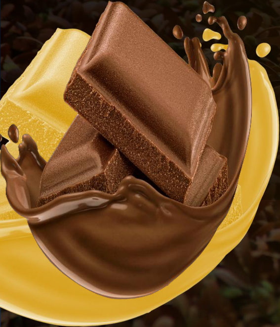

**[Image: Jul2025.pdf-0002-01.png (567x661, 714.9KB)]**

**Manorama Industries Limited** Investor Presentation Q1 FY26 

July - 2025 

**_Em owerin Sustainabilit_** **_<u>p g y</u>_** 

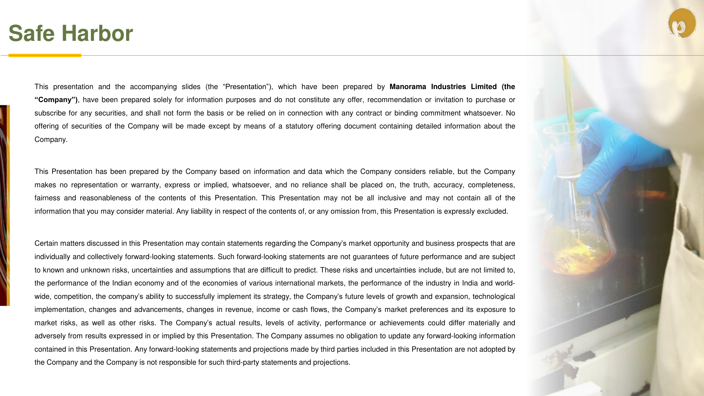

**[Image: Jul2025.pdf-0003-00.png (1998x1125, 991.5KB)]**

<!-- Start of picture text -->
Safe Harbor This presentation and the accompanying slides (the “Presentation”), which have been prepared by  Manorama Industries Limited (the “Company”) , have been prepared solely for information purposes and do not constitute any offer, recommendation or invitation to purchase or subscribe for any securities, and shall not form the basis or be relied on in connection with any contract or binding commitment whatsoever. No offering of securities of the Company will be made except by means of a statutory offering document containing detailed information about the Company. This Presentation has been prepared by the Company based on information and data which the Company considers reliable, but the Company makes no representation or warranty, express or implied, whatsoever, and no reliance shall be placed on, the truth, accuracy, completeness, fairness and reasonableness of the contents of this Presentation. This Presentation may not be all inclusive and may not contain all of the information that you may consider material. Any liability in respect of the contents of, or any omission from, this Presentation is expressly excluded. Certain matters discussed in this Presentation may contain statements regarding the Company’s market opportunity and business prospects that are individually and collectively forward-looking statements. Such forward-looking statements are not guarantees of future performance and are subject to known and unknown risks, uncertainties and assumptions that are difficult to predict. These risks and uncertainties include, but are not limited to, the performance of the Indian economy and of the economies of various international markets, the performance of the industry in India and world- wide, competition, the company’s ability to successfully implement its strategy, the Company’s future levels of growth and expansion, technological implementation, changes and advancements, changes in revenue, income or cash flows, the Company’s market preferences and its exposure to market risks, as well as other risks. The Company’s actual results, levels of activity, performance or achievements could differ materially and adversely from results expressed in or implied by this Presentation. The Company assumes no obligation to update any forward-looking information contained in this Presentation. Any forward-looking statements and projections made by third parties included in this Presentation are not adopted by the Company and the Company is not responsible for such third-party statements and projections. <!-- End of picture text -->

**[Image: Jul2025.pdf-0003-01.png (32x617, 35.7KB)]**

**[Image: Jul2025.pdf-0004-00.png (690x185, 12.0KB)]**

# **Table of Contents** 

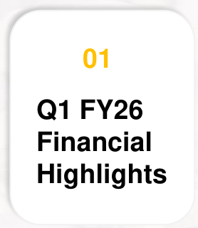

**[Image: Jul2025.pdf-0004-02.png (278x320, 13.6KB)]**

<!-- Start of picture text -->
01 Q1 FY26 Financial Highlights <!-- End of picture text -->

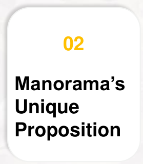

**[Image: Jul2025.pdf-0004-03.png (279x320, 15.5KB)]**

<!-- Start of picture text -->
02 Manorama’s Unique Proposition <!-- End of picture text -->

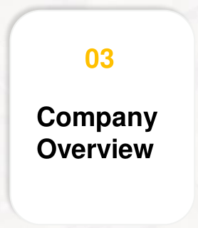

**[Image: Jul2025.pdf-0004-04.png (278x320, 13.4KB)]**

<!-- Start of picture text -->
03 Company Overview <!-- End of picture text -->

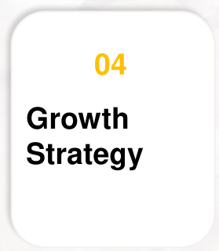

**[Image: Jul2025.pdf-0004-05.png (279x320, 13.0KB)]**

<!-- Start of picture text -->
04 Growth Strategy <!-- End of picture text -->

**01 02 03 04 Q1 FY26 Growth Manorama’s Company Financial Unique Overview Strategy Highlights Proposition 05 06 07 Sustainable Leadership & Appendix Business Management Practices Team** 

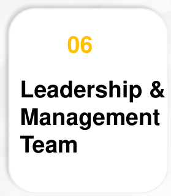

**[Image: Jul2025.pdf-0004-07.png (279x320, 15.3KB)]**

<!-- Start of picture text -->
06 Leadership & Management Team <!-- End of picture text -->

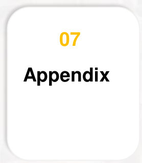

**[Image: Jul2025.pdf-0004-08.png (278x320, 10.2KB)]**

<!-- Start of picture text -->
07 Appendix <!-- End of picture text -->

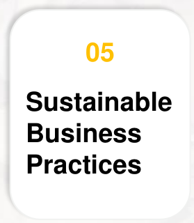

**[Image: Jul2025.pdf-0004-09.png (279x320, 16.4KB)]**

<!-- Start of picture text -->
05 Sustainable Business Practices <!-- End of picture text -->

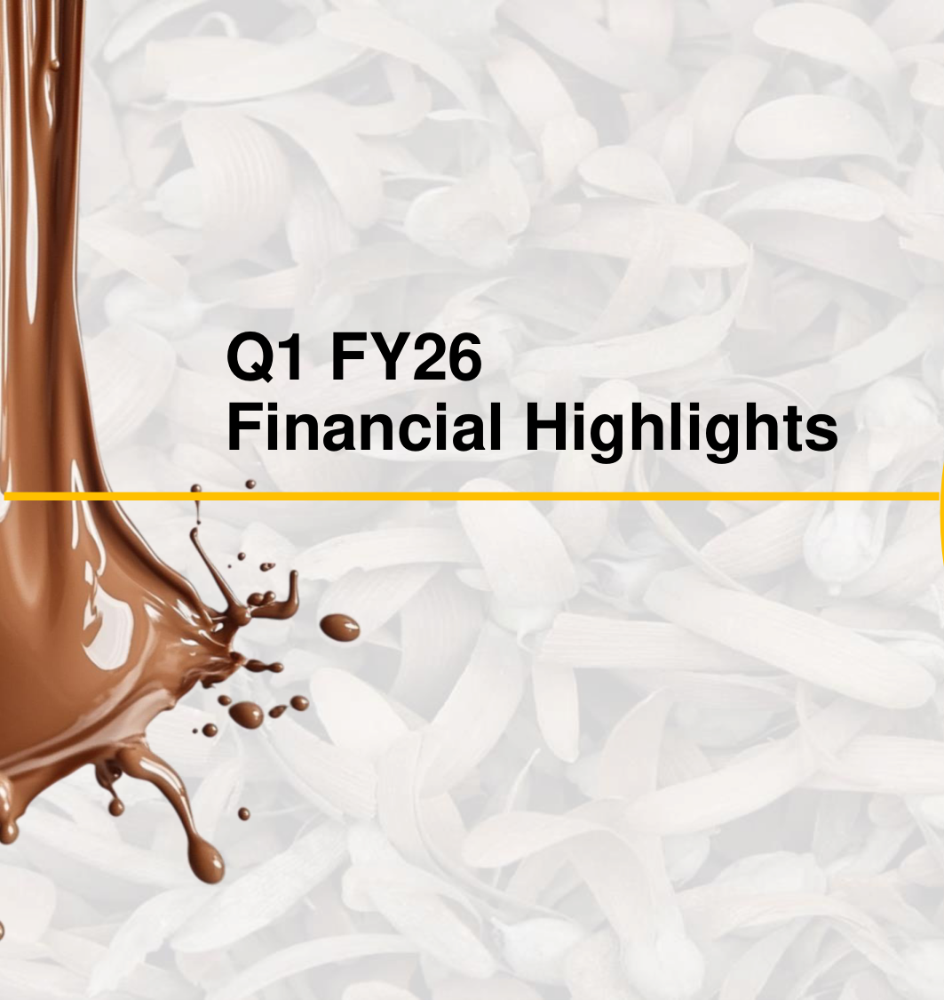

**[Image: Jul2025.pdf-0005-00.png (1063x1125, 858.1KB)]**

<!-- Start of picture text -->
Q1 FY26 Financial Highlights <!-- End of picture text -->

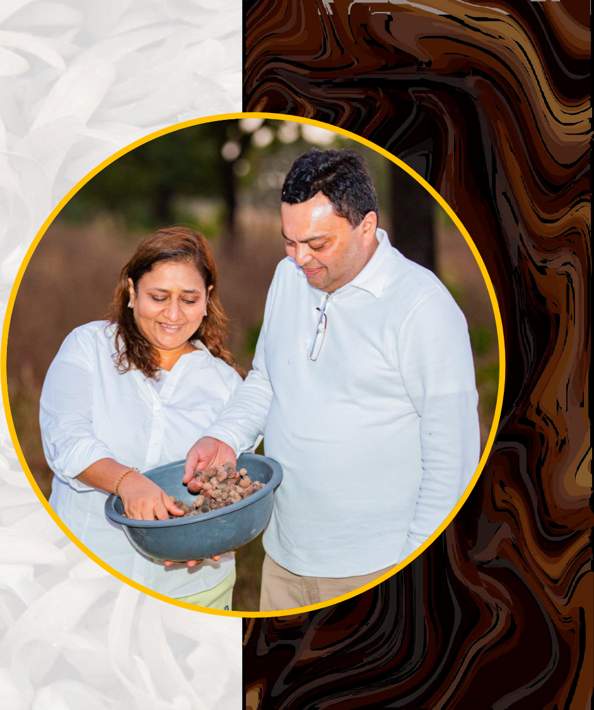

**[Image: Jul2025.pdf-0005-01.png (942x1125, 1482.3KB)]**

### **Management Commentary – Q1 FY26** 

**[Image: Jul2025.pdf-0006-01.png (91x93, 11.6KB)]**

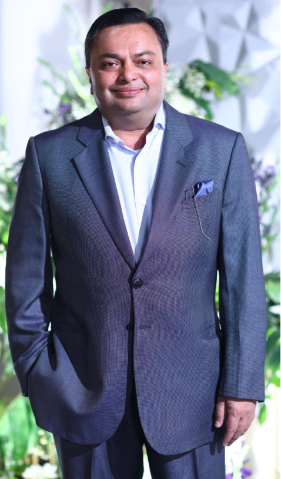

**[Image: Jul2025.pdf-0006-02.png (478x813, 832.8KB)]**

“ _We are pleased to announce a strong beginning to Financial Year 2026, with a remarkable 117% year-on-year growth in revenue, reaching INR 289.6 Crores in Q1FY26. This impressive performance underscores the rising global demand for our wide range of specialty butters and fats, especially among leading players in the chocolate, confectionery, and cosmetics industries._ 

_The recent enhancement of our fractionation capacity has not only strengthened our position as a market leader but also expanded our global footprint. This strategic upgrade is already delivering benefits in the form of improved operational efficiency and economies of scale, contributing significantly to both our revenue and profitability._ 

_Looking ahead, the Company has scheduled regular plant maintenance and upgrades in the second half of FY26, which will lead to a 30% expansion of our existing Solvent Fractionation Capacity, thereby further strengthening our operational efficiency and output._ 

_As part of our ongoing Capex strategy and long-term growth plans, the Company has acquired 20 acres of land adjacent to the Birkoni facility. We are evaluating the construction of a new Seed Storage Unit (Godown) on this site to support future expansion. These investments will be fully funded through internal accruals. To drive our previously stated expansion plans, the Company remains dedicated to implementing strategic and operational improvements and will keep stakeholders informed with timely updates on the financing approach for upcoming projects as they evolve._ 

_Our operations remain firmly aligned with the latest technologies and the highest standards of Environmental, Social, and Governance (ESG) practices. This commitment ensures that we continue to create sustainable, long-term value for our stakeholders while responsibly meeting the diverse needs of our customers_ .” 

###### **ASHISH SARAF, Chairman and Managing Director** 

### **Q1FY26 Results Highlights** 

**[Image: Jul2025.pdf-0007-01.png (91x93, 11.6KB)]**

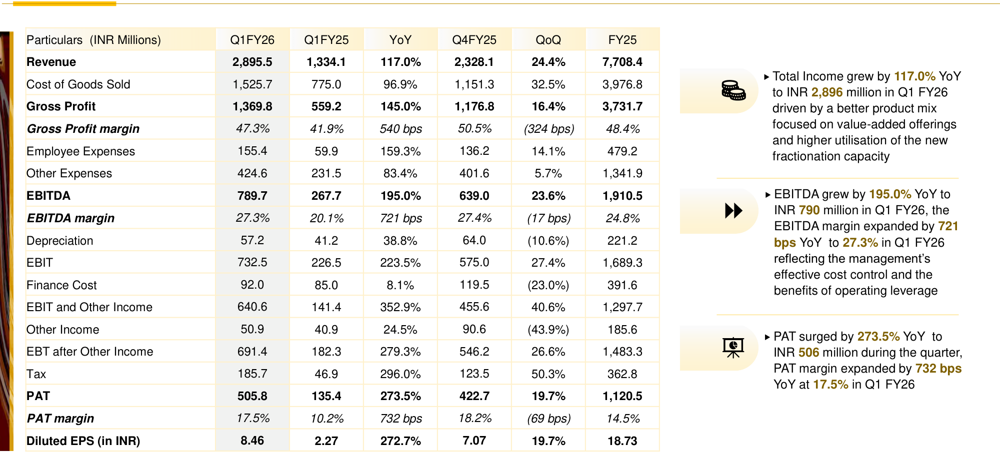

**[Image: Jul2025.pdf-0007-02.png (2000x905, 316.5KB)]**

<!-- Start of picture text -->
Particulars  (INR Millions) Q1FY26 Q1FY25 YoY Q4FY25 QoQ FY25 Revenue 2,895.5 1,334.1 117.0% 2,328.1 24.4% 7,708.4  Total Income grew by  117.0%  YoY Cost of Goods Sold 1,525.7 775.0 96.9% 1,151.3 32.5% 3,976.8 to INR  2,896 million in Q1 FY26 Gross Profit 1,369.8 559.2 145.0% 1,176.8 16.4% 3,731.7 driven by a better product mix Gross Profit margin 47.3% 41.9% 540 bps 50.5% (324 bps) 48.4% focused on value-added offerings and higher utilisation of the new Employee Expenses 155.4 59.9 159.3% 136.2 14.1% 479.2 fractionation capacity Other Expenses 424.6 231.5 83.4% 401.6 5.7% 1,341.9 EBITDA 789.7 267.7 195.0% 639.0 23.6% 1,910.5  EBITDA grew by  195.0%  YoY to INR  790 million in Q1 FY26, the EBITDA margin 27.3% 20.1% 721 bps 27.4% (17 bps) 24.8% EBITDA margin expanded by  721 Depreciation 57.2 41.2 38.8% 64.0 (10.6%) 221.2 bps YoY  to  27.3% in Q1 FY26 EBIT 732.5 226.5 223.5% 575.0 27.4% 1,689.3 reflecting the management’s effective cost control and the Finance Cost 92.0 85.0 8.1% 119.5 (23.0%) 391.6 benefits of operating leverage EBIT and Other Income 640.6 141.4 352.9% 455.6 40.6% 1,297.7 Other Income 50.9 40.9 24.5% 90.6 (43.9%) 185.6  PAT surged by  273.5%  YoY  to EBT after Other Income 691.4 182.3 279.3% 546.2 26.6% 1,483.3 INR  506 million during the quarter, Tax 185.7 46.9 296.0% 123.5 50.3% 362.8 PAT margin expanded by  732 bps YoY at  17.5% in Q1 FY26 PAT 505.8 135.4 273.5% 422.7 19.7% 1,120.5 PAT margin 17.5% 10.2% 732 bps 18.2% (69 bps) 14.5% Diluted EPS (in INR) 8.46 2.27 272.7% 7.07 19.7% 18.73 <!-- End of picture text -->

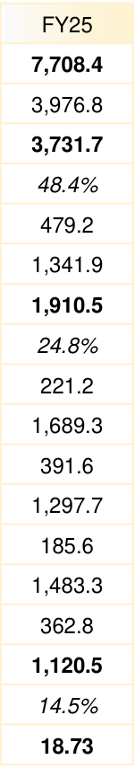

**[Image: Jul2025.pdf-0007-03.png (151x855, 23.8KB)]**

<!-- Start of picture text -->
FY25 7,708.4 3,976.8 3,731.7 48.4% 479.2 1,341.9 1,910.5 24.8% 221.2 1,689.3 391.6 1,297.7 185.6 1,483.3 362.8 1,120.5 14.5% 18.73 <!-- End of picture text -->

### **Q1FY26: Financial Snapshot** 

**[Image: Jul2025.pdf-0008-01.png (91x93, 11.6KB)]**

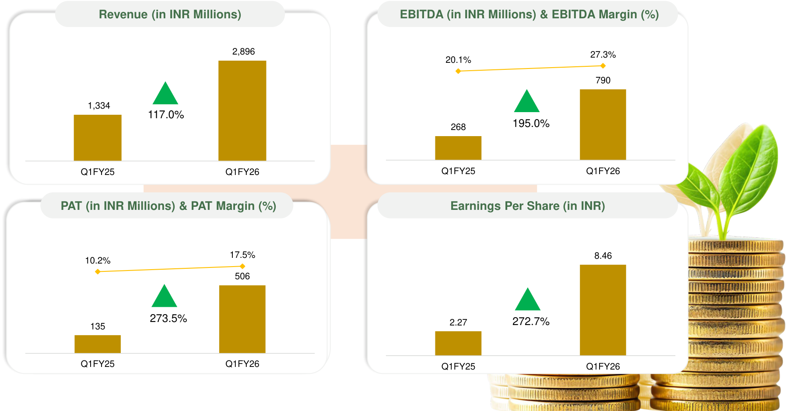

**[Image: Jul2025.pdf-0008-02.png (1819x942, 552.0KB)]**

<!-- Start of picture text -->
Revenue (in INR Millions) EBITDA (in INR Millions) & EBITDA Margin (%) 2,896  27.3% 20.1% 790 1,334 117.0% 195.0% 268 Q1FY25 Q1FY26 Q1FY25 Q1FY26 PAT (in INR Millions) & PAT Margin (%)  Earnings Per Share (in INR) 17.5% 8.46 10.2% 506 273.5% 2.27 272.7% 135 Q1FY25 Q1FY26 Q1FY25 Q1FY26 <!-- End of picture text -->

### **FY25: Financial Snapshot** 

**[Image: Jul2025.pdf-0009-01.png (91x93, 11.6KB)]**

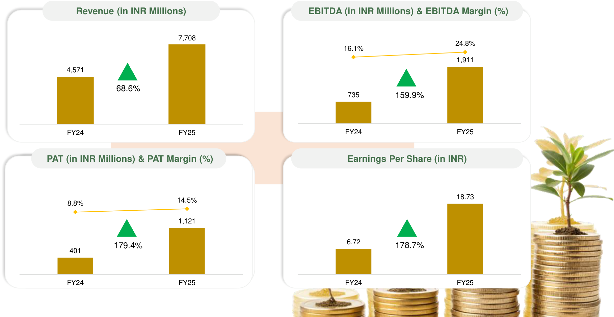

**[Image: Jul2025.pdf-0009-02.png (1819x942, 488.9KB)]**

<!-- Start of picture text -->
Revenue (in INR Millions) EBITDA (in INR Millions) & EBITDA Margin (%) 7,708 24.8% 16.1% 1,911 4,571 68.6% 735 159.9% FY24 FY25 FY24 FY25 PAT (in INR Millions) & PAT Margin (%)  Earnings Per Share (in INR) 18.73 14.5% 8.8% 1,121 6.72 179.4% 178.7% 401 FY24 FY25 FY24 FY25 <!-- End of picture text -->

### **Balance Sheet** 

**[Image: Jul2025.pdf-0010-01.png (91x93, 11.6KB)]**

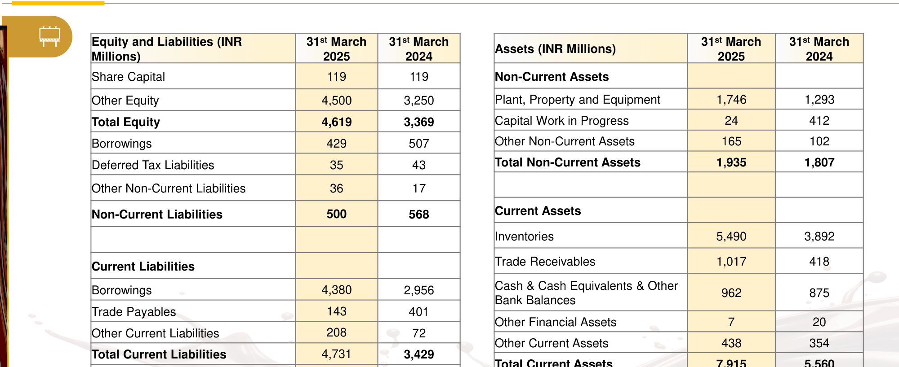

**[Image: Jul2025.pdf-0010-02.png (2000x818, 262.9KB)]**

<!-- Start of picture text -->
Equity and Liabilities (INR  31 st  March  31 st  March  31 st  March  31 st  March Assets (INR Millions) Millions) 2025 2024 2025 2024 Share Capital 119 119 Non-Current Assets Other Equity 4,500 3,250 Plant, Property and Equipment 1,746 1,293 Total Equity 4,619 3,369 Capital Work in Progress 24 412 Borrowings 429 507 Other Non-Current Assets 165 102 Deferred Tax Liabilities 35 43 Total Non-Current Assets 1,935 1,807 Other Non-Current Liabilities 36 17 Current Assets Non-Current Liabilities 500 568 Inventories 5,490 3,892 Trade Receivables 1,017 418 Current Liabilities Cash & Cash Equivalents & Other Borrowings 4,380 2,956 962 875 Bank Balances Trade Payables 143 401 Other Financial Assets 7 20 Other Current Liabilities 208 72 Other Current Assets 438 354 Total Current Liabilities  4,731 3,429 Total Current Assets <!-- End of picture text -->

|**Equity and Liabilities (INR** **Millions)**|**31****st****March** **2025**|**31****st****March** **2024**|
|---|---|---|
|Share Capital|119|119|
|Other Equity|4,500|3,250|
|**Total Equity**|**4,619**|**3,369**|
|Borrowings|429|507|
|Deferred Tax Liabilities|35|43|
|Other Non-Current Liabilities|36|17|
|**Non-Current Liabilities**|**500**|**568**|
|**Current Liabilities**|||
|Borrowings|4,380|2,956|
|Trade Payables|143|401|
|Other Current Liabilities|208|72|
|**Total Current Liabilities**|4,731|**3,429**|
|**Total Equities and Liabilities**|**9,850**|**7,367**|

|**Assets (INR Millions)**|**31****st****March** **2025**|**31****st****March** **2024**|
|---|---|---|
|**Non-Current Assets**|||
|Plant, Propertyand Equipment|1,746|1,293|
|Capital Work in Progress|24|412|
|Other Non-Current Assets|165|102|
|**Total Non-Current Assets**|**1,935**|**1,807**|
|**Current Assets**|||
|Inventories|5,490|3,892|
|Trade Receivables|1,017|418|
|Cash & Cash Equivalents & Other Bank Balances|962|875|
|Other Financial Assets|7|20|
|Other Current Assets|438|354|
|**Total Current Assets**|**7,915**|**5,560**|
|**Total Assets**|**9,850**|**7,367**|

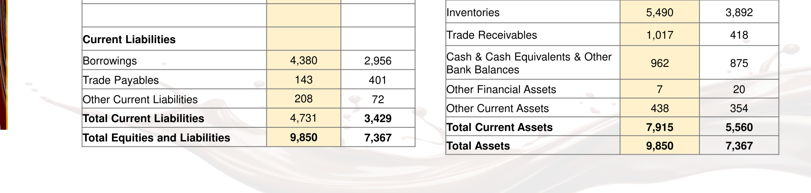

**[Image: Jul2025.pdf-0010-05.png (2000x479, 214.9KB)]**

<!-- Start of picture text -->
Inventories 5,490 3,892 Trade Receivables 1,017 418 Current Liabilities Cash & Cash Equivalents & Other Borrowings 4,380 2,956 962 875 Bank Balances Trade Payables 143 401 Other Financial Assets 7 20 Other Current Liabilities 208 72 Other Current Assets 438 354 Total Current Liabilities  4,731 3,429 Total Current Assets 7,915 5,560 Total Equities and Liabilities 9,850 7,367 Total Assets 9,850 7,367 <!-- End of picture text -->

### **Historical Financial Snapshot (1/2)** 

**[Image: Jul2025.pdf-0011-01.png (91x93, 11.6KB)]**

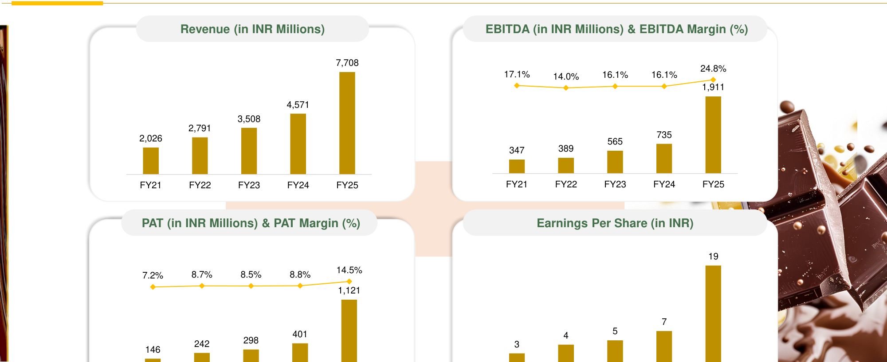

**[Image: Jul2025.pdf-0011-02.png (2000x819, 415.6KB)]**

<!-- Start of picture text -->
Revenue (in INR Millions) EBITDA (in INR Millions) & EBITDA Margin (%) 7,708 24.8% 17.1% 14.0% 16.1% 16.1% 1,911 4,571 3,508 2,791 735 2,026 565 347 389 FY21 FY22 FY23 FY24 FY25 FY21 FY22 FY23 FY24 FY25 PAT (in INR Millions) & PAT Margin (%)  Earnings Per Share (in INR) 19 14.5% 7.2% 8.7% 8.5% 8.8% 1,121 7 5 401 4 298 242 3 146 <!-- End of picture text -->

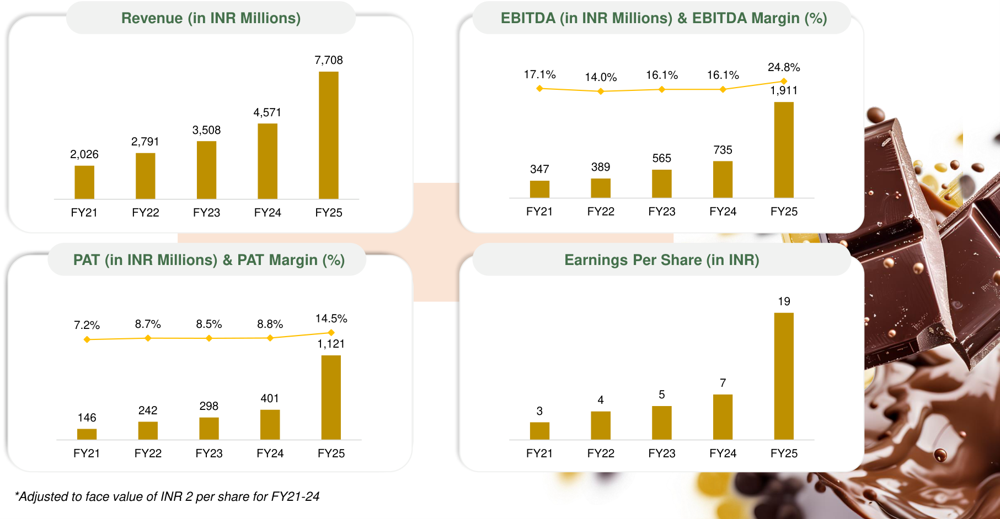

**[Image: Jul2025.pdf-0011-03.png (1813x942, 555.6KB)]**

<!-- Start of picture text -->
Revenue (in INR Millions) EBITDA (in INR Millions) & EBITDA Margin (%) 7,708 24.8% 17.1% 14.0% 16.1% 16.1% 1,911 4,571 3,508 2,791 735 2,026 565 347 389 FY21 FY22 FY23 FY24 FY25 FY21 FY22 FY23 FY24 FY25 PAT (in INR Millions) & PAT Margin (%)  Earnings Per Share (in INR) 19 14.5% 7.2% 8.7% 8.5% 8.8% 1,121 7 5 401 4 298 242 3 146 FY21 FY22 FY23 FY24 FY25 FY21 FY22 FY23 FY24 FY25 *Adjusted to face value of INR 2 per share for FY21-24 <!-- End of picture text -->

### **Historical Financial Snapshot (1/2)** 

**[Image: Jul2025.pdf-0012-01.png (91x93, 11.6KB)]**

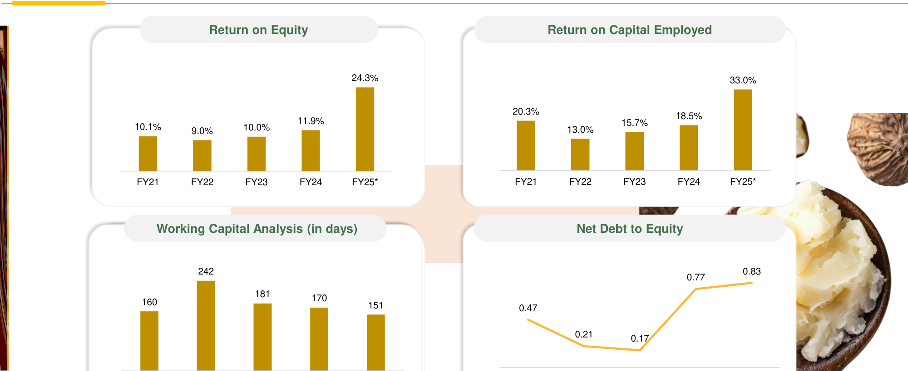

**[Image: Jul2025.pdf-0012-02.png (2000x819, 385.1KB)]**

<!-- Start of picture text -->
Return on Equity Return on Capital Employed 24.3% 33.0% 20.3% 18.5% 11.9% 15.7% 10.1% 9.0% 10.0% 13.0% FY21 FY22 FY23 FY24 FY25* FY21 FY22 FY23 FY24 FY25* Working Capital Analysis (in days) Net Debt to Equity 242 0.83 0.77 181 170 160 151 0.47 0.21 0.17 <!-- End of picture text -->

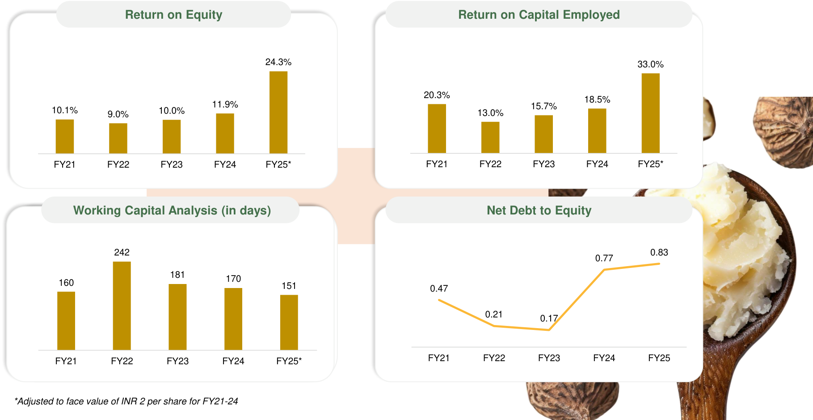

**[Image: Jul2025.pdf-0012-03.png (1819x942, 448.8KB)]**

<!-- Start of picture text -->
Return on Equity Return on Capital Employed 24.3% 33.0% 20.3% 18.5% 11.9% 15.7% 10.1% 9.0% 10.0% 13.0% FY21 FY22 FY23 FY24 FY25* FY21 FY22 FY23 FY24 FY25* Working Capital Analysis (in days) Net Debt to Equity 242 0.83 0.77 181 170 160 151 0.47 0.21 0.17 FY21 FY22 FY23 FY24 FY25 FY21 FY22 FY23 FY24 FY25* *Adjusted to face value of INR 2 per share for FY21-24 <!-- End of picture text -->

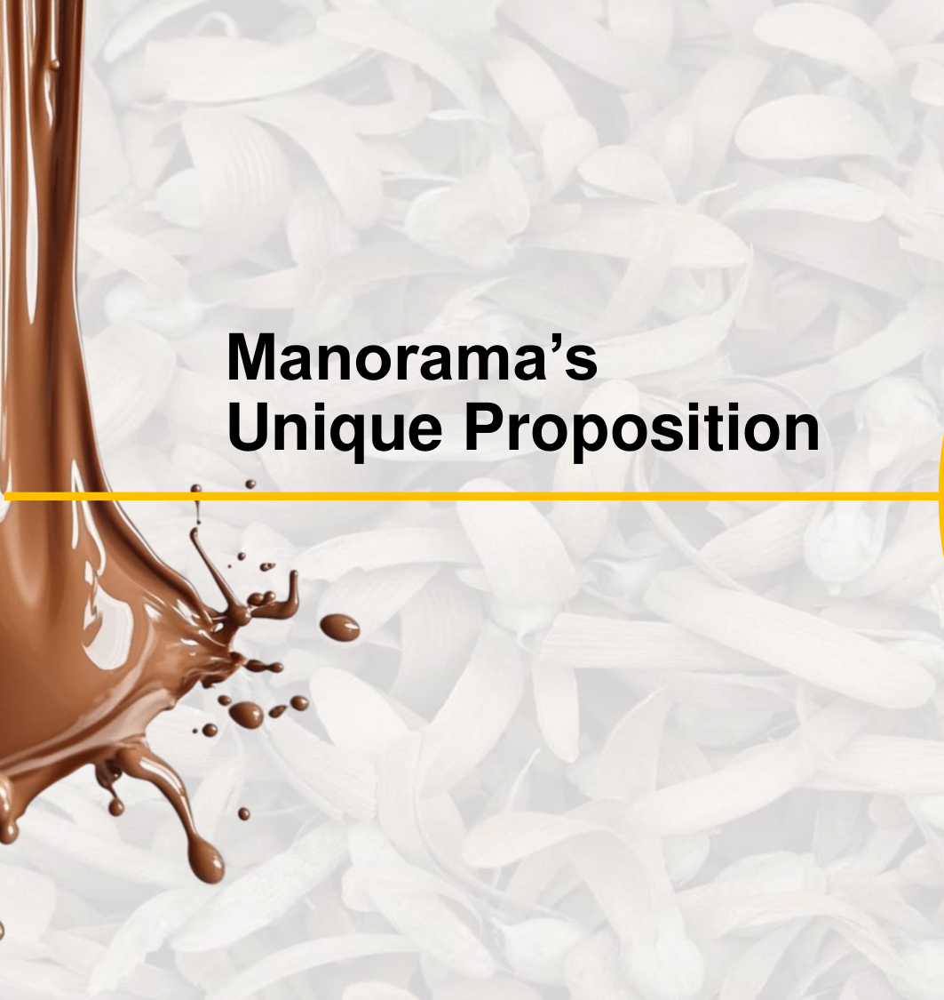

**[Image: Jul2025.pdf-0013-00.png (1063x1125, 859.8KB)]**

<!-- Start of picture text -->
Manorama’s Unique Proposition <!-- End of picture text -->

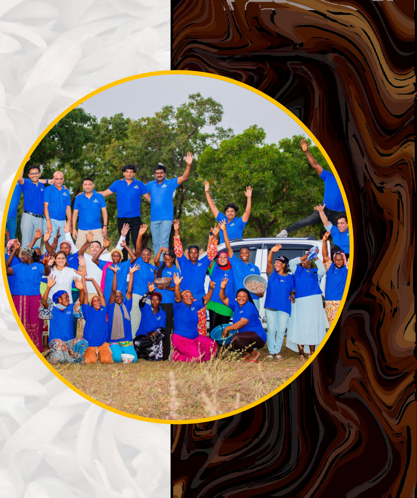

**[Image: Jul2025.pdf-0013-01.png (944x1125, 1861.0KB)]**

### **Built on Strong Business Moats – Greener Future** 

**[Image: Jul2025.pdf-0014-01.png (91x93, 11.6KB)]**

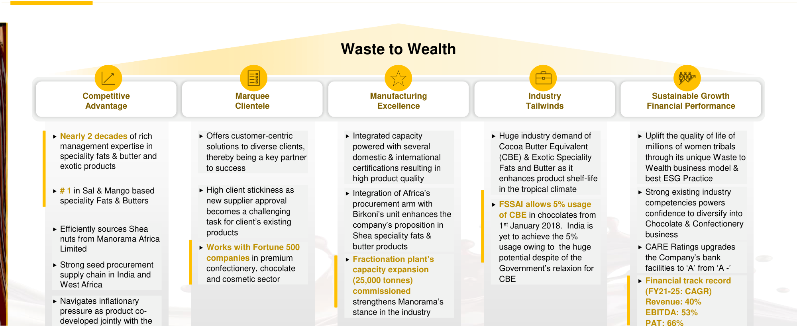

**[Image: Jul2025.pdf-0014-02.png (2000x819, 333.1KB)]**

<!-- Start of picture text -->
Waste to Wealth Competitive  Marquee  Manufacturing  Industry  Sustainable Growth Advantage Clientele   Excellence  Tailwinds Financial Performance  Nearly 2 decades  of rich   Offers customer-centric   Integrated capacity   Huge industry demand of   Uplift the quality of life of management expertise in  solutions to diverse clients,  powered with several  Cocoa Butter Equivalent  millions of women tribals speciality fats & butter and  thereby being a key partner  domestic & international  (CBE) & Exotic Speciality  through its unique Waste to exotic products to success certifications resulting in  Fats and Butter as it  Wealth business model & high product quality   enhances product shelf-life  best ESG Practice  # 1  in Sal & Mango based   High client stickiness as   Integration of Africa’s  in the tropical climate  Strong existing industry speciality Fats & Butters new supplier approval  procurement arm with   FSSAI allows 5% usage  competencies powers becomes a challenging  Birkoni’s unit enhances the  of CBE  in chocolates from  confidence to diversify into  Efficiently sources Shea  task for client’s existing  company’s proposition in  1 st  January 2018.  India is  Chocolate & Confectionery nuts from Manorama Africa  products  Shea speciality fats &  yet to achieve the 5%  business Limited  Works with Fortune 500  butter products usage owing to  the huge   CARE Ratings upgrades companies  in premium   Fractionation plant’s  potential despite of the  the Company’s bank  Strong seed procurement  confectionery, chocolate  capacity expansion  Government’s relaxion for  facilities to ‘A’ from ‘A -’ supply chain in India and and cosmetic sector (25,000 tonnes)  CBE    Financial track record West Africa commissioned  (FY21-25: CAGR)  Navigates inflationary  strengthens Manorama’s  Revenue: 40% pressure as product co- stance in the industry    EBITDA: 53% developed jointly with the  PAT: 66% <!-- End of picture text -->

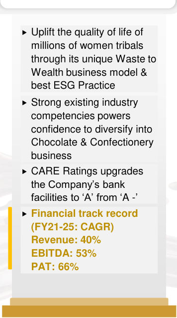

**[Image: Jul2025.pdf-0014-03.png (356x638, 48.8KB)]**

<!-- Start of picture text -->
 Uplift the quality of life of millions of women tribals through its unique Waste to Wealth business model & best ESG Practice  Strong existing industry competencies powers confidence to diversify into Chocolate & Confectionery business  CARE Ratings upgrades the Company’s bank facilities to ‘A’ from ‘A -’  Financial track record (FY21-25: CAGR) Revenue: 40% EBITDA: 53% PAT: 66% <!-- End of picture text -->

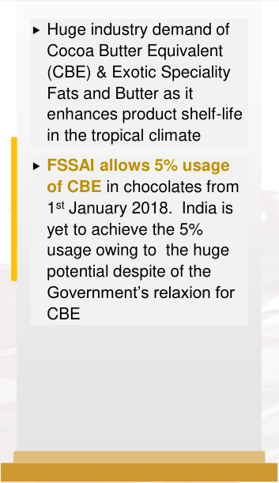

**[Image: Jul2025.pdf-0014-04.png (353x611, 43.7KB)]**

<!-- Start of picture text -->
 Huge industry demand of Cocoa Butter Equivalent (CBE) & Exotic Speciality Fats and Butter as it enhances product shelf-life in the tropical climate  FSSAI allows 5% usage of CBE  in chocolates from 1 st  January 2018.  India is yet to achieve the 5% usage owing to  the huge potential despite of the Government’s relaxion for CBE <!-- End of picture text -->

   - Integrated capacity  Huge industry demand of  Uplift the quality of life of powered with several Cocoa Butter Equivalent millions of women tribals domestic & international (CBE) & Exotic Speciality through its unique Waste to certifications resulting in Fats and Butter as it Wealth business model & high product quality enhances product shelf-life best ESG Practice 

   - Integration of Africa’s in the tropical climate  Strong existing industry procurement arm with  **FSSAI allows 5% usage** competencies powers Birkoni’s unit enhances the **of CBE** in chocolates from confidence to diversify into company’s proposition in 1st January 2018.  India is Chocolate & Confectionery Shea speciality fats & yet to achieve the 5% business butter products usage owing to  the huge  CARE Ratings upgrades 

   - **Fractionation plant’s** potential despite of the the Company’s bank **capacity expansion** Government’s relaxion for facilities to ‘A’ from ‘A -’ **(25,000 tonnes)** CBE  **Financial track record commissioned (FY21-25: CAGR)** strengthens Manorama’s **Revenue: 40%** stance in the industry **EBITDA: 53% PAT: 66%** 

- Navigates inflationary pressure as product codeveloped jointly with the client where product quality weighs over price 

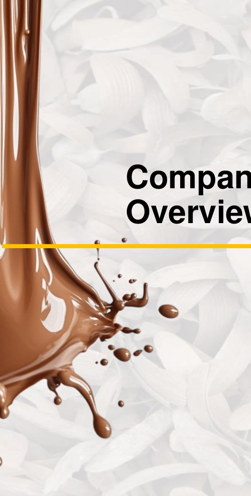

**[Image: Jul2025.pdf-0015-00.png (570x1125, 560.3KB)]**

<!-- Start of picture text -->
Company Overview <!-- End of picture text -->

## **Company Overview** 

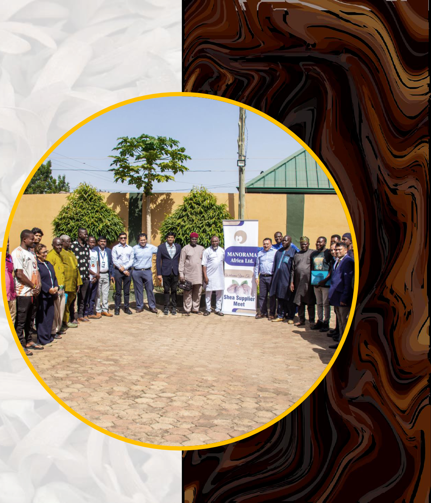

**[Image: Jul2025.pdf-0015-02.png (965x1125, 1686.4KB)]**

### **Waste to Wealth Business Model** 

**[Image: Jul2025.pdf-0016-01.png (91x93, 11.6KB)]**

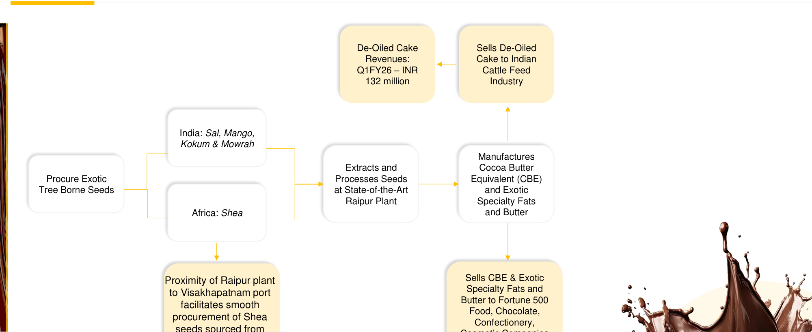

**[Image: Jul2025.pdf-0016-02.png (2000x819, 250.5KB)]**

<!-- Start of picture text -->
De-Oiled Cake  Sells De-Oiled Revenues:  Cake to Indian Q1FY26 – INR  Cattle Feed 132 million  Industry India:  Sal, Mango, Kokum & Mowrah Manufactures Extracts and  Cocoa Butter Procure Exotic  Processes Seeds  Equivalent (CBE) Tree Borne Seeds at State-of-the-Art  and Exotic Raipur Plant Specialty Fats Africa:  Shea and Butter Proximity of Raipur plant  Sells CBE & Exotic Specialty Fats and to Visakhapatnam port Butter to Fortune 500 facilitates smooth Food, Chocolate, procurement of Shea Confectionery, seeds sourced from <!-- End of picture text -->

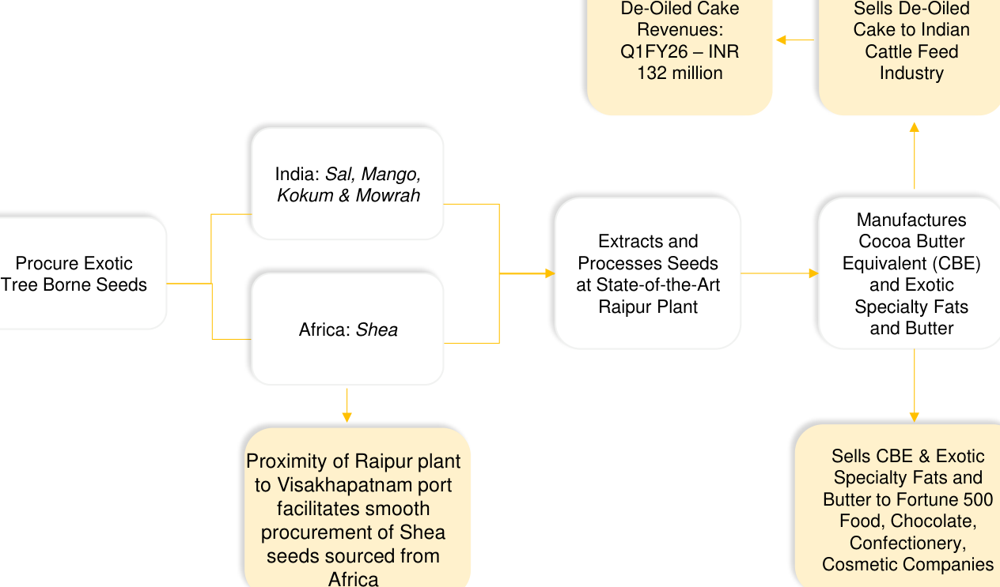

**[Image: Jul2025.pdf-0016-03.png (1264x743, 105.0KB)]**

<!-- Start of picture text -->
De-Oiled Cake  Sells De-Oiled Revenues:  Cake to Indian Q1FY26 – INR  Cattle Feed 132 million  Industry India:  Sal, Mango, Kokum & Mowrah Manufactures Extracts and  Cocoa Butter Procure Exotic  Processes Seeds  Equivalent (CBE) Tree Borne Seeds at State-of-the-Art  and Exotic Raipur Plant Specialty Fats Africa:  Shea and Butter Proximity of Raipur plant  Sells CBE & Exotic Specialty Fats and to Visakhapatnam port Butter to Fortune 500 facilitates smooth Food, Chocolate, procurement of Shea Confectionery, seeds sourced from Cosmetic Companies Africa <!-- End of picture text -->

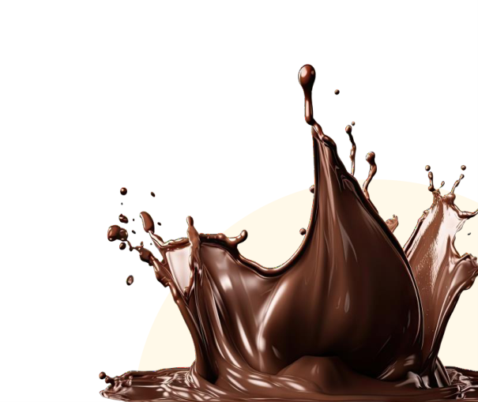

**[Image: Jul2025.pdf-0016-04.png (605x509, 213.7KB)]**

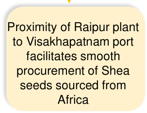

**[Image: Jul2025.pdf-0016-05.png (303x233, 14.3KB)]**

<!-- Start of picture text -->
Proximity of Raipur plant to Visakhapatnam port facilitates smooth procurement of Shea seeds sourced from Africa <!-- End of picture text -->

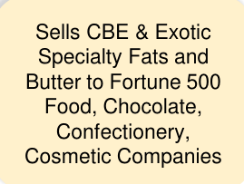

**[Image: Jul2025.pdf-0016-06.png (269x203, 14.5KB)]**

<!-- Start of picture text -->
Sells CBE & Exotic Specialty Fats and Butter to Fortune 500 Food, Chocolate, Confectionery, Cosmetic Companies <!-- End of picture text -->

### **Strong Supply Chain Network** 

**[Image: Jul2025.pdf-0017-01.png (1416x80, 6.5KB)]**

<!-- Start of picture text -->
India – Sal Seed Collection Process <!-- End of picture text -->

**[Image: Jul2025.pdf-0017-02.png (141x140, 34.0KB)]**

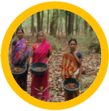

**[Image: Jul2025.pdf-0017-03.png (138x140, 33.4KB)]**

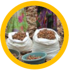

**[Image: Jul2025.pdf-0017-04.png (138x140, 34.0KB)]**

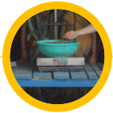

**[Image: Jul2025.pdf-0017-05.png (141x140, 30.4KB)]**

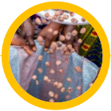

**[Image: Jul2025.pdf-0017-06.png (140x140, 34.0KB)]**

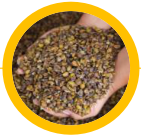

**[Image: Jul2025.pdf-0017-07.png (141x136, 32.9KB)]**

Scattered Seed Collection Pre-Cleaning Deshelling Cleaning Seed Collection Seeds in Forest by Tribal at Purchase Bed Women Centre 

###### **Africa – Shea Seed Collection Process** 

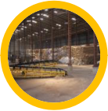

**[Image: Jul2025.pdf-0017-10.png (138x141, 30.7KB)]**

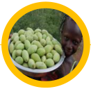

**[Image: Jul2025.pdf-0017-11.png (131x128, 27.8KB)]**

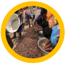

**[Image: Jul2025.pdf-0017-12.png (130x128, 28.1KB)]**

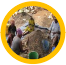

**[Image: Jul2025.pdf-0017-13.png (130x128, 28.1KB)]**

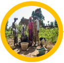

**[Image: Jul2025.pdf-0017-14.png (130x128, 26.6KB)]**

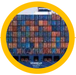

**[Image: Jul2025.pdf-0017-15.png (131x128, 27.3KB)]**

**[Image: Jul2025.pdf-0017-16.png (91x93, 11.6KB)]**

###### ***Sal Forest - India** 

- Covers ~14% of Forest region 

- Orissa, Bihar, Jharkhand, West Bengal, Madhya Pradesh & Chhattisgarh accounts of 30% of Total Sal Forest in India 

###### **^Shea Forest - Africa** 

- West African region has ~1 billion Shea Trees 

- Overall African Continent has 2+ billion Shea Trees 

Nuts Picked by Boiling & Deshelling Manorama Manorama Shea Seeds at Tribals Cleaning of Africa – Africa Shipping Raipur Nuts Procurement of to India Warehouse seeds 

###### **Enjoys a Strong Network of Tribal Communities & Collection Centres** 

_Source: *www.sciencedirect.com; ^_ How shea trees can help the fight against climate change | World Economic Forum (weforum.org) and 

### **Glimpse of Seed Procurement Process/Team** 

**[Image: Jul2025.pdf-0018-01.png (91x93, 11.6KB)]**

Tribals Collecting Sal Seeds, India 

Management with Shea Seed Collection Team, Africa 

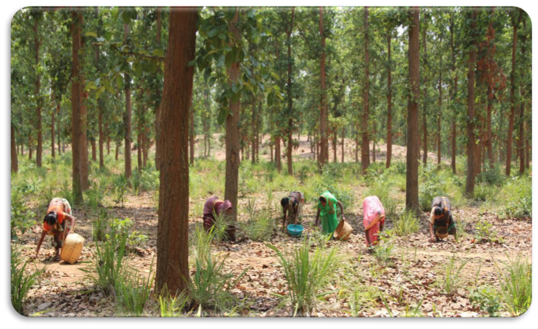

**[Image: Jul2025.pdf-0018-04.png (898x549, 1227.6KB)]**

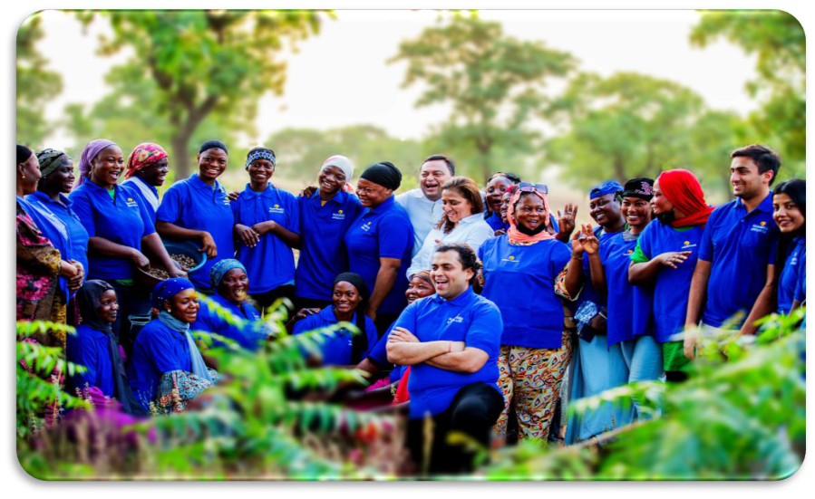

**[Image: Jul2025.pdf-0018-05.png (899x551, 1161.1KB)]**

###### **~~Low Risk of Non-availability of Raw Materials~~** 

**[Image: Jul2025.pdf-0019-00.png (19x822, 32.9KB)]**

**[Image: Jul2025.pdf-0019-01.png (91x93, 11.6KB)]**

### **CBE and Exotic Specialty Fats & Butter - Process** 

**[Image: Jul2025.pdf-0019-03.png (974x76, 19.8KB)]**

<!-- Start of picture text -->
Raw Materials Sal/Mango/Shea illipe & other exotic seeds <!-- End of picture text -->

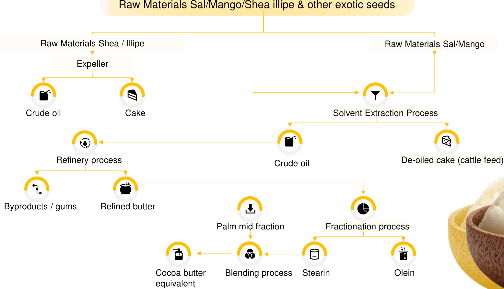

**[Image: Jul2025.pdf-0019-04.png (1555x892, 230.4KB)]**

<!-- Start of picture text -->
Raw Materials Sal/Mango/Shea illipe & other exotic seeds Raw Materials Shea / Illipe Raw Materials Sal/Mango Expeller Crude oil Cake Solvent Extraction Process Refinery process Crude oil De-oiled cake (cattle feed) Byproducts / gums Refined butter Palm mid fraction Fractionation process Cocoa butter  Blending process Stearin Olein equivalent <!-- End of picture text -->

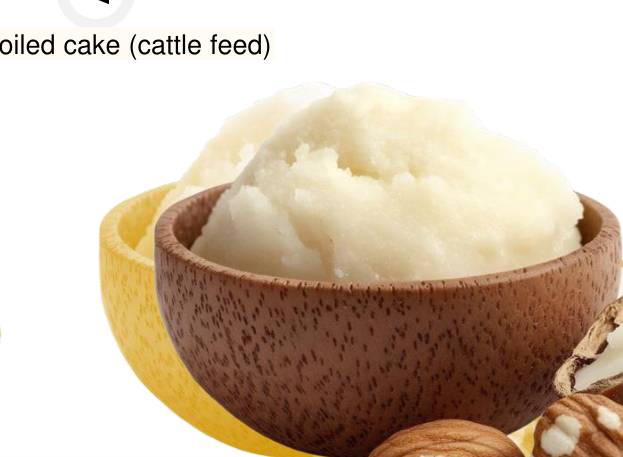

**[Image: Jul2025.pdf-0019-05.png (623x457, 351.9KB)]**

<!-- Start of picture text -->
De-oiled cake (cattle feed) <!-- End of picture text -->

### **CBE and Exotic Specialty Fats & Butter – Winning Proposition** 

**[Image: Jul2025.pdf-0020-01.png (91x93, 11.6KB)]**

###### CBEs and Exotic Specialty Fats & Butter - Winning Case Factors 

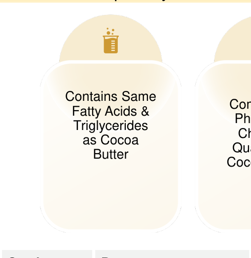

**[Image: Jul2025.pdf-0020-03.png (509x522, 37.4KB)]**

<!-- Start of picture text -->
Contains Same Fatty Acids & Triglycerides as Cocoa Butter <!-- End of picture text -->

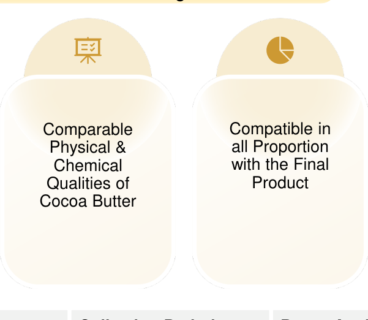

**[Image: Jul2025.pdf-0020-04.png (601x522, 44.6KB)]**

<!-- Start of picture text -->
Comparable  Compatible in Physical &  all Proportion Chemical  with the Final Qualities of  Product Cocoa Butter <!-- End of picture text -->

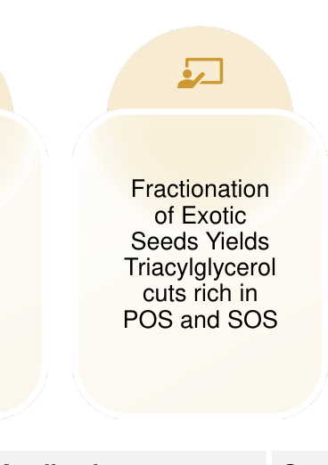

**[Image: Jul2025.pdf-0020-05.png (368x522, 33.7KB)]**

<!-- Start of picture text -->
Fractionation of Exotic Seeds Yields Triacylglycerol cuts rich in POS and SOS <!-- End of picture text -->

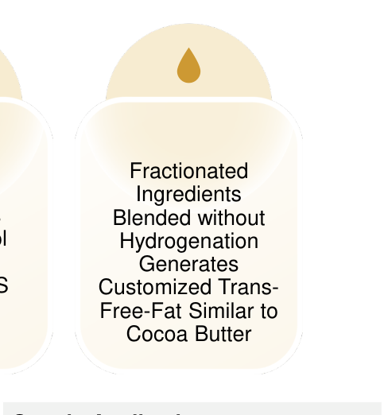

**[Image: Jul2025.pdf-0020-06.png (483x522, 43.1KB)]**

<!-- Start of picture text -->
Fractionated Ingredients Blended without Hydrogenation Generates Customized Trans- Free-Fat Similar to Cocoa Butter <!-- End of picture text -->

Contains Same Comparable Compatible in Fatty Acids & Physical & all Proportion Triglycerides Chemical with the Final as Cocoa Qualities of Product Butter Cocoa Butter 

> Fractionation Fractionated of Exotic Ingredients Seeds Yields Blended without Triacylglycerol Hydrogenation cuts rich in Generates POS and SOS Customized TransFree-Fat Similar to Cocoa Butter 

|**Seeds**|**Procurement**|**Collection Period**|**Butter Applications**|
|---|---|---|---|
|Sal||May – June||
|Mango||May – July||
|Phulwara|India|June – July|Food &|
|Kokum Dhupa||May – June July – August|Personal Care Industry|
|Shea|West Africa|July – February/ March||

###### **Stearin Applications** 

Solid Fractionation when Combined with Palm Mid-Fraction Yields CBE 

CBE and Exotic Specialty Fats & Butter: Applications in Foods, Confectionery, Chocolate & Cosmetics 

##### **State-of-the-Art Capacity & Sustainable Manufacturing for Catering the Global CBE and Exotic Specialty Fats & Butter Demand** 

**[Image: Jul2025.pdf-0021-01.png (91x93, 11.6KB)]**

**[Image: Jul2025.pdf-0021-02.png (438x150, 7.3KB)]**

<!-- Start of picture text -->
Refinery 45,000 MTPA <!-- End of picture text -->

**[Image: Jul2025.pdf-0021-03.png (438x150, 8.7KB)]**

<!-- Start of picture text -->
Interesterification 30,000 MTPA <!-- End of picture text -->

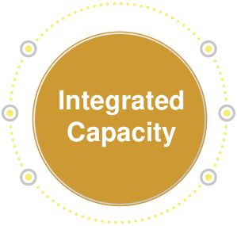

**[Image: Jul2025.pdf-0021-04.png (299x285, 21.6KB)]**

<!-- Start of picture text -->
Integrated Capacity <!-- End of picture text -->

**[Image: Jul2025.pdf-0021-05.png (438x149, 7.3KB)]**

<!-- Start of picture text -->
Extraction Plant 90,000 MTPA <!-- End of picture text -->

**[Image: Jul2025.pdf-0021-06.png (438x150, 8.0KB)]**

<!-- Start of picture text -->
*Fractionation 40,000 MTPA <!-- End of picture text -->

**[Image: Jul2025.pdf-0021-07.png (438x150, 7.0KB)]**

<!-- Start of picture text -->
Seed Milling 90,000 MTPA <!-- End of picture text -->

**[Image: Jul2025.pdf-0021-08.png (438x150, 11.1KB)]**

<!-- Start of picture text -->
Blending Station &  Packing^ 30,000 MTPA <!-- End of picture text -->

***** Fractionation capacity of 25,000 MTPA commercialized from July 2024 onwards; ^ Under Process 

**Manorama’s Birkoni Plant (Raipur)** 

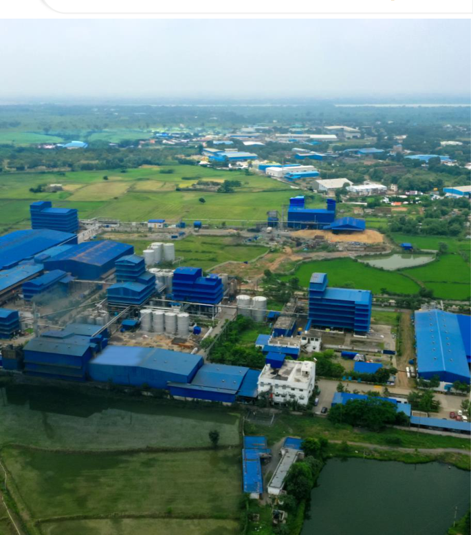

**[Image: Jul2025.pdf-0021-11.png (688x777, 968.2KB)]**

### **Building Capacities over a Period of Time** 

**[Image: Jul2025.pdf-0022-01.png (91x93, 11.6KB)]**

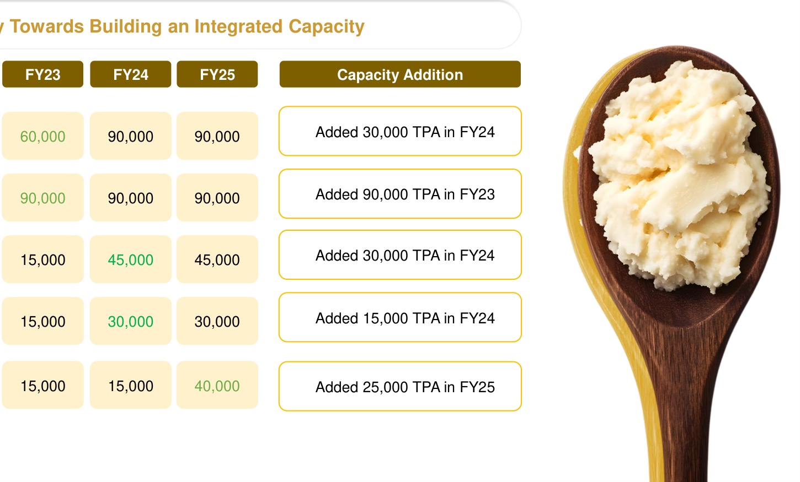

**[Image: Jul2025.pdf-0022-02.png (1450x875, 614.9KB)]**

<!-- Start of picture text -->
FY23 FY24 FY25 Capacity Addition Added 30,000 TPA in FY24 60,000 90,000 90,000 Added 90,000 TPA in FY23 90,000 90,000 90,000 Added 30,000 TPA in FY24 15,000 45,000 45,000 Added 15,000 TPA in FY24 15,000 30,000 30,000 15,000 15,000 40,000 Added 25,000 TPA in FY25 <!-- End of picture text -->

**[Image: Jul2025.pdf-0022-03.png (908x87, 8.5KB)]**

<!-- Start of picture text -->
The Journey Towards Building an Integrated Capacity <!-- End of picture text -->

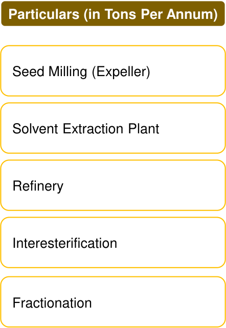

**[Image: Jul2025.pdf-0022-04.png (442x642, 25.1KB)]**

<!-- Start of picture text -->
Particulars (in Tons Per Annum) Seed Milling (Expeller) Solvent Extraction Plant Refinery Interesterification Fractionation <!-- End of picture text -->

### **Building Capacities over a Period of Time** 

**[Image: Jul2025.pdf-0023-01.png (91x93, 11.6KB)]**

###### **The Journey Towards Building an Integrated Capacity** 

**Particulars FY21 FY22 FY23 FY24 FY25 CAGR** Fractionation (TPA) 15,000 15,000 15,000 15,000 40,000 21.7% Revenues (in INR Crores) 203 279 351 457 771 39.7% Average Fixed Assets (in INR 54 56 76 113 152 29.5% Crore) Average Asset Turnover (in Times) 3.8x 5.0x 4.6x 4.0x 5.1x  Fractionation is the key process to obtain CBE & Exotic Specialty Fats and Butter 

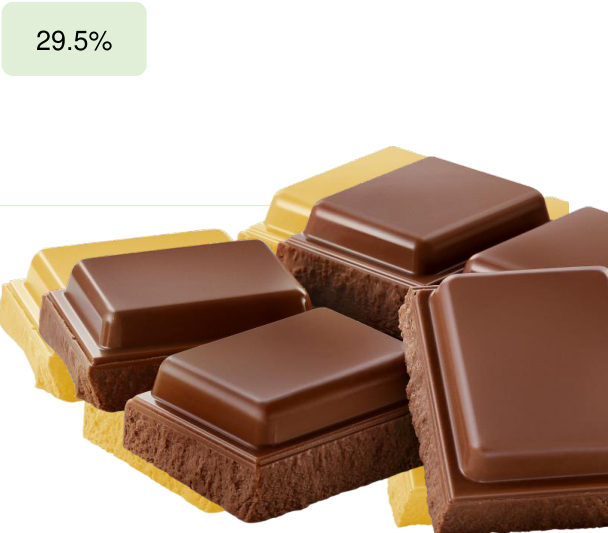

**[Image: Jul2025.pdf-0023-04.png (608x533, 317.5KB)]**

<!-- Start of picture text -->
29.5% <!-- End of picture text -->

#### **R&D Capabilities for Catering the Global CBE and Exotic Specialty Fats & Butter Demand** 

**[Image: Jul2025.pdf-0024-01.png (91x93, 11.6KB)]**

**Milcoa® Innovation & Research Center – Edge** 

Spearheaded by Dr. Amongst the Elite Krishnadath Bhaggan, a Indian Companies professional with 25+ accredited with the years rich global industry **DSIR** esteemed DSIR experience laced with **Leadership Certification** Certification from multiple patents the Government Develop & Churn new customized products with varied applications **Customization Collaborative** Deep mutual in Chocolate, Food, **Approach** collaboration with Confectionery, clients R&D Team Cosmetics and Personal Care Industry 

~~R&D Acts as a Strong Entry Barrier with Deeper Client Engagement Enabling Customer Stickiness~~ 

### **New Product Launches and Developments** 

###### **New Developments** 

###### **New Products** 

   - All-round filling fat (palm based) **(Milcocream FF77)** 

- All-round filling fat **(Milcoceam 1059)** 

- Bake-stable filling fat **(Milcocream 1068)** 

   - Premium filling fat (palm based) **(Milcocream TF76)** 

- Wafer cream filling fat **(Milcocream FF69)** 

   - No-palm spread fat for export market **(Milcospread TU 5)** 

- Frozen desert application **(Milcolin R11)** 

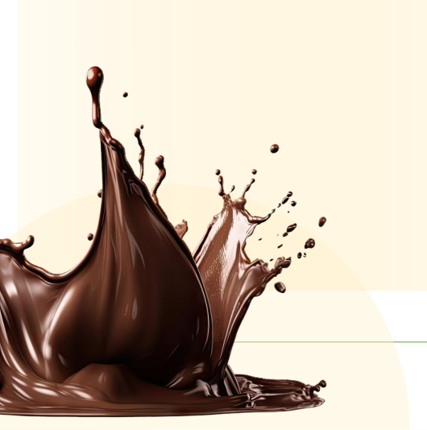

**[Image: Jul2025.pdf-0025-10.png (530x534, 188.3KB)]**

**[Image: Jul2025.pdf-0025-11.png (91x93, 11.6KB)]**

###### **Milcoa® Brand Range** 

- All-round filling fats **(Milcocream****TM** **1056 and Milcocream****TM** **1010)** 

- Cocoa butter equivalents/improvers **(Milcoa ES1057 and Milcoa IS1043)** 

- Cocoa butter replacers **(Milcoat****TM** **R1058)** 

- **MIL DP1055** , a hard fat for culinary use and marinades **(MIL DP1052)** . 

- **MIL DP1054** is a general-purpose hard stock that may be used for spreading 

- Bake stable filling fats **Milcocream****TM** **1059, Milcocream****TM** **1052** for use as filling in croissants and pastries in the bakery market 

- Chocolate Hazelnut Spread fat **Milcospread****TM** **1003, Milcospread****TM** **1053, Milcospread****TM** **1060** 

### **R&D Enabled State-of-the-Art DSIR Certified Lab** 

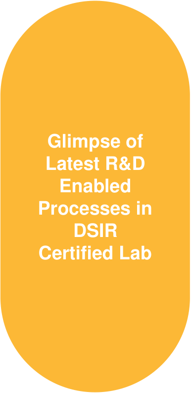

**[Image: Jul2025.pdf-0026-01.png (386x791, 22.6KB)]**

<!-- Start of picture text -->
Glimpse of Latest R&D Enabled Processes in DSIR Certified Lab <!-- End of picture text -->

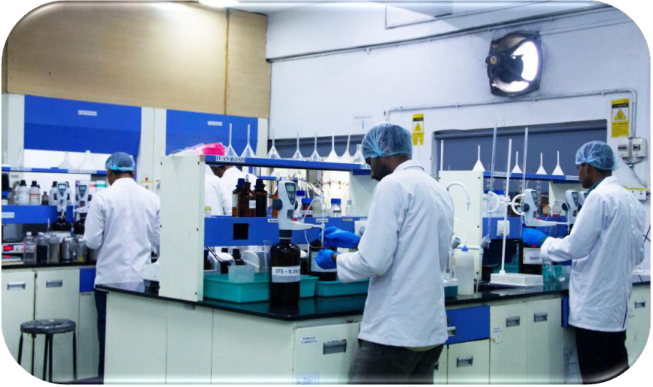

**[Image: Jul2025.pdf-0026-02.png (653x387, 501.9KB)]**

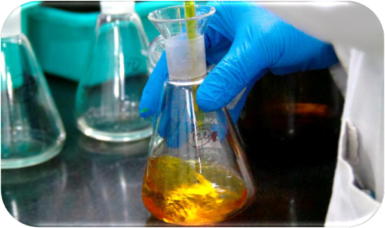

**[Image: Jul2025.pdf-0026-03.png (644x382, 502.8KB)]**

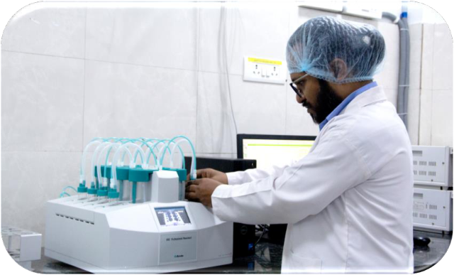

**[Image: Jul2025.pdf-0026-04.png (640x387, 328.8KB)]**

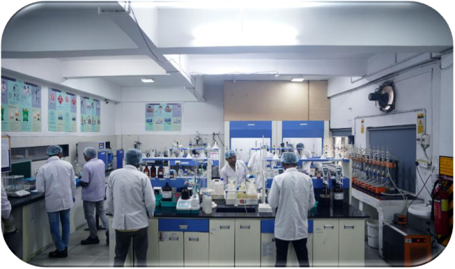

**[Image: Jul2025.pdf-0026-05.png (653x387, 425.9KB)]**

**[Image: Jul2025.pdf-0026-06.png (91x93, 11.6KB)]**

### **R&D Enabled State-of-the-Art DSIR Certified Lab** 

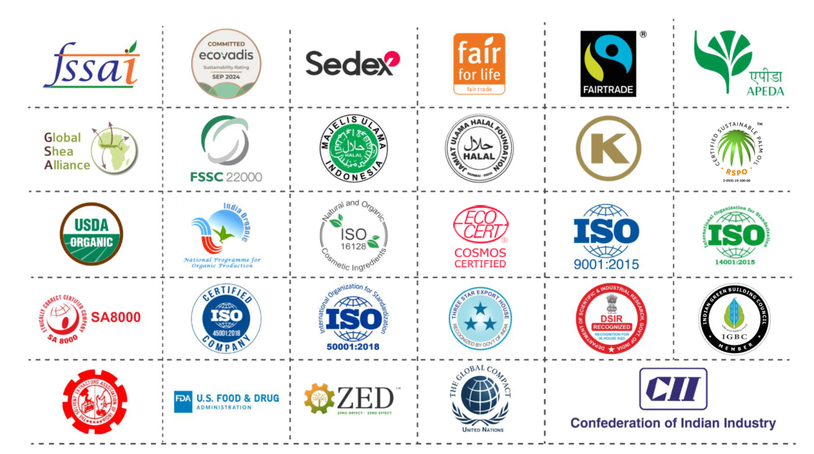

**[Image: Jul2025.pdf-0027-01.png (1353x755, 747.4KB)]**

**Quest to be the Best: Wide Spectrum of Prestigious Certifications** 

**[Image: Jul2025.pdf-0027-03.png (402x110, 21.6KB)]**

**[Image: Jul2025.pdf-0027-04.png (91x93, 11.6KB)]**

### **Esteemed Clientele** 

**[Image: Jul2025.pdf-0028-01.png (91x93, 11.6KB)]**

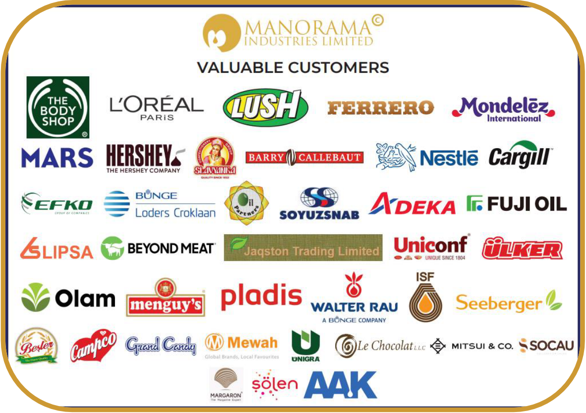

**[Image: Jul2025.pdf-0028-02.png (1182x834, 910.4KB)]**

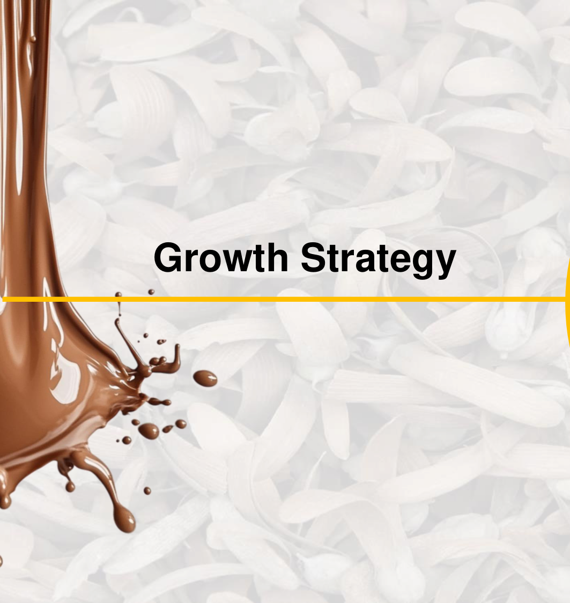

**[Image: Jul2025.pdf-0029-00.png (1063x1125, 857.4KB)]**

<!-- Start of picture text -->
Growth Strategy <!-- End of picture text -->

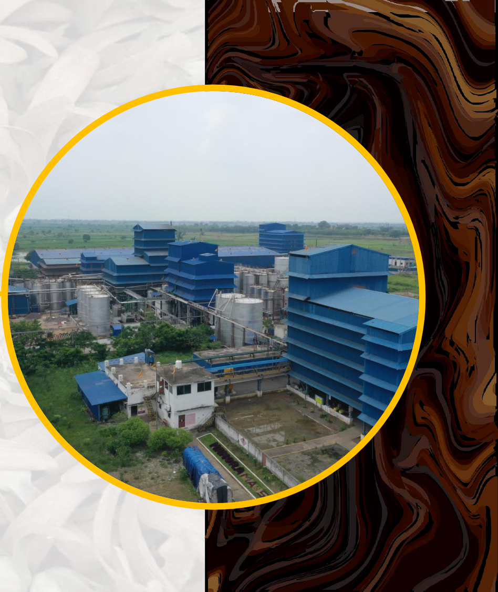

**[Image: Jul2025.pdf-0029-01.png (948x1125, 1466.3KB)]**

**[Image: Jul2025.pdf-0030-00.png (90x90, 11.5KB)]**

**[Image: Jul2025.pdf-0030-01.png (1998x611, 88.6KB)]**

<!-- Start of picture text -->
Gearing up for the next wave of growth <!-- End of picture text -->

**Capacity to Cater Growing CBE and Exotic Specialty Fats & Butter Demand** 

**Vigoured Operational Efficiencies** 

**Market Diversification** 

**Launch Innovative Products** 

Commercialized new Fractionation capacity of 25,000 MTPA in July 2024 (Total Capacity: 40,000 MTPA) to address the growing demand of CBE Exotic Specialty Fats & Butter applications in Confectionery, Chocolates and Cosmetics Industry 

Deepening penetration to new geographies and tapping increased focus of the Food, Confectionery & Chocolate and Cosmetic industry’s applications of CBEs and Exotic Specialty Fats & Butter 

R&D team continuous quest to ideate, innovate, create, test and launch alternative use case of CBEs and Exotic Specialty Fats & Butter aligning with market trends. These products are jointly developed according to the customers requirement 

Economies of scale, operating leverage, backward integration, seamless operations translating operational efficiencies to kick in the coming years coupled with better customer & product mix 

### **Growing Global Footprint** 

**[Image: Jul2025.pdf-0031-01.png (91x93, 11.6KB)]**

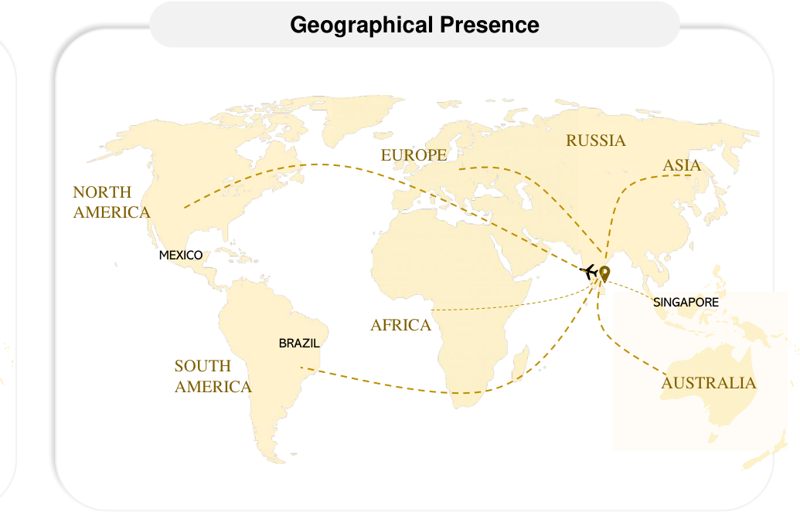

**[Image: Jul2025.pdf-0031-02.png (1035x667, 178.5KB)]**

<!-- Start of picture text -->
Geographical Presence RUSSIA EUROPE ASIA NORTH AMERICA MEXICO SINGAPORE AFRICA BRAZIL SOUTH AMERICA AUSTRALIA <!-- End of picture text -->

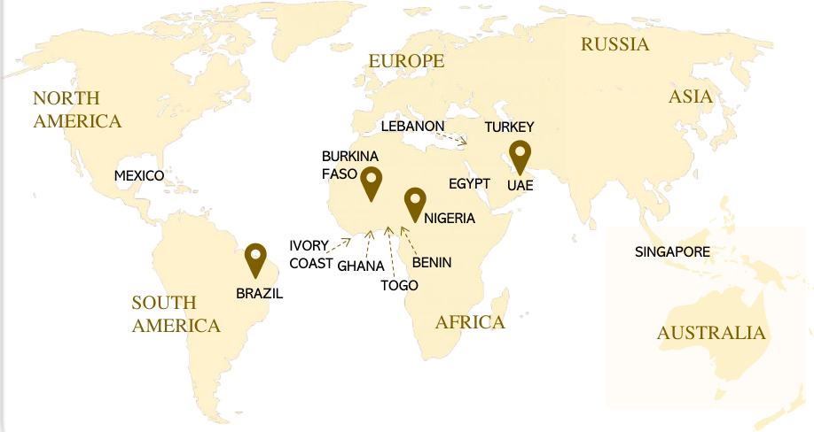

**[Image: Jul2025.pdf-0031-03.png (918x488, 165.6KB)]**

<!-- Start of picture text -->
RUSSIA EUROPE NORTH  ASIA AMERICA LEBANON TURKEY BURKINA MEXICO FASO EGYPT UAE NIGERIA IVORY SINGAPORE COAST GHANA BENIN TOGO BRAZIL SOUTH AMERICA AFRICA AUSTRALIA <!-- End of picture text -->

**[Image: Jul2025.pdf-0031-04.png (260x155, 4.2KB)]**

➢ Government of India Recognized ‘Three Star Export House’ ➢ On boarded new global customers from across the geographies 

### **Expanding our Geographical Footprints** 

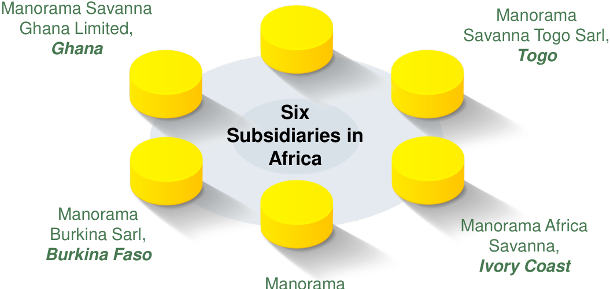

**[Image: Jul2025.pdf-0032-01.png (1055x501, 115.7KB)]**

<!-- Start of picture text -->
Manorama Savanna Manorama Ghana Limited, Savanna Togo Sarl, Ghana Togo Six Subsidiaries in Africa Manorama Manorama Africa Burkina Sarl, Savanna, Burkina Faso Ivory Coast Manorama <!-- End of picture text -->

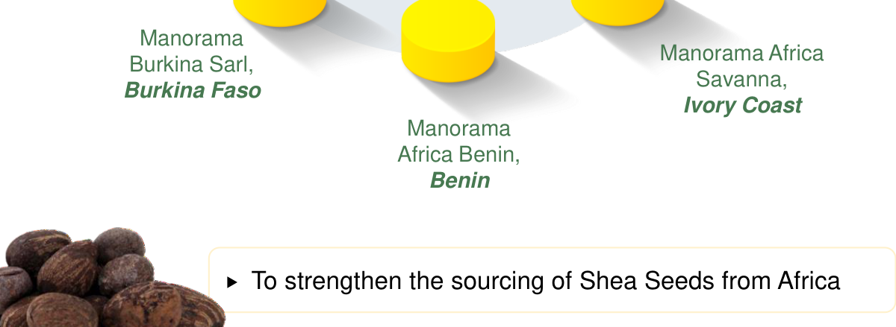

**[Image: Jul2025.pdf-0032-02.png (1200x439, 142.1KB)]**

<!-- Start of picture text -->
Manorama Manorama Africa Burkina Sarl, Savanna, Burkina Faso Ivory Coast Manorama Africa Benin, Benin   To strengthen the sourcing of Shea Seeds from Africa <!-- End of picture text -->

**[Image: Jul2025.pdf-0032-03.png (78x120, 2.2KB)]**

**[Image: Jul2025.pdf-0032-04.png (78x120, 2.3KB)]**

- Strengthening procurement & onboarding new customers from MENA region and Latin America 

**[Image: Jul2025.pdf-0032-06.png (91x93, 11.6KB)]**

**[Image: Jul2025.pdf-0033-00.png (570x1125, 560.0KB)]**

## **Sustainable Business Practices** 

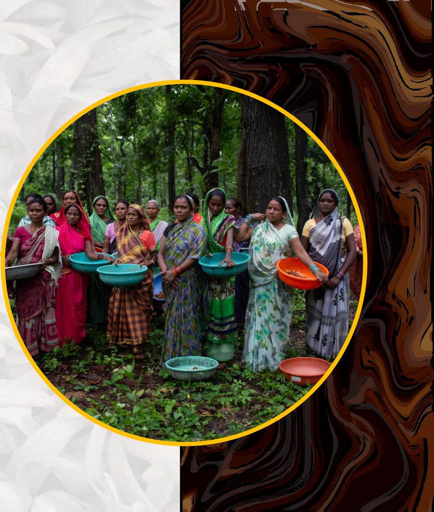

**[Image: Jul2025.pdf-0033-02.png (953x1125, 1880.5KB)]**

### **Environmental Initiatives** 

**[Image: Jul2025.pdf-0034-01.png (91x93, 11.6KB)]**

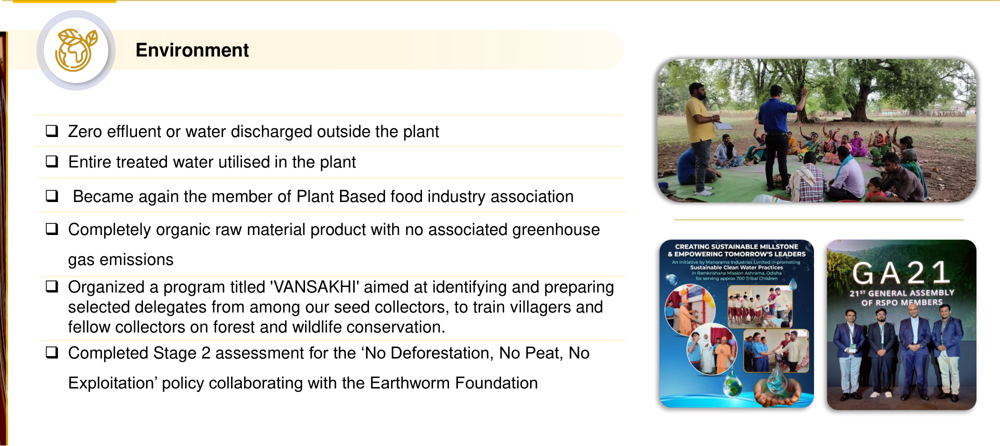

**[Image: Jul2025.pdf-0034-02.png (2000x892, 1169.0KB)]**

<!-- Start of picture text -->
Environment ❑ Zero effluent or water discharged outside the plant ❑ Entire treated water utilised in the plant ❑ Became again the member of Plant Based food industry association ❑ Completely organic raw material product with no associated greenhouse gas emissions ❑ Organized a program titled 'VANSAKHI' aimed at identifying and preparing selected delegates from among our seed collectors, to train villagers and fellow collectors on forest and wildlife conservation. ❑ Completed Stage 2 assessment for the ‘No Deforestation, No Peat, No Exploitation’ policy collaborating with the Earthworm Foundation <!-- End of picture text -->

### **Social Initiatives** 

**[Image: Jul2025.pdf-0035-01.png (91x93, 11.6KB)]**

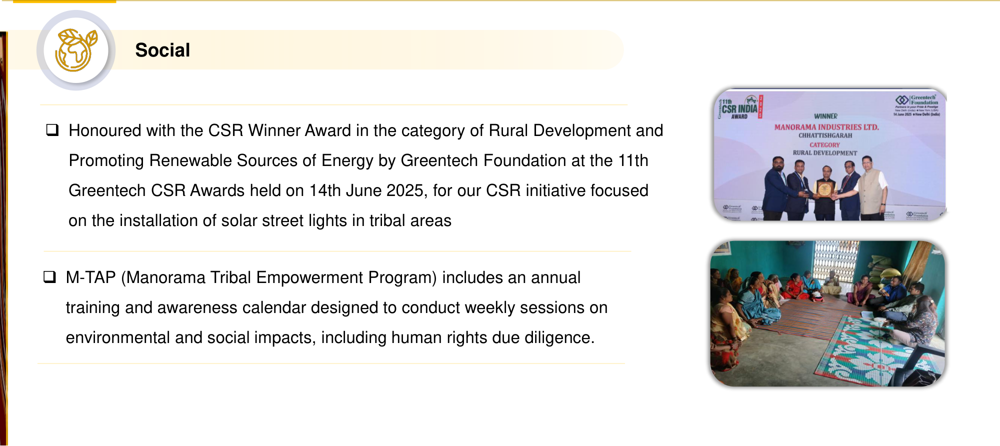

**[Image: Jul2025.pdf-0035-02.png (2000x892, 666.2KB)]**

<!-- Start of picture text -->
Social ❑ Honoured with the CSR Winner Award in the category of Rural Development and Promoting Renewable Sources of Energy by Greentech Foundation at the 11th Greentech CSR Awards held on 14th June 2025, for our CSR initiative focused on the installation of solar street lights in tribal areas ❑ M-TAP (Manorama Tribal Empowerment Program) includes an annual training and awareness calendar designed to conduct weekly sessions on environmental and social impacts, including human rights due diligence. <!-- End of picture text -->

### **Governance Initiatives** 

**[Image: Jul2025.pdf-0036-01.png (91x93, 11.6KB)]**

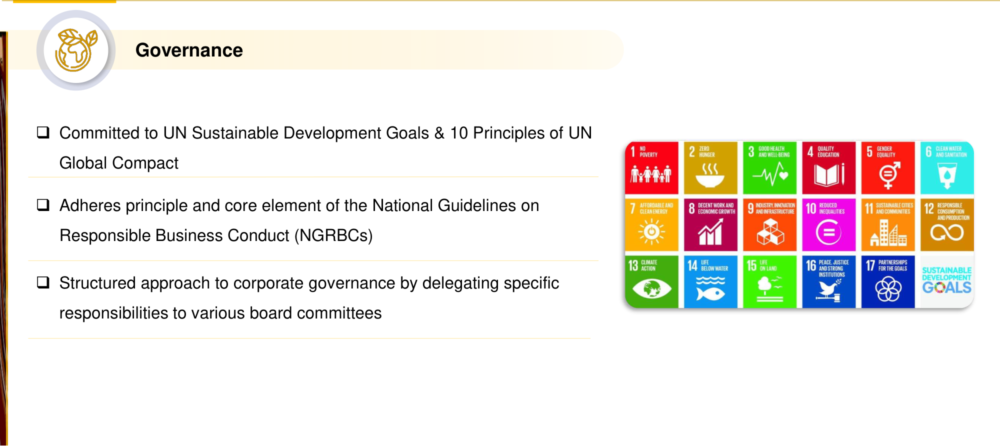

**[Image: Jul2025.pdf-0036-02.png (2000x892, 460.5KB)]**

<!-- Start of picture text -->
Governance ❑ Committed to UN Sustainable Development Goals & 10 Principles of UN Global Compact ❑ Adheres principle and core element of the National Guidelines on Responsible Business Conduct (NGRBCs) ❑ Structured approach to corporate governance by delegating specific responsibilities to various board committees <!-- End of picture text -->

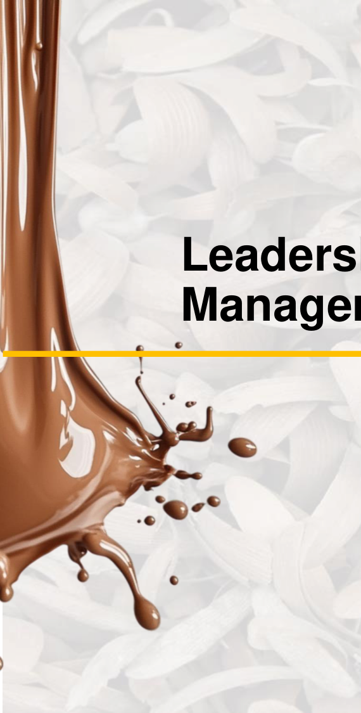

**[Image: Jul2025.pdf-0037-00.png (570x1125, 560.4KB)]**

## **Leadership Team & Management** 

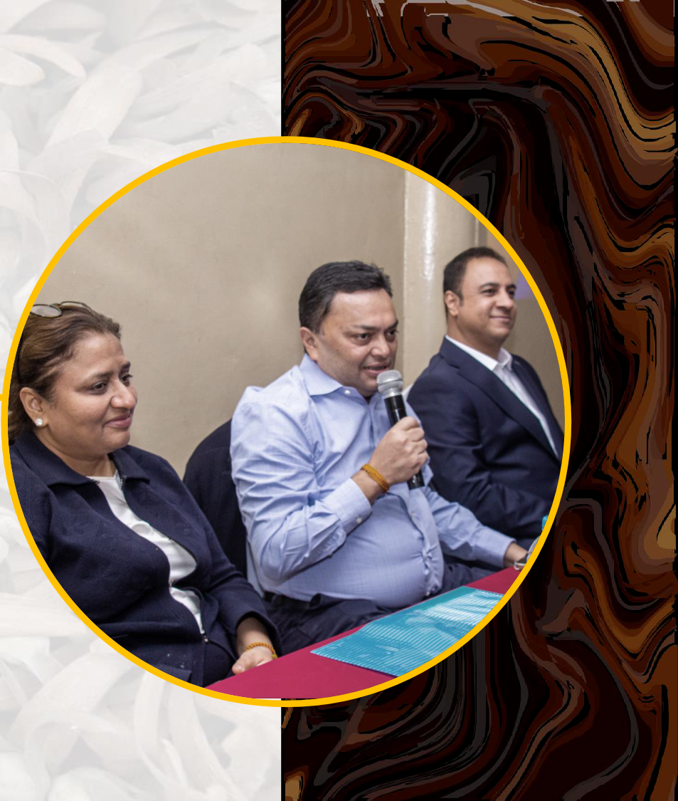

**[Image: Jul2025.pdf-0037-02.png (953x1125, 1500.1KB)]**

### **Seasoned Board of Directors** 

**[Image: Jul2025.pdf-0038-01.png (212x228, 87.2KB)]**

**[Image: Jul2025.pdf-0038-02.png (201x224, 85.8KB)]**

###### **_Ashish Saraf – Chairman & Managing Director_** 

###### **_Vinita Saraf  -  Vice Chairperson & Whole Time Director_** 

###### **Experience : 33 Years** 

###### **Experience : 21 Years** 

He has rich experience in the specialty fats and butters manufacturing sector, leading operations since the company's inception. His expertise encompasses procurement, supply chain management, business development across the world and the development of tailor-made products for major global brands in chocolate, confectionery, and cosmetics. 

She has completed her bachelor’s degree in commerce from Mount Carmel Girls College, Bangalore. Her journey has been marked by ambitious and entrepreneur vision  coupled with great vigour and hard work 

**[Image: Jul2025.pdf-0038-09.png (199x220, 68.5KB)]**

**[Image: Jul2025.pdf-0038-10.png (218x236, 95.8KB)]**

###### **_Gautam Pal – Whole Time Director_** 

###### **Experience : 22 Years** 

###### **_Shrey Saraf - Whole Time Director_** 

He holds Doctorate in Mgmt. from National Inst. of Mgmt. , (Mah.), studied Production and MBA in Production and Marketing  from Amity University UP and also is B. Tech in Chemical. Plant is headed by him who has very vast experience in Specialty Oil and Fats / Butters Manufacturing and Quality Control 

###### **Experience : 7 Years** 

A BBA in Business and Management from University of Exeter, UK. His presence in the Company and his dynamic young energy strengthens the process of Marketing, Customer and Business Development. 

**[Image: Jul2025.pdf-0038-17.png (91x93, 11.6KB)]**

**[Image: Jul2025.pdf-0038-18.png (238x221, 87.8KB)]**

###### **_CA Ashok Jain - Whole Time Director & Chief Financial Officer_** 

###### **Experience : 15 Years** 

Mr. Ashok Jain is a qualified Chartered Accountant and Commerce graduate. As Whole-time Director and Chief Finance Officer, he leads strategic financial planning and oversees core functions including costing, accounting, taxation, corporate finance, and capital raising. He has extensive expertise in forex management, international financial compliance, and managing the financial operations of the Company and it’s overseas subsidiaries. 

### **Seasoned Board of Directors** 

**[Image: Jul2025.pdf-0039-01.png (91x93, 11.6KB)]**

**[Image: Jul2025.pdf-0039-02.png (197x220, 89.9KB)]**

**_Mudit Kumar Singh - Independent_ Director** 

###### **Experience : 38 Years** 

A senior retired bureaucrat from 1984 Batch of the IFS, Chhattisgarh Cadre. His work in Participatory Management at Jhabua has been internationally acclaimed & 3 Books have been written on his work by Tata Energy Research Institute, Worldwide Fund for Nature and IIFM. His wide experience in forestry will prove to be an asset of the Company. 

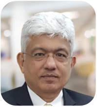

**[Image: Jul2025.pdf-0039-06.png (199x220, 83.3KB)]**

**_Nipun Mehta - Independent_ Director** 

###### **Experience : 37 Years** 

A CA , Expert in Financial Markets and has entrepreneurial and corporate experience in Private Banking, Capital Markets & Wealth Mgmt. having worked in the past with both domestic & Global Financial Institutions in leadership positions. 

**[Image: Jul2025.pdf-0039-10.png (197x218, 82.5KB)]**

**[Image: Jul2025.pdf-0039-11.png (195x218, 88.6KB)]**

###### **_Jose V Joseph - Independent_ Director** 

###### **_Subhaprada Nishtala - Independent_ Director Experience : 25 Years** 

###### **Experience : 41 Years** 

He retired as the Executive Vice President from The Federal Bank and he has very vast experience to incorporate, SME and Retail banking in India and Middle East. His presence and independent advice always help to approach strong financial strategic planning and good corporate governance. 

She is a recognized authority in food safety, regulatory compliance, and quality operations, has spearheaded critical strategic initiatives across manufacturing, operations, and new product development, driving excellence and innovation in both private and public sectors. As a Lead Auditor and Lead Trainer for FSMS standards, she has conducted over 400+ training programs in HACCP, ISO 22000, and FSSC 22000, 

**[Image: Jul2025.pdf-0039-17.png (201x218, 84.2KB)]**

###### **_Veni Mocherla - Independent_ Director** 

###### **Experience : 23 Years** 

An MBA, did Postgraduate in Chartered Institute of Marketing, UK. A business consulting professional specialised in international businesses & alliances, cross border consulting, strategy & planning, scaling up businesses etc. She Also held senior roles in Dept. of Trade & Investment, British High Commission, Bristol Myers Squib in India. 

### **Experienced Management Team (1/4)** 

**[Image: Jul2025.pdf-0040-01.png (201x218, 82.6KB)]**

**[Image: Jul2025.pdf-0040-02.png (196x216, 69.3KB)]**

###### **_Dr. Krishnadath Bhaggan - VP - R&D Product Development_** 

Experience in R&D and Innovation for 22 yrs.+ He is an inventor/co-inventor of multiple patents and author/coauthor of many publications in the oils and fats area. 

**[Image: Jul2025.pdf-0040-05.png (196x219, 79.9KB)]**

**[Image: Jul2025.pdf-0040-06.png (197x217, 74.9KB)]**

###### **_Deep Saraf - VP – Business Development_** 

Part of co. since commencement. Currently responsible  for leading and managing the co.'s. Birkoni plant. His long association and experience also create focus in Business Development. 

**[Image: Jul2025.pdf-0040-09.png (197x222, 79.5KB)]**

**[Image: Jul2025.pdf-0040-10.png (200x216, 93.0KB)]**

###### **_Dmitry Zimmermann – Manager – International Sales & Business Development_** 

He is a seasoned FMCG professional with over 20 years of experience in leading multinational companies like Procter & Gamble and Nestle. He holds degrees in Agronomy and Economics from Yaroslav the Wise Novgorod State University. Dmitry excels in managing key national accounts and developing sales strategies. 

**[Image: Jul2025.pdf-0040-13.png (91x93, 11.6KB)]**

###### **_Appel Sten - VP – New & Existing Projects_** 

Degree in Chemical Engineering from Aalborg University (DK) and has a vast experience in Edible Oil Industries as a Production Manager. 

###### **_Mauro Sérgio Nobre Terreri - VP – Fats & Oils business in Latin America (Global Sales)_** 

Degree in Food Engineering by Unicamp University (Brazil) and MBA, Marketing and has over 30 years of experience in Food Ingredients and Specialty Fats & Oils businesses, leading Sales, Marketing and Technical teams through Latin America countries. 

###### **_Luciano Luz Pupp – Head of R&D and A&TS in Brazil / Latam_** 

He has over 30 years of experience working for food multinational global industries dedicated to food ingredients, specialty fats & edible oils, either managing technical customer co-developments, innovation projects and industrial ingredients application. He is Chemical Engineer, graduated by Oswaldo Cruz University (Brazil) with food technology specialization. 

### **Experienced Management Team (2/4)** 

**[Image: Jul2025.pdf-0041-01.png (194x218, 76.3KB)]**

**[Image: Jul2025.pdf-0041-02.png (195x218, 79.4KB)]**

###### **_Thales Baptistella- Finance Manager at Brazil Latam_** 

He has Bachelor’s Degree in Business Administration & Logistics and a Master Degree in Accounting and Finance with more than 15 years of experience within both Brazilian and International Companies in different market sectors such as food ingredients, decoration and retail businesses. 

**[Image: Jul2025.pdf-0041-05.png (195x215, 80.4KB)]**

**[Image: Jul2025.pdf-0041-06.png (197x215, 80.5KB)]**

###### **_Rossana Bento Cabral - Marketing and Sales Executive at Brazil Latam_** 

She has a Bachelor's Degree in Arts from Unicamp (Brazil) and a Master's Degree in Marketing & Strategic Planning with more than 20 years of experience in the Fats & Oils and Specialty industries, leading marketing, communication and sales activities across Latin American countries with a strong focus on Food and Cosmetics customers. 

**[Image: Jul2025.pdf-0041-09.png (195x218, 77.1KB)]**

**[Image: Jul2025.pdf-0041-10.png (199x216, 70.1KB)]**

###### **_Raj Shekhar - VP – Technical_** 

A Science Graduate, MBA in Production Management and Diploma holder in computer applications. He has very vast experience of 31 years in Oil Industry. 

**[Image: Jul2025.pdf-0041-13.png (91x93, 11.6KB)]**

###### **_Marcelo Sasaki - Regional Sales Manager at Brazil Latam_** 

Graduated in Food Engineering from Unicamp University (Brazil), he has 25 years of commercial experience in the Specialty Fats & Oils and Food Ingredients industries, leading sales activities across Latin American countries, with a strong focus on managing global and regional accounts and distributors. 

###### **_Sandeep Agrawal – Chief Operating Officer_** 

He is a Mechanical Engineering Graduate from BIT Durg having more than 25 years of experience at versatile industries like Vedanta (metal and mining industries) as well as US and Indian MNC on FMCG category like Bunge India and Britannia industries Ltd. He is having a lifetime membership on Quality Circle Forum of India (QCFI). 

###### **_Vijay Kumar R – Chief Human Resource Officer_** 

He is a dynamic leader with more than 24+ years of experience of transformative expertise in HR, with a proven track record in driving strategic growth and innovation, skilled in steering cross-functional teams to success. He brings expertise and industry experience from various sectors fostering sustainable solutions and stakeholder value. 

### **Experienced Management Team (3/4)** 

**[Image: Jul2025.pdf-0042-01.png (193x213, 81.9KB)]**

**[Image: Jul2025.pdf-0042-02.png (194x218, 81.8KB)]**

###### **_Mansoor Ali – Associate VP - HR_** 

###### **_Vishal Hotchand Narang - Director – Manorama Africa Limited_** 

He has over 30 years of rich experience in Manufacturing Industry, specializing in Strategic HR as an HR Business Partner. He holds a bachelor’s degree from Ravi Shankar University, Raipur, and a Diploma in Mechanical Engineering from NIE, Maharashtra, along with professional certifications in HR Analytics and HRBP from IIM Rohtak. 

Business Leader with 22+ years of FMCG / Commodities experience in Global markets driving sustainable growth in functional areas of Sales & Marketing, Strategic Deployment, Business Development with special emphasis to P&L accountabilities & General Management functions. 

**[Image: Jul2025.pdf-0042-07.png (199x217, 84.3KB)]**

**[Image: Jul2025.pdf-0042-08.png (194x215, 85.7KB)]**

###### **_Nisha Sharma - Manager – International Sales & Business Development_** 

###### **_Yogendra Puri Goswami - VP – Sales_** 

He has 23 years of experience in FMCG, OTC Pharma, Footwears Industries (Sales & Marketing domain). Awarded with Top scorer award, Dimension of professional selling certificate award, Target achieve award 

She is responsible for Business Development & Sales , also serves as Coordinator to Chairman & Managing Director & contributing to its global outreach and strategic coordination. She holds a master’s degree from Mumbai University. 

**[Image: Jul2025.pdf-0042-13.png (195x218, 70.7KB)]**

###### **_Chandan Gupta - Associate VP - Sales_** 

He is MBA in Operation Research and MTech & BE (Hons.). He has an experience of more than 11 years in managing the domestic as well as international sales (adding new customer base) 

**[Image: Jul2025.pdf-0042-16.png (91x93, 11.6KB)]**

### **Experienced Management Team (4/4)** 

**[Image: Jul2025.pdf-0043-01.png (195x217, 83.8KB)]**

**[Image: Jul2025.pdf-0043-02.png (197x213, 81.9KB)]**

###### **_CS Deepak Sharma- CS & Compliance Officer_** 

He is a qualified Company Secretary, holds an LL.B. degree, and is a Commerce graduate with over 10 years of experience in secretarial, legal, and regulatory compliance functions across both listed and unlisted entities. His core expertise spans Corporate Governance, Company Law compliance, SEBI regulations, conducting Board and Shareholder meetings, and managing statutory filings. 

###### **_Ekta Soni – Associate Vice President - IR_** 

She is a Company Secretary by profession, she has completed her Graduation in B. Com. from Calcutta University. She is associated with the company for more than 9 yrs. and handles IR Activities for the company. 

**[Image: Jul2025.pdf-0043-07.png (91x93, 11.6KB)]**

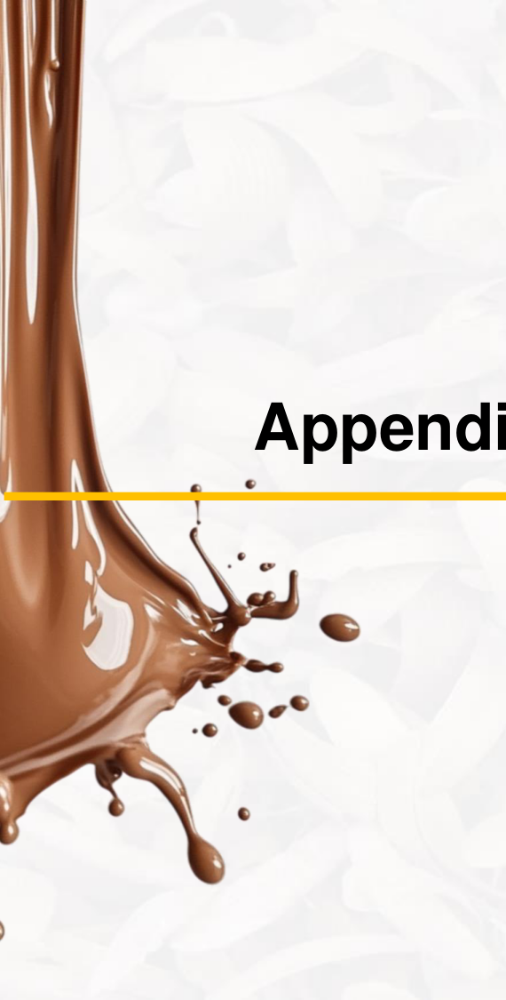

**[Image: Jul2025.pdf-0044-00.png (570x1125, 378.6KB)]**

<!-- Start of picture text -->
Appendix <!-- End of picture text -->

## **Appendix** 

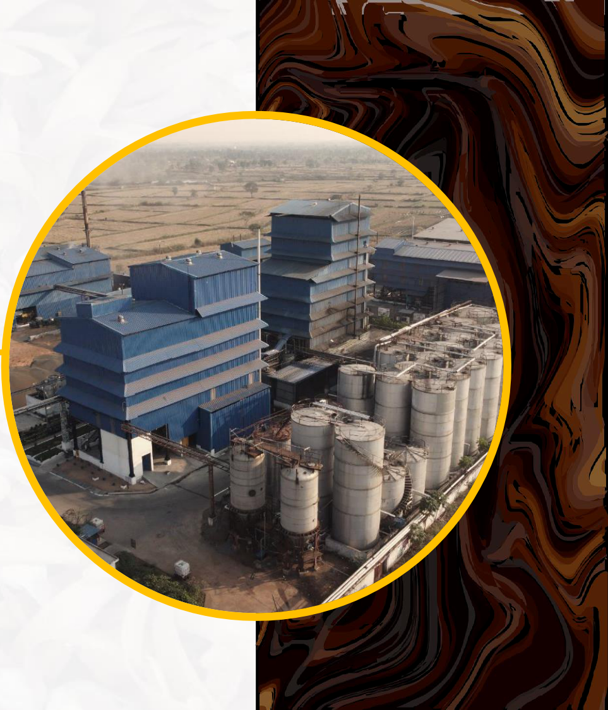

**[Image: Jul2025.pdf-0044-02.png (963x1125, 1600.9KB)]**

### **Recent Awards & Accolades (1/2)** 

**[Image: Jul2025.pdf-0045-01.png (91x93, 11.6KB)]**

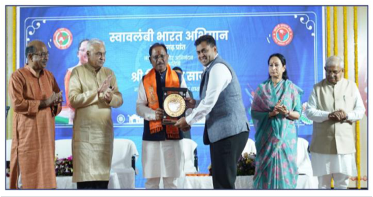

**[Image: Jul2025.pdf-0045-02.png (545x288, 381.6KB)]**

Shri Shrey Saraf – Whole Time Director, Manorama Industries receiving _‘Excellency Award ’_ in collaboration with the Government of Chhattisgarh & Swadeshi Jagran Manch. 

Shri. Ashish Saraf – Chairman and Managing Director of Manorama Industries Limited received six esteemed awards for the remarkable achievement as ‘ _Highest Processor of Sal Seed and Mango Kernel, Highest Exporter of Sal Oil (Fats), Mango Kernel Oil (Fats), Kokum Oil (Fats) and Neem Oil_ ’ for 19 consecutive years. 

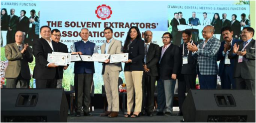

**[Image: Jul2025.pdf-0045-05.png (514x247, 262.4KB)]**

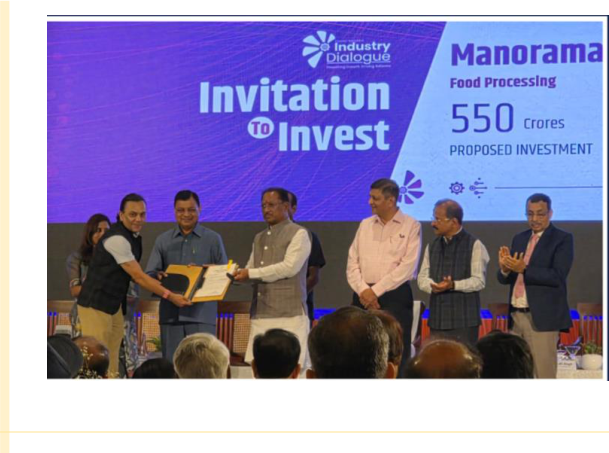

**[Image: Jul2025.pdf-0045-06.png (609x453, 434.3KB)]**

Shri. Deep Saraf – Vice President, Manorama Industries received _‘Memorandum of Understanding (MoU)’_ with Government of Chhattisgarh 

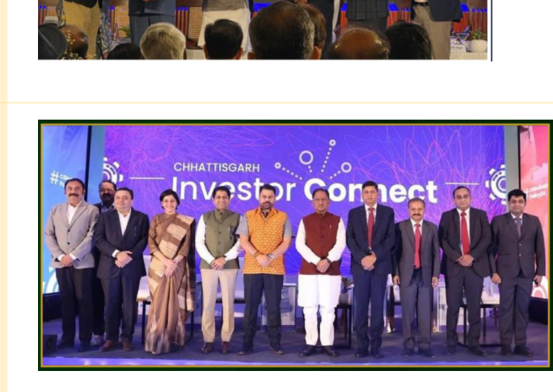

**[Image: Jul2025.pdf-0045-08.png (684x485, 581.4KB)]**

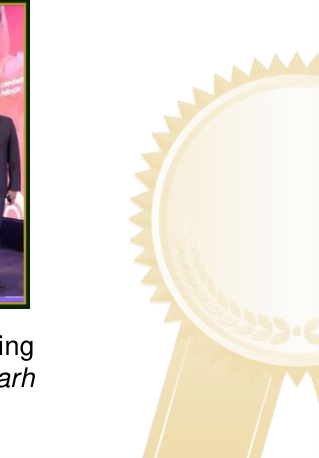

**[Image: Jul2025.pdf-0045-09.png (319x458, 79.3KB)]**

Shri. Ashish Saraf – Chairman and Managing Director, Manorama Industries at _Chhattisgarh Investor Connect_ 

### **Recent Awards & Accolades (2/2)** 

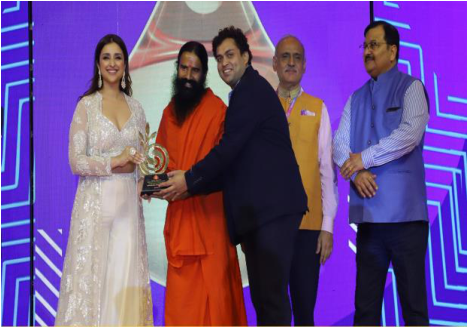

**[Image: Jul2025.pdf-0046-01.png (468x328, 340.0KB)]**

Shri Shrey Saraf – Whole Time Director, Manorama Industries receiving _‘Eminent Excellence in ESG & Sustainable Creation of Business through waste, with support to thousands of forest dwellers’ Award_ 

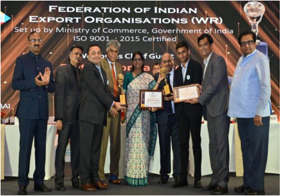

**[Image: Jul2025.pdf-0046-03.png (470x328, 350.0KB)]**

Shri. Ashish Saraf – Chairman and Managing Director, Manorama Industries awarded as _‘TWO EXPORT EXCELLENCE AWARDS’_ under the category Highest Foreign Exchange Earner – 20182019 and 2019-2020 organized by Federation of Indian Exporters Organization (FIEO) 

**[Image: Jul2025.pdf-0046-05.png (91x93, 11.6KB)]**

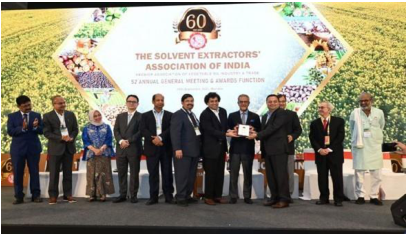

**[Image: Jul2025.pdf-0046-06.png (407x236, 216.0KB)]**

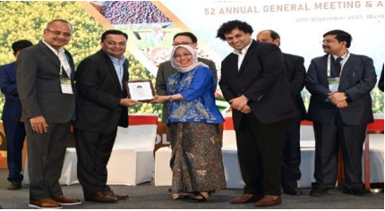

**[Image: Jul2025.pdf-0046-07.png (430x236, 215.6KB)]**

Shri. Ashish Saraf – Chairman and Managing Director and Shri Shrey Saraf – Whole Time Director, Manorama Industries awarded with _‘Highest Processor of Minor Oil Seeds’_ and _‘Highest Exporters of Tree Borne Oils And Mango Kernel Oil (Fats) From India’_ 

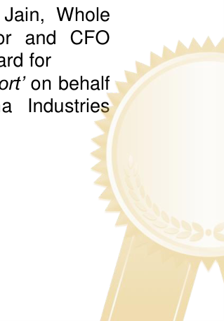

**[Image: Jul2025.pdf-0046-09.png (319x458, 64.5KB)]**

<!-- Start of picture text -->
 on behalf <!-- End of picture text -->

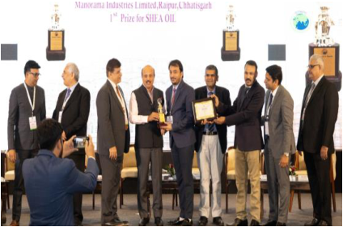

**[Image: Jul2025.pdf-0046-10.png (424x280, 228.2KB)]**

Shri. Ashok Jain, Whole Time Director and CFO receiving award for _‘Highest Export’_ on behalf of Manorama Industries Limited 

### **Client Testimonials** 

**[Image: Jul2025.pdf-0047-01.png (91x93, 11.6KB)]**

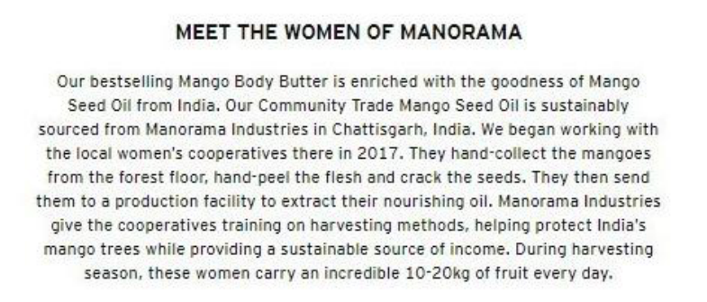

**[Image: Jul2025.pdf-0047-02.png (785x335, 371.6KB)]**

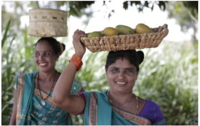

**[Image: Jul2025.pdf-0047-03.png (408x257, 254.7KB)]**

Meet the Women of Manorama – Article Published on **_The Body Shop Website_** 

**[Image: Jul2025.pdf-0047-05.png (146x141, 3.5KB)]**

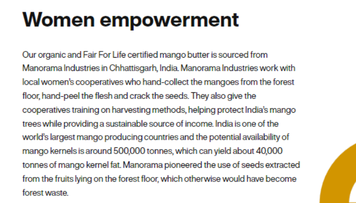

**[Image: Jul2025.pdf-0047-06.png (696x398, 153.6KB)]**

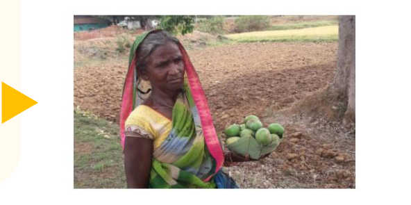

**[Image: Jul2025.pdf-0047-07.png (592x295, 267.3KB)]**

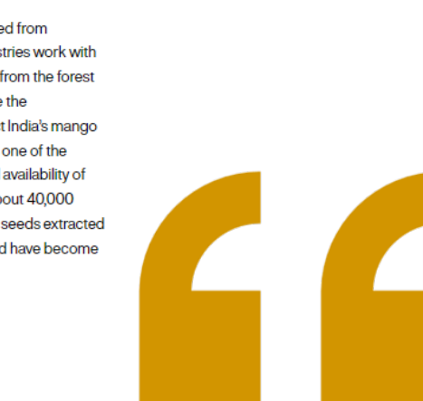

**[Image: Jul2025.pdf-0047-08.png (467x443, 34.4KB)]**

Article Published on **_Lush Website_** 

**Note:** The Brand names mentioned are the property of their respective owners and are used here for identification purposes only 

**46** 

### **Shareholder Information** 

###### Capital Market Data 

**[Image: Jul2025.pdf-0048-02.png (630x132, 11.0KB)]**

<!-- Start of picture text -->
MANORAMA / NSE Ticker /BSE Code 541974 <!-- End of picture text -->

**[Image: Jul2025.pdf-0048-03.png (630x133, 12.0KB)]**

<!-- Start of picture text -->
Current Market Price 1,592.0 (as on 24 July 2025) <!-- End of picture text -->

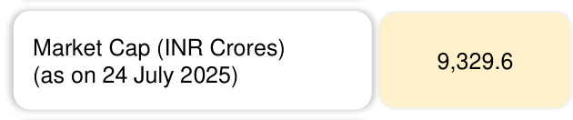

**[Image: Jul2025.pdf-0048-04.png (630x132, 13.4KB)]**

<!-- Start of picture text -->
Market Cap (INR Crores) 9,329.6 (as on 24 July 2025) <!-- End of picture text -->

**[Image: Jul2025.pdf-0048-05.png (630x132, 10.2KB)]**

<!-- Start of picture text -->
52 Week High/Low 1,633.5/604.1 <!-- End of picture text -->

**[Image: Jul2025.pdf-0048-06.png (630x133, 10.1KB)]**

<!-- Start of picture text -->
Shares Outstanding (in Crores) 5.95 <!-- End of picture text -->

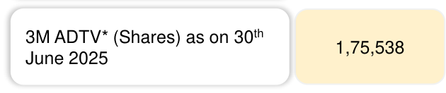

**[Image: Jul2025.pdf-0048-07.png (630x132, 12.6KB)]**

<!-- Start of picture text -->
3M ADTV* (Shares) as on 30 th 1,75,538 June 2025 <!-- End of picture text -->

**[Image: Jul2025.pdf-0048-08.png (91x93, 11.6KB)]**

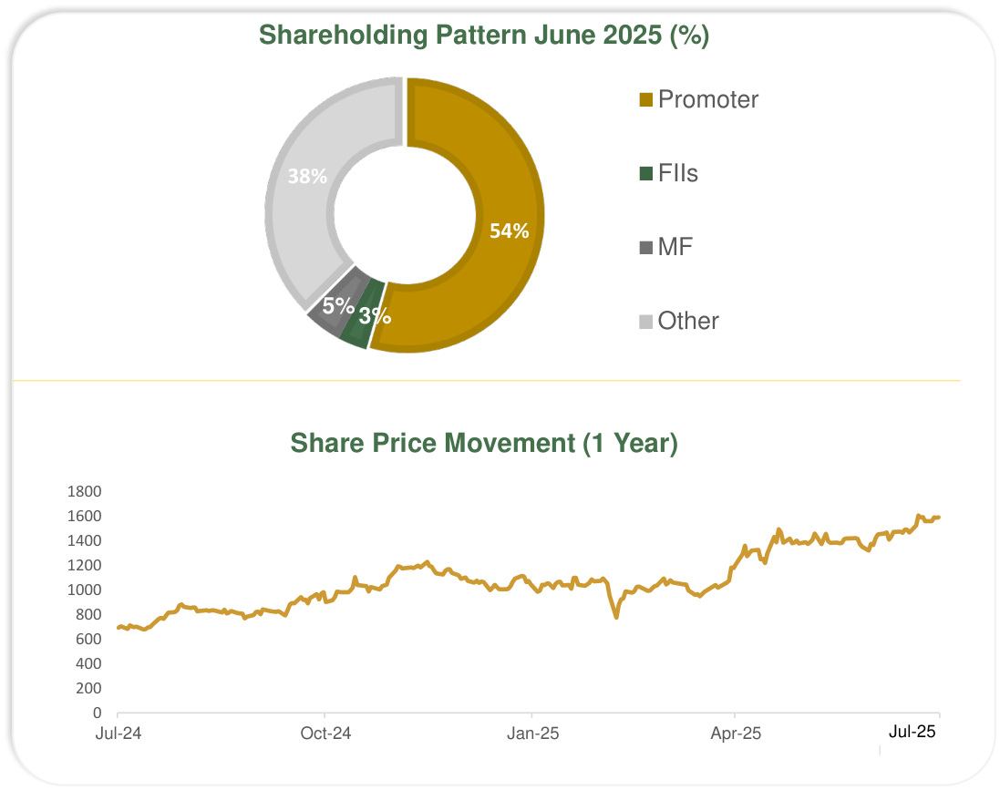

**[Image: Jul2025.pdf-0048-09.png (1097x867, 71.0KB)]**

<!-- Start of picture text -->
Shareholding Pattern June 2025 (%) Promoter 38% FIIs 54% MF 5% 3% Other Share Price Movement (1 Year) 1800 1600 1400 1200 1000 800 600 400 200 0 Jul-24 Oct-24 Jan-25 Apr-25 Jul-25 <!-- End of picture text -->

Source: NSE 

###### **Contact Information** 

Company : 

**Manorama Industries Limited CIN: L15142MH2005PLC243687** 

**[Image: Jul2025.pdf-0049-03.png (638x372, 213.1KB)]**

<!-- Start of picture text -->
YOU! <!-- End of picture text -->

**[Image: Jul2025.pdf-0049-04.png (118x118, 17.8KB)]**

**[Image: Jul2025.pdf-0049-05.png (126x112, 12.0KB)]**

**Ms. Ekta Soni                                                       Mr. Deepak Sharma Associate Vice President -  IR                           Company Secretary & C                                                                           Compliance officer** E: ekta@manoramagroup.co.in 

E: investors@manoramagroup.co.in             E: cs_sharma@manoramagroup.co.in 

M: +91 7879165440                                           M: +91 9329932082 www.manoramagroup.co.in 

**Investor Relations Advisors :** 

Mr. Vikash Verma/ Mr. Hiral Keniya/ Ms. Yashvi Jain 

E: vikash.verma1@in.ey.com/ hiral.keniya@in.ey.com/ yashvi.jain1@in.ey.com M: +91 9664009029/ 9029662801/ 8905954390 

---

## Extracted Images

| # | File | Dimensions | Size |
|---|------|------------|------|
| 1 | Jul2025.pdf-0002-00.png | 1975x136 | 389.6KB |
| 2 | Jul2025.pdf-0002-01.png | 567x661 | 714.9KB |
| 3 | Jul2025.pdf-0003-00.png | 1998x1125 | 991.5KB |
| 4 | Jul2025.pdf-0003-01.png | 32x617 | 35.7KB |
| 5 | Jul2025.pdf-0004-00.png | 690x185 | 12.0KB |
| 6 | Jul2025.pdf-0004-02.png | 278x320 | 13.6KB |
| 7 | Jul2025.pdf-0004-03.png | 279x320 | 15.5KB |
| 8 | Jul2025.pdf-0004-04.png | 278x320 | 13.4KB |
| 9 | Jul2025.pdf-0004-05.png | 279x320 | 13.0KB |
| 10 | Jul2025.pdf-0004-07.png | 279x320 | 15.3KB |
| 11 | Jul2025.pdf-0004-08.png | 278x320 | 10.2KB |
| 12 | Jul2025.pdf-0004-09.png | 279x320 | 16.4KB |
| 13 | Jul2025.pdf-0005-00.png | 1063x1125 | 858.1KB |
| 14 | Jul2025.pdf-0005-01.png | 942x1125 | 1482.3KB |
| 15 | Jul2025.pdf-0006-01.png | 91x93 | 11.6KB |
| 16 | Jul2025.pdf-0006-02.png | 478x813 | 832.8KB |
| 17 | Jul2025.pdf-0007-01.png | 91x93 | 11.6KB |
| 18 | Jul2025.pdf-0007-02.png | 2000x905 | 316.5KB |
| 19 | Jul2025.pdf-0007-03.png | 151x855 | 23.8KB |
| 20 | Jul2025.pdf-0008-01.png | 91x93 | 11.6KB |
| 21 | Jul2025.pdf-0008-02.png | 1819x942 | 552.0KB |
| 22 | Jul2025.pdf-0009-01.png | 91x93 | 11.6KB |
| 23 | Jul2025.pdf-0009-02.png | 1819x942 | 488.9KB |
| 24 | Jul2025.pdf-0010-01.png | 91x93 | 11.6KB |
| 25 | Jul2025.pdf-0010-02.png | 2000x818 | 262.9KB |
| 26 | Jul2025.pdf-0010-05.png | 2000x479 | 214.9KB |
| 27 | Jul2025.pdf-0011-01.png | 91x93 | 11.6KB |
| 28 | Jul2025.pdf-0011-02.png | 2000x819 | 415.6KB |
| 29 | Jul2025.pdf-0011-03.png | 1813x942 | 555.6KB |
| 30 | Jul2025.pdf-0012-01.png | 91x93 | 11.6KB |
| 31 | Jul2025.pdf-0012-02.png | 2000x819 | 385.1KB |
| 32 | Jul2025.pdf-0012-03.png | 1819x942 | 448.8KB |
| 33 | Jul2025.pdf-0013-00.png | 1063x1125 | 859.8KB |
| 34 | Jul2025.pdf-0013-01.png | 944x1125 | 1861.0KB |
| 35 | Jul2025.pdf-0014-01.png | 91x93 | 11.6KB |
| 36 | Jul2025.pdf-0014-02.png | 2000x819 | 333.1KB |
| 37 | Jul2025.pdf-0014-03.png | 356x638 | 48.8KB |
| 38 | Jul2025.pdf-0014-04.png | 353x611 | 43.7KB |
| 39 | Jul2025.pdf-0015-00.png | 570x1125 | 560.3KB |
| 40 | Jul2025.pdf-0015-02.png | 965x1125 | 1686.4KB |
| 41 | Jul2025.pdf-0016-01.png | 91x93 | 11.6KB |
| 42 | Jul2025.pdf-0016-02.png | 2000x819 | 250.5KB |
| 43 | Jul2025.pdf-0016-03.png | 1264x743 | 105.0KB |
| 44 | Jul2025.pdf-0016-04.png | 605x509 | 213.7KB |
| 45 | Jul2025.pdf-0016-05.png | 303x233 | 14.3KB |
| 46 | Jul2025.pdf-0016-06.png | 269x203 | 14.5KB |
| 47 | Jul2025.pdf-0017-01.png | 1416x80 | 6.5KB |
| 48 | Jul2025.pdf-0017-02.png | 141x140 | 34.0KB |
| 49 | Jul2025.pdf-0017-03.png | 138x140 | 33.4KB |
| 50 | Jul2025.pdf-0017-04.png | 138x140 | 34.0KB |
| 51 | Jul2025.pdf-0017-05.png | 141x140 | 30.4KB |
| 52 | Jul2025.pdf-0017-06.png | 140x140 | 34.0KB |
| 53 | Jul2025.pdf-0017-07.png | 141x136 | 32.9KB |
| 54 | Jul2025.pdf-0017-10.png | 138x141 | 30.7KB |
| 55 | Jul2025.pdf-0017-11.png | 131x128 | 27.8KB |
| 56 | Jul2025.pdf-0017-12.png | 130x128 | 28.1KB |
| 57 | Jul2025.pdf-0017-13.png | 130x128 | 28.1KB |
| 58 | Jul2025.pdf-0017-14.png | 130x128 | 26.6KB |
| 59 | Jul2025.pdf-0017-15.png | 131x128 | 27.3KB |
| 60 | Jul2025.pdf-0017-16.png | 91x93 | 11.6KB |
| 61 | Jul2025.pdf-0018-01.png | 91x93 | 11.6KB |
| 62 | Jul2025.pdf-0018-04.png | 898x549 | 1227.6KB |
| 63 | Jul2025.pdf-0018-05.png | 899x551 | 1161.1KB |
| 64 | Jul2025.pdf-0019-00.png | 19x822 | 32.9KB |
| 65 | Jul2025.pdf-0019-01.png | 91x93 | 11.6KB |
| 66 | Jul2025.pdf-0019-03.png | 974x76 | 19.8KB |
| 67 | Jul2025.pdf-0019-04.png | 1555x892 | 230.4KB |
| 68 | Jul2025.pdf-0019-05.png | 623x457 | 351.9KB |
| 69 | Jul2025.pdf-0020-01.png | 91x93 | 11.6KB |
| 70 | Jul2025.pdf-0020-03.png | 509x522 | 37.4KB |
| 71 | Jul2025.pdf-0020-04.png | 601x522 | 44.6KB |
| 72 | Jul2025.pdf-0020-05.png | 368x522 | 33.7KB |
| 73 | Jul2025.pdf-0020-06.png | 483x522 | 43.1KB |
| 74 | Jul2025.pdf-0021-01.png | 91x93 | 11.6KB |
| 75 | Jul2025.pdf-0021-02.png | 438x150 | 7.3KB |
| 76 | Jul2025.pdf-0021-03.png | 438x150 | 8.7KB |
| 77 | Jul2025.pdf-0021-04.png | 299x285 | 21.6KB |
| 78 | Jul2025.pdf-0021-05.png | 438x149 | 7.3KB |
| 79 | Jul2025.pdf-0021-06.png | 438x150 | 8.0KB |
| 80 | Jul2025.pdf-0021-07.png | 438x150 | 7.0KB |
| 81 | Jul2025.pdf-0021-08.png | 438x150 | 11.1KB |
| 82 | Jul2025.pdf-0021-11.png | 688x777 | 968.2KB |
| 83 | Jul2025.pdf-0022-01.png | 91x93 | 11.6KB |
| 84 | Jul2025.pdf-0022-02.png | 1450x875 | 614.9KB |
| 85 | Jul2025.pdf-0022-03.png | 908x87 | 8.5KB |
| 86 | Jul2025.pdf-0022-04.png | 442x642 | 25.1KB |
| 87 | Jul2025.pdf-0023-01.png | 91x93 | 11.6KB |
| 88 | Jul2025.pdf-0023-04.png | 608x533 | 317.5KB |
| 89 | Jul2025.pdf-0024-01.png | 91x93 | 11.6KB |
| 90 | Jul2025.pdf-0025-10.png | 530x534 | 188.3KB |
| 91 | Jul2025.pdf-0025-11.png | 91x93 | 11.6KB |
| 92 | Jul2025.pdf-0026-01.png | 386x791 | 22.6KB |
| 93 | Jul2025.pdf-0026-02.png | 653x387 | 501.9KB |
| 94 | Jul2025.pdf-0026-03.png | 644x382 | 502.8KB |
| 95 | Jul2025.pdf-0026-04.png | 640x387 | 328.8KB |
| 96 | Jul2025.pdf-0026-05.png | 653x387 | 425.9KB |
| 97 | Jul2025.pdf-0026-06.png | 91x93 | 11.6KB |
| 98 | Jul2025.pdf-0027-01.png | 1353x755 | 747.4KB |
| 99 | Jul2025.pdf-0027-03.png | 402x110 | 21.6KB |
| 100 | Jul2025.pdf-0027-04.png | 91x93 | 11.6KB |
| 101 | Jul2025.pdf-0028-01.png | 91x93 | 11.6KB |
| 102 | Jul2025.pdf-0028-02.png | 1182x834 | 910.4KB |
| 103 | Jul2025.pdf-0029-00.png | 1063x1125 | 857.4KB |
| 104 | Jul2025.pdf-0029-01.png | 948x1125 | 1466.3KB |
| 105 | Jul2025.pdf-0030-00.png | 90x90 | 11.5KB |
| 106 | Jul2025.pdf-0030-01.png | 1998x611 | 88.6KB |
| 107 | Jul2025.pdf-0031-01.png | 91x93 | 11.6KB |
| 108 | Jul2025.pdf-0031-02.png | 1035x667 | 178.5KB |
| 109 | Jul2025.pdf-0031-03.png | 918x488 | 165.6KB |
| 110 | Jul2025.pdf-0031-04.png | 260x155 | 4.2KB |
| 111 | Jul2025.pdf-0032-01.png | 1055x501 | 115.7KB |
| 112 | Jul2025.pdf-0032-02.png | 1200x439 | 142.1KB |
| 113 | Jul2025.pdf-0032-03.png | 78x120 | 2.2KB |
| 114 | Jul2025.pdf-0032-04.png | 78x120 | 2.3KB |
| 115 | Jul2025.pdf-0032-06.png | 91x93 | 11.6KB |
| 116 | Jul2025.pdf-0033-00.png | 570x1125 | 560.0KB |
| 117 | Jul2025.pdf-0033-02.png | 953x1125 | 1880.5KB |
| 118 | Jul2025.pdf-0034-01.png | 91x93 | 11.6KB |
| 119 | Jul2025.pdf-0034-02.png | 2000x892 | 1169.0KB |
| 120 | Jul2025.pdf-0035-01.png | 91x93 | 11.6KB |
| 121 | Jul2025.pdf-0035-02.png | 2000x892 | 666.2KB |
| 122 | Jul2025.pdf-0036-01.png | 91x93 | 11.6KB |
| 123 | Jul2025.pdf-0036-02.png | 2000x892 | 460.5KB |
| 124 | Jul2025.pdf-0037-00.png | 570x1125 | 560.4KB |
| 125 | Jul2025.pdf-0037-02.png | 953x1125 | 1500.1KB |
| 126 | Jul2025.pdf-0038-01.png | 212x228 | 87.2KB |
| 127 | Jul2025.pdf-0038-02.png | 201x224 | 85.8KB |
| 128 | Jul2025.pdf-0038-09.png | 199x220 | 68.5KB |
| 129 | Jul2025.pdf-0038-10.png | 218x236 | 95.8KB |
| 130 | Jul2025.pdf-0038-17.png | 91x93 | 11.6KB |
| 131 | Jul2025.pdf-0038-18.png | 238x221 | 87.8KB |
| 132 | Jul2025.pdf-0039-01.png | 91x93 | 11.6KB |
| 133 | Jul2025.pdf-0039-02.png | 197x220 | 89.9KB |
| 134 | Jul2025.pdf-0039-06.png | 199x220 | 83.3KB |
| 135 | Jul2025.pdf-0039-10.png | 197x218 | 82.5KB |
| 136 | Jul2025.pdf-0039-11.png | 195x218 | 88.6KB |
| 137 | Jul2025.pdf-0039-17.png | 201x218 | 84.2KB |
| 138 | Jul2025.pdf-0040-01.png | 201x218 | 82.6KB |
| 139 | Jul2025.pdf-0040-02.png | 196x216 | 69.3KB |
| 140 | Jul2025.pdf-0040-05.png | 196x219 | 79.9KB |
| 141 | Jul2025.pdf-0040-06.png | 197x217 | 74.9KB |
| 142 | Jul2025.pdf-0040-09.png | 197x222 | 79.5KB |
| 143 | Jul2025.pdf-0040-10.png | 200x216 | 93.0KB |
| 144 | Jul2025.pdf-0040-13.png | 91x93 | 11.6KB |
| 145 | Jul2025.pdf-0041-01.png | 194x218 | 76.3KB |
| 146 | Jul2025.pdf-0041-02.png | 195x218 | 79.4KB |
| 147 | Jul2025.pdf-0041-05.png | 195x215 | 80.4KB |
| 148 | Jul2025.pdf-0041-06.png | 197x215 | 80.5KB |
| 149 | Jul2025.pdf-0041-09.png | 195x218 | 77.1KB |
| 150 | Jul2025.pdf-0041-10.png | 199x216 | 70.1KB |
| 151 | Jul2025.pdf-0041-13.png | 91x93 | 11.6KB |
| 152 | Jul2025.pdf-0042-01.png | 193x213 | 81.9KB |
| 153 | Jul2025.pdf-0042-02.png | 194x218 | 81.8KB |
| 154 | Jul2025.pdf-0042-07.png | 199x217 | 84.3KB |
| 155 | Jul2025.pdf-0042-08.png | 194x215 | 85.7KB |
| 156 | Jul2025.pdf-0042-13.png | 195x218 | 70.7KB |
| 157 | Jul2025.pdf-0042-16.png | 91x93 | 11.6KB |
| 158 | Jul2025.pdf-0043-01.png | 195x217 | 83.8KB |
| 159 | Jul2025.pdf-0043-02.png | 197x213 | 81.9KB |
| 160 | Jul2025.pdf-0043-07.png | 91x93 | 11.6KB |
| 161 | Jul2025.pdf-0044-00.png | 570x1125 | 378.6KB |
| 162 | Jul2025.pdf-0044-02.png | 963x1125 | 1600.9KB |
| 163 | Jul2025.pdf-0045-01.png | 91x93 | 11.6KB |
| 164 | Jul2025.pdf-0045-02.png | 545x288 | 381.6KB |
| 165 | Jul2025.pdf-0045-05.png | 514x247 | 262.4KB |
| 166 | Jul2025.pdf-0045-06.png | 609x453 | 434.3KB |
| 167 | Jul2025.pdf-0045-08.png | 684x485 | 581.4KB |
| 168 | Jul2025.pdf-0045-09.png | 319x458 | 79.3KB |
| 169 | Jul2025.pdf-0046-01.png | 468x328 | 340.0KB |
| 170 | Jul2025.pdf-0046-03.png | 470x328 | 350.0KB |
| 171 | Jul2025.pdf-0046-05.png | 91x93 | 11.6KB |
| 172 | Jul2025.pdf-0046-06.png | 407x236 | 216.0KB |
| 173 | Jul2025.pdf-0046-07.png | 430x236 | 215.6KB |
| 174 | Jul2025.pdf-0046-09.png | 319x458 | 64.5KB |
| 175 | Jul2025.pdf-0046-10.png | 424x280 | 228.2KB |
| 176 | Jul2025.pdf-0047-01.png | 91x93 | 11.6KB |
| 177 | Jul2025.pdf-0047-02.png | 785x335 | 371.6KB |
| 178 | Jul2025.pdf-0047-03.png | 408x257 | 254.7KB |
| 179 | Jul2025.pdf-0047-05.png | 146x141 | 3.5KB |
| 180 | Jul2025.pdf-0047-06.png | 696x398 | 153.6KB |
| 181 | Jul2025.pdf-0047-07.png | 592x295 | 267.3KB |
| 182 | Jul2025.pdf-0047-08.png | 467x443 | 34.4KB |
| 183 | Jul2025.pdf-0048-02.png | 630x132 | 11.0KB |
| 184 | Jul2025.pdf-0048-03.png | 630x133 | 12.0KB |
| 185 | Jul2025.pdf-0048-04.png | 630x132 | 13.4KB |
| 186 | Jul2025.pdf-0048-05.png | 630x132 | 10.2KB |
| 187 | Jul2025.pdf-0048-06.png | 630x133 | 10.1KB |
| 188 | Jul2025.pdf-0048-07.png | 630x132 | 12.6KB |
| 189 | Jul2025.pdf-0048-08.png | 91x93 | 11.6KB |
| 190 | Jul2025.pdf-0048-09.png | 1097x867 | 71.0KB |
| 191 | Jul2025.pdf-0049-03.png | 638x372 | 213.1KB |
| 192 | Jul2025.pdf-0049-04.png | 118x118 | 17.8KB |
| 193 | Jul2025.pdf-0049-05.png | 126x112 | 12.0KB |
