**[Image: Feb2025.pdf-0001-00.png (588x173, 78.9KB)]**

**[Image: Feb2025.pdf-0001-01.png (258x126, 57.3KB)]**

Date: 01.02.2025 

To, The Manager, The Listing Compliance Department BSE Limited, P. J. Towers, Dalal Street 

Mumbai – 400 001. 

###### **Symbol: MARSONS** 

###### **<u>Subject: Investor Presentation</u>** 

Dear Sir/Madam, 

Pursuant to Regulations 30 of the SEBI (Listing Obligations and Disclosure Requirements) Regulations, 2015, please find enclosed herewith the copy of Investor Presentation for the Financial Results of the Company for the Q3’FY25 ended 31st December 2024. 

We request you to take the above information on your records. 

###### **For Marsons Limited** 

###### MUNAL AGARWAL 

Digitally signed by MUNAL AGARWAL DN: c=IN, st=West Bengal, 2.5.4.20=2a3161f8e75979a49ed8d3b06e57dc631619794ae9c481fe6bb28f59133cf758, postalCode=700017, street=Circus Avenue , Kolkata, pseudonym=d41d8cd98f00b204e9800998ecf8427e, serialNumber=d4594154ea8e19165b75682026385d71ea63c3ac240f5195ccef2537bddc1569, o=Personal, cn=MUNAL AGARWAL Date: 2025.02.01 14:11:28 +05'30' 

Munal Agarwal Managing Director DIN: 03592597 

###### **Marsons LImited** 

**Marsons House, Budge Budge Trunk Road, Chakmir, Maheshtala, Kolkata 700142, CIN: L31102WB1976PLC030676** 

**Mail: info@marsonsonline.com Website: www.marsonsonline.com Phone: +91 33 22127189** 

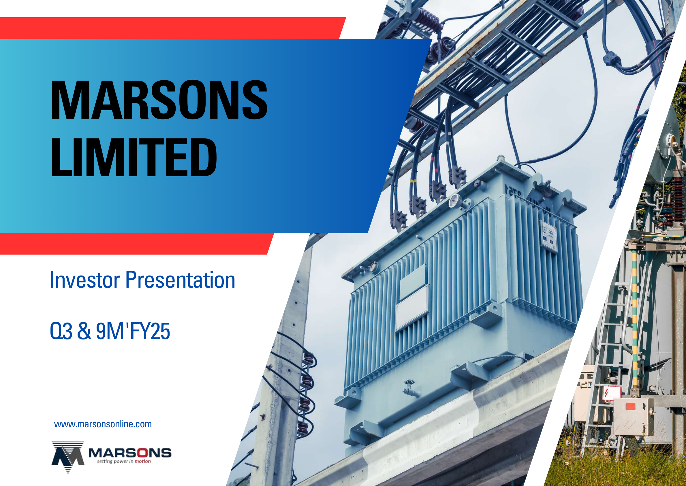

**[Image: Feb2025.pdf-0002-00.png (2379x1688, 3752.7KB)]**

<!-- Start of picture text -->
MARSONS LIMITED Investor Presentation Q3 & 9M'FY25 www.marsonsonline.com <!-- End of picture text -->

**[Image: Feb2025.pdf-0002-01.png (1116x1688, 3480.7KB)]**

<!-- Start of picture text -->
Marsons Limited www.marsonsonline.com <!-- End of picture text -->

**[Image: Feb2025.pdf-0003-00.png (84x1688, 5.2KB)]**

**[Image: Feb2025.pdf-0003-01.png (446x136, 49.7KB)]**

##### **SAFE HARBOUR** 

This presentation and the accompanying slides (the “Presentation”), which have been prepared by Marsons Limited (the “Company”), have been prepared solely for information purposes and do not constitute any offer, recommendation or invitation to purchase or subscribe for any securities, and shall not form the basis or be relied on in connection with any contract or binding commitment whatsoever. No offering of securities of the Company will be made except by means of a statutory offering document containing detailed information about the Company. 

This Presentation has been prepared by the Company based on information and data which the Company considers reliable, but the Company makes no representation or warranty, express or implied, whatsoever, and no reliance shall be placed on, the truth, accuracy, completeness, fairness and reasonableness of the contents of this Presentation. This Presentation may not be all inclusive and may not contain all of the information that you may consider material. Any liability in respect of the contents of, or any omission from, this Presentation is expressly excluded. 

This presentation contains certain forward looking statements concerning the Company’s future business prospects and business profitability, which are subject to a number of risks and uncertainties and the actual results could materially differ from those in such forward looking statements. The risks and uncertainties relating to these statements include, but are not limited to, risks and uncertainties regarding fluctuations in earnings, our ability to manage growth, competition (both domestic and international), economic growth in India and abroad, ability to attract and retain highly skilled professionals, time and cost over runs on contracts, our ability to manage our international operations, government policies and actions regulations, interest and other fiscal costs generally prevailing in the economy. The Company does not undertake to make any announcement in case any of these forward looking statements become materially incorrect in future or update any forward looking statements made from time to time by or on behalf of the Company. 

**[Image: Feb2025.pdf-0004-00.png (978x1688, 2229.8KB)]**

###### 

**1** 

**2** 

**3** 

**4** 

**5** 

###### **ABOUT US** 

Who we are Our Products & Clientele Key Milestones Our Management 

###### **BUSINESS MODEL** 

Our Business Verticals 

###### **GROWTH DRIVERS** 

Market Opportunities Business Positioning Key Strengths **FINANCIAL PERFORMANCE** 

Q2 FY’25 Financial Performance Income Statement 

###### **ANNEXURES** 

Manufacturing Plant Testing Facilities Contact 

**[Image: Feb2025.pdf-0004-16.png (446x136, 49.7KB)]**

##### **ABOU T U S** 

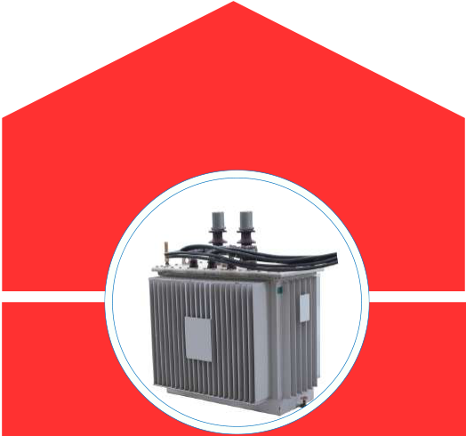

**[Image: Feb2025.pdf-0005-01.png (524x491, 81.2KB)]**

**End to End Manufacturer** 

We are a multi product and service organization engaged 

in end to end right from designing, manufacturing, supplying, erecting, testing to commissioning of Power and Distribution transformers with incredible distinction and credibility over the past 60 years. 

**[Image: Feb2025.pdf-0005-05.png (523x481, 131.6KB)]**

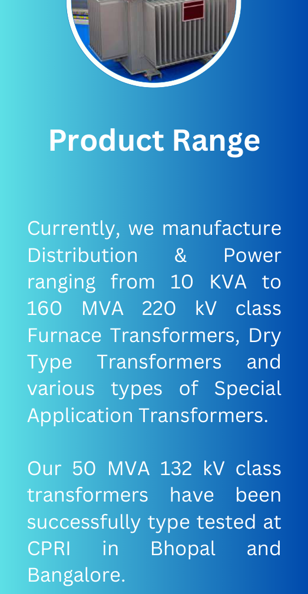

**[Image: Feb2025.pdf-0005-06.png (523x1009, 159.2KB)]**

<!-- Start of picture text -->
Product Range Currently, we manufacture Distribution  &  Power ranging from 10 KVA to 160 MVA 220 kV class Furnace Transformers, Dry Type  Transformers  and various types of Special Application Transformers. Our 50 MVA 132 kV class transformers  have  been successfully type tested at CPRI  in  Bhopal  and Bangalore. <!-- End of picture text -->

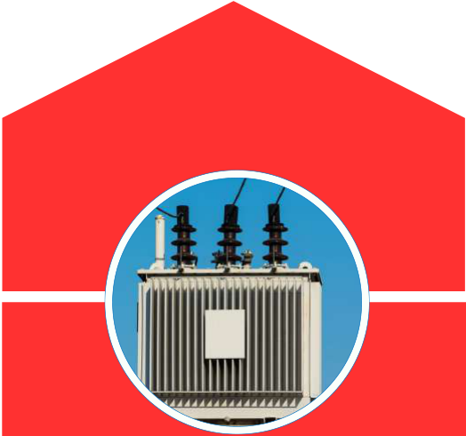

**[Image: Feb2025.pdf-0005-07.png (524x491, 103.7KB)]**

**Capacities** 

Our plant in Kolkata is spread over an area of 35,000 sq.m. State of the art infrastructure , fully equipped to manufacture Power Transformers upto 160 MVA 220 kV class. 

**[Image: Feb2025.pdf-0005-10.png (1236x1688, 1645.2KB)]**

<!-- Start of picture text -->
Quality We are among the first to set  up  Impulse  Test Laboratory and Autocalve (Vacuum Heating System) way  back  in  1995-96 equipped with 1600 kV 80 KJ  Impulse  Generator imported  from  Haefely Trench of Switzerland, the world leaders. ISO 9001:2008 certified ISO 14001:2015 certified <!-- End of picture text -->

**[Image: Feb2025.pdf-0006-00.png (446x136, 49.7KB)]**

##### **OUR PRODUCTS** 

**1.** 

**Distribution Transformers** 

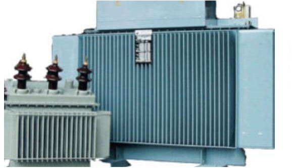

**[Image: Feb2025.pdf-0006-04.png (578x332, 251.2KB)]**

**5.** 

**Dry Type Transformers** 

**[Image: Feb2025.pdf-0006-07.png (578x330, 378.5KB)]**

###### **2.** 

**Power Transformers** 

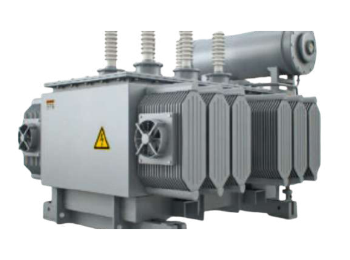

**[Image: Feb2025.pdf-0006-10.png (580x431, 176.9KB)]**

**6.** 

**Cast Resin Transformers** 

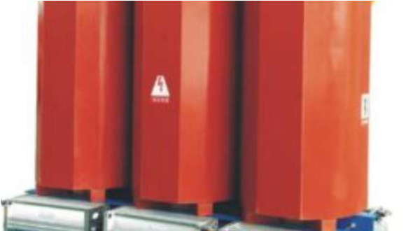

**[Image: Feb2025.pdf-0006-13.png (580x330, 162.0KB)]**

###### **3.** 

**Furnace Transformers** 

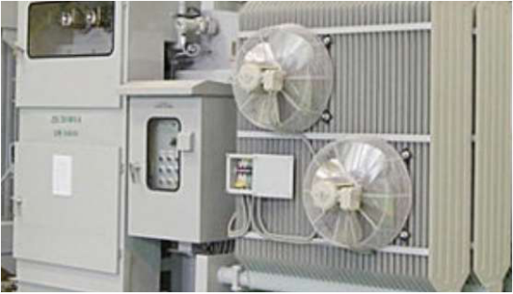

**[Image: Feb2025.pdf-0006-16.png (578x332, 269.3KB)]**

**7.** 

**Solar Transformers** 

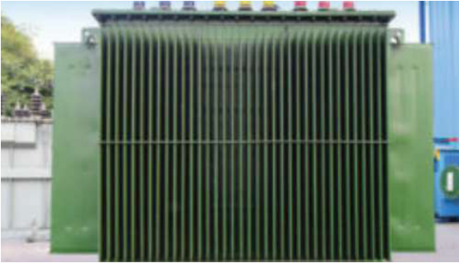

**[Image: Feb2025.pdf-0006-19.png (578x331, 269.0KB)]**

###### **4.** 

**USS Transformers** 

**[Image: Feb2025.pdf-0006-22.png (578x332, 160.7KB)]**

###### **8.** 

**Instrumental Transformers** 

**[Image: Feb2025.pdf-0006-25.png (578x330, 436.1KB)]**

**[Image: Feb2025.pdf-0007-00.png (446x136, 49.7KB)]**

##### **OUR KEY C LIENTS** 

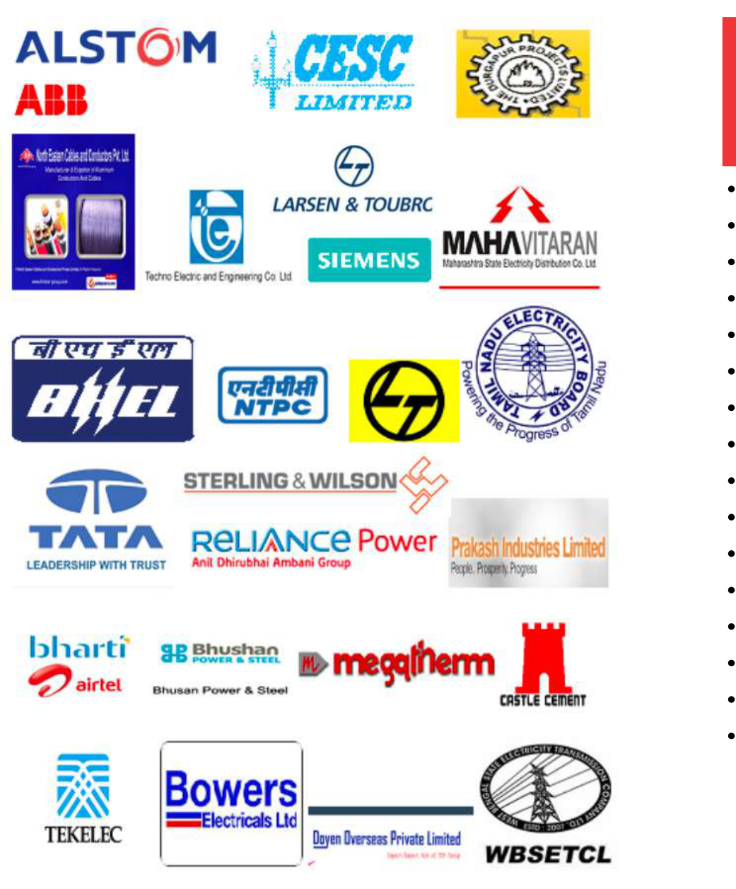

**[Image: Feb2025.pdf-0007-02.png (1041x1257, 1099.4KB)]**

**STATE ELECTRICITY BOARD & POWER UTILITIES** 

Rajasthan West Bengal Assam Madhya Pradesh Andhra Pradesh Maharashtra Jharkhand Chhattisgarh Bihar Orissa Manipur Meghalaya Uttar Pradesh Uttaranchal Tamil Nadu Kerala 

**OVERSEAS CUSTOMERS** 

Castle Cement, UK Yesu PLC, Ethopia Teklec, Dubai Bowers Electricals Ltd., UK Alarabia Co., Jordan 

**CORPORATE CUSTOMERS** 

ABB Limited Alstom T & D CESC Limited DPL Limited North Eastern Cable & Conductors Pvt. Ltd. Techno Electric & Engg. Co. Ltd. Siemens Limited Bhel L &T Tata Group of Companies Reliance Group Schneider Bharti Airtel Bhushan Steel KEI KEC Sterling & Wilson NTPC PGCIL 

**[Image: Feb2025.pdf-0008-00.png (446x136, 49.7KB)]**

##### **KEY MILESTONES** 

The first SSI company to install in-house Impulse Testing Laboratory and Autoclave and gain NABL accreditation. 

Founded in 1956 The company shifted from being a private limited to public limited in February 1991. The company came out with its IPO in June 1994 Over 60 years experience of design, manufacturing, testing and supply of Power & Distribution Transformers 

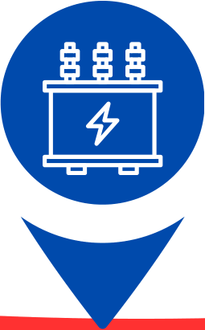

**[Image: Feb2025.pdf-0008-04.png (255x411, 12.1KB)]**

**[Image: Feb2025.pdf-0008-05.png (255x411, 13.9KB)]**

**[Image: Feb2025.pdf-0008-06.png (492x491, 37.9KB)]**

Largest manufacturer of transformers both in terms of capacity and range across Eastern India including NER. 

The only plant in Eastern India including NER to manufacture EHV Power Transformers up to 220 kV class Supplied more than 300,000 Transformers across the globe over the past six decades. 

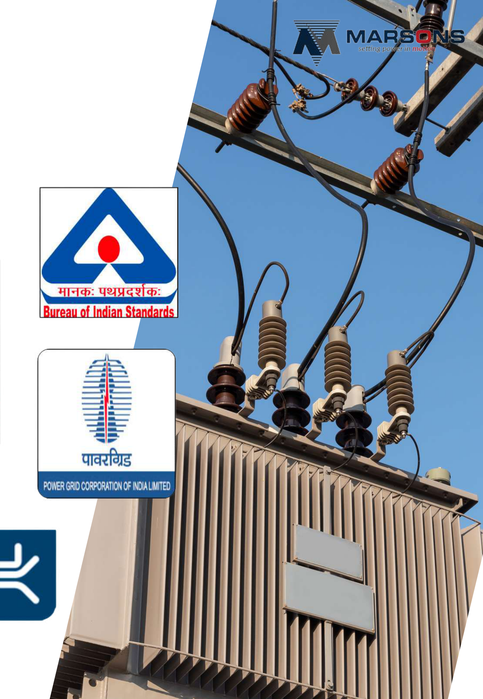

**[Image: Feb2025.pdf-0009-00.png (1168x1688, 2130.2KB)]**

##### **QUALITY STANDARDS** 

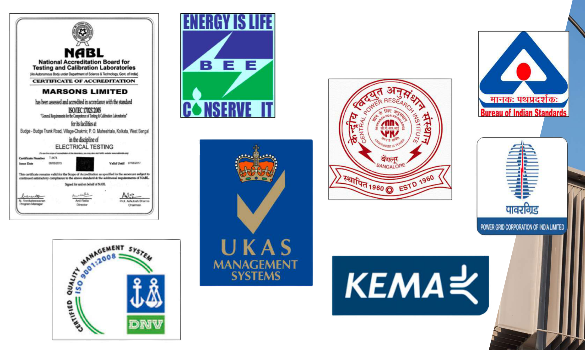

**[Image: Feb2025.pdf-0009-02.png (2153x1288, 1921.3KB)]**

**[Image: Feb2025.pdf-0010-00.png (1787x845, 2123.0KB)]**

# **BUSINESS MODEL** 

**[Image: Feb2025.pdf-0010-02.png (1215x845, 1314.1KB)]**

## **Designing to Installation to After Sales Services** 

**[Image: Feb2025.pdf-0011-00.png (446x136, 49.7KB)]**

##### **OUR BUSINESS VERTICALS** 

**[Image: Feb2025.pdf-0011-02.png (3000x1451, 1271.9KB)]**

<!-- Start of picture text -->
1 2 3 EPC  Government  Direct End User Contracts Contracts Contracts Indirect Government Orders Tender Bidding Order Basis Requirement Payment Before Dispatch 40-45 Days Payment Cycle Payment Before Dispatch 0% - 20% Advance No Advance ~30% Advance Payment 50-60% Revenue Contribution 30-40% Revenue Contribution <10% Revenue Contribution <!-- End of picture text -->

**[Image: Feb2025.pdf-0012-00.png (446x136, 58.3KB)]**

# **ROWTH DRIVERS** 

**[Image: Feb2025.pdf-0012-02.png (489x490, 374.9KB)]**

**[Image: Feb2025.pdf-0012-03.png (2003x676, 995.0KB)]**

##### **Transformers Market Size In India** 

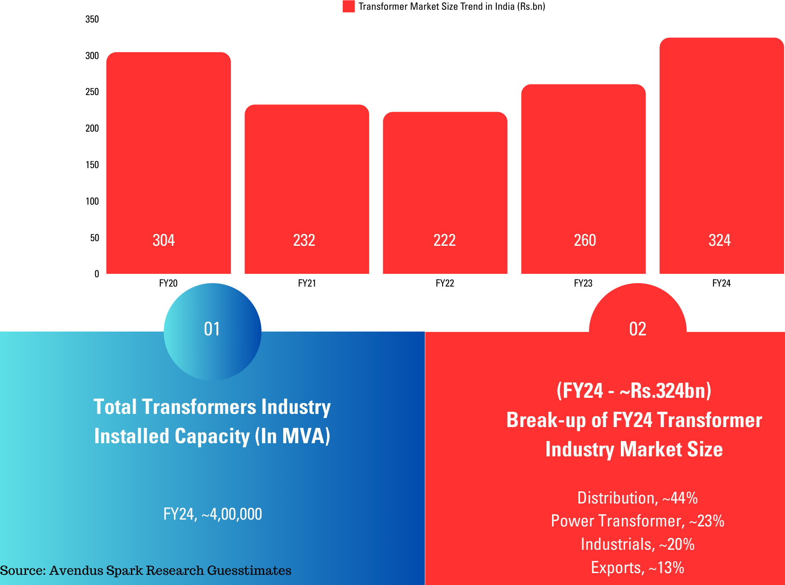

**[Image: Feb2025.pdf-0013-01.png (1846x1378, 154.7KB)]**

<!-- Start of picture text -->
Transformer Market Size Trend in India (Rs.bn) 350 300 250 200 150 100 50 304 232 222 260 324 0 FY20 FY21 FY22 FY23 FY24 01 02 (FY24 - ~Rs.324bn) Total Transformers Industry Break-up of FY24 Transformer Installed Capacity (In MVA) Industry Market Size Distribution, ~44% FY24, ~4,00,000 Power Transformer, ~23% Industrials, ~20% Source: Avendus Spark Research Guesstimates Exports, ~13% <!-- End of picture text -->

**[Image: Feb2025.pdf-0013-02.png (445x135, 84.1KB)]**

**[Image: Feb2025.pdf-0013-03.png (1001x1059, 2425.0KB)]**

**[Image: Feb2025.pdf-0013-04.png (234x234, 22.6KB)]**

<!-- Start of picture text -->
03 <!-- End of picture text -->

**[Image: Feb2025.pdf-0013-05.png (1000x597, 65.5KB)]**

<!-- Start of picture text -->
Transformer Raw Material Cost Mix Cold Rolled Grain Oriented Steel ~35% Copper ~25% Transformer Oil ~7-8% Others ~35% <!-- End of picture text -->

##### **Transformer Requirements To Almost Double On The Back Of Transmission Grid Strengthening** 

**[Image: Feb2025.pdf-0014-01.png (446x136, 49.7KB)]**

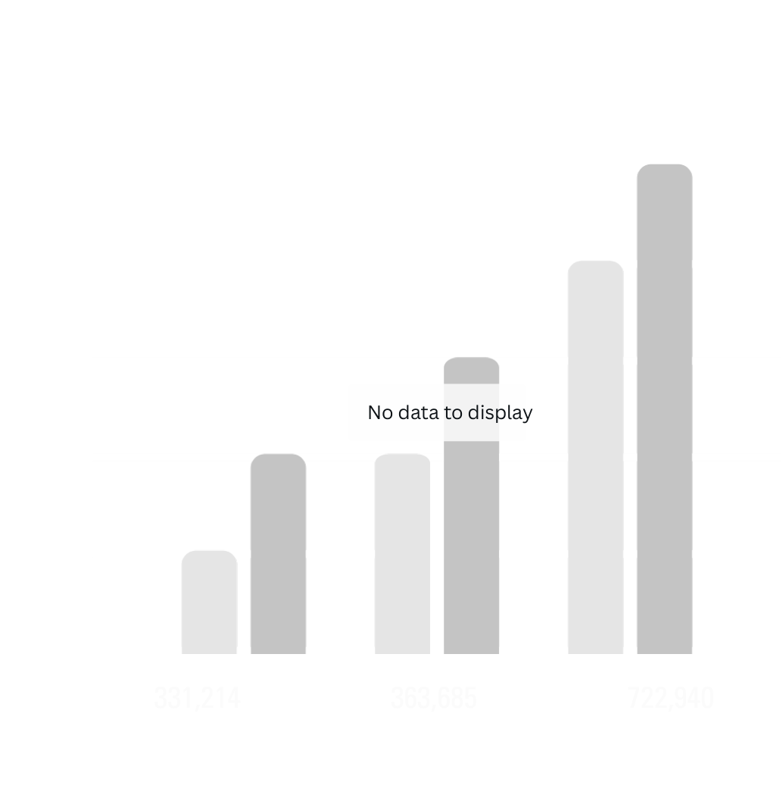

**[Image: Feb2025.pdf-0014-02.png (1034x1049, 20.6KB)]**

<!-- Start of picture text -->
No data to display 331,214 363,685 722,940 <!-- End of picture text -->

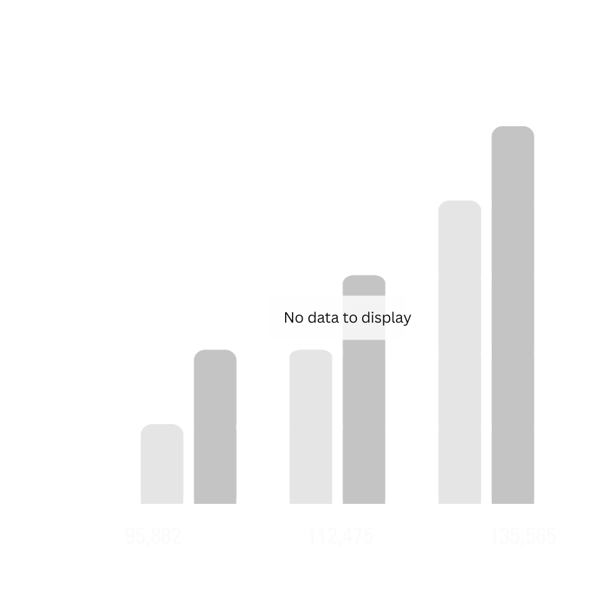

**[Image: Feb2025.pdf-0014-03.png (1034x1047, 20.9KB)]**

<!-- Start of picture text -->
No data to display 95,882 112,475 135,565 <!-- End of picture text -->

**Transformer Opportunity Size from Grid level capacity addition (Rs.mn)** 

**Incremental capacity additions every 5 years** 

Source: CEA, Avendus Spark Research Guesstimates 

##### **Transformers Demand From Solar Power Installations** 

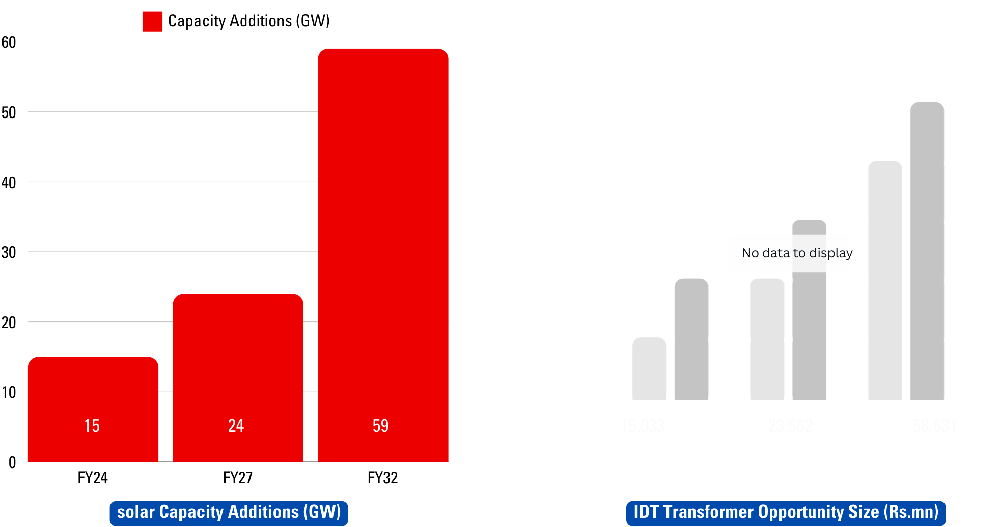

**[Image: Feb2025.pdf-0015-01.png (1964x1036, 62.0KB)]**

<!-- Start of picture text -->
Capacity Additions (GW) 60 50 40 30 No data to display 20 10 15 24 59 15,033 23,562 58,631 0 FY24 FY27 FY32 solar Capacity Additions (GW) IDT Transformer Opportunity Size (Rs.mn) <!-- End of picture text -->

**[Image: Feb2025.pdf-0015-02.png (446x136, 49.7KB)]**

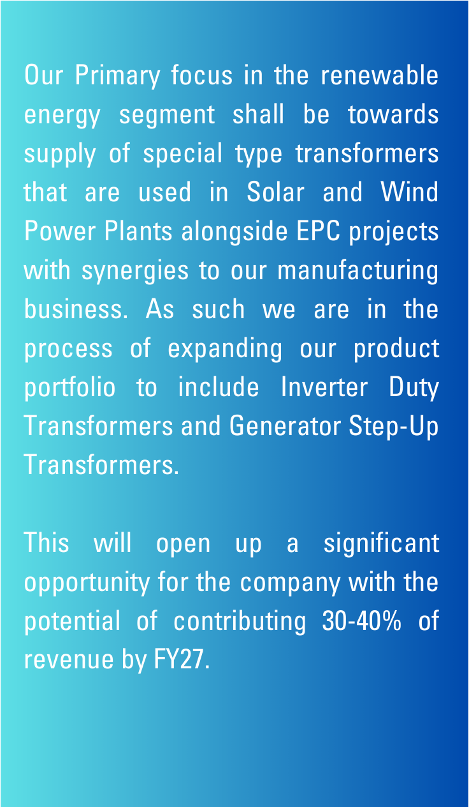

**[Image: Feb2025.pdf-0015-03.png (736x1263, 181.1KB)]**

<!-- Start of picture text -->
Our Primary focus in the renewable energy segment shall be towards supply of special type transformers that are used in Solar and Wind Power Plants alongside EPC projects with synergies to our manufacturing business. As such we are in the process of expanding our product portfolio to include Inverter Duty Transformers and Generator Step-Up Transformers. This will open up a significant opportunity for the company with the potential of contributing 30-40% of revenue by FY27. <!-- End of picture text -->

Source: Avendus Spark Research Guesstimates 

**[Image: Feb2025.pdf-0016-00.png (446x136, 49.7KB)]**

##### **Solar & Wind Energy And Railways Driving Demand** 

###### **Capex** 

Incrementally, 1,490 kms of metro projects are in the planning and approval stage, which will entail an investment of INR 3 trn over the next five years and drive strong demand for traction transformers. 

###### **Renewable Supply** 

###### **Technology** 

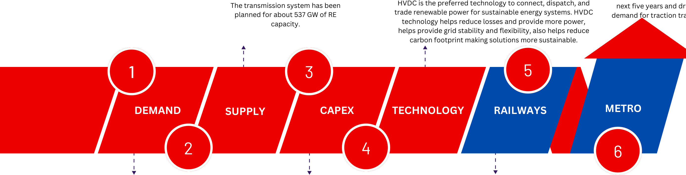

**[Image: Feb2025.pdf-0016-06.png (2775x711, 140.4KB)]**

<!-- Start of picture text -->
HVDC is the preferred technology to connect, dispatch, and The transmission system has been trade renewable power for sustainable energy systems. HVDC planned for about 537 GW of RE technology helps reduce losses and provide more power, capacity. helps provide grid stability and flexibility, also helps reduce carbon footprint making solutions more sustainable. 5 1 3 METRO DEMAND SUPPLY CAPEX TECHNOLOGY RAILWAYS 2 4 6 <!-- End of picture text -->

###### **Renewable Demand** 

Indiaintends to have renewable energy capacity of 500 GW by 2030 from the current installed capacity of 150 GW. 

###### **Transmission Capex** 

The transmission capex of around INR 4.8 trn over FY23-27 leading to a sharp uptick in demand for T&D equipment. 

###### **Capex** 

The National Rail Plan till 2051, which relies on historical costing, aims to spend INR 9.4 trn during FY22-26E—as against INR 6.8 trn during FY27E-31E. 

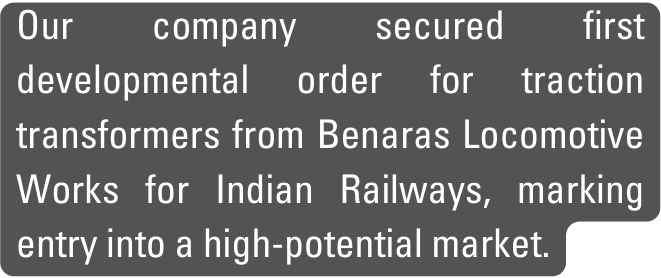

**[Image: Feb2025.pdf-0016-13.png (661x278, 28.9KB)]**

<!-- Start of picture text -->
Our  secured  first company developmental  order  for  traction transformers from Benaras Locomotive Works for Indian Railways, marking entry into a high-potential market. <!-- End of picture text -->

Source: ANTIQUE Report 

##### **Booming Export Demand** 

###### **Supply Constraints** 

###### **High Demand In the US** 

#### **02** 

NREL estimates that distribution transformer capacity may need to increase 160% to 260% from 2021 levels to meet residential commercial, industrial and transportation demands in US. 

**04** 

###### **EU Demand** 

The EU is in the midst of a massive build-out of its electricity grid network, ~584bn Euro estimated cost between now and 2030. This expansion is needed to service the millions of new electric vehicles and heat pumps and accommodate a swathe of new wind turbines and solar panels. 

**[Image: Feb2025.pdf-0017-08.png (446x136, 49.7KB)]**

> **Price Hike In US 01** Only ~20% demand can met be met by US domestic transformers leading to price hike of ~60-70% on average basis since early 2020. 

**High Lead Time In the US 03** Lead time for large power installations currently ranging from 80 to 210 weeks. 

**Increase in Demand for Exports from India** 

Source: ANTIQUE Report 

**[Image: Feb2025.pdf-0018-00.png (445x135, 49.7KB)]**

##### **India Is The Second Largest Exporter Of Transformers In The World** 

###### **Preferred Supplier** 

India is the second largest exporter of transformers in the world and is a preferred supplier to the US, UK, UAE, Germany, Australia given its cost advantage and quality standards. 

###### **Renewable Demand** 

Global demand for renewable energy is witnessing a meteoric rise given it is a major avenue to achieve net carbon neutrality target. This in turn will require significant investment in transmission network given RE PLFs being lower compared to fossil fuel plants, nearly 2.5x3x of RE capacity is required to meet the same power demand. 

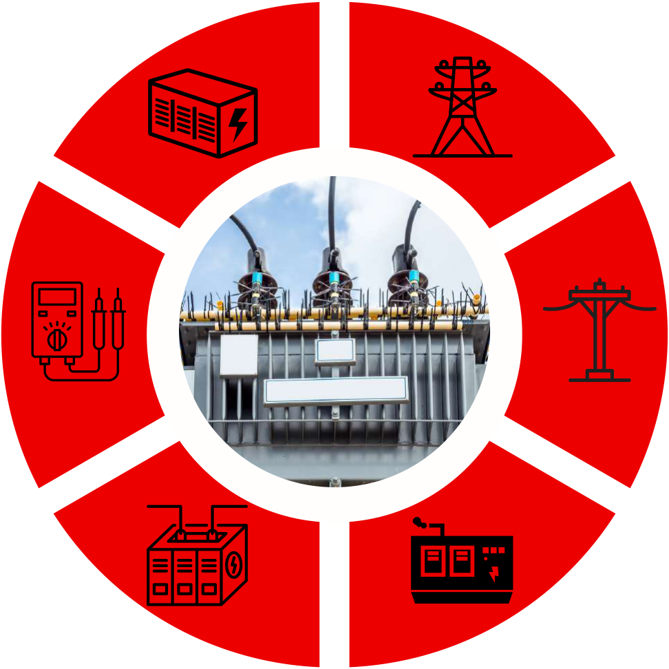

**[Image: Feb2025.pdf-0018-06.png (972x972, 358.2KB)]**

###### **Investments** 

The US will require an investment of USD 740 bn by FY35 to achieve 100% clean energy network while even Europe plans to invest ~EUR 1 trn in upgrading its transmission and distribution network. 

###### **Capex Driving Demand** 

The key growth driver for the transformer industry has been the new capex in power, infrastructure-related industries, and overall industrial expansion. A pick-up in investments are expected in areas like green hydrogen, railways and metros, steel, data centers which will further spur demand for transformers in the years to come. 

**Since margins in exports are accretive in nature. Our prototype building is currently in place. We plan to expand footprints organically as well as inorganically.** 

Source: ANTIQUE Report 

##### **Opportu nities In Data Centres** 

**[Image: Feb2025.pdf-0019-01.png (180x179, 1.1KB)]**

**01 Today's data centers typically consume more than 30 times the power per square meter used by an average office building. Demand for data centers are driven by data protection laws, 5G, internet of things (IoT), etc. 04** 

**02** 

**India's data center capacity is expected to double from 870 MW in FY22 to 1,800 MW by 2025, presenting an INR 400 bn investment opportunity. While setting up a data center, electrical equipment accounts for ~60% of total capital expenditure.** 

**[Image: Feb2025.pdf-0019-05.png (695x389, 49.0KB)]**

<!-- Start of picture text -->
consume more than 30 times the power per square meter used by an average office building. <!-- End of picture text -->

**[Image: Feb2025.pdf-0019-06.png (179x179, 1.1KB)]**

**[Image: Feb2025.pdf-0019-07.png (179x180, 1.2KB)]**

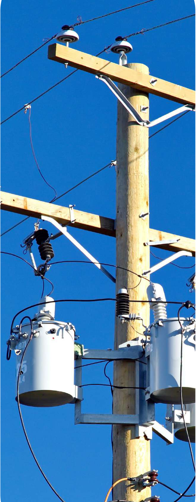

**[Image: Feb2025.pdf-0019-08.png (662x1688, 1459.4KB)]**

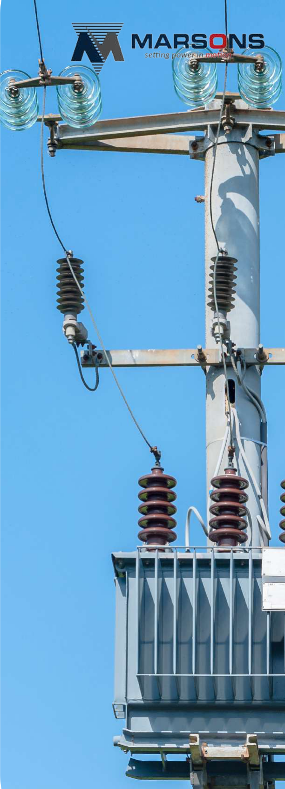

**[Image: Feb2025.pdf-0019-09.png (612x1688, 1108.8KB)]**

**03** 

Source: ANTIQUE Report 

##### **OU R BU SINESS POSITIONING** 

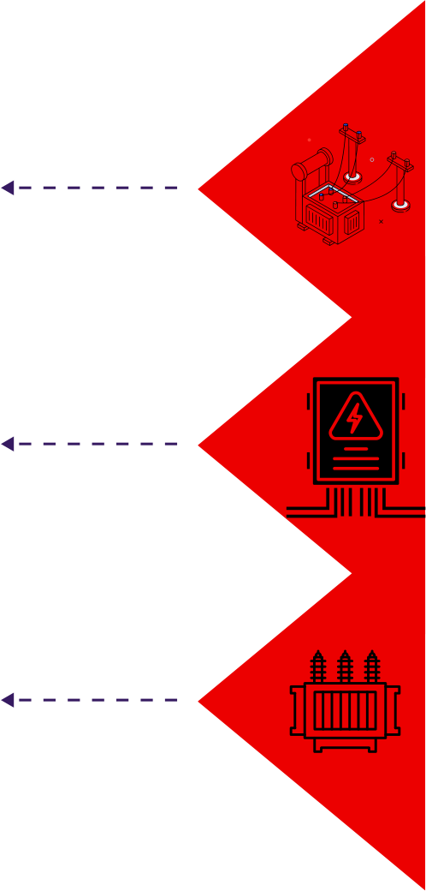

**[Image: Feb2025.pdf-0020-01.png (498x1040, 29.8KB)]**

###### **Traction** 

###### **Transformers** 

Secured first developmental order for traction transformers from Benaras Locomotive Works for Indian Railways, marking entry into a high-potential exclusive market with limited competition. 

###### **Solar & Wind Application Transformers** 

Diversifying product portfolio with a focus on renewable energy, including Inverter Duty Transformers and Generator Step-Up transformers for solar and wind power plants. 

###### **Exports** 

High focus on exports prospectively in markets including US, EU and western markets. Margins are accretive in nature. Prototype building is currently in place. Plans to expand footprints organically as well as inorganically. 

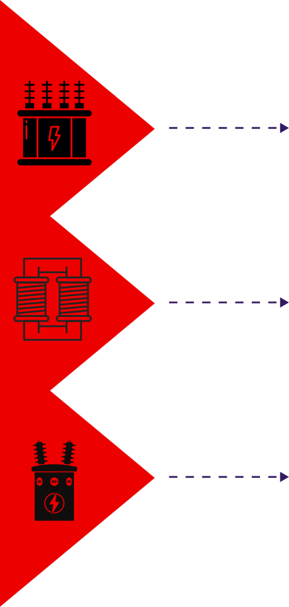

**[Image: Feb2025.pdf-0020-09.png (497x1040, 28.5KB)]**

**[Image: Feb2025.pdf-0020-10.png (446x136, 49.7KB)]**

###### **Medium Power & Distribution** 

###### **Transformers** 

Our core business segment of medium power transformers are in line of huge growth given the government push from central schemes such as RDSS and various state schemes. 

###### **EHV Transformers** 

Increasing focus on voltage transformers given the supply constraints globally while capitalizing on our geographical advantage of being the only manufacturer with infrastructure upto 220 kV Class Transformers in Eastern India including NER. 

###### **EPC Projects** 

Actively working on EPC  projects and opportunities focusing on the development of solar projects with synergies to our manufacturing business. 

##### **CAPACITY UTILIZATION** 

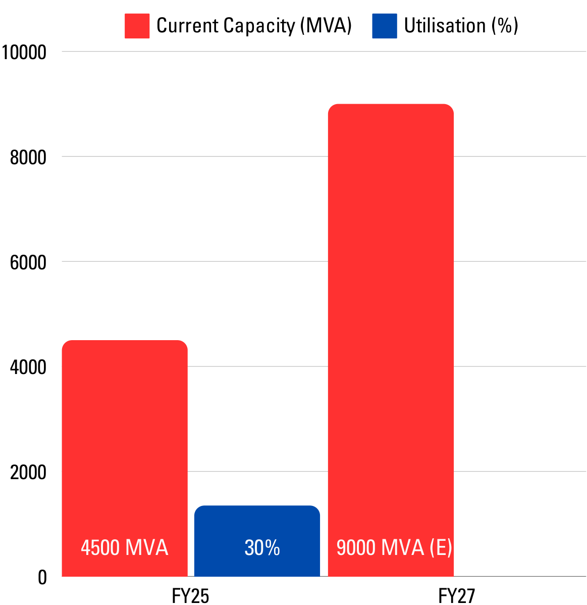

**[Image: Feb2025.pdf-0021-01.png (1163x1197, 46.3KB)]**

<!-- Start of picture text -->
Current Capacity (MVA) Utilisation (%) 10000 8000 6000 4000 2000 4500 MVA 30% 9000 MVA (E) 0 FY25 FY27 <!-- End of picture text -->

**[Image: Feb2025.pdf-0021-02.png (507x63, 6.3KB)]**

<!-- Start of picture text -->
Mamufacturing Capacities <!-- End of picture text -->

**1** 

**2** 

**3** 

**[Image: Feb2025.pdf-0021-06.png (446x136, 49.7KB)]**

###### **CAPEX** 

Limited capex requirement to double the capacities 

Additional constructed sheds with crane facilities and land bank available 

###### **BACKWARD INTEGRATION** 

MARSONS has significant backward integration capabilities facilitating inhouse production of several key raw materials. 

###### **INFRASTRUCTURE** 

State of the art infrastructure , fully equipped to manufacture Power Transformers upto 160 MVA 220 kV class. Scope of expansion to 315 MVA 400 kV Class Transformers. 

A sprawling area of over 350000 sq. mtr. with a built-up area of approximately 180000 sq. ft. 

##### **EXPANSION IN UNITED KINGDOM (UK)** 

###### **Expansion into UK & EU Market** 

**01** 

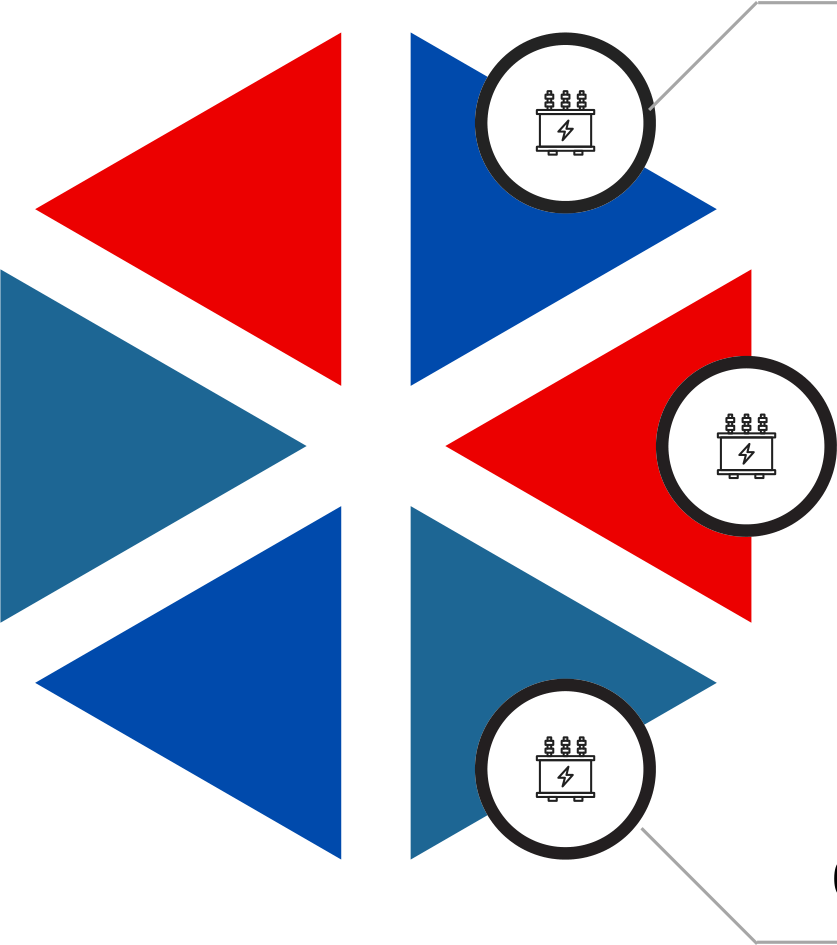

**[Image: Feb2025.pdf-0022-03.png (837x945, 52.7KB)]**

**-** Established a **<u>UK</u>** <u>to</u> **<u>based subsidiary</u>** serve as a strategic hub across UK & Europe. 

**02** 

**Rising Demand for Transformers in UK & EU region** Driven by infrastructure upgrades in renewable energy, data centers, and large-scale projects, creating a strong market opportunity. 

###### **Operational Timeline** 

**03** 

Subsidiary to be **<u>operational in H1 FY26,</u>** positioning us to capitalize on growing demand efficiently. 

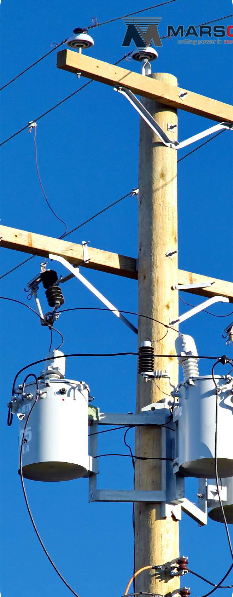

**[Image: Feb2025.pdf-0022-10.png (659x1688, 1400.5KB)]**

**[Image: Feb2025.pdf-0022-11.png (445x135, 81.5KB)]**

##### **OU R STRENG TH S** 

**[Image: Feb2025.pdf-0023-01.png (446x136, 49.7KB)]**

###### **Certified Products** 

**[Image: Feb2025.pdf-0023-03.png (198x172, 7.9KB)]**

**[Image: Feb2025.pdf-0023-04.png (199x172, 9.9KB)]**

Our Transformers of various ratings, which includes 50 MVA 132 kV class, have been successfully type-tested at CPRI in Bhopal and Bangalore. 

**[Image: Feb2025.pdf-0023-06.png (76x76, 2.9KB)]**

**[Image: Feb2025.pdf-0023-07.png (78x76, 2.8KB)]**

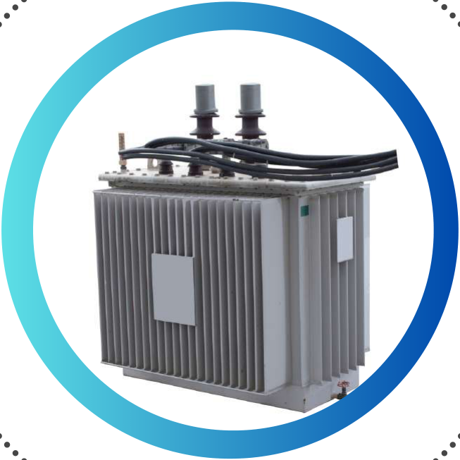

**[Image: Feb2025.pdf-0023-08.png (653x653, 223.2KB)]**

**Quality Assurance** Uncompromising quality and complete customer satisfaction as, for us, our customers are our core assets. 

**[Image: Feb2025.pdf-0023-10.png (78x76, 2.8KB)]**

**[Image: Feb2025.pdf-0023-11.png (30x24, 0.7KB)]**

**[Image: Feb2025.pdf-0023-12.png (76x78, 2.7KB)]**

**[Image: Feb2025.pdf-0023-13.png (30x11, 0.2KB)]**

###### **Responsive** 

**[Image: Feb2025.pdf-0023-15.png (198x172, 10.1KB)]**

We have evolved over the years by introducing new range of products catering to the latest developments and requirements in the market. 

**[Image: Feb2025.pdf-0023-17.png (76x76, 2.8KB)]**

**[Image: Feb2025.pdf-0023-18.png (78x76, 2.8KB)]**

**[Image: Feb2025.pdf-0023-19.png (75x75, 2.8KB)]**

**[Image: Feb2025.pdf-0023-20.png (78x76, 3.0KB)]**

###### **Wide-Ranging Product Basket** 

**[Image: Feb2025.pdf-0023-22.png (198x171, 7.3KB)]**

Recently, we have graduated to facilitating manufacture of EHV Power Transformers upto 160 MVA 220 kV class. 

**[Image: Feb2025.pdf-0023-24.png (30x23, 0.7KB)]**

**[Image: Feb2025.pdf-0023-25.png (30x9, 0.2KB)]**

###### **Dynamic Leadership** 

Led by a robust, confident and pragmatic team, differentiated by hardcore commitment for excellence. 

**[Image: Feb2025.pdf-0023-28.png (39x30, 0.2KB)]**

###### **Progressive** 

**[Image: Feb2025.pdf-0023-30.png (199x172, 9.1KB)]**

**[Image: Feb2025.pdf-0023-31.png (41x12, 0.2KB)]**

A knowledge-driven team with an unwavering passion for growth has enabled both vertical and horizontal progress. 

###### **Credible & Longstanding Experience** 

**[Image: Feb2025.pdf-0023-34.png (19x11, 0.2KB)]**

**[Image: Feb2025.pdf-0023-35.png (17x11, 0.2KB)]**

We have supplied more than 300,000 Transformers of different voltage and MVA across the globe over last 6 decades. 

###### **Quality- Accredited Infrastructure** 

Our fully equipped laboratory can efficiently carry out all required routine tests,for various ratings of Power Transformers upto the range of 160 MVA 220 kV class. 

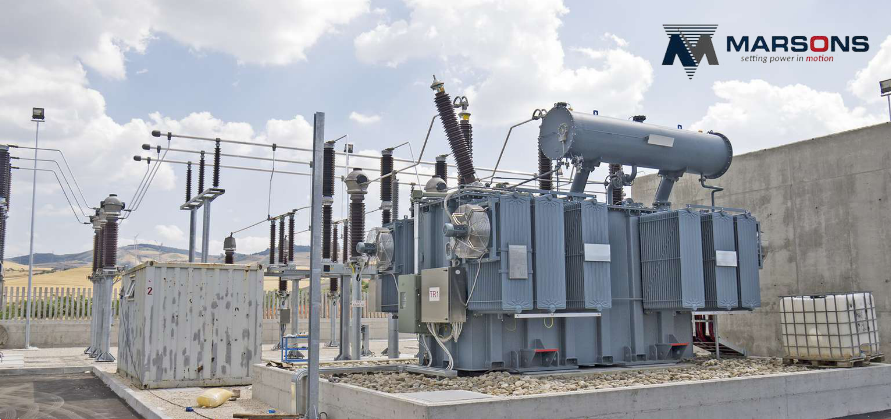

**[Image: Feb2025.pdf-0024-00.png (1787x845, 2123.0KB)]**

**[Image: Feb2025.pdf-0024-01.png (1215x844, 37.8KB)]**

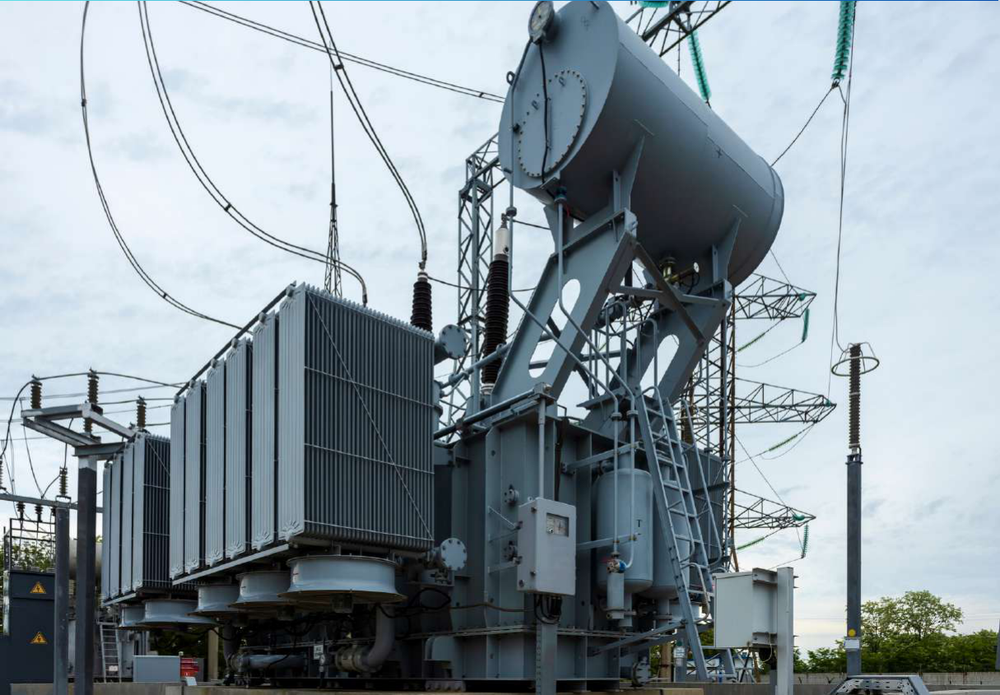

**[Image: Feb2025.pdf-0024-02.png (1215x845, 1314.1KB)]**

# **FINANCIAL PERFORMANCE Q3 & 9M FY25** 

##### **ROBUST FINANCIAL PERFORMANCE** 

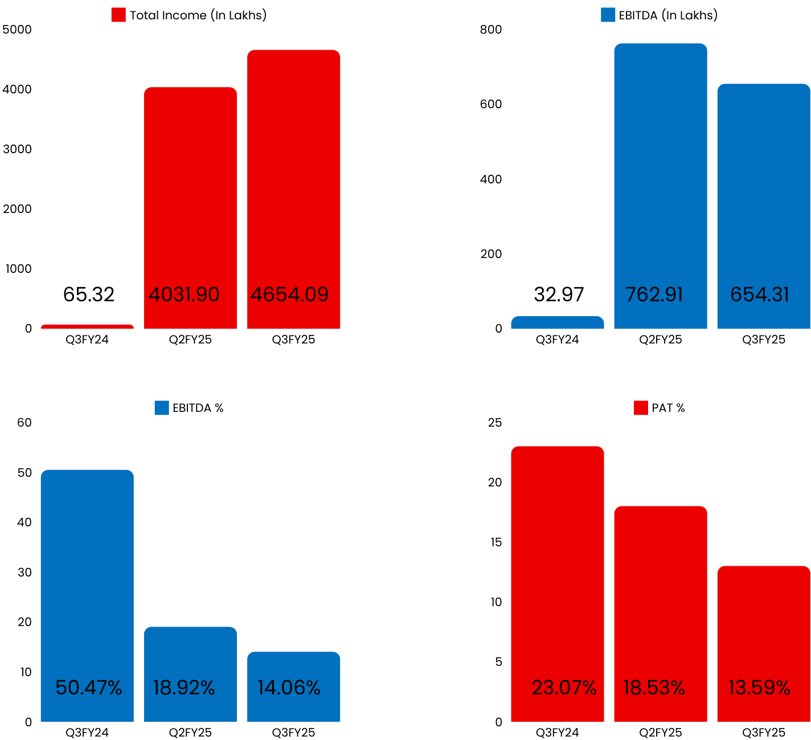

**[Image: Feb2025.pdf-0025-01.png (1424x1299, 79.2KB)]**

<!-- Start of picture text -->
Total Income (In Lakhs) EBITDA (In Lakhs) 5000 800 4000 600 3000 400 2000 200 1000 65.32 4031.90 4654.09 32.97 762.91 654.31 0 0 Q3FY24 Q2FY25 Q3FY25 Q3FY24 Q2FY25 Q3FY25 EBITDA % PAT % 60 25 50 20 40 15 30 10 20 5 10 50.47% 18.92% 14.06% 23.07% 18.53% 13.59% 0 0 Q3FY24 Q2FY25 Q3FY25 Q3FY24 Q2FY25 Q3FY25 <!-- End of picture text -->

**[Image: Feb2025.pdf-0025-02.png (446x136, 49.7KB)]**

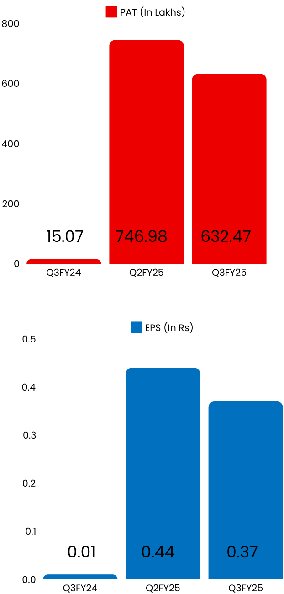

**[Image: Feb2025.pdf-0025-03.png (622x1299, 39.3KB)]**

<!-- Start of picture text -->
PAT (In Lakhs) 800 600 400 200 15.07 746.98 632.47 0 Q3FY24 Q2FY25 Q3FY25 EPS (In Rs) 0.5 0.4 0.3 0.2 0.1 0.01 0.44 0.37 0.0 Q3FY24 Q2FY25 Q3FY25 <!-- End of picture text -->

##### **INCOME STATEMENT** 

**[Image: Feb2025.pdf-0026-01.png (446x136, 49.7KB)]**

In Lakhs 

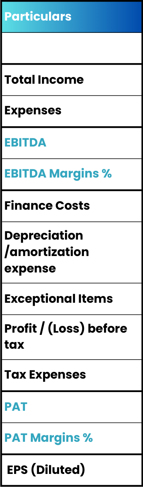

**[Image: Feb2025.pdf-0026-03.png (385x1303, 48.0KB)]**

<!-- Start of picture text -->
Particulars Total Income Expenses EBITDA EBITDA Margins % Finance Costs Depreciation /amortization expense Exceptional Items Profit / (Loss) before tax Tax Expenses PAT PAT Margins %  EPS (Diluted) <!-- End of picture text -->

**[Image: Feb2025.pdf-0026-04.png (1144x89, 8.7KB)]**

<!-- Start of picture text -->
Quarter ended <!-- End of picture text -->

**[Image: Feb2025.pdf-0026-05.png (766x89, 7.7KB)]**

<!-- Start of picture text -->
Nine months ended <!-- End of picture text -->

**[Image: Feb2025.pdf-0026-06.png (384x1299, 30.6KB)]**

<!-- Start of picture text -->
Previous FY24 662.22 528.76 133.46 20.15% 0.34 70.21 0.06 62.85 0 62.85 9.49% 0.04 <!-- End of picture text -->

||**Q3FY25**|**Q2FY25**|**Q3FY24**|**9MFY25**|**9MFY24**|**FY24**|
|---|---|---|---|---|---|---|
|**Total Income**|4654.09|4031.9|65.32|11709.89|281.79|662.22|
|**Expenses**|3999.78|3268.99|32.35|9751.81|211.43|528.76|
|**EBITDA**|**654.31**|**762.91**|**32.97**|**1958.08**|**70.36**|**133.46**|
|**EBITDA Margins %**|**14.06%**|**18.92%**|**50.47%**|**16.72%**|**24.97%**|**20.15%**|
|**Finance Costs**|3.83|1.46|0|8.36|0|0.34|
|**Depreciation** **/amortization** **expense**|18.01|14.47|17.9|46.43|52.38|70.21|
|**Exceptional Items**|0|0|0|0|0|0.06|
|**Profit / (Loss) before** **tax**|632.47|746.98|15.07|1903.29|17.98|62.85|
|**Tax Expenses**|0|0|0|0|0|0|
|**PAT**|**632.47**|**746.98**|**15.07**|**1903.29**|**17.98**|**62.85**|
|**PAT Margins %**|**13.59%**|**18.53%**|**23.07%**|**16.25%**|**6.38%**|**9.49%**|
|**EPS (Diluted)**|0.37|0.44|0.01|1.12|0.01|0.04|

**[Image: Feb2025.pdf-0027-00.png (1787x845, 2123.0KB)]**

**[Image: Feb2025.pdf-0027-01.png (1215x844, 37.8KB)]**

**[Image: Feb2025.pdf-0027-02.png (1215x845, 1314.1KB)]**

# **ANNEXURES** 

##### **MANUFACTURING FACILITIES** 

**[Image: Feb2025.pdf-0028-01.png (446x136, 49.7KB)]**

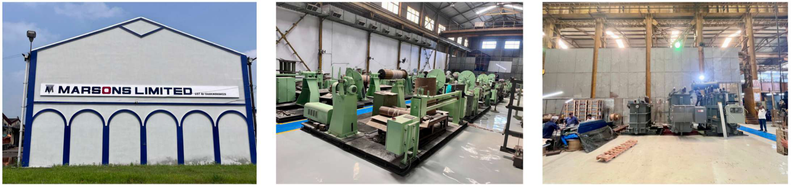

**[Image: Feb2025.pdf-0028-02.png (2760x659, 2901.3KB)]**

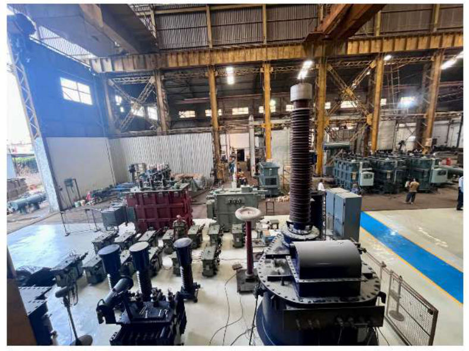

**[Image: Feb2025.pdf-0028-03.png (789x591, 1080.5KB)]**

**[Image: Feb2025.pdf-0028-04.png (2017x555, 73.2KB)]**

<!-- Start of picture text -->
State Of The Art Infrastructure <!-- End of picture text -->

##### **EHV TESTING DEPARTMENT** 

**[Image: Feb2025.pdf-0029-01.png (446x136, 49.7KB)]**

**[Image: Feb2025.pdf-0029-02.png (720x691, 1240.4KB)]**

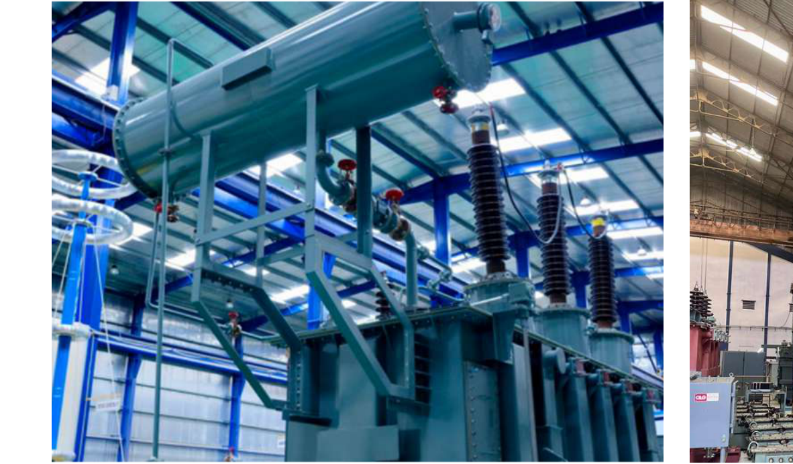

**[Image: Feb2025.pdf-0029-03.png (1182x692, 1717.9KB)]**

**[Image: Feb2025.pdf-0029-04.png (435x694, 611.1KB)]**

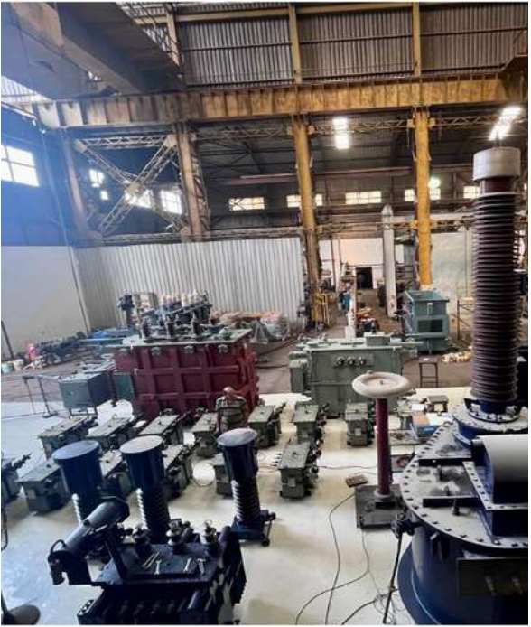

**[Image: Feb2025.pdf-0029-05.png (588x694, 925.5KB)]**

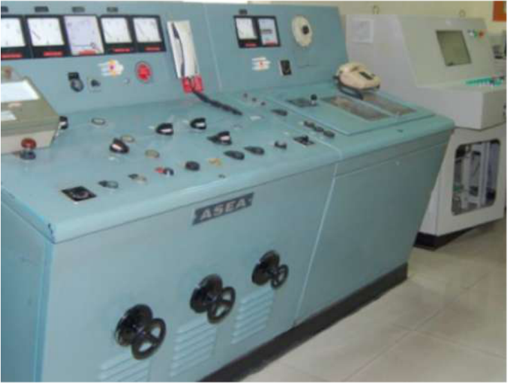

**[Image: Feb2025.pdf-0029-06.png (736x555, 478.6KB)]**

**[Image: Feb2025.pdf-0029-07.png (2059x555, 74.9KB)]**

<!-- Start of picture text -->
In-house Testing Lab and Impulse Facility <!-- End of picture text -->

**[Image: Feb2025.pdf-0030-00.png (444x136, 53.2KB)]**

**[Image: Feb2025.pdf-0030-01.png (447x138, 53.8KB)]**

### **Th ank You!** 

MARSONS LIMITED info@marsonsonline.com www.marsonsonline.com 

**[Image: Feb2025.pdf-0030-04.png (426x219, 26.1KB)]**

Investor Relations **Twenty E ig h th Consulting** Ms. Palak Agarwal palak@twentyeighthconsulting.com 

---

## Extracted Images

| # | File | Dimensions | Size |
|---|------|------------|------|
| 1 | Feb2025.pdf-0001-00.png | 588x173 | 78.9KB |
| 2 | Feb2025.pdf-0001-01.png | 258x126 | 57.3KB |
| 3 | Feb2025.pdf-0002-00.png | 2379x1688 | 3752.7KB |
| 4 | Feb2025.pdf-0002-01.png | 1116x1688 | 3480.7KB |
| 5 | Feb2025.pdf-0003-00.png | 84x1688 | 5.2KB |
| 6 | Feb2025.pdf-0003-01.png | 446x136 | 49.7KB |
| 7 | Feb2025.pdf-0004-00.png | 978x1688 | 2229.8KB |
| 8 | Feb2025.pdf-0004-16.png | 446x136 | 49.7KB |
| 9 | Feb2025.pdf-0005-01.png | 524x491 | 81.2KB |
| 10 | Feb2025.pdf-0005-05.png | 523x481 | 131.6KB |
| 11 | Feb2025.pdf-0005-06.png | 523x1009 | 159.2KB |
| 12 | Feb2025.pdf-0005-07.png | 524x491 | 103.7KB |
| 13 | Feb2025.pdf-0005-10.png | 1236x1688 | 1645.2KB |
| 14 | Feb2025.pdf-0006-00.png | 446x136 | 49.7KB |
| 15 | Feb2025.pdf-0006-04.png | 578x332 | 251.2KB |
| 16 | Feb2025.pdf-0006-07.png | 578x330 | 378.5KB |
| 17 | Feb2025.pdf-0006-10.png | 580x431 | 176.9KB |
| 18 | Feb2025.pdf-0006-13.png | 580x330 | 162.0KB |
| 19 | Feb2025.pdf-0006-16.png | 578x332 | 269.3KB |
| 20 | Feb2025.pdf-0006-19.png | 578x331 | 269.0KB |
| 21 | Feb2025.pdf-0006-22.png | 578x332 | 160.7KB |
| 22 | Feb2025.pdf-0006-25.png | 578x330 | 436.1KB |
| 23 | Feb2025.pdf-0007-00.png | 446x136 | 49.7KB |
| 24 | Feb2025.pdf-0007-02.png | 1041x1257 | 1099.4KB |
| 25 | Feb2025.pdf-0008-00.png | 446x136 | 49.7KB |
| 26 | Feb2025.pdf-0008-04.png | 255x411 | 12.1KB |
| 27 | Feb2025.pdf-0008-05.png | 255x411 | 13.9KB |
| 28 | Feb2025.pdf-0008-06.png | 492x491 | 37.9KB |
| 29 | Feb2025.pdf-0009-00.png | 1168x1688 | 2130.2KB |
| 30 | Feb2025.pdf-0009-02.png | 2153x1288 | 1921.3KB |
| 31 | Feb2025.pdf-0010-00.png | 1787x845 | 2123.0KB |
| 32 | Feb2025.pdf-0010-02.png | 1215x845 | 1314.1KB |
| 33 | Feb2025.pdf-0011-00.png | 446x136 | 49.7KB |
| 34 | Feb2025.pdf-0011-02.png | 3000x1451 | 1271.9KB |
| 35 | Feb2025.pdf-0012-00.png | 446x136 | 58.3KB |
| 36 | Feb2025.pdf-0012-02.png | 489x490 | 374.9KB |
| 37 | Feb2025.pdf-0012-03.png | 2003x676 | 995.0KB |
| 38 | Feb2025.pdf-0013-01.png | 1846x1378 | 154.7KB |
| 39 | Feb2025.pdf-0013-02.png | 445x135 | 84.1KB |
| 40 | Feb2025.pdf-0013-03.png | 1001x1059 | 2425.0KB |
| 41 | Feb2025.pdf-0013-04.png | 234x234 | 22.6KB |
| 42 | Feb2025.pdf-0013-05.png | 1000x597 | 65.5KB |
| 43 | Feb2025.pdf-0014-01.png | 446x136 | 49.7KB |
| 44 | Feb2025.pdf-0014-02.png | 1034x1049 | 20.6KB |
| 45 | Feb2025.pdf-0014-03.png | 1034x1047 | 20.9KB |
| 46 | Feb2025.pdf-0015-01.png | 1964x1036 | 62.0KB |
| 47 | Feb2025.pdf-0015-02.png | 446x136 | 49.7KB |
| 48 | Feb2025.pdf-0015-03.png | 736x1263 | 181.1KB |
| 49 | Feb2025.pdf-0016-00.png | 446x136 | 49.7KB |
| 50 | Feb2025.pdf-0016-06.png | 2775x711 | 140.4KB |
| 51 | Feb2025.pdf-0016-13.png | 661x278 | 28.9KB |
| 52 | Feb2025.pdf-0017-08.png | 446x136 | 49.7KB |
| 53 | Feb2025.pdf-0018-00.png | 445x135 | 49.7KB |
| 54 | Feb2025.pdf-0018-06.png | 972x972 | 358.2KB |
| 55 | Feb2025.pdf-0019-01.png | 180x179 | 1.1KB |
| 56 | Feb2025.pdf-0019-05.png | 695x389 | 49.0KB |
| 57 | Feb2025.pdf-0019-06.png | 179x179 | 1.1KB |
| 58 | Feb2025.pdf-0019-07.png | 179x180 | 1.2KB |
| 59 | Feb2025.pdf-0019-08.png | 662x1688 | 1459.4KB |
| 60 | Feb2025.pdf-0019-09.png | 612x1688 | 1108.8KB |
| 61 | Feb2025.pdf-0020-01.png | 498x1040 | 29.8KB |
| 62 | Feb2025.pdf-0020-09.png | 497x1040 | 28.5KB |
| 63 | Feb2025.pdf-0020-10.png | 446x136 | 49.7KB |
| 64 | Feb2025.pdf-0021-01.png | 1163x1197 | 46.3KB |
| 65 | Feb2025.pdf-0021-02.png | 507x63 | 6.3KB |
| 66 | Feb2025.pdf-0021-06.png | 446x136 | 49.7KB |
| 67 | Feb2025.pdf-0022-03.png | 837x945 | 52.7KB |
| 68 | Feb2025.pdf-0022-10.png | 659x1688 | 1400.5KB |
| 69 | Feb2025.pdf-0022-11.png | 445x135 | 81.5KB |
| 70 | Feb2025.pdf-0023-01.png | 446x136 | 49.7KB |
| 71 | Feb2025.pdf-0023-03.png | 198x172 | 7.9KB |
| 72 | Feb2025.pdf-0023-04.png | 199x172 | 9.9KB |
| 73 | Feb2025.pdf-0023-06.png | 76x76 | 2.9KB |
| 74 | Feb2025.pdf-0023-07.png | 78x76 | 2.8KB |
| 75 | Feb2025.pdf-0023-08.png | 653x653 | 223.2KB |
| 76 | Feb2025.pdf-0023-10.png | 78x76 | 2.8KB |
| 77 | Feb2025.pdf-0023-11.png | 30x24 | 0.7KB |
| 78 | Feb2025.pdf-0023-12.png | 76x78 | 2.7KB |
| 79 | Feb2025.pdf-0023-13.png | 30x11 | 0.2KB |
| 80 | Feb2025.pdf-0023-15.png | 198x172 | 10.1KB |
| 81 | Feb2025.pdf-0023-17.png | 76x76 | 2.8KB |
| 82 | Feb2025.pdf-0023-18.png | 78x76 | 2.8KB |
| 83 | Feb2025.pdf-0023-19.png | 75x75 | 2.8KB |
| 84 | Feb2025.pdf-0023-20.png | 78x76 | 3.0KB |
| 85 | Feb2025.pdf-0023-22.png | 198x171 | 7.3KB |
| 86 | Feb2025.pdf-0023-24.png | 30x23 | 0.7KB |
| 87 | Feb2025.pdf-0023-25.png | 30x9 | 0.2KB |
| 88 | Feb2025.pdf-0023-28.png | 39x30 | 0.2KB |
| 89 | Feb2025.pdf-0023-30.png | 199x172 | 9.1KB |
| 90 | Feb2025.pdf-0023-31.png | 41x12 | 0.2KB |
| 91 | Feb2025.pdf-0023-34.png | 19x11 | 0.2KB |
| 92 | Feb2025.pdf-0023-35.png | 17x11 | 0.2KB |
| 93 | Feb2025.pdf-0024-00.png | 1787x845 | 2123.0KB |
| 94 | Feb2025.pdf-0024-01.png | 1215x844 | 37.8KB |
| 95 | Feb2025.pdf-0024-02.png | 1215x845 | 1314.1KB |
| 96 | Feb2025.pdf-0025-01.png | 1424x1299 | 79.2KB |
| 97 | Feb2025.pdf-0025-02.png | 446x136 | 49.7KB |
| 98 | Feb2025.pdf-0025-03.png | 622x1299 | 39.3KB |
| 99 | Feb2025.pdf-0026-01.png | 446x136 | 49.7KB |
| 100 | Feb2025.pdf-0026-03.png | 385x1303 | 48.0KB |
| 101 | Feb2025.pdf-0026-04.png | 1144x89 | 8.7KB |
| 102 | Feb2025.pdf-0026-05.png | 766x89 | 7.7KB |
| 103 | Feb2025.pdf-0026-06.png | 384x1299 | 30.6KB |
| 104 | Feb2025.pdf-0027-00.png | 1787x845 | 2123.0KB |
| 105 | Feb2025.pdf-0027-01.png | 1215x844 | 37.8KB |
| 106 | Feb2025.pdf-0027-02.png | 1215x845 | 1314.1KB |
| 107 | Feb2025.pdf-0028-01.png | 446x136 | 49.7KB |
| 108 | Feb2025.pdf-0028-02.png | 2760x659 | 2901.3KB |
| 109 | Feb2025.pdf-0028-03.png | 789x591 | 1080.5KB |
| 110 | Feb2025.pdf-0028-04.png | 2017x555 | 73.2KB |
| 111 | Feb2025.pdf-0029-01.png | 446x136 | 49.7KB |
| 112 | Feb2025.pdf-0029-02.png | 720x691 | 1240.4KB |
| 113 | Feb2025.pdf-0029-03.png | 1182x692 | 1717.9KB |
| 114 | Feb2025.pdf-0029-04.png | 435x694 | 611.1KB |
| 115 | Feb2025.pdf-0029-05.png | 588x694 | 925.5KB |
| 116 | Feb2025.pdf-0029-06.png | 736x555 | 478.6KB |
| 117 | Feb2025.pdf-0029-07.png | 2059x555 | 74.9KB |
| 118 | Feb2025.pdf-0030-00.png | 444x136 | 53.2KB |
| 119 | Feb2025.pdf-0030-01.png | 447x138 | 53.8KB |
| 120 | Feb2025.pdf-0030-04.png | 426x219 | 26.1KB |
