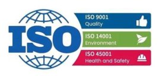
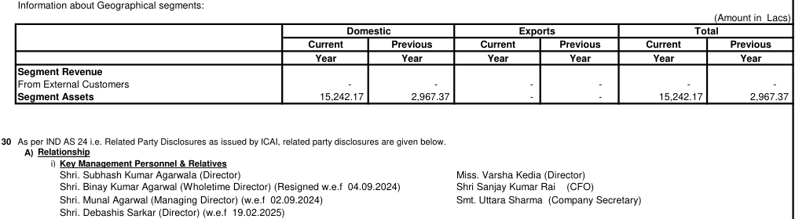
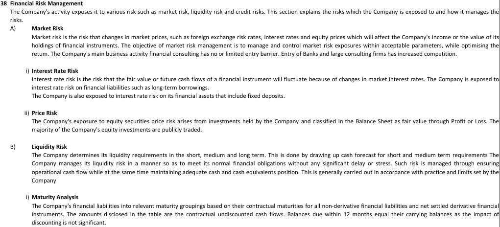
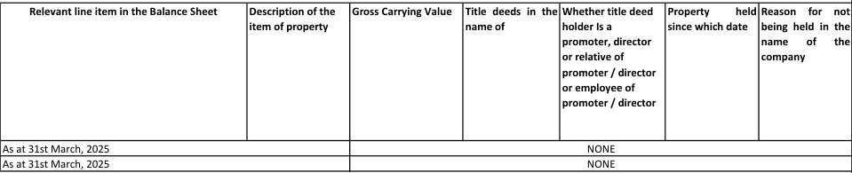
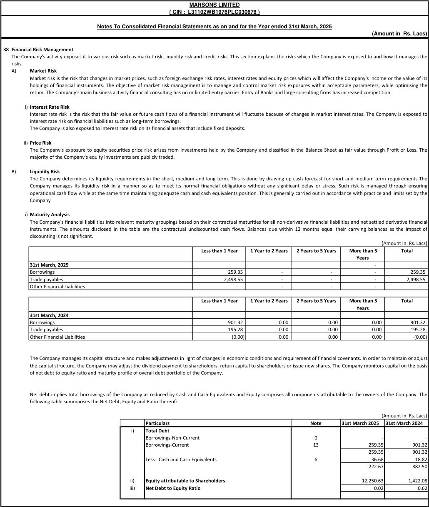

**[Image: e162d386-ada4-4264-844e-fd7397e1c38c.pdf-0001-00.png (601x184, 13.5KB)]**

**[Image: e162d386-ada4-4264-844e-fd7397e1c38c.pdf-0001-01.png (268x128, 53.0KB)]**

###### **Ref. No.ML/BSE/022/25-26** 

Date: 01.09.2025 

The Department of Corporate Services **BSE Limited** Phiroze Jeejeebhoy Tower Dalal Street, <u>Mumbai-400001.</u> 

###### **Scrip Code: 517467** 

###### **Dear Sir,** 

###### **Sub: 48****th** **Annual Report FY 2024-25. Notice of 48****th** **Annual General Meeting (AGM)** 

###### **Ref: Regulation 34 of SEBI (LODR) Regulations, 2015.** 

This is to inform you that the 48th Annual General Meeting (AGM) of the Company is scheduled to be held on Tuesday, 23rd September 2025 at 2:00 PM (IST) through Video Conferencing ('VC') facility or other audio visual means ('OAVM'), in accordance with the circulars/notifications issued by Ministry of Corporate Affairs and Securities and Exchange Board of India. 

Pursuant to the provisions of Regulation 34 of the SEBI (LODR) Regulations, 2015, please find enclosed 48th Annual Report 2024-25 (including Notice of 48th Annual General Meeting) of the Company. 

Today the Company is going to send the 48th Annual Report 2024-25 (including Notice of the 48th AGM) by e-mail (electronic mode) to those Members whose email addresses are registered with the Depository Participants (“DPs”) / Company’s Registrars and Share Transfer Agent (“RTA”), and a letter containing the web-link of the Annual Report to those Shareholder(s) who have not so registered their email address, as on 22nd August 2025. The 48th Annual Report 2024-25 (including Notice of the 48th AGM) of the Company is available on Company’s website and can be accessed through the website link <u>https://www.marsonsonline.com/images/teams/21756708420.pdf.</u> 

This is for your information and record. 

Thanking you, Yours truly, **For Marsons Ltd.** 

UTTARA Digitally signed by UTTARA SHARMA SHARMA Date: 2025.09.01 12:20:56 +05'30' 

(Uttara Sharma) Company Secretary (M. No. A48464) 

Encl: as above 

**Marsons LImited** 

**Marsons House, Budge Budge Trunk Road, Chakmir, Maheshtala, Kolkata 700142, CIN: L31102WB1976PLC030676 Mail: info@marsonsonline.com Website: www.marsonsonline.com Phone: +91 33 22127189** 

**[Image: e162d386-ada4-4264-844e-fd7397e1c38c.pdf-0002-00.png (530x180, 20.9KB)]**

### **<u>ANNUAL REPORT OF MARSONS LIMITED  (FY- 2024-25)</u>** 

|**BOARD OF DIRECTORS**|: Mr. Munal Agarwal- Managing Director Mr. Subhash Kumar Agarwala- Director Ms. Varsha Kedia- Independent Woman Director Mr. Rohit Shaw- Independent Director Mr. Mohammad Tinku – Independent Director Mr. Surojit Ghosh- Non- Executive Director Mr. Debashis Sarkar- Non- Executive Director|
|---|---|
|**CFO**|: Mr. Sanjay Kumar Rai|
|**COMPANY SECRETARY**|: Ms. Uttara Sharma|
|**AUDITORS**|: NKSJ & ASSOCIATES Chartered Accountants, P- 21/22, Radha Bazar Street, Kolkata- 700001.|
|**REGISTRAR AND SHARE**  **TRANSFER AGENT**|: MAHESHWARI DATAMATICS PVT LTD 23, R. N. Mukherjee Road, 5thFloor, Kolkata- 700001|
|**Phone**|: 033  2248-2248|
|**Email Id**|: mdpldc@yahoo.com|
|**REGISTERED OFFICE**|: Marsons House, Budge Budge Trunk Road, Maheshtala, Kolkata- 700072|
|**Email Id**|: info@marsonsonline.com|
|**Website**|: www.marsonsonline.com|
|**Phone:**|**:** 033- 40616212|

##### **ANNUAL REPORT 2024-25                                                             MARSONS LIMITED** 

###### **<u>NOTICE</u>** 

NOTICE is hereby given that the 48th Annual General Meeting of Marsons Ltd will be held on Tuesday, the 23rd day of September, 2025 at 2:00 P.M through Video Conferencing (“VC”)/ Other Audio Visual Means (“OAVM”) to transact the following business: 

###### **Ordinary Business:** 

1. To consider and adopt the Audited Financial Statements (Standalone & Consolidated) of the Company for the year ended 31st March, 2025 together with the Reports of the Directors and Auditors thereon; 

2. To appoint a Director in place of Mr. Subhash Kumar Agarwala  (DIN: 00566977), who retires by rotation and being eligible, offers himself for re-appointment; 

###### **Special Business:** 

3. Appointment of M/s. Sultana K & Associates, Practising Company Secretaries as Secretarial Auditors and fix their remuneration. 

To consider and if thought fit, to pass with or without modification(s), the following resolution as an Ordinary Resolution: 

“RESOLVED THAT pursuant to the provisions of Regulation 24A & other applicable provisions of the Securities and Exchange Board of India (Listing Obligations and Disclosure Requirements) Regulations, 2015 (“SEBI Listing Regulations”) read with Circulars issued thereunder from time to time and Section 204 and other applicable provisions of the Companies Act, 2013, if any read with Rule 9 of the Companies (Appointment and remuneration of Managerial Personnel) Rules, 2014 (“the Act”), M/s Sultana K & Associates, Practising Company Secretaries (COP: 20815) be and is hereby appointed as Secretarial Auditors of the Company for a period of 5 consecutive years, from April 1, 2024 to March 31, 2029 (‘the Term’), on such terms & conditions, including remuneration as may be determined by the Board of Directors (hereinafter referred to as the ‘Board’ which expression shall include any Committee thereof or person(s) authorized by the Board). 

RESOLVED FURTHER THAT approval of the Members is hereby accorded to the Board to avail or obtain from the Secretarial Auditor, such other services or certificates or reports which the Secretarial Auditor may be eligible to provide or issue under the applicable laws at a remuneration to be determined by the Board. 

RESOLVED FURTHER THAT the Board of Directors of the Company, be and is hereby authorized to take all such steps as may be necessary, proper or expedient to give effect to this resolution, including the filing of necessary forms with the Registrar of Companies.” 

4. Appointment of M/s D. RADHAKRISHNAN & CO. (FRN: 000018) of 11A Dover Lane, Kolkata- 700029 as the Cost Auditor of the Company for FY 2025-26. 

To consider and if thought fit, to pass with or without modification(s), the following resolution as an Ordinary Resolution: 

“RESOLVED THAT pursuant to section 148 and other applicable provision if any of the Companies Act, 2013 and Rules made thereunder (including statutory modification(s) or reenactment(s) thereof for the time being in force) M/s D. RADHAKRISHNAN & CO. (FRN: 000018) of 11A Dover Lane, Kolkata- 700029, Cost Accountant be and is hereby appointed as the 

##### **ANNUAL REPORT 2024-25                                                             MARSONS LIMITED** 

Cost Auditor of the Company for the financial year ending 31st March 2026 at a remuneration mutually agreed between them be and is hereby ratified.” 

###### **Registered Office** 

Marsons House, **By order of Board** Budge Budge Trunk Road,                                                                              For Marsons Limited Vill.-Chakmir, P.O. Maheshtala, 

Kolkata-700 142                                                                                                            Sd/CIN: L31102WB1976PLC030676                                                                   (Uttara Sharma) Phone: 033-4061 6212                                                                                    Company Secretary E-Mail: info@marsonsonline.com M. No. A48464 

Website: www.marsonsonline.com Dated: 25.08.2025 

###### NOTES: - 

1. Pursuant to the General Circular No. 09/2024 dated September 19, 2024, issued by the Ministry of Corporate Affairs (MCA) and circular issued by SEBI vide circular no. SEBI/ HO/ CFD/ CFDPoD-2/ P/ CIR/ 2024/ 133 dated October 3, 2024 (“SEBI Circular”) and other applicable circulars and notifications issued (including any statutory modifications or re-enactment thereof for the time being in force and as amended from time to time, companies are allowed to hold AGM through Video Conferencing (VC) or other audio visual means (OAVM), without the physical presence of members at a common venue. In compliance with the said Circulars, AGM shall be conducted through VC / OAVM. The deemed venue shall be the Registered Office of the Company. 

2. Pursuant to the Circular No. 14/2020 dated April 08, 2020, issued by the Ministry of Corporate Affairs, the facility to appoint proxy to attend and cast vote for the members is not available for this AGM. However, the Body Corporates are entitled to appoint authorised representatives to attend the AGM through VC/OAVM and participate there at and cast their votes through e-voting. 

3. The Members can join the AGM in the VC/OAVM mode 15 minutes before and after the scheduled time of the commencement of the Meeting by following the procedure mentioned in the Notice. The facility of participation at the AGM through VC/OAVM will be made available for 1000 members on first come first served basis. This will not include large Shareholders (Shareholders holding 2% or more shareholding), Promoters, Institutional Investors, Directors, Key Managerial Personnel, the Chairpersons of the Audit Committee, Nomination and Remuneration Committee and Stakeholders Relationship Committee, Auditors etc. who are allowed to attend the AGM without restriction on account of first come first served basis. 

4. The attendance of the Members attending the AGM through VC/OAVM will be counted for the purpose of ascertaining the quorum under Section 103 of the Companies Act, 2013. 

5. Pursuant to the provisions of Section 108 of the Companies Act, 2013 read with Rule 20 of the Companies (Management and Administration) Rules, 2014 (as amended)  the Secretarial Standard on General Meetings (SS-2) issued by the ICSI and Regulation 44 of SEBI (Listing Obligations & Disclosure Requirements) Regulations 2015 (as amended), and the Circulars issued by the Ministry of Corporate Affairs from time to time the Company is providing facility of remote e- Voting to its Members in respect of the business to be transacted at the AGM. For this purpose, the Company has entered into an arrangement with Central Depository Services (India) Limited (CDSL) for facilitating voting through electronic means, as the authorized e-Voting’s agency. The facility of casting votes by a member using remote e-voting as well as the e-voting system on the date of the AGM will be provided by CDSL. 

6. In line with the Ministry of Corporate Affairs (MCA) Circular No. 17/2020 dated April 13, 2020, the Notice calling the AGM has been uploaded on the website of the Company at 

##### **ANNUAL REPORT 2024-25                                                             MARSONS LIMITED** 

www.marsonsonline.com. The Notice can also be accessed from the websites of the Stock Exchanges i.e. BSE Limited at www.bseindia.com. The AGM Notice is also disseminated on the website of CDSL (agency for providing the Remote e-Voting facility and e-voting system during the AGM) i.e. www.evotingindia.com. 

7. In terms of the provisions of Section 102 of the Companies Act, 2013, the Statement setting out material facts in respect of all Special Business to be transacted at the meeting is annexed and forms part of the Notice. 

8. Copies of Notice of 48th Annual General Meeting together with Annual Report are being sent by electronic mode to all the members whose email addresses are registered with the Company/Depository Participant(s) and shares held in the electronic form, to those beneficial owners of the shares as at the close of business hours on Friday, 22nd August, 2025 as per the particulars of beneficial owners furnished by National Securities Depository Limited (NSDL) and Central Depository Services (India) Limited (CDSL). 

9. Corporate Members are encouraged to attend and vote at the AGM through VC/OAVM. Corporate members intending to authorize their representatives to participate and vote at the meeting are requested to send a certified copy of the Board resolution / authorization letter to the Company or upload on the VC/OAVM portal / e-voting portal. 

10. Details as per the Regulation 36 of the SEBI (Listing Obligations and Disclosure Requirements) Regulations, 2015 in respect of the Directors seeking appointment /re-appointment at the ensuing Annual General Meeting is appended to the Notice. 

11. Members holding shares in dematerialized form are requested to notify immediately any change of address to their Depository Participants (DPs) and those who hold shares in physical form are requested to write to the Company’s Registrar & Share Transfer Agents, M/s. Maheshwari Datamatics Private Limited, 23 R N Mukherjee Road, 5th Floor, Kolkata-700001, West Bengal, Tel: 033-2248 2248, Web Site: www.mdpl.in, e-mail: <u>mdpldc@yahoo.com.</u> 

12. The Register of Members and the Share Transfer Books of the Company will remain closed from Wednesday, 17th September, 2025 to Tuesday, 23rd September, 2025 (both days inclusive) for the purpose of the Meeting. 

13. The remote e-voting facility shall be opened from Saturday, 20th September, 2025 at 9.00 a.m. to Monday, 22nd September, 2025 till 5.00 p.m., both days inclusive. The remote e-voting facility shall not be allowed beyond 5.00 p.m. Monday, 22nd September, 2025. During the period when facility for remote evoting is provided, the members of the Company, holding shares either in physical form or in dematerialized form, as on the cut-off date/entitlement date, may opt for remote e-voting. Provided that once the vote on a resolution is casted by the member, he shall not be allowed to change it subsequently or cast the vote again. The notice of the meeting is also being placed on the website of the Company viz. www.marsonsonline.com and on the website of CDSL viz. www.cdslindia.com. 

14. The Company has fixed Tuesday, 16th September, 2025, as the cut-off date/entitlement date for identifying the Shareholders for determining the eligibility to vote by electronic means. Instructions for exercising voting rights by remote e-voting are attached herewith and forms part of this Notice. A person whose name is recorded in the Register of Members or in the Register of Beneficial Owners maintained by the depositories as on the cut-off/ entitlement date only shall be entitled to avail the facility of remote e-voting as well as voting at the Annual General Meeting. 

15. The facility for voting during the AGM will also be made available. Members present in the AGM through VC/OAVM and who have not cast their vote on the resolutions through remote e- voting and are otherwise not barred from doing so, shall be eligible to vote through the e-voting system during the AGM. Mr. Arun Kumar Jaiswal, (Membership No. FCS A29827) of M/s. Jaiswal A & Co, Practicing Company Secretary has been appointed as the Scrutinizer to scrutinize 

##### **ANNUAL REPORT 2024-25                                                             MARSONS LIMITED** 

   - the e-voting process in fair and transparent manner. The Scrutinizer shall immediately after the conclusion of voting at the Meeting, submit her report to the Chairman of the Company (‘the Chairman’) or to any other person authorized by the Chairman after the completion of the scrutiny of the e-voting (votes casted during the AGM and votes casted through remote e-voting), not later than 48 hours after the conclusion of the AGM. The results declared along with the report of the Scrutinizer shall be placed on the website of the Company at www.marsonsonline.com and on the website of CDSL at www.cdslindia.com, immediately after the results are declared by the Chairman. 

16. Any person who becomes a member of the Company after the date of this Notice of the Meeting and holding shares as on the cut-off date i.e. Tuesday, 16th September, 2025, may obtain the User ID and Password by sending an email to helpdesk.evoting@cdslindia.com . However, if he/she is already registered with CDSL for remote e-voting then he/she can use his/her existing user ID and password for casting the vote. 

17. The Voting Rights will be reckoned on the paid-up value of shares registered in the name of shareholders on Tuesday, 16th September, 2025, the cut-off date/entitlement date for identifying the Shareholders for determining the eligibility to vote by electronic means. 

18. Non-resident Indian Members are requested to inform M/s Maheshwari Datamatics Private Limited, Registrar and Share Transfer Agent of the Company, immediately whenever there is a change in their residential status on return to India for permanent settlement together with the particulars of their Bank Account maintained in India with complete name, branch, account type, account number and address of the Bank with Pin code number, if not furnished earlier. 

19. Members are advised to update their PAN, KYC (Address, Email ID, Mobile Number, Bank Account Details, Specimen Signature, etc.) and Nomination details, as mandated by SEBI vide Master Circular No. SEBI/HO/MIRSD/POD-1/P/ CIR/ 2024/37 dated May 7, 2024. Members holding shares in physical form approach to the Company’s RTA - Maheshwari Datamatics Private Limited, in prescribed Form ISR - 1 and other forms as per instructions mentioned in the form. The Company has already sent requisite communication to the Members for furnishing these details. The formats can be downloaded from RTA’s at https://mdpl.in/downloads.php and such formats are also available on the Company’s website at https://www.marsonsonline.com/investor-corner-details/notices-and-results.php. It may be noted that any service request can be processed only after the folio is KYC Compliant and Members holding shares in dematerialized form approach to their respective DPs as per the procedure prescribed by them. 

20. SEBI, vide its Master Circular No. SEBI/HO/MIRSD/POD-1/ P/ CIR/2024/37 dated May 7, 2024, has also mandated that the Members whose folio(s)/demat account(s) do not have PAN, Contact details (Postal Address with PIN and Mobile Number), Bank A/c details, Specimen signature for their corresponding folio numbers and other KYC details updated, shall be eligible for any payment including dividend, interest or redemption in respect of such folios/demat accounts, only through electronic mode with effect from April 1, 2024, upon their furnishing all the aforesaid details in entirety. If a Member updates the above-mentioned details after April 1, 2024, then such Member would receive all the dividends, etc., declared during that period (from April 1, 2024, till the date of updation) pertaining to the shares held after the said updation automatically. 

21. Members may please note that SEBI vide its Circular No. SEBI/ HO/MIRSD/MIRSD_RTAMB/P/CIR/2022/8 dated January 25, 2022 has mandated the Listed Companies to issue securities in dematerialized form only while processing service requests viz. Issue of duplicate securities certificate; claim from unclaimed suspense account; renewal/exchange of securities certificate; endorsement; sub-division/splitting of securities certificate; consolidation of securities certificates/folios; transmission and transposition. 

**ANNUAL REPORT 2024-25                                                             MARSONS LIMITED** 

22. Accordingly, Members are requested to make service requests by submitting a duly filled and signed Form ISR-4, the format of which is available on the Company’s website at <u>www.marsonsonline.com and on the website of the Company’s RTA, Maheshwari Datamatics</u> Private Limited at www.mdpl.in . It may be noted that any service request can be processed only after the folio is KYC Compliant. 

23. In terms of Regulation 40(1) of SEBI Listing Regulations, as amended from time to time, transfer, transmission and transposition of securities shall be affected only in dematerialized form. In view of the same and to eliminate all risks associated with physical shares and avail various benefits of dematerialization, Members are advised to dematerialize the shares held by them in physical form. Members can contact the Company or Company’s RTA, for assistance in this regard. 

24. Members seeking any information with regard to the financial statements or any matter to be placed at the AGM, are requested to write to the Company so as to reach them at least 7 days before the date of AGM through e-mail on sultana@marsonsonline.com. The same will be replied by the Company suitably. The Annual Report of the Company will be made available on the Company’s website at **www.marsonsonline.com** and also on the website of BSE Limited at **www.bseindia.com** . Members who have not registered their e-mail address so far are requested to register their E-mail address for receiving all communication including Annual Report, Notices, and Circulars etc. from the Company electronically. 

25. Members who hold the shares in physical form under the multiple folio’s, in identical names or joint accounts in the same order or names, are requested to send the share certificates to Registrar and Share Transfer Agent of the Company namely M/s. Maheshwari Datamatics Private Limited, 23 R N Mukherjee Road, 5th Floor, Kolkata-700001, West Bengal, for consolidation into a single folio. In case of joint holders attending the AGM through VC/OAVM facility, only such joint holder who is higher in the order of names as per the Register of Members or in the Register of Beneficial Owners maintained by the Depositories will be entitled for e-voting at the AGM. 

26. Since the AGM will be held through VC in accordance with the Circulars, the route map, proxy form and attendance slip are not attached to this Notice and the registered office of the Company shall deemed to be the location of the AGM. 

27. The Register of directors and key managerial personnel and their shareholding, maintained under Section 170 of the Companies Act 2013, and the Register of Contracts or Arrangements in which the directors are interested, maintained under Section 189 of the Act, will be available electronically for inspection by the members during the AGM. All documents referred to in the Notice will also be available for electronic inspection without any fee by the members from the date of circulation of this Notice up to the date of AGM. Members seeking to inspect such documents can send an email to sultana@marsonsonline.com. 

28. As per the provisions of Section 72 of the Companies Act 2013, the facility for submitting nomination is available for members in respect of the shares held by them. Members who have not yet registered their nomination are requested to register the same by submitting Form No. SH13. Members are requested to submit these details to their DP in case the shares are held by them in electronic form, and to the RTA, in case the shares are held in physical form. 

29. Brief resume of Directors including those proposed to be appointed / re-appointed, nature of their expertise in specific functional areas, names of companies in which they hold directorships and memberships / chairmanships of Board Committees, shareholding and relationships between directors inter-se as stipulated under Regulation 36 of SEBI (LODR) Regulations, 2015: 

a) Mr. <u>Subhash Kumar Agarwala</u> 

|**Name of Director**|**Mr. Subhash Kumar Agarwala**|
|---|---|
|**Date of Birth **|19.12.1964|

##### **ANNUAL REPORT 2024-25                                                             MARSONS LIMITED** 

|**Date of Appointment**|31.05.2019|
|---|---|
|**Qualification**|B.Com|
|**Experience**|30year|
|**Directorship in other Public** **Limited Companies apart from** **this Company**|4|
|**Chairman/Member of the** **Committee in which he is a** **Director apart from this** **Company**|NIL|

###### **Shares of the company held by Mr. Subhash Kumar Agarwala, own or for other persons on beneficial basis, as on the period 31****st** **March, 2025.** 

- **i) Own – Nil ii) On beneficial Basis – Nil** 

**The instructions for shareholders for Remote e- voting and e-voting during AGM and joining meeting through VC/OAVM are as under:** 

- Step 1:  Access through Depositories CDSL/NSDL e-Voting system in case of individual shareholders holding shares in demat mode. 

- Step 2:  Access through CDSL e-Voting system in case of shareholders holding shares in physical mode and non-individual shareholders in demat mode. 

- (i) The voting period begins from **9.00 A.M. (IST) on Saturday, 20****th** **September, 2025 and** ends on **Monday, 22****nd** **September, 2025 at 5.00 P.M. (IST).** During this period shareholders’ of the Company, holding shares either in physical form or in dematerialized form, as on the cut-off date i.e., **16****th** **September, 2025** may cast their vote electronically. The e-voting module shall be disabled by CDSL for voting thereafter. 

- (ii) Shareholders who have already voted prior to the meeting date would not be entitled to vote at the meeting venue. 

- (iii) Pursuant to SEBI Circular No. **SEBI/HO/CFD/CMD/CIR/P/2020/242 dated 09.12.2020,** under Regulation 44 of Securities and Exchange Board of India (Listing Obligations and Disclosure Requirements) Regulations, 2015, listed entities are required to provide remote e-voting facility to its shareholders, in respect of all shareholders’ resolutions. However, it has been observed that the participation by the public non-institutional shareholders/retail shareholders is at a negligible level. Currently, there are multiple e-voting service providers (ESPs) providing e-voting facility to listed entities in India. This necessitates registration on various ESPs and maintenance of multiple user IDs and passwords by the shareholders. 

   - In order to increase the efficiency of the voting process, pursuant to a public consultation, it has been decided to enable e-voting to **all the demat account holders** , **by way of a single login credential, through their demat accounts/ websites of Depositories/ Depository Participants** . Demat account holders would be able to cast their vote without having to register again with the ESPs, thereby, not only facilitating seamless authentication but also enhancing ease and convenience of participating in e-voting process. 

- (iv) <u>In terms of</u> **<u>SEBI circular no. SEBI/HO/CFD/CMD/CIR/P/2020/242 dated December 9, 2020</u>** <u>on e-Voting facility provided by Listed Companies, Individual shareholders holding securities in demat mode are allowed to vote through their</u> 

|**NUAL REPOR** demat Shareh accou Pursua meetin **CDSL** **Type** **of** **shareholders** |**T 2024-25                                                             MARSONS LIMITED** account maintained with Depositories and Depository Participants. olders are advised to update their mobile number and email Id in their demat nts in order to access e-Voting facility. nt to above said SEBI Circular**,**Login method for e-Voting and joining virtual gs**for Individual shareholders holding securities in Demat mode** **/NSDL**is given below: **Login Method**|
|---|---|
|Individual Shareholders holding securities in Demat mode with**CDSL** **Depository**|1) Users who have opted for CDSL Easi / Easiest facility, can login through their existing user id and password. Option will be made available to reach e- Voting page without any further authentication. The users to login to Easi / Easiest are requested to visit cdsl website www.cdslindia.com and click on login icon & My Easi New (Token) Tab. 2) After successful login the Easi / Easiest user will be able to see the e-Voting option for eligible companies where the evoting is in progress as per the information provided by company. On clicking the evoting option, the user will be able to see e-Voting page of the e-Voting service provider for casting your vote during the remote e-Voting period or joining virtual meeting & voting during the meeting. Additionally, there is also links provided to access the system of all e-Voting Service Providers, so that the user can visit the e-Voting service providers’ website directly. 3) If the user is not registered for Easi/Easiest, option to register is available at cdsl website www.cdslindia.com and click on login & My Easi New (Token) Tab and then click on registration option. 4) Alternatively, the user can directly access e-Voting page by providing Demat Account Number and PAN No. from a e-Voting link available on  www.cdslindia.com home page. The system will authenticate the user by sending OTP on registered Mobile & Email as recorded in the Demat Account. After successful authentication, user will be able to see the e- Voting option where the evoting is in progress and also able to directly access the system of all e-Voting Service Providers.|
|Individual Shareholders holding securities in demat mode with**NSDL** **Depository**|1) If you are already registered for NSDL IDeAS facility, please visit the e- Services website of NSDL. Open web browser by typing the following URL: https://eservices.nsdl.com either on a Personal Computer or on a mobile. Once the home page of e-Services is launched, click on the “Beneficial Owner” icon under “Login” which is available under ‘IDeAS’ section. A new screen will open. You will have to enter your User ID and Password. After successful authentication, you will be able to see e-Voting services. Click on “Access to e-Voting” under e-Voting services and you will be able to see e-Voting page. Click on company name or e-Voting service provider name and you will be re-directed to e-Voting service provider website for casting your vote during the remote e-Voting period or joining virtual meeting& votingduringthe meeting.|

**ANNUAL REPORT 2024-25                                                             MARSONS LIMITED** <u>demat account maintained with Depositories and Depository Participants. Shareholders are advised to update their mobile number and email Id in their demat accounts in order to access e-Voting facility.</u> 

|**ANNUAL REPOR** Individual Shareholders (holding securities in demat mode) login through their **Depository** **Participants** **(DP)**|**T 2024-25                                                             MARSONS LIMITED** 2) If the user is not  registered for IDeAS e-Services, option to register is available athttps://eservices.nsdl.com.  Select “Register Online for IDeAS “Portal or click at https://eservices.nsdl.com/SecureWeb/IdeasDirectReg.jsp 3) Visit the e-Voting website of NSDL. Open web browser by typing the following URL:https://www.evoting.nsdl.com/either on a Personal Computer or on a mobile. Once the home page of e-Voting system is launched, click on the icon “Login” which is available under ‘Shareholder/Member’ section. A new screen will open. You will have to enter your User ID (i.e. your sixteen digit demat account number hold with NSDL), Password/OTP and a Verification Code as shown on the screen. After successful authentication, you will be redirected to NSDL Depository site wherein you can see e-Voting page. Click on company name or e-Voting service provider name and you will be redirected to e-Voting service provider website for casting your vote during the remote e-Voting period or joining virtual meeting & voting during the meeting 4) For OTP based login you can click onhttps://eservices.nsdl.com/SecureWeb/evoting/evotinglogin.jsp.You will have to enter your 8-digit DP ID,8-digit Client Id, PAN No., Verification code and generate OTP. Enter the OTP received on registered email id/mobile number and click on login. After successful authentication, you will be redirected to NSDL Depository site wherein you can see e-Voting page. Click on**company name or e-Voting service provider name**and you will be re-directed to**e-Voting service provider website**for casting your vote during the remote e-Voting period or joining virtual meeting & voting during the meeting. You can also login using the login credentials of your demat account through your Depository Participant registered with NSDL/CDSL for e-Voting facility.  After Successful login, you will be able to see e-Voting option. Once you click on e- Voting option, you will be redirected to NSDL/CDSL Depository site after successful authentication, wherein you can see e-Voting feature. Click on company name or e-Voting service provider name and you will be redirected to e-Voting service provider website for casting your vote during the remote e-Voting period or joining virtual meeting & voting during the meeting.|
|---|---|
|**Important note:**Me User ID and Forget Pa|mbers who are unable to retrieve User ID/ Password are advised to use Forget ssword option available at abovementioned website.|

##### **ANNUAL REPORT 2024-25                                                             MARSONS LIMITED** **<u>Helpdesk for Individual Shareholders holding securities in demat mode for any technical issues related to login through Depository i.e. CDSL and NSDL</u>** 

| **Logintype**| **Helpdesk details**|
|---|---|
|Individual Shareholders holding securities in Demat mode with**CDSL**|Members facing any technical issue in login can contact CDSL helpdesk by sending a request athelpdesk.evoting@cdslindia.comor contact at toll free no.1800 21 09911|
|Individual Shareholders holding securities in Demat mode with**NSDL**|Members facing any technical issue in login can contact NSDL helpdesk by sending a request at evoting@nsdl.co.in or call at : 022 - 4886 7000 and 022 - 24997000|

Step 2 : Access through CDSL e-Voting system in case of shareholders holding shares in physical mode and non-individual shareholders in demat mode. 

- (v) Login method for e-Voting and joining virtual meetings for **Physical shareholders and shareholders other than individual holding in Demat form.** 

- 1) The shareholders should log on to the e-voting website www.evotingindia.com. 

   - 2) Click on “Shareholders” module. 

   - 3) Now enter your User ID 

      - a. For CDSL: 16 digits beneficiary ID, 

      - b. For NSDL: 8 Character DP ID followed by 8 Digits Client ID, 

      - c. Shareholders holding shares in Physical Form should enter Folio Number registered with the Company. 

4) Next enter the Image Verification as displayed and Click on Login. 

5) If you are holding shares in demat form and had logged on to www.evotingindia.com and voted on an earlier e-voting of any company, then your existing password is to be used. 

- 6) If you are a first-time user follow the steps given below: 

||**For Physical shareholders and other than individual shareholders holding** **shares in Demat.**|
|---|---|
|PAN|Enter your 10-digit alpha-numeric *PAN issued by Income Tax Department (Applicable for both demat shareholders as well as physical shareholders)|
|| Shareholders who have not updated their PAN with the Company/Depository Participant are requested to use the sequence number sent by Company/RTA or contact Company/RTA.|
|Dividend Bank Details  **OR**Date of Birth (DOB)|Enter the Dividend Bank Details or Date of Birth (in dd/mm/yyyy format) as recorded in your demat account or in the company records in order to login.  If both the details are not recorded with the depository or company, please enter the member id / folio number in the Dividend Bank details field.|

- (vi) After entering these details appropriately, click on “SUBMIT” tab. 

- (vii) Shareholders holding shares in physical form will then directly reach the Company selection screen. However, shareholders holding shares in demat form will now reach ‘Password Creation’ menu wherein they are required to mandatorily enter their login password in the new password field. Kindly note that this password is to be also used by the demat holders for voting for resolutions of any other company on which they are eligible to vote, provided that company opts for e-voting through CDSL platform. 

##### **ANNUAL REPORT 2024-25                                                             MARSONS LIMITED** 

It is strongly recommended not to share your password with any other person and take utmost care to keep your password confidential. 

- (viii) For shareholders holding shares in physical form, the details can be used only for e- voting on the resolutions contained in this Notice. 

- (ix) Click on the EVSN for the relevant **Marsons Limited** on which you choose to vote. 

- (x) On the voting page, you will see “RESOLUTION DESCRIPTION” and against the same the option “YES/NO” for voting. Select the option YES or NO as desired. The option YES implies that you assent to the Resolution and option NO implies that you dissent to the Resolution. 

- (xi) Click on the “RESOLUTIONS FILE LINK” if you wish to view the entire Resolution details. 

- (xii) After selecting the resolution, you have decided to vote on, click on “SUBMIT”. A confirmation box will be displayed. If you wish to confirm your vote, click on “OK”, else to change your vote, click on “CANCEL” and accordingly modify your vote. 

- (xiii) Once you “CONFIRM” your vote on the resolution, you will not be allowed to modify your vote. 

- (xiv) You can also take a print of the votes cast by clicking on “Click here to print” option on the Voting page. 

- (xv) If a demat account holder has forgotten the login password then Enter the User ID and the image verification code and click on Forgot Password & enter the details as prompted by the system. 

- (xvi) There is also an optional provision to upload BR/POA if any uploaded, which will be made available to scrutinizer for verification. 

###### (xvii) **Additional Facility for Non – Individual Shareholders and Custodians –For Remote Voting only.** 

- Non-Individual shareholders (i.e. other than Individuals, HUF, NRI etc.) and Custodians are required to log on to www.evotingindia.com and register themselves in the “Corporates” module. 

- A scanned copy of the Registration Form bearing the stamp and sign of the entity should be emailed to helpdesk.evoting@cdslindia.com. 

- After receiving the login details a Compliance User should be created using the admin login and password. The Compliance User would be able to link the account(s) for which they wish to vote on. 

- The list of accounts linked in the login will be mapped automatically & can be delink in case of any wrong mapping. 

- It is Mandatory that, a scanned copy of the Board Resolution and Power of Attorney (POA) which they have issued in favour of the Custodian, if any, should be uploaded in PDF format in the system for the scrutinizer to verify the same. 

- Alternatively Non Individual shareholders are required mandatory to send the relevant Board Resolution/ Authority letter etc. together with attested specimen signature of the duly authorized signatory who are authorized to vote, to the RTA at the email address viz; mdpldc@yahoo.com and to the Company at the email address viz; <u>sultana@marsonsonline.com</u> , if they have voted from individual tab & not uploaded same in the CDSL e-voting system for the scrutinizer to verify the same. 

**ANNUAL REPORT 2024-25                                                             MARSONS LIMITED** 

###### 30. **INSTRUCTIONS FOR SHAREHOLDERS ATTENDING THE AGM THROUGH VC/OAVM & E-VOTING DURING MEETING ARE AS UNDER:** 

1. The procedure for attending meeting & e-Voting on the day of the AGM is same as the instructions mentioned above for e-voting. 

2. The link for VC/OAVM to attend meeting will be available where the EVSN of Company will be displayed after successful login as per the instructions mentioned above for e-voting. 

3. Shareholders who have voted through Remote e-Voting will be eligible to attend the meeting. However, they will not be eligible to vote at the AGM. 

4. Shareholders are encouraged to join the Meeting through Laptops / IPads for better experience. 

5. Further shareholders will be required to allow Camera and use Internet with a good speed to avoid any disturbance during the meeting. 

6. Please note that Participants Connecting from Mobile Devices or Tablets or through Laptop connecting via Mobile Hotspot may experience Audio/Video loss due to Fluctuation in their respective network. It is therefore recommended to use Stable Wi-Fi or LAN Connection to mitigate any kind of aforesaid glitches. 

7. Shareholders who would like to express their views/ask questions during the meeting may register themselves as a speaker by sending their request in advance atleast **7 days prior to meeting** mentioning their name, demat account number/folio number, email id, mobile number at <u>sultana@marsonsonline.com. The shareholders who do not wish to</u> speak during the AGM but have queries may send their queries in advance **7 days prior to meeting** mentioning their name, demat account number/folio number, email id, mobile number at sultana@marsonsonline.com . These queries will be replied to by the company suitably by email. 

8. Those shareholders who have registered themselves as a speaker will only be allowed to express their views/ask questions during the meeting. 

9. Only those shareholders, who are present in the AGM through VC/OAVM facility and have not casted their vote on the Resolutions through remote e-Voting and are otherwise not barred from doing so, shall be eligible to vote through e-Voting system available during the AGM. 

10. If any Votes are cast by the shareholders through the e-voting available during the 11. AGM and if the same shareholders have not participated in the meeting through VC/OAVM facility, then the votes cast by such shareholders may be considered invalid as the facility of e-voting during the meeting is available only to the shareholders attending the meeting. 

###### **PROCESS FOR THOSE SHAREHOLDERS WHOSE EMAIL/MOBILE NO. ARE NOT REGISTERED WITH THE COMPANY/DEPOSITORIES.** 

1. For Physical shareholders- please provide necessary details like Folio No., Name of shareholder, scanned copy of the share certificate (front and back), PAN (self attested scanned copy of PAN card), AADHAR (self attested scanned copy of Aadhar Card) by email to **Company/RTA email id** . 

2. For Demat shareholders -, Please update your email id & mobile no. with your respective **Depository Participant (DP)** 

3. **For Individual Demat shareholders – Please update your email id & mobile no. with your respective Depository Participant (DP) which is mandatory while e-Voting & joining virtual meetings through Depository.** 

##### **ANNUAL REPORT 2024-25                                                             MARSONS LIMITED** 

If you have any queries or issues regarding attending AGM & e-Voting from the CDSL e-Voting System, you can write an email to helpdesk.evoting@cdslindia.com or contact at toll free no. 1800 21 09911 

All grievances connected with the facility for voting by electronic means may be addressed to Mr. Rakesh Dalvi, Sr. Manager, (CDSL, ) Central Depository Services (India) Limited, A Wing, 25th Floor, Marathon Futurex, Mafatlal Mill Compounds, N M Joshi Marg, Lower Parel (East), Mumbai - 400013 or send an email to helpdesk.evoting@cdslindia.com or call  toll free no. 1800 21 09911. 

31. Investor Grievance Redressal:The Company has designated an e-mail id <u>sultana@marsonsonline.com to enable investors to register their complaints, if any.</u> 

**By Order of the Board of Directors** 

**Sd/-** 

**Uttara Sharma** 

**Date: 25****th** **August 2025 Place: Kolkata** 

**Company Secretary M. No. A48464** 

##### **ANNUAL REPORT 2024-25                                                             MARSONS LIMITED** 

###### **<u>STATEMENT PURSUANT TO SECTION 102 OF THE COMPANIES ACT 2013.</u>** 

###### **<u>ITEM NO. 4</u>** 

In accordance with the provisions of Section 204 and other applicable provisions of the Companies Act, 2013, read with Rule 9 of the Companies (Appointment & Remuneration of Managerial Personnel) Rules, 2014 (including any statutory modification(s) or re-enactment(s) thereof, for the time being in force) (“the Act”), every listed company and certain other prescribed categories of companies are required to annex a Secretarial Audit Report, issued by a Practicing Company Secretary, to their Board’s report, prepared under Section 134(3) of the Act. 

Furthermore, pursuant to recent amendments to Regulation 24A of the SEBI Listing Regulations, every listed entity is required to conduct a Secretarial Audit and annex the Secretarial Audit Report to its annual report. Additionally, a listed entity must appoint a Secretarial Audit firm for a maximum of two terms of five consecutive years, with shareholder approval to be obtained at the Annual General Meeting. 

Accordingly, based on the recommendations of the Audit committee, the Board of Directors at its meeting held on 30th May 2025 have appointed M/s. Sultana K & Associates, Practicing Company Secretaries (COP: 20815) as the Secretarial Auditor of the Company for a term of five (5) consecutive financial years commencing from 2024-25 to 2028-2029. The appointment is subject to approval of the members of the Company. While recommending M/s. Sultana K & Associates for appointment, the Audit Committee and the Board considered the past audit experience, valuated various factors including the capability to handle a diverse and complex environment. 

M/s Sultana K & Associates has provided its consent to act as the Secretarial Auditors of the Company and has confirmed that the proposed appointment, if made, will be in compliance with the provisions of the Act and the SEBI Listing Regulations. Accordingly, the consent of the shareholders is sought for the appointment of M/s. M/s Sultana K & Associates as the Secretarial Auditors of the Company. 

The Board of Directors recommends the resolution for approval by the Members, as set out at Item No. 4 of the Notice. None of the Directors, Key Managerial Personnel or their relatives are, in any way, concerned or interested financially or otherwise in this resolution. The Board recommends the resolution for approval of the shareholders. 

###### **<u>ITEM NO. 5</u>** 

In pursuance to section 148 of the Companies Act, 2013 and Rule 14 of the Companies (Audit and Auditors) Rules 2014, the Board shall appoint a Cost accountant in practice on the recommendations of the Audit Committee. 

On recommendation of Audit Committee and its meeting held on 25th August 2025, the Board has considered and approved appointment of M/s D. RADHAKRISHNAN & CO. as the Cost Auditor of the Company for the financial year 2025-26 at a remuneration mutually agreed. 

The Board of Directors recommends the resolution for approval by the Members, as set out at Item No. 5 of the Notice. None of the Directors, Key Managerial Personnel or their relatives are, in any way, concerned or interested financially or otherwise in this resolution. The Board recommends the resolution for approval of the shareholders. 

**<u>ANNUAL REPORT 2024-25                                                                   MARSONS LIMITED</u>** 

###### **<u>Report and Management Discussion & Analysis Report</u>** 

Dear Members, 

The Directors have pleasure in submitting their 48th Annual Report together with the Audited Statements of Account for the period ended on March 31, 2025. 

###### **<u>Financial Performance:</u>** 

The Company’s financial performance for the period ended 31st March, 2025 is summarized below: 

|**_(a) Standalone                                                                                                                       (Rs. in lacs)_**|
|---|

|**_Financial Result_**|**_Year Ended_** **_31.03.2025_**|**_Year Ended_** **_31.03.2024_**|
|---|---|---|
|_Total Revenue_|_17,177.34_|_662.23_|
|_Profit /(Loss) Before Tax_|_2,802.08_|_62.85_|
|_Profit /(Loss) After Tax_|_2,802.08_|_62.85_|
|_EPS (Rs)_|_1.64_|_0.05_|

###### **_Consolidated                                                                                                                         (Rs. in lacs)_** 

|**_Financial Result_**|**_Year Ended_** **_31.03.2025_**|**_Year Ended_** **_31.03.2024_**|
|---|---|---|
|_Total Revenue_|_17,177.34_|_662.23_|
|_Profit /(Loss) Before Tax_|_2,807.08_|_62.91_|
|_Profit /(Loss) After Tax_|_2,802.08_|_62.85_|
|_EPS (Rs)_|_1.64_|_0.05_|

###### **<u>Operating & Financial Performance</u>** 

During the year, the net revenue from operations of your Company increased from Rs. 662.23 Lacs to Rs.17,177.34 Lacs. For FY 2024-25, your Company’s profit after tax stood at Rs. 2,808.08 Lacs vis-à-vis profit of Rs.62.85 Lacs in the previous year. 

###### **<u>Change in the nature of business, if any</u>** 

There is no change in the nature of the business of the Company. 

**<u>Details of significant and material orders passed by the regulators or courts or tribunals impacting the going concern status and company’s operations in future</u>** 

There were no significant and material orders passed by regulators or courts or tribunals impacting the going concern status and Company's operations in future. 

Page | 1 

**<u>ANNUAL REPORT 2024-25                                                                   MARSONS LIMITED</u>** 

###### **<u>Material changes and commitments, if any, affecting the financial position of the company which have occurred between the end of the financial year of the company to which the financial statements relate and the date of the report</u>** 

There were no material changes and commitments affecting the financial position of the Company occurring between March 31, 2025 and the date of this Report of the Directors. 

###### **<u>Management Discussion and Analysis Report</u>** 

###### **<u>Industry Trend and Development</u>** 

The Company is engaged in manufacturing of transformers in the capacity range of 100MVA 132KV class. The demand for the Company’s product in coming years will increase significantly. The expansion of infrastructure industry and real estate business, extensive rural electrification programme of the Government, development of shopping malls, complexes, etc. demands various type of transformers and the Company in this industry with flexibility will survive and have a bright future. 

###### **<u>Opportunities and Threats</u>** 

The Company’s nature of business is capital intensive and hence any delay in cycle causes huge interest loss and marks the bottom line of the Company. 

###### **<u>Risk and Concern</u>** 

The threat is also from unorganized small scale entrepreneurs who sometimes run away with big orders due to their small set up cost. The nature of industry demands blocking of capital for a long period and hence more credit support from the banks are required. 

###### **<u>Outlook</u>** 

The current scenario is very encouraging because the major thrust of our Government is on Power and Infrastructure sector. 

###### **<u>Subsidiary / Joint Ventures / Associates</u>** 

The Company does have Cosol Developments Limited (UK) as the Subsidiary Company at the end of the Financial Year. The details are enclosed as **Annexure I.** 

###### **<u>Internal Financial Control</u>** 

The Company has in place adequate internal financial controls with reference to financial statements. During the year, such controls were tested and no reportable material weaknesses in the design or operation were observed. 

Company's Policies on Remuneration, Employee Concern (Whistle Blowing) and also the Code of Conduct applicable to Directors and Employees of the Company have been complied with. These Policies and the Code of Conduct are available on the Company's website at www.marsonsonline.com. 

###### **<u>Dividend</u>** 

With the view to conserve the resources of company your directors regret to recommend any dividend for the period under report. 

###### **<u>Transfer to Reserve</u>** 

No amount is proposed to be transferred to General Reserve for the year ended 31st March, 2025 `.` 

Page | 2 

**<u>ANNUAL REPORT 2024-25                                                                   MARSONS LIMITED</u>** 

###### **<u>Share Capital</u>** 

The Total Paid up capital of the Company as on 31st March 2025 is Rs. 17,21,00,000/- comprising of 17,21,00,000 Equity shares of Re. 1 each. The company had made an allotment of 3,21,00,000 Equity Shares to Strategic Investors on Preferential allotment basis during the Financial Year 2024-25. 

###### **<u>Segment wise performance</u>** 

The Company is primarily a manufacturer of electrical transformer as a single unit. Accordingly, the Company is a single business segment company. 

###### **<u>Risk Management</u>** 

Although the company has long been following the principle of risk minimization as is the norm in every industry, it has now become a compulsion. The Board members were informed about risk assessment and after which the Board formally adopted and implemented the necessary steps for monitoring the risk management plan for the company. 

###### **<u>Board of Directors</u>** 

There has been a change in the composition of the Board of Directors of the Company during the Financial Year. Mr. Binay Kumar Agarwal (DIN: 00566931) has resigned from the post of Wholetime director w.e.f 04.09.2024. Mr. Munal Agarwal (DIN: 03592597) have been appointed as the Managing Director of the Company w.e.f. 02.09.2024. Mr. Debashis Sarkar (DIN: 08741500) have been appointed as Non- Executive Director on 19.02.2025. 

All Directors, Key Managerial Personnel and senior management of the Company have confirmed compliance with the Code of Conduct applicable to the Directors and employees of the Company. The Code of Conduct is available on the Company's website <u>www.marsonsonline.com.</u> All Directors have confirmed compliance with provisions of section 164 of the Companies Act, 2013. 

###### **<u>Meetings of Board and Committees</u>** 

The details of number and dates of meetings held by the Board and its Committees and attendance of Directors is given separately in the attached Corporate Governance Report. 

###### **<u>Directors' Responsibility Statement</u>** 

The Board of Directors acknowledges the responsibility for ensuring compliance with the provisions of Section 134(3)(c) read with section 134(5) of the Companies Act, 2013 in the preparation of the annual accounts for the year ended on 31.03.2025  and state that : 

- (i) in the preparation of the annual accounts, the applicable accounting standards have been followed along with proper explanation relating to material departures, if any; 

- (ii) the Directors have selected such accounting policies and applied them consistently and made judgments and estimates that are reasonable and prudent so as to give a true and fair view of the state of affairs of the Company at the end of the financial year and of the profit of the Company for that period; 

- (iii) the Directors have taken proper and sufficient care for the maintenance of adequate accounting records in accordance with the provisions of this Act for safeguarding the assets of the Company and for preventing and detecting fraud and other irregularities; 

- (iv) the Directors have prepared the annual accounts on a going concern basis; (v) the Directors have laid down internal financial controls to be followed by the Company and that such internal financial controls are adequate and are operating effectively; and 

- (vi) There is a proper system to ensure compliance with the provisions of all applicable laws and Page | 3 

**<u>ANNUAL REPORT 2024-25                                                                   MARSONS LIMITED</u>** 

that such systems are adequate and operating effectively. 

###### **<u>Contracts and Arrangements with Related Party</u>** 

The related parties transactions in accordance with provisions of section 188 of the companies Act, 2013 and as identified by Management and Auditors are disclosed in AOC-2 form vide **Annexure-II** . 

The policy on Related Party Transactions as approved by the Board is uploaded on the Company’s website at www.marsonsonline.com. None of the Directors has any pecuniary relationships or transactions vis-a-vis the Company. 

###### **<u>Key Managerial Personnel</u>** 

The following persons are the Key Managerial Personnel of the Company in compliance with the provisions of Section 203 of the Companies Act, 2013 as on 31.03.2024: 

- a) Mr. Munal Agarwal, Managing Director 

- b) Ms. Uttara Sharma, Company Secretary 

- c) Mr. Sanjay Kumar Rai, CFO 

###### **<u>Board Evaluation</u>** 

Pursuant to the provisions of Companies Act, 2013, SEBI (Listing Obligations and Disclosure Requirements) Regulations, 2015 and Guidance Note on Board Evaluation issued by SEBI dated 05.01.2017 the Board has carried out annual performance evaluation of its own performance, the directors individually as well the evaluation of the working of its committee. 

###### **<u>Corporate Governance</u>** 

Report on Corporate Governance along with the certificate thereon is separately attached as **Annexure III** and **Annexure IV** respectively and forms a part of the Directors’ Report. 

###### **<u>Audit Committee</u>** 

The Audit Committee comprises of the following Directors: 

|**Name**|**Status**|**Category**|
|---|---|---|
|Ms. Varsha Kedia|Chairperson|Independent Director|
|Mr. Rohit Shaw|Member|Independent Director|
|Mr. Mohammad Tinku|Member|Independent Director|

During the year there were no instances where the Board had not accepted the recommendations of the Audit Committee. 

###### **<u>Nomination and Remuneration Committee</u>** 

The Nomination and Remuneration Committee comprises of the following Directors: 

|**Name**|**Status**|**Category**|
|---|---|---|
|Mr. Rohit Shaw|Chairperson|Independent Director|
|Ms. Varsha Kedia|Member|Independent Director|

Page | 4 

**<u>ANNUAL REPORT 2024-25                                                                   MARSONS LIMITED</u>** 

|Mr. Mohammad Tinku|Member|Independent Director|
|---|---|---|

The Company's Remuneration Policy is available on the Company's website <u>www.marsonsonline.com</u> and is attached as **Annexure -V** and forms part of this Report of the Directors. 

###### **<u>Stakeholders Relationship Committee</u>** 

The Stakeholders Relationship Committee comprises of the following Directors: 

|**Name**|**Status**|**Category**|
|---|---|---|
|Ms. Varsha Kedia|Chairperson|Independent Director|
|Mr. Rohit Shaw|Member|Independent Director|
|Mr. Mohammad Tinku|Member|Independent Director|

###### **<u>Vigil Mechanism</u>** 

In order to ensure that the activities of the Company and its employees are conducted in a fair and transparent manner by adoption of highest standards of professionalism, honesty, integrity and ethical behavior the company has adopted a vigil mechanism policy which is available on the Company's website <u>www.marsonsonline.com</u> 

###### **<u>Corporate Social Responsibility</u>** 

The provisions of Companies Act, 2013 regarding Corporate Social Responsibility are not applicable to the Company. 

###### **<u>Listing</u>** 

The shares of the Company are listed on the BSE Limited. The Company's shares are compulsorily traded in the dematerialized form. 

###### **<u>Secretarial Audit</u>** 

A Secretarial Audit was conducted during the year by the Secretarial Auditor, Sultana K & Associates, Practicing Company Secretary (C.P No. 20815), in accordance with the provisions of section 204 of the Companies Act, 2013. The Secretarial Auditor’s Report and Annual Secretarial Compliance Report is attached as **Annexure- VI** and forms a part of this Report of the Directors. 

###### **<u>Internal Auditor</u>** 

M/s HMCG & Associates, Chartered Accountants (FRN. No. 328221E) of 40 Westorn Street, Kolkata700013 perform the duties of internal auditors of the company and their report is reviewed by the audit committee from time to time. 

###### **<u>Deposits</u>** 

The Company has not accepted any deposits from the public, and as such, there are no outstanding deposits in terms of the Companies (Acceptance of Deposits) Rules, 2014. 

Page | 5 

**<u>ANNUAL REPORT 2024-25                                                                   MARSONS LIMITED</u>** 

###### **<u>Loans, guarantees and investments</u>** 

It is the Company's policy not to give loans, directly or indirectly, to any person or to other body corporate or give any guarantee or provide any security in connection with a loan to any other body corporate or person. 

###### **<u>Conservation Of Energy, Technology Absorption, Foreign Exchange Earning and Outgo:</u>** 

The prescribed particulars of Conservation of Energy, Technology Absorption and Foreign Exchange Earnings and Outgo required under section 134(3)(m) read with Rule 8(3) of the Companies (Accounts) Rules, 2014 is attached as **Annexure – VII** and forms a part of this Report of the Directors. 

###### **<u>Extract of Annual Return</u>** 

In accordance with the Companies Act, 2013, the annual return in the prescribed format is available at www.marsonsonline.com. 

###### **<u>Managerial Remuneration</u>** 

The information required pursuant to Section 197(12) read with Rule 5(1) of The Companies (Appointment and Remuneration of Managerial Personnel) Rules, 2014 in respect of employees of the Company is attached here as **Annexure–VIII** and forms a part of the Directors’ Report. 

###### **<u>Disclosures under Sexual Harassment of Women at Workplace (Prevention, Prohibition and Redressal) Act, 2013</u>** 

Your Directors state that during the year an Internal Complaint Committee has been formed to review the cases filed pursuant to Sexual Harassment of Women at Workplace (Prevention, Prohibition and Redressal) Act, 2013 and further state that, there were no cases reported in respect to above mentioned Act. 

|**Details of Sexual Harassment Complaints (FY 2024–2025):** | |
|---|---|
|**Particulars**|**Number** **of** **Complaints**|
|Number of sexual harassment complaints received during the year|NIL|
|Number of sexual harassment complaints disposed of during the year|NIL|
|Number of cases pending for more than 90 days|NIL|

###### **<u>Statement on Compliance with the Maternity Benefit Act, 1961</u>** 

The Company confirms that it complies with all provisions of the Maternity Benefit Act, 1961. All eligible women employees are provided maternity benefits as per the law. 

###### **<u>Compliance with the Applicable Secretarial Standards</u>** 

Your Company has complied with the applicable Secretarial Standards issued by the Institute of the Company Secretaries of India. 

###### **<u>Fraud Reporting</u>** 

Pursuant to the provisions of Section 134(3) (ca) of the Companies (Amendment) Act, 2015, no fraud has been reported by the Auditors under sub-section (12) of Section 143 of the Companies Act, 2013 read with Rule 13 of the Companies (Audit and Auditors) Rules, 2014. 

Page | 6 

**<u>ANNUAL REPORT 2024-25                                                                   MARSONS LIMITED</u>** 

###### **<u>Acknowledgement</u>** 

Your Directors take the opportunity of placing their sincere appreciation to the Central Government, State Government, Banks, Financial Institutions, employees, associates, consultants and members of the company for their valuable guidance and support. 

###### **<u>Registered Office</u>** <u>:</u> 

Marsons House, **On behalf of the Board** Budge Budge Trunk Road, Vill.-Chakmir, P.O. Maheshtala, 

Kolkata-700 142                                                                        Sd/-                                                  Sd/CIN:L31102WB1976PLC030676                         Munal Agarwal                 Subhash Kumar Agarwala Phone:033-40616212                                           Managing Director                                          Director Website:www.marsonsonline.com                           (DIN:03592597)                           (DIN: 00566977) E-Mail:info@marsonsonline.com Dated: 12.08.2025 

Page | 7 

**<u>ANNUAL REPORT 2024-25                                                                   MARSONS LIMITED</u>** 

**<u>ANNEXURE - I</u>** 

###### **<u>Form AOC-1</u>** 

**-** **<u>(Pursuant to first proviso to sub section (3) of section129 read with rule 5 of Companies (Accounts) Rules, 2014)</u>** 

**<u>Statement containing salient features of the financial statement of subsidiaries / associate</u> companies/ joint ventures** 

**<u>Part “A”:Subsidiaries</u>** 

|||**(Amount in Rs. Lacs)** |
|---|---|---|
|**Sl.No.**|**Particulars**|**Details**|
|01|Name of the subsidiary|**COSOL DEVELOPMENTS** **LTD, UK**|
|02|Reporting period|31stMarch, 2025|
|03|Reporting currency|GBP|
||Exchange Rate on the last day of Financial Year|110.366|
|04|Share capital|4.41|
|05|Reserves and surplus|1.40|
|06|Total assets|5.82|
|07|Total Liabilities|5.82|
|08|Investments|Nil|
|09|Turnover|Nil|
|10|Profit before taxation|Nil|
|11|Provision for taxation|Nil|
|12|Profit after taxation|Nil|
|13|Proposed Dividend|Nil|
|14|% of shareholding|100%|

1. Names of subsidiaries which are yet to commence operations : NONE 2. Names of subsidiaries which have been liquidated or sold during the year : NONE 

Page | 8 

##### **<u>ANNUAL REPORT 2024-25                                                                   MARSONS LIMITED</u>** 

**<u>Part “B”: Associates and Joint Ventures</u>** 

|**Sl No.**|**Name of Associates orJoint Ventures**|N.A|
|---|---|---|
|**1**|**Latest audited Balance Sheet Date**|--|
|**2**|**Shares of Associate or Joint Ventures held by the** **company on the yearend**|--|
||No. of Shares|--|
||Amount of Investment in Associates or Joint Venture|--|
||Extent of Holding (inpercentage)|--|
|**3**|**Description of how there is significant influence**|--|
|**4**|**Reason why the associate/joint venture is not** **consolidated**|--|
|**5**|**Net worth attributable to shareholding as per latest** **audited Balance Sheet(Rs. In lacs)**|--|
|1. Na|mes of associates or joint ventures which are yet to commence operations|: NONE|
|2. Na Du|mes of associates or joint ventures which have been liquidated or sold ring the year.|: NONE|

As per our Report annexed of even date. 

**For & On Behalf of the Board** 

**(Shri Subhash Kumar Agarwala) Director (DIN : 00566977)** 

**(Shri Munal Agarwal) Managing Director (DIN : 03592597)** 

**For NKSJ& Associates Chartered Accountants Firm Registration No 329563E UDIN :25234454BMLGZG2679** 

**(Miss Varsha Kedia) Director (DIN : 09774480 )** 

**(CA  Sneha Jain) Partner (Membership No 234454)** 

**(Smt. Uttara Sharma) Company Secretary (M.No. A48464)** 

**Embassy Building, Flat No. 1B, 1st Floor, 4, Shakespeare Sarani, Kolkata - 700 001.** 

**Dated the 30th  day of  May , 2025** 

**(Shri Sanjay Kumar Rai) CFO (PAN :AEMPR2243A)** 

Page | 9 

**<u>ANNUAL REPORT 2024-25                                                                   MARSONS LIMITED</u>** 

**<u>ANNEXURE - II</u>** 

###### **<u>Form No. AOC-2</u>** 

**(Pursuant to clause (h) of sub-section (3) of section 134 of the Act and Rule 8(2) of the Companies (Accounts) Rules, 2014)** 

Form for disclosure of particulars of contracts/arrangements entered into by the company with related parties referred to in sub-section (1) of section 188 of the Companies Act, 2013 including certain arm’s length transactions under third proviso thereto 

###### **1. Details of contracts or arrangements or transactions not at arm’s length basis: NIL** 

###### **2. Details** **<u>of material contracts or arrangement or transactions at arm’s length basis:</u>** 

|**Nature of Transaction**|**Amount(in lakhs)**|
|---|---|
|**Refund of Loan Taken From Director**|**30.30**|
|**Refund of Loan taken from Yashoda Charitable** **Trust**|**30.00**|
|**Loan Taken from Yashoda Inn Private Limited**|**50.00**|
|**Refund of Loan taken from Yashoda Inn Private** **Limited**|**58.34**|
|**Refund of Loan taken from Achiever Vincom** **Private Limited**|**25.00**|
|**Refund of Loan taken from Incredibles Merchant** **Private Limited**|**265.00**|
|**Refund of Loan taken from Landmark Residency** **Private Limited**|**15.00**|
|**Loan taken from Joy Vincom Private Limited**|**20.00**|
|**Refund of Loan taken from Joy Vincom Private** **Limited**|**20.00**|
|**Refund of Loan taken from Pleasant Stay (Kodai)** **Hotels Private Limited**|**10.00**|
|**Refund of Loan taken from Splendid Vintrade** **Private Limited**|**137.00**|
|**Refund of Loan taken from Win Vincom Private** **Limited**|**80.00**|
|**Refund of Loan taken from Yashoda Buildcon** **Private Limited**|**35.00**|

**<u>Registered Office:</u> On behalf of the Board** Marsons House, Budge Budge Trunk Road, Vill. – Chakmir, P. O. Maheshtala,                                      Sd/                                              Sd/Kolkata- 700 142                                                     (Munal Agarwal)      Subhash Kumar Agarwala CIN: L31102WB1976PLC030676                          Managing Director            Director Phone: 033- 4061 6212                                            DIN: 03592597 DIN: 00566977 E-mail: info@marsonsonline.com Website: www.marsonsonline.com Date: 30.05.2025 

Page | 10 

**<u>ANNUAL REPORT 2024-25                                                                   MARSONS LIMITED</u>** 

###### **<u>ANNEXURE-III</u>** 

###### **CORPORATE GOVERNANCE REPORT** 

###### **(FORMING PART OF THE DIRECTORS’ REPORT FOR THE PERIOD ENDED 31****ST** **MARCH, 2025)** 

Marsons Limited is committed to doing business in an efficient, honest and ethical manner. This commitment starts with the Board of Directors, which executes its corporate governance responsibility by focusing on the Company’s strategic and operational excellence in the best interests of all our stakeholders, in particular shareholders, employees and our customers in a balanced fashion with long term benefits to all. 

Presently, The Securities and Exchange Board of India (Listing Obligations and Disclosure Requirements) Regulations, 2015, referred to as the “LODR” Regulations, regulates Corporate Governance practices of Listed Companies and your Company is complying with the same. 

Your Directors present the Company’s Annual Report on Corporate Governance for the period ended 31st March, 2025 as under: 

###### **1. Company’s philosophy on Corporate Governance** 

Your Company has always believed in the concept of good corporate governance involving transparency, empowerment, accountability and integrity with a view to increasing stakeholder value. The objective of your Company is not only to meet the statutory requirements of the code but to go well beyond it by instituting such systems and procedures as are in accordance with the latest global trend of making management completely transparent and institutionally sound. 

###### **2. Board of Directors** 

- 2.1 During the Financial year under review, Mr. Debashis Sarkar (DIN: 08741500) have been appointed as Non- Executive Director w.e.f 19.02.2025. Mr. Binay Kumar Agarwal (DIN: 00566931) has resigned from the post of Whole-time director w.e.f 04.09.2024 and Mr. Munal Agarwal (DIN: 03592597) have been appointed as the Managing Director of the Company w.e.f 02.09.2024. 

###### 2.2 **COMPOSITION, CATEGORY AND NUMBER OF OTHER BOARD AND COMMITTEE POSITIONS HELD AS ON 31**st **MARCH 2025.** 

|Name **( Promoter = P** **Non – Promoter = NP)**|**Executive/Non** **Executive/** **Independent**|**Number of other** **Directorships** **held in Public** **Ltd. Companies** **Incorporated in** **India**|**Number of** **Committee** **held** **As** **Chairman**|**other** **positions** **As** **Member**|
|---|---|---|---|---|
|Mr. Subhash Kumar Agarwala(P)|Director|4|0|0|
|Mr. Munal Agarwal(P)**|Managing Director|1|0|0|

Page | 11 

##### **<u>ANNUAL REPORT 2024-25                                                                   MARSONS LIMITED</u>** 

|Ms. Varsha Kedia (NP)|Independent Women Director|0|0|0|
|---|---|---|---|---|
|Mr. Rohit Shaw (NP)|Independent Director|0|0|0|
|Mr. Mohammad Tinku (NP)|Independent Director|0|0|0|
|Mr. Surojit Ghosh (NP)|Non- Executive Director|0|0|0|
|Mr. Debashis Sarkar*(NP)|Non- Executive Director|0|0|0|

*Appointed w.e.f 19.02.2025 

** Appointed w.e.f 02.09.2024 

Committee positions held in other Indian Public Limited Companies are considered and for this purpose only two Committees viz. the Audit Committee and the Stakeholders’ Relationship Committee are considered. 

- 2.3 All Independent Directors have confirmed their independence to the Company. 

- 2.4 The Non-Executive Directors have no pecuniary relationship or transactions with the Company in their personal capacity. 

- 2.5 None of the Directors of the Company are related amongst themselves. 

- 2.6 The Board periodically reviews compliance reports of all laws applicable to the Company and the steps taken to rectify instances of non-compliance. 

- 2.7 The Company has adopted the Code of Conduct for the Managing Director, Senior Management Personnel and other employees of the Company. It has also adopted a separate Code of Conduct for the Non-Executive Directors and Independent Directors of the Company. Both the Codes of Conduct are posted on the website of the Company. The Company has received confirmations from the Non-Executive Directors, Managing Director and Senior Management Personnel regarding compliance with their Code of Conduct for the period ended 31.03.2025. A declaration to this effect signed by the Managing Director is attached to this report. 

###### 2.8 **<u>ATTENDANCE RECORD OF THE DIRECTORS</u>** 

During the year twelve meetings of the Board of Directors were held on 18.04.2024, 30.05.2024, 26.06.2024, 14.08.2024, 02.09.2024, 04.09.2024, 25.10.2024, 07.11.2024, 31.01.2025, 04.02.2025, 19.02.2025 and 04.03.2025. 

|**Name of the Directors**|**No. of** **Board** **Meetings** **held**|**No. of Board** **Meetings** **attended**|**Attendance at the** **Last AGM held on** **27****th****September** **2024.**|
|---|---|---|---|
|Mr. Subhash Kumar Agarwala|12|12|Yes|
|Mr. Binay Agarwal|5|5|No|

Page | 12 

##### **<u>ANNUAL REPORT 2024-25                                                                   MARSONS LIMITED</u>** 

|Mr. Munal Agarwal|7|7|No|
|---|---|---|---|
|Ms. Varsha Kedia|12|12|Yes|
|Mr. Rohit Shaw|12|12|Yes|
|Mr. Mohammad Tinku|12|12|No|
|Mr. Surojit Ghosh|12|12|Yes|
|Mr. Debashis Sarkar|2|2|No|

###### **3. Audit Committee** 

###### 3.1 **Brief Description of terms of reference** 

The Audit Committee acts in accordance with the broad terms of reference specified by the Board of Directors in adherence to Section 177 of the Companies Act, 2013 (the Act) and Regulation 18(1) of SEBI (Listing Obligations and Disclosure Requirements) Regulations 2015. 

- 3.2 During the year four meetings of the Audit Committee were held on 30.05.2024, 14.08.2024, 25.10.2024 and 31.01.2025. 

- 3.3 The Audit Committee met <mark>on 30.05.2024 and</mark> reviewed the Annual Audited Accounts of the Company for the year ended 31st March 2024 before recommending the same to the Board of Directors. The Audit Committee had also periodically reviewed the Audited Financial Results during the year before recommending the same to the Board of Directors for adoption and publication. 

- 3.4 The Audit Committee comprises of Ms. Varsha Kedia (Chairperson), Mr. Rohit Shaw (Member) and Mr. Mohammad Tinku (Member). 

- 3.5 The composition of the Committee during the financial year and the number of meetings attended by each of the Directors are given below: 

|Sl.|Name of the Director|Position|No. of|Meetings|
|---|---|---|---|---|
|No.|||Held|Attended|
|1.|Ms.  Varsha Kedia|Chairperson|4|4|
|2.|Mr. Rohit Shaw|Member|4|4|
|3.|Mr. Mohammad Tinku|Member|4|4|

All the members of the Committee are Independent Directors as on 31.03.2025 and all the members have accounting or related financial management expertise. 

The Chairperson of the Audit Committee, Ms. Varsha Kedia was present in the last Annual General Meeting held on 27th September 2024. 

Page | 13 

**<u>ANNUAL REPORT 2024-25                                                                   MARSONS LIMITED</u>** 

###### **4. Nomination and Remuneration Committee** 

- 4.1 The NRC comprises of Mr. Rohit Shaw (Chairperson), Ms. Varsha Kedia (Member) and Mr. Mohammad Tinku (Member). 

- 4.2 The role of NRC includes the areas laid out in Section 178 of the Act and Regulation 19 of SEBI (Listing Obligations and Disclosure Requirements), Regulations 2015. 

- 4.3 During the year two meetings of the NRC was held on 02.09.2024 and 19.02.2025. 

###### **Details of remuneration for period ended 31.03.2025** 

The aggregate value of salary & perquisites paid for the period ended 31.03.2025 was Rs. 3,50,000/-. No sitting fee was paid to any Director for attending any meeting of the Board of Directors of the company or committee thereof. 

- 5 **Stakeholders Relationship Committee** 

- 5.1 The Committee is constituted in line with the provisions of the Section 178 of the Companies Act 2013 and Regulation 20(1) and (2) of the SEBI (Listing Obligations and Disclosure Requirements) Regulations, 2015. 

- 5.2 The Committee presently comprises of Ms. Varsha Kedia (Chairperson), Mr. Rohit Shaw (Member) and Mr. Mohammad Tinku (Member). 

Compliance Officer: Ms. Uttara Sharma 

###### Address   : Marsons House’ Budge Budge Trunk Road 

Vill. Chakmir, P.O. Maheshtala, Kolkata-700 142 Phone No.: 9007004231 Fax No.    : (033)2212 7189 Email     : info@marsonsonline.com Website   :  www.marsonsonline.com 

The company’s email ID for grievance redressal purpose is <u>info@marsonsonline.com/</u> sultana@marsonsonline.com where complaints can be lodged by the investors. 

- 5.3 During the year three meetings of the Stakeholders Relationship Committee was held on 10.09.2024, 18.12.2024 and 31.03.2025 

Requests received for dematerialization of shares were generally processed promptly. 

**Shareholder/ Investor Complaints** 

|Complaints pending as on 1st April, 2024|Nil|
|---|---|
|Complaints received during the period from 1st April, 2024 to 31st March, 2025.|Nil|
|Complaints disposed off during the period ended 31st March, 2025.|Nil|
|Complaints unresolved to satisfaction of shareholders as on 31st March, 2025.|Nil|
|Complaints pending as on 31st March, 2025.|Nil|

Page | 14 

**<u>ANNUAL REPORT 2024-25                                                                   MARSONS LIMITED</u>** 

- 5.4 Maheshwari Datamatics Pvt. Ltd. is the Registrar and Transfer Agent of the Company. The delegated authority is taking measures so that share transfer formalities are attended to at least once in a fortnight. 

###### 6 **Corporate Social Responsibility:** 

Corporate Social Responsibility is not applicable to the Company. 

###### 7 **Independent Director** 

The Company has following Independent Directors having expertise in their respective fields. 

1. Ms. Varsha Kedia 

2. Mr. Rohit Shaw 

3. Mr. Mohammad Tinku 

All Independent Directors have given a declaration that they meet the criteria of Independence as required under Section 149(7) of the Companies Act, 2013, and they maintain the limit of Directorship as required under LODR Regulations. 

The Terms and Conditions for Appointment of Independent Director and their disclosures are available on the website of the Company www.marsonsonline.com 

###### **Familiarization Programme** 

The Company follows familiarization programmes through various reports/ codes/ policies for all the Directors. The details of familiarization programme have been posted on the website of the Company at www.marsonsonline.com. 

###### 8 **General Body Meetings** 

###### 8.1 Location and time, where last three Annual General Meetings were held: 

|Year|AGM/ EGM|Location|Date|Time|No. of Special Resolution|
|---|---|---|---|---|---|
|2024-25|AGM|(“VC”)/ Other Audio Visual Means (“OAVM”)]|27.09.2024|2 P.M.|0|
|2023-24|EGM|(“VC”)/ Other Audio Visual Means (“OAVM”)]|30.03.2024|2 P.M.|1|
|2023-24|EGM|(“VC”)/ Other Audio Visual Means (“OAVM”)]|19.05.2023|2 P.M.|1|
|2022-23|AGM|(“VC”)/ Other Audio Visual Means (“OAVM”)]|27.09.2023|2 P.M.|0|
|2022-23|EGM|(“VC”)/ Other Audio Visual Means (“OAVM”)]|24.03.2023|12:45 P.M.|1|

Page | 15 

**<u>ANNUAL REPORT 2024-25                                                                   MARSONS LIMITED</u>** 

*No Postal Ballot was conducted during the year 2024-25, nor is there any proposal pending as on date for approval as a special resolution through postal ballot. 

- 8.2 Particulars of the Directors appointed and reappointed at the ensuing Annual General Meeting is given in the Notice convening the Annual General Meeting as required under Regulation 36 of SEBI (Listing Obligations and Disclosure Requirements) Regulations, 2015. 

- 9 **Disclosures** 

- 9.1 The Directors and key executives have informed the Board that they have no direct, indirect or on behalf of third parties, material interest in any transaction or matter directly affecting the Company. 

- 9.2 The Company has adopted a policy on dealing with Related Party Transactions and the same is disclosed at **www.marsonsonline.com.** 

All material transactions with related parties have been disclosed quarterly along with the compliance report on corporate governance. 

- 9.3 The Company has adopted a Risk Management Policy. The Company has in place a mechanism to identify, assess, monitor and mitigate various risks to key business objectives. Major risks identified by the businesses and functions are systematically addressed through mitigating actions on a continuing basis. These are discussed at the meetings of the Audit Committee and the Board of Directors of the Company. 

The Company has in place an established internal control system designed to ensure proper recording of financial and operational information and compliance of various internal controls and other regulatory and statutory compliances. The Directors review the effectiveness of internal controls and compliance controls, financial and operational risks, risk assessment and management systems and related party transactions, have been complied with. 

- 9.4 The Company has formulated a Whistle Blower Policy and established a Vigil Mechanism for Directors and Employers and same has been disclosed in the Company’s website at **<u>www.marsonsonline.com</u>** .The Management affirms that no personnel has been denied access to the Audit Committee. 

- 9.5 The management has informed the Board that they are not having any personal interest in material, commercial and financial transactions of the Company that may have potential conflict with the interest of the Company at large. 

- 9.6 The CEO i.e. the Managing Director and CFO i.e. Chief Financial Officer have given the necessary certificates as required under Regulation 33 and Regulation 17(8) of the SEBI (Listing Obligations and Disclosure Requirements) Regulations 2015. 

Page | 16 

**<u>ANNUAL REPORT 2024-25                                                                   MARSONS LIMITED</u>** 

- 9.7 The Company has issued formal appointment letters to all Independent Directors and the terms and conditions of appointment of Independent Directors have been disclosed on the website of the Company. 

- 9.8 The Company has adopted a policy on remuneration for Directors, Key Managerial personnel and other employees and has laid down evaluation criteria for Independent Directors. The policy on Independent Director’s familiarization and continuing education programmed is available at **www.marsonsonline.com.** 

- 9.9 The Company has adopted Policy on determination of materiality for disclosures, Policy on Preservation of Documents and Archival policy. 

- 9.10 Details of non-compliance by the Company, penalties, strictures imposed on the Company by Stock Exchanges or SEBI or any statutory authority, on any matter related to capital markets, during the last three years – Nil. 

- 9.11.   None of the non-executive director has any pecuniary relationship or transactions with the Company. 

- 9.12 All the mandatory requirements have been appropriately complied with. 

###### 10. **Means of Communication** 

- 10.1 In compliance with the requirements of the Listing Agreement, the Company on quarterly basis, intimates audited financial results to the Stock Exchanges immediately after they are taken on record by the Board.  Further, coverage is given for the benefit of the Shareholders and Investors by publication of the financial results in the Business Standard and Arthiklipi. 

- 10.2 The financial results of the Company are also put on the web site of the Company after these are submitted to the Stock Exchanges. The Company’s web site address is **www.marsonsonline.com.** The shareholders are free to communicate their grievances and queries to the Company through email id. **<u>info@marsonsonline.com/ sultana@marsonsonline.com</u>** 

###### 11. **General Investors Information** 

**Annual General Meeting** Date & Time :  Tuesday, 23rd September 2025 at 2:00 P.m. 

###### **Financial Year 2025-2026 (tentative)** 

|Annual General M|eeting|September, 2025|
|---|---|---|
|Results for the Qu|arter ending 30thJune, 2025|By 14thAugust,2025|
|-do-|ending 30th Sept. 2025|By 14thNovember 2025|
|-do-|ending 31st Dec. 2025|By 14thFebruary, 2026|
|-do-|ending 31st March, 2026|By May, 2026|

Page | 17 

**<u>ANNUAL REPORT 2024-25                                                                   MARSONS LIMITED</u>** 

|**Date of Book closure**:**17****th****September 2025 to 23****rd****September 2025**|**(both days inclusive)**.|
|---|---|
|**Listing on Stock Exchanges**|**Stock Code /Symbol**|
|BSE Ltd.|517467|
|Phiroze Jeejeebhoy Towers,||
|Dalal Street, Mumbai 400001||
|ISIN No: INE 415B01044||
|Listing fee has been paid for F.Y. 2025-26 with the BSE Ltd.||

The closing high and low market prices, average volume, average number of trades and average value of shares during each month at BSE Ltd. during April 2024 to March 2025 were as follows: 

|Month|Open|High|Low|Close|No. of Shares|No. of Trades|Total Turnover|
|---|---|---|---|---|---|---|---|
|Apr 24|35.99|50.26|34.58|50.26|2197074|1181|87085387|
|May 24|51.26|72.98|51.26|68.81|2489457|2260|157002162|
|Jun 24|70.18|78.51|64.2|64.2|1430673|2515|104770783|
|Jul 24|60.99|67.38|37.54|55.56|5084989|11685|249258397|
|Aug 24|58.33|130.12|51.16|130.12|16548844|13593|1376789493|
|Sep 24|136.6|294.9|123.65|294.9|16213046|87600|3433723866|
|Oct 24|305|356|222.8|287.5|14176194|92348|4245932072|
|Nov 24|289|350|219|244|8008429|65582|2229489758|
|Dec 24|246.9|281.5|198|212.55|4159723|44794|996305036|
|Jan 25|208|222|154.65|159.3|2002514|22545|377017823|
|Feb 25|159.3|175|115|134.65|4291557|17261|591897824|
|Mar 25|134.7|220.95|122.05|188.25|5702358|20867|988268295|

Page | 18 

**<u>ANNUAL REPORT 2024-25                                                                   MARSONS LIMITED</u>** 

###### **Registrar & Share Transfer Agents** 

M/s Maheshwari Datamatics Private Limited was appointed as the Registrars and Share Transfer Agent of the Company for the Equity Shares held in both physical and dematerialised form. Their address for communication: 

Maheshwari Datamatics Private Limited 23 R. N. Mukherjee Road Kolkata – 700001 Phone: 2243-5029/5809, 2248-2248 Email:mdpldc@yahoo.com 

###### **ISIN in respect of Equity Share is INE415B01044** 

###### **Share Transfer System** 

As per directive issued by SEBI, it is compulsory to trade in the Company’s Equity Shares in dematerialized form. 

###### **Distribution of Shareholding** 

The distribution of Shareholding as on 31.03.2025 is as follows: 

|**Share Holding**|**No of** **Holders**|**% age**|**No of** **Shares**|**% age**|
|---|---|---|---|---|
|Upto 500|29849|90.4132|2299227|1.3360|
|501 to 1000|1312|3.9741|996401|0.5790|
|1001 to 2000|740|2.2415|1115861|0.6484|
|2001 to 3000|270|0.8178|683456|0.3971|
|3001 to 4000|156|0.4725|559536|0.3251|
|4001 to 5000|122|0.3695|566111|0.3289|
|5001 to 10000|226|0.6846|1676704|0.9743|
|Above 10000|339|1.0268|164202704|95.4112|
|**Grand Total**|**33014**|**100.0000**|**172100000**|**100.0000**|

Page | 19 

**<u>ANNUAL REPORT 2024-</u>** 

**Shareholding pattern as on 31.03.2025 is as follows:** 

|**Category**|**No of Shares held**|**% of Share Holding**|
|---|---|---|
|**A. Promoters**|||
|(1)Indian|||
|a)Individual/HUF|||
|b)Central Govt|||
|c) StateGovt(s)|||
|d)BodiesCorp.|92338461|53.6540|
|e)Banks/Fi|||
|f)Anyother|||
|Sub-total(A)(1)|92338461|53.6540|
|(2)Foreign|||
|a) NRIs - Individuals|||
|b) Other - Individuals|||
|c)Bodies Corp.|||
|d)Banks/FI|||
|e)Anyother |||
|Sub-total(A)(2)|0|0.0000|
|**Total shareholding of Promoter** **(A)=(A)(1)+(A)(2)**|**92338461**|**53.6540**|
|**B. Public Shareholding**|||
|1. Institutions|||
|a)Mutual Funds|||
|b)Banks/FI|||
|c)CentralGovt|||
|d)State Govt(s)|||
|e) VentureCapital Funds|||
|f)InsuranceCompanies|||
|g)FIIs|||
|h)ForeignVentureCapital Funds|||
|i)Others(specify)|||
|Alternate Investment Funds|||
|Foreign Portfolio Investors|||
|Provident Funds/Pension Funds|||
|Qualified Foreign Investor|||
|Sub-total(B)(1):-|-|-|
|2. Non-Institutions|||
|a)Individuals|||
|i) Individual shareholders holding nominal share capital upto Rs. 2 lakh|14011333|8.1414|
|ii) Individual shareholders holding nominal share capital in excess of  Rs. 2 lakh|20452529|11.8841|
|c) Others(Specify)|||
|Investor Education and Protection Fund Authority|236097|0.1372|

Page | 20 

**<u>ANNUAL REPORT 2024-25                                                                   MARSONS LIMITED</u>** 

|BodiesCorporate|38846865|22.5723|
|---|---|---|
|Resident Individual(HUF)|2054735|1.1939|
|Non Resident Indians|118525|0.0689|
|Qualified Foreign Investor|||
|Custodian of EnemyProperty|||
|ForeignNationals|||
|ClearingMembers|1465168|0.8513|
|Trusts|2515|0.0015|
|Foreign Bodies-D R|||
|Foreign Portfolio Investors|||
|NBFCs registeredwith RBI|||
|Employee Trusts|||
|LLP|2563786|1.4897|
|DomesticCorporateUnclaimedShares Account|9986|0.0058|
|Sub-total(B)(2):-|79761539|46.3460|
|**Total Public Shareholding (B)=(B)(1)+ (B)(2)**|**79761539**|**46.3460**|
|**C. Shares held by Custodian for GDRs & ADRs**|-|-|
|**Grand Total (A+B+C)**|**172100000**|**100.0000**|

###### **Dematerialization of Shares** 

As on 31.03.2025 the status of dematerialized securities of the Company are as follows: 

|**Type of Securities**|**Dematerialised Holding**|**Percentage**|
|---|---|---|
|Equity Shares|172031878|99.96|

###### **Address for Correspondence:** 

Ms. Uttara Sharma Company Secretary & Compliance Officer Marsons House, Budge Budge Trunk Road, Chakmir, Maheshtala, Kolkata- 700142 

###### **CEO/CFO Certification:** 

In accordance with provisions of Regulation 17(8) of SEBI (LODR) Regulations, 2015, CEO/CFO certification is attached to this report. 

Page | 21 

**<u>ANNUAL REPORT 2024-25                                                                   MARSONS LIMITED</u>** 

###### **<u>Certificate</u>** 

The Company has obtained the Certificate from the M/s. Sultana K & Associates, Company Secretaries, Kolkata regarding compliance of Corporate Governance in terms of SEBI (Listing Obligations and Disclosure Requirements) Regulations, 2015 and the same is annexed. 

All material requirements with respect to Corporate Governance as stipulated in the Listing Agreement have been complied with. 

On behalf of the Board For MARSONS LIMITED 

Place: Kolkata Date: 12.08.2025 

Sd/Munal Agarwal Managing Director DIN: 03592597 

Page | 22 

**<u>ANNUAL REPORT 2024-25                                                                   MARSONS LIMITED</u>** 

###### **<u>CERTIFICATE OF COMPLIANCE OF THE CODE OF CONDUCT OF THE COMPANY</u>** 

This is to confirm that a code of conduct for the Board Members and Senior Management Personnel of the Company has been adopted by the Board and the same was also circulated and posted on the website of the Company. The Company received declarations affirming Compliance of the Code from the persons concerned for the period ended 31st March, 2025 and the same has also been noted by the Board. 

For Marsons Limited 

Sd/Munal Agarwal Managing Director DIN: 03592597 

Place: Kolkata Date: 12.08.2025 

Page | 23 

**<u>ANNUAL REPORT 2024-25                                                                   MARSONS LIMITED</u>** 

###### **CEO/CFO Certification** 

The Board of Directors Marsons Limited <u>Kolkata.</u> 

###### **Re: Financial Statements for the Financial Year 2024-25.** 

I, Mr. Sanjay Kumar Rai, Chief Financial Officer of Marsons Limited, on the basis of the review of the financial statements and the cash flow statement for the year ended 31st March, 2025 and to the best of my knowledge and belief, hereby certify that :- 

1. These statements do not contain any materially untrue statements or omit any material fact or contain statements that might be misleading; 

2. These statements together present a true and fair view of the company’s affairs and are in compliance with existing accounting standards, applicable laws and regulations. 

3. There are, to the best of our knowledge and belief, no transactions entered into by the company during the year ended 31st March, 2025 which is fraudulent, illegal or violative of the Company’s Code of Conduct. 

4. I accept responsibility for establishing and maintaining internal controls for financial reporting, I have evaluated the effectiveness of the internal control systems of the Company pertaining to financial reporting and I have disclosed to the auditors and the Audit Committee those deficiencies in the design or operation of such internal controls of which I am aware and the steps I have taken or propose to take to rectify these deficiencies. 

5. I  have indicated to the Auditors & the Audit Committee :- 

   - (a) There have been no significant changes in internal control over financial reporting during this period. 

   - (b) There have been no significant changes in accounting policies during this period. (c) There have been no instances of significant fraud of which I have become aware and the involvement therein, of management or an employee having significant role in the Company’s internal control systems over financial reporting. 

Place: Kolkata 

Dated: 12.08.2025 **_Sanjay Kumar Rai_** 

**_CFO (PAN: AEMPR2243A)_** 

Page | 24 

**<u>ANNUAL REPORT 2024-25                                                                   MARSONS LIMITED</u>** 

###### **ANNEXURE-IV** 

###### **<u>Certificate</u>** 

##### **_To the Members of Marsons Limited_** 

We have examined the compliance of conditions of Corporate Governance by **_Marsons Limited_** (“the Company”) in terms of Regulation 15(2) of the Securities and Exchange Board of India (Listing Obligations and Disclosure Requirements) Regulations, 2015 (“Listing Regulations”) for the year ended 31.03.2025. 

The compliance of conditions of Corporate Governance is the responsibility of the management. Our examination was limited to procedures and implementation thereof, adopted by the Company for ensuring the compliance of the conditions of Corporate Governance. It is neither an audit for an expression of opinion on the financial statements of the Company. 

In our opinion and to the best of our information and according to the explanations given to us, we certify that the Company has complied with the conditions of Corporate Governance as stipulated in the abovementioned Listing Agreement/Listing Regulations, as applicable. 

We further state such compliance is neither an assurance as to future viability of the Company nor the efficiency or effectiveness with which the management has conducted the affairs of the Company. 

For SULTANA K & ASSOCIATES _Company Secretaries_ 

SULTANA KHAN _Practicing Company Secretary_ Proprietor 

Place: Kolkata Dated: 12.08.2025 

Mem. No. A44373; C.P. No- 20815 **UDIN No- A044373G000984312** 

Page | 25 

**<u>ANNUAL REPORT 2024-25                                                                   MARSONS LIMITED</u>** 

**ANNEXURE-V** 

###### **<u>Annual Secretarial Compliance Report of Marsons Limited</u>** 

###### **<u>for the year ended 31</u>****st** **<u>March 2025</u>** 

To, The Board of Directors **Marsons Limited** 

We, **Sultana K & Associates** ., Company Secretaries have examined: 

- (i) all the documents and records made available to us and explanation provided by **Marsons Limited** (“the listed entity”), 

- (ii) the filings/ submissions made by the listed entity to the stock exchanges, 

- (iii) website of the listed entity, 

- (iv) any other document/ filing, as may be relevant, which has been relied upon to make this certification, 

for the year ended 31st March 2025 (“Review Period”) in respect of compliance with the provisions of : 

- (a) the Securities and Exchange Board of India Act, 1992 (“SEBI Act”) and the Regulations, circulars, guidelines issued thereunder; and 

- (b) the Securities Contracts (Regulation) Act, 1956 (“SCRA”), rules made thereunder and the Regulations, circulars, guidelines issued thereunder by the Securities and Exchange Board of India (“SEBI”); 

The specific Regulations, whose provisions and the circulars/ guidelines issued thereunder, have been examined, include:- 

- (a) Securities and Exchange Board of India (Listing Obligations and Disclosure Requirements) Regulations, 2015; 

- (b) Securities and Exchange Board of India (Issue of Capital and Disclosure Requirements) Regulations, 2018; 

- (c) Securities and Exchange Board of India (Substantial Acquisition of Shares and Takeovers) Regulations, 2011; 

- (d) Securities and Exchange Board of India (Buyback of Securities) Regulations, 2018; **(Not Applicable during the review period)** 

- (e) Securities and Exchange Board of India (Share Based Employee Benefits and Sweat Equity) Regulations, 2021 **(Not Applicable during the review period)** 

- (f) Securities and Exchange Board of India (Issue and Listing of Non-Convertible Securities) Regulations, 2021; **(Not Applicable during the review period)** 

- (g) Securities and Exchange Board of India (Prohibition of Insider Trading) Regulations, 2015; 

- (h) The Securities and Exchange Board of India (Registrars to an Issue and Share Transfer Agents) Regulations, 1993 

and based on the above examination, we hereby report that during the review period compliance status of the listed entity is appended below; 

Page | 26 

**<u>ANNUAL REPORT 2024-25                                                                   MARSONS LIMITED</u>** 

|Sr. No.|Particulars|Compliance Status (Yes/ No/ NA)|Observations/ Remarks byPCS|
|---|---|---|---|
|1|**Secretarial Standards** The compliances of the listed entity are in accordance with the applicable Secretarial Standards (SS) issued by the Institute of Company Secretaries India(ICSI).|YES|-|
|2|**Adoption and timely updation of** **the Policies** All applicable policies under SEBI Regulations are adopted with the approval of board of directors of the listed entities; All the policies are in conformity with SEBI Regulations and have been reviewed & timely updated as per the regulations/ circulars/ guidelines issued by SEBI.|YES YES|-|
|3|**Maintenance and disclosures on** **Website:** The Listed entity is maintaining a functional website; Timely dissemination of the documents/ information under a separate section on the website; Web-links provided in annual corporate governance reports under Regulation 27(2) are accurate and specific which re- directs to the relevant document(s)/ section of the website.|YES YES YES|-|
|4|**Disqualification of Director:** None of the Director of the listed entity are disqualified under Section 164 of Companies Act, 2013.|YES|-|
|5|**Details related to Subsidiaries of** **listed entities:** (a) Identification of material subsidiarycompanies;subsidiary|YES||
||(b) Requirements with respect to disclosure  requirement of material aswell as other subsidiaries|YES||
|6|**Preservation of Documents:** The listed entity is preserving and maintaining records as prescribed under SEBI Regulations and disposal of records as per Policy of Preservation of Documents and Archival policy prescribed under SEBI LODR Regulations,2015.|YES|-|

Page | 27 

**<u>ANNUAL REPORT 2024-</u>** 

|7|**Performance Evaluation:** The listed entity has conducted performance evaluation of the Board, Independent Directors and the Committees at the start of every financial year as prescribed inSEBI Regulations.|YES|-|
|---|---|---|---|
|8|**Related Party Transactions** The listed entity has obtained prior approval of Audit Committee for all Relatedpartytransactions;|YES|-|
||In case no prior approval obtained, the listed entity shall provide detailed reasons along with confirmation whether the transactions were subsequently approved/ ratified/ rejected by the Audit committee.|NA|The Company has obtained the prior approval of Audit Committee for all Related party Transactions.|
|9|**Disclosure of events or** **information** The listed entity has provided all the required disclosure(s) under Regulation 30 along with Schedule Ill of SEBI LODR Regulations, 2015 within the time limits prescribed thereunder|YES|-|
|10|**Prohibition of Insider Trading** The listed entity is in compliance with Regulation 3(5)  & 3(6) of SEBI (Prohibition of Insider Trading)Regulations,2015|YES|-|
|11|**Actions taken by SEBI or Stock** **Exchange(s), if any** No Actions taken against the listed entity/ its actions promoters/ directors/ subsidiaries either by SEBI or by Stock Exchanges (including under the Standard or Stock Operating Procedures issued by SEBI through various circulars) under SEBI Regulations and circulars guidelines issued thereunder.|NA|There were no actions taken either by SEBI or Stock Exchange(s) during the review period.|
|12|Resignation of statutory auditors from the listed entity or its material subsidiaries: In case of resignation of statutory auditor from its listed entity or any of  its material subsidiaries during the financial year, the listed entity and /or its material subsidiary(is) has/have compliedwithparagraph|YES YES|The auditor has resigned from the company as its tenure of appointment for a period of 5 years was completed|

Page | 28 

##### **<u>ANNUAL REPORT 2024-25                                                                   MARSONS LIMITED</u>** 

|6.1 and 6.2 of section V-D of chapter V of the master circular on compliance with the provisions of the LODR Regulations by listed entities.||
|---|---|
|**Additional Non-compliances, if** **any**|NIL|
|No additional non- compliance observed for all SEBI regulation/ circular/ guidance note etc.||

(a) The listed entity has complied with the provisions of the above Regulations and circulars/ guidelines issued thereunder. 

(b) The listed entity was not required to take any actions to comply with the observations as there were no observations in the previous reports. 

###### **Assumptions & Limitation of scope and Review:** 

1. Compliance of the applicable laws and ensuring the authenticity of documents and information furnished, are the responsibilities of the management of the listed entity. 

2. Our responsibility is to certify based upon our examination of relevant documents and information. This is neither an audit nor an expression of opinion. 

3. We have not verified the correctness and appropriateness of financial records and Books of Accounts of the listed entity. 

4. This Report is solely for the intended purpose of compliance in terms of Regulation 24A(2) of the SEBI (Listing Obligations and Disclosure Requirements) Regulations, 2015 and is neither an assurance as to the future viability of the listed entity nor of the efficacy or effectiveness with which the management has conducted the affairs of the listed entity. 

**For Sultana K & Associates** Company Secretaries 

Sultana Khan Practicing Company Secretary Proprietor Mem. No.A44373; C.P. No- 20815 Peer Review No. 3001/2023 **UDIN- A044373G000511061** 

Place: Kolkata Date: 30.05.2025 

Page | 29 

**<u>ANNUAL REPORT 2024-25                                                                   MARSONS LIMITED</u>** 

**ANNEXURE-VI** 

###### **Form No. MR-3 SECRETARIAL AUDIT REPORT FOR THE FINANCIAL YEAR ENDED 31****ST** **MARCH, 2025** 

[Pursuant to section 204(1) of the Companies Act, 2013 and rule No.9 of the Companies (Appointment and Remuneration Personnel) Rules, 2014] 

To, The Members, Marsons Limited CIN: L31102WB1976PLC030676 

We have conducted the Secretarial Audit of the compliance of applicable statutory provisions and the adherence to good corporate practices by M/s Marsons Limited (CIN: L31102WB1976PLC030676) (hereinafter called the Company). Secretarial Audit was conducted in a manner that provided us a reasonable basis for evaluating the corporate conducts/statutory compliances and expressing our opinion thereon. 

Based on our verification of M/s Marsons Limited books, papers, Minute Books, Forms and Returns filed and other records maintained by the Company, to the extent the information provided by the Company, its officers, agents and authorised representatives during the conduct of secretarial audit, the explanations and clarifications given to us and the representations made by the Management, we hereby report that in our opinion, the Company has, during the audit period covering the financial year ended on March 31, 2023 generally complied with the statutory provisions listed hereunder and also that the Company has proper Board processes and compliance mechanism in place to the extent, in the manner and subject to the reporting made hereinafter: 

We have examined the books, papers, Minute Books, Forms and Returns filed and other records maintained by M/s Marsons Limited for the financial year ended on 31st March, 2025 according to the provisions of: 

- (i)      The Companies Act, 2013 (the Act) and the Rules made there under; 

- (ii)      The Securities Contracts (Regulation) Act, 1956 (‘SCRA’) and the Rules made thereunder; 

- (iii)     The Depositories Act, 1996 and the Regulations and Bye-laws framed thereunder; 

- (iv)    Foreign Exchange Management Act, 1999 and the Rules and Regulations made there under to the extent of Foreign Direct Investment, Overseas Direct Investment and External Commercial Borrowings; 

- (v) The following Regulations and Guidelines prescribed under the Securities and Exchange Board of India Act, 1992 (‘SEBI Act’):- 

   - a) The Securities and Exchange Board of India (Substantial Acquisition of Shares and Takeovers) Regulations, 2011, as amended from time to time; 

   - b) The Securities and Exchange Board of India (Prohibition of Insider Trading) Regulations, 2015, as amended from time to time; 

   - c) The Securities and Exchange Board of India (Issue of Capital and Disclosure Requirements) Regulations, 2018, as amended from time to time; 

   - d) The Securities and Exchange Board of India (Share Based Employee Benefits and Sweat Equity) Regulations, 2021: (Not applicable to the Company during the audit period) 

Page | 30 

**<u>ANNUAL REPORT 2024-25                                                                   MARSONS LIMITED</u>** 

   - e) The Securities and Exchange Board of India (Issue and Listing of Debt Securities) Regulations, 2008:(Not applicable to the Company during the audit period) 

   - f) The Securities and Exchange Board of India (Delisting of Equity Shares) Regulations, 2021: (Not applicable to the Company during the audit period) 

   - g) The Securities and Exchange Board of India (Buy-back of Securities) Regulations, 2018; (Not applicable to the Company during the audit period) 

   - h) The Securities and Exchange Board of India (Registrars to an Issue and Share Transfer Agents) Regulations, 1993: The Company has appointed M/s Maheshwari Datamatics Private Limited who provides share registration and related services, and 

   - i) The Securities and Exchange Board of India (Listing Obligations and Disclosure Requirements) Regulations, 2015. 

- (vi)    We have relied on the representations made by the Company and its Officers for systems and mechanism formed by the Company for compliances under other applicable Acts, Laws and Regulations to the Company. 

Factories Act, 1948 Industrial Dispute Act, 1947 The Payment of Wages Act, 1936 The minimum Wages Act, 1948 

The Employees State Insurance Act, 1948 The Employees Provident Fund and Miscellaneous Provisions Act, 1952 The Bonus Act, 1965 

The Payment of Gratuity Act, 1972 

We have also examined compliance with the applicable clauses of the following: 

- (i) Secretarial Standards issued by The Institute of Company Secretaries of India with respect to Board and General Meetings. 

- (ii) The Securities and Exchange Board of India (Listing Obligation and Disclosure Requirements) Regulations, 2015 as amended. 

During the period under review the Company has complied with the provisions of the Act, Rules, Regulations, Guidelines, Standards, etc. mentioned above subject to the following observations: 

1. The status of the Company during the financial year has been that of a Listed Public Company. 

2. The Directors have complied with the disclosure requirements in respect of their eligibility of appointment. Their being an Independent Compliance Code of Business Conduct & Ethics for Directors and Management Personnel. 

3. The Directors have complied with the requirements as to disclosure of interests and concerns in contracts and arrangements, shareholdings/debenture holdings and directorships in other companies and interests in other entities. 

4. All registrations under the various state and local laws as applicable to the Company are valid as on the date of report. 

5. The Company (listed on BSE Limited) has complied with the provisions of SEBI (Listing Obligations and Disclosure Requirements) Regulations, 2015. 

Page | 31 

**<u>ANNUAL REPORT 2024-25                                                                   MARSONS LIMITED</u>** 

6. The Company has provided a list of statutes in addition to the laws as mentioned above and it has been observed that there are proper systems. 

7. Satisfactory Compliance is being done by the Company with respect to redressal of Customer Grievances. 

In respect of other laws specifically applicable to the Company, we have relied on information/records produced by the Company during the course of our audit and the reporting is limited to that extent. 

###### **We further report that** 

We further report that, the compliance by the Company of applicable financial laws such as direct and indirect tax laws and maintenance of financial records and books of accounts have not been reviewed in this Audit since the same have been subject to review by the statutory financial auditors, tax auditors, and other designated professionals. 

The Board of Directors of the Company is duly constituted with proper balance of Executive Directors, Non-Executive Directors and Independent Directors. 

Adequate notice is given to all Directors to schedule the Board Meetings, agenda and detailed notes on agenda were sent at least seven days in advance and a system exists for seeking and obtaining further information and clarifications on the agenda items before the meeting and for meaningful participation at the meeting. 

Majority decision is carried through and proper systems are in place which facilitates/ensures to capture and record, the dissenting member’s views, if any, as part of the minutes. During the period, all the decisions in the Board Meetings were carried unanimously and no dissenting views have been recorded. 

**We further report** that based on the information provided and the representation made by the Company and also on the review of the compliance certificates / reports taken on record by the Board of Directors of the Company, in our opinion there are adequate systems and processes in the Company commensurate with the size and operations of the Company to monitor and ensure compliance with applicable laws, rules, regulations and guidelines. 

###### **For SULTANA K & ASSOCIATES** 

Place: Kolkata Date: 12.08.2025 

Sultana Khan Practicing Company Secretary Proprietor UDIN: A044373G000984281 Peer Review No. 3001/2023 

NOTE-This report is to be read out with our letter of even date which is annexed as Annexure I and forms an integral part of this report. 

Page | 32 

**<u>ANNUAL REPORT 2024-25                                                                   MARSONS LIMITED</u>** 

###### **Annexure-I TO THE SECRETARIAL AUDIT REPORT OF MARSONS LIMITED FOR THE FINANCIAL YEAR ENDED 31****ST** **MARCH, 2025** 

To, The Members, MARSONS LIMITED 

Our report of even date is to be read along with this letter. 

Maintenance of Secretarial Records is the responsibility of the Management of the Company. Our responsibility is to express an opinion on these secretarial records based on our audit. 

We have followed the Audit practices and processes as were appropriate to obtain reasonable assurance about the correctness of the contents of the Secretarial records. The verification was done on test basis to ensure that correct facts are reflected in secretarial records. We believe that the processes and practices, we followed provide a reasonable basis for our opinion. 

We have not verified the correctness and appropriateness of financial records and Books of Accounts of the Company. 

Wherever required, we have obtained the Management Representation about the compliance of Laws, Rules and Regulations and happening of events etc. 

The compliance of the provisions of corporate and other applicable Laws, Rules, Regulations and Standards is the responsibilities of the management. Our examination was limited to the verification of procedures on test basis. 

The Secretarial Audit Report is neither an assurance as to the future viability of the Company nor of the efficacy or effectiveness with which the management has conducted the affairs of the Company. 

7. The audit was conducted based on the verification of the Company’s books, papers, minutes books, forms and returns filed, documents and other records furnished by / obtained from the Company electronically and also the information provided by the Company and its officers by audio and visual means 

###### **For SULTANA K & ASSOCIATES** 

Place: Kolkata Date: 12.08.2025 

Sultana Khan Practicing Company Secretary Proprietor Peer Review No. 3001/2023 

Page | 33 

**<u>ANNUAL REPORT 2024-25                                                                   MARSONS LIMITED</u>** 

###### **ANNEXURE -VII** 

###### **<u>NOMINATION & REMUNERATION POLICY OF</u>** 

###### **<u>MARSONS LIMITED (‘ML’)</u>** 

‘ML’ remuneration strategy is aimed at attracting and retaining high standard of relevant talent. The Remuneration Policy, therefore, is market-led and takes into account the competitive circumstance of each business situation of the Company so as to attract and retain high quality talent fulfilling the requisite qualification and leverage performance significantly. 

###### **<u>PREAMBLE</u>** 

Pursuant to Section 178 of the Companies Act, 2013 and Clause 49 of the Listing Agreement, the Board of Directors of every listed Company shall constitute the Nomination and Remuneration Committee. In order to align with the provisions of the Companies Act, 2013 and the amended Listing Agreement from time to time, the Board on 14.08.2014 changed the nomenclature of the “Remuneration Committee” as “Nomination and Remuneration Committee” and reconstituted the Committee with two non-executive Independent Directors and one non-executive Director as Member of the Committee. 

###### **<u>OBJECTIVE</u>** 

The Key Objectives of the Committee would be: 

- a) To guide the Board in relation to appointment and removal of Directors, Key Managerial Personnel and Senior Management. 

- b) To evaluate the performance of the members of the Board and provide necessary report to the Board for further evaluation. 

- c) To recommend to the Board on Remuneration payable to the Directors, Key Managerial Personnel and Senior Management. 

###### **<u>DEFINITIONS</u>** 

- **“Board”** means Board of Directors of the Company. 

- **“Company”** means **“Marsons Limited.”** 

- **“Independent Director”** means a director referred to in Section 149 (6) of the Companies Act, 2013. 

- **“Key Managerial Personnel” (KMP)** means 

   - (i) CEO or the Managing Director or the Manager 

   - (ii) Company Secretary 

   - (iii) Whole-time Director 

   - (iv) CFO 

   - (v) Such other officer as may be prescribed 

- **“Nomination and Remuneration Committee”** shall mean a Committee of Board of Directors of the Company, constituted in accordance with the provisions of Section 178 of the Companies Act, 2013 and the Listing Agreement. 

Page | 34 

**<u>ANNUAL REPORT 2024-25                                                                   MARSONS LIMITED</u>** 

- **“Policy or This Policy”** means, “Nomination and Remuneration Policy.” 

- **“Remuneration”** means any money or its equivalent given or passed to any person for services rendered by him and includes perquisites as defined under the Income-tax Act, 1961. 

- **“Senior Management”** means personnel of the Company who are members of its core management team excluding Board of Directors. This would include all members of management one level below the executive directors, including all the functional heads. 

###### **<u>APPOINTMENT AND EVALUATION OF DIRECTOR, KMP AND SENIOR MANAGEMENT</u>** 

###### **<u>Appointment criteria and qualifications:</u>** 

1. The Committee shall identify and ascertain the integrity, qualification, expertise and experience of the person for appointment as Director, KMP or at Senior Management level and recommend to the Board his / her appointment. 

2. A person should possess adequate qualification, expertise and experience for the position he / she is considered for appointment. The Committee has discretion to decide whether qualification, expertise and experience possessed by a person are sufficient / satisfactory for the concerned position. 

###### **<u>Term / Tenure:</u>** 

1. Managing Director/Whole-time Director/Manager (Managerial Person): - The Company shall appoint or re-appoint any person as its Managerial Person for a term not exceeding five years at a time. No re-appointment shall be made earlier than one year before the expiry of term. 

2. An Independent Director shall hold office for a term up to five consecutive years on the Board of the Company and will be eligible for re- appointment on passing of a special resolution by the Company and disclosure of such appointment in the Board's report. No Independent Director shall hold office for more than two consecutive terms, but such Independent Director shall be eligible for appointment after expiry of three years of ceasing to become an Independent Director. 

###### **<u>Evaluation:</u>** 

The Committee shall carry out evaluation of performance of every Director, KMP and Senior Management at regular interval (yearly). 

###### **<u>REMUNERATION OF MANAGER, DIRECTORS, COMPANY SECRETARY, CFO ETC.</u>** 

Remuneration of Manager under the Companies Act, 2013 (‘Manager’) and the Executive Directors, if any, the Company Secretary, Chief Financial Officer (CFO) and immediately one level below Senior Employees of the Company is determined by the Board of Directors (‘Board’) of the Company within the broad Policy formulated by the Nomination and Remuneration Committee comprising only NonExecutive Directors and in conformity with the relevant provisions of the Companies Act, 2013 and also subject to the approval of the Shareholders in their General Meeting. The aforesaid personnel are entitled to performance bonus for each financial year up to such an amount as may be determined by the Board. Such remuneration is linked to short and long term performance objectives appropriate to the working of the Company and its goals as well as the group to which the Company belongs to as well as on the concerned employee’s qualification and the grade and the overall performance of such employee of the Company as a whole. 

Page | 35 

**<u>ANNUAL REPORT 2024-25                                                                   MARSONS LIMITED</u>** 

Commission of the Non-Executive and the Independent Directors of the Company is determined by the Board based, inter alia, on Company performance and the prevailing regulatory provisions and is payable on a uniform basis to reinforce the principle of collective responsibility. Non-Executive Directors and the Independent Directors are also entitled to sitting fees for attending Meetings of the Board and Committees thereof, the quantum of which is determined by the Board within the limits as laid down in the Articles of Association of the Company. The sitting fees shall be determined by the Board for attending each meeting of the Board, Audit Committee, Nomination and Remuneration Committee and Stakeholders Relationship Committee. The Non-Executive and the Independent Directors may be reimbursed out of pocket expenses for attending Board and Committee Meetings of the Company at a city other than the one in which they reside. 

###### **<u>SERVICE CONTRACTS, SEVERANCE FEE AND NOTICE PERIOD:</u>** 

The appointment of the Manager, the Executive Directors, if any, the Company Secretary, CFO and immediately one level below Senior Employees of the Company  is governed by resolutions passed by the Board and the Shareholders of the Company, which cover the terms and conditions of such appointment read with the service rules of the Company. A separate Service Contract is not entered into by the Company with those elevated to the Board from the management cadre, since they already have a Service Contract with the Company. There is no separate provision for payment of severance fee under the resolutions governing the appointment of Manager and Executive Directors, if any, who have all been drawn from amongst the management cadre. The prevailing statutory provisions will however, apply. As per his terms of appointment, a notice of three month’s is required to be given by the concerned employee ,as the case may be, seeking to vacate office and such resignation takes effect upon the expiration of such notice or its earlier acceptance by the Board. 

###### **<u>DEVIATIONS FROM THIS POLICY</u>** 

Deviations on elements of this policy in extraordinary circumstances, when deemed necessary in the interests of the Company, will be made if there are specific reasons to do so in an individual case. 

Page | 36 

**<u>ANNUAL REPORT 2024-25                                                                   MARSONS LIMITED</u>** 

**<u>ANNEXURE-VIII</u>** 

**Information pursuant to clause (m) of sub-section (3) of Section 134 of the Companies Act, 2013 read with Rule 8(3) of the Companies (Accounts) Rules, 2014 and forming part of the Directors’ Report for the year ended 31****st** **March 2025.** 

###### A. <u>CONSERVATION OF ENERGY</u> 

- **1) Research and Development (R & D) :** 

   - **a) Specific areas in which R & D carried out by the Company:** 

   - i) Specific area in which R & D is carried out by the company is in EHV Power Transformers, EPC Projects on Boot, Bot, Bolt principles and other variants. 

   - ii) Continuous improvement of existing products for enhanced durability and performance. iii) Design optimization using advanced software packages 

   - iv) Testing and adaptation of New Materials 

   - v) New processes and up gradation of existing processes to enhance the productivity vis-àvis cost reduction etc. 

vi) Efforts to enhance product quality and reliability 

vii) Reduction of rejections and warranty returns 

viii) Improving New Product Development (NPD) 

ix) Environment compliance by products and processes 

- x) Testing and validation of new products 

- **b) Benefits derived as result of the above R & D** : 

   - Customers’ satisfaction and new business opportunities because of cost, quality and speed. 

###### **c) Future Plan of Action:** 

- i. Development of low loss energy reduction transformer to save on Electricity bills and reduction of carbon emissions (co2) reduction. 

###### **d) Expenditure on R & D:** 

In pursuit of Research & Development endeavours the company is continuously incurring R & D expenditure both on Capital and Revenue which is shown as part of regular heads of accounts in fixed assets and in Profit and Loss account respectively. The company has started recognizing expenses incurred on R & D both on Capital and Revenue which are below: 

In pursuit of Research and Development endeavours the company is continuously incurring R & D expenditure both on Capital and Revenue which is shown as part of regular heads of accounts in fixed assets and in Profit and Loss account respectively. Revenue expenditure on research & development activities accounted for under their natural heads of revenue expenses accounts is Rs. Nil (Previous Year Rs. Nil). Capital expenditure on research & development activities accounted for under their natural heads of fixed assets accounts is Rs. Nil (Previous Year Rs. NIL Lakhs). 

Page | 37 

**<u>ANNUAL REPORT 2024-25                                                                   MARSONS LIMITED</u>** 

###### **2. Technology absorption, adoption and innovation:** 

|a) Efforts in brief made towards technology absorption, adopting and innovation|All technologies adopted by the company has been developed in house|
|---|---|
|b) Benefits derived as result of the above efforts e.g. product improvement Construction, product development Import substitution etc|Since technology has been developed, in house absorption and adoption comparable. Further significant cost reduction has been achieved.|
|c) In case of imported technology imported during the last 5 years reckoned from the beginning of the financial year) following|There has been no import of technology hence not applicable.|

###### **B.** **<u>FOREIGN EXCHANGE, EARNING AND OUTGO</u>** 

|1) Activities relating to export initiative taken to increase export, development of new export markets for production and services and export plans|The Company is developing export market for the products and other item|
|---|---|
|2) a) Total Foreign exchange used|Rs. Nil (Previous year Rs. Nil)|
|b) Total Foreign Exchange earned|Rs .Nil|

Page | 38 

**<u>ANNUAL REPORT 2024-25                                                                   MARSONS LIMITED</u>** 

**<u>ANNEXURE – IX</u> DETAILS PERTAINING TO REMUNERATION AS REQUIRED UNDER SECTION 197(12) OF THE COMPANIES ACT, 2013 READ WITH RULE 5(2) & 5(3) OF THE COMPANIES (APPOINTMENT AND REMUNERATION OF MANAGERIAL PERSONNEL) AMENDMENT RULES, 2014, AS AMENDED FOR THE FINANCIAL YEAR ENDED 31****ST** **MARCH, 2025.** 

- i. The percentage increase in remuneration of each Director, Chief Financial Officer and Company Secretary during the financial year 2024-25, ratio of the remuneration of each director to the median remuneration to the employees of the Company for the financial year 2024-25 and the comparison of remuneration of each Key Managerial Personnel (KMP) against the performance of the Company are as under: 

|Name of the Director / CEO / CFO / Company Secretary / Manager|Designation|Remuneration (Amount) in Rs. Lakhs|% Increase in Remuneration in the FY 2024-25|Ration of Remuneration of each Director/ Remuneration to median of Employee.|
|---|---|---|---|---|
|Munal Agarwal|Managing Director|3.50|NA|2.44|
|Subhash Kumar Agarwala|Director|-|-|-|
|Varsha Kedia|Independent Director|-|-|-|
|Rohit Shaw|Independent Director|-|-|-|
|Mohammad Tinku|Independent Director|-|-|-|
|Debashis Sarkar|Non- Executive Director|-|-||
|Surojit Ghosh|Non- Executive Director|-|-|-|
|Sanjay Kumar Rai|CFO|4.65|NA|1.71|
|Uttara Sharma|Company Secretary|4.56|NA|1.95|

ii. The median remuneration of employees of the Company during the financial year was Rs. 20500/- 

- iii. In the financial year, there is no change in median remuneration of employees. 

- iv. There were 28 permanent employees on the rolls of the Company as on March 31, 2025. 

- v. Relationship between average increase in remuneration and company performance. The Profit after    Tax for the financial year ended March 31, 2025 increased to 4358.36% on Standalone basis. 

- vi. It is hereby affirmed that the remuneration paid as per the Remuneration Policy for Directors, Key managerial Personnel and other Employees. 

Page | 39 

**NKSJ& ASSOCIATES CHARTERED ACCOUNTANTS** 

##### **<u>AUDITORS REPORT ON THE STANDALONE FINANCIAL STATEMENTS</u>** 

##### **<u>TO THE MEMBERS OF MARSONS LIMITED</u>** 

##### **OPINION** 

We have audited the accompanying standalone financial statements of **MARSONS LIMITED** (“the Company”) which comprises the Balance Sheet as at 31st March, 2025, the Statement of Profit and Loss (including Other Comprehensive Income), the Cash Flow Statement and the Statement of Changes in Equity for the year then ended, and notes to the financial statements, including a summary of significant accounting policies and other explanatory information. 

In our opinion and to the best of our information and according to the explanations given to us, the aforesaid standalone financial statements give the information required by the Companies Act, 2013 (“the Act”), as amended in the manner so required and give a true and fair view in conformity with the accounting principles generally accepted in India, of the state of affairs of the Company as at 31st March, 2025 and its loss including other comprehensive income, its cash flows and the changes in equity for the year ended on that date. 

##### **BASIS FOR OPINION** 

We conducted our audit in accordance with the Standards on Auditing (SAs) specified under section 143(10) of the Act. Our responsibilities under those Standards are further described in the Auditor’s Responsibilities for the Audit of the Standalone Financial Statements section of our report. We are independent of the Company in accordance with the Code of Ethics issued by the Institute of Chartered Accountants of India (‘ICAI’) together with the ethical requirements that are relevant to our audit of the Standalone Financial Statements under the provisions of the Companies Act, 2013 and the Rules thereunder, and we have fulfilled our other ethical responsibilities in accordance with these requirements and the Code of Ethics. We believe that the audit evidence we have obtained is sufficient and appropriate to provide a basis for our opinion. 

##### **KEY AUDIT MATTERS** 

Key audit matters are those matters that, in our professional judgment, were of most significance in our audit of the Standalone Financial Statements of the current period. These matters were addressed in the context of our audit of the Standalone Financial Statements as a whole, and in forming our opinion thereon, and we do not provide a separate opinion on these matters. 

**NKSJ& ASSOCIATES CHARTERED ACCOUNTANTS** 

|**The key audit matters**|**How our audit addressed the key** **audit matter **|
|---|---|
|**Going Concern**||
|The COC in its meeting dated 19/12/2021 considered the order given by the Hon’ble NCLAT and this Adjudicating Authority. To ensure the interest of all the stakeholders including the Operational Creditors the COC have noted the Provisions of Section 30(2) of the code and decided to pay a additional sum of |Based on the Order Pronounced on 25/01/2022 the Operational Creditors were paid Rs.15.00 Lacs (Rupees Fifteen Lakh only) within 30 days of the order passed, The payment was made by the member of our company M/s Yashodha Inn Private Limited .|
|Rs.15,00,000/- (Rupees Fifteen Lakh only) to the OperationalCreditors.||

In our opinion and according to the information and explanation given to us, the Company has settled all outstanding liabilities along with interest to Indian Bank, dues as per NCLT Order pronounced dated 25.01.2022 

##### **INFORMATION OTHER THAN THE STANDALONE FINANCIAL STATEMENTS AND AUDITOR’S REPORT THEREON** 

The Company’s Board of Directors is responsible for the other information. The other information comprises the information included in the Annual Report, but does not include the Standalone Financial Statements and our auditor’s report thereon. 

Our opinion on the Standalone Financial Statements does not cover the other information and we do not express any form of assurance conclusion thereon. 

In connection with our audit of the Standalone Financial Statements, our responsibility is to read the other information and, in doing so, consider whether the other information is materially inconsistent with the Standalone Financial Statements or our knowledge obtained in the audit or otherwise appears to be materially misstated. If, based on the work we have performed, we conclude that there is a material misstatement of this other information; we are required to report that fact. We have nothing to report in this regard. 

**NKSJ& ASSOCIATES CHARTERED ACCOUNTANTS** 

##### **RESPONSIBILITY OF MANAGEMENT AND THOSE CHARGED WITH GOVERNANCE FOR THE STANDALONE FINANCIAL STATEMENTS** 

The accompanying standalone financial statements have been approved by the Company’s Board of Directors. The Company’s Board of Directors are responsible for the matters stated in section 134(5) of the Companies Act, 2013 (“the Act”) with respect to the preparation of these standalone financial statements that give a true and fair view of the state of affairs (financial position), profit (financial performance including other comprehensive income), changes in equity and cash flows and changes in equity of the Company in accordance with the accounting principles generally accepted in India, including the Indian Accounting Standards (Ind AS) specified under section 133 of the Act read with the Companies (Indian Accounting Standards) Rules, 2015, as amended. This responsibility also includes maintenance of adequate accounting records in accordance with the provisions of the Act for safeguarding of the assets of the Company and for preventing and detecting frauds and other irregularities; selection and application of appropriate implementation and maintenance of accounting policies; making judgments and estimates that are reasonable and prudent; and design, implementation and maintenance of adequate internal financial controls, that were operating effectively for ensuring the accuracy and completeness of the accounting records, relevant to the preparation and presentation of the Standalone Financial Statements that give a true and fair view and are free from material misstatement, whether due to fraud or error. 

In preparing the Standalone Financial Statements, management is responsible for assessing the Company’s ability to continue as a going concern, disclosing, as applicable, matters related to going concern and using the going concern basis of accounting unless management either intends to liquidate the Company or to cease operations, or has no realistic alternative but to do so. 

The Board of Directors are also responsible for overseeing the Company’s financial reporting process. 

**NKSJ& ASSOCIATES CHARTERED ACCOUNTANTS** 

##### **AUDITOR’S RESPONSIBILITY FOR THE AUDIT OF THE STANDALONE FINANCIAL STATEMENTS** 

Our objectives are to obtain reasonable assurance about whether the Standalone Financial Statements as a whole are free from material misstatement, whether due to fraud or error, and to issue an auditor’s report that includes our opinion. Reasonable assurance is a high level of assurance, but is not a guarantee that an audit conducted in accordance with SAs will always detect a material misstatement when it exists. Misstatements can arise from fraud or error and are considered material if, individually or in the aggregate, they could reasonably be expected to influence the economic decisions of users taken on the basis of these Standalone Financial Statements. 

As part of an audit in accordance with Standards on Auditing, we exercise professional judgment and maintain professional skepticism throughout the audit. We also: 

- Identify and assess the risks of material misstatement of the Standalone Financial Statements, whether due to fraud or error, design and perform audit procedures responsive to those risks, and obtain audit evidence that is sufficient and appropriate to provide a basis for our opinion. The risk of not detecting a material misstatement resulting from fraud is higher than for one resulting from error, as fraud may involve collusion, forgery, intentional omissions, misrepresentations, or the override of internal control. 

- Obtain an understanding of internal control relevant to the audit in order to design audit procedures that are appropriate in the circumstances. Under section 143(3)(i) of the Act, we are also responsible for expressing our opinion on whether the company has adequate internal financial controls system in place and the operating effectiveness of such controls. 

- Evaluate the appropriateness of accounting policies used and the reasonableness of accounting estimates and related disclosures made by management. 

- Conclude on the appropriateness of management’s use of the going concern basis of accounting and, based on the audit evidence obtained, whether a material uncertainty exists related to events or conditions that may cast significant doubt on the Company’s ability to continue as a going concern. If we conclude that a material uncertainty exists, we are required to draw attention in our auditor’s report to the related disclosures in the Standalone Financial Statements or, if such disclosures are inadequate, to modify our opinion. Our conclusions are based on the audit evidence obtained up to the date of our auditor’s report. However, future events or conditions may cause the Company to cease to continue as a going concern. 

- Evaluate the overall presentation, structure and content of the Standalone Financial Statements, including the disclosures, and whether the Standalone 

**NKSJ& ASSOCIATES CHARTERED ACCOUNTANTS** 

Financial Statements represent the underlying transactions and events in a manner that achieves fair presentation. 

- Obtain sufficient appropriate audit evidence regarding the financial information / financial statements of Company to express an opinion on the financial statements. We are responsible for the direction, supervision and performance of the audit of financial statements of the Company. 

We communicate with those charged with governance regarding, among other matters, the planned scope and timing of the audit and significant audit findings, including any significant deficiencies in internal control that we identify during our audit. 

Materiality is the magnitude of misstatements in the financial statements that, individually or in aggregate, makes it probable that the economic decisions of a reasonably knowledgeable user of the financial statements may be influenced. We consider quantitative materiality and qualitative factors in (i) planning the scope of our audit work and in evaluating the results of our work; and (ii) to evaluate the effect of any identified misstatements in the financial statements. 

We also provide those charged with governance with a statement that we have complied with relevant ethical requirements regarding independence, and to communicate with them all relationships and other matters that may reasonably be thought to bear on our independence, and where applicable, related safeguards. 

##### **REPORT ON OTHER LEGAL AND REGULATORY REQUIREMENTS** 

1. As required by the section 197(16) of the Act based on our audit, we report that the Company has paid remuneration to its directors during the year in accordance with the provisions of and limits laid down under section 197 read with Schedule V of the Act. 

2. As required by the Companies (Auditor’s Report) Order, 2020 (“the Order”) issued by the Central Government of India, in terms of section 143(11) of the Act, we give in the Annexure - “A”, a statement on the matters specified in paragraphs 3 and 4 of the Order, to the extent applicable. 

3. As required by Section 143(3) of the Act based on our audit, we report, to the extent applicable, that: 

**NKSJ& ASSOCIATES CHARTERED ACCOUNTANTS** 

- a) We have sought and obtained all the information and explanations which to the best of our knowledge and belief were necessary for the purpose of our audit of the accompanying standalone financial statements; 

- b) In our opinion, proper books of account as required by law have been kept by the Company so far as it appears from our examination of those books; 

- c) The standalone financial statements dealt with by this report are in agreement with the books of account; 

- d) In our opinion, the aforesaid Standalone Financial Statements comply with Ind AS specified under section 133 of the Act. 

- e) On the basis of written representations received from the directors and taken on record by the Board of Directors, none of the directors is disqualified as on 31 March, 2025 from being appointed as a director in terms of Section 164(2) of the Act. 

- f) With respect to the adequacy of internal financial controls with reference to financial statements of the Company as on 31 March 2025 and the operating effectiveness of such controls, refer to our separate report in Annexure "B" wherein we have expressed an unmodified opinion; and 

- g) With respect to other matters to be included in the Auditor's Report in accordance with Rule 11 of the Companies (Audit and Auditors) Rules, 2014 (as amended), in our opinion and to the best of our information and according to the explanations given to us: 

   - (i)        The Company does not have any pending litigations which would impact its financial position as at 31 March 2025. 

   - (ii)        The Company did not have any long term contracts including derivative contracts for which there were any material foreseeable losses as at 31 March 2025. 

   - (iii)       There were no amounts which were required to be transferred to the Investor Education and Protection Fund by the Company during the year ended 31 March 2025. 

   - (iv)  a. The management has represented that, to the best of its knowledge and belief. no funds have been advanced or loaned or invested (either from borrowed funds or securities premium or any other sources or kind of funds) by the Company to or in any person(s) or entity(ies), including foreign entities (the intermediaries'). with the understanding, whether recorded in writing or otherwise, that the intermediary shall, whether, directly or indirectly lend or invest in other persons or entities identified in any manner whatsoever by or on behalf of the Company (the Ultimate Beneficiaries) or provide any guarantee, security or the like on behalf the Ultimate Beneficiaries. 

**NKSJ& ASSOCIATES CHARTERED ACCOUNTANTS** 

   - b. The management has represented that, to the best of its knowledge and belief, no funds have been received by the Company from any person(s) or entity(ies). including foreign entities (the Funding Parties'), with the understanding, whether recorded in writing or otherwise. That the Company shall whether directly or indirectly lend or invest in other persons or entities identified in any manner whatsoever by or on behalf of the Funding Party (Ultimate Beneficiaries') or provide any guarantee, security or the like on behalf of the Ultimate Beneficiaries: and 

   - c. Based on such audit procedures performed as considered reasonable and appropriate in the circumstances, nothing has come to our attention that causes us to believe that the management representations under sub-clauses (a) and (b) above contain any material misstatement. 

- (v)       The Company has not declared or paid any dividend during the year ended 31 March 2025. 

##### **(vi)Reporting on Audit Trails** 

Based on our examination which included test checks, the company has used an accounting software for maintaining its books of account which has a feature of recording audit trail (edit log) facility and the same has operated throughout the year for all relevant transactions recorded in the software. Further, during the course of our audit we did not come across any instance of audit trail feature being tampered with. 

**For NKSJ& Associates Chartered Accountants (Registration No. 329563E) UDIN :25234454BMLGZF6628** 

**Embassy Building, Flat No. 1B, 1st Floor, 4, Shakespeare Sarani, Kolkata – 700 071** 

**Dated the  30****th** **day of May, 2025** 

**(CA  Sneha Jain) Partner (Membership No. 234454)** 

**NKSJ& ASSOCIATES CHARTERED ACCOUNTANTS** 

##### **<u>ANNEXURE “A “TO THE INDEPENDENT AUDITORS’ REPORT</u>** 

##### **REFERRED TO IN PARAGRAPH 1 UNDER THE HEADING “REPORT ON OTHER LEGAL AND REGULATORY REQUIREMENTS” OF OUR REPORT OF EVEN DATE.** 

On the basis of such checks as we considered appropriate and according to the information and explanation given to us during the course of our audit, we report that: 

1. (a)(A) The Company has maintained proper records showing fall particulars, including quantitative details and situation of investment property but does not have any property, plant and equipment or intangible assets or right of use assets. 

      - (B) The Company has no Intangible assets. 

   - (b) According to information & explanation given to us and on the basis of our examination of record of Company, the Company has regular Programs of physical verification of its Property, Plant and Equipment by which all Property, Plant & Equipment are verified in a phased manner over a period of three years. In accordance with this program, certain property, plant and equipment were verified during the year. In our opinion, this periodicity of physical verification is reasonable having regard to the size of the Company and the nature of its assets. No material discrepancies were noticed on such verification. 

   - (c) According to information & explanation given to us and on the basis of our examination of record of the company, the title deeds of immovable properties (other than immovable properties where the company is the lessee and the lease agreements are duly executed in favor of the Lessee) disclosed in the financial statements are held in the name of the company. 

   - (d) According to the information and explanations given to us and on the basis of our examination of the records of the Company, the Company has not revalued its Property, Plant and Equipment (including Right of Use assets) or intangible assets or both during the year. 

   - (e) According to the information and explanations given to us on the basis of our examination of the records of the company, there is no proceedings initiated or pending against the company for holding any benami property under the Prohibition of Benami Property transactions Act. 1988 and rules made there under. 

**NKSJ& ASSOCIATES CHARTERED ACCOUNTANTS** 

2. (a) The inventory has been physically verified by the management during the year. In our opinion the frequency of such verification is reasonable and procedures and coverage as followed by the management were appropriate. No discrepancies were noticed on verification between the physical stock and the books records that were more than 10% in the aggregate of each class of inventory. 

   - (b) According to the information and explanations given to us and on the basis of our examination of the records of the Company, the Company has not been sanctioned working capital limits in excess of five crore rupees, in aggregate, from banks or financial institutions on the basis of security of current assets during any point of time of the year. Hence reporting under clause 3(ii)(b) of the order is not applicable. 

3. According to information & explanation given to us, the Company has not made any investments, provided guarantee or security or granted any advances in the nature of loans, secured or unsecured to companies, firms or other parties during the year. Accordingly, paragraph 3(iii) of the order is not applicable. 

4. According to the information and explanations given to us, and on the basis of our examination of records, the Company has complied with the provisions of Section 185&186 of the Act, with respect to loans& investments made. 

5. The Company has not accepted any deposit from the public within the meaning of section 73 to section 76 of the act and the rules made there under during the period under audit. Accordingly, clause 3(v) of the order is not applicable. 

6. According to the information and explanations given to us, maintenance of cost records has been specified by the Central Government under Sub section of Section 148 of the Act and we are of the opinion that prima facie the prescribed accounts and records have been made and maintained. We have not however, made a detailed examination of the records with a view to determine whether the same are accurate or complete. 

7. (a) The Company is regular in depositing undisputed statutory dues including Income Tax, Goods & Service Tax, Provident Fund, Employees' State Insurance, Sales-Tax, Service Tax, Duty of Customs, Duty of Excise, Value Added Tax and any other statutory dues as applicable with appropriate authorities during the year. According to the information and explanation given to us, no undisputed amount payable were in arrear as at 31st March, 2025 for a period of more than six months from the date they became payable. 

**NKSJ& ASSOCIATES CHARTERED ACCOUNTANTS** 

   - (b) According to information and explanation given to us by the management, there were no statutory dues payable in respect of Income Tax, Goods & Service Tax, Provident Fund, Employees' State Insurance, Sales- Tax, Service Tax, Duty of Customs, Duty of Excise, Value Added Tax or cess which have not been deposited on account of dispute save and except, Management has the view that as per the Binding Resolution Plan approved by the Honorable NCLT Kolkata, all the pending disputed demands before the respective tax authorities become Nil by virtue of para 2 to 4 of page 44 of the Binding Resolution Plandated 09.05.2019& order pronounced on 25.01.2022. 

8. According to information and explanation given to us and on the basis of our examination of the records of the company, the company has not surrendered or disclosed any transaction, previously unrecorded as income in the books of account, in the Tax Assessments under the Income tax Act. 1961 as income during the year. 

9. (a) According to the information and explanations given to us and on the basis of our examination of the records of the Company, the Company has not defaulted in repayment of loans and borrowing or in the payment of interest thereon to any lender. 

   - (b) According to the information and explanations given to us and on the basis of our examination of the records of the Company, the Company has not been declared a willful defaulter by any bank or financial institution or government or government authority. 

   - (c) According to the information and explanations given to us by the management, the Company has not obtained any term loans during the year. Accordingly, clause 3(ix)(c) of the Order is not applicable. 

   - (d) According to the information and explanations given to us and on an overall examination of the balance sheet of the Company, we report that no funds raised on short-term basis have been used for long-term purposes by the Company. 

   - (e) According to the information and explanations given to us and on an overall examination of the financial statements of the Company, we report that the Company has not taken any funds from any entity or person on account of or to meet the obligations of its subsidiaries as defined under the Act. The Company does not hold any investment in any associate or joint venture (as defined under the Act) during the year ended 31st March 2025. 

   - (f) According to the information and explanations given to us and procedures performed by us, we report that the Company has not raised loans during the year on the pledge of securities held in its subsidiaries (as defined under the Act). The Company does not hold any investment in any 

**NKSJ& ASSOCIATES CHARTERED ACCOUNTANTS** 

associate or joint venture (as defined under the Act) during the year ended 31 March 2025. 

10. (aThe company has raised money by way of issue of 3,21,00,000 equity shares for Rs. 321.00 Lacs at a premium of Rs. 7704.00 Lacs during the year . 

   - (b) According to the information and explanations given to us and on the basis of our examination of the records of the Company, the Company has made allotment of 3,21,00,000 Equity Shares fully paid up during the year the company has complied with the provision of section 42 and section 62 of the companies act 2013. 

11. (a)  Based on examination of the books and records of the company and according to the information and explanation given to us, considering the principles of materiality outlined in standards on Auditing, we report that no fraud by the Company or on the company has been noticed or reported during the course of the audit. 

   - (b) According to the information and explanations given to us, no report under sub-section (12) of Section 143 of the Act has been filed by the auditors in Form ADT-4 as prescribed under Rule 13 of the Companies (Audit and Auditors)  Rules, 2014 with the Central Government. 

   - (c) According to the information and explanations given to us, no whistle blower complaints received by the Company during the year (and up to date of this report), Hence comment under the said clause does not arise. 

12. In our opinion and according to the information and explanations given to us, the company is not a Nidhi company. Accordingly, paragraph 3(xii) of the order is not applicable. 

13. In our opinion and according to the information and explanations given to us, the transaction with related parties are in compliance with Sections 177 and 188 of the Companies Act, 2013. Where applicable, and the details of the related party transactions have been disclosed in the financial statements as required by the applicable Indian Accounting Standards. 

14. (a) In our opinion, the company has an adequate internal audit system commensurate with the size and nature of its business. 

   - (b) We have considered the internal audit reports of the Company issued till date for the period under audit. 

**NKSJ& ASSOCIATES CHARTERED ACCOUNTANTS** 

15. According to the information and explanations given to us and based on our examination of the records of the Company, the company has not entered into non-cash transactions with directors or persons connected with his directors and hence, provision of section 192 of the Companies Act 2013 is not applicable to the company. 

16. (a) The Company is not required to be registered under Section 45-IA of the Reserve Banko India Act 1934. Accordingly, clause 3(xvi)(a) of the order is not applicable. 

   - (b) The Company is not required to be registered under Section 45-IA of the Reserve Bank of India Act 1934. Accordingly, clause 3(xvi)(b) of the order is not applicable. 

   - (c) The Company is not a core investment company (CIC) as defined in the regulations made by the Reserve bank of India. Accordingly, clause 3(xvi)(c) of the order is not applicable. 

   - (d) According to the information and explanations provided to us during the course of audit, the Group does not have any CIC. Accordingly, clause 3(xvi)(d) of the order is not applicable. 

17. The Company has not incurred any cash loss in the current and the immediately preceding financial year. 

18. There has been no resignation of the statutory auditors during the year. Accordingly, clause 3(xviii) of the order is not applicable. 

19. (a) According to information and explanations given to us and on the basis of financial ratios, ageing and expected dates of realization of financial assets and payment of financial liabilities, other information accompanying the financial statements, our knowledge of the board of directors and management plans are based on our examination of the evidence supporting the assumptions, nothing has come to our attention, which causes to believe that any material uncertainty exists as on the date of the audit report that the company is not capable of meeting its liabilities existing at the date of Balance sheet as and when they fall due within period of one year from the balance Sheet date. We however, state that this is not an assurance as to the future viability of the company. We further state that our reporting is based on the facts up to the date of audit report and we neither give any guarantee nor any assurance that all liabilities falling due within a period of one year from the balance sheet date, will get discharged by the company as and when they fall due. 

**NKSJ& ASSOCIATES CHARTERED ACCOUNTANTS** 

20. According to the information and explanation given to us and based on our examination of the records of the Company, it has not required to spent any amount as per the section 135 of the said Act. Hence paragraph XX (a) & (b) of the Order are not applicable to the Company. 

21. According to information and explanation issued to us clause (xxi) of the order is not applicable. 

**For NKSJ& Associates Chartered Accountants (Registration No. 329563E) UDIN :25234454BMLGZF6628** 

**Embassy Building, Flat No. 1B, 1st Floor, 4, Shakespeare Sarani, Kolkata – 700 071** 

**Dated the  30****th** **day of May, 2025** 

**(CA  Sneha Jain) Partner (Membership No. 234454)** 

**NKSJ& ASSOCIATES CHARTERED ACCOUNTANTS** 

##### **<u>ANNEXURE “B” TO THE INDEPENDENT AUDITORS’ REPORT</u>** 

##### **REFERRED TO IN PARAGRAPH 2(g) UNDER THE HEADING “REPORT ON OTHER LEGAL AND REGULATORY REQUIREMENTS” OF OUR REPORT OF EVEN DATE.** 

##### **REPORT ON THE INTERNAL FINANCIAL CONTROLS UNDER CLAUSE (i) OF SUB SECTION 3 OF SECTION 143 OF THE COMPANIES ACT, 2013 (“THE ACT”)** 

We have audited the internal financial controls over financial reporting of **MARSONS LIMITED (“the Company”)** as of and for the year ended 31st March 2025 in conjunction with our audit of the Standalone Financial Statements of the Company for the year ended on that date. 

##### **Management’s Responsibility for Internal Financial Controls** 

The Company’s management is responsible for establishing and maintaining internal financial controls based on the internal control over financial reporting criteria established by the Company considering the essential components of internal control stated in the Guidance Note on Audit of Internal Financial Controls over Financial Reporting issued by the (‘ICAI’). These responsibilities include the design, implementation and maintenance of adequate internal financial controls that were operating effectively for ensuring the orderly and efficient conduct of its business, including adherence to company’s policies, the safeguarding of its assets, the prevention and detection of frauds and errors, the accuracy and completeness of the accounting records, and the timely preparation of reliable financial information, as required under the Companies Act, 2013. 

##### **Auditors’ Responsibility** 

Our responsibility is to express an opinion on the Company's internal financial controls over financial reporting based on our audit. We conducted our audit in accordance with the Guidance Note on Audit of Internal Financial Controls over Financial Reporting (the “Guidance Note”) and the Standards on Auditing, issued by ICAI and deemed to be prescribed under section 143(10) of the Companies Act, 2013, to the extent applicable to an audit of internal financial controls, and the Guidance Note issued by the ICAI. Those Standards and the Guidance Note require that we comply with ethical requirements and plan and perform the audit to obtain reasonable assurance about whether adequate internal financial controls over financial reporting was established and maintained and if such controls operated effectively in all material respects. 

**NKSJ& ASSOCIATES CHARTERED ACCOUNTANTS** 

Our audit involves performing procedures to obtain audit evidence about the adequacy of the internal financial controls system over financial reporting and their operating effectiveness. Our audit of internal financial controls over financial reporting included obtaining an understanding of internal financial controls over financial reporting, assessing the risk that a material weakness exists, and testing and evaluating the design and operating effectiveness of internal control based on the assessed risk. The procedures selected depend on the auditor’s judgment, including the assessment of the risks of material misstatement of the financial statements, whether due to fraud or error. 

We believe that the audit evidence we have obtained is sufficient and appropriate to provide a basis for our audit opinion on the Company’s internal financial controls system over financial reporting. 

##### **Meaning of Internal Financial Controls over Financial Reporting with reference to these Standalone Financial Statements** 

A company's internal financial control over financial reporting is a process designed to provide reasonable assurance regarding the reliability of financial reporting and the preparation of Standalone Financial Statements for external purposes in accordance with generally accepted accounting principles. A company's internal financial control over financial reporting includes those policies and procedures that (1) pertain to the maintenance of records that, in reasonable detail, accurately and fairly reflect the transactions and dispositions of the assets of the company; (2) provide reasonable assurance that transactions are recorded as necessary to permit preparation of Standalone Financial Statements in accordance with generally accepted accounting principles, and that receipts and expenditures of the company are being made only in accordance with authorisations of management and directors of the company; and (3) provide reasonable assurance regarding prevention or timely detection of unauthorised acquisition, use, or disposition of the company's assets that could have a material effect on the Standalone Financial Statements. 

##### **Inherent Limitations of Internal Financial Controls over Financial Reporting with reference to these Standalone Financial Statements** 

Because of the inherent limitations of internal financial controls over financial reporting, including the possibility of collusion or improper management override of controls, material misstatements due to error or fraud may occur and not be detected. Also, projections of any evaluation of the internal financial controls over financial reporting to future periods are subject to the risk that the internal financial control over financial reporting may become inadequate because of changes in conditions, or that the degree of compliance with the policies or procedures may deteriorate. 

**NKSJ& ASSOCIATES CHARTERED ACCOUNTANTS** 

##### **Opinion** 

In our opinion, the Company has, in all material respects, an adequate internal financial controls system over financial reporting and such internal financial controls over financial reporting were operating effectively as at 31 March 2025, based on the internal control over financial reporting criteria established by the Company considering the essential components of internal control stated in the Guidance Note on Audit of Internal Financial Controls Over Financial Reporting issued by the Institute of Chartered Accountants of India. 

**For NKSJ& Associates Chartered Accountants (Registration No. 329563E) UDIN :25234454BMLGZF6628** 

**Embassy Building, Flat No. 1B, 1st Floor, 4, Shakespeare Sarani, Kolkata – 700 071** 

**Dated the  30****th** **day of May, 2025** 

**(CA  Sneha Jain) Partner (Membership No. 234454)** 

|**MARSONS LIMITED** **STANDALONE BALANCE SHEET AS AT 31ST** **( CIN :  L31102WB1976PLC03067**|**MARCH, 2** **6 )**|**(Amount in  Lacs)** -                                  -   **025** |
|---|---|---|
|**Particulars**|**Note No**|**As at 31st** **March, 2024** **As at 31st** **March, 2025**|
|**ASSETS** **Non-Current Assets**|||
|Property, Plant and Equipment **Fiil At**|**2**|1,419.47 1,264.45|
|i Itt **nanca sses**|**3**|373385 -|
|) nvesmens ||,. **5,153.32** **1,264.45**|
|**Current assets** Inventories Financial assets|**4**|1,494.88 81.25|
| Trade Receivables|**5**|6828.35 1463.05|
|Cash and Cash Equivalents   |**6** |, , 30.86 18.82  |
|Other  Financial Assets Bank Balances other than (ii) above|**7** **8**|94.74 7.30 15.85 4.20|
|Current Tax Assets (Net)|**9**|236.87 28.18|
|Other Current Assets|**10**|1,387.30 100.12|
| **TOTAL ASSETS**||**10,088.85** **1,702.92** **15,242.17** **2,967.37**|
|**EQUITY & LIABILITIES** |||
|Other Equity **Equity** Equity Share Capital|**11** **12**|1,721.00 1,400.00 10,528.16 22.08|
|||**12249.16** **1422.08**|
| **Liabilities**||**,** **,**|
|**Current Liabilities** Financial liabilities|||
|Trade Payables Borrowings|**13**|259.35 901.32|
| Total Outstanding dues of Micro Enterprises and Sll Ei|**14**|1,640.87 175.07|
|ma nterprses Total Outstanding dues of Creditors other than  Micro |**14**|857.68 20.21|
|Enterprises and Small Enterprises||2,757.90 1,096.60|
|Liabilities for Current Tax (Net) Other Current Liabilities|**15** **16**|235.11 448.69 - -|
| ||**2,993.01** **1,545.29**  |
|**TOTAL EQUITY & LIABILITIES**||**15,242.17** **2,967.37**|
|Corporate Information, Basis of Accounting and Significant Accounting Policies|**1**||
|Other Notes Th N   il  f h Fiil S|**25 to 47**||
|e otes are an ntegra part o te nanca tatements|||
|As per our Report annexed of even date.||**For & On Behalf of the Board**|
||**(**|**Shri Subhash Kumar Agarwala)** **Director (DIN : 00566977)**|
|**For NKSJ & Associates** **Chartered Accountants** **Firm Registration No 329563E**|**Ma**|**(Shri Munal Agarwal)** **naging Director (DIN : 03592597)**|
|**UDIN : 25234454BMLGZF6628** |||
|||**(Miss Varsha Kedia)** **Director (DIN : 09774480 )**|
|**(CA  Sneha Jain)** **P**|||
|**(Membership No 234454)** **artner**|| **(Smt. Uttara Sharma)**|
||**Co**|**mpany Secretary (M.No. A48464)**|
|**Embassy Building, Flat No. 1B, 1st Floor,** **4 Shakespeare Sarani**|||
|**,  ,** **Kolkata - 700 001.**|||
|**Dated the 30th  day of  May , 2025**||**(Shri Sanjay Kumar Rai)** **CFO(PAN : AEMPR2243A)**|

|**MARSONS LIMITED** **STANDALONE STATEMENT OF PROFIT AND LOSS ACCOUNT** **( CIN :  L31102WB1976PLC**| **FOR THE YEAR ENDED 31ST M** **030676 )**|**(Amount in  Lacs)** **ARCH, 2025**|
|---|---|---|
|**Particulars**|**Note No** **For The Year** |**For The Year** |
||**Ended 31st** **March, 2025**|**Ended 31st** **March, 2024**|
|Revenue From Operations|**17** 16,836.22|645.79|
|Other Income|**18** 341.12|16.44|
|**Total Income**|**17,177.34**|**662.23**|
|Expenses Cost Of Material Consumption |**19** 13,935.03  |296.60|
|Changes In Inventories Of Finished Goods And Work In Progress|**20** (1,071.71)|-|
|Employee Benefits Expenses Finance Costs|**21** 116.19 **22** 14.85|35.58 0.34|
|Depreciation & Amortisation Expense|**23** 3707|7021|
| Other Expenses |. **24** 1,338.83 |. 196.59 |
|**Total Expenses**|**14,370.26**|**599.32**|
|Profit /(Loss) Before Exceptional Items And Tax Add/ Less : Exceptional Items-Prior Period Items|2,807.08 (500)|62.91 (006)|
| Profit (Loss) Before Tax|. 280208|. 6285|
| Tax Expense |,. |.|
|Current Tax|**34** -|-|
|Deferred Tax|**34** - -|- -|
|Profit (Loss) For The Period From Continuing Operations |2,802.08|62.85|
|**Other Comprehensive Income** |||
|Items That Will Not Be Reclassifed To Profit Or Loss|||
|- Remeasurement Of Net  Defined Benefit Plan - Income Tax Relating To Above Items That Will Not Be Reclassified To Profit Or Loss|- -|- -|
| - Equity Instrument Through Other Comprehensive Income - Income Tax Relating To Above Items|- -|- -|
|**Total Other Comprehensive Income For The Period**|**-**|**-**|
|**Total Comprehensive Income For The Year**|**2,802.08**|**62.85**|
|**Earning Per Share :**|**31**||
|Nominal Value of Shares (Rs.)|1.00|1.00|
| Number of Equity Shares Bi Ernin Pr Shr|17,21,00,000 164|14,00,00,000 005|
|asc ags e ae Diluted Earnings Per Share |. 1.64 |. 0.05|
|Corporate Information, Basis of Accounting and Significant Accountin|g **1**||
|Policies|||
|Other Notes|**25 to 47**||
|The Notes are an integral part of the Financial Statements|||
|As per our Report annexed of even date.|**For & On Behalf of t**|**he Board**|
||**(Shri Subhash Kumar** **Director (DIN : 005**|**Agarwala)** **66977)**|
|| **(Shri Munal Aga**| **rwal)**|
|**For NKSJ & Associates** |**Managing Director (DIN**|**: 03592597)**|
|**Chartered Accountants** **Firm Registration No 329563E**|||
| **UDIN : 25234454BMLGZF6628**|||
|| **(Miss Varsha K**| **edia)**|
||**Director (DIN : 097**|**74480 )**|
|**(CA  Sneha Jain)** **Partner**|||
|**(Membership No 234454)**|**(Smt. Uttara Sha** **Company Secretary (M.**|**rma)** **No. A48464)**|
|**Embassy Building, Flat No. 1B, 1st Floor,**|||
|**4 Shakespeare Sarani**|||
|**,  ,** **Kolkata - 700 001.**|||
|**Dated the 30th  day of  May , 2025**|**(Shri Sanjay Kum** **CFO(PAN : AEMP**|**ar Rai)** **R2243A)**|

###### **<u>MARSONS LIMITED</u>** 

###### **<u>( CIN :  L31102WB1976PLC030676 )</u>** 

|**Standalone Cash Flow Statem** |**ent For The Year Ended**   |**-** **31st March, 2025**   |**(Amou** |**-** **nt in  Lacs)** |
|---|---|---|---|---|
|**A) CASH FROM OPERATING ACTIVITIES**|**As at 31.03.2**|**025**|**As at 31.03.2**|**024**|
| **Net profit/ (loss) before tax & extra ordinary items**||2802.08||62.85|
|Adjustments for:|||||
|Depreciation |37.07||70.21||
|Interest Paid|14.85||-||
|Interest Received|(25.18)||(1.32)||
|Profit on Sale of Investments (Net)|(135.20)||-||
|||(108.46)||68.89|
|**Net Profit/Loss before working capital changes**||2693.62||131.74|
|Adjustment for|||||
|Trade & Other Receivables |(5365.30)||(517.75)||
|Inventories |(1413.62)||(62.06)||
|Net Increase / Decrease in Other Loans & Advances|(1298.85)||(24.49)||
| Net Increase / Decrease in Current/ Non Current Liabilities|2089.69|(5988.08)|53.06|(551.24)|
|**Cash generated from operating activities**||(3294.46)||(419.50)|
|Direct Taxes Paid (Net of Refund)||208.69||0.00|
|**Cash Flow before Extra Ordinary Items**||(3503.15)||(419.50)|
|Extra Ordinary Items||-||-|
|**NET CASH FROM OPERATING ACTIVITIES**||(3503.15)||(419.50)|
|**B) CASH FLOW FROM INVESTING ACTIVITIES**|||||
|Purchase of Property, Plant & Equipment, Intangibles|(192.09)||(12.18)||
|Purchase of Investments|(11065.55)||-||
|Sale of Investment|7466.90||-||
|Interest Received|25.18||-||
|**NET CASH FROM INVESTING ACTIVITIES**||(3765.56)||(12.18)|
|**C) CASH FLOW FROM FINANCING ACTIVITIES**|||||
|Proceeds from Long Term Borrowings|-||(549.32)||
|Proceeds from Short Term Borrowings|(641.97)||(60.94)||
|Proceeds from Issue of Equity Shares|8025.00||1057.50||
|Interest Paid|(14.84)||-||
|**NET CASH FROM FINANCING ACTIVITIES**||7368.19||447.24|
|**NET INCREASE / (DECREASE)  IN CASH & CASH**|||||
|**EQUIVALENTS**||99.48||15.56|
|**OPENING CASH & CASH EQUIVALENTS**||26.12||10.56|
|**CLOSING CASH & CASH EQUIVALENTS**||125.60||26.12|

Notes : 

i) The above Cash Flow Statement has been prepared under the "Indirect Method" as set out in IND As-7 "Statement of Cash Flows referred to in the Companies (Accounts) Rules, 2016. 

ii) Previous year's figures have been re-grouped / re-arranged wherever necessary. 

**For & On Behalf of the Board (Shri Subhash Kumar Agarwala) Director (DIN : 00566977) For NKSJ & Associates Chartered Accountants (Shri Munal Agarwal) Firm Registration No 329563E Managing Director (DIN : 03592597) UDIN : 25234454BMLGZF6628 (Miss Varsha Kedia) Director (DIN : 09774480 ) (CA  Sneha Jain) Partner (Membership No 234454) (Smt. Uttara Sharma) Company Secretary (M.No. A48464)** 

**Embassy Building, Flat No. 1B, 1st Floor, 4, Shakespeare Sarani, Kolkata - 700 001.** 

**(Shri Sanjay Kumar Rai CFO (PAN : AEMPR2243A)** 

**Dated the 30th  day of  May** **<u>, 2025</u>** 

## **<u>MARSONS LIMITED</u>** 

#### **<u>Notes forming part of the AccountsFor The Year Ended 31</u>****st** **<u>March, 2025</u>** 

#### **Notes No: 1** 

###### **1.** **<u>BASIS OF PREPARATION OF FINANCIAL STATEMENTS</u>** 

###### **CORPORATE INFORMATION** 

Marsons Limited is a limited company domiciled in India and registered under the provisions of Companies Act on dated 26.08.1976 having CINL31102WB1976PLC030676. The registered office of the company is at Marsons House, 15-151, Budge Budge Trunk Road,Chakmir, Maheshtala , Kolkata-700142. The company is engaged in the business of Manufacturing, Trading & Servicing of Transformer, Transformer Goods & Other Rental Income. 

###### **a) Basis of preparation and compliance with Ind AS** 

For all periods up to and including the year ended March 31, 2024, the Company prepared its financial statements in accordance with Generally Accepted Accounting Principles (GAAP) in India and complied with the accounting standards (Previous GAAP) as notified under Section 133 of the Companies Act, 2013 read together with Rule 7 of the Companies (Accounts) Rules, 2014, as amended, to the extent applicable, and the presentation requirements of the Companies Act, 2013. 

In accordance with the notification dated February 16, 2015, issued by the Ministry of Corporate Affairs, the Company has adopted Indian Accounting Standards (Ind AS) notified under Section 133 read with Rule 4A of Companies (Indian Accounting Standards) Rules, 2015, as amended, and the relevant provisions of the Companies Act, 2013 (collectively, “Ind ASs”) and the Company is required to prepare its financial statements in accordance with Ind ASs for the year ended March 31, 2024. These financial statements as and for the year ended March 31, 2024 (the “Ind AS Financial Statements”) are the fourth financial statements, the Company has prepared in accordance with Ind AS. 

###### **b) Basis of measurement** 

The Ind AS Financial Statements have been prepared on a going concern basis using historical cost convention and on an accrual method of accounting, except for certain financial assets and liabilities, including derivative financial instruments which have been measured at fair value as described below. 

###### **Fair value measurement** 

The Company measures financial instruments, such as, investments at fair value at each balance sheet date. Fair value is the price that would be received to sell an asset or paid to transfer a liability in an orderly transaction between market participants at the measurement date. The fair value measurement is based on the presumption that the transaction to sell the asset or transfer the liability takes place either: 

- In the principal market for the asset or liability, or 

- In the absence of a principal market, in the most advantageous market for the asset or liability. The principal or the most advantageous market must be accessible by the Company. 

The fair value of an asset or a liability is measured using the assumptions that market participants would use when pricing the asset or liability, assuming that market participants act in their economic best interest. 

A fair value measurement of a non-financial asset takes into account a market participant’s ability to generate economic benefits by using the asset in its highest and best use or by selling it to another market participant that would use the asset in its highest and best use. 

The Company uses valuation techniques that are appropriate in the circumstances and for which sufficient data are available to measure fair value, maximizing the use of relevant observable inputs and minimizing the use of unobservable inputs. 

All assets and liabilities for which fair value is measured or disclosed in the financial statements are categorized within the fair value hierarchy, described as follows, based on the lowest level input that is significant to the fair value measurement as a whole: 

- Level 1 — Quoted (unadjusted) market prices in active markets for identical assets or liabilities 

- Level 2 — Valuation techniques for which the lowest level input that is significant to the fair value measurement is directly or indirectly observable 

- Level 3 — Valuation techniques for which the lowest level input that is significant to the fair value measurement is unobservable 

For the purpose of fair value disclosures, the Company has determined classes of assets and liabilities on the basis of the nature, characteristics and risks of the asset or liability and the level of the fair value hierarchy as explained above. 

###### **Functional and presentation currency** 

These Ind AS Financial Statements are prepared in Indian Rupee which is the Company’s functional currency. 

###### **2. A) SIGNIFICANT ACCOUNTING POLICIES** 

The Company has applied following accounting policies to all periods presented in the Ind AS Financial Statement. 

###### **a)** <u>Revenue Recognition</u> 

Revenue is measured at the fair value of the consideration received or receivable, net of discounts, volume rebates, outgoing sales taxes and other indirect taxes. 

Revenue from sales is recognized when all significant risks and rewards of ownership of the commodity sold are transferred to the customer which generally coincides with delivery. Revenues from sale of by-products are included in revenue. 

###### **b)** **<u>Property, Plant and Equipment</u>** 

###### **i)** **<u>Property, plant and equipment</u>** 

The Company has applied Ind AS 16 with retrospective effect for all of its property, plant and equipment as at the transition date, viz., March 31, 2016. 

The initial cost of property, plant and equipment comprises its purchase price, including import duties and non-refundable purchase taxes, attributable borrowing cost and any other directly attributable costs of bringing an asset to working condition and location for its intended use. It also includes the present value of the expected cost for the decommissioning and removing of an asset and restoring the site after its use, if the recognition criteria for a provision are met. 

Expenditure incurred after the property, plant and equipment have been put into operation, such as repairs and maintenance, are normally charged to the statements of profit and loss in the period in which the costs are incurred. Major inspection and overhaul expenditure is capitalized if the recognition criteria are met. 

Gains and losses on disposal of an item of property, plant and equipment are determined by comparing the proceeds from disposal with the carrying amount of property, plant and equipment, and are recognized net within other income/other expenses in statement of profit and loss. 

An item of property, plant and equipment and any significant part initially recognized is derecognized upon disposal or when no future economic benefits are expected from its use or disposal. Any gain or loss arising on derecognition of the asset (calculated as the difference between the net disposal proceeds and the carrying amount of the asset) is included in the statement of profit and loss, when the asset is derecognized. 

The residual values, useful lives and methods of depreciation of property, plant and equipment are reviewed at each financial year end and adjusted prospectively, if appropriate. 

###### **ii)** **<u>Depreciation</u>** 

Assets in the course of development or construction and freehold land are not depreciated. 

Other property, plant and equipment are stated at cost less accumulated depreciation and any provision for impairment. Depreciation commences when the assets are ready for their intended use. Depreciation is calculated on the depreciable amount, which is the cost of an asset less its residual value on WDV method. 

###### **c)** **<u>Intangible assets</u>** 

Intangible assets acquired are measured on initial recognition at cost. Following initial recognition, intangible assets are carried at cost less any accumulated amortization and accumulated impairment losses. 

The useful lives of intangible assets are assessed as either finite or indefinite. The Company currently does not have any intangible assets with indefinite useful life. Intangible assets are amortized over the useful economic life and assessed for impairment whenever there is an indication that the intangible asset may be impaired. The amortization period and the amortization method for an intangible asset are reviewed at least at the end of each reporting period. Changes in the expected useful life or the expected pattern of consumption of future economic benefits embodied in the asset are considered to modify the amortization period or method, as appropriate, and are treated as changes in accounting estimates. The amortization expense on intangible assets is recognized in the statement of profit and loss unless such expenditure forms part of carrying value of another asset. 

Gains or losses arising from derecognition of an intangible asset are measured as the difference between the net disposal proceeds and the carrying amount of the asset and are recognized in the statement of profit and loss when the asset is derecognized. 

###### **d)** **<u>Financial instruments</u>** 

A financial instrument is any contract that gives rise to a financial asset of one entity and a financial liability or equity instrument of another entity. 

###### **Financial assets** 

###### **Initial recognition and measurement** 

All financial assets are recognized initially at fair value plus, in the case of financial assets not recorded at fair value through statement of profit and loss, transaction costs that are attributable to the acquisition of the financial asset. Purchases or sales of financial assets that require delivery of assets within a time frame established by regulation or convention in the market place (regular way trades) are recognized on the trade date, i.e., the date that the Company commits to purchase or sell the asset. 

###### **Subsequent Measurement** 

Subsequent measurement of financial assets is described below - Debt instruments at amortized cost 

A 'debt instrument' is measured at the amortized cost if both the following conditions are met: 

- a) The asset is held within a business model whose objective is to hold assets for collecting contractual cash flows, and 

- b) Contractual terms of the asset give rise on specified dates to cash flows that are solely payments of principal and interest (SPPI) on the principal amount outstanding. 

After initial measurement, such financial assets are subsequently measured at amortized cost using the effective interest rate (EIR) method. Amortized cost is calculated by taking into account any discount or premium on acquisition and fees or costs that are an integral part of the EIR. The EIR amortization is included in finance income in the statement of profit and loss. The losses arising from impairment are recognized in the statement of profit and loss. This category generally applies to trade and other receivables. 

###### **Debt instrument at FVTOCI** 

A ‘debt instrument’ is classified as at the FVTOCI if both of the following criteria are met: 

- a) The objective of the business model is achieved both by collecting contractual cash flows and selling the financial assets, and 

- b) The asset’s contractual cash flows represent SPPI. 

Debt instruments included within the FVTOCI category are measured initially as well as at each reporting date at fair value. Fair value movements are recognized in the other comprehensive income (OCI). However, the Company recognizes interest income, impairment losses & reversals and foreign exchange gain or loss in the P&L. On derecognition of the asset, cumulative gain or loss previously recognized in OCI is reclassified from the equity to P&L. Interest earned whilst holding FVTOCI debt instrument is reported as interest income using the EIR method. 

###### **Debt instrument at FVTPL** 

FVTPL is a residual category for debt instruments. Any debt instrument, which does not meet the criteria for categorization as at amortized cost or as FVTOCI, is classified as at FVTPL. 

In addition, the Company may elect to designate a debt instrument, which otherwise meets amortized cost or FVTOCI criteria, as at FVTPL. However, such election is allowed only if doing so reduces or eliminates a measurement or 

recognition inconsistency (referred to as ‘accounting mismatch’). The Company has designated its investments in debt instruments as FVTPL. Debt instruments included within the FVTPL category are measured at fair value with all changes recognized in the P&L. 

###### **Financial Assets - Derecognition** 

A financial asset (or, where applicable, a part of a financial asset or part of a group of similar financial assets) is primarily derecognized (i.e. removed from the Company’s balance sheet) when: 

- The rights to receive cash flows from the asset have expired, or 

- The Company has transferred its rights to receive cash flows from the asset or has assumed an obligation to pay the received cash flows in full without material delay to a third party under a ‘pass-through’ arrangement; and either (a) the Company has transferred substantially all the risks and rewards of the asset, or (b) the Company has neither transferred nor retained substantially all the risks and rewards of the asset, but has transferred control of the asset. 

When the Company has transferred its rights to receive cash flows from an asset or has entered into a pass- through arrangement, it evaluates if and to what extent it has retained the risks and rewards of ownership. When it has neither transferred nor retained substantially all of the risks and rewards of the asset, nor transferred control of the asset, the Company continues to recognize the transferred asset to the extent of the Company’s continuing involvement. In that case, the Company also recognizes an associated liability. The transferred asset and the associated liability are measured on a basis that reflects the rights and obligations that the Company has retained. 

Continuing involvement that takes the form of a guarantee over the transferred asset is measured at the lower of the original carrying amount of the asset and the maximum amount of consideration that the Company could be required to repay. 

###### **Impairment of financial assets** 

In accordance with Ind AS 109, the Company applies expected credit loss (ECL) model for measurement and recognition of impairment loss on the financial assets that are debt instruments, and are measured at amortized cost e.g., loans, debt securities, deposits and trade receivables or any contractual right to receive cash or another financial asset that result from transactions that are within the scope of Ind AS 18. 

The Company follows 'simplified approach' for recognition of impairment loss allowance on trade receivables. The application of simplified approach does not require the Company to track changes in credit risk. Rather, it recognizes impairment loss allowance based on lifetime ECLs at each reporting date, right from its initial recognition. 

For recognition of impairment loss on other financial assets and risk exposure, the Company determines that whether there has been a significant increase in the credit risk since initial recognition. If credit risk has not increased significantly, 12-month ECL is used to provide for impairment loss. However, if credit risk has 

increased significantly, lifetime ECL is used. If, in a subsequent period, credit quality of the instrument improves such that there is no longer a significant increase in credit risk since initial recognition, the Company reverts to recognizing impairment loss allowance based on 12-month ECL. 

Lifetime ECL are the expected credit losses resulting from all possible default events over the expected life of a financial instrument. The 12-month ECL is a portion of the lifetime ECL which results from default events that are possible within 12 months after the reporting date. 

ECL is the difference between all contractual cash flows that are due to the Company in accordance with the contract and all the cash flows that the entity expects to receive (i.e., all cash shortfalls), discounted at the original EIR. 

ECL impairment loss allowance (or reversal) recognized during the period is recognized as income/ expense in the statement of profit and loss. This amount is reflected under the head 'other expenses' in the statement of profit and loss. The balance sheet presentation for various financial instruments is described below: 

- **<u>Financial assets measured as at amortized cost:</u>** ECL is presented as an allowance, i.e., as an integral part of the measurement of those assets in the balance sheet. The allowance reduces the net carrying amount. Until the asset meets write-off criteria, the Company does not reduce impairment allowance from the gross carrying amount. 

- **<u>Debt instruments measured at FVTPL</u>** <u>: Since financial assets are already</u> reflected at fair value, impairment allowance is not further reduced from its value. The change in fair value is taken to the statement of Profit and Loss. 

- **<u>Debt instruments measured at FVTOCI</u>** <u>: Since financial assets are already</u> reflected at fair value, impairment allowance is not further reduced from its value. Rather, ECL amount is presented as 'accumulated impairment amount' in the OCI. 

For assessing increase in credit risk and impairment loss, the Company combines financial instruments on the basis of shared credit risk characteristics with the objective of facilitating an analysis that is designed to enable significant increases in credit risk to be identified on a timely basis. 

The Company does not have any purchased or originated credit-impaired (POCI) financial assets, i.e., financial assets which are credit impaired on purchase/ origination. 

###### **Financial liabilities – Recognition and measurement** 

Financial liabilities are classified, at initial recognition, as financial liabilities at fair value through statement of profit and loss, loans and borrowings, payables, or as derivatives designated as hedging instruments in an effective hedge, as appropriate. 

All financial liabilities are recognized initially at fair value and, in the case of loans and borrowings and payables, net of directly attributable transaction costs. 

The Company’s financial liabilities include trade and other payables, loans and borrowings including bank overdrafts, financial guarantee contracts and derivative financial instruments. 

The measurement of financial liabilities depends on their classification, as described below: 

- Financial liabilities at fair value through statement of profit and loss 

Financial liabilities at fair value through statement of profit and loss include financial liabilities held for trading and financial liabilities designated upon initial recognition as at fair value through statement of profit and loss. Financial liabilities are classified as held for trading if they are incurred for the purpose of repurchasing in the near term. This category also includes derivative financial instruments entered into by the Company that are not designated as hedging instruments in hedge relationships as defined by Ind AS 109. Separated embedded derivatives are also classified as held for trading unless they are designated as effective hedging instruments. 

Gains or losses on liabilities held for trading are recognized in the statement of profit and loss. Financial liabilities designated upon initial recognition at fair value through statement of profit and loss are designated as such at the initial date of recognition, and only if the criteria in Ind AS 109 are satisfied. For liabilities designated as FVTPL, fair value gains/ losses attributable to changes in own credit risk is recognized in OCI. These gains/ losses are not subsequently transferred to statement of profit and loss. However, the Company may transfer the cumulative gain or loss within equity. All other changes in fair value of such liability are recognized in the statement of profit and loss. The Company has not designated any financial liability as at fair value through statement of profit and loss. 

- Loans and Borrowings After initial recognition, interest-bearing loans and borrowings are subsequently measured at amortized cost using the effective interest rate (hereinafter referred as EIR) method. Gains and losses are recognized in statement of profit and loss when the liabilities are derecognized as well as through the EIR amortization process. 

Amortized cost is calculated by taking into account any discount or premium on acquisition and fees or costs that are an integral part of the EIR. The EIR amortization is included as finance costs in the statement of profit and loss. 

###### **Financial liabilities – Derecognition** 

A financial liability is derecognized when the obligation under the liability is discharged or cancelled or expires. When an existing financial liability is replaced by another from the same lender on substantially different terms, or the terms of an existing liability are substantially modified, such an exchange or modification is treated as the derecognition of the original liability and the recognition of a new 

liability. The difference in the respective carrying amounts is recognized in the statement of profit and loss. 

###### **Offsetting of financial instruments** 

Financial assets and financial liabilities are offset and the net amount is reported in the balance sheet if there is a currently enforceable legal right to offset the recognized amounts and there is an intention to settle on a net basis, to realize the assets and settle the liabilities simultaneously. 

###### **e)** **<u>Cash and cash equivalents</u>** 

Cash and cash equivalent in the balance sheet comprise cash at banks and on hand and short-term deposits with an original maturity of three months or less, which are subject to an insignificant risk of changes in value. 

For the purpose of the statement of cash flows, cash and cash equivalents consist of cash and short-term deposits, as defined above. 

###### **f)** **<u>Borrowing Costs</u>** 

Borrowing costs directly attributable to the acquisition, construction or production of an asset that necessarily takes a substantial period of time to get ready for its intended use or sale are capitalized as part of the cost of the asset. All other borrowing costs are expensed in the period in which they occur. Borrowing costs consist of interest and other costs that an entity incurs in connection with the borrowing of funds. Borrowing cost also includes exchange differences to the extent regarded as an adjustment to the borrowing costs. 

###### **g)** **<u>Impairment of Non-financial assets</u>** 

The Company assesses, at each reporting date, whether there is an indication that an asset may be impaired. If any indication exists, or when annual impairment testing for an asset is required, the Company estimates the asset’s recoverable amount. An asset’s recoverable amount is the higher of an asset’s or cash-generating unit’s (CGU) fair value less costs of disposal and its value in use. Recoverable amount is determined for an individual asset, unless the asset does not generate cash inflows that are largely independent of those from other assets or groups of assets. When the carrying amount of an asset or CGU exceeds its recoverable amount, the asset is considered impaired and is written down to its recoverable amount. 

In assessing value in use, the estimated future cash flows are discounted to their present value using a post- tax discount rate that reflects current market assessments of the time value of money and the risks specific to the asset. In determining fair value less costs of disposal, recent market transactions are taken into account. If no such transactions can be identified, an appropriate valuation model is used. These calculations are corroborated by valuation multiples, quoted share prices for publicly traded companies or other available fair value indicators. 

The Company bases its impairment calculation on detailed budgets and forecast calculations, which are prepared separately for each of the Company’s CGUs to which the individual assets are allocated. 

Impairment losses of continuing operations, including impairment on inventories, are recognized in the statement of profit and loss. 

An assessment is made at each reporting date to determine whether there is an indication that previously recognized impairment losses no longer exist or have decreased. If such indication exists, the Company estimates the asset’s or CGU’s recoverable amount. A previously recognized impairment loss is reversed only if there has been a change in the assumptions used to determine the asset’s recoverable amount since the last impairment loss was recognized. The reversal is limited so that the carrying amount of the asset does not exceed its recoverable amount, nor exceed the carrying amount that would have been determined, net of depreciation, had no impairment loss been recognized for the asset in prior years. Such reversal is recognized in the statement of profit and loss. 

###### **h)** **<u>Government Grants</u>** 

Government grants are recognized where there is reasonable assurance that the grant will be received and all attached conditions will be complied with. When the grant relates to an expense item, it is recognized as income on a systematic basis over the periods that the related costs, for which it is intended to compensate, are expensed. When the grant relates to an asset, it is treated as deferred income and released to the statement of profit and loss over the expected useful lives of the assets concerned. When the Company receives grants of non-monetary assets, the asset and the grant are recorded at fair value amounts and released to statement of profit and loss over the expected useful life in a pattern of consumption of the benefit of the underlying asset. When loans or similar assistance are provided by governments or related institutions, with an interest rate below the current applicable market rate, the effect of this favorable interest is regarded as a government grant. The loan or assistance is initially recognized and measured at fair value and the government grant is measured as the difference between the initial carrying value of the loan and the proceeds received. The loan is subsequently measured as per the accounting policy applicable to financial liabilities 

. 

###### **i)** **<u>Inventories</u>** 

Inventories are valued at the lower of cost including incidental cost if any or net realizable value except scrap and by products which are valued at net realizable value. 

###### **j)** **<u>Taxation</u>** 

###### **Current income tax** 

Current income tax assets and liabilities are measured at the amount expected to be recovered from or paid to the taxation authorities. The tax rates and tax laws used to compute the amount are those that are enacted or substantively enacted, at the reporting date. 

Current income tax relating to items recognized outside profit or loss is recognized outside profit or loss (either in other comprehensive income or in equity). Current tax items are recognized in correlation to the underlying transaction either in OCI or directly in equity. Management periodically evaluates positions taken in the tax returns with respect to situations in which applicable tax regulations are subject to interpretation and establishes provisions where appropriate. 

###### **Deferred tax** 

Deferred tax is provided using the liability method on temporary differences between the tax bases of assets and liabilities and their carrying amounts for financial reporting purposes at the reporting date. Deferred tax liabilities are recognized for all taxable temporary differences, except when it is probable that the temporary differences will not reverse in the foreseeable future. 

Deferred tax assets are recognized for all deductible temporary differences, the carry forward of unused tax credits and any unused tax losses. Deferred tax assets are recognized to the extent that it is probablethat taxable profit will be available against which the deductible temporary differences, and the carry forward of unused tax credits and unused tax losses can be utilized. 

The carrying amount of deferred tax assets is reviewed at each reporting date and reduced to the extent that it is no longer probable that sufficient taxable profit will be available to allow all or part of the deferred tax asset to be utilized. Unrecognized deferred tax assets are re-assessed at each reporting date and are recognized to the extent that it has become probable that future taxable profits will allow the deferred tax asset to be recovered. 

Deferred tax assets and liabilities are measured at the tax rates that are expected to apply in the year when the asset is realized or the liability is settled, based on tax rates (and tax laws) that have been enacted or substantively enacted at the reporting date. 

Minimum Alternate Tax (MAT) paid in accordance with the tax laws, which gives future economic benefits in the form of adjustment to future income tax liability, is considered as an asset if there is convincing evidence that the Company will pay normal income tax. Accordingly, MAT is recognized as an asset in the Balance Sheet when it is probable that future economic benefit associated with it will flow to the Company. 

###### **k)** **<u>Provision for liabilities and charges, Contingent liabilities and contingent assets</u>** 

The assessments undertaken in recognizing provisions and contingencies have been made in accordance with the applicable Ind AS. 

###### **l)** **<u>Earnings per share</u>** 

The Company presents basic and diluted earnings per share (“EPS”) data for its equity shares. Basic EPS is calculated by dividing the profit and loss attributable to equity shareholders of the Company by the weighted average number of equity shares outstanding during the period. Diluted EPS is determined by adjusting the profit and loss attributable to equity shareholders and the weighted average number of equity shares outstanding for the effects of all dilutive potential equity shares. 

###### **m)** **<u>Cash Flow Statement</u>** 

Cash flows are reported using indirect method as set out in Ind AS -7 “Statement of Cash Flows”, whereby profit / (loss) before tax is adjusted for the effects of transactions of non-cash nature and any deferrals or accruals of past or future cash receipts or payments. The cash flows from operating, investing and financing activities of the Company are segregated based on the available information. 

**<u>(Amount in  Lacs)</u>** 

###### **<u>MARSONS LIMITED</u>** 

**<u>( CIN :  L31102WB1976PLC030676 )</u>** 

|**Standalone Statements of changes in Equity For The Year Ended 31st March, 2025**|
|---|

|**a. Equity Share Capital**|||||||
|---|---|---|---|---|---|---|
|Balance as at 1st April, 2023|1,250.00||||||
|Add /(Less) : Changes during the year 2023-24 |150.00 ||||||
|Balance as at 31st March, 2024|1,400.00||||||
|Add /(Less) : Changes during the year 2024-25|321.00||||||
|Balance as at 31st March, 2025|1,721.00||||||
|**Other Equity**|||||||
|**For the year ended 31st March 2025**|||||**(** |**Amount in  Lacs)** |
|||**Reserves a**|**nd surplus**||**Other items**|**Total Other**|
||**Capital** **Reserves**|**General** **Reserve**|**Securities** **Premium**|**Retained** **Earnings**|**of Other** **Comprehensive** **Income**|**Equity**|
|**Balance as at 1st April, 2024**|-|-|907.50|(885.42)|-|22.08|
|Add/(less)TotalComprehensiveIncomefortheYear |||7,704.00|2,802.08|-|10,506.08|
|**Balance as at 31 March, 2025**|**-**|**-**|**8,611.50**|**1,916.66**|**-**|**10,528.16**|
|**For the year ended 31st March 2024**||||||**(Amount in Rs.)**|
|||**Reserves a**|**nd surplus**||**Other items**|**Total Other** |
||**Capital** **Reserves**|**General** **Reserve**|**Securities** **Premium**|**Retained** **Earnings**|**of Other** **Comprehensive** **Income**|**Equity**|
|**Balance as at 1st April, 2023**|-|-|-|(948.27)|-|(948.27)|
|Add/(less)TotalComprehensiveIncomefortheYear |||907.50|62.85|-|970.35|
|**Balance as at 31 March, 2024**|**-**|**-**|**907.50**|**(885.42)**|**-**|**22.08**|

The Notes are an integral part of the Standalone Financial Statements 

As per our Report annexed of even date. 

**For & On Behalf of the Board** 

**(Shri Subhash Kumar Agarwala) Director (DIN : 00566977)** 

**(Shri Munal Agarwal) For NKSJ & Associates Managing Director (DIN : 03592597) Chartered Accountants Firm Registration No 329563E UDIN : 25234454BMLGZF6628 (Miss Varsha Kedia) Director (DIN : 09774480 ) (CA  Sneha Jain) Partner (Membership No 234454) (Smt. Uttara Sharma) Company Secretary (M.No. A48464) Embassy Building, Flat No. 1B, 1st Floor, 4, Shakespeare Sarani, Kolkata - 700 001. (Shri Sanjay Kumar Rai) Dated the 30th  day of  May** **<u>, 2025</u> CFO (PAN : AEMPR2243A)** 

|.     **Notes To Standalo** **Note No.2 :  Property , Plant And Equipment**|**ne Financial S** **( CIN :**|**MARSO** **tatement** **L31102**| **NS LIMITE** **s as on and fo** **WB1976PLC**|**D** **r the Year e** **030676 )**|**nded 31st Ma**|**rch, 2025**||**(Amo**|**unt in  Lacs)**|
|---|---|---|---|---|---|---|---|---|---|
|**As at 31st March, 2025** **Land**|**Buildings**|**Roads**|**Plant &**|**Electrical**|**Factory**|**Furniture**|**Vehicles**|**Data**|**Total**|
|**Freehold**|||**Equipments**|**Installation**|**Machine**|**and**||**Processing**||
||||||**Equipments**|**Fittings**||**Machine**||
|**Gross carrying amount**||||||||||
|As atApril 1,2024 897.72|1,055.50|-|3,258.83|112.23|29.94|47.89|148.60|1.73|**5,552.44**|
|Additions 1.49|31.23|47.85|102.53|-|5.76|-|-|3.23|**192.09**|
|Disposals|-||-|-||-|-|-|**-**|
|**As at March 31, 2025** **899.21**|**1,086.73**|**47.85**|**3,361.36**|**112.23**|**35.70**|**47.89**|**148.60**|**4.96**|**5,744.53**|
|**Accumulated depreciation**||||||||||
|As atApril 1,2024 1.50|805.56|-|3,157.90|99.64|29.07|46.64|146.05|1.63|**4,287.99**|
|Depreciation forthe year -|16.50|0.01|15.47|2.70|1.54|-|-|0.85|**37.07**|
|Disposals -|||-|||||-|**-**|
|**As at March 31, 2025** **1.50**|**822.06**|**0.01**|**3,173.37**|**102.34**|**30.61**|**46.64**|**146.05**|**2.48**|**4,325.06**|
|**Net carrying amount**||||||||||
|As atApril 1,2024 896.22|249.94|-|100.93|12.59|0.87|1.25|2.55|0.10|1,264.45|
|**As at March 31, 2025** **897.71**|**264.67**|**47.84**|**187.99**|**9.89**|**5.09**|**1.25**|**2.55**|**2.48**|**1,419.47**|
|**As at 31st March 2024**||||||||||
|**Gross carrying amount**||||||||||
|As atApril 1,2023 897.72|1,055.50|-|3,256.22|103.45|29.12|47.89|148.60|1.73|5,540.23|
|Additions - |-|-|2.61|8.78|0.82|-|-|-|12.21|
|Disposals -|-|-|-|-|-|-|-|-|-|
|**As at March 31, 2024** **897.72**|**1,055.50**|**-**|**3,258.83**|**112.23**|**29.94**|**47.89**|**148.60**|**1.73**|**5,552.44**|
|**Accumulated depreciation**||||||||||
|As atApril 1,2023 1.50|779.25|-|3,117.14|98.46|28.71|46.20|144.89|1.63|4,217.78|
|Depreciation forthe year -|26.31|-|40.76|1.18|0.36|0.44|1.16|-|70.21|
|Disposals -|-|-|-|-|-|-|-|-|-|
|**As at March 31, 2024** **1.50**|**805.56**|**-**|**3,157.90**|**99.64**|**29.07**|**46.64**|**146.05**|**1.63**|**4,287.99**|
|**Net carrying amount**||||||||||
|**As at April 1, 2023** **896.22**|**276.25**|**-**|**139.08**|**4.99**|**0.41**|**1.69**|**3.71**|**0.10**|**1,322.45**|
|**As at March 31, 2024** **896.22**|**249.94**|**-**|**100.93**|**12.59**|**0.87**|**1.25**|**2.55**|**0.10**|**1,264.45**|

**Note :  (i) The Company has not revalued its Property, Plant and Equipment during the current and previous financial year. (ii) The Company has no intangible assets and Capital Work in Progress.** 

||**MARSONS** **Notes To Standalone Financial Statements as** **( CIN :  L31102WB**|**LIMITED** **on and fo** **1976PLC03**|**r the Year en** **0676 )**|**ded 31st**| **March, 2025**|   **(Amount in  Lacs)**|
|---|---|---|---|---|---|---|
|**3**|**Non Current Investment**||||As At 31st March, 2025| As At 31st March, 2024|
||**Particulars**||||||
||Investment In Mutual Funds_ Designated at FVTPL Investment In a Subsidiary Company (At cost)||||3,729.50 4.35|- -|
||||||**3,733.85**|**-**|
||**Investment In Mutual Funds_ Designated at FVTPL**||||||
||Particulars||No. of Units |No. of Units |As At 31st March, |As At 31st March,   |
|||Face value|2024-25|2023-24|2025|2024|
||ABSL Liquid Fund Growth ABSL Savings Fund Growth|10 10|1.107 2.671|- -|458.17 1,435.20|- -|
||Axis Liquid Fund Growth|10|0.032|-|91.66|-|
|| Ktk Eit Abit Fd Gth|10|14163||52239||
||oa quy rrage un row ||. |-|. |-|
||Mirae Asset Liquid Fund Growth Mirae Asset Ultra Short Duration Fund Growth|10 10|0.012 0918|- -|33.05 117837|- -|
|| UTI Arbitrage Fund Growth|10|. 0.309|-|,. 10.66 **3,729.50**|- **-**|
||**Investment In a Wholly Owned Subsidiary Company (At Cost) (Unquoted)**||||||
||Particulars||Numbers|Numbers|As At 31st March,| As At 31st March,|
|||Face value|2024-25|2023-24|2025|2024|
||Cosol Developments Ltd, UK|GBP 40|1000|-|4.35|-|
||||||**4.35**|**-**|
|**4**|**Inventories**||||As At 31st March, 2025| As At 31st March, 2024|
||**Particulars**||||||
||(As valued and certified by the Management)||||||
||Raw Materials   Finished Goods||||1,071.71 42317|- 8125|
||||||. **1,494.88**|. **81.25**|
||*****||||As At 31st March,| As At 31st March,|
|**5**|**Financial Asset  -Trade Receivable (Current )**|||| 2025|   2024|
||**Particulars**||||||
||Secured Considered Good by Management||||-|-|
||, Unsecured , Considered Good by Management||||6,828.35|1,463.05|
||||||**6,828.35**|**1,463.05**|
|**5.1**|**AS AT 31ST MARCH, 2025**|**Outstanding **|**from theduedat**|**eof payment**|||
||**Less than 6** **Months** **Ageing Schedule**|**6 months - 1** **ear** |**1-2 Years** |**2-3 Years** |**>3 Years**|**Total**|
||5,197.08 Undisputed Trade Receivables-Considered Good|**y** 585.97|880.95|3.97|160.38|6,828.35|
||- - Disputed Trade Receivables-Considered Good Disputed Trade Receivables-Credit Impaired|- -|- -|- -|- -|- -|
||**5,197.08** - **Carrying amount of trade receivables** |**585.97**|**880.95**|**3.97**|**160.38**|**6,828.35**|
|**5.2**|**AS AT 31ST MARCH, 2024**|**Outstanding **|**from theduedat**|**eof payment**|||
||**Less than 6**  **Ageing Schedule**|**6 months - 1**  |**1-2 Years** |**2-3 Years** |**>3 Years**|**Total**|
||**Months** 3.71 Undisputed Trade Receivables-Considered Good|**year** 662.08|250.71|-|546.55|1,463.05|
||- Disputed Trade Receivables-Considered Good |-|-|-|-|-|
||- Disputed Trade Receivables-Credit Impaired|-|-|-|-|-|
||**3.71** **Carrying amount of trade receivables** |**662.08**|**250.71**|**-**|**546.55**|**1,463.05**|
||-||||||

||**MARSONS LIMITED** **Notes To Standalone Financial Statements as on and for the Year ended 31st March, 2025** **( CIN :  L31102WB1976PLC030676 )** |**(Amount in  Lacs)**   |
|---|---|---|
|**6**|As At 31st March, 2025 **Financial Asset - Cash and cash equivalent (Current)**| As At 31st March, 2024|
|| **Particulars**||
||Balance with Bank||
||6.66 In Current Accounts|7.55|
||24.20 Cash In hand- (as certified by Management)|11.27|
||**30.86**|**18.82**|
|**7**|**Financial Assets - Bank Balances other than above (Current)** As At 31st March, 2025| As At 31st March, 2024|
|| **Particulars**||
||94.74 Deposit Accounts with Original Maturity within 12 months#|7.30|
||**94.74**|**7.30**|
||# Bank Guarantee of Rs 114.78 lacs (Previous Year Rs. Nil) from ICICI Bank Limited against pledge of Fixed Deposit Receipts of Rs. 86.17 lacs (Pre The Bank Guarantee had been given as Margin Money in favour of M/s. West Bengal Electric State Electrcitiy Development Corporation Limited  and O|vious Year Rs. Nil ). thers)|
|**8**|**Financial Assets - Others (Current)** As At 31st March, 2025| As At 31st March, 2024|
||**Particulars**||
||15.85 Security Deposits|4.20|
||**15.85**|**4.20**|
|**9**|**Current Tax Assets** As At 31st March, 2025| As At 31st March, 2024|
||**Particulars**||
||183.00 Income Tax Advance|-|
||42.70 Tax Deducted At Source|20.86|
||3.98 Tax Collected At Source|0.13|
||7.19 Income tax Refundable|7.19|
||**236.87**|**28.18**|
|**10**|**Other Current Assets** As At 31st March, 2025| As At 31st March, 2024|
|| **Particulars**||
||25.34   GST Refundable|-|
||17.11 Prepaid Expenses|17.14|
||400.00   Advance for Expenses|29.15|
||221.99 0.59 Advance to Suppliers Advances to Staff|- 0.33|
||722.27 Other Advances |53.50|
||**1,387.30**|**100.12**|

###### **<u>MARSONS LIMITED ( CIN :  L31102WB1976PLC030676 )</u>** 

###### **<u>Notes To Standalone Financial Statements as on and for the Year ended 31st March, 2025</u>** 

|| | | | **(Amou** |**nt in  Lacs)** |
|---|---|---|---|---|---|
|**Note** **No**|**Particulars**| **As at** **March,**|**1st** **2025**| **As at 31s** **March, 202**| **t** **4**|
|||**No. of**|**Amount**|**No. of**|**Amount**|
|**11**|**Equity Share Capital**|**Shares**||**Shares**||
|**a**|**)** **Authorised Share Capital**|||||
||Equity Shares of Rs.1/- each|45,00,00,000|4500.00|45,00,00,000|4500.00|
||**Issued, Subscribed & Paid-up Share Capital**|||||
||Ordinary Equity Shares of Rs. 1/-each fully paidup|||||
|| Per Last Balance Sheet|14,00,00,000|1400.00|12,50,00,000|1250.00|
|| Add : Issued During the Year|3,21,00,000|321.00|1,50,00,000|150.00|
|||17,21,00,000|1721.00|14,00,00,000|1400.00|

- **b)** **<u>Terms / Rights attached to Ordinary Equity Shares</u>** The Company has only one class of Equity Shares having par value of Rs. 1/- per share. Each holder of Equity Shares is entitled to one vote per share. The Company declares and pays dividend in Indian Rupees. The dividend proposed by Board of Directors is subject to approval of the shareholders in the ensuing Annual General Meeting. 

- **c)** In the event of liquidation of the Company, the holders of Equity Shares will be entitled to receive remaining assets of the Company after distribution of all preferential amounts. The distribution will be in proportion to the number of Equity Share held by Shareholders. 

###### **d)** **<u>Details of Ordinary Equity Shareholders holding more than 5% of aggregate shares in the Company</u>** 

|**Sl. No.**|**Name of the shareholders**|**As At 31st M**|**arch, 2025**|**As At 31st Marc**|**h, 2024**|
|---|---|---|---|---|---|
|||**No. of Shares**|**%**|**No. of Shares**|**%**|
|||**Held**||||
|1|Yashoda Inn Private Limited|9,23,38,461|53.6540%|7,37,50,000.00|52.68%|
|2|Anupriya Consultants Private Limited|1,47,94,410|8.5964%|1,22,94,410.00|8.78%|
|3|JMS Mines Private Limited|-|0.0000%|75,00,000.00|5.36%|
|4|Silvertoss Shoppers Private Limited|-|0.0000%|1,89,85,584.00|13.56%|
|||**10,71,32,871**|**62.2504%**|**11,25,29,994.00**|**80.38%**|

###### **e)** **<u>Shares Held By Promoters at the end of the Financial Year</u>** 

|**Sl. No.**|**Name of the Promoters**|**As At 31st Ma**|**rch, 2025**|**As At 31st M**|**arch, 2024**|**%** **Change**|
|---|---|---|---|---|---|---|
|||**No. of Shares**|**%**|**No. of Shares**|**%**|**during** **the**|
|||**Held**||**Held**||**year**|
|1|Yashoda Inn Private Limited|9,23,38,461|53.65%|7,37,50,000|52.68%|0.98%|
|3|Silvertoss Shoppers Private Limited|-|0.00%|1,89,85,584|13.56%|-13.56%|
|||**9,23,38,461**|**53.6540%**|**9,27,35,584**|**66.24%**|**-12.59%**|

|**12**|**Other Equity**|**As at 31st** **March, 2025**|**As at 31st** **March,**|
|---|---|---|---|
||General Reserve|-|-|
||Securities Premium|8,611.50|907.50|
||Retained Earnings|1,916.66|(885.42)|
|||**10,528.16**|**22.08**|

|**Not**|**FOR THE YEAR** **MARSONS LIMITED** **es To Standalone Financial Statements as on and for the Year ended 31s** **( CIN :  L31102WB1976PLC030676 )**|**(Amount in  Lacs)** **FOR THE YEAR** **t March, 2025**|
|---|---|---|
|**NOTE** **NO**|**PARTICULARS**   **ENDED**| **ENDED**|
|**.**|**31.03.2025**|**31.03.2024**|
|**17**|**Revenue from Operations**||
||**Operational Income**||
||Sales / Services of Products- Transformers (Refer Note No. 42) 16,394.49|448.79|
||Repairing Charges of Transformers 216.15|-|
||16,610.64|448.79|
||**Other Operating Revenue**||
|| Facility Services 60.00|60.00|
|| Electricity Service 69.76|70.95|
||Rental Service 93.92|66.05|
||Freight Charges Received on Sales 1.90|-|
||225.58|197.00|
||**16,836.22**|**645.79**|
|**18**|**Other Income**||
||**Interest Income**||
||Interest Received On Bank Deposits 23.08|1.32|
||Interest Received On Security Deposits 2.10|-|
||Commission Received 1.51|-|
||Sundry Balances Written Back -|12.44|
||Profit on Redemption of Investment in Mutual Funds 135.20|-|
||Net Gain on fair value changes of Mutual Funds 179.23|-|
||Miscellaneous Receipts -|2.68|
||**341.12**|**16.44**|
|**19**|**Cost of Materials Consumed** ||
||**Raw Materials**||
||Opening Stock 81.25|19.19|
||Add : Purchases 14,276.95|358.66|
||Less : Closing Stock 423.17|81.25|
||**13,935.03**|**296.60**|
|**20**|**Changes in Inventories of Finished Goods and Work In Progress**||
||**Finished Goods**||
||Opening Balance -|-|
|| Less : Closing Balance 1,071.71|-|
||**(Increase) / Decrease in Stock** **(1071.71)**|**-**|

|**Not**|**FOR THE YEAR** **MARSONS LIMITED** **es To Standalone Financial Statements as on and for the Year ended 31** **( CIN :  L31102WB1976PLC030676 )**|**(Amount in  Lacs)** **FOR THE YEAR** **st March, 2025**|
|---|---|---|
|**NOTE** |**PARTICULARS**   **ENDED**| **ENDED**|
|**NO.**|**31.03.2025**|**31.03.2024**|
|**21**|**Employee Benefits Expense**||
||Salaries and Wages 10982|3349|
|| . Contribution to Provident Fund & Other Funds 1.20|. 0.88|
||Staff Welfare Expenses 5.17|1.21|
||**116.19**|**35.58**|
|**22**|**Finance Costs**||
||Interest Expenses 14.85|0.34|
||**14.85**|**0.34**|
|**23**|**Depreciation and Amortisation**||
||Depreciation on Tangible Assets 37.07|70.21|
||Amortisationof IntangibleAssets -|-|
||**37.07**|**70.21**|
|**24**|**Other Expenses**   ||
||Advertisement Expenses 18.26|6.39|
||Power and Fuel 119.64|86.04|
||Installation Charges 0.55   |0.07 |
||Hydra Charges 0.22|0.23|
||Job Hire Charges 1.92|-|
||Loading and Unloading Charges 0.20   |-|
||Packing and Forwarding Charges 0.58|-|
||Testing Charges 21.65|3.02|
|| Repairs to Building 28.57|-|
||Repairs to Plant & Machinery 3.04|4.11|
||Repairs to Others 2.84|2.11|
|| Insurance Charges 4.22|1.30 |
||Rates and Taxes 3.91|1.86|
||Brokerage Expenses 3.90|0.92|
||Share Maintenance Charges 2.36|2.58|
||Legal & Professional Charges 69.04|22.42|
||Retainership Fees 12.79|7.96|
||Security Service Expenses 13.66|11.51|
||Loan Processing Fee 4.48|2.07|
|| Selling and Distribution Expenses (Refer Note No. 42) 553.88|-|
||Auditors||
||Statutory Audit Fees 1.50|0.50|
||Tax Audit Fees -|0.15|
||Other Matters 0.73|-|
||Miscellaneous Expenses 470.89|43.35|
||**1,338.83**|**196.59**|

**<u>MARSONS LIMITED ( CIN :  L31102WB1976PLC030676 )</u> (Amount in  Lacs)** **<u>NOTES FORMING PART OF THE FINANCIAL STATEMENTS</u> 25** **<u>Contingent Liabilities and Contingent Assets</u>** The Company does not have any amount acknowledged as debts against claims / disputes / demand or any as contingent liabilities / contingent assets. **26** The Company does not have any specific credit policy and the terms and conditions with parties depends on negotiated terms. **27** The Company does not have any pending litigation which may affect the financial statement and going concern status of the company. Management has the view, it is pertinent to that as per the Binding Resolution Plan approved by the Honourable NCLT Kolkata, all the pending demands before the respective tax authorities will become Nil by the virtue of para 1 to 4 of page 44 of the Binding Resolution Plan dated 09.05.2019 

> **28** On the basis of physical verification of assets and cash generation capacity of those assets, in the management perception, there is no impairment of assets as on 31st March 2025. 

> **29** The Company is mainly engaged in the business of manufacturing of Transformers, Dealing in other Allied Electrical Products and Warehouse Rental Income. During the year, risks and returns of the enterprise will therefore continue to be associated with business of manufacturing of Transformers. Necessary segment information with respect to business of Transformers are as follows: 

The business segment has been considered as primary segment for reporting segment information. 

**[Image: e162d386-ada4-4264-844e-fd7397e1c38c.pdf-0093-03.png (1012x280, 48.6KB)]**

<!-- Start of picture text -->
Information about Geographical segments: (Amount in  Lacs) Domestic Exports Total Current Previous Current Previous Current Previous Year Year Year Year Year Year Segment Revenue From External Customers - -                          -    - - - Segment Assets             15,242.17               2,967.37                           -    -              15,242.17               2,967.37 30 As per IND AS 24 i.e. Related Party Disclosures as issued by ICAI, related party disclosures are given below. A) Relationship i)  Key Management Personnel & Relatives Shri. Subhash Kumar Agarwala (Director) Miss. Varsha Kedia (Director) Shri. Binay Kumar Agarwal (Wholetime Director) (Resigned w.e.f  04.09.2024) Shri Sanjay Kumar Rai    (CFO) Shri. Munal Agarwal (Managing Director) (w.e.f  02.09.2024) Smt. Uttara Sharma  (Company Secretary) Shri. Debashis Sarkar (Director) (w.e.f  19.02.2025) <!-- End of picture text -->

ii) **<u>Enterprises over which key management personnel and / or their relatives have significant influence</u>** Achiever Vincom Private Limited Splendid Vintrade Private Limited Incredible Merchants Private Limited Win Vincom Private Limited Joy Vincom Private Limited Yashoda Buildcon Private Limited Landmark Residency Private Limited Yashoda Charitable Trust Pleasant Stay (Kodai) Hotels Private Limited 

iii) <u>Holding Company</u> Yashoda Inn Private Limited iv) <u>Subsidiary Company</u> Cosol Developments Ltd, UK 

- v) <u>Associate Companies</u> None 

|**B)**  **Transactions during the year with related parties in normal**| **course of business &**| **balances at the end** **2024-25**| **of the financial year** In relation to| item no.| **2023-24**||
|---|---|---|---|---|---|---|
|**Particulars**|**In relation** **to Item A(i)**|**In relation** **to Item A(ii)**|**In relation** **to Item A(iii)**|**In relation** **to Item A(i)**|**In relation** **to Item A(ii)**|**In relation** **to Item A(iii)**|
|**i)** **Key Management Personnel & Relatives**|||||||
|**a)** **Shri. Subhash Kumar Agarwala**|||||||
| Loan Taken Refunded|30.30|-|-|-|-|-|
|**a)** **Shri, Munal Agarwal**|||||||
| Salary& Other Benefits|3.50|-|-|-|-|-|
|**a)** **Smt. Uttara Sharma**|||||||
| Salary& Other Benefits|4.56|-|-|3.84|-|-|
|**a)** **Shri Sanjay Kumar Rai(CFO)**|||||||
| Salary& Other Benefits|4.65|-|-|3.87|-|-|
|**ii)** **Enterprises over which key management pers**|**onnel and / or the**|**ir relatives have**|||||
|**significant influence**|||||||
|**a)** **Yashoda Charitable Trust**|||||||
| Loan Taken Refunded|-|30.00|-|-|-|-|
|**b)** **Yashoda Inn Private Limited**|||||||
| Loan Taken|-|-|50.00|-|-|-|
| Loan Taken Refunded|-|-|58.34|-|-|300.00|
| Recd on Issue of EquityShares|-|-|4,647.12|-|-|-|
|**c)** **Achiever Vincom Private Limited**|||||||
| Loan Taken Refunded|-|25.00|-|-|95.00|-|
|**d)** **Incredible Merchants Private Limited**|||||||
| Loan Taken Refunded|-|265.00|-|-|-|-|
|**e)** **Joy Vincom Private Limited**|||||||
| Loan Taken|-|20.00|-|-|30.00|-|
| Loan Taken Refunded|-|20.00|-|-|-|-|
|**f)** **Landmark Residency Private Limited**|||||||
| Loan Taken Refunded|-|15.00|-|-|5.00|-|
|**g)** **Pleasant Stay (Kodai) Hotels Private Limited** |||||||
| Loan Taken Refunded|-|10.00|-|-|-|-|

|||**MARSON** **( CIN :  L31102W**|**S LIMITED** **B1976PLC030676 )**|||
|---|---|---|---|---|---|
||**NOTE**   |**S FORMING PART OF**|**THE FINANCIAL STATEMENTS**||**(Amount in  Lacs)**|
||**h)** **Splendid Vintrade Private Limited**|||||
|| Loan Taken Refunded|-|137.00                             -|-                               -|-|
||**i)** **Win Vincom Private Limited**|||||
|| Loan Taken Refunded|-|80.00                             -|-                               -|-|
||**j)** **Yashoda Buildcon Private Limited**|||||
|| Loan Taken Refunded|-|35.00                             -|-                               -|-|
|**C**|**)** **Outstanding Balances at the end of the Financial Year**||**-**|**-                               -**|**-**|
|| Net (Payable) / Receivable|-|-                               -|-                               -|-|
|| Shri. Subhash Kumar Agarwala|-|-                               -|-(30.30)|-|
|| Shri. Munal Agarwal|(0.50)|-                               -|-                               -|-|
|| Shri SanjayKumar Rai|(0.35)||||
|| Smt. Uttara Sharma|(0.40)||(0.32)||
|| Achiever Vincom Private Limited|-||(25.00)||
|| Incredible Merchants Private Limited|-||(265.00)||
|| Landmark ResidencyPrivate Limited|-||(15.00)||
|| Pleasant Stay (Kodai)Hotels Private Limited|-||(10.00)||
|| Splendid Vintrade Private Limited|-||(137.00)||
|| Win Vincom Private Limited|-||(80.00)||
|| Yashoda Buildcon Private Limited|-||(35.00)||
|| Yashoda Charitable Trust|-||(40.00)||
|| Yashoda Inn Private Limited|-||(8.34)||
|**31**|Statement showing calculation of Earning Per Share |||||
||**Particulars**|||**2024-25**|**2023-24**|
||Profit/(Loss) After Tax (in Rs. Lacs)|||2,802.08|62.85|
||Number of Equity Shares as on the date of Balance Sheet|||17,21,00,000|14,00,00,000|
||Weighted average number of Equity Shares  as on the date of Bal|ance Sheet||17,06,04,932|13,64,24,658|
||Face Value Per Share( Rs.) Earning Per Share  (Basic) (in Rs.) |||1.00 1.64|1.00 0.05|
||EarningPer Share(Diluted) (in Rs.)|||1.64|0.05|

###### **32 Balance Confirmation** 

Outstanding balances of Trade Receivables, Trade payables, Loans and Advancces are subject to confirmation from the respective parties and consequential adjustments arising from reconciliation, if any. The management, however, is of the vew that there will be no material discepancies in this regard. 

###### **33 Employee Benefits** 

###### a) <u>Defined Benefit Plans</u> 

The Company has defined contribution plans in the form of Provident Fund, EDLI, ESIC and Labour Welfare Fund and the contributions are charged to the Profit & Loss Account for the year as and when the contributions to respective funds are due. There are no other obligations other than contribution payable to these respective funds. 

b) In respect of liability towards gratuity and any other retirement benefits, are accounted for as and when the liability for payment arises. 

|**34** **Income Tax Expense**||
|---|---|
|**A)** **Major Components of Income tax Expenses**|**(Amount in  Lacs)**|
|**Particulars** **2024-25**|**2023-24**|
|- For Current Year **Current Tax**|-|
|- **Deferred Tax**|-|
|- Liability On Property, Plant and Equipment|-|
|- (Deferred Tax Liability has not been provided for the year as net result of timing difference is Deferred Tax Assets (Net) on the basis of matter prudence as precibed under Ind-As-12 for Income Taxes)|-|
|**B)** **Reconciliation of tax expenses and the accumulated profit multiplied by India's domestic rate :**|**(Amount in  Lacs)**|
|**2024-25**|**2023-24**|
|2,802.08 Profit / (Loss) before tax from Continuing Operations|62.85|
|- Profit / (Loss) before tax from Discontinuing Operations|-|
|27.82 Indian tax rate|27.82|
|27.82 Tax at an average rate|27.82|
|Tax effect of amounts which are not deductible (taxabe) in calculating taxable income :||
|- Tax effect of income that are not taxabe in determining taxable profit|-|
|- Tax effect of expenses that are not deductible in determining taxable profit|-|
|- Other items|-|
|- Total Tax Expense|-|
|- Income Tax Expense|-|

**<u>MARSONS LIMITED</u>** 

**<u>( CIN :  L31102WB1976PLC030676 )</u>** 

**<u>(Amount in  Lacs)</u>** 

###### **<u>Notes To Standalone Financial Statements as on and for the Year ended 31st March, 2025</u>** 

###### **35 Fair value of Financial Assets and Financial Liabilities** 

###### As at 31st March 2024 and 31st March 2025 

|**Particulars**||**31st March 2025**||**3**|**1st March 2024**||
|---|---|---|---|---|---|---|
||**FVTPL**|**FVOCI**|**Amortized** **Cost**|**FVTPL**|**FVOCI**|**Amortized** **Cost**|
|**Financial Assets**|||||||
|Investment|||||||
|- Equity Instruments -|-|-|3,733.85|-|-|-|
|Trade Receivables|-||6,828.35|-||1,463.05|
|Cash and Cash Equivalents|-||30.86|-||18.82|
|Bank balances other than Cash and Cash Equivalents|-||94.74|-||7.30|
|Other Financial Assets|-||15.85|-||4.20|
|**Total Financial Assets**|-|-|10,703.65|-|-|1,493.37|
|**Financial Liabilities**|||||||
|Borrowings|-||259.35|||901.32|
|Trade Payables|-||2,498.55|-||195.28|
|**Total Financial Liabilities**|-|-|2,757.90|-|-|1,096.60|

###### **36 Fair Values** 

**a)** The following is the comparison by class of the carrying amounts and fair value of the Company's financial instruments that are measured at amortized cost: 

|**Particulars**|**31st Marc**|**h 2025**|**31st Marc**|**h 2024**|
|---|---|---|---|---|
||**Carrying Amount**|**Fair Value**|**Carrying Amount**|**Fair Value**|
|**Financial Assets**|||||
|Equity Instuments|3,733.85|3,733.85|-|-|
|Trade Receivables|6,828.35|6,828.35|1,463.05|1,463.05|
|Cash and Cash Equivalents|30.86|30.86|18.82|18.82|
|Other Bank Balances|94.74|94.74|7.30|7.30|
|Other Financial Assets|15.85|15.85|4.20|4.20|
|**Total Financial Assets**|10,703.65|10,703.65|1,493.37|1,493.37|
|**Financial Liabilities**|||||
|Borrowings|259.35|259.35|901.32|901.32|
|Trade Payables|2,498.55|2,498.55|195.28|195.28|
|**Total Financial Liabilities**|2,757.90|2,757.90|1,096.60|1,096.60|

**b)** The management assessed that the fair values of cash and cash equivalents, trade receivables, trade payables, short term borrowings, and other financial liabilities approximates their carrying amounts largely due to the short-term maturities of these instruments. 

**c)** For Financial assets and liabilities that are measured at fair value, the carrying amounts are equal to their fair values. 

**d)** The fair value of the financial assets and financial liabilities is included at the amount at which the instruments could be exchanged in a current transaction between willing parties, other than in a forced or liquidation sale. 

**e)** The following methods and assumptions were used to estimate the fair values: The fair values for loans, security deposits were calculated based on cash flows discounted using a current lending rate. They are classified as Level 3 fair values in the fair value hierarchy due to the inclusion of unobservable inputs including counterparty credit risks, which has been assessed to be insignificant. 

The following are the judgements and estimates made in determining the fair values of the financial instruments that are (a) recognized and measured at fair value and (b) measured at amortized cost and for which fair value are disclosed in the financial statements. To provide an indication about the reliability of the inputs used in determining fair value, the company has classified its financial instruments into the three levels of fair value measurement as prescribed under the Ind AS 113 "Fair Value Measurement". An explanation of each level follows underneath the tables. 

**37 Fair Value Hierarchy** 

**<u>MARSONS LIMITED</u>** 

**<u>( CIN :  L31102WB1976PLC030676 )</u>** 

###### **<u>Notes To Standalone Financial Statements as on and for the Year ended 31st March, 2025</u>** 

**<u>(Amount in  Lacs)</u>** 

###### **a) Assets and Liabilities measured at Fair Value - recurring fair value measurements As at 31st March 2025 and 31st March 2024** 

|**Particulars**||**31st March 2025**|||**31st March 2024**||
|---|---|---|---|---|---|---|
||**Level 1**|**Level 2**|**Level 3**|**Level 1**|**Level 2**|**Level 3**|
|Preference Shares Mutual Funds **Financial Assets** Investment at FVTPL Equity Instruments||-|||-||
|Financial Investment at FVOCI Equity Instruments|-|||-|||
|**Total Financial Assets**|-|-|-|-|-|-|

###### **b) Financial Assets and Liabilities measured at Amortized Cost for which fair values are disclosed As at 31st March 2025 and 31st March 2024** 

|**Particulars**||**31st March 2025**||**31st March 2024**||
|---|---|---|---|---|---|
||**Level 1**|**Level 2** **Level 3**|**Level 1**|**Level 2**|**Level 3**|
|**Financial Assets**||||||
|Investments||||||
|Equity Instuments||3,733.85|||-|
|Trade Receivables||6,828.35|||1,463.05|
|Cash and Cash Equivalents||30.86|||18.82|
|Other Bank Balances||94.74|||7.30|
|Other Financial Assets||15.85|||4.20|
|**Total Financial Assets**|-|- 10,703.65|-|-|1,493.37|
|**Financial Liabilities**||||||
|Borrowings||259.35|||901.32|
|Trade Payables||2,498.55|||195.28|
|**Total Financial Liabilities**|-|- 2,757.90|-|-|1,096.60|

**c)** During the year ended March 31, 2025 and March 31, 2024, there were no transfers between Level 1 and Level 2 fair value measurements, and no transfer into and out of Level 3 fair value measurements. 

###### **d) Explanation to the fair value hierarchy** 

The Company measures financial instruments, such as, quoted investments at fair value at each reporting date. Fair value is the price that would be received to sell an asset or paid to transfer a liability in an orderly transaction between market participants at the measurement date. All assets and liabilities for which fair value is measured or disclosed in the financial statements are categorised within the fair value hierarchy as described in Note No. 3. 

**<u>MARSONS LIMITED ( CIN :  L31102WB1976PLC030676 )</u>** 

###### **<u>Notes To Standalone Financial Statements as on and for the Year ended 31st March, 2025</u>** 

**<u>(Amount in  Lacs)</u>** 

**[Image: e162d386-ada4-4264-844e-fd7397e1c38c.pdf-0097-03.png (1021x464, 90.7KB)]**

<!-- Start of picture text -->
38 Financial Risk Management The Company's activity exposes it to various risk such as market risk, liquidity risk and credit risks. This section explains the risks which the Company is exposed to and how it manages the risks. A) Market Risk Market risk is the risk that changes in market prices, such as foreign exchange risk rates, interest rates and equity prices which will affect the Company's income or the value of its holdings of financial instruments. The objective of market risk management is to manage and control market risk exposures within acceptable parameters, while optimising the retum. The Company's main business activity financial consulting has no or limited entry barrier. Entry of Banks and large consulting firms has increased competition. i)  Interest Rate Risk Interest rate risk is the risk that the fair value or future cash flows of a financial instrument will fluctuate because of changes in market interest rates. The Company is exposed to interest rate risk on financial liabilities such as long-term borrowings. The Company is also exposed to interest rate risk on its financial assets that include fixed deposits. ii) Price Risk The Company's exposure to equity securities price risk arises from investments held by the Company and classified in the Balance Sheet as fair value through Profit or Loss. The majority of the Company's equity investments are publicly traded. B) Liquidity Risk The Company determines its liquidity requirements in the short, medium and long term. This is done by drawing up cash forecast for short and medium term requirements The Company manages its liquidity risk in a manner so as to meet its normal financial obligations without any significant delay or stress. Such risk is managed through ensuring operational cash flow while at the same time maintaining adequate cash and cash equivalents position. This is generally carried out in accordance with practice and limits set by the Company i) Maturity Analysis The Company's financial liabilities into relevant maturity groupings based on their contractual maturities for all non-derivative financial liabilities and net settled derivative financial instruments. The amounts disclosed in the table are the contractual undiscounted cash flows. Balances due within 12 months equal their carrying balances as the impact of discounting is not significant. <!-- End of picture text -->

|||||(|Amount in  Lacs)|
|---|---|---|---|---|---|
||**Less than 1 Year**|**1 Year to 2 Years**|**2 Years to 5 Years**|**More than 5** **Years**|**Total**|
|**31st March, 2025**||||-||
|Borrowings|259.35|-|-|-|259.35|
|Tradepayables|2,498.55|-|-|-|2,498.55|
||**Less than 1 Year**|**1 Year to 2 Years**|**2 Years to 5 Years**|**More than 5** **Years**|**Total**|
|**31st March, 2024**||||||
|Borrowings|901.32|0.00|0.00|0.00|901.32|
|Tradepayables|195.28|0.00|0.00|0.00|195.28|
|Other Financial Liabilities|(0.00)|0.00|0.00|0.00|(0.00)|

The Company manages its capital structure and makes adjustments in light of changes in economic conditions and requirement of financial covenants. In order to maintain or adjust the capital structure, the Company may adjust the dividend payment to shareholders, return capital to shareholders or issue new shares. The Company monitors capital on the basis of net debt to equity ratio and maturity profile of overall debt portfolio of the Company. 

Net debt implies total borrowings of the Company as reduced by Cash and Cash Equivalents and Equity comprises all components attributable to the owners of the Company. The following table summarises the Net Debt, Equity and Ratio thereof: 

||||| (Amount in  Lacs)|
|---|---|---|---|---|
||**Particulars**|**Note**|**31st March 2025**|**31st March 2024**|
|i)|**Total Debt** Borrowings-Non-Current Borrowings-Current|0 13|- 259.35|- 901.32|
||||259.35|901.32|
||Less : Cash and Cash Equivalents|6|30.86|18.82|
||||228.49|882.50|
|ii)|**Equity attributable to Shareholders**||12,249.16|1,422.08|
|iii)|**Net Debt to Equity Ratio**||0.02|0.62|

**<u>MARSONS LIMITED ( CIN :  L31102WB1976PLC030676 )</u>** 

###### **<u>Notes To Standalone Financial Statements as on and for the Year ended 31st March, 2025</u>** 

**<u>(Amount in  Lacs)</u>** 

**39 During the year, the company has given Interest bearing loans (which is not lower than prevailing yield of related Government Securities close to the tenure of respective loans) to related parties for their business purposes, which is repayable on demand.** 

|**Name of the Related Party**|**Balance As On 31st** **March, 2025**|**Balance As On 31st** **March, 2024**|**Maximum** **Outstanding** **Balance Durinng** **the Year Ended** **31st March, 2025**|**Maximum** **Outstanding** **Balance Durinng** **the Year Ended** **31st March, 2024**|
|---|---|---|---|---|
|None|-|-|-|-|

- **40** A sum of Rs. 1640.87 lacs is payable to Micro Small and Medium Enterprises as at 31st March, 2025 (31st March, 2024- Rs. 175.07) lacs. There are no Micro, Small and Medium Enterprises, to whom the Company owes dues, which are outstanding for more than 45 days during the year and also as at 31st March, 2025. This information as required to be disclosed under the Micro, Small and Medium Enterprises Development Act, 2006 has been determined to the extent such parties have been identified on the basis of information available with the Company. 

- **41** The Company has been sanctioned overdraft facility of Rs. 500.00 lacs on the basis of security of Movable and Immovable Fixed Assets current assets. The Company has not filed stock statement to the bank as same is not applicable. 

- **42** The Compoany has entered into an agreement with M/s. Rite Sites Services UK Limited, for transfer of technology for Rs. 1,582.50 lacs against which income and provisional expenses has been duly incorporated in the financial statements. (Refer Note No. 17 and 24) 

###### **43** **<u>Corporate Social Responsibility :</u>** 

As the Corporate Social Responsility is not applicable the company, no provision has been made during the year. 

###### **44** **<u>Crypto Currency or Virtual Currency:-</u>** 

The Company has not traded or invested in Crypto Currency or Virtual Currency during the financial year. 

###### **45** **<u>Additional Regulatory Information :-</u> i)** **<u>Title Deed of Immovable Properties</u>** 

The details of all the immovable properties, whose title deeds are not held in the name of the company are as follows: - 

**[Image: e162d386-ada4-4264-844e-fd7397e1c38c.pdf-0098-14.png (959x195, 24.8KB)]**

<!-- Start of picture text -->
Relevant line item in the Balance Sheet Description of the  Gross Carrying Value Title deeds in the Whether title deed  Property held Reason for not item of property name of holder Is a  since which date being held in the promoter, director  name of the or relative of  company promoter / director or employee of promoter / director As at 31st March, 2025 NONE As at 31st March, 2025 NONE <!-- End of picture text -->

**ii)** The Company has not revalued its Property, Plant and Equipment during the year. **iii)** The Company has not granted any loans and advances in the nature of loans to promoters, directors, KMPs’ and other related parties. 

|**iv)** a) **Capital Work in Progress  (CWIP) :** **Capital Work in Progress  (CWIP) Ageing Schedule** **As At 31st March, 2025**|||||**(Amount in  Lacs)**|
|---|---|---|---|---|---|
|**Capital Work in Progress**||**Amount in CWIP f**|**or aperiod of**||**Total**|
||**< 1year**|**1 - 2years**|**2 - 3years**|**> 3years**||
|Projects in Progress|-|-|-|-|**-**|
|Projects TemporarilySuspended|-|-|-|-|**-**|
|**Total**|**-**|**-**|**-**|**-**|**-**|
|b) **Capital Work in Progress  (CWIP) Ageing Schedule** **As At 31st March, 2024**|||||**(Amount in  Lacs)**|
|**Capital Work in Progress**||**Amount in CWIP f**|**or aperiod of**||**Total**|
||**< 1year**|**1 - 2years**|**2 - 3years**|**> 3years**||
|Projects in Progress|-|-|-|-|**-**|
|Projects TemporarilySuspended|-|-|-|-|**-**|
|**Total**|**-**|**-**|**-**|**-**|**-**|

**v)** The Company has no intangible assets under development. 

**vi)** No proceedings have been initiated or pending against the Company under the Benami Transactions (Prohibition) Act, 1988. **vii)** The Company has taken secured loans from from banks or financial institutions. 

**viii)** The Company has not been declared wilful defaulter. **ix)** The Company had no transactions with any such company whose name has been struck off. **x)** There are no outstanding charges in the name of the Company, registered with RoC. **xi)** The Company has a subsidiary company which is located in a foreign country. The Company has not invested in any Associate Company. **xii)** The Company is not a party to any Scheme of Arrangement. **xiii)** The Company has not borrowed any funds but has received share premium of Rs. 7704.00 lacs during the year 

NKSJ & Associates Chartered Accountants 

##### **INDEPENDENT AUDITORS’ REPORT** 

##### **TO THE MEMBERS OF MARSONS LIMITED** 

##### **REPORT ON THE CONSOLIDATED FINANCIAL STATEMENTS** 

We have audited the accompanying consolidated financial statements of **MARSONS LIMITED** ,”(hereinafter referred to as “the Holding Company”) and **COSOL DEVELOPMENTS LIMITED, UK (** hereinafter referred to as the “Subsidiary Company”) (the Holding Company and its subsidiary together referred to as “the Group”) comprising of the Consolidated Balance Sheet as at 31st March, 2025, the Consolidated Statement of Profit and Loss, the Consolidated Cash Flow Statement and the Statement of Changes in Equity for the year then ended, and a summary of significant accounting policies and other explanatory notes for the year ended on that date ( hereinafter referred to as “the Consolidated Financial Statements”) 

##### **MANAGEMENT’S RESPONSIBILITY FOR THE CONSOLIDATED FINANCIAL STATEMENTS** 

The Holding Company’s Board of Directors is responsible for the preparation of these consolidated financial statements in terms of the requirements of the Companies Act,2013 (hereinafter referred to as “the Act”) that give a true and fair view of the consolidated financial position, consolidated financial performance including consolidated other comprehensive income, consolidated cash flows and consolidated change in equity of the Group in accordance with the accounting principles generally accepted in India, including the Accounting Standard specified under section 133 of the Act, read with Rule 7 of the Companies (Accounts) Rules, 2014.The respective Board of Directors of the Companies included in the Group are responsible for maintenance of adequate accounting records in accordance with the provisions of the Act for safeguarding the assets of the Group and for preventing and detecting frauds and other irregularities; selection and application of appropriate accounting policies; making judgements and estimates that are reasonable and prudent; and design, implementation and maintenance of adequate internal financial controls, that were operating effectively for ensuring the accuracy and completeness of the accounting records, relevant to the preparation and presentation of the financial statements that give a true and fair view and are free from material misstatement, whether due to fraud or error, which have been used for the purpose of preparation of consolidated financial statements by the Directors of the Holding Company, as aforesaid. 

NKSJ & Associates Chartered Accountants 

##### **AUDITOR’S RESPONSIBILITY** 

Our responsibility is to express an opinion on these consolidated financial statements based on our audit. While conducting audit, we have taken into account the provisions of the Act, the accounting and auditing standards and matters which are required to be included in the audit report under the provisions of the Act and the Rules made thereunder. 

We conducted our audit in accordance with the Standards on Auditing specified under Section 143(10) of the Act. Those Standards require that we comply with ethical requirements and plan and perform the audit to obtain reasonable assurance about whether the financial statements are free from material misstatement. 

An audit involves performing procedures to obtain audit evidence about the amounts and disclosures in the consolidated financial statements. The procedures selected depend on the auditor’s judgement, including the assessment of the risks of material misstatement of the consolidated financial statements, whether due to fraud or error. In making those risk assessments, the auditor considers internal financial control relevant to the Holding Company’s preparation of the consolidated financial statements that give a true and fair view in order to design audit procedures that are appropriate in the circumstances, but not for the purpose for expressing an opinion on whether the Holding Company has an adequate internal financial control system over financial reporting and the operating effectiveness of such controls. An audit also includes evaluating the appropriateness of accounting policies used and the reasonableness of the accounting estimates made by the Holding Company’s Board of Directors, as well as evaluating the overall presentation of the financial statements. 

We believe that the audit evidence obtained by us is sufficient and appropriate to provide a basis for our audit opinion on the consolidated financial statements. 

##### **OPINION** 

In our opinion and to the best of our information and according to the explanations given to us, the aforesaid consolidated financial statements give the information required by the Act in the manner so required and give a true and fair view in conformity with the accounting principles generally accepted in India, of the consolidated state of affairs of the Group as at 31st March, 202 and their consolidated loss and their consolidated cash flows and their consolidated change in equity for the year ended on that date. 

NKSJ & Associates Chartered Accountants 

##### **OTHER MATTERS** 

The consolidated financial statement of the Group includes total assets of Rs. 5.82 lacs and net cash outflows amounting to Rs. 0.01 lacs for the year ended 31st March, 2025, as considered in the consolidated financial statements, in respect of its 1 (one) subsidiary, whose financial statements / financial information have not been audited by us. These financial statements / financial information have been certified by the management and furnished to us  by the management and our opinion on the consolidated financial statements in so far as it relates to the amounts and disclosures included in respect of this subsidiary and our report in terms of sub section (3) and (11) of Section 143 of the Act, in so far as it relates to the aforesaid subsidiary is based solely on the certificate report of the other auditors. 

Our opinion on the consolidated financial statements, and our report on other Legal and Regulatory Requirements below, is not modified in respect of the above matters with respect to our reliance on the work done and the report of the other auditors and the financial statements /financial information certified by the Management. 

##### **REPORT ON OTHER LEGAL AND REGULATORY REQUIREMENTS** 

- 1) As required by Section 143(3)of the Act, we report that : 

   - a) We have sought and obtained all the information and explanations which to the best of our knowledge and belief were necessary for the purposes of our audit of the aforesaid consolidated financial statements; 

   - b) In our opinion, proper books of account as required by law relating to preparation of the aforesaid consolidated financial statements have been kept so far as it appears from our examination of those books and reports of other auditors; 

   - c) The Consolidated Balance Sheet, the Consolidated Statement of Profit and Loss, Consolidated Cash Flow Statement and Consolidated Statement of Change in Equity dealt with by this Report are in agreement with the relevant books of account maintained for the purpose of the consolidated financial statements; 

   - d) In our opinion, the aforesaid consolidated financial statements comply with the Accounting Standards specified under Section 133 of the Act, read with Rule 7 of the Companies (Accounts) Rules, 2014. 

# NKSJ & Associates Chartered Accountants 

- e) On the basis of written representations received from the directors of the Holding Company as on 31st March, 2025 and taken on record by the Board of Directors of the Holding Company and the report of the subsidiary company which is incorporated in UK, none of the directors of the Group Companies incorporated in India and UK is disqualified as on 31st March, 2025 from being appointed as a director in terms of Section 164(2) of the Act. 

- f) With respect to adequacy of internal financial controls over financial reporting of the company and the operating effectiveness of such controls, refer to our separate report in “Annexure” and 

- g) With respect to other matters to be included in the Auditor’s Report in accordance with Rule 11 of the Companies (Audit and Auditors) Rules, 2015, in our opinion and to the best of our information and according to the explanations given to us: 

   - (i) The Group does not have any pending litigations which would impact its financial position. 

   - (ii) The Group did not have any long term contracts including derivative contracts for which there were any material foreseeable losses. 

   - (iii) There were no amounts required to be transferred to the Investor Education and Protection Fund by the Holding Company, its subsidiary companies which is incorporated in UK. 

   - (iv) a)  The management has represented that, to the best of its knowledge and belief, no funds have been advanced or loaned or invested (either from borrowed funds or share premium or any other sources or kind of funds) by the Company to or in any other persons or entities with the understanding,  whether recorded in writing or otherwise, that the intermediary shall, : 

         - directly or indirectly lend or invest in other persons or entities identified in any manner whatsoever (“Ultimate Beneficiaries”) by or on behalf of the Group or 

         - provide any guarantee, security or the like to or on behalf of the Ultimate Beneficiaries. 

      - b)  The management has represented, that, to the best of its knowledge and belief, no funds have been received by the Group from any other persons or entities, including foreign entities (“Funding Parties”), with the understanding, whether recorded in writing or otherwise, that the Group shall : 

         - directly or indirectly lend or invest in other persons or entities identified in any manner whatsoever (“Ultimate Beneficiaries”) by or on behalf of the Funding Party or 

         - provide any guarantee, security or the like from or on behalf of the Ultimate Beneficiaries. 

NKSJ & Associates Chartered Accountants 

   - c)  Based on such audit procedures as considered reasonable and appropriate in the circumstances, nothing has come to our notice that has caused us to believe that the representations under sub-clause (iv)(a) and (iv)(b) contain any material mis-statement. 

- (v) The Company has not declared any dividend during the year, so reporting under this clause for compliance with section 123 of the Companies Act 2013, is not applicable. 

##### (vi) <u>Reporting on Audit Trails</u> 

Based on our examination which included test checks, the company has used an accounting software for maintaining its books of account which has a feature of recording audit trail (edit log) facility and the same has operated throughout the year for all relevant transactions recorded in the software. Further, during the course of our audit we did not come across any instance of audit trail feature being tampered with. 

**For NKSJ & Associates Chartered Accountants (Registration No. 329563E) UDIN : 25234454BMLGZG2679** 

**Embassy Building, Flat No. 1B, 1st Floor, 4, Shakespeare Sarani, Kolkata – 700 071 Dated the 30****th** **day of May, 2025** 

**(CA  Sneha Jain) Partner (Membership No. 234454)** 

# NKSJ & Associates Chartered Accountants 

##### **<u>ANNEXURE TO THE INDEPENDENT AUDITORS’ REPORT</u>** 

##### **REPORT ON THE INTERNAL FINANCIAL CONTROLS UNDER CLAUSE (i) OF SUB SECTION 3 OF SECTION 143 OF THE COMPANIES ACT, 2013 (“THE ACT”)** 

In conjunction with our audit of the Consolidated Financial Statements of the Company as of and for the year ended 31st March, 2025 we have audited the internal financial controls over financial reporting of **MARSONS LIMITED (“the Company”)** as of 31 March 2025 and its subsidiary which is incorporated in UK as of that date. 

##### **Management’s Responsibility for Internal Financial Controls** 

The respective Board of Directors of the Holding Company its subsidiary company are responsible for establishing and maintaining internal financial controls based on the internal control over financial reporting criteria established by the Company considering the essential components of internal control stated in the Guidance Note on Audit of Internal Financial Controls over Financial Reporting issued by the Institute of Chartered Accountants of India (‘ICAI’). These responsibilities include the design, implementation and maintenance of adequate internal financial controls that were operating effectively for ensuring the orderly and efficient conduct of its business, including adherence to company’s policies, the safeguarding of its assets, the prevention and detection of frauds and errors, the accuracy and completeness of the accounting records, and the timely preparation of reliable financial information, as required under the Companies Act, 2013. 

##### **Auditors’ Responsibility** 

Our responsibility is to express an opinion on the Company's internal financial controls over financial reporting based on our audit. We conducted our audit in accordance with the Guidance Note on Audit of Internal Financial Controls over Financial Reporting (the “Guidance Note”) and the Standards on Auditing, issued by ICAI and deemed to be prescribed under section 143(10) of the Companies Act, 2013, to the extent applicable to an audit of internal financial controls, both applicable to an audit of Internal Financial Controls and, both issued by the Institute of Chartered Accountants of India. Those Standards and the Guidance Note require that we comply with ethical requirements and plan and perform the audit to obtain reasonable assurance about whether adequate internal financial controls over financial reporting was established and maintained and if such controls operated effectively in all material respects. 

Our audit involves performing procedures to obtain audit evidence about the adequacy of the internal financial controls system over financial reporting and their operating 

# NKSJ & Associates Chartered Accountants 

effectiveness. Our audit of internal financial controls over financial reporting included obtaining an understanding of internal financial controls over financial reporting, assessing the risk that a material weakness exists, and testing and evaluating the design and operating effectiveness of internal control based on the assessed risk. The procedures selected depend on the auditor’s judgment, including the assessment of the risks of material misstatement of the financial statements, whether due to fraud or error. 

We believe that the audit evidence we have obtained is sufficient and appropriate to provide a basis for our audit opinion on the Company’s internal financial controls system over financial reporting. 

##### **Meaning of Internal Financial Controls over Financial Reporting** 

A company's internal financial control over financial reporting is a process designed to provide reasonable assurance regarding the reliability of financial reporting and the preparation of financial statements for external purposes in accordance with generally accepted accounting principles. A company's internal financial control over financial reporting includes those policies and procedures that (1) pertain to the maintenance of records that, in reasonable detail, accurately and fairly reflect the transactions and dispositions of the assets of the company; (2) provide reasonable assurance that transactions are recorded as necessary to permit preparation of financial statements in accordance with generally accepted accounting principles, and that receipts and expenditures of the company are being made only in accordance with authorisations of management and directors of the company; and (3) provide reasonable assurance regarding prevention or timely detection of unauthorised acquisition, use, or disposition of the company's assets that could have a material effect on the financial statements. 

##### **Inherent Limitations of Internal Financial Controls over Financial Reporting** 

Because of the inherent limitations of internal financial controls over financial reporting, including the possibility of collusion or improper management override of controls, material misstatements due to error or fraud may occur and not be detected. Also, projections of any evaluation of the internal financial controls over financial reporting to future periods are subject to the risk that the internal financial control over financial reporting may become inadequate because of changes in conditions, or that the degree of compliance with the policies or procedures may deteriorate. 

# NKSJ & Associates Chartered Accountants 

##### **Opinion** 

In our opinion, the Company has, in all material respects, an adequate internal financial controls system over financial reporting and such internal financial controls over financial reporting were operating effectively as at 31 March 2025, based on the internal control over financial reporting criteria established by the Company considering the essential components of internal control stated in the Guidance Note on Audit of Internal Financial Controls Over Financial Reporting issued by the Institute of Chartered Accountants of India. 

**For NKSJ & Associates Chartered Accountants (Registration No. 329563E) UDIN : 25234454BMLGZG2679** 

**Embassy Building, Flat No. 1B, 1st Floor, 4, Shakespeare Sarani, Kolkata – 700 071 Dated the 30****th** **day of May, 2025** 

**(CA  Sneha Jain) Partner (Membership No. 234454)** 

|**MARSONS LIMITED** **CONSOLIDATED BALANCE SHEET AS AT 31S** **( CIN :  L31102WB1976PLC030676**|**T MARCH,** **)**|-                                 -   **2025**   **(Amount in  Rs. Lacs)**|
|---|---|---|
|**Particulars**|**Note No**|**As at 31st** **March, 2024** **As at 31st** **March, 2025**|
|**ASSETS** **Non-Current Assets**|||
| Property, Plant and Equipment **Financial Assets**|**2**|1,419.47 1,264.45|
| i) Investments |**3**|3,729.50 - **5,148.97** **1,264.45**|
|**Current assets** Inventories |**4**|1,494.88 81.25|
| Financial assets Trade Receivables|**5** |6,828.35 1,463.05  |
|Cash and Cash Equivalents Bank Balances other than (ii) above Other  Financial Assets|**6** **7** **8**|36.68 18.82 94.74 7.30 15.85 4.20|
|Other Current Assets Current Tax Assets (Net)|**9** **10**|236.87 28.18 1,387.30 100.12|
|||**10,094.67** **1,702.92**|
|**TOTAL ASSETS**||**15,243.64** **2,967.37**|
|**EQUITY & LIABILITIES** |||
|**Equity** Equity Share Capital Oth Eit|**11** **12**|1,721.00 1,400.00 1052963 2208|
|er quy||,. . **12,250.63** **1,422.08**|
|**Liabilities** **Non-Current Liabilities**|||
|Financial liabilities Borrowings||- -|
|Deferred Tax Liabilities (Net)||- - **-** **-**|
|**Current Liabilities** Financial liabilities|||
|Trade Paables Borrowings |**13**|259.35 901.32|
|y Total Outstanding dues of Micro Enterprises and |**14**|1,640.87 175.07|
|Small Enterprises Ttl Ottdi d f Cdit th th  Mi|**14**|85768 2021|
|oa usanng ues o reors oer an  cro Enterprises and Small Enterprises ||. .|
|Other Financial Liabilities||- -  |
|||2,757.90 1,096.60|
|Liabilities for Current Tax (Net) Other Current Liabilities|**15** **16**|235.11 448.69 - -|
|**TOTAL EQUITY & LIABILITIES**||**2,993.01** **1,545.29** **15,243.64** **2,967.37**|
|Corporate Information, Basis of Accounting and Significant Accounting Policies|**1**||
|Other Notes |**25 to 47**||
|The Notes are an integral part of the Consolidated Financial Statements|||
|As per our Report annexed of even date.||**For & On Behalf of the Board**|
||**(**|**Shri Subhash Kumar Agarwala)** **Director (DIN : 00566977)**|
|**For NKSJ & Associates** |**Ma**|**(Shri Munal Agarwal)** **naging Director (DIN : 03592597)**|
|**Chartered Accountants** |||
|**UDIN : 25234454BMLGZG2679** **Firm Registration No 329563E**|||
|||**(Miss Varsha Kedia)** **Director (DIN : 09774480 )**|
|**Partner** **(CA  Sneha Jain)**|||
|**(Membership No 234454)**|**Co**|**(Smt. Uttara Sharma)** **mpany Secretary (M.No. A48464)**|
|**Embassy Building, Flat No. 1B, 1st Floor,** |||
|**4, Shakespeare Sarani,** |||
|**Kolkata - 700 001.**||**(Shri Sanjay Kumar Rai)**|
|**Dated the 30th  day of  May , 2025**||**CFO(PAN : AEMPR2243A)**|

|**MARSONS LIMITED** **CONSOLIDATED STATEMENT OF PROFIT AND LOSS ACCOUN** **( CIN :  L31102WB1976PLC**|**(Am**   **T FOR THE YEAR ENDED 31ST M** **030676 )**|**ount in  Rs. Lacs)** **ARCH, 2025**|
|---|---|---|
|**Particulars**|**Note No** **For The Year** |**For The Year** |
||**Ended 31st** **March, 2025**|**Ended 31st** **March, 2024**|
|Revenue From Operations|**17** 16,836.22|645.79|
|Other Income|**18** 341.12|16.44|
|**Total Income**|**17,177.34**|**662.23**|
|Expenses Cost Of Material Consumption |**19** 13,935.03  |296.60|
|Changes In Inventories Of Finished Goods And Work In Progress|**20** (1,071.71)|-|
|Employee Benefits Expenses Finance Costs|**21** 116.19 **22** 14.85|35.58 0.34|
|Depreciation & Amortisation Expense|**23** 3707|7021|
| Other Expenses |. **24** 1,338.83 |. 196.59 |
|**Total Expenses**|**14,370.26**|**599.32**|
|Profit /(Loss) Before Exceptional Items And Tax Add/ Less : Exceptional Items-Prior Period Items|2,807.08 (500)|62.91 (006)|
| Profit (Loss) Before Tax|. 280208|. 6285|
| Tax Expense |,. |.|
|Current Tax|**34** -|-|
|Deferred Tax|**34** - -|- -|
|Profit (Loss) For The Period From Continuing Operations |2,802.08|62.85|
|**Other Comprehensive Income** |||
|Items That Will Not Be Reclassifed To Profit Or Loss|||
|- Remeasurement Of Net  Defined Benefit Plan - Income Tax Relating To Above Items That Will Not Be Reclassified To Profit Or Loss|- -|- -|
| - Equity Instrument Through Other Comprehensive Income - Income Tax Relating To Above Items|- -|- -|
|**Total Other Comprehensive Income For The Period**|**-**|**-**|
|**Total Comprehensive Income For The Year**|**2,802.08**|**62.85**|
|**Earning Per Share :**|**31**||
|Nominal Value of Shares (Rs.)|1.00|1.00|
| Number of Equity Shares Bi Ernin Pr Shr|17,21,00,000 164|14,00,00,000 005|
|asc ags e ae Diluted Earnings Per Share |. 1.64 |. 0.05|
|Corporate Information, Basis of Accounting and Significant Accountin|g **1**||
|Policies|||
|Other Notes|**25 to 47**||
|The Notes are an integral part of the Consolidated Financial Statements|||
|As per our Report annexed of even date.|**For & On Behalf of t**|**he Board**|
||**(Shri Subhash Kumar** **Director (DIN : 005**|**Agarwala)** **66977)**|
|| **(Shri Munal Aga**| **rwal)**|
|**For NKSJ & Associates** |**Managing Director (DIN**|**: 03592597)**|
|**Chartered Accountants** **Firm Registration No 329563E**|||
| **UDIN : 25234454BMLGZG2679**|||
|| **(Miss Varsha K**| **edia)**|
||**Director (DIN : 097**|**74480 )**|
|**(CA  Sneha Jain)** **Partner**|||
|**(Membership No 234454)**|**(Smt. Uttara Sha** **Company Secretary (M.**|**rma)** **No. A48464)**|
|**Embassy Building, Flat No. 1B, 1st Floor,**|||
|**4 Shakespeare Sarani**|||
|**,  ,** **Kolkata - 700 001.**|||
|**Dated the 30th  day of  May , 2025**|**(Shri Sanjay Kum** **CFO(PAN : AEMPR**|**ar Rai)** **2243A)**|

###### **<u>MARSONS LIMITED</u>** 

###### **<u>( CIN :  L31102WB1976PLC030676 )</u>** 

| **CONSOLIDATED Cash Flow Stat** |**ement For The Year End** **As at 31.03.2** |**-** **ed 31st March, 2025** **025** | **(Amount i** **As at 31.03.2**|**-** **n  Rs. Lacs)** **024**|
|---|---|---|---|---|
|**A) CASH FROM OPERATING ACTIVITIES**|||||
|**Net profit/ (loss) before tax & extra ordinary items**||2802.08||62.85|
|Adjustments for:|||||
|Arising on Consolidation|1.47||-||
|Depreciation|37.07||70.21||
|Interest Paid|14.85||-||
|Interest Received|(25.18)||(1.32)||
|Profit on Sale of Investments (Net)|(135.20)|(106.99) |-|68.89|
|**Net Profit/Loss before working capital changes**||2695.09||131.74|
|Adjustment for|||||
|Trade & Other Receivables|(5365.30)||(517.75)||
|Inventories|(1413.62)||(62.06)||
|Net Increase / Decrease in Other Loans & Advances|(1298.85)||(24.49)||
|Net Increase / Decrease in Current/ Non Current Liabilities|2089.69|(5988.08)|53.06|(551.24)|
|**Cash generated from operating activities**||(3292.99)||(419.50)|
|Direct Taxes Paid (Net of Refund)||208.69||0.00|
| **Cash Flow before Extra Ordinary Items**||(3501.68)||(419.50)|
|Extra Ordinary Items||-||-|
|**NET CASH FROM OPERATING ACTIVITIES**||(3501.68)||(419.50)|
|**B) CASH FLOW FROM INVESTING ACTIVITIES**|||||
|Purchase of Property, Plant & Equipment, Intangibles|(192.09)||(12.18)||
|Purchase of Investments|(11061.20)||-||
|Sale of Investment|7466.90||-||
|Interest Received|25.18||-||
|**NET CASH FROM INVESTING ACTIVITIES**||(3761.21)||(12.18)|
|**C) CASH FLOW FROM FINANCING ACTIVITIES**|||||
|Proceeds from Long Term Borrowings|-||(549.32)||
|Proceeds from Short Term Borrowings|(641.97)||(60.94)||
|Proceeds from Issue of Equity Shares|8025.00||1057.50||
| Interest Paid|(14.84)||-||
|**NET CASH FROM FINANCING ACTIVITIES**||7368.19||447.24|
|**NET INCREASE / (DECREASE)  IN CASH & CASH**|||||
| **EQUIVALENTS**||105.30||15.56|
|**OPENING CASH & CASH EQUIVALENTS**||26.12||10.56|
|**CLOSING CASH & CASH EQUIVALENTS**||131.42||26.12|

Notes : i) The above Cash Flow Statement has been prepared under the "Indirect Method" as set out in IND As-7 "Statement of Cash Flows referred to in the Companies (Accounts) Rules, 2016. 

ii) Previous year's figures have been re-grouped / re-arranged wherever necessary. 

**For & On Behalf of the Board (Shri Subhash Kumar Agarwala) Director (DIN : 00566977) For NKSJ & Associates Chartered Accountants (Shri Munal Agarwal) Firm Registration No 329563E Managing Director (DIN : 03592597) UDIN : 25234454BMLGZG2679 (Miss Varsha Kedia) Director (DIN : 09774480 ) (CA  Sneha Jain) Partner (Membership No 234454) (Smt. Uttara Sharma) Company Secretary (M.No. A48464) Embassy Building, Flat No. 1B, 1st Floor, 4, Shakespeare Sarani, Kolkata - 700 001. (Shri Sanjay Kumar Rai Dated the 30th  day of  Mayy of  May of  Mayy** **<u>, 2025 2025</u> CFO (PAN : AEMPR2243A)** 

**Dated the 30th  day of  Mayy of  May of  Mayy** **<u>, 2025 2025</u>** 

## **<u>MARSONS LIMITED</u>** 

#### **<u>Notes forming part of the Consolidated AccountsFor The Year Ended 31</u>****st** 

#### **<u>March, 2025</u>** 

#### **Notes No: 1** 

###### **1.** **<u>BASIS OF PREPARATION OF FINANCIAL STATEMENTS</u>** 

###### **CORPORATE INFORMATION** 

Marsons Limited is a limited company domiciled in India and registered under the provisions of Companies Act on dated 26.08.1976 having CINL31102WB1976PLC030676. The registered office of the company is at Marsons House, 15-151, Budge Budge Trunk Road,Chakmir, Maheshtala , Kolkata-700142. The company is engaged in the business of Manufacturing, Trading & Servicing of Transformer, Transformer Goods & Other Rental Income. 

###### **a) Basis of preparation and compliance with Ind AS** 

For all periods up to and including the year ended March 31, 2024, the Company prepared its financial statements in accordance with Generally Accepted Accounting Principles (GAAP) in India and complied with the accounting standards (Previous GAAP) as notified under Section 133 of the Companies Act, 2013 read together with Rule 7 of the Companies (Accounts) Rules, 2014, as amended, to the extent applicable, and the presentation requirements of the Companies Act, 2013. 

In accordance with the notification dated February 16, 2015, issued by the Ministry of Corporate Affairs, the Company has adopted Indian Accounting Standards (Ind AS) notified under Section 133 read with Rule 4A of Companies (Indian Accounting Standards) Rules, 2015, as amended, and the relevant provisions of the Companies Act, 2013 (collectively, “Ind ASs”) and the Company is required to prepare its financial statements in accordance with Ind ASs for the year ended March 31, 2024. These financial statements as and for the year ended March 31, 2024 (the “Ind AS Financial Statements”) are the fourth financial statements, the Company has prepared in accordance with Ind AS. 

###### **b) Basis of measurement** 

The Ind AS Financial Statements have been prepared on a going concern basis using historical cost convention and on an accrual method of accounting, except for certain financial assets and liabilities, including derivative financial instruments which have been measured at fair value as described below. 

###### **Fair value measurement** 

The Company measures financial instruments, such as, investments at fair value at each balance sheet date. Fair value is the price that would be received to sell an asset or paid to transfer a liability in an orderly transaction between market participants at the measurement date. The fair value measurement is based on the presumption that the transaction to sell the asset or transfer the liability takes place either: 

- In the principal market for the asset or liability, or 

- In the absence of a principal market, in the most advantageous market for the asset or liability. The principal or the most advantageous market must be accessible by the Company. 

The fair value of an asset or a liability is measured using the assumptions that market participants would use when pricing the asset or liability, assuming that market participants act in their economic best interest. 

A fair value measurement of a non-financial asset takes into account a market participant’s ability to generate economic benefits by using the asset in its highest and best use or by selling it to another market participant that would use the asset in its highest and best use. 

The Company uses valuation techniques that are appropriate in the circumstances and for which sufficient data are available to measure fair value, maximizing the use of relevant observable inputs and minimizing the use of unobservable inputs. 

All assets and liabilities for which fair value is measured or disclosed in the financial statements are categorized within the fair value hierarchy, described as follows, based on the lowest level input that is significant to the fair value measurement as a whole: 

- Level 1 — Quoted (unadjusted) market prices in active markets for identical assets or liabilities 

- Level 2 — Valuation techniques for which the lowest level input that is significant to the fair value measurement is directly or indirectly observable 

- Level 3 — Valuation techniques for which the lowest level input that is significant to the fair value measurement is unobservable 

For the purpose of fair value disclosures, the Company has determined classes of assets and liabilities on the basis of the nature, characteristics and risks of the asset or liability and the level of the fair value hierarchy as explained above. 

###### **Functional and presentation currency** 

These Ind AS Financial Statements are prepared in Indian Rupee which is the Company’s functional currency. 

##### **2.** **<u>Principles of Consolidation</u>** 

**The Consolidated Financial Statements relate to M/s. Marsons Limited (the Company) and its subsidiary Company namely M/s. Cosol Developments Limited, UK. The brief information about the subsidiary as on 31****st** **March, 2025 us as under :-** 

|Name of Company|Country of|Proportionate of|ownership interest|
|---|---|---|---|
||Incorporation|31.03.2025|31.03.2024|
|**Cosol Developments** **Limited**|**England &** **Wales**|**100%**|**Nil**|

The Consolidated Financial Statements have been prepared in accordance with the applicable IND A CCOUNTING STANDARDS, on the basis of standalone financial statements of the parent and subsidiary by consolidating on a line-byline basis by adding together the Fair values of like items of assets and liabilities , and 100 % share of profit after elimination of share of Non-Controlling interest  and making due elimination of intra-group transactions, if any and also adjustments of gain/loss on conversion by taking effect of INDAS ACCOUNTING STANDARD-21. 

###### **3. A) SIGNIFICANT ACCOUNTING POLICIES** 

The Company has applied following accounting policies to all periods presented in the Ind AS Financial Statement. 

###### **a)** <u>Revenue Recognition</u> 

Revenue is measured at the fair value of the consideration received or receivable, net of discounts, volume rebates, outgoing sales taxes and other indirect taxes. 

Revenue from sales is recognized when all significant risks and rewards of ownership of the commodity sold are transferred to the customer which generally coincides with delivery. Revenues from sale of by-products are included in revenue. 

###### **b)** **<u>Property, Plant and Equipment</u>** 

###### **i)** **<u>Property, plant and equipment</u>** 

The Company has applied Ind AS 16 with retrospective effect for all of its property, plant and equipment as at the transition date, viz., March 31, 2016. 

The initial cost of property, plant and equipment comprises its purchase price, including import duties and non-refundable purchase taxes, attributable borrowing cost and any other directly attributable costs of bringing an asset to working condition and location for its intended use. It also includes the 

present value of the expected cost for the decommissioning and removing of an asset and restoring the site after its use, if the recognition criteria for a provision are met. 

Expenditure incurred after the property, plant and equipment have been put into operation, such as repairs and maintenance, are normally charged to the statements of profit and loss in the period in which the costs are incurred. Major inspection and overhaul expenditure is capitalized if the recognition criteria are met. 

Gains and losses on disposal of an item of property, plant and equipment are determined by comparing the proceeds from disposal with the carrying amount of property, plant and equipment, and are recognized net within other income/other expenses in statement of profit and loss. 

An item of property, plant and equipment and any significant part initially recognized is derecognized upon disposal or when no future economic benefits are expected from its use or disposal. Any gain or loss arising on derecognition of the asset (calculated as the difference between the net disposal proceeds and the carrying amount of the asset) is included in the statement of profit and loss, when the asset is derecognized. 

The residual values, useful lives and methods of depreciation of property, plant and equipment are reviewed at each financial year end and adjusted prospectively, if appropriate. 

###### **ii)** **<u>Depreciation</u>** 

Assets in the course of development or construction and freehold land are not depreciated. 

Other property, plant and equipment are stated at cost less accumulated depreciation and any provision for impairment. Depreciation commences when the assets are ready for their intended use. Depreciation is calculated on the depreciable amount, which is the cost of an asset less its residual value on WDV method. 

###### **c)** **<u>Intangible assets</u>** 

Intangible assets acquired are measured on initial recognition at cost. Following initial recognition, intangible assets are carried at cost less any accumulated amortization and accumulated impairment losses. 

The useful lives of intangible assets are assessed as either finite or indefinite. The Company currently does not have any intangible assets with indefinite useful life. Intangible assets are amortized over the useful economic life and assessed for impairment whenever there is an indication that the intangible asset may be impaired. The amortization period and the amortization method for an intangible asset are reviewed at least at the end of each reporting period. Changes in the 

expected useful life or the expected pattern of consumption of future economic benefits embodied in the asset are considered to modify the amortization period or method, as appropriate, and are treated as changes in accounting estimates. The amortization expense on intangible assets is recognized in the statement of profit and loss unless such expenditure forms part of carrying value of another asset. 

Gains or losses arising from derecognition of an intangible asset are measured as the difference between the net disposal proceeds and the carrying amount of the asset and are recognized in the statement of profit and loss when the asset is derecognized. 

###### **d)** **<u>Financial instruments</u>** 

A financial instrument is any contract that gives rise to a financial asset of one entity and a financial liability or equity instrument of another entity. 

###### **Financial assets** 

###### **Initial recognition and measurement** 

All financial assets are recognized initially at fair value plus, in the case of financial assets not recorded at fair value through statement of profit and loss, transaction costs that are attributable to the acquisition of the financial asset. Purchases or sales of financial assets that require delivery of assets within a time frame established by regulation or convention in the market place (regular way trades) are recognized on the trade date, i.e., the date that the Company commits to purchase or sell the asset. 

###### **Subsequent Measurement** 

Subsequent measurement of financial assets is described below - Debt instruments at amortized cost 

A 'debt instrument' is measured at the amortized cost if both the following conditions are met: 

- a) The asset is held within a business model whose objective is to hold assets for collecting contractual cash flows, and 

- b) Contractual terms of the asset give rise on specified dates to cash flows that are solely payments of principal and interest (SPPI) on the principal amount outstanding. 

After initial measurement, such financial assets are subsequently measured at amortized cost using the effective interest rate (EIR) method. Amortized cost is calculated by taking into account any discount or premium on acquisition and fees or costs that are an integral part of the EIR. The EIR amortization is included in finance income in the statement of profit and loss. The losses arising from impairment are recognized in the statement of profit and loss. This category generally applies to trade and other receivables. 

###### **Debt instrument at FVTOCI** 

A ‘debt instrument’ is classified as at the FVTOCI if both of the following criteria are met: 

- a) The objective of the business model is achieved both by collecting contractual cash flows and selling the financial assets, and 

- b) The asset’s contractual cash flows represent SPPI. 

Debt instruments included within the FVTOCI category are measured initially as well as at each reporting date at fair value. Fair value movements are recognized in the other comprehensive income (OCI). However, the Company recognizes interest income, impairment losses & reversals and foreign exchange gain or loss in the P&L. On derecognition of the asset, cumulative gain or loss previously recognized in OCI is reclassified from the equity to P&L. Interest earned whilst holding FVTOCI debt instrument is reported as interest income using the EIR method. 

###### **Debt instrument at FVTPL** 

FVTPL is a residual category for debt instruments. Any debt instrument, which does not meet the criteria for categorization as at amortized cost or as FVTOCI, is classified as at FVTPL. 

In addition, the Company may elect to designate a debt instrument, which otherwise meets amortized cost or FVTOCI criteria, as at FVTPL. However, such election is allowed only if doing so reduces or eliminates a measurement or recognition inconsistency (referred to as ‘accounting mismatch’). The Company has designated its investments in debt instruments as FVTPL. Debt instruments included within the FVTPL category are measured at fair value with all changes recognized in the P&L. 

###### **Financial Assets - Derecognition** 

A financial asset (or, where applicable, a part of a financial asset or part of a group of similar financial assets) is primarily derecognized (i.e. removed from the Company’s balance sheet) when: 

- The rights to receive cash flows from the asset have expired, or 

- The Company has transferred its rights to receive cash flows from the asset or has assumed an obligation to pay the received cash flows in full without material delay to a third party under a ‘pass-through’ arrangement; and either (a) the Company has transferred substantially all the risks and rewards of the asset, or (b) the Company has neither transferred nor retained substantially all the risks and rewards of the asset, but has transferred control of the asset. 

When the Company has transferred its rights to receive cash flows from an asset or has entered into a pass- through arrangement, it evaluates if and to what extent it has retained the risks and rewards of ownership. When it has neither transferred nor retained substantially all of the risks and rewards of the asset, nor transferred control of the asset, the Company continues to recognize the transferred asset to the extent of the Company’s continuing involvement. In that case, the Company also recognizes an associated liability. The transferred asset and the associated liability are measured on a basis that reflects the rights and obligations that the Company has retained. 

Continuing involvement that takes the form of a guarantee over the transferred asset is measured at the lower of the original carrying amount of the asset and the maximum amount of consideration that the Company could be required to repay. 

###### **Impairment of financial assets** 

In accordance with Ind AS 109, the Company applies expected credit loss (ECL) model for measurement and recognition of impairment loss on the financial assets that are debt instruments, and are measured at amortized cost e.g., loans, debt securities, deposits and trade receivables or any contractual right to receive cash or another financial asset that result from transactions that are within the scope of Ind AS 18. 

The Company follows 'simplified approach' for recognition of impairment loss allowance on trade receivables. The application of simplified approach does not require the Company to track changes in credit risk. Rather, it recognizes impairment loss allowance based on lifetime ECLs at each reporting date, right from its initial recognition. 

For recognition of impairment loss on other financial assets and risk exposure, the Company determines that whether there has been a significant increase in the credit risk since initial recognition. If credit risk has not increased significantly, 12-month ECL is used to provide for impairment loss. However, if credit risk has increased significantly, lifetime ECL is used. If, in a subsequent period, credit quality of the instrument improves such that there is no longer a significant increase in credit risk since initial recognition, the Company reverts to recognizing impairment loss allowance based on 12-month ECL. 

Lifetime ECL are the expected credit losses resulting from all possible default events over the expected life of a financial instrument. The 12-month ECL is a portion of the lifetime ECL which results from default events that are possible within 12 months after the reporting date. 

ECL is the difference between all contractual cash flows that are due to the Company in accordance with the contract and all the cash flows that the entity expects to receive (i.e., all cash shortfalls), discounted at the original EIR. 

ECL impairment loss allowance (or reversal) recognized during the period is recognized as income/ expense in the statement of profit and loss. This amount is reflected under the head 'other expenses' in the statement of profit and loss. The balance sheet presentation for various financial instruments is described below: 

- **<u>Financial assets measured as at amortized cost:</u>** ECL is presented as an allowance, i.e., as an integral part of the measurement of those assets in the balance sheet. The allowance reduces the net carrying amount. Until the asset meets write-off criteria, the Company does not reduce impairment allowance from the gross carrying amount. 

- **<u>Debt instruments measured at FVTPL</u>** <u>: Since financial assets are already</u> reflected at fair value, impairment allowance is not further reduced from its value. The change in fair value is taken to the statement of Profit and Loss. 

- **<u>Debt instruments measured at FVTOCI</u>** <u>: Since financial assets are already</u> reflected at fair value, impairment allowance is not further reduced from its value. Rather, ECL amount is presented as 'accumulated impairment amount' in the OCI. 

For assessing increase in credit risk and impairment loss, the Company combines financial instruments on the basis of shared credit risk characteristics with the objective of facilitating an analysis that is designed to enable significant increases in credit risk to be identified on a timely basis. 

The Company does not have any purchased or originated credit-impaired (POCI) financial assets, i.e., financial assets which are credit impaired on purchase/ origination. 

###### **Financial liabilities – Recognition and measurement** 

Financial liabilities are classified, at initial recognition, as financial liabilities at fair value through statement of profit and loss, loans and borrowings, payables, or as derivatives designated as hedging instruments in an effective hedge, as appropriate. 

All financial liabilities are recognized initially at fair value and, in the case of loans and borrowings and payables, net of directly attributable transaction costs. 

The Company’s financial liabilities include trade and other payables, loans and borrowings including bank overdrafts, financial guarantee contracts and derivative financial instruments. 

The measurement of financial liabilities depends on their classification, as described below: 

- Financial liabilities at fair value through statement of profit and loss 

Financial liabilities at fair value through statement of profit and loss include financial liabilities held for trading and financial liabilities designated upon initial recognition as at fair value through statement of profit and loss. Financial liabilities are classified as held for trading if they are incurred for the purpose of repurchasing in the near term. This category also includes derivative financial instruments entered into by the Company that are not designated as hedging instruments in hedge relationships as defined by Ind AS 109. Separated embedded derivatives are also classified as held for trading unless they are designated as effective hedging instruments. 

Gains or losses on liabilities held for trading are recognized in the statement of profit and loss. Financial liabilities designated upon initial recognition at fair value through statement of profit and loss are designated as such at the initial date of recognition, and only if the criteria in Ind AS 109 are satisfied. For liabilities designated as FVTPL, fair value gains/ losses attributable to changes in own credit risk is recognized in OCI. These gains/ losses are not subsequently transferred to statement of profit and loss. However, the Company may transfer the cumulative gain or loss within equity. All other changes in fair value of such liability are recognized in the statement of profit and loss. The Company has not designated any financial liability as at fair value through statement of profit and loss. 

- Loans and Borrowings After initial recognition, interest-bearing loans and borrowings are subsequently measured at amortized cost using the effective interest rate (hereinafter referred as EIR) method. Gains and losses are recognized in statement of profit and loss when the liabilities are derecognized as well as through the EIR amortization process. 

Amortized cost is calculated by taking into account any discount or premium on acquisition and fees or costs that are an integral part of the EIR. The EIR amortization is included as finance costs in the statement of profit and loss. 

###### **Financial liabilities – Derecognition** 

A financial liability is derecognized when the obligation under the liability is discharged or cancelled or expires. When an existing financial liability is replaced by another from the same lender on substantially different terms, or the terms of an existing liability are substantially modified, such an exchange or modification is treated as the derecognition of the original liability and the recognition of a new liability. The difference in the respective carrying amounts is recognized in the statement of profit and loss. 

###### **Offsetting of financial instruments** 

Financial assets and financial liabilities are offset and the net amount is reported in the balance sheet if there is a currently enforceable legal right to offset the recognized amounts and there is an intention to settle on a net basis, to realize the assets and settle the liabilities simultaneously. 

###### **e)** **<u>Cash and cash equivalents</u>** 

Cash and cash equivalent in the balance sheet comprise cash at banks and on hand and short-term deposits with an original maturity of three months or less, which are subject to an insignificant risk of changes in value. 

For the purpose of the statement of cash flows, cash and cash equivalents consist of cash and short-term deposits, as defined above. 

###### **f)** **<u>Borrowing Costs</u>** 

Borrowing costs directly attributable to the acquisition, construction or production of an asset that necessarily takes a substantial period of time to get ready for its intended use or sale are capitalized as part of the cost of the asset. All other borrowing costs are expensed in the period in which they occur. Borrowing costs consist of interest and other costs that an entity incurs in connection with the borrowing of funds. Borrowing cost also includes exchange differences to the extent regarded as an adjustment to the borrowing costs. 

###### **g)** **<u>Impairment of Non-financial assets</u>** 

The Company assesses, at each reporting date, whether there is an indication that an asset may be impaired. If any indication exists, or when annual impairment testing for an asset is required, the Company estimates the asset’s recoverable amount. An asset’s recoverable amount is the higher of an asset’s or cash-generating unit’s (CGU) fair value less costs of disposal and its value in use. Recoverable amount is determined for an individual asset, unless the asset does not generate cash inflows that are largely independent of those from other assets or groups of assets. When the carrying amount of an asset or CGU exceeds its recoverable amount, the asset is considered impaired and is written down to its recoverable amount. 

In assessing value in use, the estimated future cash flows are discounted to their present value using a post- tax discount rate that reflects current market assessments of the time value of money and the risks specific to the asset. In determining fair value less costs of disposal, recent market transactions are taken into account. If no such transactions can be identified, an appropriate valuation model is used. These calculations are corroborated by valuation multiples, quoted share prices for publicly traded companies or other available fair value indicators. 

The Company bases its impairment calculation on detailed budgets and forecast calculations, which are prepared separately for each of the Company’s CGUs to which the individual assets are allocated. 

Impairment losses of continuing operations, including impairment on inventories, are recognized in the statement of profit and loss. 

An assessment is made at each reporting date to determine whether there is an indication that previously recognized impairment losses no longer exist or have decreased. If such indication exists, the Company estimates the asset’s or CGU’s recoverable amount. A previously recognized impairment loss is reversed only if there has been a change in the assumptions used to determine the asset’s recoverable amount since the last impairment loss was recognized. The reversal is limited so that the carrying amount of the asset does not exceed its recoverable amount, nor exceed the carrying amount that would have been determined, net of depreciation, had no impairment loss been recognized for the asset in prior years. Such reversal is recognized in the statement of profit and loss. 

###### **h)** **<u>Government Grants</u>** 

Government grants are recognized where there is reasonable assurance that the grant will be received and all attached conditions will be complied with. When the grant relates to an expense item, it is recognized as income on a systematic basis over the periods that the related costs, for which it is intended to compensate, are expensed. When the grant relates to an asset, it is treated as deferred income and released to the statement of profit and loss over the expected useful lives of the assets concerned. When the Company receives grants of non-monetary assets, the asset and the grant are recorded at fair value amounts and released to statement of profit and loss over the expected useful life in a pattern of consumption of the benefit of the underlying asset. When loans or similar assistance are provided by governments or related institutions, with an interest rate below the current applicable market rate, the effect of this favorable interest is regarded as a government grant. The loan or assistance is initially recognized and measured at fair value and the government grant is measured as the difference between the initial carrying value of the loan and the proceeds received. The loan is subsequently measured as per the accounting policy applicable to financial liabilities 

. 

###### **i)** **<u>Inventories</u>** 

Inventories are valued at the lower of cost including incidental cost if any or net realizable value except scrap and by products which are valued at net realizable value. 

###### **j)** **<u>Taxation</u>** 

###### **Current income tax** 

Current income tax assets and liabilities are measured at the amount expected to be recovered from or paid to the taxation authorities. The tax rates and tax laws used to compute the amount are those that are enacted or substantively enacted, at the reporting date. 

Current income tax relating to items recognized outside profit or loss is recognized outside profit or loss (either in other comprehensive income or in equity). Current tax items are recognized in correlation to the underlying transaction either in OCI or directly in equity. Management periodically evaluates positions taken in the tax returns with respect to situations in which applicable tax regulations are subject to interpretation and establishes provisions where appropriate. 

###### **Deferred tax** 

Deferred tax is provided using the liability method on temporary differences between the tax bases of assets and liabilities and their carrying amounts for financial reporting purposes at the reporting date. Deferred tax liabilities are recognized for all taxable temporary differences, except when it is probable that the temporary differences will not reverse in the foreseeable future. 

Deferred tax assets are recognized for all deductible temporary differences, the carry forward of unused tax credits and any unused tax losses. Deferred tax assets are recognized to the extent that it is probablethat taxable profit will be available against which the deductible temporary differences, and the carry forward of unused tax credits and unused tax losses can be utilized. 

The carrying amount of deferred tax assets is reviewed at each reporting date and reduced to the extent that it is no longer probable that sufficient taxable profit will be available to allow all or part of the deferred tax asset to be utilized. Unrecognized deferred tax assets are re-assessed at each reporting date and are recognized to the extent that it has become probable that future taxable profits will allow the deferred tax asset to be recovered. 

Deferred tax assets and liabilities are measured at the tax rates that are expected to apply in the year when the asset is realized or the liability is settled, based on tax rates (and tax laws) that have been enacted or substantively enacted at the reporting date. 

Minimum Alternate Tax (MAT) paid in accordance with the tax laws, which gives future economic benefits in the form of adjustment to future income tax liability, is considered as an asset if there is convincing evidence that the Company will pay normal income tax. Accordingly, MAT is recognized as an asset in the Balance 

Sheet when it is probable that future economic benefit associated with it will flow to the Company. 

###### **k)** **<u>Provision for liabilities and charges, Contingent liabilities and contingent</u>** 

###### **<u>assets</u>** 

The assessments undertaken in recognizing provisions and contingencies have been made in accordance with the applicable Ind AS. 

###### **l)** **<u>Earnings per share</u>** 

The Company presents basic and diluted earnings per share (“EPS”) data for its equity shares. Basic EPS is calculated by dividing the profit and loss attributable to equity shareholders of the Company by the weighted average number of equity shares outstanding during the period. Diluted EPS is determined by adjusting the profit and loss attributable to equity shareholders and the weighted average number of equity shares outstanding for the effects of all dilutive potential equity shares. 

###### **m)** **<u>Cash Flow Statement</u>** 

Cash flows are reported using indirect method as set out in Ind AS -7 “Statement of Cash Flows”, whereby profit / (loss) before tax is adjusted for the effects of transactions of non-cash nature and any deferrals or accruals of past or future cash receipts or payments. The cash flows from operating, investing and financing activities of the Company are segregated based on the available information. 

**<u>MARSONS LIMITED ( CIN :  L31102WB1976PLC030676 )</u>** 

|**a. Equity Share Capital** **Consolidated Statem**|**ents of changes in** |**Equity For** |**The Year Ende** |**d 31st March, 20**|**(Am** **25**|**ount in  Rs. Lacs)**|
|---|---|---|---|---|---|---|
|Balance as at 1st April, 2023|1,250.00||||||
|Add /(Less) : Changes during the year 2023-24|150.00||||||
|Balance as at 31st March, 2024|1,400.00||||||
|Add /(Less) : Changes during the year 2024-25|321.00||||||
|Balance as at 31st March, 2025|1,721.00||||||
|**Other Equity**|||||||
|**For the year ended 31st March 2025**|||||**(Amo**|**unt in  Rs. Lacs)** |
|||**Reserve**|**s and surplus**||**Other items**|**Total Other**|
||**Capital** **Reserves**|**General** **Reserve**|**Securities** **Premium**|**Retained** **Earnings**|**of Other** **Comprehensive** **Income**|**Equity**|
|**Balance as at 1st April, 2024**|-|-|907.50|(885.42)|-|22.08|
|Add/(less)TotalComprehensiveIncomefortheYear|||7,704.00|2,802.08|-|10,506.08|
|Arising onConsolidation withSubsidiary Company|1.47||-|-|-|1.47|
|Transfer From Retainearning to General reserve||-||-||-|
|**Balance as at 31 March, 2025**|**1.47**|**-**|**8,611.50**|**1,916.66**| **-**|**10,529.63**|
|**For the year ended 31st March 2024**||||||**(Amount in Rs.)**|
|||**Reserve**|**s and surplus**||**Other items**|**Total Other** |
||**Capital** **Reserves**|**General** **Reserve**|**Securities** **Premium**|**Retained** **Earnings**|**of Other** **Comprehensive** **Income**|**Equity**|
|**Balance as at 1st April, 2023**|-|-|-|(948.27)|-|(948.27)|
|Add/(less)TotalComprehensiveIncomefortheYear|||907.50|62.85|-|970.35|
|Transfer From Retainearning to General reserve||-||-||-|
|**Balance as at 31 March, 2024**|**-**|**-**|**907.50**|**(885.42)**|**-**|**22.08**|

The Notes are an integral part of the Consolidated Financial Statements As per our Report annexed of even date. 

As per our Report annexed of even date. **For & On Behalf of the Board (Shri Subhash Kumar Agarwala) Director (DIN : 00566977) (Shri Munal Agarwal) For NKSJ & Associates Managing Director (DIN : 03592597) Chartered Accountants Firm Registration No 329563E UDIN : 25234454BMLGZG2679 (Miss Varsha Kedia) Director (DIN : 09774480 ) (CA  Sneha Jain) Partner (Membership No 234454) (Smt. Uttara Sharma) Company Secretary (M.No. A48464) Embassy Building, Flat No. 1B, 1st Floor, 4, Shakespeare Sarani, Kolkata - 700 001. (Shri Sanjay Kumar Rai) Dated the 30th  day of  May** **<u>, 2025</u> CFO (PAN : AEMPR2243A)** 

|.     **Notes To Consolida** **Note No.2 :  Property , Plant And Equipment**|**ted Financial** **( CIN :**|**MARSO** **Statemen** **L31102**| **NS LIMITE** **ts as on and f** **WB1976PLC**|**D** **or the Year** **030676 )**|**ended 31st M**|**arch, 2025**||**(Amount**|**in  Rs. Lacs)**|
|---|---|---|---|---|---|---|---|---|---|
|**As at 31st March, 2025** **Land**|**Buildings**|**Roads**|**Plant &**|**Electrical**|**Factory**|**Furniture**|**Vehicles**|**Data**|**Total**|
|**Freehold**|||**Equipments**|**Installation**|**Machine**|**and**||**Processing**||
||||||**Equipments**|**Fittings**||**Machine**||
|**Gross carrying amount**||||||||||
|As atApril 1,2024 897.72|1,055.50|-|3,258.83|112.23|29.94|47.89|148.60|1.73|**5,552.44**|
|Additions 1.49|31.23|47.85|102.53|-|5.76|-|-|3.23|**192.09**|
|Disposals|-||-|-||-|-|-|**-**|
|**As at March 31, 2025** **899.21**|**1,086.73**|**47.85**|**3,361.36**|**112.23**|**35.70**|**47.89**|**148.60**|**4.96**|**5,744.53**|
|**Accumulated depreciation**||||||||||
|As atApril 1,2024 1.50|805.56|-|3,157.90|99.64|29.07|46.64|146.05|1.63|**4,287.99**|
|Depreciation forthe year -|16.50|0.01|15.47|2.70|1.54|-|-|0.85|**37.07**|
|Disposals -|||-|||||-|**-**|
|**As at March 31, 2025** **1.50**|**822.06**|**0.01**|**3,173.37**|**102.34**|**30.61**|**46.64**|**146.05**|**2.48**|**4,325.06**|
|**Net carrying amount**||||||||||
|As atApril 1,2024 896.22|249.94|-|100.93|12.59|0.87|1.25|2.55|0.10|1,264.45|
|**As at March 31, 2025** **897.71**|**264.67**|**47.84**|**187.99**|**9.89**|**5.09**|**1.25**|**2.55**|**2.48**|**1,419.47**|
|**As at 31st March 2024**||||||||||
|**Gross carrying amount**||||||||||
|As atApril 1,2023 897.72|1,055.50|-|3,256.22|103.45|29.12|47.89|148.60|1.73|5,540.23|
|Additions - |-|-|2.61|8.78|0.82|-|-|-|12.21|
|Disposals -|-|-|-|-|-|-|-|-|-|
|**As at March 31, 2024** **897.72**|**1,055.50**|**-**|**3,258.83**|**112.23**|**29.94**|**47.89**|**148.60**|**1.73**|**5,552.44**|
|**Accumulated depreciation**||||||||||
|As atApril 1,2023 1.50|779.25|-|3,117.14|98.46|28.71|46.20|144.89|1.63|4,217.78|
|Depreciation forthe year -|26.31|-|40.76|1.18|0.36|0.44|1.16|-|70.21|
|Disposals -|-|-|-|-|-|-|-|-|-|
|**As at March 31, 2024** **1.50**|**805.56**|**-**|**3,157.90**|**99.64**|**29.07**|**46.64**|**146.05**|**1.63**|**4,287.99**|
|**Net carrying amount**||||||||||
|**As at April 1, 2023** **896.22**|**276.25**|**-**|**139.08**|**4.99**|**0.41**|**1.69**|**3.71**|**0.10**|**1,322.45**|
|**As at March 31, 2024** **896.22**|**249.94**|**-**|**100.93**|**12.59**|**0.87**|**1.25**|**2.55**|**0.10**|**1,264.45**|

**Note :  (i) The Company has not revalued its Property, Plant and Equipment during the current and previous financial year. (ii) The Company has no intangible assets and Capital Work in Progress.** 

||**MARSONS** **Notes To Consolidated Financial Statements a** **( CIN :  L31102WB**|**LIMITED** **s on and f** **1976PLC03**|**or the Year e** **0676 )**|**nded 31s**|As At 31st March **t March, 202** **(A**| As At 31st March **5** **mount in  Rs. Lacs)**|
|---|---|---|---|---|---|---|
|**3**|**Non Current Investment**||||, 2025| , 2024|
|| **Particulars**||||||
||Investment In Mutual Funds_ Designated at FVTPL||||3,729.50|-|
||**Investment In Mutual Funds_ Designated at FVTPL** ||||**3,729.50**|**-**|
||Particulars||No. of Units|No. of Units|As At 31st March,|As At 31st March, |
|||Face value|2024-25|2023-24| 2025| 2024 |
||ABSL Liid Fd Gth|10|1107||45817||
||qu un row ABSL Savings Fund Growth|10|. 2.671|- -|. 1435.20|- -|
|| Axis Liquid Fund Growth|10|0.032|-|, 91.66|-|
|| Kotak Equity Arbitrage Fund Growth|10|14.163|-|522.39|-|
||Mirae Asset Liquid Fund Growth|10|0.012|-|33.05|-|
||Mirae Asset Ultra Short Duration Fund Growth|10|0.918|-|1,178.37|-|
||UTI Arbitrage Fund Growth|10|0.309|-|10.66|-|
||||||**3,729.50**|**-**|
||||||As At 31st March,| As At 31st March,|
|**4**|**Inventories**|||| 2025|   2024|
||**Particulars**||||||
||(As valued and certified by the Management) Finished Goods ||||107171|-|
||Raw Materials ||||,. 423.17|81.25|
||||||**1,494.88**|**81.25**|
||||||As At 31st March| As At 31st March|
|**5**|**Financial Asset  -Trade Receivable* (Current )**||||, 2025| , 2024|
|| **Particulars**||||||
||Secured ,Considered Good by Management||||-|-|
|| Unsecured , Considered Good by Management||||6,828.35|1,463.05|
||||||**6,828.35**|**1,463.05**|
|**5.1**|**AS AT 31ST MARCH, 2025**|**Outstanding**|**from the due dat**|**e of payment**|||
||**Less than 6** **Months** **Ageing Schedule**|**6 months - 1** **year**|**1-2 Years**|**2-3 Years**|**>3 Years**|**Total**|
||5,197.08 Undisputed Trade Receivables-Considered Good|585.97|880.95|3.97|160.38|6,828.35|
||- Disputed Trade Receivables-Considered Good|-|-|-|-|-|
||- Disputed Trade Receivables-Credit Impaired|-|-|-|-|-|
||**5,197.08** **Carrying amount of trade receivables**|**585.97**|**880.95**|**3.97**|**160.38**|**6,828.35**|
||-||||||
|**5.2**|**AS AT 31ST MARCH, 2024**|**Outstanding**|**from theduedat**|**eof payment**|||
||**Less than 6** **Ageing Schedule**|**6 months - 1** |**1-2 Years** |**2-3 Years** |**>3 Years**|**Total**|
|| **Months** | **year**|||||
||3.71 Undisputed Trade Receivables-Considered Good|662.08|250.71|-|546.55|1,463.05|
||- Disputed Trade Receivables-Considered Good |-|-|-|-|-|
||-    Disputed Trade Receivables-Credit Impaired|-|-|-|-|-|
||**3.71** **Carrying amount of trade receivables** |**662.08**|**250.71**|**-**|**546.55**|**1,463.05**|
||-||||||

||**MARSONS LIMITED** **Notes To Consolidated Financial Statements as on and for the Year ended 31st March, 202** **( CIN :  L31102WB1976PLC030676 )** **(Am** |**5** **ount in  Rs. Lacs)**   |
|---|---|---|
|**6**|As At 31st March, 2025 **Financial Asset - Cash and cash equivalent (Current)**| As At 31st March, 2024|
|| **Particulars**||
||Balance with Bank||
||12.48 In Current Accounts|7.55|
||24.20 Cash In hand- (as certified by Management)|11.27|
||**36.68**|**18.82**|
|**7**|**Financial Assets - Bank Balances other than above (Current)** As At 31st March, 2025| As At 31st March, 2024|
|| **Particulars**||
||94.74 Deposit Accounts with Original Maturity within 12 months#|7.30|
||**94.74**|**7.30**|
||# Bank Guarantee of Rs 114.78 lacs (Previous Year Rs. Nil) from ICICI Bank Limited against pledge of Fixed Deposit Receipts of Rs. 86.17 lacs (Pre The Bank Guarantee had been given as Margin Money in favour of M/s. West Bengal Electric State Electrcitiy Development Corporation Limited  and O|vious Year Rs. Nil ). thers)|
|**8**|**Financial Assets - Others (Current)** As At 31st March, 2025| As At 31st March, 2024|
||**Particulars**||
||15.85 Security Deposits|4.20|
||**15.85**|**4.20**|
|**9**|**Current Tax Assets** As At 31st March, 2025| As At 31st March, 2024|
||**Particulars**||
||183.00 Income Tax Advance|-|
||42.70 Tax Deducted At Source|20.85|
||3.98 Tax Collected At Source|0.14|
||7.19 Income tax Refundable|7.19|
||**236.87**|**28.18**|
|**10**|**Other Current Assets** As At 31st March, 2025| As At 31st March, 2024|
|| **Particulars**||
||25.34   GST Refundable|-|
||17.11 Prepaid Expenses|17.14|
||400.00   Advance for Expenses|29.15|
||221.99 0.59 Advance to Suppliers Advances to Staff|- 0.33|
||722.27 Other Advances |53.50|
||**1,387.30**|**100.12**|

###### **<u>MARSONS LIMITED ( CIN :  L31102WB1976PLC030676 )</u>** 

###### **<u>Notes To Consolidated Financial Statements as on and for the Year ended 31st March, 2025</u>** 

|| | | | **(Amount i** |**n  Rs. Lacs)** |
|---|---|---|---|---|---|
|**Note** **No**|**Particulars**| **As at** **March,**|**1st** **2025**| **As at 31s** **March, 202**| **t** **4**|
|||**No. of**|**Amount**|**No. of**|**Amount**|
|**11**|**Equity Share Capital**|**Shares**||**Shares**||
|**a**|**)** **Authorised Share Capital**|||||
||Equity Shares of Rs.1/- each|45,00,00,000|4500.00|45,00,00,000|4500.00|
||**Issued, Subscribed & Paid-up Share Capital**|||||
||Ordinary Equity Shares of Rs. 1/-each fully paidup|||||
|| Per Last Balance Sheet|14,00,00,000|1400.00|12,50,00,000|1250.00|
|| Add : Issued During the Year|3,21,00,000|321.00|1,50,00,000|150.00|
|||17,21,00,000|1721.00|14,00,00,000|1400.00|

- **b)** **<u>Terms / Rights attached to Ordinary Equity Shares</u>** The Company has only one class of Equity Shares having par value of Rs. 1/- per share. Each holder of Equity Shares is entitled to one vote per share. The Company declares and pays dividend in Indian Rupees. The dividend proposed by Board of Directors is subject to approval of the shareholders in the ensuing Annual General Meeting. 

- **c)** In the event of liquidation of the Company, the holders of Equity Shares will be entitled to receive remaining assets of the Company after distribution of all preferential amounts. The distribution will be in proportion to the number of Equity Share held by Shareholders. 

###### **d)** **<u>Details of Ordinary Equity Shareholders holding more than 5% of aggregate shares in the Company</u>** 

|**Sl. No.**|**Name of the shareholders**|**As At 31st M**|**arch, 2025**|**As At 31st Marc**|**h, 2024**|
|---|---|---|---|---|---|
|||**No. of Shares**|**%**|**No. of Shares**|**%**|
|||**Held**||||
|1|Yashoda Inn Private Limited|9,23,38,461|53.6540%|7,37,50,000|52.68%|
|2|Anupriya Consultants Private Limited|1,47,94,410|8.5964%|1,22,94,410|8.78%|
|3|JMS Mines Private Limited|-|0.0000%|75,00,000|5.36%|
|4|Silvertoss Shoppers Private Limited|-|0.0000%|1,89,85,584|13.56%|
|||**10,71,32,871**|**62.2504%**|**11,25,29,994**|**80.38%**|

###### **e)** **<u>Shares Held By Promoters at the end of the Financial Year</u>** 

|**Sl. No.**|**Name of the Promoters**|**As At 31st Ma**|**rch, 2025**|**As At 31st M**|**arch, 2024**|**%** **Change**|
|---|---|---|---|---|---|---|
|||**No. of Shares**|**%**|**No. of Shares**|**%**|**during** **the**|
|||**Held**||**Held**||**year**|
|1|Yashoda Inn Private Limited|9,23,38,461|53.65%|7,37,50,000|52.68%|0.98%|
|3|Silvertoss Shoppers Private Limited|-|0.00%|1,89,85,584|13.56%|-13.56%|
|||**9,23,38,461**|**53.6540%**|**9,27,35,584**|**66.24%**|**-12.59%**|

|**12**|**Other Equity**|**As at 31st** **March, 2025**|**As at 31st** **March,**|
|---|---|---|---|
||Capital Reserves|1.47|-|
||Securities Premium|8,611.50|907.50|
||Retained Earnings|1,916.66|(885.42)|
|||**10,529.63**|**22.08**|

|**MARSONS LIMITED** **Notes To Consolidated Financial Statements as on and for the Year ended 31s** **( CIN :  L31102WB1976PLC030676 )**| **t March, 202** **(Amou**| **5** **nt in  Rs. Lacs)**|
|---|---|---|
|**Note No.** **Particulars**|**As at 31st** **March 2025**|**As at 31st** **March, 2024**|
|**13** **Financial Liabilities - Borrowing (Current )**|**As at 31st** **March 2025**|**As at 31st** **March 2024**|
|**Particulars**||**,**|
|**SHORT-TERM BORROWINGS** **Secured** **From Banks** **From ICICI Bank Limited**   (Secured by way of exclusive charges by way of mortgage of Immovable and Movable Fixed Assets situated at Chakmir, Ward No. 14 New under Maheshtala Municipality, District South 24 Parganas, Kolkata-700142, Current Assets and personal guarantee of a Director of the Company)|259.35|160.68|
||259.35|160.68|
|**Unsecured** Related Parties Others|- - -|70.30 670.34 740.64|
||**259.35**|**901.32**|
|**14** **Trade Payable**|**As at 31st** **Mh 2025**|**As at 31st** **Mh 2024**|
|**Particulars**|**arc**|**arc,**|
| Due to Micro Enterprise and Small Enterprises Due to Others|1,640.87 857.68|175.07 20.21|
||**2,498.55**|**195.28**|
|**14.1** **Disclosure as required under the Micro, Small and Medium Enterprises Development Act, 2006 (“MSMED Act”),** **are provided as under, to the extent the Company has received intimation from the Suppliers regarding their** **status under the Act and as per notification number GSR 679 (E) dated 4th September, 2015.**|||
|**Sl. No.** **Particulars**|**As at 31st** **March 2025**|**As at 31st** **March 2024**|
|i.a The principal amount remaining unpaid to any supplier at the end of the accounting year.| 1,640.87| 175.07|
|i.b The interest due remaining unpaid to any supplier at the end of the accounting year.|-|-|
|ii   The amount of interest paid by the buyer in terms of section 16 of the Micro, Small and Medium Enterprises Development Act, 2006 (27 of 2006), along with the amount of the payment made to the supplier beyond the appointed day during each accounting year.|-|-|
|iii The amount of interest due and payable for the period of delay in making payment (which has been paid but beyond the appointed day during the year) but without adding the interest specified under the Micro, Small and Medium Enterprises Development Act 2006|-|-|
|iv The amount of interest accrued and remaining unpaid at the end of each accounting year; and ,|-|-|
|v   The amount of further interest remaining due and payable even in the succeeding years, until such date when the interest dues above are actually paid to the small enterprise, for the purpose of disallowance of a deductible expenditure under section 23 of the Micro, Small and Medium Enterprises Development Act, 2006.|-|-|

|**14.2**|**MARS** **Notes To Consolidated Financial Stateme** **( CIN :  L3110** **Trade Payables Ageing Schedule as at 31st March, 2025**|**ONS LIMITE** **nts as on an** **2WB1976PL**|**D** **d for the Ye** **C030676 )**|**ar ended 31s**|**t March, 202** **(Amou**|**5** **nt in  Rs. Lacs)**|
|---|---|---|---|---|---|---|
||**Pil** **Outs**|**tanding for follow**|**ing periods fro **|**mdue date of pa**|**yment**||
||**Not Due** **artcuars** |**< 1 Year** |**1-2 Years** |**2-3 Years** |**>3 Years** |**Total**|
||MSME -|1,640.87|-|-|-|1,640.87|
||Others -|857.68|-|-|-|857.68|
||Disputed Dues-MSME -|-|-|-|-|-|
||Disputed Dues-Others -|-|-|-|-|-|
||**Total** **-**|**2,498.55**|**-**|**-**|**-**|**2,498.55**|
||-||||||
||**Trade Payables Ageing Schedule as at 31st March, 2024**||||||
||**Outs** **Particulars**|**tanding for follow**|**ing periods fro **|**mdue date of pa**|**yment**||
||**N D** |**1 Y**|||||
||**ot ue**|**<  ear**|**1-2 Years**|**2-3 Years**|**>3 Years**|**Total**|
||MSME -|175.07|-|-|-|175.07|
||Others -|20.21|-|-|-|20.21|
||Disputed Dues-MSME -|-|-|-|-|-|
||Disputed Dues-Others -|-|-|-|-|-|
||**Total** **-**|**195.28**|**-**|**-**|**-**|**195.28**|
||-||||||
|**15**|**Other Current Liablities**||||**As at 31st**|**As at 31st**|
||||||**March 2025**|**March, 2024**|
||**Particulars**||||||
||Advance from Customers||||174.96|377.45|
||Security Deposits Received||||29.90|21.52|
||Tax Deducted at Source Payable||||2.82|30.90|
||Other Payables||||27.43 |18.82 |
||||||**235.11**|**448.69**|
|**16**|**Liabilities for Current Tax**||||**As at 31st**|**As at 31st**|
||||||**March 2025**|**March, 2024**|
||**Particulars**||||||
||Provision for Taxation||||-|-|
||||||**-**|**-**|

|**Not**|**(Am** **FOR THE YEAR** **MARSONS LIMITED** **es To Consolidated Financial Statements as on and for the Year ended 31s** **( CIN :  L31102WB1976PLC030676 )**|**ount in  Rs. Lacs)** **FOR THE YEAR** **t March, 2025**|
|---|---|---|
|**NOTE** **NO.**|**PARTICULARS**   **ENDED** | **ENDED** |
||**31.03.2025**|**31.03.2024**|
|**17**|**Revenue from Operations**||
||**Operational Income**||
||Sales / Services of Products- Transformers (Refer Note No. 42) 16,394.49|448.79|
||Repairing Charges of Transformers 216.15|-|
||16,610.64|448.79|
||**Other Operating Revenue**||
|| Facility Services 60.00|60.00|
|| Electricity Service 69.76|70.95|
||Rental Service 93.92|66.05|
||Freight Charges Received on Sales 1.90|-|
||225.58|197.00|
||**16,836.22**|**645.79**|
|**18**|**Other Income**||
||**Interest Income**||
||Interest Received On Bank Deposits 23.08|1.32|
||Interest Received On Security Deposits 2.10   |-|
||Commission Received 1.51|-|
||Sundry Balances Written Back -|12.44|
||Profit on Redemption of Investment in Mutual Funds 135.20|-|
||Net Gain on fair value changes of Mutual Funds 179.23|-|
||Miscellaneous Receipts -|2.68|
||**341.12**|**16.44**|
|**19**|**Cost of Materials Consumed** ||
||**Raw Materials**||
||Opening Stock 81.25|19.19|
||Add : Purchases 14,276.95|358.66|
||Less : Closing Stock 423.17|81.25|
||**13,935.03**|**296.60**|
|**20**|**Changes in Inventories of Finished Goods and Work In Progress** ||
||**Finished Goods**||
||Opening Balance -|-|
|| Less : Closing Balance 1,071.71|-|
||**(Increase) / Decrease in Stock** **(1071.71)**|**-**|

|**Not**|**(Am**   **MARSONS LIMITED** **es To Consolidated Financial Statements as on and for the Year ended 31s** **( CIN :  L31102WB1976PLC030676 )**|**ount in  Rs. Lacs)**   **t March, 2025**|
|---|---|---|
|**NOTE** **NO.**|**PARTICULARS** **FOR THE YEAR** **ENDED** **31032025**|**FOR THE YEAR** **ENDED** **31032024**|
|**21**|**..** **Employee Benefits Expense**|**..**|
|| Salaries and Wages 109.82|33.49|
|| Contribution to Provident Fund & Other Funds 1.20|0.88|
||Staff Welfare Expenses 5.17 |1.21 |
||**116.19**|**35.58**|
|**22**|**Finance Costs**   ||
||Interest Expenses 14.85|0.34|
||**14.85**|**0.34**|
|**23**|**Depreciation and Amortisation**   ||
||Depreciation on Tangible Assets 37.07|70.21|
||Amortisationof IntangibleAssets -|-|
||**37.07**|**70.21**|
|**24**|**Other Expenses** Advertisement Expenses 18.26|6.39 -|
|| Power and Fuel 119.64|86.04 -|
||Installation Charges 0.55|0.07 -|
||Hydra Charges 0.22   |0.23 -|
||Job Hire Charges 1.92|- -|
||Loading and Unloading Charges 0.20|- -|
||Packing and Forwarding Charges 0.58|- -|
|| Testing Charges 21.65|3.02 -|
||Repairs to Building 28.57|- -|
||Repairs to Plant & Machinery 3.04|4.11 -|
||Repairs to Others 2.84|2.11 -|
||Insurance Charges 4.22   |1.30 - |
||Rates and Taxes 3.91|1.86 -|
||Brokerage Expenses 3.90|0.92 -|
||Share Maintenance Charges 2.36|2.58 -|
||Legal & Professional Charges 69.04|22.42 -|
||Retainership Fees 12.79|7.96 -|
|| Security Service Expenses 13.66|11.51 -|
||Loan Processing Fee 4.48|2.07 -|
||Selling and Distribution Expenses (Refer Note No. 42) 553.88|- -|
||Auditors|- -|
||Statutory Audit Fees 1.50|0.50 -|
||Tax Audit Fees -|0.15 -|
||Other Matters 0.73|- - -|
||Miscellaneous Expenses 470.89|43.35 -|
||**1,338.83**|**196.59** - - -|

|**Not**|**(Am** **FOR THE YEAR** **MARSONS LIMITED** **es To Consolidated Financial Statements as on and for the Year ended 31s** **( CIN :  L31102WB1976PLC030676 )**|**ount in  Rs. Lacs)** **FOR THE YEAR** **t March, 2025**|
|---|---|---|
|**NOTE** **NO.**|**PARTICULARS**   **ENDED** | **ENDED** |
||**31.03.2025**|**31.03.2024**|
|**17**|**Revenue from Operations**||
||**Operational Income**||
||Sales / Services of Products- Transformers (Refer Note No. 42) 16,394.49|448.79|
||Repairing Charges of Transformers 216.15|-|
||16,610.64|448.79|
||**Other Operating Revenue**||
|| Facility Services 60.00|60.00|
|| Electricity Service 69.76|70.95|
||Rental Service 93.92|66.05|
||Freight Charges Received on Sales 1.90|-|
||225.58|197.00|
||**16,836.22**|**645.79**|
|**18**|**Other Income**||
||**Interest Income**||
||Interest Received On Bank Deposits 23.08|1.32|
||Interest Received On Security Deposits 2.10   |-|
||Commission Received 1.51|-|
||Sundry Balances Written Back -|12.44|
||Profit on Redemption of Investment in Mutual Funds 135.20|-|
||Net Gain on fair value changes of Mutual Funds 179.23|-|
||Miscellaneous Receipts -|2.68|
||**341.12**|**16.44**|
|**19**|**Cost of Materials Consumed** ||
||**Raw Materials**||
||Opening Stock 81.25|19.19|
||Add : Purchases 14,276.95|358.66|
||Less : Closing Stock 423.17|81.25|
||**13,935.03**|**296.60**|
|**20**|**Changes in Inventories of Finished Goods and Work In Progress** ||
||**Finished Goods**||
||Opening Balance -|-|
|| Less : Closing Balance 1,071.71|-|
||**(Increase) / Decrease in Stock** **(1071.71)**|**-**|

|**Not**|**(Am**   **MARSONS LIMITED** **es To Consolidated Financial Statements as on and for the Year ended 31s** **( CIN :  L31102WB1976PLC030676 )**|**ount in  Rs. Lacs)**   **t March, 2025**|
|---|---|---|
|**NOTE** **NO.**|**PARTICULARS** **FOR THE YEAR** **ENDED** **31032025**|**FOR THE YEAR** **ENDED** **31032024**|
|**21**|**..** **Employee Benefits Expense**|**..**|
|| Salaries and Wages 109.82|33.49|
|| Contribution to Provident Fund & Other Funds 1.20|0.88|
||Staff Welfare Expenses 5.17 |1.21 |
||**116.19**|**35.58**|
|**22**|**Finance Costs**   ||
||Interest Expenses 14.85|0.34|
||**14.85**|**0.34**|
|**23**|**Depreciation and Amortisation**   ||
||Depreciation on Tangible Assets 37.07|70.21|
||Amortisationof IntangibleAssets -|-|
||**37.07**|**70.21**|
|**24**|**Other Expenses** Advertisement Expenses 18.26|6.39 -|
|| Power and Fuel 119.64|86.04 -|
||Installation Charges 0.55|0.07 -|
||Hydra Charges 0.22   |0.23 -|
||Job Hire Charges 1.92|- -|
||Loading and Unloading Charges 0.20|- -|
||Packing and Forwarding Charges 0.58|- -|
|| Testing Charges 21.65|3.02 -|
||Repairs to Building 28.57|- -|
||Repairs to Plant & Machinery 3.04|4.11 -|
||Repairs to Others 2.84|2.11 -|
||Insurance Charges 4.22   |1.30 - |
||Rates and Taxes 3.91|1.86 -|
||Brokerage Expenses 3.90|0.92 -|
||Share Maintenance Charges 2.36|2.58 -|
||Legal & Professional Charges 69.04|22.42 -|
||Retainership Fees 12.79|7.96 -|
|| Security Service Expenses 13.66|11.51 -|
||Loan Processing Fee 4.48|2.07 -|
||Selling and Distribution Expenses (Refer Note No. 42) 553.88|- -|
||Auditors|- -|
||Statutory Audit Fees 1.50|0.50 -|
||Tax Audit Fees -|0.15 -|
||Other Matters 0.73|- - -|
||Miscellaneous Expenses 470.89|43.35 -|
||**1,338.83**|**196.59** - - -|

###### **<u>MARSONS LIMITED</u>** 

**<u>( CIN :  L31102WB1976PLC030676 )</u>** 

**(Amount in  Rs. Lacs)** 

###### **<u>NOTES FORMING PART OF THE FINANCIAL STATEMENTS</u>** 

> **25** **<u>Contingent Liabilities and Contingent Assets</u>** 

The Company does not have any amount acknowledged as debts against claims / disputes / demand or any as contingent liabilities / contingent assets. 

- **26** The Company does not have any specific credit policy and the terms and conditions with parties depends on negotiated terms. 

- **27** The Company does not have any pending litigation which may affect the financial statement and going concern status of the company. 

Management has the view, it is pertinent to that as per the Binding Resolution Plan approved by the Honourable NCLT Kolkata, all the pending demands before the respective tax authorities will become Nil by the virtue of para 1 to 4 of page 44 of the Binding Resolution Plan dated 09.05.2019 

- **28** On the basis of physical verification of assets and cash generation capacity of those assets, in the management perception, there is no impairment of assets as on 31st March 2025. 

- **29** The Company is mainly engaged in the business of manufacturing of Transformers, Dealing in other Allied Electrical Products and Warehouse Rental Income. During the year, risks and returns of the enterprise will therefore continue to be associated with business of manufacturing of Transformers. Necessary segment information with respect to business of Transformers are as follows: 

The business segment has been considered as primary segment for reporting segment information. 

Information about Geographical segments: 

||||||(Am|ount in  Rs. Lacs)|
|---|---|---|---|---|---|---|
||**Domes**|**tic**|**Expo**|**rts**|**Tota**|**l**|
||**Current**|**Previous**|**Current**|**Previous**|**Current**|**Previous**|
||**Year**|**Year**|**Year**|**Year**|**Year**|**Year**|
|**Segment Revenue**|||||||
|From External Customers|-|-|-|-|-|-|
|**Segment Assets**|15,243.64|2,967.37|-|-|15,243.64|2,967.37|

**30** As per IND AS 24 i.e. Related Party Disclosures as issued by ICAI, related party disclosures are given below. **A)** **<u>Relationship</u>** i) **<u>Key Management Personnel & Relatives</u>** Shri. Subhash Kumar Agarwala (Director) Shri. Binay Kumar Agarwal (Wholetime Director) (Resigned w.e.f  04.09.2024) Shri. Munal Agarwal (Managing Director) (w.e.f  02.09.2024) Shri. Debashis Sarkar (Director) (w.e.f  19.02.2025) 

Miss. Varsha Kedia (Director) Shri Sanjay Kumar Rai    (CFO) Smt. Uttara Sharma  (Company Secretary) 

ii) **<u>Enterprises over which key management personnel and / or their relatives have significant influence</u>** Achiever Vincom Private Limited Splendid Vintrade Private Limited Incredible Merchants Private Limited Win Vincom Private Limited Joy Vincom Private Limited Yashoda Buildcon Private Limited Landmark Residency Private Limited Yashoda Charitable Trust Pleasant Stay (Kodai) Hotels Private Limited 

iii) <u>Holding Company</u> 

Yashoda Inn Private Limited 

###### iv) <u>Associate Companies</u> None 

|**B)** **Transactions during the year with related parties in normal**|**course of business &**|**balances at the end** **2024-25**|**of the financial year** In relation to|item no.|**2023-24**||
|---|---|---|---|---|---|---|
|**Particulars**|**In relation**|**In relation**|**In relation**|**In relation**|**In relation**|**In relation**|
||**to Item A(i)**|**to Item A(ii)**|**to Item A(iii)**|**to Item A(i)**|**to Item A(ii)**|**to Item A(iii)**|
|**i)** **Key Management Personnel & Relatives**|||||||
|**a)** **Shri. Subhash Kumar Agarwala**|||||||
|Loan Taken Refunded|30.30|-|-|-|-|-|
|**a)** **Shri, Munal Agarwal**|||||||
|Salary & Other Benefits|3.50|-|-|-|-|-|
|**a)** **Smt. Uttara Sharma**|||||||
|Salary & Other Benefits|4.56|-|-|3.84|-|-|
|**a)** **Shri Sanjay Kumar Rai    (CFO)**|||||||
|Salary & Other Benefits|4.65|-|-|3.87|-|-|
|**ii)** **Enterprises over which key management pers**|**onnel and / or the**|**ir relatives have**|||||
|**significant influence**|||||||
|**a)** **Yashoda Charitable Trust**|||||||
|Loan Taken Refunded|-|30.00|-|-|-|-|
|**b)** **Yashoda Inn Private Limited**|||||||
|Loan Taken|-|-|50.00|-|-|-|
|Loan Taken Refunded|-|-|58.34|-|-|300.00|
|Recd on Issue of Equity Shares|-|-|4,647.12|-|-|-|
|**c)** **Achiever Vincom Private Limited**|||||||
|Loan Taken Refunded|-|25.00|-|-|95.00|-|
|**d)** **Incredible Merchants Private Limited**|||||||
|Loan Taken Refunded|-|265.00|-|-|-|-|
|**e)** **Joy Vincom Private Limited**|||||||
|Loan Taken|-|20.00|-|-|30.00|-|
|Loan Taken Refunded|-|20.00|-|-|-|-|
|**f)** **Landmark Residency Private Limited**|||||||
| Loan Taken Refunded|-|15.00|-|-|5.00|-|
|**g)** **Pleasant Stay (Kodai) Hotels Private Limited**|||||||
|Loan Taken Refunded|-|10.00|-|-|-|-|
|**h)** **Splendid Vintrade Private Limited**|||||||

**<u>MARSONS LIMITED</u>** 

**<u>( CIN :  L31102WB1976PLC030676 )</u>** 

###### **<u>Notes To Consolidated Financial Statements as on and for the Year ended 31st March, 2025</u>** 

**<u>(Amount in  Rs. Lacs)</u>** 

###### **35 Fair value of Financial Assets and Financial Liabilities** 

|As at 31st March 2024 and 31st March 2025||||||
|---|---|---|---|---|---|
|**Particulars**|| **31st March 2025**|**3**|**1st March 2024**||
||**FVTPL**|**FVOCI** **Amortized** **Cost**|**FVTPL**|**FVOCI**|**Amortized** **Cost**|
|**Financial Assets** Investment||||||
|- Equity Instruments -|-|- 3,729.50|-|-|-|
|- Bonds - Mutual Funds|-|-|-||-|
|Trade Receivables|-|6,828.35|-||1,463.05|
|Cash and Cash Equivalents|-|36.68|-||18.82|
|Bank balances other than Cash and Cash Equivalents|-|94.74|-||7.30|
|Loans|-|-|-||-|
|Other Financial Assets|-|15.85|-||4.20|
|**Total Financial Assets**|-|- 10,705.12|-|-|1,493.37|
|**Financial Liabilities**||||||
|Borrowings|-|259.35|||901.32|
|Trade Payables|-|2,498.55|-||195.28|
|Other Financial Liabilities|-|-|-||-|
|**Total Financial Liabilities**|-|- 2,757.90|-|-|1,096.60|

**36 Fair Values** 

- **a)** The following is the comparison by class of the carrying amounts and fair value of the Company's financial instruments that are measured at amortized cost: 

|**Particulars**|**31st Marc**|**h 2025**|**31st Mar**|**ch 2024**|
|---|---|---|---|---|
||**Carrying Amount**|**Fair Value**|**Carrying Amount**|**Fair Value**|
|**Financial Assets**|||||
|Investments (Bonds )|-|-|-|-|
|Equity Instuments|3,729.50|3,729.50|-|-|
|Trade Receivables|6,828.35|6,828.35|1,463.05|1,463.05|
|Loans|-|-|-|-|
|Cash and Cash Equivalents|36.68|36.68|18.82|18.82|
|Other Bank Balances|94.74|94.74|7.30|7.30|
|Other Financial Assets|15.85|15.85|4.20|4.20|
|**Total Financial Assets**|10,705.12|10,705.12|1,493.37|1,493.37|
|**Financial Liabilities**|||||
|Borrowings|259.35|259.35|901.32|901.32|
|Trade Payables|2,498.55|2,498.55|195.28|195.28|
|Other Financial Liabilities|-|-|-|-|
|**Total Financial Liabilities**|2,757.90|2,757.90|1,096.60|1,096.60|

**b)** The management assessed that the fair values of cash and cash equivalents, trade receivables, trade payables, short term borrowings, and other financial liabilities approximates their carrying amounts largely due to the short-term maturities of these instruments. 

**c)** For Financial assets and liabilities that are measured at fair value, the carrying amounts are equal to their fair values. 

**d)** The fair value of the financial assets and financial liabilities is included at the amount at which the instruments could be exchanged in a current transaction between willing parties, other than in a forced or liquidation sale. 

**e)** The following methods and assumptions were used to estimate the fair values: The fair values for loans, security deposits were calculated based on cash flows discounted using a current lending rate. They are classified as Level 3 fair values in the fair value hierarchy due to the inclusion of unobservable inputs including counterparty credit risks, which has been assessed to be insignificant. 

The following are the judgements and estimates made in determining the fair values of the financial instruments that are (a) recognized and measured at fair value and (b) measured at amortized cost and for which fair value are disclosed in the financial statements. To provide an indication about the reliability of the inputs used in determining fair value, the company has classified its financial instruments into the three levels of fair value measurement as prescribed under the Ind AS 113 "Fair Value Measurement". An explanation of each level follows underneath the tables. 

**37 Fair Value Hierarchy** 

**<u>MARSONS LIMITED</u>** 

**<u>( CIN :  L31102WB1976PLC030676 )</u>** 

|**Notes To Consolidated Financial Statements as on and for the Year ended 31st March, 2025**|
|---|

**<u>(Amount in  Rs. Lacs)</u>** 

|**a)** **Assets and Liabilities measured at Fair Value - recurring fair va** **As at 31st March 2025 and 31st March 2024** |**lue measurements**||||||
|---|---|---|---|---|---|---|
|**Particulars**|| **31st March 2025**|| | **31st March 2024**||
||**Level 1**|**Level 2**|**Level 3**|**Level 1**|**Level 2**|**Level 3**|
|Preference Shares Mutual Funds Financial Investment at FVOCI Equity Instruments **Financial Assets** Investment at FVTPL Equity Instruments|-|-||-|-||
|**Total Financial Assets**|-|-|-|-|-|-|

###### **b) Financial Assets and Liabilities measured at Amortized Cost for which fair values are disclosed As at 31st March 2025 and 31st March 2024** 

|**Particulars**||**31st March 2025**|||**31st March 2024**||
|---|---|---|---|---|---|---|
||**Level 1**|**Level 2**|**Level 3**|**Level 1**|**Level 2**|**Level 3**|
|**Financial Assets** Investments|||||||
|Equity Instuments|||3,729.50|||-|
|Trade Receivables|||6,828.35|||1,463.05|
|Loans|||-|||-|
|Cash and Cash Equivalents|||36.68|||18.82|
|Other Bank Balances|||94.74|||7.30|
|Other Financial Assets|||15.85|||4.20|
|**Total Financial Assets**|-|-|10,705.12|-|-|1,493.37|
|**Financial Liabilities**|||||||
|Borrowings|||259.35|||901.32|
|Trade Payables|||2,498.55|||195.28|
|Other Financial Liabilities|||-|||-|
|**Total Financial Liabilities**|-|-|2,757.90|-|-|1,096.60|

**c)** During the year ended March 31, 2025 and March 31, 2024, there were no transfers between Level 1 and Level 2 fair value measurements, and no transfer into and out of Level 3 fair value measurements. 

###### **d) Explanation to the fair value hierarchy** 

The Company measures financial instruments, such as, quoted investments at fair value at each reporting date. Fair value is the price that would be received to sell an asset or paid to transfer a liability in an orderly transaction between market participants at the measurement date. All assets and liabilities for which fair value is measured or disclosed in the financial statements are categorised within the fair value hierarchy as described in Note No. 3. 

**[Image: e162d386-ada4-4264-844e-fd7397e1c38c.pdf-0137-00.png (1030x1217, 186.5KB)]**

<!-- Start of picture text -->
MARSONS LIMITED ( CIN :  L31102WB1976PLC030676 ) Notes To Consolidated Financial Statements as on and for the Year ended 31st March, 2025 (Amount in  Rs. Lacs) 38 Financial Risk Management The Company's activity exposes it to various risk such as market risk, liquidity risk and credit risks. This section explains the risks which the Company is exposed to and how it manages the risks. A) Market Risk Market risk is the risk that changes in market prices, such as foreign exchange risk rates, interest rates and equity prices which will affect the Company's income or the value of its holdings of financial instruments. The objective of market risk management is to manage and control market risk exposures within acceptable parameters, while optimising the retum. The Company's main business activity financial consulting has no or limited entry barrier. Entry of Banks and large consulting firms has increased competition. i)  Interest Rate Risk Interest rate risk is the risk that the fair value or future cash flows of a financial instrument will fluctuate because of changes in market interest rates. The Company is exposed to interest rate risk on financial liabilities such as long-term borrowings. The Company is also exposed to interest rate risk on its financial assets that include fixed deposits. ii) Price Risk The Company's exposure to equity securities price risk arises from investments held by the Company and classified in the Balance Sheet as fair value through Profit or Loss. The majority of the Company's equity investments are publicly traded. B) Liquidity Risk The Company determines its liquidity requirements in the short, medium and long term. This is done by drawing up cash forecast for short and medium term requirements The Company manages its liquidity risk in a manner so as to meet its normal financial obligations without any significant delay or stress. Such risk is managed through ensuring operational cash flow while at the same time maintaining adequate cash and cash equivalents position. This is generally carried out in accordance with practice and limits set by the Company i) Maturity Analysis The Company's financial liabilities into relevant maturity groupings based on their contractual maturities for all non-derivative financial liabilities and net settled derivative financial instruments. The amounts disclosed in the table are the contractual undiscounted cash flows. Balances due within 12 months equal their carrying balances as the impact of discounting is not significant. (Amount in  Rs. Lacs) Less than 1 Year  1 Year to 2 Years   2 Years to 5 Years   More than 5   Total Years 31st March, 2025 - Borrowings 259.35 - - - 259.35 Trade payables 2,498.55 - - - 2,498.55 Other Financial Liabilities - - - - - Less than 1 Year  1 Year to 2 Years   2 Years to 5 Years   More than 5   Total Years 31st March, 2024 Borrowings 901.32 0.00 0.00 0.00 901.32 Trade payables 195.28 0.00 0.00 0.00 195.28 Other Financial Liabilities (0.00) 0.00 0.00 0.00 (0.00) The Company manages its capital structure and makes adjustments in light of changes in economic conditions and requirement of financial covenants. In order to maintain or adjust the capital structure, the Company may adjust the dividend payment to shareholders, return capital to shareholders or issue new shares. The Company monitors capital on the basis of net debt to equity ratio and maturity profile of overall debt portfolio of the Company. Net debt implies total borrowings of the Company as reduced by Cash and Cash Equivalents and Equity comprises all components attributable to the owners of the Company. The following table summarises the Net Debt, Equity and Ratio thereof: (Amount in  Rs. Lacs) Particulars Note 31st March 2025 31st March 2024 i) Total Debt Borrowings-Non-Current 0                              -                                - Borrowings-Current 13                     259.35                     901.32                     259.35                     901.32 Less : Cash and Cash Equivalents 6                       36.68                       18.82                     222.67                     882.50 ii) Equity attributable to Shareholders                12,250.63                  1,422.08 iii) Net Debt to Equity Ratio                         0.02                         0.62 <!-- End of picture text -->

|||| (| Amount in  Rs. Lacs)|
|---|---|---|---|---|
||**Particulars**|**Note**|**31st March 2025**|**31st March 2024**|
|i)|**Total Debt** Borrowings-Non-Current Borrowings-Current|0 13|- 259.35|- 901.32|
||||259.35|901.32|
||Less : Cash and Cash Equivalents|6|36.68|18.82|
||||222.67|882.50|
|ii)|**Equity attributable to Shareholders**||12,250.63|1,422.08|
|iii)|**Net Debt to Equity Ratio**||0.02|0.62|

**<u>MARSONS LIMITED ( CIN :  L31102WB1976PLC030676 )</u>** 

###### **<u>Notes To Consolidated Financial Statements as on and for the Year ended 31st March, 2025</u>** 

| **39** **During the year, the company has given Interest bearing loans (which is not lower than ** **related parties for their business purposes, which is repayable on demand.**|  **prevailing yield of related Govern**| **ment Securities close**|**(Am**  **to the tenure of**|**ount in  Rs. Lacs)** **respective loans) to**|
|---|---|---|---|---|
|**Name of the Related Party**|**Balance As On 31st** **March, 2025**|**Balance As On 31st** **March, 2024**|**Maximum** **Outstanding** **Balance Durinng** **the Year Ended** **31st March, 2025**|**Maximum** **Outstanding** **Balance Durinng** **the Year Ended** **31st March, 2024**|
|None|-|-|-|-|

- **40** A sum of Rs. 1640.87 lacs is payable to Micro Small and Medium Enterprises as at 31st March, 2025 (31st March, 2024- Rs. 175.07) lacs. There are no Micro, Small and Medium Enterprises, to whom the Company owes dues, which are outstanding for more than 45 days during the year and also as at 31st March, 2025. This information as required to be disclosed under the Micro, Small and Medium Enterprises Development Act, 2006 has been determined to the extent such parties have been identified on the basis of information available with the Company. 

- **41** The Company has been sanctioned overdraft facility of Rs. 500.00 lacs on the basis of security of Movable and Immovable Fixed Assets current assets. The Company has not filed stock statement to the bank as same is not applicable. 

- **42** The Compoany has entered into an agreement with M/s. Rite Sites Services UK Limited, for transfer of technology for Rs. 15,82,50,000/- against which income and provisional expenses has been duly incorporated in the financial statements. (Refer Note No. 17 and 24) 

###### **43** **<u>Corporate Social Responsibility :</u>** 

As the Corporate Social Responsility is not applicable the company, no provision has been made during the year. 

###### **44** **<u>Crypto Currency or Virtual Currency:-</u>** 

The Company has not traded or invested in Crypto Currency or Virtual Currency during the financial year. 

###### **45** **<u>Additional Regulatory Information :-</u> i)** **<u>Title Deed of Immovable Properties</u>** 

The details of all the immovable properties, whose title deeds are not held in the name of the company are as follows: - 

**[Image: e162d386-ada4-4264-844e-fd7397e1c38c.pdf-0138-12.png (959x195, 24.8KB)]**

<!-- Start of picture text -->
Relevant line item in the Balance Sheet Description of the  Gross Carrying Value Title deeds in the Whether title deed  Property held Reason for not item of property name of holder Is a  since which date being held in the promoter, director  name of the or relative of  company promoter / director or employee of promoter / director As at 31st March, 2025 NONE As at 31st March, 2025 NONE <!-- End of picture text -->

**ii)** The Company has not revalued its Property, Plant and Equipment during the year. **iii)** The Company has not granted any loans and advances in the nature of loans to promoters, directors, KMPs’ and other related parties. 

|**iv)** a) **Capital Work in Progress  (CWIP) :** **Capital Work in Progress  (CWIP) Ageing Schedule** **As At 31st March, 2025**|||||**(Amount in  Rs. Lacs)**|
|---|---|---|---|---|---|
|**Capital Work in Progress**||**Amount in CWIP f**|**or aperiod of**||**Total**|
||**< 1year**|**1 - 2years**|**2 - 3years**|**> 3years**||
|Projects in Progress|-|-|-|-|**-**|
|Projects TemporarilySuspended|-|-|-|-|**-**|
|**Total**|**-**|**-**|**-**|**-**|**-**|
|b) **Capital Work in Progress  (CWIP) Ageing Schedule** **As At 31st March, 2024**|||||**(Amount in  Rs. Lacs)**|
|**Capital Work in Progress**||**Amount in CWIP f**|**or aperiod of**||**Total**|
||**< 1year**|**1 - 2years**|**2 - 3years**|**> 3years**||
|Projects in Progress|-|-|-|-|**-**|
|Projects TemporarilySuspended|-|-|-|-|**-**|
|**Total**|**-**|**-**|**-**|**-**|**-**|

**v)** The Company has no intangible assets under development. 

**vi)** No proceedings have been initiated or pending against the Company under the Benami Transactions (Prohibition) Act, 1988. **vii)** The Company has taken secured loans from from banks or financial institutions. 

**viii)** The Company has not been declared wilful defaulter. **ix)** The Company had no transactions with any such company whose name has been struck off. **x)** There are no outstanding charges in the name of the Company, registered with RoC. **xi)** The Company has a subsidiary company which is located in a foreign country. The Company has not invested in any Associate Company. **xii)** The Company is not a party to any Scheme of Arrangement. **xiii)** The Company has not borrowed any funds but has received share premium of Rs. 7704.00 lacs during the year 

---

## Extracted Images

| # | File | Dimensions | Size |
|---|------|------------|------|
| 1 | e162d386-ada4-4264-844e-fd7397e1c38c.pdf-0001-00.png | 601x184 | 13.5KB |
| 2 | e162d386-ada4-4264-844e-fd7397e1c38c.pdf-0001-01.png | 268x128 | 53.0KB |
| 3 | e162d386-ada4-4264-844e-fd7397e1c38c.pdf-0002-00.png | 530x180 | 20.9KB |
| 4 | e162d386-ada4-4264-844e-fd7397e1c38c.pdf-0093-03.png | 1012x280 | 48.6KB |
| 5 | e162d386-ada4-4264-844e-fd7397e1c38c.pdf-0097-03.png | 1021x464 | 90.7KB |
| 6 | e162d386-ada4-4264-844e-fd7397e1c38c.pdf-0098-14.png | 959x195 | 24.8KB |
| 7 | e162d386-ada4-4264-844e-fd7397e1c38c.pdf-0137-00.png | 1030x1217 | 186.5KB |
| 8 | e162d386-ada4-4264-844e-fd7397e1c38c.pdf-0138-12.png | 959x195 | 24.8KB |
