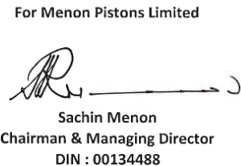
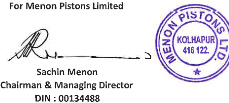
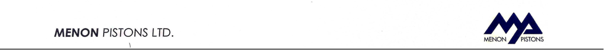
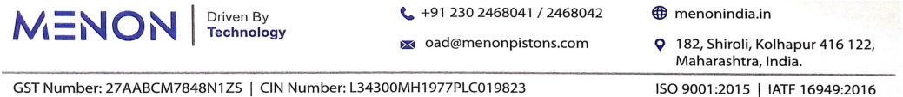

**[Image: 62a13061-aa57-4cdb-b8ae-1c66894cf1dd.pdf-0001-00.png (1241x105, 35.4KB)]**

###### May 28, 2025 

To, The Manager Department of Corporate Services BSE Limited Phiroze Jeejeebhoy Towers Dalal Street, Fort Mumbai – 400 001 

Scrip Code: 531727 

###### Subject: Outcome of Board Meeting held today i.e. Wednesday, 28th May, 2025 

###### Dear Sir/Madam, 

Pursuant to Regulation 30 of the SEBI (Listing Obligations and Disclosure requirements) Regulation 2015, we wish to inform you that the Board of Directors of the Company at their meeting held today i.e. Wednesday, 28th May, 2025 inter-alia, considered following matters: 

1. Approved and taken on record the Audited Standalone and Consolidated Financial Results of the Company for the quarter and year ended on 31st March, 2025 in accordance with Indian Accounting Standards (IND AS) as per Companies (Indian Accounting Standards) Rules, 2015. 

Pursuant to Regulation 33 of the SEBI (Listing Obligations and Disclosure Requirements) Regulations, 2015, we are enclosing herewith the following: 

   - A) The Audited Standalone and Consolidated Financial Results for the quarter and year ended on 31st March, 2025 along with Standalone and Consolidated Statement of Assets and Liabilities as on that date and Standalone and Consolidated Cash Flow Statements for the year ended on that date. 

   - B) The Auditors Report in respect of the Standalone and Consolidated Financial Results, issued by the Statutory Auditors of the Company for the quarter and year ended 31st March, 2025. 

   - C) Declaration in respect of Audit Report with Unmodified opinion on the Standalone and Consolidated Financial Results of the Company for the year ended 31st March, 2025 (‘Annexure A’) 

2. Recommended a final dividend of Re.1/- per equity share of face value of Re.1/- each (i.e. 100%) for the financial year ended 31st March, 2025, subject to the approval of the members at the ensuing 48th Annual General Meeting (AGM) of the Company. 

3. Based on the recommendation of the Audit Committee, the Board of Directors of the Company has approved the appointment of Mr. Abhay Golwalkar, Chartered Accountants, Kolhapur as an Internal Auditor of the Company for the financial year 2025-26. The required details as per SEBI Listing Regulations are enclosed herewith as “Annexure 1”). 

4. Based on the recommendation of the Audit Committee, the Board of Directors of the Company has approved the appointment of M/s. C S Adawadkar & Co., Cost Accountants, Pune as a Cost Auditor of the Company for the financial year 2025-26. The required details as per SEBI Listing Regulations are enclosed herewith as “Annexure 2”). 

5. Based on the recommendation of the Audit Committee, the Board of Directors of the Company has approved the appointment of M/s. DVD & Associates, Company Secretaries, Pune as a Secretarial Auditor of the Company for the period of five consecutive years commencing from financial year 2025-26 till financial year 2029-30, subject to approval of the members at the ensuing AGM. The required details as per SEBI Listing Regulations are enclosed herewith as “Annexure 3”). 

**[Image: 62a13061-aa57-4cdb-b8ae-1c66894cf1dd.pdf-0001-16.png (1039x113, 86.1KB)]**

**[Image: 62a13061-aa57-4cdb-b8ae-1c66894cf1dd.pdf-0002-00.png (1241x105, 35.4KB)]**

6. Based on the recommendation of the Nomination and Remuneration Committee, the Board of Directors of the Company, designated Mr. Amit Deshpande, Vice President of the Company as Senior Managerial Personnel of the Company with effect from 28th May, 2025. 

7. Based on the recommendation of the Nomination and Remuneration Committee, the Board of Directors of the Company has approved the appointment of Mr. Pramod Suresh Suryavanshi (ACS 45514), as a Company Secretary & Compliance Officer (KMP) as per the applicable provisions of the Companies Act, 2013 and SEBI Listing Regulations. The required details as per SEBI Listing Regulations are enclosed herewith as “Annexure 4”) 

8. Approved and adopted the revised “Code of Practices and Procedures for Fair Disclosure of Unpublished Price Sensitive Information” in compliance with the provisions under regulation 8(1) of the Securities and Exchange of India (Prohibition of Insider Trading) Regulations, 2015. The revised Code is effective from 10th June, 2025. 

9. Fixed to convene 48th Annual General Meeting (AGM) of the Company on Wednesday, 30th July, 2025, through Video Conferencing / Other Audio-Visual Means (VC/OAVM).  Notice of 48th Annual General Meeting will be submit and circulated in due course. 

The said updated revised Code is available on the website of the Company i.e. www.menonindia.in 

Further pursuant to Regulation 30(5) of the SEBI (Listing Obligations and Disclosure Requirements) Regulations, 2015 we hereby provide the updated list of contact details of Director, Senior Managerial Personnel and Key Managerial Personnel of the Company responsible for determining the materiality of an event or transaction or information and for the purpose of making disclosures to the Stock Exchange: 

|Sr. No.|Name|Designation|Contact Details|
|---|---|---|---|
|1.|Mr. Sachin Menon|Chairman and Managing Director Email Id:oad@menonpistons.com|Menon Pistons Limited|
|2.|Mr. Amit Deshpande|Vice President Email Id:amitdeshpande@menonpistons.com|Regd. Office : 182, Shiroli, Kolhapur – 416122|
|3.|Mr. Anil Purohit|CFO & KMP Email ID:anilpurohit@menonpistons.com|Tel. No. 0230 2468041/42|
|4.|Mr. Pramod Suryavanshi|Company Secretary & Compliance Officer Email Id:cs@menonpistons.com||

The meeting of the board of directors commenced at 12.00 noon and concluded at 01.25 P.M. 

Kindly take on your records and acknowledge the receipt. 

Yours faithfully, 

###### For Menon Pistons Limited 

Digitally signed by ANIL ANIL SATYANARAY SATYANARAYAN PUROHIT AN PUROHIT Date: 2025.05.28 13:29:18 +05'30' ________________________ Anil Purohit Chief Financial Officer 

Place: Kolhapur 

Encl.: Information as required under Reg. 30 of SEBI (LODR) Regulations, 2015 

**[Image: 62a13061-aa57-4cdb-b8ae-1c66894cf1dd.pdf-0002-15.png (1039x113, 86.1KB)]**

HEAD OFFICE 

> Chartered Accountants | Since 1938 

> LLPIN: AAT 9949 

### P G BHAGWAT LLP 

Pune - 411045. Tel.: 020 - 27290771/ 1772 / 1773 Email : pgb@pgbhagwatca.com Web : www.pgbhagwatca.com Suite 102, 'Orchard’, Dr. Pai Marg, Baner, 

###### INDEPENDENT AUDITORS’ REPORT TO THE BOARD OF DIRECTORS OF MENON PISTONS LIMITED 

###### Report on the audit of the Standalone Financial Results 

###### Opinion 

We have audited the accompanying standalone quarterly and annual financial results of Menon Pistons Limited (the Company) for the quarter ended March 31, 2025 and the year to date results for the period from April 1, 2024 to March 31, 2025, attached herewith, being submitted by the company pursuant to the requirement of Regulation 33 of the SEBI (Listing Obligations and Disclosure Requirements) Regulations, 2015, as amended (“Listing Regulations”). 

> to us these 

> In our opinion and to the best of our information and according to the explanations given standalone financial results: 

- are presented in accordance with the requirements of Regulation 33 of the Listing Regulations in this 

- i. regard; and 

- ii. give a true and fair view in conformity with the recognition and measurement principles laid down in the applicable accounting standards and other accounting principles generally accepted in India of the net profit/loss and other comprehensive income and other financial information for the quarter ended March 31, 2025 as well as the year to date results for the period from April 1, 2024 to March 31, 2025. 

###### Basis for Opinion 

We conducted our audit in accordance with the Standards on Auditing (SAs) specified under section 143(10) of the Companies Act, 2013 (the Act). Our responsibilities under those Standards are further described in the Auditor's Responsibilities for the Audit of the Standalone Financial Results section of our report. We are independent of the Company in accordance with the Code of Ethics issued by the Institute of Chartered Accountants of India together with the ethical requirements that are relevant to our audit of the financial results under the provisions of the Act and the Rules thereunder, and we have fulfilled our other ethical responsibilities in accordance with these requirements and the Code of Ethics. We believe that the audit evidence we have obtained is sufficient and appropriate to provide a basis for our opinion. 

###### Management’s Responsibilities for the Standalone Financial Results 

These quarterly financial results as well as the year to date standalone financial results have been prepared on the basis of the interim financial statements. The Company’s Board of Directors are responsible for the preparation of these financial results that give a true and fair view of the net profit and other comprehensive income and other financial information in accordance with the accounting principles generally accepted in India including the Indian Accounting Standards specified in the Companies (Indian Accounting Standards) Rule 2015 (as amended) under Section 133 of the Act read with relevant rules issued thereunder and other of the Listing Regulations. accounting principles generally accepted in India and in compliance with Regulation 33 

Offices at: Mumbai | Kolhapur | Belagavi | Dharwad | Bengaluru 

P GBHAGWATLLP Chartered Accountants | Since 1938 LLPIN: AAT 9949 . ) This responsibility also includes maintenance of adequate accounting records in accordance with the and other irregularities; selection and application of appropriate accounting policies; making judgments and estimates that are reasonable and prudent; and design, implementation and maintenance of adequate provisions of the Act for safeguarding of the assets of the Company and for preventing and detecting frauds internal financial controls that were operating effectively for ensuring the accuracy and completeness of the accounting records, relevant to the preparation and presentation of the standalone financial results that give a true and fair view and are free from material misstatement, whether due to fraud or error. 

> to going 

> il exisls. 

> In preparing the standalone financial results, the Board of Directors are responsible for assessing the Company’s ability to continue as a going concern, disclosing, as applicable, matters related concern and using the going concern basis of accounting unless the Board of Directors either intends to liquidate the Company or to cease operations, or has no realistic alternative but to do so. Our objectives are to obtain reasonable assurance about whether the standalone financial results as a whole are free from material misstatement, whether due to fraud or error, and to issue an auditor's report 

> that includes our opinion. Reasonable assurance is a high level of assurance, but is not a guarantee that an 

> audit conducted in accordance with SAs will always detect a material misstatement when 

> Auditor’s Responsibilities for the Audit of the Standalone Financial Results Misstatements can arise from fraud or error and are considered material if, individually or in the aggregate, 

> they could reasonably be expected to influence the economic decisions of users taken on the basis of these 

> The Board of Directors are also responsible for overseeing the Company’s financial reporting process. standalone financial resuits. 

skepticism throughout the audit. We also: As part of an audit in accordance with SAs, we exercise professional judgment and maintain professional 

- ¢ Identify and assess the risks of material misstatement of the standalone financial results, whether due to fraud or error, design and perform audit procedures responsive to those risks, and obtain audit evidence that is sufficient and appropriate to provide a basis for our opinion. The risk of not detecting involve collusion, forgery, intentional omissions, misrepresentations, or the override of internal control. 

- ¢ a material misstatement resulting from fraud is higher than for one resulting from error, as fraud may Obtain an understanding of internal control relevant to the audit in order to design audit procedures that are appropriate in the circumstances, but not for the purpose of expressing an opinion on the effectiveness of the company's internal control. 

- e Evaluate the appropriateness estimates and related disclosures made by the Board of Directors. 

- e to events or conditions that may cast significant doubt on the Company’s ability to continue as a going If we conclude that a material uncertainty exists, we are required to draw attention 

- auditor’s report. However, future events or conditions may cause the Company to cease to continue as a going concern. of accounting policies used and the reasonableness of accounting of the Board of Directors’ use of the going concern basis of 

- accounting and, based on the audit evidence obtained, whether a material uncertainty exists related concern. in our 

- to modify our opinion. Our conclusions are based on the audit evidence obtained up to the date of our Conclude on the appropriateness auditor’s report to the related disclosures in the financial results or, if such disclosures are inadequate, 

MENON PISTONS LIMITED AUDIT REPORT (STANDALONE) MARCH 31, 2025 

P GBHAGWAT LLP 

Chartered Accountants 

LLPIN: AAT 9949 

- Evaluate the overall presentation, structure and content of the standalone financial results, including the disclosures, and whether the financial results represent the underlying transactions and events in a manner that achieves fair presentation. 

We communicate with those charged with governance regarding, among other matters, the planned scope and timing of the audit and significant audit findings, including any significant deficiencies in internal control that we identify during our audit. 

We also provide those charged with governance with a statement that we have complied with relevant ethical requirements regarding independence, and to communicate with them all relationships and other matters that may reasonably be thought to bear on our independence, and where applicable, related safeguards. 

###### Other Matters 

The quarterly standalone financial results for the period ended March 31, 2025 are the derived figures between the audited figures in respect of the year ended March 31,2025 and the published year-to-date figures up to December 31, 2024, being the date of the end of the third quarter of the current financial year, which were subjected to limited review as required under Regulation 33 of the SEBI (Listing Obligations and Disclosure Requirements) Regulations, 2015. 

##### For P G BHAGWAT LLP 

Chartered Accountants 

Firm Registration Number: 101118W/W100682 Pukarw L il Purva Kulkarni Partner Membership Number:138855 UDIN: 25138855BMHUKE4098 Kolhapur May 28, 2025 

MENON PISTONS LIMITED AUDIT REPORT (STANDALONE) MARCH 31, 2025 

3 

||ME|NONPISTONSL|IMITED||M=NON| Technology|
|---|---|---|---|---|---|---|
|N |ON PISTONS Regd.Office Email :oad@menonpist CIN :  AUDITEDSTANDALONEFINANCIALRESUL |:182,Shiroli,K ons.com.,Web L34300MH1977P TSFORTHEQU|olhapur-416122 site :www.meno LC019823 ARTERANDYE | nindia.in ARENDED31ST|MARCH,2025 (Rs.InLakhsex | ceptEPS) |
|sr. |Particulars||QuarterEnded ||YearE |nded |
|.||31.03.2025|   |31.12.2024| |31.03.2024|   |31.03.2025|   |31.03.2024   |
|||(Audited) ||(Unaudited)|| (Audited)|| (Audited)|| (Audited)|
|1|income ||||||
||Revenuefromoperations |476000 |532154| |531633| |2123547 |2108673 |
||Otherincome |82.96 |63.59   |31067 |260.48 |71550 |
||Totalincome.|484296|| 538513|562700|21,49595||2180223|
|2||expenses ||||||
||Costofmaterialsconsumed|254921||254599|2469.10||10,10098]|9,166.07|
||Purchasesofstock-in-trade|-|=|-|-|=|
||s:':;iesz'a"n':":fa'::::izfdf"'s"e“goods,workin |(448.86)| |(6956) |(233.97) |(490.52) |151.89 |
||Employeebenefitexpenses |51657 |49372 |52751| |204717 |198857 |
||Financecosts |107.00 |10674 |12738 |213.87 |418.07 |
||Depreciationandamortisationexpense |173.42 |178.40 |152.53 |70101 |597.38 |
||Operatingexpenses |1169.87| |120065 |133307 |490856| |511030 |
||Otherexpenses |374.62 |336.46   |37290 |145050| |131942 |
||Totalexpenses |240183  | asora0| |a7a3s2| |193152]   |1875170 |
|3||profitbeforeexceptionalitemsandtax(1-2)|40113|583.73|88348|| 236443||3,05053|
|4 ||Exceptionalitems |% |: |. |-   |N |
|5|[profitbeforetax(3-4)|40113|583.73|88348| 2,36443||305053|
|6||Taxexpense ||||||
||Currenttax |113.63 |88.64 |(120.40) |484.92 |536.00 |
||Deferredtax|23.39|58.27|206.02|146.22|95.02|
||Adjustmentsoftaxrelatingtoearlierperiods |1.20 |- |- |1.20 |- |
||Totaltaxexpense(6) |138.22 |146.91 |85.62 |63234   |631.02 |
||Profitfortheyear/period(5-6)|262.91|436.82|79786|| 173200||241951|
||Othercomprehensiveincome/(Expense)||||||
|||A.OtherComprehensiveincomenottobe reclassifiedtoProfitorLossinsubsequent Periods:|0.99|(16.21)|(0.76)|(47.64)|(13.29)|
||::fe';,"tf:l'i‘;;':n"tgains/(losses)ondefined |132 |(21.67) |(1.03) |(63.67) |(17.70) |
||incometaxeffectonabove |(0.33)|5.46|027|16.03|4.46|
||B.OtherComprehensiveincometobe reclassifiedtoProfitorLossinsubsequent Periods :|-|-|-|-|-|
||Iz:}:::;‘::’::’:r:::;efaFameorthe|0.99|(16.21)|(0.76)|(47.64)|(13.29)|
|°|;::'/s::;“:;":x;"(?;’;forthe|263.90|42061|797.10|| 1,68445|| 2,406.27|
|N |::Ze“s;::'z;:al'/ec;‘::)a' |510.00 |510.00 |510,00 |510.00 |510.00   |
|11 |Jotherequityexcludingrevaluationreserve i iiutedE.P.S.of Re.1/- o|-|-|-|14,133.37|| 12,958.93|

Notes : 

|StandaloneStatementofAssetsandLiabilitiesasat31stMarch,2025.||(Rs.InLakhs)|
|---|---|---|
|o Particulars|31.03.2025 Audited|31.03.2024 Audited|
|[ASSETS NON-CURRENTASSETS |||
|(a)Property,PlantandEquipment |7,531.57 |7,343.15 |
|(b)CapitalworkinProgress |- |- |
|(¢)OtherIntangibleAssets |12,15 |17.79 |
|(d)RightofUseassets |66.36 |16.99 |
|(e)IntangibleAssetsunderDevelopment (f)Goodwill|- =|- -|
| (g)FinancialAssets|||
|(1) Investments   |2,674.54 |2,674.54 |
|(1) TradeReceivables (1)Loans|- -|= -|
| (1V)OthersFinancialAssets| 487.56| 349.09|
|(h)Deferredtaxassets(net)|-|-|
|(i)Non-CurrentTaxAssets(net ) |180.17 |292.95 |
|(j)OtherNon-Currentassets|656.92|54.10|
|TotalNon-CurrentAssets|11,609.27|10,748.61|
|CURRENTASSETS |||
|(a)Inventories |2,476.35|2,035.89|
|(b)FinancialAssets   |||
|(1) Investments|-|-|
|(1) TradeReceivables |4,323.51 |5,763.29 |
|(111}CashandCashequivalents         |220.79 |127.86 |
|(V)BankBalanceotherthan{lll )above   |573.64 |65.24 |
|(V) Loans (V1)OthersFinancialAssets |- 156.71 |- 25.28 |
|()ContractAssets (d)Assetsheldforsale|5 =|= -|
| (e )OtherCurrentassets | 251.17 | 323.86 |
|TotalCurrentAssets|8,002.17|8,341.42|
|TOTALASSETS|19,611.44|19,090.03|
|EQUITYANDLIBILITIES |||
|EQUITY |||
|(a)EquityShareCapital|510.00|510.00|
|(b)OtherEquity |14,133.37 |12,958.93 |
|TotalEquity|14,643.37|13,468.93|
|LIABILITIES|||
| NON-CURRENTLIABILITIES |||
|(a)FinancialLiabilities   |||
|(1) Borrowings |922.59 |500.00 |
|(II)TradePayable {1I1)OtherFinancialLiabilities   |@ " |= < |
|(llla) LeaseLiability|39.66|]|
|(b)LongTermProvisions |72.99 |69.70 |
|(¢)Deferredtaxliabilites(net)|355.20|225.00|
|(d)OtherNon-CurrentLiabilities |- |- |
|TotalNon-CurrentLiabilities)|1,390.44|794.70|
|CURRENTLIABILITIES |||
|(a)FinancialLiabilities |||
|(1)Borrowings|700.48|1,544.53|
|(1) LeaseLiability (1ll)TradeandotherPayable|23.52|13.27|
|(a)TotaloutstandingDuetoMicroandSmallenterprises|197.41|698.73|
|(b)Totaloutstandingduesotherthan(Ill)(a)above|1,925.36|1,080.77|
|(1V) OtherFinancialLiabilities (b )OtherCurrentLiabilities|517.43 200.55|834.03 608.37|
|      (¢)ShortTermProvisions| 12.88| 46.70|
|d) CurrentTaxLiability(Net) |s |= |
|TotalCurrentLiabilities||3,577.63|1,826.40|
|TOTALEQUITYANDLIABILITIES]||19,611.44|19,090.03|

###### Standalone Cash Flow Statement for the year ended 31st March, 2025. 

||YearEnded|(Rs.InLakhs) YearEnded|
|---|---|---|
|| Particulars 31.03.2025| 31.03.2024|
||Audited|Audited|
|A||cashFlowsfromoperatingactivities||
||NetProfitBeforeTaxes 2,364.43]|3,050.53|
||Adjustmentsfor :   ||
||Depreciation 701.01 ProvisionforDoubtfuldebts |597.38 |
|| - Debitbalanceswrittenoff &     |4 1.40] |
||Assetswrittenoff 1.75|=|
||Interestincome (45.47)||(13.68)]|
||Interestexpenses 410.21|415.63|
||Interestonleaseliability 3.61|2.43|
||Dividendreceived =|(480.00)|
||Creditbalancewrittenoff E|=|
||Provisionforbaddebts 13.80;|=|
||Profitonsaleofassets. -        |(3.65) |
||Operatingprofitsbeforeworkingcapitalchanges 3,449.34]|3,570.04]|
||Adjustmentsfor :||
||(Increase)/decreaseIntradeandother recelvables 1,42598]|(982.00)|
||(Increase)/decreaseinfinancialassets (258.41)       |(71.17) |
||(Increase)/decreaseinothernon-financialassets 9.02||(17.39)|
||(Increase)/decreaseininventories (440.46)|     |38.40 |
||(Increase)/decreaseinprovisions (30.53)]       |15.26] |
||(Increase)/decreaseinotherfinancialLiabilities (235.41),|193.51|
||(Increase)/decreaseinothercurrentLiabilities (407.82)|(459.75)!|
||Increase/(decrease)intrade andotherpayables 343.27|506.27||
||Cashgeneratedfromoperations 3,854.98||2,793.17||
||IncomeTaxPaid (373.34)|(537.45)]|
||NetCashfromoperatingactivities 3,481.64||2,255.72||
|B||CashFlowsfrominvestingactivities        ||
||PaymentsforPPEandIntangibleassets (1,544.87)|(2,106.28)|
||ProceedsfromsaleofPPE -      |29.24] |
||(Increase)/decreaseinfixeddeposits (504.92)     |(1.89) |
||InvestmentinSubsidiary -|-|
||InvestmentinRightofuseasset =    |=|
||Interestreceived 33.97||5.70|
||Dividendreceived =       |480.00 |
||NetCashfrominvestingactivities (2,015.82)|(1,593.23)|
|C||Cashflowsfromfinancingactivities ||
||ProceedsfromLongtermborrowings(Net) 1,300.00|-|
|| Repaymentoflongtermborrowings (617.37) | (500.00),|
||Increase/(Decrease)inShorttermborrowings (1,104.09)    |900.24| |
||InterestPaid (413.60) LeaseRentalsPaid (27.84)|(428.23) (27.24)|
||DividendPaid (510.00)       | (510.00)|
||NetCashfromfinancingactivities (1,372.90)|(565.23),|
||NetincreaseinCashandCashequivalents 92.93               |97.26 |
||CashandCashequivalentsatbeginningofperiod{refernote7a) 127.86|30.60)|
||CashandCashequivalentsatheendofPeriod (refernote7a) 220.79|127.86|
|Notes|toCashFlowStatement||
|1| CashFlowStatementhasbeenpreparedunderindirectmethodsetoutinIndAS-7Statemento|fCashFlows.|

Notes: 

- 1 |The Company operates only in one segment, i.e. "Auto Components”. 

- 2 |The above results have been prepared in accordance with the Companies (Indian Accounting Standards) Rules, 2015 (IND AS) prescribed under section 133 of the Companies Act, 2013 and other recognized accounting practices and policies to the extent applicable. 

   - The above results were reviewed and recommended by the Audit Committee and approved by the Board of Directors| of the Company at their meetings held on 28th May, 2025. 

   - The figures of the last quarter are the balancing figures between the audited figures in respect of the full financial year] up to 31st March, 2025 and 31st March, 2024 and the unaudited year to date figures upto 31st December, 2024 and 31st December, 2023 being the date of the end of the third quarter of the financial year, which were subjected to limited review. 

   - The Board of Directors of the Company have recommended a final dividend at 100% i.e. Re.1/- per equity share of face value of Re. 1/- each aggregating to Rs.510/- Lakhs to its shareholders subject to approval of the shareholders in the| ensuing Annual General Meeting. 

Figures for the previous period are regrouped or reclassified wherever necessary. 

Place : Kolhapur Date : 28th May, 2025 

**[Image: 62a13061-aa57-4cdb-b8ae-1c66894cf1dd.pdf-0009-08.png (300x207, 20.9KB)]**

<!-- Start of picture text -->
For  Menon  Pistons Limited . Sachin  Menon Chairman  &  Managing  Director DIN  :  00134488 <!-- End of picture text -->

Chartered Accountants 

Suite 102, 'Orchard’, Dr. Pai Marg, Baner, Pune - 411045. Tel.: 020 - 27290771 Email : pgb@pgbhagwatca.com Web: www.pgbhagwatca.com 

**[Image: 62a13061-aa57-4cdb-b8ae-1c66894cf1dd.pdf-0010-02.png (275x32, 5.1KB)]**

<!-- Start of picture text -->
P  GBHAGWATLLP <!-- End of picture text -->

###### HEAD OFFICE 

LLPIN: AAT 9849 

###### INDEPENDENT AUDITORS’ REPORT 

###### To the Board of Directors of Menon Pistons Limited 

###### Report on the Audit of Consolidated Financial Results 

###### Opinion 

We have audited the accompanying consolidated annual financial results of Menon Pistons Limited (hereinafter referred to as the “Holding Company”), its subsidiaries (Holding Company and its subsidiaries together referred to as “the Group”), for the year ended March 31, 2025, attached herewith, being submitted by the Holding Company pursuant to the requirement of Regulation 33 of the SEBI (Listing Obligations and Disclosure Requirements) Regulations, 2015, as amended ('Listing Regulations’). In our opinion and to the best of our information and according to the explanations given to us and based on the consideration of reports on separate audited financial statements ffinancial results/ financial information of the subsidiaries the aforesaid consolidated financial results: 

- i. include the annual financial results of the following entities 

- a. Rapid Machining Technologies Private Limited b. Lunar Enterprise Private Limited 

- ii. are presented in accordance with the requirements of Regulation 33 of the Listing Regulations in this regard; and 

- principles generally accepted in India, of net profit and other comprehensive income and other financial 

- iii. give a true and fair view in conformity with the applicable accounting standards, and other accounting information of the Group for the year ended March 31, 2025. 

###### Basis for Opinion 

We conducted our audit in accordance with the Standards on Auditing (SAs) specified under section 143(10) of the Companies Act, 2013 (“Act”). Our responsibilities under those Standards are further described in the Auditor's Responsibilities for the Audit of the Consolidated Financial Results section of our report. We are independent of the Group, its associates and its jointly controlled entities in accordance with the Code of Ethics issued by the Institute of Chartered Accountants of India together with the ethical requirements that are relevant to our audit of the financial statements under the provisions of the Act and the Rules thereunder, and we have fulfilled our other ethical responsibilities in accordance with these requirements and the Code of Ethics. We believe that the audit evidence obtained by us and other auditors in terms of their reports refened to in "Other Matter” paragraph below, is sufficient and appropriate to provide a basis for our opinion. 

Offices at: Mumbai | Kolhapur | Belagavi | Dharwad | Bengaluru 

Chartered Accountants 

## P G BHAGWAT LLP 

###### Board of Directors’ Responsibilities for the Consolidated Financial Results 

These Consolidated financial results have been prepared on the basis of the consolidated annual financial statements. The Holding Company's Board of Directors are responsible for the preparation and presentation of these consolidated financial results that give a true and fair view of the net profit and other comprehensive income and other financial information of the Group in accordance with the Indian Accounting Standards prescribed under Section 133 of the Act read with relevant rules issued thereunder and other accounting principles generally accepted in India and in compliance with Regulation 33 of the Listing Regulations. The respective Board of Directors of the companies included in the Group are responsible for maintenance of adequate accounting records in accordance with the provisions of the Act for safeguarding of the assets of the Group and for preventing and detecting frauds and other irregularities; selection and application of appropriate accounting policies; making judgments and estimates that are reasonable and prudent; and the design, implementation and maintenance of adequate internal financial controls, that were operating effectively for ensuring accuracy and completeness of the accounting records, relevant to the preparation and presentation of the consolidated financial results that give a true and fair view and are free from material misstatement, whether due to fraud or error, which have been used for the purpose of preparation ul lhie cunsulidaled Hnanclal resulls by the Directors of the Holding Lompany, as atoresaid. 

> In preparing the consolidated financial resuits, the respective Board of Directors of the companies included 

> in the Group, its associates and its jointly controlled entities are responsible for assessing the ability of the Group to continue as a going concern, disclosing, as applicable, matters related to going concern and using 

> the going concern basis of accounting unless the respective Board of Directors either intends to liquidate 

> the Group or to cease operations, or has no realistic alternative but to do so. 

> the financial reporting process of the Group. The respective Board of Directors of the companies included in the Group are responsible for overseeing 

###### Auditor’'s Responsibilities for the Audit of the Consolidated Financial Results 

Our objectives are to obtain reasonable assurance about whether the consolidated financial results as a whole are free from material misstatement, whether due to fraud or error, and to issue an auditor’s report that includes our opinion. Reasonable assurance is a high level of assurance, but is not a guarantee that an audit conducted in accordance with SAs will always detect a material misstatement when it exists. Misstatements can arise from fraud or error and are considered material if, individually or in the aggregate, they could reasonably be expected to influence the economic decisions of users taken on the basis of these consolidated financial results. skepticism throughout the audit. We also: As part of an audit in accordance with SAs, we exercise professional judgment and maintain professional 

fraud or error, design and perform audit procedures responsive to those risks, and obtain audit evidence is sufficient and appropriate to provide a basis for our opinion. The risk of not detecting a material Identify and assess the risks of material misstatement of the consolidated financial results, whether due to that misstatement resulting from fraud is higher than for one resulting from error, as fraud may involve collusion, forgery, intentional omissions, misrepresentations, or the override of internal control. 

MENON PISTONS LIMITED AUDIT REPORT (CONSOLIDATED) MARCH 31, 2025 

## P GBHAGWATLLP Chartered Accountants | Since 1938 

LLPIN: AAT 9949 

- Obtain an understanding of internal control relevant to the audit in order to design audit procedures that are 

- appropriate in the circumstances but not for the purposes of expressing an opinion on the effectiveness of the Company'’s internal control. 

- Evaluate the appropriateness of accounting policies used and the reasonableness of accounting estimates and related disclosures made by the Board of Directors. 

- Conclude on the appropriateness of the Board of Directors use of the going concern basis of accounting and, based on the audit evidence obtained, whether a material uncertainty exists related to events or conditions that may cast significant doubt on the ability of the Group to continue as a going concern. If we conclude that a material uncertainty exists, we are required to draw attention in our auditor's report to the related disclosures in the consolidated financial results or, if such disclosures are inadequate, to modify our opinion. Our conclusions are based on the audit evidence obtained up to the date of our auditor’s report. However, future events or conditions may cause the Group, its associates and its jointly controlled entities to cease to continue as a going concern. Evaluate the overall presentation, structure and content of the consolidated financial results, including the disclosures, and whether the consolidated financial results represent the underlying transactions and events in a manner that achieves fair presentation. 

- Obtain sufficient appropriate audit evidence regarding the financial results/financial information of the entities within the Group to express an opinion on the consolidated Financial Results. We are responsible for the direction, supervision and performance of the audit of financial information of such entities included in the consolidated financial results of which we are the independent auditors. For the other entities included in the consolidated Financial Results, which have been audited by other auditors, such other auditors remain responsible for the direction, supervision and performance of the audits carried out by them. We remain solely responsible for our audit opinion. 

We communicate with those charged with governance of the Holding Company and such other entities included in the consolidated financial results of which we are the independent auditors regarding, among other matters, the planned scope and timing of the audit and significant audit findings, including any significant deficiencies in internal control that we identify during our audit. 

We also provide those charged with governance with a statement that we have complied with relevant ethical requirements regarding independence, and to communicate with them all relationships and other matters that may reasonably be thought to bear on our independence, and where applicable, related safeguards. 

We also performed procedures in accordance with the circular issued by the SEBI under Regulation 33(8) of the Listing Regulations, as amended, to the extent applicable. 

###### Other Matters 

- i. The quarterly consolidated financial results for the period ended March 31, 2025 are the derived figures between the audited figures in respect of the year ended March 31,2025 and the published year-to-date figures up to December 31, 2024, being the date of the end of the third quarter of the current financial 

MENON PISTONS LIMITED AUDIT REPORT (CONSOLIDATED) MARCH 31, 2025 

P GBHAGWAT LLP Chartered Accountants | Since 1938 

LLPIN: AAT 9949 

year, which were subjected to limited review as required under Regulation 33 of the SEBI (Listing Obligations and Disclosure Requirements) Regulations, 2015. 

#### For P G BHAGWAT LLP 

Chartered Accountants 

Firm Registratign Number: 101118W/W100682 

Purva Kulkarni Partner 

Membership Number: 

UDIN: 25138855BMHUKF6414 Kolhapur May 28, 2025 

MENON PISTONS LIMITED AUDIT REPORT (CONSOLIDATED) MARCH 31, 2025 

4 

|MEN|N’PISTONS MENON |PISTONSLIMI |TED ||MENON| Tectnology|
|---|---|---|---|---|---|---|
| Sr. | Regd.Office:182 Email:oad@menonpistons CIN :L343 AUDITEDCONSOLIDATEDFINANCIALRESULTS Particulars|,Shiroli,Kolh .com.,Websit 00MH1977PLC0  FORTHEQUAR |pur-416122 e:www.menonin 19823 TERANDYEAR QuarterEnded |dia.in  ENDED31STM |ARCH,2025 (Rs.InLakhsex YearE |ceptEPS) nded |
|Ne-||31.03.2025| |31.12.2024|    |31.03.2024|     |31.03.2025|   |31.03.2024 |
|||(Audited)||(Unaudited) || (Audited) || (Audited)||(Audited)|
|1|lincome ||||||
||Revenuefromoperations |557587 |631080 |607403 |2536596 |2576528 |
||Otherincome |86.95 |3492 |20.49 |17158 |57.64 |
||Totalincome|566282|63a572||6o00a52||2553754||2582292|
|2|lExpenses || ||||
||Costofmaterialsconsumed |285187  | 275152| |269672 |1123991 |10247.36 |
||Purchasesofstock-in-trade|-|288|(102.83)|16.61|322,53|
||E:'::iz:‘n:":f:;:;':z:;g"“"edgoods,worlin-|(778.29)|(85.26)|(550.27)|(678.35)|(83.12)|
||Employeebenefitexpenses |664.51 |615.92 |644.13 |2,546.73 |2,433.26 |
||Financecosts |107.83 |107.50 |12150 |417.11 |394.80 |
||Depreciationandamortisationexpense |287.86 |266.79 |25582 |106226 |955.25 |
||Operatingexpenses |154357 |156168 |183036 |617720   |613703 |
||Otherexpenses |423.95 |35463   |42976  | 157420| |145845 |
||[Totalexpenses |510130  || s575.66| |532519| |22355.67| |2236556 |
|3||profitbeforeexceptionalitemsandtax(1-2)|56152|770.06|769.33||3,18187||345736|
|4 ||Exceptionalitems |- |N |» |-   |= |
|5|[profitbeforetax(3+4)|561.52|770.06|76933|| 318187||345736|
|6||Taxexpense ||||||
||Currenttax |12113 |14094 |(80.43) |68192 |798.05 |
||Deferredtax |9.45 |47.21 |7131 |109.78 |54.80 |
||[Adjustmentsoftaxrelatingtoearlierperiods |5.47 |- |54.30 |547 |(40.60) |
||Totaltaxexpense(6) |136.05 |188.15 |4568 |797.17   |812.25 |
|7|[profitfortheyear/period(5-6)|425.47|581.91|72365| 238870|26851|
|8||Othercomprehensiveincome/(Expense)||||||
||;?;;::"xg’:m:::‘z;:’ereclassified |041 |(16.11) |(117) |(47.95) |(12.89) |
||zgieg-:lfzsurementgains/(losses)ondefinedbenefit |055 |(2159) |(ws7) |(64.08) |(17.23) |
||Incometaxeffectonabove |(0.14) |543 |040 |16.13 |434 |
||B.OtherComprehensiveincometobereclassifiedto ProfitorLossinsubsequentPeriods:|}|]|.|.|i|
||:T:fo:;e;s():omprehensweincomefortheyear/period,) |041|(16.11)|(L17)]|(@7.95)|(12.89)|
|9|‘:fo::(:;:v:;rehenslveincomefortheyear/period,net|425.88|565.80|72248|2,336.75|263222|
|i |:’:a'‘:e”\‘;:h‘j:t‘;i’:{;i’:f' |510.00 |510.00 |510.00 |510.00 |510.00   |
|11 |[otherequityexcludingrevaluationreserve - ST,     |-   |- |< |1520905  || 1338231 |
|2|   ?::'::::u:::;‘;jER.S:ofRei; /KQH     |\ 0.83   |114|142|268|5.19|
||=   ROLHAPUR  u%46122S| - |||||

|Notes :||||
|---|---|---|---|
|ConsolidatedStatementofAssetsandLiabilitiesas at31stMarch,2025. ||(Rs. InLakhs) ||
|" |31.03.2025 |31.03.2024 ||
|Farticulars|Audited|Audited||
|[ASSETS ||||
|NON-CURRENTASSETS||||
|(a)Property,PlantandEquipment (b)CapitalworkinProgress|8,695.73 221|8,595.37 5.86||
| ()InvestmentProperty| =| S||
|(d)OtherIntangibleAssets |38.36 |42.42 ||
|(e)RightofUseassets (f)IntangibleAssetsunderDevelopment|61.79 =|16.99||
| (g)ProvisionalGoodwill| 325.14|325.14||
| (h)FinancialAssets||||
|(1) Investments (1)TradeReceivables|0.37 -|0.37 -||
|(1)Loans|]|2||
| (1)OthersFinancialAssets | 592.25 | 404.27 ||
|(i)Deferredtaxassets(net} (j)Non-CurrentTaxassets (Net)|36.88 212.14|47.76 292.95||
|     (k)OtherNon-Currentassets | 656.92 | 54.10 ||
|TotalNon-CurrentAssets||10,621.79|9,785.23||
|'CURRENTASSETS (a)Inventories|3,571.85|2,829.52||
| (b) FinancialAssets (1) Investments| -| =||
|   (1) TradeReceivables | 5,519.82 | 6,616.21 ||
|(1)CashandCashequivalents|253.43|209.79||
|(1V)BankBalanceotherthan(il)above (V) Loans|725.20 -«|66.30 -||
|   (V1)OthersFinancialAssets| 167.43| 25.74||
|(c)ContractAssets |% |- ||
|(d)Assetsheldforsale (d)OtherCurrentassets|- 535.07|- 727.26||
| TotalCurrentAssets|| 10,772.80| 10,474.82||
|TOTALASSETS!|21,394.59|20,260.05||
|EQUITYANDLIBILITIES||||
| EQUITY||||
|(a)EquityShareCapital|510.00|510.00||
| (b )OtherEquity | 15,209.06 | 13,382.31 ||
|TotalEquity]||15,719.06|13,892.31||
|LIABILITIES INON-CURRENTLIABILITIES||||
| (2)FinancialLiabilities   ||||
|(1) Borrowings (I1)TradePayable|92259 -|500.00 .||
| (Itt)OtherFinancialLiabilities.| -| -||
|(1lla) LeaseLiability|39.66|=||
|    (b)LongTermProvisions | 80.51 | 74.91 ||
|(¢)Deferredtaxliabilites(net) (d)OtherNon-CurrentLiabilities |355.20 = |272.43 = ||
|TotalNon-CurrentLiabilities|1,397.96|847.34||
|'CURRENTLIABILITIES||||
|(a)FinancialLiabilities   ||||
|(1) Borrowings (la) LeaseLiability|700.48 23.52|1,544.53 13.27||
|    (11)TradeandotherPayable| -| =||
| (a)TotaloutstandingDuetoMicroandSmallenterprises| 258.17| 726.97||
|(b)Totaloutstandingduesotherthan(ii)(a)above|2,497.41|1,512.04||
| (1Il)OtherFinancialLiabilities| 575.37| 905.78||
| (b)Other CurrentLiabilities| 208.58| 768.68||
|(c)ShortTermProvisions|14.04|47.37||
| (d)CurrentTaxLiability (Net ) | - | 1.76 |OQ|
|TotalCurrentLiabilities||4,277.57|5,520.40|EN|
|TOTALEQUITYANDLIABILITIES]||21,394.59|20,260.05|*|

|Conso|lidatedCashFlowStatementfortheyearended31stMarch,2025||(Rs.InLakhs)|
|---|---|---|---|
|||YearEnded |YearEnded |
||Particulars|31.03.2025 |31.03.2024 |
|||Audited|Audited|
|A||CashFlowsfromoperatingactivities|||
||NetProfitBeforeTaxes|3,181.87|3,457.36|
||Adjustmentsfor:|||
|| Depreciation |1,062.25 |955.25 |
||Debitbalanceswrittenoff/Provisionfordoubtfuldebts |0.43 |1.40 |
||Baddebtswrittenoff|13.80|2.95|
||Assetswrittenoff|175|=|
||Interestincome|(64.31)]|(15.85)|
||Interestexpenses |410.21 |390.95 |
||Intereston leaseliability |3.61 |243 |
||Dividendreceived |- |- |
||ForexRestatement |- |(5.17)] |
||CreditBalanceswrittenback |(2.41) |- |
||Profitonsaleofassets |(0.11) |(3.65) |
||Operatingprofitsbeforeworkingcapitalchanges|4,607.09|4,785.67|
||Adjustmentsfor :|||
||(Increase)/decreaseintradeand other receivables|1,108.24|(1,061.46)||
||(Increase)/decreaseinFinancialAssets|(258.10)|(70.18)|
||(Increase)/decreaseinOtherCurrentAssets|-|5.28||
||(Increase)/decreaseinOtherNon-FinancialAssets |111.13 |772.45) |
||(Increase)/decreaseininventories |(742.32)| |(114.91)| |
||Increase/(decrease)inProvisions |(27.61) |1833 |
||Increase/(decrease)inOtherFinancialLiabilities |(246.81) |219.46] |
||Increase/(decrease)inOtherCurrentLiabilities |(571.90) |(1,923.27) |
||Increase/(decrease)intrade and otherpayables|501.22|544.33)|
||Cashgeneratedfromoperations |4,480.64 |3,175.40 |
||IncomeTaxPaid|(590.39)|(746.66)|
||NetCashfromoperatingactivities|3,890.25|2,428.74|
|B ||CashFlowsfrominvestingactivities || |
||PaymentsforPPEandIntangibleassets|(1,858.55)|| (2,999.75)|
|| ProceedsfromsaleofPPE| 47.25|   29.24|
||Investmentinsubsidiary(netassetvalue) |=|=|
||PurchaseofGoodwill |= |= |
||(Increase)/decreaseinfixeddeposits|(704.92)| 726.61|
||InvestmentinRightofuseasset|-|2|
||Interestreceived |42.53 |24.83 |
||Dividendreceived |- |- |
||NetCashfrominvestingactivities|2,473.69)|(2,219.07)|
|C||Cashflowsfromfinancingactivities |||
||ProceedsfromLongtermborrowings(Net) |1,300.00 |- |
||Repaymentoflongtermborrowings|(617.37)|-|
||Increase/(Decrease)inshorttermborrowings |{1,104.12) |892.49 |
||InterestPaid|(413.60)|(404.05)|
||Lease Rent|(27.84)]| (27.24)|
||DividendPaid |(510.00) |(510.00)’ |
||NetCashfromfinancingactivities|(1,372.93)|(28.80)|
||NetincreaseinCashandCashequivalents|43.64|160.87|
||CashandCashequivalentsatbeginningofperiod(refernote7a)                |209.79 |48.92 |
||CashandCashequivalentsatheendofPeriod (refernote7a )|253.43|209.79|
|Note|toCashFlowStatement|||
| 1|   Cash FlowStatementhasbeenpreparedunderindirectmethodsetouti|nIndAS-7Statement|ofCashFlows.|

###### Notes: 

- The group operates only in one segment, i.e. "Auto Components”. 

- The above results have been prepared in accordance with the Companies (Indian Accounting Standards) Rules, 2015 (IND AS) prescribed under section 133 of the Companies Act, 2013 and other recognized accounting practices and| policies to the extent applicable. 

- The above results were reviewed and recommended by the Audit Committee and approved by the Board of Directors| of the Company at their meetings held on 28th May, 2025. 

- The figures of the last quarter are the balancing figures between the audited figures in respect of the full financiall year up to 31st March, 2025 and 31st March, 2024 and the unaudited year to date figures up to 31st December, 2024| and 31st December, 2023, being the date of the third quarter end of the financial year, which was subjected to limited review. 

- The consolidated financial results include the results of following subsidiary : 

- a) Rapid Machining Technologies Private Limited b) Lunar Enterprise Private Limited. 

Figures for the previous period are regrouped or reclassified wherever necessary. 

Place : Kolhapur Date : 28th May, 2025 

**[Image: 62a13061-aa57-4cdb-b8ae-1c66894cf1dd.pdf-0017-09.png (458x206, 73.6KB)]**

<!-- Start of picture text -->
For  Menon  Pistons Limited e\STo A =  KOLHPUR)  - \l%  416122  /S Sachin  Menon  * Chairman  &  Managing  Director DIN  :  00134488 <!-- End of picture text -->

MENON PISTONS LTD. 

**[Image: 62a13061-aa57-4cdb-b8ae-1c66894cf1dd.pdf-0018-01.png (137x40, 12.4KB)]**

<!-- Start of picture text -->
MENON  PISTONS # <!-- End of picture text -->

##### Annexure A 

###### 28" May, 2025 

###### To, 

The Manager-DCS BSE Limited Phiroze Jeejeebhoy Towers, Dalal Street, Mumbai - 400001 

Scrip Code: 531727 

Subject: Declaration pursuant to Regulation 33(3)(d) of SEBI (Listing Obligations and Disclosure Requirements) Regulations, 2015 

###### Dear Sir/Madam, 

Pursuant to provisions of Regulation 33(3)(d) of the Securities and Exchange Board of India (Listing Obligations and Disclosure Requirements) Regulations, 2015 we hereby confirm and declare that the Statutory Auditors of the Company P G BHAGWAT LLP, Chartered Accountants (FRN : 101118 W/W100682) have issued Audit Report on the Audited Standalone and Consolidated Financial Results of the Company for the quarter and year ended 31! March, 2025 with the Unmodified Opinion. Kindly take the same on your record. Thanking you, Yours faithfully, K. For Menon Pistons Limited @ Sachin Menon Anil Purohit Chairman & Managing Director CFO DIN: 00134488 

Place: Kolhapur 

# M=NON 

Driven By €, +91230 2468041 / 2468042 Technology 

oad@menonpistons.com 

GST Number: 27AABCM7848N1ZS | CIN Number: L34300MH1977PLC019823 

@ menonindia.in 

Q 182, Shiroli, Kolhapur 416 122, Maharashtra, India. 

1SO 9001:2015 | IATF 16949:2016 

**[Image: 62a13061-aa57-4cdb-b8ae-1c66894cf1dd.pdf-0019-00.png (1241x105, 35.4KB)]**

###### Annexure 1 

###### Information about the Appointment of Mr. Abhay Golwalkar as an Internal Auditor of the Company for the Financial Year 2025-26 

|Sr. No.|Particulars|Details|
|---|---|---|
|1|Reason for Change Appointment, ~~Resignation, Removal,~~ ~~Death or Otherwise~~|Re-appointed Mr. Abhay Golwalkar, Chartered Accountants, as an Internal Auditorof the Company, to conduct Internal Audit as required under Section 138 of Companies Act, 2013 and Companies (Accounts) Rules, 2014.|
|2|Date of appointment/cessation (as applicable) and term of appointment|28thMay, 2025 The Board of Directors at its meeting held on today i.e. 28thMay, 2025, has re-appointed Mr. Abhay Golwalkar, Chartered Accountants, as an Internal Auditor of the Company for the Financial Year 2025-26.|
|3|Brief profile (in case appointment)|CA Mr. Abhay M. Golwalkar is a reputed and dynamic Practicing CA proprietary firm located in Kolhapur. Key Highlights:Having 34 years of experience of providing high- quality services in Audit, Assurance, Direct Taxes, and Indirect Taxes. Services Provide:  Statutory Audits Private Limited Companies, Public Limited Companies, Partnership firms, Industries, Banks, NGOs.  Risk based Internal Audits of Large Listed companies.  Tax Planning and Advisory, Representation before Tax Authorities and Tax Audit Services  Indirect Tax Planning, GST Compliance and Advisory, GST Audits and Reviews|
|4|Disclosure of relationship between directors (in case appointment of a Director)|Not Applicable|

**[Image: 62a13061-aa57-4cdb-b8ae-1c66894cf1dd.pdf-0019-04.png (1039x113, 86.1KB)]**

**[Image: 62a13061-aa57-4cdb-b8ae-1c66894cf1dd.pdf-0020-00.png (1241x105, 35.4KB)]**

###### Annexure 2 

###### Information about the Appointment of M/s. C S Adawadkar & Co. as a Cost Auditor of the Company for the Financial Year 2025-26 

|Sr. No.|Particulars|Details|
|---|---|---|
|1|Reason for Change Appointment, ~~Resignation, Removal,~~ ~~Death or Otherwise~~|Appointed M/s. C S Adawadkar & Co., Cost Accountants, as aCost Auditorof the Company, to conduct Cost Audit as required under the Companies Act, 2013 and Rules made thereunder.|
|2|Date of appointment/cessation (as applicable) and term of appointment|28thMay, 2025 The Board of Directors at its meeting held on today i.e. 28thMay, 2025, appointed M/s. C S Adawadkar & Co., Cost Accountants, as a Cost Auditor of the Company for the Financial Year 2025-26.|
|3|Brief profile (in case appointment)|The Firm was founded by CMA Chandrashekhar S. Adawadkar, a fellow member of The Institute of Cost Accountants of India. He is also qualified as an Insolvency Professional (IP), Registered Valuer (RV), Independent Director (ID), Information Systems Security Auditor, Forensic Auditor, Social Auditor. He has also attended MDP designed for senior management from IIMA. Key Highlights: The firm is in existence for more than twenty two (22) years. It provides services across India and globally in various fields of Management including Cost Audit, Activity Based Costing, Strategic Cost Management, SAP ERP implementation audit, Internal audit, Corporate Governance, Turnaround & profit improvement strategy, Automation of MIS amongst other services. CMA Chandrashekhar S. Adawadkar has more than 30 years of global experience in 8 countries. He has provided services to more than 100 companies in 15 sectors of economy.~~His passion~~ ~~includes teaching having delivered around 2000 hours of lectures~~ ~~and mentoring young professionals.~~Some of the highlights of his career include attending research conference of United Nations, Geneva, speech on challenges in manufacturing sector broadcast by All India Radio across India as part of make in India initiative, involvement in roll out of ERP system for SME sector and delivering to its clients consistently with passion and ethics.|
|4|Disclosure of relationship between directors (in case appointment of a Director)|Not Applicable|

**[Image: 62a13061-aa57-4cdb-b8ae-1c66894cf1dd.pdf-0020-04.png (1039x113, 86.1KB)]**

**[Image: 62a13061-aa57-4cdb-b8ae-1c66894cf1dd.pdf-0021-00.png (1241x105, 35.4KB)]**

###### Annexure 3 

###### Information about the Appointment of M/s. DVD & Associates as a Secretarial Auditors of the Company 

|Sr. No.|Particulars|Details|
|---|---|---|
|1|Reason for Change Appointment, ~~Resignation,~~ ~~Removal,~~ ~~Death or Otherwise~~|In compliance with Regulation 24A of the Listing Regulations, appointed M/s. DVD & Associates., Company Secretaries, as a Secretarial Auditorof the Company, to conduct Secretarial Audit as required under the Companies Act, 2013 and Rules made thereunder and under the SEBI Listing Regulations.|
|2|Date of appointment/cessation (as applicable) and term of appointment|28thMay, 2025 The Board of Directors at its meeting held on today i.e. 28thMay, 2025, Appointed M/s. DVD & Associates, Company Secretaries, as a Secretarial Auditor of the Company for the period of five (5) consecutive years commencing from financial year 2025-26 till financial year 2029-30.|
|3|Brief profile (in case appointment)|M/s. DVD & Associates is a peer reviewedProprietary firmof CS. Devendra V Deshpande. CS. Deshpande is practice since 2004and was aPresidentof the Institute of Company Secretaries of India (ICSI) for the year 2022. Presently he is Chairman of ICSI Professional Skills Enhancement Board of ICSI 2025 and Director of ICSI – International ADR (Alternate Dispute Resolution) Centre. He is a regular faculty at various programs, webinars and few International conferences in the field of Corporate Laws. Key Highlights: The Firm is specialized in Audit Assurance, Mergers, corporate law complex advisory, secretarial services in respect of fund raising especially SME and Main Board IPOs. Assignments handled:  Secretarial Audit of Listed, Unlisted and other Entities  Legal Due Diligences, Corporate Restructuring Consultancy  Certifications for RBI under FEMA and other statutes|
|4|Disclosure of relationship between directors (in case appointment of a Director)|Not Applicable|

**[Image: 62a13061-aa57-4cdb-b8ae-1c66894cf1dd.pdf-0021-04.png (1039x113, 86.1KB)]**

**[Image: 62a13061-aa57-4cdb-b8ae-1c66894cf1dd.pdf-0022-00.png (1241x105, 35.4KB)]**

###### Annexure 4 

###### Information about the Appointment of Mr. Pramod Suresh Suryavanshi as a Company Secretary and Compliance Officer 

|Sr. No.|Particulars|Details|
|---|---|---|
|1|Reason for Change Appointment, Resignation, Removal, Death or Otherwise|Appointment of Mr. Pramod Suresh Suryavanshi (ACS 45514), as aCompany Secretary & Compliance Officer(KMP) as per the Companies Act, 2013 and SEBI Listing Regulations|
|2|Date of appointment/cessation (as applicable) and term of appointment|28thMay, 2025 The Board of Directors at its meeting held on today i.e. 28th May, 2025, has appointed Mr. Pramod Suresh Suryavanshi, as a Company Secretary & Compliance Officer w.e.f. 28th May, 2025.|
|3|Brief profile (in case appointment)|Mr. Pramod Suryavanshi is an Associate member of the Institute of Company Secretaries of India (ICSI) and is into profession from last 8+ years. He has done his Graduation Degree in Commerce and also completed his Post Graduate in Commerce from Shivaji University. He has Completed his Law degree from Shahaji Law College, Kolhapur. He is having experience in the fields of Company Secretarial compliance under Companies Act 2013 including managing various areas of secretarial issues, drafting / vetting various documents and resolving compliance issues. He is very well versed with the Compliance under the SEBI Regulations. He previously worked with Practising Company Secretaries firm, Listed Company, Public Companies and MNC’s.|
|4|Disclosure of relationship between directors (in case appointment of a Director)|Not Applicable|

**[Image: 62a13061-aa57-4cdb-b8ae-1c66894cf1dd.pdf-0022-04.png (1039x113, 86.1KB)]**

---

## Extracted Images

| # | File | Dimensions | Size |
|---|------|------------|------|
| 1 | 62a13061-aa57-4cdb-b8ae-1c66894cf1dd.pdf-0001-00.png | 1241x105 | 35.4KB |
| 2 | 62a13061-aa57-4cdb-b8ae-1c66894cf1dd.pdf-0001-16.png | 1039x113 | 86.1KB |
| 3 | 62a13061-aa57-4cdb-b8ae-1c66894cf1dd.pdf-0002-00.png | 1241x105 | 35.4KB |
| 4 | 62a13061-aa57-4cdb-b8ae-1c66894cf1dd.pdf-0002-15.png | 1039x113 | 86.1KB |
| 5 | 62a13061-aa57-4cdb-b8ae-1c66894cf1dd.pdf-0009-08.png | 300x207 | 20.9KB |
| 6 | 62a13061-aa57-4cdb-b8ae-1c66894cf1dd.pdf-0010-02.png | 275x32 | 5.1KB |
| 7 | 62a13061-aa57-4cdb-b8ae-1c66894cf1dd.pdf-0017-09.png | 458x206 | 73.6KB |
| 8 | 62a13061-aa57-4cdb-b8ae-1c66894cf1dd.pdf-0018-01.png | 137x40 | 12.4KB |
| 9 | 62a13061-aa57-4cdb-b8ae-1c66894cf1dd.pdf-0019-00.png | 1241x105 | 35.4KB |
| 10 | 62a13061-aa57-4cdb-b8ae-1c66894cf1dd.pdf-0019-04.png | 1039x113 | 86.1KB |
| 11 | 62a13061-aa57-4cdb-b8ae-1c66894cf1dd.pdf-0020-00.png | 1241x105 | 35.4KB |
| 12 | 62a13061-aa57-4cdb-b8ae-1c66894cf1dd.pdf-0020-04.png | 1039x113 | 86.1KB |
| 13 | 62a13061-aa57-4cdb-b8ae-1c66894cf1dd.pdf-0021-00.png | 1241x105 | 35.4KB |
| 14 | 62a13061-aa57-4cdb-b8ae-1c66894cf1dd.pdf-0021-04.png | 1039x113 | 86.1KB |
| 15 | 62a13061-aa57-4cdb-b8ae-1c66894cf1dd.pdf-0022-00.png | 1241x105 | 35.4KB |
| 16 | 62a13061-aa57-4cdb-b8ae-1c66894cf1dd.pdf-0022-04.png | 1039x113 | 86.1KB |
