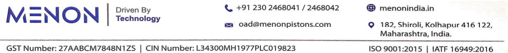
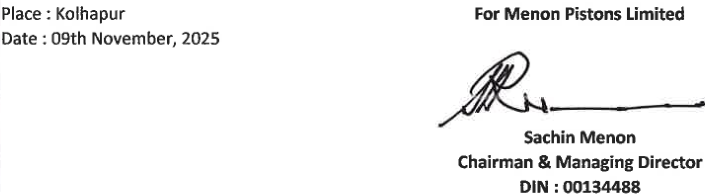
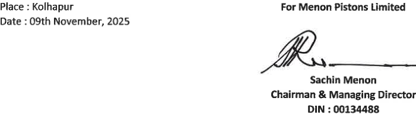

**[Image: 6df43790-fee2-480f-872a-cf9036430b20.pdf-0001-00.png (1130x105, 37.6KB)]**

## **9****th** **November, 2025** 

To, The Manager Listing Department BSE Limited Phiroze Jeejeebhoy Towers, Dalal Street, Mumbai - 400 001 

## **Scrip Code: 531727** 

Dear Sir / Madam, 

**Sub: Outcome of Board Meeting held today i.e. Sunday, 9****th** **November, 2025** 

Pursuant to Regulation 30 of the SEBI (Listing Obligations and Disclosure Requirements) Regulation 2015, we wish to inform you that the Board of Directors of the Company at their meeting held today i.e. Sunday, 09th November, 2025 inter-alia, considered following matter: 

1. Approved the Unaudited Standalone and Consolidated Financial Results along with Limited Review Report of Statutory Auditors for the quarter and half year ended on 30th September, 2025 in accordance with Indian Accounting Standards (IND AS) as per the Companies (Indian Accounting Standards) Rules, 2015. 

Pursuant to regulation 33 of the SEBI (Listing Obligations and Disclosure Requirements) Regulations, 2015, we are enclosing herewith, the Unaudited Standalone and Consolidated Financial Results for the quarter and half year ended on 30th September, 2025 along with Limited Review Report of Statutory Auditors of the Company. 

2. Reviewed and updated the Policy on Materiality of Related Party Transactions and Dealing with Related Party Transactions as per the provisions under Regulation 23 of the Securities and Exchange Board of India (Listing Obligations and Disclosure Requirements) Regulations, 2015. 

Also, this information will be uploaded on the website of the Company at www.menonindia.in 

The meeting of the Board of Directors commenced at 11.30 A.M. and concluded at 01.05 P.M. 

Kindly take on your records and acknowledge the receipt. 

Thanking you, Yours faithfully, 

## **For Menon Pistons Limited** 

Pramod Digitally signed by Pramod Suresh Suresh Suryavanshi Date: 2025.11.09 Suryavanshi 13:19:06 +05'30' _____________________________ **Pramod Suresh Suryavanshi** Company Secretary & Compliance Officer ICSI Membership No.: A45514 

Place: Kolhapur 

**Encl.: As above** 

**[Image: 6df43790-fee2-480f-872a-cf9036430b20.pdf-0001-18.png (1157x122, 115.1KB)]**

**P G BHAGWAT LLP** Chartered Accountants LLPIN: AAT-9949 

**HEAD OFFICE** Suites 102, ‘Orchard’ Dr. Pai Marg, Baner, Pune – 45 Tel (O): 020 – 27290771 Email: pgb@pgbhagwatca.com Web: www.pgbhagwatca.com 

## **Limited Review Report** 

**Independent Auditor's Review Report on Standalone unaudited quarterly and half yearly financial results of the Company Pursuant to the Regulation 33 of the SEBI (Listing Obligations and Disclosure Requirements) Regulations, 2015** 

To, The Board of Directors, Menon Pistons Limited, 182, Shiroli, Kolhapur – 416122. 

We have reviewed the accompanying statement of unaudited financial results of **Menon Pistons Limited for the quarter and half year ended September 30, 2025** , being submitted by the company pursuant to the requirements of Regulation 33 of the SEBI (Listing Obligations and Disclosure Requirements) Regulations, 2015, as amended. 

This statement is the responsibility of the Company’s Management and has been approved by the Board of Directors. It has been prepared in accordance with Indian Accounting Standard 34, (Ind AS 34) “Interim Financial Reporting” prescribed under Section 133 of the Companies Act, 2013, read with relevant rules issued there under and other accounting principles generally accepted in India. Our responsibility is to issue a report on these financial statements based on our review. 

We conducted our review of the Statement in accordance with the Standard on Review Engagements (SRE) 2410 “Review of Interim Financial Information Performed by the Independent Auditor of the Entity”, issued by the Institute of Chartered Accountants of India. This standard requires that we plan and perform the review to obtain moderate assurance as to whether the financial statements are free of material misstatement. A review is limited primarily to inquiries of company personnel and an analytical procedure applied to financial data and thus provides less assurance than an audit. We have not performed an audit and accordingly, we do not express an audit opinion. 

Based on our review conducted as above, nothing has come to our attention that causes us to believe that the accompanying statement of unaudited financial results prepared in accordance with applicable accounting standards and other recognized accounting practices and policies has not disclosed the information required to be disclosed in terms of Regulation 33 of the SEBI 

**Offices at:** Mumbai | Kolhapur | Belagavi | Dharwad | Bengaluru 

**P G BHAGWAT LLP** Chartered Accountants LLPIN: AAT-9949 

(Listing Obligations and Disclosure Requirements) Regulations, 2015 including the manner in which it is to be disclosed, or that it contains any material misstatement. 

**For P G BHAGWAT LLP Chartered Accountants FRN: 101118W/W100682** 

PURVA AMEYA Digitally signed by PURVA AMEYA KULKARNI KULKARNI Date: 2025.11.09 13:08:56 +05'30' 

Purva Kulkarni Partner Membership No. 138855 UDIN: 25138855BMHUQX3364 Place: Pune Date: November 09, 2025 

||**M** Regd. Office E mail : oad@menonp **CIN :** **UNAUDITED STANDALONE FINANCIAL RESULT**|**ENON PISTON** : 182, Shiroli, istons.com **L34300MH19** **S FOR THE QU**|**S LIMITED** Kolhapur - 41 Website : www **77PLC019823** **ARTER AND HA**|6 122 .menonindia. **LF YEAR END**|in **ED 30TH SEPTE** **( Rs. I**|**MBER, 2025** **n Lakhs excep**|**t EPS )**|
|---|---|---|---|---|---|---|---|
|**Sr.** |**Particulars**||**Quarter Ended**||**Half  Yea**|**r Ended**|**Year Ended**|
|**No.**||**30.09.2025**|**30.06.2025**|**30.09.2024**|**30.09.2025**|**30.09.2024**|**31.03.2025**|
||||**(Unaudited)**||**(Unau**|**dited)**|**(Audited)**|
|**1**|**Income**|||||||
||Revenue from operations|5,941.84|6,450.09|5,480.68|12,391.93|11,153.93|21,235.47|
||Other income|88.63|64.00|57.58|152.63|113.93|260.48|
||**Total income**|**6,030.47**|**6,514.09**|**5,538.26**|**12,544.56**|**11,267.86**|**21,495.95**|
|**2**|**Expenses**|||||||
||Cost of materials consumed|3,098.35|3,003.44|2,640.20|6,101.79|5,005.78|10,100.98|
||Purchases of stock-in-trade|-|-|-|-|-|-|
||Changes in inventories of finished goods, work-in- progress and tradedgoods|(243.89)|483.13|(118.52)|239.24|27.90|(490.52)|
||Employee benefit expenses|495.31|499.32|516.56|994.63|1,036.88|2,047.17|
||Finance costs|93.59|101.63|90.18|195.22|200.08|413.82|
||Depreciation and amortisation expense|171.02|198.21|176.50|369.23|349.19|701.01|
||Operating expenses|1,422.32|1,202.90|1,269.91|2,625.22|2,529.04|4,908.56|
||Other expenses|361.96|321.25|340.64|683.21|739.42|1,450.50|
||**Total expenses**|**5,398.66**|**5,809.88**|**4,915.47**|**11,208.54**|**9,888.29**|**19,131.52**|
|**3**|**Profit before exceptional items and tax (1-2)**|**631.81**|**704.21**|**622.79**|**1,336.02**|**1,379.57**|**2,364.43**|
|**4**|**Exceptional items**|-|-|-|-|-|-|
|**5**|**Profit before tax (3-4)**|**631.81**|**704.21**|**622.79**|**1,336.02**|**1,379.57**|**2,364.43**|
|**6**|**Tax expense**|||||||
||Current tax|142.74|163.47|128.64|306.21|282.65|484.92|
||Deferred tax|25.13|20.99|28.11|46.12|64.56|146.22|
||Adjustments of tax relating to earlier periods|7.68|-|-|7.68|-|1.20|
||**Total tax expense (6)**|**175.55**|**184.46**|**156.75**|**360.01**|**347.21**|**632.34**|
|**7**|**Profit for the year/period (5-6)**|**456.26**|**519.75**|**466.04**|**976.01**|**1,032.36**|**1,732.09**|
|**8**|**Other comprehensive income / (Expense)**|||||||
||**A.Other Comprehensive income not to be reclassified** **to Profit or Loss in subsequent Periods :**|**18.48**|**(11.91)**|**(29.10)**|**6.57**|**(32.42)**|**(47.64)**|
||i) Re-measurement gains/(losses) on defined benefit obligation|24.70|(15.92)|(38.89)|8.78|(43.32)|(63.67)|
||Income tax  effect on above|(6.22)|4.01|9.79|(2.21)|10.90|16.03|
||**B.Other Comprehensive income  to be reclassified to** **Profit or Loss in subsequent Periods :**|-|-|-|-|-|-|
||**Total other Comprehensive income for the** **year/period, net of tax (8)**|**18.48**|**(11.91)**|**(29.10)**|**6.57**|**(32.42)**|**(47.64)**|
|**9**|**Total Comprehensive income for the year/period, net** **of tax(7+8)**|**474.74**|**507.84**|**436.94**|**982.58**|**999.94**|**1,684.45**|
|**10**|Paid up Equity Share Capital ( Face Value of Re.1/- each )|**510.00**|**510.00**|**510.00**|**510.00**|**510.00**|**510.00**|
|**11**|Other equity excluding revaluation reserve|-|-|-|-|-|14,133.37|
|**12**|Basic and Diluted E.P.S. of Re.1/- each (not annualised)|**0.89**|**1.02**|**0.91**|**1.91**|**2.02**|**3.40**|

**[Image: 6df43790-fee2-480f-872a-cf9036430b20.pdf-0004-01.png (116x111, 24.4KB)]**

|**Notes :** **1** **Standalone Statement of Assets and Liabilities as at 30th September, 2025.**|**( Rs. In Lakhs )**|
|---|---|
|**30.09.2025** **UNAUDITED** **Particulars**|**31.03.2025** **AUDITED**|
|**ASSETS** **NON-CURRENT ASSETS**||
| ( a ) Property, Plant and Equipment 7,346.67|7,531.57|
|( b ) Capital Work in Progress 1,008.93 ( c ) Investment Property -|- -|
| ( d ) Other Intangible Assets 27.76|12.15|
|( e ) Right of Use Assets 49.43 ( f ) Intangible Assets under Development -|66.36 -|
|( g ) Financial Assets||
| ( I )    Investments 2,674.54 |2,674.54|
|( II )   Trade Receivables - ( III )  L -|- -|
|oans  h l 35215|48756|
|( IV )  Oters Financia Assets . ( h )  Deferred Tax Assets ( Net ) -|. -|
| ( i )  Non-Current tax  assets  ( Net ) 10890|18017|
| . ( j )Other Non-Current assets 489.29|. 656.92|
|Total Non-Current Assets 12,057.67|11,609.27|
|**CURRENT ASSETS**||
| ( a ) Inventories 2,327.35|2,476.35|
|( b ) Financial Assets - I     Itt |- |
|(  )    nvesmens - ( II )   Trade Receivables 4,405.65|- 4,323.51|
|( III )  Cash and Cash equivalents 266.29|220.79|
|  ( IV )  Bank Balance other than ( III ) above 993.39|573.64|
|( V )   Loans - ( VI )  Others Financial Assets 186.79 |- 156.71|
|( c ) Contract Assets -|-|
|( d ) Assets held for sale -|-|
| (e)Other Current assets 297.20|251.17|
|Total Current Assets 8,476.67|8,002.17|
|**TOTAL ASSETS** **20,534.34**|**19,611.44**|
|**EQUITY AND LIBILITIES**||
| **EQUITY**||
|( a ) Equity Share Capital 510.00|510.00|
|(b)Other Equity 14,605.94   |14,133.37 |
|Total Equity 15,115.94|14,643.37|
|**LIABILITIES** **NON-CURRENT LIABILITIES**||
| ( a ) Financial Liabilities||
|( I )   Borrowings 790.66|922.59|
|( II )   Lease Liability 39.66 |39.66|
|( III )  Trade Payable - ( IV )  Other Financial Liabilities -|- -|
| ( b ) Long Term  Provisions 65.87|72.99|
|( c ) Deferred Tax Liabilites ( Net ) 403.53|355.20|
| (d)Other Non-Current Liabilities -|-|
| Total Non-Current Liabilities 1,299.72|1,390.44|
|**CURRENT LIABILITIES**||
|( a ) Financial Liabilities   ||
|( I )   Borrowings 610.21|700.48|
|( II )   Lease Liability 12.04 III   Td d th Pbl |23.52 |
|(  )  rae an oer ayae - (a) Total Outstanding Due to Micro and Small enterprises 231.15|- 197.41|
|(b) Total Outstanding dues other than (III)(a) above 2,166.06   |1,925.36 |
|( IV ) Other Financial Liabilities 798.43|517.43|
|( b ) Other Current Liabilities 282.74 ( c ) Short Term Provisions 1805|200.55 1288|
| . (d)Current Tax Liability (Net) -|. -|
|Total Current Liabilities 4,118.68|3,577.63|
|**TOTAL EQUITY AND LIABILITIES** **20,534.34**|**19,611.44**|

**[Image: 6df43790-fee2-480f-872a-cf9036430b20.pdf-0005-01.png (124x120, 27.4KB)]**

|**2** **Standalone Cash Flow Statement for the half year ended 30th September, 2025**|**( Rs In Lakhs )**|
|---|---|
|**Half Year Ended**|**.** **Year Ended**|
|**30.09.2025** **Particulars**|**31.03.2025**|
|**UNAUDITED**|**AUDITED**|
|**A** **Cash flows from operating activities** **Net Profit Before Taxes** **1,336.02**|**2,364.43**|
|Adjustments for :  ||
|Depreciation 369.23|701.01|
|Debit balances written off -|-|
|Assets written off -|1.75|
|Interest income (26.20)|(45.48)|
|Interest expenses 192.48|410.22|
|Interest on lease liability 2.73 |3.61|
|Dividend received - Credit balance written off -|- -|
| Provision for bad debts 11.03|13.80|
|Profit on sale of assets -|-|
|**Operating profits before working capital changes** **1,885.29**|**3,449.34**|
|Adjustments for :||
| (Increase)/decrease in trade and other receivables (93.16)|1,425.98|
|(Increase)/decrease in financial assets 86.70|(258.41)|
|(Increase)/decrease in other non-financial assets (37.26)|9.02|
|(Increase)/decrease in inventories 149.00 |(440.46) |
|(Increase)/decrease in other financial liabilities 292.21|(235.41)|
|(Increase)/decrease in provisions (1.95)|(30.53)|
|(Increase)/decrease in other current Liabilities 82.24|(407.82)|
|Increase/(decrease)in trade and otherpayables 274.45|343.27|
|**Cash generated from operations** **2,637.52**|**3,854.98**|
|Income Tax Paid (242.62)|(373.34)|
|**Net cash from operating activities** **2,394.90**|**3,481.64**|
|**B** **Cash Flows from investing activities**   ||
|Payments for PPE and Intangible assets (1,039.63)|(1,544.87)|
|Proceeds from sale of  PPE -|-|
|(Increase)/decrease in fixed deposits (403.35)|(504.92)|
|Investment in Subsidiary -|-|
| Investment in Right of use asset -|-|
|Interest received 32.48|33.97|
|Dividend received -|-|
|**Net Cash from investing activities** **(1,410.50)**|**(2,015.81)**|
|**C** **Cash flows from financing activities** Proceeds from Long term borrowings (Net) -|1,300.00|
| Repayment of long term borrowings (131.93)|(617.37)|
|Increase/(Decrease) in Short term borrowings (90.27)   |(1,104.09) |
|Interest Paid (192.48) Lease Rental Paid (14.22)|(413.60) (27.84)|
|Dividend Paid (510.00)|(510.00)|
|**Net Cash from financing activities** **(938.90)**|**(1,372.90)**|
|**Net increase in Cash and Cash equivalents** **45.50**|**92.93**|
|**Cash and Cash equivalents at beginning of period** **220.79**   |**127.86** |
|**Cash and Cash equivalents a the end of period** **266.29** **Notes to Cash Flow Statement** 1 Cash Flow Statement has been prepared under indirect method set out in Ind AS-7 Statement o|**220.79** f Cash Flows.|

**[Image: 6df43790-fee2-480f-872a-cf9036430b20.pdf-0006-01.png (122x117, 26.1KB)]**

- Notes: 

- 1 |The Company operates only in one segment, i.e. "Auto Components”. 

   - The above results have been prepared in accordance with the Companies (Indian Accounting Standards) Rules, 2015 (IND AS) prescribed under section 133 of the Companies Act, 2013 and other recognized accounting practices and policies to the extent applicable. 

   - The above results were reviewed and recommended by the Audit Committee and approved by the Board of Directors of} the Company at their meetings held on 09th November, 2025, and limited review of the same carried out by thel Statutory auditors of the Company. 

The figures for the previous period are regrouped or reclassified wherever necessary. 

**[Image: 6df43790-fee2-480f-872a-cf9036430b20.pdf-0007-04.png (705x194, 30.4KB)]**

<!-- Start of picture text -->
Place  :  Kolhapur  For  Menon  Pistons  Limited Date  :  09th  November,  2025 Sachin  Menon Chairman  &  Managing  Director DIN  :  00134488 <!-- End of picture text -->

**P G BHAGWAT LLP** Chartered Accountants LLPIN: AAT-9949 

**HEAD OFFICE** Suites 102, ‘Orchard’ Dr. Pai Marg, Baner, Pune – 45 Tel (O): 020 – 27290771 Email: pgb@pgbhagwatca.com Web: www.pgbhagwatca.com 

# **Limited Review Report** 

**Independent Auditor's Review Report on Consolidated unaudited quarterly and half yearly financial results of the Company Pursuant to the Regulation 33 of the SEBI (Listing Obligations and Disclosure Requirements) Regulations, 2015** 

To, The Board of Directors, **Menon Pistons Limited** , 182, Shiroli, Kolhapur – 416122. 

We have reviewed the accompanying statement of consolidated unaudited financial results of **Menon Pistons Limited (“the Parent”) and its subsidiaries (the Parent and its subsidiaries together referred to as "the Group")** , **for the quarter and half year ended September 30, 2025,** being submitted by the company pursuant to the requirements of Regulation 33 of the SEBI (Listing Obligations and Disclosure Requirements) Regulations, 2015, as amended. 

This statement is the responsibility of the Company’s Management and has been approved by the Board of Directors. It has been prepared in accordance with Indian Accounting Standard 34, (Ind AS 34) “Interim Financial Reporting” prescribed under Section 133 of the Companies Act, 2013, read with relevant rules issued there under and other accounting principles generally accepted in India. Our responsibility is to issue a report on these financial statements based on our review. 

We conducted our review of the Statement in accordance with the Standard on Review Engagements (SRE) 2410 “Review of Interim Financial Information Performed by the Independent Auditor of the Entity”, issued by the Institute of Chartered Accountants of India. This standard requires that we plan and perform the review to obtain moderate assurance as to whether the financial statements are free of material misstatement. A review is limited primarily to inquiries of company personnel and an analytical procedure applied to financial data and thus provides less assurance than an audit. We have not performed an audit and accordingly, we do not express an audit opinion. 

The Statement includes the results of the following subsidiaries: 

- a) Rapid Machining Technologies Private Limited 

- b) Lunar Enterprise Private Limited 

Based on our review conducted as above, nothing has come to our attention that causes us to believe that the accompanying statement of unaudited financial results prepared in accordance with applicable 

**Offices at:** Mumbai | Kolhapur | Belagavi | Dharwad | Bengaluru 

**P G BHAGWAT LLP** Chartered Accountants LLPIN: AAT-9949 

accounting standards and other recognized accounting practices and policies has not disclosed the information required to be disclosed in terms of Regulation 33 of the SEBI (Listing Obligations and Disclosure Requirements) Regulations, 2015 including the manner in which it is to be disclosed, or that it contains any material misstatement. 

**For P G BHAGWAT LLP Chartered Accountants FRN: 101118W/W100682** 

PURVA Digitally signed by PURVA AMEYA AMEYA KULKARNI Date: 2025.11.09 KULKARNI 13:09:31 +05'30' 

Purva Kulkarni 

Partner 

Membership No. 138855 

UDIN: 25138855BMHUQY9964 Place: Pune 

Date: November 09, 2025 

|Regd. Off E mail : oad@meno **CI** **UNAUDITED CONSOLIDATED FINANCIAL RESU** |**MENON PISTO** ice : 182, Shirol npistons.com **N : L34300MH1** **LTS FOR THE Q**|**NS LIMITED** i,  Kolhapur - 4 Website : ww **977PLC019823** **UARTER AND H**|16 122 w.menonindia. **ALF YEAR END**|in **ED 30TH  SEPTE** **( Rs. I**|**MBER, 2025** **n Lakhs excep**|**t EPS)**|
|---|---|---|---|---|---|---|
|**Particulars** **Sr.** ||**Quarter Ended**||**Half Yea**|**r Ended**|**Year Ended**|
|**No.**|**30.09.2025**|**30.06.2025**|**30.09.2024**|**30.09.2025**|**30.09.2024**|**31.03.2025**|
|||**(Unaudited)**||**(Unau**|**dited)**|**(Audited)**|
|**1** **Income**|||||||
|Revenue from operations|7,454.39|8,028.65|6,539.40|15,483.04|13,479.29|25,365.96|
|Other income|77.04|68.49|34.50|145.53|49.71|171.58|
|**Total income**|**7,531.43**|**8,097.14**|**6,573.90**|**15,628.57**|**13,529.00**|**25,537.54**|
|**2** **Expenses**|||||||
|Cost of materials consumed|3,530.68|3,437.73|2,958.33|6,968.41|5,612.93|11,239.91|
|Purchases of stock-in-trade|-|-|20.87|-|37.32|16.61|
|Changes in inventories of finished goods, work-in- progress and tradedgoods|(344.11)|624.84|(174.20)|280.73|185.20|(678.34)|
|Employee benefit expenses|666.97|644.64|629.17|1,311.61|1,266.30|2,546.73|
|Finance costs|98.01|103.61|90.80|201.62|201.78|417.11|
|Depreciation and amortisation expense|284.07|272.23|227.80|556.30|507.61|1,062.25|
|Operating expenses|1,941.66|1,602.83|1,537.97|3,544.49|3,071.95|6,177.20|
|Other expenses|399.40|367.28|377.38|766.68|795.62|1,574.20|
|**Total expenses**|**6,576.68**|**7,053.16**|**5,668.12**|**13,629.84**|**11,678.71**|**22,355.67**|
|**3** **Profit before exceptional items and tax (1-2)**|**954.75**|**1,043.98**|**905.78**|**1,998.73**|**1,850.29**|**3,181.87**|
|**4** **Exceptional items**|-|-|-|-|-|-|
|**5** **Profit before tax (3-4)**|**954.75**|**1,043.98**|**905.78**|**1,998.73**|**1,850.29**|**3,181.87**|
|**6** **Tax expense**|||||||
|Current tax|245.24|242.92|206.83|488.16|419.85|681.92|
|Deferred tax|7.14|24.54|28.42|31.68|53.12|109.78|
|Adjustments of tax relating to earlier periods|7.68|-|-|7.68|-|5.47|
|**Total tax expense (6)**|**260.06**|**267.46**|**235.25**|**527.52**|**472.97**|**797.17**|
|**7** **Profit for the year/period (5-6)**|**694.69**|**776.52**|**670.53**|**1,471.21**|**1,377.32**|**2,384.70**|
|**8** **Other comprehensive income / (Expense)**|||||||
|**A.Other Comprehensive income not to be reclassified** **to Profit or Loss in subsequent Periods :**|**18.56**|**(11.99)**|**(29.02)**|**6.57**|**(32.25)**|**(47.95)**|
|i) Re-measurement gains/(losses) on defined benefit obligation|24.80|(16.02)|(38.78)|8.78|(43.09)|(64.08)|
|Income tax  effect on above|(6.24)|4.03|9.76|(2.21)|10.84|16.13|
|**B.Other Comprehensive income  to be reclassified to**|||||||
|**Profit or Loss in subsequent Periods :**|-|-|-|-|-|-|
|**Total other Comprehensive income for the** **year/period, net of tax(8)**|**18.56**|**(11.99)**|**(29.02)**|**6.57**|**(32.25)**|**(47.95)**|
|**9** **Total Comprehensive income for the year/period, net** **of tax(7+8)**|**713.25**|**764.53**|**641.51**|**1,477.78**|**1,345.07**|**2,336.75**|
|**10** Paid up Equity Share Capital (Face Value of Re.1/- each)|**510.00**|**510.00**|**510.00**|**510.00**|**510.00**|**510.00**|
|**11** Other equity excluding revaluation reserve|-|-|-|-|-|15,209.05|
|**12** Basic and Diluted E.P.S. of Re.1/- each (not annualised)|**1.36**|**1.52**|**1.31**|**2.88**|**2.70**|**4.68**|

**[Image: 6df43790-fee2-480f-872a-cf9036430b20.pdf-0010-01.png (138x132, 33.8KB)]**

|**Notes :** **1**  **Consolidated Statement of Assets and Liabilities as at 30th September, 2025.**|**( Rs. In Lakhs )** |
|---|---|
|**30.09.2025** **UNAUDITED** **Particulars**|**31.03.2025** **AUDITED**|
|**ASSETS** **NON-CURRENT ASSETS**||
|( a ) Property, Plant and Equipment 8,683.17   |8,695.73 |
|( b ) Capital work in Progress 1,011.15 ( c ) Investment Property -|2.21 -|
| ( d ) Other Intangible Assets 36.00|38.36|
|( e ) Right of Use assets 49.43 ( f ) Intangible Assets under Development -|61.79 -|
| dll 3214|3214|
|( g ) Goowi 5. ( h ) Provisional Goodwill -|5. -|
|( i ) Financial Assets -|-|
| ( I )    Investments 0.37|0.37|
|( II )   Trade Receivables - III   L|-|
|(  )  oans - ( IV )  Others Financial Assets 520.19|- 592.25|
|( j )  Deferred tax assets ( net ) 51.36|36.88|
| ( k ) Non-Current tax assets ( net ) 12004|21214|
| . (l)Other Non-Current assets 489.29|. 656.92|
|Total Non-Current Assets 11,286.15|10,621.79|
|**CURRENT ASSETS** ( a ) Inventories 3,469.72|3,571.85|
|( b ) Financial Assets ( I )    Investments -|-|
| ( II )   Trade Receivables 6,074.58|5,519.82|
|( III )  Cash and Cash equivalents 285.03|253.43|
|( IV )  Bank Balance other than ( III ) above 1,081.66 |725.20|
|( V )   Loans - ( VI )  Others Financial Assets 203.34 |- 167.43|
|( c ) Contract Assets - |-|
|( d ) Assets held for sale - (e)Other Current assets 57581|- 53507|
| . Total Current Assets 11,690.14|. 10,772.80|
|**TOTAL ASSETS** **22,976.29**|**21,394.59**|
|**EQUITY AND LIBILITIES** **EQUITY**||
|( a ) Equity Share Capital 510.00    |510.00 |
|(b)Other Equity 16,176.68|15,209.06|
|Total Equity 16,686.68|15,719.06|
|**LIABILITIES**||
|**NON-CURRENT LIABILITIES**||
| ( a ) Financial Liabilities||
|( I )   Borrowings 790.66|922.59|
|( II ) Lease Liability 39.66 |39.66|
|( III )  Trade Payable - ( IV )  Other Financial Liabilities -|- -|
| ( b ) Lon Term Provisions 7596|8051|
|g . ( c ) Deferred Tax Liabilites ( net ) 403.53|. 355.20|
|(d)Other Non-Current Liabilities -|-|
|Total Non-Current Liabilities 1,309.81|1,397.96|
|**CURRENT LIABILITIES**||
| ( a ) Financial Liabilities||
|( I )   Borrowings 610.21|700.48|
| ( II )   Lease Liability 12.04 |23.52|
|( III )  Trade and other Payable - (a) Total outstanding Due to Micro and Small enterprises 284.60   |- 258.17 |
|(b) Total outstanding dues other than (III) (a) above 2,813.36 ( IV ) Other Financial Liabilities 945.00|2,497.41 575.37|
| ( b ) Other Current Liabilities 293.12|208.58|
|  ( c ) Short Term Provisions 18.05|14.04|
|(d)Current Tax Liability (Net) 3.42 l  l 497980|- 427757|
|Tota Current Liabiities ,.|,.|
|**TOTAL EQUITY AND LIABILITIES** **22,976.29**|**21,394.59**|

**[Image: 6df43790-fee2-480f-872a-cf9036430b20.pdf-0011-01.png (126x121, 28.5KB)]**

|**2**   **Consolidated Cash Flow Statement for the half year ended 30th September, 2025**|**( Rs. In Lakhs )**|
|---|---|
|**Half  Year Ended**|**Year Ended**|
|**30.09.2025** **Particulars**|**31.03.2025**|
|**UNAUDITED**|**AUDITED**|
|**A** **Cash Flows from operating activities** **Net Profit Before Taxes** **1,998.73**|**3,181.87**|
|Adjustments for :  ||
|Depreciation 556.30|1,062.25|
|Provision for doubtful debts -|043|
| Bad Debts written off 11.03|. 13.80|
|Assets written off -|175|
| Interest income (36.51)|. (64.31)|
|Interest expenses 192.48 |410.21|
|Interest on lease liability 2.73|3.61|
|Forex Restatement -|-|
|Credit Balances Written Back -|(2.41)|
|Profit on sale of assets -|0.11|
|**Operating profits before working capital changes** **2,724.76**|**4,607.29**|
|Adjustments for :||
| (Increase)/decrease in trade and other receivables (499.31)|1,108.24|
|(Increase)/decrease in Financial Assets 91.70 |(258.40)|
|(Increase)/decrease in Other Current Assets - (Increase)/decrease in Other Non Current Non-Financial Assets (32.23) |- 111.13 |
|(Increase)/decrease in inventories 102.12|(742.32)|
|Increase/(decrease) in Other Financial Liabilities 37583|(24681)|
| . Increase/(decrease) in Provisions (0.50)|. (27.61)|
|Increase/(decrease) in Other Current Liabilities 84.56|(571.90)|
|Increase/(decrease)in trade and otherpayables 275.92|501.22|
|**Cash generated from operations** **3,122.85**|**4,480.64**|
|Income Tax Paid (400.33)|(590.39)|
|**Net Cash from operating activities** **2,722.52**|**3,890.25**|
|**B** **Cash Flows from investing activities**||
|Payments for PPE and Intangible assets (1,385.57)|(1,858.55)|
|  Proceeds from sale of PPE -|47.25|
|Investment in subsidiary ( net asset value ) -|-|
| Purchase of Goodwill -|-|
|(Increase)/decrease in fixed deposits (403.41)|(704.92)|
|Investment in Right of use asset -|-|
|Interest received 36.96|42.53|
|Advance against sale of Land -|-|
|**Net Cash from investing activities** **(1,752.02)**|**(2,473.69)**|
|**C** **Cash flows from financing activities**||
|Proceeds from Long term borrowings (Net) -|1,300.00|
| Repayment of long term borrowings (131.93)|(617.37)|
|Increase / (Decrease) in short term borrowings (90.27)|(1,104.12)|
|  Interest Paid (192.48)|(413.60)|
|Lease Rental Paid (14.22)|(27.84)|
|  Dividend Paid (510.00)|(510.00)|
|**Net Cash from financing activities** **(938.90)**|**(1,372.93)**|
|**Net increase in Cash and Cash equivalents** **31.60**|**43.64**|
|**Cash and Cash equivalents at beginning of Period** **253.43** |**209.79**|
|**Cash and Cash equivalents a the end of Period** **285.03** **Notes to Cash Flow Statement** 1 Cash Flow Statement has been prepared under indirect method set out in Ind AS-7 Statement|**253.43** of Cash Flows.|

**[Image: 6df43790-fee2-480f-872a-cf9036430b20.pdf-0012-01.png (119x114, 26.1KB)]**

**[Image: 6df43790-fee2-480f-872a-cf9036430b20.pdf-0013-00.png (53x22, 1.2KB)]**

<!-- Start of picture text -->
Notes: <!-- End of picture text -->

- The group operates only in one segment, i.e. "Auto Components”. 

- The above results have been prepared in accordance with the Companies (Indian Accounting Standards) Rules, 2015 (IND)| AS) prescribed under section 133 of the Companies Act, 2013 and other recognized accounting practices and policies to) the extent applicable. 

- | The above results were reviewed and recommended by the Audit Committee and approved by the Board of Directors of} the Company at their meetings held on 09th November, 2025. The consolidated financial results include the results of following subsidiaries : 

- a) Rapid Machining Technologies Private Limited b) Lunar Enterprise Private Limited 

- [ The figures for the previous period are regrouped or reclassified wherever necessary. 

**[Image: 6df43790-fee2-480f-872a-cf9036430b20.pdf-0013-06.png (701x193, 31.3KB)]**

<!-- Start of picture text -->
Place  :  Kolhapur  For  Menon  Pistons  Limited Date  :  09th  November,  2025 Sachin  Menon Chairman  &  Managing  Director DIN  :  00134488 <!-- End of picture text -->

---

## Extracted Images

| # | File | Dimensions | Size |
|---|------|------------|------|
| 1 | 6df43790-fee2-480f-872a-cf9036430b20.pdf-0001-00.png | 1130x105 | 37.6KB |
| 2 | 6df43790-fee2-480f-872a-cf9036430b20.pdf-0001-18.png | 1157x122 | 115.1KB |
| 3 | 6df43790-fee2-480f-872a-cf9036430b20.pdf-0004-01.png | 116x111 | 24.4KB |
| 4 | 6df43790-fee2-480f-872a-cf9036430b20.pdf-0005-01.png | 124x120 | 27.4KB |
| 5 | 6df43790-fee2-480f-872a-cf9036430b20.pdf-0006-01.png | 122x117 | 26.1KB |
| 6 | 6df43790-fee2-480f-872a-cf9036430b20.pdf-0007-04.png | 705x194 | 30.4KB |
| 7 | 6df43790-fee2-480f-872a-cf9036430b20.pdf-0010-01.png | 138x132 | 33.8KB |
| 8 | 6df43790-fee2-480f-872a-cf9036430b20.pdf-0011-01.png | 126x121 | 28.5KB |
| 9 | 6df43790-fee2-480f-872a-cf9036430b20.pdf-0012-01.png | 119x114 | 26.1KB |
| 10 | 6df43790-fee2-480f-872a-cf9036430b20.pdf-0013-00.png | 53x22 | 1.2KB |
| 11 | 6df43790-fee2-480f-872a-cf9036430b20.pdf-0013-06.png | 701x193 | 31.3KB |
