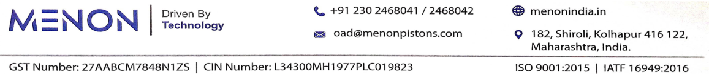
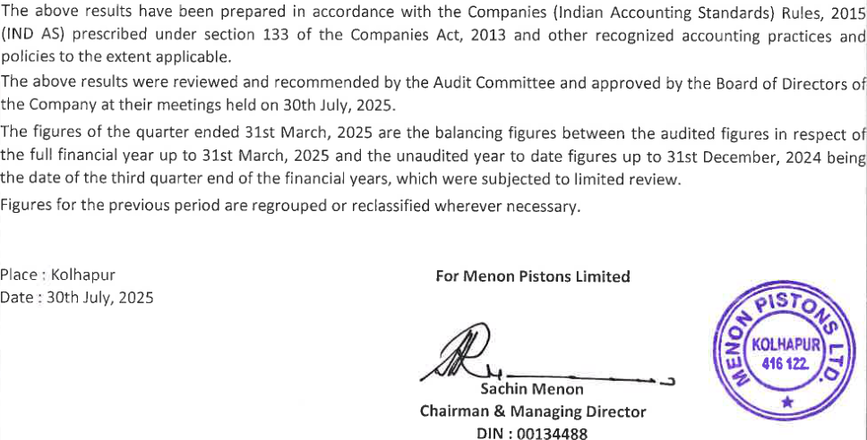
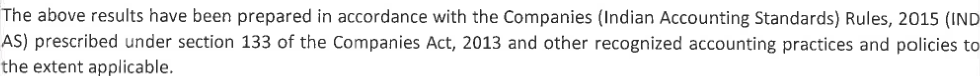
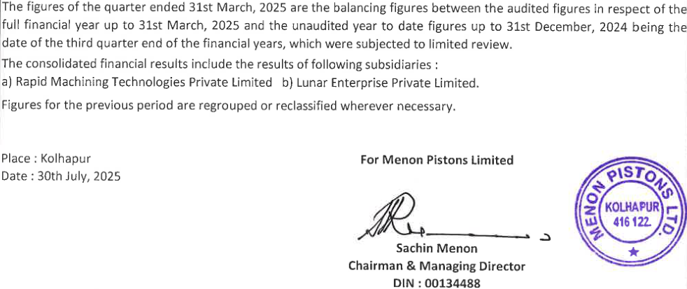

**[Image: c56465fc-35cc-4238-87c3-d33a24000e0a.pdf-0001-00.png (1130x105, 37.4KB)]**

30th July, 2025 

To, The Manager Listing Department BSE Limited Phiroze Jeejeebhoy Towers, Dalal Street, Mumbai - 400 001 

# Scrip Code: 531727 

Dear Sir / Madam, 

# Sub: Outcome of Board Meeting held today i.e. Wednesday, 30th July, 2025 

Pursuant to Regulation 30 of the SEBI (Listing Obligations and Disclosure requirements) Regulation 2015, we wish to inform you that the Board of Directors of the Company at their meeting held today i.e. Wednesday, 30th July, 2025 inter-alia, considered following matter: 

1. Approved the Unaudited Standalone and Consolidated Financial Results along with Limited Review Report of Statutory Auditors for the quarter ended on 30th June, 2025 in accordance with Indian Accounting Standards (IND AS) as per Companies (Indian Accounting Standards) Rules, 2015. 

Pursuant to Regulation 33 of the SEBI (Listing Obligations and Disclosure Requirements) Regulations, 2015, we are enclosing herewith, the Unaudited Standalone and Consolidated Financial Results for the quarter ended 30th June, 2025 along with Limited Review Report of Statutory Auditors of the Company. 

The meeting of the Board of Directors commenced at 11.30 A.M. & concluded at 01.00 P.M. 

Kindly take on your records and acknowledge the receipt. 

Thanking you, Yours faithfully, 

# For Menon Pistons Limited 

Pramod Digitally signed by Pramod Suresh Suresh Suryavanshi Date: 2025.07.30 Suryavanshi 13:07:16 +05'30' _____________________________ Pramod Suresh Suryavanshi Company Secretary & Compliance Officer ICSI Membership No.: A45514 

Place: Kolhapur 

Encl.: As above 

**[Image: c56465fc-35cc-4238-87c3-d33a24000e0a.pdf-0001-16.png (1157x124, 98.5KB)]**

> P G BHAGWAT LLP 

> Chartered Accountants 

> LLPIN: AAT-9949 

HEAD OFFICE 

Suites 102, ‘Orchard’ Tel (0): 020 - 27290771 Email: pgb@pgbhagwatca.com Web: www.pgbhagwatca.com Dr. Pai Marg, Baner, Pune — 45 

## Limited Review Report 

> Regulation SEBI Indépendent Auditor's Review Report on Standalone unaudited quarterly financial results of the Company Pursuant to the 33 of the Obligations and Disclosure Requirements) Regulations, 2015 (Listing 

To, The Board of Directors, Menon Pistons Limited, 182, Shiroli, Kolhapur - 416122. 

We have reviewed the accompanying statement of unaudited financial results of Menon Pistons Limited for the quarter ended June 30, 2025, being submitted by the company pursuant to the requirements of Regulation 33 of the SEBI (Listing Obligations and Disclosure Requirements) Regulations, 2015, as amended. 

> This statement is the responsibility of the Company’s Management and has been approved by 

> (Ind AS 34) “Interim Financial Reporting” prescribed under Section 133 of the Companies Act, 

> 2013, read with relevant rules issued there under and other accounting principles generally accepted in India. Our responsibility is to issue a report on these financial statements based on our review. 

> the Board of Directors. It has been prepared in accordance with Indian Accounting Standard 34, 

We conducted our review of the Statement in accordance with the Standard on Review 2410 of Interim Financial Information Performed by This standard requires that we plan and perform the review to obtain moderate assurance as to whether the financial statements are free of material misstatement. is limited primarily to inquiries of company personnel and an analytical procedure applied to financial accordingly, we do not express an audit opinion. Engagements (SRE) “Review the Independent Auditor of the Entity”, issued by the Institute of Chartered Accountants of India. A review data and thus provides less assurance than an audit. We have not performed an audit and 

believe that the accompanying statement of unaudited financial results prepared in accordance has not disclosed the information required to be disclosed in terms of Regulation 33 of the SEBI Based on our review conducted as above, nothing has come to our attention that causes us to with applicable accounting standards and other recognized accounting practices and policies 

> | Kolhapur | Belagavi | Dharwad | Bengaluru Offices at: Mumbai 

P G BHAGWAT LLP Chartered Accountants LLPIN: AAT-9949 

> (Listing Obligations and Disclosure Requirements) Regulations, 2015 including the manner in which it is to be disclosed, or that it contains any material misstatement. 

For P G BHAGWAT LLP Chartered Accountants FRN: 101118W/W00682 

Purva Kulkarni Partner Membership No. 138855 UDIN: 25138855BMHULT1193 

Place: Kolhapur Date: July 30, 2025 

|| |MENONPISTONSLIM   |ITED |N1EN0|N Technology|
|---|---|---|---|---|---|
|sr.|Regd.Offi Email :cs@menonpi CIN UNAUDITEDSTANDALONEFINANC N|e :182,Shiroli,Koth stons.com Websit  :L34300MH1977PLC IALRESULTSFORTH|apur-416122 e :www.menonindia. 019823 EQUARTERENDED |in 30THJUNE,2025 (Rs.In|LakhsexceptEPS) |
| | ||QuarterEnded ||YearEnded |
|No.|FarialEe|30.06.2025 |31.03.2025 |30.06.2024 |31.03.2025 |
|||(Unaudited)|(Audited)|(Unaudited)|(Audited)|
|1|[Income |||||
||Revenuefromoperations |6,450.09 |4,761.44 |5,673.25 |21,236.91 |
||Otherincome |64.00 |8152 |56.35 |259.04 |
||Totalincome|6,514.09|4,842.96|5,729.60|21,495.95|
|2||Expenses |||||
||Costofmaterialsconsumed |3,003.44|2,549.21|2,365.58|10,100.98|
||Purchasesofstock-in-trade |-|=|=|-|
||gj::‘s:;:si:::'x:::;‘;22:‘:"“goods,work- |483.13 |(448.36) |14642 |(490.52) |
||Employeebenefitexpenses |49932 |516,57 |52032 |2,047.17 |
||Financecosts |10163 |107.00 |109.90 |413.82 |
||Depreciationandamortisationexpense |198.21 |173.42 |172.69 |70101 |
||Operatingexpenses |1,202.90 |1,169.87 |1,259.13 |4,908.56 |
||Otherexpenses |32125 |374.62 |398.78 |1,450.50 |
||[Totalexpenses |5,809.88 |2,441.83 |4972.82 |19,131.52 |
|3_[|profitbeforeexceptionalitemsandtax(1-2)|70421|40113|756.78|2,364.43|
|4 ||Exceptionalitems |- |= |- |= |
|5|[Profitbeforetax(3-4)|70421|40113|756.78|2,364.43|
|6||Taxexpense |||||
||currenttax |163.47 |11363 |154.01 |484.92 |
||Deferredtax |20.99 |23.39 |36.45 |146.22 |
||[Adjustmentsoftaxrelatingtoearlierperiods |2 |1.20 |, |120 |
||[Totaltaxexpense(6) |184.46 |138.22 |190.46 |632.34 |
|7 |[Profitfortheyear/period(5-6) |519.75|262.92|566.32|1,732.09|
|8||Othercomprehensiveincome/(Expense) |||||
||A.OtherComprehensiveincomenottobe |||||
||reclassifiedtoProfitorLossinsubsequent Periods : |(12.91) |0.99 |(3.32) |(47.68) |
||3:2;;e::||;:::::tgains/(losses)ondefined |o2 |o5 |(@43 |267) |
||incometaxeffectonabove |401|(0.33)|111|16.03|
||B.OtherComprehensiveincometobe|||||
||reclassifiedtoProfitorLossinsubsequent |-|B|=|-|
||Periods:|||||
||;z',::::z’;";:::;’Incomsforie|(11.91)|0.99|(3:32)|(47.68)|
|9 |::;::f';:t’:;’:}v‘:;"(‘:;fforthe |507.84|263.91|563.00|1,680.48|
|10   |::;::3:::’;";:’1';2:'::"' |510.00 |510.00 |510.00 |510.00 |
|11 ||Otherequityexcludingrevaluationreserve|-|=|-|14,133.37|
|B||||||

**[Image: c56465fc-35cc-4238-87c3-d33a24000e0a.pdf-0005-00.png (55x22, 1.1KB)]**

<!-- Start of picture text -->
Notes: <!-- End of picture text -->

The Company operates only in one segment, i.e. "Auto Components”. 

**[Image: c56465fc-35cc-4238-87c3-d33a24000e0a.pdf-0005-02.png (968x492, 177.1KB)]**

<!-- Start of picture text -->
The  above  results  have  been  prepared  in  accordance  with  the  Companies  {Indian  Accounting  Standards)  Rules,  2015| (IND  AS)  prescribed  under  section  133  of  the  Companies  Act,  2013  and  other  recognized  accounting  practices  and policies  to  the  extent  applicable. The  above  results  were  reviewed  and  recommended  by  the  Audit  Committee  and  approved  by  the  Board  of  Directors  of] the  Company  at  their  meetings  held  on  30th  July,  2025. The  figures  of  the  quarter  ended  31st  March,  2025  are the  balancing  figures  between  the  audited  figures  in  respect  of| the  full  financial  year  up  to  31st  March,  2025  and  the  unaudited  year  to  date  figures  up  to  31st  December,  2024  being| the  date  of  the  third  quarter  end  of  the  financial  years,  which  were  subjected  to  limited  review. Figures  for  the  previous  period  are  regrouped  or  reclassified  wherever  necessary. Place :  Kolhapur  For  Menon  Pistons  Limited Date  :  30th  July,  2025 Sachin  Menon Chairman  &  Managing  Director DIN  :  00134488 <!-- End of picture text -->

The figures of the quarter ended 31st March, 2025 are the balancing figures between the audited figures in respect of| the full financial year up to 31st March, 2025 and the unaudited year to date figures up to 31st December, 2024 being| the date of the third quarter end of the financial years, which were subjected to limited review. Figures for the previous period are regrouped or reclassified wherever necessary. 

> P G BHAGWAT LLP 

> Chartered Accountants 

> LLPIN: AAT-9949 

HEAD OFFICE Email: pgb@pgbhagwatca.com Web: www.pgbhagwatca.com Suites 102, ‘Orchard’ Dr. Pai Marg, Baner, Pune — 45 Tel (0): 020 —27290771 

# Limited Review Report 

Independent Auditor's Review Report on Consolidated unaudited quarterly financial results of the Company Pursuant the Regulation the SEBI (Listing Obligations and Disclosure Requirements) Regulations, 2015 to 33 of 

To, The Board of Directors, Menon Pistons Limited, 182, Shiroli, Kolhapur - 416122. 

We have reviewed the accompanying statement of consolidated unaudited financial results of Menon Pistons Limited (“the Parent”) and its subsidiaries (the Parent and its subsidiaries together referred to as "the Group"), for the quarter ended June 30, 2025, being submitted by the company pursuant to the requirements of Regulation of SEBI (Listing Obligations and Disclosure Requirements) Regulations, 2015, as amended. 33 the 

> This statement is the responsibility of the Company’s Management and has been approved by the Board 

> of Directors. It has been prepared in accordance with Indian Accounting Standard 34, (Ind AS 34) “Interim Financial Reporting” prescribed under Section 133 of the Companies Act, 2013, read with relevant rules issued there under and other accounting principles generally accepted in India. Our responsibility is to issue a report on these financial statements based on our review. We conducted our review of the Statement in accordance with the Standard on Review Engagements procedure applied less assurance than an audit. We have not performed an audit and accordingly, we do not express an audit opinion. (SRE) 2410 “Review of Interim Financial Information Performed by the Independent Auditor of the 

> Entity”, issued by the Institute of Chartered Accountants of India. This standard requires that we plan 

> and perform the review to obtain moderate assurance as to whether the financial statements are free of 

> material misstatement. A review is limited primarily to inquiries of company personnel and an analytical 

> to financial data and thus provides 

> The Statement includes the results of the following subsidiaries: 

a) Rapid Machining Technologies Private Limited b) Lunar Enterprise Private Limited 

Based on our review conducted as above, nothing has come to our attention that causes us to believe that the accompanying statement of unaudited financial results prepared in accordance with applicable 

Offices at: Mumbai | Kolhapur | Belagavi | Dharwad | Bengaluru 

P G BHAGWAT LLP Chartered Accountants LLPIN: AAT-9949 

accounting standards and other recognized accounting practices and policies has not disclosed the contains any material misstatement. information required to be disclosed in terms of Regulation 33 of the SEBI (Listing Obligations and Disclosure Requirements) Regulations, 2015 including the manner in which it is to be disclosed, or that it 

For PG BHAGWAT LLP Chartered Accountants FRN: 101118W/W100682 udkand Purva Kulkarni Partner Membership No. 138855 UDIN: 25138855BMHULS3315 

Place: Kolhapur Date: July 30, 2025 

||Y 3 M       |ENONPISTONSLIM |ITED |MEN|0N Technology|
|---|---|---|---|---|---|
|Sr.|e Fistoss Lral Regd.Offic Email:cs@menonpi CIN UNAUDITEDCONSOLIDATEDFINAN |e:182,Shiroli,Kolh stons.com Website :134300MH1977PLC CIALRESULTSFOR T|apur-416 122   :www.menonindia. 019823 HEQUARTERENDED |in  30THJUNE,2025 {Rs.InLakhs|exceptEPS) |
| |) ||QuarterEnded||YearEnded|
|No.|Particulars|30.06.2025 |31.03.2025 |30.06.2024 |31.03.2025 |
|||(Unaudited)|(Audited)|(Unaudited)|(Audited)|
|1||income|||||
||Revenuefromoperations|8,028.65|5,575.87|6,939.89|25,365.96|
||Otherincome|68.49|86.95|15.21|171.58|
||Totalincome|8,097.14|5,662.82|6,955.10|25,537.54|
|2||[Expenses|||||
||Costofmaterialsconsumed |3,437.73|2,851.87|2,671.05|11,239.91|
||Purchasesofstock-in-trade|=|=|-|16.61|
||E:'::f::s:'ni;“:f:;::e;:;f"is"e"goods,workin |624.80 |(778.28)| |350.40 |(678.34) |
||Employeebenefitexpenses|644.64|664.51|637.13|2,546.73|
||Financecosts |103.61 |107.83 |110.98 |417.11 |
||Depreciationandamartisationpxpense|MmN|7878%|27981|1,062.25|
||Operatingexpenses|1,602.83|1,543.57|1,533.98|6,177.20|
||Otherexpenses|367.28|423.95|418.24|1,574.20|
||[Totalexpenses|7,053.16|5,101.30|6,010.59|22,355.67|
|3||Profitbeforeexceptionalitemsandtax(1-2)|1,043.98|561.52|944.51|3,181.86|
|4||Exceptionalitems|-|-|~|-|
|5||Profitbeforetax(3+4)|1,043.98|561.52|944.51|3,181.86|
|6||Taxexpense |||||
||Currenttax|242.92|121.13|213.02|681.92|
||Deferredtax|24.54|9.45|24.70|109.78|
||[Adjustmentsoftaxrelatingtoearlierperiods |- |5.47|-|5.47|
||Totaltaxexpense(6)|267.46|136.05|237.72|797.17|
||Profitfortheyear/period(5-6)|776.52|425.47|706.79|2,384.69|
||Othercomprehensiveincome /(Expense)|||||
||A.OtherComprehensiveincomenottobe reclassifiedtoProfitorLossinsubsequent Periods:|(11.99)|0.41|(3.23)|(47.95)||
||22‘52-;;?:;:;;::&gains/(losses)ondefined|(16.02)|0.55|@31)|(64.08)|
||Incometaxeffectonabove |4.03|(0.14)]|1.08|16.13|
||B.OtherComprehensiveincometobe reclassifiedtoProfitorLossinsubsequent Periods:|-|-|<|-|
||;:::;:;:‘:’:’;;:’:r::g;einEomefors,|(11.99)|0.01|(3.23)|(47.95)|
|9|l::'/:em:":;":z:;"(‘;‘:'::forthe|764.53|225.88|703.56|2,336.74|
|1|:’:;::\'/’;::'zi:"’l"/eizz:)a'|510.00|510.00|51000|510.00|
|11||Otherequityexcludingrevaluationreserve|-|-|-|15,209.05|
| 12| (B::::;l:‘llj::lsuet:)dEP.S.ofRe.1/-| 152| 0.83| 1‘39/| 468|

**[Image: c56465fc-35cc-4238-87c3-d33a24000e0a.pdf-0009-00.png (55x21, 1.5KB)]**

<!-- Start of picture text -->
Notes: <!-- End of picture text -->

**[Image: c56465fc-35cc-4238-87c3-d33a24000e0a.pdf-0009-01.png (524x21, 6.4KB)]**

<!-- Start of picture text -->
The  group  operates  only  in  one  segment,  i.e.  "Auto  Components”. <!-- End of picture text -->

**[Image: c56465fc-35cc-4238-87c3-d33a24000e0a.pdf-0009-02.png (980x76, 27.8KB)]**

<!-- Start of picture text -->
The  above  results  have  been  prepared  in  accordance  with  the  Companies  (Indian  Accounting  Standards)  Rules,  2015  (IND)| AS)  prescribed  under  section  133  of  the  Companies  Act,  2013  and  other  recognized  accounting  practices  and  policies  to| the  extent  applicable. <!-- End of picture text -->

The above results were reviewed and recommended by the Audit Committee and approved by the Board of Directors of| the Company at their meetings held on 30th July, 2025. 

**[Image: c56465fc-35cc-4238-87c3-d33a24000e0a.pdf-0009-04.png (982x413, 147.1KB)]**

<!-- Start of picture text -->
The  figures  of  the  quarter  ended  31st  March,  2025  are  the  balancing  figures  between  the  audited  figures  in  respect  of  the| full  financial  year  up  to  31st  March,  2025  and  the  unaudited  year  to  date  figures  up  to  31st  December,  2024  being  the| date  of  the  third  quarter  end  of  the  financial  years,  which  were  subjected  to  limited  review. The  consolidated  financial  results  include  the  results  of  following  subsidiaries  : a)  Rapid  Machining  Technologies  Private  Limited  b)  Lunar  Enterprise  Private  Limited. Figures  for  the  previous  period  are  regrouped  or  reclassified  wherever  necessary. Place  :  Kolhapur  For  Menon  Pistons  Limited Date  :  30th  july,  2025  ?\STo % Wi\ 2  416122  4 o) Sachin  Menon Chairman  &  Managing  Director DIN  :  00134488 <!-- End of picture text -->

---

## Extracted Images

| # | File | Dimensions | Size |
|---|------|------------|------|
| 1 | c56465fc-35cc-4238-87c3-d33a24000e0a.pdf-0001-00.png | 1130x105 | 37.4KB |
| 2 | c56465fc-35cc-4238-87c3-d33a24000e0a.pdf-0001-16.png | 1157x124 | 98.5KB |
| 3 | c56465fc-35cc-4238-87c3-d33a24000e0a.pdf-0005-00.png | 55x22 | 1.1KB |
| 4 | c56465fc-35cc-4238-87c3-d33a24000e0a.pdf-0005-02.png | 968x492 | 177.1KB |
| 5 | c56465fc-35cc-4238-87c3-d33a24000e0a.pdf-0009-00.png | 55x21 | 1.5KB |
| 6 | c56465fc-35cc-4238-87c3-d33a24000e0a.pdf-0009-01.png | 524x21 | 6.4KB |
| 7 | c56465fc-35cc-4238-87c3-d33a24000e0a.pdf-0009-02.png | 980x76 | 27.8KB |
| 8 | c56465fc-35cc-4238-87c3-d33a24000e0a.pdf-0009-04.png | 982x413 | 147.1KB |
