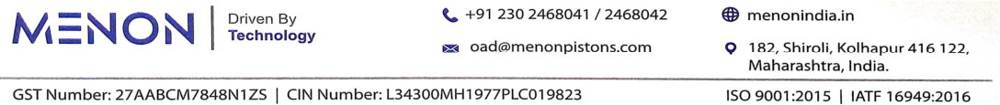
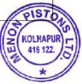
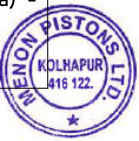
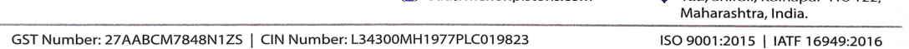
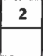
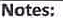
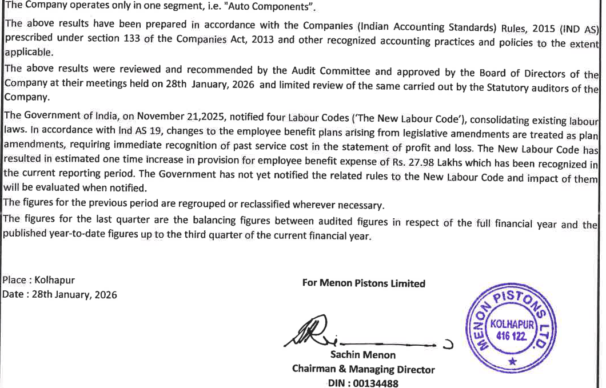
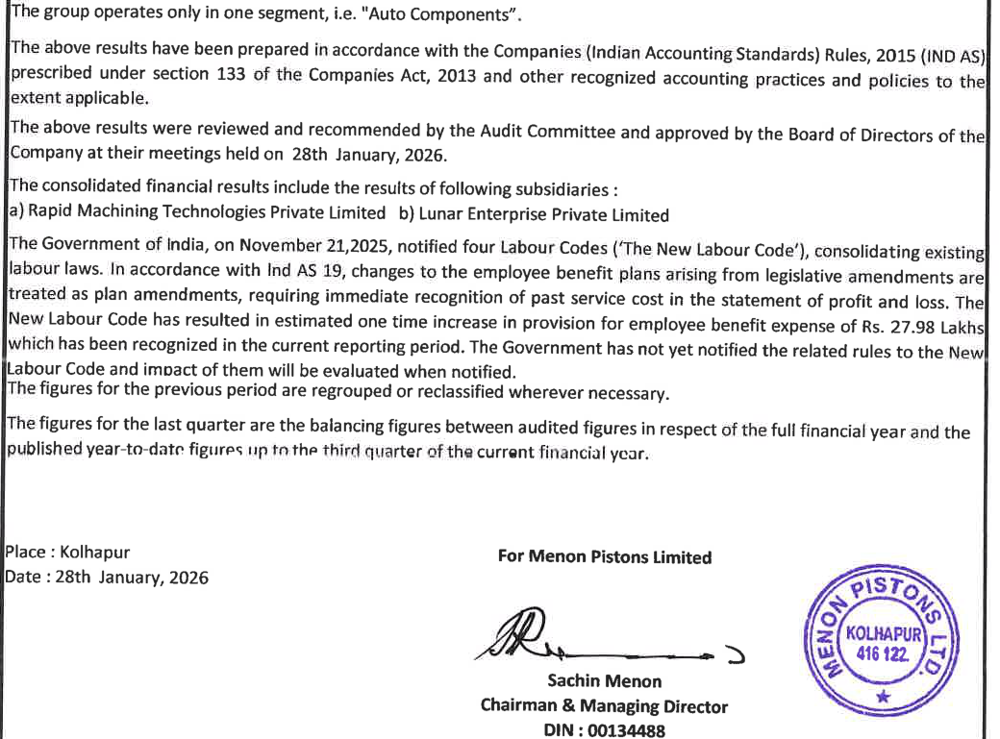

**[Image: e5fa6354-0be2-4c44-a5f8-2f9b9d2fa277.pdf-0001-00.png (1005x99, 33.5KB)]**

## **28****th** **January, 2026** 

To, The Manager Listing Department BSE Limited Phiroze Jeejeebhoy Towers, Dalal Street, Mumbai - 400 001 

**Scrip Code: 531727 | ISIN: INE650G01029** 

Dear Sir / Madam, 

**Sub.: Outcome of Board Meeting under Regulation 30 of SEBI (Listing Obligations and Disclosure Requirements) Regulations, 2015 (‘Listing Regulations’)** 

Pursuant to Regulation 30 of the SEBI (Listing Obligations and Disclosure Requirements) Regulation 2015, we wish to inform you that the Board of Directors of the Company at their meeting held today i.e. Wednesday, 28th January, 2026 inter-alia, considered following matter: 

## **1. Approval of Financial Results:** 

Approved the Unaudited Standalone and Consolidated Financial Results for the quarter and nine months ended on 31st December, 2025, along with Limited Review Report issued by M/s. P G Bhagwat LLP, Chartered Accountants, Statutory Auditors of the Company. 

Pursuant to Regulation 33 of the SEBI (Listing Obligations and Disclosure Requirements) Regulations, 2015, we are enclosing herewith, the Unaudited Standalone and Consolidated Financial Results for the quarter and nine months ended on 31st December, 2025 along with Limited Review Report of Statutory Auditors of the Company. 

## **2. Re-appointment of Managing Director:** 

Based on the recommendation of the Nomination and Remuneration Committee, the Board has approved the re-appointment of Mr. Sachin Menon (DIN: 00134488) as Chairman and Managing Director of the Company for a period of three (3) years, with effect from February 1, 2026 to January 31, 2029. The said re-appointment is subject to shareholders’ approval, including remuneration as recommended by the Nomination and Remuneration Committee. 

**The disclosure pursuant to SEBI Listing Regulations read with SEBI Circular No. " ” SEBI/HO/CFD/PoD2/CIR/P/0155 dated 11****th** **November 2024, is enclosed as** **<u>Annexure A .</u>** 

**3. Approval for material related party transactions with M/s. Menon Exports:** 

Approval given to enter into material related party transactions with M/s. Menon Exports, subject to further approval from members of the Company through postal ballot process. The same was also approved by the Audit Committee with only Independent Directors voting at the resolution. 

**The disclosure in prescribed format as per the latest SEBI circular dated 13****th** **October, 2025 has been placed before the Audit Committee and Board Meeting for their review and approval.** 

**[Image: e5fa6354-0be2-4c44-a5f8-2f9b9d2fa277.pdf-0001-16.png (104x106, 24.2KB)]**

**[Image: e5fa6354-0be2-4c44-a5f8-2f9b9d2fa277.pdf-0001-17.png (1088x59, 46.5KB)]**

**[Image: e5fa6354-0be2-4c44-a5f8-2f9b9d2fa277.pdf-0002-00.png (1005x99, 33.5KB)]**

**4. Approval for alternation of Articles of Association by removing clause related to Common Seal:** 

In view of administrative convenience and operational flexibility, the Board approved, proposal for deletion of clauses from the existing Articles of Association (AOA) of the Company - Article 1(f) and Article 79 which provides for definition and affixation & use of the Common Seal respectively. 

The Board noted the alteration of the AOA requires approval of the Members of the Company by way of a Special Resolution. 

**5. Appointment of Independent Director :** 

Based on the recommendation of the Nomination and Remuneration Committee, the Board has approved the appointment of **Col. Basavaraj K Kullolli** as an Additional Director (Non-Executive and Independent Director Category) of the Company for a period of consecutive three (3) years i.e., from 9th March, 2026 to 8th March, 2029. 

The Board noted that, the said appointment is subject to obtaining Director Identification Number (DIN) from Ministry of Corporate Affairs, Registration on Independent Directors Data Bank Portal maintained by Indian Institute of Corporate affairs under Section 150 of the Companies Act, 2013 and approval of members of the Company through postal ballot process. 

**The disclosure pursuant to SEBI Listing Regulations read with SEBI Circular No. " ” SEBI/HO/CFD/PoD2/CIR/P/0155 dated 11****th** **November 2024, is enclosed as** **<u>Annexure B .</u>** 

**6. Authorization to proceed with Members approval through Postal Ballot  :** 

In accordance with the applicable provisions of the Companies Act, 2013 read with the relevant Rules made thereunder including the Companies (Management and Administration) Rules, 2014), certain matters requires approval of the members of the Company. 

The Board noted the same and authorized any one Director or the Company Secretary of the Company to take all necessary steps for initiating and conducting the Postal Ballot process. 

The Board of Directors approved the appointment of Mr. Devendra Deshpande, Prop. M/s. DVD & Associates, Practicing Company Secretaries, Pune (having Membership No.6099, CoP No.6515 and PR No. 1164/2021) as the Scrutinizer to conduct the Postal Ballot process in a fair and transparent manner and to submit the Scrutinizer’s Report thereon. 

**7. Noted circular issued by National Financial Reporting Authority (NFRA) dated 7****th** **January, 2026:** 

The Board members noted the guidance and expectations relating to effective communication between Statutory Auditors and Those Charged with Governance (TCWG), issued by NFRA through circular dated 07th January, 2026. The said circular also placed before the Audit Committee meeting for their information and perusal. 

The Board also appraised and appreciated to the Statutory Auditors for their present practices followed for effective communication with **Those Charged with Governance.** 

**[Image: e5fa6354-0be2-4c44-a5f8-2f9b9d2fa277.pdf-0002-15.png (126x128, 35.4KB)]**

**[Image: e5fa6354-0be2-4c44-a5f8-2f9b9d2fa277.pdf-0002-16.png (1087x56, 52.7KB)]**

**[Image: e5fa6354-0be2-4c44-a5f8-2f9b9d2fa277.pdf-0002-17.png (1088x59, 46.5KB)]**

**[Image: e5fa6354-0be2-4c44-a5f8-2f9b9d2fa277.pdf-0003-00.png (1005x99, 33.5KB)]**

Also, this information will be uploaded on the website of the Company at www.menonindia.in 

The meeting of the Board of Directors commenced at 11.30 A.M. and concluded at 01.30 P.M. 

Kindly take on your records and acknowledge the receipt. 

Thanking you, Yours faithfully, 

## **For Menon Pistons Limited** 

Pramod Digitally signed by Pramod Suresh Suresh Suryavanshi Date: 2026.01.28 Suryavanshi 13:34:44 +05'30' 

_____________________________ 

**[Image: e5fa6354-0be2-4c44-a5f8-2f9b9d2fa277.pdf-0003-08.png (141x145, 42.6KB)]**

**Pramod Suresh Suryavanshi** Company Secretary & Compliance Officer ICSI Membership No.: A45514 

Place: Kolhapur 

**Encl.: As above** 

**[Image: e5fa6354-0be2-4c44-a5f8-2f9b9d2fa277.pdf-0003-12.png (1088x115, 97.6KB)]**

**[Image: e5fa6354-0be2-4c44-a5f8-2f9b9d2fa277.pdf-0004-00.png (1005x99, 33.5KB)]**

# **Annexure - A** 

Re-Appointment of Mr. Sachin Menon – Chairman & Managing Director 

|**Sr.** **No.**|**Particulars**|**Details**|
|---|---|---|
|1|Reason for Change viz ~~Appointment,~~ **Reappointment**, ~~Resignation, Removal, Death or~~ ~~Otherwise~~|Based on the recommendation of the Nomination and Remuneration Committee of the Company, the Board of Directors has approved the Re-appointment of Mr. Sachin Menon (DIN: 00134488) as a Chairman and Managing Director of the Company.|
|2|Date of appointment / reappointment cessation (as applicable) and term of appointment|Date of Appointment : w.e.f. 01stFebruary, 2026 Term of Appointment : For Three (3) years period i.e. From 01.02.2026 to 31.01.2029 The said re-appointment is subject to approval of shareholders at ensuing General meeting, if any or via Postal Ballot process.|
|3|Brief Profile (in case appointment)|Mr. Sachin Menon has completed B.E. (Mechanical) and Master’s Degree in Business Administration from the USA with a major in Finance. Upon completion of his Education he has worked with two Multinational Companies in the US. He then joined his family business, which is involved in the manufacturing of auto components for various engine manufacturers. He has more than 40 years of experience in the auto components industry.|
|4|Disclosure of relationship between directors (in case appointment of a Director)|Mr. Sachin Menon (Chairman and Managing Director) is a father of Executive Directors Ms. Sharanya Menon and Ms. Devika Menon.|
|5|Names of listed entities in which the person also holds the directorship and the membership of Committees of the board|**Nil**|
|6|No. of Shares held in the Company as on Date of appointment/re-appointment|14401660|
|7|Information pursuant to BSE Circular with ref. no. LIST/ COMP/ 14/ 2018-19 and NSE Circular NSE/CML/2018/24 (‘Circulars’)|Mr. Sachin Menon is not debarred from holding the office of a Director by virtue of any SEBI order or any other such authority as required under the circulars.|

**[Image: e5fa6354-0be2-4c44-a5f8-2f9b9d2fa277.pdf-0004-04.png (138x141, 42.4KB)]**

**[Image: e5fa6354-0be2-4c44-a5f8-2f9b9d2fa277.pdf-0004-05.png (1088x59, 46.5KB)]**

**[Image: e5fa6354-0be2-4c44-a5f8-2f9b9d2fa277.pdf-0005-00.png (1005x99, 33.5KB)]**

# **Annexure - B** 

Re-Appointment of **Col. Basavaraj K Kullolli** – Additional Director (Non-Executive and Independent Director Category) 

|**Sr.** **No.**|**Particulars**|**Details**|
|---|---|---|
|1|Reason for Change viz **Appointment**,~~Reappointment,~~ ~~Resignation, Removal, Death or~~ ~~Otherwise~~|Based on the recommendation of the Nomination and Remuneration Committee of the Company, the Board of Directors has approved the Appointment of**Col.** **Basavaraj K Kullolli**as an Additional Director (Non- Executive and Independent Director Category) of the Company.|
|2|Date of appointment / reappointment cessation (as applicable) and term of appointment|Date of Appointment : w.e.f. 09thMarch, 2026 Term of Appointment : For Consecutive Three (3) years period i.e. From 09.03.2026 to 08.03.2029 **The said re-appointment is:** - Subject to obtaining Director Identification No. (DIN) from Ministry of Corporate Affairs and Registration on Independent Directors Data Bank Portal maintained by Indian Institute of Corporate affairs. - Subject to approval of shareholders at ensuing General meeting, if any or via Postal Ballot process. - Not liable for retire by rotation.|
|3|Brief Profile (in case appointment)|**Professional Summary** - Senior strategic leader with over**30 years of** **leadership experience**in large, complex, and high- accountability organisations, including operational command, enterprise administration, procurement, budgeting, and policy oversight. - Brings strong capability in **governance,** **risk** **management, operational discipline, and people** **leadership**, with a proven record of decision-making under regulatory, safety, and cost constraints. - Experienced in aligning strategy with execution, strengthening systems, and ensuring compliance in mission-critical environments. **Educational Background:** - Master of Business Administration (Finance & HR) - Master of Science – Defense & Strategic Studies - Bachelor of Arts, Jawaharlal Nehru University - Defense Services Staff Course, Wellington (India) - Select Senior Leadership Programme - Qualified Helicopter Pilot, Army Aviation Corps|

**[Image: e5fa6354-0be2-4c44-a5f8-2f9b9d2fa277.pdf-0005-04.png (139x141, 42.9KB)]**

**[Image: e5fa6354-0be2-4c44-a5f8-2f9b9d2fa277.pdf-0005-05.png (1088x59, 46.5KB)]**

**[Image: e5fa6354-0be2-4c44-a5f8-2f9b9d2fa277.pdf-0006-00.png (1005x99, 33.5KB)]**

|4|Disclosure of relationship between directors (in case appointment of a Director)|NA|
|---|---|---|
|5|Names of listed entities in which the person also holds the directorship and the membership of Committees of the board|**Nil**|
|6|No. of Shares held in the Company as on Date of appointment/re-appointment|Nil|
|7|Information pursuant to BSE Circular with ref. no. LIST/ COMP/ 14/ 2018-19 and NSE Circular NSE/CML/2018/24 (‘Circulars’)|**Col. Basavaraj K Kullolli**is not debarred from holding the office of a Director by virtue of any SEBI order or any other such authority as required under the circulars.|

**[Image: e5fa6354-0be2-4c44-a5f8-2f9b9d2fa277.pdf-0006-02.png (141x143, 42.6KB)]**

**[Image: e5fa6354-0be2-4c44-a5f8-2f9b9d2fa277.pdf-0006-03.png (1088x115, 97.6KB)]**

P G BHAGWAT LLP Chartered Accountants LLPIN: AAT-9949 

Tel (O): 020 —27290771 HEAD OFFICE Suites 102, ‘Orchard’ Dr. Pai Marg, Baner, Pune — 45 Email: pgb@pgbhagwatca.com Web: www.pgbhagwatca.com 

## Limited Review Report 

Ludependent Auditor's Review Report on Standalone unaudited quarterly financial results of the Company Pursuant to the Regulation 33 of the SEBI (Listing Obligations and Disclosure Requirements) Regnlations, 2015 

cZem Menon Pistons Limited, _To.._ e ; The Board of Directors, 182, Shiroli, Kolhapur - 416122 

Pistons Limited for the quarter ended December 31, 2025, being submitted by the company Requirements) Regulations, 2015, as amended. We have reviewed the accompanying statement of unaudited financial results of Menon pursuant to the requirements of Regulation 33 of the SEBI (Listing Obligations and Disclosure 

(Ind AS 34) “Interim Financial Reporting” prescribed under Section 133 of the Companies Act, 2013, read with relevant rules issued there under and other accounting principles generally This statement is the responsibility of the Company’s Management and has been approved by the Board of Directors. It has been prepared in accordance with Indian Accounting Standard 34, accepted in India. Our responsibility is to issue 2 report on theee financial statements hased on our review. 

We conducted our review of the Statement in accordance with the Standard on Review Independent Auditor of the Entity”, issued by the Institute of Chartered Accountants of India. primarily to inquiries of company personnel and an analytical procedure applied to financial Engagements (SRE) 2410 “Review of Interim Financial Information Performed by the This standard requires that we plan and perform the review to obtain moderate assurance as to data and thus provides less assurance than an audit. We have not performed an audit and accordingly, we do not express an audit opinion, whether the financial statements are free of material misstatement. A review is limited 

believe that the accompanying statement of unaudited financial results prepared in accordance with applicable accounting standards and other recognized accounting practices and policies has not disclosed the information required to be disclosed in terms of Regulation 33 of the SEBI Based on our review conducted as above, nothing has come to our attention that causes us to 

> Offices at: Mumbai | Kolhapur | Belagavi | Dharwad | Bengaluru 

P GBHAGWATLLP Chartered Accountants LLPIN: AAT-9949 

(Listing Obligations and Disclosure Requirements) Regulations, 2015 including the manner in which it is to be disclosed, or that it contains any material misstatement. 

For PG BHAGWAT LLP Chartered Accountants 

FRN: 101118W/W100682 

?QA\LMCG N 

**[Image: e5fa6354-0be2-4c44-a5f8-2f9b9d2fa277.pdf-0008-05.png (216x64, 12.8KB)]**

Purva Kulkarni Partner Membership No. 138855 UDIN: 26138855GDEUG])2601 Place: Kolhapur Date: January 28, 2026 

MEFTO IS c PISTOMNS IS c PISTOMNS c PISTOMNS PISTOMNS MENON PISTONS LIMITED Lavety Fustooay s Lyl s Lyl Lyl s Lyl Lyl Lyl Regd. Office : Office : : 182, Shiroli, Shiroli, Kolhapur - - 416 122 

**[Image: e5fa6354-0be2-4c44-a5f8-2f9b9d2fa277.pdf-0009-01.png (176x60, 6.4KB)]**

<!-- Start of picture text -->
MEFTO IS c PISTOMNS IS c PISTOMNS c PISTOMNS PISTOMNS Lavety  Fustooay s Lyl s Lyl Lyl s Lyl Lyl Lyl <!-- End of picture text -->

**[Image: e5fa6354-0be2-4c44-a5f8-2f9b9d2fa277.pdf-0009-02.png (228x38, 5.6KB)]**

<!-- Start of picture text -->
MZNON <!-- End of picture text -->

> Fustooay s Lyl s Lyl Lyl s Lyl Lyl Lyl Regd. Office : Office : : 182, Shiroli, Shiroli, Kolhapur - - 416 122 

> E mail : cs@menonpistons.com Website : www.menonindia.in CIN : L34300MH1977PLC019823 UNAUDITED STANDALONE FINANCIAL RESULTS FOR THE QUARTER AND NINE MONTHS ENDED 31ST DECEMBER, 2025 

|Sr.| P||||{Rs.i |nLakhsexcep |tEPS)|
|---|---|---|---|---|---|---|---|
| | articulars ||QuarterEnded||NineMont|hsEnded|YearEnded|
|D!||31.12.2025||30.09.2025||31.12.2024||31.12.202S||31.12.2024| 31.03.2025|
||||{Unaudited)||(Unau|dited)|(Audited)|
|1| Jincome |||||||
||Revenuefromoperations|6,031.81|5,941.84|5,321.54| 18,423.74|16,475.47| 21,235.47|
||Otherincome |89.29|88.63|63.59|241.92|177.52| 260.48|
||Totalincome |6,121.10|6,030.47|5,385.13|18,665.66|16,652.99| 21,495.95|
|2|jExpenses|||||||
||Costofmaterialsconsumed|3,080.55|3,098.35|2,545.99|9,182.34|7,551.77|10,100.98|
||Purchasesofstock-in-trade|s|2|=|-|s||
||E:‘;;ie:s;"n';“t’fa";:;";:;:'"'s"e‘jgoods,work-in-|83.97|(243.89)| (69.56)| 323.21|(1e6)|| (9052|
||Employeebenefitexpenses|475.06|495.31|493.72|1,469.69|1,530.60|2,047.17|
||Financecosts|76.42|93.59|106.74|271.64| 306.82| 413.82|
||Depreciationandamortisationexpense |191.45|171.02|178.40|560.69|527.59|701.01|
||Operatingexpenses|1,297.43|1,422.32|1,209.65|3,922.65|3,738.69|4,908.56|
||Otherexpenses|314.79|361.96|336.46|998.00| 1,075.88| 1,450.50|
||Totalexpenses|5,519.67|5,398.66|4,801.40|16,728.22|14,689.69|19,131.52|
|3||Profitbeforeexceptionalitemsandtax(1-2)|601.43|631.81|583.73|1,937.44|1,963.30|2,364.43|
|&|::::t:]t:cr’:il:r::z:‘tsc;fNewLabourCodes|27.98|]|)|e| )|.|
|5|[Profitbeforetax(3-4)|573.45|631.81|583.73| 1,909.46|   1,963.30| 2,364.43|
|6||Taxexpense|||||||
||Currenttax |79.43|142.74|88.64|385.64|371.29|484.92|
||Deferredtax|84.19|25.13|58.27|130.31|122.83|146.22|
||Adjustmentsoftaxrelatingtoearlierperiods|14.90|7.68|-|22.58|-| 1.20|
||Totaltaxexpense(6)|178.52|175.55|146.91|538.53|494.12| 632.34|
||Profitfortheyear/period(5-6)|394.93|456.26|436.82|1,370.93|1,469.18|1,732.09|
|8||Othercomprehensiveincome/(Expense) |||||||
||zbljieg-ar:izjlsurementgains/(losses)ondefinedbenefit|(21.62)|24.70|(21.67)|(12.8)|(64.99)|(63.67)|
||Incometaxeffectonabove|5.44|{6.22)|5.46|3.23|16.36|16.03|
||B.OtherComprehensiveincometobereclassifiedto ProfitorLossinsubsequentPeriods:|.|.|-|.|i||
||::;:}:::;;C:Zp;:::xn;\)leINCOMEferthe|(16.18)|18.48|(16.21)|{9.61)|(48.63)|(47.64)|
|9|:?:Li;:';mhensweincomefortheyear/period,net|378.75|474.74|a2061||1,361.32||1,42055||1,68445|
|10|f;dc:‘\’/:&:izcilfij_c;";a;|510.00|510.00|510.00|510.00|510.00|510.00|
|11 ||Otherequityexcludingrevaluationreserve |-|-|-|-|-|14,133.37|
|12|?ij:::::g;:;’:giE.P-S.ofRe.1/-each|0.77|0.89|0.86|2.69|2.88|3.40|

**[Image: e5fa6354-0be2-4c44-a5f8-2f9b9d2fa277.pdf-0009-05.png (48x62, 0.8KB)]**

<!-- Start of picture text -->
2 <!-- End of picture text -->

**[Image: e5fa6354-0be2-4c44-a5f8-2f9b9d2fa277.pdf-0009-06.png (59x20, 1.6KB)]**

**[Image: e5fa6354-0be2-4c44-a5f8-2f9b9d2fa277.pdf-0010-00.png (63x18, 1.8KB)]**

<!-- Start of picture text -->
Notes: <!-- End of picture text -->

- The Company operates only in one segment, i.e. "Auto Components”. Company operates only in one segment, i.e. "Auto Components”. operates only in one segment, i.e. "Auto Components”. only in one segment, i.e. "Auto Components”. in one segment, i.e. "Auto Components”. one segment, i.e. "Auto Components”. segment, i.e. "Auto Components”. i.e. "Auto Components”. "Auto Components”. Components”. 

**[Image: e5fa6354-0be2-4c44-a5f8-2f9b9d2fa277.pdf-0010-02.png (1060x679, 273.9KB)]**

<!-- Start of picture text -->
Date :  28th January, 2026 Sachin Menon Chairman & Managing Director DIN :  00134488 Place :  Kothapur  For Menon Pistons Limited The Company operates only in one segment, i.e. "Auto Components”. Company operates only in one segment, i.e. "Auto Components”. operates only in one segment, i.e. "Auto Components”. only in one segment, i.e. "Auto Components”. in one segment, i.e. "Auto Components”. one segment, i.e. "Auto Components”. segment, i.e. "Auto Components”. i.e. "Auto Components”. "Auto Components”. Components”. published year-to-date figures up to the third quarter of the current financial year. The above results  have been prepared in  accordance with the Companies (Indian  Accounting Standards)  Rules,  2015 (IND AS) prescribed under section 133 of the Companies Act, 2013 and other recognized accounting practices and policies to the extent applicable. The above results were reviewed and recommended by the Audit Committee and approved by the Board of Directors of the| The Government of India, on November 21,2025, notified four Labour Codes (‘The New Labour Code’), consolidating existing labour laws. In accordance with Ind AS 19, changes to the employee benefit plans arising from legislative amendments are treated as plan amendments, requiring immediate recognition of past service cost in  the statement of profit and loss. The New Labour Code has Wresulted in estimated one time increase in provision for employee benefit expense of Rs. 27.98 Lakhs which has been recognized in the current reporting period. The Government has not yet notified the related rules to the New Labour Code and impact of them will be evaluated when notified. The figures for the previous period are regrouped or reclassified wherever necessary. The figures for the  last  quarter are the balancing figures  between audited figures in  respect of the full  financial  year and thel Company at their meetings hefd on 28th January, 2026 and limited review of the same carried out by the Statutory auditors of thel Company. <!-- End of picture text -->

P G BHAGWAT LLP Chartered Accountants LLPIN: AAT-9949 

Suites 102, ‘Orchard’ Tel (0): 020 —27290771 HEAD OFFICE Dr. Pai Marg, Baner, Pune — 45 Email: pgb@pgbhagwatca.com Web: www.pgbhagwatca.com 

# Limited Review Report 

Requirements) Regulations, 2015 Independent Auditor's Review Report on Consolidated unaudited quarterly financial results of the Company Pursuant to the Regulation 33 of the SEBI (Listing Obligations and Disclosure 

To, The Board of Directors, Menon Pistons Limited, 182, Shiroli, Kolhapur - 416122. 

Pistons Limited (“the Parent”) and its subsidiaries (the Parent and its subsidiaries together referred to as "the Group"), for the quarter ended December 31, 2025, being submitted by the company pursuant to the requirements of Regulation 33 of the SEBI (Listing Obligations and Disclosure Requirements) Regulations, 2015, as amended. We have reviewed the accompanying statement of consolidated unaudited financial results of Menon 

responsibility is to issue a report on these financial statements based on our review. This statement is the responsibility of the Company’s Management and has been approved by the Board of Directors. It has been prepared in accordance with Indian Accounting Standard 34, (Ind AS 34) “Interim Financial Reporting” prescribed under Section 133 of the Companies Act, 2013, read with relevant rules issued there under and other accounting principles generally accepted in India. Our 

performed an audit and accordingly, we do not express an audit opinion. We conducted our review of the Statement in accordance with the Standard on Review Engagements Entity”, issued by the Institute of Chartered Accountants of India. This standard requires that we plan and perform the review to obtain moderate assurance as to whether the financial statements are free of material misstatement. A review is limited primarily to inquiries of company personnel and an analytical procedure applied to financial data and thus provides less assurance than an audit. We have not (SRE) 2410 “Review of Interim Financial Information Performed by the Independent Auditor of the 

The Statement includes the results of the following subsidiaries: 

> a) Rapid Machining Technologies Private Limited 

> b) Lunar Enterprise Private Limited 

Based on our review conducted as above, nothing has come to our attention that causes us to believe that the accompanying statement of unaudited financial results prepared in accordance with applicable 

# Offices at: Mumbai | Kolhapur | Belagavi | Dharwad | Bengaluru 

# P G BHAGWAT LLP 

## Chartered Accountants LLPIN: AAT-9949 

intormation requuired to be disclosed in terms of Regulation 33 of the SEBI (Listing Ubligations and Disclosure Requirements) Regulations, 2015 including the manner in which it is to be disclosed, or that it accounting standards and other recognized accounting practices and policies has not disclosed the contains any material misstatement. 

**[Image: e5fa6354-0be2-4c44-a5f8-2f9b9d2fa277.pdf-0012-03.png (143x12, 0.7KB)]**

For P G BHAGWAT LLP Chartered Accountants FRN: 101118W/W100682 A Wkcax s it == TN Purva Kulkarni Partner - Membership No. 138855 UDINM: 26138856 XXIFO0O1809 Place: Kolhapur Date: January 28, 2026 

**[Image: e5fa6354-0be2-4c44-a5f8-2f9b9d2fa277.pdf-0012-05.png (43x15, 0.6KB)]**

**[Image: e5fa6354-0be2-4c44-a5f8-2f9b9d2fa277.pdf-0013-00.png (172x62, 6.7KB)]**

<!-- Start of picture text -->
FAEIS O  PISTOMNS Lemreezeh  Frunbearen <!-- End of picture text -->

**[Image: e5fa6354-0be2-4c44-a5f8-2f9b9d2fa277.pdf-0013-01.png (232x40, 5.9KB)]**

<!-- Start of picture text -->
N { E N O N  Technology <!-- End of picture text -->

MENON PISTONS LIMITED Regd. Office : 182, Shiroli, Kolhapur - 416 122 E mail : cs@menonpistons.com Website : www.menonindia.in CIN : L34300MH1977PL.C019823 

||FAEISO PISTOMNS LemreezehFrunbearenLl M Regd.Offi|NONPISTO ce:182,Shiroli|NSLIMITED ,Kolhapur-4| 16122|N {| ENON|Technology|
|---|---|---|---|---|---|---|---|
|Sr.|Email:cs@menonpi CIN UNAUDITEDCONSOLIDATEDFINANCIALRESULT      |stons.com  :L34300MH19 SFORTHEQUA      |77PL.C019823 RTERANDNI      Website:www | NEMONTHS    .menonindia. |ENDED31ST  in (Rs.I|DECEMBER,2 nLakhsexcep|025 tEPS)|
| | Particulars ||QuarterEnded||NineMont|hsEnded|YearEnded|
|fos||31.12.2025||30.09.2025||31.12.2024||31.12.2025|31.12.2024||31.03.2025|
||||(Unaudited)||(Unaud|ited)|(Audited)|
|1||Income|||||||
||Revenuefromoperations |7,610.48|7,454.39|6,310.80|23,093.52|19,790.09|25,365.96|
||Otherincome |54.50|77.04|92.25|200.03|141.96| 171.58|
||Totalincome   |7,664.98|7,531.43|6,403.05||23,293.55||19,932.05||25,537.54|
|2| |Expenses |||||||
||Costofmaterialsconsumed |3,504.26|3,530.68|2,808.85|10,472.67|8,421.78|11,239.91|
||Purchasesofstock-in-trade |- |- |2.88|=|40.20|16.61|
||Changesininventoriesoffinishedgoods,work-in progressandtradedgoods|36.84|(344.11)|(85.26)| 317.57|99.94|(678.35)|
||Employeebenefitexpenses|716.80|752.88|685.33|2,185.39|2,079.56|2,546.73|
||Financecosts|77.99|98.01|107.50|279.61|309.28| 417.11|
||Depreciationandamnrtisationexpense |295.78|284.07|2G6.79|852.08|774.40|1,062.26|
||Operatingexpenses |1,712.67|1,855.75|1,492.27|5,100.19|4,436.29|6,177.20|
||Otherexpenses |385.35|399.40|354.63|1,152.03|1,150.25|1,574.20|
||Totalexpenses|6,729.69|6,576.68|5,632.99||20,359.54||17,311.70||22,355.67|
|3 ||Profitbeforeexceptionalitemsandtax{1-2) |935.29 |954.75 |770.06 |2,934.01|2,620.35|3,181.87|
|4|Exceptlon'alitems: StatutoryimpactofNewLabourCodes|27.98|_|_|27.08|.|.|
|5||Profitbeforetax(3-4)|907.31|954.75|770.06|2,906.03|2,620.35|3,181.87|
|6||Taxexpense|||||||
||Currenttax |171.26|245.24|140.94|659.42|560.79|681.92|
||Deferredtax|78.57|7.14|47.21|110.25|100.33|109.78|
||Adjustmentsoftaxrelatingtoearlierperiods|14.90|7.68|-|22.58|-|5.47|
||Totaltaxexpense(6)|264.73|260.06|188.15|792.25|661.12|797.17|
|7||Profitfortheyear/period(5-6)|642.58|694.69|581.91|2,113.78|1,959.23|2,384.70|
|8|[Othercomprehensiveincome/(Expense)|||||||
||A.OtherComprehensiveincomenottobe reclassifiedtoProfitorLossinsubsequentPeriods:|16.34, ( )|18.56|16.11 ( )|9.77 ( )|48, (48.36)|. (47.95)||
||i)Rfe-m'easurementgains/(losses)ondefinedbenefit obligation|(21.92)|24.80|(21.54)|(13.14)|(64.63)|{64.08]1|
||Incometaxeffectonabove|5.58|(6.24)|5.43|3.37|16.27|16.13|
||B.OtherComprehensiveincometobereclassified toProfitorLossinsubsequentPeriods:|.||]|i}|||
||TotalotherComprehensiveincomeforthe year/period,netoftax(8)|16.34 ( )|18.56|16.11 ( )|J7 (877)|48.36 ( )|A (47.95))|
|g||FotalComprehensiveincomefortheyear/period,|||   | |   | |
| | netoftax(7+8) |626.24|713.25|565.80|2,204.01||1,91087||233675|
|10|[P@idupEquityShareCapital (FaceValueofRe.1/-each)|510.00|510.00|510.00|510.00|510.00|510.00|
|11 12||Otherequityexcludingrevaluationreserve BasicandDl!utedE.P.|- |= |- |= |- |15,209.05|
||S.ofRe.1/-each (notannualised)|1.26|136|1.14|214|3.84|468|

**[Image: e5fa6354-0be2-4c44-a5f8-2f9b9d2fa277.pdf-0013-04.png (60x20, 1.7KB)]**

**[Image: e5fa6354-0be2-4c44-a5f8-2f9b9d2fa277.pdf-0014-00.png (1040x769, 326.1KB)]**

<!-- Start of picture text -->
L Date :  28th January, 2026 /fiq  -2 Sachin Menon Chairman & Managing Director DIN :  00134488 The group operates only in one segment, i.e. "Auto Components”. extent applicable. The above results have been prepared in accordance with the Companies (Indian Accounting Standards) Rules, 2015 (IND AS)I The consolidated financial results include the resuits of following subsidiaries : a) Rapid Machining Technologies Private Limited  b) Lunar Enterprise Private Limited Labour Code and impact of them will be evaluated when notified. The figures for the previous period are regrouped or reclassified wherever necessary. The figures for the last quarter are the balancing figures between audited figures in respect of the full financial year and the prescribed under section 133 of the Companies Act, 2013 and other recognized accounting practices and policies to the published year-to-date figures up tn the third quarter of the current financial year. Company at their meetings held on 28th lanuary, 2026. treated as plan amendments, requiring immediate recognition of past service cost in the statement of profit and loss. The| New Labour Code has resulted in estimated one time increase in provision for employee benefit expense of Rs. 27.98 Lakhs For Menon Pistons Limited The above results were reviewed and recommended by the Audit Committee and approved by the Board of Directors of the labour laws. In accordance with Ind AS 19, changes to the employee benefit plans arising from legislative amendments are which has been recognized in the current reporting period. The Government has not yet notified the related rules to the New Place :  Kolhapur The Government of India, on November 21,2025, notified four Labour Codes (“The New Labour Code’), consolidating existing <!-- End of picture text -->

---

## Extracted Images

| # | File | Dimensions | Size |
|---|------|------------|------|
| 1 | e5fa6354-0be2-4c44-a5f8-2f9b9d2fa277.pdf-0001-00.png | 1005x99 | 33.5KB |
| 2 | e5fa6354-0be2-4c44-a5f8-2f9b9d2fa277.pdf-0001-16.png | 104x106 | 24.2KB |
| 3 | e5fa6354-0be2-4c44-a5f8-2f9b9d2fa277.pdf-0001-17.png | 1088x59 | 46.5KB |
| 4 | e5fa6354-0be2-4c44-a5f8-2f9b9d2fa277.pdf-0002-00.png | 1005x99 | 33.5KB |
| 5 | e5fa6354-0be2-4c44-a5f8-2f9b9d2fa277.pdf-0002-15.png | 126x128 | 35.4KB |
| 6 | e5fa6354-0be2-4c44-a5f8-2f9b9d2fa277.pdf-0002-16.png | 1087x56 | 52.7KB |
| 7 | e5fa6354-0be2-4c44-a5f8-2f9b9d2fa277.pdf-0002-17.png | 1088x59 | 46.5KB |
| 8 | e5fa6354-0be2-4c44-a5f8-2f9b9d2fa277.pdf-0003-00.png | 1005x99 | 33.5KB |
| 9 | e5fa6354-0be2-4c44-a5f8-2f9b9d2fa277.pdf-0003-08.png | 141x145 | 42.6KB |
| 10 | e5fa6354-0be2-4c44-a5f8-2f9b9d2fa277.pdf-0003-12.png | 1088x115 | 97.6KB |
| 11 | e5fa6354-0be2-4c44-a5f8-2f9b9d2fa277.pdf-0004-00.png | 1005x99 | 33.5KB |
| 12 | e5fa6354-0be2-4c44-a5f8-2f9b9d2fa277.pdf-0004-04.png | 138x141 | 42.4KB |
| 13 | e5fa6354-0be2-4c44-a5f8-2f9b9d2fa277.pdf-0004-05.png | 1088x59 | 46.5KB |
| 14 | e5fa6354-0be2-4c44-a5f8-2f9b9d2fa277.pdf-0005-00.png | 1005x99 | 33.5KB |
| 15 | e5fa6354-0be2-4c44-a5f8-2f9b9d2fa277.pdf-0005-04.png | 139x141 | 42.9KB |
| 16 | e5fa6354-0be2-4c44-a5f8-2f9b9d2fa277.pdf-0005-05.png | 1088x59 | 46.5KB |
| 17 | e5fa6354-0be2-4c44-a5f8-2f9b9d2fa277.pdf-0006-00.png | 1005x99 | 33.5KB |
| 18 | e5fa6354-0be2-4c44-a5f8-2f9b9d2fa277.pdf-0006-02.png | 141x143 | 42.6KB |
| 19 | e5fa6354-0be2-4c44-a5f8-2f9b9d2fa277.pdf-0006-03.png | 1088x115 | 97.6KB |
| 20 | e5fa6354-0be2-4c44-a5f8-2f9b9d2fa277.pdf-0008-05.png | 216x64 | 12.8KB |
| 21 | e5fa6354-0be2-4c44-a5f8-2f9b9d2fa277.pdf-0009-01.png | 176x60 | 6.4KB |
| 22 | e5fa6354-0be2-4c44-a5f8-2f9b9d2fa277.pdf-0009-02.png | 228x38 | 5.6KB |
| 23 | e5fa6354-0be2-4c44-a5f8-2f9b9d2fa277.pdf-0009-05.png | 48x62 | 0.8KB |
| 24 | e5fa6354-0be2-4c44-a5f8-2f9b9d2fa277.pdf-0009-06.png | 59x20 | 1.6KB |
| 25 | e5fa6354-0be2-4c44-a5f8-2f9b9d2fa277.pdf-0010-00.png | 63x18 | 1.8KB |
| 26 | e5fa6354-0be2-4c44-a5f8-2f9b9d2fa277.pdf-0010-02.png | 1060x679 | 273.9KB |
| 27 | e5fa6354-0be2-4c44-a5f8-2f9b9d2fa277.pdf-0012-03.png | 143x12 | 0.7KB |
| 28 | e5fa6354-0be2-4c44-a5f8-2f9b9d2fa277.pdf-0012-05.png | 43x15 | 0.6KB |
| 29 | e5fa6354-0be2-4c44-a5f8-2f9b9d2fa277.pdf-0013-00.png | 172x62 | 6.7KB |
| 30 | e5fa6354-0be2-4c44-a5f8-2f9b9d2fa277.pdf-0013-01.png | 232x40 | 5.9KB |
| 31 | e5fa6354-0be2-4c44-a5f8-2f9b9d2fa277.pdf-0013-04.png | 60x20 | 1.7KB |
| 32 | e5fa6354-0be2-4c44-a5f8-2f9b9d2fa277.pdf-0014-00.png | 1040x769 | 326.1KB |
