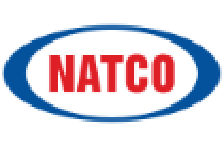
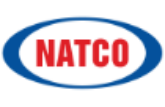
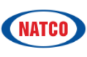

**[Image: Natco_Feb.pdf-0001-00.png (940x96, 100.6KB)]**

February 18, 2026 

Corporate Relationship Department Manager – Listing M/s. BSE Ltd. M/s. National Stock Exchange of India Ltd <u>Mumbai 400 001 Mumbai 400 051 Scrip Code:</u> **<u>524816</u>** <u>Scrip Code:</u> **<u>NATCOPHARM</u>** 

Dear Sir 

Sub:- Transcript of earnings conference call held on February 12, 2026 

Ref:-  Regulation 30 of the SEBI (Listing Obligations and Disclosure Requirements), Regulations, 2015 

We are enclosing herewith the copy of transcript of the Company's earnings conference call for Q3 FY25-26 held on February 12, 2026. The transcript is also available on the website of the company i.e., www.natcopharma.co.in 

Thanking you 

Yours faithfully 

## For NATCO Pharma Limited 

Chekuri Digitally signed by Chekuri Venkat Venkat Ramesh Ramesh Date: 2026.02.18 15:30:26 +05'30' Ch. Venkat Ramesh Company Secretary & Compliance Officer 

Encl: As above 

**[Image: Natco_Feb.pdf-0002-00.png (224x145, 5.0KB)]**

# “NATCO Pharma Limited 

Q3 and FY '26 Post Results Earnings Conference Call” February 12, 2026 

**[Image: Natco_Feb.pdf-0002-03.png (165x107, 11.0KB)]**

**[Image: Natco_Feb.pdf-0002-04.png (138x109, 9.0KB)]**

**[Image: Natco_Feb.pdf-0002-05.png (221x111, 5.5KB)]**

**– MANAGEMENT: MR. RAJEEV NANNAPANENI VICE CHAIRMAN AND – CHIEF EXECUTIVE OFFICER NATCO PHARMA LIMITED** 

**– MR. RAJESH CHEBIYAM EXECUTIVE VICE – – PRESIDENT CROP HEALTH SCIENCES NATCO PHARMA LIMITED** 

**MODERATOR: MR. HRISHIKESH PATOLE - BATLIVALA & KARANI SECURITIES INDIA PRIVATE LIMITED** 

Page **1** of **17** 

_Natco Pharma Limited February 12, 2026_ 

**[Image: Natco_Feb.pdf-0003-01.png (148x97, 9.1KB)]**

### **Moderator:** 

Ladies and gentlemen, good day, and welcome to the NATCO Pharma's Q3 and FY '26 Earnings Conference Call hosted by Batlivala & Karani Securities India Private Limited. As a reminder, all participant lines will be in the listen-only mode and there will be an opportunity for you to ask questions after the presentation concludes. 

Should you need assistance during the conference call, please signal an operator by pressing star, the zero on your touch-tone. Please note that this conference is being recorded. I now hand the conference over to Mr. Hrishikesh Patole from Batlivala & Karani Securities. Thank you, and over to you, sir. 

### **Hrishikesh Patole:** 

### **Rajesh Chebiyam:** 

Hello. Thank you. Good afternoon, everyone. On behalf of B&K Securities, I welcome you all to the Q3 FY '26 Earnings Conference Call of NATCO Pharma. Hope everyone is in good health and doing well. On behalf of NATCO today, we have with us Mr. Rajeev Nannapaneni, Vice Chairman and CEO; Mr. Rajesh Chebiyam, Executive Vice President, Crop Health Sciences. I now hand over the call to Rajesh for the management's opening remarks, post which we'll open the session for Q&A. Over to you, Rajesh. 

Thank you.  Hrishikesh. Good evening, and welcome, everyone, to NATCO's conference call discussing our earnings results for the third quarter of FY '26, which ended December 31st, 2025. During this call, we may be making certain forward-looking statements, which are not necessarily historical facts, and anything said on this call, which reflects our outlook for the future must be reviewed in conjunction with the risks that the company faces. 

We undertake no obligations to update these forward-looking statements. I'd like to state that the material of the call, except for participant questions, the property of NATCO and cannot be recorded or rebroadcast without NATCO's expressed written permission. We'll begin with the call results highlights and followed by an interactive Q&A session. We have updated the financials and press release earlier today. These are also available on our website. 

NATCO recorded consolidated total revenue of INR705.4 crores for the quarter ended on 31st December 2025 as against INR651.1 crores as of 31st December 2024. EBITDA for the quarter was at INR216.8 crores with a margin at 30.7%. The net profit for the period on a consolidated basis was INR151.3 crores. 

Revenue from our associated company, Adcock Ingram Holdings, South Africa for the first half of the financial year which ended December 31st, 2025, was at INR2,464 crores at a profit after tax of INR198 crores. For NATCO, the profit picked for the period, which started from 10th November to 31st December 2025 at 35.75% amounts to INR29.65 crores. 

So after a one-time/period amortization of INR18.75 crores, the associated profit reflection in NATCO's financials amounts to INR10.9 crores. The Board of Directors have declared an interim dividend of INR1.5 per equity share of INR2 each during Q3 of FY '26. The segmental split has also been shared in the press release. I will not go through the details, but we will take questions, and we'll answer from there. Thank you all. 

Page **2** of **17** 

_Natco Pharma Limited February 12, 2026_ 

**[Image: Natco_Feb.pdf-0004-01.png (148x97, 9.1KB)]**

### **Moderator:** 

The first question is from the line of Gautam from Leo Capital. 

**Gautam:** I had a question on GLP-1. Do we have any fill and finish capacity? And if so, is this for an Indian market or an emerging market segment? 

**Rajeev Nannapaneni:** GLP-1 approval is expected sometime this month. It's pending at DCGI. Capacity right now, we are outsourcing from OneSource. **Gautam:** All right. And regarding emerging markets, which geographies are we launching in? And will we have our own capacity in the future or just this OneSource capacity? **Rajeev Nannapaneni:** As of now, we don't have any capacity. So right now, our tie-up is for India OneSource we're doing and then we're not actively pursuing emerging markets. We're actively pursuing only regulated markets. So those, I think the launch is a little away. **Moderator:** The next question is from the line of Love Gupta from Counter Cyclical Investments. **Love Gupta:** Sir, so I was just looking at the statement. We have like about INR2,600 crores, INR2,700 crores cash on our books post the Adcock acquisition. Why don't we consider a share buyback given the current favorable valuations of our share price and reward the shareholders in some -- in that form? **Rajeev Nannapaneni:** Actually, the cash position net is about INR2,500 crores. I just want to be more precise. Regarding buyback, at this time, I'm not really thinking about it. I think my sense is that there are further acquisitions to do, and we are actively engaging trying to do another very large transaction, we have enough cash. I would like to preserve my cash for another transaction similar to size of Adcock. I wouldn't want to do a buyback at this time. **Love Gupta:** And when do we plan to announce or complete this acquisition? And what? **Rajeev Nannapaneni:** We're actually working on a couple of transactions. Yes. So until it's done, it's not done, right? So we're actively pursuing 2, 3 targets and were hoping we'll be able to close. this in 2025, Adcock. So something large, we want to close at least 1 or 2 we are pursuing. So if we're lucky 2 or at least 1 in 2026, we want to close in this calendar year for sure, all subject to clearance of diligence and clearance of whatever other things that we need to close. **Moderator:** The next question is from the line of Rahul Chaudhary, an Individual Investor. **Rahul Chaudhary:** Do we know what is the net cash in Adcock Ingram's books? **Rajeev Nannapaneni:** Exactly, I don't remember my friend, but I think net debt is 0, I think, or some little bit of cash they have. Net debt, 0 is what I recollect. **Rahul Chaudhary:** Sir, regarding this domestic semaglutide, we have 2 applications like, I mean, for the generic Ozempic and generic Wegovy or we -- once since you've got some SEZ approval, it's for -- it's for the diabetes variant, right? There's something which will -- is also there for the weight loss. 

Page **3** of **17** 

_Natco Pharma Limited February 12, 2026_ 

**[Image: Natco_Feb.pdf-0005-01.png (148x97, 9.1KB)]**

### **Rajeev Nannapaneni:** 

We have both for Ozempic and Wegovy, we have both the application. So one of the trials is not completed yet. The Ozempic one is what got completed, so for which we got the SEZ committee clearance. So we are expecting the license any moment. I think that's the way, so our expectation is that we launch the diabetes strength when the market opens up shortly. 

### **Rahul Chaudhary:** 

And sir, the court case that we've done is to prevent them from ever winning the patent? Or why are we spending money on stopping? There are so many other companies that also have got approval from the SEZ. What's the logic behind it? 

### **Rajeev Nannapaneni:** 

Logic behind the court case you're saying. I mean, it's a very complicated question at this time, I don't want to answer that question. There is a strategy that we had. I think for the purposes of this call, I would like to say that we're going to launch when the market opens up post March. 

### **Rahul Chaudhary:** 

Okay. So just on this aspect only, for the Wegovy thing also, we will get the approval soon, right? We are working on that? Or is there some trials is pending? 

**Rajeev Nannapaneni:** No, we're working on. I think the clinical trial is expected to complete soon and then we'll file for approval shortly. 

**Rahul Chaudhary:** Sir, my last question is in the export formulations year-on-year, there is an uptick of around INR135-odd crores this year. Is this because of the tailwind of Revlimid or in other things we have done better? 

### **Rajeev Nannapaneni:** 

In fact, there's been literally no Revlimid this quarter. We had 0 Revlimid this quarter. And these numbers are with 0 Revlimid, it is a good thing. Whatever tailwind that we got is essentially because our subs have done extremely well. Brazil and Canada has done extremely well. Also, we have done very well in the Middle East. So our strategy of expanding into Emerging Markets has paid dividends. 

And you'll see the benefit of that, I think, in the coming quarters. As of now, we're not consolidating for this quarter a substantial amount of profit from Adcock. But I think for the coming quarters, we'll be consolidating Adcock profit as well. So we'll have a steady, strong base business. So, I think you'll see a more steady revenue like we have this quarter. 

### **Moderator:** 

The next question is from the line of Candice Pereira from Dolat Capital. 

**Candice Pereira:** So with regards to the Adcock Ingram acquisition, will there be an annual amortization amount? Or this was just a onetime amortization that will be taking? 

**Rajeev Nannapaneni:** This is a onetime amortization. But we will also have to see, how we're going to account for Adcock profit. So whatever Adcock profit is there, 35.75% of that will be consolidated into NATCO's books. There will be an element of amortization. I think the accountants are working on it. It will be about INR10 crores to INR14 crores per year. 

So essentially, a thumb rule for you would be take Adcock's profit, take 35.75% of their profit and remove about INR10 crores to INR15 crores from that for amortization. I mean any onetimes happen that I can't project for you. But I think that will be the quarterly amortization. It 

Page **4** of **17** 

_Natco Pharma Limited February 12, 2026_ 

**[Image: Natco_Feb.pdf-0006-01.png (148x97, 9.1KB)]**

will be split over quarters. So I think maybe about INR3 crores a quarter is what our expectation is. 

But I think the accountants are working on finalizing the number, but roughly, I think above that is what my expectation is. So back of our hand, I mean, if you assume that this is a steady-state number and they're able to repeat the numbers, we will be adding about INR35 crores to INR40 crores of PAT to our balance sheet every quarter from Adcock. 

### **Candice Pereira:** 

Okay. That is helpful. And sir, is there any time line for the Crop Health Sciences de-merger in place for now? 

### **Rajeev Nannapaneni:** 

I think we have started the process. So, I think roughly, we're thinking by October, November, but I don't want to say any definite timelines, but this is our, what should I say, goal to do. But I mean, there's a lot of processes that we have to run, right? So I think the process will take whatever time it will take. But our end goal is that we should be able to do it in the next 8, 9 months. But again, we'll keep you updated to give you more accurate timelines. But as of now, that is the expectation. 

### **Candice Pereira:** 

Yes. And one last question is you called out that you are looking at 2, 3 targets for acquisitions. So they are in any particular segments or for domestic market or export? 

### **Rajeev Nannapaneni:** 

I think we're actively looking, I don't want to answer the question directly, but our focus has been looking at Emerging markets and looking at brand business, established brand business. I think that's what we're looking at. This is where we see value in our portfolio. So this is what we're looking at this time. 

### **Moderator:** 

The next question is from the line of Gautam from Leo Capital. 

**Gautam:** Sir, you mentioned that for India, we are outsourcing via OneSource. What capacity are we outsourcing from OneSource is it just  or the whole product? And what capacity would be like how many percent? 

### **Rajeev Nannapaneni:** 

It's fill finish. So you give all the raw materials and they'll convert and give it to you. What capacity am I reserving you are saying? We are only launching for India, right?, India is actually a very tricky market. I'm positive about the semaglutide launch, but I think it will be extremely competitive. I think my expectation is that there are going to be a lot of generics. 

We are launching our own brand plus also we're giving to 2 other people. So again, all the other guys also, I think they're launching their own brand, and there are also some out-licensing business that's happening. So, it will be like a crowded 10, 15 generic market and there are a lot of strategies involved in it. 

If you ask me, I think the next quarterly call, I'll give you an idea of how the uptake is and what I believe the market will entail in capacity because at this time, it's very early, because there are a lot of permutations combinations like you know that Mounjaro is doing better than semaglutide in the Indian market. But obviously, with a lower price, there will be some uptake. 

Page **5** of **17** 

_Natco Pharma Limited February 12, 2026_ 

**[Image: Natco_Feb.pdf-0007-01.png (148x97, 9.1KB)]**

I think once we are in the market, when we do the March annual audited numbers in May, I think I can shed better light. Right now, I'm even actually, we need a little more time to give you a little more clarity on guidance on how things are going to play out. 

### **Gautam:** 

But regarding the capacity reserve in sort, is that shareable? 

**Rajeev Nannapaneni:** No, my friend. I can't say anything on this because it's very difficult, I have no idea what the demand is going to be. So once we have a demand clarity and seeing how the market formation plays out, I think I'll give you more color on how I think the things will play out. 

### **Moderator:** 

The next question is from the line of Mr. Hrishikesh Patole from B&K Securities. 

### **Hrishikesh Patole:** 

So quickly, our other expenses have declined sequentially as Y-o-Y. We had earlier highlighted in previous calls that in the post Revlimid area, we will be probably curtailing some cost and R&D if at all. So I mean, what's the major chunk that has gone away? And will this be likely a trend going forward quarterly on a quarterly basis? 

### **Rajeev Nannapaneni:** 

I think a lot of the R&D budget in terms of allocation, and all was done in the September quarter, a lot of the projects because we knew that there will be a decline in Revlimid. So a lot of the allocations were done for the next 12 months in September. So, I think that a lot of the R&D for the next few months is covered already for most part. Obviously, there will be some incidental expenditure. Onetime bonuses that we wanted to give, they're all done with September because the anticipated decline in the earnings. 

We've been waiting for this moment for almost 4 years. So we've been preparing for this new cost structure and R&D budget, yes. But we're still continuing our strategy of doing complex generics. I don't want to back on doing projects. So we continue to invest. I think there's enough surplus. And the guidance’s that we're giving on surpluses are based on after accounting for the R&D expenditure that we intend to spend. 

### **Hrishikesh Patole:** 

And quickly on our NCE and date. So can you just throw on the 2, 3 names that we have on the pipeline and the progress as of now? 

### **Rajeev Nannapaneni:** 

Yes, sure. I think there are 5 ideas we have put on the presentation. I think the most exciting one, if you ask me personally is eGenesis. So eGenesis is doing extremely well. As you know, I mean, this is in public domain. So they have dosed one patient, but they have transplanted kidney for one particular patient, and then they had to remove it after 6 months, but another patient doing extremely well, and they're trying to extend it to multiple patients. 

And so I think that trial is going extremely well. We are very excited about this investment. And we believe if the trial goes well, this would be a multi-bagger deal in the portfolio that we have. So I think this is probably the most exciting one of the 5 ideas that we have. 

### **Moderator:** 

The next question is from the line of Nitin Gandhi from Inoquest Advisors Limited. 

**Nitin Gandhi:** Yes. Just continuing the same question in a different way that where do you see like in 3 to 5 years, this eGenesis potential or the second best idea which can come across within the next 3 

Page **6** of **17** 

_Natco Pharma Limited February 12, 2026_ 

**[Image: Natco_Feb.pdf-0008-01.png (148x97, 9.1KB)]**

to 5 years. All 5 are unlikely to fructify in 3 years. So if you can share some time frame within which each of them can fructify could be another -- and some quantification, if you can share over 3 to 5 years, may not be 1 year or so. 

### **Rajeev Nannapaneni:** 

I think we always wanted an exposure for NCE. I think this is something that all Indian companies want to do. And I always was very keen on doing it. But what happened is our balance sheet and our bandwidth in the system is never strong. So they always felt okay, the next best way of participating in the NCE pipeline is by through investments. And this is probably the biggest investment we have made among the NCE, I guess. This is $8 million. 

See, this technology is called CRISPR, CRISPR-Cas9 technology. What they do is they do a genetic modification of the pig and which makes it more likely that the humans will accept the kidney. You can do for kidney, you can do for heart, you can do for liver. This is probably the most disruptive thing that's going to happen in medicine. 

But these are all very high-risk ideas. I just want to let the investors know that it is a high-risk idea. But if it works, it's truly disruptive. I mean we all know people who always have challenges with kidney and liver and who want to transplant. And if this works, practically, you could use a pig kidney and transform to transplant to humans. 

If you ask me, this is an idea of the decade. And as investors of NATCO, you're getting a seed through of one of these ideas. And we invested it very early stage at a very early modest valuation. So I'm actually very bullish about this idea. And I think if it reaches a stage where we're able to demonstrate, let's say, about 25, 30 patients, I think we have a home run and which will play out in my personal view in the next 2, 3 years. 

So essentially, you got to transplant the kidney or whichever organ you're trying to do and see how the patient does over a period of 1 year, 12 months, 1 year or 15 months or 18 months. And we've seen one patient who has done well for at least 6 months, which is probably the longest in the world. So I think the second patient is also doing very well. So I think we're in a good place. I'm actually very excited. So we'll see how things go. 

### **Nitin Gandhi:** 

### **Rajeev Nannapaneni:** 

Sorry, but if you can share something on like we are almost like 1 leg death for kidney transplantation. Spain is the highest where something is going wrong. And you aside leaving maybe 50%, what about rest, which and how adoption could trigger if it's based on some analysis or some sensitivity or what could be the factor to start the adoption? 

See, Spain, I understand it is an exception because Spain has a very active program where there's a lot of cadaver transplant. But culturally, a lot of countries don't allow it. In a lot of countries, it's very difficult to get organs. I mean Spain is a super exception. But if you look at even India, for example, for a moment, yes. So how many people are willing to give their kidney and liver away when somebody passes away, practically none, right? 

And how big is the market for kidney and liver? It's huge, right? And if you get a breakthrough, I mean, the potential is enormous. And so the company has a great platform. So I think the potential is enormous, but these ideas, you just have to have the risk appetite and wait. And I 

Page **7** of **17** 

_Natco Pharma Limited February 12, 2026_ 

**[Image: Natco_Feb.pdf-0009-01.png (148x97, 9.1KB)]**

think if something good happens, I think it will be very exciting. But I think my suggestion is - - the potential is large. And you just have to show the data that the patients are doing well. So then I think it will be pretty interesting. 

**Moderator:** Thank you. The next question is from the line of Ankush Malhotra, an Individual Investor. Please go ahead. 

**Ankush Malhotra:** Good afternoon, sir. The recent exchange filing, there was an update regarding the approval for this erdafitinib from U.S. So what is the significance of this approval for this molecule from the business perspective? 

**Rajeev Nannapaneni:** The litigation is still ongoing. So it's a Para IV, and it's a $60 million product. So it's not a very large product. We just announced it because we are the first generic which got approved, I think that was significant. 

**Ankush Malhotra:** Just on the time line perspective, sir, how -- when we can see this product launch? Any tentative idea? 

**Rajeev Nannapaneni:** No, no, it's too preliminary at this time. The Para IV litigation is still ongoing. I think it's very premature to talk about the launches. I think our investor presentation has a list of all the Para IVs that we have. So I think at this time, it's very difficult to judge the time lines, but we do have multiple launches over a period of time. So, I think if you look at our pipeline, we have things starting from 2026 till 2035. 

So I can't name which molecule when. And some of them we have settlements and some of them we are still litigating. But I think all these launches will play out in the next 8 to 9 years. So I think that's where the excitement is and I think some of them are sole FTFs and some of them are shared FTFs. So even if some of them come through, I think we are looking at a very, very interesting situation. 

### **Ankush Malhotra:** 

Okay, sir. Thank you, thank you. 

**Moderator:** Thank you. The next question is from the line of Rahul Chaudhary, an Individual Investor. Please go ahead. 

**Rahul Chaudhary:** Sir, I have a marketing suggestion on a lighter note. Now that we are going to be launching the generic Ozempic and Wegovy and we have around 4 lakh retail shareholders plus maybe you can also think about sending a hard copy of annual report with some discount for captive customers. It's INR100 crores, INR150 crores idea if it's hooked to size, just on a lighter note? 

**Rajeev Nannapaneni:** I think, I should send a hard copy of annual report. 

**Rahul Chaudhary:** 

And get the discount coupon, sir? 

**Rahul Chaudhary:** Discount coupon for Wegovy is because -- yeah, yeah. Because it's a mass market product. 

Page **8** of **17** 

_Natco Pharma Limited February 12, 2026_ 

**[Image: Natco_Feb.pdf-0010-01.png (148x97, 9.1KB)]**

**Rajeev Nannapaneni:** 

I understand. 

**Rahul Chaudhary:** 

20% 

**Rajeev Nannapaneni:** No, we will sell it at such a discount that you will be happy. Not only for shareholders, for everyone, for the whole larger community. 

**Rahul Chaudhary:** 

Okay, sir. 

**Rajeev Nannapaneni:** Certainly. Okay. Thanks. 

**Management:** Good, good marketing idea, Rahul. Thank you. Next caller, please. 

**Moderator:** Thank you. The next question is from the line of Mihir Desai from Desai Investments. Please go ahead. **Mihir Desai:** Thank you. Thank you for the opportunity, sir. Sir, firstly, I wanted to ask you, like if there is an opportunity which comes up for a large acquisition, would you be comfortable to take debt or you would go through a route of fundraise through capital markets? **Rajeev Nannapaneni:** I'm not a big fan of debt you're aware of that, but I would make the judgment closer to the time. I think right now, we have enough cash. So, we don't need any money f. But if the acquisition is large enough, then maybe we'll look at it. Generally, if I do it also, I'll mix it up with some debt and some equity and some cash flow. I think we'll do a mix of all three. 

Asking me point blank right now, the answer is like we're not going to raise any capital. But if something happens, yes, I will change my mind. We're shopping. But if something happens, yes, certainly, I think we'll consider that. 

**Mihir Desai:** Sir, a follow-up on this. Do you see any lucrative acquisitions coming up or in pipeline? 

**Rajeev Nannapaneni:** Yes, I do. I think a lot of the opportunities are there, especially outside India, there's a lot of opportunities with very reasonable return on capital. So compared to India, I think there are better opportunities outside India. 

Just that you have to have the leap of faith and take that currency risk and take the risk of being outside our geography and whatever comes with the political risk or whatever you want to call it, exchange risk, political risk and so on and so forth. But I think the returns outside India are much better than India. I think that has always been my take. 

And I mean, obviously, I've been against the grain in the conventional thinking that people have been more comfortable doing acquisitions within India because it's a more certain environment and the variables are more controllable. But having said that, I believe that going out, the return is much higher. I think that's my personal position. 

Page **9** of **17** 

_Natco Pharma Limited February 12, 2026_ 

**[Image: Natco_Feb.pdf-0011-01.png (148x97, 9.1KB)]**

**Mihir Desai:** 

### **Rajeev Nannapaneni:** 

Okay. Yes. Sir, lastly, I wanted to ask on the vision, like if you can throw some road map of, say, 5 to 10 years down the line. And is there a figure in your mind which you can give a ballpark, say, INR10,000 kind of crores of turnover or something of that sort? 

I think what we have done is this year, I think we are more or less going to meet the guidance. I think we should do about INR4,200 crores to INR4,300 crores is what my expectation is. Going forward, I mean, obviously, we want to increase our shareholding in Adcock, but obviously, subject to Bidvest willing to consider our request. So we have that in the shareholding. So that is obviously a quick way to get to your number of INR10,000 crores, if that were to happen. 

But at this time, Bidvest has not shown interest in selling their shares. But the agreement allows us to increase in the event they are interested in diluting their shareholding. But at this time, I want to clarify that they're not shown interest. So that is one possibility of getting to the number that you just said. 

Another is you have to do a very large transaction again because the way our business is today, organically can only grow so much. Incumbent share in generics is very difficult to snatch away from the incumbent because everybody has their own supply chain, everybody has their share, nobody gives up share. 

And you don't disrupt and get that share, you have to do something very disruptive on pricing, which again destroys the value for everyone. So the only way you can achieve that scale you just said, it has to be in combination with the pipeline and an M&A. M&A has to be either supplementing what you're doing in your portfolio or adding a new geography. That's the only way. 

And do you have such a number in mind? Of course, we have this number in mind. I'm totally aware of it. But that's the only way. I think without M&A, you'll not get there, simple answer. Organically, we'll get you to a certain point, but you need to do M&A for sure. 

### **Mihir Desai:** 

### **Rajeev Nannapaneni:** 

Understood. And sir, as the -- like there is a buzz in the industry, people are moving towards pet care and stuff. So do you have an opportunity to explore that market? Or how do you look at that market, sir? 

I've not looked at pet care. I'll be honest with you. We have not looked at pet care. I think our focus has been only to expand our geographical footprint. I think we have been always very U.S. and India focused, and we have not been present in other countries. So very deliberately, I think last 4, 5 years, we have built a geographical footprint with our own subsidiaries in multiple countries. 

And so now I think we have a reasonable presence in Canada and U.S. now we have our own front end. Brazil, we have a very good presence. And then obviously, South Africa through Adcock. So I think we're trying to build geographical expansion. I think there's more value to our portfolio than we are getting. And I think the value can be expanded by adding geographies. 

Page **10** of **17** 

_Natco Pharma Limited February 12, 2026_ 

**[Image: Natco_Feb.pdf-0012-01.png (148x97, 9.1KB)]**

And one biggest market that we are not present in is Europe, especially Western Europe. So a lot of guys are present in that, and that's a market that we are not clearly present. So there's still a lot of like scope for our portfolio in multiple geographies. So I think let me exhaust that, and I think we'll probably come to a different segment. 

But I think the oncology portfolio has a lot of scope. So I feel that all the best oncology products for the next 10 years, non-biotech, we have it in our pipeline. And I think there are enough dossiers in the pipeline. So I feel like we are well placed to exploit that. 

### **Mihir Desai:** 

Okay. Sure. Thank you. Thank you for taking my question. 

**Moderator:** Thank you. The next question is from the line of Abdulkader from ICICI Securities. Please go ahead. 

### **Abdulkader:** 

Yeah. Sir, thank you for the opportunity. Sir, did I hear that you're expecting roughly INR4,300 crores of revenue this year for fiscal '26? 

### **Rajeev Nannapaneni:** 

I think so. Based on how things are going, I think 9 months, if I look at my numbers right now, we did INR3,559 crores of revenue. So, we anticipate, we'll maintain, the similar sort of revenue around INR700 crores to INR750 crores. I think that's what my expectation for this quarter is. So if you add the INR750 crores to the INR3,500 crores, so it's about yes, INR4,300 crores is what our expectation is. I think that's where things are going as discussed. 

**Abdulkader:** 

Okay. Understood, understood. And also… 

**Rajeev Nannapaneni:** And PAT also, I think we are at almost INR1,150 crores for 9 months. So we'll end with, I think, around INR1,280 crores to INR1,300 crores is what I said. 

### **Abdulkader:** 

Understood. Understood. And sir, on the India front, I think in this quarter, we had a decent growth in that particular segment. So what is driving this uptick in revenues in India, if you could highlight? 

### **Rajeev Nannapaneni:** 

I think India will be primarily driven by semaglutide. I think if I understood you correctly, as your voice was not so clear, but your question is what will drive India revenue in the next 12 months? Is that the question, if I may paraphrase that? 

### **Abdulkader:** 

Yes, sir. 

**Rajeev Nannapaneni:** 

Okay. So I think from what I understood from your question, I think what's going to drive India revenue, I mean, we have our oncology pipeline that we're launching, but obviously, not large ones. The biggest one will be semaglutide. I think because our business is small, our domestic business is not very large. 

I think it's -- we're doing annualized around INR450 crores, INR460 crores. So I think any bump on semaglutide will more than help us grow around 20%. So I think our internal target is that our domestic business should grow more than 20% this year because of semaglutide. And the 

Page **11** of **17** 

_Natco Pharma Limited February 12, 2026_ 

**[Image: Natco_Feb.pdf-0013-01.png (148x97, 9.1KB)]**

bump is primarily coming because of semaglutide. So a lot of our expectation of domestic growth is coming from semaglutide. 

**Abdulkader:** Understood. Thank you **Moderator:** Thank you. The next question is from the line of Marut Saha, an Individual Investor. Please go ahead. **Marut Saha:** My only single question is, will there be any Revlimid in this quarter, the running quarter? **Rajeev Nannapaneni:** I have not budgeted anything at this time because it's very difficult to judge. So I think we had very little Revlimid in the last quarter, practically zero. It had some amount, but nothing significant. We've not budgeted a heavy amount of Revlimid this quarter because it's very tough to judge how the market is going to be. So I've not budgeted anything. And whatever guidance we have given for PAT this quarter, which is around INR150 crores, doesn't assume much from Revlimid. **Marut Saha:** Okay. Okay, sir. Thank you. **Moderator:** Thank you. The next question is from the line of Abhigyan Srivastav from Marcellus Investment Managers. Please go ahead. **Abhigyan Srivastav:** Yeah. I just wanted to learn about the launch time lines, particularly for olaparib. Do we have any information on that? **Rajeev Nannapaneni:** We're awaiting tentative approval. So that is one milestone we need to achieve. The second milestone is we are still litigating the product. So we don't have any time lines at this time. So at this time, I can't answer that question. But I think we'll have clarity in the next few months. **Abhigyan Srivastav:** Got it. Okay. That’s all. **Moderator:** Thank you. The next question is from the line of Dr. Kartik Bane from Bajaj Life. Please go ahead. **Kartik Bane:** Thank you very much for the opportunity. I would like to know how many MRs do we have on field for semaglutide in India? And what would be the strategy? How many do we actually require? **Rajeev Nannapaneni:** So our total MR strength is about 600. And for semaglutide, I think we allocated about 350 to 400 people to promote. So we are covering endocrinologists, specialists and then we're covering consulting physicians. So I think that should be adequate to cover. 

Are we covering like every doctor that is there in the group? No, probably not. I think we don't have that level of field force. But I think we'll cover all the key opinion leaders and the key stakeholders will be able to cover, which should hopefully make a meaningful impact on our revenue, so based on the setup that we have. 

Page **12** of **17** 

_Natco Pharma Limited February 12, 2026_ 

**[Image: Natco_Feb.pdf-0014-01.png (148x97, 9.1KB)]**

**Kartik Bane:** 

### **Rajeev Nannapaneni:** 

Okay. And my second question for the Adcock, how much CAGR can we consider for the Adcock's revenue and the PAT? 

I think as of now, I think the business has been flat. I think the historical numbers of Adcock have been there in public domain. So the numbers have been flat. But I think the value that we're bringing for Adcock is the pipeline. I think we have our own oncology pipeline. And we also have relationships with others. So GLP pipeline and then we are talking about HIV. So we're trying to sort of use our relationships and our own pipeline to strengthen Adcock's pipeline and file these products. 

The benefit of Adcock in terms of growth of earnings, you'll probably see it in the next 18 to 24 months once these registrations start coming. So I think the real value is seen in 2 years from now. Right now, we will be depending on Adcock's base business for earnings. But I think NATCO's input and the value of that input, you'll probably see 2 years from today. I think that's our expectation. And I think over a period of time, you'll see value. 

And also a geographical expansion, right? So we're getting that   a lot of the, what I call, feedback that we get from our shareholders is that our revenue and our profitability is so very concentrated. I think we have shown that in the last 3, 4 years, we have done a lot of work to sort of diversify our, what we call, profit base. So now we are seeing more diversified profit base and bring more stability in earnings. And in spite of not having any Revlimid, I think you have seen that the company has delivered pretty reasonable earnings. And I think we're going to build from here. 

And we have very good launches coming up in the U.S. in the next 12 months. And also, we have very good launches in Brazil also coming up in the next 12 months. And now with the one letter lifted from our Kothur facility, we anticipate a lot more approvals coming in and also a lot of launch is going to happen. So we see that, from this base, I think we should be able to compound comfortably in the next couple of years. 

### **Kartik Bane:** 

### **Moderator:** 

### **Abhigyan Srivastav:** 

### **Rajeev Nannapaneni:** 

Thank you very much. 

Thank you. The next question is a follow-up question from Abhigyan Srivastav. Please go ahead. 

Hi, sir. Similar to my question that I asked previously, do you have any idea on when this patent filing would take place for olaparib 

We have a settlement in the U.S. So the settlement date is bound by confidentiality. So I can't reveal that. But I can tell you that we have exclusivity on the 60-milligram with shared exclusivity. And in one strength, we have sole exclusivity. So I think that's a position that we are in. The launch date and all, I can't answer that question, but it will happen, obviously, in the next few years. The exact date will come back when we are closer to the market formation. 

And the other question was olaparib. Olaparib, there are multiple patents going into the next 7, 8 years. So we're litigating all of them. It depends on either you have to win in trial or you have to get a settlement date something in the next few years. At this time, it's very premature to sort 

Page **13** of **17** 

_Natco Pharma Limited February 12, 2026_ 

**[Image: Natco_Feb.pdf-0015-01.png (148x97, 9.1KB)]**

of speak about the U.S. launch of olaparib because we don't have clarity yet. But I think over due course, I think we'll have some clarity. 

**Abhigyan Srivastav:** Got it. Got it. Okay. 

**Rajeev Nannapaneni:** 

**Moderator:** Thank you. The next question is from the line of Gaurav from Ambit Capital. Please go ahead. **Gaurav:** Yeah, hi. Thank you. Good evening. Sir, can you call out the R&D spend for this quarter and the 9 months for FY '26? 

**Rajeev Nannapaneni:** . Typically, our R&D spend is about 8% of sales. I think that's the rough estimation. I think it's around that. Exact number, I don't have, but I have a rough percentage. **Gaurav:** Sir, just this year, we had some revenue from Revlimid this year and that was 8%. So next year, the absolute R&D spend you expect that should continue to grow with these trials of Phase II going on and more complex in the pipeline? Or you expect some moderation there? 

**Rajeev Nannapaneni:** Yes.  we can't spend really like we spend it in Revlimid time. So I think there's no doubt in that. I think we're looking at two, three strategies. One is we are looking at -- some generics, we want to do it ourselves and because we have our own front end. And what we are doing is for complex generics, we're looking for partnerships so that we can split the R&D expenditure between a partner and ourselves. 

I don't want to stop the momentum that we have -- that we had in the last few years. But I would say that we will split the R&D expenditure. I think some if we have a very interesting idea, we believe with a strong Para IV, then we'll probably go to a partner and say, you know what, why don't we just share the cost so that we can reduce the risk, which has always been NATCO's original model. 

But now because we have become a bigger company, I'm doing more R&D on my own books. But maybe we have to do a little more sharing. But I think the momentum and the train won't stop. I think the motivation won't stop. I think we just have to sort of recalibrate things and probably do a little bit of sharing, but I think the momentum won't. Okay? 

**Gaurav:** 

Interesting. Got it. Thank you for that. A couple of questions on sema, the U.S. and the India filing. So I think for Ozempic, if I understand, there were 6 NCE-1 filings and for Wegovy, there were probably 3 day 1 filings. Now we have some strength or all strengths of Ozempic, Wegovy where we think we are the sole FTF. So is this as a result of a settlement? Have we got a TA within 30 months? Any clarity on that? What gives us confidence that we are the sole FTP? 

**Rajeev Nannapaneni:** We don't, I think neither do we or any of our competitors have an approval with FDA on semaglutide. Nobody has approval on semaglutide in 30 months. Certain strengths of both the products, we are sole FTF, you're right, absolutely right, and which is covering a significant part of it. Did we get approval in 30 months? The answer is no. 

Page **14** of **17** 

_Natco Pharma Limited February 12, 2026_ 

**[Image: Natco_Feb.pdf-0016-01.png (148x97, 9.1KB)]**

I think we are answering FDA queries, and I think we need to answer them successfully. Do we have 180 days? I have no answer to that question. But typically, for complex products, people give a little bit of leeway on the 180 days. But having said that, it's premature to talk about it. I think one product we already settled. Ozempic we already settled. I think Wegovy, we were not settled and that's where we are. 

### **Gaurav:** 

Yeah. Thank you. All the best. I will join the queue. 

**Moderator:** Thank you. The next question is from the line of Nitin Agarwal from DAM Capital. Please go ahead. 

### **Nitin Agarwal:** 

Thanks for taking the question. Rajeev, since you mentioned there's not much of Revlimid that you've seen in Q3 and your guidance for Q4. So is it fair to assume H2 is sort of more representative of a base quarter for us, recurring quarter for us going forward, I mean, in terms of before the addition of new products? 

### **Rajeev Nannapaneni:** 

Absolutely. Yes, absolutely, Nitin. Everything is base. I think we -- there's no -- so this is a base business. And from here, we need to grow. Yes, absolutely. And any new launches that we get will be an increment on this as well. 

### **Nitin Agarwal:** 

That's perfect. And secondly, you mentioned that you expect a lot of launches in the U.S. over the next 12 months. If you can give us some color on what kind of launches you're thinking here? 

**Rajeev Nannapaneni:** 

We have some ANDAs that we're expecting approval in the next few months. So those are nonPara IV ANDAs and which we're marketing through our own front end. So those we're expecting in around April to June quarter, we're expected to draw. Some of these older products we are launching. And we're just waiting for -- one, we're waiting for FDA approval and one we are waiting for -- we are doing some manufacturing tweaking in terms of the equipment. That's the reason why the plan is deferred to April. 

And we are expecting at least one of our first to files in the U.S. shared FTF that we're going to launch in the next few months. So that's our expectation. Which one and all, we can't reveal. But yes, one of our shared FTFs, we're going to launch in the next financial year. So benefit of that you'll see in the next financial year, which I think will also add to the baseline. 

### **Nitin Agarwal:** 

Okay. And secondly, on the R&D, have you filed any complex generic this year so far? 

### **Rajeev Nannapaneni:** 

We are going to file about 4, 5 products we have filed. I think the total target is that we're going to file about 8 products. I can't answer that we got any sole FTFs or shared FTF. I let me come back on that because we don't have clarity on that yet. 

The really good one that we filed, which was complex and hard to do was probably niraparib. So that was a good one that we filed. We were not FTF. I think another beat us by a few months. So niraparib is a cancer product for which you need to do what we call a patient bio. So I think that was a nice complex one, but yes, but we couldn't get the FTF somebody else got an FTF 

Page **15** of **17** 

_Natco Pharma Limited February 12, 2026_ 

**[Image: Natco_Feb.pdf-0017-01.png (148x97, 9.1KB)]**

ahead of us. So I think -- so we'll see. I think something will probably hit in the next 12 months. Yeah. 

### **Nitin Agarwal:** 

Okay. And second one, on the non-U.S. export markets, how should you broadly look at these markets? What kind of opportunities do you see in these markets, Brazil, Canada and some of the other emerging markets? 

**Rajeev Nannapaneni:** 

I think if you see the base earnings, I think a lot of it is coming from emerging markets and a lot of it has come from the Middle East and Brazil, I look at most of our export revenue. So I think Brazil has some very good launches. We have very good approvals coming this year. And I'm very bullish about our emerging markets and add that with our Adcock profit consolidation, I think our emerging market profit will drive the company's growth. 

And even U.S. also, we're going to see some very good launches, and we're very bullish about our U.S. launches as well. So I think 150, 160 is the base. And on that, I believe in '27, we'll see a very strong growth. And the guidance on the growth and all, I'll give you, I think, maybe closer in the May call once we finalized our audited numbers. But I feel very confident that we should grow comfortably in the next couple of years. 

**Nitin Agarwal:** 

Thank you so much. 

**Moderator:** Thank you. The last question is from the line of Hrishikesh from B&K Securities. Please go ahead. 

**Hrishikesh:** 

Sir, quickly, what was the sales -- subsidiary sales for 3Q and 9M? 

**Rajeev Nannapaneni:** INR177 crores out of the INR705 crores. Subsidiary sale was INR177 crores. **Hrishikesh Patole** And sir, my second question is, can you provide a brief update on manufacturing plant, the U.S. FDA status? 

**Rajeev Nannapaneni:** We have four FDA plants. So Kothur had a warning letter, which got removed. So that got resolved. Mekaguda also got the inspection this year, and we got clearance for that. Chennai got inspected this year, and we're waiting for classification. We believe the observations are procedural in nature. 

We're expecting the classification in the next 30, 40 days and Vizag formulation facility, I think will get an inspection sometime this year. I think it's been due now. I think if I recollect, it's about -- I think it's been about 3 years since the last inspection happened. So 2.5, 3 years. I don't recollect the exact date. So I think we're expecting it. 

So to answer your question, out of the 4, I think 3 got inspected in 2025. One has not been inspected. And out of 3 that got inspected, 2, we got clearances and third, we're anticipating clearance. Okay? 

**Hrishikesh:** 

Thank you. 

Page **16** of **17** 

_Natco Pharma Limited February 12, 2026_ 

**[Image: Natco_Feb.pdf-0018-01.png (148x97, 9.1KB)]**

### **Moderator:** 

### **Rajeev Nannapaneni:** 

**Moderator: Gaurav:** 

### **Rajeev Nannapaneni:** 

Thank you. 

Last question, please. 

Last follow-up question is from the line of Gaurav from AMBIT Capital. Please go ahead. 

Yeah, thank you. So sir, on your M&A, you highlighted which areas you are looking for. As per your M&A framework, what kind of valuation multiples are you generally comfortable paying just to help us factor in terms of the size of acquisitions that may because Adcock was relatively on the lower side of an EBITDA multiple. But going forward, would any -- as per your framework, are you able to share what kind of valuation multiples you're comfortable with? 

It's tough to judge. You judge an asset based on the multiple and the growth potential. So it's very difficult to ascribe a particular multiple. You can't walk into a room and say, I want this particular multiple. And so you have to take it by the case. I mean I can't answer your question directly. You take it by the case. 

Depending on the circumstance, the market and political issues and stability issues, currency risk, I think it is priced in that manner. So we have to keep an open mind and how are you going to finance it and then take it from there. So, I think that's how you have to look at it. So, with this question, I complete the call today. First of all, let me thank everyone for all the good questions that everybody's asked. And that's it. Thank you so much. Yeah. 

### **Rajesh Chebiyam:** 

### **Moderator:** 

Thank you all. 

Thank you, members of the management team. Ladies and gentlemen, on behalf of Batlivala & Karani Securities India Private Limited, that concludes this conference. Thank you for joining us. You may now disconnect your lines. 

Page **17** of **17** 

---

## Extracted Images

| # | File | Dimensions | Size |
|---|------|------------|------|
| 1 | Natco_Feb.pdf-0001-00.png | 940x96 | 100.6KB |
| 2 | Natco_Feb.pdf-0002-00.png | 224x145 | 5.0KB |
| 3 | Natco_Feb.pdf-0002-03.png | 165x107 | 11.0KB |
| 4 | Natco_Feb.pdf-0002-04.png | 138x109 | 9.0KB |
| 5 | Natco_Feb.pdf-0002-05.png | 221x111 | 5.5KB |
| 6 | Natco_Feb.pdf-0003-01.png | 148x97 | 9.1KB |
| 7 | Natco_Feb.pdf-0004-01.png | 148x97 | 9.1KB |
| 8 | Natco_Feb.pdf-0005-01.png | 148x97 | 9.1KB |
| 9 | Natco_Feb.pdf-0006-01.png | 148x97 | 9.1KB |
| 10 | Natco_Feb.pdf-0007-01.png | 148x97 | 9.1KB |
| 11 | Natco_Feb.pdf-0008-01.png | 148x97 | 9.1KB |
| 12 | Natco_Feb.pdf-0009-01.png | 148x97 | 9.1KB |
| 13 | Natco_Feb.pdf-0010-01.png | 148x97 | 9.1KB |
| 14 | Natco_Feb.pdf-0011-01.png | 148x97 | 9.1KB |
| 15 | Natco_Feb.pdf-0012-01.png | 148x97 | 9.1KB |
| 16 | Natco_Feb.pdf-0013-01.png | 148x97 | 9.1KB |
| 17 | Natco_Feb.pdf-0014-01.png | 148x97 | 9.1KB |
| 18 | Natco_Feb.pdf-0015-01.png | 148x97 | 9.1KB |
| 19 | Natco_Feb.pdf-0016-01.png | 148x97 | 9.1KB |
| 20 | Natco_Feb.pdf-0017-01.png | 148x97 | 9.1KB |
| 21 | Natco_Feb.pdf-0018-01.png | 148x97 | 9.1KB |
