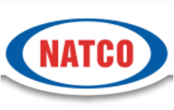
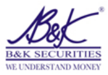
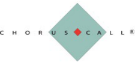
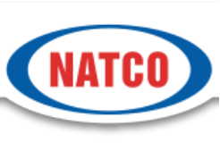

**[Image: Natco_Nov_2025.pdf-0001-00.png (940x96, 100.6KB)]**

November 20, 2025 

Corporate Relationship Department Manager – Listing M/s. BSE Ltd. M/s. National Stock Exchange of India Ltd <u>Mumbai 400 001 Mumbai 400 051 Scrip Code:</u> **<u>524816</u>** <u>Scrip Code:</u> **<u>NATCOPHARM</u>** 

Dear Sir 

Sub:- Transcript of earnings conference call held on  November 14, 2025 Ref:-  Regulation 30 of the SEBI (Listing Obligations and Disclosure Requirements), Regulations, 2015 

We are enclosing herewith the copy of  transcript of the Company's earnings conference call for Q2 FY25-26 held on November 14, 2025. The transcript is also available on the website of the company i.e., www.natcopharma.co.in 

Thanking you 

Yours faithfully 

For NATCO Pharma Limited 

Chekuri Venkat Digitally signed by Chekuri Venkat Ramesh Ramesh Date: 2025.11.20 16:26:14 +05'30' Ch. Venkat Ramesh Company Secretary & Compliance Officer 

**[Image: Natco_Nov_2025.pdf-0002-00.png (247x157, 19.7KB)]**

“Natco Pharma Limited Q2 FY26 Earnings Call” 

# **November 14, 2025** 

**[Image: Natco_Nov_2025.pdf-0002-03.png (246x160, 19.7KB)]**

**[Image: Natco_Nov_2025.pdf-0002-04.png (180x124, 26.6KB)]**

**[Image: Natco_Nov_2025.pdf-0002-05.png (225x108, 13.3KB)]**

**– MANAGEMENT: MR. RAJEEV NANNAPANENI VICE CHAIRMAN & CHIEF EXECUTIVE OFFICER, NATCO PHARMA LIMITED – MR. RAJESH CHEBIYAM EXECUTIVE VICE PRESIDENT, CROP HEALTH SCIENCES, NATCO PHARMA LIMITED – MODERATOR: MR. HRISHIKESH B&K SECURITIES** 

**[Image: Natco_Nov_2025.pdf-0003-00.png (246x160, 19.7KB)]**

## _Natco Pharma Limited November 14, 2025_ 

**Moderator:** 

Ladies and Gentlemen, Good Day and Welcome to Natco Pharma Limited Q2 FY26 Earnings Call hosted by B&K Securities. 

As a reminder, all participant lines will be in the listen-only mode and there will be an opportunity for you to ask questions after the presentation concludes. Should you need assistance during the conference call, please signal an operator by pressing “*” then “0” on your touchtone phone. Please note that this conference is being recorded. 

I now hand the conference over to Hrishikesh from B&K Securities. Thank you and over to you sir. 

### **Hrishikesh:** 

Thank you. Good afternoon, everyone. On behalf of B&K Securities, I welcome you all to the Q2 FY26 Earnings Conference Call of Natco Pharma. Hope everyone is in good health and doing well. 

On behalf of Natco today, we have with us Mr. Rajeev Nannapaneni, Vice Chairman & CEO, Mr. Rajesh Chebiyam, Executive Vice President, Crop Health Sciences. 

I now hand over the call to the “Management's Opening Remarks” post which we would open the session for the Q&A. Over to you, sir. 

**Rajesh Chebiyam:** Thank you, Hrishikesh. Good morning and welcome, everyone to Natco's conference call discussing our earnings results for the 2nd Quarter of FY26 which ended September 30th, 2025. 

As a disclaimer, during the call we may be making certain forward-looking statements or statements about future events and anything said on this call which reflects our outlook the future must be reviewed in conjunction with the risks that the company faces. 

I would like to state that the material of the call except for the participant questions is the property of Natco and cannot be recorded or rebroadcast without Natco's expressed written permission. 

So, we will begin with the results highlight and then go for a Q&A and hope all of you have received the Financials and the Press Release that was sent earlier today. These are also available on our website. 

Natco recorded consolidated total revenue of Rs 1,463 crores for the quarter-ended on 30th September 2025 as against 1,434.9 crores as of 30th September 2024. 

EBITDA for the quarter was at 679.2 crores with margins at 46.4%. 

The net profit for the period on a consolidated basis was Rs 517.9 crores. 

**[Image: Natco_Nov_2025.pdf-0004-00.png (246x160, 19.7KB)]**

## _Natco Pharma Limited November 14, 2025_ 

During the quarter, the company has incurred substantial R&D expenses on bioequivalence and onetime employee bonuses in addition to other business-related provisions. 

The board of directors have declared an interim dividend of Rs.1.5 per equity share of Rs.2 during the quarter. 

On the segmental revenue split for Quarter 2, the API clocked 53.9 crores, domestic formulations Rs 105.4 crores, formulation exports including the profit share and subsidiaries clocked Rs 1,147 crores, crop health sciences clocked Rs 52.4 crores, other operating and non-operating income was Rs 104.3 crores, all consolidating to Rs 1,463 crores. Thank you, all. 

We will take Q&A now. 

**Moderator:** Thank you very much. We will now begin the question-and-answer session. The first question is from the line of Rahul, an individual investor. Please go ahead. 

**Rahul:** 

Hello, sir. My query is that other expenses you said this for research and development on bioequivalence. Does that mean it is for the purpose of Para-IV filings for generic drugs? 

**Rajeev Nannapaneni:** Yes, there are for Para-IV filings for generic drugs and we are doing some clinical trials for first-time generics in India. And so, there are a lot of one-time some substantial costs that we had, and then there was some R&D purchase that we have done which was very expensive. So, that is the reason why the other expenses are a little bit on the higher side. 

**Rahul:** Okay, sir. All right, sir. And, sir, what is the reason for the increase in provisions, very high, relatively earlier we did not have so much -- is this to cushion the impact for the next two quarters? 

**Rajeev Nannapaneni:** It is a good quarter. So, we thought we will make provisions for contingencies. And I think the major provisions that we have made, one was for patent litigation we have made. So, there is not a cash outflow, but it is a provision and there were some business expenses and then some inventory and so general part for the course for the business. So, they are routine business expenses that we have provisioned for. 

**Rahul:** One last question, sir. Domestic, semaaglutide, we were given phase-III clinical trials somewhere in December or January earlier this year. So, typically how long does it take? 

**[Image: Natco_Nov_2025.pdf-0005-00.png (246x160, 19.7KB)]**

## _Natco Pharma Limited November 14, 2025_ 

**Rajeev Nannapaneni:** We are on target. I think review is all completed. If you file in December, we are hoping that will be in the first wave, which is we are hoping the market will open around March, so, we expect around March. 

**Moderator** : The next question is from the line of Hrishikesh from B&K Securities. Please go ahead. 

**Hrishikesh:** Hi! Good afternoon, everyone. So, quickly Rajeev on the revenue you made update, how has the quarter panned out, are we seeing incremental competition and what is the way forward in 3Q and 4Q? That is my first question. 

**Rajeev Nannapaneni:** So, I think this quarter we have done extremely well. I think that is reflected in the numbers. Regarding Q3 and Q4, we are not expecting much. I think we are seeing more competition. I am not expecting much. I think in our budgeting, we have not kept much revenue from Lenalidomide. So, we see increased competition and uncertainty about whether we will get market share. So, I think we are not budgeting much. 

**Hrishikesh:** But has the market changed vis-a-vis what it was in materially in Q2 versus Q1? 

**Rajeev Nannapaneni:** No. You are asking me what our estimation of Q3, Q4 is. Our estimation is that there will be more intense competition. So, we are not sure whether we will have market share. So, that is the reason why we have not budgeted much. 

**Hrishikesh:** Okay. That is helpful. Second, I mean to Rajeev on the agri front. I mean, what is the status and update on the CTPR running? We have launched. Have we gained enough market share what we expected, what we internal had projected, how -? 

**Rajeev Nannapaneni:** I think the CTPR has done well, especially CTPR combinations have done well. And if you look at the business, now it has grown to about 52 crores this quarter. So, we are at least close to EBITDA positive now. Earlier, we were losing money. Give or take R&D expense here, but I think we are about EBITDA positive at this time. So, it is in a good place. I think we have announced earlier that we will demerge this business from the main company and list it separately and we are targeting that for the year 2026. 

**Hrishikesh:** And just quickly, has CTPR export commenced? 

**Rajeev Nannapaneni:** I think the focus right now is mostly on the domestic business. We have some opportunity, but I think most of the opportunity is in the domestic space. 

**[Image: Natco_Nov_2025.pdf-0006-00.png (246x160, 19.7KB)]**

_Natco Pharma Limited November 14, 2025_ 

**Hrishikesh:** Thanks. 

**Moderator** : The next question is from the line of Nitin Agarwal from DAM Capital. Please go ahead. 

**Nitin Agarwal:** Thanks for taking my question. Rajeev, for F26, have we made any new Para-IV filings, and are you looking to file anything in H2? 

**Rajeev Nannapaneni:** I think we intend to file another three, four products. I think whether will be sole FTF and all that, I do not know, but we will speak about it once the filings are done, but we are targeting another three, four filings in the next few months. 

**Nitin Agarwal:** And on Semaglutide, apart from the domestic market, are we looking to enter any of the markets over the next couple of years? 

**Rajeev Nannapaneni:** No, I think the major focus is domestic, and then we are looking at some opportunities in the western world. But those do not open up for the next few years. So, right now only India. 

**Nitin Agarwal:** And something more on the India business barring Semaglutide, if you can just give us a little bit more color on how has the business really faired over the last couple of quarters, how do you see it moving extra for Semaglutide, how do you see it fairing going forward? And per se, what are your own thoughts on how relevant is Sema for us from our domestic market perspective over the next couple of years? 

**Rajeev Nannapaneni:** I think domestic has done well, and I think it has been stable as you can see. I think this quarter, we had the launch of Risdiplam, which is also doing reasonably well. It is not a large product, but nevertheless, it will strengthen the base business. And I think the biggest one will be Semaglutide. Hopefully, if all regulatory approvals, spending, every other thing goes well, we should be in the first wave, So, which I anticipate on March or April. I think everything is on target. My sense is that we will do well next year. I think the domestic business should do reasonably well. And I think Semaglutide obviously is the big one. So, I think that and the smaller brands also should do well. 

**Nitin Agarwal:** Any commentary on a key subsidiary to outside of the US in attempts of launches and the kind of scale-up you had in the business? 

**Rajeev Nannapaneni:** December quarter will be the first quarter where we will not have Revlimid substantially. So, I think this will be in a way a different type of a quarter. But my sense is that we are stable. I think we are looking good. I think we have good launches in Brazil. We are the first generic of Carfilzomib in Brazil. So, that is doing reasonably well. So, I think the ROW business, I mean, Saudi is doing well, 

**[Image: Natco_Nov_2025.pdf-0007-00.png (246x160, 19.7KB)]**

## _Natco Pharma Limited November 14, 2025_ 

I think our Canada business also, after the warning letter being lifted in Kothur, we are able to do more supplies to Canada. So, our sense is that overall our ROW business is doing well. Domestic is stable. And we have some very good launches lined up in the US next year. So, I think overall we are very excited and so we believe the ROW should do well. 

**Nitin Agarwal:** Okay. Thank you so much. **Moderator** : The next question is from the line of Kunal Randheria from Axis Capital. Please go ahead. 

**Kunal Randheria:** Hi, good evening, Rajeev and Rajesh. Rajeev, any particular launches you want to call out in the US for FY27 and '28? **Rajeev Nannapaneni:** No, I cannot, Kunal, because they are all borne by confidentiality. We have shared our Para-IV pipeline, which is there in our presentation. But exactly you cannot name them until we are closer to the launch, Kunal. But I think you should expect in '26, '27 we will have one or two, but bigger launches are happening in '27, '28. So, '26, '27 will be a little dull, but I think '27, '28 on, things will pick up. 

**Kunal Randheria:** Fair point. Fair point. And secondly, again, going back to Semaglutide, the fact that you have an FTF in the US. So, I am just a bit surprised why you are not pursuing opportunities in markets we are present like Canada, Brazil, now South Africa. So, just what is exactly happening there? **Rajeev Nannapaneni:** No, South Africa we can do, I think we are doing South Africa, but the patent opens up not right now, it will open up a little later. Canada and all, we gave it to Viatris. And so we are not in the first wave. I think that is why we are not giving any guidance at this time. **Kunal Randheria:** Sorry, you gave it to Viatris, meaning you sold it or is it your partner? I am sorry, I did not get that. **Rajeev Nannapaneni:** No, we have a deal, no, Kunal. It is there in public domain. Our regulated market business is through Viatris and we have a JV with our partner, OneSource and the regulated market business is through Viatris. 

**Kunal Randheria:** Sure, sure. And Brazil, are you targeting that market? **Rajeev Nannapaneni:** We are looking at it, but I think our dossier is not so advanced where I can give you timelines on launch and all. I think once we make significant regulatory progress, I think I will talk about it. **Kunal Randheria:** Sure, thanks a lot. 

**[Image: Natco_Nov_2025.pdf-0008-00.png (246x160, 19.7KB)]**

_Natco Pharma Limited November 14, 2025_ 

**Moderator** : The next question is from the line of Rahul, an individual investor. Please go ahead. **Rahul:** Sir, recently, there was a news report of the US government making some deals with the innovators of the Ozempic, Wegovy and substantially reducing the prices for the consumers. Does that not impact us in our future that we thought about the US Semaglutide opportunity? **Rajeev Nannapaneni:** No, I think the opportunity is so large, Rahul, it would not matter, I think it is such a large opportunity. When it actually opens up, any share that you take in that volume, you will be very happy. Obviously, there will be some disruption, but overall the opportunity is fairly large. **Rahul:** Recently, this news report came about you all winning a government tender from the Chinese term for Olaparib. So, we did not have any disclosure on that. So, that is not very material financially. That is why or it is still not 100%? **Rajeev Nannapaneni:** We won the tender, but it is a very cutthroat price, so it is not a material amount. We are selling in China, which is good, and we have a reasonable ROW business. I think you were seeing that in our export business, we are doing reasonably well. But as you rightly said, it is not a very large amount that worthy is speaking about. It is routine one. **Rahul:** So, now that we have completed the Adcock purchase, so in Q3, we will see the impact of all the three quarters of Adcock this year's revenue and the profit? **Rajeev Nannapaneni:** So, basically what will happen is, I think we need to understand one thing. Now, Lenalidomide is gone. So, what we are going to have are numbers without substantial contribution of Lenalidomide. I' will speak only for the next six months, because I do not want to talk about next year, because we will have more clarity in the next few months. So, we expect our run rate to be around Rs 750 to 800 crores of revenue, and a PAT should be around Rs 135 to 150. I think that is what I can give, which is more or less consistent with the annual guidance that we gave. So, I think for the six months, what is our profit, Rajesh? **Rajesh Chebiyam** : Around Rs 1,000 crores. **Rajeev Nannapaneni:** About Rs 998 crores. So, I think we will end the year with another extra Rs 250 to 300 crores of extra PAT we were expecting. So, more or less, I think it is on the guidance and Adcock what we are doing is, because we do not have 50%-plus, we are going to consolidate only the profit, not the service. So, we were able to consolidate partially for this quarter, not the full quarter, because the actual delisting happened only last few days ago. So, for some portion of this quarter, we are able to do. For next quarter onward, we are able to consolidate fully. That is what our expectations. But we will only do 

**[Image: Natco_Nov_2025.pdf-0009-00.png (246x160, 19.7KB)]**

## _Natco Pharma Limited November 14, 2025_ 

as an associate and the sales of that entity, if I remember correctly, the exchange rate keeps changing, it is about US$550 million and PAT is around US$46 million, that is a steady state PAT they had, and you can do the math, about 36% is what we want to consolidate. 

**Rahul:** 

One last question from your presentation, sir. We have this stage on those four or five investments that we have done in Cellogen, Stro Therapeutics and two other things. So, how are we governing our investment there, sir, because these are new niche things, do not they need more investments, like, there is one in mobile drug thing saying also, like Stenior Therapeutics, how do we monitor investments there, what these companies are doing? 

**Rajeev Nannapaneni:** We have a team which monitors and I think a lot of these investments are like a skill set that we do not have internally, and we do it to build relationships, to understand what is happening. It is a finite amount of investment, I mean, it is not a large amount. I think as you are aware, I mean, we had a reasonable amount of surplus. I think the amount of money that we have put does not exceed more than 40, 50 crores a year, a lot of these are very small investments. I mean, they are all very exciting ones. I mean, I think obviously the biggest exciting one is the eGenesis one, which is the kidney transplant, where they are taking a genetic engineered pig and putting it in a human. And one of the patients actually lived for more than six months and another patient is still comfortable, so, he is on the pig kidney. So, these are very disruptive investments, my friend. So, if you get any of these right, I mean, you can only do an upside. 

**Rahul:** So, there is a CAR T-cell therapy also and this one. Do we have any provision of increasing our investment there, equity value, or this is finite? 

**Rajeev Nannapaneni:** I think so. I think any opportunity comes, we will do. I think we are always open to these ideas. 

**Rahul:** Okay, sir. Thank you. 

**Moderator** : The next question is from the line of MC Gupta, an individual investor. Please go ahead. **MC Gupta:** Good day, Rajeev. I would like to know, you also talked sometimes back about a takeover in US also. Is that on? **Rajeev Nannapaneni:** Could you say that again, please? 

**MC Gupta:** You spoke about a takeover in the rest of the world and one in the US. Is that on, like you have taken over Adcock. 

**[Image: Natco_Nov_2025.pdf-0010-00.png (246x160, 19.7KB)]**

_Natco Pharma Limited November 14, 2025_ 

**Rajeev Nannapaneni:** We are looking at different investment options. We are always open. I think we still have substantial cash even after the transaction. So, I think we are looking good. Any opportunity is there, definitely we are looking at. **MC Gupta:** Okay. So, US opportunity is still you are looking for, if you get a good opportunity, you will take it? **Rajeev Nannapaneni:** Absolutely, yes. Thank you. **MC Gupta:** And secondly, about the Adcock turnover, are you expecting a reasonable growth in Adcock also? **Rajeev Nannapaneni:** I think so. We just got into the asset. So, I cannot speak about it right now. But yes, I think we expect good growth in the asset and we are going to add a pipeline to the asset as well. So, we are giving our India pipeline and also licensing other products from our partners. So, we believe that it has a lot of substantial growth, not in the near-term, but I think in the long-term, yes, absolutely. **MC Gupta:** Thank you. **Moderator** : The next question is from the line of Alok Chaudhary, an individual investor. Please go ahead. **Alok Chaudhary:** Good afternoon, sir. My question is the Rs 3,900 crores that is lying in your books. In the last call, you have mentioned that we were looking for some acquisition. Is that there in your mind or it will take another three to four months? And my second question is, does it hold any significance now of the FTF of Semaglutide in USA? Because, earlier, around a year back, it was like that you will definitely enter the market and you will generate a good sale, but now many of the pharma companies are there in the market, does it hold any significance and will it have a material impact on your volumes? **Rajeev Nannapaneni:** For India, you are saying or for USA? **Alok Chaudhary:** For USA. **Rajeev Nannapaneni:** Okay, fine. So, let me answer one question at a time. So, first, you said how much cash we have? We have about Rs 3,000 net cash we have, but this is before the Adcock acquisition. So, we spent I think Rs 1,600 crores of the cash we have used for the Adcock acquisition and we borrowed about Rs 400 crores for the transaction. So, of that Rs 3,900, 1,600 has been used up by the company, plus, there will be some receivable that we will have for the announced quarter. So, we expect the cash will be around maybe Rs 2,700 crores, 2,800 crores is what we are expecting a cash will settle around, but we will see how things work. So, that is our expectation on the cash. Regarding Semaglutide 

**[Image: Natco_Nov_2025.pdf-0011-00.png (246x160, 19.7KB)]**

## _Natco Pharma Limited November 14, 2025_ 

opportunity. I think it is an interesting opportunity. I think the FTF means that you will be the only one before everyone else. So, because of competition does not mean that you will not be able to launch a product before everyone else. You can launch provided you get the FTF. This is all subject to regulatory approval and as getting the FTF. That is obviously being the most important thing here. So, we get it and I think we are okay. So, the opportunity still remains interesting and even postexclusivity, for such a large market, there will be a reasonable opportunity. I think that is my sense. I would disagree with you when you say that the opportunity does not exist. It is still a very good opportunity. 

### **Alok Chaudhary:** 

Okay. Okay, sir. And my last question is that, what do you think that you will be able to make up with the sale of Semaglutide that you will be losing with the Revlimid sale may be in three to four years with the same margin or the margin will dilute? 

### **Rajeev Nannapaneni:** 

See, I have already told what our margins are going to be in the next few quarters. So, I think we already spoke about, that is already there on the record. See, our business, the way it works is you have your base business, you have what you get. The trick in this business is that you keep doing something innovative all the time and then you get that jackpot which can give you that something special. So, we keep trying different things. I think we have a lot of FTFs that are there in the next 10-years. If you look at our pipeline, we have Semaglutide which is a few years away, we have Ibrutanib which is a few years away, we have Olaparib, we have Erdafitinib, and they will play out over the next few years. I think about '27 March, we do not have anything. But I think post '27 March, some of these smaller FTF will start paying up. When will we hit that very large number and all? It is all contingent on what pipeline we have and what we file and how we do things. So, you just have to be patient and just look at the pipeline and somewhere we will get a breakthrough. The base will grow around 10-15% every year, I think with the new base that has been set, and then the upside is always there, depending on what order it is. 

### **Alok Chaudhary:** 

Our Revlimid is now off-patented. So, can you be able to sell it on the regulated market and the rest of the world market in the generic form also? At least it can give some traction to the bottom line because we have all the facilities and all. So, are you not looking for the generic product, but you told that you have not provisioned for Revlimid sale in the Q3 and Q4? 

**Rajeev Nannapaneni:** But we will get some sale. I am not saying we will not get any sale. What I am saying is that the sale will be driven by a very high amount of competition. So, we are not giving a very aggressive guidance, that is all we said. 

### **Alok Chaudhary:** 

Okay, sir. That is all from my side. Thank you. And all the best for the future. 

**[Image: Natco_Nov_2025.pdf-0012-00.png (246x160, 19.7KB)]**

_Natco Pharma Limited November 14, 2025_ 

**Moderator** : The next question is from the line of Deepak Ajmera from IGE India. Please go ahead. **Arpit Tapadia:** Hi. Thank you for the opportunity. Arpit this side instead of Deepak. So, my question is regarding that what is the status of making Adcock from public limited companies to private limited? **Rajeev Nannapaneni:** It is only private. So, what we have done is we have bought out all the public shareholding. So, right now, the company is completely de-listed. So, there are only two shareholders. It is Bidvest and there is Natco. So, only two shareholders in the whole company. That is it. It is a private company right now. **Arpit Tapadia:** Got it. And secondly, on the Revlimid side, so for Q3, we will get the sales, is that the understanding correct, that into Q3, we will get the sales as into the previous quarter and from Q4 onwards, the competition starts? **Rajeev Nannapaneni:** No, my friend. I think this is it. Q2 is the end. There is nothing in Q3. We do not expect anything. We will have normal sale I think what we are present. Lenalidomide is in multiple markets. We are expecting very heavy competition. So, we are not budgeting any large budgets. I think it is very competitive. And I think depending on what market share we will get, we will see. But we do not expect any big numbers. It will be highly competitive numbers because we do not think it will be a very large one. **Arpit Tapadia:** Got it. And on Semaglutide side, so it is all being well, when should we be able to launch the drug? **Rajeev Nannapaneni:** If all is well, when we will be able to launch this product in India or in the US? **Arpit Tapadia:** India, correct. **Rajeev Nannapaneni:** India, we expect in the first wave. I think our clinical trial will get done in December. So, we hope to file for approval by an early January. All the work is done… I think all the review is completed. So, we are only waiting for the clinical trial to be reviewed and then they will clear it. So, we are hoping we will be in the first wave in around March, April when the market opens up. **Arpit Tapadia:** Okay. And what about US? **Rajeev Nannapaneni:** US will take some time. The launch is a few years away. And our regulatory file is still under review and we are answering some queries and the launch date is few years away. **Arpit Tapadia:** Got it. And we have recently won some court case in Delhi for a drug. So, what kind of impact does it create on our P&L? 

**[Image: Natco_Nov_2025.pdf-0013-00.png (246x160, 19.7KB)]**

_Natco Pharma Limited November 14, 2025_ 

**Rajeev Nannapaneni:** It is a small product, I mean, it has got a lot of attention because of the nature of the therapy, it is for Spinal Muscular Atrophy, (SMA), it affects young children who have a genetic defect. It is good that we have launched it. We are the only generic in the market right now. So, we are doing extremely well with the product. But it is not a large market, it is not like Semaglutide type of market, very small, niche, limited market, but we are doing well in that segment and gives us entry into the neurology segment. **Arpit Tapadia:** Got it. Thank you. Okay. **Moderator** : The next question is from the line of Sen from Dolat Capital. Please go ahead. **Sen:** Thank you for the opportunity. I would like to ask that you have said 200-250 crores PAT in H2. Additional PAT will include Adcock Ingram or how will it come? **Rajeev Nannapaneni:** Yes, we are doing about Rs 135-150 crores a quarter from Q3 onwards and partially in this quarter and fully in Q4. Yes, that includes Ingram, that is correct. **Sen:** Okay. So, 250 crores will be including Ingram. And suppose the upcoming payment - **Rajeev Nannapaneni:** I said Rs 135 to 150 crores per quarter. So, it will be Rs 270 to 300 for the second half of the year. **Sen:** Okay. And upfront payment of 2 million will, it will go to intangible, how will the balance sheet, where it will be affected? **Rajeev Nannapaneni:** You mean the Adcock investment you are saying? **Sen:** Yes, yes, yes. **Rajeev Nannapaneni:** So, basically what happens is Adcock becomes the investment in the balance sheet. So, it will be long-term investment. It will go to non-current assets. I think if I know my accounting correctly. And then basically what happens is there is the element of book value, there is the element of what do you call, intangible element of goodwill. So, the some portion you need to sort of amortize, but most of it I think will remain as an investment. So, the numbers are being worked out, but there will be some small element of amortization, but otherwise, yes. But the profits will be shown as associate, not as control, because we do not own 51%. **Sen:** Okay, sir. And any guidance you would like to give for to give for FY26, R&D or any filings from the US? 

**[Image: Natco_Nov_2025.pdf-0014-00.png (246x160, 19.7KB)]**

_Natco Pharma Limited November 14, 2025_ 

**Rajeev Nannapaneni:** I think the guidance covers everything. So, we have done 1,000 crores for the first half and I am giving a guidance for about Rs 275 to 300 crores for the second half. So, we will end the year with about Rs 1,275 to 1,300 crores PAT. That is what we're giving guidance for. I think it is more or less consistent with what we have given at the start of the year. I think we are on track to meet the guidance. **Sen:** Okay, sir. Thank you. **Rajeev Nannapaneni:** Okay. Thank you. **Moderator** : The next question is from the line of Rahul, an individual investor. Please go ahead. **Rahul:** Sir, right from 2010, '12 to '17, our share price was on a steer and you had started this challenging the innovators. But do you not think right now it is the crowded market even the big five Indian domestic pharma companies doing, popping your playbook, I mean, everyone is doing the same thing now, which we did earlier, in the sense, like, do we not have others to copy from? **Rajeev Nannapaneni:** So, what is your question, Rahul? So, you think it is a very competitive business and we should not do it, or what is your question? **Rahul:** My question is that, I mean, like CDMOs, there are other spaces also, why are we not expanding in other places where there are margins as well? Now, we are not getting the premium by the market for a long time now, for doing what we are doing and we continue to do that. In fact, we are getting beaten back in, we are becoming rich, but only on - **Rajeev Nannapaneni:** Okay, fine, I understood. Let me answer your question. See, what is Natco do? Let us understand it. Natco does genetics, okay? It does high quality generics, complex generics and it does it for India, it does it for the world market. And this is the business model that we do. And have we been successful in this business. I think you look at the balance sheet even though last seven, eight years has been very challenging, if you look at our balance sheet, we have grown dramatically. I think the strength of the balance sheet has been dramatic, our assets have increased, went past 10,000 crores this quarter. So, I mean, have we done well? And if you look at buying of Adcock and all, these are very large transactions we did, which we could not have dreamt about seven, eight years ago considering our size of a balance sheet 10, and we again have a very good pipeline in the future. Regarding CDMO business, when you challenge patents, you cannot do CDMO, you cannot play both sides, you can either do generics or you do CDMO, you cannot do both. So, you have to choose which camp you are in. And I believe that this is where our future is, this is where our strength is, and this is what we want to do. Regarding like market, multiple fancy and all, it is left to you guys, everybody has a fad 

**[Image: Natco_Nov_2025.pdf-0015-00.png (246x160, 19.7KB)]**

## _Natco Pharma Limited November 14, 2025_ 

and then it goes through a cycle. What really in the end sustains is your business execution and what your vision for the larger business is. And you have to just ignore the noise. I think we start looking at stock prices and PE ratios and you will never able to execute anything. I mean, I am giving a general philosophical thinking and I have been very strong proponent of this. I think you cannot do business thinking about the next quarter. You should be thinking about what the future holds in the next five, 10 years. This is what we focus on. In the long run, it always pays. 

### **Rahul:** 

If I were to critique your Adcock investment, sir. which is basically doing the normal products, right, like all that stuff, we are in India, why could not we buy a company here, our population is much higher than entire South Africa, and in fact, entire continent of Africa, because you are specialists like in this complex generics and we are from India, so, why are we not doing expanding more here, what prevents us? 

**Rajeev Nannapaneni:** No, absolutely. I will answer your question. I have a very reasonable answer for that question. So, again, this is my personal view, I know the world does not believe it, but it is what I believe, so, I will tell you what I believe. I believe assets in India are extremely expensive. You cannot buy any acquisition in India unless you pay 30, 40x EBITDA, any high quality assets. Second, our assets buy like Adcock. We got it at 10x or 12x EBITDA. There is no comparison. We have multiple that you have outside India and in India. India, everything is highly valued. And second thing is you need to look at return on capital, which is one of the most important criteria our that drives my decision. That asset has to perform 4x better than just to meet my South Africa investment. You know what I mean? Buying something 35, 40x and buying something 10x, it has to perform 3x or 4x better to just to match the EBITDA. So, I believe these are better returns and also it is diversifying our business. Because, as you said, our business is very volatile because it is very US-dependent. So, what I am trying to do is bring stability and bring a business, cough and cold is something that we never had in our portfolio. So, you have a very strong base business, which I get criticized a lot, right? So, you do not have a very strong base business. Now, you cannot say that now because we do have a strong base business and South Africa will contribute 25% to 30% of our base earnings, so, which I think helps give you a more sustainable business and hopefully more stability in our earnings. 

### **Rahul:** 

Thank you, sir. 

Moderator: The next question is from the line of Alok Chaudhary, an individual investor. Please go ahead. 

**Alok Chaudhary:** Sir, in June 2025, Novo and Emcure, they have launched COVID drug, a Semaglutide 2.4 NG injection. So, sir, by the time you are saying that you will be in the first wave in March 2026, that drug will be around nine months old in the Indian market, and when you will be launching that drug, maybe they can go for a predatory pricing, so, how will you manage to save your margins and how 

**[Image: Natco_Nov_2025.pdf-0016-00.png (246x160, 19.7KB)]**

## _Natco Pharma Limited November 14, 2025_ 

you will be able to do the domestic sale, because by the time three to four months or maybe five months, six months down the line, many of the companies will come in Semaglutide, so, the margins will shrink up, again, can it become another case like Revlimid, that okay, you can generate volume, but margins will not be there. And Natco, by genetically, they work maximum on margins than on volume-driven sales. So, what do you think about that? How you will navigate your sales? 

**Rajeev Nannapaneni:** Fair enough. See, first, let us answer that question one piece at a time. So, I think you are alluding to the Emcure transaction with Novo Nordisk. I think they have taken an in-license deal from Novo Nordisk. Yes, they have launched before and obviously, they have their reach and they will do reasonably well. But the generics will have a price advantage because obviously we will launch at a substantial discount with the innovative prices. So, we believe that the discount will be substantial which will actually increase the size of the market. I am not going to tell you that we are going to make a lot of money in India, I will never say that, I actually agree with you, it will be very competitive. But I think if you are in the first wave, we will at least make some money, we will be able to build some brand and able to do something. Will it be like a jackpot or a vending disruptive? For our domestic business, which is not a very large business, our domestic is only Rs 450 crores annualized. So, for our business, if we add like even Rs 80-90 crores for us, it is like a 20% jump in our base business of our domestic, which is a pretty nice number. Will it be like a jackpot which will generate, let's say Rs 800 crores or 1000 crores for us in Semaglutide India launch? No, it is not going to happen. You are absolutely right. There are too many guys in it and we would not just eat, it will be very competitive, but it is the nature of the beast, right? You accept what it is and then you just move on. But the thing is, you got to keep doing these things but you will never know what will work, right? So, that is how the nature will work. 

**Alok Chaudhary:** Sir, can it not be that once it is off-patent, then you can launch it in the rest of the world and maybe other markets or which will be more profitable for you, the USA, FTF or the Indian launch of Semaglutide? 

**Rajeev Nannapaneni:** US, any day. US, by far. There is no comparison. It is 100x difference. 

**Alok Chaudhary:** So, that means most of the trust will be for you on the FTF of six months in US, then you will be giving attention to the Indian market given a choice? 

**Rajeev Nannapaneni:** Our thrust will be mostly on US and the other regulated markets which are partnership with Viatris, where I think is a larger opportunity than India. Absolutely right. **Alok Chaudhary:** Thank you, sir. 

**[Image: Natco_Nov_2025.pdf-0017-00.png (246x160, 19.7KB)]**

## _Natco Pharma Limited November 14, 2025_ 

Moderator: The next question is from the line of Tadavati Sai Surendra, an retail investor. Please go ahead. 

**Tadavati Sai Surendra:** Hello, sir. First of all, congratulations to the management for the stable performance. Going ahead, do you expect the next quarter to be even better with this and also the South Africa investment you completed, when you start seeing some contribution from that side? 

**Rajeev Nannapaneni:** I think I already answered this question. I will repeat it one more time. I think the contribution from Revlimid will drop dramatically for the next two quarters. We have given a guidance of about, I think Rs 750 to 800 crores per quarter and I think PAT guidance of about Rs 135 to 150 crores per quarter. And South Africa will be consolidated partially in this quarter, but fully from next quarter. 

**Tadavati Sai Surendra:** Okay, this is my question. sir. Thank you. 

**Moderator** : The next question is from the line of Guru, an individual investor. Please go ahead. 

**Guru:** Congratulations on your performance so far. I think what I want to understand is like the pipeline that what you have mentioned, right, what is the net expectations in terms of revenue projections for the next five years, what is your projection of the pipeline that you mentioned in terms of value. How much revenue you expect for the next five years for the pipeline that you have? 

**Rajeev Nannapaneni:** What is my expectation of the pipeline, is that what you are saying? 

**Guru:** Let me be clear, right? So, what is the revenue expectation or projection from your perspective for the next five years from the pipeline perspective whatever you have in pipeline, past, present emerging, right, all of these put together for the five years down the line from now, what is the revenue that you project? I think it is order book, right? 

**Rajeev Nannapaneni:** I think, you see, right now, we expect a 10% to 15% growth in our base business. And once exclusivity starts coming in, I think we will see a little more jump. We will have some years where we will have 50, 60% jump in our profits. So, we will do a reset. I think starting from, let's say, '26, '27 will be a bit slow, I think based on what guidance we have given. But I think all the big launches are coming in '27, '28, and then slowly we have things in '29. And so I think what you need to do is think of it as two buckets. The base business with the ROW spread where we have should grow around 10% to 15%. And when the years that we have exclusivity, you will see a substantial jump in the profits. And the opportunities are already there in our presentation. So, depending on the size of the opportunity, it will play out. So, some of them are US$25, US$30 million type of opportunities. We have a couple of them which are US$100 million, US$150 million type of opportunities. So, 

**[Image: Natco_Nov_2025.pdf-0018-00.png (246x160, 19.7KB)]**

## _Natco Pharma Limited November 14, 2025_ 

depending on which comes in, I think that is what you will see. So, I think that is how we want to look at it. 

**Guru:** Thank you for that. The other question part of it is like real value. Is there any opportunity of value unlocking for the shareholders when it comes to the ROW business, what would be the value unlocking that we can expect, not accurately, but at least some kind of an indicative thing on the value unlock that you probably plan for the agro diversification or whatever is in the pipeline? **Rajeev Nannapaneni:** I think the idea here is that we will demerge the company, I think we are planning the demerger, I think we have announced it. So, we will list that entity maybe sometime in 2026 once all the clearances come through. Value unlocking means I think what we see is this business now is about breaking even now. So, we will list it separately and then we will have special focus on this and it can raise its own capital and grow by itself. Somewhere, I think that business in our setup, it is a very small business. So, I think it will be good for the shareholders. You will get a complete see-through in our crop business and you also have a pharmaceutical business. So, I think the real value, I think you will see it in 2026. What numbers and all, very hard to predict right now. **Guru:** That is understood. I mean, can we expect some value unlocking, can we see that as an opportunity? Sorry about that. I think my question more is not on numbers. More of like indicative comments from your side on would that be a good opportunity for shareholder value unlocking, the demerger? That is all I wanted to understand. **Rajeev Nannapaneni:** Absolutely, yes. I think you will get another business which is not being valued in our system because it is of a very tiny business and a very large business in pharma. So, this business will get more attention and I think shareholders will be duly rewarded for the fact that it has been demerged. **Guru:** Understood. **Rajeev Nannapaneni:** Thank you. **Moderator** : Thank you very much. As there are no further questions, I would now like to hand the conference over to the management for closing comments. **Management** : All right. Thank you all for the wonderful set of questions. Again, once we receive the transcripts, it will be uploaded to the website. Otherwise, all of you have a great day. Thank you very much. **Moderator** : Thank you very much. On behalf of Natco Pharma Limited, that concludes this conference. Thank you for joining us and you may now disconnect your lines. 

---

## Extracted Images

| # | File | Dimensions | Size |
|---|------|------------|------|
| 1 | Natco_Nov_2025.pdf-0001-00.png | 940x96 | 100.6KB |
| 2 | Natco_Nov_2025.pdf-0002-00.png | 247x157 | 19.7KB |
| 3 | Natco_Nov_2025.pdf-0002-03.png | 246x160 | 19.7KB |
| 4 | Natco_Nov_2025.pdf-0002-04.png | 180x124 | 26.6KB |
| 5 | Natco_Nov_2025.pdf-0002-05.png | 225x108 | 13.3KB |
| 6 | Natco_Nov_2025.pdf-0003-00.png | 246x160 | 19.7KB |
| 7 | Natco_Nov_2025.pdf-0004-00.png | 246x160 | 19.7KB |
| 8 | Natco_Nov_2025.pdf-0005-00.png | 246x160 | 19.7KB |
| 9 | Natco_Nov_2025.pdf-0006-00.png | 246x160 | 19.7KB |
| 10 | Natco_Nov_2025.pdf-0007-00.png | 246x160 | 19.7KB |
| 11 | Natco_Nov_2025.pdf-0008-00.png | 246x160 | 19.7KB |
| 12 | Natco_Nov_2025.pdf-0009-00.png | 246x160 | 19.7KB |
| 13 | Natco_Nov_2025.pdf-0010-00.png | 246x160 | 19.7KB |
| 14 | Natco_Nov_2025.pdf-0011-00.png | 246x160 | 19.7KB |
| 15 | Natco_Nov_2025.pdf-0012-00.png | 246x160 | 19.7KB |
| 16 | Natco_Nov_2025.pdf-0013-00.png | 246x160 | 19.7KB |
| 17 | Natco_Nov_2025.pdf-0014-00.png | 246x160 | 19.7KB |
| 18 | Natco_Nov_2025.pdf-0015-00.png | 246x160 | 19.7KB |
| 19 | Natco_Nov_2025.pdf-0016-00.png | 246x160 | 19.7KB |
| 20 | Natco_Nov_2025.pdf-0017-00.png | 246x160 | 19.7KB |
| 21 | Natco_Nov_2025.pdf-0018-00.png | 246x160 | 19.7KB |
