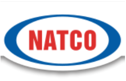
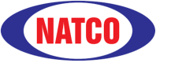
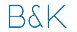
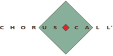
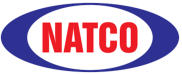

**[Image: Natco_August_2025.pdf-0001-00.png (940x96, 100.6KB)]**

19th August, 2025 

Corporate Relationship Department Manager – Listing M/s. BSE Ltd. M/s. National Stock Exchange of India Ltd <u>Mumbai 400 001 Mumbai 400 051 Scrip Code:</u> **<u>524816</u>** <u>Scrip Code:</u> **<u>NATCOPHARM</u>** 

Dear Sir 

Sub:- Transcript of earnings conference call held on  13th August, 2025 

Ref:-  Regulation 30 of the SEBI (Listing Obligations and Disclosure Requirements), Regulations, 2015 

We are enclosing herewith the copy of  transcript of the Company's earnings conference call for Q1 FY25-26 held on 13th August, 2025. The transcript is also available on the website of the company i.e., www.natcopharma.co.in 

Thanking you 

Yours faithfully 

For NATCO Pharma Limited 

Chekuri Venkat Digitally signed by Chekuri Venkat Ramesh Ramesh Date: 2025.08.19 17:04:59 +05'30' Ch. Venkat Ramesh Company Secretary & Compliance Officer 

**[Image: Natco_August_2025.pdf-0002-00.png (247x159, 20.1KB)]**

# “Natco Pharma Limited 

# Q1 FY '26 Post Results Earnings Conference Call” August 13, 2025 

**[Image: Natco_August_2025.pdf-0002-03.png (217x80, 7.9KB)]**

**[Image: Natco_August_2025.pdf-0002-04.png (155x66, 3.9KB)]**

**[Image: Natco_August_2025.pdf-0002-05.png (222x111, 5.5KB)]**

**– MANAGEMENT: MR. RAJEEV NANNAPANENI VICE CHAIRMAN AND – CHIEF EXECUTIVE OFFICER NATCO PHARMA LIMITED – MR. RAJESH CHEBIYAM EXECUTIVE VICE – – PRESIDENT CROP HEALTH SCIENCES NATCO PHARMA LIMITED** 

**MODERATOR: MR. HRISHIKESH - B&K SECURITIES PRIVATE LIMITED** 

Page **1** of **17** 

_Natco Pharma Limited August 13, 2025_ 

**[Image: Natco_August_2025.pdf-0003-01.png (182x74, 6.9KB)]**

## **Moderator:** 

Ladies and gentlemen, good day, and welcome to NATCO Pharma Limited Q1 FY '26 Post Results Earnings Conference Call hosted by B&K Securities India Private Limited. As a reminder, all participant lines will be in the listen-only mode and there will be an opportunity for you to ask questions after the presentation concludes. Should you need assistance during the conference call, please signal an operator by pressing star, the zero on your touchtone. Please note that this conference is being recorded. 

I now hand the conference over to Mr. Hrishikesh from B&K Securities. Thank you, and over to you, sir. 

## **Hrishikesh:** 

Thank you. Good morning, everyone. On behalf of B&K Securities, I welcome you all to the Q1 FY '26 Earnings Conference Call of NATCO Pharma. Hope everyone is in good health and doing well. On behalf of NATCO today, we have with us Mr. Rajeev Nannapaneni, Vice Chairman and CEO; Mr. Rajesh Chebiyam, Executive Vice President, Crop Health Sciences. 

I now hand over the call to Rajesh for the management's opening remarks, post which we'll open the session for Q&A. Over to you, sir. 

## **Rajesh Chebiyam:** 

Thank you, Hrishikesh. Good morning, and welcome, everyone, to NATCO's conference call discussing our earnings results for the first quarter of FY '26, which ended June 30, 2025. 

During this call, we may be making certain forward-looking statements or statements about future events, and anything said on this call, which reflects our outlook for the future, must be reviewed in conjunction with the risks that the company faces. I'd like to state that the material of the call, except for participant questions, is the property of NATCO and cannot be recorded or rebroadcast without NATCO's expressed written permission. 

We'll begin with the call results highlights, followed by an interactive Q&A session. Again, I hope all of you have received the financials and the press release that was sent out earlier. These are also available on our website. 

NATCO recorded consolidated total revenue of INR1,390.6 crores for the quarter that ended June 30, 2025, as against INR1,410.7 crores recorded in the same period last year. EBITDA for the quarter was INR632.7 crores, with margins at 45.5%. Net profit for the period on a consolidated basis was INR480.3 crores. 

During the quarter, the business faced pricing pressure in the U.S. product portfolio and incurred increased R&D expenses on account of high-value projects. This is also reflected in other expenses being higher for the quarter. The Board of Directors have declared an interim dividend of INR2 per equity share during the quarter. 

On the segmental split for the quarter, I'll just briefly outline, which is also shared. The API business clocked INR52.6 crores; domestic formulation, INR107 crores; formulation exports, including profit share and subsidiaries, was INR1,126.5 crores; crop health sciences, INR34.7 crores; other operating and non-operating was INR69.8 crores; totaling INR1,390.6 crores for the quarter. 

Page **2** of **17** 

_Natco Pharma Limited August 13, 2025_ 

**[Image: Natco_August_2025.pdf-0004-01.png (182x74, 6.9KB)]**

Thank you all. We'll take the questions now. We can take the questions when you're ready. 

**Moderator:** Thank you very much. The first question is from the line of Nirali Shah from Ashika Stock Services. Please go ahead. **Nirali Shah:** I had a question on Revlimid. Just wanted to know is the Revlimid contribution this quarter broadly in line with the last quarter? Or is it higher? And should we expect a higher contribution in 2Q? 

**Rajeev Nannapaneni:** We don't do a split, but I think it's been consistent. We expect it will continue into the September quarter. I think post-September quarter, I don't think we see much. It will be a decline is what our expectation is. **Nirali Shah:** So it would be fair to assume that large part of our quota will be exhausted in first half only? **Rajeev Nannapaneni:** Yes, I think most of the earnings will get captured in the first half, yes, that's correct. First half, meaning end of September quarter. **Nirali Shah:** Understood. And my next question is on NRC-2694. How many patients have been enrolled so far? And by when do we expect last patient enrollment? **Rajeev Nannapaneni:** I think the Phase II is ongoing. I can't recollect how many patients, I think it's more like 13, 14 patients have enrolled so far. -- I think the patients mostly have been done in the U.S. We're also starting an India arm now. When do we expect? I think we need to do about60 to 70 to reach some sort of definite conclusion of where we stand on that particular indication. This is an indication for late-stage head and neck cancer after failure of all the existing therapies. So it's ongoing. I don't want to give a timeline now, but at least yes, it will take some time. Maybe we'll have more clarity as the year goes by. **Nirali Shah:** So maybe mid of FY '27 we can expect some meaningful data readout? **Rajeev Nannapaneni:** Yes, I think so, that sounds about reasonable. It is a late-stage drug, I think if you're able to demonstrate some efficacy, it will be interesting. But yes, we'll see how things turnout and keep you informed. **Moderator:** The next question is from the line of Rashmi from Dolat Capital. **Rashmi:** Sir, while you said that Revlimid, the contribution was consistent this quarter, but have you seen a bigger erosion compared to quarter 4 or the previous quarter and that is impacting our overall EBITDA margin? And also related to that, I want to know that in the press release when you said that the business is seeing pricing pressure in the U.S., apart from Revlimid also, are you seeing any other pricing pressure in other products? 

**Rajeev Nannapaneni:** I think we're seeing pricing pressure on Revlimid, of course. So I think that's the reason why there's been a dip. Are we seeing pressure in other products? They've been stable, but we also had, fortunately, other launches that have happened. That has also contributed to our profit. So 

Page **3** of **17** 

_Natco Pharma Limited August 13, 2025_ 

**[Image: Natco_August_2025.pdf-0005-01.png (182x74, 6.9KB)]**

overall, the other business has been stable. I mean, there's increase in the sales, but that business has been stable. But yes, Revlimid has seen a decline. 

## **Rashmi:** 

Okay. And my second question is related to the crop health sciences. This time, we have seen a good pickup. So how is the demand picking up? And are we on track to achieve that INR140 crores, INR150 crores of sales for this year? 

**Rajeev Nannapaneni:** 

I think we had a good start and got good receivable. I think things are settling down. We think that this sale will continue.  We're losing still money. I think we lost about INR3.2 crores. So, I think we're coming very close to breakeven we're almost there. I think we're doing well. 

**Moderator:** 

The next question is from the line of Vivek from Inga Ventures. 

**Vivek:** My question is regarding, does you have any breakup of generic and non-generic revenue? **Rajeev Nannapaneni:** We don't do such breakup. We don't do breakup like the way you have asked. We do the way we have presented in the earnings. 

**Rajeev Nannapaneni:** Okay. Brand, I mean at a high level, I can tell you all the businesses which are sold outside India are all generic businesses. The India business is mostly the brand business. Otherwise, outside, it's mostly a generic business. 

**Vivek:** Okay, sir. Yes, sir. My second question is, so there is an investment in Eyestem, Series B funding. So why we didn't invest on this round during this round? 

**Rajeev Nannapaneni:** I got your question. We are investing my friend. We are investing as per our proportion of our shareholding. I think our proportion of shareholding, I can't remember the number, but it's like 2% of the company. So, I think we are keeping in this round also, we are, I think, investing equivalent to keep our shareholding. We're not gone up on it. We are keeping the shareholding that we have. I don't remember the number, so don't hold me to it, but I think it's a INR2 crore, INR3 crore round. I think it's not a large number. I think we are investing. 

**Moderator:** The next question is from the line of Mehul Panjuani from 40 Cents. 

**Mehul Panjuani:** Sir, what would be the impact on NATCO Pharma if there was a pharma tariffs being implemented in the U.S., worst-case scenario? 

**Rajeev Nannapaneni:** There will be some impact, of course. I mean we aren't foolish to say there will not be any impact. I think you will see I’m giving you a general answer. The U.S. obviously represents a significant part of our portfolio. I speak for the industry. Depending on the level of tariff, I think there will be a disruption initially and then hopefully, we'll be able to pass on some of it to our customers and then we'll see how things go. But yes, we have to deal with it when we have to. So far, we are okay. But we don't know what the future holds. You just have to brace for it. 

**Mehul Panjuani:** Right. And sir, my second question is what is the reason for the decline in net profit vis-à-vis the 2024 June quarter? 

Page **4** of **17** 

_Natco Pharma Limited August 13, 2025_ 

**[Image: Natco_August_2025.pdf-0006-01.png (182x74, 6.9KB)]**

## **Rajeev Nannapaneni:** 

I think we already answered that question. We have seen an erosion in our core portfolio and primarily our U.S. business, and I think primarily driven by Revlimid. I think Revlimid has seen some price decrease and which has impacted our profitability. 

## **Mehul Panjuani:** 

Okay. And sir, when would we see a recovery in this one? 

**Rajeev Nannapaneni:** Revlimid over a period of time will decline, I think the market knows this. I think Revlimid will see further decline as the year progresses. 

## **Moderator:** 

The next question is from the line of Rahul Chaudhary, an investor. 

**Rahul Chaudhary:** 

Sir, this other operating expenses, other expenses have increased disproportionately this year. We had a policy of doing something like 8% of the top line, and you have said high-value R&D expenditure, it's happening for the last, I think, 24 months. Sir, can we not get any color on where we are researching, what we are doing, where will we see the impact? Investors -- shareholders need to know what is there next year, next to next year, sir, beyond the semaglutide because Revlimid is history now, we have made a lot of money. That is my first question, sir. Where are we researching... 

## **Rajeev Nannapaneni:** 

I'll try to answer the best I can. So what we're doing is, see, let us understand our generic business. There are 2 kinds of products you should do. You should do a product which will not have so much R&D expense, but again, the upside is limited or you do these R&D projects, which are $8 million, $10 million type of expenditure, but if they pay off, the returns are also very high. 

So what we have done, Rahul, is very deliberately spend. We had a reasonable amount of surplus, as you pointed out. So we used this cash flow to spend on some of these projects. And I think what we have done is we have budgeted some projects where we wanted to spend. 

The primary products that we are spending on are cancer products, where there's a clinical trial on patients which are very expensive to do and we are doing a lot of peptides and oligopeptide type of products. So this is where we see the future of this business, and we are using the opportunity of our cash flow to invest in these ideas. 

If you want me to name the product, strategically, you don't name them because until you achieve an outcome where you have a successful filing, you typically name them. But I think things are going well. I think we will name them based on our success. I think we'll give some commentary on this in the future. 

**Rahul Chaudhary:** 

Sir, the follow-up on this -- so as in, like, you are not getting deterred by all these tariffs. You're still targeting Para IV filings only. I mean that is the strategy we are sticking to that, apart from the cancer that trial that we all know is NRC-2694. 

**Rajeev Nannapaneni:** 

We're talking about NRC-2694 and also generic, what you call cancer products, where you need to do trials on patients. So these products, some cancer products without naming them, you had to spend like $7 million, $8 million. And U.S., I'm not going to get deterred means, I mean, it is 

Page **5** of **17** 

_Natco Pharma Limited August 13, 2025_ 

**[Image: Natco_August_2025.pdf-0007-01.png (182x74, 6.9KB)]**

what it is. You just have to go with the flow. I mean we have to just see what the policy is going to be and based on that, you readjust your strategy. U.S. is still the most important pharmaceutical market in the world. Especially for these types of products, it's 60%, 70% of the business. You can't ignore 60%, 70% of the business and run your business. I think it is what it is. Regarding building a business outside U.S., I think we have made a very bold step. We have bought the second largest company. We've taken a substantial stake in the second largest company in South Africa. We spent INR2,000 crores to diversify our earnings. 

We believe over a period of time, this will represent a significant part of our base earnings in the coming years. I would believe South Africa will easily be about 15% to 25% of the base earnings. So we are diversifying away from the U.S. as well. It's not that we are not. But again, you can't ignore U.S. at the same time. So you have to play both the cards. 

## **Rahul Chaudhary:** 

## **Rajeev Nannapaneni:** 

My second question is, sir, what is the intent behind increase in authorized capital, sir? What is the plan? 

I'll tell you what my thinking is. As of now, it's just an enabling resolution. We just want to have the option. I'm targeting another transaction, something like similar to what we did with Adcock and if the number becomes larger, we just want the flexibility to have equity. At this time, I don't need any money because we have enough money in the books. 

But if we're doing another large transaction, which can strengthen our base business and we need some flexibility in equity, I just want that option. So we're just taking an enabling resolution from the shareholders so that we have these sort of flexibility if need be to consummate a larger transaction. 

## **Rahul Chaudhary:** 

## **Rajeev Nannapaneni:** 

## **Rahul Chaudhary:** 

## **Rajeev Nannapaneni:** 

So the cash on books of INR3,500 crores is including that Adcock's INR2,000 crore investment, right, sir? There was in the presentation. 

No, INR3,500 crores is the cash that we have right now. INR2,000 crores will leave the moment we do this transaction. So the cash will drop to INR1,500 crores post transaction. There will be some accrual of this year's profit, whatever that number is going to be, minus dividend, minus capex. But yes, I think if you were to say that today, let's say, Adcock deal were to happen today, the cash will dip to INR1,500 crores plus the accrual that we're going to have this year. 

Okay. Sir, Kothur plant, sir, when are we going to get it back? 

So we had 2 inspections. We had the Mekaguda API facility and the Kothur facility. So Mekaguda facility got cleared and we got the EIR. Kothur facility also had an inspection. We had multiple observations there. I believe we have answered all the queries. I'm hopeful that we will get a positive resolution. 

We have answered them. So, we've answered in July, I think if I recollect. I think 90 days usually get a reply. So we've given and addressed all the concerns. I'm hopeful that we get something positive. But again, subject to how things go. But again, we are cautiously optimistic that I think we should be able to resolve it. 

Page **6** of **17** 

_Natco Pharma Limited August 13, 2025_ 

**[Image: Natco_August_2025.pdf-0008-01.png (182x74, 6.9KB)]**

## **Moderator:** 

The next question is from the line of Hrishit Jhaveri from Pi Square. 

**Hrishit Jhaveri:** 

Congratulations for a stable quarter. First question on the acquisition of the South African company. What is the outlook for that company going on? And how well do we plan? And do we plan to increase our stake or this would be the only investment there? 

**Rajeev Nannapaneni:** I didn't hear you well, but if I understand your question, what is our strategy with Adcock and how do we increase our shares? Is that the question, my friend? 

**Hrishit Jhaveri:** 

Correct, correct. 

**Rajeev Nannapaneni:** So I think we’ve been looking to diversify our portfolio. I think South Africa is a very interesting market, and it's one of the most exciting markets in the African continent, the most stable country of the lot and we got an opportunity to buy a large stake in a very established setup. Even though it's a substantial minority, it's not a controlling. I felt that it was worth and we get to consolidate the earnings on an associate basis. 

And second, we don't have much business in South Africa. We can put all our pipeline that we have in India and South Africa and get a marketing setup and a distribution setup, which would have taken years for us to build. We also got it at a very reasonable valuation, as you have seen. So it will take some time. I mean, the payoff of the investment will take some time. 

In the near term, I think shareholders will benefit from their base business that we're getting. And in the long run, I think we will get our pipeline in, and we'll also work with them to improve efficiencies and bring our pipeline not only from NATCO, from other Indian companies that we have relationships with and so that we can strengthen our portfolio there. 

## **Moderator:** 

The next question is from the line of Bino from Elara Capital. 

**Bino:** Just a follow-up on the other expenses. This quarter, all put together was around INR525 crore. Is this roughly the run rate -- quarterly run rate that we should see going forward? 

**Rajeev Nannapaneni:** No, Bino, it will not be at the quarterly run rate. It will reduce because a lot of the expenses are a lot of onetime batch expenses. So let's say, you're doing a clinical trial or you're doing an exhibit batch for an expensive product, so there's been a lot of expense. You'll see a lot of expensing in this quarter and next quarter, but I think it will reduce, starting from the December quarter. 

**Moderator:** The next question is from the line of Gagan from ASK Investment Managers. 

**Gagan:** So first question pertains to your comment on the increase in authorized capital. You said you are looking for another significant transaction. Can you give us some idea of -- to whatever degree you're comfortable sharing of whether this is a manufacturing-related transaction or a front end or a further increase in Adcock stake? 

**Rajeev Nannapaneni:** We are trying for something that is stable, and which strengthens our base business and gives us more strength in the market that we are operating in. I mean, obviously, all these are borne by 

Page **7** of **17** 

_Natco Pharma Limited August 13, 2025_ 

**[Image: Natco_August_2025.pdf-0009-01.png (182x74, 6.9KB)]**

confidentiality, and these are not done, right? So we have not reached a stage where I can talk about it. But we will do something that strengthens the base business and gives us strength in a market either that we are operating in or in a market that we are not present in, which gives us immediate accretive earnings. I think that's what we are looking at. I think that's the nature of the transaction is the best I can answer at this time. 

**Gagan:** 

Okay. All right. All right. I have one more. Yes. So on the Adcock, you also indicated that it could be 15% to 25% of the base earnings. When you say base earnings, you're referring to the cumulative PAT of NATCO closing FY '25? And if you could give us some idea of -- because Adcock has had... 

**Rajeev Nannapaneni:** No, it is PAT for '27. Because it's a year it will take to close. I'm assuming a scenario where Revlimid has gone. I'm assuming only all our earnings are without Revlimid and I'm assuming that for the next financial year, not this financial year. 

**Gagan:** 

Right. And Adcock has had 2 or 3 rather stable sort of years if you look at the -- I mean, if one goes by the statistics that you put out on your presentation. So I mean, do you foresee a change in the growth trajectory post you coming in and to what degree? 

**Rajeev Nannapaneni:** 

I think we are hoping we'll bring some value. I think certainly, I hope that we could improve those earnings and also, we're hoping that we could bring some of our pipeline from India and use our relationships that we have with other companies and strengthen the pipeline. I think that's the journey that we want to go through. 

I think we strongly believe that we can add a lot of value to the asset, and it's a great asset. It wasn't for the transaction; we wouldn't have had access to this sort of assets. And so we're hoping, yes, I think that's the expectation, yes, you're absolutely right. 

**Moderator:** The next question is from the line of Abdulkader from ICICI Securities. 

**Abdulkader:** So sir, in terms of your India business, where are we in terms of launching semaglutide in India? And then from the next 2 to 3 years perspective, how should we look at this portfolio? 

**Rajeev Nannapaneni:** Semaglutide, I think we're on track. We hope to be there when the market formation happens next year. I think that's our expectation, subject to regulatory clarity. All our dosing is completed. First phase dosing is complete. So our readout, I think by November, December, we're expecting and hopefully, we will be on track in Phase I, so what you call in the Phase I launch with all other generics next year. So I'm hopeful that the product will do well. 

**Abdulkader:** Got it. And sir, then secondly, I heard your opening remarks on your agrochem venture. But then from a product standpoint, I think in the past, you have talked about a couple of more launches to strengthen this business. So sir, I mean, is FY '26 the year where we see those launches or '27, '28 where we expect some meaningful traction getting built up here? 

**Rajeev Nannapaneni:** We have launched a couple of new unique products. I think there's one product called GLANZ, which is the only fungal product other than the innovator that is there. 

Page **8** of **17** 

_Natco Pharma Limited August 13, 2025_ 

**[Image: Natco_August_2025.pdf-0010-01.png (182x74, 6.9KB)]**

## **Rajesh Chebiyam:** 

So, this season, we've launched about 5 products and a couple of herbicides and then there's a fungicide and insecticides as well and these are all limited competition. So the idea here is you have a portfolio of products, but also introduce, like as Rajeev was just mentioning, this product fungicide called GLANZ brand, which was launched late last year. 

## **Rajeev Nannapaneni:** 

That's doing fairly well because I think part of the reason why our loss dropped is because the gross margin has been higher on the newer launches. I think we are on track to sort of reach the breakeven level is our expectation and the signs of that in the numbers. 

## **Moderator:** 

The next question is from the line of Saumil Shah from Paras Investments. 

**Saumil Shah:** 

I wanted to know more on your acquisition of Adcock. I mean, by when this transaction will be completed and how much it will add to our bottom line? So I think they are doing a yearly run rate of around INR5,000 crores, and we hold about 35% in that? 

## **Rajeev Nannapaneni:** 

Yes. So we expect the transaction to be completed in the next 2 to 3 months, depending on subject to regulatory clearances and all the other requirements. Regarding the consolidation, I think they're doing turnover of about $530 million I can't collect the number exactly based on the exchange rate. They have a PAT of around $47 million or $48 million. So we'll be able to consolidate 35% of that number. So, $15 million to $17 million, I think, depending on what the exchange rate. 

## **Saumil Shah:** 

Okay. So total PAT is around $48 million? 

**Rajeev Nannapaneni: Saumil Shah:** 

You can consolidate 35% of the PAT 

Yes, yes. So I just wanted the yearly PAT is around USD 48 million. 

**Rajeev Nannapaneni:** 

Turnover last year was $536 million and the PAT, I can't remember exactly, but I think it's around $46 million or $47 million, so depending on the exchange rate that we're taking. So your question was how much of the PAT we can consolidate, we can consolidate 35% of the PAT, 35.75%. So let's say, for your mathematical simplicity, next year profit, let's say, is $50 million for mathematical simplicity, 35.75% of that is what you can consolidate. 

## **Saumil Shah:** 

Okay, so I had a confusion -- yes, so can I complete my question? I had a confusion, sir, on your Page 7 of your presentation -- yes, yes, on the Page 7 of your presentation, I think you mentioned financial year June '24, Adcock has done a PAT of ZAR 814 million. That is INR45 million approximately. And on the -- and again, after that, you have mentioned on December '24, they have done a PAT of ZAR 677 million. So this December '24 year-end, they have done ZAR 677 million, is it, USD38 million? 

**Rajeev Nannapaneni:** EBITDA. 

## **Rajesh Chebiyam:** 

Net profit is INR22 million. 

**Saumil Shah:** 

So that is yearly profit, INR22 million... 

Page **9** of **17** 

_Natco Pharma Limited August 13, 2025_ 

**[Image: Natco_August_2025.pdf-0011-01.png (182x74, 6.9KB)]**

**Rajesh Chebiyam:** No, half year, H1. **Saumil Shah:** Okay that is only half year. Okay. So in Africa, it's June closing. **Rajeev Nannapaneni:** They have not announced their June numbers yet **Saumil Shah:** Okay, okay. So this INR22 million is half year... **Rajeev Nannapaneni:** They announce every 6 months and their financial year ends in June. So, the June numbers is they've not announced **Moderator:** The next question is from the line of Rashmi from Dolat Capital. **Rashmi:** Just one question. This quarter, the depreciation was pretty high. So does it have any impairment charges or anything? **Rajeev Nannapaneni:** It does actually. I think we had a INR12 crore impairment charge of an equipment that block machinery that we are not using. So I think, yes. Normally, it's around 43, 44. It was 50 something this time. So, I think it's come from I think INR12 crores. **Moderator:** Thank you. The next question is from the line of Satya from ICH. **Satya:** I'd like to know in the year FY '27 when Revlimid is not there, what kind of revenue can we expect on a yearly basis? **Rajeev Nannapaneni:** In the year financial '26-'27, you're saying? **Satya:** Yes, next year. **Rajeev Nannapaneni:** We're not giving guidance for next year. I'll not give guidance right now. I think I need a little more time. Maybe I think end of the year, I think I'll give you some guidance. As of now, no, I don't want to give guidance. It's too early for me to give a guidance. I think there are a lot of moving parts that we have in our business. I have clarity, I think maybe after -- maybe next year, I think I'll give you more clear guidance because a lot of things happening in our company, transactions order. So we'll have more clarity next year. So can I talk about it next time, I don't want to comment. **Moderator:** The next question is from the line of Abdulkader from ICICI Securities. **Abdulkader:** Sir, just one question on your other expenses, which was slightly inflated because of R&D. to call out for the number which was in excess in this quarter. And for your annual guidance, if you could provide how should we look at R&D for the rest of the year? 

**Rajeev Nannapaneni:** I think a lot of the major R&D expenses are in this quarter and next quarter. I think we have planned it and budgeted in a way that I think June and September quarters will have bulk of the R&D expenditure based on the high-value products that we have. So it will decline. I think you'll see a decline in December quarter and the March quarter. I think that's my expectation. 

Page **10** of **17** 

_Natco Pharma Limited August 13, 2025_ 

**[Image: Natco_August_2025.pdf-0012-01.png (182x74, 6.9KB)]**

**Abdulkader:** Understood. And sir, one final one, if I may. So what would be your cash balance at the end of first quarter? 

**Rajeev Nannapaneni:** As of today, right now, it's about INR3,500 crores is the cash, and this assumes that the Adcock transaction has not happened. 

## **Moderator:** 

The next question is from the line of Gagan Thareja from ASK Investment Managers. 

**Gagan Thareja:** Just wanted to understand, does your deal on Adcock give you provision to raise your stake further? And is the current promoter -- I do not know anything about the current promoter. Can you give some idea? Are they PE or are they founding promoters? 

## **Rajeev Nannapaneni:** 

Okay. We have an option to increase our stake, we have a first right of refusal. So if they want to sell, they should ask us before, we have the right to increase. But the deal right now is only 35.75%. I don't think at this time, they are interested in selling. But however, if they change their mind, we have the right to ask for that stake. So -- but still it's such an attractive company, we said, we’ll do this deal even though it's a substantial minority. 

Your second question was what? Who is the promoter? Bidvest, it’s a very well-known South African conglomerate. They have multiple businesses. It's called Bidvest. I think they have lots of   businesses. You can look them up online. So they're well known. So you have a look. 

**Gagan Thareja:** 

Just one final question. And again, this is when you say that Adcock can be 15% to 25% of, let's say, FY '27 profits, I mean, if you extrapolate on INR20 million, which could be the profit for you, that's around INR160 crores, INR170 crores. Are you saying that NATCO's FY '27 profits could be 5 to 6x of that number? I mean, by inference, that would seem to be the conclusion. 

**Rajeev Nannapaneni:** 

I would believe so. That's why I don't want to answer that question directly. Give me some time on this, I need some more time on it. I just need more clarity on my business. So I would like to give a guidance before the year starts. So I would request you to hold on until then. Yes, I'll give you a more definite guidance, I think, closer to the end of the financial year. 

## **Moderator:** 

The next question is from the line of Nirali Shah from Ashika Stock Services. 

## **Nirali Shah:** 

I just wanted to know that since you are saying that Revlimid will see pricing pressure as the year progresses, but do we see any scope that in volume terms, we'll be able to capture much bigger share of the market? 

## **Rajeev Nannapaneni:** 

I don't want to answer that question because I don't know what the future holds. That's why I said I'm holding off on giving the guidance, everybody is pressing me on to answer the 27 March numbers. That's why I'm avoiding it because I don't know. So there's so many moving parts and a lot is happening in our portfolio. 

We have the semaglutide launch. We have other launches in the ROW business, and we need clarity on how things are. So, I would request at this time, I would just wait, but we'll see how things are. I think maybe by end of the year, I think we'll have clarity on where it is. 

Page **11** of **17** 

_Natco Pharma Limited August 13, 2025_ 

**[Image: Natco_August_2025.pdf-0013-01.png (182x74, 6.9KB)]**

## **Moderator:** 

The next question is from the line of Mehul Panjuani from 40 Cents. 

## **Mehul Panjuani:** 

Sir, thank you so much for the clarification on this Revlimid. One question, sir, how much of your portfolio is contributed by agrochemicals right now? 

**Rajeev Nannapaneni:** Right now, this quarter, as of now, I think it's there in the segment numbers.  INR34.7 crores out of our revenue is agrochemical. 

## **Mehul Panjuani:** 

Yes, yes. Okay, okay. And what about -- sir, these regulatory approvals, which are required for the South African, we will be knowing in 2 to 3 months. So are these depend on Indian as well as South African regulations or just the South African regulations? 

**Rajeev Nannapaneni:** 

India, I think we have sorted. I think there's not much. I think we have enough cash, so we're not borrowing much. So I think we have the bank limits. We've given all the guarantees that are required to get the transaction done. In South Africa also, we don't -- I mean, we had to delist the company. So that's why there's a process for it. We're running the process and we believe that obviously, we need to go through the hoops, but we don't face too many challenges because we believe it's a majority South African owned. There's no majority foreign control, right?  And the existing controlling shareholder, his shareholding is not changing anything. So we'll continue to remain a majority South African company. And so we don't foresee too many challenges for that particular reason. I think until it's not done, it's not done, right? 

**Mehul Panjuani:** Right. So my last question is about someone -- a fellow participant asked about Eyestem, I don't know what is Eyestem. So if you can elaborate or throw some light on it. 

## **Rajeev Nannapaneni:** 

Okay, fine. Our presentation has it, but I'll just tell you what's going on in our NCE and Cell and Gene investments. So we have multiple investments. I think our presentation reflects about 5 ideas that we have. So Eyestem is one investment we have done, and they are working on a particular disease called dry age-related macular degeneration. 

So the gentleman asked us how much you have invested? We invested about $1 million, and he asked me whether we are investing? They're raising a press, are we investing in that. I said we are investing, and we are keeping our stake. Our shareholding it's like below 2%, 3% type of shareholding. So that is Eyestem. 

In addition to that, I think some of the other investors asked us about NRC-2694, which is one 

of our other NC idea. And I told them where we were on the clinical trial. And of the 5 investments and the biggest is eGenesis, which is $8 million that we invested from our Canadian entity, which does transplant of genetically modified pigs into humans. 

So they have some very interesting data, and there's one particular patient who has done extremely well and still doing well. So that is probably the most exciting among our NCE and Cell and Gene investments at this. 

The next question is from the line of Rahul Chaudhary, an investor. 

**Moderator:** 

Page **12** of **17** 

_Natco Pharma Limited August 13, 2025_ 

**[Image: Natco_August_2025.pdf-0014-01.png (182x74, 6.9KB)]**

## **Rahul Chaudhary:** 

Sir, regarding semaglutide, you had said earlier that Stelis is doing the API and you were using a fill finish also. So sir, that is the same thing that is for domestic, are we going to -- for the domestic launch only because there are some articles. 

## **Rajeev Nannapaneni:** 

You have made a wrong assumption.  Stelis is called OneSource now. Second, they don't make the API. They make the fill and finish. The API is from outside, not from OneSource, okay? I'm sorry. 

## **Rahul Chaudhary:** 

Okay. So what I was asking is that post -- sir, post the -- when we get our approval, people were -- some media outlets are saying that it's going to track to INR3,000 a month kind of a thing. So will we not lose competitive edge if we keep -- if we outsource everything? Or do we have the margins to play in that kind of a pricing also? 

## **Rajeev Nannapaneni:** 

Rahul, honestly, there are so many moving parts in semaglutide. We could have a 1-hour call discussing that, okay? So there are a lot of things that are there. Let's get some regulatory clarity and get our approval and I can -- there are a lot of moving parts in it. This call won't be enough to explain to you all the moving parts. 

So, my answer to you right now is there are a lot of moving parts, and I think I have enough clarity on how to deal with this product and how to have some ideas and strategies and hopefully, they'll work out. And second issue on the pricing and all, I think it's too premature to talk about it. It will be too premature to talk much about that. 

**Rahul Chaudhary:** Sir, are we getting -- there's this drug called pomalidomide, something pomalidomide. Do we have like a filing there also for pomalidomide? 

## **Rajesh Chebiyam:** 

U.S., we do. 

**Rahul Chaudhary:** So, we haven't sold that product yet, right? so we are still waiting? 

**Rajeev Nannapaneni:** We have a full approval. But yes, I think once the launch will happen, we will talk about it. But at this time, we don't have clarity on the launch date. But yes, once it happens, we'll talk about it. 

## **Rahul Chaudhary:** 

In the sense, we have not... 

**Rahul Chaudhary:** Okay. But we have -- we don't have an agreement with the innovator like how we did in... 

**Rajeev Nannapaneni:** We have a settlement. 

**Rajesh Chebiyam:** Rahul, this is there in investor presentation. 

**Rajeev Nannapaneni:** We already have settled. We have a settlement; we have an approval. The launch date is confidential, but we will disclose closer to the time, yes. 

**Moderator:** We take the next question from the line of Chetan Doshi from TM Financial. 

Page **13** of **17** 

_Natco Pharma Limited August 13, 2025_ 

**[Image: Natco_August_2025.pdf-0015-01.png (182x74, 6.9KB)]**

## **Chetan Doshi:** 

I have 2 questions. One is this total expense is almost 50% of our turnover. So R&D expense, you said in the earlier conversation that it is going to reduce. But instead of asking the target for this year, can you just give us a brief idea as to what will be the total expense for the current year? 

And second question is regarding the South Africa acquisition, can we supply in our brand, the question is related to if U.S. puts tariff on India and the South Africa channel is attractive, then can we pass on the drugs to South Africa unit and they can export to U.S.? 

## **Rajeev Nannapaneni:** 

It doesn't work like that, my friend. I don't know how to answer your question. Every country has its own regulatory approval, and that's how it works. So regarding the question that you asked, it generally where product is produced that from there only you need to export. So, there are rules on country of origin and all. 

## **Chetan Doshi:** 

That doesn't work, okay. And what about the expenses, can you just give... 

## **Rajeev Nannapaneni:** 

From what I can see, it doesn't work. I don't think so. 

**Chetan Doshi:** 

Okay, okay, okay. And regarding the current year expenses, how much you plan to spend in the current financial year? Can you just give us a brief idea? 

## **Rajeev Nannapaneni:** 

I don't have it top of my head, my friend. What I can only tell you is that it is on the higher side these 2 quarters because we have a lot of high-value products, and it will decline next quarter. Precise numbers and all, I'm sorry, I don't have the numbers on. 

## **Chetan Doshi:** 

One last one line question. NATCO is higher priced, underpriced or it is fairly priced? How do you look at it from so many years of operation? 

## **Rajeev Nannapaneni:** 

I would believe, - I think, see, we have a very good return on capital. I think we have always got the big jackpots, right? And I just do what is beneficial to our company. And valuation is left to you guys. You value it the way you value it. I have no comment on that, but I think if you look at the portfolio that we have and our PAT and our portfolio and our strategy, I think it is as efficient and as interesting and as exciting as any other company in the industry today. I think that's all I can tell you. 

## **Chetan Doshi:** 

Rajeev, higher price, yes or no? 

**Rajeev Nannapaneni:** I can't answer that question. It is for you to judge, my friend. I can only tell you about the business strategy, and we'll take it from there. 

## **Moderator:** 

The next question is from the line of Vivek from Inga Ventures. 

## **Vivek:** 

Sir, my question regarding guidance for R&D. As you mentioned during previous call, it will be INR400 crores for FY '26. So how can we see for the coming quarter or FY '26 overall? 

**Rajeev Nannapaneni:** 

It will be a little bit on the higher side, but I think it will decline in the next quarter. Exact numbers and all, it's very hard for me to tell. I'm not prepared for it. I think there are too many 

Page **14** of **17** 

_Natco Pharma Limited August 13, 2025_ 

**[Image: Natco_August_2025.pdf-0016-01.png (182x74, 6.9KB)]**

moving parts. So I think we will give you more clarity, I think, next quarter. But as of now, I can't answer that question. 

## **Vivek:** 

So sir, we are going to utilize INR400 crore on R&D during the year? 

**Rajeev Nannapaneni:** I would believe so, yes. 

**Vivek:** Okay. And sir, my second question is regarding the tariff. How much effect do this tariff have on our export formulation as a percentage of total portfolio? There will a drop, then approx how much will be dropped like that? 

**Rajeev Nannapaneni:** I mean it all depends if you’re asking a very hypothetical question. But if there were to be a tariff, I think we will have the near term will have some impact, of course, because you'll have contracts and pricing and how much you're able to pass on immediately. I mean, there will be some concern. But I think in the long run, we would like to pass it on to our customers because the margins that we work on most of our products are very low. So, there will be some little bit of disruption initially, but I think eventually we will figure out after a quarter. 

**Moderator:** The next question is from the line of Saumil Shah from Paras Investments. 

**Saumil Shah:** Sir, in the previous call, I think you mentioned that we are estimating a 20% drop in revenue and 30% drop in profits for this year. So do we still hold on to that or due to the acquisition of South African company, we would like to revise it? 

## **Rajeev Nannapaneni:** 

I think for now, I feel like holding on to it. If there's any change, I'll let you know. But as of now, see, again, these are all estimates, my friend. I can only tell you what we see, you asked me. I will ask this question and I gave this guidance. But as of now, it seems all right, I think so, yes, give a few basis points this way, that way, yes, there will be some impact I think thereabouts, yes, I think that's what it looks. 

**Saumil Shah:** Okay, okay. And since the Revlimid prices are dropping, so how is the current quarter, I mean, shaping up? Is it similar to the previous? I mean, how can we look at the second quarter? Would it be similar to the first quarter or it will be further downward? 

**Rajeev Nannapaneni:** I mean I'm hoping it will be similar. But again, we'll only have clarity when the quarter ends. I think there's a lot of moving parts in this business. So I think that's my expectation. But again, I subject myself to correction based on how things go out, but we'll see how things go. 

## **Saumil Shah:** 

Okay. So there is a price erosion further compared to the first quarter? 

**Rajeev Nannapaneni:** I don't know, my friend. Can you give me some time on this? I think we'll have more clarity, I think, when we announce the Q2 numbers. 

## **Moderator:** 

The next question is from the line of Satya from ICH. 

**Satya:** Just wanted to ask any update on the case with Roche? 

Page **15** of **17** 

_Natco Pharma Limited August 13, 2025_ 

**[Image: Natco_August_2025.pdf-0017-01.png (182x74, 6.9KB)]**

## **Rajeev Nannapaneni:** 

Can you repeat the question? I didn't understand what you said. Please repeat the question. 

**Satya:** 

|**Satya:**|I just wanted to ask an update on the case that is going on with the Roche.|
|---|---|
|**Rajeev Nannapaneni:**|Risdiplam, okay. So, as you're aware, my friend, I think single bench we won. Then they appealed it in 2 bench in Delhi High Court. We're awaiting verdict. We are ready to launch. We already have the product ready. We have everything ready. We have already stated our pricing, what you call, strategy, but we are all waiting. to get clarity on launch from the double bench of Delhi High Court. So, once we have clarity, I think we'll let you know.|
|**Satya:**|Tentative time line like the second, third quarter, we can see some sales from them?|
|**Rajeev Nannapaneni:**|You’re asking me the timeline, I think from what I was told, I think we're expecting verdict any moment. I think it will happen any time. We're waiting for the verdict. So, I think any moment, you will hear in the next week or next month, depending on whenever the judge gives the order.|
|**Satya:**|And just one last question, right? If everything goes well as you are expecting, right, what kind of revenue are you targeting from this particular medicine?|
|**Rajeev Nannapaneni:**|I think we have the first mover advantage; it will be nice. But again, we have to see who else also comes because  there are a lot of moving parts. I think once the judgment comes, I think we can give more clarity. I think then I'll have a better idea of where things are. As of now, I would like to say it's an interesting opportunity. But again, I would like to wait for clarity from the court before we actually start talking about this.|
|**Moderator:**|The next question is from the line Prabhu, an individual investor.|
|**Prabhu:**|My question is on R&D. How many R&D products are you planning to file in the U.S. in the current financial year? And within this, how many would be in the peptides and the oligonucleotide space?|
|**Rajeev Nannapaneni:**|Typically, it depends on how things go. But typically, we file about 7 to 8 products. That's our run rate usually. And usually, we target about 1 or 2 products in the oligo space.|
|**Prabhu:**|Do we have a plan to extend peptides and oligonucleotides to Canada and Brazil as well?|
|**Rajeev Nannapaneni:**|It depends on some licensing agreements, like some of them we have tied up with other partners. Yes, sometimes we do extend, yes, depending on the situation.|
|**Moderator:**|Due to time constraint, this will be the last question, from the line of Prishal Burana, an investor.|
|**Prishal Burana:**|I want to know about with respect to diversification of business about the business strategy for the market in India and the products planned to be launched in India this financial year.|
|**Rajeev Nannapaneni:**|If I understood your question correctly, you're asking me what the business strategy for India is. Is that correct, my friend? Is that what you said? Your voice, I couldn't hear clearly. Is that your question?|

Page **16** of **17** 

_Natco Pharma Limited August 13, 2025_ 

**[Image: Natco_August_2025.pdf-0018-01.png (182x74, 6.9KB)]**

**Prishal Burana:** 

**Rajeev Nannapaneni:** 

Yes, sir. 

Okay, fine. So India and all, I think we have expectations. I mean, as the 2 products have been mentioned in the call, I think risdiplam, subject to the court outcome, semaglutide subject to regulatory clearance and other issues that are there with the product. So I think these are probably one of the more high-value launches. And -- but the portfolio is doing well. I think as you have seen the numbers, it's growing around 7%, 8% a year, the base portfolio. 

But if the new launches come in, then obviously, the growth will be much higher. But I'm actually very optimistic that domestic should do very well. And so we'll see how things go, yes. Thank you. Thank you so much. I appreciate the time that you guys spent talking to us, and thank you. 

## **Rajesh Chebiyam:** 

## **Moderator:** 

Thank you. Thank you all. 

On behalf of B&K Securities Limited, that concludes this conference. Thank you for joining us, and you may now disconnect your lines. 

Page **17** of **17** 

---

## Extracted Images

| # | File | Dimensions | Size |
|---|------|------------|------|
| 1 | Natco_August_2025.pdf-0001-00.png | 940x96 | 100.6KB |
| 2 | Natco_August_2025.pdf-0002-00.png | 247x159 | 20.1KB |
| 3 | Natco_August_2025.pdf-0002-03.png | 217x80 | 7.9KB |
| 4 | Natco_August_2025.pdf-0002-04.png | 155x66 | 3.9KB |
| 5 | Natco_August_2025.pdf-0002-05.png | 222x111 | 5.5KB |
| 6 | Natco_August_2025.pdf-0003-01.png | 182x74 | 6.9KB |
| 7 | Natco_August_2025.pdf-0004-01.png | 182x74 | 6.9KB |
| 8 | Natco_August_2025.pdf-0005-01.png | 182x74 | 6.9KB |
| 9 | Natco_August_2025.pdf-0006-01.png | 182x74 | 6.9KB |
| 10 | Natco_August_2025.pdf-0007-01.png | 182x74 | 6.9KB |
| 11 | Natco_August_2025.pdf-0008-01.png | 182x74 | 6.9KB |
| 12 | Natco_August_2025.pdf-0009-01.png | 182x74 | 6.9KB |
| 13 | Natco_August_2025.pdf-0010-01.png | 182x74 | 6.9KB |
| 14 | Natco_August_2025.pdf-0011-01.png | 182x74 | 6.9KB |
| 15 | Natco_August_2025.pdf-0012-01.png | 182x74 | 6.9KB |
| 16 | Natco_August_2025.pdf-0013-01.png | 182x74 | 6.9KB |
| 17 | Natco_August_2025.pdf-0014-01.png | 182x74 | 6.9KB |
| 18 | Natco_August_2025.pdf-0015-01.png | 182x74 | 6.9KB |
| 19 | Natco_August_2025.pdf-0016-01.png | 182x74 | 6.9KB |
| 20 | Natco_August_2025.pdf-0017-01.png | 182x74 | 6.9KB |
| 21 | Natco_August_2025.pdf-0018-01.png | 182x74 | 6.9KB |
