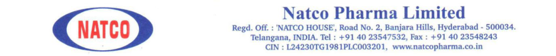

**[Image: Natco_July_2025.pdf-0001-00.png (940x96, 100.6KB)]**

29th July, 2025 

Corporate Relationship Department Manager – Listing M/s. BSE Ltd. M/s. National Stock Exchange of India Ltd <u>Mumbai 400 001 Mumbai 400 051 Scrip Code:</u> **<u>524816</u>** <u>Scrip Code:</u> **<u>NATCOPHARM</u>** 

Dear Sir 

Sub:- Transcript of conference call held on  July 23, 2025 

Ref:-  Regulation 30 of the SEBI (Listing Obligations and Disclosure Requirements), Regulations, 2015 

We are  enclosing herewith   the copy of  transcript of the  Company's  conference call for Proposed Investment held on July 23, 2025. The transcript is also available on the website of the company i.e., www.natcopharma.co.in. 

Thanking you 

Yours faithfully 

For NATCO Pharma Limited 

Chekuri Venkat Digitally signed by Chekuri Venkat Ramesh Ramesh Date: 2025.07.29 16:32:15 +05'30' Ch. Venkat Ramesh Company Secretary & Compliance Officer 

**<u>NATCO's Call for Proposed Investment</u>** 

# **<u>July 23, 2025</u>** 

## − **Host:** 

- Good evening and welcome to NATCO's Call for Proposed Investment in Adcock Ingram Holdings Limited. I now hand over the call to Mr. Rajesh Chebiyam, Executive Vice President, Crop Health Sciences, NATCO Pharma Ltd. for his opening remarks. Thank you and over to you, sir. 

- **Mr. Rajesh Chebiyam - Executive Vice President (Crop Health Sciences), NATCO Pharma Ltd.:** 

- Thank you, Vandit., I welcome all of you for our evening call today to update on the acquisition and thank you for joining on a very short notice. So, during the call, we may be making certain forward-looking statements about the acquisition or future events about it. So, anything said on the call which reflects our outlook for future, must be reviewed in conjunction with the risks that the company faces. 

- We are very excited that we are offering to acquire a stake in Adcock Ingram Ltd., one of the largest pharmaceutical and healthcare companies in the African continent. The press release and the presentation related to the same has been uploaded with the stock exchanges and on our website. So, with that said, we'll delve into the key highlights of the transaction and then open the floor for the Q&A. I would like Mr. Rajeev Nannapaneni, our Vice Chairman and CEO, to take you guys through the presentation and share his thoughts. Thank you. 

- 

   - **Mr. Rajeev Nannapaneni- CEO & Vice Chairman, NATCO Pharma Ltd.:** 

- Good evening, everyone. First, I'd like to thank everyone for participating and showing interest in our call today and turning up. 

- Let me start off with the first slide. So, we'll just run through the presentation and for us, it's a very large transaction for our firm. It's probably the biggest investment that we ever made in our life. So, it gives us a good global presence. It’s 35.75% stake in this company. At this time, this was the share that was available, but still, it's a very substantial minority's position and we get to consolidate the profits of the company into our books. We also get an avenue to send our products there and work in a market that we are not present in. I'll just walk through the company and the major highlights of the transaction. 

- So, the name of the company, as you have seen, is Adcock Ingram. So, we're proposing a 35.75% shareholding, and Bidvest is going to own 64.25%. We're paying ZAR 75 (South African Rands)  for buying the shares, which are in public, and we will delist the company and make it a private holding company. It will cost us about 2,000 crores. Financial highlights, last year it did about US$536 million and half year it did about US$262 million. 

1 

- So, a little bit of background.  It has a very long history. It was established in 1890 in South Africa. It's the second largest company in the private market, and it's there in private and public sector. It is having a nice portfolio of Prescription, OTC, Hospital and Consumer. It owns three manufacturing plants near Johannesburg in South Africa and owns two plants in India as well; a 49% Indian JV company they have. 

- These are the areas that they are present in - Prescription, OTC, Hospital and Consumer. 

- These are the top brands. These are all household names in South Africa. It's a business that we have no exposure to. Now our shareholders will have an earnings exposure to this business, which helps us in our drive for diversification and strengthening our base business and these are all big household name brands in South Africa, and all these brands do excess of $10 million. These are top brands. So solid brand portfolio. 

- And this is the income statement. So, it's consistently doing more than US$500 million revenue annualized. Even this year, it'll exceed more than US$500 million in revenue. 

- So, there are multiple value creation opportunities for us. Our pipeline, you know, is not going to Southern Africa. So, this acquisition will allow us to take our portfolio to Southern Africa. And as you know, it has a nice breadth of portfolio that they're covering. And we are here to strengthen that portfolio and grow the company. Next slide, please. 

- So, the broad contour of the acquisition is, we’ll be enable us to get a lot of revenue synergies over a period of time, and we'll be doing some portion of manufacturing where they have a requirement. And of course, our R&D pipeline can be extended. Now, as you know, we're present in the U.S., India, Brazil, and Canada, which are the four big markets. Now we added South Africa to it.  I think, among the African countries, this is probably the most stable and strong economy to be present in. 

- And Bidvest, I think some of you know about this firm. It's a very big conglomerate in South Africa. Their background is not necessarily from pharma, but they have a diverse set of businesses. And so, we want to work with them to strengthen their R&D and Prescription business, which is where our value is, and bring value to them as well. 

- Thank you. It's a very monumental acquisition. So as a Group, we'll be touching almost $1 billion in revenue. So, it's a big milestone for us. I think we're very excited about this acquisition. And it has come at a very reasonable valuation, as you can see. And I think I'm open for questions. Thank you. 

- **<u>Question & Answer Session:</u>** 

- **Host:** 

- Thank you, sir. We'll now open the call for Q&A session. We'll wait for a few minutes until the queue assembles. We request participants to restrict to two questions and 

2 

then return to the queue for more questions. Please raise your hand from the Participant tab on the screen to ask questions. 

- 

   - The first question is from Tarun. Go ahead, Tarun. 

- 

## **Mr. Tarun Bathija – Participant:** 

- Hello, sir. Just two questions from my end. So, we are right now acquiring 35%. Is there an option with us to acquire the rest of the stake or take it to a majority stake in a certain time frame? That's one. 

- And is there any significant potential for us to expand on the margins, or is it the sustainable level of margin at around 14-15%? 

- 

## **Mr. Rajeev Nannapaneni- CEO & Vice Chairman, NATCO Pharma Ltd.:** 

- Thank you.  I think first I'll answer the shareholding question. I think at this time, Bidvest doesn't want to sell their shares, and we looked at it, this is such an A-class asset, and I don't think we'll get an asset like this. So, I thought it was worth buying 35%. Regarding increase of shareholding, we have a first right of refusal. If Bidvest decides to sell any sometime in the future, we have the first right of refusal. But currently, the transaction is envisaging only a 35.75% stake. 

- And increasing margin, Tarun, I think you’ll see the benefit of the transaction over the next few years as we start selling our products through the entity and if we have a smart, disruptive product, then obviously the EBITDA will improve dramatically. We will mix it up with our pipeline and help them source other products from India which are interesting and strengthen the pipeline. So, we're looking for a very strong long-term relationship with them. 

- 

## **Mr. Tarun Bathija – Participant:** 

- Okay, perfect. Thank you. 

- 

## **Host:** 

- The next question is from Rashmi. Requesting participants to identify yourself and your company when asking the question. Thank you. Yeah, Rashmi, please go ahead. 

- 

## **Ms. Rashmi Sancheti – Dolat Capital:** 

- This is Rashmi from Dolat Capital. So just a follow-up question from our earlier participant. You mentioned that there are very good brands which are more than $10 million market, yet the margins from last 2-3 years is stagnant at around 1415%. So, what is the reason for that? 

- And if you can also give the split, like whether the business has got more of a branded part or in the hospital, because you mentioned that in the Hospital and Critical Care also, it has got some segment. So, if you can give the split between that also. 

- 

## **Mr. Rajeev Nannapaneni- CEO & Vice Chairman, NATCO Pharma Ltd.:** 

3 

- So, one thing is the challenges with the margin, there are like multiple factors in it. But before getting to that, I think what value we want to bring is the pipeline. I think what I believe is that the pipeline that we're bringing in is so strong that I think the margins will improve. You know that we have a very exciting pipeline in NATCO. I think if we're able to plug that pipeline into Adcock, I think we'll see a lot of value in it and even if we get a breakthrough, even with one or two smart products, I think we'll be home. So, the value that we bring to the table is going to be in the Prescription business, which is where the growth has been sluggish. 

- If you look at the split. It's about 35% in Prescription, 21% Hospital, OTC is 26% and Consumer is 17%. 

- 

## **Ms. Rashmi Sancheti – Dolat Capital:** 

- Okay. one more question. You will be leveraging your portfolio to South Africa, but would you also look to leverage their portfolio into the India business or the other geographies of NATCO? 

- 

## **Mr. Rajeev Nannapaneni- CEO & Vice Chairman, NATCO Pharma Ltd.:** 

- I think, see, good thing about South Africa is, all those plants are Pharmaceutical Inspection Convention (PIC/S) approved, which allows you to export to other countries. We're looking at possible synergies where they could supply to one of our sister concerns like Brazil or something like that. I think it's early days. I think we're just going to close the transaction. It'll take us about 3-4 months to close the transaction. And once it settles down, I think we will look at the details. But at a high level, yes, I think we see some synergies. Yes. 

- 

## **Ms. Rashmi Sancheti – Dolat Capital:** 

- Okay. And one last question. The consolidation would be not a line-by-line item, right? It would be only one line item just before the net profit in your P&L, whatever share of profits directly to the NATCO's P&L, and then that, that will get consolidated, right? 

- 

## **Mr. Rajeev Nannapaneni- CEO & Vice Chairman, NATCO Pharma Ltd.:** 

- Absolutely correct. I think that's what my understanding is. As per the accounting standard, that's what will happen. So, for example, if the property is $45 million a year, for argument's sake, so 35.75% of that will get consolidated on a quarterly basis. 

- 

## **Ms. Rashmi Sancheti – Dolat Capital:** 

- 

   - Understood. Thank you so much. That's it from my side. 

- **Host:** 

- Next question is from Viraj. 

- 

## **Mr. Viraj Mahadevia – Participant:** 

4 

- Hi, Rajeev. Congratulations for buying into this marque asset. I know it well from my healthcare banking days. Just a quick question regarding the synergies on revenue and cost side are obvious, as you've articulated, and there's a huge opportunity there. But when it comes to the Critical Care Hospital business and the Consumer and OTC, can you share some light on what you can do around those businesses? Are you planning to potentially bring the Hospital Care business or products into India and build that out? Or are you potentially considering spinning off or selling off the OTC business? 

- 

## **Mr. Rajeev Nannapaneni- CEO & Vice Chairman, NATCO Pharma Ltd.:** 

- No, we're not considering any of those, Viraj. I think we want to grow this business. I think there are a lot of synergies that we see in the Prescription business. I think one of the rationales is, like for an Indian company, for example, Viraj, we spend R&D money. We export to 7-8 countries, right? Or 10 countries or 20 countries. But like when you're a local company like South Africa, then you're not getting the geographical expanse. So first leverage we see is in the R&D. So, we're doing a smart product in India, you can extend it to multiple markets. So that's probably the biggest advantage we see, especially in the Prescription business. 

- OTC and Consumer business, I think we can probably help with some new ideas on new product developments, but I think that is the strength of that company, which is the value that we bring is less there. I think it's more in the Prescription business. 

- I think one of the challenges, one of the ladies asked me why it's not growing so strongly. I think part of the reason is that there's a lot of competition in the Prescription business, and all our Prescription business competition is coming from India. I think one of the rationales when we spoke to Adcock is that you need a strong partner who can help you out in the Prescription business because this is where we are good. 

- 

## **Mr. Viraj Mahadevia – Participant:** 

- You've got the local manufacturing at the back end. Yeah. 

- 

## **Mr. Rajeev Nannapaneni- CEO & Vice Chairman, NATCO Pharma Ltd.:** 

- Yeah, absolutely. I need backward integration and I think that's a value that we bring, at least with our niche portfolio and again, Indians are gone global and become very competitive. So, you need a partnership with somebody like us who can help you out. I think that's, that's the synergy. Yeah. 

- 

## **Mr. Viraj Mahadevia – Participant:** 

- Second question is, are there any markets that Adcock exports to which are white spaces for you as NATCO? So new market entries that you're getting access to over and above just South Africa or parts of Africa? 

- 

## **Mr. Rajeev Nannapaneni- CEO & Vice Chairman, NATCO Pharma Ltd.:** 

- They're active Viraj, but they used to have presence in other countries, but I think they went back a bit now. But they're active in the neighbouring countries. I think if 

5 

you know South Africa, Swaziland, I think the nearby countries, I think they're active. But they've not gone to most of the African countries. I think that's one possible synergy as well. We could expand this business to other countries in Africa. But I think in addition to South Africa, they're present in the neighbouring countries of South Africa as well in a small way, and we're looking to strengthen that presence. 

- 

## **Mr. Viraj Mahadevia – Participant:** 

- 

   - And no exports outside of Africa at all? The continent? 

- 

## **Mr. Rajeev Nannapaneni- CEO & Vice Chairman, NATCO Pharma Ltd.:** 

- I think very minimal, of what I understand. 

- 

## **Mr. Viraj Mahadevia – Participant:** 

- Okay. Thank you, all the best. 

- **Host:** 

- The next question is from Kunal. 

- 

## **Mr. Kunal Randeria – Participant:** 

- Hi, Rajeev. Good evening. Rajeev, firstly interesting comments that your contribution would be to get your very impressive, complex, generics pipeline to Adcock. So, did you not explore the option of having a profit share agreement for a lot of products like you have for a Revlimid or a Copaxone? You have none? Or are they taking equity in the company? 

- 

## **Mr. Rajeev Nannapaneni- CEO & Vice Chairman, NATCO Pharma Ltd.:** 

- That's not the deal on the table. I think they are also a very large firm. So, I think the deal right now is buying the shares. I think that's what we’ve accomplished after many months of negotiation. 

- 

## **Mr. Kunal Randeria – Participant:** 

- Absolutely. So, I get you, Rajeev. The point is, was this not an option that you had explored? Because I mean, you have a very enviable portfolio of products, which a lot of large companies have struggled to get to the market. I'm just wondering if that was not an option. 

- 

## **Mr. Rajeev Nannapaneni- CEO & Vice Chairman, NATCO Pharma Ltd.:** 

- I think it's a cross-border transaction, and it's a public company and they felt that the value will come when it goes private. I think this, we thought, is best for everyone. I think that's the best way forward. 

- 

## **Mr. Kunal Randeria – Participant:** 

- 

   - All right. Thanks. 

- 

## **Mr. Rajeev Nannapaneni- CEO & Vice Chairman, NATCO Pharma Ltd.:** 

6 

- Also, having an economic stake in it, also gives us an incentive to give the pipeline and take it forward. That's really trying to create synergies and incentives that the asset does well. And for us, some economic stake must be there so that we are also strongly incentivized to support the asset. I think that's a true rationale for the transaction. 

- 

## **Mr. Kunal Randeria – Participant:** 

- Fair enough, second question. South Africa, you’ve made an entry here. You still have the cash on the books. So future acquisitions again would be in countries where you do not have a footprint at the moment? 

- 

## **Mr. Rajeev Nannapaneni- CEO & Vice Chairman, NATCO Pharma Ltd.:** 

- I think so, This is not the only transaction we want to do. I think we've been saying that. Finally, we accomplished one. So, I think that's good. So, I'm also looking for another transaction and hopefully we can do something as large as this or even bigger than this so that we can solidify our position in our key markets that we operate in and bring more diversification and stability in our core earnings. That’s what my thinking is. And I think that's where we're going, and this is part of that accomplishment. 

- 

## **Mr. Kunal Randeria – Participant:** 

- Yeah. And so just to kind of take this forward. So, would it be fair to assume it will not be Canada and Brazil where we already have some presence? 

- 

## **Mr. Rajeev Nannapaneni- CEO & Vice Chairman, NATCO Pharma Ltd.:** 

- I think I said there are only three things in this business that works, right? One is, you need to have great products and great R&D. Two, you need to have global scale and three, you need to have multiple markets that you're there. If you get three right, then you're building a wonderful business. If you don't get these three things right, it's tough to compete in this business. I think our strength has always been R&D, our problem has been market access and a lot of times we don't have access, or we did sharing. So, I think that's what we're trying to sort of address so that we have access, and we have scale so that we can bring value to the pipeline. 

- 

## **Mr. Kunal Randeria – Participant:** 

- Right. Okay, thanks. Thanks for answering my question. 

- **Host:** 

- Next question is from Nirali Shah. 

- 

## **Ms. Nirali Shah – Participant:** 

- Yeah, congratulations. I have one question. I just wanted to know what are the 2-3 immediate synergies or any near-term wins that you're targeting from this deal? Whether it's a dossier monetization or R&D collaboration or any supply chain 

7 

leverage? And if you could mention by, when should we expect them to reflect in numbers? 

- 

## **Mr. Rajeev Nannapaneni- CEO & Vice Chairman, NATCO Pharma Ltd.:** 

- It will take some time. We have a few filings in South Africa. So, we'll try to see whether we can monetize those assets through our associate firm. Those, I think, will start kicking in immediately. It will be immediately earnings-accretive because we'll be able to consolidate the numbers. 

- The real value for the asset, we'll be able to see in the next two to three years, I would believe. Once the new registrations start coming in, we start filing, start getting approved and we launch products, I think that's where the real value is. I think you have to look at medium-term, not in the near-term. Near-term, you'll see some value, but the real value will come in the next three years. 

- 

## **Mr. Rajeev Nannapaneni- CEO & Vice Chairman, NATCO Pharma Ltd.:** 

- Anything else, Nirali? 

- 

## **Ms. Nirali Shah – Participant:** 

- No, thanks. 

- 

## **Host:** 

- The next question is from Neeraj, requesting everyone to please identify themselves and their company name, please. 

- 

## **Mr. Neeraj Kayal – Retail Investor:** 

- Thank you for the opportunity. I'm a retail investor, individual investor. I wanted to ask, does this company have assets like first-to-file or new molecules? 

- And the second question is, we are paying a significant premium. Is it because we are taking the company private? Is that why we are paying the premium? 

- 

## **Mr. Rajeev Nannapaneni- CEO & Vice Chairman, NATCO Pharma Ltd.:** 

- Okay. Let me answer that question. First, their geographical expanse is Southern Africa. They sell primarily in South Africa specifically and countries nearby and majority of the sale is coming from South Africa per se. It's a very highly concentrated single geography business. 

- 

   - The second question you had was what? 

- **Mr. Rajesh Chebiyam - Executive Vice President (Crop Health Sciences), NATCO Pharma Ltd.:** 

- 

   - Why the significant premium? 

- 

## **Mr. Rajeev Nannapaneni- CEO & Vice Chairman, NATCO Pharma Ltd.:** 

8 

- I mean, we are taking the company private, Neeraj, and I think you need to give a good premium to entice the shareholders to tender their shares. We believe we gave a very fair premium, and I believe, I think we have enough support, and we strongly believe that we'll be able to delist the company in the next 3-4 months. 

- 

## **Mr. Neeraj Kayal – Retail Investor:** 

- Okay. Thank you. 

- **Host:** 

- Thank you. The next question is from Radhakrishnan. 

- 

## **Mr. Radhakrishnan Guhan – Participant:** 

- Congratulations, Rajeev. It is a good complimentary addition to NATCO. So, what NATCO plans to do with the remaining cash in hand? 

- 

## **Mr. Rajeev Nannapaneni- CEO & Vice Chairman, NATCO Pharma Ltd.:** 

- I hope to also do something large, something large like this, which is something very large and interesting. We'll be using some of the cash. Obviously, we don't need any long-term debt. We might borrow for a short term, but I think most of the transaction will be funded with the cash on the books that we have. But we're looking to do another large transaction if everything goes well. So, I think what we're trying to do, is to sort of bring a diversification in our business, move our revenue focus away from the US and bring other markets in so that we have more stability and strengthen our base business. 

- 

## **Mr. Radhakrishnan Guhan – Participant:** 

- Okay. Will NATCO have any operational or board level influence for the Adcock Ingram decisions? 

- 

## **Mr. Rajeev Nannapaneni- CEO & Vice Chairman, NATCO Pharma Ltd.:** 

- 

   - Yes, we'll have. One-third of the Board seats. 

- 

## **Mr. Radhakrishnan Guhan – Participant:** 

- That's great. One last question. So, what is the plan for integrating or collaborating with Adcock's team's R&D production and supply chain? 

- 

## **Mr. Rajeev Nannapaneni- CEO & Vice Chairman, NATCO Pharma Ltd.:** 

- I think all the three areas we see a lot of synergies. We can help in sourcing. We could find assets which could be interesting for them. We could use our own pipeline. I mean, obviously, the real work will start once the transaction is completed in the next three months. But I think, yes, we see a lot of value. 

- 

## **Mr. Radhakrishnan Guhan – Participant:** 

- Is there any possibility to market Semaglutide in South Africa with this partnership? 

9 

## − 

## **Mr. Rajeev Nannapaneni- CEO & Vice Chairman, NATCO Pharma Ltd.:** 

- Yes, of course. Among many things, this is not the only one, other things as well. Yeah, you’ve cited a very good example. Yeah, products like that we’ll be very happy to sell through our side. 

- 

## **Mr. Radhakrishnan Guhan – Participant:** 

- 

Yeah. Thanks, Rajeev, for the opportunity. 

- **Host:** 

- Requesting everyone, if anybody wants to ask a question, please raise your hand from the Participant tab. We will wait for a few seconds to assemble the queue. 

- 

   - The next question is from Abdul. 

- 

## **Mr. Abdulkader Puranwala – Participant:** 

- Hi. Thank you for the opportunity and congratulations on this acquisition. Rajeev, just two questions from my end. First is, what would be the cash balance you would have post-consumer rate of this acquisition, post this acquisition? 

- 

## **Mr. Rajeev Nannapaneni- CEO & Vice Chairman, NATCO Pharma Ltd.:** 

- 

   - Can you say that again? I didn't catch it properly. Can you just say it one more time? 

- 

## **Mr. Abdulkader Puranwala – Participant:** 

- Sure, sure. So, I was asking that post completion of this transaction, what would be the cash balance available with you? 

- 

## **Mr. Rajeev Nannapaneni- CEO & Vice Chairman, NATCO Pharma Ltd.:** 

- We were able to fund the transaction using the cash that we have. How much cash balance we're left with, you're saying? 

- 

## **Mr. Abdulkader Puranwala – Participant:** 

- 

- Yes, that's right. 

## − 

## **Mr. Rajeev Nannapaneni- CEO & Vice Chairman, NATCO Pharma Ltd.:** 

- Top of my head, I can't remember. But I think we have about INR 3,500 crores of cash, top of my head right now. So, we'll be using 2,000. So, we'll be left with about INR 1,500 crores. Plus, whatever money that we're going to accrue from June quarter and September quarter profit, that I have not included in the calculations. At a broad level, I'm telling you. Don't hold me to it, but I think at a broad level, I think that's what it is. 

- 

## **Mr. Abdulkader Puranwala – Participant:** 

- No, fair enough. Thanks for that. Yeah, just one more. You highlighted that there might be a few more transactions into the pipeline. So, would that be on similar lines 

10 

or you would like to acquire something into the US like what you have done previously, or the strategy now changes towards ROW market completely? 

## − 

## **Mr. Rajeev Nannapaneni- CEO & Vice Chairman, NATCO Pharma Ltd.:** 

- I mean, we'd want to acquire businesses that we are not part of our core pipeline, which can strengthen our core business. I think we're looking for more assets which will help us give us a geographical spread or give us a portfolio, which we don't have. So, I mean, we'll judge it by the situation. 

- 

## **Mr. Abdulkader Puranwala – Participant:** 

- 

   - All right, sir. Thank you. 

- 

## **Host:** 

- The next question is from Vishwanath. 

- 

## **Mr. Vishwanath Pillai – Participant:** 

- Yeah. Hi, Rajeev. Congratulations on the deal. You mentioned that you're planning another similar deal. This would be in which geography? Whether this be in India or whether this be in the rest of the world? 

## − 

## **Mr. Rajeev Nannapaneni- CEO & Vice Chairman, NATCO Pharma Ltd.:** 

- As I said, I can't answer the question directly. I think we're looking to do a transaction, which can strengthen our portfolio. I think that's all I can say at this time. 

- 

## **Mr. Vishwanath Pillai – Participant:** 

- So, the second question is, you rely largely on US. The large bulk of your revenues come from US. Is there anything changed in that market with this discussion on tariffs? Is that weighing on your mind to diversify or do the geographic diversification? 

- 

## **Mr. Rajeev Nannapaneni- CEO & Vice Chairman, NATCO Pharma Ltd.:** 

- I mean, tariffs are one among the many challenges in the US. I mean, obviously, there are other things as well. Then we have to deal with whatever happens. Anyway, we're going to deal with it. Yes, I think as a business, we want to diversify clearly. I think we want to have a good geographical spread and diversify our revenue and strengthen our core business. And we always had the cash. I think we had the opportunity and then we were able to click and get this transaction. And generally, Vishwanath, I think as a firm, we're all looking to diversify and build a more robust portfolio so that you're not dependent on one market. 

- 

## **Mr. Vishwanath Pillai – Participant:** 

- 

   - Got it, sir. Thank you, sir, and congratulations. 

- 

## **Mr. Rajeev Nannapaneni- CEO & Vice Chairman, NATCO Pharma Ltd.:** 

11 

- Thank you. And one last follow-up, please, yeah? Next. 

- **Host:** 

- Thank you. The next question is from Kartik. Please identify yourself and your company. 

- 

## **Mr. Karthik – ICICI:** 

- Hello. Karthik here from ICICI. Congratulations on this one, Rajeev. I have two questions for you. In this case, is there a plan to take a majority stake in this? And are we going to sell products in other parts of Africa where there is, in a way, going to be demand, because this company has access to these markets also? 

- Second question is, when you say you want to acquire another large asset, will that be for geographical overall footprint, or will it be for any technology, product, etc. which you don’t have? 

- 

## **Mr. Rajeev Nannapaneni- CEO & Vice Chairman, NATCO Pharma Ltd.:** 

- So, let me answer one at a time and I’ll answer your second question first. I think whatever we want to acquire further will be to either strengthen the pipeline that we have in the existing market that we’re present in or add a new geography. Whatever comes through and we’re able to find the right valuation and we’re able to consummate a deal, I’ll be very happy to do it. 

- Your first question about market access, I think this company has very good access in South Africa, obviously, which is one of the most dynamic economies in the African continent, and in the neighbouring countries too is has very good access. I think we’ve been discussing with them how we can expand this reach to more countries in Africa. Those discussions are ongoing. I think, once we settle down as a shareholder and take it forward, I think lot of these plans will come through. 

- **Mr. Karthik – ICICI:** 

- And to acquire controlling stake in this company? 

- 

   - **Mr. Rajeev Nannapaneni- CEO & Vice Chairman, NATCO Pharma Ltd.:** 

- At this time, it’s not available, Karthik. We had this discussion. I was very keen on a higher stake; I’m always very keen. So, I think the only consensus we could build is, at this time, it’s not for offer. But in the future, if they’re interested in selling, we have the first right of refusal. So, if that opportunity comes, we’ll be very happy to take. But for now, this is what is up for offer. But even thought it’s a strong 36%, but an asset like this we won’t get every day. So, I thought it’s worth doing it, because to build this type of business in South Africa, for us, it’s simply not possible. It will take us decades to do that. And I think the valuations are far more reasonable in our country. You know that as well, right? So, this I feel is a far superior transaction than anything we have seen. 

- **Mr. Karthik – ICICI:** 

12 

- Congratulations, Rajeev. 

## − **Mr. Rajeev Nannapaneni- CEO & Vice Chairman, NATCO Pharma Ltd.:** 

- Yeah, thank you. So, this is my last question for today. Again, I appreciate the time you guys have spent attending this call. Again, it’s a monumental achievement for us that we’re able to do this transaction which allows us to gain size and stability. And we look forward to your support. Thank you so much guys. 

- **Mr. Rajesh Chebiyam - Executive Vice President (Crop Health Sciences), NATCO Pharma Ltd.:** 

- Thank you. 

- **Host:** 

- Thank you for joining us. You may now disconnect your lines and exit the webinar. Thank you. 

## − **_END OF TRANSCRIPT_** 

13 

---

## Extracted Images

| # | File | Dimensions | Size |
|---|------|------------|------|
| 1 | Natco_July_2025.pdf-0001-00.png | 940x96 | 100.6KB |
