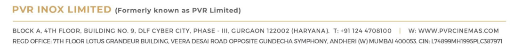
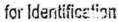
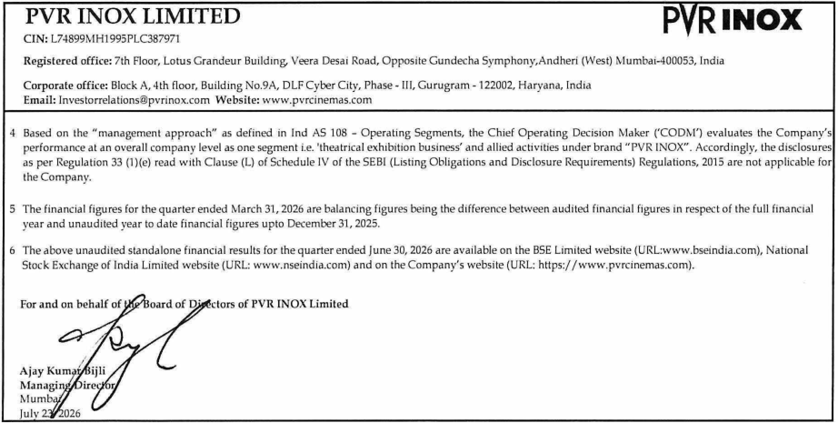
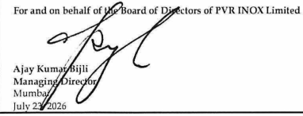
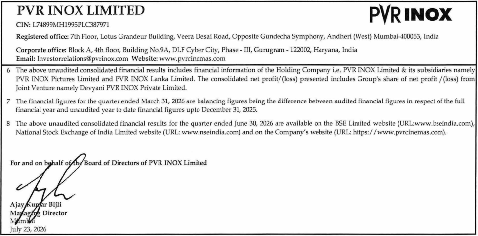
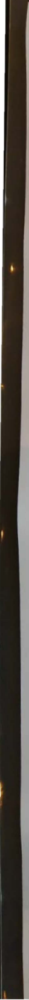
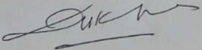
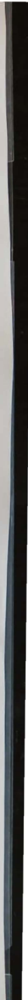

**[Image: acd1dd6e-e4c4-43ac-b628-aadefe31cc5c.pdf-0001-00.png (242x64, 5.8KB)]**

July 23, 2026 

**The Manager – Listing National Stock Exchange of India Limited (Scrip Symbol: PVRINOX)** 

**The Manager – Listing BSE Limited (Scrip Code: 532689)** 

##### **<u>Sub: Outcome of Board Meeting</u>** 

Dear Sir / Madam, 

In continuation to our letter dated July 16, 2026 and pursuant to Regulations 30 and 33 of Securities and Exchange Board of India (Listing Obligations and Disclosure Requirements) Regulations, 2015 (“SEBI Listing Regulations”), the Board of Directors of the Company in its Meeting held today, inter-alia, approved the following: 

##### **1. Financial Results:** 

Un-Audited Standalone and Consolidated Financial Results of the Company for the first quarter ended on June 30, 2026. 

The said Financial Results were also reviewed by the Audit Committee in its meeting held today. 

Accordingly, please find enclosed herewith a Statement containing the Un-audited Standalone and Consolidated Financial Results for the first quarter ended June 30, 2026 duly signed by the Managing Director of the Company along with a copy of Unmodified Limited Review Report received from M/s. S.R. Batliboi & Co. LLP, the Statutory Auditors of the Company. 

The same shall be available on the website of the stock exchanges where equity shares of the Company are listed i.e., <u>www.nseindia.com</u> and <u>www.bseindia.com</u> and on Company’s website <u>https://www.pvrcinemas.com/investors-section.</u> 

##### **2. Appointment of Mr. Shuva Mandal (DIN: 07670535) as an Independent Director of the Company:** 

The appointment of Mr. Shuva Mandal (DIN: 07670535), as an Additional Director, designated as Independent Director on the Board of the Company for a period of five consecutive years commencing from 23rd July, 2026, subject to approval of the members of the Company at the ensuing Annual General Meeting. 

##### **3. Resignation by Mr. Dinesh Hasmukhrai Kanabar (DIN: 00003252) as an Independent Director of the Company:** 

The Board took note of the resignation tendered by Mr. Dinesh Hasmukhrai Kanabar, Independent Director of the Company, with effect from close of business hours on July 24, 2026. A copy of his resignation letter, setting out the reason for his resignation, is enclosed herewith. 

**[Image: acd1dd6e-e4c4-43ac-b628-aadefe31cc5c.pdf-0001-16.png (1092x112, 55.0KB)]**

**[Image: acd1dd6e-e4c4-43ac-b628-aadefe31cc5c.pdf-0002-00.png (242x64, 5.8KB)]**

Mr. Dinesh Hasmukhrai Kanabar has stated that he has reviewed his other professional and Board Commitments and has decided to rationalise them. Mr. Kanabar has also confirmed in his resignation letter that there are no material reasons for his resignation other than those stated therein. 

##### **4.** **<u>Re-constitution of the Committees of the Board of Directors:</u>** 

The Board of Directors approved the re-constitution of certain Committees of the Board of Directors with effect from 23rd July, 2026, to facilitate a smooth transition and ensure continuity in the functioning of Committees pursuant to the resignation of Mr. Dinesh Hasmukhrai Kanabar as an Independent Director of the Company with effect from 24th July, 2026. 

##### **<u>Audit Committee:</u>** 

The Board approved the induction of Mr. Shuva Mandal, Additional Director (Independent Category), as a Member of the Audit Committee. Further, Mr. Vishesh Chander Chandiok has been appointed as the Chairperson of the Audit Committee with effect from 23rd July, 2026. Accordingly the Composition of the Audit Committee shall be as under with effect from 23rd July, 2026: 

|**S.No.**|**Name of the Member**|**Category**|**Position in the Committee**|
|---|---|---|---|
|1.|Mr. Vishesh Chander Chandiok|Independent Director|Chairperson|
|2.|Ms. Deepa Misra Harris|Independent Director|Member|
|3.|Mr. Vishal Kashyap Mahadevia|Independent Director|Member|
|4.|Mr. Shuva Mandal|Independent Director|Member|

##### **<u>Nomination and Remuneration Committee:</u>** 

The Board also approved the induction of Mr. Shuva Mandal, Additional Director (Independent Category), as a Member of the Nomination and Remuneration Committee with effect from 23rd July, 2026. Accordingly, the Composition of the Nomination and Remuneration Committee shall be as under with effect from 23rd July, 2026: 

|**S.No.**|**Name of the Member**|**Category**|**Position in the Committee**|
|---|---|---|---|
|1.|Ms. Deepa Misra Harris|Independent Director|Chairperson|
|2.|Ms. Renuka Ramnath|Non-Executive Director|Member|
|3.|Mr. Shishir Baijal|Independent Director|Member|
|4.|Mr. Shuva Mandal|Independent Director|Member|

Requisite details as per SEBI (Listing Obligations and Disclosure Requirements) Regulations, 2015 read with SEBI Master Circular No. **HO/49/14/14(7)2025-CFD-POD2/I/3762/2026** dated January 30, 2026 with respect to aforesaid appointment and resignation is enclosed herewith as **Annexure – A** and **Annexure – B** respectively. 

**[Image: acd1dd6e-e4c4-43ac-b628-aadefe31cc5c.pdf-0002-11.png (1092x112, 55.0KB)]**

**[Image: acd1dd6e-e4c4-43ac-b628-aadefe31cc5c.pdf-0003-00.png (242x64, 5.8KB)]**

In continuation to our letter dated 25th June, 2026, please note that the trading window will be opened from 26th July, 2026. 

The Board Meeting started at 11:30 A.M (IST) and concluded at 12:30 P.M. (IST). 

You are requested to kindly take the same on record and inform all concerned. 

Yours sincerely, For **PVR INOX Limited** MURLEE Digitally signed by MURLEE MANOHAR MANOHAR JAIN Date: 2026.07.23 JAIN 12:31:09 +05'30' **Murlee Manohar Jain SVP - Company Secretary & Compliance Officer** 

Encl: A/a 

**[Image: acd1dd6e-e4c4-43ac-b628-aadefe31cc5c.pdf-0003-06.png (1092x112, 55.0KB)]**

**[Image: acd1dd6e-e4c4-43ac-b628-aadefe31cc5c.pdf-0004-00.png (242x64, 5.8KB)]**

##### **<u>Annexure-A</u>** 

##### **Disclosure under sub‐para (7) of Para A of Part A of Schedule III of SEBI (Listing Obligations and Disclosure Requirements) Regulations, 2015** 

##### **(For appointment of Mr. Shuva Mandal)** 

|**Sl. No.**|**Particulars**|**Details**|
|---|---|---|
|**1**|**Reason** **for** **change** **viz.** **appointment/****~~re-appointment,~~** **~~resignation, removal, death or~~** **~~otherwise~~**|Appointment of Mr. Shuva Mandal (DIN: 07670535), as an Additional Director designated as Independent Director on the Board of the Company, subject to approval of Members of the Company.|
|**2**|**Date** **of** **appointment****~~/re-~~** **~~appointment/cessation~~** **(as** **applicable)** **&** **term** **of** **appointment****~~/re-appointment~~**|For a period of five consecutive years commencing from 23rdJuly, 2026, subject to the approval of the Members of the Company.|
|**3**|**Brief** **profile** **(in** **case** **of** **appointment)**|In a career spanning over two decades in India's leading law firms and at the Tata's, Mr. Shuva Mandal has extensive experience in mergers and acquisitions, securities laws, shareholder & governance issues, PE investments and corporate litigations. His experience spans sectors such as commodities, auto, retail, financial services, aviation, media, healthcare, defense, energy, real estate and public infrastructure. Prior to founding Anagram Partners, Mr. Mandal has served as Group General Counsel of Tata Sons, the principal investment holding company and promoter of the Tata Group and was a Senior Partner at Shardul Amarchand Mangaldas & Co. and AZB & Partners respectively. Mr. Mandal has also been involved in academic initiatives regarding the Indian Insolvency Code and is a Member of the International Bar Association (IBA) India Working Group (IWG). Started in 1947, the IBA is the world's leading organization of international legal practitioners, bar associations, law firms and law societies. Mr. Mandal has been recognized for his illustrious career by various publications and legal guides such as, being awarded the Chambers & Partners 'Outstanding Contribution to the Legal Profession: In-House Award' 2020 and was included in their 'the Most Influential General Counsel in India' and the 'GC Influencers -Global 100' 2019. The Financial Times, London rated him amongst the Top 20 Global General Counsels, 2019 - making him the first Indian GC on the list. In 2015, he was selected by The Economic Times - Spencer Stuart in the prestigious '40 under 40' list of India.|
|**4**|**Disclosure** **of** **relationships** **between directors (in case of** **appointment of a director)**|Not Applicable|
|**5**|**Information** **as** **required** **pursuant to BSE Circular with** **ref. no. LIST/ COMP/14/2018-** **19 and the National Stock** **Exchange of India Ltd with ref.** **no. NSE/CML/2018/24, dated** **20****th****June, 2018.**|Mr. Shuva Mandal is not debarred from holding the office of director by virtue of any SEBI order or any other such authority.|

**[Image: acd1dd6e-e4c4-43ac-b628-aadefe31cc5c.pdf-0004-05.png (1092x112, 55.0KB)]**

**[Image: acd1dd6e-e4c4-43ac-b628-aadefe31cc5c.pdf-0005-00.png (242x64, 5.8KB)]**

##### **<u>Annexure-B</u>** 

##### **Disclosure under sub‐para (7B) of Para A of Part A of Schedule III of SEBI (Listing Obligations and Disclosure Requirements) Regulations, 2015** 

##### **(For resignation of Mr. Dinesh Hasmukhrai Kanabar)** 

|**Sl.** **No.**|**Particulars**|**Details**|
|---|---|---|
|**1.**|**Reason** **for** **change** **viz.** **~~appointment/re-appointment,~~** **resignation,** **~~removal,~~** **~~death~~** **~~or~~** **~~otherwise~~**|Resignation by Mr. Dinesh Hasmukhrai Kanabar as Non-Executive Independent Director of the Company with effect from end of business hours on 24thJuly, 2026.|
|**2.**|**Date** **of** **~~appointment/re-~~** **~~appointment/~~cessation** **(as** **applicable)** **~~&~~** **~~term~~** **~~of~~** **~~appointment/re-appointment~~**|Effective from end of business hours on 24thJuly, 2026|
|**3.**|**Brief profile (In case of appointment)**|NA|
|**4.**|**Disclosure of relationships between** **directors (in case of appointment of a** **director).**|NA|
||**Additional Information in case of resig**|**nation of an Independent Director**|
|**5**|**Letter of Resignation along with** **detailed reasons for resignation**|Attached|
|**6**|**Names of listed entities in which the** **resigning** **director** **holds** **directorships, indicating the category** **of directorship and membership of** **board committees, if any.**|**DIRECTORSHIP:** 1. Adani Green Energy Limited (Independent Director) 2. Reliance Industries Limited (Independent Director) **COMMITTEE MEMBERSHIP:** 1. Adani Green Energy Limited a) Audit Committee (Member) b) Nomination & Remuneration Committee (Chairman) c) Stakeholders Relationship Committee d) Risk Management Committee|
|**7**|**The independent director shall, along** **with** **the** **detailed** **reasons,** **also** **provide a confirmation that there are** **no other material reasons other than** **those provided.**|Mr. Dinesh Hasmukhrai Kanabar has confirmed that there is no other material reason for his resignation other than what is provided in his resignation letter.|

**[Image: acd1dd6e-e4c4-43ac-b628-aadefe31cc5c.pdf-0005-05.png (1092x112, 55.0KB)]**

**_S.R. BATLIBOJ_** & **_Co. LLP_** 

4th Floor, Off ic e 405 World Mark - 2, Asset No. 8 IGI Airpo rt Hospitality District, Aeroci ty New Delhi - 11 0 0 37 , India Tel : +91 11 4681 9500 

**Chart ered Accountants** 

**Independent Auditor's Review Report on the Quarterly Unaudited Standalone Financial Results of the Company Pursuant to the Regulation 33 of the SEBI (Listing Obligations and Disclosure Requirements) Regulations, 2015, as amended** 

###### **Review Report to The Board of Directors PVR INOX Limited** 

- I. We have reviewed the accompanying statement of unaudited standalone financial results of PVR INOX Limited (the "Company") for the quarter ended June 30, 2026 (the "Statement") attached herewith, being submitted by ·the Company pursuant to the requirements of Regulation 33 of the SEBI (Listing Obligations and Disclosure Requirements) Regulations, 2015, as amended (the "Listing Regulations"). 

2. The Company's Management is responsible for the preparation of the Statement in accordance with the recognition and measurement principles laid down in Indian Accounting Standard 34, (Ind AS 34) "Interim Financial Reporting" prescribed under Section I 33 of the Companies Act, 2013 as amended, read with relevant rules issued thereunder and other accounting principles generally accepted in India and in compliance with Regulation 33 of the Listing Regulations. The Statement has been approved by the Company's Board of Directors. Our responsibility is to express a conclusion on the Statement based on our review. 

3. We conducted our review of the Statement in accordance with the Standard on Review Engagements (SRE) 2410, ·'Review of Interim Financial Information Performed by the Independent Auditor of the Entity" issued by the Institute of Chartered Accountants of India. This standard requires that we plan and perform the review to obtain moderate assurance as to whether the Statement is free of material misstatement. A review of interim financial information consists of making inquiries, primarily of persons responsible for financial and accounting matters, and applying analytical and other review procedures. A review is substantially less in scope than an audit conducted in accordance with Standards on Auditing and consequently does not enable us to obtain assurance that we would become aware of all significant matters that might be identified in an audit. Accordingly, we do not express an audit opinion. 

4. Based on our review conducted as above, nothing has come to our attention that causes us to believe that the accompanying Statement, prepared in accordance with the recognition and measurement principles laid down in the aforesaid Indian Accounting Standards ('Ind AS') specified under Section 133 of the Companies Act, 2013 as amended, read with relevant rules issued thereunder and other accounting principles generally accepted in India, has not disclosed the information required to be disclosed in terms of the Listing Regulations, including the manner in which it is to be disclosed, or that it contains any material misstatement. 

**For S.R. Batliboi** & **Co. LLP** Chartered Accountants 

**ICAI Firm registration number:** 301003E/E300005 

**per Gaurav Kumar Gupta** Partner Membership No. : 509101 

Place: New Delhi Date: July 23, 2026 

S,R. 8a l l1 boi & Co. LLP, a L1rn1 ! ed Li.Jb 1lily Par tn ershi p with LLP Identity No. AA B·4294 Reqd . Office: 22 , Camac Street, Blo ck 'B'. 3rd Floor, Kolkata-700 0 16 

#### PVR INOX LIMITED 

## **PVRINOX** 

CTN: L7489%1Hl 995PLC387971 

Registered office: 7th Floor, Lotus Grandeur Building, \ieera Desai Road, Opposite Gundecha Symphony,Andheri (West) Mumbai-400053, India Corporate office: Block A, 4th floor, Building No. 9A, DLF Cyber City, Phase - 111, Gurugram - 122002, Haryana, lndia Email: Investorreldtions@pvrinox.com Website: www.pvrcinemas.com 

||**STATEMENT OFUNAUDrnED STAN**|**DALONEFINANdAL**|**RESULTS**|~~-~~||
|---|---|---|---|---|---|
||~- --- ·- **~ORTHEQU~~EN**|**DEBJUNE30,~**|~·~|||
|| ||- (R|s.inmillions,excep|tpersharedata)|
||~~-~~ ~~-~~ ~~-~~ ~~-~~||~~-~~ **STANDAL** |**ONE**||
|||~~-~~|**3imonlh**||**endei:L**|
|**S.No**|**. Particulars**|**30!06.2021,**|**'31!03, **||**1.03.2026**|
||,_|~~--~~ ~~- -~~ ~~--~~ _**(U:?udited)**|**(Auwted)** **Refer ,note 5**|**(U:naudited)**|**(Audited)**|
|1|Income|||||
||Revenuefromoperations|15,825|14,870|13,729|63,912|
||Other income|224|760|312|1,770|
||Totalincome|16,049|15,630|14,041|65,682|
|2|Exoenses|||||
||Movie exhibitioncost|3,661|3,699|3,299|15,907|
||Consumptionof food dnd beveraQ:es|1,171|1,072|1,110|4,656|
||Emplovee benefits expense|1,749|1,732|1,605|6,952|
||Finance costs|1,638|1,723|1,905|7,301|
||Deoreciation and amortisation expense|3,114|3,259|3,048|12,563|
||Otherexpenses|4,025|3,916|3,757|15,769|
||Totalexpenses|15,358|15,401|14,724|63,148|
|3| Profit/floss) beforeexceptionalitemsandlax(1-2)|691|229|**(683)**|**2,534**|
|4|Exceptional items- net !(din(ReferNote 3)|-|(1,223)|-|1800)|
|5|**Profit/floss) beforelax13-4)**|**691**|**1,452**|**(683)**|**3,334**|
|6|Taxexpense|||||
||Current tax||||~~-~~|
||Tax relating to earliervears|-|||(73)|
||Deferred lax|175|244|11711|722|
||Totaltaxexpense|175|**244**|(171)|649|
|7|**Profit/(Loss) after lax(5-6)**|**516**|1,208|**(512)**|**2,685**|
|8|Othercomorehensiveincome/{exoensel{net of tax)|||||
||Items that will not bere-classifiedlo profit or loss|(1)|(19)|(13)|(-13)|
||Items that willbere-classified to orofit or loss||||~~-~~|
|9|Totalcomprehensive income/(expense) (7+8)|515|1,189|(525)|**2,642**|
|10|Paid-up equity sharecapital(facevalueof Rs. 10 each,fully paid)|**982**|982|982|**982**|
|ll|Otherequity including Reserves(excludingRevaluation Reserve)||||**72,387**|
|12|Earningspershareonnetprofil/(loss)afterlax (fullypaidupequityshare **ofRs. 10 each) **(refer note2)|||||
||Basic earnings pershare|5.25|12.30|(5.22)|27.34|
||Diluted eamine:s oershare|5.24|12.25|(5.22)|27.23|

Notes to the Statement of unaudited standalone financial results for the quarter ended June 30, 2026:- 

1 The above statement of unaudited standalone financial results of PVR INOX Limited ("the Company") for the quarter ended June 30, 2026 have been reviewed by the 

Audit Committee and approved by U,e Board of Directors at its meeting held on July 23, 2026. The Statutory Auditors have carried out a limited review of the above standalone financial results pursuant to Regulation 33 of the Securities and Exchange Board of India (Listing Obligations and Disclosure Requirements) Regulations, 2015, as amended and have issued an unmodified review report. 

2 Earnings per share is not annualised for U,e quarter ended June 30, 2026, March 31, 2026 and June 30, 2025. 

3 Exceptional items: 

(i) Pursuant to the notification of "Ne1.-v Labour Codes" issued on November 21, 2.025, the Company had assessed its em ployee benefit obligations in accordance with the revised definition of \Nages and accounted for the incremental impact of these changes amounting to Rs. 392 million as an 11exceptional itern 11 during U1e year ended March 31, 2026. 

(ii) During the year ended March 31, 2026, the Company disposed of its entire shareholding of 93.27% of the paid-up equity share capital of its subsidiary "Zea Maize 

Private Limited" for a consideration of Rs. 2,221 million (net of expenses) and consequently "Zea ~[aize Priva te Limited" had ceased to be a subsidiary of the Campany with effect from January 29, 2026. The carrying value of such investment as on date of sale was Rs. 951 million. Rs. 1,270 million being excess of consideration received over investment value was disclosed as "exceptional item 11 in the standalone financial results. 

(iii) During the year ended Ma rch 31, 2026, capital work in progress amounting to Rs. 78 million relating to d property under development had been impaired on account of dispute arising with the landlord. 

S.R. 8at!iboi & Co. Ll.P, New Delhi 

**[Image: acd1dd6e-e4c4-43ac-b628-aadefe31cc5c.pdf-0007-15.png (118x22, 3.3KB)]**

**[Image: acd1dd6e-e4c4-43ac-b628-aadefe31cc5c.pdf-0008-00.png (922x465, 189.2KB)]**

<!-- Start of picture text -->
PVR INOX LIMITED  P RINOX CIN: L74899MH1995PLC387971 Registered office: 7th Floor, Lotus Grandeur Building, Veera  Desai Road, Opposite Gundecha Symphony,Andheri (West) Mumbai-400053, India Corporate office:  Block A, 4th floor, Building No.9A,  DLF Cyber City, Phase - 111, Gurugram -122002, Haryana, India Email: Investorrelations@pvrinox.com Website: www.pvrcinemas.com 4 Based on the "management  approach"  as defined  in  Ind  AS  108 - Operating Segments, the Chief Operating Decision Maker ('CODM') evaluates the  Company's performance at an overall company level as one segment i.e.  'theatrical exhibition business' and allied activities under brand "PVR INOX". Accordingly, the disclosures as per Regulation 33  (1 )(e) read with Clause (L)  of Schedule IV  of the SEBI  (Listing Obligations and Disclosure Requirements) Regulations, 2015  are not applicable for the Company. 5 The financial figures for the quarter ended March 31, 2026 are balancing figures being the difference between audited financial figures  in  respect of the full financial year and unaudited year to  date financial  fig ures upto December 31, 2025. The above unaudited standalone financial results for the quarter ended June 30,  2026 are available on the BSE  Limited website (URL:www.bseindia.com), National Stock Exchange of India Limited website (URL:  www.nseindia.com) and on the Company's website (URL:  https://www.pvrcinemas.com). <!-- End of picture text -->

**[Image: acd1dd6e-e4c4-43ac-b628-aadefe31cc5c.pdf-0008-01.png (382x146, 26.0KB)]**

$.R. 3itHbol & Co. LL.P, New Delhi 

for ldentific~'':m 

**_S.R. BATL IBOI_ & Co.** **_LLP_** 

4th Fl oo r, Offi ce 405 World Mark· 2, Asse t No. 8 IGI Airport Hospitality District, Aeroc ity New Delhi - 110 037, Indi a Tel : +9 1 11 468 1 9500 

**Chartered Accountants** 

**Independent Auditor's Review Report on the Quarterly Unaudited Consolidated Financial Results of the Company Pursuant to the Regulation 33 of the SEBI (Listing Obligations and Disclosure Requirements) Regulations, 2015, as amended** 

###### **Review Report** to **The Board of Directors PVR INOX Limited** 

- I. We have reviewed the accompanying Statement of Unaudited Consolidated Financial Results of PVR INOX Limited (the "Holding Company") and its subsidiaries (the Holding Company and its subsidiaries together referred to as "the Group") and its joint venture for the quarter ended June 30, 2026 (the "Statement") attached herewith, being submitted by the Holding Company pursuant to the requirements of Regulation 33 of the SEBI (Listing Obligations and Disclosure Requirements) Regulations, 2015, as amended (the "Listing Regulations"). 

2. The Holding Company 's Management is responsible for the preparation of the Statement in accordance with the recognition and measurement principles laid down in Indian Accounting Standard 34, (Ind AS 34) " Interim Financial Reporting" prescribed under Section 133 of the Companies Act, 2013 as amended, read with relevant rules issued thereunder and other accounting principles generally accepted in India and in compliance with Regulation 33 of the Listing Regulations. The Statement has been approved by the Holding Company' s Board of Directors. Our responsibility is to express a conclusion on the Statement based on our review. 

3. We conducted our review of the Statement in accordance with the Standard on Review Engagements (SRE) 2410, " Review of Interim Financial Information Performed by the Independent Auditor of the Entity" issued by the Institute of Chartered Accountants of India. This standard requires that we plan and perform the review to obtain moderate assurance as to whether the Statement is free of material misstatement. A review of interim financial information consists of making inquiries, primarily of persons responsible for financial and accounting matters, and applying analytical and other review procedures. A review is substantially less in scope than an audit conducted in accordance with Standards on Auditing and consequently does not enable us to obtain assurance that we would become aware of all significant matters that might be identified in an audit. Accordingly, we do not express an audit opinion. 

We also performed procedures in accordance with the Master Circular issued by the Securities and Exchange Board of India under Regulation 33(8) of the Listing Regulations, to the extent applicable. 

4. The Statement includes the results of the following entities: 

   - a. PVR INOX Pictures Limited (Subsidiary Company) 

   - b. PVR INOX Lanka Limited (Subsidiary Company) 

   - c. Devyani PVR INOX Private Limited (Joint Venture) 

5. Based on our review conducted and procedures performed as stated in paragraph 3 above, nothing has come to our attention that causes us to believe that the accompanying Statement, prepared in accordance with recognition and measurement principles laid down in the aforesaid Indian Accounting Standards ('Ind AS') specified under Section 133 of the Companies Act, 2013 , as amended, read with relevant rules issued thereunder and other accounting principles generally accepted in India, has not disclosed the information required to be disclosed in terms of the Listing Regulations, including the manner in which it is to be disclosed, or that it contains any material misstatement. 

S.R . Batl1bo1 & Co. LLP, a Limited L1a01l1t y Part nership with LLP Identity No. AAB-4294 Regd . Office: 22. Cama c Stree t. Block ·a·. 3rd rl::ior, Kolka ta-700 016 

**_S.R. BAr1.IB01_ & Co.** **_LLP_** 

**Chartered Accountants** 

6. The accompanying Statement includes the unaudited interim financial results and other unaudited financial information, in respect of: 

   - I subsidiary company, whose interim financial results and other financial information reflect total revenues of Rs 92 million, total net loss after tax of Rs. 4 million and total comprehensive income of Rs . ( I 0) million for the quarter ended June 30, 2026. 

   - **1** joint venture, whose interim financial results include the Group's share of net profit of Rs . I million and Group's share of total comprehensive income of Rs . 1 milli'on for the quarter ended June 30, 2026. 

The unaudited interim financial results and other unaudited financial information of the subsidiary company and joint venture have not been reviewed by their auditors and have been approved and furnished to us by the Management and our conclusion on the Statement, in so far as it relates to affairs of the subsidiary and joint venture, is based solely on such unaudited interim financial results and other unaudited financial information. According to the information and explanation given to us by the management, these interim financial results are not material to the Group. 

Our conclusion on the Statement in respect of matters stated in para 6 above is not modified with respect to the financial results/financial information certified by the Management. 

**For S.R. Batliboi** & **Co. LLP** 

Chartered Accountants 

**ICAI Firm registration number:** 301003E/E300005 

**per Gaurav Kumar Gupta** Partner Membership No.: 509101 

Place: New Delhi Date: July 23, 2026 

**PVRINOX** 

### **PVR INOX LIMITED** 

CIN: L74899MH1995PLC387971 

Registered office: 7th Floor, Lo tus Grandeu r Building, Veera Desai Road, Op posite Gundecha Symphony, Andheri (West) Mumbai-400053, India **Corporate office:** Block A, 4th floo r, Building No.9A, DLF Cyber City, Phase - Ill, Gurugram - 122002, Haryana, India **Email:** Investorrelations@pvrinox.com **Website:** www. pvrcinemas.com 

||**STATEMENT0FUNAUDITED** _,. - - **~ORUIEQUA!Rl ** ~~-~~|**CONSOLIDATED FIN** **ftERENDED:Jil)NE30,2 **|**ANCIALRESULTS** **026** **(R** **CONSOIJIIDA**|**s. in millions, excep** **TED** -|**tper share data)**|
|---|---|---|---|---|---|
|||| **3 montlisg,nc!ed**|  ~~-~~|- - **Yearenaed**|
|**S.No.**|**Particulars**|**30.06.2026**|**31.03.2026**|**30.06.2025**|**31.03.2026**|
|||**(Unaudited)**|**(Audited)** |**(Unaudited)** |**(;\!!dited)**|
||~~-~~ ..||**Refer note****_7_**|**,Refer,note 5**| I|
|1|**Income**|||||
||Revenue fromoperations|16,222|15,473|14,496|66,462|
||Other income|261|766|321|1,835|
||**Total income**|**16,483 **|**16,239**|14,817|**68,297**|
|2|**Expenses**|||||
||Movie exhibition cost|3,459|3,507|2,804|14,602|
||Consumption of food andbeverages|1,180|1,081|1,118|4,695|
||Movie productionanddistribution|446|624|1,094|3,160|
||Employee benefitsexpense|1,769|1,778|1,626|7,063|
||Finance costs|1,645|1,730|1,912|7,328|
||Depreciationandamortisation|3,145|3,305|3,077|12,704|
||Other expenses|4,083|3,965|3,817|15,988|
||**Totalexpenses** |**15,727**|**15,990**|**15,448**|**65,540**|
|3|**Profit/(loss) before share in netJossofjoint venture,** **exceptional items and tax(1-2)**|**756**|**249**|**(631) **|2,757|
|4|Share in netprofit/[loss) of iointventure |1|(1)|(1 |_(5)_|
|5|**Profil/(loss) before exceptional items and tax(3+4)**|**757 **|**248**|**(632)**|**2,752 **|
|6|Exceptional items- net loss(Refer Note4)|-|40|~~-~~|483|
|7 |Profit/Closs)before tax(5-6) |**757**|**208**|**(632)**|**2,269**|
|8|**Tax expense**|||||
||Current tax |12|13|12|62 |
||Tax relatingto earlieryears|-|-|-|(73)|
||Deferred tax|180|45|(170)|519|
||**Totaltaxexpense**|**192**|**58**|**(158)**|**508**|
|9|**Profit/Closs) aftertax from continuine:operations****_(7-8)_**|**565 **|**150**|**(474)**|**1,761**|
|10|Loss before tax from discontinued operations |-|(41)|(71)|(188)|
|11|Exceptional gain on disposal of discontinued operations (Refer Note5)|-|1,952|-|1,952|
|12|Tax expense of discontinuedoperations|-|197|-|197|
|13|**Profit/(loss) after exceptional item and taxfrom discontinued** **operations(10+11-12)**|-|**1,714**|**(71)**|**1,567 **|
|14|**Profit/Cl oss) for theyear(9+13)**|**565 **|**1,864 **|**(545)**|**3,328**|
|15|**Other comprehensive income/(expense) ****_(net_oftax)**|||||
||Items that**will**not be reclassified to profitorloss from continuing operations|(1)|(22)|(14)|(-!5)|
||Items thatwill be reclassified to profit or loss from continuing|||||
||operations|(7)|3|(1)|4|
||Itemsthatwill not be reclassified to profitorloss from||||1|
||discontinuedoperations|-|-|-|()|
|16|**Total comprehensive income/{expense)**|557|**1,845**|**(560)**|**3,286**|
||**NetProfil/(loss) attributableto:**|||||
||Owners oftheCompany |565|1,867 |/540) |3,341 |
||Non-controllinginterests **Other comprehensive income/(expense) attributableto: **|-|(3)|(5)|(13)|
||Owners of the Company|/8)|/19)|/15)|(42)|
||Non-controlling interests|-|0|0|0|
||**Total comprehensive income/(expense) attributable to:**|||||
||Owners of the Company|557|1,848|(555)|3,299|
||Non-controllinginterests|-|/3)|(5)|(13)|

S.R. 8at!iboi _E,_ Go. LLP, NF.Jw Delhi 

for ldentificr':'Jn 

### **PVR INOX LIMITED** 

# **PVRINOX** 

CIN: L74899MH1995PLC387971 

Registered office: 7th Floor, Lotus Grandeur Building, Veera Desai Road, Opposite Gundecha Symphony, Andheri (West) Mumbai-400053, India Corporate office: Block A, 4th floor, Building No.9A, DLF Cyber City, Phase - Ill, Gurugram -122002, Haryana, India Email: !nvestorrelations@pvrinox.com Website: www.pvrcinemas.com 

||'"|~~-~~|**CONSOLIDA** - |**TED**|~~-~~ |
|---|---|---|---|---|---|
||||**3 montlis ended**||**Year enlled**|
|**S.No. **|**,,Particulars**|**30.06.2026**|**31.03.2026**|**'30.06.2025**|**31.03.2026**|
||I|**(Unaudited)**|**(Auilited)** **Refernote7**|**((!Jnaudited)** **RefernoteS**|**(Audited)**|
|17|**Paid-up equity share capital (face value ofRs.10each, fully** **paid)**|**982**|**982**|**982**|**982**|
|18|**Other equity including Reserves (excluding Revaluation** **Reserve)**||||**72,805**|
|19|**Earnings per share on net profit/(loss) aftertax(fully paid up** **equity shareofRs.10each) from continuing operations**(refer note3)|||||
||Basic earningspershare|5.75|1.53|(4.84)|17.93|
||Dilutedearningspershare|5.73|1.55|(4.84)|17.86|
|20|**Earnings per share on net profit/(loss) aftertax(fully paid up** **equity shareofRs. **10**each) from discontinued operations** (refer note3)|||||
||Basic earnings pershare|-|17.47|(0.67)|16.08|
||Dilutedearningspershare|-|17.39|(0.67)|16.01|
|21|Earningspershareonnetprofit/(loss)aftertax (fullypaidup equityshareofRs. 10 each) fromcontinuinganddiscontinued operations(refer note3)|||||
||Basic earningspershare|5.75|18.99|(5.51)|34.01|
||Diluted earnings pershare|5.73|18.95|(5.51)|33.87|
||(OJ_reprrsmts1miou11tshe/owRs.1 milliv11_|||||

SR. 3atlibe>i & Co. LL.P, New Delhi 

(This space has been intentionally left blank) _to,_ ldentificc:'':m 

**PVR INOX LIMITED** 

**PVRINOX** 

CIN: L74899MI-I1995PLC387971 

Registered office: 7th Floor, Lotus Grandeur Building, Veera Desai Road, Opposite Gundecha Symphony, Andheri (West) Mumbai--100053, India 

Corporate office: Block A, 4th floor, Building No.9A, DLF Cyber City, Phase - Ill, Gurugram -122002, 1-Iaryana, India Email: lnvestorrelations@pvrinox.com Website: www.pvrcinemas.com 

Notes to the Statement of unaudited consolidated financial results for the quarter ended June 30, 2026 :- 

1 The Chief Operating Decision Maker (CODM) reviews the performance of the Group and its joint venture as under: 

(i) Movie exhibition 

(ii) Movie production & distribution 

(iii) Others: Till December 31, 2025, segment information relating to "others" consisted majorly of sales of food and beverages and immaterial food court income. Since, the operations relating to Zea Maize Private Limited (comprising of sale of food and beverages) had been disposed off during the year ended March 31, 2026, the food court income is no more considered to be separate segment. Accordingly, the information relating to food court income is disclosed along with movie exhibition segment (refer note _5)._ 

The requisite segment reporting related disclosures for all periods presented are as follows: 

||||||(Rs. in millions)|
|---|---|---|---|---|---|
||~~-~~ ~~·-~~||**3 mont}is ended**||**Year ended**|
|**SN**|**Ptil**|**30.06.2026**~~-~~|**31!03.2026**|- **30.06.2025**|**31,03.2026** '|
|**.o**|**. arcuars** ,e '|**(Unaudited)**|**(Audited)** **,Refer note 7**|**(Unaudited)**.,. **Refer .note 5**| **(Audited)**|
|1|**Segment Revenues**|||||
||Movie exhibition|16,141|15,717|14,127|66,079|
||Movieproductionanddistribution|592|756|1,228|3,714|
||Others|-|-|-||
||Intersegmentrevenues/elimination|/250)|/234)|(538)|(1,496)|
||**Total**|**16,483**|**16,239**|**14,817**|**68,297**|
|2|**Segment Results**|||||
||Movie exhibition|685|218|(685|2,536|
||Movieproductionanddistribution|72|29|53|216|
||Others|-|-|-|~~-~~|
||Intersegmentresults/elimination|-|1|-|-|
||**Profit/(Loss) before exceptional items andtaxfrom** **continuing operations**|757|**248**|**(632)**|**2,752**|
||**Profit/(Loss) before exceptional items andtaxfrom** **discontinued operations (refer note5)**|-|**(41)**|(71)|**(188)**|
|3|**Segment Assets**|||||
||Movie exhibition|1,-15,902|1,47,321|1,51,376|1,-17,321|
||Movieproductionanddistribution|2,373|2,710|2,338|2,710|
||Others|-|-|833|-|
||**Total**|**1,48,275**|**1,50,031**|**1,54,547**|**1,50,031**|
||Unallocable assets|5,969|6,092|6,864|6,092|
|4|**Segment Liabilities**|||||
||Movie exhibition|79,540|81,551|90,454|81,551|
||Movieproductionanddistribution|394|785|553|785|
||Others|~~-~~|-|395||
||**Total**|**79,934**|**82,336**|**91,402**|**82,336**|
||Unallocable liabilities|7|~~-~~|13|~~-~~|

2 The above statement of unaudited consolidated financial results of PVR INOX Limited and its subsidiaries (collectively referred to as "Group") and Joint Venture for the quarter ended June 30, 2026 have been reviewed by the Audit Committee and approved by the Board of Directors at its meeting held on July 23, 2026. The Statutory Auditors have carried out a limited review of the above consolidated financial results pursuant to Regulation 33 of the Securities and Exchange Board of India (Listing Obligations and Disclosure Requirements) Regulations, 2015, as amended and have issued an unmodified review report. 

3 Earnings per share is not annualised for the quarter ended June 30, 2026, March 31, 2026 and June 30, 2025. 

4 Exceptional items: 

(i) Pursuant to the notification of "New Labour Codes" issued on November 21, 2025, the Group had assessed its employee benefit obligations in accordance with the revised definition of Wages and accounted for the incremen tal impact of these changes amounting to Rs. 405 million as an "exceptional item" during the year ended March 31, 2026. 

(ii) During the year ended March 31, 2026, capital work in progress amounting to Rs. 78 million relating to a property under development had been impaired on account of dispute arising with the landlord. 

5 **<u>Sale of Zea Maize Private Limited (ZMPL)</u>** 

During the year ended March 31, 2026, the Holding Company disposed of its entire shareholding of 93.27% of the paid-up equity share capital of its subsidiary "Zea Maize Private Limited" for a consideration of Rs. 2,221 million (net of expenses) and consequently "Zea Maize Private Limited" had ceased to be a subsidiary of the Company with effect from January 29, 2026. The carrying value of net assets of the subsidiary as on date of sale was Rs. 269 million. Rs. 1,952 million being excess of consideration received over net assets, was disclosed as "exceptional item" in the consolidated financial results as part of discontinued operations in accordance with IND AS 105. Further, the comparative consolidated statement of profit and loss for the quarter ended June 30, 2025 has been re-presented to show the discontinued operation, separately from continuing operations. 

|Brief detail of results of discontinued operations aregiven as under:|
|---|

|~~...~~ **iii**||**eitdeil**||**ear,endeil**~~.,~~|
|---|---|---|---|---|
|**Part:clars**|**30,06:2026** ' " "|**.2026**|**~** **30.06**|**lli03.2026**|
|Total Income|**~** -|106|198|849|
|Total expenses|~~-~~|147|269|1,037|
|ProfitbeforeTax|-|(41)|(71)|(188)|

S.R. 3atl\boi e~ Co. Ll.P, New Delhi 

for ld,mtifico:'''Jn 

**[Image: acd1dd6e-e4c4-43ac-b628-aadefe31cc5c.pdf-0014-00.png (968x479, 222.7KB)]**

<!-- Start of picture text -->
PVR INOX LIMITED PVRINOX C!N: L74899MH1995PLC387971 Registered office: 7th Floor, Lotus Grandeur Building, Veera Desai Road, Opposite Gundecha Symphony, Andheri (West) Mumbai-400053, India Corporate office:  Block A, 4th floor, Building No.9A,  DLF Cyber City, Phase - III, Gurugram -122002, Haryana, India Email: lnvestorrelations@pvrinox.com Website: www.pvrcinemas.com 6 The above unaudited consolidated financial results includes financial information of the Holding Company i.e.  PVR  INOX  Limited  & its subsidiaries namely PVR  INOX  Pictures Limited and  PVR  INOX  Lanka Limited. The consolidated net profit/ (loss) presented includes Group's share of net profit / (loss) from Joint Venture namely Devyani PVR  INOX  Private Limited. 7 The financial figures for the quarter ended March 31,  2026 are  balancing figures being the difference between audited financial figures in respect of the full financial year and unaudited year to  date financial figures upto December 31, 2025. 8 The above unaudited consolidated financial results for the quarter ended June 30,  2026  are available on  U1e  BSE  Limited website (URL:www.bseindia.com), National Stock Exchange of India Limited website (URL:  www.nseindia.com) and on the Company's website (URL:  https:/ /www.pvrcinemas.com). Board of Directors of PVR INOX Limited <!-- End of picture text -->

S.R. 8at!iboi & Co. Ll.P, Nelf.l Delhi 

for ldentific2"::m 

**[Image: acd1dd6e-e4c4-43ac-b628-aadefe31cc5c.pdf-0015-00.png (48x1644, 64.4KB)]**

Date: 23 1h Jul., 2026 

##### **To** 

The Bonrd of Director **P R INOX Limited Gurugnlm** 

##### **Sub.: Notice of Re igoation from the po Hion of Independent Director** 

Dear Colleagues, 

I hereby lender my resignation from Lhe office ofindependent Director of the Company witJ, effect from the close of business hours on July 24th, 2026. 

As you would be aware, in the recent past, apart from being the Chairman and CEO of Dhruva Advisor India Pvt. Ltd., l have taken a global role of being the Vice-Chairman of Ryan Tax LLC. Ryan Tax LLC i the largest tax only firm globally. Following upon this, I have reviewed my other professional and Board commitments and have decided lo rationalise them. Accordingly. I have decided lo step down from the Board of the Company. I have thoroughly enjoyed my stint as a DirecLor of tbe Company and this decision to resign is solely a consequence of my commitment . l have had no disagreements with the Board, the management or on any other matter relating to the Company's affairs governance, financial reporting, internal controls or compliance framework. 

I have deep admiration for the management of the Company including its handling of financial and governance matters. l place on record my appreciation of the Company's commitment to ound corporate governance and wish the ompany, my fellow Board members and the management continued success. 

Kindly take the necessary steps to note and record my resignation and complete all applicable regulatory filings and formalities. 

Thanking you. 

Yours sincerely. 

**[Image: acd1dd6e-e4c4-43ac-b628-aadefe31cc5c.pdf-0015-12.png (286x72, 17.6KB)]**

Dinesh Kanabar DI : 00003252 

**[Image: acd1dd6e-e4c4-43ac-b628-aadefe31cc5c.pdf-0015-14.png (47x1646, 73.0KB)]**

---

## Extracted Images

| # | File | Dimensions | Size |
|---|------|------------|------|
| 1 | acd1dd6e-e4c4-43ac-b628-aadefe31cc5c.pdf-0001-00.png | 242x64 | 5.8KB |
| 2 | acd1dd6e-e4c4-43ac-b628-aadefe31cc5c.pdf-0001-16.png | 1092x112 | 55.0KB |
| 3 | acd1dd6e-e4c4-43ac-b628-aadefe31cc5c.pdf-0002-00.png | 242x64 | 5.8KB |
| 4 | acd1dd6e-e4c4-43ac-b628-aadefe31cc5c.pdf-0002-11.png | 1092x112 | 55.0KB |
| 5 | acd1dd6e-e4c4-43ac-b628-aadefe31cc5c.pdf-0003-00.png | 242x64 | 5.8KB |
| 6 | acd1dd6e-e4c4-43ac-b628-aadefe31cc5c.pdf-0003-06.png | 1092x112 | 55.0KB |
| 7 | acd1dd6e-e4c4-43ac-b628-aadefe31cc5c.pdf-0004-00.png | 242x64 | 5.8KB |
| 8 | acd1dd6e-e4c4-43ac-b628-aadefe31cc5c.pdf-0004-05.png | 1092x112 | 55.0KB |
| 9 | acd1dd6e-e4c4-43ac-b628-aadefe31cc5c.pdf-0005-00.png | 242x64 | 5.8KB |
| 10 | acd1dd6e-e4c4-43ac-b628-aadefe31cc5c.pdf-0005-05.png | 1092x112 | 55.0KB |
| 11 | acd1dd6e-e4c4-43ac-b628-aadefe31cc5c.pdf-0007-15.png | 118x22 | 3.3KB |
| 12 | acd1dd6e-e4c4-43ac-b628-aadefe31cc5c.pdf-0008-00.png | 922x465 | 189.2KB |
| 13 | acd1dd6e-e4c4-43ac-b628-aadefe31cc5c.pdf-0008-01.png | 382x146 | 26.0KB |
| 14 | acd1dd6e-e4c4-43ac-b628-aadefe31cc5c.pdf-0014-00.png | 968x479 | 222.7KB |
| 15 | acd1dd6e-e4c4-43ac-b628-aadefe31cc5c.pdf-0015-00.png | 48x1644 | 64.4KB |
| 16 | acd1dd6e-e4c4-43ac-b628-aadefe31cc5c.pdf-0015-12.png | 286x72 | 17.6KB |
| 17 | acd1dd6e-e4c4-43ac-b628-aadefe31cc5c.pdf-0015-14.png | 47x1646 | 73.0KB |
