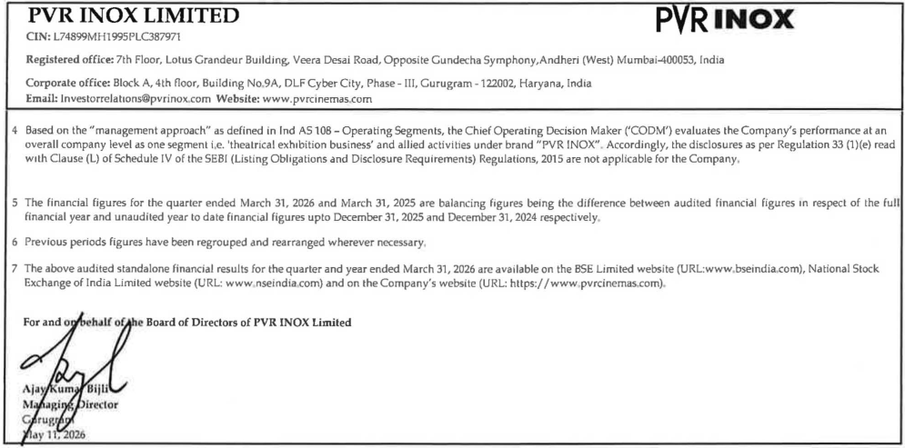
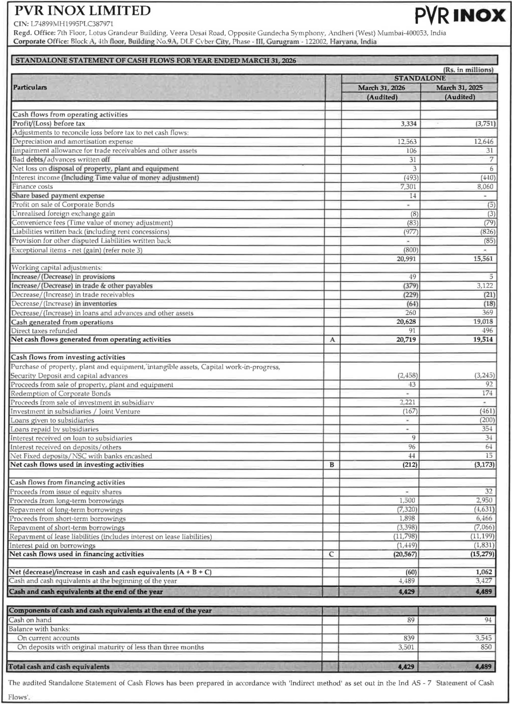
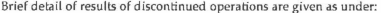
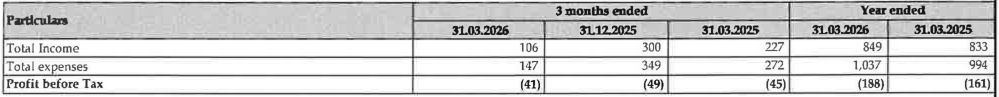
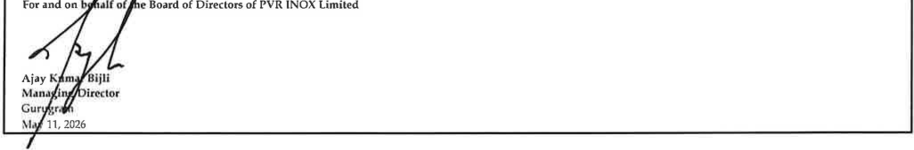

**[Image: d26a61a1-888f-47c4-847a-bcc1e2fac558.pdf-0001-00.png (242x64, 5.8KB)]**

May 11, 2026 

##### **The Manager – Listing National Stock Exchange of India Limited (Scrip Symbol: PVRINOX)** 

**The Manager – Listing BSE Limited (Scrip Code: 532689)** 

##### **<u>Sub: Outcome of Board Meeting</u>** 

Dear Sir / Madam, 

In continuation to our letter dated May 04, 2026 and pursuant to Regulations 30 and 33 of Securities and Exchange Board of India (Listing Obligations and Disclosure Requirements) Regulations, 2015 (“SEBI Listing Regulations”), the Board of Directors of the Company in its Meeting held today, inter-alia, approved the following: 

##### **1. Financial Results:** 

- a. The Audited Standalone and Consolidated Financial Statements for the Financial Year ended March 31, 2026; and 

- b. The Audited Standalone and Consolidated Financial Results for the 4th Quarter and Financial Year ended March 31, 2026. 

The said Financial Results were also reviewed by the Audit Committee in its meeting held today. 

Accordingly, please find enclosed herewith a Statement containing the audited Standalone and Consolidated Financial Results for the Fourth Quarter and Financial Year ended 31st March, 2026 duly signed by the Managing Director of the Company along with the copy of Auditor’s Report(s) received from M/s. S.R. Batliboi & Co. LLP, the Statutory Auditors of the Company. 

Further, it is confirmed that pursuant to Regulation 33(3)(d) the Statutory Auditors of the Company have issued Audit Reports with 'Unmodified Opinion' on the Audited Financial Results of the Company (Standalone and Consolidated) for the year ended March 31, 2026. 

The same shall be available on the website of the stock exchanges where equity shares of the Company are listed i.e., www.nseindia.com and www.bseindia.com and on Company’s website <u>https://www.pvrcinemas.com/investors-section</u> 

##### **2. Convening of Annual General Meeting:** 

Convening of 31st Annual General Meeting (“AGM”) of the Company through Video Conferencing/ Other Audio Visual Means, in accordance with the relevant circulars issued by the Ministry of Corporate Affairs and the Securities and Exchange Board of India. Kindly note that date and time of AGM shall be informed separately along with the Notice of AGM. 

**[Image: d26a61a1-888f-47c4-847a-bcc1e2fac558.pdf-0001-16.png (1092x112, 55.0KB)]**

**[Image: d26a61a1-888f-47c4-847a-bcc1e2fac558.pdf-0002-00.png (242x64, 5.8KB)]**

In continuation to our letter dated March 25, 2026, please note that the trading window will be open from May 13, 2026. 

The Board Meeting started at 12.30 PM (IST) and concluded at 01.40 PM (IST). 

You are requested to kindly take the same on record and inform all concerned. 

Yours sincerely, For **PVR INOX Limited** MURLEE Digitally signed by MANOHAR MURLEE MANOHAR JAIN Date: 2026.05.11 JAIN 13:45:01 +05'30' **Murlee Manohar Jain SVP - Company Secretary & Compliance Officer** 

Encl: A/a. 

**[Image: d26a61a1-888f-47c4-847a-bcc1e2fac558.pdf-0002-06.png (1092x112, 55.0KB)]**

**_S.R. BATLIBOI_ & Co.** **_LLP_ Chartered Accountants** 

4th Floor, Office 405 World Mark - 2, Asset No. 8 IGI Airport Hospitality District, Aerocity New Delhi - 110 037, India Tel : +91 11 4681 9500 

**Independent Auditor's Report on the Quarterly and Year to Date Audited Standalone Financial Results of the Company Pursuant to the Regulation 33 of the SEBI (Listing Obligations and Disclosure Requirements) Regulations, 2015, as amended** 

**To** 

**The Board of Directors of PVR INOX Limited** 

##### **Report on the audit of the Standalone Financial Results** 

##### **Opinion** 

We have audited the accompanying statement of quarterly and year to date standalone financial results of PVR INOX Limited (the "Company") for the quarter ended March 31, 2026 and for the year ended March 31, 2026 ("Statement"), attached herewith, being submitted by the Company pursuant to the requirement of Regulation 33 of the SEBI (Listing Obligations and Disclosure Requirements) Regulations, 2015, as amended (the "Listing Regulations"). 

In our opinion and to the best of our information and according to the explanations given to us, the Statement: 

- ._ is presented in accordance with the requirements of the Listing Regulations in this regard; and 

11. gives a true and fair view in conformity with the applicable accounting standards and other accounting principles generally accepted in India, of the net profit and other comprehensive loss and other financial information of the Company for the quarter ended March 31, 2026 and for the year ended March 31, 2026. 

##### **Basis for Opinion** 

We conducted our audit in accordance with the Standards on Auditing (SAs) specified under section 143(10) of the Companies Act, 2013, as amended ("the Act"). Our responsibilities under those Standards are further described in the "Auditor's Responsibilities for the Audit of the Standalone Financial Results" section of our report. We are independent of the Company in accordance with the Code of Ethics issued by the Institute of Chartered Accountants of India together with the ethical requirements that are relevant to our audit of the financial statements under the provisions of the Act and the Rules thereunder, and we have fulfilled our other ethical responsibilities in accordance with these requirements and the Code of Ethics. We believe that the audit evidence obtained by us is sufficient and appropriate to provide a basis for our opinion. 

##### **Management's and Board of Director's Responsibilities for the Standalone Financial Results** 

The Statement has been prepared on the basis of the standalone annual financial statements. The Board of Directors of the Company are responsible for the preparation and presentation of the Statement that gives a true and fair view of the net profit and other comprehensive loss of the Company and other financial information in accordance with the applicable accounting standards prescribed under Section 133 of the Act read with relevant rules issued thereunder and other accounting principles generally accepted in India and in compliance with Regulation 33 of the Listing Regulations. This responsibility also includes maintenance of adequate accounting records in accordance with the provisions of the Act for safeguarding of the assets of the Company and for preventing and detecting frauds and other irregularities; selection and application of appropriate accounting policies; making judgments and estimates that are reasonable and prudent; and the design, implementation and maintenance a . , <?J'i';r,...~cf _~f I_ •-,°o -,°o _Cl)° (  (_ y ~;... _*~ )r-_ S.R. Batliboi & Co. LLP. a Limited Liability Partnership with LLP Identity No. AAB-4294 _1,,~..,~*_ 1] Regd. Office: 22. Camac Street. Block 'B', 3rd Floor, Kolkata-700 016 ~WOE\..'(\\ 

**[Image: d26a61a1-888f-47c4-847a-bcc1e2fac558.pdf-0003-15.png (155x153, 25.7KB)]**

<!-- Start of picture text -->
. , <?J'i';r,...~cf ~f  I  •-,°o -,°o Cl)° (  (  y  ~;... *~  )r- 1,,~..,~*  1] ~WOE\..'(\\ <!-- End of picture text -->

# **_S.R. BArL1B01_ & Co.** **_LLP_** 

###### **Chartered Accountants** 

internal financial controls, that were operating effectively for ensuring the accuracy and completeness of the accounting records, relevant to the preparation and presentation of the Statement that give a true and fair view and are free from material misstatement, whether due to fraud or error. 

In preparing the Statement, the Board of Directors are responsible for assessing the Company's ability to continue as a going concern, disclosing, as applicable, matters related to going concern and using the going concern basis of accounting unless the Board of Directors either intends to liquidate the Company or to cease operations, or has no realistic alternative but to do so. 

The Board of Directors are also responsible for overseeing the Company's financial reporting process. 

##### **Auditor's Responsibilities for the Audit of the Standalone Financial Results** 

Our objectives are to obtain reasonable assurance about whether the Statement as a whole is free from material misstatement, whether due to fraud or error, and to issue an auditor's report that includes our opinion. Reasonable assurance is a high level of assurance but is not a guarantee that an audit conducted in accordance with SAs will always detect a material misstatement when it exists. Misstatements can arise from fraud or error and are considered material if, individually or in the aggregate, they could reasonably be expected to influence the economic decisions of users taken on the basis of the Statement. 

As part of an audit in accordance with SAs, we exercise professional judgment and maintain professional skepticism throughout the audit. We also: 

- Identify and assess the risks of material misstatement of the Statement, whether due to fraud or error, design and perform audit procedures responsive to those risks, and obtain audit evidence that is sufficient and appropriate to provide a basis for our opinion. The risk of not detecting a material misstatement resulting from fraud is higher than for one resulting from error, as fraud may involve collusion, forgery, intentional omissions, misrepresentations, or the override of internal control. 

- Obtain an understanding of internal control relevant to the audit in order to design audit procedures that are appropriate in the circumstances. Under Section l43(3)(i) of the Act, we are also responsible for expressing our opinion on whether the company has adequate internal financial controls with reference to financial statements in place and the operating effectiveness of such controls. 

- Evaluate the appropriateness of accounting policies used and the reasonableness of accounting estimates and related disclosures made by the Board of Directors. 

- Conclude on the appropriateness of the Board of Directors' use of the going concern basis of accounting and, based on the audit evidence obtained, whether a material uncertainty exists related to events or conditions that may cast significant doubt on the Company's ability to continue as a going concern. If we conclude that a material uncertainty exists, we are required to draw attention in our auditor's report to the related disclosures in the financial results or, if such disclosures are inadequate, to modify our opinion. Our conclusions are based on the audit evidence obtained up to the date of our auditor's report. However, future events or conditions may cause the Company to cease to continue as u going concern. 

- Evaluate the overall presentation, structure and content of the Statement, including the disclosures, and whether the Statement represents the underlying transactions and events in a manner that achieves fair presentation. 

# **_S.R. BATLIBOI_ & Co.** **_LLP_** 

###### **Chartered Accountants** 

We communicate with those charged with governance regarding, among other matters, the planned scope and timing of the audit and significant audit findings, including any significant deficiencies in internal control that we identify during our audit. 

We also provide those charged with governance with a statement that we have complied with relevant ethical requirements regarding independence, and to communicate with them all relationships and other matters that may reasonably be thought to bear on our independence, and where applicable, related safeguards. 

##### **Other Matter** 

The Statement includes the results for the quarter ended March 31, 2026 being the balancing figure between the audited figures in respect of the full financial year ended March 31, 2026 and the published unaudited year-to-date figures up to the third quarter of the current financial year, which were subjected to a limited review by us, as required under the Listing Regulations. 

**For S.R. BATLIBOI & Co. LLP** Chartered Accountants **ICAI Firm Registration Number:** 301003E/E300005 

**per Gaurav Kumar Gupta** Partner Membership No.: 509101 

Place: New Delhi Date: May 11, 2026 

##### **PVR INOX LIMITED** 

## **PVRINOX** 

CIN: L7489%1H1995PLC387971 

Registered office: 7th Floor, Lotus Grandeur Building, Veera Desai Road, Opposite Cundecha Symphony,Andheri (West) Nlumbai-400053, India Corporate office: Block A, 4th floor, Building No~9A, DLF Cyber City, Phase - 111, Curugram -122002, Haryana, India Email: lnvestorrelations@pvrinox~com Website: www,pvrc1nemas com 

||**STATEMENT OF AUDIT** **FOR TIIE QUARTER**|**ED STANDALONEFINA**  **ANDYEARENDEDMA**|**NCIALRESULTS** **RCH**31.2026|(Rs.in|millions,e,rc~p|lpersharedal;aJ|
|---|---|---|---|---|---|---|
||||**ST**|**ANDALONE**|||
||||**l monllilloftliliiil** ||**Yor'e** |**nded** |
|**S.N**|**o.l'ut:lculmi**|~~~~~|**~.17.2025**|**Jl.lXJ~**|**"'1...oo.m**|**;ll,lµ.2025,**|
|||**(Audited)** **ReferNote5**|**(Um.udited)**|**(Audited)** **ReferNote5**|**(Audited)**|**(Audited)**|
|1| Income||||||
||Revenue fromo~rations|**H,870**|**17,736**|**11.766**|63,912|54,424|
||Other income|760|361|567|1,770|1,637|
||Tola.I income|**15,630**|**18,097**|**12,JJJ**|**65,682**|**56,Q61**|
|2| **£,men.... **||||||
||Movieexhibitioncost|3,699|4,471|2,742|15,907|13,111|
||**Coruumpllon**of food and**l>l'vol"•~es**|1,072|**1,262**|**898**|**4,656**|**U15**|
||**Emplofee**benefits**expm,se**|**1,732**|**1,807**|**1,598**|**6,952**|6,461|
||Finance costs|1,723|1,798|1,949|7,301|8,060|
||Oepn.11Cltlf0nand amortisatione:ii.pense|3,259|3,129|3,121|**1µ63**|**12,6-16**|
||**OIiier e,roenses.**|**J,916**|**~.03~**|**J,690**|15,769|15,219|
||**Tol•loxDonsos**|**ISAOl**|16,500|13,998|63,148|59,812|
|3| Pcorn/{f:o!iS) before exceptional Hemsandtax(1-2)|229|1,597|(1,665)|2,534|**(3,7SJ)**|
|4|Excepuonolitems - net IR~in)/los, (Refer Note 3)|**(1.223]**|423|~~-~~|**(800)**||
|5| Profil/(l.os,)before lax**(3-4)**|U52|1,174|**(1.665)**|3,334|**(3,751)**|
|6|**Taxo1<peMc**||||||
||Current tax|~~.~~|~~-~~||||
||Taxrela:tinv.toearlier ve.,us||(73)||(731||
||Deferred tax|244|297|(437)|722|**(982)**|
||**Tol•I iax e,rncnse**|244|224|**(437)**|649|**(9821**|
|7|**rrofil/fLo****~~..~~) **after tax~~(~ ~~|**1,208**|**950**|**(1,228)**|**2,685**|**[2;769)**|
|8|OHu~.r comprehensive incomef(expense) (netoftax)||||||
||Items that will not be re-classifiedtoprofitorloss|(19)|**(2)**|**(3)**|(43)|(7)|
||llffm:Sthat willbere-classifiedtoprornor loss||||||
|9|**Tol•IcomprcJ,crul,•cincomr/(c~pense) (7+8)**|**1,IS9**|**948**|**(1,231)**|**2,6'12**|**(2.n6)**|
|10| **P•id-up e<juity share r.ipfl.tl(face value of**iu. 10**••ch, fully po.id)**|**982**|**982**|982|**982**|**982**|
|11|Olher.e.qu.ily includin~ Reserves[t~clud.ingRevaluation Reserve)||||**_72,381_**|**69,726**|
|12| **E•mlng,, per $hare on nel profil/(lo,sJ•ftertax(fully paid upequily** shareofRs. 10**o•<h) (refO"r**note**l)**||||||
||BasicCdrmnp_s.per share|1230|9.67|**(12.;i!J**|27,34|**f28.21))**|
||Diluted eMninP,sper share|12.25|9.63|**(12.51}**|27,23|**{28.lO)**|

Notes to the Statement of audited standalone financial results for the quarter and year ended March 31, 2026:- 

1 The above statement of audited standalone finant:1al results of PVR INOX Limited ("the Company") for the quarter and year ended March 31, 2026 have been reviewed by the Audit Committee and approved by the Board of Directors at its meeting held on May 11, 2026. The Statutory Auditors have carried out an audit of the above standalone financial results pursuant to Regulation 33 of the Securities and Exchange Board of India (Listing Obligations and Disclosure Requirements) Regulations, 2015, as amended and have issued an unmodified audit report. 

> 2 Earnings per share is not annualised for the quarter ended March 31, 2026, December 31, 2025 and March 31, 2025~ 

3 Exceptional items represents the followinp;: 

(i) On November 21, 2025, the Government of India notified the four new Labour Codes (the Code on Wages, 2019, the Industrial Relations Code, 2020, the Code on Social Security, 2020, and the Occupational Safety, Health and Working Conditions Code, 2020) consolidating 29 existing labour laws. Th~ Company has assessed and c1ccounted for the incremental impact of these changes c1mounting to Rs. 392 million with the best information available and guidance provided by the [nstitute of Chartered Accountants of India. The Company continues to monitor the finalisation of Central/ State Rules and clarifications from the Government on other aspects of the Labour Code and would provide appropriate accounting effect as and when such clarifications are issued/rules are notified, 

(ii) The Company disposed of its entire shareholding of 93 27% of the paid-up equity share capital of its subsidiary "Zea Maize Private Limited" for a consideration of Rs. 2,221 million (net of expenses) and consequently "Zea Maize Private Limited" has ceased to be a subsidiary of the Company with effect from January 29, 2026. The carrying value of such investment as on date of sale was Rs. 951 million. The excess of consideration received over investment value, Rs. 1,270 million (net of expenses) is disclosed as "Exceptional (tern" in the standalone financial results. 

(iii) During the year, capital work in progress amounting to Rs. 78 million relating to a property under development has been impaired on account of dispute arising with the landlord. 

**[Image: d26a61a1-888f-47c4-847a-bcc1e2fac558.pdf-0006-12.png (155x153, 22.9KB)]**

**[Image: d26a61a1-888f-47c4-847a-bcc1e2fac558.pdf-0007-00.png (995x493, 197.4KB)]**

<!-- Start of picture text -->
PVR INOX LIMITED  P RINOX CIN: L74899MHl995PL087971 Registered office: 7th Floor, Lotus Grandeur Building. Veera Desai Road, Opposite Gundecha Symphony,Andheri (West) Mumbai-400053, India Corporate office: Block A, 4th noor, Building No.9A,  DLF Cyber City,  Phase- III, Gurugram -122002, Haryana, India Email: lnvestorrelahons@pvrinox.com Website: www.pvrc1nemas.com 4 Based on the "management approach" as defined  in  Ind  AS 108 - Operating Segments, the Chief Operating Decision Maker ('CODM') evaluates the Company's performance at an overall company level as one segment i.e.  'theatrical exhibition business' and allied activities under brand "PVR INOX". Accordingly, the disclosures as per Regulation 33  (1)(e)  read with Clause (L)  of Schedule IV  of the SEBI  (Listing Obligations and Disclosure Requirements) Regulations, 2015 are not applicable for the Company, The financial figures for the quarter ended March  31,  2026  and  March 31,  2025  are balancing figures being the difference between audited financial figures m respect of the fult financial year and unaudited year to date financial figures upto December 31, 2025 and December 31, 2024  respectively. 6 Previous periods figures have been regrouped and rearranged wherever necessary, 7 The above audited standalone financial results for the quarter and year ended March 31, 2026 are available on the BSE  Limited website (URL:www.bseindia.com), National Stock Exchange of India Limited website (URL:  www nseindia com} and on the Company's website (URL:  https:/ /www pvrcinemas.com}. <!-- End of picture text -->

**[Image: d26a61a1-888f-47c4-847a-bcc1e2fac558.pdf-0007-01.png (157x155, 23.1KB)]**

**PVRINOX** 

## **PVR INOX LIMITED** 

CIN: L74899MH1995PLC387971 

Regd. Office: 7th Floor, Lotus Grandeur Building, Veera Desai Road, Opposite Gundecha Symphony,Andheri (West) lvlumbai-400053, India Corporate Office: Block **A,** 4th noor, Building No.9A, DLF Cyber Citv, Phase- ID, Gu ru <u>g.ram -122002,</u> Harvana, India 

|~~I~~**STANDALONE BALANCE SHEETASATMARCH 31, 2026**||~~I~~|
|---|---|---|
||**STANDA**|**(Rs.**in**millions)** **LONE**|
|**Particulars**|**March 31, 2026**|**March 31, 2025**|
||**_(Audited)**|**(Audited)**|
|**Assets**|||
|**Non-current**assets|||
|Property, plantandequipment|28,538|30,061|
|Capitalwork-in-progress|31:i|947|
|Right-of-use assets|46,228|49,649 |
|InvestmentProperty Goodwill|143 57,336|146 37,336|
|Otherintangible assets |1,050|1,143|
|Financial assets|||
|Investmentsinsubsidiaries&jointventure|1,762|2,546|
|Otherfinancial assets|4,22::,|4,299|
|Deferred tax assets(net) |5,117 |5,823 |
|Income tax assets(net)|839|781|
|Othernoncurrentassets|608|757|
|**Total non-current assets** **A**|**1,46,161**|**1,53,490**|
|**Current assets** |||
|Inventories|724|660|
|Financial assets |||
|Investments(#)|~~-~~|~~-~~|
|Tradereceivables |2,269 |2,061 |
|Cashandcashequivalents|4,429|4,489|
|Bankbalancesotherthancashandcash euivalentsabove|33|31|
|q,   Loans| 87| 8S|
|Otherfinancial assets Othercurrentassets|99 982|195 1,138|
|**Total current assets** **B**|**8,623**|**8,659**|
|**Total assets [A+B]**|**1,54,784**|**1,62,149**|
|**Equity andliabilities**|||
|Equity|||
|Equity sharecapital|982|982|
|Otherequity|72,387|69,726|
|Totalequity **A**|**73,369**|**70,708**|
|**Liabilities**|||
|**Non-current liabilities**|||
|Financial liabilities|||
|Borrowings|4,592|9,198|
|Lease liabilities|52,493|56,012|
|Otherfinancial liabilities |1,236 |1,328 |
|Provisions|328|132|
|Othernon-currentliabilities|5|82|
|**Total non-current liabilities** **B**|**58,654**|**66,752**|
|**Current liabilities** |||
|financialliabilities|||
|Borrowings Lease liabilities|2,994 7,532|S,710 6,460|
|Tradepayables|||
| Totaloutstanding duesofmicro enterprisesandsmallenterprises|443|217|
|Totaloutstandingduesof creditorsotherthanmicroenterprisesandsmallenterprises|4928|5677|
| Otherfinancial liabilities|,  3,931|, 4,442 |
|Provisions Othercurrentliabilities|425 2,508|374 1,809|
|**Total current liabilities** C|**22,761**|**24,689**|
|**Totalequityandliabilities[A+B+q**|**1,54,784**|**1,62,149**|
| _(#)Amo1I11t_**_llC!io1t•Rs. 1 wWio11_**|||

**[Image: d26a61a1-888f-47c4-847a-bcc1e2fac558.pdf-0008-05.png (158x151, 22.1KB)]**

**[Image: d26a61a1-888f-47c4-847a-bcc1e2fac558.pdf-0009-00.png (1016x1395, 926.3KB)]**

<!-- Start of picture text -->
PVR INOX LIMITED CIN: L74899MH1995PLC387971  PVRINOX Regd. Office: 7th Floor, Laius Grandeur Building, Veera Desai Road, Opposite Gundecha Symphony,  Andheri (West) Mumbai-400053, India Corpar.ite  Office: Block  A, 4th  floor, BuUdlnl'.  No.9A, DLF C,·ber  City, Phase - Ill, Curu9.ram  - 122002, Ha,yana, lndla I  STANDAI:oNE Sll'A:rEMl!NI"  o.F  CASlr  news ma  YEAR ENDED  MARea~2026,  I CRs.  in  millions} STANDALONE ,Particulan  March 31, 2026  March  31, 2025 IAudiledl  (Audited) Cash flows from  operatin~ activities Profit/(Loss) before tax  3,334  [3,751) Adjustments to  reconcile loss before tax to net cash flows: Depreciation and an10rtisation expense  12,:,63  12,646 Impairment allowance for  trade receivables and other assets  106  31 Bad  debts/  advances written  off  31  7 Net loss on  disposal  o( properly, plant and equipment  3  6 Interest income  (lndudin!l Time value ol monc,· adjuslmcnt) (493) (HO) Finance costs  7,301  8,060 Share basc:d  oa\•ment expense  14  - Profit on sale  o( Corpora le  Bonds  .  (5) Unrealised foreign exchange gain  (8) [3) Convenience fees  (Time value of money adiustn1ent) (83) (79) Liabilities written back (including rent concessions) (977) [826) Provision for other disputed Liabilities written back  - (85) Exceptional items - net (!!ain) (refer note 3) (800) - 20,991  15,561 Working capital adjustment, lncrease/ (Decrcasc) in  provisions  49  5 lncre,1se/(Dccreas~) in  trade  &  olher pavabl<!S  (379) 3,122 Decrease/ (Increase ) in trade receivables  (229) (21) Decrease/ (Increase) in invl'.nlorfes  (6-l) (t8) Decrease/ (Ini:rease) in loans and advances and other assets  260  369 Cash e:enerated from overations  20,628  19,018 Direct taxes refunded  91  496 Net cash flows generated from operating activities  A  20,719  19,514 ,Cash flows from  investing activities Purchase of property, plant and equipment; intangible assets, Capital work-in-progress, Securitv Deoosit and caoital advances  (2,458) (3,245) Proceeds from Sel le of oroperty, olant and eauivment  43  92 Redemption  o( Corporate Bonds  174 Proceeds from sale of investment in subsidiarv  2,221  . Investment in subsidiaries/ Joint Venture  (167) (461) loa11.s  Q'lven  to subsidiaries  .  (200) Loans revaid bv subsidiaries  .  354 Interest received on loan to subsidit1ries  9  34 Interest received on deposits/ others  96  64 Net Fixed deposits/NSC wiU1  banks encashed  44  15 Net cash flows used in investing activities  B  (212) (3,173) Cash flows from financing activities Proceeds from issue of eauitv shares  - 32 Proceeds from lonQ:-ternl borrowinQ:s  1,:,00  2,950 Repavment of long-term borrowings  (7,320) (4,631) Proceeds from short-term borrowinS?s  1,898  6,466 Repavment  of  sbort-term borrowings  (3,398) (7,066) Reoavment of lease liabilities (includes interest on lease liabilities) {11,798) (11, 199) Interest oaid on borrowings  (1,449) (1,831) Net cash flows used  in  financinl( activities  C  (20,567) (15,279) Net (decrease)/increase in  cash and cash eQuivalents (A  +  B  +  C) [60) 1,062 Cash and cash equivalents at the beginning of the year  4,489  3,427 Gum and ash eauivalents  ill  the end of the year  4,429  '.489 Components of cash and cash equivalents at the end of the year Cash on hand  89  94 Ba lance with banks: On current accounts  839  3,545 On deposits with original maturit,· of less than U1ree  monU1s  3,501  850 Total nsh a11d  ~  equivalml#  f,429  U89 The  audited Standalone Statement of  Cash  Flows  has been  prepared  in accordance with  'Indirect  method'  as set  out in the  Ind  AS  - 7 'Statement of Cash Flows'. <!-- End of picture text -->

**[Image: d26a61a1-888f-47c4-847a-bcc1e2fac558.pdf-0009-01.png (157x155, 23.0KB)]**

**_S.R. BATLIBOI_ & Co.** **_LLP_** 

4th Floor, Office 405 World Mark - 2, Asset No. 8 IGI Airport Hospitality District, Aerocity New Delhi - 110 037, India 

**Chartered Accountants** 

Tel : +911146819500 

**Independent Auditor's Report on the Quarterly and Year to Date Consolidated Financial Results of the Company Pursuant to the Regulation 33 of the SEBI (Listing Obligations and Disclosure Requirements) Regulations, 2015, as amended** 

##### **To** 

**The Board of Directors of PVR INOX Limited** 

##### **Report on the audit of the Consolidated Financial Results** 

##### **Opinion** 

We have audited the accompanying statement of quarterly and year to date consolidated financial results of PVR INOX Limited ("Holding Company") and its subsidiaries (the Holding Company and its subsidiaries together referred to as ."the Group") and its joint venture for the quarter ended March 31, 2026 and for the year ended March 31, 2026 ("Statement"), attached herewith, being submitted by the Holding Company pursuant to the requirement of Regulation 33 of the SEBl (Listing Obligations and Disclosure Requirements) Regulations, 2015, as amended ("Listing Regulations") 

In our opinion and to the best of our information and according to the explanations given to us and based on the consideration of the reports of the other auditors on separate audited financial statements of the subsidiary/joint venture, the Statement: 

1. includes the results of the following entities; 

   - PVR INOX Pictures Limited (Subsidiary Company) 

   - PVR INOX Lanka Limited (Subsidiary Company) 

   - Zea Maize Private Limited (Subsidiary Company up to January 29, 2026) 

   - Devyani PVR INOX Private Limited (Joint Venture) 

11. are presented in accordance with the requirements of the Listing Regulations in this regard; and 

- m. gives a true and fair view in conformity with the applicable accounting standards, and other accounting principles generally accepted in India, of the consolidated net profit and other comprehensive loss and other financial information of the Group for the quarter ended March 31, 2026 and for the year ended March 31, 2026. 

##### **Basis for Opinion** 

We conducted our audit in accordance with the Standards on Auditing (SAs), as specified under Section 143(10) of the Companies Act, 2013, as amended ("the Act"). Our responsibilities under those Standards are further described in the "Auditor's Responsibilities for the Audit of the Consolidated Financial Results" section of our report. We are independent of the Group and its joint venture in accordance with the 'Code of Ethics' issued by the Institute of Chartered Accountants of India together with the ethical requirements that are relevant to our audit of the financial statements under the provi!Jion3 of tho Aot and tho Rulo3 thoroundor, and \\'O ha..-o fulfillod our othor othioal rooponoibilitioo in accordance with these requirements and the Code of Ethics. We believe that the audit evidence obtained by us and other auditors in terms of their reports referred to in "Other Matter" paragraph below, is sufficient and appropriate to provide a basis for our opinion .. 

##### **Management's and Board of Director's Responsibilities for the Consolidated Financial Results** 

The Statement has been prepared on the basis of the consolidated annual financial statem Holding Company's Board of Directors are responsible for the preparation and presentation o 

S.R. BatllbOI & Co. LLP. _a_ Limited Liability Partnership with LLP Identity No. AAB-4294 **RO<Jd.** OJ/ice: 22, Camac _Street,_ Block 'B', 3rd Floor, Kolkata-700 016 

# **_S.R. BArLIBo1_ & Co.** **_LLP_** 

###### **Chartered Accountants** 

Statement that give a true and fair view of the net profit and other comprehensive loss and other financial information of the Group including its joint venture in accordance with the applicable accounting standards prescribed under section 133 of the Act read with relevant rules issued thereunder and other accounting principles generally accepted in India and in compliance with Regulation 33 of the Listing Regulations. The respective Board of Directors of the companies included in the Group and of its joint venture are responsible for maintenance of adequate accounting records in accordance with the provisions of the Act for safeguarding of the assets of their respective companies and for preventing and detecting frauds and other irregularities; selection and application of appropriate accounting policies; making judgments and estimates that are reasonable and prudent; and the design, implementation and maintenance of adequate internal financial controls, that were operating effectively for ensuring the accuracy and completeness of the accounting records, relevant to the preparation and presentation of the Statement that give a true and fair view and are free from material misstatement, whether due to fraud or error, which have been used for the purpose of preparation of the Statement by the Directors of the Holding Company, as aforesaid. 

In preparing the Statement, the respective Board of Directors of the companies included in the Group and of its joint venture are responsible for assessing the ability of their respective companies to continue as a going concern, disclosing, as applicable, matters related to going concern and using the going concern basis of accounting unless management either intends to liquidate the Group or to cease operations, or has no realistic alternative but to do so. 

The respective Board of Directors of the companies included in the Group and of its joint venture are also responsible for overseeing the financial reporting process of their respective companies. 

##### **Auditor's Responsibilities for the Audit of the Consolidated Financial Results** 

Our objectives are to obtain reasonable assurance about whether the Statement as a whole is free from material misstatement, whether due to fraud or error, and to issue an auditor's report that includes our opinion. Reasonable assurance is a high level of assurance, but is not a guarantee that an audit conducted in accordance with SAs will always detect a material misstatement when it exists. Misstatements can arise from fraud or error and are considered material if, individually or in the aggregate, they could reasonably be expected to influence the economic decisions of users taken on the basis of the Statement. 

As part of an audit in accordance with SAs, we exercise professional judgment and maintain professional skepticism throughout the audit. We also: 

- Identify and assess the risks of material misstatement of the Statement, whether due to fraud or error, design and perform audit procedures responsive to those risks, and obtain audit evidence that is sufficient and appropriate to provide a basis for our opinion. The risk of not detecting a material misstatement resulting from fraud is higher than for one resulting from error, as fraud may involve collusion, forgery, intentional omissions, misrepresentations, or the override of internal control. 

- Obtain an understanding of internal control relevant to the audit in order to design audit procedures that are appropriate in the circumstances. Under Section 143(3)(i) of the Act, we are also responsible for expressing our opinion on whether the company has adequate internal financial controls with reference to financial statements in place and the operating effectiveness of such controls. 

- Evaluate the appropriateness of accounting policies used and the reasonableness of accounting estimates and related disclosures made by the Board of Directors. 

# **_S.R. BATLIBOI_ & Co.** **_LLP_** 

###### **Chartered Accountants** 

- Conclude on the appropriateness of the Board of Directors' use of the going concern basis of accounting and, based on the audit evidence obtained, whether a material uncertainty exists related to events or conditions that may cast significant doubt on the ability of the Group and its joint venture to continue as a going concern. Ifwe conclude that a material uncertainty exists, we are required to draw attention in our auditor's report to the related disclosures in the Statement or, if such disclosures are inadequate, to modify our opinion. Our conclusions are based on the audit evidence obtained up to the date of our auditor's report. However, future events or conditions may cause the Group and its joint venture to cease to continue as a going concern. 

- Evaluate the overall presentation, structure and content of the Statement, including the disclosures, and whether the Statement represent the underlying transactions and events in a manner that achieves fair presentation. 

- Obtain sufficient appropriate audit evidence regarding the financial results/financial information of the entities within the Group of which we are the independent auditors and whose financial information we have audited, to express an opinion on the Statement. We are responsible for the direction, supervision and performance of the audit of the financial information of such entities included in the Statement of which we are the independent auditors. For the other entities included in the Statement, which have been audited by other auditors, such other auditors remain responsible for the direction, supervision and performance of the audits carried out by them. We remain solely responsible for our audit opinion. 

We communicate with those charged with governance of the Holding Company and such other entities included in the Statement of which we are the independent auditors regarding, among other matters, the planned scope and timing of the audit and significant audit findings, including any significant deficiencies in internal control that we identify during our audit. We also provide those charged with governance with a statement that we have complied with relevant ethical requirements regarding independence, and to communicate with them all relationships and other matters that may reasonably be thought to bear on our independence, and where applicable, related safeguards. 

We also performed procedures in accordance with the Master Circular issued by the Securities Exchange Board oflndia under Regulation 33 (8) of the Listing Regulations, to the extent applicable. 

#### **Other Matter** 

The accompanying Statement includes the audited financial statements and other financial information, in respect of: 

- one subsidiary, whose financial statements include total assets of Rs. 410 million as at March 31, 2026, total revenues of Rs. 97 million and Rs. 410 million, total net profit /(loss) after tax of Rs. (9) million and Rs. 6 million, total comprehensive income/(loss) of Rs. (5) million and Rs. 10 million, for the quarter and the year ended on that date respectively, and net cash outflows of Rs. 19 million for the year ended March 31, 2026, as considered in the Statement which have been audited by their respective independent auditor. 

- one joint venture, whose financial statements include Group's share of net loss of Rs. 1 million and Rs. 5 million and Group's share of total comprehensive income of Rs. (1) million and Rs. (5) million for the quarter and for the year ended March 31, 2026 respectively, as considered in the Statement whose financial statements, other financial information have been audited by their respective independent auditor. 

The independent auditor's report on the financial statements/financial information of these entities have been furnished to us by the Management and our opinion on the Statement in so far as it re 

# **_S.R. BATLIBOI_ & Co.** **_LLP_** 

###### **Chartered Accountants** 

amounts and disclosures included in respect of these subsidiary and joint venture is based solely on the reports of such auditors and the procedures performed by us as stated in paragraph above. 

The above subsidiary is located outside India whose financial statements and other financial information have been prepared in accordance with the accounting principles generally accepted in its respective country and which have been audited by other auditor under generally accepted auditing standards applicable in its respective country. The Holding Company's management has converted the financial statements of such subsidiary located outside India from accounting principles generally accepted in its respective country to accounting principles generally accepted in India. We have audited these conversion adjustments made by the Holding Company's management. Our opinion in so far as it relates to the balances and affairs of such subsidiary located outside India is based on the report of other auditors and the conversion adjustments prepared by the management of the Holding Company and audited by us. 

Our opinion on the Statement is not modified in respect of the above matters with respect to our reliance on the work done and the reports of the other auditors. 

The Statement includes the results for the quarter ended March 31, 2026 being the balancing figures between the audited figures in respect of the full financial year ended March 31, 2026 and the published unaudited year-to-date figures up to the end of the third quarter of the current financial year, which were subjected to a limited review by us, as required under the Listing Regulations. 

**For S.R. Batliboi** & **Co. LLP** Chartered Accountants **ICAI Firm Registration Number:** 301003E/E300005 

**per Gaurav Kumar Gupta** Partner Membership No.: 509101 

Place: New Delhi Date: May 11, 2026 

#### **PVR INOX** LIMITED 

## **PVRINOX** 

CJN: L74899MH1995PLC387971 

Registered office: 7th Floor, Lotus Grandeur Building, Veera Desai Road, Opposite Gundecha Symphony, Andheri (West) Mumbai-400053, India Corporate office: Block A, 4th floor, Building No.9A, DLF Cyber City, Phase - III, Gurugram -122002, Haryana, India Email: Investorrelc1tions@pvrinox.com Website: www.pvrc1nemas.com 

||STATEMENT OF A FORTHE QUA|UDITED CONSOLIDATE RTERANDYEAREND|D FINANOALRESU ED MARCH31,,2026|LTS|||
|---|---|---|---|---|---|---|
||||CO 3monthsended|(Rs, i NSOLIDATED|nmillions, ci«c **Yutr** |plpersharedata) **Ml'd.** |
|**S-No.**|**P-.u;tln.lms**|**n.03.2026**|**31.122025**|**3L03.2025**|**SJ.o:m&26**|**n.03.2025**|
|||**(Audited)** **RderNote7**|**(Umudited)** **ReferNoteS**|**(Audited)** **Refer Note5&**7|**(Audited)**|**(Audited)** **ReferNoteS**|
|1|lncomc||||||
||Revenue from opcriltions|15.473|18A97|12,299|66,462 |56,999 |
||Other income|766|400|586|1,835|1,709 |
||Tofal income|16,239|18,897|**12,&si**|**68,297**|**58,708**|
|2|E,ponses||||||
||Movie exhibition cost|3,507|4,044|4523|14,602|11,il!O|
||Consumptfon of food and bcv<ir11p,cs|1,081|1,271|907|4,695|4,349|
||ivlO\'ieproduct.ion and distribution|624|1,013|584|3,160|3,281|
||EmploYC<?benefits expense|1,778|1,l!26|1,615|7,063|6,540|
||Finance costs |1,730 |1,805 |1,95; |7,328 |8,087 |
||Depn:iclll.Uonandamortisation|3,305|3,161|5,155|12.70-I|12,n4|
||OtherCXPl'llSl!S|3,965|~.091|3,T/6|15,988|15,476|
||Tol~l•<:><Oenses |15,990|17,211|**14,515**|**65,540**|**62,7.U**|
|3|Profil/(Loss) beforeshareinnetlossofjointventure, e.ceplion•litemsandtax (1-2)|249|1,686|(1,630)|2,757|(3,579)|
|4|Sharo in net lossofjointventure|(I)|(l)|(2)|(5)|(3)|
|5|rroRl/(Loss)before <:X<eptlonil itemsandtax(3+4)|248|1,685|**(1,632)**|2,752|(3,582)|
|6|F.xceplion,11 items - net loss(Refer Note4)|40|443|~~-~~|483|~~-~~|
|7|Profi\f(Loss)before tax(5-6)|208|1,24Z|(\,632)|2,269|(3,582)|
|8|Taxe"Jlense||||||
||Currenttax|13|23 |26|62 |62|
||Tctx~ l~tlnr; toearlieryears|~~-~~|(13)|~~.~~|(73)|~~-~~|
||Deferred tax|45|289|(450)|519|**(996)**|
|| To1alInexpense| 58| 239|('124)| 508| (93<11|
|9|Profil/(Loss)after tax from contin11ing **opcr,tions**(7-8)|150|Ul03|(1,2031|1,761|(2.648)|
|10|Loss beforetclxfrom discontinued o~ rtilfons: |(~1 )|(49J|(45)|f!Slll|(161)|
|11|Ex_cept:ion,,Igainon d f:.po5i!!ofdist;onti'nucdgperi1tfqn5 (Refer||||||
||Note 5)|1,952||~~.~~|1,952|-|
|12|Tax expense of discontinued operations|197|||197||
|13|Profit/(Loss) dfter exceptional itemandtax fromdiscontinued ooer•llons !10+11-121|1,714|(49)|(45)|1,567|(161)|
|14|Profi\ffloss)for theyeM(9+13)|1,86'1|954|(1,2.53)|3,328|{2,809)|
|15|Otherrompr,:l1ensivcincom~/(eJ<p~.nse) (nelofLlx)||||||
||Items lh,Hwill notbl,recl,,ssllledtoprontorlossfrom||||||
|| continuingoperations|(22)|(1)|(2)|(<15)|(7)|
||Items that willbereclassifiedtoprofit or loss from continuing |3|(1)|(2)|4|4|
||ojleralions||||||
||Hemsthatwillnotbe reclassifiedtoprofitorloss from|-|(3)|-|(1)|1|
||d!sconlln1iedoperations||||||
|16|Tol~l <om1neh._n<ive incomo/(e•pensc)|**1,1145**|949|(1,257)|3,286|(2,811)|
||Ne! r1ofl\ffloss) attributablelo:||||||
||Owners of theCompany|1,867|957|(1.250)|3,~1|(2,796)|
||Non--conlrall[nginterests|(3)|(3)|(3)|(13)|(13)|
||Othercomprehensiveim:omo/(.,xpense)41lribulableto:||||||
||Owners of the Company|(19)|(3)|(<I)|(42)|(2)|
||Non-conlrolllnginterests (~)||~~-~~||||
||To~Icomprehensiveincom<V(<:XJ>ense) attributableto:||||||
||Owners of theCompany|L8-18|952|{1,254)|3,299|(2,7118)|
||Non-<onlrot11n·~ interests|(3)|(3)|(3)|(13)|(H)|
|17|Paid-11pequitysharecapital (facevalueofRs, 10 each,fully |982|982|982|982|982|
||**paid)**||||||

**[Image: d26a61a1-888f-47c4-847a-bcc1e2fac558.pdf-0014-05.png (155x155, 21.9KB)]**

#### **PVR INOX LIMITED** 

## **PVRINOX** 

CIN: L74899MH1995PLC387971 

Registered offict•: 7th Floor, Lotus Grandeur Building, Vee rn Desai Rodd, Opposite Gundecha Symphony, Andheri (West) Mumbai-400053, India 

Corporate office: Block A, 4th ~oar, Building No,9A, DLF Cyber City, Phase - III, Gurugram -122002, Haryana, India Email: Investorrelations@pvrinox.com Website: www.pvrcinemas.com 

|18   |OtherequityincludingReserves (excludingRevaluation Reserve)||||72,805|69,533|
|---|---|---|---|---|---|---|
|19     |Earningspershareonnet profif/(Joss) after tax (fullypaidup equityshareofRs. 10ec1.ch)fromcontinuingoperations (refer nole3)||||||
||Basic e,uningsper sh.ue|1.53|10.22|(12.30)|17.93|(26.97)|
||Diluted earnings per sh,ue|1.55|JO_l6|(12.30)|17.86|(26.97)|
|20     |**Earnings per share on net profil/(Joss) aftertax(fully paid up** equityshareofRs.10each) fromdiscontinuedoperations (refer note3)||||||
||Bi1sicearnings pershue|17.47|(0.47)|(0.44)|16.08|(1.51)|
||Diluted earningsper share|17.39|(0.47)|(0.44)|16.01|(1.51)|
|21     |Earningspershareon net profif/(loss) after tax (fullypaidup equityshareofRs. 10 each) fromcontinuinganddiscontinued operations(refer note3)||||||
||Basic earningsper share|18.99|9.75|(12.73)|34.01|(28.48)|
|_(_|Diluted earningsper share _II)_,-\n,or,,rf_belowRs. 1million_|18.95|9.70|(12.73)|33.87|(28.48)|

Notes lo the Statement of audited consolidated financial results for the quarter and year end ed March 31, 2026 ;- 

- 1 The Chief Operating Decision Maker (CODM) reviews the performance of the Group and its joint venture as under: 

(i) Movie exhibition 

(ii) Movie production & distribution 

(iii) Others: Till pre\ ious year, segment information relating to "others" consisted mc1jorly of sc1les of food and beverages and imnMteric1l food court income. Since, lhe operations relating to Zea Maize Priv.tte Limited (comprising of sale of food and beverages) has been disposed off in the current year (Also refer note 5), the food court income is no more considered to be separate segment, Accordingly, the information relating to food court income is disclosed along with movie exhibition segment being integral pilrl thereof in all the finam:ic1l periods presented. 

The requisite segment reporting related disclosures for all periods presented are as follows: 

|||**3 months ended**||**Year  **|(Rs, inmillions) **mded**|
|---|---|---|---|---|---|
|**:s.No.Putkubrs**|**31.03.2026**|**3L12.2025**|**3L03.202S**|**31.03.2026**|**31.03'2:025**|
||**~ udiled)** **ReferNote7 **|**(.Umuditeill** **Refu.No.teS**|**("1ldil,d)** **Jtcltt****_Nolle5_**_It1 _|**(Auditedl**|**(Audi!N.)** **..RtcerNotes**|
|1 SegmentRevenues||||||
|Movie exhibition|15,717|18,198|12,393|**66.079**|**56,108**|
|MovieproducUon and distribution|756|1,179|820|**3.71~**|**3,866**|
|**Others**|||~~.~~|~~.~~|.|
|lntc.r segm~ntrevenu~/ellminiltfon|**(23<1)**|**(<180)**|**(328)**|**(1,-196)**|(1,566)|
|**Total**|**16,239**|**18,697**|**12,885**|**_68,2'11_**|**58,708**|
|_2_ **Stgmcnl. Results**||||||
|Movie exhibition|218|**1.600**|**(1,683)**|2,536|**(3,767)**|
|Movieproduction and distribution|29|86|51|216|185|
|Others"'||~~.~~|~~.~~||~~.~~|
|Inter**.segment resulls/elin1lna1Jon **|1|(I)|~~.~~||~~.~~|
|Profil/(Loss) before exceptional items .ind tax from (Ontinui.ng optralio~|**248**|**1,685**|**(1,632)**|2,752|(3,582)|
|Profir/(Loss) before exceptional itemsandtax from discontinuedoperations (refer noteS)|**(41)**|**(49)**|**(45)**|**(188)**|**(161)**|
|3 **Segment Assets**||||||
|Movie exhibition|**1,17,321**|1,50,321|1,53,278|1,47,321|**l,il.278**|
|**Movieproductionanddlstrlbution**|**2.710**|2,331|1,948|2,710|1,948|
|**Others•**|.|898|692|~~.~~|692|
|**Total**|**1.50,031**|**1,53,5,0 **|**1,55,918**|**1,50,031**|**1,55,918**|
|Unallocable assets|6,092|6,313|**6,706**|**6.092**|6,706|
|4 **SeRIDCnl Liabilities**||||||
|Movie exhibition|81,551|86,829|91,578|**81.551**|**91,578**|
|**Movieproducl!on and dlslrl.bullon**|785|493|147|785|147|
|**Othe,s•**||510|353|~~.~~|353|
|**Total**|**82,336**|**87,'132**|**92,078**|**82.336**|**92.()78**|
|Unallocable liabilities||5|12|~~.~~|12|

**[Image: d26a61a1-888f-47c4-847a-bcc1e2fac558.pdf-0015-13.png (153x156, 22.4KB)]**

**PVRINOX** 

#### **PVR INOX LIMITED** 

CIN: L74899MH1995PLC387971 

**Registered office:** 7th Floor, Lotus Grandeur Building, Veera Desai Road, Opposite Gundecha Symphony, Andheri (West) Mumbai-400053, India **Corporate office:** Block A, 4th floor, Building No.9A, DLF Cyber City, Phase - III, Gurugram -122002, Haryana, India Email: Investorrelations@pvrinox,com Website: www,pvrcinernas.corn 

2 The above statement of audited consolidated nn11nd i1 I re-s uits of PVR lNOX IJmrlcd and its subsidiaries (collectively referred to as "Group") and Joint Venture fo r the q ua-rtcr and year ended March 31, 2026 have been reviewed by the Audit Committee and approved by the Board of Directors at its meeting held on May 11, 2026. The Statutory Auditors have carried out an audit of the above consolidated financial results pursuant to Regulation 33 of the Securities and Exch,rnge Board of India (Listing Obligations and Disclosure Requirements) Regulations, 2015, as amended and have issued an unmodified audit report. 

3 Earnings per share is not annualised for the quarter ended March 31, 2026, December 31, 2025 and March 31, 2025. 

4 Exceptional items represents the following: 

(i) On November 21, 2025, the Government of India notified the four new Labour Codes (the Code on Wages, 2019, the Industrial Relations Code, 2020, the Code on Social Security, 2020, and the Occupational Safety, Health and Working Conditions Code, 2020) consolidating 29 existing labour laws. The Group had assessed and accounted for the incremental impact of these changes amounting to Rs. 405 million with the best information available and guidance provided by the Institute of Chartered Accountants of lndic1 .The Group continues to monitor the finc1lisation of Central/ State Rules and clarifications from the Government on other aspects of the Labour Code and would provide appropriate accounting effect as and when such clarifications are issued/rules are notified. 

(ii) During the year, capital work in progress c1mounting to Rs. 78 million relating to a property under development has been impaired on account of dispute arising with the landlord. 

5 **<u>J!ale or Zea M•t,e l'rivate Um.it~d (ZMP!-1</u>** 

The Holding Compc1ny disposed of its entire shc1reholding of 93.27% of the paid-up equity share capital of its subsidiary "Zea Maize Private Limited" for a consideration of Ri. 2,221 million (net of expenses) and consequently "Zea Maize Private Limited" has ceased to be a subsidiary of the Company with effect from January 29,2026, The carrying va lu(' of net assets of the subsidiary as on date of sale was Rs.269 million. The excess of consideration received over net assets, Rs. 1952 million is disclosed as "Exceptional Item 11 in lhc consolidated fin,rncial results as part of discontinued operations in accordance with IND AS 105. 

**[Image: d26a61a1-888f-47c4-847a-bcc1e2fac558.pdf-0016-11.png (382x13, 4.9KB)]**

<!-- Start of picture text -->
Brief detail of results of discontinued operations are given as under: <!-- End of picture text -->

**[Image: d26a61a1-888f-47c4-847a-bcc1e2fac558.pdf-0016-12.png (999x97, 57.6KB)]**

<!-- Start of picture text -->
Pilltlcubn  3 month, ended  Yearencfed 31.03.2026  31.12.2025  31.03.2025  31.03.2026  31.03.2025 Total Income  106  300  227  849  833 To ta I expenses  147  349  272  1,037  994 Profit before Tax  (41)  (49)  (45)  (188)  (161) <!-- End of picture text -->

6 The above audited consolidated financial results includes financial information of the Holding Company i.e. PVR INOX Limited & its subsidiaries namely PYR INOX Plc tur5 Limited, PVR INOX Lanka Limited and Zea Maize Private Limited (till J,rnuary 29, 2026), The consolidated net profit/(loss) presented includes Group's share of Loss from JOint Venture namely Devyani PVR INOX Private Limited. 

7 The financial figures for the quarter ended March 31, 2026 and March 31, 2025 are balancing figures being the difference between audited financial figures in respect of the full financial year and unaudited year to date financial figures upto December 31, 2025 and December 31, 2024 respectively. 

- 8 Previous periods figures have been regrouped and rearranged wherever necessary. 

9 The above audited consolidated financial results for the quarter and year ended March 31, 2026 are available on the BSE Limited website (URL:www.bseindia.com), N,,Uon,il Stock Exchange of India Limited website (URL: www.nseindia.com) and on the Company's website (URL: https://www.pvrcinemas.com). 

**[Image: d26a61a1-888f-47c4-847a-bcc1e2fac558.pdf-0016-17.png (1026x170, 32.7KB)]**

<!-- Start of picture text -->
For and on b  •lror  e Board of Directors of PVR INOX Limited Ajay!.'.  m·  Bijli MJn.a  !  ircclor Gur  •r,  I M  11, 2026 I <!-- End of picture text -->

**[Image: d26a61a1-888f-47c4-847a-bcc1e2fac558.pdf-0016-18.png (155x153, 22.0KB)]**

**[Image: d26a61a1-888f-47c4-847a-bcc1e2fac558.pdf-0016-19.png (34x10, 0.6KB)]**

<!-- Start of picture text -->
- <!-- End of picture text -->

**PVRINOX** 

### PVR INOX LIMITED 

CTN: L74899MH1995PLC387971 

Regd. Office: 7th Floor, Lotus Grandeur Building, Veera Desai Road, Opposite Gundecha Symphony, Andheri (West) Mumbai--400053, India Coroorate office: Block A, -Uh floor, Building No.9A. DLF Cyber City, Phase - LTI, Gurul!Tilm -122002, Haryana, India 

|~~!~~**CONSOLIDATED BALANCE SHEETAS ATMARCH 31,.2026**||**(Rs.inmill ions)**|
|---|---|---|
||**CONSOLID**| **ATED**|
|**P-artieul;µs.**|**March 31, 2026**|**March 31, 2025**|
|| **(Audited)**| **(Audited)**|
|**ASSETS** **Non-current assets**|||
| Property, plantandequipment |28,732 |30,307 |
|Capital work-i.11-progress Right-of-use assets |31::, 46,329 |957 49,923 |
|Investment Property Goodwill|142 57,367|145 57,431|
|Otherintangible assets |1,160 |1,256 |
|Investments injoint venture|24|12|
|Otherfinancial assets|4,238|4,318|
|Deferred tax assets(net)| 5,184| 5,894|
|Income tax assets(net)|885|799|
|Othernoncunentassets|625|772|
| Total non-currentassets **A**| 1,45,001| 1,51,814|
|**Current assets**|||
|Inventories|732|802|
|Financial assets|||
| Trade receivables|2,672|2,430|
|Cashandcash equivalents Bank balancesotherthan cashandcash equivalents. above|5,883 33|5,225 64 |
|Loans Otherfinancial assets|10 93|1::, 207|
| Othercurrentassets| 1,699| 2,067|
|Totalcurrentassets B|11,122|10,810|
|Total assets [A+B]|1,56,123|1,62,624|
|E_guity **and liabilities**|||
|Equity|||
|Equityshare capital |982 |982 |
|Otherequity Equity attributabletoequity holdersoftheParentCompany|72,805 73,787|69,533 70,515|
|Non-controllinginterests||19|
|Totalequity A|73,787|70,534|
|**Liabilities** |||
|**Non-current liabilities** Financial liabilities Bi|||
|orrowngs Lease liabilities|4,592 52,634|9,198 56,339|
|Otherfinancial liabilities |1,237 |1,329 |
|Provisions|348|153|
|Deferred tax liabilities(net) Otht libiliti|5|12 82|
|ernon-curren aes **Total non-current liabilities** **B**| **58,816**| 67,113|
|Currentliabilities Financial liabilities|||
|Borrowings|2,994|5,710|
|Lease liabilities Tradepayables|7,571|6,499|
| Total out.standing duesof micro enterprisesandsmall enterprises Totaloutstandingdues of creditorsotherthan micro enterprisesandsmall enterprises|443 5,505|249 5,813|
| Otherfinancial liabilities | 3,938 | 4,454 |
|Provisions Othercurrentliabilities|428 2641|381 1871|
| **Total current liabilities** C|, 23,520|, 24,977|
|**Totalequity and liabilities[A+B+Cl**|1,56,123|1,62,624|
|_(#)A1110111Jlbelow Rs~ 1milfio11_|||

**[Image: d26a61a1-888f-47c4-847a-bcc1e2fac558.pdf-0017-05.png (157x155, 22.5KB)]**

##### **PVR INOX LIMITED** 

|**PVR INOX LIMITED** CIN: L7489%IH l995PLC387971|**PVRINOX**|
|---|---|
|Regd. Office: 7th Floor, LolusGrandeurBuilding,Veer aDesaiRoad,Opposite CundechdSympho |ny, Andher1 (West)\.lumba1--HXJ053,India  "|
|Corpor,11~Office:BlockA,4th floor. Bulldinr,;1\/o.9A, DLFCyb[,rCity~Phase- Ill,Gurugr.1m - 122|02,Hiilf).:tnd. India|
|~~I~~**CONSOLIDATED STATEMENTOFCASH FLOWS FORYEARENDED MARCHJ/.,.2112&**|I lk|
||(.in millions) <;Q,N,$>DD_.ATED|
|**1'"1tintl11;o**|**March31,.2026** **March 31, 2025** **(Audited)**|
||**(Audited)**   **R..C ...note.5 **|
|Cash flows from operatingactivities Profil;/(Loss}before tax from continuin.2.operations|2,269 **{3.582**|
|Adjustmentstoreconcile loss beforetaxtonet cash flows:||
| Share of LossofJoint Ventures |5 3   |
|Depreciationandamortisation expense|12,704 12,774|
|Net loss on disposal ofproperty, plant andequipment|3 6|
|Interest income(IncludingTime value of monevadjustment) Impairment allowance for trade receivablesandother assets |(524) (439) 108 66   |
|Baddebts/advances wntten off finance costs|31 10 7.328 8,087|
|Share basedpayment exDense Liabilities written back(includinrent concessions)|14 1 (976) (837)|
|g  Unrealised foreign exchange(gain) Provision for other disputed Liabilities written back|(2) t5) (85)|
|Foreign currencytranslation reserve Profit on sale of Corporate Bonds |d 0 (5) |
|Exceptional items - net loss(refer note4) Convenience fees(Time value_of_moneyadjustment)|483 ~~-~~ (83) (80)|
||**21.360** **15.914**|
|Workingcapital adjustments: lncrease/(Decrease) inprovisions |135 15   |
|lncrease/(DecreaseJintrade & otherpayables|237 3,166|
|Decrease/(lncrease) intrade receivables|(466) (187)|
|Decrease/(lncrease) ininventories Decrease/(lncrease) inloansandadvances and other assets |(66) (19) 398 568 |
|Cashgeneratedfrom operations birecttaxes(paid)/refunded|**21.598** **19,-157** (1) 441|
|Netcashflowsgeneratedfrom or,eratill.l?. activitiesofcontinuine: ooe.rations N Chdil/11>d ffiP' iiifdiid dli|**A** **2L597** **19,898**     **_223_**|
|et as(use.ntn.eu.te. romoner.a-n actvtesosco.n.tnue ooerons. Tota)Cash flowseeneratedfromoperating activities(C)|**B** **6** **_()_** **A+B** **21.603** **19,675**|
|Cash flows from investingactivities Purchase of property plant and equipment Intangible assets Capital work-in-p.rogress Security||
|,   ,  ,  , depositsandcapital advances |(2,587) (3,307)   |
|Proceeds from sale ofproperty,plant andequipment Investment m Joint Venture|45 92 (17) (15)|
|Proceeds from sale of investmentinsubsidiary|2,221|
|Redemption of Corporate Bonds I id|174 132 1|
|nterest receve Fixed deposits with banks encashed| 7 44 15|
|Net ca.s.bflows (used io} i.nvestin.£ activities ofc.ontinuine oneratio.ns Netcash {used in) investin2 activitiesofdiscontinuedoperations|**D** **(162)** **(:t.9701** **E** **[132** **(62**|
| TotalCashflows(usedin) investine: activities(F)|    D+E **/294** **/3,032**|
|Cash flows from financin2 activities ||
|Proceeds from issue of equityshares Proceeds from long-term borrowmgs|~~-~~ 32 1.500 2,950|
|Repayment of long-term borrowings Pd f htt bi|(7,320} (4,631) 1898 6466|
|rocees rom sor-erm orrowngs Repayment of short-term borrowings|,  ,  (3.398) (7.066)|
|Repayment of lease liabilities(includes interest on lease liabilities) Interestpaid on borrowings|(11,847) (11,243) (1456) (1837)|
| Net cashflows(used in) financineactivitiesofcontinuineooerations |, , **G** **(20,623}** **_(15,329)_**     |
|Net cashflow{usedin} finandn2activitiesofdiscontinuedoperations **TotalC•sh{lows!used inl fio.anini, activities**_II_l|**H** **(28** **{19** G+H (20.6511 (15,348}|
|Net increaseincash and cash eauivaJentsofcontinuin_~ operations(A+D+G) Netincrease/(decrease}incashandcasheauivaJeatsfcomdiscontinuedoDecatioru(B+E+H)|I 812 1,599 **K** **(154)** **(304)**|
|.   ............  Netfocrease in cashandcash eQuivaJenls|   **JK ** **658** **1295**|
| Cash and cash equivalents at the beginning: of theyear |**+**   **,** 5,225 3,930 |
|Less : Cash transferred on demerger Ca!:handcashNDivaJents_at_theendofthe~ill'|0 **5,883** **5,225**|
|**Ctn11""""u1>**ofuoll..,11**u.i, ~41llvdl•11ta,I(**ill~,nilIllo,~fl!dt||
|Cashon hand Balance withbanks:|89 96|
|On current accounts |848 3,584   |
|On deposits with original maturityof less than three months Tollll c"8b**ud**cHb..,,.;,aJent,|4,946 1,545 5,883 5,225|

Th;, •ud ltod Cc!nsolld•lod Stolem•n• of Cash Flows h"5 \>Oon prcp,red in •~ ord•n' " whh 'lndke<t mothod' as set oul In the Ind AS - 7 'Stalem<?nt 01 Cash Flows'. 

**[Image: d26a61a1-888f-47c4-847a-bcc1e2fac558.pdf-0018-03.png (155x153, 21.2KB)]**

---

## Extracted Images

| # | File | Dimensions | Size |
|---|------|------------|------|
| 1 | d26a61a1-888f-47c4-847a-bcc1e2fac558.pdf-0001-00.png | 242x64 | 5.8KB |
| 2 | d26a61a1-888f-47c4-847a-bcc1e2fac558.pdf-0001-16.png | 1092x112 | 55.0KB |
| 3 | d26a61a1-888f-47c4-847a-bcc1e2fac558.pdf-0002-00.png | 242x64 | 5.8KB |
| 4 | d26a61a1-888f-47c4-847a-bcc1e2fac558.pdf-0002-06.png | 1092x112 | 55.0KB |
| 5 | d26a61a1-888f-47c4-847a-bcc1e2fac558.pdf-0003-15.png | 155x153 | 25.7KB |
| 6 | d26a61a1-888f-47c4-847a-bcc1e2fac558.pdf-0006-12.png | 155x153 | 22.9KB |
| 7 | d26a61a1-888f-47c4-847a-bcc1e2fac558.pdf-0007-00.png | 995x493 | 197.4KB |
| 8 | d26a61a1-888f-47c4-847a-bcc1e2fac558.pdf-0007-01.png | 157x155 | 23.1KB |
| 9 | d26a61a1-888f-47c4-847a-bcc1e2fac558.pdf-0008-05.png | 158x151 | 22.1KB |
| 10 | d26a61a1-888f-47c4-847a-bcc1e2fac558.pdf-0009-00.png | 1016x1395 | 926.3KB |
| 11 | d26a61a1-888f-47c4-847a-bcc1e2fac558.pdf-0009-01.png | 157x155 | 23.0KB |
| 12 | d26a61a1-888f-47c4-847a-bcc1e2fac558.pdf-0014-05.png | 155x155 | 21.9KB |
| 13 | d26a61a1-888f-47c4-847a-bcc1e2fac558.pdf-0015-13.png | 153x156 | 22.4KB |
| 14 | d26a61a1-888f-47c4-847a-bcc1e2fac558.pdf-0016-11.png | 382x13 | 4.9KB |
| 15 | d26a61a1-888f-47c4-847a-bcc1e2fac558.pdf-0016-12.png | 999x97 | 57.6KB |
| 16 | d26a61a1-888f-47c4-847a-bcc1e2fac558.pdf-0016-17.png | 1026x170 | 32.7KB |
| 17 | d26a61a1-888f-47c4-847a-bcc1e2fac558.pdf-0016-18.png | 155x153 | 22.0KB |
| 18 | d26a61a1-888f-47c4-847a-bcc1e2fac558.pdf-0016-19.png | 34x10 | 0.6KB |
| 19 | d26a61a1-888f-47c4-847a-bcc1e2fac558.pdf-0017-05.png | 157x155 | 22.5KB |
| 20 | d26a61a1-888f-47c4-847a-bcc1e2fac558.pdf-0018-03.png | 155x153 | 21.2KB |
