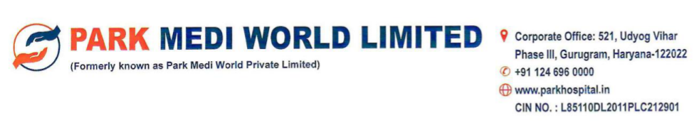
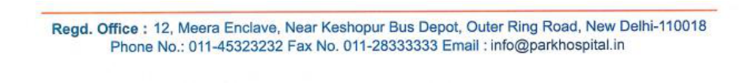
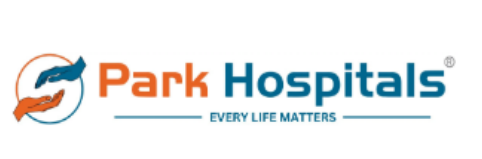
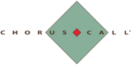
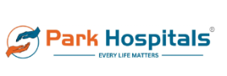

**[Image: 121cf1bd-0b0c-4413-91bd-daf91aa0946b.pdf-0001-00.png (90x1236, 184.0KB)]**

**[Image: 121cf1bd-0b0c-4413-91bd-daf91aa0946b.pdf-0001-01.png (975x176, 138.3KB)]**

### **February 02, 2026** 

**BSE Limited** 

**National Stock Exchange of India Limited** Exchange Plaza, Bandra-Kurla Complex, Bandra (E), Mumbai - 400 051 SYMBOL: PARKHOSPS 

P.J. Tower, Dalal Street, Fort, Mumbai - 400 001 Scrip Code: 544645 

## **Subject:** **<u>Disclosure under Regulation 30 of SEBI (Listing Obligations and Disclosure</u> “ ” -** **<u>Requirements) Regulations, 2015 ( Listing Regulations ) Transcript of Earnings Conference Call on January 29, 2026</u>** 

Dear Sir/Madam, 

Pursuant to the provisions of Regulation 30 of Listing Regulations, please find enclosed transcript of the Earnings Conference Call held on January 29, 2026 for Unaudited Standalone and Consolidated Financial Results for the quarter and nine months ended December 31, 2025. 

The transcript is also being disseminated on the Company's website at https://www.parkhospital.in/ 

This is for your information and records. 

Thanking you, 

**For and on behalf of Park Medi World Limited** 

ABHISHEK Digitally signed by ABHISHEK KAPOOR KAPOOR Date: 2026.02.02 09:55:22 +05'30' 

**Name:** Abhishek Kapoor **Designation:** Company Secretary & Compliance Officer 

**Encl: A/a** 

**[Image: 121cf1bd-0b0c-4413-91bd-daf91aa0946b.pdf-0001-16.png (942x105, 92.2KB)]**

**[Image: 121cf1bd-0b0c-4413-91bd-daf91aa0946b.pdf-0002-00.png (482x159, 33.2KB)]**

# “Park Medi World Limited 

# Q3 and nine-month FY ‘26 Earnings Call” 

January 29, 2026 

**[Image: 121cf1bd-0b0c-4413-91bd-daf91aa0946b.pdf-0002-04.png (305x101, 15.1KB)]**

. 

**[Image: 121cf1bd-0b0c-4413-91bd-daf91aa0946b.pdf-0002-06.png (222x112, 5.5KB)]**

**– – MANAGEMENT: DR. AJIT GUPTA CHAIRMAN PARK MEDI WORLD LIMITED – DR. SANJAY SHARMA WHOLE TIME DIRECTOR AND – CHIEF EXECUTIVE OFFICER PARK MEDI WORLD LIMITED – – MR. RAJESH SHARMA CHIEF FINANCIAL OFFICER PARK MEDI WORLD LIMITED – MR. SUDESH SHARMA CHIEF STRATEGY OFFICER – AND OSD FINANCE PARK MEDI WORLD LIMITED** 

**– MODERATOR: MS. SALONI NAGVEKAR ADFACTORS PR** 

Page **1** of **21** 

_Park Medi World Limited January 29, 2026_ 

**[Image: 121cf1bd-0b0c-4413-91bd-daf91aa0946b.pdf-0003-01.png (282x95, 13.6KB)]**

**Moderator:** Ladies and gentlemen, good day and welcome to the Park Medi World Limited Conference Call hosted by Adfactors PR. As a reminder, all participant lines will be in the listen-only mode and there will be an opportunity for you to ask questions after the presentation concludes. Should you need assistance during the call, please signal an operator by pressing star then zero on your touchtone phone. I now hand the conference over to Ms. Saloni Nagvekar from Adfactors PR. Thank you and over to you, ma'am. **Saloni Nagvekar:** Thank you, Rayo. Good afternoon, everyone, and welcome to the Q3 and nine-month FY ‘26 maiden earnings call of Park Medi World Limited. Today, we have with us Dr. Ajit Gupta, Chairman, Dr. Sanjay Sharma, Whole Time Director and CEO, Mr. Rajesh Sharma, Chief Financial Officer, Mr. Sudesh Sharma, Chief Strategy Officer and OSD Finance, and Adfactors IR team. We will begin the call with the opening remarks from the management, after which we will have the forum open for the interactive Q&A session. I must remind you that this conference may include forward looking statements about the company, which are based on the beliefs, opinions, and expectations of the company, as on date of this call. The statements are not the guarantee of future performance, and involve risks and uncertainties that are difficult to predict. I now hand the conference over to Dr. Ajit Gupta, Chairman of Park Medi World Limited, for opening remarks. Thank you and over to you, sir. **Ajit Gupta:** Yes. Good afternoon, everyone, and a warm welcome to Park Medi World Limited Earnings Conference Call. Thank you for joining us today, and for taking out the time to engage with us. This call is particularly meaningful for us, as it marks Park Medi World's first ever Earnings Conference Call. While our hospital has been serving the patient for the last two decades, today marks the beginning of a more structured and transparent dialogue with our investor community. We look forward to building a long-term relationship with all of our stakeholders, through consistent communication and clarity of strategies. Park Medi World was founded on the belief that has remained unchanged since the day, and that the quality healthcare should be accessible, affordable, and dependable, irrespective of the geography or income level of the patient. Our journey began in 2005, when we established Park Hospital in New Delhi. At the time, the focus was not on the scale, but trust, delivering ethical medical care, strong clinical outcomes, and patient-first decision-making. 

Over the years, that foundation has enabled us to grow steadily, without compromising on our core values. Today, Park Hospital stands as the largest private hospital chain in Haryana, and North India's second-largest private chain hospital. We currently operate 14 multi-super 

Page **2** of **21** 

**[Image: 121cf1bd-0b0c-4413-91bd-daf91aa0946b.pdf-0004-00.png (282x95, 13.6KB)]**

### _Park Medi World Limited January 29, 2026_ 

specialty hospitals, with an installed capacity of 3,250 beds, including approximately 870 ICU beds across Haryana, Punjab, Delhi, and Rajasthan. 

Our growth has been driven by a cluster-based expansion strategy, which we believe is one of our strongest competitive advantages. Instead of spreading over thin geographies, we focus on building dense regional clusters. This approach allows us to scale responsibility while maintaining consistency in clinical quality and patient experience. 

Another key pillar of Park Medi World or Park Hospital is our doctor-led professional management module. Clinical leadership plays an active role in operational decision-making, ensuring that growth initiatives are aligned with the patient outcomes. Across our network, we offer 30 super specialties and specialty services, supported by a strong team of more than 1,200 doctors and more than 2,400 nurses. 

We have consistently invested in advanced medical technology, including robotic-assisted surgeries, modern diagnostic and critical care infrastructure. These investments help improve clinical precision, reduce recovery time, and enhance patient experience, while remaining aligned with our affordability-focused model. Inorganic growth has been another important drive of the scale. 

Over the years, we have demonstrated a strong ability to acquire and integrate hospitals successfully, applying a standardized operating playbook. Recent acquisitions such as KPS Institute of Medical Sciences, Agra and Krishna Super Speciality Hospital, Bathinda further strengthen our presence in the high-potential region and fit well within our cluster strategies. 

As we look ahead, our vision is to continue building a scalable, sustainable healthcare platform focused on expanding capacity in an unpenetrated market, strengthening specialty depth, maintaining affordability and quality, creating long-term value for the stakeholders. 

With that, I would like to hand over to the Whole Time Director and the CEO, Dr. Sanjay Sharma, who will take you through our operations and executions. Over to you, Dr. Sanjay. 

#### **Sanjay Sharma:** 

Thank you very much, sir. Good afternoon to all the invitees. Firstly, heartfelt gratitude to all the invitees from Park Medi World Family for taking this initiative of joining us and showing keen interest in our organization. 

As you all would be aware, we have come out with our Q3 results. In the healthcare delivery parlance, this is the quarter where it is supposed to be a healthy period, and generally the results are subdued. But I'm glad to inform that we have gone ahead and we are still on track and ahead of the curve, which my financial director, CFO, will be telling about it. 

Largely why we have been able to attain these good results is based on four pillars of core value. Over and above that, Park Medi World’s strength, as our Chairman mentioned, is patient-centric care and patient satisfaction. And they are followed by these four pillars of core value. One, first 

Page **3** of **21** 

_Park Medi World Limited January 29, 2026_ 

**[Image: 121cf1bd-0b0c-4413-91bd-daf91aa0946b.pdf-0005-01.png (282x95, 13.6KB)]**

one, is the highest quality. All our hospitals are NABH accredited and major labs are NABL. We constantly endeavor in improving our operational efficiencies. We constantly are on the improvement towards our clinical outcomes. 

The second one is affordability. Largely it starts with our being not centric-based because these are large states with the larger population and the gap between the population and bed is huge. And also the disease prevalence is very high. The concept of 250-bedded hospital gives us high operational efficiency and quick break-even. And capex, around INR34 lakhs, is also one of the main factors which keeps our affordability aspect. 

The bed configuration of 30% being dedicated to critical care and 40% to general ward is another factor which contributes towards affordability. The other factor is full-time doctors. And as Chairman mentioned, the cluster growth, this gives us great synergy, multiple optimal utilization of HR, resources and equipments. 

The third one is higher technological adoption and training. That we have been doing by increasing our HIS standardization, clinical protocols, more onto data analytics, expanding advanced medical equipments like robotics. We are one of the groups in best of our knowledge which has obtained three da Vinci fifth-generation robots. And we've been conducting heart surgery through robots, joint replacement robot-assisted organ transplants, neurointervention, cardio interventions and others. 

Training and the clinician aspect of it is largely based on that people remain our focus area. And training and clinical governance and leadership development is our main focus. This is also seen from this point of view that seeing our academic strength and deep, you could say A to Z, the patient diseases, we have been accorded and awarded 63 DNB seats by the government in specialties and super specialties. These initiatives support better clinical outcomes, faster recovery and improved patient satisfaction when we come across into the product mix. 

The fourth and the most important consistent growth and profitability. This has come largely, regularly from past 21 years. And in future also we intend showing it. And this is because we are going for higher and higher operational efficiency, ramping up our occupancy. And despite the new addition of Bathinda of 250 bed, our occupancy has risen to 65%. 

And higher tertiary and quaternary product mix, wherever the occupancy is higher, we go for high end quaternary and product mix. As I mentioned to you, the robotic joint replacement, robotic organ transplant, neuro intervention, cardiac intervention, which has led to increase in our ARPOB from 25,500 to 27,500 approximately, and which is decreasing ALOS to close to six days. 

Also, the acquisitions of Greenfield and Brownfield is another aspect through which we achieve the growth. If I give you some future projections, in February, we are starting a project in Agra, KPIMS, which is a 360 bedded hospital. And in March first week, we will be starting a 

Page **4** of **21** 

_Park Medi World Limited January 29, 2026_ 

**[Image: 121cf1bd-0b0c-4413-91bd-daf91aa0946b.pdf-0006-01.png (282x95, 13.6KB)]**

Greenfield project in Panchkula, which is 300 bedded project. So in FY ‘26 itself, from 3,250 we will be adding 660 beds more, which will take us to approximately 3,910 beds. 

In FY ‘27, we are adding 500 more beds, 300 in Kanpur and in Delhi 200. And in FY ‘28, we will be aspiring for 850 beds, Gorakhpur 400, Ambala Extension, Onco dedicated facility, 200 beds, and Rohtak Greenfield, 250 beds, which should take us to roughly 5,260 beds. While maintaining the EBITDA of 27%, PAT of 17%, and annualized ROCE of about 21%, and ROE of 23%. And this is largely being achieved, because we have constantly been following our core values and strength of patient centric care. 

Thank you so much. And now I'll invite our CFO, Mr. Rajesh Sharma, to continue and take it forward, please. Thank you. 

#### **Rajesh Sharma:** 

Yes, thank you. Thank you, Dr. Sharma. And good afternoon, everyone. During Q3 FY ‘26, Park Medi World reported revenue from operation of INR4,100 million, representing year-onyear growth of approximately 18%. For nine months FY ‘26, revenue stood at INR12,189 million, reflecting growth of around 17% year-on-year, driven by steady patient volumes and the ramp up of newer and acquired hospitals. EBITDA excludes other income of Q3 FY ‘26, stood at INR994 million, with an EBITDA margin of 24%. 

For nine months FY ‘26, EBITDA was INR3,170 million with a margin of 26%, reflecting stable operating performance amid ongoing integration of recently acquired hospitals. Profit after tax for Q3 FY ‘26 stood at INR528 million, while PAT for nine months FY ‘26 was at INR1,968 million, supported by operating leverage and disciplined cost management. Operational matrix during the period reflected disciplined execution. 

Average occupancy across the network improved to approximately 65% during nine months FY ‘26. ARPOB increased to 27,406 and ALOS remained stable at around 6.34 days, indicating a balanced case mix and efficient clinical processes. Our mature hospitals continued to demonstrate operating leverage while newer and recently acquired hospitals progressed as per their planned ramp-up trajectory. 

The strength of our mostly owned hospital asset base provides financial flexibility and supports long-term value creation. We remain focused on maintaining balance sheet strength while funding growth initiatives. Recent acquisitions are being integrated as planned, with emphasis on improving utilization, specialty depth, and cost efficiency. 

Incremental capex requirements are expected to be largely optimization-led. Our capital allocation priorities remain clearly defined, one, strengthening the balance sheet, funding organic and inorganic expansion, improving returns ratio over the medium terms. 

Besides, you know that I also wish to share our comparative for nine months for FY ‘26 versus FY ‘25. In nine months FY ‘26 we achieved a revenue of INR12,189 million as compared to INR10,397 last year. So there is a growth of 17% in revenue. EBITDA also grown from 

Page **5** of **21** 

**[Image: 121cf1bd-0b0c-4413-91bd-daf91aa0946b.pdf-0007-00.png (282x95, 13.6KB)]**

### _Park Medi World Limited January 29, 2026_ 

INR2,826 million to INR23,170. So there is a growth of 12% in EBITDA. And PAT is also grown from 1,374 million to 1,968 million and there is a growth of about 40% in PAT. 

And I wish also like to mention about the footfall. IPD and OPD together, it was 5.32 lakhs patient last year that grown to 6.6 lakhs in the first nine months of the current year and we registered a growth of 24% in footfall. And our bed also increased from 3,000 to 3,250. As Dr. Sanjay mentioned that we added 250 bed in the current year, Bathinda. And ARPOB also improved from 25,500 to 27,400. 

ALOS, it was 6.59 that slightly came down to 6.34 and our occupancy also grown from 62% to 65% despite we added 250 bedded hospital in the current year. And our capex bed remained at 3.4 million. In the last, it was same in nine months last year and the nine months in the current year. 

With that, we conclude our speech. Thank you for your time and interest in Park Medi World. We will now happy to take your questions. Thank you very much. 

#### **Moderator:** 

Thank you. We will now begin the question and answer session. The first question is from Nirali Shah from Ashika Stock Services. Please go ahead. 

#### **Nirali Shah:** 

Hi, I have three questions. First one is, can you share how the recent Agra acquisition fits into the broader cluster-based expansion strategy that we hold? 

#### **Sanjay Sharma:** 

Sorry, could you repeat the question, please? 

#### **Nirali Shah:** 

Yes, sure. I was just asking that the recent Agra acquisition that we have done, how does it fit well into the broader cluster-based expansion strategy that we hold? 

#### **Sanjay Sharma:** 

See, we are looking Uttar Pradesh as a very big territory. It has got roughly 26-27 crore of population, which is nearly twice the population of Russia, a little less than US from that point. And we see that the growth potential is huge. And the demand and the gap which is there in health services is also very vast. And this profile is also constantly growing. 

So, we intend coming up in UP in a big way. This unit which we have taken up in Gorakhpur covers, this Agra covers one side of it. The other two, central and the other side is Gorakhpur and Kanpur. And in between, we intend building up cluster growth in Pearl and Necklace to ensure that the UP is covered well. I hope I have been able to answer your question. 

#### **Nirali Shah:** 

Yes, sir, understood. My next question is, as the new hospitals mature, what kind of margin trajectory should we expect at the ground level, group level? 

**Management:** 

Nirali, we believe that we will be able to sustain margins more or less in line with the margins we have right now. So, our EBITDA is expected to remain in 26%-27% range going forward for mid to long term. I am seeing a time horizon of three, five, 10 years. And our PAT should remain consistent or stable. And I should say strong in 15%-17% range. 

Page **6** of **21** 

**[Image: 121cf1bd-0b0c-4413-91bd-daf91aa0946b.pdf-0008-00.png (282x95, 13.6KB)]**

_Park Medi World Limited January 29, 2026_ **Rajesh Sharma:** I wish to add one more thing. Historically, wherever we made the acquisition, so what we have seen that whenever we achieved the occupancy of 30%, we achieved our EBITDA breakeven. And we have seen next year, maybe next year of the operation, we normally touch EBITDA margin of 20%. And third year, we remain come on the same margin that is 26%-27%. So, historically, we have seen. In the Agra also, we are very, very confident to achieve those numbers. **Management:** Also noteworthy, our ROE and ROCE numbers are strong in 21% range, might increase a little going forward. ROE and ROCE has obviously converged a little because right now we are carrying a very, very minuscule loan on the books. So, ROE, ROCE number nearly are converging. But a strong stable and might see a slight curve going forward. **Nirali Shah:** So, sir, on a three to five year perspective, we are expecting the margin to remain stable or any basis points growth are we expecting? **Sanjay Sharma:** See, Nirali, as per growth, as I mentioned that in FY ‘28, the bed strength will be growing up. We are aspiring for about 5,500 to 6,000. But in the pipeline, we have 210 beds. After that, another five years, we are looking at doubling this capacity to about 10,000. And since the past 21 years, we have been giving this EBITDA of 27% and PAT of 17%. And in coming years, also 10 to 15, 20 years, we expect that our margins will be around this value only. **Moderator:** Thank you. The next question is from Tanay Bheda from Kotak Mutual Fund. Please go ahead. **Tanay Bheda:** Hi, good afternoon. Congratulations on the IPO and the strong set of quarterly results. I have two questions. The first question is on disallowed claims. I want to understand how are we managing disallowed claims? What systems do we have? And how do we see this trajectory going forward? What differentiates us with sort of minimizing disallowed claims going forward? **Sanjay Sharma:** Thank you, Tanay. This is Dr. Sanjay Sharma. The IPO success and the Q3 results are all because of your support and blessings and organizations like yours. The disallowed claims, what we have done is this, that we have a strong clinical team of super specialists which we have created. And largely, this is a difference of opinion between the organization which is making the claims and the organization which has submitted the claims. And it is based on the clinical inference of the data which has been put in the discharge sheet. Now, this clinical team or the team of super specialists has been able to clarify most of the queries. And we have brought down the disallowance to about 8% to 9%, which is the lowest in the industry. Even in TPA insurance and cash, this disallowance is ranging anywhere between 12% to 15%. So currently, our disallowance is at the lowest level of 8% to 9%. And we intend continuing at this level. Below that, this is the integral part of the healthcare delivery. This much disallowance would be there in any healthcare industry delivery model. 

Page **7** of **21** 

_Park Medi World Limited January 29, 2026_ 

**[Image: 121cf1bd-0b0c-4413-91bd-daf91aa0946b.pdf-0009-01.png (282x95, 13.6KB)]**

**Tanay Bheda:** Okay. Okay. And my second question is just a follow-up on margins. So very soon, we would be seeing the benefit of CGHS rate increases. And with regards to this benefit, how much incremental revenue can be booked because of this CGHS rate increase? And how much of that can translate into EBITDA margin increase when we see the full year of benefits? **Management:** Dr. Sanjay, for you? **Sanjay Sharma:** Okay. See, the rate hike this time which has been done by CGHS has been one of the most handsome hike which has been done. And incidentally, since our government insurance, you could say the percentage is around 80%. So we are the maximum beneficiary in this. The hike has been around 12% to 15%. But this will take a little time because this hike will be all around from CGHS will percolate to ECHS, railways, National Highway Authority of India, the paramilitary, the police force, the state governments, electricity board, and others. So it takes a little time. In the projections which we have given, we have not incorporated this hike currently. But from the new financial year, FY ‘27, we definitely see some part of this coming into our EBITDA. But we will be conservatively accounting only 7.5%. Though the hike has been nearly close to 12% to 15%, but we have always believed in this talk less and deliver more. So we will like to pleasantly surprise our investors. Instead of giving higher figures, we like to give conservative figures and deliver more. **Tanay Bheda:** Okay. Thank you. Thank you so much. That's it from us. **Moderator:** Thank you. The next question is from Amit Agicha from HG Hawa and Company. Please go ahead. **Amit Agicha:** Yes, good afternoon, sir. Thank you for the opportunity and congratulations for good set of numbers. So my question is connected to like, what is the ROI on robotics? Would you be able to share? **Sanjay Sharma:** See, thank you, Amit, for the good wishes with regard to the result. To best of my knowledge, I have been into healthcare for about nearly four decades. And any organization taking three robotics, fifth generation da Vinci simultaneously, I'm not aware about, at least in my personal knowledge. But we have taken them up. And the turnover, which we have been doing at an affordable cost, that has given us an excellent product mix. 

Currently, we are doing kidney transplants, nearly about 25 to 30 per month. With robotics, we are also doing the robotic cardiac surgeries. We are also doing robotic assisted nearly 300 plus joint replacement. And what it has done is this, it has improved our product mix, which has led to faster patient recovery, lesser stay in the hospital, and also improved our ARPOB from 25,500 to roughly 27,500. 

Page **8** of **21** 

**[Image: 121cf1bd-0b0c-4413-91bd-daf91aa0946b.pdf-0010-00.png (282x95, 13.6KB)]**

_Park Medi World Limited January 29, 2026_ 

We want to maintain our ARPOB in the affordable section only. So we are not looking at a huge increase in our ARPOB. But this definitely does improve the EBITDA margins, ensuring the affordability. 

**Amit Agicha:** And sir, would you be able to put some light on, like what are the debt levels post the IPO? 

**Rajesh Sharma:** So I think, you know, as far as debt is concerned, so pre-IPO, we used to have a total term debt of INR425 crores, of which we have already paid INR380 crores. And some of the repayment is done in last few months. So if I talk about as of 31st Jan, the total term debt will stand at close to INR15 crores, which we also plan to repay in Feb. So by end of Feb, we will be completely debt-free company. 

**Amit Agicha:** And sir, are there any plans for any new verticals… 

**Sanjay Sharma:** Sorry, say again. **Amit Agicha:** Any plans for entering new verticals, like for example, kidney transplant? I think so you're already doing, I think in five hospitals, right? 

**Sanjay Sharma:** See, we are already doing. Robotics, we have entered. Organ transplant we have entered, I think, barring liver transplant and heart transplant, we are doing all high-end tertiary and quaternary medical procedures, which are being done anywhere in the world currently. 

**Amit Agicha:** The last question from my side. Any wage inflation guidance? 

**Sanjay Sharma:** Sorry, any? **Amit Agicha:** Wage inflation guidance, like the employee cost. 

**Sanjay Sharma:** I have not been able to understand employee cost. **Amit Agicha:** Inflation guidance. 

**Sanjay Sharma:** Inflation guidance. **Amit Agicha:** Yes. With respect to employee cost. 

**Sanjay Sharma:** Okay. So we have full-time doctors, Amit. And this is one of the models which we have been following in the affordable section. What we do is generally our selection of clinicians are this way that we take a clinician who has five to eight years of hands-on experience from a fantastic good academic college, which is largely a government college background and who has had keen exposure into the latest technologies, robotics, and latest medical fields. 

And they have hands-on experience. What we do is this. We give them independent status. We give them a unit and they are able to do the procedures because they have reasonable experience 

Page **9** of **21** 

**[Image: 121cf1bd-0b0c-4413-91bd-daf91aa0946b.pdf-0011-00.png (282x95, 13.6KB)]**

### _Park Medi World Limited January 29, 2026_ 

with excellent academic skills. And we account for only two major aspects. One is the patient and the attendance satisfaction and the other is clinical outcomes. 

And based on that, there is a graded percentile system which is created from each unit. And any clinician which scores more than 75 percentile is every month is personally appreciated by the promoters and rewarded a handsome performance bonus. So this is part of this which all these inflation which is coming into it is actually being supported by the patient flow and the volume, which in turn increases the revenue. 

So both are going in a balanced formation. So we do not go for any celebrity doctor which costs very high and which leads to high inflation in the HR. In fact, our HR cost and the doctor's consultant's attrition is the least in the industry. 

**Amit Agicha:** Sir, may I know the attrition rates at this point? 

**Sanjay Sharma:** Sir, our attrition rate at the consultant level is about 18.9%, which is the lowest in the industry. **Amit Agicha:** I appreciate you answering all the questions with so much clarity, sir. Thank you and all the best for your future quarters. **Moderator:** Thank you. The next question is from Mukesh from Aster Ventures. Please go ahead. 

**Mukesh:** Sir, my first question is that we have not added any bed in Q2 to Q3. Our bed is similar, but our consultation fee for doctors and doctor's salary increased by 8% on Q2Q. What is the reason of such increments, sir? **Management:** Your voice is breaking. **Mukesh:** I am saying, sir, our doctor fees and consultation fee increased by 8% in QtoQ. What is the reason of such increase? **Rajesh Sharma:** See, what we have done, as Dr. Sanjay also mentioned, we are just coming up with a unit in Agra. And also, we are planning to start a unit in Panchkula. So, there are a lot of hiring is happening. 

**Mukesh:** Okay. There is a lot of hiring in… **Rajesh Sharma:** Hiring is happening. And also, you know, that as I said, because last time also that we mentioned, wherever we reach occupancy of 75%, we start focusing on advanced super speciality. So, we need more senior consultants, so, there also we invested money. So, basically, there are three reasons. 

We are coming up in Agra, where the hiring is already started. Panchkula hiring is already started. We already have a few people on board, plus hiring of senior consultants focusing on advanced super speciality. 

Page **10** of **21** 

**[Image: 121cf1bd-0b0c-4413-91bd-daf91aa0946b.pdf-0012-00.png (282x95, 13.6KB)]**

_Park Medi World Limited January 29, 2026_ 

**Mukesh:** Okay, but in that case, we have already paid the amount in December for the November month with respect to hiring people. **Rajesh Sharma:** Yes, because you have to have, because, you know, when, when, because hiring cannot be done immediately. You have to have people in place and you have to train them. We already have people on board. They will take care of Agra and Panchkula unit. **Sudesh Sharma:** Okay. We would like to state here that we are commissioning our Agra facility of 360 beds by 15th of February and Panchkula organic facility with a capacity of 300 beds by first week of March. So, 660 bed capacity will be added within this financial year. So, typically, we launch with all the specialists provisioned on day one. And this hiring usually, therefore, has to be done before the commissioning of the hospitals. And therefore, the manpower cost looks like that for quarter three. **Mukesh:** Okay. Sir, my second question is that, in presentation, we have not given payer mix slide. So, roughly what percentage of... **Rajesh Sharma:** So, I'll give the answer for this question. If I talk about as of 31st December, our payer mix, you know, that relate to government scheme that came down to 83% from 84%. And now, self-pay. Self-pay is 9% and TPA is 8%. So, there also, you know, that from 84%, we came down to 83% in government panels. **Sanjay Sharma:** Mukesh, I'd just like to add this. I'll just like to add in this 83%, about 93% is central government. So, that's like a sovereign government. There is no default in that. **Rajesh Sharma:** And there is a drastic improvement in terms of, you know, the government, they are also pushing it very hard internally to improve the system. So, recovery is also getting improved. **Mukesh:** Okay. Okay. Okay, sir. What is the going forward trajectory for CGHS scheme? It remains there or it's going down, going forward? **Sanjay Sharma:** So, the Central Government Health Scheme and the Central Government Patient Beneficiary is constantly increasing, one. And also, the rate hike, generally, in the past track record, if we see, they have been hiking the rates every two, two and a half years. So, this has been happening on a regular basis. So, this time, the rate hike has been very, very handsome. But I believe going further also, as the healthcare requirements are constantly increasing, and the government allocation of the healthcare budget is also being proposed to be increased from 3.8% of the GDP to 5.5% by 2030. So, I'm sure the allocation for the Central Government Health Beneficiaries will also have a major contribution into it. 

**Mukesh:** 

It means that the ratio is remaining here and there only? 

Page **11** of **21** 

**[Image: 121cf1bd-0b0c-4413-91bd-daf91aa0946b.pdf-0013-00.png (282x95, 13.6KB)]**

_Park Medi World Limited January 29, 2026_ 

**Sanjay Sharma:** No, our focus, see, Mukesh, we are not going for any government insurance or government schemes. Our focus has been on the affordable side. So, we have been focusing on the bottom and the middle of the pyramid. Largely, the population of 128 crores out of 140 crores, which cannot afford healthcare. Now, incidentally, this segment is being largely supported by the government and in that too, also major aspect is coming from the central government. So, our focus will be in this segment only. But per se, the insurance penetration has been increasing. So, obviously, a lot of people from this segment will also translate into the private insurance. When we came for IPO, we started at around 84%-16% distribution. Today, we are 83%-17%. I believe by the end of this financial year, we will probably be 80%-20%. And going forward in a year's time, we will be 75%-25%. 75% from the government insurance and 25% from the private insurance. So, our focus remains there. But a lot of patients are translating from this affordable section to the private insurance. **Mukesh:** Thank you very much. **Moderator:** Thank you. The next question is from Shreya Chatterjee from Ageless Capital. Please go ahead. **Shreya Chatterjee:** Thank you, sir, for taking my questions and congratulations for a good set of numbers. My first question is on the payer mix itself. You have mentioned that government insurance will always be a majority of your payment. So, how does it impact your receivable cycle? Because I understand that it's a bit on the higher side versus your peers. So, where do we see the receivable days going forward? What is current receivable days and where do we see it going forward? **Rajesh Sharma:** As far as receivable, Dr. Sanjay, you want to answer it? Please go ahead. No, no. **Sanjay Sharma:** Please go ahead, Rajesh. **Rajesh Sharma:** As far as receivables are concerned, first very important part is because they are mostly 93% related to the central government. So, when we say central government, it's like a sovereign bond and we have never seen any of the money got better. So, we receive money. But historically, what we have seen that government, they have a very, very well-defined process to clear the payment. 

So, there are two verticals. One is that to pass the bill and second is to release the payment. So, normally passing because when the patient gets discharged, we have to upload our bill on a thirdparty portal and it is absolutely faceless and transparent. So, this process takes about three months' time, wherein a couple of, normally back and forth happen when, that we have to immediately respond to their queries. 

And this process takes about three months' time to settle the bill. And thereafter, they take about 45 days' time to clear the payment. So, historically, we have seen we normally get our payment 

Page **12** of **21** 

**[Image: 121cf1bd-0b0c-4413-91bd-daf91aa0946b.pdf-0014-00.png (282x95, 13.6KB)]**

### _Park Medi World Limited January 29, 2026_ 

within four and a half months, five, ten days here and there. But in last couple of months, we have seen improvement. Even the government is also pushing it very hard. And what we are expecting by end of this financial year, I'm hoping this four and a half month TAT will come down to four. And maybe going forward, it will be close to three and a half months. 

And I think the other important point to mention, somehow this becomes one of our strengths. Because, we enjoy sort of a monopoly in this domain because the kind of ARPOBs that we have, the receivable cycle that we have, it is practically impossible for a bigger player like Vedanta, Fortis to come down to our area. And it is practically impossible for a smaller player to compete with us. So, somehow this becomes one of our strengths. 

**Shreya Chatterjee:** 

Got it, sir. And so, my second question would be, you have a very unique strategy of capex per bed, which is like very low compared to peers. So, going ahead with all the acquisitions that you do, so what is your strategy to select the hospitals and do you expect the capex per bed to remain at these low levels only? How do you think about that? If you could just give a bit more color to that. 

**Rajesh Sharma:** 

Dr. Sanjay? 

**Sanjay Sharma:** See, when we have been generally seeing the distress assets, largely if I talk about the brownfield acquisitions, these assets have been in severe distress. And we see a few things into it. One is the strategic location. How much is the distress that could give us compelling values and deep discounting into it? The kind of medical services which are available in that area. And fourthly, and the most importantly, the headroom to grow in that area. 

Based on that, we do multiple, you could say, valuation of the property. And then we arrive at the buying price. And generally, because we pay upfront, we get a deep discounting. And that is why we have been able to maintain a very low capex. 

**Shreya Chatterjee:** And so going forward, do you expect this level to continue or like the ROE, ROC levels will sustain going forward? 

**Rajesh Sharma:** I'll answer this question. You know that, as Dr. Sanjay also mentioned, the other point is because when we built our hospital, we are here to provide the rest of the healthcare services to the affordable segment. So we keep a couple of things in mind. One is 40% of our beds, we set aside as a general bed. And we specialize in critical care. 

So 30% bed, we set aside for ICU bed. And balance 30%, that is mainly 20-22% is a twin sharing, wherein one room has to be shared by two patients and rest is single room. So this allows us to have more bed in less space. So this is one point. 

Second, your question in terms of going forward. So we are adding six more hospitals by March 2028, which we have already disclosed in our RHP, that was part of our document with SEBI. Wherein we are adding the first unit that we are adding in Agra, that will be up and running from 

Page **13** of **21** 

**[Image: 121cf1bd-0b0c-4413-91bd-daf91aa0946b.pdf-0015-00.png (282x95, 13.6KB)]**

### _Park Medi World Limited January 29, 2026_ 

Feb 2026. Panchkula we are adding, that will start operation from March ‘26. Kanpur, next year we are expecting to add 500 beds, one in Kanpur and second in Delhi. And in FY ‘28, we are adding three hospitals, Gorakhpur, Ambala, Rohtak. Together we are adding 850 beds. 

So we are adding 2,010 beds in next by March 2028, and on a capex of INR700 crores. So we will remain on our capex per bed of 35 lakhs. So we have done historically, we are currently doing it. And going forward also, we will remain on this model. 

#### **Shreya Chatterjee:** 

Thank you, sir, for such a detailed answer. My last question would be more on the employment side, majorly related to doctors. So you have so many specialized procedures. So what's the split between your specialized consultants versus full-time doctors, and what's your hiring and retention strategy, if you could just give a bit more color to it. 

#### **Sanjay Sharma:** 

So Shreya, all our consultants are full-time. And if we employ only full-time doctors, there is no visiting consultant policy with us. And all these doctors which we hire, there is a future growth map which is mapped for them and told beforehand when the hiring is being done. There are a lot of things which we, from the HR point of view, also we ensure for their social well-being and settlement. 

HR helps them in getting good accommodation. HR helps them in getting their children into good schools. These aspects we take care of to settle them. Within the system, we have this thing that these doctors are accounted not for volume or revenue at all. In fact, they're accounted only for two verticals largely. One is the patient and attendance satisfaction, and the other is clinical outcomes. 

And based on that, they are rewarded based on a graded percentile system. And this reward is every month. And if anybody is scoring more than 90, 95 percentile, this reward can even go higher than their remuneration package per month. So there is a great satisfaction level at the consultant level. 

Vice versa, the Park Hospital also gains mutually in return in a symbiotic relationship that the patient and attendance satisfaction is also very high. Because all the patients, especially the critical patients, are a number of times counseled in the trajectory of the treatment, in the prognosis, in the outcome. And all these aspects give them a lot of satisfaction because doctor gives them a lot of time. 

They're not visiting, they are full time, so they're dedicated for this thing. So this is a major thing which is unique from the other hospitals. In the consultant level, our attrition rate has been the least in the industry, which is about 18.9%. So most of the consultants which have been there with us, they have been there for 15 years, 12 years, 11 years, 10 years, so forth and so on. 

And so any specialized hiring strategy that you use to attract special talent for the consultants, like a special heart surgeon or someone from the oncology care? Is there any other special strategy that you follow? 

**Shreya Chatterjee:** 

Page **14** of **21** 

_Park Medi World Limited January 29, 2026_ 

**[Image: 121cf1bd-0b0c-4413-91bd-daf91aa0946b.pdf-0016-01.png (282x95, 13.6KB)]**

#### **Sanjay Sharma:** 

Yes, by the large bed strength and by virtue of being the second largest in North India and one of the listed companies, we by itself are a huge brand to reckon with. When we take out an advertisement for hiring, we get the cream of cream from the clinician point of view. If I give you a recent example, in Panchkula, when we started hiring for 300 bedded on Greenfield project, which is upcoming, as Mr. Sudesh mentioned, in the first week of March, we got a footfall of about 4,500 to 5,000 people coming in. 

And the best of clinicians in the Tri-City and around came to get hired with us. That is because they have been aware that how Park takes care of their clinician, not as an employee, but as partners, as part of the Park Medi World family. And they enjoy all the benefits in the growth, sustainability, profitability, and the growth prospects for future. 

**Management:** 

When we look at hiring medical staff, it is four things combined that become, that have, if I can use the term sort of magnetic charm attracting, which enables us to attract high quality talent. One is Park offers a very attractive remuneration policy, including both fixed and variable remuneration. Second is for incoming doctors, there is a chance to, opportunity to work on large number of cases, drawing on the Park’s very specific strengths in the middle and bottom of the pyramid population segment. 

Rajesh ji just now shared with you our IPD number in a nine month was nearly 75,000. And Dr. Sanjay Sharma shared that we have 1,200 doctors of which 75% are specialists. Just imagine that number of specialists getting to work on that many number of patients. So large number of, opportunity to work on large number of patients. Third is an opportunity to assume significantly higher serious gravitas responsibilities early on. Should the doctors show that potential, that opportunity is there. 

And fourthly, because some of our hospitals are located in tier 2 and tier 3 locations, I can safely tell you that Park has industry's most robust plan to assist the doctors. So should they have to relocate to any of these locations to assist them in adjusting to this location in terms of community support we provide, adjustment support we provide. 

So combination of these four factors, attractive remuneration, opportunity to work on large number of patients, opportunity to assume higher responsibilities at an early age, and fourth is strong support to adjust to new locations. Should the doctor have to relocate? These four combination combined factors play a big role in attracting very high quality talent and requisite numbers as we require. 

#### **Shreya Chatterjee:** 

Thank you, sir. Thank you for such a detailed response to all my questions. 

#### **Moderator:** 

Thank you. The next question is from Saniket from Autus Wealth. Please go ahead. 

**Saniket:** 

Thank you for this opportunity. We just wanted to know your business understanding. Like you have highlighted earlier in this call as well. A lot of our revenue basically comes from government schemes. Ultimately, our core focus is on the middle income and lower middle 

Page **15** of **21** 

_Park Medi World Limited January 29, 2026_ 

**[Image: 121cf1bd-0b0c-4413-91bd-daf91aa0946b.pdf-0017-01.png (282x95, 13.6KB)]**

income, one-to-one debt because of patients in this country. But I wanted to understand how do we reduce our dependency and diversify our way? And sort of increase the revenue that's come from other sources of private insurance or direct walk in sort of patients. So could you please just highlight on how are we managing this? 

#### **Sanjay Sharma:** 

Saniket, firstly, I would like to reaffirm and put our viewpoint again that our focus has always been in the affordable section. Whether they are being covered by any government insurance or they are self-payer from that point of view, either way, we will be focusing on the affordable section because that is a huge section. It is nearly 90%-92% of the population of India, and we have a huge headroom to grow in that. 

We are not going for government insurance or government schemes per se. In this section, if anybody is being covered by the government insurance, they also come to us because the other premium segments are not entertaining them. We have a system in which we have already accounted in a rolling manner for this four and a half months of gestation period of the payment. 

In fact, as Mr. Rajesh Sharma mentioned, this becomes our moat for any new entrant to come in such large-scale structured format and to be catering to this affordable segment. So, we are unique in this manner that we are one of the largest players in this section, which is giving them high-quality affordable healthcare with the most, you could say, the best clinical outcomes. 

#### **Management:** 

You know, think of it like this. We are as a business model not making a selection of patients in terms of their socioeconomic status or their location. Our business offers value proposition, affordable, high-quality services. So, we do not choose the patients on the basis of how they will pay for these services. Matter of fact remains that at the macro level, 90% of patients belong to bottom and middle of the pyramid, 10% to, if we can call it that, relatively affluent segment. 

In Park, the mix of patients is similar. It is 83-17, 83% belonging to bottom and middle of the pyramid, 17% to relatively affluent, what is known as the cash TPA segment. So, business model is that regardless of how patients will pay for them, it is not oriented at payment mechanism, it is oriented at patients. 

And I think you will agree that for longevity of business, for long-term health of business, it is really very good if your patient mix is somewhat reflecting the reality that exists at macro level. If the patients, 83% patients who are from bottom and middle of the pyramid, should they want to pay us by means of cash and TPA, they are most welcome to do that. 

It is really coincidental that these patients covered by government insurance scheme and that becomes the payment mechanism. But we, per se, in our business model do not make selection of payments by distorting our business model, choosing patients belonging to certain socioeconomic status. That is the answer to your question. 

Page **16** of **21** 

**[Image: 121cf1bd-0b0c-4413-91bd-daf91aa0946b.pdf-0018-00.png (282x95, 13.6KB)]**

_Park Medi World Limited January 29, 2026_ 

#### **Saniket:** 

Right. And, sir, we are thankful for your explanation. Last one question from our end. We are incurring around INR700 crores of capex, right, for FY ‘28. So, how much are you incurring for FY ‘27? Could you, like, give us a timeline of this distribution? 

**Rajesh Sharma:** So, as far as you know, the capex is concerned, out of the 700. So, this year, even the hospital which is coming up by next, before 31st March 2026, we are adding two units. One is Agra, second is Panchkula. So, they are together, because it is Agra that we are requiring, so wherein we are paying INR245 crores. And Panchkula, it was a greenfield where the construction is going on for last two years. 

So, in the additional amount that we have to incur is about INR35 crores. So, together, you can say about 280 crores will go in the current year. Next year, FY27, we are adding 500 beds, wherein Kanpur, we have to invest about INR30 crores, and Delhi is about INR80 crores. So, only INR110 crores next year in FY ‘27. 

**Moderator:** Thank you. The next question is from Nitin Agarwal from DAM Capital. Please go ahead. 

**Nitin Agarwal:** Hi, sir. Thanks for taking my question. Sir, two things. One is, A, on the CGHS rate hike, which you said will progressively get rolled out, by what time do you think the entire impact will be visible for us? How much time will it take? 

**Sanjay Sharma:** Hi, Nitin. This is Dr. Sharma. I think the effectivity has started percolating, but in totality, if we see all the organizations being able to effectively implement it, it takes about nearly three to six months. So, we are hoping by next financial year, the actual total implication of the rate hike will be coming into our finances. 

**Nitin Agarwal:** Sir, is it safe to assume, by the second half next year, we should see the full impact of these rate hikes begin to reflect in the numbers? 

**Sanjay Sharma:** Nitin, hopefully before that, but it will be safe to say by the second half of the next year. 

**Nitin Agarwal:** And, sir, on an average, if there is a way to sort of classify it like that, what is the proportion of revenue hike that you have got on an average, on a weighted average basis, through these hikes? If you were making INR100 earlier on government schemes, what is the weighted average increase that you have got through this scheme, through this rate hike that just happened? 

**Sanjay Sharma:** Nitin, just to let you know, there are about 4,500 to 5,000 line items in the central government rate hike. So, for each line item and their implication on the finances will be difficult to predict prematurely. But generally, the overall rate hike, what we envisage has been about 12% to 15%. And the effectivity of that will come probably in the, as you said, second half of the next financial year. 

Page **17** of **21** 

**[Image: 121cf1bd-0b0c-4413-91bd-daf91aa0946b.pdf-0019-00.png (282x95, 13.6KB)]**

### _Park Medi World Limited January 29, 2026_ 

And also, what we see is this, that we will be still conservatively accounting for it. We will not be going for 12% to 15% surge the entirety into it. We will be looking at about 7.5% increment in our revenue and EBITDA. That is conservative figure. 

#### **Nitin Agarwal:** 

Got it. And, sir, on the UP that you mentioned is going to be a key focus area for you going forward. So, there is a hospital in Kanpur, Gorakhpur and Agra. Which are the other sort of areas that you would typically be looking for from an entry perspective as we go forward strategically? 

**Management:** You know, it's a very, very interesting question. You would have noticed that one strategic plan of Park, whichever state we get into, is to reach a critical size. We have a critical size. We are largest in Haryana. We will have two units in Delhi now. We have four units in Patiala. We have two in Rajasthan. In Punjab, including Tri-City, we will have four units in Bathinda, Patiala. We have one in Mohali, one launching in Panchkula. 

So, as we enter the state of UP, we always had a plan to launch a unit in Gorakhpur, in FY ‘27 and Kanpur in FY ‘27, Kanpur and FY ‘28 Gorakhpur. So, we had an opportunity and under very proficient set of circumstances to acquire a unit in Agra 360 bed capacity. So, if you visualize the map of UP now, we have three pivots covering the entire span of the state. 

On the western side, we have Agra as a pivot. Somewhere in the center, we have Kanpur. Then eastern side, we have Gorakhpur. UP also, as you are aware, is known as highway capital of the country. It has a very good infrastructure of highways criss crossing the state and a huge population of nearly 26 crores. 

With these three pivots, we believe that leveraging on this infrastructure and potential of the market, we will be able to form maybe two or three clusters going forward and expand our business in UP. It is very striking to note that from literally zero, we will be 1,060 bed capacity in UP by FY ’28, in 24 months' time, which is quite remarkable. 

**Nitin Agarwal:** And sir, since you mentioned about the Agra transaction, if you can give us a little bit of color on what is the valuation that you paid for this transaction? 

**Rajesh Sharma:** The total value for this transaction is 245 crores for 360 beds. 

**Nitin Agarwal:** And sir, 360 beds are commission beds? 

**Rajesh Sharma:** 

Yes, it is already operational. 

**Nitin Agarwal:** And sir, did we share the EBITDA number for the hospital or the last 12 months EBITDA for the hospital? 

#### **Rajesh Sharma:** 

Can you just repeat the question once again? 

**Nitin Agarwal:** Sir, the EBITDA number, the annual EBITDA number for this hospital, when we acquired it? 

Page **18** of **21** 

_Park Medi World Limited January 29, 2026_ 

**[Image: 121cf1bd-0b0c-4413-91bd-daf91aa0946b.pdf-0020-01.png (282x95, 13.6KB)]**

**Rajesh Sharma:** No, because currently, they are not operating at a decent occupancy. So even historically also, during our road show, we presented to the investor, we acquired the hospital when they were doing a top line of 50 lakhs, 60 lakhs or 1 crore. Now currently, they are giving us a top line of 21, 22, 23 crores per month. So when we come on the board, we do put in our effort, we put all the speciality from the day one. So they are also, currently they are doing INR4 crores with EBITDA which is close to 20%. But once we come on the board, then we are expecting a good growth in the revenue. **Sanjay Sharma:** It so happens that in Agra, currently they are operating within 180 beds only, though they have 360 beds, but they are operating within 180. And there also they have about 30% of occupancy. And the three major specialities are there, cardiology, urology, nephrology being the second one and third one gastroenterology. When we are opening up, we are opening up with all super speciality, including the neurosciences, including the other specialities and oncosciences. So all put in together when all major super specialities will be open, and we will be operational 360 functional beds, the patient's requirement will be catered to under one roof only. So we definitely see a huge number coming in. **Rajesh Sharma:** When we start, we will start with 360 beds. **Nitin Agarwal:** Got it, sir. **Nitin Agarwal:** And the acquisition price that you mentioned, INR240 crores for a 360 bed is typically higher than our traditional INR35-INR40 lakhs per bed, right? **Rajesh Sharma:** Again, it depends on the transaction. As Dr. Sanjay also briefed about this transaction, it is there in the densely populated area. And because we acquired this asset, keeping headroom in mind, even historically, let's say if I talk about our blended capex, we made acquisition of Mohali that was together costed us close to INR275 crores. And the same thing is happening here. The capex that we are expecting per bed is about 68. But if you see the 2,000 beds that we are adding in the next two years, my blended capex will be INR30-INR35 lakhs only. So here we have done keeping headroom in mind. 

**Management:** You know, looking at Agra, the closest parallel is just so that you understand this is our Mohali acquisition where our capex per bed was similar. So it is the case by assessment, Mohali asset delivered, you know, when we assess its potential, it over exceeded our expectations. It delivered a 36x jump in revenue in 30 months time. Looking at Agra, we looked at Agra asset in two ways. One is as an isolated case, it is the largest asset in the city of Agra, which has 21 lakh captive population. Influence area should be double of that. So as an individual asset, it has a very high potential for growth in a highly promising 

Page **19** of **21** 

_Park Medi World Limited January 29, 2026_ 

**[Image: 121cf1bd-0b0c-4413-91bd-daf91aa0946b.pdf-0021-01.png (282x95, 13.6KB)]**

micro market. And secondly, we looked at it as also an important cog in the wheel for pushing our UP strategy. It gives us a pivot in the western part. 

So we have one, as I said earlier, in western part now, one in the centre of the state, one in the eastern part. So as an overarching strategy, it made a lot of sense. In Bathinda, our CAPEX per bed is lower than historical. As Rajeshji just shared, on a blended basis, it still works out for us. We are at 34 lakh per operating bed number. 

**Nitin Agarwal:** Just a quick last one on this. Do we have a space to add more beds in this hospital at a point in time? **Sanjay Sharma:** See, currently our main focus would be that, in 360 bed, we reach the optimum occupancy of about 75% to 80%, which is what we call our best foot forward. So there is a long way to go into it. We would have a number of other acquisitions also, as you could say, the pearl necklace between Agra, Gorakhpur and Kanpur, Lucknow, Banaras and other centres would also be there in our mind. 

And we will be looking for further acquisitions of Brownfield and Greenfield in between. So currently, we are not envisaging enhancing beyond 360 bed, but we look at ramping up the occupancy to about 75% to 80% in the coming three years. 

**Nitin Agarwal:** And the last question from my side, on the business, is there a way for you to characterize our revenues in secondary care, tertiary care, quaternary care? I don't know if this is a very loose definition, but is there a way to say typically how does our revenue really fall in these buckets? **Sanjay Sharma:** See, generally speaking, when a human body falls ill, there is nothing primary, secondary or tertiary, to be very honest. The criteria is seen from the services which are being provided by the institution. So we are currently a tertiary, quaternary institutions. All our hospitals are based on that. 

Now, if somebody is coming and taking probably a tetanus injection, or a bandaging, that comes into primary. If somebody is having fever or something and taking secondary care, that is also there. If somebody is coming for cardiac surgery, or joint replacement, or you could say organ transplant, that is also there. 

So our hospitals are equipped for tertiary, higher tertiary and quaternary care. But per se, different patient mix comes depending upon the requirement. **Nitin Agarwal:** Fair enough. Thank you so much, sir. **Moderator:** Thank you very much. Due to time constraints, we'll have to take that as the last question. Participants whose questions have been left unanswered may reach out to Saloni from the Adfactors IR team. 

Page **20** of **21** 

_Park Medi World Limited January 29, 2026_ 

**[Image: 121cf1bd-0b0c-4413-91bd-daf91aa0946b.pdf-0022-01.png (282x95, 13.6KB)]**

On behalf of Park Medi World Limited, we conclude this conference. Thank you for joining us, ladies and gentlemen. You may now disconnect your lines. 

Page **21** of **21** 

---

## Extracted Images

| # | File | Dimensions | Size |
|---|------|------------|------|
| 1 | 121cf1bd-0b0c-4413-91bd-daf91aa0946b.pdf-0001-00.png | 90x1236 | 184.0KB |
| 2 | 121cf1bd-0b0c-4413-91bd-daf91aa0946b.pdf-0001-01.png | 975x176 | 138.3KB |
| 3 | 121cf1bd-0b0c-4413-91bd-daf91aa0946b.pdf-0001-16.png | 942x105 | 92.2KB |
| 4 | 121cf1bd-0b0c-4413-91bd-daf91aa0946b.pdf-0002-00.png | 482x159 | 33.2KB |
| 5 | 121cf1bd-0b0c-4413-91bd-daf91aa0946b.pdf-0002-04.png | 305x101 | 15.1KB |
| 6 | 121cf1bd-0b0c-4413-91bd-daf91aa0946b.pdf-0002-06.png | 222x112 | 5.5KB |
| 7 | 121cf1bd-0b0c-4413-91bd-daf91aa0946b.pdf-0003-01.png | 282x95 | 13.6KB |
| 8 | 121cf1bd-0b0c-4413-91bd-daf91aa0946b.pdf-0004-00.png | 282x95 | 13.6KB |
| 9 | 121cf1bd-0b0c-4413-91bd-daf91aa0946b.pdf-0005-01.png | 282x95 | 13.6KB |
| 10 | 121cf1bd-0b0c-4413-91bd-daf91aa0946b.pdf-0006-01.png | 282x95 | 13.6KB |
| 11 | 121cf1bd-0b0c-4413-91bd-daf91aa0946b.pdf-0007-00.png | 282x95 | 13.6KB |
| 12 | 121cf1bd-0b0c-4413-91bd-daf91aa0946b.pdf-0008-00.png | 282x95 | 13.6KB |
| 13 | 121cf1bd-0b0c-4413-91bd-daf91aa0946b.pdf-0009-01.png | 282x95 | 13.6KB |
| 14 | 121cf1bd-0b0c-4413-91bd-daf91aa0946b.pdf-0010-00.png | 282x95 | 13.6KB |
| 15 | 121cf1bd-0b0c-4413-91bd-daf91aa0946b.pdf-0011-00.png | 282x95 | 13.6KB |
| 16 | 121cf1bd-0b0c-4413-91bd-daf91aa0946b.pdf-0012-00.png | 282x95 | 13.6KB |
| 17 | 121cf1bd-0b0c-4413-91bd-daf91aa0946b.pdf-0013-00.png | 282x95 | 13.6KB |
| 18 | 121cf1bd-0b0c-4413-91bd-daf91aa0946b.pdf-0014-00.png | 282x95 | 13.6KB |
| 19 | 121cf1bd-0b0c-4413-91bd-daf91aa0946b.pdf-0015-00.png | 282x95 | 13.6KB |
| 20 | 121cf1bd-0b0c-4413-91bd-daf91aa0946b.pdf-0016-01.png | 282x95 | 13.6KB |
| 21 | 121cf1bd-0b0c-4413-91bd-daf91aa0946b.pdf-0017-01.png | 282x95 | 13.6KB |
| 22 | 121cf1bd-0b0c-4413-91bd-daf91aa0946b.pdf-0018-00.png | 282x95 | 13.6KB |
| 23 | 121cf1bd-0b0c-4413-91bd-daf91aa0946b.pdf-0019-00.png | 282x95 | 13.6KB |
| 24 | 121cf1bd-0b0c-4413-91bd-daf91aa0946b.pdf-0020-01.png | 282x95 | 13.6KB |
| 25 | 121cf1bd-0b0c-4413-91bd-daf91aa0946b.pdf-0021-01.png | 282x95 | 13.6KB |
| 26 | 121cf1bd-0b0c-4413-91bd-daf91aa0946b.pdf-0022-01.png | 282x95 | 13.6KB |
