Dated: 21st Jan 2026 

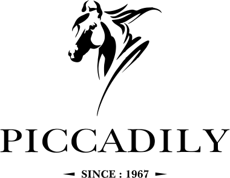

**[Image: 098e8742-32fe-4222-8902-9cbd1098c1a3.pdf-0001-01.png (380x294, 17.5KB)]**

To, BSE Limited Phiroze Jeejeebhoy Towers, Dalal Street, Mumbai – 400 001 BSE Scrip Code : 530305 

To, 

The National Stock Exchange of India Limited Exchange Plaza, Plot No. C/1, G Block Bandra Kurla Complex, Bandra East, Mumbai-400051 

NSE Symbol: PICCADIL 

Subject: Earnings presentation on Unaudited Financial Results for the Nine months and Quarter ended on December 31, 2025. 

###### Dear Sir/Madam, 

Pursuant to Regulation 30 of the SEBI (Listing Obligations and Disclosure Requirements) Regulations, 2015, please find attached herewith the Earnings Presentation on the Unaudited Financial Results for the Nine months and Quarter ended on December 31, 2025. 

We request you to take the above on record. 

Thanking you. 

Yours faithfully, 

For Piccadily Agro Industries Limited 

Sd/- 

Niraj Kumar Sehgal Company Secretary & Compliance Officer M. No. A8019 

###### Piccadily Agro Industries Ltd. 

Registered Office: Village Bhadson, Umri - Indri Road, Teh. Indri, Distt. Karnal, Haryana-132109 (India) Corporate Office: G-17, JMD Pacific Square, Sector-15 (Part-2), Gurugram, Haryana 122002 (India) Ph.: +91-124-4300840, Website: www.piccadily.com, Email: info@piccadily.com 

Investor Relations: Ph.: +91-172-5083695, Website: <u>www.piccadily.com, Email: ir@piccadily.com</u> CIN No.: L01115HR1994PLC032244 

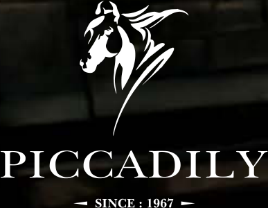

**[Image: 098e8742-32fe-4222-8902-9cbd1098c1a3.pdf-0002-00.png (387x300, 49.3KB)]**

## Q3 & 9M FY2025-26 

**[Image: 098e8742-32fe-4222-8902-9cbd1098c1a3.pdf-0003-00.png (170x114, 17.6KB)]**

#### Disclaimer 

This presentation may include forward-looking statements regarding our Company’s future performance, including sales, revenues, earnings, strategic initiatives and market positioning. These statements are based on management’s current expectations but are subject to uncertainties such as economic fluctuations, evolving consumer preferences, regulatory changes, and competitive dynamics that may cause actual results to differ. While  we remain focused on excellence, innovation, and leadership, the future is shaped by both opportunities and uncertainties. We undertake no obligation to update these statements as conditions evolve. 

Q3 FY2025-26 is the period October 1, 2025 to December 31, 2025. 

9M FY2025-26 is the period April 1, 2025 to December 31, 2025. 

**[Image: 098e8742-32fe-4222-8902-9cbd1098c1a3.pdf-0003-05.png (21x25, 0.8KB)]**

<!-- Start of picture text -->
3 <!-- End of picture text -->

**PICCADILY EARNINGS PRESENTATION @ 2025-26** 

## Management’s Message 

During Q3, alco-bev volumes grew by over 70% year-on-year, driven by improved supply and the seasonally strong nature of the quarter for our portfolio. Leveraging the expanded production capacity, we remain focused on sustaining robust growth in the quarters ahead. 

In line with our plans, the commissioning of expansions at the Indri facility and the Chhattisgarh facility were achieved within the estimated cost and time frame. These expansions will further enhance supply and support our growth plans for alco-bev products including Single Malt, ENA and Ethanol. The increased Malt capacity at Indri, together with procurement of additional barrels, will augment liquid under maturation. This maturing inventory will be available for bottling in a calibrated manner over the coming years. 

With pick up in capacity utilisation at both locations, we expect a progressive increase in revenue contribution beginning April, 2026. 

Further, as stated earlier, we intend to expand our presence in India and overseas across spirits categories through a combination of in-house launches and strategic acquisitions, the efforts for which are ongoing. 

Harvindar Chopra 

Managing Director 

*Excise approval for utilising full capacity at Indri is in progress 

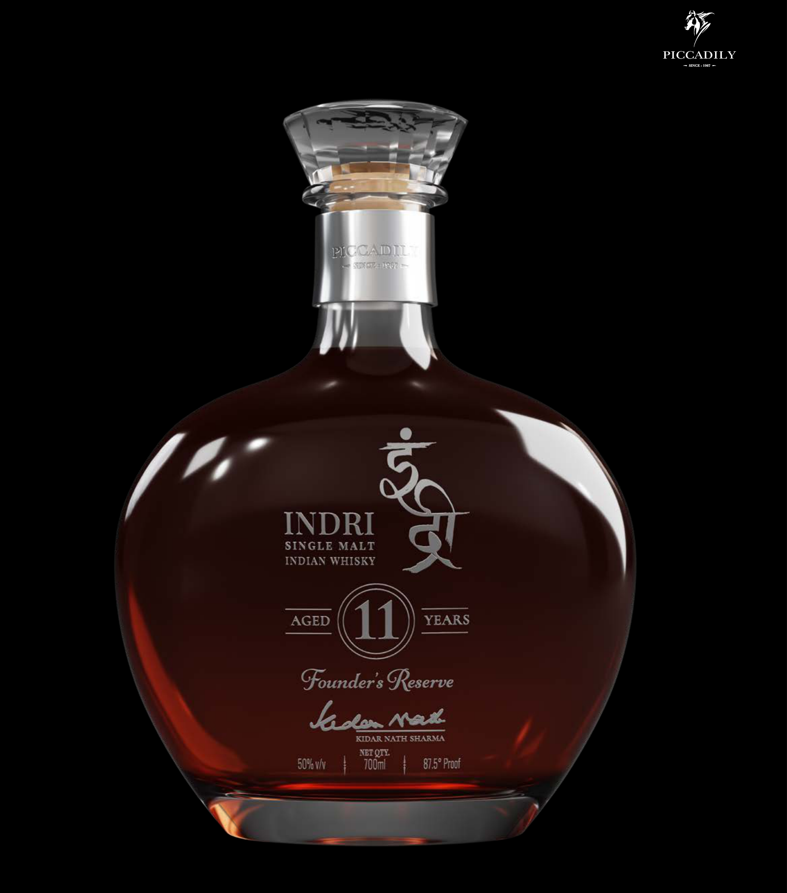

**[Image: 098e8742-32fe-4222-8902-9cbd1098c1a3.pdf-0004-08.png (1826x2072, 1100.5KB)]**

**4** 

PICCADILY EARNINGS PRESENTATION @ 2025-26 

**[Image: 098e8742-32fe-4222-8902-9cbd1098c1a3.pdf-0005-00.png (170x114, 12.6KB)]**

Q3 & 9M FY2025-26 Performance Highlights 

5 

PICCADILY EARNINGS PRESENTATION @ 2025-26 

**[Image: 098e8742-32fe-4222-8902-9cbd1098c1a3.pdf-0006-00.png (175x114, 6.3KB)]**

## Q3 & 9M FY2025-26 Highlights: 

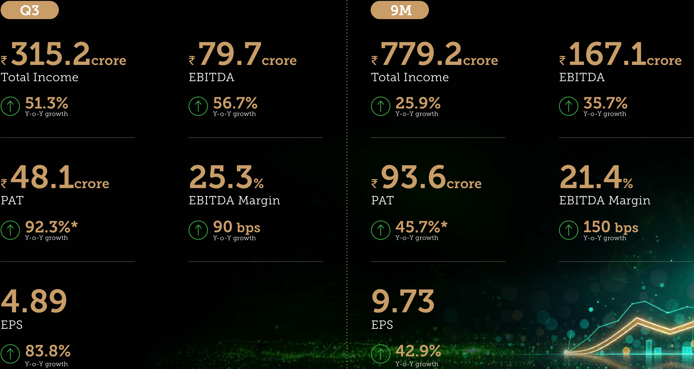

**[Image: 098e8742-32fe-4222-8902-9cbd1098c1a3.pdf-0006-02.png (2695x1432, 434.1KB)]**

<!-- Start of picture text -->
Q3 9M J  315.2crore J  79.7crore J  779.2crore J  167.1crore Total Income EBITDA Total Income EBITDA 51.3% 56.7% 25.9% 35.7% Y-o-Y growth Y-o-Y growth Y-o-Y growth Y-o-Y growth J  48.1crore 25.3% J  93.6crore 21.4% PAT EBITDA Margin PAT EBITDA Margin 92.3%* 90  45.7%* 150 bps bps Y-o-Y growth Y-o-Y growth Y-o-Y growth Y-o-Y growth 4.89 9.73 EPS EPS 83.8% 42.9% Y-o-Y growth Y-o-Y growth <!-- End of picture text -->

**[Image: 098e8742-32fe-4222-8902-9cbd1098c1a3.pdf-0007-00.png (170x114, 5.8KB)]**

## Financial Performance 

###### Standalone Profit & loss 

|Standalone Financials|Q|3|Y-o-Y|Q2|Q-o-Q|9|M|Y-o-Y|
|---|---|---|---|---|---|---|---|---|
|Particular (Figures in`J`Cr)|FY26|FY25|Growth (%)|FY26|Growth (%)|FY26|FY25|Growth (%)|
|Revenue from DistilleryVertical|285.0|183.9|54.9%|207.9|37.1%|655.7|488.0|34.4%|
|Revenue from Sugar Vertical|28.8|21.8|32.2%|24.8|16.1%|119.8|126.6|-5.3%|
|Revenue from Operations|313.8|205.7|52.5%|232.7|34.9%|775.5|614.6|26.2%|
|Other Income|1.4|2.6|-45.2%|1.6|-10.9%|3.7|4.3|-13.9%|
|Total Income|315.2|208.3|51.3%|234.3|34.5%|779.2|618.9|25.9%|
|Expenses|||||||||
|Cost of Materials Consumed|186.1|132.2|40.7%|106.6|74.5%|372.6|270.6|37.7%|
|Changes In Inventories|-64.2|-42.5|51.0%|-1.8|3424.7%|-10.5|47.1|-122.4%|
|Excise DutyOn Sale Of Goods|37.5|23.4|60.0%|20.5|82.9%|73.1|51.7|41.2%|
|Employee Benefts Expense|17.4|11.9|46.3%|16.0|8.7%|45.1|28.9|56.1%|
|Power, Fuel etc.|12.3|6.9|78.5%|15.8|-22.7%|38.0|23.0|65.0%|
|Other Expenses|46.5|25.5|82.1%|28.8|61.6%|93.8|74.4|26.1%|
|Total expenses|235.5|157.5|49.6%|185.9|26.7%|612.1|495.8|23.5%|
|EBITDA|79.7|50.9|56.7%|48.4|64.7%|167.1|123.1|35.7%|
|EBITDA Margin|25.3%|24.4%|90 bps|20.6%|470 bps|21.4%|19.9%|150 bps|

7 

PICCADILY EARNINGS PRESENTATION @ 2025-26 

Financial Performance contd... 

**[Image: 098e8742-32fe-4222-8902-9cbd1098c1a3.pdf-0008-01.png (170x114, 5.8KB)]**

|Standalone Financials|Q|3|Y-o-Y|Q2|Q-o-Q|9|M|Y-o-Y|
|---|---|---|---|---|---|---|---|---|
|Particular (Figures in`J`Cr)|FY26|FY25|Growth (%)|FY26|Growth (%)|FY25|FY24|Growth (%)|
|EBITDA|79.7|50.9|56.7%|48.4|64.7%|167.1|123.1|35.7%|
|Finance Costs|5.6|9.3|-40.1%|6.5|-14.2%|20.7|18.8|10.2%|
|Depreciation And Amortization Expense|6.1|4.8|26.3%|6.2|-2.7%|17.4|14.5|20.5%|
|Proft /(Loss) Before Tax (PBT)|68.0|36.7|85.3%|35.7|90.8%|129.0|89.8|43.6%|
|PBT Margin|21.6%|17.6%|400 bps|0.2|540 bps|0.2|0.1|210 bps|
|Taxes|19.9|11.7|0.7|9.1|1.2|35.3|25.6|0.4|
|Proft/ (Loss) After Tax (PAT)|48.1|25.0|92.3%|26.6|80.9%|93.6|64.3|45.7%|
|PAT Margin|15.3%|12.0%|330 bps|11.4%|390 bps|12.0%|10.4%|160 bps|
|Earnings Per Share (EPS)|4.89|2.66|83.8%|2.80|74.6%|9.73|6.81|42.9%|

Decrease in Finance Costs in Q3 FY 26 due to conversion of CCD’s in to equity, lower working capital loans for sugar 

Employer benefits expenses includes ESOP charge of Rs 1.69 Cr 

Certain cost items appearing in Other expenses have been reclassified under Cost of materials consumed for better segregation 

8 

PICCADILY EARNINGS PRESENTATION @ 2025-26 

**[Image: 098e8742-32fe-4222-8902-9cbd1098c1a3.pdf-0009-00.png (170x114, 5.8KB)]**

## Profitability Trends 

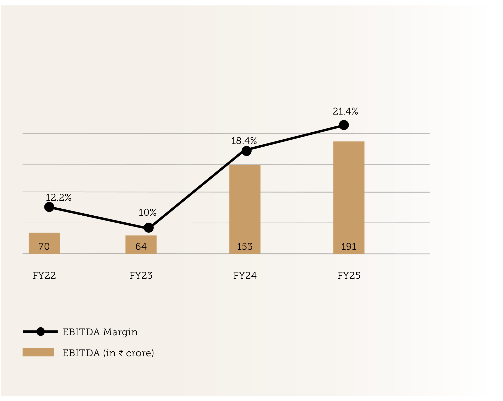

**[Image: 098e8742-32fe-4222-8902-9cbd1098c1a3.pdf-0009-02.png (1947x1551, 115.7KB)]**

<!-- Start of picture text -->
21.4% 18.4% 12.2% 10% 70 64 153 191 FY22 FY23 FY24 FY25 EBITDA Margin EBITDA (in  H  crore) <!-- End of picture text -->

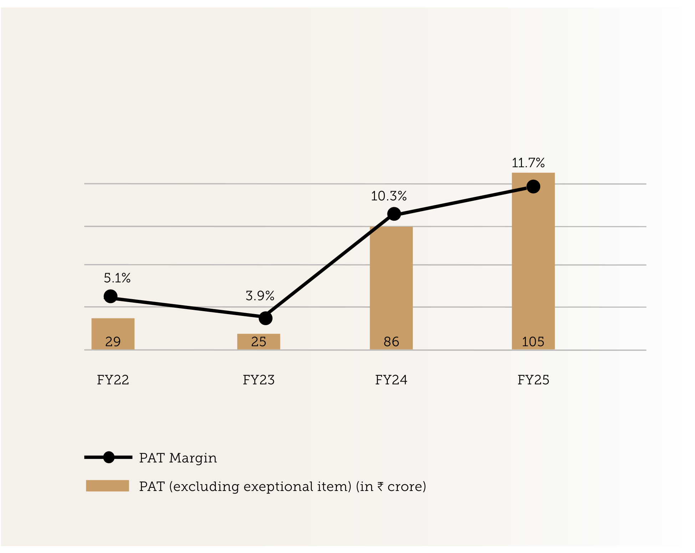

**[Image: 098e8742-32fe-4222-8902-9cbd1098c1a3.pdf-0009-03.png (1948x1551, 121.5KB)]**

<!-- Start of picture text -->
11.7% 10.3% 5.1% 3.9% 29 25 86 105 FY22 FY23 FY24 FY25 PAT Margin PAT (excluding exeptional item) (in  H  crore) <!-- End of picture text -->

9 

PICCADILY EARNINGS PRESENTATION @ 2025-26 

**[Image: 098e8742-32fe-4222-8902-9cbd1098c1a3.pdf-0010-00.png (170x114, 12.6KB)]**

Financial performance contd... 

Q3 Company Revenue from operations grew 52.5% YoY Distillery by 54.9% and sugar by 32.2%. EBITDA increased 56.7% YoY Distillery 

Share of distillery products is 90.8% of Revenue from operations vs 89.4% in Q3 FY25 Share of IMFL of Revenue from operations was at 56.1% vs 58.4% in Q3 FY25. 

9M Company Revenue from operations grew 26.2% YoY Distillery by 34.4% and sugar declined by 5.3% EBITDA increased 35.7% YoY Distillery 

Share of distillery products is 84.5% of Revenue from operations vs 79.4% in 9 mths FY25 Share of IMFL of Revenue from operations was at 44.6% vs 48.1% in 9 mths FY25 Branded Alcobev / IMFL has better margins in premium and luxury category which we focus on 

**10** 

PICCADILY EARNINGS PRESENTATION @ 2025-26 

**[Image: 098e8742-32fe-4222-8902-9cbd1098c1a3.pdf-0011-00.png (170x114, 31.8KB)]**

- Q3 & 9M FY2025-26 Business Highlights 

Expansion at Indri facility and Chhattisgarh facility completed - adds heft 

###### Indri Facility Expansion 

Indri aims to be in top 5 single malts globally 

Enhanced capacity in manufacturing and storage will lead to adequate supply for achieving our long term goals for Indri and other ultra luxury products Excise approval for utilising full capacity at Indri is in progress 

###### Chattisgarh Facility Expansion 

Chattishgarh project completed, production to pick up speed in Q4FY26 

Will produce a mix of IMFL, ENA and Ethanol Key to our strategy for national expansion 

11 

PICCADILY EARNINGS PRESENTATION @ 2025-26 

**[Image: 098e8742-32fe-4222-8902-9cbd1098c1a3.pdf-0012-00.png (170x114, 5.2KB)]**

- Q3 & 9M FY2025-26 Business Highlights Contd. 

IMFL sales continue their growth trajectory 

Maturation capacity enhanced 

IMFL (Indri, Camikara, Whistler and Cashmir) sales volumes grew 70% in Q3 

Number of barrels at 80,800 – additional procurement ongoing 

IMFL demand continues to trend up 

Products / Expressions launched over 9 mths 

###### Other updates 

Indri Agneya 

- Indri Dubai City Series Edition Cashmir Vodka 

- Indri Diwali Collector’s Edition 2025 

Indri Mumbai City Series Edition 

Management team strengthened further: 

Mr. Alok Kumar Singh as Vice President – Manufacturing & Supply Chain, Ex Pernod Ricard 

Mr. M. S. Venkatesh as CHRO, ex HUL, DFM Foods Limited, P. D. Hinduja Hospital 

Warrants aggregating Rs 50 Crores fully subscribed by the Promoters 

###### Distribution continues to be strengthened 

29 states and UT’s (incl.CSD) 

- Over 24,500 retail outlets including On Trade in India as of Dec 31, 2025 CSD and paramilitary focus continues on IMFL products 

- 29 countries, 16 Indian Duty Free and 12 International Duty Free – focus continues - to add more gradually 

- Participated in Whisky and Spirits shows and events, domestically and internationally Curated events held for all IMFL brands 

Products continue to win prestigious international awards 

**12** 

PICCADILY EARNINGS PRESENTATION @ 2025-26 

**[Image: 098e8742-32fe-4222-8902-9cbd1098c1a3.pdf-0013-00.png (170x114, 5.6KB)]**

- Moving Towards Branded and Premium Portfolio 

Over the last four years, we have steadily shifted our revenue profile from bulk commodity-based sales towards branded and premium alcoholic beverages. The focus has progressively shifted towards value-added and branded Indian Made Foreign Liquor (IMFL) products. 

Revenue Composition – Segment-wise ( `J` crore) 

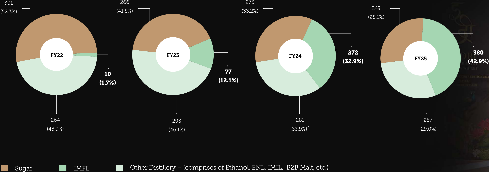

**[Image: 098e8742-32fe-4222-8902-9cbd1098c1a3.pdf-0013-04.png (3193x1126, 252.9KB)]**

<!-- Start of picture text -->
301 266 275 249 (52.3%) (41.8%) (33.2%) (28.1%) FY24 FY25 272 380 FY22 FY23 FY24 FY25 (32.9%) (42.9%) 77 10 (12.1%) (1.7%) 264 293 281 257 (45.9%) (46.1%) (33.9%)` (29.0%) Sugar IMFL Other Distillery – (comprises of Ethanol, ENL, IMIL,  B2B Malt, etc.) <!-- End of picture text -->

**13** 

PICCADILY EARNINGS PRESENTATION @ 2025-26 

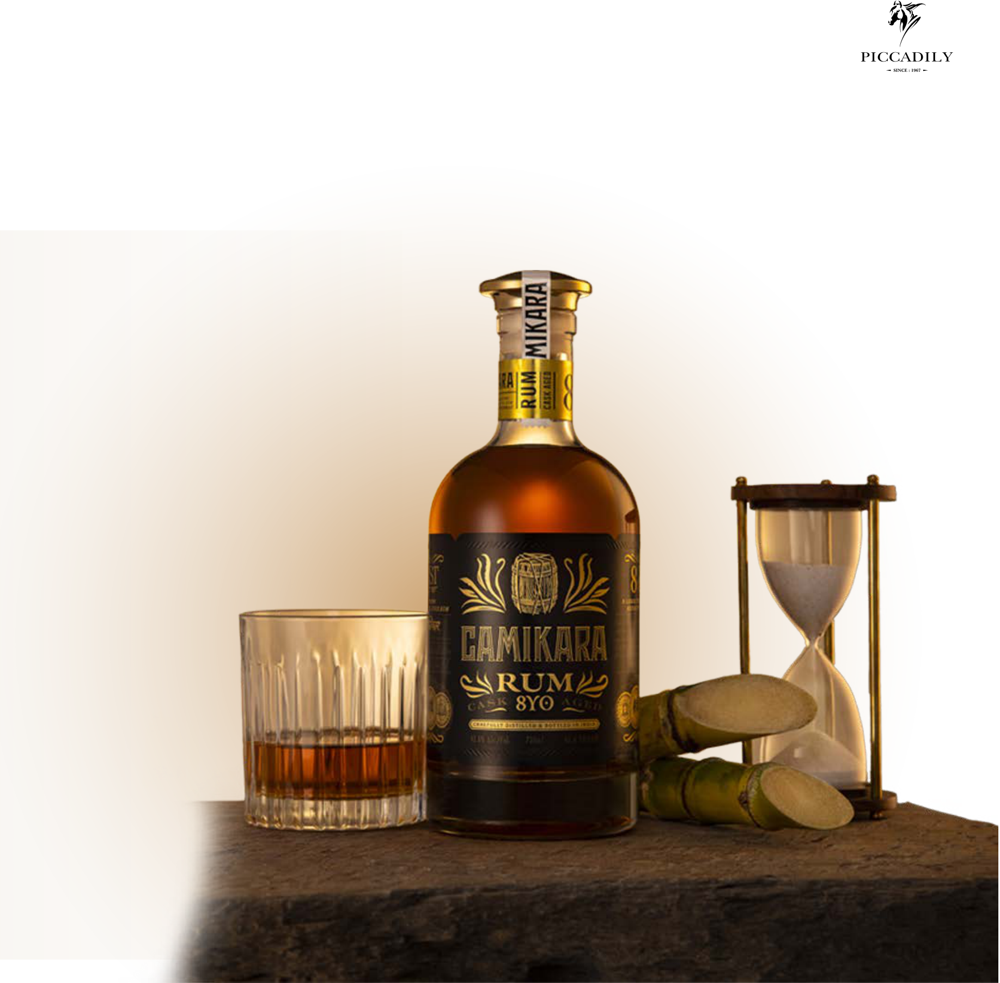

**[Image: 098e8742-32fe-4222-8902-9cbd1098c1a3.pdf-0014-00.png (1836x1805, 1873.8KB)]**

## EDITDA Margin by Business 

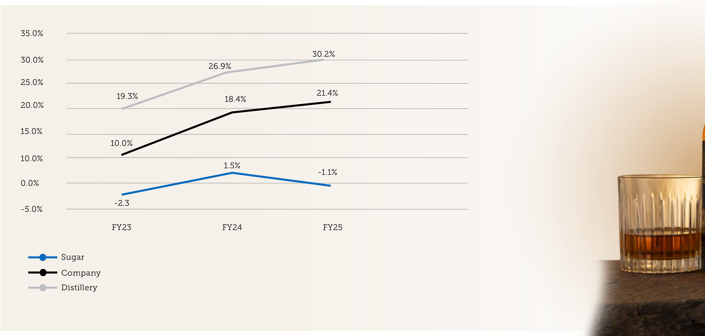

**[Image: 098e8742-32fe-4222-8902-9cbd1098c1a3.pdf-0014-02.png (2897x1380, 718.4KB)]**

<!-- Start of picture text -->
35.0% 30.2% 30.0% 26.9% 25.0% 21.4% 19.3% 18.4% 20.0% 15.0% 10.0% 10.0% 1.5% -1.1% 0.0% -2.3 -5.0% FY23 FY24 FY25 Sugar Company Distillery <!-- End of picture text -->

Distillery margin will depend on share of IMFL in sales 

14 

PICCADILY EARNINGS PRESENTATION @ 2025-26 

**[Image: 098e8742-32fe-4222-8902-9cbd1098c1a3.pdf-0015-00.png (170x114, 5.8KB)]**

- Growth Drivers of Premium Alcohol Market in India 

**[Image: 098e8742-32fe-4222-8902-9cbd1098c1a3.pdf-0015-02.png (137x137, 7.4KB)]**

**[Image: 098e8742-32fe-4222-8902-9cbd1098c1a3.pdf-0015-03.png (137x137, 7.0KB)]**

We have recorded consistent growth, driven by shifting consumer preferences and aligned with key market trends. 

**[Image: 098e8742-32fe-4222-8902-9cbd1098c1a3.pdf-0015-05.png (139x133, 5.3KB)]**

###### Revenue Premium S irits <u>p</u> 

Premiumisation <u>p</u> Strong Demand for Ingredient and Driven by Younger Process-led Innovation Artisanal and Craft Spirits 39.8% Consumers FY25 **380** 253.2% Premium spirits continue to Consumer interest is growing Spirits leveraging unique FY24 272 outperform standard categories in craft and small-batch spirits, ingredients, innovative distillation 670.0% globally due to primarily driven methods, and unusual ageing FY23 77 younger consumers prioritising by perceptions of authenticity, processes are increasingly FY22 10 quality over quantity and seeking superior craftsmanship, and attractive to consumers who seek more refined unique taste profiles differentiation and Y-o-Y growth Revenue (IMFL) in `H` crore drinking experiences premium quality. 236% CAGR Global Recognition Rising Popularity HORECA Channel Fuelling 39.8% Influencing Consumer Choices of Experiential Drinking Premium Spirits Growth FY25 YoY International awards and Consumers increasingly prefer The HORECA segment remains a recognition significantly influence spirits that enhance social and key channel for premium spirits, consumer purchase special-occasion contributing over half of global ondecisions, establishing perceptions drinking experiences, prompting trade revenue. Growth is driven by of premium quality greater interest in premium and rising consumer demand for quality and trustworthiness in distinctive products. experiences and curated selections spirits brands. in hospitality settings 

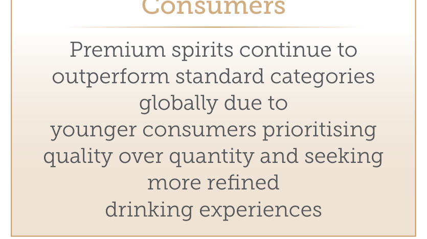

**[Image: 098e8742-32fe-4222-8902-9cbd1098c1a3.pdf-0015-08.png (835x468, 51.0KB)]**

<!-- Start of picture text -->
Premium spirits continue to outperform standard categories globally due to younger consumers prioritising quality over quantity and seeking more refined drinking experiences <!-- End of picture text -->

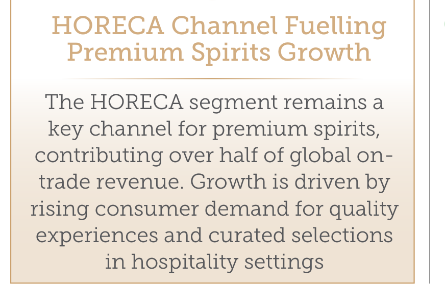

**[Image: 098e8742-32fe-4222-8902-9cbd1098c1a3.pdf-0015-09.png (872x561, 70.8KB)]**

<!-- Start of picture text -->
HORECA Channel Fuelling Premium Spirits Growth The HORECA segment remains a key channel for premium spirits, contributing over half of global on- trade revenue. Growth is driven by rising consumer demand for quality experiences and curated selections in hospitality settings <!-- End of picture text -->

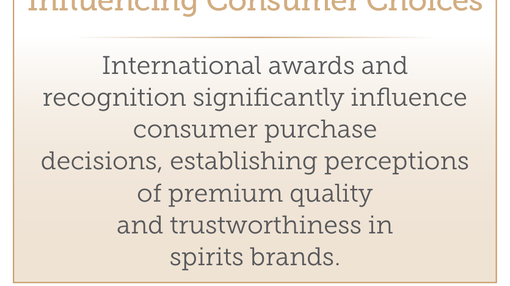

**[Image: 098e8742-32fe-4222-8902-9cbd1098c1a3.pdf-0015-10.png (835x468, 49.8KB)]**

<!-- Start of picture text -->
International awards and recognition significantly influence consumer purchase decisions, establishing perceptions of premium quality and trustworthiness in spirits brands. <!-- End of picture text -->

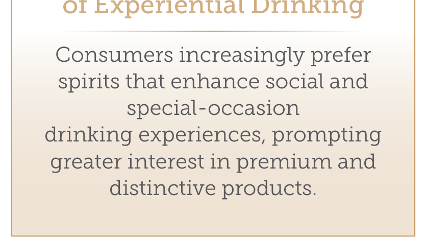

**[Image: 098e8742-32fe-4222-8902-9cbd1098c1a3.pdf-0015-11.png (835x468, 48.7KB)]**

<!-- Start of picture text -->
Consumers increasingly prefer spirits that enhance social and special-occasion drinking experiences, prompting greater interest in premium and distinctive products. <!-- End of picture text -->

15 

PICCADILY EARNINGS PRESENTATION @ 2025-26 

- The Rise of Indri : Leading Brand Amongst Single Malts in India, Winning Awards Globally 

**[Image: 098e8742-32fe-4222-8902-9cbd1098c1a3.pdf-0016-01.png (170x114, 5.6KB)]**

Indri Diwali Collectors Edition 2025 Marsala Cask Finish took top honors as the Best World Whisky at the 2025 Las Vegas Global Spirits Awards with a near-perfect 99.1 There is increasing acceptance of Indian single malts both within and outside India with Indri as the leading brand. 

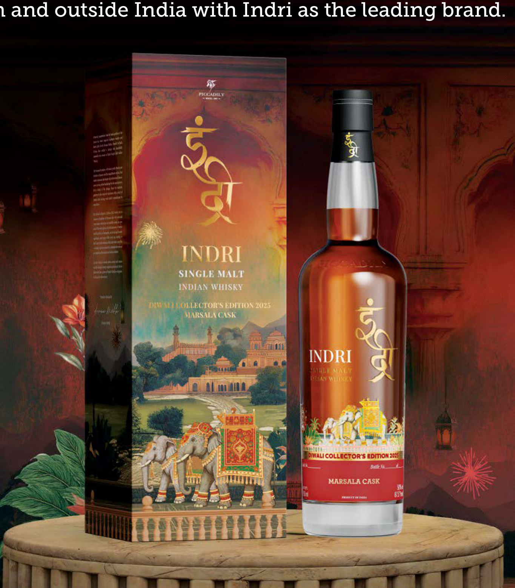

**[Image: 098e8742-32fe-4222-8902-9cbd1098c1a3.pdf-0016-03.png (1365x1557, 3285.9KB)]**

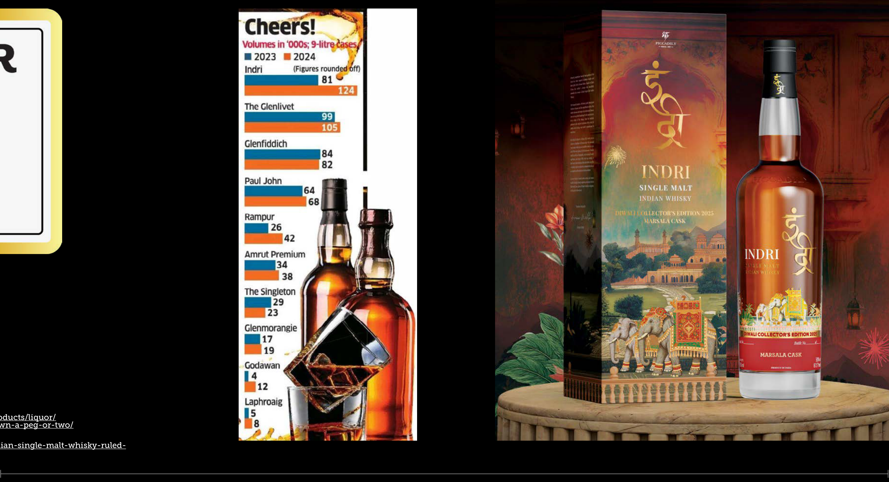

**[Image: 098e8742-32fe-4222-8902-9cbd1098c1a3.pdf-0016-04.png (2918x1586, 4612.0KB)]**

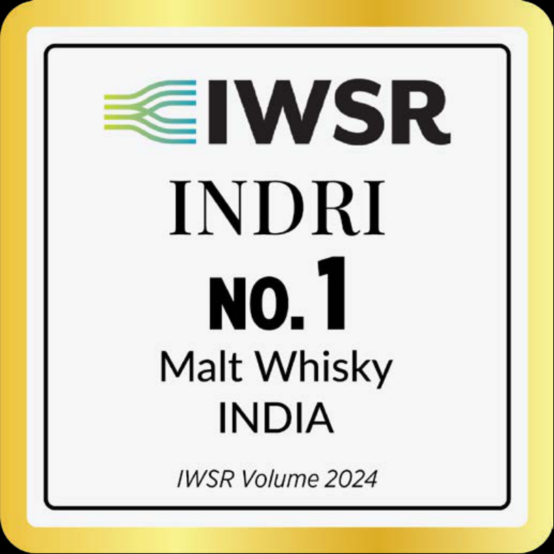

**[Image: 098e8742-32fe-4222-8902-9cbd1098c1a3.pdf-0016-05.png (809x809, 215.7KB)]**

https://economictimes.indiatimes.com/industry/cons-products/liquor/ going-indiagenous-desi-malts-take-premium-scotch-down-a-peg-or-two/ articleshow/123244022. https://www.forbes.com/sites/joemicallef/2025/09/30/indian-single-malt-whisky-ruledthe-las-vegas-global-spirit-awards/ 

16 

PICCADILY EARNINGS PRESENTATION @ 2025-26 

**[Image: 098e8742-32fe-4222-8902-9cbd1098c1a3.pdf-0017-00.png (170x114, 5.6KB)]**

# Company Overview 

17 

PICCADILY EARNINGS PRESENTATION @ 2025-26 

**[Image: 098e8742-32fe-4222-8902-9cbd1098c1a3.pdf-0018-00.png (170x114, 5.4KB)]**

## Introduction 

###### Crafting Excellence, Redefining India’s Premium Alco-Bev Landscape 

Piccadily Agro Industries Ltd. (PAIL) is a name synonymous with heritage, craftsmanship and innovation. Established in 1994, it has grown to become India’s largest independent producer of malt spirits. Our portfolio includes single malt whiskies, cane juice rum and a range of IMFL brands, setting new benchmarks in quality and innovation. Beyond spirits, we manufacture Ethanol, Extra Neutral Alcohol (ENA), DDGS and white crystal sugar. 

With a diverse portfolio of premium alco-bev brands and more products in the offing we endeavour to define the future of niche and premium Indian alco-bev spirits in India and overseas. We plan to capitalise organic and inorganic growth opportunities to achieve the above. 

###### Crafting the Future 

We operate across two strategic pillars, each driven by a commitment to excellence and innovation: 

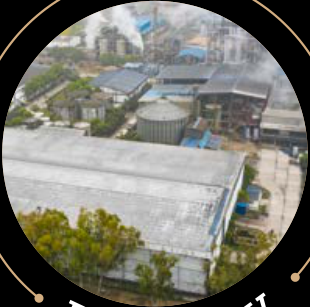

**[Image: 098e8742-32fe-4222-8902-9cbd1098c1a3.pdf-0018-07.png (310x307, 165.9KB)]**

**[Image: 098e8742-32fe-4222-8902-9cbd1098c1a3.pdf-0018-08.png (311x317, 138.1KB)]**

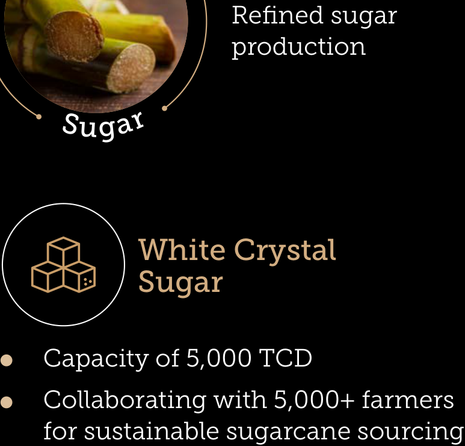

**[Image: 098e8742-32fe-4222-8902-9cbd1098c1a3.pdf-0018-09.png (773x741, 167.5KB)]**

<!-- Start of picture text -->
Refined sugar production White Crystal Sugar Capacity of 5,000 TCD Collaborating with 5,000+ farmers for sustainable sugarcane sourcing ug S a r <!-- End of picture text -->

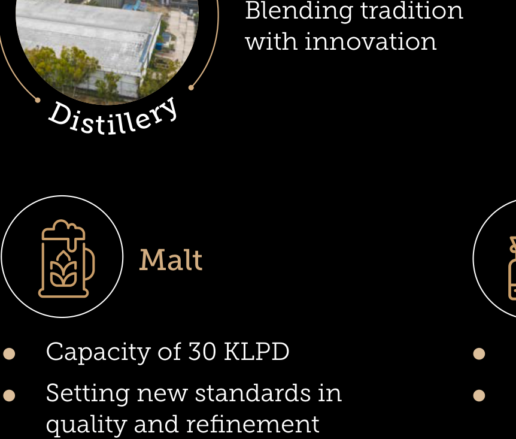

**[Image: 098e8742-32fe-4222-8902-9cbd1098c1a3.pdf-0018-10.png (862x733, 150.4KB)]**

<!-- Start of picture text -->
Blending tradition with innovation Malt Capacity of 30 KLPD Setting new standards in quality and refinement Distillery <!-- End of picture text -->

Extra Neutral Alcohol (ENA) and Ethanol Capacity of 420 KLPD Contributing to sustainable energy solutions and a greener future 

At the heart of our operations lies a state-of-the-art manufacturing facility in Indri, Haryana, spanning 168 acres. This world-class facility seamlessly integrates cutting-edge technology to produce the above. The Chhattisgarh facility has 26 acres of land 

*Excise approval for utilising full capacity at Indri is in progress 

**18** 

PICCADILY EARNINGS PRESENTATION @ 2025-26 

**[Image: 098e8742-32fe-4222-8902-9cbd1098c1a3.pdf-0019-00.png (170x114, 5.4KB)]**

##### Introduction contd... 

###### Architects of Premium Spirits 

Piccadily Agro is at the forefront of India’s evolving spirits landscape, by driving premiumization and setting new benchmarks in craftsmanship and innovation. With an insightful grasp of market dynamics and a steadfast dedication to fine craftsmanship, we cater to a select clientele who value not only quality but the artistry of innovation. 

Through our flagship brands, we deliver more than just spirits; we offer an experience that transcends the ordinary where timeless tradition meets contemporary mastery. Each creation is a testament to our relentless pursuit of excellence, refining the very essence of premium and redefining the art of indulgence. 30 KLPD 420KLPDKLPD Malt Plant Ethanol / ENA Plant 

420KLPDKLPD Ethanol / ENA Plant 24,500+ PAN India Retail Outlets including On Trade 

29 Countries 

###### A Portfolio of Distinction 

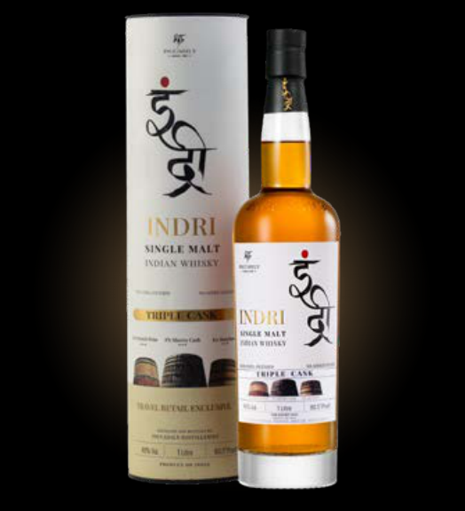

**[Image: 098e8742-32fe-4222-8902-9cbd1098c1a3.pdf-0019-08.png (524x576, 239.5KB)]**

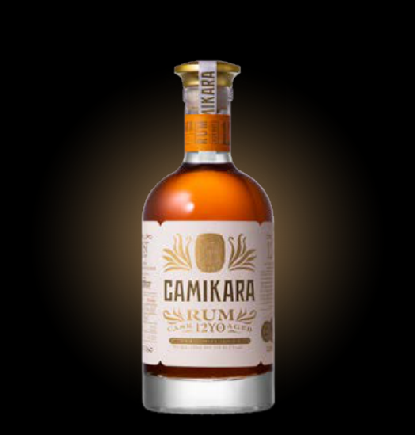

**[Image: 098e8742-32fe-4222-8902-9cbd1098c1a3.pdf-0019-09.png (524x549, 170.9KB)]**

Single Malt Whisky 

Premium Sugarcane Juice Rum 

Indri, our flagship brand, a Camikara, a bold innovation trailblazer in redefining India’s that reimagines the spirit of premium spirits landscape rum, blending creativity with with unparalleled elegance and excellence. character. 

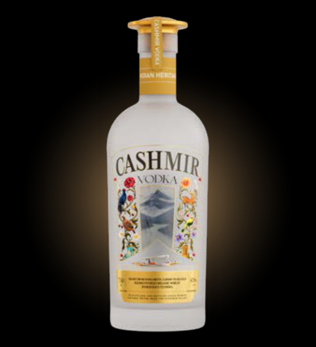

**[Image: 098e8742-32fe-4222-8902-9cbd1098c1a3.pdf-0019-13.png (524x575, 172.4KB)]**

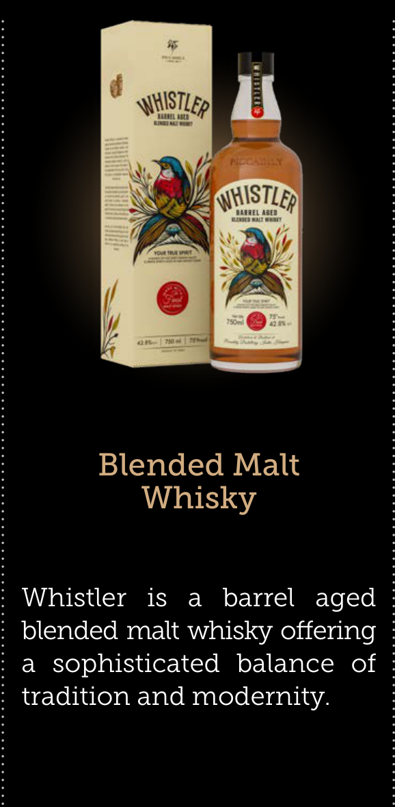

**[Image: 098e8742-32fe-4222-8902-9cbd1098c1a3.pdf-0019-14.png (578x1178, 338.5KB)]**

<!-- Start of picture text -->
Blended Malt Whisky Whistler is a barrel aged blended malt whisky offering a sophisticated balance of tradition and modernity. <!-- End of picture text -->

Blended Malt Vodka Whisky 

India’s 1st Premium Vodka Made From Sona Moti, A 2000-Year-Old Rediscovered Organic Wheat Indigenous To India 

*Excise approval for utilising full capacity at Indri is in progress 

**19** 

PICCADILY EARNINGS PRESENTATION @ 2025-26 

**[Image: 098e8742-32fe-4222-8902-9cbd1098c1a3.pdf-0020-00.png (170x114, 5.8KB)]**

## Our Journey 

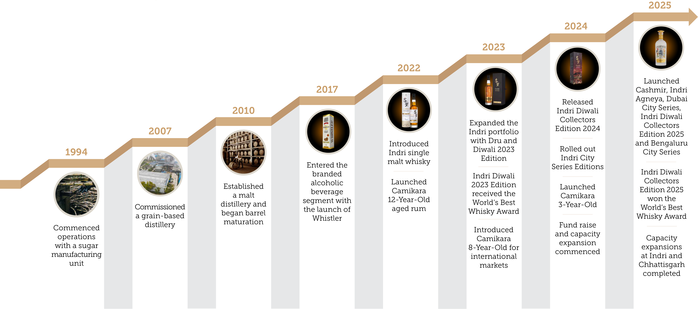

**[Image: 098e8742-32fe-4222-8902-9cbd1098c1a3.pdf-0020-02.png (3934x1743, 1095.1KB)]**

<!-- Start of picture text -->
2025 2024 2023 2022 Launched 2017 Cashmir, Indri Agneya, Dubai Released City Series, 2010 Indri Diwali Indri Diwali Collectors Expanded the  Collectors Edition 2024 2007 Indri portfolio  Edition 2025 with Dru and Introduced  and Bengaluru Diwali 2023  Rolled out 1994 Indri single  City Series Edition Indri City malt whisky Entered the Series Editions Indri Diwali branded Indri Diwali alcoholic  Launched  Collectors 2023 Edition Established  Launched beverage  Camikara  received the  Edition 2025 a malt  Camikara segment with  12-Year-Old  World’s Best  won the distillery and  3-Year-Old Commissioned  World’s Best the launch of  aged rum Whisky Award began barrel a grain-based  Whistler Whisky Award maturation distillery Fund raise Commenced Introduced and capacity operations  Camikara  Capacity expansion with a sugar  8-Year-Old for  expansions commenced manufacturing  international  at Indri and unit markets Chhattisgarh completed <!-- End of picture text -->

20 

PICCADILY EARNINGS PRESENTATION @ 2025-26 

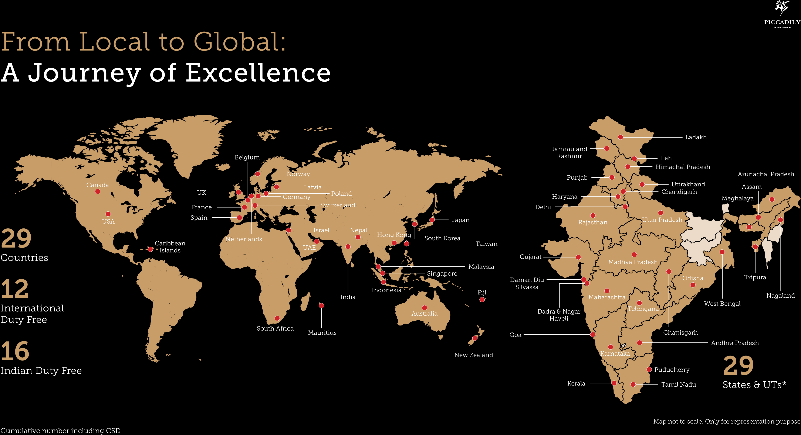

**[Image: 098e8742-32fe-4222-8902-9cbd1098c1a3.pdf-0021-00.png (3768x2049, 599.4KB)]**

<!-- Start of picture text -->
From Local to Global: A Journey of Excellence Ladakh Jammu and Kashmir Belgium Leh Himachal Pradesh Norway Arunachal Pradesh Punjab Canada Uttrakhand Latvia Assam UK Poland Chandigarh Germany Haryana Meghalaya Switzerland France Delhi USA Spain Japan Rajasthan Uttar Pradesh Israel Nepal Hong Kong Netherlands South Korea Caribbean  Taiwan 29 UAE Islands Countries Gujarat Madhya Pradesh Malaysia Singapore Odisha Tripura Daman Diu Silvassa Indonesia Fiji 12 India Maharashtra Nagaland West Bengal International  Telengana Australia Dadra & Nagar Duty Free Haveli South Africa  Mauritius Goa Chattisgarh Andhra Pradesh New Zealand Karnataka 16 Puducherry Indian Duty Free 29 Kerala Tamil Nadu States & UTs* Map not to scale. Only for representation purpose Cumulative number including CSD <!-- End of picture text -->

**21** 

PICCADILY EARNINGS PRESENTATION @ 2025-26 

**[Image: 098e8742-32fe-4222-8902-9cbd1098c1a3.pdf-0022-00.png (170x114, 5.4KB)]**

## Malt Manufacturing Process 

**[Image: 098e8742-32fe-4222-8902-9cbd1098c1a3.pdf-0022-02.png (899x548, 1253.1KB)]**

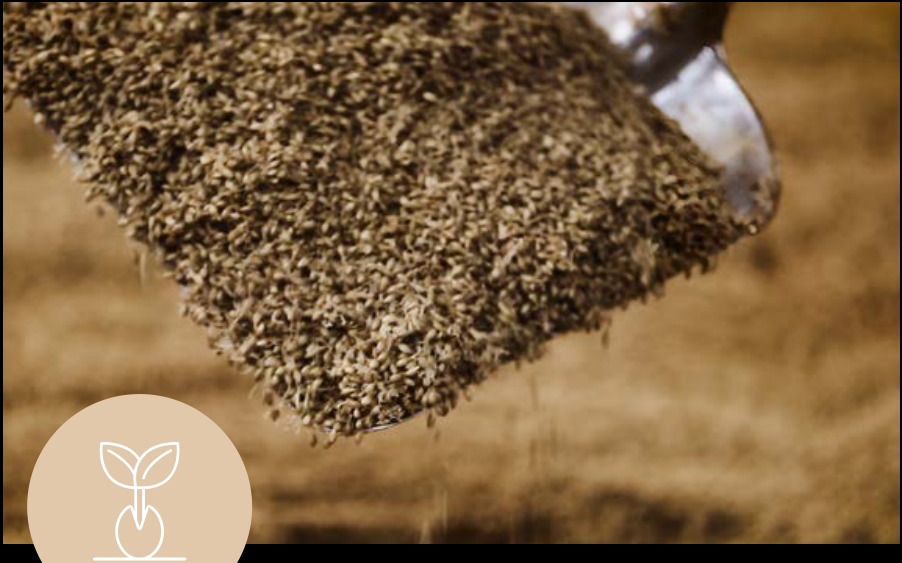

**[Image: 098e8742-32fe-4222-8902-9cbd1098c1a3.pdf-0022-03.png (902x563, 879.2KB)]**

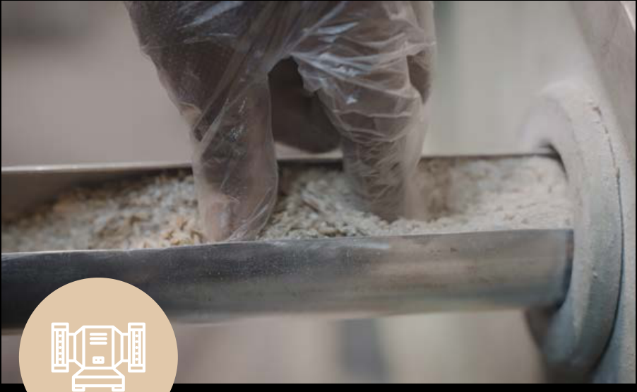

**[Image: 098e8742-32fe-4222-8902-9cbd1098c1a3.pdf-0022-04.png (902x555, 452.4KB)]**

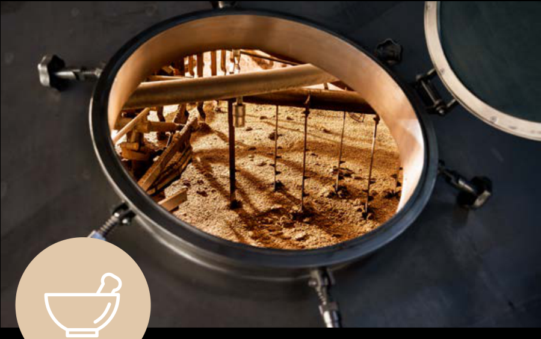

**[Image: 098e8742-32fe-4222-8902-9cbd1098c1a3.pdf-0022-05.png (899x563, 702.2KB)]**

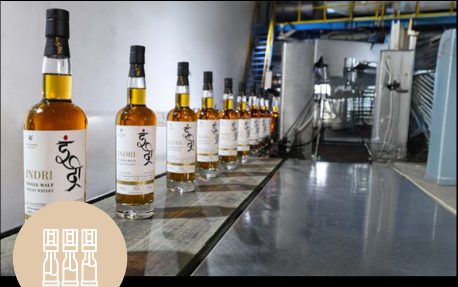

**[Image: 098e8742-32fe-4222-8902-9cbd1098c1a3.pdf-0022-06.png (901x565, 788.1KB)]**

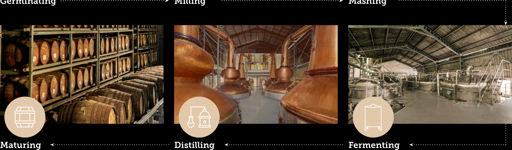

**[Image: 098e8742-32fe-4222-8902-9cbd1098c1a3.pdf-0022-07.png (2809x824, 3226.9KB)]**

<!-- Start of picture text -->
Maturing Distilling Fermenting <!-- End of picture text -->

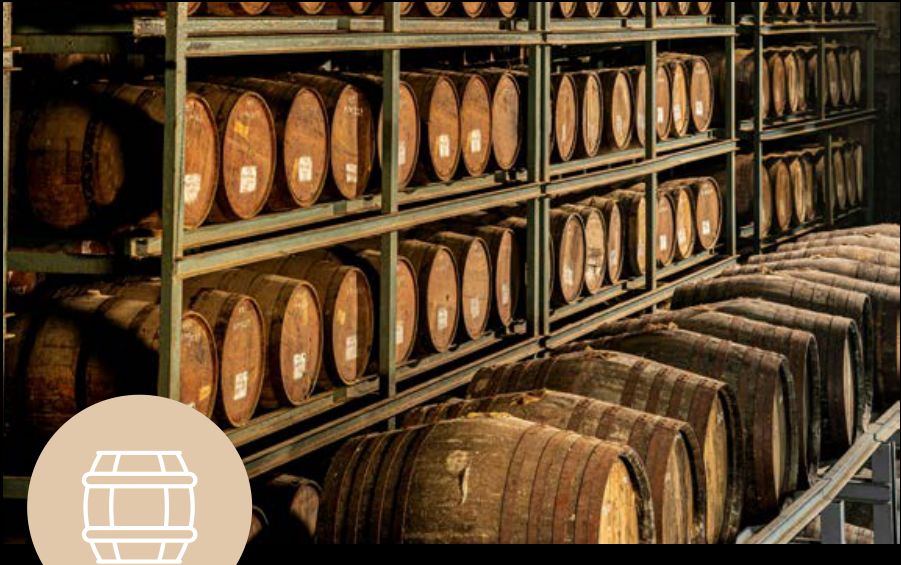

**[Image: 098e8742-32fe-4222-8902-9cbd1098c1a3.pdf-0022-08.png (901x565, 1133.0KB)]**

**22** 

PICCADILY EARNINGS PRESENTATION @ 2025-26 

**[Image: 098e8742-32fe-4222-8902-9cbd1098c1a3.pdf-0023-00.png (170x114, 5.4KB)]**

## Indri - Raising The Bar: A Spirit Designed to Inspire 

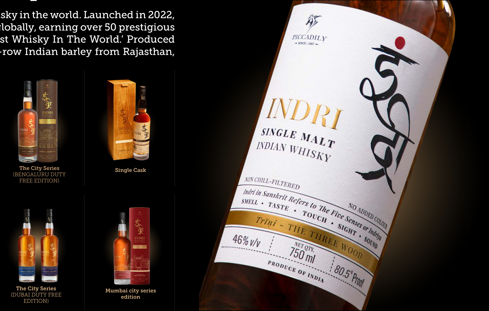

**[Image: 098e8742-32fe-4222-8902-9cbd1098c1a3.pdf-0023-02.png (2498x1590, 3197.3KB)]**

<!-- Start of picture text -->
The City Series Single Cask (BENGALURU DUTY FREE EDITION) The City Series Mumbai city series (DUBAI DUTY FREE edition EDITION) <!-- End of picture text -->

Indri is one of the most awarded Indian single malt whisky in the world. Launched in 2022, it has quickly become the fastest-growing single malt globally, earning over 50 prestigious accolades, including ‘Best Indian Single Malt’ and ‘Best Whisky In The World.’ Produced in Indri, a small village in Haryana, using premium 6-row Indian barley from Rajasthan, showcases Indian excellence and innovation. 

**[Image: 098e8742-32fe-4222-8902-9cbd1098c1a3.pdf-0023-04.png (185x462, 155.8KB)]**

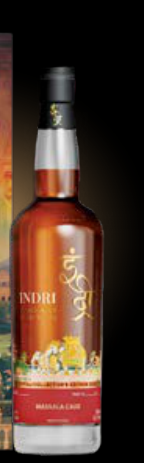

**[Image: 098e8742-32fe-4222-8902-9cbd1098c1a3.pdf-0023-05.png (144x463, 93.0KB)]**

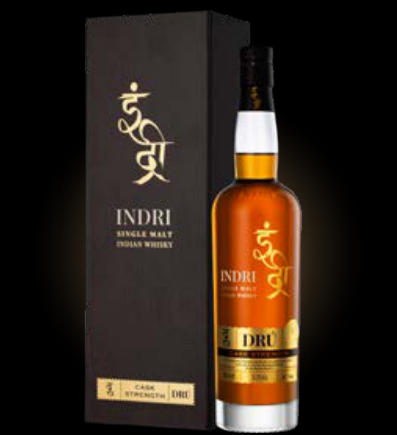

**[Image: 098e8742-32fe-4222-8902-9cbd1098c1a3.pdf-0023-06.png (397x435, 134.4KB)]**

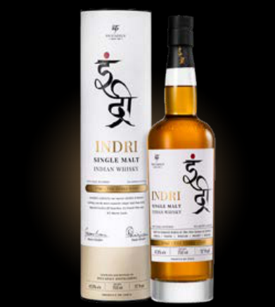

**[Image: 098e8742-32fe-4222-8902-9cbd1098c1a3.pdf-0023-07.png (391x436, 147.0KB)]**

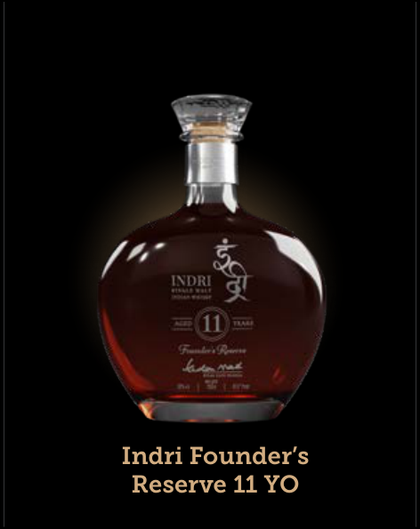

**[Image: 098e8742-32fe-4222-8902-9cbd1098c1a3.pdf-0023-08.png (472x595, 116.4KB)]**

<!-- Start of picture text -->
Indri Founder’s Reserve 11 YO <!-- End of picture text -->

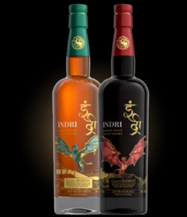

**[Image: 098e8742-32fe-4222-8902-9cbd1098c1a3.pdf-0023-09.png (376x436, 159.4KB)]**

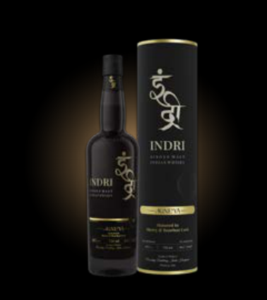

**[Image: 098e8742-32fe-4222-8902-9cbd1098c1a3.pdf-0023-10.png (378x425, 87.2KB)]**

**23** 

PICCADILY EARNINGS PRESENTATION @ 2025-26 

**[Image: 098e8742-32fe-4222-8902-9cbd1098c1a3.pdf-0024-00.png (170x114, 5.4KB)]**

## Camikara 

is India’s Camikara, derived from the Sanskrit word meaning “liquid gold,” first Pure Cane Juice Premium Aged Rum, redefining the country’s rum legacy. Aged in American oak barrels, Camikara stands apart with no added colors, flavors, sugar, or spices, delivering a truly authentic and refined experience. 

###### Camikara RUM 12 YO 

###### Camikara RUM 8 YO 

###### Camikara RUM 3 YO 

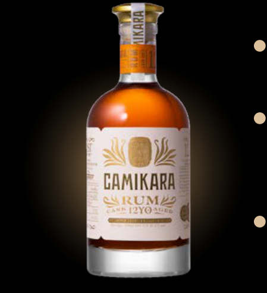

**[Image: 098e8742-32fe-4222-8902-9cbd1098c1a3.pdf-0024-06.png (449x493, 167.5KB)]**

Aged for 12 years in American oak barrels. 

Bottled at 50% ABV, offering a rich, complex, and smooth tasting experience. 

Available in select Indian and international markets. 

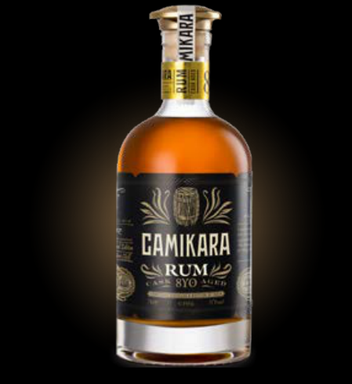

**[Image: 098e8742-32fe-4222-8902-9cbd1098c1a3.pdf-0024-10.png (449x490, 177.8KB)]**

A rare, 8-year-aged pure cane juice rum, offering a deep and aromatic profile. 

Aged in American oak barrels for a well-rounded character, with an ABV of 42.8%, delivering a smooth and balanced whisky experience. 

Available in select international markets. 

**[Image: 098e8742-32fe-4222-8902-9cbd1098c1a3.pdf-0024-14.png (449x493, 168.3KB)]**

Aged for 3 years in American oak barrels and bottled at 42.8% ABV, shattering the myth that rum is only a seasonal spirit. 

Launched Pan-India in On-Trade channels. 

Recognitions 

Recognitions 

Recognitions 

The 1st Indian Rum to ever win a gold medal at the prestigious IWSC wards 2023, with 95 points. 2023 Bartender Spirits awards - GOLD. 

The Spirits Business Global RUM & CACHACA Masters - GOLD 2024. 

The 1st Indian Rum to Ever win a Gold Medal at the Global RUM & Cachaca Masters 2024 USA Spirits ratings - Silver 2024 

Vine Pair - Listed under 30 Best Rums for 2025 

The 1st Indian Rum to ever win a Gold medal at the Global RUM & Cachaca Masters 2025 

Camikara 3 YO: Bronze at London Spirits Competition 

**24** 

PICCADILY EARNINGS PRESENTATION @ 2025-26 

**[Image: 098e8742-32fe-4222-8902-9cbd1098c1a3.pdf-0025-00.png (170x114, 5.4KB)]**

## Camikara Mixers 

Introducing the all-new Camikara NonAlcoholic Mixers in two vibrant flavours – Mojito and Mai Tai. Expertly crafted to elevate every pour, these tropical mixers capture the essence of iconic cocktails. Camikara mixers deliver a premium, bar-quality experience— bringing the spirit of indulgence home, one exquisite sip at a time. 

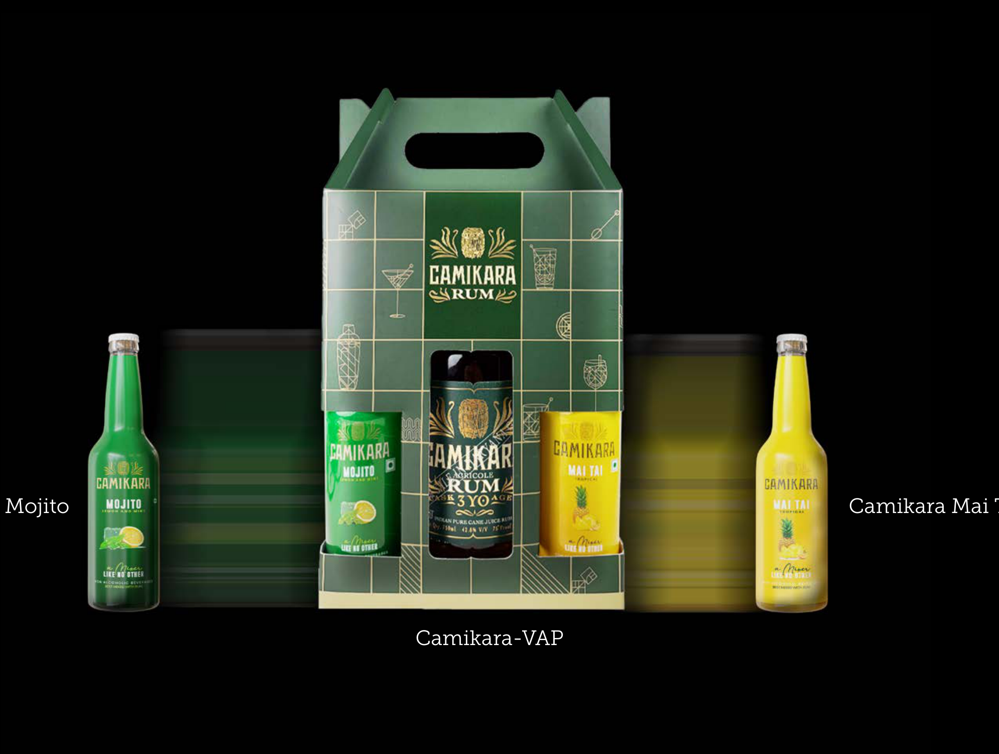

**[Image: 098e8742-32fe-4222-8902-9cbd1098c1a3.pdf-0025-03.png (1990x1502, 1511.0KB)]**

<!-- Start of picture text -->
Camikara Mai Tai Camikara-VAP <!-- End of picture text -->

Camikara Mojito 

**25** 

PICCADILY EARNINGS PRESENTATION @ 2025-26 

**[Image: 098e8742-32fe-4222-8902-9cbd1098c1a3.pdf-0026-00.png (170x114, 6.0KB)]**

26 

**[Image: 098e8742-32fe-4222-8902-9cbd1098c1a3.pdf-0027-01.png (170x114, 5.4KB)]**

- Mastery in Every Sip: Premium Spirits Across Price Segments 

**[Image: 098e8742-32fe-4222-8902-9cbd1098c1a3.pdf-0027-03.png (342x39, 4.5KB)]**

<!-- Start of picture text -->
Blended Whisky <!-- End of picture text -->

Coming Soon 

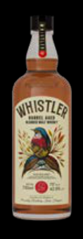

**[Image: 098e8742-32fe-4222-8902-9cbd1098c1a3.pdf-0027-05.png (118x339, 53.0KB)]**

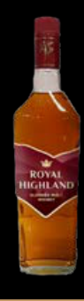

**[Image: 098e8742-32fe-4222-8902-9cbd1098c1a3.pdf-0027-06.png (95x339, 44.1KB)]**

Aged Rum 

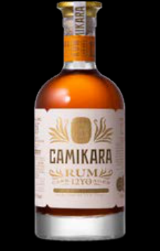

**[Image: 098e8742-32fe-4222-8902-9cbd1098c1a3.pdf-0027-08.png (227x356, 89.7KB)]**

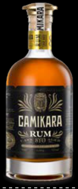

**[Image: 098e8742-32fe-4222-8902-9cbd1098c1a3.pdf-0027-09.png (155x374, 100.1KB)]**

**[Image: 098e8742-32fe-4222-8902-9cbd1098c1a3.pdf-0027-10.png (227x360, 72.4KB)]**

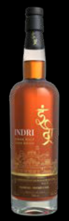

**[Image: 098e8742-32fe-4222-8902-9cbd1098c1a3.pdf-0027-11.png (116x369, 59.8KB)]**

Single Malt Whisky 

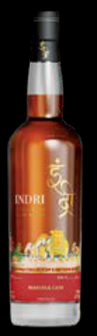

**[Image: 098e8742-32fe-4222-8902-9cbd1098c1a3.pdf-0027-13.png (107x369, 58.1KB)]**

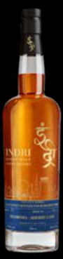

**[Image: 098e8742-32fe-4222-8902-9cbd1098c1a3.pdf-0027-14.png (90x369, 58.2KB)]**

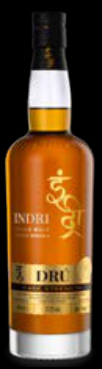

**[Image: 098e8742-32fe-4222-8902-9cbd1098c1a3.pdf-0027-15.png (102x369, 63.3KB)]**

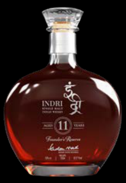

**[Image: 098e8742-32fe-4222-8902-9cbd1098c1a3.pdf-0027-16.png (255x369, 103.5KB)]**

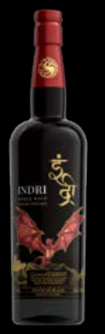

**[Image: 098e8742-32fe-4222-8902-9cbd1098c1a3.pdf-0027-17.png (116x369, 48.7KB)]**

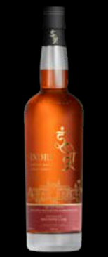

**[Image: 098e8742-32fe-4222-8902-9cbd1098c1a3.pdf-0027-18.png (154x366, 59.3KB)]**

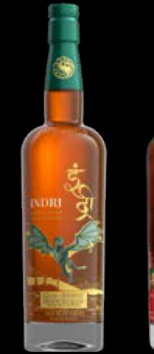

**[Image: 098e8742-32fe-4222-8902-9cbd1098c1a3.pdf-0027-19.png (154x354, 64.4KB)]**

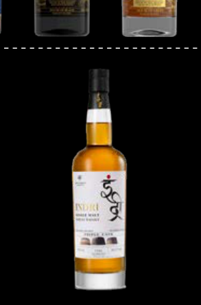

**[Image: 098e8742-32fe-4222-8902-9cbd1098c1a3.pdf-0027-20.png (293x445, 67.1KB)]**

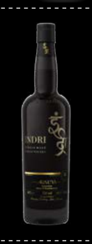

**[Image: 098e8742-32fe-4222-8902-9cbd1098c1a3.pdf-0027-21.png (150x398, 36.6KB)]**

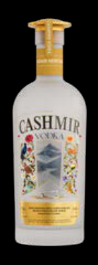

**[Image: 098e8742-32fe-4222-8902-9cbd1098c1a3.pdf-0027-22.png (139x376, 62.6KB)]**

**[Image: 098e8742-32fe-4222-8902-9cbd1098c1a3.pdf-0027-23.png (517x384, 6.8KB)]**

<!-- Start of picture text -->
ULTRA - LUXURY <!-- End of picture text -->

**[Image: 098e8742-32fe-4222-8902-9cbd1098c1a3.pdf-0027-24.png (350x384, 5.3KB)]**

<!-- Start of picture text -->
LUXURY <!-- End of picture text -->

**[Image: 098e8742-32fe-4222-8902-9cbd1098c1a3.pdf-0027-25.png (392x384, 5.7KB)]**

<!-- Start of picture text -->
PREMIUM <!-- End of picture text -->

**[Image: 098e8742-32fe-4222-8902-9cbd1098c1a3.pdf-0027-26.png (418x384, 6.3KB)]**

<!-- Start of picture text -->
PRESTIGE <!-- End of picture text -->

**27** 

PICCADILY EARNINGS PRESENTATION @ 2025-26 

## Recent Launches 

**[Image: 098e8742-32fe-4222-8902-9cbd1098c1a3.pdf-0028-01.png (170x114, 7.2KB)]**

Date of launch 23.5.25 

28 

PICCADILY EARNINGS PRESENTATION @ 2025-26 

Date of launch 05.8.25 

29 

PICCADILY EARNINGS PRESENTATION @ 2025-26 

**[Image: 098e8742-32fe-4222-8902-9cbd1098c1a3.pdf-0030-00.png (170x114, 6.8KB)]**

Date of Launch 24.07.25 

30 

PICCADILY EARNINGS PRESENTATION @ 2025-26 

**[Image: 098e8742-32fe-4222-8902-9cbd1098c1a3.pdf-0031-00.png (170x114, 7.9KB)]**

Date of Launch 03.10.25 

31 

PICCADILY EARNINGS PRESENTATION @ 2025-26 

**[Image: 098e8742-32fe-4222-8902-9cbd1098c1a3.pdf-0032-00.png (170x114, 6.3KB)]**

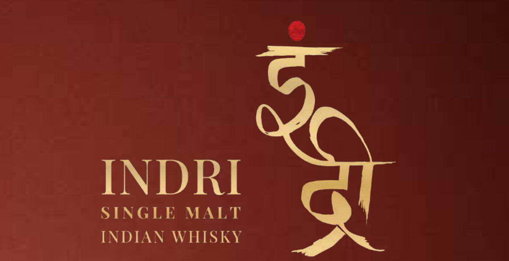

**[Image: 098e8742-32fe-4222-8902-9cbd1098c1a3.pdf-0032-01.png (1265x650, 245.3KB)]**

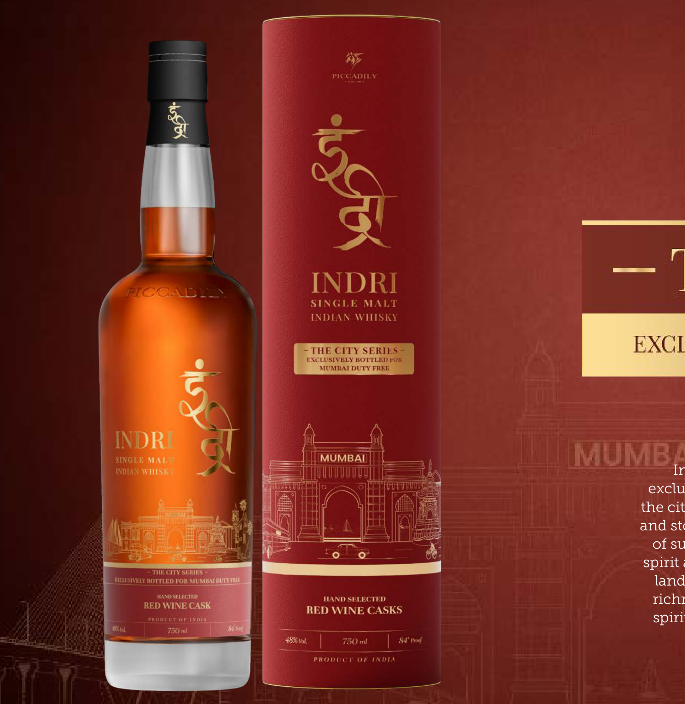

**[Image: 098e8742-32fe-4222-8902-9cbd1098c1a3.pdf-0032-02.png (1940x1991, 2100.1KB)]**

**[Image: 098e8742-32fe-4222-8902-9cbd1098c1a3.pdf-0032-03.png (2023x686, 238.8KB)]**

Indri Single Malt Indian Whisky introduces The City Series with an exclusive Single Cask expression crafted for Mumbai Duty Free. Much like the city itself, this release is bold yet refined - a meeting of cultures, flavours and stories. From the salty sea breeze along Marine Drive to the golden glow of sunset over the Gateway of India, it captures the city’s essence in both spirit and design. Intricate artwork draws inspiration from Mumbai’s iconic landmarks and timeless charm, while the whisky inside reveals layers of richness and vibrancy — a nod to the city’s restless energy and enduring spirit. Every sip is a toast to Mumbai: the city that never sleeps and never stops inspiring. 

Date of Launch 01.12.25 

32 

PICCADILY EARNINGS PRESENTATION @ 2025-26 

Bangalore City Series WIP 

**[Image: 098e8742-32fe-4222-8902-9cbd1098c1a3.pdf-0033-01.png (170x114, 6.4KB)]**

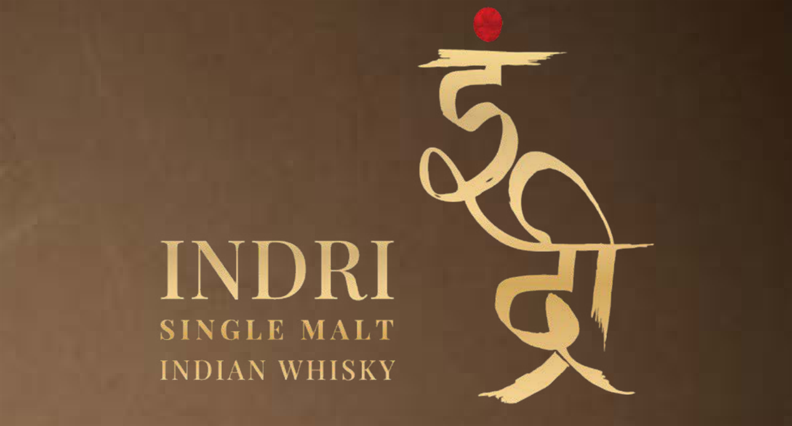

**[Image: 098e8742-32fe-4222-8902-9cbd1098c1a3.pdf-0033-02.png (1270x685, 273.7KB)]**

**[Image: 098e8742-32fe-4222-8902-9cbd1098c1a3.pdf-0033-03.png (2022x628, 752.5KB)]**

**[Image: 098e8742-32fe-4222-8902-9cbd1098c1a3.pdf-0034-00.png (170x114, 5.6KB)]**

## Charting the Path to Excellence: 

**[Image: 098e8742-32fe-4222-8902-9cbd1098c1a3.pdf-0034-02.png (97x108, 4.0KB)]**

**[Image: 098e8742-32fe-4222-8902-9cbd1098c1a3.pdf-0034-03.png (92x86, 1.4KB)]**

Innovate and Elevate 

**[Image: 098e8742-32fe-4222-8902-9cbd1098c1a3.pdf-0034-05.png (253x103, 5.5KB)]**

<!-- Start of picture text -->
Expand Horizons <!-- End of picture text -->

**[Image: 098e8742-32fe-4222-8902-9cbd1098c1a3.pdf-0034-06.png (95x95, 3.9KB)]**

**[Image: 098e8742-32fe-4222-8902-9cbd1098c1a3.pdf-0034-07.png (107x104, 3.2KB)]**

###### Accelerate Growth 

**[Image: 098e8742-32fe-4222-8902-9cbd1098c1a3.pdf-0034-09.png (270x115, 5.7KB)]**

<!-- Start of picture text -->
Financial Stability <!-- End of picture text -->

**[Image: 098e8742-32fe-4222-8902-9cbd1098c1a3.pdf-0035-00.png (170x114, 5.6KB)]**

## Scaling for the Future: 

**[Image: 098e8742-32fe-4222-8902-9cbd1098c1a3.pdf-0035-02.png (321x339, 17.2KB)]**

**[Image: 098e8742-32fe-4222-8902-9cbd1098c1a3.pdf-0035-03.png (90x91, 3.0KB)]**

**Indri, Haryana** Expansion completed (excise approval for utilising full capacity in Indri is in progress) to increase distillery capacity from **78 KLPD** to **220 KLPD** for ENA and from **12 KLPD** to **30 KLPD** for malt. 

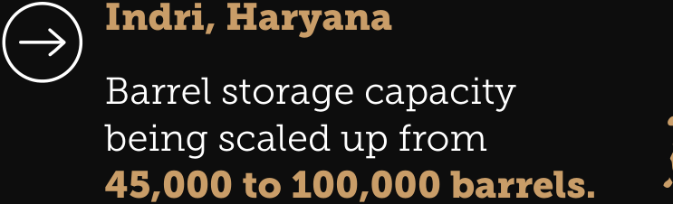

**[Image: 098e8742-32fe-4222-8902-9cbd1098c1a3.pdf-0035-05.png (743x226, 26.0KB)]**

<!-- Start of picture text -->
Indri, Haryana Barrel storage capacity being scaled up from 45,000 to 100,000 barrels. <!-- End of picture text -->

**[Image: 098e8742-32fe-4222-8902-9cbd1098c1a3.pdf-0035-06.png (372x530, 15.3KB)]**

**[Image: 098e8742-32fe-4222-8902-9cbd1098c1a3.pdf-0035-07.png (114x147, 3.8KB)]**

**Mahasamund, Chhattisgarh 200 KLPD** distillery for ENA, 

**[Image: 098e8742-32fe-4222-8902-9cbd1098c1a3.pdf-0035-09.png (457x38, 7.8KB)]**

<!-- Start of picture text -->
Portavadie, Scotland <!-- End of picture text -->

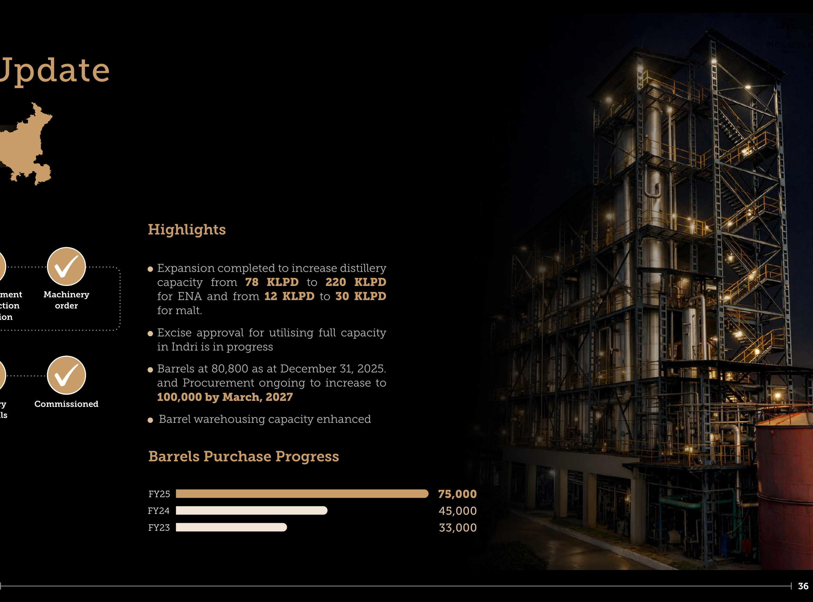

**[Image: 098e8742-32fe-4222-8902-9cbd1098c1a3.pdf-0036-00.png (2995x2221, 3636.3KB)]**

<!-- Start of picture text -->
Highlights Capex Year XX  Expansion completed to increase distillery capacity from  78 KLPD  to  220 KLPD Machinery  for ENA and from  12 KLPD  to  30 KLPD order for malt. Activity  Excise approval for utilising full capacity in Indri is in progress  Barrels at 80,800 as at December 31, 2025. Year XX and Procurement ongoing to increase to 100,000 by March, 2027 Commissioned  Barrel warehousing capacity enhanced Activity Barrels Purchase Progress Amount  Utilisation FY25 75,000 FY24 45,000 FY23 33,000 36 <!-- End of picture text -->

## Expansion Update 

Indri, Haryana 

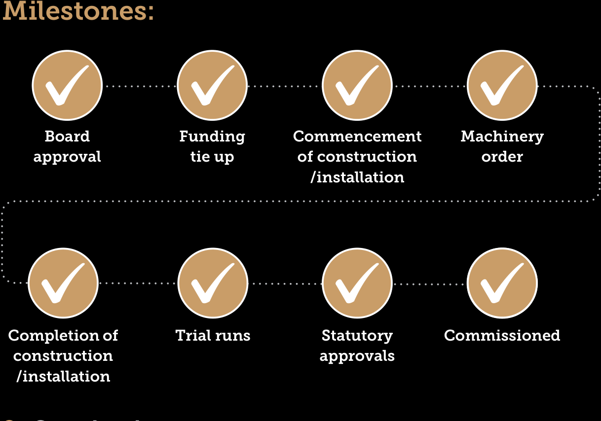

**[Image: 098e8742-32fe-4222-8902-9cbd1098c1a3.pdf-0036-03.png (1218x854, 92.4KB)]**

<!-- Start of picture text -->
Milestones: Board  Funding  Commencement  Machinery approval tie up of construction  order /installation Completion of  Trial runs Statutory  Commissioned construction  approvals /installation <!-- End of picture text -->

**[Image: 098e8742-32fe-4222-8902-9cbd1098c1a3.pdf-0036-04.png (422x198, 12.4KB)]**

<!-- Start of picture text -->
Completed Work-In-Progress Pending <!-- End of picture text -->

PICCADILY EARNINGS PRESENTATION @ 2025-26 

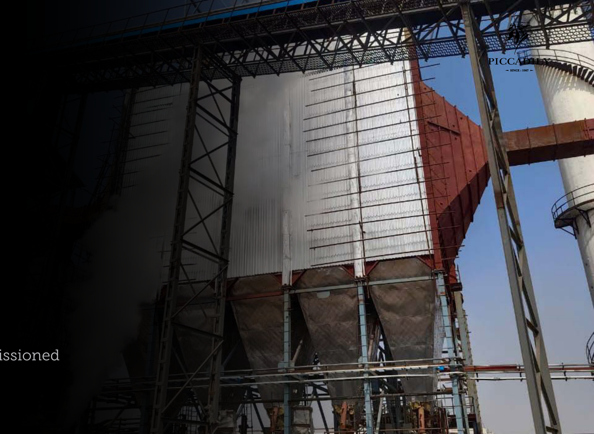

**[Image: 098e8742-32fe-4222-8902-9cbd1098c1a3.pdf-0037-00.png (1613x1178, 2785.1KB)]**

<!-- Start of picture text -->
Capex Year XX Activity <!-- End of picture text -->

**[Image: 098e8742-32fe-4222-8902-9cbd1098c1a3.pdf-0037-01.png (1201x80, 11.1KB)]**

<!-- Start of picture text -->
Expansion Update contd. <!-- End of picture text -->

**[Image: 098e8742-32fe-4222-8902-9cbd1098c1a3.pdf-0037-02.png (892x219, 22.7KB)]**

<!-- Start of picture text -->
Mahasamund, Chhattisgarh <!-- End of picture text -->

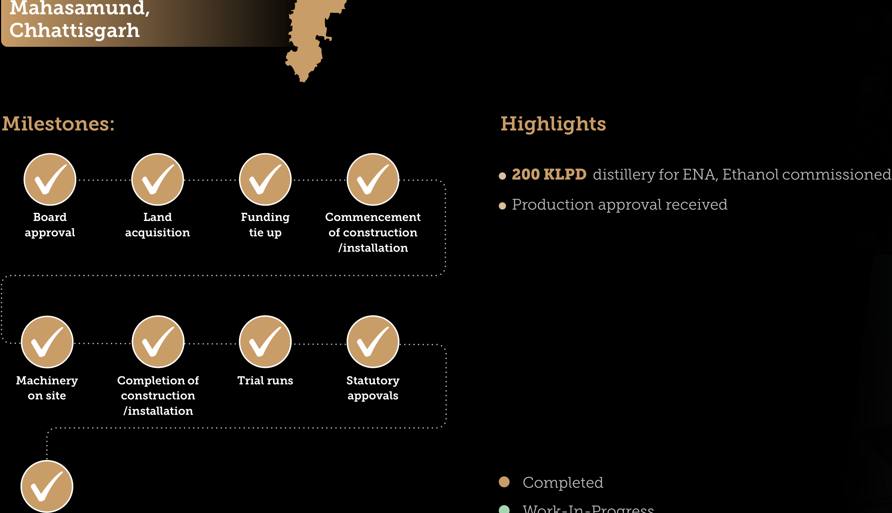

**[Image: 098e8742-32fe-4222-8902-9cbd1098c1a3.pdf-0037-03.png (2434x1400, 201.3KB)]**

<!-- Start of picture text -->
Mahasamund, Chhattisgarh Milestones: Highlights 200 KLPD   distillery for ENA, Ethanol commissioned Production approval received Board  Land  Funding  Commencement approval acquisition tie up of construction /installation Machinery  Completion of  Trial runs Statutory on site construction  appovals /installation Completed <!-- End of picture text -->

Capex Year XX Activity 

Year XX Activity Amount Utilisation 

Completed Work-In-Progress Pending 

**[Image: 098e8742-32fe-4222-8902-9cbd1098c1a3.pdf-0037-07.png (238x26, 2.9KB)]**

<!-- Start of picture text -->
Commissioned <!-- End of picture text -->

**37** 

PICCADILY EARNINGS PRESENTATION @ 2025-26 

Expansion Update contd. 

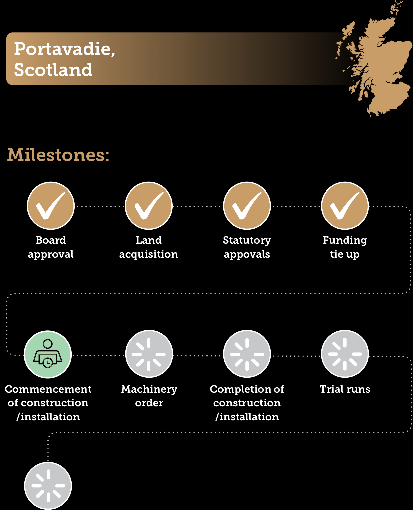

**[Image: 098e8742-32fe-4222-8902-9cbd1098c1a3.pdf-0038-01.png (1238x1526, 142.4KB)]**

<!-- Start of picture text -->
Portavadie, Scotland Milestones: Board  Land  Statutory  Funding approval acquisition appovals tie up Commencement  Machinery  Completion of  Trial runs of construction  order construction /installation /installation <!-- End of picture text -->

**[Image: 098e8742-32fe-4222-8902-9cbd1098c1a3.pdf-0038-02.png (255x32, 3.0KB)]**

<!-- Start of picture text -->
Commissioning <!-- End of picture text -->

Highlights 

Evaluation of suitable plant and machinery in progress 

Likely commissioning in FY27 

Presence in Scotland provides access to single malt industry - events, players, expertise, channels 

**[Image: 098e8742-32fe-4222-8902-9cbd1098c1a3.pdf-0038-07.png (363x199, 10.9KB)]**

<!-- Start of picture text -->
Completed Work-In-Progress Pending <!-- End of picture text -->

Capex Year XX 

Activity 

Year XX 

Activity 

Amount Utilisation 

*3D rendered images 

**38** 

PICCADILY EARNINGS PRESENTATION @ 2025-26 

**[Image: 098e8742-32fe-4222-8902-9cbd1098c1a3.pdf-0039-00.png (170x114, 5.6KB)]**

|Experiential Events|
|---|
|Camikara at India Cocktail Week, Gurugram Cashmir at India Cocktail Week, Gurugram|

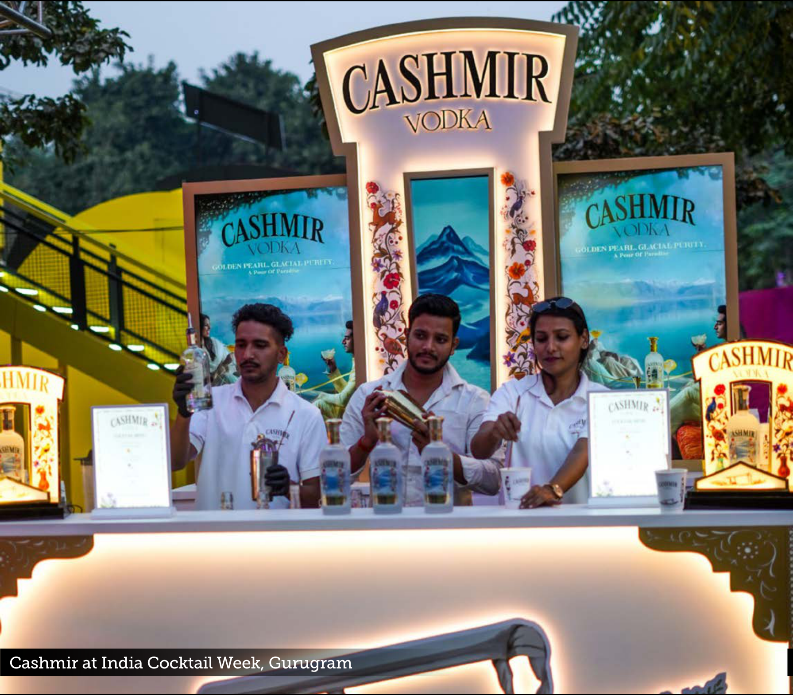

**[Image: 098e8742-32fe-4222-8902-9cbd1098c1a3.pdf-0039-02.png (1791x1571, 4891.9KB)]**

<!-- Start of picture text -->
Cashmir at India Cocktail Week, Gurugram <!-- End of picture text -->

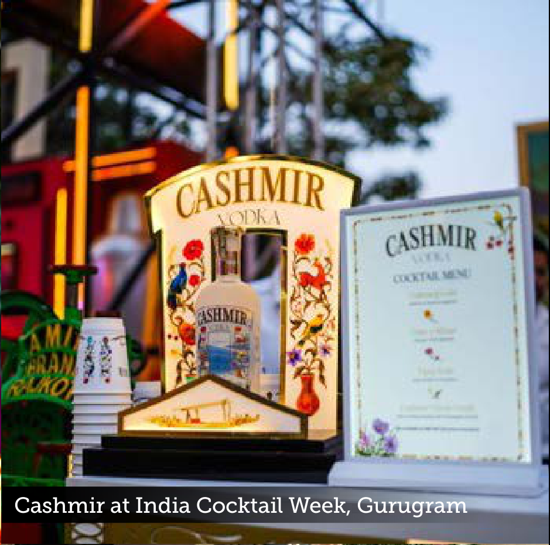

**[Image: 098e8742-32fe-4222-8902-9cbd1098c1a3.pdf-0039-03.png (939x931, 374.6KB)]**

<!-- Start of picture text -->
Cashmir at India Cocktail Week, Gurugram <!-- End of picture text -->

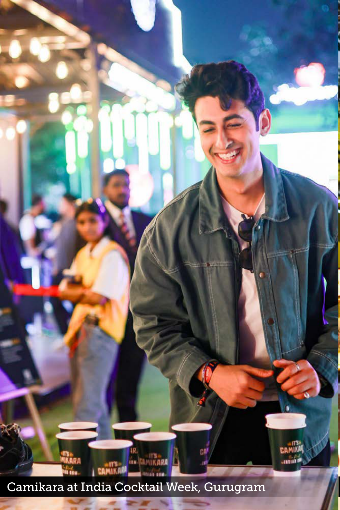

**[Image: 098e8742-32fe-4222-8902-9cbd1098c1a3.pdf-0039-04.png (1044x1566, 3187.6KB)]**

<!-- Start of picture text -->
Camikara at India Cocktail Week, Gurugram <!-- End of picture text -->

**[Image: 098e8742-32fe-4222-8902-9cbd1098c1a3.pdf-0039-05.png (865x126, 59.3KB)]**

<!-- Start of picture text -->
Cashmir at India Cocktail Week, Gurugram <!-- End of picture text -->

Cashmir at India Cocktail Week, Gurugram Indri tasting session at Bengaluru 

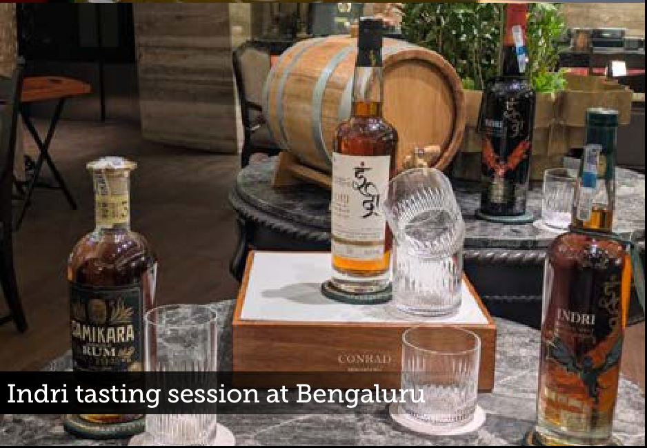

**[Image: 098e8742-32fe-4222-8902-9cbd1098c1a3.pdf-0039-07.png (938x649, 396.9KB)]**

<!-- Start of picture text -->
Indri tasting session at Bengaluru <!-- End of picture text -->

**[Image: 098e8742-32fe-4222-8902-9cbd1098c1a3.pdf-0039-08.png (1028x126, 218.7KB)]**

<!-- Start of picture text -->
Camikara at India Cocktail Week, Gurugram <!-- End of picture text -->

**[Image: 098e8742-32fe-4222-8902-9cbd1098c1a3.pdf-0039-09.png (1057x126, 127.8KB)]**

<!-- Start of picture text -->
Cashmir at India Cocktail Week, Gurugram <!-- End of picture text -->

**[Image: 098e8742-32fe-4222-8902-9cbd1098c1a3.pdf-0039-10.png (749x126, 78.6KB)]**

<!-- Start of picture text -->
Indri tasting session at Bengaluru <!-- End of picture text -->

39 

PICCADILY EARNINGS PRESENTATION @ 2025-26 

**[Image: 098e8742-32fe-4222-8902-9cbd1098c1a3.pdf-0040-00.png (170x114, 5.6KB)]**

### Experiential Events 

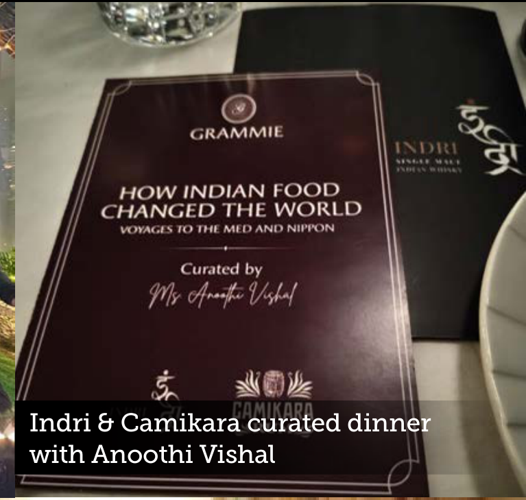

**[Image: 098e8742-32fe-4222-8902-9cbd1098c1a3.pdf-0040-02.png (767x729, 554.0KB)]**

<!-- Start of picture text -->
Indri & Camikara curated dinner with Anoothi Vishal <!-- End of picture text -->

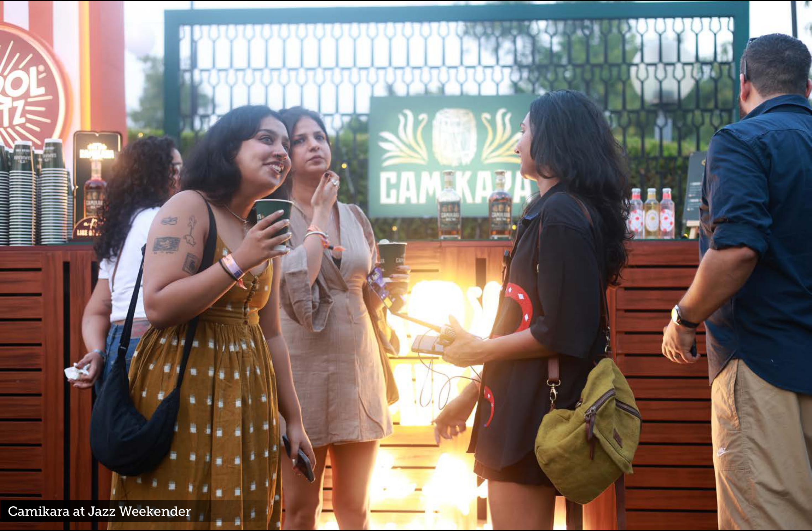

**[Image: 098e8742-32fe-4222-8902-9cbd1098c1a3.pdf-0040-03.png (2296x1502, 5455.9KB)]**

<!-- Start of picture text -->
Camikara at Jazz Weekender <!-- End of picture text -->

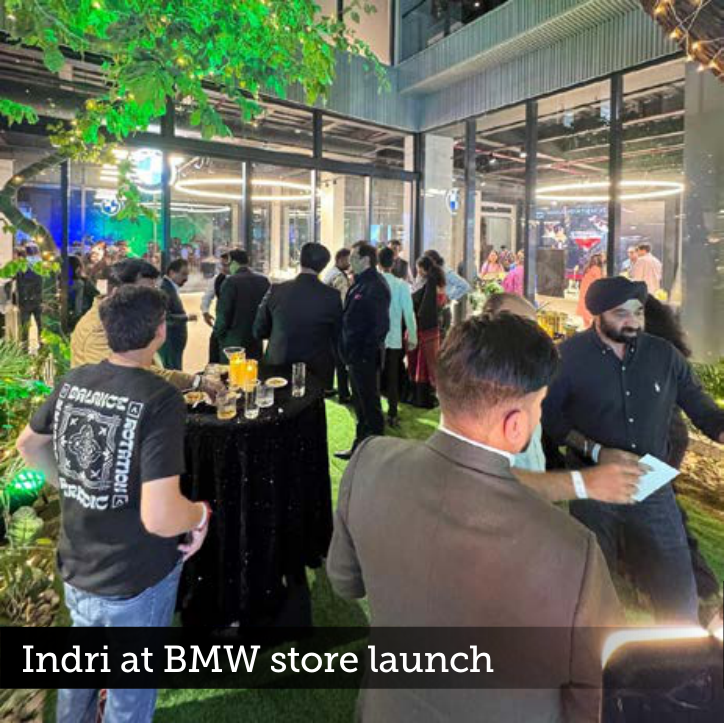

**[Image: 098e8742-32fe-4222-8902-9cbd1098c1a3.pdf-0040-04.png (724x723, 1153.2KB)]**

<!-- Start of picture text -->
Indri at BMW store launch <!-- End of picture text -->

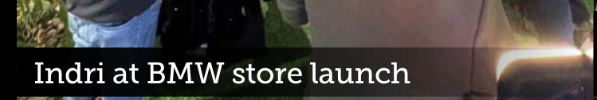

**[Image: 098e8742-32fe-4222-8902-9cbd1098c1a3.pdf-0040-05.png (749x126, 136.8KB)]**

<!-- Start of picture text -->
Indri at BMW store launch <!-- End of picture text -->

**[Image: 098e8742-32fe-4222-8902-9cbd1098c1a3.pdf-0040-06.png (1469x783, 236.7KB)]**

<!-- Start of picture text -->
Golden Hours with Camikara <!-- End of picture text -->

**[Image: 098e8742-32fe-4222-8902-9cbd1098c1a3.pdf-0040-07.png (828x126, 22.2KB)]**

<!-- Start of picture text -->
Golden Hours with Camikara <!-- End of picture text -->

**[Image: 098e8742-32fe-4222-8902-9cbd1098c1a3.pdf-0040-08.png (828x126, 116.1KB)]**

<!-- Start of picture text -->
Camikara at Jazz Weekender <!-- End of picture text -->

40 

PICCADILY EARNINGS PRESENTATION @ 2025-26 

**[Image: 098e8742-32fe-4222-8902-9cbd1098c1a3.pdf-0041-00.png (170x114, 5.6KB)]**

### Activations at Key Outlets 

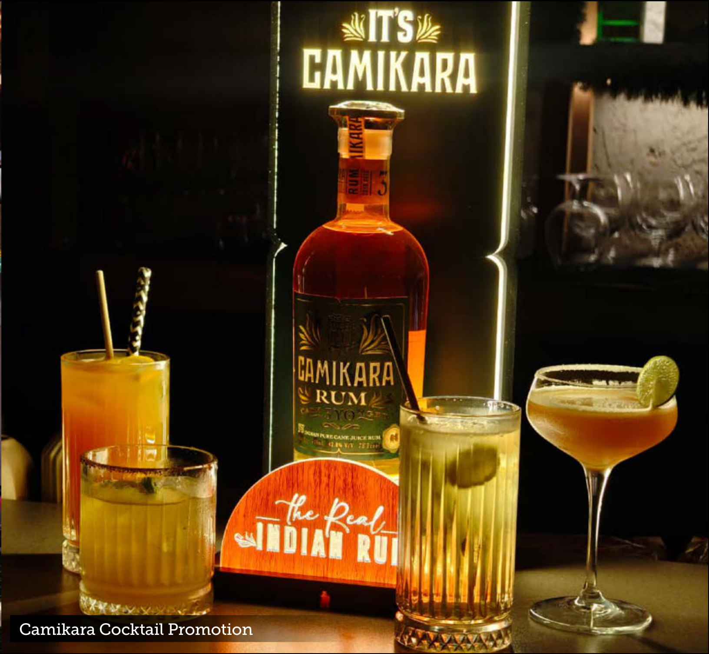

**[Image: 098e8742-32fe-4222-8902-9cbd1098c1a3.pdf-0041-02.png (1632x1505, 2998.5KB)]**

<!-- Start of picture text -->
Camikara Cocktail Promotion <!-- End of picture text -->

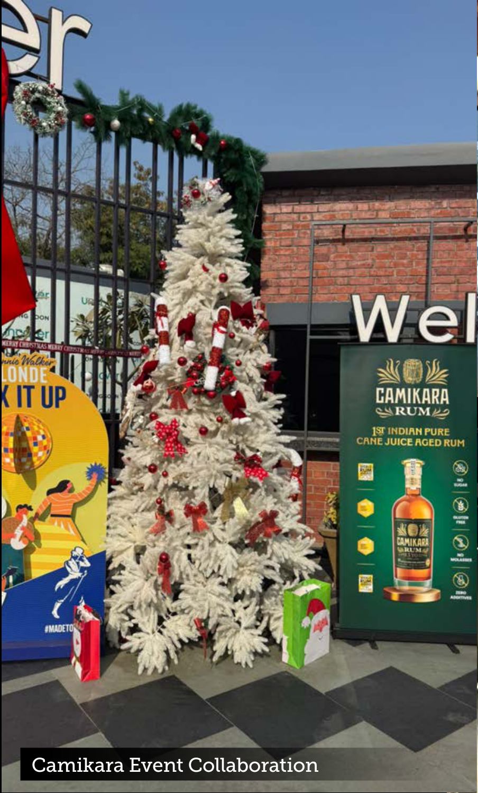

**[Image: 098e8742-32fe-4222-8902-9cbd1098c1a3.pdf-0041-03.png (904x1498, 2363.9KB)]**

<!-- Start of picture text -->
Camikara Event Collaboration <!-- End of picture text -->

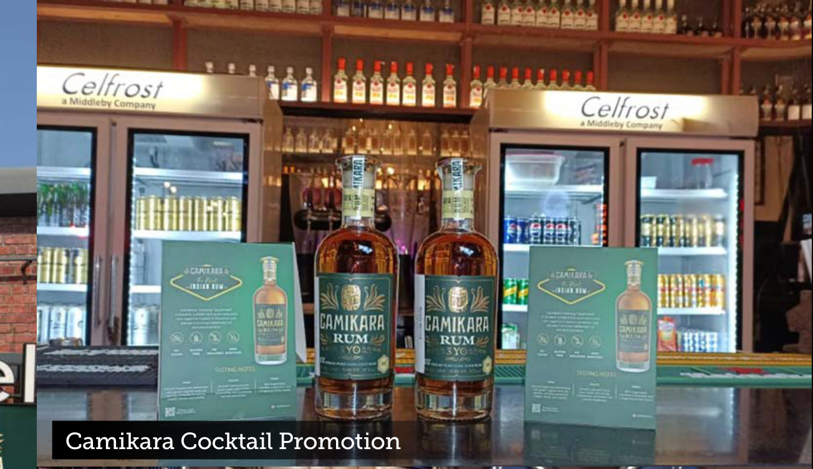

**[Image: 098e8742-32fe-4222-8902-9cbd1098c1a3.pdf-0041-04.png (1304x754, 1938.7KB)]**

<!-- Start of picture text -->
Camikara Cocktail Promotion <!-- End of picture text -->

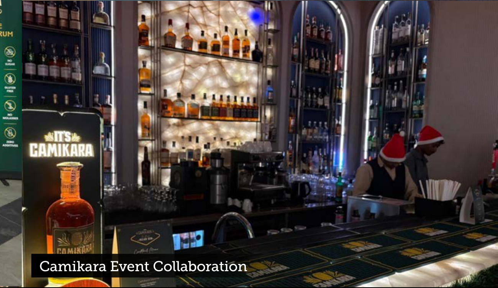

**[Image: 098e8742-32fe-4222-8902-9cbd1098c1a3.pdf-0041-05.png (1300x754, 1785.7KB)]**

<!-- Start of picture text -->
Camikara Event Collaboration <!-- End of picture text -->

41 

PICCADILY EARNINGS PRESENTATION @ 2025-26 

**[Image: 098e8742-32fe-4222-8902-9cbd1098c1a3.pdf-0042-00.png (170x114, 5.6KB)]**

### Activations at Retail Outlets 

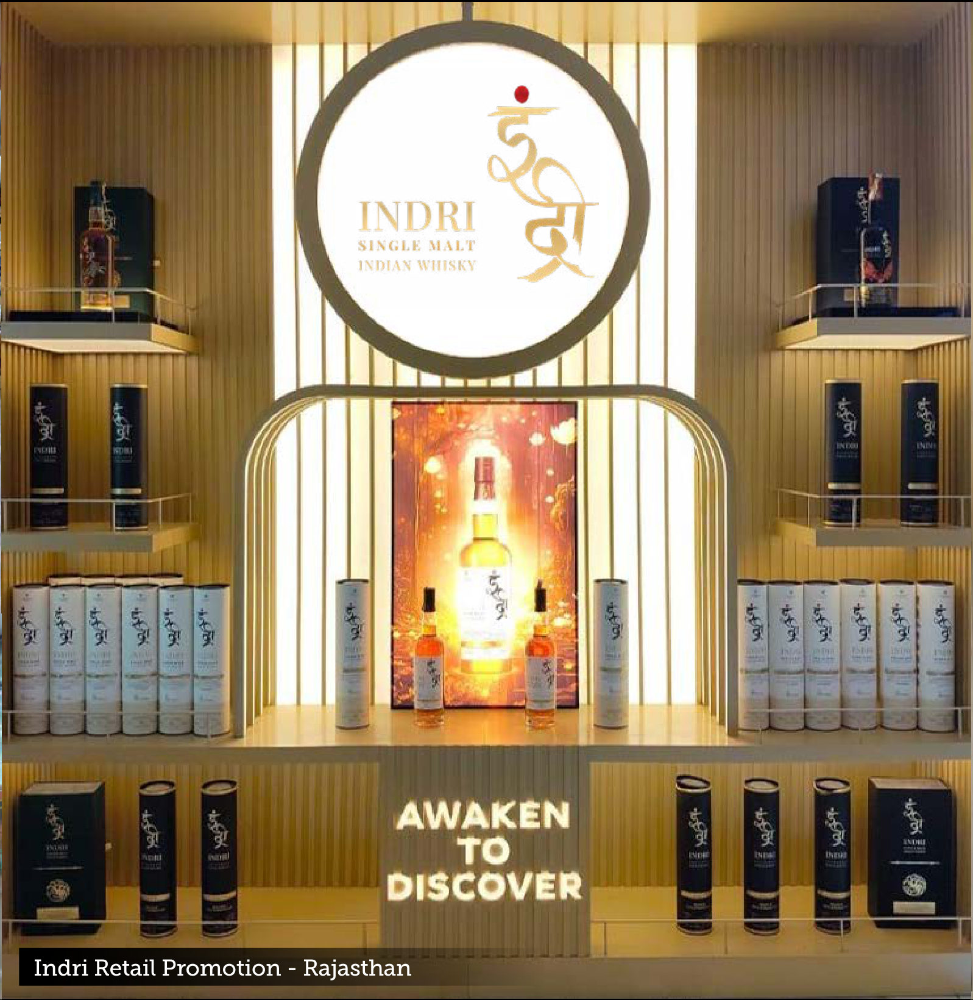

**[Image: 098e8742-32fe-4222-8902-9cbd1098c1a3.pdf-0042-02.png (1597x1640, 1300.2KB)]**

<!-- Start of picture text -->
Indri Retail Promotion - Rajasthan <!-- End of picture text -->

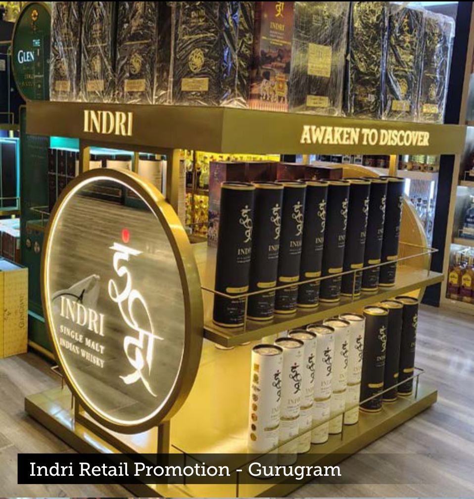

**[Image: 098e8742-32fe-4222-8902-9cbd1098c1a3.pdf-0042-03.png (958x1009, 2111.5KB)]**

<!-- Start of picture text -->
Indri Retail Promotion - Gurugram <!-- End of picture text -->

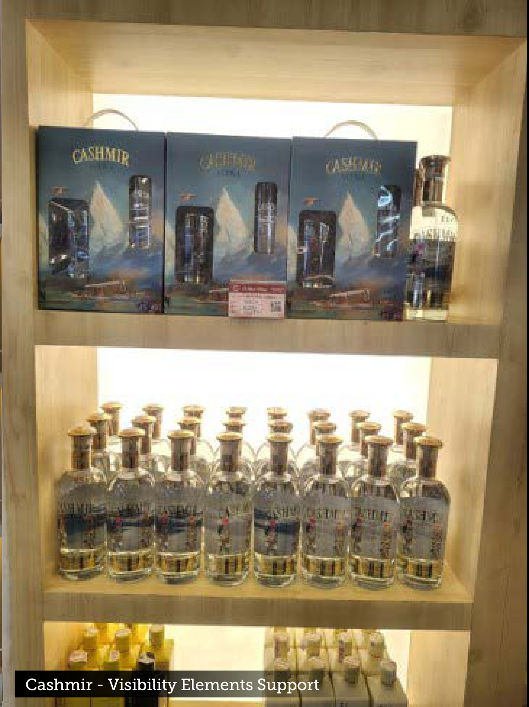

**[Image: 098e8742-32fe-4222-8902-9cbd1098c1a3.pdf-0042-04.png (1224x1636, 480.5KB)]**

<!-- Start of picture text -->
Cashmir - Visibility Elements Support <!-- End of picture text -->

**[Image: 098e8742-32fe-4222-8902-9cbd1098c1a3.pdf-0042-05.png (958x641, 1244.4KB)]**

<!-- Start of picture text -->
Whistler Consumer Offer- Bag pack <!-- End of picture text -->

42 

PICCADILY EARNINGS PRESENTATION @ 2025-26 

**[Image: 098e8742-32fe-4222-8902-9cbd1098c1a3.pdf-0043-00.png (170x114, 5.6KB)]**

### Activations at Bengaluru Duty Free 

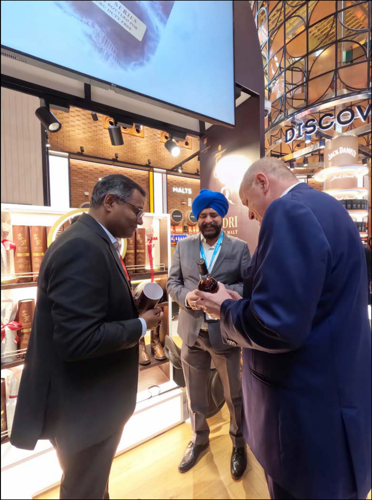

**[Image: 098e8742-32fe-4222-8902-9cbd1098c1a3.pdf-0043-02.png (1221x1639, 2935.9KB)]**

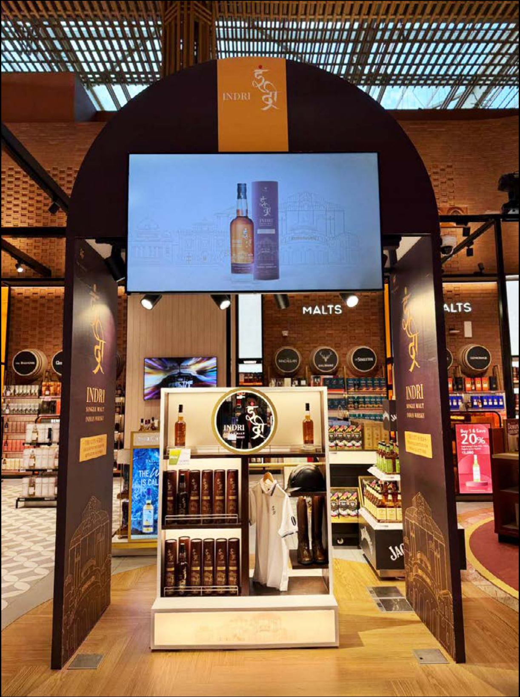

**[Image: 098e8742-32fe-4222-8902-9cbd1098c1a3.pdf-0043-03.png (1222x1634, 3824.2KB)]**

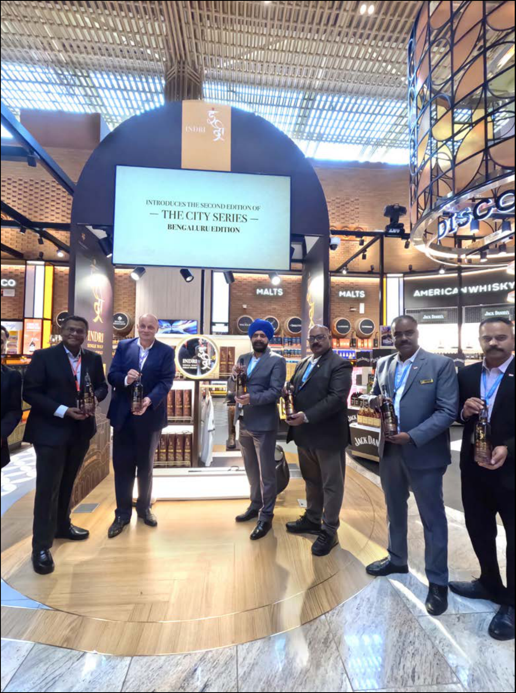

**[Image: 098e8742-32fe-4222-8902-9cbd1098c1a3.pdf-0043-04.png (1221x1639, 3910.7KB)]**

43 

PICCADILY EARNINGS PRESENTATION @ 2025-26 

**[Image: 098e8742-32fe-4222-8902-9cbd1098c1a3.pdf-0044-00.png (170x114, 5.6KB)]**

### Digital Footprints 

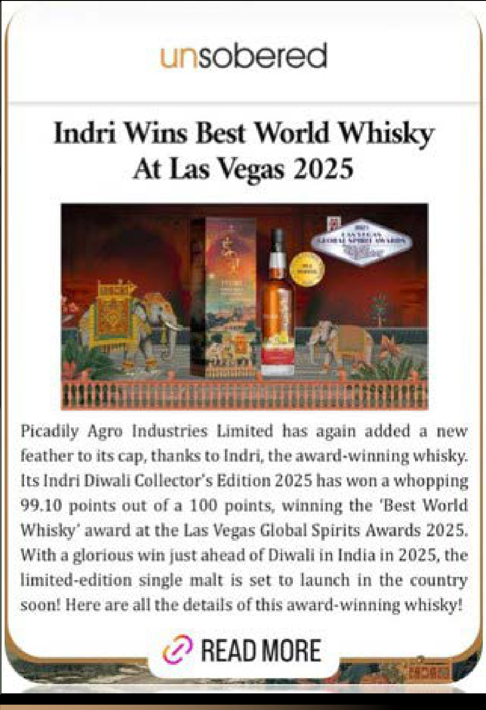

**[Image: 098e8742-32fe-4222-8902-9cbd1098c1a3.pdf-0044-02.png (1054x1537, 263.4KB)]**

**[Image: 098e8742-32fe-4222-8902-9cbd1098c1a3.pdf-0044-03.png (1108x1536, 651.9KB)]**

|Infuencer Campaign - Whistler|
|---|

Media Coverage - Indri 

**[Image: 098e8742-32fe-4222-8902-9cbd1098c1a3.pdf-0044-06.png (460x773, 778.8KB)]**

<!-- Start of picture text -->
Influencer Collaboration - Camikara <!-- End of picture text -->

Influencer Collaboration - Camikara 

**[Image: 098e8742-32fe-4222-8902-9cbd1098c1a3.pdf-0044-08.png (542x746, 199.8KB)]**

Infuencer Collaboration - Camikara 

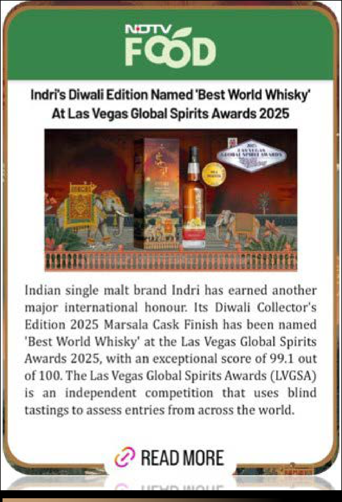

**[Image: 098e8742-32fe-4222-8902-9cbd1098c1a3.pdf-0044-10.png (1047x1537, 279.9KB)]**

Media Coverage - Indri 

44 

PICCADILY EARNINGS PRESENTATION @ 2025-26 

**[Image: 098e8742-32fe-4222-8902-9cbd1098c1a3.pdf-0045-00.png (170x114, 5.6KB)]**

### Digital Footprints 

Largest follower base of any Single Malt in India. 

**[Image: 098e8742-32fe-4222-8902-9cbd1098c1a3.pdf-0045-03.png (1216x1640, 2381.2KB)]**

<!-- Start of picture text -->
603K Views <!-- End of picture text -->

**[Image: 098e8742-32fe-4222-8902-9cbd1098c1a3.pdf-0045-04.png (1256x123, 51.1KB)]**

<!-- Start of picture text -->
603K Views <!-- End of picture text -->

**[Image: 098e8742-32fe-4222-8902-9cbd1098c1a3.pdf-0045-05.png (1216x1641, 3168.0KB)]**

<!-- Start of picture text -->
283K Views <!-- End of picture text -->

**[Image: 098e8742-32fe-4222-8902-9cbd1098c1a3.pdf-0045-06.png (1256x146, 228.1KB)]**

<!-- Start of picture text -->
283K Views <!-- End of picture text -->

115K followers 

45 

PICCADILY EARNINGS PRESENTATION @ 2025-26 

**[Image: 098e8742-32fe-4222-8902-9cbd1098c1a3.pdf-0046-00.png (170x114, 5.6KB)]**

### PR and Media Coverage 

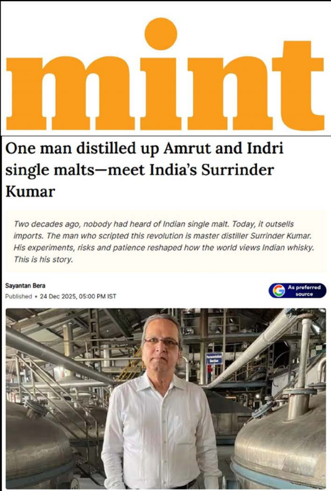

**[Image: 098e8742-32fe-4222-8902-9cbd1098c1a3.pdf-0046-02.png (1109x1639, 1901.2KB)]**

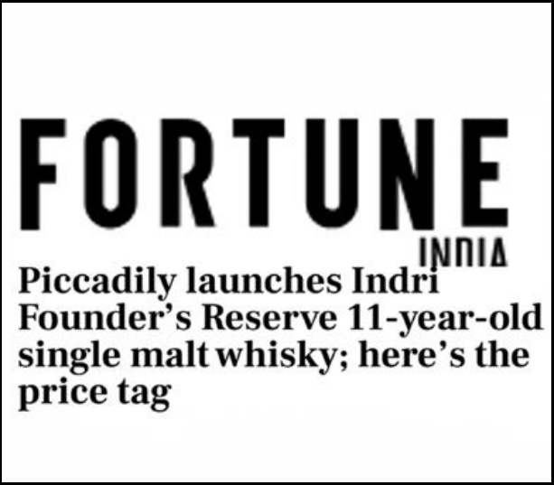

**[Image: 098e8742-32fe-4222-8902-9cbd1098c1a3.pdf-0046-03.png (613x537, 120.6KB)]**

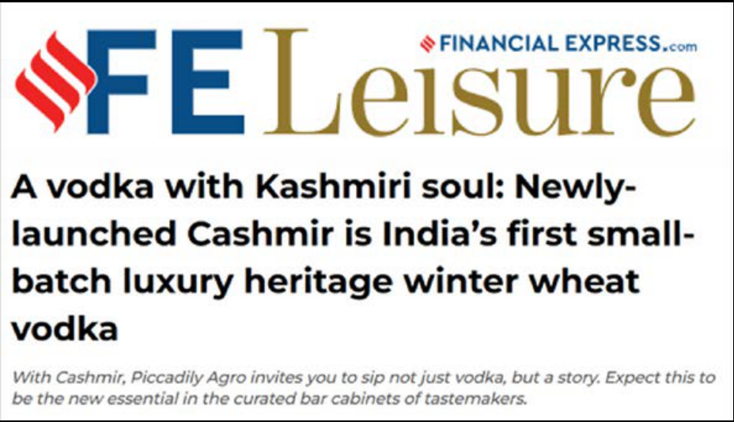

**[Image: 098e8742-32fe-4222-8902-9cbd1098c1a3.pdf-0046-04.png (928x534, 486.8KB)]**

**[Image: 098e8742-32fe-4222-8902-9cbd1098c1a3.pdf-0046-05.png (1076x532, 365.1KB)]**

**[Image: 098e8742-32fe-4222-8902-9cbd1098c1a3.pdf-0046-06.png (1218x335, 189.4KB)]**

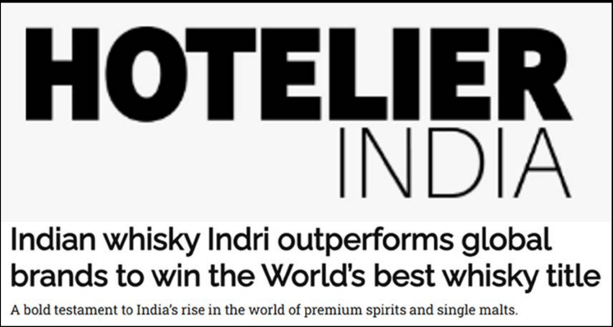

**[Image: 098e8742-32fe-4222-8902-9cbd1098c1a3.pdf-0046-07.png (1337x714, 354.2KB)]**

**[Image: 098e8742-32fe-4222-8902-9cbd1098c1a3.pdf-0046-08.png (1220x362, 251.3KB)]**

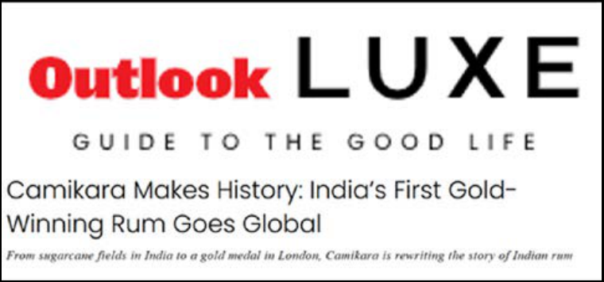

**[Image: 098e8742-32fe-4222-8902-9cbd1098c1a3.pdf-0046-09.png (760x355, 182.4KB)]**

**[Image: 098e8742-32fe-4222-8902-9cbd1098c1a3.pdf-0046-10.png (568x355, 109.1KB)]**

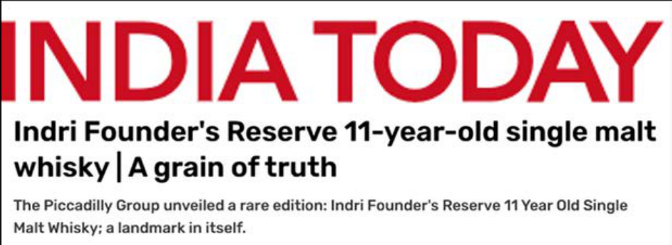

**[Image: 098e8742-32fe-4222-8902-9cbd1098c1a3.pdf-0046-11.png (967x353, 283.6KB)]**

46 

PICCADILY EARNINGS PRESENTATION @ 2025-26 

**[Image: 098e8742-32fe-4222-8902-9cbd1098c1a3.pdf-0047-00.png (170x114, 5.2KB)]**

## Indri Experience Centre 

Indri Experience Centre launched in Haryana to offer an immersive introduction to whisky making and tasting, enhancing consumer engagement and brand visibility. 

- Includes guided tours, curated tastings and interactive exhibits 

- Features sustainable architecture inspired by Northern Indian havelis 

- Includes recreational golf greens to support premium positioning 

Built with scalability to support future brand growth. 

- 3-4 hours from Delhi or 2-3 hours from Chandigarh, by road. 

Delhi to Indri 180kms 

**[Image: 098e8742-32fe-4222-8902-9cbd1098c1a3.pdf-0047-09.png (110x32, 1.8KB)]**

<!-- Start of picture text -->
Delhi <!-- End of picture text -->

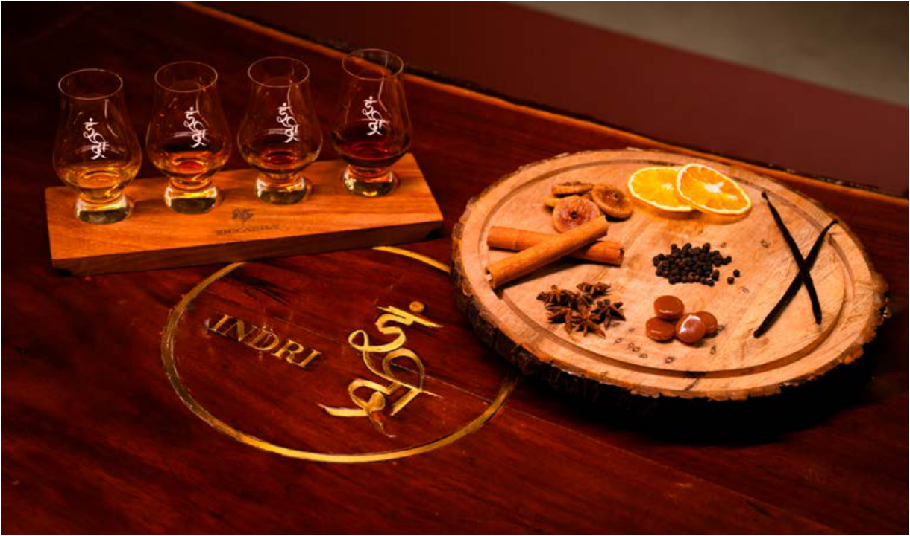

**[Image: 098e8742-32fe-4222-8902-9cbd1098c1a3.pdf-0047-10.png (1220x721, 1366.9KB)]**

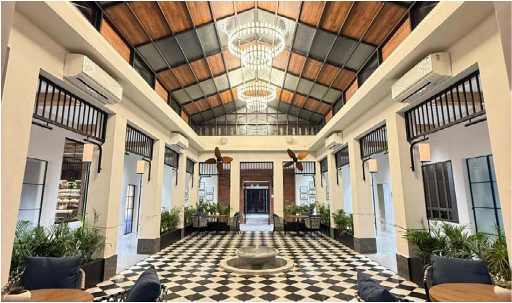

**[Image: 098e8742-32fe-4222-8902-9cbd1098c1a3.pdf-0047-11.png (1220x723, 1981.5KB)]**

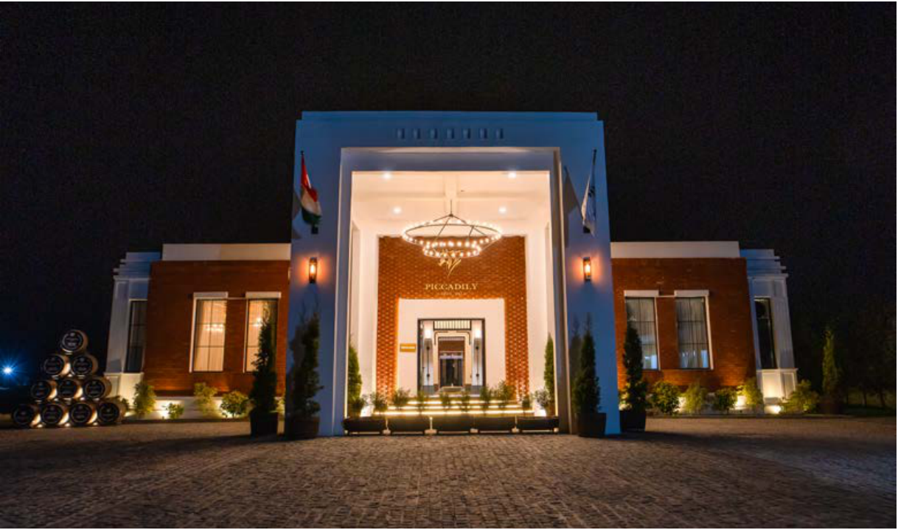

**[Image: 098e8742-32fe-4222-8902-9cbd1098c1a3.pdf-0047-12.png (1218x721, 1238.1KB)]**

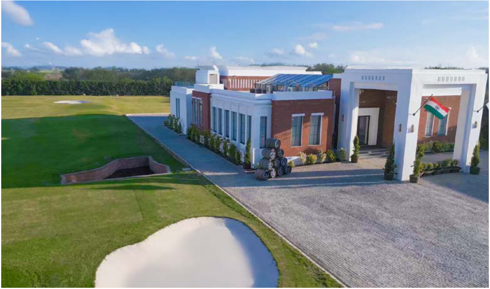

**[Image: 098e8742-32fe-4222-8902-9cbd1098c1a3.pdf-0047-13.png (1222x721, 1349.9KB)]**

**47** 

PICCADILY EARNINGS PRESENTATION @ 2025-26 

**[Image: 098e8742-32fe-4222-8902-9cbd1098c1a3.pdf-0048-00.png (170x114, 5.6KB)]**

|Awards and R|ecogn|ition: Q3|- 9M FY2025-26|
|---|---|---|---|
|Indri- Dru||Indri- Trini|Indri- Agneya|
|World best whisky award - Miami Global Spirits Awards 2025||Silver - Miami Global Spirits Awards 2025|Gold - Asia World Spirit Competition - The Tasting Alliance|
|Platinum - Miami Global Spirits Awards 2025||Gold - 95 points, New York International Spirits Competition 2025|Gold Medal - Global World Whisky Masters- The Spirits Business GLOBAL WORLD WHISKY MASTERS GOLD 2025|
|Silver - 93 Points - New York International Spirits Competition 2025 Silver at International Spirits Competition 2025 by A.D.I.|**2025** I n d i a   W h i s k e y   o f   t h e   Y e a r N E W   Y O R K   I N T L   S P I R I T S   C O M P E T I T I O N|India Whisky Of The Year - New York International Spirits Competition 2025 Best of Category at International Spirits Competition 2025 by A.D.I. Silver at International Spirits Competition 2025 by A.D.I.|Double Gold - New York World Spirits Competition 2025|

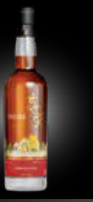

**[Image: 098e8742-32fe-4222-8902-9cbd1098c1a3.pdf-0048-02.png (93x202, 23.5KB)]**

Indri- DCE ‘25 Gold Medal - Global World Whisky MastersThe Spirit Business 

**[Image: 098e8742-32fe-4222-8902-9cbd1098c1a3.pdf-0048-04.png (874x66, 14.8KB)]**

**[Image: 098e8742-32fe-4222-8902-9cbd1098c1a3.pdf-0048-05.png (874x66, 14.7KB)]**

**[Image: 098e8742-32fe-4222-8902-9cbd1098c1a3.pdf-0048-06.png (66x1465, 4.1KB)]**

**[Image: 098e8742-32fe-4222-8902-9cbd1098c1a3.pdf-0048-07.png (66x1465, 4.7KB)]**

**[Image: 098e8742-32fe-4222-8902-9cbd1098c1a3.pdf-0048-08.png (66x1465, 4.4KB)]**

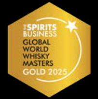

**[Image: 098e8742-32fe-4222-8902-9cbd1098c1a3.pdf-0048-09.png (203x205, 62.9KB)]**

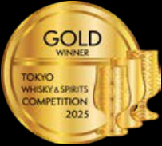

**[Image: 098e8742-32fe-4222-8902-9cbd1098c1a3.pdf-0048-10.png (203x183, 81.1KB)]**

Indri DCE’24 - Gold at Tokyo Whisky and spirits Competition 2025 Best World Whisky - Las Vegas Global Spirits Award 2025 

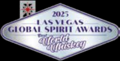

**[Image: 098e8742-32fe-4222-8902-9cbd1098c1a3.pdf-0048-12.png (237x120, 49.1KB)]**

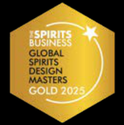

**[Image: 098e8742-32fe-4222-8902-9cbd1098c1a3.pdf-0048-13.png (203x205, 63.1KB)]**

Gold Medal – Global Spirits Design Masters 2025- The Spirit Business 

**[Image: 098e8742-32fe-4222-8902-9cbd1098c1a3.pdf-0048-15.png (203x203, 86.0KB)]**

Best Design – Tokyo Whisky & Spirit Awards – The Whisky Festival Show 

48 

PICCADILY EARNINGS PRESENTATION @ 2025-26 

**[Image: 098e8742-32fe-4222-8902-9cbd1098c1a3.pdf-0049-00.png (170x114, 5.6KB)]**

- Awards and Recognition: Q3 - 9M FY2025-26 

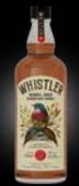

**[Image: 098e8742-32fe-4222-8902-9cbd1098c1a3.pdf-0049-02.png (87x205, 30.9KB)]**

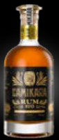

**[Image: 098e8742-32fe-4222-8902-9cbd1098c1a3.pdf-0049-03.png (85x201, 35.2KB)]**

**[Image: 098e8742-32fe-4222-8902-9cbd1098c1a3.pdf-0049-04.png (125x201, 33.9KB)]**

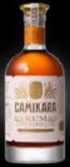

**[Image: 098e8742-32fe-4222-8902-9cbd1098c1a3.pdf-0049-05.png (87x206, 36.3KB)]**

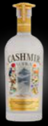

**[Image: 098e8742-32fe-4222-8902-9cbd1098c1a3.pdf-0049-06.png (79x206, 29.1KB)]**

Whistler Blended Malt Whisk <u>y</u> Silver Medal- Silver Medal in Blended Malt Whisky tasting – John Barleycorn Awards 2025 

**[Image: 098e8742-32fe-4222-8902-9cbd1098c1a3.pdf-0049-08.png (768x68, 16.4KB)]**

<!-- Start of picture text -->
Whisk y <!-- End of picture text -->

**[Image: 098e8742-32fe-4222-8902-9cbd1098c1a3.pdf-0049-09.png (788x66, 17.2KB)]**

**[Image: 098e8742-32fe-4222-8902-9cbd1098c1a3.pdf-0049-10.png (874x66, 19.3KB)]**

**[Image: 098e8742-32fe-4222-8902-9cbd1098c1a3.pdf-0049-11.png (772x66, 18.4KB)]**

**[Image: 098e8742-32fe-4222-8902-9cbd1098c1a3.pdf-0049-12.png (757x66, 16.6KB)]**

**[Image: 098e8742-32fe-4222-8902-9cbd1098c1a3.pdf-0049-13.png (67x1234, 9.6KB)]**

**[Image: 098e8742-32fe-4222-8902-9cbd1098c1a3.pdf-0049-14.png (68x1234, 21.1KB)]**

**[Image: 098e8742-32fe-4222-8902-9cbd1098c1a3.pdf-0049-15.png (68x1234, 6.2KB)]**

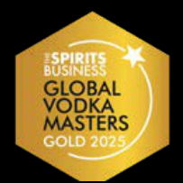

**[Image: 098e8742-32fe-4222-8902-9cbd1098c1a3.pdf-0049-16.png (203x203, 66.9KB)]**

**[Image: 098e8742-32fe-4222-8902-9cbd1098c1a3.pdf-0049-17.png (201x201, 33.0KB)]**

**[Image: 098e8742-32fe-4222-8902-9cbd1098c1a3.pdf-0049-18.png (201x201, 33.0KB)]**

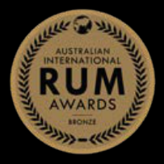

**[Image: 098e8742-32fe-4222-8902-9cbd1098c1a3.pdf-0049-19.png (203x203, 68.7KB)]**

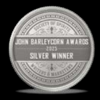

**[Image: 098e8742-32fe-4222-8902-9cbd1098c1a3.pdf-0049-20.png (205x205, 39.4KB)]**

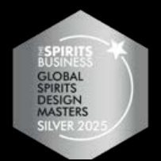

**[Image: 098e8742-32fe-4222-8902-9cbd1098c1a3.pdf-0049-21.png (203x203, 30.6KB)]**

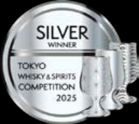

**[Image: 098e8742-32fe-4222-8902-9cbd1098c1a3.pdf-0049-22.png (201x180, 60.9KB)]**

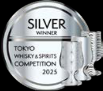

**[Image: 098e8742-32fe-4222-8902-9cbd1098c1a3.pdf-0049-23.png (203x180, 60.9KB)]**

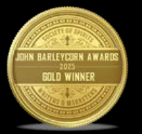

**[Image: 098e8742-32fe-4222-8902-9cbd1098c1a3.pdf-0049-24.png (205x193, 65.7KB)]**

49 

PICCADILY EARNINGS PRESENTATION @ 2025-26 

**[Image: 098e8742-32fe-4222-8902-9cbd1098c1a3.pdf-0050-00.png (170x114, 0.2KB)]**

- Awards and Recognition - Company : Q3 - 9M FY2025-26 

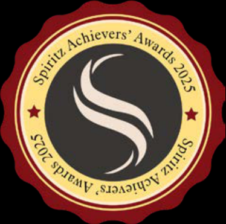

**[Image: 098e8742-32fe-4222-8902-9cbd1098c1a3.pdf-0050-02.png (374x371, 229.1KB)]**

Corporate Communicator of the Year - Spiritz Achievers’ Awards 2025 To Abhishek Haryson 

**[Image: 098e8742-32fe-4222-8902-9cbd1098c1a3.pdf-0050-04.png (67x1466, 4.0KB)]**

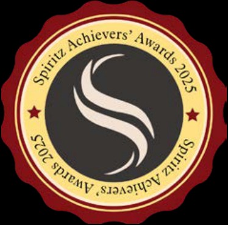

**[Image: 098e8742-32fe-4222-8902-9cbd1098c1a3.pdf-0050-05.png (374x369, 227.2KB)]**

Gold Medal – Fastest Growing Brand of the Year 2025 - Spiritz Achievers’ Awards 2025 

**[Image: 098e8742-32fe-4222-8902-9cbd1098c1a3.pdf-0050-07.png (67x1466, 4.8KB)]**

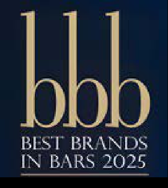

**[Image: 098e8742-32fe-4222-8902-9cbd1098c1a3.pdf-0050-08.png (346x386, 34.6KB)]**

Best Selling Brand in India 2025 – Brews & Spirits - Best Brands in Bars Awards 2025 

50 

PICCADILY EARNINGS PRESENTATION @ 2025-26 

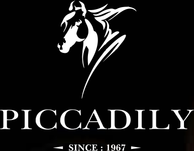

**[Image: 098e8742-32fe-4222-8902-9cbd1098c1a3.pdf-0051-00.png (386x300, 19.6KB)]**

For Further Information Contact: Investors Relations Piccadily Agro Industries Limited Ph.: +91-172-2997651 (Monday to Friday; IST 10 am to 5 pm) Website: www.piccadily.com Email:  ir@piccadily.com 

---

## Extracted Images

| # | File | Dimensions | Size |
|---|------|------------|------|
| 1 | 098e8742-32fe-4222-8902-9cbd1098c1a3.pdf-0001-01.png | 380x294 | 17.5KB |
| 2 | 098e8742-32fe-4222-8902-9cbd1098c1a3.pdf-0002-00.png | 387x300 | 49.3KB |
| 3 | 098e8742-32fe-4222-8902-9cbd1098c1a3.pdf-0003-00.png | 170x114 | 17.6KB |
| 4 | 098e8742-32fe-4222-8902-9cbd1098c1a3.pdf-0003-05.png | 21x25 | 0.8KB |
| 5 | 098e8742-32fe-4222-8902-9cbd1098c1a3.pdf-0004-08.png | 1826x2072 | 1100.5KB |
| 6 | 098e8742-32fe-4222-8902-9cbd1098c1a3.pdf-0005-00.png | 170x114 | 12.6KB |
| 7 | 098e8742-32fe-4222-8902-9cbd1098c1a3.pdf-0006-00.png | 175x114 | 6.3KB |
| 8 | 098e8742-32fe-4222-8902-9cbd1098c1a3.pdf-0006-02.png | 2695x1432 | 434.1KB |
| 9 | 098e8742-32fe-4222-8902-9cbd1098c1a3.pdf-0007-00.png | 170x114 | 5.8KB |
| 10 | 098e8742-32fe-4222-8902-9cbd1098c1a3.pdf-0008-01.png | 170x114 | 5.8KB |
| 11 | 098e8742-32fe-4222-8902-9cbd1098c1a3.pdf-0009-00.png | 170x114 | 5.8KB |
| 12 | 098e8742-32fe-4222-8902-9cbd1098c1a3.pdf-0009-02.png | 1947x1551 | 115.7KB |
| 13 | 098e8742-32fe-4222-8902-9cbd1098c1a3.pdf-0009-03.png | 1948x1551 | 121.5KB |
| 14 | 098e8742-32fe-4222-8902-9cbd1098c1a3.pdf-0010-00.png | 170x114 | 12.6KB |
| 15 | 098e8742-32fe-4222-8902-9cbd1098c1a3.pdf-0011-00.png | 170x114 | 31.8KB |
| 16 | 098e8742-32fe-4222-8902-9cbd1098c1a3.pdf-0012-00.png | 170x114 | 5.2KB |
| 17 | 098e8742-32fe-4222-8902-9cbd1098c1a3.pdf-0013-00.png | 170x114 | 5.6KB |
| 18 | 098e8742-32fe-4222-8902-9cbd1098c1a3.pdf-0013-04.png | 3193x1126 | 252.9KB |
| 19 | 098e8742-32fe-4222-8902-9cbd1098c1a3.pdf-0014-00.png | 1836x1805 | 1873.8KB |
| 20 | 098e8742-32fe-4222-8902-9cbd1098c1a3.pdf-0014-02.png | 2897x1380 | 718.4KB |
| 21 | 098e8742-32fe-4222-8902-9cbd1098c1a3.pdf-0015-00.png | 170x114 | 5.8KB |
| 22 | 098e8742-32fe-4222-8902-9cbd1098c1a3.pdf-0015-02.png | 137x137 | 7.4KB |
| 23 | 098e8742-32fe-4222-8902-9cbd1098c1a3.pdf-0015-03.png | 137x137 | 7.0KB |
| 24 | 098e8742-32fe-4222-8902-9cbd1098c1a3.pdf-0015-05.png | 139x133 | 5.3KB |
| 25 | 098e8742-32fe-4222-8902-9cbd1098c1a3.pdf-0015-08.png | 835x468 | 51.0KB |
| 26 | 098e8742-32fe-4222-8902-9cbd1098c1a3.pdf-0015-09.png | 872x561 | 70.8KB |
| 27 | 098e8742-32fe-4222-8902-9cbd1098c1a3.pdf-0015-10.png | 835x468 | 49.8KB |
| 28 | 098e8742-32fe-4222-8902-9cbd1098c1a3.pdf-0015-11.png | 835x468 | 48.7KB |
| 29 | 098e8742-32fe-4222-8902-9cbd1098c1a3.pdf-0016-01.png | 170x114 | 5.6KB |
| 30 | 098e8742-32fe-4222-8902-9cbd1098c1a3.pdf-0016-03.png | 1365x1557 | 3285.9KB |
| 31 | 098e8742-32fe-4222-8902-9cbd1098c1a3.pdf-0016-04.png | 2918x1586 | 4612.0KB |
| 32 | 098e8742-32fe-4222-8902-9cbd1098c1a3.pdf-0016-05.png | 809x809 | 215.7KB |
| 33 | 098e8742-32fe-4222-8902-9cbd1098c1a3.pdf-0017-00.png | 170x114 | 5.6KB |
| 34 | 098e8742-32fe-4222-8902-9cbd1098c1a3.pdf-0018-00.png | 170x114 | 5.4KB |
| 35 | 098e8742-32fe-4222-8902-9cbd1098c1a3.pdf-0018-07.png | 310x307 | 165.9KB |
| 36 | 098e8742-32fe-4222-8902-9cbd1098c1a3.pdf-0018-08.png | 311x317 | 138.1KB |
| 37 | 098e8742-32fe-4222-8902-9cbd1098c1a3.pdf-0018-09.png | 773x741 | 167.5KB |
| 38 | 098e8742-32fe-4222-8902-9cbd1098c1a3.pdf-0018-10.png | 862x733 | 150.4KB |
| 39 | 098e8742-32fe-4222-8902-9cbd1098c1a3.pdf-0019-00.png | 170x114 | 5.4KB |
| 40 | 098e8742-32fe-4222-8902-9cbd1098c1a3.pdf-0019-08.png | 524x576 | 239.5KB |
| 41 | 098e8742-32fe-4222-8902-9cbd1098c1a3.pdf-0019-09.png | 524x549 | 170.9KB |
| 42 | 098e8742-32fe-4222-8902-9cbd1098c1a3.pdf-0019-13.png | 524x575 | 172.4KB |
| 43 | 098e8742-32fe-4222-8902-9cbd1098c1a3.pdf-0019-14.png | 578x1178 | 338.5KB |
| 44 | 098e8742-32fe-4222-8902-9cbd1098c1a3.pdf-0020-00.png | 170x114 | 5.8KB |
| 45 | 098e8742-32fe-4222-8902-9cbd1098c1a3.pdf-0020-02.png | 3934x1743 | 1095.1KB |
| 46 | 098e8742-32fe-4222-8902-9cbd1098c1a3.pdf-0021-00.png | 3768x2049 | 599.4KB |
| 47 | 098e8742-32fe-4222-8902-9cbd1098c1a3.pdf-0022-00.png | 170x114 | 5.4KB |
| 48 | 098e8742-32fe-4222-8902-9cbd1098c1a3.pdf-0022-02.png | 899x548 | 1253.1KB |
| 49 | 098e8742-32fe-4222-8902-9cbd1098c1a3.pdf-0022-03.png | 902x563 | 879.2KB |
| 50 | 098e8742-32fe-4222-8902-9cbd1098c1a3.pdf-0022-04.png | 902x555 | 452.4KB |
| 51 | 098e8742-32fe-4222-8902-9cbd1098c1a3.pdf-0022-05.png | 899x563 | 702.2KB |
| 52 | 098e8742-32fe-4222-8902-9cbd1098c1a3.pdf-0022-06.png | 901x565 | 788.1KB |
| 53 | 098e8742-32fe-4222-8902-9cbd1098c1a3.pdf-0022-07.png | 2809x824 | 3226.9KB |
| 54 | 098e8742-32fe-4222-8902-9cbd1098c1a3.pdf-0022-08.png | 901x565 | 1133.0KB |
| 55 | 098e8742-32fe-4222-8902-9cbd1098c1a3.pdf-0023-00.png | 170x114 | 5.4KB |
| 56 | 098e8742-32fe-4222-8902-9cbd1098c1a3.pdf-0023-02.png | 2498x1590 | 3197.3KB |
| 57 | 098e8742-32fe-4222-8902-9cbd1098c1a3.pdf-0023-04.png | 185x462 | 155.8KB |
| 58 | 098e8742-32fe-4222-8902-9cbd1098c1a3.pdf-0023-05.png | 144x463 | 93.0KB |
| 59 | 098e8742-32fe-4222-8902-9cbd1098c1a3.pdf-0023-06.png | 397x435 | 134.4KB |
| 60 | 098e8742-32fe-4222-8902-9cbd1098c1a3.pdf-0023-07.png | 391x436 | 147.0KB |
| 61 | 098e8742-32fe-4222-8902-9cbd1098c1a3.pdf-0023-08.png | 472x595 | 116.4KB |
| 62 | 098e8742-32fe-4222-8902-9cbd1098c1a3.pdf-0023-09.png | 376x436 | 159.4KB |
| 63 | 098e8742-32fe-4222-8902-9cbd1098c1a3.pdf-0023-10.png | 378x425 | 87.2KB |
| 64 | 098e8742-32fe-4222-8902-9cbd1098c1a3.pdf-0024-00.png | 170x114 | 5.4KB |
| 65 | 098e8742-32fe-4222-8902-9cbd1098c1a3.pdf-0024-06.png | 449x493 | 167.5KB |
| 66 | 098e8742-32fe-4222-8902-9cbd1098c1a3.pdf-0024-10.png | 449x490 | 177.8KB |
| 67 | 098e8742-32fe-4222-8902-9cbd1098c1a3.pdf-0024-14.png | 449x493 | 168.3KB |
| 68 | 098e8742-32fe-4222-8902-9cbd1098c1a3.pdf-0025-00.png | 170x114 | 5.4KB |
| 69 | 098e8742-32fe-4222-8902-9cbd1098c1a3.pdf-0025-03.png | 1990x1502 | 1511.0KB |
| 70 | 098e8742-32fe-4222-8902-9cbd1098c1a3.pdf-0026-00.png | 170x114 | 6.0KB |
| 71 | 098e8742-32fe-4222-8902-9cbd1098c1a3.pdf-0027-01.png | 170x114 | 5.4KB |
| 72 | 098e8742-32fe-4222-8902-9cbd1098c1a3.pdf-0027-03.png | 342x39 | 4.5KB |
| 73 | 098e8742-32fe-4222-8902-9cbd1098c1a3.pdf-0027-05.png | 118x339 | 53.0KB |
| 74 | 098e8742-32fe-4222-8902-9cbd1098c1a3.pdf-0027-06.png | 95x339 | 44.1KB |
| 75 | 098e8742-32fe-4222-8902-9cbd1098c1a3.pdf-0027-08.png | 227x356 | 89.7KB |
| 76 | 098e8742-32fe-4222-8902-9cbd1098c1a3.pdf-0027-09.png | 155x374 | 100.1KB |
| 77 | 098e8742-32fe-4222-8902-9cbd1098c1a3.pdf-0027-10.png | 227x360 | 72.4KB |
| 78 | 098e8742-32fe-4222-8902-9cbd1098c1a3.pdf-0027-11.png | 116x369 | 59.8KB |
| 79 | 098e8742-32fe-4222-8902-9cbd1098c1a3.pdf-0027-13.png | 107x369 | 58.1KB |
| 80 | 098e8742-32fe-4222-8902-9cbd1098c1a3.pdf-0027-14.png | 90x369 | 58.2KB |
| 81 | 098e8742-32fe-4222-8902-9cbd1098c1a3.pdf-0027-15.png | 102x369 | 63.3KB |
| 82 | 098e8742-32fe-4222-8902-9cbd1098c1a3.pdf-0027-16.png | 255x369 | 103.5KB |
| 83 | 098e8742-32fe-4222-8902-9cbd1098c1a3.pdf-0027-17.png | 116x369 | 48.7KB |
| 84 | 098e8742-32fe-4222-8902-9cbd1098c1a3.pdf-0027-18.png | 154x366 | 59.3KB |
| 85 | 098e8742-32fe-4222-8902-9cbd1098c1a3.pdf-0027-19.png | 154x354 | 64.4KB |
| 86 | 098e8742-32fe-4222-8902-9cbd1098c1a3.pdf-0027-20.png | 293x445 | 67.1KB |
| 87 | 098e8742-32fe-4222-8902-9cbd1098c1a3.pdf-0027-21.png | 150x398 | 36.6KB |
| 88 | 098e8742-32fe-4222-8902-9cbd1098c1a3.pdf-0027-22.png | 139x376 | 62.6KB |
| 89 | 098e8742-32fe-4222-8902-9cbd1098c1a3.pdf-0027-23.png | 517x384 | 6.8KB |
| 90 | 098e8742-32fe-4222-8902-9cbd1098c1a3.pdf-0027-24.png | 350x384 | 5.3KB |
| 91 | 098e8742-32fe-4222-8902-9cbd1098c1a3.pdf-0027-25.png | 392x384 | 5.7KB |
| 92 | 098e8742-32fe-4222-8902-9cbd1098c1a3.pdf-0027-26.png | 418x384 | 6.3KB |
| 93 | 098e8742-32fe-4222-8902-9cbd1098c1a3.pdf-0028-01.png | 170x114 | 7.2KB |
| 94 | 098e8742-32fe-4222-8902-9cbd1098c1a3.pdf-0030-00.png | 170x114 | 6.8KB |
| 95 | 098e8742-32fe-4222-8902-9cbd1098c1a3.pdf-0031-00.png | 170x114 | 7.9KB |
| 96 | 098e8742-32fe-4222-8902-9cbd1098c1a3.pdf-0032-00.png | 170x114 | 6.3KB |
| 97 | 098e8742-32fe-4222-8902-9cbd1098c1a3.pdf-0032-01.png | 1265x650 | 245.3KB |
| 98 | 098e8742-32fe-4222-8902-9cbd1098c1a3.pdf-0032-02.png | 1940x1991 | 2100.1KB |
| 99 | 098e8742-32fe-4222-8902-9cbd1098c1a3.pdf-0032-03.png | 2023x686 | 238.8KB |
| 100 | 098e8742-32fe-4222-8902-9cbd1098c1a3.pdf-0033-01.png | 170x114 | 6.4KB |
| 101 | 098e8742-32fe-4222-8902-9cbd1098c1a3.pdf-0033-02.png | 1270x685 | 273.7KB |
| 102 | 098e8742-32fe-4222-8902-9cbd1098c1a3.pdf-0033-03.png | 2022x628 | 752.5KB |
| 103 | 098e8742-32fe-4222-8902-9cbd1098c1a3.pdf-0034-00.png | 170x114 | 5.6KB |
| 104 | 098e8742-32fe-4222-8902-9cbd1098c1a3.pdf-0034-02.png | 97x108 | 4.0KB |
| 105 | 098e8742-32fe-4222-8902-9cbd1098c1a3.pdf-0034-03.png | 92x86 | 1.4KB |
| 106 | 098e8742-32fe-4222-8902-9cbd1098c1a3.pdf-0034-05.png | 253x103 | 5.5KB |
| 107 | 098e8742-32fe-4222-8902-9cbd1098c1a3.pdf-0034-06.png | 95x95 | 3.9KB |
| 108 | 098e8742-32fe-4222-8902-9cbd1098c1a3.pdf-0034-07.png | 107x104 | 3.2KB |
| 109 | 098e8742-32fe-4222-8902-9cbd1098c1a3.pdf-0034-09.png | 270x115 | 5.7KB |
| 110 | 098e8742-32fe-4222-8902-9cbd1098c1a3.pdf-0035-00.png | 170x114 | 5.6KB |
| 111 | 098e8742-32fe-4222-8902-9cbd1098c1a3.pdf-0035-02.png | 321x339 | 17.2KB |
| 112 | 098e8742-32fe-4222-8902-9cbd1098c1a3.pdf-0035-03.png | 90x91 | 3.0KB |
| 113 | 098e8742-32fe-4222-8902-9cbd1098c1a3.pdf-0035-05.png | 743x226 | 26.0KB |
| 114 | 098e8742-32fe-4222-8902-9cbd1098c1a3.pdf-0035-06.png | 372x530 | 15.3KB |
| 115 | 098e8742-32fe-4222-8902-9cbd1098c1a3.pdf-0035-07.png | 114x147 | 3.8KB |
| 116 | 098e8742-32fe-4222-8902-9cbd1098c1a3.pdf-0035-09.png | 457x38 | 7.8KB |
| 117 | 098e8742-32fe-4222-8902-9cbd1098c1a3.pdf-0036-00.png | 2995x2221 | 3636.3KB |
| 118 | 098e8742-32fe-4222-8902-9cbd1098c1a3.pdf-0036-03.png | 1218x854 | 92.4KB |
| 119 | 098e8742-32fe-4222-8902-9cbd1098c1a3.pdf-0036-04.png | 422x198 | 12.4KB |
| 120 | 098e8742-32fe-4222-8902-9cbd1098c1a3.pdf-0037-00.png | 1613x1178 | 2785.1KB |
| 121 | 098e8742-32fe-4222-8902-9cbd1098c1a3.pdf-0037-01.png | 1201x80 | 11.1KB |
| 122 | 098e8742-32fe-4222-8902-9cbd1098c1a3.pdf-0037-02.png | 892x219 | 22.7KB |
| 123 | 098e8742-32fe-4222-8902-9cbd1098c1a3.pdf-0037-03.png | 2434x1400 | 201.3KB |
| 124 | 098e8742-32fe-4222-8902-9cbd1098c1a3.pdf-0037-07.png | 238x26 | 2.9KB |
| 125 | 098e8742-32fe-4222-8902-9cbd1098c1a3.pdf-0038-01.png | 1238x1526 | 142.4KB |
| 126 | 098e8742-32fe-4222-8902-9cbd1098c1a3.pdf-0038-02.png | 255x32 | 3.0KB |
| 127 | 098e8742-32fe-4222-8902-9cbd1098c1a3.pdf-0038-07.png | 363x199 | 10.9KB |
| 128 | 098e8742-32fe-4222-8902-9cbd1098c1a3.pdf-0039-00.png | 170x114 | 5.6KB |
| 129 | 098e8742-32fe-4222-8902-9cbd1098c1a3.pdf-0039-02.png | 1791x1571 | 4891.9KB |
| 130 | 098e8742-32fe-4222-8902-9cbd1098c1a3.pdf-0039-03.png | 939x931 | 374.6KB |
| 131 | 098e8742-32fe-4222-8902-9cbd1098c1a3.pdf-0039-04.png | 1044x1566 | 3187.6KB |
| 132 | 098e8742-32fe-4222-8902-9cbd1098c1a3.pdf-0039-05.png | 865x126 | 59.3KB |
| 133 | 098e8742-32fe-4222-8902-9cbd1098c1a3.pdf-0039-07.png | 938x649 | 396.9KB |
| 134 | 098e8742-32fe-4222-8902-9cbd1098c1a3.pdf-0039-08.png | 1028x126 | 218.7KB |
| 135 | 098e8742-32fe-4222-8902-9cbd1098c1a3.pdf-0039-09.png | 1057x126 | 127.8KB |
| 136 | 098e8742-32fe-4222-8902-9cbd1098c1a3.pdf-0039-10.png | 749x126 | 78.6KB |
| 137 | 098e8742-32fe-4222-8902-9cbd1098c1a3.pdf-0040-00.png | 170x114 | 5.6KB |
| 138 | 098e8742-32fe-4222-8902-9cbd1098c1a3.pdf-0040-02.png | 767x729 | 554.0KB |
| 139 | 098e8742-32fe-4222-8902-9cbd1098c1a3.pdf-0040-03.png | 2296x1502 | 5455.9KB |
| 140 | 098e8742-32fe-4222-8902-9cbd1098c1a3.pdf-0040-04.png | 724x723 | 1153.2KB |
| 141 | 098e8742-32fe-4222-8902-9cbd1098c1a3.pdf-0040-05.png | 749x126 | 136.8KB |
| 142 | 098e8742-32fe-4222-8902-9cbd1098c1a3.pdf-0040-06.png | 1469x783 | 236.7KB |
| 143 | 098e8742-32fe-4222-8902-9cbd1098c1a3.pdf-0040-07.png | 828x126 | 22.2KB |
| 144 | 098e8742-32fe-4222-8902-9cbd1098c1a3.pdf-0040-08.png | 828x126 | 116.1KB |
| 145 | 098e8742-32fe-4222-8902-9cbd1098c1a3.pdf-0041-00.png | 170x114 | 5.6KB |
| 146 | 098e8742-32fe-4222-8902-9cbd1098c1a3.pdf-0041-02.png | 1632x1505 | 2998.5KB |
| 147 | 098e8742-32fe-4222-8902-9cbd1098c1a3.pdf-0041-03.png | 904x1498 | 2363.9KB |
| 148 | 098e8742-32fe-4222-8902-9cbd1098c1a3.pdf-0041-04.png | 1304x754 | 1938.7KB |
| 149 | 098e8742-32fe-4222-8902-9cbd1098c1a3.pdf-0041-05.png | 1300x754 | 1785.7KB |
| 150 | 098e8742-32fe-4222-8902-9cbd1098c1a3.pdf-0042-00.png | 170x114 | 5.6KB |
| 151 | 098e8742-32fe-4222-8902-9cbd1098c1a3.pdf-0042-02.png | 1597x1640 | 1300.2KB |
| 152 | 098e8742-32fe-4222-8902-9cbd1098c1a3.pdf-0042-03.png | 958x1009 | 2111.5KB |
| 153 | 098e8742-32fe-4222-8902-9cbd1098c1a3.pdf-0042-04.png | 1224x1636 | 480.5KB |
| 154 | 098e8742-32fe-4222-8902-9cbd1098c1a3.pdf-0042-05.png | 958x641 | 1244.4KB |
| 155 | 098e8742-32fe-4222-8902-9cbd1098c1a3.pdf-0043-00.png | 170x114 | 5.6KB |
| 156 | 098e8742-32fe-4222-8902-9cbd1098c1a3.pdf-0043-02.png | 1221x1639 | 2935.9KB |
| 157 | 098e8742-32fe-4222-8902-9cbd1098c1a3.pdf-0043-03.png | 1222x1634 | 3824.2KB |
| 158 | 098e8742-32fe-4222-8902-9cbd1098c1a3.pdf-0043-04.png | 1221x1639 | 3910.7KB |
| 159 | 098e8742-32fe-4222-8902-9cbd1098c1a3.pdf-0044-00.png | 170x114 | 5.6KB |
| 160 | 098e8742-32fe-4222-8902-9cbd1098c1a3.pdf-0044-02.png | 1054x1537 | 263.4KB |
| 161 | 098e8742-32fe-4222-8902-9cbd1098c1a3.pdf-0044-03.png | 1108x1536 | 651.9KB |
| 162 | 098e8742-32fe-4222-8902-9cbd1098c1a3.pdf-0044-06.png | 460x773 | 778.8KB |
| 163 | 098e8742-32fe-4222-8902-9cbd1098c1a3.pdf-0044-08.png | 542x746 | 199.8KB |
| 164 | 098e8742-32fe-4222-8902-9cbd1098c1a3.pdf-0044-10.png | 1047x1537 | 279.9KB |
| 165 | 098e8742-32fe-4222-8902-9cbd1098c1a3.pdf-0045-00.png | 170x114 | 5.6KB |
| 166 | 098e8742-32fe-4222-8902-9cbd1098c1a3.pdf-0045-03.png | 1216x1640 | 2381.2KB |
| 167 | 098e8742-32fe-4222-8902-9cbd1098c1a3.pdf-0045-04.png | 1256x123 | 51.1KB |
| 168 | 098e8742-32fe-4222-8902-9cbd1098c1a3.pdf-0045-05.png | 1216x1641 | 3168.0KB |
| 169 | 098e8742-32fe-4222-8902-9cbd1098c1a3.pdf-0045-06.png | 1256x146 | 228.1KB |
| 170 | 098e8742-32fe-4222-8902-9cbd1098c1a3.pdf-0046-00.png | 170x114 | 5.6KB |
| 171 | 098e8742-32fe-4222-8902-9cbd1098c1a3.pdf-0046-02.png | 1109x1639 | 1901.2KB |
| 172 | 098e8742-32fe-4222-8902-9cbd1098c1a3.pdf-0046-03.png | 613x537 | 120.6KB |
| 173 | 098e8742-32fe-4222-8902-9cbd1098c1a3.pdf-0046-04.png | 928x534 | 486.8KB |
| 174 | 098e8742-32fe-4222-8902-9cbd1098c1a3.pdf-0046-05.png | 1076x532 | 365.1KB |
| 175 | 098e8742-32fe-4222-8902-9cbd1098c1a3.pdf-0046-06.png | 1218x335 | 189.4KB |
| 176 | 098e8742-32fe-4222-8902-9cbd1098c1a3.pdf-0046-07.png | 1337x714 | 354.2KB |
| 177 | 098e8742-32fe-4222-8902-9cbd1098c1a3.pdf-0046-08.png | 1220x362 | 251.3KB |
| 178 | 098e8742-32fe-4222-8902-9cbd1098c1a3.pdf-0046-09.png | 760x355 | 182.4KB |
| 179 | 098e8742-32fe-4222-8902-9cbd1098c1a3.pdf-0046-10.png | 568x355 | 109.1KB |
| 180 | 098e8742-32fe-4222-8902-9cbd1098c1a3.pdf-0046-11.png | 967x353 | 283.6KB |
| 181 | 098e8742-32fe-4222-8902-9cbd1098c1a3.pdf-0047-00.png | 170x114 | 5.2KB |
| 182 | 098e8742-32fe-4222-8902-9cbd1098c1a3.pdf-0047-09.png | 110x32 | 1.8KB |
| 183 | 098e8742-32fe-4222-8902-9cbd1098c1a3.pdf-0047-10.png | 1220x721 | 1366.9KB |
| 184 | 098e8742-32fe-4222-8902-9cbd1098c1a3.pdf-0047-11.png | 1220x723 | 1981.5KB |
| 185 | 098e8742-32fe-4222-8902-9cbd1098c1a3.pdf-0047-12.png | 1218x721 | 1238.1KB |
| 186 | 098e8742-32fe-4222-8902-9cbd1098c1a3.pdf-0047-13.png | 1222x721 | 1349.9KB |
| 187 | 098e8742-32fe-4222-8902-9cbd1098c1a3.pdf-0048-00.png | 170x114 | 5.6KB |
| 188 | 098e8742-32fe-4222-8902-9cbd1098c1a3.pdf-0048-02.png | 93x202 | 23.5KB |
| 189 | 098e8742-32fe-4222-8902-9cbd1098c1a3.pdf-0048-04.png | 874x66 | 14.8KB |
| 190 | 098e8742-32fe-4222-8902-9cbd1098c1a3.pdf-0048-05.png | 874x66 | 14.7KB |
| 191 | 098e8742-32fe-4222-8902-9cbd1098c1a3.pdf-0048-06.png | 66x1465 | 4.1KB |
| 192 | 098e8742-32fe-4222-8902-9cbd1098c1a3.pdf-0048-07.png | 66x1465 | 4.7KB |
| 193 | 098e8742-32fe-4222-8902-9cbd1098c1a3.pdf-0048-08.png | 66x1465 | 4.4KB |
| 194 | 098e8742-32fe-4222-8902-9cbd1098c1a3.pdf-0048-09.png | 203x205 | 62.9KB |
| 195 | 098e8742-32fe-4222-8902-9cbd1098c1a3.pdf-0048-10.png | 203x183 | 81.1KB |
| 196 | 098e8742-32fe-4222-8902-9cbd1098c1a3.pdf-0048-12.png | 237x120 | 49.1KB |
| 197 | 098e8742-32fe-4222-8902-9cbd1098c1a3.pdf-0048-13.png | 203x205 | 63.1KB |
| 198 | 098e8742-32fe-4222-8902-9cbd1098c1a3.pdf-0048-15.png | 203x203 | 86.0KB |
| 199 | 098e8742-32fe-4222-8902-9cbd1098c1a3.pdf-0049-00.png | 170x114 | 5.6KB |
| 200 | 098e8742-32fe-4222-8902-9cbd1098c1a3.pdf-0049-02.png | 87x205 | 30.9KB |
| 201 | 098e8742-32fe-4222-8902-9cbd1098c1a3.pdf-0049-03.png | 85x201 | 35.2KB |
| 202 | 098e8742-32fe-4222-8902-9cbd1098c1a3.pdf-0049-04.png | 125x201 | 33.9KB |
| 203 | 098e8742-32fe-4222-8902-9cbd1098c1a3.pdf-0049-05.png | 87x206 | 36.3KB |
| 204 | 098e8742-32fe-4222-8902-9cbd1098c1a3.pdf-0049-06.png | 79x206 | 29.1KB |
| 205 | 098e8742-32fe-4222-8902-9cbd1098c1a3.pdf-0049-08.png | 768x68 | 16.4KB |
| 206 | 098e8742-32fe-4222-8902-9cbd1098c1a3.pdf-0049-09.png | 788x66 | 17.2KB |
| 207 | 098e8742-32fe-4222-8902-9cbd1098c1a3.pdf-0049-10.png | 874x66 | 19.3KB |
| 208 | 098e8742-32fe-4222-8902-9cbd1098c1a3.pdf-0049-11.png | 772x66 | 18.4KB |
| 209 | 098e8742-32fe-4222-8902-9cbd1098c1a3.pdf-0049-12.png | 757x66 | 16.6KB |
| 210 | 098e8742-32fe-4222-8902-9cbd1098c1a3.pdf-0049-13.png | 67x1234 | 9.6KB |
| 211 | 098e8742-32fe-4222-8902-9cbd1098c1a3.pdf-0049-14.png | 68x1234 | 21.1KB |
| 212 | 098e8742-32fe-4222-8902-9cbd1098c1a3.pdf-0049-15.png | 68x1234 | 6.2KB |
| 213 | 098e8742-32fe-4222-8902-9cbd1098c1a3.pdf-0049-16.png | 203x203 | 66.9KB |
| 214 | 098e8742-32fe-4222-8902-9cbd1098c1a3.pdf-0049-17.png | 201x201 | 33.0KB |
| 215 | 098e8742-32fe-4222-8902-9cbd1098c1a3.pdf-0049-18.png | 201x201 | 33.0KB |
| 216 | 098e8742-32fe-4222-8902-9cbd1098c1a3.pdf-0049-19.png | 203x203 | 68.7KB |
| 217 | 098e8742-32fe-4222-8902-9cbd1098c1a3.pdf-0049-20.png | 205x205 | 39.4KB |
| 218 | 098e8742-32fe-4222-8902-9cbd1098c1a3.pdf-0049-21.png | 203x203 | 30.6KB |
| 219 | 098e8742-32fe-4222-8902-9cbd1098c1a3.pdf-0049-22.png | 201x180 | 60.9KB |
| 220 | 098e8742-32fe-4222-8902-9cbd1098c1a3.pdf-0049-23.png | 203x180 | 60.9KB |
| 221 | 098e8742-32fe-4222-8902-9cbd1098c1a3.pdf-0049-24.png | 205x193 | 65.7KB |
| 222 | 098e8742-32fe-4222-8902-9cbd1098c1a3.pdf-0050-00.png | 170x114 | 0.2KB |
| 223 | 098e8742-32fe-4222-8902-9cbd1098c1a3.pdf-0050-02.png | 374x371 | 229.1KB |
| 224 | 098e8742-32fe-4222-8902-9cbd1098c1a3.pdf-0050-04.png | 67x1466 | 4.0KB |
| 225 | 098e8742-32fe-4222-8902-9cbd1098c1a3.pdf-0050-05.png | 374x369 | 227.2KB |
| 226 | 098e8742-32fe-4222-8902-9cbd1098c1a3.pdf-0050-07.png | 67x1466 | 4.8KB |
| 227 | 098e8742-32fe-4222-8902-9cbd1098c1a3.pdf-0050-08.png | 346x386 | 34.6KB |
| 228 | 098e8742-32fe-4222-8902-9cbd1098c1a3.pdf-0051-00.png | 386x300 | 19.6KB |
