Dated: 07-11-2025 

To, 

BSE Limited Phiroze Jeejeebhoy Towers, Dalal Street, Mumbai – 400 001 BSE Scrip Code : 530305 

###### To, 

The National Stock Exchange of India Limited Exchange Plaza, Plot No. C/1, G Block Bandra Kurla Complex, Bandra East, Mumbai-400051 NSE Symbol: PICCADIL 

Subject: Earnings presentation on Unaudited Financial Results for the six months and quarter ended on September 30, 2025. 

Dear Sir/Madam, 

Pursuant to Regulation 30 of the SEBI (Listing Obligations and Disclosure Requirements) Regulations, 2015, please find attached herewith the Earnings Presentation on the Unaudited Financial Results for the six months and quarter ended on September 30, 2025. 

We request you to take the above on record. 

Thanking you. 

Yours faithfully, 

For Piccadily Agro Industries Limited 

Sd/- 

Niraj Kumar Sehgal Company Secretary & Compliance Officer M. No. A8019 

###### Piccadily Agro Industries Ltd. 

Registered Office: Village Bhadson, Umri - Indri Road, Teh. Indri, Distt. Karnal, Haryana-132109 (India) Corporate Office: G-17, JMD Pacific Square, Sector-15 (Part-2), Gurugram, Haryana 122002 (India) Ph.: +91-124-4300840, Website: www.piccadily.com, Email: info@piccadily.com 

Investor Relations: Ph.: +91-172-5083695, Website: www.picagro.com, Email: piccadilygroup34@rediffmail.com CIN No.: L01115HR1994PLC032244 

1 

P I CC A D I LY E A R N I N G S P R E S E N TAT I O N @ 2025- 26 

**[Image: 428cb101-9db0-4ae2-860f-ebf9be7bceb8.pdf-0002-00.png (170x114, 13.5KB)]**

Q2 & H1 FY2025-26 Earnings Presentation 

**2** 

**P I CC A D I LY E A R N I N G S P R E S E N TAT I O N @ 2025- 26** 

### Disclaimer 

This presentation may include forward-looking statements regarding our Company’s future performance, including sales, revenues, earnings, strategic initiatives and market positioning. These statements are based on management’s current expectations but are subject to uncertainties such as economic fluctuations, evolving consumer preferences, regulatory changes, and competitive dynamics that may cause actual results to differ. While  we remain focused on excellence, innovation, and leadership, the future is sWhaped by both opportunities and uncertainties. We undertake no obligation to update these statements as conditions evolve. Q2 FY2025-26 is the period July 1, 2025 to September 30, 2025. H1 FY2025-26 is the period April 1, 2025 to September 30, 2025. 

**[Image: 428cb101-9db0-4ae2-860f-ebf9be7bceb8.pdf-0003-02.png (170x114, 5.9KB)]**

## Management’s Message 

The company, during Q2, continued to grow its distillery business and within that its IMFL business has shown sustained demand from consumers both in India and overseas. The expansion project at Indri for Malt and ENA/ Ethanol capacity has been commissioned. With continuing procurement of barrels, the company is well poised to capitalise on the increasing demand for its products. Expansions at Chhattisgarh continues to be on track. Our products continue to win prestigious awards globally. 

As mentioned earlier, the company is exploring options for its sugar business along with possible organic and inorganic opportunities in the alco-bev and or ready to drink (RTD) production and distribution space in India and overseas. 

Harvindar Chopra Managing Director 

*Excise approval for utilising full capacity at Indri is in progress 

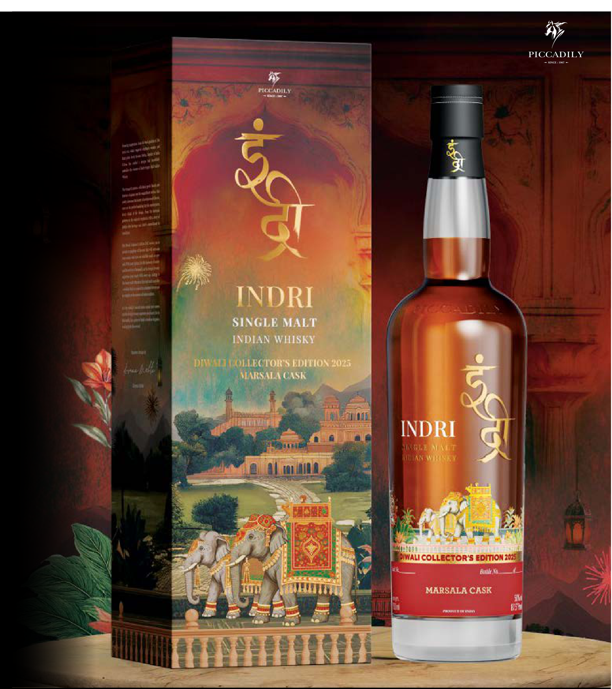

**[Image: 428cb101-9db0-4ae2-860f-ebf9be7bceb8.pdf-0004-05.png (1873x2107, 1605.4KB)]**

**4** 

P I CC A D I LY E A R N I N G S P R E S E N TAT I O N @ 2025- 26 

**[Image: 428cb101-9db0-4ae2-860f-ebf9be7bceb8.pdf-0005-00.png (170x114, 9.0KB)]**

Q2 & H1 FY2025-26 Performance Highlights 

5 

P I CC A D I LY E A R N I N G S P R E S E N TAT I O N @ 2025- 26 

**[Image: 428cb101-9db0-4ae2-860f-ebf9be7bceb8.pdf-0006-00.png (175x114, 6.3KB)]**

## Q2 & H1 FY2025-26 Highlights: 

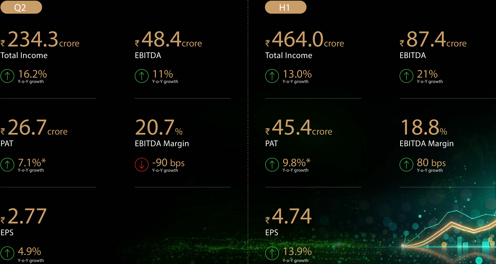

**[Image: 428cb101-9db0-4ae2-860f-ebf9be7bceb8.pdf-0006-02.png (2695x1432, 451.9KB)]**

<!-- Start of picture text -->
Q2 H1 J  234.3crore J  48.4crore J  464.0crore J  87.4crore Total Income EBITDA Total Income EBITDA 16.2% 11% 13.0% 21% Y-o-Y growth Y-o-Y growth Y-o-Y growth Y-o-Y growth J  26.7crore 20.7% J  45.4crore 18.8% PAT EBITDA Margin PAT EBITDA Margin 7.1%* -90 bps 9.8%* 80 bps Y-o-Y growth Y-o-Y growth Y-o-Y growth Y-o-Y growth J  2.77 J  4.74 EPS EPS 4.9% 13.9% Y-o-Y growth Y-o-Y growth <!-- End of picture text -->

## Financial Performance 

##### Standalone Profit & loss 

|Standalone Financials|Q|2|Y-o-Y|Q1|Q-o-Q|H|1|Y-o-Y|
|---|---|---|---|---|---|---|---|---|
|Particular (Figures in`J`Cr)|FY26|FY25|Growth (%)|FY26|Growth (%)|FY26|FY25|Growth (%)|
|Revenue from DistilleryVertical|207.9|184.9|12.4%|162.8|27.7%|370.7|304.1|21.9%|
|Revenue from Sugar Vertical|24.8|15.6|59.0%|66.2|-62.5%|91|104.8|-13.2%|
|Revenue from Operations|232.7|200.5|16.1%|229.0|1.6%|461.7|408.9|12.9%|
|Other Income|1.6|1.1|45.5%|0.7|128.6%|2.3|1.7|35.3%|
|Total Income|234.3|201.6|16.2%|229.7|2.0%|464.0|410.6|13.0%|
|Expenses|||||||||
|Cost of Materials Consumed|77.7|43.2|79.9%|56.9|36.6%|134.6|81.7|64.7%|
|Changes In Inventories|-1.8|17.2|-110.5%|55.5|-103.2%|53.7|89.6|-40.1%|
|Excise DutyOn Sale Of Goods|20.5|15.6|31.4%|15.1|35.8%|35.6|28.3|25.8%|
|Employee Benefts Expense|16.0|8.9|79.8%|11.7|36.8%|28.7|17.0|68.8%|
|Power, Fuel etc.|15.8|9.5|66.3%|9.9|59.6%|25.7|16.2|58.6%|
|Other Expenses|57.7|63.6|-9.3%|41.6|38.7%|99.3|105.6|-6.0%|
|Total expenses|185.9|158.0|17.7%|190.7|-2.0%|377.6|338.4|11.3%|
|EBITDA|48.4|43.6|11.0%|39.0|24.1%|86.4|72.3|21.0%|
|EBITDA Margin|20.7%|21.6%|-90.0bps|17.0%|370 bps|18.6%|17.6%|120.0bps|

7 

P I CC A D I LY E A R N I N G S P R E S E N TAT I O N @ 2025- 26 

#### Financial Performance contd... 

|Standalone Financials|Q|2|Y-o-Y|Q1|Q-o-Q|H|1|Y-o-Y|
|---|---|---|---|---|---|---|---|---|
|Particular (Figures in`J`Cr)|FY26|FY25|Growth (%)|FY26|Growth (%)|FY25|FY24|Growth (%)|
|EBITDA|48.4|43.6|11.0%|39.0|21.5%|77.4|72.2|21.0%|
|Finance Costs|6.5|5.5|20.4%|8.6|-24.4%|15.1|9.5|58.9%|
|Depreciation And Amortization Expense|6.2|5.1|22.1%|5.1|21.6%|11.4|9.7|17.5%|
|Proft /(Loss)Before Tax(PBT)|35.7|33.0|8.2%|25.3|37.2%|60.9|53.1|14.8%|
|PBT Margin|15.2%|16.4%|- 120 bps|11.0%|380 bps|13.1%|12.9%|20 bps|
|Taxes|9.0|8.1|8.4%|6.4|37.5%|15.5|13.9|11.2%|
|Proft/(Loss)After Tax(PAT)|26.7|24.9|7.1%|18.9|37.0%|45.4|39.1|16.2%|
|PAT Margin|11.4%|12.4%|-100 bps|8.2%|290 bps|9.8%|9.5%|30 bps|
|Earnings Per Share (EPS)|2.77|2.64|4.9%|1.98|36.4%|4.74|4.16|13.9%|

Decrease in Finance Costs in Q2 FY 26 vs Q1 FY 26 due to conversion of CCD’s in to equity, lower working capital loans for sugar 

`H` 2.97 Cr Increase in Employer benefits expenses mainly due to ESOP charge of 

8 

P I CC A D I LY E A R N I N G S P R E S E N TAT I O N @ 2025- 26 

**[Image: 428cb101-9db0-4ae2-860f-ebf9be7bceb8.pdf-0009-00.png (170x114, 5.8KB)]**

## Profitability Trends 

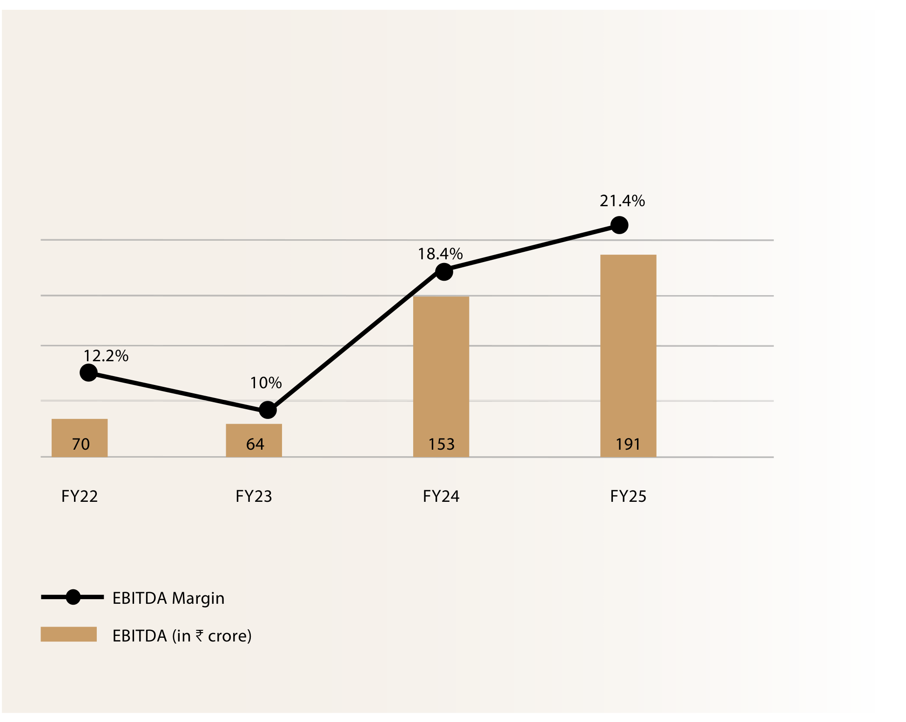

**[Image: 428cb101-9db0-4ae2-860f-ebf9be7bceb8.pdf-0009-02.png (1947x1551, 113.8KB)]**

<!-- Start of picture text -->
21.4% 18.4% 12.2% 10% 70 64 153 191 FY22 FY23 FY24 FY25 EBITDA Margin EBITDA (in  H  crore) <!-- End of picture text -->

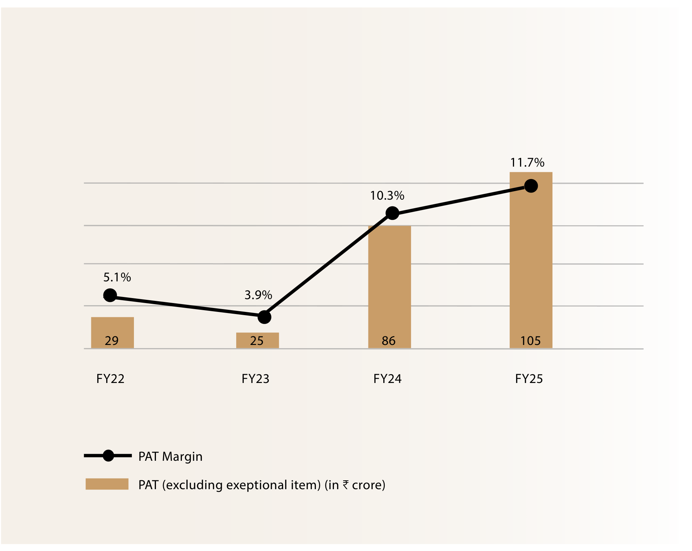

**[Image: 428cb101-9db0-4ae2-860f-ebf9be7bceb8.pdf-0009-03.png (1948x1551, 118.2KB)]**

<!-- Start of picture text -->
11.7% 10.3% 5.1% 3.9% 29 25 86 105 FY22 FY23 FY24 FY25 PAT Margin PAT (excluding exeptional item) (in  H  crore) <!-- End of picture text -->

9 

P I CC A D I LY E A R N I N G S P R E S E N TAT I O N @ 2025- 26 

#### Financial performance contd... 

Q2 H1 Company Company Revenue from operations grew 16.2% YoY Revenue from operations grew 12.9% YoY Distillery by 12.4% and sugar by 58.7%. Distillery Distillery by 21.9% and sugar growth expected to pick up in H2. declined by 13.2% EBITDA increased 11% YoY EBITDA increased 21% YoY EBITDA margin is slightly lower due to lower share of IMFL. The IMFL sales is expected to pick up in H2. Distillery Share of distillery products is 89% of Revenue from operations vs 90% in Q2 FY25 Branded Alcobev / IMFL has better margins in premium and luxury category which we are focussing on. Its sales expected to pick up in H2. 

**10** 

P I CC A D I LY E A R N I N G S P R E S E N TAT I O N @ 2025- 26 

**[Image: 428cb101-9db0-4ae2-860f-ebf9be7bceb8.pdf-0011-00.png (170x114, 5.2KB)]**

- Q2 & H1 FY2025-26 Business Highlights 

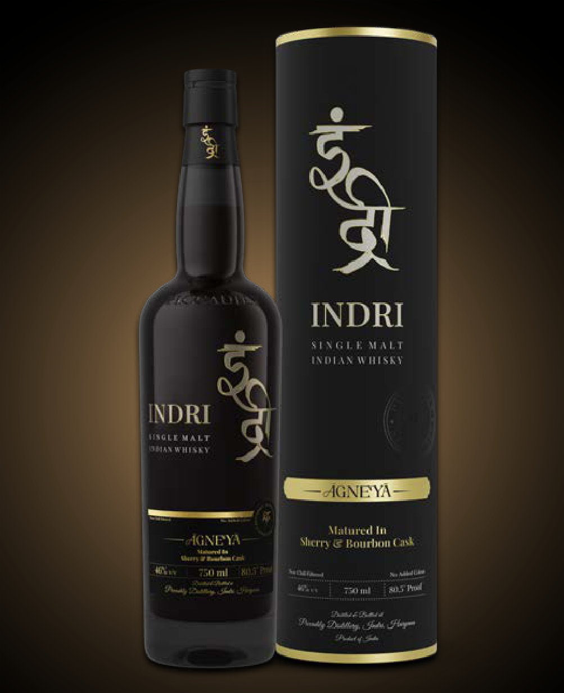

**[Image: 428cb101-9db0-4ae2-860f-ebf9be7bceb8.pdf-0011-02.png (1003x1231, 262.1KB)]**

Indri expansion completed 

Indri aims to be in top 5 single malts globally Barrels procurement on track 

Enhanced capacity of liquid along with more barrels for aging - boost supply side for Indri and all other products 

Excise approval for utilising increased capacity awaited/ expected in Q3 

##### Products / Expressions launched 

Indri Agneya 

Indri Dubai City Series Edition Cashmir Vodka 

Indri Diwali Collector’s Edition 2025 

##### Strenghtened distribution 

29 States and UT (incl CSD) in H1 Over 24,000 Retail outlets including On Trade in India CSD and Paramilitary focus continues on IMFL Products 

28 countries, 16 Indian Duty free and 12 International Duty free - focus continues - to add more 

Participated, domestically and internationally, in Whisky & Spirits shows and events 

Curated events held for Indri and Camikara in H1 

Products continue to win prestigious international awards 

##### Maturation capacity enhanced 

Number of Barrels at 77,500 - additional procurement underway 

##### Other updates 

Chhattisgarh and Portavadie expansion on track 

CCD’s aggregating Rs 212 Crores converted to equity 

**11** 

P I CC A D I LY E A R N I N G S P R E S E N TAT I O N @ 2025- 26 

**[Image: 428cb101-9db0-4ae2-860f-ebf9be7bceb8.pdf-0012-00.png (170x114, 5.6KB)]**

- Moving Towards Branded and Premium Portfolio 

Over the last four years, we have steadily shifted our revenue profile from bulk commodity-based sales towards branded and premium alcoholic beverages. The focus has progressively shifted towards value-added and branded Indian Made Foreign Liquor (IMFL) products. 

Revenue Composition – Segment-wise ( `J` crore) 

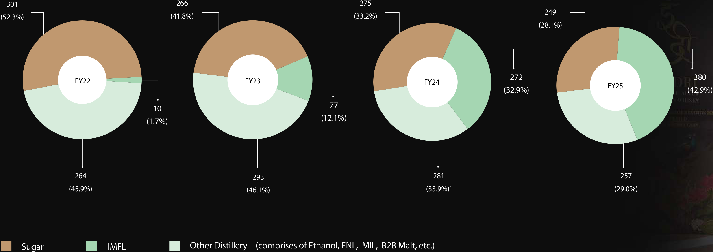

**[Image: 428cb101-9db0-4ae2-860f-ebf9be7bceb8.pdf-0012-04.png (3180x1126, 196.0KB)]**

<!-- Start of picture text -->
301 266 275 249 (52.3%) (41.8%) (33.2%) (28.1%) FY24 FY25 272 380 FY22 FY23 FY24 FY25 (32.9%) (42.9%) 77 10 (12.1%) (1.7%) 264 293 281 257 (45.9%) (46.1%) (33.9%)` (29.0%) Sugar IMFL Other Distillery – (comprises of Ethanol, ENL, IMIL,  B2B Malt, etc.) <!-- End of picture text -->

**12** 

P I CC A D I LY E A R N I N G S P R E S E N TAT I O N @ 2025- 26 

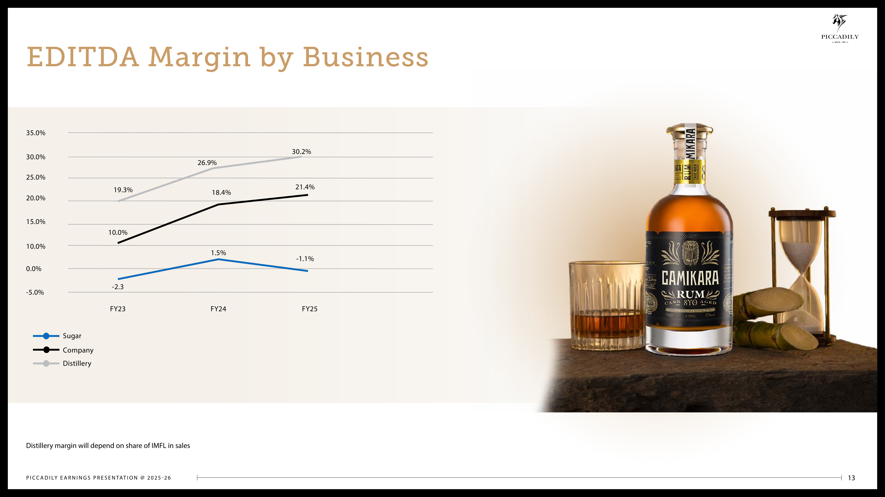

**[Image: 428cb101-9db0-4ae2-860f-ebf9be7bceb8.pdf-0013-00.png (4000x2250, 1029.6KB)]**

<!-- Start of picture text -->
EDITDA Margin by Business 35.0% 30.2% 30.0% 26.9% 25.0% 21.4% 19.3% 18.4% 20.0% 15.0% 10.0% 10.0% 1.5% -1.1% 0.0% -2.3 -5.0% FY23 FY24 FY25 Sugar Company Distillery Distillery margin will depend on share of IMFL in sales P I CC A D I LY E A R N I N G S P R E S E N TAT I O N @ 2025- 26 13 <!-- End of picture text -->

**[Image: 428cb101-9db0-4ae2-860f-ebf9be7bceb8.pdf-0013-01.png (4000x2250, 1029.6KB)]**

<!-- Start of picture text -->
EDITDA Margin by Business 35.0% 30.2% 30.0% 26.9% 25.0% 21.4% 19.3% 18.4% 20.0% 15.0% 10.0% 10.0% 1.5% -1.1% 0.0% -2.3 -5.0% FY23 FY24 FY25 Sugar Company Distillery Distillery margin will depend on share of IMFL in sales P I CC A D I LY E A R N I N G S P R E S E N TAT I O N @ 2025- 26 13 <!-- End of picture text -->

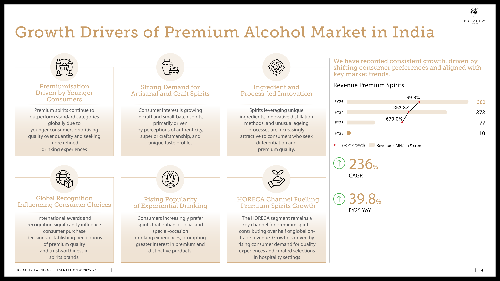

**[Image: 428cb101-9db0-4ae2-860f-ebf9be7bceb8.pdf-0014-00.png (4000x2250, 535.2KB)]**

<!-- Start of picture text -->
Growth Drivers of Premium Alcohol Market in India We have recorded consistent growth, driven by shifting consumer preferences and aligned with key market trends. Revenue Premium S irits Premiumisation  p Strong Demand for  Ingredient and Driven by Younger  Process-led Innovation Artisanal and Craft Spirits 39.8% Consumers FY25 380 253.2% Premium spirits continue to  Consumer interest is growing  Spirits leveraging unique  FY24 272 outperform standard categories  in craft and small-batch spirits,  ingredients, innovative distillation 670.0% globally due to  primarily driven  methods, and unusual ageing  FY23 77 younger consumers prioritising  by perceptions of authenticity,  processes are increasingly FY22 10 quality over quantity and seeking  superior craftsmanship, and   attractive to consumers who seek more refined  unique taste profiles  differentiation and Y-o-Y growth Revenue (IMFL) in  H  crore drinking experiences premium quality. 236% CAGR Global Recognition Rising Popularity  HORECA Channel Fuelling 39.8% Influencing Consumer Choices of Experiential Drinking Premium Spirits Growth FY25 YoY International awards and  Consumers increasingly prefer  The HORECA segment remains a recognition significantly influence  spirits that enhance social and  key channel for premium spirits, consumer purchase  special-occasion  contributing over half of global on- decisions, establishing perceptions  drinking experiences, prompting  trade revenue. Growth is driven by of premium quality   greater interest in premium and  rising consumer demand for quality and trustworthiness in  distinctive products. experiences and curated selections spirits brands. in hospitality settings P I CC A D I LY E A R N I N G S P R E S E N TAT I O N @ 2025- 26 14 <!-- End of picture text -->

- The Rise of Indri : Leading Brand Amongst Single Malts in India, Winning Awards Globally 

**[Image: 428cb101-9db0-4ae2-860f-ebf9be7bceb8.pdf-0015-01.png (170x114, 5.6KB)]**

Indri Diwali Collectors Edition 2025 Marsala Cask Finish took top honors as the Best World Whisky at the 2025 Las Vegas Global Spirits Awards with a near-perfect 99.1 There is increasing acceptance of Indian single malts both within and outside India with Indri as the leading brand. 

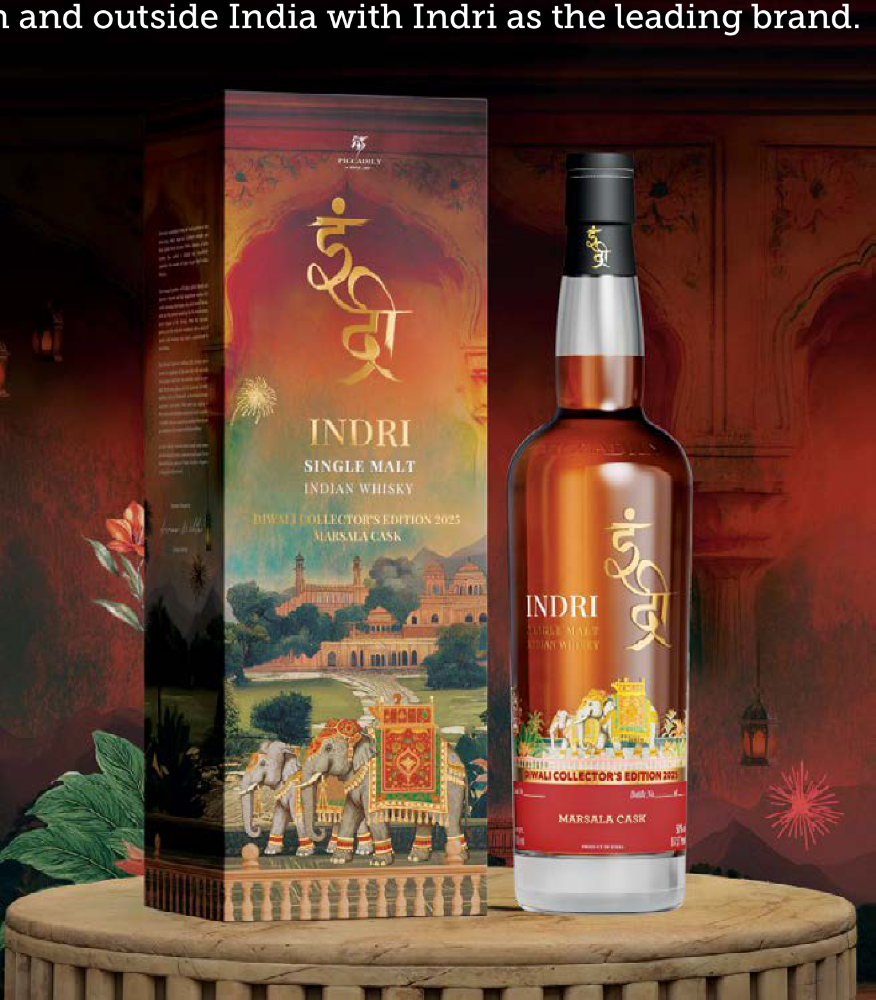

**[Image: 428cb101-9db0-4ae2-860f-ebf9be7bceb8.pdf-0015-03.png (1365x1557, 1082.0KB)]**

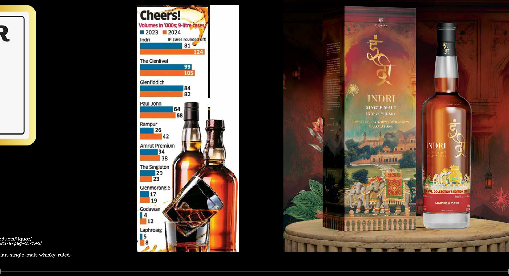

**[Image: 428cb101-9db0-4ae2-860f-ebf9be7bceb8.pdf-0015-04.png (2918x1586, 1499.6KB)]**

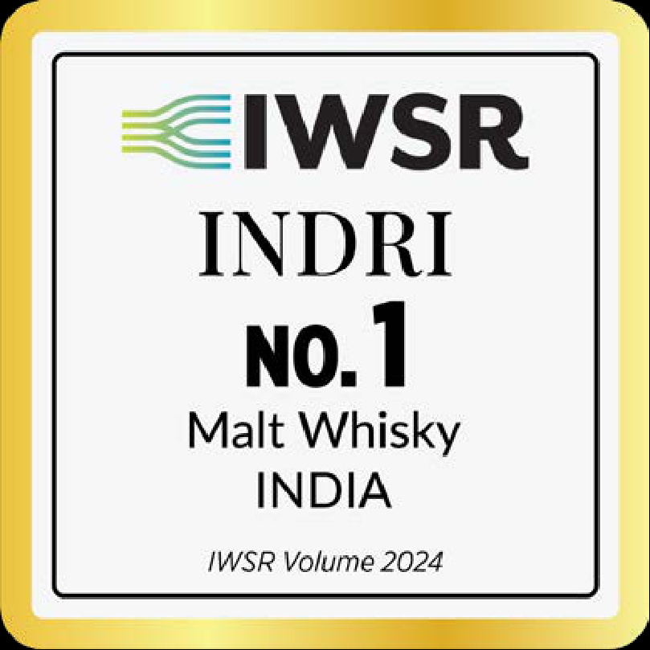

**[Image: 428cb101-9db0-4ae2-860f-ebf9be7bceb8.pdf-0015-05.png (809x809, 88.7KB)]**

https://economictimes.indiatimes.com/industry/cons-products/liquor/ going-indiagenous-desi-malts-take-premium-scotch-down-a-peg-or-two/ articleshow/123244022. https://www.forbes.com/sites/joemicallef/2025/09/30/indian-single-malt-whisky-ruledthe-las-vegas-global-spirit-awards/ 

15 

P I CC A D I LY E A R N I N G S P R E S E N TAT I O N @ 2025- 26 

**[Image: 428cb101-9db0-4ae2-860f-ebf9be7bceb8.pdf-0016-00.png (170x114, 5.6KB)]**

# Company Overview 

16 

P I CC A D I LY E A R N I N G S P R E S E N TAT I O N @ 2025- 26 

**[Image: 428cb101-9db0-4ae2-860f-ebf9be7bceb8.pdf-0017-00.png (170x114, 5.4KB)]**

## Introduction 

Crafting Excellence, Redefining India’s Premium Alco-Bev Landscape 

Piccadily Agro Industries Ltd. (PAIL) is a name synonymous with heritage, craftsmanship and innovation. Established in 1994, it has grown to become India’s largest independent producer of malt spirits. Our portfolio includes single malt whiskies, cane juice rum and a range of IMFL brands, setting new benchmarks in quality and innovation. Beyond spirits, we manufacture Ethanol, Extra Neutral Alcohol (ENA), DDGS and white crystal sugar. 

With a diverse portfolio of premium alco-bev brands and more products in the offing we endeavour to define the future of niche and premium Indian alco-bev spirits in India and overseas. We plan to capitalise organic and inorganic growth opportunities to achieve the above. 

###### Crafting the Future 

We operate across two strategic pillars, each driven by a commitment to excellence and innovation: 

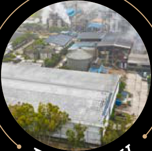

**[Image: 428cb101-9db0-4ae2-860f-ebf9be7bceb8.pdf-0017-07.png (310x307, 58.2KB)]**

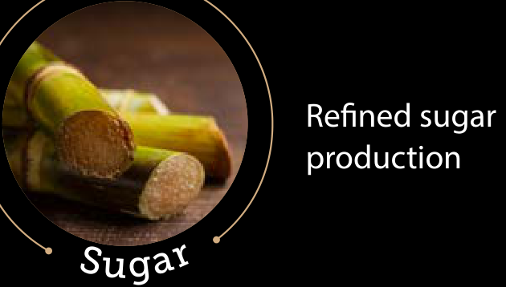

**[Image: 428cb101-9db0-4ae2-860f-ebf9be7bceb8.pdf-0017-08.png (630x358, 65.7KB)]**

<!-- Start of picture text -->
Refined sugar production ug S a r <!-- End of picture text -->

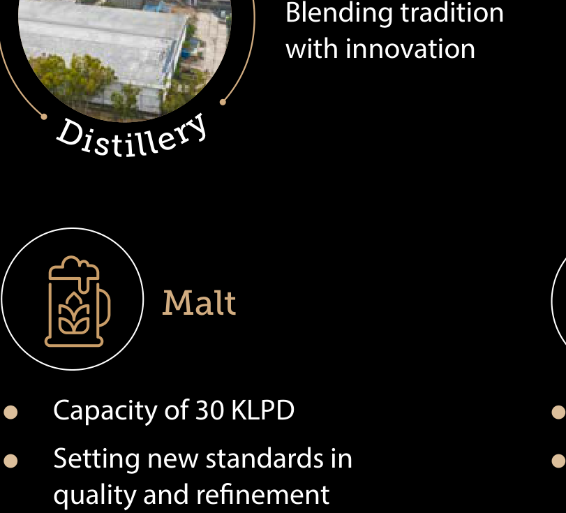

**[Image: 428cb101-9db0-4ae2-860f-ebf9be7bceb8.pdf-0017-09.png (811x735, 84.6KB)]**

<!-- Start of picture text -->
Blending tradition with innovation Malt Capacity of 30 KLPD Setting new standards in quality and refinement Distillery <!-- End of picture text -->

White Crystal Sugar Capacity of 5,000 TCD Collaborating with 5,000+ farmers for sustainable sugarcane sourcing 

Extra Neutral Alcohol (ENA) and Ethanol Capacity of 220 KLPD* Contributing to sustainable energy solutions and a greener future 

At the heart of our operations lies a state-of-the-art manufacturing facility in Indri, Haryana, spanning 168 acres. This world-class facility seamlessly integrates cutting-edge technology to produce the above. 

*Excludes on-going expansion at Chhattisgarh 

**17** 

P I CC A D I LY E A R N I N G S P R E S E N TAT I O N @ 2025- 26 

**[Image: 428cb101-9db0-4ae2-860f-ebf9be7bceb8.pdf-0018-00.png (170x114, 5.4KB)]**

#### Introduction contd... 

###### Architects of Premium Spirits 

Piccadily Agro is at the forefront of India’s evolving spirits landscape, by driving premiumization and setting new benchmarks in craftsmanship and innovation. With an insightful grasp of market dynamics and a steadfast dedication to fine craftsmanship, we cater to a select clientele who value not only quality but the artistry of innovation. Through our flagship brands, we deliver more than just spirits; we offer an experience that transcends the ordinary where timeless tradition meets contemporary mastery. Each creation is a testament to our relentless pursuit of excellence, refining the very essence of premium and redefining the art of indulgence. 30 KLPD 220* KLPD Malt Plant Ethanol / ENA Plant 

28 Countries 

24,000+ PAN India Retail Outlets including On Trade 

###### A Portfolio of Distinction 

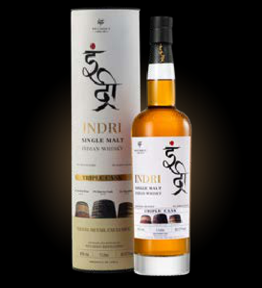

**[Image: 428cb101-9db0-4ae2-860f-ebf9be7bceb8.pdf-0018-07.png (524x576, 92.6KB)]**

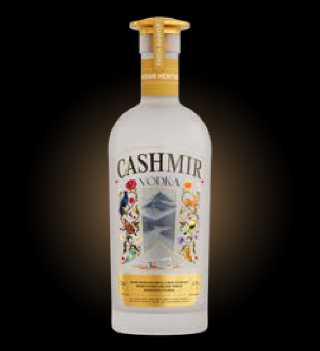

**[Image: 428cb101-9db0-4ae2-860f-ebf9be7bceb8.pdf-0018-08.png (524x575, 70.6KB)]**

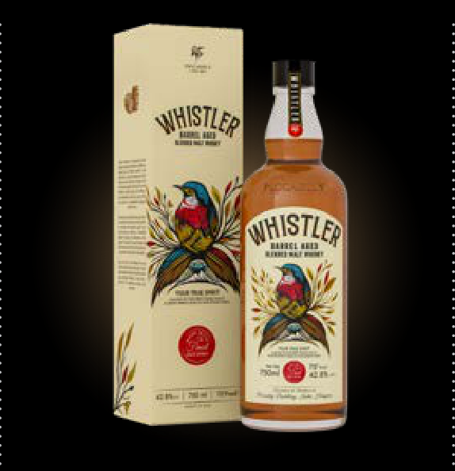

**[Image: 428cb101-9db0-4ae2-860f-ebf9be7bceb8.pdf-0018-09.png (574x594, 114.4KB)]**

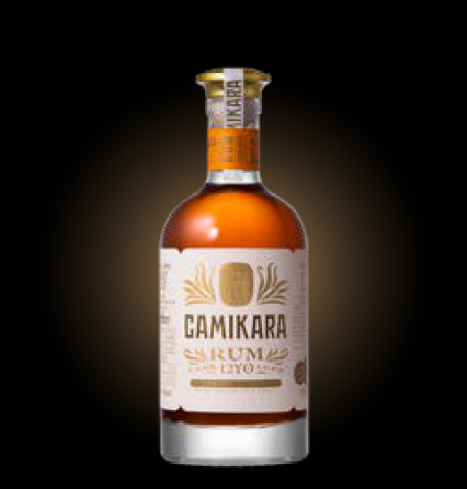

**[Image: 428cb101-9db0-4ae2-860f-ebf9be7bceb8.pdf-0018-10.png (524x549, 70.7KB)]**

Single Malt Whisky 

Premium Sugarcane Juice Rum 

Blended Malt Vodka Whisky 

Indri, our flagship brand, a Camikara, a bold innovation Whistler is a barrel aged India’s 1st Premium Vodka trailblazer in redefining India’s that reimagines the spirit of blended malt whisky offering Made From Sona Moti, A premium spirits landscape rum, blending creativity with a sophisticated balance of 2000-Year-Old Rediscovered with unparalleled elegance and excellence. tradition and modernity. Organic Wheat Indigenous character. To India 

*Excludes on going expansion at Chhattisgarh 

**18** 

P I CC A D I LY E A R N I N G S P R E S E N TAT I O N @ 2025- 26 

**[Image: 428cb101-9db0-4ae2-860f-ebf9be7bceb8.pdf-0019-00.png (170x114, 5.8KB)]**

## Our Journey 

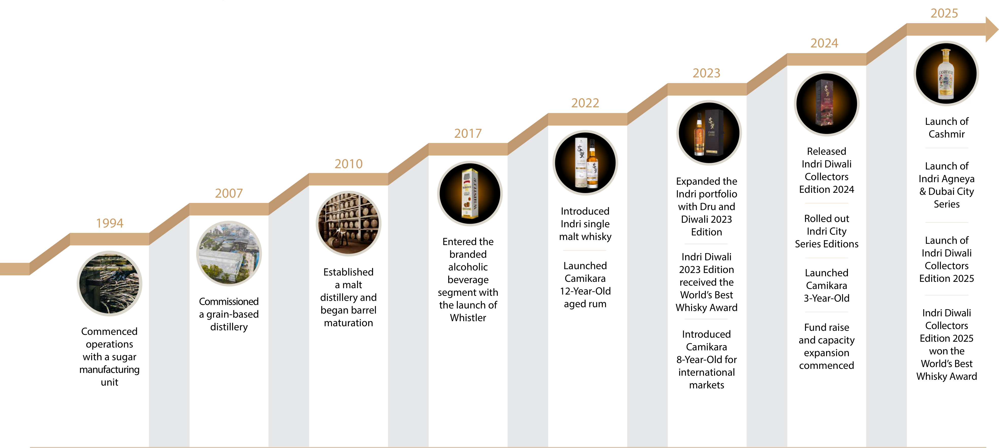

**[Image: 428cb101-9db0-4ae2-860f-ebf9be7bceb8.pdf-0019-02.png (3934x1766, 686.9KB)]**

<!-- Start of picture text -->
2025 2024 2023 2022 Launch of 2017 Cashmir Released 2010 Indri Diwali  Launch of Collectors Indri Agneya Expanded the Edition 2024 2007 Indri portfolio  & Dubai City Series with Dru and Introduced Diwali 2023  Rolled out 1994 Indri single Edition Indri City Entered the  malt whisky Launch of Series Editions branded  Indri Diwali Indri Diwali alcoholic  Launched  Collectors 2023 Edition Established  Launched beverage  Camikara  received the  Edition 2025 a malt  Camikara segment with  12-Year-Old  World’s Best distillery and  3-Year-Old Commissioned the launch of  aged rum Whisky Award a grain-based  began barrel  Whistler Indri Diwali maturation Collectors distillery Fund raise Commenced Introduced Edition 2025 and capacity operations  Camikara won the expansion with a sugar  8-Year-Old for World’s Best commenced manufacturing  international Whisky Award unit markets <!-- End of picture text -->

19 

P I CC A D I LY E A R N I N G S P R E S E N TAT I O N @ 2025- 26 

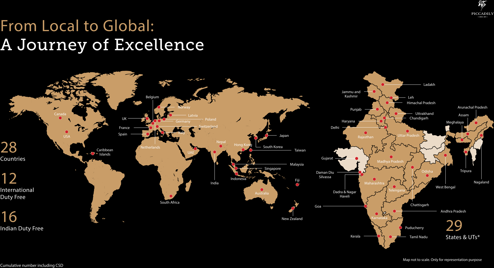

**[Image: 428cb101-9db0-4ae2-860f-ebf9be7bceb8.pdf-0020-00.png (3768x2049, 569.1KB)]**

<!-- Start of picture text -->
From Local to Global: A Journey of Excellence Ladakh Jammu and Kashmir Belgium Leh Himachal Pradesh Norway Arunachal Pradesh Punjab Canada Uttrakhand Latvia Assam UK Poland Chandigarh Germany Haryana Meghalaya Switzerland France Delhi Italy USA Spain Japan Rajasthan Uttar Pradesh Nepal Hong Kong Netherlands South Korea Caribbean  Taiwan 28 UAE Islands Countries Gujarat Madhya Pradesh Malaysia Singapore Odisha Tripura Daman Diu Silvassa Indonesia Fiji 12 India Maharashtra Nagaland West Bengal International  Telengana Australia Dadra & Nagar Duty Free Haveli South Africa Goa Chattisgarh Andhra Pradesh New Zealand Karnataka 16 Puducherry Indian Duty Free 29 Kerala Tamil Nadu States & UTs* Map not to scale. Only for representation purpose Cumulative number including CSD <!-- End of picture text -->

**20** 

P I CC A D I LY E A R N I N G S P R E S E N TAT I O N @ 2025- 26 

**[Image: 428cb101-9db0-4ae2-860f-ebf9be7bceb8.pdf-0021-00.png (170x114, 5.4KB)]**

## Malt Manufacturing Process 

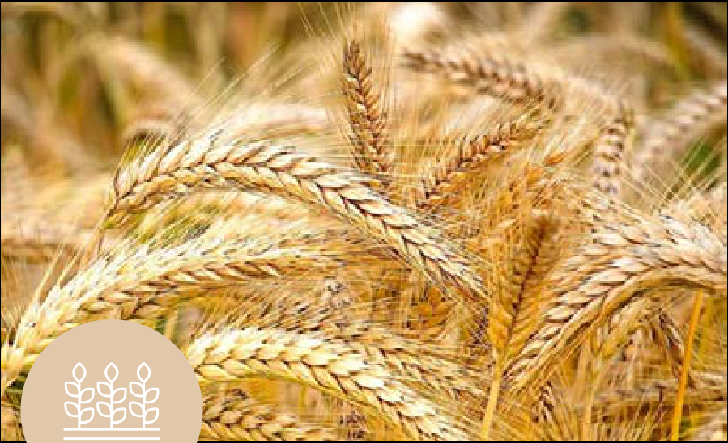

**[Image: 428cb101-9db0-4ae2-860f-ebf9be7bceb8.pdf-0021-02.png (899x548, 369.0KB)]**

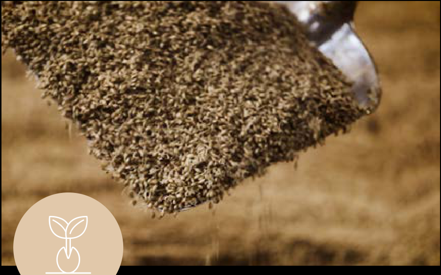

**[Image: 428cb101-9db0-4ae2-860f-ebf9be7bceb8.pdf-0021-03.png (902x563, 286.9KB)]**

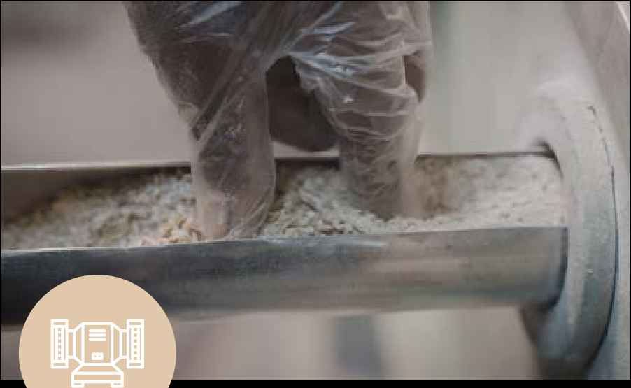

**[Image: 428cb101-9db0-4ae2-860f-ebf9be7bceb8.pdf-0021-04.png (902x555, 181.9KB)]**

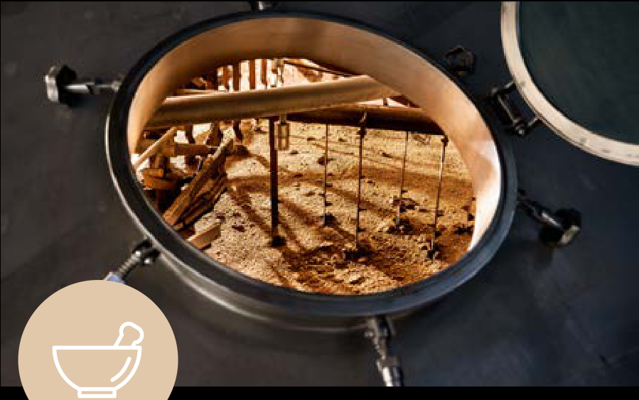

**[Image: 428cb101-9db0-4ae2-860f-ebf9be7bceb8.pdf-0021-05.png (899x563, 235.7KB)]**

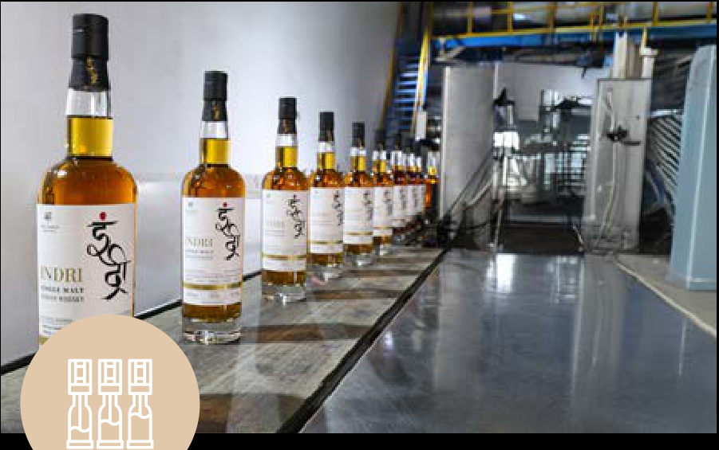

**[Image: 428cb101-9db0-4ae2-860f-ebf9be7bceb8.pdf-0021-06.png (901x565, 270.2KB)]**

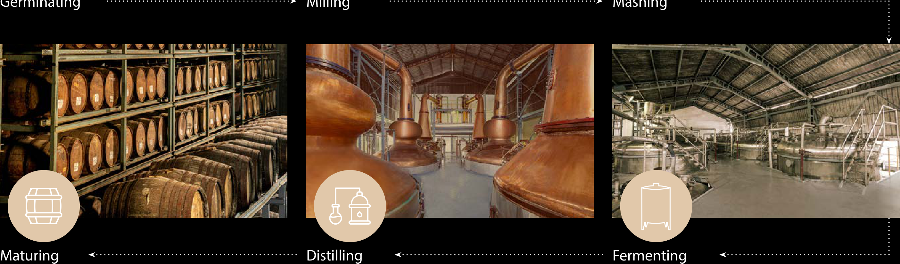

**[Image: 428cb101-9db0-4ae2-860f-ebf9be7bceb8.pdf-0021-07.png (2809x824, 1004.2KB)]**

<!-- Start of picture text -->
Maturing Distilling Fermenting <!-- End of picture text -->

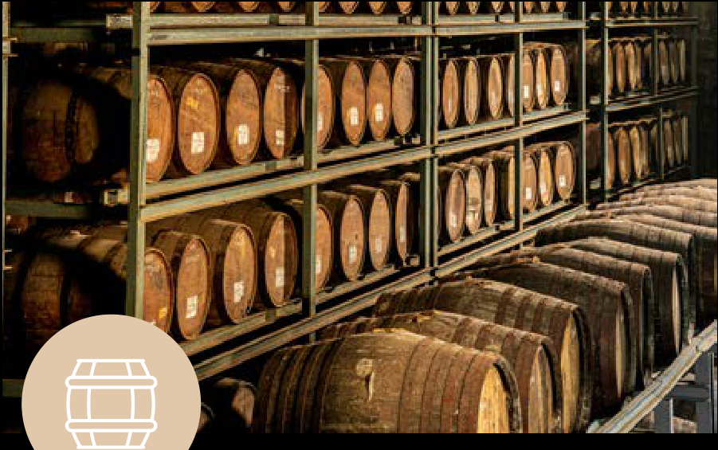

**[Image: 428cb101-9db0-4ae2-860f-ebf9be7bceb8.pdf-0021-08.png (901x565, 341.7KB)]**

P I CC A D I LY E A R N I N G S P R E S E N TAT I O N @ 2025- 26 

**[Image: 428cb101-9db0-4ae2-860f-ebf9be7bceb8.pdf-0022-00.png (170x114, 5.4KB)]**

## Indri - Raising The Bar: A Spirit Designed to Inspire 

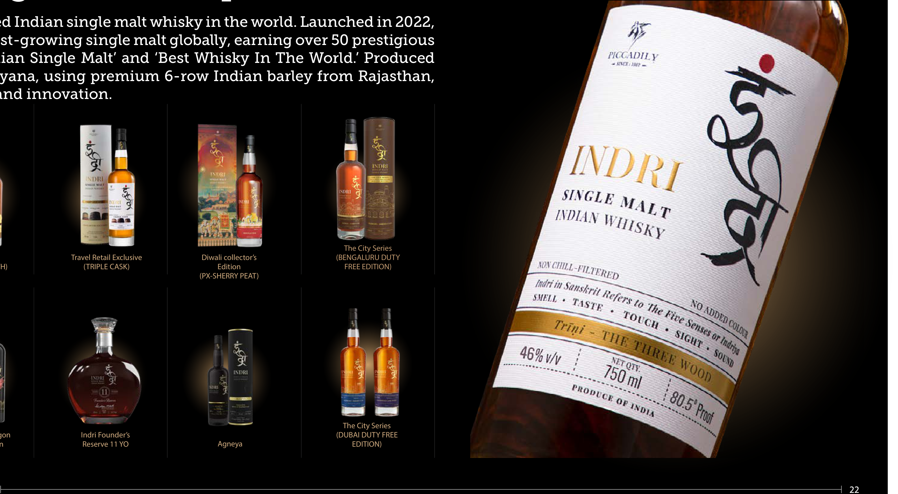

**[Image: 428cb101-9db0-4ae2-860f-ebf9be7bceb8.pdf-0022-02.png (3111x1712, 1372.1KB)]**

<!-- Start of picture text -->
The City Series Travel Retail Exclusive Diwali collector’s  (BENGALURU DUTY (TRIPLE CASK) Edition FREE EDITION) (PX-SHERRY PEAT) The City Series Indri Founder’s  (DUBAI DUTY FREE Reserve 11 YO Agneya EDITION) 22 <!-- End of picture text -->

Indri is one of the most awarded Indian single malt whisky in the world. Launched in 2022, it has quickly become the fastest-growing single malt globally, earning over 50 prestigious accolades, including ‘Best Indian Single Malt’ and ‘Best Whisky In The World.’ Produced in Indri, a small village in Haryana, using premium 6-row Indian barley from Rajasthan, showcases Indian excellence and innovation. 

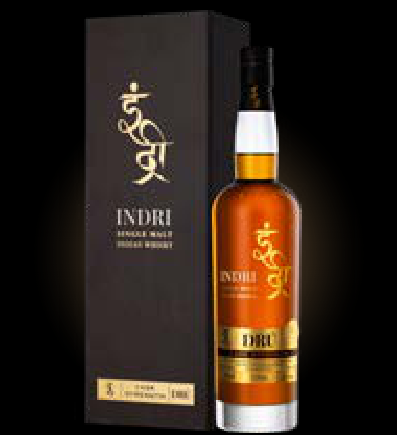

**[Image: 428cb101-9db0-4ae2-860f-ebf9be7bceb8.pdf-0022-04.png (397x435, 53.3KB)]**

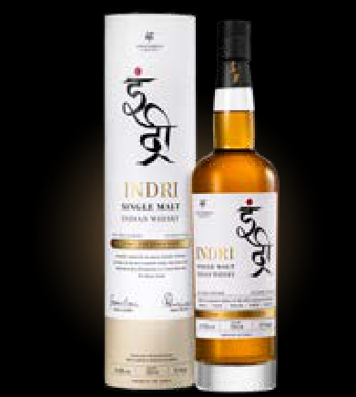

**[Image: 428cb101-9db0-4ae2-860f-ebf9be7bceb8.pdf-0022-05.png (391x436, 58.8KB)]**

Trini DRU (THE THREE WOOD) (CASK STRENGTH) 

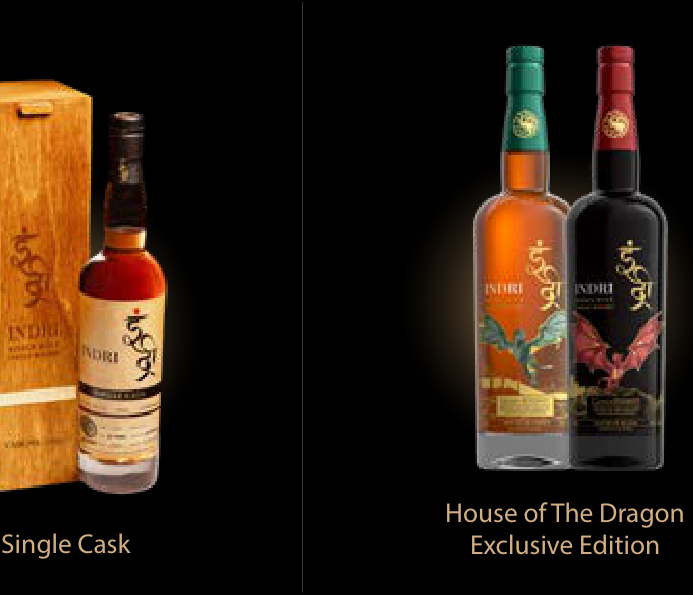

**[Image: 428cb101-9db0-4ae2-860f-ebf9be7bceb8.pdf-0022-07.png (693x595, 124.9KB)]**

<!-- Start of picture text -->
House of The Dragon Single Cask  Exclusive Edition <!-- End of picture text -->

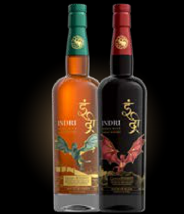

**[Image: 428cb101-9db0-4ae2-860f-ebf9be7bceb8.pdf-0022-08.png (376x436, 59.5KB)]**

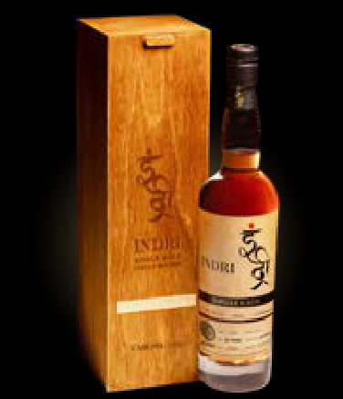

**[Image: 428cb101-9db0-4ae2-860f-ebf9be7bceb8.pdf-0022-09.png (376x437, 71.8KB)]**

P I CC A D I LY E A R N I N G S P R E S E N TAT I O N @ 2025- 26 

**[Image: 428cb101-9db0-4ae2-860f-ebf9be7bceb8.pdf-0023-00.png (170x114, 5.4KB)]**

## Camikara 

is India’s Camikara, derived from the Sanskrit word meaning “liquid gold,” first Pure Cane Juice Premium Aged Rum, redefining the country’s rum legacy. Aged in American oak barrels, Camikara stands apart with no added colors, flavors, sugar, or spices, delivering a truly authentic and refined experience. 

###### Camikara RUM 12 YO 

###### Camikara RUM 8 YO 

###### Camikara RUM 3 YO 

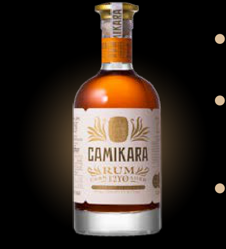

**[Image: 428cb101-9db0-4ae2-860f-ebf9be7bceb8.pdf-0023-06.png (449x493, 66.4KB)]**

Aged for 12 years in American oak barrels. 

Bottled at 50% ABV, offering a rich, complex, and smooth tasting experience. 

Available in select Indian and international markets. 

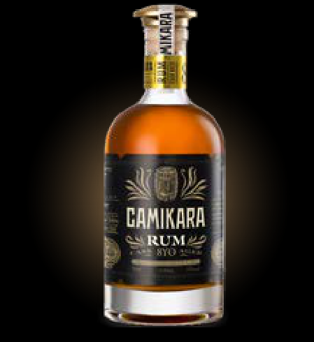

**[Image: 428cb101-9db0-4ae2-860f-ebf9be7bceb8.pdf-0023-10.png (449x490, 67.6KB)]**

A rare, 8-year-aged pure cane juice rum, offering a deep and aromatic profile. 

Aged in American oak barrels for a well-rounded character, with an ABV of 42.8%, delivering a smooth and balanced whisky experience. Available in select international markets. 

**[Image: 428cb101-9db0-4ae2-860f-ebf9be7bceb8.pdf-0023-13.png (449x493, 65.3KB)]**

Aged for 3 years in American oak barrels and bottled at 42.8% ABV, shattering the myth that rum is only a seasonal spirit. 

Launched Pan-India in On-Trade channels. 

Recognitions 

Recognitions 

Recognitions 

The 1st Indian Rum to ever win a gold medal at the prestigious IWSC wards 2023, with 95 points. 2023 Bartender Spirits awards - GOLD. 

The Spirits Business Global RUM & CACHACA Masters - GOLD 2024. 

The 1st Indian Rum to Ever win a Gold Medal at the Global RUM & CACHACA Masters 2024 USA Spirits ratings - Silver 2024 

The 1st Indian Rum to ever win a Silver medal at the Global RUM & Cachaca Masters 2024 

Camikara 3 YO: Bronze at London Spirits Competition 

**23** 

P I CC A D I LY E A R N I N G S P R E S E N TAT I O N @ 2025- 26 

**[Image: 428cb101-9db0-4ae2-860f-ebf9be7bceb8.pdf-0024-00.png (170x114, 5.4KB)]**

## Camikara Mixers 

Introducing the all-new Camikara NonAlcoholic Mixers in two vibrant flavours – Mojito and Mai Tai. Expertly crafted to elevate every pour, these tropical mixers capture the essence of iconic cocktails. Camikara mixers deliver a premium, bar-quality experience— bringing the spirit of indulgence home, one exquisite sip at a time. 

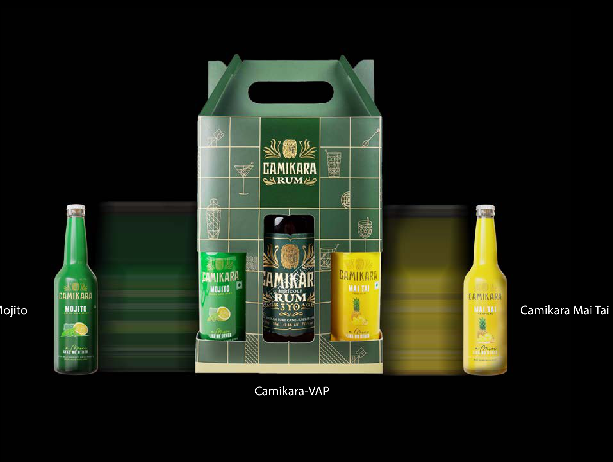

**[Image: 428cb101-9db0-4ae2-860f-ebf9be7bceb8.pdf-0024-03.png (1992x1502, 570.3KB)]**

<!-- Start of picture text -->
Camikara Mai Tai Camikara-VAP <!-- End of picture text -->

**[Image: 428cb101-9db0-4ae2-860f-ebf9be7bceb8.pdf-0024-04.png (285x39, 4.3KB)]**

<!-- Start of picture text -->
Camikara Mojito <!-- End of picture text -->

**24** 

P I CC A D I LY E A R N I N G S P R E S E N TAT I O N @ 2025- 26 

**[Image: 428cb101-9db0-4ae2-860f-ebf9be7bceb8.pdf-0025-00.png (170x114, 6.0KB)]**

25 

**[Image: 428cb101-9db0-4ae2-860f-ebf9be7bceb8.pdf-0026-01.png (170x114, 5.4KB)]**

- Mastery in Every Sip: Premium Spirits Across Price Segments 

Blended Whisky Coming Soon 

**[Image: 428cb101-9db0-4ae2-860f-ebf9be7bceb8.pdf-0026-04.png (118x339, 17.1KB)]**

**[Image: 428cb101-9db0-4ae2-860f-ebf9be7bceb8.pdf-0026-05.png (95x339, 13.6KB)]**

**[Image: 428cb101-9db0-4ae2-860f-ebf9be7bceb8.pdf-0026-06.png (215x39, 3.3KB)]**

<!-- Start of picture text -->
Aged Rum <!-- End of picture text -->

**[Image: 428cb101-9db0-4ae2-860f-ebf9be7bceb8.pdf-0026-07.png (227x356, 28.1KB)]**

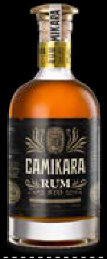

**[Image: 428cb101-9db0-4ae2-860f-ebf9be7bceb8.pdf-0026-08.png (155x374, 30.8KB)]**

**[Image: 428cb101-9db0-4ae2-860f-ebf9be7bceb8.pdf-0026-09.png (227x360, 22.4KB)]**

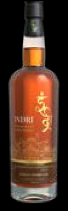

**[Image: 428cb101-9db0-4ae2-860f-ebf9be7bceb8.pdf-0026-10.png (115x354, 18.2KB)]**

Single Malt Whisky 

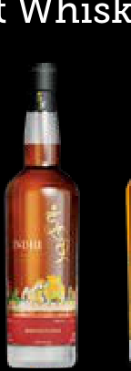

**[Image: 428cb101-9db0-4ae2-860f-ebf9be7bceb8.pdf-0026-12.png (144x407, 21.8KB)]**

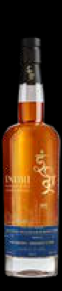

**[Image: 428cb101-9db0-4ae2-860f-ebf9be7bceb8.pdf-0026-13.png (89x413, 18.0KB)]**

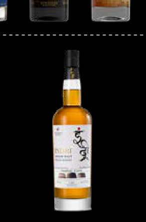

**[Image: 428cb101-9db0-4ae2-860f-ebf9be7bceb8.pdf-0026-14.png (293x445, 22.1KB)]**

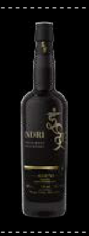

**[Image: 428cb101-9db0-4ae2-860f-ebf9be7bceb8.pdf-0026-15.png (151x399, 16.5KB)]**

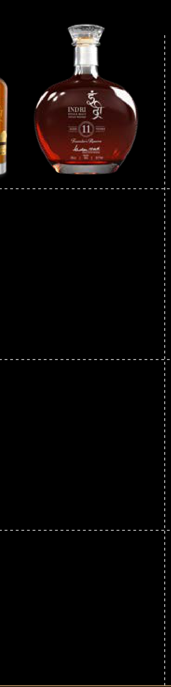

**[Image: 428cb101-9db0-4ae2-860f-ebf9be7bceb8.pdf-0026-16.png (382x1526, 43.2KB)]**

**[Image: 428cb101-9db0-4ae2-860f-ebf9be7bceb8.pdf-0026-17.png (139x376, 20.4KB)]**

**[Image: 428cb101-9db0-4ae2-860f-ebf9be7bceb8.pdf-0026-18.png (453x384, 6.4KB)]**

<!-- Start of picture text -->
ULTRA - LUXURY <!-- End of picture text -->

**[Image: 428cb101-9db0-4ae2-860f-ebf9be7bceb8.pdf-0026-19.png (211x384, 3.3KB)]**

**[Image: 428cb101-9db0-4ae2-860f-ebf9be7bceb8.pdf-0026-20.png (166x767, 6.8KB)]**

<!-- Start of picture text -->
LUXURY PREMIUM PRESTIGE <!-- End of picture text -->

**[Image: 428cb101-9db0-4ae2-860f-ebf9be7bceb8.pdf-0026-21.png (211x384, 3.5KB)]**

**[Image: 428cb101-9db0-4ae2-860f-ebf9be7bceb8.pdf-0026-22.png (239x384, 3.8KB)]**

**26** 

P I CC A D I LY E A R N I N G S P R E S E N TAT I O N @ 2025- 26 

## Recent Launches 

**[Image: 428cb101-9db0-4ae2-860f-ebf9be7bceb8.pdf-0027-01.png (170x114, 6.3KB)]**

Date of launch 23.5.25 

27 

P I CC A D I LY E A R N I N G S P R E S E N TAT I O N @ 2025- 26 

Date of launch 05.8.25 

28 

P I CC A D I LY E A R N I N G S P R E S E N TAT I O N @ 2025- 26 

**[Image: 428cb101-9db0-4ae2-860f-ebf9be7bceb8.pdf-0029-00.png (170x114, 6.1KB)]**

Date of Launch 24.07.25 

29 

P I CC A D I LY E A R N I N G S P R E S E N TAT I O N @ 2025- 26 

**[Image: 428cb101-9db0-4ae2-860f-ebf9be7bceb8.pdf-0030-00.png (170x114, 7.3KB)]**

Date of Launch 03.10.25 

30 

P I CC A D I LY E A R N I N G S P R E S E N TAT I O N @ 2025- 26 

**[Image: 428cb101-9db0-4ae2-860f-ebf9be7bceb8.pdf-0031-00.png (170x114, 5.6KB)]**

## Charting the Path to Excellence: 

**[Image: 428cb101-9db0-4ae2-860f-ebf9be7bceb8.pdf-0031-02.png (97x108, 4.0KB)]**

**[Image: 428cb101-9db0-4ae2-860f-ebf9be7bceb8.pdf-0031-03.png (92x86, 1.4KB)]**

Innovate and Elevate 

Expand Horizons 

**[Image: 428cb101-9db0-4ae2-860f-ebf9be7bceb8.pdf-0031-06.png (95x95, 3.9KB)]**

**[Image: 428cb101-9db0-4ae2-860f-ebf9be7bceb8.pdf-0031-07.png (107x104, 3.2KB)]**

**[Image: 428cb101-9db0-4ae2-860f-ebf9be7bceb8.pdf-0031-08.png (249x105, 6.1KB)]**

<!-- Start of picture text -->
Accelerate Growth <!-- End of picture text -->

Financial Stability 

**[Image: 428cb101-9db0-4ae2-860f-ebf9be7bceb8.pdf-0032-00.png (170x114, 5.6KB)]**

## Scaling for the Future: 

**[Image: 428cb101-9db0-4ae2-860f-ebf9be7bceb8.pdf-0032-02.png (321x339, 17.2KB)]**

**[Image: 428cb101-9db0-4ae2-860f-ebf9be7bceb8.pdf-0032-03.png (90x91, 3.0KB)]**

Indri, Haryana 

from 78 KLPD to 220 KLPD for ENA and from 12 KLPD to 30 KLPD for malt. 

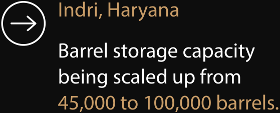

**[Image: 428cb101-9db0-4ae2-860f-ebf9be7bceb8.pdf-0032-06.png (559x226, 22.4KB)]**

<!-- Start of picture text -->
Indri, Haryana Barrel storage capacity being scaled up from 45,000 to 100,000 barrels. <!-- End of picture text -->

**[Image: 428cb101-9db0-4ae2-860f-ebf9be7bceb8.pdf-0032-07.png (372x530, 15.3KB)]**

**[Image: 428cb101-9db0-4ae2-860f-ebf9be7bceb8.pdf-0032-08.png (114x147, 3.8KB)]**

Mahasamund, Chhattisgarh 

A 210 KLPD distillery for ENA, 

Portavadie, Scotland 

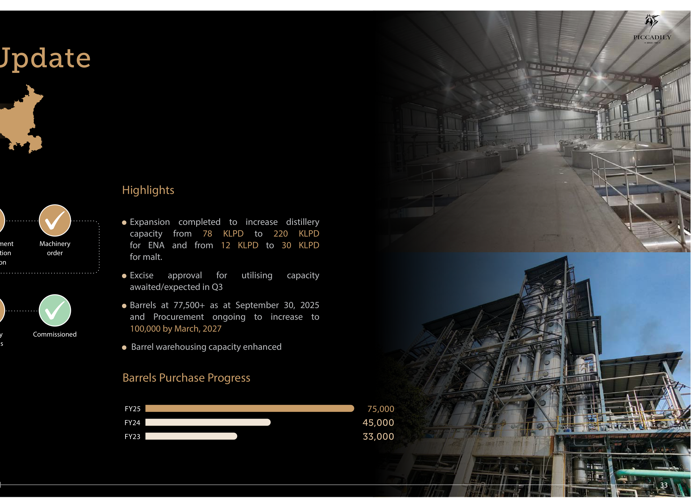

**[Image: 428cb101-9db0-4ae2-860f-ebf9be7bceb8.pdf-0033-00.png (3080x2221, 2020.5KB)]**

<!-- Start of picture text -->
Highlights Capex Year XX  Expansion completed to increase distillery capacity  from  78 KLPD to  220 KLPD Machinery  for ENA and from  12 KLPD  to  30 KLPD order for malt. Activity  Excise  approval  for  utilising  capacity awaited/expected in Q3  Barrels at 77,500+ as at September 30, 2025 Year XX and Procurement ongoing to increase to 100,000 by March, 2027 Commissioned  Barrel warehousing capacity enhanced Activity Barrels Purchase Progress Amount  Utilisation FY25 75,000 FY24 45,000 FY23 33,000 33 <!-- End of picture text -->

## Expansion Update 

**[Image: 428cb101-9db0-4ae2-860f-ebf9be7bceb8.pdf-0033-02.png (940x219, 17.6KB)]**

<!-- Start of picture text -->
Indri, Haryana <!-- End of picture text -->

**[Image: 428cb101-9db0-4ae2-860f-ebf9be7bceb8.pdf-0033-03.png (260x43, 3.6KB)]**

<!-- Start of picture text -->
Milestones: <!-- End of picture text -->

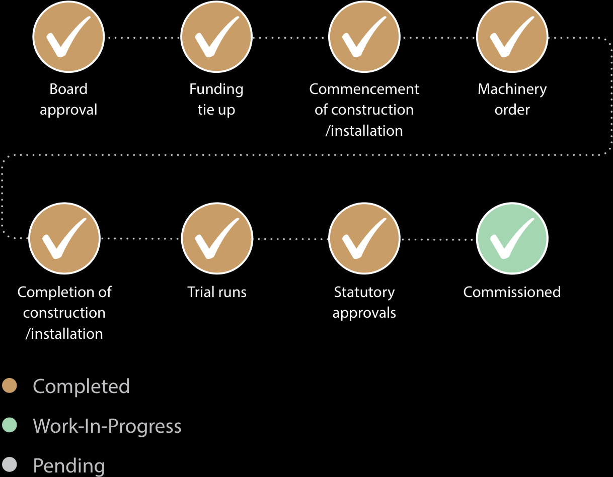

**[Image: 428cb101-9db0-4ae2-860f-ebf9be7bceb8.pdf-0033-04.png (1218x949, 97.7KB)]**

<!-- Start of picture text -->
Board  Funding  Commencement  Machinery approval tie up of construction  order /installation Completion of  Trial runs Statutory  Commissioned construction  approvals /installation Completed Work-In-Progress Pending <!-- End of picture text -->

P I CC A D I LY E A R N I N G S P R E S E N TAT I O N @ 2025- 26 

#### Expansion Update contd. 

**[Image: 428cb101-9db0-4ae2-860f-ebf9be7bceb8.pdf-0034-01.png (1005x353, 27.2KB)]**

<!-- Start of picture text -->
Mahasamund, Chhattisgarh <!-- End of picture text -->

Milestones: 

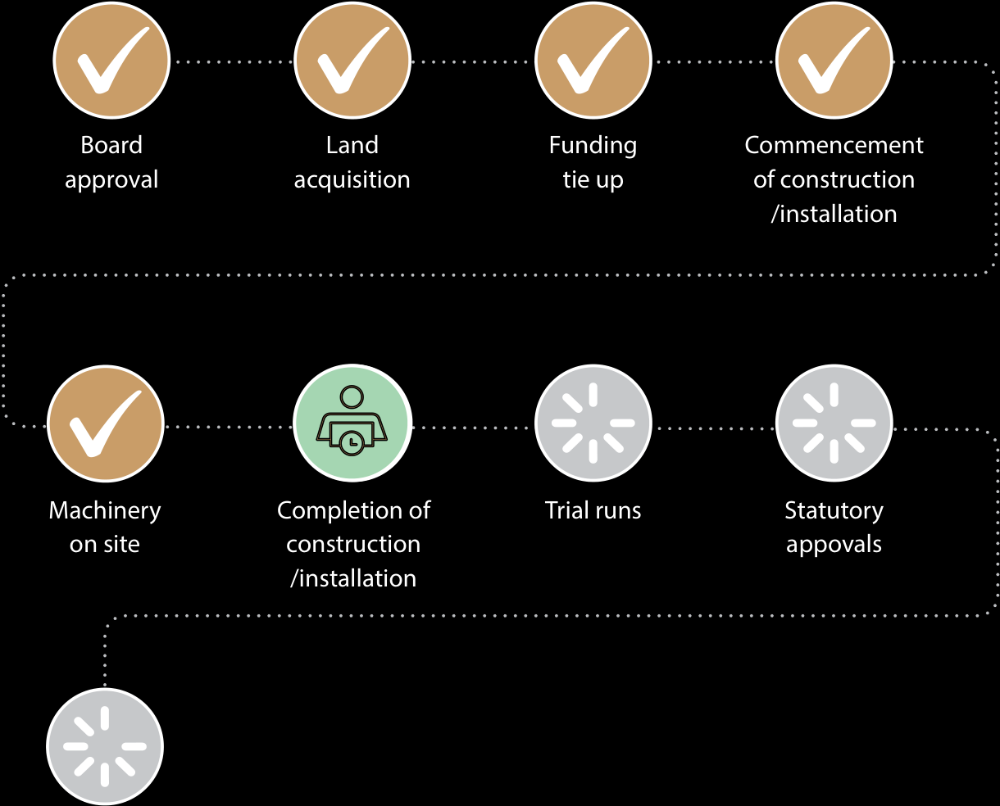

**[Image: 428cb101-9db0-4ae2-860f-ebf9be7bceb8.pdf-0034-03.png (1220x984, 99.5KB)]**

<!-- Start of picture text -->
Board  Land  Funding  Commencement approval acquisition tie up of construction /installation Machinery  Completion of  Trial runs Statutory on site construction  appovals /installation <!-- End of picture text -->

**[Image: 428cb101-9db0-4ae2-860f-ebf9be7bceb8.pdf-0034-04.png (205x32, 2.6KB)]**

<!-- Start of picture text -->
Commissioning <!-- End of picture text -->

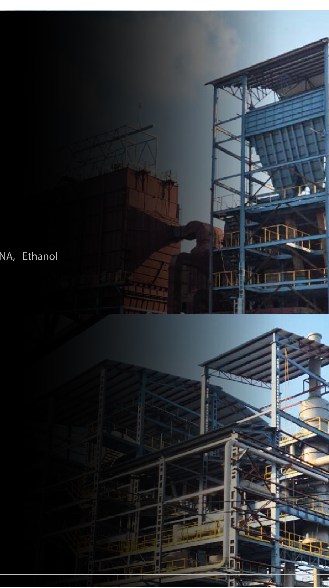

**[Image: 428cb101-9db0-4ae2-860f-ebf9be7bceb8.pdf-0034-05.png (1241x2213, 1398.0KB)]**

<!-- Start of picture text -->
Capex Year XX Activity Year XX Activity Amount <!-- End of picture text -->

Highlights 

Setting up of 210 KLPD distillery for ENA, Ethanol on track 

Expected to be commissioned in H2 FY26 

**[Image: 428cb101-9db0-4ae2-860f-ebf9be7bceb8.pdf-0034-09.png (299x199, 10.0KB)]**

<!-- Start of picture text -->
Completed Work-In-Progress Pending <!-- End of picture text -->

Amount Utilisation **34** 

P I CC A D I LY E A R N I N G S P R E S E N TAT I O N @ 2025- 26 

#### Expansion Update contd. 

**[Image: 428cb101-9db0-4ae2-860f-ebf9be7bceb8.pdf-0035-01.png (1238x351, 38.6KB)]**

<!-- Start of picture text -->
Portavadie, Scotland <!-- End of picture text -->

**[Image: 428cb101-9db0-4ae2-860f-ebf9be7bceb8.pdf-0035-02.png (288x358, 14.2KB)]**

<!-- Start of picture text -->
Portavadie, Scotland Milestones: <!-- End of picture text -->

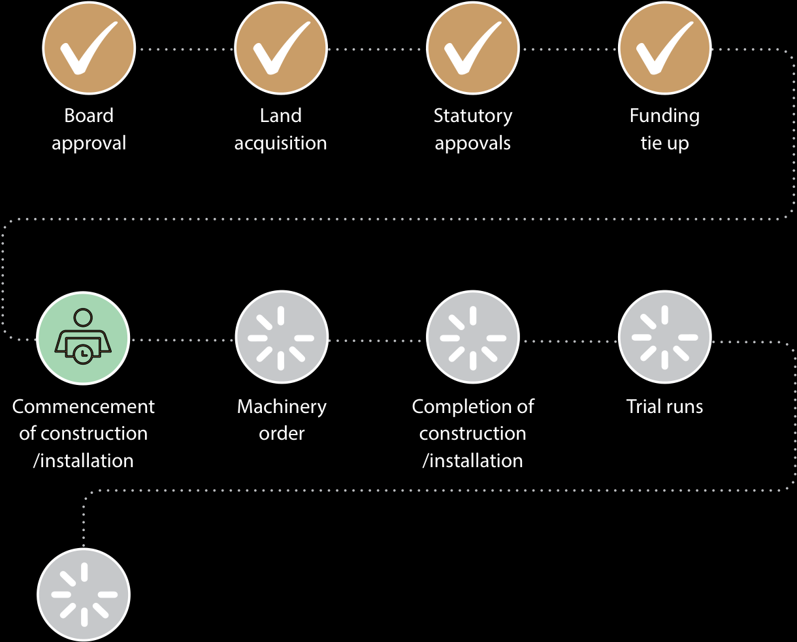

**[Image: 428cb101-9db0-4ae2-860f-ebf9be7bceb8.pdf-0035-03.png (1220x984, 95.6KB)]**

<!-- Start of picture text -->
Board  Land  Statutory  Funding approval acquisition appovals tie up Commencement  Machinery  Completion of  Trial runs of construction  order construction /installation /installation <!-- End of picture text -->

**[Image: 428cb101-9db0-4ae2-860f-ebf9be7bceb8.pdf-0035-04.png (205x32, 2.6KB)]**

<!-- Start of picture text -->
Commissioning <!-- End of picture text -->

##### Highlights 

Evaluation of suitable plant and machinery in progress 

Likely commissioning in FY27 

Presence in Scotland provides access to single malt industry - events, players, expertise, channels 

**[Image: 428cb101-9db0-4ae2-860f-ebf9be7bceb8.pdf-0035-09.png (299x199, 10.2KB)]**

<!-- Start of picture text -->
Completed Work-In-Progress Pending <!-- End of picture text -->

Capex Year XX 

**[Image: 428cb101-9db0-4ae2-860f-ebf9be7bceb8.pdf-0035-11.png (168x41, 2.3KB)]**

<!-- Start of picture text -->
Activity <!-- End of picture text -->

Year XX 

**[Image: 428cb101-9db0-4ae2-860f-ebf9be7bceb8.pdf-0035-13.png (168x40, 6.3KB)]**

<!-- Start of picture text -->
Activity <!-- End of picture text -->

Amount Utilisation *3D rendered images 

**35** 

P I CC A D I LY E A R N I N G S P R E S E N TAT I O N @ 2025- 26 

**[Image: 428cb101-9db0-4ae2-860f-ebf9be7bceb8.pdf-0036-00.png (170x114, 5.1KB)]**

- Marketing and Promotion - Domestic, International and Duty free Building Brand Presence - Camikara 

Camikara isn’t just tasted — it’s experienced. From intimate tastings to immersive brand showcases, every event brings the spirit of craftsmanship, authenticity and modern India to life. 

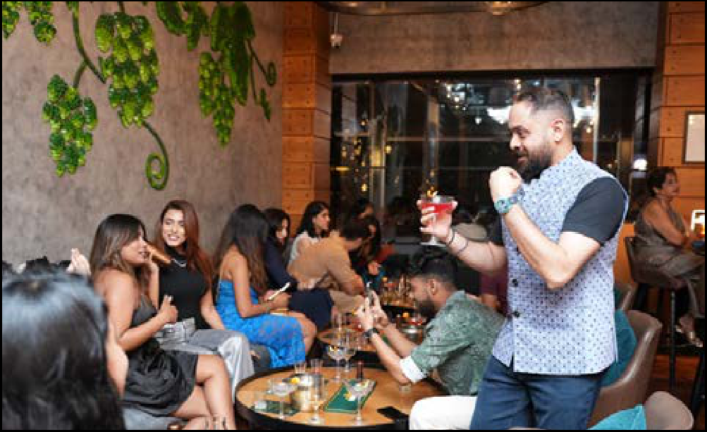

**[Image: 428cb101-9db0-4ae2-860f-ebf9be7bceb8.pdf-0036-03.png (1003x613, 434.2KB)]**

**[Image: 428cb101-9db0-4ae2-860f-ebf9be7bceb8.pdf-0036-04.png (710x612, 265.8KB)]**

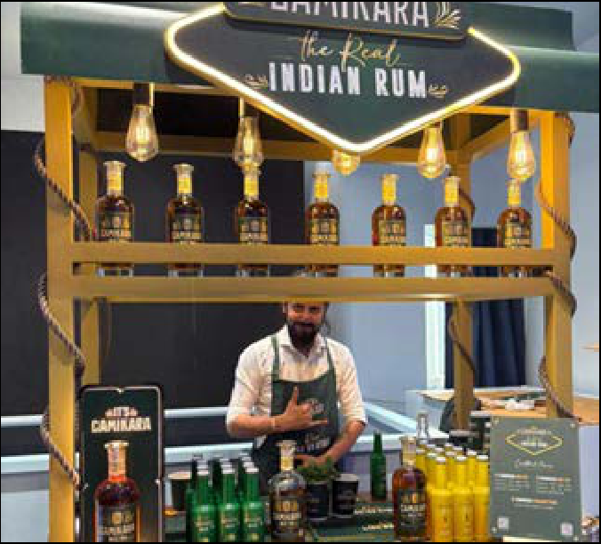

**[Image: 428cb101-9db0-4ae2-860f-ebf9be7bceb8.pdf-0036-05.png (676x612, 274.1KB)]**

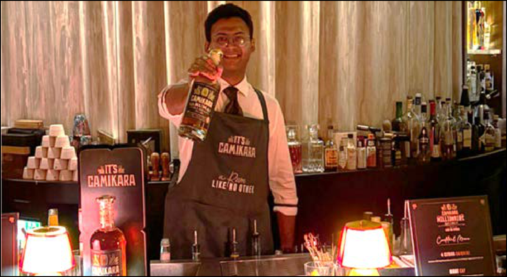

**[Image: 428cb101-9db0-4ae2-860f-ebf9be7bceb8.pdf-0036-06.png (1120x612, 460.3KB)]**

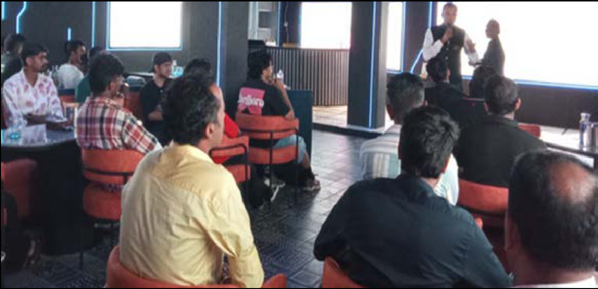

**[Image: 428cb101-9db0-4ae2-860f-ebf9be7bceb8.pdf-0036-07.png (1218x589, 389.6KB)]**

**[Image: 428cb101-9db0-4ae2-860f-ebf9be7bceb8.pdf-0036-08.png (1220x587, 409.7KB)]**

**[Image: 428cb101-9db0-4ae2-860f-ebf9be7bceb8.pdf-0036-09.png (1222x587, 471.4KB)]**

**[Image: 428cb101-9db0-4ae2-860f-ebf9be7bceb8.pdf-0036-10.png (36x25, 0.8KB)]**

<!-- Start of picture text -->
36 <!-- End of picture text -->

**P I CC A D I LY E A R N I N G S P R E S E N TAT I O N @ 2025- 26** 

**[Image: 428cb101-9db0-4ae2-860f-ebf9be7bceb8.pdf-0037-00.png (170x114, 5.6KB)]**

## Building Brand Presence - Indri 

Creating high-impact tasting sessions and immersive brand experiences, Indri is redefining how the world discovers Indian single malt — driving awareness, aspiration and advocacy across global markets. 

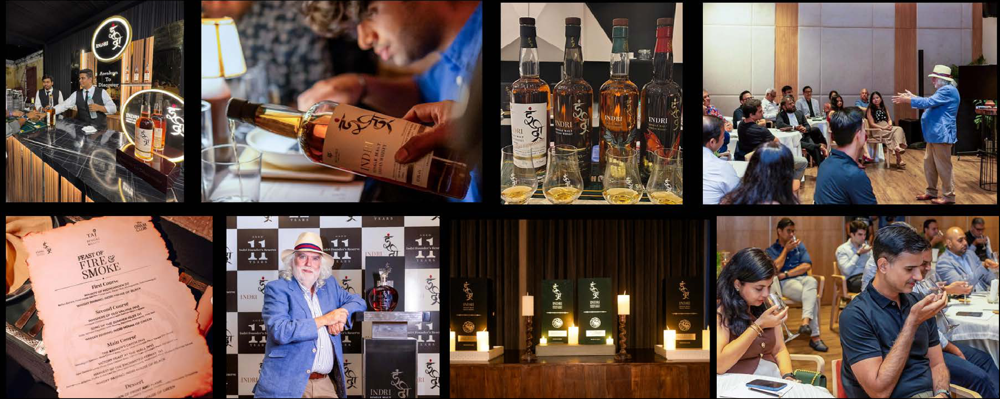

**[Image: 428cb101-9db0-4ae2-860f-ebf9be7bceb8.pdf-0037-03.png (3770x1505, 3092.7KB)]**

**[Image: 428cb101-9db0-4ae2-860f-ebf9be7bceb8.pdf-0037-04.png (35x24, 0.7KB)]**

<!-- Start of picture text -->
37 <!-- End of picture text -->

P I CC A D I LY E A R N I N G S P R E S E N TAT I O N @ 2025- 26 

**[Image: 428cb101-9db0-4ae2-860f-ebf9be7bceb8.pdf-0038-00.png (170x114, 5.6KB)]**

## Building Brand Presence - Cashmir 

Our focused marketing efforts across tastings, collaborations, trainings have strengthened brand visibility, supported trade relationships and accelerated consumer trials. 

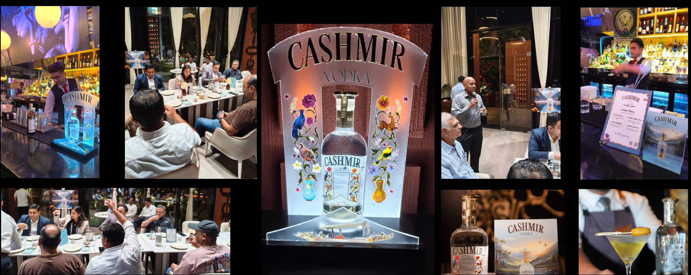

**[Image: 428cb101-9db0-4ae2-860f-ebf9be7bceb8.pdf-0038-03.png (3772x1504, 3150.0KB)]**

**[Image: 428cb101-9db0-4ae2-860f-ebf9be7bceb8.pdf-0038-04.png (35x24, 1.0KB)]**

<!-- Start of picture text -->
38 <!-- End of picture text -->

P I CC A D I LY E A R N I N G S P R E S E N TAT I O N @ 2025- 26 

**[Image: 428cb101-9db0-4ae2-860f-ebf9be7bceb8.pdf-0039-00.png (170x114, 5.6KB)]**

## Building Brand Presence - Whistler 

Strategic in-shop and wall bay branding initiatives have strengthened Whistler’s visibility at key retail touchpoints, driving consumer awareness and recall at the point of purchase. 

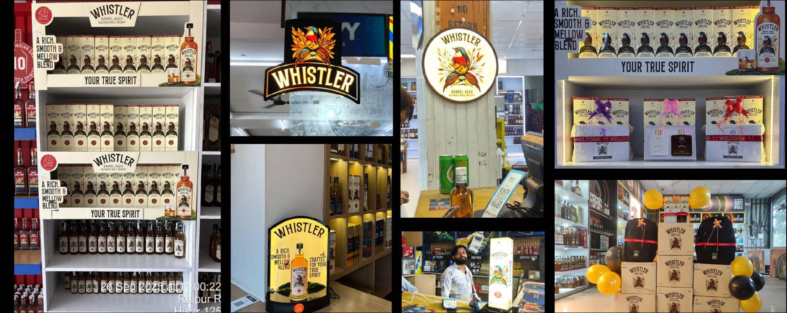

**[Image: 428cb101-9db0-4ae2-860f-ebf9be7bceb8.pdf-0039-03.png (3770x1504, 3147.1KB)]**

**[Image: 428cb101-9db0-4ae2-860f-ebf9be7bceb8.pdf-0039-04.png (35x24, 0.9KB)]**

<!-- Start of picture text -->
39 <!-- End of picture text -->

P I CC A D I LY E A R N I N G S P R E S E N TAT I O N @ 2025- 26 

**[Image: 428cb101-9db0-4ae2-860f-ebf9be7bceb8.pdf-0040-00.png (170x114, 5.6KB)]**

- Building Brand Presence – International Markets 

Strategic international activations- from trade shows to curated tastings and private dinners, strengthening brand visibility, expanding networks and opening new market opportunities. 

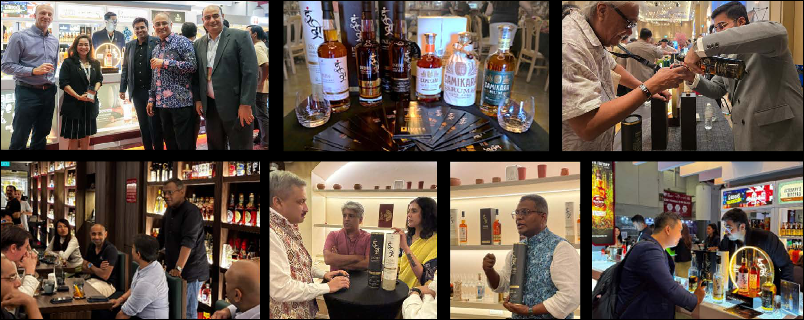

**[Image: 428cb101-9db0-4ae2-860f-ebf9be7bceb8.pdf-0040-03.png (3771x1506, 3346.8KB)]**

**[Image: 428cb101-9db0-4ae2-860f-ebf9be7bceb8.pdf-0040-04.png (35x24, 0.8KB)]**

<!-- Start of picture text -->
40 <!-- End of picture text -->

P I CC A D I LY E A R N I N G S P R E S E N TAT I O N @ 2025- 26 

**[Image: 428cb101-9db0-4ae2-860f-ebf9be7bceb8.pdf-0041-00.png (170x114, 5.6KB)]**

Expanding Premium Reach Through Duty-Free Channels Strategic branding across domestic and international duty-free locations has strengthened the brand’s visibility among highvalue travelers, driving awareness, trial and incremental revenue in key global markets 

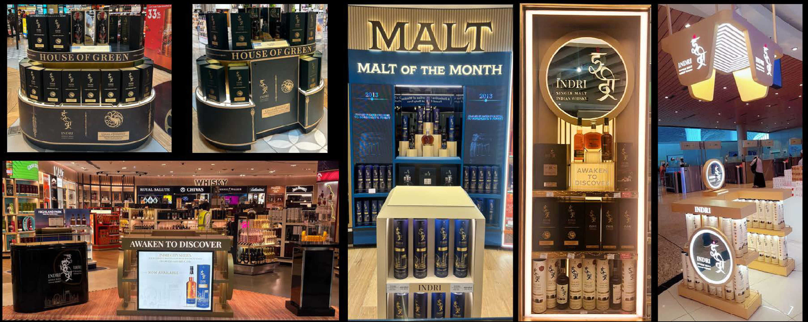

**[Image: 428cb101-9db0-4ae2-860f-ebf9be7bceb8.pdf-0041-02.png (3768x1506, 3205.6KB)]**

41 

P I CC A D I LY E A R N I N G S P R E S E N TAT I O N @ 2025- 26 

**[Image: 428cb101-9db0-4ae2-860f-ebf9be7bceb8.pdf-0042-00.png (170x114, 5.2KB)]**

## Indri Experience Centre 

Indri Experience Centre launched in Haryana to offer an immersive introduction to whisky and consumer making tasting, enhancing engagement and brand visibility. 

- Includes guided tours, curated tastings and interactive exhibits 

- Features sustainable architecture inspired by Northern Indian havelis 

- Includes recreational golf greens to support premium positioning 

- Built with scalability to support future brand growth. 

- 3-4 hours from Delhi or 2-3 hours from Chandigarh, by road. 

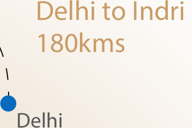

**[Image: 428cb101-9db0-4ae2-860f-ebf9be7bceb8.pdf-0042-05.png (377x251, 14.0KB)]**

<!-- Start of picture text -->
Delhi to Indri 180kms Delhi <!-- End of picture text -->

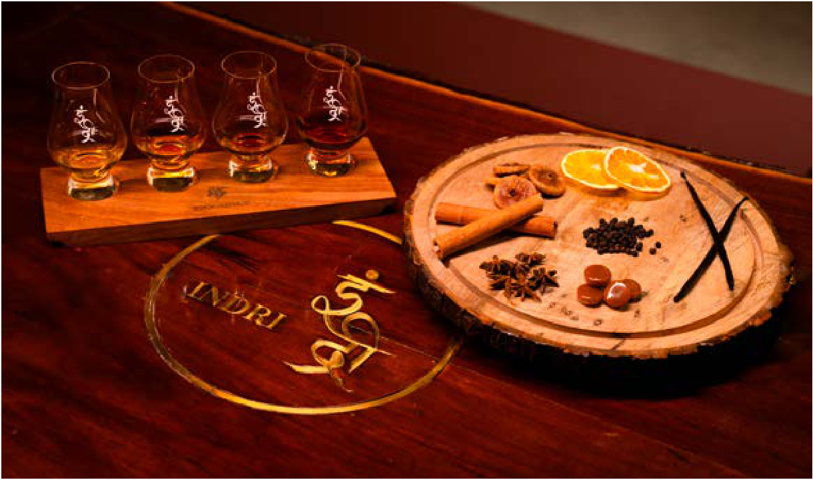

**[Image: 428cb101-9db0-4ae2-860f-ebf9be7bceb8.pdf-0042-06.png (1220x721, 443.6KB)]**

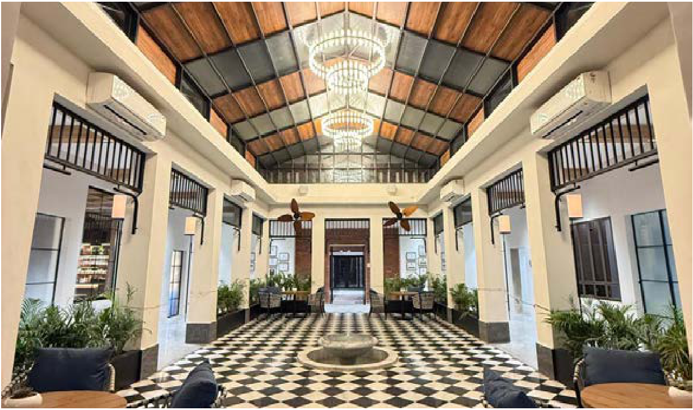

**[Image: 428cb101-9db0-4ae2-860f-ebf9be7bceb8.pdf-0042-07.png (1220x723, 612.3KB)]**

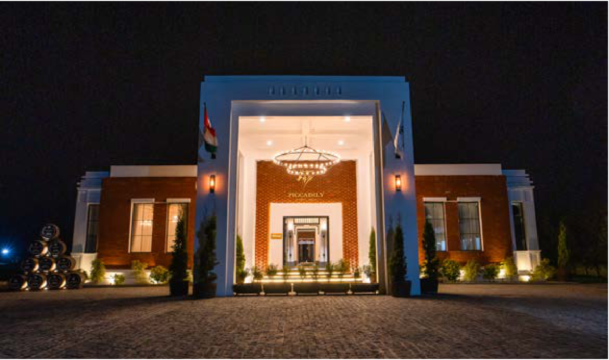

**[Image: 428cb101-9db0-4ae2-860f-ebf9be7bceb8.pdf-0042-08.png (1218x721, 392.6KB)]**

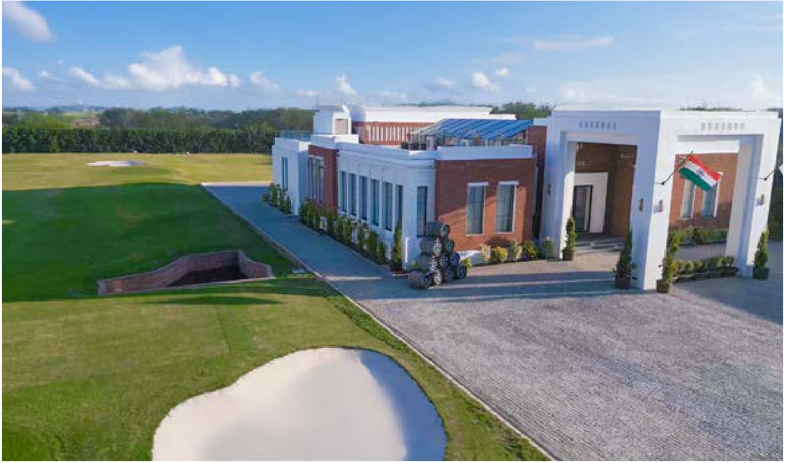

**[Image: 428cb101-9db0-4ae2-860f-ebf9be7bceb8.pdf-0042-09.png (1222x721, 448.3KB)]**

**42** 

P I CC A D I LY E A R N I N G S P R E S E N TAT I O N @ 2025- 26 

**[Image: 428cb101-9db0-4ae2-860f-ebf9be7bceb8.pdf-0043-00.png (170x114, 5.6KB)]**

|Awards and Recogn|ition: Q2 -|H1 FY2025-26|
|---|---|---|
|Indri- Dru|Indri- Trini|Indri- Agneya|
|World best whisky award - Miami Global Spirits Awards 2025|Silver - Miami Global Spirits Awards 2025|Gold - Asia World Spirit Competition - The Tasting Alliance|
|Platinum - Miami Global Spirits Awards 2025|Gold - 95 points, New York International Spirits Competition 2025|Gold Medal - Global World Whisky Masters- The Spirits Business GLOBAL WORLD WHISKY MASTERS GOLD 2025|
|Silver - 93 Points - New York International Spirits Competition 2025 Silver at International Spirits Competition 2025 by A.D.I.|Best of Category at International Spirits Competition 2025 by A.D.I. Silver at International Spirits Competition 2025 by A.D.I.|Double Gold - New York World Spirits Competition 2025|
|**2025** I n d i a   W h i s k e y   o f   t h e   Y e a r N E W   Y O R K   I N T L   S P I R I T S   C O M P E T I T I O N|India Whisky Of The Year - New York International Spirits Competition 2025||

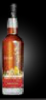

**[Image: 428cb101-9db0-4ae2-860f-ebf9be7bceb8.pdf-0043-02.png (93x202, 11.2KB)]**

Indri- DCE ‘25 Gold Medal - Global World Whisky MastersThe Spirit Business Indri DCE’24 - Gold at Tokyo Whisky and spirits Competition 2025 Best World Whisky - Las Vegas Global Spirits Award 2025 

**[Image: 428cb101-9db0-4ae2-860f-ebf9be7bceb8.pdf-0043-04.png (874x66, 9.5KB)]**

**[Image: 428cb101-9db0-4ae2-860f-ebf9be7bceb8.pdf-0043-05.png (874x66, 9.9KB)]**

**[Image: 428cb101-9db0-4ae2-860f-ebf9be7bceb8.pdf-0043-06.png (66x1465, 4.1KB)]**

**[Image: 428cb101-9db0-4ae2-860f-ebf9be7bceb8.pdf-0043-07.png (66x1465, 4.7KB)]**

**[Image: 428cb101-9db0-4ae2-860f-ebf9be7bceb8.pdf-0043-08.png (66x1465, 4.4KB)]**

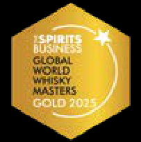

**[Image: 428cb101-9db0-4ae2-860f-ebf9be7bceb8.pdf-0043-09.png (203x205, 20.0KB)]**

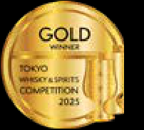

**[Image: 428cb101-9db0-4ae2-860f-ebf9be7bceb8.pdf-0043-10.png (202x183, 21.8KB)]**

**[Image: 428cb101-9db0-4ae2-860f-ebf9be7bceb8.pdf-0043-11.png (237x120, 14.4KB)]**

43 

P I CC A D I LY E A R N I N G S P R E S E N TAT I O N @ 2025- 26 

**[Image: 428cb101-9db0-4ae2-860f-ebf9be7bceb8.pdf-0044-00.png (170x114, 5.6KB)]**

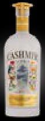

**[Image: 428cb101-9db0-4ae2-860f-ebf9be7bceb8.pdf-0044-01.png (78x206, 11.8KB)]**

**[Image: 428cb101-9db0-4ae2-860f-ebf9be7bceb8.pdf-0044-02.png (874x66, 11.3KB)]**

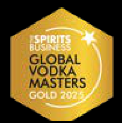

**[Image: 428cb101-9db0-4ae2-860f-ebf9be7bceb8.pdf-0044-03.png (203x204, 19.8KB)]**

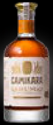

**[Image: 428cb101-9db0-4ae2-860f-ebf9be7bceb8.pdf-0044-04.png (88x206, 13.7KB)]**

**[Image: 428cb101-9db0-4ae2-860f-ebf9be7bceb8.pdf-0044-05.png (873x66, 10.9KB)]**

**[Image: 428cb101-9db0-4ae2-860f-ebf9be7bceb8.pdf-0044-06.png (66x1465, 4.1KB)]**

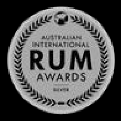

**[Image: 428cb101-9db0-4ae2-860f-ebf9be7bceb8.pdf-0044-07.png (203x203, 10.7KB)]**

**[Image: 428cb101-9db0-4ae2-860f-ebf9be7bceb8.pdf-0044-08.png (85x201, 13.0KB)]**

**[Image: 428cb101-9db0-4ae2-860f-ebf9be7bceb8.pdf-0044-09.png (873x66, 10.9KB)]**

**[Image: 428cb101-9db0-4ae2-860f-ebf9be7bceb8.pdf-0044-10.png (66x1465, 4.7KB)]**

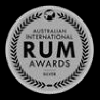

**[Image: 428cb101-9db0-4ae2-860f-ebf9be7bceb8.pdf-0044-11.png (203x203, 10.7KB)]**

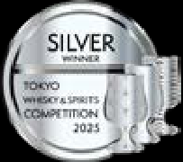

**[Image: 428cb101-9db0-4ae2-860f-ebf9be7bceb8.pdf-0044-12.png (203x180, 18.1KB)]**

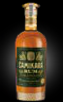

**[Image: 428cb101-9db0-4ae2-860f-ebf9be7bceb8.pdf-0044-13.png (125x201, 15.1KB)]**

**[Image: 428cb101-9db0-4ae2-860f-ebf9be7bceb8.pdf-0044-14.png (874x66, 11.1KB)]**

**[Image: 428cb101-9db0-4ae2-860f-ebf9be7bceb8.pdf-0044-15.png (66x1465, 4.4KB)]**

**[Image: 428cb101-9db0-4ae2-860f-ebf9be7bceb8.pdf-0044-16.png (203x203, 20.7KB)]**

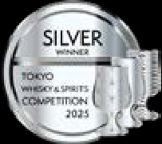

**[Image: 428cb101-9db0-4ae2-860f-ebf9be7bceb8.pdf-0044-17.png (203x180, 18.1KB)]**

44 

P I CC A D I LY E A R N I N G S P R E S E N TAT I O N @ 2025- 26 

**[Image: 428cb101-9db0-4ae2-860f-ebf9be7bceb8.pdf-0045-00.png (170x114, 6.2KB)]**

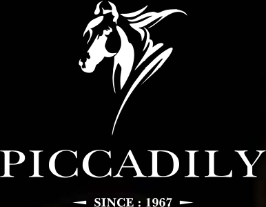

**[Image: 428cb101-9db0-4ae2-860f-ebf9be7bceb8.pdf-0045-01.png (386x300, 18.7KB)]**

For Further Information Contact: Investors Relations Piccadily Agro Industries Limited Ph.: +91-172-2997651 (Monday to Friday; IST 10 am to 5 pm) Website: www.piccadily.com Email:  ir@piccadily.com 

45 

P I CC A D I LY E A R N I N G S P R E S E N TAT I O N @ 2025- 26 

---

## Extracted Images

| # | File | Dimensions | Size |
|---|------|------------|------|
| 1 | 428cb101-9db0-4ae2-860f-ebf9be7bceb8.pdf-0002-00.png | 170x114 | 13.5KB |
| 2 | 428cb101-9db0-4ae2-860f-ebf9be7bceb8.pdf-0003-02.png | 170x114 | 5.9KB |
| 3 | 428cb101-9db0-4ae2-860f-ebf9be7bceb8.pdf-0004-05.png | 1873x2107 | 1605.4KB |
| 4 | 428cb101-9db0-4ae2-860f-ebf9be7bceb8.pdf-0005-00.png | 170x114 | 9.0KB |
| 5 | 428cb101-9db0-4ae2-860f-ebf9be7bceb8.pdf-0006-00.png | 175x114 | 6.3KB |
| 6 | 428cb101-9db0-4ae2-860f-ebf9be7bceb8.pdf-0006-02.png | 2695x1432 | 451.9KB |
| 7 | 428cb101-9db0-4ae2-860f-ebf9be7bceb8.pdf-0009-00.png | 170x114 | 5.8KB |
| 8 | 428cb101-9db0-4ae2-860f-ebf9be7bceb8.pdf-0009-02.png | 1947x1551 | 113.8KB |
| 9 | 428cb101-9db0-4ae2-860f-ebf9be7bceb8.pdf-0009-03.png | 1948x1551 | 118.2KB |
| 10 | 428cb101-9db0-4ae2-860f-ebf9be7bceb8.pdf-0011-00.png | 170x114 | 5.2KB |
| 11 | 428cb101-9db0-4ae2-860f-ebf9be7bceb8.pdf-0011-02.png | 1003x1231 | 262.1KB |
| 12 | 428cb101-9db0-4ae2-860f-ebf9be7bceb8.pdf-0012-00.png | 170x114 | 5.6KB |
| 13 | 428cb101-9db0-4ae2-860f-ebf9be7bceb8.pdf-0012-04.png | 3180x1126 | 196.0KB |
| 14 | 428cb101-9db0-4ae2-860f-ebf9be7bceb8.pdf-0013-00.png | 4000x2250 | 1029.6KB |
| 15 | 428cb101-9db0-4ae2-860f-ebf9be7bceb8.pdf-0013-01.png | 4000x2250 | 1029.6KB |
| 16 | 428cb101-9db0-4ae2-860f-ebf9be7bceb8.pdf-0014-00.png | 4000x2250 | 535.2KB |
| 17 | 428cb101-9db0-4ae2-860f-ebf9be7bceb8.pdf-0015-01.png | 170x114 | 5.6KB |
| 18 | 428cb101-9db0-4ae2-860f-ebf9be7bceb8.pdf-0015-03.png | 1365x1557 | 1082.0KB |
| 19 | 428cb101-9db0-4ae2-860f-ebf9be7bceb8.pdf-0015-04.png | 2918x1586 | 1499.6KB |
| 20 | 428cb101-9db0-4ae2-860f-ebf9be7bceb8.pdf-0015-05.png | 809x809 | 88.7KB |
| 21 | 428cb101-9db0-4ae2-860f-ebf9be7bceb8.pdf-0016-00.png | 170x114 | 5.6KB |
| 22 | 428cb101-9db0-4ae2-860f-ebf9be7bceb8.pdf-0017-00.png | 170x114 | 5.4KB |
| 23 | 428cb101-9db0-4ae2-860f-ebf9be7bceb8.pdf-0017-07.png | 310x307 | 58.2KB |
| 24 | 428cb101-9db0-4ae2-860f-ebf9be7bceb8.pdf-0017-08.png | 630x358 | 65.7KB |
| 25 | 428cb101-9db0-4ae2-860f-ebf9be7bceb8.pdf-0017-09.png | 811x735 | 84.6KB |
| 26 | 428cb101-9db0-4ae2-860f-ebf9be7bceb8.pdf-0018-00.png | 170x114 | 5.4KB |
| 27 | 428cb101-9db0-4ae2-860f-ebf9be7bceb8.pdf-0018-07.png | 524x576 | 92.6KB |
| 28 | 428cb101-9db0-4ae2-860f-ebf9be7bceb8.pdf-0018-08.png | 524x575 | 70.6KB |
| 29 | 428cb101-9db0-4ae2-860f-ebf9be7bceb8.pdf-0018-09.png | 574x594 | 114.4KB |
| 30 | 428cb101-9db0-4ae2-860f-ebf9be7bceb8.pdf-0018-10.png | 524x549 | 70.7KB |
| 31 | 428cb101-9db0-4ae2-860f-ebf9be7bceb8.pdf-0019-00.png | 170x114 | 5.8KB |
| 32 | 428cb101-9db0-4ae2-860f-ebf9be7bceb8.pdf-0019-02.png | 3934x1766 | 686.9KB |
| 33 | 428cb101-9db0-4ae2-860f-ebf9be7bceb8.pdf-0020-00.png | 3768x2049 | 569.1KB |
| 34 | 428cb101-9db0-4ae2-860f-ebf9be7bceb8.pdf-0021-00.png | 170x114 | 5.4KB |
| 35 | 428cb101-9db0-4ae2-860f-ebf9be7bceb8.pdf-0021-02.png | 899x548 | 369.0KB |
| 36 | 428cb101-9db0-4ae2-860f-ebf9be7bceb8.pdf-0021-03.png | 902x563 | 286.9KB |
| 37 | 428cb101-9db0-4ae2-860f-ebf9be7bceb8.pdf-0021-04.png | 902x555 | 181.9KB |
| 38 | 428cb101-9db0-4ae2-860f-ebf9be7bceb8.pdf-0021-05.png | 899x563 | 235.7KB |
| 39 | 428cb101-9db0-4ae2-860f-ebf9be7bceb8.pdf-0021-06.png | 901x565 | 270.2KB |
| 40 | 428cb101-9db0-4ae2-860f-ebf9be7bceb8.pdf-0021-07.png | 2809x824 | 1004.2KB |
| 41 | 428cb101-9db0-4ae2-860f-ebf9be7bceb8.pdf-0021-08.png | 901x565 | 341.7KB |
| 42 | 428cb101-9db0-4ae2-860f-ebf9be7bceb8.pdf-0022-00.png | 170x114 | 5.4KB |
| 43 | 428cb101-9db0-4ae2-860f-ebf9be7bceb8.pdf-0022-02.png | 3111x1712 | 1372.1KB |
| 44 | 428cb101-9db0-4ae2-860f-ebf9be7bceb8.pdf-0022-04.png | 397x435 | 53.3KB |
| 45 | 428cb101-9db0-4ae2-860f-ebf9be7bceb8.pdf-0022-05.png | 391x436 | 58.8KB |
| 46 | 428cb101-9db0-4ae2-860f-ebf9be7bceb8.pdf-0022-07.png | 693x595 | 124.9KB |
| 47 | 428cb101-9db0-4ae2-860f-ebf9be7bceb8.pdf-0022-08.png | 376x436 | 59.5KB |
| 48 | 428cb101-9db0-4ae2-860f-ebf9be7bceb8.pdf-0022-09.png | 376x437 | 71.8KB |
| 49 | 428cb101-9db0-4ae2-860f-ebf9be7bceb8.pdf-0023-00.png | 170x114 | 5.4KB |
| 50 | 428cb101-9db0-4ae2-860f-ebf9be7bceb8.pdf-0023-06.png | 449x493 | 66.4KB |
| 51 | 428cb101-9db0-4ae2-860f-ebf9be7bceb8.pdf-0023-10.png | 449x490 | 67.6KB |
| 52 | 428cb101-9db0-4ae2-860f-ebf9be7bceb8.pdf-0023-13.png | 449x493 | 65.3KB |
| 53 | 428cb101-9db0-4ae2-860f-ebf9be7bceb8.pdf-0024-00.png | 170x114 | 5.4KB |
| 54 | 428cb101-9db0-4ae2-860f-ebf9be7bceb8.pdf-0024-03.png | 1992x1502 | 570.3KB |
| 55 | 428cb101-9db0-4ae2-860f-ebf9be7bceb8.pdf-0024-04.png | 285x39 | 4.3KB |
| 56 | 428cb101-9db0-4ae2-860f-ebf9be7bceb8.pdf-0025-00.png | 170x114 | 6.0KB |
| 57 | 428cb101-9db0-4ae2-860f-ebf9be7bceb8.pdf-0026-01.png | 170x114 | 5.4KB |
| 58 | 428cb101-9db0-4ae2-860f-ebf9be7bceb8.pdf-0026-04.png | 118x339 | 17.1KB |
| 59 | 428cb101-9db0-4ae2-860f-ebf9be7bceb8.pdf-0026-05.png | 95x339 | 13.6KB |
| 60 | 428cb101-9db0-4ae2-860f-ebf9be7bceb8.pdf-0026-06.png | 215x39 | 3.3KB |
| 61 | 428cb101-9db0-4ae2-860f-ebf9be7bceb8.pdf-0026-07.png | 227x356 | 28.1KB |
| 62 | 428cb101-9db0-4ae2-860f-ebf9be7bceb8.pdf-0026-08.png | 155x374 | 30.8KB |
| 63 | 428cb101-9db0-4ae2-860f-ebf9be7bceb8.pdf-0026-09.png | 227x360 | 22.4KB |
| 64 | 428cb101-9db0-4ae2-860f-ebf9be7bceb8.pdf-0026-10.png | 115x354 | 18.2KB |
| 65 | 428cb101-9db0-4ae2-860f-ebf9be7bceb8.pdf-0026-12.png | 144x407 | 21.8KB |
| 66 | 428cb101-9db0-4ae2-860f-ebf9be7bceb8.pdf-0026-13.png | 89x413 | 18.0KB |
| 67 | 428cb101-9db0-4ae2-860f-ebf9be7bceb8.pdf-0026-14.png | 293x445 | 22.1KB |
| 68 | 428cb101-9db0-4ae2-860f-ebf9be7bceb8.pdf-0026-15.png | 151x399 | 16.5KB |
| 69 | 428cb101-9db0-4ae2-860f-ebf9be7bceb8.pdf-0026-16.png | 382x1526 | 43.2KB |
| 70 | 428cb101-9db0-4ae2-860f-ebf9be7bceb8.pdf-0026-17.png | 139x376 | 20.4KB |
| 71 | 428cb101-9db0-4ae2-860f-ebf9be7bceb8.pdf-0026-18.png | 453x384 | 6.4KB |
| 72 | 428cb101-9db0-4ae2-860f-ebf9be7bceb8.pdf-0026-19.png | 211x384 | 3.3KB |
| 73 | 428cb101-9db0-4ae2-860f-ebf9be7bceb8.pdf-0026-20.png | 166x767 | 6.8KB |
| 74 | 428cb101-9db0-4ae2-860f-ebf9be7bceb8.pdf-0026-21.png | 211x384 | 3.5KB |
| 75 | 428cb101-9db0-4ae2-860f-ebf9be7bceb8.pdf-0026-22.png | 239x384 | 3.8KB |
| 76 | 428cb101-9db0-4ae2-860f-ebf9be7bceb8.pdf-0027-01.png | 170x114 | 6.3KB |
| 77 | 428cb101-9db0-4ae2-860f-ebf9be7bceb8.pdf-0029-00.png | 170x114 | 6.1KB |
| 78 | 428cb101-9db0-4ae2-860f-ebf9be7bceb8.pdf-0030-00.png | 170x114 | 7.3KB |
| 79 | 428cb101-9db0-4ae2-860f-ebf9be7bceb8.pdf-0031-00.png | 170x114 | 5.6KB |
| 80 | 428cb101-9db0-4ae2-860f-ebf9be7bceb8.pdf-0031-02.png | 97x108 | 4.0KB |
| 81 | 428cb101-9db0-4ae2-860f-ebf9be7bceb8.pdf-0031-03.png | 92x86 | 1.4KB |
| 82 | 428cb101-9db0-4ae2-860f-ebf9be7bceb8.pdf-0031-06.png | 95x95 | 3.9KB |
| 83 | 428cb101-9db0-4ae2-860f-ebf9be7bceb8.pdf-0031-07.png | 107x104 | 3.2KB |
| 84 | 428cb101-9db0-4ae2-860f-ebf9be7bceb8.pdf-0031-08.png | 249x105 | 6.1KB |
| 85 | 428cb101-9db0-4ae2-860f-ebf9be7bceb8.pdf-0032-00.png | 170x114 | 5.6KB |
| 86 | 428cb101-9db0-4ae2-860f-ebf9be7bceb8.pdf-0032-02.png | 321x339 | 17.2KB |
| 87 | 428cb101-9db0-4ae2-860f-ebf9be7bceb8.pdf-0032-03.png | 90x91 | 3.0KB |
| 88 | 428cb101-9db0-4ae2-860f-ebf9be7bceb8.pdf-0032-06.png | 559x226 | 22.4KB |
| 89 | 428cb101-9db0-4ae2-860f-ebf9be7bceb8.pdf-0032-07.png | 372x530 | 15.3KB |
| 90 | 428cb101-9db0-4ae2-860f-ebf9be7bceb8.pdf-0032-08.png | 114x147 | 3.8KB |
| 91 | 428cb101-9db0-4ae2-860f-ebf9be7bceb8.pdf-0033-00.png | 3080x2221 | 2020.5KB |
| 92 | 428cb101-9db0-4ae2-860f-ebf9be7bceb8.pdf-0033-02.png | 940x219 | 17.6KB |
| 93 | 428cb101-9db0-4ae2-860f-ebf9be7bceb8.pdf-0033-03.png | 260x43 | 3.6KB |
| 94 | 428cb101-9db0-4ae2-860f-ebf9be7bceb8.pdf-0033-04.png | 1218x949 | 97.7KB |
| 95 | 428cb101-9db0-4ae2-860f-ebf9be7bceb8.pdf-0034-01.png | 1005x353 | 27.2KB |
| 96 | 428cb101-9db0-4ae2-860f-ebf9be7bceb8.pdf-0034-03.png | 1220x984 | 99.5KB |
| 97 | 428cb101-9db0-4ae2-860f-ebf9be7bceb8.pdf-0034-04.png | 205x32 | 2.6KB |
| 98 | 428cb101-9db0-4ae2-860f-ebf9be7bceb8.pdf-0034-05.png | 1241x2213 | 1398.0KB |
| 99 | 428cb101-9db0-4ae2-860f-ebf9be7bceb8.pdf-0034-09.png | 299x199 | 10.0KB |
| 100 | 428cb101-9db0-4ae2-860f-ebf9be7bceb8.pdf-0035-01.png | 1238x351 | 38.6KB |
| 101 | 428cb101-9db0-4ae2-860f-ebf9be7bceb8.pdf-0035-02.png | 288x358 | 14.2KB |
| 102 | 428cb101-9db0-4ae2-860f-ebf9be7bceb8.pdf-0035-03.png | 1220x984 | 95.6KB |
| 103 | 428cb101-9db0-4ae2-860f-ebf9be7bceb8.pdf-0035-04.png | 205x32 | 2.6KB |
| 104 | 428cb101-9db0-4ae2-860f-ebf9be7bceb8.pdf-0035-09.png | 299x199 | 10.2KB |
| 105 | 428cb101-9db0-4ae2-860f-ebf9be7bceb8.pdf-0035-11.png | 168x41 | 2.3KB |
| 106 | 428cb101-9db0-4ae2-860f-ebf9be7bceb8.pdf-0035-13.png | 168x40 | 6.3KB |
| 107 | 428cb101-9db0-4ae2-860f-ebf9be7bceb8.pdf-0036-00.png | 170x114 | 5.1KB |
| 108 | 428cb101-9db0-4ae2-860f-ebf9be7bceb8.pdf-0036-03.png | 1003x613 | 434.2KB |
| 109 | 428cb101-9db0-4ae2-860f-ebf9be7bceb8.pdf-0036-04.png | 710x612 | 265.8KB |
| 110 | 428cb101-9db0-4ae2-860f-ebf9be7bceb8.pdf-0036-05.png | 676x612 | 274.1KB |
| 111 | 428cb101-9db0-4ae2-860f-ebf9be7bceb8.pdf-0036-06.png | 1120x612 | 460.3KB |
| 112 | 428cb101-9db0-4ae2-860f-ebf9be7bceb8.pdf-0036-07.png | 1218x589 | 389.6KB |
| 113 | 428cb101-9db0-4ae2-860f-ebf9be7bceb8.pdf-0036-08.png | 1220x587 | 409.7KB |
| 114 | 428cb101-9db0-4ae2-860f-ebf9be7bceb8.pdf-0036-09.png | 1222x587 | 471.4KB |
| 115 | 428cb101-9db0-4ae2-860f-ebf9be7bceb8.pdf-0036-10.png | 36x25 | 0.8KB |
| 116 | 428cb101-9db0-4ae2-860f-ebf9be7bceb8.pdf-0037-00.png | 170x114 | 5.6KB |
| 117 | 428cb101-9db0-4ae2-860f-ebf9be7bceb8.pdf-0037-03.png | 3770x1505 | 3092.7KB |
| 118 | 428cb101-9db0-4ae2-860f-ebf9be7bceb8.pdf-0037-04.png | 35x24 | 0.7KB |
| 119 | 428cb101-9db0-4ae2-860f-ebf9be7bceb8.pdf-0038-00.png | 170x114 | 5.6KB |
| 120 | 428cb101-9db0-4ae2-860f-ebf9be7bceb8.pdf-0038-03.png | 3772x1504 | 3150.0KB |
| 121 | 428cb101-9db0-4ae2-860f-ebf9be7bceb8.pdf-0038-04.png | 35x24 | 1.0KB |
| 122 | 428cb101-9db0-4ae2-860f-ebf9be7bceb8.pdf-0039-00.png | 170x114 | 5.6KB |
| 123 | 428cb101-9db0-4ae2-860f-ebf9be7bceb8.pdf-0039-03.png | 3770x1504 | 3147.1KB |
| 124 | 428cb101-9db0-4ae2-860f-ebf9be7bceb8.pdf-0039-04.png | 35x24 | 0.9KB |
| 125 | 428cb101-9db0-4ae2-860f-ebf9be7bceb8.pdf-0040-00.png | 170x114 | 5.6KB |
| 126 | 428cb101-9db0-4ae2-860f-ebf9be7bceb8.pdf-0040-03.png | 3771x1506 | 3346.8KB |
| 127 | 428cb101-9db0-4ae2-860f-ebf9be7bceb8.pdf-0040-04.png | 35x24 | 0.8KB |
| 128 | 428cb101-9db0-4ae2-860f-ebf9be7bceb8.pdf-0041-00.png | 170x114 | 5.6KB |
| 129 | 428cb101-9db0-4ae2-860f-ebf9be7bceb8.pdf-0041-02.png | 3768x1506 | 3205.6KB |
| 130 | 428cb101-9db0-4ae2-860f-ebf9be7bceb8.pdf-0042-00.png | 170x114 | 5.2KB |
| 131 | 428cb101-9db0-4ae2-860f-ebf9be7bceb8.pdf-0042-05.png | 377x251 | 14.0KB |
| 132 | 428cb101-9db0-4ae2-860f-ebf9be7bceb8.pdf-0042-06.png | 1220x721 | 443.6KB |
| 133 | 428cb101-9db0-4ae2-860f-ebf9be7bceb8.pdf-0042-07.png | 1220x723 | 612.3KB |
| 134 | 428cb101-9db0-4ae2-860f-ebf9be7bceb8.pdf-0042-08.png | 1218x721 | 392.6KB |
| 135 | 428cb101-9db0-4ae2-860f-ebf9be7bceb8.pdf-0042-09.png | 1222x721 | 448.3KB |
| 136 | 428cb101-9db0-4ae2-860f-ebf9be7bceb8.pdf-0043-00.png | 170x114 | 5.6KB |
| 137 | 428cb101-9db0-4ae2-860f-ebf9be7bceb8.pdf-0043-02.png | 93x202 | 11.2KB |
| 138 | 428cb101-9db0-4ae2-860f-ebf9be7bceb8.pdf-0043-04.png | 874x66 | 9.5KB |
| 139 | 428cb101-9db0-4ae2-860f-ebf9be7bceb8.pdf-0043-05.png | 874x66 | 9.9KB |
| 140 | 428cb101-9db0-4ae2-860f-ebf9be7bceb8.pdf-0043-06.png | 66x1465 | 4.1KB |
| 141 | 428cb101-9db0-4ae2-860f-ebf9be7bceb8.pdf-0043-07.png | 66x1465 | 4.7KB |
| 142 | 428cb101-9db0-4ae2-860f-ebf9be7bceb8.pdf-0043-08.png | 66x1465 | 4.4KB |
| 143 | 428cb101-9db0-4ae2-860f-ebf9be7bceb8.pdf-0043-09.png | 203x205 | 20.0KB |
| 144 | 428cb101-9db0-4ae2-860f-ebf9be7bceb8.pdf-0043-10.png | 202x183 | 21.8KB |
| 145 | 428cb101-9db0-4ae2-860f-ebf9be7bceb8.pdf-0043-11.png | 237x120 | 14.4KB |
| 146 | 428cb101-9db0-4ae2-860f-ebf9be7bceb8.pdf-0044-00.png | 170x114 | 5.6KB |
| 147 | 428cb101-9db0-4ae2-860f-ebf9be7bceb8.pdf-0044-01.png | 78x206 | 11.8KB |
| 148 | 428cb101-9db0-4ae2-860f-ebf9be7bceb8.pdf-0044-02.png | 874x66 | 11.3KB |
| 149 | 428cb101-9db0-4ae2-860f-ebf9be7bceb8.pdf-0044-03.png | 203x204 | 19.8KB |
| 150 | 428cb101-9db0-4ae2-860f-ebf9be7bceb8.pdf-0044-04.png | 88x206 | 13.7KB |
| 151 | 428cb101-9db0-4ae2-860f-ebf9be7bceb8.pdf-0044-05.png | 873x66 | 10.9KB |
| 152 | 428cb101-9db0-4ae2-860f-ebf9be7bceb8.pdf-0044-06.png | 66x1465 | 4.1KB |
| 153 | 428cb101-9db0-4ae2-860f-ebf9be7bceb8.pdf-0044-07.png | 203x203 | 10.7KB |
| 154 | 428cb101-9db0-4ae2-860f-ebf9be7bceb8.pdf-0044-08.png | 85x201 | 13.0KB |
| 155 | 428cb101-9db0-4ae2-860f-ebf9be7bceb8.pdf-0044-09.png | 873x66 | 10.9KB |
| 156 | 428cb101-9db0-4ae2-860f-ebf9be7bceb8.pdf-0044-10.png | 66x1465 | 4.7KB |
| 157 | 428cb101-9db0-4ae2-860f-ebf9be7bceb8.pdf-0044-11.png | 203x203 | 10.7KB |
| 158 | 428cb101-9db0-4ae2-860f-ebf9be7bceb8.pdf-0044-12.png | 203x180 | 18.1KB |
| 159 | 428cb101-9db0-4ae2-860f-ebf9be7bceb8.pdf-0044-13.png | 125x201 | 15.1KB |
| 160 | 428cb101-9db0-4ae2-860f-ebf9be7bceb8.pdf-0044-14.png | 874x66 | 11.1KB |
| 161 | 428cb101-9db0-4ae2-860f-ebf9be7bceb8.pdf-0044-15.png | 66x1465 | 4.4KB |
| 162 | 428cb101-9db0-4ae2-860f-ebf9be7bceb8.pdf-0044-16.png | 203x203 | 20.7KB |
| 163 | 428cb101-9db0-4ae2-860f-ebf9be7bceb8.pdf-0044-17.png | 203x180 | 18.1KB |
| 164 | 428cb101-9db0-4ae2-860f-ebf9be7bceb8.pdf-0045-00.png | 170x114 | 6.2KB |
| 165 | 428cb101-9db0-4ae2-860f-ebf9be7bceb8.pdf-0045-01.png | 386x300 | 18.7KB |
