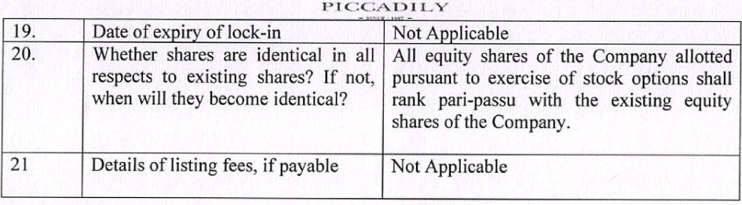

as oF PICCADILY = SOE) 2OKe 

###### Dated: 21.01.2026 

To, To; The BSE Limited The National Stock Exchange Corporate Relationship Dept. of India Limited 1s*Floor, New Trading Ring Exchange Plaza, 5"Floor Plot Rotunda Building Phiroze Jeejeebhoy Towers No. C/1,G Block Bandra Kurla Dalal Street, Fort, Mumbai-400001 Complex Bandra (East) Mumbai -400 051 BSE Code: 530305 NSE SCRIP CODE: PICCADIL 

Subject: Compliance of Regulation 30 read with Part A of Schedule III and Regulation 33 of SEBI (Listing Obligations and Disclosure Requirements) Regulations, 2015 

###### Dear Sir/Madam, 

Pursuant to Regulation 30 read with Part A of Schedule III and Regulation 33 of SEBI (Listing Obligations and Disclosure Requirements) Regulations 2015, the Board of Directors in their meeting held today i.e. 21% January 2026 hereby consider, discuss and approve the following items: 

1) Un-Audited Standalone and Consolidated Financial Results of the Company for the quarter and nine months ended as on 31st December, 2025 along with Limited Review Report. We are also hereby enclosing Un-Audited Financial Results of the Company for the quarter and nine months ended as on 31% December, 2025 along with Limited Review Report thereon. 

2) Approved allotment of 71705 equity shares of Rs.10/-each to the Eligible Employees/Grantees pursuant to the exercise of Options granted under Piccadily Agro Employee Stock Option Plan 2024. Pursuant to this allotment, the issued equity capital of the Company has increased from Rs. 98,49,77,110 to Rs.98,56,94,160 and subscribed & paid-up equity capital of the Company has increased from Rs. 98,49,77,110 to Rs.98,56,94,160. 

The details required for the shares allotted pursuant to Regulation 10(c) of Securities and Exchange Board of India (Share Based Employee Benefits and Sweat Equity) Regulations, 2021, is enclosed herewith as Annexure A. 

###### Piccadily Agro Industries Ltd. 

> Registered Office: Village Bhadson, Umri-—Indri Road, Teh. Indri, Distt. Karnal, Harnyana-132109 (India) Corporate Office: G-17, JMD Pacific Square, Sector-15 (Part-2), Gurugram, Haryana 122002 (India) Ph.: +91-124-4300840, Website: www.piccadily.com, Email: info@piccadily.com Investor Relations: Ph.: +91-172-2997651, Website: www.piccadily.com, Email: piccadilygroup34@rediffmail.com CIN No. LOTIISHR1I994PLC032244 

The said Board Meeting commenced at 10 - 40 AY and concluded at /2-20 Piz This is for information and record. 

We hereby request you to take note of the same and updated record of the company accordingly. 

Thanking You Yours Faithfully, 

Company Secretary & Dliance Officer 

###### Piccadily Agro Industries Ltd. 

Registered Office: Village Bhadson, Umri-—Indri Road, Teh. Indri, Distt. Karnal, Haryana-132109 (India) Corporate Office: G-17, JMD Pacific Square, Sector-15 (Part-2), Gurugram, Haryana 122002 (India) Ph.: +91-124-4300840, Website: www.piccadily.com, Email: info@piccadily.com Investor Relations: Ph.: +91-172-2997651, Website: www.piccadily.com, Email: piccadilygroup34@rediffmail.com CIN No. LOTNSHR1S994PLC032244 

PIc 2c aT TL. Y 

###### Annexure A 

For Shares Allotted under Piccadily Agro Employee Stock Option Plan 2024 

|   Sr.No__ |   |Particulars |   OriginalESOPO |   ptions |
|---|---|---|---|
| ki| NameoftheCompany| PiccadilyAgroIn| dustriesLimited|
|   2 |   RegisteredOffice         |   VillageBhadson, Indri, Distt.Karnal |   Umri—IndriRoad,Teh. ,Haryana-132109(India)|
| 3.| Name of the recognized Stock| ExchangesonwhichtheCompany's| sharesarelisted|  BSELimited&  NationalStockEx| changeofIndiaLimited|
| 4.| Filingdateofthestatementreferred  inregulation10(b)oftheSecurities| andExchangeBoardofIndia(Share| BasedEmployeeBenefitsandSweat Equity)Regulations,2021withthe recognizedStockExchange| |BSELimited  dated  13.11.2024|   NSELimited Yettobeapplied.|
| x,| FilingNumber,ifany| BSE Application No.215948|   NSELimited Yettobeapplied|
| 6.|     Title of the Scheme Pursuant to| whichsharesareissued,ifany|    Piccadily Agro Plan2024.|   Employee Stock Option|
| de|     Kindofsecuritytobelisted|   EquityShares||
| 8.|     Parvalueoftheshares|   Rs.10pershare||
|   2 |       Dateofallotmentofshares |     21.01.2026 | |
| 10.|     NumberofsharesIssued|   71705||
|   Ul |       ShareCertificateNo.,ifapplicable_|       |      NotApplicable |   |
| 12.|     Distinctivenumberoftheshare, if| applicable|    99141512to9921| 3216|
| 13:|     ISINNumberoftheSharesifissued| inDemat|    INE546C01010||
| 14.|     Exercisepricepershare|   Rs.10||
| 1S:|     Premiumpershare|   NotApplicable||
| 16.|     Totalissuedsharesafterthisissue|   98569416||
| L7.|     Totalissuedsharecapitalafterthis| issue(Rs.)|    98,56,94,160||
| 18.|     Detailsofanylock-inontheshares_||    NotApplicable||
|Re Investor|     PiccadilyAgro  gisteredOffice:VillageBhadson,Umri-IndriRo CorporateOffice:G-17,JMDPacificSquare,Secto Ph.:+91-124-4300840,Website:www.picc  Relations:Ph.:+91-172-299765],Website:www.pi CINNo.LOTMISHR|   IndustriesLtd. ad,Teh.Indri,Distt.Kar r-15(Part-2),Gurugram, adily.com,Email:inf ccadily.com,Email:Pl I994PLC032244| nal,Haryana-132109(India)  Haryana122002(India) o@piccadily.com ecadiyareupstaed)Jpeoaitsa ‘indyEX|

# a 

**[Image: Dec2025Result.pdf-0004-01.png (945x262, 391.9KB)]**

<!-- Start of picture text -->
PICCADILLY 19;  Date  of  expiry  of  lock-in  Not  Applicable 20.  Whether  shares  are  identical  in  all  |  All  equity  shares  of  the  Company  allotted respects  to  existing  shares?  If  not,  |  pursuant  to  exercise  of  stock  options  shall when  will  they  become  identical?  rank  pari-passu  with  the  existing  equity shares  of  the  Company. 21  Details  of  listing  fees,  if  payable  Not  Applicable <!-- End of picture text -->

**[Image: Dec2025Result.pdf-0004-02.png (551x197, 188.5KB)]**

<!-- Start of picture text -->
Yours  Faithfully, For  Piccadily  Agro  Industries  Limited Niraj  Kumar  Seh Coa Company  Secretary  &  Compliance  Officé <!-- End of picture text -->

###### Piccadily Agro Industries Ltd. 

Registered Office: Village Bhadson, Umri-—Indri Road, Teh. Indri, Distt. Karnal, Haryana-132109 (India) Corporate Office: G-17, IMD Pacific Square, Sector-15 (Part-2), Gurugram, Haryana 122002 (India) Ph.: +91-124-4300840, Website: www.piccadily.com, Email: info@piccadily.com Investor Relations: Ph.: +91-172-2997651, Website: www.piccadily.com, Email: piccadilygroup34@rediffmail.com CIN No. LOTMSHRI994PLC032244 

### JAIN & ASSOCIATES CHARTERED ACCOUNTANTS 

##### S.C.O. 178, Sector-5, Panchkula, Haryana - 134109 Phone: 0172-2575761, 2575762 Email: jainassociatesca@gmail.com 

- Independent Auditor’s review Report on the Quarterly Unaudited Standalone Financial Results of the Company Pursuant to Regulation 33 of the SEBI (Listing Obligations and Disclosure Requirements) Regulations, 2015, as amended. Limited Review Report to The Board of Directors of Piccadily Agro Industries Limited Village Bhadson, Umri-Indri Road, Karnal (Haryana) We have reviewed the accompanying Statement of unaudited standalone financial results (“the statement”) of Piccadily Agro Industries Limited (“the Company”) for the quarter and nine months ended December 31, 2025, being submitted by the company pursuant to the requirements of Regulation 33 of the SEBI (Listing Obligation and Disclosure Requirements) Regulation 2015 as amended (the “Listing Regulations”). This statement, which is the responsibility of the Company’s Management and approved by the Board of Directors in their meeting held on 21S January, 2026 has been prepared in accordance with the recognition and measurement principles laid down in the Indian Accounting Standard 34 "Interim Financial Reporting" ("Ind AS 34"), prescribed under section 133 of the Companies Act, 2013 (‘the Act’), read with relevant rules, as amended, read with the Circular, issued there under and other accounting principles generally accepted in India and is in compliance with the presentation and disclosure requirements of Regulation 33 of the Listing Regulations. Our responsibility is to issue a report on these financial statements based on our review. 

- We conducted our review of the statement in accordance with the Standard on Review Engagements (SRE) 2410, “Review of Interim Financial Information Performed by the Independent Auditor of the Entity’ issued by the Institute of Chartered Accountants of India. This standard requires that we plan and perform the review to obtain moderate assurance as to whether the financial statements are free of material misstatement. A 

## JAIN & ASSOCIATES CHARTERED ACCOUNTANTS 

##### S.C.O. 178, Sector-5, Panchkula, Haryana - 134109 Phone: 0172-2575761, 2575762 Email: jainassociatesca@gmail.com 

review of Interim Financial information consists of making inquiries, primarily of persons responsible for financial and accounting matters, and applying analytical and other review procedures. A review is substantially less in scope than an audit conducted in accordance with standards on Auditing as specified under section 143(10) of The Companies Act, 2013 and consequently does not enable us to obtain assurance that we would become aware of all significant matters that might be identified in an audit. Accordingly, we do not express an audit opinion. 

Based on our review conducted as above, nothing has come to our attention that causes us to believe that the accompanying statement, prepared in accordance with the recognition and measurement principles laid down in the aforesaid Indian Accounting Standards (‘Ind As 34’) specified under section 133 of the Companies Act, 2013 as amended, read with relevant rules issued thereunder and other accounting principles generally accepted in India, has not disclosed the information required to be disclosed in terms of Regulations 33 of SEBI (Listing Obligations and Disclosure Requirements) Regulations, 2015 (as amended) including the manner in which it is to be disclosed, or that it contains any material misstatement. 

For Jain & Associates Chartered Accountants Firm Registration No. 

Place: Gurugram Dated:21-01-2026 UDIN: 26513236NYVANW1151 

Krishan Mangawa (Partner) Membership No. 513236 

|   hsexceptforEarnin perSharedata)   SENDED YearEnded   31.12.2024 31.03.2025       UNAUDITED AUDITED | | 61,103.92 358.16 87,927.60 698.05   61,462.07 430.57 88,625.65 655.13   61,892.64 89,280.77 |27,064.44 4,709.38 5,172.76 2,889.90 1,880.37 1,447.96 2,303.24 7,441.16 53,872.31 (8,893.36) 6,813.15 4,404.52 2,782.86 1,944.97 2,913.37 11,027.32   52,909.22   8,983.42 74,865.14 14,415.63   0.05   8,983.38 (0.09) 14,415.72     | 2,128.46 192.82 234.15 3,497.77 214.73 237.65   6,427.93   10,465.57 (154.18) 38.80 .   6,427.93 10,350.20   9,433.93 9,433.93     58,854.88 | 6.81 6.81  11.09   11.08 ForandonbehalfoftheBoard acoonakte-crbse (MARVINDERSINGHCHOPRA) ManagingDirector DIN ;00129891  4|
|---|---|---|---|---|
| TDECEMBER,2025 (Rs.Inlak   NINEMONTH   31.12.2025   UNAUDITED | 77,154.71 395.29   77,550.01 370.81   77,920.82 |37,261.24 (1,053.13) 7,305.95 4,511.99 2,071.46 1,744.95 3,799.78 9,383.44   65,025.67   12,895.15   (4.76)   12,899.91   | 2,862.55 446.80 225.29   9,365.27     936627   9,849.77   | 9.73 9.67    det|
| yana-132109 MONTHSENDED31S     34.12.2024     UNAUDITED | 20,397.89 173.66   20,571.74 260.58   20,832.32 |13,222.92 -(4,250.37) 2,342.98 1,188.88 933.54 481.27 686.58 2,554.52   17,160.32   3,672.00     3,672.00   | 871.10 62.01 234.15   2,504.73   -   2,504.73   9,433.93   |   |
|  LIMITED 2244 dri,Dist.KarnalHar ARTERANDNINE    QUARTERENDED   30.09.2025   UNAUDITED | 23,110.44 159.48   23,269.92 160,38   23,430.30 |10,662.97 (182.09) 2,048.82 1,600.09 651.95 624.48 1,584.49 2,878.12   19,868.84   3,561.46   (4.40)   3,565.86   | 866.35 5.03 33.69   2,660.79     2,660.79   9,849.77   | 2.80 2.77  |
| LYAGROINDUSTRIES :101115HR1994PLC03  Umri-IndriRoadTeh.In ESULTSFORTHEQU       31.12.2025   UNAUDITED | 31,271.36 108.84   31,380.20 142.91   31,523.12 |18,606.78 (6,418.14) 3,748.01 1,738.74 559.56 607.62 1,225.36 4,652.15   24,720.08   6,803.04     6,803.04     | 1,400.57 396.99 191.60   4,813.87   a4   4,813.87   9,849.77     | 4.89 4.89     |
| PICCADILY PICCADI CIN RegisteredOffice:VillBhadson, ay ee STATEMENTOFUNAUDITEDSTANDALONEFINANCIALR   PARTICULARS   | RevenuefromOperations GrossSales OtherOperatingRevenue TotalRevenuefromOperations OtherIncome   Totalincome   Expenses| (a)CostofMateriaisconsumed ({b)Changesininventoriesoffinishedgoods,work-in-progressandstock-in-trade (c)Excisedutyonsaleofgoods (d)Employeebenefitsexpense (e)Financecosts (Depreciationandamortizationexpense (gq)Power,fueletc. (h)Otherexpenses   TotalExpenses   Profit(loss)beforeexceptionalitemsandtax(1-2)   ExceptionalItems   of)Fi) Profit/(loss)beforetax(3-4)   TaxExpense |   é    -CurrentTax -DeferredTax _-TaxofEarlierYears   ProfitforthePeriod(5-6)   OtherComprehensiveincome A(i)itemsthatwillnotbereclassifiedtoprofit&loss (ii)incometaxrelatingtoitemsthatwillnotbereclassifiedtoprofitorloss 8(i)itemsthatwillbereclassifiedtoprofit&loss   (ii)incometaxrelating toitemsthatwill_bereclassifiedtoprofitorloss     10. Totalcomprehensiveincome(aftertax)(7+8)   PaidupShareCapital(Face ValueRs.10/-each) OtherEquity           | 12. EPS(Rs.Perequityshare) Basic Diluted   PLACE:GURUGRAM DATED :21.01.2026|

| ana-132109 EMONTHSENDED3istDECEMBER,2025|   NINEMONTHSENDED (Amount inINRLacs) YEARENDED   31.12.2025 31.12.2024 31.03.2025   UNAUDITED UNAUDITED AUDITED   11,982.18 65,567.82 370.81 12,65884 48,803.26 430.57 24,950.10 63,67555   77,920.82 61,892.64 655.13 89,280.77 (1,399.73) 16,989.69 (1,662.08) 12,683.39 (327.13) 18,075.50   15,589.97 11,021.31 17,688.38   2,071.46 623.36 (4,76)   1,880.37 157.52 0.05 2,782.86 489.88 (0.09)   12,899.91 8,983.38 14,415.72 35,922.22 1,11,275.35 28,775.34 72,706.94 33,423.23 81,182.89      | 1,47,197.57 1,01,482.27 1,14,606.12 7,040.76 49,621.18 4,914.37  8,795.67 27,555.21 2,164.52  11,683.77 31,164.68 3,46886   61,576.37 38,515.44 4517.31  (HARVINDERSINGHCHOPRA) ManagingDirector ON;00129891 x |
|---|---|---|
|  LIMITED 244 dri,Dist.Karnal#Hary  QUARTERANDNIN|   31.12.2024   UNAUDITED   2,180.50 18,391.24 260,58   20,832.32 (543.80) 5,213.96   4670.16   933.54 64.62   3,672.00 28,775.33 72,706.94   | 1,01,482,27 8,795.67 27,565.21 2,164.52    36,515.41 |
|     PICCADILYAGROINDUSTRIES CIN:L01115HR1994PLC032 n,Umri-indriRoadTeh.In  Office :VillBhadso SANDLIABILITIES(STANDALONE)FORTHE| QUARTERENDED   31.12.2025 30.09.2025   UNAUDITED UNAUDITED   2,883.01 28,497.19 142.91 2,482.43 20,787.50 16037   31,523.42 23,430.30 (574.25) 8,176.18 (393.45) 4,954.00   7,804.94 4,560.56   559.56 239.34 651.95 347.14 (4.40)   6,803.04 3,565.86 35,92222 1,11,275.35 32,45848 96,60626       | 1,47,197.57 1,29,064.74 7,040.76 49,621.18 4,91437      3,088.14 40,403.74 4,934.01    61,576.31 48,425.86 |
| ay PICCADILLY -ene eee SEGMENTREVENUE,RESU Registered LTS,ASSET| Particulars   A. SegmentRevenue Sugar Distillery Others   TotalRevenuefromOperations B. SegmentResults financecostandtax) Sugar Distillery Others Profit/(loss)(beforeunallocatedexpenditure,   Total   Less i)FinanceCosts ii)Otherunaliocableexpenditurenetoff unallocatedincome iii)ExceptionalItem   ProfitBeforeTax C.SeqmentAssets Sugar Distillery OtherUnallocableAssets Total   |   D.SegmentLiabilities Sugar Distillery OtherUnallocableLiabilities     Total PLACE :GURUGRAM DATED :21.01.2026 |

| PICCADILYAGROINDUSTRIESLTD.|THESTANDALONEFINANCIALRESULTS : standalonefinancialresultshavebeenpreparedinaccordancewithCompanies(IndianAccountingStandards)Rules,2015 escribedunderSection133oftheCompaniesAct,2013readwithrule3oftheCompanies(IndianAccountingStandard)  andotherrelevantamendmentsthereafter.|standalonefinancialresultshavebeenreviewedbytheAuditCommitteeintheirmeetingheldon7thJanuary,2026and yBoardofDirectorsintheirmeetingheldon21stJanuary,2026.|businesssegment isofseasonalnature ,theperformance inanyquartermaynotberepresentativeoftheannual eofthecompany.|speriod/year’sfigureshave beenregroupedwherevernecessarytoconfirmtothisperiod'sclassification. |productionattheChhattisgarhUnitcommencedon31stDecember,2025. |ForandonbehalfoftheBoard |GURUGRAM 21.01.2026 (HARVINDERSINGH CHOPRA) ManagingDirector DIN :00129891 |
|---|---|---|---|---|---|---|---|
||NOTESTO 1Theabove (IndAS)pr Rules,2015|2Theabove approvedb|3Oneofthe performanc|4Thepreviou|5Commercial||PLACE : DATED :|

JAIN & ASSOCIATES CHARTERED ACCOUNTANTS 

#### S.C.O. 178, Sector-5, Panchkula, Haryana - 134109 Phone: 0172-2575761, 2575762 Email: jainassociatesca@gmail.com 

Review the Consolidated Financial Results of the Company Pursuant to Regulation 33 of the SEBI Auditor’s Limited Report on Quarterly Unaudited (Listing Obligations and Disclosure Requirements) Regulations, 2015, as amended Independent 

##### Limited Review Report TO THE BOARD OF DIRECTORS OF PICCADILY AGRO INDUSTRIES LIMITED Village Bhadson, Umri-Indri Road, Karnal (Haryana) 

- statement”) 

- amended (the “Listing Regulations”). 

- 1. We have reviewed the accompanying statement of Unaudited Consolidated Financial Results (“the of PICCADILY AGRO INDUSTRIES LIMITED (the “Holding Company”), its subsidiaries and associates for the quarter and Nine months ended 31% December, 2025, being submitted by the Holding Company pursuant to the requirement of Regulation 33 of the SEBI (Listing Obligations and Disclosure Requirements) Regulations 2015, as 

2. which is of in accordance with in Indian Accounting Standard 

2013, (‘the Act’) as amended, read with the relevant rules issued there under accepted 

This Statement, responsibility the Holding Company’s Management and approved by the Holding Company’s Board of Directors, has been prepared the recognition and measurement laid down 34 "Interim Financial 

Reporting" (“Ind AS 34”) prescribed under section 133 of the Companies Act, and other accounting principles generally in India and in compliance with presentation and disclosure requirement of Regulation 33 of the Listing Regulations. Our responsibility is to express a conclusion on the Statement based on our review. the 

principles is 

- Performed by the Independent Auditor of the Entity", issued by the Institute of of India. This standard requires that we plan and 

- 3. We conducted our review of the Statement in accordance with the Standard on Review Engagements (SRE) 2410 "Review of Interim Financial Information Chartered Accountants 

JAIN & ASSOCIATES CHARTERED ACCOUNTANTS 

#### S.C.O. 178, Sector-5, Panchkula, Haryana - 134109 Phone: 0172-2575761, 2575762 Email: jainassociatesca@gmail.com 

> Act and consequently does not enable us to obtain assurance that we would become aware of all significant matters that might be identified in an audit. perform the review to obtain moderate assurance as to whether the financial statements are free of material misstatement. A review of interim financial information consists of making inquiries, primarily of persons responsible for procedures. A review is substantially less in scope than an audit conducted in accordance with Standards on Auditing specified under Section 143(10) of the Accordingly, we do not express an audit opinion. 

> financial and accounting matters, and applying analytical and other review 

We also performed procedures in accordance with the circular issued by the SEBI under Regulation 33 (8) of the SEBI (Listing Obligations and Disclosure Requirements) Regulations, 2015, as amended, to the extent applicable. 

4. The Statement includes the results of the following entities: Subsidiaries: 

   - a) Portavadie Distillers & Blenders Limited (United Kingdom) 

   - b) Six Trees Drinks Private Limited 

   - c) Piccadily Food & Essentials Limited 

###### Associate: 

   - a) Piccadily Sugar & Allied Industries Limited 

- in 

- that to 

- prepared in accordance with the recognition and measurement principles laid in the aforesaid Indian Accounting Standard (‘Ind AS’) specified under 

- 5. Based on our review conducted and procedures performed as stated paragraph 3 above and based on the consideration of the review reports of the other auditors referred to in paragraph 6 below, nothing has come to our attention causes us believe that the accompanying Statement, down 

### JAIN & ASSOCIATES CHARTERED ACCOUNTANTS 

#### S.C.O. 178, Sector-5, Panchkula, Haryana - 134109 Phone: 0172-2575761, 2575762 Email: jainassociatesca@gmail.com 

6. We did not review the interim financial results, which have been prepared by the management, of two subsidiaries included in the unaudited consolidated financial results whose interim financial results reflect total revenue of Rs. 0 and Rs. 0 for the quarter and nine months ended 31st December,2025 respectively, total net loss after tax of Rs. 52.73 and 148.00 lacs for the quarter and nine months ended 31% December, 2025 respectively, total comprehensive income of Rs. (16.45) lacs and Rs. 41.97 lacs for the quarter and nine months ended 31st December, 2025 respectively. (Listing Disclosure Requirements) Regulations, amended, in which it is or that section 133 of the Act as amended, read with relevant rules issued thereunder and other accounting principles generally accepted in India, has not disclosed Obligations and as including the manner to be disclosed, it contains any material misstatement. the information required to be disclosed in terms of Regulation 33 of the SEBI 2015, 

matter. Our conclusion on the statement is not modified 

> in respect of the aforesaid 

Place: Gurugram Dated: 21.01.2026 UDIN: 26513236GOORAD4692 

**[Image: Dec2025Result.pdf-0012-06.png (83x53, 8.8KB)]**

<!-- Start of picture text -->
= 2280s <!-- End of picture text -->

For Jain & Associates Chartered Accountants Firm Registration No. 001361N eS / Krishan Mangawa (Partner) Membership No. 513236 

### JAIN & ASSOCIATES CHARTERED ACCOUNTANTS 

#### S.C.O. 178, Sector-5, Panchkula, Haryana - 134109 Email: jainassociatesca@gmail.com Phone: 0172-2575761, 2575762 

> Limited Review Report on the Unaudited 

> (Listing Obligations and Disclosure Requirements) Regulations, 2015, as amended Independent Auditor’s Quarterly Consolidated Financial Results of the Company Pursuant to Regulation 33 of the SEBI 

##### Limited Review Report TO THE BOARD OF DIRECTORS OF PICCADILY AGRO INDUSTRIES LIMITED Village Bhadson, Umri-Indri Road, Karnal (Haryana) 

1. We have reviewed the accompanying statement of Unaudited Consolidated Financial Results (“the of PICCADILY AGRO INDUSTRIES LIMITED (the “Holding Company”), its subsidiaries and associates for the quarter and Nine months ended 31% December, 2025, being submitted by the Holding Company pursuant to the requirement of Regulation 33 of the SEBI (Listing and Disclosure Requirements) Regulations as amended (the “Listing Regulations”). statement”) 

Obligations 2015, 

- the responsibility Company’s 

- has been prepared in accordance with and measurement 34 "Interim Financial 

- Reporting" (“Ind AS 34”) prescribed under section 133 of the Companies Act, principles generally accepted in India in 

- the Listing Regulations. Our responsibility is to express a conclusion on the This Statement, which is of Holding Management and approved by the Holding Company's Board of Directors, principles laid down Indian Accounting Standard 2013, (‘the Act’) as amended, read with the relevant rules issued there under and other and is compliance with presentation and disclosure requirement of Regulation 33 of Statement based on our review. 

- 2. the the recognition 

- in 

- accounting 

- Performed by the Independent Auditor of the Entity", issued by the Institute of on Review Engagements (SRE) 2410 "Review of Interim Financial Information Chartered Accountants of India. This standard requires that we plan and 

- 3. We conducted our review of the Statement in accordance with the Standard 

||.inlakhsexceptforEarningsperSharedata)     NDED   34.12.2024     UNAUDITED | 61,103.92 358.16   61,462.07 430.57 655.13   61,892.64|27,064.44 4,709.38 5,172.76 ' 2,963.07 1,882.01 41,449.44 2,303.25 2,913.37 7,503.03 11,128.51 53,872.31 {8.893.36) 6,813.15 4494.84 2,784.76 1,946.95     53,047.38 75,060.54| euas26[ 14,2023 aaa 142032 3497.77 21472 23765 10,270.18   |(35.75) (154.18) ‘4 36.80 17.99 6932     (46.05), 10,188.38 10,188.38 9,433.93 58,574.90   6.62 10.85 6.62 10.84     | ForandonbehalfoftheBoard|
|---|---|---|---|---|---|---|
|stDECEMBER,2025 |(Rs     NINEMONTHSE   34.12.2025     UNAUDITED | 77,154.71 395,29   77,550.01 370.81   77,920.82|37,261.24 (1,053.13) 7,305.95 4,592.82 2,072.44 1,752.33 3,799.78 9.442.24   65,173.67 | 42,747.44| __44.76) 42,751.91| 2,862.55 44680 225.29 9,217.27| |66.41 189.98   189.98   9,473.65 9,473.65 9,849.77     ||
| l;Haryana-132109 NINEMONTHSENDED3i|     31,12.2024     UNAUDITED | 20,397.89 173.86   20,571.74 260.58   20,832.32|13,222.92 * (4,250.37) 2,342.98 1.21223 933.91 481.75 686.58 2,586.02   17,216.03 | 3,616.29| 87110 62.02 234.15| 2,449.02| |26.33 (79.19)   (79.19)   2,398.16 2,398.16 9,433.93     2.63  2.63 ||
| PICCADILYAGROINDUSTRIESLIMITED CIN :LO1115HR1994PLC032244 ce :VillBhadson,Umri-indriRoadTeh.indri,Dist.Karna TEDFINANCIALRESULTSFORTHEQUARTERAND| QUARTERENDED   34,12,2025 30.09.2025   “UNAUDITED   UNAUDITED | 314.271,36 10884 23,110.44 159.48   31,380.21 142.91 23,269.92 160.38   31,523.12 23,430.30|18,606.78 (6,418.13) 3,748.02 1,765.73 55996 61112 1,22536 4,673.98 10,662.97 (182.09) 2.04882 1,628.51 65223 627.94 1,584.49 2,89737   24,772.81 19,920.25   | __8,750.30| = rae Ee __(4.40) 6,750.30 | 3,514.48 1.40057 866.35 397.00 5.03 = 49000300 4,TEAS | 2,609.39 ___3,510.05|   |TAN 62.79             ||
| RegisteredOffi STATEMENTOFUNAUDITEDCONSOLIDA|PARTICULARS       |(a)RevenuefromOperations GrossSales OtherOperatingRevenue TotalRevenuefromOperations (b}Otherincome 1.|Totalincome     |2.|Expenses (a)CostofMatenalsconsumed (b)Changesininventoriesoffinishedgoods,work-in-progressandstotk-in-lrade (c)Excisedutyon saleofgoods (d)Employeebenefitsexpense (e)Financecosts (f)Depreciationandamortizationexpense (a)Power.fueletc (h)Otherexpenses   TotalExpenses | Exceptionalltems Beer Profit(loss)BeforeTax(3-4) TaxExpense -CurrentTax -DeferredTax -(Excess)/ShortProvisionofEartierYears_ 7.|NetProfitfortheperiodafterTax(5-6) odue   |8.|ShareofProfit/(Loss)InAssociates 8.|OtherComprehensiveincome A(i)temsthatwilnotbereclassifiedtoprofit&loss (i)incometaxrelatingtostemsthal willnotbereclassifiedtoprofitorloss. 6(i)temsthatwilbereclassified toprofit&loss (i)incometaxrelatingtoitemsthalwill_bereclassi**f**ied topro itorloss   10.|TotalOtherComprehensiveIncome(netoftaxes) 4 TotalcomprehensiveIncomefartheperiodcomprisingNetProfit/Lossfortheperiod * |&OtherComprehensiveIncome(7+8+10) -AttribulabetoEquityHoldersoftheParent -AttributabletoNon-ControllingInterest 12.|PaidupShareCapital(Face ValueRs.10/-each) 13.|OtherEquity 14,|EPS(Rs.Perequityshare) Basic Diluted         | PLACE:GURUGRAM _DATED:21.01.2026|

|132109 ONTHSENDED31stDECEMBER,2025 | NINEMONTHSENDED (AmountinINRLacs) YEARENDED   34.12.2025 31.12.2024 34.03.2025   UNAUDITED UNAUDITED AUDITED | 11,982.18 65,567.82 370.81 12,658.81 48,803.26 430.57 24,950.10 63,675.55   77,920.82 61,892.64 655.13   89,280.77| (1,399.73) 16,842.67 (1,662.08) 12,54688 (32713) 17,82200| 15,442.94 10,884.80 17,494.87   2,072.44 623.36 (4.76) 1,882.01 18752 0.05 2.784.76 489.88 (0.09)   | 42,751.51 8,845.21 74,220.32       | 35,922.22 1,11,264.29 28,775.34 72,54214 33,423.23 81,014.25     | 1,47,186.51 1,01,317.48 4,14,437.49       |7,040.76 49,781.79 4,914.30 8,795.67 27,670.38 2,164.46 11,683.77 31,276.09 3,468.79     | 61,736.85  38,630.51  46,428.66 |ForandonbehalfoftheBoard ks nnn Bacare (HARVINDERSINGHCHOPRA)|
|---|---|---|---|---|---|---|---|---|---|---|
|ESLIMITED — 32244 .indri,Dist.KarnalHaryana- THEQUARTERANDNINEM|   31.12.2024   UNAUDITED | 2,180.50 18.39124 260.58   20,832.32 | (543.80) 5,158.62| 4,614.82   933.91 64.62 | 3,616.29   | 28,775.34 72,542.14 | 1,01,317.48   |8,795.67 27,670.38 2,164.46 | 38,630.51||
|hadson, PICCADILYAGROINDUSTRI CIN :LO1115HR1994PLC0 Umri-IndriRoadTeh TIES(CONSOLIDATED)FOR| QUARTERENDED   30.09.2025   UNAUDITED | 2,482.43 20,787.50 160.37   23,430.30 | (393.45) 4,90288| 4,509.43   652.23 347.14 (4.40) | 3,514.46   | 32,458.48 96,64283 | 1,29,101.34   |3,088.11 40,602.95 4,93394 | 48,625.00  ||
|RegisteredOffice :VillB SULTS,ASSETSANDLIABILI|   31.12.2025   UNAUDITED | 2,883.01 28,497.19 142.94   31,523.12 | (574.25) 8,123.86| 7,549.61   559.96 239.35 | 6,750.30   | 35,922.22 1,141,26429 | 1,47,186.51   |7,040.76 49,781.79 4,914.30 | 61,736.85  ||
|a: PICCADILY ste SEGMENTREVENUE,RE| PARTICULARS     | A. SegmentRevenue Sugar Distillery Others   NetSegmentRevenue | 8. SegmentResults(ProfitbeforeInterestandTax) Sugar Distillery Others|   Total   Less: i)InterestandFinanceCharges(Net) it)Other unallocableexpenditure(netofunallocableincome) ni)ExceptionalItem | Profit/(Loss)BeforeTax     | C.SegmentAssets Sugar Distillery OtherUnallocableAssets   | |SegmentAssetsfromContinuingOperations     |D.SegmentLiabilities Sugar Distillery OtherUnallocableliabilities   | |SegmentLiabilitiesfromContinuingOperations     |PLACE :GURUGRAM DATED :21.01.2026 |

||AccountingStandards)Rules,2015(IndAS) AccountingStandard)Rules,2015andother|eldon7thJanuary,2026andapprovedby y|tativeoftheannualperformanceofthe|classification. ||ForandonbehalfoftheBoard |~Mewire -eeee (HarvinderSinghChopra) ManagingDirector DINNO. :00129891 |
|---|---|---|---|---|---|---|---|
| PICCADILYAGROINDUSTRIESLTD.|SEA EYPINANGCIALRESULTS: NOTESTOTHECONSOLIDATEDFINANCIALRESULTS : 1TheaboveconsolidatedfinancialresultshavebeenpreparedinaccordancewithCompanies(Indian prescribedunderSection133oftheCompaniesAct,2013readwithrule3oftheCompanies(Indian relevantamendmentsthereafter.|2TheaboveconsolidatedfinancialresultshavebeenreviewedbytheAuditCommitteeintheirmeetingh BoardofDirectorsintheirmeetingheldon21stJanuary,2026.|3Oneofthebusinesssegmentisofseasonalnature,theperformanceinanyquartermaynotberepresen company.|4Thepreviousperiod/year'sfigureshave beenregroupedwherevernecessarytoconfirmtothisperiod's|5CommercialproductionattheChhattisgarhUnitcommencedon31stDecember,2025.||PLACE :GURUGRAM DATED:21.01.2026|

---

## Extracted Images

| # | File | Dimensions | Size |
|---|------|------------|------|
| 1 | Dec2025Result.pdf-0004-01.png | 945x262 | 391.9KB |
| 2 | Dec2025Result.pdf-0004-02.png | 551x197 | 188.5KB |
| 3 | Dec2025Result.pdf-0012-06.png | 83x53 | 8.8KB |
