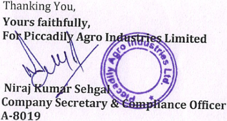
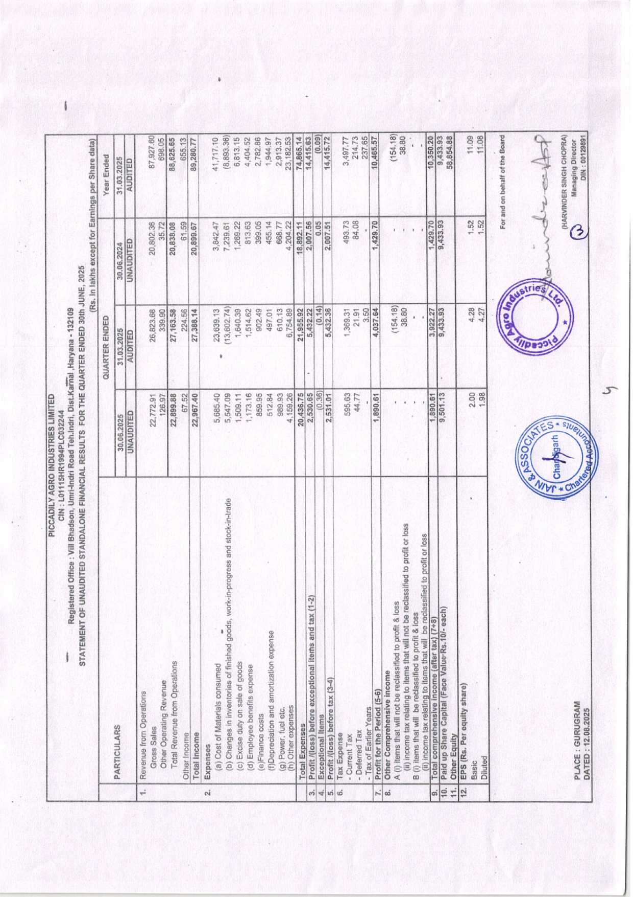
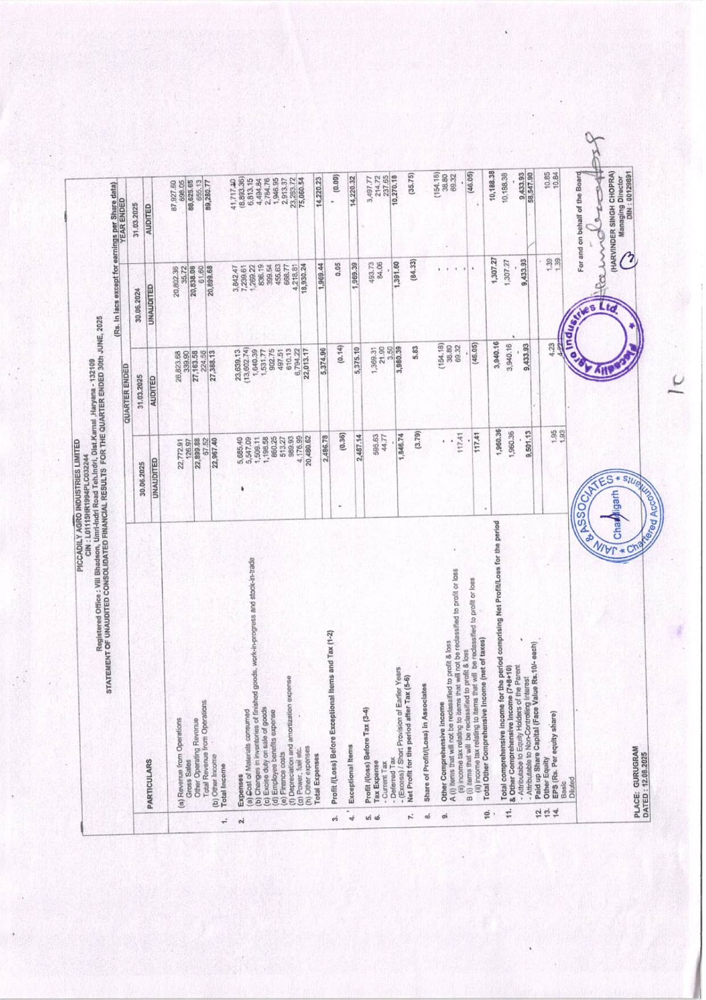

**[Image: June2025Result.pdf-0001-00.png (153x99, 26.4KB)]**

<!-- Start of picture text -->
per Fae PICICAIDLELS <!-- End of picture text -->

###### Dated: 12.08.2025 

To, BSE Ltd. Phiroze Jeejeeboy Towers Dalal Street Mumbai- 400001 ScripCode:530305 

> Bandra(E) Mumbai - 400051 To, National Stock Exchange of India Ltd. ExchangePlaza,5‘'Floor,Plotno.C/1, 

> G Block, Bandra- Kurla Complex, 

> Scrip code: PICCADIL 

##### Subject: Un-Audited Results for the quarter ended on 30th June, 2025 

##### Dear Sir/Madam, 

12.08.2024 hereby consider, discuss and approve the following Financial Results: Un-Audited Standalone and Consolidated Financial Results of the Company for the (Listing Obligations and Disclosure Requirements) Regulations, 2015, this is to inform you that the Board of Directors of the company in its meeting held today i.e. quarter ended on 30th June, 2025 Limited Review Report for the quarter ended on 30th June, 2025 Pursuant to Regulation 30 read with Part A of Schedule III and Regulation 33 of SEBI 

We are hereby enclosing Un-Audited Standalone and Consolidated Financial Results of the Company for the quarter ended on 30th June, 2025 along with Limited Review Report. 

at www.piccadily.com The said Board Meeting commenced at 20M and concluded at > YAM This is for information and record. The above-mentioned documents are also being disseminated on Company's website 

accordingly. We hereby request you to take note of the same and updated record of the company 

**[Image: June2025Result.pdf-0001-10.png (449x240, 200.3KB)]**

<!-- Start of picture text -->
Thanking  You, Yours  faithfully, FokPiccadily  Agro  es  Limited % wo mh N  &, Niraj  Kumar  Sehgak*s Company  Secretary  &€@mpfance  Officer A-8019 <!-- End of picture text -->

> Village Bhadson, Umri — Indri Road, Teh Indri, Distt. Karnal, Haryana-132109 (India) 

> Email: info piccadily.com CIN No.: LOITISHR1994PLC032244 

> Piccadily Agro Industries Ltd. Registered Office: Corporate Office: G-17, IMD Pacific Square, Sector-15 (Part-2), Gurugram, Haryana 122002 (India) 

> Ph.: +91-124-4300840, Website: www.piccadily.com, Administrative Office: 275-276, Captain Gaur Marg, Sriniwaspuri, New Delhi 110065 Investor Relations: Ph.: +9|-172-299765| 

## JAIN & ASSOCIATES CHARTERED ACCOUNTANTS 

#### S.C.O. 178, Sector-5, Panchkula, Haryana - 134109 Phone: 0172-2575761, 2575762 Email: jainassociatesca@gmail.com 

Independent Auditor’s review Report on the Quarterly Unaudited Standalone Financial Results of the Company Pursuant to Regulation 33 of the SEBI (Listing Obligations and Disclosure Requirements) Regulations, 2015, as amended. 

##### Review Report to The Board of Directors of Piccadily Agro Industries Limited 

- We have reviewed the accompanying Statement of unaudited standalone financial results (“the Statement”) of Piccadily Agro Industries Limited (“the Company”) for the quarter ended June 30, 2025, being submitted by the company pursuant to the requirements of Regulation 33 of the SEBI (Listing Obligation and Disclosure Requirements) Regulation 2015 as amended (the “Listing Regulations”). 

- This statement, which is the responsibility of the Company’s Management and approved by the Company's Board of Directors in their meeting held on 12° August, 2025 has been prepared in accordance with the recognition and measurement principles laid down in the Indian Accounting Standard 34 "Interim Financial Reporting" ("Ind AS 34"), prescribed under section 133 of the Companies Act, 2013 (“the Act”), read with relevant rules, as amended, read with the Circular, issued there under and other accounting principles generally accepted in India and is in compliance with the presentation and disclosure requirements of Regulation 33 of the Listing Regulations. Our responsibility is to issue a report on these financial statements based on our review. 

- We conducted our review of the statement in accordance with the Standard on Review Engagements (SRE) 2410, “Review of Interim Financial Information Performed by the Independent Auditor of the Entity’ issued by the Institute of Chartered Accountants of India. This standard requires that we plan and perform the review to obtain moderate assurance as to whether the financial statements are free of material misstatement. A review of Interim Financial information consists of making inquiries, primarily of persons responsible for financial and accounting matters, and applying analytical and other review procedures. A review is substantially less in scope than an audit conducted in accordance with Standards on Auditing specified under Section 143(10) of the Act, and consequently, does not enable us to obtain assurance that we would become aware of all significant matters that might be identified in an audit. Accordingly, we 

## JAIN & ASSOCIATES CHARTERED ACCOUNTANTS 

S.C.O. 178, Sector-5, Panchkula, Haryana - 134109 Phone: 0172-2575761, 2575762 Email: jainassociatesca@gmail.com 

- Based on our review conducted as above, nothing has come to our attention that causes us to believe that the accompanying statement, prepared in accordance with the recognition and laid down Indian Accounting Standards (‘Ind As’) 

- issued thereunder and other accounting principles generally accepted in India, has not disclosed is to be disclosed, or that it contains any material misstatement. measurement principles specified under section 133 of the Companies Act, 2013 as amended, read with relevant rules the information required to be disclosed in terms of Regulation 33 of SEBI (Listing Obligations and Disclosure Requirements) Regulations, 2015 (as amended) including the manner in which it in the aforesaid 

For Jain & Associates 

Place: GURUGRAM Dated: 12.08.2025 UDIN: 25513236BMJPNR2315 

Sener) ‘ Membership No. 513236 

**[Image: June2025Result.pdf-0004-00.png (1240x1754, 3495.2KB)]**

<!-- Start of picture text -->
ot) Fjid|  hm} | co 41,717.10  (8,893.36)  6,813.15  4,404.52  2,782.86  1,944.97  2,913.37  23,182.53 Income Total Ended Year (0.09)  (154.18) 38.80  00129891 14,415.63  : DIN 31,03.2025 20,838.08  61.59  0.05  2,007.51  1.52  4.52  © 30.06.2024 339.90  224.56  902.49  497.01  610.13  21.91  3.50  (154.18)  38.80 1,640.39  1,514.62  6,754.89  5,432.36  1,369.31  4,037.64 ENDED  26,823.68  27,163.58  27,388.14  23,639.13  (13,602.74) QUARTER 22,899.88  67.52  5,685.40  5,547.09  1,509.11  1,173.16  859.95  $12.84  989.93  4,159.26  20,436.75  (0.36) 2,531.04  595.63  44.77  1,890.61  1,890.61  9,501.13 30.06.2025 stock-in-trade and work-in-progress = goods, expense finished of goods of  expense Operations  consumed  amortization sale Revenue from  inventories  on  and benefits Operations  Materials  in  duty  costs  Items  Years from  Sales  Operating  Revenue  of  Tax  Tax  Earlier Income  Cost  Changes  Excise  Employee  Expenses  of Expense Gross  Other  Total  (a)  (b)  (c)  (d)  (e)Finance  (f)Depreciation Current  Deferred  Tax PARTICULARS  Revenue  Other  Expenses  Total  Exceptional  Tax  -  ~  ~ 10.  11.  1 ‘ share) equity Per (Rs. EPS 2025 JUNE, 30th ENDED QUARTER FOR THE RESULTS FINANCIAL STANDALONE UNAUDITED OF STATEMENT : Basic  Diluted 132109 - Haryana Dist-Karnal Teh.Indri, Road Umri-indri Bhadson, Vill : Office Registered 12.08.2025 : DATED LO1115HR1994PLC032244 : CIN PLACE LIMITED INDUSTRIES AGRO PICCADILY GURUGRAM : 5,432.22 each) Value-Rs.10/- (Face Capital Share up Paid fuel etc.  expenses Power,  Other (g)  (h) : Equity Other (1-2) tax and iterns exceptional before /(loss) Profit data) Share per Earnings for except lakhs In (Rs. UNAUDITED loss or  loss profit  or to  profit reclassified  to be  reclassified not  be will  will that  that items  items to  to relating  relating tax  tax income  income (ii)  (ii) 698.05  655.13 22,772.91 loss & profit to reclassified be not will that items (i) A 126.97 (7+8) tax) (after income comprehensive Total income Comprehensive Other 21,955.92 (3-4) tax before /(loss) Profit 87,927.60  88,625.65  89,280.77  74,865.14 loss & profit to reclassified be will that items (i) B AUDITED Director Managing 7,239.67  1,269.22  4,429.70 CHOPRA) SINGH (HARVINDER (5-6) Period the for Profit 3,497.77  214.73 237.65 3,842.47  813.63  399.05  455.14  668.77  4,204.22  9,433.93 UNAUDITED 493.73  84.08 Board the of 31.03.2025 behalf on and For 20,899.67 10,465.57 22,967.40 AUDITED 18,892.11 2,530.65  2.00  1.98 35.72  2,007.56  1,429.70 14,415.72 20,802.36 (0.14) <!-- End of picture text -->

| ,2025| YEARENDED   31.03.2025   AUDITED |24,950.10 63,675.55 655.13   89,280.77     89,280.77 |(327.13) 18,015.50 | 17,688.38   2,782.86 : 489.88 (0.09) | 14,415.72   |33,423.23 81,182.89 | 1,14,606.12   |11,683.77 31,164.68 3,468.86 | 46,317.31   donbehalfoftheBoard ae VINDERSINGHCHOPRA) ManagingDirector DIN ;:00129891|
|---|---|---|---|---|---|---|---|---|---|
| yana-132109 TERENDED30thJUNE|   30.06.2024   UNAUDITED |8,914.28 11,923.81 61.59   20,899.67     20,899.67 |3,004.03 (551.42) | 2,452.61   399.05 46.00 0.05 | 2,007.51   |4,923.25 64,873.93 | 69,797.18   |5,368.73 24,211.21 4,698.48 | 34,278.42       Foran c (HAR|
| SLIMITED 32244 ndri,Dist.Karnal,Har ONE)FORTHEQUAR| QUARTERENDED   31.03.2025   AUDITED |12,291.29 14,872.29 224.56   27,388.14     27,388.14 |1,334.95 5,332.14 | 6,667.07   902.49 332.37 (0.14 ) | 5,432.36   |33,423.23 81,182.89 | 1,14,606.12   |11,683.77 31,164.68 3,468.86 | 46,317.31 4     tion. |
| ILYAGROINDUSTRIE   :LO1115HR1994PLC0  Umri-indriRoadTeh.I LIABILITIES(STANDAL|   30.06.2025   UNAUDITED |6,616.74 16,283.13 67.52   22,967.40     22,967.40 |(432.04) 3,859.51 | 3,427.47   859.95 ’ 36.87 (0.36)   | 2,931.01     |31,045.53 87,441.87   | 1,18,487.39     |6,155.24 34,320.93 4,081.81   | 44,557.98       onfirmtothisperiod'sclassifica |
| PICCAD CIN RegisteredOffice:VillBhadson, SEGMENTREVENUE,RESULTSASSETSAND| Particulars |& SeqmentRevenue Sugar Distillery Others   Total   Less:InterSegementRevenue   TotaiRevenuefromOperations |B. SegmentResults Profit/(loss)(beforeunallocatedexpenditure, financecostandtax) Sugar Distillery Others   | Total   Less: i)FinanceCosts li)Otherunallocableexpenditurenetoff unallocatedincome iii)ExceptionalItem| ProfitBeforeTax |C.SegmentAssets Sugar Distillery OtherUnallocableAssets| Total |D.SegmentLiabilities Sugar Distillery OtherUnaillocableLiabilities| Total   Thepreviousperiod/year'sfigureshavebeenregroupedwherevernecessarytoc PLACE :GURUGRAM DATED :12.08.2025|

|||)Rules,2015 ingStandard)|2025and|oftheannual ||onbehalfoftheBoard DERSINGHCHOPRA) ManagingDirector - DIN :00129891 |
|---|---|---|---|---|---|---|
|||AccountingStandards nies(IndianAccount .|heldon12thAugust,|tberepresentative|’sclassification.|Forand ARVIN|
| PICCADILYAGROINDUSTRIESLTD.|NCIALRESULTS :|have beenpreparedinaccordancewithCompanies(Indian  oftheCompaniesAct,2013readwithrule3oftheCompa entsthereafter.|havebeenreviewedbytheAuditCommitteeintheirmeeting meetingheldon12thAugust,2025.|seasonalnature ,the’performance inanyquartermayno|beenregroupedwherevernecessarytoconfirmtothisperiod||
||FINA|results on133 mendm|esults ntheir|isof|have||
||ESTOTHESTANDALONE|abovestandalonefinancial  AS)prescribedunderSecti ,2015andotherrelevanta|abovestandalonefinancialr ovedbyBoardofDirectorsi|ofthebusinesssegment ormanceofthecompany.|previousperiod/year’sfigures|CE :GURUGRAM ED :12.08.2025|
||NOT|1The (Ind Rules|- 2The appr|3One perf|4The|PLA DAT|

JAIN & ASSOCIATES CHARTERED ACCOUNTANTS 

### S.C.O. 178, Sector-5, Panchkula, Haryana - 134109 Phone: 0172-2575761, 2575762 Email: jainassociatesca@gmail.com 

Independent Auditor’s Limited Review Report on the Quarterly Unaudited Consolidated Financial Results of the Company Pursuant to Regulation 33 of the SEBI (Listing Obligations and Disclosure Requirements) Regulations, 2015, as amended 

### Limited Review Report TO THE BOARD OF DIRECTORS OF PICCADILY AGRO INDUSTRIES LIMITED 

1. We have reviewed the accompanying statement of Consolidated Unaudited Financial Results (“the Statement”) of PICCADILY AGRO INDUSTRIES LIMITED (the “Holding Company”) its subsidiaries and associate for the quarter ended 30" June, 2025, attached herewith, being submitted by the Holding Company pursuant to the requirement of Regulation 33 of the SEBI (Listing Obligations and Disclosure Requirements) Regulations 2015, as amended (the “Listing Regulations’). 

2. This Statement, which is the responsibility of the Holding Company’s Management and approved by the Holding Company's Board of Directors, has been prepared in accordance with the recognition and measurement principles laid down in Indian Accounting Standard 34 "Interim Financial Reporting" prescribed under section 133 of the Companies Act, 2013, as amended read with the relevant rules issued there under and other accounting principles generally accepted in India. Our responsibility is to express a conclusion on the Statement based on our review. 

3. We conducted our review of the Statement in accordance with the Standard on Review Engagements (SRE) 2410 "Review of Interim Financial Information Performed by the Independent Auditor of the Entity’, issued by the Institute of Chartered Accountants of India. This standard requires that we plan and perform the review to obtain moderate assurance as to whether the financial statements are free of material misstatement. A review of interim financial information consists of making inquiries, primarily of persons responsible for financial and accounting matters, and applying analytical and other review procedures. A review is substantially less in scope than an audit conducted in accordance with Standards on Auditing specifiedunderSection143(10)oftheActand 

# JAIN & ASSOCIATES CHARTERED ACCOUNTANTS 

### S.C.O. 178, Sector-5, Panchkula, Haryana - 134109 Phone: 0172-2575761, 2575762 Email: jainassociatesca@gmail.com 

consequently does not enable us to obtain assurance that we would become aware of all significant matters that might be identified in an audit. Accordingly, we do not express an audit opinion. 

We also performed procedures in accordance with the circular issued by the SEBI under Regulation 33 (8) of the Listing Regulations, to the extent applicable. 

- 4, The Statement includes the results of the following entities: Subsidiaries: 

   - a) Portavadie Distillers & Blenders Limited (United Kingdom) 

   - b) Six Trees Drinks Private Limited 

###### Associate: 

a) Piccadily Sugar & Allied Industries Limited 

5. Based on our review conducted and procedures performed as stated in paragraph 3 above and based on the consideration of the review reports of the other auditors referred to in paragraph 6 below, nothing has come to our attention that causes us to believe that the accompanying Statement, prepared in accordance with the recognition and measurement principles laid down in the aforesaid Indian Accounting Standards (‘Ind As’) specified under section 133 of the Companies Act, 2013 as amended, read with relevant rules issued thereunder and other accounting principles generally accepted in India, has not disclosed the information required to be disclosed in terms of Regulation 33 of the SEBI (Listing Obligations and Disclosure Requirements) Regulations, 2015, as amended, including the manner in which it is to be disclosed, or that it contains any material misstatement. 

6. We did not review the interim financial results, which have been prepared by the management, of one subsidiary included in the unaudited consolidated financial results whose interim financial results reflect total revenue of Rs. 0, total net profit after tax of 

JAIN & ASSOCIATES CHARTERED ACCOUNTANTS 

### S.C.O. 178, Sector-5, Panchkula, Haryana - 134109 Phone: 0172-2575761, 2575762 Email: jainassociatesca@gmail.com 

Rs. (43.87) lacs and total comprehensive income of Rs. 73.54 lacs for the quarter ended June 30" 2025 as considered in the statement. 

Our conclusion is not modified in respect of this matter with respect to our reliance on the work done by and the reports of the other auditor. 

For Jain & Associates 

Place: GURUGRAM Dated: 12.08.2025 UDIN: 25513236BMJPNS4998 

’ (Partner) Membership No. 513236 

**[Image: June2025Result.pdf-0010-00.png (1240x1754, 3347.4KB)]**

<!-- Start of picture text -->
a  ¢  we  re 41,717.40 (8,893.36) 6,813.15 4,494.84  2,784.76 1,946.95 2,913.37 |23,283.72 1.39  1.39 10,  14.  12.  13.  14. (0.09) * 4,307.27  1,307.27 5,374.96 493.73 84.06 20,802.36 36.72 75,060.54 22,013.17 ENDED YEAR 8,784.22 (84.33) 1,969.44  1,391.60 data) Share per lacs In Rs. earnings for 2025 JUNE, 30th ENDED QUARTER THE FOR RESULTS FINANCIAL CONSOLIDATED UNAUDITED OF STATEMENT 152508 - Haryana Dist.Kamal Teh.Indri, Road Umri-indri Bhadson, Vill : Office Registered 20,899.68  18,930.24 (35.75) AUDITED 89,280.77  14,220.23 10,270.18 behalf on and For loss or profit to reclassified be will that items to relating tax Income iii) Revenue  ~ Operating Other stock-in-trade and work-in-progress goods, finished of inventories in Ghanges {b) loss or profil to reclassified be not will that items to relating tax income (i) loss & profit to reclassified be will that Income tems Other (b)  (i) 8 Income Total Revenue Total taxes) of (net Income Comprehensive Other Total Operations from Sales Gross Board the of Operations from Revenue (a) LIMITED INDUSTRIES AGRO PICCADILY LO1145HR1994PLC032244 : CIN period the for ProfitiLoss Net comprising period for the income comprehensive Total 9,433.93 Attributabe ~ Attributable - (1-2) Tax and Items Exceptional Before (Loss) Profit Interest Non-Controliing to (7+8+10) Income Comprehensive Other & Associates in Profit/(Loss) of Share Parent the of Holders Equity to each) Rs.10/- Value (Face Capital Share up Paid share) equity Per (Rs. EPS Tax Deferred - Expense Tax GURUGRAM PLACE; expense amortization and costs Finance Depreciation (e)  (f) Power, (a) Expenses. Total 214,72 etc. fuel 12.08.2025 : DATED expenses Other (h) 3,497.77 Tax Current - (5-6) Tax after period for the Profit Net goods of sale on duty Excise (c) (3-4) Tax Before /(loss) Profit 237,65 expense benefits Employee (d) Years Earlier of Provision Short / (Excess) - (154.18) Items Exceptional PARTICULARS  Expenses  "| consumed Malerials of Gost (a) 909.20 | 87,927.60 698.05 14,220.32 30.06.2024 3,842.47 7,239.61 4,269.22  836.19 399.54 455.63 668.77 4,218.81 88,625.65 655.13 20,838.08 61,60 (0.14) 31.03.2025 5,375.10 Basic Diluted 0.05 <!-- End of picture text -->

| -132409  ENDED30thJUNE,2025| YEARENDED   30.06.2024 31.03.2025   UNAUDITED AUDITED | 8,914.28 11,923.81 61.59 24,950.10 63,675.55 655.13   20,899.68 89,280.77     20,899.68 89,280.77 |(551.42) 2,966.41 (327.13) 17,822.00   2,414.99 17,494.87   399.54 46.00 0.05 2,784.76 489.88 (0.09)   1,969.39 14,220.32   | 4,923.25 64,882.13 33,423.23 81,014.25   69,805.38 1,14,437.49   5,368.73 24,458.24 4,698.42  11,683.77 31,276.09 3,468.79   34,525.38 46,428.66 |coind Seet ForandonbehalfoftheBoard ManagingDirector DIN :00129891 |
|---|---|---|---|---|---|
| RIESLIMITED C032244 eh.Indri,Dist.Karnal,Haryana LIDATED)FORTHEQUARTER| QUARTERENDED   31.03.2025   AUDITED | 12,291.29 14,872.29 224.56   27,388.13     27,388.13 |1,334.95 §,275.12   6,610.07   902.75 332.36 (0.14)   5,375.10     | 33,423.23 81,014.25   1,14,437.49   11,683.77 31,276.09 3,468.79     © 46,428.66    |period'sclassification. |
| PIGCADILYAGROINDUST ’ CIN :LO1115HR1994PL lBhadson,Umri-IndriRoadT TSANDLIABILITIES(CONSO|   30.06.2025   UNAUDITED | 6,616.74 16,283.13 67.52   22,967.40     22,967.40 |(432.04) 3,815.93   3,383.50   860.25 36.87 (0.36)   2,487.14     | 31,045.53 87,368.26   1,18,413.79   6,155.24 34,457.63 4,081.74     44,694.61    |ernecessarytoconfirmtothis |
| Registered-@ffice :Vil SEGMENTREVENUE,RESULTS,ASSE| PARTICULARS     | A. SegmentRevenue Sugar Distillery Others   Total     Less:InterSegementRevenue NetSegmentRevenue |B. SegmentResults(ProfitbeforeInterestandTax) Sugar Distillery .Others   Total   Less: i)InterestandFinanceCharges(Net) ii)Otherunallocableexpenditure(netofunallocableincome) iii)ExceptionalItem   Profit(Loss)BeforeTax     | Cc.SegmentAssets Sugar Distillery OtherUnallocableAssets     SegmentAssetsfromContinuingOperations D.SegmentLiabilities : Sugar Distillery OtherUnallocablieliabilities   SegmentLiabilitiesfromContinuingOperations        |PLACE:GURUGRAM DATED:12.08.2025 4.Thepreviousperiod/year’sfigureshavebeenregroupedwherev   |

| LTD.   TD.|Companies(IndianAccountingStandards)Rules,2015(Ind  Companies(IndianAccountingStandard)Rules,2015and ntheirmeetingheldon12thAugust,2025andapprovedby, notberepresentativeoftheannualperformanceofthe tothisperiod’sclassification. ; |ForandonbehalfoftheBoard (HarvinderSinghChopra) ManagingDirector DINNO. :00129891 & |
|---|---|---|
| ICCADILYAGROINDUSTRIES  PICCADILY AGROINDUSTRIESL|NOTESTOTHECONSOLIDATEDFINANCIALRESULTS : 4TheaboveCONSOLIDATEDfinancialresultshavebeenpreparedinaccordancewith AS)prescribedunderSection133oftheCompaniesAct,2013readwithrule3.ofthe otherrelevantamendmentsthereafter. 2TheaboveconsolidatedfinancialresultshavebeenreviewedbytheAuditCommittee,i BoardofDirectorsintheirmeetingheldon12thAugust,2025. 3Oneofthebusinesssegmentisofseasonalnature,theperformanceinanyquartermay company. 4Thepreviousperiod/year'sfigureshave beenregroupedwherevernecessarytoconfirm|PLACE :GURUGRAM DATED :12.08.2025 ;|

**[Image: June2025Result.pdf-0013-00.png (153x99, 26.4KB)]**

<!-- Start of picture text -->
per Fae PICICAIDLELS <!-- End of picture text -->

###### Dated: 12.08.2025 

To, BSE Ltd. Phiroze Jeejeeboy Towers Dalal Street Mumbai- 400001 ScripCode:530305 

> Bandra(E) Mumbai - 400051 To, National Stock Exchange of India Ltd. ExchangePlaza,5‘'Floor,Plotno.C/1, 

> G Block, Bandra- Kurla Complex, 

> Scrip code: PICCADIL 

##### Subject: Un-Audited Results for the quarter ended on 30th June, 2025 

##### Dear Sir/Madam, 

12.08.2024 hereby consider, discuss and approve the following Financial Results: Un-Audited Standalone and Consolidated Financial Results of the Company for the (Listing Obligations and Disclosure Requirements) Regulations, 2015, this is to inform you that the Board of Directors of the company in its meeting held today i.e. quarter ended on 30th June, 2025 Limited Review Report for the quarter ended on 30th June, 2025 Pursuant to Regulation 30 read with Part A of Schedule III and Regulation 33 of SEBI 

We are hereby enclosing Un-Audited Standalone and Consolidated Financial Results of the Company for the quarter ended on 30th June, 2025 along with Limited Review Report. 

at www.piccadily.com The said Board Meeting commenced at 20M and concluded at > YAM This is for information and record. The above-mentioned documents are also being disseminated on Company's website 

accordingly. We hereby request you to take note of the same and updated record of the company 

**[Image: June2025Result.pdf-0013-10.png (449x240, 200.3KB)]**

<!-- Start of picture text -->
Thanking  You, Yours  faithfully, FokPiccadily  Agro  es  Limited % wo mh N  &, Niraj  Kumar  Sehgak*s Company  Secretary  &€@mpfance  Officer A-8019 <!-- End of picture text -->

> Village Bhadson, Umri — Indri Road, Teh Indri, Distt. Karnal, Haryana-132109 (India) 

> Email: info piccadily.com CIN No.: LOITISHR1994PLC032244 

> Piccadily Agro Industries Ltd. Registered Office: Corporate Office: G-17, IMD Pacific Square, Sector-15 (Part-2), Gurugram, Haryana 122002 (India) 

> Ph.: +91-124-4300840, Website: www.piccadily.com, Administrative Office: 275-276, Captain Gaur Marg, Sriniwaspuri, New Delhi 110065 Investor Relations: Ph.: +9|-172-299765| 

## JAIN & ASSOCIATES CHARTERED ACCOUNTANTS 

#### S.C.O. 178, Sector-5, Panchkula, Haryana - 134109 Phone: 0172-2575761, 2575762 Email: jainassociatesca@gmail.com 

Independent Auditor’s review Report on the Quarterly Unaudited Standalone Financial Results of the Company Pursuant to Regulation 33 of the SEBI (Listing Obligations and Disclosure Requirements) Regulations, 2015, as amended. 

##### Review Report to The Board of Directors of Piccadily Agro Industries Limited 

- We have reviewed the accompanying Statement of unaudited standalone financial results (“the Statement”) of Piccadily Agro Industries Limited (“the Company”) for the quarter ended June 30, 2025, being submitted by the company pursuant to the requirements of Regulation 33 of the SEBI (Listing Obligation and Disclosure Requirements) Regulation 2015 as amended (the “Listing Regulations”). 

- This statement, which is the responsibility of the Company’s Management and approved by the Company's Board of Directors in their meeting held on 12° August, 2025 has been prepared in accordance with the recognition and measurement principles laid down in the Indian Accounting Standard 34 "Interim Financial Reporting" ("Ind AS 34"), prescribed under section 133 of the Companies Act, 2013 (“the Act”), read with relevant rules, as amended, read with the Circular, issued there under and other accounting principles generally accepted in India and is in compliance with the presentation and disclosure requirements of Regulation 33 of the Listing Regulations. Our responsibility is to issue a report on these financial statements based on our review. 

- We conducted our review of the statement in accordance with the Standard on Review Engagements (SRE) 2410, “Review of Interim Financial Information Performed by the Independent Auditor of the Entity’ issued by the Institute of Chartered Accountants of India. This standard requires that we plan and perform the review to obtain moderate assurance as to whether the financial statements are free of material misstatement. A review of Interim Financial information consists of making inquiries, primarily of persons responsible for financial and accounting matters, and applying analytical and other review procedures. A review is substantially less in scope than an audit conducted in accordance with Standards on Auditing specified under Section 143(10) of the Act, and consequently, does not enable us to obtain assurance that we would become aware of all significant matters that might be identified in an audit. Accordingly, we 

## JAIN & ASSOCIATES CHARTERED ACCOUNTANTS 

S.C.O. 178, Sector-5, Panchkula, Haryana - 134109 Phone: 0172-2575761, 2575762 Email: jainassociatesca@gmail.com 

- Based on our review conducted as above, nothing has come to our attention that causes us to believe that the accompanying statement, prepared in accordance with the recognition and laid down Indian Accounting Standards (‘Ind As’) 

- issued thereunder and other accounting principles generally accepted in India, has not disclosed is to be disclosed, or that it contains any material misstatement. measurement principles specified under section 133 of the Companies Act, 2013 as amended, read with relevant rules the information required to be disclosed in terms of Regulation 33 of SEBI (Listing Obligations and Disclosure Requirements) Regulations, 2015 (as amended) including the manner in which it in the aforesaid 

For Jain & Associates 

Place: GURUGRAM Dated: 12.08.2025 UDIN: 25513236BMJPNR2315 

Sener) ‘ Membership No. 513236 

**[Image: June2025Result.pdf-0016-00.png (1240x1754, 3495.2KB)]**

<!-- Start of picture text -->
ot) Fjid|  hm} | co 41,717.10  (8,893.36)  6,813.15  4,404.52  2,782.86  1,944.97  2,913.37  23,182.53 Income Total Ended Year (0.09)  (154.18) 38.80  00129891 14,415.63  : DIN 31,03.2025 20,838.08  61.59  0.05  2,007.51  1.52  4.52  © 30.06.2024 339.90  224.56  902.49  497.01  610.13  21.91  3.50  (154.18)  38.80 1,640.39  1,514.62  6,754.89  5,432.36  1,369.31  4,037.64 ENDED  26,823.68  27,163.58  27,388.14  23,639.13  (13,602.74) QUARTER 22,899.88  67.52  5,685.40  5,547.09  1,509.11  1,173.16  859.95  $12.84  989.93  4,159.26  20,436.75  (0.36) 2,531.04  595.63  44.77  1,890.61  1,890.61  9,501.13 30.06.2025 stock-in-trade and work-in-progress = goods, expense finished of goods of  expense Operations  consumed  amortization sale Revenue from  inventories  on  and benefits Operations  Materials  in  duty  costs  Items  Years from  Sales  Operating  Revenue  of  Tax  Tax  Earlier Income  Cost  Changes  Excise  Employee  Expenses  of Expense Gross  Other  Total  (a)  (b)  (c)  (d)  (e)Finance  (f)Depreciation Current  Deferred  Tax PARTICULARS  Revenue  Other  Expenses  Total  Exceptional  Tax  -  ~  ~ 10.  11.  1 ‘ share) equity Per (Rs. EPS 2025 JUNE, 30th ENDED QUARTER FOR THE RESULTS FINANCIAL STANDALONE UNAUDITED OF STATEMENT : Basic  Diluted 132109 - Haryana Dist-Karnal Teh.Indri, Road Umri-indri Bhadson, Vill : Office Registered 12.08.2025 : DATED LO1115HR1994PLC032244 : CIN PLACE LIMITED INDUSTRIES AGRO PICCADILY GURUGRAM : 5,432.22 each) Value-Rs.10/- (Face Capital Share up Paid fuel etc.  expenses Power,  Other (g)  (h) : Equity Other (1-2) tax and iterns exceptional before /(loss) Profit data) Share per Earnings for except lakhs In (Rs. UNAUDITED loss or  loss profit  or to  profit reclassified  to be  reclassified not  be will  will that  that items  items to  to relating  relating tax  tax income  income (ii)  (ii) 698.05  655.13 22,772.91 loss & profit to reclassified be not will that items (i) A 126.97 (7+8) tax) (after income comprehensive Total income Comprehensive Other 21,955.92 (3-4) tax before /(loss) Profit 87,927.60  88,625.65  89,280.77  74,865.14 loss & profit to reclassified be will that items (i) B AUDITED Director Managing 7,239.67  1,269.22  4,429.70 CHOPRA) SINGH (HARVINDER (5-6) Period the for Profit 3,497.77  214.73 237.65 3,842.47  813.63  399.05  455.14  668.77  4,204.22  9,433.93 UNAUDITED 493.73  84.08 Board the of 31.03.2025 behalf on and For 20,899.67 10,465.57 22,967.40 AUDITED 18,892.11 2,530.65  2.00  1.98 35.72  2,007.56  1,429.70 14,415.72 20,802.36 (0.14) <!-- End of picture text -->

| ,2025| YEARENDED   31.03.2025   AUDITED |24,950.10 63,675.55 655.13   89,280.77     89,280.77 |(327.13) 18,015.50 | 17,688.38   2,782.86 : 489.88 (0.09) | 14,415.72   |33,423.23 81,182.89 | 1,14,606.12   |11,683.77 31,164.68 3,468.86 | 46,317.31   donbehalfoftheBoard ae VINDERSINGHCHOPRA) ManagingDirector DIN ;:00129891|
|---|---|---|---|---|---|---|---|---|---|
| yana-132109 TERENDED30thJUNE|   30.06.2024   UNAUDITED |8,914.28 11,923.81 61.59   20,899.67     20,899.67 |3,004.03 (551.42) | 2,452.61   399.05 46.00 0.05 | 2,007.51   |4,923.25 64,873.93 | 69,797.18   |5,368.73 24,211.21 4,698.48 | 34,278.42       Foran c (HAR|
| SLIMITED 32244 ndri,Dist.Karnal,Har ONE)FORTHEQUAR| QUARTERENDED   31.03.2025   AUDITED |12,291.29 14,872.29 224.56   27,388.14     27,388.14 |1,334.95 5,332.14 | 6,667.07   902.49 332.37 (0.14 ) | 5,432.36   |33,423.23 81,182.89 | 1,14,606.12   |11,683.77 31,164.68 3,468.86 | 46,317.31 4     tion. |
| ILYAGROINDUSTRIE   :LO1115HR1994PLC0  Umri-indriRoadTeh.I LIABILITIES(STANDAL|   30.06.2025   UNAUDITED |6,616.74 16,283.13 67.52   22,967.40     22,967.40 |(432.04) 3,859.51 | 3,427.47   859.95 ’ 36.87 (0.36)   | 2,931.01     |31,045.53 87,441.87   | 1,18,487.39     |6,155.24 34,320.93 4,081.81   | 44,557.98       onfirmtothisperiod'sclassifica |
| PICCAD CIN RegisteredOffice:VillBhadson, SEGMENTREVENUE,RESULTSASSETSAND| Particulars |& SeqmentRevenue Sugar Distillery Others   Total   Less:InterSegementRevenue   TotaiRevenuefromOperations |B. SegmentResults Profit/(loss)(beforeunallocatedexpenditure, financecostandtax) Sugar Distillery Others   | Total   Less: i)FinanceCosts li)Otherunallocableexpenditurenetoff unallocatedincome iii)ExceptionalItem| ProfitBeforeTax |C.SegmentAssets Sugar Distillery OtherUnallocableAssets| Total |D.SegmentLiabilities Sugar Distillery OtherUnaillocableLiabilities| Total   Thepreviousperiod/year'sfigureshavebeenregroupedwherevernecessarytoc PLACE :GURUGRAM DATED :12.08.2025|

|||)Rules,2015 ingStandard)|2025and|oftheannual ||onbehalfoftheBoard DERSINGHCHOPRA) ManagingDirector - DIN :00129891 |
|---|---|---|---|---|---|---|
|||AccountingStandards nies(IndianAccount .|heldon12thAugust,|tberepresentative|’sclassification.|Forand ARVIN|
| PICCADILYAGROINDUSTRIESLTD.|NCIALRESULTS :|have beenpreparedinaccordancewithCompanies(Indian  oftheCompaniesAct,2013readwithrule3oftheCompa entsthereafter.|havebeenreviewedbytheAuditCommitteeintheirmeeting meetingheldon12thAugust,2025.|seasonalnature ,the’performance inanyquartermayno|beenregroupedwherevernecessarytoconfirmtothisperiod||
||FINA|results on133 mendm|esults ntheir|isof|have||
||ESTOTHESTANDALONE|abovestandalonefinancial  AS)prescribedunderSecti ,2015andotherrelevanta|abovestandalonefinancialr ovedbyBoardofDirectorsi|ofthebusinesssegment ormanceofthecompany.|previousperiod/year’sfigures|CE :GURUGRAM ED :12.08.2025|
||NOT|1The (Ind Rules|- 2The appr|3One perf|4The|PLA DAT|

JAIN & ASSOCIATES CHARTERED ACCOUNTANTS 

### S.C.O. 178, Sector-5, Panchkula, Haryana - 134109 Phone: 0172-2575761, 2575762 Email: jainassociatesca@gmail.com 

Independent Auditor’s Limited Review Report on the Quarterly Unaudited Consolidated Financial Results of the Company Pursuant to Regulation 33 of the SEBI (Listing Obligations and Disclosure Requirements) Regulations, 2015, as amended 

### Limited Review Report TO THE BOARD OF DIRECTORS OF PICCADILY AGRO INDUSTRIES LIMITED 

1. We have reviewed the accompanying statement of Consolidated Unaudited Financial Results (“the Statement”) of PICCADILY AGRO INDUSTRIES LIMITED (the “Holding Company”) its subsidiaries and associate for the quarter ended 30" June, 2025, attached herewith, being submitted by the Holding Company pursuant to the requirement of Regulation 33 of the SEBI (Listing Obligations and Disclosure Requirements) Regulations 2015, as amended (the “Listing Regulations’). 

2. This Statement, which is the responsibility of the Holding Company’s Management and approved by the Holding Company's Board of Directors, has been prepared in accordance with the recognition and measurement principles laid down in Indian Accounting Standard 34 "Interim Financial Reporting" prescribed under section 133 of the Companies Act, 2013, as amended read with the relevant rules issued there under and other accounting principles generally accepted in India. Our responsibility is to express a conclusion on the Statement based on our review. 

3. We conducted our review of the Statement in accordance with the Standard on Review Engagements (SRE) 2410 "Review of Interim Financial Information Performed by the Independent Auditor of the Entity’, issued by the Institute of Chartered Accountants of India. This standard requires that we plan and perform the review to obtain moderate assurance as to whether the financial statements are free of material misstatement. A review of interim financial information consists of making inquiries, primarily of persons responsible for financial and accounting matters, and applying analytical and other review procedures. A review is substantially less in scope than an audit conducted in accordance with Standards on Auditing specifiedunderSection143(10)oftheActand 

# JAIN & ASSOCIATES CHARTERED ACCOUNTANTS 

### S.C.O. 178, Sector-5, Panchkula, Haryana - 134109 Phone: 0172-2575761, 2575762 Email: jainassociatesca@gmail.com 

consequently does not enable us to obtain assurance that we would become aware of all significant matters that might be identified in an audit. Accordingly, we do not express an audit opinion. 

We also performed procedures in accordance with the circular issued by the SEBI under Regulation 33 (8) of the Listing Regulations, to the extent applicable. 

- 4, The Statement includes the results of the following entities: Subsidiaries: 

   - a) Portavadie Distillers & Blenders Limited (United Kingdom) 

   - b) Six Trees Drinks Private Limited 

###### Associate: 

a) Piccadily Sugar & Allied Industries Limited 

5. Based on our review conducted and procedures performed as stated in paragraph 3 above and based on the consideration of the review reports of the other auditors referred to in paragraph 6 below, nothing has come to our attention that causes us to believe that the accompanying Statement, prepared in accordance with the recognition and measurement principles laid down in the aforesaid Indian Accounting Standards (‘Ind As’) specified under section 133 of the Companies Act, 2013 as amended, read with relevant rules issued thereunder and other accounting principles generally accepted in India, has not disclosed the information required to be disclosed in terms of Regulation 33 of the SEBI (Listing Obligations and Disclosure Requirements) Regulations, 2015, as amended, including the manner in which it is to be disclosed, or that it contains any material misstatement. 

6. We did not review the interim financial results, which have been prepared by the management, of one subsidiary included in the unaudited consolidated financial results whose interim financial results reflect total revenue of Rs. 0, total net profit after tax of 

JAIN & ASSOCIATES CHARTERED ACCOUNTANTS 

### S.C.O. 178, Sector-5, Panchkula, Haryana - 134109 Phone: 0172-2575761, 2575762 Email: jainassociatesca@gmail.com 

Rs. (43.87) lacs and total comprehensive income of Rs. 73.54 lacs for the quarter ended June 30" 2025 as considered in the statement. 

Our conclusion is not modified in respect of this matter with respect to our reliance on the work done by and the reports of the other auditor. 

For Jain & Associates 

Place: GURUGRAM Dated: 12.08.2025 UDIN: 25513236BMJPNS4998 

’ (Partner) Membership No. 513236 

**[Image: June2025Result.pdf-0022-00.png (1240x1754, 3347.4KB)]**

<!-- Start of picture text -->
a  ¢  we  re 41,717.40 (8,893.36) 6,813.15 4,494.84  2,784.76 1,946.95 2,913.37 |23,283.72 1.39  1.39 10,  14.  12.  13.  14. (0.09) * 4,307.27  1,307.27 5,374.96 493.73 84.06 20,802.36 36.72 75,060.54 22,013.17 ENDED YEAR 8,784.22 (84.33) 1,969.44  1,391.60 data) Share per lacs In Rs. earnings for 2025 JUNE, 30th ENDED QUARTER THE FOR RESULTS FINANCIAL CONSOLIDATED UNAUDITED OF STATEMENT 152508 - Haryana Dist.Kamal Teh.Indri, Road Umri-indri Bhadson, Vill : Office Registered 20,899.68  18,930.24 (35.75) AUDITED 89,280.77  14,220.23 10,270.18 behalf on and For loss or profit to reclassified be will that items to relating tax Income iii) Revenue  ~ Operating Other stock-in-trade and work-in-progress goods, finished of inventories in Ghanges {b) loss or profil to reclassified be not will that items to relating tax income (i) loss & profit to reclassified be will that Income tems Other (b)  (i) 8 Income Total Revenue Total taxes) of (net Income Comprehensive Other Total Operations from Sales Gross Board the of Operations from Revenue (a) LIMITED INDUSTRIES AGRO PICCADILY LO1145HR1994PLC032244 : CIN period the for ProfitiLoss Net comprising period for the income comprehensive Total 9,433.93 Attributabe ~ Attributable - (1-2) Tax and Items Exceptional Before (Loss) Profit Interest Non-Controliing to (7+8+10) Income Comprehensive Other & Associates in Profit/(Loss) of Share Parent the of Holders Equity to each) Rs.10/- Value (Face Capital Share up Paid share) equity Per (Rs. EPS Tax Deferred - Expense Tax GURUGRAM PLACE; expense amortization and costs Finance Depreciation (e)  (f) Power, (a) Expenses. Total 214,72 etc. fuel 12.08.2025 : DATED expenses Other (h) 3,497.77 Tax Current - (5-6) Tax after period for the Profit Net goods of sale on duty Excise (c) (3-4) Tax Before /(loss) Profit 237,65 expense benefits Employee (d) Years Earlier of Provision Short / (Excess) - (154.18) Items Exceptional PARTICULARS  Expenses  "| consumed Malerials of Gost (a) 909.20 | 87,927.60 698.05 14,220.32 30.06.2024 3,842.47 7,239.61 4,269.22  836.19 399.54 455.63 668.77 4,218.81 88,625.65 655.13 20,838.08 61,60 (0.14) 31.03.2025 5,375.10 Basic Diluted 0.05 <!-- End of picture text -->

| -132409  ENDED30thJUNE,2025| YEARENDED   30.06.2024 31.03.2025   UNAUDITED AUDITED | 8,914.28 11,923.81 61.59 24,950.10 63,675.55 655.13   20,899.68 89,280.77     20,899.68 89,280.77 |(551.42) 2,966.41 (327.13) 17,822.00   2,414.99 17,494.87   399.54 46.00 0.05 2,784.76 489.88 (0.09)   1,969.39 14,220.32   | 4,923.25 64,882.13 33,423.23 81,014.25   69,805.38 1,14,437.49   5,368.73 24,458.24 4,698.42  11,683.77 31,276.09 3,468.79   34,525.38 46,428.66 |coind Seet ForandonbehalfoftheBoard ManagingDirector DIN :00129891 |
|---|---|---|---|---|---|
| RIESLIMITED C032244 eh.Indri,Dist.Karnal,Haryana LIDATED)FORTHEQUARTER| QUARTERENDED   31.03.2025   AUDITED | 12,291.29 14,872.29 224.56   27,388.13     27,388.13 |1,334.95 §,275.12   6,610.07   902.75 332.36 (0.14)   5,375.10     | 33,423.23 81,014.25   1,14,437.49   11,683.77 31,276.09 3,468.79     © 46,428.66    |period'sclassification. |
| PIGCADILYAGROINDUST ’ CIN :LO1115HR1994PL lBhadson,Umri-IndriRoadT TSANDLIABILITIES(CONSO|   30.06.2025   UNAUDITED | 6,616.74 16,283.13 67.52   22,967.40     22,967.40 |(432.04) 3,815.93   3,383.50   860.25 36.87 (0.36)   2,487.14     | 31,045.53 87,368.26   1,18,413.79   6,155.24 34,457.63 4,081.74     44,694.61    |ernecessarytoconfirmtothis |
| Registered-@ffice :Vil SEGMENTREVENUE,RESULTS,ASSE| PARTICULARS     | A. SegmentRevenue Sugar Distillery Others   Total     Less:InterSegementRevenue NetSegmentRevenue |B. SegmentResults(ProfitbeforeInterestandTax) Sugar Distillery .Others   Total   Less: i)InterestandFinanceCharges(Net) ii)Otherunallocableexpenditure(netofunallocableincome) iii)ExceptionalItem   Profit(Loss)BeforeTax     | Cc.SegmentAssets Sugar Distillery OtherUnallocableAssets     SegmentAssetsfromContinuingOperations D.SegmentLiabilities : Sugar Distillery OtherUnallocablieliabilities   SegmentLiabilitiesfromContinuingOperations        |PLACE:GURUGRAM DATED:12.08.2025 4.Thepreviousperiod/year’sfigureshavebeenregroupedwherev   |

| LTD.   TD.|Companies(IndianAccountingStandards)Rules,2015(Ind  Companies(IndianAccountingStandard)Rules,2015and ntheirmeetingheldon12thAugust,2025andapprovedby, notberepresentativeoftheannualperformanceofthe tothisperiod’sclassification. ; |ForandonbehalfoftheBoard (HarvinderSinghChopra) ManagingDirector DINNO. :00129891 & |
|---|---|---|
| ICCADILYAGROINDUSTRIES  PICCADILY AGROINDUSTRIESL|NOTESTOTHECONSOLIDATEDFINANCIALRESULTS : 4TheaboveCONSOLIDATEDfinancialresultshavebeenpreparedinaccordancewith AS)prescribedunderSection133oftheCompaniesAct,2013readwithrule3.ofthe otherrelevantamendmentsthereafter. 2TheaboveconsolidatedfinancialresultshavebeenreviewedbytheAuditCommittee,i BoardofDirectorsintheirmeetingheldon12thAugust,2025. 3Oneofthebusinesssegmentisofseasonalnature,theperformanceinanyquartermay company. 4Thepreviousperiod/year'sfigureshave beenregroupedwherevernecessarytoconfirm|PLACE :GURUGRAM DATED :12.08.2025 ;|

---

## Extracted Images

| # | File | Dimensions | Size |
|---|------|------------|------|
| 1 | June2025Result.pdf-0001-00.png | 153x99 | 26.4KB |
| 2 | June2025Result.pdf-0001-10.png | 449x240 | 200.3KB |
| 3 | June2025Result.pdf-0004-00.png | 1240x1754 | 3495.2KB |
| 4 | June2025Result.pdf-0010-00.png | 1240x1754 | 3347.4KB |
| 5 | June2025Result.pdf-0013-00.png | 153x99 | 26.4KB |
| 6 | June2025Result.pdf-0013-10.png | 449x240 | 200.3KB |
| 7 | June2025Result.pdf-0016-00.png | 1240x1754 | 3495.2KB |
| 8 | June2025Result.pdf-0022-00.png | 1240x1754 | 3347.4KB |
